# Chapter 2: Exponents

This chapter covers the fundamental rules and applications of exponents in mathematics.

<!-- DIAGRAM_PLACEHOLDER: diagram -->

## Chapter Contents

| Section | Topic | Page |
| :--- | :--- | :--- |
| 2.1 | Introduction | 44 |
| 2.2 | Revision of exponent laws | 45 |
| 2.3 | Rational exponents | 50 |
| 2.4 | Exponential equations | 52 |
| 2.5 | Summary | 56 |

---

### Key Mathematical Concepts

In this chapter, you will work with expressions involving powers, such as:

*   **Exponent Laws:** Rules for simplifying expressions like $a^m \cdot a^n = a^{m+n}$ and $(a^m)^n = a^{m \cdot n}$.
*   **Rational Exponents:** Understanding roots as fractional exponents, e.g., $\sqrt[n]{a^m} = a^{\frac{m}{n}}$.
*   **Exponential Equations:** Solving for variables in the exponent, such as $a^x = a^y$, which implies $x = y$.

---

# 2. Exponents

## 2.1 Introduction

Exponential notation is a concise method used to represent a number multiplied by itself multiple times. This notation is essential in fields such as astronomy, engineering, computer programming, economics, and biology to manage extremely large or small values efficiently.

> **[Diagram Context - Textbook_Mathematics_Gr10_Number-patterns.pdf-0001-00.png]**
> The image shows a chapter number 3 with a blue circle and the word "chapter" written in white. The chapter is titled "Chapter 3" and is positioned at the top of the image. The chapter is designed to be easily understood by high school students, as indicated by the use of a simple, clear layout.

### Exponential Notation Structure

Exponents are also referred to as **indices** or **powers**. The structure of exponential notation is defined as follows:

$$a^n$$

Where:
*   $a$ is the **base**.
*   $n$ is the **exponent** or **index**.

For any real number $a$ ($a \in \mathbb{R}$) and natural number $n$ ($n \in \mathbb{N}$), the expression $a^n$ represents $a$ multiplied by itself $n$ times.

### Fundamental Identities

When working with exponents, keep the following identities in mind:

| Identity | Rule | Condition |
| :--- | :--- | :--- |
| 1. Definition | $a^n = a \times a \times a \times \dots \times a$ | ($n$ times), $a \in \mathbb{R}, n \in \mathbb{N}$ |
| 2. Zero Exponent | $a^0 = 1$ | $a \neq 0$ ($0^0$ is undefined) |
| 3. Negative Exponent | $a^{-n} = \frac{1}{a^n}$ | $a \neq 0$ ($\frac{1}{0}$ is undefined) |
| 4. Reciprocal | $\frac{1}{a^{-n}} = a^n$ | $a \neq 0$ |

---

### Examples of Exponent Identities

The following examples demonstrate how exponent identities are applied:

1. $3 \times 3 = 3^{2} = 9$
2. $5 \times 5 \times 5 \times 5 = 5^{4}$
3. $p \times p \times p = p^{3}$
4. $(3^{x})^{0} = 1$
5. $2^{-4} = \frac{1}{2^{4}} = \frac{1}{16}$
6. $\frac{1}{5^{-x}} = 5^{x}$

***

### Important Notes

*   **Simplification:** If your final answer is easier to work out without a calculator, write it out in full rather than in exponential notation (as shown in examples 1 and 5 above).
*   **Convention:** It is standard mathematical convention to write final answers using **positive exponents**.

***

## 2.2 Revision of Exponent Laws

To simplify and solve complex expressions and equations, we use the following fundamental laws of exponents. For all $a > 0, b > 0$ and $m, n \in \mathbb{R}$:

| Law | Formula |
| :--- | :--- |
| Product Rule | $a^{m} \times a^{n} = a^{m+n}$ |
| Quotient Rule | $\frac{a^{m}}{a^{n}} = a^{m-n}$ |
| Power of a Product | $(ab)^{n} = a^{n}b^{n}$ |
| Power of a Quotient | $(\frac{a}{b})^{n} = \frac{a^{n}}{b^{n}}$ |
| Power of a Power | $(a^{m})^{n} = a^{mn}$ |

***

### Digital Resources
*   **Understanding Zero Exponents:** See video 2DZB at [www.everythingmaths.co.za](http://www.everythingmaths.co.za)
*   **General Revision:** See video 2DZC at [www.everythingmaths.co.za](http://www.everythingmaths.co.za)
*   **Exponent Laws (Part 1):** See video 2DZD at [www.everythingmaths.co.za](http://www.everythingmaths.co.za)
*   **Exponent Laws (Part 2):** See video 2DZF at [www.everythingmaths.co.za](http://www.everythingmaths.co.za)

> **[Diagram Context - Textbook_Mathematics_Gr10_Number-patterns.pdf-0002-04.png]**
> 1. A close-up view of a sunflower.

> **[Diagram Context - Textbook_Mathematics_Gr10_Number-patterns.pdf-0002-17.png]**
> A diagram of a sequence of dots and arrows, with the dots representing dots that the sequence continues, and the arrows representing the direction of the sequence.

---

### Worked Example 1: Applying the Exponential Laws

**Question: Simplify the following expressions:**

1. $2^{3x} \times 2^{4x}$
2. $\frac{4x^3}{2x^5}$
3. $\frac{12p^2t^5}{3pt^3}$
4. $(3x)^2$
5. $(3^45^2)^3$
6. $6p^0 \times (7p)^0$
7. $\left(\frac{2xp}{6x^2}\right)^3$
8. $(2^{-2})^{2x+1}$

**Solution:**

1. $2^{3x} \times 2^{4x} = 2^{3x+4x} = 2^{7x}$
2. $\frac{4x^3}{2x^5} = 2x^{3-5} = 2x^{-2} = \frac{2}{x^2}$
3. $\frac{12p^2t^5}{3pt^3} = 4p^{(2-1)}t^{(5-3)} = 4pt^2$
4. $(3x)^2 = 3^2x^2 = 9x^2$
5. $(3^4 \times 5^2)^3 = 3^{(4 \times 3)} \times 5^{(2 \times 3)} = 3^{12} \times 5^6$
6. $6p^0 \times (7p)^0 = 6(1) \times 1 = 6$
7. $\left(\frac{2xp}{6x^2}\right)^3 = \left(\frac{p}{3x}\right)^3 = \frac{p^3}{27x^3}$
8. $(2^{-2})^{2x+1} = 2^{-2(2x+1)} = 2^{-4x-2}$

---

### Note: Prime Factorisation
When you have a fraction that is one term over one term, use the method of **Finding Prime Bases** (use prime factorisation on the bases).

---

### Worked Example 2: Exponential Expressions

**Question: Simplify:**
$$\frac{2^{2n} \times 4^n \times 2}{16^n}$$

**Solution:**

**Step 1: Change the bases to prime numbers**
At first glance, it appears that we cannot simplify this expression. However, if we reduce the bases to prime bases, we can apply the exponent laws:

$$\frac{2^{2n} \times 4^n \times 2}{16^n} = \frac{2^{2n} \times (2^2)^n \times 2^1}{(2^4)^n}$$

---

### Simplifying Exponential Expressions

#### Worked Example: Step-by-Step Simplification
**Question:** Simplify the following expression:
$$\frac{5^{2x-1} \cdot 9^{x-2}}{15^{2x-3}}$$

**Solution:**

**Step 1: Change the bases to prime numbers**
To simplify, express all bases as products of their prime factors (e.g., $9 = 3^2$ and $15 = 5 \times 3$):

$$\frac{5^{2x-1} \cdot (3^2)^{x-2}}{(5 \times 3)^{2x-3}}$$
$$= \frac{5^{2x-1} \cdot 3^{2x-4}}{5^{2x-3} \cdot 3^{2x-3}}$$

**Step 2: Subtract the exponents (same base)**
Apply the quotient rule for exponents, $\frac{a^m}{a^n} = a^{m-n}$, for each prime base:

$$= 5^{(2x-1)-(2x-3)} \times 3^{(2x-4)-(2x-3)}$$
$$= 5^{2x-1-2x+3} \times 3^{2x-4-2x+3}$$
$$= 5^2 \times 3^{-1}$$

**Step 3: Write the answer as a fraction**
Convert the negative exponent to a positive denominator and evaluate the constants:

$$= \frac{5^2}{3^1}$$
$$= \frac{25}{3}$$

***

#### Additional Worked Example: Simplifying Exponents
**Step 2: Simplify the exponents**
Given an expression with base 2:

$$= \frac{2^n \times 2^{2n} \times 2^1}{2^{4n}}$$
$$= \frac{2^{n+2n+1}}{2^{4n}}$$
$$= \frac{2^{3n+1}}{2^{4n}}$$
$$= 2^{3n+1-(4n)}$$
$$= 2^{-n+1}$$

*(Note: The final result in the provided text example simplifies to $2$ based on specific input values; ensure you follow the algebraic rules for exponents $a^m \cdot a^n = a^{m+n}$ and $\frac{a^m}{a^n} = a^{m-n}$ consistently.)*

> **[Diagram Context - Textbook_Mathematics_Gr10_Number-patterns.pdf-0004-08.png]**
> 1. A diagram of a cell with arrows pointing to different parts of the cell.

---

### Note on Exponents
When working with exponents, all the laws of operation for algebra apply.

---

### Worked Example 4: Simplifying by taking out a common factor

**Question:**
Simplify:
$$\frac{2^t - 2^{t-2}}{3 \cdot 2^t - 2^t}$$

**Solution:**

**Step 1: Simplify to a form that can be factorised**
For each of the exponent laws, we can "undo" the law (work backwards). We can reverse the multiplication law to write $2^{t-2}$ as $2^t \cdot 2^{-2}$:
$$\frac{2^t - 2^{t-2}}{3 \cdot 2^t - 2^t} = \frac{2^t - (2^t \cdot 2^{-2})}{3 \cdot 2^t - 2^t}$$

**Step 2: Take out a common factor**
Factor out $2^t$ from the numerator and the denominator:
$$= \frac{2^t(1 - 2^{-2})}{2^t(3 - 1)}$$

**Step 3: Cancel the common factor and simplify**
$$= \frac{1 - 2^{-2}}{3 - 1}$$
$$= \frac{1 - \frac{1}{4}}{2}$$
$$= \frac{\frac{3}{4}}{2}$$
$$= \frac{3}{4} \times \frac{1}{2}$$
$$= \frac{3}{8}$$

---

### Note on Simplifying Fractions
When you have a fraction that has more than one term in the numerator or denominator, change to prime bases if necessary and then factorise.

---

### Worked Example 5: Simplifying using difference of two squares

**Question:**
Simplify:
$$\frac{9^x - 1}{3^x + 1}$$

> **[Diagram Context - Textbook_Mathematics_Gr10_Number-patterns.pdf-0005-03.png]**
> The image shows a diagram of a Lewis structure for water. The diagram is divided into two rows, with the top row containing the chemical formula for water and the bottom row showing the Lewis structure of water. The diagram is set against a gray background, and the text "d = T + T" is visible, indicating the chemical formula for water. The diagram is labeled with the variables "d

---

### Worked Example: Simplifying Exponential Expressions

**Problem:** Simplify $\frac{9^x - 1}{3^x + 1}$

**Step 1: Change the bases to prime numbers**
Express $9$ as $3^2$:
$$\frac{9^x - 1}{3^x + 1} = \frac{(3^2)^x - 1}{3^x + 1} = \frac{3^{2x} - 1}{3^x + 1}$$
*Note: Recognise that $3^{2x} = (3^x)^2$*

**Step 2: Factorise using the difference of squares**
Apply the identity $a^2 - b^2 = (a - b)(a + b)$:
$$= \frac{(3^x - 1)(3^x + 1)}{3^x + 1}$$

**Step 3: Cancel the common factor and simplify**
$$= 3^x - 1$$

---

### Exercise 2 – 1: Simplify without using a calculator

1. $16^0$
2. $16a^0$
3. $11^{9x} \times 11^{2x}$
4. $10^{6x} \times 10^{2x}$
5. $(6c)^3$
6. $(5n)^3$
7. $\frac{2^{-2}}{3^2}$
8. $\frac{5}{2^{-3}}$
9. $\left(\frac{2}{3}\right)^{-3}$
10. $\frac{a^2}{a^{-1}}$
11. $\frac{xy^{-3}}{x^4y}$
12. $x^2x^{3t+1}$
13. $3 \times 3^{2a} \times 3^2$
14. $\frac{2^{m+20}}{2^{m+20}}$
15. $\frac{2^{x+4}}{2^{x+3}}$
16. $(2a^4)(3ab^2)$
17. $(7m^4n)(8m^6n^8)$
18. $2(-a^7b^8)(-4a^3b^6)(-9a^6b^2)$
19. $(-9x^3y^6)(\frac{1}{9}x^8y^7)(\frac{1}{5}x^3y^6)$
20. $\frac{a^{3x}}{a^x}$
21. $\frac{20x^{10}a^4}{4x^9a^3}$
22. $\frac{18c^{10}p^8}{9c^6p^5}$
23. $\frac{6m^8a^{10}}{2m^3a^5}$
24. $3^{12} \div 3^9$
25. $\frac{7(a^3)^3}{a^7}$
26. $\frac{9(ab^4)^8}{a^3b^5}$
27. $\frac{2^2}{6^2}$
28. $\left(\frac{a^6}{b^7}\right)^5$
29. $(2t^4)^3$
30. $(3^{n+3})^2$
31. $\frac{3^n 9^{n-3}}{27^{n-1}}$
32. $\frac{13^c + 13^{c+2}}{3 \times 13^c - 13^c}$
33. $\frac{3^{5x} \times 81^{5x} \times 3^3}{9^{8x}}$

> **[Diagram Context - Textbook_Mathematics_Gr10_Number-patterns.pdf-0006-03.png]**
> The image shows a diagram of a Lewis structure for carbon dioxide (CO2). The diagram is divided into three sections, each representing a different carbon atom. The first section shows a carbon atom with a double bond, the second section shows a carbon atom with a single bond, and the third section shows a carbon atom with a triple bond. The diagram also includes arrows pointing to the carbon atoms and

> **[Diagram Context - Textbook_Mathematics_Gr10_Number-patterns.pdf-0006-06.png]**
> 1. A diagram of a cell with arrows pointing to different parts of the cell.

> **[Diagram Context - Textbook_Mathematics_Gr10_Number-patterns.pdf-0006-09.png]**
> The image shows a diagram of a Lewis structure for nitrogen. The diagram is divided into rows and columns, with each cell containing a number. The diagram is color-coded, with the numbers 1-10 represented in black and the rest in white. The diagram is labeled with the numbers 1-10 and arrows pointing to the nitrogen atom. The diagram is set against a gray background.

---

### 2.3 Rational Exponents

Exponent laws can be applied to expressions containing rational (fractional) exponents.

---

#### Worked Example 6: Simplifying rational exponents

**Question:**
Simplify:
$$2x^{\frac{1}{2}} \times 4x^{-\frac{1}{2}}$$

**Solution:**
To simplify, multiply the coefficients and add the exponents of the same base:
$$2x^{\frac{1}{2}} \times 4x^{-\frac{1}{2}} = 8x^{\frac{1}{2} - \frac{1}{2}}$$
$$= 8x^{0}$$
Since any non-zero number raised to the power of $0$ is $1$:
$$= 8(1)$$
$$= 8$$

---

#### Worked Example 7: Simplifying rational exponents

**Question:**
Simplify:
$$(0,008)^{\frac{1}{3}}$$

---

### Exercises: Simplifying Exponential Expressions

Simplify the following expressions:

34. $\frac{16^x - 144^b}{4^x - 12^b}$

35. $\frac{5^{2y-3} 2^{4y+4}}{10^{-5y+5}}$

36. $\frac{6^4 \times 12^3 \times 4^5}{30^3 \times 3^6}$

37. $\frac{9^3 \times 20^2}{4 \times 5^2 \times 3^5}$

38. $\frac{7^b + 7^{b-2}}{4 \times 7^b + 3 \times 7^b}$

39. $\frac{12^y - 96^y}{3^y + 6^y}$

---

### Practice Codes
For additional practice, visit [www.everythingmaths.co.za](http://www.everythingmaths.co.za) and enter the following codes:

| Exercise | Code | Exercise | Code | Exercise | Code | Exercise | Code |
| :--- | :--- | :--- | :--- | :--- | :--- | :--- | :--- |
| 1 | 2DZG | 11 | 2DZT | 21 | 2F26 | 31 | 2F2J |
| 2 | 2DZH | 12 | 2DZV | 22 | 2F27 | 32 | 2F2K |
| 3 | 2DZJ | 13 | 2DZW | 23 | 2F28 | 33 | 2F2M |
| 4 | 2DZK | 14 | 2DZX | 24 | 2F29 | 34 | 2F2N |
| 5 | 2DZM | 15 | 2DZY | 25 | 2F2B | 35 | 2F2P |
| 6 | 2DZN | 16 | 2DZZ | 26 | 2F2C | 36 | 2F2Q |
| 7 | 2DZP | 17 | 2F22 | 27 | 2F2D | 37 | 2F2R |
| 8 | 2DZQ | 18 | 2F23 | 28 | 2F2F | 38 | 2F2S |
| 9 | 2DZR | 19 | 2F24 | 29 | 2F2G | 39 | 2F2T |
| 10 | 2DZS | 20 | 2F25 | 30 | 2F2H | | |

> **[Diagram Context - Textbook_Mathematics_Gr10_Number-patterns.pdf-0007-07.png]**
> The image shows a math problem involving the addition of numbers. The problem is presented in a table format, with the numbers 120 and 155 written in the top row and the numbers 29 and 1 written in the bottom row. The numbers are arranged in a grid-like pattern, with the numbers in the top row being larger than the numbers in the bottom row. The numbers are written in a green

> **[Diagram Context - Textbook_Mathematics_Gr10_Number-patterns.pdf-0007-15.png]**
> The image shows a diagram of a Lewis structure for carbon dioxide. The diagram is divided into four sections, each representing a different carbon atom. The diagram is color-coded, with each color representing a different element. The diagram is labeled with the chemical symbols for carbon, oxygen, and nitrogen. The diagram also includes arrows pointing to the bonds between the carbon atoms. The diagram is set against a

---

### Worked Example: Simplifying Rational Exponents

**Problem:** Simplify $(0,008)^{\frac{1}{3}}$

**Solution:**

Step 1: Write the decimal as a fraction and simplify.

$$(0,008)^{\frac{1}{3}} = \left( \frac{8}{1000} \right)^{\frac{1}{3}}$$
$$= \left( \frac{1}{125} \right)^{\frac{1}{3}}$$
$$= \left( \frac{1}{5^3} \right)^{\frac{1}{3}}$$
$$= \frac{1^{\frac{1}{3}}}{5^{(3 \cdot \frac{1}{3})}}$$
$$= \frac{1}{5}$$

---

### Exercise 2 – 2: Simplify without using a calculator

1. $t^{\frac{1}{4}} \times 3t^{\frac{7}{4}}$
2. $\frac{16x^2}{(4x^2)^{\frac{1}{2}}}$
3. $(0,25)^{\frac{1}{2}}$
4. $(27)^{-\frac{1}{3}}$
5. $(3p^2)^{\frac{1}{2}} \times (3p^4)^{\frac{1}{2}}$
6. $12(a^4b^8)^{\frac{1}{2}} \times (512a^3b^3)^{\frac{1}{3}}$
7. $((-2)^4a^6b^2)^{\frac{1}{2}}$
8. $(a^{-2}b^6)^{\frac{1}{2}}$
9. $(16x^{12}b^6)^{\frac{1}{3}}$

---

### Additional Resources
* **Video Tutorial:** For a summary of exponent rules and rational exponents, visit [www.everythingmaths.co.za](http://www.everythingmaths.co.za) and search for video **2F2V**.
* **Online Practice:** For more exercises, visit [www.everythingmaths.co.za](http://www.everythingmaths.co.za) and click on 'Practise Maths'. Use the following codes for specific practice sets:
    * 1. 2F2W
    * 2. 2F2X
    * 3. 2F2Y
    * 4. 2F2Z
    * 5. 2F32
    * 6. 2F33
    * 7. 2F34
    * 8. 2F35
    * 9. 2F36

> **[Diagram Context - Textbook_Mathematics_Gr10_Number-patterns.pdf-0008-17.png]**
> The image shows a diagram of a Lewis structure, which is a diagram used to represent the valence electrons of an atom. The diagram is composed of multiple lines, each representing a different atom, and the lines are colored in various shades of green, blue, and black. The diagram is neatly organized into four rows, each row containing six lines. The diagram is set against a beige background

---

# 2.4 Exponential Equations

Exponential equations are equations where the unknown variable is located in the exponent.

## Key Concept: Equating Exponents
If an equation can be written with the same base on both sides, the exponents can be equated to solve for the variable.

**Important Rule:**
If $a > 0$ and $a \neq 1$, then:
$$a^x = a^y \implies x = y$$

*Note: If $a = 1$, then $x$ and $y$ do not necessarily have to be equal.*

---

## Worked Example 8: Equating Exponents

**Question:**
Solve for $x$: $3^{x+1} = 9$.

**Solution:**

**Step 1: Change the bases to prime numbers**
$$3^{x+1} = 3^2$$

**Step 2: The bases are the same, so equate the exponents**
$$x + 1 = 2$$
$$\therefore x = 1$$

---

## Worked Example 9: Equating Exponents

**Question:**
Solve for $t$: $3^t = 1$.

**Solution:**

**Step 1: Solve for $t$**
Using the exponent identity $a^0 = 1$, we can rewrite the equation:
$$3^t = 1$$
$$3^t = 3^0$$
$$\therefore t = 0$$

> **[Diagram Context - Textbook_Mathematics_Gr10_Number-patterns.pdf-0009-19.png]**
> The image shows a diagram of a Lewis structure for potassium. The diagram is a line graph with potassium's outermost electron shell represented by a line, and the innermost shell by a circle. The diagram also includes arrows pointing to the outermost and innermost shells, and labels for the outermost and innermost shells. The diagram is set against a gray background, and the text "5

---

### Worked Example 10: Solving equations by taking out a common factor

**Question**
Solve for $t$: $5^t + 3 \cdot 5^{t+1} = 400$.

**Solution**

*   **Step 1: Rewrite the expression**
    Using exponent laws, rewrite $5^{t+1}$ as $5^t \cdot 5^1$:
    $$5^t + 3(5^t \cdot 5) = 400$$

*   **Step 2: Take out a common factor**
    Factor out $5^t$:
    $$5^t(1 + 3 \cdot 5) = 400$$
    $$5^t(1 + 15) = 400$$

*   **Step 3: Simplify**
    $$5^t(16) = 400$$
    Divide both sides by 16:
    $$5^t = \frac{400}{16}$$
    $$5^t = 25$$

*   **Step 4: Change the bases to prime numbers**
    Express 25 as a power of 5:
    $$5^t = 5^2$$

*   **Step 5: The bases are the same so we can equate exponents**
    $$\therefore t = 2$$

***

### Worked Example 11: Solving equations by factorising a trinomial

**Question**
Solve for $x$: $3^{2x} - 80 \cdot 3^x - 81 = 0$.

**Solution**

*   **Step 1: Factorise the trinomial**
    Treat the equation as a quadratic in terms of $3^x$:
    $$(3^x - 81)(3^x + 1) = 0$$

---

### Solving Exponential Equations

#### Continuation of Previous Example
**Step 2: Solve for $x$**
Given $3^x = 81$ or $3^x = -1$. Since $3^x = -1$ is undefined for real numbers, we solve:
$$3^x = 81$$
$$3^x = 3^4$$
$$x = 4$$
Therefore, $x = 4$.

---

#### Worked Example 12: Solving equations by factorising a trinomial

**Question:**
Solve for $p$:
$$p - 13p^{\frac{1}{2}} + 36 = 0$$

**Solution:**

**Step 1: Rewrite the equation**
We notice that $(p^{\frac{1}{2}})^2 = p$, so we can rewrite the equation as:
$$(p^{\frac{1}{2}})^2 - 13p^{\frac{1}{2}} + 36 = 0$$

**Step 2: Factorise as a trinomial**
$$(p^{\frac{1}{2}} - 9)(p^{\frac{1}{2}} - 4) = 0$$

**Step 3: Solve to find both roots**
$$p^{\frac{1}{2}} - 9 = 0 \quad \text{or} \quad p^{\frac{1}{2}} - 4 = 0$$
$$p^{\frac{1}{2}} = 9 \quad \quad \quad \quad p^{\frac{1}{2}} = 4$$
$$(p^{\frac{1}{2}})^2 = (9)^2 \quad \quad (p^{\frac{1}{2}})^2 = (4)^2$$
$$p = 81 \quad \quad \quad \quad p = 16$$
Therefore, $p = 81$ or $p = 16$.

---

#### Worked Example 13: Solving equations by factorisation

**Question:**
Solve for $x$:
$$2^x - 2^{4-x} = 0$$

---

### Worked Example: Solving Exponential Equations

To solve equations involving exponents, we often need to rewrite the expression to allow for factorisation.

#### Step 1: Rewrite the equation
Given the equation:
$$2^x - 2^{4-x} = 0$$

Use the exponent law $a^{m-n} = \frac{a^m}{a^n}$ to rewrite the term $2^{4-x}$:
$$2^x - \frac{2^4}{2^x} = 0$$

Eliminate the fraction by multiplying every term by the denominator $2^x$:
$$\left(2^x - \frac{2^4}{2^x}\right) \times 2^x = 0 \times 2^x$$
$$(2^x)^2 - 2^4 = 0$$
$$2^{2x} - 16 = 0$$

#### Step 2: Factorise the equation
The expression $2^{2x} - 16$ is a difference of two squares ($a^2 - b^2 = (a-b)(a+b)$):
$$(2^x - 4)(2^x + 4) = 0$$

This gives two possible solutions:
1. $2^x - 4 = 0 \implies 2^x = 4 \implies 2^x = 2^2 \implies x = 2$
2. $2^x + 4 = 0 \implies 2^x = -4$ (This has no real solution, as a positive base with any real exponent is always positive).

**Final Answer:** $x = 2$

---

### Exercise 2 – 3: Solve for the variable

Solve the following exponential equations:

a) $2^{x+5} = 32$
b) $5^{2x+2} = \frac{1}{125}$
c) $64^{y+1} = 16^{y+5}$
d) $3^{x-2} = 27$
e) $25 = 5^{z-4}$
f) $-\frac{1}{2} \cdot 6^{\frac{m}{2}+3} = -18$
g) $81^{k+2} = 27^{k+4}$
h) $25^{1-2x} - 5^4 = 0$
i) $27^x \times 9^{x-2} = 1$
j) $2^t + 2^{t+2} = 40$
k) $(7^x - 49)(3^x - 27) = 0$
l) $(2 \cdot 2^x - 16)(3^{x+1} - 9) = 0$
m) $(10^x - 1)(3^x - 81) = 0$
n) $2 \times 5^{2-x} = 5 + 5^x$
o) $9^m + 3^{3-2m} = 28$
p) $y - 2y^{\frac{1}{2}} + 1 = 0$
q) $4^{x+3} = 0,5$
r) $2^a = 0,125$

> **[Diagram Context - Textbook_Mathematics_Gr10_Number-patterns.pdf-0012-15.png]**
> The image is a diagram of a wave, which is a visual representation of a wave's behavior. The wave is depicted in a blue color, and it is composed of multiple peaks and valleys. The diagram is labeled with numbers, which are used to identify the peaks and valleys. The diagram also includes arrows, which indicate the direction of the wave's movement. The diagram is labeled with the number

---

### 2.5 Summary: Exponents

#### Key Concepts and Definitions
Exponential notation is used to express a number as $a^n$, where:
*   $a$ is the **base**.
*   $n$ is the **exponent** or **index**.

**Fundamental Definitions:**
*   $a^n = a \times a \times \dots \times a$ ($n$ times)
*   $a^0 = 1$, if $a \neq 0$
*   $a^{-n} = \frac{1}{a^n}$, if $a \neq 0$
*   $\frac{1}{a^{-n}} = a^n$, if $a \neq 0$

#### The Laws of Exponents
For any real numbers $a$ and $b$, and integers $m$ and $n$:
*   $a^m \times a^n = a^{m+n}$
*   $\frac{a^m}{a^n} = a^{m-n}$
*   $(ab)^n = a^n b^n$
*   $(\frac{a}{b})^n = \frac{a^n}{b^n}$
*   $(a^m)^n = a^{mn}$

#### Problem Solving Strategies
*   **Simplification:** Reduce expressions to prime bases or factorise the expressions.
*   **Solving Equations:** If $a^x = a^y$, then $x = y$. Alternatively, factorise the expressions to solve for the variable.

---

### Exercises

**1. Solve the following exponential equations:**
s) $10^x = 0,001$
t) $2^{x^2-2x-3} = 1$
u) $\frac{8^x - 1}{2^x - 1} = 8 \cdot 2^x + 9$
v) $\frac{27^x - 1}{9^x + 3^x + 1} = -\frac{8}{9}$

**2. Application:**
The growth of algae can be modelled by the function $f(t) = 2^t$. Find the value of $t$ such that $f(t) = 128$.

**3. Trial and Error:**
Use trial and error to find the value of $x$ correct to 2 decimal places:
$2^x = 7$

**4. Trial and Error:**
Use trial and error to find the value of $x$ correct to 2 decimal places:
$5^x = 11$

---

### Exercise Reference Table
For further practice, visit [www.everythingmaths.co.za](http://www.everythingmaths.co.za) and enter the following codes:

| Exercise | Code | Exercise | Code | Exercise | Code |
| :--- | :--- | :--- | :--- | :--- | :--- |
| 1a | 2F37 | 1g | 2F3F | 1m | 2F3N |
| 1b | 2F38 | 1h | 2F3G | 1n | 2F3P |
| 1c | 2F39 | 1i | 2F3H | 1o | 2F3Q |
| 1d | 2F3B | 1j | 2F3J | 1p | 2F3R |
| 1e | 2F3C | 1k | 2F3K | 1q | 2F3S |
| 1f | 2F3D | 1l | 2F3M | 1r | 2F3T |
| 1s | 2F3V | 1t | 2F3W | 1u | 2F3X |
| 1v | 2F3Y | 2 | 2F3Z | 3 | 2F42 |
| 4 | 2F43 | | | | |

> **[Diagram Context - Textbook_Mathematics_Gr10_Number-patterns.pdf-0013-00.png]**
> 25. Analyse the diagram and complete the table. The dots follow a triangular pattern and the formula is T(n) = 2n - 1. The general formula for the lines is T(n) = 2n - 1.

---

### End of Chapter Exercise 2 – 4: Exponents

#### 1. Simplify the following expressions:

a) $(8x)^3$
b) $t^3 \times 2t^0$
c) $5^{2x+y} \times 5^{3(x+z)}$
d) $15^{3x} \times 15^{12x}$
e) $\frac{7^{y+7}}{7^{y+6}}$
f) $3(d^4)(7d^3)$
g) $(\frac{1}{7}a^2b^9)(6a^6b^2)(-3a^7b)$
h) $(b^{k+1})^k$
i) $\frac{24c^8m^7}{6c^2m^5}$
j) $\frac{2(x^4)^3}{x^{12}}$
k) $\frac{a^6b^5}{7(a^8b^3)^2}$
l) $(\frac{a^7}{b^4})^2$
m) $\frac{6^{5p}}{9^p}$
n) $m^{-2t} \times (3m^t)^3$
o) $\frac{3x^{-3}}{(3x)^2}$
p) $\frac{5^{b-3}}{5^{b+1}}$
q) $\frac{2^{a-2}3^{a+3}}{6^a}$
r) $\frac{3^n 9^{n-3}}{27^{n-1}}$
s) $\frac{3^3}{9^3}$
t) $\frac{x^{-1}}{x^4y^{-2}}$
u) $\frac{(-1)^4}{(-2)^{-3}}$
v) $(\frac{2x^{2a}}{y^{-b}})^3$
w) $\frac{2^{3x-1}8^{x+1}}{4^{2x-2}}$
x) $\frac{6^{2x}11^{2x}}{22^{2x-1}3^{2x}}$
y) $\frac{(-3)^{-3}(-3)^2}{(-3)^{-4}}$
z) $(3^{-1} + 2^{-1})^{-1}$

#### 2. Simplify the following expressions:

a) $\frac{9^{n-1}.27^{3-2n}}{81^{2-n}}$
b) $\frac{2^{3n+2}.8^{n-3}}{4^{3n-2}}$
c) $\frac{3^{t+3} + 3^t}{2 \times 3^t}$
d) $\frac{2^{3p} + 1}{2^p + 1}$
e) $(a^{10}b^6)^{\frac{1}{2}}$
f) $(9x^8y^4)^{\frac{1}{2}}$
g) $\frac{13^a + 13^{a+2}}{6 \times 13^a - 13^a}$
h) $\frac{3^{8z} \times 27^{8z} \times 3^2}{9^{6z}}$
i) $\frac{121^b - 16^p}{11^b + 4^p}$
j) $\frac{11^{-4c-4}4^{4c-3}}{22^{-6c-2}}$
k) $\frac{12^4 \times 2^4}{16^6 \times 10}$
l) $\frac{5^6 \times 3^{16} \times 2^7}{10^8 \times 9^6}$
m) $(0,81)^{\frac{1}{2}}$
n) $12(a^{10}b^{20})^{\frac{1}{5}} \times (729a^{12}b^{15})^{\frac{1}{3}}$
o) $2(p^{30}q^{20})^{\frac{1}{5}} \times (1331p^{12}q^6)^{\frac{1}{3}}$
p) $\frac{a^{-1} - b^{-1}}{a - b}$
q) $((x^{36})^{\frac{1}{2}})^{\frac{1}{3}}$
r) $(\frac{2}{3})^{x+y} \cdot (\frac{3}{2})^{x-y}$
s) $(a^{\frac{1}{2}} + a^{-\frac{1}{2}})^2 - (a^{\frac{1}{2}} - a^{-\frac{1}{2}})^2$

#### 3. Solve for the unknown variable:

a) $3^x = \frac{1}{27}$
b) $121 = 11^{m-1}$
c) $5^{t-1} = 1$
d) $2 \times 7^{3x} = 98$
e) $-\frac{64}{3} = -\frac{4}{3}^{2-\frac{c}{3}+1}$
f) $-\frac{1}{2}6^{-n-3} = -18$
g) $2^{m+1} = (0,5)^{m-2}$
h) $3^{y+1} = 5^{y+1}$
i) $z^{\frac{3}{2}} = 64$
j) $16x^{\frac{1}{2}} - 4 = 0$

> **[Diagram Context - Textbook_Mathematics_Gr10_Number-patterns.pdf-0014-00.png]**
> The image shows a chapter number 3 with a blue circle and a white border. The chapter is titled "Chapter 3" and is accompanied by a blue arrow pointing to the right. The chapter is part of a larger educational graphic, which includes a gray background and a white border. The chapter is labeled with the number "3" and is accompanied by a blue circle with a white border. The

---

### Exponential Equations: Practice Exercises

#### 1. Solve for the variable in each equation
Solve the following equations by applying the laws of exponents and algebraic manipulation:

| Equation | Equation |
| :--- | :--- |
| k) $m^0 + m^{-1} = 0$ | l) $t^{\frac{1}{2}} - 3t^{\frac{1}{4}} + 2 = 0$ |
| m) $3^p + 3^p + 3^p = 27$ | n) $k^{-1} - 7k^{-\frac{1}{2}} - 18 = 0$ |
| o) $x^{\frac{1}{2}} + 3x^{\frac{1}{4}} - 18 = 0$ | p) $\frac{16^x - 1}{4^{2x} + 1} = 3$ |
| q) $(2^x - 8)(3^x - 9) = 0$ | r) $(6^x - 36)(16 - 4^x) = 0$ |
| s) $5.2^{x^2+1} = 20$ | t) $27^{x-2} = 9^{2x+1}$ |
| u) $\frac{8^x - 1}{2^x - 1} = 7$ | v) $\frac{35^x}{5^x} = \frac{1}{7}$ |
| w) $\frac{a^{3x} \cdot a^{\frac{1}{x}}}{a^{-4}} = 1$ | x) $2x^{\frac{1}{2}} + 1 = -x$ |

---

#### 2. Trial and Error (Approximation)
Use the trial and error method to find the value of $x$ correct to 2 decimal places:
*   **4.** $4^x = 44$
*   **5.** $3^x = 30$

---

#### 3. Identifying Common Errors
Explain why the following mathematical statements are false:

| Statement | Explanation |
| :--- | :--- |
| a) $\frac{1}{a^{-1} + b^{-1}} = a + b$ | The denominator is a sum, not a product. |
| b) $(a + b)^2 = a^2 + b^2$ | Missing the middle term $2ab$. |
| c) $(\frac{1}{a^2})^{\frac{1}{3}} = a^{\frac{2}{3}}$ | The exponent should be negative. |
| d) $2.3^x = 6^x$ | Bases cannot be multiplied if exponents differ. |
| e) $x^{-\frac{1}{2}} = \frac{1}{-x^{\frac{1}{2}}}$ | The negative sign belongs to the exponent, not the base. |
| f) $(3x^4y^2)^3 = 3x^{12}y^6$ | The coefficient $3$ must also be cubed ($3^3 = 27$). |

---

#### 4. Advanced Problems
**7. Digit Calculation**
If $2^{2013} \cdot 5^{2015}$ is written out in full, how many digits will there be?

**8. Proof**
Prove that:
$$\frac{2^{n+1} + 2^n}{2^n - 2^{n-1}} = \frac{3^{n+1} + 3^n}{3^n - 3^{n-1}}$$

*Hint: Factor out the smallest power of the base in both the numerator and denominator to simplify the fractions.*

> **[Diagram Context - Textbook_Mathematics_Gr10_Number-patterns.pdf-0015-10.png]**
> A diagram of a number of dots and lines, with the number of dots and lines labeled.

> **[Diagram Context - Textbook_Mathematics_Gr10_Number-patterns.pdf-0015-12.png]**
> The image shows a table with a yellow border and a black background. The table displays a list of numbers and the corresponding number of dots. The numbers range from 1 to 15, and the dots range from 1 to 15. The table also includes a total of 15 numbers and 15 dots. The table is organized in a tabular format with a clear and easy-to-read layout.

---

# Chapter 2: Exponents

## Chapter Overview
This chapter covers the fundamental principles of exponents, building from basic laws to solving complex exponential equations.

---

## Table of Contents

| Section | Topic | Page |
| :--- | :--- | :--- |
| 2.1 | Introduction | 98 |
| 2.2 | Revision of exponent laws | 98 |
| 2.3 | Rational exponents | 104 |
| 2.4 | Exponential equations | 106 |

---

## Key Concepts

### 1. Exponent Laws
The study of exponents involves manipulating expressions using the following general rules:
*   **Product Rule:** $a^m \cdot a^n = a^{m+n}$
*   **Quotient Rule:** $\frac{a^m}{a^n} = a^{m-n}$
*   **Power of a Power:** $(a^m)^n = a^{m \cdot n}$
*   **Power of a Product:** $(ab)^n = a^n b^n$
*   **Zero Exponent:** $a^0 = 1$ (where $a \neq 0$)

### 2. Rational Exponents
Exponents can be expressed as fractions, which relate directly to roots:
*   $a^{\frac{1}{n}} = \sqrt[n]{a}$
*   $a^{\frac{m}{n}} = \sqrt[n]{a^m}$

### 3. Exponential Equations
Equations where the variable appears in the exponent, such as:
$$a^x = a^y \implies x = y$$

> **[Diagram Context - Textbook_Mathematics_Gr10_Number-patterns.pdf-0016-04.png]**
> The image presents a diagram of a Lewis structure for carbon dioxide. The diagram is divided into three vertical columns, each representing a carbon atom. The first column has a carbon atom, the second column has a carbon atom, and the third column also has a carbon atom. The diagram also includes arrows pointing from the carbon atoms to the oxygen atoms, indicating the bonds between the atoms. The diagram is

> **[Diagram Context - Textbook_Mathematics_Gr10_Number-patterns.pdf-0016-07.png]**
> The image shows a diagram of a Lewis structure for water. The diagram is divided into two rows, with the top row containing the chemical formula for water and the bottom row showing the Lewis structure of water. The diagram is set against a gray background, and the text "d = T2 - T3" is visible, which may be a variable or a constant in the equation.

> **[Diagram Context - Textbook_Mathematics_Gr10_Number-patterns.pdf-0016-09.png]**
> The image shows a diagram of a Lewis structure for water. The diagram is divided into two rows, with the top row containing the chemical formula for water and the bottom row showing the Lewis structure of water. The diagram is set against a gray background, and the text "d = T2 - T3" is visible, which is likely a chemical equation or formula. The diagram is labeled with

---

# 2 Exponents

## 2.1 Introduction
* This chapter covers the laws of exponents (building on Grade 9 knowledge) and the simplification of expressions involving exponents.
* These concepts are essential for solving exponential equations and for financial calculations in Grade 11.
* **Note:** Rational exponent laws are not covered in this chapter; they are introduced in Grade 11.

---

## 2.2 Revision of Exponent Laws

### Exercise 2 – 1: Simplify without using a calculator

**1. Simplify $16^0$**
* **Solution:**
$$16^0 = 1$$

**2. Simplify $16a^0$**
* **Solution:**
$$16a^0 = 16(1)$$
$$= 16$$

**3. Simplify $11^{9x} \times 11^{2x}$**
* **Solution:**
$$11^{9x} \times 11^{2x} = 11^{9x + 2x}$$
$$= 11^{11x}$$

**4. Simplify $10^{6x} \times 10^{2x}$**
* **Solution:**
$$10^{6x} \times 10^{2x} = 10^{6x + 2x}$$
$$= 10^{8x}$$

**5. Simplify $(6c)^3$**
* **Solution:**
$$(6c)^3 = 6^3 c^3$$
$$= 216c^3$$

**6. Simplify $(5n)^3$**
* **Solution:**
$$(5n)^3 = 5^3 n^3$$
$$= 125n^3$$

> **[Diagram Context - Textbook_Mathematics_Gr10_Number-patterns.pdf-0017-06.png]**
> The image shows a diagram of a Lewis structure for oxygen. The diagram is color-coded, with the oxygen atom being red and the bonds being blue. The diagram also includes arrows pointing to the bonds and the Lewis structure of oxygen. The diagram is set against a light beige background.

> **[Diagram Context - Textbook_Mathematics_Gr10_Number-patterns.pdf-0017-08.png]**
> The image shows a diagram of a Lewis structure for carbon dioxide. The diagram is labeled with the chemical formula Cd2O4 and the number of valence electrons. The diagram also includes arrows pointing to the valence electrons of the carbon and oxygen atoms. The diagram is set against a light beige background.

> **[Diagram Context - Textbook_Mathematics_Gr10_Number-patterns.pdf-0017-10.png]**
> The image shows a diagram of a Lewis structure for water. The diagram is set against a gray background and is labeled with the variables "d" and "T" and the numbers "4.2" and "20". The diagram also includes the chemical symbol "H2O" and the number "14.8". The diagram is a visual representation of the Lewis structure for water, which

> **[Diagram Context - Textbook_Mathematics_Gr10_Number-patterns.pdf-0017-11.png]**
> Therefore T4 = 44,2, T5 = 64,2, T6 = 84,2.

> **[Diagram Context - Textbook_Mathematics_Gr10_Number-patterns.pdf-0017-14.png]**
> 1. A diagram of a cell with arrows pointing to different parts of the cell.

---

### Exponents: Worked Examples

This section provides step-by-step solutions for simplifying expressions involving exponents.

---

#### 7. Simplify $\frac{2^{-2}}{3^2}$

**Solution:**
$$\frac{2^{-2}}{3^2} = \frac{\frac{1}{2^2}}{9}$$
$$= \frac{1}{4} \times \frac{1}{9}$$
$$= \frac{1}{36}$$

---

#### 8. Simplify $\frac{5}{2^{-3}}$

**Solution:**
$$\frac{5}{2^{-3}} = \frac{5}{\frac{1}{2^3}}$$
$$= \frac{5}{1} \times \frac{8}{1}$$
$$= 40$$

---

#### 9. Simplify $\left(\frac{2}{3}\right)^{-3}$

**Solution:**
$$\left(\frac{2}{3}\right)^{-3} = \frac{2^{-3}}{3^{-3}}$$
$$= \frac{1}{8} \times \frac{27}{1}$$
$$= \frac{27}{8}$$

---

#### 10. Simplify $\frac{a^2}{a^{-1}}$

**Solution:**
$$\frac{a^2}{a^{-1}} = a^{2 - (-1)}$$
$$= a^{2+1}$$
$$= a^3$$

---

#### 11. Simplify $\frac{xy^{-3}}{x^4y}$

**Solution:**
$$\frac{xy^{-3}}{x^4y} = \frac{1}{x^{4-1}y^{1-(-3)}}$$
$$= \frac{1}{x^3y^4}$$

---

#### 12. Simplify $x^2x^{3t+1}$

**Solution:**
$$x^2x^{3t+1} = x^{2+3t+1}$$
$$= x^{3+3t}$$
*(Note: The provided solution steps in the text show $x^{2+1}x^{3t} = x^3x^{3t} = x^{3t+3}$)*

---

#### 13. Simplify $3 \times 3^{2a} \times 3^2$

**Solution:**
$$3 \times 3^{2a} \times 3^2 = 3^{1+2a+2}$$
$$= 3^{2a+3}$$

> **[Diagram Context - Textbook_Mathematics_Gr10_Number-patterns.pdf-0018-09.png]**
> The image shows a diagram of a Lewis structure for nitrogen. The diagram is a two-dimensional representation of a molecule, with nitrogen represented by a nitrogen atom and a nitrogen bond. The diagram is labeled with the chemical symbol "N" and the name "nitrogen" written in black text. The diagram also includes arrows pointing to the nitrogen atom and the bond, as well as labels for the

---

### Revision of Exponent Laws: Worked Examples

This section covers the application of exponent laws, including the quotient rule, product rule, and power rules.

---

#### 14. Simplify: $\frac{2^{m+20}}{2^{m+20}}$

**Solution:**
Using the quotient rule $\frac{a^m}{a^n} = a^{m-n}$:
$$\frac{2^{m+20}}{2^{m+20}} = 2^{(m+20)-(m+20)}$$
$$= 2^{m+20-m-20}$$
$$= 2^0$$
$$= 1$$

---

#### 15. Simplify: $\frac{2^{x+4}}{2^{x+3}}$

**Solution:**
Using the quotient rule $\frac{a^m}{a^n} = a^{m-n}$:
$$\frac{2^{x+4}}{2^{x+3}} = 2^{(x+4)-(x+3)}$$
$$= 2^{x+4-x-3}$$
$$= 2^1$$
$$= 2$$

---

#### 16. Simplify: $(2a^4)(3ab^2)$

**Solution:**
Multiply the coefficients and add the exponents of like bases ($a^m \cdot a^n = a^{m+n}$):
$$(2a^4)(3ab^2) = 6a^{4+1}b^2$$
$$= 6a^5b^2$$

---

#### 17. Simplify: $(7m^4n)(8m^6n^8)$

**Solution:**
Multiply the coefficients and add the exponents of like bases:
$$(7m^4n)(8m^6n^8) = 56m^{4+6}n^{1+8}$$
$$= 56m^{10}n^9$$

---

#### 18. Simplify: $2(-a^7b^8)(-4a^3b^6)(-9a^6b^2)$

**Solution:**
Multiply the coefficients and add the exponents of like bases:
$$2(-a^7b^8)(-4a^3b^6)(-9a^6b^2) = -72a^{7+3+6}b^{8+6+2}$$
$$= -72a^{16}b^{16}$$

---

#### 19. Simplify: $(-9x^3y^6)(\frac{1}{9}x^8y^7)(\frac{1}{5}x^3y^6)$

**Solution:**
Multiply the coefficients and add the exponents of like bases:
$$(-9x^3y^6)(\frac{1}{9}x^8y^7)(\frac{1}{5}x^3y^6) = -\frac{1}{5}x^{3+8+3}y^{6+7+6}$$
$$= -\frac{1}{5}x^{14}y^{19}$$

---

#### 20. Simplify: $\frac{a^{3x}}{a^x}$

**Solution:**
Using the quotient rule $\frac{a^m}{a^n} = a^{m-n}$:
$$\frac{a^{3x}}{a^x} = a^{3x} \cdot a^{-x}$$
$$= a^{3x-x}$$
$$= a^{2x}$$

---

#### 21. Simplify: $\frac{20x^{10}a^4}{4x^9a^3}$

**Solution:**
Divide the coefficients and subtract the exponents of like bases:
$$\frac{20x^{10}a^4}{4x^9a^3} = 5x^{10-9}a^{4-3}$$
$$= 5x^1a^1$$
$$= 5xa$$

> **[Diagram Context - Textbook_Mathematics_Gr10_Number-patterns.pdf-0019-07.png]**
> The image shows a diagram of a Lewis structure for nitrogen tetrahedron (N4H4). The diagram is set against a light brown background. The diagram includes a Lewis structure of nitrogen tetrahedron, labeled with the chemical formula N4H4. The diagram also includes a Lewis structure of nitrogen tetrahedron, labeled with the chemical formula T9H8. The

> **[Diagram Context - Textbook_Mathematics_Gr10_Number-patterns.pdf-0019-09.png]**
> The image shows a diagram of a Lewis structure for nitrogen. The diagram is divided into four sections, each representing a different nitrogen atom. The diagram is color-coded, with each color representing a different element. The diagram also includes arrows pointing to the nitrogen atoms, which are labeled with the element symbols. The diagram is set against a light beige background, and the numbers "27" and

---

### Chapter 2: Exponents - Worked Examples

This section covers the application of exponent laws to simplify algebraic expressions and numerical calculations.

---

#### Worked Example 22
**Problem:** Simplify $\frac{18c^{10}p^8}{9c^6p^5}$

**Solution:**
$$\frac{18c^{10}p^8}{9c^6p^5} = 2c^{(10-6)}p^{(8-5)}$$
$$= 2c^4p^3$$

---

#### Worked Example 23
**Problem:** Simplify $\frac{6m^8a^{10}}{2m^3a^5}$

**Solution:**
$$\frac{6m^8a^{10}}{2m^3a^5} = 3m^{(8-3)}a^{(10-5)}$$
$$= 3m^5a^5$$

---

#### Worked Example 24
**Problem:** Simplify $3^{12} \div 3^9$

**Solution:**
$$3^{12} \div 3^9 = 3^{12-9}$$
$$= 3^3$$
$$= 27$$

---

#### Worked Example 25
**Problem:** Simplify $\frac{7(a^3)^3}{a^7}$

**Solution:**
$$\frac{7(a^3)^3}{a^7} = \frac{7a^9}{a^7}$$
$$= 7a^2$$

---

#### Worked Example 26
**Problem:** Simplify $\frac{9(ab^4)^8}{a^3b^5}$

**Solution:**
$$\frac{9(ab^4)^8}{a^3b^5} = \frac{9a^8b^{32}}{a^3b^5}$$
$$= 9a^{(8-3)}b^{(32-5)}$$
$$= 9a^5b^{27}$$

---

#### Worked Example 27
**Problem:** Simplify $\frac{2^2}{6^2}$

**Solution:**
$$\frac{2^2}{6^2} = \left(\frac{2}{6}\right)^2$$
$$= \left(\frac{1}{3}\right)^2$$
$$= \frac{1}{3^2}$$
$$= \frac{1}{9}$$

> **[Diagram Context - Textbook_Mathematics_Gr10_Number-patterns.pdf-0020-03.png]**
> The image shows a diagram of a Lewis structure for carbon dioxide. The diagram is divided into four sections, each representing a different energy level. The diagram is color-coded, with each color representing a different energy level. The diagram also includes a legend that explains the different energy levels. The diagram is set against a beige background, and the text "T1" is present, which is

> **[Diagram Context - Textbook_Mathematics_Gr10_Number-patterns.pdf-0020-08.png]**
> 1. A diagram of a cell with arrows pointing to different parts of the cell.

> **[Diagram Context - Textbook_Mathematics_Gr10_Number-patterns.pdf-0020-10.png]**
> 1. A diagram of a cell with the number 456 on it.

---

### Exponent Laws: Worked Examples

This section covers the application of exponent laws to simplify algebraic expressions.

---

#### 28. Power of a Quotient
**Problem:** Simplify $\left(\frac{a^6}{b^7}\right)^5$

**Solution:**
Using the law $\left(\frac{x^m}{y^n}\right)^p = \frac{x^{m \cdot p}}{y^{n \cdot p}}$:
$$\left(\frac{a^6}{b^7}\right)^5 = \frac{a^{30}}{b^{35}}$$

---

#### 29. Power of a Product
**Problem:** Simplify $(2t^4)^3$

**Solution:**
Apply the exponent to both the coefficient and the variable:
$$(2t^4)^3 = 2^3 t^{(4)(3)}$$
$$= 8t^{12}$$

---

#### 30. Power of a Power
**Problem:** Simplify $(3^{n+3})^2$

**Solution:**
Multiply the exponents:
$$(3^{n+3})^2 = 3^{(n+3)(2)}$$
$$= 3^{2n+6}$$

---

#### 31. Simplifying Expressions with Bases
**Problem:** Simplify $\frac{3^n 9^{n-3}}{27^{n-1}}$

**Solution:**
Express all terms with a common base of $3$:
$$\frac{3^n 9^{n-3}}{27^{n-1}} = \frac{3^n 3^{2(n-3)}}{3^{3(n-1)}}$$
$$= \frac{3^n 3^{2n-6}}{3^{3n-3}}$$
$$= \frac{3^{n+2n-6}}{3^{3n-3}}$$
$$= \frac{3^{3n-6}}{3^{3n-3}}$$
$$= 3^{(3n-6)-(3n-3)}$$
$$= 3^{3n-6-3n+3}$$
$$= 3^{-3}$$
$$= \frac{1}{3^3} = \frac{1}{27}$$

---

#### 32. Factoring Expressions with Exponents
**Problem:** Simplify $\frac{13^c + 13^{c+2}}{3 \times 13^c - 13^c}$

**Solution:**
Factor out the common term $13^c$:
$$\frac{13^c + 13^{c+2}}{3 \times 13^c - 13^c} = \frac{13^c(1 + 13^2)}{13^c(3 - 1)}$$
$$= \frac{1 + 169}{2}$$
$$= \frac{170}{2}$$
$$= 85$$

---

#### 33. Exponential Simplification
**Problem:** Simplify $\frac{3^{5x} \times 81^{5x} \times 3^3}{9^{8x}}$

> **[Diagram Context - Textbook_Mathematics_Gr10_Number-patterns.pdf-0021-04.png]**
> The image presents a diagram of a mathematical equation, which is a visual representation of a chemical equation. The equation is written in a standard mathematical format, with each element separated by a plus sign. The diagram includes various chemical symbols and formulas, such as H2O, CO2, and NaCl. The diagram also includes arrows and labels to indicate the direction of the reaction and the elements involved

> **[Diagram Context - Textbook_Mathematics_Gr10_Number-patterns.pdf-0021-06.png]**
> The image shows a diagram of a Lewis structure for carbon dioxide. The diagram is divided into five sections, each representing a different energy level. The diagram is color-coded, with each energy level being a different color. The diagram also includes arrows pointing to the energy levels, indicating the bonds between them. The diagram is set against a yellow background, and the text "T1O = 5

> **[Diagram Context - Textbook_Mathematics_Gr10_Number-patterns.pdf-0021-09.png]**
> The image shows a diagram of a Lewis structure, which is a diagram used to represent the valence electrons of an atom. The diagram is composed of multiple lines, each representing a bond between atoms. The diagram is set against a beige background, and it is divided into four distinct sections, each representing a different Lewis structure. The diagram is labeled with the names of the atoms and the number

> **[Diagram Context - Textbook_Mathematics_Gr10_Number-patterns.pdf-0021-15.png]**
> The image shows a mathematical equation written in black and yellow. The equation is a linear equation with two variables, T and D, and it is represented by the following symbols: T = T1 + D. The equation is set against a gray background, and it is accompanied by a legend that explains the meaning of the symbols. The equation is clearly labeled and organized, making it easy to understand

---

### Exponents: Worked Examples

This section covers the simplification of complex exponential expressions using the laws of exponents.

---

#### Example 33
**Problem:** Simplify $\frac{3^{5x} \times 81^{5x} \times 3^3}{9^{8x}}$

**Solution:**
$$\begin{aligned} \frac{3^{5x} \times 81^{5x} \times 3^3}{9^{8x}} &= \frac{3^{5x} \times (3^4)^{5x} \times 3^3}{(3^2)^{8x}} \\ &= \frac{3^{5x} \times 3^{20x} \times 3^3}{3^{16x}} \\ &= \frac{3^{5x+20x+3}}{3^{16x}} \\ &= \frac{3^{25x+3}}{3^{16x}} \\ &= 3^{25x+3-16x} \\ &= 3^{9x+3} \end{aligned}$$

---

#### Example 34
**Problem:** Simplify $\frac{16^x - 144^b}{4^x - 12^b}$

**Solution:**
$$\begin{aligned} \frac{16^x - 144^b}{4^x - 12^b} &= \frac{(4^2)^x - (12^2)^b}{4^x - 12^b} \\ &= \frac{(4^x)^2 - (12^b)^2}{4^x - 12^b} \\ &= \frac{(4^x - 12^b)(4^x + 12^b)}{4^x - 12^b} \\ &= 4^x + 12^b \end{aligned}$$

---

#### Example 35
**Problem:** Simplify $\frac{5^{2y-3} 2^{4y+4}}{10^{-5y+5}}$

**Solution:**
$$\begin{aligned} \frac{5^{2y-3} 2^{4y+4}}{10^{-5y+5}} &= \frac{5^{2y-3} \cdot 2^{4y+4}}{(5 \times 2)^{-5y+5}} \\ &= \frac{5^{2y-3} 2^{4y+4}}{5^{-5y+5} 2^{-5y+5}} \\ &= 5^{(2y-3)-(-5y+5)} \times 2^{(4y+4)-(-5y+5)} \\ &= 5^{7y-8} \times 2^{9y-1} \end{aligned}$$

---

#### Example 36
**Problem:** Simplify $\frac{6^4 \times 12^3 \times 4^5}{30^3 \times 3^6}$

**Solution:**
$$\begin{aligned} \frac{6^4 \times 12^3 \times 4^5}{30^3 \times 3^6} &= \frac{(3^4 \times 2^4) \times (3^3 \times 4^3) \times 4^5}{(3^3 \times 10^3) \times 3^6} \\ &= \frac{3^4 \times 2^4 \times 3^3 \times 2^6 \times 2^{10}}{3^3 \times 2^3 \times 5^3 \times 3^6} \\ &= \frac{3^{4+3-3-6} \cdot 2^{4+6+10-3} \cdot 5^{-3}}{1} \\ &= \frac{2^{17}}{3^2 \cdot 5^3} \end{aligned}$$
*(Note: The provided solution in the text simplifies to $\frac{2^{17}}{3^2 \cdot 5^3}$ based on the prime factorization steps shown.)*

---

#### Example 37
**Problem:** Simplify $\frac{9^3 \times 20^2}{4 \times 5^2 \times 3^5}$

> **[Diagram Context - Textbook_Mathematics_Gr10_Number-patterns.pdf-0022-00.png]**
> The image shows a math problem involving the substitution of a value for a variable. The problem is presented in a tabular form with the variable "n" and the equation "Tn = 2(2n) + 3". The problem is set against a gray background, and the text "substitute n = 25" is written below the equation. The problem is designed to help students

> **[Diagram Context - Textbook_Mathematics_Gr10_Number-patterns.pdf-0022-05.png]**
> The image shows a diagram of a Lewis structure for nitrogen. The diagram is divided into three sections, each representing a different nitrogen atom. The diagram is color-coded, with each color representing a different element. The diagram is labeled with the chemical symbol "N" and the atomic number "15". The diagram also includes arrows pointing to the nitrogen atoms and the bonds between them. The diagram is

> **[Diagram Context - Textbook_Mathematics_Gr10_Number-patterns.pdf-0022-12.png]**
> The image shows a diagram of a Lewis structure for the molecule d(n) = 1/3n. The diagram is color-coded, with the Lewis structure represented in black and the chemical formula represented in white. The diagram includes arrows to indicate bonds and arrows to represent lone pairs. The diagram is set against a light brown background, and the text "Tn = T1 + d

> **[Diagram Context - Textbook_Mathematics_Gr10_Number-patterns.pdf-0022-18.png]**
> The image shows a diagram of a Lewis structure for carbon dioxide. The diagram is divided into six sections, each representing a carbon atom. The carbon atoms are connected by double bonds, and the Lewis structure is color-coded with black for carbon and yellow for oxygen. The diagram also includes arrows pointing to the oxygen atoms, indicating the bonds between the carbon and oxygen atoms. The diagram is set against

---

### 2.3 Rational exponents

According to CAPS, the rational exponent law is introduced in Grade 11 but you may choose to introduce learners to the rational exponent law $a^{\frac{m}{n}} = \sqrt[n]{a^m}$ at this stage.

---

### Exercise 2 – 2: Simplify without using a calculator

**1. $t^{\frac{1}{4}} \times 3t^{\frac{7}{4}}$**

**Solution:**
$3t^{\frac{1}{4} + \frac{7}{4}} = 3t^{\frac{8}{4}} = 3t^2$

---

### Additional Worked Examples

**38. $\frac{7^b + 7^{b-2}}{4 \times 7^b - 3 \times 7^b}$**

**Solution:**
$$\frac{7^b(1 + 7^{-2})}{7^b(4 - 3)} = \frac{1 + \frac{1}{49}}{1} = 1 + \frac{1}{49} = \frac{50}{49}$$

**39. $\frac{12^y - 96^y}{3^y + 6^y}$**

**Solution:**
$$\frac{(4 \cdot 3)^y - (32 \cdot 3)^y}{3^y + (2 \cdot 3)^y} = \frac{3^y(4^y - 32^y)}{3^y(1 + 2^y)} = \frac{4^y - 32^y}{1 + 2^y}$$

---

### Exercise Reference Table

| Number | Code | Number | Code | Number | Code |
| :--- | :--- | :--- | :--- | :--- | :--- |
| 1 | 2DZG | 14 | 2DZX | 27 | 2F2D |
| 2 | 2DZH | 15 | 2DZY | 28 | 2F2F |
| 3 | 2DZJ | 16 | 2DZZ | 29 | 2F2G |
| 4 | 2DZK | 17 | 2F22 | 30 | 2F2H |
| 5 | 2DZM | 18 | 2F23 | 31 | 2F2J |
| 6 | 2DZN | 19 | 2F24 | 32 | 2F2K |
| 7 | 2DZP | 20 | 2F25 | 33 | 2F2M |
| 8 | 2DZQ | 21 | 2F26 | 34 | 2F2N |
| 9 | 2DZR | 22 | 2F27 | 35 | 2F2P |
| 10 | 2DZS | 23 | 2F28 | 36 | 2F2Q |
| 11 | 2DZT | 24 | 2F29 | 37 | 2F2R |
| 12 | 2DZV | 25 | 2F2B | 38 | 2F2S |
| 13 | 2DZW | 26 | 2F2C | 39 | 2F2T |

For more exercises, visit [www.everythingmaths.co.za](http://www.everythingmaths.co.za) and click on ‘Practise Maths’.

> **[Diagram Context - Textbook_Mathematics_Gr10_Number-patterns.pdf-0023-01.png]**
> 1. A diagram of a cell with arrows pointing to different parts of the cell.

> **[Diagram Context - Textbook_Mathematics_Gr10_Number-patterns.pdf-0023-05.png]**
> The image shows a diagram of a Lewis structure for nitrogen. The diagram is divided into three rows, each containing four elements. The first row shows the nitrogen atom, the second row shows the nitrogen molecule, and the third row shows the nitrogen bond. The diagram is set against a light gray background, and the text "dT2T3T4T3T5T6T7

> **[Diagram Context - Textbook_Mathematics_Gr10_Number-patterns.pdf-0023-08.png]**
> 1. A diagram of a cell with arrows pointing to different parts of the cell.

> **[Diagram Context - Textbook_Mathematics_Gr10_Number-patterns.pdf-0023-12.png]**
> 1. A diagram of a cell with arrows pointing to different parts of the cell.

---

### Exponents: Worked Examples

This section provides step-by-step solutions for simplifying expressions involving exponents.

---

#### Example 1: Simplifying products with the same base
$$t^{\frac{1}{4}} \times 3t^{\frac{7}{4}} = 3t^{\frac{1}{4} + \frac{7}{4}}$$
$$= 3t^{\frac{8}{4}}$$
$$= 3t^{2}$$

---

#### Example 2: Simplifying quotients with exponents
**Problem:** Simplify $\frac{16x^{2}}{(4x^{2})^{\frac{1}{2}}}$

**Solution:**
$$\frac{16x^{2}}{(4x^{2})^{\frac{1}{2}}} = \frac{4^{2}x^{2}}{4^{\frac{1}{2}}x^{2(\frac{1}{2})}}$$
$$= \frac{4^{2}x^{2}}{4^{\frac{1}{2}}x}$$
$$= 4^{2-\frac{1}{2}} \cdot x^{2-1}$$
$$= (2^{2})^{\frac{3}{2}}x$$
$$= 2^{3}x$$
$$= 8x$$

---

#### Example 3: Simplifying decimal bases
**Problem:** Simplify $(0,25)^{\frac{1}{2}}$

**Solution:**
$$(0,25)^{\frac{1}{2}} = \left(\frac{1}{4}\right)^{\frac{1}{2}}$$
$$= \left(\frac{1}{2^{2}}\right)^{\frac{1}{2}}$$
$$= (2^{-2})^{\frac{1}{2}}$$
$$= 2^{-1}$$
$$= \frac{1}{2}$$

---

#### Example 4: Simplifying negative fractional exponents
**Problem:** Simplify $(27)^{-\frac{1}{3}}$

**Solution:**
$$(27)^{-\frac{1}{3}} = (3^{3})^{-\frac{1}{3}}$$
$$= 3^{-1}$$
$$= \frac{1}{3}$$

---

#### Example 5: Simplifying products of powers
**Problem:** Simplify $(3p^{2})^{\frac{1}{2}} \times (3p^{4})^{\frac{1}{2}}$

**Solution:**
$$(3p^{2})^{\frac{1}{2}} \times (3p^{4})^{\frac{1}{2}} = 3^{\frac{1}{2}}p \times 3^{\frac{1}{2}}p^{2}$$
$$= 3^{\frac{1}{2}+\frac{1}{2}} \times p^{1+2}$$
$$= 3p^{3}$$

---

#### Example 6: Simplifying complex products
**Problem:** Simplify $12(a^{4}b^{8})^{\frac{1}{2}} \times (512a^{3}b^{3})^{\frac{1}{3}}$

> **[Diagram Context - Textbook_Mathematics_Gr10_Number-patterns.pdf-0024-01.png]**
> The image shows a math problem that involves solving for the value of k in terms of the first term, second term, and third term. The problem is presented in a table format, with the first term labeled as "First term", the second term labeled as "Second term", and the third term labeled as "Third term". The problem also includes a diagram that shows the relationship between the first

> **[Diagram Context - Textbook_Mathematics_Gr10_Number-patterns.pdf-0024-05.png]**
> 1. A diagram of a cell with arrows pointing to different parts of the cell.

---

### Exponent Laws: Worked Examples

The following examples demonstrate the application of exponent laws to simplify expressions.

**Example 7**
Simplify: $(( -2)^4 a^6 b^2)^{\frac{1}{2}}$

**Solution:**
$$(( -2)^4 a^6 b^2)^{\frac{1}{2}} = (-2)^2 (a^3 b)$$
$$= 4a^3b$$

**Example 8**
Simplify: $(a^{-2}b^6)^{\frac{1}{2}}$

**Solution:**
$$(a^{-2}b^6)^{\frac{1}{2}} = a^{-1}b^3$$
$$= \frac{b^3}{a}$$

**Example 9**
Simplify: $(16x^{12}b^6)^{\frac{1}{3}}$

**Solution:**
$$(16x^{12}b^6)^{\frac{1}{3}} = ((8 \times 2)x^{12}b^6)^{\frac{1}{3}}$$
$$= 2 \cdot 2^{\frac{1}{3}} a^4 b^2$$

---

### 2.4 Exponential Equations

Exponential equations can often be solved using the **$k$-substitution method**. This method is particularly useful when an equation contains terms that can be expressed as a quadratic form.

**Worked Example 13: Solving using $k$-substitution**

Solve for $x$: $2^x - 2^{4-x} = 0$

**Solution:**
1. Expand the exponent:
   $$2^x - 2^4 \cdot 2^{-x} = 0$$
2. Rewrite with positive exponents:
   $$2^x - \frac{2^4}{2^x} = 0$$
3. Let $k = 2^x$:
   $$k - \frac{2^4}{k} = 0$$
4. Multiply by $k$ to clear the fraction:
   $$k^2 - 16 = 0$$

> **[Diagram Context - Textbook_Mathematics_Gr10_Number-patterns.pdf-0025-00.png]**
> 1. A diagram of a cell with arrows pointing to different parts of the cell.

> **[Diagram Context - Textbook_Mathematics_Gr10_Number-patterns.pdf-0025-12.png]**
> 1. A diagram of a cell with arrows pointing to different parts of the cell.

---

### Exponential Equations

When solving exponential equations, the goal is to express both sides of the equation with the same base. Once the bases are identical, you can equate the exponents.

#### Worked Example: Solving for a variable
$$(k - 4)(k + 4) = 0$$
$$k = -4 \quad \text{or} \quad k = 4$$
If we substitute back into an exponential form, e.g., $2^x = k$:
$$2^x \neq -4 \quad (\text{no real solution})$$
$$2^x = 4 \implies 2^x = 2^2$$
$$x = 2$$

---

### Exercise 2 – 3: Solve for the variable

**a) $2^{x+5} = 32$**
**Solution:**
$$2^{x+5} = 32$$
$$2^{x+5} = 2^5$$
$$\therefore x + 5 = 5$$
$$x = 0$$

**b) $5^{2x+2} = \frac{1}{125}$**
**Solution:**
$$5^{2x+2} = \frac{1}{125}$$
$$5^{2x+2} = \frac{1}{5^3}$$
$$5^{2x+2} = 5^{-3}$$
$$\therefore 2x + 2 = -3$$
$$2x = -5$$
$$x = -\frac{5}{2}$$

**c) $64^{y+1} = 16^{2y+5}$**
**Solution:**
$$64^{y+1} = 16^{2y+5}$$
$$(2^6)^{y+1} = (2^4)^{2y+5}$$
$$2^{6y+6} = 2^{8y+20}$$
$$\therefore 6y + 6 = 8y + 20$$
$$2y = -14$$
$$y = -7$$

**d) $3^{9x-2} = 27$**
**Solution:**
$$3^{9x-2} = 27$$
$$3^{9x-2} = 3^3$$
$$\therefore 9x - 2 = 3$$
$$9x = 5$$
$$x = \frac{5}{9}$$

**e) $25 = 5^{z-4}$**
*(Note: This is the final problem listed on the page.)*

> **[Diagram Context - Textbook_Mathematics_Gr10_Number-patterns.pdf-0026-03.png]**
> 1. A diagram of a cell with arrows pointing to different parts of the cell.

> **[Diagram Context - Textbook_Mathematics_Gr10_Number-patterns.pdf-0026-06.png]**
> The image shows a diagram of a Lewis structure for water. The diagram is divided into two rows, with the first row containing the chemical formula "H2O" and the second row showing the Lewis structure of water. The diagram is set against a gray background, and the text "d = T2 - T3 - T2 = T3 - T2 - T3" is present

> **[Diagram Context - Textbook_Mathematics_Gr10_Number-patterns.pdf-0026-15.png]**
> The image shows a blue table with a mathematical equation written on it. The equation is in black text and is accompanied by a graph. The table has a title at the top and a caption below it. The caption reads "Therefore T = 29.2 or T = 3 or T = 10.2 or T = 2 or T = 48 or T = 2/2 or T =

> **[Diagram Context - Textbook_Mathematics_Gr10_Number-patterns.pdf-0026-17.png]**
> The image shows a blue line graph with a black x-axis and y-axis. The x-axis is labeled with the numbers "46r" and "48r", while the y-axis is labeled with the numbers "46r" and "48r". The graph is labeled with the text "d/T2 = T1 or T3 = T2". The graph

> **[Diagram Context - Textbook_Mathematics_Gr10_Number-patterns.pdf-0026-18.png]**
> Therefore is a mathematical equation that shows the relationship between three variables: T, T5, and T6. The equation is T4 = 38r, which means that the value of T is equal to the product of the constant term 38r and the variable term 4.

---

### Exponential Equations: Worked Examples

This section covers the solution of exponential equations where the variable is in the exponent. The primary strategy is to express both sides of the equation with the same base, allowing the exponents to be equated.

---

#### Example: Solving for $z$
**Problem:** $25 = 5^{z-4}$

**Solution:**
$$25 = 5^{z-4}$$
$$5^2 = 5^{z-4}$$
$$2 = z - 4$$
$$2 + 4 = z$$
$$6 = z$$

---

#### Example f: Solving for $m$
**Problem:** $-\frac{1}{2} \cdot 6^{\frac{m}{2} + 3} = -18$

**Solution:**
Multiply both sides by $-2$ to isolate the exponential term:
$$(-2) \left( -\frac{1}{2} 6^{\frac{m}{2} + 3} \right) = (-18)(-2)$$
$$6^{\frac{m}{2} + 3} = 36$$
Express $36$ as a power of $6$:
$$6^{\frac{m}{2} + 3} = 6^2$$
Equate the exponents:
$$\frac{m}{2} + 3 = 2$$
$$\frac{m}{2} = -1$$
$$m = -2$$

---

#### Example g: Solving for $k$
**Problem:** $81^{k+2} = 27^{k+4}$

**Solution:**
Express both sides with a common base of $3$:
$$81^{k+2} = 27^{k+4}$$
$$(3^4)^{k+2} = (3^3)^{k+4}$$
$$3^{4(k+2)} = 3^{3(k+4)}$$
Equate the exponents:
$$4k + 8 = 3k + 12$$
$$k = 4$$

---

#### Example h: Solving for $x$
**Problem:** $25^{1-2x} - 5^4 = 0$

**Solution:**
$$25^{1-2x} = 5^4$$
$$(5^2)^{1-2x} = 5^4$$
$$5^{2(1-2x)} = 5^4$$
Equate the exponents:
$$2 - 4x = 4$$
$$-4x = 2$$
$$x = -\frac{1}{2}$$

---

#### Example i: Solving for $x$
**Problem:** $27^x \times 9^{x-2} = 1$

**Solution:**
Express all terms with base $3$:
$$(3^3)^x \times (3^2)^{x-2} = 3^0$$
$$3^{3x} \times 3^{2(x-2)} = 3^0$$
$$3^{3x + 2x - 4} = 3^0$$
Equate the exponents:
$$5x - 4 = 0$$
$$5x = 4$$
$$x = \frac{4}{5}$$

---

#### Example j: Solving for $t$
**Problem:** $2^t + 2^{t+2} = 40$

**Solution:**
*(Note: This problem requires factoring out the common exponential term)*
$$2^t + 2^t \cdot 2^2 = 40$$
$$2^t(1 + 4) = 40$$
$$2^t(5) = 40$$
$$2^t = 8$$
$$2^t = 2^3$$
$$t = 3$$

> **[Diagram Context - Textbook_Mathematics_Gr10_Number-patterns.pdf-0027-08.png]**
> The image shows a diagram of a Lewis structure for the molecule ethane (C4H10). The diagram is divided into two sections, with the left section representing the carbon atoms and the right section representing the hydrogen atoms. The Lewis structure is color-coded, with the carbon atoms in black and the hydrogen atoms in white. The diagram also includes labels for the number of valence electrons,

> **[Diagram Context - Textbook_Mathematics_Gr10_Number-patterns.pdf-0027-11.png]**
> The image shows a diagram of a Lewis structure for calcium carbonate. The diagram is blue and features a number of labels and arrows. The diagram is labeled with the text "Solution: T6 = 49".

> **[Diagram Context - Textbook_Mathematics_Gr10_Number-patterns.pdf-0027-15.png]**
> The image shows a diagram of a Lewis structure for nitrogen. The diagram is divided into four sections, each representing a different nitrogen atom. The diagram is color-coded, with each color representing a different element. The diagram is labeled with the chemical symbols of nitrogen, oxygen, and carbon. The diagram also includes arrows to indicate bonds between the nitrogen atoms. The diagram is set against a light blue

---

### Exponential Equations: Worked Examples

This section covers the solution of exponential equations where the variable is in the exponent.

---

#### Example: Solving for $t$
$$2^t + 2^{t+2} = 40$$
$$2^t(1 + 2^2) = 40$$
$$2^t(5) = 40$$
$$2^t = 8$$
$$2^t = 2^3$$
$$\therefore t = 3$$

---

#### Example k)
**Solve for $x$:** $(7^x - 49)(3^x - 27) = 0$

**Solution:**
$$(7^x - 49)(3^x - 27) = 0$$
$$(7^x - 7^2)(3^x - 3^3) = 0$$
$$\therefore 7^x - 7^2 = 0 \text{ or } 3^x - 3^3 = 0$$
$$\therefore 7^x = 7^2 \text{ or } 3^x = 3^3$$
$$\therefore x = 2 \text{ or } x = 3$$

---

#### Example l)
**Solve for $x$:** $(2 \cdot 2^x - 16)(3^{x+1} - 9) = 0$

**Solution:**
$$(2 \cdot 2^x - 16)(3^{x+1} - 9) = 0$$
$$(2^{x+1} - 2^4)(3^{x+1} - 3^2) = 0$$
$$\therefore 2^{x+1} - 2^4 = 0 \text{ or } 3^{x+1} - 3^2 = 0$$
$$x + 1 = 4 \text{ or } x + 1 = 2$$
$$\therefore x = 3 \text{ or } x = 1$$

---

#### Example m)
**Solve for $x$:** $(10^x - 1)(3^x - 81) = 0$

**Solution:**
$$(10^x - 1)(3^x - 81) = 0$$
$$(10^x - 10^0)(3^x - 3^4) = 0$$
$$\therefore 10^x - 10^0 = 0 \text{ or } 3^x - 3^4 = 0$$
$$\therefore x = 0 \text{ or } x = 4$$

---

#### Example n)
**Solve for $x$:** $2 \cdot 5^{2-x} = 5 + 5^x$

**Solution:**
$$2 \cdot 5^{2-x} = 5 + 5^x$$
$$2(5^2)(5^{-x}) = 5 + 5^x$$
$$\frac{2(25)}{5^x} - 5 - 5^x = 0$$
$$\left(\frac{50}{5^x}\right) - 5 - 5^x = 0$$
Multiply by $5^x$:
$$50 - 5(5^x) - (5^x)^2 = 0$$
$$(5^x - 5)(5^x + 10) = 0$$
$$5^x - 5 = 0 \text{ or } 5^x + 10 = 0$$
$$5^x = 5 \text{ or } 5^x = -10$$
$$x = 1 \text{ or undefined}$$
$$\therefore x = 1$$

---

#### Example o)
**Solve for $m$:** $9^m + 3^{3-2m} = 28$

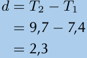

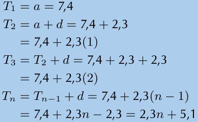
> **[Diagram Context - Textbook_Mathematics_Gr10_Number-patterns.pdf-0028-04.png]**
> The image shows a diagram of a cell with labeled parts, including the nucleus, cytoplasm, and cell membrane. The diagram also includes arrows pointing to different parts of the cell, such as the mitochondria and ribosomes. The diagram is set against a blue background, and the text is in black.

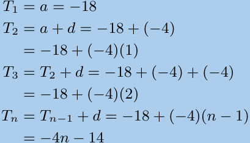
> **[Diagram Context - Textbook_Mathematics_Gr10_Number-patterns.pdf-0028-12.png]**
> The image shows a diagram of a Lewis structure for the molecule ethane (C4H10). The diagram is divided into four sections, each representing a different atom. The diagram is color-coded, with each color representing a different element. The diagram is labeled with the chemical symbols for carbon, hydrogen, and oxygen, as well as the number of atoms in each section. The diagram also

> **[Diagram Context - Textbook_Mathematics_Gr10_Number-patterns.pdf-0028-14.png]**
> 1. A diagram of a cell with arrows pointing to different parts of the cell.

---

### Exponential Equations: Worked Examples

This section covers the solution of various exponential equations using laws of exponents and algebraic factorization.

---

#### Example 1: Solving for $m$
**Problem:** Solve for $m$: $9^m + 3^{3-2m} = 28$

**Solution:**
1. Rewrite the terms with a common base of $3$:
   $$(3^2)^m + 3^3 \cdot 3^{-2m} = 28$$
   $$3^{2m} + \frac{27}{3^{2m}} = 28$$
2. Let $k = 3^{2m}$ to form a quadratic equation:
   $$(3^{2m})^2 - 28(3^{2m}) + 27 = 0$$
   $$(3^{2m} - 27)(3^{2m} - 1) = 0$$
3. Solve for $3^{2m}$:
   $$3^{2m} = 27 \quad \text{or} \quad 3^{2m} = 1$$
   $$3^{2m} = 3^3 \quad \text{or} \quad 3^{2m} = 3^0$$
4. Equate the exponents:
   $$2m = 3 \quad \text{or} \quad 2m = 0$$
   $$\therefore m = \frac{3}{2} \quad \text{or} \quad m = 0$$

---

#### Example 2: Solving for $y$
**Problem:** Solve for $y$: $y - 2y^{\frac{1}{2}} + 1 = 0$

**Solution:**
1. Factorize the quadratic form:
   $$(y^{\frac{1}{2}} - 1)(y^{\frac{1}{2}} - 1) = 0$$
2. Solve for $y^{\frac{1}{2}}$:
   $$y^{\frac{1}{2}} - 1 = 0$$
   $$y^{\frac{1}{2}} = 1$$
3. Square both sides to solve for $y$:
   $$(y^{\frac{1}{2}})^2 = 1^2$$
   $$\therefore y = 1$$

---

#### Example 3: Solving for $x$
**Problem:** Solve for $x$: $4^{x+3} = 0,5$

**Solution:**
1. Express both sides with base $2$:
   $$(2^2)^{x+3} = \frac{1}{2}$$
   $$2^{2x+6} = 2^{-1}$$
2. Equate the exponents:
   $$2x + 6 = -1$$
   $$2x = -7$$
   $$x = -\frac{7}{2}$$

---

#### Example 4: Solving for $a$
**Problem:** Solve for $a$: $2^a = 0,125$

**Solution:**
1. Convert the decimal to a fraction:
   $$2^a = \frac{1}{8}$$
2. Express as a power of $2$:
   $$2^a = \frac{1}{2^3}$$
   $$2^a = 2^{-3}$$
3. Equate the exponents:
   $$\therefore a = -3$$

---

#### Example 5: Solving for $x$
**Problem:** Solve for $x$: $10^x = 0,001$

**Solution:**
1. Convert the decimal to a fraction:
   $$10^x = \frac{1}{1000}$$
2. Express as a power of $10$:
   $$10^x = \frac{1}{10^3}$$
   $$10^x = 10^{-3}$$
3. Equate the exponents:
   $$\therefore x = -3$$

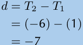

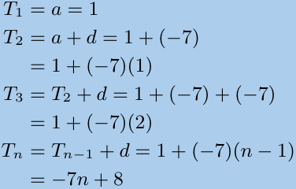
> **[Diagram Context - Textbook_Mathematics_Gr10_Number-patterns.pdf-0029-03.png]**
> 1. A = 1, d = 1, 1 + d = 2, 1 - d = -1, 7 + d = 8, 7 - d = -6, 1/d = -1/7, 1/d + d = 0.

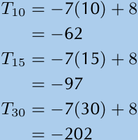
> **[Diagram Context - Textbook_Mathematics_Gr10_Number-patterns.pdf-0029-05.png]**
> The image shows a table with five different equations. The first equation is labeled "T1 = T1 + T2 + T3 + T4 + T5", which represents the sum of the first five terms of a sequence. The second equation is labeled "T2 = T2 + T3 + T4 + T5", which represents the sum of the second five terms of a

> **[Diagram Context - Textbook_Mathematics_Gr10_Number-patterns.pdf-0029-07.png]**
> The image shows a blue line with the word "Solution" written in white at the bottom. The line is divided into two columns, with the left column containing the numbers 10, 14, and 18, and the right column containing the number 18. The numbers are arranged in a straight line, with the numbers in the left column being larger than the numbers in the right column.

> **[Diagram Context - Textbook_Mathematics_Gr10_Number-patterns.pdf-0029-08.png]**
> The image shows a diagram of a Lewis structure for nitrogen. The diagram is divided into four quadrants, each representing a different energy level. The diagram is color-coded, with the nitrogen atom being black and the four energy levels being represented by different colors. The diagram also includes labels for the nitrogen atom, the first energy level, the second energy level, and the third energy level. The

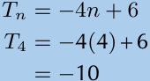

> **[Diagram Context - Textbook_Mathematics_Gr10_Number-patterns.pdf-0029-11.png]**
> The image shows a blue line with numbers on it. The numbers are arranged in a horizontal line, with the number 38 on the left side and the number 68 on the right side. The numbers are labeled with the letters "T" and "N", and the word "Solution" is written at the bottom of the image.

> **[Diagram Context - Textbook_Mathematics_Gr10_Number-patterns.pdf-0029-12.png]**
> The image shows a diagram of a Lewis structure for nitrogen. The diagram is divided into four sections, each representing a different nitrogen atom. The diagram is color-coded, with each color representing a different element. The diagram is labeled with the chemical symbol "N" and the atomic number "15". The diagram also includes arrows pointing to the nitrogen atoms, which are labeled with the atomic number "

---

### Exponential Equations: Worked Examples

This section covers the solution of complex exponential equations using algebraic factorization and exponent laws.

---

#### Example 1: Solving for $x$
Solve: $10^x = 0,001$

**Solution:**
$$10^x = \frac{1}{1000}$$
$$10^x = 10^{-3}$$
$$\therefore x = -3$$

---

#### Example t: Solving for $x$
Solve: $2^{x^2 - 2x - 3} = 1$

**Solution:**
$$2^{x^2 - 2x - 3} = 2^0$$
$$\therefore x^2 - 2x - 3 = 0$$
$$(x - 3)(x + 1) = 0$$
$$\therefore x = 3 \text{ or } -1$$

---

#### Example u: Solving for $x$
Solve: $\frac{8^x - 1}{2^x - 1} = 8 \cdot 2^x + 9$

**Solution:**
$$\frac{2^{3x} - 1}{2^x - 1} = 8 \cdot 2^x + 9$$
$$\frac{(2^x - 1)(2^{2x} + 2^x + 1)}{2^x - 1} = 8 \cdot 2^x + 9$$
$$2^{2x} + 2^x + 1 = 8 \cdot 2^x + 9$$
$$2^{2x} + 2^x = 8 \cdot 2^x + 8$$
$$2^x \cdot 2^x + 2^x = 8(2^x + 1)$$
$$2^x(2^x + 1) = 8(2^x + 1)$$
$$2^x = 8$$
$$2^x = 2^3$$
$$\therefore x = 3$$

---

#### Example v: Solving for $x$
Solve: $\frac{27^x - 1}{9^x + 3^x + 1} = -\frac{8}{9}$

**Solution:**
$$\frac{3^{3x} - 1}{9^x + 3^x + 1} = -\frac{8}{9}$$
$$\frac{(3^x - 1)(9^x + 3^x + 1)}{9^x + 3^x + 1} = -\frac{8}{9}$$
$$3^x - 1 = -\frac{8}{9}$$
$$3^x = 1 - \frac{8}{9}$$
$$3^x = \frac{1}{9}$$
$$3^x = \frac{1}{3^2}$$
$$3^x = 3^{-2}$$
$$\therefore x = -2$$

---

#### Application: Growth Models
**Problem:** The growth of algae can be modelled by the function $f(t) = 2^t$. Find the value of $t$ such that $f(t) = 128$.

**Solution:**
$$2^t = 128$$
$$2^t = 2^7$$
$$\therefore t = 7$$

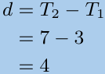

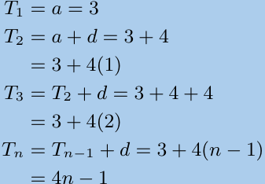
> **[Diagram Context - Textbook_Mathematics_Gr10_Number-patterns.pdf-0030-05.png]**
> The image shows a diagram of a Lewis structure for carbon dioxide. The diagram is divided into four sections, each representing a different carbon atom. The diagram is color-coded, with each color representing a different element. The diagram is set against a blue background, and the text "T3" is written in black at the top of the image. The text "T2" is written in

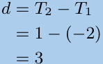

> **[Diagram Context - Textbook_Mathematics_Gr10_Number-patterns.pdf-0030-10.png]**
> The image shows a diagram of a Lewis structure for carbon dioxide. The diagram is divided into four sections, each representing a different carbon atom. The diagram is color-coded, with each color representing a different element. The diagram is labeled with the chemical symbols for carbon, oxygen, and nitrogen. The diagram also includes arrows pointing to the bonds between the carbon atoms. The diagram is set against a

> **[Diagram Context - Textbook_Mathematics_Gr10_Number-patterns.pdf-0030-15.png]**
> 1. A diagram of a cell with arrows pointing to different parts of the cell.

---

### Solving Exponential Equations by Trial and Error

When an exponential equation cannot be solved easily by equating bases, the **trial and error** method is used to approximate the value of the exponent to a required number of decimal places.

---

#### Worked Example 1: Solve for $x$ (correct to 2 decimal places)
**Equation:** $2^x = 7$

**Step-by-step Solution:**
1. **Identify the range:**
   $2^2 = 4$ and $2^3 = 8$.
   Since $4 < 7 < 8$, the value of $x$ must be between $2$ and $3$, but closer to $3$.
2. **Test values:**
   * $2^{2,9} = 7,464$ (Too high)
   * $2^{2,8} = 6,964$ (Too low)
   * $2^{2,81} = 7,01$ (Very close, slightly high)
   * $2^{2,805} = 6,989$ (Too low)
   * $2^{2,809} = 7,007$ (Very close)
3. **Conclusion:**
   Rounding to two decimal places, $x \approx 2,81$.

---

#### Worked Example 2: Solve for $x$ (correct to 2 decimal places)
**Equation:** $5^x = 11$

**Step-by-step Solution:**
1. **Identify the range:**
   $5^1 = 5$ and $5^2 = 25$.
   Since $5 < 11 < 25$, the value of $x$ must be between $1$ and $2$.
2. **Test values:**
   * $5^{1,5} = 11,180$ (Too high)
   * $5^{1,4} = 9,51$ (Too low)
   * $5^{1,45} = 10,31$ (Too low)
   * $5^{1,49} = 11,001$ (Very close)
3. **Conclusion:**
   Rounding to two decimal places, $x \approx 1,49$.

---

### End of Chapter Exercise 2 – 4

**1. Simplify:**
a) $(8x)^3$

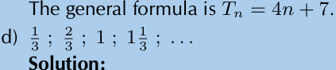
> **[Diagram Context - Textbook_Mathematics_Gr10_Number-patterns.pdf-0031-00.png]**
> The image shows a diagram of a cell with a Lewis structure. The diagram is blue and has a black arrow pointing to the right. The diagram also includes a label that reads "The general formula is T".

---
*For more exercises, visit [www.everythingmaths.co.za](http://www.everythingmaths.co.za) and click on 'Practise Maths'.*

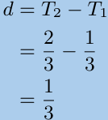

> **[Diagram Context - Textbook_Mathematics_Gr10_Number-patterns.pdf-0031-04.png]**
> 1. A = 1, T = 3, 2 = 3, 3 = 3, 1 = 1, n = 3.

---

### Exponents: Worked Examples

This section provides solutions to various problems involving the laws of exponents.

---

#### Example: Power of a Product
$$(8x)^3 = 8^3 x^3 = 512x^3$$

---

#### b) Simplify $t^3 \times 2t^0$
**Solution:**
$$t^3 \times 2t^0 = t^3 \times 2(1)$$
$$= 2t^3$$

---

#### c) Simplify $5^{2x+y} \times 5^{3(x+z)}$
**Solution:**
$$5^{2x+y} \times 5^{3(x+z)} = 5^{2x+y+3x+3z}$$
$$= 5^{5x+y+3z}$$

---

#### d) Simplify $15^{3x} \times 15^{12x}$
**Solution:**
$$15^{3x} \times 15^{12x} = 15^{3x+12x}$$
$$= 15^{15x}$$

---

#### e) Simplify $\frac{7^{y+7}}{7^{y+6}}$
**Solution:**
$$\frac{7^{y+7}}{7^{y+6}} = 7^{(y+7)-(y+6)}$$
$$7^{(y+7)-(y+6)} = 7^{y+7-y-6}$$
$$= 7^1$$
$$= 7$$

---

#### f) Simplify $3(d^4)(7d^3)$
**Solution:**
$$3(d^4)(7d^3) = 21d^7$$

---

#### g) Simplify $(\frac{1}{7}a^2b^9)(6a^6b^2)(-3a^7b)$
**Solution:**
$$(\frac{1}{7}a^2b^9)(6a^6b^2)(-3a^7b) = -\frac{18}{7}a^{15}b^{12}$$

---

#### h) Simplify $(b^{k+1})^k$
**Solution:**
$$(b^{k+1})^k = b^{k^2+k}$$

---

#### i) Simplify $\frac{24c^8m^7}{6c^2m^5}$
**Solution:**
$$\frac{24c^8m^7}{6c^2m^5} = 4c^{(8-2)}m^{(7-5)}$$
$$= 4c^6m^2$$

> **[Diagram Context - Textbook_Mathematics_Gr10_Number-patterns.pdf-0032-10.png]**
> 1. A diagram of a cell with arrows pointing to different parts of the cell.

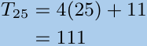

---

### Exponential Expressions: Worked Examples

This section covers the simplification of algebraic expressions involving exponents using the laws of indices.

---

#### j) Simplify: $\frac{2(x^4)^3}{x^{12}}$

**Solution:**
$$\frac{2(x^4)^3}{x^{12}} = \frac{2x^{12}}{x^{12}} = 2$$

---

#### k) Simplify: $\frac{a^6b^5}{7(a^8b^3)^2}$

**Solution:**
$$\frac{a^6b^5}{7(a^8b^3)^2} = \frac{a^6b^5}{7a^{16}b^6} = \frac{1}{7a^{10}b}$$

---

#### l) Simplify: $\left(\frac{a^7}{b^4}\right)^2$

**Solution:**
$$\left(\frac{a^7}{b^4}\right)^2 = \frac{a^{14}}{b^8}$$

---

#### m) Simplify: $\frac{6^{5p}}{9^p}$

**Solution:**
$$\frac{6^{5p}}{9^p} = \frac{2^{5p} \cdot 3^{5p}}{3^{2p}}$$
$$= 2^{5p} \cdot 3^{5p-2p}$$
$$= 2^{5p} \cdot 3^{3p}$$

---

#### n) Simplify: $m^{-2t} \times (3m^t)^3$

**Solution:**
$$m^{-2t} \times (3m^t)^3 = m^{-2t} \times 3^3 m^{3t}$$
$$= m^{-2t+3t} \cdot 27$$
$$= 27m^t$$

---

#### o) Simplify: $\frac{3x^{-3}}{(3x)^2}$

**Solution:**
$$\frac{3x^{-3}}{(3x)^2} = 3^{1-2} \cdot x^{-3-2}$$
$$= 3^{-1} \cdot x^{-5}$$
$$= \frac{1}{3x^5}$$

---

#### p) Simplify: $\frac{5^{b-3}}{5^{b+1}}$

**Solution:**
$$\frac{5^{b-3}}{5^{b+1}} = 5^{b-3-(b+1)}$$
$$= 5^{b-3-b-1}$$
$$= 5^{-4}$$
$$= \frac{1}{625}$$

> **[Diagram Context - Textbook_Mathematics_Gr10_Number-patterns.pdf-0033-00.png]**
> The image shows a blue line graph with a black arrow pointing to the right. The graph is labeled with the equation Tn = 3/3n - 1, and the variable Tn represents the temperature. The graph also includes the variable Tn-1, which represents the temperature at time n-1. The graph is set against a gray background, and the equation is accompanied by a

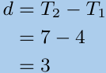

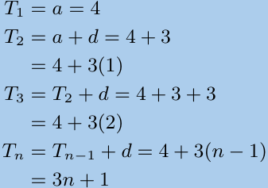
> **[Diagram Context - Textbook_Mathematics_Gr10_Number-patterns.pdf-0033-14.png]**
> The image shows a diagram of a Lewis structure for nitrogen. The diagram is divided into four sections, each representing a different nitrogen atom. The diagram is color-coded, with each color representing a different element. The diagram is set against a blue background, and the text "T2 = 4 + 3 + 3 + 4 + 3 + 3 + 3 + 4 + 3" is written in

---

### Exponent Laws: Worked Examples

This section provides step-by-step solutions for simplifying algebraic expressions involving exponents.

---

#### Problem q)
Simplify: $\frac{2^{a-2}3^{a+3}}{6^a}$

**Solution:**
$$\frac{2^{a-2}3^{a+3}}{6^a} = \frac{2^{a-2}3^{a+3}}{(2 \cdot 3)^a}$$
$$= \frac{2^{a-2}3^{a+3}}{2^a \cdot 3^a}$$
$$= 2^{a-2-a} \cdot 3^{a+3-a}$$
$$= 2^{-2} \cdot 3^3$$
$$= \frac{1}{2^2} \cdot 27$$
$$= \frac{27}{4}$$

---

#### Problem r)
Simplify: $\frac{3^n 9^{n-3}}{27^{n-1}}$

**Solution:**
$$\frac{3^n 9^{n-3}}{27^{n-1}} = \frac{3^n \cdot (3^2)^{n-3}}{(3^3)^{n-1}}$$
$$= \frac{3^n \cdot 3^{2n-6}}{3^{3n-3}}$$
$$= 3^{n+2n-6-(3n-3)}$$
$$= 3^{3n-6-3n+3}$$
$$= 3^{-3}$$
$$= \frac{1}{3^3} = \frac{1}{27}$$

---

#### Problem s)
Simplify: $\frac{3^3}{9^3}$

**Solution:**
$$\frac{3^3}{9^3} = \left( \frac{3}{9} \right)^3$$
$$= \left( \frac{1}{3} \right)^3$$
$$= \frac{1}{3^3} = \frac{1}{27}$$

---

#### Problem t)
Simplify: $\frac{x^{-1}}{x^4 y^{-2}}$

**Solution:**
$$\frac{x^{-1}}{x^4 y^{-2}} = \frac{y^2}{x^4 \cdot x^1}$$
$$= \frac{y^2}{x^5}$$

---

#### Problem u)
Simplify: $\frac{(-1)^4}{(-2)^{-3}}$

**Solution:**
$$\frac{(-1)^4}{(-2)^{-3}} = 1 \cdot (-2)^3$$
$$= -8$$

---

#### Problem v)
Simplify: $\left( \frac{2x^{2a}}{y^{-b}} \right)^3$

**Solution:**
*(Note: The final step for this problem is truncated in the source material.)*

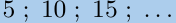

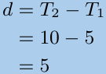

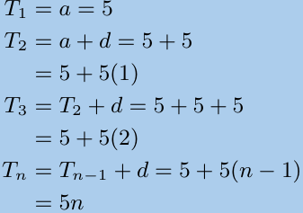
> **[Diagram Context - Textbook_Mathematics_Gr10_Number-patterns.pdf-0034-04.png]**
> The image shows a diagram of a Lewis structure, which is a visual representation of the valence electrons of an atom. The diagram is divided into four sections, each representing a different element. The diagram is set against a blue background, and the elements are labeled with their respective atomic numbers. The diagram is accompanied by a table of values, which provides the number of valence electrons for each element

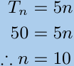

> **[Diagram Context - Textbook_Mathematics_Gr10_Number-patterns.pdf-0034-12.png]**
> The image is a diagram that shows a series of equations and variables, including the following:
1. T1 = T2 = T3 = T4 = T5 = T6 = T7 = T8 = T9 = T10 = T11 = T12 = T13 = T14 = T15 = T16 = T17 = T18 = T19 = T

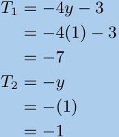
> **[Diagram Context - Textbook_Mathematics_Gr10_Number-patterns.pdf-0034-15.png]**
> The image shows a diagram of a mathematical equation. The equation is set against a blue background and is divided into five sections. The first section contains the variable "T1" and the equation "T1 = 4y". The second section has the variable "T2" and the equation "T2 = 7y". The third section has the variable "T3" and the equation "

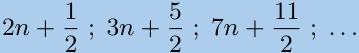

---

### Exponential Laws and Simplification Exercises

This section covers the application of exponential laws to simplify complex algebraic expressions.

#### Worked Example: Power of a Quotient
$$\left(\frac{2x^{2a}}{y^{-b}}\right)^{3} = \frac{2^{3}(x^{2a})^{3}}{(y^{-b})^{3}}$$
$$= \frac{2^{3}x^{6a}}{y^{-3b}}$$
$$= 8x^{6a}y^{3b}$$

---

#### Exercise w)
**Problem:** Simplify $\frac{2^{3x-1}8^{x+1}}{4^{2x-2}}$

**Solution:**
$$\frac{2^{3x-1} \cdot 2^{3(x+1)}}{2^{2(2x-2)}} = \frac{2^{3x-1} \cdot 2^{3x+3}}{2^{4x-4}}$$
$$= 2^{(3x-1+3x+3) - (4x-4)}$$
$$= 2^{6x+2 - 4x+4}$$
$$= 2^{2x+6}$$
$$= 4^{x+3}$$

---

#### Exercise x)
**Problem:** Simplify $\frac{6^{2x}11^{2x}}{22^{2x-1}3^{2x}}$

**Solution:**
$$\frac{(3 \cdot 2)^{2x} \cdot 11^{2x}}{(2 \cdot 11)^{2x-1} \cdot 3^{2x}} = \frac{3^{2x} \cdot 2^{2x} \cdot 11^{2x}}{2^{2x-1} \cdot 11^{2x-1} \cdot 3^{2x}}$$
$$= 3^{2x-2x} \cdot 2^{2x-(2x-1)} \cdot 11^{2x-(2x-1)}$$
$$= 3^{0} \cdot 2^{1} \cdot 11^{1}$$
$$= 1 \cdot 2 \cdot 11$$
$$= 22$$

---

#### Exercise y)
**Problem:** Simplify $\frac{(-3)^{-3}(-3)^{2}}{(-3)^{-4}}$

**Solution:**
$$\frac{(-3)^{-3+2}}{(-3)^{-4}} = \frac{(-3)^{-1}}{(-3)^{-4}}$$
$$= (-3)^{-1 - (-4)}$$
$$= (-3)^{-1+4}$$
$$= (-3)^{3}$$
$$= -27$$

---

#### Exercise z)
**Problem:** Simplify $(3^{-1} + 2^{-1})^{-1}$

**Solution:**
$$(3^{-1} + 2^{-1})^{-1} = \left(\frac{1}{3} + \frac{1}{2}\right)^{-1}$$
$$= \left(\frac{2}{6} + \frac{3}{6}\right)^{-1}$$
$$= \left(\frac{5}{6}\right)^{-1}$$
$$= \frac{6}{5}$$

> **[Diagram Context - Textbook_Mathematics_Gr10_Number-patterns.pdf-0035-00.png]**
> The image shows a diagram of a Lewis structure for nitrogen. The diagram is a black and white representation of a molecule, with each atom labeled and connected by lines to show the bonds between them. The diagram is set against a light blue background, and the text "T-T = T-T" is prominently displayed. The diagram is labeled with the variable "n" and the variable "

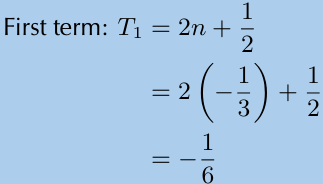
> **[Diagram Context - Textbook_Mathematics_Gr10_Number-patterns.pdf-0035-02.png]**
> The image shows a math problem on a blue background. The problem is a Lewis diagram, which is a visual representation of a molecule. The diagram is filled with various elements, including arrows and labels, that help to explain the structure of the molecule. The problem is labeled "First term" and "T1 = 2n + 1", indicating that it is a math problem related to the concept

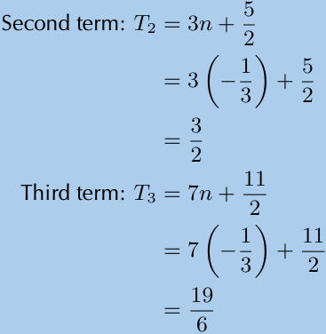
> **[Diagram Context - Textbook_Mathematics_Gr10_Number-patterns.pdf-0035-03.png]**
> The image shows a math problem involving the use of the third term in a trigonometric function. The problem is presented in a table format, with the third term labeled as "T3" and the function as "3n + 2". The table also includes a diagram of the function, which is a right triangle with the third term labeled as "T3" and the function as "

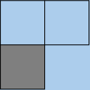

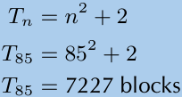
> **[Diagram Context - Textbook_Mathematics_Gr10_Number-patterns.pdf-0035-11.png]**
> The image shows a diagram of a cell with the number 2 blocks. The diagram is set against a blue background and includes a title that reads "Tn = Nn + 2". The diagram also includes a label for the variable "Tn" and a label for the variable "Nn". The diagram is labeled with the numbers "85" and "7727" in the top right

---

### Exponents: Worked Examples

This section provides step-by-step solutions for simplifying expressions involving exponents.

---

#### a) Simplify: $\frac{9^{n-1} \cdot 27^{3-2n}}{81^{2-n}}$

**Solution:**
Express all bases as powers of $3$:
$$\frac{9^{n-1} \cdot 27^{3-2n}}{81^{2-n}} = \frac{3^{2(n-1)} \cdot 3^{3(3-2n)}}{3^{4(2-n)}}$$
Apply exponent laws (add exponents in the numerator, subtract the denominator):
$$= 3^{2n-2 + 9-6n - (8-4n)}$$
$$= 3^{2n-2+9-6n-8+4n}$$
$$= 3^{-1} = \frac{1}{3}$$

---

#### b) Simplify: $\frac{2^{3n+2} \cdot 8^{n-3}}{4^{3n-2}}$

**Solution:**
Express all bases as powers of $2$:
$$\frac{2^{3n+2} \cdot 2^{3(n-3)}}{2^{2(3n-2)}}$$
Simplify the exponents:
$$= 2^{3n+2 + 3n-9 - (6n-4)}$$
$$= 2^{3n+2+3n-9-6n+4}$$
$$= 2^{-3} = \frac{1}{8}$$

---

#### c) Simplify: $\frac{3^{t+3} + 3^t}{2 \cdot 3^t}$

**Solution:**
Factor out the common term $3^t$ in the numerator:
$$\frac{3^t \cdot 3^3 + 3^t}{2 \cdot 3^t} = \frac{3^t(3^3 + 1)}{2 \cdot 3^t}$$
Cancel $3^t$ from the numerator and denominator:
$$= \frac{3^3 + 1}{2}$$
$$= \frac{27 + 1}{2} = \frac{28}{2} = 14$$

---

#### d) Simplify: $\frac{2^{3p} + 1}{2^p + 1}$

**Solution:**
Use the sum of cubes factorization formula: $a^3 + b^3 = (a+b)(a^2 - ab + b^2)$, where $a = 2^p$ and $b = 1$:
$$\frac{(2^p)^3 + 1^3}{2^p + 1} = \frac{(2^p + 1)(2^{2p} - 2^p + 1)}{2^p + 1}$$
Cancel the common factor $(2^p + 1)$:
$$= 2^{2p} - 2^p + 1$$

---

#### e) Simplify: $(a^{10}b^6)^{\frac{1}{2}}$

**Solution:**
Apply the power of a power rule $(x^m)^n = x^{m \cdot n}$:
$$(a^{10}b^6)^{\frac{1}{2}} = a^{10 \cdot \frac{1}{2}} \cdot b^{6 \cdot \frac{1}{2}}$$
$$= a^5b^3$$

---

#### f) Simplify: $(9x^8y^4)^{\frac{1}{2}}$

**Solution:**
Apply the exponent to each factor inside the bracket:
$$(9x^8y^4)^{\frac{1}{2}} = 9^{\frac{1}{2}} \cdot x^{8 \cdot \frac{1}{2}} \cdot y^{4 \cdot \frac{1}{2}}$$
$$= 3x^4y^2$$

---

#### g) Simplify: $\frac{13^a + 13^{a+2}}{6 \times 13^a - 13^a}$

*(Note: This problem is presented as an exercise at the end of the page.)*

> **[Diagram Context - Textbook_Mathematics_Gr10_Number-patterns.pdf-0036-13.png]**
> The image presents a Lewis diagram, a type of anatomical or cellular structure, which is a visual representation of the chemical bonds between atoms. The diagram is colored in blue and is labeled with numbers, indicating the bond lengths. The diagram is set against a light blue background, and it is divided into four sections, each representing a different bond length. The diagram is accompanied by a legend that provides a

---

### Exponential Expressions and Simplification

This section covers the simplification of complex exponential expressions using exponent laws.

---

#### Worked Example: Simplifying Expressions

**Problem h)**
Simplify: $\frac{3^{8z} \times 27^{8z} \times 3^2}{9^{6z}}$

**Solution:**
1. Express all bases as powers of 3:
   $$\frac{3^{8z} \times (3^3)^{8z} \times 3^2}{(3^2)^{6z}}$$
2. Apply the power of a power rule $(a^m)^n = a^{mn}$:
   $$= \frac{3^{8z} \times 3^{24z} \times 3^2}{3^{12z}}$$
3. Apply the product rule $a^m \times a^n = a^{m+n}$ to the numerator:
   $$= \frac{3^{8z+24z+2}}{3^{12z}}$$
   $$= \frac{3^{32z+2}}{3^{12z}}$$
4. Apply the quotient rule $\frac{a^m}{a^n} = a^{m-n}$:
   $$= 3^{32z+2-12z}$$
   $$= 3^{20z+2}$$

---

**Problem i)**
Simplify: $\frac{121^b - 16^p}{11^b + 4^p}$

**Solution:**
1. Express bases as squares:
   $$\frac{(11^2)^b - (4^2)^p}{11^b + 4^p}$$
2. Rewrite using the power of a power rule:
   $$= \frac{(11^b)^2 - (4^p)^2}{11^b + 4^p}$$
3. Apply the difference of two squares identity $x^2 - y^2 = (x-y)(x+y)$:
   $$= \frac{(11^b - 4^p)(11^b + 4^p)}{11^b + 4^p}$$
4. Cancel the common factor $(11^b + 4^p)$:
   $$= 11^b - 4^p$$

---

**Problem j)**
Simplify: $\frac{11^{-4c-4} \times 4^{4c-3}}{22^{-6c-2}}$

**Solution:**
1. Express bases as prime factors ($4 = 2^2$ and $22 = 11 \times 2$):
   $$\frac{11^{-4c-4} \times (2^2)^{4c-3}}{(11 \times 2)^{-6c-2}}$$
2. Simplify the powers:
   $$= \frac{11^{-4c-4} \times 2^{8c-6}}{11^{-6c-2} \times 2^{-6c-2}}$$
3. Group like bases and apply the quotient rule $\frac{a^m}{a^n} = a^{m-n}$:
   $$= 11^{(-4c-4) - (-6c-2)} \times 2^{(8c-6) - (-6c-2)}$$
4. Simplify the exponents:
   $$= 11^{-4c-4+6c+2} \times 2^{8c-6+6c+2}$$
   $$= 11^{2c-2} \times 2^{14c-4}$$

---

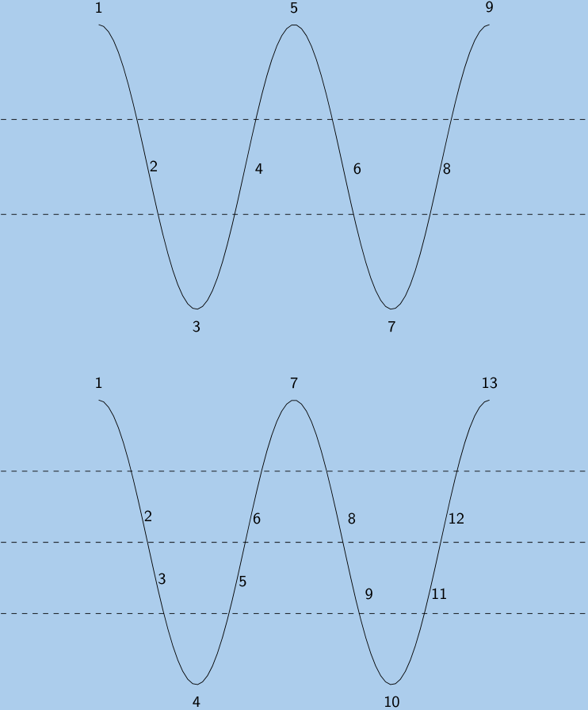
> **[Diagram Context - Textbook_Mathematics_Gr10_Number-patterns.pdf-0037-00.png]**
> A diagram of a wave with a blue background and a brown border. The wave is composed of multiple lines and arrows, with the arrows pointing in different directions. The diagram is labeled with numbers and arrows, and the labels include "1", "2", "3", "4", "5", "6", "7", "8", "9", and "10". The diagram also

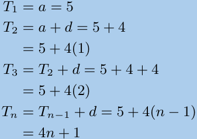
> **[Diagram Context - Textbook_Mathematics_Gr10_Number-patterns.pdf-0037-05.png]**
> The image shows a math problem involving the use of the equation T = 3n + 1. The problem is presented in a table format, with each row representing a different value of n. The first row shows T = 3n + 1, the second row shows T = 3n + 2, and the third row shows T = 3n + 3. The table is set against a blue

---

### Exponents: Worked Examples

This section provides step-by-step solutions for simplifying expressions involving exponents, powers, and roots.

---

#### k) Simplify: $\frac{12^4 \times 2^4}{16^6 \times 10}$

**Solution:**

$$
\begin{aligned}
\frac{12^4 \times 2^4}{16^6 \times 10} &= \frac{(3 \times 2^2)^4 \times 2^4}{(2^4)^6 \times (2 \times 5)} \\
&= \frac{3^4 \times 2^8 \times 2^4}{2^{24} \times 2 \times 5} \\
&= \frac{3^4}{2^{13} \times 5}
\end{aligned}
$$

---

#### l) Simplify: $\frac{5^6 \times 3^{16} \times 2^7}{10^8 \times 9^6}$

**Solution:**

$$
\begin{aligned}
\frac{5^6 \times 3^{16} \times 2^7}{10^8 \times 9^6} &= \frac{5^6 \times 3^{16} \times 2^7}{2^8 \times 5^8 \times 3^{12}} \\
&= \frac{3^4}{2 \times 5^2} \\
&= \frac{81}{50}
\end{aligned}
$$

---

#### m) Simplify: $(0,81)^{\frac{1}{2}}$

**Solution:**

$$
\begin{aligned}
(0,81)^{\frac{1}{2}} &= \left( \frac{81}{100} \right)^{\frac{1}{2}} \\
&= \left( \frac{9^2}{10^2} \right)^{\frac{1}{2}} \\
&= \left[ \left( \frac{9}{10} \right)^2 \right]^{\frac{1}{2}} \\
&= \frac{9}{10}
\end{aligned}
$$

---

#### n) Simplify: $12(a^{10}b^{20})^{\frac{1}{5}} \times (729a^{12}b^{15})^{\frac{1}{3}}$

**Solution:**

$$
\begin{aligned}
12(a^{10}b^{20})^{\frac{1}{5}} \times (729a^{12}b^{15})^{\frac{1}{3}} &= 12a^{\frac{10}{5}}b^{\frac{20}{5}} \times (729)^{\frac{1}{3}}a^{\frac{12}{3}}b^{\frac{15}{3}} \\
&= 12a^2b^4 \times (9^3)^{\frac{1}{3}}a^4b^5 \\
&= 12a^2b^4 \times 9a^4b^5 \\
&= 108a^6b^9
\end{aligned}
$$

---

#### o) Simplify: $2(p^{30}q^{20})^{\frac{1}{5}} \times (1331p^{12}q^6)^{\frac{1}{3}}$

**Solution:**

$$
\begin{aligned}
2(p^{30}q^{20})^{\frac{1}{5}} \times (1331p^{12}q^6)^{\frac{1}{3}} &= 2p^{\frac{30}{5}}q^{\frac{20}{5}} \times (1331)^{\frac{1}{3}}p^{\frac{12}{3}}q^{\frac{6}{3}} \\
&= 2p^6q^4 \times (11^3)^{\frac{1}{3}}p^4q^2 \\
&= 2p^6q^4 \times 11p^4q^2 \\
&= 22p^{10}q^6
\end{aligned}
$$

> **[Diagram Context - Textbook_Mathematics_Gr10_Number-patterns.pdf-0038-03.png]**
> 1. A diagram of a cell with the number 7 on the left side and the number 1 on the right side.

> **[Diagram Context - Textbook_Mathematics_Gr10_Number-patterns.pdf-0038-06.png]**
> The image shows a blue graph with a diagonal line running through the center, labeled "reminder" and "reminder = 2". The graph is divided into six sections, each representing a different number from 1 to 6. The numbers are evenly spaced, and the graph is neatly organized. The text "reminder" is clearly visible, and the numbers are clearly marked, making it easy to

> **[Diagram Context - Textbook_Mathematics_Gr10_Number-patterns.pdf-0038-09.png]**
> The image shows a diagram of a triangular arrangement of black dots, each connected to a line, forming a series of triangles. The diagram is set against a blue background, and the arrangement of the triangles is in a line-by-line fashion. The diagram is labeled with the text "Lewis diagram" and "cellular structure", and it is accompanied by a legend that explains the meaning of

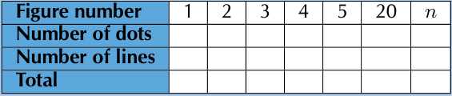
> **[Diagram Context - Textbook_Mathematics_Gr10_Number-patterns.pdf-0038-10.png]**
> A diagram of a number of dots and lines, with the number of dots and lines labeled in the top left and bottom right corners.

---

### Algebraic Simplification and Exponential Equations

#### Worked Examples: Simplification

**p) Simplify:** $\frac{a^{-1} - b^{-1}}{a - b}$

**Solution:**
$$\frac{a^{-1} - b^{-1}}{a - b} = \frac{\frac{1}{a} - \frac{1}{b}}{a - b}$$
$$= \frac{\frac{b-a}{ab}}{a - b}$$
$$= \frac{-(a - b)}{ab(a - b)}$$
$$= -\frac{1}{ab}$$
$$= -(ab)^{-1}$$

---

**q) Simplify:** $((x^{36})^{\frac{1}{2}})^{\frac{1}{3}}$

**Solution:**
$$((x^{36})^{\frac{1}{2}})^{\frac{1}{3}} = (x^{18})^{\frac{1}{3}}$$
$$= x^{6}$$

---

**r) Simplify:** $(\frac{2}{3})^{x+y} \cdot (\frac{3}{2})^{x-y}$

**Solution:**
$$(\frac{2}{3})^{x+y} \cdot (\frac{3}{2})^{x-y} = (\frac{2}{3})^{x+y} \cdot (\frac{2}{3})^{-(x-y)}$$
$$= (\frac{2}{3})^{x+y-(x-y)}$$
$$= (\frac{2}{3})^{2y}$$

---

**s) Simplify:** $(a^{\frac{1}{2}} + a^{-\frac{1}{2}})^2 - (a^{\frac{1}{2}} - a^{-\frac{1}{2}})^2$

**Solution:**
$$(a^{\frac{1}{2}} + a^{-\frac{1}{2}})^2 - (a^{\frac{1}{2}} - a^{-\frac{1}{2}})^2 = (a^{\frac{1}{2}} + a^{-\frac{1}{2}} - (a^{\frac{1}{2}} - a^{-\frac{1}{2}}))(a^{\frac{1}{2}} + a^{-\frac{1}{2}} + (a^{\frac{1}{2}} - a^{-\frac{1}{2}}))$$
$$= (2a^{-\frac{1}{2}})(2a^{\frac{1}{2}})$$
$$= 4a^{\frac{1}{2}-\frac{1}{2}}$$
$$= 4a^{0}$$
$$= 4$$

---

#### Worked Examples: Exponential Equations

**3. a) Solve for $x$:** $3^x = \frac{1}{27}$

**Solution:**
$$3^x = \frac{1}{27}$$
$$3^x = \frac{1}{3^3}$$
$$3^x = 3^{-3}$$
$$\therefore x = -3$$

---

### Solving Exponential Equations

To solve equations where the variable is in the exponent, express both sides of the equation with the same base. If $a^x = a^y$, then $x = y$ (where $a > 0$ and $a \neq 1$).

---

#### b) Solve for $m$: $121 = 11^{m-1}$

**Solution:**
$$121 = 11^{m-1}$$
$$11^2 = 11^{m-1}$$
$$\therefore 2 = m - 1$$
$$2 + 1 = m$$
$$3 = m$$

---

#### c) Solve for $t$: $5^{t-1} = 1$

**Solution:**
$$5^{t-1} = 1$$
$$5^{t-1} = 5^0$$
$$\therefore t - 1 = 0$$
$$t = 1$$

---

#### d) Solve for $x$: $2 \times 7^{3x} = 98$

**Solution:**
$$2 \times 7^{3x} = 98$$
$$7^{3x} = 49$$
$$7^{3x} = 7^2$$
$$\therefore 3x = 2$$
$$x = \frac{2}{3}$$

---

#### e) Solve for $c$: $-\frac{64}{3} = -\frac{4}{3} \cdot 2^{-\frac{c}{3} + 1}$

**Solution:**
$$\left(-\frac{3}{4}\right) \left(-\frac{64}{3}\right) = \left(-\frac{3}{4}\right) \left(-\frac{4}{3} \cdot 2^{-\frac{c}{3} + 1}\right)$$
$$16 = 2^{-\frac{c}{3} + 1}$$
$$\therefore 2^4 = 2^{-\frac{c}{3} + 1}$$
$$4 = -\frac{c}{3} + 1$$
$$-9 = c$$

---

#### f) Solve for $n$: $-\frac{1}{2} 6^{-n-3} = -18$

**Solution:**
$$(-2) \left(-\frac{1}{2} \cdot 6^{-n-3}\right) = (-18)(-2)$$
$$6^{-n-3} = 36$$
$$6^{-n-3} = 6^2$$
$$\therefore -n - 3 = 2$$
$$n = -5$$

---

#### g) Solve for $m$: $2^{m+1} = (0,5)^{m-2}$

**Solution:**
$$2^{m+1} = \left(\frac{1}{2}\right)^{m-2}$$
$$2^{m+1} = (2^{-1})^{m-2}$$
$$2^{m+1} = 2^{-m+2}$$
$$\therefore m + 1 = -m + 2$$
$$2m = 1$$
$$m = \frac{1}{2}$$

---

### Exponential Equations: Worked Examples

This section provides step-by-step solutions for solving various types of exponential equations.

---

#### Example: Solving for $m$
**Problem:** Solve $2^{m+1} = (0,5)^{m-2}$

**Solution:**
$$2^{m+1} = (0,5)^{m-2}$$
$$2^{m+1} = \left(\frac{1}{2}\right)^{m-2}$$
$$2^{m+1} = (2^{-1})^{m-2}$$
$$2^{m+1} = 2^{2-m}$$
$$\therefore m + 1 = 2 - m$$
$$m = \frac{1}{2}$$

---

#### h) Solving for $y$
**Problem:** $3^{y+1} = 5^{y+1}$

**Solution:**
$$3^{y+1} = 5^{y+1}$$
$$\therefore y + 1 = 0$$
$$y = -1$$

---

#### i) Solving for $z$
**Problem:** $z^{\frac{3}{2}} = 64$

**Solution:**
$$z^{\frac{3}{2}} = 64$$
$$z^{\frac{3}{2}} = 4^3$$
$$\left(z^{\frac{3}{2}}\right)^{\frac{2}{3}} = (4^3)^{\frac{2}{3}}$$
$$z = 4^2$$
$$z = 16$$

---

#### j) Solving for $x$
**Problem:** $16x^{\frac{1}{2}} - 4 = 0$

**Solution:**
$$16x^{\frac{1}{2}} - 4 = 0$$
$$16x^{\frac{1}{2}} = 4$$
$$x^{\frac{1}{2}} = \frac{4}{16}$$
$$x^{\frac{1}{2}} = \frac{1}{4}$$
$$\left(x^{\frac{1}{2}}\right)^2 = \left(\frac{1}{4}\right)^2$$
$$x = \frac{1}{16}$$

---

#### k) Solving for $m$
**Problem:** $m^0 + m^{-1} = 0$

**Solution:**
$$m^0 + m^{-1} = 0$$
$$1 + m^{-1} = 0$$
$$m^{-1} = -1$$
$$(m^{-1})^{-1} = (-1)^{-1}$$
$$m = -1$$

---

#### l) Quadratic Form
**Problem:** $t^{\frac{1}{2}} - 3t^{\frac{1}{4}} + 2 = 0$

<!-- DIAGRAM_PLACEHOLDER: diagram -->

---

### Solving Exponential Equations

This section covers the algebraic solution of equations involving exponents, often requiring substitution or factorization techniques.

---

#### Worked Example: Solving for $t$
Given the equation:
$$t^{\frac{1}{2}} - 3t^{\frac{1}{4}} + 2 = 0$$

**Solution:**
1. Factorize the quadratic-style expression:
$$(t^{\frac{1}{4}} - 1)(t^{\frac{1}{4}} - 2) = 0$$
2. Solve for $t^{\frac{1}{4}}$:
$$t^{\frac{1}{4}} = 1 \quad \text{or} \quad t^{\frac{1}{4}} = 2$$
3. Raise both sides to the power of 4 to isolate $t$:
$$(t^{\frac{1}{4}})^4 = (1)^4 \quad \text{or} \quad (t^{\frac{1}{4}})^4 = (2)^4$$
$$t = 1 \quad \text{or} \quad t = 16$$

---

#### Worked Example m)
Solve for $p$:
$$3^p + 3^p + 3^p = 27$$

**Solution:**
1. Simplify the left side:
$$3 \cdot 3^p = 27$$
2. Apply exponent laws ($a^m \cdot a^n = a^{m+n}$):
$$3^{p+1} = 3^3$$
3. Equate the exponents:
$$p + 1 = 3$$
$$p = 2$$

---

#### Worked Example n)
Solve for $k$:
$$k^{-1} - 7k^{-\frac{1}{2}} - 18 = 0$$

**Solution:**
1. Factorize the expression:
$$(k^{-\frac{1}{2}} - 9)(k^{-\frac{1}{2}} + 2) = 0$$
2. Solve for $k^{-\frac{1}{2}}$:
$$k^{-\frac{1}{2}} = 9 \quad \text{or} \quad k^{-\frac{1}{2}} = -2$$
3. Raise both sides to the power of $-2$:
$$(k^{-\frac{1}{2}})^{-2} = (9)^{-2} \quad \text{or} \quad (k^{-\frac{1}{2}})^{-2} = (-2)^{-2}$$
$$k = \frac{1}{81} \quad \text{or} \quad k = \frac{1}{4}$$
*Note: By checking both answers, we find that $k = \frac{1}{81}$ is the only valid solution.*

---

#### Worked Example o)
Solve for $x$:
$$x^{\frac{1}{2}} + 3x^{\frac{1}{4}} - 18 = 0$$

**Solution:**
1. Factorize the expression:
$$(x^{\frac{1}{4}} + 6)(x^{\frac{1}{4}} - 3) = 0$$
2. Solve for $x^{\frac{1}{4}}$:
$$x^{\frac{1}{4}} = -6 \quad \text{or} \quad x^{\frac{1}{4}} = 3$$
3. Raise both sides to the power of 4:
$$(x^{\frac{1}{4}})^4 = (-6)^4 \quad \text{or} \quad (x^{\frac{1}{4}})^4 = (3)^4$$
$$x = 1296 \quad \text{or} \quad x = 81$$
*Note: By checking both answers, we find that $x = 81$ is the only valid solution.*

---

#### Worked Example p)
Solve for $x$:
$$\frac{16^x - 1}{4^x + 1} = 3$$

<!-- DIAGRAM_PLACEHOLDER: diagram -->

---

### Exponential Equations: Worked Examples

This section covers the algebraic solution of exponential equations using factorisation, base conversion, and the property of equality for exponents ($a^x = a^y \implies x = y$).

---

#### Example: Solving Rational Exponential Expressions
**Problem:** Solve for $x$: $\frac{16^x - 1}{4^{2x} + 1} = 3$

**Solution:**
1. Factor the numerator as a difference of squares:
   $$\frac{(4^{2x} - 1)(4^{2x} + 1)}{4^{2x} + 1} = 3$$
2. Simplify by cancelling the common factor:
   $$4^{2x} - 1 = 3$$
3. Isolate the exponential term:
   $$4^{2x} = 4^1$$
4. Equate the exponents:
   $$2x = 1$$
   $$x = \frac{1}{2}$$

---

#### Exercise q)
**Problem:** Solve for $x$: $(2^x - 8)(3^x - 9) = 0$

**Solution:**
$$(2^x - 8)(3^x - 9) = 0$$
$$(2^x - 2^3)(3^x - 3^2) = 0$$
$$\therefore 2^x - 2^3 = 0 \text{ or } 3^x - 3^2 = 0$$
$$\therefore x = 3 \text{ or } x = 2$$

---

#### Exercise r)
**Problem:** Solve for $x$: $(6^x - 36)(16 - 4^x) = 0$

**Solution:**
$$(6^x - 36)(16 - 4^x) = 0$$
$$(6^x - 6^2)(4^2 - 4^x) = 0$$
$$\therefore 6^x - 6^2 = 0 \text{ or } 4^2 - 4^x = 0$$
$$\therefore x = 2$$

---

#### Exercise s)
**Problem:** Solve for $x$: $5 \cdot 2^{x^2+1} = 20$

**Solution:**
$$5 \cdot 2^{x^2+1} = 20$$
$$2^{x^2+1} = 4$$
$$2^{x^2+1} = 2^2$$
$$\therefore x^2 + 1 = 2$$
$$x^2 - 1 = 0$$
$$(x + 1)(x - 1) = 0$$
$$\therefore x = 1 \text{ or } x = -1$$

---

#### Exercise t)
**Problem:** Solve for $x$: $27^{x-2} = 9^{2x+1}$

**Solution:**
Convert to a common base of 3:
$$(3^3)^{x-2} = (3^2)^{2x+1}$$
$$3^{3x-6} = 3^{4x+2}$$
$$\therefore 3x - 6 = 4x + 2$$
$$x = -8$$

---

#### Exercise u)
**Problem:** Solve for $x$: $\frac{8^x - 1}{2^x - 1} = 7$

*(Note: This problem is presented as an incomplete exercise at the bottom of the page.)*

---

### Exponential Equations: Worked Examples

This section covers the solution of complex exponential equations using algebraic factorization, exponent laws, and quadratic methods.

---

#### Example 1: Difference of Cubes
Solve for $x$:
$$\frac{8^x - 1}{2^x - 1} = 7$$

**Solution:**
1. Rewrite $8^x$ as $(2^3)^x = (2^x)^3$:
$$\frac{(2^x)^3 - 1}{2^x - 1} = 7$$
2. Apply the difference of cubes formula $a^3 - b^3 = (a-b)(a^2 + ab + b^2)$:
$$\frac{(2^x - 1)((2^x)^2 + 2^x + 1)}{2^x - 1} = 7$$
3. Simplify by canceling $(2^x - 1)$:
$$2^{2x} + 2^x + 1 = 7$$
4. Set to zero to form a quadratic equation:
$$2^{2x} + 2^x - 6 = 0$$
5. Factorize:
$$(2^x + 3)(2^x - 2) = 0$$
6. Solve for $x$:
$$\therefore 2^x + 3 = 0 \text{ or } 2^x - 2 = 0$$
Since $2^x \neq -3$, we solve $2^x = 2^1$:
$$\therefore x = 1$$

---

#### Example 2: Prime Bases
Solve for $x$:
$$\frac{35^x}{5^x} = \frac{1}{7}$$

**Solution:**
1. Express $35^x$ as $(7 \cdot 5)^x = 7^x \cdot 5^x$:
$$\frac{7^x \cdot 5^x}{5^x} = \frac{1}{7}$$
2. Simplify:
$$7^x = 7^{-1}$$
3. Equate exponents:
$$\therefore x = -1$$

---

#### Example 3: Rational Exponents and Quadratic Equations
Solve for $x$:
$$\frac{a^{3x} \cdot a^{\frac{1}{x}}}{a^{-4}} = 1$$

**Solution:**
1. Use exponent laws ($a^m \cdot a^n = a^{m+n}$ and $\frac{a^m}{a^n} = a^{m-n}$):
$$a^{3x + \frac{1}{x} + 4} = a^0$$
2. Equate the exponents:
$$3x + \frac{1}{x} + 4 = 0$$
3. Multiply by $x$ to clear the fraction:
$$3x^2 + 1 + 4x = 0 \implies 3x^2 + 4x + 1 = 0$$
4. Factorize:
$$(3x + 1)(x + 1) = 0$$
5. Solve for $x$:
$$\therefore x = -\frac{1}{3} \text{ or } x = -1$$

---

#### Example 4: Verification of Solutions
Solve for $x$:
$$2x^{\frac{1}{2}} + 1 = -x$$

**Solution:**
1. Rearrange into a quadratic form:
$$x + 2x^{\frac{1}{2}} + 1 = 0$$
2. Recognize this as a perfect square trinomial $(a+b)^2 = a^2 + 2ab + b^2$, where $a = x^{\frac{1}{2}}$ and $b = 1$:
$$(x^{\frac{1}{2}} + 1)^2 = 0$$
3. Solve for $x^{\frac{1}{2}}$:
$$x^{\frac{1}{2}} = -1$$
4. Squaring both sides gives $x = 1$.
5. **Verification:** Substitute $x=1$ back into the original equation:
$$2(1)^{\frac{1}{2}} + 1 = 2(1) + 1 = 3$$
$$-x = -(1) = -1$$
Since $3 \neq -1$, the solution is invalid.
$$\therefore \text{No solution exists.}$$

---

### 4. Solving Exponential Equations using Trial and Error

When an exponential equation cannot be solved easily by equating bases, we use the **trial and error** method to approximate the value of the exponent to a required number of decimal places.

#### Worked Example 1: Solve for $x$ (correct to 2 decimal places)
$$4^x = 44$$

**Solution:**
1. Determine the range:
   $4^2 = 16$ and $4^3 = 64$. Since $16 < 44 < 64$, we know $2 < x < 3$.
2. Test values within the range:
   * $4^{2,5} = 32$
   * $4^{2,75} = 45,255$
   * $4^{2,70} = 42,224$
   * $4^{2,73} = 44,017$
   * $4^{2,725} = 43,713$
3. Conclusion:
   $\therefore x \approx 2,73$

---

#### Worked Example 2: Solve for $x$ (correct to 2 decimal places)
$$3^x = 30$$

**Solution:**
1. Determine the range:
   $3^3 = 27$ and $3^4 = 81$. Since $27 < 30 < 81$, we know $3 < x < 4$.
2. Test values within the range:
   * $3^{3,1} = 30,014$
   * $3^{3,05} = 28,525$
   * $3^{3,08} = 29,480$
   * $3^{3,09} = 29,806$
   * $3^{3,095} = 29,970$
   * $3^{3,096} = 30,003$
3. Conclusion:
   $\therefore x \approx 3,10$

---

### 6. Identifying Common Algebraic Errors

It is a common mistake to assume that exponents distribute over addition or subtraction. The following statements are **false**:

#### a) $\frac{1}{a^{-1} + b^{-1}} = a + b$
**Reasoning:** The sum of two powers of the same degree is not the power of the sum of the bases.
**Correction:**
$$a + b = \frac{1}{(a + b)^{-1}} \neq \frac{1}{a^{-1} + b^{-1}}$$

#### b) $(a + b)^2 = a^2 + b^2$
**Reasoning:** The sum of two powers of the same degree is not the power of the sum of the bases.
**Correction:**
$$(a + b)^2 = a^2 + 2ab + b^2 \neq a^2 + b^2$$

#### c) $(\frac{1}{a^2})^{\frac{1}{3}} = a^{\frac{2}{3}}$
**Reasoning:** When a power is moved from the denominator to the numerator, the sign of the exponent must change. (Note: $a \neq 0$)
**Correction:**
$$\left(\frac{1}{a^2}\right)^{\frac{1}{3}} = (a^{-2})^{\frac{1}{3}} = a^{-\frac{2}{3}}$$

---

### Common Exponent Errors and Worked Examples

This section addresses common misconceptions when working with exponents and provides solutions to complex exponential problems.

---

#### 1. Common Misconceptions

**d) Multiplication of bases**
*   **Problem:** $2 \cdot 3^x = 6^x$
*   **Correction:** You cannot multiply bases unless they are raised to the same power.
*   **Correct logic:** $6^x = (2 \times 3)^x = 2^x \cdot 3^x \neq 2 \cdot 3^x$

**e) Negative exponents in fractions**
*   **Problem:** $x^{-\frac{1}{2}} = \frac{1}{-x^{\frac{1}{2}}}$
*   **Correction:** The sign of a base is not changed when an exponent is moved from the denominator to the numerator.
*   **Correct logic:** $x^{-\frac{1}{2}} = \frac{1}{x^{\frac{1}{2}}} \neq \frac{1}{-x^{\frac{1}{2}}}$

**f) Power of a product**
*   **Problem:** $(3x^4y^2)^3 = 3x^{12}y^6$
*   **Correction:** The power of a product is the product of all the bases raised to the same power. Every term inside the bracket must be raised to the exponent.
*   **Correct logic:** $(3x^4y^2)^3 = (3)^3(x^4)^3(y^2)^3 = 27x^{12}y^6 \neq 3x^{12}y^6$

---

#### 2. Worked Examples

**Question 7: Determining the number of digits**
If $2^{2013} \cdot 5^{2015}$ is written out in full, how many digits will there be?

**Solution:**
To find the number of digits, we express the number in scientific notation ($a \times 10^n$):

$$
\begin{aligned}
2^{2013} \cdot 5^{2015} &= 2^{2013} \cdot 5^{2013+2} \\
&= 2^{2013} \cdot 5^{2013} \cdot 5^2 \\
&= 25(2^{2013} \cdot 5^{2013}) \\
&= 25(10^{2013}) \\
&= 25 \times 10^{2013}
\end{aligned}
$$

*   **Note:** $10^{2013}$ has $2014$ digits.
*   Therefore, $25 \times 10^{2013}$ has $2015$ digits.

---

**Question 8: Proving an identity**
Prove that:
$$\frac{2^{n+1} + 2^n}{2^n - 2^{n-1}} = \frac{3^{n+1} + 3^n}{3^n - 3^{n-1}}$$

<!-- DIAGRAM_PLACEHOLDER: diagram -->

---

### 2.4 Exponential equations

To verify the equality:
$$\frac{2^{n+1} + 2^n}{2^n - 2^{n-1}} = \frac{3^{n+1} + 3^n}{3^n - 3^{n-1}}$$

#### Right Hand Side (R.H.S)
$$\text{R.H.S} = \frac{3^{n+1} + 3^n}{3^n - 3^{n-1}}$$
$$= \frac{3^n(3^1 + 3^0)}{3^n(3^0 - 3^{-1})}$$
$$= \frac{3 + 1}{1 - \frac{1}{3}}$$
$$= \frac{4}{\frac{2}{3}} = 4 \times \frac{3}{2} = \frac{12}{2} = 6$$

#### Left Hand Side (L.H.S)
$$\text{L.H.S} = \frac{2^{n+1} + 2^n}{2^n - 2^{n-1}}$$
$$= \frac{2^n(2^1 + 2^0)}{2^n(2^0 - 2^{-1})}$$
$$= \frac{2 + 1}{1 - \frac{1}{2}}$$
$$= \frac{3}{\frac{1}{2}} = 3 \times 2 = 6$$

$$\therefore \text{R.H.S} = \text{L.H.S}$$

---

### Exercise Codes
For more exercises, visit [www.everythingmaths.co.za](http://www.everythingmaths.co.za) and click on 'Practise Maths'.

| | | | | |
| :--- | :--- | :--- | :--- | :--- |
| 1a. 2F45 | 1j. 2F4G | 1s. 2F4S | 2i. 2F5C | 3h. 2F5Z |
| 1b. 2F46 | 1k. 2F4H | 1t. 2F4T | 2j. 2F5D | 3i. 2F62 |
| 1c. 2F47 | 1l. 2F4J | 1u. 2F4V | 2k. 2F5F | 3j. 2F63 |
| 1d. 2F48 | 1m. 2F4K | 1v. 2F4W | 2l. 2F5G | 3k. 2F64 |
| 1e. 2F49 | 1n. 2F4M | 1w. 2F4X | 2m. 2F5H | 3l. 2F65 |
| 1f. 2F4B | 1o. 2F4N | 1x. 2F4Y | 2n. 2F5J | 3m. 2F66 |
| 1g. 2F4C | 1p. 2F4P | 1y. 2F4Z | 2o. 2F5K | 3n. 2F67 |
| 1h. 2F4D | 1q. 2F4Q | 1z. 2F52 | 2p. 2F5M | 3o. 2F68 |
| 1i. 2F4F | 1r. 2F4R | 2a. 2F53 | 2q. 2F5N | 3p. 2F69 |
| 2b. 2F54 | 2r. 2F5P | 3a. 2F5R | 3q. 2F6B | 6a. 2F6P |
| 2c. 2F55 | 2s. 2F5Q | 3b. 2F5S | 3r. 2F6C | 6b. 2F6Q |
| 2d. 2F56 | | 3c. 2F5T | 3s. 2F6D | 6c. 2F6R |
| 2e. 2F57 | | 3d. 2F5V | 3t. 2F6F | 6d. 2F6S |
| 2f. 2F58 | | 3e. 2F5W | 3u. 2F6G | 6e. 2F6T |
| 2g. 2F59 | | 3f. 2F5X | 3v. 2F6H | 6f. 2F6V |
| 2h. 2F5B | | 3g. 2F5Y | 3w. 2F6J | 7. 2F6W |
| | | | 3x. 2F6K | 8. 2F6X |
| | | 4. 2F6M | | |
| | | 5. 2F6N | | |