# Chapter 11: Trigonometry

This chapter focuses on the application of trigonometric principles to solve practical problems.

## Chapter Contents

| Section | Topic | Page |
| :--- | :--- | :--- |
| 11.1 | Two-dimensional problems | 390 |
| 11.2 | Chapter summary | 397 |

<!-- DIAGRAM_PLACEHOLDER: diagram -->

---

# 11 Trigonometry

Trigonometry is a branch of mathematics used to solve practical problems, such as those found in building construction and navigation. We use trigonometric ratios to solve problems in two dimensions involving right-angled triangles.

## Revision: Trigonometric Ratios
For a right-angled triangle, the three primary trigonometric ratios are defined as:

$$\sin \theta = \frac{\text{opposite}}{\text{hypotenuse}}$$

$$\cos \theta = \frac{\text{adjacent}}{\text{hypotenuse}}$$

$$\tan \theta = \frac{\text{opposite}}{\text{adjacent}}$$

These ratios, combined with the Theorem of Pythagoras, are used to solve two-dimensional problems.

---

## 11.1 Two-dimensional problems (EMA7F)

In two-dimensional problems, we frequently use the concepts of the **angle of elevation** and the **angle of depression**.

### Angle of Elevation
When an observer looks up at an object, the angle formed between their line of sight and the horizontal plane is the angle of elevation.

> **[Diagram Context - Textbook_Mathematics_Gr10_Number-patterns.pdf-0001-00.png]**
> The image shows a chapter number 3 with a blue circle and the word "chapter" written in white. The chapter is titled "Chapter 3" and is positioned at the top of the image. The chapter is designed to be easily understood by high school students, as indicated by the use of a simple, clear layout.

*   **Definition:** The angle of elevation is the angle formed by the line of sight and the horizontal plane for an object above the horizontal plane.

In the scenario above, the line of sight is from the ship to the top of the cliff, and the horizontal plane is the line from the ship to the base of the cliff. The cliff acts as a vertical line, forming a right-angled triangle.

### Angle of Depression
When an observer looks down at an object, the angle formed between their line of sight and the horizontal plane is the angle of depression.

<!-- DIAGRAM_PLACEHOLDER: diagram -->

In this scenario, the observer is at the top of the cliff looking down at the ship. The angle $\alpha$ is the angle of depression, measured from the horizontal line extending from the top of the cliff.

---

### Trigonometry: Angles of Elevation and Depression

#### Definition: Angle of Depression
The angle of depression is the angle formed by the line of sight and the horizontal plane for an object located below the horizontal plane.

*   **Conceptual Breakdown:**
    *   The line of sight extends from the observer (e.g., the top of a cliff) to the object (e.g., a ship).
    *   The horizontal plane is an imaginary line extending horizontally from the observer's position.
    *   A vertical line can be constructed perpendicular to the horizontal plane to form a right-angled triangle.

> **[Diagram Context - Textbook_Mathematics_Gr10_Number-patterns.pdf-0002-04.png]**
> 1. A close-up view of a sunflower.

#### Relationship Between Angles
When comparing the angle of elevation ($\theta$) and the angle of depression ($\alpha$):
*   The horizontal line from the top of the cliff is parallel to the horizontal line at the base of the cliff.
*   Because these lines are parallel, the alternate interior angles are equal.
*   Therefore:
    $$\alpha = \theta$$

#### Measuring Angles: The Inclinometer
An inclinometer is a practical tool used to measure angles of inclination (elevation). By measuring the angle of inclination of a tall object (like a building or tree), you can use trigonometric ratios to calculate its height.

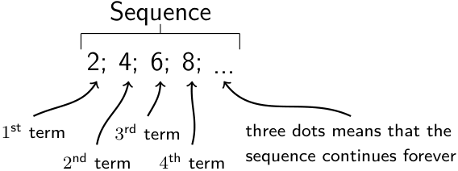
> **[Diagram Context - Textbook_Mathematics_Gr10_Number-patterns.pdf-0002-17.png]**
> A diagram of a sequence of dots and arrows, with the dots representing dots that the sequence continues, and the arrows representing the direction of the sequence.

#### Key Note
In trigonometry, the **angle of inclination** is equivalent to the **angle of elevation**.

---

### Worked Example: Flying a Kite

#### Question
Mandla flies a kite on a $17\text{ m}$ string at an inclination of $63^\circ$.
1. What is the height, $h$, of the kite above the ground?
2. If Mandla’s friend Sipho stands directly below the kite, calculate the distance, $d$, between the two friends.

---

#### Solution

**Step 1: Make a sketch and identify the opposite and adjacent sides and the hypotenuse**

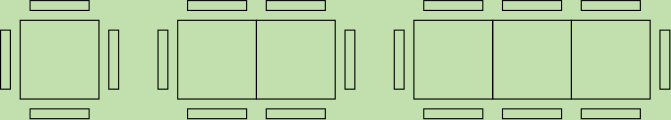

**Step 2: Use given information and appropriate ratio to solve for $h$ and $d$**

1. **Calculate height ($h$):**
   $$\sin 63^\circ = \frac{\text{opposite}}{\text{hypotenuse}}$$
   $$\sin 63^\circ = \frac{h}{17}$$
   $$\therefore h = 17 \sin 63^\circ$$
   $$= 15,14711...$$
   $$\approx 15,15\text{ m}$$

2. **Calculate distance ($d$):**
   $$\cos 63^\circ = \frac{\text{adjacent}}{\text{hypotenuse}}$$
   $$\cos 63^\circ = \frac{d}{17}$$
   $$\therefore d = 17 \cos 63^\circ$$
   $$= 7,7178...$$
   $$\approx 7,72\text{ m}$$

> **Note:** The third side of the triangle can also be calculated using the theorem of Pythagoras: $d^2 = 17^2 - h^2$.

**Step 3: Write the final answers**
1. The kite is $15,15\text{ m}$ above the ground.
2. Mandla and Sipho are $7,72\text{ m}$ apart.

---

### Worked Example: Calculating Angles in a Trapezium

#### Question
$ABCD$ is a trapezium with $AB = 4\text{ cm}$, $CD = 6\text{ cm}$, $BC = 5\text{ cm}$, and $AD = 5\text{ cm}$. Point $E$ lies on diagonal $AC$ such that $AE = 3\text{ cm}$ and $B\hat{E}C = 90^\circ$. Find $A\hat{B}C$.

---

#### Solution

**Step 1: Draw the trapezium and label all given lengths.**
Indicate that $B\hat{E}C = 90^\circ$. We will use $\triangle ABE$ and $\triangle CBE$ to find $A\hat{B}E$ and $C\hat{B}E$, then add them together to find $A\hat{B}C$.

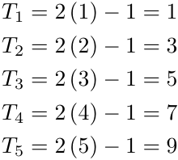
> **[Diagram Context - Textbook_Mathematics_Gr10_Number-patterns.pdf-0004-08.png]**
> 1. A diagram of a cell with arrows pointing to different parts of the cell.

**Step 2: Find the first angle, $A\hat{B}E$**
In $\triangle ABE$, the hypotenuse ($AB$) and the opposite side ($AE$) are known. We use the sine function:

$$\sin A\hat{B}E = \frac{\text{opposite}}{\text{hypotenuse}}$$
$$\sin A\hat{B}E = \frac{3}{4}$$
$$A\hat{B}E = 48,5903...^\circ$$
$$A\hat{B}E \approx 48,6^\circ$$

**Step 3: Use the Theorem of Pythagoras to determine $BE$**
In $\triangle ABE$:

$$BE^2 = AB^2 - AE^2$$
$$BE^2 = 4^2 - 3^2$$
$$BE^2 = 16 - 9$$
$$BE^2 = 7$$
$$\therefore BE = \sqrt{7}\text{ cm}$$

**Step 4: Find the second angle, $C\hat{B}E$**
In $\triangle CBE$, we use the cosine function:

$$\cos C\hat{B}E = \frac{\text{adjacent}}{\text{hypotenuse}}$$
$$\cos C\hat{B}E = \frac{\sqrt{7}}{5}$$
$$\cos C\hat{B}E = 0,52915...$$
$$C\hat{B}E = 58,0519...^\circ$$
$$C\hat{B}E \approx 58,1^\circ$$

**Step 5: Calculate the total angle $A\hat{B}C$**
$$A\hat{B}C = A\hat{B}E + C\hat{B}E$$
$$A\hat{B}C \approx 48,6^\circ + 58,1^\circ$$
$$A\hat{B}C \approx 106,7^\circ$$

---

### Calculating Angles and Heights using Trigonometry

#### Sum of Angles
To find the sum of two angles, simply add their values:
$$\hat{ABC} = 48,6^{\circ} + 58,1^{\circ} = 106,7^{\circ}$$

---

#### Application: Finding the Height of a Building
Trigonometry is a practical tool for measuring the height of tall structures where physical measurement (like using a tape measure) is dangerous or impractical.

**Worked Example 3**

**Question:**
A building has an unknown height $h$. From a point $B$ at the base, walk $100\text{ m}$ away to point $Q$. The angle of elevation from the ground at $Q$ to the top of the building $T$ is $38,7^{\circ}$. Calculate the height of the building, correct to the nearest metre.

> **[Diagram Context - Textbook_Mathematics_Gr10_Number-patterns.pdf-0005-03.png]**
> The image shows a diagram of a Lewis structure for water. The diagram is divided into two rows, with the top row containing the chemical formula for water and the bottom row showing the Lewis structure of water. The diagram is set against a gray background, and the text "d = T + T" is visible, indicating the chemical formula for water. The diagram is labeled with the variables "d

**Solution:**

**Step 1: Identify the sides**
In the right-angled triangle $\triangle QTB$:
*   The side opposite the angle $38,7^{\circ}$ is $h$.
*   The side adjacent to the angle $38,7^{\circ}$ is $100\text{ m}$.

**Step 2: Set up the trigonometric ratio**
Using the tangent ratio:
$$\tan 38,7^{\circ} = \frac{\text{opposite}}{\text{adjacent}}$$
$$\tan 38,7^{\circ} = \frac{h}{100}$$

**Step 3: Rearrange and solve for $h$**
$$h = 100 \times \tan 38,7^{\circ}$$
$$h = 80,1151...$$
$$h \approx 80$$

**Step 4: Final Answer**
The height of the building is $80\text{ m}$.

---

### Worked Example: Angles of Elevation and Depression

#### Question
A block of flats is $200\text{ m}$ away from a cellphone tower. An observer at point $B$ measures the angle of elevation to the top of the tower ($E$) as $34^\circ$. The observer then measures the angle of depression to the bottom of the tower ($C$) as $62^\circ$. 

Calculate the total height of the cellphone tower, rounded to the nearest metre.

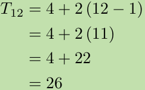
> **[Diagram Context - Textbook_Mathematics_Gr10_Number-patterns.pdf-0006-03.png]**
> The image shows a diagram of a Lewis structure for carbon dioxide (CO2). The diagram is divided into three sections, each representing a different carbon atom. The first section shows a carbon atom with a double bond, the second section shows a carbon atom with a single bond, and the third section shows a carbon atom with a triple bond. The diagram also includes arrows pointing to the carbon atoms and

---

#### Solution

To determine the total height $CE$, we must calculate the lengths of the two segments $DE$ and $CD$ separately. Both $\triangle BDE$ and $\triangle BDC$ are right-angled triangles.

**Step 1: Calculate $CD$**
Since $CABD$ forms a rectangle, the horizontal distance $BD$ is equal to $AC$, which is $200\text{ m}$.

In $\triangle CBD$:
$$\tan C\hat{B}D = \frac{CD}{BD}$$
$$\therefore CD = BD \times \tan C\hat{B}D$$
$$CD = 200 \times \tan 62^\circ$$
$$CD = 376,1452...$$
$$CD \approx 376\text{ m}$$

**Step 2: Calculate $DE$**
In $\triangle DBE$:
$$\tan D\hat{B}E = \frac{DE}{BD}$$
$$\therefore DE = BD \times \tan D\hat{B}E$$
$$DE = 200 \times \tan 34^\circ$$
$$DE = 134,9017...$$
$$DE \approx 135\text{ m}$$

**Step 3: Calculate the total height**
The total height of the tower is the sum of the two segments:
$$CE = CD + DE$$
$$CE = 376\text{ m} + 135\text{ m}$$
$$CE = 511\text{ m}$$

**Final Answer:** The height of the cellphone tower is $511\text{ m}$.

> **[Diagram Context - Textbook_Mathematics_Gr10_Number-patterns.pdf-0006-06.png]**
> 1. A diagram of a cell with arrows pointing to different parts of the cell.

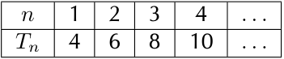
> **[Diagram Context - Textbook_Mathematics_Gr10_Number-patterns.pdf-0006-09.png]**
> The image shows a diagram of a Lewis structure for nitrogen. The diagram is divided into rows and columns, with each cell containing a number. The diagram is color-coded, with the numbers 1-10 represented in black and the rest in white. The diagram is labeled with the numbers 1-10 and arrows pointing to the nitrogen atom. The diagram is set against a gray background.

---

### Worked Example 5: Building Plan

#### Question
Mr Nkosi has a garage at his house and he decides to add a corrugated iron roof to the side of the garage. The garage is $4\text{ m}$ high, and his sheet for the roof is $5\text{ m}$ long. If the angle of the roof is $5^\circ$, how high must he build the wall $BD$? Give the answer correct to 1 decimal place.

> **[Diagram Context - Textbook_Mathematics_Gr10_Number-patterns.pdf-0007-07.png]**
> The image shows a math problem involving the addition of numbers. The problem is presented in a table format, with the numbers 120 and 155 written in the top row and the numbers 29 and 1 written in the bottom row. The numbers are arranged in a grid-like pattern, with the numbers in the top row being larger than the numbers in the bottom row. The numbers are written in a green

#### Solution

**Step 1: Identify opposite and adjacent sides and hypotenuse**
$\triangle ABC$ is right-angled. The hypotenuse and an angle are known; therefore, we can calculate $AC$. The height of the wall $BD$ is then the height of the garage minus $AC$.

Using the sine ratio:
$$\sin \hat{A}BC = \frac{AC}{BC}$$

Rearranging to solve for $AC$:
$$\therefore AC = BC \times \sin \hat{A}BC$$
$$AC = 5 \sin 5^\circ$$
$$AC = 0,43577...$$
$$AC \approx 0,4\text{ m}$$

Calculate the height of wall $BD$:
$$\therefore BD = 4\text{ m} - 0,4\text{ m}$$
$$BD = 3,6\text{ m}$$

**Step 2: Write the final answer**
Mr Nkosi must build his wall to be $3,6\text{ m}$ high.

***

### Exercise 11 – 1

1. A person stands at point $A$, looking up at a bird sitting on the top of a building, point $B$. The height of the building is $x$ meters, the line of sight distance from point $A$ to the top of the building (point $B$) is $5,32\text{ meters}$, and the angle of elevation to the top of the building is $70^\circ$. Calculate the height of the building ($x$).

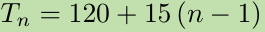

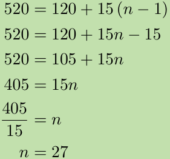
> **[Diagram Context - Textbook_Mathematics_Gr10_Number-patterns.pdf-0007-15.png]**
> The image shows a diagram of a Lewis structure for carbon dioxide. The diagram is divided into four sections, each representing a different carbon atom. The diagram is color-coded, with each color representing a different element. The diagram is labeled with the chemical symbols for carbon, oxygen, and nitrogen. The diagram also includes arrows pointing to the bonds between the carbon atoms. The diagram is set against a

---

### 11.2 Chapter Summary: Trigonometry

Trigonometry is the study of relationships between the sides and angles of triangles. In this section, we focus on right-angled triangles.

#### Key Concepts
*   **Trigonometric Ratios:** For any right-angled triangle, we define three primary ratios:
    *   $\sin(\theta) = \frac{\text{opposite}}{\text{hypotenuse}}$
    *   $\cos(\theta) = \frac{\text{adjacent}}{\text{hypotenuse}}$
    *   $\tan(\theta) = \frac{\text{opposite}}{\text{adjacent}}$
*   **Angle of Elevation:** The angle formed by the line of sight and the horizontal plane for an object located **above** the horizontal plane.
*   **Angle of Depression:** The angle formed by the line of sight and the horizontal plane for an object located **below** the horizontal plane.

---

### Worked Example
**Problem:** A person stands at point $A$, looking up at a bird sitting on the top of a pole (point $B$). The height of the pole is $x$ meters, point $A$ is $4,2$ meters away from the foot of the pole, and the angle of elevation to the top of the pole is $65^\circ$. Calculate the height of the pole ($x$) to the nearest metre.

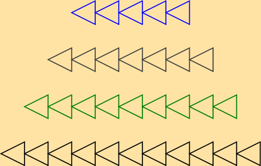
> **[Diagram Context - Textbook_Mathematics_Gr10_Number-patterns.pdf-0008-17.png]**
> The image shows a diagram of a Lewis structure, which is a diagram used to represent the valence electrons of an atom. The diagram is composed of multiple lines, each representing a different atom, and the lines are colored in various shades of green, blue, and black. The diagram is neatly organized into four rows, each row containing six lines. The diagram is set against a beige background

**Solution:**
1. Identify the knowns: $\text{adjacent} = 4,2\text{ m}$, $\theta = 65^\circ$.
2. Identify the unknown: $\text{opposite} = x$.
3. Use the tangent ratio:
   $$\tan(65^\circ) = \frac{x}{4,2}$$
   $$x = 4,2 \times \tan(65^\circ)$$
   $$x \approx 4,2 \times 2,1445$$
   $$x \approx 9,0069$$
4. **Final Answer:** The height of the pole is approximately $9\text{ m}$.

---

### Exercises

3. A boy flying a kite is standing $30\text{ m}$ from a point directly under the kite. If the kite's string is $50\text{ m}$ long, find the angle of elevation of the kite.

4. What is the angle of elevation of the sun when a tree $7,15\text{ m}$ tall casts a shadow $10,1\text{ m}$ long?

5. From a distance of $300\text{ m}$, Susan looks up at the top of a lighthouse. The angle of elevation is $5^\circ$. Determine the height of the lighthouse to the nearest metre.

6. A ladder of length $25\text{ m}$ is resting against a wall; the ladder makes an angle $37^\circ$ to the wall. Find the distance between the wall and the base of the ladder to the nearest metre.

---
*For more exercises, visit [www.everythingmaths.co.za](http://www.everythingmaths.co.za) and click on 'Practise Maths'.*

---

### End of Chapter Exercise 11 – 2: Trigonometry Applications

#### 1. Ladder Problem
A ladder of length $15\text{ m}$ is resting against a wall. The base of the ladder is $5\text{ m}$ from the wall. Find the angle between the wall and the ladder.

*   **Hint:** Let $\theta$ be the angle between the wall and the ladder. The side adjacent to $\theta$ is the wall, and the side opposite to $\theta$ is the distance from the wall ($5\text{ m}$). The ladder is the hypotenuse ($15\text{ m}$).
*   $\sin(\theta) = \frac{\text{opposite}}{\text{hypotenuse}} = \frac{5}{15}$
*   $\theta = \arcsin(\frac{1}{3}) \approx 19,47^\circ$

#### 2. Captain Jack and the Cliff
Captain Jack is sailing towards a cliff with a height of $10\text{ m}$.

*   **a)** The distance from the boat to the bottom of the cliff is $30\text{ m}$. Calculate the angle of elevation.
    *   $\tan(\theta) = \frac{\text{opposite}}{\text{adjacent}} = \frac{10}{30}$
    *   $\theta = \arctan(\frac{1}{3}) \approx 18^\circ$
*   **b)** If the boat sails $7\text{ m}$ closer, the new distance is $30 - 7 = 23\text{ m}$.
    *   $\tan(\theta_{new}) = \frac{10}{23}$
    *   $\theta_{new} = \arctan(\frac{10}{23}) \approx 23^\circ$

#### 3. Telephone Poles
Jim stands at point $A$ looking at a bird on top of a pole of height $8\text{ m}$. The angle of elevation is $45^\circ$. Calculate the distance $x$ between the poles.

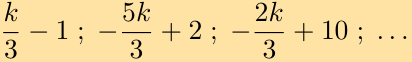
> **[Diagram Context - Textbook_Mathematics_Gr10_Number-patterns.pdf-0009-19.png]**
> The image shows a diagram of a Lewis structure for potassium. The diagram is a line graph with potassium's outermost electron shell represented by a line, and the innermost shell by a circle. The diagram also includes arrows pointing to the outermost and innermost shells, and labels for the outermost and innermost shells. The diagram is set against a gray background, and the text "5

*   $\tan(45^\circ) = \frac{\text{opposite}}{\text{adjacent}} = \frac{8}{x}$
*   Since $\tan(45^\circ) = 1$:
*   $1 = \frac{8}{x} \implies x = 8\text{ m}$

#### 4. Flag Pole
Alfred stands $5,0\text{ m}$ from a pole. The line of sight to the top is $7,07\text{ m}$. Calculate the angle of elevation $x^\circ$.

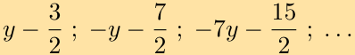

*   $\cos(x^\circ) = \frac{\text{adjacent}}{\text{hypotenuse}} = \frac{5,0}{7,07}$
*   $x = \arccos(\frac{5,0}{7,07}) \approx 45^\circ$

#### 5. Rugby Kick
A rugby player kicks a ball over a crossbar $3,4\text{ m}$ high from a distance of $24\text{ m}$. Find the minimum launch angle $\theta$.

*   $\tan(\theta) = \frac{\text{opposite}}{\text{adjacent}} = \frac{3,4}{24}$
*   $\theta = \arctan(\frac{3,4}{24}) \approx 8,06^\circ$

#### 6. Escalator Height
An escalator is $20\text{ m}$ long and slopes at an angle of $30^\circ$. Find the vertical height $h$ lifted.

<!-- DIAGRAM_PLACEHOLDER: diagram -->

*   $\sin(30^\circ) = \frac{\text{opposite}}{\text{hypotenuse}} = \frac{h}{20}$
*   $h = 20 \times \sin(30^\circ)$
*   $h = 20 \times 0,5 = 10\text{ m}$

---

### Trigonometry Applications: Exercises

#### 7. Ladder Problem
A ladder is $8\text{ m}$ long. It is leaning against the wall of a house and reaches $6\text{ m}$ up the wall.
*   **a)** Draw a sketch of the situation.
    

*   **b)** Calculate the angle ($\theta$) which the ladder makes with the flat ground.
    Using the sine ratio: $\sin(\theta) = \frac{\text{opposite}}{\text{hypotenuse}} = \frac{6}{8}$
    $\theta = \arcsin(0,75) \approx 48,59^\circ$

#### 8. Tower Elevation
Nandi is standing on level ground $70\text{ m}$ away from a tall tower. The angle of elevation of the top of the tower is $38^\circ$.
*   **a)** Draw a sketch of the situation.
    

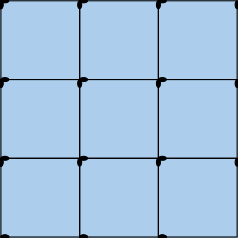

*   **b)** What is the height ($h$) of the tower?
    Using the tangent ratio: $\tan(38^\circ) = \frac{h}{70}$
    $h = 70 \times \tan(38^\circ) \approx 54,69\text{ m}$

#### 9. Pole Anchorage
The top of a pole is anchored by a $12\text{ m}$ cable which makes an angle of $40^\circ$ with the horizontal.
*   **Question:** What is the height ($h$) of the pole?
    

    Using the sine ratio: $\sin(40^\circ) = \frac{h}{12}$
    $h = 12 \times \sin(40^\circ) \approx 7,71\text{ m}$

#### 10. Ship and Lighthouse
A ship's navigator observes a lighthouse on a cliff. The top of the lighthouse is $35\text{ m}$ above sea level. The angle of elevation is $0,7^\circ$.
*   **Question:** Ships must stay at least $4\text{ km}$ ($4000\text{ m}$) away from the shore. Is the ship safe?
    Let $d$ be the distance to the shore: $\tan(0,7^\circ) = \frac{35}{d}$
    $d = \frac{35}{\tan(0,7^\circ)} \approx 2864,79\text{ m}$
    Since $2864,79\text{ m} < 4000\text{ m}$, the ship is **not safe**.

#### 11. Perimeter of Rectangle $PQRS$
Determine the perimeter of rectangle $PQRS$ given the diagonal $PR = 85\text{ m}$ and $\angle SPR = 35^\circ$.
<!-- DIAGRAM_PLACEHOLDER: diagram -->
*   **Width ($SR$):** $\cos(35^\circ) = \frac{SR}{85} \implies SR = 85 \times \cos(35^\circ) \approx 69,63\text{ m}$
*   **Height ($PS$):** $\sin(35^\circ) = \frac{PS}{85} \implies PS = 85 \times \sin(35^\circ) \approx 48,75\text{ m}$
*   **Perimeter:** $2 \times (\text{length} + \text{width}) = 2 \times (69,63 + 48,75) = 236,76\text{ m}$

#### 12. Rhombus Interior Angles
A rhombus has diagonals of lengths $6\text{ cm}$ and $9\text{ cm}$. Calculate the sizes of its interior vertex angles.
<!-- DIAGRAM_PLACEHOLDER: diagram -->
The diagonals of a rhombus bisect each other at $90^\circ$. This creates four right-angled triangles with legs of $3\text{ cm}$ and $4,5\text{ cm}$.
*   Let $\alpha$ be half of the vertex angle at $A$:
    $\tan(\alpha) = \frac{3}{4,5} \implies \alpha = \arctan\left(\frac{3}{4,5}\right) \approx 33,69^\circ$
    Full angle at $A$ and $C = 2 \times 33,69^\circ = 67,38^\circ$
*   Let $\beta$ be half of the vertex angle at $B$:
    $\tan(\beta) = \frac{4,5}{3} \implies \beta = \arctan(1,5) \approx 56,31^\circ$
    Full angle at $B$ and $D = 2 \times 56,31^\circ = 112,62^\circ$

---

### Geometry and Trigonometry Exercises

#### 13. Rhombus Diagonals
A rhombus has edge lengths of $7\text{ cm}$ and acute interior vertex angles of $70^\circ$. Calculate the lengths of both diagonals.

**Key Concepts:**
*   The diagonals of a rhombus bisect each other at $90^\circ$.
*   The diagonals bisect the interior angles of the rhombus.
*   If the angle is $70^\circ$, the half-angle is $35^\circ$.
*   Using trigonometry in the right-angled triangle formed by the diagonals:
    *   $\sin(35^\circ) = \frac{\text{half-diagonal}_1}{7}$
    *   $\cos(35^\circ) = \frac{\text{half-diagonal}_2}{7}$

---

#### 14. Parallelogram Perpendicular Distance
A parallelogram has edge-lengths of $5\text{ cm}$ and $9\text{ cm}$, with an angle of $58^\circ$ between them. Calculate the perpendicular distance ($h$) between the two longer edges.

<!-- DIAGRAM_PLACEHOLDER: diagram -->

**Calculation:**
*   Using the right-angled triangle formed by the height $h$ and the side of $5\text{ cm}$:
    *   $\sin(58^\circ) = \frac{h}{5}$
    *   $h = 5 \times \sin(58^\circ)$

---

#### 15. Rhombus Properties
A rhombus has a perimeter of $20\text{ cm}$ and one angle of $30^\circ$.
*   **a)** Find the lengths of the sides of the rhombus.
*   **b)** Find the length of both diagonals.

---

#### 16. Sun's Altitude and Heights
Upright sticks and their shadows are used to determine the sun's altitude ($\theta$).
*   **a)** A $1\text{ m}$ stick casts a $1,35\text{ m}$ shadow. Find $\theta$ using $\tan(\theta) = \frac{\text{opposite}}{\text{adjacent}}$.
*   **b)** At the same time, a building casts a $47\text{ m}$ shadow. Find the height of the building.

---

#### 17. Hot Air Balloon Elevation
A hot air balloon climbs vertically. The angle of elevation changes from $25^\circ$ at 11:00 am to $60^\circ$ at 11:02 am. The observation point is $300\text{ m}$ away.
*   **a)** Draw a sketch of the situation.
*   **b)** Calculate the increase in height between 11:00 am and 11:02 am.
    *   $h_1 = 300 \times \tan(25^\circ)$
    *   $h_2 = 300 \times \tan(60^\circ)$
    *   $\text{Increase} = h_2 - h_1$

---

#### 18. Mountain Height
The top of a mountain ($T$) is viewed from point $A$ ($2000\text{ m}$ away) with an angle of depression of $10^\circ$. It is viewed from point $B$ with an angle of elevation of $10^\circ$. If $A$ and $B$ are on the same vertical line, find the height $h$ of the mountain. Round to one decimal place.

---

#### 19. Quadrilateral $PQRS$
The diagram shows quadrilateral $PQRS$ with:
*   $PQ = 7,5\text{ cm}$
*   $PS = 6,2\text{ cm}$
*   $\angle R = 42^\circ$
*   $\angle S = 90^\circ$
*   $\angle Q = 90^\circ$

---

### Trigonometry: Solving Problems in 2D

#### Worked Example Analysis
Given a quadrilateral $PQRS$ where $\triangle PQR$ is a right-angled triangle at $Q$ and $\triangle PSR$ is a right-angled triangle at $S$.
*   $PQ = 7,5\text{ cm}$
*   $PS = 6,2\text{ cm}$
*   $\angle PRQ = 42^\circ$

**a) Find $PR$, correct to 2 decimal places.**
In $\triangle PQR$, we use the sine ratio:
$$\sin(42^\circ) = \frac{\text{opposite}}{\text{hypotenuse}} = \frac{PQ}{PR}$$
$$\sin(42^\circ) = \frac{7,5}{PR}$$
$$PR = \frac{7,5}{\sin(42^\circ)}$$
$$PR \approx 11,20\text{ cm}$$

**b) Find the size of the angle marked $x$, correct to one decimal place.**
In $\triangle PSR$, we know $PS = 6,2\text{ cm}$ and we have calculated $PR \approx 11,20\text{ cm}$.
Using the cosine ratio:
$$\cos(x) = \frac{\text{adjacent}}{\text{hypotenuse}} = \frac{PS}{PR}$$
$$\cos(x) = \frac{6,2}{11,20}$$
$$x = \arccos\left(\frac{6,2}{11,20}\right)$$
$$x \approx 56,4^\circ$$

---

#### Exercise 20: Application Problem
**Problem:** From a boat at sea ($S$), the angle of elevation of the top of a lighthouse ($P$), which is on a cliff ($QR$), is $27^\circ$. The lighthouse is $10\text{ m}$ high and the cliff top is $75\text{ m}$ above sea level. How far is the boat from the base of the cliff, to the nearest metre?

**Solution Steps:**
1.  **Identify the total height:** The total height of the lighthouse top ($P$) above sea level ($R$) is $10\text{ m} + 75\text{ m} = 85\text{ m}$.
2.  **Set up the triangle:** Let $d$ be the distance from the boat ($S$) to the base of the cliff ($R$).
3.  **Use the tangent ratio:**
    $$\tan(27^\circ) = \frac{\text{opposite}}{\text{adjacent}} = \frac{85}{d}$$
    $$d = \frac{85}{\tan(27^\circ)}$$
    $$d \approx 166,87\text{ m}$$
4.  **Final Answer:** The boat is approximately $167\text{ m}$ from the base of the cliff.

---

#### Practice Exercises
For further practice, visit [www.everythingmaths.co.za](http://www.everythingmaths.co.za) and search for the following codes:

| Exercise | Code | Exercise | Code | Exercise | Code |
| :--- | :--- | :--- | :--- | :--- | :--- |
| 1 | 2GPW | 8 | 2GQ5 | 15 | 2GQD |
| 2 | 2GPX | 9 | 2GQ6 | 16 | 2GQF |
| 3 | 2GPY | 10 | 2GQ7 | 17 | 2GQG |
| 4 | 2GPZ | 11 | 2GQ8 | 18 | 2GQH |
| 5 | 2GQ2 | 12 | 2GQ9 | 19 | 2GQJ |
| 6 | 2GQ3 | 13 | 2GQB | 20 | 2GQK |
| 7 | 2GQ4 | 14 | 2GQC | | |

> **[Diagram Context - Textbook_Mathematics_Gr10_Number-patterns.pdf-0012-15.png]**
> The image is a diagram of a wave, which is a visual representation of a wave's behavior. The wave is depicted in a blue color, and it is composed of multiple peaks and valleys. The diagram is labeled with numbers, which are used to identify the peaks and valleys. The diagram also includes arrows, which indicate the direction of the wave's movement. The diagram is labeled with the number

---

# Chapter 11: Trigonometry

## Chapter Overview
This chapter focuses on the application of trigonometric principles to solve problems in two dimensions.

### Table of Contents
| Section | Topic | Page |
| :--- | :--- | :--- |
| 11.1 | Two-dimensional problems | 598 |
| 11.2 | Chapter summary | 600 |

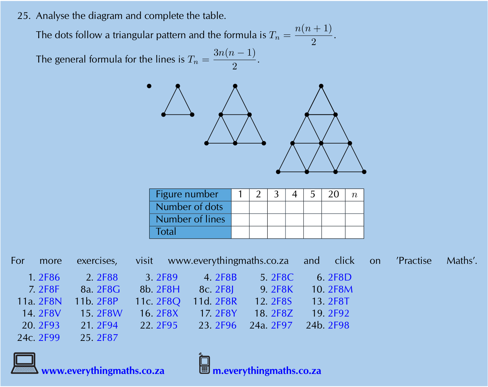
> **[Diagram Context - Textbook_Mathematics_Gr10_Number-patterns.pdf-0013-00.png]**
> 25. Analyse the diagram and complete the table. The dots follow a triangular pattern and the formula is T(n) = 2n - 1. The general formula for the lines is T(n) = 2n - 1.

---

# 11. Trigonometry

## 11.1 Two-dimensional problems

### Key Concepts
*   This chapter focuses on solving real-world problems in two dimensions using trigonometric ratios.
*   **Important:** Always draw a sketch to represent the problem visually before attempting calculations.
*   Ensure you are familiar with basic trigonometric ratios ($\sin$, $\cos$, $\tan$) before starting.

---

### Exercise 11 – 1

#### Worked Example 1
A person stands at point $A$, looking up at a bird sitting on the top of a building, point $B$. The height of the building is $x$ meters, the line of sight distance from point $A$ to the top of the building (point $B$) is $5,32$ meters, and the angle of elevation to the top of the building is $70^\circ$. Calculate the height of the building ($x$).

> **[Diagram Context - Textbook_Mathematics_Gr10_Number-patterns.pdf-0014-00.png]**
> The image shows a chapter number 3 with a blue circle and a white border. The chapter is titled "Chapter 3" and is accompanied by a blue arrow pointing to the right. The chapter is part of a larger educational graphic, which includes a gray background and a white border. The chapter is labeled with the number "3" and is accompanied by a blue circle with a white border. The

**Solution:**
Using the sine ratio:
$$\sin \theta = \frac{\text{opposite}}{\text{hypotenuse}}$$

Substitute the known values:
$$\sin 70^\circ = \frac{x}{5,32}$$

Solve for $x$:
$$x = 5,32 \times \sin 70^\circ$$
$$x = 4,99916...$$
$$x \approx 5$$

The height of the building is $5\text{ m}$.

---

#### Problem 2
A person stands at point $A$, looking up at a bird sitting on the top of a pole (point $B$). The height of the pole is $x$ meters, point $A$ is $4,2$ meters away from the foot of the pole, and the angle of elevation to the top of the pole is $65^\circ$. Calculate the height of the pole ($x$), to the nearest metre.

<!-- DIAGRAM_PLACEHOLDER: diagram -->

---

### Trigonometry: Applications of Ratios

#### Worked Example 1: Calculating Height
**Problem:** (Continuation from previous page) Find the height of a pole given the angle of elevation and distance.

**Solution:**
Using the tangent ratio:
$$\tan \theta = \frac{\text{opposite}}{\text{adjacent}}$$
$$\tan 65^{\circ} = \frac{x}{4,2}$$
$$x = 9,0069...$$
$$x \approx 9$$

The height of the pole is $9\text{ m}$.

---

#### Worked Example 2: Finding the Angle of Elevation (Kite)
**Problem:** A boy flying a kite is standing $30\text{ m}$ from a point directly under the kite. If the kite's string is $50\text{ m}$ long, find the angle of elevation of the kite.

> **[Diagram Context - Textbook_Mathematics_Gr10_Number-patterns.pdf-0015-10.png]**
> A diagram of a number of dots and lines, with the number of dots and lines labeled.

**Solution:**
We use the cosine ratio to find the angle of elevation ($x$):
$$\cos x = \frac{30}{50}$$
$$x = 53,1301...$$
$$x \approx 53,13^{\circ}$$

The angle of elevation of the kite is $53,13^{\circ}$.

---

#### Worked Example 3: Finding the Angle of Elevation (Sun)
**Problem:** What is the angle of elevation of the sun when a tree $7,15\text{ m}$ tall casts a shadow $10,1\text{ m}$ long?

> **[Diagram Context - Textbook_Mathematics_Gr10_Number-patterns.pdf-0015-12.png]**
> The image shows a table with a yellow border and a black background. The table displays a list of numbers and the corresponding number of dots. The numbers range from 1 to 15, and the dots range from 1 to 15. The table also includes a total of 15 numbers and 15 dots. The table is organized in a tabular format with a clear and easy-to-read layout.

**Solution:**
We use the tangent ratio to find the angle of elevation ($x$):
$$\tan x = \frac{7,15}{10,1}$$
$$x = 35,2954...$$
$$x \approx 35,30^{\circ}$$

The angle of elevation of the sun is $35,30^{\circ}$.

---

### Worked Example 5: Calculating Height using Tangent
**Problem:** From a distance of $300\text{ m}$, Susan looks up at the top of a lighthouse. The angle of elevation is $5^\circ$. Determine the height of the lighthouse to the nearest metre.

> **[Diagram Context - Textbook_Mathematics_Gr10_Number-patterns.pdf-0016-04.png]**
> The image presents a diagram of a Lewis structure for carbon dioxide. The diagram is divided into three vertical columns, each representing a carbon atom. The first column has a carbon atom, the second column has a carbon atom, and the third column also has a carbon atom. The diagram also includes arrows pointing from the carbon atoms to the oxygen atoms, indicating the bonds between the atoms. The diagram is

**Solution:**
We use the tangent ratio ($\tan \theta = \frac{\text{opposite}}{\text{adjacent}}$):

$$\tan \hat{S} = \frac{LT}{ST}$$
$$LT = 300 \tan 5^\circ$$
$$LT = 26,2465...$$
$$LT \approx 26\text{ m}$$

The height of the lighthouse is $26\text{ m}$.

---

### Worked Example 6: Calculating Distance using Sine
**Problem:** A ladder of length $25\text{ m}$ is resting against a wall. The ladder makes an angle of $37^\circ$ with the wall. Find the distance between the wall and the base of the ladder to the nearest metre.

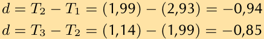
> **[Diagram Context - Textbook_Mathematics_Gr10_Number-patterns.pdf-0016-07.png]**
> The image shows a diagram of a Lewis structure for water. The diagram is divided into two rows, with the top row containing the chemical formula for water and the bottom row showing the Lewis structure of water. The diagram is set against a gray background, and the text "d = T2 - T3" is visible, which may be a variable or a constant in the equation.

**Note:** We are given the angle between the ladder and the **wall**, not the ground. Therefore, the side $x$ is opposite the $37^\circ$ angle. We use the sine function ($\sin \theta = \frac{\text{opposite}}{\text{hypotenuse}}$):

$$\sin 37^\circ = \frac{x}{25}$$
$$x = 25 \sin 37^\circ$$
$$x = 15,04537...$$
$$x \approx 15\text{ m}$$

The base of the ladder is $15\text{ m}$ away from the wall.

---

### 11.2 Chapter Summary
**End of Chapter Exercise 11 – 2:**

1. A ladder of length $15\text{ m}$ is resting against a wall; the base of the ladder is $5\text{ m}$ from the wall. Find the angle between the wall and the ladder.

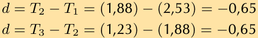
> **[Diagram Context - Textbook_Mathematics_Gr10_Number-patterns.pdf-0016-09.png]**
> The image shows a diagram of a Lewis structure for water. The diagram is divided into two rows, with the top row containing the chemical formula for water and the bottom row showing the Lewis structure of water. The diagram is set against a gray background, and the text "d = T2 - T3" is visible, which is likely a chemical equation or formula. The diagram is labeled with

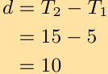

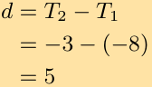

---

### Trigonometry: Solving Problems with Right-Angled Triangles

#### Worked Example 1: Ladder and Wall
**Problem:** Find the angle that a ladder makes with a wall.

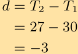

**Solution:**
To find the angle $x$ between the ladder and the wall, we use the sine ratio:
$$\sin x = \frac{\text{opposite}}{\text{hypotenuse}}$$

Given the values:
$$\sin x = \frac{5}{15}$$
$$\sin x = 0,3333...$$
$$x = 19,4712...^\circ$$
$$x \approx 19,47^\circ$$

The angle between the ladder and the wall is $19,47^\circ$.

---

#### Worked Example 2: Captain Jack and the Cliff
**Problem:** Captain Jack is sailing towards a cliff with a height of $10\text{ m}$.

**a) Calculate the angle of elevation from the boat to the top of the cliff (correct to the nearest degree).**

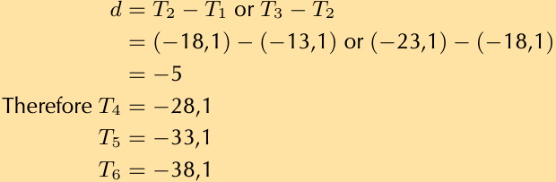
> **[Diagram Context - Textbook_Mathematics_Gr10_Number-patterns.pdf-0017-06.png]**
> The image shows a diagram of a Lewis structure for oxygen. The diagram is color-coded, with the oxygen atom being red and the bonds being blue. The diagram also includes arrows pointing to the bonds and the Lewis structure of oxygen. The diagram is set against a light beige background.

**Solution:**
We use the tangent ratio:
$$\tan x = \frac{\text{opposite}}{\text{adjacent}}$$
$$\tan x = \frac{10}{30}$$
$$x = 18,4349...^\circ$$
$$x = 18^\circ$$

The angle of elevation is $18^\circ$.

**b) If the boat sails $7\text{ m}$ closer to the cliff, what is the new angle of elevation?**

> **[Diagram Context - Textbook_Mathematics_Gr10_Number-patterns.pdf-0017-08.png]**
> The image shows a diagram of a Lewis structure for carbon dioxide. The diagram is labeled with the chemical formula Cd2O4 and the number of valence electrons. The diagram also includes arrows pointing to the valence electrons of the carbon and oxygen atoms. The diagram is set against a light beige background.

**Solution:**
1. Redraw the sketch with the new information.
2. The new distance from the boat to the cliff is:
   $$30\text{ m} - 7\text{ m} = 23\text{ m}$$
3. The height of the cliff remains $10\text{ m}$.

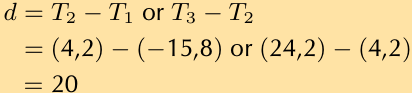
> **[Diagram Context - Textbook_Mathematics_Gr10_Number-patterns.pdf-0017-10.png]**
> The image shows a diagram of a Lewis structure for water. The diagram is set against a gray background and is labeled with the variables "d" and "T" and the numbers "4.2" and "20". The diagram also includes the chemical symbol "H2O" and the number "14.8". The diagram is a visual representation of the Lewis structure for water, which

> **[Diagram Context - Textbook_Mathematics_Gr10_Number-patterns.pdf-0017-11.png]**
> Therefore T4 = 44,2, T5 = 64,2, T6 = 84,2.

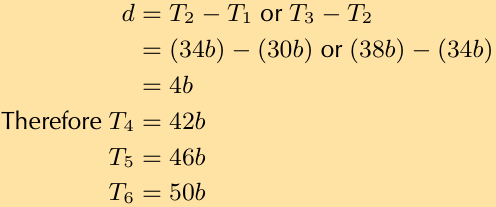
> **[Diagram Context - Textbook_Mathematics_Gr10_Number-patterns.pdf-0017-14.png]**
> 1. A diagram of a cell with arrows pointing to different parts of the cell.

---

### Trigonometry: Angles of Elevation and Distance

#### Worked Example 3: Calculating Distance
**Problem:** Jim stands at point $A$ at the base of a telephone pole, looking up at a bird sitting on the top of another telephone pole (point $B$). The height of each telephone pole is $8\text{ m}$, and the angle of elevation from $A$ to the top of $B$ is $45^\circ$. Calculate the distance between the telephone poles ($x$).

**Solution:**
Using the tangent ratio:
$$\tan \theta = \frac{\text{opposite}}{\text{adjacent}}$$

Substitute the known values:
$$\tan 45^\circ = \frac{8}{x}$$

Rearrange to solve for $x$:
$$x = \frac{8}{\tan 45^\circ}$$
$$x = 8$$

**Conclusion:** The distance between the telephone poles is $8\text{ m}$.

---

#### Worked Example 4: Calculating Angle of Elevation
**Problem:** Alfred stands at point $A$, looking up at a flag on a pole (point $B$). Point $A$ is $5,0\text{ m}$ away from the bottom of the flag pole. The line of sight distance from point $A$ to the top of the flag pole (point $B$) is $7,07\text{ m}$. Calculate the angle of elevation to the top of the flag pole ($x^\circ$).

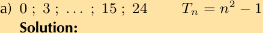
> **[Diagram Context - Textbook_Mathematics_Gr10_Number-patterns.pdf-0018-09.png]**
> The image shows a diagram of a Lewis structure for nitrogen. The diagram is a two-dimensional representation of a molecule, with nitrogen represented by a nitrogen atom and a nitrogen bond. The diagram is labeled with the chemical symbol "N" and the name "nitrogen" written in black text. The diagram also includes arrows pointing to the nitrogen atom and the bond, as well as labels for the

**Solution:**
In this right-angled triangle, we have the adjacent side ($5,0\text{ m}$) and the hypotenuse ($7,07\text{ m}$). We use the cosine ratio:
$$\cos x = \frac{\text{adjacent}}{\text{hypotenuse}}$$

Substitute the known values:
$$\cos x = \frac{5,0}{7,07}$$

Solve for $x$ using the inverse cosine function:
$$x = \arccos\left(\frac{5,0}{7,07}\right)$$
$$x \approx 44,98^\circ$$

Rounding to the nearest degree:
$$x \approx 45^\circ$$

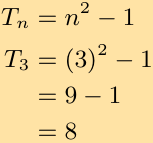

---

### Trigonometry: Applications in Right-Angled Triangles

#### Worked Example 1: Rugby Kick
**Problem:** A rugby player is trying to kick a ball through the poles. The rugby crossbar is $3,4\text{ m}$ high. The ball is placed $24\text{ m}$ from the poles. What is the minimum angle he needs to launch the ball to get it over the bar?

**Solution:**
We model this as a right-angled triangle where:
*   $CA$ (adjacent) $= 24\text{ m}$
*   $BC$ (opposite) $= 3,4\text{ m}$
*   $\theta$ is the angle of elevation.

Using the tangent ratio:
$$\tan \theta = \frac{\text{opposite}}{\text{adjacent}} = \frac{BC}{CA}$$
$$\tan \theta = \frac{3,4}{24}$$
$$\theta = 8,0632...^\circ$$
$$\theta \approx 8^\circ$$

**Conclusion:** The player needs to kick the ball with a minimum angle of $8^\circ$.

---

#### Worked Example 2: Escalator Height
**Problem:** The escalator at a mall slopes at an angle of $30^\circ$ and is $20\text{ m}$ long. Through what height would a person be lifted by travelling on the escalator?

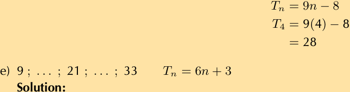
> **[Diagram Context - Textbook_Mathematics_Gr10_Number-patterns.pdf-0019-07.png]**
> The image shows a diagram of a Lewis structure for nitrogen tetrahedron (N4H4). The diagram is set against a light brown background. The diagram includes a Lewis structure of nitrogen tetrahedron, labeled with the chemical formula N4H4. The diagram also includes a Lewis structure of nitrogen tetrahedron, labeled with the chemical formula T9H8. The

**Solution:**
We model this as a right-angled triangle where:
*   The hypotenuse $= 20\text{ m}$
*   The angle $= 30^\circ$
*   $h$ (opposite side) is the height.

Using the sine ratio:
$$\sin 30^\circ = \frac{\text{opposite}}{\text{hypotenuse}} = \frac{h}{20}$$
$$h = 20 \sin 30^\circ$$
$$h = 10\text{ m}$$

**Conclusion:** A person is lifted through a height of $10\text{ m}$.

> **[Diagram Context - Textbook_Mathematics_Gr10_Number-patterns.pdf-0019-09.png]**
> The image shows a diagram of a Lewis structure for nitrogen. The diagram is divided into four sections, each representing a different nitrogen atom. The diagram is color-coded, with each color representing a different element. The diagram also includes arrows pointing to the nitrogen atoms, which are labeled with the element symbols. The diagram is set against a light beige background, and the numbers "27" and

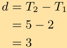

---

### Trigonometry: Applications in Right-Angled Triangles

This section covers the practical application of trigonometric ratios to solve real-world problems involving heights, distances, and angles of elevation.

---

#### Worked Example 1: Ladder against a wall
**Problem:** A ladder is $8\text{ m}$ long. It is leaning against the wall of a house and reaches $6\text{ m}$ up the wall. Calculate the angle which the ladder makes with the flat ground.

**a) Sketch of the situation:**

> **[Diagram Context - Textbook_Mathematics_Gr10_Number-patterns.pdf-0020-03.png]**
> The image shows a diagram of a Lewis structure for carbon dioxide. The diagram is divided into four sections, each representing a different energy level. The diagram is color-coded, with each color representing a different energy level. The diagram also includes a legend that explains the different energy levels. The diagram is set against a beige background, and the text "T1" is present, which is

**b) Calculation:**
To find the angle $\theta$ between the ladder and the ground, we use the sine ratio ($\sin = \frac{\text{opposite}}{\text{hypotenuse}}$):

$$\sin \theta = \frac{6}{8}$$
$$\theta = 48,5903...^\circ$$
$$\theta \approx 48,59^\circ$$

**Conclusion:** The ladder makes an angle of $48,59^\circ$ with the ground.

---

#### Worked Example 2: Height of a tower
**Problem:** Nandi is standing on level ground $70\text{ m}$ away from a tall tower. From her position, the angle of elevation of the top of the tower is $38^\circ$. What is the height of the tower?

**a) Sketch of the situation:**

**b) Calculation:**
To find the height $x$, we use the tangent ratio ($\tan = \frac{\text{opposite}}{\text{adjacent}}$):

$$\tan 38^\circ = \frac{x}{70}$$
$$x = 70 \tan 38^\circ$$
$$x = 54,6899...$$
$$x \approx 54,69\text{ m}$$

**Conclusion:** The height of the tower is $54,69\text{ m}$.

---

#### Exercise: Height of a pole
**Problem:** The top of a pole is anchored by a $12\text{ m}$ cable which makes an angle of $40^\circ$ with the horizontal. What is the height of the pole?

**Sketch of the situation:**

> **[Diagram Context - Textbook_Mathematics_Gr10_Number-patterns.pdf-0020-08.png]**
> 1. A diagram of a cell with arrows pointing to different parts of the cell.

**Hint for solution:**
Use the sine ratio, as you have the hypotenuse ($12\text{ m}$) and need the opposite side (the height of the pole):

$$\sin 40^\circ = \frac{\text{height}}{12}$$
$$\text{height} = 12 \times \sin 40^\circ$$

> **[Diagram Context - Textbook_Mathematics_Gr10_Number-patterns.pdf-0020-10.png]**
> 1. A diagram of a cell with the number 456 on it.

---

### Worked Example: Trigonometry in Context

#### Problem 10: Lighthouse Navigation
A ship's navigator observes a lighthouse on a cliff. According to the navigational charts, the top of the lighthouse is $35\text{ m}$ above sea level. She measures the angle of elevation of the top of the lighthouse to be $0,7^\circ$. Ships have been advised to stay at least $4\text{ km}$ away from the shore. Is the ship safe?

**Diagram:**

**Solution:**
Using the tangent ratio:
$$\tan 0,7^\circ = \frac{35}{d}$$

Rearranging to solve for distance $d$:
$$d = \frac{35}{\tan 0,7^\circ}$$
$$d = 2864,6464... \text{ m}$$
$$d \approx 2864,65 \text{ m}$$
$$d \approx 2,86 \text{ km}$$

**Conclusion:**
Since $2,86\text{ km} < 4\text{ km}$, the ship is **not safe**.

***

#### Problem 11: Perimeter of a Rectangle
Determine the perimeter of rectangle $PQRS$ given the diagonal $PR = 85\text{ m}$ and $\angle SPR = 35^\circ$.

**Diagram:**

> **[Diagram Context - Textbook_Mathematics_Gr10_Number-patterns.pdf-0021-04.png]**
> The image presents a diagram of a mathematical equation, which is a visual representation of a chemical equation. The equation is written in a standard mathematical format, with each element separated by a plus sign. The diagram includes various chemical symbols and formulas, such as H2O, CO2, and NaCl. The diagram also includes arrows and labels to indicate the direction of the reaction and the elements involved

**Solution:**
Using trigonometric ratios to calculate the sides $QR$ and $PQ$:

1. Calculate side lengths:
   $$QR = 85 \cos 35^\circ$$
   $$PQ = 85 \sin 35^\circ$$

2. Calculate the perimeter ($P$) using the formula $P = 2 \times (\text{length} + \text{breadth})$:
   $$P = 2 \times (QR + PQ)$$
   $$P = 2(85 \cos 35^\circ + 85 \sin 35^\circ)$$
   $$P = 2(85(\cos 35^\circ + \sin 35^\circ))$$
   $$P = 2(236,76 \text{ m})$$
   $$P = 473,52 \text{ m}$$

**Conclusion:**
The perimeter of rectangle $PQRS$ is $473,52\text{ m}$.

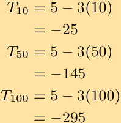
> **[Diagram Context - Textbook_Mathematics_Gr10_Number-patterns.pdf-0021-06.png]**
> The image shows a diagram of a Lewis structure for carbon dioxide. The diagram is divided into five sections, each representing a different energy level. The diagram is color-coded, with each energy level being a different color. The diagram also includes arrows pointing to the energy levels, indicating the bonds between them. The diagram is set against a yellow background, and the text "T1O = 5

> **[Diagram Context - Textbook_Mathematics_Gr10_Number-patterns.pdf-0021-09.png]**
> The image shows a diagram of a Lewis structure, which is a diagram used to represent the valence electrons of an atom. The diagram is composed of multiple lines, each representing a bond between atoms. The diagram is set against a beige background, and it is divided into four distinct sections, each representing a different Lewis structure. The diagram is labeled with the names of the atoms and the number

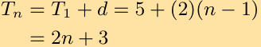
> **[Diagram Context - Textbook_Mathematics_Gr10_Number-patterns.pdf-0021-15.png]**
> The image shows a mathematical equation written in black and yellow. The equation is a linear equation with two variables, T and D, and it is represented by the following symbols: T = T1 + D. The equation is set against a gray background, and it is accompanied by a legend that explains the meaning of the symbols. The equation is clearly labeled and organized, making it easy to understand

---

### 12. Calculating Interior Angles of a Rhombus

**Problem:** A rhombus has diagonals of lengths $6\text{ cm}$ and $9\text{ cm}$. Calculate the sizes of its interior vertex angles.

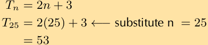
> **[Diagram Context - Textbook_Mathematics_Gr10_Number-patterns.pdf-0022-00.png]**
> The image shows a math problem involving the substitution of a value for a variable. The problem is presented in a tabular form with the variable "n" and the equation "Tn = 2(2n) + 3". The problem is set against a gray background, and the text "substitute n = 25" is written below the equation. The problem is designed to help students

**Key Concept:** The diagonals of a rhombus bisect each other at right angles ($90^\circ$). This divides the rhombus into four congruent right-angled triangles. Given the full diagonals are $6\text{ cm}$ and $9\text{ cm}$, the legs of these right-angled triangles are:
*   $a = \frac{9}{2} = 4,5\text{ cm}$
*   $b = \frac{6}{2} = 3\text{ cm}$

**Worked Example:**
Using trigonometry in one of the right-angled triangles:

1.  **Calculate angle $\theta$:**
    $$\tan \theta = \frac{\text{opposite}}{\text{adjacent}} = \frac{4,5}{3}$$
    $$\theta = \arctan(1,5) \approx 56,31^\circ$$
    *(Note: The provided text contains a calculation error in the source image; $\arctan(1,5) \approx 56,31^\circ$)*

2.  **Calculate angle $\alpha$:**
    $$\tan \alpha = \frac{\text{opposite}}{\text{adjacent}} = \frac{3}{4,5}$$
    $$\alpha = \arctan(0,666...) \approx 33,69^\circ$$

3.  **Determine interior vertex angles:**
    The interior angles of the rhombus are $2\alpha$ and $2\theta$:
    *   Angle 1: $2 \times 33,69^\circ = 67,38^\circ$
    *   Angle 2: $2 \times 56,31^\circ = 112,62^\circ$

---

### 13. Calculating Diagonal Lengths of a Rhombus

**Problem:** A rhombus has edge lengths of $7\text{ cm}$. Its acute interior vertex angles are both $70^\circ$. Calculate the lengths of both of its diagonals.

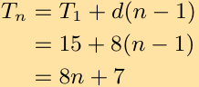
> **[Diagram Context - Textbook_Mathematics_Gr10_Number-patterns.pdf-0022-05.png]**
> The image shows a diagram of a Lewis structure for nitrogen. The diagram is divided into three sections, each representing a different nitrogen atom. The diagram is color-coded, with each color representing a different element. The diagram is labeled with the chemical symbol "N" and the atomic number "15". The diagram also includes arrows pointing to the nitrogen atoms and the bonds between them. The diagram is

**Key Concept:** 
*   The diagonals of a rhombus bisect the interior angles.
*   If the acute angle is $70^\circ$, the angle at the vertex of the internal right-angled triangle is $\frac{70^\circ}{2} = 35^\circ$.
*   The diagonals bisect each other at $90^\circ$.

**Method:**
In the right-angled triangle formed by the diagonals:
*   Hypotenuse = $7\text{ cm}$
*   Angle = $35^\circ$

1.  **Calculate half-diagonal $a$ (adjacent to $35^\circ$):**
    $$\cos(35^\circ) = \frac{a}{7}$$
    $$a = 7 \times \cos(35^\circ) \approx 5,73\text{ cm}$$
    Full diagonal $d_1 = 2 \times 5,73 = 11,46\text{ cm}$

2.  **Calculate half-diagonal $b$ (opposite to $35^\circ$):**
    $$\sin(35^\circ) = \frac{b}{7}$$
    $$b = 7 \times \sin(35^\circ) \approx 4,02\text{ cm}$$
    Full diagonal $d_2 = 2 \times 4,02 = 8,04\text{ cm}$

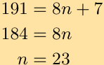

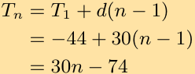
> **[Diagram Context - Textbook_Mathematics_Gr10_Number-patterns.pdf-0022-12.png]**
> The image shows a diagram of a Lewis structure for the molecule d(n) = 1/3n. The diagram is color-coded, with the Lewis structure represented in black and the chemical formula represented in white. The diagram includes arrows to indicate bonds and arrows to represent lone pairs. The diagram is set against a light brown background, and the text "Tn = T1 + d

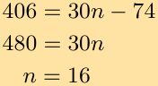

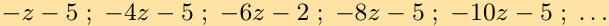

> **[Diagram Context - Textbook_Mathematics_Gr10_Number-patterns.pdf-0022-18.png]**
> The image shows a diagram of a Lewis structure for carbon dioxide. The diagram is divided into six sections, each representing a carbon atom. The carbon atoms are connected by double bonds, and the Lewis structure is color-coded with black for carbon and yellow for oxygen. The diagram also includes arrows pointing to the oxygen atoms, indicating the bonds between the carbon and oxygen atoms. The diagram is set against

---

### Worked Example: Calculating Diagonals of a Rectangle
Given a right-angled triangle formed by the diagonals of a rectangle with a hypotenuse of $7$ and an angle of $35^\circ$:

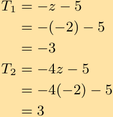
> **[Diagram Context - Textbook_Mathematics_Gr10_Number-patterns.pdf-0023-01.png]**
> 1. A diagram of a cell with arrows pointing to different parts of the cell.

**Calculations:**

1. To find side $a$:
   $$\cos 35^\circ = \frac{a}{7}$$
   $$a = 7 \cos 35^\circ$$
   $$a = 5,734...$$
   $$\text{diagonal 1} = 11,47 \text{ cm}$$

2. To find side $b$:
   $$\sin 35^\circ = \frac{b}{7}$$
   $$b = 7 \sin 35^\circ$$
   $$b = 4,015...$$
   $$\text{diagonal 2} = 8,03 \text{ cm}$$

**Conclusion:** The two diagonals are $11,47 \text{ cm}$ and $8,03 \text{ cm}$.

---

### Exercise 14: Perpendicular Distance in a Parallelogram
**Problem:** A parallelogram has edge-lengths of $5 \text{ cm}$ and $9 \text{ cm}$ respectively, and an angle of $58^\circ$ between them. Calculate the perpendicular distance ($h$) between the two longer edges.

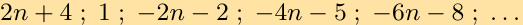

**Solution:**
Using the sine ratio in the right-angled triangle formed by the height $h$:
$$\sin 58^\circ = \frac{h}{5}$$
$$h = 5 \sin 58^\circ$$
$$h = 4,24 \text{ cm}$$

---

### Exercise 15: Properties of a Rhombus
**Problem:** One of the angles of a rhombus with a perimeter of $20 \text{ cm}$ is $30^\circ$.
**a) Find the lengths of the sides of the rhombus.**

**Solution:**
1. **Sketch:**
   

> **[Diagram Context - Textbook_Mathematics_Gr10_Number-patterns.pdf-0023-05.png]**
> The image shows a diagram of a Lewis structure for nitrogen. The diagram is divided into three rows, each containing four elements. The first row shows the nitrogen atom, the second row shows the nitrogen molecule, and the third row shows the nitrogen bond. The diagram is set against a light gray background, and the text "dT2T3T4T3T5T6T7

2. **Concept:** A rhombus has four equal sides.
   $$\text{Side length} = \frac{\text{Perimeter}}{4}$$
   $$\text{Side length} = \frac{20 \text{ cm}}{4} = 5 \text{ cm}$$

> **[Diagram Context - Textbook_Mathematics_Gr10_Number-patterns.pdf-0023-08.png]**
> 1. A diagram of a cell with arrows pointing to different parts of the cell.

> **[Diagram Context - Textbook_Mathematics_Gr10_Number-patterns.pdf-0023-12.png]**
> 1. A diagram of a cell with arrows pointing to different parts of the cell.

---

### Geometry and Trigonometry Applications

#### Worked Example: Properties of a Rhombus
Given a rhombus with a perimeter of $20\text{ cm}$.

**1. Finding side length ($a$):**
The perimeter is the sum of all four equal sides:
$$20 = 4a$$
$$a = 5\text{ cm}$$

**2. Finding the length of diagonals:**
The diagonals of a rhombus bisect the internal angles. By using trigonometry in one of the four internal right-angled triangles:
$$\cos 15^\circ = \frac{b}{5}$$
$$b = 5 \cos 15^\circ$$
$$b = 4,83\text{ cm}$$

Using the Theorem of Pythagoras ($c^2 = a^2 - b^2$) to find the other half-diagonal ($c$):
$$c^2 = (5)^2 - (4,83)^2$$
$$c^2 = 25 - 23,33$$
$$c^2 = 1,67$$
$$c = 1,29\text{ cm}$$

**Total diagonal lengths:**
Since diagonals bisect each other, the full lengths are:
*   Diagonal 1: $2b = 2(4,83) = 9,66\text{ cm}$
*   Diagonal 2: $2c = 2(1,29) = 2,58\text{ cm}$

---

#### Application: Sun's Altitude and Shadows
Upright objects and their shadows form right-angled triangles where the angle of elevation ($\theta$) represents the sun's altitude.

**a) Finding the altitude of the sun**
Given a stick of $1\text{ m}$ casting a shadow of $1,35\text{ m}$:

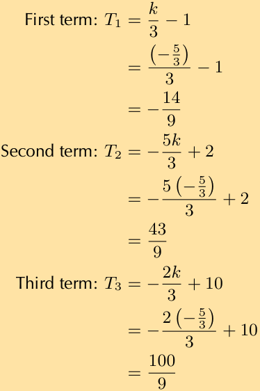
> **[Diagram Context - Textbook_Mathematics_Gr10_Number-patterns.pdf-0024-01.png]**
> The image shows a math problem that involves solving for the value of k in terms of the first term, second term, and third term. The problem is presented in a table format, with the first term labeled as "First term", the second term labeled as "Second term", and the third term labeled as "Third term". The problem also includes a diagram that shows the relationship between the first

Using the tangent ratio:
$$\tan \theta = \frac{\text{opposite}}{\text{adjacent}}$$
$$\tan \theta = \frac{1}{1,35}$$
$$\theta = 36,53^\circ$$

**b) Finding the height of a building**
Given the same sun altitude ($\theta = 36,53^\circ$) and a building shadow of $47\text{ m}$:

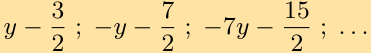

Using the tangent ratio to find height ($h$):
$$\tan 36,53^\circ = \frac{h}{47}$$
$$h = 47 \times \tan 36,53^\circ$$
*(Note: Using the previously calculated angle to solve for $h$)*

> **[Diagram Context - Textbook_Mathematics_Gr10_Number-patterns.pdf-0024-05.png]**
> 1. A diagram of a cell with arrows pointing to different parts of the cell.

---

### Trigonometry: Applications in 2D

#### Worked Example: Hot Air Balloon Elevation
**Problem 17:** The angle of elevation of a hot air balloon, climbing vertically, changes from $25^\circ$ at 11:00 am to $60^\circ$ at 11:02 am. The point of observation is situated $300\text{ m}$ away from the take-off point.

**a) Sketch of the situation:**

> **[Diagram Context - Textbook_Mathematics_Gr10_Number-patterns.pdf-0025-00.png]**
> 1. A diagram of a cell with arrows pointing to different parts of the cell.

**b) Calculate the increase in height between 11:00 am and 11:02 am:**

1. Calculate the initial height ($h_1$) at 11:00 am:
$$\tan 25^\circ = \frac{h_1}{300}$$
$$h_1 = 300 \tan 25^\circ$$
$$h_1 = 139,89\text{ m}$$

2. Calculate the final height ($h_2$) at 11:02 am:
$$\tan 60^\circ = \frac{h_2}{300}$$
$$h_2 = 300 \tan 60^\circ$$
$$h_2 = 519,62\text{ m}$$

3. Calculate the difference in height:
$$\text{Increase} = 519,62\text{ m} - 139,89\text{ m} = 379,73\text{ m}$$

---

#### Worked Example: Mountain Height Calculation
**Problem 18:** When the top, $T$, of a mountain is viewed from point $A$, $2000\text{ m}$ from the ground, the angle of depression is $15^\circ$. When viewed from point $B$ on the ground, the angle of elevation is $10^\circ$. If points $A$ and $B$ are on the same vertical line, find the height, $h$, of the mountain. Round to one decimal place.

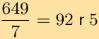

**Solution:**

1. Define the variables based on the geometry:
   * Let the total height of the mountain be $H$.
   * The distance from the ground to point $A$ is $2000\text{ m}$.
   * The distance from the ground to the top of the mountain is $h$.
   * The distance from point $C$ (level with $A$) to the top $T$ is $2000 - h$.

2. Using trigonometry in the triangles formed:
   * From the angle of depression at $A$:
     $$\tan 15^\circ = \frac{2000 - h}{d} \implies d = \frac{2000 - h}{\tan 15^\circ}$$
   * From the angle of elevation at $B$:
     $$\tan 10^\circ = \frac{h}{d} \implies d = \frac{h}{\tan 10^\circ}$$

3. Equate the two expressions for $d$:
   $$\frac{2000 - h}{\tan 15^\circ} = \frac{h}{\tan 10^\circ}$$
   $$(2000 - h) \tan 10^\circ = h \tan 15^\circ$$
   $$2000 \tan 10^\circ - h \tan 10^\circ = h \tan 15^\circ$$
   $$2000 \tan 10^\circ = h (\tan 15^\circ + \tan 10^\circ)$$
   $$h = \frac{2000 \tan 10^\circ}{\tan 15^\circ + \tan 10^\circ}$$

4. Final Calculation:
   $$h \approx \frac{2000(0,1763)}{0,2679 + 0,1763}$$
   $$h \approx \frac{352,6}{0,4442}$$
   $$h \approx 793,8\text{ m}$$

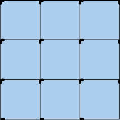

> **[Diagram Context - Textbook_Mathematics_Gr10_Number-patterns.pdf-0025-12.png]**
> 1. A diagram of a cell with arrows pointing to different parts of the cell.

---

### Trigonometric Applications: Solving for Unknowns

#### Worked Example: Height Calculation
Given a scenario involving two angles of elevation, the height $h$ can be determined by equating the base $CT$:

1. $\tan 10^\circ = \frac{h}{CT} \implies CT = \frac{h}{\tan 10^\circ}$
2. $\tan 15^\circ = \frac{2000 - h}{CT} \implies CT = \frac{2000 - h}{\tan 15^\circ}$
3. Equating the two expressions for $CT$:
   $$\frac{h}{\tan 10^\circ} = \frac{2000 - h}{\tan 15^\circ}$$
4. Solving for $h$:
   $$h \approx 793,77 \text{ m}$$

---

#### Exercise 19: Quadrilateral $PQRS$
**Given:**
* Quadrilateral $PQRS$
* $PQ = 7,5 \text{ cm}$
* $PS = 6,2 \text{ cm}$
* $\hat{R} = 42^\circ$
* $\hat{S} = 90^\circ$
* $\hat{Q} = 90^\circ$

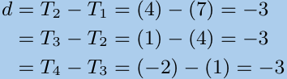
> **[Diagram Context - Textbook_Mathematics_Gr10_Number-patterns.pdf-0026-03.png]**
> 1. A diagram of a cell with arrows pointing to different parts of the cell.

**a) Find $PR$, correct to 2 decimal places.**

**Solution:**
In $\triangle PQR$, we use the sine ratio:
$$\sin 42^\circ = \frac{7,5}{PR}$$
$$PR = \frac{7,5}{\sin 42^\circ}$$
$$\therefore PR = 11,21 \text{ cm}$$

**b) Find the size of the angle marked $x$, correct to one decimal place.**

**Solution:**
In $\triangle PSR$, we use the cosine ratio:
$$\cos x = \frac{6,2}{11,21}$$
$$x = \arccos\left(\frac{6,2}{11,21}\right)$$
$$\therefore x = 56,4^\circ$$

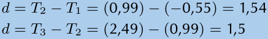
> **[Diagram Context - Textbook_Mathematics_Gr10_Number-patterns.pdf-0026-06.png]**
> The image shows a diagram of a Lewis structure for water. The diagram is divided into two rows, with the first row containing the chemical formula "H2O" and the second row showing the Lewis structure of water. The diagram is set against a gray background, and the text "d = T2 - T3 - T2 = T3 - T2 - T3" is present

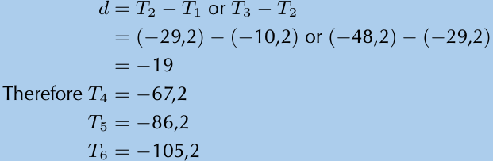
> **[Diagram Context - Textbook_Mathematics_Gr10_Number-patterns.pdf-0026-15.png]**
> The image shows a blue table with a mathematical equation written on it. The equation is in black text and is accompanied by a graph. The table has a title at the top and a caption below it. The caption reads "Therefore T = 29.2 or T = 3 or T = 10.2 or T = 2 or T = 48 or T = 2/2 or T =

> **[Diagram Context - Textbook_Mathematics_Gr10_Number-patterns.pdf-0026-17.png]**
> The image shows a blue line graph with a black x-axis and y-axis. The x-axis is labeled with the numbers "46r" and "48r", while the y-axis is labeled with the numbers "46r" and "48r". The graph is labeled with the text "d/T2 = T1 or T3 = T2". The graph

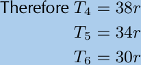
> **[Diagram Context - Textbook_Mathematics_Gr10_Number-patterns.pdf-0026-18.png]**
> Therefore is a mathematical equation that shows the relationship between three variables: T, T5, and T6. The equation is T4 = 38r, which means that the value of T is equal to the product of the constant term 38r and the variable term 4.

---

### Trigonometry: Application of Angles of Elevation

#### Problem Statement
From a boat at sea ($S$), the angle of elevation of the top of a lighthouse ($PQ$), which is situated on a cliff ($QR$), is $27^\circ$. The lighthouse is $10\text{ m}$ high and the cliff is $75\text{ m}$ above sea level. Calculate the distance from the boat to the base of the cliff ($RS$), to the nearest metre.

#### Concepts and Structure
To solve this problem, we use right-angled trigonometry. 
1. **Identify the total height:** The total vertical height ($PR$) is the sum of the lighthouse height ($PQ$) and the cliff height ($QR$).
   $$PR = PQ + QR$$
   $$PR = 10\text{ m} + 75\text{ m} = 85\text{ m}$$

2. **Apply Trigonometric Ratios:** In the right-angled triangle $\triangle PRS$, the angle of elevation at $S$ is $27^\circ$. We use the tangent ratio:
   $$\tan(\theta) = \frac{\text{opposite}}{\text{adjacent}}$$
   $$\tan(27^\circ) = \frac{PR}{RS}$$

#### Worked Example
Substitute the known values into the equation:

$$\frac{85}{RS} = \tan(27^\circ)$$

Rearrange the formula to solve for $RS$:

$$\frac{85}{\tan(27^\circ)} = RS$$

Calculate the value:

$$RS \approx 166.82\dots$$

Rounding to the nearest metre:

$$\therefore RS = 167\text{ m}$$

***

#### Practice Exercises
For further practice, visit [www.everythingmaths.co.za](http://www.everythingmaths.co.za) and use the following codes:

| Exercise | Code | Exercise | Code | Exercise | Code |
| :--- | :--- | :--- | :--- | :--- | :--- |
| 1 | 2GPW | 2 | 2GPX | 3 | 2GPY |
| 4 | 2GPZ | 5 | 2GQ2 | 6 | 2GQ3 |
| 7 | 2GQ4 | 8 | 2GQ5 | 9 | 2GQ6 |
| 10 | 2GQ7 | 11 | 2GQ8 | 12 | 2GQ9 |
| 13 | 2GQB | 14 | 2GQC | 15 | 2GQD |
| 16 | 2GQF | 17 | 2GQG | 18 | 2GQH |
| 19 | 2GQJ | 20 | 2GQK | | |

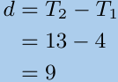

> **[Diagram Context - Textbook_Mathematics_Gr10_Number-patterns.pdf-0027-08.png]**
> The image shows a diagram of a Lewis structure for the molecule ethane (C4H10). The diagram is divided into two sections, with the left section representing the carbon atoms and the right section representing the hydrogen atoms. The Lewis structure is color-coded, with the carbon atoms in black and the hydrogen atoms in white. The diagram also includes labels for the number of valence electrons,

> **[Diagram Context - Textbook_Mathematics_Gr10_Number-patterns.pdf-0027-11.png]**
> The image shows a diagram of a Lewis structure for calcium carbonate. The diagram is blue and features a number of labels and arrows. The diagram is labeled with the text "Solution: T6 = 49".

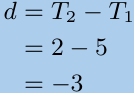

> **[Diagram Context - Textbook_Mathematics_Gr10_Number-patterns.pdf-0027-15.png]**
> The image shows a diagram of a Lewis structure for nitrogen. The diagram is divided into four sections, each representing a different nitrogen atom. The diagram is color-coded, with each color representing a different element. The diagram is labeled with the chemical symbols of nitrogen, oxygen, and carbon. The diagram also includes arrows to indicate bonds between the nitrogen atoms. The diagram is set against a light blue

