# CHAPTER 5

## Trigonometry

<!-- DIAGRAM_PLACEHOLDER: diagram -->

### Chapter Contents

| Section | Topic | Page |
| :---: | :--- | :---: |
| **5.1** | Introduction | 108 |
| **5.2** | Similarity of triangles | 108 |
| **5.3** | Defining the trigonometric ratios | 110 |
| **5.4** | Reciprocal ratios | 115 |
| **5.5** | Calculator skills | 116 |
| **5.6** | Special angles | 118 |
| **5.7** | Solving trigonometric equations | 120 |
| **5.8** | Defining ratios in the Cartesian plane | 131 |
| **5.9** | Chapter summary | 138 |

---

# 5 Trigonometry

## 5.1 Introduction

EMA3M

Trigonometry deals with the relationship between the angles and sides of a triangle. We will learn about trigonometric ratios in right-angled triangles, which form the basis of trigonometry.

There are many applications of trigonometry. Of particular value is the technique of triangulation, which is used in astronomy to measure the distances to nearby stars, in geography to measure distances between landmarks, and in satellite navigation systems. GPS (the global positioning system) would not be possible without trigonometry. Other fields which make use of trigonometry include acoustics, optics, analysis of financial markets, electronics, probability theory, statistics, biology, medical imaging (CAT scans and ultrasound), chemistry, cryptology, meteorology, oceanography, land surveying, architecture, phonetics, engineering, computer graphics and game development.

Figure 5.1: An artist's depiction of a GPS satellite orbiting the Earth. There are at least 24 GPS satellites operational at any one time. GPS uses an application of trigonometry, known as triangulation, to determine ones position. The accuracy of GPS is to within 15 metres.

> **VISIT:**
> The following video covers a brief history of trigonometry and some of the uses of trigonometry.
> See video: 2FN7 at www.everythingmaths.co.za

## 5.2 Similarity of triangles

EMA3N

Before we delve into the theory of trigonometry, complete the following investigation to get a better understanding of the foundation of trigonometry.

> **Investigation: Ratios of similar triangles**
>
> Draw three similar triangles of different sizes using a protractor and a ruler, with each triangle having interior angles equal to $30^\circ$, $90^\circ$ and $60^\circ$ as shown below. Measure the angles and lengths accurately in order to fill in the table (leave your answers as a simplified fraction):

---

108  
5.1. Introduction


> **[Diagram Context - Textbook_Mathematics_Gr11_investigation_and_projects.pdf-0001-00.png]**
> This graphic is a navigational chapter heading featuring the text "CHAPTER" and the numeral "9" enclosed within a stylized circular icon. The icon uses a segmented blue-and-white ring design to visually demarcate the start of a specific section in a textbook. It serves as a structural signpost to help students organize their learning and locate specific curriculum topics within the broader CAPS syllabus.


> **[Diagram Context - Textbook_Mathematics_Gr11_Linear-programming.pdf-0001-00.png]**
> This graphic is a textbook header section icon denoting the beginning of a specific unit of study. It features the bold blue text "CHAPTER" alongside a circular blue emblem containing the numeral "12" framed by a segmented ring pattern. Conceptually, it serves as an organizational signpost in instructional materials to demarcate the start of Chapter 12 for students following the curriculum structure.


> **[Diagram Context - Textbook_Mathematics_Gr11_Linear-programming.pdf-0001-02.png]**
> This graphic is a textbook section banner featuring a solid blue rounded rectangular bar. It displays the section number "12.1", the section title "*Introduction*", and the page number "472" in white text. Conceptually, it serves as an organizational and navigational marker indicating the starting point of Chapter 12's introductory content for learners following the curriculum.


> **[Diagram Context - Textbook_Mathematics_Gr11_Number-patterns.pdf-0001-00.png]**
> The image shows a chapter number 3 with a blue circle and the word "chapter" written in white. The chapter is titled "Chapter 3" and is positioned at the top of the image. The chapter is designed to help students understand the concept of a Lewis diagram, which is a diagram used to represent the valence electrons of an atom. The diagram consists of a central circle containing a blue


---

## Chapter 5: Trigonometry


> **[Diagram Context - Textbook_Mathematics_Gr11_Number-patterns.pdf-0002-04.png]**
> 1. A close-up of a sunflower with a yellow center and brown edges.


### Dividing lengths of sides (ratios)

| Column 1 | Column 2 | Column 3 |
| :---: | :---: | :---: |
| $\frac{AB}{BC} =$ | $\frac{AB}{AC} =$ | $\frac{CB}{AC} =$ |
| $\frac{DE}{EF} =$ | $\frac{DE}{DF} =$ | $\frac{FE}{DF} =$ |
| $\frac{GH}{HK} =$ | $\frac{GH}{GK} =$ | $\frac{KH}{GK} =$ |

What observations can you make about the ratios of the sides?

Have you noticed that it does not matter what the lengths of the sides of the triangles are, if the angle remains constant, the ratio of the sides will always yield the same answer?

---

In the triangles below, $\triangle ABC$ is similar to $\triangle DEF$. This is written as: $\triangle ABC ||| \triangle DEF$


> **[Diagram Context - Textbook_Mathematics_Gr11_Number-patterns.pdf-0002-17.png]**
> A diagram of a sequence of dots and arrows pointing to the dots.


In similar triangles, it is possible to deduce ratios between corresponding sides:

$$\frac{AB}{BC} = \frac{DE}{EF}$$

$$\frac{AB}{AC} = \frac{DE}{DF}$$

$$\frac{AC}{BC} = \frac{DF}{EF}$$

$$\frac{AB}{DE} = \frac{BC}{EF} = \frac{AC}{DF}$$

---

Another important fact about similar triangles $ABC$ and $DEF$ is that the angle at vertex $A$ is equal to the angle at vertex $D$, the angle at vertex $B$ is equal to the angle at vertex $E$, and the angle at vertex $C$ is equal to the angle at vertex $F$.

$$\hat{A} = \hat{D}$$
$$\hat{B} = \hat{E}$$
$$\hat{C} = \hat{F}$$

**NOTE:**  
The order of letters for similar triangles is very important. Always label similar triangles in corresponding order. For example,

$$\Delta ABC \mathbin{\vert\vert} \Delta DEF \text{ is correct; but}$$
$$\Delta ABC \mathbin{\vert\vert} \Delta DFE \text{ is incorrect.}$$

---

## 5.3 Defining the trigonometric ratios (EMA3P)

The ratios of similar triangles are used to define the trigonometric ratios. Consider a right-angled triangle $ABC$ with an angle marked $\theta$ (said 'theta').

In a right-angled triangle, we refer to the three sides according to how they are placed in relation to the angle $\theta$. The side opposite to the right-angle is labelled the **hypotenuse**, the side opposite $\theta$ is labelled **"opposite"**, the side next to $\theta$ is labelled **"adjacent"**.

You can choose either non-$90^{\circ}$ internal angle and then define the adjacent and opposite sides accordingly. However, the hypotenuse remains the same regardless of which internal angle you are referring to because it is *always* opposite the right-angle and *always* the longest side.

We define the trigonometric ratios: sine ($\sin$), cosine ($\cos$) and tangent ($\tan$), of an angle, as follows:

$$\sin \theta = \frac{\text{opposite}}{\text{hypotenuse}}$$

$$\cos \theta = \frac{\text{adjacent}}{\text{hypotenuse}}$$

$$\tan \theta = \frac{\text{opposite}}{\text{adjacent}}$$

These ratios, also known as trigonometric identities, relate the lengths of the sides of a right-angled triangle to its interior angles. These three ratios form the basis of trigonometry.

**IMPORTANT!**

The definitions of opposite, adjacent and hypotenuse are only applicable when working with right-angled triangles! Always check to make sure your triangle has a right-angle before you use them, otherwise you will get the wrong answer.


> **[Diagram Context - Textbook_Mathematics_Gr11_investigation_and_projects.pdf-0003-02.png]**
> This image displays a set of mathematical variables used in Grade 10-12 CAPS Financial Mathematics, specifically identifying the principal amount ($P = 1250$), the number of time periods ($n = 6$), and the interest rate expressed as a decimal ($i = 0,06$). These values represent the essential parameters required to substitute into compound or simple interest formulas to calculate future or accumulated values.


> **[Diagram Context - Textbook_Mathematics_Gr11_investigation_and_projects.pdf-0003-07.png]**
> This graphic presents a set of financial mathematics variables, specifically identifying the principal ($P=5670$), the time period ($n=3$), and the interest rate ($i=0,08$) required to calculate the accumulated amount ($A$). It serves as a foundational step for Grade 10-12 learners to substitute these values into compound interest formulas to determine the future value of an investment or loan.


> **[Diagram Context - Textbook_Mathematics_Gr11_investigation_and_projects.pdf-0003-13.png]**
> This mathematical graphic displays a step-by-step algebraic calculation using the simple interest formula. The visible variables and symbols include $A$, $P$, $i$, $n$, numbers, parentheses, multiplication symbols, and the South African Rand currency symbol (R). For a Grade 10-12 CAPS mathematics or mathematical literacy student, it conveys how to substitute values—such as a principal amount of R300, an 8% interest rate ($0,08$), and a time period of 1 year—into the simple interest formula to calculate the final accumulated amount ($A = \text{R }324$).


> **[Diagram Context - Textbook_Mathematics_Gr11_investigation_and_projects.pdf-0003-15.png]**
> This educational graphic presents a worked mathematical calculation involving financial variables $P$, $i$, $n$, and $A$. Visible text and symbols include $P = 2250$, $i = 0,125$, $n = 6$, $A = ?$, and the simple interest formula $A = P(1 + in)$ leading to the final calculated value of $A = \text{R }3937,50$. Conceptually, it demonstrates how to apply the simple interest formula in Grade 10-12 CAPS Mathematics and Mathematical Literacy to find the total future amount given a principal, interest rate, and time period.


---

You may also hear people saying "Soh Cah Toa". This is a mnemonic technique for remembering the trigonometric ratios:

$$\sin \theta = \frac{\text{opposite}}{\text{hypotenuse}}$$

$$\cos \theta = \frac{\text{adjacent}}{\text{hypotenuse}}$$

$$\tan \theta = \frac{\text{opposite}}{\text{adjacent}}$$

**VISIT:**
The following video introduces the three trigonometric ratios.
See video: 2FN8 at www.everythingmaths.co.za

---

### Worked example 1: Trigonometric ratios

**QUESTION**

Given the following triangle:

```
    A
    |\
    | \
    |  \
    |   \
    |    \
    |     \
    |      \
    |       \
    |        \
    |         \
    |          \
    |           \
    |____________\
    B             C
   (θ)           (α)
```

* Label the hypotenuse, opposite and adjacent sides of the triangle with respect to $\theta$.
* State which sides of the triangle you would use to find $\sin \theta$, $\cos \theta$ and $\tan \theta$.
* Label the hypotenuse, opposite and adjacent sides of the triangle with respect to $\alpha$.
* State which sides of the triangle you would use to find $\sin \alpha$, $\cos \alpha$ and $\tan \alpha$.

**SOLUTION**

**Step 1: Label the triangle**
First find the right angle, the hypotenuse is always directly opposite the right angle. The hypotenuse never changes position, it is always directly opposite the right angle and so we find this first.

The opposite and adjacent sides depend on the angle we are looking at. The opposite side relative to the angle $\theta$ is directly opposite (as the word opposite suggests) the angle $\theta$. Finally the adjacent side is the remaining side of the triangle and must be one of the sides that forms the angle $\theta$.

```
    A
    |\
    | \
    |  \
    |   \
    |    \
    |     \
    |      \  hypotenuse
    |       \
    |        \
    |         \
    |          \
    |           \
    |____________\
    B             C
 adjacent       (opposite)
    (θ)
```


> **[Diagram Context - Textbook_Mathematics_Gr11_investigation_and_projects.pdf-0004-07.png]**
> The graphic displays a step-by-step mathematical derivation showing the algebraic manipulation of the simple interest formula $A = P(1 + in)$ to solve for the time period $n$. Visible variables and constants include $A$ (accumulated amount, 2500), $P$ (principal, 1000), $i$ (interest rate, 0,082), and $n$ (number of periods, resulting in 18,3). This visual demonstrates to high school learners how to substitute given financial values into the CAPS Grade 11/12 simple interest equation and isolate an unknown variable through inverse operations.


> **[Diagram Context - Textbook_Mathematics_Gr11_investigation_and_projects.pdf-0004-10.png]**
> This educational graphic presents a financial mathematics problem statement displaying given and unknown variables for a compound interest calculation. The visible labels include the future value $A = 18\ 000$, the principal amount $P = 5000$, the unknown interest rate $i = ?$, and the time period calculated as $n = 21 - 5 = 16$. In the FET Phase Mathematics curriculum, this visual helps learners extract and organize variables from a financial word problem before applying the compound growth formula $A = P(1 + i)^n$.


> **[Diagram Context - Textbook_Mathematics_Gr11_investigation_and_projects.pdf-0004-11.png]**
> This educational graphic is a step-by-step mathematical calculation demonstrating how to solve for an unknown interest rate. It displays the simple interest formula $A = P(1 + in)$ alongside numerical substitution and algebraic manipulation steps involving the values $A = 18000$, $P = 5000$, $n = 16$, and variable $i$. Conceptually, it guides FET phase learners through isolating the interest rate ($i$) by sequentially applying inverse operations, reinforcing algebraic fluency within financial mathematics.


> **[Diagram Context - Textbook_Mathematics_Gr11_Linear-programming.pdf-0004-03.png]**
> This mathematical text illustrates the algebraic evaluation of an objective function representing total profit ($P


> **[Diagram Context - Textbook_Mathematics_Gr11_Number-patterns.pdf-0004-08.png]**
> 1. A diagram of a Lewis structure for water.


---

## Step 2: Complete the Trigonometric Ratios

We can complete the trigonometric ratios for an angle $\theta$:

$$\sin \theta = \frac{\text{opposite}}{\text{hypotenuse}} = \frac{CB}{AC}$$

$$\cos \theta = \frac{\text{adjacent}}{\text{hypotenuse}} = \frac{AB}{AC}$$

$$\tan \theta = \frac{\text{opposite}}{\text{adjacent}} = \frac{CB}{AB}$$

* To find $\sin \theta$, we use sides $CB$ (opposite side to $\theta$) and $AC$ (hypotenuse).
* To find $\cos \theta$, we use sides $AB$ (adjacent side to $\theta$) and $AC$ (hypotenuse).
* To find $\tan \theta$, we use sides $CB$ (opposite side to $\theta$) and $AB$ (adjacent side to $\theta$).

For angle $\alpha$, the opposite and adjacent sides switch places (while the hypotenuse $AC$ remains the same):

$$\sin \alpha = \frac{\text{opposite}}{\text{hypotenuse}} = \frac{AB}{AC}$$

$$\cos \alpha = \frac{\text{adjacent}}{\text{hypotenuse}} = \frac{CB}{AC}$$

$$\tan \alpha = \frac{\text{opposite}}{\text{adjacent}} = \frac{AB}{CB}$$

* To find $\sin \alpha$, we use sides $AB$ (opposite side to $\alpha$) and $AC$ (hypotenuse).
* To find $\cos \alpha$, we use sides $CB$ (adjacent side to $\alpha$) and $AC$ (hypotenuse).
* To find $\tan \alpha$, we use sides $AB$ (opposite side to $\alpha$) and $CB$ (adjacent side to $\alpha$).

---

## Exercise 5 - 1

1. Complete each of the following based on the provided right-angled triangle $ABC$:
   * a) $\sin \hat{A} =$
   * b) $\cos \hat{A} =$
   * c) $\tan \hat{A} =$
   * d) $\sin \hat{C} =$
   * e) $\cos \hat{C} =$
   * f) $\tan \hat{C} =$

2. In each of the given triangles, state whether $a$, $b$, and $c$ are the hypotenuse, opposite, or adjacent sides of the triangle with respect to $\theta$:
   * a) Triangle (a)
   * b) Triangle (b)


> **[Diagram Context - Textbook_Mathematics_Gr11_investigation_and_projects.pdf-0005-03.png]**
> This mathematical graphic displays financial variables for a compound interest problem, showing accumulated amount $A = \text{R } 11\,131,24$, principal $P = \text{R } 6610$, unknown interest rate $i = ?$, and time period calculation $n = 18 - 6 = 12$. For a Grade 11 or 12 CAPS Mathematics or Mathematical Literacy student, it conveys how to extract given values from a word problem and calculate time intervals involving deposits or withdrawals before applying the compound growth formula.


> **[Diagram Context - Textbook_Mathematics_Gr11_investigation_and_projects.pdf-0005-05.png]**
> This educational graphic shows algebraic manipulation steps for the simple interest formula, $A = P(1 + in)$. The visible variables include accumulated amount $A$, principal amount $P$, interest rate $i$, and time period $n$, culminating in a numerical substitution yielding $5,7\%$ per annum. This image demonstrates how to make the interest rate $i$ the subject of the formula and apply it to solve financial mathematics problems in the CAPS curriculum.


> **[Diagram Context - Textbook_Mathematics_Gr11_investigation_and_projects.pdf-0005-09.png]**
> This mathematical text block displays a list of variables used in South African CAPS Grade


> **[Diagram Context - Textbook_Mathematics_Gr11_investigation_and_projects.pdf-0005-11.png]**
> This graphic illustrates the step-by-step algebraic manipulation of the simple interest formula,


> **[Diagram Context - Textbook_Mathematics_Gr11_Linear-programming.pdf-0005-15.png]**
> This graphic displays a set of linear inequality constraints used in a


> **[Diagram Context - Textbook_Mathematics_Gr11_Number-patterns.pdf-0005-03.png]**
> The image shows a diagram of a Lewis structure for oxygen. The diagram is a two-dimensional representation of an oxygen molecule, with eight electrons and eight protons. The diagram is set against a gray background, and the x and y axes are labeled with numbers. The diagram is labeled with the chemical symbol "O" and the atomic number 8. The diagram also includes arrows pointing to the oxygen


---

### Chapter 5. Trigonometry

#### Core Concepts: Right-Angled Triangles and Trigonometric Ratios

For any right-angled triangle, the primary trigonometric ratios relating an acute angle $\theta$ to the lengths of the sides are defined as:

$$\sin\theta = \frac{\text{Opposite}}{\text{Hypotenuse}}$$

$$\cos\theta = \frac{\text{Adjacent}}{\text{Hypotenuse}}$$

$$\tan\theta = \frac{\text{Opposite}}{\text{Adjacent}}$$

---

#### Worked Examples and Activities

##### Question 3

Consider the following diagram of right-angled triangle $\triangle OMN$, where $\hat{N} = 90^\circ$:

* Hypotenuse ($OM$) = $n$
* Side adjacent to $\hat{O}$ ($ON$) = $m$
* Side opposite to $\hat{O}$ / Adjacent to $\hat{M}$ ($MN$) = $o$

Without using a calculator, answer each of the following questions:

a) Write down $\cos \hat{O}$ in terms of $m$, $n$ and $o$.
$$\cos \hat{O} = \frac{\text{Adjacent}}{\text{Hypotenuse}} = \frac{m}{n}$$

b) Write down $\tan \hat{M}$ in terms of $m$, $n$ and $o$.
$$\tan \hat{M} = \frac{\text{Opposite}}{\text{Adjacent}} = \frac{m}{o}$$

c) Write down $\sin \hat{O}$ in terms of $m$, $n$ and $o$.
$$\sin \hat{O} = \frac{\text{Opposite}}{\text{Hypotenuse}} = \frac{o}{n}$$

d) Write down $\cos \hat{M}$ in terms of $m$, $n$ and $o$.
$$\cos \hat{M} = \frac{\text{Adjacent}}{\text{Hypotenuse}} = \frac{o}{n}$$


> **[Diagram Context - Textbook_Mathematics_Gr11_investigation_and_projects.pdf-0006-01.png]**
> the Description (aiming for 2-3 sentences):**
    *   *


> **[Diagram Context - Textbook_Mathematics_Gr11_investigation_and_projects.pdf-0006-04.png]**
> This image displays a list of mathematical variables and values used in financial mathematics, showing the accumulated


> **[Diagram Context - Textbook_Mathematics_Gr11_investigation_and_projects.pdf-0006-06.png]**
> This graphic illustrates the step-by-step algebraic manipulation of the simple interest formula, $


> **[Diagram Context - Textbook_Mathematics_Gr11_investigation_and_projects.pdf-0006-09.png]**
> This mathematical text displays the list of given variables for a financial mathematics problem


> **[Diagram Context - Textbook_Mathematics_Gr11_Linear-programming.pdf-0006-02.png]**
> This educational graphic shows two Cartesian coordinate graphs used in linear programming, plotting discrete integer data points alongside a continuous linear constraint line. The axes  are labelled "Mountees ($M$)" on the horizontal axis (0 to 8) and "Roadees ($R$)" on the vertical axis (0 to 4), with the lower graph featuring the boundary line equation $R = -\frac{1}{2}M + 4$ intersecting at $(0, 4)$ and $(8, 0)$ and accompanying text referencing the inequality $M + 2R$. Conceptually, it illustrates how a real-world resource constraint inequality is graphed to determine which discrete integer combinations (feasible points) satisfy the production limitations.


> **[Diagram Context - Textbook_Mathematics_Gr11_Linear-programming.pdf-0006-05.png]**
> This visual is a linear programming graph on a Cartesian coordinate system


> **[Diagram Context - Textbook_Mathematics_Gr11_Number-patterns.pdf-0006-03.png]**
> The image shows a diagram of a Lewis structure for carbon dioxide (CO2). The diagram is divided into three sections, each representing a different carbon atom. The first section shows a carbon atom with a double bond, the second section shows a carbon atom with a single bond, and the third section shows a carbon atom with a triple bond. The diagram also includes arrows pointing to the carbon atoms and


> **[Diagram Context - Textbook_Mathematics_Gr11_Number-patterns.pdf-0006-06.png]**
> 1. A diagram of a cell with the number 2 on the right side.


> **[Diagram Context - Textbook_Mathematics_Gr11_Number-patterns.pdf-0006-09.png]**
> The image presents a pedagogical diagram that illustrates the concept of a Lewis diagram. The diagram is a visual representation of a molecule, with each atom represented by a box and the bonds between the atoms represented by lines. The diagram is set against a gray background, which contrasts with the white numbers and letters that are used to represent the atomic structure. The diagram is labeled with the letters "N


---

## 5.3. Defining the trigonometric ratios

### Exercises

4. Find $x$ in the diagram in three different ways. You do not need to calculate the value of $x$, just write down the appropriate ratio for $x$.


> **[Diagram Context - Textbook_Mathematics_Gr11_investigation_and_projects.pdf-0007-01.png]**
> Text below: "Rounding up to the nearest year, it will take 32


---

5. Which of these statements is true about $\Delta PQR$?

<!-- DIAG_PLACEHOLDER: diagram -->

* a) $\sin \hat{R} = \frac{p}{q}$
* b) $\tan \hat{Q} = \frac{r}{p}$
* c) $\cos \hat{P} = \frac{r}{q}$
* d) $\sin \hat{P} = \frac{p}{r}$

---

6. Sarah wants to find the value of $\alpha$ in the triangle below. Which statement is a correct line of working?

<!-- DIAG_PLACEHOLDER: diagram -->

* a) $\sin \alpha = \frac{4}{5}$
* b) $\cos \left(\frac{3}{5}\right) = \alpha$
* c) $\tan \alpha = \frac{5}{4}$
* d) $\cos 0,8 = \alpha$

---

7. Explain what is wrong with each of the following diagrams.

* a) 


> **[Diagram Context - Textbook_Mathematics_Gr11_investigation_and_projects.pdf-0007-06.png]**
> This image displays a step-by-step financial mathematics calculation for compound interest, listing the


> **[Diagram Context - Textbook_Mathematics_Gr11_investigation_and_projects.pdf-0007-09.png]**
> This mathematical text block represents the initial step of identifying and listing variables for a financial mathematics problem


> **[Diagram Context - Textbook_Mathematics_Gr11_Linear-programming.pdf-0007-01.png]**
> This image shows a mathematical evaluation of an objective function at a specific vertex within a linear programming problem. Visible labels and expressions include the coordinate point $\text{A}(2; 3)$, the variable $P$, the substitution step $P = 800(2) + 2400(3)$, and the final calculated monetary value of $\text{R } 8800$. Conceptually, it demonstrates to high school learners how to substitute the coordinates of a feasible region's corner point into a profit/cost function to test for an optimal (maximum or minimum) solution.


> **[Diagram Context - Textbook_Mathematics_Gr11_Linear-programming.pdf-0007-15.png]**
> This graphic displays mathematical linear programming constraints written as algebraic inequalities on a light green background. It shows two labeled inequalities: "number of kettles: $k \ge 10$" and "number of toasters: $t \ge 10$," using variables $k$ and $t$ with the "greater than or equal to" inequality symbol ($\ge$). Conceptually, it demonstrates how to translate real-world contextual minimum production or stock requirements into mathematical boundary conditions/constraints for two distinct variables.


> **[Diagram Context - Textbook_Mathematics_Gr11_Number-patterns.pdf-0007-07.png]**
> The image shows a diagram of a Lewis structure for carbon dioxide. The diagram is divided into four quadrants, each representing a different energy level. The diagram is color-coded, with each energy level being a different color. The diagram also includes labels for the carbon atom, oxygen atom, and the Lewis structure of carbon dioxide. The diagram is accompanied by a table of values, which shows the


> **[Diagram Context - Textbook_Mathematics_Gr11_Number-patterns.pdf-0007-15.png]**
> The image shows a diagram of a Lewis structure for carbon dioxide (CO2). The diagram is divided into four quadrants, each representing a different carbon atom. The diagram is color-coded, with the carbon atoms in green, the oxygen atoms in blue, and the carbon dioxide molecule in red. The diagram also includes arrows pointing to the carbon atoms and oxygen atoms, indicating bonds between them.


---

## Chapter 5: Trigonometry


> **[Diagram Context - Textbook_Mathematics_Gr11_investigation_and_projects.pdf-0008-04.png]**
> (Identification & Labels):* This mathematical text block lists the variables for a


For more exercises, visit www.everythingmaths.co.za and click on 'Practise Maths'.
1. 2FN9 | 2a. 2FNB | 2b. 2FNC | 2c. 2FND | 2d. 2FNF | 2e. 2FNG | 2f. 2FNH | 3a. 2FNJ | 3b. 2FNK | 3c. 2FNM | 3d. 2FNN | 4. 2FNP | 5. 2FNQ | 6. 2FNR | 7a. 2FNS | 7b. 2FNT

---

## 5.4 Reciprocal ratios (EMA3Q)

Each of the three trigonometric ratios has a reciprocal. The reciprocals: cosecant ($\text{cosec}$), secant ($\text{sec}$) and cotangent ($\text{cot}$), are defined as follows:

$$\begin{aligned}
\text{cosec}\theta &= \frac{1}{\sin\theta} \\
\text{sec}\theta &= \frac{1}{\cos\theta} \\
\text{cot}\theta &= \frac{1}{\tan\theta}
\end{aligned}$$

We can also define these reciprocals for any right-angled triangle:

$$\begin{aligned}
\text{cosec}\theta &= \frac{\text{hypotenuse}}{\text{opposite}} \\
\text{sec}\theta &= \frac{\text{hypotenuse}}{\text{adjacent}} \\
\text{cot}\theta &= \frac{\text{adjacent}}{\text{opposite}}
\end{aligned}$$

Note that:

$$\begin{aligned}
\sin\theta \times \text{cosec}\theta &= 1 \\
\cos\theta \times \text{sec}\theta &= 1 \\
\tan\theta \times \text{cot}\theta &= 1
\end{aligned}$$

**VISIT:**
This video covers the three reciprocal ratios for $\sin$, $\cos$ and $\tan$.
* See video: 2FNV at www.everythingmaths.co.za

**NOTE:**
You may see cosecant abbreviated as $\csc$.


> **[Diagram Context - Textbook_Mathematics_Gr11_investigation_and_projects.pdf-0008-10.png]**
> context):**
    *   *Sentence 1 (Identification & Variables):*


> **[Diagram Context - Textbook_Mathematics_Gr11_investigation_and_projects.pdf-0008-15.png]**
> This image displays a list of mathematical variables and values used to set up a financial mathematics problem


> **[Diagram Context - Textbook_Mathematics_Gr11_investigation_and_projects.pdf-0008-17.png]**
> 30\ 000$), annual interest rate ($i


> **[Diagram Context - Textbook_Mathematics_Gr11_Linear-programming.pdf-0008-02.png]**
> This Cartesian graph illustrates a linear programming model depicting constraints on


> **[Diagram Context - Textbook_Mathematics_Gr11_Linear-programming.pdf-0008-08.png]**
> This linear programming graph plots "Toasters ($t$)" on


> **[Diagram Context - Textbook_Mathematics_Gr11_Number-patterns.pdf-0008-17.png]**
> 1. A diagram of a cell with green triangles and a blue triangle.


---

## 5.5 Calculator skills

In this section we will look at using a calculator to determine the values of the trigonometric ratios for any angle. For example, we might want to know what the value of $\sin 55^{\circ}$ is or what the value of $\sec 34^{\circ}$ is.

When doing calculations involving the reciprocal ratios you need to convert the reciprocal ratio to one of the standard trigonometric ratios: $\sin$, $\cos$ and $\tan$ as this is the only way to calculate these ratios on your calculator.

**IMPORTANT!**

Most scientific calculators are quite similar, but these steps might differ depending on the calculator you use. Make sure your calculator is in "degrees" mode.

**NOTE:**

Note that $\sin^{2}\theta = (\sin\theta)^{2}$. This also applies to the other trigonometric ratios.

---

### Worked example 2: Using your calculator

**QUESTION**

Use your calculator to calculate the following (correct to $2$ decimal places):

1. $\cos 48^{\circ}$
2. $2\sin 35^{\circ}$
3. $\tan^{2} 81^{\circ}$
4. $3\sin^{2} 72^{\circ}$
5. $\frac{1}{4}\cos 27^{\circ}$
6. $\frac{5}{6}\tan 34^{\circ}$
7. $\sec 34^{\circ}$
8. $\cot 49^{\circ}$

**SOLUTION**

**Step 1:**

The following shows the keys to press on a Casio calculator. Other calculators work in a similar way. On a Casio calculator, an opening bracket is automatically added after pressing $\sin$, $\cos$ and $\tan$ so you just need to press the closing bracket after typing in the angle to close the brackets.

1. Press $\boxed{\cos}$ $\boxed{48}$ $\boxed{)}$ $\boxed{=}$ $0{,}66913...\approx 0{,}67$
2. Press $\boxed{2}$ $\boxed{\sin}$ $\boxed{35}$ $\boxed{)}$ $\boxed{=}$ $1{,}147152...\approx 1{,}15$
3. Press $\boxed{(}$ $\boxed{\tan}$ $\boxed{81}$ $\boxed{)}$ $\boxed{)}$ $\boxed{x^2}$ $\boxed{=}$ $39{,}86345...\approx 39{,}86$  
   **OR**  
   Press $\boxed{\tan}$ $\boxed{81}$ $\boxed{)}$ $\boxed{=}$ $\boxed{\text{ANS}}$ $\boxed{x^2}$ $\boxed{\text{ANS}}$ $\boxed{=}$ $39{,}86345...\approx 39{,}86$
4. Press $\boxed{3}$ $\boxed{(}$ $\boxed{\sin}$ $\boxed{72}$ $\boxed{)}$ $\boxed{)}$ $\boxed{x^2}$ $\boxed{=}$ $2{,}71352...\approx 2{,}71$  
   **OR**  
   Press $\boxed{\sin}$ $\boxed{72}$ $\boxed{)}$ $\boxed{=}$ $\boxed{\text{ANS}}$ $\boxed{x^2}$ $\boxed{=}$ $\boxed{\text{ANS}}$ $\boxed{\times}$ $\boxed{3}$


> **[Diagram Context - Textbook_Mathematics_Gr11_investigation_and_projects.pdf-0009-05.png]**
> \frac{11,4}{100} =


> **[Diagram Context - Textbook_Mathematics_Gr11_investigation_and_projects.pdf-0009-07.png]**
> This mathematical graphic illustrates a step-by-step algebraic solution for calculating the principal investment amount


> **[Diagram Context - Textbook_Mathematics_Gr11_investigation_and_projects.pdf-0009-10.png]**
> This image displays a step-by-step algebraic calculation solving for the unknown interest rate


> **[Diagram Context - Textbook_Mathematics_Gr11_investigation_and_projects.pdf-0009-15.png]**
> 2-3 sentences):**
    *   *Sentence 1 (Identification


> **[Diagram Context - Textbook_Mathematics_Gr11_Linear-programming.pdf-0009-02.png]**
> This image shows a mathematical calculation used in Linear Programming to evaluate an objective


> **[Diagram Context - Textbook_Mathematics_Gr11_Linear-programming.pdf-0009-04.png]**
> This image displays a three-step algebraic mathematical calculation,


> **[Diagram Context - Textbook_Mathematics_Gr11_Number-patterns.pdf-0009-19.png]**
> The image shows a line graph with a horizontal x-axis and a vertical y-axis. The x-axis is labeled with the numbers 1, 3, and 10, while the y-axis is labeled with the numbers 5, 2, and 10. The graph is filled with data points, and there are arrows pointing to the x and y axes. The graph is set against a gray


---

5. Press $(1 \div 4) \cos(27^{\circ}) = 0,22275... \approx 0,22$  
OR  
Press $\cos(27^{\circ}) = \text{ANS} \div 4 = 0,22275... \approx 0,22$

6. Press $(5 \div 6) \tan(34^{\circ}) = 0,56209... \approx 0,56$  
OR  
Press $\tan(34^{\circ}) = \text{ANS} \times 5 \div 6 = 0,56 \approx 0,56$

7. First write $\sec$ in terms of $\cos$: $\sec 34^{\circ} = \frac{1}{\cos 34^{\circ}}$ (since there is no "sec" button on your calculator).  
Press $1 \div (\cos(34^{\circ})) = 1,206217... \approx 1,21$

8. First write $\cot$ in terms of $\tan$: $\cot 49^{\circ} = \frac{1}{\tan 49^{\circ}}$ (since there is no "cot" button on your calculator).  
Press $1 \div (\tan(49^{\circ})) = 0,869286... \approx 0,87$

---

## Worked Example 3: Calculator work using substitution

### QUESTION
If $x = 25^{\circ}$ and $y = 65^{\circ}$, use your calculator to determine whether the following statement is true or false:

$$\sin^{2} x + \cos^{2} (90^{\circ} - y) = 1$$

### SOLUTION

#### Step 1: Calculate the left hand side of the equation
Press $(\sin(25^{\circ}))^{2} + (\cos(90^{\circ} - 65^{\circ}))^{2} = 1$

#### Step 2: Write the final answer
$\text{LHS} = \text{RHS}$ therefore the statement is true.

---

## Exercise 5 - 2:

1. Use your calculator to determine the value of the following (correct to $2$ decimal places):

a) $\tan 65^{\circ}$  
b) $\sin 38^{\circ}$  
c) $\cos 74^{\circ}$  
d) $\sin 12^{\circ}$  

e) $\cos 26^{\circ}$  
f) $\tan 49^{\circ}$  
g) $\sin 305^{\circ}$  
h) $\tan 124^{\circ}$  

i) $\sec 65^{\circ}$  
j) $\sec 10^{\circ}$  
k) $\sec 48^{\circ}$  
l) $\cot 32^{\circ}$  

m) $\operatorname{cosec} 140^{\circ}$  
n) $\operatorname{cosec} 237^{\circ}$  
o) $\sec 231^{\circ}$  
p) $\operatorname{cosec} 226^{\circ}$  

q) $\frac{1}{4} \cos 20^{\circ}$  
r) $3 \tan 40^{\circ}$  
s) $\frac{2}{3} \sin 90^{\circ}$  
t) $\frac{5}{\cos 4,3^{\circ} + \cos 310^{\circ}}$  

u) $\sqrt{\sin 55^{\circ}}$  
v) $\frac{\sin 90^{\circ}}{\cos 90^{\circ}}$  
w) $\tan 35^{\circ} + \cot 35^{\circ}$  
x) $\frac{5}{2 + \sin 87^{\circ}}$


---

y)
$\sqrt{}$
4 sec 99^\circ
z)
$\sqrt{}$
cot 103^\circ + sin 1090^\circ
sec 10^\circ + 5
2. If x = 39^\circ and y = 21^\circ, use a calculator to determine whether the following statements are true or false:
a) cos x + 2 cos x = 3 cos x
b) cos 2y = cos y + cos y
c) tan x = sin x
cos x
d) cos(x + y) = cos x + cos y
3. Solve for x in 5tan x = 125.
For
more

### exercises,

visit
www.everythingmaths.co.za
and
click
on
’Practise
Maths’.
1a. 2FNW
1b. 2FNX
1c. 2FNY
1d. 2FNZ
1e. 2FP2
1f. 2FP3
1g. 2FP4
1h. 2FP5
1i. 2FP6
1j. 2FP7
1k. 2FP8
1l. 2FP9
1m. 2FPB
1n. 2FPC
1o. 2FPD
1p. 2FPF
1q. 2FPG
1r. 2FPH
1s. 2FPJ
1t. 2FPK
1u. 2FPM
1v. 2FPN
1w. 2FPP
1x. 2FPQ
1y. 2FPR
1z. 2FPS
2. 2FPT
3. 2FPV
www.everythingmaths.co.za
m.everythingmaths.co.za

### 5.6

Special angles
EMA3S
For most angles we need a calculator to calculate the values of sin, cos and tan. However, there are some
angles we can easily work out the values for without a calculator as they produce simple ratios. The values of
the trigonometric ratios for these special angles, as well as the triangles from which they are derived, are shown
below.
NOTE:
Remember that the lengths of the sides of a right-angled triangle must obey the Theorem of Pythagoras: the
square of the hypotenuse equals the sum of the squares of the two other sides.
30◦
60◦
$\sqrt{}$
3
1
2
45◦
45◦
1
1
$\sqrt{}$
2
$\theta$
30^\circ
45^\circ
60^\circ
cos $\theta$
$\sqrt{}$
3
2
1
$\sqrt{}$
2
1
2
sin $\theta$
1
2
1
$\sqrt{}$
2
$\sqrt{}$
3
2
tan $\theta$
1
$\sqrt{}$
3
1
$\sqrt{}$
3
These values are useful when we need to solve a problem involving trigonometric ratios without using a cal-
culator.
118

### 5.6.

Special angles


> **[Diagram Context - Textbook_Mathematics_Gr11_investigation_and_projects.pdf-0011-03.png]**
> This visual presents a step-by-step financial mathematics calculation showing the formula "deposit


> **[Diagram Context - Textbook_Mathematics_Gr11_investigation_and_projects.pdf-0011-05.png]**
> This graphic  displays a worked financial mathematics calculation showing the formula $P = \text{cash price} - \text{deposit}$, followed by the substitution of numerical values ($4400 - 440$) and the final answer of $\text{R } 3960,00$. It clearly labels the principal loan variable ($P$), the cash price, the deposit, and the South


> **[Diagram Context - Textbook_Mathematics_Gr11_investigation_and_projects.pdf-0011-08.png]**
> This text graphic displays the standard listing of given variables for a Financial Mathematics calculation in the South African CAPS curriculum. It lists the unknown accumulated amount ($


> **[Diagram Context - Textbook_Mathematics_Gr11_investigation_and_projects.pdf-0011-10.png]**
> This visual shows a step-by-step mathematical calculation using the simple interest (or simple growth) formula from the Financial Mathematics strand of the CAPS curriculum. It displays the standard formula $A = P(1 + in)$ with substituted values including the South African Rand currency symbol ($\text{R}$), a principal value $P = \text{R } 3960,00$, an annual interest rate $i = 0,09$ ($9\%$), a time period $n = 1$ year, and a final calculated accumulated amount $A = \text{R } 4316,40$. Conceptually, it demonstrates to high school learners how an initial investment grows linearly over one year by directly substituting financial variables into the simple interest equation to find the total future balance.


> **[Diagram Context - Textbook_Mathematics_Gr11_investigation_and_projects.pdf-0011-14.png]**
> This graphic illustrates a step-by-step mathematical calculation for determining monthly installments within CAPS Mathematical


> **[Diagram Context - Textbook_Mathematics_Gr11_Linear-programming.pdf-0011-07.png]**
> This linear programming graph plotted on a Cartesian grid features the horizontal axis labeled "Number of packets of Vuka" and the vertical axis labeled "Number of packets of Molo," both scaled from 0 to 6. Multiple intersecting straight boundary lines define a shaded polygonal feasible region with key vertices visible around $(0, 5)$, $(3, 1)$, and along the horizontal axis. Conceptually, it represents the set of all possible combinations of the two products that simultaneously satisfy a system of linear inequality constraints, allowing students to apply optimization techniques (such as the vertex method) to find maximum or minimum solutions.


---

## Exercise $5-3$:

### 1. For each expression select the closest answer from the list provided:

* a) $\cos 45^{\circ}$  
  Options: $\frac{1}{2}, \quad 1, \quad \sqrt{2}, \quad \frac{1}{\sqrt{3}}, \quad \frac{1}{\sqrt{2}}$

* b) $\sin 45^{\circ}$  
  Options: $\sqrt{2}, \quad \frac{1}{2}, \quad \frac{1}{\sqrt{2}}, \quad \frac{\sqrt{3}}{1}, \quad 1$

* c) $\tan 30^{\circ}$  
  Options: $\frac{1}{2}, \quad \frac{\sqrt{3}}{1}, \quad \frac{1}{\sqrt{2}}, \quad \frac{\sqrt{3}}{2}, \quad \frac{1}{\sqrt{3}}$

* d) $\tan 60^{\circ}$  
  Options: $\frac{\sqrt{3}}{2}, \quad \frac{1}{\sqrt{2}}, \quad \frac{1}{\sqrt{3}}, \quad \frac{\sqrt{3}}{1}, \quad \frac{1}{1}$

* e) $\cos 45^{\circ}$  
  Options: $\frac{\sqrt{3}}{2}, \quad \frac{1}{2}, \quad \frac{1}{\sqrt{3}}, \quad \frac{1}{\sqrt{2}}, \quad \sqrt{2}$

* f) $\tan 30^{\circ}$  
  Options: $\frac{1}{\sqrt{2}}, \quad \frac{1}{2}, \quad \frac{\sqrt{3}}{2}, \quad \frac{1}{1}, \quad \frac{1}{\sqrt{3}}$

* g) $\tan 30^{\circ}$  
  Options: $\frac{1}{\sqrt{3}}, \quad \frac{1}{2}, \quad \frac{1}{\sqrt{2}}, \quad \frac{\sqrt{3}}{2}, \quad \frac{\sqrt{3}}{1}$

* h) $\cos 60^{\circ}$  
  Options: $\frac{1}{\sqrt{3}}, \quad \frac{1}{2}, \quad \frac{\sqrt{3}}{2}, \quad \frac{\sqrt{3}}{1}, \quad \frac{1}{\sqrt{2}}$

---

### 2. Solve for $\cos \theta$ in the following triangle, in surd form:


> **[Diagram Context - Textbook_Mathematics_Gr11_investigation_and_projects.pdf-0012-00.png]**
> This image displays a step-by-step financial mathematics calculation formula used to determine


---

### 3. Solve for $\tan \theta$ in the following triangle, in surd form:


> **[Diagram Context - Textbook_Mathematics_Gr11_investigation_and_projects.pdf-0012-02.png]**
> This image shows a step-by-step mathematical calculation for determining the principal loan amount ($


---

### 4. Calculate the value of the following without using a calculator:

* a) $\sin 45^{\circ} \times \cos 45^{\circ}$
* b) $\cos 60^{\circ} + \tan 45^{\circ}$
* c) $\sin 60^{\circ} - \cos 60^{\circ}$


> **[Diagram Context - Textbook_Mathematics_Gr11_investigation_and_projects.pdf-0012-05.png]**
> This graphic presents a structured list of financial mathematics variables commonly used in the South


> **[Diagram Context - Textbook_Mathematics_Gr11_investigation_and_projects.pdf-0012-07.png]**
> 3 sentences:**
    This mathematical image demonstrates a step-by-


> **[Diagram Context - Textbook_Mathematics_Gr11_investigation_and_projects.pdf-0012-11.png]**
> This mathematical calculation demonstrates how to determine an equal monthly installment in CAPS Mathematical Literacy using the


> **[Diagram Context - Textbook_Mathematics_Gr11_investigation_and_projects.pdf-0012-14.png]**
> 2,80".


> **[Diagram Context - Textbook_Mathematics_Gr11_investigation_and_projects.pdf-0012-19.png]**
> This image shows a step-by-step financial mathematics calculation illustrating a percentage reduction


> **[Diagram Context - Textbook_Mathematics_Gr11_Linear-programming.pdf-0012-00.png]**
> This graphic is a textbook chapter banner displaying the word "CHAPTER" in bold blue capital letters alongside a circular blue badge containing the number "12". The badge features a stylized ring of segmented white arcs surrounding the chapter number at the centre. Pedagogically, this graphic functions as a structural section header to introduce and identify Chapter 12 within the learning material.


> **[Diagram Context - Textbook_Mathematics_Gr11_Linear-programming.pdf-0012-02.png]**
> 1. 12.1 Introduction: The title of the chapter is 12.1 Introduction.


> **[Diagram Context - Textbook_Mathematics_Gr11_Number-patterns.pdf-0012-15.png]**
> The image presents a diagram of a wave, which is a visual representation of a wave's behavior. The wave is depicted in a blue color, and it is composed of multiple peaks and valleys. The diagram is labeled with numbers, which indicate the position of the peaks and valleys. The diagram also includes arrows, which show the direction of the wave's movement. The diagram is labeled with numbers and


---

5. Evaluate the following without using a calculator. Select the closest answer from the list provided.

a) $\tan 45^\circ \div \sin 60^\circ$

Options: $\frac{2}{\sqrt{3}}, \frac{\sqrt{3}}{1}, \frac{\sqrt{2}}{\sqrt{3}}, \frac{1}{1}, \frac{1}{2}$

b) $\tan 30^\circ - \sin 60^\circ$

Options: $0, \frac{1}{2}, -\frac{\sqrt{3}}{2}, -\frac{1}{2\sqrt{3}}, \frac{\sqrt{3}}{2}$

c) $\sin 30^\circ - \tan 45^\circ - \sin 30^\circ$

Options: $-\frac{\sqrt{3}}{2}, -1, -\frac{1}{\sqrt{3}}, -\frac{\sqrt{3}}{1}, -\frac{7}{2\sqrt{3}}$

d) $\tan 30^\circ \div \tan 30^\circ \div \sin 45^\circ$

Options: $\frac{\sqrt{3}}{1}, \frac{2\sqrt{3}}{\sqrt{2}}, \frac{2}{\sqrt{3}}, \frac{\sqrt{2}}{1}, \frac{2\sqrt{2}}{\sqrt{3}}$

e) $\sin 45^\circ \div \sin 30^\circ \div \cos 45^\circ$

Options: $\frac{\sqrt{2}}{\sqrt{3}}, \frac{1}{\sqrt{2}}, \frac{4}{\sqrt{3}}, 2, \frac{2\sqrt{2}}{\sqrt{3}}$

f) $\tan 60^\circ - \tan 60^\circ - \sin 60^\circ$

Options: $-\frac{1}{\sqrt{3}}, -\frac{1}{2}, -\frac{1}{\sqrt{2}}, -1, -\frac{\sqrt{3}}{2}$

g) $\cos 45^\circ - \sin 60^\circ - \sin 45^\circ$

Options: $-\frac{1}{2}, -\frac{1}{\sqrt{2}}, -\frac{7}{2\sqrt{3}}, -\frac{\sqrt{3}}{2}, -\frac{1}{\sqrt{3}}$

---

6. Use special angles to show that:

a) $\frac{\sin 60^\circ}{\cos 60^\circ} = \tan 60^\circ$

b) $\sin^2 45^\circ + \cos^2 45^\circ = 1$

c) $\cos 30^\circ = \sqrt{1 - \sin^2 30^\circ}$

---

7. Use the definitions of the trigonometric ratios to answer the following questions:

a) Explain why $\sin \alpha \le 1$ for all values of $\alpha$.

b) Explain why $\cos \alpha$ has a maximum value of $1$.

c) Is there a maximum value for $\tan \alpha$?

---

## 5.7 Solving trigonometric equations

In this section we will first look at finding unknown lengths in right-angled triangles and then we will look at finding unknown angles in right-angled triangles. Finally we will look at how to solve more general trigonometric equations.


> **[Diagram Context - Textbook_Mathematics_Gr11_Number-patterns.pdf-0013-00.png]**
> 25. Analyse the diagram and complete the table. The dots follow a triangular pattern and the formula is T(n) = 2n + 1. The general formula for the lines is T(n) = 2n + 1.


---

# Finding lengths

From the definitions of the trigonometric ratios and what we have learnt about determining the values of these ratios for any angle, we can now use this to help us find unknown lengths in right-angled triangles. The following worked examples will show you how.

---

## Worked example 4: Finding lengths

### QUESTION

Find the length of $x$ in the following right-angled triangle using the appropriate trigonometric ratio (round your answer to two decimal places).


### SOLUTION

**Step 1: Identify the opposite and adjacent sides and the hypotenuse with reference to the given angle**

Remember that the hypotenuse side is **always** opposite the right angle, it never changes position. The opposite side is opposite the angle we are interested in and the adjacent side is the remaining side.

$$\sin \theta = \frac{\text{opposite}}{\text{hypotenuse}}$$

$$\sin 50^{\circ} = \frac{x}{100}$$

**Step 2: Rearrange the equation to solve for $x$**

$$\sin 50^{\circ} \times 100 = \frac{x}{100} \times 100$$

$$\sin 50^{\circ} \times 100 = x$$

$$x = 100 \sin 50^{\circ}$$

**Step 3: Use your calculator to find the answer**

$$x = 76,60444...$$

$$x \approx 76,60$$

---

## Worked example 5: Finding lengths

### QUESTION

Find the length of $x$ in the following right-angled triangle using the appropriate trigonometric ratio (round your answer to two decimal places).


> **[Diagram Context - Textbook_Mathematics_Gr11_investigation_and_projects.pdf-0014-16.png]**
> This graphic displays a list of given variables for a Financial Mathematics problem,


> **[Diagram Context - Textbook_Mathematics_Gr11_investigation_and_projects.pdf-0014-18.png]**
> This image displays a step-by-step mathematical calculation using the


> **[Diagram Context - Textbook_Mathematics_Gr11_Number-patterns.pdf-0014-00.png]**
> The image shows a chapter number 3 with a blue circle and a white border. The chapter is titled "Chapter 3" and is accompanied by a blue arrow pointing to the right. The chapter is part of a larger educational graphic that includes a Lewis diagram, an anatomical/cellular structure, a circuit, a graph, an evolutionary tree, and a geometric figure. The chapter is designed to help


---


> **[Diagram Context - Textbook_Mathematics_Gr11_investigation_and_projects.pdf-0015-10.png]**
> This graphic presents a step-by-step algebraic solution using the


## SOLUTION

### Step 1: Identify the opposite and adjacent sides and the hypotenuse with reference to the given angle
Remember that the hypotenuse side is **always** opposite the right angle, it never changes position. The opposite side is opposite the angle we are interested in and the adjacent side is the remaining side.

$$\cos \theta = \frac{\text{adjacent}}{\text{hypotenuse}}$$

$$\cos 25^\circ = \frac{7}{x}$$

### Step 2: Rearrange the equation to solve for $x$

$$\cos 25^\circ \times x = \frac{7}{x} \times x \quad \text{multiply both sides by } x$$

$$x \cos 25^\circ = 7$$

$$\frac{x \cos 25^\circ}{\cos 25^\circ} = \frac{7}{\cos 25^\circ} \quad \text{divide both sides by } \cos 25^\circ$$

$$x = \frac{7}{\cos 25^\circ}$$

### Step 3: Use your calculator to find the answer

$$x = \frac{7}{0,90630...}$$

$$= 7,723645...$$

$$\approx 7,72$$

---

## Worked example 6: Finding lengths

### QUESTION

Find the length of $x$ and $y$ in the following right-angled triangle using the appropriate trigonometric ratio (round your answers to two decimal places).


> **[Diagram Context - Textbook_Mathematics_Gr11_investigation_and_projects.pdf-0015-15.png]**
> This image displays a step-by-step mathematical calculation for solving a simple interest


> **[Diagram Context - Textbook_Mathematics_Gr11_Number-patterns.pdf-0015-10.png]**
> A diagram of a number of dots and lines, with the number of lines and dots labeled.


> **[Diagram Context - Textbook_Mathematics_Gr11_Number-patterns.pdf-0015-12.png]**
> The image shows a table with a yellow border and black numbers. The table displays the number of dots and lines, and the total number of lines. The table is titled "Figure number of dots Number of lines Total" and is organized in rows and columns. The table is set against a gray background, and the numbers are clearly visible.


---


> **[Diagram Context - Textbook_Mathematics_Gr11_investigation_and_projects.pdf-0016-00.png]**
> /CAPS alignment):* It outlines the known parameters—an accumulated final amount ($


## SOLUTION

### Step 1: Identify the opposite and adjacent sides and the hypotenuse with reference to the given angle

$$\tan \theta = \frac{\text{opposite}}{\text{adjacent}}$$
$$\tan 25^{\circ} = \frac{x}{7}$$

$$\cos \theta = \frac{\text{adjacent}}{\text{hypotenuse}}$$
$$\cos 25^{\circ} = \frac{7}{y}$$

### Step 2: Rearrange the equations to solve for $x$ and $y$

$$x = 7 \times \tan 25^{\circ}$$

$$y = \frac{7}{\cos 25^{\circ}}$$

### Step 3: Use your calculator to find the answers

$$x = 3,26415...$$
$$x \approx 3,26$$

$$y = 7,72364...$$
$$y \approx 7,72$$

---

**VISIT:**
The following video shows an example of finding unknown lengths in a triangle using the trigonometric ratios.
▶ See video: 2FQT at www.everythingmaths.co.za


> **[Diagram Context - Textbook_Mathematics_Gr11_investigation_and_projects.pdf-0016-01.png]**
> This image displays a step-by-step algebraic solution for a financial mathematics problem using the


> **[Diagram Context - Textbook_Mathematics_Gr11_investigation_and_projects.pdf-0016-05.png]**
> This image displays a set of mathematical variables and values used in financial mathematics, specifically identifying


> **[Diagram Context - Textbook_Mathematics_Gr11_investigation_and_projects.pdf-0016-07.png]**
> This image displays a mathematical calculation using the simple interest formula, $A = P


> **[Diagram Context - Textbook_Mathematics_Gr11_investigation_and_projects.pdf-0016-09.png]**
> This image displays a financial mathematics calculation for a "Monthly payment," featuring the numerical values


> **[Diagram Context - Textbook_Mathematics_Gr11_investigation_and_projects.pdf-0016-13.png]**
> This image displays the preliminary variable calculations for a financial mathematics problem,


> **[Diagram Context - Textbook_Mathematics_Gr11_investigation_and_projects.pdf-0016-15.png]**
> This image displays a mathematical calculation for simple interest, featuring the formula $A = P(


> **[Diagram Context - Textbook_Mathematics_Gr11_investigation_and_projects.pdf-0016-17.png]**
> This image shows a financial mathematics calculation for a monthly payment, featuring the label "Monthly payment


> **[Diagram Context - Textbook_Mathematics_Gr11_Linear-programming.pdf-0016-05.png]**
> This Cartesian graph illustrates a system of linear inequalities, featuring a shaded feasible region bounded by the vertices A, B, C, and D. The axes represent "Books (y)" and "Videos (x)," with the plot defining the constraints of a linear programming problem. It helps students visualize how to identify the optimal solution space by determining the intersection points of various linear constraints.


> **[Diagram Context - Textbook_Mathematics_Gr11_Number-patterns.pdf-0016-04.png]**
> The image shows a diagram of a Lewis structure for carbon dioxide. The diagram is divided into three rows, each row containing a carbon atom and a double bond. The carbon atoms are labeled with the letters T, T2, and T3, while the double bonds are labeled with the letters 2 and 19. The diagram is set against a light brown background, and the text "d = T


> **[Diagram Context - Textbook_Mathematics_Gr11_Number-patterns.pdf-0016-07.png]**
> The image shows a diagram of a Lewis structure for water. The diagram is divided into two rows, with the first row containing the chemical formula for water and the second row showing the Lewis structure of water. The diagram is set against a gray background, and the text "d = T2 - T3" is visible, which is likely a chemical equation or formula. The diagram is labeled with


> **[Diagram Context - Textbook_Mathematics_Gr11_Number-patterns.pdf-0016-09.png]**
> The image shows a diagram of a Lewis structure for water. The diagram is divided into two rows, with the top row containing the chemical formula for water, H2O, and the bottom row showing the Lewis structure of water. The diagram is set against a gray background, and the text "d = T2 - T3" is visible.


---

### Exercise 5 - 4

**1.** In each triangle find the length of the side marked with a letter. Give your answers correct to $2$ decimal places.

a) 
<!-- DIAGRAM_PLACEHolder: diagram -->

b) 


> **[Diagram Context - Textbook_Mathematics_Gr11_investigation_and_projects.pdf-0017-08.png]**
> This image displays a mathematical calculation using the compound interest formula, featuring variables


c) 


> **[Diagram Context - Textbook_Mathematics_Gr11_investigation_and_projects.pdf-0017-14.png]**
> This image displays a mathematical calculation using the compound interest formula, $A =


d) 


> **[Diagram Context - Textbook_Mathematics_Gr11_investigation_and_projects.pdf-0017-21.png]**
> This image displays the compound interest formula, $A = P(1 +


e) 


f) 


> **[Diagram Context - Textbook_Mathematics_Gr11_Number-patterns.pdf-0017-06.png]**
> 1. A diagram of a cell with arrows pointing to different parts of the cell.


> **[Diagram Context - Textbook_Mathematics_Gr11_Number-patterns.pdf-0017-08.png]**
> 1. A diagram of a cell with arrows pointing to different parts of the cell.


> **[Diagram Context - Textbook_Mathematics_Gr11_Number-patterns.pdf-0017-10.png]**
> The image shows a math problem with a yellow background and a gray line. The problem is about calculating the value of T1 or T2, which are represented by the variables d and t. The problem also includes a formula for calculating the value of T1 or T2, which is d/t. The problem is set against a gray background, and the text "d = T2


> **[Diagram Context - Textbook_Mathematics_Gr11_Number-patterns.pdf-0017-11.png]**
> Therefore T4 = 44,2, T5 = 64,2, T6 = 84,2.


> **[Diagram Context - Textbook_Mathematics_Gr11_Number-patterns.pdf-0017-14.png]**
> The image shows a diagram of a Lewis structure for carbon dioxide. The diagram is labeled with the chemical formula C6H12O6 and the number of valence electrons for each atom. The diagram also includes arrows pointing to the valence electrons of the carbon, oxygen, and hydrogen atoms. The diagram is set against a light brown background, and the text "Therefore T4 = 4


---

## Chapter 5: Trigonometry

### Exercises

g) 
<!-- DIAGRAM_PLACEHoodles: diagram -->
$32$ (hypotenuse), $23^{\circ}$ (angle), $g$ (adjacent)

h) 


> **[Diagram Context - Textbook_Mathematics_Gr11_investigation_and_projects.pdf-0018-07.png]**
> This image illustrates the compound interest formula and its algebraic rearrangement to solve for the


$30^{\circ}$ (angle), $20$ (hypotenuse), $h$ (opposite)

i) 


> **[Diagram Context - Textbook_Mathematics_Gr11_investigation_and_projects.pdf-0018-15.png]**
> This graphic illustrates the mathematical calculation for determining the present value (principal) using the compound interest


$4,1$ (adjacent), $x$ (opposite), $55^{\circ}$ (angle)

j) 


$x$ (adjacent), $4,23$ (opposite), $65^{\circ}$ (angle)

---

2. Write down two ratios for each of the following in terms of the sides: $AB$; $BC$; $BD$; $AD$; $DC$ and $AC$.


> **[Diagram Context - Textbook_Mathematics_Gr11_investigation_and_projects.pdf-0018-18.png]**
> This image displays a financial mathematics calculation for compound interest, featuring variables for principal amount ($P


a) $\sin \hat{B}$

b) $\cos \hat{D}$

c) $\tan \hat{B}$

---

3. In $\triangle MNP$, $\hat{N} = 90^{\circ}$, $MP = 20$ and $\hat{P} = 40^{\circ}$. Calculate $NP$ and $MN$ (correct to $2$ decimal places).


> **[Diagram Context - Textbook_Mathematics_Gr11_Linear-programming.pdf-0018-00.png]**
> This Cartesian plane displays a system of linear inequalities with axes labeled $x$ and $y$, featuring a shaded feasible region bounded by vertices $A, B, C, D,$ and $E$. The diagram illustrates the concept of linear programming, where the shaded area represents the set of all possible solutions that satisfy a system of constraints within the first quadrant.


> **[Diagram Context - Textbook_Mathematics_Gr11_Number-patterns.pdf-0018-09.png]**
> The image shows a diagram of a Lewis structure for nitrogen. The diagram is a two-dimensional representation of a molecule, with nitrogen represented by a nitrogen atom and the Lewis structure of nitrogen being depicted. The diagram is labeled with the chemical symbol "N" and the name "Nitrogen" is written below it. The diagram also includes arrows pointing to the nitrogen atom and the Lewis structure of nitrogen


---

4. Calculate $x$ and $y$ in the following diagram.

[Diagram: Right-angled triangle setup showing side lengths $23.3$, $x$, and $y$, with angles $38^\circ$ and $47^\circ$, and vertices labeled $A$, $B$, $C$, $D$]

### Finding an angle
**EMA3W**

If the length of two sides of a triangle are known, the angles can be calculated using trigonometric ratios. In this section, we are finding angles inside right-angled triangles using the ratios of the sides.

#### Worked example 7: Finding angles

**QUESTION**

Find the value of $\theta$ in the following right-angled triangle using the appropriate trigonometric ratio.

[Diagram: Right-angled triangle with angle $\theta$, opposite side $50$, and adjacent side $100$]

**SOLUTION**

**Step 1:** Identify the opposite and adjacent sides with reference to the given angle and the hypotenuse

In this case you have the opposite side and the adjacent side for angle $\theta$.

$$\tan \theta = \frac{\text{opposite}}{\text{adjacent}}$$

$$\tan \theta = \frac{50}{100}$$

126

5.7. Solving trigonometric equations


> **[Diagram Context - Textbook_Mathematics_Gr11_investigation_and_projects.pdf-0019-00.png]**
> This graphic presents a step-by-step worked mathematical solution for CAPS Financial Mathematics


> **[Diagram Context - Textbook_Mathematics_Gr11_investigation_and_projects.pdf-0019-11.png]**
> This image displays a worked mathematical calculation applying the compound growth formula, $A = P(1 + i)^n$. It shows the substitution of the initial value $P = 3\ 879\ 090$, an interest or growth rate $i = \frac{1,1}{100}$, and a time period of $n = 6$, resulting in a final accumulated value of $4\ 142\ 255$. This calculation conceptually demonstrates how to calculate exponential compound increase—such as financial investments, inflation, or population growth—over multiple compounding periods within the CAPS curriculum.


> **[Diagram Context - Textbook_Mathematics_Gr11_Linear-programming.pdf-0019-10.png]**
> This Cartesian graph illustrates a linear programming feasibility region defined by multiple linear inequalities, featuring axes labeled $x$ and $y$ with increments of 100. The shaded polygon, bounded by vertices $A, B, C, D,$ and $E$, represents the set of all possible solutions that satisfy the system of constraints. This visual aid helps Grade 12 learners identify the feasible region and locate the optimal solution point within a constrained system.


> **[Diagram Context - Textbook_Mathematics_Gr11_Number-patterns.pdf-0019-07.png]**
> The image shows a diagram of a Lewis structure for nitrogen tetrahedron. The diagram is color-coded, with the nitrogen atom being blue and the oxygen atom being red. The diagram also includes the chemical formula for nitrogen tetrahedron, which is N4H7NO3. The diagram is labeled with the text "Solution: N4H7NO3".


> **[Diagram Context - Textbook_Mathematics_Gr11_Number-patterns.pdf-0019-09.png]**
> The image shows a diagram of a Lewis structure for nitrogen, with the number of valence electrons for nitrogen being 6. The diagram is set against a light beige background. The diagram is labeled with the numbers 1, 2, 3, and 4. The numbers 1, 2, 3, and 4 are placed in the corners of the diagram, and the numbers 6 and 27 are placed in


---

### Step 2: Use your calculator to solve for $\theta$

To solve for $\theta$, you will need to use the inverse tangent function on your calculator. This works backwards by using the ratio of the sides to determine the angle which resulted in that ratio.

Press $\text{SHIFT}$ $\text{tan}$ $50$ $\div$ $100$ $)$ $=$ $26,56505... \approx 26,6$

### Step 3: Write the final answer

$\theta \approx 26,6^\circ$

---

### Exercise 5 - 5:

Determine $\alpha$ in the following right-angled triangles:

1. 
   


> **[Diagram Context - Textbook_Mathematics_Gr11_investigation_and_projects.pdf-0020-01.png]**
> This mathematical text displays a worked solution applying the compound growth formula from Financial Mathematics. It shows the formula $A = P(1+i)^n$, followed by substituting the principal amount $P = 3\ 878\ 970$, interest rate $i = \frac{0,7}{100}$, and time period $n = 12$, yielding a final accumulated value of $A = 4\ 217\ 645$. Conceptually, it demonstrates to high school learners how to substitute values into the compound interest formula to calculate exponential growth over a given number of compounding periods.


2. 
   


> **[Diagram Context - Textbook_Mathematics_Gr11_Number-patterns.pdf-0020-03.png]**
> 1. A diagram of a cell with the number 3 on it.


3. 
   


4. 
   


> **[Diagram Context - Textbook_Mathematics_Gr11_Number-patterns.pdf-0020-08.png]**
> 1. A diagram of a cell with arrows pointing to different parts of the cell.


> **[Diagram Context - Textbook_Mathematics_Gr11_Number-patterns.pdf-0020-10.png]**
> 1. A diagram of a cell with a number of different structures and organelles.


---

## Exercises

5. 


6. 


> **[Diagram Context - Textbook_Mathematics_Gr11_Linear-programming.pdf-0021-01.png]**
> This Cartesian graph displays a shaded feasible region bounded by linear inequalities, featuring axes labeled $x$ and $y$ with increments of 50 and vertices labeled $A, B, C, D,$ and $E$. It illustrates the concept of linear programming, where students must identify the system of constraints that define the polygon and determine the optimal solution within the bounded area.


7. 


For more exercises, visit www.everythingmaths.co.za and click on 'Practise Maths'.

1. $\text{2FRB}$
2. $\text{2FRC}$
3. $\text{2FRD}$
4. $\text{2FRF}$
5. $\text{2FRG}$
6. $\text{2FRH}$
7. $\text{2FRJ}$

---

We have now seen how to solve trigonometric equations in right-angled triangles. We can use the same techniques to help us solve trigonometric equations when the triangle is not shown.

---

### Worked Example 8: Solving trigonometric equations

#### QUESTION
Find the value of $\theta$ if $\cos \theta = 0,2$.

#### SOLUTION

**Step 1: Use your calculator to solve for $\theta$**

To solve for $\theta$, you will need to use the inverse cosine function on your calculator. This works backwards by using the ratio of the sides to determine the angle which resulted in that ratio.

Press $\text{[SHIFT]} \text{ [cos]} \text{ [0]} \text{ [. ]} \text{ [2]} \text{ [)]} \text{ [=]} \quad 78,46304 \approx 78,46$

**Step 2: Write the final answer**

$$\theta \approx 78,46^{\circ}$$


> **[Diagram Context - Textbook_Mathematics_Gr11_Number-patterns.pdf-0021-04.png]**
> 1. A diagram of a cell with arrows pointing to different parts of the cell.


> **[Diagram Context - Textbook_Mathematics_Gr11_Number-patterns.pdf-0021-06.png]**
> The image shows a diagram of a Lewis structure for carbon dioxide. The diagram is divided into five sections, each representing a different energy level. The diagram is color-coded, with each energy level represented by a different color. The diagram also includes labels for the carbon atom, oxygen atom, and the energy levels. The diagram is set against a light beige background, and the text "T


> **[Diagram Context - Textbook_Mathematics_Gr11_Number-patterns.pdf-0021-09.png]**
> 1. A diagram of a cell with green triangles and a blue triangle.


> **[Diagram Context - Textbook_Mathematics_Gr11_Number-patterns.pdf-0021-15.png]**
> The image shows a mathematical equation written in black and yellow. The equation is a linear equation with two variables, T and D, and it is represented by the following formula: T = T1 + D. The equation is set against a gray background, and it is accompanied by a legend that explains the meaning of the variables. The equation is clearly labeled and easy to understand, making it a


---

### Worked example 9: Solving trigonometric equations

**QUESTION**

Find the value of $\theta$ if $3 \sin \theta = 2,4$.

**SOLUTION**

**Step 1: Rearrange the equation**
We need to rearrange the equation so that $\sin \theta$ is on one side of the equation.
$$3 \sin \theta = 2,4$$
$$\sin \theta = \frac{2,4}{3}$$

**Step 2: Use your calculator to solve for $\theta$**
To solve for $\theta$, you will need to use the inverse sine function on your calculator. This works backwards by using the ratio of the sides to determine the angle which resulted in that ratio.

Press $\text{SHIFT} \quad \sin \quad (2,4 \div 3) \quad = \quad 53,1301... \approx 53,13$.

**Step 3: Write the final answer**
$$\theta \approx 53,13^\circ$$

**NOTE:**
When you are solving trigonometric equations you might find that you get an error when you try to calculate $\sin$ or $\cos$ (remember that both the sine and cosine functions have a maximum value of $1$). For these cases there is no solution to the equation.

---

### Worked example 10: Solving trigonometric equations

**QUESTION**

Solve for $\alpha$: $3 \sec \alpha = 1,4$.

**SOLUTION**

**Step 1: Convert sec to cos**
There is no “sec” button on the calculator and so we need to convert $\sec$ to $\cos$ so we can find $\alpha$.
$$3 \sec \alpha = 1,4$$
$$\frac{3}{\cos \alpha} = 1,4$$

**Step 2: Rearrange the equation**
We need to rearrange the equation so that we have $\cos \alpha$ on one side of the equation.
$$\frac{3}{\cos \alpha} = 1,4$$
$$3 = 1,4 \cos \alpha$$
$$\frac{3}{1,4} = \cos \alpha$$


> **[Diagram Context - Textbook_Mathematics_Gr11_Linear-programming.pdf-0022-00.png]**
> This Cartesian graph displays a system of linear inequalities with axes labeled "Number of packets of Vuka" and "Number of packets of Molo." The shaded region represents the feasible solution set, illustrating how learners can identify the intersection of constraints in linear programming problems within the CAPS Mathematics curriculum.


> **[Diagram Context - Textbook_Mathematics_Gr11_Number-patterns.pdf-0022-00.png]**
> The image shows a math problem written in a standard equation format. The problem is about substituting a number for a variable. The equation is written in a vertical format with the variable on the left side and the numbers on the right side. The numbers are represented by the letters t, n, and n, and the variable is represented by the letter x. The problem is about substituting the


> **[Diagram Context - Textbook_Mathematics_Gr11_Number-patterns.pdf-0022-05.png]**
> The image shows a diagram of a Lewis structure for nitrogen. The diagram is divided into three sections, each representing a different nitrogen atom. The diagram is color-coded, with the nitrogen atoms colored in black and the bonds colored in white. The diagram also includes arrows pointing to the nitrogen atoms and bonds, which help to illustrate the chemical bonds between the nitrogen atoms. The diagram is set against a


> **[Diagram Context - Textbook_Mathematics_Gr11_Number-patterns.pdf-0022-12.png]**
> The image shows a diagram of a Lewis structure for carbon dioxide (CO2). The diagram is divided into three sections, each representing a different carbon atom. The diagram is color-coded, with the carbon atoms in black and the bonds in white. The diagram also includes arrows to indicate the bonds between the carbon atoms. The diagram is set against a light brown background, and the text "T


> **[Diagram Context - Textbook_Mathematics_Gr11_Number-patterns.pdf-0022-18.png]**
> The image shows a diagram of a Lewis structure for carbon dioxide. The diagram is divided into six vertical lines, each representing a carbon atom. The carbon atoms are connected by double bonds, indicating the covalent nature of the molecule. The diagram is set against a gray background, and the text "dT2-T3" is visible, suggesting that the diagram is part of a larger


---

### Step 3: Use your calculator to solve for $\alpha$

To solve for $\alpha$, you will need to use the inverse cosine function on your calculator. This works backwards by using the ratio of the sides to determine the angle which resulted in that ratio.

$$\text{Press } \text{SHIFT} \quad \cos \quad ( \quad 3 \quad \div \quad 1\text{,}4 \quad ) \quad = \quad \text{math error}$$

In this case we get an error when we try to do the calculation. This is because $\frac{3}{1\text{,}4}$ is greater than $1$ and the maximum value of the cosine function is $1$. Therefore there is no solution. It is important in this case to write **no solution** and not math error.

---

### Step 4: Write the final answer

There is no solution.

---

### Exercise 5 – 6:

1. Determine the angle (correct to $1$ decimal place):
   a) $\tan \theta = 1\text{,}7$
   b) $\sin \theta = 0\text{,}8$
   c) $\cos \alpha = 0\text{,}32$
   d) $\tan \beta = 4\text{,}2$
   e) $\tan \theta = 5\frac{3}{4}$
   f) $\sin \theta = \frac{2}{3}$
   g) $\cos \beta = 1\text{,}2$
   h) $4 \cos \theta = 3$
   i) $\cos 4\theta = 0\text{,}3$
   j) $\sin \beta + 2 = 2\text{,}65$
   k) $2 \sin \theta + 5 = 0\text{,}8$
   l) $3 \tan \beta = 1$
   m) $\sin 3\alpha = 1\text{,}2$
   n) $\frac{\tan \theta}{3} = \sin 48^\circ$
   o) $\frac{1}{2} \cos 2\beta = 0\text{,}3$
   p) $2 \sin 3\theta + 1 = 2\text{,}6$

2. If $x = 16^\circ$ and $y = 36^\circ$, use your calculator to evaluate each of the following, correct to $3$ decimal places.
   a) $\sin(x - y)$
   b) $3 \sin x$
   c) $\tan x - \tan y$
   d) $\cos x + \cos y$
   e) $\frac{1}{3} \tan y$
   f) $\csc (x - y)$
   g) $2 \cos x + \cos 3y$
   h) $\tan(2x - 5y)$

3. In each of the following find the value of $x$ correct to two decimal places.
   a) $\sin x = 0\text{,}814$
   b) $\sin x = \tan 45^\circ$
   c) $\tan 2x = 3\text{,}123$
   d) $\tan x = 3 \sin 41^\circ$
   e) $\sin(2x + 45^\circ) = 0\text{,}123$
   f) $\sin(x - 10^\circ) = \cos 57^\circ$

---

5.7. Solving trigonometric equations


> **[Diagram Context - Textbook_Mathematics_Gr11_Number-patterns.pdf-0023-01.png]**
> 1. A diagram of a cell with arrows pointing to different parts of the cell.


> **[Diagram Context - Textbook_Mathematics_Gr11_Number-patterns.pdf-0023-05.png]**
> The image shows a diagram of a Lewis structure for nitrogen, with the nitrogen atom at the center and four electrons surrounding it. The diagram is set against a gray background, and the labels are in black text. The diagram is labeled with the variable "T" and "T3" on the left side, and "T4" and "T3" on the right side. The diagram


> **[Diagram Context - Textbook_Mathematics_Gr11_Number-patterns.pdf-0023-08.png]**
> The image shows a diagram of a Lewis structure for nitrogen. The diagram is divided into four sections, each representing a different nitrogen atom. The diagram is color-coded, with each color representing a different element. The diagram is labeled with the chemical symbols for nitrogen, oxygen, and carbon. The diagram also includes arrows pointing to the bonds between the nitrogen atoms. The diagram is set against a be


> **[Diagram Context - Textbook_Mathematics_Gr11_Number-patterns.pdf-0023-12.png]**
> 1. A diagram of a cell with arrows pointing to different parts of the cell.


---

## 5.8 Defining ratios in the Cartesian plane

EMA3X

We have defined the trigonometric ratios using right-angled triangles. We can extend these definitions to any angle, noting that the definitions do not rely on the lengths of the sides of the triangle, but on the size of the angle only. So if we plot any point on the Cartesian plane and then draw a line from the origin to that point, we can work out the angle between the positive $x$-axis and that line. We will first look at this for two specific points and then look at the more general case.

### Finding an angle for specific points

In the figure below points $P$ and $Q$ have been plotted. A line from the origin ($O$) to each point is drawn. The dotted lines show how we can construct right-angled triangles for each point. The dotted line must always be drawn to the $x$-axis. Now we can find the angles $\hat{A}$ and $\hat{B}$:

From the coordinates of $P (2; 3)$, we can see that $x = 2$ and $y = 3$. Therefore, we know the length of the side opposite $\hat{A}$ is $3$ and the length of the adjacent side is $2$. Using:

$$\tan \hat{A} = \frac{\text{opposite}}{\text{adjacent}} = \frac{3}{2}$$

we calculate that $\hat{A} = 56{,}3^\circ$.

We can also use the theorem of Pythagoras to calculate the hypotenuse of the triangle and then calculate $\hat{A}$ using:

$$\sin \hat{A} = \frac{\text{opposite}}{\text{hypotenuse}} \quad \text{or} \quad \cos \hat{A} = \frac{\text{adjacent}}{\text{hypotenuse}}$$

Consider point $Q (-2; 3)$. We define $\hat{B}$ as the angle formed between line $OQ$ and the positive $x$-axis. This is called the standard position of an angle. Angles are always measured from the positive $x$-axis in an anti-clockwise direction. Let $\alpha$ be the angle formed between the line $OQ$ and the negative $x$-axis such that $\hat{B} + \alpha = 180^\circ$.

From the coordinates of $Q (-2; 3)$, we know the length of the side opposite $\alpha$ is $3$ and the length of the adjacent side is $2$. Using:

$$\tan \alpha = \frac{\text{opposite}}{\text{adjacent}} = \frac{3}{2}$$

we calculate that $\alpha = 56{,}3^\circ$. Therefore $\hat{B} = 180^\circ - \alpha = 123{,}7^\circ$.


> **[Diagram Context - Textbook_Mathematics_Gr11_investigation_and_projects.pdf-0024-02.png]**
> This graphic displays a standard financial mathematics variable list used in the CAPS curriculum. Visible labels and values include the unknown accumulated amount ($A = ?$), the principal value ($P = \text{R } 1740$), the interest rate converted from a fraction to a decimal ($i = \frac{7}{100} = 0,07$), and the time period ($n = 6$). Conceptually, it represents the initial step of identifying and organizing given parameters from a word problem to calculate interest or total investment value using simple or compound growth formulae.


> **[Diagram Context - Textbook_Mathematics_Gr11_investigation_and_projects.pdf-0024-04.png]**
> This image displays a worked mathematical solution for calculating simple interest or linear growth in Grade 10–12 Financial Mathematics. It shows the standard formula $A = P(1 + in)$ followed by the substitution of a principal amount of $\text{R }1740$, an interest rate of $i = 0{,}07$ (7%), and a time period of $n = 6$ years, yielding a final accumulated amount of $\text{R }2470{,}80$. Conceptually, it guides students through the systematic substitution and evaluation process used to determine the total future value of an investment or loan under simple interest.


> **[Diagram Context - Textbook_Mathematics_Gr11_investigation_and_projects.pdf-0024-07.png]**
> This graphic presents a summary of given variables for a high school Financial Mathematics problem, listing


> **[Diagram Context - Textbook_Mathematics_Gr11_investigation_and_projects.pdf-0024-09.png]**
> This image displays a step-by-step financial mathematics calculation using the simple interest formula,


> **[Diagram Context - Textbook_Mathematics_Gr11_investigation_and_projects.pdf-0024-12.png]**
> This text graphic displays given variable values for a South African CAPS Grade 10–12 Financial Mathematics problem, listing an accumulated amount ($A = \text{R } 11\ 524$), principal investment ($P = \text{R } 6700$), unknown interest rate ($i = ?$), and adjusted number of time periods ($n = 24 - 4 = 20$). Conceptually, it demonstrates the critical problem-solving step of extracting and defining given financial parameters from a word problem to solve for an unknown interest rate over a calculated remaining investment period.


> **[Diagram Context - Textbook_Mathematics_Gr11_investigation_and_projects.pdf-0024-14.png]**
> This visual shows an algebraic calculation from the Financial Mathematics section of the CAPS curriculum, demonstrating how to solve for the interest rate using the simple growth formula. It includes the standard variables $A$ (accumulated amount), $P$ (principal amount), $i$ (interest rate), and $n$ (time period in years), with numerical substitutions $A = 11\ 524,00$, $P = 6700$, and $n = 20$. Conceptually, it guides high school students through the step-by-step rearrangement of $A = P(1 + in)$ to make $i$ the subject of the formula, concluding with a final converted simple interest rate of $3,6\%$ per annum.


> **[Diagram Context - Textbook_Mathematics_Gr11_Number-patterns.pdf-0024-01.png]**
> The image shows a diagram of a cell with a Lewis structure, labeled with chemical symbols and arrows. The diagram is accompanied by a table that provides information about the cell, including the number of protons, electrons, and neutrons. The diagram and table are set against a light beige background, and the text is written in black.


> **[Diagram Context - Textbook_Mathematics_Gr11_Number-patterns.pdf-0024-05.png]**
> 1. A diagram of a Lewis structure for water.


---

Similarly, an alternative method is to calculate the hypotenuse using the theorem of Pythagoras and calculate
α using:
sin α =
opposite
hypotenuse
or
cos α =
adjacent
hypotenuse
NOTE:
We can also extend the definitions of the reciprocals in the same way.
Finding any angle
If we were to draw a circle centred on the origin (O) and passing through the point P(x; y), then the length
from the origin to point P is the radius of the circle, which we denote r. We denote the angle formed between
the line OP and the x-axis as $\theta$.
$\theta$
0
x
y
r
P(x; y)
We can rewrite all the trigonometric ratios in terms of x, y and r. The general definitions for the trigonometric
ratios are:
sin $\theta$
= y
r
cosec $\theta$
= r
y
cos $\theta$
= x
r
sec $\theta$
= r
x
tan $\theta$
= y
x
cot $\theta$
= x
y
The CAST diagram
The Cartesian plane is divided into 4 quadrants in an anti-clockwise direction as shown in the diagram below.
Notice that r is always positive but the values of x and y change depending on the position of the point in
the Cartesian plane. As a result, the trigonometric ratios can be positive or negative. The letters C, A, S and T
indicate which of the ratios are positive in each quadrant:
132

### 5.8.

Defining ratios in the Cartesian plane


> **[Diagram Context - Textbook_Mathematics_Gr11_investigation_and_projects.pdf-0025-03.png]**
> This graphic displays a set of given financial mathematics variables used in CAPS Mathematics and Mathematical Literacy for solving financial growth or interest problems. The visible components include the accumulated amount $A = \text{R } 11\ 746,80$, the principal investment value $P = \text{R } 5850$, the unknown interest rate $i = ?$, and the total time period calculated as $n = 35 - 7 = 28$. Conceptually, it demonstrates the initial data-extraction step for determining an unknown interest rate ($i$) using the compound or simple interest formula over an effective duration of 28 periods.


> **[Diagram Context - Textbook_Mathematics_Gr11_investigation_and_projects.pdf-0025-05.png]**
> This graphic shows a step-by-step algebraic manipulation and calculation using the simple interest formula in financial mathematics. It displays the standard variables $A$, $P$, $i$, and $n$, sequentially rearranged to isolate the interest rate as $i = \frac{\frac{A}{P} - 1}{n}$, followed by the substitution of numerical values ($A = 11\ 746,80$, $P = 5850$, $n = 28$) to yield $0,036$ or $3,6\%\text{ per annum}$. Conceptually, it demonstrates how to solve for an unknown simple interest rate by manipulating the base formula into a workable subject before substituting given parameters.


> **[Diagram Context - Textbook_Mathematics_Gr11_investigation_and_projects.pdf-0025-08.png]**
> This graphic presents a summary of given variables for a Financial Mathematics problem,


> **[Diagram Context - Textbook_Mathematics_Gr11_investigation_and_projects.pdf-0025-10.png]**
> The image shows a blue background with a math problem written in black text. The problem involves rounding up a number to the nearest ten. The problem is accompanied by a diagram that shows a Lewis structure of a molecule. The diagram is labeled with the chemical symbol "A" and the molecule is labeled with the chemical symbol "P". The problem also includes a formula for the number of years it takes


> **[Diagram Context - Textbook_Mathematics_Gr11_investigation_and_projects.pdf-0025-14.png]**
> This image displays a set of financial variables for a compound interest calculation, specifically identifying the accumulated amount ($A$), principal amount ($P$), interest rate ($i$), and an unknown time period ($n$). It serves as a foundational step for Grade 10-12 Mathematics learners to organize known data before substituting values into the compound interest formula to solve for the time variable.


> **[Diagram Context - Textbook_Mathematics_Gr11_Number-patterns.pdf-0025-00.png]**
> The image shows a diagram of a Lewis structure for the molecule ethane (C4H10). The diagram is divided into three sections, each representing a different term of the equation. The first section shows the first term, the second section displays the second term, and the third section represents the third term. The diagram also includes labels for the variables and arrows to indicate the direction of the bonds


> **[Diagram Context - Textbook_Mathematics_Gr11_Number-patterns.pdf-0025-12.png]**
> 1. A diagram of a cell with arrows pointing to different parts of the cell.


---

# Revision Notes: Trigonometry

## The CAST Diagram

The Cartesian plane is divided into four quadrants. The signs of the trigonometric ratios in each quadrant can be remembered using the **CAST diagram**.

* **Quadrant I ($0^\circ$ to $90^\circ$):** 
  Both the $x$ and $y$ values are positive, so all ratios are positive in this quadrant (**A**ll).
* **Quadrant II ($90^\circ$ to $180^\circ$):** 
  The $y$ values are positive, therefore $\sin \theta$ and $\csc \theta$ are positive in this quadrant (**S**in).
* **Quadrant III ($180^\circ$ to $270^\circ$):** 
  Both the $x$ and $y$ values are negative, therefore $\tan \theta$ and $\cot \theta$ are positive in this quadrant (**T**an).
* **Quadrant IV ($270^\circ$ to $360^\circ$):** 
  The $x$ values are positive, therefore $\cos \theta$ and $\sec \theta$ are positive in this quadrant (**C**os).

> **IMPORTANT!**
> The hypotenuse, $r$, is a length and is therefore always positive.

---

## Special Angles in the Cartesian Plane

When working in the Cartesian plane, we include special angles in right-angled triangles, specifically $0^\circ$ and $90^\circ$.

* For $\theta = 0^\circ$: The length of the opposite side is equal to $0$, and the length of the adjacent side is equal to the length of the hypotenuse.
* For $\theta = 90^\circ$: Similar boundary conditions apply to the definitions of the trigonometric ratios along the axes.


> **[Diagram Context - Textbook_Mathematics_Gr11_investigation_and_projects.pdf-0026-01.png]**
> This image displays a step-by-step algebraic derivation and calculation used to


> **[Diagram Context - Textbook_Mathematics_Gr11_investigation_and_projects.pdf-0026-06.png]**
> This mathematical text block displays the initial step of identifying and converting variables for a


> **[Diagram Context - Textbook_Mathematics_Gr11_investigation_and_projects.pdf-0026-07.png]**
> 0,067$, and a time period $


> **[Diagram Context - Textbook_Mathematics_Gr11_investigation_and_projects.pdf-0026-12.png]**
> This graphic presents a list of given values for a Financial Mathematics problem


> **[Diagram Context - Textbook_Mathematics_Gr11_investigation_and_projects.pdf-0026-14.png]**
> Sentence 2 (Conceptual explanation):* Conceptually, it demonstrates to


> **[Diagram Context - Textbook_Mathematics_Gr11_investigation_and_projects.pdf-0026-18.png]**
> This image displays a summary of extracted variables used in Financial Mathematics within the South African CAPS curriculum, featuring an unknown accumulated amount ($A = ?$), a principal value of $P = \text{R } 2380$, an interest rate converted from a percentage to decimal form ($i = \frac{8,3}{100} =


> **[Diagram Context - Textbook_Mathematics_Gr11_Number-patterns.pdf-0026-03.png]**
> 1. A diagram of a cell with arrows pointing to different parts of the cell.


> **[Diagram Context - Textbook_Mathematics_Gr11_Number-patterns.pdf-0026-06.png]**
> 1. A diagram of a cell with arrows pointing to different parts of the cell.


> **[Diagram Context - Textbook_Mathematics_Gr11_Number-patterns.pdf-0026-15.png]**
> The image shows a blue table with a mathematical equation written on it. The equation is in black text and includes the variables T, T, T, T, T, T, T, T, T, T, T, T, T, T, T, T, T, T, T, T, T, T, T, T, T, T, T, T


> **[Diagram Context - Textbook_Mathematics_Gr11_Number-patterns.pdf-0026-17.png]**
> The image shows a blue line graph with a black x-axis and y-axis. The x-axis is labeled with the numbers "46r" and "48r" and the y-axis is labeled with the numbers "46r" and "48r". The graph is labeled with the text "d = T2 or T3" and "T2 = 46r or


> **[Diagram Context - Textbook_Mathematics_Gr11_Number-patterns.pdf-0026-18.png]**
> Therefore T4 = 38r, T5 = T6 = 6r, and T6 = 30r.


---

Therefore:

$$\sin 0^\circ = \frac{\text{opposite}}{\text{hypotenuse}} = \frac{0}{\text{hypotenuse}} = 0$$

$$\cos 0^\circ = \frac{\text{adjacent}}{\text{hypotenuse}} = \frac{\text{hypotenuse}}{\text{hypotenuse}} = 1$$

$$\tan 0^\circ = \frac{\text{opposite}}{\text{adjacent}} = \frac{0}{\text{adjacent}} = 0$$

When $\theta = 90^\circ$ the length of the adjacent side is equal to $0$ and the length of the opposite side is equal to the length of the hypotenuse. Therefore:

$$\sin 90^\circ = \frac{\text{opposite}}{\text{hypotenuse}} = \frac{\text{hypotenuse}}{\text{hypotenuse}} = 1$$

$$\cos 90^\circ = \frac{\text{adjacent}}{\text{hypotenuse}} = \frac{0}{\text{hypotenuse}} = 0$$

$$\tan 90^\circ = \frac{\text{opposite}}{\text{adjacent}} = \frac{\text{opposite}}{0} = \text{undefined}$$

Now we can extend our knowledge of special angles.

| $\theta$ | $0^\circ$ | $30^\circ$ | $45^\circ$ | $60^\circ$ | $90^\circ$ |
| :---: | :---: | :---: | :---: | :---: | :---: |
| $\sin \theta$ | $0$ | $\frac{1}{2}$ | $\frac{1}{\sqrt{2}}$ | $\frac{\sqrt{3}}{2}$ | $1$ |
| $\cos \theta$ | $1$ | $\frac{\sqrt{3}}{2}$ | $\frac{1}{\sqrt{2}}$ | $\frac{1}{2}$ | $0$ |
| $\tan \theta$ | $0$ | $\frac{1}{\sqrt{3}}$ | $1$ | $\sqrt{3}$ | $\text{undefined}$ |

---

### Worked Example 11: Ratios in the Cartesian plane

#### QUESTION

$P(-3; 4)$ is a point on the Cartesian plane with origin $O$. $\theta$ is the angle between $OP$ and the positive $x$-axis. Without using a calculator, determine the value of:

1. $\cos \theta$
2. $3 \tan \theta$
3. $\frac{1}{2} \csc \theta$

#### SOLUTION

**Step 1:** Sketch point $P$ in the Cartesian plane and label the angle $\theta$


> **[Diagram Context - Textbook_Mathematics_Gr11_investigation_and_projects.pdf-0027-01.png]**
> This image displays a financial mathematics calculation using the compound interest formula $A =


> **[Diagram Context - Textbook_Mathematics_Gr11_investigation_and_projects.pdf-0027-06.png]**
> This image displays a set of variables and values extracted for a financial mathematics


> **[Diagram Context - Textbook_Mathematics_Gr11_investigation_and_projects.pdf-0027-08.png]**
> This image displays a step-by-step mathematical calculation for compound interest, featuring variables $


> **[Diagram Context - Textbook_Mathematics_Gr11_investigation_and_projects.pdf-0027-13.png]**
> This image displays a list of variables and values used for a financial mathematics calculation, specifically for


> **[Diagram Context - Textbook_Mathematics_Gr11_investigation_and_projects.pdf-0027-15.png]**
> This image illustrates a financial mathematics calculation using the compound interest formula $A


> **[Diagram Context - Textbook_Mathematics_Gr11_Number-patterns.pdf-0027-08.png]**
> The image presents a diagram of a Lewis structure, a diagram used to represent the valence electrons of an atom. The diagram is divided into four sections, each representing a different atom. The diagram is set against a blue background, and the text "T3" is visible in the image. The diagram is labeled with the variable "T3" and "T9", and the text "


> **[Diagram Context - Textbook_Mathematics_Gr11_Number-patterns.pdf-0027-11.png]**
> The image shows a diagram of a Lewis structure for calcium carbonate. The diagram is blue and features a number of labels and arrows, including the chemical formula CaCO3, the Lewis structure of calcium carbonate, and the number of valence electrons. The diagram also includes a solution to the problem, which is to use the Lewis structure to determine the number of valence electrons.


> **[Diagram Context - Textbook_Mathematics_Gr11_Number-patterns.pdf-0027-15.png]**
> The image shows a diagram of a Lewis structure for nitrogen. The diagram is divided into four sections, each representing a different nitrogen atom. The diagram is color-coded, with each color representing a different element. The diagram is labeled with the chemical symbol "N" and the number "3". The diagram also includes arrows pointing to the nitrogen atoms and the bonds between them. The diagram is set


---

Step 2: Use the theorem of Pythagoras to calculate $r$

$$r^2 = x^2 + y^2$$
$$= (-3)^2 + (4)^2$$
$$= 25$$
$$\therefore r = 5$$

*Note:* $r$ is positive as it is the radius of the circle.

Step 3: Substitute values for $x$, $y$ and $r$ into the required ratios

We note that $x = -3$, $y = 4$ and $r = 5$.

1. $\cos \theta = \frac{x}{r} = \frac{-3}{5}$

2. $3 \tan \theta = 3 \left(\frac{y}{x}\right) = 3 \left(\frac{4}{-3}\right) = -4$

3. $\frac{1}{2} \csc \theta = \frac{1}{2} \left(\frac{r}{y}\right) = \frac{1}{2} \left(\frac{5}{4}\right) = \frac{5}{8}$

---

### Worked example 12: Ratios in the Cartesian plane

**QUESTION**

$\hat{XOK} = \theta$ is an angle in the third quadrant where $X$ is a point on the positive $x$-axis and $K$ is the point $(-5; y)$. $OK$ is $13$ units.

1. Determine, without using a calculator, the value of $y$.
2. Prove that $\tan^2 \theta + 1 = \sec^2 \theta$ without using a calculator.

**SOLUTION**

Step 1: Sketch point $K$ in the Cartesian plane and label the angle $\theta$

*(Placeholder for Cartesian plane sketch with axes $x$ and $y$, origin $0$, point $K(-5; y)$, point $X$ on the positive $x$-axis, radius $13$, and angle $\theta$)*


> **[Diagram Context - Textbook_Mathematics_Gr11_investigation_and_projects.pdf-0028-09.png]**
> This image displays a mathematical calculation using the compound interest formula $A = P(


> **[Diagram Context - Textbook_Mathematics_Gr11_investigation_and_projects.pdf-0028-14.png]**
> This image displays a set of variables for a Financial Mathematics problem, listing the accumulated amount


> **[Diagram Context - Textbook_Mathematics_Gr11_Number-patterns.pdf-0028-04.png]**
> The image shows a diagram of a cell with various components, including a nucleus, cytoplasm, and organelles. The diagram is labeled with the names of the different organelles and their functions. The diagram also includes arrows pointing to the different parts of the cell, such as the nucleus and mitochondria. The diagram is set against a blue background, and the text is written


> **[Diagram Context - Textbook_Mathematics_Gr11_Number-patterns.pdf-0028-12.png]**
> The image shows a diagram of a Lewis structure for the molecule ethane. The diagram is divided into four sections, each representing a different atom in the molecule. The diagram is set against a light blue background. The diagram is labeled with the chemical symbols for the atoms, and arrows are used to indicate the bonds between the atoms. The diagram also includes the Lewis structure of the molecule, which is


> **[Diagram Context - Textbook_Mathematics_Gr11_Number-patterns.pdf-0028-14.png]**
> 1. A diagram of a cell with arrows pointing to different parts of the cell.


---

## Step 2: Use the theorem of Pythagoras to calculate $y$

$$r^2 = x^2 + y^2$$
$$y^2 = r^2 - x^2$$
$$= (13)^2 - (-5)^2$$
$$= 169 - 25$$
$$= 144$$
$$y = \pm 12$$

Given that $\theta$ lies in the third quadrant, $y$ must be negative. Therefore $y = -12$.

## Step 3: Substitute values for $x$, $y$ and $r$ and simplify

$x = -5$, $y = -12$ and $r = 13$.

| LHS | RHS |
| :--- | :--- |
| $\tan^2 \theta + 1 = \left(\frac{y}{x}\right)^2 + 1$ | $\sec^2 \theta = \left(\frac{r}{x}\right)^2$ |
| $= \left(\frac{-12}{-5}\right)^2 + 1$ | $= \left(\frac{13}{-5}\right)^2$ |
| $= \left(\frac{144}{25}\right) + 1$ | $= \frac{169}{25}$ |
| $= \frac{144 + 25}{25}$ | |
| $= \frac{169}{25}$ | |

Therefore the $\text{LHS} = \text{RHS}$ and we have proved that $\tan^2 \theta + 1 = \sec^2 \theta$.

---

**NOTE:**  
Whenever you have to solve trigonometric problems without a calculator, it can be very helpful to make a sketch.

---

## Exercise 5 – 7:

1. $B$ is a point in the Cartesian plane. Determine without using a calculator:


> **[Diagram Context - Textbook_Mathematics_Gr11_investigation_and_projects.pdf-0029-00.png]**
> This image displays a step-by-step algebraic solution for finding


a) $OB$

b) $\cos \beta$

c) $\csc \beta$

d) $\tan \beta$


> **[Diagram Context - Textbook_Mathematics_Gr11_investigation_and_projects.pdf-0029-04.png]**
> This image displays a step-by-step mathematical calculation for compound


> **[Diagram Context - Textbook_Mathematics_Gr11_Number-patterns.pdf-0029-03.png]**
> The image shows a math problem written in black and white. The problem is about a chemical reaction and involves a Lewis diagram. The diagram is a visual representation of a molecule, and it is labeled with the chemical formula of the molecule. The problem also includes a list of numbers, which are the coefficients of the chemical equation. The numbers are written in a standard format, with the coefficient in front


> **[Diagram Context - Textbook_Mathematics_Gr11_Number-patterns.pdf-0029-05.png]**
> The image shows a table with five different equations. The equations are written in black and white, and they are arranged in a vertical column. The first equation is labeled "T1", the second one is labeled "T2", and so on. The table also contains the numbers 7, 10, and 8, which are used to represent the variables in the equations. The table is set against


> **[Diagram Context - Textbook_Mathematics_Gr11_Number-patterns.pdf-0029-07.png]**
> The image shows a blue line with the word "Solution" written in white at the bottom. The line is accompanied by a list of numbers and a question mark. The numbers are written in a way that they appear to be part of a math problem. The numbers are arranged in a row, with the first number being 10 and the last number being 8. The numbers are not in any particular


> **[Diagram Context - Textbook_Mathematics_Gr11_Number-patterns.pdf-0029-08.png]**
> The image shows a diagram of a Lewis structure for nitrogen. The diagram is divided into four quadrants, each representing a different energy level. The diagram is color-coded, with the nitrogen atom being black and the four energy levels being represented by different colors. The diagram also includes labels for the nitrogen atom, the first energy level, the second energy level, and the third energy level. The


> **[Diagram Context - Textbook_Mathematics_Gr11_Number-patterns.pdf-0029-11.png]**
> The image shows a blue line with numbers on it, which is labeled with the word "Solution". The numbers on the line are 38, 38, 38, 38, 38, 38, 38, 38, 38, 38, 38, 38, 38, 38, 38, 38, 38, 38, 38, 38, 38, 38, 38, 38, 38, 38, 38


> **[Diagram Context - Textbook_Mathematics_Gr11_Number-patterns.pdf-0029-12.png]**
> The image shows a diagram of a Lewis structure for carbon dioxide. The diagram is divided into four sections, each representing a different carbon atom. The diagram is color-coded, with each color representing a different element. The diagram is set against a light blue background. The diagram is labeled with the chemical symbol "CO2" and the atomic number "14". The diagram also includes arrows pointing to


---

2. If $\sin \theta = 0{,}4$ and $\theta$ is an obtuse angle, determine:
   a) $\cos \theta$
   b) $\sqrt{21} \tan \theta$

3. Given $\tan \theta = \frac{t}{2}$, where $0^\circ \le \theta \le 90^\circ$. Determine the following in terms of $t$:
   a) $\sec \theta$
   b) $\cot \theta$
   c) $\cos^2 \theta$
   d) $\tan^2 \theta - \sec^2 \theta$

4. Given: $10 \cos \beta + 8 = 0$ and $180^\circ < \beta < 360^\circ$. Determine the value of:
   a) $\cos \beta$
   b) $\frac{3}{\tan \beta} + 2 \sin^2 \beta$

5. If $\sin \theta = -\frac{15}{17}$ and $\cos \theta < 0$ find the following, without the use of a calculator:
   a) $\cos \theta$
   b) $\tan \theta$
   c) $\cos^2 \theta + \sin^2 \theta$

6. Find the value of $\sin A + \cos A$ without using a calculator, given that $13 \sin A - 12 = 0$, where $\cos A < 0$.

7. If $17 \cos \theta = -8$ and $\tan \theta > 0$ determine the following with the aid of a diagram (not a calculator):
   a) $\frac{\cos \theta}{\sin \theta}$
   b) $17 \sin \theta - 16 \tan \theta$

8. $L$ is a point with co-ordinates $(5; 8)$ on a Cartesian plane. $LK$ forms an angle, $\theta$, with the positive $x$-axis. Set up a diagram and use it to answer the following questions.
   a) Find the distance $LK$.
   b) Determine $\sin \theta$.
   c) Determine $\cos \theta$.
   d) Determine $\tan \theta$.
   e) Determine $\csc \theta$.
   f) Determine $\sec \theta$.
   g) Determine $\cot \theta$.
   h) Determine $\sin^2 \theta + \cos^2 \theta$.

9. Given the following diagram and that $\cos \theta = -\frac{24}{25}$.


> **[Diagram Context - Textbook_Mathematics_Gr11_investigation_and_projects.pdf-0030-06.png]**
> This image displays a step-by-step calculation using the compound interest formula, featuring


   a) State two sets of possible values of $a$ and $b$.
   b) If $OA = 100$, state the values of $a$ and $b$.
   c) Hence determine without the use of a calculator the value of $\sin \theta$.


> **[Diagram Context - Textbook_Mathematics_Gr11_Number-patterns.pdf-0030-05.png]**
> The image presents a diagram of a Lewis structure for water, with the chemical formula H2O. The diagram is set against a blue background, and it is divided into four sections, each representing a different part of the molecule. The diagram is labeled with the chemical formula, the number of atoms, and the number of valence electrons. The diagram also includes arrows pointing to the Lewis structure of


> **[Diagram Context - Textbook_Mathematics_Gr11_Number-patterns.pdf-0030-10.png]**
> 1. A diagram of a cell with arrows pointing to different parts of the cell.


> **[Diagram Context - Textbook_Mathematics_Gr11_Number-patterns.pdf-0030-15.png]**
> 1. A diagram of a cell with arrows pointing to different parts of the cell.


---

10. If $\tan \alpha = \frac{5}{-12}$ and $0^\circ \le \alpha \le 180^\circ$, determine without the use of a calculator the value of $\frac{12}{\cos \alpha}$.

## 5.9 Chapter summary

**EMA3Y**

See presentation: 2FT2 at www.everythingmaths.co.za

* We can define three trigonometric ratios for right-angled triangles: sine ($\sin$), cosine ($\cos$) and tangent ($\tan$).
  These ratios can be defined as:
  * $\sin \theta = \frac{\text{opposite}}{\text{hypotenuse}} = \frac{y}{r}$
  * $\cos \theta = \frac{\text{adjacent}}{\text{hypotenuse}} = \frac{x}{r}$
  * $\tan \theta = \frac{\text{opposite}}{\text{adjacent}} = \frac{y}{x}$

* Each of these ratios have a reciprocal: cosecant ($\csc$ or $\text{cosec}$), secant ($\sec$) and cotangent ($\cot$).
  These ratios can be defined as:
  * $\text{cosec } \theta = \frac{\text{hypotenuse}}{\text{opposite}} = \frac{r}{y}$
  * $\sec \theta = \frac{\text{hypotenuse}}{\text{adjacent}} = \frac{r}{x}$
  * $\cot \theta = \frac{\text{adjacent}}{\text{opposite}} = \frac{x}{y}$

* We can use the principles of solving equations and the trigonometric ratios to help us solve simple trigonometric equations.

* For some special angles ($0^\circ, 30^\circ, 45^\circ, 60^\circ$ and $90^\circ$), we can easily find the values of $\sin$, $\cos$ and $\tan$ without using a calculator.

* We can extend the definitions of the trigonometric ratios to any angle.

### End of chapter Exercise 5 – 8:

1. State whether each of the following trigonometric ratios has been written correctly.
   a) $\sin \theta = \frac{\text{hypotenuse}}{\text{adjacent}}$
   b) $\tan \theta = \frac{\text{opposite}}{\text{adjacent}}$
   c) $\sec \theta = \frac{\text{hypotenuse}}{\text{adjacent}}$

2. Use your calculator to evaluate the following expressions to two decimal places:


> **[Diagram Context - Textbook_Mathematics_Gr11_Number-patterns.pdf-0031-00.png]**
> The image shows a diagram of a cell with a Lewis structure. The diagram is blue and is labeled with the text "The general formula is T". The diagram also includes the text "Solution: d(3/4)".


> **[Diagram Context - Textbook_Mathematics_Gr11_Number-patterns.pdf-0031-04.png]**
> 1. A = 1, T = 3, 2 = 3, 3 = 3, 1 = 1, n = 3, n - 1 = 3, n - 2 = 2.


---

### Trigonometric Values and Triangle Ratios

Evaluate or simplify the following trigonometric expressions:

a) $\tan 80^{\circ}$  
b) $\cos 73^{\circ}$  
c) $\sin 17^{\circ}$  
d) $\tan 313^{\circ}$  
e) $\cos 138^{\circ}$  
f) $\sec 56^{\circ}$  
g) $\cot 18^{\circ}$  
h) $\operatorname{cosec} 37^{\circ}$  
i) $\sec 257^{\circ}$  
j) $\sec 304^{\circ}$  
k) $3 \sin 51^{\circ}$  
l) $4 \cot 54^{\circ} + 5 \tan 44^{\circ}$  
m) $\frac{\cos 205^{\circ}}{4}$  
n) $\sqrt{\sin 99^{\circ}}$  
o) $\sqrt{\cos 687^{\circ} + \sin 120^{\circ}}$  
p) $\frac{\tan 70^{\circ}}{\operatorname{cosec} 1^{\circ}}$  
q) $\sec 84^{\circ} + 4 \sin 0,4^{\circ} \times 50 \cos 50^{\circ}$  
r) $\frac{\cos 40^{\circ}}{\sin 35^{\circ}} + \tan 38^{\circ}$  

---

### 3. Use the triangle below to complete the following:


> **[Diagram Context - Textbook_Mathematics_Gr11_investigation_and_projects.pdf-0032-01.png]**
> This image displays a mathematical calculation for determining the principal amount ($P


a) $\sin 60^{\circ} = \text{___}$  
b) $\cos 60^{\circ} = \text{___}$  
c) $\tan 60^{\circ} = \text{___}$  
d) $\sin 30^{\circ} = \text{___}$  
e) $\cos 30^{\circ} = \text{___}$  
f) $\tan 30^{\circ} = \text{___}$  

---

### 4. Use the triangle below to complete the following:


> **[Diagram Context - Textbook_Mathematics_Gr11_investigation_and_projects.pdf-0032-04.png]**
> This image displays a set of financial mathematics variables used for interest calculations, featuring the labels


a) $\sin 45^{\circ} = \text{___}$  
b) $\cos 45^{\circ} = \text{___}$  
c) $\tan 45^{\circ} = \text{___}$  

---

### 5. Evaluate the following without using a calculator. Select the closest answer from the list provided.

a) $\sin 60^{\circ} - \tan 60^{\circ}$

$$0, \quad \frac{1}{2}, \quad \frac{2}{\sqrt{3}}, \quad -\frac{\sqrt{3}}{2}, \quad -\frac{2}{\sqrt{3}}$$

b) $\tan 30^{\circ} - \cos 30^{\circ}$

$$0, \quad -\frac{1}{2\sqrt{3}}, \quad \frac{\sqrt{3}}{2}, \quad -\frac{2}{\sqrt{3}}, \quad -\frac{\sqrt{3}}{2}$$


> **[Diagram Context - Textbook_Mathematics_Gr11_investigation_and_projects.pdf-0032-06.png]**
> This image illustrates a simple interest calculation using the formula $A = P(


> **[Diagram Context - Textbook_Mathematics_Gr11_investigation_and_projects.pdf-0032-10.png]**
> This image illustrates a financial mathematics calculation for determining a monthly repayment, featuring the variable '


> **[Diagram Context - Textbook_Mathematics_Gr11_investigation_and_projects.pdf-0032-13.png]**
> This image displays a financial mathematics calculation for determining a total cost, featuring the formula "


> **[Diagram Context - Textbook_Mathematics_Gr11_investigation_and_projects.pdf-0032-18.png]**
> This mathematical calculation illustrates the determination of a deposit amount, featuring the variable "deposit",


> **[Diagram Context - Textbook_Mathematics_Gr11_investigation_and_projects.pdf-0032-20.png]**
> This image displays a financial mathematics calculation used to determine the principal amount ($P$) for a


> **[Diagram Context - Textbook_Mathematics_Gr11_Number-patterns.pdf-0032-10.png]**
> 1. A diagram of a cell with arrows pointing to different parts of the cell.


---

c) $\tan 60^\circ - \sin 60^\circ - \tan 60^\circ$

Options:
- $-\frac{\sqrt{3}}{2}$
- $-\frac{\sqrt{3}}{1}$
- $-\frac{1}{2}$
- $-\frac{1}{1}$
- $-\frac{1}{\sqrt{2}}$

d) $\sin 30^\circ \times \sin 30^\circ \times \sin 30^\circ$

Options:
- $\frac{1}{2}$
- $\frac{1}{2\sqrt{3}}$
- $\frac{1}{8}$
- $\frac{1}{4}$
- $\frac{\sqrt{3}}{4\sqrt{2}}$

e) $\sin 45^\circ \times \tan 45^\circ \times \tan 60^\circ$

Options:
- $\frac{3}{2\sqrt{2}}$
- $\frac{\sqrt{3}}{8}$
- $\frac{3}{4}$
- $\frac{\sqrt{3}}{\sqrt{2}}$
- $\frac{1}{4}$

f) $\cos 60^\circ \times \cos 45^\circ \times \tan 60^\circ$

Options:
- $\frac{\sqrt{3}}{2\sqrt{2}}$
- $\frac{\sqrt{3}}{4}$
- $\frac{3}{4\sqrt{2}}$
- $\frac{1}{2}$
- $\frac{1}{4\sqrt{3}}$

g) $\tan 45^\circ \times \sin 60^\circ \times \tan 45^\circ$

Options:
- $\frac{\sqrt{3}}{2}$
- $\frac{3}{8}$
- $\frac{1}{3}$
- $\frac{\sqrt{3}}{2\sqrt{2}}$
- $\frac{1}{4\sqrt{3}}$

h) $\cos 30^\circ \times \cos 60^\circ \times \sin 60^\circ$

Options:
- $\frac{3}{8}$
- $\frac{3}{2\sqrt{2}}$
- $\frac{\sqrt{3}}{4\sqrt{2}}$
- $\frac{1}{2\sqrt{3}}$
- $\frac{1}{4\sqrt{3}}$

---

6. Without using a calculator, determine the value of:

$$\sin 60^\circ \cos 30^\circ - \cos 60^\circ \sin 30^\circ + \tan 45^\circ$$

---

7. Solve for $\sin \theta$ in the following triangle, in surd form:


> **[Diagram Context - Textbook_Mathematics_Gr11_investigation_and_projects.pdf-0033-01.png]**
> (time period of 1 year)."
    *   "


---

8. Solve for $\tan \theta$ in the following triangle, in surd form:


> **[Diagram Context - Textbook_Mathematics_Gr11_investigation_and_projects.pdf-0033-03.png]**
> This image illustrates a financial mathematics calculation using the simple interest formula $A = P


---

*(Page footer: 140 \quad 5.9. Chapter summary)*


> **[Diagram Context - Textbook_Mathematics_Gr11_investigation_and_projects.pdf-0033-08.png]**
> 1. A table with the numbers 4838.40 and 12 on it.


> **[Diagram Context - Textbook_Mathematics_Gr11_investigation_and_projects.pdf-0033-17.png]**
> The image shows a blue background with a mathematical equation written in black. The equation is set against a light blue background and includes the variables P, R, and i. The equation is set up in a way that it appears to be a proportion, with the variables on the left side and the numbers on the right side. The numbers are written in black, and the variables are written in white


> **[Diagram Context - Textbook_Mathematics_Gr11_investigation_and_projects.pdf-0033-19.png]**
> The image shows a blue line graph with two lines, one representing the number of protons and the other representing the number of electrons. The x-axis of the graph is labeled "A" and "R", while the y-axis is labeled "P" and "1+in". The graph is set against a gray background. The graph is labeled with the numbers "8000"


> **[Diagram Context - Textbook_Mathematics_Gr11_Number-patterns.pdf-0033-00.png]**
> The image shows a blue line with a number of arrows pointing in different directions. The arrows are labeled with numbers, and the arrows are pointing to the left. The arrows are labeled with numbers, and the arrows are pointing to the right. The arrows are labeled with numbers, and the arrows are pointing to the left.


> **[Diagram Context - Textbook_Mathematics_Gr11_Number-patterns.pdf-0033-14.png]**
> The image presents a diagram of a Lewis structure for nitrogen, which is a vital component of amino acids. The diagram is divided into four sections, each representing a different nitrogen atom. The diagram is color-coded, with each color representing a different element. The diagram is set against a blue background, and the text "T2 = 4 + 3" is written in black at the top of


---

## Chapter 5: Trigonometry

9. A right-angled triangle has hypotenuse $13\text{ mm}$. Find the length of the other two sides if one of the angles of the triangle is $50^\circ$.

10. Solve for $x$ to the nearest integer:

    a)
    
    


> **[Diagram Context - Textbook_Mathematics_Gr11_investigation_and_projects.pdf-0034-07.png]**
> The image shows a blue background with a mathematical equation written in black text. The equation is a proportion, with the numerator and denominator both written in black. The numerator is a function of the variable "i", and the denominator is a function of the variable "n". The equation is set against a light blue background, and the text is written in a standard, sans-


    b)
    
    <!-- DIAG_PLACEHOLDER: diagram -->

    c)
    
    


> **[Diagram Context - Textbook_Mathematics_Gr11_investigation_and_projects.pdf-0034-09.png]**
> The image shows a diagram of a cell with a number of arrows pointing to different parts of the cell. The diagram is labeled with the names of the organelles and the number of protons in the nucleus. The diagram also includes a number of chemical symbols and arrows pointing to different parts of the cell.


    d)
    
    


    e)
    
    


> **[Diagram Context - Textbook_Mathematics_Gr11_Number-patterns.pdf-0034-04.png]**
> The image presents a diagram of a Lewis structure for nitrogen, with the nitrogen atom at the center and four other atoms surrounding it. The diagram is set against a blue background, and the numbers 5 and 5 are prominently displayed. The diagram is labeled with the variable "n" and the numbers "5" and "5" are also present. The diagram is a visual representation of a chemical formula


> **[Diagram Context - Textbook_Mathematics_Gr11_Number-patterns.pdf-0034-12.png]**
> The image is a diagram of a mathematical equation. The equation is in a standard form, with the variables and numbers clearly labeled. The diagram is in a blue color, and the numbers are in black. The equation is in a standard form, with the variables and numbers clearly labeled. The diagram is in a standard form, with the numbers and variables clearly labeled. The equation is in a standard


> **[Diagram Context - Textbook_Mathematics_Gr11_Number-patterns.pdf-0034-15.png]**
> The image shows a diagram with a blue background and black text. The diagram is a mathematical equation that involves the variables T1, T2, T3, and T4. The equation is set against a blue background and is labeled with the variable names T1, T2, T3, and T4. The equation is written in a standard mathematical format, with each variable separated by


---

f) 


> **[Diagram Context - Textbook_Mathematics_Gr11_investigation_and_projects.pdf-0035-05.png]**
> The image shows a diagram of a Lewis structure for oxygen, with the oxygen atom at the center and the bonds between the oxygen atoms and other atoms. The diagram is set against a light blue background, and the numbers and labels are written in a darker blue color. The diagram is labeled with the variable "P" and "I" and the numbers "50,000" and "15,


g) 


> **[Diagram Context - Textbook_Mathematics_Gr11_investigation_and_projects.pdf-0035-07.png]**
> The image shows a math problem with three different equations. The first equation is labeled "A" and has a value of "P" and "in". The second equation is labeled "A" and has a value of "48". The third equation is labeled "A" and has a value of "0.0625". The problem is set against a blue background, and the equations are


h) 


> **[Diagram Context - Textbook_Mathematics_Gr11_investigation_and_projects.pdf-0035-09.png]**
> 1. A blue line graph with two lines representing the months and the payments.


i) 


> **[Diagram Context - Textbook_Mathematics_Gr11_investigation_and_projects.pdf-0035-17.png]**
> The image shows a blue background with a table of values for the equation A = P + R. The table contains three rows and three columns, with the first row labeled "A" and the first column labeled "P". The second row is labeled "R" and the second column is labeled "17". The third row is labeled "R" and the third column is labeled "0".


11. Calculate the unknown lengths in the diagrams below:


> **[Diagram Context - Textbook_Mathematics_Gr11_Number-patterns.pdf-0035-00.png]**
> The image shows a diagram of a Lewis structure for water. The diagram is composed of multiple lines and arrows, representing the bonds between the atoms in the molecule. The diagram is set against a blue background, and the text is written in black. The diagram is labeled with the chemical formula for water, H2O, and the number of valence electrons for each atom. The diagram also includes


12. In $\triangle PQR$, $PR = 20\text{ cm}$, $QR = 22\text{ cm}$ and $P\hat{R}Q = 30^\circ$. The perpendicular line from $P$ to $QR$ intersects $QR$ at $X$. Calculate:
    
    a) the length $XR$
    
    b) the length $PX$
    
    c) the angle $Q\hat{P}X$


> **[Diagram Context - Textbook_Mathematics_Gr11_Number-patterns.pdf-0035-02.png]**
> The image shows a math problem on a blue background. The problem is a Lewis diagram, which is a visual representation of a molecule. The diagram is filled with various elements, including a cell, a molecule, and a bond. The diagram also includes arrows pointing to different parts of the molecule. The problem is labeled "First term" and "T1 = 2n + 1", which indicates


> **[Diagram Context - Textbook_Mathematics_Gr11_Number-patterns.pdf-0035-03.png]**
> The image shows a math problem involving the use of the third term in a polynomial equation. The problem is presented in a clear and organized manner, with the third term labeled as T3 and the equation T3n + 2 = 11. The problem is set against a blue background, which makes the numbers and variables stand out. The problem is designed to help students understand the concept of


> **[Diagram Context - Textbook_Mathematics_Gr11_Number-patterns.pdf-0035-11.png]**
> The image shows a blue background with a mathematical equation written in black text. The equation is Tn = n + 2, where Tn represents the number of blocks and n represents the number of bricks. The equation is set against a gray background, and the numbers are clearly visible. The equation is accompanied by a legend that provides a visual representation of the equation.


---

13. In the following triangle find the size of $\hat{A B}C$.


> **[Diagram Context - Textbook_Mathematics_Gr11_investigation_and_projects.pdf-0036-05.png]**
> The image shows a blue table with three columns and four rows. The first column contains the letters "A" and "P" with the numbers "16" and "1" in the top row and "0.0" and "0.87" in the bottom row. The second column has the letters "P" and "R" with the numbers "16" and "27


14. In the following triangle find the length of side $CD$:


> **[Diagram Context - Textbook_Mathematics_Gr11_investigation_and_projects.pdf-0036-14.png]**
> The image shows a blue background with a black and white diagram of a Lewis structure. The diagram is divided into two sections, with the top section containing a formula and the bottom section showing the Lewis structure. The diagram is labeled with the chemical formula "A" and the Lewis structure "1+i" and "27+0.1". The diagram also includes arrows pointing to the respective components


15. In the following triangle determine:


> **[Diagram Context - Textbook_Mathematics_Gr11_investigation_and_projects.pdf-0036-23.png]**
> The image shows a blue background with a white equation that reads "A = P(1+i)n". The equation is divided into three parts, with the left side being the constant term, the middle part being the linear term, and the right side being the quadratic term. The equation is set against a black background, making it easy to read and understand. The equation is


a) the length of $EF$

b) $\tan(90^\circ - \theta)$

c) the value of $\theta$

16. Given that $\hat{D} = x$, $\hat{C}_1 = 2x$, $BC = 12,2\text{ cm}$, $AB = 24,6\text{ cm}$. Calculate $CD$.


> **[Diagram Context - Textbook_Mathematics_Gr11_investigation_and_projects.pdf-0036-26.png]**
> The image shows a diagram of a Lewis structure for water, with the chemical formula H2O. The diagram is set against a blue background and is labeled with the text "A = 57,000,000, 1 + 100 = 110,937". The diagram also includes a legend that explains the Lewis structure of water.


17. Solve for $\theta$ if $\theta$ is a positive, acute angle:

a) $2\sin\theta = 1,34$

b) $1 - \tan\theta = -1$

c) $\cos 2\theta = \sin 40^\circ$

d) $\sec\theta = 1,8$

e) $\cot 4\theta = \sin 40^\circ$

f) $\sin 3\theta + 5 = 4$

g) $\cos(4 + \theta) = 0,45$

h) $\frac{\sin\theta}{\cos\theta} = 1$


> **[Diagram Context - Textbook_Mathematics_Gr11_Number-patterns.pdf-0036-13.png]**
> The image presents a Lewis diagram, a type of anatomical or cellular structure diagram, which is used to represent the chemical bonds between atoms. The diagram is colored in blue and is labeled with numbers and arrows. The diagram is set against a light blue background, and the numbers 1, 2, 3, 4, and 5 are visible. The diagram is labeled with the text "1", "2


---

### 5.9 Chapter summary

**18.** If $a = 29^\circ$, $b = 38^\circ$ and $c = 47^\circ$, use your calculator to evaluate each of the following, correct to $2$ decimal places:

* a) $\tan(a + c)$
* b) $\csc(c - b)$
* c) $\sin(a \times b \times c)$
* d) $\tan a + \sin b + \cos c$

**19.** If $3 \tan \alpha = -5$ and $0^\circ < \alpha < 270^\circ$, use a sketch to determine:

* a) $\cos \alpha$
* b) $\tan^2 \alpha - \sec^2 \alpha$

**20.** Given $A(5; 0)$ and $B(11; 4)$, find the angle between the line through $A$ and $B$ and the $x$-axis.

**21.** Given $C(0; -13)$ and $D(-12; 14)$, find the angle between the line through $C$ and $D$ and the $y$-axis.

**22.** Given the points $E(5; 0)$, $F(6; 2)$ and $G(8; -2)$. Find the angle $F\hat{E}G$.

**23.** A triangle with angles $40^\circ$, $40^\circ$ and $100^\circ$ has a perimeter of $20\text{ cm}$. Find the length of each side of the triangle.

**24.** Determine the area of $\triangle ABC$.


> **[Diagram Context - Textbook_Mathematics_Gr11_investigation_and_projects.pdf-0037-01.png]**
> The image shows a blue background with a mathematical equation written in black text. The equation is a complex one, involving multiple variables and exponents. The equation is presented in a table format, with each variable and its corresponding value clearly labeled. The table is filled with numbers and symbols, indicating a mathematical problem that requires careful analysis and understanding. The image does not contain any text or additional objects,


> **[Diagram Context - Textbook_Mathematics_Gr11_investigation_and_projects.pdf-0037-06.png]**
> The image shows a math problem with two equations. The first equation is 3.87575 = 190 and the second equation is 0.0 = 100. The problem is set against a blue background. The problem is labeled with the numbers 3.87575 and 190, and the numbers 0.0 and 100 are labeled with the same numbers. The problem also includes a diagram of a


> **[Diagram Context - Textbook_Mathematics_Gr11_investigation_and_projects.pdf-0037-08.png]**
> 1. A equation with variables and numbers.


> **[Diagram Context - Textbook_Mathematics_Gr11_investigation_and_projects.pdf-0037-17.png]**
> The image shows a blue table with three columns and four rows. The first column contains the letters "A" and "P" with the numbers "3" and "888". The second column contains the numbers "1" and "888". The third column contains the numbers "1" and "1". The fourth column contains the numbers "0.7" and "0.


> **[Diagram Context - Textbook_Mathematics_Gr11_Number-patterns.pdf-0037-00.png]**
> 1. A diagram of a wave with labeled points and arrows.


> **[Diagram Context - Textbook_Mathematics_Gr11_Number-patterns.pdf-0037-05.png]**
> 1. A diagram of a cell with arrows pointing to different parts of the cell.


---

# CHAPTER 5

## Trigonometry


> **[Diagram Context - Textbook_Mathematics_Gr11_Number-patterns.pdf-0038-03.png]**
> 1. A diagram of a cell with the number 7 on the left side and the number 1 on the right side.


### Contents

* 5.1 Introduction ........................................................................ 230
* 5.2 Similarity of triangles ........................................................... 230
* 5.3 Defining the trigonometric ratios ............................................ 230
* 5.4 Reciprocal ratios ................................................................. 236
* 5.5 Calculator skills ................................................................. 236
* 5.6 Special angles .................................................................... 241
* 5.7 Solving trigonometric equations ............................................ 247
* 5.8 Defining ratios in the Cartesian plane .................................... 259
* 5.9 Chapter summary ................................................................ 270


> **[Diagram Context - Textbook_Mathematics_Gr11_Number-patterns.pdf-0038-06.png]**
> The image shows a blue grid with the numbers 1 through 8 written in the top row and the numbers 1 through 8 written in the bottom row. The numbers 1 through 8 are arranged in a 4x4 grid, with the numbers 1 through 8 in each column. The numbers 1 through 8 are written in a diagonal line, with the numbers 1 through 8 in each column. The numbers 1 through


> **[Diagram Context - Textbook_Mathematics_Gr11_Number-patterns.pdf-0038-09.png]**
> The image shows a diagram of a triangular arrangement of black dots, each dot connected to the next by lines, forming a series of triangles. The diagram is set against a light blue background, and the arrangement of the dots and lines is clearly visible. The diagram is labeled with the text "Lewis diagram" and "cellular structure", indicating that it is a visual representation of a Lewis diagram or


> **[Diagram Context - Textbook_Mathematics_Gr11_Number-patterns.pdf-0038-10.png]**
> A diagram of a number of dots and lines arranged in a grid. The grid is labeled with the words "Figure number" and "Number of dots" and "Number of lines". The diagram is set against a gray background.


---

# 5 Trigonometry

## 5.1 Introduction

* Content covered in this chapter includes defining the trigonometric ratios and extending these definitions to any angle. Also covered is the definitions of the reciprocals of the trigonometric ratios. Both the trigonometric ratios and their reciprocals are solved for several special angles. In addition, simple trigonometric equations are covered.
* Solving problems in two-dimensions using trigonometry is only covered later in the year and the content for this can be found in chapter 11.
* Similarity of triangles is fundamental to the trigonometric ratios.
* Trigonometric ratios are independent of the lengths of the sides and instead depend only on the angles.
* Doubling a ratio has a different effect from doubling an angle.
* Emphasise the value and importance of making sketches, where appropriate.
* Remind learners that angles on the Cartesian plane are always measured from the positive $x$-axis.
* When working with angles on the Cartesian plane remind learners to check that their answers are within the correct quadrant.
* Calculator skills are very important in this chapter. Methods for CASIO calculators are shown but practical demonstration may be required. For a SHARP calculator the keys are generally the same although the SHIFT key is now the 2ndF key.
* We will refer to sine, cosine, tangent, secant, cosecant and cotangent as trigonometric ratios rather than as trigonometric functions. Both these terms are correct though for the nature of the content in this chapter the term ratio better captures the content and is likely to be more accessible to learners at this stage.

Fabumaths has some useful links and content for trigonometry.

---

## 5.2 Similarity of triangles

---

## 5.3 Defining the trigonometric ratios

### Exercise 5 - 1:

1. Complete each of the following:


> **[Diagram Context - Textbook_Mathematics_Gr11_investigation_and_projects.pdf-0039-12.png]**
> 1. A diagram of a Lewis structure of an amino acid.


a) $\sin \hat{A} =$

**Solution:**  
First find the right angle, the hypotenuse is always directly opposite the right angle. The opposite and adjacent sides depend on the angle we are looking at. The opposite side relative to the angle $\hat{A}$ is directly opposite the angle $\hat{A}$. Finally the adjacent side is the remaining side of the triangle and must be one of the sides that forms the angle $\hat{A}$.

$$\sin \hat{A} = \frac{\text{opposite}}{\text{hypotenuse}} = \frac{CB}{AC}$$

b) $\cos \hat{A} =$

**Solution:**  
First find the right angle, the hypotenuse is always directly opposite the right angle. The opposite and adjacent sides depend on the angle we are looking at. The opposite side relative to the angle $\hat{A}$ is directly opposite the


> **[Diagram Context - Textbook_Mathematics_Gr11_investigation_and_projects.pdf-0039-20.png]**
> The image shows a blue table with the text "Now we can calculate how much Khotang earns" and "36,766,50". The table also contains a formula for calculating the value of i.


> **[Diagram Context - Textbook_Mathematics_Gr11_investigation_and_projects.pdf-0039-21.png]**
> The image shows a diagram of a Lewis structure for a molecule. The diagram is divided into three sections, each representing a different element. The diagram is color-coded, with each color representing a different element. The diagram is labeled with the element symbols and the number of valence electrons for each element. The diagram also includes arrows pointing to the valence electrons of each element. The diagram is


---

angle $\hat{A}$. Finally the adjacent side is the remaining side of the triangle and must be one of the sides that forms the angle $\hat{A}$.

$$\cos \hat{A} = \frac{\text{adjacent}}{\text{hypotenuse}} = \frac{AB}{AC}$$

c) $\tan \hat{A} =$

**Solution:**
First find the right angle, the hypotenuse is always directly opposite the right angle. The opposite and adjacent sides depend on the angle we are looking at. The opposite side relative to the angle $\hat{A}$ is directly opposite the angle $\hat{A}$. Finally the adjacent side is the remaining side of the triangle and must be one of the sides that forms the angle $\hat{A}$.

$$\tan \hat{A} = \frac{\text{opposite}}{\text{adjacent}} = \frac{CB}{AB}$$

d) $\sin \hat{C} =$

**Solution:**
First find the right angle, the hypotenuse is always directly opposite the right angle. The opposite and adjacent sides depend on the angle we are looking at. The opposite side relative to the angle $\hat{C}$ is directly opposite the angle $\hat{C}$. Finally the adjacent side is the remaining side of the triangle and must be one of the sides that forms the angle $\hat{C}$.

$$\sin \hat{C} = \frac{\text{opposite}}{\text{hypotenuse}} = \frac{AB}{AC}$$

e) $\cos \hat{C} =$

**Solution:**
First find the right angle, the hypotenuse is always directly opposite the right angle. The opposite and adjacent sides depend on the angle we are looking at. The opposite side relative to the angle $\hat{C}$ is directly opposite the angle $\hat{C}$. Finally the adjacent side is the remaining side of the triangle and must be one of the sides that forms the angle $\hat{C}$.

$$\cos \hat{C} = \frac{\text{adjacent}}{\text{hypotenuse}} = \frac{CB}{AC}$$

f) $\tan \hat{C} =$

**Solution:**
First find the right angle, the hypotenuse is always directly opposite the right angle. The opposite and adjacent sides depend on the angle we are looking at. The opposite side relative to the angle $\hat{C}$ is directly opposite the angle $\hat{C}$. Finally the adjacent side is the remaining side of the triangle and must be one of the sides that forms the angle $\hat{C}$.

$$\tan \hat{C} = \frac{\text{opposite}}{\text{adjacent}} = \frac{AB}{CB}$$

2. In each of the following triangles, state whether $a$, $b$ and $c$ are the hypotenuse, opposite or adjacent sides of the triangle with respect to $\theta$.

a)


> **[Diagram Context - Textbook_Mathematics_Gr11_Number-patterns.pdf-0040-00.png]**
> The image shows a blue and white logo for a chapter number 3. The logo features a blue circle with a white number 3 inside it. The logo is displayed against a gray background.


**Solution:**
First find the right angle, the hypotenuse is always directly opposite the right angle. The opposite and adjacent sides depend on the angle we are looking at. The opposite side relative to the angle $\theta$ is directly opposite the angle $\theta$. Finally the adjacent side is the remaining side of the triangle and must be one of the sides that forms the angle $\theta$.

* $a$ is the adjacent side

---

b)

* $b$ is the hypotenuse
* $c$ is the opposite side

<!-- DIAGRAM_PLACEHOLDER: diagram -->

**Solution:**

First find the right angle, the hypotenuse is always directly opposite the right angle. The opposite and adjacent sides depend on the angle we are looking at. The opposite side relative to the angle $\theta$ is directly opposite the angle $\theta$. Finally the adjacent side is the remaining side of the triangle and must be one of the sides that forms the angle $\theta$.

* $a$ is the adjacent side
* $b$ is the opposite side
* $c$ is the hypotenuse

---

c)

<!-- DIAGRAM_PLACEHOLDER: diagram -->

**Solution:**

First find the right angle, the hypotenuse is always directly opposite the right angle. The opposite and adjacent sides depend on the angle we are looking at. The opposite side relative to the angle $\theta$ is directly opposite the angle $\theta$. Finally the adjacent side is the remaining side of the triangle and must be one of the sides that forms the angle $\theta$.

* $a$ is the opposite side
* $b$ is the adjacent side
* $c$ is the hypotenuse

---

d)

<!-- DIAGRAM_PLACEHOLDER: diagram -->

**Solution:**

First find the right angle, the hypotenuse is always directly opposite the right angle. The opposite and adjacent sides depend on the angle we are looking at. The opposite side relative to the angle $\theta$ is directly opposite the angle $\theta$. Finally the adjacent side is the remaining side of the triangle and must be one of the sides that forms the angle $\theta$.

* $a$ is the hypotenuse
* $b$ is the opposite side
* $c$ is the adjacent side

---

e)

<!-- DIAGRAM_PLACEHOLDER: diagram -->

---

### Solution (f - Part 1)

**Solution:**
First find the right angle; the hypotenuse is always directly opposite the right angle. The opposite and adjacent sides depend on the angle we are looking at. The opposite side relative to the angle $\theta$ is directly opposite the angle $\theta$. Finally, the adjacent side is the remaining side of the triangle and must be one of the sides that forms the angle $\theta$.

* $a$ is the opposite side
* $b$ is the hypotenuse
* $c$ is the adjacent side


> **[Diagram Context - Textbook_Mathematics_Gr11_Number-patterns.pdf-0042-07.png]**
> The image shows a diagram of a Lewis structure for the molecule didehydrochlorofluoromethane (CH3F6Cl2). The diagram is divided into six sections, each representing a different atom or molecule. The diagram is color-coded, with the different sections representing different elements. The diagram also includes labels for the atoms and the bonds between them. The diagram is


---

### Solution (f - Part 2)

**Solution:**
First find the right angle; the hypotenuse is always directly opposite the right angle. The opposite and adjacent sides depend on the angle we are looking at. The opposite side relative to the angle $\theta$ is directly opposite the angle $\theta$. Finally, the adjacent side is the remaining side of the triangle and must be one of the sides that forms the angle $\theta$.

* $a$ is the adjacent side
* $b$ is the hypotenuse
* $c$ is the opposite side

---

### 3. Worked Example / Exercise

Consider the following diagram:

<!-- DIAGRAM_PLACEHOLDER: diagram -->

Without using a calculator, answer each of the following questions:

#### a) Write down $\cos \hat{O}$ in terms of $m$, $n$ and $o$.

**Solution:**
* $m$ is the adjacent side
* $n$ is the hypotenuse
* $o$ is the opposite side

$$\cos \hat{O} = \frac{\text{adjacent}}{\text{hypotenuse}} = \frac{m}{o}$$

*(Note: Depending on standard triangle labeling conventions relative to the diagram where $n$ is the hypotenuse and $m$ is adjacent to $\hat{O}$)*

#### b) Write down $\tan \hat{M}$ in terms of $m$, $n$ and $o$.

**Solution:**
* $m$ is the opposite side
* $n$ is the hypotenuse
* $o$ is the adjacent side

$$\tan \hat{M} = \frac{\text{opposite}}{\text{adjacent}} = \frac{m}{o}$$

#### c) Write down $\sin \hat{O}$ in terms of $m$, $n$ and $o$.

**Solution:**
* $m$ is the adjacent side
* $n$ is the hypotenuse
* $o$ is the opposite side

$$\sin \hat{O} = \frac{\text{opposite}}{\text{hypotenuse}} = \frac{o}{n}$$

---

d) Write down $\cos \hat{M}$ in terms of $m$, $n$ and $o$.

**Solution:**
* $m$ is the opposite side
* $n$ is the hypotenuse
* $o$ is the adjacent side

$$\cos \hat{M} = \frac{\text{adjacent}}{\text{hypotenuse}} = \frac{o}{n}$$

---

4. Find $x$ in the diagram in three different ways. You do not need to calculate the value of $x$, just write down the appropriate ratio for $x$.


> **[Diagram Context - Textbook_Mathematics_Gr11_Number-patterns.pdf-0043-00.png]**
> 1. A diagram of a Lewis structure for nitrogen.


**Solution:**
* Side of length $4$ is the opposite side
* Side of length $5$ is the hypotenuse
* Side of length $3$ is the adjacent side

Notice that the hypotenuse is the longest side as we would expect.

$$\sin x = \frac{4}{5}$$

$$\cos x = \frac{3}{5}$$

$$\tan x = \frac{4}{3}$$

---

5. Which of these statements is true about $\triangle PQR$?


> **[Diagram Context - Textbook_Mathematics_Gr11_Number-patterns.pdf-0043-03.png]**
> 1. A diagram of a cell with the number 18 written on it.


a) $\sin \hat{R} = \frac{p}{q}$

b) $\tan \hat{Q} = \frac{r}{p}$

c) $\cos \hat{P} = \frac{r}{q}$

d) $\sin \hat{P} = \frac{p}{r}$

**Solution:**
We first find the opposite and adjacent sides with respect to $\hat{P}$ and $\hat{R}$:
* $p$ is the opposite side to $\hat{P}$ and the adjacent side to $\hat{R}$
* $q$ is the hypotenuse
* $r$ is the adjacent side to $\hat{P}$ and the opposite side to $\hat{R}$

We also note that:
* $\sin \theta = \frac{\text{opposite}}{\text{hypotenuse}}$
* $\cos \theta = \frac{\text{adjacent}}{\text{hypotenuse}}$
* $\tan \theta = \frac{\text{opposite}}{\text{adjacent}}$

Looking at each of the given ratios we can see that only $\cos \hat{P} = \frac{r}{q}$ is correct.


> **[Diagram Context - Textbook_Mathematics_Gr11_Number-patterns.pdf-0043-04.png]**
> 1. A diagram of a cell with the number 18 and the number 2n.


> **[Diagram Context - Textbook_Mathematics_Gr11_Number-patterns.pdf-0043-13.png]**
> The image shows a diagram of a cell with the number 13 and the numbers 34 and 42 written above and below it. The numbers 44 and 66 are also written above and below the cell. The diagram is set against a light beige background.


---

6. Sarah wants to find the value of $\alpha$ in the triangle below. Which statement is a correct line of working?

<!-- DIAGRAM_PLACEHOLDER: diagram -->

a) $\sin \alpha = \frac{4}{5}$

b) $\cos \left(\frac{3}{5}\right) = \alpha$

c) $\tan \alpha = \frac{5}{4}$

d) $\cos 0,8 = \alpha$

### Solution:
Sarah first needs to identify the hypotenuse, opposite and adjacent sides in the triangle. She then needs to write down a trigonometric ratio that will allow her to find $\alpha$.

$\sin \alpha = \frac{4}{5}$ is one such ratio that will help her find $\alpha$. From the given list of options this is the only correct line of reasoning.

$\cos \left(\frac{3}{5}\right) = \alpha$ has the angle and the lengths of the sides switched around.

$\tan \alpha = \frac{3}{4}$ uses the wrong sides with respect to $\alpha$ for $\tan$.

$\cos 0,8 = \alpha$ uses the wrong sides with respect to $\alpha$ for $\cos$. Note that you can reduce the fraction to a decimal number but you need to first write the correct fraction.

---

7. Explain what is wrong with each of the following diagrams.

a) 
<!-- DIAGRAM_PLACEHOLDER: diagram -->

### Solution:
The hypotenuse is too small. The hypotenuse is the longest side of the right-angled triangle and in this case one side of the triangle is given as being larger than the hypotenuse.

b) 
<!-- DIAGRAM_PLACEHOLDER: diagram -->

### Solution:
The hypotenuse is too small. The hypotenuse is the longest side of the right-angled triangle and in this case one side of the triangle is given as being larger than the hypotenuse.

---

For more exercises, visit www.everythingmaths.co.za and click on 'Practise Maths'.

---

## 5.4 Reciprocal ratios

## 5.5 Calculator skills

### Exercise $5 - 2$:

1. Use your calculator to determine the value of the following (correct to $2$ decimal places):

    a) $\tan 65^{\circ}$  
    **Solution:**  
    $$\tan 65^{\circ} = 2,1445069\dots$$  
    $$\approx 2,14$$

    b) $\sin 38^{\circ}$  
    **Solution:**  
    $$\sin 38^{\circ} = 0,615661\dots$$  
    $$\approx 0,62$$

    c) $\cos 74^{\circ}$  
    **Solution:**  
    $$\cos 74^{\circ} = 0,275637\dots$$  
    $$\approx 0,28$$

    d) $\sin 12^{\circ}$  
    **Solution:**  
    $$\sin 12^{\circ} = 0,20791\dots$$  
    $$\approx 0,21$$

    e) $\cos 26^{\circ}$  
    **Solution:**  
    $$\cos 26^{\circ} = 0,898794\dots$$  
    $$\approx 0,90$$

    f) $\tan 49^{\circ}$  
    **Solution:**  
    $$\tan 49^{\circ} = 1,150368\dots$$  
    $$\approx 1,15$$

    g) $\sin 305^{\circ}$  
    **Solution:**  
    $$\sin 305^{\circ} = -0,81915\dots$$  
    $$\approx -0,82$$

    h) $\tan 124^{\circ}$  
    **Solution:**  
    $$\tan 124^{\circ} = -1,482560\dots$$  
    $$\approx -1,48$$

---

### Chapter 5. Trigonometry

#### Worked Examples: Evaluating Trigonometric Ratios

---

**i) $\sec 65^\circ$**  
**Solution:**  
$$\begin{aligned}
\sec 65^\circ &= \frac{1}{\cos 65^\circ} \\
&= 2,36620... \\
&\approx 2,37
\end{aligned}$$

---

**j) $\sec 10^\circ$**  
**Solution:**  
$$\begin{aligned}
\sec 10^\circ &= \frac{1}{\cos 10^\circ} \\
&= 1,01542... \\
&\approx 1,02
\end{aligned}$$

---

**k) $\sec 48^\circ$**  
**Solution:**  
$$\begin{aligned}
\sec 48^\circ &= \frac{1}{\cos 48^\circ} \\
&= 1,49447... \\
&\approx 1,49
\end{aligned}$$

---

**l) $\cot 32^\circ$**  
**Solution:**  
$$\begin{aligned}
\cot 32^\circ &= \frac{1}{\tan 32^\circ} \\
&= 1,6003334... \\
&\approx 1,60
\end{aligned}$$

---

**m) $\operatorname{cosec} 140^\circ$**  
**Solution:**  
$$\begin{aligned}
\operatorname{cosec} 140^\circ &= \frac{1}{\sin 140^\circ} \\
&= 1,555724... \\
&\approx 1,56
\end{aligned}$$

---

**n) $\operatorname{cosec} 237^\circ$**  
**Solution:**  
$$\begin{aligned}
\operatorname{cosec} 237^\circ &= \frac{1}{\sin 237^\circ} \\
&= -1,192363... \\
&\approx -1,19
\end{aligned}$$

---

**o) $\sec 231^\circ$**  
**Solution:**  
$$\begin{aligned}
\sec 231^\circ &= \frac{1}{\cos 231^\circ} \\
&= -1,589016... \\
&\approx -1,59
\end{aligned}$$

---


> **[Diagram Context - Textbook_Mathematics_Gr11_Number-patterns.pdf-0046-00.png]**
> 1. A diagram of a cell with arrows pointing to different parts of the cell.


> **[Diagram Context - Textbook_Mathematics_Gr11_Number-patterns.pdf-0046-02.png]**
> 1. A diagram of a cell with arrows pointing to different parts of the cell.


> **[Diagram Context - Textbook_Mathematics_Gr11_Number-patterns.pdf-0046-03.png]**
> 1. A diagram of a cell with arrows pointing to different parts of the cell.


---

p) $\text{cosec } 226^{\circ}$

**Solution:**

$$\begin{aligned}
\text{cosec } 226^{\circ} &= \frac{1}{\sin 226^{\circ}} \\
&= -1,390164... \\
&\approx -1,39
\end{aligned}$$

---

q) $\frac{1}{4} \cos 20^{\circ}$

**Solution:**

$$\begin{aligned}
\frac{1}{4} \cos 20^{\circ} &= \frac{1}{4}(0,939692...) \\
&= 0,234923... \\
&\approx 0,23
\end{aligned}$$

---

r) $3 \tan 40^{\circ}$

**Solution:**

$$\begin{aligned}
3 \tan 40^{\circ} &= 3(0,83909963...) \\
&= 2,517298894... \\
&\approx 2,52
\end{aligned}$$

---

s) $\frac{2}{3} \sin 90^{\circ}$

**Solution:**

$$\begin{aligned}
\frac{2}{3} \sin 90^{\circ} &= \frac{2}{3}(1) \\
&= 0,66666... \\
&\approx 0,67
\end{aligned}$$

---

t) $\frac{5}{\cos 4,3^{\circ}}$

**Solution:**

$$\begin{aligned}
\frac{5}{\cos 4,3^{\circ}} &= \frac{5}{0,9971...} \\
&\approx 5,01
\end{aligned}$$

---

u) $\sqrt{\sin 55^{\circ}}$

**Solution:**

$$\begin{aligned}
\sqrt{\sin 55^{\circ}} &= \sqrt{0,81915...} \\
&\approx 0,91
\end{aligned}$$

---

v) $\frac{\sin 90^{\circ}}{\cos 90^{\circ}}$

**Solution:**

$$\begin{aligned}
\frac{\sin 90^{\circ}}{\cos 90^{\circ}} &= \frac{1}{0} \\
&\text{undefined}
\end{aligned}$$

---

w) $\tan 35^{\circ} + \cot 35^{\circ}$

**Solution:**

---

$$\tan 35^\circ + \cot 35^\circ = 0{,}7002... + \frac{1}{\tan 35^\circ}$$
$$= 0{,}7002... + 1{,}4281...$$
$$\approx 2{,}13$$

---

### Question x)

$$\frac{2 + \cos 310^\circ}{2 + \sin 87^\circ}$$

**Solution:**

$$\frac{2 + \cos 310^\circ}{2 + \sin 87^\circ} = \frac{2{,}64278...}{2{,}99862...}$$
$$\approx 0{,}88$$

---

### Question y)

$$\sqrt{4 \sec 99^\circ}$$

**Solution:**

$$\sqrt{4 \sec 99^\circ} = \sqrt{\frac{4}{\cos 99^\circ}}$$
$$= \sqrt{-25{,}5698...}$$
$$\text{non-real}$$

---

### Question z)

$$\sqrt{\frac{\cot 103^\circ + \sin 1090^\circ}{\sec 10^\circ + 5}}$$

**Solution:**

$$\sqrt{\frac{\cot 85^\circ + \sin 1090^\circ}{\sec 10^\circ + 5}} = \sqrt{\frac{\frac{1}{\tan 85^\circ} + \sin 1090^\circ}{\frac{1}{\cos 10^\circ} + 5}}$$
$$= \sqrt{\frac{0{,}2611...}{6{,}015...}}$$
$$= \sqrt{0{,}043411...}$$
$$\approx 0{,}21$$

---

## 2. If $x = 39^\circ$ and $y = 21^\circ$, use a calculator to determine whether the following statements are true or false:

### a) $\cos x + 2\cos x = 3\cos x$

**Solution:**

**LHS:**
$$\cos x + 2\cos x = \cos 39^\circ + 2\cos 39^\circ$$
$$= 0{,}7771... + 1{,}55429...$$
$$= 2{,}3314...$$
$$\approx 2{,}33$$

**RHS:**
$$3\cos x = 3\cos 39^\circ$$
$$= 2{,}3314...$$
$$\approx 2{,}33$$

Therefore the statement is true.

---

### b) $\cos 2y = \cos y + \cos y$

**Solution:**

**LHS:**
*(Continued on next page)*


> **[Diagram Context - Textbook_Mathematics_Gr11_Number-patterns.pdf-0048-02.png]**
> This image displays a mathematical calculation for the general term of a quadratic sequence, $T_n = 4n^2 + 5n + 10$. It demonstrates the substitution of the variable $n = 9$ into the formula to determine the value of the ninth term, $T_9$, which results in 379. This illustrates the standard algebraic procedure used in the CAPS curriculum to find specific terms within a quadratic number pattern.


> **[Diagram Context - Textbook_Mathematics_Gr11_Number-patterns.pdf-0048-05.png]**
> 1. A diagram of a cell with arrows pointing to different parts of the cell.


> **[Diagram Context - Textbook_Mathematics_Gr11_Number-patterns.pdf-0048-10.png]**
> 1. A diagram of a cell with arrows pointing to different parts of the cell.


> **[Diagram Context - Textbook_Mathematics_Gr11_Number-patterns.pdf-0048-12.png]**
> The image shows a diagram of a Lewis structure for the molecule t6t5t4t6t5t4t6t5t4t6t5t4t6t5t4t6t5t4t6t5t4t6t5t4t6t5t4t6t5t4t6t5t4t


> **[Diagram Context - Textbook_Mathematics_Gr11_Number-patterns.pdf-0048-14.png]**
> 1. A diagram of a cell with a Lewis structure.


---

### Worked Examples & Exercises

#### Part c) Investigating $\tan x = \frac{\sin x}{\cos x}$

**Solution:**
Testing for $x = 39^\circ$:

* **LHS:**
  $$\begin{aligned}
  \tan x &= \tan 39^\circ \\
  &= 0,809784... \\
  &\approx 0,81
  \end{aligned}$$

* **RHS:**
  $$\begin{aligned}
  \frac{\sin x}{\cos x} &= \frac{\sin 39^\circ}{\cos 39^\circ} \\
  &= \frac{0,62932...}{0,777145...} \\
  &= 0,80978... \\
  &\approx 0,81
  \end{aligned}$$

* **Conclusion:** Therefore, the statement is true.

---

#### Part d) Investigating $\cos(x + y) = \cos x + \cos y$

**Solution:**
Testing for $x = 39^\circ$ and $y = 21^\circ$:

* **LHS:**
  $$\begin{aligned}
  \cos(x + y) &= \cos(39^\circ + 21^\circ) \\
  &\approx 0,5
  \end{aligned}$$

* **RHS:**
  $$\begin{aligned}
  \cos x + \cos y &= \cos 39^\circ + \cos 21^\circ \\
  &= 0,777145... + 0,933358... \\
  &= 1,71072... \\
  &\approx 1,71
  \end{aligned}$$

* **Conclusion:** Therefore, the statement is false.

---

### Question 3: Solving Exponential Equations involving Trigonometric Functions

**Problem:**
Solve for $x$ in $5^{\tan x} = 125$.

**Solution:**
To solve this problem, we need to recall from exponents that if $a^x = a^y$ then $x = y$. 
Then we note that $125 = 5^3$.

Now we can solve the problem:

$$\begin{aligned}
5^{\tan x} &= 5^3 \\
\therefore \tan x &= 3 \\
x &= 71,56505... \\
&\approx 71,57
\end{aligned}$$


> **[Diagram Context - Textbook_Mathematics_Gr11_Number-patterns.pdf-0049-00.png]**
> This image displays a step-by-step algebraic derivation involving a system of linear equations with variables $a$, $b$, and $c$. It demonstrates the method of substitution to reduce a three-variable system into a simpler two-variable system, providing a clear procedural example for solving simultaneous equations as required in the Grade 10-12 Mathematics curriculum.


> **[Diagram Context - Textbook_Mathematics_Gr11_Number-patterns.pdf-0049-01.png]**
> This image displays a step-by-step algebraic solution involving a system of linear equations to determine the coefficients $a$, $b$, and $c$ for a quadratic sequence. It utilizes substitution and arithmetic operations to solve for the variables, ultimately deriving the general term formula $T_n = 2n^2 + 5n + 9$. This demonstrates the standard CAPS methodology for finding the general term of a quadratic number pattern by solving for the parameters of the quadratic expression $an^2 + bn + c$.


---

## 5.6 Special angles

### Exercise $5-3$:

1. Select the closest answer for each expression from the list provided:

   a) $\cos 45^{\circ}$

   $$\frac{1}{2} \quad 1 \quad \sqrt{2} \quad \frac{1}{\sqrt{3}} \quad \frac{1}{\sqrt{2}}$$

   **Solution:**

   $$\cos 45^{\circ} = \frac{1}{\sqrt{2}}$$

   ---

   b) $\sin 45^{\circ}$

   $$\sqrt{2} \quad \frac{1}{2} \quad \frac{1}{\sqrt{2}} \quad \frac{\sqrt{3}}{1} \quad 1$$

   **Solution:**

   $$\sin 45^{\circ} = \frac{1}{\sqrt{2}}$$

   ---

   c) $\tan 30^{\circ}$

   $$\frac{1}{2} \quad \frac{\sqrt{3}}{1} \quad \frac{1}{\sqrt{2}} \quad \frac{\sqrt{3}}{2} \quad \frac{1}{\sqrt{3}}$$

   **Solution:**

   $$\tan 30^{\circ} = \frac{1}{\sqrt{3}}$$

   ---

   d) $\tan 60^{\circ}$

   $$\frac{\sqrt{3}}{2} \quad \frac{1}{\sqrt{2}} \quad \frac{1}{\sqrt{3}} \quad \frac{\sqrt{3}}{1} \quad \frac{1}{1}$$

   **Solution:**

   $$\tan 60^{\circ} = \frac{\sqrt{3}}{1}$$

   ---

   e) $\cos 45^{\circ}$

   $$\frac{\sqrt{3}}{2} \quad \frac{1}{2} \quad \frac{1}{\sqrt{3}} \quad \frac{1}{\sqrt{2}} \quad \sqrt{2}$$

   **Solution:**

   $$\cos 45^{\circ} = \frac{1}{\sqrt{2}}$$

---

f) $\tan 30^{\circ}$

$$\frac{1}{\sqrt{2}} \quad \frac{1}{2} \quad \frac{\sqrt{3}}{2} \quad \frac{1}{1} \quad \frac{1}{\sqrt{3}}$$

**Solution:**

$$\tan 30^{\circ} = \frac{1}{\sqrt{3}}$$

---

g) $\tan 30^{\circ}$

$$\frac{1}{\sqrt{3}} \quad \frac{1}{2} \quad \frac{1}{\sqrt{2}} \quad \frac{\sqrt{3}}{2} \quad \frac{\sqrt{3}}{1}$$

**Solution:**

$$\tan 30^{\circ} = \frac{1}{\sqrt{3}}$$

---

h) $\cos 60^{\circ}$

$$\frac{1}{\sqrt{3}} \quad \frac{1}{2} \quad \frac{\sqrt{3}}{2} \quad \frac{\sqrt{3}}{1} \quad \frac{1}{\sqrt{2}}$$

**Solution:**

$$\cos 60^{\circ} = \frac{1}{2}$$

---

2. Solve for $\cos \theta$ in the following triangle, in surd form:


**Solution:**

$$\begin{aligned}
\cos \theta &= \frac{\text{opposite}}{\text{hypotenuse}} \\
&= \frac{5}{5\sqrt{2}} \\
&= \frac{1}{\sqrt{2}}
\end{aligned}$$

---

3. Solve for $\tan \theta$ in the following triangle, in surd form:


**Solution:**

$$\begin{aligned}
\tan \theta &= \frac{\text{opposite}}{\text{adjacent}} \\
&= \frac{6}{6\sqrt{3}} \\
&= \frac{1}{\sqrt{3}}
\end{aligned}$$

---

4. Calculate the value of the following without using a calculator:

a) $\sin 45^\circ \times \cos 45^\circ$

**Solution:**
For both ratios the angle given is $45^\circ$. This is one of the special angles. We note that $\sin 45^\circ = \cos 45^\circ = \frac{1}{\sqrt{2}}$ using special angles.

$$\begin{aligned}
\sin 45^\circ \times \cos 45^\circ &= \left(\frac{1}{\sqrt{2}}\right)\left(\frac{1}{\sqrt{2}}\right) \\
&= \frac{1}{2}
\end{aligned}$$

---

b) $\cos 60^\circ + \tan 45^\circ$

**Solution:**
We are given angles of $45^\circ$ and $60^\circ$. These are both special angles. We note that $\cos 60^\circ = \frac{1}{2}$ and $\tan 45^\circ = 1$ using special angles.

$$\begin{aligned}
\cos 60^\circ + \tan 45^\circ &= \frac{1}{2} + 1 \\
&= \frac{3}{2}
\end{aligned}$$

---

c) $\sin 60^\circ - \cos 60^\circ$

**Solution:**
For both ratios the angle given is $60^\circ$. This is one of the special angles. We note that $\sin 60^\circ = \frac{\sqrt{3}}{2}$ and $\cos 60^\circ = \frac{1}{2}$ using special angles.

$$\begin{aligned}
\sin 60^\circ - \cos 60^\circ &= \frac{\sqrt{3}}{2} - \frac{1}{2} \\
&= \frac{\sqrt{3} - 1}{2}
\end{aligned}$$

---

5. Evaluate the following without using a calculator. Select the closest answer from the list provided.

a) $\tan 45^\circ \div \sin 60^\circ$

Options: $\frac{2}{\sqrt{3}} \quad \frac{\sqrt{3}}{1} \quad \frac{\sqrt{2}}{\sqrt{3}} \quad \frac{1}{1} \quad \frac{1}{2}$

**Solution:**
We need to use special angles to help us solve this problem. First write down each ratio using special angles and then simplify the answer.

$$\begin{aligned}
\tan 45^\circ \div \sin 60^\circ &= \frac{1}{1} \div \frac{\sqrt{3}}{2} \\
&= 1 \times \frac{2}{\sqrt{3}} \\
&= \frac{2}{\sqrt{3}}
\end{aligned}$$

---

b) $\tan 30^\circ - \sin 60^\circ$

Options: $0 \quad \frac{1}{2} \quad -\frac{\sqrt{3}}{2} \quad -\frac{1}{2\sqrt{3}} \quad \frac{\sqrt{3}}{2}$

**Solution:**
We need to use special angles to help us solve this problem. First write down each ratio using special angles and then simplify the answer.


> **[Diagram Context - Textbook_Mathematics_Gr11_Number-patterns.pdf-0052-01.png]**
> The image shows a diagram of a Lewis structure for nitrogen. The diagram is divided into three sections, each representing a different energy level. The diagram is labeled with the variable "T" and "n", and the numbers "3n" and "3n+1" are also present. The diagram is set against a light beige background, and the text "3n" is written


> **[Diagram Context - Textbook_Mathematics_Gr11_Number-patterns.pdf-0052-07.png]**
> The image shows a math problem on a yellow background. The problem involves solving equations and includes variables such as "T" and "n". The problem also includes a diagram of a Lewis structure, which is a visual representation of the valence electrons of an atom. The diagram is labeled with the chemical symbol "Fe". The problem also includes a diagram of a cell, which is a visual representation


> **[Diagram Context - Textbook_Mathematics_Gr11_Number-patterns.pdf-0052-08.png]**
> The image shows a gray background with a yellow line running down the center. The line contains text in black and white, which appears to be a math problem. The problem states that "Given T = 3/2 for which value of n does T = 96?" and asks the viewer to identify the value of T that satisfies the equation. The viewer is expected to determine the correct value of T


> **[Diagram Context - Textbook_Mathematics_Gr11_Number-patterns.pdf-0052-10.png]**
> The image shows a diagram of a Lewis structure for a molecule. The diagram is divided into three sections, each representing a different atom. The diagram is labeled with numbers and arrows, indicating the number of valence electrons for each atom. The diagram also includes the chemical symbol for the molecule. The diagram is set against a light beige background.


---

# 5.6 Special Angles

## Worked Examples

### Example c)

$$\sin 30^\circ - \tan 45^\circ - \sin 30^\circ$$

**Possible answers/options shown in text:** 
$-\frac{\sqrt{3}}{2}, -1, -\frac{1}{\sqrt{3}}, -\frac{\sqrt{3}}{1}, -\frac{7}{2\sqrt{3}}$

**Solution:**
We need to use special angles to help us solve this problem. First write down each ratio using special angles and then simplify the answer.

$$\begin{aligned}
\sin 30^\circ - \tan 45^\circ - \sin 30^\circ &= \frac{1}{2} - \frac{1}{1} - \frac{1}{2} \\
&= \frac{1 - 2 - 1}{2} \\
&= -1
\end{aligned}$$

---

### Example d)

$$\tan 30^\circ \div \tan 30^\circ \div \sin 45^\circ$$

**Possible answers/options shown in text:** 
$\frac{\sqrt{3}}{1}, \frac{2\sqrt{3}}{\sqrt{2}}, \frac{2}{\sqrt{3}}, \frac{\sqrt{2}}{1}, \frac{2\sqrt{2}}{\sqrt{3}}$

**Solution:**
We need to use special angles to help us solve this problem. First write down each ratio using special angles and then simplify the answer.

$$\begin{aligned}
\tan 30^\circ \div \tan 30^\circ \div \sin 45^\circ &= \frac{1}{\sqrt{3}} \div \frac{1}{\sqrt{3}} \div \frac{1}{\sqrt{2}} \\
&= \left(\frac{1}{\sqrt{3}} \times \frac{\sqrt{3}}{1}\right) \div \frac{1}{\sqrt{2}} \\
&= 1 \times \frac{\sqrt{2}}{1} \\
&= \frac{\sqrt{2}}{1}
\end{aligned}$$

---

### Example e)

$$\sin 45^\circ \div \sin 30^\circ \div \cos 45^\circ$$

**Possible answers/options shown in text:** 
$\frac{\sqrt{2}}{\sqrt{3}}, \frac{1}{\sqrt{2}}, \frac{4}{\sqrt{3}}, 2, \frac{2\sqrt{2}}{\sqrt{3}}$

**Solution:**
We need to use special angles to help us solve this problem. First write down each ratio using special angles and then simplify the answer.

$$\begin{aligned}
\sin 45^\circ \div \sin 30^\circ \div \cos 45^\circ &= \frac{1}{\sqrt{2}} \div \frac{1}{2} \div \frac{1}{\sqrt{2}} \\
&= \left(\frac{1}{\sqrt{2}} \times \frac{2}{1}\right) \div \frac{1}{\sqrt{2}} \\
&= \frac{2}{\sqrt{2}} \times \frac{\sqrt{2}}{1} \\
&= 2
\end{aligned}$$


> **[Diagram Context - Textbook_Mathematics_Gr11_Number-patterns.pdf-0053-00.png]**
> 1. A diagram of a cell with arrows pointing to different parts of the cell.


---

f) $\tan 60^\circ - \tan 60^\circ - \sin 60^\circ$

$$-\frac{1}{\sqrt{3}} \quad -\frac{1}{2} \quad -\frac{1}{\sqrt{2}} \quad -\frac{1}{1} \quad -\frac{\sqrt{3}}{2}$$

**Solution:**
We need to use special angles to help us solve this problem. First write down each ratio using special angles and then simplify the answer.

$$\begin{aligned}
\tan 60^\circ - \tan 60^\circ - \sin 60^\circ &= \frac{\sqrt{3}}{1} - \frac{\sqrt{3}}{1} - \frac{\sqrt{3}}{2} \\
&= \frac{(2)(\sqrt{3}) - (2)(\sqrt{3}) - \sqrt{3}}{2} \\
&= \frac{-\sqrt{3}}{2}
\end{aligned}$$

---

g) $\cos 45^\circ - \sin 60^\circ - \sin 45^\circ$

$$-\frac{1}{2} \quad -\frac{1}{\sqrt{2}} \quad -\frac{7}{2\sqrt{3}} \quad -\frac{\sqrt{3}}{2} \quad -\frac{1}{\sqrt{3}}$$

**Solution:**
We need to use special angles to help us solve this problem. First write down each ratio using special angles and then simplify the answer.

$$\begin{aligned}
\cos 45^\circ - \sin 60^\circ - \sin 45^\circ &= \frac{1}{\sqrt{2}} - \frac{\sqrt{3}}{2} - \frac{1}{\sqrt{2}} \\
&= \frac{2 - (\sqrt{3})(\sqrt{2}) - 2}{(2)(\sqrt{2})} \\
&= \frac{-\sqrt{3}\sqrt{2}}{2\sqrt{2}} \\
&= -\frac{\sqrt{3}}{2}
\end{aligned}$$

---

6. Use special angles to show that:

    a) $\frac{\sin 60^\circ}{\cos 60^\circ} = \tan 60^\circ$

    **Solution:**
    We are told to use special angles, so we first write each ratio using special angles and then simplify each side of the equation.

    **LHS:**

    $$\begin{aligned}
    \frac{\sin 60^\circ}{\cos 60^\circ} &= \frac{\frac{\sqrt{3}}{2}}{\frac{1}{2}} \\
    &= \frac{\sqrt{3}}{2} \times \frac{2}{1} \\
    &= \sqrt{3}
    \end{aligned}$$

    **RHS:**

    $$\tan 60^\circ = \sqrt{3}$$

    Therefore the equation is true.

    b) $\sin^2 45^\circ + \cos^2 45^\circ = 1$

    **Solution:**
    We are told to use special angles, so we first write each ratio using special angles and then simplify each side of the equation.

    **LHS:**

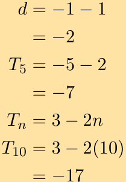
> **[Diagram Context - Textbook_Mathematics_Gr11_Number-patterns.pdf-0054-01.png]**
> The image shows a diagram of a Lewis structure for nitrogen. The diagram is divided into six sections, each representing a different nitrogen atom. The diagram is color-coded, with each color representing a different element. The diagram is labeled with the chemical symbols for nitrogen, oxygen, and carbon. The diagram also includes arrows pointing to the nitrogen atom, which are labeled with the numbers 1, 2,


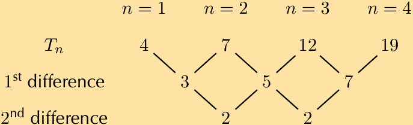
> **[Diagram Context - Textbook_Mathematics_Gr11_Number-patterns.pdf-0054-06.png]**
> The image shows a diagram of a Lewis structure for water. The diagram is a visual representation of the Lewis structure of water, which is composed of two hydrogen atoms and one oxygen atom. The diagram is set against a light brown background, and it is labeled with the numbers 1, 2, 3, and 4. The diagram also includes arrows pointing to the Lewis structure of the molecule. The diagram


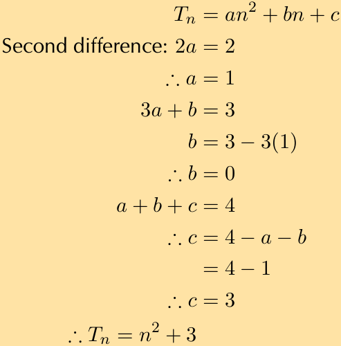
> **[Diagram Context - Textbook_Mathematics_Gr11_Number-patterns.pdf-0054-07.png]**
> 1. A diagram of a cell with arrows pointing to different parts of the cell.


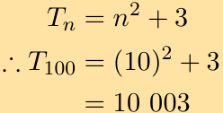
> **[Diagram Context - Textbook_Mathematics_Gr11_Number-patterns.pdf-0054-08.png]**
> The image shows a diagram of a Lewis structure for water. The diagram is divided into two sections, with the top section representing the oxygen atom and the bottom section representing the hydrogen atoms. The diagram is labeled with the chemical symbols "H2O" and "H2O2", indicating the presence of water. The diagram also includes arrows pointing to the oxygen and hydrogen atoms, which are connected


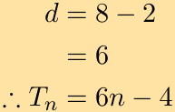


---

$$\sin^2 45^\circ + \cos^2 45^\circ = \left(\frac{1}{\sqrt{2}}\right)\left(\frac{1}{\sqrt{2}}\right) + \left(\frac{1}{\sqrt{2}}\right)\left(\frac{1}{\sqrt{2}}\right)$$

$$= \frac{1}{2} + \frac{1}{2}$$

$$= 1$$

$\text{RHS} = 1$

Therefore the equation is true.

c) $\cos 30^\circ = \sqrt{1 - \sin^2 30^\circ}$

**Solution:**

We are told to use special angles, so we first write each ratio using special angles and then simplify each side of the equation.

$\text{LHS}$:

$$\cos 30^\circ = \frac{\sqrt{3}}{2}$$

$\text{RHS}$:

$$\sqrt{1 - \sin^2 30^\circ} = \sqrt{1 - \left(\frac{1}{2}\right)\left(\frac{1}{2}\right)}$$

$$= \sqrt{1 - \frac{1}{4}}$$

$$= \sqrt{\frac{3}{4}}$$

$$= \frac{\sqrt{3}}{2}$$

Therefore the equation is true.

---

7. Use the definitions of the trigonometric ratios to answer the following questions:

    a) Explain why $\sin \alpha \le 1$ for all values of $\alpha$.
    
    **Solution:**
    
    The sine ratio is defined as $\frac{\text{opposite}}{\text{hypotenuse}}$. In any right-angled triangle, the hypotenuse is the side of longest length. Therefore the maximum length of the opposite side is equal to the length of the hypotenuse. The maximum value of the sine ratio is then $\frac{\text{hypotenuse}}{\text{hypotenuse}} = 1$.

    b) Explain why $\cos \alpha$ has a maximum value of $1$.
    
    **Solution:**
    
    The cosine ratio is defined as $\frac{\text{adjacent}}{\text{hypotenuse}}$. In any right-angled triangle, the hypotenuse is the side of longest length. Therefore the maximum length of the adjacent side is equal to the length of the hypotenuse. The maximum value of the cosine ratio is then $\frac{\text{hypotenuse}}{\text{hypotenuse}} = 1$.

    c) Is there a maximum value for $\tan \alpha$?
    
    **Solution:**
    
    The tangent ratio is defined as $\frac{\text{opposite}}{\text{adjacent}}$. Since the opposite and adjacent sides can have any value (so long as the length of the side is less than or equal to the length of the hypotenuse), there is no maximum value for the tangent ratio.

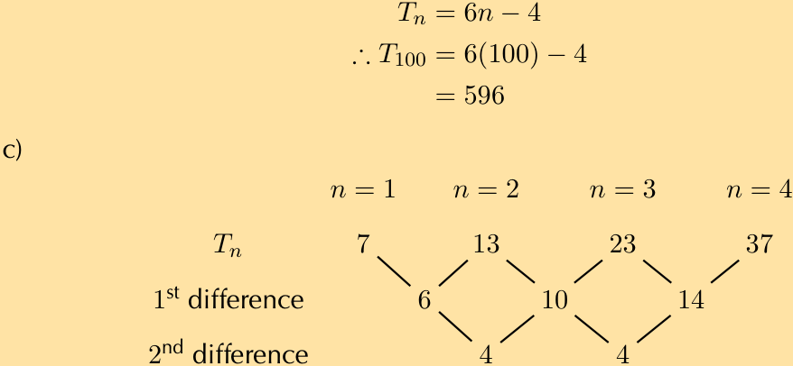
> **[Diagram Context - Textbook_Mathematics_Gr11_Number-patterns.pdf-0055-00.png]**
> The image shows a diagram of a Lewis structure for nitrogen (N). The diagram is divided into two parts, with the left side representing the nitrogen atom and the right side representing the nitrogen molecule. The diagram is labeled with the chemical symbol "N" and the number "6". The diagram also includes arrows pointing to the nitrogen atom and the nitrogen molecule, as well as labels for the nitrogen atom


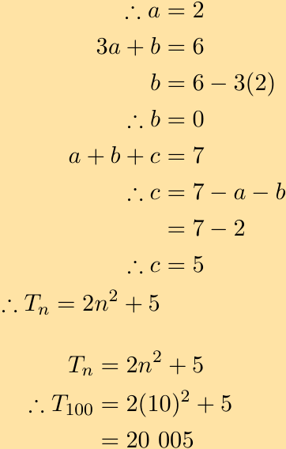
> **[Diagram Context - Textbook_Mathematics_Gr11_Number-patterns.pdf-0055-02.png]**
> The image shows a diagram of a Lewis structure for nitrogen, with the nitrogen atom at the center and the bonds forming around it. The diagram is labeled with the variable names a, b, and c, and the chemical symbols N, N2, and N3 are also present. The diagram is accompanied by a table that provides additional information about the Lewis structure, including the number of valence


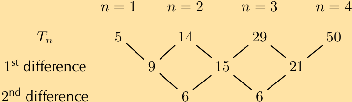
> **[Diagram Context - Textbook_Mathematics_Gr11_Number-patterns.pdf-0055-04.png]**
> The image shows a diagram of a Lewis structure for nitrogen. The diagram is divided into two sections, with the top section containing the Lewis structure of nitrogen and the bottom section showing the Lewis structure of nitrogen with the number of valence electrons. The diagram also includes a list of labels, variables, and arrows to help explain the concept of valence electrons.


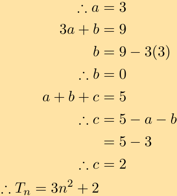
> **[Diagram Context - Textbook_Mathematics_Gr11_Number-patterns.pdf-0055-06.png]**
> 1. A diagram of a Lewis structure for carbon dioxide.


---

# 5.7 Solving trigonometric equations

## Finding lengths

### Exercise 5 - 4:

1. In each triangle find the length of the side marked with a letter. Give your answers correct to 2 decimal places.

   a) 
   

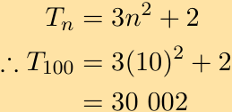
> **[Diagram Context - Textbook_Mathematics_Gr11_Number-patterns.pdf-0056-00.png]**
> 1. A diagram of a cell with arrows pointing to different parts of the cell.


   **Solution:**

   $$\sin \theta = \frac{\text{opposite}}{\text{hypotenuse}}$$

   $$\sin 37^{\circ} = \frac{a}{62}$$

   $$62(0,6018...) = a$$

   $$a = 36,10890...$$

   $$\approx 36,11$$

   ---

   b) 
   

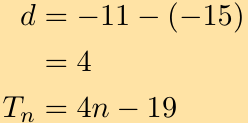
> **[Diagram Context - Textbook_Mathematics_Gr11_Number-patterns.pdf-0056-14.png]**
> The image shows a diagram of a Lewis structure for nitrogen. The diagram is divided into two sections, with the top section containing the Lewis structure of nitrogen and the bottom section showing the Lewis structure of nitrogen with an arrow pointing to the right. The diagram is set against a light beige background.


   **Solution:**

   $$\tan \theta = \frac{\text{opposite}}{\text{adjacent}}$$

   $$\tan 23^{\circ} = \frac{b}{21}$$

   $$21(0,42447...) = b$$

   $$b = 8,91397...$$

   $$\approx 8,91$$

   ---

   c) 
   <!-- DIAGRAM_PLACEHOLDER: diagram -->

   **Solution:**

---

### Worked Examples: Solving for Unknown Sides in Right-Angled Triangles

---

#### d)


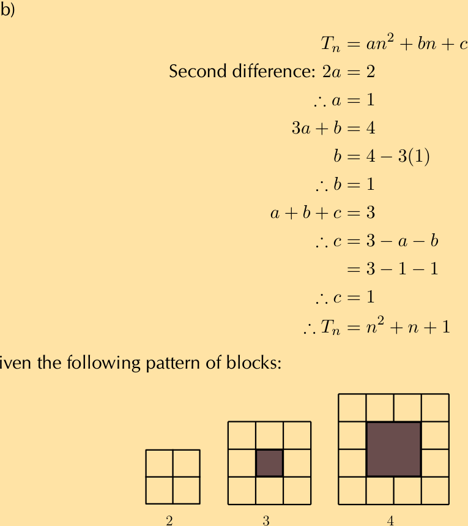
> **[Diagram Context - Textbook_Mathematics_Gr11_Number-patterns.pdf-0057-00.png]**
> 1. A diagram of a cell with arrows pointing to different parts of the cell.


**Solution:**

$$\cos \theta = \frac{\text{adjacent}}{\text{hypotenuse}}$$

$$\cos 49^{\circ} = \frac{d}{33}$$

$$33(0,65605...) = d$$

$$d = 21,64994...$$

$$d \approx 21,65$$

---

#### e)


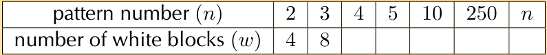
> **[Diagram Context - Textbook_Mathematics_Gr11_Number-patterns.pdf-0057-04.png]**
> The image shows a table with the number of white blocks on the left side and the number of white blocks on the right side. The table is numbered from 1 to 10. The table is set against a gray background. The table is organized in rows and columns, with the rows labeled "pattern number" and "number of white blocks". The columns are labeled "2", "3", "


**Solution:**

$$\sin \theta = \frac{\text{opposite}}{\text{hypotenuse}}$$

$$\sin 17^{\circ} = \frac{e}{12}$$

$$12(0,29237...) = e$$

$$e = 3,50846...$$

$$e \approx 3,51$$

---

#### f)


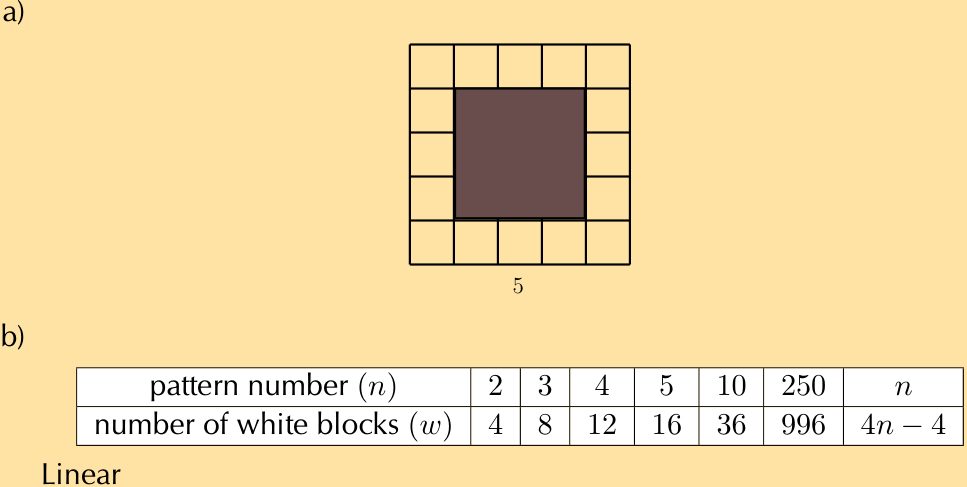
> **[Diagram Context - Textbook_Mathematics_Gr11_Number-patterns.pdf-0057-07.png]**
> 1. A geometric pattern of squares and rectangles.


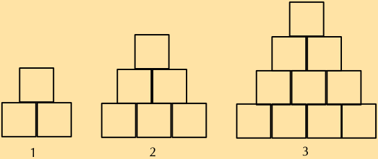
> **[Diagram Context - Textbook_Mathematics_Gr11_Number-patterns.pdf-0057-09.png]**
> 1. A diagram of a pyramid made of cubes.


---

### Chapter 5. Trigonometry

---

#### Solution (Continuation of previous problems)

$$\cos \theta = \frac{\text{adjacent}}{\text{hypotenuse}}$$

$$\cos 22^\circ = \frac{31}{f}$$

$$f(0,92718...) = 31$$

$$f = 33,434577...$$

$$f \approx 33,43$$

---

#### g)


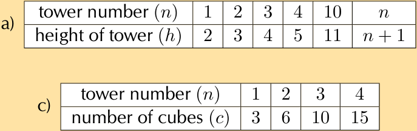
> **[Diagram Context - Textbook_Mathematics_Gr11_Number-patterns.pdf-0058-11.png]**
> 1. Tower number (n) is the height of the tower.


**Solution:**

$$\cos \theta = \frac{\text{adjacent}}{\text{hypotenuse}}$$

$$\cos 23^\circ = \frac{g}{32}$$

$$32(0,92050...) = g$$

$$g = 29,4561...$$

$$g \approx 29,46$$

---

#### h)


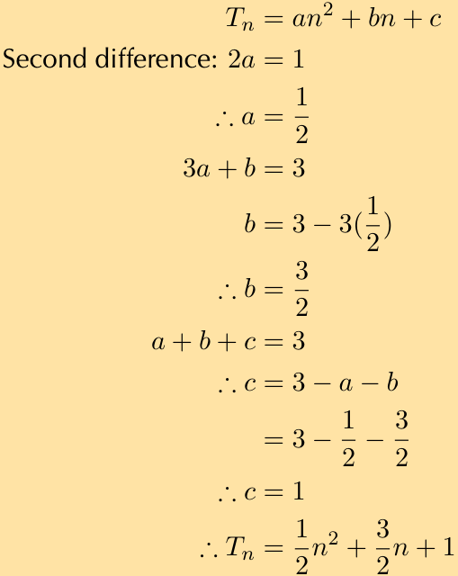
> **[Diagram Context - Textbook_Mathematics_Gr11_Number-patterns.pdf-0058-14.png]**
> 1. A diagram of a cell with arrows pointing to different parts of the cell.


**Solution:**

$$\sin \theta = \frac{\text{opposite}}{\text{hypotenuse}}$$

$$\sin 30^\circ = \frac{h}{20}$$

$$20(0,5) = h$$

$$h \approx 10$$

---

#### i)


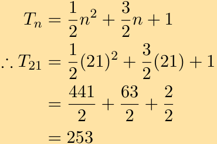
> **[Diagram Context - Textbook_Mathematics_Gr11_Number-patterns.pdf-0058-16.png]**
> The image shows a math problem involving the use of Lewis diagrams and the concept of exponents. The problem is presented in a table format, with the numbers 2, 3, and 1 written in the top row, and the numbers 2, 3, and 1 written in the bottom row. The table also includes a Lewis diagram, which is a visual representation of the chemical formula for water, H


**Solution:**

---

$$\tan \theta = \frac{\text{opposite}}{\text{adjacent}}$$

$$\tan 55^{\circ} = \frac{4,1}{x}$$

$$x = 2,87$$

---

### j)


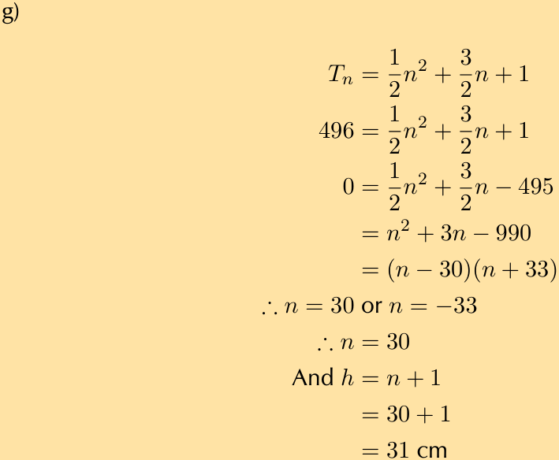
> **[Diagram Context - Textbook_Mathematics_Gr11_Number-patterns.pdf-0059-00.png]**
> The image shows a diagram of a Lewis structure of a molecule. The diagram is filled with various elements and bonds, including carbon, oxygen, nitrogen, and hydrogen. The diagram also includes arrows pointing to the bonds and the molecule's structure. The diagram is set against a light beige background, and the text "g" is visible in the image.


**Solution:**

$$\tan \theta = \frac{\text{opposite}}{\text{adjacent}}$$

$$\tan 65^{\circ} = \frac{x}{4,23}$$

$$x = 9,06$$

---

**2.** Write down two ratios for each of the following in terms of the sides: $AB$; $BC$; $BD$; $AD$; $DC$ and $AC$.


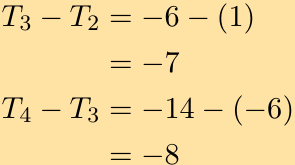
> **[Diagram Context - Textbook_Mathematics_Gr11_Number-patterns.pdf-0059-06.png]**
> 1. A diagram of a cell with arrows pointing to different parts of the cell.


#### a) $\sin \hat{B}$

**Solution:**

We note that triangles $ABC$ and $ABD$ both contain angle $B$ so we can use these triangles to write down the ratios:

$$\sin \hat{B} = \frac{AC}{AB} = \frac{AD}{BD}$$

#### b) $\cos \hat{D}$

**Solution:**

We note that triangles $ACD$ and $ABD$ both contain angle $D$ so we can use these triangles to write down the ratios:

$$\cos \hat{D} = \frac{AD}{BD} = \frac{CD}{AD}$$

#### c) $\tan \hat{B}$

**Solution:**

We note that triangles $ABC$ and $ABD$ both contain angle $B$ so we can use these triangles to write down the ratios:

$$\tan \hat{B} = \frac{AC}{BC} = \frac{AD}{AB}$$

---

**3.** In $\Delta MNP$, $\hat{N} = 90^{\circ}$, $MP = 20$ and $\hat{P} = 40^{\circ}$. Calculate $NP$ and $MN$ (correct to 2 decimal places).

**Solution:**

Sketch the triangle:

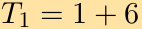


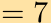


---

## Chapter 5. Trigonometry


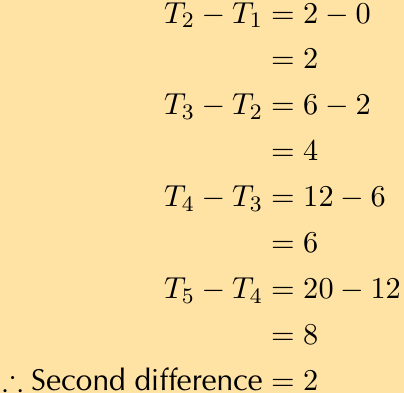
> **[Diagram Context - Textbook_Mathematics_Gr11_Number-patterns.pdf-0060-05.png]**
> The image shows a diagram of a Lewis structure for oxygen. The diagram is divided into six sections, each representing a different atom. The diagram is color-coded, with each color representing a different element. The diagram is labeled with the chemical symbols for oxygen, carbon, and nitrogen. The diagram also includes arrows pointing to the bonds between the atoms. The diagram is labeled with the variable names T


To find $MN$ we use the sine ratio:

$$\begin{aligned}
\sin \hat{P} &= \frac{MN}{MP} \\
\sin 40^\circ &= \frac{MN}{20} \\
20(0,642787...) &= MN \\
MN &= 12,8557... \\
&\approx 12,86
\end{aligned}$$

To find $NP$ we can use the cosine ratio:

$$\begin{aligned}
\cos \hat{P} &= \frac{NP}{MP} \\
\cos 40^\circ &= \frac{NP}{20} \\
20(0,76604...) &= NP \\
NP &= 15,32088... \\
&\approx 15,32
\end{aligned}$$

Therefore $MN = 12,86$ and $NP = 15,32$.

4. Calculate $x$ and $y$ in the following diagram.


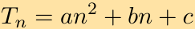


**Solution:**
To find $x$ we use $\triangle ABC$ and the tangent ratio. To find $y$ we use $\triangle ABD$ and the tangent ratio.

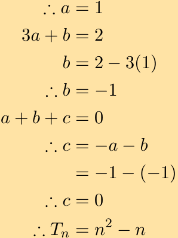
> **[Diagram Context - Textbook_Mathematics_Gr11_Number-patterns.pdf-0060-09.png]**
> The image shows a diagram of a Lewis structure for carbon dioxide. The diagram is filled with various elements and arrows, representing the bonds between atoms. The diagram is presented in a vertical column, with each element labeled and accompanied by a number. The diagram is set against a light beige background, which contrasts with the black text and arrows. The diagram is organized in a way that allows for easy


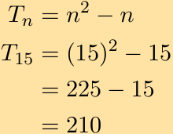
> **[Diagram Context - Textbook_Mathematics_Gr11_Number-patterns.pdf-0060-11.png]**
> The image shows a diagram of a Lewis structure for nitrogen. The diagram is divided into three sections, each representing a different energy level. The diagram is color-coded, with each energy level being a different color. The diagram also includes labels for the nitrogen atom and the bonds between the nitrogen atoms. The diagram is set against a light beige background.


---

$$\begin{aligned}
\tan 38^{\circ} &= \frac{23,3}{x} \\
x &= \frac{23,3}{\tan 38^{\circ}} \\
&= 29,82264\dots \\
&\approx 29,82
\end{aligned}$$

$$\begin{aligned}
\tan 47^{\circ} &= \frac{y}{29,82264\dots} \\
y &= 29,82264\dots \cdot \tan 47^{\circ} \\
&= 31,98086\dots \\
&\approx 31,98
\end{aligned}$$

Therefore $x = 29,82$ and $y = 31,98$.

For more exercises, visit www.everythingmaths.co.za and click on 'Practise Maths'.
* 1a. 2FQV
* 1b. 2FQW
* 1c. 2FQX
* 1d. 2FQY
* 1e. 2FQZ
* 1f. 2FR2
* 1g. 2FR3
* 1h. 2FR4
* 1i. 2FR5
* 1j. 2FR6
* 2. 2FR7
* 3. 2FR8
* 4. 2FR9

---

## Finding an angle

### Exercise 5 - 5:

Determine $\alpha$ in the following right-angled triangles:

1. 


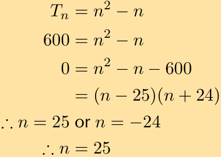
> **[Diagram Context - Textbook_Mathematics_Gr11_Number-patterns.pdf-0061-01.png]**
> The image shows a diagram of a Lewis structure for nitrogen (N2). The diagram is divided into two sections, with the top section containing three arrows pointing in different directions and the bottom section containing four arrows pointing in the same direction. The arrows are labeled with numbers, indicating the direction of the bonds. The diagram is set against a light beige background, and the text "Tn =


**Solution:**

$$\begin{aligned}
\tan \alpha &= \frac{4}{9} \\
&= 0,4444\dots \\
\alpha &= 23,9624\dots \\
&\approx 23,96^{\circ}
\end{aligned}$$

2.

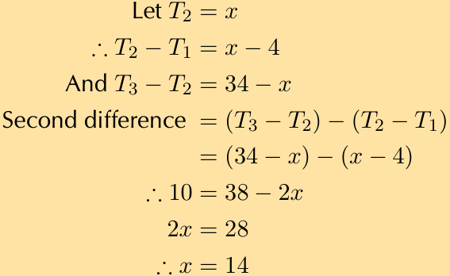
> **[Diagram Context - Textbook_Mathematics_Gr11_Number-patterns.pdf-0061-04.png]**
> The image shows a diagram of a Lewis structure for water, labeled with the chemical formula H2O. The diagram is a visual representation of the bonding between the two hydrogen atoms and the oxygen atom in a molecule of water. The diagram is accompanied by a second difference, which is a mathematical equation that provides a numerical relationship between the atoms and their respective charges. The diagram is presented against a light


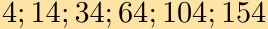


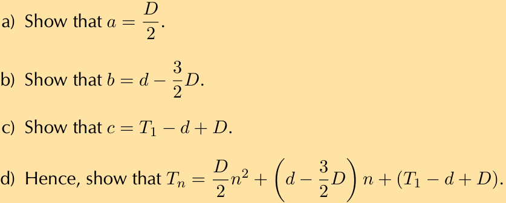
> **[Diagram Context - Textbook_Mathematics_Gr11_Number-patterns.pdf-0061-08.png]**
> The image shows a diagram of a Lewis structure for carbon dioxide. The diagram is divided into three sections, each representing a different part of the molecule. The diagram is color-coded, with each color representing a different element. The diagram is labeled with the chemical symbols for carbon, oxygen, and nitrogen, as well as the names of the functional groups present in the molecule. The diagram also includes


---

## Chapter 5. Trigonometry


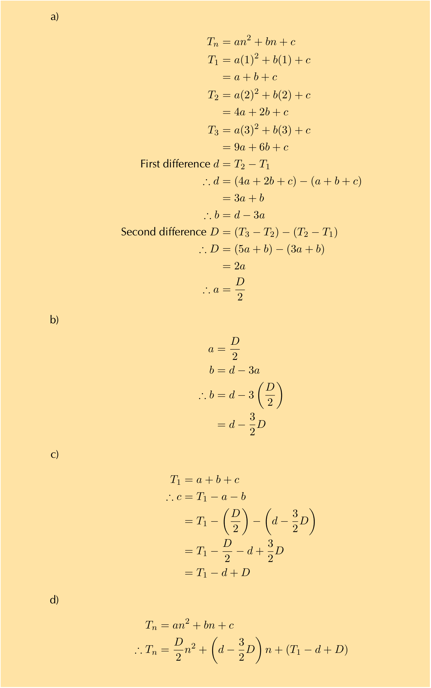
> **[Diagram Context - Textbook_Mathematics_Gr11_Number-patterns.pdf-0062-00.png]**
> 1. A diagram of a cell with arrows pointing to different parts of the cell.


**Solution:**

$$\begin{aligned}
\sin \alpha &= \frac{7,5}{13} \\
&= 0,5769... \\
\alpha &= 35,2344...^\circ \\
&\approx 35,23^\circ
\end{aligned}$$

3. 

<!-- DIAGRAM_PLACEHOLDER: diagram -->

**Solution:**

$$\begin{aligned}
\sin \alpha &= \frac{1,7}{2,2} \\
\alpha &= 39,4005...^\circ \\
&\approx 39,40^\circ
\end{aligned}$$

4. 

<!-- DIAG_PLACEHOLDER: diagram -->

**Solution:**

$$\begin{aligned}
\tan \alpha &= \frac{4,5}{9,1} \\
&= 0,49450... \\
\alpha &= 26,3126...^\circ \\
&\approx 26,31^\circ
\end{aligned}$$

5.

---

<!-- DIAGRAM_PLACEHOLDER: diagram -->

**Solution:**

$$\begin{aligned}
\cos \alpha &= \frac{12}{15} \\
&= 0,8 \\
\alpha &= 36,869897\dots \\
&\approx 36,87^{\circ}
\end{aligned}$$

---

6. 

<!-- DIAGRAM_PLACEHOLDER: diagram -->

**Solution:**

$$\begin{aligned}
\sin \alpha &= \frac{1}{\sqrt{2}} \\
&= 0,7071\dots \\
\alpha &= 45^{\circ}
\end{aligned}$$

---

7. 

<!-- DIAGRAM_PLACEHOLDER: diagram -->

**Solution:**

$$\begin{aligned}
\sin \alpha &= \frac{3,5}{7} \\
&= 0,5 \\
\alpha &= 30^{\circ}
\end{aligned}$$

---

For more exercises, visit www.everythingmaths.co.za and click on 'Practise Maths'.  
1. 2FRB \quad 2. 2FRC \quad 3. 2FRD \quad 4. 2FRF \quad 5. 2FRG \quad 6. 2FRH \quad 7. 2FRJ

---

If learners get a math error on their calculator encourage them to think about what might have happened. It is also important to ensure that they know they must write down no solution rather than math error when this happens.

## Exercise 5 – 6:

1. Determine the angle (correct to 1 decimal place):

   a) $\tan \theta = 1,7$
   
   **Solution:**
   $$\begin{aligned}
   \tan \theta &= 1,7 \\
   \theta &= 59,5344... \\
   &\approx 59,5^{\circ}
   \end{aligned}$$

   b) $\sin \theta = 0,8$
   
   **Solution:**
   $$\begin{aligned}
   \sin \theta &= 0,8 \\
   \theta &= 53,1301... \\
   &\approx 53,1^{\circ}
   \end{aligned}$$

   c) $\cos \alpha = 0,32$
   
   **Solution:**
   $$\begin{aligned}
   \cos \alpha &= 0,32 \\
   \alpha &= 71,3370... \\
   &\approx 71,3^{\circ}
   \end{aligned}$$

   d) $\tan \beta = 4,2$
   
   **Solution:**
   $$\begin{aligned}
   \tan \beta &= 4,2 \\
   \beta &= 76,60750... \\
   &\approx 76,6^{\circ}
   \end{aligned}$$

   e) $\tan \theta = 5\frac{3}{4}$
   
   **Solution:**
   $$\begin{aligned}
   \tan \theta &= 5\frac{3}{4} \\
   &= 5,75 \\
   \theta &= 80,13419... \\
   &\approx 80,1^{\circ}
   \end{aligned}$$

   f) $\sin \theta = \frac{2}{3}$
   
   **Solution:**
   $$\begin{aligned}
   \sin \theta &= \frac{2}{3} \\
   &= 0,666... \\
   \theta &= 41,8103... \\
   &\approx 41,8^{\circ}
   \end{aligned}$$

   g) $\cos \beta = 1,2$
   
   **Solution:**
   $$\begin{aligned}
   \cos \beta &= 1,2 \\
   \text{no solution}
   \end{aligned}$$

---

## 5.7. Solving Trigonometric Equations (Continued)

### Worked Examples

#### h) Solve for $\theta$:
$$4 \cos \theta = 3$$

**Solution:**
$$\begin{aligned}
4 \cos \theta &= 3 \\
\cos \theta &= \frac{3}{4} \\
&= 0,75 \\
\theta &= 41,40962\dots \\
&\approx 41,4^{\circ}
\end{aligned}$$

---

#### i) Solve for $\theta$:
$$\cos 4\theta = 0,3$$

**Solution:**
$$\begin{aligned}
\cos 4\theta &= 0,3 \\
4\theta &= 72,54239\dots \\
\theta &= 18,135599\dots \\
&\approx 18,1^{\circ}
\end{aligned}$$

---

#### j) Solve for $\beta$:
$$\sin \beta + 2 = 2,65$$

**Solution:**
$$\begin{aligned}
\sin \beta + 2 &= 2,65 \\
\sin \beta &= 0,65 \\
\beta &= 40,54160\dots \\
&\approx 40,5^{\circ}
\end{aligned}$$

---

#### k) Solve for $\theta$:
$$2 \sin \theta + 5 = 0,8$$

**Solution:**
$$\begin{aligned}
2 \sin \theta + 5 &= 0,8 \\
2 \sin \theta &= -4,2 \\
\sin \theta &= -2,1 \\
&\text{no solution}
\end{aligned}$$

---

#### l) Solve for $\beta$:
$$3 \tan \beta = 1$$

**Solution:**
$$\begin{aligned}
3 \tan \beta &= 1 \\
\tan \beta &= \frac{1}{3} \\
&= 0,3333\dots \\
\beta &= 18,434948\dots \\
&\approx 18,4^{\circ}
\end{aligned}$$

---

#### m) Solve for $\alpha$:
$$\sin 3\alpha = 1,2$$

**Solution:**
$$\begin{aligned}
\sin 3\alpha &= 1,2 \\
&\text{no solution}
\end{aligned}$$

---

#### n) Solve for $\theta$:
$$\tan \frac{\theta}{3} = \sin 48^{\circ}$$

**Solution:**
*(Solution continues on the following page)*

---

### Chapter 5. Trigonometry

#### Worked Examples: Solving Trigonometric Equations

##### Example o)
Solve for $\theta$:
$$\frac{1}{2} \cos 2\beta = 0,3$$

**Solution:**
$$\begin{aligned}
\frac{1}{2} \cos 2\beta &= 0,3 \\
\cos 2\beta &= 0,6 \\
2\beta &= 53,1301\dots^\circ \\
\beta &= 26,56505\dots^\circ \\
&\approx 26,6^\circ
\end{aligned}$$

*(Note: The initial step on the page shows the continuation of a previous problem involving $\tan \frac{\theta}{3} = \sin 48^\circ$)*:
$$\begin{aligned}
\tan \frac{\theta}{3} &= \sin 48^\circ \\
&= 0,7431\dots \\
\frac{\theta}{3} &= 36,61769\dots^\circ \\
\theta &= 109,8530\dots^\circ \\
&\approx 109,9^\circ
\end{aligned}$$

---

##### Example p)
Solve for $\theta$:
$$2 \sin 3\theta + 1 = 2,6$$

**Solution:**
$$\begin{aligned}
2 \sin 3\theta + 1 &= 2,6 \\
2 \sin 3\theta &= 1,6 \\
\sin 3\theta &= 0,8 \\
3\theta &= 53,1301\dots^\circ \\
\theta &= 17,71003\dots^\circ \\
&\approx 17,7^\circ
\end{aligned}$$

---

#### Exercise 2: Evaluating Trigonometric Expressions

If $x = 16^\circ$ and $y = 36^\circ$, use your calculator to evaluate each of the following, correct to $3$ decimal places.

##### a) $\sin(x - y)$

**Solution:**
$$\begin{aligned}
\sin(x - y) &= \sin(16^\circ - 36^\circ) \\
&= \sin(-20^\circ) \\
&= -0,3420201\dots \\
&\approx -0,342
\end{aligned}$$

---

##### b) $3 \sin x$

**Solution:**
$$\begin{aligned}
3 \sin x &= 3 \sin(16^\circ) \\
&= 0,826912\dots \\
&\approx 0,827
\end{aligned}$$

---

##### c) $\tan x - \tan y$

**Solution:**
$$\begin{aligned}
\tan x - \tan y &= \tan(16^\circ) - \tan(36^\circ) \\
&= -0,439797\dots \\
&\approx -0,440
\end{aligned}$$

---

##### d) $\cos x + \cos y$

**Solution:** *(Partial display on page)*

---

$$\cos x + \cos y = \cos(16^\circ) + \cos(36^\circ)$$
$$= 1,77027...$$
$$\approx 1,770$$

---

### e) $\frac{1}{3}\tan y$

**Solution:**

$$\frac{1}{3}\tan y = \frac{1}{3}\tan(36^\circ)$$
$$= 0,24218...$$
$$\approx 0,242$$

---

### f) $\csc(x - y)$

**Solution:**

$$\csc(x - y) = \csc(16^\circ - 36^\circ)$$
$$= \csc(-20^\circ)$$
$$= \frac{1}{\sin(-20^\circ)}$$
$$= -2,92380...$$
$$\approx -2,924$$

---

### g) $2\cos x + \cos 3y$

**Solution:**

$$2\cos x + \cos 3y = 2\cos(16^\circ) + \cos(3(36^\circ))$$
$$= 2\cos 16^\circ + \cos 108^\circ$$
$$= 1,61350...$$
$$\approx 1,614$$

---

### h) $\tan(2x - 5y)$

**Solution:**

$$\tan(2x - 5y) = \tan(2(16^\circ) - 5(36^\circ))$$
$$= \tan(-148^\circ)$$
$$= 0,624869...$$
$$\approx 0,625$$

---

3. In each of the following find the value of $x$ correct to two decimal places.

#### a) $\sin x = 0,814$

**Solution:**

$$\sin x = 0,814$$
$$x = 54,48860...$$
$$\approx 54,49^\circ$$

#### b) $\sin x = \tan 45^\circ$

**Solution:**

$$\sin x = \tan 45^\circ$$
$$= 1$$
$$x = 90^\circ$$

---

### Trigonometric Equations: Worked Examples

c) $\tan 2x = 3,123$

**Solution:**

$$\begin{aligned}
\tan 2x &= 3,123 \\
2x &= 72,244677\ldots \\
x &= 36,12233\ldots \\
&\approx 36,12^\circ
\end{aligned}$$

---

d) $\tan x = 3 \sin 41^\circ$

**Solution:**

$$\begin{aligned}
\tan x &= 3 \sin 41^\circ \\
&= 1,96817\ldots \\
x &= 63,06558\ldots \\
&\approx 63,07^\circ
\end{aligned}$$

---

e) $\sin(2x + 45^\circ) = 0,123$

**Solution:**

$$\begin{aligned}
\sin(2x + 45^\circ) &= 0,123 \\
2x + 45 &= 7,06527\ldots \\
2x &= -37,9347\ldots \\
x &= -18,9673\ldots \\
&\approx -18,97^\circ
\end{aligned}$$

---

f) $\sin(x - 10^\circ) = \cos 57^\circ$

**Solution:**

$$\begin{aligned}
\sin(x - 10^\circ) &= \cos 57^\circ \\
&= 0,54463\ldots \\
x - 10 &= 33 \\
x &= 43^\circ
\end{aligned}$$

---

For more exercises, visit www.everythingmaths.co.nz and click on 'Practise Maths'.

* 1a. 2FRK
* 1b. 2FRM
* 1c. 2FRN
* 1d. 2FRP
* 1e. 2FRQ
* 1f. 2FRR
* 1g. 2FRS
* 1h. 2FRT
* 1i. 2FRV
* 1j. 2FRW
* 1k. 2FRX
* 1l. 2FRY
* 1m. 2FRZ
* 1n. 2FS2
* 1o. 2FS3
* 1p. 2FS4
* 2a. 2FS5
* 2b. 2FS6
* 2c. 2FS7
* 2d. 2FS8
* 2e. 2FS9
* 2f. FSB
* 2g. 2FSC
* 2h. 2FSD
* 3a. 2FSF
* 3b. 2FSG
* 3c. 2FSH
* 3d. 2FSJ
* 3e. 2FSK
* 3f. 2FSM

---

## 5.8 Defining ratios in the Cartesian plane

### Exercise 5 - 7:

1. $B$ is a point in the Cartesian plane. Determine without using a calculator:

---

<!-- DIAGRAM_PLACEHOLDER: diagram -->

### Worked Examples: Defining Ratios in the Cartesian Plane

#### a) Length of $OB$

**Solution:**

$OB$ is the hypotenuse of $\triangle BOX$. We can calculate the length of $OB$ using the theorem of Pythagoras:

$$
\begin{aligned}
OB^2 &= OX^2 + XB^2 \\
&= (1)^2 + (3)^2 \\
&= 10 \\
OB &= \sqrt{10}
\end{aligned}
$$

---

#### b) $\cos \beta$

**Solution:**

From the diagram and the first question we know that $x = 1$, $y = -3$ and $r = \sqrt{10}$.

$$
\begin{aligned}
\cos \beta &= \frac{x}{r} \\
&= \frac{1}{\sqrt{10}}
\end{aligned}
$$

---

#### c) $\operatorname{cosec} \beta$

**Solution:**

From the diagram and the first question we know that $x = 1$, $y = -3$ and $r = \sqrt{10}$.

$$
\begin{aligned}
\operatorname{cosec} \beta &= \frac{r}{y} \\
&= \frac{\sqrt{10}}{-3}
\end{aligned}
$$

---

#### d) $\tan \beta$

**Solution:**

From the diagram and the first question we know that $x = 1$, $y = -3$ and $r = \sqrt{10}$.

$$
\begin{aligned}
\tan \beta &= \frac{y}{x} \\
&= \frac{-3}{1} \\
&= -3
\end{aligned}
$$

---

#### 2. If $\sin \theta = 0,4$ and $\theta$ is an obtuse angle, determine:

##### a) $\cos \theta$

**Solution:**

We first need to determine $x$, $y$ and $r$.

---

$$\begin{aligned}
\sin \theta &= 0,4 \\
&= \frac{4}{10} \\
&= \frac{2}{5} \\
&= \frac{y}{r}
\end{aligned}$$

Therefore $y = 2$ and $r = 5$.

$$\begin{aligned}
x^2 &= r^2 - y^2 \\
&= (5)^2 - (2)^2 \\
&= 21 \\
x &= \pm\sqrt{21}
\end{aligned}$$

We are told that the angle is obtuse. An obtuse angle is greater than $90^\circ$ but less than $180^\circ$. Therefore the angle is in the second quadrant and $x$ is negative. Therefore $x = -\sqrt{21}$.

Next draw a sketch:

<!-- DIAGRAM_PLACEHOLDER: diagram -->

Now we can determine $\cos \theta$:

$$\begin{aligned}
\cos \theta &= \frac{x}{r} \\
&= \frac{-\sqrt{21}}{5}
\end{aligned}$$

b) $\sqrt{21} \tan \theta$

**Solution:**
From the first question we have a sketch of the angle and $x$, $y$ and $r$.

$$\begin{aligned}
\sqrt{21} \tan \theta &= \sqrt{21} \left(\frac{y}{x}\right) \\
&= \sqrt{21} \left(\frac{2}{-\sqrt{21}}\right) \\
&= -2
\end{aligned}$$

3. Given $\tan \theta = \frac{t}{2}$, where $0^\circ \le \theta \le 90^\circ$. Determine the following in terms of $t$:

   a) $\sec \theta$

   **Solution:**
   We first need to determine $x$, $y$ and $r$. We are given $\tan \theta = \frac{t}{2}$ and so we can use this to find $x$ and $y$.

   $$\begin{aligned}
   \tan \theta &= \frac{t}{2} \\
   \frac{y}{x} &= \frac{t}{2}
   \end{aligned}$$

   Therefore $y = t$ and $x = 2$.

---

$$\begin{aligned}
r^2 &= x^2 + y^2 \\
&= (2)^2 + (t)^2 \\
&= 4 + t^2 \\
r &= \sqrt{4 + t^2}
\end{aligned}$$

We are told that $0^\circ \le \theta \le 90^\circ$. Therefore the angle is in the first quadrant. Even though we do not know the value of $t$ we can draw a rough sketch:

<!-- DIAGRAM_PLACEHOLDER: diagram -->

Now we can determine $\sec \theta$:

$$\begin{aligned}
\sec \theta &= \frac{r}{x} \\
&= \frac{\sqrt{t^2 + 4}}{2}
\end{aligned}$$

---

### b) $\cot \theta$

**Solution:**  
From the first question we have a sketch of the angle and $x$, $y$ and $r$.

$$\begin{aligned}
\cot \theta &= \frac{x}{y} \\
&= \frac{2}{t}
\end{aligned}$$

---

### c) $\cos^2 \theta$

**Solution:**  
From the first question we have a sketch of the angle and $x$, $y$ and $r$.

$$\begin{aligned}
\cos^2 \theta &= \left(\frac{x}{r}\right)^2 \\
&= \left(\frac{2}{\sqrt{t^2 + 4}}\right)^2 \\
&= \frac{4}{t^2 + 4}
\end{aligned}$$

---

### d) $\tan^2 \theta - \sec^2 \theta$

**Solution:**  
From the first question we have a sketch of the angle and $x$, $y$ and $r$.

$$\begin{aligned}
\tan^2 \theta - \sec^2 \theta &= \left(\frac{y}{x}\right)^2 - \left(\frac{r}{x}\right)^2 \\
&= \left(\frac{t}{2}\right)^2 - \left(\frac{\sqrt{t^2 + 4}}{2}\right)^2 \\
&= \frac{t^2}{4} - \frac{t^2 + 4}{4} \\
&= \frac{t^2 - t^2 - 4}{4} \\
&= -1
\end{aligned}$$

---

4. Given: $10 \cos \beta + 8 = 0$ and $180^\circ < \beta < 360^\circ$. Determine the value of:

### a) $\cos \beta$

**Solution:**
We are given an equation with $\cos \beta$ in it. We can therefore rearrange this equation to find $\cos \beta$:

$$\begin{aligned}
10 \cos \beta + 8 &= 0 \\
\cos \beta &= \frac{-8}{10} \\
&= \frac{-4}{5}
\end{aligned}$$

---

### b) $\frac{3}{\tan \beta} + 2 \sin^2 \beta$

**Solution:**
We first need to determine $x$, $y$ and $r$. In the first question we found that $\cos \beta = \frac{-4}{5}$ and so we can use this to find $x$ and $r$.

$$\begin{aligned}
\cos \beta &= \frac{-4}{5} \\
\frac{x}{r} &= \frac{-4}{5}
\end{aligned}$$

Therefore $x = -4$ and $r = 5$.

$$\begin{aligned}
y^2 &= r^2 - x^2 \\
&= (5)^2 - (-4)^2 \\
&= 25 - 16 \\
y &= \pm 3
\end{aligned}$$

We are told that $180^\circ < \beta < 360^\circ$. Therefore the angle is in the third quadrant and $y = -3$. We can draw a rough sketch of the angle:

<!-- DIAGRAM_PLACEHOLDER: diagram -->

We can now find $\frac{3}{\tan \beta} + 2 \sin^2 \beta$:

---

$$\frac{3}{\tan \beta} + 2\sin^{2}\beta = \frac{3}{\frac{y}{x}} + 2\left(\frac{y}{r}\right)^{2}$$

$$= \frac{3x}{y} + \frac{2y^{2}}{r^{2}}$$

$$= \frac{3(-4)}{-3} + \frac{2(-3)^{2}}{(5)^{2}}$$

$$= \frac{-12}{3} + \frac{18}{25}$$

$$= -4 + \frac{18}{25}$$

$$= \frac{-100 + 18}{25}$$

$$= \frac{-82}{25}$$

---

**5.** If $\sin \theta = -\frac{15}{17}$ and $\cos \theta < 0$ find the following, without the use of a calculator:

**a)** $\cos \theta$

**Solution:**

We first need to determine $x$, $y$ and $r$. We are given $\sin \theta = -\frac{15}{17}$ and so we can use this to find $y$ and $r$.

$$\sin \theta = -\frac{15}{17}$$

$$\frac{y}{r} = -\frac{15}{17}$$

Therefore $y = -15$ and $r = 17$ (remember that $r$ cannot be negative).

$$x^{2} = r^{2} - y^{2}$$

$$= (17)^{2} - (-15)^{2}$$

$$= 289 - 225$$

$$x = \pm 8$$

We are told that $\cos \theta < 0$. Therefore the angle is in either the second or the third quadrant. From the value of $y$ we see that the angle must lie in the third quadrant and $x = -8$.

<!-- DIAGRAM_PLACEHOLDER: diagram -->

Now we can determine $\cos \theta$:

$$\cos \theta = \frac{x}{r}$$

$$= \frac{-8}{17}$$

---

b) $\tan \theta$

**Solution:**
From the first part we have $x = -8$, $y = -15$ and $r = 17$ so we can find $\tan \theta$.

$$\begin{aligned}
\tan \theta &= \frac{y}{x} \\
&= \frac{-15}{-8} \\
&= \frac{15}{8}
\end{aligned}$$

---

c) $\cos^2 \theta + \sin^2 \theta$

**Solution:**
From the first part we have $x = -8$, $y = -15$ and $r = 17$ so we can find $\cos^2 \theta + \sin^2 \theta$.

$$\begin{aligned}
\cos^2 \theta + \sin^2 \theta &= \left(\frac{x}{r}\right)^2 + \left(\frac{y}{r}\right)^2 \\
&= \frac{x^2}{r^2} + \frac{y^2}{r^2} \\
&= \frac{x^2 + y^2}{r^2} \\
&= \frac{(-8)^2 + (-15)^2}{(17)^2} \\
&= \frac{64 + 225}{289} \\
&= 1
\end{aligned}$$

---

**6.** Find the value of $\sin A + \cos A$ without using a calculator, given that $13 \sin A - 12 = 0$, where $\cos A < 0$.

**Solution:**
We first need to determine $x$, $y$ and $r$. We are given $13 \sin A - 12 = 0$ and so we can use this to find $y$ and $r$.

$$\begin{aligned}
13 \sin A - 12 &= 0 \\
\sin A &= \frac{12}{13}
\end{aligned}$$

Therefore $y = 12$ and $r = 13$.

$$\begin{aligned}
x^2 &= r^2 - y^2 \\
&= (13)^2 - (12)^2 \\
&= 169 - 144 \\
x &= \pm 5
\end{aligned}$$

We are told that $\cos A < 0$. Therefore the angle is in either the second or the third quadrant. From the value of $y$ we see that the angle must lie in the second quadrant.

<!-- DIAGRAM_PLACEHOLDER: diagram -->

---

Now we can determine $\sin A + \cos A$:

$$\begin{aligned}
\sin A + \cos A &= \frac{y}{r} + \frac{x}{r} \\
&= \frac{y + x}{r} \\
&= \frac{12 - 5}{13} \\
&= \frac{7}{13}
\end{aligned}$$

---

**7.** If $17 \cos \theta = -8$ and $\tan \theta > 0$ determine the following with the aid of a diagram (not a calculator):

**a)** $\frac{\cos \theta}{\sin \theta}$

**Solution:**
We first need to determine $x$, $y$ and $r$. We are given $17 \cos \theta = -8$ and so we can use this to find $x$ and $r$.

$$\begin{aligned}
17 \cos \theta - 8 &= 0 \\
\cos \theta &= \frac{-8}{17}
\end{aligned}$$

Therefore $x = -8$ and $r = 17$.

$$\begin{aligned}
y^2 &= r^2 - x^2 \\
&= (17)^2 - (8)^2 \\
y &= \pm 15
\end{aligned}$$

We are told that $\tan \theta > 0$. Therefore the angle is in either the first or the third quadrant. From the value of $x$ we see that the angle must lie in the third quadrant.

<!-- DIAGRAM_PLACEHOLDER: diagram -->

Now we can determine $\frac{\cos \theta}{\sin \theta}$:

$$\begin{aligned}
\frac{\cos \theta}{\sin \theta} &= \cos \theta \times \frac{1}{\sin \theta} \\
&= \frac{y}{r} \times \frac{1}{\frac{x}{r}} \\
&= \frac{y}{r} \times \frac{r}{x} \\
&= \frac{y}{x} \\
&= \frac{-8}{-15} \\
&= \frac{8}{15}
\end{aligned}$$

**b)** $17 \sin \theta - 16 \tan \theta$

**Solution:**
From the first part we have that $x = -15$, $y = -8$ and $r = 17$.

---

$$
\begin{aligned}
17 \sin \theta - 16 \tan \theta &= 17 \frac{y}{r} - 16 \frac{y}{x} \\
&= 17 \left(\frac{-15}{17}\right) - 16 \left(\frac{-15}{-8}\right) \\
&= -15 - 2(15) \\
&= -45
\end{aligned}
$$

8. $L$ is a point with co-ordinates $(5; 8)$ on a Cartesian plane. $LK$ forms an angle, $\theta$, with the positive $x$-axis. Set up a diagram and use it to answer the following questions.

   a) Find the distance $LK$.

      **Solution:**  
      We are given $L(5; 8)$. Therefore the angle lies in the first quadrant. We can sketch this and use our sketch to find $x$, $y$ and $r$.

      <!-- DIAGRAM_PLACEHOLDER: diagram -->

      Therefore $x = 5$ and $y = 8$. We can calculate $r$ using the theorem of Pythagoras. From the diagram we note that $LK = r$.

      $$
      \begin{aligned}
      LK^2 &= 5^2 + 8^2 \\
      &= 89 \\
      LK &= \sqrt{89}
      \end{aligned}
      $$

   b) $\sin \theta$

      **Solution:**  
      From the previous question we have that $x = 5$, $y = 8$ and $r = \sqrt{89}$.

      $$
      \begin{aligned}
      \sin \theta &= \frac{y}{r} \\
      &= \frac{8}{\sqrt{89}}
      \end{aligned}
      $$

   c) $\cos \theta$

      **Solution:**  
      From the previous question we have that $x = 5$, $y = 8$ and $r = \sqrt{89}$.

      $$
      \begin{aligned}
      \cos \theta &= \frac{x}{r} \\
      &= \frac{5}{\sqrt{89}}
      \end{aligned}
      $$

   d) $\tan \theta$

      **Solution:**  
      From the previous question we have that $x = 5$, $y = 8$ and $r = \sqrt{89}$.

      $$
      \begin{aligned}
      \tan \theta &= \frac{y}{x} \\
      &= \frac{8}{5}
      \end{aligned}
      $$

---

e) $\csc \theta$

**Solution:**
From the previous question we have that $x = 5$, $y = 8$ and $r = \sqrt{89}$.

$$\begin{aligned}
\csc \theta &= \frac{r}{y} \\
&= \frac{\sqrt{89}}{8}
\end{aligned}$$

---

f) $\sec \theta$

**Solution:**
From the previous question we have that $x = 5$, $y = 8$ and $r = \sqrt{89}$.

$$\begin{aligned}
\sec \theta &= \frac{r}{x} \\
&= \frac{\sqrt{89}}{5}
\end{aligned}$$

---

g) $\cot \theta$

**Solution:**
From the previous question we have that $x = 5$, $y = 8$ and $r = \sqrt{89}$.

$$\begin{aligned}
\cot \theta &= \frac{x}{y} \\
&= \frac{5}{8}
\end{aligned}$$

---

h) $\sin^2 \theta + \cos^2 \theta$

**Solution:**
From the previous question we have that $x = 5$, $y = 8$ and $r = \sqrt{89}$.

$$\begin{aligned}
\sin^2 \theta + \cos^2 \theta &= \left(\frac{y}{r}\right)^2 + \left(\frac{x}{r}\right)^2 \\
&= \frac{y^2}{r^2} + \frac{x^2}{r^2} \\
&= \frac{y^2 + x^2}{r^2} \\
&= \frac{64 + 25}{89} \\
&= 1
\end{aligned}$$

---

9. Given the following diagram and that $\cos \theta = -\frac{24}{25}$.

<!-- DIAGRAM_PLACEHOLDER: diagram -->

---

a) State two sets of possible values of $a$ and $b$.

**Solution:**
We first need to use the given information to find a possible set of values for $a$ and $b$.
Using $\cos \theta = \frac{-24}{25}$ and the fact that $\cos \theta = \frac{x}{r}$ we can determine that $x = -24$ and $r = 25$. Now we can find $y$:

$$\begin{aligned}
y^2 &= r^2 - x^2 \\
&= (25)^2 - (24)^2 \\
&= 625 - 576 \\
&= 49 \\
y &= \pm 7
\end{aligned}$$

From the diagram we see that $y$ must be negative.
This gives us one possible set of values for $a$ and $b$: $a = 24$ and $b = -7$.
Now we note that we can simply double the size of the circle and the trigonometric ratios will stay the same. We could even multiply the radius of the circle by any integer and the trigonometric ratios will still remain the same.

Therefore the possible sets of values for $A(a, b)$ are multiples of $(-24; -7)$. Two possible sets are $(-24; -7)$ and $(-48; -14)$.

---

b) If $OA = 100$, state the values of $a$ and $b$.

**Solution:**
First note that in the original diagram $OA = 25$. Now we are multiplying $OA$ by $4$. This also means that the $x$ and $y$ values must be multiplied by $4$.
Therefore $a = 4(-24) = -96$ and $b = 4(-7) = -28$.

---

c) Hence determine without the use of a calculator the value of $\sin \theta$.

**Solution:**
The question states: "hence". This means we must use the scaled values for $a$ and $b$ not the original values. We know that $x = -96$, $y = -28$ and $r = 100$.

$$\begin{aligned}
\sin \theta &= \frac{y}{r} \\
&= \frac{-28}{100} \\
&= \frac{-7}{25}
\end{aligned}$$

Notice how the answer reduced to the original values of $y$ and $r$ as we would expect from the first question.

---

10. If $\tan \alpha = \frac{5}{-12}$ and $0^{\circ} \le \alpha \le 180^{\circ}$, determine **without the use of a calculator** the value of $\frac{12}{\cos \alpha}$.

**Solution:**
We first need to determine $x$, $y$ and $r$. We are given $\tan \alpha = \frac{5}{-12}$ and so we can use this to find $x$ and $y$.

$$\begin{aligned}
\tan \alpha &= \frac{5}{-12} \\
\frac{y}{x} &= \frac{5}{-12}
\end{aligned}$$

Therefore $y = 5$ and $x = -12$.

$$\begin{aligned}
r^2 &= x^2 + y^2 \\
&= (-12)^2 + (5)^2 \\
&= 144 + 25 \\
r &= 13
\end{aligned}$$

We are told that $0^{\circ} \le \alpha \le 180^{\circ}$. Therefore the angle is in either the first or the second quadrant. From the values of $x$ and $y$ we see that the angle must lie in the second quadrant.

---

<!-- DIAGRAM_PLACEHOLDER: diagram -->

Now we can determine $\frac{12}{\cos \alpha}$:

$$\begin{aligned}
\frac{12}{\cos \alpha} &= \frac{12}{\frac{x}{r}} \\
&= \frac{12r}{x} \\
&= \frac{12(13)}{-12} \\
&= -13
\end{aligned}$$

For more exercises, visit www.everythingmaths.co.za and click on 'Practise Maths'.
1. 2FSP 
2. 2FSQ 
3. 2FSR 
4. 2FSS 
5. 2FST 
6. 2FSV 
7. 2FSW 
8. 2FSX 
9. 2FSY 
10. 2FSZ

www.everythingmaths.co.za  
m.everythingmaths.co.za

---

## 5.9 Chapter summary

### End of chapter Exercise $5-8$:

1. State whether each of the following trigonometric ratios has been written correctly.

   a) $\sin \theta = \frac{\text{hypotenuse}}{\text{adjacent}}$
   
   **Solution:**  
   We recall the definition of the sine ratio: $\sin \theta = \frac{\text{opposite}}{\text{hypotenuse}}$. Therefore this trigonometric ratio has not been written correctly.

   b) $\tan \theta = \frac{\text{opposite}}{\text{adjacent}}$
   
   **Solution:**  
   We recall the definition of the tangent ratio: $\tan \theta = \frac{\text{opposite}}{\text{adjacent}}$. Therefore this trigonometric ratio has been written correctly.

   c) $\sec \theta = \frac{\text{hypotenuse}}{\text{adjacent}}$
   
   **Solution:**  
   We recall the definition of the secant ratio: $\sec \theta = \frac{\text{hypotenuse}}{\text{opposite}}$. Therefore this trigonometric ratio has not been written correctly.

2. Use your calculator to evaluate the following expressions to two decimal places:

---

## Chapter 5: Trigonometry

### Worked Examples: Calculating Trigonometric Ratios

a) $\tan 80^{\circ}$

**Solution:**
$$\begin{aligned}
\tan 80^{\circ} &= 5,6712... \\
&\approx 5,67
\end{aligned}$$

---

b) $\cos 73^{\circ}$

**Solution:**
$$\begin{aligned}
\cos 73^{\circ} &= 0,29237... \\
&\approx 0,29
\end{aligned}$$

---

c) $\sin 17^{\circ}$

**Solution:**
$$\begin{aligned}
\sin 17^{\circ} &= 0,2923... \\
&\approx 0,29
\end{aligned}$$

---

d) $\tan 313^{\circ}$

**Solution:**
$$\begin{aligned}
\tan 313^{\circ} &= -1,07236... \\
&\approx -1,07
\end{aligned}$$

---

e) $\cos 138^{\circ}$

**Solution:**
$$\begin{aligned}
\cos 138^{\circ} &= -0,743144... \\
&\approx -0,74
\end{aligned}$$

---

f) $\sec 56^{\circ}$

**Solution:**
$$\begin{aligned}
\sec 56^{\circ} &= \frac{1}{\cos 56^{\circ}} \\
&= \frac{1}{0,5591...} \\
&= 1,78829... \\
&\approx 1,79
\end{aligned}$$

---

g) $\cot 18^{\circ}$

**Solution:**
$$\begin{aligned}
\cot 18^{\circ} &= \frac{1}{\tan 18^{\circ}} \\
&= \frac{1}{0,32491...} \\
&= 3,07768... \\
&\approx 3,08
\end{aligned}$$

---

h) $\csc 37^{\circ}$

**Solution:**
$$\begin{aligned}
\csc 37^{\circ} &= \frac{1}{\sin 37^{\circ}} \\
&= \frac{1}{0,6018...} \\
&= 1,66164... \\
&\approx 1,66
\end{aligned}$$

---

### Worked Examples: Evaluating Trigonometric Expressions

---

#### i) $\sec 257^\circ$

**Solution:**

$$\begin{aligned}
\sec 257^\circ &= \frac{1}{\cos 257^\circ} \\
&= \frac{1}{-0,224951...} \\
&= -4,445411... \\
&\approx -4,45
\end{aligned}$$

---

#### j) $\sec 304^\circ$

**Solution:**

$$\begin{aligned}
\sec 304^\circ &= \frac{1}{\cos 304^\circ} \\
&= \frac{1}{0,559193...} \\
&= 1,788292... \\
&\approx 1,79
\end{aligned}$$

---

#### k) $3 \sin 51^\circ$

**Solution:**

$$\begin{aligned}
3 \sin 51^\circ &= 2,3314... \\
&\approx 2,33
\end{aligned}$$

---

#### l) $4 \cot 54^\circ + 5 \tan 44^\circ$

**Solution:**

$$\begin{aligned}
4 \cot 54^\circ + 5 \tan 44^\circ &= \frac{4}{\tan 54^\circ} + 5 \tan 44^\circ \\
&= 7,7346... \\
&\approx 7,73
\end{aligned}$$

---

#### m) $\frac{\cos 205^\circ}{4}$

**Solution:**

$$\begin{aligned}
\frac{\cos 205^\circ}{4} &= -0,22657... \\
&\approx -0,23
\end{aligned}$$

---

#### n) $\sqrt{\sin 99^\circ}$

**Solution:**

$$\begin{aligned}
\sqrt{\sin 99^\circ} &= \sqrt{0,98768...} \\
&= 0,9938... \\
&\approx 0,99
\end{aligned}$$

---

#### o) $\sqrt{\cos 687^\circ + \sin 120^\circ}$

**Solution:**

$$\begin{aligned}
\sqrt{\cos 687^\circ + \sin 120^\circ} &= \sqrt{1,7046...} \\
&= 1,3056... \\
&\approx 1,31
\end{aligned}$$

---

### Worked Examples: Evaluating Trigonometric Expressions

p) Evaluate $\frac{\tan 70^{\circ}}{\csc 1^{\circ}}$

**Solution:**
$$\begin{aligned}
\frac{\tan 70^{\circ}}{\csc 1^{\circ}} &= \tan 70^{\circ} \times \frac{1}{\frac{1}{\sin 1^{\circ}}} \\
&= \tan 70^{\circ} \times \sin 1^{\circ} \\
&= 0,04795... \\
&\approx 0,05
\end{aligned}$$

q) Evaluate $\sec 84^{\circ} + 4 \sin 0,4^{\circ} \times 50 \cos 50^{\circ}$

**Solution:**
$$\begin{aligned}
\sec 84^{\circ} + 4 \sin 0,4^{\circ} \times 50 \cos 50^{\circ} &= \frac{1}{\cos 84^{\circ}} + 4 \sin 0,4^{\circ} \times 50 \cos 50^{\circ} \\
&= 9,56677... + 0,89749... \\
&= 10,46426... \\
&\approx 10,46
\end{aligned}$$

r) Evaluate $\frac{\cos 40^{\circ}}{\sin 35^{\circ}} + \tan 38^{\circ}$

**Solution:**
$$\begin{aligned}
\frac{\cos 40^{\circ}}{\sin 35^{\circ}} + \tan 38^{\circ} &= 1,3355... + 0,7812... \\
&= 2,1168... \\
&\approx 2,12
\end{aligned}$$

---

### Exercise: Trigonometric Ratios from Triangles

3. Use the triangle below to complete the following:

<!-- DIAGRAM_PLACEHOLDER: diagram -->

a) $\sin 60^{\circ} =$

**Solution:**
*Remember to first identify the hypotenuse, opposite and adjacent sides for the given angle. Then write down the correct fraction for each ratio. You can confirm your answer by using your calculator to find the value of the ratio for that angle.*

$$\sin 60^{\circ} = \frac{\sqrt{3}}{2}$$

b) $\cos 60^{\circ} =$

**Solution:**
*Remember to first identify the hypotenuse, opposite and adjacent sides for the given angle. Then write down the correct fraction for each ratio. You can confirm your answer by using your calculator to find the value of the ratio for that angle.*

$$\cos 60^{\circ} = \frac{1}{2}$$

c) $\tan 60^{\circ} =$

**Solution:**

---

Remember to first identify the hypotenuse, opposite and adjacent sides for the given angle. Then write down the correct fraction for each ratio. You can confirm your answer by using your calculator to find the value of the ratio for that angle.

$$\tan 60^\circ = \frac{\sqrt{3}}{1} = \sqrt{3}$$

d) $\sin 30^\circ =$

**Solution:**
Remember to first identify the hypotenuse, opposite and adjacent sides for the given angle. Then write down the correct fraction for each ratio. You can confirm your answer by using your calculator to find the value of the ratio for that angle.

$$\sin 30^\circ = \frac{1}{2}$$

e) $\cos 30^\circ =$

**Solution:**
Remember to first identify the hypotenuse, opposite and adjacent sides for the given angle. Then write down the correct fraction for each ratio. You can confirm your answer by using your calculator to find the value of the ratio for that angle.

$$\cos 30^\circ = \frac{\sqrt{3}}{2}$$

f) $\tan 30^\circ =$

**Solution:**
Remember to first identify the hypotenuse, opposite and adjacent sides for the given angle. Then write down the correct fraction for each ratio. You can confirm your answer by using your calculator to find the value of the ratio for that angle.

$$\tan 30^\circ = \frac{1}{\sqrt{3}}$$

---

4. Use the triangle below to complete the following:

<!-- DIAGRAM_PLACEHOLDER: diagram -->

a) $\sin 45^\circ =$

**Solution:**
Remember to first identify the hypotenuse, opposite and adjacent sides for the given angle. Then write down the correct fraction for each ratio. You can confirm your answer by using your calculator to find the value of the ratio for that angle.

$$\sin 45^\circ = \frac{1}{\sqrt{2}}$$

b) $\cos 45^\circ =$

**Solution:**
Remember to first identify the hypotenuse, opposite and adjacent sides for the given angle. Then write down the correct fraction for each ratio. You can confirm your answer by using your calculator to find the value of the ratio for that angle.

$$\cos 45^\circ = \frac{1}{\sqrt{2}}$$

c) $\tan 45^\circ =$

**Solution:**

---

Remember to first identify the hypotenuse, opposite and adjacent sides for the given angle. Then write down the correct fraction for each ratio. You can confirm your answer by using your calculator to find the value of the ratio for that angle.

$$\tan 45^\circ = \frac{1}{1} = 1$$

5. Evaluate the following without using a calculator. Select the closest answer from the list provided.

a) $\sin 60^\circ - \tan 60^\circ$

$$0 \quad -\frac{1}{2} \quad \frac{2}{\sqrt{3}} \quad -\frac{\sqrt{3}}{2} \quad -\frac{2}{\sqrt{3}}$$

**Solution:**

$$\begin{aligned}
\sin 60^\circ - \tan 60^\circ &= \frac{\sqrt{3}}{2} - \frac{\sqrt{3}}{1} \\
&= \frac{\sqrt{3} - 2\sqrt{3}}{2} \\
&= -\frac{\sqrt{3}}{2}
\end{aligned}$$

b) $\tan 30^\circ - \cos 30^\circ$

$$0 \quad -\frac{1}{2\sqrt{3}} \quad \frac{\sqrt{3}}{2} \quad -\frac{2}{\sqrt{3}} \quad -\frac{\sqrt{3}}{2}$$

**Solution:**

$$\begin{aligned}
\tan 30^\circ - \cos 30^\circ &= \frac{1}{\sqrt{3}} - \frac{\sqrt{3}}{2} \\
&= \frac{2 - (\sqrt{3})(\sqrt{3})}{2\sqrt{3}} \\
&= -\frac{1}{2\sqrt{3}}
\end{aligned}$$

c) $\tan 60^\circ - \sin 60^\circ - \tan 60^\circ$

$$-\frac{\sqrt{3}}{2} \quad -\frac{\sqrt{3}}{1} \quad -\frac{1}{2} \quad -\frac{1}{1} \quad -\frac{1}{\sqrt{2}}$$

**Solution:**

$$\begin{aligned}
\tan 60^\circ - \sin 60^\circ - \tan 60^\circ &= \frac{\sqrt{3}}{1} - \frac{\sqrt{3}}{2} - \frac{\sqrt{3}}{1} \\
&= \frac{2\sqrt{3} - \sqrt{3} - 2\sqrt{3}}{2} \\
&= -\frac{\sqrt{3}}{2}
\end{aligned}$$

d) $\sin 30^\circ \times \sin 30^\circ \times \sin 30^\circ$

$$\frac{1}{2} \quad \frac{1}{2\sqrt{3}} \quad \frac{1}{8} \quad \frac{1}{4} \quad \frac{\sqrt{3}}{4\sqrt{2}}$$

**Solution:**

$$\begin{aligned}
\sin 30^\circ \times \sin 30^\circ \times \sin 30^\circ &= \frac{1}{2} \times \frac{1}{2} \times \frac{1}{2} \\
&= \frac{1}{8}
\end{aligned}$$

---
Chapter 5. Trigonometry \hfill 275

---

### Trigonometry: Special Angles

---

#### Worked Examples

##### e) $\sin 45^\circ \times \tan 45^\circ \times \tan 60^\circ$

**Options given for the expression:**
$$\frac{3}{2\sqrt{2}} \quad \frac{\sqrt{3}}{8} \quad \frac{3}{4} \quad \frac{\sqrt{3}}{\sqrt{2}} \quad \frac{1}{4}$$

**Solution:**
$$\begin{aligned}
\sin 45^\circ \times \tan 45^\circ \times \tan 60^\circ &= \frac{1}{\sqrt{2}} \times \frac{1}{1} \times \frac{\sqrt{3}}{1} \\
&= \frac{\sqrt{3}}{\sqrt{2}}
\end{aligned}$$

---

##### f) $\cos 60^\circ \times \cos 45^\circ \times \tan 60^\circ$

**Options given for the expression:**
$$\frac{\sqrt{3}}{2\sqrt{2}} \quad \frac{\sqrt{3}}{4} \quad \frac{3}{4\sqrt{2}} \quad \frac{1}{2} \quad \frac{1}{4\sqrt{3}}$$

**Solution:**
$$\begin{aligned}
\cos 60^\circ \times \cos 45^\circ \times \tan 60^\circ &= \frac{1}{2} \times \frac{1}{\sqrt{2}} \times \frac{\sqrt{3}}{1} \\
&= \frac{\sqrt{3}}{2\sqrt{2}}
\end{aligned}$$

---

##### g) $\tan 45^\circ \times \sin 60^\circ \times \tan 45^\circ$

**Options given for the expression:**
$$\frac{\sqrt{3}}{2} \quad \frac{3}{8} \quad \frac{1}{3} \quad \frac{\sqrt{3}}{2\sqrt{2}} \quad \frac{1}{4\sqrt{3}}$$

**Solution:**
$$\begin{aligned}
\tan 45^\circ \times \sin 60^\circ \times \tan 45^\circ &= \frac{1}{1} \times \frac{\sqrt{3}}{2} \times \frac{1}{1} \\
&= \frac{\sqrt{3}}{2}
\end{aligned}$$

---

##### h) $\cos 30^\circ \times \cos 60^\circ \times \sin 60^\circ$

**Options given for the expression:**
$$\frac{3}{8} \quad \frac{3}{2\sqrt{2}} \quad \frac{\sqrt{3}}{4\sqrt{2}} \quad \frac{1}{2\sqrt{3}} \quad \frac{1}{4\sqrt{3}}$$

**Solution:**
$$\begin{aligned}
\cos 30^\circ \times \cos 60^\circ \times \sin 60^\circ &= \frac{\sqrt{3}}{2} \times \frac{1}{2} \times \frac{\sqrt{3}}{2} \\
&= \frac{3}{8}
\end{aligned}$$

---

#### Exercise 6

**6. Without using a calculator, determine the value of:**

$$\sin 60^\circ \cos 30^\circ - \cos 60^\circ \sin 30^\circ + \tan 45^\circ$$

**Solution:**
*These are all special angles.*

$$\begin{aligned}
\sin 60^\circ \cos 30^\circ - \cos 60^\circ \sin 30^\circ + \tan 45^\circ &= \left(\frac{\sqrt{3}}{2}\right)\left(\frac{\sqrt{3}}{2}\right) - \left(\frac{1}{2}\right)\left(\frac{1}{2}\right) + 1 \\
&= \frac{3}{4} - \frac{1}{4} + 1 \\
&= \frac{2}{4} + 1 \\
&= \frac{3}{2}
\end{aligned}$$

---

## Chapter 5. Trigonometry

### Worked Examples and Exercises

#### 7. Solve for $\sin \theta$ in the following triangle, in surd form:

<!-- DIAGRAM_PLACEHOLDER: diagram -->

**Solution:**

$$\begin{aligned}
\sin \theta &= \frac{9}{6\sqrt{3}} \\
&= \frac{3}{2\sqrt{3}}
\end{aligned}$$

---

#### 8. Solve for $\tan \theta$ in the following triangle, in surd form:

<!-- DIAGRAM_PLACEHOLDER: diagram -->

**Solution:**

$$\begin{aligned}
\tan \theta &= \frac{7}{\frac{7}{\sqrt{3}}} \\
&= 7 \times \frac{\sqrt{3}}{7} \\
&= \sqrt{3}
\end{aligned}$$

---

#### 9. A right-angled triangle has hypotenuse $13\text{ mm}$. Find the length of the other two sides if one of the angles of the triangle is $50^{\circ}$.

**Solution:**

First draw a diagram:

<!-- DIAGRAM_PLACEHOLDER: diagram -->

---

Next we get:

$$\sin \theta = \frac{\text{opposite}}{\text{hypotenuse}}$$

$$\sin 50^{\circ} = \frac{a}{13}$$

$$a = 13 \sin 50^{\circ}$$

$$= 9{,}9585...$$

$$\approx 9{,}96\text{ mm}$$

Now we can use the theorem of Pythagoras to find the other side:

$$b^{2} = c^{2} - a^{2}$$

$$= (13)^{2} - (9{,}9585...)^{2}$$

$$= 69{,}8267...$$

$$b = 8{,}3562...$$

$$\approx 8{,}36\text{ mm}$$

Therefore the other two sides are $9{,}96\text{ mm}$ and $8{,}35\text{ mm}$.

10. Solve for $x$ to the nearest integer.

a) 

<!-- DIAGRAM_PLACEHOLDER: diagram -->

**Solution:**

$$\cos \theta = \frac{\text{adjacent}}{\text{hypotenuse}}$$

$$\cos x = \frac{8{,}19}{10}$$

$$= 0{,}819$$

$$x = 35{,}0151...$$

$$\approx 35^{\circ}$$

b) 

<!-- DIAGRAM_PLACEHOLDER: diagram -->

**Solution:**

---

### Chapter 5. Trigonometry

#### Worked Examples and Exercises

---

c)

<!-- DIAGRAM_PLACEHOLDER: diagram -->

**Solution:**

$$\cos \theta = \frac{\text{adjacent}}{\text{hypotenuse}}$$

$$\cos 55^{\circ} = \frac{x}{7}$$

$$7 \cos 55^{\circ} = x$$

$$x = 4,01503...$$

$$\approx 4$$

---

d)

<!-- DIAGRAM_PLACEHOLDER: diagram -->

**Solution:**

$$\sin \theta = \frac{\text{opposite}}{\text{hypotenuse}}$$

$$\sin 55^{\circ} = \frac{x}{8}$$

$$8 \sin 55^{\circ} = x$$

$$x = 6,55321...$$

$$\approx 7$$

---

e)

<!-- DIAGRAM_PLACEHOLDER: diagram -->

**Solution:**

$$\sin \theta = \frac{\text{opposite}}{\text{hypotenuse}}$$

$$\sin 60^{\circ} = \frac{5,2}{x}$$

$$x = \frac{5,2}{\sin 60^{\circ}}$$

$$= 6,00444...$$

$$\approx 6$$

---

<!-- DIAGRAM_PLACEHOLDER: diagram -->

**Solution:**

$$\tan \theta = \frac{\text{opposite}}{\text{adjacent}}$$

$$\tan 50^\circ = \frac{4,1}{x}$$

$$x = \frac{4,1}{\tan 50^\circ}$$

$$= 3,4403...$$

$$\approx 3$$

---

f)

<!-- DIAGRAM_PLACEHOLDER: diagram -->

**Solution:**

$$\sin \theta = \frac{\text{opposite}}{\text{hypotenuse}}$$

$$\sin x = \frac{4,24}{6}$$

$$= 0,7067...$$

$$x = 44,96434...$$

$$\approx 45^\circ$$

---

g)

<!-- DIAGRAM_PLACEHOLDER: diagram -->

---

### Chapter 5. Trigonometry

#### Worked Examples (continued)

##### h)

<!-- DIAGRAM_PLACEHOLDER: diagram -->

**Solution:**

$$\begin{aligned}
\tan \theta &= \frac{\text{opposite}}{\text{adjacent}} \\
\tan x &= \frac{5,44}{2,54} \\
&= 2,14173... \\
x &= 64,9715... \\
&\approx 65^{\circ}
\end{aligned}$$

---

##### i)

<!-- DIAGRAM_PLACEHOLDER: diagram -->

**Solution:**

$$\begin{aligned}
\cos \theta &= \frac{\text{adjacent}}{\text{hypotenuse}} \\
\cos 40^{\circ} &= \frac{x}{7} \\
7 \cos 40^{\circ} &= x \\
x &= 5,36231... \\
&\approx 5
\end{aligned}$$

---

#### Exercises

11. Calculate the unknown lengths in the diagrams below:

---

<!-- DIAGRAM_PLACEHOLDER: diagram -->

## Solution

For all of these we use the appropriate trigonometric ratio or the theorem of Pythagoras to solve.

To find $a$ and $b$ we use $\cos \theta = \frac{\text{adjacent}}{\text{hypotenuse}}$:

$$\begin{aligned}
\cos 30^\circ &= \frac{a}{16} \\
a &= 16 \cos 30^\circ \\
&\approx 13,86\text{ cm}
\end{aligned}$$

$$\begin{aligned}
\cos 25^\circ &= \frac{b}{13,86} \\
b &= 13,86 \cos 25^\circ \\
&\approx 12,56\text{ cm}
\end{aligned}$$

To find $c$ we use $\sin \theta = \frac{\text{opposite}}{\text{hypotenuse}}$:

$$\begin{aligned}
\sin 20^\circ &= \frac{c}{12,56} \\
c &= 12,56 \sin 20^\circ \\
&\approx 4,30\text{ cm}
\end{aligned}$$

To find $d$ we use $\cos \theta = \frac{\text{adjacent}}{\text{hypotenuse}}$:

$$\begin{aligned}
\cos 50^\circ &= \frac{5}{d} \\
d \cos 50 &= 5 \\
d &= \frac{5}{\cos 50^\circ} \\
&\approx 7,78\text{ cm}
\end{aligned}$$

Next we use the theorem of Pythagoras to find the third side, so we can use trig functions to find $e$:

$$\begin{aligned}
(5)^2 + (7,78)^2 &= 85,5284 \\
\sqrt{85,5284} &\approx 9,25
\end{aligned}$$

We use $\tan \theta = \frac{\text{opposite}}{\text{adjacent}}$ to find $e$:

$$\begin{aligned}
\tan 60^\circ &= \frac{9,25}{e} \\
e \tan 60^\circ &= 9,25 \\
e &= \frac{9,25}{\tan 60^\circ} \\
&\approx 5,34\text{ cm}
\end{aligned}$$

---

## Chapter 5: Trigonometry

### Worked Example (Continuation)

Next we use the theorem of Pythagoras to find the third side, so we can use trig functions to find $f$ and $g$:

$$(5,34)^2 + (7,78)^2 = 89,0044...$$
$$\sqrt{89,0044...} \approx 9,44$$

We use $\tan \theta = \frac{\text{opposite}}{\text{adjacent}}$ to find $g$:

$$\tan 80^\circ = \frac{9,44}{g}$$
$$g \tan 80^\circ = 9,44$$
$$g = \frac{9,44}{\tan 80^\circ}$$
$$\approx 1,66\text{ cm}$$

And finally we find $f$ using the theorem of Pythagoras:

$$f^2 = (9,44)^2 - (1,65)^2$$
$$f = \sqrt{86,39}$$
$$\approx 9,29\text{ cm}$$

The final answers are: $a = 13,86$, $b = 12,56$, $c = 4,30$, $d = 7,78$, $e = 5,34$, $f = 9,29$ and $g = 1,66$.

---

### Exercise 12

In $\triangle PQR$, $PR = 20\text{ cm}$, $QR = 22\text{ cm}$ and $P\hat{R}Q = 30^\circ$. The perpendicular line from $P$ to $QR$ intersects $QR$ at $X$. Calculate:

#### a) the length $XR$

**Solution:**
First draw a sketch:

<!-- DIAGRAM_PLACEHOLDER: diagram -->

Since we are told that $PX \perp QR$ we can use $\cos \theta = \frac{\text{adjacent}}{\text{hypotenuse}}$ to find $XR$.

$$\cos 30^\circ = \frac{XR}{20}$$
$$XR = 20 \cos 30^\circ$$
$$= 17,3205...$$
$$\approx 17,32\text{ cm}$$

---

#### b) the length $PX$

**Solution:**
We can use $\sin \theta = \frac{\text{opposite}}{\text{hypotenuse}}$ to find $PX$.

$$\sin 30^\circ = \frac{PX}{20}$$
$$PX = 20 \sin 30^\circ$$
$$= 9,999...$$
$$\approx 10\text{ cm}$$

---

#### c) the angle $Q\hat{P}X$

**Solution:**
We know the length of $QR$ and we have found the length of $XR$, so we can work out the length of $QX$:

---

$$\begin{aligned}
QX &= QR - XR \\
&= (22) - (17{,}32) \\
&= 4{,}68
\end{aligned}$$

Since we know two sides and an angle we can use $\tan \theta = \frac{\text{opposite}}{\text{adjacent}}$ to find the angle:

$$\begin{aligned}
\tan(Q\hat{P}X) &= \frac{4{,}68}{10} \\
&= 0{,}468 \\
Q\hat{P}X &= 25{,}0795\dots \\
&\approx 25{,}08^{\circ}
\end{aligned}$$

13. In the following triangle find the size of $A\hat{B}C$.

<!-- DIAGRAM_PLACEHOLDER: diagram -->

**Solution:**
We use $\tan \theta = \frac{\text{opposite}}{\text{adjacent}}$ to find $DC$:

$$\begin{aligned}
\tan 41^{\circ} &= \frac{9}{DC} \\
DC &= \frac{9}{\tan 41^{\circ}} \\
&= 7{,}8235\dots
\end{aligned}$$

Next we find $BC$:

$$\begin{aligned}
BC &= BD - DC \\
&= 17 - 7{,}8235\dots \\
&= 9{,}1764\dots
\end{aligned}$$

And then we use $\tan \theta = \frac{\text{opposite}}{\text{adjacent}}$ to find the angle:

$$\begin{aligned}
\tan A\hat{B}C &= \frac{9}{9{,}1764\dots} \\
&= 0{,}98077\dots \\
A\hat{B}C &= 44{,}439\dots \\
&\approx 44{,}44^{\circ}
\end{aligned}$$

14. In the following triangle find the length of side $CD$:

---

<!-- DIAGRAM_PLACEHOLDER: diagram -->

**Solution:**

We use the angles in a triangle to find $C\hat{A}B$:

$$C\hat{A}B = 180^{\circ} - 90^{\circ} - 35^{\circ} = 55^{\circ}$$

Then we find $D\hat{A}B$:

$$D\hat{A}B = 15^{\circ} + 55^{\circ} = 70^{\circ}$$

Now we can use $\tan \theta = \frac{\text{opposite}}{\text{adjacent}}$ to find $BC$:

$$\tan 35^{\circ} = \frac{9}{BC}$$

$$BC = \frac{9}{\tan 35^{\circ}}$$

$$BC = 12,85$$

Then we find $BD$ also using $\tan \theta = \frac{\text{opposite}}{\text{adjacent}}$:

$$\tan 70^{\circ} = \frac{BD}{9}$$

$$BD = 9 \tan 70^{\circ}$$

$$BD = 24,73$$

Finally we can find $CD$:

$$CD = BD - BC$$

$$= 24,73 - 12,85$$

$$= 11,88$$

---

15. Determine

<!-- DIAGRAM_PLACEHOLDER: diagram -->

a) The length of $EF$

**Solution:**

---

$$GE^2 = EF^2 + FG^2$$
$$EF^2 = GE^2 - FG^2$$
$$EF = \sqrt{GE^2 - FG^2}$$
$$= \sqrt{8^2 - 3^2}$$
$$= \sqrt{64 - 9}$$
$$= \sqrt{55}$$

b) $\tan(90^\circ - \theta)$

**Solution:**

We note that $\hat{G} = \theta$ and $\hat{F} = 90^\circ$, therefore $\hat{E} = 90^\circ - \theta$. So we need to find $\tan\hat{E}$:

$$\tan(90^\circ - \theta) = \frac{3}{\sqrt{55}}$$

c) The value of $\theta$

**Solution:**

$$\cos\theta = \frac{3}{8}$$
$$\theta = \cos^{-1}\frac{3}{8}$$
$$\theta = 67,976^\circ$$

---

16. Given that $\hat{D} = x$, $\hat{C}_1 = 2x$, $BC = 12,2\text{ cm}$, $AB = 24,6\text{ cm}$. Calculate $CD$.

<!-- DIAGRAM_PLACEHOLDER: diagram -->

**Solution:**

We first calculate $\hat{C}_1$ by using the given information about $AB$ and $BC$.

$$\tan\hat{C}_1 = \frac{AB}{BC}$$
$$= \frac{24,6}{12,2}$$
$$\hat{C}_1 = 63,62257...^\circ$$

Next we find $\hat{D}$:

$$\hat{D} = \frac{\hat{C}_1}{2}$$
$$= \frac{63,62257...^\circ}{2}$$
$$= 31,8107...^\circ$$

Now we can calculate $BD$:

---

$$\tan \hat{D} = \frac{AB}{BD}$$

$$BD = \frac{AB}{\tan \hat{D}}$$

$$= \frac{24,6}{\tan 31,8107\dots}$$

$$= 39,65906\dots$$

Finally we can calculate $CD$:

$$CD = BD - BC$$

$$= 39,65906\dots - 12,2$$

$$= 27,45906\dots$$

$$\approx 27,46\text{ cm}$$

---

### 17. Solve for $\theta$ if $\theta$ is a positive, acute angle:

#### a) $2 \sin \theta = 1,34$

**Solution:**

$$2 \sin \theta = 1,34$$

$$\sin \theta = 0,67$$

$$\theta = 42,06706\dots^{\circ}$$

$$\approx 42,07^{\circ}$$

---

#### b) $1 - \tan \theta = -1$

**Solution:**

$$1 - \tan \theta = -1$$

$$-\tan \theta = -2$$

$$\tan \theta = 2$$

$$\theta = 63,43494\dots^{\circ}$$

$$\approx 63,43^{\circ}$$

---

#### c) $\cos 2\theta = \sin 40^{\circ}$

**Solution:**

$$\cos 2\theta = \sin 40^{\circ}$$

$$= 0,64278\dots$$

$$2\theta = 50^{\circ}$$

$$\theta = 25^{\circ}$$

---

#### d) $\sec \theta = 1,8$

**Solution:**

$$\sec \theta = 1,8$$

$$\frac{1}{\cos \theta} = 1,8$$

$$1 = 1,8 \cos \theta$$

$$\frac{1}{1,8} = \cos \theta$$

$$\theta = 56,25101\dots^{\circ}$$

$$\approx 56,25^{\circ}$$

---

*Chapter 5. Trigonometry* **287**

---

### Trigonometric Equations and Expressions

---

#### Worked Examples

##### e) Solve for $\theta$:
$$\cot 4\theta = \sin 40^\circ$$

**Solution:**
$$\begin{aligned}
\cot 4\theta &= \sin 40^\circ \\
\cot 4\theta &= 0,642787... \\
\frac{1}{\tan 4\theta} &= 0,642787... \\
\frac{1}{0,642787...} &= \tan 4\theta \\
4\theta &= 57,2675...^\circ \\
\theta &= 14,3168...^\circ \\
&\approx 14,32^\circ
\end{aligned}$$

---

##### f) Solve for $\theta$:
$$\sin 3\theta + 5 = 4$$

**Solution:**
$$\begin{aligned}
\sin 3\theta + 5 &= 4 \\
\sin 3\theta &= -1 \\
3\theta &= 90^\circ \\
\theta &= 30^\circ
\end{aligned}$$

---

##### g) Solve for $\theta$:
$$\cos(4 + \theta) = 0,45$$

**Solution:**
$$\begin{aligned}
\cos(4 + \theta) &= 0,45 \\
4 + \theta &= 63,25631...^\circ \\
\theta &= 59,25631...^\circ \\
&\approx 59,26^\circ
\end{aligned}$$

---

##### h) Solve for $\theta$:
$$\frac{\sin \theta}{\cos \theta} = 1$$

**Solution:**
First we note that:
$$\begin{aligned}
\frac{\sin \theta}{\cos \theta} &= \sin \theta \times \frac{1}{\cos \theta} \\
&= \frac{\text{opposite}}{\text{hypotenuse}} \times \frac{\text{hypotenuse}}{\text{adjacent}} \\
&= \frac{\text{opposite}}{\text{adjacent}} \\
&= \tan \theta
\end{aligned}$$

Now we can solve for $\theta$:
$$\begin{aligned}
\frac{\sin \theta}{\cos \theta} &= 1 \\
\tan \theta &= 1 \\
\theta &= 45^\circ
\end{aligned}$$

---

#### Exercise 18

If $a = 29^\circ$, $b = 38^\circ$ and $c = 47^\circ$, use your calculator to evaluate each of the following, correct to 2 decimal places.

##### a) $\tan(a + c)$

**Solution:**
$$\begin{aligned}
\tan(a + c) &= \tan(29^\circ + 47^\circ) \\
&= \tan 76^\circ \\
&= 4,0107... \\
&\approx 4,01
\end{aligned}$$

---

b) $\csc(c - b)$

**Solution:**

$$\begin{aligned}
\csc(c - b) &= \sin(47^\circ - 38^\circ) \\
&= \csc 9^\circ \\
&= \frac{1}{\sin 9^\circ} \\
&= 6{,}3924... \\
&\approx 6{,}39
\end{aligned}$$

---

c) $\sin(a \times b \times c)$

**Solution:**

$$\begin{aligned}
\sin(a \times b \times c) &= \sin((29)(38)(47)) \\
&= \sin(114^\circ) \\
&= 0{,}9135... \\
&\approx 0{,}91
\end{aligned}$$

---

d) $\tan a + \sin b + \cos c$

**Solution:**

$$\begin{aligned}
\tan a + \sin b + \cos c &= \tan 29^\circ + \sin 38^\circ + \cos 47^\circ \\
&= 1{,}8519... \\
&\approx 1{,}85
\end{aligned}$$

---

19. If $3 \tan \alpha = -5$ and $0^\circ < \alpha < 270^\circ$, use a sketch to determine:

    a) $\cos \alpha$

    **Solution:**

    Find $x$, $y$ and $r$:

    $$\begin{aligned}
    3 \tan \alpha &= -5 \\
    \tan \alpha &= \frac{-5}{3}
    \end{aligned}$$

    Therefore $x = -3$ and $y = 5$.

    $$\begin{aligned}
    r^2 &= x^2 + y^2 \\
    &= (-3)^2 + (5)^2 \\
    &= 34 \\
    r &= \sqrt{34}
    \end{aligned}$$

    Draw a sketch:

    <!-- DIAGRAM_PLACEHOLDER: diagram -->

---

Now we can find $\cos \alpha$:

$$\cos \alpha = \frac{x}{r}$$
$$\cos \alpha = \frac{-3}{\sqrt{34}}$$

b) $\tan^2 \alpha - \sec^2 \alpha$

**Solution:**
We have $x$, $y$ and $r$ from the first question.

$$\tan^2 \alpha - \sec^2 \alpha = \left(\frac{y}{x}\right)^2 - \left(\frac{r}{x}\right)^2$$
$$= \left(\frac{5}{-3}\right)^2 - \left(\frac{\sqrt{34}}{-3}\right)^2$$
$$= \frac{25}{9} - \frac{34}{9}$$
$$= \frac{-9}{9}$$
$$= -1$$

---

**20.** Given $A(5; 0)$ and $B(11; 4)$, find the angle between the line through $A$ and $B$ and the $x$-axis.

**Solution:**
First draw a diagram:

<!-- DIAGRAM_PLACEHOLDER: diagram -->

Next we note that the distance from $B$ to the $x$-axis is $4$ ($B$ is $4$ units up from the $x$-axis) and that the distance from $A$ to $C$ is $11 - 5 = 6$ units.

We use the tangent ratio to find the angle:

$$\tan x = \frac{4}{6}$$
$$\tan x = 0{,}6666\dots$$
$$x = 33{,}69^{\circ}$$

Therefore the angle between line $AB$ and the $x$-axis is $33{,}69^{\circ}$.

---

**21.** Given $C(0; -13)$ and $D(-12; 14)$, find the angle between the line through $C$ and $D$ and the $y$-axis.

**Solution:**
First draw a diagram:

---

<!-- DIAGRAM_PLACEHOLDER: diagram -->

Next we note that the distance from $D$ to the $x$-axis is $12$ (although $D$ is $(-12; 14)$ the distance is positive). The distance from $C$ to the point where the perpendicular line from $D$ intercepts the $y$-axis is $14 - (-13) = 27$ units.

We use the tangent ratio to find the angle:

$$\tan x = \frac{12}{27}$$
$$\tan x = 0{,}4444\dots$$
$$x = 23{,}96^{\circ}$$

Therefore the angle between line $CD$ and the $x$-axis is $23{,}96^{\circ}$.

22. Given the points $E(5; 0)$, $F(6; 2)$ and $G(8; -2)$. Find the angle $F\hat{E}G$.

**Solution:**

First draw a sketch:

<!-- DIAGRAM_PLACEHOLDER: diagram -->

To find $F\hat{E}G$ we look at $\triangle FEA$ and $\triangle GEB$ in turn. These two triangles will each give one part of the angle that we want.

---

In triangle $FEA$ we can use the tangent ratio. $FA$ is $2$ units and $EA$ is $1$ unit.

$$\tan F\hat{E}X = \frac{2}{1}$$
$$F\hat{E}X = 63{,}43^\circ$$

In triangle $GEB$ we also use the tangent ratio. $GB$ is $2$ units and $EB$ is $3$ units.

$$\tan G\hat{E}X = \frac{2}{3}$$
$$G\hat{E}X = 33{,}69^\circ$$

Now we add these two angles together to get the angle we want to find:

$$G\hat{E}X + F\hat{E}X = F\hat{E}G$$
$$F\hat{E}G = 33{,}69^\circ + 63{,}43^\circ$$
$$= 97{,}12^\circ$$

---

**23.** A triangle with angles $40^\circ$, $40^\circ$ and $100^\circ$ has a perimeter of $20\text{ cm}$. Find the length of each side of the triangle.

**Solution:**  
First draw a sketch:

<!-- DIAGRAM_PLACEHOLDER: diagram -->

We construct a perpendicular bisector and now we have a right-angled triangle to work with. We can use either of these two triangles.

We know $2a + b = 20$. Rearranging gives: $b = 2(10 - a)$. We can use the $\cos$ ratio to find $a$:

$$\cos 40^\circ = \frac{\frac{b}{2}}{a}$$

$$0{,}77 = \frac{\frac{2(10 - a)}{2}}{a}$$

$$= \frac{10 - a}{a}$$

$$0{,}77a = 10 - a$$

$$a = 5{,}65\text{ cm}$$

From the perimeter we get:

$$b = 2(10 - 5{,}65) = 8{,}7\text{ cm}$$

Therefore the lengths of the sides are $8{,}7\text{ cm}$, $5{,}65\text{ cm}$ and $5{,}65\text{ cm}$.

**24.** Determine the area of $\triangle ABC$.

---

<!-- DIAGRAM_PLACEHOLDER: diagram -->

## Solution:

Let the right angled vertex be $D$.

$$\tan 55^{\circ} = \frac{280}{AD}$$

$$AD = \frac{280}{\tan 55^{\circ}}$$

$$AD = 196,058$$

$$\tan 75^{\circ} = \frac{280}{CD}$$

$$CD = \frac{280}{\tan 75^{\circ}}$$

$$CD = 75,026$$

$$AC = AD - CD$$

$$AC = 121,032$$

$$\text{Area of } \triangle ABC = \frac{1}{2} \times \text{base} \times \text{height}$$

$$\text{Area of } \triangle ABC = \frac{1}{2} \times 121,032 \times 280$$

$$\therefore \text{Area of } \triangle ABC = 16944 \text{ units}^{2}$$

---

For more exercises, visit www.everythingmaths.co.za and click on 'Practise Maths'.