# Chapter 1: Sequences and Series

This chapter covers the fundamental concepts of mathematical patterns, progressions, and their summations.

## Table of Contents

| Section | Topic | Page |
| :--- | :--- | :--- |
| 1.1 | Arithmetic sequences | 4 |
| 1.2 | Geometric sequences | 13 |
| 1.3 | Series | 19 |
| 1.4 | Finite arithmetic series | 24 |
| 1.5 | Finite geometric series | 30 |
| 1.6 | Infinite series | 36 |
| 1.7 | Summary | 43 |

<!-- DIAGRAM_PLACEHOLDER: diagram -->

---

# 1. Sequences and Series

## 1.1 Arithmetic Sequences

An **arithmetic sequence** is a sequence where consecutive terms are calculated by adding a constant value to the previous term. This constant value is called the **common difference ($d$)**.

### Example
Consider the sequence: $3; 0; -3; -6; -9; \dots$

This is an arithmetic sequence because we add $-3$ to each term to get the next term.

| Term | Notation | Calculation | Value |
| :--- | :--- | :--- | :--- |
| First term | $T_1$ | | $3$ |
| Second term | $T_2$ | $3 + (-3) =$ | $0$ |
| Third term | $T_3$ | $0 + (-3) =$ | $-3$ |
| Fourth term | $T_4$ | $-3 + (-3) =$ | $-6$ |
| Fifth term | $T_5$ | $-6 + (-3) =$ | $-9$ |
| $\vdots$ | $\vdots$ | $\vdots$ | $\vdots$ |

<!-- DIAGRAM_PLACEHOLDER: diagram -->

---

## Exercise 1 – 1: Arithmetic Sequences

Find the common difference ($d$) and write down the next 3 terms of the sequence for each of the following:

1. $2; 6; 10; 14; 18; 22; \dots$
2. $-1; -4; -7; -10; -13; -16; \dots$
3. $-5; -3; -1; 1; 3; \dots$
4. $-1; 10; 21; 32; 43; 54; \dots$
5. $a - 3b; a - b; a + b; a + 3b; \dots$
6. $-2; -\frac{3}{2}; -1; -\frac{1}{2}; 0; \frac{1}{2}; 1; \dots$
7. More questions available at [www.everythingmaths.co.za](http://www.everythingmaths.co.za)

### Check answers online using these codes:
1. **284H**
2. **284J**
3. **284K**
4. **284M**
5. **284N**
6. **284P**

---

### The General Term for an Arithmetic Sequence

An arithmetic (or linear) sequence is an ordered set of numbers (called terms) in which each new term is calculated by adding a constant value to the previous term.

#### Derivation of the General Formula
For a sequence with first term $a$ and a common difference $d$:
* $T_1 = a$
* $T_2 = T_1 + d = a + d$
* $T_3 = T_2 + d = (a + d) + d = a + 2d$
* $T_4 = T_3 + d = (a + 2d) + d = a + 3d$
* $T_n = T_{n-1} + d = a + (n - 1)d$

The general formula for the $n^{th}$ term is:
$$T_n = a + (n - 1)d$$

**Where:**
* $T_n$ is the $n^{th}$ term.
* $n$ is the position of the term in the sequence.
* $a$ is the first term.
* $d$ is the common difference.

---

#### Test for an Arithmetic Sequence
To determine if a sequence is arithmetic, check if the difference between any two consecutive terms is constant:
$$d = T_2 - T_1 = T_3 - T_2 = \dots = T_n - T_{n-1}$$
If the difference is not constant, the sequence is not arithmetic.

---

#### Worked Example 1: Arithmetic Sequence

**Question:**
Given the sequence: $-15; -11; -7; \dots 173$

1. Is this an arithmetic sequence?
2. Find the formula of the general term.
3. Determine the number of terms in the sequence.

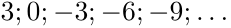

---

### Worked Example: Arithmetic Sequences

This example demonstrates how to identify an arithmetic sequence, determine its general formula, and calculate the number of terms.

---

#### Step 1: Check for a common difference
To confirm a sequence is arithmetic, calculate the difference between successive terms ($T_n - T_{n-1}$).

*   $T_2 - T_1 = -11 - (-15) = 4$
*   $T_3 - T_2 = -7 - (-11) = 4$

Since the difference is constant, this is an arithmetic sequence with a common difference of $d = 4$.

---

#### Step 2: Determine the general term formula
Use the standard formula for the $n^{th}$ term of an arithmetic sequence:
$$T_n = a + (n - 1)d$$

**Given values:**
*   First term ($a$) = $-15$
*   Common difference ($d$) = $4$

**Calculation:**
$$T_n = -15 + (n - 1)(4)$$
$$T_n = -15 + 4n - 4$$
$$T_n = 4n - 19$$

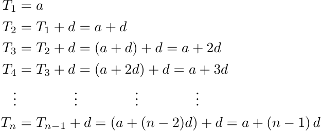
> **[Diagram Context - Textbook_Mathematics_Gr12_Sequences-and-series.pdf-0003-03.png]**
> This algebraic sequence derivation shows the step-by-step expansion of an arithmetic sequence. Visible algebraic symbols include terms $T_1$ through $T_n$, the first term $a$, the constant difference $d$, and term position index $n$. Conceptually, the diagram demonstrates how repeatedly adding the common difference builds up to the standard general formula $T_n = a + (n-1)d$ for any arithmetic progression in Grade 12 Mathematics.

**Note on Graphical Representation:**
The graph shows the points of the sequence. Since the domain consists of natural numbers ($n \in \{1; 2; 3; \dots\}$), the points should technically not be connected. The dotted line is used only to illustrate that the sequence follows a linear pattern.

---

#### Step 3: Determine the number of terms
To find how many terms are in the sequence given a specific value (e.g., $173$), set $T_n = 173$ and solve for $n$:

$$T_n = a + (n - 1)d$$
$$173 = 4n - 19$$
$$192 = 4n$$
$$n = \frac{192}{4}$$
$$n = 48$$

---

#### Step 4: Final Answer
There are $48$ terms in the sequence, such that $T_{48} = 173$.

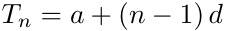

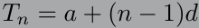

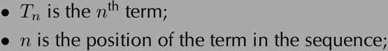
> **[Diagram Context - Textbook_Mathematics_Gr12_Sequences-and-series.pdf-0003-10.png]**
> The graphic is a text-based mathematical definition relating to number patterns and sequences. It lists the variables $T_n$ (representing the $n^{\text{th}}$ term) and $n$ (representing the position of the term in the sequence). Conceptually, this defines the standard notation used in FET Mathematics (Grades 10–12) for investigating arithmetic and geometric sequences and series.

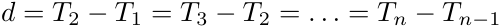

---

### Arithmetic Mean

The arithmetic mean between two numbers is the number exactly halfway between them. It is the average of the two numbers, and when placed between them, the three numbers form an arithmetic sequence.

#### Worked Example
To find the arithmetic mean between $7$ and $17$:

$$\text{Arithmetic mean} = \frac{7 + 17}{2}$$
$$\text{Arithmetic mean} = \frac{24}{2} = 12$$

This results in the sequence $7; 12; 17$. We can verify this is an arithmetic sequence by checking the common difference ($d$):
* $T_2 - T_1 = 12 - 7 = 5$
* $T_3 - T_2 = 17 - 12 = 5$

---

### Graphical Representation of Arithmetic Sequences

Plotting the terms of a sequence ($T_n$ vs. $n$) helps identify the type of sequence. For an arithmetic sequence, the points will always lie on a straight line.

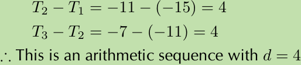
> **[Diagram Context - Textbook_Mathematics_Gr12_Sequences-and-series.pdf-0004-02.png]**
> This mathematical text graphic displays worked calculations for sequence analysis involving terms $T_1$, $T_2$, and $T_3$. Visible elements include algebraic subtraction equations showing $T_2 - T_1 = -11 - (-15) = 4$ and $T_3 - T_2 = -7 - (-11) = 4$, along with the concluding deduction statement $\therefore$ This is an arithmetic sequence with $d = 4$. It conceptually demonstrates to CAPS FET mathematics learners how to test for a constant difference to prove the presence of an arithmetic sequence and determine its common difference ($d$).

#### Key Observations:
* **Linear Nature:** Arithmetic sequences are also known as **linear sequences**.
* **Gradient:** The common difference ($d$) of the sequence corresponds to the gradient of the straight line.
* **General Form:** The general term formula $T_n = a + (n - 1)d$ can be rearranged:
  $$T_n = d(n - 1) + a$$
  This is mathematically equivalent to the linear equation $y = mx + c$, where:
  * $T_n$ corresponds to $y$
  * $n$ corresponds to $x$
  * $d$ corresponds to the gradient $m$

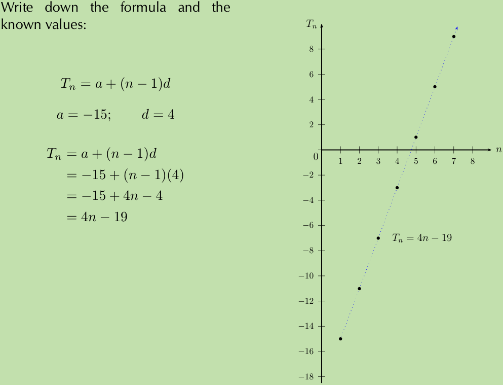
> **[Diagram Context - Textbook_Mathematics_Gr12_Sequences-and-series.pdf-0004-04.png]**
> The graphic shows a Cartesian graph representing an arithmetic sequence with a dotted linear plot, along with algebraic working steps on the left. Visible labels and symbols include the axes $n$ and $T_n$, sequence term notation $T_n$, first term $a$, common difference $d$, and the linear formula derivation $T_n = a + (n-1)d = 4n - 19$. Conceptually, it demonstrates to CAPS mathematics learners how to extract parameters from a linear sequence, derive its general term algebraically, and visually represent discrete sequence terms as points on a straight-line graph.

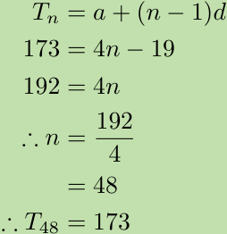
> **[Diagram Context - Textbook_Mathematics_Gr12_Sequences-and-series.pdf-0004-08.png]**
> This algebraic calculation graphic demonstrates the step-by-step solution for finding the term position $n$ in an arithmetic sequence using the general formula $T_n = a + (n - 1)d$. Visible components include variables and numbers such as $T_n$, $a$, $n$, $d$, $173$, $4n$, $19$, and $48$. Conceptually, it guides high school learners through substituting known values into the linear number pattern formula, simplifying the algebraic equation, and solving for the unknown index $n$.

---

# Revision Notes: Arithmetic Sequences

An arithmetic sequence is a sequence of numbers where the difference between consecutive terms is constant. This constant is called the **common difference** ($d$).

The general term of an arithmetic sequence is given by the formula:
$$T_n = a + (n - 1)d$$
Where:
*   $T_n$ is the $n^{th}$ term.
*   $a$ is the first term ($T_1$).
*   $d$ is the common difference ($d = T_n - T_{n-1}$).
*   $n$ is the position of the term in the sequence.

---

## Exercises

### 1. Sequence: $7; 5,5; 4; 2,5; \dots$
*   **a)** The common difference is $d = 5,5 - 7 = -1,5$. The next term is $2,5 - 1,5 = 1$.
*   **b)** $T_n = 7 + (n - 1)(-1,5) = 7 - 1,5n + 1,5 = -1,5n + 8,5$.
*   **c)** Set $T_n = -23$:
    $-23 = -1,5n + 8,5 \implies -31,5 = -1,5n \implies n = 21$. The $21^{st}$ term is $-23$.

### 2. Sequence: $2; 6; 10; 14; \dots$
*   **a)** Yes, $6-2=4$, $10-6=4$, $14-10=4$. Since the difference is constant ($d=4$), it is arithmetic.
*   **b)** $T_{55} = 2 + (55 - 1)4 = 2 + (54 \times 4) = 2 + 216 = 218$.
*   **c)** $322 = 2 + (n - 1)4 \implies 320 = (n - 1)4 \implies 80 = n - 1 \implies n = 81$.
*   **d)** $1204 = 2 + (n - 1)4 \implies 1202 = (n - 1)4 \implies 300,5 = n - 1$. Since $n$ must be an integer, $1204$ is not a term.

### 3. General term $T_n = -2n + 7$
*   **a)** $T_2 = -2(2) + 7 = 3$; $T_3 = -2(3) + 7 = 1$; $T_{10} = -2(10) + 7 = -13$.

### 4. First term $a = -\frac{1}{2}$, $T_{22} = 10$
*   $10 = -\frac{1}{2} + (22 - 1)d \implies 10,5 = 21d \implies d = 0,5$.
*   $T_n = -0,5 + (n - 1)0,5 = 0,5n - 1$.

### 7. Matchstick Pattern
*   **a)** First four terms: $4; 7; 10; 13$.
*   **b)** $d = 3$.
*   **c)** $T_n = 4 + (n - 1)3 = 3n + 1$.
*   **d)** $T_{25} = 3(25) + 1 = 76$ matchsticks.
*   **e)** $109 = 3n + 1 \implies 108 = 3n \implies n = 36$ squares.

### 8. Triangular Pattern
*   **a)** Complete the table:
    *   Pattern: $T_n = 2n + 1$
    *   $p = 2(3) + 1 = 7$
    *   $15 = 2q + 1 \implies q = 7$
    *   $71 = 2r + 1 \implies r = 35$

| Figure no. | 1 | 2 | 3 | $q$ | $r$ | $n$ |
| :--- | :--- | :--- | :--- | :--- | :--- | :--- |
| No. of stitches | 3 | 5 | $p$ | 15 | 71 | $s$ |

*   **b)** $2\text{ m} = 200\text{ cm}$. Each stitch is $1\text{ cm}$. Total stitches $T_n = 200$.
    $200 = 2n + 1 \implies 199 = 2n \implies n = 99,5$.
    There will be $99$ full triangles (or $199$ stitches).

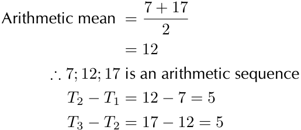
> **[Diagram Context - Textbook_Mathematics_Gr12_Sequences-and-series.pdf-0005-03.png]**
> This algebraic text graphic displays a mathematical worked example involving number patterns, specifically demonstrating the arithmetic mean and constant difference of an arithmetic sequence. Visible text and symbols include the labels "Arithmetic mean" and "is an arithmetic sequence", the numbers 7, 12, 17, and 2, plus/minus signs, fraction bars, equality and therefore ($\therefore$) symbols, and sequence term notations $T_1$, $T_2$, and $T_3$. For a high school student, it visually reinforces how the arithmetic mean of two terms generates the middle term of an arithmetic sequence, which is then verified by showing a constant common difference ($d = 5$) between consecutive terms.

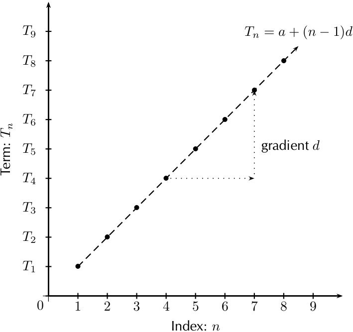
> **[Diagram Context - Textbook_Mathematics_Gr12_Sequences-and-series.pdf-0005-05.png]**
> This mathematical graph illustrates an arithmetic sequence plotted on a Cartesian plane, with the horizontal axis labeled "Index: $n$" (from 1 to 9) and the vertical axis labeled "Term: $T_n$" (from $T_1$ to $T_9$). Visible elements include discrete plotted points representing sequence terms, a dashed linear trend line, the general formula $T_n = a + (n - 1)d$, and a dotted right-angled triangle illustrating the constant "gradient $d$". Conceptually, the diagram demonstrates to high school learners that an arithmetic sequence forms a linear function where the constant first difference ($d$) corresponds to the gradient of the straight-line graph.

---

### Arithmetic Sequences: Practice Problems

**9. Finding terms in an arithmetic sequence**
The terms $p$; $(2p + 2)$; $(5p + 3)$ form an arithmetic sequence. Find $p$ and the $15^{\text{th}}$ term.
*   **Concept:** In an arithmetic sequence, the common difference $d$ is constant: $d = T_2 - T_1 = T_3 - T_2$.
*   **Calculation:**
    $$(2p + 2) - p = (5p + 3) - (2p + 2)$$
    $$p + 2 = 3p + 1$$
    $$1 = 2p \implies p = \frac{1}{2}$$
*   **Terms:** $T_1 = 0,5$; $T_2 = 3$; $T_3 = 5,5$. Here, $d = 2,5$.
*   **$15^{\text{th}}$ term:** $T_n = a + (n-1)d$
    $$T_{15} = 0,5 + (14)(2,5) = 0,5 + 35 = 35,5$$

**10. Arithmetic Mean**
The arithmetic mean of $3a - 2$ and $x$ is $4a - 4$. Determine $x$ in terms of $a$.
*   **Formula:** $\text{Mean} = \frac{T_1 + T_2}{2}$
    $$\frac{(3a - 2) + x}{2} = 4a - 4$$
    $$(3a - 2) + x = 8a - 8$$
    $$x = 5a - 6$$

**11. Inserting Arithmetic Means**
Insert seven arithmetic means between $(3s - t)$ and $(-13s + 7t)$.
*   **Concept:** We have $n=9$ terms total. $T_1 = 3s - t$ and $T_9 = -13s + 7t$.
*   **Common difference:** $T_9 = T_1 + 8d$
    $$-13s + 7t = (3s - t) + 8d$$
    $$-16s + 8t = 8d \implies d = -2s + t$$
*   **The sequence:** Add $d$ repeatedly to $T_1$ to find the seven terms between $T_1$ and $T_9$.

---

### Quadratic Sequences

**Definition:** A quadratic sequence is a sequence of numbers where the **second difference** between any two consecutive terms is constant.

**General Formula:**
The $n^{\text{th}}$ term is given by:
$$T_n = an^2 + bn + c$$

**Structure of Differences:**

| Term ($n$) | $n=1$ | $n=2$ | $n=3$ | $n=4$ |
| :--- | :--- | :--- | :--- | :--- |
| **Sequence ($T_n$)** | $a+b+c$ | $4a+2b+c$ | $9a+3b+c$ | $16a+4b+c$ |
| **1st Difference** | | $3a+b$ | $5a+b$ | $7a+b$ |
| **2nd Difference** | | | $2a$ | $2a$ |

**Key Properties:**
1.  The first differences form an arithmetic sequence.
2.  The second difference is constant and equal to $2a$.
3.  To find the coefficients $a, b,$ and $c$:
    *   Set $2a = \text{second difference}$.
    *   Set $3a + b = \text{first term of the first difference sequence}$.
    *   Set $a + b + c = \text{first term of the sequence}$.

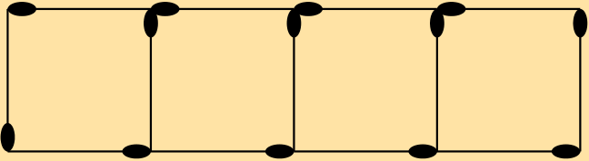
> **[Diagram Context - Textbook_Mathematics_Gr12_Sequences-and-series.pdf-0006-17.png]**
> This geometric figure represents a grid of four connected squares forming a rectangular strip, outlined with black lines on a yellow background. The diagram features black oval markers positioned at various vertices and corners along the grid intersections and perimeters. Conceptually, this visual aids high school learners in understanding spatial reasoning, perimeter and area calculations, or pattern analysis within Euclidean geometry.

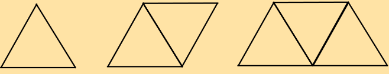
> **[Diagram Context - Textbook_Mathematics_Gr12_Sequences-and-series.pdf-0006-24.png]**
> This educational graphic is a geometry figure showing a sequence of connected triangles (one, two, and three triangles sharing sides). The diagram contains unlabelled line segments forming single and adjacent polygons. It conveys the iterative growth of geometric patterns and helps learners understand recursive relationships in spatial reasoning and number patterns.

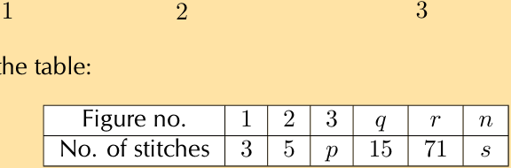
> **[Diagram Context - Textbook_Mathematics_Gr12_Sequences-and-series.pdf-0006-25.png]**
> The graphic presents a mathematical data table displaying a number pattern linking figure numbers to the corresponding number of stitches. The visible table headers and entries include "Figure no." with values $1, 2, 3, q, r, n$ paired with "No. of stitches" showing values $3, 5, p, 15, 71, s$. This table helps high school students practice identifying linear or quadratic sequences, determining general rules, and solving for unknown variables within number patterns.

---

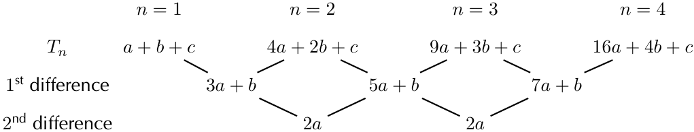
> **[Diagram Context - Textbook_Mathematics_Gr12_Sequences-and-series.pdf-0007-10.png]**
> The graphic shows an algebraic number pattern diagram illustrating quadratic sequences for terms up to $n = 4$. Visible labels include the sequence terms denoted by $T_n$ ($a+b+c$, $4a+2b+c$, $9a+3b+c$, $16a+4b+c$), the $1^{\text{st}}$ differences ($3a+b$, $5a+b$, $7a+b$), and the constant $2^{\text{nd}}$ difference ($2a$). This diagram conveys conceptually how to determine the general formula for a quadratic sequence in terms of $a$, $b$, and $c$ by equating the second difference to $2a$, the first difference to $3a+b$, and the first term to $a+b+c$.

### Analysis of Number Patterns

This lesson explores how to identify and derive the general term for sequences based on visual patterns of blocks.

#### 1. White Blocks Analysis (Linear Sequence)
By observing the diagrams, we count the white blocks for each pattern number ($n$). Since the difference between consecutive terms is constant, this is a **linear sequence**.

| Pattern number ($n$) | 1 | 2 | 3 | 4 | 5 | 6 | $n$ |
| :--- | :--- | :--- | :--- | :--- | :--- | :--- | :--- |
| No. of white blocks ($w$) | 4 | 8 | 12 | 16 | 20 | 24 | $4n$ |
| Common difference ($d$) | | 4 | 4 | 4 | 4 | 4 | |

**Deriving the General Term ($T_n$):**
The formula for a linear sequence is $T_n = a + (n - 1)d$, where $a$ is the first term and $d$ is the common difference.

$$T_n = 4 + (n - 1)(4)$$
$$T_n = 4 + 4n - 4$$
$$T_n = 4n$$

---

#### 2. Blue Blocks Analysis (Quadratic Sequence)
By observing the diagrams, we count the blue blocks for each pattern number ($n$). 

| Pattern number ($n$) | 1 | 2 | 3 | 4 | 5 | 6 |
| :--- | :--- | :--- | :--- | :--- | :--- | :--- |
| No. of blue blocks ($b$) | 0 | 1 | 4 | 9 | 16 | 25 |
| Difference | | 1 | 3 | 5 | 7 | 9 |

**Observation:**
There is no common difference between the first-level differences ($1, 3, 5, 7, 9$). Because the differences are not constant, this is not a linear sequence. Further investigation reveals this is a **quadratic sequence**.

---

### Analysis of Quadratic Sequences

A sequence is quadratic if the second difference between consecutive terms is constant. This is represented by the general formula $T_n = an^2 + bn + c$.

#### 1. Pattern Analysis Table (Blue Blocks)

The following table illustrates the relationship between the pattern number ($n$) and the number of blue blocks ($b$):

| Pattern number ($n$) | 1 | 2 | 3 | 4 | 5 | 6 | $n$ |
| :--- | :---: | :---: | :---: | :---: | :---: | :---: | :---: |
| **No. of blue blocks ($b$)** | 0 | 1 | 4 | 9 | 16 | 25 | $(n-1)^2$ |
| **First difference** | $-$ | 1 | 3 | 5 | 7 | 9 | $-$ |
| **Second difference** | $-$ | $-$ | 2 | 2 | 2 | 2 | $-$ |
| **Pattern** | $(1-1)^2$ | $(2-1)^2$ | $(3-1)^2$ | $(4-1)^2$ | $(5-1)^2$ | $(6-1)^2$ | $(n-1)^2$ |

The general term for the blue blocks is:
$$T_n = (n-1)^2$$

---

#### 2. Graphical Representation

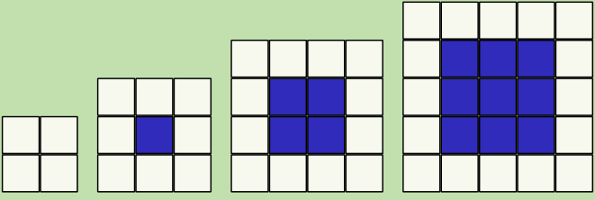
> **[Diagram Context - Textbook_Mathematics_Gr12_Sequences-and-series.pdf-0008-00.png]**
> This geometric pattern visualizes a growing sequence of square grids made up of white perimeter squares and an increasing core of solid blue interior squares. The diagram displays four consecutive stages: a 2x2 grid with zero blue squares, a 3x3 grid with one blue square, a 4x4 grid with four blue squares, and a 5x5 grid with nine blue squares. This representation helps learners conceptualize number patterns, investigate linear and quadratic relationships, and derive algebraic formulae for sequences in senior phase mathematics.

When plotting sequences where $n$ represents natural numbers ($n \in \{1; 2; 3; \dots\}$), the points are not connected by a solid line. Dotted lines are used to indicate the nature of the growth:

*   **White blocks ($T_n = 4n$):** This represents a linear sequence, resulting in a **straight line**.
*   **Blue blocks ($T_n = (n-1)^2 = n^2 - 2n + 1$):** This represents a quadratic sequence, resulting in a **parabola**.

**Key Note:** Because the domain is restricted to natural numbers, the graph consists of discrete points rather than a continuous function.

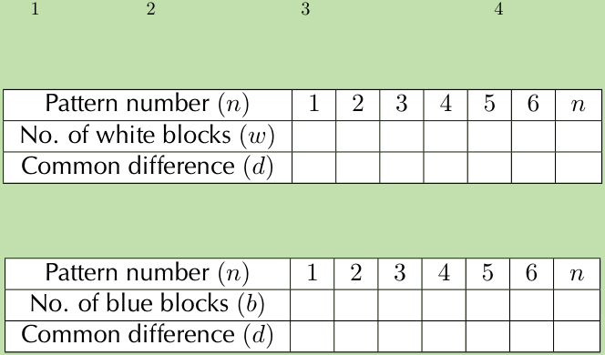
> **[Diagram Context - Textbook_Mathematics_Gr12_Sequences-and-series.pdf-0008-01.png]**
> This educational graphic features two mathematical tables designed for investigating linear number patterns. The tables contain rows labeled with pattern numbers ($n$), number of white blocks ($w$), number of blue blocks ($b$), and common differences ($d$), spanning values from 1 to 6 and the general term $n$. Conceptually, it guides learners in organizing sequence data to determine first differences and derive linear algebraic formulas in accordance with the CAPS FET curriculum.

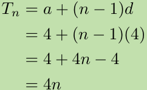
> **[Diagram Context - Textbook_Mathematics_Gr12_Sequences-and-series.pdf-0008-07.png]**
> This algebraic equation graphic displays the step-by-step derivation of the general formula for a number sequence. The visible variables and symbols include $T_n$, $a$, $n$, and $d$, demonstrating the substitution of the first term $a=4$ and common difference $d=4$ into the linear arithmetic sequence formula $T_n = a + (n - 1)d$. Conceptually, it guides high school learners through expanding brackets and simplifying algebraic expressions to find the final general term rule $T_n = 4n$.

---

### Exercise 1 – 3: Quadratic Sequences

#### 1. Classification of Sequences
Determine whether each of the following sequences is a **linear sequence**, a **quadratic sequence**, or **neither**:

*   a) $8; 17; 32; 53; 80; \dots$
*   b) $3p^2; 6p^2; 9p^2; 12p^2; 15p^2; \dots$
*   c) $1; 2,5; 5; 8,5; 13; \dots$
*   d) $2; 6; 10; 14; 18; \dots$
*   e) $5; 19; 41; 71; 109; \dots$
*   f) $3; 9; 16; 21; 27; \dots$
*   g) $2k; 8k; 18k; 32k; 50k; \dots$
*   h) $2\frac{1}{2}; 6; 10\frac{1}{2}; 16; 22\frac{1}{2}; \dots$

#### 2. Finding Constants in a Quadratic Pattern
A quadratic pattern is given by $T_n = n^2 + bn + c$. Find the values of $b$ and $c$ if the sequence starts with the following terms:
$$-1; 2; 7; 14; \dots$$

#### 3. Sequence Analysis
Given the sequence: $a^2; -a^2; -3a^2; -5a^2; \dots$
*   a) Is the sequence linear or quadratic? Motivate your answer.
*   b) What is the next term in the sequence?
*   c) Calculate $T_{100}$.

#### 4. Determining Constants
Given $T_n = n^2 + bn + c$, determine the values of $b$ and $c$ if the sequence starts with the terms:
$$2; 7; 14; 23; \dots$$

#### 5. Constructing a Sequence
The first term of a quadratic sequence is $4$, the third term is $34$, and the common second difference is $10$. Determine the first six terms in the sequence.

#### 6. Solving for Sequence Properties
A quadratic sequence has a second term equal to $1$, a third term equal to $-6$, and a fourth term equal to $-14$.
*   a) Determine the second difference for this sequence.
*   b) Hence, or otherwise, calculate the first term of the pattern.

#### 7. Online Resources
For more practice, sign in at Everything Maths online and click 'Practise Maths'.

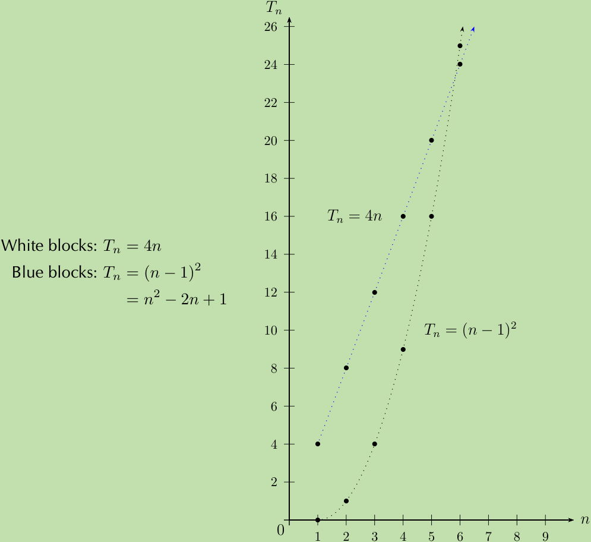
> **[Diagram Context - Textbook_Mathematics_Gr12_Sequences-and-series.pdf-0009-02.png]**
> This educational graphic is a Cartesian graph plotting two distinct number patterns against term position $n$. The graph displays the axes labeled $n$ and $T_n$, plotted points connected by dotted curves, and algebraic formulas $T_n = 4n$ and $T_n = (n-1)^2$ (or $n^2 - 2n + 1$). It visually conveys how linear and quadratic number sequences grow by mapping term values to their respective positions, helping CAPS FET learners differentiate between linear and quadratic growth rates graphically.

| Question | Exercise Code |
| :--- | :--- |
| 1a | 2854 |
| 1b | 2855 |
| 1c | 2856 |
| 1d | 2857 |
| 1e | 2858 |
| 1f | 2859 |
| 1g | 285B |
| 1h | 285C |
| 2 | 285D |
| 3 | 285F |
| 4 | 285G |
| 5 | 285H |
| 6 | 285J |

---

# 1.2 Geometric Sequences

### Definition: Geometric Sequence
A geometric sequence is a sequence of numbers in which each new term (except for the first term) is calculated by multiplying the previous term by a constant value called the **constant ratio** ($r$).

This implies that the ratio between any two consecutive terms in a geometric sequence is always constant (this can be a positive or negative value).

---

### Example: A Flu Epidemic

**Scenario:**
An infected person spreads the flu virus to two friends. Each of those friends then spreads the virus to two more friends the following day. This pattern continues, where each sick person infects 2 other friends.

<!-- DIAGRAM_PLACEHOLDER: diagram -->

**Analysis of the pattern:**
*   **Day 1:** 1 person is infected.
*   **Day 2:** That person infects 2 others.
*   **Day 3:** Those 2 people each infect 2 others, resulting in 4 new infections.
*   **Day 4:** Those 4 people each infect 2 others, resulting in 8 new infections.

The sequence of newly infected people per day is: $1, 2, 4, 8, \dots$

In this sequence, each term is multiplied by $2$ to get the next term. Therefore, the constant ratio ($r$) is $2$.

---

### Geometric Sequences

A geometric sequence is a sequence of numbers where each term after the first is found by multiplying the previous one by a fixed, non-zero number called the **constant ratio** ($r$).

#### Tabulating Geometric Events
The following table illustrates the spread of a virus where each person infects 2 others, starting with 2 people on day 1.

| Day ($n$) | No. of newly-infected people |
| :--- | :--- |
| $1$ | $2 = 2$ |
| $2$ | $4 = 2 \times 2 = 2^1$ |
| $3$ | $8 = 2 \times 4 = 2 \times 2 \times 2 = 2^2$ |
| $4$ | $16 = 2 \times 8 = 2 \times 2 \times 2 \times 2 = 2^3$ |
| $5$ | $32 = 2 \times 16 = 2 \times 2 \times 2 \times 2 \times 2 = 2^4$ |
| $\vdots$ | $\vdots$ |
| $n$ | $2 \times 2 \times 2 \times 2 \times \dots \times 2 = 2^{n-1}$ |

This results in the geometric sequence: $2; 4; 8; 16; 32; \dots$

#### Determining the Constant Ratio ($r$)
In a geometric sequence, the constant ratio ($r$) is found by dividing any term by the term preceding it:

$$\frac{T_2}{T_1} = \frac{T_3}{T_2} = r$$

More generally, for any term $n$:

$$\frac{T_n}{T_{n-1}} = r$$

---

### Exercise 1 – 4: Constant Ratio of a Geometric Sequence

Determine the constant ratios for the following geometric sequences and write down the next three terms in each sequence:

1. $5; 10; 20; \dots$
2. $\frac{1}{2}; \frac{1}{4}; \frac{1}{8}; \dots$
3. $7; 0,7; 0,07; \dots$
4. $p; 3p^2; 9p^3; \dots$
5. $-3; 30; -300; \dots$

> **[Diagram Context - Textbook_Mathematics_Gr12_Sequences-and-series.pdf-0011-08.png]**
> This educational graphic illustrates an epidemiological transmission tree showing exponential infection growth, with the label "Newly-infected people" positioned below the primary source. The diagram uses branching lines and human figure icons cascading downwards from a single infected individual to demonstrate how a pathogen spreads geometrically through a population over successive generations. For CAPS Life Sciences learners, this conceptual model clarifies the mechanism of epidemic spread and underscores the critical importance of intervention strategies like social distancing in breaking transmission chains.

**Check answers online using the following codes:**
1. 285M
2. 285N
3. 285P
4. 285Q
5. 285R

---

# The General Term for a Geometric Sequence

## The General Formula
A geometric sequence is a sequence where each term is found by multiplying the previous term by a constant ratio ($r$). The general term $T_n$ can be derived as follows:

*   $T_1 = a = ar^0$
*   $T_2 = a \times r = ar^1$
*   $T_3 = a \times r \times r = ar^2$
*   $T_4 = a \times r \times r \times r = ar^3$
*   $T_n = a \times r \times r \dots (n-1 \text{ times}) = ar^{n-1}$

The general formula for a geometric sequence is:
$$T_n = ar^{n-1}$$

**Where:**
*   $a$ is the first term in the sequence.
*   $r$ is the constant ratio.

---

## Test for a Geometric Sequence
To determine if a sequence is geometric, you must verify that the ratio between any two consecutive terms is constant. The sequence is geometric if:

$$\frac{T_2}{T_1} = \frac{T_3}{T_2} = \frac{T_n}{T_{n-1}} = r$$

If this condition does not hold, the sequence is not a geometric sequence.

---

## Exercise 1 – 5: General Term of a Geometric Sequence

Determine the general formula for the $n^{th}$ term of each of the following geometric sequences:

1. $5; 10; 20; \dots$
2. $\frac{1}{2}; \frac{1}{4}; \frac{1}{8}; \dots$
3. $7; 0,7; 0,07; \dots$
4. $p; 3p^2; 9p^3; \dots$
5. $-3; 30; -300; \dots$

### Check Answers
You can check your answers online using the following codes:

| Question | Code |
| :--- | :--- |
| 1 | 285S |
| 2 | 285T |
| 3 | 285V |
| 4 | 285W |
| 5 | 285X |

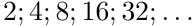

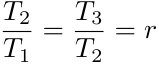

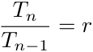

---

### Worked Example: Flu Epidemic

**Problem Statement**
In a flu epidemic, the number of newly-infected people after $n$ days is given by the formula:
$$T_n = 2 \times 2^{n-1}$$

1. Calculate how many newly-infected people there are on the tenth day.
2. On which day will $16\ 384$ people be newly-infected?

---

#### Solution

**Step 1: Identify known values and the general formula**
*   First term ($a$) = $2$
*   Common ratio ($r$) = $2$
*   General formula: $T_n = 2 \times 2^{n-1}$

**Step 2: Calculate $T_{10}$**
Substitute $n = 10$ into the general formula:
$$T_n = a \times r^{n-1}$$
$$\therefore T_{10} = 2 \times 2^{10-1}$$
$$= 2 \times 2^9$$
$$= 2 \times 512$$
$$= 1024$$

*Conclusion: On the tenth day, there are $1024$ newly-infected people.*

**Step 3: Calculate $n$ for $T_n = 16\ 384$**
Substitute $T_n = 16\ 384$ into the formula and solve for $n$:
$$T_n = a \times r^{n-1}$$
$$16\ 384 = 2 \times 2^{n-1}$$
$$\frac{16\ 384}{2} = 2^{n-1}$$
$$8192 = 2^{n-1}$$

Since $8192 = 2^{13}$:
$$2^{13} = 2^{n-1}$$

Equating the exponents (since the bases are the same):
$$13 = n - 1$$
$$\therefore n = 14$$

*Conclusion: There are $16\ 384$ newly-infected people on the $14^{th}$ day.*

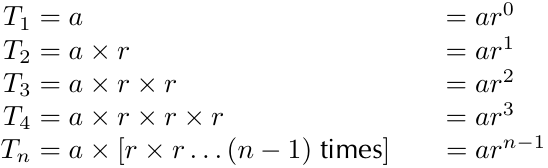
> **[Diagram Context - Textbook_Mathematics_Gr12_Sequences-and-series.pdf-0013-04.png]**
> This algebraic sequence breakdown shows the derivation of the general formula for a geometric sequence, containing terms labeled $T_1$ through $T_n$, the first term $a$, the constant ratio $r$, and exponents from $ar^0$ to $ar^{n-1}$. It visually demonstrates how repeated multiplication by the constant ratio leads to the standard formula $T_n = ar^{n-1}$ for calculating any term in a geometric progression.

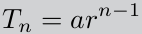

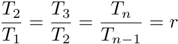

---

### Geometric Sequences and Geometric Means

#### 1. Geometric Sequence Representation
A geometric sequence can be represented both numerically and graphically. In the example of newly-infected people, the relationship between the day ($n$) and the number of people ($T_n$) is defined by the formula:
$$T_n = 2 \times 2^{n-1}$$

| Day ($n$) | No. of newly-infected people ($T_n$) |
| :--- | :--- |
| 1 | 2 |
| 2 | 4 |
| 3 | 8 |
| 4 | 16 |
| 5 | 32 |
| 6 | 64 |
| $n$ | $2 \times 2^{n-1}$ |

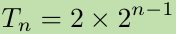

**Note on Graphing:**
Since we are dealing with positive integers ($n \in \{1; 2; 3; \dots\}$), the graph is **discrete**. We do not join the points with a solid line; the dotted line is only used to indicate the exponential shape of the sequence.

---

#### 2. Geometric Mean
The geometric mean between two numbers is the value that, when inserted between them, forms a geometric sequence.

**Worked Example:**
Find the geometric mean between 5 and 20.
1. Set up the sequence: $5; x; 20$
2. Determine the constant ratio ($r$):
   $$\frac{x}{5} = \frac{20}{x}$$
3. Solve for $x$:
   $$x^2 = 20 \times 5$$
   $$x^2 = 100$$
   $$x = \pm 10$$

**Important:** Always include both the positive and negative square roots. This results in two possible geometric sequences:
* $5; 10; 20; \dots$
* $5; -10; 20; \dots$

---

#### 3. General Formula for Geometric Mean
For any two numbers $a$ and $b$, the geometric mean $x$ is found by:
1. Setting up the sequence: $a; x; b$
2. Equating the ratios:
   $$\frac{x}{a} = \frac{b}{x}$$
3. Solving for $x$:
   $$x^2 = ab$$
   $$\therefore x = \pm \sqrt{ab}$$

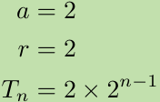

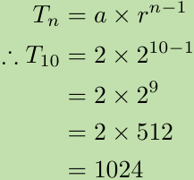
> **[Diagram Context - Textbook_Mathematics_Gr12_Sequences-and-series.pdf-0014-11.png]**
> This graphic displays mathematical equations for finding terms in a geometric sequence, showing the general formula alongside a worked calculation. The visible symbols include $T_n$, $a$, $r$, and exponent $n-1$, applied specifically to solve for $T_{10}$ resulting in $1024$. Conceptually, it demonstrates the procedural method for substituting the first term and constant ratio into the standard formula to determine any specific term in a geometric sequence.

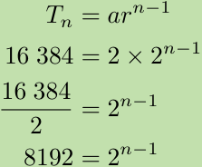
> **[Diagram Context - Textbook_Mathematics_Gr12_Sequences-and-series.pdf-0014-15.png]**
> This mathematical graphic displays a step-by-step algebraic manipulation for solving an exponential equation derived from a geometric sequence. It shows the general formula $T_n = ar^{n-1}$, followed by the substitution of specific numerical values (16 384, 2) to yield the exponential equation $16 384 = 2 \times 2^{n-1}$, which is then simplified through division to isolate the base and exponent $8192 = 2^{n-1}$. Conceptually, this demonstrates the procedural fluency required in CAPS FET Mathematics (Grades 10–12) to determine the position of a term ($n$) in a geometric sequence, bridging algebraic substitution with exponent laws and preparation for logarithms.

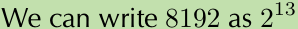

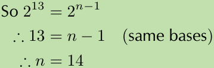
> **[Diagram Context - Textbook_Mathematics_Gr12_Sequences-and-series.pdf-0014-17.png]**
> This graphic displays an algebraic exponent equation step on a light green background. Visible mathematical symbols and text include the equation $2^{13} = 2^{n-1}$, the logical consequence symbol ($\therefore$), the linear equation $13 = n - 1$ justified by the parenthetical note "(same bases)", and the final solved value $\therefore n = 14$. Conceptually, this demonstrates how to solve exponential equations in CAPS FET Mathematics by equating exponents when both sides of the equation share the same base.

---

### Exercise 1 – 6: Mixed Exercises

**1. Sequence Analysis**
The $n^{th}$ term of a sequence is given by $T_n = 6\left(\frac{1}{3}\right)^{n-1}$.
*   a) Write down the first three terms.
*   b) Identify the type of sequence.

**2. Arithmetic and Geometric Sequences**
Given the terms: $(k - 4); (k + 1); m; 5k$.
*   The first three terms form an arithmetic sequence.
*   The last three terms form a geometric sequence.
*   Determine $k$ and $m$ (given $k, m \in \mathbb{Z}^+$).

**3. Geometric Sequence Properties**
Given a geometric sequence where the second term is $\frac{1}{2}$ and the ninth term is $64$.
*   a) Determine the common ratio $r$.
*   b) Find the first term $a$.
*   c) Determine the general formula $T_n$.

**4. Graphical Representation of Geometric Sequences**

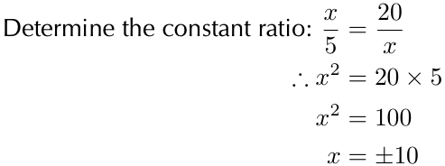
> **[Diagram Context - Textbook_Mathematics_Gr12_Sequences-and-series.pdf-0015-06.png]**
> This educational graphic presents a mathematical worked example demonstrating how to find an unknown variable in a geometric sequence or constant ratio problem. The visible text and symbols include the instruction "Determine the constant ratio:", the algebraic equation $\frac{x}{5} = \frac{20}{x}$, and the step-by-step solution yielding $x^2 = 20 \times 5$, $x^2 = 100$, and finally $x = \pm 10$. Conceptually, it guides high school learners through cross-multiplication and solving quadratic equations to find a missing term in a number pattern.

The diagram shows four sets of values of consecutive terms of a geometric sequence $T_n = ar^{n-1}$.
*   a) Determine $a$ and $r$.
*   b) Find $x$ and $y$.
*   c) Find the fifth term of the sequence.

**5. Sequence Continuation**
Write down the next two terms for the sequence:
$1; \sin \theta; 1 - \cos^2 \theta; \dots$

**6. Mixed Sequence Calculation**
Given $5; x; y$ is an arithmetic sequence and $x; y; 81$ is a geometric sequence. All terms are integers. Calculate $x$ and $y$.

**7. Geometric Means**
Given the numbers $2x^2y^2$ and $8x^4$.
*   a) Write down the geometric mean between the two numbers in terms of $x$ and $y$.
*   b) Determine the constant ratio of the resulting sequence.

**8. Inserting Geometric Means**
Insert three geometric means between $-1$ and $-\frac{1}{81}$. Provide all possible answers.

**9. Online Practice**
Access further questions at [everythingmaths.co.za](http://www.everythingmaths.co.za).

---

### Exercise Reference Codes
Use these codes on the Everything Maths website to check your answers:

| Question | Code |
| :--- | :--- |
| 1 | 285Y |
| 2 | 285Z |
| 3 | 2862 |
| 4 | 2863 |
| 5 | 2864 |
| 6 | 2865 |
| 7 | 2866 |
| 8 | 2867 |

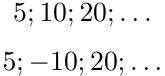

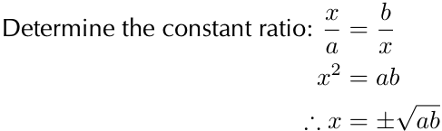
> **[Diagram Context - Textbook_Mathematics_Gr12_Sequences-and-series.pdf-0015-11.png]**
> This educational graphic presents an algebraic derivation starting with the instruction "Determine the constant ratio: $\frac{x}{a} = \frac{b}{x}$" and showing the step-by-step cross-multiplication to yield $x^2 = ab$ and finally $x = \pm\sqrt{ab}$. The visible mathematical symbols include variables $x$, $a$, and $b$, proportionality equations, exponents, and square roots. Conceptually, this diagram demonstrates the algebraic definition and calculation of the mean proportional (or geometric mean) for high school mathematics students studying sequences and series or Euclidean geometry.

---

# 1.3 Series

A **series** is the sum of the terms of a sequence.

## Finite Series
A finite series is the sum of a specific, finite number of terms. We use the symbol $S_n$ to represent the sum of the first $n$ terms of a sequence $\{T_1; T_2; T_3; \dots; T_n\}$:

$$S_n = T_1 + T_2 + T_3 + \dots + T_n$$

**Example:**
Consider the sequence $1; 4; 9; 16; 25; 36; 49; \dots$
The sum of the first four terms is:
$$S_4 = 1 + 4 + 9 + 16 = 30$$

## Infinite Series
An infinite series is the sum of infinitely many terms of a sequence:

$$S_\infty = T_1 + T_2 + T_3 + \dots$$

---

## Sigma Notation
Sigma notation is a compact way to write the sum of a given number of terms of a sequence using the summation symbol $\sum$ (the Greek capital letter "Sigma").

**Example:**
$$\sum_{n=1}^{5} 2n = 2 + 4 + 6 + 8 + 10 = 30$$

### General Formula
The general form for sigma notation is:
$$\sum_{i=m}^{n} T_i = T_m + T_{m+1} + \dots + T_{n-1} + T_n$$

**Key Components:**
*   $i$: The index of the sum.
*   $m$: The lower bound (start index), shown below the summation symbol.
*   $n$: The upper bound (end index), shown above the summation symbol.
*   $T_i$: A term of the sequence.
*   **Number of terms in the series**: Calculated as $\text{end index} - \text{start index} + 1$.

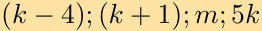

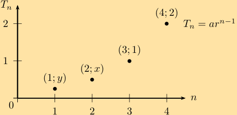
> **[Diagram Context - Textbook_Mathematics_Gr12_Sequences-and-series.pdf-0016-13.png]**
> This graphic is a Cartesian scatter plot representing a geometric sequence with position $n$ on the horizontal axis and term value $T_n$ on the vertical axis. Visible labels include the axes $n$ and $T_n$, coordinate points $(1; y)$, $(2; x)$, $(3; 1)$, and $(4; 2)$, along with the general formula $T_n = ar^{n-1}$. Conceptually, the diagram helps FET learners visualize discrete exponential growth and apply the geometric sequence formula to determine unknown term values such as $x$ and $y$.

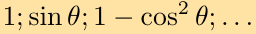

---

# Sigma Notation ($\sum$)

Sigma notation is a concise way to represent the sum of a sequence of numbers. The symbol $\sum$ (the Greek capital letter sigma) indicates a summation.

### Core Concepts

The index $i$ increases from a starting value $m$ to an ending value $n$ by steps of 1.

The general form is:
$$\sum_{i=m}^{n} a_i = a_m + a_{m+1} + \dots + a_{n-1} + a_n$$

When we write out all the terms in a sum, it is referred to as the **expanded form**.

If we are summing from $i = 1$ (which implies summing from the first term in a sequence), we can use either $S_n$ or $\sum$ notation:
$$S_n = \sum_{i=1}^{n} a_i = a_1 + a_2 + \dots + a_n \quad (n \text{ terms})$$

---

### Worked Example: Sigma Notation

**Question:** Expand the sequence and find the value of the series:
$$\sum_{n=1}^{6} 2^n$$

**Solution:**

**Step 1: Expand the formula and write down the first six terms of the sequence.**
$$\sum_{n=1}^{6} 2^n = 2^1 + 2^2 + 2^3 + 2^4 + 2^5 + 2^6 \quad (6 \text{ terms})$$
$$= 2 + 4 + 8 + 16 + 32 + 64$$

This is a geometric sequence ($2, 4, 8, 16, 32, 64$) with a constant ratio of $2$ between consecutive terms.

**Step 2: Determine the sum of the first six terms of the sequence.**
$$S_6 = 2 + 4 + 8 + 16 + 32 + 64$$
$$S_6 = 126$$

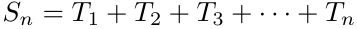

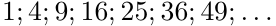

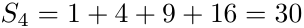

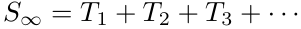

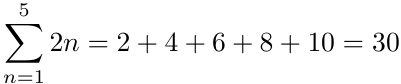
> **[Diagram Context - Textbook_Mathematics_Gr12_Sequences-and-series.pdf-0017-18.png]**
> This mathematical expression shows a summation notation (sigma notation) equation: $\sum_{n=1}^{5} 2n = 2 + 4 + 6 + 8 + 10 = 30$. Visible labels include the summation symbol $\Sigma$, the starting index $n=1$, the upper limit $5$, the general term $2n$, and the expanded series evaluating to the final sum of $30$. Conceptually, it demonstrates to FET mathematics learners how to expand and evaluate a finite arithmetic series given in sigma notation by substituting successive integer values for the index $n$.

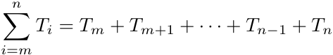
> **[Diagram Context - Textbook_Mathematics_Gr12_Sequences-and-series.pdf-0017-20.png]**
> This graphic displays a mathematical summation notation formula showing the expanded series sum. It features the summation symbol ($\sum$) with lower limit index $i=m$ and upper limit $n$, operating on term $T_i$, expanded horizontally as $T_m + T_{m+1} + \dots + T_{n-1} + T_n$. Conceptually, this helps CAPS Grade 11 and 12 mathematics learners understand how sigma notation compactly represents the addition of consecutive terms in arithmetic and geometric sequences and series.

---

### Worked Example 5: Sigma Notation

**Question**
Find the value of the series:
$$\sum_{n=3}^{7} 2an$$

**Solution**

**Step 1: Expand the sequence and write down the five terms**
$$\sum_{n=3}^{7} 2an = 2a(3) + 2a(4) + 2a(5) + 2a(6) + 2a(7) \quad (5 \text{ terms})$$
$$= 6a + 8a + 10a + 12a + 14a$$

**Step 2: Determine the sum of the five terms of the sequence**
$$S_5 = 6a + 8a + 10a + 12a + 14a$$
$$= 50a$$

---

### Worked Example 6: Sigma Notation

**Question**
Write the following series in sigma notation:
$$31 + 24 + 17 + 10 + 3$$

**Solution**

**Step 1: Consider the series and determine if it is an arithmetic or geometric series**
First test for an arithmetic series: is there a common difference?

We let:
* $T_1 = 31$
* $T_2 = 24$
* $T_3 = 17$
* $T_4 = 10$
* $T_5 = 3$

We calculate:
$$d = T_2 - T_1 = 24 - 31 = -7$$
$$d = T_3 - T_2 = 17 - 24 = -7$$

There is a common difference of $-7$, therefore this is an arithmetic series.

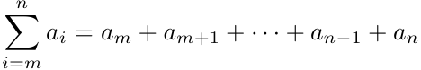
> **[Diagram Context - Textbook_Mathematics_Gr12_Sequences-and-series.pdf-0018-02.png]**
> This mathematical expression illustrates sigma notation used for series expansion in algebra. It displays the summation symbol with the lower limit index $i=m$, upper limit $n$, general term $a_i$, and an expanded sequence showing terms $a_m + a_{m+1} + \dots + a_{n-1} + a_n$ linked by an equals sign. Conceptually, this helps Grade 12 learners understand how to compact and expand arithmetic and geometric series into a sum of sequential terms.

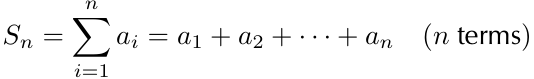
> **[Diagram Context - Textbook_Mathematics_Gr12_Sequences-and-series.pdf-0018-05.png]**
> This mathematical expression displays the summation notation used for series in FET mathematics. It features the summation symbol $\sum$, the index variable $i$, lower and upper limits $1$ and $n$, terms $a_i$ through $a_n$, and the sum $S_n$. Conceptually, it conveys how the compact sigma notation represents the expanded sum of the first $n$ terms of a sequence, which is foundational when learning arithmetic and geometric series in Grade 12.

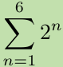

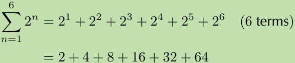
> **[Diagram Context - Textbook_Mathematics_Gr12_Sequences-and-series.pdf-0018-12.png]**
> This graphic illustrates sigma notation for a mathematical series. It features the summation symbol with the lower limit $n=1$, upper limit $6$, and the general term $2^n$, expanded into the sum of six terms ($2^1 + 2^2 + 2^3 + 2^4 + 2^5 + 2^6$) and subsequently evaluated ($2 + 4 + 8 + 16 + 32 + 64$). For a CAPS FET mathematics learner, this visual demonstrates how to expand and interpret sigma notation into an explicit series of terms before calculating the final sum.

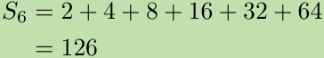
> **[Diagram Context - Textbook_Mathematics_Gr12_Sequences-and-series.pdf-0018-15.png]**
> This mathematical expression displays the sum of a geometric series, denoted by the label $S_6$, evaluated across six terms. Visible terms include the sequence values $2 + 4 + 8 + 16 + 32 + 64$ and the final calculated sum of $126$. Conceptually, this conveys how to calculate the sum of the first $n$ terms of a geometric sequence by explicitly adding each term together in a CAPS FET mathematics context.

---

### Step 2: Determine the General Formula of the Series

To find the general term ($T_n$) of an arithmetic sequence, use the formula:
$$T_n = a + (n - 1)d$$

**Worked Example:**
Given a series starting $31 + 24 + 17 + \dots$ where $a = 31$ and $d = -7$:
$$T_n = 31 + (n - 1)(-7)$$
$$T_n = 31 - 7n + 7$$
$$T_n = -7n + 38$$

> **Be careful:** Always use brackets when substituting a negative common difference ($d$). Substituting without brackets (e.g., $T_n = 31 + (n - 1) - 7$) is mathematically incorrect.

---

### Step 3: Determine the Sum and Sigma Notation

To represent a series using sigma notation, identify the general term and the number of terms. For the series $31 + 24 + 17 + 10 + 3 = 85$:

$$\sum_{n=1}^{5} (-7n + 38) = 85$$

---

### Rules for Sigma Notation

Sigma notation ($\sum$) is used to represent the sum of a sequence. The following rules apply:

#### 1. Sum of Two Sequences
The sum of the sum of two sequences is equal to the sum of their individual sums:
$$\sum_{i=1}^{n} (a_i + b_i) = \sum_{i=1}^{n} a_i + \sum_{i=1}^{n} b_i$$

#### 2. Constant Multiplier
If a constant $c$ is not dependent on the index $i$, it can be factored out:
$$\sum_{i=1}^{n} (c \cdot a_i) = c \cdot a_1 + c \cdot a_2 + \dots + c \cdot a_n$$
$$\sum_{i=1}^{n} (c \cdot a_i) = c(a_1 + a_2 + \dots + a_n)$$
$$\sum_{i=1}^{n} (c \cdot a_i) = c \sum_{i=1}^{n} a_i$$

#### 3. Importance of Brackets
The placement of brackets significantly changes the calculation.

**Example 1:**
$$\sum_{n=1}^{3} (2n + 1) = 3 + 5 + 7 = 15$$

**Example 2:**
$$\sum_{n=1}^{3} (2n) + 1 = (2 + 4 + 6) + 1 = 13$$

> **Note:** In Example 2, the general term is $T_n = 2n$. The $+1$ is added only after the sum of the three terms is calculated. Always use brackets correctly to define the scope of the summation.

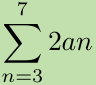

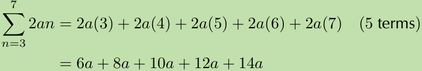
> **[Diagram Context - Textbook_Mathematics_Gr12_Sequences-and-series.pdf-0019-06.png]**
> This graphic displays a mathematical equation demonstrating sigma notation for series expansion. It features the summation symbol with the lower limit $n=3$, upper limit $7$, general term $2an$, expanded form $2a(3) + 2a(4) + 2a(5) + 2a(6) + 2a(7)$, total number of terms (5 terms), and simplified term values $6a + 8a + 10a + 12a + 14a$. Conceptually, it guides Grade 12 learners through expanding a summation into an explicit series by substituting consecutive integer values from the lower to the upper limit.

> **[Diagram Context - Textbook_Mathematics_Gr12_Sequences-and-series.pdf-0019-08.png]**
> The image shows a mathematical equation representing the sum of the first five terms of a sequence, denoted as $S_5 = 6a + 8a + 10a + 12a + 14a = 50a$. The visible labels and symbols include the sum notation $S_5$, the variable $a$, addition operators (+), and the equality sign (=). This graphic conveys the concept of calculating the sum of a finite arithmetic series by adding individual terms containing a common variable to arrive at a simplified total expression.

> **[Diagram Context - Textbook_Mathematics_Gr12_Sequences-and-series.pdf-0019-16.png]**
> This educational graphic is a mathematical worked example demonstrating how to find the common difference of an arithmetic sequence. It displays terms $T_1 = 31$, $T_2 = 24$, $T_3 = 17$, $T_4 = 10$, and $T_5 = 3$, alongside calculations for the constant difference $d = T_2 - T_1 = 24 - 31 = -7$ and $d = T_3 - T_2 = 17 - 24 = -7$. Conceptually, it guides Grade 10-12 CAPS learners through the step-by-step process of identifying and proving a linear number pattern by calculating consecutive term differences.

---

### Sigma Notation

Sigma notation is a compact way to represent the sum of a sequence. The general form is:

$$\sum_{i=m}^{n} a_i$$

**Rules for the values of $i$:**
*   Start at $m$ (the lower limit).
*   Increase in steps of $1$.
*   End at $n$ (the upper limit).

---

### Exercise 1 – 7: Sigma Notation

#### 1. Determine the value of the following:
a) $\sum_{k=1}^{4} 2$
b) $\sum_{i=-1}^{3} i$
c) $\sum_{n=2}^{5} (3n - 2)$

#### 2. Expand the series:
a) $\sum_{k=1}^{6} 0^k$
b) $\sum_{n=-3}^{0} 8$
c) $\sum_{k=1}^{5} (ak)$

#### 3. Calculate the value of $a$:
a) $\sum_{k=1}^{3} (a \cdot 2^{k-1}) = 28$
b) $\sum_{j=1}^{4} (2^{-j}) = a$

#### 4. Write the following in sigma notation:
$$\frac{1}{9} + \frac{1}{3} + 1 + 3$$

#### 5. Write the sum of the first 25 terms of the series below in sigma notation:
$$11 + 4 - 3 - 10 \dots$$

#### 6. Write the sum of the first 1000 natural, odd numbers in sigma notation.

#### 7. More questions
Sign in at Everything Maths online and click 'Practise Maths'.

---

### Online Resources & Exercise Codes

Check your answers online using the following codes:

| Question | Code | Question | Code | Question | Code |
| :--- | :--- | :--- | :--- | :--- | :--- |
| 1a | 2868 | 1b | 2869 | 1c | 286B |
| 2a | 286C | 2b | 286D | 2c | 286F |
| 3a | 286G | 3b | 286H | 4 | 286J |
| 5 | 286K | 6 | 286M | | |

> **[Diagram Context - Textbook_Mathematics_Gr12_Sequences-and-series.pdf-0020-01.png]**
> This algebraic graphic illustrates the step-by-step determination of the general term for an arithmetic sequence. It displays the standard formula $T_n = a + (n - 1)d$ with the substituted values $a = 31$ and $d = -7$, followed by expansion and simplification steps yielding $-7n + 38$. Conceptually, it guides Grade 10 to 12 CAPS mathematics learners through substituting the first term and common difference into the linear sequence formula and simplifying the expression into a standard linear function.

> **[Diagram Context - Textbook_Mathematics_Gr12_Sequences-and-series.pdf-0020-04.png]**
> This graphic shows an arithmetic series represented both in expanded form ($31 + 24 + 17 + 10 + 3 = 85$) and in sigma notation ($\sum_{n=1}^{5} (-7n + 38) = 85$). The visible elements include the summation symbol ($\sum$), the index of summation ($n=1$), the upper limit ($5$), the general term formula ($-7n + 38$), and the final calculated sum ($85$). Conceptually, it demonstrates how to translate an expanded arithmetic sequence into sigma notation and compute its total sum, supporting FET Phase learners mastering number patterns and series.

> **[Diagram Context - Textbook_Mathematics_Gr12_Sequences-and-series.pdf-0020-07.png]**
> This mathematical equation displays the summation rule for the sum of two sequences. The graphic shows sigma notation symbols with limits from $i = 1$ to $n$, index variables $a_i$ and $b_i$, an addition sign, and an equality sign demonstrating the distributive property of summation. For FET mathematics learners, this illustrates how the sum of a term-by-term addition can be broken apart into the sum of the individual series.

> **[Diagram Context - Textbook_Mathematics_Gr12_Sequences-and-series.pdf-0020-09.png]**
> This educational graphic displays mathematical equations demonstrating the distributive property of sigma notation. The visible symbols and variables include the summation operator $\sum$, index of summation $i$, lower and upper limits $1$ and $n$, constant factor $c$, and sequence terms $a_i, a_1, a_2, \dots, a_n$. Conceptually, the diagram conveys to high school mathematics learners how a constant multiplier can be factored out from within a summation to the front of the sigma expression.

> **[Diagram Context - Textbook_Mathematics_Gr12_Sequences-and-series.pdf-0020-12.png]**
> This mathematical expression displays a summation notation equation containing a Greek sigma symbol, upper and lower limits, an algebraic term, and its expanded arithmetic sum. The graphic explicitly shows the sigma symbol, the lower limit $n=1$, the upper limit $3$, the general term $(2n+1)$, and the expanded sequence $3 + 5 + 7 = 15$. Conceptually, this demonstrates how to expand and evaluate a finite arithmetic series in Grade 12 Mathematics by substituting consecutive integer values for the index variable into the general formula.

> **[Diagram Context - Textbook_Mathematics_Gr12_Sequences-and-series.pdf-0020-14.png]**
> This graphic displays a mathematical equation involving sigma notation for a series, specifically showing the expansion and evaluation of a sum. The visible symbols include the summation sign ($\sum$), the index of summation variable $n$ starting at $1$ and ending at $3$, the general term $(2n) + 1$, its expanded form $(2 + 4 + 6) + 1$, and the final calculated numerical value of $13$. Conceptually, this demonstrates to FET Phase Mathematics learners how to expand sigma notation step-by-step by substituting integer values for the index ($n = 1, 2, 3$) into the given algebraic expression before evaluating the final sum.

---

# 1.4 Finite Arithmetic Series

### Definition: Arithmetic Sequence
An arithmetic sequence is a sequence of numbers where the difference between any term and the previous term is a constant value, known as the **common difference** ($d$).

The general formula for the $n^{th}$ term is:
$$T_n = a + (n - 1)d$$

**Where:**
*   $T_n$ is the $n^{th}$ term of the sequence.
*   $a$ is the first term.
*   $d$ is the common difference.

---

### Finite Arithmetic Series
When we sum a finite number of terms in an arithmetic sequence, we obtain a **finite arithmetic series**.

#### Example: The sum of the first one hundred integers
Consider the sequence of positive integers where $a = 1$ and $d = 1$:
$$T_n = a + (n - 1)d$$
$$T_n = 1 + (n - 1)(1)$$
$$T_n = n$$
$$\therefore \{T_n\} = 1; 2; 3; 4; 5; \dots$$

To represent the sum of this sequence from $n = 1$ to $100$, we use sigma notation:
$$\sum_{n=1}^{100} n = 1 + 2 + 3 + \dots + 100$$

---

### Historical Note: Gauss's Method
The mathematician Karl Friedrich Gauss discovered a method to sum these numbers as a child. To find the sum of the first 100 integers ($S_n = 5050$), he used the following steps:

1.  Write the numbers in ascending order.
2.  Write the numbers in descending order.
3.  Add the corresponding pairs of terms together.
4.  Simplify the equation by making $S_n$ the subject of the equation.

<!-- DIAGRAM_PLACEHOLDER: diagram -->

---

### Derivation of the Sum of an Arithmetic Series

To find the sum of an arithmetic series efficiently, we derive a general formula.

#### 1. Conceptual Example: Sum of the first 100 integers
To understand the method, consider the sum of the first 100 integers ($S_{100}$):

$$S_{100} = 1 + 2 + 3 + \dots + 98 + 99 + 100$$
$$+ S_{100} = 100 + 99 + 98 + \dots + 3 + 2 + 1$$
$$\therefore 2S_{100} = 101 + 101 + 101 + \dots + 101 + 101 + 101$$
$$\therefore 2S_{100} = 101 \times 100 = 10\,100$$
$$\therefore S_{100} = \frac{10\,100}{2} = 5050$$

---

#### 2. Derivation of the General Formula
Let $a$ be the first term and $l$ be the last term of an arithmetic sequence with $n$ terms.

$$S_n = a + (a + d) + (a + 2d) + \dots + (l - 2d) + (l - d) + l$$
$$+ S_n = l + (l - d) + (l - 2d) + \dots + (a + 2d) + (a + d) + a$$
$$\therefore 2S_n = (a + l) + (a + l) + (a + l) + \dots + (a + l) + (a + l) + (a + l)$$
$$\therefore 2S_n = n \times (a + l)$$
$$\therefore S_n = \frac{n}{2}(a + l)$$

This formula is used when the last term ($l$) is known.

---

#### 3. Alternative General Formula
By substituting the formula for the last term, $l = a + (n - 1)d$, into the formula above, we get:

$$S_n = \frac{n}{2}(a + [a + (n - 1)d])$$
$$\therefore S_n = \frac{n}{2}[2a + (n - 1)d]$$

**Summary of Formulas:**
The sum of an arithmetic series is given by:
$$S_n = \frac{n}{2}[2a + (n - 1)d]$$
or
$$S_n = \frac{n}{2}(a + l)$$

---

#### 4. Worked Example
Calculate the sum $S_{20}$ for the arithmetic sequence $T_n = 3 + 7(n - 1)$ by summing the individual terms:

$$S_{20} = \sum_{n=1}^{20} [3 + 7(n - 1)]$$
$$S_{20} = 3 + 10 + 17 + 24 + 31 + 38 + 45 + 52 + 59 + 66 + 73 + 80 + 87 + 94 + 101 + 108 + 115 + 122 + 129 + 136$$
$$S_{20} = 1390$$

> **[Diagram Context - Textbook_Mathematics_Gr12_Sequences-and-series.pdf-0022-10.png]**
> This graphic displays algebraic steps for finding the general term of an arithmetic sequence. Visible symbols and variables include $T_n$, $a$, $n$, and $d$, along with numerical values substituted into the formula to yield the linear sequence $1; 2; 3; 4; 5; \dots$. Conceptually, it demonstrates how to substitute the first term ($a = 1$) and the common difference ($d = 1$) into the standard arithmetic formula $T_n = a + (n - 1)d$ to derive the nth term and generate the sequence.

> **[Diagram Context - Textbook_Mathematics_Gr12_Sequences-and-series.pdf-0022-12.png]**
> The graphic displays a mathematical equation written in sigma notation, representing a series. Visible symbols include the summation symbol ($\sum$), the index of summation variable $n$, the lower limit $n=1$, the upper limit $100$, and the expanded arithmetic sequence $1 + 2 + 3 + \dots + 100$. This expression demonstrates to FET phase learners how to write the sum of an arithmetic sequence compactly using sigma notation and how it expands into a linear sequence of terms.

---

### The General Formula for the Sum of an Arithmetic Series

The general formula for determining the sum of an arithmetic series ($S_n$) is:

$$S_n = \frac{n}{2}(2a + (n - 1)d)$$

Where:
*   $n$ = number of terms
*   $a$ = first term
*   $d$ = common difference

#### Example Application
For a series where $a = 3$, $d = 7$, and $n = 20$:

$$S_{20} = \frac{20}{2}[2(3) + (20 - 1)7]$$
$$S_{20} = 10[6 + (19)(7)]$$
$$S_{20} = 10[6 + 133]$$
$$S_{20} = 10[139]$$
$$S_{20} = 1390$$

---

### Worked Example 7: General formula for the sum of an arithmetic sequence

**Question:**
Find the sum of the first 30 terms of an arithmetic series with $T_n = 7n - 5$ by using the formula.

**Solution:**

**Step 1: Use the general formula to generate terms of the sequence and identify known variables.**

Given $T_n = 7n - 5$:
*   $T_1 = 7(1) - 5 = 2$
*   $T_2 = 7(2) - 5 = 9$
*   $T_3 = 7(3) - 5 = 16$

The sequence is: $2; 9; 16; \dots$

From this, we identify:
*   $a = 2$
*   $d = 7$
*   $n = 30$

**Step 2: Write down the general formula and substitute the known values.**

$$S_n = \frac{n}{2}[2a + (n - 1)d]$$
$$S_{30} = \frac{30}{2}[2(2) + (30 - 1)(7)]$$
$$S_{30} = 15[4 + (29)(7)]$$
$$S_{30} = 15[4 + 203]$$
$$S_{30} = 15[207]$$
$$S_{30} = 3105$$

**Step 3: Final Answer**
$$S_{30} = 3105$$

---
*Note: For further study, see video 286N at www.everythingmaths.co.za*

> **[Diagram Context - Textbook_Mathematics_Gr12_Sequences-and-series.pdf-0023-00.png]**
> The graphic is a mathematical proof demonstrating the summation of an arithmetic series using Gauss's method. It displays the variable $S_{100}$, representing the sum of the first 100 integers, written in ascending and descending order ($1 + 2 + 3 + \dots + 100$ and $100 + 99 + \dots + 1$), which are then added vertically to yield repeated terms of 101. This visually conveys the algebraic derivation for the sum of an arithmetic sequence, illustrating how pairing complementary terms simplifies addition to multiplication ($101 \times 100$) before dividing by two to solve for $S_{100} = 5050$.

> **[Diagram Context - Textbook_Mathematics_Gr12_Sequences-and-series.pdf-0023-04.png]**
> This graphic shows an algebraic derivation of the sum formula for an arithmetic sequence. Visible symbols and variables include the summation notation $\sum_{n=1}^{l} T_n = S_n$, first term $a$, common difference $d$, last term $l$, number of terms $n$, and sum $S_n$. Conceptually, it demonstrates the classic proof for finding the sum of the first $n$ terms of an arithmetic progression by writing the series forwards and backwards, adding them vertically to yield $n$ identical sums of $(a + l)$, and dividing by two to isolate $S_n$.

> **[Diagram Context - Textbook_Mathematics_Gr12_Sequences-and-series.pdf-0023-07.png]**
> This graphic presents mathematical equations for the sum of an arithmetic sequence. The visible symbols and variables include $S_n$ representing the sum of $n$ terms, $n$ for the number of terms, $a$ for the first term, and $d$ for the common difference. Conceptually, it demonstrates the algebraic derivation and standard formula used in FET Mathematics to calculate the sum of the first $n$ terms of an arithmetic progression.

> **[Diagram Context - Textbook_Mathematics_Gr12_Sequences-and-series.pdf-0023-10.png]**
> This educational graphic displays two standard algebraic formulas for calculating the sum of the first $n$ terms ($S_n$) of an arithmetic sequence (AP). The visible symbols include $S_n$, $n$ (number of terms), $a$ (first term), $d$ (constant difference), and $l$ (last term). Conceptually, these formulas allow CAPS Mathematics learners in Grades 10 to 12 to find the sum of arithmetic series when either the common difference or the final term is known.

> **[Diagram Context - Textbook_Mathematics_Gr12_Sequences-and-series.pdf-0023-12.png]**
> This mathematical expression shows the calculation of the sum of an arithmetic series using sigma notation. Visible elements include the summation symbol with the index variable $n=1$ running up to $20$, the general term formula $3 + 7(n - 1)$, the expanded sum of 20 individual terms, and the final evaluated total of $1390$. Conceptually, this demonstrates to Grade 12 learners how to translate sigma notation into an expanded arithmetic series and calculate the sum to a specific number of terms ($S_{20}$).

---

### Arithmetic Series: Core Concepts and Worked Examples

#### Worked Example 8: Sum of an arithmetic sequence (first and last terms known)

**Question:** Find the sum of the series $-5 - 3 - 1 + \dots + 123$.

**Solution:**

**Step 1: Identify the type of series and write down the known variables**
First, calculate the common difference ($d$):
$d = T_2 - T_1 = -3 - (-5) = 2$
$d = T_3 - T_2 = -1 - (-3) = 2$

Known variables:
*   First term ($a$) = $-5$
*   Common difference ($d$) = $2$
*   Last term ($l$) = $123$

**Step 2: Determine the value of $n$**
Use the general term formula $T_n = a + (n - 1)d$:
$$123 = -5 + (n - 1)(2)$$
$$123 = -5 + 2n - 2$$
$$130 = 2n$$
$$n = 65$$

**Step 3: Use the sum formula**
Use the formula $S_n = \frac{n}{2}(a + l)$:
$$S_{65} = \frac{65}{2}(-5 + 123)$$
$$S_{65} = \frac{65}{2}(118)$$
$$S_{65} = 3835$$

**Step 4: Final Answer**
The sum of the series is $3835$.

---

#### Worked Example 9: Finding $n$ given the sum of an arithmetic sequence

**Question:** Given an arithmetic sequence with $T_2 = 7$ and $d = 3$, determine how many terms must be added together to give a sum of $2146$.

**Solution:**

**Step 1: Write down the known variables**
Find the first term ($a$) using the relationship $d = T_2 - a$:
$$3 = 7 - a$$
$$a = 4$$

Known variables:
*   First term ($a$) = $4$
*   Common difference ($d$) = $3$
*   Sum of terms ($S_n$) = $2146$

> **[Diagram Context - Textbook_Mathematics_Gr12_Sequences-and-series.pdf-0024-01.png]**
> This mathematical graphic displays the sum formula for an arithmetic sequence along with a worked substitution example. Visible mathematical symbols and variables include $S_n$, $n$, $a$, $d$, and numerical values $20$, $3$, $7$, and $1390$. Conceptually, it demonstrates to FET phase learners how to apply the arithmetic series formula to calculate the sum of a specific number of terms.

> **[Diagram Context - Textbook_Mathematics_Gr12_Sequences-and-series.pdf-0024-09.png]**
> The graphic displays a worked algebraic example for generating terms of a number sequence. Visible mathematical symbols and variables include $T_n$, $n$, and numeric terms evaluated for $T_1$, $T_2$, and $T_3$. For a high school student studying CAPS Mathematics, this demonstrates how to substitute position indices into a general nth-term formula to determine specific terms in a linear number pattern.

> **[Diagram Context - Textbook_Mathematics_Gr12_Sequences-and-series.pdf-0024-13.png]**
> This graphic presents a mathematical calculation involving an arithmetic sequence formula, showing algebraic steps to find the sum of a specific number of terms. It displays the variables $S_n$, $n$, $a$, and $d$, along with numerical substitution steps resulting in the final sum of 3105. Conceptually, this demonstrates to FET Phase Mathematics learners how to substitute values into the arithmetic series formula to solve problems related to sequences and series.

---

### Solving for $n$ in an Arithmetic Series

When the sum of an arithmetic series ($S_n$) is known, you can determine the number of terms ($n$) by using the general sum formula:
$$S_n = \frac{n}{2}(2a + (n - 1)d)$$

**Example Procedure:**
1. Substitute the known values of $S_n$, $a$, and $d$ into the formula.
2. Simplify the equation into a standard quadratic form: $an^2 + bn + c = 0$.
3. Solve for $n$ using factorisation or the quadratic formula.
4. **Note:** Since $n$ represents the number of terms, it must always be a **positive integer**. Discard any negative or fractional results.

---

### Worked Example 10: Finding $n$ given the sum of an arithmetic sequence

**Question:**
The sum of the second and third terms of an arithmetic sequence is equal to zero, and the sum of the first 36 terms of the series is equal to 1152. Find the first three terms in the series.

**Solution:**

**Step 1: Write down the given information**
Using the general term $T_n = a + (n-1)d$:
*   $T_2 + T_3 = 0$
*   $(a + d) + (a + 2d) = 0$
*   $\therefore 2a + 3d = 0 \dots \dots (1)$

Using the sum formula $S_n = \frac{n}{2}(2a + (n - 1)d)$:
*   $S_{36} = \frac{36}{2}(2a + (36 - 1)d) = 1152$
*   $18(2a + 35d) = 1152$
*   $\therefore 2a + 35d = 64 \dots \dots (2)$

**Step 2: Solve the two equations simultaneously**
Subtract equation (1) from equation (2):
$$(2a + 35d) - (2a + 3d) = 64 - 0$$
$$32d = 64$$
$$\therefore d = 2$$

Substitute $d = 2$ back into equation (1):
$$2a + 3(2) = 0$$
$$2a = -6$$
$$\therefore a = -3$$

**Final Answer:**
The first three terms are:
*   $T_1 = a = -3$
*   $T_2 = a + d = -3 + 2 = -1$
*   $T_3 = a + 2d = -3 + 4 = 1$

The first three terms are $-3, -1, 1$.

> **[Diagram Context - Textbook_Mathematics_Gr12_Sequences-and-series.pdf-0025-05.png]**
> The graphic shows algebraic calculations for determining the common difference of an arithmetic sequence. Visible labels include terms $T_1$, $T_2$, and $T_3$, along with calculated values for the constant difference $d$, first term $a$, and last term $l$. This conveys the step-by-step method for verifying an arithmetic progression by showing that the difference between consecutive terms ($T_2 - T_1$ and $T_3 - T_2$) is constant.

> **[Diagram Context - Textbook_Mathematics_Gr12_Sequences-and-series.pdf-0025-08.png]**
> This mathematical image displays algebraic steps and formulas for working with arithmetic sequences and series under the CAPS curriculum. It features formulas and working for the general term $T_n = a + (n-1)d$ and the sum of a series $S_n = \frac{n}{2}(a + l)$, with visible variables including $T_n$, $S_n$, $a$, $n$, $d$, and $l$. Conceptually, the graphic demonstrates how to first determine the position of a specific term ($n=65$) and subsequently use that value to calculate the sum of the first 65 terms of an arithmetic sequence.

> **[Diagram Context - Textbook_Mathematics_Gr12_Sequences-and-series.pdf-0025-15.png]**
> This graphic displays algebraic calculation steps and parameter values for an arithmetic sequence and series. Visible mathematical symbols and variables include $d$, $T_2$, $T_1$, $a$, and $S_n$, along with numerical values. It conveys the step-by-step determination of the first term ($a$) and common difference ($d$) from sequence terms, which are essential prerequisites for solving arithmetic series problems in Grade 12 Mathematics.

---

### Calculating the Value of a Term Given the Sum of $n$ Terms

In any series, the relationship between the $n^{th}$ term ($T_n$) and the sum of the first $n$ terms ($S_n$) is fundamental.

*   **First term:** $S_1 = T_1$
*   **Second term:** Since $S_2 = T_1 + T_2$, we can rearrange to find $T_2$:
    $$T_2 = S_2 - T_1$$
    Substituting $S_1$ for $T_1$:
    $$\therefore T_2 = S_2 - S_1$$

This logic extends to any term $n$ where $n > 1$:
$$T_n = S_n - S_{n-1} \quad \text{for } n \in \{2; 3; 4; \dots\} \text{ and } T_1 = S_1$$

---

### Worked Example: Determining Terms from a Series
**Step 3: Write the final answer**
Given a series, the first three terms are calculated as:
*   $T_1 = a = -3$
*   $T_2 = a + d = -3 + 2 = -1$
*   $T_3 = a + 2d = -3 + 2(2) = 1$

The series is: $-3 - 1 + 1$

---

### Exercise 1 – 8: Sum of an Arithmetic Series

1. Determine the value of $k$:
   $$\sum_{n=1}^{k} (-2n) = -20$$

2. The sum to $n$ terms of an arithmetic series is $S_n = \frac{n}{2}(7n + 15)$.
   a) How many terms of the series must be added to give a sum of $425$?
   b) Determine the sixth term of the series.

3. a) The common difference of an arithmetic series is $3$. Calculate the values of $n$ for which the $n^{th}$ term of the series is $93$, and the sum of the first $n$ terms is $975$.
   b) Explain why there are two possible answers.

4. The third term of an arithmetic sequence is $-7$ and the seventh term is $9$. Determine the sum of the first $51$ terms of the sequence.

5. Calculate the sum of the arithmetic series $4 + 7 + 10 + \dots + 901$.

6. Evaluate without using a calculator:
   $$\frac{4 + 8 + 12 + \dots + 100}{3 + 10 + 17 + \dots + 101}$$

> **[Diagram Context - Textbook_Mathematics_Gr12_Sequences-and-series.pdf-0026-01.png]**
> This graphic shows algebraic working steps for finding the number of terms in an arithmetic sequence. The visible variables and symbols include $S_n$, $n$, $a$, $d$, equality signs, multiplication brackets, and the quadratic equation $0 = 3n^2 + 5n - 4292$ solved by factorization to yield $n$ values. Conceptually, it demonstrates to a Grade 12 Further Studies Mathematics learner how to substitute known sum, first term ($a=4$), and common difference ($d=3$) values into the arithmetic series sum formula $S_n = \frac{n}{2}[2a + (n-1)d]$ to solve for the term position $n$.

> **[Diagram Context - Textbook_Mathematics_Gr12_Sequences-and-series.pdf-0026-09.png]**
> This mathematical graphic displays algebraic working steps for solving arithmetic sequences and series problems. The visible text includes terms and formulas such as $T_2 + T_3 = 0$, $S_n = \frac{n}{2}(2a + (n-1)d)$, $S_{36} = 1152$, and numbered equations (1) and (2) using variables $a$, $d$, $n$, and $T$. Conceptually, the diagram demonstrates how to set up and manipulate simultaneous equations from given information about a linear number pattern to find the first term ($a$) and common difference ($d$).

> **[Diagram Context - Textbook_Mathematics_Gr12_Sequences-and-series.pdf-0026-11.png]**
> The graphic shows a step-by-step algebraic working out for solving simultaneous linear equations involving the variables $a$ and $d$. Visible labels include equation numbers (1) and (2), operational steps such as Eqn (2) - (1), and logical implication symbols ($\therefore$). Conceptually, it demonstrates how to eliminate one variable to solve for the common difference ($d$) and first term ($a$), which is a fundamental technique taught in FET Mathematics for solving arithmetic sequences and simultaneous equations.

---

### Exercises: Arithmetic Sequences and Series

7. The second term of an arithmetic sequence is $-4$ and the sum of the first six terms of the series is $21$.
    * a) Find the first term ($a$) and the common difference ($d$).
    * b) Hence determine $T_{100}$.

8. Determine the value of the following:
    * a) $\sum_{w=0}^{8} (7w + 8)$
    * b) $\sum_{j=1}^{8} 7j + 8$

9. Determine the value of $n$:
    $$\sum_{c=1}^{n} (2 - 3c) = -330$$

10. The sum of $n$ terms of an arithmetic series is $S_n = 5n^2 - 11n$ for all values of $n$. Determine the common difference ($d$).

11. The sum of an arithmetic series is $100$ times its first term, while the last term is $9$ times the first term. Calculate the number of terms ($n$) in the series if the first term is not equal to zero.

---

### 1.5 Finite Geometric Series

A finite geometric series is formed when we sum a specific, known number of terms in a geometric sequence.

#### General Formula
The general term of a geometric sequence is given by:
$$T_n = a \cdot r^{n-1}$$

**Where:**
* $n$: The position of the term in the sequence.
* $T_n$: The $n^{th}$ term of the sequence.
* $a$: The first term of the sequence.
* $r$: The constant ratio between consecutive terms.

> **[Diagram Context - Textbook_Mathematics_Gr12_Sequences-and-series.pdf-0027-02.png]**
> This educational graphic displays mathematical working steps for an arithmetic sequence against a green background. It shows term formulas and calculations using variables $T_1$, $T_2$, $T_3$, $a$, and $d$, along with numerical values resulting in the sequence $-3, -1, 1$. Conceptually, it demonstrates to FET phase mathematics learners how to generate individual terms of an arithmetic progression using the first term ($a = -3$) and a common difference ($d = 2$).

> **[Diagram Context - Textbook_Mathematics_Gr12_Sequences-and-series.pdf-0027-06.png]**
> The graphic displays a sequence of algebraic steps demonstrating the relationship between the terms and the sum of a sequence. The visible variables and text include $T_1$, $T_2$, $S_1$, $S_2$, the instruction "Substitute $S_1 = T_1$", and mathematical deduction symbols ($\therefore$). Conceptually, this conveys how to derive any individual term ($T_n$) of a sequence from the partial sums ($S_n$), reinforcing the fundamental identity $T_n = S_n - S_{n-1}$ commonly taught in Grade 12 Further Studies Mathematics.

> **[Diagram Context - Textbook_Mathematics_Gr12_Sequences-and-series.pdf-0027-09.png]**
> This graphic displays a mathematical relationship formula used in number patterns and series. The visible symbols and variables include $T_n$, $S_n$, $S_{n-1}$, and the domain set $n \in \{2; 3; 4; \dots\}$ alongside the initial condition $T_1 = S_1$. Conceptually, this formula conveys the fundamental relationship between the general term ($T_n$) of a sequence and the sum of the first $n$ terms ($S_n$), allowing CAPS Grade 12 mathematics learners to derive any specific term of a series when given its sum formula.

---

# General Formula for a Finite Geometric Series

A geometric series is the sum of the terms of a geometric sequence. The sum of the first $n$ terms is denoted by $S_n$.

## Derivation of the Formula

### Method 1: When $r < 1$
To derive the formula, we write out the sum and its product with the common ratio $r$:

1. $S_n = a + ar + ar^2 + \dots + ar^{n-2} + ar^{n-1} \quad \dots(1)$
2. $r \times S_n = ar + ar^2 + \dots + ar^{n-2} + ar^{n-1} + ar^n \quad \dots(2)$

Subtracting equation (2) from equation (1):
$$S_n - rS_n = a - ar^n$$
$$S_n(1 - r) = a(1 - r^n)$$
$$S_n = \frac{a(1 - r^n)}{1 - r} \quad (\text{where } r \neq 1)$$

> **Note:** This version of the formula is easier to use when $r < 1$.

---

### Method 2: When $r > 1$
Alternatively, we can subtract equation (1) from equation (2):

1. $S_n = a + ar + ar^2 + \dots + ar^{n-2} + ar^{n-1} \quad \dots(1)$
2. $r \times S_n = ar + ar^2 + \dots + ar^{n-2} + ar^{n-1} + ar^n \quad \dots(2)$

Subtracting equation (1) from equation (2):
$$rS_n - S_n = ar^n - a$$
$$S_n(r - 1) = a(r^n - 1)$$
$$S_n = \frac{a(r^n - 1)}{r - 1} \quad (\text{where } r \neq 1)$$

> **Note:** This version of the formula is easier to use when $r > 1$.

---

## Summary of Formulas

| Condition | Formula |
| :--- | :--- |
| If $r < 1$ | $S_n = \frac{a(1 - r^n)}{1 - r}$ |
| If $r > 1$ | $S_n = \frac{a(r^n - 1)}{r - 1}$ |

**Where:**
* $S_n$ = Sum of the first $n$ terms
* $a$ = First term of the series
* $r$ = Common ratio
* $n$ = Number of terms

---

### Worked Example 11: Sum of a Geometric Series

#### Question
Calculate the sum of the following series:
$$\sum_{k=1}^{6} 32 \left( \frac{1}{2} \right)^{k-1}$$

---

#### Solution

**Step 1: Write down the first three terms of the series**
Substitute the values of $k$ into the general term:
*   For $k = 1$: $T_1 = 32 \left( \frac{1}{2} \right)^{0} = 32$
*   For $k = 2$: $T_2 = 32 \left( \frac{1}{2} \right)^{2-1} = 16$
*   For $k = 3$: $T_3 = 32 \left( \frac{1}{2} \right)^{3-1} = 8$

The series is: $32 + 16 + 8 + \dots$

**Step 2: Determine the values of $a$ and $r$**
*   The first term ($a$): $a = T_1 = 32$
*   The common ratio ($r$): $r = \frac{T_2}{T_1} = \frac{T_3}{T_2} = \frac{1}{2}$

**Step 3: Use the general formula to find the sum of the series**
The formula for the sum of the first $n$ terms of a geometric series is:
$$S_n = \frac{a(1 - r^n)}{1 - r}$$

Substitute $a = 32$, $r = \frac{1}{2}$, and $n = 6$:
$$S_6 = \frac{32(1 - (\frac{1}{2})^6)}{1 - \frac{1}{2}}$$
$$S_6 = \frac{32(1 - \frac{1}{64})}{\frac{1}{2}}$$
$$S_6 = 2 \times 32 \left( \frac{63}{64} \right)$$
$$S_6 = 64 \left( \frac{63}{64} \right)$$
$$S_6 = 63$$

**Step 4: Write the final answer**
$$\sum_{k=1}^{6} 32 \left( \frac{1}{2} \right)^{k-1} = 63$$

> **[Diagram Context - Textbook_Mathematics_Gr12_Sequences-and-series.pdf-0029-02.png]**
> The graphic shows the algebraic derivation steps for the sum of a geometric series, labelled as equations (1) and (2). Visible symbols and variables include $S_n$ for the sum of $n$ terms, the first term $a$, the constant ratio $r$, and exponents up to $n$ and $n-1$. This representation demonstrates the algebraic manipulation of multiplying the entire series by the common ratio $r$ to align matching terms, which is a key step used to derive the standard sum formula for geometric sequences in the CAPS curriculum.

> **[Diagram Context - Textbook_Mathematics_Gr12_Sequences-and-series.pdf-0029-04.png]**
> The graphic shows an algebraic derivation of the sum formula for a geometric series. Visible symbols and variables include $S_n$, $r$, $a$, and $n$, along with subtraction and factorization steps culminating in the formula $S_n = \frac{a(1-r^n)}{1-r}$ where $r \neq 1$. For a Grade 12 Mathematics CAPS learner, this conveys the step-by-step proof of how the sum of the first $n$ terms of a geometric sequence is derived by multiplying the series by the common ratio and subtracting equations.

> **[Diagram Context - Textbook_Mathematics_Gr12_Sequences-and-series.pdf-0029-06.png]**
> This graphic displays the algebraic formula for the sum of the first $n$ terms of a geometric series ($S_n$), featuring the variables $S_n$, $a$, $r$, and $n$, along with the restriction that $r \neq 1$. For a Grade 12 CAPS mathematics student, it conveys the exact mathematical relationship required to calculate the sum of a finite geometric sequence given the first term ($a$), constant ratio ($r$), and number of terms ($n$).

> **[Diagram Context - Textbook_Mathematics_Gr12_Sequences-and-series.pdf-0029-09.png]**
> This graphic displays the algebraic proof for the sum formula of a geometric series, consisting of two numbered equations representing the sum $S_n$ and its product with the common ratio $r \times S_n$. The visible symbols include variables $S_n$ (sum of $n$ terms), $a$ (first term), $r$ (constant ratio), $n$ (number of terms), and ellipses indicating continuation. Conceptually, this visual breaks down the first step of the algebraic derivation—multiplying the series by the common ratio to align identical terms—so that when the second equation is subtracted from the first, most terms cancel out to yield the standard summation formula required in Grade 12 Mathematics.

> **[Diagram Context - Textbook_Mathematics_Gr12_Sequences-and-series.pdf-0029-11.png]**
> This graphic displays algebraic steps showing the derivation of the sum formula for a geometric series. Visible symbols and variables include $S_n$ for the sum of $n$ terms, $a$ for the first term, $r$ for the common ratio, and the restriction $r \neq 1$. Conceptually, it demonstrates to Grade 12 mathematics learners how to factorise and rearrange terms to arrive at the standard formula used for calculating the sum of the first $n$ terms of a geometric progression.

> **[Diagram Context - Textbook_Mathematics_Gr12_Sequences-and-series.pdf-0029-13.png]**
> The image displays a mathematical formula presented against a solid grey background. The visible algebraic symbols and variables include $S_n$, $a$, $r$, and $n$ structured as the sum formula for a geometric series, accompanied by the restriction $r \neq 1$. In the CAPS curriculum for Grade 12 Mathematics, this graphic conveys the standard formula used to calculate the sum of the first $n$ terms of a geometric sequence where the common ratio is not equal to one.

---

### Worked Example: Sum of a Geometric Series

**Question:**
Given a geometric series with $T_1 = -4$ and $T_4 = 32$. Determine the values of $r$ and $n$ if $S_n = 84$.

---

#### Step 1: Determine the values of $a$ and $r$
We know that $a = T_1$ and the general term for a geometric sequence is $T_n = ar^{n-1}$.

1. Identify $a$:
   $$a = T_1 = -4$$

2. Use the formula for $T_4$ to find $r$:
   $$T_4 = ar^3 = 32$$
   $$-4r^3 = 32$$
   $$r^3 = -8$$
   $$r = -2$$

**Note:** The geometric series is $-4 + 8 - 16 + 32 \dots$. The signs of the terms alternate because $r < 0$. The general term is $T_n = -4(-2)^{n-1}$.

---

#### Step 2: Use the sum formula to determine $n$
The formula for the sum of the first $n$ terms of a geometric series is:
$$S_n = \frac{a(1 - r^n)}{1 - r}$$

Substitute the known values ($S_n = 84$, $a = -4$, $r = -2$) into the formula:

$$84 = \frac{-4(1 - (-2)^n)}{1 - (-2)}$$
$$84 = \frac{-4(1 - (-2)^n)}{3}$$

Multiply both sides by $\frac{3}{-4}$ to isolate the term with $n$:
$$\left( \frac{3}{-4} \right) \times 84 = 1 - (-2)^n$$
$$-63 = 1 - (-2)^n$$

Rearrange to solve for $(-2)^n$:
$$-63 - 1 = -(-2)^n$$
$$-64 = -(-2)^n$$
$$64 = (-2)^n$$

Express 64 as a power of $-2$:
$$(-2)^6 = (-2)^n$$
$$\therefore n = 6$$

---

#### Step 3: Final Answer
$$r = -2 \text{ and } n = 6$$

> **[Diagram Context - Textbook_Mathematics_Gr12_Sequences-and-series.pdf-0030-03.png]**
> This mathematical expression displays a finite geometric series in sigma notation with the summation symbol, lower limit $k=1$, upper limit $6$, first term $32$, common ratio $\frac{1}{2}$, and general term exponent $k-1$. Conceptually, it instructs students to compute the sum of the first six terms of the geometric sequence by substituting integer values of $k$ from $1$ to $6$ into the explicit formula.

> **[Diagram Context - Textbook_Mathematics_Gr12_Sequences-and-series.pdf-0030-06.png]**
> This educational graphic displays mathematical calculations for three sequential terms of a geometric sequence. It shows the substitution of term positions ($k = 1, 2, 3$) into the geometric sequence formula $T_n = ar^{n-1}$, specifically evaluating $T_1 = 32(\frac{1}{2})^{0} = 32$, $T_2 = 32(\frac{1}{2})^{2-1} = 16$, and $T_3 = 32(\frac{1}{2})^{3-1} = 8$. Conceptually, this demonstrates to FET phase mathematics learners how to systematically generate terms of a geometric progression by applying the common ratio ($\frac{1}{2}$) and first term ($32$).

> **[Diagram Context - Textbook_Mathematics_Gr12_Sequences-and-series.pdf-0030-11.png]**
> This graphic is a step-by-step mathematical worked example demonstrating the calculation of the sum of a geometric series. It displays the general formula $S_n = \frac{a(1 - r^n)}{1 - r}$ alongside specific variables and constants ($S_6$, $a = 32$, $r = \frac{1}{2}$, $n = 6$) substituted and simplified sequentially through algebraic steps to yield a final numerical answer of $63$. Conceptually, it guides FET phase mathematics learners through the correct application of the geometric series summation formula, reinforcing exponent evaluation, fraction manipulation, and algebraic simplification.

> **[Diagram Context - Textbook_Mathematics_Gr12_Sequences-and-series.pdf-0030-13.png]**
> This mathematical expression displays a summation notation equation, specifically showing the sum from $k = 1$ to $6$ of the geometric series term $32(\frac{1}{2})^{k-1}$ equaling $63$. The visible labels and variables include the sigma summation symbol ($\sum$), the index of summation $k$, the lower limit $k=1$, the upper limit $6$, the common ratio $\frac{1}{2}$, the first term coefficient $32$, and the evaluated sum $63$. Conceptually, this conveys how to write and evaluate the sum of a finite geometric sequence in Grade 12 Further Studies Mathematics or standard CAPS Mathematics sequences and series topics.

---

### Worked Example 13: Sum of a Geometric Series

#### Question
Use the general formula for the sum of a geometric series to determine $k$ if:
$$\sum_{n=1}^{8} k \left(\frac{1}{2}\right)^{n} = \frac{255}{64}$$

---

#### Solution

**Step 1: Write down the first three terms of the series**
*   For $n = 1$: $T_1 = k \left(\frac{1}{2}\right)^{1} = \frac{1}{2}k$
*   For $n = 2$: $T_2 = k \left(\frac{1}{2}\right)^{2} = \frac{1}{4}k$
*   For $n = 3$: $T_3 = k \left(\frac{1}{2}\right)^{3} = \frac{1}{8}k$

The series is $\frac{1}{2}k + \frac{1}{4}k + \frac{1}{8}k + \dots$
By taking out the common factor $k$, we can write the expression as:
$$k \left(\frac{1}{2} + \frac{1}{4} + \frac{1}{8} + \dots \right) = \frac{255}{64}$$

**Step 2: Determine the values of $a$ and $r$**
*   The first term $a = T_1 = \frac{1}{2}$
*   The common ratio $r = \frac{T_2}{T_1} = \frac{T_3}{T_2} = \frac{1}{2}$

**Step 3: Calculate the sum of the first eight terms of the geometric series**
Using the sum formula $S_n = \frac{a(1 - r^n)}{1 - r}$:

$$\therefore S_8 = \frac{\frac{1}{2}(1 - (\frac{1}{2})^8)}{1 - \frac{1}{2}}$$

$$S_8 = \frac{\frac{1}{2}(1 - (\frac{1}{2})^8)}{\frac{1}{2}}$$

$$S_8 = 1 - \frac{1}{256}$$

$$S_8 = \frac{255}{256}$$

Therefore, the sum of the series is $k \times \frac{255}{256} = \frac{255}{64}$.
Solving for $k$:
$$k = \frac{255}{64} \times \frac{256}{255}$$
$$k = 4$$

> **[Diagram Context - Textbook_Mathematics_Gr12_Sequences-and-series.pdf-0031-06.png]**
> This mathematical graphic displays algebraic working steps to find the common ratio ($r$) of a geometric sequence. The visible variables and symbols include $a$, $T_1$, $T_4$, $r$, exponents, numerical values $(-4, 32, -8, -2)$, equality signs, and a therefore symbol ($\therefore$). Conceptually, it demonstrates how to substitute given terms into the general term formula $T_n = ar^{n-1}$ to solve for the constant ratio, which is a core skill in Grade 12 CAPS Mathematics sequences and series.

> **[Diagram Context - Textbook_Mathematics_Gr12_Sequences-and-series.pdf-0031-10.png]**
> This graphic presents a mathematical calculation sequence demonstrating the step-by-step solution for finding the number of terms ($n$) in a geometric series. Visible symbols and variables include the sum formula $S_n = \frac{a(1-r^n)}{1-r}$, substituted numerical values ($S_n = 84$, $a = -4$, $r = -2$), and the resulting exponential equation $(-2)^n = 64$ which simplifies to $(-2)^n = (-2)^6$ yielding $n = 6$. Conceptually, it guides FET phase Grade 11 and 12 learners through algebraic manipulation, substitution, and exponential equation solving using bases to determine an unknown index in number patterns.

---

We can write:

$$\sum_{n=1}^{k} \left(\frac{1}{2}\right)^n = \frac{255}{256}$$

Solving for $k$:

$$\frac{255}{256} = \frac{1(1 - (\frac{1}{2})^k)}{1 - \frac{1}{2}}$$
$$k = \frac{255}{64} \times \frac{256}{255} = \frac{256}{64} = 4$$

**Step 4: Write the final answer**
$k = 4$

---

### Exercise 1 – 9: Sum of a geometric series

1. Prove that $a + ar + ar^2 + \dots + ar^{n-1} = \frac{a(r^n - 1)}{r - 1}$ and state any restrictions.
2. Given the geometric sequence $1; -3; 9; \dots$ determine:
   a) The eighth term of the sequence.
   b) The sum of the first eight terms of the sequence.
3. Determine: $\sum_{n=1}^{4} 3 \cdot 2^{n-1}$
4. Find the sum of the first 11 terms of the geometric series $6 + 3 + \frac{3}{2} + \frac{3}{4} + \dots$
5. Show that the sum of the first $n$ terms of the geometric series $54 + 18 + 6 + \dots + 54(\frac{1}{3})^{n-1}$ is given by $81(1 - 3^{-n})$.
6. The eighth term of a geometric sequence is $640$. The third term is $20$. Find the sum of the first $7$ terms.
7. Given: $\sum_{t=1}^{n} 8 \left(\frac{1}{2}\right)^t$
   a) Find the first three terms in the series.
   b) Calculate the number of terms in the series if $S_n = 7 \frac{63}{64}$.
8. The ratio between the sum of the first three terms of a geometric series and the sum of the 4th, 5th and 6th terms of the same series is $8 : 27$. Determine the constant ratio and the first 2 terms if the third term is $8$.
9. More questions. Sign in at Everything Maths online and click ’Practise Maths’.

| Question | Exercise Code |
| :--- | :--- |
| 1 | 2876 |
| 2a | 2877 |
| 2b | 2878 |
| 3 | 2879 |
| 4 | 287B |
| 5 | 287C |
| 6 | 287D |
| 7a | 287F |
| 7b | 287G |
| 8 | 287H |

**Chapter 1. Sequences and series**

> **[Diagram Context - Textbook_Mathematics_Gr12_Sequences-and-series.pdf-0032-03.png]**
> This graphic displays a mathematical equation involving sigma notation, featuring the summation symbol with the index variable $n$ running from 1 to 8, an expression containing a constant $k$ and the base $(\frac{1}{2})^n$, and the resulting fraction $\frac{255}{64}$. It conveys how to calculate the unknown constant $k$ in an arithmetico-geometric series or mixed summation problem tested in Grade 12 Further Studies Mathematics (AP Mathematics).

> **[Diagram Context - Textbook_Mathematics_Gr12_Sequences-and-series.pdf-0032-06.png]**
> This educational graphic displays a mathematical derivation demonstrating the generation and summation of a geometric series. It features visible terms ($T_1, T_2, T_3$), position variables ($n = 1, 2, 3$), a constant factor $k$, the common ratio $\frac{1}{2}$, and sigma notation ($\sum_{n=1}^{8}$) equating to a fraction. Conceptually, it guides Grade 12 CAPS mathematics learners on how to transition from individual sequence terms to an expanded series, factor out a constant, and express the sum using sigma notation.

> **[Diagram Context - Textbook_Mathematics_Gr12_Sequences-and-series.pdf-0032-10.png]**
> This educational graphic displays mathematical steps for calculating the sum of a geometric series. It features algebraic symbols and variables including $S_n$, $S_8$, $a$, $r$, $n$, and summation notation $\sum_{n=1}^{8}$. Conceptually, it demonstrates how to substitute values into the geometric series sum formula $S_n = \frac{a(1-r^n)}{1-r}$ to evaluate the sum of the first eight terms of a specific sequence and express it as a single fraction.

---

# 1.6 Infinite Series

## Introduction
While we have previously focused on finite sums (the sum of the first $n$ terms), we now explore what happens when we add an infinite number of terms. While some infinite series grow to infinity, others converge to a specific finite real number.

---

## Investigation: Sum of an Infinite Series

1. Cut a piece of string $1\text{ m}$ in length.
2. Cut the piece in half and place one half on the desk.
3. Cut the remaining half in half again and place one piece on the desk.
4. Repeat this process until the piece is too short to cut easily.
5. 

> **[Diagram Context - Textbook_Mathematics_Gr12_Sequences-and-series.pdf-0033-01.png]**
> This educational graphic displays a step-by-step algebraic solution for finding an unknown constant in a geometric series. Visible mathematical symbols and expressions include the summation notation $\sum_{n=1}^{8}\left(\frac{1}{2}\right)^{n}$, the constant $k$, equality signs, fractions, and multiplication yielding a final value of $4$. Conceptually, this demonstrates for Grade 12 Mathematics learners how to evaluate the sum of a finite geometric series and solve for a coefficient using standard algebraic manipulation.

6. Express the sequence of lengths mathematically as fractions of the original length.
7. Determine the sum of the lengths of all pieces.
8. Predict the outcome if these steps were repeated infinitely.
9. Determine if the sum will ever exceed $1$.
10. Formulate a conclusion based on your findings.

---

## Worked Example 14: Sum to Infinity

**Question:** Complete the table below for the geometric series $T_n = (\frac{1}{2})^n$ and answer the questions that follow:

| Terms | $S_n$ | $1 - S_n$ |
| :--- | :--- | :--- |
| $T_1$ | $\frac{1}{2}$ | $\frac{1}{2}$ |
| $T_1 + T_2$ | | |
| $T_1 + T_2 + T_3$ | | |
| $T_1 + T_2 + T_3 + T_4$ | | |

### Questions:
1. As more terms are added, what happens to the value of $S_n$?
2. As more terms are added, what happens to the value of $1 - S_n$?
3. Predict the maximum value of $S_n$ for the sum of infinitely many terms in the series.

> **[Diagram Context - Textbook_Mathematics_Gr12_Sequences-and-series.pdf-0033-09.png]**
> The image displays a mathematical problem statement involving sigma notation for a geometric series, with the text "3. Determine:" followed by the summation expression. The visible symbols and variables include the summation symbol ($\sum$), the lower limit $n=1$, the upper limit $4$, and the general term $3 \cdot 2^{n-1}$. Conceptually, this conveys how to interpret and evaluate a finite geometric series by expanding the sum from $n=1$ to $n=4$ or by applying the standard sum formula for geometric sequences in FET Mathematics.

---

### Convergence and Divergence of Infinite Series

#### Concept: Understanding Convergence
A series is said to **converge** if the sum of its terms gets closer and closer to a specific, finite value as the number of terms increases. If a series does not approach a finite value (i.e., the sum tends to infinity), we say that the series **diverges**.

---

#### Worked Example: Analyzing a Geometric Series
We examine the series $\frac{1}{2} + \frac{1}{4} + \frac{1}{8} + \dots$ to determine its behavior.

**Step 1: Tabulate the partial sums ($S_n$)**

| Terms | Sum ($S_n$) | $1 - S_n$ |
| :--- | :--- | :--- |
| $T_1$ | $\frac{1}{2}$ | $\frac{1}{2}$ |
| $T_1 + T_2$ | $\frac{1}{2} + \frac{1}{4} = \frac{3}{4}$ | $\frac{1}{4}$ |
| $T_1 + T_2 + T_3$ | $\frac{1}{2} + \frac{1}{4} + \frac{1}{8} = \frac{7}{8}$ | $\frac{1}{8}$ |
| $T_1 + T_2 + T_3 + T_4$ | $\frac{1}{2} + \frac{1}{4} + \frac{1}{8} + \frac{1}{16} = \frac{15}{16}$ | $\frac{1}{16}$ |

**Step 2: Analyze the trend**
*   As more terms are added, the value of $S_n$ increases:
    $$\frac{1}{2} < \frac{3}{4} < \frac{7}{8} < \dots$$
*   By observing $1 - S_n$, we notice the difference between the sum and 1 gets smaller as more terms are added:
    $$\frac{1}{2} > \frac{1}{4} > \frac{1}{8} > \dots$$
*   **Conclusion:** The value of $S_n$ approaches a maximum value of $1$. Therefore, the series converges to $1$.

**Step 3: Mathematical Conclusion**
As the number of terms $n$ approaches infinity ($n \to \infty$), the sum $S_n$ approaches $1$ ($S_n \to 1$). We write this using sigma notation:
$$\sum_{i=1}^{\infty} \left( \frac{1}{2} \right)^i = 1$$

---

#### Definition: Infinite Sum
The sum of an infinite number of terms of a series is denoted by $S_{\infty}$:
$$S_{\infty} = \sum_{i=1}^{\infty} T_i$$

<!-- DIAGRAM_PLACEHOLDER: diagram -->

---

### Infinite Geometric Series

#### Key Concepts
*   **Arithmetic Series:** These never converge. As $n$ tends to infinity, the sum will always tend to positive or negative infinity.
*   **Geometric Series:** These may converge (approach a specific limit) or diverge (tend to infinity or not approach any limit).

#### Test for Convergence
To determine if an infinite geometric series converges or diverges, examine the common ratio $r$:
*   **Convergent:** If $-1 < r < 1$, the infinite series converges.
*   **Divergent:** If $r \leq -1$ or $r \geq 1$, the infinite series diverges.

#### Mathematical Derivation
The sum of the first $n$ terms of a geometric series is given by:
$$S_n = \sum_{i=1}^{n} ar^{i-1} = \frac{a(1 - r^n)}{1 - r}$$

As $n$ becomes larger, we observe the behaviour of $r^n$ for values where $-1 < r < 1$.

---

### Exercise 1 – 10: Convergent and Divergent Series

For each of the general terms provided below, perform the following tasks:
1. Determine if the series is arithmetic or geometric.
2. Calculate the partial sums $S_1, S_2, S_{10},$ and $S_{100}$.
3. Determine if the series is convergent or divergent.

**General Terms:**
1. $T_n = 2n$
2. $T_n = (-n)$
3. $T_n = (\frac{2}{3})^n$
4. $T_n = 2^n$

**Online Resources:**
*   For further practice, visit [www.everythingmaths.co.za](http://www.everythingmaths.co.za) or [m.everythingmaths.co.za](http://m.everythingmaths.co.za).
*   Use the following codes to check your answers:
    *   Question 1: **287J**
    *   Question 2: **287K**
    *   Question 3: **287M**
    *   Question 4: **287N**

---

### Convergence of Geometric Series

When the common ratio $r$ of a geometric series lies within the range $-1 < r < 1$, the terms of the series decrease in magnitude as $n$ increases.

#### Example: $r = \frac{1}{2}$
As $n$ increases, $r^n$ approaches $0$:

*   For $n = 1$: $r^1 = (\frac{1}{2})^1 = \frac{1}{2}$
*   For $n = 2$: $r^2 = (\frac{1}{2})^2 = \frac{1}{2} \cdot \frac{1}{2} = \frac{1}{4} < \frac{1}{2}$
*   For $n = 3$: $r^3 = (\frac{1}{2})^3 = \frac{1}{2} \cdot \frac{1}{2} \cdot \frac{1}{2} = \frac{1}{8} < \frac{1}{4}$

Because $r^n \to 0$ as $n \to \infty$, the expression $(1 - r^n)$ approaches $1$.

---

### The Sum of an Infinite Geometric Series

The sum of a finite geometric series is given by:
$$S_n = \frac{a(1 - r^n)}{1 - r}$$

If $-1 < r < 1$, then $r^n \to 0$ as $n \to \infty$. Substituting this into the formula:
$$\therefore S_{\infty} = \frac{a(1 - 0)}{1 - r}$$
$$\therefore S_{\infty} = \frac{a}{1 - r}$$

#### Definition
The sum of an infinite geometric series is defined as:
$$\therefore S_{\infty} = \sum_{i=1}^{\infty} ar^{i-1} = \frac{a}{1 - r} \quad (-1 < r < 1)$$

**Where:**
*   $a$ is the first term of the series.
*   $r$ is the constant ratio.

#### Alternative Notation
As the number of terms $n$ tends to infinity, the sum of a converging geometric series $S_n$ tends to the value $\frac{a}{1 - r}$:
$$\underbrace{S_n}_{n \to \infty} \to \frac{a}{1 - r} \quad \text{if } -1 < r < 1$$

> **[Diagram Context - Textbook_Mathematics_Gr12_Sequences-and-series.pdf-0036-14.png]**
> The graphic presents a mathematical equation displaying the sum formula for a geometric series. Visible symbols include the sum notation $\sum$ with index $i=1$ up to $n$, the general term $ar^{i-1}$, and the closed-form summation formula $S_n = \frac{a(1 - r^n)}{1 - r}$ involving first term $a$ and common ratio $r$. This algebraic representation allows FET learners in Grades 11 and 12 to efficiently calculate the sum of the first $n$ terms of a geometric sequence without adding each term individually.

---

### Sum to Infinity of a Geometric Series

A geometric series converges if the common ratio $r$ satisfies the condition $-1 < r < 1$. If this condition is met, the sum to infinity ($S_{\infty}$) can be calculated using the formula:

$$S_{\infty} = \frac{a}{1 - r}$$

Where:
*   $a$ is the first term of the series.
*   $r$ is the common ratio.

---

#### Worked Example 15: Calculating Sum to Infinity
**Question:** Given the series $18 + 6 + 2 + \dots$, find the sum to infinity if it exists.

**Step 1: Determine the value of $r$**
Calculate the ratio between consecutive terms to determine if the series converges:
$$\frac{T_2}{T_1} = \frac{6}{18} = \frac{1}{3}$$
$$\frac{T_3}{T_2} = \frac{2}{6} = \frac{1}{3}$$
$$\therefore r = \frac{1}{3}$$
Since $-1 < \frac{1}{3} < 1$, the series converges.

**Step 2: Determine the sum to infinity**
Substitute $a = 18$ and $r = \frac{1}{3}$ into the formula:
$$S_{\infty} = \frac{a}{1 - r}$$
$$S_{\infty} = \frac{18}{1 - \frac{1}{3}}$$
$$S_{\infty} = \frac{18}{\frac{2}{3}}$$
$$S_{\infty} = 18 \times \frac{3}{2}$$
$$S_{\infty} = 27$$

---

### Converting Recurring Decimals to Fractions

Recurring decimals can be expressed as infinite geometric series or solved using algebraic equations.

#### Worked Example 16: Converting $0,\dot{5}$ to a fraction
**Question:** Convert the recurring decimal $0,\dot{5}$ to a proper fraction.

**Method: Using Equations**
1. Let $x = 0,\dot{5}$
2. Write out the expansion: $x = 0,555\dots$ (Equation 1)
3. Multiply by 10 to shift the decimal point: $10x = 5,555\dots$ (Equation 2)
4. Subtract Equation 1 from Equation 2:
   $$(10x - x) = (5,555\dots - 0,555\dots)$$
   $$9x = 5$$
5. Solve for $x$:
   $$x = \frac{5}{9}$$

> **[Diagram Context - Textbook_Mathematics_Gr12_Sequences-and-series.pdf-0037-01.png]**
> This mathematical graphic displays a step-by-step algebraic evaluation of powers for the fraction $r = \frac{1}{2}$ where the exponent variable $n$ takes the values $1, 2,$ and $3$. Visible labels and symbols include the variable $n$, exponent expressions $r^n$, fractional bases raised to powers like $(\frac{1}{2})^2$, multiplication dots, fraction values ($\frac{1}{2}$, $\frac{1}{4}$, $\frac{1}{8}$), and inequality symbols ($<$). Conceptually, it demonstrates to high school students how repeated multiplication of a proper fraction between $0$ and $1$ results in progressively smaller values, forming the foundational behavior of geometric sequences and series.

> **[Diagram Context - Textbook_Mathematics_Gr12_Sequences-and-series.pdf-0037-04.png]**
> This graphic displays mathematical equations and limit notation showing the derivation of the sum to infinity formula for a geometric series. It features the variables $S_n$ (sum of $n$ terms), $a$ (first term), $r$ (constant ratio), $n$ (number of terms), and the convergence condition $-1 < r < 1$. Conceptually, it demonstrates how evaluating the limit as $n$ approaches infinity reduces the standard finite geometric series sum formula to $S_\infty = \frac{a}{1 - r}$, which is a key concept in Grade 12 Further Studies Mathematics and core CAPS Mathematics sequences and series.

> **[Diagram Context - Textbook_Mathematics_Gr12_Sequences-and-series.pdf-0037-06.png]**
> This mathematical formula displays the sum to infinity of a geometric series, denoted as $S_{\infty} = \sum_{i=1}^{\infty} ar^{i-1}$, expressed in terms of the first term $a$ and the common ratio $r$ as $\frac{a}{1 - r}$. It includes the vital convergence condition that $-1 < r < 1$. For Grade 12 learners following the CAPS curriculum, this concept demonstrates how an infinite series can yield a finite sum provided the terms decrease proportionally within the specified convergence interval.

> **[Diagram Context - Textbook_Mathematics_Gr12_Sequences-and-series.pdf-0037-11.png]**
> This algebraic formula shows the sum to infinity of a geometric series in mathematics. The graphic displays the sum notation $S_n$ as $n$ approaches infinity, an arrow, the formula $\frac{a}{1 - r}$, and the convergence condition $-1 < r < 1$. Conceptually, it conveys the rule that an infinite geometric series converges to a finite sum only when the common ratio $r$ lies strictly between $-1$ and $1$.

---

### Converting Recurring Decimals to Fractions

A recurring decimal can be expressed as an infinite geometric series. To convert $0,\dot{5}$ to a fraction:

1. **Expand the decimal:**
   $$0,\dot{5} = 0,5 + 0,05 + 0,005 + \dots$$
   $$0,\dot{5} = \frac{5}{10} + \frac{5}{100} + \frac{5}{1000} + \dots$$

2. **Identify the series parameters:**
   This is a geometric series where the first term $a = \frac{5}{10}$ and the common ratio $r = \frac{1}{10}$.
   Since $-1 < r < 1$, the series is convergent.

3. **Apply the sum to infinity formula:**
   $$S_{\infty} = \frac{a}{1 - r}$$
   $$S_{\infty} = \frac{\frac{5}{10}}{1 - \frac{1}{10}}$$
   $$S_{\infty} = \frac{\frac{5}{10}}{\frac{9}{10}}$$
   $$S_{\infty} = \frac{5}{9}$$

---

### Worked Example 17: Sum to Infinity

**Question:**
Determine the possible values of $a$ and $r$ if:
$$\sum_{n=1}^{\infty} ar^{n-1} = 5$$

**Solution:**

**Step 1: Write down the sum to infinity formula and substitute known values**
$$S_{\infty} = \frac{a}{1 - r}$$
$$5 = \frac{a}{1 - r}$$
$$a = 5(1 - r)$$
$$a = 5 - 5r$$
Rearranging for $r$:
$$5r = 5 - a$$
$$r = \frac{5 - a}{5}$$

**Step 2: Apply the condition for convergence to determine possible values of $a$**
For a series to converge, the condition is $-1 < r < 1$. Substitute the expression for $r$ found in Step 1:
$$-1 < \frac{5 - a}{5} < 1$$
Multiply the entire inequality by $5$:
$$-5 < 5 - a < 5$$
Subtract $5$ from all parts:
$$-10 < -a < 0$$
Multiply by $-1$ (remembering to reverse the inequality signs):
$$10 > a > 0$$
$$0 < a < 10$$

**Step 3: Write the final answer**
For the series to converge, $0 < a < 10$ and $-1 < r < 1$.

> **[Diagram Context - Textbook_Mathematics_Gr12_Sequences-and-series.pdf-0038-06.png]**
> The graphic is a mathematical worked example demonstrating how to find the common ratio and calculate the sum to infinity of a geometric series. It features algebraic terms and variables such as $T_1$, $T_2$, $T_3$, $a$, $r$, and $S_\infty$, along with fractional equations and step-by-step calculation steps. This conveys the procedure for verifying convergence by showing that the absolute value of the common ratio is less than one, and applying the standard formula to find the sum to infinity.

> **[Diagram Context - Textbook_Mathematics_Gr12_Sequences-and-series.pdf-0038-14.png]**
> This mathematical derivation demonstrates the algebraic conversion of a recurring decimal into a common fraction. The graphic displays the variable $x$, equations labelled (1) and (2) involving $10x$, and the subtraction step yielding $9x = 5$ and the final fraction $\frac{5}{9}$. Conceptually, it teaches FET Phase mathematics learners the standard algorithmic technique for expressing repeating decimals as rational numbers in the form $\frac{a}{b}$.

---

### Exercise 1 – 11: Infinite Series

1. What value does $\left(\frac{2}{5}\right)^n$ approach as $n$ tends towards $\infty$?

2. Find the sum to infinity of the geometric series $3 + 1 + \frac{1}{3} + \frac{1}{9} + \dots$

3. Determine for which values of $x$, the geometric series $2 + \frac{2}{3}(x + 1) + \frac{2}{9}(x + 1)^2 + \dots$ will converge.

4. The sum to infinity of a geometric series with positive terms is $4\frac{1}{6}$ and the sum of the first two terms is $2\frac{2}{3}$. Find $a$, the first term, and $r$, the constant ratio between consecutive terms.

5. Use the sum to infinity to show that $0,\dot{9} = 1$.

6. A shrub $110\text{ cm}$ high is planted in a garden. At the end of the first year, the shrub is $120\text{ cm}$ tall. Thereafter the growth of the shrub each year is half of its growth in the previous year. Show that the height of the shrub will never exceed $130\text{ cm}$. Draw a graph of the relationship between time and growth. [IEB, Nov 2003]

    

> **[Diagram Context - Textbook_Mathematics_Gr12_Sequences-and-series.pdf-0039-01.png]**
> This graphic displays mathematical expansion equations for a recurring decimal on a green background. The visible text equations show the recurring decimal $0,\dot{5}$ expressed as an infinite series in decimal form ($0,5 + 0,05 + 0,005 + \dots$) and fraction form ($\frac{5}{10} + \frac{5}{100} + \frac{5}{1000} + \dots$). Conceptually, this demonstrates to FET mathematics learners how a recurring decimal can be interpreted as the sum of an infinite geometric series, laying the foundation for calculating sums to infinity ($S_\infty$).

7. Find $p$:
   $$\sum_{k=1}^{\infty} 27p^k = \sum_{t=1}^{12} (24 - 3t)$$

8. More questions. Sign in at Everything Maths online and click 'Practise Maths'.

---

### Answer Key Reference
Check answers online with the exercise code below or click on 'show me the answer'.

| Question | Code |
| :--- | :--- |
| 1 | 287Q |
| 2 | 287R |
| 3 | 287S |
| 4 | 287T |
| 5 | 287V |
| 6 | 287W |
| 7 | 287X |

> **[Diagram Context - Textbook_Mathematics_Gr12_Sequences-and-series.pdf-0039-03.png]**
> This graphic presents a mathematical calculation involving the sum to infinity formula for a geometric series, denoted as $S_{\infty} = \frac{a}{1 - r}$. It displays algebraic variables ($S_{\infty}$, $a$, $r$) substituted with numerical fraction values ($\frac{5}{10}$, $\frac{1}{10}$) and stepped simplification leading to the final fraction $\frac{5}{9}$. For a Grade 12 CAPS mathematics student, this diagram demonstrates how converging geometric series formulas are applied to solve problems, such as converting recurring decimals into common fractions.

> **[Diagram Context - Textbook_Mathematics_Gr12_Sequences-and-series.pdf-0039-09.png]**
> This educational graphic presents a step-by-step mathematical derivation for working with the sum to infinity of a geometric series. It features visible algebraic expressions and formulas including $S_\infty = \frac{a}{1 - r}$, substitution steps, inequality notation for convergence $(-1 < r < 1)$, and variables $a$ and $r$. Conceptually, the diagram guides Grade 12 learners through the process of substituting known values into the sum-to-infinity formula, expressing the common ratio $r$ in terms of the first term $a$, and applying the convergence condition as a compound inequality to determine the valid range of values for $a$.

---

# 1.7 Summary: Sequences and Series

## Arithmetic Sequence
*   **Common difference ($d$):** The difference between any two consecutive terms, calculated as $d = T_n - T_{n-1}$.
*   **General form:** $a + (a + d) + (a + 2d) + \dots$
*   **General formula:** $T_n = a + (n - 1)d$
*   **Graphical representation:** The graph of the sequence lies on a straight line.

## Quadratic Sequence
*   **Common second difference:** The difference between the first differences of consecutive terms.
*   **General formula:** $T_n = an^2 + bn + c$
*   **Graphical representation:** The graph of the sequence lies on a parabola.

## Geometric Sequence
*   **Constant ratio ($r$):** The ratio between any two consecutive terms, calculated as $r = \frac{T_n}{T_{n-1}}$.
*   **General form:** $a + ar + ar^2 + \dots$
*   **General formula:** $T_n = ar^{n-1}$
*   **Graphical representation:** The graph of the sequence lies on an exponential curve.

## Sigma Notation
Sigma notation is used to indicate the sum of terms given by $T_k$, starting from $k = 1$ and ending at $k = n$:
$$\sum_{k=1}^{n} T_k$$

## Series
A series is the sum of a certain number of terms in a sequence.

### Arithmetic Series
*   $S_n = \frac{n}{2}[a + l]$
*   $S_n = \frac{n}{2}[2a + (n - 1)d]$

### Geometric Series
*   $S_n = \frac{a(1-r^n)}{1-r}$ (for $r < 1$)
*   $S_n = \frac{a(r^n-1)}{r-1}$ (for $r > 1$)

## Sum to Infinity
A convergent geometric series, where $-1 < r < 1$, tends to a certain fixed number as the number of terms tends to infinity:
$$S_\infty = \sum_{n=1}^{\infty} T_n = \frac{a}{1 - r}$$

> **[Diagram Context - Textbook_Mathematics_Gr12_Sequences-and-series.pdf-0040-06.png]**
> The graphic displays a mathematical equation involving summation notation ($\sum$), featuring an infinite geometric series on the left-hand side and a finite arithmetic series on the right-hand side. Visible components include sigma symbols, indices of summation $k=1$ and $t=1$, upper limits of infinity ($\infty$) and 12, variables $p$ and $t$, constants, and the equality sign. Conceptually, it challenges Grade 12 learners to apply convergence conditions for infinite geometric series (finding the value or range of $p$) and calculate the sum of an arithmetic sequence, reinforcing algebraic manipulation and sequence-and-series problem-solving skills under the CAPS curriculum.

---

# End of Chapter Exercises: Series and Sequences

## 1. Finite vs. Infinite Series
*   **Finite series:** A series with a limited number of terms.
*   **Infinite series:** A series that continues indefinitely, denoted by the ellipsis ($\dots$).
*   **Question:** Is $1 + 2 + 3 + 4 + \dots$ finite or infinite?
    *   **Answer:** It is an **infinite series** because the ellipsis indicates the sequence continues without end.

## 2. Combinatorics in Sports
*   **Problem:** 8 teams play every other team once.
    *   **a)** Total matches: Each of the 8 teams plays 7 others. To avoid double-counting, we use $\frac{8 \times 7}{2} = 28$ matches.
    *   **b)** Formula for $n$ teams: The number of matches is given by $\frac{n(n-1)}{2}$.

## 3. Sigma Notation Calculation
Calculate: $\sum_{k=2}^{6} 3\left(\frac{1}{3}\right)^{k+2}$

| $k$ | Term: $3(\frac{1}{3})^{k+2}$ |
| :--- | :--- |
| 2 | $3(\frac{1}{3})^4 = \frac{3}{81} = \frac{1}{27}$ |
| 3 | $3(\frac{1}{3})^5 = \frac{3}{243} = \frac{1}{81}$ |
| 4 | $3(\frac{1}{3})^6 = \frac{3}{729} = \frac{1}{243}$ |
| 5 | $3(\frac{1}{3})^7 = \frac{3}{2187} = \frac{1}{729}$ |
| 6 | $3(\frac{1}{3})^8 = \frac{3}{6561} = \frac{1}{2187}$ |

**Sum:** $\frac{81+27+9+3+1}{2187} = \frac{121}{2187}$

## 4. Convergent Geometric Series
Terms: $x+1; x-1; 2x-5$
*   **a)** For a geometric series, the common ratio $r = \frac{T_2}{T_1} = \frac{T_3}{T_2}$.
    $$\frac{x-1}{x+1} = \frac{2x-5}{x-1}$$
    $$(x-1)^2 = (2x-5)(x+1)$$
    $$x^2 - 2x + 1 = 2x^2 - 3x - 5 \implies x^2 - x - 6 = 0$$
    $$(x-3)(x+2) = 0 \implies x = 3 \text{ or } x = -2$$
*   **b)** Sum to infinity ($S_\infty = \frac{a}{1-r}$):
    *   If $x=3$: Terms are $4, 2, 1$. $r = 0.5$. $S_\infty = \frac{4}{1-0.5} = 8$.
    *   If $x=-2$: Terms are $-1, -3, -9$. $|r| > 1$, so it does not converge.

## 5. Sigma Notation
Series: $6 + 3 + \frac{3}{2} + \frac{3}{4} + \dots$
*   This is a geometric series where $a=6$ and $r=\frac{1}{2}$.
*   General term $T_k = 6\left(\frac{1}{2}\right)^{k-1}$.
*   **Notation:** $\sum_{k=1}^{20} 6\left(\frac{1}{2}\right)^{k-1}$

## 6. Infinite Geometric Series
Calculate: $\sum_{k=1}^{\infty} 12\left(\frac{1}{5}\right)^{k-1}$
*   $a = 12(1/5)^0 = 12$
*   $r = \frac{1}{5}$
*   $S_\infty = \frac{12}{1 - 0.2} = \frac{12}{0.8} = 15$

## 7. Arithmetic Progression (Financial)
*   **a)** $S_{20} = 143\,500$, $n=20$, $a=4800$.
    $$S_n = \frac{n}{2}[2a + (n-1)d]$$
    $$143\,500 = 10[9600 + 19d] \implies 14\,350 = 9600 + 19d \implies d = 250$$
*   **b)** Income $I_n = 4800 + (n-1)250$; Expenses $E_n = 2600 + (n-1)400$.
    Set $E_n > I_n$: $2600 + 400n - 400 > 4800 + 250n - 250$
    $150n > 2350 \implies n > 15.66$. Expenses exceed income after **16 years**.

## 8. Geometric Area Sum
*   Area of square = $4^2 = 16$.
*   Next area = $16 \times \frac{1}{4} = 4$.
*   This is an infinite geometric series with $a=16$ and $r=\frac{1}{4}$.
*   $S_\infty = \frac{16}{1 - 0.25} = \frac{16}{0.75} = \frac{64}{3} \approx 21.33$ units$^2$.

## 9. Arithmetic Savings
*   $a = 1.60$, $d = 0.30$.
*   $S_n = \frac{n}{2}[2(1.6) + (n-1)0.3] \geq 29.50$
*   $0.3n^2 + 2.9n - 59 = 0$. Using quadratic formula: $n \approx 10.7$.
*   She needs **11 days**.

## 10. Plant Growth
*   Year 1: $118$ mm.
*   Year 2: $118 + 12 = 130$ mm.
*   Year 3: $130 + 12(\frac{5}{8}) = 137.5$ mm.
*   This is a geometric series for the *growth* increments. The total height will approach a limit defined by the sum of the growth series.

## 11. Solving for $n$
$\sum_{a=1}^{n} (20 - 4a) = -20$
*   $T_1 = 16, T_n = 20 - 4n$
*   $S_n = \frac{n}{2}(16 + 20 - 4n) = -20$
*   $n(18 - 2n) = -20 \implies 18n - 2n^2 = -20 \implies n^2 - 9n - 10 = 0$
*   $(n-10)(n+1) = 0$. Since $n > 0$, **$n = 10$**.

> **[Diagram Context - Textbook_Mathematics_Gr12_Sequences-and-series.pdf-0041-12.png]**
> This educational text graphic presents a mathematical definition for sequences and series, specifically featuring the constant ratio formula for a geometric sequence. The visible text and variables include "constant ratio ($r$)" and the mathematical expression $r = \frac{T_n}{T_{n-1}}$. For a high school student studying CAPS Mathematics, this conveys how to test for or calculate the common ratio of a geometric sequence by dividing any term ($T_n$) by its preceding term ($T_{n-1}$).

> **[Diagram Context - Textbook_Mathematics_Gr12_Sequences-and-series.pdf-0041-22.png]**
> The graphic presents mathematical equations for the sum of arithmetic and geometric series, showing formulas using variables such as $S_n$, $n$, $a$, $l$, $d$, and $r$. Visible labels include the text "geometric series" alongside conditional statements like "if $r < 1$" and "if $r > 1$". Conceptually, this helps CAPS Grade 11 and 12 mathematics learners quickly reference and apply the correct algebraic formulas required to calculate the sum of the first $n$ terms in number patterns.

---

### Exercises: Sequences and Series

**12. Geometric Growth**
Michael saves R 400 in the first month. Each subsequent month, he saves 10% more than the previous month.
*   a) Calculate the savings in the 7th month.
*   b) Calculate the total savings after 12 months.

**13. Geometric Donation Sequence**
A school receives donations based on a quiz: R 1 for the 1st question, R 2 for the 2nd, R 4 for the 3rd, forming the sequence $1; 2; 4; \dots$
*   a) Calculate the donation for the 20th question.
*   b) Calculate the total donation if all 20 questions are answered correctly.

**14. Geometric Sequence Properties**
The first term of a geometric sequence is $9$. The ratio of the sum of the first eight terms ($S_8$) to the sum of the first four terms ($S_4$) is $97 : 81$. Find the first three terms (all terms are positive).

**15. Algebraic Geometric Sequence**
Given the sequence: $6 + p; 10 + p; 15 + p$
*   a) Determine $p$ ($p \neq -6$ or $-10$).
*   b) Show that the constant ratio $r = \frac{5}{4}$.
*   c) Determine the 10th term correct to one decimal place.

**16. Convergent Geometric Series**
The second term ($T_2$) is $36$ and the fourth term ($T_4$) is $16$ for a convergent geometric series with positive terms. Find the sum to infinity ($S_{\infty}$).

**17. Sigma Notation Evaluation**
Evaluate:
$$\sum_{k=2}^{5} \frac{k(k+1)}{2}$$

**18. Summation Formula**
Given $S_n = 4n^2 + 1$ represents the sum of the first $n$ terms of a series. Find the second term ($T_2$).

**19. Convergence of Infinite Series**
Determine if the following series converges for the given values of $x$. If it converges, calculate $S_{\infty}$:
$$\sum_{p=1}^{\infty} (x+2)^p$$
*   a) $x = -\frac{5}{2}$
*   b) $x = -5$

**20. Infinite Geometric Calculation**
Calculate:
$$\sum_{i=1}^{\infty} 5(4^{-i})$$

**21. Sequence Summation**
The sum of the first $p$ terms of a sequence is $S_p = p(p+1)$. Find the tenth term ($T_{10}$).

**22. Set Theory and Series**
The powers of 2 are removed from the set of positive integers $\{1; 2; 3; 4; 5; 6; \dots; 1998; 1999; 2000\}$. Find the sum of the remaining integers.

> **[Diagram Context - Textbook_Mathematics_Gr12_Sequences-and-series.pdf-0042-06.png]**
> This graphic displays a mathematical expression for a finite geometric series in sigma (summation) notation. It features the summation symbol with a lower limit of $k=2$, an upper limit of $6$, and the general term $3\left(\frac{1}{3}\right)^{k+2}$. Conceptually, it conveys how to represent the sum of multiple terms of a geometric sequence concisely, helping Grade 12 learners practice identifying starting values, common ratios, and calculating the total sum using summation properties.

> **[Diagram Context - Textbook_Mathematics_Gr12_Sequences-and-series.pdf-0042-12.png]**
> This graphic displays a mathematical series formula represented in sigma notation. Visible symbols include the summation sign ($\sum$), the index of summation $k=1$ at the bottom, the upper limit of infinity ($\infty$) at the top, and the general term $12\left(\frac{1}{5}\right)^{k-1}$. For a Grade 12 CAPS mathematics student, this conveys an infinite geometric series with a first term of 12 and a common ratio of $\frac{1}{5}$, providing the standard format used to test convergence and calculate the sum to infinity ($S_\infty$).

---

### 23. Pattern Analysis

The pattern consists of columns of letters arranged in a triangle.
*   **a)** Find the number of letters in the column containing M's.
*   **b)** If the total number of letters in the pattern is $361$, identify the letter in the last column.

### 24. Recurring Decimals
Write $0,5\dot{7}$ as a proper fraction.

### 25. Infinite Series
Given the function:
$$f(x) = \sum_{p=1}^{\infty} \frac{(1 + x)^p}{1 - x}$$
*   **a)** Determine the values of $x$ for which $f(x)$ converges.
*   **b)** Determine the value of $f\left(-\frac{1}{2}\right)$.

### 26. Geometric Series
From the definition of a geometric sequence, deduce a formula for calculating the sum of $n$ terms of the series:
$$a^2 + a^4 + a^6 + \dots$$

### 27. Series Summation
Calculate the tenth term of the series if the sum of $n$ terms is given by:
$$S_n = 2n + 3n^2$$

### 28. Problem Solving: Arithmetic Sequences
A theatre fills at a rate of $4$ people in the first minute, $6$ in the second, and $8$ in the third. After $6$ minutes, the theatre is half full. After how many minutes will the theatre be full? [IEB, Nov 2001]

### 29. Online Resources
For more practice, sign in at [www.everythingmaths.co.za](http://www.everythingmaths.co.za) or [m.everythingmaths.co.za](http://m.everythingmaths.co.za).

| Exercise | Code | Exercise | Code |
| :--- | :--- | :--- | :--- |
| 1 | 287Y | 2a | 287Z |
| 2b | 2882 | 3 | 2883 |
| 4a | 2884 | 4b | 2885 |
| 5 | 2886 | 6 | 2887 |
| 7a | 2888 | 7b | 2889 |
| 8 | 288B | 9 | 288C |
| 10 | 288D | 11 | 288F |
| 12a | 288G | 12b | 288H |
| 13a | 288J | 13b | 288K |
| 14 | 288M | 15a | 288N |
| 15b | 288P | 15c | 288Q |
| 16 | 288R | 17 | 288S |
| 18 | 288T | 19a | 288V |
| 19b | 288W | 20 | 288X |
| 21 | 288Y | 22 | 288Z |
| 23a | 2892 | 23b | 2893 |
| 24 | 2894 | 25 | 2895 |
| 26 | 2896 | 27 | 2897 |
| 28 | 2898 | | |

---

# Chapter 1: Sequences and Series

This chapter covers the fundamental concepts of sequences and series in mathematics. Below is the structured outline of the topics covered in this chapter.

## Table of Contents

| Section | Topic | Page |
| :--- | :--- | :--- |
| 1.1 | Arithmetic sequences | 26 |
| 1.2 | Geometric sequences | 37 |
| 1.3 | Series | 46 |
| 1.4 | Finite arithmetic series | 48 |
| 1.5 | Finite geometric series | 56 |
| 1.6 | Infinite series | 59 |
| 1.7 | Summary | 66 |

---

## Key Concepts Overview

### 1. Sequences
A sequence is an ordered list of numbers.
*   **Arithmetic Sequences:** Sequences where the difference between consecutive terms is constant.
*   **Geometric Sequences:** Sequences where the ratio between consecutive terms is constant.

### 2. Series
A series is the sum of the terms of a sequence.
*   **Finite Series:** A series with a specific, limited number of terms.
*   **Infinite Series:** A series that continues indefinitely.

> **[Diagram Context - Textbook_Mathematics_Gr12_Sequences-and-series.pdf-0044-06.png]**
> This mathematical equation displays a function defined by an infinite series, representing advanced calculus concepts beyond the standard South African CAPS FET mathematics curriculum. The graphic features the function notation $f(x)$ set equal to a summation from $p=1$ to infinity of the algebraic fraction $\frac{(1+x)^p}{1-x}$. Conceptually, it demonstrates how infinite sums can construct complex functions of a variable $x$, bridging algebra, sequences and series, and limiting processes.

---

# 1 Sequences and Series

## Teacher Guidelines
*   Discuss and explain important terminology clearly.
*   Maintain consistency by using "common difference" for arithmetic sequences and "constant ratio" for geometric sequences to avoid learner confusion.
*   Ensure learners understand the fundamental differences between arithmetic and geometric sequences.
*   Explain **sigma notation** ($\sum$) carefully, as this is a common area of difficulty.
*   Encourage the use of correct mathematical notation (e.g., $T_n$ for the $n^{th}$ term, $S_n$ for the sum of $n$ terms).
*   Use investigations regarding the sum of an infinite series to introduce the concepts of **convergence** and **divergence**.

---

## 1.1 Arithmetic Sequences

An arithmetic sequence is a sequence where the difference between consecutive terms is constant. This constant value is known as the **common difference** ($d$).

### Exercise 1 – 1: Arithmetic Sequences
**Task:** Find the common difference ($d$) and write down the next 3 terms of the sequence.

#### Worked Example 1
**Sequence:** $2; 6; 10; 14; 18; 22; \dots$

**Solution:**
Calculate the common difference:
$$d = 6 - 2 = 4$$
or
$$d = 10 - 6 = 4$$

Find the next three terms ($T_7, T_8, T_9$):
$$\therefore T_7 = 22 + 4 = 26$$
$$T_8 = 26 + 4 = 30$$
$$T_9 = 30 + 4 = 34$$

---

#### Worked Example 2
**Sequence:** $-1; -4; -7; -10; -13; -16; \dots$

**Solution:**
Calculate the common difference:
$$d = -4 - (-1) = -3$$
or
$$d = -7 - (-4) = -3$$

Find the next three terms ($T_7, T_8, T_9$):
$$\therefore T_7 = -16 - 3 = -19$$
$$T_8 = -19 - 3 = -22$$
$$T_9 = -22 - 3 = -25$$

---

#### Practice Problem
**Sequence:** $-5; -3; -1; 1; 3; \dots$

> **[Diagram Context - Textbook_Mathematics_Gr12_Sequences-and-series.pdf-0045-01.png]**
> The graphic is a circular icon containing the numeral "1" surrounded by a segmented white dashed ring pattern set against a solid blue background. Visible elements include the central white number "1" and the outer ring composed of varied white blocks and gaps. Conceptually, this graphic serves as a numerical indicator or navigational badge used to designate a specific question, chapter, or core concept in digital learning materials.

---

### Arithmetic Sequences: Worked Examples

This section provides solutions for finding the common difference ($d$) and the next three terms ($T_7, T_8, T_9$) of given arithmetic sequences.

---

#### Example 4
**Sequence:** $-1; 10; 21; 32; 43; 54; \dots$

**Solution:**
First, calculate the common difference ($d$):
$$d = 10 - (-1) = 11$$
or
$$d = 21 - 10 = 11$$

Now, find the next three terms by adding $d$ to the previous term:
$$\therefore T_7 = 54 + 11 = 65$$
$$T_8 = 65 + 11 = 76$$
$$T_9 = 76 + 11 = 87$$

---

#### Example 5
**Sequence:** $a - 3b; a - b; a + b; a + 3b; \dots$

**Note:** This is an example of a non-numeric arithmetic sequence.

**Solution:**
First, calculate the common difference ($d$):
$$d = (a - b) - (a - 3b)$$
$$d = a - b - a + 3b = 2b$$
or
$$d = (a + b) - (a - b)$$
$$d = a + b - a + b = 2b$$

Now, find the next three terms by adding $d = 2b$ to the previous term:
$$\therefore T_7 = a + 3b + 2b = a + 5b$$
$$T_8 = a + 5b + 2b = a + 7b$$
$$T_9 = a + 7b + 2b = a + 9b$$

---

#### Example 6
**Sequence:** $-2; -\frac{3}{2}; -1; -\frac{1}{2}; 0; \frac{1}{2}; 1; \dots$

> **[Diagram Context - Textbook_Mathematics_Gr12_Sequences-and-series.pdf-0046-11.png]**
> This educational graphic shows step-by-step worked solutions for finding subsequent terms in linear number patterns. Visible text includes sequence terms, the common difference variable $d$, and term notation such as $T_7$, $T_8$, and $T_9$. Conceptually, it demonstrates how CAPS FET Mathematics learners determine a constant difference between consecutive terms to calculate missing or future values in a sequence.

---

### Arithmetic Sequences: Worked Examples

#### Example 1: Finding Subsequent Terms
Given a sequence, we calculate the common difference $d$ and use it to find the next terms ($T_8, T_9, T_{10}$).

**Calculation of common difference ($d$):**
$$d = -\frac{3}{2} - (-2) = \frac{1}{2}$$
or
$$d = -1 - \left(-\frac{3}{2}\right) = \frac{1}{2}$$

**Finding subsequent terms:**
$$\therefore T_8 = 1 + \frac{1}{2} = \frac{3}{2}$$
$$T_9 = \frac{3}{2} + \frac{1}{2} = 2$$
$$T_{10} = 2 + \frac{1}{2} = \frac{5}{2}$$

---

### Exercise 1 – 2: Arithmetic Sequences

**1. Given the sequence: $7; 5,5; 4; 2,5; \dots$**

**a) Find the next term in the sequence.**
**Solution:**
$$d = 5,5 - 7 = -1,5$$
$$\therefore T_5 = 2,5 + (-1,5) = 1$$

**b) Determine the general term of the sequence.**
**Solution:**
The formula for the general term is $T_n = a + (n - 1)d$.
$$T_n = 7 + (n - 1)(-1,5)$$
$$T_n = 7 - 1,5n + 1,5$$
$$T_n = 8,5 - 1,5n$$

**c) Which term has a value of $-23$?**
**Solution:**
Set $T_n = -23$ and solve for $n$:
$$-23 = 8,5 - 1,5n$$
$$1,5n = 8,5 + 23$$
$$1,5n = 31,5$$
$$n = \frac{31,5}{1,5}$$
$$n = 21$$
The $21^{st}$ term has a value of $-23$.

---

### Online Resources
Check your answers online using the following exercise codes at [www.everythingmaths.co.za](http://www.everythingmaths.co.za) or [m.everythingmaths.co.za](http://m.everythingmaths.co.za):

| Exercise Code |
| :--- |
| 1. 284H |
| 2. 284J |
| 3. 284K |
| 4. 284M |
| 5. 284N |
| 6. 284P |

> **[Diagram Context - Textbook_Mathematics_Gr12_Sequences-and-series.pdf-0047-04.png]**
> This educational graphic displays mathematical working steps for determining the common difference and subsequent terms of an arithmetic sequence. Visible text includes the variables $d$, $T_7$, $T_8$, and $T_9$, along with subtraction and addition equations yielding numerical values such as $11$, $65$, $76$, and $87$. Conceptually, it demonstrates how to calculate a constant first difference ($d = 11$) and iteratively find successive terms in a number pattern aligned with the CAPS Grade 10-12 Mathematics curriculum.

> **[Diagram Context - Textbook_Mathematics_Gr12_Sequences-and-series.pdf-0047-08.png]**
> This graphic shows a worked algebraic derivation and number sequence used in FET Mathematics. It displays mathematical expressions involving variables $a$ and $b$, common difference calculations ($d$), term notations like $T_7$, $T_8$, and $T_9$, and a specific arithmetic sequence starting with $-2$. Conceptually, this demonstrates how learners determine the constant first difference of a linear number pattern containing unknown parameters, allowing them to find subsequent terms in the sequence.

---

### Worked Example: Finding a Term in a Sequence
Given the general term $T_n = 8,5 - 1,5n$, find $n$ when $T_n = -23$:

$$T_n = 8,5 - 1,5n$$
$$\therefore -23 = 8,5 - 1,5n$$
$$31,5 = 1,5n$$
$$\therefore n = 21$$
**Therefore $T_{21} = -23$**

---

### Exercise 2: Arithmetic Sequences
**Given the sequence: $2; 6; 10; 14; \dots$**

#### a) Is this an arithmetic sequence? Justify by calculation.
**Solution:**
Calculate the difference between consecutive terms:
$$T_2 - T_1 = 6 - 2 = 4$$
$$T_3 - T_2 = 10 - 6 = 4$$
$$T_4 - T_3 = 14 - 10 = 4$$
**Conclusion:** Yes, this is an arithmetic sequence because there is a common difference of $4$ between consecutive terms.

#### b) Calculate $T_{55}$.
**Solution:**
Use the general formula $T_n = a + (n - 1)d$, where $a = 2$ and $d = 4$:
$$T_n = a + (n - 1)d$$
$$T_n = 2 + (n - 1)4$$
$$T_n = 4n - 2$$
Substitute $n = 55$:
$$\therefore T_{55} = 4(55) - 2$$
$$T_{55} = 218$$

#### c) Which term has a value of $322$?
**Solution:**
$$T_n = 4n - 2$$
$$\therefore 322 = 4n - 2$$
$$324 = 4n$$
$$\therefore n = 81$$
**Conclusion:** The $81^{st}$ term ($T_{81}$) is $322$.

#### d) Determine by calculation whether $1204$ is a term in the sequence.
**Solution:**
$$T_n = 4n - 2$$
$$\therefore 1204 = 4n - 2$$
$$1206 = 4n$$
$$\therefore n = 301\frac{1}{2}$$
**Conclusion:** Since $n$ must be a positive integer (a term position), $1204$ is not a term in this sequence.

---

### Exercise 3: Using General Terms
**An arithmetic sequence has the general term $T_n = -2n + 7$.**

#### a) Calculate the second, third, and tenth terms.
**Solution:**
Substitute $n = 2, 3, 10$ into the formula:
$$T_2 = -2(2) + 7 = 3$$
$$T_3 = -2(3) + 7 = 1$$
$$T_{10} = -2(10) + 7 = -13$$

> **[Diagram Context - Textbook_Mathematics_Gr12_Sequences-and-series.pdf-0048-00.png]**
> This educational graphic displays a mathematical worked solution involving arithmetic sequences. It shows algebraic steps containing variables and symbols such as $d$, $T_8$, $T_9$, and $T_{10}$, demonstrating how to calculate the common difference and subsequent terms of a number pattern. Conceptually, this helps CAPS FET mathematics learners understand the recursive method of finding terms in an arithmetic sequence by repeatedly adding the constant difference.

> **[Diagram Context - Textbook_Mathematics_Gr12_Sequences-and-series.pdf-0048-01.png]**
> The image displays a footer section from a South African CAPS-aligned mathematics resource, featuring online exercise codes numbered 1 to 6 (284H, 284J, 284K, 284M, 284N, and 284P). It includes small laptop and mobile phone icons alongside website URLs (`www.everythingmaths.co.za` and `m.everythingmaths.co.za`). This guides learners to digital platforms where they can check their answers or access interactive support for mathematics exercises.

> **[Diagram Context - Textbook_Mathematics_Gr12_Sequences-and-series.pdf-0048-08.png]**
> This educational graphic displays mathematical working out involving an arithmetic sequence formula, featuring the variables $T_n$, $a$, $n$, and $d$, with substituted values $7$ and $-1,5$ simplifying to the linear expression $8,5 - 1,5n$. It demonstrates the step-by-step substitution of the first term ($a = 7$) and the common difference ($d = -1,5$) into the general formula to determine the nth term rule. For a Grade 12 CAPS Mathematics student, this illustrates the standard algebraic method for finding and simplifying the general term of an arithmetic sequence.

---

### Arithmetic Sequences

#### Worked Example: Finding the General Term ($T_n$)
**Problem:** The first term of an arithmetic sequence is $a = -\frac{1}{2}$ and the 22nd term is $T_{22} = 10$. Find the general term $T_n$.

**Step 1: Calculate the common difference ($d$)**
Using the general formula for an arithmetic sequence:
$$T_n = a + (n - 1)d$$

Substitute the known values ($a = -\frac{1}{2}$, $n = 22$, $T_{22} = 10$):
$$10 = -\frac{1}{2} + (22 - 1)d$$
$$10 = -\frac{1}{2} + 21d$$

Solve for $d$:
$$10 + \frac{1}{2} = 21d$$
$$\frac{21}{2} = 21d$$
$$d = \frac{1}{2}$$

**Step 2: Determine the general term ($T_n$)**
Substitute $a = -\frac{1}{2}$ and $d = \frac{1}{2}$ back into the general formula:
$$T_n = a + (n - 1)d$$
$$T_n = -\frac{1}{2} + (n - 1)\left(\frac{1}{2}\right)$$
$$T_n = -\frac{1}{2} + \frac{1}{2}n - \frac{1}{2}$$
$$T_n = \frac{1}{2}n - 1$$

---

#### Characteristics of Arithmetic Sequences
1. There is a constant common difference ($d$) between any two successive terms in the sequence.
2. The graph of $T_n$ versus $n$ is a straight line.

---

#### Exercise: Method for Finding the General Term
**Problem:** Given the first four terms of an arithmetic sequence, describe the method used to find the formula for the $n^{th}$ term.

**Solution Method:**
1. **Identify the first term ($a$):** This is the first value in the sequence.
2. **Calculate the common difference ($d$):** Subtract the first term from the second term ($d = T_2 - T_1$).
3. **Substitute into the formula:** Plug the values of $a$ and $d$ into the general formula $T_n = a + (n - 1)d$.
4. **Simplify:** Expand the brackets and combine like terms to reach the final expression for $T_n$.

> **[Diagram Context - Textbook_Mathematics_Gr12_Sequences-and-series.pdf-0049-07.png]**
> The graphic shows mathematical working and algebraic expressions for an arithmetic sequence. Visible variables and symbols include $T_n$, $a$, $n$, $d$, equality signs, and numerical values such as $2$, $4$, and $55$. Conceptually, it demonstrates how to determine the general formula ($T_n = 4n - 2$) for an arithmetic sequence and how to use it to calculate a specific term ($T_{55} = 218$), supporting CAPS Grade 12 mathematics learners in mastering number patterns.

> **[Diagram Context - Textbook_Mathematics_Gr12_Sequences-and-series.pdf-0049-09.png]**
> This mathematical working out displays the algebraic steps for solving a linear number pattern. The image features the linear general term formula $T_n = 4n - 2$, the variables $n$ and $T_n$, and substitution steps to solve for the position of a specific term value. Conceptually, this demonstrates how a high school student determines the position ($n = 81$) of a given term value ($322$) within a linear sequence.

> **[Diagram Context - Textbook_Mathematics_Gr12_Sequences-and-series.pdf-0049-11.png]**
> This graphic presents algebraic steps solving for the position of a term in a linear number sequence, featuring the general formula $T_n = 4n - 2$ set equal to a specific term value of 1204. The visible mathematical symbols and variables include $T_n$, $n$, and equality operations leading to the fractional solution $n = 301\frac{1}{2}$. Conceptually, this demonstrates how to test whether a specific number forms part of an arithmetic sequence, conveying to CAPS FET learners that a non-integer position value means the term does not belong to the sequence.

> **[Diagram Context - Textbook_Mathematics_Gr12_Sequences-and-series.pdf-0049-15.png]**
> The graphic displays mathematical equations representing the calculation of specific terms in a linear number pattern. Visible labels include the term notation $T_n$ (specifically $T_2$, $T_3$, and $T_{10}$) alongside algebraic expressions substituting position values into a general rule ($-2n + 7$) to yield numerical results ($3$, $1$, and $-13$). Conceptually, this demonstrates how to use an nth-term formula to determine the value of any specific position within a linear sequence in CAPS Mathematics.

---

### Finding the General Term of a Linear Sequence

To find the general term ($T_n$) of a linear sequence, follow these steps:
1. Calculate the common difference: $d = T_2 - T_1$.
2. Identify the first term: $T_1 = a$.
3. Substitute $a$ and $d$ into the general formula: $T_n = a + (n - 1)d$.
4. Simplify the expression to find the final formula.

---

### Worked Example: Matchstick Squares

**Problem:** A single square is made from 4 matchsticks. Two squares in a row take 7 matchsticks, and three squares in a row take 10 matchsticks.

> **[Diagram Context - Textbook_Mathematics_Gr12_Sequences-and-series.pdf-0050-01.png]**
> The graphic displays a linear graph on a Cartesian plane representing a number pattern with the explicit formula $T_n = -2n + 7$. Visible labels include the vertical term axis ($T_n$), the horizontal position axis ($n$), numeric scale markings from 0 to 10 on the $n$-axis and -14 to 8 on the $T_n$-axis, plotted discrete points, and a dotted linear trendline. Conceptually, this diagram helps FET phase learners bridge the gap between sequences and functions by illustrating that arithmetic sequences with a constant negative first difference form a straight line with a negative gradient when plotted discretely.

#### a) Write down the first four terms of the sequence.
**Solution:** $4; 7; 10; 13$

#### b) What is the common difference?
**Solution:**
$$d = T_2 - T_1$$
$$d = 7 - 4$$
$$d = 3$$

#### c) Determine the formula for the general term.
**Solution:**
Given $a = 4$ and $d = 3$:
$$T_n = a + (n - 1)d$$
$$T_n = 4 + (n - 1)(3)$$
$$T_n = 4 + 3n - 3$$
$$\therefore T_n = 3n + 1$$

#### d) How many matchsticks are in a row of 25 squares?
**Solution:**
Substitute $n = 25$ into the general formula:
$$T_{25} = 4 + (25 - 1)(3)$$
$$T_{25} = 4 + (24)(3)$$
$$T_{25} = 76$$

#### e) If there are 109 matchsticks, calculate the number of squares in the row.
**Solution:**
Set $T_n = 109$ and solve for $n$:
$$109 = 3n + 1$$
$$108 = 3n$$
$$\therefore n = 36$$
(There are 36 squares).

---

### Exercise
**8.** A pattern of equilateral triangles decorates the border of a girl's skirt. Each triangle is made by three stitches, each having a length of 1 cm.

> **[Diagram Context - Textbook_Mathematics_Gr12_Sequences-and-series.pdf-0050-05.png]**
> The graphic displays a worked mathematical problem demonstrating how to find the common difference ($d$) of an arithmetic sequence. Visible algebraic elements include the general formula $T_n = a + (n - 1)d$, the variables $a$, $n$, $d$, and $T_n$, specific term substitution $T_{22}$, and step-by-step simplification resulting in $d = \frac{1}{2}$. This demonstrates the algebraic method used in FET Mathematics to solve for unknown parameters in linear number patterns when a specific term value and the first term are known.

> **[Diagram Context - Textbook_Mathematics_Gr12_Sequences-and-series.pdf-0050-07.png]**
> This mathematical derivation displays the step-by-step calculation for finding the general term of an arithmetic sequence. The graphic shows the general formula $T_n = a + (n - 1)d$, followed by substitution of the first term $a = -\frac{1}{2}$ and common difference $d = \frac{1}{2}$, algebraic expansion, and simplification yielding $T_n = \frac{1}{2}n - 1$. For CAPS Grade 10-12 Mathematics learners, this demonstrates the standard algebraic method used to determine the linear pattern formula for any arithmetic progression.

---

### Pattern Analysis and Arithmetic Sequences

> **[Diagram Context - Textbook_Mathematics_Gr12_Sequences-and-series.pdf-0051-05.png]**
> This educational graphic illustrates a grid or network structure consisting of connected rectangular cells with black oval markers placed at various vertices and intersections. The diagram features lines forming four adjacent rectangular compartments with solid black oval nodes positioned at specific corners and junctions. Conceptually, this visual supports CAPS Mathematics and Engineering Graphics and Design (EGD) by helping high school learners analyze structural frameworks, spatial patterns, networks, or geometric tessellations.

#### Worked Example: Triangular Pattern
The pattern consists of triangles where the number of stitches follows a linear sequence.

**a) Complete the table:**

| Figure no. | 1 | 2 | 3 | $q$ | $r$ | $n$ |
| :--- | :--- | :--- | :--- | :--- | :--- | :--- |
| No. of stitches | 3 | 5 | $p$ | 15 | 71 | $s$ |

**Solution:**
Based on the pattern, the number of stitches increases by 2 for every figure added. The general formula is $T_n = 2n + 1$.
*   $p = 7$
*   $q = 7$
*   $r = 35$
*   $s = 2n + 1$

**b) Calculating stitches for a specific length:**
If the border is $2\text{ m}$ long and $2$ triangles occupy $1\text{ cm}$ of the border:

1. Convert length: $2\text{ m} = 200\text{ cm}$
2. Total triangles: $2 \times 200 = 400$ triangles
3. Calculate stitches using $T_n = 2n + 1$:
   $$T_{400} = 2(400) + 1 = 801$$
There will be $801$ stitches.

---

#### Worked Example: Arithmetic Sequence
**Question:** The terms $p$; $(2p + 2)$; $(5p + 3)$ form an arithmetic sequence. Find $p$ and the $15^{\text{th}}$ term of the sequence. [IEB, Nov 2011]

**Solution:**
In an arithmetic sequence, the common difference $d$ is constant ($d = T_2 - T_1 = T_3 - T_2$).

**Step 1: Find $p$**
$$d = (2p + 2) - p = p + 2$$
$$d = (5p + 3) - (2p + 2) = 3p + 1$$
Equating the differences:
$$3p + 1 = p + 2$$
$$2p = 1$$
$$p = \frac{1}{2}$$

**Step 2: Find the $15^{\text{th}}$ term ($T_{15}$)**
Using the formula $T_n = a + (n - 1)d$:
$$T_{15} = a + 14d$$
Substitute $a = p = \frac{1}{2}$ and $d = p + 2 = \frac{1}{2} + 2 = 2\frac{1}{2} = \frac{5}{2}$:
$$T_{15} = \frac{1}{2} + 14\left(\frac{5}{2}\right)$$
$$T_{15} = \frac{1}{2} + 35$$
$$T_{15} = 35\frac{1}{2}$$

---

#### Exercise: Arithmetic Mean
**Question:** The arithmetic mean of $3a - 2$ and $x$ is $4a - 4$. Determine the value of $x$ in terms of $a$.

> **[Diagram Context - Textbook_Mathematics_Gr12_Sequences-and-series.pdf-0051-11.png]**
> The graphic presents a mathematical calculation for determining the general term of an arithmetic sequence. It displays the variables $a = 4$ and $d = 3$, followed by the standard formula $T_n = a + (n - 1)d$, and step-by-step substitution and simplification leading to the final expression $T_n = 3n + 1$. This illustrates to Grade 10 and 11 Mathematics learners how to systematically substitute the first term and common difference into the linear number pattern formula to find the general term.

> **[Diagram Context - Textbook_Mathematics_Gr12_Sequences-and-series.pdf-0051-13.png]**
> This image displays algebraic equations demonstrating the calculation for an arithmetic sequence. Visible symbols and variables include the general term formula $T_n = a + (n - 1)d$, specific term substitution $T_{25} = 4 + (25 - 1)(3)$, simplification steps, and final evaluated value $76$. Conceptually, it guides FET phase mathematics learners through substituting the first term ($a$), common difference ($d$), and term position ($n$) into the general formula to find a specific term in an arithmetic progression.

> **[Diagram Context - Textbook_Mathematics_Gr12_Sequences-and-series.pdf-0051-15.png]**
> The image displays algebraic equations showing the step-by-step calculation to find the term position in a number pattern. Visible labels and variables include $T_n$, $n$, numbers 109, 108, 3, and 36, along with mathematical equality and therefore ($\therefore$) symbols. This graphic demonstrates how a high school student uses the general formula of a linear sequence to determine which term number ($n$) yields a specific value ($T_n$).

---

### Worked Example: Solving for an Unknown in an Arithmetic Sequence

To find an unknown variable $x$ in an arithmetic sequence, we use the property that the difference between consecutive terms is constant ($T_2 - T_1 = T_3 - T_2$).

**Solution:**
Using the property of the arithmetic mean:
$$\frac{3a - 2 + x}{2} = 4a - 4$$
$$3a - 2 + x = 8a - 8$$
$$\therefore x = 5a - 6$$

**Alternative Method:**
Using the common difference $d$:
$$T_2 - T_1 = T_3 - T_2$$
$$(4a - 4) - (3a - 2) = (x) - (4a - 4)$$
$$4a - 4 - 3a + 2 = x - 4a + 4$$
$$\therefore 5a - 6 = x$$

---

### Worked Example: Inserting Arithmetic Means

**Problem:** Insert seven arithmetic means between the terms $(3s - t)$ and $(-13s + 7t)$.

**Solution:**
Let the seven arithmetic means be $a_1; a_2; a_3; a_4; a_5; a_6; a_7$.
The full sequence is: $T_1; a_1; a_2; a_3; a_4; a_5; a_6; a_7; T_9$.

1. **Identify the terms:**
   $T_1 = 3s - t$
   $T_9 = -13s + 7t$

2. **Calculate the common difference ($d$):**
   $$d = \frac{T_9 - T_1}{8}$$
   $$d = \frac{(-13s + 7t) - (3s - t)}{8}$$
   $$d = \frac{-16s + 8t}{8}$$
   $$d = -2s + t$$

3. **Calculate the seven means:**
   * $a_1 = T_1 + d = (3s - t) + (-2s + t) = s$
   * $a_2 = a_1 + d = (s) + (-2s + t) = -s + t$
   * $a_3 = a_2 + d = (-s + t) + (-2s + t) = -3s + 2t$
   * $a_4 = a_3 + d = (-3s + 2t) + (-2s + t) = -5s + 3t$
   * $a_5 = a_4 + d = (-5s + 3t) + (-2s + t) = -7s + 4t$
   * $a_6 = a_5 + d = (-7s + 4t) + (-2s + t) = -9s + 5t$
   * $a_7 = a_6 + d = (-9s + 5t) + (-2s + t) = -11s + 6t$

**Verification:**
$T_9 = a_7 + d = (-11s + 6t) + (-2s + t) = -13s + 7t$ (Correct)

---

> **[Diagram Context - Textbook_Mathematics_Gr12_Sequences-and-series.pdf-0052-00.png]**
> This educational graphic is a geometry figure showing a sequence of connected triangles (one, two, and three triangles sharing sides). The diagram consists of line segments forming planar shapes without explicit text labels or variables. Conceptually, it helps FET phase learners explore spatial reasoning, geometric patterns, and the relationships between the number of triangles and perimeter or side lengths.

> **[Diagram Context - Textbook_Mathematics_Gr12_Sequences-and-series.pdf-0052-20.png]**
> The educational graphic shows an algebraic step-by-step calculation. Visible labels and symbols include variables $d$ and $p$, terms $T_2$ and $T_3$, mathematical operations of subtraction and equality, and the logical symbol for therefore ($\therefore$). This diagram demonstrates how to find the common difference ($d$) of an arithmetic sequence using algebraic expressions and solve for an unknown variable $p$ by equating successive differences.

> **[Diagram Context - Textbook_Mathematics_Gr12_Sequences-and-series.pdf-0052-22.png]**
> The image displays a series of algebraic steps involving the simplification of an expression with the variable $p$, followed by substitution of the value $p = \frac{1}{2}$ and final evaluation. Visible elements include algebraic terms with $p$, brackets, addition operations, fractions, and the final numerical mixed number result of $35\frac{1}{2}$. Conceptually, it demonstrates the procedural fluency required in high school mathematics for expanding algebraic expressions, simplifying like terms, and substituting specific values to calculate a final numerical answer.

---

### Exercise 1 – 3: Quadratic Sequences

**Instruction:** Determine whether each of the following sequences is a linear sequence, a quadratic sequence, or neither.

---

#### Worked Examples

**a) $8; 17; 32; 53; 80; \dots$**
*   First differences: $9; 15; 21; 27$
*   Second difference: $6$
*   **Result:** Quadratic sequence

**b) $3p^2; 6p^2; 9p^2; 12p^2; 15p^2; \dots$**
*   First difference: $3p^2$
*   **Result:** Linear sequence

**c) $1; 2,5; 5; 8,5; 13; \dots$**
*   First differences: $1,5; 2,5; 3,5; 4,5$
*   Second difference: $1$
*   **Result:** Quadratic sequence

**d) $2; 6; 10; 14; 18; \dots$**
*   First difference: $4$
*   **Result:** Linear sequence

**e) $5; 19; 41; 71; 109; \dots$**
*   First differences: $14; 22; 30; 38$
*   Second difference: $8$
*   **Result:** Quadratic sequence

**f) $3; 9; 16; 21; 27; \dots$**
*   **Result:** Neither

**g) $2k; 8k; 18k; 32k; 50k; \dots$**
*   First differences: $6k; 10k; 14k; 18k$
*   Second difference: $4k$
*   **Result:** Quadratic sequence

**h) $2\frac{1}{2}; 6; 10\frac{1}{2}; 16; 22\frac{1}{2}; \dots$**
*   First differences: $3,5; 4,5; 5,5; 6,5$
*   Second difference: $1$
*   **Result:** Quadratic sequence

> **[Diagram Context - Textbook_Mathematics_Gr12_Sequences-and-series.pdf-0053-01.png]**
> This algebraic equation solving graphic displays two alternative methods for determining an unknown variable using mathematical steps. The visible symbols and variables include fractions, algebraic terms like $3a$, $-2$, $x$, and $4a$, as well as sequence terms $T_1$, $T_2$, and $T_3$. Conceptually, it demonstrates how to solve linear equations either through direct algebraic manipulation or by applying the constant difference principle of arithmetic sequences to find an unknown value.

---

### Quadratic Patterns: Finding Unknown Constants

A quadratic pattern is defined by the general formula:
$$T_n = n^2 + bn + c$$

#### Worked Example 1: Determining $b$ and $c$
**Problem:** Find the values of $b$ and $c$ for the sequence: $-1; 2; 7; 14; \dots$

**Step 1: Set up equations using the first two terms.**
*   For $n = 1, T_1 = -1$:
    $$-1 = (1)^2 + b(1) + c$$
    $$-1 = 1 + b + c$$
    $$-2 = b + c \quad \dots \text{(Equation 1)}$$

*   For $n = 2, T_2 = 2$:
    $$2 = (2)^2 + b(2) + c$$
    $$2 = 4 + 2b + c$$
    $$-2 = 2b + c \quad \dots \text{(Equation 2)}$$

**Step 2: Solve the system of equations using elimination.**
Subtract Equation 1 from Equation 2 to eliminate $c$:
$$(-2 = 2b + c)$$
$$- (-2 = b + c)$$
$$0 = b$$

**Step 3: Solve for $c$.**
Substitute $b = 0$ into Equation 1:
$$-2 = (0) + c$$
$$c = -2$$

**Conclusion:** The general term is $T_n = n^2 - 2$.

**Verification:**
Check using the third term ($n=3, T_3=7$):
$$T_3 = (3)^2 - 2$$
$$T_3 = 9 - 2$$
$$T_3 = 7$$ (The formula is correct).

---

### Identifying Sequence Types

To determine if a sequence is linear or quadratic, calculate the first differences between consecutive terms.

#### Worked Example 2: Analyzing $a^2; -a^2; -3a^2; -5a^2; \dots$

**Step 1: Calculate the first differences.**
*   $T_2 - T_1 = -a^2 - a^2 = -2a^2$
*   $T_3 - T_2 = -3a^2 - (-a^2) = -3a^2 + a^2 = -2a^2$
*   $T_4 - T_3 = -5a^2 - (-3a^2) = -5a^2 + 3a^2 = -2a^2$

**Conclusion:**
Since there is a constant common difference of $-2a^2$ between consecutive terms, the sequence is **linear** (an arithmetic sequence).

---

### Worked Example: Finding the Next Term and $T_{100}$

**b) What is the next term in the sequence?**

**Solution:**
$$T_5 = -5a^2 + (-2a^2)$$
$$= -7a^2$$

**c) Calculate $T_{100}$.**

**Solution:**
Using the arithmetic sequence formula $T_n = a + (n - 1)d$:
$$T_n = a + (n - 1)d$$
$$\therefore T_{100} = a^2 + (99)(-2a^2)$$
$$= a^2 - 198a^2$$
$$\therefore T_{100} = -197a^2$$

---

### Worked Example: Determining Constants in a Quadratic Sequence

**4. Given $T_n = n^2 + bn + c$, determine the values of $b$ and $c$ if the sequence starts with the terms: $2; 7; 14; 23; \dots$**

**Solution:**

**Step 1: Set up equations for $n=1$ and $n=2$**
*   For $n = 1$ and $T_1 = 2$:
    $$T_1 = (1)^2 + b(1) + c$$
    $$(2) = 1 + b + c$$
    $$1 = b + c \quad \text{(Equation 1)}$$

*   For $n = 2$ and $T_2 = 7$:
    $$T_2 = (2)^2 + b(2) + c$$
    $$(7) = 4 + 2b + c$$
    $$3 = 2b + c \quad \text{(Equation 2)}$$

**Step 2: Solve simultaneously using the elimination method**
Subtract Equation 1 from Equation 2 to eliminate $c$:
$$(3 = 2b + c)$$
$$-(1 = b + c)$$
$$\hline$$
$$2 = b$$

**Step 3: Solve for $c$**
Substitute $b = 2$ into Equation 1:
$$1 = b + c$$
$$1 = (2) + c$$
$$-1 = c$$

**Final Answer:**
The values are $b = 2$ and $c = -1$.

---

### Verification Note
The general term is $T_n = n^2 + 2n - 1$. We can verify this using the third term ($T_3 = 14$):

$$T_n = n^2 + 2n - 1$$
$$T_3 = (3)^2 + 2(3) - 1$$
$$= (9) + 6 - 1$$
$$= 14$$

> **[Diagram Context - Textbook_Mathematics_Gr12_Sequences-and-series.pdf-0055-06.png]**
> This graphic displays a sequence of algebraic steps involving mathematical equations with variables $T_2$, $b$, and $c$, along with numerical constants. The visible text contains terms such as $T_2 = (2)^2 + b(2) + c$, which simplifies sequentially to $(2) = 4 + 2b + c$ and $-2 = 2b + c$. Conceptually, this demonstrates the step-by-step substitution and simplification process used in high school mathematics (such as solving quadratic number patterns) to find unknown coefficients.

> **[Diagram Context - Textbook_Mathematics_Gr12_Sequences-and-series.pdf-0055-13.png]**
> This image shows a mathematical equation and its step-by-step evaluation for a number pattern. Visible labels include the general term formula $T_n = n^2 - 2$ and the specific term calculation $T_3 = (3)^2 - 2 = (9) + 0 - 2 = 7$. Conceptually, it demonstrates how to substitute a term position ($n = 3$) into a quadratic sequence formula to determine the numerical value of that specific term in CAPS Further Education and Training Mathematics.

> **[Diagram Context - Textbook_Mathematics_Gr12_Sequences-and-series.pdf-0055-17.png]**
> This educational graphic displays mathematical working steps for determining the common difference of a number pattern. It shows algebraic equations calculating consecutive term differences ($T_2 - T_1$, $T_3 - T_2$, and $T_4 - T_3$) resulting in a constant value of $-2a^2$. Conceptually, this demonstrates how to test whether a given sequence forms an arithmetic sequence (linear number pattern) by proving that the first differences are equal.

---

### 5. Quadratic Sequence Problem
**Problem:** The first term of a quadratic sequence is $4$, the third term is $34$ and the common second difference is $10$. Determine the first six terms in the sequence.

**Solution:**
Let $T_2 = x$
$\therefore T_2 - T_1 = x - 4$
And $T_3 - T_2 = 34 - x$

The second difference is the difference between the first differences:
$\text{Second difference} = (T_3 - T_2) - (T_2 - T_1)$
$10 = (34 - x) - (x - 4)$
$10 = 34 - x - x + 4$
$10 = 38 - 2x$
$2x = 28$
$\therefore x = 14$

The first six terms are: **$4; 14; 34; 64; 104; 154$**

---

### 6. Quadratic Sequence Analysis
**Problem:** A quadratic sequence has a second term equal to $1$, a third term equal to $-6$ and a fourth term equal to $-14$.

**a) Determine the second difference for this sequence.**
**Solution:**
$T_3 - T_2 = -6 - (1) = -7$
$T_4 - T_3 = -14 - (-6) = -8$
$\text{Second difference} = -8 - (-7) = -1$

**b) Hence, or otherwise, calculate the first term of the pattern.**
**Solution:**
Since the first difference between $T_2$ and $T_1$ must be $-6$ (because $-7 - (-1) = -6$):
$T_2 - T_1 = -6$
$1 - T_1 = -6$
$T_1 = 1 + 6$
$T_1 = 7$

---

## 1.2 Geometric Sequences

### Exercise 1 – 4: Constant ratio of a geometric sequence
**Task:** Determine the constant ratios for the following geometric sequences and write down the next three terms in each sequence.

**1. $5; 10; 20; \dots$**

**Solution:**
The constant ratio ($r$) is calculated as:
$r = \frac{T_2}{T_1} = \frac{10}{5} = 2$

The next three terms are:
$20 \times 2 = 40$
$40 \times 2 = 80$
$80 \times 2 = 160$

Sequence: $5; 10; 20; 40; 80; 160$

> **[Diagram Context - Textbook_Mathematics_Gr12_Sequences-and-series.pdf-0056-14.png]**
> This educational graphic presents algebraic equations demonstrating the substitution of a term number into a quadratic sequence formula. It displays the variable $T_2$, constants, and unknown coefficients $b$ and $c$, simplifying from $T_2 = (2)^2 + b(2) + c$ down to $3 = 2b + c$. Conceptually, it guides Grade 10-12 Mathematics learners through the step-by-step process of setting up simultaneous equations to determine the general rule of a quadratic pattern.

> **[Diagram Context - Textbook_Mathematics_Gr12_Sequences-and-series.pdf-0056-21.png]**
> The graphic displays an algebraic sequence calculation showing the general term formula $T_n = n^2 + 2n - 1$ along with the step-by-step substitution to find the specific term value $T_3 = 14$. Visible mathematical symbols and variables include $T_n$, $n$, and standard arithmetic operators. For a CAPS FET phase mathematics student, this conveys how to substitute a term position ($n$) into a quadratic number pattern formula to accurately calculate its numerical value.

---

### Geometric Sequences: Worked Examples

To find the common ratio ($r$) of a geometric sequence, use the formula:
$$r = \frac{T_2}{T_1}$$

---

#### 2. Sequence: $\frac{1}{2}; \frac{1}{4}; \frac{1}{8}; \dots$

**Solution:**
$$r = \frac{T_2}{T_1} = \frac{\frac{1}{4}}{\frac{1}{2}} = \frac{1}{2}$$
$$\therefore \text{Next terms: } \frac{1}{16}; \frac{1}{32}; \frac{1}{64}$$

---

#### 3. Sequence: $7; 0,7; 0,07; \dots$

**Solution:**
$$r = \frac{T_2}{T_1} = \frac{0,7}{7} = 0,1$$
$$\therefore \text{Next terms: } 0,007; 0,0007; 0,00007$$

---

#### 4. Sequence: $p; 3p^2; 9p^3; \dots$

**Solution:**
$$r = \frac{T_2}{T_1} = \frac{3p^2}{p} = 3p$$
$$\therefore \text{Next terms: } 27p^4; 81p^5; 243p^6$$

---

#### 5. Sequence: $-3; 30; -300; \dots$

**Solution:**
$$r = \frac{T_2}{T_1} = \frac{30}{-3} = -10$$
$$\therefore \text{Next terms: } 3000; -30\,000; 300\,000; -3\,000\,000$$

---

### Exercise Codes
Check your answers online using the following codes:

| Question | Code |
| :--- | :--- |
| 1 | 285M |
| 2 | 285N |
| 3 | 285P |
| 4 | 285Q |
| 5 | 285R |

> **[Diagram Context - Textbook_Mathematics_Gr12_Sequences-and-series.pdf-0057-02.png]**
> This graphic displays an algebraic worked solution for finding an unknown term in a quadratic number pattern. It includes sequence notation variables like $T_1$, $T_2$, $T_3$, and $x$, alongside expressions for first and second differences. Conceptually, it demonstrates how to use the constant second difference characteristic of quadratic sequences to set up and solve a linear equation for an unknown term.

> **[Diagram Context - Textbook_Mathematics_Gr12_Sequences-and-series.pdf-0057-06.png]**
> This image shows a mathematical calculation step for finding sequence differences, featuring algebraic terms like $T_3$, $T_2$, and $T_4$, numerical values such as $-6$, $1$, $-7$, $-14$, and $-8$, along with the concluding text "$\therefore$ Second difference = $-1$". Conceptually, it demonstrates the algebraic process of calculating first and second differences to analyze a quadratic number pattern in accordance with the CAPS FET curriculum.

---

# The General Term for a Geometric Sequence

## Concept Overview
To find the general term ($T_n$) of a geometric sequence, use the formula:
$$T_n = ar^{n-1}$$

Where:
*   $a$ is the first term of the sequence.
*   $r$ is the constant ratio, calculated as $r = \frac{T_2}{T_1}$.
*   $n$ is the position of the term.

---

## Worked Examples

### 1. Sequence: $5; 10; 20; \dots$
*   **First term ($a$):** $5$
*   **Common ratio ($r$):** $\frac{10}{5} = 2$
*   **General formula:**
    $$T_n = ar^{n-1}$$
    $$\therefore T_n = 5(2)^{n-1}$$

### 2. Sequence: $\frac{1}{2}; \frac{1}{4}; \frac{1}{8}; \dots$
*   **First term ($a$):** $\frac{1}{2}$
*   **Common ratio ($r$):** $\frac{\frac{1}{4}}{\frac{1}{2}} = \frac{1}{2}$
*   **General formula:**
    $$T_n = ar^{n-1}$$
    $$\therefore T_n = \frac{1}{2}\left(\frac{1}{2}\right)^{n-1}$$
    $$T_n = \left(\frac{1}{2}\right)^n$$

### 3. Sequence: $7; 0,7; 0,07; \dots$
*   **First term ($a$):** $7$
*   **Common ratio ($r$):** $\frac{0,7}{7} = 0,1$
*   **General formula:**
    $$T_n = ar^{n-1}$$
    $$\therefore T_n = 7(0,1)^{n-1}$$

### 4. Sequence: $p; 3p^2; 9p^3; \dots$
*   **First term ($a$):** $p$
*   **Common ratio ($r$):** $\frac{3p^2}{p} = 3p$
*   **General formula:**
    $$T_n = ar^{n-1}$$
    $$\therefore T_n = p(3p)^{n-1}$$

> **[Diagram Context - Textbook_Mathematics_Gr12_Sequences-and-series.pdf-0058-00.png]**
> The image displays a mathematical working out for a number pattern, showing a sequence of fractions $\frac{1}{2}; \frac{1}{4}; \frac{1}{8}; \dots$ under a numbered problem heading (2) with the label "Solution:". Visible elements include mathematical symbols and variables such as $r$, $T_1$, $T_2$, fraction notations, and the resulting terms. Conceptually, this demonstrates how to determine the common ratio of a geometric sequence by finding the quotient of consecutive terms, aligning with Grade 12 CAPS Mathematics outcomes.

> **[Diagram Context - Textbook_Mathematics_Gr12_Sequences-and-series.pdf-0058-01.png]**
> This educational graphic displays worked mathematical solutions for finding subsequent terms in geometric sequences under the CAPS curriculum. Visible mathematical notation includes terms like $T_1$, $T_2$, constant ratio $r$, fractions, decimals, and algebraic variables such as $p$. The diagram demonstrates the step-by-step method of calculating the common ratio by dividing consecutive terms ($r = \frac{T_2}{T_1}$) to generate the next terms in a sequence.

> **[Diagram Context - Textbook_Mathematics_Gr12_Sequences-and-series.pdf-0058-02.png]**
> *   $-30\ 000;

---

### Geometric Sequences

#### Worked Example: Finding the General Term
**Problem:** Find the general term ($T_n$) for the sequence: $-3; 30; -300; \dots$

**Solution:**
1. Identify the first term ($a$):
   $$a = -3$$
2. Calculate the common ratio ($r$):
   $$r = \frac{T_2}{T_1} = \frac{30}{-3} = -10$$
3. Use the general formula for a geometric sequence $T_n = ar^{n-1}$:
   $$\therefore T_n = -3(-10)^{n-1}$$

---

### Exercise 1 – 6: Mixed Exercises

**Problem 1:** The $n^{th}$ term of a sequence is given by the formula $T_n = 6\left(\frac{1}{3}\right)^{n-1}$.

**a) Write down the first three terms of the sequence.**

**Solution:**
*   For $n=1$:
    $$T_1 = 6\left(\frac{1}{3}\right)^{0} = 6(1) = 6$$
*   For $n=2$:
    $$T_2 = 6\left(\frac{1}{3}\right)^{1} = 2$$
*   For $n=3$:
    $$T_3 = 6\left(\frac{1}{3}\right)^{2} = 6\left(\frac{1}{9}\right) = \frac{6}{9} = \frac{2}{3}$$

The first three terms are: $6; 2; \frac{2}{3} \dots$

**b) What type of sequence is this?**

**Solution:**
To determine the type of sequence, calculate the ratio between consecutive terms:
$$r = \frac{T_2}{T_1} = \frac{2}{6} = \frac{1}{3}$$

Check the ratio with the next term:
$$r = \frac{T_3}{T_2} = \frac{\frac{2}{3}}{2} = \frac{2}{3} \times \frac{1}{2} = \frac{1}{3}$$

Since there is a constant ratio $r = \frac{1}{3}$, this is a **geometric sequence**.

---

> **[Diagram Context - Textbook_Mathematics_Gr12_Sequences-and-series.pdf-0059-02.png]**
> Conceptual Conveyance:* It demonstrates the step-by-step algebraic

---

### Problem 2: Mixed Sequences

**Problem Statement:**
Consider the following terms: $(k - 4); (k + 1); m; 5k$.
The first three terms form an arithmetic sequence and the last three terms form a geometric sequence. Determine the values of $k$ and $m$ if both are positive integers.

---

#### Step 1: Analyze the Arithmetic Sequence
The first three terms are $(k - 4); (k + 1); m$.
In an arithmetic sequence, the common difference $d$ is constant: $d = T_2 - T_1 = T_3 - T_2$.

1. Calculate $d$ using the first two terms:
   $$d = (k + 1) - (k - 4)$$
   $$d = k + 1 - k + 4$$
   $$d = 5$$

2. Use $d$ to relate $m$ and $k$:
   $$d = T_3 - T_2$$
   $$5 = m - (k + 1)$$
   $$5 = m - k - 1$$
   $$m = k + 6 \quad \dots \text{(Equation 1)}$$

---

#### Step 2: Analyze the Geometric Sequence
The last three terms are $(k + 1); m; 5k$.
In a geometric sequence, the common ratio $r$ is constant: $r = \frac{T_2}{T_1} = \frac{T_3}{T_2}$.

1. Set up the ratio equation:
   $$\frac{m}{k + 1} = \frac{5k}{m}$$

2. Cross-multiply to solve for $m^2$:
   $$m^2 = 5k(k + 1)$$
   $$m^2 = 5k^2 + 5k \quad \dots \text{(Equation 2)}$$

---

#### Step 3: Solve the System of Equations
Substitute Equation (1) into Equation (2):
$$(k + 6)^2 = 5k^2 + 5k$$
$$k^2 + 12k + 36 = 5k^2 + 5k$$
$$0 = 4k^2 - 7k - 36$$

Factorize the quadratic equation:
$$(4k + 9)(k - 4) = 0$$

This gives two possible values for $k$:
$$k = -\frac{9}{4} \quad \text{or} \quad k = 4$$

Since the problem states that $k$ must be a positive integer ($k \in \mathbb{Z}^+$), we reject $-\frac{9}{4}$.
Therefore, **$k = 4$**.

Calculate $m$ using Equation (1):
$$m = k + 6$$
$$m = 4 + 6$$
$$m = 10$$

**Final Answer:** $k = 4$ and $m = 10$. (The resulting sequence is $0; 5; 10; 20$).

---

### Problem 3: Geometric Sequence Properties

**Problem Statement:**
Given a geometric sequence with the second term $T_2 = \frac{1}{2}$ and the ninth term $T_9 = 64$.
a) Determine the value of $r$.

> **[Diagram Context - Textbook_Mathematics_Gr12_Sequences-and-series.pdf-0060-00.png]**
> 2-3 sentences):**
    *   *Sentence 1 (

> **[Diagram Context - Textbook_Mathematics_Gr12_Sequences-and-series.pdf-0060-03.png]**
> This educational graphic displays a worked algebraic solution for a Grade 11 or

---

### Geometric Sequences: Worked Examples

#### Example 1: Finding the General Formula
Given a geometric sequence where $T_2 = \frac{1}{2}$ and $T_9 = 64$.

**Step 1: Find the common ratio ($r$)**
Using the general formula $T_n = ar^{n-1}$:
$$T_2 = ar = \frac{1}{2}$$
$$T_9 = ar^8 = 64$$

Divide the two equations:
$$\frac{ar^8}{ar} = \frac{64}{\frac{1}{2}}$$
$$r^7 = 128$$
Since $128 = 2^7$:
$$r^7 = 2^7$$
$$\therefore r = 2$$

**Step 2: Find the value of $a$**
Substitute $r = 2$ into the equation for $T_2$:
$$ar = \frac{1}{2}$$
$$a(2) = \frac{1}{2}$$
$$\therefore a = \frac{1}{4}$$

**Step 3: Determine the general formula ($T_n$)**
$$T_n = ar^{n-1}$$
$$T_n = \frac{1}{4}(2)^{n-1}$$
$$T_n = 2^{-2} \cdot 2^{n-1}$$
$$T_n = 2^{n-1-2}$$
$$T_n = 2^{n-3}$$
Alternatively:
$$T_n = \frac{2^n}{2^3} = \frac{2^n}{8}$$

---

#### Example 2: Geometric Sequence from a Graph
The diagram shows four sets of values of consecutive terms of a geometric sequence with the general formula $T_n = ar^{n-1}$.

> **[Diagram Context - Textbook_Mathematics_Gr12_Sequences-and-series.pdf-0061-06.png]**
> This algebraic derivation illustrates the method for finding the constant common difference ($d$) in

**a) Determine $a$ and $r$**

From the graph, we identify the coordinates $(n; T_n)$:
*   $(1; y)$
*   $(2; x)$
*   $(3; 1)$
*   $(4; 2)$

Using the terms $T_3 = 1$ and $T_4 = 2$:
The common ratio $r$ is defined as:
$$r = \frac{T_4}{T_3} = \frac{2}{1} = 2$$

Using $T_3 = ar^{3-1} = ar^2$:
$$1 = a(2)^2$$
$$1 = 4a$$
$$\therefore a = \frac{1}{4}$$

> **[Diagram Context - Textbook_Mathematics_Gr12_Sequences-and-series.pdf-0061-08.png]**
> 2, T_3$ (terms of a sequence), $m

> **[Diagram Context - Textbook_Mathematics_Gr12_Sequences-and-series.pdf-0061-09.png]**
> *   Constraint: "But $k \in \

---

### Geometric Sequences: Worked Examples

#### Determining the General Term ($T_n$)
Given specific terms of a geometric sequence, we use the general formula $T_n = ar^{n-1}$ to solve for the first term ($a$) and the common ratio ($r$).

**Example:**
Given $T_3 = 1$ and $T_4 = 2$:

1. Set up equations based on the general formula:
   $T_3 = ar^{3-1} \implies 1 = ar^2$
   $\therefore a = \frac{1}{r^2} \dots (1)$

   $T_4 = ar^{4-1} \implies 2 = ar^3 \dots (2)$

2. Substitute equation (1) into equation (2):
   $2 = \left(\frac{1}{r^2}\right)r^3$
   $\therefore 2 = r$

3. Solve for $a$ using the value of $r$:
   $a = \frac{1}{(2)^2} = \frac{1}{4}$

4. State the general term:
   $T_n = \frac{1}{4}(2)^{n-1}$

---

#### b) Find $x$ and $y$
Using the general term $T_n = \frac{1}{4}(2)^{n-1}$ derived above:

**Determine $y$ (where $y = T_1$):**
$T_1 = \frac{1}{4}(2)^{1-1}$
$T_1 = \frac{1}{4}(2)^0$
$\therefore y = \frac{1}{4}$

**Determine $x$ (where $x = T_2$):**
$T_2 = \frac{1}{4}(2)^{2-1}$
$T_2 = \frac{1}{4}(2)^1$
$\therefore x = \frac{1}{2}$

---

#### c) Find the fifth term ($T_5$)
Using the general term $T_n = \frac{1}{4}(2)^{n-1}$:

$T_5 = \frac{1}{4}(2)^{5-1}$
$T_5 = \frac{1}{4}(2)^4$
$T_5 = \frac{1}{4}(16)$
$T_5 = 4$

---

#### 5. Write down the next two terms for the following sequence:
$1; \sin \theta; 1 - \cos^2 \theta; \dots$

**Solution:**
To check if this is a geometric sequence, we must determine if there is a constant ratio ($r$) between consecutive terms.

*   **Step 1:** Simplify the terms using trigonometric identities.
    Recall the identity: $\sin^2 \theta + \cos^2 \theta = 1$, which implies $1 - \cos^2 \theta = \sin^2 \theta$.
    The sequence is: $1; \sin \theta; \sin^2 \theta; \dots$

*   **Step 2:** Check the ratio.
    $r = \frac{T_2}{T_1} = \frac{\sin \theta}{1} = \sin \theta$
    $r = \frac{T_3}{T_2} = \frac{\sin^2 \theta}{\sin \theta} = \sin \theta$

Since the ratio is constant, it is a geometric sequence with $a = 1$ and $r = \sin \theta$.

> **[Diagram Context - Textbook_Mathematics_Gr12_Sequences-and-series.pdf-0062-00.png]**
> This mathematical derivation illustrates the step-by-step algebraic method used

> **[Diagram Context - Textbook_Mathematics_Gr12_Sequences-and-series.pdf-0062-06.png]**
> This image displays a step-by-step algebraic simplification of the general term ($

> **[Diagram Context - Textbook_Mathematics_Gr12_Sequences-and-series.pdf-0062-08.png]**
> = ar^{n-1}$ to solve for the unknown variables $x$

---

### Geometric and Arithmetic Sequences: Worked Example

#### Problem Statement
Given the sequence $5; x; y$:
1. $5; x; y$ is an **arithmetic sequence**.
2. $x; y; 81$ is a **geometric sequence**.
All terms in the sequences are integers. Calculate the values of $x$ and $y$.

---

#### Solution

**Step 1: Analyze the Arithmetic Sequence**
In an arithmetic sequence, the common difference $d$ is constant:
$$d = T_2 - T_1 = x - 5$$
$$d = T_3 - T_2 = y - x$$

Equating the two expressions for $d$:
$$x - 5 = y - x$$
$$2x - 5 = y \quad \dots (1)$$

**Step 2: Analyze the Geometric Sequence**
In a geometric sequence, the common ratio $r$ is constant:
$$r = \frac{T_2}{T_1} = \frac{y}{x}$$
$$r = \frac{T_3}{T_2} = \frac{81}{y}$$

Equating the two expressions for $r$:
$$\frac{y}{x} = \frac{81}{y}$$
$$y^2 = 81x \quad \dots (2)$$

**Step 3: Solve the System of Equations**
Substitute equation $(1)$ into equation $(2)$:
$$(2x - 5)^2 = 81x$$
$$4x^2 - 20x + 25 = 81x$$
$$4x^2 - 101x + 25 = 0$$

Factorize the quadratic equation:
$$(4x - 1)(x - 25) = 0$$
$$\therefore x = \frac{1}{4} \quad \text{or} \quad x = 25$$

**Step 4: Determine $y$ for each $x$**
Since the problem states that all terms are **integers**, we reject $x = \frac{1}{4}$. We proceed with $x = 25$.

Using equation $(2)$ where $x = 25$:
$$y^2 = 81(25)$$
$$y^2 = 2025$$
$$y = \pm \sqrt{2025}$$
$$y = \pm 45$$

**Conclusion:**
The possible integer values for the sequence are:
* If $x = 25$ and $y = 45$, the sequences are $5; 25; 45$ (arithmetic) and $25; 45; 81$ (not geometric).
* If $x = 25$ and $y = -45$, the sequences are $5; 25; -45$ (arithmetic) and $25; -45; 81$ (geometric with $r = -1.8$).

*(Note: Based on the provided text, the calculation for $x=25$ yields $y = \pm 45$.)*

> **[Diagram Context - Textbook_Mathematics_Gr12_Sequences-and-series.pdf-0063-00.png]**
> 2)", "Substitute back into (1)".
        *   Symbols: $\therefore

> **[Diagram Context - Textbook_Mathematics_Gr12_Sequences-and-series.pdf-0063-05.png]**
> This mathematical graphic displays the algebraic calculation of a specific term in a geometric sequence,

> **[Diagram Context - Textbook_Mathematics_Gr12_Sequences-and-series.pdf-0063-08.png]**
> 2$. It shows Grade 11/12 Mathematics students how to substitute

---

### Geometric Means

A geometric mean is a term inserted between two numbers to form a geometric sequence.

---

#### Worked Example 1: Finding a single geometric mean
**Problem:** Given the two numbers $2x^2y^2$ and $8x^4$, find the geometric mean between them.

**Solution:**
Let the geometric mean be $p$. The sequence is $2x^2y^2, p, 8x^4$.
In a geometric sequence, the ratio between consecutive terms is constant:
$$\frac{T_2}{T_1} = \frac{T_3}{T_2}$$

Substitute the values:
$$\frac{p}{2x^2y^2} = \frac{8x^4}{p}$$

Cross-multiply to solve for $p$:
$$p^2 = (2x^2y^2)(8x^4)$$
$$p^2 = 16x^6y^2$$
$$p = \sqrt{16x^6y^2}$$
$$p = 4x^3y$$

*Note: In this specific case, only the positive square root is considered valid.*

**Finding the constant ratio ($r$):**
$$r = \frac{T_2}{T_1} = \frac{4x^3y}{2x^2y^2} = \frac{2x}{y}$$

---

#### Worked Example 2: Inserting multiple geometric means
**Problem:** Insert three geometric means between $-1$ and $-\frac{1}{81}$.

**Solution:**
Let the sequence be $-1, T_2, T_3, T_4, -\frac{1}{81}$.
Here, $T_1 = a = -1$ and $T_5 = ar^4 = -\frac{1}{81}$.

Substitute $a$ into the equation for $T_5$:
$$(-1)r^4 = -\frac{1}{81}$$
$$r^4 = \frac{1}{81}$$
$$r = \pm \sqrt[4]{\frac{1}{81}}$$
$$r = \pm \frac{1}{3}$$

**Possible sequences:**

1. If $r = \frac{1}{3}$:
   $-1, -\frac{1}{3}, -\frac{1}{9}, -\frac{1}{27}, -\frac{1}{81}$

2. If $r = -\frac{1}{3}$:
   $-1, \frac{1}{3}, -\frac{1}{9}, \frac{1}{27}, -\frac{1}{81}$

---

> **[Diagram Context - Textbook_Mathematics_Gr12_Sequences-and-series.pdf-0064-00.png]**
> This algebraic derivation illustrates the process of finding a common ratio, $r$, for a

> **[Diagram Context - Textbook_Mathematics_Gr12_Sequences-and-series.pdf-0064-05.png]**
> This mathematical graphic displays an algebraic derivation used to solve problems involving arithmetic sequences, a key

> **[Diagram Context - Textbook_Mathematics_Gr12_Sequences-and-series.pdf-0064-07.png]**
> \frac{9}{2}$ and $y = \pm 45

---

# 1.3 Series: Sigma Notation

Sigma notation ($\sum$) is a compact way to represent the sum of a sequence of terms.

---

## Exercise 1 – 7: Sigma Notation

### 1. Determine the value of the following:

**a)** $$\sum_{k=1}^{4} 2$$

**Solution:**
$$2 + 2 + 2 + 2 = 8$$

**b)** $$\sum_{i=-1}^{3} i$$

**Solution:**
$$\sum_{i=-1}^{3} i = -1 + 0 + 1 + 2 + 3 = 5$$

**c)** $$\sum_{n=2}^{5} (3n - 2)$$

**Solution:**
$$\sum_{n=2}^{5} (3n - 2) = [3(2) - 2] + [3(3) - 2] + [3(4) - 2] + [3(5) - 2]$$
$$= 4 + 7 + 10 + 13$$
$$= 34$$

---

### 2. Expand the series:

**a)** $$\sum_{k=1}^{6} 0^k$$

**Solution:**
$$0^1 + 0^2 + 0^3 + 0^4 + 0^5 + 0^6 = 0$$

**b)** $$\sum_{n=-3}^{0} 8$$

**Solution:**
$$8 + 8 + 8 + 8 = 32$$

**c)** $$\sum_{k=1}^{5} (ak)$$

*(Note: This expression represents the sum of the first five multiples of $a$.)*

> **[Diagram Context - Textbook_Mathematics_Gr12_Sequences-and-series.pdf-0065-00.png]**
> $. Let's check: $0.25 - 5 =

> **[Diagram Context - Textbook_Mathematics_Gr12_Sequences-and-series.pdf-0065-03.png]**
> 16x^6y^2$, $\therefore p = 4x

> **[Diagram Context - Textbook_Mathematics_Gr12_Sequences-and-series.pdf-0065-10.png]**
> This mathematical graphic displays an algebraic derivation used to solve for the common ratio

---

### Worked Example: Evaluating Sigma Notation
**Problem:** Evaluate $\sum_{k=1}^{5} (ak)$

**Solution:**
$$\sum_{k=1}^{5} (ak) = a + 2a + 3a + 4a + 5a = 15a$$

---

### Exercise 3: Calculate the value of $a$

#### a) Solve for $a$ in $\sum_{k=1}^{3} (a \cdot 2^{k-1}) = 28$

**Solution:**
$$\sum_{k=1}^{3} (a \cdot 2^{k-1}) = 28$$
$$a + 2a + 4a = 28$$
$$7a = 28$$
$$\therefore a = 4$$

#### b) Solve for $a$ in $\sum_{j=1}^{4} (2^{-j}) = a$

**Solution:**
$$\sum_{j=1}^{4} (2^{-j}) = a$$
$$\frac{1}{2} + \frac{1}{4} + \frac{1}{8} + \frac{1}{16} = a$$
$$\therefore \frac{15}{16} = a$$

---

### Exercise 4: Write in Sigma Notation
**Problem:** Write the series $\frac{1}{9} + \frac{1}{3} + 1 + 3$ in sigma notation.

**Solution:**
This is a geometric series where:
*   First term $a = \frac{1}{9}$
*   Constant ratio $r = 3$
*   General formula $T_n = ar^{n-1}$

**Calculation:**
$$T_n = ar^{n-1}$$
$$T_n = \frac{1}{9}(3)^{n-1}$$
$$T_n = 3^{-2} \cdot 3^{n-1}$$
$$T_n = 3^{n-3}$$

**Sigma Notation:**
$$\therefore \sum_{n=1}^{4} (3^{n-3})$$

---

### Exercise 5: Sigma Notation for Sums
**Problem:** Write the sum of the first 25 terms of the series below in sigma notation:
$$11 + 4 - 3 - 10 \dots$$

> **[Diagram Context - Textbook_Mathematics_Gr12_Sequences-and-series.pdf-0066-02.png]**
> This educational graphic displays a series of worked mathematics exercises focusing on sigma

---

### 1.4 Finite Arithmetic Series

#### Worked Example: Sigma Notation for Arithmetic Series

**Problem:** Write the sum of the first 1000 natural, odd numbers in sigma notation.

**Solution:**
The sequence is $1 + 3 + 5 + 7 + \dots$
This is an arithmetic series with:
*   First term ($a$) = $1$
*   Common difference ($d$) = $2$

Using the general formula $T_n = a + (n - 1)d$:
$$T_n = 1 + (n - 1)(2)$$
$$T_n = 1 + 2n - 2$$
$$T_n = 2n - 1$$

Therefore, the sigma notation is:
$$\sum_{n=1}^{1000} (2n - 1)$$

Alternatively, if starting at $n=0$:
$$\sum_{n=0}^{999} (2n + 1)$$

---

#### Exercise 1 – 8: Sum of an Arithmetic Series

**1. Determine the value of $k$:**
$$\sum_{n=1}^{k} (-2n) = -20$$

> **[Diagram Context - Textbook_Mathematics_Gr12_Sequences-and-series.pdf-0067-00.png]**
> This mathematical graphic displays worked solutions for algebraic problems involving sigma notation ($\sum$), which is

---

#### Online Resources
Check your answers online using the following codes at [www.everythingmaths.co.za](http://www.everythingmaths.co.za) or [m.everythingmaths.co.za](http://m.everythingmaths.co.za):

| Question | Code | Question | Code | Question | Code |
| :--- | :--- | :--- | :--- | :--- | :--- |
| 1a | 2868 | 1b | 2869 | 1c | 286B |
| 2a | 286C | 2b | 286D | 2c | 286F |
| 3a | 286G | 3b | 286H | 4 | 286J |
| 5 | 286K | 6 | 286M | | |

> **[Diagram Context - Textbook_Mathematics_Gr12_Sequences-and-series.pdf-0067-01.png]**
> the Description (aiming for 2-3 sentences):**
    *

---

### Arithmetic Series: Worked Examples

#### Example 1: Finding the number of terms ($k$)
Given the series:
$$(-2(1)) + (-2(2)) + (-2(3)) + \dots + (-2(k)) = -20$$
$$-2 - 4 - 6 + \dots - 2k = -20$$

This is an arithmetic series with first term $a = -2$ and common difference $d = -2$.

**Calculation:**
Using the sum formula $S_n = \frac{n}{2}[2a + (n-1)d]$:

$$-20 = \frac{n}{2}[2(-2) + (n-1)(-2)]$$
$$-40 = n[-4 - 2n + 2]$$
$$-40 = n[-2n - 2]$$
$$-40 = -2n^2 - 2n$$

Rearrange into a standard quadratic equation:
$$2n^2 + 2n - 40 = 0$$
$$n^2 + n - 20 = 0$$
$$(n + 5)(n - 4) = 0$$

Solving for $n$:
$$\therefore n = -5 \text{ or } n = 4$$

Since the number of terms must be positive, $n = 4$.
$$\therefore S_4 = -20$$
$$\therefore k = 4$$

---

#### Example 2: Sum of an Arithmetic Series
The sum to $n$ terms of an arithmetic series is given by:
$$S_n = \frac{n}{2}(7n + 15)$$

**a) How many terms of the series must be added to give a sum of 425?**

**Solution:**
Set $S_n = 425$:
$$425 = \frac{n}{2}(7n + 15)$$
$$850 = n(7n + 15)$$
$$850 = 7n^2 + 15n$$
$$0 = 7n^2 + 15n - 850$$

Factorizing the quadratic:
$$0 = (7n + 85)(n - 10)$$

Solving for $n$:
$$\therefore n = -\frac{85}{7} \text{ or } n = 10$$

Since $n$ must be a positive integer, we conclude:
$$n = 10$$

**b) Determine the sixth term of the series.**

> **[Diagram Context - Textbook_Mathematics_Gr12_Sequences-and-series.pdf-0068-02.png]**
> 12):* It demonstrates how to find the general term ($T_n$)

> **[Diagram Context - Textbook_Mathematics_Gr12_Sequences-and-series.pdf-0068-06.png]**
> This mathematical derivation illustrates the process of finding the general term ($T_n$) of an

---

### Worked Example: Finding the General Term from the Sum Formula

Given the sum formula $S_n = \frac{n}{2}(7n + 15)$, we can determine the general term $T_n$ and specific values.

**1. Find the first term ($a$):**
Since $S_1 = T_1 = a$:
$$S_1 = \frac{1}{2}(7(1) + 15) = 11$$
$$\therefore a = 11$$

**2. Find the second term ($T_2$):**
$$S_2 = \frac{2}{2}(7(2) + 15) = 29$$
Since $S_2 = T_1 + T_2$:
$$11 + T_2 = 29$$
$$\therefore T_2 = 18$$

**3. Find the common difference ($d$):**
$$d = T_2 - T_1 = 18 - 11 = 7$$

**4. Find the general term ($T_n$):**
Using $T_n = a + (n - 1)d$:
$$T_n = 11 + (n - 1)7$$
$$T_n = 11 + 7n - 7$$
$$T_n = 7n + 4$$

**5. Calculate $T_6$:**
$$T_6 = 7(6) + 4 = 46$$

---

### Exercise 3: Arithmetic Series Calculations

**Question:** The common difference of an arithmetic series is $3$. Calculate the values of $n$ for which the $n^{th}$ term is $93$, and the sum of the first $n$ terms is $975$.

**Solution:**

Given $d = 3$, $T_n = 93$, and $S_n = 975$.

**Step 1: Express $a$ in terms of $n$ using the $T_n$ formula:**
$$T_n = a + (n - 1)d$$
$$93 = a + 3(n - 1)$$
$$93 = a + 3n - 3$$
$$a = 96 - 3n$$

**Step 2: Substitute into the $S_n$ formula:**
$$S_n = \frac{n}{2}[2a + (n - 1)d]$$
$$975 = \frac{n}{2}[2(96 - 3n) + 3(n - 1)]$$
$$1950 = n[192 - 6n + 3n - 3]$$
$$1950 = n[189 - 3n]$$
$$1950 = 189n - 3n^2$$

**Step 3: Solve the quadratic equation:**
$$3n^2 - 189n + 1950 = 0$$
Divide by 3:
$$n^2 - 63n + 650 = 0$$
$$(n - 13)(n - 50) = 0$$
$$\therefore n = 13 \text{ or } n = 50$$

**Question b: Explain why there are two possible answers.**
**Solution:** There are two distinct arithmetic series that satisfy the given parameters ($d=3$, $T_n=93$, $S_n=975$).

> **[Diagram Context - Textbook_Mathematics_Gr12_Sequences-and-series.pdf-0069-00.png]**
> This algebraic representation shows the expansion and simplification of an arithmetic series, featuring terms with the variable

> **[Diagram Context - Textbook_Mathematics_Gr12_Sequences-and-series.pdf-0069-02.png]**
> This algebraic derivation illustrates the step-by-step solution for finding

> **[Diagram Context - Textbook_Mathematics_Gr12_Sequences-and-series.pdf-0069-06.png]**
> This algebraic derivation illustrates the step-by-step solution to find the number

---

### Arithmetic Series Calculations

#### Worked Example: Finding Terms of a Sequence
Given $d = 3$ and $a = 96 - 3n$:

*   **If $n = 13$:**
    $a = 96 - 3(13) = 57$
    $\therefore 57 + 60 + 63 + \dots + T_{13} = 975$

*   **If $n = 50$:**
    $a = 96 - 3(50) = -54$
    $\therefore (-54) + (-51) + (-48) + \dots + T_{50} = 975$

---

#### Problem 4: Sum of an Arithmetic Sequence
**Question:** The third term of an arithmetic sequence is $-7$ and the seventh term is $9$. Determine the sum of the first $51$ terms.

**Solution:**
1. Set up the equations for the terms:
   $T_3 = -7 = a + 2d \dots (1)$
   $T_7 = 9 = a + 6d \dots (2)$

2. Subtract equation (1) from (2):
   $-7 - (9) = a + 2d - (a + 6d)$
   $-16 = -4d$
   $\therefore d = 4$

3. Substitute $d = 4$ into equation (1):
   $a = -7 - 2(4)$
   $\therefore a = -15$

4. Calculate the sum using $S_n = \frac{n}{2}[2a + (n - 1)d]$:
   $S_{51} = \frac{51}{2}[2(-15) + (51 - 1)(4)]$
   $S_{51} = \frac{51}{2}[-30 + 200]$
   $S_{51} = (51)(85)$
   $\therefore S_{51} = 4335$

---

#### Problem 5: Sum of an Arithmetic Series
**Question:** Calculate the sum of the arithmetic series $4 + 7 + 10 + \dots + 901$.

**Solution:**
1. Identify known values:
   $a = 4$
   $l = 901$
   $d = T_2 - T_1 = 7 - 4 = 3$

2. Determine the number of terms ($n$):
   $T_n = a + (n - 1)d$
   $901 = 4 + (n - 1)(3)$
   $901 = 4 + 3n - 3$
   $900 = 3n$
   $\therefore n = 300$

3. Calculate the sum using $S_n = \frac{n}{2}[a + l]$:
   $S_{300} = \frac{300}{2}[4 + 901]$
   $S_{300} = (150)(905)$
   $\therefore S_{300} = 135750$

---

#### Problem 6: Evaluation
**Question:** Evaluate without using a calculator:
$$\frac{4 + 8 + 12 + \dots + 100}{3 + 10 + 17 + \dots + 101}$$

> **[Diagram Context - Textbook_Mathematics_Gr12_Sequences-and-series.pdf-0070-00.png]**
> This image displays a step-by-step algebraic solution for a Grade 12 Mathematics

> **[Diagram Context - Textbook_Mathematics_Gr12_Sequences-and-series.pdf-0070-03.png]**
> This mathematical derivation shows the step-by-step algebraic solution for finding the number of terms

---

### Worked Example: Sum of Quotients of Arithmetic Series

To solve a problem involving the quotient of two arithmetic series, we calculate the sum of the numerator and the denominator separately using the arithmetic series formula:
$$S_n = \frac{n}{2}[a + l]$$
where $a$ is the first term, $l$ is the last term, and $n$ is the number of terms.

#### 1. Numerator Series: $4 + 8 + 12 + \dots + 100$
*   **Identify variables:** $a = 4$, $l = 100$, $d = 8 - 4 = 4$
*   **Find $n$:**
    $$T_n = a + (n - 1)d$$
    $$100 = 4 + (n - 1)(4)$$
    $$100 = 4n \implies n = 25$$
*   **Calculate Sum ($S_{25}$):**
    $$S_{25} = \frac{25}{2}[4 + 100]$$
    $$S_{25} = (25)(52)$$

#### 2. Denominator Series: $3 + 10 + 17 + \dots + 101$
*   **Identify variables:** $a = 3$, $l = 101$, $d = 10 - 3 = 7$
*   **Find $n$:**
    $$T_n = a + (n - 1)d$$
    $$101 = 3 + (n - 1)(7)$$
    $$101 = 3 + 7n - 7$$
    $$105 = 7n \implies n = 15$$
*   **Calculate Sum ($S_{15}$):**
    $$S_{15} = \frac{15}{2}[3 + 101]$$
    $$S_{15} = (15)(52)$$

#### 3. Final Quotient
$$\frac{S_{25}}{S_{15}} = \frac{25 \times 52}{15 \times 52} = \frac{25}{15} = \frac{5}{3}$$

---

### Exercise 7: Arithmetic Series Problem
**Problem Statement:** The second term of an arithmetic sequence is $-4$ and the sum of the first six terms of the series is $21$.

**a) Find the first term ($a$) and the common difference ($d$).**

> **[Diagram Context - Textbook_Mathematics_Gr12_Sequences-and-series.pdf-0071-00.png]**
> This visual shows a step-by-step mathematical solution for an

> **[Diagram Context - Textbook_Mathematics_Gr12_Sequences-and-series.pdf-0071-04.png]**
> This graphic displays a step-by-step algebraic worked solution for a Grade 12 arithmetic sequence and series problem. It features mathematical variables and equations including term values ($T_3 = -7$, $T_7 = 9$), simultaneous equations labeled (1) and (2) in terms of first term $a$ and common difference $d$, and the arithmetic series sum formula $S_n = \frac{n}{2}[2a + (n - 1)d]$ evaluated for $n = 51$. Conceptually, it demonstrates how to determine unknown parameters ($d = 4$ and $a = -15$) by solving simultaneous linear equations and then substitute these values into the series formula to calculate the sum of the first 51 terms ($S_{51} = 4335$).

> **[Diagram Context - Textbook_Mathematics_Gr12_Sequences-and-series.pdf-0071-07.png]**
> This visual presents a step-by-step algebraic solution for a Grade 12 arithmetic series problem, displaying key variables and formulae including the first term ($a = 4$), last term ($l = 901$), common difference ($d = T_2 - T_1 = 3$), general term formula ($T_n = a + (n - 1)d$), and the series sum formula ($S_n = \frac{n}{2}[a + l]$). Conceptually, it guides students through determining the total number of terms ($n = 300$) using the general term before substituting these parameters into the formula to calculate the sum of the series ($S_{300} = 135\,750$).

---

### Arithmetic Sequences and Series

#### Worked Example: Finding terms of an Arithmetic Sequence
Given an arithmetic sequence where $T_2 = -4$ and the sum of the first six terms $S_6 = 21$, find the general term $T_n$.

**Step 1: Set up the equations using the general formulas**
General term: $T_n = a + (n - 1)d$
Sum formula: $S_n = \frac{n}{2}[2a + (n - 1)d]$

For $T_2 = -4$:
$$-4 = a + d \dots (1)$$

For $S_6 = 21$:
$$21 = \frac{6}{2}[2a + (6 - 1)d]$$
$$21 = 3[2a + 5d]$$
$$7 = 2a + 5d \dots (2)$$

**Step 2: Solve the simultaneous equations**
Multiply equation (1) by 2:
$$-8 = 2a + 2d$$

Subtract this from equation (2):
$$(2a + 5d) - (2a + 2d) = 7 - (-8)$$
$$3d = 15$$
$$d = 5$$

Substitute $d = 5$ into equation (1):
$$a = -4 - 5$$
$$a = -9$$

**Step 3: Determine $T_{100}$**
Using $T_n = a + (n - 1)d$:
$$T_{100} = -9 + (100 - 1)(5)$$
$$T_{100} = -9 + 495$$
$$T_{100} = 486$$

---

#### Exercise 8: Sigma Notation ($\sum$)
Determine the value of the following series:

**a) $\sum_{w=0}^{8} (7w + 8)$**

*   **Identify the series:**
    When $w=0, T_1 = 8$
    When $w=1, T_2 = 15$
    When $w=8, T_9 = 64$
    Series: $8 + 15 + 22 + \dots + 64$
*   **Identify variables:**
    $a = 8$
    $d = 15 - 8 = 7$
    Number of terms ($n$) = $8 - 0 + 1 = 9$
*   **Calculate Sum ($S_9$):**
    $$S_n = \frac{n}{2}[2a + (n - 1)d]$$
    $$S_9 = \frac{9}{2}[2(8) + (9 - 1)(7)]$$
    $$S_9 = \frac{9}{2}[16 + 56]$$
    $$S_9 = \frac{9}{2}[72]$$
    $$S_9 = 9 \times 36 = 324$$

**b) $\sum_{j=1}^{8} 7j + 8$**

*   **Identify the series:**
    When $j=1, T_1 = 7(1) + 8 = 15$
    When $j=8, T_8 = 7(8) + 8 = 64$
    Series: $15 + 22 + \dots + 64$

> **[Diagram Context - Textbook_Mathematics_Gr12_Sequences-and-series.pdf-0072-02.png]**
> This visual displays a step-by-step mathematical worked solution for an arithmetic sequence and series. It includes variables and formulas such as the first term $a = 4$, the last term $l = 100$, the common difference calculation $d = T_2 - T_1 = 8 - 4 = 4$, the general term formula $T_n = a + (n - 1)d$ solved to find $n = 25$, and the series sum formula $S_n = \frac{n}{2}[a + l]$ substituted with $S_{25} = \frac{25}{2}[4 + 100] = (25)(52)$. Conceptually, it demonstrates to a Grade 12 Mathematics student how to find the total number of terms in a finite arithmetic sequence and use it to compute the sum of the series using the first and last terms.

> **[Diagram Context - Textbook_Mathematics_Gr12_Sequences-and-series.pdf-0072-04.png]**
> This worked mathematical solution illustrates Grade 12 CAPS Mathematics content on arithmetic sequences

---

### Arithmetic Series Calculations

#### Worked Example: Sum of a Series
To find the sum of an arithmetic series, we use the formula:
$$S_n = \frac{n}{2}[2a + (n - 1)d]$$
Alternatively, if the last term ($l$) is known:
$$S_n = \frac{n}{2}[a + l]$$

**Given values:**
*   $a = 7$
*   $d = 14 - 7 = 7$
*   $n = 8$

**Calculation using the first formula:**
$$S_8 = \frac{8}{2}[2(7) + (8 - 1)(7)]$$
$$S_8 = 4[14 + 49]$$
$$S_8 = 4(63)$$
$$S_8 = 252$$
$$\therefore S_8 + 8 = 260$$

**Calculation using the second formula (where $l = 56$):**
$$S_8 = \frac{8}{2}[7 + 56]$$
$$S_8 = 4(63)$$
$$S_8 = 252$$
$$\therefore S_8 + 8 = 260$$

---

#### Exercise: Determine the value of $n$
**Problem:** Solve for $n$ in the following summation:
$$\sum_{c=1}^{n} (2 - 3c) = -330$$

**Solution:**
1.  **Identify the series:** $-1 - 4 - 7 \dots + (2 - 3n)$
2.  **Identify parameters:**
    *   $a = -1$
    *   $d = T_2 - T_1 = -4 - (-1) = -3$
    *   $d = T_3 - T_2 = -7 - (-4) = -3$
    *   Since $d$ is constant, this is an arithmetic series.
3.  **Apply the sum formula:**
    $$S_n = \frac{n}{2}[2a + (n - 1)d]$$
    $$-330 = \frac{n}{2}[2(-1) + (n - 1)(-3)]$$
    $$-660 = n[-2 - 3n + 3]$$
    $$-660 = n - 3n^2$$
    $$0 = -3n^2 + n + 660$$
    $$0 = 3n^2 - n - 660$$
4.  **Factorize the quadratic equation:**
    $$0 = (3n + 44)(n - 15)$$
5.  **Solve for $n$:**
    $$\therefore n = -\frac{44}{3} \quad \text{or} \quad n = 15$$

**Conclusion:**
Since $n$ must be a positive integer, we reject the negative fraction.
$$\therefore n = 15$$

> **[Diagram Context - Textbook_Mathematics_Gr12_Sequences-and-series.pdf-0073-03.png]**
> This graphic presents a worked algebraic solution using the general term

> **[Diagram Context - Textbook_Mathematics_Gr12_Sequences-and-series.pdf-0073-09.png]**
> This visual presents a step-by-step worked solution for

---

### Worked Example: Solving for $n$ in an Arithmetic Series

Given the parameters:
$a = -1$
$l = 2 - 3n$

Using the sum formula $S_n = \frac{n}{2}[a + l]$:
$$-330 = \frac{n}{2}[-1 + 2 - 3n]$$
$$-660 = n(1 - 3n)$$
$$-660 = n - 3n^2$$
$$0 = -3n^2 + n + 660$$
$$0 = 3n^2 - n - 660$$
$$0 = (3n + 44)(n - 15)$$

Solving for $n$:
$n = -\frac{44}{3}$ or $n = 15$

**Note:** Since $n$ must be a positive integer, the solution is $n = 15$.

---

### Question 10: Finding the Common Difference
**Problem:** The sum of $n$ terms of an arithmetic series is $S_n = 5n^2 - 11n$. Determine the common difference ($d$).

**Solution:**
1. Find the first term ($T_1 = S_1$):
   $S_1 = 5(1)^2 - 11(1) = 5 - 11 = -6$
   Therefore, $T_1 = -6$

2. Find the sum of the first two terms ($S_2$):
   $S_2 = 5(2)^2 - 11(2) = 20 - 22 = -2$

3. Find the second term ($T_2$):
   $T_2 = S_2 - S_1$
   $T_2 = -2 - (-6) = 4$

4. Calculate the common difference ($d$):
   $d = T_2 - T_1$
   $d = 4 - (-6) = 10$

---

### Question 11: Calculating Number of Terms
**Problem:** The sum of an arithmetic series is 100 times its first term, while the last term is 9 times the first term. Calculate the number of terms ($n$) if the first term ($a$) is not equal to zero.

**Solution:**
Given:
$S_n = 100a$
$l = 9a$

Using the sum formula $S_n = \frac{n}{2}[a + l]$:
$$100a = \frac{n}{2}[a + 9a]$$
$$100a = \frac{n}{2}[10a]$$
$$100a = 5a(n)$$
$$\frac{100a}{5a} = n$$
$$\therefore n = 20$$

---

### Exercise Codes
| Code | Reference |
| :--- | :--- |
| 1. 286P | 2a. 286Q |
| 2b. 286R | 3. 286S |
| 4. 286T | 5. 286V |
| 6. 286W | 7. 286X |
| 8a. 286Y | 8b. 286Z |
| 9. 2872 | 10. 2873 |
| 11. 2874 | |

> **[Diagram Context - Textbook_Mathematics_Gr12_Sequences-and-series.pdf-0074-00.png]**
> This graphic displays a step-by-step mathematical calculation for the sum of an arithmetic

> **[Diagram Context - Textbook_Mathematics_Gr12_Sequences-and-series.pdf-0074-01.png]**
> This mathematical solution demonstrates the calculation of an arithmetic series sum from the CAPS Grade 1

> **[Diagram Context - Textbook_Mathematics_Gr12_Sequences-and-series.pdf-0074-06.png]**
> This image presents a step-by-step mathematical worked

---

# 1.5 Finite Geometric Series

## General Formula for a Finite Geometric Series

A finite geometric series is the sum of the first $n$ terms of a geometric sequence. The general formula for the sum of $n$ terms ($S_n$) is:

$$S_n = \frac{a(r^n - 1)}{r - 1} \quad \text{or} \quad S_n = \frac{a(1 - r^n)}{1 - r}$$

where:
*   $a$ is the first term.
*   $r$ is the constant ratio.
*   $n$ is the number of terms.
*   Restriction: $r \neq 1$.

---

## Exercise 1: Worked Examples

### Question 1: Proof of the Sum Formula
**Prove that $a + ar + ar^2 + \dots + ar^{n-1} = \frac{a(r^n - 1)}{r - 1}$ and state any restrictions.**

**Solution:**
1. Write the sum of the first $n$ terms:
   $$S_n = a + ar + ar^2 + \dots + ar^{n-2} + ar^{n-1} \quad \dots(1)$$
2. Multiply the entire equation by $r$:
   $$r \times S_n = ar + ar^2 + \dots + ar^{n-1} + ar^n \quad \dots(2)$$
3. Subtract equation (1) from equation (2):
   $$rS_n - S_n = ar^n - a$$
4. Factor out $S_n$ on the left and $a$ on the right:
   $$S_n(r - 1) = a(r^n - 1)$$
5. Divide by $(r - 1)$ to solve for $S_n$:
   $$\therefore S_n = \frac{a(r^n - 1)}{r - 1}$$
**Restriction:** $r \neq 1$ (to avoid division by zero).

---

### Question 2: Application
**Given the geometric sequence $1; -3; 9; \dots$ determine:**

**a) The eighth term of the sequence ($T_8$).**

**Solution:**
*   First term ($a$) = $1$
*   Common ratio ($r$) = $\frac{T_2}{T_1} = \frac{-3}{1} = -3$
*   General term formula: $T_n = ar^{n-1}$
*   Calculation:
    $$T_8 = (1)(-3)^{8-1}$$
    $$T_8 = (1)(-3)^7$$
    $$T_8 = -2187$$

**b) The sum of the first eight terms of the sequence ($S_8$).**

**Solution:**
*   Using the sum formula: $S_n = \frac{a(1 - r^n)}{1 - r}$
*   Calculation:
    $$S_8 = \frac{(1)(1 - (-3)^8)}{1 - (-3)}$$
    $$S_8 = \frac{1 - 6561}{4}$$
    $$S_8 = \frac{-6560}{4}$$
    $$S_8 = -1640$$

> **[Diagram Context - Textbook_Mathematics_Gr12_Sequences-and-series.pdf-0075-04.png]**
> This mathematical working demonstrates a step-by-step solution from the Grade 12 Sequences

> **[Diagram Context - Textbook_Mathematics_Gr12_Sequences-and-series.pdf-0075-07.png]**
> (Conceptual explanation):* Conceptually, it demonstrates how to determine the total number of

---

### Geometric Series: Worked Examples

#### 3. Determine the value of the summation
Evaluate:
$$\sum_{n=1}^{4} 3 \cdot 2^{n-1}$$

**Solution:**
Expand the series for $n = 1, 2, 3, 4$:
$$S_4 = 3 + 6 + 12 + 24$$
$$S_4 = 45$$

---

#### 4. Sum of a geometric series
Find the sum of the first 11 terms of the geometric series: $6 + 3 + \frac{3}{2} + \frac{3}{4} + \dots$

**Solution:**
Identify the parameters:
*   First term ($a$) = $6$
*   Common ratio ($r$) = $\frac{3}{6} = \frac{1}{2}$

Use the sum formula $S_n = \frac{a(1 - r^n)}{1 - r}$:
$$S_{11} = \frac{6(1 - (\frac{1}{2})^{11})}{1 - (\frac{1}{2})}$$
$$S_{11} = \frac{6(1 - \frac{1}{2048})}{\frac{1}{2}}$$
$$S_{11} = 12 \left(1 - \frac{1}{2048}\right)$$
$$S_{11} = 12 \left(\frac{2047}{2048}\right)$$
$$S_{11} = \frac{6141}{512}$$

---

#### 5. Proving a sum formula
Show that the sum of the first $n$ terms of the geometric series $54 + 18 + 6 + \dots + 5(\frac{1}{3})^{n-1}$ is given by $(81 - 3^{4-n})$.

**Solution:**
Identify the parameters:
*   First term ($a$) = $54$
*   Common ratio ($r$) = $\frac{18}{54} = \frac{1}{3}$

Apply the sum formula:
$$S_n = \frac{a(1 - r^n)}{1 - r}$$
$$S_n = \frac{54(1 - (\frac{1}{3})^n)}{1 - \frac{1}{3}}$$
$$S_n = \frac{54(1 - (\frac{1}{3})^n)}{\frac{2}{3}}$$
$$S_n = 81(1 - 3^{-n})$$
$$S_n = 81 - 81 \cdot 3^{-n}$$
Since $81 = 3^4$:
$$S_n = 81 - (3^4 \cdot 3^{-n})$$
$$S_n = 81 - 3^{4-n}$$

---

#### 6. Finding the sum given specific terms
The eighth term of a geometric sequence is $640$. The third term is $20$. Find the sum of the first $7$ terms.

**Solution:**
Use the general term formula $T_n = ar^{n-1}$:
1. $T_8 = ar^7 = 640$
2. $T_3 = ar^2 = 20$

Divide (1) by (2):
$$\frac{ar^7}{ar^2} = \frac{640}{20}$$
$$r^5 = 32$$
$$r = 2$$

Substitute $r$ into (2) to find $a$:
$$a(2)^2 = 20$$
$$4a = 20$$
$$a = 5$$

Calculate the sum of the first 7 terms ($S_7$):
$$S_7 = \frac{a(r^n - 1)}{r - 1}$$
$$S_7 = \frac{5(2^7 - 1)}{2 - 1}$$
$$S_7 = 5(128 - 1)$$
$$S_7 = 5(127)$$
$$S_7 = 635$$

> **[Diagram Context - Textbook_Mathematics_Gr12_Sequences-and-series.pdf-0076-09.png]**
> This image displays a step-by-step mathematical solution for calculating a specific term of a geometric sequence, relevant to Grade 11 and 12 CAPS Mathematics. It details the initial term $a = 1$, the common ratio calculated as $r = \frac{T_2}{T_1} = -3$, the general term formula $T_n = ar^{n-1}$, and the substitution steps yielding $\therefore T_8 = (1)(-3)^{8-1} = (1)(-3)^7 = -2187$. Conceptually, it demonstrates how to determine a higher-order term ($T_8$) in an alternating geometric sequence by correctly identifying sequence parameters and applying index laws to evaluate a negative base raised to an odd power.

> **[Diagram Context - Textbook_Mathematics_Gr12_Sequences-and-series.pdf-0076-11.png]**
> This mathematical derivation displays the step-by-step calculation of the sum of a

---

### Worked Example: Finding Parameters of a Geometric Series

Given:
$T_8 = 640 = ar^7$
$T_3 = 20 = ar^2$

**Step 1: Solve for $r$**
$$\frac{T_8}{T_3} = \frac{640}{20}$$
$$\frac{ar^7}{ar^2} = 32$$
$$r^5 = 32$$
$$r = 2$$

**Step 2: Solve for $a$**
$$20 = a(2)^2$$
$$\frac{20}{4} = a$$
$$a = 5$$

**Step 3: Calculate the sum of the first 7 terms ($S_7$)**
Using the formula $S_n = \frac{a(r^n - 1)}{r - 1}$:
$$S_7 = \frac{5((2)^7 - 1)}{2 - 1}$$
$$S_7 = 5(128 - 1)$$
$$S_7 = 635$$

---

### Exercise 7: Geometric Series Analysis

Given the series: $\sum_{t=1}^{n} 8(\frac{1}{2})^t$

#### a) Find the first three terms in the series.
*   For $t = 1$: $T_1 = 8(\frac{1}{2})^1 = 4$
*   For $t = 2$: $T_2 = 8(\frac{1}{2})^2 = 2$
*   For $t = 3$: $T_3 = 8(\frac{1}{2})^3 = 1$

The first three terms are: $4; 2; 1$

#### b) Calculate the number of terms ($n$) in the series if $S_n = 7\frac{63}{64}$.

**Given parameters:**
$a = 4$
$r = \frac{1}{2}$
$S_n = \frac{511}{64}$

**Calculation:**
$$S_n = \frac{a(1 - r^n)}{1 - r}$$
$$\frac{511}{64} = \frac{4(1 - (\frac{1}{2})^n)}{1 - \frac{1}{2}}$$
$$\frac{511}{64} = \frac{4(1 - (\frac{1}{2})^n)}{\frac{1}{2}}$$
$$\frac{511}{64} = 8(1 - (\frac{1}{2})^n)$$
$$\frac{511}{512} = 1 - (\frac{1}{2})^n$$
$$(\frac{1}{2})^n = 1 - \frac{511}{512}$$
$$(\frac{1}{2})^n = \frac{1}{512}$$
$$(2)^{-n} = (2)^{-9}$$
$$-n = -9$$
$$n = 9$$

> **[Diagram Context - Textbook_Mathematics_Gr12_Sequences-and-series.pdf-0077-03.png]**
> This mathematical text excerpt from Grade 12 Sequences and

> **[Diagram Context - Textbook_Mathematics_Gr12_Sequences-and-series.pdf-0077-05.png]**
> requires learners to algebraically prove a generalised formula, $(81 - 3^{4-

> **[Diagram Context - Textbook_Mathematics_Gr12_Sequences-and-series.pdf-0077-07.png]**
> This graphic  shows a step-by-step algebraic simplification for the sum of $n$ terms of a geometric series, explicitly listing the initial parameters $a = 54$ and $r = \frac{1}{3}$. It applies the geometric series formula $S_n = \frac{a(1 - r^n)}{1 - r}$, showing progressive substitution, division by a fraction, distribution, and the application of exponential laws with base 3 ($81 = 3^4$). Conceptually, it demonstrates to Grade 12 CAPS Mathematics learners how to express the sum formula of a geometric sequence in its simplest exponential form, $81 - 3^{4-n}$.

---

### Geometric Series Problem

**Problem Statement:**
The ratio between the sum of the first three terms of a geometric series and the sum of the $4^{th}$, $5^{th}$, and $6^{th}$ terms of the same series is $8 : 27$. Determine the constant ratio ($r$) and the first two terms ($T_1$ and $T_2$) if the third term ($T_3$) is $8$.

---

#### Worked Example Solution

**1. Expressing the sums in terms of $a$ and $r$:**
The terms of a geometric series are defined as $T_n = ar^{n-1}$.

*   Sum of the first three terms:
    $$T_1 + T_2 + T_3 = a + ar + ar^2 = a(1 + r + r^2)$$

*   Sum of the $4^{th}$, $5^{th}$, and $6^{th}$ terms:
    $$T_4 + T_5 + T_6 = ar^3 + ar^4 + ar^5 = ar^3(1 + r + r^2)$$

**2. Setting up the ratio:**
Given the ratio is $\frac{8}{27}$:
$$\frac{T_1 + T_2 + T_3}{T_4 + T_5 + T_6} = \frac{a(1 + r + r^2)}{ar^3(1 + r + r^2)} = \frac{8}{27}$$

**3. Solving for $r$:**
Simplify the fraction by cancelling common terms:
$$\frac{1}{r^3} = \frac{8}{27}$$
$$r^3 = \frac{27}{8}$$
$$r^3 = \left(\frac{3}{2}\right)^3$$
$$r = \frac{3}{2}$$

**4. Solving for the first two terms ($T_1$ and $T_2$):**
Given $T_3 = 8$, and knowing $T_3 = ar^2$:
$$ar^2 = 8$$
$$a\left(\frac{3}{2}\right)^2 = 8$$
$$a\left(\frac{9}{4}\right) = 8$$
$$a = 8 \times \frac{4}{9} = \frac{32}{9}$$

*   **First term ($T_1$):**
    $$T_1 = a = \frac{32}{9}$$

*   **Second term ($T_2$):**
    $$T_2 = ar = \left(\frac{32}{9}\right) \times \left(\frac{3}{2}\right) = \frac{16}{3}$$

---

### 1.6 Infinite Series

**Concept:**
An infinite series is a series that continues indefinitely. These are categorized as either **convergent** (the sum approaches a specific finite value) or **divergent** (the sum does not approach a finite value).

> **[Diagram Context - Textbook_Mathematics_Gr12_Sequences-and-series.pdf-0078-01.png]**
> This image displays a step-by-step algebraic solution for a Grade

**Exercise 1 – 10: Convergent and divergent series**
For each of the general terms provided in the curriculum, determine if the series converges or diverges.

> **[Diagram Context - Textbook_Mathematics_Gr12_Sequences-and-series.pdf-0078-05.png]**
> This image shows a step-by-step algebraic solution for a Grade 12 geometric series problem. It clearly displays the given parameters $a = 4$ and $r = \frac{1}{2}$, the sum formula $S_n = \frac{a(1-r^n)}{1-r}$, and the substitution of $S_n = \frac{511}{64}$, followed by intermediate algebraic manipulations leading to $2^{2-n} = 2^{-7}$ and the final answer $\therefore 9 = n$. Conceptually, it demonstrates how to solve for the unknown number of terms ($n$) in a finite geometric series by applying exponential laws to equate bases and solve the resulting linear equation.

---

### Instructions for Analyzing Series
For each given general term $T_n$, perform the following steps:
1. Determine if the series is **arithmetic** or **geometric**.
2. Calculate the partial sums: $S_1, S_2, S_{10},$ and $S_{100}$.
3. Determine if the series is **convergent** or **divergent**.

---

### Worked Example 1: $T_n = 2n$

**Series Expansion:**
$2 + 4 + 6 + 8 + \dots$

**Identification:**
*   First term ($a$) = $2$
*   Common difference ($d$) = $2$
*   Since there is a common difference, this is an **arithmetic series**.

**Calculations:**
*   $S_1 = 2$
*   $S_2 = 2 + 4 = 6$
*   Using the sum formula $S_n = \frac{n}{2}(2a + [n - 1]d)$:
    *   $S_{10} = 5(2(2) + 9(2)) = 110$
    *   $S_{100} = 50(2(2) + 99(2)) = 10100$

**General Sum and Convergence:**
$$S_n = \frac{n}{2}(2(2) + [n - 1]2)$$
$$S_n = \frac{n}{2}(2 + 2n)$$
$$S_n = n(1 + n) = n + n^2$$
As $n \to \infty$, $S_n \to \infty$. Therefore, this is a **divergent series**.

---

### Worked Example 2: $T_n = (-n)$

**Series Expansion:**
$(-1) + (-2) + (-3) + (-4) + \dots$

**Identification:**
*   First term ($a$) = $-1$
*   Common difference ($d$) = $-1$
*   Since there is a common difference, this is an **arithmetic series**.

**Calculations:**
*   $S_1 = -1$
*   $S_2 = -1 - 2 = -3$
*   Using the sum formula $S_n = \frac{n}{2}(2a + [n - 1]d)$:
    *   $S_{10} = 5(2(-1) + 9(-1)) = -55$
    *   $S_{100} = 50(2(-1) + 99(-1)) = -5050$

**General Sum and Convergence:**
$$S_n = \frac{n}{2}(2(-1) + [n - 1](-1))$$
$$S_n = \frac{n}{2}(-2 - n + 1)$$
$$S_n = -\frac{n}{2}(n + 1)$$
As $n \to \infty$, $S_n \to -\infty$. Therefore, this is a **divergent series**.

---

### Worked Example 3: $T_n = (\frac{2}{3})^n$

*Note: This problem is presented as the start of the next exercise.*

> **[Diagram Context - Textbook_Mathematics_Gr12_Sequences-and-series.pdf-0079-02.png]**
> This mathematical derivation displays a step-by-step algebraic solution for a geometric

---

### Geometric Series Analysis

This section explores the properties of a geometric series, specifically focusing on convergence when the common ratio $r < 1$.

#### Worked Example: Sum of a Geometric Series
Given the series:
$$\frac{2}{3} + \frac{4}{9} + \frac{8}{27} + \frac{16}{81} + \dots$$

**1. Identify Parameters**
*   First term ($a$): $a = \frac{2}{3}$
*   Common ratio ($r$): $r = \frac{2}{3}$
*   Since $r < 1$, this is a convergent geometric series.

**2. Partial Sums**
*   $S_1 = \frac{2}{3} = 0,666\dots$
*   $S_2 = \frac{2}{3} + \frac{4}{9} = \frac{10}{9} = 1,111\dots$

**3. General Formula for the Sum of $n$ terms**
The formula for the sum of a geometric series is:
$$S_n = \frac{a(1 - r^n)}{1 - r}$$

Substituting the known values:
$$S_n = \frac{\frac{2}{3}(1 - (\frac{2}{3})^n)}{1 - \frac{2}{3}}$$
$$S_n = \frac{\frac{2}{3}(1 - (\frac{2}{3})^n)}{\frac{1}{3}}$$
$$S_n = 2(1 - (\frac{2}{3})^n)$$
$$S_n = 2 - 2(\frac{2}{3})^n$$

**4. Calculating Specific Sums**
*   **For $n = 10$:**
    $$S_{10} = \frac{\frac{2}{3}(1 - (\frac{2}{3})^{10})}{1 - \frac{2}{3}} = 2(1 - (\frac{2}{3})^{10}) = 1,965\dots$$
*   **For $n = 100$:**
    $$S_{100} = \frac{\frac{2}{3}(1 - (\frac{2}{3})^{100})}{1 - \frac{2}{3}} = 2(1 - (\frac{2}{3})^{100}) = 2,00\dots$$

**5. Convergence**
As the number of terms $n$ approaches infinity ($n \to \infty$), the term $(\frac{2}{3})^n$ approaches $0$.
Therefore, $S_n \to 2$.

**Conclusion:** The series is convergent because $r < 1$, and it converges to a sum of $2$.

***

#### Exercise 4
Given the general term:
$$T_n = 2^n$$

**Series representation:**
$$2 + 4 + 8 + 16 + \dots$$

> **[Diagram Context - Textbook_Mathematics_Gr12_Sequences-and-series.pdf-0080-06.png]**
> This graphic displays a worked mathematical solution for an arithmetic series

> **[Diagram Context - Textbook_Mathematics_Gr12_Sequences-and-series.pdf-0080-07.png]**
> This mathematical working displays an algebraic derivation for the sum of an arithmetic series,

> **[Diagram Context - Textbook_Mathematics_Gr12_Sequences-and-series.pdf-0080-13.png]**
> This graphic displays a worked mathematical solution for an arithmetic series, explicitly detailing the first term $

> **[Diagram Context - Textbook_Mathematics_Gr12_Sequences-and-series.pdf-0080-14.png]**
> This mathematical derivation represents the summation and limiting behavior of an arithmetic series from the Grade

---

### Geometric Series Analysis

A geometric series is defined by its first term $a$ and common ratio $r$. When $r > 1$, the sum of the series increases as $n$ increases.

#### Worked Example: Sum of a Series where $r > 1$
Given:
* $a = 2$
* $r = 2$

The sum of the first $n$ terms is calculated using the formula:
$$S_n = \frac{a(r^n - 1)}{r - 1}$$

**1. Calculating the sum of the first 10 terms ($S_{10}$):**
$$S_{10} = \frac{2(2^{10} - 1)}{2 - 1}$$
$$S_{10} = 2(2^{10} - 1)$$
$$S_{10} = 2046$$

**2. Calculating the sum of the first 100 terms ($S_{100}$):**
$$S_{100} = \frac{2(2^{100} - 1)}{2 - 1}$$
$$S_{100} = 2(2^{100} - 1)$$
$$S_{100} \approx 2,5 \times 10^{30}$$

**3. General behavior as $n \to \infty$:**
$$S_n = \frac{2(2^n - 1)}{2 - 1}$$
$$S_n = 2(2^n - 1) = 2^{n+1} - 2$$

Since $S_n \to \infty$ as $n \to \infty$, this is classified as a **divergent series**.

---

### Infinite Geometric Series

An infinite geometric series is a series that continues indefinitely. We are often interested in the behavior of the terms or the sum as the number of terms $n$ approaches infinity ($\infty$).

#### Exercise 1 – 11: Sum to infinity

**Question 1:** What value does $\left(\frac{2}{5}\right)^n$ approach as $n$ tends towards $\infty$?

---
*Check your answers online using the following codes at www.everythingmaths.co.za:*
1. 287J
2. 287K
3. 287M
4. 287N

> **[Diagram Context - Textbook_Mathematics_Gr12_Sequences-and-series.pdf-0081-02.png]**
> This graphic displays a Grade 12 mathematical derivation for a geometric series, featuring the

---

### Geometric Series: Sum to Infinity

A geometric series converges to a sum to infinity ($S_{\infty}$) if the common ratio $r$ satisfies the condition $-1 < r < 1$. The formula is:
$$S_{\infty} = \frac{a}{1 - r}$$

---

#### Worked Example 1
Given the series $S_n = \frac{2}{5} + \frac{4}{25} + \frac{8}{125} + \dots$

1. **Identify $a$ and $r$:**
   * $a = \frac{2}{5}$
   * $r = \frac{\frac{4}{25}}{\frac{2}{5}} = \frac{2}{5}$
   * Since $-1 < \frac{2}{5} < 1$, the series converges.

2. **Calculate $S_{\infty}$:**
   $$S_{\infty} = \frac{\frac{2}{5}}{1 - \frac{2}{5}} = \frac{\frac{2}{5}}{\frac{3}{5}} = \frac{2}{3}$$

---

#### Worked Example 2
Find the sum to infinity of the geometric series $3 + 1 + \frac{1}{3} + \frac{1}{9} + \dots$

**Solution:**
* $a = 3$
* $r = \frac{1}{3}$
* $S_{\infty} = \frac{a}{1 - r} = \frac{3}{1 - \frac{1}{3}} = \frac{3}{\frac{2}{3}} = \frac{9}{2}$

---

#### Worked Example 3
Determine for which values of $x$ the geometric series $2 + \frac{2}{3}(x + 1) + \frac{2}{9}(x + 1)^2 + \dots$ will converge.

**Solution:**
* $a = 2$
* $r = \frac{\frac{2}{3}(x + 1)}{2} = \frac{1}{3}(x + 1)$

For the series to converge, $-1 < r < 1$:
$$-1 < \frac{1}{3}(x + 1) < 1$$
$$-3 < x + 1 < 3$$
$$-3 - 1 < x < 3 - 1$$
$$-4 < x < 2$$

---

#### Exercise 4
The sum to infinity of a geometric series with positive terms is $4\frac{1}{6}$ and the sum of the first two terms is $2\frac{2}{3}$. Find $a$, the first term, and $r$, the constant ratio between consecutive terms.

> **[Diagram Context - Textbook_Mathematics_Gr12_Sequences-and-series.pdf-0082-00.png]**
> (Identify visual content & variables/labels): This worked algebraic example illustrates a geometric series

> **[Diagram Context - Textbook_Mathematics_Gr12_Sequences-and-series.pdf-0082-01.png]**
> This graphic displays an instructional header and digital resource panel from the Siyavula *

---

### Worked Example: Solving for Geometric Series Parameters

Given a geometric series where the sum of the first two terms is $\frac{8}{3}$ and the sum to infinity is $4\frac{1}{6}$, find the first term ($a$) and the common ratio ($r$).

**Step 1: Set up the equations**
The sum of the first two terms:
$$T_1 + T_2 = \frac{8}{3}$$
$$a + ar = \frac{8}{3}$$
$$a(1 + r) = \frac{8}{3}$$
$$\therefore a = \frac{8}{3(1 + r)} \dots \dots (1)$$

The sum to infinity:
$$S_\infty = 4\frac{1}{6} = \frac{25}{6}$$
$$\therefore \frac{a}{1 - r} = \frac{25}{6}$$
$$6a = 25(1 - r) \dots \dots (2)$$

**Step 2: Solve for $r$**
Substitute equation (1) into equation (2):
$$6\left(\frac{8}{3(1 + r)}\right) = 25(1 - r)$$
$$16 = 25(1 - r)(1 + r)$$
$$16 = 25(1 - r^2)$$
$$16 = 25 - 25r^2$$
$$25r^2 = 25 - 16$$
$$25r^2 = 9$$
$$r^2 = \frac{9}{25}$$
$$\therefore r = \pm \frac{3}{5}$$

Since $T_n > 0$, we choose the positive value:
$$\therefore r = \frac{3}{5}$$

**Step 3: Solve for $a$**
Substitute $r = \frac{3}{5}$ back into equation (1):
$$a = \frac{8}{3(1 + \frac{3}{5})}$$
$$a = \frac{8}{3 + 3(\frac{3}{5})}$$
$$a = \frac{8}{\frac{15}{5} + \frac{9}{5}}$$
$$a = \frac{8}{\frac{24}{5}}$$
$$\therefore a = \frac{5}{3}$$

---

### Exercise: Proving $0,\dot{9} = 1$ using Sum to Infinity

**Problem:** Use the sum to infinity formula to show that $0,\dot{9} = 1$.

**Solution:**
Rewrite the recurring decimal as a geometric series:
$$0,\dot{9} = \frac{9}{10} + \frac{9}{100} + \frac{9}{1000} + \dots$$

Identify the parameters of the geometric series:
*   First term ($a$) = $\frac{9}{10}$
*   Common ratio ($r$) = $\frac{1}{10}$

> **[Diagram Context - Textbook_Mathematics_Gr12_Sequences-and-series.pdf-0083-00.png]**
> This mathematical graphic illustrates a step-by-step worked example for calculating

> **[Diagram Context - Textbook_Mathematics_Gr12_Sequences-and-series.pdf-0083-01.png]**
> This mathematical working and problem statement illustrates Grade 12 CAPS Mathematics concepts from the Sequences and

> **[Diagram Context - Textbook_Mathematics_Gr12_Sequences-and-series.pdf-0083-03.png]**
> This image presents a mathematical algebraic simplification used to define the first term $a$ and

> **[Diagram Context - Textbook_Mathematics_Gr12_Sequences-and-series.pdf-0083-05.png]**
> This mathematical graphic illustrates a step-by-step algebraic solution for determining the interval of

---

### Infinite Geometric Series and Applications

#### Worked Example: Shrub Growth
**Problem:** A shrub $110\text{ cm}$ high is planted in a garden. At the end of the first year, the shrub is $120\text{ cm}$ tall. Thereafter, the growth of the shrub each year is half of its growth in the previous year. Show that the height of the shrub will never exceed $130\text{ cm}$.

**Solution:**
1. **Identify the series:** The annual growth can be written as:
   $$10 + 5 + \frac{5}{2} + \frac{5}{4} + \dots$$
2. **Identify parameters:** This is a geometric series where the first term $a = 10$ and the common ratio $r = \frac{1}{2}$.
3. **Calculate the sum to infinity ($S_{\infty}$):**
   $$S_{\infty} = \frac{a}{1 - r}$$
   $$S_{\infty} = \frac{10}{1 - \frac{1}{2}}$$
   $$S_{\infty} = \frac{10}{\frac{1}{2}} = 20$$
4. **Conclusion:** The total growth is limited to $20\text{ cm}$. Therefore, the maximum height is $110\text{ cm} + 20\text{ cm} = 130\text{ cm}$.

> **[Diagram Context - Textbook_Mathematics_Gr12_Sequences-and-series.pdf-0084-01.png]**
> This image displays a step-by-step algebraic solution for a geometric

*Note: We may join the points on the graph because the growth is continuous.*

---

### Sigma Notation and Series

#### Worked Example: Finding an Unknown Variable
**Problem:** Find $p$ given:
$$\sum_{k=1}^{\infty} 27p^k = \sum_{t=1}^{12} (24 - 3t)$$

**Solution:**
1. **Analyze the Right-Hand Side (RHS):**
   Write out the terms of the series:
   $$\sum_{t=1}^{12} (24 - 3t) = 21 + 18 + 15 + \dots$$
   This is an arithmetic series where $a = 21$ and $d = -3$.

---

### Arithmetic and Geometric Series

#### Worked Example: Summation of an Arithmetic Series
To calculate the sum of an arithmetic series, we use the formula:
$$S_n = \frac{n}{2}[2a + (n - 1)d]$$

For the series $\sum_{t=1}^{12} (24 - 3t)$:
1. Substitute the values:
   $$S_{12} = \frac{12}{2}[2(21) + (12 - 1)(3)]$$
2. Simplify:
   $$= 6[42 - 33]$$
   $$= 54$$
$$\therefore \sum_{t=1}^{12} (24 - 3t) = 54$$

---

#### Worked Example: Sum to Infinity of a Geometric Series
A geometric series is represented as:
$$\sum_{k=1}^{\infty} 27p^k = 27p + 27p^2 + 27p^3 + \dots$$

*   **First term ($a$):** $27p$
*   **Common ratio ($r$):** $p$
*   **Condition for convergence:** $-1 < p < 1$

Using the sum to infinity formula $S_{\infty} = \frac{a}{1 - r}$:
$$\therefore 54 = \frac{27p}{1 - p}$$
$$27p = 54(1 - p)$$
$$27p = 54 - 54p$$
$$81p = 54$$
$$\therefore p = \frac{54}{81} = \frac{2}{3}$$

---

### 1.7 Summary: End of Chapter Exercises

**1. Finite vs. Infinite Series**
*   **Question:** Is $1 + 2 + 3 + 4 + \dots$ an example of a finite series or an infinite series?
*   **Solution:** Infinite arithmetic series.

**2. Soccer Competition Problem**
*   **Question:** A new soccer competition requires each of 8 teams to play every other team once. Calculate the total number of matches to be played.
*   **Solution:**
    $$7 + 6 + 5 + \dots$$

---
*Check answers online at [www.everythingmaths.co.za](http://www.everythingmaths.co.za) or [m.everythingmaths.co.za](http://m.everythingmaths.co.za) using exercise codes: 287Q, 287R, 287S, 287T, 287V, 287W, 287X.*

> **[Diagram Context - Textbook_Mathematics_Gr12_Sequences-and-series.pdf-0085-09.png]**
> This graphic displays a Cartesian graph of a geometric sequence model representing exponential decay, with

> **[Diagram Context - Textbook_Mathematics_Gr12_Sequences-and-series.pdf-0085-11.png]**
> This mathematical graphic displays an algebraic equation using sigma notation, consisting of an infinite geometric

> **[Diagram Context - Textbook_Mathematics_Gr12_Sequences-and-series.pdf-0085-14.png]**
> This image displays a mathematical equation involving sigma (summation) notation linked to its expanded arithmetic

---

### Arithmetic Series Application

**Worked Example: Sum of an Arithmetic Sequence**
Given an arithmetic sequence where $a = 7$ and $d = -1$, find the sum of the first 7 terms ($S_7$):

$$S_n = \frac{n}{2}[2a + (n - 1)d]$$
$$S_7 = \frac{7}{2}[2(7) + (6)(-1)]$$
$$S_7 = \frac{7}{2}[8]$$
$$S_7 = 28$$

---

### Problem Solving: Tournament Matches
**Problem:** If each of $n$ teams plays every other team exactly once, determine a formula for the total number of matches in terms of $n$.

**Solution:**
The total number of matches is represented by the sum:
$$(n - 1) + (n - 2) + (n - 3) + \dots + 1$$

This is an arithmetic series where:
*   First term ($a$) = $n - 1$
*   Common difference ($d$) = $-1$
*   Last term ($l$) = $1$

Using the sum formula $S_n = \frac{n}{2}[a + l]$:
$$S_{n-1} = \frac{n - 1}{2}[(n - 1) + (1)]$$
$$S_{n-1} = \frac{n - 1}{2}[n]$$
$$S_{n-1} = \frac{n(n - 1)}{2}$$

---

### Geometric Series Calculation
**Problem:** Calculate the sum:
$$\sum_{k=2}^{6} 3\left(\frac{1}{3}\right)^{k+2}$$

**Solution:**
1. **Determine the number of terms ($n$):**
   $$n = \text{end index} - \text{start index} + 1 = (6 - 2) + 1 = 5$$

2. **Find the first two terms to identify $a$ and $r$:**
   *   For $k = 2$: $T_1 = 3\left(\frac{1}{3}\right)^{4} = \frac{1}{27}$
   *   For $k = 3$: $T_2 = 3\left(\frac{1}{3}\right)^{5} = \frac{1}{81}$
   *   Common ratio ($r$) = $\frac{T_2}{T_1} = \frac{1}{3}$
   *   First term ($a$) = $\frac{1}{27}$

3. **Apply the geometric sum formula:**
   $$S_n = \frac{a(1 - r^n)}{1 - r}$$
   $$S_5 = \frac{\frac{1}{27}(1 - (\frac{1}{3})^5)}{1 - \frac{1}{3}}$$
   $$S_5 = \frac{\frac{1}{27}(\frac{242}{243})}{\frac{2}{3}}$$
   $$S_5 = \frac{242}{6561} \times \frac{3}{2}$$
   $$S_5 = \frac{121}{2187}$$

> **[Diagram Context - Textbook_Mathematics_Gr12_Sequences-and-series.pdf-0086-00.png]**
> This mathematical graphic demonstrates a step-by-step solution for calculating the sum

> **[Diagram Context - Textbook_Mathematics_Gr12_Sequences-and-series.pdf-0086-02.png]**
> This graphic displays a mathematical expression showing the expansion of an infinite geometric series written in sigma

> **[Diagram Context - Textbook_Mathematics_Gr12_Sequences-and-series.pdf-0086-03.png]**
> This image presents a step-by-step algebraic solution showing how to calculate

---

### 4. Convergent Geometric Series

**Problem Statement:** The first three terms of a convergent geometric series are: $x + 1; x - 1; 2x - 5$.

#### a) Calculate the value of $x$ ($x \neq 1$ or $1$)

**Concept:** In a geometric sequence, the common ratio $r$ is constant, where $r = \frac{T_2}{T_1} = \frac{T_3}{T_2}$.

**Worked Example:**
1. Set up the ratio equation:
   $$\frac{x - 1}{x + 1} = \frac{2x - 5}{x - 1}$$
2. Cross-multiply:
   $$(x - 1)^2 = (2x - 5)(x + 1)$$
3. Expand both sides:
   $$x^2 - 2x + 1 = 2x^2 + 2x - 5x - 5$$
   $$x^2 - 2x + 1 = 2x^2 - 3x - 5$$
4. Rearrange into a standard quadratic equation ($ax^2 + bx + c = 0$):
   $$x^2 - x - 6 = 0$$
5. Factorise:
   $$(x - 3)(x + 2) = 0$$
   $$\therefore x = 3 \text{ or } x = -2$$

**Testing for Convergence:**
*   **If $x = -2$:** The sequence is $-1; -3; -9$. Here $r = 3$. Since $|r| \geq 1$, the series **diverges**.
*   **If $x = 3$:** The sequence is $4; 2; 1$. Here $r = \frac{1}{2}$. Since $|r| < 1$, the series **converges**.
*   **Conclusion:** $x = 3$.

---

#### b) Sum to infinity of the series

**Concept:** The sum to infinity ($S_{\infty}$) of a convergent geometric series is given by:
$$S_{\infty} = \frac{a}{1 - r}$$
where $a$ is the first term and $|r| < 1$.

**Worked Example:**
Given the sequence $4; 2; 1; \dots$
*   $a = 4$
*   $r = \frac{1}{2}$

Calculation:
$$S_{\infty} = \frac{4}{1 - \frac{1}{2}}$$
$$S_{\infty} = \frac{4}{\frac{1}{2}}$$
$$S_{\infty} = 8$$

---

### 5. Sigma ($\sum$) Notation

**Problem Statement:** Write the sum of the first twenty terms of the following series in $\sum$ notation:
$$6 + 3 + \frac{3}{2} + \frac{3}{4} + \dots$$

**Worked Example:**
1. Identify the components of the geometric series:
   *   First term ($a$) = $6$
   *   Common ratio ($r$) = $\frac{3}{6} = \frac{1}{2}$
2. Determine the general term ($T_n$):
   $$T_n = ar^{n-1}$$
   $$T_n = 6\left(\frac{1}{2}\right)^{n-1}$$
3. Write in $\sum$ notation for $n=1$ to $20$:
   $$\sum_{n=1}^{20} 6\left(\frac{1}{2}\right)^{n-1}$$

> **[Diagram Context - Textbook_Mathematics_Gr12_Sequences-and-series.pdf-0087-00.png]**
> This image displays step-by-step algebraic working for calculating the sum of

> **[Diagram Context - Textbook_Mathematics_Gr12_Sequences-and-series.pdf-0087-05.png]**
> This mathematical graphic shows an algebraic derivation for the sum of an arithmetic series

> **[Diagram Context - Textbook_Mathematics_Gr12_Sequences-and-series.pdf-0087-10.png]**
> \frac{1}{27}}\left(1 - \left(\frac{

---

### 6. Infinite Geometric Series

**Problem:** Determine the sum of the following series:
$$\sum_{k=1}^{\infty} 12\left(\frac{1}{5}\right)^{k-1}$$

**Solution:**
The expression represents an infinite geometric series.
*   **Common ratio ($r$):** $r = \frac{1}{5}$
*   **Convergence:** Since $|r| < 1$, the series converges.
*   **First term ($a$):** $a = 12$

Using the sum formula for an infinite geometric series $S_{\infty} = \frac{a}{1 - r}$:
$$S_{\infty} = \frac{12}{1 - \frac{1}{5}}$$
$$S_{\infty} = \frac{12}{\frac{4}{5}}$$
$$S_{\infty} = 12 \times \frac{5}{4}$$
$$S_{\infty} = 15$$

---

### 7. Arithmetic Series Application

**Problem Statement:** A man receives a disability grant of R 4 800 in the first year. The grant increases by a fixed amount ($d$) each year.

#### a) Calculate the annual increase if the total received over 20 years is R 143 500.

**Solution:**
This is an arithmetic series: $4800 + (4800 + d) + (4800 + 2d) + \dots$
*   $a = 4800$
*   $n = 20$
*   $S_{20} = 143\,500$

Using the arithmetic sum formula $S_n = \frac{n}{2}[2a + (n - 1)d]$:
$$143\,500 = \frac{20}{2}[2(4800) + (20 - 1)d]$$
$$143\,500 = 10[9600 + 19d]$$
$$14\,350 = 9600 + 19d$$
$$4750 = 19d$$
$$d = 250$$
The annual increase is **R 250**.

#### b) Expenditure analysis
**Problem Statement:** His initial annual expenditure is R 2 600, which increases at a rate of R 400 per year. After how many years will his expenses exceed his income?

**Solution:**
This is an arithmetic series: $2600 + 3000 + 3400 + \dots$
*   $a = 2600$
*   $d = 400$

Using the sum formula for expenses ($S_e$):
$$S_e = \frac{n}{2}[2a + (n - 1)d]$$
$$S_e = \frac{n}{2}[2(2600) + (n - 1)(400)]$$
$$S_e = \frac{n}{2}[5200 + 400n - 400]$$
$$S_e = \frac{n}{2}[4800 + 400n]$$

> **[Diagram Context - Textbook_Mathematics_Gr12_Sequences-and-series.pdf-0088-03.png]**
> This image shows a step-by-step algebraic solution for finding an unknown

> **[Diagram Context - Textbook_Mathematics_Gr12_Sequences-and-series.pdf-0088-04.png]**
> Grade 12 CAPS Mathematics curriculum under Patterns, Sequences and Series,

> **[Diagram Context - Textbook_Mathematics_Gr12_Sequences-and-series.pdf-0088-07.png]**
> $\frac{4}{\frac{1}{2}}$ to yield a final sum of $

> **[Diagram Context - Textbook_Mathematics_Gr12_Sequences-and-series.pdf-0088-12.png]**
> 1}$.
    *   *Sentence 2 (Conceptual explanation in CAPS context):*

---

### Financial Calculation: Income vs. Expenses

To determine when expenses exceed income, we set the sum of income equal to the sum of expenses:

$$S_{\text{income}} = \frac{n}{2}[2(4800) + (n - 1)(250)]$$
$$S_i = \frac{n}{2}[2(4800) + (n - 1)(250)]$$
$$S_i = \frac{n}{2}[9600 + 250n - 250]$$
$$S_i = \frac{n}{2}[9350 + 250n]$$

Setting $S_e = S_i$:

$$\frac{n}{2}[4800 + 400n] = \frac{n}{2}[9350 + 250n]$$
$$4800 + 400n = 9350 + 250n$$
$$150n = 4550$$
$$\therefore n = \frac{4550}{150}$$
$$n = 30,333\dots$$

**Conclusion:** His expenses will exceed his income after 30 years.

---

### Worked Example: Sum of Areas of Squares

**Problem:** The length of the side of a square is 4 units. This square is divided into 4 equal, smaller squares. One of the smaller squares is then divided into four equal, even smaller squares. This process is repeated indefinitely. Calculate the sum of the areas of all the squares.

<!-- DIAGRAM_PLACEHOLDER: diagram -->

**Solution:**

1. **Determine the area of each step:**
   * After first division: $\text{Area} = 2 \times 2 = 4$
   * After second division: $\text{Area} = 1 \times 1 = 1$
   * After third division: $\text{Area} = \frac{1}{2} \times \frac{1}{2} = \frac{1}{4}$

2. **Identify the geometric series:**
   The areas form the series: $4 + 1 + \frac{1}{4} + \dots$

3. **Apply the sum to infinity formula:**
   * First term ($a$) = $4$
   * Common ratio ($r$) = $\frac{1}{4}$

   $$S_{\infty} = \frac{a}{1 - r}$$
   $$S_{\infty} = \frac{4}{1 - \frac{1}{4}}$$
   $$S_{\infty} = \frac{4}{\frac{3}{4}}$$
   $$S_{\infty} = \frac{16}{3}$$

---

### Problem 9: Arithmetic Series Application

**Problem Statement:** Thembi saves money to buy a book costing R 29,50. On 1 February, she saves R 1,60. Every subsequent day, she saves 30 cents more than the previous day. After how many days will she have enough money?

**Solution:**
The savings form an arithmetic series: $1,60 + 1,90 + 2,10 + \dots$

*   First term ($a$) = $1,60$
*   Common difference ($d$) = $0,3$
*   Sum of series ($S_n$) = $29,50$

Using the sum formula for an arithmetic series:
$$S_n = \frac{n}{2}[2a + (n - 1)d]$$

Substitute the values:
$$29,50 = \frac{n}{2}[2(1,60) + (n - 1)(0,3)]$$
$$59 = n[3,2 + 0,3n - 0,3]$$
$$59 = 2,9n + 0,3n^2$$

Rearrange into a standard quadratic equation:
$$0,3n^2 + 2,9n - 59 = 0$$

Multiply by 10 to remove decimals:
$$3n^2 + 29n - 590 = 0$$
$$(3n + 59)(n - 10) = 0$$

Solving for $n$:
$$n = -\frac{59}{3} \quad \text{or} \quad n = 10$$

Since $n$ must be a positive integer, Thembi will have enough money after **10 days**.

---

### Problem 10: Geometric Series Application

**Problem Statement:** A plant is 118 mm tall after one year. In the next year, it grows by 12 mm. In each successive year, the height increases by $\frac{5}{8}$ of the previous year's growth. Show that the plant will never reach a height of more than 150 mm.

**Solution:**
The growth increments form a geometric series:
$$12 + 12\left(\frac{5}{8}\right) + 12\left(\frac{5}{8}\right)^2 + \dots + 12\left(\frac{5}{8}\right)^{n-1}$$

*   First term ($a$) = $12$
*   Common ratio ($r$) = $\frac{5}{8}$

Since $|r| < 1$, the series converges to a sum to infinity ($S_\infty$):
$$S_\infty = \frac{a}{1 - r}$$
$$S_\infty = \frac{12}{1 - \frac{5}{8}}$$
$$S_\infty = \frac{12}{\frac{3}{8}}$$
$$S_\infty = 32$$

The total height is the initial height plus the sum of all future growth:
$$\text{Total Height} = 118\text{ mm} + 32\text{ mm} = 150\text{ mm}$$
Therefore, the height of the plant is limited to 150 mm.

---

### Problem 11: Sigma Notation

**Problem Statement:** Calculate the value of $n$ if:
$$\sum_{a=1}^{n} (20 - 4a) = -20$$

> **[Diagram Context - Textbook_Mathematics_Gr12_Sequences-and-series.pdf-0090-00.png]**
> This image displays a step-by-step algebraic simplification of the sum formula for an

> **[Diagram Context - Textbook_Mathematics_Gr12_Sequences-and-series.pdf-0090-01.png]**
> This graphic displays a step-by-step mathematical solution for equating the sums of

> **[Diagram Context - Textbook_Mathematics_Gr12_Sequences-and-series.pdf-0090-05.png]**
> This geometric diagram features a large beige square recursively subdivided into smaller sub-squares using

> **[Diagram Context - Textbook_Mathematics_Gr12_Sequences-and-series.pdf-0090-06.png]**
> \frac{1}{2} = \frac{1}{4}$.

> **[Diagram Context - Textbook_Mathematics_Gr12_Sequences-and-series.pdf-0090-08.png]**
> This image shows a step-by-step mathematical calculation finding the sum to infinity of an

---

### Arithmetic and Geometric Series: Worked Examples

#### Example 1: Arithmetic Series
**Problem:** Find the number of terms ($n$) for the series $16 + 12 + 8 + \dots$ that results in a sum of $-20$.

**Solution:**
1. Identify the parameters:
   - First term ($a$) = $16$
   - Common difference ($d$) = $12 - 16 = -4$
   - Sum ($S_n$) = $-20$

2. Use the arithmetic sum formula:
   $$S_n = \frac{n}{2}[2a + (n - 1)d]$$

3. Substitute and solve for $n$:
   $$-20 = \frac{n}{2}[2(16) + (n - 1)(-4)]$$
   $$-40 = n[32 - 4n + 4]$$
   $$-40 = 36n - 4n^2$$
   $$0 = -4n^2 + 36n + 40$$
   $$0 = n^2 - 9n - 10$$
   $$0 = (n + 1)(n - 10)$$

4. Conclusion:
   $n = -1$ or $n = 10$.
   Since $n$ must be a positive integer, **$n = 10$**.

---

#### Example 2: Geometric Series (Savings)
**Problem:** Michael saved R 400 in the first month. In each subsequent month, he saved 10% more than the previous month.

**a) How much did he save in the seventh month?**
*   **Parameters:** $a = 400$, $r = 1,1$ (representing a 10% increase).
*   **Formula:** $T_n = ar^{n-1}$
*   **Calculation:**
    $$T_7 = 400(1,1)^{7-1}$$
    $$T_7 = 400(1,1)^6$$
    $$T_7 = 708,62$$
*   **Result:** He saved **R 708,62** in the seventh month.

**b) How much did he save in total over the first 12 months?**
*   **Formula:** $S_n = \frac{a(1 - r^n)}{1 - r}$
*   **Calculation:**
    $$S_{12} = \frac{400(1 - 1,1^{12})}{1 - 1,1}$$
    $$S_{12} = 8553,71$$
*   **Result:** He saved a total of **R 8553,71** in the first 12 months.

---

#### Exercise 13: Fundraising Challenge
**Problem:** A school receives donations based on a quiz with 20 questions. The donations follow the sequence $1; 2; 4; \dots$ for each correct answer. Calculate the total donation amount to the nearest Rand.

> **[Diagram Context - Textbook_Mathematics_Gr12_Sequences-and-series.pdf-0091-04.png]**
> ) 590 = 29n + 3n^2$

> **[Diagram Context - Textbook_Mathematics_Gr12_Sequences-and-series.pdf-0091-08.png]**
> Conceptual meaning/CAPS context):* In the CAPS Grade 12 Mathematics

> **[Diagram Context - Textbook_Mathematics_Gr12_Sequences-and-series.pdf-0091-10.png]**
> This mathematical graphic displays a step-by-step worked solution for calculating the sum to infinity

---

### Geometric Sequences and Series

#### Worked Example: School Prize Money
A school receives money for answering questions correctly, following the pattern $1 + 2 + 4 + \dots$

**a) Amount received for the $20^{th}$ question**
This is a geometric sequence where:
*   First term ($a$) = $1$
*   Common ratio ($r$) = $2$

Using the general term formula $T_n = ar^{n-1}$:
$$T_{20} = (1)(2^{20-1})$$
$$T_{20} = 2^{19}$$
$$T_{20} = 524\,288$$
The school receives R $524\,288$ for the $20^{th}$ question.

**b) Total amount received for all 20 questions**
Using the sum formula for a geometric series $S_n = \frac{a(r^n - 1)}{r - 1}$:
$$S_{20} = \frac{(1)(2^{20} - 1)}{2 - 1}$$
$$S_{20} = 2^{20} - 1$$
$$S_{20} = 1\,048\,575$$
The total amount received is R $1\,048\,575$.

---

#### Problem 14: Finding Terms of a Geometric Sequence
**Problem:** The first term of a geometric sequence is $9$, and the ratio of the sum of the first eight terms ($S_8$) to the sum of the first four terms ($S_4$) is $97 : 81$. Find the first three terms, given that all terms are positive.

**Solution:**
Given $a = 9$ and $\frac{S_8}{S_4} = \frac{97}{81}$.

Using the sum formula $S_n = \frac{a(1 - r^n)}{1 - r}$:
$$\frac{S_8}{S_4} = \frac{\frac{a(1 - r^8)}{1 - r}}{\frac{a(1 - r^4)}{1 - r}} = \frac{1 - r^8}{1 - r^4}$$

Substitute the known ratio:
$$\frac{97}{81} = \frac{1 - r^8}{1 - r^4}$$

Apply the difference of squares factorization ($1 - r^8 = (1 - r^4)(1 + r^4)$):
$$\frac{97}{81} = \frac{(1 - r^4)(1 + r^4)}{1 - r^4}$$
$$\frac{97}{81} = 1 + r^4$$
$$\frac{97}{81} - 1 = r^4$$
$$\frac{16}{81} = r^4$$
$$r = \pm \sqrt[4]{\frac{16}{81}} = \pm \frac{2}{3}$$

Since all terms are positive, we choose $r = \frac{2}{3}$.

**The first three terms:**
*   $T_1 = a = 9$
*   $T_2 = ar = 9 \times \frac{2}{3} = 6$
*   $T_3 = ar^2 = 6 \times \frac{2}{3} = 4$

The first three terms are $9; 6; 4$.

---

#### Problem 15: Geometric Sequence
**Problem:** Given the geometric sequence: $6 + p; 10 + p; 15 + p$

> **[Diagram Context - Textbook_Mathematics_Gr12_Sequences-and-series.pdf-0092-03.png]**
> This mathematical image displays step-by-step algebraic working for determining the number of

> **[Diagram Context - Textbook_Mathematics_Gr12_Sequences-and-series.pdf-0092-10.png]**
> ,62$.
    *   *Sentence 3 (Pedagogical link

> **[Diagram Context - Textbook_Mathematics_Gr12_Sequences-and-series.pdf-0092-13.png]**
> This graphic displays a step-by-step calculation evaluating the sum of the

---

### Worked Example: Geometric Sequences and Series

#### Part a) Determine $p$ (where $p \neq -6$ or $-10$)
Given the ratio property of a geometric sequence:
$$\frac{10 + p}{6 + p} = \frac{15 + p}{10 + p}$$

Cross-multiply to solve for $p$:
$$(10 + p)(10 + p) = (15 + p)(6 + p)$$
$$100 + 20p + p^2 = 90 + 21p + p^2$$
Subtract $p^2$ from both sides and simplify:
$$100 + 20p = 90 + 21p$$
$$10 = p$$
$$\therefore p = 10$$

#### Part b) Show that the constant ratio is $\frac{5}{4}$
Using the value of $p$ found in part (a):
$$r = \frac{10 + p}{6 + p}$$
$$r = \frac{10 + 10}{6 + 10}$$
$$r = \frac{20}{16}$$
$$r = \frac{5}{4}$$

#### Part c) Determine the tenth term ($T_{10}$)
Using the general formula for a geometric sequence $T_n = ar^{n-1}$:
$$T_{10} = (16)\left(\frac{5}{4}\right)^9$$
$$T_{10} = 119,2$$

---

### Problem 16: Sum to Infinity of a Convergent Geometric Series
**Problem:** The second and fourth terms of a convergent geometric series are $36$ and $16$, respectively. Find the sum to infinity ($S_{\infty}$) if all terms are positive.

**Solution:**
1. **Find the common ratio ($r$):**
   $$\frac{T_4}{T_2} = \frac{ar^3}{ar} = r^2$$
   $$\frac{16}{36} = r^2$$
   $$r^2 = \frac{4}{9}$$
   $$r = \pm \frac{2}{3}$$
   Since all terms are positive, we select $r = \frac{2}{3}$.

2. **Find the first term ($a$):**
   $$T_2 = ar = 36$$
   $$a\left(\frac{2}{3}\right) = 36$$
   $$a = 36 \times \frac{3}{2}$$
   $$a = 54$$

3. **Calculate the sum to infinity ($S_{\infty}$):**
   $$S_{\infty} = \frac{a}{1 - r}$$
   $$S_{\infty} = \frac{54}{1 - \frac{2}{3}}$$
   $$S_{\infty} = \frac{54}{\frac{1}{3}}$$
   $$S_{\infty} = 162$$

> **[Diagram Context - Textbook_Mathematics_Gr12_Sequences-and-series.pdf-0093-03.png]**
> calculated result):* It shows the substitution step $\therefore T_{20} =

> **[Diagram Context - Textbook_Mathematics_Gr12_Sequences-and-series.pdf-0093-07.png]**
> This mathematical display shows a step-by-step algebraic calculation using

> **[Diagram Context - Textbook_Mathematics_Gr12_Sequences-and-series.pdf-0093-11.png]**
> This image displays a step-by-step mathematical worked solution for finding the common

---

### 17. Evaluating Sigma Notation
To evaluate a summation, substitute the integer values of $k$ from the lower limit to the upper limit into the expression and calculate the sum.

**Problem:** Evaluate $\sum_{k=2}^{5} \frac{k(k+1)}{2}$

**Solution:**
$$\sum_{k=2}^{5} \frac{k(k+1)}{2} = \frac{2(2+1)}{2} + \frac{3(3+1)}{2} + \frac{4(4+1)}{2} + \frac{5(5+1)}{2}$$
$$= 3 + 6 + 10 + 15$$
$$= 34$$

---

### 18. Finding Terms from the Sum of a Series
If $S_n$ represents the sum of the first $n$ terms of a series, the $n^{th}$ term ($T_n$) can be found using the relationship:
$$T_n = S_n - S_{n-1}$$

**Problem:** Given $S_n = 4n^2 + 1$, find the second term ($T_2$).

**Solution:**
1. Calculate $S_1$:
   $$S_1 = 4(1)^2 + 1 = 5$$
2. Calculate $S_2$:
   $$S_2 = 4(2)^2 + 1 = 17$$
3. Calculate $T_2$:
   $$T_2 = S_2 - S_1$$
   $$T_2 = 17 - 5 = 12$$

---

### 19. Convergence of Infinite Geometric Series
An infinite geometric series converges if the common ratio $r$ satisfies the condition $-1 < r < 1$. The sum to infinity is given by the formula:
$$S_{\infty} = \frac{a}{1 - r}$$

**Problem:** Determine if the series $\sum_{p=1}^{\infty} (x+2)^p$ converges for $x = -\frac{5}{2}$, and calculate the sum if it does.

**Solution:**
1. Substitute $x = -\frac{5}{2}$ into the expression:
   $$\sum_{p=1}^{\infty} \left(-\frac{5}{2} + 2\right)^p = \sum_{p=1}^{\infty} \left(-\frac{1}{2}\right)^p$$
2. Write out the first few terms:
   $$-\frac{1}{2} + \frac{1}{4} - \frac{1}{8} + \dots$$
3. Identify the parameters of the geometric sequence:
   * First term ($a$) = $-\frac{1}{2}$
   * Common ratio ($r$) = $-\frac{1}{2}$
4. Check for convergence:
   Since $-1 < -\frac{1}{2} < 1$, the series converges.
5. Calculate $S_{\infty}$:
   $$S_{\infty} = \frac{a}{1 - r}$$
   $$S_{\infty} = \frac{-\frac{1}{2}}{1 - (-\frac{1}{2})}$$
   $$S_{\infty} = \frac{-\frac{1}{2}}{\frac{3}{2}}$$
   $$S_{\infty} = -\frac{1}{3}$$

> **[Diagram Context - Textbook_Mathematics_Gr12_Sequences-and-series.pdf-0094-02.png]**
> This image shows a step-by-step algebraic solution for solving a

> **[Diagram Context - Textbook_Mathematics_Gr12_Sequences-and-series.pdf-0094-09.png]**
> This graphic demonstrates the algebraic calculation for finding a specific term in a geometric sequence using the

> **[Diagram Context - Textbook_Mathematics_Gr12_Sequences-and-series.pdf-0094-13.png]**
> This image displays a step-by-step algebraic solution for solving geometric sequence

> **[Diagram Context - Textbook_Mathematics_Gr12_Sequences-and-series.pdf-0094-14.png]**
> This image displays a step-by-step algebraic calculation from the Grade 1

---

### Worked Example: Infinite Series Convergence
**Problem:** Evaluate the series $\sum_{p=1}^{\infty} (x + 2)^p$ for $x = -5$.

**Solution:**
Substitute $x = -5$ into the expression:
$$\sum_{p=1}^{\infty} (-5 + 2)^p = \sum_{p=1}^{\infty} (-3)^p$$
The terms of the sequence are: $-3; 9; -27; \dots$

This is a geometric sequence where the common ratio $r = -3$.
Since $|r| \geq 1$ (specifically $r = -3$), the series **does not converge**.

---

### Worked Example: Calculating the Sum to Infinity
**Problem:** Calculate $\sum_{i=1}^{\infty} 5(4^{-i})$.

**Solution:**
The terms of the sequence are: $\frac{5}{4}; \frac{5}{4^2}; \frac{5}{4^3}; \dots; \frac{5}{4^n}$

1. Identify the parameters of the geometric series:
   * First term ($a$) = $\frac{5}{4}$
   * Common ratio ($r$) = $\frac{1}{4}$

2. Use the sum to infinity formula $S_{\infty} = \frac{a}{1 - r}$:
   $$S_{\infty} = \frac{\frac{5}{4}}{1 - \frac{1}{4}}$$
   $$S_{\infty} = \frac{\frac{5}{4}}{\frac{3}{4}}$$
   $$S_{\infty} = \frac{5}{3}$$

---

### Worked Example: Finding a Specific Term from a Sum Formula
**Problem:** The sum of the first $p$ terms of a sequence is given by $S_p = p(p + 1)$. Find the tenth term ($T_{10}$).

**Solution (Method 1: Using $T_n = S_n - S_{n-1}$):**
* Calculate $S_{10}$: $10(10 + 1) = 110$
* Calculate $S_9$: $9(9 + 1) = 90$
* The tenth term is the difference between the sum of 10 terms and the sum of 9 terms:
  $$T_{10} = S_{10} - S_9$$
  $$T_{10} = 110 - 90 = 20$$

**Solution (Method 2: Alternative approach):**
* For $p = 1$: $S_1 = a = 1(1 + 1) = 2$
* For $p = 2$: $S_2 = 2(2 + 1) = 6$
* Since $S_2 = T_1 + T_2$:
  $$T_2 = 6 - 2 = 4$$
* For $p = 3$: $S_3 = 3(3 + 1) = 12$
* Since $S_3 = T_1 + T_2 + T_3$:
  $$T_3 = 12 - 6 = 6$$

> **[Diagram Context - Textbook_Mathematics_Gr12_Sequences-and-series.pdf-0095-00.png]**
> This mathematical graphic displays a finite series problem expressed in sigma notation under the Grade 12 Sequences and Series topic. It features the summation symbol ($\sum$) with a lower limit of $k = 2$, an upper limit of $5$, and the algebraic general term $\frac{k(k+1)}{2}$, introduced by the instruction "Evaluate:". Conceptually, it requires students to interpret sigma notation by substituting integer values from $k = 2$ up to $k = 5$ into the formula and calculating the sum of the resulting terms.

> **[Diagram Context - Textbook_Mathematics_Gr12_Sequences-and-series.pdf-0095-02.png]**
> This visual shows  an algebraic expression representing a mathematical series of four fractions added together: $\frac{2(2+1)}{2} + \frac{3(3+1)}{2} + \frac{4(4+1)}{2} + \frac{5(5+1)}{2}$, featuring numerical integers from 1 to 5, brackets, addition signs, and horizontal fraction bars with a common denominator of 2. In the CAPS Grade 10–12 Mathematics curriculum, this demonstrates the summation of consecutive terms generated by the triangular number or arithmetic sum formula $T_n = \frac{n(n+1)}{2}$ for $n = 2$ to $5$. It conceptually reinforces pattern recognition, substitution, and the foundational structure used when expanding and calculating series in sigma notation.

> **[Diagram Context - Textbook_Mathematics_Gr12_Sequences-and-series.pdf-0095-06.png]**
> This image  presents a step-by-step algebraic solution from the Grade 12 CAPS Mathematics topic *Number Patterns, Sequences and Series*, showing the general sum formula $S_n = 4n^2 + 1$ alongside evaluations for $S_1 = 4(1)^2 + 1 = 5$, $S_2 = 4(2)^2 + 1 = 17$, and the term difference $T_2 = S_2 - S_1 = 17 - 5 = 12$. Conceptually, it demonstrates to learners how to derive a specific term of a sequence from a given sum formula using the fundamental relationship $T_n = S_n - S_{n-1}$.

> **[Diagram Context - Textbook_Mathematics_Gr12_Sequences-and-series.pdf-0095-10.png]**
> This mathematical working displays an infinite geometric series expressed in sigma notation,

> **[Diagram Context - Textbook_Mathematics_Gr12_Sequences-and-series.pdf-0095-12.png]**
> This graphic displays a step-by-step mathematical calculation for finding the sum to infinity of a convergent geometric series, a core topic in Grade 12 CAPS Mathematics. It details the common ratio $r = -\frac{1}{2}$, states the convergence condition $-1 < r < 1$, and applies the formula $S_\infty = \frac{a}{1-r}$ with first term $a = -\frac{1}{2}$ through substitution to arrive at the final evaluated answer of $-\frac{1}{3}$. Conceptually, it demonstrates how a geometric series converges to a finite value when its common ratio lies strictly between $-1$ and $1$.

---

### Arithmetic Sequence Example
For the sequence $2; 4; 6; \dots$:
*   First term ($a$) = $2$
*   Common difference ($d$) = $2$
*   General term formula: $T_n = a + (n - 1)d$
*   Calculation for the 10th term ($T_{10}$):
    $$T_{10} = 2 + (10 - 1)(2) = 20$$

---

### Problem 22: Sum of Integers Excluding Powers of 2
**Problem:** Find the sum of all integers from $1$ to $2000$, excluding the powers of $2$.

#### Step 1: Sum of all integers from 1 to 2000
Using the arithmetic series sum formula $S_n = \frac{n}{2}[a + l]$:
*   $n = 2000$
*   $a = 1$
*   $l = 2000$

$$S_{2000} = \frac{2000}{2}[1 + 2000]$$
$$S_{2000} = 1000(2001) = 2001000$$

#### Step 2: Sum of the powers of 2
The powers of $2$ are $2^0; 2^1; 2^2; \dots; 2^{10}$ (since $2^{10} = 1024$ and $2^{11} = 2048$, which exceeds $2000$).
This is a geometric series where:
*   $a = 1$
*   $r = 2$
*   $n = 11$ terms

Using the geometric series sum formula $S_n = \frac{a(r^n - 1)}{r - 1}$:
$$S_{11} = \frac{1(2^{11} - 1)}{2 - 1}$$
$$S_{11} = 2047$$

#### Step 3: Final Calculation
Subtract the sum of the powers of $2$ from the total sum:
$$\text{Total} = S_{2000} - S_{11}$$
$$\text{Total} = 2001000 - 2047 = 1998953$$

---

### Problem 23: Pattern Observation

> **[Diagram Context - Textbook_Mathematics_Gr12_Sequences-and-series.pdf-0096-02.png]**
> This mathematical worked example illustrates sigma notation and infinite geometric series from the Grade 1

> **[Diagram Context - Textbook_Mathematics_Gr12_Sequences-and-series.pdf-0096-04.png]**
> This mathematical graphic displays a formal conclusion regarding the convergence of an infinite geometric series, featuring the common ratio variable statement "$r = -3$" and the deduction "$\therefore$ series does not converge since $r < -1$". In the CAPS Grade 12 Mathematics curriculum, it conceptually demonstrates the condition for convergence ($-1 < r < 1$ or $|r| < 1$), showing students that a geometric series with a common ratio outside this defined interval diverges and cannot have a finite sum to infinity ($S_\infty$).

> **[Diagram Context - Textbook_Mathematics_Gr12_Sequences-and-series.pdf-0096-07.png]**
> This image displays an infinite geometric series represented in sigma notation alongside its expanded sequence of terms

> **[Diagram Context - Textbook_Mathematics_Gr12_Sequences-and-series.pdf-0096-09.png]**
> infty} = \frac{a}{1-r}$. The diagram conceptually conveys how to

> **[Diagram Context - Textbook_Mathematics_Gr12_Sequences-and-series.pdf-0096-12.png]**
> This mathematical calculation demonstrates the relationship between the sum of terms and a specific term in a sequence

> **[Diagram Context - Textbook_Mathematics_Gr12_Sequences-and-series.pdf-0096-14.png]**
> This mathematical derivation illustrates the relationship between the sum of terms ($S_n$) and individual

---

### Arithmetic Patterns and Series

#### Worked Example: Finding the number of letters in a specific column
**Problem:** If the pattern continues, find the number of letters in the column containing M's.
**Given sequence:** $1; 3; 5; 7; \dots$

1. **Identify the type of series:** This is an arithmetic series.
2. **Identify variables:**
   - First term ($a$) = $1$
   - Common difference ($d$) = $2$
3. **Use the general term formula:** $T_n = a + (n - 1)d$
4. **Calculation for the 13th letter (M):**
   - $n = 13$
   - $T_{13} = 1 + (13 - 1)(2)$
   - $T_{13} = 1 + (12)(2)$
   - $T_{13} = 25$

#### Worked Example: Finding the position of a letter
**Problem:** If the total number of letters in the pattern is $361$, which letter will be in the last column?

1. **Use the sum formula for an arithmetic series:** $S_n = \frac{n}{2}[2a + (n - 1)d]$
2. **Substitute known values:**
   - $361 = \frac{n}{2}[2(1) + (n - 1)(2)]$
   - $361 = \frac{n}{2}[2 + 2n - 2]$
   - $361 = n[1 + n - 1]$
   - $361 = n^2$
3. **Solve for $n$:**
   - $n = \pm 19$
   - Since $n$ must be positive, $n = 19$.
   - The 19th letter is "s".

---

### Converting Recurring Decimals to Fractions

#### Worked Example: Write $0,5\dot{7}$ as a proper fraction
1. **Rewrite the decimal:**
   $0,5\dot{7} = 0,5 + 0,0777\dots$
   $0,5\dot{7} = 0,5 + [0,07 + 0,007 + \dots]$

2. **Identify the geometric series:**
   The part in the brackets is a geometric series where:
   - $a = \frac{7}{100}$
   - $r = \frac{1}{10}$

3. **Use the sum to infinity formula:** $S_{\infty} = \frac{a}{1 - r}$
   - $S_{\infty} = \frac{\frac{7}{100}}{1 - \frac{1}{10}}$
   - $S_{\infty} = \frac{\frac{7}{100}}{\frac{9}{10}}$
   - $S_{\infty} = \frac{7}{90}$

4. **Combine with the initial value:**
   - $0,5\dot{7} = 0,5 + \frac{7}{90}$
   - $0,5\dot{7} = \frac{1}{2} + \frac{7}{90}$
   - $0,5\dot{7} = \frac{45}{90} + \frac{7}{90} = \frac{52}{90}$
   - Simplified: $\frac{26}{45}$

---

### Infinite Series Notation

**Problem 25:** Given the function:
$$f(x) = \sum_{p=1}^{\infty} \frac{(1 + x)^p}{1 - x}$$

> **[Diagram Context - Textbook_Mathematics_Gr12_Sequences-and-series.pdf-0097-02.png]**
> This mathematical calculation demonstrates the application of the general term formula for an

> **[Diagram Context - Textbook_Mathematics_Gr12_Sequences-and-series.pdf-0097-06.png]**
> This image displays a mathematical calculation for the sum of an arithmetic series using the

> **[Diagram Context - Textbook_Mathematics_Gr12_Sequences-and-series.pdf-0097-10.png]**
> This image displays a mathematical calculation for the sum of a geometric series, featuring variables such as

---

### Convergence of a Geometric Series

**Problem a): For which values of $x$ will $f(x)$ converge?**

Given the series:
$$\frac{(1+x)}{1-x} + \frac{(1+x)^2}{1-x} + \frac{(1+x)^3}{1-x} + \dots$$

**Solution:**
This is a geometric series where the first term $a = \frac{1+x}{1-x}$ and the common ratio $r = (1+x)$.
For a geometric series to converge, the condition $-1 < r < 1$ must be met:

$$-1 < 1+x < 1$$
Subtract 1 from all parts:
$$-2 < x < 0$$

---

**Problem b): Determine the value of $f(-\frac{1}{2})$.**

**Solution:**
The sum to infinity formula is $S_{\infty} = \frac{a}{1-r}$.

$$S_{\infty} = \frac{\frac{1+x}{1-x}}{1-(1+x)}$$
$$S_{\infty} = \frac{\frac{1+x}{1-x}}{1-1-x}$$
$$S_{\infty} = \frac{1+x}{(1-x)(-x)}$$

Substitute $x = -\frac{1}{2}$:
$$f(-\frac{1}{2}) = \frac{1+(-\frac{1}{2})}{(1-(-\frac{1}{2}))(-(-\frac{1}{2}))}$$
$$f(-\frac{1}{2}) = \frac{\frac{1}{2}}{(\frac{3}{2})(\frac{1}{2})}$$
$$f(-\frac{1}{2}) = \frac{2}{3}$$

---

### 26. Sum of a Geometric Sequence
**Problem: From the definition of a geometric sequence, deduce a formula for calculating the sum of $n$ terms of the series $a^2 + a^4 + a^6 + \dots$**

**Solution:**
*   Common ratio $r = a^2$
*   General term $T_n = a^{2n}$

Write the sum of $n$ terms:
$$S_n = a^2 + a^4 + a^6 + \dots + a^{2n-2} + a^{2n} \quad \dots(1)$$
Multiply by $r = a^2$:
$$r \times S_n = a^2 S_n = a^4 + a^6 + \dots + a^{2n} + a^{2n+2} \quad \dots(2)$$

Subtract (2) from (1):
$$S_n - a^2 S_n = a^2 - a^{2n+2}$$
$$S_n(1 - a^2) = a^2(1 - a^{2n})$$
$$\therefore S_n = \frac{a^2(1 - a^{2n})}{(1 - a^2)}$$

---

### 27. Calculating Terms from Summation Notation
**Problem: Calculate the tenth term ($T_{10}$) of the series if $S_n = 2n + 3n^2$.**

**Solution:**
To find the $n^{th}$ term, use the relationship $T_n = S_n - S_{n-1}$.

For $n = 10$:
$$S_{10} = 2(10) + 3(10)^2$$
$$S_{10} = 20 + 300 = 320$$

For $n = 9$:
$$S_9 = 2(9) + 3(9)^2$$
$$S_9 = 18 + 243 = 261$$

Calculate $T_{10}$:
$$T_{10} = S_{10} - S_9$$
$$T_{10} = 320 - 261$$
$$T_{10} = 59$$

> **[Diagram Context - Textbook_Mathematics_Gr12_Sequences-and-series.pdf-0098-04.png]**
> This image displays the general term formula for an arithmetic sequence, $T_n

> **[Diagram Context - Textbook_Mathematics_Gr12_Sequences-and-series.pdf-0098-07.png]**
> This image illustrates the algebraic calculation of the number of terms in an arithmetic series using

> **[Diagram Context - Textbook_Mathematics_Gr12_Sequences-and-series.pdf-0098-12.png]**
> This mathematical representation displays a recurring decimal, $0,5\dot{7}$, decomposed

> **[Diagram Context - Textbook_Mathematics_Gr12_Sequences-and-series.pdf-0098-15.png]**
> This mathematical derivation illustrates the application of the sum to infinity formula for a convergent geometric series,

---

### Alternative Method for Finding Terms from Sums

When given a sum formula $S_n$, you can determine the individual terms $T_n$ of a sequence using the relationship $T_n = S_n - S_{n-1}$.

**Example Calculation:**
Given $S_n = 2n + 3n^2$:

1. Find the first few terms:
   * $S_1 = T_1 = 5$
   * $S_2 = T_1 + T_2 = 16$
   * $\therefore T_2 = 16 - 5 = 11$
   * $S_3 = 2(3) + 3(3)^2 = 33$
   * $\therefore T_3 = S_3 - S_2 = 33 - 16 = 17$

2. Identify the sequence:
   * The sequence is $5, 11, 17, \dots$
   * Common difference $d = 11 - 5 = 6$ and $17 - 11 = 6$.
   * Since $d$ is constant, this is an arithmetic sequence.

3. Find the $n^{th}$ term ($T_{10}$):
   * $T_n = a + (n - 1)d$
   * $T_{10} = 5 + (10 - 1)(6)$
   * $T_{10} = 5 + (9)(6) = 59$

---

### Worked Example: Theatre Capacity Problem
**Problem:** A theatre fills up at a rate of 4 people in the first minute, 6 in the second, and 8 in the third. After 6 minutes, the theatre is half full. After how many minutes will the theatre be full? [IEB, Nov 2001]

**Solution:**
The sequence of people entering is $4, 6, 8, \dots$

1. **Verify the sequence type:**
   * $d = T_2 - T_1 = 6 - 4 = 2$
   * $d = T_3 - T_2 = 8 - 6 = 2$
   * This is an arithmetic series where $a = 4$ and $d = 2$.

2. **Calculate capacity at 6 minutes:**
   * $S_n = \frac{n}{2}[2a + (n - 1)d]$
   * $S_6 = \frac{6}{2}[2(4) + (5)(2)]$
   * $S_6 = 3[8 + 10] = 3(18) = 54$
   * Since the theatre is half full at 54, the total capacity is $54 \times 2 = 108$.

3. **Calculate time to reach full capacity ($S_n = 108$):**
   * $108 = \frac{n}{2}[2(4) + (n - 1)(2)]$
   * $108 = \frac{n}{2}[8 + 2n - 2]$
   * $216 = n[2n + 6]$
   * $216 = 2n^2 + 6n$
   * $0 = 2n^2 + 6n - 216$
   * $0 = n^2 + 3n - 108$
   * $0 = (n + 12)(n - 9)$

4. **Conclusion:**
   * $n = -12$ or $n = 9$.
   * Since time must be a positive integer, $n = 9$.
   * It takes 9 minutes for the theatre to be full.

> **[Diagram Context - Textbook_Mathematics_Gr12_Sequences-and-series.pdf-0099-04.png]**
> This image presents a mathematical problem statement focused on function notation, specifically asking

> **[Diagram Context - Textbook_Mathematics_Gr12_Sequences-and-series.pdf-0099-05.png]**
> This mathematical derivation illustrates the application of the sum to infinity formula for a convergent geometric series

> **[Diagram Context - Textbook_Mathematics_Gr12_Sequences-and-series.pdf-0099-07.png]**
> This image displays a step-by-step algebraic evaluation of a function at a specific rational value. Visible elements include the function notation $f\left(-\frac{1}{2}\right)$, the substitution step showing a complex fraction $\frac{\frac{1}{2}}{\left(\frac{3}{2}\right)\left(\frac{1}{2}\right)}$, and the simplified final result of $\frac{2}{3}$. Conceptually, it demonstrates the process of evaluating functions by substituting a fractional input into an algebraic expression and applying fraction arithmetic to find the corresponding output value.

> **[Diagram Context - Textbook_Mathematics_Gr12_Sequences-and-series.pdf-0099-11.png]**
> This graphic presents a step-by-step algebraic derivation of the sum formula for a geometric series where the first term and common ratio are both $r = a^2$. Visible mathematical variables and expressions include $r = a^2$, $T_n = a^{2n}$, expanded series labeled equations $(1)$ and $(2)$ containing terms from $a^2$ to $a^{2n+2}$, the subtraction step $(1)-(2)$, and the final factored expression $S_n = \frac{a^2(1-a^{2n})}{(1-a^2)}$. It demonstrates to Grade 12 Mathematics students the algebraic technique of eliminating intermediate terms by subtracting $rS_n$ from $S_n$ to isolate the sum of $n$ terms of a geometric series.

> **[Diagram Context - Textbook_Mathematics_Gr12_Sequences-and-series.pdf-0099-14.png]**
> This graphic shows a worked algebraic solution from the CAPS Grade 12 Mathematics topic of Number Patterns, Sequences, and Series. Visible elements include the variable $p$, sum-of-terms notations $S_{10}$ and $S_9$ evaluated using a quadratic formula ($S_p = 2p + 3p^2$), and the resulting term $T_{10}$ calculated using numerical values ($320 - 261 = 59$). Conceptually, it demonstrates how to find a specific term of a series using the fundamental relationship $T_n = S_n - S_{n-1}$ when given a formula for the sum of the first $n$ terms.

---

### Chapter 1: Sequences and Series - Online Resource Guide

This page provides a directory of unique exercise codes for the "Everything Maths" curriculum. Learners can use these codes to access solutions, worked examples, and interactive support online.

#### How to use these codes:
1. Visit the website: [www.everythingmaths.co.za](http://www.everythingmaths.co.za)
2. Enter the specific code listed below into the search bar to view the corresponding exercise solutions.
3. Alternatively, use the mobile site: [m.everythingmaths.co.za](http://m.everythingmaths.co.za)

#### Exercise Code Directory

| Exercise | Code | Exercise | Code | Exercise | Code |
| :--- | :--- | :--- | :--- | :--- | :--- |
| 1 | 287Y | 10 | 288D | 20 | 288X |
| 2a | 287Z | 11 | 288F | 21 | 288Y |
| 2b | 2882 | 12a | 288G | 22 | 288Z |
| 3 | 2883 | 12b | 288H | 23a | 2892 |
| 4a | 2884 | 13a | 288J | 23b | 2893 |
| 4b | 2885 | 13b | 288K | 24 | 2894 |
| 5 | 2886 | 14 | 288M | 25 | 2895 |
| 6 | 2887 | 15a | 288N | 26 | 2896 |
| 7a | 2888 | 15b | 288P | 27 | 2897 |
| 7b | 2889 | 15c | 288Q | 28 | 2898 |
| 8 | 288B | 16 | 288R | | |
| 9 | 288C | 17 | 288S | | |
| | | 18 | 288T | | |
| | | 19a | 288V | | |
| | | 19b | 288W | | |

> **[Diagram Context - Textbook_Mathematics_Gr12_Sequences-and-series.pdf-0100-08.png]**
> This graphic displays a step-by-step algebraic solution for a

