# Chapter 1 Working with whole numbers

## 1.1 Revision

*Note: Do not use a calculator at all in section 1.1.*

---

### Build numbers up and break numbers down

**Key Definitions:**
* **Sum:** The word **sum** is used to indicate two or more numbers that have to be added. The answer obtained when the numbers are added is also called the **sum**. For example, we say: $20$ is the sum of $15$ and $5$.
* **Expanded Notation:** When a number is written as a sum of units, tens, hundreds, thousands etc., it is called the **expanded notation** (e.g., $791 = 700 + 90 + 1$).

---

### Exercises

1. Write each of the following sums as a single number:
   * (a) $4\ 000 + 800 + 60 + 5$
   * (b) $8\ 000 + 300 + 7$
   * (c) $40\ 000 + 9\ 000 + 200 + 3$
   * (d) $800\ 000 + 70\ 000 + 3\ 000 + 900 + 2$
   * (e) $8\text{ thousands} + 7\text{ hundreds} + 8\text{ units}$
   * (f) $4\text{ hundred thousands} + 8\text{ ten thousands} + 4\text{ hundreds} + 9\text{ tens}$

2. What is the sum of $8\ 000$ and $24$?

3. Write each of the numbers below as a sum of units, tens, hundreds, thousands, ten thousands and hundred thousands, like the numbers that were given in question 1(e) and (f).
   * (a) $8\ 706$
   * (b) $449\ 203$
   * (c) $83\ 490$
   * (d) $873\ 092$

4. Arrange the numbers in question 3 from smallest to biggest.

5. Write the numbers in expanded notation (for example, $791 = 700 + 90 + 1$).
   * (a) $493\ 020$
   * (b) $409\ 302$
   * (c) $490\ 032$
   * (d) $400\ 932$

6. Arrange the numbers in question 5 from biggest to smallest.

7. Write each sum as a single number.
   * (a) $600\ 000 + 40\ 000 + 27\ 000 + 100 + 20 + 34$
   * (b) $320\ 000 + 40\ 000 + 8\ 000 + 670 + 10 + 5$
   * (c) $500\ 000 + 280\ 000 + 7\ 000 + 300 + 170 + 38$
   * (d) $4\text{ hundred thousands} + 18\text{ ten thousands} + 4\text{ hundreds} + 29\text{ tens} + 5\text{ units}$

---

## Lesson Revision Notes: Number Operations and Place Value

---

### 1. Working with Expanded Form and Single Numbers

#### Core Concept:
A number in expanded notation shows the value of each digit according to its place value. To write an expanded sum as a single number, add all the place value components together.

#### Worked Examples & Exercises:

**8. Write each sum as a single number:**
* (a) $300\,000 + 70\,000 + 6\,000 + 400 + 80 + 6 = \mathbf{376\,486}$
* (b) $400\,000 + 20\,000 + 2\,000 + 500 + 10 + 3 = \mathbf{422\,513}$
* (c) $500\,000 + 40\,000 + 7\,000 + 300 + 60 + 6 = \mathbf{547\,366}$
* (d) $800\,000 + 90\,000 + 7\,000 + 800 + 90 + 8 = \mathbf{897\,898}$
* (e) $300\,000 + 110\,000 + 12\,000 + 400 + 110 + 3$
  * First, combine like terms: 
    $$300\,000 + 122\,000 + 510 + 3 = \mathbf{422\,513}$$

---

### 2. Addition and Subtraction of Numbers from Exercise 8

First, let's list the numbers from Exercise 8 for reference:
* **8(a):** $376\,486$
* **8(b):** $422\,513$
* **8(c):** $547\,366$
* **8(d):** $897\,898$
* **8(e):** $422\,513$

#### Exercises:
**9. In each case, add the two numbers. Write the answer in expanded form and also as a single number.**
* **(a) The number in 8(a) and the number in 8(b):**
  * Single number: $376\,486 + 422\,513 = 798\,999$
  * Expanded form: $700\,000 + 90\,000 + 8\,000 + 900 + 90 + 9$

* **(b) The number in 8(c) and the number in 8(b):**
  * Single number: $547\,366 + 422\,513 = 969\,879$
  * Expanded form: $900\,000 + 60\,000 + 9\,000 + 800 + 70 + 9$

* **(c) The number in 8(c) and the number in 8(a):**
  * Single number: $547\,366 + 376\,486 = 923\,852$
  * Expanded form: $900\,000 + 20\,000 + 3\,000 + 800 + 50 + 2$

* **(d) The number in 8(d) and the number in 8(a):**
  * Single number: $897\,898 + 376\,486 = 1\,274\,384$
  * Expanded form: $1\,000\,000 + 200\,000 + 70\,000 + 4\,000 + 300 + 80 + 4$

**10. Subtraction and Comparison:**
* **(a) Subtract the number in 8(b) from the number in 8(d):**
  $$897\,898 - 422\,513 = \mathbf{475\,385}$$
* **(b) Are the numbers in 8(b) and 8(e) the same?**
  * **Yes**, both are equal to $422\,513$.
* **(c) Subtract the number in 8(a) from the number in 8(b):**
  $$422\,513 - 376\,486 = \mathbf{46\,027}$$

---

### 3. Multiplication and Products

#### Core Concepts:
* **Product:** The answer obtained when two or more numbers are multiplied together. For example, $20$ is the product of $2$ and $10$.

#### Exercises:
**11. Write each of the following products as a single number:**
* (a) $2 \times 3 = \mathbf{6}$
* (b) $2 \times 3 \times 5 = 6 \times 5 = \mathbf{30}$
* (c) $2 \times 3 \times 5 \times 7 = 30 \times 7 = \mathbf{210}$
* (d) $2 \times 3 \times 5 \times 7 \times 2 = 210 \times 2 = \mathbf{420}$
* (e) $2 \times 3 \times 5 \times 7 \times 2 \times 2 = 420 \times 2 = \mathbf{840}$

**12. Find the missing components of products:**
* (a) What is the product of $20$ and $500$?
  $$20 \times 500 = \mathbf{10\,000}$$
* (b) Write $1\,000$ as a product of $5$ and another number.
  $$\frac{1\,000}{5} = 200 \implies \mathbf{5 \times 200}$$
* (c) Write $1\,000$ as a product of $50$ and another number.
  $$\frac{1\,000}{50} = 20 \implies \mathbf{50 \times 20}$$
* (d) Write $1\,000$ as a product of $25$ and another number.
  $$\frac{1\,000}{25} = 40 \implies \mathbf{25 \times 40}$$
* (e) What is the product of $2\,500$ and $4$?
  $$2\,500 \times 4 = \mathbf{10\,000}$$
* (f) What is the product of $250$ and $40$?
  $$250 \times 40 = \mathbf{10\,000}$$

---

### 4. Addition Tables and Pattern Completion

#### Core Concepts:
* In an addition table, the number in a yellow cell is formed by adding the number in the **red row header** directly above it to the number in the **blue column header** to its immediate left.

#### Activities:
**13 & 14. Complete the addition table:**
Using the rule $\text{Yellow Cell} = \text{Row Header} + \text{Column Header}$, the completed table is represented below:

| $+$ | **2** | **3** | **4** | **5** |
| :---: | :---: | :---: | :---: | :---: |
| **10** | 12 | 13 | 14 | 15 |
| **20** | 22 | 23 | 24 | 25 |
| **30** | 32 | 33 | 34 | 35 |
| **40** | 42 | 43 | 44 | 45 |
| **50** | 52 | 53 | 54 | 55 |
| **60** | 62 | 63 | 64 | 65 |
| **70** | 72 | 73 | 74 | 75 |

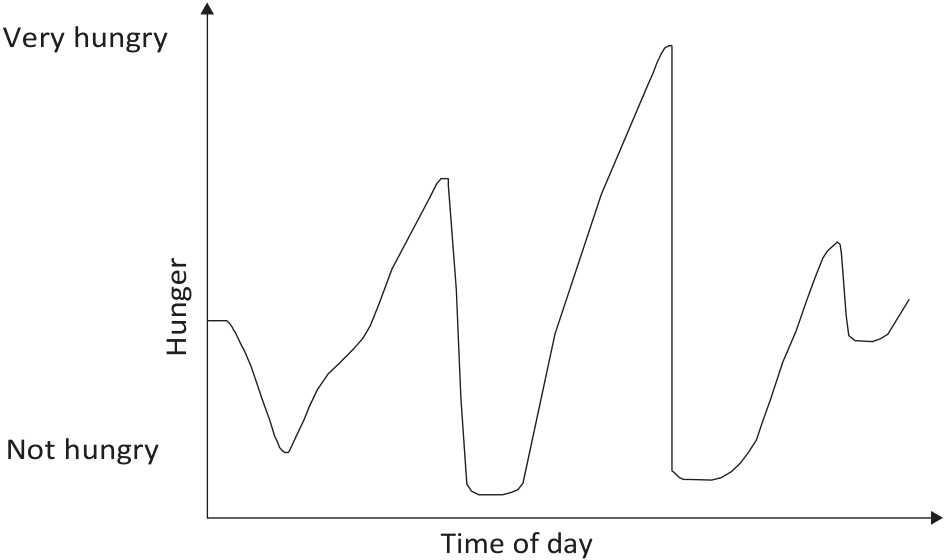
> **[Diagram Context - Textbook_Mathematics_Gr7_Graphs.pdf-0001-03.png]**
> This educational graphic is a line graph illustrating fluctuating hunger levels over the course of a day. The axes are labeled "Time of day" on the horizontal axis and "Hunger" on the vertical axis, with qualitative markers ranging from "Not hungry" to "Very hungry." For a high school student, this graph conceptually conveys how biological drives and physiological needs fluctuate dynamically over time, serving as a relatable model to discuss homeostasis, negative feedback mechanisms, and how nutrient intake temporarily satisfies biological imbalances.

> **[Diagram Context - Textbook_Mathematics_Gr7_Graphs.pdf-0001-05.png]**
> This graphic consists of text labels oriented vertically, displaying the words "Feelings" vertically along a central axis with "Happy" positioned at the top and "Unhappy" at the bottom. The visual framework serves as a basic two-point scale or continuum representing emotional states. Conceptually, it introduces learners to the qualitative categorization of human emotions, supporting foundational concepts in Life Orientation related to emotional literacy, self-awareness, and mental well-being.

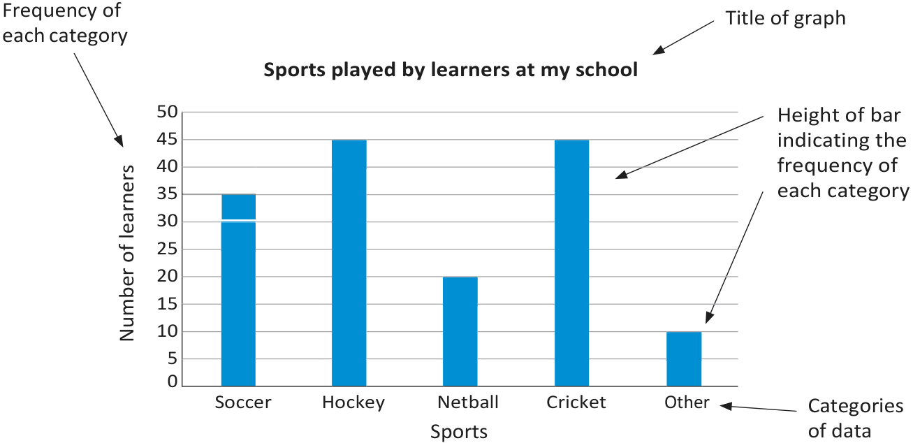
> **[Diagram Context - Textbook_Mathematics_Gr7_Represent-data.pdf-0001-06.png]**
> This educational graphic is a labeled bar graph illustrating data handling concepts in Mathematics. It features the title "Sports played by learners at my school," with visible axis labels ("Sports" on the horizontal axis and "Number of learners" on the vertical axis ranging from 0 to 50), category labels ("Soccer", "Hockey", "Netball", "Cricket", "Other"), and instructional arrows pointing to key features like the title, categories of data, and the height of bars indicating frequency. Conceptually, the diagram teaches learners how to construct and interpret bar graphs by demonstrating how categorical data and discrete frequencies are visually represented through rectangular bars.

---

## Addition Table

| $+$ | $8$ | $5$ | $4$ | $9$ | $7$ | $3$ | $6$ | $18$ | $36$ | $57$ |
| :---: | :---: | :---: | :---: | :---: | :---: | :---: | :---: | :---: | :---: | :---: |
| $7$ | | | | | | | | | | $64$ |
| $3$ | | | | | | $6$ | | | | |
| $9$ | | | | | | | | | | |
| $5$ | | | | | | | | | | |
| $8$ | | | | | | | | | | |
| $6$ | | | | | | | | | | |
| $4$ | | | | | | | | | | |

---

## Multiples

### Activity 1

In the arrangement below:
- The blue dots are in groups like this: 
  $$\begin{matrix} \bullet & & \bullet \\ & \bullet & \\ \bullet & & \bullet \end{matrix}$$
- The red dots are in groups like this: 
  $$\begin{matrix} \bullet & \bullet \\ \bullet & \bullet \\ \bullet & \bullet \end{matrix}$$

1. (a) How would you go about finding the number of blue dots below, if you do not want to count them one by one?
2. (b) Implement your plan, to find out how many blue dots there are.

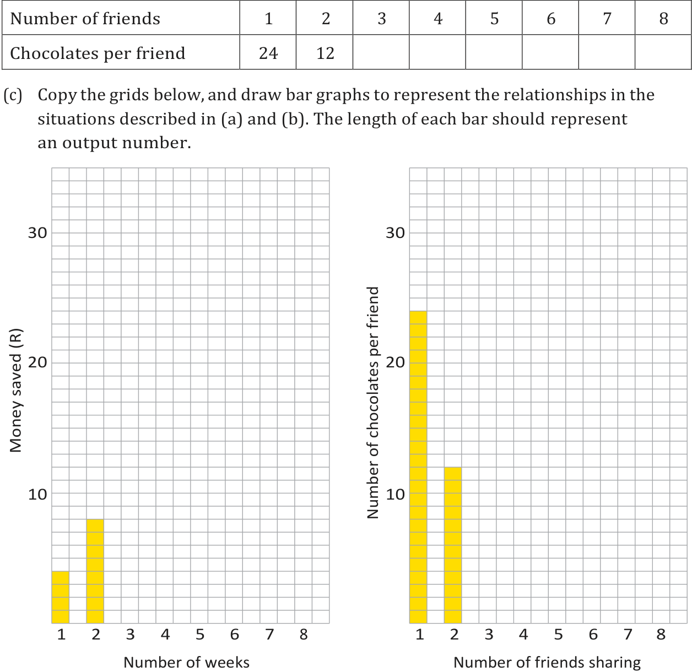
> **[Diagram Context - Textbook_Mathematics_Gr7_Graphs.pdf-0002-06.png]**
> This educational graphic features a table and two bar graph grids designed for practicing functions and relationships in mathematics. The top table tracks "Number of friends" (1 to 8) and "Chocolates per friend" (showing 24 and 12 for the first two entries). The two Cartesian grids below display labeled axes ("Money saved (R)" versus "Number of weeks" and "Number of chocolates per friend" versus "Number of friends sharing") along with partially plotted yellow bar graphs. Conceptually, this helps learners represent tabular data visually as bar graphs, distinguishing between direct and inverse proportions or functional relationships by analyzing how output values change relative to input values.

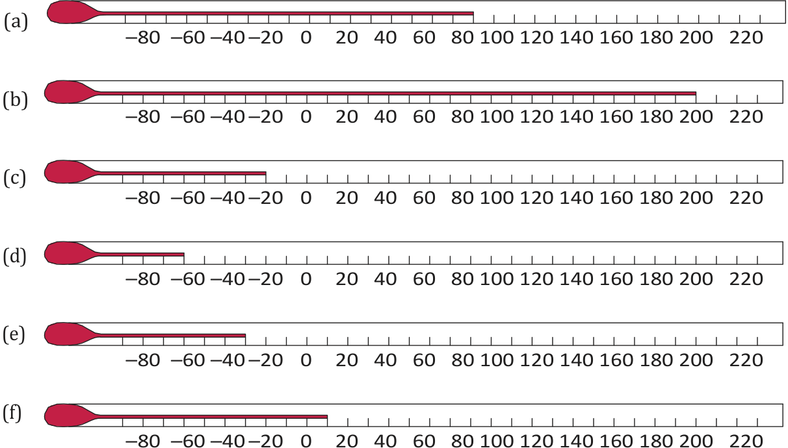
> **[Diagram Context - Textbook_Mathematics_Gr7_Integers.pdf-0002-08.png]**
> The graphic displays six horizontal thermometer apparatuses labeled (a) through (f), each featuring a bulb and a liquid column aligned against a numerical temperature scale ranging from -80 to 220 with intervals of 20 units. Visible labels include lowercase letters (a) to (f) indexing each thermometer and the numerical scale markers spanning negative and positive values. This diagram helps CAPS Physical Sciences learners practice precise measurement and reading of temperature values from thermometers displaying various thermal states, reinforcing foundational laboratory skills.

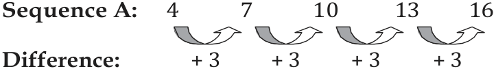
> **[Diagram Context - Textbook_Mathematics_Gr7_Numeric-and-geometric-patterns.pdf-0002-01.png]**
> This mathematical graphic displays a number sequence with arrows indicating the differences between consecutive terms. Visible text includes "Sequence A: 4 7 10 13 16" and "Difference: + 3", accompanied by four curved arrows pointing rightwards between each term pair. Conceptually, this demonstrates how to identify a linear (arithmetic) number pattern by finding the constant first difference ($d = 3$) between terms, which aligns with CAPS FET Mathematics outcomes.

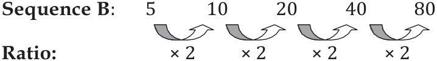
> **[Diagram Context - Textbook_Mathematics_Gr7_Numeric-and-geometric-patterns.pdf-0002-03.png]**
> This educational graphic displays a mathematical number sequence labeled "Sequence B" with terms 5, 10, 20, 40, and 80. Visible elements include curved arrows linking consecutive terms and a corresponding "Ratio:" label showing a constant multiplier of "× 2" between each term. Conceptually, the diagram demonstrates how to identify a geometric sequence by showing that each term is generated by multiplying the preceding term by a constant common ratio.

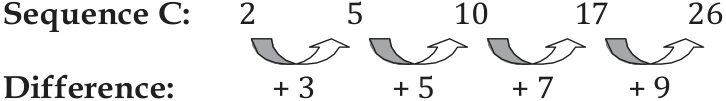
> **[Diagram Context - Textbook_Mathematics_Gr7_Numeric-and-geometric-patterns.pdf-0002-05.png]**
> This mathematical graphic illustrates a number pattern labeled "Sequence C" with the terms 2, 5, 10, 17, and 26. Visible elements include curved arrows connecting consecutive terms alongside the corresponding first differences of +3, +5, +7, and +9. Conceptually, it demonstrates the method for analyzing quadratic number patterns by showing how to find the first differences between terms, guiding high school learners to recognize that a non-constant first difference indicates a quadratic sequence.

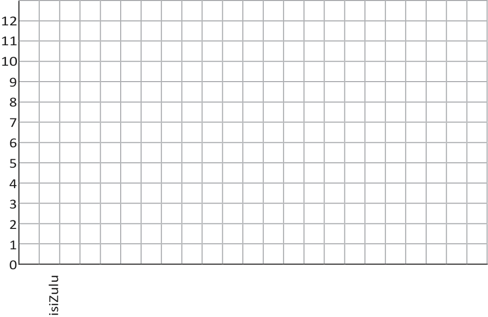
> **[Diagram Context - Textbook_Mathematics_Gr7_Represent-data.pdf-0002-02.png]**
> The educational graphic is a Cartesian grid with a vertical axis numbered from 0 to 12 and a horizontal axis labeled "isiZulu". It provides a structured graphing template for plotting statistical data or mathematical functions related to language distribution or frequency studies. This tool helps high school learners practice data handling skills such as plotting points, constructing bar graphs, and interpreting statistical trends according to CAPS curriculum requirements.

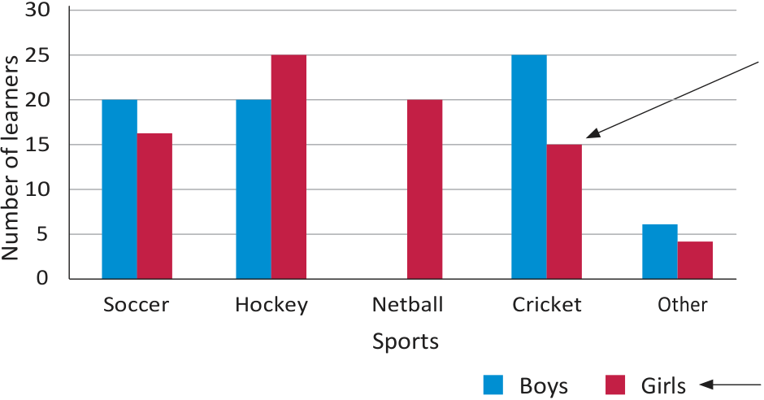
> **[Diagram Context - Textbook_Mathematics_Gr7_Represent-data.pdf-0002-06.png]**
> This educational graphic is a double bar graph comparing sports preferences between boys and girls. The visible elements include the y-axis labeled "Number of learners" (ranging from 0 to 30), the x-axis labeled "Sports" with categories (Soccer, Hockey, Netball, Cricket, Other), a legend indicating blue bars for "Boys" and red bars for "Girls," and arrows pointing to specific data bars. Conceptually, this diagram helps students learn how to organize, represent, and interpret categorical data by visually comparing two sets of related variables side-by-side.

---

Suppose you want to know how many black dots there are in the arrangement on page 3. One way is to **count in groups** of three. When you do this, you may have to point with your finger or pencil to keep track.

The counting will go like this: *three, six, nine, twelve, fifteen, eighteen \dots*

Another way to find out how many black dots there are is to **analyse** the arrangement and **do some calculations**. In the arrangement, there are ten rows of threes from the top to the bottom, and three columns of threes from left to right, just as in the table alongside.

| | | |
|---|---|---|
| 3 | 3 | 3 |
| 3 | 3 | 3 |
| 3 | 3 | 3 |
| 3 | 3 | 3 |
| 3 | 3 | 3 |
| 3 | 3 | 3 |
| 3 | 3 | 3 |
| 3 | 3 | 3 |
| 3 | 3 | 3 |
| 3 | 3 | 3 |

One way to calculate the total number of black dots is to do $3 \times 10 = 30$ for the dots in each column, and then $30 + 30 + 30 = 90$. Another way is to add up each row ($3 + 3 + 3 = 9$) and then multiply by $10$: $10 \times 9 = 90$. A third way is to notice that there are $3 \times 10 = 30$ groups of three, so the total is $3 \times 30 = 90$.

---

## Exercises

2. When you determined the number of blue dots in question 1(b), did you count in fives, or did you analyse and calculate, or did you use some other method? Now use a different method to determine the number of blue dots and check whether you get the same answer as before. Describe the method that you used.

3. The numbers that you get when you count in fives are called **multiples** of five. Copy the table below and draw circles around all the multiples of 5.

| 1 | 2 | 3 | 4 | 5 | 6 | 7 | 8 | 9 | 10 |
|---|---|---|---|---|---|---|---|---|---|
| 11 | 12 | 13 | 14 | 15 | 16 | 17 | 18 | 19 | 20 |
| 21 | 22 | 23 | 24 | 25 | 26 | 27 | 28 | 29 | 30 |
| 31 | 32 | 33 | 34 | 35 | 36 | 37 | 38 | 39 | 40 |
| 41 | 42 | 43 | 44 | 45 | 46 | 47 | 48 | 49 | 50 |
| 51 | 52 | 53 | 54 | 55 | 56 | 57 | 58 | 59 | 60 |
| 61 | 62 | 63 | 64 | 65 | 66 | 67 | 68 | 69 | 70 |
| 71 | 72 | 73 | 74 | 75 | 76 | 77 | 78 | 79 | 80 |
| 81 | 82 | 83 | 84 | 85 | 86 | 87 | 88 | 89 | 90 |
| 91 | 92 | 93 | 94 | 95 | 96 | 97 | 98 | 99 | 100 |
| 101 | 102 | 103 | 104 | 105 | 106 | 107 | 108 | 109 | 110 |
| 111 | 112 | 113 | 114 | 115 | 116 | 117 | 118 | 119 | 120 |

4. How many red dots are there in the arrangement on page 3? Describe the method that you use to find this out.

5. 
   * (a) Underline all the multiples of $7$ in the table you drew for question 3.
   * (b) Which multiples of $5$ in the table are also multiples of $7$?

---

> **Note:** A number that is a multiple of $5$, and also a multiple of $7$, is called a **common multiple** of $5$ and $7$.

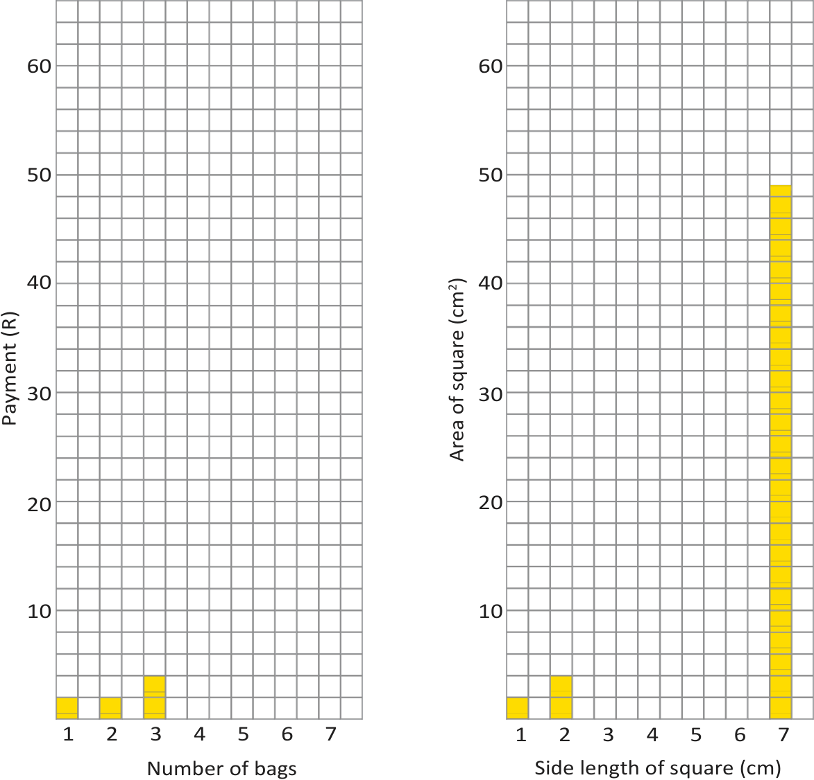
> **[Diagram Context - Textbook_Mathematics_Gr7_Graphs.pdf-0003-06.png]**
> The graphic consists of two bar graphs plotted on grid paper, comparing two different mathematical relationships. The left graph has the axis labels "Number of bags" and "Payment (R)", showing discrete values for 1, 2, and 3 bags. The right graph features "Side length of square (cm)" on the horizontal axis and "Area of square (cm²)" on the vertical axis, with bars plotted at side lengths 1, 2, and 7. Conceptually, this visual helps learners distinguish between different types of functional relationships and proportional growth patterns in algebra and data handling.

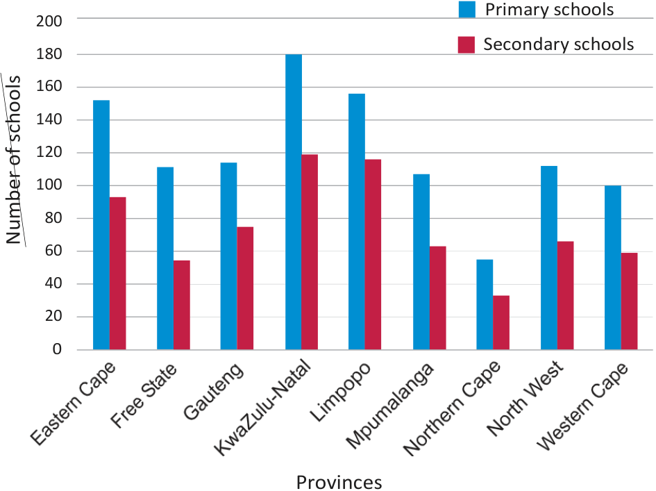
> **[Diagram Context - Textbook_Mathematics_Gr7_Represent-data.pdf-0003-02.png]**
> This educational graphic is a double bar graph displaying data categorized by South African provinces, primary schools, and secondary schools. The visible labels include the vertical axis labeled "Number of schools" ranging from 0 to 200, the horizontal axis labeled "Provinces" listing South Africa's nine provinces (Eastern Cape, Free State, Gauteng, KwaZulu-Natal, Limpopo, Mpumalanga, Northern Cape, North West, and Western Cape), and a legend differentiating between "Primary schools" (blue bars) and "Secondary schools" (red bars). Conceptually, the diagram conveys how to read, interpret, and compare categorical data sets, allowing students to analyze regional trends and differences in school distribution across the country.

> **[Diagram Context - Textbook_Mathematics_Gr7_Represent-data.pdf-0003-09.png]**
> The graphic shows an abstract diagram composed of three adjacent vertical rectangular color blocks (dark brown, reddish-brown, and mustard yellow) with a diagonal black line extending from the upper right corner of the yellow block. There are no visible labels, variables, biological structures, chemical symbols, or axis names present in the image. Conceptually, due to its extreme cropping and lack of contextual labels or recognizable scientific features, the graphic does not convey a clear high-school CAPS curriculum concept.

---

6. How many yellow dots are there in the arrangement on page 3? Describe the method that you use to find this out.

7. 
   - (a) Cross out all the multiples of $9$ in the table you drew for question $3$.
   - (b) Which numbers in the table in question $3$ are common multiples of $7$ and $9$?

8. 
   - (a) Look at the numbers in the yellow cells of the table below. How are these numbers formed from the numbers in the red row and the numbers in the blue column?
   - (b) Copy the table below and fill in all the cells for which you know the answers immediately. Leave the other cells open for now.

| $\times$ | $8$ | $5$ | $4$ | $9$ | $7$ | $3$ | $6$ | $2$ | $10$ | $20$ |
| :---: | :---: | :---: | :---: | :---: | :---: | :---: | :---: | :---: | :---: | :---: |
| $7$ | | | | | | | | | | |
| $3$ | | | | | | | | | | |
| $9$ | | | | | | | | | $90$ | |
| $5$ | | | $20$ | | | | | | | |
| $8$ | | | | | | | | | | |
| $6$ | | | | | | | | | | |
| $4$ | | | | | | | | | | |
| $2$ | | | | | | | | | | |
| $10$ | | $50$ | | | | | | | | |
| $20$ | | | | | | $60$ | | | | |

9. Copy the table below and write down the first thirteen multiples of each of the numbers in the column on the left. The multiples of $4$ are already written in, as an example.

| | $1$ | $2$ | $3$ | $4$ | $5$ | $6$ | $7$ | $8$ | $9$ | $10$ | $11$ | $12$ | $13$ |
| :---: | :---: | :---: | :---: | :---: | :---: | :---: | :---: | :---: | :---: | :---: | :---: | :---: | :---: |
| $2$ | | | | | | | | | | | | | |
| $3$ | | | | | | | | | | | | | |
| $4$ | $8$ | $12$ | $16$ | $20$ | $24$ | $28$ | $32$ | $36$ | $40$ | $44$ | $48$ | $52$ | |
| $5$ | | | | | | | | | | | | | |
| $6$ | | | | | | | | | | | | | |
| $7$ | | | | | | | | | | | | | |
| $8$ | | | | | | | | | | | | | |
| $9$ | | | | | | | | | | | | | |
| $10$ | | | | | | | | | | | | | |
| $11$ | | | | | | | | | | | | | |
| $12$ | | | | | | | | | | | | | |
| $13$ | | | | | | | | | | | | | |

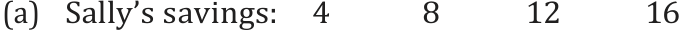

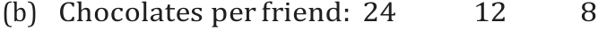

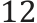

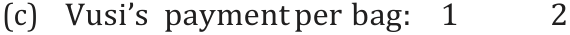
> **[Diagram Context - Textbook_Mathematics_Gr7_Graphs.pdf-0004-23.png]**
> The image is a text-based mathematics question snippet featuring the label "(c)" followed by the text "Vusi's payment per bag: 1 2". It sets up a contextual word problem involving financial mathematics or number patterns. For a high school student, this prompts the calculation or analysis of a linear relationship between the number of bags and the corresponding payment amount.

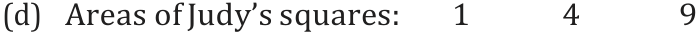

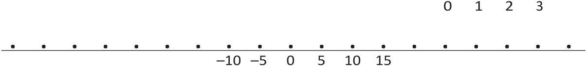
> **[Diagram Context - Textbook_Mathematics_Gr7_Integers.pdf-0004-05.png]**
> The graphic is a number line representation depicting a sequence of dots and numerical values. Visible labels include negative and positive integer intervals ranging from $-10$ to $15$ below the line, and the values $0, 1, 2, 3$ positioned above the right side. This diagram conceptually supports Grade 10-12 Physical Sciences learners in interpreting vector motion, ticker-timer tape measurements, or number line scales by visualizing discrete spatial intervals and coordinate positions.

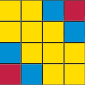

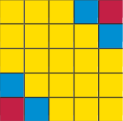

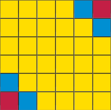

---

10. Copy and complete this table. For some cells, you may find your table of multiples on the previous page helpful.

| $\times$ | $6$ | $2$ | $7$ | $9$ | $4$ | $5$ | $3$ | $8$ | $10$ | $50$ |
| :---: | :---: | :---: | :---: | :---: | :---: | :---: | :---: | :---: | :---: | :---: |
| $8$ | | | | | | | | | | |
| $6$ | | | | | | | | | | |
| $7$ | | | | | | | | | | |
| $9$ | | | | | | | | | | |
| $5$ | | | | | | | | | | |
| $3$ | | | | | | | | | | |
| $4$ | | | | | | | | | | |
| $2$ | | | | | | | | | | |

11. Go back to the table you drew for question 8(b). If you can easily fill in the numbers in some of the open spaces now, do it.

12. Suppose there are $10$ small black spots on each of the yellow dots in the arrangement on page 3. How many small black spots would there be on all the yellow dots together, in the arrangement on page 3?

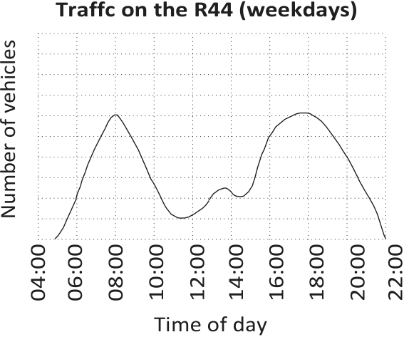
> **[Diagram Context - Textbook_Mathematics_Gr7_Graphs.pdf-0005-06.png]**
> This line graph displays data titled "Traffic on the R44 (weekdays)" with a grid background. The horizontal axis is labeled "Time of day" ranging from 04:00 to 22:00 in two-hour intervals, and the vertical axis is labeled "Number of vehicles." The curve visually conveys the daily fluctuation in traffic volume, specifically highlighting peak commuter periods in the morning and late afternoon on a typical weekday.

---

### Multiples of $10$, $100$, $1\ 000$ and $10\ 000$

1. How many spotted yellow dots are there on page 7? Explain what you did to find out.
2. How many learners are there in your class? Suppose each learner in the class has a book like this. How many spotted yellow dots are there on the same page (that is, on page 7) of all these books together?
3. Each yellow dot has $10$ small black spots, as you can see on this enlarged picture.
   
   

   (a) How many small black spots are there on page 7?  
   (b) How many small black spots are there on page 7 in all the books in your class?
4. Here is a very big enlargement of one of the black spots on the yellow dots. There are $10$ very small white spots on each small black spot. How many very small white spots are there on all the black spots on page 7?

   

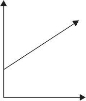

5. (a) How many very small white spots are there on $10$ pages like page 7?  
   (b) How many very small white spots are there on $100$ pages like page 7?

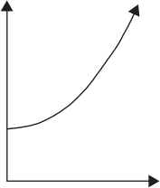

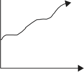

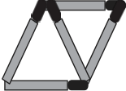
> **[Diagram Context - Textbook_Mathematics_Gr7_Numeric-and-geometric-patterns.pdf-0005-12.png]**
> This educational graphic is a geometric figure constructed from matchstick-like rods and dark connector joints. The diagram consists of grey rectangular bars joined together at their ends by black rounded caps forming connected triangular and quadrilateral shapes. Conceptually, it helps students visualize structural stability and rigid frameworks in geometry and technology by demonstrating how triangles provide structural rigidity compared to quadrilaterals.

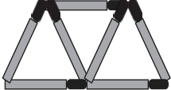
> **[Diagram Context - Textbook_Mathematics_Gr7_Numeric-and-geometric-patterns.pdf-0005-14.png]**
> This educational graphic is a geometric pattern constructed from matchstick-like units, featuring grey shafts and distinct black heads joined at vertices. There are no explicit alphabetical labels, variables, or text characters present in the diagram. Conceptually, it demonstrates how linear objects can be combined to form rigid triangular structures, reinforcing key mathematical principles regarding shape stability, perimeter counting, and number patterns in CAPS-aligned Foundation and Intermediate Phase Mathematics.

> **[Diagram Context - Textbook_Mathematics_Gr7_Represent-data.pdf-0005-09.png]**
> The graphic displays a horizontal bar divided into three adjacent rectangular sections filled with different earth-toned colors (dark brown, reddish-brown, and golden-brown/ochre), alongside a diagonal black line extending from the top right corner of the rightmost rectangle. There are no visible text labels, chemical symbols, or numerical variables present in the image. Conceptually, this abstract visual representation can be used by high school learners to study soil horizons, stratigraphy, or color gradients in geography and earth sciences.

---

# Chapter 1: Working with Whole Numbers

## Place Value Relationships

* $10$ tens are a **hundred**: $10 \times 10 = 100$
* $10$ hundreds are a **thousand**: $10 \times 100 = 1\,000$
* $10$ thousands are a **ten thousand**: $10 \times 1\,000 = 10\,000$
* $10$ ten thousands are a **hundred thousand**: $10 \times 10\,000 = 100\,000$
* $100$ thousands are a **million**: $100 \times 1\,000 = 100\,000$ *(Note: As shown by $10 \times 100\,000 = 1\,000\,000$)*

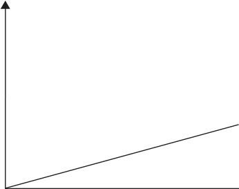

## Exercises

6. (a) Write $7\,000 + 600 + 80 + 4$ as a single number.
   (b) Write $10$ times the number in (a) in expanded notation and as a single number.
   (c) Write $100$ times the number in (a) in expanded notation and as a single number.

7. Write each of the following numbers in expanded notation:

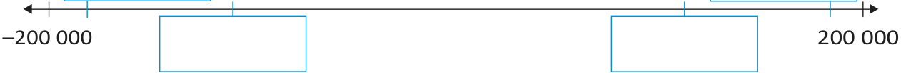
> **[Diagram Context - Textbook_Mathematics_Gr7_Integers.pdf-0006-09.png]**
> This educational graphic is a chronological timeline axis used in Life Sciences to represent evolutionary history and fossil ages in years before present. The timeline features a horizontal bidirectional arrow marked with numerical values "-200 000" and "200 000" at opposite ends, alongside multiple blank rectangular text boxes connected by vertical tick-mark pointers. Conceptually, this diagram helps learners sequence hominid evolution milestones and geological epochs by chronologically mapping fossil discoveries and significant evolutionary events onto a standardized time scale.

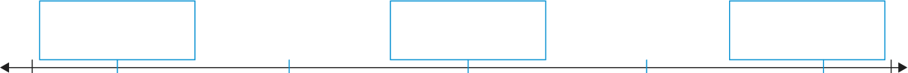

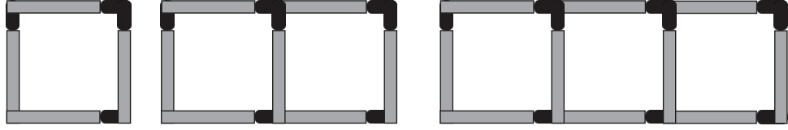
> **[Diagram Context - Textbook_Mathematics_Gr7_Numeric-and-geometric-patterns.pdf-0006-17.png]**
> This mathematical pattern visual displays a sequence of geometric figures formed by matchsticks, showing one, two, and three connected squares arranged horizontally. The visual consists of grey bars representing individual matchsticks and black corner connectors linking them to form closed square structures. Conceptually, this diagram helps FET phase learners identify number patterns, distinguish between constant differences, and derive linear algebraic expressions or term rules for sequences.

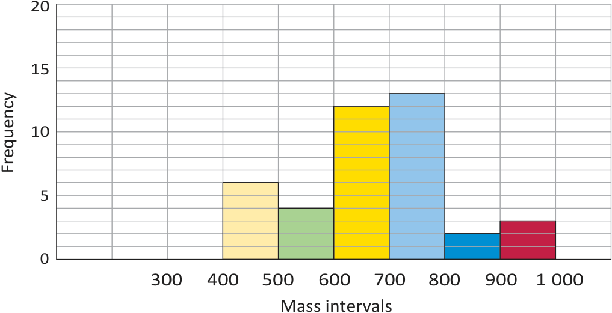
> **[Diagram Context - Textbook_Mathematics_Gr7_Represent-data.pdf-0006-01.png]**
> This graphic is a frequency histogram set against a grid background. The horizontal axis is labeled "Mass intervals" with numerical values ranging from 300 to 1 000, and the vertical axis is labeled "Frequency" with values ranging from 0 to 20 in increments of 5. It displays adjacent colored bars representing the frequency distribution of grouped continuous data, helping learners interpret data sets, determine modal classes, and estimate measures of central tendency in CAPS mathematics and mathematical literacy.

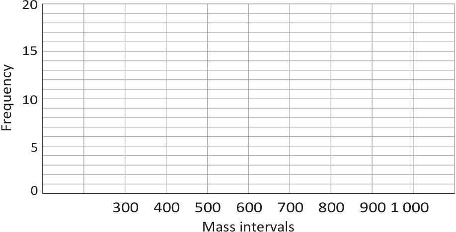
> **[Diagram Context - Textbook_Mathematics_Gr7_Represent-data.pdf-0006-13.png]**
> The graphic displays a blank Cartesian grid designed for statistical data representation, featuring labeled axes for "Frequency" on the vertical axis ranging from 0 to 20 and "Mass intervals" on the horizontal axis scaled from 300 to 1 000. Grid lines and major tick marks structure the plotting area for numerical data analysis. Conceptually, this template provides a structured canvas for high school learners to construct histograms or frequency polygons when organizing and interpreting grouped continuous data in Mathematics and Mathematical Literacy.

---

(a) $746$

(b) $7\,460$

(c) $74\,600$

(d) $746\,000$

(e) $7\,460\,000$

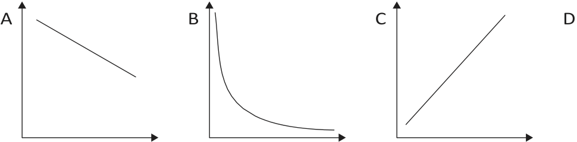
> **[Diagram Context - Textbook_Mathematics_Gr7_Graphs.pdf-0007-17.png]**
> The graphic displays three mathematical line graphs labeled A, B, and C with corresponding letter labels A, B, C, and D positioned in the corners. The graphs feature Cartesian axes with directional arrows showing different relationships: graph A depicts a decreasing linear trend, graph B shows a non-linear inverse relationship, and graph C illustrates a direct proportional (linear) relationship. These graphs help FET phase learners interpret data trends, variable dependencies, and functional relationships across physical sciences and mathematics.

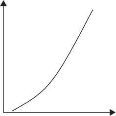

> **[Diagram Context - Textbook_Mathematics_Gr7_Numeric-and-geometric-patterns.pdf-0007-46.png]**
> This educational graphic features a digital dot-matrix arrangement composed entirely of small red circular dots configured to form the uppercase letter "H". There are no text labels, axes, or arrows present within the visual. Conceptually, this visual serves as a pixel art or dot representation of the letter "H", commonly used in foundational technology or literacy contexts to illustrate how shapes and characters can be digitally constructed using discrete points.

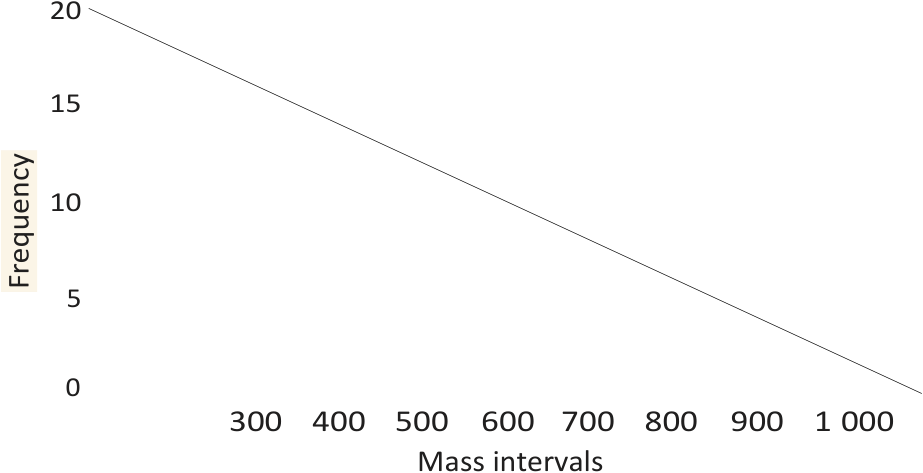
> **[Diagram Context - Textbook_Mathematics_Gr7_Represent-data.pdf-0007-01.png]**
> The graphic is a line graph displaying frequency data against mass intervals. Visible labels include the vertical axis labeled "Frequency" with numerical values ranging from 0 to 20, and the horizontal axis labeled "Mass intervals" with numerical values ranging from 300 to 1 000. Conceptually, it illustrates a linear decrease in frequency as the mass intervals increase, helping high school learners interpret trends and statistical distributions in data handling.

> **[Diagram Context - Textbook_Mathematics_Gr7_Represent-data.pdf-0007-11.png]**
> This graphic displays a colour gradient illustration showing three adjacent rectangular blocks in varying shades of brown and gold, with a single diagonal line extending downward to the right from the top right corner. The image lacks any text labels, chemical symbols, or specific anatomical structures. Conceptually, it appears incomplete or abstract, serving as a decorative background element rather than a standard CAPS-aligned educational diagram for high school science or mathematics.

---

8. Write the following numbers as a product of the given number and one other number:
   * (a) Write $10\,000$ as a product of $10$ and one other number.
   * (b) Write $10\,000$ as a product of $100$ and one other number.
   * (c) Write $100\,000$ as a product of $10$ and one other number.
   * (d) Write $100\,000$ as a product of $1\,000$ and one other number.
   * (e) Write $1\,000\,000$ as a product of $1\,000$ and one other number.

9. Copy the table below and fill in all the cells for which you know the answers immediately. Leave the other cells open for now.

| $\times$ | $10$ | $20$ | $30$ | $40$ | $50$ | $60$ | $70$ | $80$ | $90$ | $100$ |
| :---: | :---: | :---: | :---: | :---: | :---: | :---: | :---: | :---: | :---: | :---: |
| **2** | | | | | | | | | | |
| **3** | | | | | | | | | | |
| **4** | | | | | | | | | | |
| **5** | | | | | | | | | | |
| **6** | | | | | | | | | | |
| **7** | | | | | | | | | | |
| **8** | | | | | | | | | | |
| **9** | | | | | | | | | | |
| **10** | | | | | | | | | | |
| **11** | | | | | | | | | | |
| **12** | | | | | | | | | | |

10. Copy the table below and fill in all the cells in the table for which you know the answers immediately. Leave the other cells open for now.

| $\times$ | $100$ | $200$ | $300$ | $400$ | $500$ | $600$ |
| :---: | :---: | :---: | :---: | :---: | :---: | :---: |
| **2** | | | | | | |
| **3** | | | | | | |
| **4** | | | | | | |
| **5** | | | | | | |
| **6** | | | | | | |
| **7** | | | | | | |
| **8** | | | | | | |
| **9** | | | | | | |
| **10** | | | | | | |
| **11** | | | | | | |
| **12** | | | | | | |

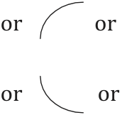

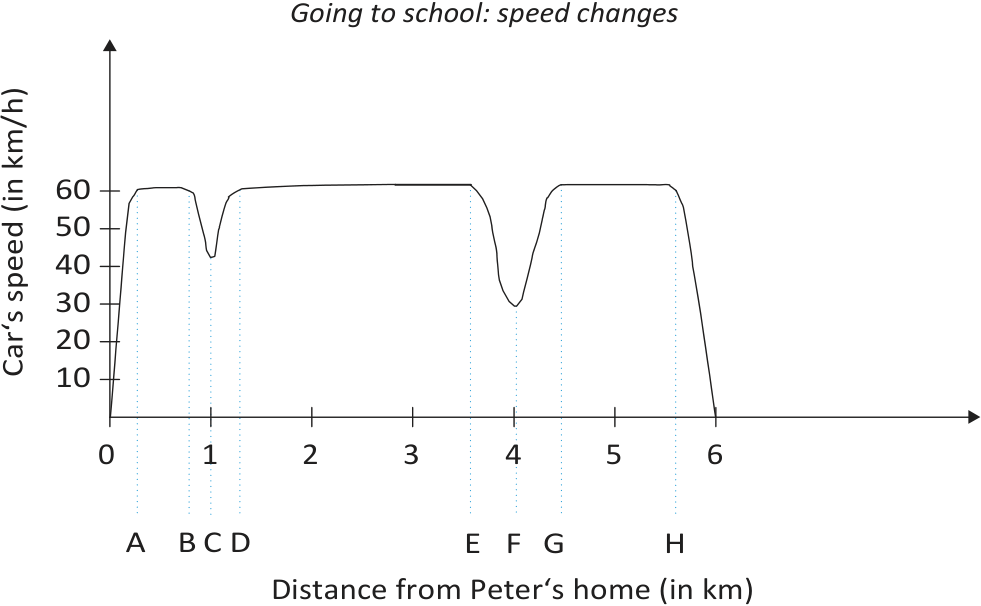
> **[Diagram Context - Textbook_Mathematics_Gr7_Graphs.pdf-0008-10.png]**
> This graphic is a line graph titled "Going to school: speed changes," with the vertical axis labeled "Car's speed (in km/h)" and the horizontal axis labeled "Distance from Peter's home (in km)," featuring numerical intervals and letters A through H marking specific points along the journey. It illustrates how a vehicle's speed varies over a 6 km distance, helping students interpret motion graphs by relating changes in speed to distance travelled during a commute.

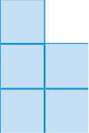

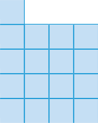

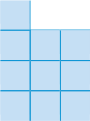

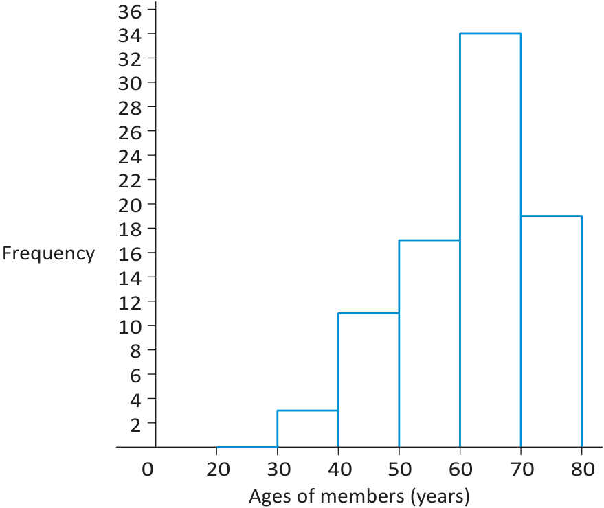
> **[Diagram Context - Textbook_Mathematics_Gr7_Represent-data.pdf-0008-00.png]**
> This educational graphic is a frequency histogram representing grouped continuous data. The horizontal axis is labeled "Ages of members (years)" with intervals from 0 to 80, while the vertical axis is labeled "Frequency" with numerical values ranging from 0 to 36. Conceptually, this diagram helps high school learners visualize the distribution and spread of statistical data sets, allowing them to interpret frequencies across different age intervals.

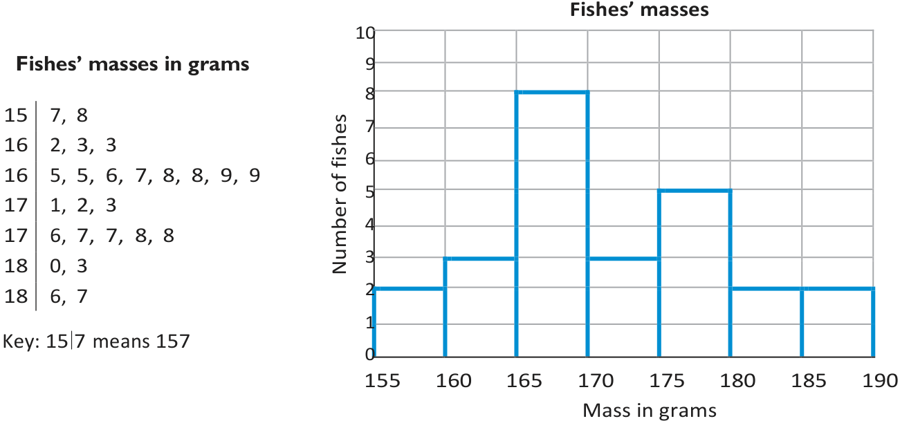
> **[Diagram Context - Textbook_Mathematics_Gr7_Represent-data.pdf-0008-02.png]**
> The graphic displays a stem-and-leaf plot alongside a corresponding histogram titled "Fishes' masses," with the stem-and-leaf plot showing split stems from 15 to 18, individual leaf values, and a key ("15|7 means 157"), while the histogram features "Mass in grams" on the x-axis and "Number of fishes" on the y-axis. This visual pairing helps learners understand how raw numerical data can be organized into a sorted stem-and-leaf format and subsequently grouped into continuous class intervals to construct a frequency distribution graph.

---

11. How many multiples of 10 are smaller than 250? 
(a) Estimate. 
(b) Check your estimate by writing down the multiples. 

12. In each case, first estimate, then check by writing all the multiples down and counting them. 
(a) How many multiples of 100 are smaller than $2\,500$? 
(b) How many multiples of 250 are smaller than $2\,500$? 
(c) How many numbers smaller than $2\,500$ are multiples of both 100 and 250? 
(d) How many numbers smaller than $2\,500$ are multiples of both 250 and 400? 

13. In each of the tins below, there are three R10 notes, three R20 notes, three R100 notes and three R200 notes. 

Zain wants to know what the total value of all the R10 notes in all the tins is. He decides to find this out by counting in 30s, so he says: thirty, sixty, ninety . . . and so on while he points at one tin after another. 
(a) Complete what Zain started to do. 
(b) Count in 300s to find the total value of all the R100 notes in all the tins. 

14. (a) How much money is there in total in the eight yellow tins in question 13? 
(b) Join with two classmates and tell them how you worked to find the total amount of money. 

15. (a) Investigate what is easiest for you, to count in twenties or in thirties or in fifties, up to 500. 
(b) Many people find it easier to count in fifties than in thirties. Why do you think this is so? 

16. What do you expect to be the most difficult, to count in forties or in seventies or in nineties? Investigate this and write a short report. 

Here is some advice that can make it easier to count in certain counting units, for example in seventies. 

It feels easier to count in fifties than in seventies because you get to multiples of 100 at every second step: 
fifty, hundred, one hundred and fifty, two hundred, two hundred and fifty, 300, 350, 400, 450, 500 ... and so on. 

When you count in seventies, this does not happen: 
seventy, one hundred and forty, two hundred and ten, two hundred and eighty ... 

9  
CHAPTER 1: WORKING WITH WHOLE NUMBERS

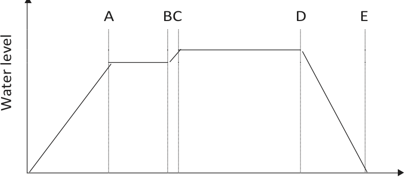
> **[Diagram Context - Textbook_Mathematics_Gr7_Graphs.pdf-0009-02.png]**
> This graphic is a line graph showing water level over time with vertical dashed coordinate lines marked by letters A, B, C, D, and E, and an y-axis labeled "Water level". The graph conveys the fluctuating water levels during a titration or water-related experiment in CAPS Physical Sciences or Life Sciences, allowing learners to analyze specific phases and intervals of volume change.

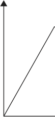

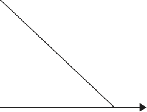

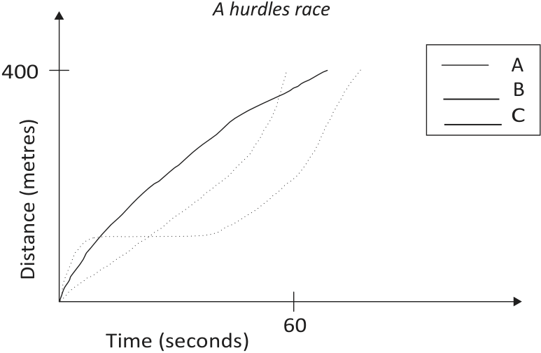
> **[Diagram Context - Textbook_Mathematics_Gr7_Graphs.pdf-0009-15.png]**
> This graphic is a distance-time graph representing a hurdles race titled "A hurdles race". The axes are labeled "Distance (metres)" on the vertical axis (with a mark at 400) and "Time (seconds)" on the horizontal axis (with a mark at 60), alongside three distinct curves labeled A, B, and C in a legend. Conceptually, this diagram helps high school physical sciences learners interpret motion in one dimension, illustrating how varying gradients on a position-time graph correspond to changes in speed, acceleration, and the duration of a race for multiple participants.

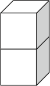

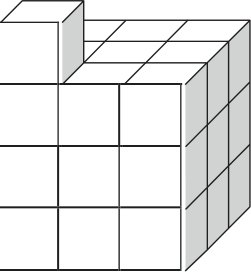
> **[Diagram Context - Textbook_Mathematics_Gr7_Numeric-and-geometric-patterns.pdf-0009-03.png]**
> This graphic is a geometry figure showing a composite three-dimensional solid made of interconnected unit cubes. The diagram displays a large rectangular block with dimensions of 3 units wide, 3 units deep, and 3 units high, with a single extra unit cube protruding upward from the top-left corner. Conceptually, this visual aids learners in understanding spatial reasoning, calculating surface area, and determining volume by counting unit cubes or breaking down irregular 3D shapes into simpler rectangular prisms.

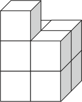

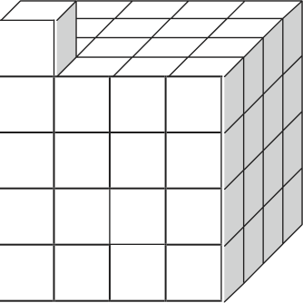
> **[Diagram Context - Textbook_Mathematics_Gr7_Numeric-and-geometric-patterns.pdf-0009-06.png]**
> This graphic is a geometry figure showing a composite three-dimensional block structure made up of individual unit cubes. The diagram consists of an outline drawing of a rectangular prism with a missing corner section, clearly displaying a grid of square faces on its front and top surfaces without any text labels or arrows. Conceptually, this visual aids senior phase and FET mathematics learners in calculating surface area and volume by decomposing complex 3D shapes into constituent unit cubes.

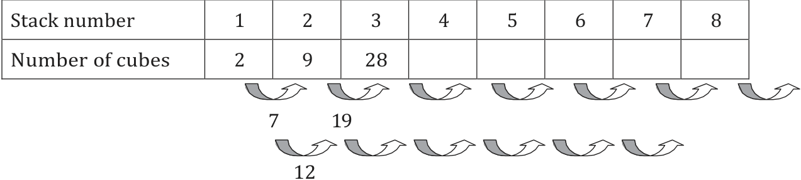
> **[Diagram Context - Textbook_Mathematics_Gr7_Numeric-and-geometric-patterns.pdf-0009-09.png]**
> This graphic is a number pattern table and calculation flowchart featuring the rows "Stack number" (1 to 8) and "Number of cubes" (with visible terms 2, 9, 28, and blank cells), accompanied by curved arrows indicating first differences (7, 19) and second differences (12). For a high school mathematics student under the CAPS curriculum, this diagram visually scaffolds the step-by-step method for investigating and solving quadratic number patterns by determining first and second constant differences.

> **[Diagram Context - Textbook_Mathematics_Gr7_Represent-data.pdf-0009-12.png]**
> This graphic consists of three adjacent rectangular colour blocks in shades of dark brown, reddish-brown, and mustard yellow, with a single diagonal line extending downward and to the right from the top right corner of the yellow block. There are no visible text labels, variables, symbols, or axis names. Conceptually, the image is too abstract and lacks sufficient curricular context to convey a specific South African CAPS learning concept.

---

It may help you to cross over the multiples of $100$ in two steps each time, like this:

$$70 + 30 \rightarrow \mathbf{100} + 40 \rightarrow \mathbf{140} + 60 \rightarrow \mathbf{200} + 10 \rightarrow \mathbf{210} + 70 \rightarrow \mathbf{280} \dots$$

$$30 + 40 = 70 \hspace{3cm} 60 + 10 = 70$$

In this way, you make the multiples of $100$ act as "stepping stones" for your counting.

## Exercises

17. 
    * (a) Count in forties up to $1\ 000$. Try to use multiples of $100$ as stepping stones. You can write the numbers while you count.
    * (b) Write down the first twenty multiples of $80$.
    * (c) Write down the first twenty multiples of $90$.
    * (d) Write down the first ten multiples of $700$.

18. Copy and complete this table:

| $\times$ | $60$ | $50$ | $70$ | $90$ | $40$ | $20$ | $30$ | $80$ |
| :---: | :---: | :---: | :---: | :---: | :---: | :---: | :---: | :---: |
| $8$ | | | | | | | | |
| $6$ | | | | | | | | |
| $7$ | | | | | | | | |
| $9$ | | | | | | | | |
| $5$ | | | | | | | | |
| $3$ | | | | | | | | |
| $4$ | | | | | | | | |
| $2$ | | | | | | | | |
| $70$ | | | | | | | | |
| $30$ | | | | | | | | |
| $60$ | | | | | | | | |
| $80$ | | | | | | | | |
| $40$ | | | | | | | | |
| $90$ | | | | | | | | |
| $50$ | | | | | | | | |
| $20$ | | | | | | | | |

---

## Doubling and Halving

1. Write the next eight numbers in each pattern:
   * (a) $1 \quad 2 \quad 4 \quad 8 \quad 16 \quad 32$
   * (b) $3 \quad 6 \quad 12 \quad 24$
   * (c) $5 \quad 10 \quad 20 \quad 40$
   * (d) $5 \quad 10 \quad 15 \quad 20$
   * (e) $6 \quad 12 \quad 24 \quad 48$

2. Which pattern or patterns in question 1 are *not* formed by **repeated doubling**?

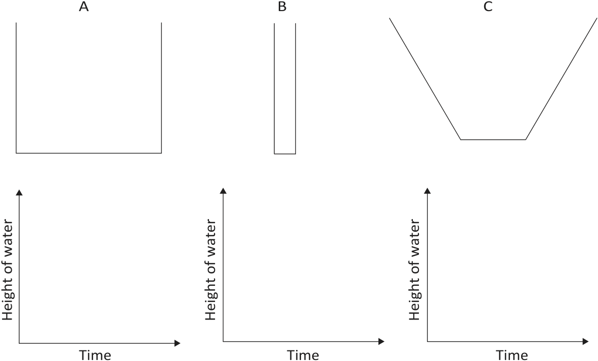

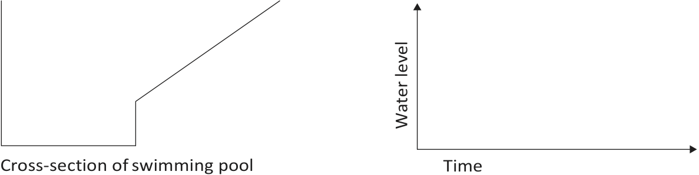

---

# Revision Notes: Working with Whole Numbers

## Core Concepts

### 1. Repeated Doubling Patterns
A **repeated doubling pattern** is a sequence of numbers where each term after the first is obtained by multiplying the previous term by $2$. 

For example, the pattern starting with $3$:
$$3, \; 6, \; 12, \; 24, \; 48, \; \dots$$
is generated as follows:
* Term 1: $3$
* Term 2: $3 \times 2 = 6$
* Term 3: $6 \times 2 = 12$
* Term 4: $12 \times 2 = 24$
* Term 5: $24 \times 2 = 48$

---

### Activity 1: Completing the Doubling Table

Copy and complete the table below by writing the first nine terms of the repeated doubling patterns starting with the numbers given in the left column. (Row $13$ is completed as an example).

| Starting Number | Term 2 | Term 3 | Term 4 | Term 5 | Term 6 | Term 7 | Term 8 | Term 9 |
| :---: | :---: | :---: | :---: | :---: | :---: | :---: | :---: | :---: |
| **2** | 4 | 8 | 16 | 32 | 64 | 128 | 256 | 512 |
| **3** | 6 | 12 | 24 | 48 | 96 | 192 | 384 | 768 |
| **4** | 8 | 16 | 32 | 64 | 128 | 256 | 512 | 1 024 |
| **5** | 10 | 20 | 40 | 80 | 160 | 320 | 640 | 1 280 |
| **6** | 12 | 24 | 48 | 96 | 192 | 384 | 768 | 1 536 |
| **7** | 14 | 28 | 56 | 112 | 224 | 448 | 896 | 1 792 |
| **8** | 16 | 32 | 64 | 128 | 256 | 512 | 1 024 | 2 048 |
| **9** | 18 | 36 | 72 | 144 | 288 | 576 | 1 152 | 2 304 |
| **10** | 20 | 40 | 80 | 160 | 320 | 640 | 1 280 | 2 560 |
| **11** | 22 | 44 | 88 | 176 | 352 | 704 | 1 408 | 2 816 |
| **12** | 24 | 48 | 96 | 192 | 384 | 768 | 1 536 | 3 072 |
| **13** | 26 | 52 | 104 | 208 | 416 | 832 | 1 664 | 3 328 |
| **14** | 28 | 56 | 112 | 224 | 448 | 896 | 1 792 | 3 584 |
| **15** | 30 | 60 | 120 | 240 | 480 | 960 | 1 920 | 3 840 |
| **16** | 32 | 64 | 128 | 256 | 512 | 1 024 | 2 048 | 4 096 |
| **17** | 34 | 68 | 136 | 272 | 544 | 1 088 | 2 176 | 4 352 |
| **18** | 36 | 72 | 144 | 288 | 576 | 1 152 | 2 304 | 4 608 |
| **19** | 38 | 76 | 152 | 304 | 608 | 1 216 | 2 432 | 4 864 |

---

### 2. Multiplication by Doubling

Doubling can be used as a method to perform multiplication by breaking down a multiplier into powers of $2$ (binary decomposition).

#### Worked Example
Calculate $29 \times 8$:

1. **Double the multiplier ($8$) repeatedly until the next doubling exceeds the target number ($29$):**
   * $8$ doubled is $16$, so $16 = 2 \times 8$ $\quad (\text{step 1})$
   * $16$ doubled is $32$, so $32 = 4 \times 8$ $\quad (\text{step 2})$
   * $32$ doubled is $64$, so $64 = 8 \times 8$ $\quad (\text{step 3})$
   * $64$ doubled is $128$, so $128 = 16 \times 8$ $\quad (\text{step 4})$ — *(Doubling again would go past $29 \times 8$)*

2. **Express the number $29$ as a sum of powers of $2$ from the steps above:**
   $$29 = 16 + 8 + 4 + 1$$
   *(Note: Since $1 \times 8 = 8$, we use $16$, $8$, $4$, and the base value $8$)*

3. **Substitute and calculate:**
   $$16 \times 8 + 8 \times 8 + 4 \times 8 + 8 = (16 + 8 + 4) \times 8 + 8$$
   $$= 28 \times 8 + 8$$
   $$= 224 + 8 = 232$$
   
   Therefore, $29 \times 8 = 232$.

---

### Activity 2: Practice Problems

Work as in the example above to calculate each of the following. Write only what you need to write.

#### (a) $37 \times 21$
1. **Double $21$ repeatedly:**
   * $21$ doubled is $42$ ($2 \times 21$)
   * $42$ doubled is $84$ ($4 \times 21$)
   * $84$ doubled is $168$ ($8 \times 21$)
   * $168$ doubled is $336$ ($16 \times 21$)
   * $336$ doubled is $672$ ($32 \times 21$) — *Next doubling exceeds $37 \times 21$*

2. **Express $37$ as a sum of powers of $2$:**
   $$37 = 32 + 4 + 1$$

3. **Calculate:**
   $$37 \times 21 = (32 + 4 + 1) \times 21$$
   $$= (32 \times 21) + (4 \times 21) + (1 \times 21)$$
   $$= 672 + 84 + 21$$
   $$= 777$$

---

#### (b) $17 \times 41$
1. **Double $41$ repeatedly:**
   * $41$ doubled is $82$ ($2 \times 41$)
   * $82$ doubled is $164$ ($4 \times 41$)
   * $164$ doubled is $328$ ($8 \times 41$)
   * $328$ doubled is $656$ ($16 \times 41$) — *Next doubling exceeds $17 \times 41$*

2. **Express $17$ as a sum of powers of $2$:**
   $$17 = 16 + 1$$

3. **Calculate:**
   $$17 \times 41 = (16 + 1) \times 41$$
   $$= (16 \times 41) + (1 \times 41)$$
   $$= 656 + 41$$
   $$= 697$$

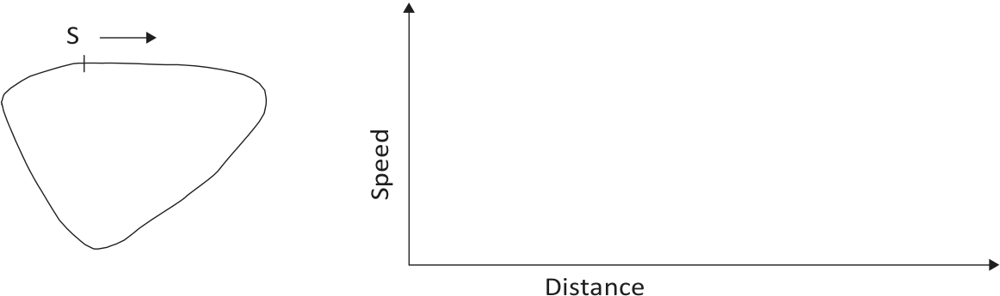
> **[Diagram Context - Textbook_Mathematics_Gr7_Graphs.pdf-0011-01.png]**
> The educational graphic consists of two parts: a 2D diagram on the left showing an irregular closed loop track with a starting point labeled "S" and a directional arrow indicating clockwise motion, paired with an empty Cartesian graph on the right with axes labeled "Speed" on the vertical axis and "Distance" on the horizontal axis. Visible labels include "S", a directional arrow, "Speed", and "Distance". This figure is designed for high school physics learners studying mechanics to practice sketching or interpreting motion graphs, specifically by relating how an object's speed changes as it traverses a non-uniform path over a given distance.

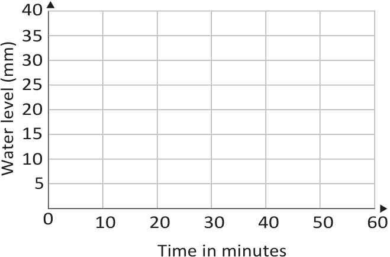
> **[Diagram Context - Textbook_Mathematics_Gr7_Graphs.pdf-0011-06.png]**
> This graphic displays a Cartesian line graph grid with labeled axes for tracking experimental data. The vertical axis is labeled "Water level (mm)" ranging from 0 to 40 with increments of 5, while the horizontal axis is labeled "Time in minutes" ranging from 0 to 60 with intervals of 10. For high school learners under the CAPS curriculum, this blank grid serves as a template to plot experimental results, such as water uptake in transpiration investigations or osmosis experiments, reinforcing data representation and graphing skills.

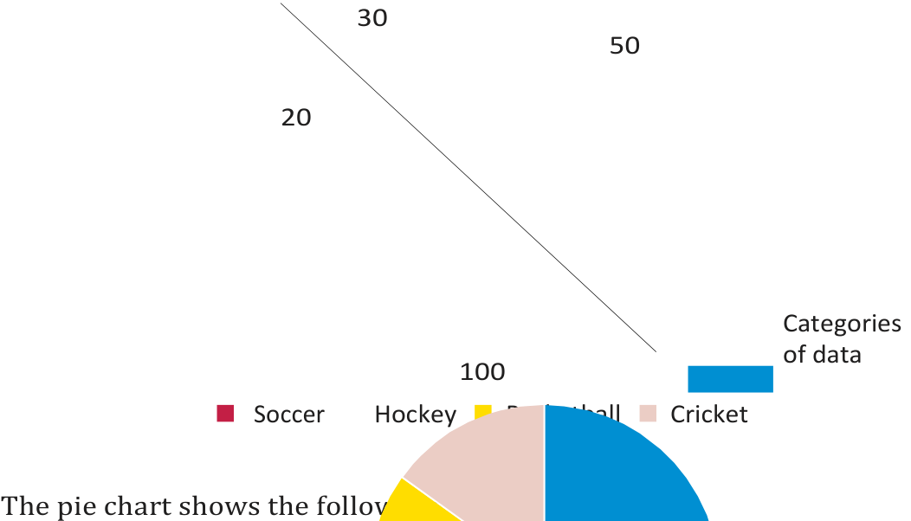
> **[Diagram Context - Textbook_Mathematics_Gr7_Represent-data.pdf-0011-04.png]**
> This educational graphic displays an incomplete pie chart intended for data handling and statistics. Visible elements include numerical values (20, 30, 50, 100), category labels (Soccer, Hockey, Basketball, Cricket), lines pointing to a blue data category, and partial instructional text at the bottom. The diagram helps students learn how to represent categorical data visually and interpret proportions of a whole using a circle graph.

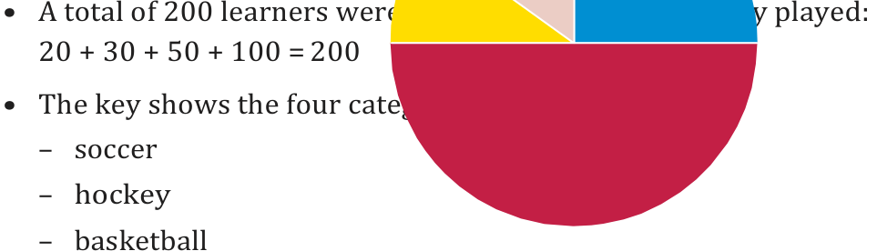
> **[Diagram Context - Textbook_Mathematics_Gr7_Represent-data.pdf-0011-05.png]**
> The graphic is a pie chart accompanied by explanatory text regarding a survey of 200 learners. Visible text includes the calculation "$20 + 30 + 50 + 100 = 200$" and a key listing categories such as "soccer", "hockey", and "basketball". This diagram demonstrates how to represent categorical data proportionally as sectors of a circle, reinforcing data handling concepts for high school mathematics learners.

> **[Diagram Context - Textbook_Mathematics_Gr7_Represent-data.pdf-0011-10.png]**
> The graphic displays a horizontal bar divided into three distinct color blocks (dark brown, reddish-brown, and mustard yellow) with a diagonal line extending downward and to the right from the top right corner. The visual contains no text labels, symbols, or axis names. Conceptually, this abstract diagram can be used in CAPS Life Sciences or Physics to prompt learners to identify trends, gradients, or sequential stages across categorical zones.

---

5. Continue each repeated halving pattern as far as you can:
   (a) $1\ 024 \quad 512 \quad 256 \quad 128$
   (b) $64\ 000 \quad 32\ 000 \quad 16\ 000 \quad 8\ 000$

Halving can also be used to do multiplication. 

For example, $37 \times 28$ can be calculated as follows:
* $100 \times 28 = 2\ 800$. Half of that is $50 \times 28$, which is half of $2\ 800$, that is $1\ 400$.
* Half of $50 \times 28$ is half of $1\ 400$, so $25 \times 28$ is $700$.
* $10 \times 28 = 280$, so $25 \times 28 + 10 \times 28 = 980$, so $35 \times 28 = 980$.
* $2 \times 28 = 2 \times 25 + 2 \times 3 = 56$, so $37 \times 28$ is $980 + 56 = 1\ 036$.

6. $80 \times 78 = 6\ 240$. Use this information to work out each of the following:
   (a) $20 \times 78$
   (b) $37 \times 78$

If chickens cost $\text{R}27$ each, how many chickens can you buy with $\text{R}2\ 400$? A way to use halving to work this out is shown below.

100 chickens cost $100 \times 27 = \text{R}2\ 700$. That is more than $\text{R}2\ 400$. Fifty chickens cost half as much, that is $\text{R}1\ 350$.

So I can buy 50 chickens and even more. Half of 50 is 25, and half of $\text{R}1\ 350$ is $\text{R}675$. So 75 chickens cost $\text{R}1\ 350 + \text{R}675$, which is $\text{R}2\ 025$. So there is $\text{R}375$ left.

Ten chickens cost $\text{R}270$, so 85 chickens cost $\text{R}2\ 025 + \text{R}270 = \text{R}2\ 295$. There is $\text{R}105$ left. Three chickens cost $3 \times \text{R}25 + 3 \times \text{R}2 = \text{R}81$.

I can buy 88 chickens and that will cost $\text{R}2\ 376$.

| Number of chickens | Total cost | Thinking |
| :---: | :---: | :---: |
| 100 | $\text{R}2\ 700$ | |
| 50 | $\text{R}1\ 350$ | half of $\text{R}2\ 700$ |
| 25 | $\text{R}675$ | half of $\text{R}1\ 350$ |
| 75 | $\text{R}2\ 025$ | $50 + 25$ chickens |
| 10 | $\text{R}270$ | $10 \times \text{R}27$ |
| 85 | $\text{R}2\ 295$ | $75 + 10$ chickens |
| 3 | $\text{R}81$ | $3 \times \text{R}27$ |
| 88 | $\text{R}2\ 376$ | $85 + 3$ chickens |

7. Use halving as in the above example to work out how many books at $\text{R}67$ each a school can buy with $\text{R}5\ 000$. Copy and use table on left to show your calculations.

| Total cost | Thinking |
| :---: | :---: |
| | |
| | |
| | |
| | |
| | |

---

## Using multiplication to do division

1. $\text{R}7\ 500$ must be shared between 27 netball players. The money is in $\text{R}10$ notes, and no small change is available.
   (a) How much money will be used to give each player $\text{R}100$?

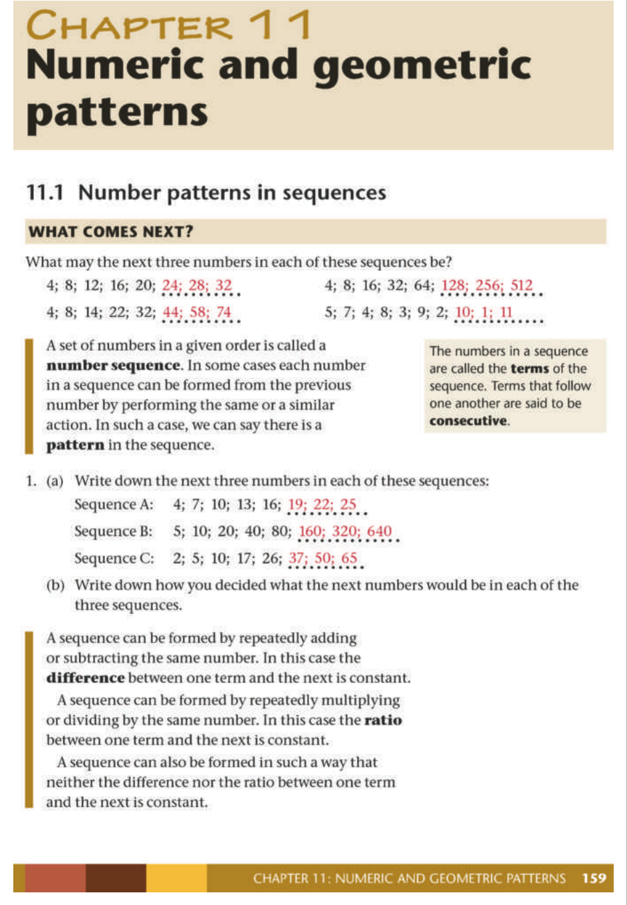
> **[Diagram Context - Textbook_Mathematics_Gr7_Numeric-and-geometric-patterns.pdf-0012-22.png]**
> This educational textbook page introduces numeric and geometric patterns through worked examples and exercises involving number sequences. The visible text labels include mathematical sequences (e.g., Sequence A, B, C with numerical values like 4; 7; 10... and red dashed underline answers), key terminology such as "number sequence", "terms", and "consecutive", alongside explanatory rules for constant differences and constant ratios. Conceptually, the graphic guides students to identify regularities in ordered numbers, distinguishing between linear (constant difference) and exponential or quadratic relationships to predict subsequent terms in a sequence.

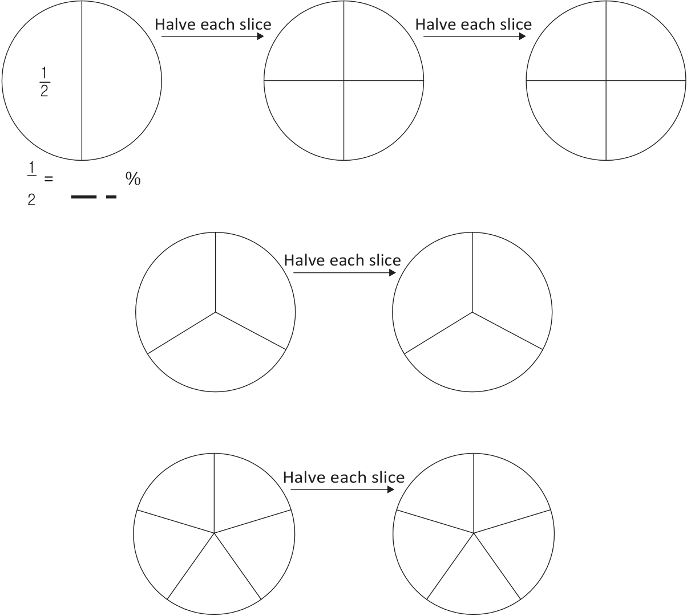
> **[Diagram Context - Textbook_Mathematics_Gr7_Represent-data.pdf-0012-02.png]**
> The educational graphic shows a set of three rows of circular fraction diagrams with horizontal arrows labeled "Halve each slice", fraction notations such as "1/2", and an incomplete equation "1/2 = __%". Visually, it displays circles divided into halves, thirds, and fifths undergoing progressive halving steps. Conceptually, this diagram helps learners understand fractions and percentages by demonstrating how dividing existing slices changes the denominator and total parts while relating fractional parts to percentages.

---

(b) Do you think there is enough money to give each player R200?

(c) Do you think there is enough money to give each player R300?

(d) How much of the R7 500 will be left over, if each player is given R200?

(e) Is there enough money left to give each player R50 more, in other words a total of R250 each?

(f) What is the highest amount that can be given to each player, so that less than R270 is left over? Remember that you cannot split up the R10 notes.

2. Work like you did in question 1 to solve this problem:

  There is $4\ 580\text{ m}$ of string on a big roll. How many pieces of $17\text{ m}$ each can be cut from this roll?
  
  *Hint:* You may start by asking yourself how much string will be used if you cut off $100$ pieces of $17\text{ m}$ each.

3. Work like you did in questions 1 and 2 to solve this problem:

  A shop owner has $\text{R1 } 800$ available with which he can buy chickens from a farmer. The farmer wants $\text{R26}$ for each chicken. How many chickens can the shop owner buy?

What you actually did in questions 1, 2 and 3 was to calculate $7\ 500 \div 27$, $4\ 580 \div 17$ and $1\ 800 \div 26$. You solved division problems. Yet most of the work was to do multiplication, and a little bit of subtraction.

When you had to calculate $1\ 800 \div 26$ in question 3, you may have asked yourself:
*With what must I multiply $26$, to get as close to $1\ 800$ as possible?*

> Division is called the **inverse** of multiplication.
> Multiplication is called the **inverse** of division.
> Multiplication and division are **inverse operations**.

---

## 1.2 Ordering and comparing whole numbers

### how far can you count, and how far is far?

1. How long will it take to count to a million? Let us say it takes one second to count each number. Find out how long is one million seconds. Work in your exercise book. Give your final answer in days, hours and seconds.

2. Write $234\ 500\ 320$ in words.

3. In each case write one of the symbols $>$ or $<$ to indicate which number is the smaller of the two.

  (a) $876\ 243 \quad \square \quad 876\ 234$
  
  (b) $534\ 616 \quad \square \quad 543\ 016$
  
  (c) $701\ 021 \quad \square \quad 698\ 769$
  
  (d) $103\ 232 \quad \square \quad 99\ 878$

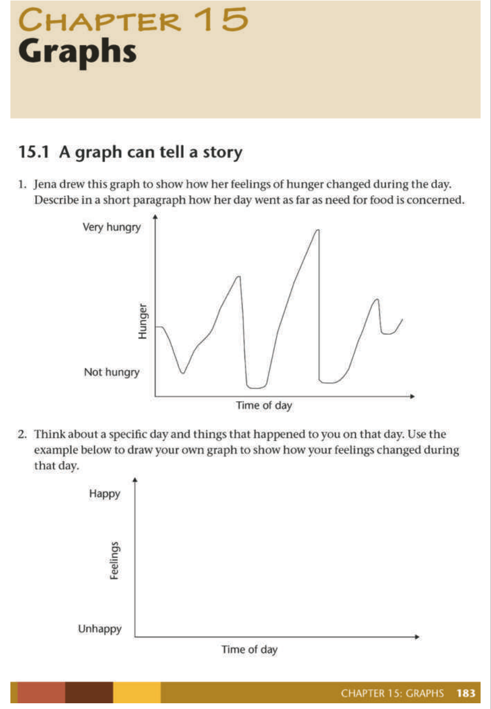
> **[Diagram Context - Textbook_Mathematics_Gr7_Graphs.pdf-0013-11.png]**
> This educational graphic features a line graph illustrating qualitative relationships over time. The axes are labeled "Time of day" on the horizontal axis and "Hunger" (ranging from "Not hungry" to "Very hungry") on the vertical axis, accompanied by an exercise prompt for students to draw their own emotional timeline. Conceptually, this diagram introduces learners to the interpretation and construction of functional relationships, demonstrating how Cartesian graphs can visually represent everyday stories and changing variables.

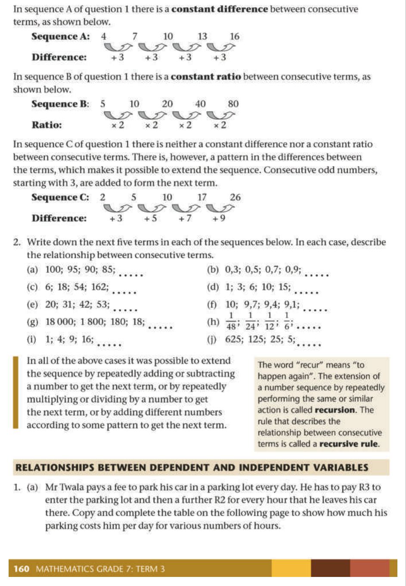
> **[Diagram Context - Textbook_Mathematics_Gr7_Numeric-and-geometric-patterns.pdf-0013-20.png]**
> This educational page features mathematical number sequences and problem-solving exercises related to patterns and relationships between variables. Visible elements include worked examples labeled Sequence A, Sequence B, and Sequence C with numerical terms and curved arrows indicating differences or ratios (+3, ×2, +3, +5, etc.), followed by practice items (a) through (j) and a contextual word problem about parking fees. Conceptually, this content helps Grade 7 learners under the CAPS curriculum identify, describe, and extend arithmetic, geometric, and quadratic-style number patterns using recursive rules.

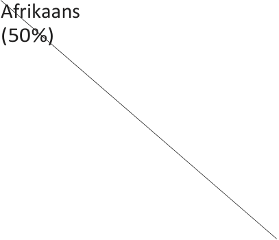
> **[Diagram Context - Textbook_Mathematics_Gr7_Represent-data.pdf-0013-02.png]**
> This graphic consists of a simple text label reading "Afrikaans (50%)" alongside a single diagonal line intersecting the upper left corner. It represents a minimal snippet of a larger document or data graphic categorizing subject allocation or performance percentages. Conceptually, it highlights language subject data distribution within a South African curriculum context.

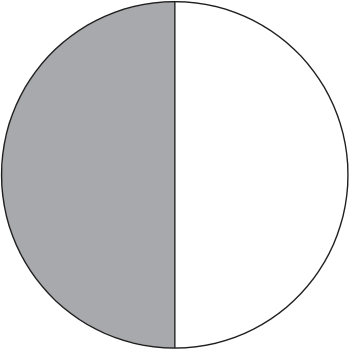
> **[Diagram Context - Textbook_Mathematics_Gr7_Represent-data.pdf-0013-05.png]**
> This graphic is a simple geometry figure consisting of a circle divided vertically into two equal halves, with the left half shaded grey and the right half unshaded (white). There are no visible labels, variables, symbols, or arrows present in this minimalist diagram. Conceptually, it provides a foundational visual model for teaching basic fractions, symmetry, or proportions in lower secondary mathematics.

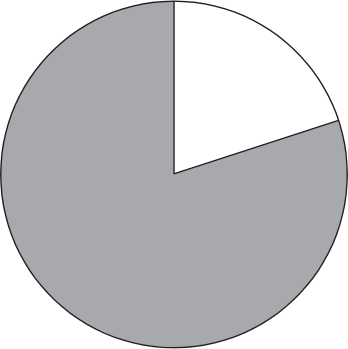
> **[Diagram Context - Textbook_Mathematics_Gr7_Represent-data.pdf-0013-09.png]**
> This graphic is a pie chart divided into two sectors, with no explicit text labels, variables, or axis names visible. It features a smaller white sector representing approximately 20% (or 72 degrees) and a larger grey sector occupying the remaining 80% (or 288 degrees) of the circular area. Conceptually, for a CAPS-aligned mathematics or data handling learner, this visual conveys proportional data distribution, helping students interpret relative fractions, percentages, or parts of a whole in statistical analysis.

> **[Diagram Context - Textbook_Mathematics_Gr7_Represent-data.pdf-0013-16.png]**
> The graphic displays a horizontal bar partitioned into three solid rectangular color blocks, transitioning from dark brown on the left to reddish-brown in the middle and mustard yellow on the right, with thin black outline lines and a diagonal pointer line extending from the upper right edge. There are no visible text labels, variables, biological structures, chemical symbols, or axis names present within the image. Conceptually, this abstract colour-band diagram serves as a simple visual aid for categorising distinct phases, zones, or data intervals in a CAPS curriculum topic.

---

## Lesson Revision Notes: Number Lines, Planet Distances, and Rounding Off

---

### 1. Representing Numbers on Number Lines (Activity 4)

To place numbers accurately on a number line, first determine the scale and interval values between the marked endpoints.

#### Instructions:
Copy the number lines below and place the given numbers as accurately as possible:

1. **(a) Numbers to place:** $185\,000$; $178\,000$; $170\,900$; $180\,500$
   * **Number line range:** $170\,000$ to $190\,000$

2. **(b) Numbers to place:** $1\,110\,000$; $1\,102\,900$; $1\,100\,500$; $1\,105\,050$
   * **Number line range:** $1\,100\,000$ to $1\,111\,000$

---

### 2. Working with Large Numbers and Data Tables

The table below shows the average distances of the planets from the sun, as well as their equatorial diameters. 

> **Note:** The distances from the sun are called *average distances* because planets do not maintain a fixed distance from the sun; their orbits are elliptical (not perfect circles).
> 
> **Key Conversion:** One million kilometres = $1\,000\,000\text{ km}$.

| Planet | Mercury | Venus | Earth | Mars | Jupiter | Saturn | Uranus | Neptune |
| :--- | :---: | :---: | :---: | :---: | :---: | :---: | :---: | :---: |
| **Distance from the sun** | $58\text{ million km}$ | $108\text{ million km}$ | $150\text{ million km}$ | $228\text{ million km}$ | $778\text{ million km}$ | $1\,427\text{ million km}$ | $2\,870\text{ million km}$ | $4\,497\text{ million km}$ |
| **Equatorial diameter** | $4\,880\text{ km}$ | $12\,102\text{ km}$ | $12\,756\text{ km}$ | $6\,794\text{ km}$ | $142\,800\text{ km}$ | $120\,000\text{ km}$ | $52\,400\text{ km}$ | $49\,500\text{ km}$ |

---

### 3. Practice Questions (Activities 5–7)

5. **Which planet is the second farthest planet from the sun?**
   * *Answer:* Looking at the distances from the sun, Neptune is the farthest ($4\,497\text{ million km}$) and Uranus is the second farthest ($2\,870\text{ million km}$).

6. **How does Mars' distance from the sun compare to that of Venus? Give two possible answers.**
   * *Answer:* 
     1. Mars is farther from the sun than Venus ($228\text{ million km}$ vs $108\text{ million km}$).
     2. Mars' distance is more than double Venus's distance from the sun ($228$ is greater than $2 \times 108 = 216$).

7. **Arrange the planets from the smallest to the biggest (by equatorial diameter).**
   * *Answer:* Compare the equatorial diameters from least to greatest:
     1. Mercury ($4\,880\text{ km}$)
     2. Mars ($6\,794\text{ km}$)
     3. Venus ($12\,102\text{ km}$)
     4. Earth ($12\,756\text{ km}$)
     5. Neptune ($4\,9\,500\text{ km}$)
     6. Uranus ($52\,400\text{ km}$)
     7. Saturn ($120\,000\text{ km}$)
     8. Jupiter ($142\,800\text{ km}$)

---

### 4. Concept: Rounding Off (Rounding)

In everyday life and mathematics, we often do not need exact numbers. 

* **Example 1:** A loaf of bread costing about $\text{R}10$ might actually cost $\text{R}8$ or $\text{R}12$, but it is close to $\text{R}10$.
* **Example 2:** Reporting that there were $15\,000$ spectators at a soccer game is an approximation (estimation), not an exact head-count.

This process of approximating a number to a convenient value of place value is called **rounding off** or **rounding**.

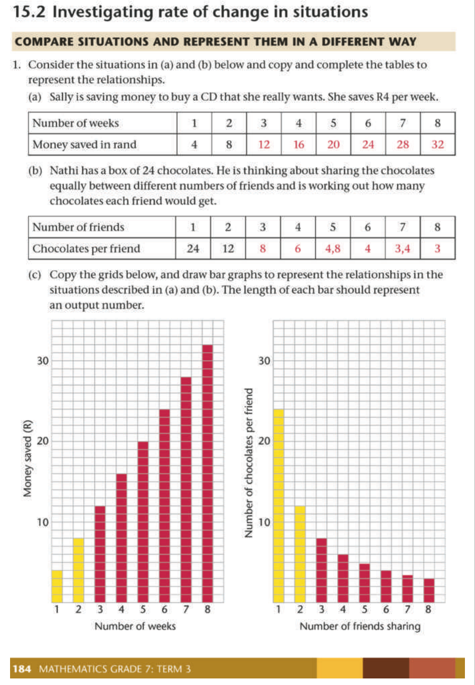
> **[Diagram Context - Textbook_Mathematics_Gr7_Graphs.pdf-0014-12.png]**
> The educational graphic contains two mathematical tables and two bar graphs comparing direct and indirect proportional relationships from a Grade 7 Mathematics CAPS curriculum textbook page. The visible labels include headings for "Number of weeks," "Money saved in rand," "Number of friends," and "Chocolates per friend," with corresponding numerical values and grid axes labeled "Money saved (R)" and "Number of chocolates per friend." Conceptually, this diagram helps learners investigate rates of change by demonstrating how to translate word problems into tables and visual bar graphs, highlighting the difference between constant growth (direct proportion) and decreasing values (inverse proportion).

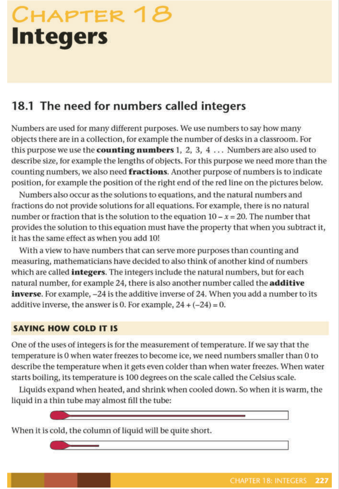
> **[Diagram Context - Textbook_Mathematics_Gr7_Integers.pdf-0014-23.png]**
> The educational graphic is a textbook page introduction titled "CHAPTER 18 Integers" with the section header "18.1 The need for numbers called integers." Visible text includes explanations of counting numbers, fractions, equations like $10 - x = 20$, additive inverses (such as $-24$ for $24$), and an introductory subsection titled "SAYING HOW COLD IT IS" accompanied by two horizontal tube diagrams representing warm and cold thermometer-like liquid columns. Conceptually, this diagram introduces CAPS mathematics learners to the necessity of integers beyond natural numbers and fractions by using practical contexts like temperature below zero and additive inverses where adding a number to its inverse yields zero.

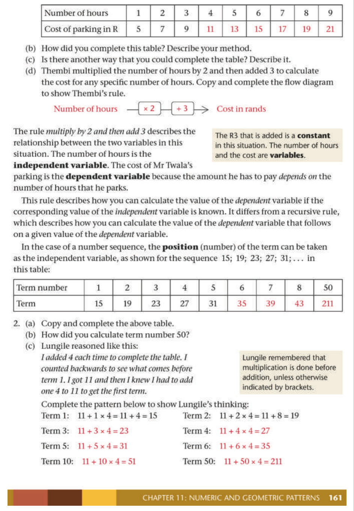
> **[Diagram Context - Textbook_Mathematics_Gr7_Numeric-and-geometric-patterns.pdf-0014-16.png]**
> The graphic is an educational worksheet containing tables, a flow diagram, algebraic rules, and number sequences related to functions and patterns. Visible elements include tables mapping "Number of hours" to "Cost of parking in R" and "Term number" to "Term", a flow diagram with operations ($\times 2$ and $+3$), arrows, and text explaining independent and dependent variables. Conceptually, it helps learners transition between tables, flow diagrams, and algebraic rules to identify constants and variables, bridging the gap between numeric patterns and linear functions.

---

# Rounding to 5s, 10s, 100s and 1 000s

## Rounding to the Nearest 5

To round off to the **nearest 5**, we round numbers that end in $1$ or $2$, or $6$ or $7$ **down** to the closest multiple of $5$. We round numbers that end in $3$ or $4$, or $8$ or $9$ **up** to the closest multiple of $5$.

**Worked Examples:**
* $233$ is rounded down to $230$.
* $234$ is rounded up to $235$.
* $237$ is rounded down to $235$.
* $238$ is rounded up to $240$.

### Exercise 1
Round the following numbers to the nearest $5$ by checking the **unit value**:
* (a) $612$
* (b) $87$
* (c) $454$
* (d) $1\ 328$

---

## Rounding to the Nearest 10

To round off to the **nearest 10**, we round numbers that end in $1$, $2$, $3$ or $4$ **down** to the closest multiple of $10$ (or decade). We round numbers that end in $5$, $6$, $7$, $8$ or $9$ **up** to the closest multiple of $10$.

**Worked Example:**
If you want to round off $534$ to the nearest $10$, you have to look at the units digit. The units digit is $4$ and it is closer to $0$ than to $10$. The rounded off number will be $530$.

### Exercise 2
Round the following numbers to the nearest $10$ by checking the **unit value**:
* (a) $12$
* (b) $87$
* (c) $454$
* (d) $1\ 325$

---

## Rounding to the Nearest 100

When **rounding to the nearest 100**, we look at the last **two digits** of the number. If the number is less than $50$ we **round down** to the lower $100$. If the number is $50$ or more we **round up** to the higher $100$.

### Exercise 3
Copy and complete the table:

| Number | Round to the nearest 5 | Round to the nearest 10 | Round to the nearest 100 |
| :---: | :---: | :---: | :---: |
| $681$ | | | |
| $5\ 639$ | | | |
| $5\ 361$ | | | |
| $12\ 458$ | | | |

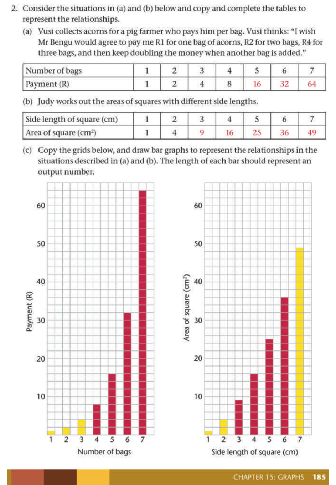
> **[Diagram Context - Textbook_Mathematics_Gr7_Graphs.pdf-0015-07.png]**
> This educational graphic consists of two tables and two bar graph grids comparing exponential growth versus quadratic growth in real-world contexts. Visible labels include "Number of bags," "Payment (R)," "Side length of square (cm)," and "Area of square (cm²)," alongside numerical axes and data bars. The diagram conceptually conveys how different mathematical relationships—specifically exponential doubling versus quadratic squaring—behave when represented numerically in tables and visually through bar graphs.

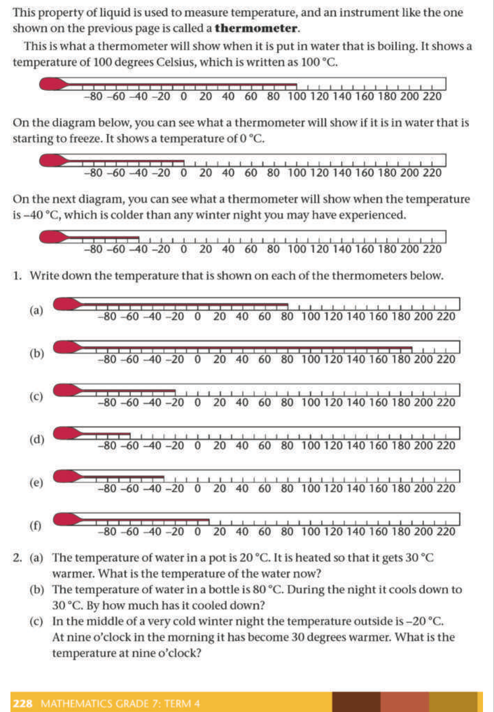
> **[Diagram Context - Textbook_Mathematics_Gr7_Integers.pdf-0015-17.png]**
> The educational graphic features multiple thermometer apparatus diagrams with numerical scales ranging from -80 to 220 degrees Celsius. Visible labels include numerical temperature intervals and units (°C), alongside worked examples and practice questions (a) through (f) for reading temperatures and calculating thermal changes. Conceptually, this diagram helps students master reading graduated scales, interpreting negative integers in real-world contexts, and calculating temperature increases and decreases aligned with intermediate phase mathematics.

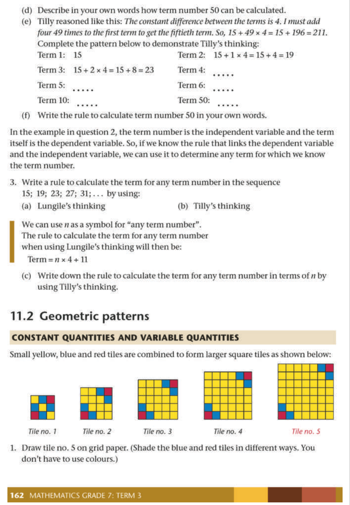
> **[Diagram Context - Textbook_Mathematics_Gr7_Numeric-and-geometric-patterns.pdf-0015-20.png]**
> This educational graphic displays a sequence of geometric patterns made of yellow, blue, and red tiles, labelled sequentially from "Tile no. 1" to "Tile no. 5". Visible text includes numbered questions (d), (e), (f), and (3) relating to mathematical problem-solving, along with section headers such as "11.2 Geometric patterns" and "CONSTANT QUANTITIES AND VARIABLE QUANTITIES". Conceptually, the graphic helps Grade 7 learners transition from arithmetic number sequences to visual geometric patterns, teaching them to identify independent and dependent variables, formulate algebraic rules, and analyze constant differences within spatial representations.

---

## Rounding Numbers

### Key Concepts & Rules

* **Rounding to the nearest $1\ 000$:**
  * Look at the **hundreds** digit.
  * If the hundreds value is less than $500$, round down (the thousands value stays the same).
  * If equal to $500$ or greater than $500$, round up.

* **Rounding to the nearest $10\ 000$:**
  * Look at the **thousands** digit.
  * If the thousands value is less than $5\ 000$, round down (the ten thousands value stays the same).
  * If equal to $5\ 000$ or greater than $5\ 000$, round up.

---

### Exercise 4: Rounding Table

Copy and then complete the table:

| Number | Round to the nearest $1\ 000$ | Round to the nearest $10\ 000$ |
| :--- | :--- | :--- |
| $142\ 389$ | | |
| $343\ 621$ | | |
| $356\ 552$ | | |
| $100\ 489$ | | |

---

## 1.3 Factors, prime numbers and common multiples

### Different Ways to Produce the Same Number

A number can be produced by multiplying different pairs of numbers together. For example, the number $80$ can be produced by:
* $4 \times 20 = 80$
* $5 \times 16 = 80$

---

### Exercises

1. In what other ways can $80$ be produced by multiplying two numbers?
   
   *(Note: The number $80$ can also be produced by multiplying $2$, $10$ and $4$, such as $2 \times 10 = 20$ and $20 \times 4 = 80$, or $10 \times 4 = 40$ and $40 \times 2 = 80$.)*
   
   *Using brackets:* We can use brackets to describe what calculation is done first. So instead of writing "$2 \times 10 = 20$ and $20 \times 4 = 80$", we may write $(2 \times 10) \times 4$. Instead of writing "$10 \times 4 = 40$ and $40 \times 2$", we may write $2 \times (10 \times 4)$.

2. Show how the number $80$ can be produced by multiplying four numbers. Describe how you do it in two ways: without using brackets and by using brackets.

3. Show three different ways in which the number $30$ can be produced by multiplying two numbers.

4. (a) Can the number $30$ be produced by multiplying three whole numbers? 
   (b) Which three whole numbers?

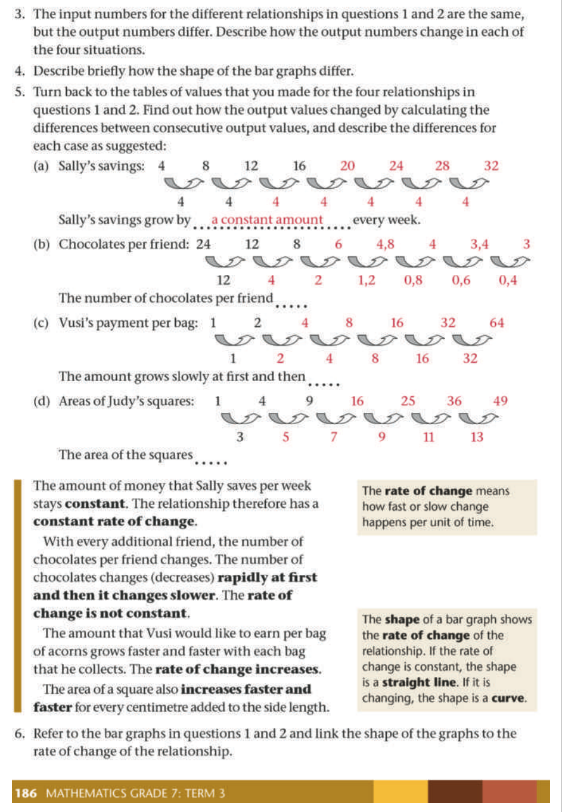
> **[Diagram Context - Textbook_Mathematics_Gr7_Graphs.pdf-0016-20.png]**
> This educational graphic is a Grade 7 Mathematics CAPS worksheet displaying four numerical sequences labeled (a) to (d) representing different functional relationships: Sally's savings, chocolates per friend, Vusi's payment per bag, and areas of Judy's squares. The visible text and annotations feature sequential numerical values connected by curved arrows representing differences between consecutive outputs, accompanied by explanatory text boxes defining "rate of change." Conceptually, the diagram helps students analyze numerical patterns and differences to distinguish between relationships with a constant rate of change and those with a changing rate of change.

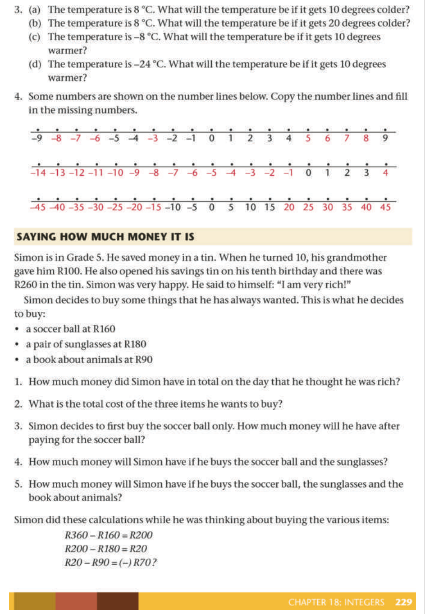
> **[Diagram Context - Textbook_Mathematics_Gr7_Integers.pdf-0016-27.png]**
> This educational resource is a textbook page featuring number lines and word problems involving integers and South African currency (Rand). Visible labels include negative and positive integers ranging from -45 to 45 on number lines, alongside text problems detailing financial transactions with items priced in rands (R90, R160, R180). Conceptually, the graphic supports intermediate phase CAPS mathematics learners in bridging the gap between abstract integer arithmetic and real-world contexts, specifically demonstrating how negative numbers arise in everyday scenarios like debt and calculating change.

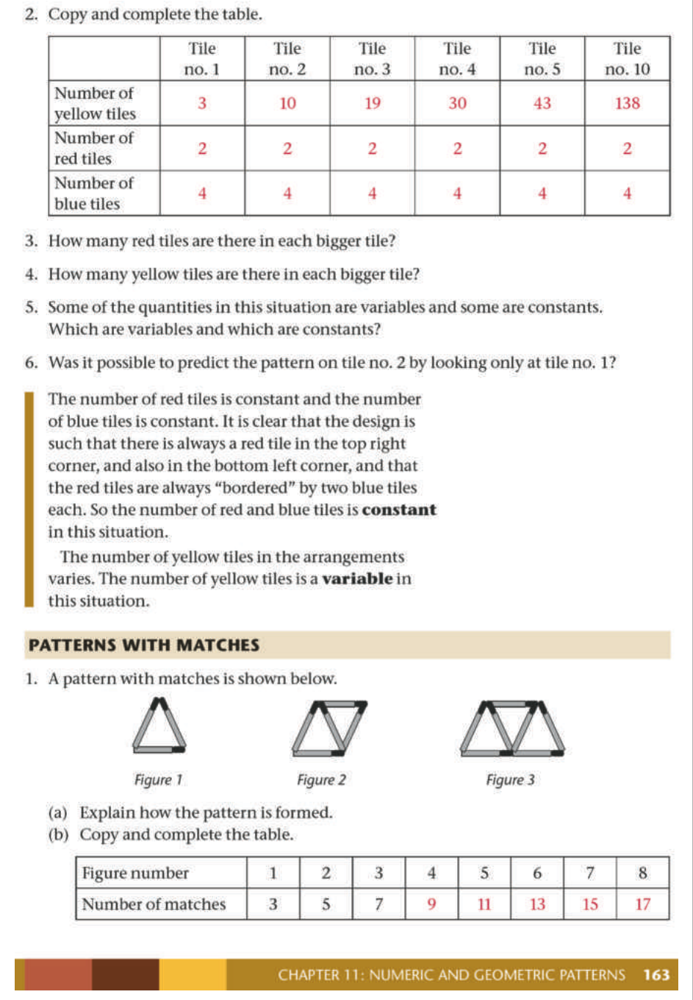
> **[Diagram Context - Textbook_Mathematics_Gr7_Numeric-and-geometric-patterns.pdf-0016-18.png]**
> The graphic is a textbook page featuring number and geometric pattern exercises involving tables and matchstick figures labeled "Figure 1," "Figure 2," and "Figure 3." It includes row and column labels such as "Tile no.," "Number of yellow tiles," "Number of red tiles," "Number of blue tiles," "Figure number," and "Number of matches," along with text prompts exploring constants and variables. Conceptually, this helps high school learners identify linear numeric patterns, distinguish between constants and variables, and translate visual geometric arrangements into tabular data to determine algebraic rules.

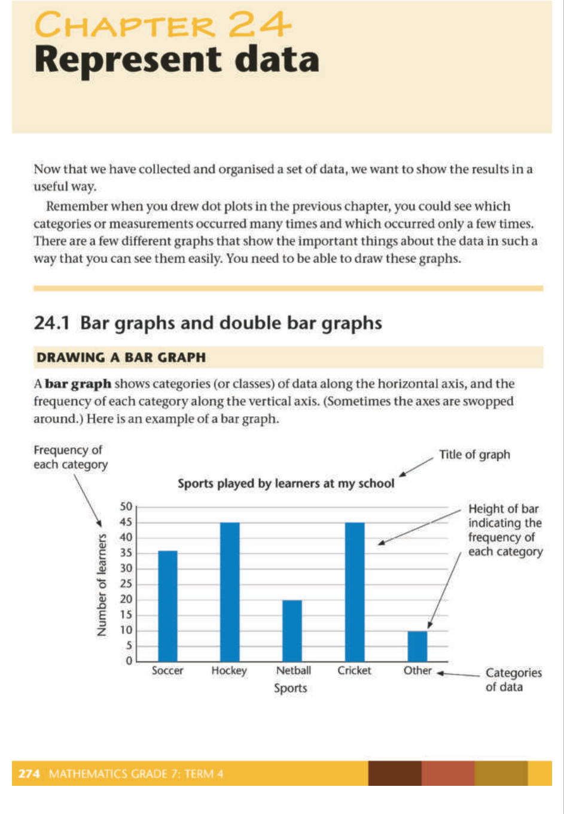
> **[Diagram Context - Textbook_Mathematics_Gr7_Represent-data.pdf-0016-21.png]**
> The graphic features an educational textbook page titled "Chapter 24 Represent data," which introduces bar graphs through a worked example. Visible labels include "Title of graph" ("Sports played by learners at my school"), "Categories of data" (Soccer, Hockey, Netball, Cricket, Other), "Number of learners" and "Frequency of each category" on the axes, and "Height of bar indicating the frequency of each category" pointing to the vertical blue bars. The diagram conceptually illustrates how to construct and read a bar graph by mapping categorical data onto the horizontal axis and discrete numerical frequencies onto the vertical axis.

---

## Revision Notes: Factors and Prime Numbers

### Core Concepts & Definitions

* **Factors:** The whole numbers that are multiplied together to form a number are called **factors** of that number. For example, $6$ and $8$ are factors of $48$ because:
  $$6 \times 8 = 48$$
  Similarly, $2$ and $24$ are factors of $48$ because $2 \times 24 = 48$, and $3$ and $16$ are factors because $3 \times 16 = 48$.
* **Product:** The result of multiplying numbers together. For example, $105$ can be expressed as the **product** $3 \times 5 \times 7$.
* **Repeated Factor:** When a factor is used more than once in the product forming a number, it is called a **repeated factor**. For example, the number $36$ can be formed by $2 \times 2 \times 3 \times 3$. Here, $2$ is used twice and $3$ is used twice, making them repeated factors of $36$.

---

### Exercises & Practice Activities

#### Question 5
Express each of the following numbers as a product of three numbers:
* (a) $248$
* (b) $375$

#### Question 6
Describe all the different ways in which $48$ can be expressed as a product of two factors.

#### Question 7
* (a) Express $48$ as a product of three factors.
* (b) Express $75$ as a product of three factors.

#### Question 8
* (a) Can $36$ be expressed as a product of three factors? How?
* (b) Can $36$ be expressed as a product of five factors? How?

#### Question 9
Express each of the following numbers as a product of as many factors as possible, including repeated factors. Do not use $1$ as a factor:
* (a) $300$
* (b) $310$
* (c) $320$
* (d) $330$
* (e) $340$
* (f) $350$

---

### Prime Numbers

#### Activity 1
Express each of the following numbers as a product of as many factors as possible, including repeated factors. Do not use $1$ as a factor:

* (a) $36$
* (b) $37$
* (c) $38$
* (d) $39$
* (e) $40$
* (f) $41$
* (g) $42$
* (h) $43$
* (i) $44$
* (j) $45$
* (k) $46$
* (l) $47$
* (m) $48$
* (n) $49$

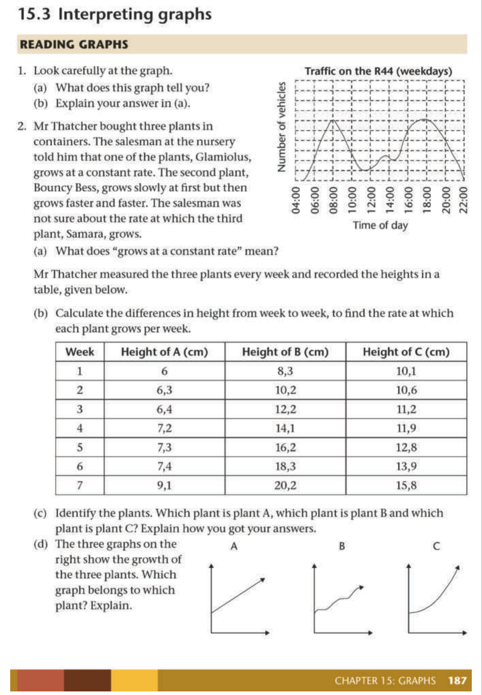
> **[Diagram Context - Textbook_Mathematics_Gr7_Graphs.pdf-0017-21.png]**
> This educational graphic features a line graph titled "Traffic on the R44 (weekdays)", a data table recording plant growth heights across seven weeks, and three smaller graphs labeled A, B, and C representing different growth rates. Visible labels include the axes "Number of vehicles" and "Time of day" with time intervals from 04:00 to 22:00, along with columns for "Week", "Height of A (cm)", "Height of B (cm)", and "Height of C (cm)". Conceptually, the graphic guides students in interpreting graphical data, calculating rates of change from numerical tables, and matching empirical data trends to linear and non-linear graphical representations.

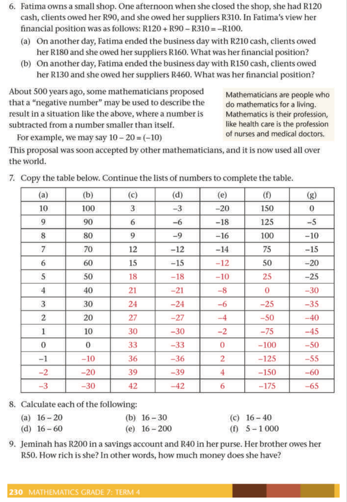
> **[Diagram Context - Textbook_Mathematics_Gr7_Integers.pdf-0017-17.png]**
> This educational graphic presents a South African Grade 7 Mathematics textbook page focusing on integers and financial contexts. The visual content features contextual word problems, historical text on negative numbers, a structured numerical table with columns labeled (a) to (g), and numerical calculation exercises. Conceptually, it conveys how negative numbers represent real-world financial situations, such as debt and net worth, while helping learners recognise number patterns and perform basic subtraction involving integers.

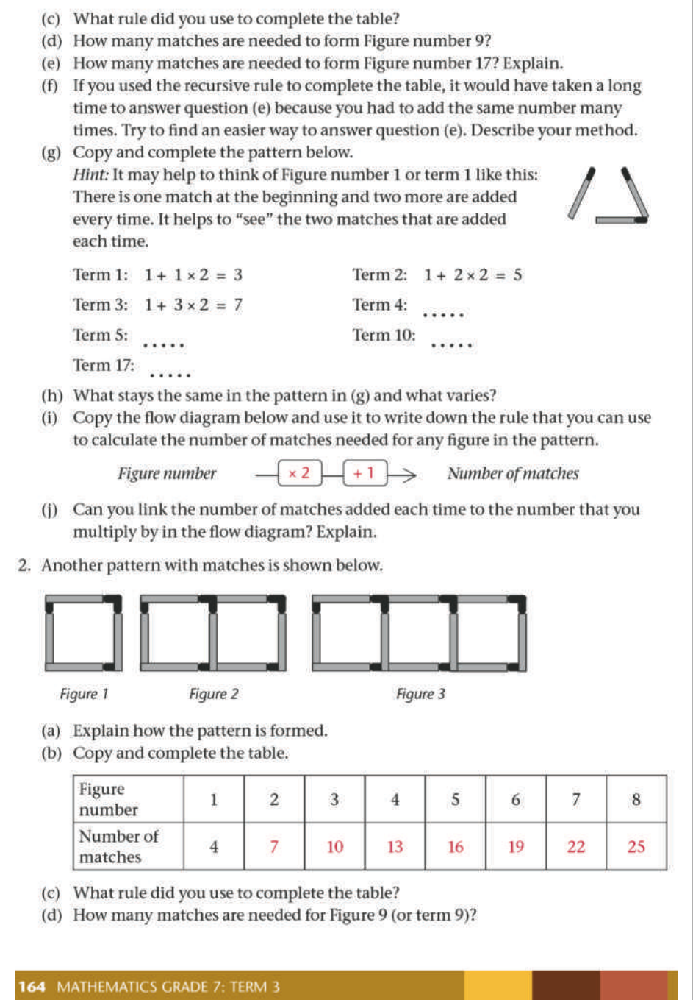
> **[Diagram Context - Textbook_Mathematics_Gr7_Numeric-and-geometric-patterns.pdf-0017-13.png]**
> The educational graphic is a Grade 7 Mathematics text and problem set focusing on number patterns and geometric sequences built with matches. Visible elements include structural drawings of matchstick figures (labeled Figure 1, Figure 2, and Figure 3), arithmetic term breakdowns (Term 1: 1 + 1 × 2 = 3), a flow diagram with operations ($\times 2$, $+1$), a data table mapping "Figure number" to "Number of matches," and alphabetical question prompts (c) through (j) and 2(a) through 2(d). Conceptually, the resource guides learners from concrete visual representations to numeric tables, flow diagrams, and general algebraic rules to understand how to determine terms and identify constants versus variables in linear patterns.

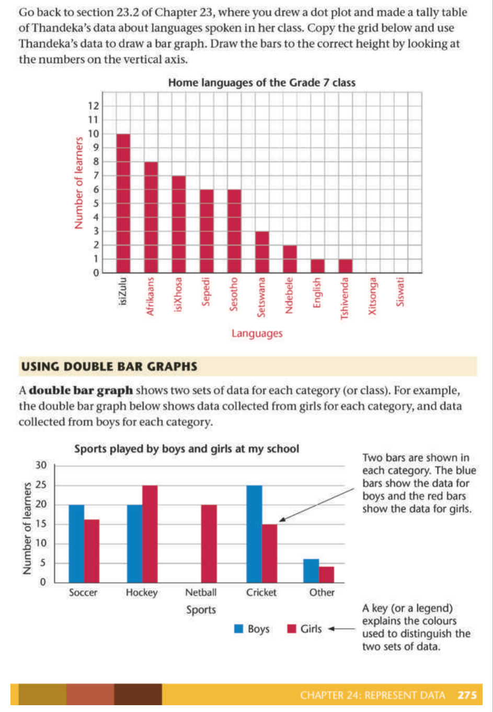
> **[Diagram Context - Textbook_Mathematics_Gr7_Represent-data.pdf-0017-22.png]**
> This educational graphic displays two types of statistical data representations: a single bar graph titled "Home languages of the Grade 7 class" and a double bar graph titled "Sports played by boys and girls at my school." The visible labels include axis names ("Number of learners" and "Languages"/"Sports"), categorical labels on the horizontal axes (such as languages like isiZulu, Afrikaans, and sports like Soccer, Hockey), numerical values on the vertical axes ranging from 0 to 30, and a key/legend distinguishing between "Boys" (blue bars) and "Girls" (red bars). Conceptually, the diagram demonstrates how to visually organize, construct, and interpret categorical data using single bars for frequency counts and double bars to compare two distinct sets of data within the same categories.

---

## Lesson Notes: Prime Numbers and Prime Factorisation

### 1. Core Concepts

*   **Prime Number:** A whole number greater than $1$ that cannot be expressed as a product of two whole numbers, except as the product $1 \times \text{the number itself}$. In other words, a prime number has exactly two distinct positive divisors: $1$ and the number itself.
*   **Prime Factorisation:** Expressing a composite number as the product of prime numbers.

---

### 2. Identifying Prime Numbers: The Sieve of Eratosthenes

Eratosthenes, an ancient Greek mathematician, designed an efficient algorithm called the **sieve of Eratosthenes** to find all prime numbers up to a given limit (e.g., up to $100$).

#### Procedure:
1. Cross out $1$ (since $1$ is neither prime nor composite).
2. Circle $2$, then cross out all remaining multiples of $2$ ($4, 6, 8, \dots$).
3. Circle the next available uncrossed number ($3$), then cross out all its remaining multiples.
4. Repeat this process for the next uncrossed numbers until all numbers up to $100$ are either circled (primes) or crossed out (composite).

| | | | | | | | | | |
|---|---|---|---|---|---|---|---|---|---|
| 1 | 2 | 3 | 4 | 5 | 6 | 7 | 8 | 9 | 10 |
| 11 | 12 | 13 | 14 | 15 | 16 | 17 | 18 | 19 | 20 |
| 21 | 22 | 23 | 24 | 25 | 26 | 27 | 28 | 29 | 30 |
| 31 | 32 | 33 | 34 | 35 | 36 | 37 | 38 | 39 | 40 |
| 41 | 42 | 43 | 44 | 45 | 46 | 47 | 48 | 49 | 50 |
| 51 | 52 | 53 | 54 | 55 | 56 | 57 | 58 | 59 | 60 |
| 61 | 62 | 63 | 64 | 65 | 66 | 67 | 68 | 69 | 70 |
| 71 | 72 | 73 | 74 | 75 | 76 | 77 | 78 | 79 | 80 |
| 81 | 82 | 83 | 84 | 85 | 86 | 87 | 88 | 89 | 90 |
| 91 | 92 | 93 | 94 | 95 | 96 | 97 | 98 | 99 | 100 |

---

### 3. Worked Examples and Activities

#### Activity 1: Identifying Prime Numbers
*   **Question:** Are $11$ and $17$ prime numbers?
*   **Solution:** 
    *   $11$ can only be expressed as $1 \times 11$. Therefore, **$11$ is a prime number**.
    *   $17$ can only be expressed as $1 \times 17$. Therefore, **$17$ is a prime number**.

#### Activity 2: Products of Three Prime Numbers
*   **(a) Smallest number with repeated prime factors allowed:**
    *   Using the smallest prime number ($2$) three times:
    *   $2 \times 2 \times 2 = 8$
*   **(b) Smallest number with NO repeated prime factors allowed:**
    *   Using the three smallest distinct prime numbers ($2, 3, \text{ and } 5$):
    *   $2 \times 3 \times 5 = 30$

#### Activity 3: Checking Prime Factorisation
*   **Question:** Manare stated that $840$ can be formed as the product of $2, 2, 2, 3, 5,$ and $7$. Check whether Manare is correct.
*   **Solution:**
    *   Multiply the factors step-by-step:
        $$\begin{align*}
        2 \times 2 &= 4 \\
        4 \times 2 &= 8 \\
        8 \times 3 &= 24 \\
        24 \times 5 &= 120 \\
        120 \times 7 &= 840
        \end{align*} $$
    *   Since all the factors ($2, 2, 2, 3, 5, 7$) are prime numbers and their product equals $840$, Manare **is correct**. Manare has **completely factorised** $840$ into its prime factors.

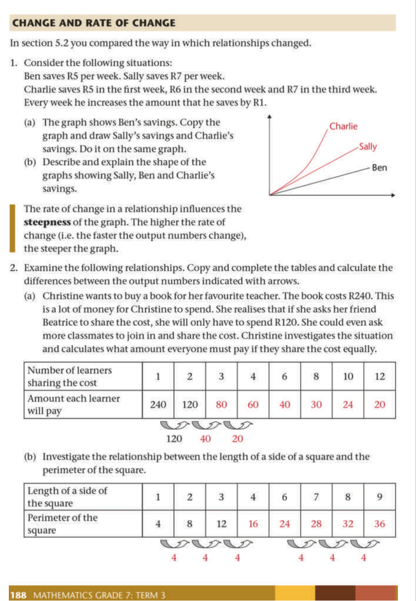
> **[Diagram Context - Textbook_Mathematics_Gr7_Graphs.pdf-0018-15.png]**
> This educational graphic is a Grade 7 Mathematics CAPS-aligned worksheet featuring a Cartesian graph and data tables. The visual elements include a coordinate system with linear and non-linear curves labeled "Ben", "Sally", and "Charlie", alongside structured tables tracking "Number of learners sharing the cost", "Amount each learner will pay", "Length of a side of the square", and "Perimeter of the square", complete with numerical values and difference arrows. Conceptually, it conveys how the rate of change influences the steepness of a graph, helping students distinguish between constant rates of change (linear relationships) and variable rates of change (non-linear relationships) using real-world contexts like savings and shared costs.

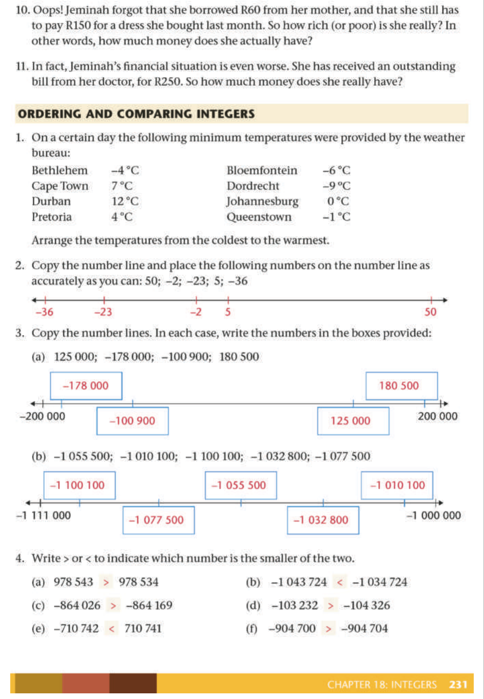
> **[Diagram Context - Textbook_Mathematics_Gr7_Integers.pdf-0018-25.png]**
> This educational graphic consists of mathematics exercises focused on ordering, comparing, and representing integers within a CAPS-aligned curriculum context. The visible elements include word problems involving monetary debt, lists of city temperatures (e.g., Bethlehem $-4^\circ\text{C}$, Durban $12^\circ\text{C}$), horizontal number lines with plotted points, and comparative inequality expressions (using $>$ and $<$ symbols) involving large positive and negative numbers. Conceptually, these exercises guide learners in visualizing the relative magnitude and direction of negative and positive numbers on a number line, reinforcing foundational skills in comparing and ordering integers.

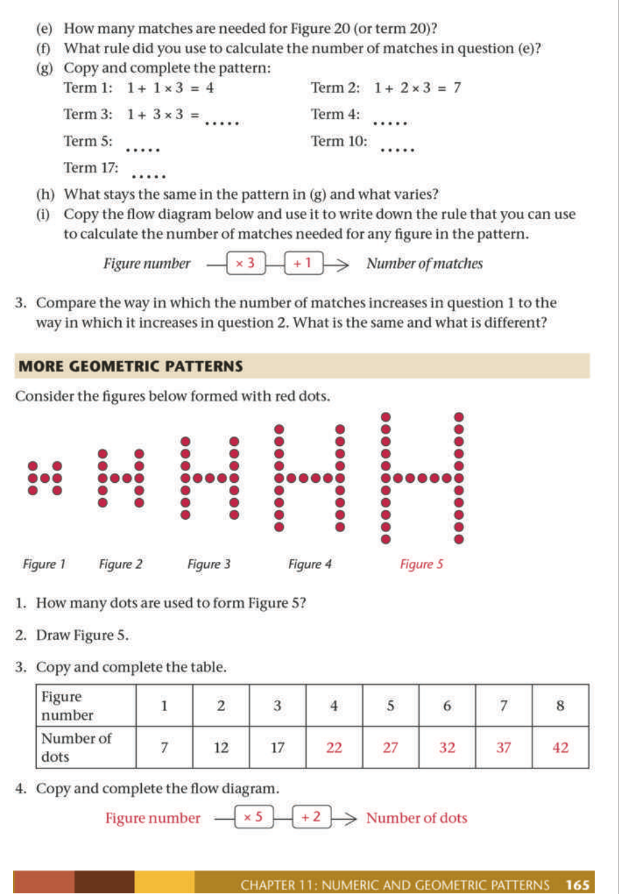
> **[Diagram Context - Textbook_Mathematics_Gr7_Numeric-and-geometric-patterns.pdf-0018-16.png]**
> This educational graphic presents a mathematics worksheet focused on numeric and geometric patterns, featuring text-based questions, arithmetic expressions, sequence tables, and a flow diagram with operations ($\times 3$, $+1$, $\times 5$, $+2$) linking "Figure number" to "Number of matches" or "Number of dots". It includes a visual sequence of five geometric figures made of red dots labeled "Figure 1" through "Figure 5" alongside a structured table tracking figure numbers from 1 to 8 against their corresponding dot totals (7, 12, 17, 22, 27, 32, 37, 42). Conceptually, this resource helps high school learners transition from visual geometric representations to algebraic thinking by identifying constant differences, completing number sequences, and formulating algebraic rules using flow diagrams.

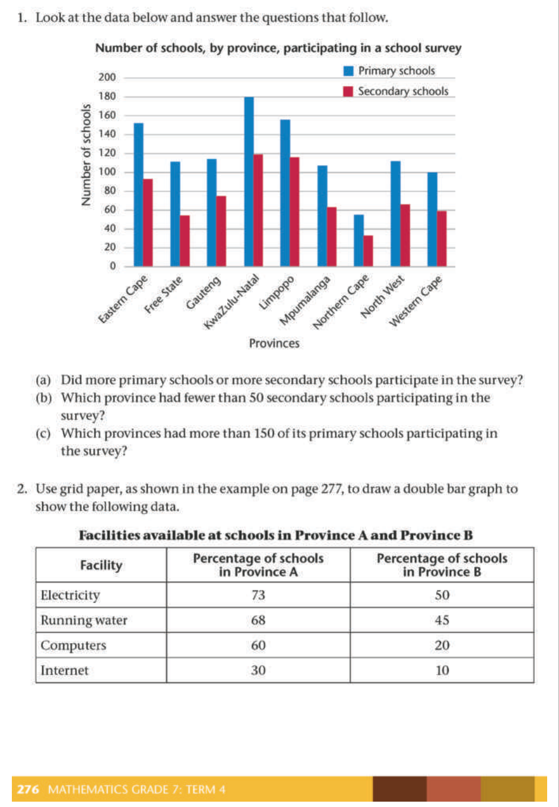
> **[Diagram Context - Textbook_Mathematics_Gr7_Represent-data.pdf-0018-05.png]**
> This educational graphic features a double bar graph displaying the number of primary and secondary schools participating in a survey across various South African provinces, alongside a data table for drawing a double bar graph. The visible labels include the title "Number of schools, by province, participating in a school survey," x-axis labels naming the nine provinces (Eastern Cape, Free State, Gauteng, KwaZulu-Natal, Limpopo, Mpumalanga, Northern Cape, North West, Western Cape), y-axis labeled "Number of schools" ranging from 0 to 200, and a legend distinguishing "Primary schools" (blue bars) from "Secondary schools" (red bars). Conceptually, the diagram helps students practice interpreting and extracting data from double bar graphs by comparing two sets of related data categories side-by-side, aligning with senior phase Mathematical Literacy and Mathematics data handling skills.

---

7. The prime factors of some numbers are given below. What are the numbers?
(a) 3, 5, 5 and 11
(b) 3, 3, 5 and 7
(c) 2, 7, 11 and 13

8. Investigate which of the following statements you agree with. Give reasons for your agreement or disagreement in each case.
(a) If a number is even, 2 is one of its prime factors.
(b) If half an even number is also even, 2 is a repeated prime factor.
(c) If a number is odd, 3 is one of its prime factors.
(d) If a number ends in 0 or 5, then 5 is one of its prime factors.

Here is a method to find the prime factors of a number:
If the number is even, divide it by 2. If the answer is even, divide by 2 again. Continue like this as long as it is possible. If the answer is odd, divide by 3, if it is possible. Continue to divide by 3 as long as it is possible. Then switch to 5. Continue like this by each time trying to divide by the next prime number.

9. Find all the prime factors of each of the following numbers. Write only your answers below.

(a) 588
(b) 825
(c) 729
(d) 999
(e) 538
(f) 113

10. Find at least three prime numbers between 800 and 850.

### Highest Common Factor and Lowest Common Multiple

1. (a) Factorise 195 and 385 completely.
(b) Is 7 a factor of both 195 and 385?
(c) Is 5 a factor of both 195 and 385?

When a number is a factor of two or more other numbers, it is called a **common factor** of the other numbers. For example, the number 5 is a common factor of 195 and 385.

The factors of a certain number are 2; 2; 5; 7; 7; 11 and 17. The factors of another number are 2; 3; 3; 7; 7; 11; 13 and 23. The common prime factors of these two numbers are 2; 7; 7 and 11.

The biggest number that is a factor of two or more numbers is called the **highest common factor (HCF)** of the numbers.

19  
CHAPTER 1: WORKING WITH WHOLE NUMBERS

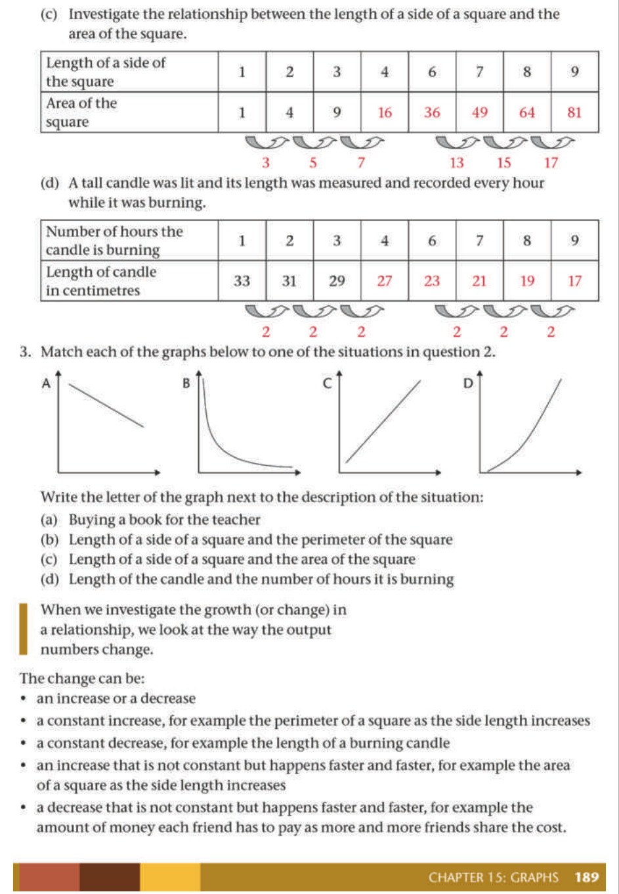
> **[Diagram Context - Textbook_Mathematics_Gr7_Graphs.pdf-0019-10.png]**
> This educational graphic features numerical data tables, matching algebraic graphs labeled A, B, C, and D, and corresponding word problems investigating functional relationships. Visible text includes table headings such as "Length of a side of the square," "Area of the square," "Number of hours the candle is burning," and "Length of candle in centimetres," alongside directional arrows and difference values. Conceptually, this helps learners interpret how different types of relationships—such as constant increases, constant decreases, and non-linear growth—are represented numerically in tables and visually through Cartesian graphs.

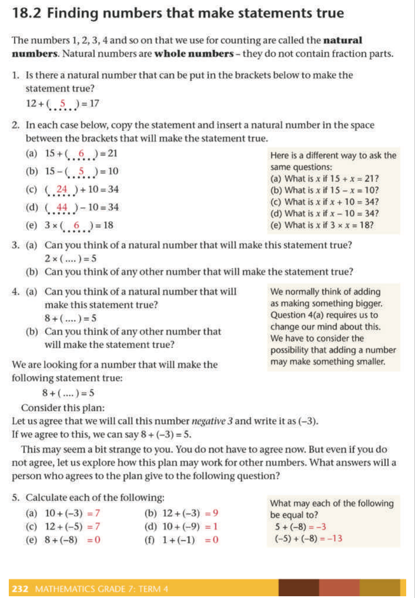
> **[Diagram Context - Textbook_Mathematics_Gr7_Integers.pdf-0019-23.png]**
> This educational graphic is a Grade 7 Mathematics textbook page from the CAPS curriculum titled "Finding numbers that make statements true." It features worked examples and exercises involving number sentences, brackets, and the introduction of negative numbers. Conceptually, it guides learners from using natural numbers in basic arithmetic equations to solving for unknown values (variables like $x$) and understanding the operations of adding negative integers.

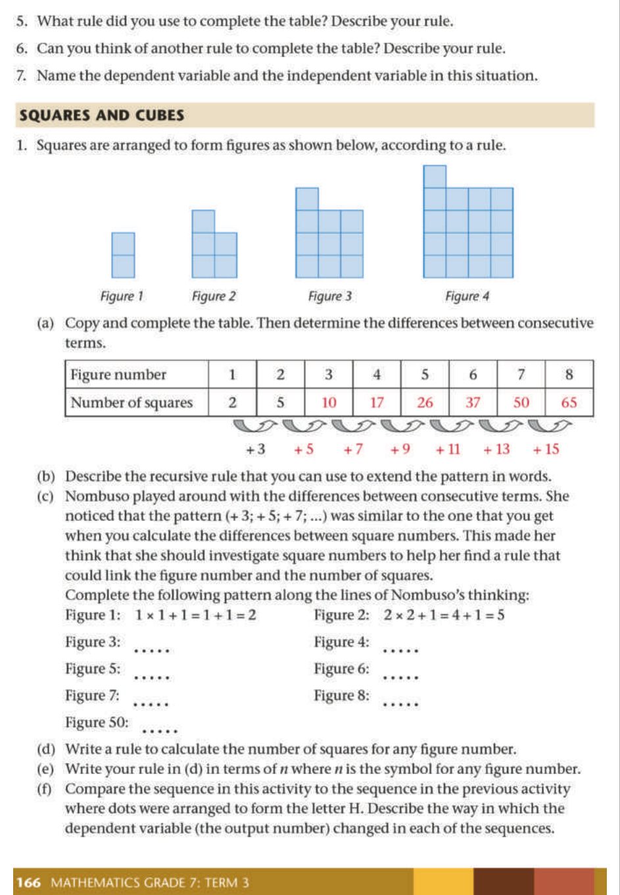
> **[Diagram Context - Textbook_Mathematics_Gr7_Numeric-and-geometric-patterns.pdf-0019-21.png]**
> The educational graphic displays a geometric number pattern exercise titled "Squares and Cubes," featuring visual representations labeled Figure 1 through Figure 4, accompanied by a completed data table, calculation rows, and related text questions. Visible labels include "Figure number," "Number of squares," and specific numerical values linked by curved red arrows indicating differences between consecutive terms such as "+3", "+5", "+7", up to "+15". This diagram conveys conceptually how to analyze visual sequences, determine recursive rules, and investigate the relationship between dependent and independent variables using square numbers as foundational tools in Grade 7 mathematics.

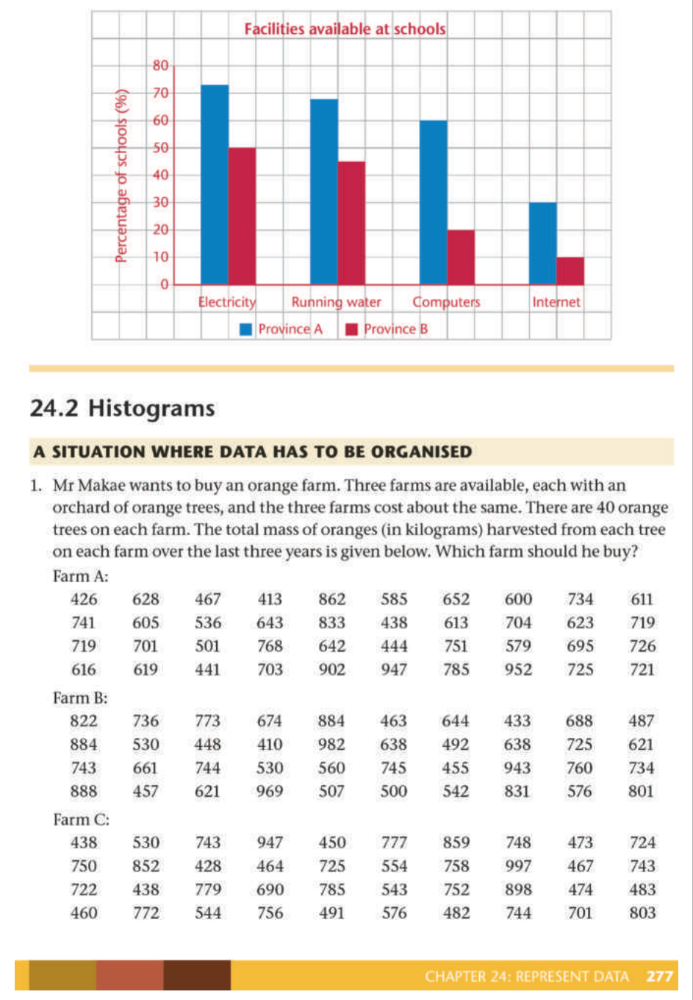
> **[Diagram Context - Textbook_Mathematics_Gr7_Represent-data.pdf-0019-20.png]**
> The educational graphic presents a double bar graph comparing school facilities and an unorganised numerical dataset representing orange harvest masses from three farms (Farm A, Farm B, and Farm C). Visible labels include axis titles like "Percentage of schools (%)", categories such as "Electricity", "Running water", "Computers", and "Internet", and a legend distinguishing "Province A" and "Province B". This content helps high school Mathematical Literacy learners understand how to organise raw numerical data, interpret comparative bar graphs, and analyse real-world situations to make informed decisions.

---

2. Find the HCF of the two numbers in each of the following cases. 

(a) $2 \times 2 \times 5 \times 7 \times 7 \times 11 \times 17$ and $2 \times 3 \times 3 \times 7 \times 7 \times 11 \times 13 \times 23$  
(b) 24 and 40  
(c) 8 and 12  
(d) 12 and 20  
(e) 210 and 56  

3. Write five different numbers, all different from 35, that have 35 as a highest common factor. 

4. Copy pattern A and pattern B. Write the next seven numbers in each pattern: 

* **A:** 12, 24, 36, 48, ...  
* **B:** 15, 30, 45, 60, ...  

The numbers in pattern A are called the multiples of 12. The numbers in pattern B are called the multiples of 15. The numbers, for example 60 and 120, that occur in both patterns, are called the common multiples of 12 and 15. The smallest of these numbers, namely 60, is called the lowest common multiple (LCM) of 12 and 15. 

5. Continue writing multiples of 18 and 24 until you find the LCM:  
* 18, 36, ...  
* 24, 48, ...  

6. Find the HCF and LCM of the given numbers in each case below: 

(a) 5 and 7  
(b) 15 and 14  
(c) 20 and 30  
(d) 10 and 100  
(e) 8 and 9  
(f) 25 and 24  
(g) 8 and 12  
(h) 10 and 18  

---

## 1.4 Properties of operations

### Order of operations and the associative property

Suppose you want to tell another person to do some calculations. You may do this by writing instructions. For example, you may write the instruction $200 - 130 - 30$. This may be called a numerical expression. 

Suppose you have given the instruction $200 - 130 - 30$ to two people, whom we will call Ben and Sara. 

* This is what Ben does: $200 - 130 = 70$ and $70 - 30 = 40$.  
* This is what Sara does: $130 - 30 = 100$ and $200 - 100 = 100$.  

To prevent such different interpretations or understandings of the same numerical expression, mathematicians have made the following agreement, and this is followed all over the world:

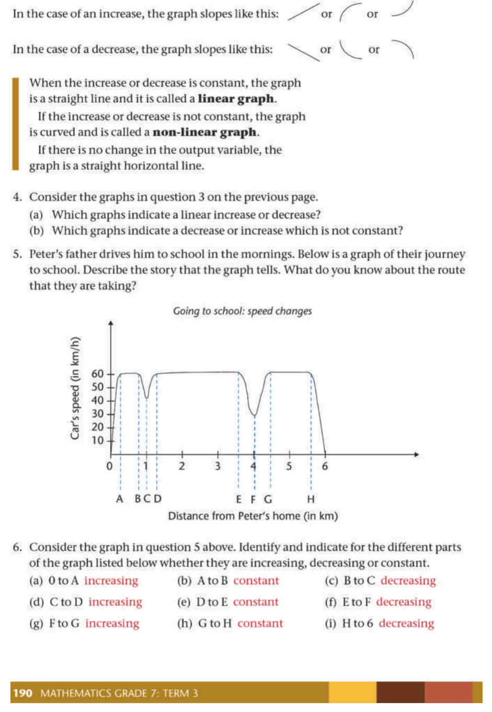
> **[Diagram Context - Textbook_Mathematics_Gr7_Graphs.pdf-0020-10.png]**
> This educational graphic presents a Cartesian line graph titled "Going to school: speed changes," with axes labeled "Car's speed (in km/h)" on the vertical y-axis and "Distance from Peter's home (in km)" on the horizontal x-axis, accompanied by text explanations defining linear and non-linear graphs. Visible labels on the axes include numerical intervals (0 to 60 for speed, 0 to 6 for distance) and alphabetical markers (A to H) indicating specific points along the journey. Conceptually, the graphic helps high school learners interpret the qualitative relationship between variables by translating a real-life scenario—a car journey—into graphical representations of increasing, decreasing, and constant motion.

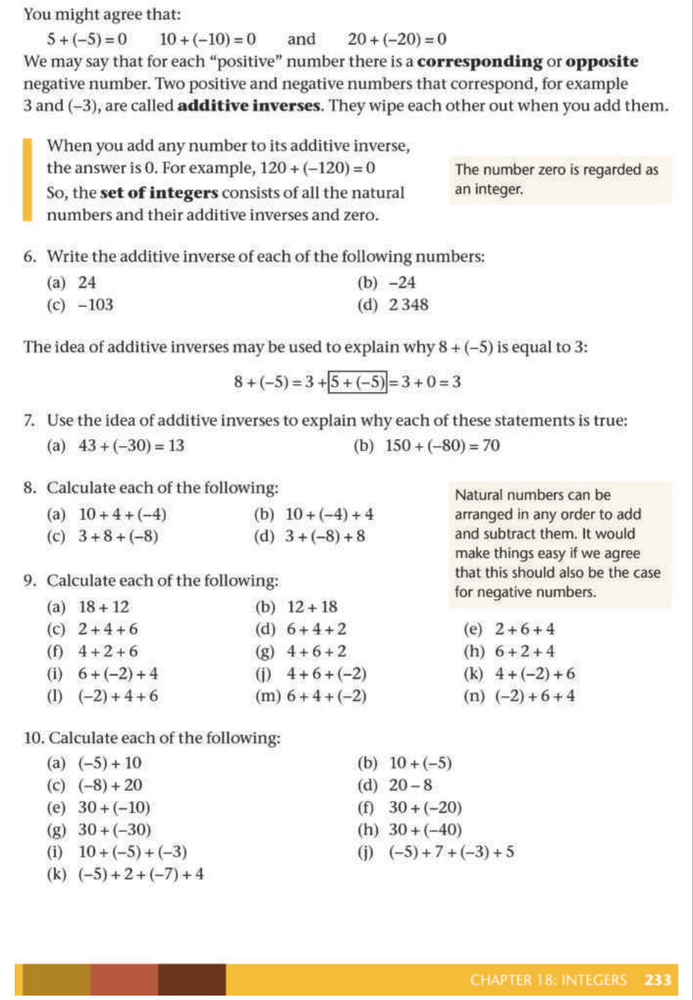
> **[Diagram Context - Textbook_Mathematics_Gr7_Integers.pdf-0020-10.png]**
> This graphic is a textbook page featuring a mathematical exercise set on integers, specifically focusing on additive inverses and calculations involving positive and negative numbers. Visible text elements include numbered questions (6 through 10) with sub-questions labeled (a) to (n), equations like $5 + (-5) = 0$, and explanatory sidebars defining the set of integers and commutative properties. Conceptually, it guides students through understanding that every positive number has a corresponding negative additive inverse that sums to zero, reinforcing foundational arithmetic rules for adding and subtracting integers in the Senior Phase curriculum.

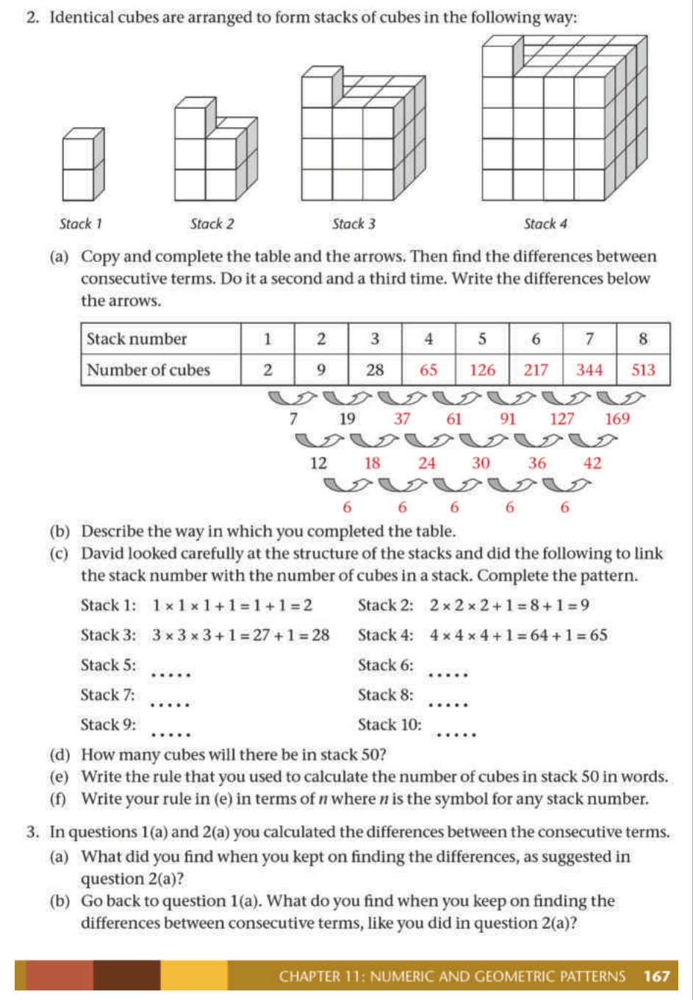
> **[Diagram Context - Textbook_Mathematics_Gr7_Numeric-and-geometric-patterns.pdf-0020-18.png]**
> This mathematics problem graphic features visual representations of identical cubes arranged into growing three-dimensional stacks labeled "Stack 1", "Stack 2", "Stack 3", and "Stack 4", alongside an incomplete table tracking stack numbers versus the number of cubes, accompanied by calculation arrows and algebraic problem prompts (a) through (f). Visible labels include "Stack number", "Number of cubes", numbers ranging from 1 to 513, and algebraic expressions involving multiplication and addition such as "1 x 1 x 1 + 1 = 2". The diagram conceptually conveys how to investigate numeric and geometric patterns by analyzing spatial arrangements, determining first and second differences, and formulating general algebraic rules in terms of $n$ for quadratic or cubic sequences in accordance with the CAPS curriculum.

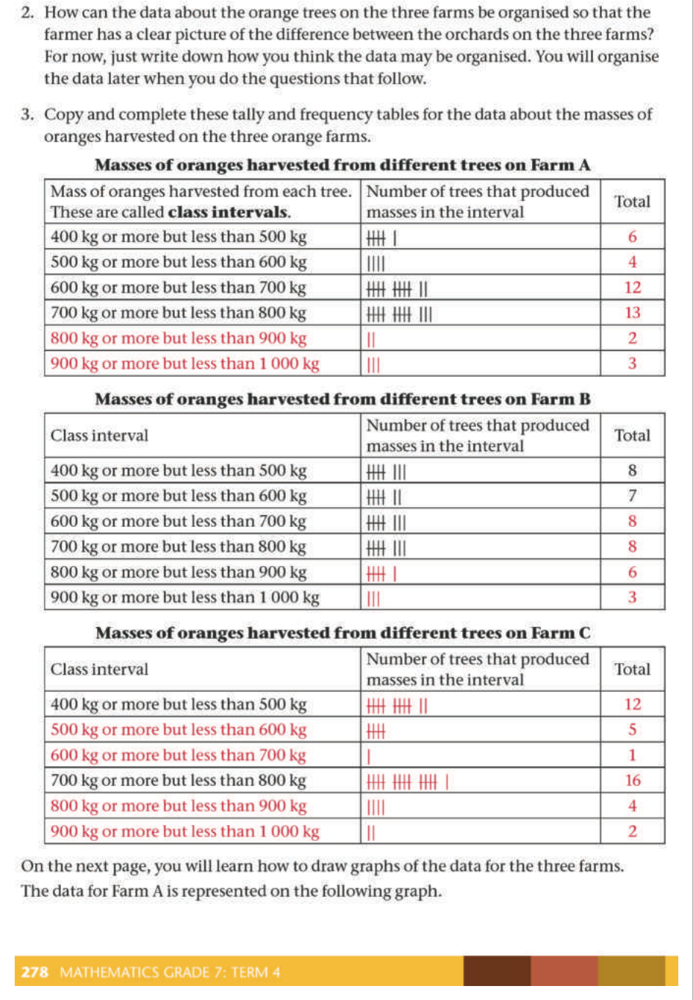
> **[Diagram Context - Textbook_Mathematics_Gr7_Represent-data.pdf-0020-02.png]**
> The educational graphic displays three frequency and tally tables representing the grouped data of masses of oranges harvested from different trees across three farms (Farm A, Farm B, and Farm C). Visible labels include "Mass of oranges harvested from each tree," "Class intervals," "Number of trees that produced masses in the interval," and "Total," alongside grouped class intervals such as "400 kg or more but less than 500 kg" and corresponding tally marks and numerical frequencies. This layout guides learners in organizing and interpreting grouped continuous data to compare distributions across different sets.

---

### Key Concepts & Definitions

* **Mathematical Convention:** An agreement on how to perform mathematical operations so that everyone gets the same answer.
* **Order of Operations (Addition & Subtraction):** In a numerical expression that involves **addition and subtraction only**, the operations should be performed **from left to right**, unless otherwise indicated in some way.
* **Associative Property of Addition:** When three or more numbers are added, the order in which you perform the calculations makes no difference. We also say that **addition is associative**.
* **Commutative Property of Addition and Multiplication:** Changing the order of the numbers does not change the result for addition and multiplication (e.g., $a + b = b + a$ and $a \times b = b \times a$).

---

### Exercises

#### Exercise Set 1: Mathematical Conventions (Addition and Subtraction)

1. Who followed this convention, Ben or Sara?

2. Follow the above convention and calculate each of the following:
   * (a) $8\ 000 + 6\ 000 - 3\ 000$
   * (b) $8\ 000 - 3\ 000 + 6\ 000$
   * (c) $8\ 000 + 3\ 000 - 6\ 000$

3. Follow the above convention and calculate each of the following:
   * (a) $\text{R}25\ 000 + \text{R}30\ 000 + \text{R}13\ 000 + \text{R}6\ 000$
   * (b) $\text{R}13\ 000 + \text{R}6\ 000 + \text{R}30\ 000 + \text{R}25\ 000$
   * (c) $\text{R}30\ 000 + \text{R}25\ 000 + \text{R}6\ 000 + \text{R}13\ 000$

> **Note:** In question 3, all your answers should be the same.

---

#### Exercise Set 2: Associativity and Smart Calculations

4. Investigate whether multiplication is associative. Use the numbers $2$, $3$, $5$ and $10$.

5. What must be added to each of the following numbers to get $100$?
   * $73$
   * $56$
   * $66$
   * $41$
   * $34$
   * $23$
   * $88$

6. Calculate each of the following. Note that you can make the work simple by being smart in deciding which additions to do first.
   * (a) $73 + 54 + 27 + 46 + 138$
   * (b) $34 + 88 + 41 + 66 + 59 + 12 + 127$

---

#### Exercise Set 3: The Commutative Property of Addition and Multiplication

1. Solve the following problems:
   * (a) What is the total cost of $20$ chairs at $\text{R}250$ each?
   * (b) What is the total cost of $250$ exercise books at $\text{R}20$ each?
   * (c) $\text{R}5\ 000$ was paid for $100$ towels. What is the price for one towel?
   * (d) $\text{R}100$ was paid for $5\ 000$ beads. What is the price for one bead?

2. Which of the following calculations will produce the same answer? Copy the calculations and mark those that will produce the same answers with a $\checkmark$ and those that won't with a $\mathbf{\times}$.
   * (a) $20 \times 250 \text{ and } 250 \times 20$
   * (b) $5\ 000 \div 100 \text{ and } 100 \div 5\ 000$
   * (c) $730 + 270 \text{ and } 270 + 730$
   * (d) $730 - 270 \text{ and } 270 - 730$

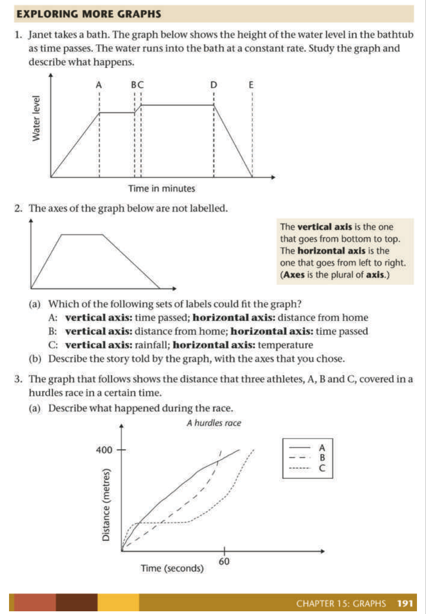
> **[Diagram Context - Textbook_Mathematics_Gr7_Graphs.pdf-0021-11.png]**
> This educational graphic features three distinct math problems centered on interpreting situational graphs with labeled axes including "Water level," "Time in minutes," "Distance (metres)," and lettered markers (A, B, C, D, E) corresponding to specific real-world events. For a high school student studying the CAPS curriculum, these graphs convey how to mathematically analyze, connect, and translate real-life scenarios—such as filling a bathtub or running a hurdles race—into functional relationships between dependent and independent variables.

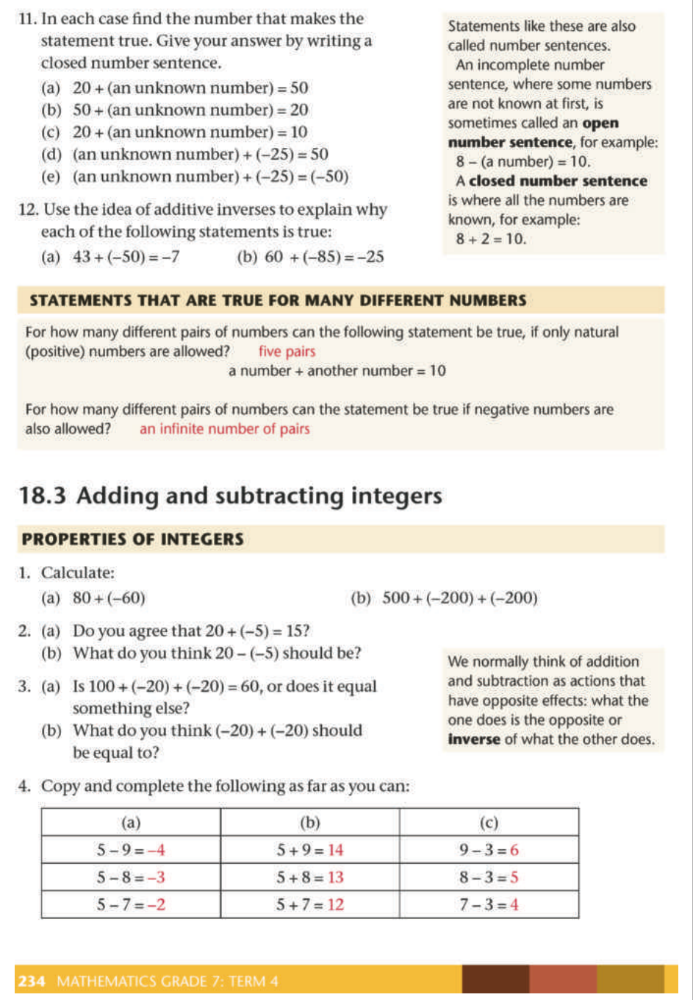
> **[Diagram Context - Textbook_Mathematics_Gr7_Integers.pdf-0021-23.png]**
> This educational graphic is a Mathematics textbook page focusing on integers, featuring worked exercises, definitions, and numerical tables. It includes text labels explaining open and closed number sentences, additive inverses, and algebraic expressions involving positive and negative numbers. Conceptually, it guides learners through adding and subtracting integers by demonstrating the properties of negative numbers, inverse operations, and patterns in arithmetic sequences.

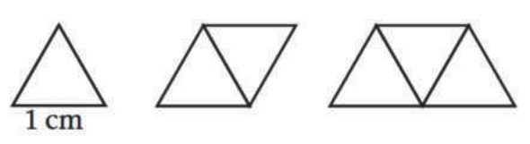
> **[Diagram Context - Textbook_Mathematics_Gr7_Numeric-and-geometric-patterns.pdf-0021-06.png]**
> This geometry figure illustrates a growing sequence of shapes composed of equilateral triangles, with the base of the first triangle labeled as $1\text{ cm}$. It displays three progressive stages: a single triangle, two joined triangles forming a parallelogram, and three joined triangles forming a trapezoid. This visual helps CAPS learners understand how to analyze numeric and geometric patterns by counting sides or perimeters as shapes are added sequentially.

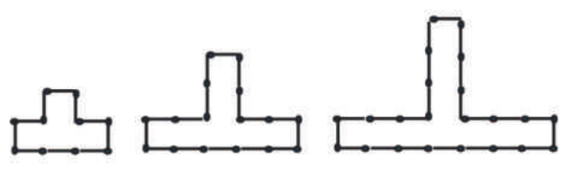
> **[Diagram Context - Textbook_Mathematics_Gr7_Numeric-and-geometric-patterns.pdf-0021-08.png]**
> The graphic displays a sequence of three geometric figures made of connected line segments marked with dots at regular intervals representing discrete units of length or perimeter. The visual elements include connected black line segments forming T-like shapes of increasing size, decorated with distinct circular dot markers along their perimeters. For a CAPS FET mathematics student, this diagram conveys the concept of number patterns and sequences, allowing learners to analyze how the perimeter or number of dots increases sequentially to derive an algebraic formula or term rule.

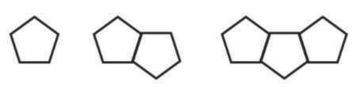
> **[Diagram Context - Textbook_Mathematics_Gr7_Numeric-and-geometric-patterns.pdf-0021-10.png]**
> This geometric illustration displays a sequence of connected regular pentagons, showing a single pentagon on the left, two fused pentagons in the middle, and three fused pentagons on the right. There are no explicit labels, letters, or mathematical variables present in the diagram. Conceptually, this figure is used in Grade 11 and 12 Mathematics and Mathematical Literacy to help learners visualize spatial patterns, perimeter reduction through edge sharing, and inductive reasoning for sequence generation.

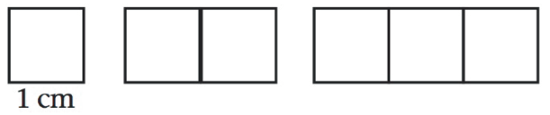
> **[Diagram Context - Textbook_Mathematics_Gr7_Numeric-and-geometric-patterns.pdf-0021-12.png]**
> The graphic consists of a geometry figure showing a sequence of adjacent squares, featuring one isolated square with a side length label of "1 cm", followed by a rectangle composed of two joined squares, and another composed of three joined squares. The visible labels and symbols include the measurement "1 cm" beneath the first square. Conceptually, this diagram visually conveys the generation of number patterns and the foundation of linear sequences for FET phase mathematics learners, demonstrating how adding a constant unit square increases the perimeter and area predictably.

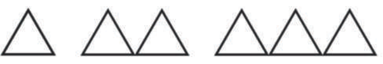
> **[Diagram Context - Textbook_Mathematics_Gr7_Numeric-and-geometric-patterns.pdf-0021-14.png]**
> The graphic is a geometric pattern sequence showing discrete groups of triangles increasing in number from left to right. It displays three separate groupings containing one, two, and three individual equilateral triangles respectively, with no added text labels or variables. Conceptually, this visual supports FET Mathematics CAPS learners in recognizing, extending, and formulating algebraic rules for number patterns and linear sequences.

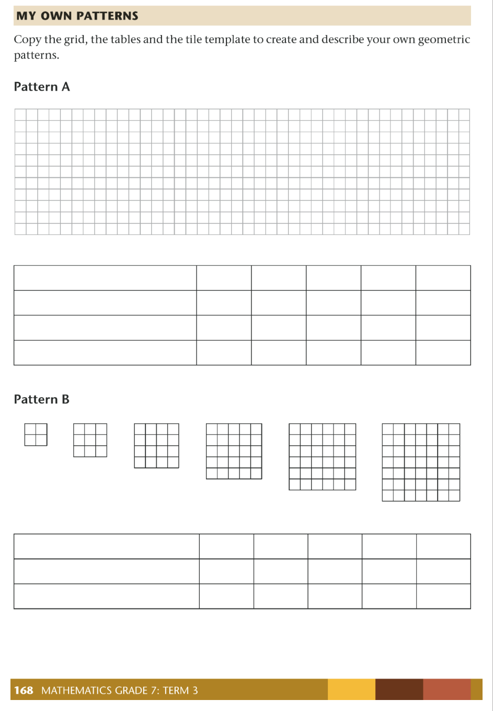
> **[Diagram Context - Textbook_Mathematics_Gr7_Numeric-and-geometric-patterns.pdf-0021-15.png]**
> This educational graphic is a geometry template for creating and analyzing geometric patterns, featuring blank square grids and corresponding data tables labeled "Pattern A" and "Pattern B". Visible elements include instructional text ("MY OWN PATTERNS", "Copy the grid, the tables and the tile template..."), multiple rows and columns in the blank tables, and a sequence of growing square grid diagrams for Pattern B. Conceptually, this worksheet helps students investigate numeric and geometric sequences by drawing their own visual patterns, organizing the data into tables, and bridging the gap between visual representations and algebraic thinking in the Senior Phase mathematics curriculum.

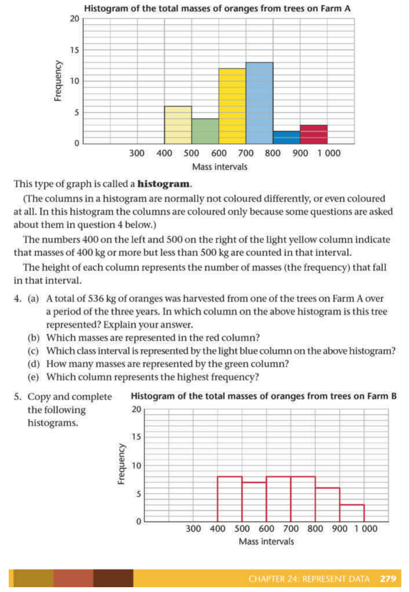
> **[Diagram Context - Textbook_Mathematics_Gr7_Represent-data.pdf-0021-19.png]**
> This educational graphic features two statistical histograms displaying the frequency distribution of total masses of oranges from trees on Farm A and Farm B, complete with labeled axes for "Frequency" and "Mass intervals" ranging from 300 to 1,000, along with accompanying data interpretation questions. The visible labels include numeric intervals on the horizontal axis, frequency values on the vertical axis, and title headings identifying the farms. Conceptually, this diagram helps high school learners understand how to construct, interpret, and extract data from grouped continuous data represented in rectangular bars where area and height correspond to frequency.

---

## Commutative Property of Numbers

The expression $25 + 75$ and $75 + 25$ yield the same answer. This property holds true for any two numbers. We say that **addition is commutative**; the numbers can be swapped around without changing the result.

### Activity

3. Demonstrate each of your answers with two different examples:
   (a) Is subtraction commutative?
   (b) Is multiplication commutative?
   (c) Is division commutative?

---

## Order of Operations and the Distributive Property

### Activity

1. Do the following:
   (a) Multiply $5$ by $3$, then add the answer to $20$.
   (b) Add $5$ to $20$, then multiply the answer by $5$.

---

### Core Convention: Order of Operations

Mathematicians have agreed that, **unless otherwise indicated, multiplication and division should be done before addition and subtraction.**

According to this convention, the expression:
$$20 + 5 \times 3$$
should be taken to mean "multiply $5$ by $3$, then add the answer to $20$" and not "add $5$ to $20$, then multiply the answer by $3$".

---

### Activity

2. Follow the above convention and calculate each of the following:
   (a) $500 + 20 \times 10$
   (b) $500 - 20 \times 10$
   (c) $500 + 20 - 10$
   (d) $500 - 20 + 10$
   (e) $500 + 200 \div 5$
   (f) $500 - 200 \div 5$

*Note: If some of your answers are the same, you have made mistakes.*

---

### Using Brackets in Numerical Expressions

The standard convention creates a notation challenge: how can one describe the calculations in question 1(b) using a numerical expression without using words?

To solve this problem, mathematicians agreed to use brackets in numerical expressions. **Brackets are used to specify that the operations within the brackets should be done first.** 

Hence, the numerical expression for 1(b) above is $(20 + 5) \times 5$, and the evaluated answer is $125$.

> **Summary of Rules:**
> - If there are **no brackets** in a numerical expression, **multiplication and division must be done first**, and **addition and subtraction only later**.
> - If you wish to specify that addition or subtraction should be done first, that part of the expression must be enclosed in **brackets**.

---

### Examples

* The expression $12 + 3 \times 5$ means "multiply $3$ by $5$, then add $12$". It **does not** mean "add $12$ and $3$, then multiply by $5$".
* If you wish to say "add $5$ and $12$, then multiply by $3$", the numerical expression should be $3 \times (5 + 12)$ or $(5 + 12) \times 3$. Both expressions mean the same thing.

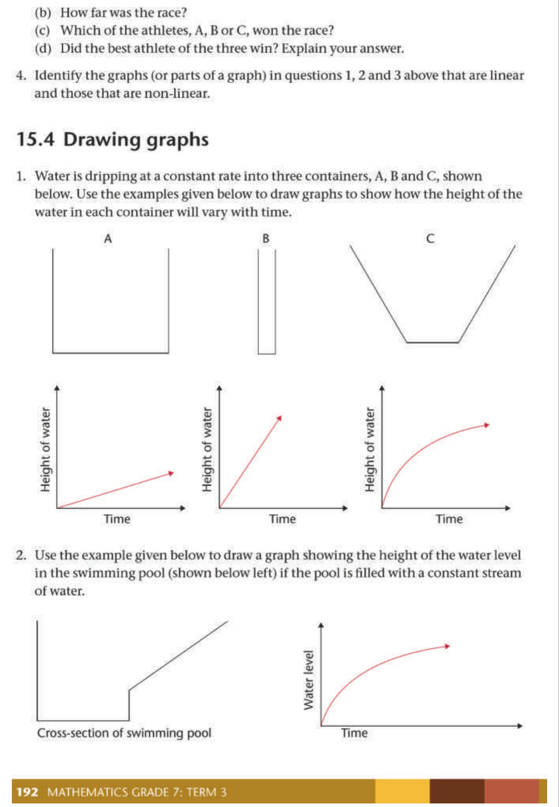
> **[Diagram Context - Textbook_Mathematics_Gr7_Graphs.pdf-0022-16.png]**
> This educational resource features mathematical graphs and container outlines labelled with variables such as "Height of water," "Water level," and "Time," alongside text prompts for Grade 7 Mathematics (Term 3). It illustrates the relationship between the physical shapes of different containers (A, B, C, and a swimming pool) and the corresponding linear or non-linear graphs representing water height over time. Conceptually, it teaches learners how changing container dimensions affect the rate of change, helping them interpret and draw functional relationships in a graphical format.

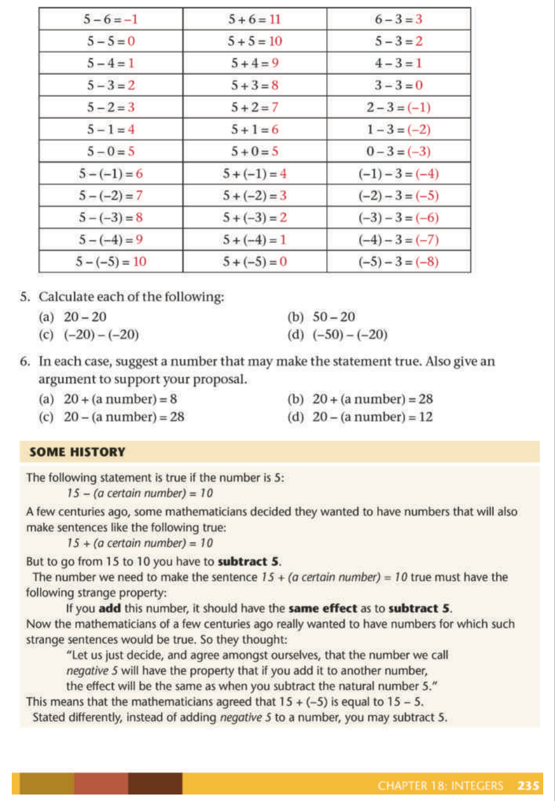
> **[Diagram Context - Textbook_Mathematics_Gr7_Integers.pdf-0022-24.png]**
> This educational graphic consists of a mathematical reference table displaying patterns involving integer arithmetic, followed by practice exercises (questions 5 and 6) and a historical context text box explaining the convention of negative numbers. The table displays equations involving numbers and their operations, such as $5 - 6 = -1$, $5 + (-1) = 4$, and $1 - 3 = (-2)$, while the text provides a historical narrative defining negative numbers as having the inverse effect of positive ones (e.g., $15 + (-5) = 15 - 5$). This resource conceptually guides CAPS FET Phase students to understand the rules and logic behind integer addition and subtraction through patterned observations and historical reasoning.

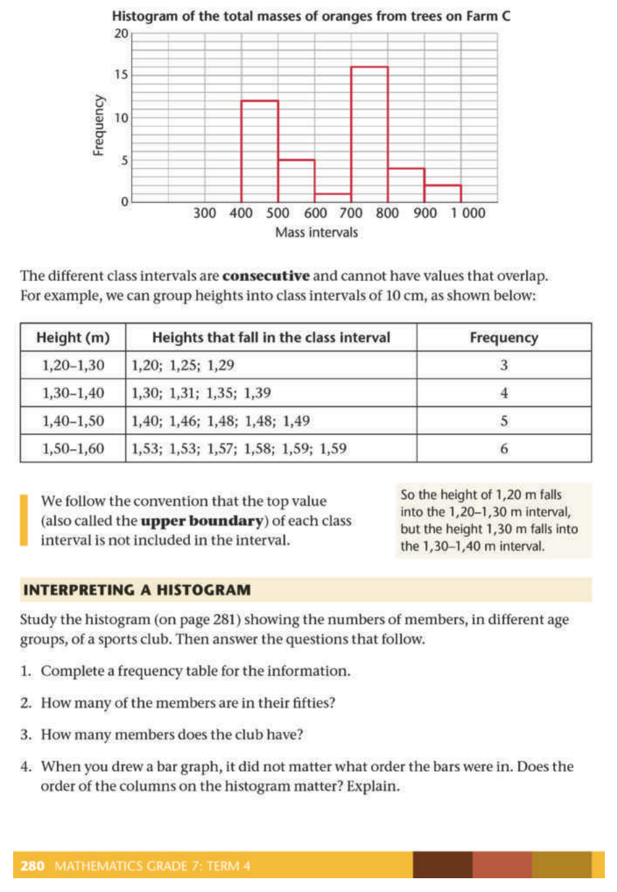
> **[Diagram Context - Textbook_Mathematics_Gr7_Represent-data.pdf-0022-17.png]**
> The educational graphic features a frequency histogram displaying the total masses of oranges from trees on Farm C, along with an explanatory data table for grouped data, consecutive class intervals, frequency values, and upper boundaries. Visible labels include the axes "Frequency" and "Mass intervals," numerical values ranging from 0 to 20 on the vertical axis and 300 to 1,000 on the horizontal axis, and headings such as "Height (m)," "Heights that fall in the class interval," and "Frequency." Conceptually, this visual helps high school learners understand how to organize continuous data into consecutive, non-overlapping class intervals and interpret histograms by reading frequencies and upper boundaries.

---

# Revision Notes: Working with Whole Numbers

## Numerical Expressions and Order of Operations

When calculating numerical expressions, always remember the standard mathematical conventions (Order of Operations / BODMAS/PEMDAS) where multiplication and division are performed before addition and subtraction, unless parentheses (brackets) dictate otherwise.

### Practice Exercises

#### 3. Calculate each of the following expressions:

| Expression | Calculation |
| :--- | :--- |
| (a) $500 + 30 \times 10$ | (b) $(500 + 30) \times 10$ |
| (c) $100 \times 500 + 30$ | (d) $100 \times (500 + 30)$ |
| (e) $500 - 30 \times 10$ | (f) $(500 - 30) \times 10$ |
| (g) $100 \times 500 - 30$ | (h) $100 \times (500 - 30)$ |
| (i) $(200 + 300) \div 20$ | (j) $200 \div 20 + 300 \div 20$ |
| (k) $600 \div (20 + 30)$ | (l) $600 \div 20 + 600 \div 30$ |

---

#### 4. Calculate the following:

| Expression | Calculation |
| :--- | :--- |
| (a) $50 \times (70 + 30)$ | (b) $50 \times 70 + 50 \times 30$ |
| (c) $50 \times (70 - 30)$ | (d) $50 \times 70 - 50 \times 30$ |

*Note:* Your answers for (a) and (b) should be the same. Your answers for (c) and (d) should also be the same. This demonstrates the distributive property of multiplication over addition and subtraction.

---

#### 5. Conceptual Analysis of Expressions

Do not do calculations A to I below yet. Just answer these questions about them first:

* **Expressions:**
  * A: $5 \times (200 + 3)$
  * B: $5 \times 200 + 3$
  * C: $5 \times 200 + 5 \times 3$
  * D: $5 + 200 \times 3$
  * E: $(5 + 200) \times 3$
  * F: $(200 + 3) \times 5$
  * G: $5 \times 203$
  * H: $5 \times 100 + 5 \times 103$
  * I: $5 \times 300 - 5 \times 70$

* **Questions:**
  * (a) Will A and B have the same answers?
  * (b) Will G and H have the same answers?
  * (c) Will A and D have the same answers?
  * (d) Will A and G have the same answers?
  * (e) Will A and F have the same answers?
  * (f) Will D and E have the same answers?

#### 6. Verification
Now, perform the calculations for expressions A to I to verify your predictions from question 5.

---

### Activity: Exploring Algebraic Properties with Numbers

#### 7. Step-by-Step Investigation
* (a) Choose three different numbers between 3 and 11, and write them down:
  * Your first number: $\underline{\hspace{1cm}}$
  * Your second number: $\underline{\hspace{1cm}}$
  * Your third number: $\underline{\hspace{1cm}}$

* (b) Add your first number to your third number. Multiply the answer by your second number.
* (c) Multiply your first number by your second number. Also multiply your third number by your second number. Add the two answers together.
* (d) Compare your results from (b) and (c). Do you think you will get the same result with numbers between 10 and 100, or any other numbers?

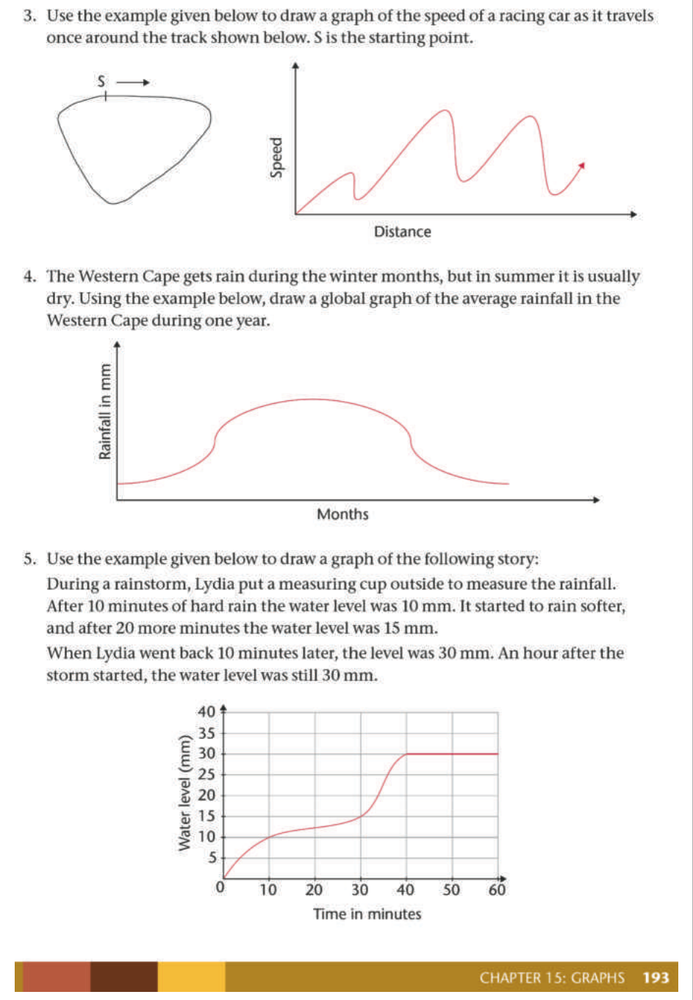
> **[Diagram Context - Textbook_Mathematics_Gr7_Graphs.pdf-0023-07.png]**
> This educational graphic features three contextualized graphs representing real-world scenarios: a speed-distance curve for a racing car on a track with starting point S, a rainfall-months seasonal curve, and a grid-based water level versus time graph depicting a rainstorm story with axes labelled "Water level (mm)" and "Time in minutes". For CAPS learners, these examples convey how to interpret and construct qualitative and quantitative graphs by translating contextual narratives and physical situations into visual mathematical relationships.

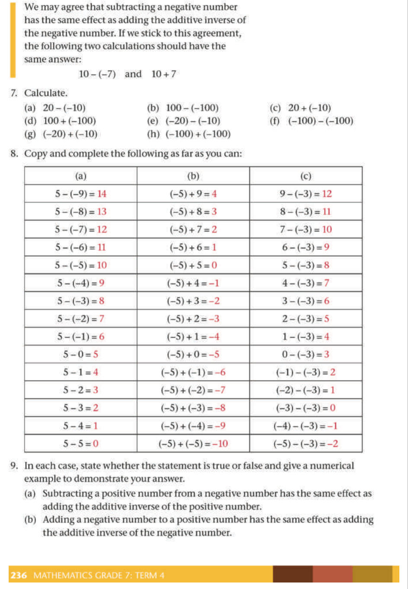
> **[Diagram Context - Textbook_Mathematics_Gr7_Integers.pdf-0023-15.png]**
> This Mathematics Grade 7 textbook page features worked examples, calculation exercises, a table of patterns involving negative numbers, and conceptual true-or-false questions. Visible labels include numbered questions (7, 8, 9), lowercase alphabet sub-identifiers ((a) through (h)), equation columns (a, b, c), and a footer reading "236 MATHEMATICS GRADE 7: TERM 4". It conceptually guides learners to discover and apply the rules for adding and subtracting integers by demonstrating that subtracting a negative number is equivalent to adding its additive inverse.

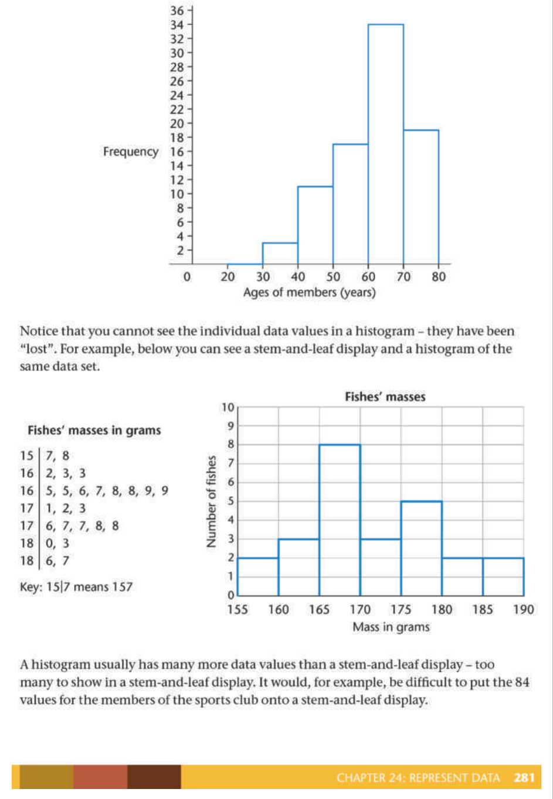
> **[Diagram Context - Textbook_Mathematics_Gr7_Represent-data.pdf-0023-02.png]**
> This educational graphic features two statistical graphs, specifically histograms and a stem-and-leaf display, accompanied by explanatory text. The visual elements include labeled axes such as "Frequency", "Ages of members (years)", "Number of fishes", and "Mass in grams", along with numerical data values and a key. Conceptually, it demonstrates how continuous data is grouped into intervals to represent frequency distributions while illustrating that individual data points are lost in histograms compared to stem-and-leaf displays.

---

The fact that your answers for calculations like those in 7(b) and 7(c) are equal, for any numbers that you may choose, is called the **distributive property of multiplication over addition**. 

It may be described as follows: 
$$\text{first number} \times \text{second number} + \text{first number} \times \text{third number} = \text{first number} \times (\text{second number} + \text{third number})$$

This can be described by saying that multiplication distributes over addition. 

8. Check whether the distributive property is true for the following sets of numbers: 
   (a) $100$, $50$ and $10$ 
   (b) any three numbers of your own choice (you may use a calculator to do this) 

9. Use the numbers in question 8(a) to investigate whether multiplication also distributes over subtraction. 

It is quite fortunate that multiplication distributes over addition, because it makes it easier to multiply. 

For example, $8 \times 238$ can be calculated by calculating $8 \times 200$, $8 \times 30$ and $8 \times 8$, and adding the answers: 
$$8 \times 238 = 8 \times 200 + 8 \times 30 + 8 \times 8 = 1\,600 + 240 + 64 = 1\,904$$

10. Check whether $8 \times 238$ is actually $1\,904$ by calculating $238 + 238 + 238 + 238 + 238 + 238 + 238 + 238$, or by using a calculator. 

---

## 1.5 Basic operations

### A method of addition

To add two numbers, the one may be written below the other. 

For example, to calculate $378\,539 + 46\,285$ the one number may be written below the other so that the units are below the units, the tens below the tens, and so on. 

Writing the numbers like this has the advantage that:
* the units parts ($9$ and $5$) of the two numbers are now in the same column,
* the tens parts ($30$ and $80$) are in the same column,
* the hundreds parts ($500$ and $200$) are in the same column, and so on.

This makes it possible to work with each kind of part separately.

$$\begin{array}{r}
378\,539 \\
+ \quad 46\,285 \\
\hline
\end{array}$$

| We only write this: | In your mind you can see this: |
| :--- | :--- |
| $\begin{array}{r}378\,539 \\ + \quad 46\,285\end{array}$ | $\begin{array}{r@{\quad}l} 300\,000 \\ 70\,000 \\ 8\,000 \\ 500 \\ 30 \\ 9 \\ 40\,000 \\ 6\,000 \\ 200 \\ 80 \\ 5 \end{array}$ |

---

24 MATHEMATICS GRADE 7: TERM 1

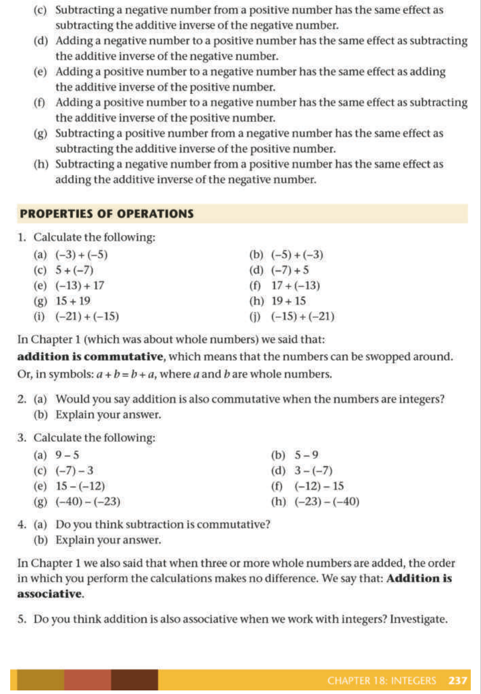
> **[Diagram Context - Textbook_Mathematics_Gr7_Integers.pdf-0024-22.png]**
> This is a mathematics worksheet page titled "Properties of Operations" from Chapter 18: Integers, featuring numbered questions (1 to 5) with alphabetical sub-items containing integer arithmetic expressions like $(-3)+(-5)$, $5+(-7)$, and $a+b=b+a$. It conveys conceptual understanding of the commutative property of addition and the rules for adding and subtracting signed integers in the Senior Phase curriculum.

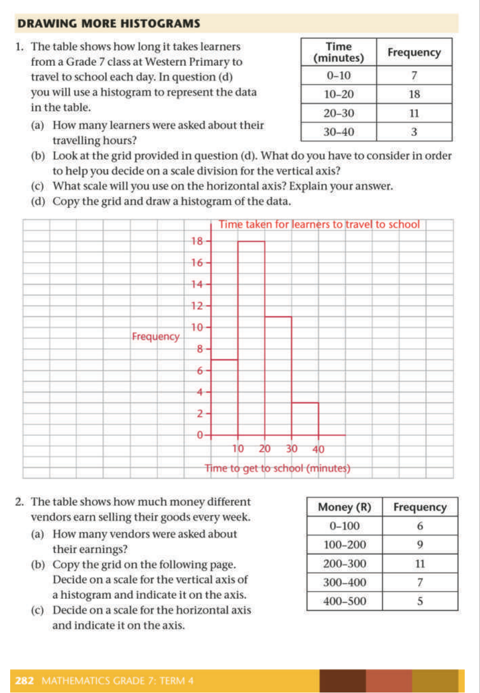
> **[Diagram Context - Textbook_Mathematics_Gr7_Represent-data.pdf-0024-16.png]**
> The graphic is a data handling worksheet featuring a frequency table and a corresponding histogram plotted on a Cartesian grid. Visible labels and values include the horizontal axis labeled "Time to get to school (minutes)" with class intervals (0-10, 10-20, 20-30, 30-40), the vertical axis labeled "Frequency" with numerical increments, and a title reading "Time taken for learners to travel to school". This diagram demonstrates how to graphically represent continuous grouped data using contiguous rectangular bars where the area or height represents frequency, reinforcing data interpretation and graph-drawing skills in statistics.

---

## CHAPTER 1: WORKING WITH WHOLE NUMBERS

### Adding Large Numbers by Column Expansion

The numbers in each column can be added to get a new set of numbers:

| $378\ 539$ | $300\ 000$ | $70\ 000$ | $8\ 000$ | $500$ | $30$ | $9$ |
| :--- | :--- | :--- | :--- | :--- | :--- | :--- |
| $+ 46\ 285$ | | $40\ 000$ | $6\ 000$ | $200$ | $80$ | $5$ |
| $14$ | | | | | | $14$ |
| $110$ | | | | | $110$ | |
| $700$ | | | | $700$ | | |
| $14\ 000$ | | | $14\ 000$ | | | |
| $110\ 000$ | | $110\ 000$ | | | | |
| $300\ 000$ | $300\ 000$ | | | | | |
| $424\ 824$ | It is easy to add the new set of numbers to get the answer. |

> **Note:** You can do the above steps in any order. Instead of starting with the units parts as shown above, you can start with the hundred thousands, or any other parts.

Starting with the units parts has an advantage though as it makes it possible to do more of the work mentally and to write less, as shown below:

$$
\begin{array}{r@{\quad}l}
  378\ 539 & \text{To achieve this, only the units digit } 4 \text{ of the } 14 \text{ is written in} \\
+ 46\ 285 & \text{the first step. The } 10 \text{ of the } 14 \text{ is remembered and added to} \\
\hline
  424\ 824 & \text{the } 30 \text{ and } 80 \text{ of the tens column, to get } 120\text{.}
\end{array}
$$

We say the $10$ is **carried** from the units column to the tens column. The same is done when the tens parts are added to get $120$: only the digit "2" is written (in the tens column, so it means $20$), and the $100$ is carried to the next step.

---

### Exercises

1. Calculate each of the following:
   * (a) $237\ 847 + 87\ 776$
   * (b) $567\ 298 + 392\ 076$
   * (c) $28\ 387 + 365\ 667$

---

### Application Problem: Municipal Budget

A municipal manager is working on the municipal budget for a year. He has to try to keep the total expenditure on new office equipment below $\text{R}800\ 000$. He still has to budget for new computers that are badly needed, but this is what he has written so far:

| Item Description | Cost |
| :--- | :--- |
| $74$ new office chairs | $\text{R } 54\ 020$ |
| $42$ new computer screens | $\text{R } 100\ 800$ |
| $12$ new printers | $\text{R } 141\ 600$ |
| $18$ new tea trolleys | $\text{R } 25\ 740$ |
| $8$ new carpets for senior staff offices | $\text{R } 144\ 000$ |
| $108$ small plastic filing cabinets | $\text{R } 52\ 380$ |
| new table for the boardroom | $\text{R } 48\ 000$ |
| $18$ new chairs for the boardroom | $\text{R } 41\ 400$ |
| **Total** | **R $\rule{2cm}{0.4pt}$** |

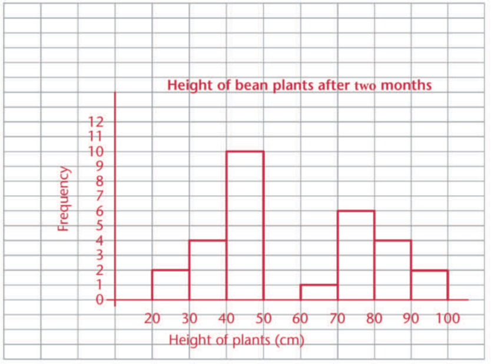
> **[Diagram Context - Textbook_Mathematics_Gr7_Represent-data.pdf-0025-06.png]**
> This graphic is a bar graph titled "Height of bean plants after two months", set against a grid background. The vertical axis is labeled "Frequency" with numerical values from 0 to 12, and the horizontal axis is labeled "Height of plants (cm)" with values ranging from 20 to 100. This graph helps students analyze continuous data representation, statistical frequency distributions, and interpret biological growth measurements within data handling concepts.

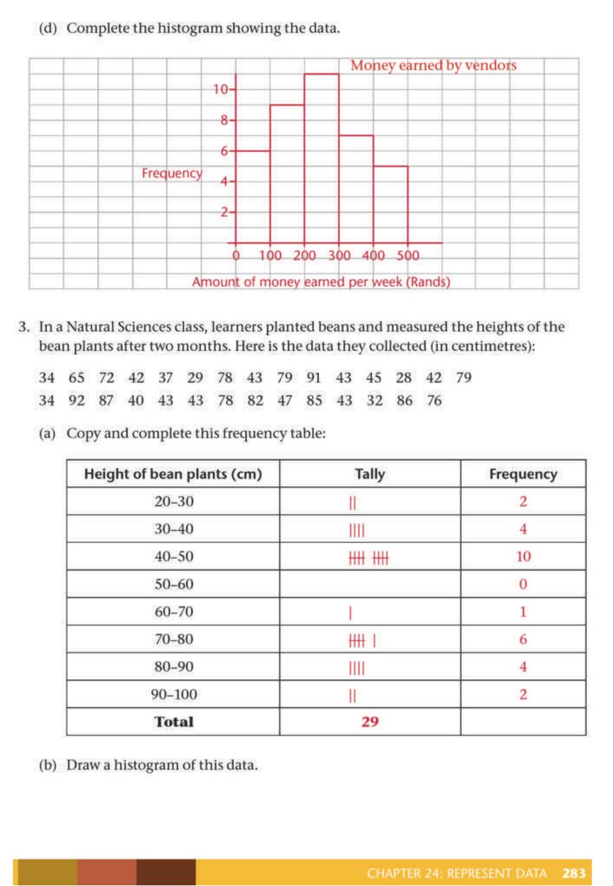
> **[Diagram Context - Textbook_Mathematics_Gr7_Represent-data.pdf-0025-07.png]**
> This educational graphic features a statistical data representation task consisting of a completed frequency table for bean plant heights and a completed histogram titled "Money earned by vendors". The visible labels include the vertical axis titled "Frequency" with numerical intervals from 0 to 10, the horizontal axis titled "Amount of money earned per week (Rands)" with intervals from 0 to 500, column headers such as "Height of bean plants (cm)", "Tally", and "Frequency", and data values including tallied marks and totals. Conceptually, this diagram demonstrates how to organize raw numerical data into grouped frequency intervals and visually translate that information into a continuous bar graph (histogram) to interpret data distributions in Mathematics and Natural Sciences.

---

2. How much has the municipal manager budgeted for printers and computer screens together?

3. How much, in total, has the municipal manager budgeted for chairs and tables?

4. Work out the total cost of all the items the municipal manager has budgeted for.

5. Calculate:
   - (a) $23\ 809 + 2\ 009 + 23$
   - (b) $320\ 293 + 16\ 923 + 349 + 200\ 323$

---

## Methods of Subtraction

There are many ways to subtract one number from another. For example, $R835\ 234 - R687\ 885$ can be calculated by **"filling up"** from $R687\ 885$ to $R835\ 234$:

$$687\ 885 + 15 \rightarrow 687\ 900 + 100 \rightarrow 688\ 000 + 12\ 000 \rightarrow 700\ 000 + 135\ 234 \rightarrow 835\ 234$$

The difference between $R687\ 885$ and $R835\ 234$ can now be calculated by adding up the numbers that had to be added to $687\ 885$ to get $835\ 234$:

$$\begin{array}{r@{\quad}l}
15 \\
100 \\
12\ 000 \\
\hline
135\ 234 \\
\hline
147\ 349
\end{array}$$

So $R835\ 234 - R687\ 885 = R147\ 349$.

Another easy way to subtract is to **round off and compensate**. For example, to calculate $R3\ 224 - R1\ 885$, the $R1\ 885$ may be rounded up to $R2\ 000$. The calculation can proceed as follows:

* Rounding $R1\ 885$ up to $R2\ 000$ can be done in two steps: $1\ 885 + 15 = 1\ 900$, and $1\ 900 + 100 = 2\ 000$. In total, $115$ was added.
* $115$ can now be added to $3\ 224$ too: $3\ 224 + 115 = 3\ 339$.

Instead of calculating $R3\ 224 - R1\ 885$, which is a bit difficult, $R3\ 339 - R2\ 000$ may be calculated. This is easy: $R3\ 339 - R2\ 000 = R1\ 339$.

This means that $R3\ 224 - R1\ 885 = R1\ 339$, because:

$$R3\ 224 - R1\ 885 = (R3\ 224 + R115) - (R1\ 885 + R115)$$

To do question 1, you may use any one of the above two methods, or any other method you may know and prefer. Do not use a calculator, because the purpose of this work is for you to come to understand how subtraction may be done. What you will learn here, will later help you to understand **algebra**.

---

### Exercises

1. Calculate each of the following:
   - (a) $6\ 234 - 2\ 992$
   - (b) $76\ 214 - 34\ 867$
   - (c) $134\ 372 - 45\ 828$
   - (d) $623\ 341 - 236\ 768$

2. Check each of your answers in question 1 by doing addition, or by doing subtraction with a different method than the method you have already used.

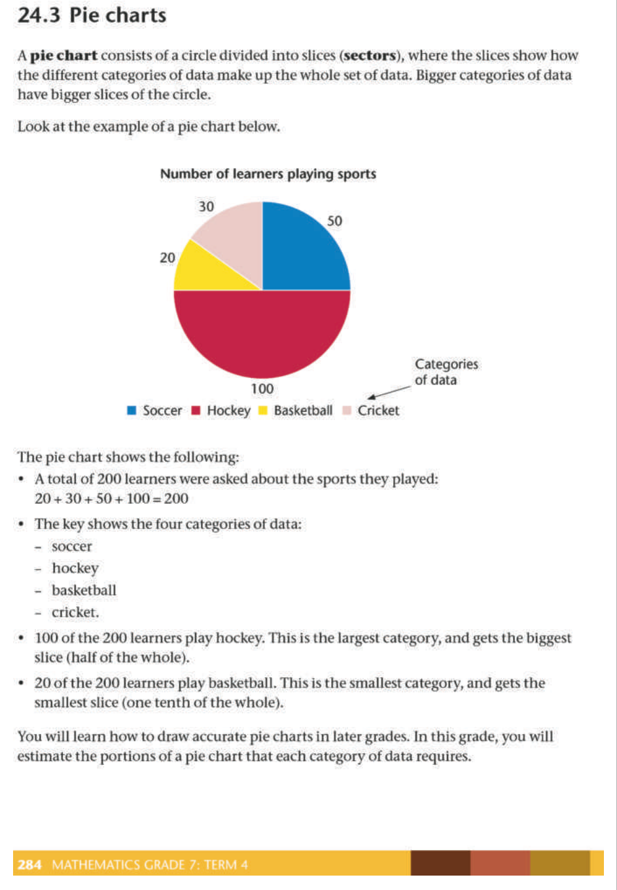
> **[Diagram Context - Textbook_Mathematics_Gr7_Represent-data.pdf-0026-16.png]**
> This educational graphic is a pie chart illustrating data representation and proportional parts of a whole set of data. Visible labels and categories include "Number of learners playing sports," "Categories of data," and the four sport categories with their corresponding values: Soccer (50), Hockey (100), Basketball (20), and Cricket (30). Conceptually, the diagram helps students understand how individual categories make up a total sum (200 learners) and how the size of each sector visually reflects the relative proportion of that category.

---

# Subtraction Using Expanded Notation

Another method of subtraction is to think of the numbers in **expanded notation**. For example, to calculate $R835\,234 - R687\,885$, we could work like this:

We may write this:
$$835\,234$$
$$687\,885$$

In your mind you can see this:

| $800\,000$ | $30\,000$ | $5\,000$ | $200$ | $30$ | $4$ |
| :--- | :--- | :--- | :--- | :--- | :--- |
| $600\,000$ | $80\,000$ | $7\,000$ | $800$ | $80$ | $5$ |

Unfortunately, it is not possible to subtract in the columns now. However, the parts of the bigger number can be rearranged to make the subtraction in each column possible:

$$835\,234$$
$$687\,885$$

| $700\,000$ | $120\,000$ | $14\,000$ | $1100$ | $120$ | $14$ |
| :--- | :--- | :--- | :--- | :--- | :--- |
| $600\,000$ | $80\,000$ | $7\,000$ | $800$ | $80$ | $5$ |
| $100\,000$ | $40\,000$ | $7\,000$ | $300$ | $40$ | $9$ |

The answer is now clearly visible; it is $147\,349$.

The rearrangement, also called “borrowing”, was done like this:
* $10$ was taken from the $30$ in the tens column, and added to the $4$ in the units column.
* $100$ was taken from the $200$ in the hundreds column, and added to the $20$ that remained in the tens column.
* $1\,000$ was taken from the $5\,000$ in the thousands column, and added to the $100$ that remained in the hundreds column.

---

### Exercises

3. Describe the other rearrangements that were made in the above work.

*It is not practical to write the expanded notation and the rearrangements each time you do a subtraction. However, with some practice you can learn to do it all in your mind without writing down. Some people make small marks above the digits of the bigger number, or even change the digits, to keep track of the rearrangements they make in their minds.*

$$835\,234$$
$$- 687\,885$$
$$\overline{147\,349}$$

---

4. Calculate the difference between the two car prices in each case.
   * (a) $R73\,463$ and $R88\,798$
   * (b) $R63\,378$ and $R96\,889$

5. In each case, first estimate the answer to the nearest $100\,000$, then calculate.
   * (a) $238\,769 - 141\,453$
   * (b) $856\,333 - 439\,878$

6. In each case, first estimate the answer to the nearest $10\,000$, then calculate.
   * (a) $88\,023 - 45\,664$
   * (b) $342\,029 - 176\,553$

7. Look again at the municipal budget on page $25$. How much money does the municipal manager have left to buy new computers?

8. Calculate.
   * (a) $670\,034 - 299\,999$
   * (b) $670\,034 - 300\,000$
   * (c) $376\,539 - 175\,998$
   * (d) $376\,541 - 176\,000$

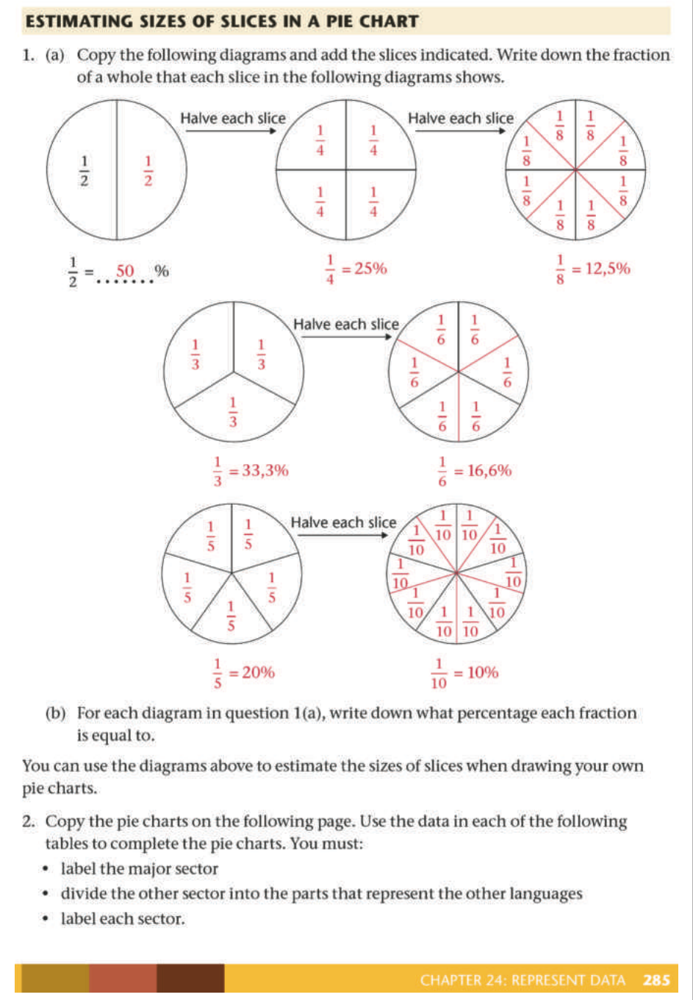
> **[Diagram Context - Textbook_Mathematics_Gr7_Represent-data.pdf-0027-11.png]**
> This educational graphic is a geometry and data handling figure displaying a series of partitioned circle diagrams used for estimating sizes of slices in a pie chart. Visible labels include fractions such as $\frac{1}{2}$, $\frac{1}{4}$, $\frac{1}{8}$, $\frac{1}{3}$, $\frac{1}{6}$, $\frac{1}{5}$, and $\frac{1}{10}$, along with corresponding percentages like $50\%$, $25\%$, $12,5\%$, $33,3\%$, $16,6\%$, $20\%$, and $10\%$, connected by horizontal "Halve each slice" arrows and exercise questions. The diagram conveys conceptually how fractions of a whole circle relate to percentages through repeated bisection, helping learners accurately estimate and construct proportional sectors when drawing their own pie charts.

---

# A Method of Multiplication

## Core Concepts and Procedures

Multiplication can be performed by breaking down numbers into their place values (parts) and multiplying each part separately. This is known as calculating **partial products**.

### Example: Calculating $6 \times \text{R3 } 258$

1. Break the number into thousands, hundreds, tens, and units:
   $$\text{R3 } 258 = 3\,000 + 200 + 50 + 8$$

2. Multiply each part by $6$:
   $$6 \times 3\,000 = 18\,000$$
   $$6 \times 200 = 1\,200$$
   $$6 \times 50 = 300$$
   $$6 \times 8 = 48$$

3. Add the four partial products together to get the final answer:
   $$18\,000 + 1\,200 + 300 + 48 = 19\,548$$

This process is conveniently written in vertical columns for units, tens, hundreds, and so on:

$$\begin{array}{r@{\quad}l}
  3\,258 \\
  \times \phantom{0}6 \\
  \hline
  48 & (6 \times 8) \\
  300 & (6 \times 50) \\
  1\,200 & (6 \times 200) \\
  18\,000 & (6 \times 3\,000) \\
  \hline
  19\,548 & \text{Total}
\end{array}$$

### Short Method (Carrying over)

Instead of writing all partial products on separate lines, you can work from right to left, writing down the units digit of each product and "carrying" the tens digit to the next column:

$$\begin{array}{r@{\quad}l}
  3\,258 \\
  \times \phantom{0}6 \\
  \hline
  1\,9\,5\,4\,8
\end{array}$$

- **Step 1:** Calculate $6 \times 8 = 48$. Write down $8$ in the units column and keep the $4$ (representing $40$) "on hold" in your mind.
- **Step 2:** Calculate $6 \times 50 = 300$, then add the $40$ from the previous step to get $340$. Write down the $4$ (in the tens column) and keep the $300$ on hold.
- Continue this process moving left through the columns.

---

## Activities

### Question 1
Calculate each of the following without using a calculator:
* (a) $8 \times 786$
* (b) $9 \times 3\,453$
* (c) $60 \times 786$
* (d) $60 \times 7\,860$

### Question 2
Use a calculator to check your answers for Question 1. Repeat the work if your answers are not correct to learn where mistakes were made, then put your calculator away again.

### Question 3
Use your answers from Questions 1(a) and 1(c) to find out how much $68 \times 786$ is.

---

## Worked Example: Multiplying by a Two-Digit Number

To calculate $36 \times 378$, the work can be broken up into two parts:
$$30 \times 378 \quad \text{and} \quad 6 \times 378$$

A complete write-up of calculating $76 \times 2\,348$ in columns is shown below:

$$\begin{array}{r@{\quad}l}
  2\,3\,4\,8 \\
  \times \phantom{0}7\,6 \\
  \hline
  A \quad 4\,8 \\
  B \quad 2\,4\,0 \\
  C \quad 1\,8\,0\,0 \\
  D \quad 1\,2\,0\,0\,0 \\
  E \quad 5\,6\,0 \\
  F \quad 2\,8\,0\,0 \\
  G \quad 2\,1\,0\,0\,0 \\
  \hline
  H \quad 1\,7\,8\,4\,4\,8
\end{array}$$

### Question 5
Refer to the vertical layout above for $76 \times 2\,348$:
* (a) Explain how the $240$ in row **B** was obtained.
* (b) Explain how the $560$ in row **E** was obtained.
* (c) Explain how the $21\,000$ in row **G** was obtained.

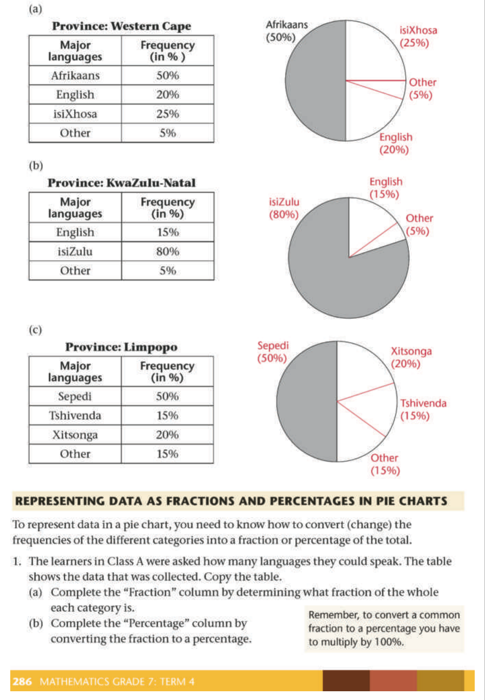
> **[Diagram Context - Textbook_Mathematics_Gr7_Represent-data.pdf-0028-20.png]**
> The graphic displays statistical data representation through comparative tables and corresponding pie charts labeled (a) Western Cape, (b) KwaZulu-Natal, and (c) Limpopo. Visible text includes provincial headings, "Major languages," "Frequency (in %)," and specific language labels with percentage values such as Afrikaans (50%), English, isiXhosa (25%), isiZulu (80%), Sepedi (50%), Xitsonga, Tshivenda, and Other. It conveys conceptually how categorical data from frequency tables can be translated into proportional sectors of a pie chart, helping students learn to convert and visually represent statistical information.

---

A short write-up of calculating $76 \times 2\,348$ in columns is shown below:

$$\begin{array}{r@{\quad}l}
  2\,348 & \\
  \times\ 76 & \\
  \hline
  14\,088 & (\text{which is } 6 \times 2\,348) \\
  164\,360 & (\text{which is } 70 \times 2\,348) \\
  \hline
  178\,448 & \\
  \hline
\end{array}$$

You may try to do the calculations in question 6 in this way. If you find it difficult, you may first write some of them up completely, and then try again to write less when you multiply.

6. Calculate each of the following.
   (a) $53 \times 738$
   (b) $73 \times 3\,457$

7. Calculate.
   (a) $64 \times 3\,478$
   (b) $78 \times 1\,298$
   (c) $37 \times 3\,428$
   (d) $78 \times 7\,285$

8. Use a calculator to check your answers for question 7. Redo the questions that you had wrong, so that you can learn to work correctly.

9. Use your correct answers for question 7 to give the answers to the following, without doing any calculations:
   (a) $101\,244 \div 1\,298$
   (b) $568\,230 \div 7\,285$

10. Calculate, without using a calculator.
    (a) $3\,659 \times 38$
    (b) $27 \times 23\,487$
    (c) $486 \times 278$
    (d) $2\,135 \times 232$

---

### A process called long division

*You may use a calculator to do questions 1 to 6.*

1. You want to buy some live chickens at R37 each and you have R920 available. How many live chickens can you buy in total?
2. R880 is to be shared equally among 34 learners. How many full rands can each learner get?
3. You want to buy live chickens at R47 each. You have R1\,280 available. How many live chickens can you buy?
4. 42 equal bags of rice weigh a total of $7\,560\text{ g}$. How much does one bag weigh?
5. The number 26 was multiplied by a secret number and the answer was $2\,184$. What was the secret number?

This is an accurate sketch of the back of a house. The red line on the sketch is $70\text{ mm}$ long and it shows the width of the house. The blue line on the sketch indicates the height of the chimney. Do not measure the blue line now.

---
*CHAPTER 1: WORKING WITH WHOLE NUMBERS* | 29

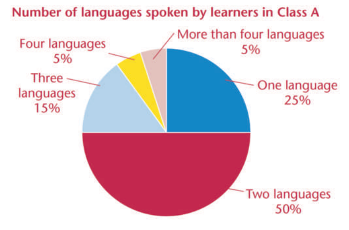
> **[Diagram Context - Textbook_Mathematics_Gr7_Represent-data.pdf-0029-02.png]**
> This graphic is a pie chart titled "Number of languages spoken by learners in Class A". It features sectors labeled with categories and percentages: "One language (25%)", "Two languages (50%)", "Three languages (15%)", "Four languages (5%)", and "More than four languages (5%)", connected by pointer lines to their respective sections. Conceptually, this diagram illustrates how to represent and interpret categorical data as proportional parts of a whole (100%) using angles and sectors in data handling.

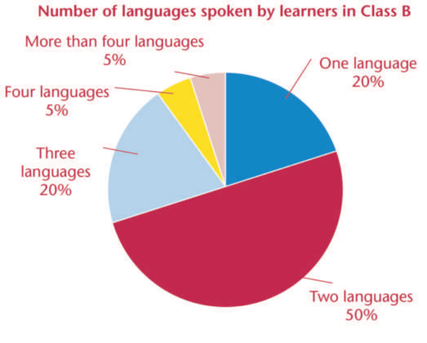
> **[Diagram Context - Textbook_Mathematics_Gr7_Represent-data.pdf-0029-06.png]**
> This graphic is a pie chart titled "Number of languages spoken by learners in Class B." Visible labels and percentages include "One language 20%", "Two languages 50%", "Three languages 20%", "Four languages 5%", and "More than four languages 5%", with pointer lines connecting each sector to its respective category. Conceptually, this diagram illustrates how to represent categorical data proportionally using a circle graph, helping high school learners interpret parts of a whole expressed as percentages.

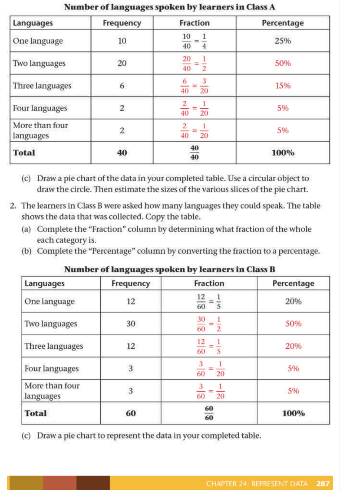
> **[Diagram Context - Textbook_Mathematics_Gr7_Represent-data.pdf-0029-07.png]**
> This educational graphic displays two frequency tables representing the number of languages spoken by learners in Class A and Class B respectively. The tables contain column headers labelled "Languages", "Frequency", "Fraction", and "Percentage", along with numerical data rows and totals, followed by questions asking learners to complete fractions and percentages and draw pie charts. Conceptually, this resource helps learners organize raw data, convert frequencies into fractions and percentages, and represent data visually to develop data handling and statistical interpretation skills in line with the CAPS curriculum.

---

The width of the actual house is $5\,600\text{ mm}$, and the height of the chimney is $3\,360\text{ mm}$.

6. (a) How many times is the house bigger than the sketch? Describe what you can do to find this out.
   (b) Calculate how long the blue line on the sketch should be.
   (c) Now measure the blue line to check your answer for (b).

Division is used for different purposes:
* In question 1 you knew that the amount is split into equal parts. You had to find out how many parts there are (how many chickens). This is called **grouping**.
* In question 2 you knew that the amount was split into $34$ equal parts. You needed to find out how big each part is (how much money each learner will get). This is called **sharing**.

7. (a) What does question 3 require, sharing or grouping?
   (b) What does question 4 require, sharing or grouping?

In question 6 division was done for a different purpose than sharing or grouping.

Put your calculator away now. It is very important to be able to solve division problems by using your own mind. The activities that follow will help you to do this better than before. While you work on these activities, you will often have to estimate the product of two numbers. If you can estimate products well, division becomes easier to do. Hence, to start, do question 8, which will provide you with the opportunity to practise your product estimation skills.

8. (a) What do you think is closest to $4\,080$: $10 \times 74$, or $30 \times 74$, or $50 \times 74$, or $70 \times 74$, or $90 \times 74$?
   (b) Calculate some of the products to check your answer.
   (c) What do you think is closest to $9\,238$: $30 \times 38$, or $50 \times 38$, or $100 \times 38$, or $150 \times 38$, or $200 \times 38$, or $250 \times 38$, or $300 \times 38$?
   (d) Calculate some of the products to check your answer.
   (e) What do you think is closest to $9\,746$: $10 \times 287$, or $20 \times 287$, or $30 \times 287$, or $40 \times 287$, or $50 \times 287$, or $60 \times 287$, or $70 \times 287$?
   (f) Calculate some of the products to check your answer.
   (g) By what multiple of $10$ should you multiply $27$ to get as close to $6\,487$ as possible?

9. A principal wants to buy T-shirts for the $115$ Grade 7 learners in the school. The T-shirts cost $\text{R}67$ each, and an amount of $\text{R}8\,500$ is available. Do you think there is enough money to buy T-shirts for all the learners? Explain your answer.

10. (a) How much will $100$ of the T-shirts cost?
    (b) How much money will be left if $100$ T-shirts are bought?
    (c) How much money will be left if $20$ more T-shirts are bought?

---
*30*  
*MATHEMATICS GRADE 7: TERM 1*

---

## Chapter 1: Working with Whole Numbers

The principal wants to work out exactly how many T-shirts, at R67 each, she can buy with R8 500. Her thinking and writing are described below.

---

### Step 1
* **What she writes:**  
  $$67 \overline{)\,8\,500}$$
* **What she thinks:**  
  *I want to find out how many chunks of $67$ there are in $8\,500$.*

---

### Step 2
* **What she writes:**  
  $$\begin{array}{r} 100 \\ 67 \overline{)\,8\,500} \\ \underline{6\,700} \\ 1\,800 \end{array}$$
* **What she thinks:**  
  *I think there are at least $100$ chunks of $67$ in $8\,500$.*  
  $100 \times 67 = 6\,700$. *I need to know how much is left over.*  
  *I want to find out how many chunks of $67$ there are in $1\,800$.*

---

### Step 3 (She has to rub out the one "0" of the $100$ on top, to make space.)
* **What she writes:**  
  $$\begin{array}{r} 120 \\ 67 \overline{)\,8\,500} \\ \underline{6\,700} \\ 1\,800 \\ \underline{1\,340} \\ 460 \end{array}$$
* **What she thinks:**  
  *I think there are at least $20$ chunks of $67$ in $1\,800$.*  
  $20 \times 67 = 1\,340$. *I need to know how much is left over.*  
  *I want to find out how many chunks of $67$ there are in $460$.*

---

### Step 4 (She rubs out another "0".)
* **What she writes:**  
  $$\begin{array}{r} 125 \\ 67 \overline{)\,8\,500} \\ \underline{6\,700} \\ 1\,800 \\ \underline{1\,340} \\ 460 \\ \underline{335} \\ 125 \end{array}$$
* **What she thinks:**  
  *I think there are at least five chunks of $67$ in $460$.*  
  $5 \times 67 = 335$. *I need to know how much is left over.*  
  *I want to find out how many chunks of $67$ there are in $125$.*

---

### Step 5 (She rubs out the "5".)
* **What she writes:**  
  $$\begin{array}{r} 126 \\ 67 \overline{)\,8\,500} \\ \underline{6\,700} \\ 1\,800 \\ \underline{1\,340} \\ 460 \\ \underline{335} \\ 125 \\ \underline{67} \\ 58 \end{array}$$
* **What she thinks:**  
  *I think there is only one more chunk of $67$ in $125$.*  
  *I wonder how much money will be left over.*  
  *So, we can buy $126$ T-shirts and R58 will remain.*

---

# Revision Notes: Division and Problem Solving (Rate and Ratio)

*Note: For questions 11 through 13, do not use a calculator. The purpose of this work is to develop a good understanding of how division can be performed. Always check your answers by doing multiplication.*

---

## Exercises: Division Without Calculators

### Question 11
**(a)** Selina bought $85$ chickens, all at the same price. She paid $\text{R}3\,995$ in total. What did each of the chickens cost? 
*Hint:* Your first step can be to work out how much Selina would have paid if she paid $\text{R}10$ per chicken, but you can start with a bigger step if you wish.

$$\text{Cost per chicken} = \frac{3995}{85}$$

**(b)** Anton has $\text{R}4\,850$. He wants to buy some young goats. The goats cost $\text{R}78$ each. How many goats can he buy?

$$\text{Number of goats} = \frac{4850}{78}$$

---

### Question 12
Calculate the following without using a calculator:

* **(a)** $7\,234 \div 48$
* **(b)** $3\,267 \div 24$
* **(c)** $9\,500 \div 364$
* **(d)** $8\,347 \div 24$

---

### Question 13
**(a)** A chocolate factory made $9\,325$ chocolates of a very special kind one day. The chocolates were packed in small, decorated boxes, with $24$ chocolates per box. How many boxes were filled?

$$\text{Boxes filled} = \frac{9325}{24}$$

**(b)** A farmer sells eggs packed in cartons to the local supermarkets. There are $36$ eggs in one carton. One month, the farmer sold $72\,468$ eggs to the supermarkets. How many cartons is this?

$$\text{Cartons sold} = \frac{72468}{36}$$

---

## 1.6 Problem Solving: Rate and Ratio

*Note: You may use a calculator for doing the work in this section.*

> **Key Concept: Rate**  
> Instead of saying "$85\,000\text{ litres each day}$" or "$8 \text{ cm each hour}$", people often say "**at a rate of $85\,000\text{ litres per day}$**" or "**at a rate of $8 \text{ cm per hour}$**".

---

### Practice Problems

1. The people in a village get their water from a nearby dam. On a certain day the dam contains $688\,000\text{ litres}$ of water. The village people use about $85\,000\text{ litres}$ of water each day. For how many days will the water in the dam last, if no rains fall?

$$\text{Number of days} = \frac{688\,000}{85\,000}$$

2. During a period of very heavy rain, the water level in a certain river increases at a rate of $8\text{ cm each hour}$. If it continues like this, by how much will the water level increase in $24\text{ hours}$?

$$\text{Total increase} = 8 \text{ cm/hour} \times 24 \text{ hours}$$

3. A woman is driving from Johannesburg to Durban. Her distance from Durban decreases at a rate of about $95\text{ km per hour}$. How far does she travel, approximately, in four hours?

$$\text{Total distance} = 95 \text{ km/hour} \times 4 \text{ hours}$$

---

4. The number of unemployed people in a certain province increases at a rate of approximately $35\ 000$ people per year. If there were $860\ 000$ unemployed people in the year $2000$, how many unemployed people will there be, approximately, in the year $2020$?

5. In pattern A below, there are five red beads for every four yellow beads. Describe patterns B and C in the same way.

<!-- DIAGRAM_PLACEHOLDER: diagram -->

In a certain food factory, two machines are used to produce tins of baked beans. Machine A produces at a rate of $800$ tins per hour, and machine B produces at a rate of $2\ 400$ tins per hour.

6. (a) Copy and complete the following table, to show how many tins of beans will be produced by the two machines, in different periods of time.

| Number of hours | 1 | 2 | 3 | 5 | 8 |
| :--- | :---: | :---: | :---: | :---: | :---: |
| Number of tins produced by machine A | $800$ | $1\ 600$ | $2\ 400$ | $4\ 000$ | |
| Number of tins produced by machine B | $2\ 400$ | $4\ 800$ | | | |

(b) How much faster is machine B than machine A?
(c) How many tins will be produced by machine B in the time that it takes machine A to produce $30$ tins?
(d) How many tins will be produced by machine B in the time that it takes machine A to produce $200$ tins?
(e) How many tins will be produced by machine B in the time that it takes machine A to produce one tin?

The patterns in question 5 can be described like this:

In pattern A, the **ratio** of yellow beads to red beads is $4$ to $5$. This is written as $4 : 5$.

In pattern B, the ratio between yellow beads and red beads is $3 : 6$, and in pattern C the ratio is $2 : 7$. In question 6, machine A produces one tin for every three tins that machine B produces. This can be described by saying that the ratio between the production speeds of machines A and B is $1 : 3$.

---

### Problem 7: Speed, Distance, and Proportions

Two huge trucks are travelling very slowly on a highway. Truck A covers $20\text{ km}$ per hour, and truck B covers $30\text{ km}$ per hour. Both trucks keep these speeds all the time.

* **(a)** What distance will truck B cover in the same time that truck A covers $10\text{ km}$?
* **(b)** In the table below, the distances that truck A covers in certain periods of time are given. Copy and complete the table to show the distances covered by truck B, in the same periods of time.

| Distance covered by truck A | $10\text{ km}$ | $18\text{ km}$ | $50\text{ km}$ | $100\text{ km}$ | $30\text{ km}$ |
| :--- | :---: | :---: | :---: | :---: | :---: |
| Distance covered by truck B | | | | | |

* **(c)** What distance will truck B cover in the same time that truck A covers $1\text{ km}$?
* **(d)** What is the ratio between the speed at which truck A travels and the speed at which truck B travels?

---

### Problem 8: Sharing in a Ratio

R240 will be divided between David and Sally in the ratio $3:5$. This means Sally gets R5 for every R3 David gets. How much will David and Sally each get in total?

---

### Problem 9: Sharing Amounts

How much will each person get, if R14 400 is shared between two people in each of the following ways?

* **(a)** In the ratio $1 : 3$
* **(b)** In the ratio $5 : 7$

---

## Financial Mathematics

### Core Concepts

* **Interest:** The money paid for using another person's money.
* **Percentage:** For example, $15\%$ is read as **15 per cent**, and it is just a different way to say **15 hundredths** ($\frac{15}{100}$ or $0.15$).

**Worked Example:**
A man borrows $\text{R}12\text{ }000$ from a bank for one year. He has to pay $15\%$ interest to the bank. This means that, apart from paying the $\text{R}12\text{ }000$ back to the bank after a year, he has to pay $15$ hundredths of $\text{R}12\text{ }000$ for the privilege of using the money that actually belongs to the bank. 

One hundredth of $\text{R}12\text{ }000$ can be calculated by dividing $\text{R}12\text{ }000$ by $100$. This amount can then be multiplied by $15$ to get $15$ hundredths of $\text{R}12\text{ }000$.

---

### Practice Exercises

*Do not use a calculator when you do the following questions.*

1. Calculate $12\text{ }000 \div 100$, then multiply the answer by $15$.
2. Calculate:
   * **(a)** $12\%$ of $\text{R}8\text{ }000$
   * **(b)** $18\%$ of $\text{R}24\text{ }000$
3. In each case below, calculate how much interest must be paid.
   * **(a)** An amount of $\text{R}6\text{ }000$ is borrowed for one year at $9\%$ interest.
   * **(b)** An amount of $\text{R}21\text{ }000$ is borrowed for three years at $11\%$ interest per year.
   * **(c)** An amount of $\text{R}45\text{ }000$ is borrowed for ten years at $12\%$ interest per year.

---

# Revision Notes: Profit, Loss, and Discount

## Core Concepts

### 1. Profit
When an item is sold for more than its purchase (cost) price, the difference is called a **profit**.
$$\text{Profit} = \text{Selling Price} - \text{Cost Price}$$
$$\text{Profit Percentage} = \left(\frac{\text{Profit}}{\text{Cost Price}}\right) \times 100\%$$

* **Example:** A car dealer buys a car for $\text{R}60\ 000$ and sells it for $\text{R}75\ 000$.
  $$\text{Profit} = \text{R}75\ 000 - \text{R}60\ 000 = \text{R}15\ 000$$
  $$\text{Profit Percentage} = \frac{15\ 000}{60\ 000} \times 100\% = 0{,}25 \times 100\% = 25\%$$

---

### 2. Loss
When an item is sold for less than its purchase price, the difference is called a **loss**.
$$\text{Loss} = \text{Cost Price} - \text{Selling Price}$$
$$\text{Loss Percentage} = \left(\frac{\text{Loss}}{\text{Cost Price}}\right) \times 100\%$$

* **Example:** A shop owner bought a stove for $\text{R}2\ 000$ and sold it for $\text{R}1\ 600$.
  $$\text{Loss} = \text{R}2\ 000 - \text{R}1\ 600 = \text{R}400$$

---

### 3. Discount
A **discount** is a reduction in the normal selling price of an item.
$$\text{Discount Amount} = \text{Normal Price} \times \text{Discount Percentage}$$
$$\text{Paid Price} = \text{Normal Price} - \text{Discount Amount}$$

---

## Activities & Practice Exercises

4. Calculate the amount of profit in each of the following cases:
   * (a) A car is bought for $\text{R}40\ 000$ and sold for $\text{R}52\ 000$.
   * (b) A small truck is bought for $\text{R}100\ 000$ and sold at a profit of $28\%$.
   * (c) A bakkie is bought for $\text{R}120\ 000$ and sold at a profit of $30\%$.

5. Answer the following questions regarding the stove purchased for $\text{R}2\ 000$ and sold for $\text{R}1\ 600$ (resulting in a $\text{R}400$ loss):
   * (a) How much is one hundredth of $\text{R}2\ 000$?
   * (b) How many hundredths of $\text{R}2\ 000$ is $\text{R}400$? *(Note: This gives the percentage loss).*
   * (c) How much is $20\%$ of $\text{R}2\ 000$?

6. The shop owner also sold a fridge that normally sells for $\text{R}4\ 000$ at a discount of $20\%$. Calculate the discount in rands and the amount that the customer paid for the fridge.

---

# Grade 7 Term 1 Chapter 1: Working with whole numbers

## Learner Book Overview

| Sections in this chapter | Content | Pages in Learner Book |
| :--- | :--- | :--- |
| 1.1 Revision | Building up and breaking down whole numbers; multiples of numbers and powers of 10; doubling and halving; using multiplication to do division | Pages 1 to 13 |
| 1.2 Ordering and comparing whole numbers | Ordering whole numbers; rounding to 5s, 10s, 100s and 1 000s | Pages 13 to 16 |
| 1.3 Factors, prime numbers and common multiples | Different ways to produce the same whole number; prime numbers; prime factors; common factors and HCF; common multiples and LCM | Pages 16 to 20 |
| 1.4 Properties of operations | Mathematical conventions on order of operations; associative property; commutative property of addition and multiplication; distributive property | Pages 20 to 24 |
| 1.5 Basic operations | Addition; subtraction; multiplication; long division | Pages 24 to 32 |
| 1.6 Problem solving | Rate and ratio; financial mathematics (interest; profit; loss; discount) | Pages 32 to 35 |

| CAPS time allocation | 9 hours |
| :--- | :--- |
| CAPS content specification | Pages 39 to 42 |

> **Key Rule:** If natural numbers are added, the answer is also a natural number. We say: **The set of natural numbers is closed under addition.**

---

## Mathematical background

<!-- DIAGRAM_PLACEHOLDER: diagram -->

* The illustration shows how the set of real numbers has developed from the set of natural numbers. As additional sets of numbers are added to the natural numbers, the advantages of each new set of numbers increase and its disadvantages decrease.
* The set of **natural numbers** is defined by the set $N = \{1; 2; 3; 4; 5; ...\}$.
  * **Advantages:** $N$ is closed under addition and multiplication; $N$ contains the identity element for multiplication ($1$).
  * **Disadvantages:** $N$ is not closed under subtraction or division; $N$ does not contain the identity element for addition ($0$).
* The set of **whole numbers** $N_0 = \{0; 1; 2; 3; 4; 5; ...\}$ is formed by adding $0$ to the set of natural numbers.
  * **Additional advantage:** $N_0$ contains the identity element for addition ($0$).
* The set of **integers** $Z = \{..., -3; -2; -1; 0; 1; 2; 3; ...\}$ is formed by adding the set $\{..., -4; -3; -2; -1\}$ to the set of whole numbers.
  * **Additional advantage:** $Z$ is closed under subtraction.
* The set of **rational numbers** $Q$ is formed by adding common fractions (and therefore mixed numbers), decimal fractions (and therefore decimal numbers), percentages and ratios to the set of integers.
  * **Additional advantage:** $Q$ is closed under division (but division by $0$ is undefined).
* The set of **real numbers** $R$ is formed by adding the set of **irrational numbers** $Q'$ (surds and numbers like $\pi$) to the set of rational numbers. This chapter focuses on features of and basic operations on whole numbers.

---

# CHAPTER 1: Working with whole numbers

## 1.1 Revision

**Do not use a calculator at all in section 1.1.**

---

### BUILD NUMBERS UP AND BREAK NUMBERS DOWN

#### Background Information & Definitions

There is a difference between the **place value** of a digit in a number and the **value** of that digit in the number.

*   **The place value of a digit** in a number is determined by the **position of the digit** in that number. For example, in the $5$-digit number $12\ 345$:
    *   the place value of the digit $1$ is ten thousands
    *   the place value of the digit $2$ is thousands
    *   the place value of the digit $3$ is hundreds
    *   the place value of the digit $4$ is tens
    *   the place value of the digit $5$ is units

    Expressed in terms of the **place value of its digits**:
    $$12\ 345 = 1 \text{ ten thousand} + 2 \text{ thousands} + 3 \text{ hundreds} + 4 \text{ tens} + 5 \text{ units}$$

*   **The value of a digit** in a number is equal to the **product of that digit and its place value**. For example, in the $5$-digit number $12\ 345$:
    *   the value of the digit $1$ is $1 \times 10\ 000 = 10\ 000$
    *   the value of the digit $2$ is $2 \times 1\ 000 = 2\ 000$
    *   the value of the digit $3$ is $3 \times 100 = 300$
    *   the value of the digit $4$ is $4 \times 10 = 40$
    *   the value of the digit $5$ is $5 \times 1 = 5$

    Expressed in terms of the **values of its digits**:
    $$12\ 345 = 10\ 000 + 2\ 000 + 300 + 40 + 5$$

> **Note:**
> * The word **sum** is used to indicate two or more numbers that have to be added.
> * The answer obtained when the numbers are added, is also called the sum. We say: $20$ is the sum of $15$ and $5$.
> * When a number is written as a sum of units, tens, hundreds, thousands etc., it is called the **expanded notation**.

---

### Exercises

**1.** Write each of the following sums as a single number:
*   (a) $4\ 000 + 800 + 60 + 5$
*   (b) $8\ 000 + 300 + 7$
*   (c) $40\ 000 + 9\ 000 + 200 + 3$
*   (d) $800\ 000 + 70\ 000 + 3\ 000 + 900 + 2$
*   (e) $8 \text{ thousands} + 7 \text{ hundreds} + 8 \text{ units}$
*   (f) $4 \text{ hundred thousands} + 8 \text{ ten thousands} + 4 \text{ hundreds} + 9 \text{ tens}$

**2.** What is the sum of $8\ 000$ and $24$?

**3.** Write each of the numbers below as a sum of units, tens, hundreds, thousands, ten thousands and hundred thousands, like the numbers that were given in question 1(e) and (f).
*   (a) $8706$
*   (b) $449\ 203$
*   (c) $83\ 490$
*   (d) $873\ 092$

**4.** Arrange the numbers in question 3 from smallest to biggest.

**5.** Write the numbers in expanded notation (for example, $791 = 700 + 90 + 1$).
*   (a) $493\ 020$
*   (b) $409\ 302$
*   (c) $490\ 032$
*   (d) $400\ 932$

**6.** Arrange the numbers in question 5 from biggest to smallest.

**7.** Write each sum as a single number.
*   (a) $600\ 000 + 40\ 000 + 27\ 000 + 100 + 20 + 34$
*   (b) $320\ 000 + 40\ 000 + 8\ 000 + 670 + 10 + 5$
*   (c) $500\ 000 + 280\ 000 + 7\ 000 + 300 + 170 + 38$
*   (d) $4 \text{ hundred thousands} + 18 \text{ ten thousands} + 4 \text{ hundreds} + 29 \text{ tens} + 5 \text{ units}$

---

# Revision Notes: Number Operations and Expanded Notation

## An Important Note on Understanding Numbers

Learners easily lose sight of what written numbers actually mean when they just say the digits in their minds, for example, "three", "five", "four" and not the proper number name "three hundred and fifty-four". 

**Classroom Activity:** To promote understanding of numbers in terms of their component parts, the teacher says numbers out loud (using proper number names) and learners write the numbers in symbols.

---

## Exercises and Activities

### Question 8: Write each sum as a single number

(a) $300\,000 + 70\,000 + 6\,000 + 400 + 80 + 6$
(b) $400\,000 + 20\,000 + 2\,000 + 500 + 10 + 3$
(c) $500\,000 + 40\,000 + 7\,000 + 300 + 60 + 6$
(d) $800\,000 + 90\,000 + 7\,000 + 800 + 90 + 8$
(e) $300\,000 + 110\,000 + 12\,000 + 400 + 110 + 3$

#### Answers (Question 8):
* (a) $376\,486$
* (b) $422\,513$
* (c) $547\,366$
* (d) $897\,898$
* (e) $422\,513$

---

### Question 9: Addition in Expanded Form

In each case, add the two numbers. Write the answer in expanded form and also as a single number.
* (a) The number in 8(a) and the number in 8(b)
* (b) The number in 8(c) and the number in 8(b)
* (c) The number in 8(c) and the number in 8(a)
* (d) The number in 8(d) and the number in 8(a)

#### Answers (Question 9):
* (a) Expanded: $700\,000 + 90\,000 + 8\,000 + 900 + 90 + 9$ | Single: $798\,999$
* (b) Expanded: $900\,000 + 60\,000 + 9\,000 + 800 + 70 + 9$ | Single: $969\,879$
* (c) Expanded: $900\,000 + 20\,000 + 3\,000 + 800 + 50 + 2$ | Single: $923\,852$
* (d) Expanded: $1\,000\,000 + 200\,000 + 70\,000 + 4\,000 + 300 + 80 + 4$ | Single: $1\,274\,384$

---

### Question 10: Subtraction Practice

* (a) Subtract the number in 8(b) from the number in 8(d).
* (b) Are the numbers in 8(b) and 8(e) the same?
* (c) Subtract the number in 8(a) from the number in 8(b).

#### Answers (Question 10):
* (a) $475\,385$
* (b) Yes
* (c) $46\,027$

---

### Question 11: Products and Multiplication

*Note:* The word **product** is used to indicate two or more numbers that have to be multiplied. The answer obtained when numbers are multiplied is also called the **product**. For example, $20$ is the product of $2$ and $10$.

Write each of the following products as a single number:
* (a) $2 \times 3$
* (b) $2 \times 3 \times 5$
* (c) $2 \times 3 \times 5 \times 7$
* (d) $2 \times 3 \times 5 \times 7 \times 2$
* (e) $2 \times 3 \times 5 \times 7 \times 2 \times 2$

#### Answers (Question 11):
* (a) $6$
* (b) $30$
* (c) $210$
* (d) $420$
* (e) $840$

---

### Question 12: Working with Products

* (a) What is the product of $20$ and $500$?
* (b) Write $1\,000$ as a product of $5$ and another number.
* (c) Write $1\,000$ as a product of $50$ and another number.
* (d) Write $1\,000$ as a product of $25$ and another number.
* (e) What is the product of $2\,500$ and $4$?
* (f) What is the product of $250$ and $40$?

#### Answers (Question 12):
* (a) $10\,000$
* (b) $5 \times 200$
* (c) $50 \times 20$
* (d) $25 \times 40$
* (e) $10\,000$
* (f) $10\,000$

---

### Questions 13 & 14: Addition Table Activity

In the table on the right, the number in each yellow cell is formed by adding the number in the red row above it to the number in the blue column to its left. 

| $+$ | **2** | **3** | **4** | **5** |
| :---: | :---: | :---: | :---: | :---: |
| **10** | 12 | 13 | 14 | 15 |
| **20** | 22 | 23 | 24 | 25 |
| **30** | 32 | 33 | 34 | 35 |
| **40** | 42 | 43 | 44 | 45 |
| **50** | 52 | 53 | 54 | 55 |
| **60** | 62 | 63 | 64 | 65 |
| **70** | 72 | 73 | 74 | 75 |

---

# MULTIPLES

## Background Information

A **multiple** is a number made by multiplying together two other numbers. For example, if $2 \times 3 = 6$ then:
- $6$ is a **multiple**
- $6$ is a **common multiple** of $2$ and $3$.

A number is a multiple of any of its factors. For example, the factors of $12$ are $1, 2, 3, 4, 6$ and $12$. This means that $12$ is a multiple of $1, 2, 3, 4, 6$ and $12$ because:
- $12 = 1 \times 12$
- $12 = 2 \times 6$
- $12 = 3 \times 4$

To find the **multiples of a number**, multiply that number by the set of natural numbers $\{1; 2; 3; 4; 5; 6; 7; 8; 9; 10; \dots\}$. For example:
- The multiples of $1$ are $\{1; 2; 3; 4; 5; 6; 7; 8; 9; 10; \dots\}$
- The multiples of $2$ are $\{2; 4; 6; 8; 10; 12; 14; 16; 18; 20; \dots\}$
- The multiples of $3$ are $\{3; 6; 9; 12; 15; 18; 21; 24; 27; 30; \dots\}$
- The multiples of $4$ are $\{4; 8; 12; 16; 20; 24; 28; 32; 36; 40; \dots\}$ and so on.

---

## Teaching Guidelines

Start counting at $0$.
- Count forwards in $1\text{s}$. The answers $1, 2, 3, \dots$ are multiples of $1$.
  All are products of $1$ and another number: $1 = 1 \times 1$; $2 = 1 \times 2$; $3 = 1 \times 3$; $\dots$
- Count forwards in $2\text{s}$. The answers $2, 4, 6, \dots$ are multiples of $2$.
  All are products of $2$ and another number: $2 = 2 \times 1$; $4 = 2 \times 2$; $6 = 2 \times 3$; $\dots$
- Count forwards in $3\text{s}$. The answers $3, 6, 9, \dots$ are multiples of $3$.
  All are products of $3$ and another number: $3 = 3 \times 1$; $6 = 3 \times 2$; $9 = 3 \times 3$; $\dots$
- Count forwards in $4\text{s}$. The answers $4, 8, 12, \dots$ are multiples of $4$.
  All are products of $4$ and another number: $4 = 4 \times 1$; $8 = 4 \times 2$; $12 = 4 \times 3$; $\dots$

---

## Addition Table Reference

| $+$ | **8** | **5** | **4** | **9** | **7** | **3** | **6** | **18** | **36** | **57** |
| :---: | :---: | :---: | :---: | :---: | :---: | :---: | :---: | :---: | :---: | :---: |
| **7** | 15 | 12 | 11 | 16 | 14 | 10 | 13 | 25 | 43 | 64 |
| **3** | 11 | 8 | 7 | 12 | 10 | 6 | 9 | 21 | 39 | 60 |
| **9** | 17 | 14 | 13 | 18 | 16 | 12 | 15 | 27 | 45 | 66 |
| **5** | 13 | 10 | 9 | 14 | 12 | 8 | 11 | 23 | 41 | 62 |
| **8** | 16 | 13 | 12 | 17 | 15 | 11 | 14 | 26 | 44 | 65 |
| **6** | 14 | 11 | 10 | 15 | 13 | 9 | 12 | 24 | 42 | 63 |
| **4** | 12 | 9 | 8 | 13 | 11 | 7 | 10 | 22 | 40 | 61 |

---

## Exercises

1. In the arrangement below, the blue dots are in groups like this: <!-- DIAGRAM_PLACEHOLDER: diagram -->
   The red dots are in groups like this: <!-- DIAGRAM_PLACEHOLDER: diagram -->

   (a) How would you go about finding the number of blue dots below, if you do not want to count them one by one?
   (b) Implement your plan, to find out how many blue dots there are.

   <!-- DIAGRAM_PLACEHOLDER: diagram -->

### Answers

1. 
   (a) Count the groups of blue and multiply the answer with $5$.
   (b) $30 \times 5 = 150$

---

# Mathematics Grade 7 Term 1: Multiples

## Answers

2. Accept any appropriate answer.
3. See LB page 4 alongside.
4. Accept any appropriate answer describing the method used, such as:
   - $3 \times 10 = 30$ groups of red dots
   - $30 \times 7 = 210$ red dots
5. (a) See LB page 4 alongside. (b) $35$, $70$ and $105$

---

## Additional Notes on Multiples

Flow diagrams, number lines, and number blocks can be used to find and identify the multiples of a chosen number.

### 1. Using Flow Diagrams
Flow diagrams can be used to find the multiples of a chosen number:

<!-- DIAGRAM_PLACEHOLDER: diagram -->

### 2. Using Number Lines
Number lines can be used to find multiples of a chosen number:

<!-- DIAGRAM_PLACEHOLDER: diagram -->

*Example above shows jumps of $+7$:*
$$0 \xrightarrow{+7} 7 \xrightarrow{+7} 14 \xrightarrow{+7} 21 \xrightarrow{+7} 28 \xrightarrow{+7} 35 \xrightarrow{+7} 42 \xrightarrow{+7} 49 \xrightarrow{+7} 56 \xrightarrow{+7} 63 \xrightarrow{+7} 70 \xrightarrow{+7} 77 \xrightarrow{+7} 84 \xrightarrow{+7} 91 \xrightarrow{+7} 98 \xrightarrow{+7} 105$$

### 3. Using Number Blocks
Number blocks can be used to identify patterns formed by some multiples (e.g., Pattern formed by multiples of $9$):

| 0 | 1 | 2 | 3 | 4 | 5 | 6 | 7 | 8 | 9 |
|---|---|---|---|---|---|---|---|---|---|
| 10 | 11 | 12 | 13 | 14 | 15 | 16 | 17 | 18 | 19 |
| 20 | 21 | 22 | 23 | 24 | 25 | 26 | 27 | 28 | 29 |
| 30 | 31 | 32 | 33 | 34 | 35 | 36 | 37 | 38 | 39 |
| 40 | 41 | 42 | 43 | 44 | 45 | 46 | 47 | 48 | 49 |
| 50 | 51 | 52 | 53 | 54 | 55 | 56 | 57 | 58 | 59 |
| 60 | 61 | 62 | 63 | 64 | 65 | 66 | 67 | 68 | 69 |
| 70 | 71 | 72 | 73 | 74 | 75 | 76 | 77 | 78 | 79 |
| 80 | 81 | 82 | 83 | 84 | 85 | 86 | 87 | 88 | 89 |
| 90 | 91 | 92 | 93 | 94 | 95 | 96 | 97 | 98 | 99 |

---

## Worked Examples & Exercises

Suppose you want to know how many black dots there are in an arrangement. One way is to **count in groups** of three. When you do this, you may have to point with your finger or pencil to keep track.

The counting will go like this: *three, six, nine, twelve, fifteen, eighteen...*

Another way to find out how many black dots there are is to **analyse the arrangement and do some calculations**. In the arrangement, there are ten rows of threes from the top to the bottom, and three columns of threes from left to right, just as in the table alongside:

| 3 | 3 | 3 |
|---|---|---|
| 3 | 3 | 3 |
| 3 | 3 | 3 |
| 3 | 3 | 3 |
| 3 | 3 | 3 |
| 3 | 3 | 3 |
| 3 | 3 | 3 |
| 3 | 3 | 3 |
| 3 | 3 | 3 |
| 3 | 3 | 3 |

One way to calculate the total number of black dots is to do $3 \times 10 = 30$ for the dots in each column, and then $30 + 30 + 30 = 90$. Another way is to add up each row ($3 + 3 + 3 = 9$) and then multiply by $10$: $10 \times 9 = 90$. A third way is to notice that there are $3 \times 10 = 30$ groups of three, so the total is $3 \times 30 = 90$.

1. When you determined the number of blue dots in question 1(b), did you count in fives, or did you analyse and calculate, or did you use some other method? Now use a different method to determine the number of blue dots and check whether you get the same answer as before. Describe the method that you used.

2. The numbers that you get when you count in fives are called **multiples of five**. Copy the table below and draw circles around all the multiples of $5$.

| 1 | 2 | 3 | 4 | 5 | 6 | 7 | 8 | 9 | 10 |
|---|---|---|---|---|---|---|---|---|---|
| 11 | 12 | 13 | 14 | 15 | 16 | 17 | 18 | 19 | 20 |
| 21 | 22 | 23 | 24 | 25 | 26 | 27 | 28 | 29 | 30 |
| 31 | 32 | 33 | 34 | 35 | 36 | 37 | 38 | 39 | 40 |
| 41 | 42 | 43 | 44 | 45 | 46 | 47 | 48 | 49 | 50 |
| 51 | 52 | 53 | 54 | 55 | 56 | 57 | 58 | 59 | 60 |
| 61 | 62 | 63 | 64 | 65 | 66 | 67 | 68 | 69 | 70 |
| 71 | 72 | 73 | 74 | 75 | 76 | 77 | 78 | 79 | 80 |
| 81 | 82 | 83 | 84 | 85 | 86 | 87 | 88 | 89 | 90 |
| 91 | 92 | 93 | 94 | 95 | 96 | 97 | 98 | 99 | 100 |
| 101 | 102 | 103 | 104 | 105 | 106 | 107 | 108 | 109 | 110 |
| 111 | 112 | 113 | 114 | 115 | 116 | 117 | 118 | 119 | 120 |

3. How many red dots are there in the arrangement on page 3? Describe the method that you use to find this out.
4. 
   - (a) Underline all the multiples of $7$ in the table you drew for question 3.
   - (b) Which multiples of $5$ in the table are also multiples of $7$?

> **Note:** A number that is a multiple of $5$, and also a multiple of $7$, is called a **common multiple** of $5$ and $7$.

---

## Answers and Exercises: Working with Whole Numbers

### Answers (Teacher Guide)

6. Accept any appropriate answer describing the method used, such as:
   $3 \times 10 = 30$ groups of yellow dots
   $30 \times 9 = 270$ yellow dots

7. 
   - (a) Refer to question 3 on LB page 4.
   - (b) $63$

8. 
   - (a) The number in the red row is multiplied by the number in the blue column.
   - (b) See LB page 5 alongside.

9. See LB page 5 alongside.

---

### Exercises

6. How many yellow dots are there in the arrangement on page 3? Describe the method that you use to find this out.

7. 
   - (a) Cross out all the multiples of $9$ in the table you drew for question 3.
   - (b) Which numbers in the table in question 3 are common multiples of $7$ and $9$?

8. 
   - (a) Look at the numbers in the yellow cells of the table below. How are these numbers formed from the numbers in the red row and the numbers in the blue column?
   - (b) Copy the table below and fill in all the cells for which you know the answers immediately. Leave the other cells open for now.

| $\times$ | 8 | 5 | 4 | 9 | 7 | 3 | 6 | 2 | 10 | 20 |
| :---: | :---: | :---: | :---: | :---: | :---: | :---: | :---: | :---: | :---: | :---: |
| **7** | 56 | 35 | 28 | 63 | 49 | 21 | 42 | 14 | 70 | 140 |
| **3** | 24 | 15 | 12 | 27 | 21 | 9 | 18 | 6 | 30 | 60 |
| **9** | 72 | 45 | 36 | 81 | 63 | 27 | 54 | 18 | 90 | 180 |
| **5** | 40 | 25 | 20 | 45 | 35 | 15 | 30 | 10 | 50 | 100 |
| **8** | 64 | 40 | 32 | 72 | 56 | 24 | 48 | 16 | 80 | 160 |
| **6** | 48 | 30 | 24 | 54 | 42 | 18 | 36 | 12 | 60 | 120 |
| **4** | 32 | 20 | 16 | 36 | 28 | 12 | 24 | 8 | 40 | 80 |
| **2** | 16 | 10 | 8 | 18 | 14 | 6 | 12 | 4 | 20 | 40 |
| **10** | 80 | 50 | 40 | 90 | 70 | 30 | 60 | 20 | 100 | 200 |
| **20** | 160 | 100 | 80 | 180 | 140 | 60 | 120 | 40 | 200 | 400 |

9. Copy the table below and write down the first thirteen multiples of each of the numbers in the column on the left. The multiples of $4$ are already written in, as an example.

| 1 | 2 | 3 | 4 | 5 | 6 | 7 | 8 | 9 | 10 | 11 | 12 | 13 |
| :---: | :---: | :---: | :---: | :---: | :---: | :---: | :---: | :---: | :---: | :---: | :---: | :---: |
| **2** | 4 | 6 | 8 | 10 | 12 | 14 | 16 | 18 | 20 | 22 | 24 | 26 |
| **3** | 6 | 9 | 12 | 15 | 18 | 21 | 24 | 27 | 30 | 33 | 36 | 39 |
| **4** | 8 | 12 | 16 | 20 | 24 | 28 | 32 | 36 | 40 | 44 | 48 | 52 |
| **5** | 10 | 15 | 20 | 25 | 30 | 35 | 40 | 45 | 50 | 55 | 60 | 65 |
| **6** | 12 | 18 | 24 | 30 | 36 | 42 | 48 | 54 | 60 | 66 | 72 | 78 |
| **7** | 14 | 21 | 28 | 35 | 42 | 49 | 56 | 63 | 70 | 77 | 84 | 91 |
| **8** | 16 | 24 | 32 | 40 | 48 | 56 | 64 | 72 | 80 | 88 | 96 | 104 |
| **9** | 18 | 27 | 36 | 45 | 54 | 63 | 72 | 81 | 90 | 99 | 108 | 117 |
| **10** | 20 | 30 | 40 | 50 | 60 | 70 | 80 | 90 | 100 | 110 | 120 | 130 |
| **11** | 22 | 33 | 44 | 55 | 66 | 77 | 88 | 99 | 110 | 121 | 132 | 143 |
| **12** | 24 | 36 | 48 | 60 | 72 | 84 | 96 | 108 | 120 | 132 | 144 | 156 |
| **13** | 26 | 39 | 52 | 65 | 78 | 91 | 104 | 117 | 130 | 143 | 156 | 169 |

---

# MULTIPLES OF $10$, $100$, $1\ 000$ AND $10\ 000$

## Background Information

The powers of $10$ are $10^1 = 10$, $10^2 = 100$, $10^3 = 1\ 000$, $10^4 = 10\ 000$ and so on.

* Multiplication by $10$ moves the position of each digit in a number one place value to the left.
* Multiplication by $100$ moves the position of each digit in a number two place values to the left because $100 = 10 \times 10 = 10^2$.
* Multiplication by $1\ 000$ moves the position of each digit in a number three place values to the left because $1\ 000 = 10 \times 10 \times 10 = 10^3$.
* Multiplication by $10\ 000$ moves the position of each digit in a number four place values to the left because $10\ 000 = 10 \times 10 \times 10 \times 10 = 10^4$.

## Teaching Guidelines

Learners should understand the effect of multiplication by powers of $10$ on the place value of the digits as well as the values of the digits in a number.

* Every time a number is multiplied by $10$, its digits move **one place value position to the left**.
* The **value of each digit** increases tenfold.

---

## Exercises

### 10. Copy and complete this table
For some cells, you may find your table of multiples on the previous page helpful.

<!-- DIAGRAM_PLACEHOLDER: multiplication table grid -->

| $\times$ | $6$ | $2$ | $7$ | $9$ | $4$ | $5$ | $3$ | $8$ | $10$ | $50$ |
| :---: | :---: | :---: | :---: | :---: | :---: | :---: | :---: | :---: | :---: | :---: |
| **8** | 48 | 16 | 56 | 72 | 32 | 40 | 24 | 64 | 80 | 400 |
| **6** | 36 | 12 | 42 | 54 | 24 | 30 | 18 | 48 | 60 | 300 |
| **7** | 42 | 14 | 49 | 63 | 28 | 35 | 21 | 56 | 70 | 350 |
| **9** | 54 | 18 | 63 | 81 | 36 | 45 | 27 | 72 | 90 | 450 |
| **5** | 30 | 10 | 35 | 45 | 20 | 25 | 15 | 40 | 50 | 250 |
| **3** | 18 | 6 | 21 | 27 | 12 | 15 | 9 | 24 | 30 | 150 |
| **4** | 24 | 8 | 28 | 36 | 16 | 20 | 12 | 32 | 40 | 200 |
| **2** | 12 | 4 | 14 | 18 | 8 | 10 | 6 | 16 | 20 | 100 |

### 11. Open Spaces in Table
Go back to the table you drew for question 8(b). If you can easily fill in the numbers in some of the open spaces now, do it.

### 12. Yellow Dots and Black Spots
Suppose there are $10$ small black spots on each of the yellow dots. 

<!-- DIAGRAM_PLACEHOLDER: arrangement of 10 yellow dots with black spots -->

How many small black spots would there be on all the yellow dots together, in the arrangement on page 3?

---

## MULTIPLES OF $10$, $100$, $1\ 000$ AND $10\ 000$ (Learner Activities)

1. How many spotted yellow dots are there on page 7? Explain what you did to find out.
2. How many learners are there in your class? Suppose each learner in the class has a book like this. How many spotted yellow dots are there on the same page (that is, on page 7) of all these books together?
3. Each yellow dot has $10$ small black spots, as you can see on this enlarged picture. 
   <!-- DIAGRAM_PLACEHOLDER: enlarged yellow dot with 10 black spots -->
   (a) How many small black spots are there on page 7?
   (b) How many small black spots are there on page 7 in all the books in your class?
4. Here is a very big enlargement of one of the black spots on the yellow dots. There are $10$ very small white spots on each small black spot. How many very small white spots are there on all the black spots on page 7?
   <!-- DIAGRAM_PLACEHOLDER: enlarged black spot with white spots -->
5. (a) How many very small white spots are there on $10$ pages like page 7?
   (b) How many very small white spots are there on $100$ pages like page 7?

---

## Answers

* **10.** See answers on LB page 6 alongside.
* **11.** Refer to question 8 on the previous page.
* **12.** $270\text{ yellow dots} \rightarrow 270 \times 10 = 2\ 700\text{ black spots}$

### Answers to Learner Activity Questions:
1. $10 \times 10 \times 10 = 1\ 000$ or $20 \times 50 = 1\ 000$ or $5 \times 20 \times 10 = 1\ 000$  
   *Accept any appropriate answer.*
2. *Accept any appropriate answer.*  
   $1\ 000 \times \text{number of learners in the class}$
3. (a) $10 \times 1\ 000 = 10\ 000$  
   (b) $10\ 000 \times \text{number of learners in the class}$
4. $10 \times 10\ 000 = 100\ 000$
5. (a) $10 \times 100\ 000 = 1\ 000\ 000$  
   (b) $100 \times 100\ 000 = 10\ 000\ 000$

---

# Chapter 1: Working with Whole Numbers

## Place Value and Powers of 10

- $10$ tens are a **hundred**: $10 \times 10 = 100$
- $10$ hundreds are a **thousand**: $10 \times 100 = 1\,000$
- $10$ thousands are a **ten thousand**: $10 \times 1\,000 = 10\,000$
- $10$ ten thousands are a **hundred thousand**: $10 \times 10\,000 = 100\,000$
- $100$ hundred thousands are a **million**: $100 \times 100\,000 = 1\,000\,000$

<!-- DIAGRAM_PLACEHOLDER: diagram -->

---

## Additional Notes on Multiplication by Powers of 10

Flow diagrams can be used to illustrate the effect of multiplication by $10$, $100$, $1\,000$ and $10\,000$ on a number:

<!-- DIAGRAM_PLACEHOLDER: diagram -->

By using larger numbers as input values, learners should realise that multiplication by:
- $10$ moves each digit one place value position to the left; $10$ increases the value of each digit tenfold
- $100$ moves each digit two place value positions to the left; $100$ increases the value of each digit hundredfold
- $1\,000$ moves each digit three place value positions to the left; $1\,000$ increases the value of each digit thousandfold
- $10\,000$ moves each digit four place value positions to the left; $10\,000$ increases the value of each digit ten thousandfold

---

## Exercises

### Question 6
(a) Write $7\,000 + 600 + 80 + 4$ as a single number.  
(b) Write $10$ times the number in (a) in expanded notation and as a single number.  
(c) Write $100$ times the number in (a) in expanded notation and as a single number.  

### Question 7
Write each of the following numbers in expanded notation:
- (a) $746$
- (b) $7\,460$
- (c) $74\,600$
- (d) $746\,000$
- (e) $7\,460\,000$

---

## Answers

### 6.
- (a) $7\,684$
- (b) $70\,000 + 6\,000 + 800 + 40$; \quad $76\,840$
- (c) $700\,000 + 60\,000 + 8\,000 + 400$; \quad $768\,400$

### 7.
- (a) $700 + 40 + 6$
- (b) $7\,000 + 400 + 60$
- (c) $70\,000 + 4\,000 + 600$
- (d) $700\,000 + 40\,000 + 6\,000$
- (e) $7\,000\,000 + 400\,000 + 60\,000$

---

# Mathematics Grade 7: Term 1

## Answers

8. 
   - (a) $10 \times 1\,000$
   - (b) $100 \times 100$
   - (c) $10 \times 10\,000$
   - (d) $1\,000 \times 100$
   - (e) $1\,000 \times 1\,000$

9. See LB page 8 alongside.
10. See LB page 8 alongside.

---

## Exercises

8. 
   - (a) Write $10\,000$ as a product of $10$ and one other number.
   - (b) Write $10\,000$ as a product of $100$ and one other number.
   - (c) Write $100\,000$ as a product of $10$ and one other number.
   - (d) Write $100\,000$ as a product of $1\,000$ and one other number.
   - (e) Write $1\,000\,000$ as a product of $1\,000$ and one other number.

9. Copy the table below and fill in all the cells for which you know the answers immediately. Leave the other cells open for now.

| $\times$ | **10** | **20** | **30** | **40** | **50** | **60** | **70** | **80** | **90** | **100** |
| :---: | :---: | :---: | :---: | :---: | :---: | :---: | :---: | :---: | :---: | :---: |
| **2** | 20 | 40 | 60 | 80 | 100 | 120 | 140 | 160 | 180 | 200 |
| **3** | 30 | 60 | 90 | 120 | 150 | 180 | 210 | 240 | 270 | 300 |
| **4** | 40 | 80 | 120 | 160 | 200 | 240 | 280 | 320 | 360 | 400 |
| **5** | 50 | 100 | 150 | 200 | 250 | 300 | 350 | 400 | 450 | 500 |
| **6** | 60 | 120 | 180 | 240 | 300 | 360 | 420 | 480 | 540 | 600 |
| **7** | 70 | 140 | 210 | 280 | 350 | 420 | 490 | 560 | 630 | 700 |
| **8** | 80 | 160 | 240 | 320 | 400 | 480 | 560 | 640 | 720 | 800 |
| **9** | 90 | 180 | 270 | 360 | 450 | 540 | 630 | 720 | 810 | 900 |
| **10** | 100 | 200 | 300 | 400 | 500 | 600 | 700 | 800 | 900 | 1\,000 |
| **11** | 110 | 220 | 330 | 440 | 550 | 660 | 770 | 880 | 990 | 1\,100 |
| **12** | 120 | 240 | 360 | 480 | 600 | 720 | 840 | 960 | 1\,080 | 1\,200 |

10. Copy the table below and fill in all the cells in the table for which you know the answers immediately. Leave the other cells open for now.

| $\times$ | **100** | **200** | **300** | **400** | **500** | **600** |
| :---: | :---: | :---: | :---: | :---: | :---: | :---: |
| **2** | 200 | 400 | 600 | 800 | 1\,000 | 1\,200 |
| **3** | 300 | 600 | 900 | 1\,200 | 1\,500 | 1\,800 |
| **4** | 400 | 800 | 1\,200 | 1\,600 | 2\,000 | 2\,400 |
| **5** | 500 | 1\,000 | 1\,500 | 2\,000 | 2\,500 | 3\,000 |
| **6** | 600 | 1\,200 | 1\,800 | 2\,400 | 3\,000 | 3\,600 |
| **7** | 700 | 1\,400 | 2\,100 | 2\,800 | 3\,500 | 4\,200 |
| **8** | 800 | 1\,600 | 2\,400 | 3\,200 | 4\,000 | 4\,800 |
| **9** | 900 | 1\,800 | 2\,700 | 3\,600 | 4\,500 | 5\,400 |
| **10** | 1\,000 | 2\,000 | 3\,000 | 4\,000 | 5\,000 | 6\,000 |
| **11** | 1\,100 | 2\,200 | 3\,300 | 4\,400 | 5\,500 | 6\,600 |
| **12** | 1\,200 | 2\,400 | 3\,600 | 4\,800 | 6\,000 | 7\,200 |

---

# Revision Notes: Working with Whole Numbers

## Core Concepts & Procedures

### Multiples
A multiple of a number is the product of that number and an integer. To find multiples of a number, we multiply it by $1, 2, 3, 4$, and so on. For example, the multiples of $10$ are:
$$10, 20, 30, 40, 50, \dots$$

To find how many multiples of a given number ($n$) are smaller than a limit ($L$):
1. **Division Method:** Divide the limit by the number and round down to the nearest whole number (or take the integer part):
   $$\text{Number of multiples} = \left\lfloor \frac{L}{n} \right\rfloor$$
   *Note: If the limit itself must be excluded (i.e., "smaller than"), and $L$ is a multiple of $n$, subtract $1$ from the result.*

2. **Common Multiples:** To find numbers smaller than a limit that are multiples of two different numbers (e.g., $A$ and $B$), we look for multiples of the **Lowest Common Multiple (LCM)** of $A$ and $B$ that are less than the limit.

---

## Worked Examples & Practice Activities

### Question 11: Multiples of 10 Smaller Than 250
* **(a) Estimate:** Learners' estimate (e.g., $24$).
* **(b) Check by writing down the multiples:**
  $$10, 20, 30, 40, 50, 60, 70, 80, 90, 100, 110, 120, 130, 140, 150, 160, 170, 180, 190, 200, 210, 220, 230, 240$$
  Since there are $24$ values listed, there are **$24$ multiples**.

---

### Question 12: Counting Multiples
* **(a) How many multiples of 100 are smaller than $2\,500$?**
  $$\frac{2\,500}{100} = 25$$
  Since we need multiples *smaller than* $2\,500$, we exclude $2\,500$:
  $$\text{Multiples} = 24$$
  List: $100; 200; 300; 400; 500; 600; 700; 800; 900; 1\,000; 1\,100; 1\,200; 1\,300; 1\,400; 1\,500; 1\,600; 1\,700; 1\,800; 1\,900; 2\,000; 2\,100; 2\,200; 2\,300; 2\,400$.

* **(b) How many multiples of 250 are smaller than $2\,500$?**
  $$\frac{2\,500}{250} = 10 \implies 10 - 1 = 9 \text{ multiples}$$
  List: $250; 500; 750; 1\,000; 1\,250; 1\,500; 1\,750; 2\,000; 2\,250$.

* **(c) How many numbers smaller than $2\,500$ are multiples of both 100 and 250?**
  * The common multiples of $100$ and $250$ are multiples of their LCM, which is $500$.
  * Multiples of $500$ smaller than $2\,500$: 
    $$\frac{2\,500}{500} = 5 \implies 5 - 1 = 4 \text{ multiples}$$
  * List: $500; 1\,000; 1\,500; 2\,000$.

* **(d) How many numbers smaller than $2\,500$ are multiples of both 250 and 400?**
  * The LCM of $250$ and $400$ is $2\,000$.
  * Multiples of $2\,000$ smaller than $2\,500$:
    $$\frac{2\,500}{2\,000} = 1.25 \implies 1 \text{ multiple}$$
  * List: $2\,000$.

---

### Question 13: Money in Tins
* **Context:** There are eight yellow tins. Each tin contains three $\text{R10}$ notes, three $\text{R20}$ notes, three $\text{R100}$ notes, and three $\text{R200}$ notes.
* **(a) Complete what Zain started to do:** 
  Zain counts in $30\text{s}$ for the $\text{R10}$ notes ($3 \times \text{R10} = \text{R30}$ per tin): 
  $$\text{"thirty, sixty, ninety} \dots \text{and so on"}$$
* **(b) Count in 300s to find the total value of all the R100 notes in all the tins:**
  Each tin has $3 \times \text{R100} = \text{R300}$ in $\text{R100}$ notes.
  For $8$ tins:
  $$300, 600, 900, 1\,200, 1\,500, 1\,800, 2\,100, 2\,400$$
  Total value = $\text{R2\,400}$.

---

### Question 14: Total Money Calculation
* **(a) How much money is there in total in the eight yellow tins?**
  * Method 1 (Per denomination across all 8 tins):
    $$\text{R10}: 8 \times 3 \times \text{R10} = \text{R240}$$
    $$\text{R20}: 8 \times 3 \times \text{R20} = \text{R480}$$
    $$\text{R100}: 8 \times 3 \times \text{R100} = \text{R2\,400}$$
    $$\text{R200}: 8 \times 3 \times \text{R200} = \text{R4\,800}$$
    $$\text{Total} = \text{R240} + \text{R480} + \text{R2\,400} + \text{R4\,800} = \text{R7\,920}$$

  * Method 2 (Per tin, then multiplied by 8):
    $$\text{Total per tin} = 30 + 60 + 300 + 600 = \text{R990}$$
    $$\text{Total for 8 tins} = 990 \times 8 = \text{R7\,920}$$

---

### Questions 15 & 16: Investigations in Counting Units
* **Easier vs. Harder Counting Units:** 
  * Counting in **$50\text{s}$** is generally easier than counting in **$30\text{s}$** because $50$ easily reaches exact hundreds at every second step ($50, \mathbf{100}, 150, \mathbf{200}, \dots$), establishing a clear, predictable pattern.
  * Counting in **$70\text{s}$** is harder because multiples do not land neatly on clean hundreds at regular, repeating short intervals:
    $$70, 140, 210, 280, \dots$$

---

## Note on Question 17: Multiples as Stepping Stones

Make sure that learners understand how to use multiples of $100$ as "stepping stones" when they count in multiples of $40$, $60$, $70$, $80$, and $90$.

It may help you to cross over the multiples of $100$ in two steps each time, like this:
$$70 + 30 \rightarrow 100 + 40 \rightarrow 140 + 60 \rightarrow 200 + 10 \rightarrow 210 + 70 \rightarrow 280 \dots$$
In this way, you make the multiples of $100$ act as "stepping stones" for your counting.

---

### Answers to Question 17 & 18

* **17. (a)** $40 \rightarrow 80 + 20 \rightarrow 100 + 20 \rightarrow 120 \rightarrow 160 \rightarrow 200 \rightarrow 240 \rightarrow 280 + 20 \rightarrow 300 + 20 \rightarrow 320 \rightarrow 360 \rightarrow 400 \rightarrow 440 \rightarrow 480 + 20 \rightarrow 500 + 20 \rightarrow 520 \dots 920; 960; 1\ 000$
* **(b)** $80; + 20 \rightarrow 100 + 60 \rightarrow 160; 240; 320; 400; 480; 560; 640; 720; 800; 880; 960; 1\ 040; 1\ 120; 1\ 200; 1\ 280; 1\ 360; 1\ 440; 1\ 520; 1\ 600$
* **(c)** $90; 180; 270; 360; 450; 540; 630; 720; 810; 900; 990; 1\ 080; 1\ 170; 1\ 260; 1\ 350; 1\ 440; 1\ 530; 1\ 620; 1\ 710; 1\ 800$
* **(d)** $700; 1\ 400; 2\ 100; 2\ 800; 3\ 500; 4\ 200; 4\ 900; 5\ 600; 6\ 300; 7\ 000$
* **18.** See LB page 10 alongside.

---

### Additional Notes on Counting in Nineties and Eighties

An alternate method for using "stepping stones" is the following:
* To count in nineties, add $100$ and subtract $10$ to get the next number.
* To count in eighties, add $100$ and subtract $20$ to get the next number.

---

### Multiplication Table Practice (Question 18)

<!-- DIAGRAM_PLACEHOLDER: diagram -->

| $\times$ | $60$ | $50$ | $70$ | $90$ | $40$ | $20$ | $30$ | $80$ |
| :---: | :---: | :---: | :---: | :---: | :---: | :---: | :---: | :---: |
| **8** | $480$ | $400$ | $560$ | $720$ | $320$ | $160$ | $240$ | $640$ |
| **6** | $360$ | $300$ | $420$ | $540$ | $240$ | $120$ | $180$ | $480$ |
| **7** | $420$ | $350$ | $490$ | $630$ | $280$ | $140$ | $210$ | $560$ |
| **9** | $540$ | $450$ | $630$ | $810$ | $360$ | $180$ | $270$ | $720$ |
| **5** | $300$ | $250$ | $350$ | $450$ | $200$ | $100$ | $150$ | $400$ |
| **3** | $180$ | $150$ | $210$ | $270$ | $120$ | $60$ | $90$ | $240$ |
| **4** | $240$ | $200$ | $280$ | $360$ | $160$ | $80$ | $120$ | $320$ |
| **2** | $120$ | $100$ | $140$ | $180$ | $80$ | $40$ | $60$ | $160$ |
| **70** | $4\ 200$ | $3\ 500$ | $4\ 900$ | $6\ 300$ | $2\ 800$ | $1\ 400$ | $2\ 100$ | $5\ 600$ |
| **30** | $1\ 800$ | $1\ 500$ | $2\ 100$ | $2\ 700$ | $1\ 200$ | $600$ | $900$ | $2\ 400$ |
| **60** | $3\ 600$ | $3\ 000$ | $4\ 200$ | $5\ 400$ | $2\ 400$ | $1\ 200$ | $1\ 800$ | $4\ 800$ |
| **80** | $4\ 800$ | $4\ 000$ | $5\ 600$ | $7\ 200$ | $3\ 200$ | $1\ 600$ | $2\ 400$ | $6\ 400$ |
| **40** | $2\ 400$ | $2\ 000$ | $2\ 800$ | $3\ 600$ | $1\ 600$ | $800$ | $1\ 200$ | $3\ 200$ |
| **90** | $5\ 400$ | $4\ 500$ | $6\ 300$ | $8\ 100$ | $3\ 600$ | $1\ 800$ | $2\ 700$ | $7\ 200$ |
| **50** | $3\ 000$ | $2\ 500$ | $3\ 500$ | $4\ 500$ | $2\ 000$ | $1\ 000$ | $1\ 500$ | $4\ 000$ |
| **20** | $1\ 200$ | $1\ 000$ | $1\ 400$ | $1\ 800$ | $800$ | $400$ | $600$ | $1\ 600$ |

---

## Doubling and Halving

### Background Information
* **Doubling** means multiplying a number by $2$ to get the next number.

### Teaching Guidelines
* Start with any number and double it six times.

---

### Answers for Doubling and Halving Exercises

#### Exercise 1
1. **(a)** $64$; $128$; $256$; $512$; $1\ 024$; $2\ 048$; $4\ 096$; $8\ 192$
   **(b)** $48$; $96$; $192$; $384$; $768$; $1\ 536$; $3\ 072$; $6\ 144$
   **(c)** $80$; $160$; $320$; $640$; $1\ 280$; $2\ 560$; $5\ 120$; $10\ 240$
   **(d)** $25$; $30$; $35$; $40$; $45$; $50$; $55$; $60$
   **(e)** $96$; $192$; $384$; $768$; $1\ 536$; $3\ 072$; $6\ 144$; $12\ 288$

#### Exercise 2
2. **Pattern (d)**
   The number patterns in **(d)** are multiples of $5$. Therefore, pattern **(d)** is *not* formed by repeated doubling.

---

# Revision Notes: Working with Whole Numbers

## Multiplication Using Doubling

The method of **doubling** can be used to perform multiplication by building up numbers using powers of 2. 

### Core Concepts and Procedure

To calculate a multiplication problem (e.g., $A \times B$):
1. Start with $1 \times B = B$.
2. Repeatedly double the first factor (and consequently double the corresponding product) until you reach the largest power of 2 that is less than or equal to the first factor.
3. Find a combination of the doubled first factors that adds up to your target first factor ($A$).
4. Add the corresponding multiples (products) together to find the final answer.

---

### Worked Example 1: Calculating $13 \times 8$

1. Start with $1 \times 8$ and use doubling:
   - $1 \times 8 = 8$
   - $2 \times 8 = 16$
   - $4 \times 8 = 32$
   - $8 \times 8 = 64$

2. Find the sum of the first factors that add up to $13$:
   $$\text{Factors: } 8 + 4 + 1 = 13$$

3. Add the corresponding multiples of $8$:
   $$\text{Multiples: } 64 + 32 + 8 = 104$$

4. Write down the answer:
   $$13 \times 8 = 104$$

---

### Worked Example 2: Calculating $37 \times 9$

1. Start with $1 \times 9$ and use doubling:
   - $1 \times 9 = 9$
   - $2 \times 9 = 18$
   - $4 \times 9 = 36$
   - $8 \times 9 = 72$
   - $16 \times 9 = 144$
   - $32 \times 9 = 288$

2. Find the sum of the first factors that add up to $37$:
   $$\text{Factors: } 32 + 4 + 1 = 37$$

3. Add the corresponding multiples of $9$:
   $$\text{Multiples: } 288 + 36 + 9 = 333$$

4. Write down the answer:
   $$37 \times 9 = 333$$

---

### Worked Example 3: Calculating $29 \times 8$

1. Step-by-step doubling:
   - $8 \text{ doubled is } 16, \text{ so } 16 = 2 \times 8$ (step 1)
   - $16 \text{ doubled is } 32, \text{ so } 32 = 4 \times 8$ (step 2)
   - $32 \text{ doubled is } 64, \text{ so } 64 = 8 \times 8$ (step 3)
   - $64 \text{ doubled is } 128, \text{ so } 128 = 16 \times 8$ (step 4. *Doubling again would exceed $29 \times 8$.*)

2. Combine the parts:
   $$16 \times 8 + 8 \times 8 + 4 \times 8 = (16 + 8 + 4) \times 8 = 28 \times 8$$
   $$28 \times 8 = 128 + 64 + 32 = 224$$
   $$\text{So, } 29 \times 8 = 224 + 8 = 232$$

---

## Repeated Doubling Patterns

The pattern $3, 6, 12, 24, 48, \dots$ is called the **repeated doubling pattern** starting with $3$. 

Below is the complete table showing the repeated doubling patterns starting with numbers 2 through 19 up to nine terms:

| Factor | Term 1 | Term 2 | Term 3 | Term 4 | Term 5 | Term 6 | Term 7 | Term 8 | Term 9 |
| :---: | :---: | :---: | :---: | :---: | :---: | :---: | :---: | :---: | :---: |
| **2** | 2 | 4 | 8 | 16 | 32 | 64 | 128 | 256 | 512 |
| **3** | 3 | 6 | 12 | 24 | 48 | 96 | 192 | 384 | 768 |
| **4** | 4 | 8 | 16 | 32 | 64 | 128 | 256 | 512 | 1 024 |
| **5** | 5 | 10 | 20 | 40 | 80 | 160 | 320 | 640 | 1 280 |
| **6** | 6 | 12 | 24 | 48 | 96 | 192 | 384 | 768 | 1 536 |
| **7** | 7 | 14 | 28 | 56 | 112 | 224 | 448 | 896 | 1 792 |
| **8** | 8 | 16 | 32 | 64 | 128 | 256 | 512 | 1 024 | 2 048 |
| **9** | 9 | 18 | 36 | 72 | 144 | 288 | 576 | 1 152 | 2 304 |
| **10** | 10 | 20 | 40 | 80 | 160 | 320 | 640 | 1 280 | 2 560 |
| **11** | 11 | 22 | 44 | 88 | 176 | 352 | 704 | 1 408 | 2 816 |
| **12** | 12 | 24 | 48 | 96 | 192 | 384 | 768 | 1 536 | 3 072 |
| **13** | 13 | 26 | 52 | 104 | 208 | 416 | 832 | 1 664 | 3 328 |
| **14** | 14 | 28 | 56 | 112 | 224 | 448 | 896 | 1 792 | 3 584 |
| **15** | 15 | 30 | 60 | 120 | 240 | 480 | 960 | 1 920 | 3 840 |
| **16** | 16 | 32 | 64 | 128 | 256 | 512 | 1 024 | 2 048 | 4 096 |
| **17** | 17 | 34 | 68 | 136 | 272 | 544 | 1 088 | 2 176 | 4 352 |
| **18** | 18 | 36 | 72 | 144 | 288 | 576 | 1 152 | 2 304 | 4 608 |
| **19** | 19 | 38 | 76 | 152 | 304 | 608 | 1 216 | 2 432 | 4 864 |

---

## Background Information: Halving

* **Definition:** Halving means dividing a number by $2$ ($\frac{x}{2}$) to obtain the next number in a sequence.
* **Teaching Guideline:** To practice halving, start with any large, even number and divide it by $2$ repeatedly as far as possible.

---

## Practice Activities & Solutions

### Question 4 Answers
* **(a)** $42, 84, 168, 336, 672$ 
  $$\text{Calculation: } 672 + 84 + 21 = 777$$
* **(b)** $82, 164, 328, 656$ 
  $$\text{Calculation: } 656 + 41 = 697$$

---

### Note on Question 5

To calculate $25 \times 38$, start with $100 \times 38$ and use halving as follows:

* If the first factor is halved, the answer will be halved:
  * $100 \times 38 = 3\,800$
  * $50 \times 38 = 1\,900$
  * $25 \times 38 = 950$

To calculate $37 \times 44$, start with $100 \times 44$ and use halving as follows:

* If the first factor is halved, the answer will be halved:
  * $100 \times 44 = 4\,400$
  * $50 \times 44 = 2\,200$
  * $25 \times 44 = 1\,100$ (Note that half of $25$ does not yield a whole number, in this case explore multiples.)
  * $10 \times 44 = 440$ (Half of $10$ is $5$, but $5$ is not useful as it takes us to beyond $37$. In this case we double $44$ which takes us to $37$.)
  * $2 \times 44 = 88$
* Add the corresponding multiples of $44$: $1\,100 + 440 + 88 = 1\,628$
* Write down the answer: $37 \times 44 = 1\,628$

---

### Answers

5. 
   * (a) $64; 32; 16; 8; 4; 2; 1$
   * (b) $4\,000; 2\,000; 1\,000; 500; 250$

6. 
   * (a) $40 \times 78 = 3\,120$; $20 \times 78 = 1\,560$
   * (b) $10 \times 78 = 780$; $5 \times 78 = 390$; $2 \times 78 = 156$
     $$1\,560 + 780 + 390 + 156 = 2\,886$$

7. See LB page 12 alongside. The school can buy $74$ books. The books will cost $\text{R}4\ 958$.

---

### Using Multiplication to do Division

#### Teaching guidelines

To calculate $1\,845 \div 15$, start with $100 \times 15$ and find "easy" multiples:

* $100 \times 15 = 1\,500 \quad \rightarrow \quad 1\,845 - 1\,500 = 345$
* $10 \times 15 = 150$
* $20 \times 15 = 300 \quad \rightarrow \quad 345 - 300 = 45$
* $3 \times 15 = 45 \quad \rightarrow \quad 45 - 45 = 0$

Write the answer: $1\,845 \div 15 = 100 + 20 + 3 = 123$

---

### 5. Halving Patterns and Multiplication

Continue each repeated halving pattern as far as you can:
* (a) $1\,024 \quad 512 \quad 256 \quad 128$
* (b) $64\,000 \quad 32\,000 \quad 16\,000 \quad 8\,000$

Halving can also be used to do multiplication.
For example, $37 \times 28$ can be calculated as follows:

$$100 \times 28 = 2\,800.$$ 
Half of that is $50 \times 28$, which is half of $2\,800$, that is $1\,400$.
Half of $50 \times 28$ is half of $1\,400$, so $25 \times 28$ is $700$.

$$10 \times 28 = 280,$$
so $25 \times 28 + 10 \times 28 = 980$, so $35 \times 28 = 980$.
$$2 \times 28 = 2 \times 25 + 2 \times 3 = 56,$$
so $37 \times 28$ is $980 + 56 = 1\,036$.

6. $80 \times 78 = 6\ 240$. Use this information to work out each of the following:
   * (a) $20 \times 78$
   * (b) $37 \times 78$

If chickens cost $\text{R}27$ each, how many chickens can you buy with $\text{R}200$? A way to use halving to work this out is shown below.

$100$ chickens cost $100 \times 27 = \text{R}2\ 700$. That is more than $\text{R}2\ 400$. Fifty chickens cost half as much, that is $\text{R}1\ 350$.

So I can buy $50$ chickens and even more. Half of $50$ is $25$, and half of $\text{R}1\ 350$ is $\text{R}675$. So $75$ chickens cost $\text{R}1\ 350 + \text{R}675$, which is $\text{R}2\ 025$. So there is $\text{R}375$ left.

Ten chickens cost $\text{R}270$, so $85$ chickens cost $\text{R}2\ 025 + \text{R}270 = \text{R}2\ 295$. There is $\text{R}105$ left. Three chickens cost $3 \times \text{R}25 + 3 \times \text{R}2 = \text{R}81$. 

I can buy $88$ chickens and that will cost $\text{R}2\ 376$.

| Total cost | Thinking |
| :--- | :--- |
| $100$ | $\text{R}2\ 700$ |
| $50$ | $\text{R}1\ 350$ | half of $\text{R}2\ 700$ |
| $25$ | $\text{R}675$ | half of $\text{R}1\ 350$ |
| $75$ | $\text{R}2\ 025$ | $50 + 25$ chickens |
| $10$ | $\text{R}270$ | $10 \times \text{R}27$ |
| $85$ | $\text{R}2\ 295$ | $75 + 10$ chickens |
| $3$ | $\text{R}81$ | $3 \times \text{R}27$ |
| $88$ | $\text{R}2\ 376$ | $85 + 3$ chickens |

7. Use halving as in the above example to work out how many books at $\text{R}67$ each a school can buy with $\text{R}5\ 000$. Copy and use table on left to show your calculations.

| Total cost | Thinking |
| :--- | :--- |
| $100$ | $\text{R}6\ 700$ |
| $50$ | $\text{R}3\ 350$ | half of $\text{R}6\ 700$ |
| $25$ | $\text{R}1\ 675$ | half of $\text{R}3\ 350$ |
| $75$ | $\text{R}5\ 025$ | $50 + 25$ books |
| $74$ | $\text{R}4\ 958$ | one book less |

The school can buy $74$ books.  
The books will cost $\text{R}4\ 958$.

---

### Using Multiplication to do Division

1. $\text{R}7\ 500$ must be shared between $27$ netball players. The money is in $\text{R}10$ notes, and no small change is available.
   * (a) How much money will be used to give each player $\text{R}100$?

---

### Answers to Previous Exercises

#### Question 1
* (a) $\text{R2 } 700$
* (b) Yes ($\text{R5 } 400$)
* (c) No ($\text{R300} \times 27 = \text{R8 } 100$)
* (d) $27 \times \text{R200} = \text{R5 } 400$ \quad $\text{R7 } 500 - \text{R5 } 400 = \text{R2 } 100$
* (e) Yes ($27 \times \text{R50} = \text{R1 } 350$)
* (f) $\text{R270}$ per player

#### Question 2
$$100 \times 17\text{ m} = 1\ 700\text{ m}$$
$$200 \times 17\text{ m} = 3\ 400\text{ m}$$
$$50 \times 17\text{ m} = 850\text{ m}$$
$$19 \times 17\text{ m} = 323\text{ m}$$
$$200 + 50 + 19 = 269\text{ pieces}$$

$$4\ 580\text{ m} - 3\ 400\text{ m} = 1\ 180\text{ m}$$
$$1\ 180 - 850\text{ m} = 330\text{ m}$$

#### Question 3
$$20 \times \text{R26} = \text{R520}$$
$$60 \times \text{R26} = \text{R1 } 560$$
$$9 \times \text{R26} = \text{R234}$$
$$60 + 9 = 69\text{ chickens}$$

$$\text{R1 } 800 - \text{R1 } 560 = \text{R240}$$
$$\text{R240} - \text{R234} = \text{R6}$$

---

## 1.2 Ordering and Comparing Whole Numbers

### Teaching Guidelines

* **Order numbers** by arranging them from smallest to biggest (ascending order), or from biggest to smallest (descending order).
* **Compare numbers** by their digit values from the left. For example:
  * $5\ 687$ shows $5$ thousands, $6$ hundreds, $8$ tens and $7$ units
  * $5\ 678$ shows $5$ thousands, $6$ hundreds, $7$ tens and $8$ units
  
  Thousands and hundreds are the same, but $8$ tens is more than $7$ tens, therefore $5\ 687 > 5\ 678$ or $5\ 678 < 5\ 687$.

---

### Answers to Exercises on Ordering and Comparing

1. Eleven days, $13$ hours, $2\ 820$ seconds
2. Two hundred and thirty-four million, five hundred thousand, three hundred and twenty
3. See LB page $13$ alongside.

---

### How Far Can You Count, and How Far Is Far?

1. How long will it take to count to a million? Let us say it takes one second to count each number. Find out how long is one million seconds. Work in your exercise book. Give your final answer in days, hours and seconds.
2. Write $234\ 500\ 320$ in words.
3. In each case write one of the symbols $>$ or $<$ to indicate which number is the smaller of the two.
   * (a) $876\ 243 \quad \boxed{>} \quad 876\ 234$
   * (b) $534\ 616 \quad \boxed{<} \quad 543\ 016$
   * (c) $701\ 021 \quad \boxed{>} \quad 698\ 769$
   * (d) $103\ 232 \quad \boxed{>} \quad 99\ 878$

---

# Lesson: Comparing and Rounding Whole Numbers

## 1. Comparing Whole Numbers Using a Number Line

To compare whole numbers, we can position them on a number line. 

* **Left-hand side rule:** For any two numbers on a number line, the number on the left-hand side is **smaller** than the number on the right-hand side.
* **Right-hand side rule:** For any two numbers on a number line, the number on the right-hand side is **bigger** than the number on the left-hand side.

---

## 2. Worked Examples & Exercises

### Activity 4: Positioning Numbers on a Number Line
Copy the number lines below and place the given numbers on them as carefully as you can:

* **(a)** $185\,000$; $178\,000$; $170\,900$; $180\,500$
* **(b)** $1\,110\,000$; $1\,102\,900$; $1\,100\,500$; $1\,105\,050$

---

### Planet Distances Data Table
The table below shows the average distances of the planets from the sun (given in millions of kilometres) and their equatorial diameters. 
*(Note: One million kilometres = $1\,000\,000\text{ km}$)*

| Planet | Mercury | Venus | Earth | Mars | Jupiter | Saturn | Uranus | Neptune |
| :--- | :---: | :---: | :---: | :---: | :---: | :---: | :---: | :---: |
| **Distance from the sun** | $58$ million km | $108$ million km | $150$ million km | $228$ million km | $778$ million km | $1\,427$ million km | $2\,870$ million km | $4\,497$ million km |
| **Equatorial diameter** | $4\,880\text{ km}$ | $12\,102\text{ km}$ | $12\,756\text{ km}$ | $6\,794\text{ km}$ | $142\,800\text{ km}$ | $52\,400\text{ km}$ | $49\,500\text{ km}$ | |

---

### Questions & Solutions based on the Planet Data

* **Question 5:** Which planet is the second farthest planet from the sun?
  * **Answer:** Uranus ($2\,870$ million km is the second largest distance after Neptune's $4\,497$ million km).

* **Question 6:** How does Mars' distance from the sun compare to that of Venus? Give two possible answers.
  * **Answer:** Mars is farther away from the sun. It is about twice as far away from the sun as Venus is ($228$ million km vs $108$ million km).

* **Question 7:** Arrange the planets from the smallest to the biggest distance from the sun.
  * **Answer:** Mercury, Venus, Earth, Mars, Jupiter, Saturn, Uranus, Neptune.

---

## 3. Rounding Off Numbers

Sometimes we do not need to know the exact number or exact amount:
* A loaf of bread may cost $R8$ or $R12$, but it is close to $R10$. We say it costs about **$R10$**.
* A bag of mealie meal may cost $R18$ or $R21$, but it is close to $R20$. We say it costs about **$R20$**.

When you read in a newspaper that there were $15\,000$ spectators at a soccer game, you know that that is not the exact number. In the language of mathematics, we call this process **rounding off** or **rounding**.

---

# ROUNDING TO 5s, 10s, 100s AND 1 000s

## Background Information

* **Estimation** is used to guess a number of objects without counting them. For example, a reporter estimates that there are $15\ 000$ spectators at a soccer match.
* **Rounding** is used to make a real value easier to understand and more convenient to work with. For example, if $14\ 567$ tickets for a soccer match are sold, the club may round off this number to the nearest $100$ or $1\ 000$.

---

## Teaching Guidelines & Rules for Rounding

### 1. Rule for rounding off to the nearest 5
If a number:
* ends in $1$ or $2$, or $6$ or $7$, **round down** to the closest multiple of $5$.
* ends in $3$ or $4$, or $8$ or $9$, **round up** to the closest multiple of $5$.

*Example:* 
* $233$ is rounded down to $230$.
* $234$ is rounded up to $235$.
* $237$ is rounded down to $235$.
* $238$ is rounded up to $240$.

---

### 2. Rule for rounding off to the nearest 10
If a number:
* ends in $1$, $2$, $3$ or $4$, **round down** to the previous multiple of $10$.
* ends in $5$, $6$, $7$, $8$ or $9$, **round up** to the next multiple of $10$.

*Example:* 
To round off $534$ to the nearest $10$, look at the units digit. The units digit is $4$, which is closer to $0$ than to $10$. The rounded off number will be $530$.

---

### 3. Rule for rounding off to the nearest 100
If the last two digits of the number:
* are less than $50$, **round down** to the previous multiple of $100$.
* are equal to $50$ or more, **round up** to the next multiple of $100$.

---

### 4. Rule for rounding off to the nearest 1 000
If the last three digits of the number:
* are less than $500$, **round down** to the previous multiple of $1\ 000$.
* are equal to $500$ or more, **round up** to the next multiple of $1\ 000$.

---

### 5. Rule for rounding off to the nearest 10 000
If the last four digits of the number:
* are less than $5\ 000$, **round down** to the previous multiple of $10\ 000$.
* are equal to $5\ 000$ or more, **round up** to the next multiple of $10\ 000$.

---

## Activities and Worked Examples

### Activity 1: Rounding to the Nearest 5
Round the following numbers to the nearest $5$ by checking the unit value:
* (a) $612$ $\rightarrow$ **Answer:** $610$
* (b) $87$ $\rightarrow$ **Answer:** $90$
* (c) $454$ $\rightarrow$ **Answer:** $455$
* (d) $1\ 328$ $\rightarrow$ **Answer:** $1\ 330$

---

### Activity 2: Rounding to the Nearest 10
Round the following numbers to the nearest $10$ by checking the unit value:
* (a) $12$ $\rightarrow$ $10$
* (b) $87$ $\rightarrow$ $90$
* (c) $454$ $\rightarrow$ $450$
* (d) $1\ 325$ $\rightarrow$ $1\ 330$

---

### Activity 3: Rounding Table Practice
Copy and complete the table by rounding the given numbers to the nearest $5$, $10$, and $100$:

| Given Number | Round to the nearest 5 | Round to the nearest 10 | Round to the nearest 100 |
| :---: | :---: | :---: | :---: |
| $681$ | $680$ | $680$ | $700$ |
| $5\ 639$ | $5\ 640$ | $5\ 640$ | $5\ 600$ |
| $5\ 361$ | $5\ 360$ | $5\ 360$ | $5\ 400$ |
| $12\ 458$ | $12\ 460$ | $12\ 460$ | $12\ 500$ |

---

## 1.3 Factors, prime numbers and common multiples

### DIFFERENT WAYS TO PRODUCE THE SAME NUMBER

#### Background Information

A **factor** of a number can be divided into that number without leaving a remainder. For example, $1$ is a factor of $96$ because $96 \div 1 = 96$, $2$ is a factor of $96$ because $96 \div 2 = 48$, $3$ is a factor of $96$ because $96 \div 3 = 32$, and so on.

The structure below shows all the factors of $96$:

<!-- DIAGRAM_PLACEHOLDER: diagram -->

Any of the products above can be broken down into more factors. For example:
* $3 \times 32$ can be broken down into $3 \times 2 \times 16$ or $3 \times 4 \times 8$ or $3 \times 2 \times 2 \times 8$, etc.
* $4 \times 24$ can be broken down into $4 \times 2 \times 12$ or $4 \times 3 \times 8$ or $4 \times 4 \times 6$, etc.

---

### Teaching Guidelines

The number $96$ can be produced by multiplying $2$, $6$ and $8$.
* We can write $96 = 2 \times 6 \times 8$.
* We can say "$96$ is the product of $2$, $6$ and $8$" or "$96$ can be expressed as the product $2 \times 6 \times 8$".
* All products of $96$ above can be broken down into $2 \times 2 \times 2 \times 2 \times 2 \times 3$. We say that $96$ is written as a product of as many factors as possible (excluding $1$).

---

### Additional Notes: Rounding Rules

* When **rounding to the nearest $1\ 000$**, we look at the hundreds. Is the hundreds value less than, equal to or greater than $500$? If less than $500$, round down (the thousands value stays the same), if equal to $500$ round up, and if greater than $500$ round up too.
* When **rounding to the nearest $10\ 000$**, we look at the thousands. Is the thousands value less than, equal to or greater than $5\ 000$? If less than $5\ 000$, round down (the ten thousands value stays the same), if equal to $5\ 000$ or greater than $5\ 000$ round up.

#### Rounding Table

| Number | Round to the nearest $1\ 000$ | Round to the nearest $10\ 000$ |
| :---: | :---: | :---: |
| $142\ 389$ | $142\ 000$ | $140\ 000$ |
| $343\ 621$ | $344\ 000$ | $340\ 000$ |
| $356\ 552$ | $357\ 000$ | $360\ 000$ |
| $100\ 489$ | $100\ 000$ | $100\ 000$ |

---

### Exercises

1. In what other ways can $80$ be produced by multiplying two numbers?
   * *Note:* The number $80$ can also be produced by multiplying $2$, $10$ and $4$:
     $2 \times 10 = 20$ and $20 \times 4 = 80$ OR $10 \times 4 = 40$ and $40 \times 2 = 80$.
   * We can use brackets to describe what calculation is done first. So instead of writing "$2 \times 10 = 20$ and $20 \times 4 = 80$", we may write $(2 \times 10) \times 4$. Instead of writing "$10 \times 4 = 40$ and $40 \times 2$", we may write $2 \times (10 \times 4)$.
2. Show how the number $80$ can be produced by multiplying four numbers. Describe how you do it in two ways: without using brackets and by using brackets.
3. Show three different ways in which the number $30$ can be produced by multiplying two numbers.
4. (a) Can the number $30$ be produced by multiplying three whole numbers?
   (b) Which three whole numbers?

---

### Answers

*(The following calculation plans are not necessarily the only answers)*

1. $8 \times 10$; $2 \times 40$
2. $1 \times 2 \times 5 \times 8 = 80 \quad \text{or} \quad (1 \times 2) \times (5 \times 8) = 80$
3. $2 \times 15$; $3 \times 10$; $5 \times 6$
4. (a) Yes
   (b) $2 \times 3 \times 5$

---

# Revision Notes: Working with Whole Numbers - Factors and Prime Numbers

---

## 1. Core Concepts and Procedures

### Factors
* **Definition of Factors:** Whole numbers that are multiplied together to form another number are called **factors** of that number. For example, $6 \times 8 = 48$, so $6$ and $8$ are factors of $48$.
* **Factor Pairs:** A number can often be expressed as a product of two factors in multiple ways (e.g., $48$ can be expressed as $1 \times 48$, $2 \times 24$, $3 \times 16$, $4 \times 12$, and $6 \times 8$).
* **Repeated Factors:** Factors can be repeated. For example, $36 = 2 \times 2 \times 3 \times 3$. Here, the factor $2$ is used twice, making it a **repeated factor**.

### Methods for Complete Factorisation
To write a number as a product of as many factors as possible (excluding $1$), we use complete factorisation. Two standard methods are:

1. **Factor Ladder (Prime Factorisation / Repeated Division):**
   * Divide the number by its smallest possible prime factor.
   * Continue dividing the quotient until you reach $1$.

| Factor | Calculation / Explanation |
| :--- | :--- |
| **2** | $96 \div 2 = 48$ (divisible by $2$) |
| **2** | $48 \div 2 = 24$ (divisible by $2$) |
| **2** | $24 \div 2 = 12$ (divisible by $2$) |
| **2** | $12 \div 2 = 6$ (divisible by $2$) |
| **2** | $6 \div 2 = 3$ (divisible by $2$) |
| **3** | $3 \div 3 = 1$ (divisible by $3$ - stop when this is $1$) |

Result: $96 = 2 \times 2 \times 2 \times 2 \times 2 \times 3$.

2. **Factor Tree:**
   * Break the number down into any pair of factors.
   * Continue breaking down the resulting branches until all "leaves" at the bottom are prime numbers.

### Prime Numbers vs. Composite Numbers
* **Prime Number:** A number that has **only two different factors**, namely $1$ and itself.
* **Composite Number:** A number with more than two factors.
* **Common Misconception:** Learners often think $1$ is a prime number. Although it can be written as a product of two factors ($1 \times 1$), the two factors are **not different**. Therefore, **$1$ is not a prime number**.

---

## 2. Worked Examples

### Example 1: Expressing a Number as a Product of Prime Factors
**Problem:** Express $105$ as a product of its prime factors.
* **Solution:** 
  $$105 = 3 \times 5 \times 7$$
  Mathematicians describe this by saying "$105$ can be expressed as the product $3 \times 5 \times 7$".

### Example 2: Complete Factorisation Including Repeated Factors
**Problem:** Express $96$ as a product of as many factors as possible (excluding $1$), including repeated factors.
* **Solution:** Using the factor ladder or tree:
  $$96 = 2 \times 2 \times 2 \times 2 \times 2 \times 3$$

---

## 3. Practice Activities

### Activity 1: Products of Factors
1. Can the number $30$ be produced by multiplying four whole numbers that do not include the number $1$? If you answered "yes", which four numbers?
2. Express each of the following numbers as a product of three numbers:
   * (a) $248$
   * (b) $375$
3. Describe all the different ways in which $48$ can be expressed as a product of two factors.

### Activity 2: Prime Numbers Identification
Determine whether each of the following numbers is prime or composite (or neither) by finding their factors:
1. $36$
2. $37$
3. $38$
4. $39$
5. $40$
6. $41$
7. $42$
8. $43$
9. $44$
10. $45$
11. $46$
12. $47$
13. $48$
14. $49$

### Activity 3: Complete Factorisation (Without using $1$)
Express each of the following numbers as a product of as many factors as possible, including repeated factors. Do not use $1$ as a factor:
1. (a) $300$ &nbsp;&nbsp;&nbsp;&nbsp;&nbsp;&nbsp;&nbsp;&nbsp; (b) $310$ &nbsp;&nbsp;&nbsp;&nbsp;&nbsp;&nbsp;&nbsp;&nbsp; (c) $320$
2. (d) $330$ &nbsp;&nbsp;&nbsp;&nbsp;&nbsp;&nbsp;&nbsp;&nbsp; (e) $340$ &nbsp;&nbsp;&nbsp;&nbsp;&nbsp;&nbsp;&nbsp;&nbsp; (f) $350$

---

2.
37; 41; 43; 47

3.
(a) 37; 41; 43; 47

(b) 23 and 29

(c) Yes

4.
See LB page 18 alongside.

5.
(a) 8 ($2 \times 2 \times 2$)

(b) 30 ($2 \times 3 \times 5$)

6.
Yes, he is correct.

---

7. 
(a) $825$  
(b) $315$  
(c) $2\ 002$

8. 
(a) Agree. An even number is always a multiple of $2$.  
(b) Agree. Half the number is obtained by dividing by $2$. If the answer is even, it means you can divide by $2$ again.  
(c) Disagree. The product of any odd prime numbers, other than $3$, is odd (e.g. $5 \times 7$).  
(d) Agree. All numbers that end in $0$ or $5$ are multiples of $5$.

9. 
See LB page $19$ alongside.

10. Any three from the following list: $809$; $811$; $821$; $823$; $827$; $829$; $839$.

---

### HIGHEST COMMON FACTOR AND LOWEST COMMON MULTIPLE

#### Background information
* When a number is a factor of two or more other numbers, it is called a common factor of the other numbers. For example, $5$ is a common factor of $110$ and $105$ because:
  * $110 = 2 \times 5 \times 11$
  * $105 = 3 \times 5 \times 7$.
* The biggest number that is a common factor of two or more numbers is called the highest common factor (HCF) of the numbers. For example, the HCF of $96$ and $120$ is $24$ because $24 = 2 \times 2 \times 2 \times 3$ and:
  * $96 = 2 \times 2 \times 2 \times 2 \times 2 \times 3$
  * $120 = 2 \times 2 \times 2 \times 3 \times 5$.

#### Teaching guidelines
Learners should have a clear understanding of the difference between the concepts of common factors and highest common factors.

#### Answers
1. 
(a) $195 = 3 \times 5 \times 13$ and $385 = 5 \times 7 \times 11$  
(b) No  
(c) Yes

---

## Background information

* When a number is a multiple of two or more other numbers, it is called a **common multiple** of the other numbers. For example, $36$ is one of the common multiples of $6$ and $9$ because the first ten multiples of:
  * $6$ are $6; 12; \mathbf{18}; 24; 30; \mathbf{36}; 42; 48; 54$ and $60$
  * $9$ are $9; \mathbf{18}; 27; \mathbf{36}; 45; 54; 63; 72; 81;$ and $90$.
* The smallest number that is a common multiple of two or more numbers is called the **lowest common multiple (LCM)** of the numbers. For example, the $\text{LCM}$ of $6$ and $9$ is $18$, the smallest of the multiples of $6$ and $9$ above.

---

## Teaching guidelines

Discuss the difference between a common multiple and the lowest common multiple.

---

## Exercises

### Question 2
Find the $\text{HCF}$ of the two numbers in each of the following cases:
* (a) $2 \times 2 \times 5 \times 7 \times 11 \times 17$ and $2 \times 3 \times 3 \times 7 \times 7 \times 11 \times 13 \times 23$
* (b) $24$ and $40$
* (c) $8$ and $12$
* (d) $12$ and $20$
* (e) $210$ and $56$

### Question 3
Write five different numbers, all different from $35$, that have $35$ as a highest common factor.

### Question 4
Copy pattern A and pattern B. Write the next seven numbers in each pattern:
* A: $12 \quad 24 \quad 36 \quad 48 \quad 60 \quad 72 \quad 84 \quad 96 \quad 108 \quad 120 \quad 132$
* B: $15 \quad 30 \quad 45 \quad 60 \quad 75 \quad 90 \quad 105 \quad 120 \quad 135 \quad 150 \quad 165$

The numbers in pattern A are called the **multiples of $12$**. The numbers in pattern B are called the **multiples of $15$**. The numbers, for example $60$ and $120$, that occur in both patterns, are called the **common multiples of $12$ and $15$**. The smallest of these numbers, namely $60$, is called the **lowest common multiple ($\text{LCM}$)** of $12$ and $15$.

### Question 5
Continue writing multiples of $18$ and $24$ until you find the $\text{LCM}$:
* $18 \quad 36 \quad 54 \quad 72$
* $24 \quad 48 \quad 72$

### Question 6
Find the $\text{HCF}$ and $\text{LCM}$ of the given numbers in each case below:
* (a) $5$ and $7$
* (b) $15$ and $14$
* (c) $20$ and $30$
* (d) $10$ and $100$
* (e) $8$ and $9$
* (f) $25$ and $24$
* (g) $8$ and $12$
* (h) $10$ and $18$

---

## Answers

* 2. 
  * (a) $2 \times 7 \times 7 \times 11 = 1\,078$
  * (b) $8$
  * (c) $4$
  * (d) $4$
  * (e) $14$
* 3. For example: $70 \quad 105 \quad 140 \quad 175 \quad 210 \quad 245 \quad 350 \quad 3\,500$
* 4. See $\text{LB}$ page $20$ alongside.
* 5. See $\text{LB}$ page $20$ alongside.
* 6. 
  * (a) $\text{HCF} = 1$, $\text{LCM} = 35$
  * (b) $\text{HCF} = 1$, $\text{LCM} = 210$
  * (c) $\text{HCF} = 10$, $\text{LCM} = 60$
  * (d) $\text{HCF} = 10$, $\text{LCM} = 100$
  * (e) $\text{HCF} = 1$, $\text{LCM} = 72$
  * (f) $\text{HCF} = 1$, $\text{LCM} = 600$
  * (g) $\text{HCF} = 4$, $\text{LCM} = 24$
  * (h) $\text{HCF} = 2$, $\text{LCM} = 90$

---

# 1.4 Properties of operations

## ORDER OF OPERATIONS AND THE ASSOCIATIVE PROPERTY

### Background information
A **mathematical convention** is an agreement made by mathematicians to be followed all over the world to prevent different interpretations or understandings of the same numerical expression. For example:
* if subtraction is performed from the left: $200 - 100 - 30 = 100 - 30 = 70$
* if subtraction is performed from the right: $200 - 100 - 30 = 200 - 70 = 130$.

Suppose you want to tell another person to do some calculations. You may do this by writing instructions. For example, you may write the instruction $200 - 130 - 30$. This may be called a **numerical expression**.

Suppose you have given the instruction $200 - 130 - 30$ to two people, whom we will call Ben and Sara.
* This is what Ben does: $200 - 130 = 70$ and $70 - 30 = 40$.
* This is what Sara does: $130 - 30 = 100$ and $200 - 100 = 100$.

To prevent such different interpretations or understandings of the same numerical expression, mathematicians have made the following agreement, and this is followed all over the world:

---

# Note

## An important mathematical convention:
Numerical expressions that involve only addition and subtraction should be simplified by performing the operations from left to right, unless otherwise indicated in some way.

---

In a numerical expression that involves **addition and subtraction only**, the operations should be performed from **left to right**, unless otherwise indicated in some way.

An agreement like this is called a **mathematical convention**.

---

## Teaching Guidelines
* Demonstrate the necessity for the mathematical convention above by using different orders of operations to simplify mathematical expressions.
* Demonstrate the associative properties for addition and multiplication:
  * Three or more numbers can be added in any order.
  * Three or more numbers can be multiplied in any order.

---

## Exercises and Activities

### 1. Who followed this convention, Ben or Sara?

### 2. Follow the above convention and calculate each of the following:
* (a) $8\,000 + 6\,000 - 3\,000 = 11\,000$
* (b) $8\,000 - 3\,000 + 6\,000 = 11\,000$
* (c) $8\,000 + 3\,000 - 6\,000 = 5\,000$

### 3. Follow the above convention and calculate each of the following:
* (a) $\text{R}25\,000 + \text{R}30\,000 + \text{R}13\,000 + \text{R}6\,000 = \text{R}74\,000$
* (b) $\text{R}13\,000 + \text{R}6\,000 + \text{R}30\,000 + \text{R}25\,000 = \text{R}74\,000$
* (c) $\text{R}30\,000 + \text{R}25\,000 + \text{R}6\,000 + \text{R}13\,000 = \text{R}74\,000$

> In question 3, all your answers should be the same. When three or more numbers are added, the order in which you perform the calculations makes no difference. This is called the **associative property of addition**. We also say that: **addition is associative**.

### 4. Investigate whether multiplication is associative. Use the numbers $2$, $3$, $5$ and $10$.

### 5. What must be added to each of the following numbers to get $100$?
* $73 \quad 56 \quad 66 \quad 41 \quad 34 \quad 23 \quad 88$

### 6. Calculate each of the following. Note that you can make the work simple by being smart in deciding which additions to do first.
* (a) $73 + 54 + 27 + 46 + 138$
* (b) $34 + 88 + 41 + 66 + 59 + 12 + 127$

---

## THE COMMUTATIVE PROPERTY OF ADDITION AND MULTIPLICATION

### Background Information
If a numerical expression involves:
* **only addition**, calculations can be performed in any order.
* **only multiplication**, calculations can be performed in any order.

This is the **commutative property of addition and multiplication**.

### Teaching Guidelines
Demonstrate the commutative properties of addition and multiplication.

---

### Questions

#### 1. 
* (a) What is the total cost of $20$ chairs at $\text{R}250$ each?
* (b) What is the total cost of $250$ exercise books at $\text{R}20$ each?
* (c) $\text{R}5\,000$ was paid for $100$ towels. What is the price for one towel?
* (d) $\text{R}100$ was paid for $5\,000$ beads. What is the price for one bead?

#### 2. Which of the following calculations will produce the same answer? Copy the calculations and mark those that will produce the same answers with a $\checkmark$ and those that won't with a $\text{✗}$.
* (a) $20 \times 250 \text{ and } 250 \times 20 \quad \checkmark$
* (b) $5\,000 + 100 \text{ and } 100 + 5\,000 \quad \text{✗}$
* (c) $730 + 270 \text{ and } 270 + 730 \quad \checkmark$
* (d) $730 - 270 \text{ and } 270 - 730 \quad \text{✗}$

---

## Answers (Teacher Guide Reference)

### Section 1-6 Answers:
1. Ben
2. See LB page 21 alongside.
3. See LB page 21 alongside.
4. Yes, it is associative. Example: $2 \times 3 \times 5 \times 10 = 300$; $10 \times 5 \times 3 \times 2 = 300$
5. $27 \quad 44 \quad 34 \quad 59 \quad 66 \quad 77 \quad 12$
6. 
   * (a) $100 + 100 + 138 = 338$
   * (b) $100 + 100 + 100 + 127 = 427$

### Commutative Property Answers:
1. 
   * (a) $\text{R}5\,000$
   * (b) $\text{R}5\,000$
   * (c) $\text{R}50$
   * (d) $2\text{c}$
2. See LB page 21 alongside.

---

# Lesson Notes: More Conventions and the Distributive Property

## 1. Core Concepts

### The Distributive Property
The distributive property allows the decomposition of a product into partial products that can be calculated more easily. It enables us to distribute multiplication over both addition and subtraction.

* **Distributing over addition:** 
  $$7 \times 648 = 7 \times (600 + 40 + 8) = (7 \times 600) + (7 \times 40) + (7 \times 8)$$
* **Distributing over subtraction:** 
  $$7 \times 99 = 7 \times (100 - 1) = (7 \times 100) - (7 \times 1)$$

*Note on Misconceptions:* The distributive property does **not** require "brackets to be removed" before a product expression is evaluated. It simply states that two different sets of calculations will consistently produce the same result, meaning either form can be used depending on which is easier to calculate.

---

### Mathematical Conventions (Order of Operations)
To avoid ambiguity, mathematicians have agreed upon standard conventions for the order in which operations must be performed:

1. **Brackets:** Operations within brackets must always be done first.
2. **Multiplication and Division:** Multiplication and division must be done before addition and subtraction (unless otherwise stated).
3. **Addition and Subtraction:** Addition and subtraction are performed last.

If you wish to specify that addition or subtraction should be done first, that part of the expression **must** be enclosed in brackets.

---

## 2. Worked Examples

### Example 1: Applying the Distributive Property
Evaluate $7 \times 123$ using the distributive property over addition.

**Solution:**
$$7 \times 123 = 7 \times (100 + 20 + 3)$$
$$= (7 \times 100) + (7 \times 20) + (7 \times 3)$$
$$= 700 + 140 + 21 = 861$$

### Example 2: Using Brackets with Mathematical Conventions
* To express *"multiply 3 by 5, then add 12"* without brackets, write: 
  $$12 + 3 \times 5$$
* To express *"add 12 and 3, then multiply by 5"*, use brackets: 
  $$(12 + 3) \times 5$$

---

## 3. Activities and Exercises

### Exercise 1: Calculations Following Mathematical Conventions
Follow the standard conventions (multiplication/division before addition/subtraction) to calculate each of the following:

| Problem | Expression | Calculation Steps | Final Answer |
| :--- | :--- | :--- | :--- |
| (a) | $500 + 20 \times 10$ | $500 + 200$ | $700$ |
| (b) | $500 - 20 \times 10$ | $500 - 200$ | $300$ |
| (c) | $500 + 20 - 10$ | $520 - 10$ | $510$ |
| (d) | $500 - 20 + 10$ | $480 + 10$ | $490$ |
| (e) | $500 + 200 \div 5$ | $500 + 40$ | $540$ |
| (f) | $500 - 200 \div 5$ | $500 - 40$ | $460$ |

---

### Exercise 2: Properties of Operations (Commutativity)
Demonstrate whether the following operations are commutative (meaning numbers can be swapped around to give the same answer) by testing two different examples for each:

* **(a) Is subtraction commutative?**
  * *Example 1:* $5 - 3 = 2$, but $3 - 5 = -2$ ($2 \neq -2$)
  * *Conclusion:* No, subtraction is not commutative.

* **(b) Is multiplication commutative?**
  * *Example 1:* $4 \times 5 = 20$ and $5 \times 4 = 20$
  * *Example 2:* $6 \times 3 = 18$ and $3 \times 6 = 18$
  * *Conclusion:* Yes, multiplication is commutative.

* **(c) Is division commutative?**
  * *Example 1:* $8 \div 2 = 4$, but $2 \div 8 = 0.25$ ($4 \neq 0.25$)
  * *Conclusion:* No, division is not commutative.

---

# MATHEMATICS GRADE 7 TEACHER GUIDE

## Teaching guidelines

* Illustrate how the distributive property enables us to distribute multiplication over addition by calculating both sides of the following:

$$8 \times 234 = 8 \times (200 + 30 + 4) = 8 \times 200 + 8 \times 30 + 8 \times 4$$

* Illustrate how the distributive property enables us to distribute multiplication over subtraction by calculating both sides of the following:

$$8 \times 394 = 8 \times (400 - 6) = 8 \times 400 - 8 \times 6$$

* Discuss the mathematical conventions listed above.

---

## Answers

1. See LB page 22 on previous page.

2. 
   * (a) $700$
   * (b) $300$
   * (c) $510$
   * (d) $490$
   * (e) $500 + 40 = 540$
   * (f) $500 - 40 = 460$

3. 
   * (a) $800$
   * (b) $5\ 300$
   * (c) $50\ 030$
   * (d) $53\ 000$
   * (e) $200$
   * (f) $4\ 700$
   * (g) $49\ 970$
   * (h) $47\ 000$
   * (i) $500 \div 20 = 25$
   * (j) $10 + 15 = 25$
   * (k) $600 \div 50 = 12$
   * (l) $30 + 20 = 50$

4. 
   * (a) $5\ 000$
   * (b) $5\ 000$
   * (c) $2\ 000$
   * (d) $2\ 000$

5. See LB page 23 alongside.

6. 
   * A: $1\ 015$
   * B: $1\ 003$
   * C: $1\ 015$
   * D: $605$
   * E: $615$
   * F: $1\ 015$
   * G: $1\ 015$
   * H: $1\ 015$
   * I: $1\ 150$

7. 
   * (a) $4;\ 7;\ 2$
   * (b) Sample answer (example of numbers chosen above): $(2 + 4) \times 7 = 42$
   * (c) $(4 \times 7) + (2 \times 7) = 28 + 14 = 42$
   * (d) Yes

---

## 1.5 Basic Operations

### Background Information

The properties of numbers explain why and how operations work. To understand the role of the **distributive**, **associative**, and **commutative** properties in addition, subtraction, multiplication, and division, numbers must be interpreted in terms of their parts, using expanded notation.

For example, column addition such as $354 + 235$ relies on the associative and commutative properties. Instead of adding up $300 + 50 + 4 + 200 + 30 + 5$ from left to right, the addition is performed by grouping like place values:

$$(4 + 5) + (50 + 30) + (300 + 200)$$

Writing the numbers underneath each other applies these properties automatically:

$$(300 + 50 + 4) + (200 + 30 + 5) = (4 + 5) + (50 + 30) + (300 + 200)$$

Written in columns and working from right to left:

$$\begin{array}{r@{\quad}l}
  354 \\
+ 235 \\
\hline
\end{array}$$

---

### A Method of Addition

To add two numbers, one may be written directly below the other, aligning the place values (units below units, tens below tens, hundreds below hundreds, and so on).

**Example:** Calculate $378\,539 + 46\,285$

$$\begin{array}{r@{\quad}l}
  378\,539 \\
+ \phantom{0}46\,285 \\
\hline
\end{|r|r|r|r|r|r|}
\end{array}$$

#### Expanded Breakdown of Addition:
Writing the numbers vertically aligns corresponding place values into the same columns:
* The units parts ($9$ and $5$) are in the same column.
* The tens parts ($30$ and $80$) are in the same column.
* The hundreds parts ($500$ and $200$) are in the same column.

This allows each place-value part to be computed separately:

| Written Form | Mental Breakdown | | | | | |
| :--- | :--- | :--- | :--- | :--- | :--- | :--- |
| $378\,539$ | $300\,000$ | $70\,000$ | $8\,000$ | $500$ | $30$ | $9$ |
| $46\,285$ | | $40\,000$ | $6\,000$ | $200$ | $80$ | $5$ |

---

### Distributive Property of Multiplication Over Addition

The fact that calculations such as $100 \times (50 + 10)$ and $100 \times 50 + 100 \times 10$ yield equal results demonstrates the **distributive property of multiplication over addition**.

This can be expressed formally as:

$$\text{first number} \times (\text{second number} + \text{third number}) = (\text{first number} \times \text{second number}) + (\text{first number} \times \text{third number})$$

This principle states that **multiplication distributes over addition**.

#### Application in Mental Math:
Multiplication distributes over addition, making multiplication easier:

$$8 \times 238 = 8 \times (200 + 30 + 8)$$
$$= (8 \times 200) + (8 \times 30) + (8 \times 8)$$
$$= 1\,600 + 240 + 64 = 1\,904$$

*(Note: This is much faster than repeated addition: $238 + 238 + 238 + 238 + 238 + 238 + 238 + 238$)*

---

### Practice Exercises

1. **Check whether the distributive property is true for the following sets of numbers:**
   - (a) $100$, $50$ and $10$
   - (b) Any three numbers of your own choice.

2. **Investigate Subtraction:**
   Use the numbers in question 1(a) ($100$, $50$, $10$) to investigate whether multiplication also distributes over subtraction (e.g., $100 \times (50 - 10)$ compared to $100 \times 50 - 100 \times 10$).

---

# A Method of Addition

## Teaching Guidelines
Use the following example to illustrate various layouts of addition in columns. It is important that learners notice the similarity among the sets of framed digits in the different methods.

---

### Core Concepts & Procedures

#### 1. Add in Expanded Form
To add numbers in expanded form, break each number down into its place values (hundred thousands, ten thousands, thousands, hundreds, tens, and units), add them separately, and then combine the results.

**Worked Example:**
$$573\,489 + 379\,692$$

$$
\begin{aligned}
573\,489 &= 500\,000 + 70\,000 + 3\,000 + 400 + 80 + 9 \\
379\,692 &= 300\,000 + 70\,000 + 9\,000 + 600 + 90 + 2 \\
\text{Sum} &= 800\,000 + 140\,000 + 12\,000 + 1\,000 + 170 + 11 \\
&= 940\,000 + 13\,000 + 181 \\
&= 953\,000 + 181 \\
&= 953\,181
\end{aligned}
$$

---

#### 2. Add in Columns Without "Carries"
You can add each place-value column independently and write down the partial sums before finding the final total.

**Worked Example:**
$$
\begin{array}{r@{\quad}l}
  573\,489 & \\
+ 379\,692 & \\
\hline
  11 & (\text{add units}) \\
  170 & (\text{add } 10\text{s}) \\
  1\,000 & (\text{add } 100\text{s}) \\
  12\,000 & (\text{add } 1\,000\text{s}) \\
  140\,000 & (\text{add } 10\,000\text{s}) \\
  800\,000 & (\text{add } 100\,000\text{s}) \\
\hline
  953\,181 &
\end{array}
$$

---

#### 3. Add in Columns Using "Carries" (Standard Algorithm)
Alternatively, add column by column from right to left, carrying over any excess value to the next place-value column on the left.

**Worked Example:**
$$
\begin{array}{r@{\quad}l}
  ^1\,^1\,^1\,^1 & \\
  5\,7\,3\,4\,8\,9 & \\
+ 3\,7\,9\,6\,9\,2 & \\
\hline
  9\,5\,3\,1\,8\,1 &
\end{array}
$$

---

### Alternative Column Layout
The numbers in each column can be added to get a new set of numbers:

| Hundred Thousands | Ten Thousands | Thousands | Hundreds | Tens | Units |
| :--- | :--- | :--- | :--- | :--- | :--- |
| $378\,539$ | $300\,000$ | $70\,000$ | $8\,000$ | $500$ | $30$ | $9$ |
| $46\,285$ | | $40\,000$ | $6\,000$ | $200$ | $80$ | $5$ |
| $14$ | | | | | | $14$ |
| $110$ | | | | | $110$ | |
| $700$ | | | | $700$ | | |
| $14\,000$ | | | $14\,000$ | | | |
| $110\,000$ | | $110\,000$ | | | | |
| $300\,000$ | $300\,000$ | | | | | |
| **$424\,824$** | | | | | | |

*Note:* You can do the above steps in any order. Instead of starting with the units parts, you can start with the hundred thousands, or any other parts. Starting with the units parts has an advantage though as it makes it possible to do more of the work mentally and to write less.

---

## Practice Activities

### Activity 1: Calculate Each of the Following
1. (a) $237\,847 + 87\,776$
   (b) $567\,298 + 392\,076$
   (c) $28\,387 + 365\,667$

**Answers:**
1. (a) $325\,623$
   (b) $959\,374$
   (c) $394\,054$

---

### Activity 2: Application Problem (Municipal Budget)
A municipal manager is working on the municipal budget for a year. He has to try to keep the total expenditure on new office equipment below $\text{R}800\,000$. He still has to budget for new computers that are badly needed, but this is what he has written so far:

| Description of Office Equipment | Cost ($\text{R}$) |
| :--- | :--- |
| 74 new office chairs | $54\,020$ |
| 42 new computer screens | $100\,800$ |
| 12 new printers | $141\,600$ |
| 18 new tea trolleys | $25\,740$ |
| 8 new carpets for senior staff offices | $144\,000$ |
| 108 small plastic filing cabinets | $52\,380$ |
| new table for the boardroom | $48\,000$ |
| 18 new chairs for the boardroom | $41\,400$ |
| **Total budget** | **$\text{R}607\,940$** |

---

# Revision Notes: Methods of Subtraction

There are various methods to subtract numbers effectively without relying on a calculator. Understanding these methods builds a strong foundation for algebra.

---

## Core Concepts & Procedures

### 1. Adding On (Filling Up)
To find the difference between two numbers, start at the smaller number and add on (skip forward) in manageable steps up to the larger number, then sum the skipped amounts.

* **Example:** Calculate $835\,234 - 687\,885$ by filling up from $687\,885$ to $835\,234$.
  $$687\,885 + 15 \rightarrow 687\,900$$
  $$687\,900 + 100 \rightarrow 688\,000$$
  $$688\,000 + 12\,000 \rightarrow 700\,000$$
  $$700\,000 + 135\,234 \rightarrow 835\,234$$

  Now add up the numbers that were added:
  | Step | Amount Added |
  | :--- | ---: |
  | To reach nearest decade ($687\,900$) | $15$ |
  | To reach nearest hundred ($688\,000$) | $100$ |
  | To reach nearest thousand ($700\,000$) | $12\,000$ |
  | To reach target ($835\,234$) | $135\,234$ |
  | **Total Added ($R147\,349$)** | **$147\,349$** |

  Therefore, $835\,234 - 687\,885 = 147\,349$.

---

### 2. Using Compensation
Compensation involves adjusting both numbers in a subtraction problem to make the calculation easier, while keeping the difference between them constant.

* **Method A (Adding to both numbers):**
  To calculate $26 - 14$:
  * Add $4$ to both numbers: $(26 + 4) - (14 + 4) = 30 - 18 = 12$
  * Or add $6$ to both numbers: $(26 + 6) - (14 + 6) = 32 - 20 = 12$

* **Method B (Rounding off and compensating):**
  To calculate $R3\,224 - R1\,885$:
  1. Round $R1\,885$ up to $R2\,000$. This is done in two steps: $1\,885 + 15 = 1\,900$, and $1\,900 + 100 = 2\,000$. In total, $115$ was added ($15 + 100 = 115$).
  2. Add $115$ to $3\,224$ as well: $3\,224 + 115 = 3\,339$.
  3. Now subtract the rounded number: $R3\,339 - R2\,000 = R1\,339$.

  Mathematically:
  $$R3\,224 - R1\,885 = (R3\,224 + R115) - (R1\,885 + R115) = R3\,339 - R2\,000 = R1\,339$$

---

### 3. Using Expanded Form
Subtracting in columns resembles writing numbers in expanded notation. Start with numbers that do not involve "borrowing" and progress to numbers requiring regrouping.

---

## Worked Examples & Activities

### Practice Exercises

**1. Calculate each of the following without using a calculator:**
* (a) $6\,234 - 2\,992$
* (b) $76\,214 - 34\,867$
* (c) $134\,372 - 45\,828$
* (d) $623\,341 - 236\,768$

**2. Verification:**
Check each of your answers from Question 1 by doing addition, or by doing subtraction with a different method than the one you already used.

---

## Answer Key

### Answers to Previous Section (Arithmetic Review)
* 2. $\text{R}242\,400$
* 3. $\text{R}143\,420$
* 4. $\text{R}607\,940$
* 5. (a) $25\,841$ \quad\quad (b) $537\,888$

### Answers to Subtraction Activities
* 1. 
  * (a) $3\,242$
  * (b) $41\,347$
  * (c) $88\,544$
  * (d) $386\,573$
* 2. Answers verified using alternative methods (addition check).

---

## Subtract without using "borrows"

### Method Steps
* **Step 1:** Write both numbers in expanded form:
  $$573\,489 = 500\,000 + 70\,000 + 3\,000 + 400 + 80 + 9$$
  $$379\,692 = 300\,000 + 70\,000 + 9\,000 + 600 + 90 + 2$$

* **Step 2:** Rearrange the numbers in row 1 so that subtraction is possible:
  * $400 - 100 = 300;\, 100 + 80 = 180$:
    $$573\,489 = 500\,000 + 70\,000 + 3\,000 + 300 + 180 + 9$$
  * $3\,000 - 1\,000 = 2\,000;\, 1\,000 + 300 = 1\,300$:
    $$573\,489 = 500\,000 + 70\,000 + 2\,000 + 1\,300 + 180 + 9$$
  * $70\,000 - 10\,000 = 60\,000;\, 10\,000 + 2\,000 = 12\,000$:
    $$573\,489 = 500\,000 + 60\,000 + 12\,000 + 1\,300 + 180 + 9$$
  * $500\,000 - 100\,000 = 400\,000;\, 100\,000 + 60\,000 = 160\,000$:
    $$573\,489 = 400\,000 + 160\,000 + 12\,000 + 1\,300 + 180 + 9$$

* **Step 3:** Subtract in columns:
  $$\begin{aligned}
  573\,489 &= 400\,000 + 160\,000 + 12\,000 + 1\,300 + 180 + 9 \\
  379\,692 &= 300\,000 + 70\,000 + 9\,000 + 600 + 90 + 2 \\
  \hline
  \text{Difference} &= 100\,000 + 90\,000 + 3\,000 + 700 + 90 + 7 = 193\,797
  \end{aligned}$$

---

## Subtract the same numbers using "borrows"

$$\begin{array}{r}
^{4}\,_{6}\,12\,\,\,\,\,\,\,\, \\
^{2}\,_{13}\,\,\,\,\,\,\,\,\,\, \\
^{3}\,_{18}\,\,\,\,\,\,\,\,\, \\
5\,7\,3\,4\,8\,9 \\
- 3\,7\,9\,6\,9\,2 \\
\hline
1\,9\,3\,7\,9\,7
\end{array}$$

---

## Alternative Method: Expanded Notation Subtraction

Another method of subtraction is to think of the numbers in expanded notation. For example, to calculate $835\,234 - 687\,885$:

We may write this:
$$\begin{array}{r|r|r|r|r|r|r}
835\,234 & 800\,000 & 30\,000 & 5\,000 & 200 & 30 & 4 \\
687\,885 & 600\,000 & 80\,000 & 7\,000 & 800 & 80 & 5
\end{array}$$

Unfortunately, it is not possible to subtract in the columns now. However, the parts of the bigger number can be rearranged to make the subtraction in each column possible:
$$\begin{array}{r|r|r|r|r|r|r}
835\,234 & 700\,000 & 120\,000 & 14\,000 & 1\,100 & 120 & 14 \\
687\,885 & 600\,000 & 80\,000 & 7\,000 & 800 & 80 & 5 \\
\hline
& 100\,000 & 40\,000 & 7\,000 & 300 & 40 & 9
\end{array}$$

The answer is now clearly visible; it is $147\,349$.

The rearrangement, also called "borrowing", was done like this:
* $10$ was taken from the $30$ in the tens column, and added to the $4$ in the units column.
* $100$ was taken from the $200$ in the hundreds column, and added to the $20$ that remained in the tens column.
* $1\,000$ was taken from the $5\,000$ in the thousands column, and added to the $100$ that remained in the hundreds column.

---

## Exercises

3. Describe the other rearrangements that were made in the above work. It is not practical to write the expanded notation and the rearrangements each time you do a subtraction. However, with some practice you can learn to do it all in your mind without writing it down. Some people make small marks above the digits of the bigger number, or even change the digits, to keep track of the rearrangements they make in their minds.

4. Calculate the difference between the two car prices in each case.
   * (a) $\text{R}73\,463$ and $\text{R}88\,798$
   * (b) $\text{R}63\,378$ and $\text{R}96\,889$

5. In each case, first estimate the answer to the nearest $100\,000$, then calculate.
   * (a) $238\,769 - 141\,453$
   * (b) $856\,333 - 439\,878$

6. In each case, first estimate the answer to the nearest $10\,000$, then calculate.
   * (a) $88\,023 - 45\,664$
   * (b) $342\,029 - 176\,553$

7. Look again at the municipal budget on page 25. How much money does the municipal manager have left to buy new computers?

8. Calculate.
   * (a) $670\,034 - 299\,999$
   * (b) $670\,034 - 300\,000$
   * (c) $376\,539 - 175\,998$
   * (d) $376\,541 - 176\,000$

---

## Answers

3. $10\,000$ was taken from the $30\,000$ in the ten thousands column, and added to the $4\,000$ that remained in the thousands column. $100\,000$ was taken from the $800\,000$ in the hundred thousands column, and added to the $20\,000$ that remained in the ten thousands column.
4. 
   * (a) $\text{R}15\,335$
   * (b) $\text{R}33\,511$
5. 
   * (a) $100\,000;\, 97\,316$
   * (b) $400\,000;\, 416\,455$
6. 
   * (a) $40\,000;\, 42\,359$
   * (b) $160\,000;\, 165\,476$
7. $\text{R}800\,000 - \text{R}607\,940 = \text{R}192\,060$
8. 
   * (a) $370\,035$
   * (b) $370\,034$
   * (c) $200\,541$
   * (d) $200\,541$

---

# A METHOD OF MULTIPLICATION

## Teaching Guidelines

Different methods can be used to multiply numbers:

### 1. Multiplying a large number by a 1-digit number
* **Expand the large number into parts**, multiply each part by the 1-digit number and add the final products. For example:
  $$7 \times 234 = 7 \times (200 + 30 + 4) = (7 \times 200) + (7 \times 30) + (7 \times 4)$$
  $$= 1\,400 + 210 + 28 = 1\,638$$

* It is convenient to write the work in columns:
  * **Multiply in columns without using "carries":**
    $$\begin{array}{r@{\quad}l} 234 & \\ \times \phantom{0}7 & \\\hline 28 & (7 \times 4) \\ 210 & (7 \times 30) \\ 1\,400 & (7 \times 200) \\\hline 1\,638 & \end{array}$$

  * **Multiply in columns using "carries":**
    $$\begin{array}{r@{\quad}l} 
    \text{Th H T U} & \\ 
    \begin{smallmatrix} 2 & 2 \end{smallmatrix} & \\
    234 & \\
    \times \phantom{0}7 & \\\hline
    1\,638 & 
    \end{array}$$
    *Note box:*
    * $7 \times 4 = 28$; write $8$ and carry $2$.
    * $7 \times 3 + 2 \text{ carries} = 23$; write $3$ and carry $2$.
    * $7 \times 2 + 2 \text{ carries} = 16$; write $16$.

### 2. Multiplying a large number by a 2-digit number
* **Expand the 2-digit number into tens and units** and multiply the large number by the two parts separately. Refer to question 4 on LB page 28.
* **Multiply in columns without using "carries".** Refer to question 5 on LB page 28 alongside.
* **Multiply using "carries".** Refer to question 6 on LB page 29.

---

## Worked Example: Multiplying in Parts ($6 \times \text{R}3\,258$)

$6 \times \text{R}3\,258$ can be calculated in parts, as shown below:
$$\begin{aligned}
6 \times \text{R}3\,000 &= \text{R}18\,000 \\
6 \times \text{R}200 &= \text{R}1\,200 \\
6 \times \text{R}50 &= \text{R}300 \\
6 \times \text{R}8 &= \text{R}48
\end{aligned}$$

The four partial products can now be added to get the answer, which is $\text{R}19\,548$. It is convenient to write the work in vertical columns for units, tens, hundreds and so on, as shown below:

$$\begin{array}{r@{\quad}l} 
3\,258 & \\
\times \phantom{00}6 & \\\hline
48 & \\
300 & \\
1\,200 & \\
18\,000 & \\\hline
19\,548 & 
\end{array}$$

In fact, if you are willing to do some hard thinking you can produce the answer with even less writing. You can achieve this by working from right to left to calculate the partial products, and by "carrying" parts of the partial answers to the next column, as you can do when working from right to left in columns. It works like this:

$$\begin{array}{r@{\quad}l} 
3\,258 & \\
\times \phantom{00}6 & \\\hline
19\,548 & 
\end{array}$$

When $6 \times 8 = 48$ is calculated, only the "$8$" is written down, in the units column. The "$4$" that represents $40$ is not written. It is kept "on hold" in your mind.

When $6 \times 50 = 300$ is calculated, the $40$ from the previous step is added to $300$ to get $340$. Again, only the "$4$" that represents $40$ is written. The $300$ is kept on hold or "carried" to add to the answer of the next step. The work continues like this.

---

## Exercises

1. Calculate each of the following. Do not use a calculator.
   *(a)* $8 \times 786$ 
   *(b)* $9 \times 3\,453$ 
   *(c)* $60 \times 786$ 
   *(d)* $60 \times 7\,860$

2. You may use a calculator to check your answers for question 1. Repeat the work if your answers are not correct, so that you can learn where you make mistakes. Then put your calculator away again.

3. Use your answers for questions 1(a) and (c) to find out how much $68 \times 786$ is.

To calculate $36 \times 378$, the work can be broken up in two parts, namely $30 \times 378$ and $6 \times 378$.

$$\begin{array}{r@{\quad}l} 
2\,348 & \\
\times \phantom{0}76 & \\\hline
48 & \text{A} \\
240 & \text{B} \\
1\,800 & \text{C} \\
1\,200 & \text{D} \\
560 & \text{E} \\
2\,800 & \text{F} \\
21\,000 & \text{G} \\
140\,000 & \text{H} \\\hline
178\,448 & 
\end{array}$$

4. Calculate $36 \times 378$.

A complete write-up of calculating $76 \times 2\,348$ in columns is shown on the right.

5. 
   *(a)* Explain how the $240$ in row B was obtained.
   *(b)* Explain how the $560$ in row E was obtained.
   *(c)* Explain how the $21\,000$ in row G was obtained.

---

## Answers

1. 
   *(a)* $6\,288$ 
   *(b)* $31\,077$ 
   *(c)* $47\,160$ 
   *(d)* $471\,600$

2. Answers are the same as in question 1.

3. $53\,448$

4. $378 \times 30 = 11\,340$; $378 \times 6 = 2\,268$; $11\,340 + 2\,268 = 13\,608$

5. 
   *(a)* $6 \times 40 = 240$ 
   *(b)* $70 \times 8 = 560$ 
   *(c)* $70 \times 300 = 21\,000$

---

# Lesson Revision Notes: Working with Whole Numbers

## Multiplication of Whole Numbers

When multiplying large numbers in columns, align the digits by place value. 

**Example:** Calculating $76 \times 2\,348$

$$
\begin{array}{r@{\quad}l}
  2\,348 \\
\times \quad 76 \\
\hline
  1\,4\,0\,8\,8 \\
+ 1\,6\,4\,3\,6\,0 \\
\hline
  1\,7\,8\,4\,4\,8
\end{array}
$$

---

## Exercises: Multiplication

### 6. Calculate each of the following:
* (a) $53 \times 738$
* (b) $73 \times 3\,457$

### 7. Calculate:
* (a) $64 \times 3\,478$
* (b) $78 \times 1\,298$
* (c) $37 \times 3\,428$
* (d) $78 \times 7\,285$

### 8. Verification
Use a calculator to check your answers for question 7. Redo any incorrect questions to ensure correct methodology.

### 9. Inverse Operations and Patterns
Using your correct answers from question 7, state the answers to the following without performing new calculations:
* (a) $101\,244 \div 1\,298 = 78$
* (b) $568\,230 \div 7\,285 = 78$

### 10. Calculate without using a calculator:
* (a) $3\,659 \times 38$
* (b) $27 \times 23\,487$
* (c) $486 \times 278$
* (d) $2\,135 \times 232$

---

## A Process Called Long Division

Division is used for two primary purposes in arithmetic:

1. **Grouping:** Used to find out **how many parts there are**. 
   * *Example:* To find how many chickens can be bought with $\text{R}920$ if each chicken costs $\text{R}37$, divide the total amount by the cost per group: 
     $$\frac{920}{37}$$
   * *Note:* Any remainder that is less than the cost of one group cannot buy another complete item.

2. **Sharing:** Used to find out **how big each part is**.
   * *Example:* To share $\text{R}880$ equally among $34$ learners, divide the total amount by the number of shares:
     $$\frac{880}{34}$$

---

## Grouping and Sharing Practice Problems

1. You want to buy some live chickens at $\text{R}37$ each and you have $\text{R}920$ available. How many live chickens can you buy in total?
2. $\text{R}880$ is to be shared equally among $34$ learners. How many full rands can each learner get?
3. You want to buy live chickens at $\text{R}47$ each. You have $\text{R}1\,280$ available. How many live chickens can you buy?
4. $42$ equal bags of rice weigh a total of $7\,560\text{ g}$. How much does one bag weigh?
5. The number $26$ was multiplied by a secret number and the answer was $2\,184$. What was the secret number?

---

## Answer Key

### Answers to Multiplication Exercises (Questions 6 & 7 & 10)
**Question 6:**
* (a) $39\,114$
* (b) $252\,361$

**Question 7:**
* (a) $222\,592$
* (b) $101\,244$
* (c) $126\,836$
* (d) $568\,230$

**Question 10:**
* (a) $139\,042$
* (b) $634\,149$
* (c) $135\,108$
* (d) $495\,320$

### Answers to Grouping and Sharing Problems (1 to 5)
1. $24$ chickens
2. $\text{R}25$ per learner (with a remainder that cannot be split into full rands)
3. $27$ chickens
4. $180\text{ g}$
5. $84$

---

# Revision Notes: Estimation and Division

## Core Concepts

### 1. Estimation Using Doubling
Estimation can be used to find the multiple of a number that is closest to a given target number. By using systematic steps (often doubling multipliers like $10, 20, 40$), we can narrow down the difference between the target and the estimated product.

#### Worked Example 1: Estimating the multiple of $75$ closest to $3\,050$
* $10 \times 75 = 750$; $3\,050 - 750 = 2\,300$ left over (estimate too low)
* $20 \times 75 = 1\,500$; $3\,050 - 1\,500 = 1\,500$ left over (estimate too low)
* $40 \times 75 = 3\,000$; $3\,050 - 3\,000 = 50$ left over (very close to real answer)

**Conclusion:** The multiple of $75$ closest to $3\,050$ is $3\,000$.

#### Worked Example 2: Estimating the multiple of $74$ closest to $4\,080$
* $10 \times 74 = 740$; $4\,080 - 740 = 3\,340$ left over (estimate too low)
* $20 \times 74 = 1\,480$; $4\,080 - 1\,480 = 2\,600$ left over (estimate too low)
* $40 \times 74 = 2\,960$; $4\,080 - 2\,960 = 1\,120$ left over (estimate too low)
* $50 \times 74 = 2\,960 + 740 = 3\,700$; $4\,080 - 3\,700 = 380$ left over (close to real answer. Note that doubling $40$ to $80$ would be too much, but adding $10 \times 74$ takes us to the closest multiple of $74$).

**Conclusion:** The multiple of $74$ closest to $4\,080$ is $3\,700$.

---

### 2. Purposes of Division
Division is applied in different mathematical contexts:

* **Grouping:** Used when you know the total amount and the size of each group, and you need to find out **how many parts (groups) there are** (e.g., finding how many chickens fit into equal groups).
* **Sharing:** Used when you know the total amount and the number of equal parts it must be split into, and you need to find out **how big each part is** (e.g., sharing an amount of money equally among learners).

---

## Activities and Practice Problems

### Problem 6: House and Sketch Dimensions
The width of an actual house is $5\,600\text{ mm}$, and the height of the chimney is $3\,360\text{ mm}$.
1. **(a)** How many times is the house bigger than the sketch? Describe what you can do to find this out.
   * *Solution:* $5\,600 \div 70 = 80$, so the house is $80$ times bigger than the sketch.
2. **(b)** Calculate how long the blue line on the sketch should be.
   * *Solution:* $3\,360 \div 80 = 42$, so the blue line should be $42\text{ mm}$.
3. **(c)** Measure the blue line to check your answer for (b).
   * *Solution:* It is $42\text{ mm}$.

---

### Problem 8: Estimation and Products Practice
Put your calculator away and use mental calculation and estimation skills:

1. **(a)** What do you think is closest to $4\,080$: $10 \times 74$, $30 \times 74$, $50 \times 74$, $70 \times 74$, or $90 \times 74$?
   * *Solution:* $50 \times 74$
2. **(b)** Calculate some of the products to check your answer:
   * $50 \times 74 = 3\,700$
3. **(c)** What do you think is closest to $9\,238$: $30 \times 38$, $50 \times 38$, $100 \times 38$, $150 \times 38$, $200 \times 38$, $250 \times 38$, or $300 \times 38$?
   * *Solution:* $250 \times 38$
4. **(d)** Calculate some of the products to check your answer:
   * $250 \times 38 = 9\,500$
5. **(e)** What do you think is closest to $9\,746$: $10 \times 287$, $20 \times 287$, $30 \times 287$, $40 \times 287$, $50 \times 287$, $60 \times 287$, or $70 \times 287$?
   * *Solution:* $30 \times 287$
6. **(f)** Calculate some of the products to check your answer:
   * $30 \times 287 = 8\,610$
7. **(g)** By what multiple of $10$ should you multiply $27$ to get as close to $6\,487$ as possible?
   * *Solution:* $240$

---

### Problem 9: Real-World Application
A principal wants to buy T-shirts for the $115$ Grade $7$ learners in the school. T-shirts cost $\text{R}67$ each, and an amount of $\text{R}8\,500$ is available. 

* **Question:** Do you think there is enough money to buy T-shirts for all the learners? Explain your answer.
* **Solution:** Yes. 
  $$\text{Cost} = 115 \times \text{R}67 = \text{R}7\,705$$
  Since $\text{R}7\,705 < \text{R}8\,500$, there is enough money.

---

### Problem 10: Financial Balances
Based on the T-shirt purchase above:
1. **(a)** How much will $100$ of the T-shirts cost?
   * *Solution:* $100 \times \text{R}67 = \text{R}6\,700$
2. **(b)** How much money will be left if $100$ T-shirts are bought?
   * *Solution:* $\text{R}8\,500 - \text{R}6\,700 = \text{R}1\,800$
3. **(c)** How much money will be left if $20$ more T-shirts are bought?
   * *Solution:* $\text{R}1\,800 - (20 \times \text{R}67) = \text{R}1\,800 - \text{R}1\,340 = \text{R}460$

---

## Teaching Guidelines (Continued)

### Key Division Terminology

During division:
* **Dividend:** The number that gets divided.
* **Divisor:** The number that does the division.

---

### Long Division

Long division involves subtraction of multiples of the divisor from the dividend until the remainder, if any, is smaller than the divisor.

---

### Worked Examples

#### Example 1: To divide $6\ 342$ by $8$

1. **Use halving, starting from $1\ 000$:**
   * $8 \times 1\ 000 = 8\ 000$
   * $8 \times 500 = 4\ 000$
   * $8 \times 250 = 2\ 000$

2. **Use doubling, starting from $10$:**
   * $8 \times 10 = 80$
   * $8 \times 20 = 160$
   * $8 \times 40 = 320$

3. **Subtraction process:**

$$\begin{array}{r@{\quad}l}
  6\ 342 & \\
- 4\ 000 & (8 \times 500 = 4\ 000) \\
\hline
  2\ 342 & \\
- 2\ 000 & (8 \times 250 = 2\ 000) \\
\hline
     342 & \\
   - 320 & (8 \times 40 = 320) \\
\hline
      22 & \\
   -  16 & (8 \times 2 = 16) \\
\hline
       6 &
\end{array}$$

* **Answer:** $6\ 342 \div 8 = 792$ remainder $6$

---

#### Example 2: To divide $20\ 880$ by $36$

1. **Use halving, starting from $1\ 000$:**
   * $36 \times 1\ 000 = 36\ 000$
   * $36 \times 500 = 18\ 000$

2. **Use doubling, starting from $10$:**
   * $36 \times 10 = 360$
   * $36 \times 20 = 720$
   * $36 \times 40 = 1\ 440$
   * $36 \times 80 = 2\ 880$

3. **Subtraction process:**

$$\begin{array}{r@{\quad}l}
  20\ 880 & \\
- 18\ 000 & (36 \times 500 = 18\ 000) \\
\hline
   2\ 880 & \\
 - 2\ 880 & (36 \times 80 = 2\ 880) \\
\hline
       0 &
\end{array}$$

* **Answer:** $20\ 880 \div 36 = 580$

---

### Exercise

Explain the correct layout for long division by working through the five steps on LB page 31 alongside.

---

### Worked Example: Five-Step Long Division Method

*The principal wants to work out exactly how many T-shirts, at $\text{R}67$ each, she can buy with $\text{R}8\ 500$. Her thinking and writing are described below.*

<!-- DIAGRAM_PLACEHOLDER: diagram -->

#### Step 1
* **What she writes:**
  $67 \overline{)\,8\ 500}$
* **What she thinks:**
  *I want to find out how many chunks of $67$ there are in $8\ 500$.*

#### Step 2
* **What she writes:**
  $$\begin{array}{r}
    100 \\
    67 \overline{)\,8\ 500} \\
    6\ 700 \\
    \hline
    1\ 800
  \end{array}$$
* **What she thinks:**
  *I think there are at least $100$ chunks of $67$ in $8\ 500$.*
  $100 \times 67 = 6\ 700$. *I need to know how much is left over.*
  *I want to find out how many chunks of $67$ there are in $1\ 800$.*

#### Step 3 *(She has to rub out the one "$0$" of the $100$ on top, to make space.)*
* **What she writes:**
  $$\begin{array}{r}
    120 \\
    67 \overline{)\,8\ 500} \\
    6\ 700 \\
    \hline
    1\ 800 \\
    1\ 340 \\
    \hline
    460
  \end{array}$$
* **What she thinks:**
  *I think there are at least $20$ chunks of $67$ in $1\ 800$.*
  $20 \times 67 = 1\ 340$. *I need to know how much is left over.*
  *I want to find out how many chunks of $67$ there are in $460$.*

#### Step 4 *(She rubs out another "$0$".)*
* **What she writes:**
  $$\begin{array}{r}
    125 \\
    67 \overline{)\,8\ 500} \\
    6\ 700 \\
    \hline
    1\ 800 \\
    1\ 340 \\
    \hline
    460 \\
    335 \\
    \hline
    125
  \end{array}$$
* **What she thinks:**
  *I think there are at least five chunks of $67$ in $460$.*
  $5 \times 67 = 335$. *I need to know how much is left over.*
  *I want to find out how many chunks of $67$ there are in $125$.*

#### Step 5 *(She rubs out the "$5$".)*
* **What she writes:**
  $$\begin{array}{r}
    126 \\
    67 \overline{)\,8\ 500} \\
    6\ 700 \\
    \hline
    1\ 800 \\
    1\ 340 \\
    \hline
    460 \\
    335 \\
    \hline
    125 \\
    67 \\
    \hline
    58
  \end{array}$$
* **What she thinks:**
  *I think there is only one more chunk of $67$ in $125$.*
  *I wonder how much money will be left over.*
  *So, we can buy $126$ T-shirts and $\text{R}58$ will remain.*

---

11. (a) $\text{R3 } 995 \div 85 = \text{R47}$  
Selina paid R47 per chicken.

(b) $4\ 850 \div 78 = 62 \text{ with } 14 \text{ remaining}$  
He can buy 62 goats.

12. (a) 150 with remainder 34  
(b) 136 with remainder 3  
(c) 26 with remainder 36  
(d) 347 with remainder 19  

13. (a) 388 boxes with 13 chocolates remaining  
(b) 2 013 cartons  

## 1.6 Problem solving

### RATE AND RATIO

#### Background information
* A ratio compares the sizes of two (or more) quantities of the same kind. For example, if mortar for building a brick wall is made by mixing two parts of cement to seven parts of sand, the ratio of cement to sand is 2 to 7 (or $2 : 7$), as long as the parts are measured in the same unit like buckets or spades full.
* A rate compares quantities of different kinds. For example, if a driver of a car takes three hours to travel $300\text{ km}$, the car is travelling at a rate of $300\text{ km}$ per three hours or $100\text{ km}$ per hour.

#### Teaching guidelines
The concepts of ratio and rate (LB pages 32–34) are extremely important. A useful way to clarify the difference between rate and ratio is to consider a situation where two objects move at different constant speeds, say $120\text{ km/h}$ and $40\text{ km/h}$. Each of the speeds is a rate, and the two speeds are in the ratio $3 : 1$. In this case, a ratio is a relationship between two rates.

#### Answers
1. $688\ 000 \div 85\ 000 \approx 8\text{ days}$
2. $8 \times 24 = 192\text{ cm}$
3. $95 \times 4 = 380\text{ km}$

---

### Teaching Guidelines (continued)

In question 5, three coloured patterns are shown:
* In pattern A, the ratio of yellow beads to red beads is $4 : 5$. This is written as $4 : 5$.
* In pattern B, the ratio between yellow beads and red beads is $3 : 6$.
* In pattern C, the ratio between yellow beads and red beads is $2 : 7$.

In question 6, machine A produces one tin for every three tins that machine B produces. We say that:
* the ratio between production speeds of machines A and B is $1 : 3$
* the ratio between production speeds of machines B and A is $3 : 1$.

---

### Questions

#### 4.
The number of unemployed people in a certain province increases at a rate of approximately $35\,000$ people per year. If there were $860\,000$ unemployed people in the year $2000$, how many unemployed people will there be, approximately, in the year $2020$?

#### 5.
In pattern A below, there are five red beads for every four yellow beads. Describe patterns B and C in the same way.

<!-- DIAGRAM_PLACEHOLDER: diagram -->

In a certain food factory, two machines are used to produce tins of baked beans. Machine A produces at a rate of $800$ tins per hour, and machine B produces at a rate of $2\,400$ tins per hour.

#### 6.
(a) Copy and complete the following table, to show how many tins of beans will be produced by the two machines, in different periods of time.

| Number of hours | 1 | 2 | 3 | 5 | 8 |
| :--- | :---: | :---: | :---: | :---: | :---: |
| Number of tins produced by machine A | $800$ | $1\,600$ | $2\,400$ | $4\,000$ | $6\,400$ |
| Number of tins produced by machine B | $2\,400$ | $4\,800$ | $7\,200$ | $12\,000$ | $19\,200$ |

(b) How much faster is machine B than machine A?  
(c) How many tins will be produced by machine B in the time that it takes machine A to produce $30$ tins?  
(d) How many tins will be produced by machine B in the time that it takes machine A to produce $200$ tins?  
(e) How many tins will be produced by machine B in the time that it takes machine A to produce one tin?  

---

### Answers

* **4.** $860\,000 + (35\,000 \times 20) = 860\,000 + 700\,000 = 1\,560\,000$ people
* **5.** 
  * Pattern B: There are six red beads for every three yellow beads.
  * Pattern C: There are seven red beads for every two yellow beads.
* **6.** 
  * (a) See table above.
  * (b) $2\,400 \div 800 = 3$ times
  * (c) $90$ tins
  * (d) $600$ tins
  * (e) Three tins

---

# Financial Mathematics Revision Notes

## Core Concepts & Definitions

* **Loan:** Money that one borrows from a person or financial institution. When a person borrows money, it is called a loan.
* **Interest:** The money one has to pay for using another person's money. The money paid for using another person's money is called **Interest**.
* **Interest Rate:** Shows how much interest you have to pay for every $\text{R}100$ borrowed from another person or financial institution. 
  * Note: $15\%$ is read as **15 per cent**, and it is just a different way to say **15 hundredths** ($\frac{15}{100}$).

---

## Procedures & Worked Examples

### Example 1: Calculating Simple Interest for One Year
If you borrow $\text{R}10\,000$ from a bank at $15\%$ interest, it means that, apart from paying the $\text{R}10\,000$ back to the bank, you have to pay $15$ hundredths of $\text{R}10\,000$ for the privilege of using the money that actually belongs to the bank:

$$\text{R}10\,000 \div 100 = \text{R}100$$
$$\text{R}100 \times 15 = \text{R}1\,500$$

You will have to pay $\text{R}1\,500$ interest to the bank.
In total, you will have to pay:
$$\text{R}10\,000 + \text{R}1\,500 = \text{R}11\,500$$

---

## Lesson Activities & Problem Solving

### Problem 7: Speed and Distance Application
Two huge trucks are travelling very slowly on a highway. Truck A covers $20\text{ km}$ per hour, and truck B covers $30\text{ km}$ per hour. Both trucks keep these speeds all the time.

1. What distance will truck B cover in the same time that truck A covers $10\text{ km}$?
2. Copy and complete the table below, where the distances that truck A covers in certain periods of time are given, to show the distances covered by truck B, in the same periods of time:

| Distance covered by truck A | $10\text{ km}$ | $18\text{ km}$ | $50\text{ km}$ | $100\text{ km}$ | $30\text{ km}$ |
| :--- | :--- | :--- | :--- | :--- | :--- |
| Distance covered by truck B | $15\text{ km}$ | $27\text{ km}$ | $75\text{ km}$ | $150\text{ km}$ | $45\text{ km}$ |

3. What distance will truck B cover in the same time that truck A covers $1\text{ km}$?
4. What is the ratio between the speed at which truck A travels and the speed at which truck B travels?

---

### Problem 8: Ratio Division
$\text{R}240$ will be divided between David and Sally in the ratio $3:5$. This means Sally gets $\text{R}5$ for every $\text{R}3$ David gets. 
* Calculation: $\text{R}240 \div 8 = 30$, so the $\text{R}240$ is $30$ portions of $\text{R}8$ each.
* Sally gets $\text{R}5$ from each portion so she gets $30 \times \text{R}5 = \text{R}150$.
* David gets $30 \times \text{R}3 = \text{R}90$.

---

### Problem 9: Sharing Amounts in Given Ratios
How much will each person get, if $\text{R}14\,400$ is shared between two people in each of the following ways?

1. **In the ratio $1:3$:**
   * Person 1: $\text{R}3\,600$
   * Person 2: $\text{R}10\,800$

2. **In the ratio $5:7$:**
   * Person 1: $\text{R}6\,000$
   * Person 2: $\text{R}8\,400$

---

### Additional Financial Mathematics Exercises

1. Calculate $12\,000 \div 100$, then multiply the answer by $15$.
   * **Answer:** $12\,000 \div 100 = 120$; $120 \times 15 = 1\,800$

2. Calculate percentages:
   * (a) $12\%$ of $\text{R}8\,000$
     * **Answer:** $8\,000 \div 100 = 80$; $80 \times 12 = 960$ ($\text{R}960$)
   * (b) $18\%$ of $\text{R}24\,000$
     * **Answer:** $24\,000 \div 100 = 240$; $240 \times 18 = 4\,320$ ($\text{R}4\,320$)

3. In each case below, calculate how much interest must be paid:
   * (a) An amount of $\text{R}6\,000$ is borrowed for one year at $9\%$ interest.
     * **Answer:** $\text{R}6\,000 \div 100 = \text{R}60$; $9 \times \text{R}60 = \text{R}540$
   * (b) An amount of $\text{R}21\,000$ is borrowed for three years at $11\%$ interest per year.
     * **Answer:** $\text{R}21\,000 \div 100 \times 11 = \text{R}2\,310$; $3 \times \text{R}2\,310 = \text{R}6\,930$
   * (c) An amount of $\text{R}45\,000$ is borrowed for ten years at $12\%$ interest per year.
     * **Answer:** $\text{R}45\,000 \div 100 \times 12 = \text{R}5\,400$; $10 \times \text{R}5\,400 = \text{R}54\,000$

---

## Teaching Guidelines (continued)

### Key Concepts & Definitions

* **Profit:** A profit is made when something is sold for more than what it originally cost. 
  * *Example:* If you buy a bag of potatoes for $\text{R59}$ and sell the potatoes separately for $\text{R75}$ in total, you have made a profit of $\text{R75} - \text{R59} = \text{R16}$.
  * *Example:* A car dealer buys a car for $\text{R60\ 000}$ and sells it for $\text{R75\ 000}$. The difference of $\text{R15\ 000}$ is called the **profit**. In this case, the profit is a quarter of $\text{R60\ 000}$, which is the same as $25\text{ hundredths}$ or $25\%$. This can be described by saying "the car dealer made a profit of $25\%$".

* **Loss:** A loss is made when something is sold for less than what it originally cost. 
  * *Example:* If you buy a mobile phone for $\text{R699}$ and sell it for $\text{R549}$, you have made a loss of $\text{R699} - \text{R549} = \text{R150}$.

* **Discount:** A discount is an amount which is taken off the price of something and is usually stated as a percentage. 
  * *Example:* Calculate $20\%$ discount on $\text{R1\ 500}$.
    $$\text{R1\ 500} \div 100 = \text{R15}$$
    $$\text{R15} \times 20 = \text{R300}$$
    The discount will be $\text{R300}$.

---

### Exercises

**4.** Calculate the amount of profit in each of the following cases. The information is about a car dealer who buys and sells used vehicles.
* (a) A car is bought for $\text{R40\ 000}$ and sold for $\text{R52\ 000}$.
* (b) A small truck is bought for $\text{R100\ 000}$ and sold at a profit of $28\%$.
* (c) A bakkie is bought for $\text{R120\ 000}$ and sold at a profit of $30\%$.

*Note:* A shop owner bought a stove for $\text{R2\ 000}$ and sold it for $\text{R1\ 600}$. The shop owner did not make a profit, he sold the stove at a **loss** of $\text{R400}$.

**5.** 
* (a) How much is one hundredth of $\text{R2\ 000}$?
* (b) How many hundredths of $\text{R2\ 000}$ is $\text{R400}$?
* (c) How much is $20\%$ of $\text{R2\ 000}$?

*Note:* Notice that by doing question 5(b) you have worked out at what percentage loss the shop owner sold the stove.

**6.** The shop owner also sold a fridge that normally sells for $\text{R4\ 000}$ at a **discount** of $20\%$. This means the customer paid $20\%$ less than the normal price. Calculate the discount in rands and the amount that the customer paid for the fridge.

---

### Answers

* **4.** 
  * (a) $\text{R52\ 000} - \text{R40\ 000} = \text{R12\ 000}$
  * (b) $1\text{ hundredth of }\text{R100\ 000} = \text{R1\ 000}$; $28\text{ hundredths (or }28\%)\text{ = }\text{R28\ 000}$
  * (c) $1\text{ hundredth of }\text{R120\ 000} = \text{R1\ 200}$; $30\text{ hundredths (or }30\%)\text{ = }\text{R36\ 000}$

* **5.** 
  * (a) $\text{R20}$
  * (b) $20$
  * (c) $\text{R400}$

* **6.** 
  $1\text{ hundredth of }\text{R4\ 000} = \text{R40}$; $20\text{ hundredths (or }20\%)\text{ = }\text{R800}$. The discount is $\text{R800}$.
  
  The customer paid $\text{R4\ 000} - \text{R800} = \text{R3\ 200}$.