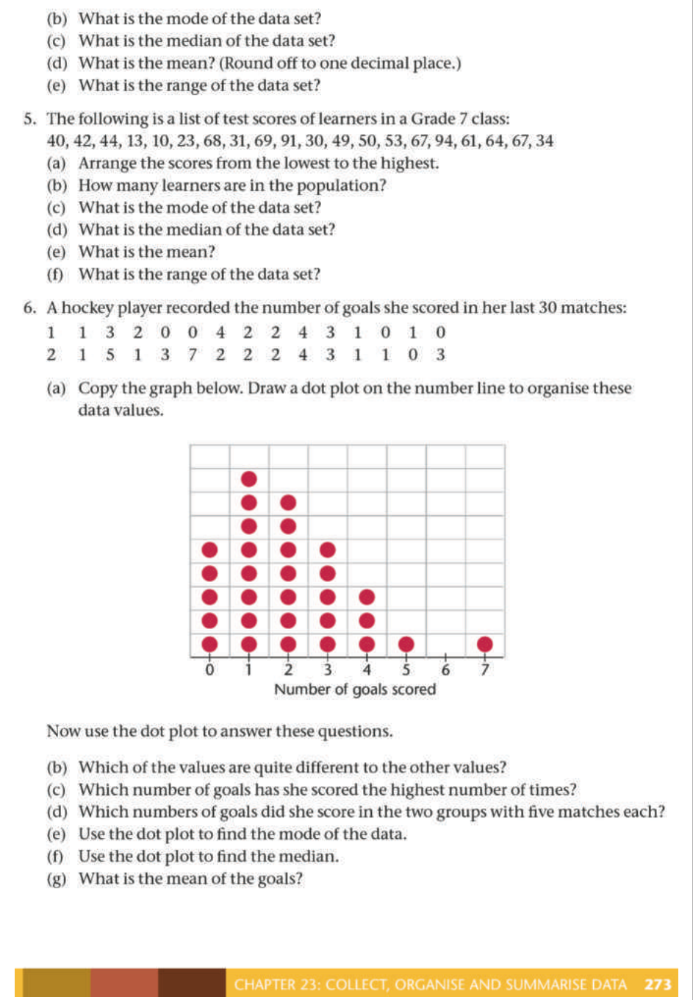
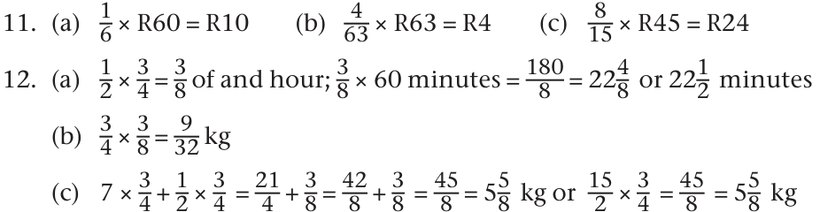
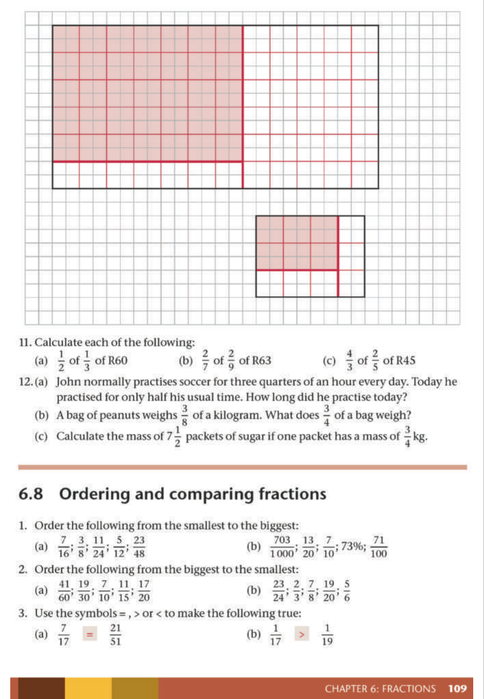

# Chapter 6: Fractions

## 6.1 Measuring accurately with parts of a unit

### Activity: A strange measuring unit
In this activity, we use a "greystick" as a unit of measurement to understand how fractions represent parts of a whole.

<!-- DIAGRAM_PLACEHOLDER: diagram -->

*   **One greystick:** A single unit of length.
*   **Two greysticks:** A length equal to two of the units placed end-to-end.
*   **Measuring with fractions:** When an object is longer than one unit but shorter than two, we divide the unit into equal parts to measure it accurately.

### Key Concepts: Fractional Parts
When a unit is divided into equal parts, each part is named according to the number of divisions:

*   **One sixth:** If a greystick is divided into 6 equal parts, each part is $\frac{1}{6}$ of a greystick.
*   **One seventh:** If a greystick is divided into 7 equal parts, each part is $\frac{1}{7}$ of a greystick.

### Exercise
1. **Question:** Do you think one can say the yellow bar is one and four sixths of a greystick long?

<!-- DIAGRAM_PLACEHOLDER: diagram -->

**Explanation:**
To determine the length, we compare the yellow bar against the greystick units:
*   The yellow bar covers $1$ full greystick.
*   The remaining part of the yellow bar covers $4$ out of the $6$ equal segments of a second greystick.
*   Therefore, the length is $1 + \frac{4}{6}$, which is written as $1\frac{4}{6}$ greysticks.

---

### Fractions and Length Measurement

#### Exercise 3: Identifying Fractional Parts
In each case below, identify the name of the smaller parts of the greystick based on how many equal segments the stick is divided into. Write your answers in words.

> **[Diagram Context - Textbook_Mathematics_Gr7_Collect-organise-and-summarise_data.pdf-0001-12.png]**
> The graphic displays a horizontal bar partitioned into three distinct colored rectangles (dark brown, reddish-brown, and golden-brown) with a diagonal line extending from the top-right corner. There are no visible labels, text, chemical symbols, or mathematical variables present within the image. Conceptually, it serves as a blank graphic organizer or color-key template that teachers can use to visually represent categorical data, genetic crosses, or sequential stages in a CAPS curriculum lesson.

| Item | Number of segments | Name of part |
| :--- | :--- | :--- |
| (a) | 5 | fifths |
| (b) | 6 | sixths |
| (c) | 7 | sevenths |
| (d) | 8 | eighths |
| (e) | 9 | ninths |
| (f) | 10 | tenths |
| (g) | 11 | elevenths |
| (h) | 12 | twelfths |
| (i) | 13 | thirteenths |
| (j) | 14 | fourteenths |
| (k) | 15 | fifteenths |
| (l) | 16 | sixteenths |
| (m) | 17 | seventeenths |
| (n) | 18 | eighteenths |

---

#### Exercise 4 & 5: Measuring Lengths
Using the provided visual bars, determine the length of the colored bars relative to the total length of the greystick.

**4. Yellow Bars**
*   (a) How long is the upper yellow bar?
*   (b) How long is the lower yellow bar?

**5. Other Bars**
*   (a) How long is the blue bar?
*   (b) How long is the red bar?

---

#### Exercise 6: Equivalent Fractions
Use the concept of equivalent fractions to answer the following questions regarding the length of a greystick.

(a) How many twelfths ($\frac{1}{12}$) of a greystick is the same length as one sixth ($\frac{1}{6}$) of a greystick?
*   Calculation: $\frac{1}{6} = \frac{1 \times 2}{6 \times 2} = \frac{2}{12}$
*   Answer: Two twelfths.

(b) How many twenty-fourths ($\frac{1}{24}$) is the same length as one sixth ($\frac{1}{6}$) of a greystick?
*   Calculation: $\frac{1}{6} = \frac{1 \times 4}{6 \times 4} = \frac{4}{24}$
*   Answer: Four twenty-fourths.

(c) How many twenty-fourths ($\frac{1}{24}$) is the same length as seven twelfths ($\frac{7}{12}$) of a greystick?
*   Calculation: $\frac{7}{12} = \frac{7 \times 2}{12 \times 2} = \frac{14}{24}$
*   Answer: Fourteen twenty-fourths.

---

#### Exercise 7: Further Measurement
(a) How long is the upper yellow bar on the following page?
(b) How long is the lower yellow bar on the following page?

---

### Understanding Equivalent Fractions

#### Concept: Equivalent Fractions
When two different fractions describe the same portion or length, we say they are **equivalent**.

---

### Exercises

#### Exercise 8
(a) How many fifths of a greystick is the same length as $\frac{12}{20}$ of a greystick?
(b) How many fourths (or quarters) of a greystick is the same length as $\frac{15}{20}$ of a greystick?

---

#### Exercise 1
(a) What can each small part on this greystick be called?

> **[Diagram Context - Textbook_Mathematics_Gr7_Fractions.pdf-0002-02.png]**
> The graphic shows a set of horizontal rectangular bars, labelled (a) through (n), subdivided into varying numbers of vertical grid segments with alternating thin and bold internal borders. Visible labels include the lowercase letters (a) to (n) arranged along the left and right margins flanking each horizontal row. This diagram conceptually illustrates fraction strips or visual representations of proportional divisions and fractional parts, helping CAPS learners understand part-whole relationships, equivalent fractions, and rational number comparisons in Mathematics.

(b) How many eighteenths is one sixth ($\frac{1}{6}$) of the greystick?
(c) How many eighteenths is one third ($\frac{1}{3}$) of the greystick?
(d) How many eighteenths is five sixths ($\frac{5}{6}$) of the greystick?

---

#### Exercise 2
(a) Write (in words) the names of four different fractions that are all equivalent to three quarters ($\frac{3}{4}$).
(b) Which equivalents for two thirds ($\frac{2}{3}$) can you find on the greysticks?

---

#### Exercise 3
The information that two thirds is equivalent to four sixths, to six ninths and to eight twelfths is written in the second row of the table below. Copy the table and complete the other rows in the same way.

| Fraction | Equivalent 1 | Equivalent 2 | Equivalent 3 |
| :--- | :--- | :--- | :--- |
| $\frac{1}{2}$ | | | |
| $\frac{2}{3}$ | $\frac{4}{6}$ | $\frac{6}{9}$ | $\frac{8}{12}$ |
| $\frac{3}{4}$ | | | |
| $\frac{1}{5}$ | | | |
| $\frac{2}{5}$ | | | |

> **[Diagram Context - Textbook_Mathematics_Gr7_Fractions.pdf-0002-03.png]**
> This educational graphic features a series of seven horizontal fraction strips divided into varying numbers of equal rectangular partitions, progressing from sixths down to thirty-sixths with distinct block groupings. The visual elements consist entirely of grey rectangular grid cells enclosed by solid black outlines arranged in parallel rows, visually demonstrating fractional divisions without explicit numerical labels or arrows. Conceptually, this diagram helps learners visualize equivalent fractions and fractional parts of a whole, reinforcing foundational number concept relationships required in the intermediate phase mathematics curriculum.

> **[Diagram Context - Textbook_Mathematics_Gr7_Fractions.pdf-0002-07.png]**
> This graphic is a diagrammatic representation showing structural layers or sequences made of alternating colored bars (yellow, grey, blue, red) and segmented vertical grids. There are no explicit text labels, chemical symbols, or axis names visible within the graphic. Conceptually, it illustrates comparative structural arrangements, sequence alignments, or layered components corresponding to curriculum topics involving comparative anatomy, data mapping, or material layering.

> **[Diagram Context - Textbook_Mathematics_Gr7_Relationships-between-variables.pdf-0002-05.png]**
> This educational graphic depicts a two-stage mathematical function machine flowchart containing operations "$\times 2$" and "+ 2" connected in sequence. Visible labels include input numbers 1, 2, 3, 4, 5 on the left and output numbers 4, 6, 8 on the right, connected by directional lines and arrows. Conceptually, this diagram helps learners understand function relationships and input-output rules by visually mapping how an initial value is transformed sequentially through algebraic operations.

> **[Diagram Context - Textbook_Mathematics_Gr7_Relationships-between-variables.pdf-0002-16.png]**
> This educational graphic is a flow diagram representing a mathematical function machine. It features input numbers on the left (3, 4, 5, 6, 7), directional arrows pointing towards a central operation box labeled "× 2", and corresponding output numbers on the right with directional arrows (such as 2, 4, 12, 14). For a senior phase CAPS learner, this diagram visually conveys the concept of functions and relationships, demonstrating how an input value is transformed into an output value by applying a constant rule.

> **[Diagram Context - Textbook_Mathematics_Gr7_Relationships-between-variables.pdf-0002-17.png]**
> This educational text graphic explains the fundamental concept of a flow diagram in mathematics. It features explanatory text using the terms "input number", "output number", and "operator", along with the mathematical operation symbol "× 2". Conceptually, it conveys how numerical values undergo a specific rule or transformation process to produce corresponding results, laying the foundation for functions and algebraic relationships in the CAPS curriculum.

> **[Diagram Context - Textbook_Mathematics_Gr7_The-decimal-notation-for-fractions.pdf-0002-04.png]**
> This educational graphic presents a mathematics exercise comprising four distinct sub-questions labeled (a) through (d), asking learners to convert numbers into decimal notation. The visible mathematical expressions include mixed numbers and common fractions with powers of ten as denominators: (a) $3 \frac{7}{10}$, (b) $4 \frac{19}{100}$, (c) $\frac{47}{10}$, and (d) $\frac{4}{100}$. Conceptually, this exercise helps learners master the conversion between common fractions and decimal fractions by reinforcing place value understanding of tenths and hundredths.

> **[Diagram Context - Textbook_Mathematics_Gr7_The-decimal-notation-for-fractions.pdf-0002-08.png]**
> This educational mathematics graphic displays four fractional numbers labelled (a) through (d), each featuring numerators (7, 9, 147, and 999) and denominators based on powers of ten (specifically 1 000). The visible labels include part identifiers (a), (b), (c), and (d) alongside fractions with numerators 7, 9, 147, and 999 over denominators of 1 000. Conceptually, this diagram helps learners practice reading, writing, and converting common fractions with denominators of 1 000 into decimal form in alignment with the CAPS Intermediate Phase mathematics curriculum.

> **[Diagram Context - Textbook_Mathematics_Gr7_The-decimal-notation-for-fractions.pdf-0002-09.png]**
> The graphic presents an educational mathematics exercise consisting of six sub-problems labeled (a) through (f), instructing learners to convert numbers into decimal notation. The visible mathematical expressions feature whole numbers combined with common fractions and fractions with denominators expressed as powers of ten, specifically 10, 100, and 1 000. This exercise helps CAPS Intermediate and Senior Phase students reinforce their understanding of place value by translating numbers from mixed fraction or expanded fractional form into standard decimal form.

---

### Equivalent Fractions and Multiples

The exercises below focus on identifying equivalent fractions by observing patterns in multiples. When a fraction $\frac{a}{b}$ is equivalent to $\frac{c}{d}$, it means that the numerator and denominator have been multiplied by the same constant factor.

#### Exercise 4: Completing the Multiples Table
Copy and complete the table below by finding the equivalent values for each fraction.

| | fifths | tenths | fifteenths | twentieths | twenty-fifths | fiftieths | hundredths |
| :--- | :--- | :--- | :--- | :--- | :--- | :--- | :--- |
| **1** | 1 | 2 | 3 | 4 | 5 | 10 | 20 |
| **2** | 2 | 4 | 6 | 8 | 10 | 20 | 40 |
| **3** | 3 | 6 | 9 | 12 | 15 | 30 | 60 |
| **4** | 4 | 8 | 12 | 16 | 20 | 40 | 80 |
| **5** | 5 | 10 | 15 | 20 | 25 | 50 | 100 |
| **6** | 6 | 12 | 18 | 24 | 30 | 60 | 120 |
| **7** | 7 | 14 | 21 | 28 | 35 | 70 | 140 |

---

#### Exercise 5: Visualizing Equivalent Fractions
Copy the "greysticks" (rectangular bars) below. Use them to demonstrate that $\frac{3}{5}$ is equivalent to $\frac{9}{15}$.

> **[Diagram Context - Textbook_Mathematics_Gr7_Collect-organise-and-summarise_data.pdf-0003-19.png]**
> This graphic consists of three adjacent rectangular colour blocks in shades of dark brown, reddish-brown, and golden-brown, with a thin diagonal pointer line extending from the top right corner. The image lacks any explicit text, labels, chemical symbols, or numerical variables. Conceptually, it serves as an abstract colour swatch or visual placeholder commonly used in curriculum design to test colour-grading, pigment identification, or mineral streak tests in CAPS Earth Sciences.

---

#### Exercise 6: Pattern Completion
Copy and complete the following tables to show equivalent fractions based on the multiples of the denominators.

**Table A: Eighths, Sixteenths, and Twenty-fourths**

| eighths | sixteenths | twenty-fourths |
| :--- | :--- | :--- |
| 1 | 2 | 3 |
| 2 | 4 | 6 |
| 3 | 6 | 9 |
| 4 | 8 | 12 |
| 5 | 10 | 15 |
| 6 | 12 | 18 |
| 7 | 14 | 21 |
| 8 | 16 | 24 |
| 9 | 18 | 27 |

**Table B: Twenty-fourths, Sixths, Twelfths, and Eighteenths**

| twenty-fourths | sixths | twelfths | eighteenths |
| :--- | :--- | :--- | :--- |
| 4 | 1 | 2 | 3 |
| 8 | 2 | 4 | 6 |
| 12 | 3 | 6 | 9 |
| 16 | 4 | 8 | 12 |
| 20 | 5 | 10 | 15 |
| 24 | 6 | 12 | 18 |
| 28 | 7 | 14 | 21 |
| 32 | 8 | 16 | 24 |
| 36 | 9 | 18 | 27 |

> **[Diagram Context - Textbook_Mathematics_Gr7_Fractions.pdf-0003-00.png]**
> This educational graphic is a schematic structural diagram illustrating the layered composition of a diffraction grating spectrometer setup or a multi-layered material cross-section containing colored central channels (blue and red) enclosed by grey structural blocks and yellow outer boundary layers. The diagram visually breaks down continuous and segmented rectangular components across graduated horizontal zones, utilizing color-coded layers (yellow, grey, blue, and red) to distinguish different functional components or material media. Conceptually, it helps students visualize how multi-component optical systems or stratified physical apparatuses are assembled layer-by-layer, assisting in the analysis of spatial arrangements and component proportions in Physics and Technical Sciences.

> **[Diagram Context - Textbook_Mathematics_Gr7_Numeric-patterns.pdf-0003-02.png]**
> This educational graphic shows a two-row table designed for practicing algebraic substitution. The top row lists input values for the variable $x$ ranging from 0 to 8, while the bottom row contains the algebraic expression $3 \times x - 20$ above a series of empty cells. Conceptually, this table helps students learn how to evaluate algebraic expressions by systematically substituting given input values into a rule to determine corresponding outputs.

> **[Diagram Context - Textbook_Mathematics_Gr7_Numeric-patterns.pdf-0003-05.png]**
> This graphic is a function table showing an algebraic input-output relationship with the independent variable row labeled $x$ containing integer values from 0 to 8, and the dependent variable row labeled with the algebraic expression $2 - 3 \times x$ and empty cells underneath for calculation. It illustrates how to substitute consecutive input values into a linear expression to generate corresponding output terms, reinforcing the foundational CAPS concept of number patterns and functions.

> **[Diagram Context - Textbook_Mathematics_Gr7_Relationships-between-variables.pdf-0003-05.png]**
> This graphic is a mathematical function machine diagram representing a number pattern or relationship. It features input values (1, 2, 3, 4, 5) on the left entering a central processing box, and corresponding output values (4, 8, 12, 16, 20) with directional arrows on the right. Conceptually, it helps learners understand functions, sequences, and algebraic rules by visualizing how an input value is transformed by a constant rule (in this case, multiplying by 4) to generate an output.

> **[Diagram Context - Textbook_Mathematics_Gr7_Relationships-between-variables.pdf-0003-07.png]**
> The graphic features two flow diagram representations of mathematical functions, labeled (a) and (b). Diagram (a) shows input values (50, 60, 70, 80, 90, 100, 110) mapped through an operational box containing the rule "- 10" to corresponding output values. Diagram (b) shows a similar relational flow with decimal coordinate-like input values (such as 2,0; 2,1; 2,2; 2,3; 2,5) connected to an empty operational box and pointing to various output values (such as 2,6; 2,8; 3; 3,1; 3,2). Conceptually, these diagrams help learners understand the foundational algebraic concept of functions and relationships, illustrating how an input value is transformed by a specific rule into an output value.

> **[Diagram Context - Textbook_Mathematics_Gr7_Relationships-between-variables.pdf-0003-09.png]**
> The graphic is a function machine diagram displaying a sequence of mathematical operations. It features two connected boxes labeled "× 2" and "+ 3", with input numbers such as 5, 9, and 11 on the left and corresponding output arrows on the right. This diagram helps learners understand function concepts, numeric patterns, and the step-by-step application of algebraic operations.

---

# Lesson: Understanding Fractions

## 1. Core Concepts
A fraction represents a part of a whole. It consists of two main components:

*   **Numerator:** The top number of a fraction. It represents the number of parts being referred to.
*   **Denominator:** The bottom number of a fraction. It represents the total number of equal parts the whole is divided into (the "name" of the parts).

**Example:** In the fraction $\frac{5}{6}$:
*   The numerator is $5$.
*   The denominator is $6$.
*   We read this as "five sixths".

---

## 2. Addition of Fractions
To add fractions, they must have a common denominator. If they do not, convert them to equivalent fractions first.

### Worked Examples
**(a) Five twelfths plus three twelfths:**
$$\frac{5}{12} + \frac{3}{12} = \frac{5+3}{12} = \frac{8}{12} = \frac{2}{3}$$

**(b) Five twelfths plus one quarter:**
Convert $\frac{1}{4}$ to twelfths: $\frac{1 \times 3}{4 \times 3} = \frac{3}{12}$.
$$\frac{5}{12} + \frac{3}{12} = \frac{8}{12} = \frac{2}{3}$$

**(c) Five twelfths plus three quarters:**
Convert $\frac{3}{4}$ to twelfths: $\frac{3 \times 3}{4 \times 3} = \frac{9}{12}$.
$$\frac{5}{12} + \frac{9}{12} = \frac{14}{12} = 1\frac{2}{12} = 1\frac{1}{6}$$

**(d) One third plus one quarter:**
Find a common denominator (12):
$\frac{1}{3} = \frac{4}{12}$ and $\frac{1}{4} = \frac{3}{12}$.
$$\frac{4}{12} + \frac{3}{12} = \frac{7}{12}$$

---

## 3. Visualizing Fractions (Activities)

### Activity: Identifying Parts of a Strip
Use the logic of counting the colored segments over the total number of segments.

| Question | Scenario | Solution |
| :--- | :--- | :--- |
| 1 | Strip divided into 8 parts; 3 are blue. | $\frac{3}{8}$ are blue. |
| 2 | Strip divided into 6 parts; 3 yellow, 3 red. | $\frac{3}{6}$ (or $\frac{1}{2}$) yellow. |
| 3 | Strip divided into 6 parts; 3 yellow, 3 red. | $\frac{3}{6}$ (or $\frac{1}{2}$) red. |
| 4 | Strip has 6 parts; 2 blue, 4 red. | $\frac{2}{6}$ blue, $\frac{4}{6}$ red. |
| 5a | Strip has 12 parts; 5 red, 4 blue, 2 white, 1 yellow. | $\frac{4}{12}$ blue, $\frac{5}{12}$ red, $\frac{2}{12}$ white. |
| 5b | Equivalent fractions for 5a. | $\frac{1}{3}$ blue, $\frac{5}{12}$ red, $\frac{1}{6}$ white. |
| 6 | 2/9 blue, 3/9 green. Find red. | $1 - (\frac{2}{9} + \frac{3}{9}) = \frac{4}{9}$ red. |

---

## 4. Vocabulary Note
*   **Enumerate:** To find the number of items (related to the **numerator**).
*   **Denominate:** To give a name to something (related to the **denominator**).

> **[Diagram Context - Textbook_Mathematics_Gr7_Collect-organise-and-summarise_data.pdf-0004-03.png]**
> The graphic displays two survey-style questionnaire questions with checkbox options for recording data about household chores. The left box contains the question "do you help with chores at home?" with checkbox labels "Yes" and "No", while the right box asks "Which of these chores do you help with?" with options "cleaning dishes", "sweeping/vacuuming", "washing clothes", and "making beds". Conceptually, this demonstrates how to design a questionnaire for data collection, illustrating both closed-ended dichotomous questions and multiple-choice questions used in statistical investigations.

> **[Diagram Context - Textbook_Mathematics_Gr7_Collect-organise-and-summarise_data.pdf-0004-05.png]**
> The educational graphic consists of a survey question box and a text note demonstrating the correct design of continuous grouped data intervals. The survey question reads "How old are you?" and is accompanied by four checkboxes alongside age intervals: "5–8 years", "9–11 years", "12–15 years", and "16–19 years", with an adjacent text note stating: "Note in example 3 how all the ages from 5 to 19 are covered, but without any overlaps." This graphic conveys the mathematical concept of constructing mutually exclusive and exhaustive class intervals for data handling and statistics, teaching learners how to properly categorise continuous data without gaps or ambiguities.

> **[Diagram Context - Textbook_Mathematics_Gr7_Collect-organise-and-summarise_data.pdf-0004-07.png]**
> The graphic is a survey checklist titled "Tick the box if you have:" containing a numbered list of infrastructure and technology items. The visible labels include numbered statements from 1 to 9: "Running water inside your home," "Electricity inside your home," "A radio at home," "A TV at home," "A telephone at home," "A cell phone," "Access to a computer," "Access to the internet," and "Access to a library." Conceptually, this questionnaire introduces high school learners to socio-economic indicators and living standards, helping them gather primary data on basic services and access to information and communication technology (ICT) within communities.

> **[Diagram Context - Textbook_Mathematics_Gr7_Collect-organise-and-summarise_data.pdf-0004-15.png]**
> This educational graphic presents a survey question with categorical response intervals related to data handling. It displays the question text "How much pocket money do you get?" accompanied by four checkboxes and corresponding numerical range intervals: "0-10", "10-20", "20-30", and "30-40". Conceptually, this helps learners understand how to collect data using grouped numerical intervals, laying the foundation for organizing data into frequency tables and drawing statistical graphs in CAPS mathematics.

> **[Diagram Context - Textbook_Mathematics_Gr7_Relationships-between-variables.pdf-0004-09.png]**
> This graphic is a flow diagram representing a function machine with sequential mathematical operations. It features two connected boxes labelled "÷ 5" and "× 2", with input numbers on the left (10, 20, 30, and two blank lines) and output arrow lines on the right, some with values like 16 and 20. This diagram visually conveys the concept of functions and inverse operations by demonstrating how an input value is systematically transformed through a sequence of rules to produce a corresponding output value.

> **[Diagram Context - Textbook_Mathematics_Gr7_Relationships-between-variables.pdf-0004-11.png]**
> The graphic is a tabular function machine format featuring two rows with visible labels "Input numbers" and "Output numbers" divided into multiple blank cells. It visually conveys the concept of functions and relationships in mathematics, where a specific rule applied to independent input values generates corresponding dependent output values.

> **[Diagram Context - Textbook_Mathematics_Gr7_Relationships-between-variables.pdf-0004-13.png]**
> This educational graphic depicts a flow diagram or function machine mapping numerical inputs to outputs. The diagram features input numbers (10, 20, 30) on the left leading into a central box, with corresponding output values (4, 8, 12, 16, 20) on the right indicated by arrows. Conceptually, it helps learners identify numerical patterns, relationships, and rules (in this case, multiplying input values by 0.4) within algebra and number patterns.

> **[Diagram Context - Textbook_Mathematics_Gr7_The-decimal-notation-for-fractions.pdf-0004-17.png]**
> This graphic displays a grid-based spatial arrangement consisting of multiple rows and columns of rectangular cells filled with a color-coded pattern of white, yellow, red, and black blocks. The visual features an organized matrix with symmetrical clusters of colored cells positioned along specific coordinates. Conceptually, this abstract grid representation helps learners develop spatial reasoning, pattern recognition, and coordinate mapping skills essential for foundational mathematical problem-solving in the CAPS curriculum.

---

### Understanding Fractions

A fraction represents a part of a whole. It is written as:
$$\frac{\text{numerator}}{\text{denominator}}$$

*   **Numerator:** The number of parts being considered (written above the line).
*   **Denominator:** The total number of equal parts the whole is divided into (written below the line).

---

### Equivalent Fractions
Equivalent fractions represent the same value even though they look different. You can create equivalent fractions by multiplying both the numerator and the denominator by the same non-zero number.

**Example: Consider the fraction $\frac{3}{4}$**

> **[Diagram Context - Textbook_Mathematics_Gr7_Collect-organise-and-summarise_data.pdf-0005-14.png]**
> This educational graphic displays a horizontal bar divided into three distinct coloured rectangular blocks: dark brown, medium red-brown, and mustard yellow, with a thin diagonal line extending from the top-right corner. There are no visible labels, text, chemical symbols, or directional arrows associated with the colour blocks or the line. Conceptually, this abstract visual representation lacks sufficient contextual information or curriculum-specific elements to convey a clear scientific principle for high school learners.

(a) Multiply by 2: $\frac{3 \times 2}{4 \times 2} = \frac{6}{8}$
(b) Multiply by 3: $\frac{3 \times 3}{4 \times 3} = \frac{9}{12}$
(c) Multiply by 4: $\frac{3 \times 4}{4 \times 4} = \frac{12}{16}$
(d) Multiply by 6: $\frac{3 \times 6}{4 \times 6} = \frac{18}{24}$

All these fractions ($\frac{6}{8}, \frac{9}{12}, \frac{12}{16}, \frac{18}{24}$) are equivalent to $\frac{3}{4}$.

---

### 6.3 Combining Fractions

When adding fractions with the same denominator, you add the numerators while keeping the denominator the same.

#### Worked Example 1: Adding fractions
**Problem:** A team built $\frac{8}{12}$ km of road in one week and $\frac{10}{12}$ km in the next. What is the total length?

**Calculation:**
$$\frac{8}{12} + \frac{10}{12} = \frac{18}{12}$$

**Simplification:**
1.  $\frac{18}{12}$ is the same as $1$ whole and $\frac{6}{12}$ (since $\frac{12}{12} = 1$).
2.  $\frac{6}{12}$ can be simplified to $\frac{1}{2}$.
3.  **Total:** $1 \frac{1}{2}$ km.

---

#### Worked Example 2: Adding mixed numbers
**Problem:** Calculate $4 \frac{5}{9} + 2 \frac{7}{9}$

**Step-by-step solution:**
1.  **Add the whole numbers:** $4 + 2 = 6$
2.  **Add the fractions:** $\frac{5}{9} + \frac{7}{9} = \frac{12}{9}$
3.  **Convert the improper fraction:** $\frac{12}{9} = 1 \frac{3}{9}$ (because $12 \div 9 = 1$ remainder $3$)
4.  **Combine the results:** $6 + 1 \frac{3}{9} = 7 \frac{3}{9}$
5.  **Final Answer:** $7 \frac{3}{9}$ (which can also be simplified to $7 \frac{1}{3}$)

> **[Diagram Context - Textbook_Mathematics_Gr7_Relationships-between-variables.pdf-0005-05.png]**
> The graphic is a flowchart diagram featuring two rectangular boxes connected horizontally by four parallel lines, with multiple directional arrows converging on the left box and diverging from the right box. The diagram utilizes unlabelled rectangular shapes and five incoming/outgoing directional arrows on each side. Conceptually, this diagram represents a transfer, transmission, or transformation process between two systems, components, or stages, commonly used in CAPS curriculum subjects like Information Technology, Engineering Graphics and Design, or Life Sciences to illustrate data flow, pathways, or structural connections.

> **[Diagram Context - Textbook_Mathematics_Gr7_Relationships-between-variables.pdf-0005-08.png]**
> This educational graphic displays a mathematical flow diagram with three sequential operation boxes: multiplying by 9, dividing by 5, and adding 32. Visible labels include input numbers on the left (0, 5, 20, 32, 100), operational symbols inside the boxes ($\times 9$, $\div 5$, $+ 32$), connecting lines with arrows, and empty output pathways on the right. Conceptually, this diagram visually demonstrates the step-by-step function machine used to convert temperatures from Celsius to Fahrenheit, reinforcing the sequential application of algebraic operations in the CAPS Mathematics curriculum.

> **[Diagram Context - Textbook_Mathematics_Gr7_The-decimal-notation-for-fractions.pdf-0005-00.png]**
> The graphic consists of six number line segments labeled (a) through (f) used to teach decimal and fractional measurement. Visible elements include horizontal number lines with varying numerical intervals, tick marks, and blue arrows pointing to specific positions labeled A, B, C, and D. Conceptually, this helps learners master the reading and interpretation of number scales by determining the value of sub-divisions between given numbers.

---

# Fractions and Percentages: Revision Notes

## 1. Operations with Mixed Numbers
To add or subtract mixed numbers, you can either convert them to improper fractions or work with the whole numbers and fractions separately.

### Worked Example: Subtraction
**Problem:** Senthereng has $4\frac{7}{12}$ bottles of oil and gives $1\frac{5}{12}$ to Willem. How much is left?

**Calculation:**
$$4\frac{7}{12} - 1\frac{5}{12} = (4 - 1) + \left(\frac{7}{12} - \frac{5}{12}\right) = 3\frac{2}{12} = 3\frac{1}{6}$$

---

## 2. Practice Exercises: Fractions

### Exercise 4: Calculations
Calculate the following:

| Problem | Calculation | Result |
| :--- | :--- | :--- |
| (a) | $4\frac{2}{7} - 3\frac{6}{7}$ | $\frac{30}{7} - \frac{27}{7} = \frac{3}{7}$ |
| (b) | $3\frac{6}{7} + 3\frac{3}{7}$ | $6\frac{9}{7} = 7\frac{2}{7}$ |
| (c) | $3\frac{6}{7} + 1\frac{4}{5}$ | $3\frac{30}{35} + 1\frac{28}{35} = 4\frac{58}{35} = 5\frac{23}{35}$ |
| (d) | $4\frac{3}{8} - 2\frac{5}{8}$ | $3\frac{11}{8} - 2\frac{5}{8} = 1\frac{6}{8} = 1\frac{3}{4}$ |
| (e) | $1\frac{3}{10} - 2\frac{3}{5}$ | $1\frac{3}{10} - 2\frac{6}{10} = -1\frac{3}{10}$ |
| (f) | $3\frac{5}{10} - 1\frac{1}{2}$ | $3\frac{5}{10} - 1\frac{5}{10} = 2$ |

---

## 3. Tenths and Hundredths (Percentages)

### Core Concept
*   **One hundredth** is represented as $\frac{1}{100}$ or $0,01$.
*   If a whole strip is divided into 100 equal pieces, each piece is $1\%$ of the whole.

### Worked Example: Spaza Shop Pricing
**Scenario:** Gatsha sells a strip of licorice (containing 100 pieces) for R2.

1.  **Cost of one piece:**
    $$\text{Price} \div \text{Number of pieces} = R2 \div 100 = R0,02 \text{ (or 2 cents)}$$
2.  **Cost of one-fifth of a strip:**
    $$\frac{1}{5} \text{ of } 100 \text{ pieces} = 20 \text{ pieces}$$
    $$20 \times R0,02 = R0,40$$
3.  **Fraction of a strip for 25 pieces:**
    $$\frac{25}{100} = \frac{1}{4}$$

---

## 4. Summary Activity: Totaling Pages
**Problem:** Neo's report has five chapters:
*   Chapter 1: $\frac{3}{4}$ page
*   Chapter 2: $1\frac{1}{2}$ pages
*   Chapter 3: $3\frac{3}{4}$ pages
*   Chapter 4: (Implied as 3 pages)
*   Chapter 5: $1\frac{1}{2}$ pages

**Total Calculation:**
$$\text{Total} = \frac{3}{4} + 1\frac{2}{4} + 3\frac{3}{4} + 3 + 1\frac{2}{4}$$
$$\text{Total} = (1 + 3 + 3 + 1) + \left(\frac{3+2+3+2}{4}\right)$$
$$\text{Total} = 8 + \frac{10}{4} = 8 + 2\frac{2}{4} = 10\frac{1}{2} \text{ pages}$$

> **[Diagram Context - Textbook_Mathematics_Gr7_Fractions.pdf-0006-06.png]**
> The graphic is a geometric figure displaying a hierarchical tiling pattern composed of grey rectangular blocks arranged across multiple horizontal tiers, delineated by thin black grid lines and accented with several prominent vertical black separator lines. Visible elements include grey rectangular subdivisions, horizontal boundary lines, and vertical partition lines of varying thickness. Conceptually, this diagram helps learners visualize hierarchical partitioning, fractions, or structural tessellation in Mathematics.

> **[Diagram Context - Textbook_Mathematics_Gr7_Fractions.pdf-0006-19.png]**
> The graphic is a mathematical text illustration showing fraction addition with like denominators. It displays numeric fractions $\frac{8}{12}$ and $\frac{10}{12}$ paired with text labels "eight twelfths" and "ten twelfths", concluding with the sum $\frac{18}{12}$ labeled "eighteen twelfths". Conceptually, this demonstrates the foundational rule that when adding fractions with the same denominator, numerators are added together while the denominator remains unchanged.

> **[Diagram Context - Textbook_Mathematics_Gr7_Fractions.pdf-0006-21.png]**
> The image is a text-based educational graphic demonstrating the conversion between improper fractions and mixed numbers using kilometres. Visible text includes fractions and units such as "12 twelfths of a kilometre", "1 kilometre", "1 6/12", and "1 1/2 km". This graphic conceptually conveys how to simplify fractions and convert improper fractions into mixed numbers using real-world measurements like distance.

> **[Diagram Context - Textbook_Mathematics_Gr7_Numeric-patterns.pdf-0006-21.png]**
> This educational graphic is a mathematics worksheet page titled "Chapter 19 Numeric patterns" from a CAPS-aligned textbook, featuring tables and structured word problems. Visible labels include row identifiers (A, B, C, D, E, F, G), column headings for term numbers (1 to 9), and numerical sequences with varying positive and negative integers. Conceptually, the diagram guides students through investigating, extending, and identifying constant differences in linear number patterns, building foundational algebraic thinking skills.

> **[Diagram Context - Textbook_Mathematics_Gr7_Relationships-between-variables.pdf-0006-00.png]**
> This mathematical flow diagram illustrates a function machine mapping input values through a sequence of three operations. The diagram displays input values (0, 5, 20, 32, 100) connected by lines and arrows to sequential operational blocks labelled "÷ 5", "× 9", and "+ 32", which lead to output arrows on the right. Conceptually, it demonstrates how an algebraic function processes multiple independent inputs step-by-step, reinforcing the relationship between inputs and outputs in functions and formulas (such as converting Celsius to Fahrenheit).

> **[Diagram Context - Textbook_Mathematics_Gr7_Relationships-between-variables.pdf-0006-05.png]**
> This educational graphic is a flow diagram representing a mathematical function or operator. It features a central rectangular box labeled "Multiply by itself" with multiple incoming input lines on the left and corresponding outgoing directional arrows on the right. Conceptually, this diagram illustrates the fundamental operation of squaring a number, demonstrating how numerical inputs are transformed into outputs through a specific rule in algebra and functions.

> **[Diagram Context - Textbook_Mathematics_Gr7_Relationships-between-variables.pdf-0006-08.png]**
> This graphic shows a large 3D geometric figure representing a composite cube made up of smaller unit cubes in a 3x3x3 grid arrangement. The image contains no explicit text labels, variables, or directional arrows, relying purely on isometric line art and shading to depict three visible faces composed of individual square faces. Conceptually, this diagram helps learners visualize spatial reasoning, surface area-to-volume relationships, and combinatorial counting problems in geometry and measurement.

> **[Diagram Context - Textbook_Mathematics_Gr7_The-decimal-notation-for-fractions.pdf-0006-01.png]**
> This educational graphic is a question-labeling template commonly used in South African CAPS curriculum assessments to structure multiple-choice or identification items. It features sequential numeric labels (11, 12, 13) paired with lettered options (A, B, C, D), each accompanied by an upward-pointing blue arrow. Conceptually, this visual structure guides learners to match specific diagram components or questions to their correct scientific answers during examinations.

> **[Diagram Context - Textbook_Mathematics_Gr7_The-decimal-notation-for-fractions.pdf-0006-08.png]**
> This graphic features a mathematical number pattern presented as a sequence of decimals alongside a horizontal number line with arched skip-counting intervals. Visible labels include the sequence terms "0,2; 0,4; 0,6; ...", numerical markings "0", "1", "2", "3" on the number line, and curved jump arrows indicating repetitive increments. Conceptually, this diagram helps Intermediate and Senior Phase learners visualize arithmetic sequences and decimal counting by connecting numerical lists to spatial movements along a number line.

> **[Diagram Context - Textbook_Mathematics_Gr7_The-decimal-notation-for-fractions.pdf-0006-10.png]**
> The graphic displays a number pattern question consisting of a numerical sequence with decimals and a corresponding number line with curved jump arrows. Visible labels include the sequence "2. (a) 0,3; 0,6; 0,9; ..." and sub-label "(b)", alongside numbers "0", "1", "2", and "3" on a calibrated number line. Conceptually, this diagram helps learners visualize arithmetic sequences and constant differences by illustrating consecutive jumps of 0,3 along a number line.

---

### Understanding Fractions and Percentages

#### Conceptual Exercises: Licorice Strips
**4. Understanding Hundredths and Tenths**
*   (a) Why can each small piece be called one hundredth of the whole strip?
*   (b) How many hundredths is the same as one tenth of the strip?

**5. Equivalent Fractions**
*   (a) How many hundredths is the same as $\frac{2}{5}$ of the whole strip?
*   (b) How many tenths is the same as $\frac{2}{5}$ of the whole strip?
*   (c) How many hundredths is the same as $\frac{3}{4}$ of the whole strip?
*   (d) Freddie bought $\frac{60}{100}$ of a strip. How many fifths of a strip is this?
*   (e) Jamey bought part of a strip for R1,60. What part of a strip did she buy?

**6. Visualizing Parts of a Whole**
Gatsha sells pieces of yellow licorice. Identify the fraction of the whole strip represented by each child's piece.

---

#### Financial Calculations
**7. Costing**
The yellow licorice costs R2,40 (240 cents) for a full strip. Calculate the cost for each child's piece, rounding to the nearest cent.

**8. Calculating Fractions of Amounts**
Calculate the following values based on 300 cents:
*   (a) How much is $\frac{1}{100}$ of 300 cents?
*   (b) How much is $\frac{7}{100}$ of 300 cents?
*   (c) How much is $\frac{25}{100}$ of 300 cents?
*   (d) How much is $\frac{1}{4}$ of 300 cents?
*   (e) How much is $\frac{40}{100}$ of 300 cents?
*   (f) How much is $\frac{2}{5}$ of 300 cents?

**9. Reasoning**
Explain why your answers for questions 8(e) and 8(f) are the same.

---

#### Key Concept: Per Cent
*   **Definition:** Another word for **hundredth** is **per cent**.
*   **Example:** If Miriam received $32$ hundredths of a licorice strip, we can say she received **32 per cent** of a licorice strip.
*   **Symbol:** The symbol for per cent is **%**.

> **[Diagram Context - Textbook_Mathematics_Gr7_Collect-organise-and-summarise_data.pdf-0007-16.png]**
> The graphic is an abstract colour-coded strip composed of three adjacent rectangular blocks in dark brown, reddish-brown, and golden-brown, with a thin diagonal line extending from the top-right corner. It contains no explicit textual labels, variables, or standard scientific symbols. Conceptually, it serves as an open-ended visual template or colour bar that teachers can adapt for sorting and categorisation exercises in foundation-phase or intermediate-phase CAPS modules.

> **[Diagram Context - Textbook_Mathematics_Gr7_Fractions.pdf-0007-05.png]**
> The graphic displays a set of mathematical exercise problems involving fractions, labelled sequentially from (a) to (l), along with a word problem numbered 5. The visible numbers, symbols, and operators consist of whole numbers, mixed numbers, proper and improper fractions, addition and subtraction signs, brackets, and letter labels (a) through (l). This exercise helps students practice arithmetic operations with common fractions and mixed numbers, including finding common denominators and combining whole and fractional parts.

> **[Diagram Context - Textbook_Mathematics_Gr7_Numeric-patterns.pdf-0007-20.png]**
> This educational text and table presents mathematical exercises on number patterns, sequences, and expressions under headings like "19.2 Making patterns from rules" and "19.3 Making patterns from expressions," including a completed table with variables $x$ and algebraic expressions like $2 \times x - 10$. It conveys conceptually how to investigate sequences, generate number patterns from starting terms and constant differences, and link input values to output values using algebraic rules.

> **[Diagram Context - Textbook_Mathematics_Gr7_Relationships-between-variables.pdf-0007-02.png]**
> This educational graphic consists of six distinct function-machine diagrams labeled (a) through (f). The visible labels and symbols include input numbers on the left (1, 2, 3, 4, 6), central processing boxes containing mathematical operations (+7, ×5, ×5 followed by +2, ×2 followed by +3, ×3, ×2) linked by directional arrows, and selected output values on the right (such as 8, 5, 10, 3, 6). Conceptually, these diagrams help learners understand mathematical functions and number patterns by demonstrating how a rule is systematically applied to a set of input values to generate corresponding output values.

> **[Diagram Context - Textbook_Mathematics_Gr7_Relationships-between-variables.pdf-0007-05.png]**
> The graphic is a tabular representation of a number pattern showing a relationship between two variables. The table contains two rows labeled "Input numbers" and "Output numbers", with visible input values of 1, 2, 3, 4, 5, 7, and 10, and corresponding output values of 9, 16, 23 for the first three inputs, followed by empty cells. This layout helps learners practice identifying a constant difference (linear pattern), determining the general term ($Tn$), and calculating missing output values for given inputs.

---

The provided image is a blank template page containing only a header graphic (a horizontal line with three colored blocks). There is no instructional content, text, or mathematical data present to analyze.

> **[Diagram Context - Textbook_Mathematics_Gr7_Fractions.pdf-0008-02.png]**
> This graphic shows a fraction wall diagram consisting of horizontal rectangular bars divided into varying numbers of vertical segments. The visible elements include parallel rows of unlabelled rectangular blocks, with the middle row densely subdivided by vertical grid lines. Conceptually, this visual tool helps learners understand fractional parts, equivalent fractions, and how different denominators relate proportionally to a single whole.

> **[Diagram Context - Textbook_Mathematics_Gr7_Fractions.pdf-0008-07.png]**
> This educational graphic is a measurement and partitioning diagram featuring a long horizontal strip divided into yellow grid units. The diagram includes the visible labels "Gabieba's piece", "Miriam's piece", "Sannie's piece", "Enoch's piece", "Mpati's piece", and "Mpho's piece" positioned alongside specific segments of the divided strip. Conceptually, it conveys how continuous lengths can be partitioned into discrete fractional or whole units, helping learners understand basic measurement, counting, and proportional reasoning.

> **[Diagram Context - Textbook_Mathematics_Gr7_Fractions.pdf-0008-09.png]**
> This educational graphic presents a mathematics exercise consisting of six written fraction-of-a-quantity problems labeled (a) through (f). Each question features the base value "300 cents" combined with different fractions, including $\frac{1}{100}$, $\frac{7}{100}$, $\frac{25}{100}$, $\frac{1}{4}$, $\frac{40}{100}$, and $\frac{2}{5}$. Conceptually, this exercise helps students practice calculating fractions of a whole number and reinforces the foundational relationship between common fractions and percentages (such as hundredths) using South African currency units.

> **[Diagram Context - Textbook_Mathematics_Gr7_Numeric-patterns.pdf-0008-17.png]**
> This educational graphic is a Mathematics textbook page containing numerical tables, algebraic expressions, and worded sequence problems. Visible elements include input-output tables with the variable $x$ and algebraic expressions such as $3 \times x - 20$, $2 - 3 \times x$, and $1 - 2 \times x$, alongside numbered questions (1 to 5) focusing on number patterns and constant differences. Conceptually, this content guides Grade 7 learners through identifying, extending, and analyzing linear number patterns and relationships between consecutive terms using algebraic notation.

---

### Exercises: Percentages and Financial Calculations

**10. Calculate 80% of the following:**
(a) R500
(b) R480
(c) R850
(d) R2 400

**11. Calculate 8% of the amounts in 10(a), (b), (c), and (d).**

**12. Calculate 15% of the amounts in 10(a), (b), (c), and (d).**

**13. Percentage Increase:**
Building costs of houses increased by $20\%$. What is the new building cost for a house that previously cost R110 000 to build?

**14. Percentage Decrease:**
The value of a car decreases by $30\%$ after one year. If the price of a new car is R125 000, what is the value of the car after one year?

**15. Investigation:**
Investigate which denominators of fractions can easily be converted to powers of $10$ (e.g., $10, 100, 1 000$).

---

## 6.5 Thousandths, Hundredths, and Tenths

### Concept: Many Equal Parts
When a whole is divided into equal parts, we use fractions to represent these parts. 
*   **Tenths:** $\frac{1}{10}$
*   **Hundredths:** $\frac{1}{100}$
*   **Thousandths:** $\frac{1}{1000}$

**1. Practical Application:**
In a camp for refugees, $50\text{ kg}$ of sugar must be shared equally between $1 000$ refugees. How much sugar will each refugee get? (Hint: $1\text{ kg} = 1 000\text{ g}$).

**2. Calculate the following parts of R6 000:**
(a) One tenth of R6 000
(b) One hundredth of R6 000
(c) One thousandth of R6 000
(d) Ten hundredths of R6 000
(e) $100$ thousandths of R6 000
(f) Seven hundredths of R6 000
(g) $70$ thousandths of R6 000
(h) Seven thousandths of R6 000

**3. Calculate the sums:**
(a) $\frac{3}{10} + \frac{5}{8}$
(b) $3\frac{3}{10} + 2\frac{4}{5}$
(c) $\frac{3}{10} + \frac{7}{100}$
(d) $\frac{3}{10} + \frac{70}{100}$
(e) $\frac{3}{10} + \frac{7}{1000}$
(f) $\frac{3}{10} + \frac{70}{1000}$

**4. Calculate the sums:**
(a) $\frac{3}{10} + \frac{7}{100} + \frac{4}{1000}$
(b) $\frac{3}{10} + \frac{70}{100} + \frac{400}{1000}$
(c) $\frac{6}{10} + \frac{20}{100} + \frac{700}{1000}$
(d) $2 + \frac{5}{10} + \frac{4}{1000}$

**5. Investigation: True or False?**
Investigate whether the following statements are true or false and provide reasons for your decision:

(a) $\frac{1}{10} + \frac{23}{100} + \frac{346}{1000} = \frac{6}{10} + \frac{3}{100} + \frac{46}{1000}$
(b) $\frac{1}{10} + \frac{23}{100} + \frac{346}{1000} = \frac{7}{10} + \frac{2}{100} + \frac{6}{1000}$
(c) $\frac{1}{10} + \frac{23}{100} + \frac{346}{1000} = \frac{6}{10} + \frac{7}{100} + \frac{6}{1000}$
(d) $\frac{676}{1000} = \frac{6}{10} + \frac{7}{100} + \frac{6}{1000}$

> **[Diagram Context - Textbook_Mathematics_Gr7_Collect-organise-and-summarise_data.pdf-0009-13.png]**
> The graphic displays a horizontal bar partitioned into three distinct colored rectangles (dark brown, reddish-brown, and mustard yellow) adjacent to a blank white space crossed by a single diagonal line, with no visible text, labels, symbols, or arrows. Conceptually, the abstract layout lacks the specific curricular context required to convey biological, physical, or mathematical principles under the CAPS curriculum.

> **[Diagram Context - Textbook_Mathematics_Gr7_Numeric-patterns.pdf-0009-14.png]**
> The graphic is a mathematics textbook page showing a collection of linear number sequences, algebraic expressions, and graduated problem sets labeled 6 through 11. It features variables $x$, various numerical patterns (labeled Pattern A to I), and bolded conceptual terms such as increasing sequence, decreasing sequence, and increases faster. This layout is designed to help CAPS learners analyze the rate of change and relationship between algebraic expressions and their corresponding numerical sequences.

> **[Diagram Context - Textbook_Mathematics_Gr7_The-decimal-notation-for-fractions.pdf-0009-07.png]**
> This mathematical comparison exercise displays six sub-questions, labeled (a) through (f), each presenting a pair of decimal numbers separated by a blank placeholder square. The visible decimal values include 0,4; 0,52; 0,32; 2,61; 2,7; 2,4; 2,40; 2,34; 2,567; and 2,251, utilizing the South African comma convention for decimals. Conceptually, this diagram helps FET phase learners practice comparing and ordering decimal numbers by determining whether the first value is greater than (>), less than (<), or equal to (=) the second value.

---

# 6.6 Fraction of a Fraction

To calculate a "fraction of a fraction" or a "fraction of an amount," you multiply the fraction by the total value. The word "of" in mathematics indicates multiplication.

### Core Concept: Calculating Parts of a Whole
To find a fraction of an amount, divide the amount by the denominator (bottom number) and multiply by the numerator (top number).

**Example:** To find $\frac{3}{5}$ of $R60$:
1. Find $\frac{1}{5}$ of $R60$: $R60 \div 5 = R12$
2. Multiply by $3$: $R12 \times 3 = R36$

---

### Practice Exercises

#### 1. Parts of R60
(a) How much is $\frac{1}{5}$ of $R60$?
(b) How much is $\frac{3}{5}$ of $R60$?

#### 2. Parts of R80
How much is $\frac{7}{10}$ of $R80$? (Hint: Find $\frac{1}{10}$ of $R80$ first).

#### 3. Currency Conversions
(a) How much is $\frac{2}{5}$ of $20$ pula?
(b) How much is $\frac{2}{5}$ of $20$ euro?
(c) How much is $\frac{2}{5}$ of $12$ pula?

#### 4. Conceptual Reasoning
Why was it easy to calculate $\frac{2}{5}$ of $20$, but more difficult to calculate $\frac{2}{5}$ of $12$?

---

### Strategy: Converting Units
When a calculation results in a fraction of a unit that is difficult to divide, convert the larger unit into smaller units (e.g., Rands to cents).

**Example:** To calculate $\frac{3}{5}$ of $R4$:
1. Convert $R4$ to $400$ cents.
2. $\frac{1}{5}$ of $400 = 80$ cents.
3. $\frac{3}{5}$ of $400 = 80 \times 3 = 240$ cents (or $R2,40$).

#### 5. Calculate the following:
(a) $\frac{3}{8}$ of $R2,40$
(b) $\frac{7}{12}$ of $R6$
(c) $\frac{2}{5}$ of $R21$
(d) $\frac{5}{6}$ of $R3$

---

### Fractions of Fractions
When working with "secret objects" (e.g., fiftieths of a rand), treat the denominator as a label.

#### 6. Secret Objects
(a) How much is $\frac{3}{10}$ of $40$ secret objects?
(b) How much is $\frac{3}{8}$ of $40$ secret objects?

#### 7. Fiftieths
(a) How many fiftieths is $\frac{3}{10}$ of $40$ fiftieths?
(b) How many fiftieths is $\frac{5}{8}$ of $40$ fiftieths?

#### 8. Kilogram Conversions
(a) How many twentieths of a kilogram is the same as $\frac{3}{4}$ of a kilogram?
(b) How much is $\frac{1}{5}$ of $15$ rands?
(c) How much is $\frac{1}{5}$ of $15$ twentieths of a kilogram?
(d) So, how much is $\frac{1}{5}$ of $\frac{3}{4}$ of a kilogram?

#### 9. Multiples of Fortieths
(a) How much is $\frac{1}{12}$ of $24$ fortieths of some secret object?
(b) How much is $\frac{7}{12}$ of $24$ fortieths of the secret object?

#### 10. Discussion
Do you agree that the answers for question 9 are $\frac{2}{40}$ and $\frac{14}{40}$? If you disagree, explain why.

---

### Calculating Fractions of Fractions

#### Exercise 11: Fractions of a Whole Number
Calculate the following:
(a) How much is $\frac{1}{5}$ of $80$?
(b) How much is $\frac{3}{5}$ of $80$?
(c) How much is $\frac{1}{40}$ of $80$?
(d) How much is $\frac{24}{40}$ of $80$?
(e) Explain why $\frac{3}{5}$ of $80$ is the same as $\frac{24}{40}$ of $80$.

#### Exercise 12: Comparing Fractions
Look at your answers for questions 9(b) and 11(e). How much is $\frac{7}{12}$ of $\frac{3}{5}$? Explain your answer.

---

### Key Concepts: Equivalent Fractions in Multiplication
When multiplying fractions, it is often easier to use equivalent fractions to simplify the calculation.

**Example:**
To calculate $\frac{3}{8}$ of $\frac{2}{3}$:
1. Finding "one eighth of $\frac{2}{3}$" is difficult because $2$ is not divisible by $8$.
2. We choose an equivalent fraction for $\frac{2}{3}$ where the numerator is divisible by $8$.
3. Since $\frac{2}{3} = \frac{8}{12}$, we can calculate $\frac{3}{8}$ of $\frac{8}{12}$ instead.
4. Calculation: $\frac{3}{8} \times \frac{8}{12} = \frac{24}{96} = \frac{1}{4}$.

---

### Exercise 13
(a) Calculate $\frac{3}{8}$ of $\frac{8}{12}$.
(b) So, how much is $\frac{3}{8}$ of $\frac{2}{3}$?

---

### Exercise 14: Practice
In each case, replace the second fraction with a suitable equivalent fraction, and then calculate:

(a) How much is $\frac{3}{4}$ of $\frac{5}{8}$?
(b) How much is $\frac{7}{10}$ of $\frac{2}{3}$?
(c) How much is $\frac{2}{3}$ of $\frac{1}{3}$?
(d) How much is $\frac{3}{5}$ of $\frac{2}{5}$?

> **[Diagram Context - Textbook_Mathematics_Gr7_Collect-organise-and-summarise_data.pdf-0011-10.png]**
> The graphic shows a data transformation from a stem-and-leaf plot into a vertical bar graph representation, connected by a horizontal arrow. The stem-and-leaf plot on the left displays stems 1 through 7 with corresponding leaves listed horizontally (e.g., stem 1 with leaves 2, 5; stem 3 with leaves 1, 4, 4, 5, 5, 9). The right-hand graph displays numerical categories 1 through 7 on the horizontal axis with vertical columns of digits stacked upwards to represent frequency counts for each category. This visual conveys how grouped numerical data from a stem-and-leaf display can be converted into a frequency bar graph format, helping learners interpret data distributions and frequency trends.

> **[Diagram Context - Textbook_Mathematics_Gr7_The-decimal-notation-for-fractions.pdf-0011-14.png]**
> This educational graphic is a 2D geometry figure representing a circular annulus with a cross-section showing concentric circles. The diagram includes labels for the center point (A), the inner boundary radius (B), and the outer boundary radius (C), connected by a red line segment extending from the center through the hatched ring. Conceptually, this figure helps high school learners calculate the area and thickness of circular rings and hollow cylinders by demonstrating the relationship between inner and outer radii.

---

# 6.7 Multiplying with Fractions

## Parts of Rectangles and Parts of Parts

### Exercise 1
1. (a) Copy the rectangles below. Divide the rectangle on the left into eighths by drawing vertical lines. Lightly shade the left $\frac{3}{8}$ of the rectangle.
   (b) Divide the rectangle on the right into fifths by drawing horizontal lines. Lightly shade the upper $\frac{2}{5}$ of the rectangle.

### Exercise 2
2. (a) Copy the rectangles below. Shade $\frac{4}{7}$ of the rectangle on the left.
   (b) Shade $\frac{16}{28}$ of the rectangle on the right.

> **[Diagram Context - Textbook_Mathematics_Gr7_Fractions.pdf-0012-00.png]**
> The image is a mathematics exercise text featuring two sub-questions labeled 11. (a) and (b), which ask learners to calculate fractional parts of a whole number. Visible text includes question identifiers "11. (a)", "(b)", fractions "1/5" and "3/5", and the whole number "80". Conceptually, this exercise helps learners understand how to find a fraction of a whole number by dividing by the denominator and multiplying by the numerator, reinforcing basic operations with common fractions as prescribed in the CAPS curriculum.

### Exercise 3
3. (a) What part of each big rectangle below is coloured yellow?

> **[Diagram Context - Textbook_Mathematics_Gr7_Fractions.pdf-0012-01.png]**
> This educational text image presents a series of mathematical word problems involving fraction calculations, specifically determining fractional parts of whole numbers and comparing equivalent fractions. The visible text includes question labels (c, d, e, 12), fractional expressions such as $\frac{40}{24}$, $\frac{3}{40}$, $\frac{24}{40}$, $\frac{3}{5}$, and $\frac{7}{12}$ of $\frac{3}{5}$, along with the integer 80 and explanatory prompts. Conceptually, this exercise helps learners understand the equivalence of fractions, multiplication of fractions by whole numbers, and the application of proportional reasoning in foundational mathematics.

(b) What part of the *yellow* part of the rectangle on the right is dotted?
(c) Into how many squares is the whole rectangle on the right divided?
(d) What part of the whole rectangle on the right is yellow *and* dotted?

> **[Diagram Context - Textbook_Mathematics_Gr7_Fractions.pdf-0012-03.png]**
> This educational graphic displays mathematical text outlining fraction concepts. It features the fractions \(\frac{24}{40}\), \(\frac{3}{5}\), \(\frac{7}{12}\), and associated relational statements. Conceptually, this helps learners understand fraction equivalence (showing that \(\frac{24}{40}\) simplifies to \(\frac{3}{5}\)) and the commutativity or equivalence of fractional parts of quantities.

> **[Diagram Context - Textbook_Mathematics_Gr7_Fractions.pdf-0012-04.png]**
> This educational graphic displays a mathematical text snippet demonstrating fraction calculations. It contains the fractions 7/12 and 24/40 alongside descriptive text explaining the step-by-step calculation method. Conceptually, it guides learners through finding a fractional part of a whole number by first dividing by the denominator and then multiplying by the numerator.

> **[Diagram Context - Textbook_Mathematics_Gr7_Fractions.pdf-0012-09.png]**
> This educational graphic presents a mathematical text problem demonstrating fraction equivalence and multiplication operations. The visible text includes fractional expressions containing numbers such as 8/12, 2/3, and 3/8, alongside numbered prompt labels like "13.(a)" and "(b)". Conceptually, this diagram guides learners through simplifying complex fraction calculations by demonstrating how to substitute an equivalent fraction (changing 2/3 to 8/12) to make multiplication easier.

> **[Diagram Context - Textbook_Mathematics_Gr7_Fractions.pdf-0012-11.png]**
> This educational graphic is a mathematics problem set consisting of three textual sub-questions labeled (b), (c), and (d). It displays the phrase "How much is" followed by pairs of proper and mixed fractions involving numbers such as 4/7, 8/2, 10/2, 3/1, 3/3, and 2/3/5, connected by the mathematical operation word "of". Conceptually, this exercise helps students practice finding fractional parts of other fractions, reinforcing multiplication of rational numbers and conceptual understanding of proportional parts.

---

### Multiplying Fractions

#### 1. Visualizing Fractions
To find a fraction of a fraction, you can use grid paper to create diagrams.
*   **(a)** Find $\frac{3}{4}$ of $\frac{5}{8}$
*   **(b)** Find $\frac{2}{3}$ of $\frac{4}{5}$

> **[Diagram Context - Textbook_Mathematics_Gr7_Collect-organise-and-summarise_data.pdf-0013-12.png]**
> This graphic displays a horizontal bar chart divided into three adjacent colored rectangular sections: dark brown, reddish-brown, and mustard yellow, accompanied by a single diagonal line extending from the top right corner. There are no visible text labels, axes, chemical symbols, or arrows present in the image. Conceptually, abstract visual blocks like this are often used in early-phase CAPS curriculum materials as placeholders or comparative segments to introduce learners to proportional divisions, categorical data representation, or color-based classification.

#### 2. The Rule for Multiplying Fractions
When multiplying two fractions, you can follow these steps:
1.  Multiply the two numerators together to get the new numerator.
2.  Multiply the two denominators together to get the new denominator.

**Example:**
$$\frac{3}{4} \times \frac{5}{8} = \frac{3 \times 5}{4 \times 8} = \frac{15}{32}$$

---

### Exercises

**Question 4:** Use grid paper to represent the fractions as shown in the diagram above.

**Question 5:** Compare the result of the multiplication rule with the visual representation of $\frac{3}{4}$ of $\frac{5}{8}$. What do you notice about the relationship between "of" and the multiplication sign ($\times$)?

**Question 6:** Solve the following word problems:
*   **(a)** Alan has five heaps of eight apples each. How many apples is that in total?
*   **(b)** Sean has ten heaps of six quarter apples each. How many apples is that in total?

---

### Key Concept: "Of" means Multiply
In mathematics, the word "of" indicates multiplication. 

*   Instead of saying $\frac{5}{8}$ **of** R40, we say $\frac{5}{8} \times R40$.
*   Instead of saying $\frac{5}{8}$ **of** $\frac{2}{3}$ of a floor surface, we say $\frac{5}{8} \times \frac{2}{3}$ of a floor surface.

> **[Diagram Context - Textbook_Mathematics_Gr7_The-decimal-notation-for-fractions.pdf-0013-00.png]**
> This educational graphic is a numeric flow diagram designed as an exercise for decimal fractions and place value. It features three sequential number rows containing alternating numerical values and operational boxes separated by directional arrows pointing right, along with empty boxes for students to complete. Conceptually, it helps learners understand the multiplicative and divisional effects of powers of ten on decimal comma placement within numbers up to millions.

> **[Diagram Context - Textbook_Mathematics_Gr7_The-decimal-notation-for-fractions.pdf-0013-02.png]**
> This educational text graphic demonstrates the relationship between decimal multiplication and fractions through two text-based mathematical equations: $4 \times 0,5$ and $0,5 \times 4$, using the fraction equivalent $\frac{1}{2}$ with addition operators and descriptive phrasing. It conceptually illustrates that multiplying a whole number by a decimal is equivalent to repeated addition of fractions or finding a fractional part of a whole, reinforcing the commutative property and conceptual equivalence of decimals and common fractions in intermediate phase mathematics.

---

### Multiplying Fractions

#### 7. Visualizing Fraction Multiplication
Use the provided grid diagrams to determine the product of the following fractions:

(a) $\frac{3}{10} \times \frac{5}{6}$

(b) $\frac{2}{5} \times \frac{7}{8}$

---

#### 8. Testing the Multiplication Rule
The general rule for multiplying fractions is:
$$\frac{\text{numerator} \times \text{numerator}}{\text{denominator} \times \text{denominator}}$$

(a) Perform the calculation using the rule for $\frac{3}{10} \times \frac{5}{6}$ and compare your result to your answer from question 7(a).

(b) Perform the calculation using the rule for $\frac{2}{5} \times \frac{7}{8}$ and compare your result to your answer from question 7(b).

---

#### 9. Applying the Multiplication Rule
Perform the calculation using the rule $\frac{\text{numerator} \times \text{numerator}}{\text{denominator} \times \text{denominator}}$ for the following:

(a) $\frac{5}{6} \times \frac{7}{12}$

(b) $\frac{3}{4} \times \frac{2}{3}$

---

#### 10. Verification
Use the diagrams on the following page to verify if the formula $\frac{\text{numerator} \times \text{numerator}}{\text{denominator} \times \text{denominator}}$ produces the correct answers for:

(a) $\frac{5}{6} \times \frac{7}{12}$

(b) $\frac{3}{4} \times \frac{2}{3}$

> **[Diagram Context - Textbook_Mathematics_Gr7_Collect-organise-and-summarise_data.pdf-0014-11.png]**
> This graphic displays a block graph (bar graph) consisting of five vertical columns made up of stacked grey cubes representing discrete data values. The diagram visually displays five vertical bars of varying heights containing 5, 6, 3, 2, and 4 stacked cubes respectively, with no explicit text labels, axes, or variables. Conceptually, it provides a foundational representation for data handling, allowing learners to practice counting, reading categorical data frequencies, and comparing quantities visually.

> **[Diagram Context - Textbook_Mathematics_Gr7_Collect-organise-and-summarise_data.pdf-0014-13.png]**
> The graphic is a geometric illustration featuring a vertical column of four separated three-dimensional cubes alongside four contiguous vertical rectangular columns, each divided into four square segments. There are no visible labels, text, variables, or directional arrows present in the image. Conceptually, this visual aids learners in understanding spatial grouping, early multiplication concepts, and the relationship between discrete units (individual cubes) and composite area or volume models.

---

### 11. Calculating Fractions of Fractions
To calculate a fraction of a fraction, multiply the numerators together and the denominators together.

**Worked Examples:**
(a) $\frac{1}{2}$ of $\frac{1}{3}$ of R60
$= (\frac{1}{2} \times \frac{1}{3}) \times 60 = \frac{1}{6} \times 60 = \text{R}10$

(b) $\frac{2}{7}$ of $\frac{2}{9}$ of R63
$= (\frac{2}{7} \times \frac{2}{9}) \times 63 = \frac{4}{63} \times 63 = \text{R}4$

(c) $\frac{4}{3}$ of $\frac{2}{5}$ of R45
$= (\frac{4}{3} \times \frac{2}{5}) \times 45 = \frac{8}{15} \times 45 = 8 \times 3 = \text{R}24$

---

### 12. Practical Applications
**Worked Examples:**
(a) John practises for $\frac{3}{4}$ of an hour. Today he practised for $\frac{1}{2}$ of that time.
Calculation: $\frac{1}{2} \times \frac{3}{4} = \frac{3}{8}$ of an hour.

(b) A bag weighs $\frac{3}{8}$ kg. What does $\frac{3}{4}$ of a bag weigh?
Calculation: $\frac{3}{4} \times \frac{3}{8} = \frac{9}{32}$ kg.

(c) Mass of $7\frac{1}{2}$ packets if one packet is $\frac{3}{4}$ kg.
Calculation: $7\frac{1}{2} \times \frac{3}{4} = \frac{15}{2} \times \frac{3}{4} = \frac{45}{8} = 5\frac{5}{8}$ kg.

---

### 6.8 Ordering and Comparing Fractions
To compare fractions, convert them to a common denominator or convert them to decimals/percentages.

#### 1. Order from smallest to biggest:
(a) $\frac{7}{16}, \frac{3}{8}, \frac{11}{24}, \frac{5}{12}, \frac{23}{48}$
*   Common denominator is 48: $\frac{21}{48}, \frac{18}{48}, \frac{22}{48}, \frac{20}{48}, \frac{23}{48}$
*   **Ordered:** $\frac{3}{8}, \frac{5}{12}, \frac{7}{16}, \frac{11}{24}, \frac{23}{48}$

(b) $\frac{70}{1000}, \frac{3}{20}, \frac{7}{10}, 73\%, \frac{71}{100}$
*   Convert to decimals: $0.07, 0.15, 0.7, 0.73, 0.71$
*   **Ordered:** $\frac{70}{1000}, \frac{3}{20}, \frac{7}{10}, \frac{71}{100}, 73\%$

#### 2. Order from biggest to smallest:
(a) $\frac{41}{60}, \frac{19}{30}, \frac{7}{10}, \frac{11}{15}, \frac{17}{20}$
*   Common denominator is 60: $\frac{41}{60}, \frac{38}{60}, \frac{42}{60}, \frac{44}{60}, \frac{51}{60}$
*   **Ordered:** $\frac{17}{20}, \frac{11}{15}, \frac{7}{10}, \frac{41}{60}, \frac{19}{30}$

(b) $\frac{23}{24}, \frac{2}{3}, \frac{7}{8}, \frac{19}{20}, \frac{5}{6}$
*   Common denominator is 120: $\frac{115}{120}, \frac{80}{120}, \frac{105}{120}, \frac{114}{120}, \frac{100}{120}$
*   **Ordered:** $\frac{23}{24}, \frac{19}{20}, \frac{7}{8}, \frac{5}{6}, \frac{2}{3}$

#### 3. Use symbols ($=, >, <$):
| Comparison | Symbol | Reason |
| :--- | :---: | :--- |
| (a) $\frac{7}{17} \dots \frac{21}{51}$ | $=$ | $\frac{7 \times 3}{17 \times 3} = \frac{21}{51}$ |
| (b) $\frac{1}{17} \dots \frac{1}{19}$ | $>$ | Smaller denominator results in a larger fraction |

> **[Diagram Context - Textbook_Mathematics_Gr7_Collect-organise-and-summarise_data.pdf-0015-28.png]**
> This educational graphic consists of three adjacent rectangular color swatches arranged horizontally, progressing from dark brown to reddish-brown to mustard yellow, with a diagonal black line extending from the top right corner. The graphic does not contain any visible text labels, variables, biological structures, chemical symbols, or axis names. Conceptually, it appears to represent a colour gradient or progression chart, which may be used in CAPS Life Sciences or Physical Sciences to illustrate gradual changes in experimental results, such as chromatography bands or indicator color transitions.

> **[Diagram Context - Textbook_Mathematics_Gr7_Fractions.pdf-0015-00.png]**
> The image presents a mathematical exercise with two sub-problems, labeled (a) and (b), requiring the evaluation of fraction multiplication expressions. Visible text includes the instruction "Use the diagrams below to figure out how much each of the following is:", along with the numerical fractions $\frac{3}{10} \times \frac{5}{6}$ for part (a) and $\frac{2}{5} \times \frac{7}{8}$ for part (b). Conceptually, this exercise is designed to test a learner's procedural fluency in multiplying common fractions and applying simplification techniques within the senior phase mathematics curriculum.

> **[Diagram Context - Textbook_Mathematics_Gr7_The-decimal-notation-for-fractions.pdf-0015-11.png]**
> This mathematical exercise displays step-by-step arithmetic problem-solving using algebraic layout conventions and placeholders. Visible elements include numerical values like 8, 4, 32, 20, operation symbols such as +, ÷, equals signs (=), brackets, and text labels including "tenths" and "hundredths". Conceptually, it guides learners through the distributive property and place value manipulation for dividing decimals by whole numbers.

---

# Worksheet: Fractions and Percentages

## 1. Addition of Fractions (Words to Notation)
Rewrite each question in common fraction notation, calculate, and write the answer in words and notation.
(a) three twentieths + five twentieths
(b) five twelfths + 11 twelfths
(c) three halves + five quarters
(d) three fifths + three tenths

## 2. Equivalent Fractions
Complete the missing values:
(a) $\frac{5}{7} = \frac{\Box}{49}$
(b) $\frac{9}{11} = \frac{\Box}{33}$
(c) $\frac{15}{10} = \frac{3}{\Box}$
(d) $\frac{1}{9} = \frac{\Box}{4}$
(e) $\frac{45}{18} = \frac{\Box}{2}$
(f) $\frac{\Box}{5} = \frac{\Box}{35}$

## 3. Addition of Fractions
Calculate and write the answer in words and common fraction notation:
(a) $\frac{3}{10} + \frac{7}{30}$
(b) $\frac{2}{5} + \frac{7}{12}$
(c) $\frac{1}{100} + \frac{7}{10}$
(d) $\frac{3}{5} - \frac{3}{8}$
(e) $2\frac{3}{10} + 5\frac{9}{10}$

## 4. Percentage Increase
Joe earns R5 000 per month. His salary increases by 12%. What is his new salary?

## 5. Successive Percentage Change
Ahmed earned R7 500 per month. His employer raised his salary by 10%. One month later, his employer decreased his salary by 10%. What was Ahmed's salary then?

## 6. Subtraction and Addition (Simplify to lowest form)
(a) $\frac{13}{20} - \frac{2}{5}$
(b) $3\frac{24}{100} - 1\frac{2}{10}$
(c) $5\frac{9}{11} - 2\frac{1}{4}$
(d) $\frac{2}{3} + \frac{4}{7}$

## 7. Evaluation of Products
(a) $\frac{1}{2} \times 9$
(b) $\frac{3}{5} \times \frac{10}{27}$
(c) $\frac{2}{3} \times 15$
(d) $\frac{2}{3} \times \frac{3}{4}$

## 8. Complex Calculations
(a) $2\frac{2}{3} \times 2\frac{2}{3}$
(b) $8\frac{2}{5} \times 3\frac{1}{3}$
(c) $(\frac{1}{3} + \frac{1}{2}) \times 6$
(d) $2\frac{1}{3} \times 1\frac{1}{3}$
(e) $5\frac{3}{6} + 2\frac{2}{3} \times 1\frac{1}{5}$
(f) $3\frac{2}{4} - 2\frac{2}{5} \times \frac{4}{6}$

> **[Diagram Context - Textbook_Mathematics_Gr7_Collect-organise-and-summarise_data.pdf-0016-15.png]**
> The graphic displays a horizontal number line representing a discrete scale for statistical data. The visible labels include the integers from 0 to 7 arranged sequentially, with the category title "Number of goals scored" positioned centrally underneath. This visual serves as a foundational data axis for constructing dot plots or frequency tables in Mathematics and Mathematical Literacy, helping learners organise and interpret discrete numerical data.

> **[Diagram Context - Textbook_Mathematics_Gr7_Fractions.pdf-0016-00.png]**
> This educational graphic presents a set of mathematical word problems and numerical exercises focusing on fractions. The text includes labeled problem numbers and sub-questions (11a-c, 12a-c) featuring monetary values (R60, R63, R45), units of time (hours), and mass measurements (kilograms, packets). Conceptually, the graphic helps learners apply multiplication of fractions and whole numbers to solve real-world problems involving quantities, time, and mass in accordance with the CAPS curriculum.

---

# Grade 7 Term 2: Chapter 6 - Fractions

## Learner Book Overview

| Sections in this chapter | Content | Pages in Learner Book |
| :--- | :--- | :--- |
| 6.1 Measuring accurately with parts of a unit | Describe the same part of a whole, collection, quantity or unit of measurement with different fractions; specify equivalent fractions | Pages 95 to 99 |
| 6.2 The fraction notation | Produce equivalent fractions with a formula | Pages 99 to 100 |
| 6.3 Adding fractions | Add and subtract fractions | Pages 100 to 101 |
| 6.4 Tenths and hundredths (percentages) | Introduce percentages | Pages 101 to 103 |
| 6.5 Thousandths, hundredths and tenths | Introduce fractions related to decimal fractions | Page 103 |
| 6.6 Fraction of a fraction | Determine a fraction of a fraction | Pages 104 to 105 |
| 6.7 Multiplying with fractions | Multiply fractions | Pages 106 to 109 |
| 6.8 Ordering and comparing fractions | Use equivalent fractions to order and compare fractions | Page 109 |

**CAPS Time Allocation:** 5 hours  
**CAPS Content Specification:** Pages 93 to 108

---

## Mathematical Background

Fractions were historically developed to facilitate accurate measurement of objects smaller than standard units. For example, in the metric system:
*   **Centimetres:** Hundredths of a metre ($\frac{1}{100}$ m).
*   **Millimetres:** Thousandths of a metre ($\frac{1}{1000}$ m).

> **[Diagram Context - Textbook_Mathematics_Gr7_Fractions.pdf-0017-05.png]**
> This educational graphic presents a mathematics exercise consisting of five numerical fraction problems labeled (a) through (e). The visible mathematical expressions include common fractions involving addition and subtraction with denominators such as 10, 30, 5, 12, 100, and mixed numbers like $2\frac{3}{10}$ and $5\frac{9}{10}$. The instruction prompts learners to calculate the values, rewrite each question in words, and provide the final answers in both words and common fraction notation, reinforcing both procedural fluency and mathematical literacy.

### Definition of a Fraction
A **fraction** is a number representing equal parts of the same whole, collection, quantity, or unit of measurement.

### Uses of Fractions
1.  **As Measures:** Used to express lengths or quantities relative to a unit.
2.  **Parts of Whole Objects:** e.g., "a quarter of an apple" or "a half-loaf of bread".
3.  **Parts of Collections:** e.g., "three eighths of the learners in a school".
4.  **Parts of Non-physical Quantities:** e.g., "63 hundredths of the available marks" (often expressed as percentages).
5.  **Explaining Decimals:** Fractions help explain decimal place value.
    *   Example: $34,56 = 30 + 4 + \frac{5}{10} + \frac{6}{100}$
    *   This represents $3$ tens, $4$ units, $5$ tenths, and $6$ hundredths.

> **[Diagram Context - Textbook_Mathematics_Gr7_Fractions.pdf-0017-08.png]**
> This mathematics exercise graphic presents structured calculation problems involving common fractions, mixed numbers, and mixed operations labeled sequentially as questions 6, 7, and 8 with sub-items (a) through (f). It displays mathematical expressions utilizing numerical fractions (such as $\frac{13}{20}$, $\frac{3}{5}$, and $\frac{2}{3}$) alongside whole numbers and mixed numbers, utilizing standard horizontal fraction bars and multiplication ($\times$) and subtraction/addition symbols. Conceptually, the resource provides practice for senior phase learners in applying the four basic operations to fractions, finding lowest common denominators, and simplifying final answers to their lowest terms as required by the CAPS curriculum.

> **[Diagram Context - Textbook_Mathematics_Gr7_The-decimal-notation-for-fractions.pdf-0017-11.png]**
> The graphic is a mathematics text problem showing equivalences between fractions and word forms. It displays the text and numbers: "1. (a) 10 hundredths or $\frac{10}{100}$ or 1 tenth or $\frac{1}{10}$". Conceptually, this conveys the relationship between place values, word names, and fractions, helping learners understand how fractions simplify and relate to decimal place values.

> **[Diagram Context - Textbook_Mathematics_Gr7_The-decimal-notation-for-fractions.pdf-0017-14.png]**
> This educational graphic is a textbook page featuring a geometry figure divided into fractional segments, alongside text-based exercises. Visible text includes chapter headings ("CHAPTER 7 The decimal notation for fractions", "7.1 Other symbols for tenths and hundredths"), instructional questions numbered 1 through 5, mathematical notations (such as $0,1$, $0,01$, $\frac{1}{10}$, $\frac{1}{100}$), and color references (yellow, red, blue, green, white). Conceptually, the diagram and accompanying questions help students bridge the gap between common fractions and decimal notation by visually dividing a continuous bar into parts representing tenths and hundredths.

---

# Chapter 6: Fractions

## 6.1 Measuring accurately with parts of a unit

### A Strange Measuring Unit
In mathematics, we use fractions to measure lengths accurately when whole units are not sufficient. To understand this, we use a hypothetical unit of measurement called a **greystick**.

#### Key Concepts
*   **Fractions as parts of a whole:** When a whole unit is divided into equal parts, we can describe lengths using fractions (e.g., $\frac{5}{8}$ is read as "five eighths").
*   **The need for subdivision:** To measure accurately, a whole unit must be subdivided into smaller fractional parts (such as fifths or tenths).
*   **Quantities involved in division:**
    1.  **Sharing situations:** Finding the size of each part when the size of the whole and the number of parts are known.
    2.  **Grouping situations:** Finding the number of equal parts when the size of the whole and the size of each part are known.

---

### Visualizing Measurements

> **[Diagram Context - Textbook_Mathematics_Gr7_Collect-organise-and-summarise_data.pdf-0018-18.png]**
> This educational graphic is a textbook page introduction titled "Chapter 23 Collect, organise and summarise data" from a Grade 7 Mathematics curriculum. The visible text includes section headers like "23.1 Collecting data" and "POPULATIONS AND SAMPLES: FROM WHOM TO COLLECT DATA," alongside explanatory paragraphs, bullet points, and a practical example featuring a learner named Thandeka. Conceptually, the text introduces learners to the initial stages of the data handling cycle by defining key statistical concepts—specifically differentiating between a population and a sample—and guiding students on how to formulate research questions and select appropriate data collection methods.

*   **One greystick:** The base unit of measurement.
*   **Two greysticks:** A length equivalent to two whole units.
*   **Subdividing units:**
    *   If a greystick is divided into 6 equal parts, each part is $\frac{1}{6}$ (one sixth) of a greystick.
    *   If a greystick is divided into 7 equal parts, each part is $\frac{1}{7}$ (one seventh) of a greystick.

---

### Exercise: Measuring with Fractions
**Question:** Can the yellow bar be described as "one and four sixths" of a greystick long?

**Answer:** Yes. By dividing the unit into equal parts, we can accurately describe lengths that fall between whole numbers.

---

### Development Phases for Learners
To master the concept of fractions, learners should progress through these three phases:
1.  **Awareness:** Understanding that the same part of a whole or collection can be described using different fractions.
2.  **Specification:** The ability to identify and specify equivalent fractions.
3.  **Application:** Producing equivalent fractions using a mathematical formula.

> **[Diagram Context - Textbook_Mathematics_Gr7_The-decimal-notation-for-fractions.pdf-0018-21.png]**
> This educational textbook page presents mathematical problems focusing on decimals, fractions, and percentages for Grade 7 learners. The text and exercises display various fractional expressions, decimal notations (such as 0,47 and 0,001), and a segmented rectangular grid under section 7.2. Conceptually, it helps students understand the equivalence between common fractions, decimal fractions, and percentages, reinforcing place value concepts like tenths, hundredths, and thousandths.

---

### Understanding Fractions: Concepts and Misconceptions

#### Common Misconception
Learners often mistakenly view a fraction like $\frac{2}{5}$ as two separate whole numbers stacked on top of each other. 
*   **Correction:** In the fraction $\frac{2}{5}$ ("two-fifths"), the number $2$ does not represent two whole objects. Instead, it represents a count of parts. The "fifths" indicates that the whole has been divided into five equal parts. The fraction is a single value representing a portion of a whole.

---

### Exercises: Measuring with "Greysticks"

> **[Diagram Context - Textbook_Mathematics_Gr7_Collect-organise-and-summarise_data.pdf-0019-19.png]**
> This educational text and exercise from a CAPS mathematics textbook illustrates the statistical concepts of a population and a sample through contextual examples and questions. Visible text and labels include research questions (a)-(c), statements designated with boxes containing the letters **P** (population) and **S** (sample), and textbook headings such as "THINKING ABOUT POPULATIONS AND SAMPLES" and "CHAPTER 23: COLLECT, ORGANISE AND SUMMARISE DATA". Conceptually, the graphic helps learners distinguish between an entire target group (population) and a smaller subset used for data collection (sample), reinforcing the principles of unbiased and representative sampling in data handling.

#### 3. Identifying Fractional Parts
In each case, identify the name of the smaller parts of the greystick based on the number of divisions.

| Part | Name | Part | Name |
| :--- | :--- | :--- | :--- |
| (a) | fifths | (b) | sixths |
| (c) | eighths | (d) | ninths |
| (e) | tenths | (f) | twelfths |
| (g) | fifteenths | (h) | sixteenths |
| (i) | eighteenths | (j) | twentieths |
| (k) | twenty-firsts | (l) | twenty-seconds |
| (m) | twenty-fourths | (n) | twenty-fifths |

---

#### 4. Measuring Lengths
Using the concept of "equal parts," describe the length of the bars relative to the greystick.

*   **(a) Upper yellow bar:** One and seven twelfths of a greystick.
*   **(b) Lower yellow bar:** One and fourteen twenty-fourths of a greystick.

---

#### 5. Comparative Measurements
*   **(a) Blue bar:** One and ten twelfths of a greystick, which is equivalent to one and five sixths of a greystick.
*   **(b) Red bar:** One and three sixths of a greystick, which is equivalent to one and twelve twenty-fourths of a greystick.

---

#### 6. Equivalent Fractions
By comparing the lengths of the parts, we can determine equivalence:

*   **(a)** How many twelfths of a greystick is the same length as one sixth of a greystick?
    *   **Answer:** Two twelfths ($\frac{2}{12} = \frac{1}{6}$)
*   **(b)** How many twenty-fourths is the same length as one sixth of a greystick?
    *   **Answer:** Four twenty-fourths ($\frac{4}{24} = \frac{1}{6}$)
*   **(c)** How many twenty-fourths is the same length as seven twelfths of a greystick?
    *   **Answer:** Fourteen twenty-fourths ($\frac{14}{24} = \frac{7}{12}$)

---

#### 7. Further Measurements
*   **(a) Upper yellow bar:** One and eight tenths of a greystick.
*   **(b) Lower yellow bar:** One and four fifths of a greystick.

---

### Teacher's Note: Foundation for Equivalent Fractions
When learners can describe the length of a bar using different units (e.g., "one and seven twelfths" vs "one and fourteen twenty-fourths"), they are building the conceptual foundation for **equivalent fractions**. This allows them to understand that the same physical length can be represented by different numerical fractions depending on how the whole is partitioned.

> **[Diagram Context - Textbook_Mathematics_Gr7_Fractions.pdf-0019-17.png]**
> This textbook page introduces fractions through visual length-measurement models titled "Chapter 6 Fractions: 6.1 Measuring accurately with parts of a unit." It displays colored rectangular bars representing units and fractional parts, including a single "greystick," a red bar two greysticks long, a yellow bar of intermediate length, and divided bars showing sixths and sevenths alongside accompanying explanatory text and questions. Conceptually, this diagram helps learners understand fractions as parts of a whole by using continuous length models to demonstrate how quantities that fall between whole numbers are measured and expressed using proper fractions and mixed numbers.

> **[Diagram Context - Textbook_Mathematics_Gr7_The-decimal-notation-for-fractions.pdf-0019-11.png]**
> The graphic displays a mathematics worked solution showing fractions for different coloured outcomes, labelled with (b), Blue, Green, and Red, along with fraction values $\frac{30}{100}$ or $\frac{3}{10}$, $\frac{2}{100}$ or $\frac{1}{50}$, and $\frac{1}{100}$. Conceptually, it demonstrates the process of writing and simplifying probabilities as fractions in a data handling or probability context.

> **[Diagram Context - Textbook_Mathematics_Gr7_The-decimal-notation-for-fractions.pdf-0019-14.png]**
> The educational graphic displays a set of mathematics textbook answer keys containing numbered exercises with sub-questions (4, 5, and 6) categorized by alphabetical letters (a) through (f). The visible text includes currency values (R4, R148, R259), decimals using South African comma notation (e.g., 0,25; 0,3; 0,875), percentages (e.g., 30%; 87,5%), and common fractions (e.g., $\frac{1}{4}$, $\frac{25}{100}$, $\frac{875}{1000}$). Conceptually, this content helps students connect and convert between different representations of rational numbers—specifically fractions, decimals, and percentages—while reinforcing foundational arithmetic and financial mathematics skills aligned with the CAPS curriculum.

> **[Diagram Context - Textbook_Mathematics_Gr7_The-decimal-notation-for-fractions.pdf-0019-17.png]**
> The image displays a structured mathematics textbook page featuring numbered exercise questions and explanatory text boxes about percentages, fractions, and decimals from Chapter 7: "The Decimal Notation for Fractions." Visible textual elements include numbered prompts (questions 1 to 7 with sub-items a–g), mathematical notation such as fractions (e.g., $\frac{1}{100}$, $\frac{37}{100}$), percentages (e.g., 1%, 6%, 37%), decimals (e.g., 0,01, 0,37, 0,08), monetary values (e.g., R400, R700, R200), and color references (blue, green, red, yellow, white). This pedagogical layout guides students through conceptual transitions between common fractions, decimal fractions, and percentages, reinforcing the equivalence of these representations in alignment with the Senior Phase mathematics curriculum.

---

### Describe the Same Length in Different Ways (Equivalent Forms)

#### Concept: Equivalent Fractions
Two fractions are **equivalent** if they describe the same portion or length of a whole (a "greystick"). Even if the numbers used to represent the fraction are different, the actual value remains the same.

> **[Diagram Context - Textbook_Mathematics_Gr7_Collect-organise-and-summarise_data.pdf-0020-21.png]**
> This educational text graphic presents statistics and data handling exercises alongside an informational text box titled "Constructing Questionnaires: How to Collect Data." Visible text elements include numbered questions about population and samples (referencing Statistics South Africa's Census@School, provinces, and school types), specific scenarios involving learners like Unathi, and definitions for terms such as "respondent" and types of questionnaire responses (yes/no, multiple-choice, open-ended). Conceptually, the material guides learners through the practical steps of statistical investigation—specifically differentiating between a population and a sample, understanding sampling bias, and designing effective questionnaires for data collection.

---

#### Exercises

**1. Understanding Parts of a Greystick**
*   (a) What can each small part on this greystick be called?
*   (b) How many eighteenths is one sixth of the greystick?
*   (c) How many eighteenths is one third of the greystick?
*   (d) How many eighteenths is five sixths of the greystick?

**2. Finding Equivalents**
*   (a) Write (in words) the names of four different fractions that are all equivalent to three quarters ($\frac{3}{4}$).
*   (b) Which equivalents for two thirds ($\frac{2}{3}$) can you find on the greysticks?

**3. Completing the Table**
The information that two thirds is equivalent to four sixths, six ninths, and eight twelfths is written in the second row of the table below. Copy the table and complete the other rows in the same way.

| Fraction | Equivalent 1 | Equivalent 2 | Equivalent 3 |
| :--- | :--- | :--- | :--- |
| $\frac{1}{2}$ | $\frac{2}{4}$ | $\frac{3}{6}$ | $\frac{4}{8}$ |
| $\frac{2}{3}$ | $\frac{4}{6}$ | $\frac{6}{9}$ | $\frac{8}{12}$ |
| $\frac{3}{4}$ | $\frac{6}{8}$ | $\frac{9}{12}$ | $\frac{12}{16}$ |
| $\frac{4}{5}$ | $\frac{8}{10}$ | $\frac{12}{15}$ | $\frac{16}{20}$ |

---

#### Teacher's Guide: Background Information
*   **Purpose:** This section develops the concept of equivalent fractions, which is the foundation for ordering, comparing, adding, and subtracting fractions as required by the CAPS curriculum.
*   **Common Misconception:** Many learners struggle because they view common fractions, decimal fractions, and percentages as entirely different types of numbers. 
*   **Instructional Strategy:** Use the "greystick" model to illustrate that different fractions can represent the exact same physical length. Emphasize that understanding tenths, hundredths, and thousandths is crucial to bridging the gap between common and decimal fractions.

---

#### Answer Key

**For Question 1:**
*   (a) One eighteenth ($\frac{1}{18}$)
*   (b) Three eighteenths ($\frac{3}{18}$)
*   (c) Six eighteenths ($\frac{6}{18}$)
*   (d) Fifteen eighteenths ($\frac{15}{18}$)

**For Question 2:**
*   (a) Nine twelfths ($\frac{9}{12}$); twelve sixteenths ($\frac{12}{16}$); fifteen twentieths ($\frac{15}{20}$); eighteen twenty-fourths ($\frac{18}{24}$)
*   (b) Eight twelfths ($\frac{8}{12}$) and sixteen twenty-fourths ($\frac{16}{24}$)

> **[Diagram Context - Textbook_Mathematics_Gr7_Fractions.pdf-0020-22.png]**
> The image shows a Grade 7 Mathematics worksheet page containing fraction exercises based on partitioned rectangular bars (greysticks) of varying subdivisions labeled (a) through (n), alongside colored length comparison bars (yellow, blue, red) and numbered questions requiring written responses. It visually conveys the foundational CAPS concepts of fraction equivalence, part-whole relationships, and common denominators by comparing differently partitioned fractional units against standard bar lengths.

> **[Diagram Context - Textbook_Mathematics_Gr7_The-decimal-notation-for-fractions.pdf-0020-04.png]**
> This educational graphic presents a mathematics exercise showing equivalence conversions between decimals, percentages, and fractions labeled (a) through (d), with visible numbers such as 0,2; 20%; 20/100, and a separate monetary term "R74". It conveys the fundamental CAPS concept of converting and representing rational numbers in different numerical forms to develop learners' number literacy and proportional reasoning.

> **[Diagram Context - Textbook_Mathematics_Gr7_The-decimal-notation-for-fractions.pdf-0020-14.png]**
> This educational graphic presents a mathematical equality statement labelled with the number 8, showing the relationship between different forms of a number. It displays the text "1 third:" followed by the fraction $\frac{1}{3}$, the decimal $0,333$, and the percentage $33,3\%$, separated by semicolons using standard South African decimal comma notation. Conceptually, this helps learners understand the equivalence and conversion between common fractions, decimal fractions, and percentages.

> **[Diagram Context - Textbook_Mathematics_Gr7_The-decimal-notation-for-fractions.pdf-0020-21.png]**
> This educational graphic presents a mathematics exercise page featuring a grid representing a patterned floor alongside word problems and an answer table. Visible elements include text questions numbered 8 to 10, a multi-colored grid representing a tiled floor, and a two-way table with rows labeled white, red, yellow, and black, and columns (a) to (d). The diagram conceptually conveys the interconversion between common fractions (using hundredths and tenths), decimal notation, and percentages by applying these numerical representations to parts of a whole shaded grid.

---

### Equivalent Fractions

#### Critical Knowledge
*   Equivalent fractions are different in appearance, but they represent the same quantities.
*   Equivalent fractions are different ways to represent the same part of a whole, collection, quantity, or measurement.

#### The Fraction Wall
A fraction wall is a visual tool used to compare fractions and identify equivalent values.

> **[Diagram Context - Textbook_Mathematics_Gr7_Collect-organise-and-summarise_data.pdf-0021-24.png]**
> This educational graphic is a textbook data handling exercise featuring multiple survey questionnaire examples and a practical analysis task. It displays various question formats with visible labels such as tick boxes, checkboxes, numerical ranges (e.g., 5-8 years, 9-11 years), and direct measurement prompts like height and arm span. Conceptually, it guides high school learners on how to design clear, unambiguous survey questions and categorical or continuous data collection instruments for statistical investigations.

---

### Exercises and Tables

#### Question 3: Equivalent Fractions Table
| thirds | fourths | fifths | sixths | eighths | ninths | tenths | twelfths | twentieths |
| :--- | :--- | :--- | :--- | :--- | :--- | :--- | :--- | :--- |
| 1 | - | - | 2 | - | 3 | - | 4 | - |
| 2 | - | - | 4 | - | 6 | - | 8 | - |
| - | 3 | - | - | 6 | - | - | 9 | 15 |
| - | - | 1 | - | - | - | 2 | - | 4 |
| - | - | 2 | - | - | - | 4 | - | 8 |
| - | - | 3 | - | - | - | 6 | - | 12 |
| - | - | 4 | - | - | - | 8 | - | 16 |

#### Question 4: Equivalent Fractions Table
| fifths | tenths | fifteenths | twentieths | twenty-fifths | fiftieths | hundredths |
| :--- | :--- | :--- | :--- | :--- | :--- | :--- |
| 1 | 2 | 3 | 4 | 5 | 10 | 20 |
| 2 | 4 | 6 | 8 | 10 | 20 | 40 |
| 3 | 6 | 9 | 12 | 15 | 30 | 60 |
| 4 | 8 | 12 | 16 | 20 | 40 | 80 |
| 5 | 10 | 15 | 20 | 25 | 50 | 100 |
| 6 | 12 | 18 | 24 | 30 | 60 | 120 |
| 7 | 14 | 21 | 28 | 35 | 70 | 140 |

#### Question 5: Greysticks
Copy the greysticks and shade them to show that $\frac{3}{5}$ and $\frac{9}{15}$ are equivalent.

> **[Diagram Context - Textbook_Mathematics_Gr7_Fractions.pdf-0021-17.png]**
> This educational graphic consists of a series of divided bar models (greysticks) accompanied by mathematics word problems and conceptual explanations. Visible elements include segmented grey, yellow, blue, and red horizontal bars subdivided into fractional parts, along with text prompts such as "Describe the same length in different ways" and "Chapter 6: Fractions 97". This diagram conceptually conveys the core mathematical principle of equivalent fractions by visually demonstrating how different fractional parts can represent the exact same length or portion of a whole.

#### Question 6: Equivalent Fractions Table
| eighths | sixteenths | twenty-fourths | twenty-fourths | sixths | twelfths | eighteenths |
| :--- | :--- | :--- | :--- | :--- | :--- | :--- |
| 1 | 2 | 3 | 4 | 1 | 2 | 3 |
| 2 | 4 | 6 | 8 | 2 | 4 | 6 |
| 3 | 6 | 9 | 12 | 3 | 6 | 9 |
| 4 | 8 | 12 | 16 | 4 | 8 | 12 |
| 5 | 10 | 15 | 20 | 5 | 10 | 15 |
| 6 | 12 | 18 | 24 | 6 | 12 | 18 |
| 7 | 14 | 21 | 28 | 7 | 14 | 21 |
| 8 | 16 | 24 | 32 | 8 | 16 | 24 |
| 9 | 18 | 27 | 36 | 9 | 18 | 27 |

> **[Diagram Context - Textbook_Mathematics_Gr7_The-decimal-notation-for-fractions.pdf-0021-08.png]**
> The graphic displays six number lines (a through f) with varying scales, directional arrows pointing to specific points, and alphanumeric labels (A, B, C, D) corresponding to decimal numbers like 0,2; 0,7; 1,6; and 1,85. Conceptually, it demonstrates how to locate, read, and interpret decimal fractions on number lines with different intervals, reinforcing place value understanding and ordering of decimals.

---

# Understanding Fraction Notation

## Core Concepts

A fraction represents a part of a whole. It consists of two main components:

*   **Numerator:** The number of parts being referred to (the top number).
*   **Denominator:** The name/size of the parts (the bottom number).

### Terminology
*   **To enumerate:** Means "to count the number of".
*   **To denominate:** Means "to give a name to".

**Example:** In the fraction $\frac{5}{6}$:
*   The numerator is $5$.
*   The denominator is $6$ (sixths).
*   We read this as "five sixths".

---

## Equivalent Fractions
Equivalent fractions represent the same portion of a whole, even if the numbers used to express them are different. You can visualize these using a "fraction wall."

### Examples
*   $\frac{2}{3} = \frac{4}{6}$
*   $\frac{6}{9} = \frac{2}{3}$

---

## Addition of Fractions
When adding fractions with the **same denominator**, you simply add the numerators while keeping the denominator the same.

### Worked Example
**Question:** How much is five twelfths plus three twelfths?

**Calculation:**
$$\frac{5}{12} + \frac{3}{12} = \frac{5 + 3}{12} = \frac{8}{12}$$

**Note:** If denominators are different, you must first convert them to equivalent fractions with a common denominator before adding.

---

## Practice Activities

### Activity 1: Identifying Fractions from Visual Strips
Use the following table to identify parts of a whole based on visual representation:

| Scenario | Question | Answer |
| :--- | :--- | :--- |
| Strip divided into 8 parts (5 red, 3 blue) | What part is blue? | $\frac{3}{8}$ (three eighths) |
| Strip divided into 5 parts (2 yellow, 3 red) | What part is yellow? | $\frac{2}{5}$ (two fifths) |
| Strip divided into 5 parts (2 yellow, 3 red) | What part is red? | $\frac{3}{5}$ (three fifths) |

### Activity 2: Mixed Denominator Addition
To add fractions with different denominators, convert them to a common denominator first.

| Problem | Conversion | Calculation | Result |
| :--- | :--- | :--- | :--- |
| $\frac{1}{3} + \frac{1}{4}$ | $\frac{4}{12} + \frac{3}{12}$ | $\frac{4+3}{12}$ | $\frac{7}{12}$ |
| $\frac{5}{12} + \frac{1}{4}$ | $\frac{5}{12} + \frac{3}{12}$ | $\frac{5+3}{12}$ | $\frac{8}{12}$ |
| $\frac{5}{12} + \frac{3}{4}$ | $\frac{5}{12} + \frac{9}{12}$ | $\frac{5+9}{12}$ | $\frac{14}{12}$ |

---

## Summary Table of Fraction Notation
| Notation | Written Form | Meaning |
| :--- | :--- | :--- |
| $\frac{5}{6}$ | Five sixths | $5$ parts of a size called "sixths" |
| $1/6$ | One sixth | $1$ part of a size called "sixths" |
| $5/6$ | Five sixths | Alternative notation for $\frac{5}{6}$ |

> **[Diagram Context - Textbook_Mathematics_Gr7_Collect-organise-and-summarise_data.pdf-0022-15.png]**
> This educational graphic is a Mathematics textbook page introducing data handling and organisation through practical examples and exercises. It contains numbered text questions, tally and frequency tables with labels such as "Yes", "No", "Number of learners", and raw numerical data values representing measurements in centimeters. Conceptually, it guides students on how to collect, categorise, and interpret different types of data using tables and numerical sets within the CAPS curriculum.

> **[Diagram Context - Textbook_Mathematics_Gr7_Fractions.pdf-0022-05.png]**
> This educational graphic is a fraction wall showing rows of horizontal bar partitions with fractional labels. Visible labels include unit fractions from $\frac{1}{2}$ down to $\frac{1}{10}$, with specific segments highlighted in yellow on the rows for $\frac{1}{3}$, $\frac{1}{6}$, and $\frac{1}{9}$. Conceptually, the diagram helps learners visualize fractional parts of a whole, compare the relative size of different unit fractions, and understand equivalent fractions by aligning sections of equal length across different rows.

> **[Diagram Context - Textbook_Mathematics_Gr7_Fractions.pdf-0022-10.png]**
> The educational graphic displays a set of mathematical tables and bar diagrams focused on fractions for Grade 7 learners. Visible labels include fractional terms such as "thirds", "fourths", "fifths", "sixths", "eighths", "ninths", "tenths", "twelfths", "twentieths", "fifteenths", "twenty-fifths", "fiftieths", and "hundredths", alongside numerical entries and shaded horizontal bar models (greysticks). Conceptually, the diagram helps learners explore equivalent fractions, proportional relationships, and patterns within numerical tables, supporting foundational understanding of rational numbers as prescribed by the CAPS curriculum.

> **[Diagram Context - Textbook_Mathematics_Gr7_The-decimal-notation-for-fractions.pdf-0022-21.png]**
> The educational graphic is a mathematics textbook page featuring number lines used for teaching decimal concepts. Visible labels include decimal numbers (e.g., 0,6; 1,2; 1,85; 3,05), alphabetical identifiers for questions (a, b, c, d), arrows indicating number line positions and jump sequences, and integers marking scale divisions (0, 1, 2, 3). The diagram conveys conceptually how to represent, sequence, and visually interpret decimal numbers and intervals on a number line, reinforcing place value and counting in tenths and hundredths.

---

### Understanding Fractions

#### Key Concepts
*   **Numerator:** The number of parts being considered, written above the fraction line.
*   **Denominator:** The name/size of the parts, written below the fraction line.
*   **Notation:** Five sixths is written as $\frac{5}{6}$.

#### Equivalent Fractions Exercise
Consider the fraction $\frac{3}{4}$. Multiply both the numerator and the denominator by the same number to find equivalent fractions:

(a) Multiply by 2: $\frac{3 \times 2}{4 \times 2} = \frac{6}{8}$ (Equivalent: Yes)
(b) Multiply by 3: $\frac{3 \times 3}{4 \times 3} = \frac{9}{12}$ (Equivalent: Yes)
(c) Multiply by 4: $\frac{3 \times 4}{4 \times 4} = \frac{12}{16}$ (Equivalent: Yes)
(d) Multiply by 6: $\frac{3 \times 6}{4 \times 6} = \frac{18}{24}$ (Equivalent: Yes)

> **[Diagram Context - Textbook_Mathematics_Gr7_Collect-organise-and-summarise_data.pdf-0023-19.png]**
> The educational graphic is a textbook page featuring worked examples and data tables for classifying and organising categorical and numerical data. Visible elements include frequency tables with age intervals and counts, classification exercises (a)-(f) distinguishing numerical from categorical data, and a large table mapping learner names to their corresponding home languages ("Name", "Language", "Nonkhanyiso", "isiXhosa", "Marike", "Afrikaans", etc.). Conceptually, it helps CAPS mathematics learners distinguish between different data types and demonstrates how to collect and structure raw categorical responses from a survey.

---

### 6.3 Adding Fractions

#### Common Misconceptions
A common mistake is adding the denominators:
$$\frac{2}{4} + \frac{1}{4} \neq \frac{3}{8}$$

**Correct Strategy:**
Add only the numerators while keeping the denominator the same (the size of the parts remains constant).
$$\frac{2}{4} + \frac{1}{4} = \frac{3}{4}$$
*Remember: 2 quarters + 1 quarter = 3 quarters.*

> **[Diagram Context - Textbook_Mathematics_Gr7_Fractions.pdf-0023-23.png]**
> This educational page features a series of mathematics problems and visual fraction strip diagrams designed for intermediate phase learners. The graphic displays segmented rectangular strips in various colors (red, blue, yellow, and white) alongside numbered questions requiring students to identify, add, and express fractions and equivalent fractions. Conceptually, it uses concrete colored models to help learners understand fraction notation, the roles of numerators and denominators, and how to perform basic fraction operations by visualizing parts of a whole.

#### Worked Example 1: Adding Fractions with Equal Denominators
**Problem:** A team builds $\frac{8}{12}$ km of road in one week and $\frac{10}{12}$ km in the next. What is the total length?

1.  **Add the numerators:** $8 + 10 = 18$. The denominator remains $12$.
2.  **Result:** $\frac{18}{12}$ km.
3.  **Simplify:** $\frac{18}{12}$ is the same as $1$ whole and $\frac{6}{12}$.
4.  **Final Answer:** $1\frac{6}{12}$ km (or $1\frac{1}{2}$ km).

#### Worked Example 2: Adding Mixed Numbers
**Problem:** Calculate $4\frac{5}{9} + 2\frac{7}{9}$

1.  **Add the whole numbers:** $4 + 2 = 6$.
2.  **Add the fractions:** $\frac{5}{9} + \frac{7}{9} = \frac{12}{9}$.
3.  **Convert the improper fraction:** $\frac{12}{9} = 1\frac{3}{9}$ (since $12 \div 9 = 1$ remainder $3$).
4.  **Combine:** $6 + 1\frac{3}{9} = 7\frac{3}{9}$.
5.  **Final Answer:** $7\frac{3}{9}$ (which simplifies to $7\frac{1}{3}$).

> **[Diagram Context - Textbook_Mathematics_Gr7_The-decimal-notation-for-fractions.pdf-0023-26.png]**
> The graphic presents a mathematics textbook page featuring a number line diagram marked with decimal intervals (0 to 1,5), curved jumper arrows illustrating counting in increments of 0,1 and 0,25, and text exercises on decimal sequences and place value. Visible labels include decimal numbers, place value terms such as units, tenths, hundredths, and thousandths, and expanded notation examples like 3,784 = 3 + 0,7 + 0,08 + 0,004. Conceptually, it conveys how to visually represent decimal numbers on a number line, count in fixed decimal intervals, and understand place value through expanded notation for decimal fractions.

---

### Fractions: Mixed Numbers and Operations

#### Key Concepts
*   **Equivalent Fractions:** Used to simplify calculations by finding a common denominator.
*   **Mixed Numbers:** A combination of a whole number and a proper fraction (e.g., $7\frac{1}{3}$).
*   **Addition and Subtraction:** To add or subtract mixed numbers, convert them to improper fractions or find a common denominator for the fractional parts.

#### Worked Examples and Exercises

**1. Operations with Mixed Numbers**
*   **Example:** $3\frac{3}{10} + 1\frac{4}{5}$
    *   Find a common denominator: $1\frac{4}{5} = 1\frac{8}{10}$
    *   Calculation: $3\frac{3}{10} + 1\frac{8}{10} = 4\frac{11}{10} = 5\frac{1}{10}$

**2. Practice Problems**
Calculate the following:
*   (a) $4\frac{2}{7} - 3\frac{6}{7} = \frac{30}{7} - \frac{27}{7} = \frac{3}{7}$
*   (b) $3\frac{6}{7} + \frac{3}{7} = 3\frac{9}{7} = 4\frac{2}{7}$
*   (c) $3\frac{3}{10} + 1\frac{4}{5} = 3\frac{3}{10} + 1\frac{8}{10} = 4\frac{11}{10} = 5\frac{1}{10}$
*   (d) $4\frac{3}{8} - 2\frac{2}{5} = 4\frac{15}{40} - 2\frac{16}{40} = 3\frac{55}{40} - 2\frac{16}{40} = 1\frac{39}{40}$
*   (e) $1\frac{3}{10} - \frac{2}{3} = \frac{39}{30} - \frac{20}{30} = \frac{19}{30}$
*   (f) $3\frac{3}{10} - 1\frac{1}{2} = 3\frac{3}{10} - 1\frac{5}{10} = 2\frac{13}{10} - 1\frac{5}{10} = 1\frac{8}{10} = 1\frac{4}{5}$

---

### 6.4 Tenths and Hundredths (Percentages)

#### Concepts
*   **Tenths:** One whole divided into 10 equal parts ($\frac{1}{10} = 0,1$).
*   **Hundredths:** One whole divided into 100 equal parts ($\frac{1}{100} = 0,01$).
*   **Application:** Used for sharing quantities and calculating costs of small units.

> **[Diagram Context - Textbook_Mathematics_Gr7_Collect-organise-and-summarise_data.pdf-0024-13.png]**
> This educational graphic is a data handling activity sheet featuring a table of learners and their home languages, an unorganized list of those languages, and a partially completed dot plot. Visible text and labels include names like Chokocha and Nicholas, South African languages such as Afrikaans, isiXhosa, isiZulu, Sepedi, Sesotho, Setswana, Tshivenda, Ndebele, English, Siswati, and Xitsonga, as well as axis labels like "Languages" and "dot plot." Conceptually, this diagram guides Grade 7 learners through the process of data collection, organization, and graphical representation by transforming raw categorical data into a frequency-based dot plot to compare language distributions.

#### Worked Examples: Spaza Shop Calculations
If a strip of licorice is divided into 100 small pieces:
*   **Cost Calculation:** If a whole strip costs $R2,00$:
    *   Cost of one small piece: $R2,00 \div 100 = 2c$
*   **Fractional Parts:** If Batseba eats 25 pieces:
    *   Fraction of the whole: $\frac{25}{100} = \frac{1}{4}$

#### Exercises
| Problem | Calculation | Answer |
| :--- | :--- | :--- |
| 100 children get 3 biscuits each | $100 \times 3$ | 300 biscuits |
| 500 sweets shared by 100 children | $500 \div 100$ | 5 sweets |
| Cost of 1 piece (from R2,00 strip) | $200c \div 100$ | 2c |
| Cost of 5 pieces | $5 \times 2c$ | 10c |
| Batseba eats 25 pieces | $\frac{25}{100}$ | $\frac{1}{4}$ of a strip |

#### Note on Percentages
*   One small piece of the strip represents **one hundredth** ($\frac{1}{100}$) of the whole strip.

> **[Diagram Context - Textbook_Mathematics_Gr7_Fractions.pdf-0024-06.png]**
> This mathematics arithmetic graphic displays four algebraic fraction equations labeled (a) through (d), specifically showing the multiplication of the base fraction $\frac{3}{4}$ by whole-number fractions $\frac{2}{2}$, $\frac{3}{3}$, $\frac{4}{4}$, and $\frac{6}{6}$ resulting in equivalent fractions $\frac{6}{8}$, $\frac{9}{12}$, $\frac{12}{16}$, and $\frac{18}{24}$ followed by the word "Yes". Visible mathematical symbols include numbers, fraction bars, multiplication crosses, equals signs, and sub-labels (a), (b), (c), and (d). Conceptually, this conveys the principle of generating equivalent fractions by multiplying both the numerator and denominator by the same whole number, reinforcing the concept that multiplying a fraction by a fraction equal to one preserves its value.

> **[Diagram Context - Textbook_Mathematics_Gr7_Fractions.pdf-0024-14.png]**
> This educational graphic compares an incorrect and a correct method for adding fractions using visual fraction circles or grids. The visible labels include the headings "Incorrect method" and "Correct method," the mathematical expressions $\frac{2}{4} + \frac{1}{4} = \frac{3}{8}$ and $\frac{2}{4} + \frac{1}{4} = \frac{3}{4}$, plus/minus signs, equals signs, red and green shaded regions, and the reminder text "Remember: 2 quarters + 1 quarter = 3 quarters". Conceptually, the diagram helps learners understand that when adding fractions with the same denominator, the denominator (size of the parts) remains constant while only the numerators are added, disproving the common error of adding denominators together.

> **[Diagram Context - Textbook_Mathematics_Gr7_Fractions.pdf-0024-17.png]**
> The educational graphic is a mathematics textbook page illustrating fraction operations, featuring definitions of numerators and denominators, a visual fraction grid model for equivalent fractions, and word problems detailing step-by-step methods for adding fractions. Visible labels and symbols include text definitions, fraction notation such as $\frac{3}{4}$, $\frac{8}{12}$, $\frac{10}{12}$, $\frac{18}{12}$, mixed numbers like $1\frac{6}{12}$ and $4\frac{5}{9} + 2\frac{7}{9}$, and a segmented grid diagram showing subdivisions of a whole. Conceptually, this diagram helps learners understand equivalent fractions and the addition of proper and mixed fractions with common denominators by combining parts of a whole and converting improper fractions into mixed numbers.

> **[Diagram Context - Textbook_Mathematics_Gr7_The-decimal-notation-for-fractions.pdf-0024-21.png]**
> This educational graphic is a Grade 7 Mathematics textbook page from the South African CAPS curriculum focusing on decimal fractions. It features instructional text, numerical exercises, and two context-based tables titled "Women: Long jump – Final" and "Women: 400 m hurdles – Final" displaying columns for Name, Country, Distance or Time, and Place. Conceptually, the graphic helps learners practice ordering and comparing decimal fractions using real-world data like athletic distances and times, reinforcing the distinction between ascending and descending order.

---

### Understanding Percentages

#### Key Concepts
*   **Hundredth:** A fraction representing one part out of a total of 100 equal parts.
*   **Per cent:** A special type of fraction where the value represents the number of parts in every hundred parts of a whole.
*   **Symbol:** The symbol for per cent is $\%$.
*   **Equivalence:** Percentages, fractions, and decimals can represent the same value. For example, $32$ hundredths is the same as $32\%$.

---

#### Exercises: Working with Licorice Strips

> **[Diagram Context - Textbook_Mathematics_Gr7_Collect-organise-and-summarise_data.pdf-0025-18.png]**
> This educational graphic is a data collection and organisation table featuring a completed frequency and tally table titled "Home language of learners in the Grade 7 class", alongside explanatory text for tally marks. Visible text labels include column headers such as "Language", "Number of speakers of each home language", and "Total", with row categories listing various South African official languages (Afrikaans, English, isiXhosa, isiZulu, Ndebele, Sepedi, Sesotho, Setswana, Siswati, Tshivenda, Xitsonga) alongside numeric totals and tally marks. Conceptually, this diagram teaches learners how to collect, represent, and interpret categorical data by grouping counts into tally marks of five and summarising them in a frequency table to answer data handling questions.

**4. Understanding the Strip**
(a) Why can each small piece be called one hundredth of the whole strip?
(b) How many hundredths is the same as one tenth of the strip?

**5. Converting Fractions**
(a) How many hundredths is the same as $\frac{2}{5}$ of the whole strip?
(b) How many tenths is the same as $\frac{2}{5}$ of the whole strip?
(c) How many hundredths is the same as $\frac{3}{4}$ of the whole strip?
(d) Freddie bought $\frac{60}{100}$ of a strip. How many fifths of a strip is this?
(e) Jamey bought part of a strip for R1,60. What part of a strip did she buy?

**6. Calculating Shares**
Gatsha sold pieces of yellow licorice to different children. Based on the visual representation of the pieces:
*   Determine what part of the whole strip each child received.

**7. Financial Application**
The yellow licorice costs R2,40 ($240$ cents) for a full strip. Calculate how much each child must pay based on their portion. Round off to the nearest cent.

**8. Calculating Values of Fractions**
Calculate the following amounts based on a total of $300$ cents:
(a) $\frac{1}{100}$ of $300$ cents
(b) $\frac{7}{100}$ of $300$ cents
(c) $\frac{25}{100}$ of $300$ cents
(d) $\frac{1}{4}$ of $300$ cents
(e) $\frac{40}{100}$ of $300$ cents
(f) $\frac{2}{5}$ of $300$ cents

**9. Reasoning**
Explain why your answers for questions 8(e) and 8(f) are the same.

---

#### Answer Key

| Question | Answer |
| :--- | :--- |
| 4(a) | Because the strip is divided into 100 pieces of equal size. |
| 4(b) | 10 hundredths |
| 5(a) | 40 hundredths |
| 5(b) | 4 tenths |
| 5(c) | 75 hundredths |
| 5(d) | 3 fifths |
| 5(e) | 80 hundredths |
| 6 (Shares) | Gabieba: 27 hundredths; Miriam: 32 hundredths; Sannie: 28 hundredths; Enoch: 20 hundredths; Mpati: 30 hundredths; Mpho: 33 hundredths |
| 7 (Costs) | Gabieba: 65c; Miriam: 77c; Sannie: 67c; Enoch: 48c; Mpati: 72c; Mpho: 79c |
| 8(a) | $300c \div 100 = 3c$ |
| 8(b) | $7 \times 3c = 21c$ |
| 8(c) | $25 \times 3c = 75c$ |
| 8(d) | $300 \div 4 = 75c$ |
| 8(e) | $40 \times 3c = 120c$ or R1,20 |
| 8(f) | $\frac{1}{5}$ of $300c = 60c$, so $\frac{2}{5} = 120c$ or R1,20 |
| 9 | Because $\frac{40}{100}$ and $\frac{2}{5}$ are equivalent fractions. |

> **[Diagram Context - Textbook_Mathematics_Gr7_Fractions.pdf-0025-03.png]**
> This graphic is a mathematics exercise sheet featuring worked examples and calculation problems involving fractions, mixed numbers, and basic arithmetic operations. The text displays various fraction expressions and equations, including improper fractions, common denominators, addition, subtraction, and simplification steps labeled with numbers (1 to 5) and sub-letters (a to l). Conceptually, this diagram helps learners practice procedural fluency in manipulating fractions, converting between mixed numbers and improper fractions, and solving multi-step fractional arithmetic problems aligned with the Intermediate Phase CAPS curriculum.

> **[Diagram Context - Textbook_Mathematics_Gr7_Fractions.pdf-0025-07.png]**
> This educational graphic displays three base-ten place value blocks with the text labels "1 whole", "1 tenth", and "1 hundredth". The first diagram shows a fully shaded square representing one whole, the second shows a square divided into ten vertical columns with one column shaded to represent a tenth (1/10), and the third shows a grid of one hundred smaller squares with a single corner square shaded to represent a hundredth (1/100). For a CAPS curriculum student, this visual representation conveys the decimal place value system by demonstrating how a whole is subdivided into progressively smaller fractional parts of tenths and hundredths.

> **[Diagram Context - Textbook_Mathematics_Gr7_Fractions.pdf-0025-12.png]**
> The graphic displays a mathematics worksheet page containing numbered word problems and numerical calculations involving fractions, mixed numbers, and percentages, labeled as "CHAPTER 6: FRACTIONS 101". Visible text elements include fractional expressions (such as $4\frac{2}{7} - 3\frac{6}{7}$), word problems featuring South African names and contexts (Gertie, Senthereng, Willem, Margaret, Naledi, Neo, Gatsha, spaza shop), and a subdivided horizontal strip diagram representing hundredths. Conceptually, this worksheet helps students practice arithmetic operations with mixed numbers and apply fraction concepts to real-world financial and measurement contexts aligned with the CAPS curriculum.

> **[Diagram Context - Textbook_Mathematics_Gr7_The-decimal-notation-for-fractions.pdf-0025-23.png]**
> This educational graphic features tables displaying athletic results with decimal times and distances, followed by mathematics exercises on decimal numbers and a text explanation for section 7.6 "Rounding off". Visible labels and text include data tables with column headers "Name", "Country", "Time", "Distance", and "Place", mathematical comparison symbols like "<", ">", and "=", and decimal numbers such as 3,5, 3,7, 0,4, and 0,52. Conceptually, this content helps South African learners understand decimal notation and ordering by comparing decimal values in real-world contexts and applying rules to round off decimals to specific decimal places.

---

### 6.5 Thousandths, Hundredths, and Tenths

#### Background Information
This section introduces fractions that form the structure of decimal fractions. 
*   **Tenths:** Relate to decimetres.
*   **Hundredths:** Relate to centimetres.
*   **Thousandths:** Relate to millimetres.

---

#### Exercises: Many Equal Parts

**1. Practical Application**
In a camp for refugees, $50\text{ kg}$ of sugar must be shared equally between $1\,000$ refugees. How much sugar will each refugee get? (Note: $1\text{ kg} = 1\,000\text{ g}$)

**2. Calculating Fractions of Amounts**
Calculate the following values based on $R6\,000$:
*   (a) One tenth of $R6\,000$
*   (b) One hundredth of $R6\,000$
*   (c) One thousandth of $R6\,000$
*   (d) Ten hundredths of $R6\,000$
*   (e) $100$ thousandths of $R6\,000$
*   (f) Seven hundredths of $R6\,000$
*   (g) $70$ thousandths of $R6\,000$
*   (h) Seven thousandths of $R6\,000$

**3. Addition of Fractions**
Calculate the following sums:
*   (a) $\frac{3}{10} + \frac{5}{8}$
*   (b) $3\frac{3}{10} + 2\frac{4}{5}$
*   (c) $\frac{3}{10} + \frac{7}{100}$
*   (d) $\frac{3}{10} + \frac{70}{100}$
*   (e) $\frac{3}{10} + \frac{7}{1\,000}$
*   (f) $\frac{3}{10} + \frac{70}{1\,000}$

**4. Addition of Thousandths**
Calculate the following sums:
*   (a) $\frac{3}{10} + \frac{7}{100} + \frac{4}{1\,000}$
*   (b) $\frac{3}{10} + \frac{70}{100} + \frac{400}{1\,000}$
*   (c) $\frac{6}{10} + \frac{20}{100} + \frac{700}{1\,000}$
*   (d) $\frac{2}{10} + \frac{5}{100} + \frac{4}{1\,000}$

**5. Investigating Statements**
Determine if the following statements are true or false and provide reasons:
*   (a) $\frac{1}{10} + \frac{23}{100} + \frac{346}{1\,000} = \frac{6}{10} + \frac{46}{1\,000}$
*   (b) $\frac{1}{10} + \frac{23}{100} + \frac{346}{1\,000} = \frac{7}{10} + \frac{2}{100} + \frac{6}{1\,000}$
*   (c) $\frac{1}{10} + \frac{23}{100} + \frac{346}{1\,000} = \frac{6}{10} + \frac{7}{100} + \frac{6}{1\,000}$
*   (d) $\frac{676}{1\,000} = \frac{6}{10} + \frac{7}{100} + \frac{6}{1\,000}$

---

#### Answers and Worked Examples

| Question | Answer |
| :--- | :--- |
| 1 | $50\text{ kg} = 50\,000\text{ g}$; $50\,000 \div 1\,000 = 50\text{ g}$ per refugee |
| 2(a-d) | (a) $R600$, (b) $R60$, (c) $R6$, (d) $R600$ |
| 2(e-h) | (e) $R600$, (f) $R420$, (g) $R420$, (h) $R42$ |
| 3(a-f) | (a) $\frac{74}{80}$ or $\frac{37}{40}$, (b) $6\frac{1}{10}$, (c) $\frac{37}{100}$, (d) $1$, (e) $\frac{307}{1\,000}$, (f) $\frac{37}{100}$ |
| 4(a-d) | (a) $\frac{374}{1\,000}$ or $\frac{187}{500}$, (b) $1\frac{4}{10}$ or $1\frac{2}{5}$, (c) $1\frac{5}{10}$ or $1\frac{1}{2}$, (d) $\frac{254}{1\,000}$ or $\frac{127}{500}$ |
| 5(a) | $\frac{100+230+346}{1\,000} = \frac{676}{1\,000}$; $\frac{600+46}{1\,000} = \frac{646}{1\,000}$; **False** |
| 5(b) | LHS is $\frac{676}{1\,000}$; RHS is $\frac{726}{1\,000}$; **False** |
| 5(c) | LHS = $\frac{676}{1\,000}$; RHS = $\frac{600+70+6}{1\,000} = \frac{676}{1\,000}$; **True** |
| 5(d) | Both sides = $\frac{600+70+6}{1\,000} = \frac{676}{1\,000}$; **True** |

> **[Diagram Context - Textbook_Mathematics_Gr7_Collect-organise-and-summarise_data.pdf-0026-10.png]**
> This educational textbook page presents a worked example of a stem-and-leaf display for organizing numerical data. The graphic features a two-column table with visible labels "Stems" and "Leaves," a vertical dividing line, data rows containing digits (1 through 5 in the stem column and corresponding units in the leaf column), explanatory arrows, and a data interpretation key ("Key: 1 | 2 means 12"). Conceptually, it demonstrates how to split two-digit numbers into tens (stems) and units (leaves) to summarize data sets and preserve individual values for high school data handling.

> **[Diagram Context - Textbook_Mathematics_Gr7_Fractions.pdf-0026-26.png]**
> This educational graphic features a worksheet with numbered mathematics problems (4 to 9) and a proportional strip diagram representing fractions, decimals, and percentages. Visible labels include named sections for "Gabieba's piece," "Miriam's piece," "Sannie's piece," "Enoch's piece," "Mpati's piece," and "Mpho's piece," alongside a divided yellow licorice strip calibrated in hundredths, tenths, quarters, and fifths. This resource helps Grade 7 learners conceptually link common fractions, hundredths, money calculations, and the foundational definition of percentages within a contextualized, real-world spaza shop scenario.

> **[Diagram Context - Textbook_Mathematics_Gr7_The-decimal-notation-for-fractions.pdf-0026-21.png]**
> This educational graphic presents a mathematics exercises page featuring numerical rounding tasks and a sequential number chain puzzle involving decimal fractions. Visible elements include numerical values with comma separators (e.g., 7,6; 34,123), operational steps in red boxes (such as $+ 20$, $- 0,1$, $- 2$), and directional blue arrows connecting sequential calculation boxes. Conceptually, the diagram guides students through practicing fundamental arithmetic operations with decimals and place value manipulation within a continuous mental calculation flow.

---

# 6.6 Fraction of a Fraction

## Concept: Form Parts of Parts
To calculate a fraction of a whole, collection, quantity, or measurement, remember that the word **"of"** acts as a mathematical operation meaning **multiply**.

### Key Rules for Calculation
When calculating a fraction of an amount:
1. To find $\frac{1}{5}$ of R60, divide R60 by 5:
   $$\frac{1}{5} \times 60 = 60 \div 5 = 12$$
2. To find $\frac{2}{5}$ of R60, divide by 5 and multiply the result by 2:
   $$\frac{2}{5} \times 60 = (60 \div 5) \times 2 = 12 \times 2 = 24$$
3. To find $\frac{3}{5}$ of R60, divide by 5 and multiply the result by 3:
   $$\frac{3}{5} \times 60 = (60 \div 5) \times 3 = 12 \times 3 = 36$$

---

## Exercises

### 1. Basic Fractions of Amounts
(a) How much is $\frac{1}{5}$ of R60?
(b) How much is $\frac{3}{5}$ of R60?

### 2. Multi-step Calculation
How much is $\frac{7}{10}$ of R80? (Hint: First find $\frac{1}{10}$ of R80).

### 3. Currency Conversions
(a) How much is $\frac{2}{5}$ of 20 pula?
(b) How much is $\frac{2}{5}$ of 20 euro?
(c) How much is $\frac{2}{5}$ of 12 pula?

### 4. Conceptual Understanding
Why was it easy to calculate $\frac{2}{5}$ of 20, but difficult to calculate $\frac{2}{5}$ of 12?

### 5. Mixed Units
Calculate the following (Hint: Convert Rands to cents to make calculation easier):
(a) $\frac{3}{8}$ of R2,40
(b) $\frac{7}{12}$ of R6
(c) $\frac{2}{5}$ of R21
(d) $\frac{5}{6}$ of R3

### 6. Secret Objects
(a) How much is $\frac{3}{10}$ of 40 secret objects?
(b) How much is $\frac{3}{8}$ of 40 secret objects?

### 7. Fractions of Fractions
(a) How many fiftieths is $\frac{3}{10}$ of 40 fiftieths?
(b) How many fiftieths is $\frac{5}{8}$ of 40 fiftieths?

### 8. Fractions of Measurements
(a) How many twentieths of a kilogram is the same as $\frac{3}{4}$ of a kilogram?
(b) How much is $\frac{1}{5}$ of 15 rands?
(c) How much is $\frac{1}{5}$ of 15 twentieths of a kilogram?
(d) So, how much is $\frac{1}{5}$ of $\frac{3}{4}$ of a kilogram?

### 9. Further Fractions
(a) How much is $\frac{1}{12}$ of 24 fortieths of some secret object?
(b) How much is $\frac{7}{12}$ of 24 fortieths of the secret object?

### 10. Reflection
Do you agree that the answers for the previous question are two fortieths and 14 fortieths? If you disagree, explain why.

---

## Answer Key

| Question | Answer |
| :--- | :--- |
| 1 | (a) R12; (b) R36 |
| 2 | R56 (since $\frac{1}{10}$ of R80 = R8, then $7 \times 8 = 56$) |
| 3 | (a) 8 pula; (b) 8 euro; (c) $4\frac{4}{5}$ or 4,8 pula |
| 4 | Because 5 divides into 20 without a remainder. |
| 5 | (a) 90c; (b) R3,50; (c) R8,40; (d) R2,50 |
| 6 | (a) 12 objects; (b) 15 objects |
| 7 | (a) 12; (b) 25 |
| 8 | (a) 15 twentieths; (b) R3; (c) 150 g; (d) 150 g |
| 9 | (a) 2 fortieths; (b) 14 fortieths |
| 10 | Yes |

> **[Diagram Context - Textbook_Mathematics_Gr7_Collect-organise-and-summarise_data.pdf-0027-19.png]**
> This educational graphic features stem-and-leaf displays and associated statistics exercises from a mathematics textbook. It includes labeled stems, leaves, a key (e.g., "13 | 1 means 131"), raw numerical values, and numbered practice questions (a) through (e). The diagram visually conveys how to organise, interpret, and extract data from a stem-and-leaf plot, helping high school learners develop data handling skills by identifying trends, modes, and missing intervals within a data set.

> **[Diagram Context - Textbook_Mathematics_Gr7_Fractions.pdf-0027-14.png]**
> This image displays a set of worked mathematical problems or answer solutions numbered 1 through 5, featuring unit conversions, financial values in Rands (R), common fractions, decimals, and fractional addition equations. The visible text includes mass units (kg, g), currency notation (R), fractions (such as $\frac{37}{40}$, $6\frac{1}{10}$, $\frac{374}{1000}$), and logical evaluation terms like "True". Conceptually, this content helps learners practice essential Senior Phase Mathematics skills including unit conversion, financial calculations, simplification of fractions, and the addition of like and unlike fractions.

> **[Diagram Context - Textbook_Mathematics_Gr7_Fractions.pdf-0027-17.png]**
> This educational graphic is a textbook page featuring a collection of mathematical word problems, percentage calculations, and fraction exercises aligned with the CAPS curriculum. Visible text elements include section headings such as "6.5 Thousandths, hundredths and tenths" and "MANY EQUAL PARTS," along with numbered problem sets (10 through 15 and 1 through 5) containing monetary values (R500, R480, R110 000, R125 000), percentages (8%, 15%, 20%, 30%), and fractions (tenths, hundredths, thousandths). Conceptually, the diagram conveys foundational financial mathematics and fractional number sense, helping students apply percentages, real-world ratios, and place-value arithmetic within the South African monetary and metric systems.

> **[Diagram Context - Textbook_Mathematics_Gr7_The-decimal-notation-for-fractions.pdf-0027-26.png]**
> The educational graphic is a mathematics textbook page featuring worked examples, practice exercises, and real-life problem-solving tasks involving decimal fractions. Visible elements include decimal addition and subtraction examples (e.g., $0,4 + 0,5 = \frac{4}{10} + \frac{5}{10} = \frac{9}{10} = 0,9$), numbered problem sets labeled a through i, word problems about money, distances, and scores, and a geometry figure of a pipe's cross-section with points labeled A, B, and C. Conceptually, the diagram conveys how to perform operations with decimals—such as converting them to common fractions—and applies these skills to contextualized CAPS curriculum problems including financial calculations, measurement, and data handling.

---

### Fractions: Multiplication and Equivalent Fractions

#### Key Concept: Calculating Fractions of Fractions
To calculate a fraction of a fraction (e.g., $\frac{7}{12}$ of $\frac{3}{5}$), it is often necessary to find an equivalent fraction for the second term so that the numerator is divisible by the denominator of the first term.

**Example: Calculating $\frac{7}{12}$ of $\frac{3}{5}$**
1. Find an equivalent fraction for $\frac{3}{5}$ that can be divided by $12$:
   $$\frac{3}{5} = \frac{3 \times 4}{5 \times 4} = \frac{12}{20}$$
2. Determine one-twelfth of the fraction:
   $$\frac{1}{12} \text{ of } \frac{12}{20} = \frac{1}{20}$$
3. Calculate seven-twelfths:
   $$\frac{7}{12} \text{ of } \frac{12}{20} = \frac{7}{20}$$

---

#### Exercises: Fractions of Quantities

**11. Calculating fractions of 80**
(a) $\frac{1}{5}$ of $80 = 16$
(b) $\frac{3}{5}$ of $80 = 48$
(c) $\frac{1}{40}$ of $80 = 2$
(d) $\frac{24}{40}$ of $80 = 48$
(e) **Explanation:** $\frac{3}{5}$ and $\frac{24}{40}$ are equivalent fractions because $\frac{3 \times 8}{5 \times 8} = \frac{24}{40}$.

**12. Applying equivalence**
*   $\frac{7}{12}$ of $\frac{3}{5}$ is the same as $\frac{7}{12}$ of $\frac{24}{40}$.
*   Since $\frac{1}{12}$ of $24 = 2$, then $\frac{7}{12}$ of $24 = 14$.
*   Therefore, $\frac{7}{12}$ of $\frac{24}{40} = \frac{14}{40}$.

**13. Calculating $\frac{3}{8}$ of $\frac{2}{3}$**
*   To calculate $\frac{3}{8}$ of $\frac{2}{3}$, find an equivalent fraction for $\frac{2}{3}$ where the numerator is divisible by $8$.
*   $\frac{2}{3} = \frac{2 \times 4}{3 \times 4} = \frac{8}{12}$.
*   (a) $\frac{3}{8}$ of $\frac{8}{12} = \frac{3}{12}$.
*   (b) $\frac{3}{8}$ of $\frac{2}{3} = \frac{3}{12} = \frac{1}{4}$.

---

#### Practice Problems: Replacing with Equivalent Fractions

**14. Calculate by replacing the second fraction with a suitable equivalent:**

| Problem | Equivalent Fraction Step | Final Calculation |
| :--- | :--- | :--- |
| (a) $\frac{3}{4}$ of $\frac{5}{8}$ | $\frac{5}{8} = \frac{20}{32}$ | $\frac{3}{4}$ of $\frac{20}{32} = \frac{15}{32}$ |
| (b) $\frac{7}{10}$ of $\frac{2}{3}$ | $\frac{2}{3} = \frac{20}{30}$ | $\frac{7}{10}$ of $\frac{20}{30} = \frac{14}{30}$ |
| (c) $\frac{2}{3}$ of $\frac{1}{2}$ | $\frac{1}{2} = \frac{3}{6}$ | $\frac{2}{3}$ of $\frac{3}{6} = \frac{2}{6}$ |
| (d) $\frac{3}{5}$ of $\frac{3}{5}$ | $\frac{3}{5} = \frac{15}{25}$ | $\frac{3}{5}$ of $\frac{15}{25} = \frac{9}{25}$ |

> **[Diagram Context - Textbook_Mathematics_Gr7_Collect-organise-and-summarise_data.pdf-0028-06.png]**
> The graphic presents two distinct mathematical representations: a set of dot plots comparing the 24-month car sales data for "Mercury" and "Jupiter" over number lines ranging from 20 to 45, and a transitional stem-and-leaf display showing a horizontal-to-vertical structural transformation indicated by a directional arrow. Visible labels include numerical data values, car make identifiers, "Number of cars sold" axis titles, and place-value rows/columns within the tabular displays. Conceptually, this exercise helps learners organize raw numerical data into graphical formats, interpret distributions and trends between two data sets, and understand the structural relationship between stem-and-leaf displays and column graphs.

> **[Diagram Context - Textbook_Mathematics_Gr7_Fractions.pdf-0028-28.png]**
> This educational graphic is a Grade 7 Mathematics textbook page titled "6.6 Fraction of a fraction" from Term 2. It contains numbered mathematical exercises featuring labels and terms such as "FORM PARTS OF PARTS," South African currency (Rands, cents, pula), euros, pound sterling, kilograms, and fractions like "three fifths," "three eighths," and $\frac{1}{12}$. Conceptually, the exercises guide learners through calculating fractional parts of whole numbers, money, and units of mass, progressively building up to the conceptual understanding and procedural fluency required for multiplying proper fractions.

> **[Diagram Context - Textbook_Mathematics_Gr7_The-decimal-notation-for-fractions.pdf-0028-17.png]**
> This educational graphic presents a textbook page titled "7.8 Multiplication and decimal fractions" for Grade 7 Mathematics under the CAPS curriculum. It features two completed calculation tables—one for multiplication and one for division—alongside structured questions and exercises involving powers of ten (1 000, 100, 10, 1, 0,1, 0,01, and 0,001) and numbers such as 6; 6,4; 0,5; 4,78; and 41,2. Conceptually, the graphic helps learners investigate patterns when multiplying and dividing integers and decimals by powers of ten, addressing common misconceptions like "multiplication always makes bigger" and linking operations with decimals to whole-number division.

---

# 6.7 Multiplying with Fractions

## Parts of Rectangles and Parts of Parts

### Teaching Guidelines: Dividing Sides of a Rectangle
To divide a side of a rectangle into specific fractional parts, use the following techniques:

*   **Halves, quarters, eighths, sixteenths, etc.:** Halve the side repeatedly.
*   **Thirds, sixths, and ninths:** Draw two lines to partition the whole side approximately into thirds.
*   **Fifths and tenths:** Draw a line that divides the side into two parts, where one part is about $1\frac{1}{2}$ times as long as the other.

**Note:** Diagrams used to explain the multiplication of fractions should be drawn freehand and quickly. These are conceptual tools to support thinking about fractions, not tools for precise measurement.

---

### Exercises

#### 1. Partitioning Rectangles
(a) Copy the rectangles. Divide the rectangle on the left into eighths by drawing vertical lines. Lightly shade $\frac{3}{8}$ of the rectangle.
(b) Divide the rectangle on the right into fifths by drawing horizontal lines. Lightly shade the upper $\frac{2}{5}$ of the rectangle.

> **[Diagram Context - Textbook_Mathematics_Gr7_Collect-organise-and-summarise_data.pdf-0029-19.png]**
> This educational graphic is a data handling worksheet demonstrating how to group raw numerical data into class intervals. It displays explanatory text, raw data lists, a frequency table with rows labeled "Interval" and "Frequency," and an incomplete practice table with intervals such as "Less than 1,0 km," "1,0–5,9 km," and "10 km or further." Conceptually, it teaches CAPS learners how to organise large data sets by sorting values into categorical intervals and determining their respective frequencies.

#### 2. Shading Fractions
(a) Copy the rectangles. Shade $\frac{4}{7}$ of the rectangle on the left.
(b) Shade $\frac{16}{28}$ of the rectangle on the right.

> **[Diagram Context - Textbook_Mathematics_Gr7_Fractions.pdf-0029-07.png]**
> This educational graphic displays text-based worked solutions and mathematical reasoning steps for fraction problems, labeled with numbered questions like (e), 12, 13, and 14. Visible elements include numerical fractions such as $\frac{3}{5}$, $\frac{24}{40}$, $\frac{14}{40}$, and relational statements involving equivalent fractions and proportional parts. Conceptually, this content helps students understand how to convert fractions to a common denominator to find equivalent values and compute fractional parts of quantities.

#### 3. Conceptual Analysis
(a) What part of each big rectangle below is coloured yellow?
(b) What part of the yellow part of the rectangle on the right is dotted?
(c) Into how many squares is the whole rectangle on the right divided?
(d) What part of the whole rectangle on the right is yellow AND dotted?

> **[Diagram Context - Textbook_Mathematics_Gr7_Fractions.pdf-0029-08.png]**
> This graphic presents a series of mathematical word problems and worked examples focused on finding fractions of quantities and working with equivalent fractions. Visible text elements include fractional expressions such as $\frac{1}{5}$ of $80$, $\frac{3}{5}$ of $80$, $\frac{24}{40}$ of $80$, and $\frac{3}{8}$ of $\frac{2}{3}$, along with explanatory text guiding the learner through equivalent fraction substitution. Conceptually, the material guides intermediate-phase learners to understand fraction multiplication and equivalence by demonstrating that calculating a fraction of a fraction or quantity can be simplified using equivalent fractions with more manageable denominators.

---

### Answers to Exercises

| Question | Answer |
| :--- | :--- |
| 1 | See Learner's Book page 106 |
| 2 | See Learner's Book page 106 |
| 3 (a) | $\frac{5}{8}$ |
| 3 (b) | $\frac{3}{5}$ |
| 3 (c) | $40$ |
| 3 (d) | $\frac{15}{40}$ |

> **[Diagram Context - Textbook_Mathematics_Gr7_The-decimal-notation-for-fractions.pdf-0029-18.png]**
> The graphic is a mathematics worksheet page from a textbook containing a flowchart with sequential numbers and arithmetic operations, explanatory text regarding the conceptual meaning of multiplying decimals by whole numbers, and practice exercises. Visible elements include decimal numbers (e.g., 1,23456; 0,5; 0,42 kg), whole numbers, operation boxes (e.g., × 10, ÷ 10, + 10, × 1 000 000), fraction representations, directional arrows, and numbered instructional questions. This worksheet conveys the conceptual mechanics of multiplying decimals by whole numbers by relating them to repeated addition, fraction notation, and place value shifts, helping students formulate computational rules.

---

### Additional Notes on Multiplication with Fractions

Circular diagrams can be used to visualize the multiplication of fractions:

*   $\frac{1}{2}$ of $\frac{1}{2} = \frac{1}{2} \times \frac{1}{2} = \frac{1}{4}$ (Half of a semi-circle is a quarter of the circle).
*   $\frac{1}{2}$ of $\frac{1}{4} = \frac{1}{2} \times \frac{1}{4} = \frac{1}{8}$ (Half of a quarter circle is one eighth of the circle).
*   $\frac{1}{3}$ of $\frac{3}{4} = \frac{1}{3} \times \frac{3}{4} = \frac{1}{4}$ (A third of a three-quarter circle is a quarter of the circle).
*   $\frac{2}{3}$ of $\frac{3}{4} = \frac{2}{3} \times \frac{3}{4} = \frac{1}{2}$ (Two-thirds of three-quarters of a circle is half of the circle).

> **[Diagram Context - Textbook_Mathematics_Gr7_Collect-organise-and-summarise_data.pdf-0030-19.png]**
> This educational graphic presents a statistics exercise featuring a raw data set of 50 Grade 7 boys' heights in centimetres, paired with a partially completed grouped frequency table containing "Class interval (cm)" and "Frequency" columns. It guides learners through data organisation tasks—such as drawing a stem-and-leaf display and summarising data—while introducing foundational concepts of measures of central tendency.

---

### Visualizing Multiplication with Grid Paper

To find the product of two fractions, such as $\frac{3}{4}$ of $\frac{5}{8}$, you can use a grid:

1.  Multiply the two numerators to get the numerator of the new fraction.
2.  Multiply the two denominators to get the denominator of the new fraction.

**Example:**
$$\frac{3}{4} \times \frac{5}{8} = \frac{3 \times 5}{4 \times 8} = \frac{15}{32}$$

> **[Diagram Context - Textbook_Mathematics_Gr7_Fractions.pdf-0030-15.png]**
> The educational graphic is a grid-based geometry figure containing three sets of paired rectangular diagrams and corresponding numbered math questions related to multiplying fractions. Visible labels include section header text "6.7 Multiplying with fractions", subheading "PARTS OF RECTACNGLES AND PARTS OF PARTS", numbering identifiers like "1. (a)", "2. (a)", "3. (a)", and footer text "106 MATHEMATICS GRADE 7: TERM 2". This diagram visually conveys the conceptual foundation of fraction multiplication by demonstrating how partitioning a rectangle into fractional parts (such as eighths and fifths) and overlapping shaded regions allows learners to model the product of fractions as "parts of parts."

---

### Exercises and Applications

**Question 4:** Use grid paper to calculate:
(a) $\frac{3}{4}$ of $\frac{5}{8}$
(b) $\frac{2}{3}$ of $\frac{4}{5}$

**Question 5:** Compare the results of your grid diagrams with the multiplication rule. 
*Observation:* Multiplying the numerators together and the denominators together is a consistent method for finding the product of fractions.

**Question 6:** Word Problems
(a) Alan has 5 heaps of 8 apples each. How many apples in total?
Calculation: $5 \times 8 = 40$ apples.

(b) Sean has 10 heaps of $\frac{6}{4}$ apples each. How many apples in total?
Calculation: $10 \times \frac{6}{4} = \frac{60}{4} = 15$ apples.

---

### Key Concept: The "of" Operator
In mathematics, the word "of" indicates multiplication. 

*   Instead of saying $\frac{5}{8}$ **of** R40, we say $\frac{5}{8} \times R40$.
*   Instead of saying $\frac{5}{8}$ **of** $\frac{2}{3}$ of a floor surface, we say $\frac{5}{8} \times \frac{2}{3}$ of a floor surface.

> **[Diagram Context - Textbook_Mathematics_Gr7_The-decimal-notation-for-fractions.pdf-0030-09.png]**
> This mathematical graphic illustrates decimal multiplication worked examples labeled (a), (b), and (c). It displays decimals being converted into common fractions with powers of ten in the denominators (such as 10, 100, and 1 000) before multiplying numerators and denominators to yield final decimal results like 0,24, 0,024, and 0,0024. For a high school student, this representation conceptually reinforces the relationship between decimals and fractions while demonstrating how place value and the total number of decimal digits determine the placement of the comma in multiplication.

> **[Diagram Context - Textbook_Mathematics_Gr7_The-decimal-notation-for-fractions.pdf-0030-11.png]**
> This mathematical calculation sequence displays algebraic and arithmetic steps involving decimal fractions converted to division expressions with powers of ten. The visible elements include numbers (4, 7, 10, 100), division signs ($\div$), multiplication signs ($\times$), parentheses, and an equals sign ($=$). Conceptually, this demonstrates the procedural method for multiplying decimals by converting them into fractions over powers of ten (e.g., tenths and hundredths), reinforcing foundational number operations for Senior Phase mathematics.

> **[Diagram Context - Textbook_Mathematics_Gr7_The-decimal-notation-for-fractions.pdf-0030-22.png]**
> This educational textbook page presents mathematical worked examples and exercises focused on multiplying and dividing decimals, aligned with the Grade 7 CAPS Mathematics curriculum. Visible elements include decimal numbers such as $0,32 \times 0,87$, common fractions with denominators like $100$ and $10000$, and step-by-step explanatory text annotations detailing conversion methods. Conceptually, the graphic conveys how to convert decimals to common fractions to perform whole number multiplication before repositioning the decimal comma, thereby reinforcing the algorithmic foundation of decimal operations.

---

### Multiplying Fractions

#### Key Concept: The Multiplication Formula
To multiply two fractions, use the following formula:
$$\text{Product} = \frac{\text{numerator} \times \text{numerator}}{\text{denominator} \times \text{denominator}}$$

---

#### Exercises

**7. Visualizing Multiplication**
Use the provided diagrams to determine the product of the following fractions:
(a) $\frac{3}{10} \times \frac{5}{6}$
(b) $\frac{2}{5} \times \frac{7}{8}$

> **[Diagram Context - Textbook_Mathematics_Gr7_Collect-organise-and-summarise_data.pdf-0031-12.png]**
> This educational graphic is a dot plot combined with a visual representation of statistical deviation from the mean, titled "Marks (out of 60) obtained in a Mathematics test". The horizontal number line displays marks from 28 to 60 with yellow circular dots representing frequencies, a central vertical axis labeled "Mean", horizontal arrows showing individual data point deviations (such as -13, -7, -4, +4, +11, +19), and two summary circles showing "-49" (red) and "+49" (green). Conceptually, this diagram helps high school learners understand that the sum of the deviations of all data values from the arithmetic mean always equals zero, providing an intuitive visual proof of this fundamental statistical property.

**8. Comparing Calculations to Diagrams**
Perform the calculations using the formula and compare your results to the answers obtained from the diagrams in question 7.
(a) Calculate $\frac{3}{10} \times \frac{5}{6}$
(b) Calculate $\frac{2}{5} \times \frac{7}{8}$

**9. Applying the Formula**
Perform the calculations using the formula:
(a) $\frac{5}{6} \times \frac{7}{12}$
(b) $\frac{3}{4} \times \frac{2}{3}$

**10. Verification**
Use the diagrams on the following page to check whether the formula $\frac{\text{numerator} \times \text{numerator}}{\text{denominator} \times \text{denominator}}$ produces the correct answers for $\frac{5}{6} \times \frac{7}{12}$ and $\frac{3}{4} \times \frac{2}{3}$.

---

#### Answers and Worked Examples

| Question | Calculation | Result |
| :--- | :--- | :--- |
| 7 (a) | Visual representation | $\frac{15}{60}$ |
| 7 (b) | Visual representation | $\frac{14}{40}$ |
| 8 (a) | $\frac{3 \times 5}{10 \times 6} = \frac{15}{60}$ | The answers are the same. |
| 8 (b) | $\frac{2 \times 7}{5 \times 8} = \frac{14}{40}$ | The answers are the same. |
| 9 (a) | $\frac{5 \times 7}{6 \times 12}$ | $\frac{35}{72}$ |
| 9 (b) | $\frac{3 \times 2}{4 \times 3}$ | $\frac{6}{12}$ |
| 10 | Verification | Yes, it does. |

> **[Diagram Context - Textbook_Mathematics_Gr7_Collect-organise-and-summarise_data.pdf-0031-17.png]**
> This educational graphic is an instructional textbook layout for CAPS mathematics featuring text definitions, equations, and a concrete block-stacking diagram used to explain statistical measures of central tendency. The visible elements include text labels for "mode," "median," and "mean (average)," formulas such as $\text{Mean} = \frac{\text{Total of values}}{\text{Number of values}}$, calculations like $\frac{93}{13} = 7,15$ and $20 \div 5 = 4$, alongside illustrations of block piles with unequal heights that are subsequently rearranged into five equal piles of four blocks. Conceptually, the diagram visually demonstrates the mathematical meaning of the mean by showing how redistributing unequal values to create an equal distribution represents the entire data set as a single balanced number.

> **[Diagram Context - Textbook_Mathematics_Gr7_Fractions.pdf-0031-02.png]**
> The graphic consists of four circular geometry figures representing fractions, each divided into segments with specific portions shaded in yellow. The visible labels include fraction notations of one-quarter (1/4), one-eighth (1/8), and one-half (1/2) displayed next to their respective shaded regions. For a senior phase student, this diagram conveys the conceptual understanding of fractional parts of a whole and supports visual comparison of different fractional quantities within circles.

> **[Diagram Context - Textbook_Mathematics_Gr7_Fractions.pdf-0031-17.png]**
> This educational graphic features a geometry and arithmetic figure demonstrating fraction multiplication using a grid paper model. Visible elements include algebraic fraction expressions such as $\frac{3}{4} \text{ of } \frac{5}{8}$, $\frac{2}{3} \text{ of } \frac{4}{5}$, and $\frac{3 \times 5}{4 \times 8} = \frac{15}{32}$, alongside two rectangular grid diagrams with shaded regions representing fractional areas. Conceptually, this diagram helps students visualize the multiplication of common fractions by showing how finding a fraction of another fraction corresponds to calculating the overlapping area of partitioned grid rectangles.

> **[Diagram Context - Textbook_Mathematics_Gr7_The-decimal-notation-for-fractions.pdf-0031-26.png]**
> This educational textbook page features worked examples and practice exercises focused on dividing decimals by whole numbers, labeled with decimal notation and place-value terms such as units, tenths, and hundredths. Visible content includes numbered exercise prompts (1 to 7) involving decimal division equations (e.g., $8,4 \div 2$, $0,08 \div 4$), contextual word problems about currency and mass, and step-by-step simplification breakdowns with handwritten red fill-in answers. Conceptually, it guides learners through place-value decomposition and proportional reasoning to divide decimals accurately without relying solely on standard algorithms, supporting intermediate phase mathematics mastery aligned with CAPS decimal operations.

---

# Fractions: Calculations and Ordering

## 1. Calculating Fractions of Quantities
To calculate a fraction of a quantity, multiply the fraction by the given value.

### Worked Examples
| Problem | Calculation | Result |
| :--- | :--- | :--- |
| (a) $\frac{1}{6}$ of R60 | $\frac{1}{6} \times 60$ | R10 |
| (b) $\frac{2}{7}$ of R63 | $\frac{2}{7} \times 63$ | R18 |
| (c) $\frac{4}{15}$ of R45 | $\frac{4}{15} \times 45$ | R12 |

*Note: The provided source text contains a calculation error for (b) and (c). Based on the math: $\frac{2}{7} \times 63 = 18$ and $\frac{4}{15} \times 45 = 12$.*

### Practical Application
**Problem:** John practises soccer for $\frac{3}{4}$ of an hour. Today he practised for $\frac{1}{2}$ of his usual time. How long did he practise?
* **Calculation:** $\frac{1}{2} \times \frac{3}{4} = \frac{3}{8}$ of an hour.
* **Conversion:** $\frac{3}{8} \times 60 \text{ minutes} = \frac{180}{8} = 22\frac{1}{2} \text{ minutes}$.

**Problem:** A bag of peanuts weighs $\frac{3}{8}$ kg. What does $\frac{3}{4}$ of a bag weigh?
* **Calculation:** $\frac{3}{4} \times \frac{3}{8} = \frac{9}{32} \text{ kg}$.

**Problem:** Calculate the mass of $7\frac{1}{2}$ packets of sugar if one packet has a mass of $\frac{3}{4}$ kg.
* **Calculation:** $7\frac{1}{2} \times \frac{3}{4} = \frac{15}{2} \times \frac{3}{4} = \frac{45}{8} = 5\frac{5}{8} \text{ kg}$.

---

## 2. Ordering and Comparing Fractions

### Core Concept
Fractions can only be compared accurately if they have the **same denominator**. 

**Procedure:**
1. Find the Least Common Multiple (LCM) of the denominators.
2. Convert all fractions to equivalent fractions using the LCM as the new denominator.
3. Compare the numerators:
   * **Ascending order:** Arrange from smallest numerator to largest.
   * **Descending order:** Arrange from largest numerator to smallest.

### Examples of LCM Conversion
* To compare halves ($\frac{1}{2}$) and quarters ($\frac{1}{4}$), use **4** as the denominator.
* To compare halves, quarters, and eighths, use **8** as the denominator.
* To compare sixteenths, eighths, twenty-fourths, and twelfths, use **48** as the denominator.

### Worked Examples (Ordering)

**Example 1: Order from smallest to biggest**
Given: $\frac{7}{16}, \frac{3}{8}, \frac{11}{24}, \frac{5}{12}, \frac{23}{48}$
1. Convert to denominator 48:
   $\frac{21}{48}, \frac{18}{48}, \frac{22}{48}, \frac{20}{48}, \frac{23}{48}$
2. Arrange numerators: $18, 20, 21, 22, 23$
3. **Final Order:** $\frac{3}{8}, \frac{5}{12}, \frac{7}{16}, \frac{11}{24}, \frac{23}{48}$

**Example 2: Order from biggest to smallest**
Given: $\frac{41}{60}, \frac{38}{60}, \frac{42}{60}, \frac{44}{60}, \frac{51}{60}$
1. Arrange numerators: $51, 44, 42, 41, 38$
2. **Final Order:** $\frac{51}{60}, \frac{44}{60}, \frac{42}{60}, \frac{41}{60}, \frac{38}{60}$

### Comparing with Symbols
Use the symbols $=, >,$ or $<$ to compare fractions:
* $\frac{7}{17} = \frac{21}{51}$ (Since $\frac{7 \times 3}{17 \times 3} = \frac{21}{51}$)
* $\frac{1}{17} > \frac{1}{19}$ (A larger denominator results in a smaller fraction when the numerator is the same)

> **[Diagram Context - Textbook_Mathematics_Gr7_Collect-organise-and-summarise_data.pdf-0032-20.png]**
> This educational graphic is a textbook page featuring worked text definitions and practice exercises for statistics. It contains visible headings such as "DETERMINING THE MODE, MEDIAN, MEAN AND RANGE", definitions for "range", reminder text boxes for calculating the median with even-numbered data sets, numbered questions with sub-questions (a) to (e), and raw numerical data sets representing shoe sizes, number of siblings, and weekly working hours. Conceptually, this diagram guides high school or senior phase students through the practical calculation and interpretation of measures of central tendency and spread using real-world contexts.

> **[Diagram Context - Textbook_Mathematics_Gr7_Fractions.pdf-0032-06.png]**
> This educational graphic presents a geometry figure consisting of two shaded rectangular grid diagrams and accompanying algebraic tasks for fraction multiplication. The visible labels and expressions include fractional multiplication problems such as $\frac{3}{10} \times \frac{5}{6}$ and $\frac{2}{5} \times \frac{7}{8}$, along with the general formula $\frac{\text{numerator} \times \text{numerator}}{\text{denominator} \times \text{denominator}}$. Conceptually, the diagrams convey the visual area model of fraction multiplication, helping learners bridge the gap between concrete grid-based representations and the abstract procedural algorithm for multiplying common fractions.

---

# Mathematics Grade 7: Fractions Worksheet

## 1. Addition of Fractions (Word Form)
Rewrite each question in common fraction notation and calculate the sum.
*   (a) three twentieths + five twentieths
*   (b) five twelfths + eleven twelfths
*   (c) three halves + five quarters
*   (d) three fifths + three tenths

## 2. Equivalent Fractions
Complete the missing values to make the fractions equivalent:
*   (a) $\frac{5}{7} = \frac{35}{?}$
*   (b) $\frac{9}{11} = \frac{27}{?}$
*   (c) $\frac{15}{10} = \frac{3}{?}$
*   (d) $\frac{1}{9} = \frac{4}{?}$
*   (e) $\frac{45}{18} = \frac{5}{?}$
*   (f) $\frac{4}{5} = \frac{28}{?}$

## 3. Calculations with Fractions
Perform the calculations, write the answer in words, and in common fraction notation:
*   (a) $\frac{3}{10} + \frac{7}{30}$
*   (b) $\frac{2}{5} + \frac{7}{12}$
*   (c) $\frac{1}{100} + \frac{7}{10}$
*   (d) $\frac{3}{5} - \frac{3}{8}$
*   (e) $2\frac{3}{10} + 5\frac{9}{10}$

## 4. Financial Calculations (Percentages)
*   **Question 4:** Joe earns R5 000 per month. His salary increases by 12%. What is his new salary?
*   **Question 5:** Ahmed earned R7 500 per month. At the end of a certain month, his employer raised his salary by 10%. However, one month later his employer had to decrease his salary again by 10%. What was Ahmed's salary then?

## 6. Simplify to Lowest Form
Calculate and simplify the following:
*   (a) $\frac{13}{20} - \frac{2}{5}$
*   (b) $3\frac{24}{100} - 1\frac{2}{10}$
*   (c) $\frac{5}{11} - 2\frac{1}{4}$
*   (d) $\frac{2}{3} + \frac{4}{7}$

## 7. Evaluation
*   (a) $\frac{1}{2} \times 9$
*   (b) $\frac{3}{5} \times \frac{10}{27}$
*   (c) $\frac{2}{3} \times 15$
*   (d) $\frac{2}{3} \times \frac{3}{4}$

## 8. Mixed Calculations
*   (a) $2\frac{2}{3} \times 2\frac{2}{3}$
*   (b) $8\frac{2}{5} \times 3\frac{1}{3}$
*   (c) $(\frac{1}{3} + \frac{1}{2}) \times \frac{6}{7}$
*   (d) $\frac{2}{3} \times \frac{1}{2} \times \frac{3}{4}$
*   (e) $\frac{5}{6} + \frac{2}{3} \times \frac{1}{5}$
*   (f) $\frac{3}{4} - \frac{2}{5} \times \frac{5}{6}$

> **[Diagram Context - Textbook_Mathematics_Gr7_Collect-organise-and-summarise_data.pdf-0033-19.png]**
> This educational graphic presents a mathematics exercise from a CAPS curriculum textbook focused on collecting, organising, and summarising data, featuring a dot plot on a grid alongside text-based statistical questions. The dot plot displays numbered values along the horizontal axis labeled "Number of goals scored," with vertical stacks of red circular dots representing the frequency of each data value, including outliers like the isolated point at 7. Conceptually, the diagram helps learners visualise the frequency distribution of a discrete data set, enabling them to interpret graphical data and calculate statistical measures such as the mode, median, and mean.

> **[Diagram Context - Textbook_Mathematics_Gr7_Fractions.pdf-0033-01.png]**
> The image displays a set of mathematical exercise questions and worked examples numbered 11 and 12, focusing on calculations with common fractions involving monetary amounts in Rands (R), hours, and kilograms (kg). The visible mathematical expressions include fractions such as $\frac{1}{6}$, $\frac{4}{63}$, $\frac{8}{15}$, $\frac{1}{2}$, $\frac{3}{4}$, and $\frac{3}{8}$, alongside units like R60, R63, R45, minutes, and kg. This graphic conveys the practical application of multiplying and adding common fractions within real-world contexts, reinforcing learners' procedural fluency in fraction arithmetic and unit conversions aligned with the CAPS curriculum.

> **[Diagram Context - Textbook_Mathematics_Gr7_Fractions.pdf-0033-14.png]**
> This educational graphic features rectangular grid area models used to visually demonstrate fraction multiplication, accompanied by standard numerical exercises for calculating fractional parts of quantities and ordering fractions. Visible elements include shaded grid rectangles, fraction arithmetic problems labeled 11 and 12, and a section header titled "6.8 Ordering and comparing fractions" containing ordering and inequality problems using symbols like $=, >, <$. Conceptually, the diagram conveys the geometric meaning of multiplying fractions by showing shaded regions as parts of a whole, supporting the transition from visual area models to abstract numerical operations aligned with the CAPS curriculum.

