# Chapter 23: Collect, organise and summarise data

## 23.1 Collecting data

The cycle of data handling begins with a research question. To effectively collect data, you must plan your approach by considering the following factors:

*   **The Research Question:** What specific information are you trying to find out?
*   **Data Sources:** Where will you find the information? (e.g., peers, family, the wider community, or published sources like books, newspapers, and magazines).
*   **Collection Methods:** How will you gather the data? (e.g., using questionnaires or conducting interviews).
*   **Target Group:** Who will you collect the data from? (Deciding between the entire population or a sample).

---

### Populations and Samples: From whom to collect data

When conducting research, it is important to distinguish between the total group and a representative subset.

| Term | Definition |
| :--- | :--- |
| **Population** | The whole group that you are asking the question about. |
| **Sample** | A small number of the group that you select to represent the whole population. |

#### Example:
Thandeka wants to investigate the home languages of all Grade 7 learners in South Africa.

*   **The Population:** Every single Grade 7 learner in South Africa.
*   **The Challenge:** It is often impossible or impractical to reach every member of a large population.
*   **The Solution (Sample):** Thandeka can choose a smaller group (a sample) to represent the population. For example, she might choose her own Grade 7 class and two other classes from different schools.

**Note on Sampling:** If a sample is too small or not diverse enough (e.g., only choosing classes from one specific area), it may not accurately represent the entire population.

<!-- DIAGRAM_PLACEHOLDER: diagram -->

---

### Ensuring a Representative Sample

To ensure that a sample provides accurate information about the entire population, it must be **representative**. Follow these two key principles:

1.  **Choose a sufficiently large sample:** Generally, a larger sample size increases the likelihood that the sample accurately reflects the characteristics of the entire population.
2.  **Avoid bias by including diverse groups:** Do not select a sample from only one subgroup within the population. 
    *   *Example:* If you want to determine if people enjoy watching soccer, surveying people at a specific match (e.g., Chiefs vs. Pirates) will result in biased data, as those individuals are already predisposed to liking soccer.

---

### Worked Example

**Scenario:** Ganief wants to know if learners at his school like the style and colour of their school uniform. He surveys ten learners in Grade 7. There are 2 000 learners in total at the school. Explain why this sample is not representative.

**Answer:**
1.  **Sample size:** The sample of ten learners is too small to represent a population of 2 000.
2.  **Lack of diversity:** He is only surveying Grade 7 learners, ignoring the views of learners in other grades who may have different opinions.

---

### Exercise: Thinking about Populations and Samples

Identify whether the following statements describe the **Population (P)** or a **Sample (S)** of the population.

**(a) What percentage of plants in the vegetable patch is affected by disease?**
*   [ ] All the plants in the vegetable patch
*   [ ] Every fourth or fifth plant in the vegetable patch

**(b) How often do teenagers recycle plastic?**
*   [ ] Every teenager in South Africa
*   [ ] About 40 teenagers in the community

**(c) How many hours of sleep do 10-year-olds in my community get per night?**
*   [ ] All 10-year-olds in the community
*   [ ] About ten 10-year-olds in the community

> **[Diagram Context - Textbook_Mathematics_Gr7_Collect-organise-and-summarise_data.pdf-0001-12.png]**
> The graphic displays a horizontal bar partitioned into three distinct colored rectangles (dark brown, reddish-brown, and golden-brown) with a diagonal line extending from the top-right corner. There are no visible labels, text, chemical symbols, or mathematical variables present within the image. Conceptually, it serves as a blank graphic organizer or color-key template that teachers can use to visually represent categorical data, genetic crosses, or sequential stages in a CAPS curriculum lesson.

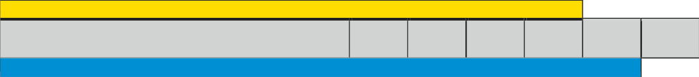

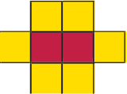

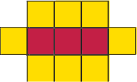

---

### Data Collection and Sampling Exercises

#### Exercise 2: School Survey
You want to know the most popular colour of the learners in your school.
*   **(a)** Write down the population of your data collection.
*   **(b)** Write down what sample you would use.

---

#### Exercise 3: Case Study - Census@School
Census@School took place in 2001 and 2009. These were surveys conducted by Statistics South Africa to demonstrate how information about people is collected and analysed. The survey targeted learners from Grades 3 to 12.

**Sampling Method:**
*   A sample of $2\,500$ schools was selected from the Department of Basic Education’s database of approximately $26\,000$ registered schools.
*   Schools were stratified (divided into groups) by province, school type (primary, intermediate, secondary, combined), and education district.
*   A sample of schools was selected from each of these groups.
*   Approximately $790\,000$ learners participated in the 2009 survey.

**Questions:**
*   **(a)** What percentage was the sample of all the schools in the country?
    *   *Calculation:* $\frac{2\,500}{26\,000} \times 100 \approx 9,62\%$
*   **(b)** Why do you think they separated the schools into groups first?
*   **(c)** Do you think the information obtained from this survey would be interesting to you? Explain.

---

#### Exercise 4: Representativeness
Unathi wants to find out whether 13-year-olds in her town prefer rugby or netball. She surveys ten learners from each of the three Grade 7 classes at her school. 
*   **Question:** Is the sample chosen likely to be representative of the population (13-year-olds in her town)? Explain your answer.

---

### Constructing Questionnaires: How to Collect Data

A **questionnaire** is a document containing questions used to collect data from people. Each **respondent** (the person who fills in the questionnaire) provides the data required for the study.

#### Types of Questionnaire Structures
Questions can be structured in different ways depending on the data required:
1.  **Dichotomous questions:** Require "yes" or "no" answers.
2.  **Multiple-choice questions:** A selection of answers is provided for the respondent to choose from.
3.  **Open-ended questions:** Respondents enter their own views or detailed information.

*Note: The type of response required depends entirely on the specific data you intend to collect.*

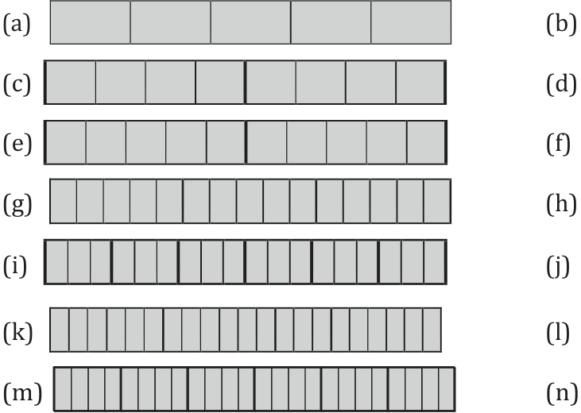
> **[Diagram Context - Textbook_Mathematics_Gr7_Fractions.pdf-0002-02.png]**
> The graphic shows a set of horizontal rectangular bars, labelled (a) through (n), subdivided into varying numbers of vertical grid segments with alternating thin and bold internal borders. Visible labels include the lowercase letters (a) to (n) arranged along the left and right margins flanking each horizontal row. This diagram conceptually illustrates fraction strips or visual representations of proportional divisions and fractional parts, helping CAPS learners understand part-whole relationships, equivalent fractions, and rational number comparisons in Mathematics.

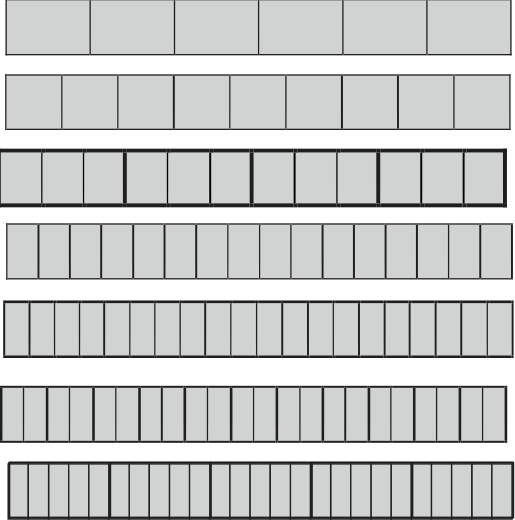
> **[Diagram Context - Textbook_Mathematics_Gr7_Fractions.pdf-0002-03.png]**
> This educational graphic features a series of seven horizontal fraction strips divided into varying numbers of equal rectangular partitions, progressing from sixths down to thirty-sixths with distinct block groupings. The visual elements consist entirely of grey rectangular grid cells enclosed by solid black outlines arranged in parallel rows, visually demonstrating fractional divisions without explicit numerical labels or arrows. Conceptually, this diagram helps learners visualize equivalent fractions and fractional parts of a whole, reinforcing foundational number concept relationships required in the intermediate phase mathematics curriculum.

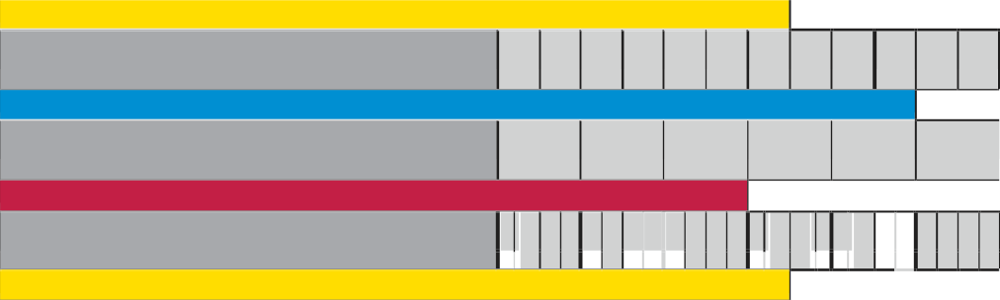
> **[Diagram Context - Textbook_Mathematics_Gr7_Fractions.pdf-0002-07.png]**
> This graphic is a diagrammatic representation showing structural layers or sequences made of alternating colored bars (yellow, grey, blue, red) and segmented vertical grids. There are no explicit text labels, chemical symbols, or axis names visible within the graphic. Conceptually, it illustrates comparative structural arrangements, sequence alignments, or layered components corresponding to curriculum topics involving comparative anatomy, data mapping, or material layering.

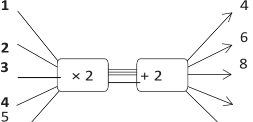
> **[Diagram Context - Textbook_Mathematics_Gr7_Relationships-between-variables.pdf-0002-05.png]**
> This educational graphic depicts a two-stage mathematical function machine flowchart containing operations "$\times 2$" and "+ 2" connected in sequence. Visible labels include input numbers 1, 2, 3, 4, 5 on the left and output numbers 4, 6, 8 on the right, connected by directional lines and arrows. Conceptually, this diagram helps learners understand function relationships and input-output rules by visually mapping how an initial value is transformed sequentially through algebraic operations.

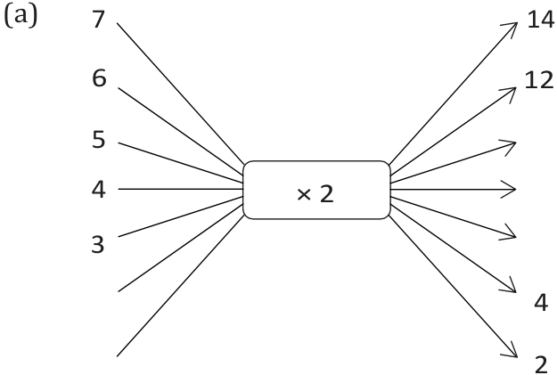
> **[Diagram Context - Textbook_Mathematics_Gr7_Relationships-between-variables.pdf-0002-16.png]**
> This educational graphic is a flow diagram representing a mathematical function machine. It features input numbers on the left (3, 4, 5, 6, 7), directional arrows pointing towards a central operation box labeled "× 2", and corresponding output numbers on the right with directional arrows (such as 2, 4, 12, 14). For a senior phase CAPS learner, this diagram visually conveys the concept of functions and relationships, demonstrating how an input value is transformed into an output value by applying a constant rule.

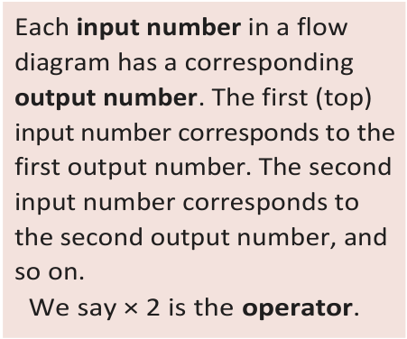
> **[Diagram Context - Textbook_Mathematics_Gr7_Relationships-between-variables.pdf-0002-17.png]**
> This educational text graphic explains the fundamental concept of a flow diagram in mathematics. It features explanatory text using the terms "input number", "output number", and "operator", along with the mathematical operation symbol "× 2". Conceptually, it conveys how numerical values undergo a specific rule or transformation process to produce corresponding results, laying the foundation for functions and algebraic relationships in the CAPS curriculum.

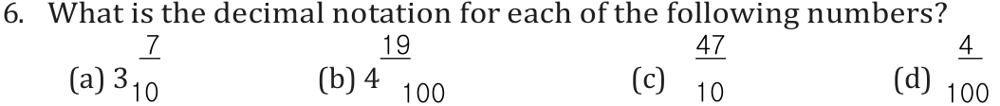
> **[Diagram Context - Textbook_Mathematics_Gr7_The-decimal-notation-for-fractions.pdf-0002-04.png]**
> This educational graphic presents a mathematics exercise comprising four distinct sub-questions labeled (a) through (d), asking learners to convert numbers into decimal notation. The visible mathematical expressions include mixed numbers and common fractions with powers of ten as denominators: (a) $3 \frac{7}{10}$, (b) $4 \frac{19}{100}$, (c) $\frac{47}{10}$, and (d) $\frac{4}{100}$. Conceptually, this exercise helps learners master the conversion between common fractions and decimal fractions by reinforcing place value understanding of tenths and hundredths.

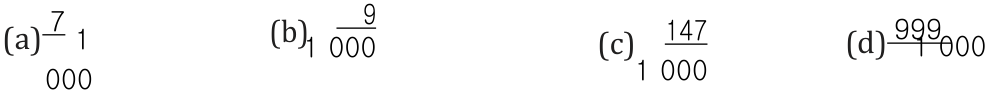
> **[Diagram Context - Textbook_Mathematics_Gr7_The-decimal-notation-for-fractions.pdf-0002-08.png]**
> This educational mathematics graphic displays four fractional numbers labelled (a) through (d), each featuring numerators (7, 9, 147, and 999) and denominators based on powers of ten (specifically 1 000). The visible labels include part identifiers (a), (b), (c), and (d) alongside fractions with numerators 7, 9, 147, and 999 over denominators of 1 000. Conceptually, this diagram helps learners practice reading, writing, and converting common fractions with denominators of 1 000 into decimal form in alignment with the CAPS Intermediate Phase mathematics curriculum.

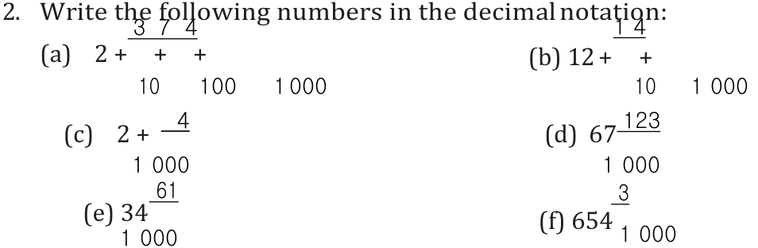
> **[Diagram Context - Textbook_Mathematics_Gr7_The-decimal-notation-for-fractions.pdf-0002-09.png]**
> The graphic presents an educational mathematics exercise consisting of six sub-problems labeled (a) through (f), instructing learners to convert numbers into decimal notation. The visible mathematical expressions feature whole numbers combined with common fractions and fractions with denominators expressed as powers of ten, specifically 10, 100, and 1 000. This exercise helps CAPS Intermediate and Senior Phase students reinforce their understanding of place value by translating numbers from mixed fraction or expanded fractional form into standard decimal form.

---

### Designing Effective Questionnaires

When creating a questionnaire, questions must be worded clearly to ensure data can be collected easily and accurately.

#### Key Principles for Questionnaire Design
1. **Clarity:** Questions should be easy to understand.
2. **No Overlaps:** When using numerical ranges (e.g., age groups), ensure that categories do not overlap. Every possible answer should fit into exactly one category.
3. **Comprehensive Coverage:** Ensure all possible responses are accounted for.

---

#### Examples of Question Types

**Example 1: Binary Choice**
Used for simple "Yes" or "No" responses.
*   *Question:* Do you help with chores at home?
*   *Options:* [ ] Yes | [ ] No

**Example 2: Multiple Choice (Checklist)**
Used when a respondent can select more than one option.
*   *Question:* Which of these chores do you help with?
*   *Options:* [ ] cleaning dishes | [ ] washing clothes | [ ] sweeping/vacuuming | [ ] making beds

**Example 3: Categorical Ranges**
Used for numerical data where ranges are provided.
*   *Question:* How old are you?
*   *Options:* [ ] 5–8 years | [ ] 9–11 years | [ ] 12–15 years | [ ] 16–19 years
*   **Note:** All ages from 5 to 19 are covered without any overlaps.

**Example 4: Checklist for Binary Attributes**
Used to determine the presence or absence of specific items or services.
*   *Question:* Tick the box if you have:
    1. Running water inside your home
    2. Electricity inside your home
    3. A radio at home
    4. A TV at home
    5. A telephone at home
    6. A cell phone
    7. Access to a computer
    8. Access to the internet
    9. Access to a library

**Example 5: Quantitative Measurement**
Used for continuous data requiring specific units (e.g., centimetres).
*   *Question 6:* How tall are you without your shoes on? (Answer to the nearest cm)
*   *Question 7:* What is the length of your right foot? (Answer to the nearest cm)
*   *Question 8:* What is your arm span? (Answer to the nearest cm)

---

#### Exercise: Critiquing a Questionnaire

**Scenario:** Refue wants to find out how much pocket money learners in her class receive each month. She draws up the following multiple-choice question:

| How much pocket money do you get? |
| :--- |
| [ ] 0–10 | [ ] 10–20 | [ ] 20–30 | [ ] 30–40 |

**Task:** Explain why this question is not clear. Provide at least three reasons.

> **[Diagram Context - Textbook_Mathematics_Gr7_Collect-organise-and-summarise_data.pdf-0003-19.png]**
> This graphic consists of three adjacent rectangular colour blocks in shades of dark brown, reddish-brown, and golden-brown, with a thin diagonal pointer line extending from the top right corner. The image lacks any explicit text, labels, chemical symbols, or numerical variables. Conceptually, it serves as an abstract colour swatch or visual placeholder commonly used in curriculum design to test colour-grading, pigment identification, or mineral streak tests in CAPS Earth Sciences.

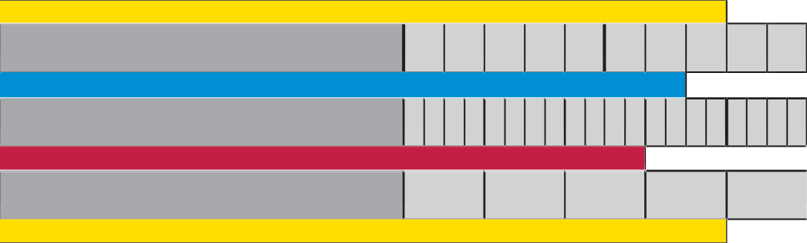
> **[Diagram Context - Textbook_Mathematics_Gr7_Fractions.pdf-0003-00.png]**
> This educational graphic is a schematic structural diagram illustrating the layered composition of a diffraction grating spectrometer setup or a multi-layered material cross-section containing colored central channels (blue and red) enclosed by grey structural blocks and yellow outer boundary layers. The diagram visually breaks down continuous and segmented rectangular components across graduated horizontal zones, utilizing color-coded layers (yellow, grey, blue, and red) to distinguish different functional components or material media. Conceptually, it helps students visualize how multi-component optical systems or stratified physical apparatuses are assembled layer-by-layer, assisting in the analysis of spatial arrangements and component proportions in Physics and Technical Sciences.

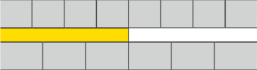

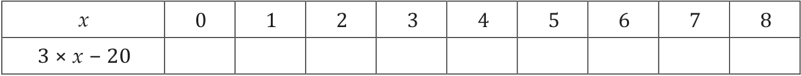
> **[Diagram Context - Textbook_Mathematics_Gr7_Numeric-patterns.pdf-0003-02.png]**
> This educational graphic shows a two-row table designed for practicing algebraic substitution. The top row lists input values for the variable $x$ ranging from 0 to 8, while the bottom row contains the algebraic expression $3 \times x - 20$ above a series of empty cells. Conceptually, this table helps students learn how to evaluate algebraic expressions by systematically substituting given input values into a rule to determine corresponding outputs.

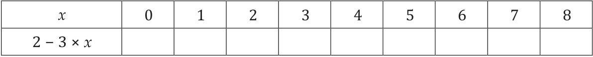
> **[Diagram Context - Textbook_Mathematics_Gr7_Numeric-patterns.pdf-0003-05.png]**
> This graphic is a function table showing an algebraic input-output relationship with the independent variable row labeled $x$ containing integer values from 0 to 8, and the dependent variable row labeled with the algebraic expression $2 - 3 \times x$ and empty cells underneath for calculation. It illustrates how to substitute consecutive input values into a linear expression to generate corresponding output terms, reinforcing the foundational CAPS concept of number patterns and functions.

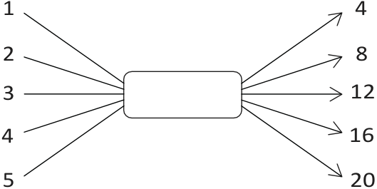
> **[Diagram Context - Textbook_Mathematics_Gr7_Relationships-between-variables.pdf-0003-05.png]**
> This graphic is a mathematical function machine diagram representing a number pattern or relationship. It features input values (1, 2, 3, 4, 5) on the left entering a central processing box, and corresponding output values (4, 8, 12, 16, 20) with directional arrows on the right. Conceptually, it helps learners understand functions, sequences, and algebraic rules by visualizing how an input value is transformed by a constant rule (in this case, multiplying by 4) to generate an output.

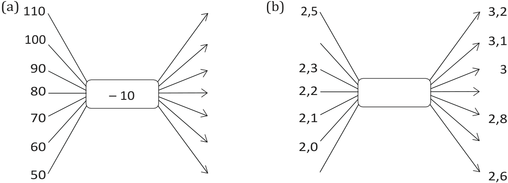
> **[Diagram Context - Textbook_Mathematics_Gr7_Relationships-between-variables.pdf-0003-07.png]**
> The graphic features two flow diagram representations of mathematical functions, labeled (a) and (b). Diagram (a) shows input values (50, 60, 70, 80, 90, 100, 110) mapped through an operational box containing the rule "- 10" to corresponding output values. Diagram (b) shows a similar relational flow with decimal coordinate-like input values (such as 2,0; 2,1; 2,2; 2,3; 2,5) connected to an empty operational box and pointing to various output values (such as 2,6; 2,8; 3; 3,1; 3,2). Conceptually, these diagrams help learners understand the foundational algebraic concept of functions and relationships, illustrating how an input value is transformed by a specific rule into an output value.

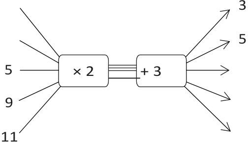
> **[Diagram Context - Textbook_Mathematics_Gr7_Relationships-between-variables.pdf-0003-09.png]**
> The graphic is a function machine diagram displaying a sequence of mathematical operations. It features two connected boxes labeled "× 2" and "+ 3", with input numbers such as 5, 9, and 11 on the left and corresponding output arrows on the right. This diagram helps learners understand function concepts, numeric patterns, and the step-by-step application of algebraic operations.

---

### Exercises: Data Collection

1. **(b)** Draft a multiple-choice question that will allow Refue to collect the specific data she needs.
2. **Research Task:** You want to find out which sports learners at your school play.
    * **(a)** Describe the population of your data.
    * **(b)** Describe the sample you will use.
3. **Question Design:** Create a question with yes/no or multiple-choice responses to help you collect the data you need for your research.
4. **Data Collection:** Collect your data from your population or the sample you chose. Keep your data for the next chapter.

---

### 23.2 Organising Data

To organise data that has been collected, we can use:
* Tally marks and tables
* Dot plots
* Stem-and-leaf displays
* Grouped data (when there are many data values)

The method used to organise data depends on the type of data collected.

#### Different Types of Data

**Exercise 1:** Which of the examples (from the questionnaire on page 261) will result in data that looks like this?

| Response | Number of learners |
| :--- | :--- |
| Yes | 1 235 learners |
| No | 1 265 learners |

**Exercise 2:** Which of the examples might give you data that looks like this?
$132\text{ cm}; 141\text{ cm}; 160\text{ cm}; 132\text{ cm}; 154\text{ cm}; 145\text{ cm}; 147\text{ cm}; 129\text{ cm}; 121\text{ cm}; 143\text{ cm}; 135\text{ cm}; 154\text{ cm}; 156\text{ cm}; 133\text{ cm}; 156\text{ cm}; 123\text{ cm}; 137\text{ cm}$ etc.

**Exercise 3:** What could the data for example 4 look like? Copy and fill in this table to provide a possible example for 30 learners using numbers you have made up.

| Category/Response | Number of learners |
| :--- | :--- |
| | |
| | |
| | |
| | |
| | |
| | |
| | |
| | |
| | |
| | |

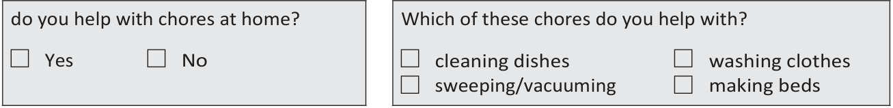
> **[Diagram Context - Textbook_Mathematics_Gr7_Collect-organise-and-summarise_data.pdf-0004-03.png]**
> The graphic displays two survey-style questionnaire questions with checkbox options for recording data about household chores. The left box contains the question "do you help with chores at home?" with checkbox labels "Yes" and "No", while the right box asks "Which of these chores do you help with?" with options "cleaning dishes", "sweeping/vacuuming", "washing clothes", and "making beds". Conceptually, this demonstrates how to design a questionnaire for data collection, illustrating both closed-ended dichotomous questions and multiple-choice questions used in statistical investigations.

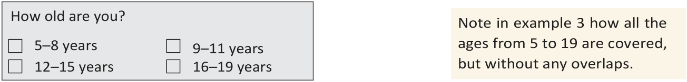
> **[Diagram Context - Textbook_Mathematics_Gr7_Collect-organise-and-summarise_data.pdf-0004-05.png]**
> The educational graphic consists of a survey question box and a text note demonstrating the correct design of continuous grouped data intervals. The survey question reads "How old are you?" and is accompanied by four checkboxes alongside age intervals: "5–8 years", "9–11 years", "12–15 years", and "16–19 years", with an adjacent text note stating: "Note in example 3 how all the ages from 5 to 19 are covered, but without any overlaps." This graphic conveys the mathematical concept of constructing mutually exclusive and exhaustive class intervals for data handling and statistics, teaching learners how to properly categorise continuous data without gaps or ambiguities.

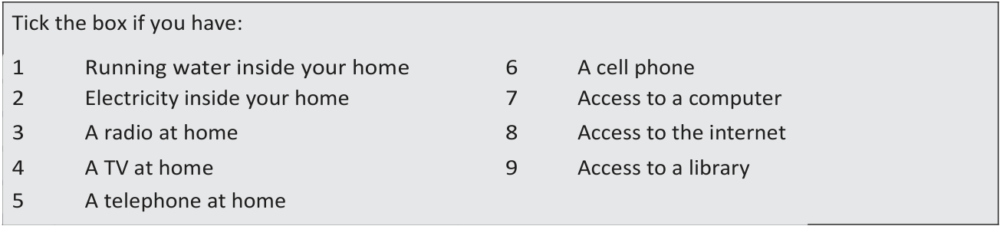
> **[Diagram Context - Textbook_Mathematics_Gr7_Collect-organise-and-summarise_data.pdf-0004-07.png]**
> The graphic is a survey checklist titled "Tick the box if you have:" containing a numbered list of infrastructure and technology items. The visible labels include numbered statements from 1 to 9: "Running water inside your home," "Electricity inside your home," "A radio at home," "A TV at home," "A telephone at home," "A cell phone," "Access to a computer," "Access to the internet," and "Access to a library." Conceptually, this questionnaire introduces high school learners to socio-economic indicators and living standards, helping them gather primary data on basic services and access to information and communication technology (ICT) within communities.

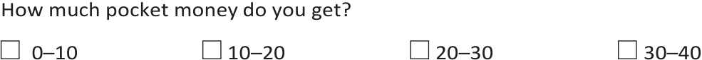
> **[Diagram Context - Textbook_Mathematics_Gr7_Collect-organise-and-summarise_data.pdf-0004-15.png]**
> This educational graphic presents a survey question with categorical response intervals related to data handling. It displays the question text "How much pocket money do you get?" accompanied by four checkboxes and corresponding numerical range intervals: "0-10", "10-20", "20-30", and "30-40". Conceptually, this helps learners understand how to collect data using grouped numerical intervals, laying the foundation for organizing data into frequency tables and drawing statistical graphs in CAPS mathematics.

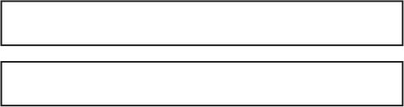

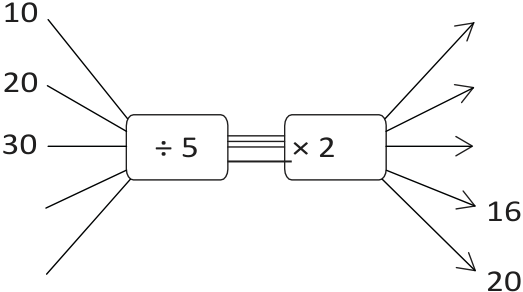
> **[Diagram Context - Textbook_Mathematics_Gr7_Relationships-between-variables.pdf-0004-09.png]**
> This graphic is a flow diagram representing a function machine with sequential mathematical operations. It features two connected boxes labelled "÷ 5" and "× 2", with input numbers on the left (10, 20, 30, and two blank lines) and output arrow lines on the right, some with values like 16 and 20. This diagram visually conveys the concept of functions and inverse operations by demonstrating how an input value is systematically transformed through a sequence of rules to produce a corresponding output value.

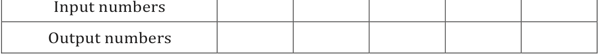
> **[Diagram Context - Textbook_Mathematics_Gr7_Relationships-between-variables.pdf-0004-11.png]**
> The graphic is a tabular function machine format featuring two rows with visible labels "Input numbers" and "Output numbers" divided into multiple blank cells. It visually conveys the concept of functions and relationships in mathematics, where a specific rule applied to independent input values generates corresponding dependent output values.

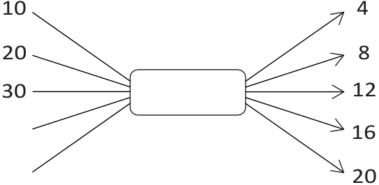
> **[Diagram Context - Textbook_Mathematics_Gr7_Relationships-between-variables.pdf-0004-13.png]**
> This educational graphic depicts a flow diagram or function machine mapping numerical inputs to outputs. The diagram features input numbers (10, 20, 30) on the left leading into a central box, with corresponding output values (4, 8, 12, 16, 20) on the right indicated by arrows. Conceptually, it helps learners identify numerical patterns, relationships, and rules (in this case, multiplying input values by 0.4) within algebra and number patterns.

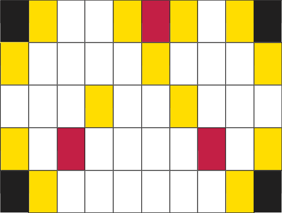
> **[Diagram Context - Textbook_Mathematics_Gr7_The-decimal-notation-for-fractions.pdf-0004-17.png]**
> This graphic displays a grid-based spatial arrangement consisting of multiple rows and columns of rectangular cells filled with a color-coded pattern of white, yellow, red, and black blocks. The visual features an organized matrix with symmetrical clusters of colored cells positioned along specific coordinates. Conceptually, this abstract grid representation helps learners develop spatial reasoning, pattern recognition, and coordinate mapping skills essential for foundational mathematical problem-solving in the CAPS curriculum.

---

### 4. Data Set Analysis

The following table represents a sample data set:

| Age Group | Frequency |
| :--- | :--- |
| 5–8 years | 15 |
| 9–11 years | 45 |
| 12–15 years | 32 |
| 16–19 years | 28 |

*   **Categorical data:** Data described by words (as seen in questions 1 and 3). These categories do not require a specific order.
*   **Numerical data:** Data involving numbers (as seen in questions 2 and 4). This can include whole numbers or fractions.

---

### 5. Classify the following data sets as categorical or numerical:

(a) The number of pages in books: **Numerical**
(b) The length of learners’ arm spans: **Numerical**
(c) Learners’ favourite soccer teams: **Categorical**
(d) The time it takes 13-year-olds to run 1,5 km: **Numerical**
(e) The cost of different types of cell phones: **Numerical**
(f) Colours of new cars manufactured: **Categorical**

---

### Organising Categorical Data

Thandeka surveyed her class regarding their home languages. The raw data collected is presented in the table below:

| Name | Language | Name | Language | Name | Language |
| :--- | :--- | :--- | :--- | :--- | :--- |
| Nonkhanyiso | isiXhosa | Marike | Afrikaans | Herbert | Sepedi |
| Anna | Afrikaans | Jennifer | Sepedi | Thabo | isiXhosa |
| Mpho | Ndebele | Nomonde | isiXhosa | Nomi | isiXhosa |
| Nontobeko | isiZulu | Thandeka | Sepedi | Manare | Sepedi |
| Jonathan | English | Siza | isiZulu | Unathi | Sesotho |
| Sibongile | isiZulu | Prince | Sesotho | Gabriel | Ndebele |
| Dumisani | isiZulu | Duma | isiZulu | Marlene | Afrikaans |
| Matshediso | Sesotho | Thandile | Sepedi | Simon | Sesotho |

***

**CHAPTER 23: COLLECT, ORGANISE AND SUMMARISE DATA** | 263

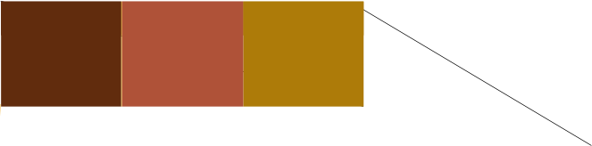
> **[Diagram Context - Textbook_Mathematics_Gr7_Collect-organise-and-summarise_data.pdf-0005-14.png]**
> This educational graphic displays a horizontal bar divided into three distinct coloured rectangular blocks: dark brown, medium red-brown, and mustard yellow, with a thin diagonal line extending from the top-right corner. There are no visible labels, text, chemical symbols, or directional arrows associated with the colour blocks or the line. Conceptually, this abstract visual representation lacks sufficient contextual information or curriculum-specific elements to convey a clear scientific principle for high school learners.

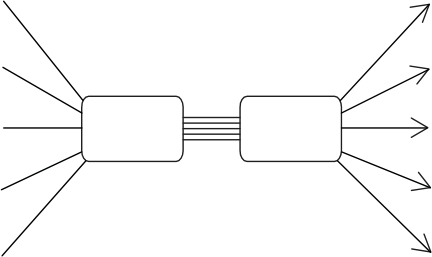
> **[Diagram Context - Textbook_Mathematics_Gr7_Relationships-between-variables.pdf-0005-05.png]**
> The graphic is a flowchart diagram featuring two rectangular boxes connected horizontally by four parallel lines, with multiple directional arrows converging on the left box and diverging from the right box. The diagram utilizes unlabelled rectangular shapes and five incoming/outgoing directional arrows on each side. Conceptually, this diagram represents a transfer, transmission, or transformation process between two systems, components, or stages, commonly used in CAPS curriculum subjects like Information Technology, Engineering Graphics and Design, or Life Sciences to illustrate data flow, pathways, or structural connections.

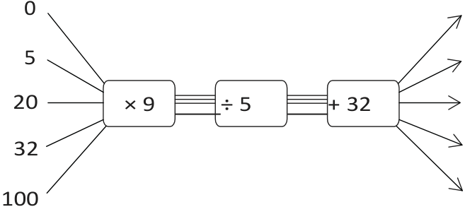
> **[Diagram Context - Textbook_Mathematics_Gr7_Relationships-between-variables.pdf-0005-08.png]**
> This educational graphic displays a mathematical flow diagram with three sequential operation boxes: multiplying by 9, dividing by 5, and adding 32. Visible labels include input numbers on the left (0, 5, 20, 32, 100), operational symbols inside the boxes ($\times 9$, $\div 5$, $+ 32$), connecting lines with arrows, and empty output pathways on the right. Conceptually, this diagram visually demonstrates the step-by-step function machine used to convert temperatures from Celsius to Fahrenheit, reinforcing the sequential application of algebraic operations in the CAPS Mathematics curriculum.

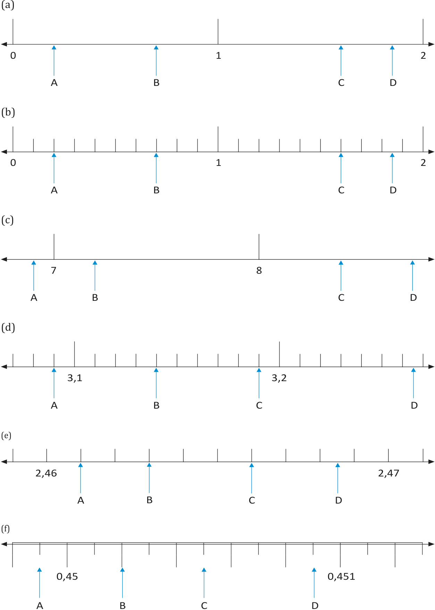
> **[Diagram Context - Textbook_Mathematics_Gr7_The-decimal-notation-for-fractions.pdf-0005-00.png]**
> The graphic consists of six number line segments labeled (a) through (f) used to teach decimal and fractional measurement. Visible elements include horizontal number lines with varying numerical intervals, tick marks, and blue arrows pointing to specific positions labeled A, B, C, and D. Conceptually, this helps learners master the reading and interpretation of number scales by determining the value of sub-divisions between given numbers.

---

### Learner Language Data

| Name | Language | Name | Language |
| :--- | :--- | :--- | :--- |
| Chokocha | Sepedi | Nicholas | Sesotho |
| Miriam | Setswana | Khanyisile | isiXhosa |
| Jabulani | isiZulu | Sibusiso | isiZulu |
| Ramphamba | Tshivenda | Nomhle | isiXhosa |
| Mishack | isiZulu | Portia | isiZulu |
| Frederik | Afrikaans | Peter | Setswana |
| Erik | Afrikaans | Lola | Afrikaans |
| Maya | Afrikaans | Jan | Afrikaans |
| Zinzi | isiXhosa | Thobile | Sesotho |
| Palesa | isiZulu | Jacob | Setswana |

---

### Language Dataset
The raw list of languages spoken by the learners is as follows:

isiXhosa, Afrikaans, Sepedi, Afrikaans, Sepedi, isiXhosa, Ndebele, isiXhosa, isiXhosa, isiZulu, Sepedi, Sepedi, English, isiZulu, Sesotho, isiZulu, Sesotho, Ndebele, isiZulu, isiZulu, Afrikaans, Sesotho, Sepedi, Sesotho, Sepedi, Sesotho, Setswana, isiXhosa, isiZulu, isiZulu, Tshivenda, isiXhosa, isiZulu, isiZulu, Afrikaans, Setswana, Afrikaans, Afrikaans, Afrikaans, Afrikaans, isiXhosa, Sesotho, isiZulu, Setswana.

---

### Data Analysis Exercises

1. **What do you need to find out from this list of languages?**
2. **Does it matter what order you write the languages in? Why or why not?**
3. **(a) Copy Thandeka’s dot plot below.** Place a dot above each language to show every learner who speaks that language. The languages are in alphabetical order. Ensure the dots are spaced evenly.

#### Dot Plot Template

| | | | | | | | | | | |
| :---: | :---: | :---: | :---: | :---: | :---: | :---: | :---: | :---: | :---: | :---: |
| | | | | | | | | | | |
| | | | | | | | | | | |
| | | | | | | | | | | |
| ● | | | | | | | | | | |
| ● | | | | | | | | | | |
| ● | | | | | | | | | | |
| **Afrikaans** | **English** | **isiXhosa** | **isiZulu** | **Ndebele** | **Sepedi** | **Sesotho** | **Setswana** | **Siswati** | **Tshivenda** | **Xitsonga** |

*Note: A graph like this is called a **dot plot**.*

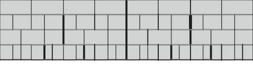
> **[Diagram Context - Textbook_Mathematics_Gr7_Fractions.pdf-0006-06.png]**
> The graphic is a geometric figure displaying a hierarchical tiling pattern composed of grey rectangular blocks arranged across multiple horizontal tiers, delineated by thin black grid lines and accented with several prominent vertical black separator lines. Visible elements include grey rectangular subdivisions, horizontal boundary lines, and vertical partition lines of varying thickness. Conceptually, this diagram helps learners visualize hierarchical partitioning, fractions, or structural tessellation in Mathematics.

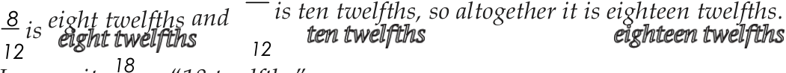
> **[Diagram Context - Textbook_Mathematics_Gr7_Fractions.pdf-0006-19.png]**
> The graphic is a mathematical text illustration showing fraction addition with like denominators. It displays numeric fractions $\frac{8}{12}$ and $\frac{10}{12}$ paired with text labels "eight twelfths" and "ten twelfths", concluding with the sum $\frac{18}{12}$ labeled "eighteen twelfths". Conceptually, this demonstrates the foundational rule that when adding fractions with the same denominator, numerators are added together while the denominator remains unchanged.

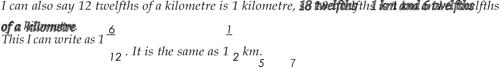
> **[Diagram Context - Textbook_Mathematics_Gr7_Fractions.pdf-0006-21.png]**
> The image is a text-based educational graphic demonstrating the conversion between improper fractions and mixed numbers using kilometres. Visible text includes fractions and units such as "12 twelfths of a kilometre", "1 kilometre", "1 6/12", and "1 1/2 km". This graphic conceptually conveys how to simplify fractions and convert improper fractions into mixed numbers using real-world measurements like distance.

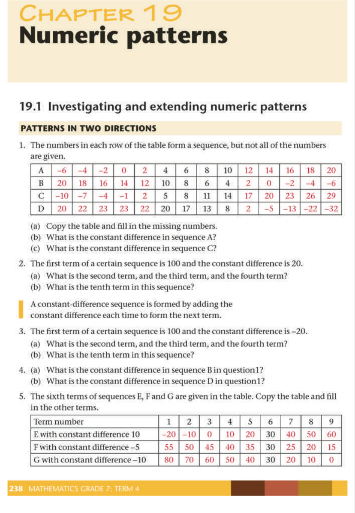
> **[Diagram Context - Textbook_Mathematics_Gr7_Numeric-patterns.pdf-0006-21.png]**
> This educational graphic is a mathematics worksheet page titled "Chapter 19 Numeric patterns" from a CAPS-aligned textbook, featuring tables and structured word problems. Visible labels include row identifiers (A, B, C, D, E, F, G), column headings for term numbers (1 to 9), and numerical sequences with varying positive and negative integers. Conceptually, the diagram guides students through investigating, extending, and identifying constant differences in linear number patterns, building foundational algebraic thinking skills.

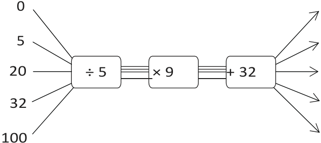
> **[Diagram Context - Textbook_Mathematics_Gr7_Relationships-between-variables.pdf-0006-00.png]**
> This mathematical flow diagram illustrates a function machine mapping input values through a sequence of three operations. The diagram displays input values (0, 5, 20, 32, 100) connected by lines and arrows to sequential operational blocks labelled "÷ 5", "× 9", and "+ 32", which lead to output arrows on the right. Conceptually, it demonstrates how an algebraic function processes multiple independent inputs step-by-step, reinforcing the relationship between inputs and outputs in functions and formulas (such as converting Celsius to Fahrenheit).

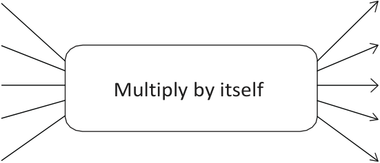
> **[Diagram Context - Textbook_Mathematics_Gr7_Relationships-between-variables.pdf-0006-05.png]**
> This educational graphic is a flow diagram representing a mathematical function or operator. It features a central rectangular box labeled "Multiply by itself" with multiple incoming input lines on the left and corresponding outgoing directional arrows on the right. Conceptually, this diagram illustrates the fundamental operation of squaring a number, demonstrating how numerical inputs are transformed into outputs through a specific rule in algebra and functions.

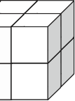

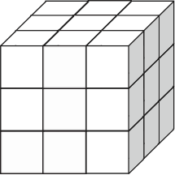
> **[Diagram Context - Textbook_Mathematics_Gr7_Relationships-between-variables.pdf-0006-08.png]**
> This graphic shows a large 3D geometric figure representing a composite cube made up of smaller unit cubes in a 3x3x3 grid arrangement. The image contains no explicit text labels, variables, or directional arrows, relying purely on isometric line art and shading to depict three visible faces composed of individual square faces. Conceptually, this diagram helps learners visualize spatial reasoning, surface area-to-volume relationships, and combinatorial counting problems in geometry and measurement.

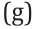

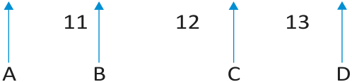
> **[Diagram Context - Textbook_Mathematics_Gr7_The-decimal-notation-for-fractions.pdf-0006-01.png]**
> This educational graphic is a question-labeling template commonly used in South African CAPS curriculum assessments to structure multiple-choice or identification items. It features sequential numeric labels (11, 12, 13) paired with lettered options (A, B, C, D), each accompanied by an upward-pointing blue arrow. Conceptually, this visual structure guides learners to match specific diagram components or questions to their correct scientific answers during examinations.

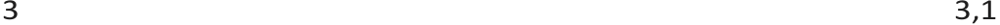

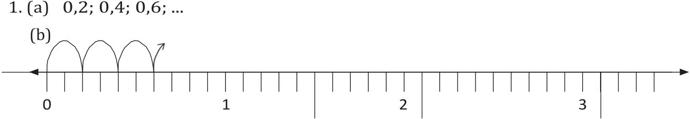
> **[Diagram Context - Textbook_Mathematics_Gr7_The-decimal-notation-for-fractions.pdf-0006-08.png]**
> This graphic features a mathematical number pattern presented as a sequence of decimals alongside a horizontal number line with arched skip-counting intervals. Visible labels include the sequence terms "0,2; 0,4; 0,6; ...", numerical markings "0", "1", "2", "3" on the number line, and curved jump arrows indicating repetitive increments. Conceptually, this diagram helps Intermediate and Senior Phase learners visualize arithmetic sequences and decimal counting by connecting numerical lists to spatial movements along a number line.

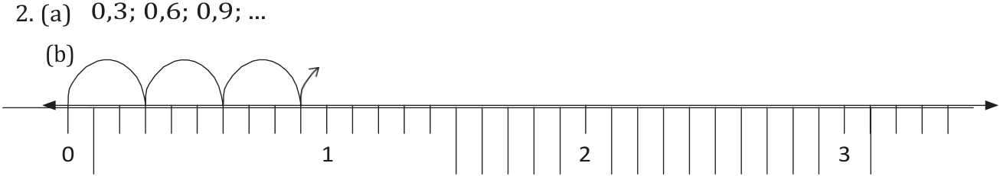
> **[Diagram Context - Textbook_Mathematics_Gr7_The-decimal-notation-for-fractions.pdf-0006-10.png]**
> The graphic displays a number pattern question consisting of a numerical sequence with decimals and a corresponding number line with curved jump arrows. Visible labels include the sequence "2. (a) 0,3; 0,6; 0,9; ..." and sub-label "(b)", alongside numbers "0", "1", "2", and "3" on a calibrated number line. Conceptually, this diagram helps learners visualize arithmetic sequences and constant differences by illustrating consecutive jumps of 0,3 along a number line.

---

### Data Handling: Tally Tables

#### Key Concepts
*   **Tally Mark:** A single vertical line ($|$) used to represent one item in a count.
*   **Tally Table:** A method of recording data where tally marks are grouped in sets of five to make counting easier.
*   **Grouping:** The fifth tally mark is drawn horizontally across the previous four marks ($||||$ becomes $\cancel{||||}$) to represent a group of five.

#### Examples of Tally Marks
| Count | Tally Representation |
| :--- | :--- |
| Three | $|||$ |
| Four | $||||$ |
| Five | $\cancel{||||}$ |
| Seven | $\cancel{||||} ||$ |

---

#### Exercise: Home Language of Learners in the Grade 7 Class

**4. (a) Copy and complete the table below:**

| Language | Number of speakers of each home language | Total |
| :--- | :--- | :--- |
| Afrikaans | $\cancel{||||} |||$ | 8 |
| English | $|$ | 1 |
| isiXhosa | | |
| isiZulu | | |
| Ndebele | | |
| Sepedi | | |
| Sesotho | | |
| Setswana | | |
| Siswati | | |
| Tshivenda | | |
| Xitsonga | | |
| **Total (whole class)** | | |

**(b)** How many learners altogether were asked about their home language?
**(c)** Which home language occurs most often in this class?
**(d)** Which languages are not spoken as a home language by any of the learners in this class?
**(e)** Write a short paragraph to describe the home languages in Thandeka’s class.

---

#### Note on Numerical Data
Dot plots and tally tables are also used for **numerical data**. You can write data values on prepared tally tables or dot plots as you record them. This sorts the data at the same time as it is recorded.

> **[Diagram Context - Textbook_Mathematics_Gr7_Collect-organise-and-summarise_data.pdf-0007-16.png]**
> The graphic is an abstract colour-coded strip composed of three adjacent rectangular blocks in dark brown, reddish-brown, and golden-brown, with a thin diagonal line extending from the top-right corner. It contains no explicit textual labels, variables, or standard scientific symbols. Conceptually, it serves as an open-ended visual template or colour bar that teachers can adapt for sorting and categorisation exercises in foundation-phase or intermediate-phase CAPS modules.

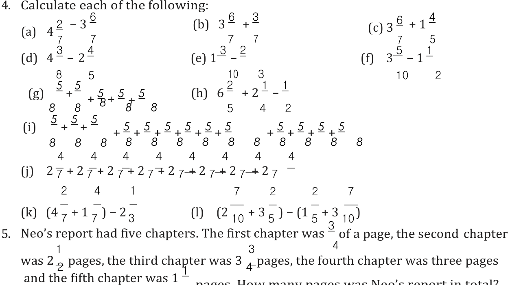
> **[Diagram Context - Textbook_Mathematics_Gr7_Fractions.pdf-0007-05.png]**
> The graphic displays a set of mathematical exercise problems involving fractions, labelled sequentially from (a) to (l), along with a word problem numbered 5. The visible numbers, symbols, and operators consist of whole numbers, mixed numbers, proper and improper fractions, addition and subtraction signs, brackets, and letter labels (a) through (l). This exercise helps students practice arithmetic operations with common fractions and mixed numbers, including finding common denominators and combining whole and fractional parts.

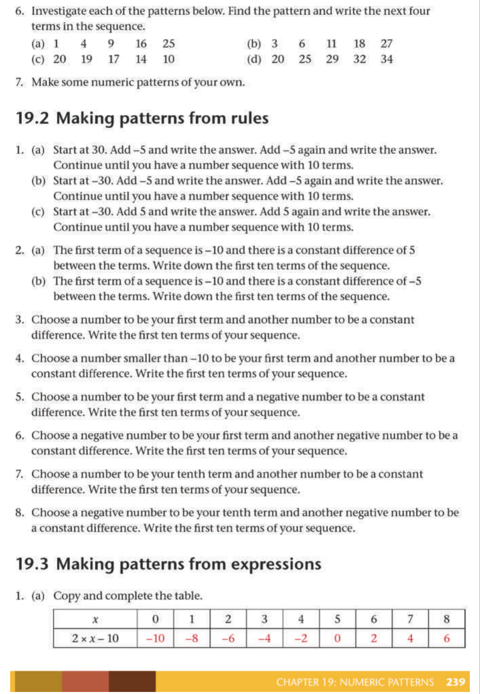
> **[Diagram Context - Textbook_Mathematics_Gr7_Numeric-patterns.pdf-0007-20.png]**
> This educational text and table presents mathematical exercises on number patterns, sequences, and expressions under headings like "19.2 Making patterns from rules" and "19.3 Making patterns from expressions," including a completed table with variables $x$ and algebraic expressions like $2 \times x - 10$. It conveys conceptually how to investigate sequences, generate number patterns from starting terms and constant differences, and link input values to output values using algebraic rules.

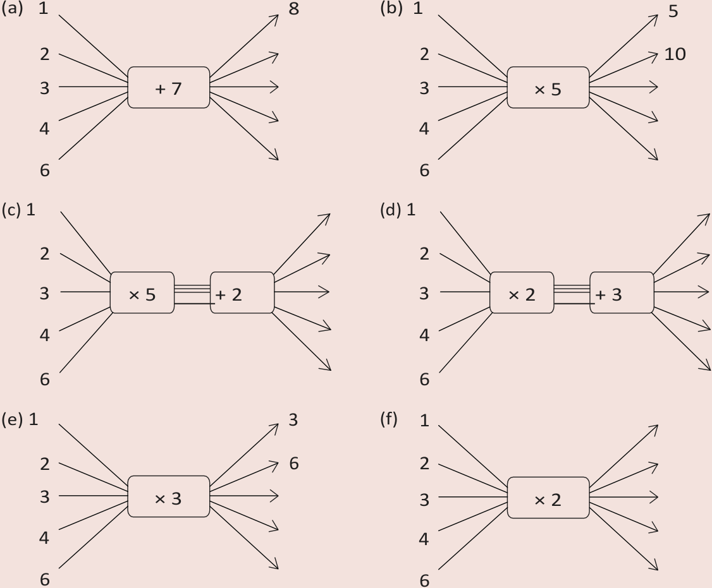
> **[Diagram Context - Textbook_Mathematics_Gr7_Relationships-between-variables.pdf-0007-02.png]**
> This educational graphic consists of six distinct function-machine diagrams labeled (a) through (f). The visible labels and symbols include input numbers on the left (1, 2, 3, 4, 6), central processing boxes containing mathematical operations (+7, ×5, ×5 followed by +2, ×2 followed by +3, ×3, ×2) linked by directional arrows, and selected output values on the right (such as 8, 5, 10, 3, 6). Conceptually, these diagrams help learners understand mathematical functions and number patterns by demonstrating how a rule is systematically applied to a set of input values to generate corresponding output values.

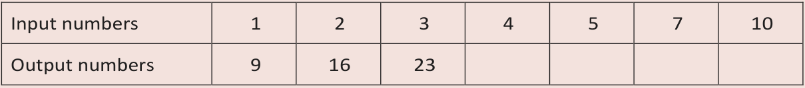
> **[Diagram Context - Textbook_Mathematics_Gr7_Relationships-between-variables.pdf-0007-05.png]**
> The graphic is a tabular representation of a number pattern showing a relationship between two variables. The table contains two rows labeled "Input numbers" and "Output numbers", with visible input values of 1, 2, 3, 4, 5, 7, and 10, and corresponding output values of 9, 16, 23 for the first three inputs, followed by empty cells. This layout helps learners practice identifying a constant difference (linear pattern), determining the general term ($Tn$), and calculating missing output values for given inputs.

---

### Introducing Stem-and-Leaf Displays

A **stem-and-leaf display** (also called a stem-and-leaf plot) is a method of organizing and listing numerical data using two columns separated by a vertical line. Each number is split into two parts:
*   **Numerical data:** Data that consists of numbers.
*   **Stem column (left):** Represents the leading digits (e.g., the tens digit).
*   **Leaf column (right):** Represents the final digit (e.g., the units digit).

---

### Example 1: Creating a Stem-and-Leaf Display

**Data set:** $13, 56, 20, 35, 47, 53, 12, 51, 53, 49, 34, 53$

**Step 1: Order the data**
Arrange the values from smallest to largest:
$12, 13, 20, 34, 35, 47, 49, 51, 53, 53, 53, 56$

**Step 2: Construct the display**
The tens digits range from $1$ to $5$. These form the stems. The units digits are placed in the leaf column corresponding to their respective stems.

**Key:** $1 \mid 2$ means $12$

| Stems | Leaves |
| :--- | :--- |
| 1 | 2, 3 |
| 2 | 0 |
| 3 | 4, 5 |
| 4 | 7, 9 |
| 5 | 1, 3, 3, 3, 6 |

**Notes on reading the display:**
*   Values with the same stem are written in the same row.
*   Numbers with the same tens value are separated by a space or a comma.
*   The first row represents $12$ and $13$.
*   The last row represents $51, 53, 53, 53,$ and $56$.

---

### Example 2: Advanced Stems
Stem-and-leaf displays can be adapted for larger numbers. In such cases, the units digits remain as the leaves, while the hundreds and tens digits together form the stems.

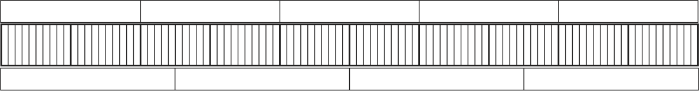
> **[Diagram Context - Textbook_Mathematics_Gr7_Fractions.pdf-0008-02.png]**
> This graphic shows a fraction wall diagram consisting of horizontal rectangular bars divided into varying numbers of vertical segments. The visible elements include parallel rows of unlabelled rectangular blocks, with the middle row densely subdivided by vertical grid lines. Conceptually, this visual tool helps learners understand fractional parts, equivalent fractions, and how different denominators relate proportionally to a single whole.

> **[Diagram Context - Textbook_Mathematics_Gr7_Fractions.pdf-0008-07.png]**
> This educational graphic is a measurement and partitioning diagram featuring a long horizontal strip divided into yellow grid units. The diagram includes the visible labels "Gabieba's piece", "Miriam's piece", "Sannie's piece", "Enoch's piece", "Mpati's piece", and "Mpho's piece" positioned alongside specific segments of the divided strip. Conceptually, it conveys how continuous lengths can be partitioned into discrete fractional or whole units, helping learners understand basic measurement, counting, and proportional reasoning.

> **[Diagram Context - Textbook_Mathematics_Gr7_Fractions.pdf-0008-09.png]**
> This educational graphic presents a mathematics exercise consisting of six written fraction-of-a-quantity problems labeled (a) through (f). Each question features the base value "300 cents" combined with different fractions, including $\frac{1}{100}$, $\frac{7}{100}$, $\frac{25}{100}$, $\frac{1}{4}$, $\frac{40}{100}$, and $\frac{2}{5}$. Conceptually, this exercise helps students practice calculating fractions of a whole number and reinforces the foundational relationship between common fractions and percentages (such as hundredths) using South African currency units.

> **[Diagram Context - Textbook_Mathematics_Gr7_Numeric-patterns.pdf-0008-17.png]**
> This educational graphic is a Mathematics textbook page containing numerical tables, algebraic expressions, and worded sequence problems. Visible elements include input-output tables with the variable $x$ and algebraic expressions such as $3 \times x - 20$, $2 - 3 \times x$, and $1 - 2 \times x$, alongside numbered questions (1 to 5) focusing on number patterns and constant differences. Conceptually, this content guides Grade 7 learners through identifying, extending, and analyzing linear number patterns and relationships between consecutive terms using algebraic notation.

---

### Stem-and-Leaf Displays

A stem-and-leaf display is a method of organising numerical data to show its distribution.

#### Example Analysis
The following display represents the data set: $102, 105, 110, 116, 121, 124, 124, 147, 149, 161, 163, 168$.

| Stem | Leaf |
| :--- | :--- |
| 10 | 2, 5 |
| 11 | 0, 6 |
| 12 | 1, 4, 4 |
| 13 | |
| 14 | 7, 9 |
| 15 | |
| 16 | 1, 3, 8 |

**Key:** $10 \mid 2$ means $102$.

*   **Notes:**
    *   If there is a $0$ in the leaf column, the unit digit is $0$ (e.g., $110$).
    *   If a stem has no leaves, it indicates there are no values in that range (e.g., there are no values between $129$ and $140$).
    *   **Tip:** Always align numbers vertically to ensure accurate comparison of the leaves.

---

### Exercises

#### 1. Interpreting Stem-and-Leaf Displays
Consider the following display:

| Stem | Leaf |
| :--- | :--- |
| 13 | 1, 9 |
| 14 | 0 |
| 15 | |
| 16 | 2, 3, 5, 5, 5 |
| 17 | 6, 8, 8 |
| 18 | |
| 19 | 4, 6, 7 |

**Key:** $13 \mid 1$ means $131$.

(a) Write down the values in the data set.
(b) Do most of the values fall in the 160s or 170s?
(c) Which value occurs the most times?
(d) Copy the display and add the following values: $143, 167,$ and $199$.
(e) There are no values in the 150s. Can we add $15 \mid 0$ to the display to show this? Explain your answer.

> **[Diagram Context - Textbook_Mathematics_Gr7_Collect-organise-and-summarise_data.pdf-0009-13.png]**
> The graphic displays a horizontal bar partitioned into three distinct colored rectangles (dark brown, reddish-brown, and mustard yellow) adjacent to a blank white space crossed by a single diagonal line, with no visible text, labels, symbols, or arrows. Conceptually, the abstract layout lacks the specific curricular context required to convey biological, physical, or mathematical principles under the CAPS curriculum.

#### 2. Organising Data
Given the data set: $378, 360, 390, 378, 378, 400, 379, 382, 354, 394, 399, 395, 378, 361, 375$.

(a) Arrange the values in order from smallest to largest.
(b) Organise the data set as a stem-and-leaf display. Remember to add the key.
(c) Which value occurs most often?

> **[Diagram Context - Textbook_Mathematics_Gr7_Numeric-patterns.pdf-0009-14.png]**
> The graphic is a mathematics textbook page showing a collection of linear number sequences, algebraic expressions, and graduated problem sets labeled 6 through 11. It features variables $x$, various numerical patterns (labeled Pattern A to I), and bolded conceptual terms such as increasing sequence, decreasing sequence, and increases faster. This layout is designed to help CAPS learners analyze the rate of change and relationship between algebraic expressions and their corresponding numerical sequences.

> **[Diagram Context - Textbook_Mathematics_Gr7_The-decimal-notation-for-fractions.pdf-0009-07.png]**
> This mathematical comparison exercise displays six sub-questions, labeled (a) through (f), each presenting a pair of decimal numbers separated by a blank placeholder square. The visible decimal values include 0,4; 0,52; 0,32; 2,61; 2,7; 2,4; 2,40; 2,34; 2,567; and 2,251, utilizing the South African comma convention for decimals. Conceptually, this diagram helps FET phase learners practice comparing and ordering decimal numbers by determining whether the first value is greater than (>), less than (<), or equal to (=) the second value.

---

### Data Handling: Dot Plots and Stem-and-Leaf Displays

#### 1. Dot Plots
A dot plot is a graphical display of data using dots plotted on a number line. It is useful for visualizing the distribution and frequency of data points.

**Exercise: Sales Data Analysis**
The data sets below represent the sales of two car models (Mercury and Jupiter) over 24 months.

*   **Mercury:** 23, 27, 30, 27, 32, 31, 32, 32, 35, 33, 28, 39, 32, 29, 35, 36, 33, 25, 35, 37, 26, 28, 36, 30
*   **Jupiter:** 31, 44, 30, 36, 37, 34, 43, 38, 37, 35, 36, 34, 31, 32, 40, 36, 31, 44, 26, 30, 37, 43, 42, 33

**Task:**
1. Copy the number lines provided below.
2. Draw a dot plot for each data set by placing a dot above the corresponding number for every occurrence in the data.

**Analysis Question:**
Compare the dot plots for Mercury and Jupiter. What observations can you make regarding the sales trends of the two cars? What does this mean in a real-world context?

---

#### 2. Something to Think About: Stem-and-Leaf Displays
A stem-and-leaf display organizes data by splitting each value into a "stem" (the leading digit(s)) and a "leaf" (the last digit).

**Concept:**
If you rotate a stem-and-leaf display by $90^\circ$ counter-clockwise, the resulting shape resembles a **histogram** or a **bar graph**, where the height of the columns represents the frequency of the data in that range.

**Example Transformation:**

| Stem | Leaf |
| :--- | :--- |
| 1 | 2, 5 |
| 2 | 0, 6 |
| 3 | 1, 4, 4, 5, 5, 9 |
| 4 | |
| 5 | 2, 7, 8, 9 |
| 6 | 1, 3, 6, 7, 7 |
| 7 | 1, 3, 8 |

**Rotated View (Frequency Representation):**

| | | | | | | |
| :--- | :--- | :--- | :--- | :--- | :--- | :--- |
| | | | | | | 9 |
| | | | | | 5 | 7 |
| | | | | 5 | 9 | 7 |
| | | | 4 | 8 | 6 | 8 |
| | 5 | 6 | 4 | 7 | 3 | 3 |
| | 2 | 0 | 1 | 2 | 1 | 1 |
| 1 | 2 | 3 | 4 | 5 | 6 | 7 |

---

### Grouping Data into Intervals

When a data set contains many data items, we group the data to make it easier to organise and interpret.

*   **Class Intervals:** Categories used to group data (e.g., $0-9$, $10-19$, $20-29$).
*   **Frequency:** The number of times a data value occurs within a specific interval.

#### Example: Milk Bottles Collected
Data set: $9, 10, 13, 23, 24, 26, 26, 27, 30, 31, 34, 40, 42, 49, 50, 53, 61, 64, 67, 67, 68, 69, 91, 94$

| Interval | 0–9 | 10–19 | 20–29 | 30–39 | 40–49 | 50–59 | 60–69 | 70–79 | 80–89 | 90–99 |
| :--- | :---: | :---: | :---: | :---: | :---: | :---: | :---: | :---: | :---: | :---: |
| **Frequency** | 1 | 2 | 5 | 3 | 3 | 2 | 6 | 0 | 0 | 2 |

---

### Working with Grouped Data

**Exercise:** Anita collected data from Grade 7 learners regarding the distance (in km) they live from the nearest grocery store.

**Data Set:**
$0,1; 0,1; 0,2; 0,2; 0,2; 0,2; 0,3; 0,3; 0,3; 0,4; 0,4; 0,5; 0,5; 0,5; 0,6; 0,6; 0,7; 0,7; 0,7; 0,8; 0,8; 0,8; 0,9; 0,9; 0,9; 1; 1; 1; 1,5; 1,5; 2; 2; 2; 2; 2,5; 2,5; 3; 3; 3; 3,5; 3,5; 4; 4; 4; 4,5; 5; 5; 6; 6; 7; 7; 8; 8; 9; 10; 10; 15; 20; 23; 30$

#### (a) Frequency Table
Copy and complete the table below to indicate how many values appear in each interval:

| Interval | Frequency |
| :--- | :--- |
| Less than $1,0\text{ km}$ | |
| $1,0–5,9\text{ km}$ | |
| $6,0–9,9\text{ km}$ | |
| $10\text{ km}$ or further | |

#### (b) Analysis
Based on your completed table, determine how far most of the learners live from the nearest grocery store.

> **[Diagram Context - Textbook_Mathematics_Gr7_Collect-organise-and-summarise_data.pdf-0011-10.png]**
> The graphic shows a data transformation from a stem-and-leaf plot into a vertical bar graph representation, connected by a horizontal arrow. The stem-and-leaf plot on the left displays stems 1 through 7 with corresponding leaves listed horizontally (e.g., stem 1 with leaves 2, 5; stem 3 with leaves 1, 4, 4, 5, 5, 9). The right-hand graph displays numerical categories 1 through 7 on the horizontal axis with vertical columns of digits stacked upwards to represent frequency counts for each category. This visual conveys how grouped numerical data from a stem-and-leaf display can be converted into a frequency bar graph format, helping learners interpret data distributions and frequency trends.

> **[Diagram Context - Textbook_Mathematics_Gr7_The-decimal-notation-for-fractions.pdf-0011-14.png]**
> This educational graphic is a 2D geometry figure representing a circular annulus with a cross-section showing concentric circles. The diagram includes labels for the center point (A), the inner boundary radius (B), and the outer boundary radius (C), connected by a red line segment extending from the center through the hatched ring. Conceptually, this figure helps high school learners calculate the area and thickness of circular rings and hollow cylinders by demonstrating the relationship between inner and outer radii.

---

### Data Handling: Heights of Grade 7 Boys

The following data represents the heights of 50 Grade 7 boys in centimetres:

| | | | | | | | | | |
| :--- | :--- | :--- | :--- | :--- | :--- | :--- | :--- | :--- | :--- |
| 165 | 148 | 150 | 160 | 165 | 150 | 156 | 155 | 164 | 162 |
| 160 | 158 | 138 | 158 | 140 | 146 | 160 | 148 | 152 | 139 |
| 165 | 148 | 152 | 139 | 165 | 148 | 160 | 163 | 178 | 138 |
| 142 | 179 | 156 | 160 | 160 | 171 | 140 | 160 | 164 | 135 |
| 159 | 143 | 167 | 138 | 163 | 164 | 155 | 160 | 167 | 165 |

#### Exercises
(a) Draw a stem-and-leaf display to show this set of data. Remember to include the key.
(b) Write a short paragraph to describe the data set.
(c) Copy and complete the frequency table below for the grouped data from your stem-and-leaf display.

| Class interval (cm) | Frequency |
| :--- | :--- |
| 130–139 | |
| 140–149 | |
| 150–159 | |
| 160–169 | |
| 170–179 | |
| **Total** | |

---

### 23.3 Summarising Data

When data is collected, it is often necessary to communicate findings clearly without requiring the audience to review every individual data point.

#### Measures of Central Tendency
It is useful to summarise a set of numerical data using a single value. Statisticians use values that represent the "most central" part of the data set, or the value around which other values tend to cluster. These are known as **measures of central tendency** or **summary statistics**.

*   **Definition:** A statistician is a mathematician who specialises in collecting, organising, and analysing data.

**Example:**
Consider the following data set:
$0, 1, 1, 5, 8, 8, 9, 9, 10, 10, 10, 11, 11$

To describe this set, one would identify the value that best represents the "centre" of these numbers.

> **[Diagram Context - Textbook_Mathematics_Gr7_Fractions.pdf-0012-00.png]**
> The image is a mathematics exercise text featuring two sub-questions labeled 11. (a) and (b), which ask learners to calculate fractional parts of a whole number. Visible text includes question identifiers "11. (a)", "(b)", fractions "1/5" and "3/5", and the whole number "80". Conceptually, this exercise helps learners understand how to find a fraction of a whole number by dividing by the denominator and multiplying by the numerator, reinforcing basic operations with common fractions as prescribed in the CAPS curriculum.

> **[Diagram Context - Textbook_Mathematics_Gr7_Fractions.pdf-0012-01.png]**
> This educational text image presents a series of mathematical word problems involving fraction calculations, specifically determining fractional parts of whole numbers and comparing equivalent fractions. The visible text includes question labels (c, d, e, 12), fractional expressions such as $\frac{40}{24}$, $\frac{3}{40}$, $\frac{24}{40}$, $\frac{3}{5}$, and $\frac{7}{12}$ of $\frac{3}{5}$, along with the integer 80 and explanatory prompts. Conceptually, this exercise helps learners understand the equivalence of fractions, multiplication of fractions by whole numbers, and the application of proportional reasoning in foundational mathematics.

> **[Diagram Context - Textbook_Mathematics_Gr7_Fractions.pdf-0012-03.png]**
> This educational graphic displays mathematical text outlining fraction concepts. It features the fractions \(\frac{24}{40}\), \(\frac{3}{5}\), \(\frac{7}{12}\), and associated relational statements. Conceptually, this helps learners understand fraction equivalence (showing that \(\frac{24}{40}\) simplifies to \(\frac{3}{5}\)) and the commutativity or equivalence of fractional parts of quantities.

> **[Diagram Context - Textbook_Mathematics_Gr7_Fractions.pdf-0012-04.png]**
> This educational graphic displays a mathematical text snippet demonstrating fraction calculations. It contains the fractions 7/12 and 24/40 alongside descriptive text explaining the step-by-step calculation method. Conceptually, it guides learners through finding a fractional part of a whole number by first dividing by the denominator and then multiplying by the numerator.

> **[Diagram Context - Textbook_Mathematics_Gr7_Fractions.pdf-0012-09.png]**
> This educational graphic presents a mathematical text problem demonstrating fraction equivalence and multiplication operations. The visible text includes fractional expressions containing numbers such as 8/12, 2/3, and 3/8, alongside numbered prompt labels like "13.(a)" and "(b)". Conceptually, this diagram guides learners through simplifying complex fraction calculations by demonstrating how to substitute an equivalent fraction (changing 2/3 to 8/12) to make multiplication easier.

> **[Diagram Context - Textbook_Mathematics_Gr7_Fractions.pdf-0012-11.png]**
> This educational graphic is a mathematics problem set consisting of three textual sub-questions labeled (b), (c), and (d). It displays the phrase "How much is" followed by pairs of proper and mixed fractions involving numbers such as 4/7, 8/2, 10/2, 3/1, 3/3, and 2/3/5, connected by the mathematical operation word "of". Conceptually, this exercise helps students practice finding fractional parts of other fractions, reinforcing multiplication of rational numbers and conceptual understanding of proportional parts.

---

### Measures of Central Tendency

In statistics, we use different measures to represent a data set with a single value.

#### 1. Key Definitions
*   **Mode:** The value that occurs most frequently in a data set. 
    *   *Note:* A data set can have more than one mode.
*   **Median:** The value exactly in the middle of a data set when the values are arranged in order from smallest to largest.
    *   *Note:* If the data set consists of an even number of items, the median is the sum of the two middle values divided by $2$.
*   **Mean (Average):** The total (sum) of all values divided by the number of values in the data set.
    *   Formula: $$\text{Mean} = \frac{\text{Total of values}}{\text{Number of values}}$$
    *   Example: $$\text{Mean} = \frac{93}{13} \approx 7,15$$

---

### Understanding the Mean

The mean represents the "balance point" of a data set. You can visualize this by leveling out piles of blocks so that every pile has the same height.

> **[Diagram Context - Textbook_Mathematics_Gr7_Collect-organise-and-summarise_data.pdf-0013-12.png]**
> This graphic displays a horizontal bar chart divided into three adjacent colored rectangular sections: dark brown, reddish-brown, and mustard yellow, accompanied by a single diagonal line extending from the top right corner. There are no visible text labels, axes, chemical symbols, or arrows present in the image. Conceptually, abstract visual blocks like this are often used in early-phase CAPS curriculum materials as placeholders or comparative segments to introduce learners to proportional divisions, categorical data representation, or color-based classification.

#### Worked Example
If you have the numbers $5, 6, 3, 2,$ and $4$, you can find the mean mathematically without using physical blocks:

1.  **Find the total (sum) of the values:**
    $$5 + 6 + 3 + 2 + 4 = 20$$

2.  **Divide by the total number of values:**
    There are $5$ values in this set.
    $$20 \div 5 = 4$$

**Conclusion:** The mean is $4$. This single number represents the entire set of different numbers while maintaining the same total.

> **[Diagram Context - Textbook_Mathematics_Gr7_The-decimal-notation-for-fractions.pdf-0013-00.png]**
> This educational graphic is a numeric flow diagram designed as an exercise for decimal fractions and place value. It features three sequential number rows containing alternating numerical values and operational boxes separated by directional arrows pointing right, along with empty boxes for students to complete. Conceptually, it helps learners understand the multiplicative and divisional effects of powers of ten on decimal comma placement within numbers up to millions.

> **[Diagram Context - Textbook_Mathematics_Gr7_The-decimal-notation-for-fractions.pdf-0013-02.png]**
> This educational text graphic demonstrates the relationship between decimal multiplication and fractions through two text-based mathematical equations: $4 \times 0,5$ and $0,5 \times 4$, using the fraction equivalent $\frac{1}{2}$ with addition operators and descriptive phrasing. It conceptually illustrates that multiplying a whole number by a decimal is equivalent to repeated addition of fractions or finding a fractional part of a whole, reinforcing the commutative property and conceptual equivalence of decimals and common fractions in intermediate phase mathematics.

---

### Understanding Data Spread: The Range

The **range** of a data set describes how spread out the values are. It is calculated as the difference between the highest value and the lowest value in the set.

*   **Formula:** $\text{Range} = \text{Highest Value} - \text{Lowest Value}$
*   **Interpretation:**
    *   A **larger range** indicates that the data is widely spread out.
    *   A **smaller range** indicates that the data is clustered around similar values.

---

### Determining Mode, Median, Mean, and Range

**Key Concept:** When a data set has an even number of items, the **median** is calculated by finding the sum of the two middle numbers and dividing by $2$.

#### Exercise 1: Shoe Sizes
Data: $1, 1, 1, 2, 2, 3, 3, 4, 4, 5, 5, 5, 5, 5, 6, 6$
(a) What is the mode?
(b) What is the median?
(c) What is the mean? (Round to the nearest whole number)
(d) What is the range?

#### Exercise 2: Number of Siblings
Data: $0, 0, 0, 1, 1, 1, 1, 2, 2, 2, 2, 2, 3, 3, 3, 3, 4, 4, 5$
(a) How many learners are in the sample?
(b) What is the mode?
(c) What is the median?
(d) What is the mean? (Round to the nearest whole number)
(e) What is the range?

#### Exercise 3: Hours Worked (School A)
Data: $15, 16, 20, 25, 25, 30, 40, 40, 40, 40, 40, 42, 45, 45, 48, 48$
(a) How many parents are in the sample?
(b) What is the mode?
(c) What is the median?
(d) What is the mean? (Round to one decimal place)
(e) What is the range?

#### Exercise 4: Hours Worked (School B)
Data: $25, 30, 35, 35, 35, 40, 40, 40, 40, 40, 42, 45, 45, 45, 48, 50$
(a) How many parents are in the sample?

> **[Diagram Context - Textbook_Mathematics_Gr7_Collect-organise-and-summarise_data.pdf-0014-11.png]**
> This graphic displays a block graph (bar graph) consisting of five vertical columns made up of stacked grey cubes representing discrete data values. The diagram visually displays five vertical bars of varying heights containing 5, 6, 3, 2, and 4 stacked cubes respectively, with no explicit text labels, axes, or variables. Conceptually, it provides a foundational representation for data handling, allowing learners to practice counting, reading categorical data frequencies, and comparing quantities visually.

> **[Diagram Context - Textbook_Mathematics_Gr7_Collect-organise-and-summarise_data.pdf-0014-13.png]**
> The graphic is a geometric illustration featuring a vertical column of four separated three-dimensional cubes alongside four contiguous vertical rectangular columns, each divided into four square segments. There are no visible labels, text, variables, or directional arrows present in the image. Conceptually, this visual aids learners in understanding spatial grouping, early multiplication concepts, and the relationship between discrete units (individual cubes) and composite area or volume models.

---

### Statistics: Measures of Central Tendency and Dispersion

This lesson focuses on analyzing numerical data sets using the mean, median, mode, and range.

---

#### 1. Core Concepts

*   **Mean ($\bar{x}$):** The average of a data set. It is calculated by dividing the sum of all values by the total number of values ($n$).
    $$\bar{x} = \frac{\sum x}{n}$$
*   **Median:** The middle value of a data set when the values are arranged in ascending order. If there is an even number of values, the median is the average of the two middle values.
*   **Mode:** The value that appears most frequently in a data set.
*   **Range:** The difference between the highest and lowest values in a data set.
    $$\text{Range} = \text{Maximum value} - \text{Minimum value}$$

---

#### 2. Worked Example: Grade 7 Test Scores

**Data Set:** 40, 42, 44, 13, 10, 23, 68, 31, 69, 91, 30, 49, 50, 53, 67, 94, 61, 64, 67, 34

**(a) Arrange the scores from lowest to highest:**
10, 13, 23, 30, 31, 34, 40, 42, 44, 49, 50, 53, 61, 64, 67, 67, 68, 69, 91, 94

**(b) How many learners are in the population?**
Counting the values, $n = 20$.

**(c) What is the mode?**
The value 67 appears twice; all others appear once. **Mode = 67**.

**(d) What is the median?**
Since $n=20$ (even), the median is the average of the 10th and 11th values:
$$\text{Median} = \frac{49 + 50}{2} = 49.5$$

**(e) What is the mean?**
$$\text{Sum} = 10+13+23+30+31+34+40+42+44+49+50+53+61+64+67+67+68+69+91+94 = 990$$
$$\bar{x} = \frac{990}{20} = 49.5$$

**(f) What is the range?**
$$\text{Range} = 94 - 10 = 84$$

---

#### 3. Activity: Dot Plots and Frequency Analysis

**Data Set (Goals scored in 30 matches):**
1, 1, 3, 2, 0, 0, 4, 2, 2, 4, 3, 1, 0, 1, 0, 2, 1, 5, 1, 3, 7, 2, 2, 2, 4, 3, 1, 1, 0, 3

**Frequency Table for Dot Plot:**

| Goals Scored | Frequency (Tally) |
| :--- | :--- |
| 0 | 5 |
| 1 | 7 |
| 2 | 7 |
| 3 | 4 |
| 4 | 3 |
| 5 | 1 |
| 6 | 0 |
| 7 | 1 |

**Analysis Questions:**
*   **(b) Outliers:** The value **7** is significantly higher than the rest of the data.
*   **(c) Highest frequency:** The values **1 and 2** goals were scored most often (7 times each).
*   **(d) Groups with 5 matches:** The value **0** goals was scored in 5 matches.
*   **(e) Mode:** Since 1 and 2 both appear 7 times, the data is bimodal. **Mode = 1 and 2**.
*   **(f) Median:** With $n=30$, the median is the average of the 15th and 16th values. Both are 2. **Median = 2**.
*   **(g) Mean:**
    $$\text{Sum} = (0 \times 5) + (1 \times 7) + (2 \times 7) + (3 \times 4) + (4 \times 3) + (5 \times 1) + (7 \times 1) = 60$$
    $$\bar{x} = \frac{60}{30} = 2$$

> **[Diagram Context - Textbook_Mathematics_Gr7_Collect-organise-and-summarise_data.pdf-0015-28.png]**
> This educational graphic consists of three adjacent rectangular color swatches arranged horizontally, progressing from dark brown to reddish-brown to mustard yellow, with a diagonal black line extending from the top right corner. The graphic does not contain any visible text labels, variables, biological structures, chemical symbols, or axis names. Conceptually, it appears to represent a colour gradient or progression chart, which may be used in CAPS Life Sciences or Physical Sciences to illustrate gradual changes in experimental results, such as chromatography bands or indicator color transitions.

> **[Diagram Context - Textbook_Mathematics_Gr7_Fractions.pdf-0015-00.png]**
> The image presents a mathematical exercise with two sub-problems, labeled (a) and (b), requiring the evaluation of fraction multiplication expressions. Visible text includes the instruction "Use the diagrams below to figure out how much each of the following is:", along with the numerical fractions $\frac{3}{10} \times \frac{5}{6}$ for part (a) and $\frac{2}{5} \times \frac{7}{8}$ for part (b). Conceptually, this exercise is designed to test a learner's procedural fluency in multiplying common fractions and applying simplification techniques within the senior phase mathematics curriculum.

> **[Diagram Context - Textbook_Mathematics_Gr7_The-decimal-notation-for-fractions.pdf-0015-11.png]**
> This mathematical exercise displays step-by-step arithmetic problem-solving using algebraic layout conventions and placeholders. Visible elements include numerical values like 8, 4, 32, 20, operation symbols such as +, ÷, equals signs (=), brackets, and text labels including "tenths" and "hundredths". Conceptually, it guides learners through the distributive property and place value manipulation for dividing decimals by whole numbers.

---

# Grade 7 Term 4: Chapter 23 - Collect, Organise and Summarise Data

## Learner Book Overview

| Sections in this chapter | Content | Pages in Learner Book |
| :--- | :--- | :--- |
| 23.1 Collecting data | Distinguish between populations and samples; construct a questionnaire | Pages 258 to 262 |
| 23.2 Organising data | Classify data; organise data using tallies in frequency tables, dot plots and stem-and-leaf displays; group data into intervals | Pages 262 to 270 |
| 23.3 Summarising data | Find the mode, median, mean and range of a set of numerical data | Pages 270 to 273 |

**CAPS Time Allocation:** 5 hours  
**CAPS Content Specification:** Pages 78 to 79

---

## Mathematical Background

**Data handling** is the branch of Mathematics that deals with numbers and facts collected about the world. It is used to make informed decisions and solve real-world problems.

### The Data Handling Cycle
The process of working with data follows these seven phases:

1.  **Pose a question:** Identify a real-life problem and formulate a specific question that requires data collection.
2.  **Collect data:** 
    *   Identify the **population** (the entire group being studied).
    *   If the population is too large, select a **sample** (a smaller representative group).
    *   Choose a collection method, such as observation or a questionnaire.
3.  **Classify and organise data:**
    *   **Categorical data:** Data represented by words.
    *   **Numerical data:** Data represented by numbers.
        *   **Discrete:** Fixed numbers (e.g., number of people).
        *   **Continuous:** Measurements (e.g., height or time).
    *   Organise using tallies, frequency tables, dot plots, or stem-and-leaf displays.
4.  **Summarise data:** Calculate measures of central tendency (mode, median, mean) and measures of spread (range).
5.  **Represent data:** Create visual displays such as bar graphs, histograms, or pie charts.
6.  **Interpret and analyse data:** Identify trends or patterns to draw conclusions.
7.  **Report on the data:** Explain findings and predict how the data can be used to solve the initial problem.

> **[Diagram Context - Textbook_Mathematics_Gr7_Collect-organise-and-summarise_data.pdf-0016-15.png]**
> The graphic displays a horizontal number line representing a discrete scale for statistical data. The visible labels include the integers from 0 to 7 arranged sequentially, with the category title "Number of goals scored" positioned centrally underneath. This visual serves as a foundational data axis for constructing dot plots or frequency tables in Mathematics and Mathematical Literacy, helping learners organise and interpret discrete numerical data.

> **[Diagram Context - Textbook_Mathematics_Gr7_Fractions.pdf-0016-00.png]**
> This educational graphic presents a set of mathematical word problems and numerical exercises focusing on fractions. The text includes labeled problem numbers and sub-questions (11a-c, 12a-c) featuring monetary values (R60, R63, R45), units of time (hours), and mass measurements (kilograms, packets). Conceptually, the graphic helps learners apply multiplication of fractions and whole numbers to solve real-world problems involving quantities, time, and mass in accordance with the CAPS curriculum.

---

# Chapter 23: Collect, Organise and Summarise Data

## 23.1 Collecting Data

The data handling cycle begins by identifying a real-life problem and posing a specific question that requires data collection.

### Key Considerations for Data Collection
Before collecting data, you must plan by considering the following:

*   **The Question:** What specific information are you trying to find out?
*   **The Population:** Who or what is the entire group that the question is about?
*   **The Sample:** A smaller, representative group chosen from the population to study.
*   **The Data Collection Method:** The best way to obtain the data, such as:
    *   **Observation:** Watching something closely.
    *   **Interview:** Talking to someone face-to-face.
*   **The Data Collection Instrument:** How the data will be recorded:
    *   **Data collection sheet:** Used during observation.
    *   **Questionnaire:** Used during an interview or survey.
*   **Source of Data:** Where you will find the information (e.g., peers, family, community, or published sources like books and magazines).

---

### Populations and Samples: Definitions

| Term | Definition |
| :--- | :--- |
| **Population** | The whole group that you are asking the question about. |
| **Sample** | A smaller number of the population chosen to represent the whole group. |

---

### Worked Example: Understanding Samples
**Scenario:** Thandeka wants to know the home languages of all Grade 7 learners in South Africa.

1.  **The Population:** All Grade 7 learners in South Africa.
2.  **The Problem:** It is not possible to reach every single Grade 7 learner in the country.
3.  **The Solution (Sampling):** Thandeka chooses a sample of Grade 7 learners. For example, she might choose her own class plus two other classes from different schools.
4.  **Critical Note:** A sample must be representative. If Thandeka only chose her own class and two other classes from the same area, the sample might not accurately reflect the languages spoken by learners across the entire country.

> **[Diagram Context - Textbook_Mathematics_Gr7_Fractions.pdf-0017-05.png]**
> This educational graphic presents a mathematics exercise consisting of five numerical fraction problems labeled (a) through (e). The visible mathematical expressions include common fractions involving addition and subtraction with denominators such as 10, 30, 5, 12, 100, and mixed numbers like $2\frac{3}{10}$ and $5\frac{9}{10}$. The instruction prompts learners to calculate the values, rewrite each question in words, and provide the final answers in both words and common fraction notation, reinforcing both procedural fluency and mathematical literacy.

---

### Teaching Guidelines for Educators
When facilitating this section, ensure learners discuss:
*   The specific steps required to initiate the data handling cycle.
*   The fundamental difference between a **population** (the total group) and a **sample** (the representative subset).
*   The importance of selecting a sample that truly represents the population to avoid bias.

> **[Diagram Context - Textbook_Mathematics_Gr7_Fractions.pdf-0017-08.png]**
> This mathematics exercise graphic presents structured calculation problems involving common fractions, mixed numbers, and mixed operations labeled sequentially as questions 6, 7, and 8 with sub-items (a) through (f). It displays mathematical expressions utilizing numerical fractions (such as $\frac{13}{20}$, $\frac{3}{5}$, and $\frac{2}{3}$) alongside whole numbers and mixed numbers, utilizing standard horizontal fraction bars and multiplication ($\times$) and subtraction/addition symbols. Conceptually, the resource provides practice for senior phase learners in applying the four basic operations to fractions, finding lowest common denominators, and simplifying final answers to their lowest terms as required by the CAPS curriculum.

> **[Diagram Context - Textbook_Mathematics_Gr7_The-decimal-notation-for-fractions.pdf-0017-11.png]**
> The graphic is a mathematics text problem showing equivalences between fractions and word forms. It displays the text and numbers: "1. (a) 10 hundredths or $\frac{10}{100}$ or 1 tenth or $\frac{1}{10}$". Conceptually, this conveys the relationship between place values, word names, and fractions, helping learners understand how fractions simplify and relate to decimal place values.

> **[Diagram Context - Textbook_Mathematics_Gr7_The-decimal-notation-for-fractions.pdf-0017-14.png]**
> This educational graphic is a textbook page featuring a geometry figure divided into fractional segments, alongside text-based exercises. Visible text includes chapter headings ("CHAPTER 7 The decimal notation for fractions", "7.1 Other symbols for tenths and hundredths"), instructional questions numbered 1 through 5, mathematical notations (such as $0,1$, $0,01$, $\frac{1}{10}$, $\frac{1}{100}$), and color references (yellow, red, blue, green, white). Conceptually, the diagram and accompanying questions help students bridge the gap between common fractions and decimal notation by visually dividing a continuous bar into parts representing tenths and hundredths.

---

### Background Information: Sampling Methods

To conduct research, one must distinguish between the **population** (the entire group being studied) and a **sample** (a smaller group selected from the population). A sample must be **representative** of the population to provide accurate information.

#### How to choose a representative sample
*   **Simple random sampling:** Select the sample by drawing names from a container that holds the names of all individuals in the population.
*   **Systematic random sampling:** Choose a random starting number (e.g., 14) and select every $n^{th}$ (e.g., every $14^{th}$) name from an alphabetical list.
*   **Stratified sampling:** Determine the ratio of subgroups (e.g., boys to girls) and select the sample to match that specific ratio.
*   **Cluster sampling:** Divide the population into groups (e.g., grades and classes) and randomly select one or more entire groups.

#### How NOT to choose a sample (Biased methods)
*   **Convenience sampling:** Choosing only people you know or who are easily accessible (e.g., friends).
*   **Self-selection sampling:** Asking for volunteers to participate.
*   **Quota sampling:** Selecting only a specific subgroup that does not represent the whole (e.g., only boys in Grade 12).

---

### Key Principles for Representative Samples
1.  **Sample Size:** The sample must be large enough to reflect the characteristics of the population.
2.  **Diversity:** Ensure the sample is not drawn from only one specific group within the population to avoid bias.

#### Worked Example
**Scenario:** Ganief wants to know if learners at his school like the style and colour of their uniform. He surveys 10 learners in Grade 7 out of a total population of 2 000 learners.

**Why is this sample not representative?**
1.  **Sample size:** The sample of 10 is too small to represent 2 000 learners.
2.  **Lack of diversity:** He is only surveying one grade, ignoring the views of learners in other grades who may have different opinions.

---

### Exercise: Populations and Samples
Identify whether the following statements describe the **Population (P)** or the **Sample (S)**.

| Research Question | Statement | Type |
| :--- | :--- | :--- |
| (a) What percentage of plants in the vegetable patch is affected by disease? | All the plants in the vegetable patch | P |
| | Every fourth or fifth plant in the vegetable patch | S |
| (b) How often do teenagers recycle plastic? | Every teenager in South Africa | P |
| | About 40 teenagers in the community | S |
| (c) How many hours of sleep do 10-year-olds in my community get per night? | All 10-year-olds in the community | P |
| | About ten 10-year-olds in the community | S |

> **[Diagram Context - Textbook_Mathematics_Gr7_Collect-organise-and-summarise_data.pdf-0018-18.png]**
> This educational graphic is a textbook page introduction titled "Chapter 23 Collect, organise and summarise data" from a Grade 7 Mathematics curriculum. The visible text includes section headers like "23.1 Collecting data" and "POPULATIONS AND SAMPLES: FROM WHOM TO COLLECT DATA," alongside explanatory paragraphs, bullet points, and a practical example featuring a learner named Thandeka. Conceptually, the text introduces learners to the initial stages of the data handling cycle by defining key statistical concepts—specifically differentiating between a population and a sample—and guiding students on how to formulate research questions and select appropriate data collection methods.

> **[Diagram Context - Textbook_Mathematics_Gr7_The-decimal-notation-for-fractions.pdf-0018-21.png]**
> This educational textbook page presents mathematical problems focusing on decimals, fractions, and percentages for Grade 7 learners. The text and exercises display various fractional expressions, decimal notations (such as 0,47 and 0,001), and a segmented rectangular grid under section 7.2. Conceptually, it helps students understand the equivalence between common fractions, decimal fractions, and percentages, reinforcing place value concepts like tenths, hundredths, and thousandths.

---

### CONSTRUCTING QUESTIONNAIRES: HOW TO COLLECT DATA

#### Key Definitions
*   **Questionnaire:** A sheet containing a set of questions used to collect data from people.
*   **Respondent:** The person who answers the questions on a questionnaire.

#### Types of Questions
When constructing a questionnaire, you can use different types of questions depending on the data you need:
1.  **Yes/No questions:** Responses are limited to a simple "yes" or "no".
2.  **Multiple-choice questions:** A selection of answers is provided for the respondent to choose from.
3.  **Rating questions:** Asks for a frequency or intensity, such as "never", "sometimes", or "always".
4.  **Open-ended questions:** Allows respondents to enter their own views or information.

**Note:** If you use the wrong method or instrument for collecting data, the data may be **flawed**, leading to unreliable conclusions and predictions.

---

### WORKED EXAMPLES AND EXERCISES

#### Example 1: Census@School (2009)
*   **Context:** Statistics South Africa conducted a survey to show how information is collected.
*   **Methodology:** 
    *   A sample of $2\,500$ schools was selected from a database of approximately $26\,000$ registered schools.
    *   Schools were grouped by province, school type (primary, intermediate, secondary, combined), and education district.
    *   Approximately $790\,000$ learners participated.

**Calculations:**
*   **Percentage of schools sampled:**
    $$\frac{2\,500}{26\,000} \times 100\% = 9,6\%$$

#### Example 2: Sampling Representative Data
*   **Scenario:** Unathi wants to find out if 13-year-olds in her town prefer rugby or netball. She surveys ten learners from each of the three Grade 7 classes at her school.
*   **Analysis:** This sample is **not representative** of the population (13-year-olds in her town) because:
    1.  She is only sampling from one school.
    2.  Learners in other schools in the town may have different views.
    3.  There are 13-year-olds in other grades who are not included in her sampling method.

---

### PRACTICE QUESTIONS

| Question | Task |
| :--- | :--- |
| **2a** | Identify the population for a survey on the most popular colour in your school. |
| **2b** | Identify the sample you would use for the survey in 2a. |
| **3a** | Calculate the percentage of schools sampled in the Census@School example. |
| **3b** | Explain why the schools were separated into groups (strata) before sampling. |
| **3c** | Discuss whether the information obtained from the Census@School survey is interesting to you. |
| **4** | Evaluate if Unathi's survey method is representative of the population. Explain your reasoning. |

> **[Diagram Context - Textbook_Mathematics_Gr7_Collect-organise-and-summarise_data.pdf-0019-19.png]**
> This educational text and exercise from a CAPS mathematics textbook illustrates the statistical concepts of a population and a sample through contextual examples and questions. Visible text and labels include research questions (a)-(c), statements designated with boxes containing the letters **P** (population) and **S** (sample), and textbook headings such as "THINKING ABOUT POPULATIONS AND SAMPLES" and "CHAPTER 23: COLLECT, ORGANISE AND SUMMARISE DATA". Conceptually, the graphic helps learners distinguish between an entire target group (population) and a smaller subset used for data collection (sample), reinforcing the principles of unbiased and representative sampling in data handling.

> **[Diagram Context - Textbook_Mathematics_Gr7_Fractions.pdf-0019-17.png]**
> This textbook page introduces fractions through visual length-measurement models titled "Chapter 6 Fractions: 6.1 Measuring accurately with parts of a unit." It displays colored rectangular bars representing units and fractional parts, including a single "greystick," a red bar two greysticks long, a yellow bar of intermediate length, and divided bars showing sixths and sevenths alongside accompanying explanatory text and questions. Conceptually, this diagram helps learners understand fractions as parts of a whole by using continuous length models to demonstrate how quantities that fall between whole numbers are measured and expressed using proper fractions and mixed numbers.

> **[Diagram Context - Textbook_Mathematics_Gr7_The-decimal-notation-for-fractions.pdf-0019-11.png]**
> The graphic displays a mathematics worked solution showing fractions for different coloured outcomes, labelled with (b), Blue, Green, and Red, along with fraction values $\frac{30}{100}$ or $\frac{3}{10}$, $\frac{2}{100}$ or $\frac{1}{50}$, and $\frac{1}{100}$. Conceptually, it demonstrates the process of writing and simplifying probabilities as fractions in a data handling or probability context.

> **[Diagram Context - Textbook_Mathematics_Gr7_The-decimal-notation-for-fractions.pdf-0019-14.png]**
> The educational graphic displays a set of mathematics textbook answer keys containing numbered exercises with sub-questions (4, 5, and 6) categorized by alphabetical letters (a) through (f). The visible text includes currency values (R4, R148, R259), decimals using South African comma notation (e.g., 0,25; 0,3; 0,875), percentages (e.g., 30%; 87,5%), and common fractions (e.g., $\frac{1}{4}$, $\frac{25}{100}$, $\frac{875}{1000}$). Conceptually, this content helps students connect and convert between different representations of rational numbers—specifically fractions, decimals, and percentages—while reinforcing foundational arithmetic and financial mathematics skills aligned with the CAPS curriculum.

> **[Diagram Context - Textbook_Mathematics_Gr7_The-decimal-notation-for-fractions.pdf-0019-17.png]**
> The image displays a structured mathematics textbook page featuring numbered exercise questions and explanatory text boxes about percentages, fractions, and decimals from Chapter 7: "The Decimal Notation for Fractions." Visible textual elements include numbered prompts (questions 1 to 7 with sub-items a–g), mathematical notation such as fractions (e.g., $\frac{1}{100}$, $\frac{37}{100}$), percentages (e.g., 1%, 6%, 37%), decimals (e.g., 0,01, 0,37, 0,08), monetary values (e.g., R400, R700, R200), and color references (blue, green, red, yellow, white). This pedagogical layout guides students through conceptual transitions between common fractions, decimal fractions, and percentages, reinforcing the equivalence of these representations in alignment with the Senior Phase mathematics curriculum.

---

### Constructing Questionnaires: Best Practices

When designing a questionnaire to collect data, follow these guidelines to ensure your data is accurate and easy to process:

*   **Clarity:** Use short, clear questions.
*   **Flow:** Start with easy questions to encourage participation.
*   **Neutrality:** Avoid leading questions (questions that suggest a specific answer) and biased questions (questions that favor one group or perspective).
*   **Sensitivity:** Avoid offensive or overly personal questions that may upset respondents.
*   **Instruction:** Provide clear instructions for how to complete the questionnaire.
*   **Conciseness:** Keep the questionnaire as short as possible.

---

### Designing Multiple Choice Questions

When creating multiple-choice options, ensure they meet the following criteria:
1.  **No Overlap:** Options should not overlap (e.g., a respondent should not be able to tick two different boxes for the same question).
2.  **No Gaps:** There should be no gaps between options (every possible answer should be accounted for).
3.  **Comprehensive:** The options should cover all possible answers.

---

### Examples of Well-Constructed Questions

> **[Diagram Context - Textbook_Mathematics_Gr7_Collect-organise-and-summarise_data.pdf-0020-21.png]**
> This educational text graphic presents statistics and data handling exercises alongside an informational text box titled "Constructing Questionnaires: How to Collect Data." Visible text elements include numbered questions about population and samples (referencing Statistics South Africa's Census@School, provinces, and school types), specific scenarios involving learners like Unathi, and definitions for terms such as "respondent" and types of questionnaire responses (yes/no, multiple-choice, open-ended). Conceptually, the material guides learners through the practical steps of statistical investigation—specifically differentiating between a population and a sample, understanding sampling bias, and designing effective questionnaires for data collection.

| Example | Type | Focus |
| :--- | :--- | :--- |
| **1** | Yes/No | Simple binary choice. |
| **2** | Checklist | Selecting from a list of specific chores. |
| **3** | Age Ranges | Categorical data with no overlapping age groups. |
| **4** | Checklist | Yes/No indicators for household amenities. |
| **5** | Numerical | Measuring physical attributes to the nearest unit. |

---

### Worked Example: Evaluating a Questionnaire

**Scenario:** Refue wants to find out how much pocket money learners in her class receive each month. She creates the following question:

**Question:** How much pocket money do you get?
*   $\square$ 0–10
*   $\square$ 10–20
*   $\square$ 20–30
*   $\square$ 30–40

**Critique:** This question is not clear for the following reasons:
1.  **Lack of Units:** It does not specify the currency (e.g., Rands) or the time frame (e.g., per month).
2.  **Overlapping Options:** The options overlap. For example, if a learner receives R10, they could tick either the first or second box.
3.  **Incomplete Range:** The options do not cover all possibilities. There is no option for someone who receives more than R40.

**Improved Version:**
| How much pocket money do you get each month? |
| :--- |
| $\square$ Less than R10 |
| $\square$ R10 – R19,99 |
| $\square$ R20 – R29,99 |
| $\square$ R30 or more |

> **[Diagram Context - Textbook_Mathematics_Gr7_Fractions.pdf-0020-22.png]**
> The image shows a Grade 7 Mathematics worksheet page containing fraction exercises based on partitioned rectangular bars (greysticks) of varying subdivisions labeled (a) through (n), alongside colored length comparison bars (yellow, blue, red) and numbered questions requiring written responses. It visually conveys the foundational CAPS concepts of fraction equivalence, part-whole relationships, and common denominators by comparing differently partitioned fractional units against standard bar lengths.

> **[Diagram Context - Textbook_Mathematics_Gr7_The-decimal-notation-for-fractions.pdf-0020-04.png]**
> This educational graphic presents a mathematics exercise showing equivalence conversions between decimals, percentages, and fractions labeled (a) through (d), with visible numbers such as 0,2; 20%; 20/100, and a separate monetary term "R74". It conveys the fundamental CAPS concept of converting and representing rational numbers in different numerical forms to develop learners' number literacy and proportional reasoning.

> **[Diagram Context - Textbook_Mathematics_Gr7_The-decimal-notation-for-fractions.pdf-0020-14.png]**
> This educational graphic presents a mathematical equality statement labelled with the number 8, showing the relationship between different forms of a number. It displays the text "1 third:" followed by the fraction $\frac{1}{3}$, the decimal $0,333$, and the percentage $33,3\%$, separated by semicolons using standard South African decimal comma notation. Conceptually, this helps learners understand the equivalence and conversion between common fractions, decimal fractions, and percentages.

> **[Diagram Context - Textbook_Mathematics_Gr7_The-decimal-notation-for-fractions.pdf-0020-21.png]**
> This educational graphic presents a mathematics exercise page featuring a grid representing a patterned floor alongside word problems and an answer table. Visible elements include text questions numbered 8 to 10, a multi-colored grid representing a tiled floor, and a two-way table with rows labeled white, red, yellow, and black, and columns (a) to (d). The diagram conceptually conveys the interconversion between common fractions (using hundredths and tenths), decimal notation, and percentages by applying these numerical representations to parts of a whole shaded grid.

---

# Data Handling: Organising Data

## 23.2 Organising Data
The next phase in the data handling cycle is to classify, sort, and organise the collected data.

### Key Concepts
*   **Classify:** Determine if the data is **categorical** (words) or **numerical** (numbers). Numerical data can be further classified as:
    *   **Discrete:** Data that consists of fixed, countable numbers.
    *   **Continuous:** Data that consists of measurements.
*   **Sort:** Group categorical data into categories and numerical data into ungrouped or grouped intervals.
*   **Organise:** Use tools such as tally marks, frequency tables, dot plots, and stem-and-leaf displays to present the data clearly.

---

### Data Collection Examples

#### Yes/No Response Questionnaire
| Do you play the following sport? | Yes | No |
| :--- | :---: | :---: |
| soccer | | |
| hockey | | |
| netball | | |
| rugby | | |
| cricket | | |

#### Multiple-Choice Response Questionnaire
| Which of the following sports do you play? | |
| :--- | :--- |
| $\square$ soccer | $\square$ hockey |
| $\square$ netball | $\square$ rugby |

---

### Types of Data
When organising data, the method chosen depends on the type of data collected.

1.  **Categorical Data:** Often results in frequency counts (e.g., "Yes" = 1 235 learners, "No" = 1 265 learners).
2.  **Numerical Data:** Often results in a list of values (e.g., heights: 132 cm; 141 cm; 160 cm; etc.).

#### Example: Frequency Table for 30 Learners
This table demonstrates how to organise data regarding household amenities.

| Amenity | Number of learners |
| :--- | :---: |
| 1. Running water inside your home | 24 |
| 2. Electricity inside your home | 26 |
| 3. A radio at home | 28 |
| 4. A TV at home | 25 |
| 5. A telephone at home | 12 |
| 6. A cell phone | 14 |
| 7. Access to a computer | 16 |
| 8. Access to the internet | 17 |
| 9. Access to a library | 13 |

> **[Diagram Context - Textbook_Mathematics_Gr7_Collect-organise-and-summarise_data.pdf-0021-24.png]**
> This educational graphic is a textbook data handling exercise featuring multiple survey questionnaire examples and a practical analysis task. It displays various question formats with visible labels such as tick boxes, checkboxes, numerical ranges (e.g., 5-8 years, 9-11 years), and direct measurement prompts like height and arm span. Conceptually, it guides high school learners on how to design clear, unambiguous survey questions and categorical or continuous data collection instruments for statistical investigations.

---

### Exercises
1.  **Population and Sample:** Identify the population and the sample when investigating which sports learners at your school play.
2.  **Questionnaire Design:** Create a multiple-choice question to collect data on sports participation.
3.  **Data Collection:** Collect data from your chosen population or sample and prepare it for organisation in the next chapter.

> **[Diagram Context - Textbook_Mathematics_Gr7_Fractions.pdf-0021-17.png]**
> This educational graphic consists of a series of divided bar models (greysticks) accompanied by mathematics word problems and conceptual explanations. Visible elements include segmented grey, yellow, blue, and red horizontal bars subdivided into fractional parts, along with text prompts such as "Describe the same length in different ways" and "Chapter 6: Fractions 97". This diagram conceptually conveys the core mathematical principle of equivalent fractions by visually demonstrating how different fractional parts can represent the exact same length or portion of a whole.

> **[Diagram Context - Textbook_Mathematics_Gr7_The-decimal-notation-for-fractions.pdf-0021-08.png]**
> The graphic displays six number lines (a through f) with varying scales, directional arrows pointing to specific points, and alphanumeric labels (A, B, C, D) corresponding to decimal numbers like 0,2; 0,7; 1,6; and 1,85. Conceptually, it demonstrates how to locate, read, and interpret decimal fractions on number lines with different intervals, reinforcing place value understanding and ordering of decimals.

---

# MATHEMATICS GRADE 7: DIFFERENT TYPES OF DATA

## Background Information

Data is classified into the following types:

| Data Type | Description | Examples |
| :--- | :--- | :--- |
| **Categorical** | Data in the form of words. | Eye colour, type of car owned. |
| **Discrete** | Data in the form of fixed numbers. | Number of siblings, scores on a die. |
| **Continuous** | Data obtained through measurement. | Weight, height. |

> **Note:** Although age and shoe size are measurements, they are treated as **discrete data** because they are expressed as fixed numbers in real life.

---

## Teaching Guidelines

Discuss the difference between categorical and numerical data with the class.

### Answers
1. Example 1
2. Question 6 in Example 5
3. See the completed table on LB page 262.
4. Example 3
5. See LB page 263.

---

## Organising Categorical Data

Data can be organised using various methods, including ordinary tables, frequency (tally) tables, dot plots, and stem-and-leaf displays.

### Data Organisation Methods

| Method | Description |
| :--- | :--- |
| **Ordinary Tables** | Displays raw data (data as it is collected before sorting). |
| **Frequency (Tally) Tables** | Displays sorted data, categorised into specific groups or intervals. |

#### Tally Marks
Tally marks ($|$) are used to record data items. They are grouped in clusters of five ($|||| \cancel{|}$) to facilitate easy counting of categories.

> **[Diagram Context - Textbook_Mathematics_Gr7_Collect-organise-and-summarise_data.pdf-0022-15.png]**
> This educational graphic is a Mathematics textbook page introducing data handling and organisation through practical examples and exercises. It contains numbered text questions, tally and frequency tables with labels such as "Yes", "No", "Number of learners", and raw numerical data values representing measurements in centimeters. Conceptually, it guides students on how to collect, categorise, and interpret different types of data using tables and numerical sets within the CAPS curriculum.

> **[Diagram Context - Textbook_Mathematics_Gr7_Fractions.pdf-0022-05.png]**
> This educational graphic is a fraction wall showing rows of horizontal bar partitions with fractional labels. Visible labels include unit fractions from $\frac{1}{2}$ down to $\frac{1}{10}$, with specific segments highlighted in yellow on the rows for $\frac{1}{3}$, $\frac{1}{6}$, and $\frac{1}{9}$. Conceptually, the diagram helps learners visualize fractional parts of a whole, compare the relative size of different unit fractions, and understand equivalent fractions by aligning sections of equal length across different rows.

> **[Diagram Context - Textbook_Mathematics_Gr7_Fractions.pdf-0022-10.png]**
> The educational graphic displays a set of mathematical tables and bar diagrams focused on fractions for Grade 7 learners. Visible labels include fractional terms such as "thirds", "fourths", "fifths", "sixths", "eighths", "ninths", "tenths", "twelfths", "twentieths", "fifteenths", "twenty-fifths", "fiftieths", and "hundredths", alongside numerical entries and shaded horizontal bar models (greysticks). Conceptually, the diagram helps learners explore equivalent fractions, proportional relationships, and patterns within numerical tables, supporting foundational understanding of rational numbers as prescribed by the CAPS curriculum.

> **[Diagram Context - Textbook_Mathematics_Gr7_The-decimal-notation-for-fractions.pdf-0022-21.png]**
> The educational graphic is a mathematics textbook page featuring number lines used for teaching decimal concepts. Visible labels include decimal numbers (e.g., 0,6; 1,2; 1,85; 3,05), alphabetical identifiers for questions (a, b, c, d), arrows indicating number line positions and jump sequences, and integers marking scale divisions (0, 1, 2, 3). The diagram conveys conceptually how to represent, sequence, and visually interpret decimal numbers and intervals on a number line, reinforcing place value and counting in tenths and hundredths.

---

# Mathematics Grade 7 Teacher Guide

## Teaching Guidelines: Categorical Data
Categorical data can be organised in an ordinary table by recording the data as it is collected, before any sorting is done.

### Answers
1. I need to know how many times each language appears in the list. This will tell me how many learners speak each language.
2. No, there is no particular order as the data is categorical.

---

## Background Information: Dot Plots
A dot plot uses dots to show the number of data values in each category of the data set.

*   **Axis Configuration:** The different categories of data are shown below a horizontal line. To avoid bias (prejudice and unfairness), the categories are usually listed in alphabetical order.
*   **Representation:** The number of data items in each category is shown as dots directly above each category.

### Teaching Guidelines
Check whether learners understand the features of a dot plot.

### Answers
3. (a) See Learner's Book page 264.

---

## Data Summary Example
| Category | Frequency |
| :--- | :--- |
| Category A | $n_1$ |
| Category B | $n_2$ |
| Category C | $n_3$ |
| **Total** | $\sum_{i=1}^{3} n_i$ |

*Note: For a set of $N$ observations, the relative frequency of a category is calculated as $\frac{n_i}{N}$.*

> **[Diagram Context - Textbook_Mathematics_Gr7_Collect-organise-and-summarise_data.pdf-0023-19.png]**
> The educational graphic is a textbook page featuring worked examples and data tables for classifying and organising categorical and numerical data. Visible elements include frequency tables with age intervals and counts, classification exercises (a)-(f) distinguishing numerical from categorical data, and a large table mapping learner names to their corresponding home languages ("Name", "Language", "Nonkhanyiso", "isiXhosa", "Marike", "Afrikaans", etc.). Conceptually, it helps CAPS mathematics learners distinguish between different data types and demonstrates how to collect and structure raw categorical responses from a survey.

> **[Diagram Context - Textbook_Mathematics_Gr7_Fractions.pdf-0023-23.png]**
> This educational page features a series of mathematics problems and visual fraction strip diagrams designed for intermediate phase learners. The graphic displays segmented rectangular strips in various colors (red, blue, yellow, and white) alongside numbered questions requiring students to identify, add, and express fractions and equivalent fractions. Conceptually, it uses concrete colored models to help learners understand fraction notation, the roles of numerators and denominators, and how to perform basic fraction operations by visualizing parts of a whole.

> **[Diagram Context - Textbook_Mathematics_Gr7_The-decimal-notation-for-fractions.pdf-0023-26.png]**
> The graphic presents a mathematics textbook page featuring a number line diagram marked with decimal intervals (0 to 1,5), curved jumper arrows illustrating counting in increments of 0,1 and 0,25, and text exercises on decimal sequences and place value. Visible labels include decimal numbers, place value terms such as units, tenths, hundredths, and thousandths, and expanded notation examples like 3,784 = 3 + 0,7 + 0,08 + 0,004. Conceptually, it conveys how to visually represent decimal numbers on a number line, count in fixed decimal intervals, and understand place value through expanded notation for decimal fractions.

---

### Frequency (Tally) Tables

#### Key Concepts
*   **Frequency Table:** A method used to organize data by counting how often each value occurs.
*   **Tally Mark:** A single vertical line ($|$) used to represent one item.
*   **Grouping:** To make counting easier, tally marks are grouped in sets of five. The fifth mark is drawn horizontally across the previous four ($||||$ becomes $\cancel{||||}$).
*   **Frequency:** The total number of counts for a specific category.

#### Structure of a Frequency Table
A standard frequency table consists of three columns:
1.  **Categories:** The different types of data (usually listed in alphabetical order).
2.  **Tallies:** The visual representation of the count using marks.
3.  **Total (Frequency):** The numerical sum of the tally marks for that category.

> **[Diagram Context - Textbook_Mathematics_Gr7_Collect-organise-and-summarise_data.pdf-0024-13.png]**
> This educational graphic is a data handling activity sheet featuring a table of learners and their home languages, an unorganized list of those languages, and a partially completed dot plot. Visible text and labels include names like Chokocha and Nicholas, South African languages such as Afrikaans, isiXhosa, isiZulu, Sepedi, Sesotho, Setswana, Tshivenda, Ndebele, English, Siswati, and Xitsonga, as well as axis labels like "Languages" and "dot plot." Conceptually, this diagram guides Grade 7 learners through the process of data collection, organization, and graphical representation by transforming raw categorical data into a frequency-based dot plot to compare language distributions.

#### Worked Example: Home Language of Grade 7 Learners

| Language | Number of speakers (Tallies) | Total |
| :--- | :--- | :--- |
| Afrikaans | $|||| \ |||$ | 8 |
| English | $|$ | 1 |
| isiXhosa | $|||| \ ||$ | 7 |
| isiZulu | $|||| \ ||||$ | 10 |
| Ndebele | $||$ | 2 |
| Sepedi | $|||| \ |$ | 6 |
| Sesotho | $|||| \ |$ | 6 |
| Setswana | $|||$ | 3 |
| Siswati | | 0 |
| Tshivenda | $|$ | 1 |
| Xitsonga | | 0 |
| **Total (whole class)** | | **44** |

#### Important Notes
*   **Data Collection:** Empty tally tables and dot plots are effective tools for recording both categorical and numerical data as it is collected. This allows for sorting the data simultaneously with the recording process.
*   **Analysis:** Once the table is complete, you can easily identify trends, such as the most frequent category (mode) or categories with zero frequency.

#### Exercises
1.  **Identify the mode:** Based on the table above, which home language occurs most often in the class?
2.  **Identify gaps:** Which languages are not spoken as a home language by any of the learners in this class?
3.  **Calculation:** How many learners altogether were asked about their home language?
4.  **Descriptive Writing:** Write a short paragraph describing the distribution of home languages in the class based on the data provided in the table.

> **[Diagram Context - Textbook_Mathematics_Gr7_Fractions.pdf-0024-06.png]**
> This mathematics arithmetic graphic displays four algebraic fraction equations labeled (a) through (d), specifically showing the multiplication of the base fraction $\frac{3}{4}$ by whole-number fractions $\frac{2}{2}$, $\frac{3}{3}$, $\frac{4}{4}$, and $\frac{6}{6}$ resulting in equivalent fractions $\frac{6}{8}$, $\frac{9}{12}$, $\frac{12}{16}$, and $\frac{18}{24}$ followed by the word "Yes". Visible mathematical symbols include numbers, fraction bars, multiplication crosses, equals signs, and sub-labels (a), (b), (c), and (d). Conceptually, this conveys the principle of generating equivalent fractions by multiplying both the numerator and denominator by the same whole number, reinforcing the concept that multiplying a fraction by a fraction equal to one preserves its value.

> **[Diagram Context - Textbook_Mathematics_Gr7_Fractions.pdf-0024-14.png]**
> This educational graphic compares an incorrect and a correct method for adding fractions using visual fraction circles or grids. The visible labels include the headings "Incorrect method" and "Correct method," the mathematical expressions $\frac{2}{4} + \frac{1}{4} = \frac{3}{8}$ and $\frac{2}{4} + \frac{1}{4} = \frac{3}{4}$, plus/minus signs, equals signs, red and green shaded regions, and the reminder text "Remember: 2 quarters + 1 quarter = 3 quarters". Conceptually, the diagram helps learners understand that when adding fractions with the same denominator, the denominator (size of the parts) remains constant while only the numerators are added, disproving the common error of adding denominators together.

> **[Diagram Context - Textbook_Mathematics_Gr7_Fractions.pdf-0024-17.png]**
> The educational graphic is a mathematics textbook page illustrating fraction operations, featuring definitions of numerators and denominators, a visual fraction grid model for equivalent fractions, and word problems detailing step-by-step methods for adding fractions. Visible labels and symbols include text definitions, fraction notation such as $\frac{3}{4}$, $\frac{8}{12}$, $\frac{10}{12}$, $\frac{18}{12}$, mixed numbers like $1\frac{6}{12}$ and $4\frac{5}{9} + 2\frac{7}{9}$, and a segmented grid diagram showing subdivisions of a whole. Conceptually, this diagram helps learners understand equivalent fractions and the addition of proper and mixed fractions with common denominators by combining parts of a whole and converting improper fractions into mixed numbers.

> **[Diagram Context - Textbook_Mathematics_Gr7_The-decimal-notation-for-fractions.pdf-0024-21.png]**
> This educational graphic is a Grade 7 Mathematics textbook page from the South African CAPS curriculum focusing on decimal fractions. It features instructional text, numerical exercises, and two context-based tables titled "Women: Long jump – Final" and "Women: 400 m hurdles – Final" displaying columns for Name, Country, Distance or Time, and Place. Conceptually, the graphic helps learners practice ordering and comparing decimal fractions using real-world data like athletic distances and times, reinforcing the distinction between ascending and descending order.

---

# Introducing Stem-and-Leaf Displays

## Definition
A **stem-and-leaf display** (also called a stem-and-leaf plot) is a method of organizing numerical data into two columns separated by a vertical line. Each number is split into two parts:
*   **The Stem:** Usually represents the leading digits (tens, hundreds, etc.).
*   **The Leaf:** Usually represents the final digit (units).

**Note:** Numerical data consists of numbers.

---

## Structure of the Display
*   **Stem Column (Left):** Shows the leading digits of all data values in numerical order. If a value is missing from the sequence, the stem is still included.
*   **Leaf Column (Right):** Shows the units digits of all data values, aligned with their relevant stems.
*   **Key:** Every display must include a key to explain the notation (e.g., $1 \mid 2$ means $12$).

---

## Worked Example 1

**Task:** Show the following data set as a stem-and-leaf display:
$13, 56, 20, 35, 47, 53, 12, 51, 53, 49, 34, 53$

### Step 1: Order the data
Arrange the values from smallest to biggest:
$12, 13, 20, 34, 35, 47, 49, 51, 53, 53, 53, 56$

### Step 2: Identify the stems
The tens digits range from $1$ to $5$. These form the stem column.

### Step 3: Construct the display

> **[Diagram Context - Textbook_Mathematics_Gr7_Collect-organise-and-summarise_data.pdf-0025-18.png]**
> This educational graphic is a data collection and organisation table featuring a completed frequency and tally table titled "Home language of learners in the Grade 7 class", alongside explanatory text for tally marks. Visible text labels include column headers such as "Language", "Number of speakers of each home language", and "Total", with row categories listing various South African official languages (Afrikaans, English, isiXhosa, isiZulu, Ndebele, Sepedi, Sesotho, Setswana, Siswati, Tshivenda, Xitsonga) alongside numeric totals and tally marks. Conceptually, this diagram teaches learners how to collect, represent, and interpret categorical data by grouping counts into tally marks of five and summarising them in a frequency table to answer data handling questions.

| Stems | Leaves |
| :--- | :--- |
| 1 | 2, 3 |
| 2 | 0 |
| 3 | 4, 5 |
| 4 | 7, 9 |
| 5 | 1, 3, 3, 3, 6 |

**Key:** $1 \mid 2$ means $12$

---

## Teaching Guidelines
When working with learners, ensure they understand:
1.  **Features:** The vertical separation between stems and leaves.
2.  **Alignment:** Values with the same stem must be written in the same row.
3.  **Spacing:** Numbers within the same row are separated by a space or a comma.
4.  **Completeness:** All data points must be accounted for (e.g., the row for stem $5$ contains $51, 53, 53, 53,$ and $56$).

---

## Advanced Note (Example 2)
Stem-and-leaf displays can be adapted for larger numbers. The stems can represent the hundreds and tens digits, while the leaves represent the units digits.

> **[Diagram Context - Textbook_Mathematics_Gr7_Fractions.pdf-0025-03.png]**
> This graphic is a mathematics exercise sheet featuring worked examples and calculation problems involving fractions, mixed numbers, and basic arithmetic operations. The text displays various fraction expressions and equations, including improper fractions, common denominators, addition, subtraction, and simplification steps labeled with numbers (1 to 5) and sub-letters (a to l). Conceptually, this diagram helps learners practice procedural fluency in manipulating fractions, converting between mixed numbers and improper fractions, and solving multi-step fractional arithmetic problems aligned with the Intermediate Phase CAPS curriculum.

> **[Diagram Context - Textbook_Mathematics_Gr7_Fractions.pdf-0025-07.png]**
> This educational graphic displays three base-ten place value blocks with the text labels "1 whole", "1 tenth", and "1 hundredth". The first diagram shows a fully shaded square representing one whole, the second shows a square divided into ten vertical columns with one column shaded to represent a tenth (1/10), and the third shows a grid of one hundred smaller squares with a single corner square shaded to represent a hundredth (1/100). For a CAPS curriculum student, this visual representation conveys the decimal place value system by demonstrating how a whole is subdivided into progressively smaller fractional parts of tenths and hundredths.

> **[Diagram Context - Textbook_Mathematics_Gr7_Fractions.pdf-0025-12.png]**
> The graphic displays a mathematics worksheet page containing numbered word problems and numerical calculations involving fractions, mixed numbers, and percentages, labeled as "CHAPTER 6: FRACTIONS 101". Visible text elements include fractional expressions (such as $4\frac{2}{7} - 3\frac{6}{7}$), word problems featuring South African names and contexts (Gertie, Senthereng, Willem, Margaret, Naledi, Neo, Gatsha, spaza shop), and a subdivided horizontal strip diagram representing hundredths. Conceptually, this worksheet helps students practice arithmetic operations with mixed numbers and apply fraction concepts to real-world financial and measurement contexts aligned with the CAPS curriculum.

> **[Diagram Context - Textbook_Mathematics_Gr7_The-decimal-notation-for-fractions.pdf-0025-23.png]**
> This educational graphic features tables displaying athletic results with decimal times and distances, followed by mathematics exercises on decimal numbers and a text explanation for section 7.6 "Rounding off". Visible labels and text include data tables with column headers "Name", "Country", "Time", "Distance", and "Place", mathematical comparison symbols like "<", ">", and "=", and decimal numbers such as 3,5, 3,7, 0,4, and 0,52. Conceptually, this content helps South African learners understand decimal notation and ordering by comparing decimal values in real-world contexts and applying rules to round off decimals to specific decimal places.

---

### Dot Plots and Stem-and-Leaf Displays

#### Key Concepts
*   **Stem-and-Leaf Display:** A method for organizing numerical data where each data value is split into a "stem" (the leading digit(s)) and a "leaf" (the last digit).
*   **Key:** Every stem-and-leaf display must include a key to explain how to read the values (e.g., $10 \mid 2$ means $102$).
*   **Empty Stems:** If a stem has no corresponding leaves, it must still be included in the display to maintain the scale of the data.

---

#### Worked Example: Interpreting a Stem-and-Leaf Display

> **[Diagram Context - Textbook_Mathematics_Gr7_Collect-organise-and-summarise_data.pdf-0026-10.png]**
> This educational textbook page presents a worked example of a stem-and-leaf display for organizing numerical data. The graphic features a two-column table with visible labels "Stems" and "Leaves," a vertical dividing line, data rows containing digits (1 through 5 in the stem column and corresponding units in the leaf column), explanatory arrows, and a data interpretation key ("Key: 1 | 2 means 12"). Conceptually, it demonstrates how to split two-digit numbers into tens (stems) and units (leaves) to summarize data sets and preserve individual values for high school data handling.

**Data represented:** $102, 105, 110, 116, 121, 124, 124, 147, 149, 161, 163, 168$.

**Notes on construction:**
*   If a leaf column contains a $0$, it represents a value ending in $0$ (e.g., $110$).
*   If a stem has no leaves (e.g., stem $13$), it indicates there are no values in that range (e.g., no values between $129$ and $140$).
*   **Alignment:** Always align numbers vertically to ensure the data is easy to compare.

---

#### Exercise 1: Analyzing Data

**Stem-and-Leaf Display:**
| Stem | Leaf |
| :--- | :--- |
| 13 | 1, 9 |
| 14 | 0, 3 |
| 15 | |
| 16 | 2, 3, 5, 5, 5, 7 |
| 17 | 6, 8, 8 |
| 18 | |
| 19 | 4, 6, 7, 9 |

**Key:** $13 \mid 1$ means $131$.

**Questions:**
(a) Write down the values in the data set.
(b) Do most of the values fall in the $160$s or $170$s?
(c) Which value occurs the most times?
(d) Update the display to include: $143, 167, 199$.
(e) Can we add $15 \mid 0$ to the display to show there are no values in the $150$s? Explain.

**Answers:**
(a) $131, 139, 140, 162, 163, 165, 165, 165, 176, 178, 178, 194, 196, 197$
(b) $160$s
(c) $165$
(d) *Update the display by adding the new leaves to the respective stems.*
(e) No. Adding $15 \mid 0$ would imply there is a value of $150$ in the data set, which is incorrect.

---

#### Exercise 2: Organizing Data

**Data Set:** $378, 360, 390, 378, 378, 378, 379, 382, 354, 394, 399, 378, 361, 375$

**(a) Ordered Data:**
$354, 360, 361, 375, 378, 378, 378, 378, 378, 379, 382, 390, 394, 395, 399, 400$

**(b) Stem-and-Leaf Display:**

| Stem | Leaf |
| :--- | :--- |
| 35 | 4 |
| 36 | 0, 1 |
| 37 | 5, 8, 8, 8, 8, 8, 9 |
| 38 | 2 |
| 39 | 0, 4, 5, 9 |
| 40 | 0 |

**Key:** $35 \mid 4$ means $354$.

**(c) Most frequent value:** $378$

> **[Diagram Context - Textbook_Mathematics_Gr7_Fractions.pdf-0026-26.png]**
> This educational graphic features a worksheet with numbered mathematics problems (4 to 9) and a proportional strip diagram representing fractions, decimals, and percentages. Visible labels include named sections for "Gabieba's piece," "Miriam's piece," "Sannie's piece," "Enoch's piece," "Mpati's piece," and "Mpho's piece," alongside a divided yellow licorice strip calibrated in hundredths, tenths, quarters, and fifths. This resource helps Grade 7 learners conceptually link common fractions, hundredths, money calculations, and the foundational definition of percentages within a contextualized, real-world spaza shop scenario.

> **[Diagram Context - Textbook_Mathematics_Gr7_The-decimal-notation-for-fractions.pdf-0026-21.png]**
> This educational graphic presents a mathematics exercises page featuring numerical rounding tasks and a sequential number chain puzzle involving decimal fractions. Visible elements include numerical values with comma separators (e.g., 7,6; 34,123), operational steps in red boxes (such as $+ 20$, $- 0,1$, $- 2$), and directional blue arrows connecting sequential calculation boxes. Conceptually, the diagram guides students through practicing fundamental arithmetic operations with decimals and place value manipulation within a continuous mental calculation flow.

---

### Data Handling: Dot Plots and Stem-and-Leaf Displays

#### 1. Dot Plots
A dot plot is a graphical display of data using dots plotted on a simple scale. It is useful for visualizing the distribution of a data set and comparing two different sets of data.

**Example: Comparing Car Sales**
The following data sets represent the sales of two car models (Mercury and Jupiter) over 24 months.

*   **Mercury:** 23, 27, 30, 27, 32, 31, 32, 35, 33, 28, 39, 32, 29, 35, 36, 33, 25, 35, 37, 26, 28, 36, 30
*   **Jupiter:** 31, 44, 30, 36, 37, 34, 43, 38, 37, 35, 36, 34, 31, 32, 40, 36, 31, 44, 26, 30, 37, 43, 42, 33

> **[Diagram Context - Textbook_Mathematics_Gr7_Collect-organise-and-summarise_data.pdf-0027-19.png]**
> This educational graphic features stem-and-leaf displays and associated statistics exercises from a mathematics textbook. It includes labeled stems, leaves, a key (e.g., "13 | 1 means 131"), raw numerical values, and numbered practice questions (a) through (e). The diagram visually conveys how to organise, interpret, and extract data from a stem-and-leaf plot, helping high school learners develop data handling skills by identifying trends, modes, and missing intervals within a data set.

**Analysis of the Dot Plots:**
*   By observing the position of the dots, we can determine the "center" or "trend" of the data.
*   In the example above, the dots for the Jupiter model are shifted further to the right compared to the Mercury model.
*   **Conclusion:** Even though there is some overlap in the values, the sales for the Jupiter model are generally higher than those for the Mercury model.

---

#### 2. Relationship Between Stem-and-Leaf Displays and Dot Plots

**Teaching Guideline:**
A stem-and-leaf display can be transformed into a dot plot by rotating it $90^\circ$ in an anti-clockwise direction.

> **[Diagram Context - Textbook_Mathematics_Gr7_Fractions.pdf-0027-14.png]**
> This image displays a set of worked mathematical problems or answer solutions numbered 1 through 5, featuring unit conversions, financial values in Rands (R), common fractions, decimals, and fractional addition equations. The visible text includes mass units (kg, g), currency notation (R), fractions (such as $\frac{37}{40}$, $6\frac{1}{10}$, $\frac{374}{1000}$), and logical evaluation terms like "True". Conceptually, this content helps learners practice essential Senior Phase Mathematics skills including unit conversion, financial calculations, simplification of fractions, and the addition of like and unlike fractions.

**Conceptual Understanding:**
*   A stem-and-leaf display organizes data by splitting each value into a "stem" (the leading digit) and a "leaf" (the last digit).
*   When rotated $90^\circ$ anti-clockwise, the columns of leaves effectively become the stacks of dots seen in a dot plot.
*   This transformation helps learners understand that both graphs serve the same purpose: showing the frequency and distribution of numerical data.

> **[Diagram Context - Textbook_Mathematics_Gr7_Fractions.pdf-0027-17.png]**
> This educational graphic is a textbook page featuring a collection of mathematical word problems, percentage calculations, and fraction exercises aligned with the CAPS curriculum. Visible text elements include section headings such as "6.5 Thousandths, hundredths and tenths" and "MANY EQUAL PARTS," along with numbered problem sets (10 through 15 and 1 through 5) containing monetary values (R500, R480, R110 000, R125 000), percentages (8%, 15%, 20%, 30%), and fractions (tenths, hundredths, thousandths). Conceptually, the diagram conveys foundational financial mathematics and fractional number sense, helping students apply percentages, real-world ratios, and place-value arithmetic within the South African monetary and metric systems.

> **[Diagram Context - Textbook_Mathematics_Gr7_The-decimal-notation-for-fractions.pdf-0027-26.png]**
> The educational graphic is a mathematics textbook page featuring worked examples, practice exercises, and real-life problem-solving tasks involving decimal fractions. Visible elements include decimal addition and subtraction examples (e.g., $0,4 + 0,5 = \frac{4}{10} + \frac{5}{10} = \frac{9}{10} = 0,9$), numbered problem sets labeled a through i, word problems about money, distances, and scores, and a geometry figure of a pipe's cross-section with points labeled A, B, and C. Conceptually, the diagram conveys how to perform operations with decimals—such as converting them to common fractions—and applies these skills to contextualized CAPS curriculum problems including financial calculations, measurement, and data handling.

---

# Grouping Data into Intervals

## Background Information
When dealing with large sets of numerical data, it is often necessary to group the data to make it easier to interpret and analyze.

**When to group data:**
* The data set contains a large number of values.
* The data values vary significantly in magnitude.

**Rules for creating intervals:**
* Intervals must **not overlap**.
* There should be **no gaps** between intervals.

> **Important Note:** Once data is grouped into intervals, the original individual data values cannot be recovered. The specific values can only be found in the original raw data.

---

## Key Definitions
* **Class Intervals:** Categories used to group data (e.g., $0-9$, $10-19$, $20-29$).
* **Frequency:** The number of times a data value occurs within a specific interval.

---

## Example: Milk Bottles Collected
Data set: $9, 10, 13, 23, 24, 26, 26, 27, 30, 31, 34, 40, 42, 49, 50, 53, 61, 64, 67, 67, 68, 69, 91, 94$

| Interval | 0–9 | 10–19 | 20–29 | 30–39 | 40–49 | 50–59 | 60–69 | 70–79 | 80–89 | 90–99 |
| :--- | :---: | :---: | :---: | :---: | :---: | :---: | :---: | :---: | :---: | :---: |
| **Frequency** | 1 | 2 | 5 | 3 | 3 | 2 | 6 | 0 | 0 | 2 |

---

## Working with Grouped Data: Exercise
Anita collected data from Grade 7 learners regarding the distance (in km) they live from the nearest grocery store.

**Raw Data:**
$0,1; 0,1; 0,2; 0,2; 0,2; 0,2; 0,3; 0,3; 0,3; 0,3; 0,4; 0,4; 0,5; 0,5; 0,5; 0,6; 0,6; 0,7; 0,7; 0,7; 0,8; 0,8; 0,8; 0,9; 0,9; 0,9; 1; 1; 1; 1,5; 1,5; 2; 2; 2; 2; 2,5; 2,5; 3; 3; 3; 3,5; 3,5; 4; 4; 4; 4,5; 5; 5; 6; 6; 7; 7; 8; 8; 9; 10; 10; 15; 20; 23; 30$

### (a) Frequency Table
| Interval | Frequency |
| :--- | :---: |
| Less than $1,0\text{ km}$ | 25 |
| $1,0–5,9\text{ km}$ | 22 |
| $6,0–9,9\text{ km}$ | 7 |
| $10\text{ km}$ or further | 6 |

### (b) Analysis
Based on the frequency table, most learners live **less than $1,0\text{ km}$** from the nearest grocery store.

> **[Diagram Context - Textbook_Mathematics_Gr7_Collect-organise-and-summarise_data.pdf-0028-06.png]**
> The graphic presents two distinct mathematical representations: a set of dot plots comparing the 24-month car sales data for "Mercury" and "Jupiter" over number lines ranging from 20 to 45, and a transitional stem-and-leaf display showing a horizontal-to-vertical structural transformation indicated by a directional arrow. Visible labels include numerical data values, car make identifiers, "Number of cars sold" axis titles, and place-value rows/columns within the tabular displays. Conceptually, this exercise helps learners organize raw numerical data into graphical formats, interpret distributions and trends between two data sets, and understand the structural relationship between stem-and-leaf displays and column graphs.

> **[Diagram Context - Textbook_Mathematics_Gr7_Fractions.pdf-0028-28.png]**
> This educational graphic is a Grade 7 Mathematics textbook page titled "6.6 Fraction of a fraction" from Term 2. It contains numbered mathematical exercises featuring labels and terms such as "FORM PARTS OF PARTS," South African currency (Rands, cents, pula), euros, pound sterling, kilograms, and fractions like "three fifths," "three eighths," and $\frac{1}{12}$. Conceptually, the exercises guide learners through calculating fractional parts of whole numbers, money, and units of mass, progressively building up to the conceptual understanding and procedural fluency required for multiplying proper fractions.

> **[Diagram Context - Textbook_Mathematics_Gr7_The-decimal-notation-for-fractions.pdf-0028-17.png]**
> This educational graphic presents a textbook page titled "7.8 Multiplication and decimal fractions" for Grade 7 Mathematics under the CAPS curriculum. It features two completed calculation tables—one for multiplication and one for division—alongside structured questions and exercises involving powers of ten (1 000, 100, 10, 1, 0,1, 0,01, and 0,001) and numbers such as 6; 6,4; 0,5; 4,78; and 41,2. Conceptually, the graphic helps learners investigate patterns when multiplying and dividing integers and decimals by powers of ten, addressing common misconceptions like "multiplication always makes bigger" and linking operations with decimals to whole-number division.

---

### 2. Data Handling Exercise: Heights of 50 Grade 7 Boys

#### Stem-and-Leaf Display
The following stem-and-leaf display represents the heights of 50 boys in centimetres (cm).

**Key:** $13 \mid 9$ means $139 \text{ cm}$

| Stem | Leaf |
| :--- | :--- |
| 13 | 5, 8, 8, 8, 9, 9 |
| 14 | 0, 0, 2, 3, 6, 8, 8, 8, 8 |
| 15 | 0, 0, 2, 2, 5, 5, 6, 6, 8, 8, 9 |
| 16 | 0, 0, 0, 0, 0, 0, 0, 2, 3, 3, 4, 4, 4, 5, 5, 5, 5, 5, 7, 7 |
| 17 | 1, 8, 9 |

#### Frequency Table
Based on the data above, the grouped frequency distribution is as follows:

| Class interval (cm) | Frequency |
| :--- | :--- |
| 130–139 | 6 |
| 140–149 | 9 |
| 150–159 | 11 |
| 160–169 | 21 |
| 170–179 | 3 |
| **Total** | **50** |

---

### 23.3 Summarising Data

#### Concept Overview
After collecting data, the next phase in the data handling cycle is to **summarise** it. We use specific values to describe the characteristics of the entire data set. These values are known as **measures of central tendency** or **summary statistics**.

#### Key Definitions

*   **Mode:** The most common data value in an ordered data set. It is the value with the highest frequency.
    *   A data set can have more than one mode.
    *   If all data values appear with the same frequency, the data set has **no mode**.
*   **Median:** The value that cuts an ordered data set in half.
    *   **Odd number of values:** The median is the middle value.
    *   **Even number of values:** The median is the average of the two middle values.
*   **Mean:** The average of a data set. It is calculated by finding the sum of all values and dividing by the total number of values ($n$).

$$ \text{Mean} = \frac{\text{Sum of all values}}{\text{Number of values}} $$

> **[Diagram Context - Textbook_Mathematics_Gr7_Collect-organise-and-summarise_data.pdf-0029-19.png]**
> This educational graphic is a data handling worksheet demonstrating how to group raw numerical data into class intervals. It displays explanatory text, raw data lists, a frequency table with rows labeled "Interval" and "Frequency," and an incomplete practice table with intervals such as "Less than 1,0 km," "1,0–5,9 km," and "10 km or further." Conceptually, it teaches CAPS learners how to organise large data sets by sorting values into categorical intervals and determining their respective frequencies.

#### Note for Learners
Statisticians are mathematicians who specialise in collecting, organising, and analysing data. When presenting findings, it is often more effective to provide a summary statistic (one value) rather than listing every individual data point.

> **[Diagram Context - Textbook_Mathematics_Gr7_Fractions.pdf-0029-07.png]**
> This educational graphic displays text-based worked solutions and mathematical reasoning steps for fraction problems, labeled with numbered questions like (e), 12, 13, and 14. Visible elements include numerical fractions such as $\frac{3}{5}$, $\frac{24}{40}$, $\frac{14}{40}$, and relational statements involving equivalent fractions and proportional parts. Conceptually, this content helps students understand how to convert fractions to a common denominator to find equivalent values and compute fractional parts of quantities.

> **[Diagram Context - Textbook_Mathematics_Gr7_Fractions.pdf-0029-08.png]**
> This graphic presents a series of mathematical word problems and worked examples focused on finding fractions of quantities and working with equivalent fractions. Visible text elements include fractional expressions such as $\frac{1}{5}$ of $80$, $\frac{3}{5}$ of $80$, $\frac{24}{40}$ of $80$, and $\frac{3}{8}$ of $\frac{2}{3}$, along with explanatory text guiding the learner through equivalent fraction substitution. Conceptually, the material guides intermediate-phase learners to understand fraction multiplication and equivalence by demonstrating that calculating a fraction of a fraction or quantity can be simplified using equivalent fractions with more manageable denominators.

> **[Diagram Context - Textbook_Mathematics_Gr7_The-decimal-notation-for-fractions.pdf-0029-18.png]**
> The graphic is a mathematics worksheet page from a textbook containing a flowchart with sequential numbers and arithmetic operations, explanatory text regarding the conceptual meaning of multiplying decimals by whole numbers, and practice exercises. Visible elements include decimal numbers (e.g., 1,23456; 0,5; 0,42 kg), whole numbers, operation boxes (e.g., × 10, ÷ 10, + 10, × 1 000 000), fraction representations, directional arrows, and numbered instructional questions. This worksheet conveys the conceptual mechanics of multiplying decimals by whole numbers by relating them to repeated addition, fraction notation, and place value shifts, helping students formulate computational rules.

---

### Measures of Central Tendency and Spread

#### Key Concepts
*   **Measures of spread:** Describe how far apart the data values in an ordered data set lie.
*   **Range:** The difference between the largest and smallest data values in an ordered data set.
*   **Mode:** The value that occurs most frequently in a data set. A data set can have more than one mode.
*   **Median:** The middle value of a data set when the values are arranged in order from smallest to largest.
    *   *Note:* If the data set has an even number of items, the median is the sum of the two middle values divided by $2$.
*   **Mean (Average):** The total sum of all values divided by the number of values in the data set.
    $$\text{Mean} = \frac{\text{Total of values}}{\text{Number of values}}$$

#### Important Teaching Guidelines
1.  **Ordering Data:** Always arrange data in ascending or descending order before determining the mode or median.
2.  **Data Arrangement:** The mode and median are meaningless if the data is not ordered.

---

### Understanding the Mean as a "Balancing" Measure

The mean represents the "balance point" of a data set. If you calculate the difference between each data value and the mean, the sum of the differences to the left of the mean will equal the sum of the differences to the right of the mean (resulting in a total difference of $0$).

> **[Diagram Context - Textbook_Mathematics_Gr7_Collect-organise-and-summarise_data.pdf-0030-19.png]**
> This educational graphic presents a statistics exercise featuring a raw data set of 50 Grade 7 boys' heights in centimetres, paired with a partially completed grouped frequency table containing "Class interval (cm)" and "Frequency" columns. It guides learners through data organisation tasks—such as drawing a stem-and-leaf display and summarising data—while introducing foundational concepts of measures of central tendency.

#### Worked Example: Calculating the Mean
To find the mean of the numbers $5, 6, 3, 2,$ and $4$:

1.  **Find the total sum:**
    $$5 + 6 + 3 + 2 + 4 = 20$$
2.  **Divide by the number of values:**
    $$20 \div 5 = 4$$

The mean is $4$. This represents a single number that can be used in place of all the different numbers while maintaining the same total.

> **[Diagram Context - Textbook_Mathematics_Gr7_Fractions.pdf-0030-15.png]**
> The educational graphic is a grid-based geometry figure containing three sets of paired rectangular diagrams and corresponding numbered math questions related to multiplying fractions. Visible labels include section header text "6.7 Multiplying with fractions", subheading "PARTS OF RECTACNGLES AND PARTS OF PARTS", numbering identifiers like "1. (a)", "2. (a)", "3. (a)", and footer text "106 MATHEMATICS GRADE 7: TERM 2". This diagram visually conveys the conceptual foundation of fraction multiplication by demonstrating how partitioning a rectangle into fractional parts (such as eighths and fifths) and overlapping shaded regions allows learners to model the product of fractions as "parts of parts."

> **[Diagram Context - Textbook_Mathematics_Gr7_The-decimal-notation-for-fractions.pdf-0030-09.png]**
> This mathematical graphic illustrates decimal multiplication worked examples labeled (a), (b), and (c). It displays decimals being converted into common fractions with powers of ten in the denominators (such as 10, 100, and 1 000) before multiplying numerators and denominators to yield final decimal results like 0,24, 0,024, and 0,0024. For a high school student, this representation conceptually reinforces the relationship between decimals and fractions while demonstrating how place value and the total number of decimal digits determine the placement of the comma in multiplication.

> **[Diagram Context - Textbook_Mathematics_Gr7_The-decimal-notation-for-fractions.pdf-0030-11.png]**
> This mathematical calculation sequence displays algebraic and arithmetic steps involving decimal fractions converted to division expressions with powers of ten. The visible elements include numbers (4, 7, 10, 100), division signs ($\div$), multiplication signs ($\times$), parentheses, and an equals sign ($=$). Conceptually, this demonstrates the procedural method for multiplying decimals by converting them into fractions over powers of ten (e.g., tenths and hundredths), reinforcing foundational number operations for Senior Phase mathematics.

> **[Diagram Context - Textbook_Mathematics_Gr7_The-decimal-notation-for-fractions.pdf-0030-22.png]**
> This educational textbook page presents mathematical worked examples and exercises focused on multiplying and dividing decimals, aligned with the Grade 7 CAPS Mathematics curriculum. Visible elements include decimal numbers such as $0,32 \times 0,87$, common fractions with denominators like $100$ and $10000$, and step-by-step explanatory text annotations detailing conversion methods. Conceptually, the graphic conveys how to convert decimals to common fractions to perform whole number multiplication before repositioning the decimal comma, thereby reinforcing the algorithmic foundation of decimal operations.

---

# Data Handling: Mode, Median, Mean, and Range

## Key Concepts

### 1. Range
The **range** of a data set is the difference between the highest value and the lowest value.
*   **Formula:** $\text{Range} = \text{Highest value} - \text{Lowest value}$
*   **Interpretation:** A larger range indicates that the data is more spread out, while a smaller range indicates that the data is clustered around similar values.

### 2. Measures of Central Tendency
*   **Mode:** The value that appears most frequently in a data set.
*   **Median:** The middle value of a data set when the values are arranged in ascending or descending order.
    *   *Note:* If the number of items in a data set is even, the median is the sum of the two middle numbers divided by $2$.
*   **Mean:** The average of the data set.
    *   **Formula:** $\text{Mean} = \frac{\text{Total of values}}{\text{Number of values}}$

---

## Exercises

### Exercise 1: Shoe Sizes
Data set: $1, 1, 1, 2, 2, 3, 3, 4, 4, 4, 5, 5, 5, 5, 5, 6, 6$
(a) What is the mode?
(b) What is the median?
(c) What is the mean? (Round to the nearest whole number)
(d) What is the range?

### Exercise 2: Number of Siblings
Data set: $0, 0, 1, 1, 1, 1, 2, 2, 2, 2, 2, 3, 3, 3, 3, 4, 4, 5$
(a) How many learners are in the sample?
(b) What is the mode?
(c) What is the median?
(d) What is the mean? (Round to the nearest whole number)
(e) What is the range?

### Exercise 3: Hours Worked (School A)
Data set: $15, 16, 20, 25, 25, 30, 40, 40, 40, 40, 40, 42, 45, 45, 48, 48$
(a) How many parents are in the sample?
(b) What is the mode?
(c) What is the median?
(d) What is the mean? (Round to one decimal place)
(e) What is the range?

### Exercise 4: Hours Worked (School B)
Data set: $25, 30, 35, 35, 35, 40, 40, 40, 40, 40, 42, 45, 45, 48, 50$
(a) How many parents are in the sample?

---

## Worked Examples (Answers)

| Question | Mode | Median | Mean | Range |
| :--- | :--- | :--- | :--- | :--- |
| **1** | $5$ | $4$ | $\frac{69}{19} \approx 4$ | $6 - 1 = 5$ |
| **2** | $2$ | $2$ | $\frac{47}{23} \approx 2$ | $5 - 0 = 5$ |
| **3** | $40$ | $\frac{40+40}{2} = 40$ | $\frac{559}{16} = 34,9$ | $48 - 15 = 33$ |
| **4** | $16$ | - | - | - |

> **[Diagram Context - Textbook_Mathematics_Gr7_Collect-organise-and-summarise_data.pdf-0031-12.png]**
> This educational graphic is a dot plot combined with a visual representation of statistical deviation from the mean, titled "Marks (out of 60) obtained in a Mathematics test". The horizontal number line displays marks from 28 to 60 with yellow circular dots representing frequencies, a central vertical axis labeled "Mean", horizontal arrows showing individual data point deviations (such as -13, -7, -4, +4, +11, +19), and two summary circles showing "-49" (red) and "+49" (green). Conceptually, this diagram helps high school learners understand that the sum of the deviations of all data values from the arithmetic mean always equals zero, providing an intuitive visual proof of this fundamental statistical property.

> **[Diagram Context - Textbook_Mathematics_Gr7_Collect-organise-and-summarise_data.pdf-0031-17.png]**
> This educational graphic is an instructional textbook layout for CAPS mathematics featuring text definitions, equations, and a concrete block-stacking diagram used to explain statistical measures of central tendency. The visible elements include text labels for "mode," "median," and "mean (average)," formulas such as $\text{Mean} = \frac{\text{Total of values}}{\text{Number of values}}$, calculations like $\frac{93}{13} = 7,15$ and $20 \div 5 = 4$, alongside illustrations of block piles with unequal heights that are subsequently rearranged into five equal piles of four blocks. Conceptually, the diagram visually demonstrates the mathematical meaning of the mean by showing how redistributing unequal values to create an equal distribution represents the entire data set as a single balanced number.

> **[Diagram Context - Textbook_Mathematics_Gr7_Fractions.pdf-0031-02.png]**
> The graphic consists of four circular geometry figures representing fractions, each divided into segments with specific portions shaded in yellow. The visible labels include fraction notations of one-quarter (1/4), one-eighth (1/8), and one-half (1/2) displayed next to their respective shaded regions. For a senior phase student, this diagram conveys the conceptual understanding of fractional parts of a whole and supports visual comparison of different fractional quantities within circles.

> **[Diagram Context - Textbook_Mathematics_Gr7_Fractions.pdf-0031-17.png]**
> This educational graphic features a geometry and arithmetic figure demonstrating fraction multiplication using a grid paper model. Visible elements include algebraic fraction expressions such as $\frac{3}{4} \text{ of } \frac{5}{8}$, $\frac{2}{3} \text{ of } \frac{4}{5}$, and $\frac{3 \times 5}{4 \times 8} = \frac{15}{32}$, alongside two rectangular grid diagrams with shaded regions representing fractional areas. Conceptually, this diagram helps students visualize the multiplication of common fractions by showing how finding a fraction of another fraction corresponds to calculating the overlapping area of partitioned grid rectangles.

> **[Diagram Context - Textbook_Mathematics_Gr7_The-decimal-notation-for-fractions.pdf-0031-26.png]**
> This educational textbook page features worked examples and practice exercises focused on dividing decimals by whole numbers, labeled with decimal notation and place-value terms such as units, tenths, and hundredths. Visible content includes numbered exercise prompts (1 to 7) involving decimal division equations (e.g., $8,4 \div 2$, $0,08 \div 4$), contextual word problems about currency and mass, and step-by-step simplification breakdowns with handwritten red fill-in answers. Conceptually, it guides learners through place-value decomposition and proportional reasoning to divide decimals accurately without relying solely on standard algorithms, supporting intermediate phase mathematics mastery aligned with CAPS decimal operations.

---

### Data Handling: Statistics Exercises

This section focuses on calculating measures of central tendency (mean, median, mode) and measures of dispersion (range) using sets of data.

---

#### Exercise 5: Test Scores Analysis
**Data Set:** $40, 42, 44, 13, 10, 23, 68, 31, 69, 91, 30, 49, 50, 53, 67, 94, 61, 64, 67, 34$

**(a) Arrange the scores from lowest to highest:**
$10, 13, 23, 30, 31, 34, 40, 42, 44, 49, 50, 53, 61, 64, 67, 67, 68, 69, 91, 94$

**(b) How many learners are in the population?**
There are $20$ learners.

**(c) What is the mode of the data set?**
The mode is the value that appears most frequently.
Mode $= 67$

**(d) What is the median of the data set?**
Since there are $20$ values (an even number), the median is the average of the $10^{th}$ and $11^{th}$ values.
Median $= \frac{49 + 50}{2} = \frac{99}{2} = 49,5$

**(e) What is the mean?**
Mean $= \frac{\text{Total of values}}{\text{Number of values}} = \frac{1000}{20} = 50$

**(f) What is the range of the data set?**
Range $= \text{Highest value} - \text{Lowest value} = 94 - 10 = 84$

---

#### Exercise 6: Hockey Goal Analysis
**Data Set:** $1, 1, 3, 2, 0, 0, 4, 2, 2, 4, 3, 1, 0, 1, 0, 2, 1, 5, 1, 3, 7, 2, 2, 2, 4, 3, 1, 1, 0, 3$

> **[Diagram Context - Textbook_Mathematics_Gr7_Collect-organise-and-summarise_data.pdf-0032-20.png]**
> This educational graphic is a textbook page featuring worked text definitions and practice exercises for statistics. It contains visible headings such as "DETERMINING THE MODE, MEDIAN, MEAN AND RANGE", definitions for "range", reminder text boxes for calculating the median with even-numbered data sets, numbered questions with sub-questions (a) to (e), and raw numerical data sets representing shoe sizes, number of siblings, and weekly working hours. Conceptually, this diagram guides high school or senior phase students through the practical calculation and interpretation of measures of central tendency and spread using real-world contexts.

**Questions based on the dot plot:**

**(b) Which values are quite different to the other values?**
The values $5, 6,$ and $7$ are outliers (quite different from the rest of the data).

**(c) Which number of goals was scored the highest number of times?**
Looking at the dot plot, the value $1$ has the highest stack of dots.
Mode $= 1$ goal.

**(d) Which numbers of goals were scored in the two groups with five matches each?**
The values $0$ and $3$ each have $5$ dots.

**(e) Use the dot plot to find the mode of the data.**
The mode is $1$.

**(f) Use the dot plot to find the median.**
With $30$ matches, the median is the average of the $15^{th}$ and $16^{th}$ values. Counting from the left, the $15^{th}$ and $16^{th}$ dots both fall on the value $2$.
Median $= 2$

**(g) What is the mean of the goals?**
Mean $= \frac{\text{Total goals}}{\text{Total matches}} = \frac{61}{30} \approx 2,03 \approx 2$ goals.

> **[Diagram Context - Textbook_Mathematics_Gr7_Fractions.pdf-0032-06.png]**
> This educational graphic presents a geometry figure consisting of two shaded rectangular grid diagrams and accompanying algebraic tasks for fraction multiplication. The visible labels and expressions include fractional multiplication problems such as $\frac{3}{10} \times \frac{5}{6}$ and $\frac{2}{5} \times \frac{7}{8}$, along with the general formula $\frac{\text{numerator} \times \text{numerator}}{\text{denominator} \times \text{denominator}}$. Conceptually, the diagrams convey the visual area model of fraction multiplication, helping learners bridge the gap between concrete grid-based representations and the abstract procedural algorithm for multiplying common fractions.

