# **Chapter 10 Surface area and volume of 3D objects** 

10.1 Surface area of cubes and rectangular prisms 

##### **<mark>investigating surface area</mark>** 

1. Follow the instructions below to make a paper cube. 

**Step 1:** Cut off part of an A4 sheet so that you are left with a square. 

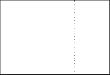

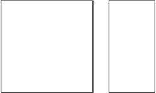


**Step 2:** Cut the square into two equal halves. 

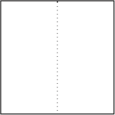

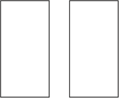

**Step 3:** Fold each half square lengthwise down the middle to form two double-layered strips. 

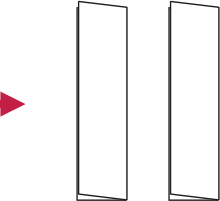

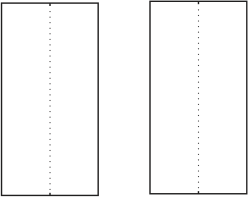

**Step 4:** Fold each strip into four square sections, and put the two parts together to form a paper cube. Use sticky tape to keep it together. 


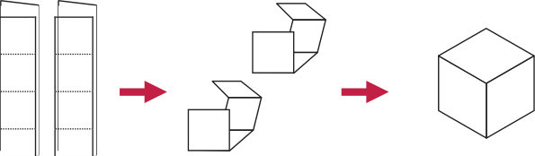
> **[Diagram Context - Textbook_Mathematics_Gr7_Surface-area-and-volume-of-3D-objects.pdf-0001-15.png]**
> This geometry figure illustrates the net development and assembly of a three-dimensional cube. It features flat rectangular strips with dotted fold lines connected by red directional arrows to partially folded components and finally a complete 3D cube. Conceptually, it demonstrates spatial visualization and net folding, helping learners understand how two-dimensional nets transform into three-dimensional geometric solids.


2. Number each face of the cube. How many faces does the cube have? 

3. Measure the side length of one face of the cube. 

4. Calculate the area of one face of the cube. 

5. Add up the areas of all the faces of the cube. 

The **surface area** of an object is the sum of the areas of all its faces (or outer surfaces). 

Asforotherareas, wemeasure surface area insquare units, for example mm^{2} , cm^{2} and m^{2} . 


**146** MATHEMATICS GRAdE 7: TERM 2 

A cube has six identical square faces. A die (plural: dice) is an example of a cube. 

A rectangular prism also has six faces, but its faces can be squares and/or rectangles. A matchbox is an example of a rectangular prism. 


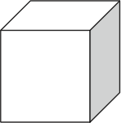


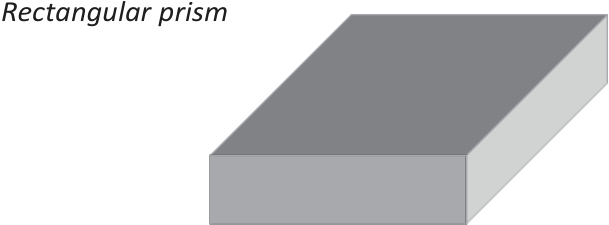
> **[Diagram Context - Textbook_Mathematics_Gr7_Surface-area-and-volume-of-3D-objects.pdf-0002-04.png]**
> This graphic displays a 3D geometry figure of a solid rectangular prism, accompanied by the text label "Rectangular prism". It visually represents a three-dimensional polyhedron bounded by six rectangular faces, where opposite faces are parallel and congruent. For CAPS FET mathematics learners, this diagram aids in understanding spatial properties, surface area calculations, and volume formulas for right prisms.


##### **<mark>using nets of rectangular prisms and cubes</mark>** 

It is sometimes easier to see all the faces of a rectangular prism or cube if we look at its net. A **net** of a prism is the figure obtained when cutting the prism along some of its edges, unfolding it and laying it flat. 

1. Take a sheet of paper and wrap it around a matchbox so that it covers the whole box without going over the same place twice. Cut off extra bits of paper as necessary so that you have only the paper that covers each face of the matchbox. 

2. Flatten the paper and draw lines where the paper has been folded. Your sheet might look like one of the following nets (there are also other possibilities): 

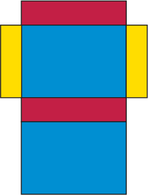

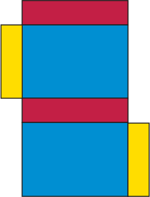

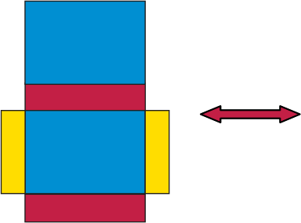


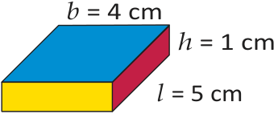
> **[Diagram Context - Textbook_Mathematics_Gr7_Surface-area-and-volume-of-3D-objects.pdf-0002-12.png]**
> This graphic shows a 3D rectangular prism (cuboid) geometry figure with labeled dimensions. Visible labels include breadth $b = 4\text{ cm}$, height $h = 1\text{ cm}$, and length $l = 5\text{ cm}$, along with distinct blue, yellow, and red shaded faces. This diagram helps learners calculate surface area and volume by clearly identifying the length, breadth, and height parameters of a rectangular prism.


3. Notice that there are six rectangles in the net, each matching a rectangular face of the matchbox. Point to the three pairs of identical rectangles in each net. 

4. Use the measurements given to work out the surface area of the prism. (Add up the areas of each face.) 

5. Explain to a classmate why you think the following formula is or is not correct: 


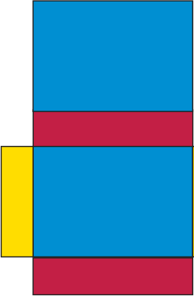

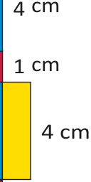

**Surface area of a rectangular prism** = 2( _l_ × _b_ ) + 2( _l_ × _h_ ) + 2( _b_ × _h_ ) 


CHAPTER 10: SURFACE AREA ANd VOLUME OF 3d OBJECTS 

6. Here are three different nets of the same cube. 

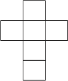

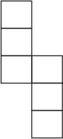

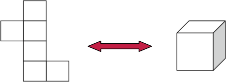

- (a) Can you picture in your mind how the squares can fold up to make a cube? 

- (b) If the length of an edge of the cube is 1 cm, what is the area of one of its faces? What then is the area of all its six faces? 

- (c) Explain to a classmate why you think the following formula is or is not correct: 

   - **Surface area of a cube** = 6( _l_ × _l_ ) = 6 _l_^{2} 

- (d) If the length of an edge of the cube above is 3 cm, what is the surface area of the cube? 

#### **<mark>working out surface areas</mark>** 

1. Work out the surface areas of the following rectangular prisms and cubes. 


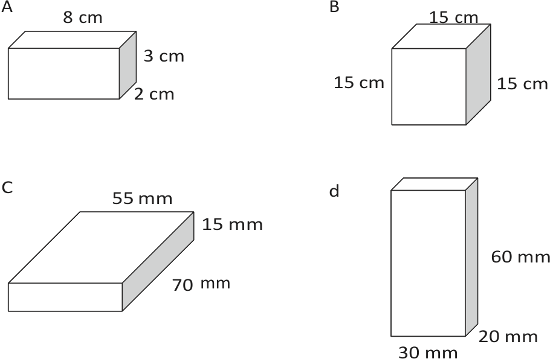
> **[Diagram Context - Textbook_Mathematics_Gr7_Surface-area-and-volume-of-3D-objects.pdf-0003-11.png]**
> This educational graphic is a geometry figure displaying four distinct three-dimensional rectangular prisms labeled A, B, C, and d. Each prism is annotated with visible dimension labels in centimetres and millimetres, specifically measuring length, width, and height (A: 8 cm, 3 cm, 2 cm; B: 15 cm, 15 cm, 15 cm; C: 55 mm, 15 mm, 70 mm; d: 30 mm, 20 mm, 60 mm). Conceptually, the diagram helps learners practice calculating surface area and volume of rectangular prisms, while also reinforcing unit conversion skills between millimeters and centimeters as required in measurement topics.


2. The two boxes on the following page are rectangular prisms. The boxes must be painted. 

   - (a) Calculate the total surface area of Box A and of Box B. 

   - (b) What will it cost to paint both boxes if the paint costs R1,34 per m^{2} ? 


**148** MATHEMATICS GRAdE 7: TERM 2 


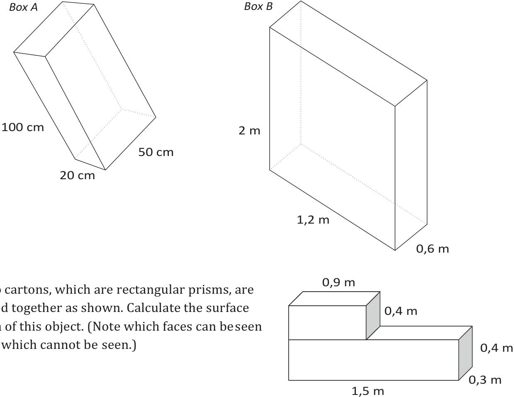
> **[Diagram Context - Textbook_Mathematics_Gr7_Surface-area-and-volume-of-3D-objects.pdf-0004-00.png]**
> The graphic shows three 3D geometry figures representing rectangular prisms labeled "Box A", "Box B", and a combined object made of two joined cartons. Visible labels and dimensions include "Box A", "Box B", "100 cm", "50 cm", "20 cm", "2 m", "1,2 m", "0,6 m", "0,9 m", "0,4 m", "1,5 m", and "0,3 m", alongside a CAPS-aligned problem statement about calculating surface area. This diagram helps high school learners practice spatial visualization, unit conversion, and surface area calculations for composite and single rectangular prisms in Measurement.


3. Two cartons, which are rectangular prisms, are glued together as shown. Calculate the surface area of this object. (Note which faces can be seen and which cannot be seen.) 

4. This large plastic wall measures 3 m × 0,5 m × 1,5 m. It has to be painted for the Uyavula Literacy Project. The wall has three holes in it, labelled A, B and C, as shown. The holes go right  through the wall. The measurements of the holes are in millimetres. 


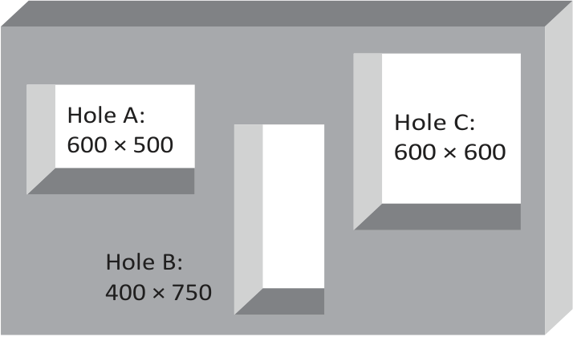
> **[Diagram Context - Textbook_Mathematics_Gr7_Surface-area-and-volume-of-3D-objects.pdf-0004-03.png]**
> This technical drawing and geometry figure illustrates a solid rectangular block containing three distinct rectangular cutouts or apertures. The visible labels and dimensions include "Hole A: 600 x 500", "Hole B: 400 x 750", and "Hole C: 600 x 600". For a high school student studying Engineering Graphics and Design (EGD) or Mathematics, this diagram conveys the principles of 2D area calculations, surface area reduction, and spatial interpretation of 3D objects with hollowed features.


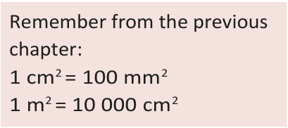
> **[Diagram Context - Textbook_Mathematics_Gr7_Surface-area-and-volume-of-3D-objects.pdf-0004-04.png]**
> This educational graphic is a mathematical conversion reference box presenting standard area unit equivalences. It displays the text "Remember from the previous chapter:" followed by the specific conversion equations "$1\text{ cm}^2 = 100\text{ mm}^2$" and "$1\text{ m}^2 = 10\text{ 000}\text{ cm}^2$". Conceptually, this diagram serves as a quick-reference reminder to help students correctly convert between square millimeters, square centimeters, and square meters when solving measurement and geometry problems.


- (a) Calculate the area of the front and back surfaces that must be painted. 

- (b) Calculate the area of the two side faces, as well as the top face. 

- (c) Calculate the total surface area of the wall, excluding the bottom and the inner surfaces where the holes are, because these will not be painted. 

- (d) What will it cost if the water-based paint costs R2,00 per m^{2} ? 


CHAPTER 10: SURFACE AREA ANd VOLUME OF 3d OBJECTS 

## 10.2 Volume of rectangular prisms and cubes 

2D shapes are flat and have only two dimensions, namely length ( _l_ ) and breadth ( _b_ ). 3D objects have three dimensions, namely length ( _l_ ), breadth ( _b_ ) and height ( _h_ ). You can think of a dimension as a direction in space. Look at these examples: 

_2D shape: rectangle_ 

_3D object: rectangular prism_ 


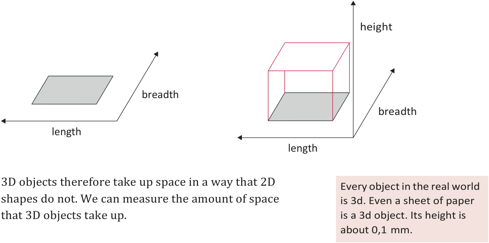
> **[Diagram Context - Textbook_Mathematics_Gr7_Surface-area-and-volume-of-3D-objects.pdf-0005-04.png]**
> This educational graphic is a geometry figure comparing a two-dimensional shape and a three-dimensional object positioned within coordinate axes. It features two diagrams accompanied by explanatory text boxes, with visible labels including "length", "breadth", and "height" next to directional arrows. Conceptually, it illustrates the distinction between 2D and 3D space by showing that while flat shapes possess only length and breadth, three-dimensional objects incorporate height to take up volume in the physical world.


##### **<mark>cubes to measure amount of space</mark>** 

We can use cubes to measure the amount of space that an object takes up. 

1. Identical toy building cubes were used to make the stacks shown below. 


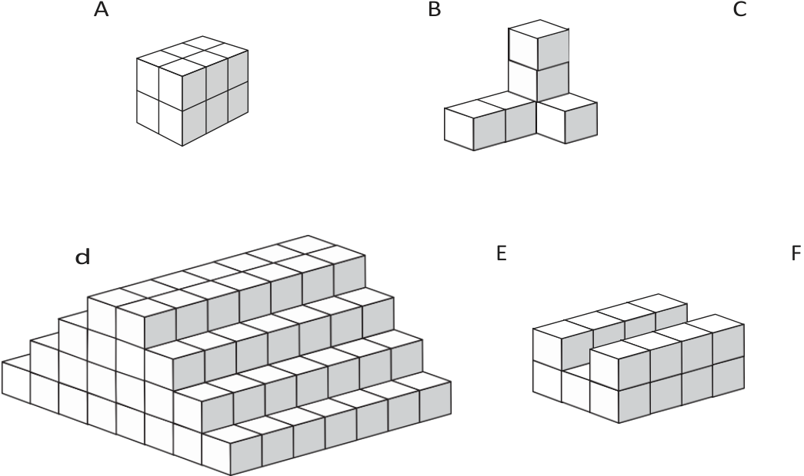
> **[Diagram Context - Textbook_Mathematics_Gr7_Surface-area-and-volume-of-3D-objects.pdf-0005-08.png]**
> The graphic shows a geometry figure composed of multiple connected unit cubes arranged into distinct 3D shapes labeled A, B, d, and E, alongside placeholder letters C and F. The visible labels consist of uppercase and lowercase letters (A, B, C, d, E, F) identifying each unique cuboid or stepped block structure. Conceptually, this diagram helps high school learners visualize spatial orientation, calculate surface area-to-volume ratios, and determine the total volume or surface area of composite 3D objects by counting individual unit cubes.


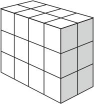
> **[Diagram Context - Textbook_Mathematics_Gr7_Surface-area-and-volume-of-3D-objects.pdf-0005-09.png]**
> This geometric figure is a 3D rectangular prism composed of an array of smaller unit cubes. The diagram shows no text labels, variables, or arrows, presenting purely a composite volumetric grid structure. Conceptually, it helps learners visualize volume and surface area calculations by demonstrating how identical unit cubes pack together to form a larger three-dimensional shape.


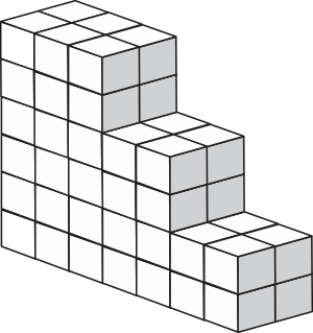
> **[Diagram Context - Textbook_Mathematics_Gr7_Surface-area-and-volume-of-3D-objects.pdf-0005-10.png]**
> This geometric figure is a 3D bar-chart-like staircase structure constructed from identical individual cubes arranged in three distinct descending tiers. The visible components include white and lightly shaded cube faces forming a solid staircase profile with a width of two units and heights of five, three, and one unit across its three sections. Conceptually, this diagram helps learners visualize spatial reasoning, surface area, and volume calculations by counting composite units or determining the total number of blocks in a structured three-dimensional arrangement.


**150** MATHEMATICS GRAdE 7: TERM 2 

- (a) Which stack takes up the least space? 

- (b) Which stack takes up the most space? 

- (c) Order the stacks from the one that takes up the least space to the one that takes up the most space. (Write the letters of the stacks.) 

The space (in all directions) occupied by a 3D object is called its **volume** . 

Cubes are the units we use to measure volume. 

A cube with edges of 1 cm (that is, 1 cm × 1 cm × 1 cm) has a volume of one cubic centimetre (1 cm^{3} ). 

2. The figure on the right shows a rectangular prism made from 36 cubes, each with an edge length of 1 cm. The prism thus has a volume of 36 cubic centimetres (36 cm^{3} ). 


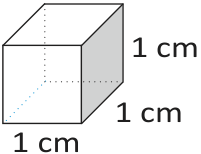
> **[Diagram Context - Textbook_Mathematics_Gr7_Surface-area-and-volume-of-3D-objects.pdf-0006-07.png]**
> This graphic is a 3D geometry figure of a standard unit cube with visible dimension labels. The diagram displays a cube with visible edge lengths labeled as 1 cm for its height, width, and depth, rendered with solid and dotted lines to show perspective. Conceptually, it helps learners visualize three-dimensional space and provides a foundational model for calculating surface area and volume in measurement topics.


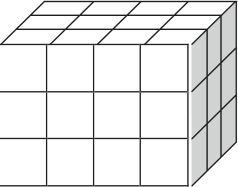
> **[Diagram Context - Textbook_Mathematics_Gr7_Surface-area-and-volume-of-3D-objects.pdf-0006-08.png]**
> The graphic shows a geometry figure of a large 3D rectangular prism (or composite cube) constructed from smaller grid squares and unit cubes without any explicit text labels or arrows. It conceptually illustrates surface area and volume calculations by demonstrating how smaller unit cubes compose a larger three-dimensional object, assisting learners in visualising spatial dimensions and face counts.


- (a) The stack is taken apart and all 36 cubes are stacked again to make a new rectangular prism with a base of four cubes (see A below.) How many layers of cubes will the new prism be? What is the height of the new prism? 

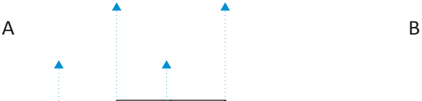

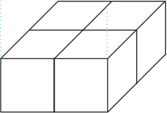


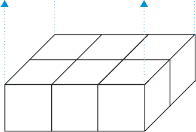
> **[Diagram Context - Textbook_Mathematics_Gr7_Surface-area-and-volume-of-3D-objects.pdf-0006-12.png]**
> This geometric figure displays a rectangular arrangement of multiple identical cubes forming a larger rectangular prism, with vertical dotted lines extending upwards from certain corners, ending in blue upward-pointing arrows. The diagram visualizes spatial relationships, surface area calculations, or volume scaling for high school mathematics and measurement topics.


- (b) Repeat (a), but this time make a prism with a base of six cubes (see B above). 

- (c) Which one of the rectangular prisms in questions (a) and (b) takes up the most space in all directions? (Which one has the greatest volume?) 

- (d) What will be the volume of the prism in question (b) if there are seven layers of cubes altogether? 

- (e) A prism is built with 48 cubes, each with an edge length of 1 cm. The base consists of eight layers. What is the height of the prism? 

#### **<mark>formula to calculate volume</mark>** 

You can think about the volume of a rectangular prism in the following way: 

**Step 1:** Measure the area of the bottom face (also called the base) of a rectangular prism. For the prism given here: _A_ = _l_ × _b_ = 6 × 3 = 18square units. 


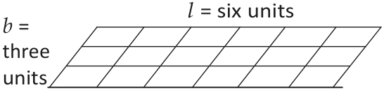
> **[Diagram Context - Textbook_Mathematics_Gr7_Surface-area-and-volume-of-3D-objects.pdf-0006-20.png]**
> This educational graphic is a geometry figure showing a rectangular grid divided into smaller square or parallelogram units. The visible text labels are "l = six units" along the top length and "b = three units" along the breadth/width. Conceptually, this diagram illustrates the foundational concept of area measurement by tiling, showing how a two-dimensional shape can be quantified into square units ($3 \times 6 = 18$ units) to help learners understand length, breadth, and area calculation.


CHAPTER 10: SURFACE AREA ANd VOLUME OF 3d OBJECTS 

**Step 2:** A layer of cubes, each one unit high, is placed on the flat base. The base now holds 18 cubes. It is 6 × 3 × 1 cubic units. 


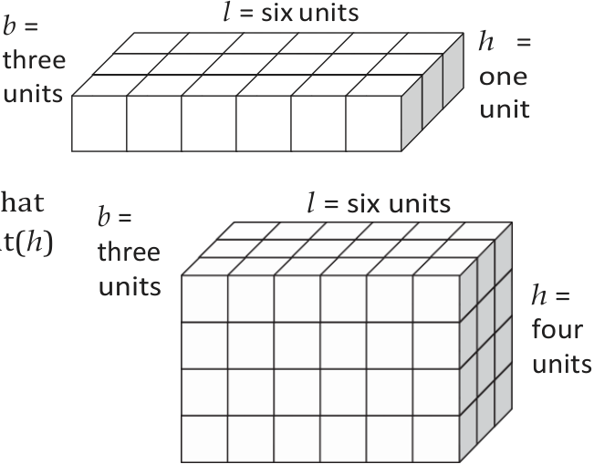
> **[Diagram Context - Textbook_Mathematics_Gr7_Surface-area-and-volume-of-3D-objects.pdf-0007-01.png]**
> The graphic shows a geometry figure consisting of two rectangular prisms built from unit cubes, with visible labels for dimensions $l$ (length), $b$ (breadth), and $h$ (height). The top prism is labeled $l = \text{six units}$, $b = \text{three units}$, and $h = \text{one unit}$, while the bottom prism is labeled $l = \text{six units}$, $b = \text{three units}$, and $h = \text{four units}$. This visual representation helps CAPS learners understand how changing the height dimension affects the total volume and surface area of three-dimensional objects.


**Step 3:** Three more layers of cubes are added so that there are fourlayers altogether. The prism’s height( _h_ ) is four units. The volume of the prism is: 

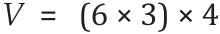

or _V_ = Area of base × number of layers =  ( _l_ × _b_ ) × _h_ 

Therefore: 

**Volume of a rectangular prism** = Area of base × height = _l_ × _b_ × _h_ 

**Volume of a cube** = _l_ × _l_ × _l_ (edges are all the same length) = _l_^{3} 

##### **<mark>applying the formulae</mark>** 

1. Calculate the volume of these prisms and cubes. 


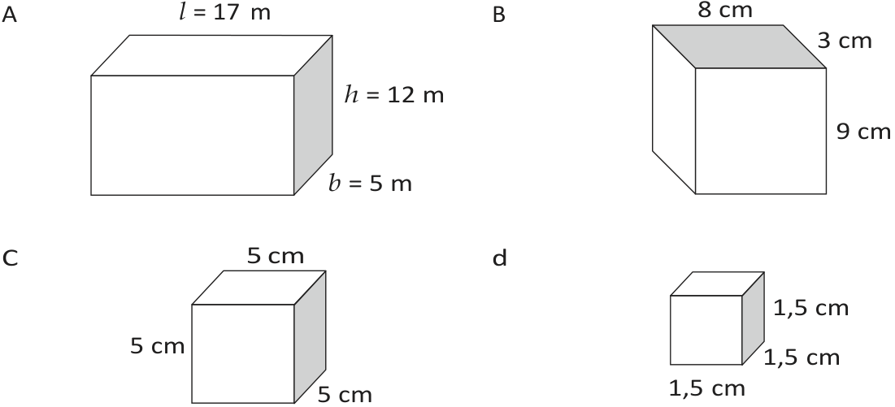
> **[Diagram Context - Textbook_Mathematics_Gr7_Surface-area-and-volume-of-3D-objects.pdf-0007-10.png]**
> This educational graphic displays four 3D geometry figures labeled A, B, C, and d, representing rectangular prisms and cubes with explicit dimension measurements. Figure A shows a rectangular prism with length $l = 17\text{ m}$, height $h = 12\text{ m}$, and breadth $b = 5\text{ m}$, while Figures B, C, and d show rectangular prisms or cubes with labeled side lengths in centimeters ($8\text{ cm}$, $3\text{ cm}$, $9\text{ cm}$; $5\text{ cm}$, $5\text{ cm}$, $5\text{ cm}$; and $1,5\text{ cm}$, $1,5\text{ cm}$, $1,5\text{ cm}$). This diagram visually conveys the foundational concepts of surface area and volume calculation for 3D objects, allowing students to practice applying mathematical formulas using provided metric dimensions.


2. Calculate the volume of prisms with the following measurements: 

   - (a) _l_ = 7 m, _b_ = 6 m, _h_ = 6 m 

   - (c)  Surface of base = 48 m^{2} , _h_ = 4 m 

      - (b) _l_ = 55 cm, _b_ = 10 cm, _h_ = 20 cm 

      - (d) Surface of base = 16 mm^{2} , _h_ = 12mm 

3. Calculate the volume of cubes with the following edge lengths: 

   - (a) 7 cm (b) 12 mm 


**152** MATHEMATICS GRAdE 7: TERM 2 

4. Calculate the volume ofthe following square-based prisms: (a) side of the base = 5 mm, _h_ = 12 mm (b) side of the base = 11 m, _h_ = 800cm 

5. The volume of a prism is 375 m^{3} . What is the height of the prism if its length is 8 m and its breadth is 15 m? 

## 10.3 Converting between cubic units 

##### **<mark>cubic units to measure volume</mark>** 

This drawing shows a cube (A) with an edge length of 1 m. Also shown is a small cube (B) with an edge length of 1 cm. 

How many small cubes can fit inside the large cube? 

- 100 small cubes can fit along the length of the base of cube A (because there are 100 cm in 1 m). 

- 100small cubes can fit along the breadth of the base of cube A. 

- 100 small cubes can fit along the height of cube A. 


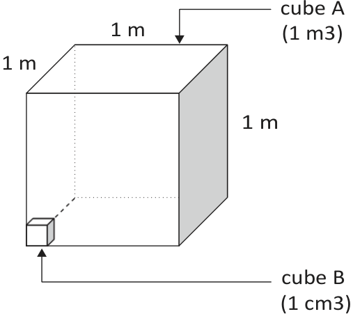
> **[Diagram Context - Textbook_Mathematics_Gr7_Surface-area-and-volume-of-3D-objects.pdf-0008-09.png]**
> The graphic is a 3D geometric diagram comparing the relative sizes of two cubic structures, labeled "cube A (1 m3)" with dimensions of 1 m by 1 m by 1 m, and "cube B (1 cm3)" positioned at its bottom corner. Visible labels include measurement dimensions of "1 m" along the sides of the large cube, as well as arrows pointing to "cube A" and "cube B". Conceptually, this diagram visually illustrates scale differences and surface-area-to-volume relationships, which are critical for high school learners studying biological transport mechanisms like diffusion in cells.


Total number of 1 cm^{3} cubes in 1 m^{3} = 100 × 100 × 100 

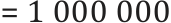

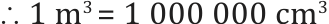

Work out how many mm^{3} are equal to 1 cm^{3} . Copy and complete: 


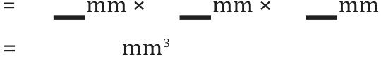

###### **Cubic units:** 

1 m^{3} = 1 000 000 cm^{3} 

(multiply by 1 000 000 to change m^{3} to cm^{3} ) 

1 cm^{3} = 0,000001 m^{3} 

(divide by 1 000 000 to change cm^{3} to m^{3} ) 

1 cm^{3} = 1 000 mm^{3} 

(multiply by 1 000 to change cm^{3} to mm^{3} ) 

1 mm^{3} = 0,001 cm^{3} 

(divide by 1 000 to change mm^{3} to cm^{3} ) 


CHAPTER 10: SURFACE AREA ANd VOLUME OF 3d OBJECTS 

#### **<mark>working with cubic units</mark>** 

1. Which unit, the cubic centimetre (cm^{3} ) or the cubic metre (m^{3} ), would be used to measure the volume of each of the following? 

   - (a) a bar of soap 

   - (c)  a wooden rafter fora roof 

   - (e)   a rectangular concrete wall 

   - (g)  water in a swimming pool 

      - (b) a book 

      - (d) sand on atruck 

      - (f) a die 

      - (h) medicine in a syringe 

2. Write the following volumes in cm^{3} : (a)   1 000 mm^{3} 

   - (c) 2 500 mm^{3} 

   - (e)   7 824 mm^{3} 

      - (b)   3 000 mm^{3} 

      - (d)   4 450 mm^{3} 

      - (f) 50 mm^{3} 

3. Write the following volumes in m^{3} : (a)   1 000 000 cm^{3} 

   - (c)   1 500 000 cm^{3} 

   - (e)   500 000 cm^{3} 

      - (b)   4 000 000 cm^{3} 

      - (d)   2 350 000 cm^{3} 

      - (f) 350 000 cm^{3} 

4. Write the following volumes in cm^{3} : 

   - (a)   2 000 mm^{3} 

   - (c)  1,5 m^{3} 

   - (e) 50000 mm^{3} 

   - (b) 4 120 mm^{3} 

   - (d) 34 m^{3} 

   - (f) 2,23 m^{3} 

5. A rectangular hole has been dug for achildren’s swimming pool. It is 7 m long, 4 m wide and 1 m deep. What is the volume of earth that has been dug out? 

6. Calculate the volume of wood in the plank shown below. Answer in cm^{3} . 


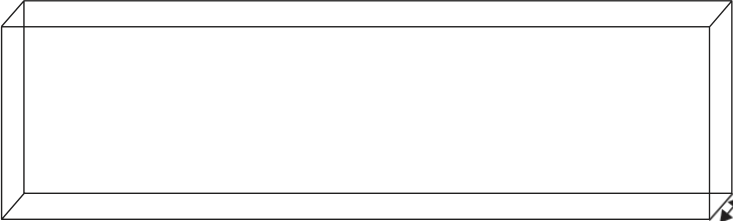

10 mm 

100 mm 

7. The drawing shows the base (viewed from below) of a stack built with 1 cm^{3} cubes. The stack is 80 mm high everywhere. 

   - (a) What is the volume of the stack? 

   - (b) Copy and complete the following: Volume of stack = area of base 


**154** MATHEMATICS GRAdE 7: TERM 2 

8. Calculate the volume of each of the following rectangular prisms: 

   - (a) length = 20 cm; breadth = 15 cm; height = 10 cm 

   - (b) length = 130 mm; breadth = 10 cm; height = 5 mm 

   - (c) length = 1 200 cm; breadth = 5,5 m; height = 3m 

   - (d) length = 1,2 m; breadth = 2,25 m; height = 4 m 

   - (e) area of base = 300 cm^{2} ; height = 150 mm 

   - (f) area of base = 12 m^{2} ; height = 2,25 m 

## 10.4 Volume  and capacity 

The space inside a container is called the internal volume, or **capacity** , of the container. Capacity is often measured in units of millilitres (ml), litres (ℓ) and kilolitres (kl). However, it can also be measured in cubic units. 

#### **<mark>equivalent units for volume and capacity</mark>** 


If the contents of a 1 ℓ bottle are poured into a cubeshaped container with internal  measurements  of 10 cm × 10 cm × 10 cm, it will fill the container exactly. Thus: 


This means that an object with a volume of 1 cm^{3} will take up the same amount of space as 1 ml of water. Or an object with a volume of 1 m^{3} will take up the space of 1 kl of water. 


CHAPTER 10: SURFACE AREA ANd VOLUME OF 3d OBJECTS 

###### The following diagram shows the conversions in another way: 


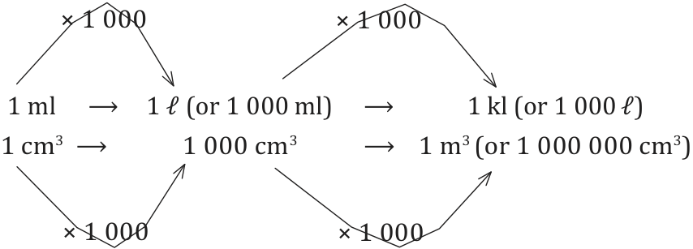
> **[Diagram Context - Textbook_Mathematics_Gr7_Surface-area-and-volume-of-3D-objects.pdf-0011-01.png]**
> This educational graphic illustrates a unit conversion flow diagram for measuring capacity and volume. It displays directional arrows labeled with multiplication factors of $\times 1\,000$ linking various units, specifically millilitres ($\text{ml}$), litres ($\ell$), kilolitres ($\text{kl}$), cubic centimetres ($\text{cm}^3$), and cubic metres ($\text{m}^3$). This diagram conceptually helps students navigate the multiplicative relationships and equivalences between metric capacity and cubic volume measurements.


**conversion** is the changing of something into something else. In this case, it refers to changes between equivalent units of measurement. 

From the diagram on the previous page, you can see that: 

- 1 ℓ = 1 000 ml; 1 ml = 0,001 ℓ 

- 1 kl = 1 000 ℓ; 1 ℓ = 0,001 kl 

- 1 ml = 1 cm^{3} 

- 1 ℓ = 1 000 cm^{3} 

- 1 kl = 1 000 000 cm^{3} or 1 m^{3} 

   - Remember these conversions: 1 ml = 1 cm^{3} 1 kl = 1 m^{3} 

#### **<mark>volume and capacity calculations</mark>** 

1. Write the following volumes in ml: 

   - (a)   2 000 cm^{3} 

   - (c)   1 ℓ 

   - (e)   2,5 ℓ 

   - (g)  0,5 ℓ 

      - (b) 250 cm^{3} 

      - (d) 4 ℓ 

      - (f) 6,85 ℓ 

      - (h) 0,5 cm^{3} 

2. Write the following volumes in kl: (a)   2 000 ℓ 

   - (c)   5 m^{3} 

   - (e)   3 000 000 cm^{3} 

   - (g)   20 ℓ 

      - (b) 2 500 ℓ 

      - (d) 6 500 m^{3} 

      - (f) 1 423 000 cm^{3} (h) 2,5 ℓ 

3. A glass can hold up to 250 ml of water. What is the capacity of the glass: 

   - (a) in ml? 

- (b) in cm^{3} ? 


**156** MATHEMATICS GRAdE 7: TERM 2 

4. A vase is shaped like a rectangular prism. Its inside measurements are 15 cm × 10 cm × 20 cm. What is the capacity of the vase (in ml)? 


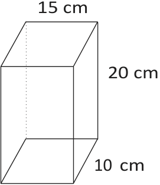
> **[Diagram Context - Textbook_Mathematics_Gr7_Surface-area-and-volume-of-3D-objects.pdf-0012-01.png]**
> This graphic is a geometry figure representing a rectangular prism (cuboid). It features the dimensional labels $15\text{ cm}$, $10\text{ cm}$, and $20\text{ cm}$ indicating the length, width, and height respectively. Conceptually, this diagram helps learners apply surface area and volume formulas within the CAPS Senior Phase and FET mathematics curriculum.


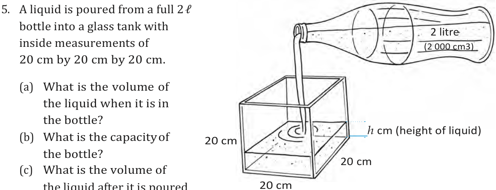
> **[Diagram Context - Textbook_Mathematics_Gr7_Surface-area-and-volume-of-3D-objects.pdf-0012-02.png]**
> This educational graphic is a word problem accompanied by a line drawing illustrating the transfer of liquid from a bottle into a rectangular prism tank. The visual elements include a 2-litre ($2\ 000\text{ cm}^3$) bottle pouring liquid into a cubic tank with side dimensions of $20\text{ cm}$ by $20\text{ cm}$ by $20\text{ cm}$, along with labels indicating the liquid height ($h\text{ cm}$) and three accompanying calculation questions (a-c). Conceptually, it helps learners apply spatial reasoning and unit conversions between cubic centimeters ($\text{cm}^3$) and liters ($\ell$) to understand that the volume of a liquid is conserved when transferred between different containers.


- (c) What is the volume of the liquid after it is poured into the tank? 

- (d) What is the capacity of the tank? 

- (e) How high does the liquid go in the tank? 

In question 5 above, you should have found the following: 

Volume of liquid in tank = Volume of liquid in bottle 

20 × 20 × _h_ (liquid’s height in tank) = 2 000 cm^{3} 


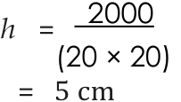
> **[Diagram Context - Textbook_Mathematics_Gr7_Surface-area-and-volume-of-3D-objects.pdf-0012-09.png]**
> This algebraic calculation shows the step-by-step mathematical evaluation for a variable. The graphic displays the equation $h = \frac{2000}{(20 \times 20)} = 5\text{ cm}$, utilizing variables, numbers, multiplication and division operators, and unit labels. Conceptually, it demonstrates how to substitute values and solve for an unknown dimension or parameter in a measurement problem.


**Note:** The capacity of the tank is 20 cm × 20 cm × 20 cm = 8 000 cm^{3} (8 ℓ). The volume of liquid in the bottle is 2 000 cm^{3} (2 ℓ). 


CHAPTER 10: SURFACE AREA ANd VOLUME OF 3d OBJECTS 

### **~~Worksheet~~** 

1. Do the following unit conversions: 

(a) 2 348 cm^{2} = m^{2} (b)  5,104m^{2} = cm^{2} (c) 1 m^{3} = k ~~l~~ (d) 250 cm^{3} = ~~ml~~ = ℓ (e) 0,5 kl = ℓ = ml (f)  6,850 ℓ = ml = cm^{3} 

2. A rectangular prism measures 8 m × 4 m × 3 m. Calculate: 

   - (a) its surface area 

      - (b) its volume 

3. A boy has27 cubes, withedges of 20 mm. He uses thesecubesto buildone big cube. 

   - (a) What is the volume of the cube if he uses all 27 small cubes? 

   - (b) What is the edge length of the big cube? 

   - (c) What is the surface area of the big cube? 

4. A glass tank has the following inside measurements: length = 250 mm, breadth = 120 mm and height = 100 mm. Calculate the capacity of the tank: 

   - (a) in cubic centimetres 

   - (b) in millilitres 

   - (c) in litres 

5. Calculate the capacity of each of the following rectangular containers. Theinside measurements have been given. Copy and complete the table. 

||**Length**|**Breadth**|**Height**|**Capacity**|
|---|---|---|---|---|
|(a)|15 mm|8 mm|5 mm|cm^{3}|
|(b)|2 m|50 cm|30 cm|ℓ|
|(c)|3 m|2 m|1,5 m|kl|

6. A water tankhasasquarebasewith internal edge lengths of150mm. Whatis theheightofthetankwhenthemaximumcapacityofthe tankis11 250cm^{3} ? 

~~SURFACE AREA AND VOLUME OF 3D OBJECTS~~ 

##### Grade 7 Term 2 Chapter 10 Surface area and volume of 3D objects 

||**Learner Book Overview**||
|---|---|---|
|**Sections in this chapter**|**Content**|**Pages in Learner Book**|
|10.1 Surface area of cubes and<br>rectangular prisms|Defining surface area; using nets of rectangular prisms and cubes; working out<br>surface areas|Pages 146 to 149|
|10.2 Volume of rectangular prisms<br>and cubes|Defining volume as amount of space taken up; counting cubes to represent volume;<br>driving and applying a formula to calculate volume|Pages 150 to 153|
|10.3 Converting between cubic units|Understanding cubic measurements and converting between cubic measurements|Pages 153 to 155|
|10.4 Volume and capacity|Understanding the difference between volume and capacity; converting between<br>units and calculating capacity and volume|Pages 155 to 157|
|CAPS time allocation|8 hours||
|CAPS content specification|Page 57||

###### **Mathematical background** 

The surface area and volume of 3D objects are closely linked concepts. A 3D object has many surfaces but can only have one surface area, in other words, there is an outer surface that can be covered. A 2D shape only has area, but not surface area (per definition). 

The **surface area** of an object is the sum of the areas of all the faces. We work with nets covering the whole outer surface. Using 2D nets bridges the gap between thinking about 3D objects and 2D shapes. **Nets** enable us to use the formulae for 2D shapes to find the surface area of a 3D object. 

A 3D object is a **prism** if the side faces are perpendicular to the base. A prism consists of a base and a face opposite to it that has the same area. The side faces can be imagined to fold open so that it forms a rectangle with width equal to the height of the prism and length equal to the perimeter of the prism. Therefore, an alternative formula for the surface area is twice the area of the base plus the perimeter of the base times the height. 


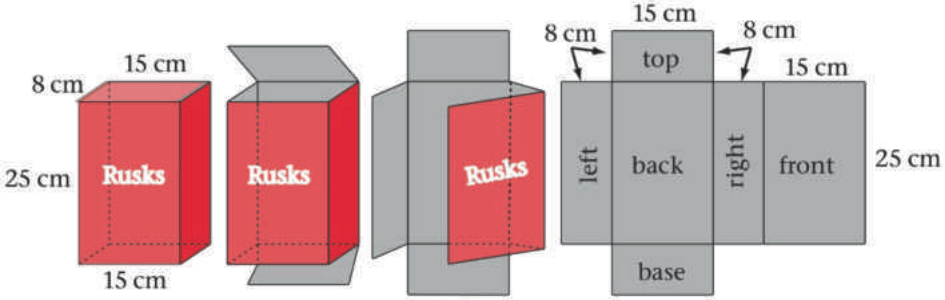
> **[Diagram Context - Textbook_Mathematics_Gr7_Surface-area-and-volume-of-3D-objects.pdf-0014-06.png]**
> This geometric figure illustrates a 3D rectangular prism (a rusk box) being unfolded into a 2D net. Visible labels include dimensions (15 cm, 8 cm, 25 cm), face labels ("top", "base", "left", "right", "front", "back", "Rusks"), and directional arrows indicating the unfolding process. Conceptually, this diagram helps high school mathematics and mathematical literacy learners understand surface area calculations by connecting the total surface area of a 3D object to the sum of the areas of its individual 2D faces.


The **volume** of an object is a measure of the amount of space it takes up. The two most used units to measure volume are: 

- The **cubic centimetre** (cm^{3} ) – a cube with sides of 1 cm. 

- The **cubic metre** (m^{3} ) – a cube with sides of 1 m. This means the sides are 100 cm, therefore the cubic metre consists of 100 × 100 × 100 = 1 000 000 cm^{2} . In other words, there are 100 layers, each consisting of 10 000 cubes with volume 1 cm^{3} . 

The **capacity** of a container is the amount it can hold. The volume is the amount that is in it. The standard unit of capacity is: 

- The **litre** (ℓ) – 1 ℓ fills a space 10 cm long, 10 cm wide and 10 cm deep. 

Capacities smaller than one litre can be measured in: 

- The **millilitre** (ml) – 1 ml fills a space 1 cm long, 1 cm wide and 1 cm deep. 1 000 ml = 1 ℓ. 

MATHEMATICS GRADE 7 TEACHER GUIDE 

##### 10.1 Surface area of cubes and rectangular prisms 

###### **INVESTIGATING SURFACE AREA** 

###### **Teaching guidelines** 

Learners first work with the concept by calculating the areas of all the faces and adding them. 

Let the learners spend plenty of time working with nets. They should construct them and cut them out. This will help them to see that the 3D objects are made up of 2D shapes such as squares, triangles and rectangles, which they are already familiar with. We don’t want learners to memorise complicated formulae for the surface areas of 3D objects. They should learn to identify each surface and add the answers to get the total. 

You may make wall charts of these nets, based on the learners’ work. 

###### **Notes on the questions** 

Learners work with square millimetres (mm^{2} ), square centimetres (cm^{2} ) and square metres (m^{2} ). 

Show learners that changing millimetres to centimetres before they multiply to find the area may give a more manageable answer. 

The continuity in thinking from 2D to 3D allows learners to link the work that they are doing now to what they have already learnt, as well as work they will do in the future. When learners can comprehend the link between 2D shapes and 3D objects, they will easily understand what we mean by the surface area of any 3D object. 

###### **Answers** 

2. 6 

3. 5,2 cm 

4. 5,2 cm × 5,2 cm = 27,04 cm^{2} 

5. 27,04 cm^{2} × 6 = 162,24 cm^{2} 


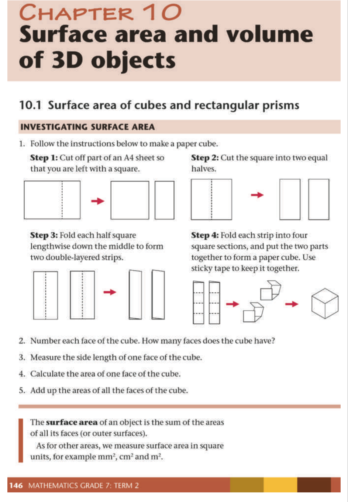
> **[Diagram Context - Textbook_Mathematics_Gr7_Surface-area-and-volume-of-3D-objects.pdf-0015-15.png]**
> This educational graphic features a geometry investigation activity with step-by-step illustrations for constructing a paper cube. Visible labels include "CHAPTER 10," "Surface area and volume of 3D objects," "10.1 Surface area of cubes and rectangular prisms," "INVESTIGATING SURFACE AREA," and steps numbered 1 through 5, accompanied by red directional arrows and dimensional units like $\text{mm}^2$, $\text{cm}^2$, and $\text{m}^2$. It conceptually conveys how a three-dimensional cube is formed from two-dimensional paper strips, guiding learners to physically experience and understand that surface area is the sum of the areas of all its outer faces.


MATHEMATICS GRADE 7 TEACHER GUIDE 

###### **USING NETS OF RECTANGULAR PRISMS AND CUBES** 

###### **Teaching guidelines** 

You could let learners calculate the areas of the faces of a rectangular prism and let them compare those answers with the calculation of the net. 

Follow the steps on LB page 147 to create a net of a matchbox. Let learners complete the questions and evaluate the given formula. 

You could also follow another approach. If possible, get every learner to bring an empty box to class. Get them to take the measurements and then cut the box open to get the net. 


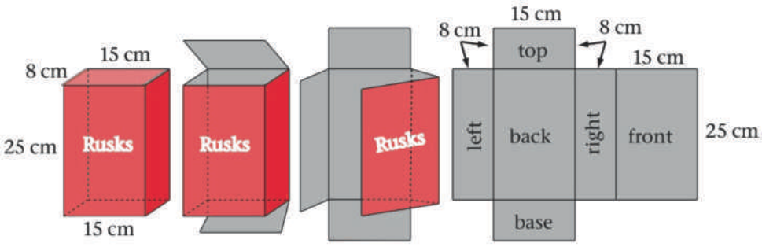
> **[Diagram Context - Textbook_Mathematics_Gr7_Surface-area-and-volume-of-3D-objects.pdf-0016-05.png]**
> This geometric diagram illustrates a 3D rectangular prism (a "Rusks" box) and its corresponding 2D net decomposition. Visible labels include the structural faces ("top", "base", "left", "right", "front", "back"), dimensions of 15 cm, 8 cm, and 25 cm, and indicator arrows. Conceptually, it demonstrates how to deconstruct a right-angled prism into its constituent flat faces to calculate total surface area, aligning with CAPS Senior Phase and FET geometry outcomes.


To find the surface area, learners have to find the area of the base and the top and add the area of the long rectangle, which is made up out of the left and right sides and the back and the front sides. 

For enrichment: There may be learners who can extend their thinking to see that the surface area is the sum of the areas of the base and the top and the area of the long rectangle. The length of the long rectangle is the perimeter of the box around the base. The breadth (width) of this long rectangle is the same as the height of the rectangular prism. The other two faces, the base and the top, have the same area; therefore, the calculation consists of finding the area of two rectangles. In the example above: 

Surface area of prism  = 2 × 8 × 15 + 2(8 + 15) × 25 

- = 2 _lb_ + 2( _l_ + _b_ ) _h_ 

Learners discuss whether the following formula will also work: 

Surface area of prism = 2 × area of the base + perimeter of base × height 

###### **Answers** 

4. 2 × (5 × 4) + 2 × (1 × 5) + 2 × (1 × 4) = 2 × 20 + 2 × 5 + 2 × 4 

   - = 40 + 10 + 8 = 58 cm^{2} 

5. The formula is correct – learners used it in question 4. 


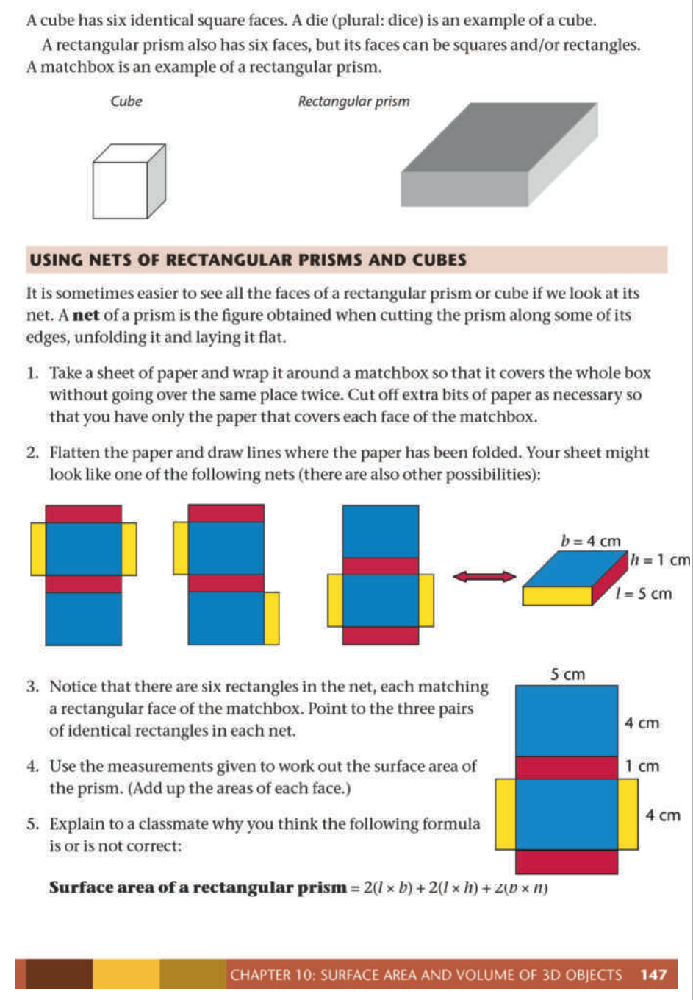
> **[Diagram Context - Textbook_Mathematics_Gr7_Surface-area-and-volume-of-3D-objects.pdf-0016-16.png]**
> The educational graphic is a geometry figure demonstrating the surface area and nets of 3D objects, specifically a cube and a rectangular prism. Visible labels include dimensions ($l = 5\text{ cm}$, $b = 4\text{ cm}$, $h = 1\text{ cm}$), colored face sections on the nets, and the formula: Surface area of a rectangular prism = $2(l \times b) + 2(l \times h) + 2(b \times h)$. This diagram helps learners conceptualize how a 3D rectangular prism can be unfolded into a 2D net composed of six individual rectangles, directly linking the visual sum of face areas to the formal algebraic formula for calculating total surface area.


MATHEMATICS GRADE 7 TEACHER GUIDE 

###### **Answers** 

6. (b) 1 cm^{2} ; 6 cm^{2} 

   - (c) Correct – refer to questions (a) and (b) 

   - (d) 6 _l_^{2} = 6 × (3 × 3) = 54 cm^{2} 

###### **WORKING OUT SURFACE AREAS** 

###### **Teaching guidelines** 

Learners use the formula: 

Surface area of a rectangular prism = 2 _lb_ + 2 _lh_ + 2 _bh_ 

Remind learners that the formula to find the surface area of a cube is = 6 _s_^{2} , where _s_ is the side length of a cube. 

###### **Misconceptions** 

Learners calculate only the surface areas of the faces they can see. 

###### **Answers** 

1. A:  2(2 × 3) + 2(3 × 8) + 2(2 × 8) B: 6(15 × 15) = 6 × 225 

      - = 12 + 48 + 32 = 92 cm^{2} = 1 350 cm^{2} 

   - C: 2(55 × 15 + 15 × 70 + 55 × 70) D: 2(30 × 20 + 20 × 60 + 30 × 60) 

      - = 2(852 + 1 050 + 3 850) = 2(600 + 1 200 + 1 800) 

      - = 2 × 5 752 = 11 504 mm^{2} = 2 × 3 600 = 7 200 mm^{2} 

2. (a) Box A: Box B: 

      - 2(100 × 20 + 20 × 50 + 100 × 50) 2(2 × 1,2 + 1,2 × 0,6 + 0,6 × 2) 2(2 000 + 1 000 + 5 000) = 2(2,4 + 0,72 + 1,2) 

      - = 2 × 8 000 = 16 000 cm^{2} = 2 × 4,32 = 8,64 m^{2} 

   - (b) Box A = 16 000 cm^{2} = 1,6 m^{2} 

      - Total surface area of box A + box B: 1,6 + 8,64 = 10,24 m^{2} 

      - Cost of paint: 10,24 × 1,34 = R13,72 


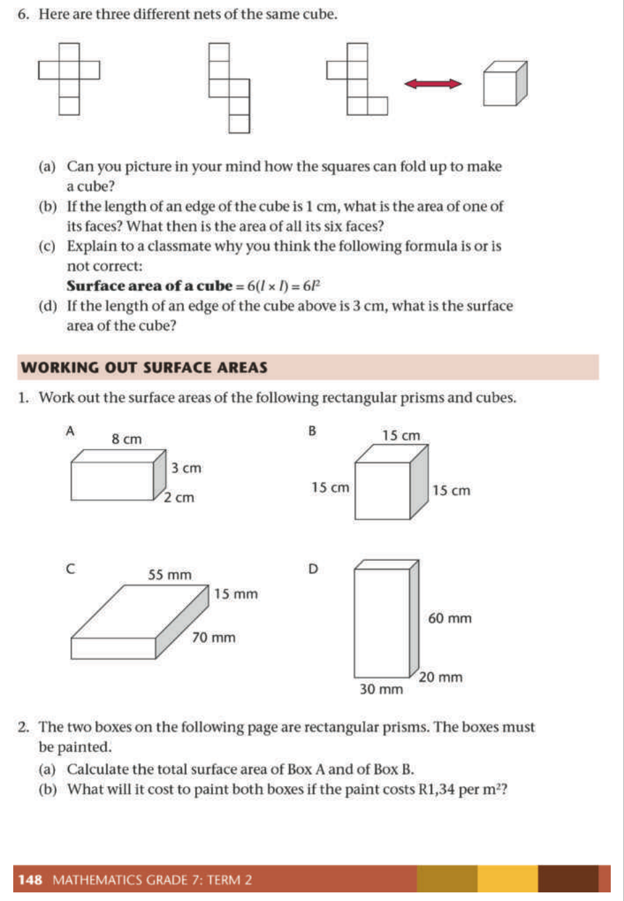
> **[Diagram Context - Textbook_Mathematics_Gr7_Surface-area-and-volume-of-3D-objects.pdf-0017-23.png]**
> This CAPS-aligned mathematics worksheet features geometry figures, specifically three different nets of a cube alongside a 3D cube, followed by four rectangular prisms labeled A, B, C, and D with dimension labels in centimeters and millimeters (e.g., 8 cm, 3 cm, 2 cm, 55 mm, 70 mm, 15 mm). It includes associated scaffolded questions labeled 6(a)-(d) and 1-2(a)-(b) with variables and units like $l$, $l^2$, and $\text{m}^2$. Conceptually, the graphic helps Grade 7 students visualize 3D objects through their 2D nets and develop procedural fluency in calculating the surface area of cubes and rectangular prisms using formulas.


MATHEMATICS GRADE 7 TEACHER GUIDE 

###### **Answers** 

3. (0,9 × 0,3) + (0,6 × 0,3) + (1,5 × 0,3) 

   - + 2(0,4 × 0,3) + (0,8 × 0,3) 

   - + 2(0,9 × 0,4) + 2(1,5 × 0,4) 

   - = [0,27 + 0,18 + 0,45] + [2(0,12) + 0,24] + [2(0,36) + 2(0,6)] 

   - = 0,9 + (0,24 + 0,24) + (0,72 + 1,2) 

   - = 0,9 + 0,48 + 1,92 = 3,3 m^{2} 

4. (a) Convert the dimensions of the holes from millimetres to metres. 

      - 2[3 × 1,5 − (0,6 × 0,5 + 0,4 × 0,75 + 0,6 × 0,6)] 

      - = 2[4,5 − (0,3 + 0,3 + 0,36)] 

      - = 2(4,5 − 0,96) 

      - = 2(3,54) 

= 7,08 m^{2} 

(Alternative method: calculate the **area** of the holes in mm^{2} and convert later). 

(b) Side faces: Top face: 2(0,5 × 1,5) 3 × 0,5 = 2 × 0,75 = 1,5 m^{2} = 1,5 m^{2} 

(c) 7,08 + 1,5 + 1,5 

= 10,08 m^{2} 

(d) 10,08 × 2 

- = R20,16 


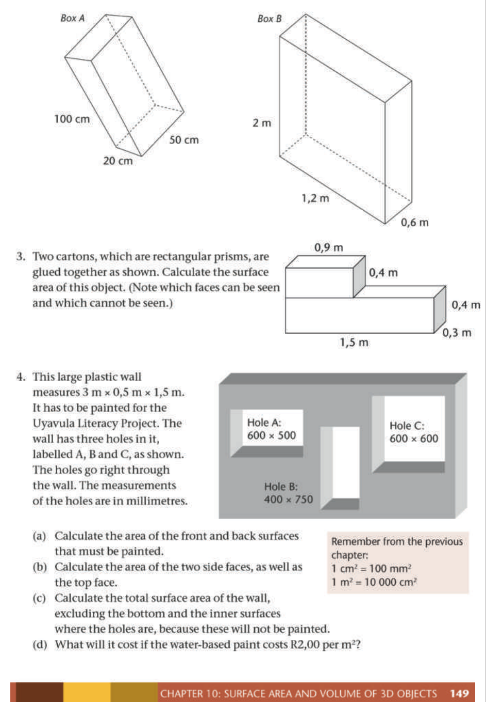
> **[Diagram Context - Textbook_Mathematics_Gr7_Surface-area-and-volume-of-3D-objects.pdf-0018-19.png]**
> The educational graphic shows a collection of geometric figures consisting of 3D rectangular prisms (Boxes A and B), a composite glued carton shape, and a large perforated plastic wall. Visible labels include "Box A", "Box B", "Hole A", "Hole B", "Hole C", along with dimension measurements in centimeters and meters, and conversion notes relating to square units. Conceptually, this diagram helps high school learners practice calculating total surface areas of composite 3D objects and structures with missing sections, requiring them to account for hidden faces, convert units, and apply spatial reasoning in real-world contexts like painting costs.


MATHEMATICS GRADE 7 TEACHER GUIDE 

##### 10.2 Volume of rectangular prisms and cubes 

###### **Teaching guidelines** 

To teach volume of rectangular prisms and cubes, we focus again on the basic understanding of a solid. 

The volume of an object is the amount of space it takes up. 

###### **CUBES TO MEASURE AMOUNT OF SPACE** 

###### **Teaching guidelines** 

Volume is measured in cubic units. A 3D object is built out of smaller cubes of equal size. By counting the cubes, we can calculate the volume of the 3D object. 

The volume of each object in question 1 can be given in terms of the number of building blocks, by counting, for example in C the first layer has 2 × 4 and there are three layers, so the volume is 24 cubic blocks. 

###### **Notes on the questions** 

All the blocks used in the stacks have to be of the same cubic measurement. 


> **[Diagram Context - Textbook_Mathematics_Gr7_Surface-area-and-volume-of-3D-objects.pdf-0019-10.png]**
> This educational graphic is a geometry figure illustrating 2D shapes versus 3D objects and the measurement of volume using unit cubes. The visual elements include dimensional axes labeled "length", "breadth", and "height", alongside six multi-cube stacks labeled A through F. Conceptually, it demonstrates how adding a third dimension transforms a 2D rectangle into a 3D rectangular prism, and teaches students to quantify the space (volume) occupied by objects by counting identical building cubes.


MATHEMATICS GRADE 7 TEACHER GUIDE 

###### **Answers** 

1. (a) B 

   - (b) D 

   - (c) B, A, E, C, F, D 

(Number of cubes per stack: A = 12; B = 6; C = 24; D = 140; E = 20; F = 60) 

###### **Teaching guidelines** 

A cubic centimetre is a cube with sides 1 cm. 

The rectangular prism in question 2 is a regular 3D object. We can add the number of layers, each containing the same number of cubes, to calculate the volume. This shows us that to calculate the volume of a 3D object, we need the area of the base which we then multiply by height (volume = area of base × height). The height is equal to the number of layers used. 

###### **Notes on the questions** 

All the measurements have to be in the same unit: millimetres, centimetres or metres. 

2. (a) 36 ÷ 4 = nine layers height = 9 cm (b) 36 ÷ 6 = six layers height = 6 cm 

   - (c) They both take up the same space. 

They both have the same volume. 

- (d) 6 cm^{3} × 7 = 42 cm^{3} 

- (e) 48 ÷ 8 = 6 cm 

###### **FORMULA TO CALCULATE VOLUME** 

###### **Teaching guidelines** 

Building on the work done in the section above, learners derive the formula to calculate the volume of a rectangular prism: 

Volume = area of base × height = _lbh_ 

This formula works for any prism. In the case of a cube, the formula is: 

Volume = area of base × height = _s_ × _s_ × _s_ = _s_^{3} where _s_ is the side length 

The unit of the answer is written in the exponential form as it indicates that three measurements are multiplied, for example, length in centimetres and breadth in centimetres and height in centimetres gives us volume in cm^{3} . 

The same argument applies for any unit, m^{3} , km^{3} , mm^{3} , etc. All the measurements have to be in the same unit:  millimetres, centimetres or metres. 


> **[Diagram Context - Textbook_Mathematics_Gr7_Surface-area-and-volume-of-3D-objects.pdf-0020-23.png]**
> This educational graphic is a geometry page from a mathematics textbook illustrating the concept of volume using 3D rectangular prisms and unit cubes. Visible labels include unit dimensions ($1\text{ cm}$), base configurations labeled A and B, dimensions ($l = \text{six units}$, $b = \text{three units}$), directional arrows, and calculation formulas for area and volume. The diagram conceptually conveys how volume is measured by counting unit cubes, demonstrating that different rectangular prisms can be formed using the same total volume of cubes by varying their base area and height.


MATHEMATICS GRADE 7 TEACHER GUIDE 

###### **APPLYING THE FORMULAE** 

###### **Teaching guidelines** 

Once learners have an understanding of how the formula was derived, they can calculate the volume of any rectangular prism or cube. 

Learners may need help with question 5 where they have to use the formula backwards; in effect solve a simple equation. 

###### **Misconceptions** 

Learners do not understand that the measurements have to be in the same unit. 

###### **Answers** 


> **[Diagram Context - Textbook_Mathematics_Gr7_Surface-area-and-volume-of-3D-objects.pdf-0021-07.png]**
> This geometric formula and calculation step displays the calculation for the volume of a rectangular prism. The visible variables and values are $V = l \times b \times h$, substituted with $17 \times 5 \times 12$, resulting in a final evaluated volume of $1020\text{ m}^3$. Conceptually, it demonstrates how to apply the standard mathematical formula for volume by substituting given linear dimensions into the equation and including the correct cubic unit of measurement.


> **[Diagram Context - Textbook_Mathematics_Gr7_Surface-area-and-volume-of-3D-objects.pdf-0021-08.png]**
> This mathematical text graphic displays a step-by-step geometry calculation to find the volume of a rectangular prism. The visible labels and variables include "B:" (part identifier), the formula $V = l \times b \times h$, substitution values $8 \times 3 \times 9$, and the final calculated result of $216\text{ cm}^3$. Conceptually, it guides FET phase learners through the procedural fluency required to apply a standard measurement formula using given dimensions to determine three-dimensional space capacity.


> **[Diagram Context - Textbook_Mathematics_Gr7_Surface-area-and-volume-of-3D-objects.pdf-0021-09.png]**
> The graphic presents a mathematical calculation of volume for two geometric objects, labeled C and D. The visible text displays the formulas and substitution steps: for C, $V = l^3 = 5^3 = 125\text{ cm}^3$; for D, $V = l^3 = (1,5)^3 = 1,5 \times 1,5 \times 1,5 = 3,375\text{ cm}^3$. This conveys the concept of calculating the volume of a cube using its side length, reinforcing measurement and exponentiation skills in the CAPS mathematics curriculum.


> **[Diagram Context - Textbook_Mathematics_Gr7_Surface-area-and-volume-of-3D-objects.pdf-0021-10.png]**
> This mathematical text displays a worked-out calculation for the volume of a rectangular prism. Visible labels and variables include the question number "2. (a)", the volume formula $V = l \times b \times h$, numerical substitution values ($7 \times 6 \times 6$), and the final calculated answer with cubic units ($252\text{ m}^3$). Conceptually, it demonstrates the procedural steps required in CAPS mathematics and measurement to calculate three-dimensional space by multiplying length, breadth, and height.


> **[Diagram Context - Textbook_Mathematics_Gr7_Surface-area-and-volume-of-3D-objects.pdf-0021-11.png]**
> This mathematical text graphic displays worked calculations for volume measurements, labeled with sub-questions (b), (c), and (d). It features the volume formula $V = l \times b \times h$ alongside specific numerical values and units of measurement such as $\text{cm}^3$ and $\text{m}^3$. Conceptually, it demonstrates how to apply formulas to calculate the volume of three-dimensional rectangular prisms, reinforcing measurement and calculation skills aligned with the CAPS mathematics curriculum.


> **[Diagram Context - Textbook_Mathematics_Gr7_Surface-area-and-volume-of-3D-objects.pdf-0021-12.png]**
> This educational graphic presents worked mathematical calculations for determining the volume of a cube. Visible labels and variables include question numbers 3 (a) and (b), volume ($V$), side length ($l$), multiplication signs, equals signs, and units of measurement ($\text{cm}^3$, $\text{mm}^3$). Conceptually, it demonstrates how to apply the formula $V = l^3$ by substituting given side lengths, expanding exponents into repeated multiplication, and calculating the final volumetric result with appropriate cubic units.


> **[Diagram Context - Textbook_Mathematics_Gr7_Surface-area-and-volume-of-3D-objects.pdf-0021-13.png]**
> This educational graphic is a geometry figure demonstrating the calculation of volume for rectangular prisms and cubes using unit cubes. Visible labels include dimensions ($l$, $b$, $h$), variables for length, breadth, and height, units such as cm, m, and mm, and formulas like $V = \text{Area of base} \times \text{height}$ or $V = l \times b \times h$. It conceptually conveys how stacking layers of unit cubes builds up the three-dimensional volume of a rectangular prism, reinforcing the derivation and application of standard volume formulas for Grade 7 CAPS Mathematics.


MATHEMATICS GRADE 7 TEACHER GUIDE 

###### **Answers** 

4. (a) 5 × 5 × 12 = 300 mm^{3} 

   - (b) (800 cm = 8 m) 

      - 11 × 11 × 8 = 968 m^{3} 

5. _V_ = _l_ × _b_ × _h_ 

   - 375 = 8 × 15 × _h_ 

   - 375 = 120 × _h_ 

So the height is 375 ÷ 120 = 3,125 m 

##### 10.3 Converting between cubic units 

###### **CUBIC UNITS TO MEASURE VOLUME** 

###### **Teaching guidelines** 

We use cubic units in these formulae, such as 1 mm^{3} , 1 cm^{3} or 1 m^{3} . Teach learners to say “cubic millimetre”, “cubic centimetre” and “cubic metre”. 

Converting between units is very important. Help the learners to understand the units by showing them physical objects of different size. Try to have a big box of 1 m × 1 m × 1 m in the class, as well as a die (usually 1 cm × 1 cm × 1 cm). An object of 1 mm × 1 mm × 1 mm is as small as a grain of sugar or sand. Learners should see and experience these relationships – it is not enough for them to see the 2D representations of the objects in the Learner Book. 

A cubic metre is a cube with sides 1 m. This means the sides are each 100 cm, therefore the cubic metre consists of 100 × 100 × 100 = 1 000 000 cm^{3} . In other words, there are 100 layers, each consisting of 10 000 cubes with volume 1 cm^{3} . 

The unit is written in the exponential form as it indicates that three measurements are multiplied, for example, length in centimetres and breadth in centimetres and height in centimetres gives us volume in cm^{3} . The same argument applies for any unit, m^{3} , km^{3} , mm^{3} , etc. 

The two units that learners use most to measure volume is the cubic centimetre (cm^{3} ) or the cubic metre (m^{3} ). 


> **[Diagram Context - Textbook_Mathematics_Gr7_Surface-area-and-volume-of-3D-objects.pdf-0022-16.png]**
> This educational graphic features a geometry figure and accompanying text demonstrating the conversion between cubic units. The visual content includes a large cube labeled "cube A ($1\text{ m}^3$)" with edge lengths of "$1\text{ m}$" and a small cube labeled "cube B ($1\text{ cm}^3$)" with edge lengths of "$1\text{ cm}$", accompanied by step-by-step mathematical calculations involving variables such as length, breadth, and height. Conceptually, it conveys how to convert between cubic metres and cubic centimetres by visualizing linear scale factors cubed ($100 \times 100 \times 100$), helping learners understand the multiplicative relationship behind volumetric unit conversions.


MATHEMATICS GRADE 7 TEACHER GUIDE 

###### **WORKING WITH CUBIC UNITS** 

###### **Teaching guidelines** 

We use well-known cubic units in these formulae, such as mm^{3} , cm^{3} or m^{3} . 

We want learners to have a sense of which unit to use in problem-solving situations. For example, it would be inappropriate to use cm^{3} to measure the amount of cement used to build a house or the amount of sand on a truck. 

###### **Misconceptions** 

A common misconception learners have is to think that if the measurements of an object are changed by a given scale factor, the volume will change by the same scale factor. For example, a learner may think that if all the measurements are doubled, the volume will double as well. It will in fact change by a factor of 8. 

###### **Answers** 

1. (a) cm^{3} (b) cm^{3} 

   - (c) cm^{3} (d) m^{3} 

   - (e) m^{3} 

   - (f) cm^{3} 

- (g) m^{3} 

   - (h) cm^{3} 

2. (a) 1 cm^{3} 

      - (b) 3 cm^{3} (d) 4,45 cm^{3} (d) 0,05 cm^{3} 

   - (c) 2,5 cm^{3} 

   - (e) 7,824 cm^{3} 

3. (a) 1 m^{3} 

         - (b) 4 m^{3} 

   - (c) 1,5 m^{3} (d) 2,35 m^{3} (e) 0,5 m^{3} (f) 0,35 m^{3} 

   - (e) 0,5 m^{3} 

4. (a) 2 cm^{3} 

   - (a) 2 cm^{3} (b) 4,12 cm^{3} (c) 1 500 000 cm^{3} (d) 34 000 000 cm^{3} (e) 50 cm^{3} (f) 2 230 000 cm^{3} 

5. 7 × 4 × 1 = 28 m^{3} 

6. 5 cm × 10 cm × 1 cm = 50 cm^{3} 

   - or 50 mm × 100 mm × 10 mm = 50 000 mm^{3} = 50 cm^{3} 

7. (a) (6 × 10) + (2 × 4) = 60 + 8 = 68 cm^{2} 

      - 68 cm^{2} × 8 cm = 544 cm^{3} 

   - (b) See LB page 154 alongside. 


> **[Diagram Context - Textbook_Mathematics_Gr7_Surface-area-and-volume-of-3D-objects.pdf-0023-29.png]**
> The graphic is a Grade 7 Mathematics worksheet page titled "WORKING WITH CUBIC UNITS" featuring textual exercises and two geometric diagrams: a rectangular prism labeled with dimensions of 50 mm, 100 mm, and 10 mm, and a grid drawing representing the base of a stack built from $1\text{ cm}^3$ cubes with a height of 80 mm. Visible labels and units include $\text{cm}^3$, $\text{m}^3$, $\text{mm}^3$, millimeters (mm), meters (m), and a formula completion prompt ("height"). Conceptually, this worksheet helps learners practice selecting appropriate SI units for volume, converting between cubic units ($\text{mm}^3$, $\text{cm}^3$, $\text{m}^3$), and calculating the volume of rectangular prisms and composite block stacks using spatial reasoning.


MATHEMATICS GRADE 7 TEACHER GUIDE 

###### **Answers** 

8. (a) 20 × 15 × 10 = 3 000 cm^{3} 

   - (b) 13 × 10 × 0,5 = 65 cm^{3} or 130 × 100 × 5 = 65 000 mm^{3} 

   - (c) 12 × 5,5 × 3 = 198 m^{3} 

   - (d) 1,2 × 2,25 × 4 = 10,8 m^{3} 

   - (e) 300 × 15 = 4 500 cm^{3} 

   - (f) 12 × 2,25 = 27 m^{3} 

##### 10.4 Volume and capacity 

###### **EQUIVALENT UNITS FOR VOLUME AND CAPACITY** 

- Capacity is the amount a container can hold. 

- Volume is the space taken up by something. 

###### **Teaching guidelines** 

When you deal with the volume and capacity of a 3D object, holder or container in class, ask clear questions. For instance, when working with liquid in a container you can ask: 

- What is the volume of the container? 

- What is the capacity of the container? 

- What is the volume of the liquid in the container? 

If the container is full, then the volume of the liquid and the capacity of the container are the same. If the container is not full, the volume of the liquid in the container will differ from the capacity of the container. Remind learners that the capacity of the container is the same whether the container is full or empty. 

If a 2 ℓ bottle is half-full, it contains a volume of 1 ℓ but still has a capacity of 2 ℓ, because it can hold 2 ℓ. Volume focuses on what is inside the bottle, but capacity on how much the bottle can hold. 

###### **Misconceptions** 

Learners think of volume as a measurement for solids and capacity as a liquid measurement. 

Learners often think that the tallest container has the greatest capacity and do not take width into consideration. They believe that the amount of liquid has changed when a set amount has been poured from one container to another of a different size and that there is more liquid in the one that has the highest level. 


> **[Diagram Context - Textbook_Mathematics_Gr7_Surface-area-and-volume-of-3D-objects.pdf-0024-21.png]**
> The educational graphic is a textbook page illustrating volume and capacity calculations and unit conversions for rectangular prisms. It features a line drawing of a 1-litre bottle pouring liquid into a cubic container labeled with dimensions of 10 cm × 10 cm × 10 cm, alongside mathematical equations demonstrating equivalences between millilitres, litres, kilolitres, and cubic centimeters ($cm^3$). Conceptually, it conveys the relationship between spatial volume and liquid capacity, helping learners understand how to convert between cubic units of measurement and standard liquid capacity units in three-dimensional geometry.


MATHEMATICS GRADE 7 TEACHER GUIDE 

###### **Notes on the conversions** 

The standard unit of capacity is the litre (ℓ). 

1 ℓ fills a space 10 cm long, 10 cm wide and 10 cm deep. 

To measure capacities smaller than one litre, the litre is divided into 1 000 parts called millilitres, which is written as ml. 

1 ml fills a space 1 cm long, 1 cm wide and 1 cm deep. This means that a ml will fill a cube of 1 cm^{3} . 

An ordinary teaspoon has a capacity of about 5 ml. 

###### **VOLUME AND CAPACITY CALCULATIONS** 

###### **Teaching guidelines** 

Learners could write their own conversion diagram on a sheet of paper and keep it in front of them when they do the conversions. This may help to reinforce the conversion factors and help them to understand the relationships between different units. 

###### **Answers** 

1. (a) 2 000 ml (b) 250 ml (c) 1 000 ml (d) 4 000 ml (e) 2 500 ml (f) 6 850 ml (g) 500 ml (h) 0,5 ml 

2. (a) 2 kl (b) 2,5 kl (c) 5 kl (d) 6 500 kl (e) 3 kl (f) 1,423 kl (g) 0,02 kl (h) 0,0025 kl 

3. (a) 250 ml (b) 250 cm^{3} 


> **[Diagram Context - Textbook_Mathematics_Gr7_Surface-area-and-volume-of-3D-objects.pdf-0025-11.png]**
> This educational graphic is a conversion diagram and exercise page illustrating the relationships between units of volume and capacity. Visible labels include metric units such as millilitres ($\text{ml}$), litres ($\ell$), kilolitres ($\text{kl}$), cubic centimetres ($\text{cm}^3$), and cubic metres ($\text{m}^3$), alongside directional arrows marked with multiplication factors of $\times 1000$ and accompanying practice questions. Conceptually, it conveys how to convert between different metric units of volume and capacity, reinforcing the equivalence between liquid capacity and solid volume ($\text{ml} = \text{cm}^3$ and $\text{kl} = \text{m}^3$) for Grade 7 CAPS mathematics learners.


MATHEMATICS GRADE 7 TEACHER GUIDE 

###### **Answers** 

4. 15 × 10 × 20 = 3 000 cm^{3} = 3 000 ml 

5. (a) 2 000 cm^{3} or 2 ℓ 

   - (b) (At least) 2 000 cm^{3} or 2 ℓ 

   - (c) 2 000 cm^{3} or 2 ℓ 

   - (d) 20 × 20 × 20 = 8 000 cm^{3} or 8 ℓ 

   - (e) 2 000 ÷ (20 × 20) = 5 cm 


> **[Diagram Context - Textbook_Mathematics_Gr7_Surface-area-and-volume-of-3D-objects.pdf-0026-07.png]**
> This educational graphic features geometry figures, specifically a rectangular prism vase and a glass tank, accompanied by word problems involving volume and capacity calculations. Visible labels include dimensions (15 cm, 10 cm, 20 cm), volume measurements (2 ℓ, 2 000 cm³), and variable height ($h$ cm). Conceptually, the diagram helps high school learners understand the relationship between capacity and volume by demonstrating how liquid transferred between containers retains its volume while changing shape and liquid height.


MATHEMATICS GRADE 7 TEACHER GUIDE 

###### **WORKSHEET** 

###### **Teaching guidelines** 

The worksheet can be used as formative assessment or as a test. 

###### **Answers** 

1. See LB page 158 alongside. 

2. (a) 2 × (8 × 4 + 8 × 3 + 4 × 3) 

      - = 2 × (32 + 24 + 12) = 136 m^{2} 

   - (b) 8 × 4 × 3 = 96 m^{3} 

3. (a) 27 × (20 × 20 × 20) = 216 000 mm^{3} (or 216 cm^{3} ) 

   - (b) 3 216 = 6 cm 

   - (c) 6(6^{2} ) = 6 × 36 = 216 cm^{2} 

4. (a) 250 mm = 25 cm; 120 mm = 12 cm; 100 mm = 10 cm 

      - 25 × 12 × 10 = 3 000 cm^{3} 

   - (b) 3 000 cm^{3} = 3 000 ml 

   - (c) 3 000 cm^{3} = 3 000 ml = 3 ℓ 

5. See LB page 158 alongside. 

6. 11 250 ÷ (15 × 15) = 11 250 ÷ 225 = 50 cm 


> **[Diagram Context - Textbook_Mathematics_Gr7_Surface-area-and-volume-of-3D-objects.pdf-0027-17.png]**
> This educational graphic is a mathematics worksheet focusing on surface area and volume of 3D objects, specifically targeting unit conversions and calculations for rectangular prisms, cubes, and containers with tables and word problems. Visible text labels include headings like "WORKSHEET" and "SURFACE AREA AND VOLUME OF 3D OBJECTS," along with numbered questions featuring dimensions labeled as length, breadth, height, surface area, volume, capacity, $cm^2$, $m^2$, $m^3$, $kl$, $cm^3$, $ml$, and $\ell$. Conceptually, it guides learners through applying mathematical formulas to calculate surface area and volume, performing metric unit conversions, and solving practical capacity problems involving 3D geometric shapes aligned with the CAPS curriculum.


MATHEMATICS GRADE 7 TEACHER GUIDE 

## 5. Authentic Exam Question Archetypes & Mark Allocations
*(Extracted from official CAPS examination papers to guide marking, pacing, and rubric design)*

### Archetype 1: QUESTION 8
- **Source Paper:** `Gr7_Mathematics_Exam_3.pdf`
- **Total Mark Allocation:** **[10 Marks]** (Sub-questions: 4, 2, 3, 1 marks)
- **Recommended Time:** **12 Minutes** (Pacing: ~1.2 min/mark | *Calibrated to Official CAPS Paper Pace (1.2 min/mark)*)
- **Assessment Mode Calibration:** Timed Exam Simulation: 12 min countdown (Pacing Checkpoint: 9 min)
- **Cognitive / Marking Strategy:** NSC Standard (Method Marks [M], Accuracy Marks [A], Carry-Over [CA])

#### Question Prompt & Working:
```text
QUESTION 8 
8.1 
Calculate the area of the shaded part of the diagram. 
                                       
 
8.1 
Solution 
(4) 
 
 
 
 
 
 
8.2 
Study the following diagram of a container that must be manufactured for a sweets 
company and then answer the questions that follow: 
 
 
 
 
 
                    
 
8.2.1 Calculate the volume of the container. 
8.2.1 
Solution 
(2) 
 
 
 
 
8.2.2 Calculate the total surface area of the container. 
8.2.2 
Solution 
(3) 
 
 
 
 
 
sapapers.co.za
GRADE 7 MATHEMATICS NOVEMBER 2018                                                                                    Page 15 
 
 
  
 
8.2.3 How many sweets will fit in the container if one sweet is 1cm³? 
8.2.3 
Solution 
(1) 
 
 
 
 
 
 
[TOTAL:10]
```
