# Chapter 16: Transformation Geometry

## 16.1 Lines of Symmetry

### What is the line of symmetry?
A line of symmetry (also called an **axis of symmetry**) is a line that divides a figure into two parts that are mirror images of each other. If you were to fold the figure along this line, the two parts would fit perfectly on top of one another, meaning all corresponding edges, sides, and angles would match.

<!-- DIAGRAM_PLACEHOLDER: diagram -->

### Key Definitions

*   **Line of Symmetry / Axis of Symmetry:** A line that divides a figure into two parts that are mirror images of each other.
*   **Congruent Figures:** Figures that are exactly the same size and shape. When a figure is divided by a line of symmetry, the two resulting parts are congruent.

### Important Notes
*   A geometric figure can have:
    *   No lines of symmetry.
    *   Exactly one line of symmetry.
    *   More than one line of symmetry.
*   When a figure is divided by a line of symmetry, all corresponding sides and angles of the two parts are equal.

---

# Identifying Lines of Symmetry

## Concept Definition
A **line of symmetry** is an imaginary line that divides a figure into two identical halves that are mirror images of each other. If you were to fold the figure along this line, the two halves would match perfectly.

---

## Exercise 1: Symmetry Analysis

**Instructions:**
1. Copy each of the figures (A–F) shown below.
2. **Part (a):** Place a tick ($\checkmark$) next to each figure where the provided red line acts as a line of symmetry.
3. **Part (b):** For figures where the red line is *not* a line of symmetry, identify and draw in the correct lines of symmetry if they exist. If a figure has more than one line of symmetry, draw all of them. If a figure has no lines of symmetry, write "No lines of symmetry" above the figure.

### Figures for Analysis

| Figure | Description |
| :--- | :--- |
| **A** | Square with a diagonal red line. |
| **B** | Rectangle with a diagonal red line. |
| **C** | Crown-like shape with a horizontal red line. |
| **D** | Eight-pointed star with a diagonal red line. |
| **E** | Trapezium with a diagonal red line. |
| **F** | Parallelogram with a diagonal red line. |

---

## Study Notes
*   **Checking for Symmetry:** To verify if a line is a line of symmetry, imagine reflecting the shape across the line. If the reflected image coincides exactly with the original shape, the line is a line of symmetry.
*   **Multiple Lines:** Some shapes, such as a square or a regular polygon, possess multiple lines of symmetry.
*   **Zero Symmetry:** Some irregular shapes possess no lines of symmetry at all.

> **[Diagram Context - Textbook_Mathematics_Gr7_Surface-area-and-volume-of-3D-objects.pdf-0001-15.png]**
> This geometry figure illustrates the net development and assembly of a three-dimensional cube. It features flat rectangular strips with dotted fold lines connected by red directional arrows to partially folded components and finally a complete 3D cube. Conceptually, it demonstrates spatial visualization and net folding, helping learners understand how two-dimensional nets transform into three-dimensional geometric solids.

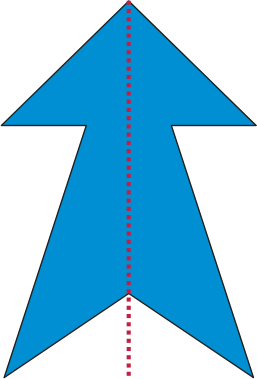
> **[Diagram Context - Textbook_Mathematics_Gr7_Transformation-geometry.pdf-0001-04.png]**
> This educational graphic is a geometry figure showing a blue upward-pointing arrow divided symmetrically by a central vertical red dotted line representing an axis of symmetry. The visual elements consist of a solid blue arrow shape overlaid with a vertical dashed red line running from the bottom through the apex. Conceptually, this diagram helps high school learners identify and verify line symmetry in 2D shapes as part of Euclidean geometry and transformations.

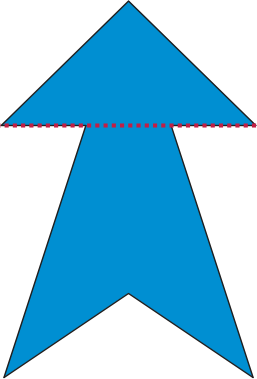
> **[Diagram Context - Textbook_Mathematics_Gr7_Transformation-geometry.pdf-0001-05.png]**
> This geometry figure illustrates a composite polygon resembling an upward-pointing arrow divided into a triangular head and a notched, arrow-like shaft by a horizontal red dashed line. The graphic features a solid blue filled shape crossed by a red dotted line at the base of the triangular head, with no text labels or coordinate axes present. Conceptually, this figure helps high school learners practice calculating the area and perimeter of composite 2D shapes by breaking them down into simpler standard geometric components like triangles and quadrilaterals.

---

### Geometry: Lines of Symmetry

#### Concept: Line of Symmetry
A line of symmetry (or axis of symmetry) is an imaginary line that divides a figure into two identical halves that are mirror images of each other. If you were to fold the shape along this line, the two sides would match perfectly.

---

#### Exercise 2: Identifying Lines of Symmetry
**Instructions:** Copy the following geometric figures, draw the lines of symmetry, and state the total number of lines of symmetry for each figure.

| Figure | Description | Number of Lines of Symmetry |
| :--- | :--- | :--- |
| **A** | Letter 'E' | 1 |
| **B** | Triangle | 1 |
| **C** | Regular Pentagon | 5 |
| **D** | Parallelogram | 0 |
| **E** | Four-pointed star | 4 |
| **F** | Irregular polygon | 0 |

---

#### Exercise 3: Completing Symmetric Figures
**Instructions:** In each diagram, the dotted line represents the axis of symmetry. Copy the grid and complete the figure so that it is perfectly symmetrical across the dotted line.

*   **Figure A:** Reflect the existing shape across the vertical dotted line.
*   **Figure B:** Reflect the existing shape across the horizontal dotted line.

**Mathematical Tip:** When completing these figures, ensure that every point on the original shape is the same perpendicular distance from the axis of symmetry as its corresponding point on the reflected side. If a point is $x$ units away from the axis, its reflection must also be $x$ units away on the opposite side.

> **[Diagram Context - Textbook_Mathematics_Gr7_Surface-area-and-volume-of-3D-objects.pdf-0002-04.png]**
> This graphic displays a 3D geometry figure of a solid rectangular prism, accompanied by the text label "Rectangular prism". It visually represents a three-dimensional polyhedron bounded by six rectangular faces, where opposite faces are parallel and congruent. For CAPS FET mathematics learners, this diagram aids in understanding spatial properties, surface area calculations, and volume formulas for right prisms.

> **[Diagram Context - Textbook_Mathematics_Gr7_Surface-area-and-volume-of-3D-objects.pdf-0002-12.png]**
> This graphic shows a 3D rectangular prism (cuboid) geometry figure with labeled dimensions. Visible labels include breadth $b = 4\text{ cm}$, height $h = 1\text{ cm}$, and length $l = 5\text{ cm}$, along with distinct blue, yellow, and red shaded faces. This diagram helps learners calculate surface area and volume by clearly identifying the length, breadth, and height parameters of a rectangular prism.

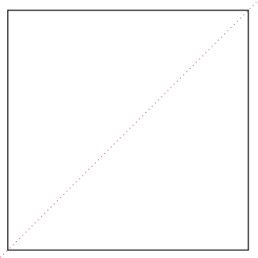

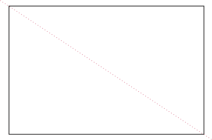

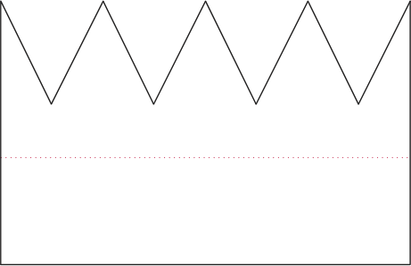
> **[Diagram Context - Textbook_Mathematics_Gr7_Transformation-geometry.pdf-0002-09.png]**
> This graphic is a geometry figure showing a rectangular shape with a top edge formed by four repeating triangular peaks and a horizontal dotted reference line running across the interior. The diagram features solid black outline borders forming the outer rectangle and zigzag top teeth, alongside an internal horizontal dotted line. Conceptually, this visual represents a composite 2D shape or a template used to teach area calculations, perimeter, or tessellation and geometric partitioning in the Senior Phase and FET mathematics curriculum.

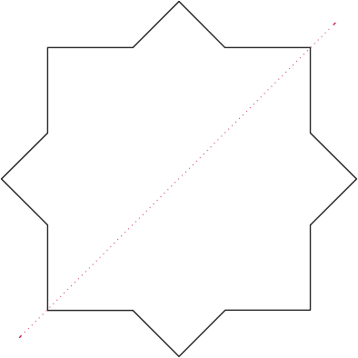
> **[Diagram Context - Textbook_Mathematics_Gr7_Transformation-geometry.pdf-0002-10.png]**
> The graphic illustrates a complex geometry figure, specifically a symmetrical star-shaped polygon with eight outer points, bisected by a diagonal dotted red line of symmetry. The solid black outline forms the polygon boundary, while the dotted red line extends through opposing vertices to demonstrate line symmetry. This visual conveys the concept of reflective symmetry and lines of symmetry within two-dimensional shapes, helping high school learners identify axes along which a polygon can be folded onto itself.

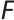

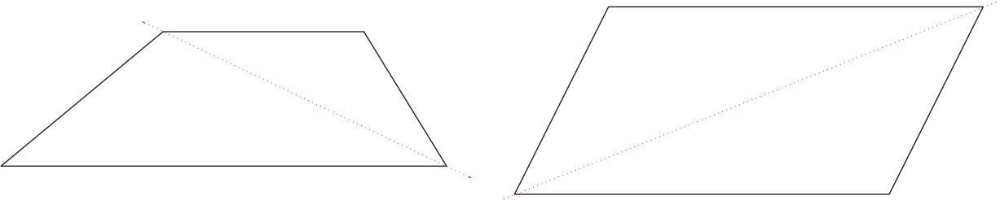
> **[Diagram Context - Textbook_Mathematics_Gr7_Transformation-geometry.pdf-0002-13.png]**
> The graphic displays two geometry figures, specifically a trapezoid on the left and a parallelogram on the right, each crossed by a dashed diagonal line extending beyond the vertices. It features no text labels, variables, or directional arrows other than the dashed projection lines. Conceptually, this diagram assists high school learners in Euclidean geometry by illustrating the internal diagonals of quadrilaterals and their geometric properties, which is essential for proving properties of shapes in the CAPS curriculum.

---

The provided image is a blank template page containing only a header bar with three colored blocks (yellow, brown, and terracotta). There is no educational content, text, or diagrams present on this page to analyze.

> **[Diagram Context - Textbook_Mathematics_Gr7_Surface-area-and-volume-of-3D-objects.pdf-0003-11.png]**
> This educational graphic is a geometry figure displaying four distinct three-dimensional rectangular prisms labeled A, B, C, and d. Each prism is annotated with visible dimension labels in centimetres and millimetres, specifically measuring length, width, and height (A: 8 cm, 3 cm, 2 cm; B: 15 cm, 15 cm, 15 cm; C: 55 mm, 15 mm, 70 mm; d: 30 mm, 20 mm, 60 mm). Conceptually, the diagram helps learners practice calculating surface area and volume of rectangular prisms, while also reinforcing unit conversion skills between millimeters and centimeters as required in measurement topics.

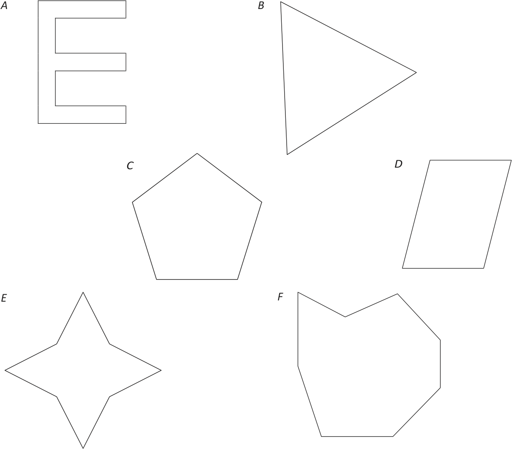
> **[Diagram Context - Textbook_Mathematics_Gr7_Transformation-geometry.pdf-0003-01.png]**
> This geometry figure displays six distinct two-dimensional shapes labeled A, B, C, D, E, and F. The visible labels consist of the capital letters A through F positioned next to each respective geometric outline. The diagram conveys the concept of classifying and identifying different polygons and non-polygons based on their sides and vertices for high school mathematics learners.

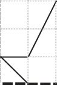

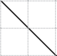

---

# Chapter 16: Transformation Geometry

## 16.2 Original Figures and Their Images

Figures can be moved in space by shifting, swinging, or turning them over. The resulting figure in its new position is called the **image** of the original figure.

### Types of Transformations
There are three primary ways to move a figure:
1. **Translation:** Often referred to as "sliding" or "shifting."
2. **Reflection:** Often referred to as "flipping" or "turning over."
3. **Rotation:** Often referred to as "turning" or "swinging."

---

## 16.3 Translating Figures

A translation occurs when a figure is moved in a specific direction by a set distance.

> **[Diagram Context - Textbook_Mathematics_Gr7_Surface-area-and-volume-of-3D-objects.pdf-0004-00.png]**
> The graphic shows three 3D geometry figures representing rectangular prisms labeled "Box A", "Box B", and a combined object made of two joined cartons. Visible labels and dimensions include "Box A", "Box B", "100 cm", "50 cm", "20 cm", "2 m", "1,2 m", "0,6 m", "0,9 m", "0,4 m", "1,5 m", and "0,3 m", alongside a CAPS-aligned problem statement about calculating surface area. This diagram helps high school learners practice spatial visualization, unit conversion, and surface area calculations for composite and single rectangular prisms in Measurement.

### Naming Conventions
When naming an image, we use the same letters as the original figure but add a prime symbol ($'$) after each letter to indicate the corresponding points.
*   **Original:** $\triangle JKL$ $\rightarrow$ **Image:** $\triangle J'K'L'$
*   **Original:** Parallelogram $DEFG$ $\rightarrow$ **Image:** Parallelogram $D'E'F'G'$

### Properties of Translation
In a translation, every point on the figure moves in the same direction by the same distance.
*   **Example 1:** In $\triangle JKL$, all points moved $6$ units to the right.
*   **Example 2:** In parallelogram $DEFG$, all points moved $3$ units to the right and $5$ units down.

### Exercise
1. Look at $\triangle ABC$:
   (a) Copy the triangle. Translate each of the points $A$, $B$, and $C$ five units to the right and two units down. Join the translated points to form the image $\triangle A'B'C'$.

> **[Diagram Context - Textbook_Mathematics_Gr7_Surface-area-and-volume-of-3D-objects.pdf-0004-03.png]**
> This technical drawing and geometry figure illustrates a solid rectangular block containing three distinct rectangular cutouts or apertures. The visible labels and dimensions include "Hole A: 600 x 500", "Hole B: 400 x 750", and "Hole C: 600 x 600". For a high school student studying Engineering Graphics and Design (EGD) or Mathematics, this diagram conveys the principles of 2D area calculations, surface area reduction, and spatial interpretation of 3D objects with hollowed features.

> **[Diagram Context - Textbook_Mathematics_Gr7_Surface-area-and-volume-of-3D-objects.pdf-0004-04.png]**
> This educational graphic is a mathematical conversion reference box presenting standard area unit equivalences. It displays the text "Remember from the previous chapter:" followed by the specific conversion equations "$1\text{ cm}^2 = 100\text{ mm}^2$" and "$1\text{ m}^2 = 10\text{ 000}\text{ cm}^2$". Conceptually, this diagram serves as a quick-reference reminder to help students correctly convert between square millimeters, square centimeters, and square meters when solving measurement and geometry problems.

---

### Geometry: Transformations (Translations)

#### Concept: Translation
A translation is a transformation that slides a figure horizontally and/or vertically. During a translation, the size and shape of the figure remain unchanged. This means the original figure and its image are **congruent**.

---

#### Exercise 1: Analyzing a Translation
*Refer to the provided grid diagram showing triangle ABC.*

> **[Diagram Context - Textbook_Mathematics_Gr7_Surface-area-and-volume-of-3D-objects.pdf-0005-04.png]**
> This educational graphic is a geometry figure comparing a two-dimensional shape and a three-dimensional object positioned within coordinate axes. It features two diagrams accompanied by explanatory text boxes, with visible labels including "length", "breadth", and "height" next to directional arrows. Conceptually, it illustrates the distinction between 2D and 3D space by showing that while flat shapes possess only length and breadth, three-dimensional objects incorporate height to take up volume in the physical world.

**(b)** Are the side lengths of the original triangle and those of its image the same?
*   **Answer:** Yes. Translation is a rigid transformation, meaning the lengths of the sides are preserved.

**(c)** Is the area of the original triangle the same as the area of its image?
*   **Answer:** Yes. Since the side lengths and angles remain unchanged, the area remains constant.

---

#### Exercise 2: Performing a Translation
*Refer to the provided grid diagram showing triangle PQR.*

> **[Diagram Context - Textbook_Mathematics_Gr7_Surface-area-and-volume-of-3D-objects.pdf-0005-08.png]**
> The graphic shows a geometry figure composed of multiple connected unit cubes arranged into distinct 3D shapes labeled A, B, d, and E, alongside placeholder letters C and F. The visible labels consist of uppercase and lowercase letters (A, B, C, d, E, F) identifying each unique cuboid or stepped block structure. Conceptually, this diagram helps high school learners visualize spatial orientation, calculate surface area-to-volume ratios, and determine the total volume or surface area of composite 3D objects by counting individual unit cubes.

**(a) Instructions:**
1. Copy $\triangle PQR$ onto grid paper.
2. Translate each vertex ($P, Q, R$) four units to the right and two units up.
3. Label the new vertices $P', Q', R'$.
4. Join the points to form the image $\triangle P'Q'R'$.

**(b) Instructions:**
Join point $P$ to $P'$, point $Q$ to $Q'$, and point $R$ to $R'$ using straight lines.

**(c) Are the line segments that join the original points to their image points equal in length?**
*   **Answer:** Yes. Each point has been moved by the same vector (4 units right, 2 units up), so the distance between each original point and its corresponding image point is identical.

**(d) Are the line segments that join the original points to their image points parallel?**
*   **Answer:** Yes. Because every point is translated by the exact same horizontal and vertical displacement, the segments $PP'$, $QQ'$, and $RR'$ are parallel to each other.

> **[Diagram Context - Textbook_Mathematics_Gr7_Surface-area-and-volume-of-3D-objects.pdf-0005-09.png]**
> This geometric figure is a 3D rectangular prism composed of an array of smaller unit cubes. The diagram shows no text labels, variables, or arrows, presenting purely a composite volumetric grid structure. Conceptually, it helps learners visualize volume and surface area calculations by demonstrating how identical unit cubes pack together to form a larger three-dimensional shape.

> **[Diagram Context - Textbook_Mathematics_Gr7_Surface-area-and-volume-of-3D-objects.pdf-0005-10.png]**
> This geometric figure is a 3D bar-chart-like staircase structure constructed from identical individual cubes arranged in three distinct descending tiers. The visible components include white and lightly shaded cube faces forming a solid staircase profile with a width of two units and heights of five, three, and one unit across its three sections. Conceptually, this diagram helps learners visualize spatial reasoning, surface area, and volume calculations by counting composite units or determining the total number of blocks in a structured three-dimensional arrangement.

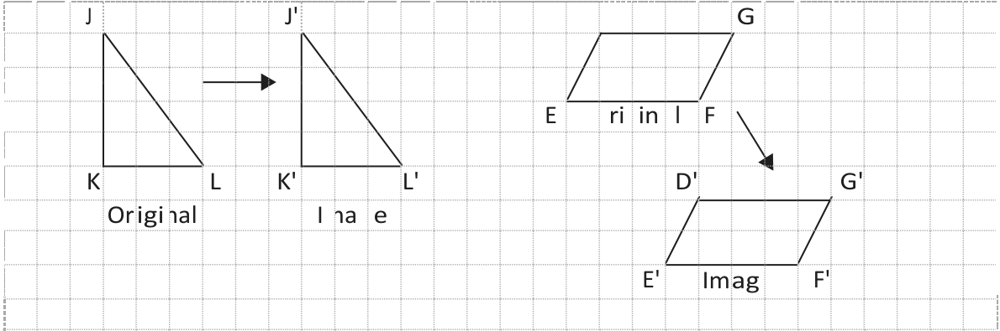
> **[Diagram Context - Textbook_Mathematics_Gr7_Transformation-geometry.pdf-0005-05.png]**
> This educational graphic is a geometry figure displaying two pairs of polygons plotted on a Cartesian grid to illustrate geometric transformations. The visible labels include vertices J, K, L and J', K', L' for the first transformation, and E, F, G, D' and E', F', G' for the second, accompanied by directional arrows and text labels such as "Original" and "Image". Conceptually, it conveys how shapes undergo rigid transformations like translations or reflections on a coordinate plane, helping learners understand that the size and shape remain congruent while position changes.

> **[Diagram Context - Textbook_Mathematics_Gr7_Transformation-geometry.pdf-0005-06.png]**
> The provided graphic is an extremely cropped, blank grid structure showing no legible educational content, labels, symbols, or axes. Without any visible biological, chemical, physical, or mathematical elements, it conveys no conceptual information for a CAPS curriculum student. Therefore, no pedagogical description can be generated from this image.

---

### Properties of Translation

A translation is a transformation that slides a figure in a specific direction for a specific distance. When a figure is translated, the following properties hold true:

1.  **Equal Lengths:** The line segments connecting the vertices of the original figure to the corresponding vertices of the image are equal in length.
    *   $PP' = RR' = QQ'$
2.  **Parallelism:** The line segments connecting the vertices of the original figure to the corresponding vertices of the image are parallel to one another.
    *   $PP' \parallel RR' \parallel QQ'$
3.  **Congruence:** The shape and size of the figure do not change during a translation. Therefore, the original figure and its image are congruent.

> **[Diagram Context - Textbook_Mathematics_Gr7_Surface-area-and-volume-of-3D-objects.pdf-0006-07.png]**
> This graphic is a 3D geometry figure of a standard unit cube with visible dimension labels. The diagram displays a cube with visible edge lengths labeled as 1 cm for its height, width, and depth, rendered with solid and dotted lines to show perspective. Conceptually, it helps learners visualize three-dimensional space and provides a foundational model for calculating surface area and volume in measurement topics.

---

### Practise Translating Figures

**Exercise 1**
On grid paper, copy the figure provided. Translate the figure eight units to the left and two units down.

> **[Diagram Context - Textbook_Mathematics_Gr7_Surface-area-and-volume-of-3D-objects.pdf-0006-08.png]**
> The graphic shows a geometry figure of a large 3D rectangular prism (or composite cube) constructed from smaller grid squares and unit cubes without any explicit text labels or arrows. It conceptually illustrates surface area and volume calculations by demonstrating how smaller unit cubes compose a larger three-dimensional object, assisting learners in visualising spatial dimensions and face counts.

**Exercise 2**
On grid paper, copy the figure provided. Translate the figure six units to the right and one unit down.

> **[Diagram Context - Textbook_Mathematics_Gr7_Surface-area-and-volume-of-3D-objects.pdf-0006-12.png]**
> This geometric figure displays a rectangular arrangement of multiple identical cubes forming a larger rectangular prism, with vertical dotted lines extending upwards from certain corners, ending in blue upward-pointing arrows. The diagram visualizes spatial relationships, surface area calculations, or volume scaling for high school mathematics and measurement topics.

> **[Diagram Context - Textbook_Mathematics_Gr7_Surface-area-and-volume-of-3D-objects.pdf-0006-20.png]**
> This educational graphic is a geometry figure showing a rectangular grid divided into smaller square or parallelogram units. The visible text labels are "l = six units" along the top length and "b = three units" along the breadth/width. Conceptually, this diagram illustrates the foundational concept of area measurement by tiling, showing how a two-dimensional shape can be quantified into square units ($3 \times 6 = 18$ units) to help learners understand length, breadth, and area calculation.

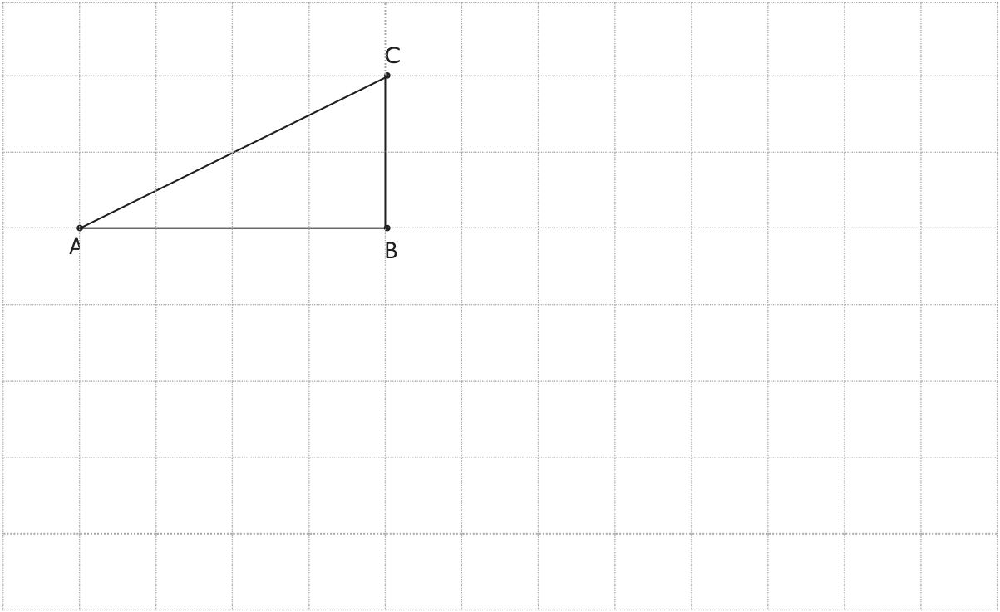
> **[Diagram Context - Textbook_Mathematics_Gr7_Transformation-geometry.pdf-0006-00.png]**
> The graphic is a geometry figure showing a right-angled triangle plotted on a square grid. The vertices are labeled with capital letters A, B, and C, with the right angle positioned at vertex B. This diagram visually conveys fundamental geometric and trigonometric concepts, allowing high school learners to count grid units to determine side lengths, apply Pythagoras' theorem, or calculate trigonometric ratios.

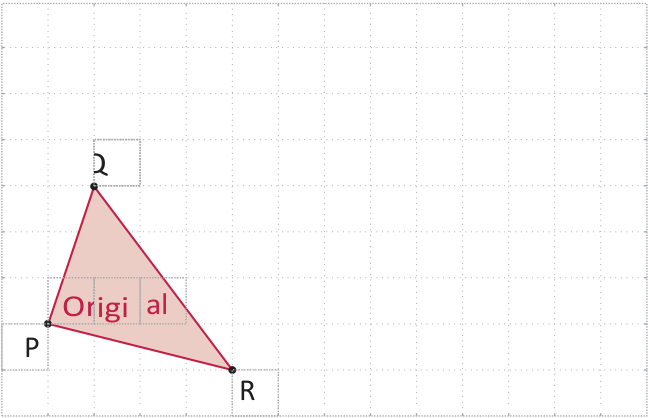
> **[Diagram Context - Textbook_Mathematics_Gr7_Transformation-geometry.pdf-0006-06.png]**
> This graphic is a geometry figure showing a shaded triangle labeled "Original" plotted on a Cartesian coordinate grid. The visible vertices are labeled P, Q, and R. Conceptually, this diagram serves as a foundational starting point for teaching Euclidean geometry and transformation geometry (such as translations, reflections, rotations, and enlargements) in the CAPS curriculum.

---

### 3. Exercises: Describing Translations

Describe the translation in each of the following diagrams:

(a) 

> **[Diagram Context - Textbook_Mathematics_Gr7_Surface-area-and-volume-of-3D-objects.pdf-0007-01.png]**
> The graphic shows a geometry figure consisting of two rectangular prisms built from unit cubes, with visible labels for dimensions $l$ (length), $b$ (breadth), and $h$ (height). The top prism is labeled $l = \text{six units}$, $b = \text{three units}$, and $h = \text{one unit}$, while the bottom prism is labeled $l = \text{six units}$, $b = \text{three units}$, and $h = \text{four units}$. This visual representation helps CAPS learners understand how changing the height dimension affects the total volume and surface area of three-dimensional objects.

(b) 

(c) 

> **[Diagram Context - Textbook_Mathematics_Gr7_Surface-area-and-volume-of-3D-objects.pdf-0007-10.png]**
> This educational graphic displays four 3D geometry figures labeled A, B, C, and d, representing rectangular prisms and cubes with explicit dimension measurements. Figure A shows a rectangular prism with length $l = 17\text{ m}$, height $h = 12\text{ m}$, and breadth $b = 5\text{ m}$, while Figures B, C, and d show rectangular prisms or cubes with labeled side lengths in centimeters ($8\text{ cm}$, $3\text{ cm}$, $9\text{ cm}$; $5\text{ cm}$, $5\text{ cm}$, $5\text{ cm}$; and $1,5\text{ cm}$, $1,5\text{ cm}$, $1,5\text{ cm}$). This diagram visually conveys the foundational concepts of surface area and volume calculation for 3D objects, allowing students to practice applying mathematical formulas using provided metric dimensions.

---

## 16.4 Reflecting figures

### Definition: Reflection
When a figure is **reflected**, it is flipped or turned over. The image that is produced is the mirror image of the original figure. 

### Key Concepts
*   **Line of Reflection:** This acts like a mirror in which the original figure is reflected.
*   **Positioning:** The image is produced on the opposite side of the line of reflection.
*   **Distance Property:** Each point on the original figure and its corresponding point on the image are the same perpendicular distance away from the line of reflection.

### Investigating the properties of reflection
The diagrams on the next page show examples of figures that have been correctly and incorrectly reflected in the lines of reflection.

***

**MATHEMATICS GRADE 7: TERM 3 | 200**

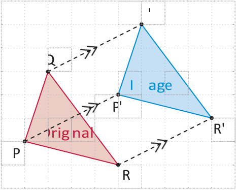
> **[Diagram Context - Textbook_Mathematics_Gr7_Transformation-geometry.pdf-0007-04.png]**
> This geometry figure illustrates a translation transformation on a Cartesian grid, showing an original red triangle (PQR) mapped to a blue image triangle (P'Q'R'). Visible labels include vertices P, Q, R, P', Q', and R', along with dashed directional arrows connecting corresponding points to demonstrate parallel displacement. For high school mathematics learners, the diagram visually conveys that a translation moves every point of a shape by the same distance in the same direction, preserving shape and size while altering position.

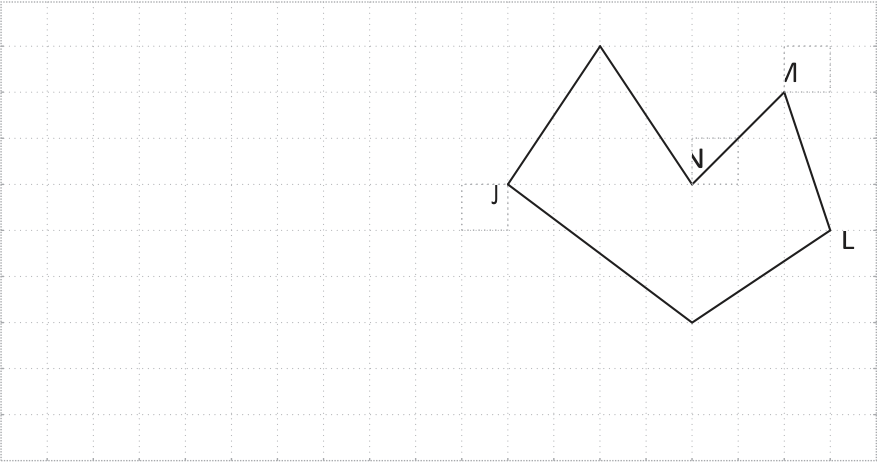
> **[Diagram Context - Textbook_Mathematics_Gr7_Transformation-geometry.pdf-0007-08.png]**
> This geometry figure displays a multi-sided polygon plotted on a Cartesian grid background. The vertices are labelled J, K, L, M, and N in a clockwise or counterclockwise arrangement. For a high school mathematics learner, this diagram is used to practise calculating interior and exterior angles, applying polygon theorems, or determining the area and perimeter of irregular polygons.

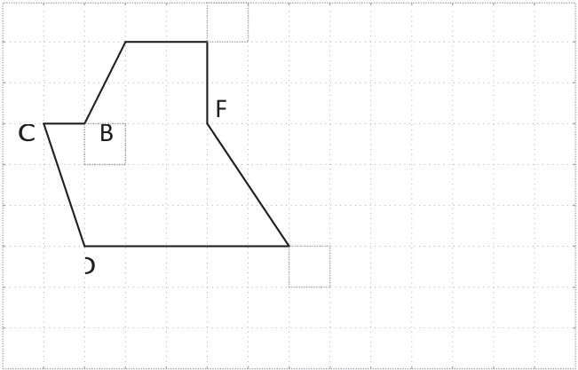
> **[Diagram Context - Textbook_Mathematics_Gr7_Transformation-geometry.pdf-0007-10.png]**
> This educational graphic is a geometry figure representing a multi-sided polygon drawn on a square grid background. Visible labels include the uppercase letters C, B, D, and F marking various vertices or sides of the shape. Conceptually, this diagram helps high school students practice geometric analysis, such as calculating perimeter, area, or identifying coordinate positions and transformations of shapes on a Cartesian plane.

---

# Chapter 16: Transformation Geometry - Reflection

## Concept: Reflection
A reflection is a transformation that flips a figure over a line, called the **line of reflection**. 

### Key Properties of Reflection
1. **Distance:** Each point of the original figure and its corresponding point on the reflected image are the same distance from the line of reflection.
2. **Orientation:** The image is a mirror reflection of the original. If the original vertices are labeled in a specific order (e.g., clockwise), the reflected image will appear in the opposite order (e.g., counter-clockwise).
3. **Congruence:** The reflected image is congruent to the original figure (the size and shape remain identical).

---

## Visual Analysis of Reflections

The following diagrams illustrate the difference between correct and incorrect reflections across vertical, horizontal, and diagonal lines of reflection.

### 1. Vertical Reflection

> **[Diagram Context - Textbook_Mathematics_Gr7_Surface-area-and-volume-of-3D-objects.pdf-0008-09.png]**
> The graphic is a 3D geometric diagram comparing the relative sizes of two cubic structures, labeled "cube A (1 m3)" with dimensions of 1 m by 1 m by 1 m, and "cube B (1 cm3)" positioned at its bottom corner. Visible labels include measurement dimensions of "1 m" along the sides of the large cube, as well as arrows pointing to "cube A" and "cube B". Conceptually, this diagram visually illustrates scale differences and surface-area-to-volume relationships, which are critical for high school learners studying biological transport mechanisms like diffusion in cells.

*   **Correct:** The triangle is flipped horizontally across the vertical axis. The distance from each vertex to the line of reflection is preserved.
*   **Incorrect:** The triangle is simply translated (slid) to the right without being flipped.

### 2. Horizontal Reflection

*   **Correct:** The triangle $DEF$ is flipped vertically across the horizontal line. Vertex $E$ is closest to the line, and $E'$ remains closest to the line in the image.
*   **Incorrect:** The triangle is translated downwards without being flipped. The orientation of the vertices is not inverted.

### 3. Diagonal Reflection

*   **Correct:** The triangle $HKG$ is flipped across the diagonal line. The perpendicular distance from each point to the line of reflection is equal for both the object and the image.
*   **Incorrect:** The triangle is translated or rotated incorrectly, failing to maintain the mirror-image property relative to the diagonal line.

---

## Summary Checklist for Accurate Reflections
To ensure a reflection is correct, verify the following:
*   **Perpendicularity:** The line segment connecting a point to its image must be perpendicular to the line of reflection.
*   **Equidistance:** The line of reflection must be the perpendicular bisector of the segment connecting any point $P$ to its image $P'$.
*   **Orientation:** The image must appear "reversed" relative to the original figure.

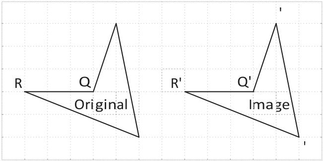
> **[Diagram Context - Textbook_Mathematics_Gr7_Transformation-geometry.pdf-0008-02.png]**
> This geometric figure illustrates a 2D Euclidean transformation on a Cartesian grid. The graphic displays two shapes labeled "Original" with vertices R and Q, and "Image" with corresponding transformed vertices R' and Q'. Conceptually, it demonstrates the spatial relationship and congruence between an object and its transformed image under operations such as translation, reflection, or rotation in high school mathematics.

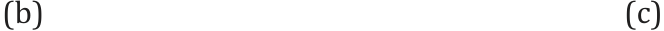

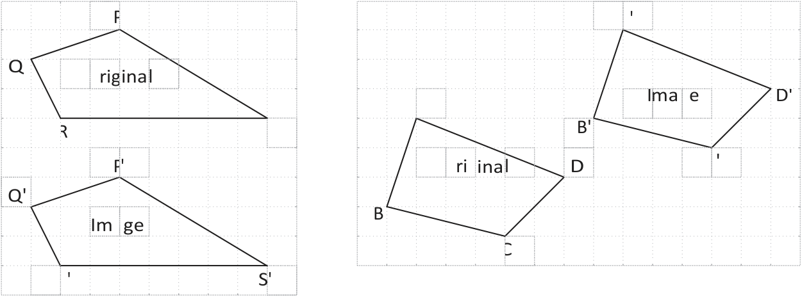
> **[Diagram Context - Textbook_Mathematics_Gr7_Transformation-geometry.pdf-0008-04.png]**
> This graphic displays two sets of geometric figures on a Cartesian grid, illustrating Euclidean transformations. The left panel shows an original polygon labeled PORS and its translated image P'Q'R'S', while the right panel displays a polygon BCD and its corresponding image B'C'D'. Conceptually, it demonstrates how figures can be shifted across a plane without altering their size, shape, or orientation, helping learners understand translation vectors in analytical geometry.

---

### Reflection Exercises

1. Copy the table below and determine the distance from each point to the line of reflection.

| Point | Distance from Original to Line | Distance from Correct Reflection to Line | Distance from Incorrect Reflection to Line |
| :--- | :--- | :--- | :--- |
| **A** | 2 units | | |
| **B** | | | |
| **C** | | | |
| **D** | | | |
| **E** | | | |
| **F** | | | |
| **G** | | | |
| **H** | | | |
| **K** | | | |

2. Analyze the sets of correct reflections:
    * (a) Are the side lengths of the image the same as those of the original figure?
    * (b) Are the size and shape of the image the same as the size and shape of the original figure?

3. 
    * (a) Copy each diagram that shows the correct reflection. Draw a dotted line to join each point on the original figure to its corresponding reflected point (e.g., $A$ to $A'$, $B$ to $B'$, $C$ to $C'$, etc.).
    * (b) Is the line that joins the original point to its correct reflection perpendicular to the line of reflection?

4. 
    * (a) Copy each diagram that shows the incorrect reflection and draw a dotted line to join each point on the original figure to its corresponding reflected point.
    * (b) Is the line that joins the original point to its incorrect reflection perpendicular to the line of reflection?

***

### Properties of Reflection

The diagram shows $\triangle FHG$ and its reflection $\triangle F'H'G'$. Note the following properties of reflection:

* The image of $\triangle FHG$ lies on the opposite side of the line of reflection.
* The distance from the original point to the line of reflection is the same as the distance from the reflected point to the line of reflection:
    * $GE = G'E$
    * $FC = F'C$
    * $HD = H'D$

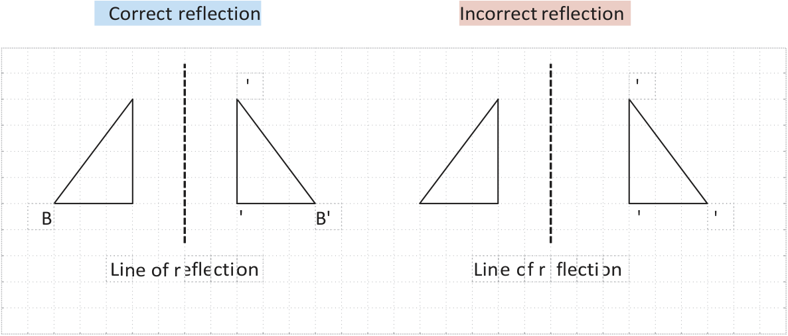
> **[Diagram Context - Textbook_Mathematics_Gr7_Transformation-geometry.pdf-0009-00.png]**
> This graphic is a geometry figure illustrating Euclidean transformations, specifically comparing correct and incorrect reflections on a grid. Visible labels include "Correct reflection," "Incorrect reflection," "Line of reflection," and vertex markers such as "B" and "B'". The diagram conceptually demonstrates that a correct reflection must maintain proper perpendicular distance and orientation across the line of reflection, contrasting it with an improperly flipped shape to help learners master transformation geometry rules.

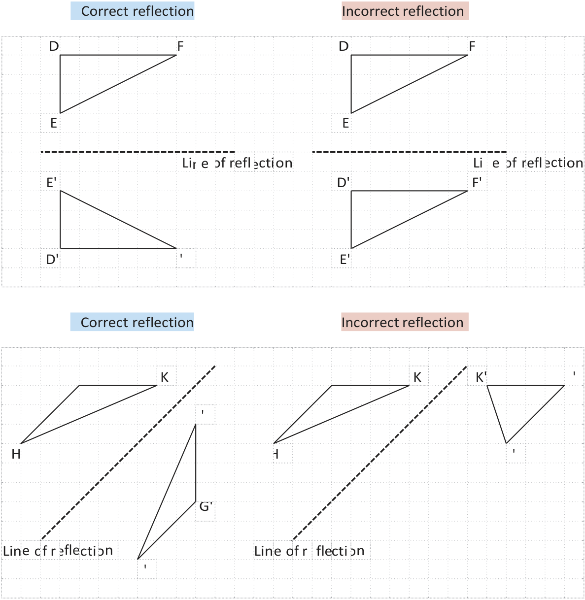
> **[Diagram Context - Textbook_Mathematics_Gr7_Transformation-geometry.pdf-0009-01.png]**
> This geometry figure illustrates Cartesian coordinate transformations, specifically comparing correct and incorrect examples of triangle reflections across a dashed "Line of reflection". Visible labels include vertices DEF and D'E'F' for a horizontal reflection, and vertices HGI and G'H'I' (or similar) for an angled reflection, mapped on a coordinate grid. For a high school CAPS learner, it conceptually demonstrates the rules of isometric transformations by contrasting properly flipped image coordinates with common student errors in orientation and distance from the mirror line.

---

### Transformation Geometry: Reflection

#### Key Concepts
*   **Perpendicularity:** The line segment connecting an original point to its reflected image is always perpendicular ($\perp$) to the line of reflection. For example, if $H$ is a point and $H'$ is its image, then $HH' \perp \text{line of reflection}$.
*   **Congruence:** When a figure is reflected, its shape and size remain unchanged. Therefore, the original figure and its reflected image are congruent.

---

#### Practise Reflecting Figures

**Instructions:** Copy the figures provided below and reflect them across the given line of reflection. 
*Hint: Reflect the individual vertices (points) first, then join the reflected points to complete the image.*

**Figure (a)**

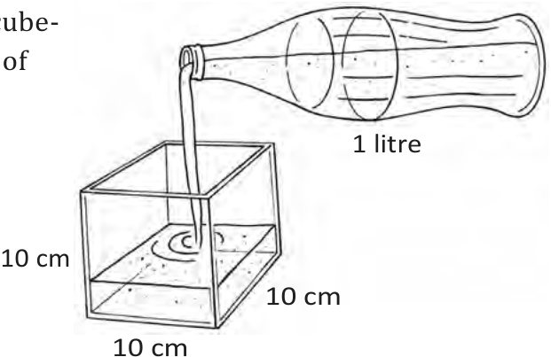

**Figure (b)**

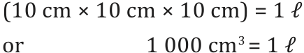

---
*Chapter 16: Transformation Geometry | Page 203*

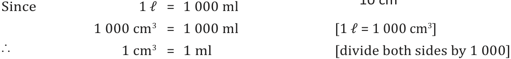

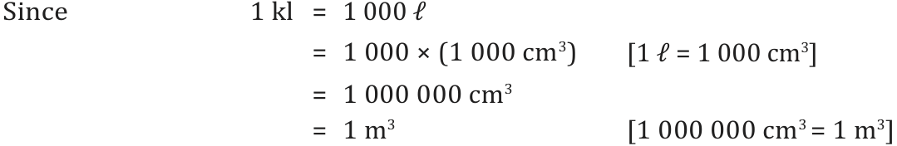

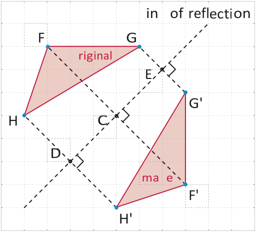

---

### Geometry: Reflections

#### Concept: Line of Reflection
A reflection is a transformation that acts like a mirror. When a shape is reflected across a line (the line of reflection), the image is flipped. 

**Key Properties:**
*   Each point on the original shape is the same perpendicular distance from the line of reflection as the corresponding point on the image.
*   The line of reflection is the perpendicular bisector of the line segment connecting any point and its image.

---

#### Exercises: Identifying the Line of Reflection

**Instruction:** Copy the following shapes and draw the line of reflection that maps the "Original" shape onto the "Image".

**Task (a)**

> **[Diagram Context - Textbook_Mathematics_Gr7_Surface-area-and-volume-of-3D-objects.pdf-0011-01.png]**
> This educational graphic illustrates a unit conversion flow diagram for measuring capacity and volume. It displays directional arrows labeled with multiplication factors of $\times 1\,000$ linking various units, specifically millilitres ($\text{ml}$), litres ($\ell$), kilolitres ($\text{kl}$), cubic centimetres ($\text{cm}^3$), and cubic metres ($\text{m}^3$). This diagram conceptually helps students navigate the multiplicative relationships and equivalences between metric capacity and cubic volume measurements.

*   **Original:** Quadrilateral $DF...$
*   **Image:** Quadrilateral $D'F'...$

**Task (b)**

*   **Original:** Triangle $I...$
*   **Image:** Triangle $I'G'...$

**Task (c)**

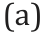

*   **Original:** Quadrilateral $BD...$
*   **Image:** Quadrilateral $D'B'...$

---

#### Worked Example: How to find the line of reflection
To find the line of reflection between two congruent shapes:
1.  Identify a vertex on the original shape (e.g., point $A$) and its corresponding vertex on the image (e.g., point $A'$).
2.  Draw a line segment connecting $A$ and $A'$.
3.  Find the midpoint of the segment $AA'$.
4.  Draw a line passing through this midpoint that is perpendicular to the segment $AA'$. This is your line of reflection.

*Note: Repeat this for at least two pairs of points to ensure accuracy.*

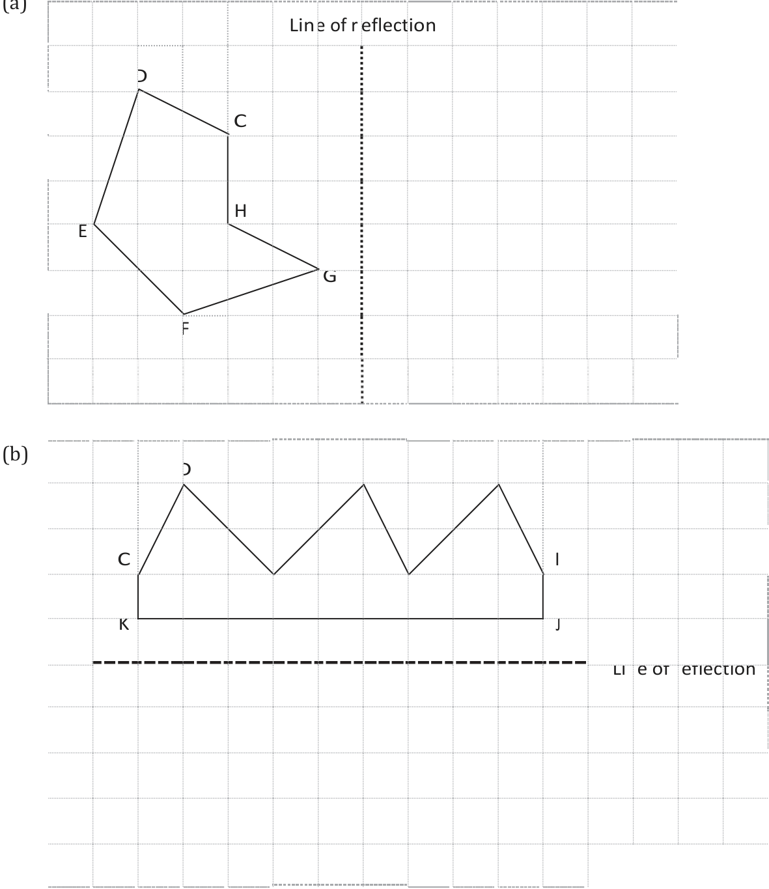
> **[Diagram Context - Textbook_Mathematics_Gr7_Transformation-geometry.pdf-0011-06.png]**
> This educational graphic displays two geometry figures set on grid backgrounds, each accompanied by a designated axis labeled "Line of reflection". Figure (a) features a polygon with labeled vertices C, D, E, F, G, and H next to a vertical dotted line of reflection, while figure (b) shows a symmetrical multi-peaked polygon with vertices C, D, K, J, and I positioned above a horizontal dashed line of reflection. Conceptually, these diagrams illustrate the transformation geometry concept of reflection across a line, helping high school learners understand how object coordinates and shapes flip symmetrically across vertical and horizontal axes.

---

# 16.5 Rotating Figures

### Definition
When a figure is **rotated**, it is turned in a clockwise or anticlockwise direction around a specific point. This point is known as the **centre of rotation**. The centre of rotation may be located inside or outside the figure.

*   **Clockwise:** Turning in the direction of the hands of a clock.
*   **Anticlockwise:** Turning in the opposite direction to the hands of a clock.
*   **Note:** In this context, the word "about" means "around".

---

### Visualizing Rotation
The following diagrams illustrate $\Delta ABC$ rotated $90^\circ$ clockwise and $90^\circ$ anticlockwise around various centres of rotation.

> **[Diagram Context - Textbook_Mathematics_Gr7_Surface-area-and-volume-of-3D-objects.pdf-0012-01.png]**
> This graphic is a geometry figure representing a rectangular prism (cuboid). It features the dimensional labels $15\text{ cm}$, $10\text{ cm}$, and $20\text{ cm}$ indicating the length, width, and height respectively. Conceptually, this diagram helps learners apply surface area and volume formulas within the CAPS Senior Phase and FET mathematics curriculum.

#### 1. Centre of rotation at C
*   The figure is rotated $90^\circ$ clockwise to form $\Delta A'B'C'$.
*   The figure is rotated $90^\circ$ anticlockwise to form $\Delta A''B''C''$.

#### 2. Centre of rotation at B
*   The figure is rotated $90^\circ$ clockwise to form $\Delta A'B'C'$.
*   The figure is rotated $90^\circ$ anticlockwise to form $\Delta A''B''C''$.

#### 3. Centre of rotation at A
*   The figure is rotated $90^\circ$ clockwise to form $\Delta A'B'C'$.
*   The figure is rotated $90^\circ$ anticlockwise to form $\Delta A''B''C''$.

#### 4. Centre of rotation at P
*   The figure is rotated $90^\circ$ clockwise to form $\Delta A'B'C'$.
*   The figure is rotated $90^\circ$ anticlockwise to form $\Delta A''B''C''$.

> **[Diagram Context - Textbook_Mathematics_Gr7_Surface-area-and-volume-of-3D-objects.pdf-0012-02.png]**
> This educational graphic is a word problem accompanied by a line drawing illustrating the transfer of liquid from a bottle into a rectangular prism tank. The visual elements include a 2-litre ($2\ 000\text{ cm}^3$) bottle pouring liquid into a cubic tank with side dimensions of $20\text{ cm}$ by $20\text{ cm}$ by $20\text{ cm}$, along with labels indicating the liquid height ($h\text{ cm}$) and three accompanying calculation questions (a-c). Conceptually, it helps learners apply spatial reasoning and unit conversions between cubic centimeters ($\text{cm}^3$) and liters ($\ell$) to understand that the volume of a liquid is conserved when transferred between different containers.

> **[Diagram Context - Textbook_Mathematics_Gr7_Surface-area-and-volume-of-3D-objects.pdf-0012-09.png]**
> This algebraic calculation shows the step-by-step mathematical evaluation for a variable. The graphic displays the equation $h = \frac{2000}{(20 \times 20)} = 5\text{ cm}$, utilizing variables, numbers, multiplication and division operators, and unit labels. Conceptually, it demonstrates how to substitute values and solve for an unknown dimension or parameter in a measurement problem.

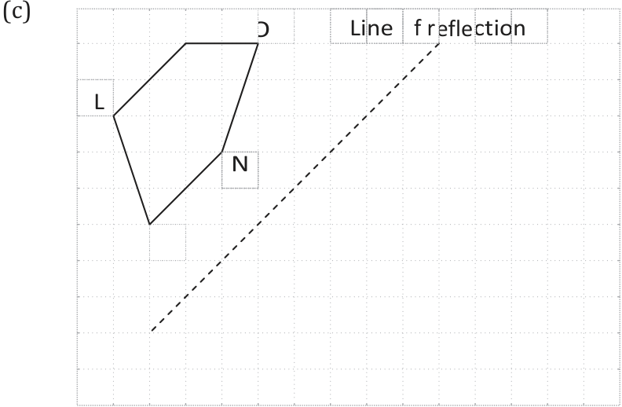
> **[Diagram Context - Textbook_Mathematics_Gr7_Transformation-geometry.pdf-0012-00.png]**
> This geometry figure illustrates a transformation on a Cartesian coordinate grid. The visible labels include vertices D, L, and N forming a polygon, alongside a dashed diagonal axis labeled "Line of reflection". Conceptually, the diagram helps learners understand Euclidean transformations—specifically how points flip across a mirror line to create a congruent reflected image while preserving shape and size.

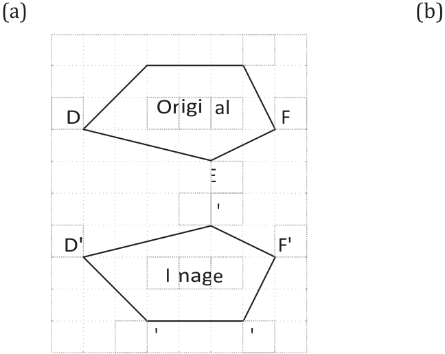
> **[Diagram Context - Textbook_Mathematics_Gr7_Transformation-geometry.pdf-0012-02.png]**
> This educational graphic is a geometry figure showing a 2D transformation on a Cartesian grid. Visible labels include the polygon vertices D and F for the original shape, and D' and F' for the transformed image. The diagram visually conveys the concept of geometric transformation (such as reflection or translation) by demonstrating how an original figure and its image correspond grid square by grid square.

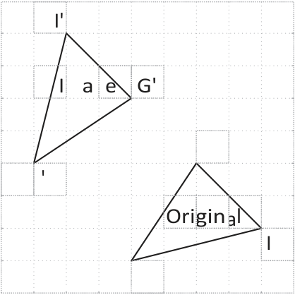
> **[Diagram Context - Textbook_Mathematics_Gr7_Transformation-geometry.pdf-0012-03.png]**
> This graphic is a geometry figure showing a Cartesian grid with two triangles, labeled "Original" and "I' G'". Visible labels include vertex points and text designations such as "Original" and "I a e G'". Conceptually, the diagram conveys the geometric transformation of a shape across a coordinate plane, helping learners understand translation, rotation, or reflection in Euclidean geometry.

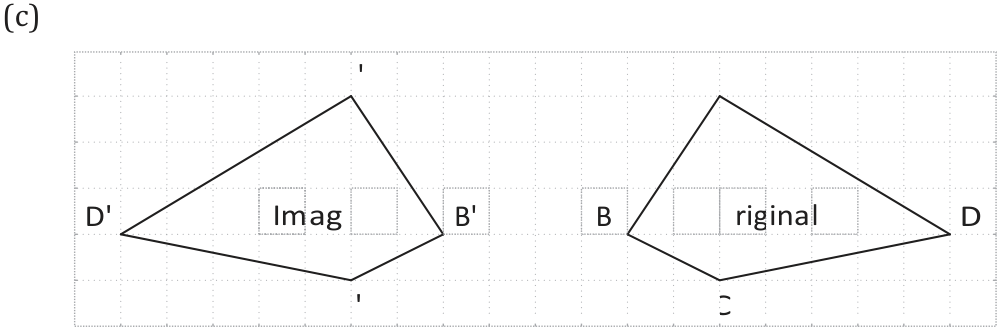
> **[Diagram Context - Textbook_Mathematics_Gr7_Transformation-geometry.pdf-0012-04.png]**
> This geometry figure illustrates a spatial transformation on a coordinate grid, showing an original polygon alongside its transformed image. Visible labels include vertices $B$ and $D$ for the original shape, and corresponding transformed vertices $B'$ and $D'$, with partial text reading "riginal" and "Imag". This diagram helps CAPS learners conceptualize Euclidean transformations, specifically demonstrating how coordinates change during reflections, rotations, or translations in 2D space.

---

### Investigating the Properties of Rotation

In geometry, a **rotation** is a transformation that turns a figure about a fixed point called the **centre of rotation**. In the examples below, $\triangle PRS$ is rotated anticlockwise through $90^\circ$ about point $A$ to form the image $\triangle P'R'S'$.

---

#### Activity 1: Investigating Point S and its Image S'

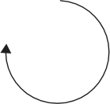

Lines have been drawn to join the centre of rotation $A$ to point $S$ and to its corresponding image point $S'$.

1.  **Measure the distance from $A$ to $S$.**
2.  **Measure the distance from $A$ to $S'$.**
3.  **Observation:** Compare the distances measured in (1) and (2). You will notice that the distance from the centre of rotation to the original point is equal to the distance from the centre of rotation to the image point ($AS = AS'$).
4.  **Measure the size of the angle $\angle SAS'$.**
    *   **Observation:** The angle formed by the original point, the centre of rotation, and the image point is equal to the angle of rotation ($90^\circ$).

---

#### Activity 2: Investigating Point P and its Image P'

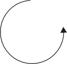

Lines have been drawn to join the centre of rotation $A$ to point $P$ and to its corresponding image point $P'$.

1.  **Measure the distance from $A$ to $P$.**
2.  **Measure the distance from $A$ to $P'$.**
3.  **Observation:** Compare the distances measured in (1) and (2). You will notice that the distance from the centre of rotation to the original point is equal to the distance from the centre of rotation to the image point ($AP = AP'$).
4.  **Measure the size of the angle $\angle PAP'$.**
    *   **Observation:** The angle formed by the original point, the centre of rotation, and the image point is equal to the angle of rotation ($90^\circ$).

---

#### Summary of Properties
When a figure is rotated about a centre point $A$ by an angle $\theta$:
*   The distance from the centre of rotation to any point on the original figure is equal to the distance from the centre to the corresponding point on the image.
*   The angle formed by joining a point, the centre of rotation, and the image point is equal to the angle of rotation.

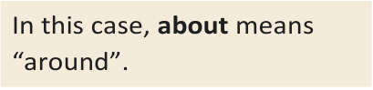
> **[Diagram Context - Textbook_Mathematics_Gr7_Transformation-geometry.pdf-0013-06.png]**
> The image displays a text-based educational graphic featuring the sentence "In this case, about means 'around'." with the word "about" highlighted in bold font. This graphic serves as a vocabulary or contextual language aid to help learners understand the specific spatial or approximate definition of the word "about" within a given text. Conceptually, it clarifies semantic meaning and supports reading comprehension by equating "about" with "around" for high school students tackling descriptive or narrative tasks.

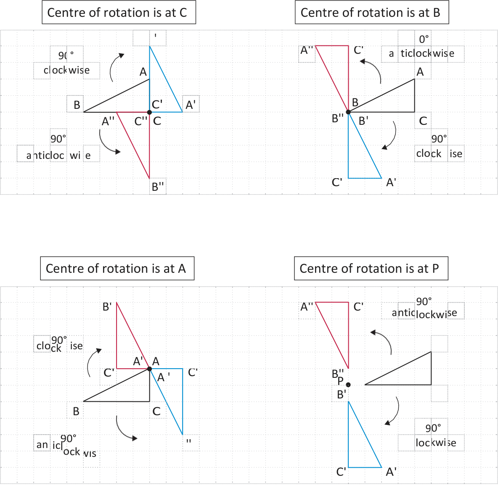
> **[Diagram Context - Textbook_Mathematics_Gr7_Transformation-geometry.pdf-0013-07.png]**
> This geometry figure illustrates transformations of triangles on a Cartesian grid with four distinct panels showing rotations about different centres (C, B, A, and P). Visible labels include triangle vertices ($A, B, C$, $A', B', C'$, and $A'', B'', C''$), directional curved arrows, and text indicating angles of rotation such as $90^\circ$ clockwise and $90^\circ$ anticlockwise. Conceptually, this diagram helps high school learners understand how changing the centre of rotation affects the final position and orientation of an object during transformational geometry.

---

### Geometry: Properties of Rotation

#### Exercise 3: Investigating Rotation
Lines have been drawn to join point $A$ (the centre of rotation) to point $R$ (on the original figure) and to point $R'$ (the corresponding point on the image).

> **[Diagram Context - Textbook_Mathematics_Gr7_Surface-area-and-volume-of-3D-objects.pdf-0014-06.png]**
> This geometric figure illustrates a 3D rectangular prism (a rusk box) being unfolded into a 2D net. Visible labels include dimensions (15 cm, 8 cm, 25 cm), face labels ("top", "base", "left", "right", "front", "back", "Rusks"), and directional arrows indicating the unfolding process. Conceptually, this diagram helps high school mathematics and mathematical literacy learners understand surface area calculations by connecting the total surface area of a 3D object to the sum of the areas of its individual 2D faces.

**(a)** Measure the distance from $A$ to $R$.
**(b)** Measure the distance from $A$ to $R'$.
**(c)** What do you notice about the distances in (a) and (b) above?
**(d)** Measure the size of the angle $\angle RAR'$. What do you notice?

---

#### Exercise 4: Comparing Side Lengths
In any of the diagrams in questions 1 to 3, measure the sides of the original triangle and the corresponding sides of the image. What do you notice about their lengths?

---

#### Key Concepts: Properties of Rotation

When a figure is rotated, the following geometric properties apply:

1.  **Distance from Centre:** The distance from the centre of rotation to any point on the original figure is equal to the distance from the centre of rotation to the corresponding point on the image.
    *   *Example:* In the diagram below, $PA = PA'$, $PB = PB'$, and $PC = PC'$.

2.  **Angle of Rotation:** The angle formed by the connecting lines between any point on the original figure, the centre of rotation, and the corresponding point on the image is equal to the angle of rotation.
    *   *Example:* If an image is rotated through $90^{\circ}$, the angle formed at the centre of rotation will be $90^{\circ}$. If rotated through $45^{\circ}$, the angle will be $45^{\circ}$.

3.  **Congruence:** When a figure is rotated, its shape and size do not change.

> **[Diagram Context - Textbook_Mathematics_Gr7_Transformation-geometry.pdf-0014-02.png]**
> This geometry figure illustrates a transformation of a two-dimensional shape on a Cartesian grid. Visible labels include the triangle vertices labeled R, S, and the original shape, as well as the transformed image with corresponding vertices P', R', S', and a highlighted point A labeled "Centre of rotation" connected by dashed lines. The diagram conceptually demonstrates how a figure undergoes a rotational transformation around a fixed point, helping students understand the preservation of shape and size during Euclidean transformations.

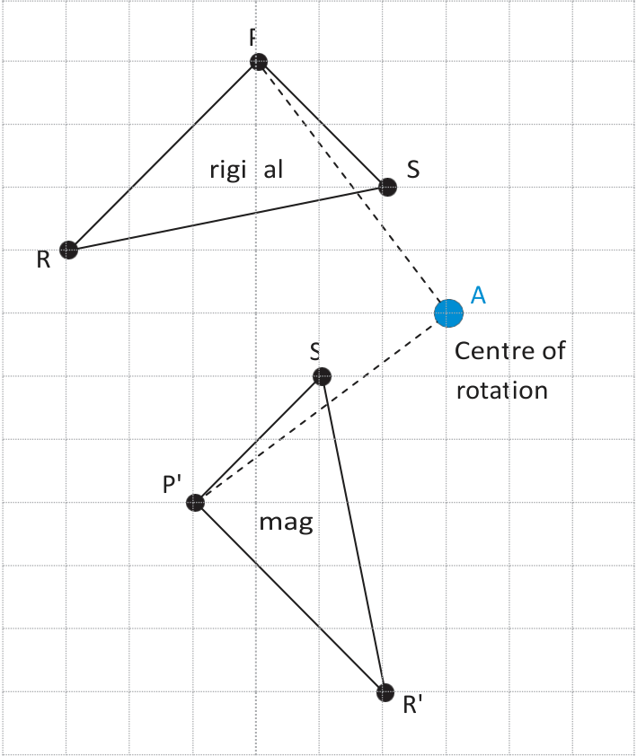
> **[Diagram Context - Textbook_Mathematics_Gr7_Transformation-geometry.pdf-0014-13.png]**
> This geometry figure illustrates a rotation transformation on a Cartesian grid. The visible labels include the original shape vertices R, P, and S, the image vertices R', P', and S', and point A labelled as the "Centre of rotation" connected by dashed construction lines. For a high school mathematics learner, this diagram demonstrates how a 2D shape maintains its size and shape (rigidity) when rotated through a specific angle around a fixed center point.

---

# CHAPTER 16: TRANSFORMATION GEOMETRY

This page serves as the introductory header for Chapter 16 of the curriculum.

> **[Diagram Context - Textbook_Mathematics_Gr7_Surface-area-and-volume-of-3D-objects.pdf-0015-15.png]**
> This educational graphic features a geometry investigation activity with step-by-step illustrations for constructing a paper cube. Visible labels include "CHAPTER 10," "Surface area and volume of 3D objects," "10.1 Surface area of cubes and rectangular prisms," "INVESTIGATING SURFACE AREA," and steps numbered 1 through 5, accompanied by red directional arrows and dimensional units like $\text{mm}^2$, $\text{cm}^2$, and $\text{m}^2$. It conceptually conveys how a three-dimensional cube is formed from two-dimensional paper strips, guiding learners to physically experience and understand that surface area is the sum of the areas of all its outer faces.

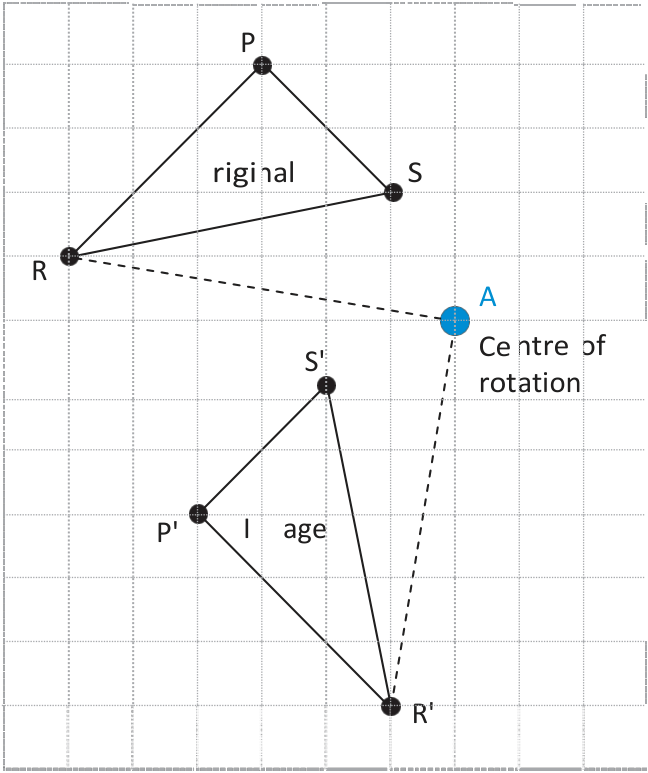
> **[Diagram Context - Textbook_Mathematics_Gr7_Transformation-geometry.pdf-0015-05.png]**
> This geometry figure illustrates a transformation on a Cartesian grid, specifically the rotation of a geometric shape. Visible labels include the original triangle vertices (R, P, S), the rotated image vertices (R', P', S'), and point A labeled as the "Centre of rotation," with dashed construction lines connecting vertices to point A. Conceptually, this diagram demonstrates how a figure rotates around a fixed point, helping learners understand that the distance from any point on the object to the centre of rotation remains equal to the distance from its corresponding image point to the centre.

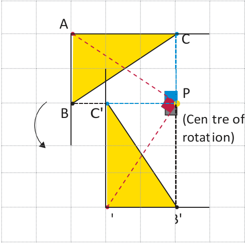
> **[Diagram Context - Textbook_Mathematics_Gr7_Transformation-geometry.pdf-0015-10.png]**
> This geometry figure illustrates a 2D rotational transformation of a right-angled yellow triangle on a grid. Visible labels include vertices A, B, C, their rotated counterparts A', B', C', point P, and the annotation "(Centre of rotation)", alongside dashed red and blue construction lines connecting vertices to point P and a curved arrow indicating the direction of rotation. Conceptually, this diagram helps high school learners understand Euclidean transformation geometry by demonstrating how an object rotates around a fixed point, preserving shape and size while altering orientation.

---

# Practise Rotating Figures

## Key Concepts for Rotation
When rotating a figure about a point (the centre of rotation), keep the following rules in mind:
* **Distance:** The image point must be the same distance from the centre of rotation as the original point.
* **Angle:** The angle formed between the line connecting an original point to the centre and the line connecting its image point to the centre must be equal to the angle of rotation (e.g., $90^\circ$ or $180^\circ$).

---

## Exercises

### 1. Rotate triangle $\Delta ABC$ $90^\circ$ clockwise about point $P$
*   **Step (a):** Plot the image of each vertex on grid paper using the rules above.
*   **Step (b):** Join the image points to create the new triangle $\Delta A'B'C'$.

> **[Diagram Context - Textbook_Mathematics_Gr7_Surface-area-and-volume-of-3D-objects.pdf-0016-05.png]**
> This geometric diagram illustrates a 3D rectangular prism (a "Rusks" box) and its corresponding 2D net decomposition. Visible labels include the structural faces ("top", "base", "left", "right", "front", "back"), dimensions of 15 cm, 8 cm, and 25 cm, and indicator arrows. Conceptually, it demonstrates how to deconstruct a right-angled prism into its constituent flat faces to calculate total surface area, aligning with CAPS Senior Phase and FET geometry outcomes.

### 2. Rotate quadrilateral $KLMN$ $180^\circ$ about point $T$
Perform the rotation on grid paper by ensuring every vertex is moved $180^\circ$ around the centre of rotation $T$.

> **[Diagram Context - Textbook_Mathematics_Gr7_Surface-area-and-volume-of-3D-objects.pdf-0016-16.png]**
> The educational graphic is a geometry figure demonstrating the surface area and nets of 3D objects, specifically a cube and a rectangular prism. Visible labels include dimensions ($l = 5\text{ cm}$, $b = 4\text{ cm}$, $h = 1\text{ cm}$), colored face sections on the nets, and the formula: Surface area of a rectangular prism = $2(l \times b) + 2(l \times h) + 2(b \times h)$. This diagram helps learners conceptualize how a 3D rectangular prism can be unfolded into a 2D net composed of six individual rectangles, directly linking the visual sum of face areas to the formal algebraic formula for calculating total surface area.

### 3. Rotate triangle $\Delta XYZ$ $90^\circ$ anticlockwise about point $F$
Perform the rotation on grid paper by ensuring every vertex is moved $90^\circ$ in the anticlockwise direction around the centre of rotation $F$.

---

# 16.6 Enlarging and reducing figures

### Definitions
*   **Enlarging:** Making a figure bigger in a specific way.
*   **Reducing:** Making a figure smaller in a specific way.
*   **Resizing:** The collective term for both enlarging and reducing figures.
*   **Scale Factor:** The specific number by which all the sides of a figure are multiplied to produce an enlargement or a reduction.

---

### Investigation: Properties of enlargements and reductions

> **[Diagram Context - Textbook_Mathematics_Gr7_Surface-area-and-volume-of-3D-objects.pdf-0017-23.png]**
> This CAPS-aligned mathematics worksheet features geometry figures, specifically three different nets of a cube alongside a 3D cube, followed by four rectangular prisms labeled A, B, C, and D with dimension labels in centimeters and millimeters (e.g., 8 cm, 3 cm, 2 cm, 55 mm, 70 mm, 15 mm). It includes associated scaffolded questions labeled 6(a)-(d) and 1-2(a)-(b) with variables and units like $l$, $l^2$, and $\text{m}^2$. Conceptually, the graphic helps Grade 7 students visualize 3D objects through their 2D nets and develop procedural fluency in calculating the surface area of cubes and rectangular prisms using formulas.

**1. Look at the rectangles provided in the diagram and answer the following questions:**

**(a) Rectangle EFGH:**
*   How many times is $FG$ longer than $BC$?
*   How many times is $EF$ longer than $AB$?

**(b) Rectangle JKLM:**
*   How many times is $KL$ longer than $BC$?
*   How many times is $JK$ longer than $AB$?

---

### Key Principles

*   **Condition for Enlargement/Reduction:** A figure is an enlargement or reduction of another only if the lengths of **all** the sides are multiplied by the **same number**.
*   **Scale Factor Application:** If a figure is enlarged or reduced by a scale factor of $k$, then every side length $s$ of the original figure becomes $s \times k$ in the new figure.
*   **Example:** In question 1(b), the scale factor is $2$. This means figure $ABCD$ has been enlarged by a scale factor of $2$ to produce figure $JKLM$.
*   **Non-examples:** Figure $EFGH$ is **not** an enlargement of figure $ABCD$ because not all of its sides have been increased by the same scale factor.

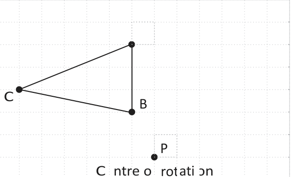
> **[Diagram Context - Textbook_Mathematics_Gr7_Transformation-geometry.pdf-0017-03.png]**
> This educational graphic illustrates a geometry figure featuring a triangle with vertices labeled B and C, set against a background coordinate grid. Below the triangle, a distinct point is labeled P, accompanied by the text "Centre of rotation". Conceptually, this diagram demonstrates the Euclidean geometry transformation of rotation in the Cartesian plane, helping learners visualize how shapes rotate around a fixed centre point.

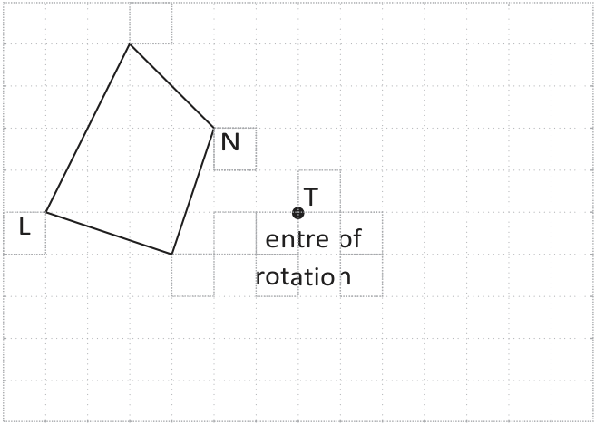
> **[Diagram Context - Textbook_Mathematics_Gr7_Transformation-geometry.pdf-0017-08.png]**
> This geometry figure displays a 2D polygon plotted on a Cartesian grid with a designated point representing a centre of rotation. Visible labels include the polygon vertices marked with letters L and N, and point T labeled as the "centre of rotation". For a high school student studying transformation geometry under the CAPS curriculum, this diagram illustrates Euclidean transformations, demonstrating how a shape rotates around a fixed point on a coordinate plane while maintaining its size and shape.

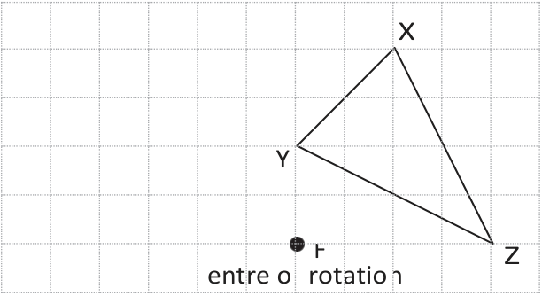
> **[Diagram Context - Textbook_Mathematics_Gr7_Transformation-geometry.pdf-0017-10.png]**
> This geometric figure is a Euclidean geometry diagram showing triangle XYZ positioned on a Cartesian grid alongside a point labeled F, which serves as the centre of rotation. The visible labels include vertices X, Y, and Z, the point F, and the partially visible text "entre of rotation" at the bottom. Conceptually, this diagram illustrates transformation geometry in the FET phase, demonstrating how a 2D shape undergoes rotational transformation about a fixed point on a grid coordinate plane.

---

### The Scale Factor

The scale factor determines how the size of an image changes relative to the original figure:

*   **Scale factor = 1:** The image is the same size as the original.
*   **Scale factor < 1:** The image is a **reduction**. For example, if the scale factor is $\frac{1}{2}$ or $0,5$, each side of the image is half the length of its corresponding side in the original figure.
*   **Scale factor > 1:** The image is an **enlargement**. For example, if the scale factor is $2$, each side of the image is double the length of its corresponding side in the original figure.

---

### Exercise: Analyzing Triangles

> **[Diagram Context - Textbook_Mathematics_Gr7_Surface-area-and-volume-of-3D-objects.pdf-0018-19.png]**
> The educational graphic shows a collection of geometric figures consisting of 3D rectangular prisms (Boxes A and B), a composite glued carton shape, and a large perforated plastic wall. Visible labels include "Box A", "Box B", "Hole A", "Hole B", "Hole C", along with dimension measurements in centimeters and meters, and conversion notes relating to square units. Conceptually, this diagram helps high school learners practice calculating total surface areas of composite 3D objects and structures with missing sections, requiring them to account for hidden faces, convert units, and apply spatial reasoning in real-world contexts like painting costs.

**(a) Comparison Questions**
Based on the provided triangles, determine the relationships between the sides:
*   How many times is $FG$ longer than $BC$?
*   How many times is $EF$ longer than $AB$?
*   How many times is $EG$ longer than $AC$?
*   How many times is $JK$ shorter than $BC$?
*   How many times is $IJ$ shorter than $AB$?
*   How many times is $IK$ shorter than $AC$?

**(b) Enlargement Analysis**
Is $\Delta EFG$ an enlargement of $\Delta ABC$? Explain your answer.

**(c) Reduction Analysis**
Is $\Delta IJK$ a reduction of $\Delta ABC$? Explain your answer.

---

### Similar Figures

When figures are enlarged or reduced, the resulting image is **similar** to the original figure. In the example above, $\Delta ABC$, $\Delta EFG$, and $\Delta IJK$ are all similar. 

We say that the lengths of their corresponding sides are **in proportion**.

**Definition of Similar Figures:**
Two or more figures are **similar** if:
1.  Their corresponding angles are equal.
2.  Their corresponding sides are longer or shorter by the same scale factor.

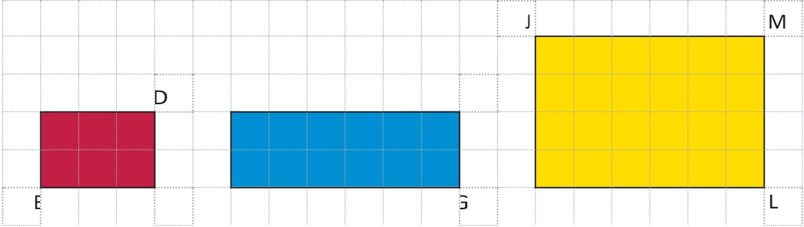
> **[Diagram Context - Textbook_Mathematics_Gr7_Transformation-geometry.pdf-0018-04.png]**
> This geometry figure displays three separate coloured rectangles set against a square grid. The image includes vertices labeled E and D on the red rectangle, G on the blue rectangle, and J, M, and L on the yellow rectangle. Conceptually, this diagram helps learners determine and compare the area and perimeter of 2D shapes by counting grid units, supporting foundational measurement skills in Senior Phase Mathematics.

---

### Practise Resizing Figures

#### 1. Understanding Scale Factors
Determine whether the following scale factors will produce a larger or smaller image:

*   (a) $5$
*   (b) $0,25$
*   (c) $1,2$
*   (d) $\frac{3}{8}$

---

#### 2. Enlargement Exercise
On grid paper, enlarge the triangle below with a scale factor of $2$.

> **[Diagram Context - Textbook_Mathematics_Gr7_Surface-area-and-volume-of-3D-objects.pdf-0019-10.png]**
> This educational graphic is a geometry figure illustrating 2D shapes versus 3D objects and the measurement of volume using unit cubes. The visual elements include dimensional axes labeled "length", "breadth", and "height", alongside six multi-cube stacks labeled A through F. Conceptually, it demonstrates how adding a third dimension transforms a 2D rectangle into a 3D rectangular prism, and teaches students to quantify the space (volume) occupied by objects by counting identical building cubes.

---

#### 3. Reduction Exercise
On grid paper, resize the following figure. Use a scale factor of $0,5$.

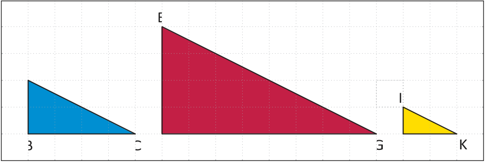
> **[Diagram Context - Textbook_Mathematics_Gr7_Transformation-geometry.pdf-0019-05.png]**
> This geometric figure displays three distinct right-angled triangles set against a grid background, labeled with vertex letters such as B, C, E, G, I, and K. The graphic visually represents geometric similarity and scaling in triangles, allowing learners to analyze proportional side lengths and corresponding angles. For CAPS curriculum learners, this diagram supports Euclidean geometry concepts regarding similar triangles and the application of trigonometric ratios.

---

#### 4. Reduction Exercise
On grid paper, resize the figure below. Use a scale factor of $\frac{1}{3}$.

---
*CHAPTER 16: TRANSFORMATION GEOMETRY | 211*

---

### Similarity and Scale Factors

#### Key Concepts
*   **Similar Figures:** Two figures are similar if they have the same shape but not necessarily the same size. Corresponding sides must be proportional.
*   **Scale Factor:** The ratio of the length of a side on the new image to the length of the corresponding side on the original figure.
    *   Formula: $\text{Scale Factor} = \frac{\text{Length of side on image}}{\text{Length of corresponding side on original}}$

---

#### Exercise 5
(a) Which image below is similar to the original?
(b) State the scale factor by which it has been resized.

> **[Diagram Context - Textbook_Mathematics_Gr7_Surface-area-and-volume-of-3D-objects.pdf-0020-23.png]**
> This educational graphic is a geometry page from a mathematics textbook illustrating the concept of volume using 3D rectangular prisms and unit cubes. Visible labels include unit dimensions ($1\text{ cm}$), base configurations labeled A and B, dimensions ($l = \text{six units}$, $b = \text{three units}$), directional arrows, and calculation formulas for area and volume. The diagram conceptually conveys how volume is measured by counting unit cubes, demonstrating that different rectangular prisms can be formed using the same total volume of cubes by varying their base area and height.

**Analysis:**
*   **Original:** The vertical height is 6 units.
*   **Image 1:** The vertical height is 3 units.
*   **Image 2:** The vertical height is 2 units.

**Calculations:**
*   For Image 1: $\text{Scale Factor} = \frac{3}{6} = \frac{1}{2}$ (or $0,5$)
*   For Image 2: $\text{Scale Factor} = \frac{2}{6} = \frac{1}{3}$

---

#### Exercise 6
What scale factors were used to produce Image 1 and Image 2 from the original?

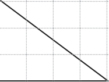

**Analysis:**
To determine the scale factor, compare the height of the original figure to the height of the images.

*   **Original Height:** 3 units.
*   **Image 1 Height:** 6 units.
*   **Image 2 Height:** 9 units.

**Calculations:**

| Image | Calculation | Scale Factor |
| :--- | :--- | :--- |
| Image 1 | $\frac{6}{3}$ | $2$ |
| Image 2 | $\frac{9}{3}$ | $3$ |

**Conclusion:**
*   Image 1 was produced using a scale factor of $2$.
*   Image 2 was produced using a scale factor of $3$.

---

# Grade 7 Term 3: Transformation Geometry

## Learner Book Overview

| Sections in this chapter | Content | Pages in Learner Book |
| :--- | :--- | :--- |
| 16.1 Lines of symmetry | Introduce lines of symmetry and congruent figures | Pages 194 to 196 |
| 16.2 Original figures and their images | Introduce images of figures, translation, reflection and rotation | Page 197 |
| 16.3 Translating figures | Investigate properties of translation; practise translating figures | Pages 197 to 200 |
| 16.4 Reflecting figures | Investigate properties of reflection; practise reflecting figures | Pages 200 to 204 |
| 16.5 Rotating figures | Investigate properties of rotation; practise rotating figures | Pages 205 to 208 |
| 16.6 Enlarging and reducing figures | Investigate properties of enlargements and reductions; practise resizing figures | Pages 209 to 212 |

**CAPS Time Allocation:** 5 hours
**CAPS Content Specification:** Pages 78 to 79

---

## Mathematical Background

Transformation geometry involves operations that change a figure's position, size, or shape.

### Key Definitions
*   **Figure (Object):** The original shape before any transformation is applied.
*   **Image:** The resulting shape after a transformation has been applied to the object.

### Transformations Affecting Position
1.  **Translation:** Every point in the figure is shifted in the same direction and over the same distance.
2.  **Reflection:** Every point in the figure is flipped perpendicularly over a **line of symmetry** (mirror line). The point and its image remain at the same distance from the line of symmetry.
3.  **Rotation:** Every point in the figure is turned clockwise or anti-clockwise through the same angle about a fixed point, known as the **centre of rotation**. The point and its image remain at the same distance from the centre of rotation.

### Transformations Affecting Size
*   **Enlargement:** Every side of a figure is multiplied by a positive number greater than $1$ to produce an image larger than the original.
*   **Reduction:** Every side of a figure is multiplied by a positive number smaller than $1$ (but not $0$) to produce an image smaller than the original.

### Transformations Affecting Shape
*   **Shear:** All points along a fixed line remain fixed, while all other points are shifted parallel to the fixed line (e.g., turning a square into a rhombus).
*   **Stretch:** All points along a fixed line remain fixed, while all other points are stretched away from the fixed line (e.g., turning a square into a rectangle).

> **[Diagram Context - Textbook_Mathematics_Gr7_Surface-area-and-volume-of-3D-objects.pdf-0021-07.png]**
> This geometric formula and calculation step displays the calculation for the volume of a rectangular prism. The visible variables and values are $V = l \times b \times h$, substituted with $17 \times 5 \times 12$, resulting in a final evaluated volume of $1020\text{ m}^3$. Conceptually, it demonstrates how to apply the standard mathematical formula for volume by substituting given linear dimensions into the equation and including the correct cubic unit of measurement.

> **[Diagram Context - Textbook_Mathematics_Gr7_Surface-area-and-volume-of-3D-objects.pdf-0021-08.png]**
> This mathematical text graphic displays a step-by-step geometry calculation to find the volume of a rectangular prism. The visible labels and variables include "B:" (part identifier), the formula $V = l \times b \times h$, substitution values $8 \times 3 \times 9$, and the final calculated result of $216\text{ cm}^3$. Conceptually, it guides FET phase learners through the procedural fluency required to apply a standard measurement formula using given dimensions to determine three-dimensional space capacity.

> **[Diagram Context - Textbook_Mathematics_Gr7_Surface-area-and-volume-of-3D-objects.pdf-0021-09.png]**
> The graphic presents a mathematical calculation of volume for two geometric objects, labeled C and D. The visible text displays the formulas and substitution steps: for C, $V = l^3 = 5^3 = 125\text{ cm}^3$; for D, $V = l^3 = (1,5)^3 = 1,5 \times 1,5 \times 1,5 = 3,375\text{ cm}^3$. This conveys the concept of calculating the volume of a cube using its side length, reinforcing measurement and exponentiation skills in the CAPS mathematics curriculum.

> **[Diagram Context - Textbook_Mathematics_Gr7_Surface-area-and-volume-of-3D-objects.pdf-0021-10.png]**
> This mathematical text displays a worked-out calculation for the volume of a rectangular prism. Visible labels and variables include the question number "2. (a)", the volume formula $V = l \times b \times h$, numerical substitution values ($7 \times 6 \times 6$), and the final calculated answer with cubic units ($252\text{ m}^3$). Conceptually, it demonstrates the procedural steps required in CAPS mathematics and measurement to calculate three-dimensional space by multiplying length, breadth, and height.

> **[Diagram Context - Textbook_Mathematics_Gr7_Surface-area-and-volume-of-3D-objects.pdf-0021-11.png]**
> This mathematical text graphic displays worked calculations for volume measurements, labeled with sub-questions (b), (c), and (d). It features the volume formula $V = l \times b \times h$ alongside specific numerical values and units of measurement such as $\text{cm}^3$ and $\text{m}^3$. Conceptually, it demonstrates how to apply formulas to calculate the volume of three-dimensional rectangular prisms, reinforcing measurement and calculation skills aligned with the CAPS mathematics curriculum.

> **[Diagram Context - Textbook_Mathematics_Gr7_Surface-area-and-volume-of-3D-objects.pdf-0021-12.png]**
> This educational graphic presents worked mathematical calculations for determining the volume of a cube. Visible labels and variables include question numbers 3 (a) and (b), volume ($V$), side length ($l$), multiplication signs, equals signs, and units of measurement ($\text{cm}^3$, $\text{mm}^3$). Conceptually, it demonstrates how to apply the formula $V = l^3$ by substituting given side lengths, expanding exponents into repeated multiplication, and calculating the final volumetric result with appropriate cubic units.

> **[Diagram Context - Textbook_Mathematics_Gr7_Surface-area-and-volume-of-3D-objects.pdf-0021-13.png]**
> This educational graphic is a geometry figure demonstrating the calculation of volume for rectangular prisms and cubes using unit cubes. Visible labels include dimensions ($l$, $b$, $h$), variables for length, breadth, and height, units such as cm, m, and mm, and formulas like $V = \text{Area of base} \times \text{height}$ or $V = l \times b \times h$. It conceptually conveys how stacking layers of unit cubes builds up the three-dimensional volume of a rectangular prism, reinforcing the derivation and application of standard volume formulas for Grade 7 CAPS Mathematics.

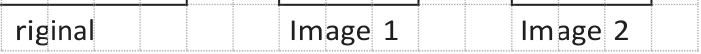
> **[Diagram Context - Textbook_Mathematics_Gr7_Transformation-geometry.pdf-0021-01.png]**
> This image shows a comparative diagram or set of figures labeled "riginal", "Image 1", and "Image 2" set against a grid background. The visible text labels include "riginal", "Image 1", and "Image 2". Conceptually, this visual setup is used to compare transformations, graphical changes, or experimental setups over different stages for high school learners studying scientific investigation or mathematical transformations.

> **[Diagram Context - Textbook_Mathematics_Gr7_Transformation-geometry.pdf-0021-03.png]**
> The graphic consists of a text banner set against a light background with faint vertical gridlines. The visible text reads "riginal Image 1 Ima e" in black sans-serif font. Conceptually, this appears to be a placeholder or corrupted crop from a document or assessment item intended to label a specific figure in CAPS curriculum resources.

---

# Chapter 16: Transformation Geometry

## 16.1 Lines of Symmetry

### What is the Line of Symmetry?
The symmetry of a figure describes how parts of that figure can, under certain rules of movement, fit exactly onto other parts of the same figure.

A **line of symmetry** (or **axis of symmetry**) is a line that divides a figure into two parts that are mirror images of each other. If you were to fold the figure along this line, the two parts would fit perfectly on top of one another (all edges would match).

*   **Congruent figures:** Figures that are the same size and shape. When a line of symmetry divides a figure, the two resulting parts are congruent.
*   **Note:** A geometric figure can have no line of symmetry, one line of symmetry, or more than one line of symmetry.

> **[Diagram Context - Textbook_Mathematics_Gr7_Surface-area-and-volume-of-3D-objects.pdf-0022-16.png]**
> This educational graphic features a geometry figure and accompanying text demonstrating the conversion between cubic units. The visual content includes a large cube labeled "cube A ($1\text{ m}^3$)" with edge lengths of "$1\text{ m}$" and a small cube labeled "cube B ($1\text{ cm}^3$)" with edge lengths of "$1\text{ cm}$", accompanied by step-by-step mathematical calculations involving variables such as length, breadth, and height. Conceptually, it conveys how to convert between cubic metres and cubic centimetres by visualizing linear scale factors cubed ($100 \times 100 \times 100$), helping learners understand the multiplicative relationship behind volumetric unit conversions.

---

### Types of Symmetry

Beyond lines of symmetry, figures can exhibit other types of symmetry:

#### 1. Rotational Symmetry
A figure has **rotational symmetry** if it can be turned around a point and fitted onto itself somewhere other than in its original position.
*   **Centre of symmetry:** The point about which the figure has rotational symmetry.
*   **Example:** During one full revolution ($360^\circ$), a square fits onto itself four times.

<!-- DIAGRAM_PLACEHOLDER: diagram -->

#### 2. Plane Symmetry
A solid has **plane symmetry** if a flat mirror can be placed so that the reflection in the mirror looks exactly like the part of the solid which is covered up by the mirror.
*   **Example:** A cube has nine planes of symmetry.

<!-- DIAGRAM_PLACEHOLDER: diagram -->

---

### Teaching Guidelines
To identify lines of symmetry in regular and irregular figures, use the **paper folding** method.

**Worked Example: Arrow Symmetry**
*   **Question:** In the diagrams below, which red dotted line divides the arrow into two parts that are exactly the same?
*   **Analysis:**
    *   **Arrow A:** The vertical red dotted line divides the arrow into two identical mirror images. This is a line of symmetry.
    *   **Arrow B:** The horizontal red dotted line does not result in two identical parts.
*   **Answer:** Arrow A has a line of symmetry.

<!-- DIAGRAM_PLACEHOLDER: diagram -->

---

### Identifying Lines of Symmetry

#### Key Concepts
*   **Congruent Figures:** Figures that are identical in shape and size.
*   **Line of Symmetry:** An imaginary line that divides a figure into two congruent halves, such that one half is a mirror image of the other.

#### Teaching Guidelines
*   **Concept Placement:** A line of symmetry must pass through the middle of a figure.
*   **Common Misconception:** Learners often mistakenly believe that a line of symmetry can be positioned alongside or outside of a figure. Emphasize that this is **never** possible.
*   **Multiple Lines:** Some figures possess more than one line of symmetry. Encourage learners to identify all possible lines for complex shapes.

---

#### Exercise: Identifying Lines of Symmetry

**Instructions:**
1.  Copy each of the figures shown below.
2.  Make a tick ($\checkmark$) next to each figure where the red line is a line of symmetry.
3.  In figures where the red line is not a line of symmetry, draw in a line of symmetry if possible.
4.  If a figure has more than one line of symmetry, draw them all in.
5.  If a figure has no lines of symmetry, write "No line of symmetry" above the figure.

> **[Diagram Context - Textbook_Mathematics_Gr7_Surface-area-and-volume-of-3D-objects.pdf-0023-29.png]**
> The graphic is a Grade 7 Mathematics worksheet page titled "WORKING WITH CUBIC UNITS" featuring textual exercises and two geometric diagrams: a rectangular prism labeled with dimensions of 50 mm, 100 mm, and 10 mm, and a grid drawing representing the base of a stack built from $1\text{ cm}^3$ cubes with a height of 80 mm. Visible labels and units include $\text{cm}^3$, $\text{m}^3$, $\text{mm}^3$, millimeters (mm), meters (m), and a formula completion prompt ("height"). Conceptually, this worksheet helps learners practice selecting appropriate SI units for volume, converting between cubic units ($\text{mm}^3$, $\text{cm}^3$, $\text{m}^3$), and calculating the volume of rectangular prisms and composite block stacks using spatial reasoning.

| Figure | Description |
| :--- | :--- |
| **A** | Four possibilities (Square) |
| **B** | Two possibilities (Rectangle) |
| **C** | One line of symmetry |
| **D** | Four possibilities (Star shape) |
| **E** | No line of symmetry |
| **F** | No line of symmetry |

---

#### Advanced Example: Multiple Lines of Symmetry
When a figure is highly regular, such as the star-shaped polygon shown below, it may contain many lines of symmetry. 

*   **Note:** The figure below demonstrates eight distinct lines of symmetry passing through the center point.

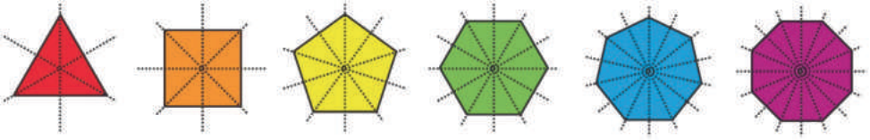
> **[Diagram Context - Textbook_Mathematics_Gr7_Transformation-geometry.pdf-0023-05.png]**
> This graphic displays a series of regular geometric figures—specifically a triangle, square, pentagon, hexagon, heptagon, and octagon—each intersected by dashed lines radiating from a central point. The visible elements include colored solid polygons and dashed lines representing lines of symmetry and rotational axes passing through the center. Conceptually, this diagram illustrates the relationship between the number of sides in regular polygons and their lines of symmetry, helping learners understand Euclidean geometry and transformational symmetry in two dimensions.

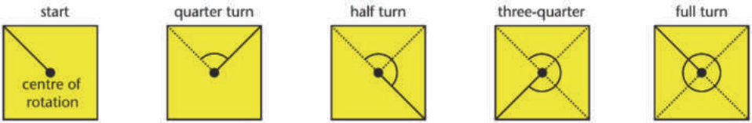
> **[Diagram Context - Textbook_Mathematics_Gr7_Transformation-geometry.pdf-0023-07.png]**
> This geometry figure illustrates rotational symmetry and angles of rotation using a yellow square shape. Visible labels and text include "start", "quarter turn", "half turn", "three-quarter", "full turn", and "centre of rotation", alongside dotted lines and curved angle arcs around a central point. Conceptually, the diagram demonstrates how an object rotates around a fixed centre through fractional turns (90°, 180°, 270°, and 360°), helping learners visualize rotational transformations and angle measurements in the Senior Phase mathematics curriculum.

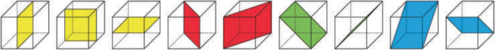
> **[Diagram Context - Textbook_Mathematics_Gr7_Transformation-geometry.pdf-0023-09.png]**
> This educational graphic is a geometry figure displaying a sequence of ten wireframe cubes intersected by various internal planes colored yellow, red, green, and blue. The diagrams visually represent different cross-sections of a 3D cube created by cutting it along various parallel, perpendicular, and diagonal planes at different angles. For high school learners following the CAPS curriculum, this conceptual illustration helps develop spatial reasoning and visualization skills by demonstrating the two-dimensional shapes (such as squares, rectangles, triangles, and hexagons) formed when a plane passes through a three-dimensional geometric solid.

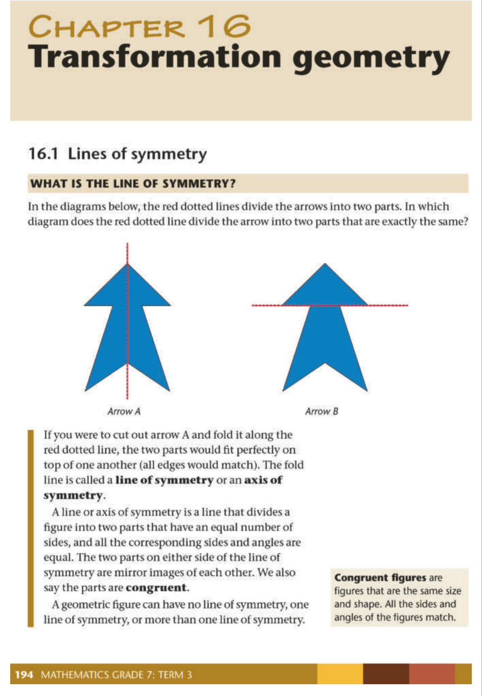
> **[Diagram Context - Textbook_Mathematics_Gr7_Transformation-geometry.pdf-0023-14.png]**
> This educational graphic features a geometry figure illustrating lines of symmetry for Grade 7 mathematics under the CAPS curriculum. The visual displays two blue arrow shapes labeled "Arrow A" and "Arrow B," each intersected by a red dotted line serving as a line or axis of symmetry. Conceptually, the diagram demonstrates how a correct line of symmetry divides a shape into two identical, congruent, and mirror-image halves, contrasting a valid vertical line of symmetry (Arrow A) with an invalid horizontal line (Arrow B).

---

### Geometry: Lines of Symmetry

#### Key Concept: Line of Symmetry
A line of symmetry is an imaginary line that divides a figure into two identical halves that are mirror images of each other. If you fold the figure along this line, the two parts will match perfectly.

---

#### Exercise 2: Identifying Lines of Symmetry
Copy the following geometric figures and draw the lines of symmetry. State the total number of lines of symmetry for each figure.

> **[Diagram Context - Textbook_Mathematics_Gr7_Surface-area-and-volume-of-3D-objects.pdf-0024-21.png]**
> The educational graphic is a textbook page illustrating volume and capacity calculations and unit conversions for rectangular prisms. It features a line drawing of a 1-litre bottle pouring liquid into a cubic container labeled with dimensions of 10 cm × 10 cm × 10 cm, alongside mathematical equations demonstrating equivalences between millilitres, litres, kilolitres, and cubic centimeters ($cm^3$). Conceptually, it conveys the relationship between spatial volume and liquid capacity, helping learners understand how to convert between cubic units of measurement and standard liquid capacity units in three-dimensional geometry.

| Figure | Description | Number of Lines of Symmetry |
| :--- | :--- | :--- |
| **A** | Letter 'E' | 1 |
| **B** | Equilateral Triangle | 3 |
| **C** | Regular Pentagon | 5 |
| **D** | Parallelogram | 0 (none) |
| **E** | Four-pointed Star | 4 |
| **F** | Irregular Polygon | 0 (none) |

---

#### Exercise 3: Completing Symmetric Figures
In each diagram, the dotted line represents the axis of symmetry. Copy the grid and complete the missing half of each figure to ensure it is perfectly symmetrical.

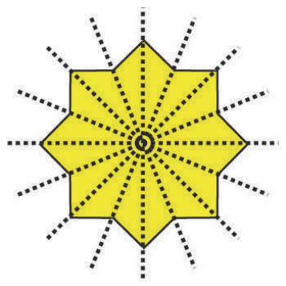
> **[Diagram Context - Textbook_Mathematics_Gr7_Transformation-geometry.pdf-0024-09.png]**
> The graphic is a geometry figure showing a yellow star-shaped polygon with multiple dashed lines radiating outward from a central point. There are no explicit text labels, letters, or mathematical variables visible, only the central point and numerous radial dashed lines extending through vertices and edges. Conceptually, this diagram helps high school learners visualize lines of symmetry and rotational symmetry in complex polygons.

*   **Figure A:** Complete the right side of the 'H' shape to mirror the left side.
*   **Figure B:** Complete the bottom half of the shape to mirror the top half across the horizontal axis.

---

#### Note: Patterns and Congruence
Learners can use **congruent figures** (figures that are identical in shape and size) to design complex patterns that incorporate lines of symmetry. By reflecting or rotating congruent shapes, you can create balanced, symmetrical designs.

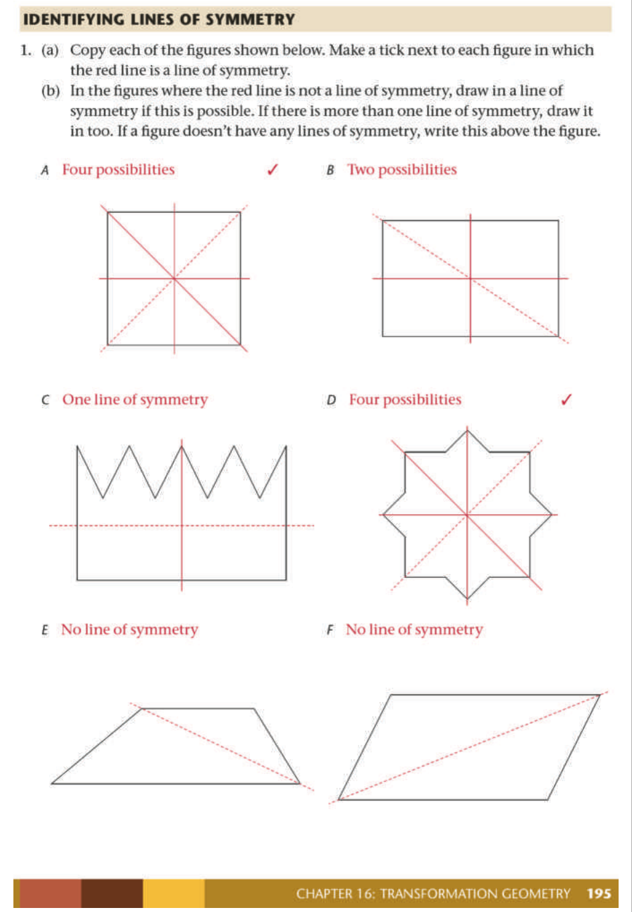
> **[Diagram Context - Textbook_Mathematics_Gr7_Transformation-geometry.pdf-0024-12.png]**
> This educational graphic is a geometry exercise sheet titled "Identifying Lines of Symmetry" featuring six 2D geometric figures labeled A through F. It displays various shapes—such as a square, rectangle, complex crown-like polygon, star polygon, trapezium, and parallelogram—overlaid with solid and dashed red lines representing potential lines of symmetry, alongside accompanying text prompts and tick marks. Conceptually, this diagram helps learners identify, test, and draw lines of symmetry in 2D shapes, reinforcing the foundational CAPS transformation geometry principles of reflection and symmetrical properties.

---

# 16.2 Original Figures and Their Images

Figures can be moved around in three different ways without changing their shape or size. The resulting figure in its new position is called the **image** of the original figure.

### Types of Transformations
*   **Translation:** Often referred to as "sliding".
*   **Reflection:** Often referred to as "flipping" (turning over).
*   **Rotation:** Often referred to as "turning" (swinging).

---

# 16.3 Translating Figures

### Investigating the Properties of Translation
A translation involves shifting a figure to a new position without changing the direction in which it is facing.

> **[Diagram Context - Textbook_Mathematics_Gr7_Surface-area-and-volume-of-3D-objects.pdf-0025-11.png]**
> This educational graphic is a conversion diagram and exercise page illustrating the relationships between units of volume and capacity. Visible labels include metric units such as millilitres ($\text{ml}$), litres ($\ell$), kilolitres ($\text{kl}$), cubic centimetres ($\text{cm}^3$), and cubic metres ($\text{m}^3$), alongside directional arrows marked with multiplication factors of $\times 1000$ and accompanying practice questions. Conceptually, it conveys how to convert between different metric units of volume and capacity, reinforcing the equivalence between liquid capacity and solid volume ($\text{ml} = \text{cm}^3$ and $\text{kl} = \text{m}^3$) for Grade 7 CAPS mathematics learners.

#### Properties of a Translation
1.  All points on the figure move in the **same direction**.
2.  All points on the figure move by the **same distance**.
3.  A figure and its image are **congruent figures** because they have the same shape and size.

#### Notation
The image of a figure is denoted by using the same letters as the original, but with a prime symbol ($'$) added after each letter.
*   *Example:* The image of $\triangle ABC$ is denoted as $\triangle A'B'C'$.
*   *Example:* The image of parallelogram $DEFG$ is parallelogram $D'E'F'G'$.

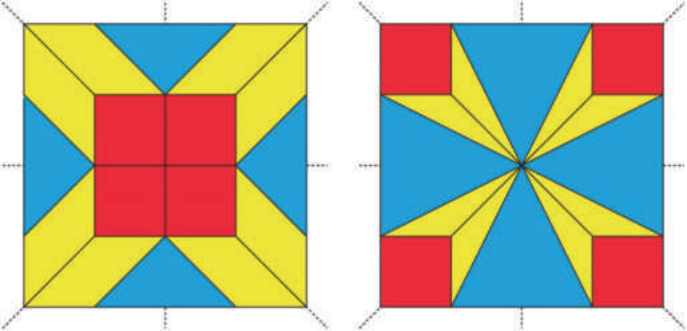
> **[Diagram Context - Textbook_Mathematics_Gr7_Transformation-geometry.pdf-0025-05.png]**
> This graphic illustrates two geometric tessellations composed of squares and triangles in red, yellow, and blue, framed within a larger square with dashed axes of symmetry. The diagrams visually represent spatial transformation concepts such as reflection, rotation, and symmetry. It helps students analyze 2D shapes, spatial reasoning, and pattern composition within the CAPS geometry curriculum.

### Worked Example: Understanding Movement
*   In the example of $\triangle JKL$ shown in the diagram, all points have moved six units to the right.
*   In the example of parallelogram $DEFG$, all points have moved three units to the right and five units down.

### Exercise
1.  Copy $\triangle ABC$ (from the provided curriculum resource).
2.  Translate each of the points $A$, $B$, and $C$ five units to the right and two units down.
3.  Join the translated points to form the image $\triangle A'B'C'$.

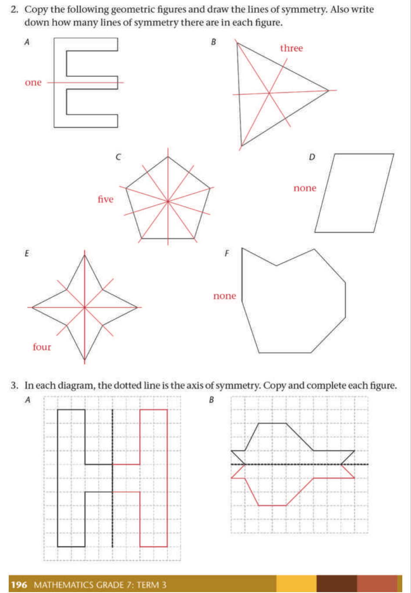
> **[Diagram Context - Textbook_Mathematics_Gr7_Transformation-geometry.pdf-0025-06.png]**
> This educational graphic is a geometry figure worksheet illustrating lines of symmetry across various 2D shapes and grid-based completion exercises. Visible labels include letters designating specific figures (A, B, C, D, E, F), numerical word labels indicating the count of symmetry lines ("one", "three", "five", "four", "none"), red lines showing axes of symmetry, dotted lines representing reflection axes, and grid backgrounds. Conceptually, this diagram helps learners identify, count, and draw lines of symmetry in regular and irregular polygons, reinforcing spatial reasoning and transformation geometry in alignment with the CAPS curriculum.

---

### Geometry: Translations

#### Key Concepts
A **translation** is a transformation that slides a figure horizontally, vertically, or both, without changing its size, shape, or orientation. When a figure is translated:
*   The side lengths of the original figure and its image remain the same.
*   The area of the original figure and its image remain the same.
*   The line segments joining corresponding points (vertices) are equal in length and parallel to each other.

---

#### Worked Example: Translating $\Delta PQR$
To translate a triangle $\Delta PQR$ four units to the right and two units up:
1.  Identify the coordinates of vertices $P$, $Q$, and $R$.
2.  Move each point $4$ units right ($+4$ on the x-axis) and $2$ units up ($+2$ on the y-axis).
3.  Label the new points $P'$, $Q'$, and $R'$.
4.  Join the new points to form the image $\Delta P'Q'R'$.

> **[Diagram Context - Textbook_Mathematics_Gr7_Surface-area-and-volume-of-3D-objects.pdf-0026-07.png]**
> This educational graphic features geometry figures, specifically a rectangular prism vase and a glass tank, accompanied by word problems involving volume and capacity calculations. Visible labels include dimensions (15 cm, 10 cm, 20 cm), volume measurements (2 ℓ, 2 000 cm³), and variable height ($h$ cm). Conceptually, the diagram helps high school learners understand the relationship between capacity and volume by demonstrating how liquid transferred between containers retains its volume while changing shape and liquid height.

---

#### An Important Note: Drawing 3D Objects
Translations can be used to create simple three-dimensional representations. Follow these steps:
1.  **Draw the front face:** Draw any 2D figure on your grid paper.
2.  **Translate:** Move the figure a specific number of units to the right and up (e.g., 4 units right and 2 units up).
3.  **Connect:** Join the corresponding vertices of the original figure to the vertices of the translated image.

---

#### Exercise Answers
The following answers correspond to the exercises provided in the curriculum:

| Question | Answer |
| :--- | :--- |
| 1 (b) | Yes |
| 1 (c) | Yes |
| 2 (a) | Refer to the drawing on LB page 198 |
| 2 (b) | Refer to the drawing on LB page 198 |
| 2 (c) | Yes |
| 2 (d) | Yes |

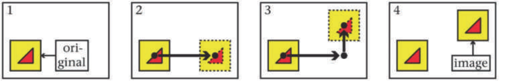
> **[Diagram Context - Textbook_Mathematics_Gr7_Transformation-geometry.pdf-0026-09.png]**
> This 4-panel geometry figure illustrates the sequential steps of a two-dimensional translation transformation applied to a shape on a Cartesian plane. Panels 1 to 4 show an initial red triangular object undergoing horizontal and vertical displacement vectors represented by black directional arrows, resulting in a final image within a yellow background box. Conceptually, this diagram demonstrates how mapping coordinates by adding fixed values to the x- and y-values shifts a polygon's position without altering its size, orientation, or shape.

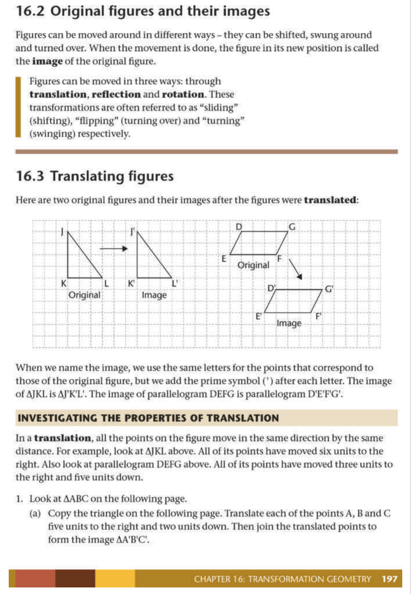
> **[Diagram Context - Textbook_Mathematics_Gr7_Transformation-geometry.pdf-0026-20.png]**
> This educational graphic presents a geometry figure showing two examples of translation on a Cartesian grid: triangle $JKL$ mapped to image $J'K'L'$ and parallelogram $DEFG$ mapped to image $D'E'F'G'$. Visible labels include vertex letters ($J, K, L, J', K', L', D, E, F, G, D', E', F', G'$), text labels identifying "Original" and "Image", directional arrows, and grid lines. Conceptually, the diagram demonstrates how shapes undergo sliding transformations in transformation geometry, illustrating that every point on the original figure moves the same distance and direction while preserving the shape and size, denoted by prime notation.

---

# Transformation Geometry: Translations

## Properties of Translation
When a figure is translated, the following properties hold true:

1.  **Equal Lengths:** The line segments connecting the vertices of the original figure to the corresponding vertices of the image are equal in length.
    *   $PP' = RR' = QQ'$
2.  **Parallelism:** The line segments connecting the vertices of the original figure to the corresponding vertices of the image are parallel to one another.
    *   $PP' \parallel RR' \parallel QQ'$
3.  **Congruence:** The shape and size of the figure do not change. The original figure and its image are congruent.

> **[Diagram Context - Textbook_Mathematics_Gr7_Surface-area-and-volume-of-3D-objects.pdf-0027-17.png]**
> This educational graphic is a mathematics worksheet focusing on surface area and volume of 3D objects, specifically targeting unit conversions and calculations for rectangular prisms, cubes, and containers with tables and word problems. Visible text labels include headings like "WORKSHEET" and "SURFACE AREA AND VOLUME OF 3D OBJECTS," along with numbered questions featuring dimensions labeled as length, breadth, height, surface area, volume, capacity, $cm^2$, $m^2$, $m^3$, $kl$, $cm^3$, $ml$, and $\ell$. Conceptually, it guides learners through applying mathematical formulas to calculate surface area and volume, performing metric unit conversions, and solving practical capacity problems involving 3D geometric shapes aligned with the CAPS curriculum.

## Describing a Translation
To describe a translation, you must specify the movement in two directions:
*   **Horizontal movement:** The number of units moved to the left or right.
*   **Vertical movement:** The number of units moved up or down.

## Practise Translating Figures

### Exercise 1
On grid paper, copy the figure provided. Translate the figure eight units to the left and two units down.

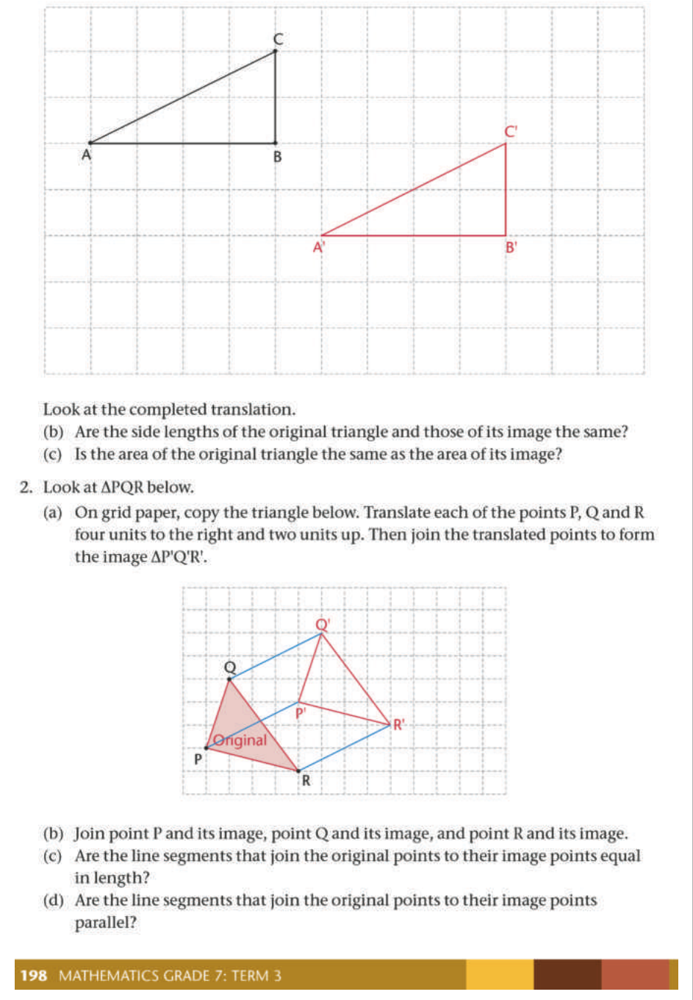
> **[Diagram Context - Textbook_Mathematics_Gr7_Transformation-geometry.pdf-0027-11.png]**
> This educational graphic is a geometry figure demonstrating geometric transformations, specifically translations on a Cartesian grid. The visible labels include vertices of triangles labeled $A, B, C$ and their translated images $A', B', C'$, as well as $P, Q, R$ and their images $P', Q', R'$, with instructional text questions accompanying each figure. Conceptually, the diagram conveys how sliding a shape across a grid by a specific vector preserves shape, size, and orientation while altering position.

### Exercise 2
On grid paper, copy the figure provided. Translate the figure six units to the right and one unit down.

<!-- DIAGRAM_PLACEHOLDER: diagram -->

## Teaching Guidelines
*   **Application:** Use the first two properties (same distance and same direction) to draw the image of a figure.
*   **Verification:** Use the third property (congruence) to check if your result is correct.
*   **Communication:** Always describe a translation by providing the horizontal movement first, followed by the vertical movement.

---

### 16.4 Reflecting Figures

#### Definition
A **reflection** occurs when a figure is flipped or turned over a **line of reflection** (also known as a mirror line). The resulting figure is called the **image**.

#### Properties of Reflection
When a figure is reflected, it follows these geometric rules:
*   **Opposite Sides:** The original figure and its image lie on opposite sides of the line of reflection.
*   **Equal Distance:** Any point on the original figure and its corresponding point on the image are at an equal distance from the line of reflection.
*   **Perpendicularity:** The line segment connecting an original point to its corresponding image point is always perpendicular ($90^\circ$) to the line of reflection.
*   **Congruence:** The original figure and its image are **congruent**, meaning they have the exact same shape and size.

#### Notation
The prime symbol ($'$) is used to label the vertices of the image. For example, if a vertex is labeled $P$, its corresponding point on the image is labeled $P'$.

#### Common Misconception
It is a common error to believe that the mirror line must be drawn on top of a side of the figure. In reality, the line of reflection can be drawn:
*   Across the figure.
*   Through any of the vertices (corners) of the figure.
*   Anywhere alongside the figure.

---

### Exercises

#### 3. Describe the translation in each of the following diagrams:

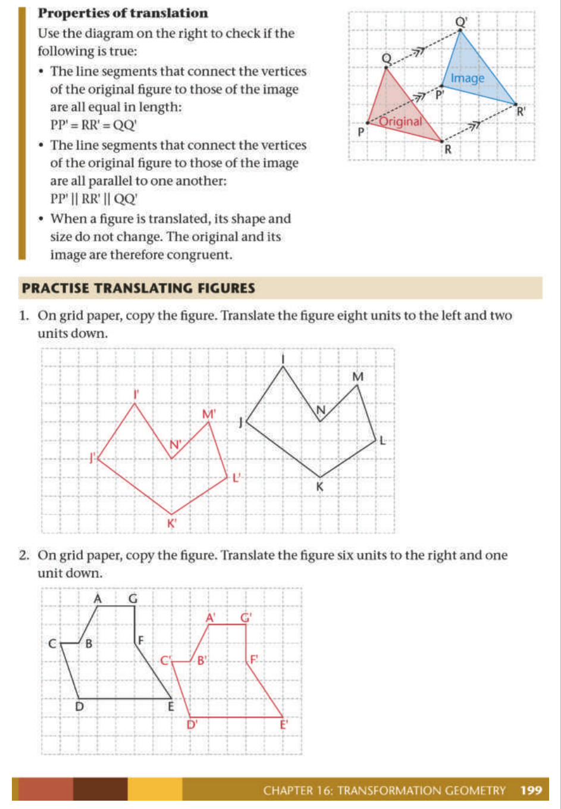
> **[Diagram Context - Textbook_Mathematics_Gr7_Transformation-geometry.pdf-0028-13.png]**
> This educational graphic is a geometry figure displaying Cartesian grid exercises on the properties of translation. It features polygonal shapes labeled with vertices (P, Q, R and P', Q', R' as well as I, J, K, L, M, N and A through G) and dashed directional arrows connecting corresponding points. Conceptually, it demonstrates that when a figure is translated, its shape and size remain congruent while its vertices shift along parallel, equal-length segments.

**(a)**
*   **Observation:** The triangle has moved horizontally.
*   **Answer:** Seven units to the right.

**(b)**
*   **Observation:** The triangle has moved vertically.
*   **Answer:** Five units down.

**(c)**
*   **Observation:** The quadrilateral has moved both horizontally and vertically.
*   **Answer:** Seven units to the right and three units up.

---

### Investigating the Properties of Reflection

<!-- DIAGRAM_PLACEHOLDER: diagram -->

*   **Visualizing the process:**
    1.  Start with the original figure.
    2.  Identify the mirror line.
    3.  Flip the figure over the line.
    4.  The resulting image appears on the opposite side.

---

### Transformation Geometry: Understanding Reflections

In transformation geometry, a reflection is a transformation where a figure is flipped over a line, called the **line of reflection**. For a reflection to be mathematically correct, it must satisfy two fundamental geometric properties:

1.  **Equal Distance:** Every point on the original figure must be the same perpendicular distance from the line of reflection as its corresponding point on the image.
2.  **Perpendicularity:** The line segment connecting any point to its corresponding image point must be perpendicular to the line of reflection.

---

#### Analysis of Incorrect Reflections

The following points explain common errors when performing or identifying reflections:

*   **Error in Distance (The Second Reflection):**
    A reflection is incorrect if the original point and its image point are not at equal distances from the line of reflection. In the provided example, points $A, B,$ and $C$ do not maintain the same distance from the line of reflection as their images $A', B',$ and $C'$.

*   **Error in Distance (The Fourth Reflection):**
    Similarly, if points $D, E,$ and $F$ are not equidistant from the line of reflection compared to their images $D', E',$ and $F'$, the transformation is not a valid reflection.

*   **Error in Perpendicularity (The Sixth Reflection):**
    A reflection is incorrect if the line segment connecting an original point to its image is not perpendicular to the line of reflection. In the example provided, the lines connecting $G$ to $G'$, $H$ to $H'$, and $K$ to $K'$ must intersect the line of reflection at a $90^\circ$ angle. If they do not, the transformation is invalid.

---

#### Visual Reference

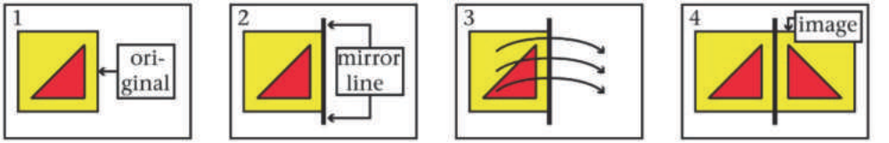
> **[Diagram Context - Textbook_Mathematics_Gr7_Transformation-geometry.pdf-0029-08.png]**
> This educational graphic consists of a four-step geometric diagram demonstrating reflection symmetry using a triangular shape. Visible labels and elements include numbered panels 1 to 4, an "original" red triangle on a yellow background, a vertical "mirror line" with double-headed arrows, curved directional arrows showing a flipping motion, and a final "image" triangle reflected across the mirror line. Conceptually, this diagram illustrates the step-by-step process of reflecting a 2D geometric figure across an axis of symmetry to form a congruent mirror image, reinforcing core concepts in Euclidean geometry and transformations.

*   **Top Row:** Demonstrates the requirement for equal horizontal distance from the vertical line of reflection.
*   **Middle Row:** Demonstrates the requirement for equal vertical distance from the horizontal line of reflection.
*   **Bottom Row:** Demonstrates the requirement for the connecting lines between points and their images to be perpendicular to the diagonal line of reflection.

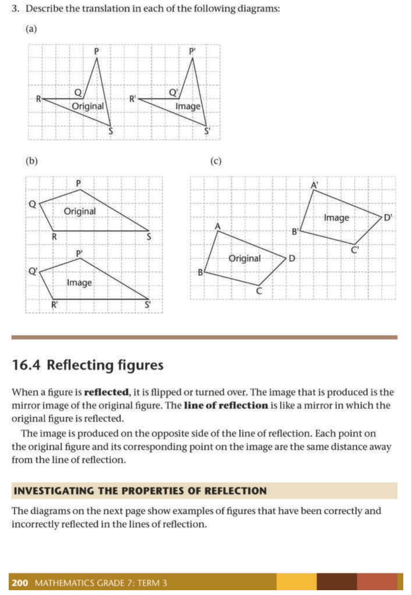
> **[Diagram Context - Textbook_Mathematics_Gr7_Transformation-geometry.pdf-0029-18.png]**
> This educational graphic is a geometry figure showing grid-based transformations alongside explanatory text for reflecting figures. It features labeled polygons designated as "Original" (with vertices P, Q, R, S and A, B, C, D) and their corresponding "Image" transformations (with primed vertices P', Q', R', S' and A', B', C', D'). Conceptually, the diagrams help CAPS Grade 7 learners visualize transformations on a Cartesian grid, demonstrating how shapes maintain their properties during spatial movements like translation and reflection.

---

# Mathematics: Properties of Reflection

## Core Concepts
A reflection is a transformation that flips a figure over a line, called the **line of reflection**. When a figure is reflected, it creates a mirror image.

### Key Properties of Reflection
When a figure is reflected across a line, the following properties always hold true:

1.  **Opposite Sides:** The image of the figure lies on the opposite side of the line of reflection from the original figure.
2.  **Equal Distance:** The perpendicular distance from any point on the original figure to the line of reflection is exactly the same as the distance from the corresponding point on the reflected image to the line of reflection.
    *   Example: If $GE$ is the distance from point $G$ to the line, then $G'E$ (the distance from the reflected point $G'$ to the line) must be equal to $GE$.
3.  **Congruence:** The reflected image is congruent to the original figure. This means the side lengths and the shape of the image remain identical to the original.
4.  **Perpendicularity:** The line segment connecting any point on the original figure to its corresponding point on the reflected image is perpendicular to the line of reflection.

---

## Worked Example: Analyzing Distances
To verify if a reflection is correct, we measure the distance of each point from the line of reflection.

| Original Point | Distance to Line | Correct Reflection Point | Distance to Line |
| :--- | :--- | :--- | :--- |
| A | 2 units | A' | 2 units |
| B | 5 units | B' | 5 units |
| C | 2 units | C' | 2 units |
| D | 5 units | D' | 5 units |
| E | 2 units | E' | 2 units |
| F | 5 units | F' | 5 units |
| G | 6 units | G' | 6 units |
| H | 6 units | H' | 6 units |
| K | 2 units | K' | 2 units |

---

## Learning Activities

### Activity 1: Verifying Reflections
1.  **Side Lengths and Shape:** For any correct reflection, the side lengths and the shape of the image are always the same as the original figure.
2.  **Connecting Points:** 
    *   When you draw a line connecting a point on the original figure to its corresponding point on a **correct** reflection, the line is always perpendicular to the line of reflection.
    *   When you draw a line connecting a point on the original figure to its corresponding point on an **incorrect** reflection, the line is generally not perpendicular to the line of reflection.

### Activity 2: Reflection Properties Checklist
Use the following criteria to determine if a transformation is a valid reflection:
*   **Is the image flipped?** Yes.
*   **Is the distance from the line equal for corresponding points?** Yes.
*   **Is the connecting line perpendicular to the line of reflection?** Yes.
*   **Are the size and shape preserved?** Yes.

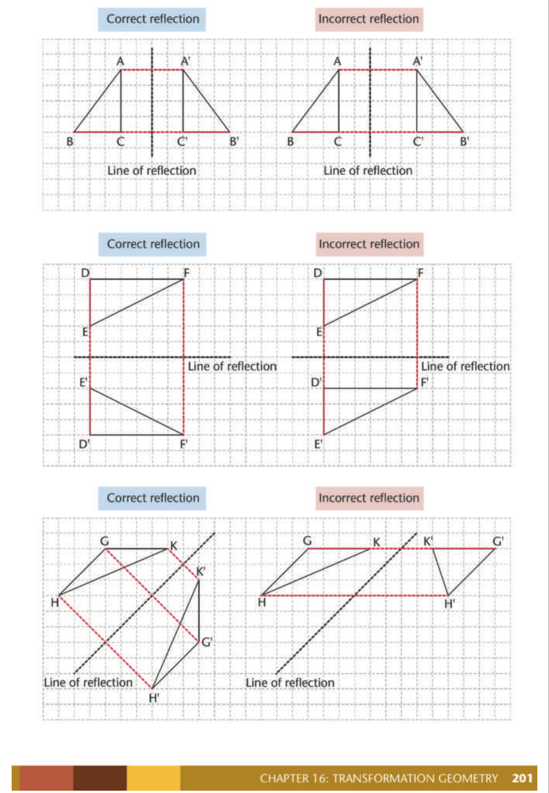
> **[Diagram Context - Textbook_Mathematics_Gr7_Transformation-geometry.pdf-0030-05.png]**
> This educational graphic consists of three sets of geometry figures on a Cartesian grid comparing correct and incorrect transformations of reflection. Each grid displays polygon vertices labeled with letters (such as A, B, C and their image counterparts A', B', C') alongside a dashed "Line of reflection" and dotted red lines showing point-to-point correspondence. For a high school learner studying transformation geometry, this diagram conceptually illustrates the strict rules of reflection—specifically that the image must be flipped correctly at an equal perpendicular distance from the line of reflection, helping students identify and avoid common errors in drawing isometric transformations.

---

# Transformation Geometry: Reflecting Figures

## Key Concepts
Reflection is a transformation where a figure is flipped over a line, called the **line of reflection**.

### Important Properties
*   **Perpendicularity:** The line segment connecting an original point to its corresponding image point is always perpendicular ($\perp$) to the line of reflection. For example, if $H$ is a point and $H'$ is its image, then $HH' \perp$ line of reflection.
*   **Equidistance:** A point and its image are always at the same perpendicular distance from the line of reflection.
*   **Congruence:** When a figure is reflected, its shape and size do not change. The original figure and its image are congruent.

---

## Teaching Guidelines: How to Reflect a Figure
To reflect a figure across a line of reflection, follow these steps:

1.  **Reflect Vertices:** Identify each vertex of the original figure and plot its corresponding image point on the opposite side of the line of reflection.
2.  **Check Distance:** Ensure that each point and its image are at equal distances from the line of reflection.
3.  **Ensure Perpendicularity:** Ensure the line connecting the point to its image is perpendicular ($\perp$) to the line of reflection.
4.  **Join Points:** Connect the reflected points in the same order as the original figure to form the image.
5.  **Verify:** Check that the resulting image is congruent to the original figure.

---

## Practise Reflecting Figures

**Task:** Copy the figures below and reflect them across the given line of reflection.

### Figure (a)

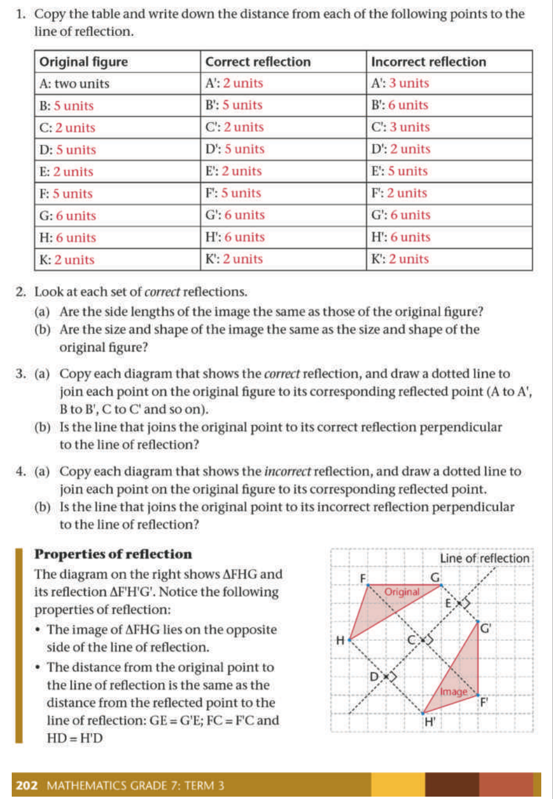
> **[Diagram Context - Textbook_Mathematics_Gr7_Transformation-geometry.pdf-0031-10.png]**
> This educational resource is a geometry exercise sheet featuring a table of distances, guided inquiry questions, and a coordinate grid diagram illustrating the transformation of reflection for triangles $\Delta FHG$ and $\Delta F'H'G'$. Visible labels include vertices $F, G, H$ for the original figure, $F', G', H'$ for the reflected image, corresponding points $C, D, E$, a diagonal "Line of reflection," and distance measurements in units. The content guides learners to discover key geometric properties of reflection, specifically that object points and their corresponding image points remain equidistant and perpendicular relative to the line of reflection while preserving shape and size.

### Figure (b)
<!-- DIAGRAM_PLACEHOLDER: diagram -->

---

## Answers
1. (a) Refer to the image on LB page 203 alongside.
2. (b) Refer to the image on LB page 203 alongside.

---

### Geometry: Reflection

#### Key Concepts for Reflection
When performing a reflection of a geometric figure, keep the following rules in mind:
*   **Position:** The line of reflection must always lie exactly between the original figure and its reflected image.
*   **Distance:** Every point on the original figure and its corresponding point on the image must be at an equal perpendicular distance from the line of reflection.
*   **Orientation:** The line that connects any point to its corresponding image point must be perpendicular ($90^\circ$) to the line of reflection.

---

#### Exercise: Identifying Lines of Reflection
Copy the provided figures and draw the line of reflection for each case.

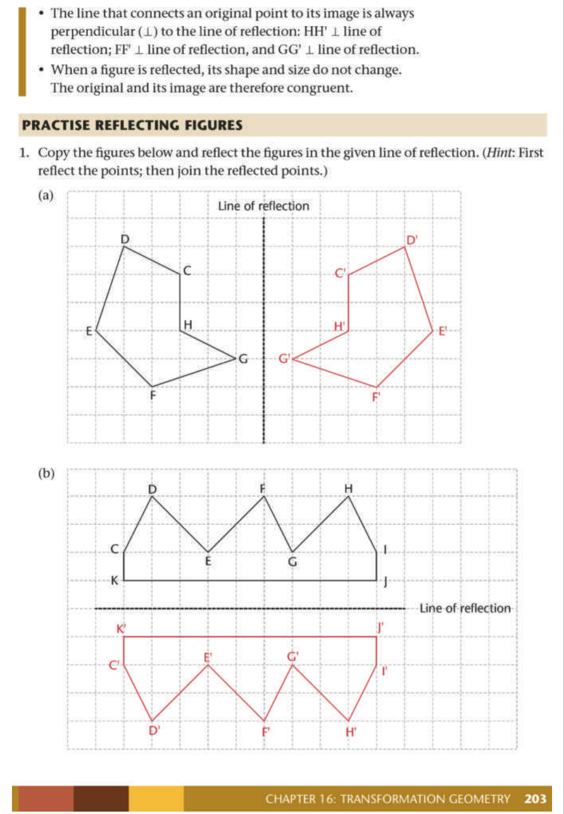
> **[Diagram Context - Textbook_Mathematics_Gr7_Transformation-geometry.pdf-0032-10.png]**
> This educational graphic is a geometry figure from a South African CAPS curriculum textbook illustrating reflection transformation. It displays a grid with two practice problems labeled (a) and (b), featuring original black polygons with vertex labels D, C, H, G, F, E, K, I and corresponding red reflected images labeled with prime notation (e.g., D', C', H') across a dashed "Line of reflection". Conceptually, the diagram demonstrates that when a figure is reflected, the connecting line between an original point and its image is perpendicular to the line of reflection, and the shape and size remain congruent.

**Instructions for completion:**
1.  Identify the original figure and its corresponding image.
2.  Locate the midpoint between corresponding vertices (e.g., the distance between point $A$ and point $A'$).
3.  Draw a line that passes through these midpoints such that the line acts as a mirror for the figure.

**Summary of Tasks:**
*   **(a)** Identify the horizontal line of reflection between the original polygon and its image.
*   **(b)** Identify the diagonal line of reflection between the original triangle and its image.
*   **(c)** Identify the vertical line of reflection between the original triangle and its image.

---

#### Worked Example Analysis
In the provided diagram (c) at the top right, observe the relationship between the original shape $KLMN$ and its reflected image $K'L'M'N'$:
*   The line of reflection acts as the axis of symmetry.
*   If you were to fold the paper along the "Line of reflection," the original figure would map perfectly onto the image.
*   The distance from point $K$ to the line is equal to the distance from point $K'$ to the line.

---

# 16.5 Rotating Figures

## Investigating the Properties of Rotation

### Definition
A **rotation** occurs when a figure is turned in a clockwise or anticlockwise direction around a fixed point. This fixed point is called the **centre of rotation**.

*   **Clockwise:** Turning in the direction of the hands of a clock.
*   **Anticlockwise:** Turning in the opposite direction of the hands of a clock.
*   **Centre of rotation:** The point "around" which the figure is turned. This point can be inside the figure, on an edge, at a vertex, or outside the figure.

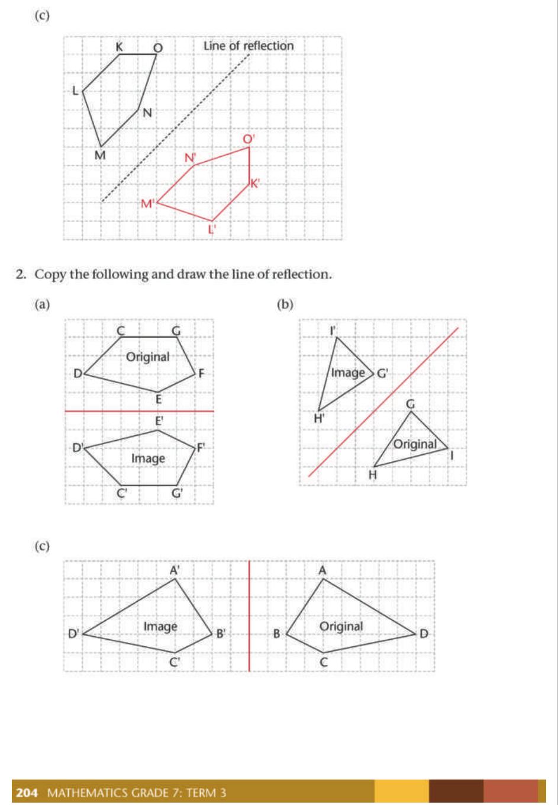
> **[Diagram Context - Textbook_Mathematics_Gr7_Transformation-geometry.pdf-0033-10.png]**
> The educational graphic illustrates a geometry figure featuring a coordinate grid demonstrating the mathematical transformation of reflection. Visible labels include polygon vertices labeled with letters (e.g., K, L, M, N, O and their reflected primes K', L', M', N', O'), the terms "Original" and "Image", and a red "Line of reflection". Conceptually, this diagram helps high school students visualize and understand Euclidean transformations by showing how a 2D shape flips across a specific axis to create a congruent mirror image at an equal perpendicular distance.

### Properties of Rotation
1.  **Distance:** An original point and its corresponding image point lie at equal distances from the centre of rotation.
2.  **Angle of Rotation:** The angle formed by the connecting lines between any original point, the centre of rotation, and the image point is called the angle of rotation.
3.  **Congruence:** A figure and its rotated image are **congruent figures**, meaning they maintain the exact same shape and size.

### Notation
*   The prime symbol ($'$) is used to label the image of a figure (e.g., if the original point is $A$, the image is $A'$).

<!-- DIAGRAM_PLACEHOLDER: diagram -->

### Common Misconceptions
*   **Misconception:** "The point of rotation must be part of the figure."
*   **Correction:** This is **not true**. The centre of rotation can be positioned anywhere: inside the figure, on an edge, at a vertex, or completely outside the figure.

<!-- DIAGRAM_PLACEHOLDER: diagram -->

### Teaching Guidelines
*   Explore different methods of performing a rotation.
*   Ensure learners understand the use of the prime symbol ($'$) to distinguish between the original figure and the image.

---

# Investigating the Properties of Rotation

## Concept: Rotation
A rotation is a transformation that turns a figure about a fixed point called the **centre of rotation**. In this investigation, we examine the relationship between the original points, the centre of rotation, and the image points after a $90^{\circ}$ anti-clockwise rotation.

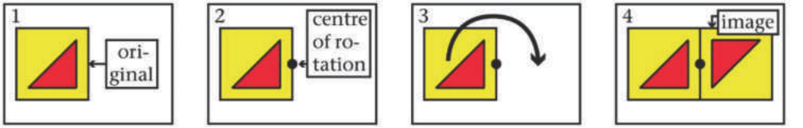
> **[Diagram Context - Textbook_Mathematics_Gr7_Transformation-geometry.pdf-0034-04.png]**
> This instructional graphic illustrates a geometric transformation figure demonstrating a rotation of a 2D shape. The four sequenced panels contain visible labels including "original", "centre of rotation", and "image", alongside directional rotation arrows and a red triangular shape on a yellow background. Conceptually, this visual helps learners understand the step-by-step process of rotating a figure around a fixed point to produce a congruent image in Euclidean geometry.

---

## Investigation Exercises

### 1. Rotation of Point S
In the diagram, $\triangle PRS$ is rotated $90^{\circ}$ anti-clockwise about point $A$.
*   **(a)** Measure the distance from $A$ to $S$.
*   **(b)** Measure the distance from $A$ to $S'$.
*   **(c)** Compare the distances in (a) and (b).
*   **(d)** Measure the size of $\angle SAS'$. What do you notice?

### 2. Rotation of Point P
*   **(a)** Measure the distance from $A$ to $P$.
*   **(b)** Measure the distance from $A$ to $P'$.
*   **(c)** Compare the distances in (a) and (b).
*   **(d)** Measure the size of $\angle PAP'$. What do you notice?

---

## Answers and Worked Solutions

### Note on Question 1
To find the image, rotate the point $90^{\circ}$ anti-clockwise from $AS$ to $AS'$.

### Note on Question 2
To find the image, rotate the point $90^{\circ}$ anti-clockwise from $AP$ to $AP'$.

### Summary of Results

| Question | (a) Distance | (b) Distance | (c) Comparison | (d) Angle Size |
| :--- | :--- | :--- | :--- | :--- |
| **1** | $20\text{ mm}$ | $20\text{ mm}$ | They are the same | $90^{\circ}$ |
| **2** | $45\text{ mm}$ | $45\text{ mm}$ | They are the same | $90^{\circ}$ |

### Key Findings
From this investigation, we observe two fundamental properties of rotation:
1. The distance from the centre of rotation to any point on the original figure is equal to the distance from the centre of rotation to the corresponding point on the image (e.g., $AS = AS'$).
2. The angle formed by joining a point, the centre of rotation, and its image is equal to the angle of rotation (e.g., $\angle SAS' = 90^{\circ}$).

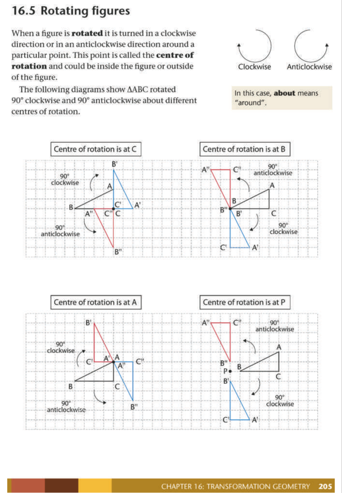
> **[Diagram Context - Textbook_Mathematics_Gr7_Transformation-geometry.pdf-0034-14.png]**
> This educational graphic is a geometry figure demonstrating transformation geometry concepts related to rotating shapes on a grid. It displays triangle $ABC$ and its rotated images ($A'B'C'$ and $A''B''C''$) with directional arrows, axis/grid lines, and labels indicating centres of rotation (at points A, B, C, and P), as well as $90^\circ$ clockwise and anticlockwise turns. Conceptually, the diagram helps high school learners understand how changing the centre of rotation alters the final position of a transformed figure while maintaining its shape and size.

---

### Transformation Geometry: Properties of Rotation

#### Understanding Rotation
Rotation is a transformation where a figure is turned around a fixed point called the **centre of rotation**. When a figure is rotated, its shape and size remain unchanged.

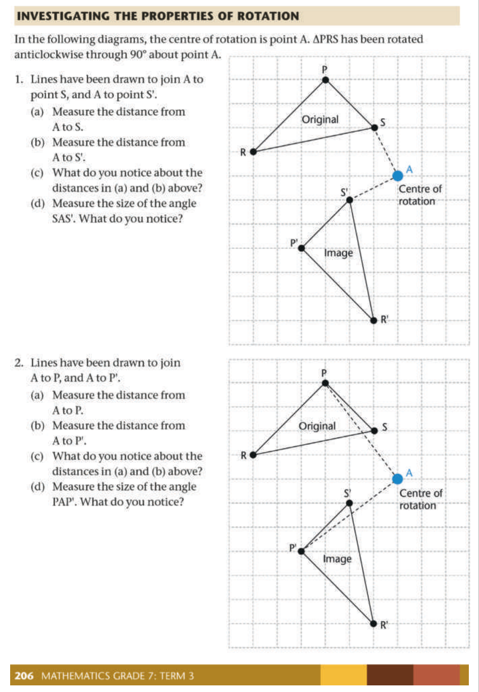
> **[Diagram Context - Textbook_Mathematics_Gr7_Transformation-geometry.pdf-0035-13.png]**
> This educational graphic is a geometry figure demonstrating a two-dimensional rotation transformation on a Cartesian grid. Visible labels include vertices P, R, S and their rotated counterparts P', R', S', the centre of rotation point A, dashed construction lines connecting vertices to point A, and the text labels "Original", "Image", and "Centre of rotation". Conceptually, the diagram guides high school learners through investigating the properties of rotation by prompting them to measure distances and angles, helping them discover that points on an object maintain a constant distance from the centre of rotation and rotate through the same angle.

#### Properties of Rotation
When performing a rotation, the following geometric properties always hold true:

1.  **Distance from the Centre:** The distance from the centre of rotation to any point on the original figure is equal to the distance from the centre of rotation to the corresponding point on the image.
    *   *Example:* If $P$ is the centre of rotation, then $PA = PA'$, $PB = PB'$, and $PC = PC'$.
2.  **Angle of Rotation:** The angle formed by connecting lines between any point on the original figure, the centre of rotation, and the corresponding point on the image is equal to the angle of rotation.
    *   *Example:* If an image is rotated through $90^\circ$, the angle formed at the centre of rotation will be $90^\circ$. If rotated through $45^\circ$, the angle will be $45^\circ$.
3.  **Congruence:** Because the side lengths and angles are preserved, the original figure and the rotated image are **congruent**.

---

#### Worked Example: Analyzing a $90^\circ$ Rotation

**Task:** Rotate a triangle through $90^\circ$ anti-clockwise from $AR$ to $AR'$.

<!-- DIAGRAM_PLACEHOLDER: diagram -->

**Analysis and Observations:**
*   **Distance Measurement:** When measuring the distance from the centre of rotation ($A$) to a point on the original figure ($R$), and comparing it to the distance from the centre ($A$) to the corresponding point on the image ($R'$), you will notice that the distances are the same (e.g., $50\text{ mm} = 50\text{ mm}$).
*   **Angle Measurement:** When measuring the angle $\angle RAR'$, you will notice that the angle is exactly $90^\circ$, which corresponds to the degree of rotation applied.
*   **Conclusion:** The original triangle and the rotated triangle are congruent because all corresponding sides and angles remain equal.

---

#### Teaching Guidelines
When instructing learners on rotation, ensure they focus on these three key takeaways:
*   The distance from the centre of rotation to any point is invariant (remains the same).
*   The angle of rotation is defined by the lines connecting the original point, the centre, and the image point.
*   Rotation is an isometry (a transformation that preserves size and shape), resulting in congruent figures.

---

# Practise Rotating Figures

## Teaching Guidelines: How to Rotate a Figure
To rotate a figure $90^{\circ}$ clockwise about a centre of rotation, follow these steps:

1.  **Rotate each vertex:** Rotate each point (vertex) of the figure $90^{\circ}$ clockwise about the centre of rotation.
2.  **Check distance:** Ensure that each original point and its corresponding image point are at equal distances from the centre of rotation.
3.  **Check the angle:** Ensure that the angle formed by the original point, the centre of rotation, and the image point is exactly $90^{\circ}$.
4.  **Connect:** Join the reflected points to form the new figure.
5.  **Verify congruence:** Check that the original figure and its image are congruent (identical in shape and size).

---

## Worked Examples and Exercises

### 1. Rotating Triangle $\Delta ABC$
Rotate triangle $\Delta ABC$ $90^{\circ}$ clockwise about point $P$.

*   **Key Principle:** The image point must be the same distance from $P$ as the original point.
*   **Key Principle:** The angle formed between the line connecting an original point to $P$ and the line connecting its image point to $P$ must be $90^{\circ}$.
*   **Action:** Join the image points to create $\Delta A'B'C'$.

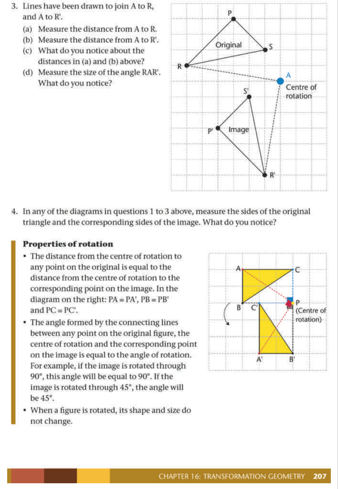
> **[Diagram Context - Textbook_Mathematics_Gr7_Transformation-geometry.pdf-0036-10.png]**
> This educational graphic is a geometry figure illustrating transformation geometry on a Cartesian grid. It features triangles labeled as "Original" ($R, P, S$) and "Image" ($R', P', S'$) with visible labels for the "Centre of rotation" ($A$), dashed construction lines, and text questions. Conceptually, the diagram conveys the core properties of rotation by demonstrating how distances from the centre of rotation to corresponding points remain equal and how the angle of rotation relates corresponding vertices.

### 2. Rotating Quadrilateral $KLMN$
On grid paper, rotate quadrilateral $KLMN$ $180^{\circ}$ about point $T$.

<!-- DIAGRAM_PLACEHOLDER: diagram -->

### 3. Rotating Triangle $\Delta XYZ$
On grid paper, rotate triangle $\Delta XYZ$ $90^{\circ}$ anticlockwise about point $F$.

<!-- DIAGRAM_PLACEHOLDER: diagram -->

---

## Answers
*Note: For exercises 1, 2, and 3, refer to the visual representations provided in the Learner's Book (LB) page 208.*

---

# 16.6 Enlarging and Reducing Figures

## Definitions
*   **Resizing:** The process of making a figure bigger (enlargement) or smaller (reduction) in a specific way.
*   **Enlargement:** An image of a figure made bigger by multiplying the lengths of all its sides by a number greater than 1.
*   **Reduction:** An image of a figure made smaller by multiplying the lengths of all its sides by a number smaller than 1 (but larger than 0).
*   **Scale Factor:** The number by which the sides of a figure are multiplied to create an enlargement or reduction.
*   **Centre of Enlargement/Reduction:** The common point where straight lines joining corresponding points of the original figure and its image intersect.

---

## Key Principle
When the lengths of **all** the sides of a figure are multiplied by the **same number** (the scale factor), the resulting figure is an enlargement or reduction of the first figure. If the sides are not all increased by the same scale factor, the resulting figure is not a true enlargement.

---

## Investigation: Properties of Enlargements and Reductions

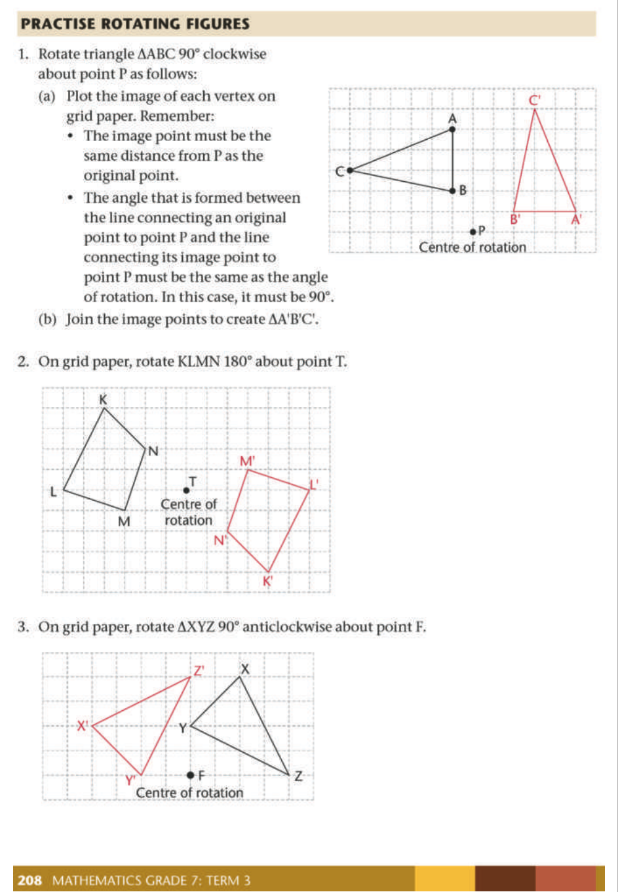
> **[Diagram Context - Textbook_Mathematics_Gr7_Transformation-geometry.pdf-0037-12.png]**
> This educational graphic is a geometry figure displaying worked examples of coordinate transformations, specifically rotations on grid paper. Visible labels include original geometric shapes labeled $\triangle ABC$, quadrilateral $KLMN$, and $\triangle XYZ$, along with their corresponding rotated image points marked with primes ($A'B'C'$, $K'L'M'N'$, $X'Y'Z'$) and designated centres of rotation $P$, $T$, and $F$. Conceptually, the diagram visually demonstrates how to perform manual rotations by maintaining equal distances from the centre of rotation and applying specified angular turns (such as $90^\circ$ clockwise or $180^\circ$) to each vertex.

### Questions
Look at the rectangles provided in the diagram and answer the following:

**(a) Rectangle EFGH:**
*   How many times is $FG$ longer than $BC$?
*   How many times is $EF$ longer than $AB$?

**(b) Rectangle JKLM:**
*   How many times is $KL$ longer than $BC$?
*   How many times is $JK$ longer than $AB$?

---

## Answers and Worked Examples

### Analysis of Rectangle EFGH
*   $FG$ is the same length as $BC$.
*   $EF$ is the same length as $AB$.
*   **Conclusion:** Rectangle EFGH is not an enlargement of rectangle ABCD because the sides have not been increased by a scale factor.

### Analysis of Rectangle JKLM
*   $KL$ is $2 \times BC$.
*   $JK$ is $2 \times AB$.
*   **Conclusion:** Rectangle JKLM is an enlargement of rectangle ABCD. The scale factor is $2$. We say rectangle ABCD has been enlarged by a scale factor of $2$ to produce rectangle JKLM.

---

### The Scale Factor

The size of the scale factor determines whether an image is an enlargement or a reduction of the original figure.

*   **Scale factor = 1:** The image is the same size as the original.
*   **Scale factor > 1:** The image is larger than the figure (enlargement).
*   **Scale factor < 1 (but > 0):** The image is smaller than the figure (reduction).

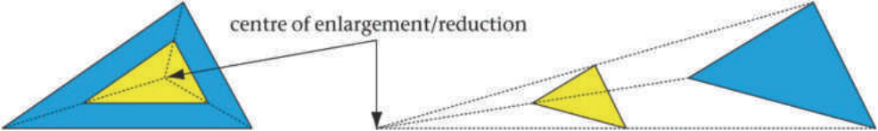
> **[Diagram Context - Textbook_Mathematics_Gr7_Transformation-geometry.pdf-0038-07.png]**
> This geometry figure illustrates two examples of triangle transformations involving scale factors, featuring yellow (original/smaller) and blue (enlarged) triangles connected by dashed projection lines. Visible labels include a pointer indicating the "centre of enlargement/reduction." Conceptually, this diagram helps high school learners understand how geometric figures scale relative to a specific center point in coordinate geometry and Euclidean transformations.

#### Examples of Scale Factors
*   If the scale factor is $2$, each side of the image is double the length of its corresponding side in the original figure.
*   If the scale factor is $\frac{1}{2}$ (or $0,5$), each side of the image is half the length of its corresponding side in the original figure.

---

### Similar Figures

Two or more figures are **similar** if:
1.  Their corresponding angles are equal.
2.  Their corresponding sides are longer or shorter by the same scale factor (the sides are in **proportion**).

When figures are enlarged or reduced, the resulting image is similar to the original figure.

---

### Worked Exercise: Analyzing Triangles

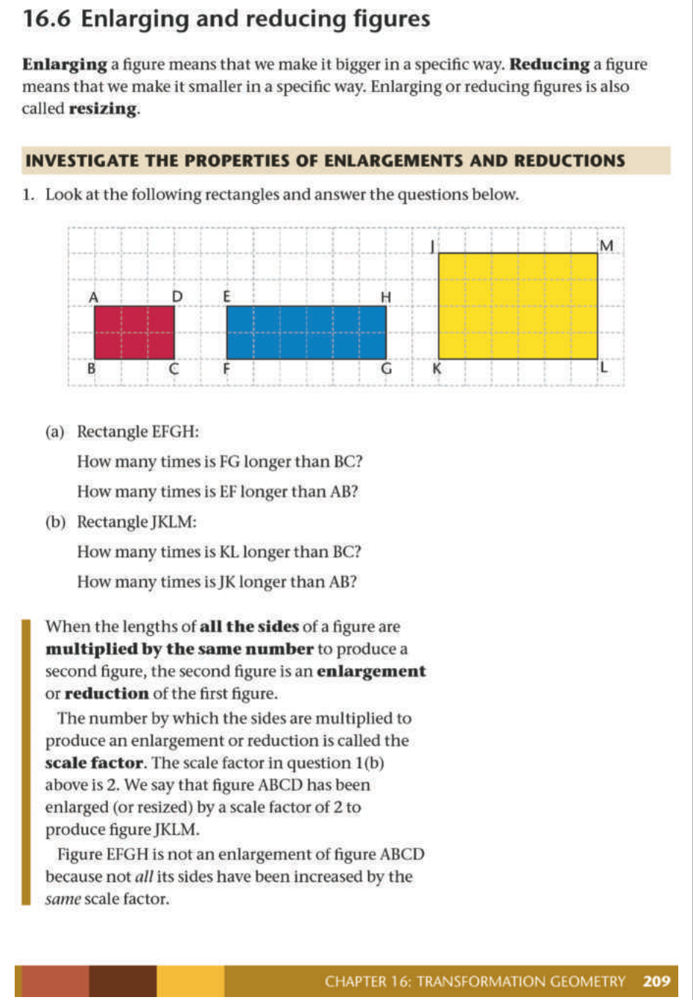
> **[Diagram Context - Textbook_Mathematics_Gr7_Transformation-geometry.pdf-0038-18.png]**
> This educational graphic is a geometry figure from a South African CAPS curriculum textbook focusing on transformation geometry. It displays three rectangular shapes plotted on a grid, labeled with vertices A, B, C, D (red), E, F, G, H (blue), and J, K, L, M (yellow), alongside guided investigative questions. Conceptually, the diagram illustrates the proportional relationship of resizing, showing students how multiplying all side lengths by a consistent scale factor produces a true geometric enlargement, whereas inconsistent scaling does not.

**Question 2:** Look at the triangles $\triangle ABC$, $\triangle EFG$, and $\triangle IJK$ provided in the grid and answer the following:

**(a) How many times is:**
*   $FG$ longer than $BC$?
*   $EF$ longer than $AB$?
*   $EG$ longer than $AC$?
*   $JK$ shorter than $BC$?
*   $IJ$ shorter than $AB$?
*   $IK$ shorter than $AC$?

**(b) Is $\triangle EFG$ an enlargement of $\triangle ABC$?** Explain your answer.

**(c) Is $\triangle IJK$ a reduction of $\triangle ABC$?** Explain your answer.

---

### Answers and Explanations

| Question | Answer | Explanation |
| :--- | :--- | :--- |
| **2(a)** | $2$ | Each corresponding side of $\triangle EFG$ is $2$ times the length of $\triangle ABC$. |
| **2(a)** | $0,5$ (or $\frac{1}{2}$) | Each corresponding side of $\triangle IJK$ is $0,5$ times the length of $\triangle ABC$. |
| **2(b)** | Yes | The lengths of all corresponding sides have been multiplied by $2$. |
| **2(c)** | Yes | The lengths of all corresponding sides have been multiplied by $0,5$. |

---

# Practise Resizing Figures

## Teaching Guidelines
To resize a figure, you apply a **scale factor** to the side lengths of the original shape.

*   **Enlargement:** If the scale factor is greater than $1$, the resulting image will be larger than the original.
    *   *Example:* A scale factor of $2$ means the sides of the new figure are $2$ times as long as the original.
*   **Reduction:** If the scale factor is between $0$ and $1$, the resulting image will be smaller than the original.
    *   *Example:* A scale factor of $0,5$ (or $\frac{1}{2}$) means the sides of the new figure are half as long as the original.

---

## Exercises

### 1. Determine the effect of the scale factor
State whether the following scale factors will produce a larger or smaller image:

| Scale Factor | Result |
| :--- | :--- |
| (a) $5$ | Larger |
| (b) $0,25$ | Smaller |
| (c) $1,2$ | Larger |
| (d) $\frac{3}{8}$ | Smaller |

### 2. Enlargement on grid paper
Enlarge the triangle below using a scale factor of $2$.

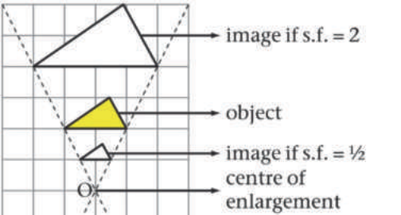
> **[Diagram Context - Textbook_Mathematics_Gr7_Transformation-geometry.pdf-0039-04.png]**
> This geometry figure illustrates enlargements and reductions of a 2D triangle on a grid. Visible labels and annotations include "object," "image if s.f. = 2," "image if s.f. = 1/2," and "centre of enlargement" marked by point O, with dashed projection lines radiating from O. For a high school student, this diagram demonstrates how the scale factor (s.f.) affects the size and position of a shape relative to a fixed center of enlargement, reinforcing concepts of similarity in transformations.

### 3. Reduction on grid paper
Resize the following figure using a scale factor of $0,5$.

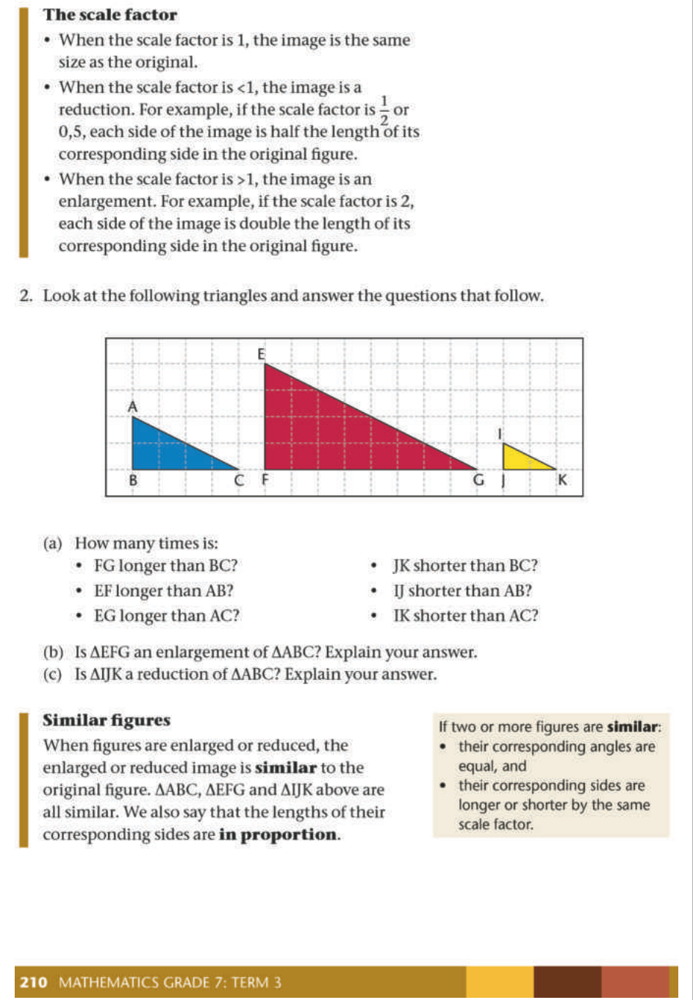
> **[Diagram Context - Textbook_Mathematics_Gr7_Transformation-geometry.pdf-0039-11.png]**
> This educational graphic presents a geometry figure showing three triangles labeled $\triangle ABC$ (blue), $\triangle EFG$ (red), and $\triangle IJK$ (yellow) set against a grid background, accompanied by text explaining scale factors and similar figures. Visible labels include vertices $A, B, C, E, F, G, I, J, K$ and text prompts for questions (a), (b), and (c) regarding side length comparisons and enlargements or reductions. Conceptually, it helps high school learners understand the definitions of scale factor, similarity, and proportion by demonstrating how multiplying or dividing the side lengths of an original figure by a constant factor creates enlarged or reduced similar figures with equal corresponding angles.

### 4. Reduction on grid paper
Resize the figure below using a scale factor of $\frac{1}{3}$.

<!-- DIAGRAM_PLACEHOLDER: diagram -->

---

### Geometry: Enlargements and Reductions

#### Concept: Scale Factors
A scale factor is a number that multiplies the dimensions of an object to create a similar image.
*   If the scale factor is $> 1$, the image is an **enlargement**.
*   If the scale factor is $< 1$, the image is a **reduction**.

---

#### Worked Examples and Exercises

**Question 5: Identifying Similarity and Scale**
(a) Which image below is similar to the original?
(b) State the scale factor by which it has been resized.

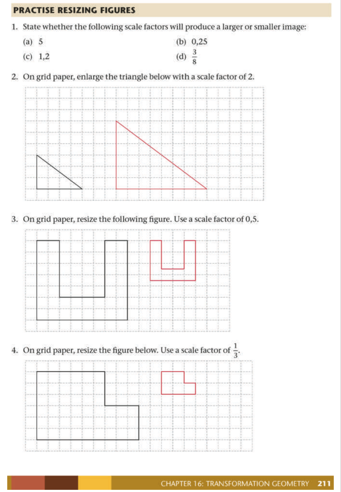
> **[Diagram Context - Textbook_Mathematics_Gr7_Transformation-geometry.pdf-0040-12.png]**
> The graphic is a geometry exercise sheet featuring practice problems on resizing figures using scale factors on grid paper. It includes numbered questions with fractional and decimal scale factor values, such as 5, 0,25, 1,2, and 3/8, alongside coordinate grid diagrams illustrating original black figures and their resized red images. This resource helps learners conceptualize enlargement and reduction transformations by demonstrating how multiplying side lengths by a scale factor changes the overall dimensions of a geometric shape proportionally.

**Answers:**
*   (a) Image 2 is similar to the original.
*   (b) The scale factor is $0,5$.

**Question 6: Calculating Scale Factors**
What scale factors were used to produce Image 1 and Image 2 from the original?

<!-- DIAGRAM_PLACEHOLDER: diagram -->

**Answers:**
*   Image 1: Scale factor $1,5$
*   Image 2: Scale factor $2$

---

#### Note: Geometric Construction of Enlargements
To enlarge a shape from a point (the centre of enlargement, $O$), follow these steps:

1.  **Step 1:** Mark the centre of enlargement $O$ and draw lines from $O$ through each vertex ($A, B, C$) of the original shape.
2.  **Step 2:** Use a compass or ruler to measure the distance from $O$ to a vertex (e.g., $OA$).
3.  **Step 3:** Multiply that distance by the desired scale factor to find the new position of the vertex (e.g., $OA' = OA \times \text{scale factor}$).
4.  **Step 4:** Mark the new vertices ($A', B', C'$) and join them to form the enlarged image.

<!-- DIAGRAM_PLACEHOLDER: diagram -->