# Chapter 25: Interpret, analyse and report on data

## 25.1 Interpreting and reporting on data

### Critically reading and reporting on data

**Exercise 1**

In 2009, a survey was conducted involving a sample of schools across South Africa. The data provided is as follows:

*   **Total schools in population:** $26\,000$
*   **Total schools in sample:** $2\,500$
*   **Provincial breakdown:**
    *   Eastern Cape: $415$
    *   Free State: $238$
    *   Gauteng: $265$
    *   KwaZulu-Natal: $386$
    *   Limpopo: $326$
    *   Mpumalanga: $248$
    *   Northern Cape: $129$
    *   North West: $275$
    *   Western Cape: $218$

#### Questions

(a) What was the population of the survey?
(b) What was the sample of the survey?
(c) Which province were most of the schools from?
(d) Which province were the fewest schools from?
(e) Copy and complete the table below, listing provinces in order from the most schools to the fewest schools.
(f) Complete the last column by calculating the percentage of the total sample ($2\,500$) that each province represents. Round off to one decimal place.
(g) Write a three to five-line summary report of the data, including the highest and lowest data items to indicate the range.

#### Data Table Template

| Province | Number of schools | Percentage of all schools |
| :--- | :--- | :--- |
| | | |
| | | |
| | | |
| | | |
| | | |
| | | |
| | | |
| | | |
| | | |

---

## 2. Data Visualization

<!-- DIAGRAM_PLACEHOLDER: diagram -->

*Note: The graph above illustrates the percentage of male and female learners at schools in Grades 3 to 8 in 2009.*

---

### Data Interpretation: Percentage of Male and Female Learners

> **[Diagram Context - Textbook_Mathematics_Gr7_Interpret-analyse-and-report-on-data.pdf-0001-15.png]**
> This educational graphic displays a horizontal bar chart divided into three distinct coloured rectangular blocks (dark brown, reddish-brown, and mustard-yellow) with a thin diagonal line extending from the top-right corner. The image lacks text, labels, symbols, or numerical axes. Conceptually, it provides a visual framework for learners to categorise data, represent proportional segments, or compare sequential categories in CAPS-aligned subjects like Life Sciences or Geography.

#### Analysis of the Bar Graph
The bar graph displays the percentage distribution of male and female learners across Grades 3 to 8, based on the *Census @ School Results 2009*.

**Data Table for Reference:**

| Grade | Male (%) | Female (%) |
| :--- | :--- | :--- |
| 3 | 51,6 | 48,4 |
| 4 | 52,1 | 47,9 |
| 5 | 51,0 | 49,0 |
| 6 | 50,3 | 49,7 |
| 7 | 50,6 | 49,4 |
| 8 | 48,9 | 51,1 |

---

#### Exercises

**(a)** Which grade has the highest percentage of females?
**(b)** Which grade has the lowest percentage of females?
**(c)** Which grade has the highest percentage of males?
**(d)** Which grade has the lowest percentage of males?

**(e) Calculation Example:**
If $150\,000$ Grade 6 learners took part in the survey, calculate the number of boys and girls:
*   **Males:** $50,3\% \text{ of } 150\,000 = \frac{50,3}{100} \times 150\,000 = 75\,450$
*   **Females:** $49,7\% \text{ of } 150\,000 = \frac{49,7}{100} \times 150\,000 = 74\,550$

**(f) Summary Report Completion:**
The graph shows that the number of male learners seems to (decrease/increase) the higher the grade. For example, in Grade 3, ____% learners were male compared to ____% in Grade 8. The number of female learners seems to (decrease/increase) the higher the grade. For example, in Grade 3, ____% learners were female compared to ____% in Grade 8.

**(g)** Based on the graph, would you expect there to be more or fewer males in Grade 10? Explain your answer.
**(h)** Based on the graph, would you expect there to be more or fewer females in Grade 10? Explain your answer.

---

### Data Interpretation: Land Area of Provinces (2011)

*Note: This section refers to a pie chart (not provided on this page).*

**(a)** Which province has the largest land area?
**(b)** Which province has the smallest land area?
**(c)** Which three provinces have more or less the same land area?
**(d)** How much bigger is the Northern Cape than Gauteng? (Use a calculator.)
**(e)** Are we able to tell from the pie chart which province has the largest population? Explain your answer.
**(f)** If the total land area of South Africa is $1\,200\,000 \text{ km}^2$, how many square kilometres are the largest and the smallest provinces?

---

### (g) Data Interpretation Exercise
Write a short paragraph to summarise the data shown in the pie chart below.

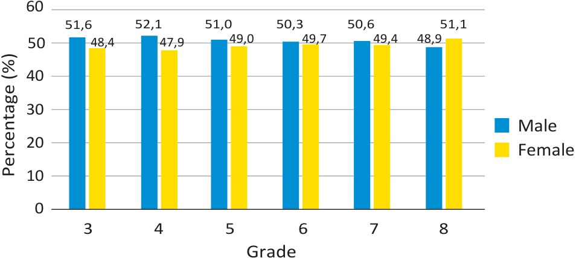
> **[Diagram Context - Textbook_Mathematics_Gr7_Interpret-analyse-and-report-on-data.pdf-0002-01.png]**
> The graphic is a double bar graph representing categorical data analysis. The axes are labeled "Grade" (3 to 8) and "Percentage (%)" (0 to 60), with grouped blue and yellow bars corresponding to "Male" and "Female" data values displayed above each bar. Conceptually, this graph helps learners interpret comparative statistical data across different school grades to analyze trends and distributions between genders.

---

## 25.2 Identifying bias and misleading data

### Concept: What is Bias?
**Bias** means that a person prefers a certain idea and possibly does not give equal chance to a different idea.

### Critical Analysis of Data
When interpreting data, you must always consider the following factors to determine if the presentation is misleading:
*   **Data integrity:** Is the data shown accurately by the graph?
*   **Collection methodology:** When, how, and where was the data collected?
*   **Scale:** Are the scales used on the axes appropriate or manipulated?
*   **Summary statistics:** Which measures of central tendency (mean, median, or mode) are used to summarise the data?

---

### Activity: Critically Analysing Data
Look at the bar graph below and answer the questions that follow.

**Graph Title:** Most Popular Burgers

| Axis | Description |
| :--- | :--- |
| **Vertical Axis** | Number of people (Scale: 102 to 110) |
| **Horizontal Axis** | Burger types (A, B, C, D) |

*Note: Observe the vertical axis carefully. Does the scale start at zero? Consider how this affects the visual representation of the differences between the burger preferences.*

---

### Data Interpretation and Analysis

#### 1. Bar Graph Analysis (Continued)
*   **(a)** Which burger is the most popular?
*   **(b)** The heights of the bars indicate that burger A is liked by five times as many people as burger B. Is this true? Look at the vertical scale.
*   **(c)** Redraw the bar graph, but show the full vertical scale.

---

#### 2. Pie Chart Analysis
**Concept:** A pie chart represents data as a proportion of a whole ($100\%$).

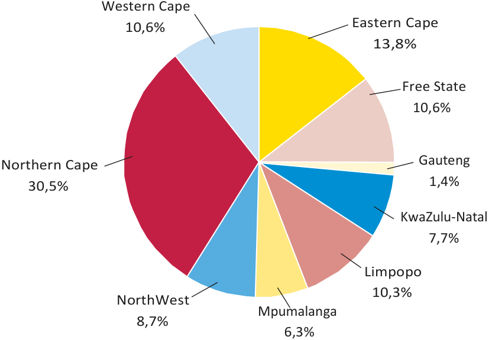
> **[Diagram Context - Textbook_Mathematics_Gr7_Interpret-analyse-and-report-on-data.pdf-0003-01.png]**
> This graphic is a pie chart illustrating geographical data. The visible labels include the nine South African provinces (Eastern Cape, Free State, Gauteng, KwaZulu-Natal, Limpopo, Mpumalanga, North West, Northern Cape, and Western Cape) along with corresponding percentage values (ranging from 1,4% to 30,5%). Conceptually, the diagram conveys the proportional breakdown or relative contribution of each province within a dataset, helping high school learners interpret parts of a whole using statistical data representation.

*   **(a)** What is the second most common mode of transport that learners use?
*   **(b)** Which mode of transport is the least common one?
*   **(c)** Is the pie chart misleading in any way? Explain.

---

#### 3. Survey Methodology and Data Comparison
Ilse and Moletsi conducted surveys regarding the number of hours people spend watching TV on a public holiday.

*   **Ilse's Survey:** Conducted at a supermarket between 13:00 and 15:00, targeting adult respondents.
*   **Moletsi's Survey:** Conducted door-to-door in his neighbourhood between 17:00 and 19:00, targeting children.

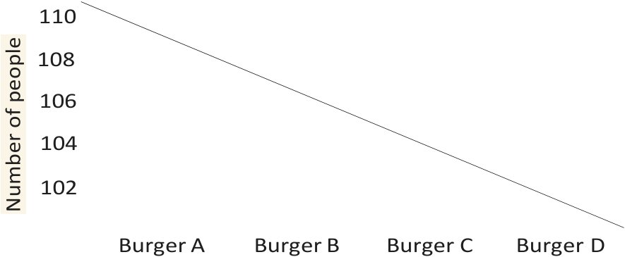
> **[Diagram Context - Textbook_Mathematics_Gr7_Interpret-analyse-and-report-on-data.pdf-0003-14.png]**
> This educational graphic is a line graph illustrating data handling concepts in CAPS Mathematics and Mathematical Literacy. The vertical axis is labeled "Number of people" with numerical values ranging from 102 to 110, while the horizontal axis displays categories labeled "Burger A", "Burger B", "Burger C", and "Burger D" connected by a downward-sloping line. Conceptually, this graph is misleading because the vertical axis does not start at zero and uses an inconsistent scale, which visually exaggerates the differences between data points; this helps learners critically evaluate data representation and identify common visual biases in statistics.

**Exercise:**
*   **(a)** According to Ilse's data, how long did most people spend watching TV on the public holiday?

---

#### Summary of Data Representation Concepts

| Data Type | Purpose | Key Feature |
| :--- | :--- | :--- |
| **Bar Graph** | Comparing categories | Heights of bars represent frequency or percentage. |
| **Pie Chart** | Showing parts of a whole | Total sectors must sum to $100\%$ or $360^\circ$. |
| **Histogram** | Showing frequency distribution | Bars are adjacent; used for continuous data (e.g., hours). |

**Note on Data Integrity:**
When interpreting graphs, always check:
1.  **The Scale:** Does the vertical axis start at $0$? If not, the visual representation of differences may be exaggerated.
2.  **The Sample:** Who was surveyed? (e.g., Ilse surveyed adults at a shop, while Moletsi surveyed children at home). This creates **sampling bias**, meaning the data sets are not directly comparable.

> **[Diagram Context - Textbook_Mathematics_Gr7_Interpret-analyse-and-report-on-data.pdf-0003-15.png]**
> The graphic displays an abstract colour diagram consisting of three adjacent rectangular blocks coloured dark brown, reddish-brown, and mustard yellow, with a diagonal pointer line extending from the top right corner. There are no visible labels, text, chemical symbols, or numerical variables present in the image. Conceptually, the image is incomplete or lacks sufficient educational context to convey a specific CAPS curriculum concept for high school learners.

---

### Data Analysis and Interpretation Exercises

#### Exercise 4: Interpreting Bar Graphs

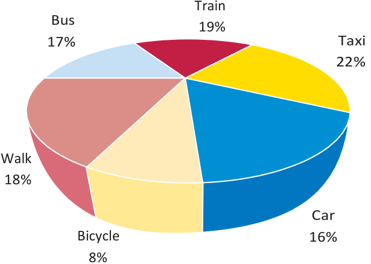
> **[Diagram Context - Textbook_Mathematics_Gr7_Interpret-analyse-and-report-on-data.pdf-0004-08.png]**
> This educational graphic is a three-dimensional pie chart representing transportation data. The visible labels and associated percentages are: Train 19%, Taxi 22%, Car 16%, Bicycle 8%, Walk 18%, and Bus 17%. Conceptually, the diagram conveys how a whole data set is divided into proportional slices, helping students interpret relative frequencies and percentages of categorical data in statistics.

**Questions:**
(a) What does each of the graphs show?
(b) How many CDs were sold in July to September of Year 1?
(c) How many CDs were sold in July to September of Year 2?
(d) The heights of the bars indicate that Music Note sold more CDs in October to December of Year 2 than in the same months of Year 1. Is this the case?
(e) How many CDs were sold altogether in Year 1?
(f) How many CDs were sold altogether in Year 2?
(g) Explain why the heights of the bars seem to indicate that Music Note sold more or less the same number of CDs in both years, which is not true.

---

#### Exercise 5: Statistical Analysis of Marks
The following table shows the Mathematics marks of Class A and Class B:

| Class | Marks |
| :--- | :--- |
| **Class A** | 94, 42, 23, 67, 67, 68, 13, 53, 44, 34, 64, 69, 50, 31, 91, 40, 10, 30, 49, 61 |
| **Class B** | 74, 26, 65, 45, 71, 77, 58, 35, 39, 45, 68, 45, 57, 62, 29, 55, 23, 56, 38, 36, 50, 64, 58, 32, 42 |

**Concepts:**
*   **Range:** The difference between the highest value and the lowest value in a data set.
*   **Formula:** $\text{Range} = \text{Maximum value} - \text{Minimum value}$

**Questions:**
(a) Find the range of each set of data.
(b) What can you say about the two classes by looking at the range of marks?

---

#### Previous Context Questions (Data Collection)
(b) According to Moletsi’s data, how long did most people spend watching TV on the public holiday?
(c) Write a paragraph to summarise and compare Ilse’s data and Moletsi’s data.
(d) How could the time when the data was collected have affected the data?
(e) How could the place where the data was collected have affected the data?
(f) How could the people from whom data was collected have affected the data?

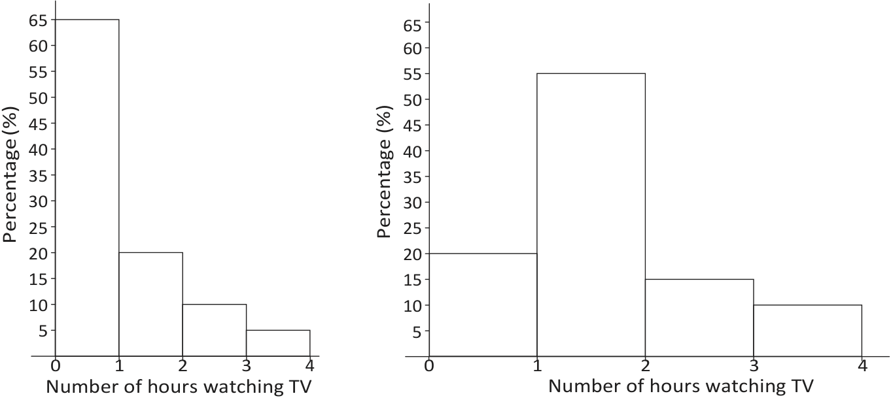
> **[Diagram Context - Textbook_Mathematics_Gr7_Interpret-analyse-and-report-on-data.pdf-0004-12.png]**
> The graphic displays two bar graphs comparing frequency distributions, with the horizontal axis labelled "Number of hours watching TV" (ranging from 0 to 4) and the vertical axis labelled "Percentage (%)" (ranging from 0 to 65). It visually contrasts two different data sets regarding television viewing habits within a population. For a high school student learning Statistics, this helps develop data interpretation skills by comparing how different distributions represent grouped numerical data and percentages.

---

### Data Analysis Exercises

#### 1. Calculating the Mean
The mean (average) is calculated using the formula:
$$\text{Mean} = \frac{\text{Total sum of marks}}{\text{Number of marks}}$$

**Exercise (c):** Copy and complete the table below to calculate the mean for each class.

| Class | Total marks | Number of marks | Mean |
| :--- | :--- | :--- | :--- |
| Class A | | | |
| Class B | | | |

**Exercise (d):** Compare the two sets of data using the calculated means.

---

#### 2. Finding the Median
The median is the middle value of a data set when the values are arranged in order from highest to lowest (or lowest to highest). If there is an even number of values, the median is the average of the two middle values.

**Exercise (e):** Copy and complete the table below to find the median for each class.

| Class | Marks from highest to lowest | Middle position | Median |
| :--- | :--- | :--- | :--- |
| Class A | | | |
| Class B | | | |

**Exercise (f):** Compare the two sets of data using the medians.

---

#### 3. Finding the Mode
The mode is the value that appears most frequently in a data set.

**Exercise (g):** Copy and complete the table below to find the mode for each class.

| Class | Highest frequency | Mode |
| :--- | :--- | :--- |
| Class A | | |
| Class B | | |

**Exercise (h):** Compare the two sets of data using the modes.

---

#### 4. Data Interpretation
**Exercise (i):** Which of the following measures (mean, median, or mode) do you think best represents each set of data? Explain your answer.

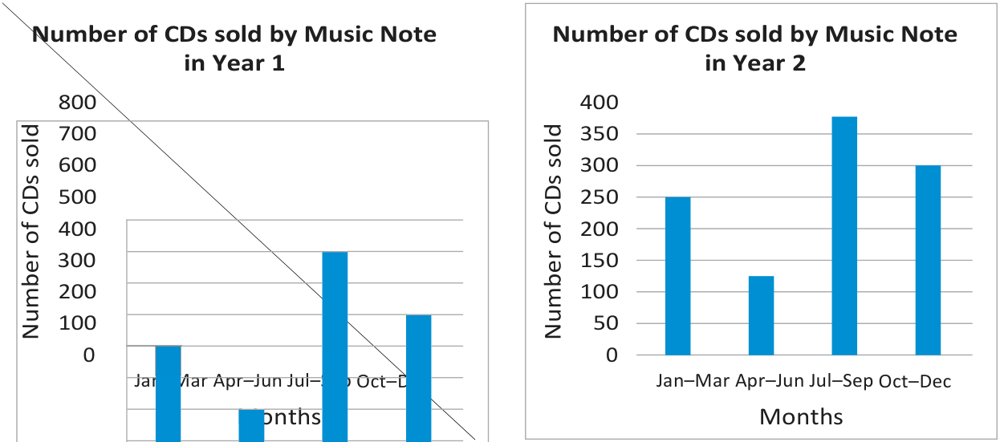
> **[Diagram Context - Textbook_Mathematics_Gr7_Interpret-analyse-and-report-on-data.pdf-0005-06.png]**
> This graphic consists of two side-by-side bar graphs titled "Number of CDs sold by Music Note in Year 1" and "Number of CDs sold by Music Note in Year 2". The axes are labeled "Number of CDs sold" on the vertical axes and "Months" on the horizontal axes, with quarterly time periods ("Jan-Mar", "Apr-Jun", "Jul-Sep", "Oct-Dec") and numerical frequency scales (0 to 800 for Year 1, and 0 to 400 for Year 2). Conceptually, these graphs illustrate data handling and statistical analysis for Grades 7–10, teaching learners how to read, compare, and interpret discrete data representations with differing scales.

> **[Diagram Context - Textbook_Mathematics_Gr7_Interpret-analyse-and-report-on-data.pdf-0005-18.png]**
> The graphic displays a horizontal bar consisting of three adjacent rectangular colour blocks (dark brown, reddish-brown, and mustard yellow) positioned next to a single downward-sloping diagonal line. The image lacks any text labels, chemical symbols, or numerical variables. Conceptually, this abstract visual provides a basic geometry or colour comparison tool, but it does not represent standard South African CAPS curriculum content.

---

# Grade 7 Term 4: Chapter 25 - Interpret, Analyse and Report on Data

## Learner Book Overview

| Sections in this chapter | Content | Pages in Learner Book |
| :--- | :--- | :--- |
| 25.1 Interpreting and reporting on data | Critically read data; identify patterns in data sets; describe trends shown by data sets; report on a data set | Pages 288 to 290 |
| 25.2 Identifying bias and misleading data | Critically analyse data in order to identify bias and misleading data | Pages 290 to 293 |

*   **CAPS time allocation:** 5 hours
*   **CAPS content specification:** Pages 78 to 79

---

## Mathematical Background

In this chapter, the focus is on the interpretation, analysis, and reporting of data findings.

### Key Definitions

*   **Interpret data:** The process of extracting information directly from data to determine if the information is understood.
*   **Analyse data:** Investigating given data to find patterns and trends.
    *   **Patterns:** Can be cyclic (e.g., data showing learners are consistently absent on Mondays).
    *   **Trends:** Increasing or decreasing patterns (e.g., the percentage of girls per grade increases in higher grades).
*   **Report on data:** Summarising the most important findings from the data in a short paragraph.
*   **Bias:** Refers to how far the information gained from a sample deviates from the true characteristics of the population.
    *   **Biased sampling method:** A method that tends to give non-representative samples, where certain characteristics of the population are under-represented or over-represented.
    *   **Unbiased sampling method:** A method that tends to give representative samples, providing a true reflection of the population's characteristics.
*   **Misleading data:** Data manipulated to favour a specific opinion. This often occurs in media or financial reports to present a positive or negative picture of a specific party.

### Common Methods of Misleading Data
1.  **Starting the scale:** Starting the frequency axis at a point other than $0$.
2.  **Visual distortion:** Using three-dimensional displays to exaggerate the impression of a specific category.
3.  **Inconsistent scaling:** Using different scales on the frequency axes when comparing two different data displays.

---

# Chapter 25: Interpret, Analyse and Report on Data

## 25.1 Interpreting and Reporting on Data

### Key Concepts
*   **Interpret data:** Reading information directly from the provided data to demonstrate understanding.
*   **Analyse data:** Identifying cyclic patterns and describing trends (increasing or decreasing) shown by the data.
*   **Report on data:** Writing a summary paragraph that synthesises the findings.

---

### Worked Example: School Survey Data
**Scenario:** In 2009, a sample of $2\,500$ schools from about $26\,000$ schools across South Africa took part in a survey. The sample included schools from each province as follows: 415 (Eastern Cape), 238 (Free State), 265 (Gauteng), 386 (KwaZulu-Natal), 326 (Limpopo), 248 (Mpumalanga), 129 (Northern Cape), 275 (North West), and 218 (Western Cape).

#### Data Analysis Table
To calculate the percentage of all schools, use the formula:
$$\text{Percentage} = \left( \frac{\text{Number of schools in province}}{\text{Total sample size}} \right) \times 100$$

| Province | Number of schools | Percentage of all schools |
| :--- | :---: | :---: |
| Eastern Cape | 415 | 16,6% |
| KwaZulu-Natal | 386 | 15,4% |
| Limpopo | 326 | 13,0% |
| North West | 275 | 11,0% |
| Gauteng | 265 | 10,6% |
| Mpumalanga | 248 | 9,9% |
| Free State | 238 | 9,5% |
| Western Cape | 218 | 8,7% |
| Northern Cape | 129 | 5,2% |

---

### Exercises and Solutions

**1. Questions based on the survey data:**
*   **(a) What was the population of the survey?**
    *   Answer: $26\,000$ schools.
*   **(b) What was the sample of the survey?**
    *   Answer: $2\,500$ schools.
*   **(c) Which province were most of the schools from?**
    *   Answer: Eastern Cape.
*   **(d) Which province were the fewest schools from?**
    *   Answer: Northern Cape.
*   **(e) & (f) Table Completion:** (See the table provided above for the completed data and calculated percentages).
*   **(g) Summary Report:**
    *   The sample of schools surveyed made up almost 10% of the population. Most of the schools ($16,6\%$) surveyed were in the Eastern Cape, followed closely by KwaZulu-Natal ($15,4\%$). The fewest schools were from the Northern Cape ($5,2\%$).

<!-- DIAGRAM_PLACEHOLDER: diagram -->

### Teaching Guidelines
*   Ensure learners have a thorough understanding of the raw data before they attempt to answer analytical questions.
*   **Common Misconception:** Learners may struggle to interpret data due to reading difficulties. Encourage learners to explain in their own words what the data represents.

---

### Data Interpretation: Trends and Patterns

#### Key Concepts
*   **Trend Analysis:** Observing the direction of data (increasing or decreasing) across a sequence, such as across different school grades.
*   **Pattern Recognition:** Identifying consistent relationships or characteristics within a dataset.
*   **Proportional Calculation:** Using percentages to calculate specific values from a total population.
    *   Formula: $\text{Value} = \left( \frac{\text{Percentage}}{100} \right) \times \text{Total}$

---

#### 1. Analysis of Learner Data (Grades 3 to 8)

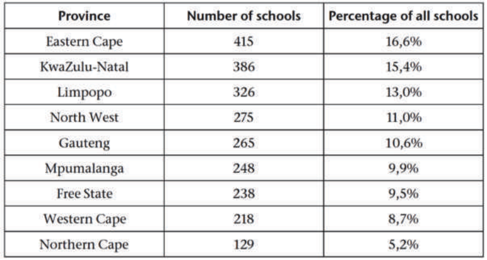
> **[Diagram Context - Textbook_Mathematics_Gr7_Interpret-analyse-and-report-on-data.pdf-0008-13.png]**
> This data table displays numerical information categorized by South African provinces, specifically showing the "Number of schools" and the corresponding "Percentage of all schools" for each region, ranging from the Eastern Cape to the Northern Cape. The table lists visible column headers including "Province", "Number of schools", and "Percentage of all schools", alongside row labels for all nine South African provinces paired with discrete numerical data and percentages. Conceptually, this graphic helps high school Mathematical Literacy learners practice reading, interpreting, and analyzing tabular data, as well as understanding how raw totals convert into proportional percentages within a national context.

**Summary Report Findings:**
*   **Trend for Males:** The percentage of male learners tends to **decrease** as the grade level increases.
*   **Trend for Females:** The percentage of female learners tends to **increase** as the grade level increases.

**Worked Example: Calculating Learner Numbers**
If there are $150\,000$ Grade 6 learners:
*   **Girls:** $\frac{49,7}{100} \times 150\,000 = 74\,550$
*   **Boys:** $\frac{50,3}{100} \times 150\,000 = 75\,450$

**Predictive Reasoning:**
*   **Question (g):** Based on the decreasing trend for males, one would expect fewer males in Grade 10.
*   **Question (h):** Based on the increasing trend for females, one would expect more females in Grade 10.

---

#### 2. Analysis of Provincial Land Area

**Key Concept:** Land area does not determine population size. A province with a large land area does not necessarily have the largest population.

**Worked Examples: Calculating Land Area**
Given a total area of $1\,200\,000 \text{ km}^2$:

*   **Northern Cape Area:**
    $$\frac{30,5}{100} \times 1\,200\,000 \text{ km}^2 = 366\,000 \text{ km}^2$$

*   **Gauteng Area:**
    $$\frac{1,4}{100} \times 1\,200\,000 \text{ km}^2 = 16\,800 \text{ km}^2$$

*   **Comparison (Ratio):**
    To find how much bigger the Northern Cape is compared to Gauteng:
    $$\frac{30,5}{1,4} \approx 22 \text{ times bigger}$$

---

#### 3. Summary of Answers

| Question | Answer |
| :--- | :--- |
| 2(a) Highest % Females | Grade 8 (51,1%) |
| 2(b) Lowest % Females | Grade 4 (47,9%) |
| 2(c) Highest % Males | Grade 4 (52,1%) |
| 2(d) Lowest % Males | Grade 8 (48,9%) |
| 3(a) Largest Land Area | Northern Cape |
| 3(b) Smallest Land Area | Gauteng |
| 3(c) Similar Land Area | Western Cape, Free State, and Limpopo |
| 3(e) Population Prediction | No, land area does not determine population size. |

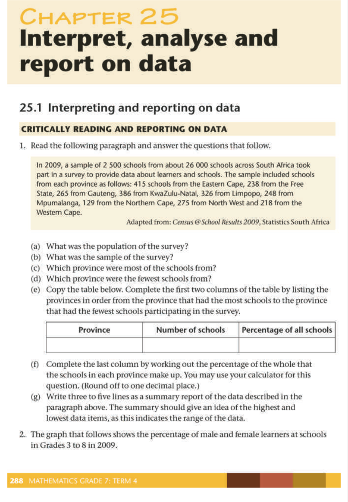
> **[Diagram Context - Textbook_Mathematics_Gr7_Interpret-analyse-and-report-on-data.pdf-0008-17.png]**
> This educational graphic features a Grade 7 Mathematics CAPS curriculum textbook page titled "Chapter 25 Interpret, analyse and report on data," presenting a worked data interpretation exercise based on a national school survey. The page displays visible text elements including an introductory data paragraph, questions labelled (a) through (g), a structured data table with column headers "Province," "Number of schools," and "Percentage of all schools," and numerical values representing South African provincial school distributions. Conceptually, this exercise guides learners through the critical reading of statistical text, distinguishing between populations and samples, organizing raw data into frequency tables, calculating percentages, and writing summary reports on data ranges.

---

### 25.2 Identifying Bias and Misleading Data

#### Key Concepts and Definitions

*   **Bias:** Refers to how far the information gained from a sample deviates from the true information of the entire population. It implies that a person prefers a certain idea and may not give equal consideration to alternative ideas.
*   **Misleading Data:** Refers to the misuse of graphs or data to create a false impression or to favour a specific opinion.

#### Common Ways Data is Misrepresented
Graphs and data presentations can be misleading if:
1.  **Distorted Scales:** The vertical axis does not start at $0$, or it skips numbers, which exaggerates differences between data points.
2.  **Improper Labelling:** The graph lacks clear labels, making it difficult to interpret the data accurately.
3.  **Omission:** Relevant data is left out to support a specific narrative.
4.  **Visual Distortion:** The graph is drawn in three dimensions (3D), which can distort the perceived size of segments or bars.

---

#### Critical Analysis Checklist
When evaluating data presentations, always consider:
*   What data is actually being shown (and what is missing)?
*   When, how, and where was the data collected?
*   What scales are used on the axes?
*   Which summary statistics (mean, median, or mode) were chosen to represent the data?

---

#### Worked Example: Analysing a Misleading Bar Graph

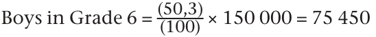
> **[Diagram Context - Textbook_Mathematics_Gr7_Interpret-analyse-and-report-on-data.pdf-0009-10.png]**
> This graphic presents a mathematical calculation equation showing the determination of a percentage of a given quantity. Visible elements include text reading "Boys in Grade 6 =" followed by the fraction "(50,3) / (100)", multiplication by "150 000", and the final calculated result of "75 450". Conceptually, this demonstrates how to apply percentages to solve practical numerical problems by converting a percentage to a fraction or decimal and multiplying it by a whole amount.

**Observation:**
In the "Most popular burgers" graph provided, the vertical axis (Number of people) starts at $102$ instead of $0$. 

**Analysis:**
Because the axis does not start at $0$, the differences between the heights of the bars are visually exaggerated. For example, Burger A appears to be significantly more popular than Burger B, even though the actual difference in the number of people is small.

**Note:** Always check the starting point of the frequency axis when interpreting bar graphs to ensure you are not being misled by a truncated scale.

---

#### Data Summary Exercise
**Task:** Summarise the data shown in the pie chart regarding South Africa's land area distribution.

| Province | Land Area (%) |
| :--- | :--- |
| Northern Cape | $30,5\%$ |
| Eastern Cape | $13,8\%$ |
| Western Cape | $10,6\%$ |
| Free State | $10,6\%$ |
| Limpopo | $10,3\%$ |
| North West | $8,7\%$ |
| KwaZulu-Natal | $7,7\%$ |
| Mpumalanga | $6,3\%$ |
| Gauteng | $1,4\%$ |

**Summary:**
The Northern Cape occupies the largest land area at $30,5\%$, while Gauteng occupies the smallest at $1,4\%$. The Eastern Cape accounts for $13,8\%$ of the land. The Western Cape, Free State, and Limpopo are approximately equal in size, each contributing roughly $10\%$ to the total land area.

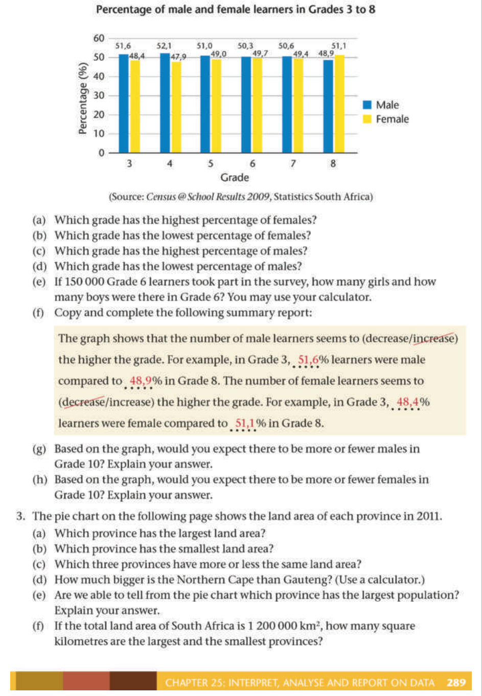
> **[Diagram Context - Textbook_Mathematics_Gr7_Interpret-analyse-and-report-on-data.pdf-0009-20.png]**
> This double bar graph compares the percentage of male and female learners across Grades 3 to 8, utilizing data from Census@School 2009. Visible labels include axis names ("Percentage (%)" and "Grade"), a legend distinguishing "Male" (blue bars) and "Female" (yellow bars), numerical percentage data points atop each bar, and follow-up data-handling questions (a) to (h). Conceptually, the graphic helps learners develop data-handling skills by teaching them how to extract values, identify trends, and calculate proportions from grouped statistical representations.

---

### Interpreting and Analyzing Data: Identifying Misleading Representations

When analyzing data, it is crucial to identify how graphs can be manipulated to create false impressions. This section explores common pitfalls in data visualization.

---

#### 1. Misleading Graphs: Key Concepts

*   **3D Perspective:** Pie charts drawn in 3D can distort the perceived size of slices. Slices closer to the viewer appear larger than they actually are, leading to incorrect comparisons.
*   **Truncated Axes:** If the vertical axis (frequency axis) of a bar graph does not start at zero, the relative heights of the bars are exaggerated. This creates a false impression of the magnitude of difference between categories.
*   **Inconsistent Samples:** Comparing data sets collected from different groups (e.g., adults vs. children) or at different times of the day can lead to invalid conclusions.

---

#### 2. Exercises and Worked Examples

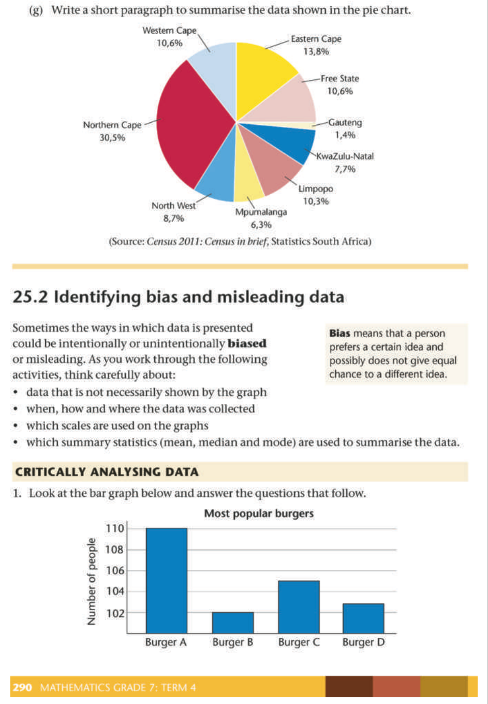

**Question 2: Analyzing a Pie Chart**
*   **Task:** Look at the provided pie chart showing "Learners' modes of transport to school."
    *   (a) What is the second most common mode of transport?
    *   (b) Which mode of transport is the least common?
    *   (c) Is the pie chart misleading in any way? Explain.

**Answers:**
*   (a) The second most common is the **Train (19%)**.
*   (b) The least common is the **Bicycle (8%)**.
*   (c) **Yes.** The 3D perspective gives a false impression. It makes it appear as if most learners come to school on foot, by car, or by bicycle, but this is not true. For instance, the bicycle slice is actually the smallest (8%), while the taxi slice (22%) is the largest.

---

**Question 3: Analyzing Histograms and Sampling**
*   **Scenario:** Ilse and Moletsi surveyed people about hours spent watching TV on a public holiday.
    *   Ilse surveyed adults at a supermarket between 13:00 and 15:00.
    *   Moletsi surveyed children in his neighbourhood between 17:00 and 19:00.
*   **Task:** (a) According to Ilse's data, how long did most people spend watching TV?

**Answers:**
*   (a) Most people spent **0 to 1 hour** watching TV.

---

#### 3. Summary of Notes on Misleading Data

| Type of Graph | Potential Issue | Reason |
| :--- | :--- | :--- |
| **Pie Chart** | 3D Perspective | Distorts the area of slices, making some appear larger than they are. |
| **Histogram** | Different Samples | Comparing different groups (e.g., adults vs. children) makes the data incomparable. |
| **Bar Graph** | Truncated Axes | Not starting at $0$ exaggerates the differences between bar heights. |

**Note on Question 2:** The pie chart is misleading because it is drawn in three-dimensional perspective.
**Note on Question 3:** The histograms are misleading because different samples are used.
**Note on Question 4:** The bar graphs are misleading because different scales are used on the frequency axes.

---

### Data Handling and Analysis

#### 3. Interpreting Data Collection Methods
When analyzing data, it is important to consider how the collection process influences the results:
*   **Timing:** Collecting data earlier in the day may result in lower figures for activities like watching TV, as respondents have had less time to engage in the activity.
*   **Location:** The setting (e.g., a supermarket vs. at home) affects respondent availability and their current activity, which influences the data collected.
*   **Demographics:** The group surveyed (e.g., adults vs. children) significantly impacts the results, as different groups have different habits and time availability.

---

#### 4. Interpreting Bar Graphs
Bar graphs are used to compare quantities across different categories. When comparing two graphs, always check the scale of the vertical axis.

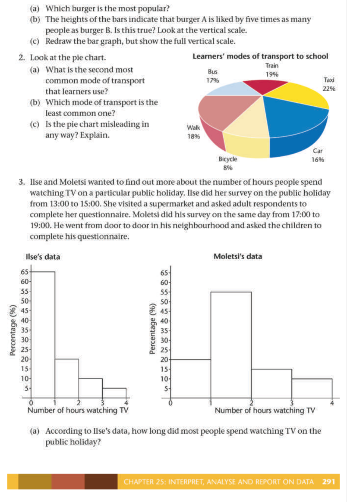
> **[Diagram Context - Textbook_Mathematics_Gr7_Interpret-analyse-and-report-on-data.pdf-0011-14.png]**
> The graphic features statistical graphs, including a pie chart titled "Learners' modes of transport to school" with sectors labeled Train (19%), Taxi (22%), Car (16%), Bicycle (8%), Walk (18%), and Bus (17%), as well as two bar graphs titled "Ilse's data" and "Moletsi's data" with axes labeled "Percentage (%)" and "Number of hours watching TV". Associated text questions prompt learners to analyze these charts, identify trends, and critique potential biases in data collection and representation. Conceptually, this helps students develop critical data literacy skills by teaching them how to interpret statistical graphics and recognize misleading representations in real-world contexts.

**Worked Example: Analyzing Sales Data**
*   **Graph Scales:** If one graph uses increments of $100$ and another uses $50$, the bars in the second graph will appear "stretched" or taller, even if the values are lower.
*   **Calculating Totals:** To find the total sales for a year, sum the values of all bars:
    *   Year 1 Total: $400 + 200 + 700 + 500 = 1\,800$
    *   Year 2 Total: $250 + 125 + 375 + 300 = 1\,050$

---

#### 5. Statistical Measures: Range
The **range** is a measure of spread in a data set. It is calculated by finding the difference between the maximum and minimum values.

**Formula:**
$$\text{Range} = \text{Maximum Value} - \text{Minimum Value}$$

**Data Table: Mathematics Marks**

| Class | Marks |
| :--- | :--- |
| **Class A** | 94, 42, 23, 67, 67, 68, 13, 53, 44, 34, 64, 69, 50, 31, 91, 40, 10, 30, 49, 61 |
| **Class B** | 74, 26, 65, 45, 71, 77, 58, 35, 39, 45, 68, 45, 57, 62, 29, 55, 23, 56, 38, 36, 50, 64, 58, 32, 42 |

**Worked Examples:**
*   **Class A Range:**
    *   Max: $94$, Min: $10$
    *   Range: $94 - 10 = 84$
*   **Class B Range:**
    *   Max: $77$, Min: $23$
    *   Range: $77 - 23 = 54$

**Interpretation:**
A larger range indicates that the data is more spread out (greater variety in marks), while a smaller range indicates that the data is more clustered together. In this example, Class A has a wider range of marks than Class B.

---

### Data Analysis: Comparing Class Performance

This section focuses on interpreting data sets using measures of central tendency: the **mean**, **median**, and **mode**.

---

#### 1. Calculating the Mean
The mean is the average of a data set, calculated by dividing the total sum of values by the number of values.

| Class | Total marks | Number of marks | Mean |
| :--- | :--- | :--- | :--- |
| Class A | $1\,000$ | $20$ | $50$ |
| Class B | $1\,250$ | $25$ | $50$ |

**Observation (d):** Based on the means, both classes are performing at approximately the same level.

---

#### 2. Calculating the Median
The median is the middle value of an ordered data set. If there are two middle values, the median is the average of those two.

| Class | Marks from highest to lowest | Middle position | Median |
| :--- | :--- | :--- | :--- |
| Class A | $94, 91, 69, 68, 67, 67, 64, 61, 53, 50, 49, 44, 42, 40, 34, 31, 30, 23, 13, 10$ | $10$ and $11$ | $\frac{50 + 49}{2} = 49,5$ |
| Class B | $77, 74, 71, 68, 65, 64, 62, 58, 58, 57, 56, 55, 50, 45, 45, 45, 42, 39, 38, 36, 35, 32, 29, 26, 23$ | $13$ | $50$ |

**Observation (f):** Based on the medians, both classes are performing at more or less the same level.

---

#### 3. Calculating the Mode
The mode is the value that appears most frequently in a data set.

| Class | Highest frequency | Mode |
| :--- | :--- | :--- |
| Class A | $2$ | $67$ |
| Class B | $3$ | $45$ |

**Observation (h):** Based on the modes, Class A appears to be performing better than Class B.

---

#### 4. Summary and Interpretation
**Observation (i):** The mode only describes the most frequent values in a set and does not account for all the values. Because the mean and median take all values into account, they generally represent the data more accurately than the mode does.

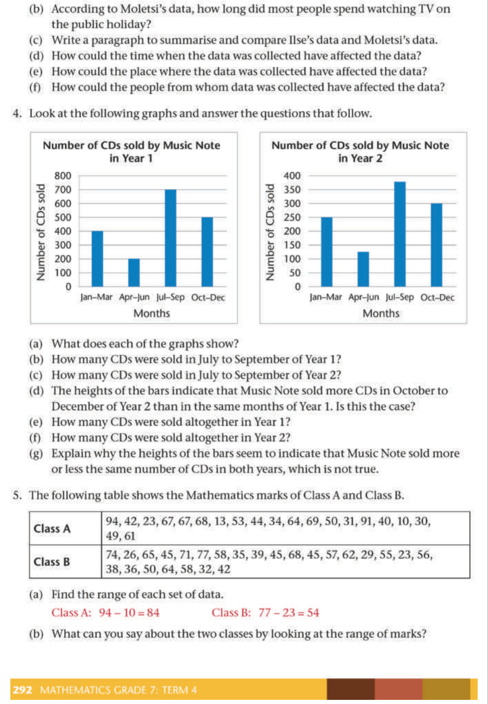
> **[Diagram Context - Textbook_Mathematics_Gr7_Interpret-analyse-and-report-on-data.pdf-0012-15.png]**
> The educational graphic consists of two bar graphs comparing the "Number of CDs sold by Music Note in Year 1" and "Year 2," alongside a raw data table showing "Mathematics marks of Class A and Class B." Visible labels include axis titles such as "Number of CDs sold" and "Months" (divided into quarters: Jan-Mar, Apr-Jun, Jul-Sep, Oct-Dec), along with numerical values ranging from 0 to 800. Conceptually, this content helps South African Grade 7 learners practice data handling by interpreting graphical data, calculating totals, and analyzing statistical measures like the range from raw data sets.

