# Chapter 24: Represent data

Now that we have collected and organised a set of data, we want to show the results in a useful way. 

Remember when you drew dot plots in the previous chapter, you could see which categories or measurements occurred many times and which occurred only a few times. There are a few different graphs that show the important things about the data in such a way that you can see them easily. You need to be able to draw these graphs.

---

## 24.1 Bar graphs and double bar graphs

### Drawing a bar graph

A **bar graph** shows categories (or classes) of data along the horizontal axis, and the frequency of each category along the vertical axis. (Sometimes the axes are swapped around.) Here is an example of a bar graph.

<!-- DIAGRAM_PLACEHOLDER: diagram -->

---

Go back to section 23.2 of Chapter 23, where you drew a dot plot and made a tally table of Thandeka's data about languages spoken in her class. Copy the grid below and use Thandeka's data to draw a bar graph. Draw the bars to the correct height by looking at the numbers on the vertical axis.

**Home languages of the Grade 7 class**

## Using double bar graphs

A **double bar graph** shows two sets of data for each category (or class). For example, the double bar graph below shows data collected from girls for each category, and data collected from boys for each category.

**Sports played by boys and girls at my school**

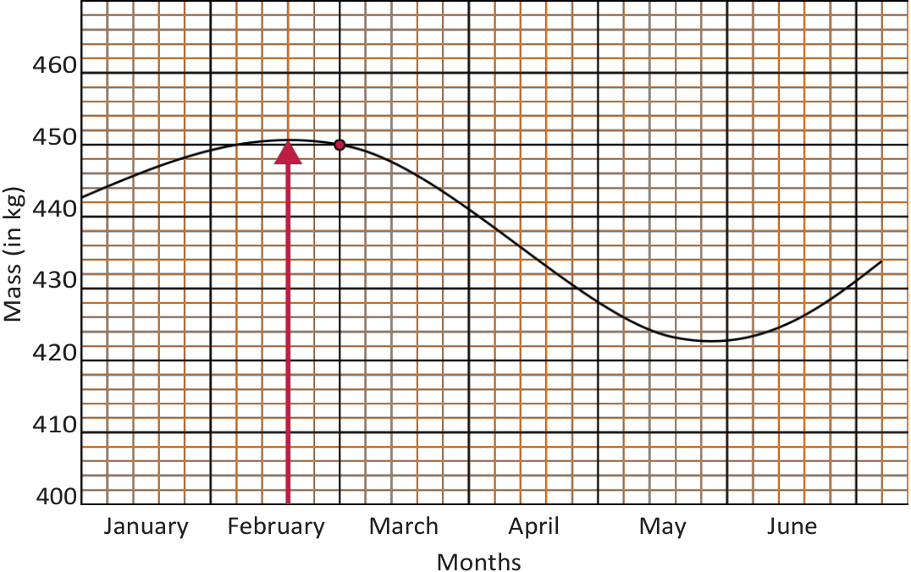
> **[Diagram Context - Textbook_Mathematics_Gr8_Graphs.pdf-0001-05.png]**
> This line graph plots the change in mass (in kg) over a six-month period from January to June, featuring a red data point and a vertical arrow highlighting a specific value. It illustrates the concept of data interpretation and trend analysis, requiring students to read coordinates from a grid to determine the maximum mass reached during the observed period.

* Two bars are shown in each category. The blue bars show the data for boys and the red bars show the data for girls.
* A key (or a legend) explains the colours used to distinguish the two sets of data.

> **[Diagram Context - Textbook_Mathematics_Gr8_Interpret-analyse-and-report-on-data.pdf-0001-15.png]**
> This graphic consists of three adjacent rectangular color blocks (dark brown, reddish-brown, and mustard yellow) with a single diagonal line extending from the top right corner. It lacks labels, variables, or biological/chemical structures, rendering it an abstract geometric figure rather than a functional educational diagram. Consequently, it does not convey any specific conceptual information relevant to the CAPS curriculum.

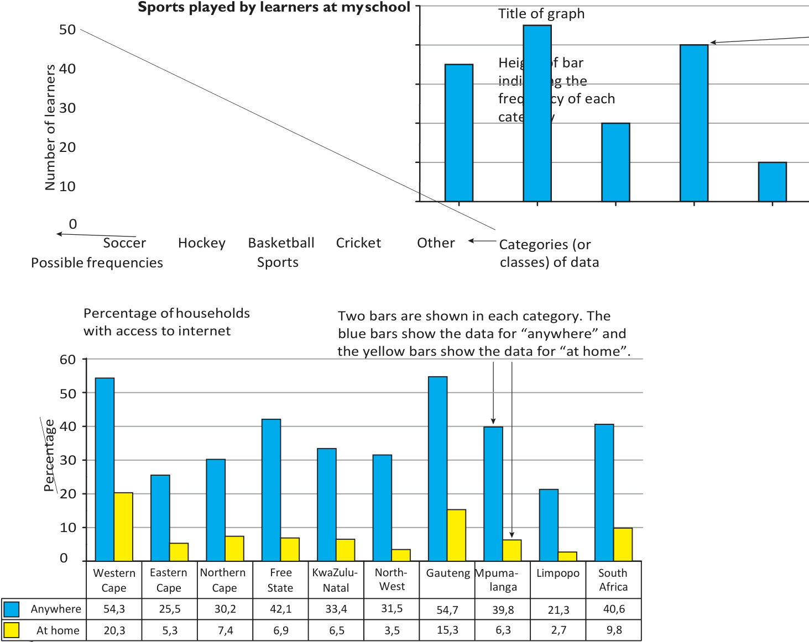
> **[Diagram Context - Textbook_Mathematics_Gr8_Represent-data.pdf-0001-04.png]**
> The graphic displays bar graphs, featuring a single bar graph outlining parts such as the title of the graph, height of the bar indicating frequency, categories (or classes) of data, and possible frequencies. It also includes a double bar graph comparing percentages of households with internet access across South African provinces with categories labeled "Western Cape", "Eastern Cape", "Northern Cape", "Free State", "KwaZulu-Natal", "North-West", "Gauteng", "Mpumalanga", "Limpopo", and "South Africa", using a legend for "Anywhere" (blue bars) and "At home" (yellow bars) alongside a data table. Conceptually, this visual aids Mathematical Literacy and Mathematics learners in understanding how to read, construct, and interpret single and double bar graphs to analyze categorical data and frequency distributions.

> **[Diagram Context - Textbook_Mathematics_Gr8_Represent-data.pdf-0001-07.png]**
> This educational graphic consists of three adjacent rectangular color blocks (dark brown, reddish-brown, and golden-brown) joined together with a diagonal pointer line extending from the top-right corner. There are no visible text labels, variables, chemical symbols, or axis names present in the image. Conceptually, it serves as a visual color palette or segmented bar indicator, typically used in diagrams to represent different phases, stages, or categorizations in a CAPS curriculum context.

---

1. Look at the data below and answer the questions that follow.

*(a)* Did more primary schools or more secondary schools participate in the survey?  
*(b)* Which province had fewer than $50$ secondary schools participating in the survey?  
*(c)* Which provinces had more than $150$ of its primary schools participating in the survey?  

---

2. Use grid paper, as shown in the example on page $277$, to draw a double bar graph to show the following data.

### Facilities available at schools in Province A and Province B

| Facility | Percentage of schools in Province A | Percentage of schools in Province B |
| :--- | :---: | :---: |
| Electricity | $73$ | $50$ |
| Running water | $68$ | $45$ |
| Computers | $60$ | $20$ |
| Internet | $30$ | $10$ |

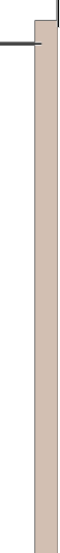

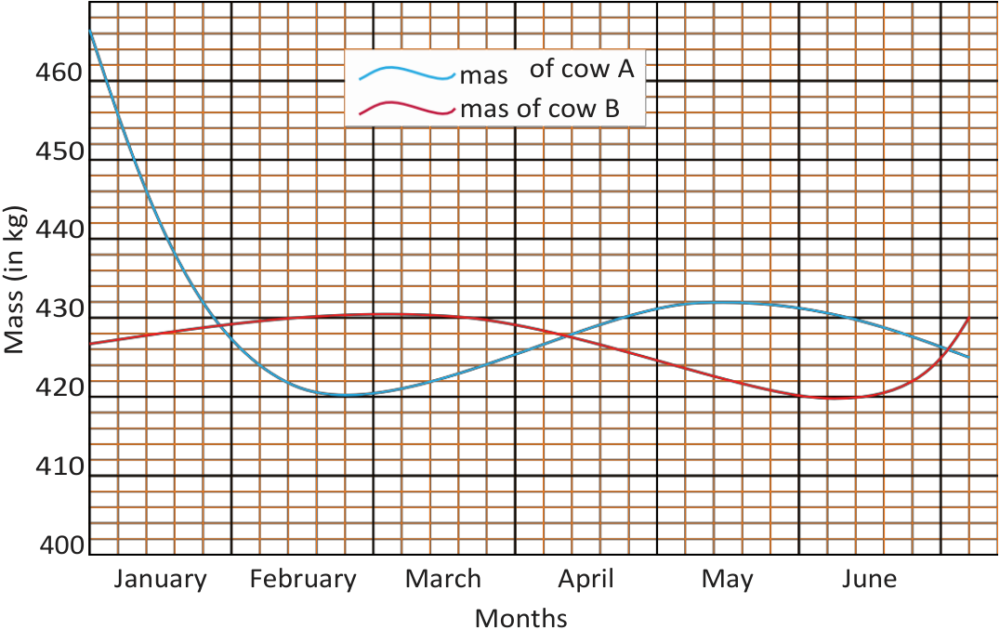
> **[Diagram Context - Textbook_Mathematics_Gr8_Graphs.pdf-0002-03.png]**
> This line graph plots the change in mass (in kg) of two cows, labeled A and B, over a six-month period from January to June. It illustrates the fluctuating growth patterns of the two subjects, allowing students to compare and interpret trends in biological data over time.

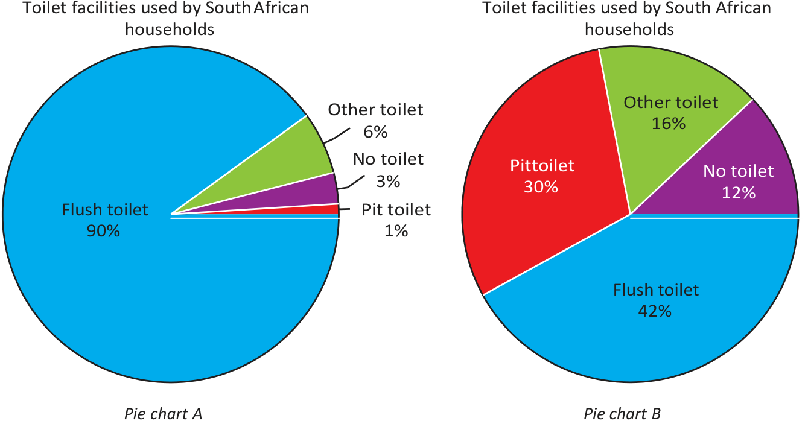
> **[Diagram Context - Textbook_Mathematics_Gr8_Interpret-analyse-and-report-on-data.pdf-0002-03.png]**
> This graphic presents two side-by-side pie charts comparing the distribution of toilet facilities used by South African households, labeled with categories including "Flush toilet," "Pit toilet," "Other toilet," and "No toilet" alongside their respective percentage values. These charts serve as a comparative data visualization tool to help students interpret statistical proportions and analyze socio-economic disparities in service delivery between different demographic groups or regions.

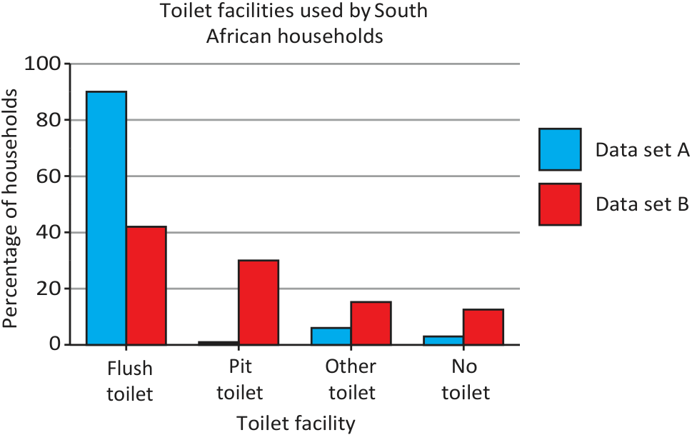
> **[Diagram Context - Textbook_Mathematics_Gr8_Interpret-analyse-and-report-on-data.pdf-0002-07.png]**
> This double bar graph illustrates the distribution of toilet facilities used by South African households, with the y-axis representing the "Percentage of households" and the x-axis categorizing "Toilet facility" types (Flush, Pit, Other, No toilet). The graph uses two distinct data sets to allow students to compare and contrast socio-economic sanitation trends across different demographic groups or time periods.

---

## 24.2 Histograms

### A situation where data has to be organised

1. Mr Makae wants to buy an orange farm. Three farms are available, each with an orchard of orange trees, and the three farms cost about the same. There are 40 orange trees on each farm. The total mass of oranges (in kilograms) harvested from each tree on each farm over the last three years is given below. Which farm should he buy?

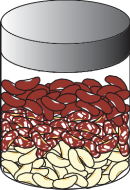
> **[Diagram Context - Textbook_Mathematics_Gr8_Collect-organise-and-summarise-data.pdf-0003-06.png]**
> This educational graphic depicts a biological apparatus and experimental setup consisting of a sealed glass jar containing distinct layers of seeds (cream-colored at the bottom and reddish-brown at the top). It features no visible text labels or arrows, relying purely on the visual representation of stratified seeds in a closed container. Conceptually, this setup is commonly used in CAPS Life Sciences to demonstrate seed germination requirements, cellular respiration, or ecological sampling techniques such as mark-recapture.

**Farm A:**

| | | | | | | | | | |
|---|---|---|---|---|---|---|---|---|---|
| 426 | 628 | 467 | 413 | 862 | 585 | 652 | 600 | 734 | 611 |
| 741 | 605 | 536 | 643 | 833 | 438 | 613 | 704 | 623 | 719 |
| 719 | 701 | 501 | 768 | 642 | 444 | 751 | 579 | 695 | 726 |
| 616 | 619 | 441 | 703 | 902 | 947 | 785 | 952 | 725 | 721 |

**Farm B:**

| | | | | | | | | | |
|---|---|---|---|---|---|---|---|---|---|
| 822 | 736 | 773 | 674 | 884 | 463 | 644 | 433 | 688 | 487 |
| 884 | 530 | 448 | 410 | 982 | 638 | 492 | 638 | 725 | 621 |
| 743 | 661 | 744 | 530 | 560 | 745 | 455 | 943 | 760 | 734 |
| 888 | 457 | 621 | 969 | 507 | 500 | 542 | 831 | 576 | 801 |

**Farm C:**

| | | | | | | | | | |
|---|---|---|---|---|---|---|---|---|---|
| 438 | 530 | 743 | 947 | 450 | 777 | 859 | 748 | 473 | 724 |
| 750 | 852 | 428 | 464 | 725 | 554 | 758 | 997 | 467 | 743 |
| 722 | 438 | 779 | 690 | 785 | 543 | 752 | 898 | 474 | 483 |
| 460 | 772 | 544 | 756 | 491 | 576 | 482 | 744 | 701 | 803 |

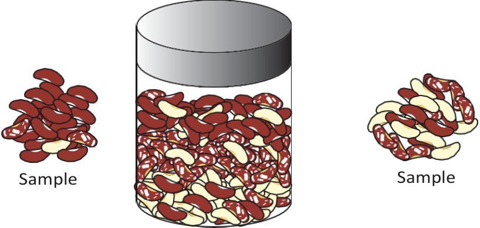
> **[Diagram Context - Textbook_Mathematics_Gr8_Collect-organise-and-summarise-data.pdf-0003-07.png]**
> This educational graphic illustrates an experimental apparatus demonstrating the mark-recapture technique for estimating population size. The diagram features a central glass jar containing a mixed population of bean seeds (some dark red, some pale/white) and two separate piles labeled "Sample" on either side representing captured and marked cohorts. Conceptually, it helps Life Sciences learners understand ecological field study methods used to estimate population numbers of mobile animals by showing the proportional relationship between marked and unmarked individuals in samples.

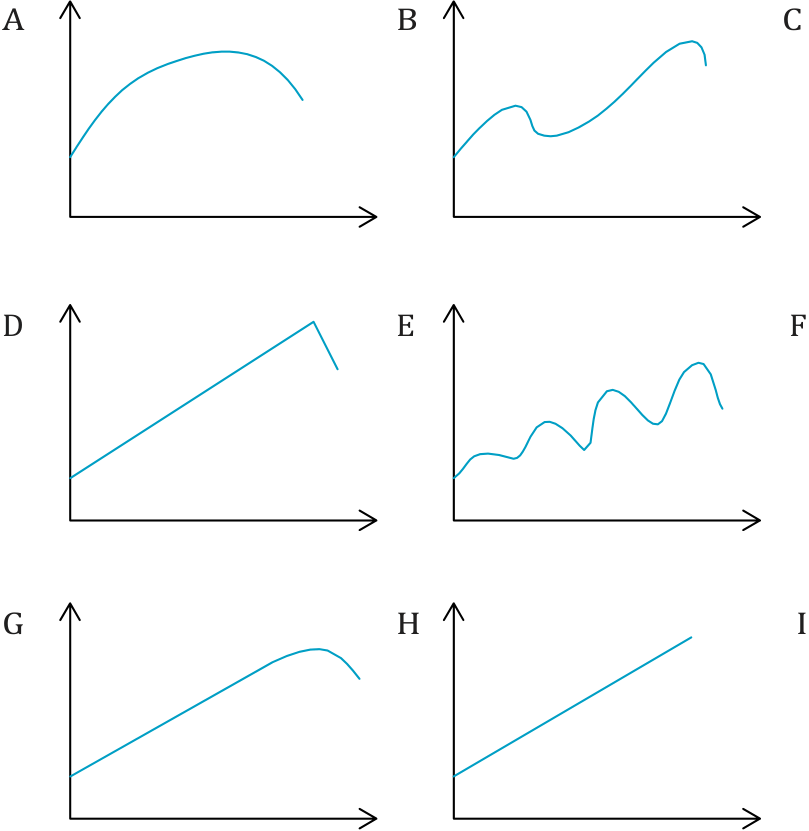
> **[Diagram Context - Textbook_Mathematics_Gr8_Graphs.pdf-0003-01.png]**
> This graphic displays a collection of six distinct line graphs labeled A, B, D, E, G, and H, each featuring Cartesian axes with arrows indicating positive direction. These plots illustrate various mathematical relationships, including linear growth, parabolic curves, and oscillating patterns, which are essential for interpreting data trends in Life Sciences and Physical Sciences. Students use these visual representations to analyze variables, identify rates of change, and predict outcomes in experimental contexts.

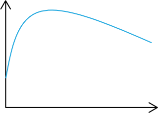
> **[Diagram Context - Textbook_Mathematics_Gr8_Graphs.pdf-0003-02.png]**
> This graphic is a line graph featuring two perpendicular axes representing independent and dependent variables. It illustrates the typical relationship between an environmental factor (such as temperature or pH) and the rate of an enzyme-controlled reaction, showing an initial increase to an optimum point followed by a gradual decline due to denaturation.

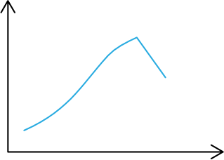
> **[Diagram Context - Textbook_Mathematics_Gr8_Graphs.pdf-0003-03.png]**
> This line graph features an x-axis and a y-axis with a single blue curve that rises to a peak before declining. It illustrates the concept of an optimum range, commonly used in Life Sciences to represent enzyme activity relative to factors like temperature or pH, where the peak indicates the point of maximum efficiency before denaturation occurs.

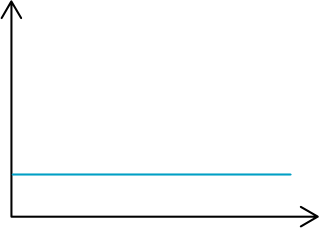

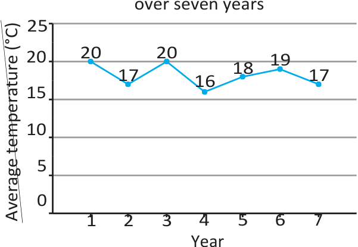
> **[Diagram Context - Textbook_Mathematics_Gr8_Interpret-analyse-and-report-on-data.pdf-0003-10.png]**
> This line graph displays the fluctuation of average temperatures (°C) over a seven-year period, with the x-axis representing the year and the y-axis representing the temperature in degrees Celsius. It illustrates how to plot and interpret discrete data points to identify trends or variations in environmental conditions over time.

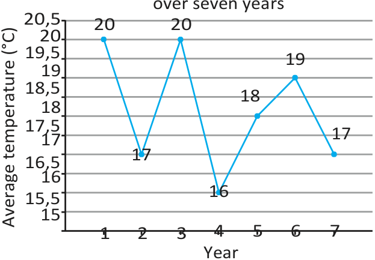
> **[Diagram Context - Textbook_Mathematics_Gr8_Interpret-analyse-and-report-on-data.pdf-0003-12.png]**
> This line graph displays the fluctuation of average temperatures (°C) over a seven-year period, with the y-axis representing temperature and the x-axis representing the year. It illustrates how data points can be plotted and connected to visualize trends or variations in environmental data over time.

> **[Diagram Context - Textbook_Mathematics_Gr8_Interpret-analyse-and-report-on-data.pdf-0003-18.png]**
> This graphic consists of three adjacent rectangular color blocks—dark brown, reddish-brown, and mustard yellow—with a single diagonal line extending from the top right corner. It lacks labels, variables, or biological/chemical symbols, rendering it an abstract geometric figure rather than a functional educational diagram. Consequently, it does not convey any specific conceptual information relevant to the CAPS curriculum.

> **[Diagram Context - Textbook_Mathematics_Gr8_Represent-data.pdf-0003-15.png]**
> The graphic consists of three adjacent square blocks arranged horizontally in shades of brown, muted red, and gold, with a single diagonal line extending from the top right corner. There are no visible text labels, mathematical variables, or chemical symbols included in the image. Conceptually, this abstract colour block composition lacks sufficient educational content to convey specific CAPS curriculum outcomes for high school learners.

---

2. How can the data about the orange trees on the three farms be organised so that the farmer has a clear picture of the difference between the orchards on the three farms? For now, just write down how you think the data may be organised. You will organise the data later when you do the questions that follow.

3. Copy and complete these tally and frequency tables for the data about the masses of oranges harvested on the three orange farms.

**Masses of oranges harvested from different trees on Farm A**

| Mass of oranges harvested from each tree (Class intervals) | Number of trees that produced masses in the interval (Tally) | Total |
| :--- | :--- | :--- |
| $400\text{ kg}$ or more but less than $500\text{ kg}$ | |||| | | |
| $500\text{ kg}$ or more but less than $600\text{ kg}$ | |||| | |
| $600\text{ kg}$ or more but less than $700\text{ kg}$ | |||| |||| || | |
| $700\text{ kg}$ or more but less than $800\text{ kg}$ | |||| |||| ||| | |

**Masses of oranges harvested from different trees on Farm B**

| Class interval | Number of trees that produced masses in the interval (Tally) | Total |
| :--- | :--- | :--- |
| $400\text{ kg}$ or more but less than $500\text{ kg}$ | |||| ||| | 8 |
| $500\text{ kg}$ or more but less than $600\text{ kg}$ | |||| || | 7 |
| $600\text{ kg}$ or more but less than $700\text{ kg}$ | |||| ||| | |
| $700\text{ kg}$ or more but less than $800\text{ kg}$ | |||| ||| | |
| $800\text{ kg}$ or more but less than $900\text{ kg}$ | | |
| $900\text{ kg}$ or more but less than $1\,000\text{ kg}$ | | |

**Masses of oranges harvested from different trees on Farm C**

| Class interval | Number of trees that produced masses in the interval (Tally) | Total |
| :--- | :--- | :--- |
| $400\text{ kg}$ or more but less than $500\text{ kg}$ | | |
| $700\text{ kg}$ or more but less than $800\text{ kg}$ | | |

On the next page, you will learn how to draw graphs of the data for the three farms. The data for Farm A is represented on the following graph.

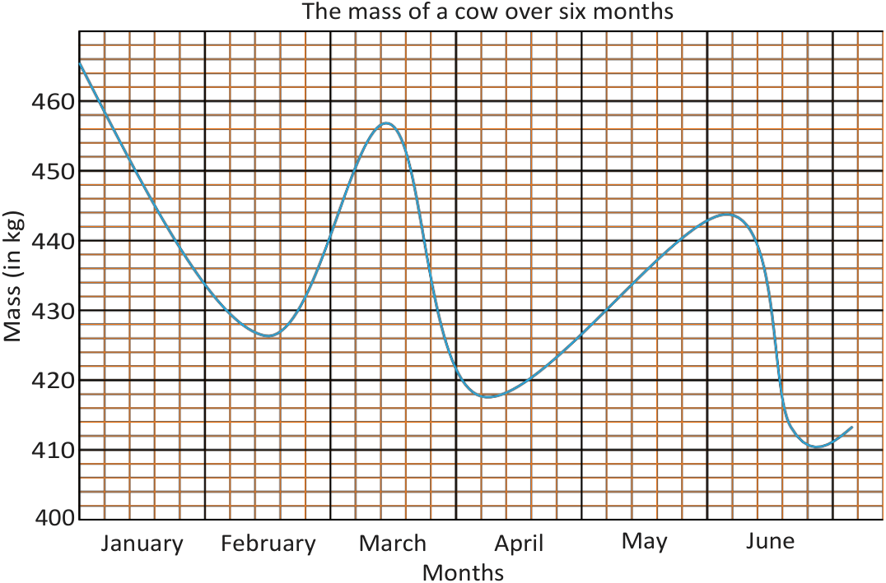
> **[Diagram Context - Textbook_Mathematics_Gr8_Graphs.pdf-0004-00.png]**
> This line graph illustrates the fluctuating mass of a cow over a six-month period, with the y-axis representing "Mass (in kg)" and the x-axis representing "Months" from January to June. It serves as a practical exercise in data interpretation, requiring students to analyse trends, identify points of increase or decrease, and extract specific numerical values from a continuous data set.

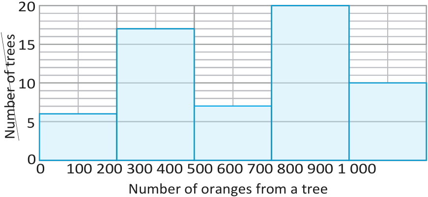
> **[Diagram Context - Textbook_Mathematics_Gr8_Represent-data.pdf-0004-08.png]**
> This graphic is a histogram displaying statistical data on a grid. The vertical y-axis is labeled "Number of trees" with numerical intervals from 0 to 20, and the horizontal x-axis is labeled "Number of oranges from a tree" with continuous numerical intervals from 0 up to 1 000. Conceptually, this diagram illustrates how to visually represent grouped continuous data in CAPS Mathematics and Mathematical Literacy, allowing learners to interpret frequencies and distributions across defined intervals.

---

# CHAPTER 24: REPRESENT DATA

## Histogram

This type of graph is called a **histogram**.

*Note:* The columns in a histogram are normally not coloured differently, or even coloured at all. In this histogram the columns are coloured only because some questions are asked about them in question 4 below.

The numbers $400$ on the left and $500$ on the right of the light yellow column indicate that masses of $400\text{ kg}$ or more but less than $500\text{ kg}$ are counted in that interval.

The height of each column represents the number of masses (the frequency) that fall in that interval.

---

## Exercises

4. 
    (a) A total of $536\text{ kg}$ of oranges was harvested from one of the trees on Farm A over a period of the three years. In which column on the above histogram is this tree represented? Explain your answer.
    (b) Which masses are represented in the red column?
    (c) Which class interval is represented by the light blue column on the above histogram?
    (d) How many masses are represented by the green column?
    (e) Which column represents the highest frequency?

5. Copy and complete the following histograms.

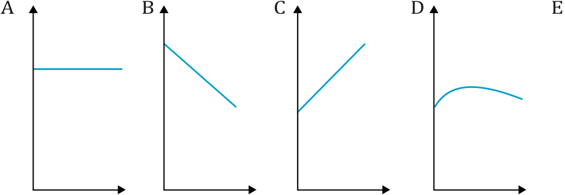
> **[Diagram Context - Textbook_Mathematics_Gr8_Graphs.pdf-0005-06.png]**
> This graphic displays five Cartesian coordinate systems labeled A through E, each featuring a unique blue line representing different mathematical or scientific relationships between two variables. These graphs illustrate various functional trends, including constant, linear inverse, linear direct, and non-linear relationships. For high school learners, these diagrams serve as foundational tools for interpreting data trends in subjects like Physical Sciences and Life Sciences, helping students identify how one variable influences another in experimental contexts.

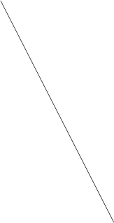

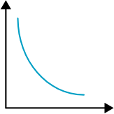

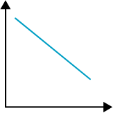

> **[Diagram Context - Textbook_Mathematics_Gr8_Graphs.pdf-0005-19.png]**
> This graphic is an abstract geometric figure consisting of a horizontal rectangular bar divided into three distinct color segments (brown, olive, and yellow) with intersecting diagonal and curved lines. It lacks specific labels or variables, serving as a non-representational visual aid. Conceptually, such diagrams are often used in CAPS-aligned materials to illustrate principles of spatial orientation, vector representation, or the geometric interpretation of gradients and slopes in mathematics and physical sciences.

> **[Diagram Context - Textbook_Mathematics_Gr8_Represent-data.pdf-0005-13.png]**
> The graphic features three adjacent rectangular blocks colored in dark brown, reddish-brown, and golden-brown, with a diagonal line extending downward and to the right from the top right corner. The image lacks text, specific labels, or scientific symbols. Conceptually, it provides an abstract visual layout or background placeholder rather than containing specific CAPS-aligned curriculum content for high school learners.

---

Histogram of the total masses of oranges from trees on Farm C

| Mass intervals | Frequency |
|---|---|
| 300 | 0 |
| 400 | 5 |
| 500 | 10 |
| 600 | 15 |
| 700 | 20 |
| 800 | ... |
| 900 | ... |
| 1 000 | ... |

The different class intervals are consecutive and cannot have values that overlap. 
For example, we can group heights into class intervals of $10\text{ cm}$, as shown below:

| Height (m) | Heights that fall in the class interval | Frequency |
| :--- | :--- | :--- |
| $1{,}20\text{--}1{,}30$ | $1{,}20$; $1{,}25$; $1{,}29$ | 3 |
| $1{,}30\text{--}1{,}40$ | $1{,}30$; $1{,}31$; $1{,}35$; $1{,}39$ | 4 |
| $1{,}40\text{--}1{,}50$ | $1{,}40$; $1{,}46$; $1{,}48$; $1{,}48$; $1{,}49$ | 5 |
| $1{,}50\text{--}1{,}60$ | $1{,}53$; $1{,}53$; $1{,}57$; $1{,}58$; $1{,}59$; $1{,}59$ | 6 |

We follow the convention that the top value (also called the upper boundary) of each class interval is not included in the interval. 

So the height of $1{,}20\text{ m}$ falls into the $1{,}20\text{--}1{,}30\text{ m}$ interval, but the height $1{,}30\text{ m}$ falls into the $1{,}30\text{--}1{,}40\text{ m}$ interval.

---

### Interpreting a histogram

Study the histogram showing the numbers of members, in different age groups, of a sports club. Then answer the questions that follow.

1. Complete a frequency table for the information.
2. How many of the members are in their fifties?
3. How many members does the club have?
4. When you drew a bar graph, it did not matter what order the bars were in. Does the order of the columns on the histogram matter? Explain.

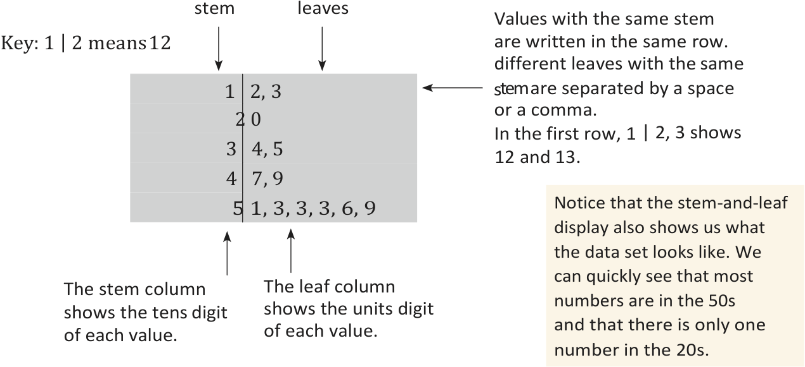
> **[Diagram Context - Textbook_Mathematics_Gr8_Collect-organise-and-summarise-data.pdf-0006-08.png]**
> This educational graphic is a stem-and-leaf display used in Grade 10-12 CAPS Mathematics and Mathematical Literacy to teach data handling. It features labels and explanatory text pointing to the "stem" column representing tens digits and the "leaf" column representing units digits, accompanied by a key ("1 | 2 means 12"). Conceptually, it demonstrates how to organise and read numerical data efficiently while preserving the original values to quickly identify trends, frequency, and distribution patterns like concentration in specific intervals.

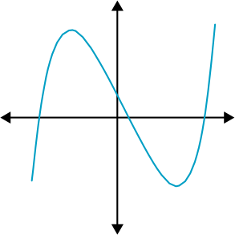
> **[Diagram Context - Textbook_Mathematics_Gr8_Graphs.pdf-0006-10.png]**
> This graphic displays a Cartesian coordinate system featuring the curve of a cubic polynomial function. The diagram highlights the characteristic shape of a cubic function with a positive leading coefficient, showing its two turning points and three x-intercepts. It serves as a foundational visual for Grade 12 learners to understand the relationship between the algebraic form of a cubic function and its graphical representation, including intervals of increase, decrease, and concavity.

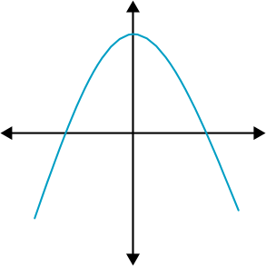
> **[Diagram Context - Textbook_Mathematics_Gr8_Graphs.pdf-0006-11.png]**
> This graphic displays a Cartesian coordinate system featuring a downward-opening parabola plotted on the x- and y-axes. It illustrates the standard form of a quadratic function $f(x) = ax^2 + q$, where the negative coefficient of $a$ results in a concave-down shape and the vertex lies on the y-axis.

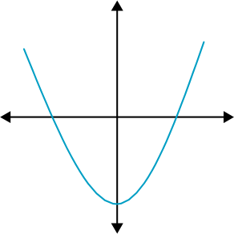
> **[Diagram Context - Textbook_Mathematics_Gr8_Graphs.pdf-0006-12.png]**
> This graphic displays a Cartesian coordinate system featuring a concave-up parabola plotted on the x- and y-axes. It illustrates the standard form of a quadratic function, $f(x) = ax^2 + q$, where the positive $a$ value results in a minimum turning point located on the y-axis.

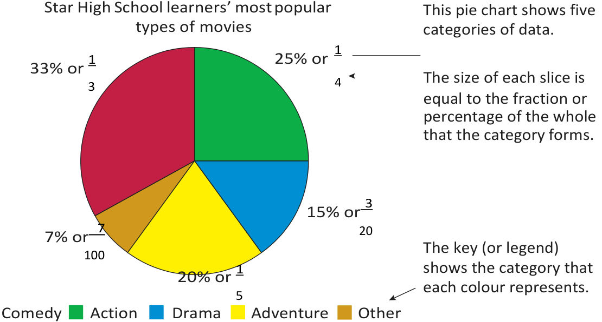
> **[Diagram Context - Textbook_Mathematics_Gr8_Represent-data.pdf-0006-02.png]**
> This educational graphic is a pie chart representing categorical data titled "Star High School learners' most popular types of movies". Visible labels include categories ("Comedy", "Action", "Drama", "Adventure", "Other") matched with corresponding colours in a legend, along with data values expressed as percentages and equivalent fractions ($33\%$ or $\frac{1}{3}$, $25\%$ or $\frac{1}{4}$, $20\%$ or $\frac{1}{5}$, $15\%$ or $\frac{3}{20}$, and $7\%$ or $\frac{7}{100}$), accompanied by explanatory text. Conceptually, it demonstrates to learners how to visually represent parts of a whole by scaling sector sizes proportionally to percentages or fractions of data.

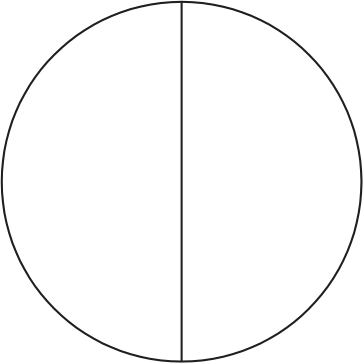
> **[Diagram Context - Textbook_Mathematics_Gr8_Represent-data.pdf-0006-08.png]**
> This geometric figure displays a circle divided in half by a single vertical diameter line, with no other visible labels, variables, or annotations. Conceptually, it serves as a blank template for high school mathematics and CAPS geometry problems, allowing learners to construct and visualize theorems regarding chords, angles, and symmetry in circles.

---

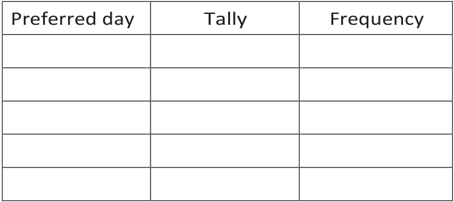
> **[Diagram Context - Textbook_Mathematics_Gr8_Collect-organise-and-summarise-data.pdf-0007-05.png]**
> The graphic shows a blank frequency data table structured into three distinct columns. The visible column headers are labelled "Preferred day", "Tally", and "Frequency". Conceptually, this template teaches learners how to organise, record, and process raw statistical data by converting counted tallies into numerical frequencies for data handling and analysis.

Notice that you cannot see the individual data values in a histogram – they have been "lost". For example, below you can see a stem-and-leaf display and a histogram of the same data set.

A histogram usually has many more data values than a stem-and-leaf display – too many to show in a stem-and-leaf display. It would, for example, be difficult to put the $84$ values for the members of the sports club onto a stem-and-leaf display.

> **[Diagram Context - Textbook_Mathematics_Gr8_Graphs.pdf-0007-17.png]**
> This graphic consists of a horizontal strip divided into three adjacent rectangular colour blocks (red-brown, ochre, and yellow) with a single diagonal line extending from the top-right corner. It lacks labels, variables, or specific biological or chemical symbols. As an abstract visual, it does not convey a specific concept within the CAPS curriculum and appears to be an incomplete or non-educational image.

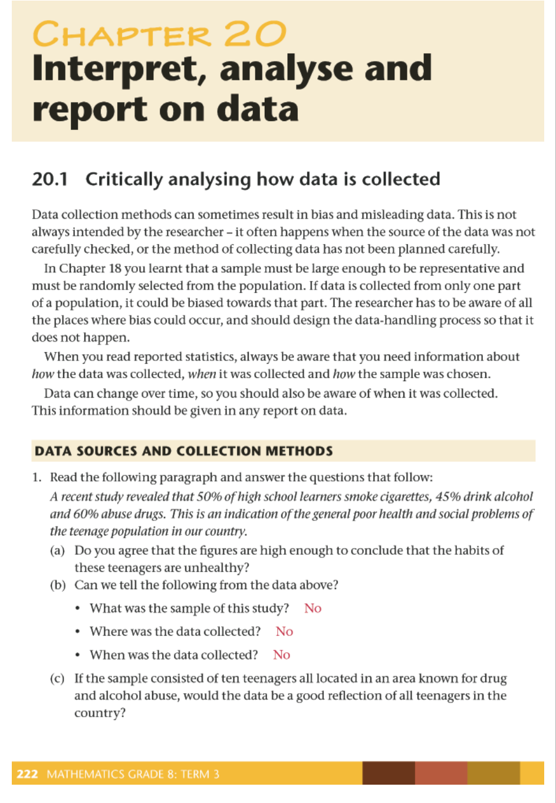
> **[Diagram Context - Textbook_Mathematics_Gr8_Interpret-analyse-and-report-on-data.pdf-0007-22.png]**
> This educational text features a textbook exercise on data literacy, specifically focusing on the critical analysis of data collection methods. It presents a hypothetical study on teenage substance use, accompanied by questions that highlight the absence of essential metadata such as sample size, location, and timeframe. The exercise teaches students to identify potential bias and recognize that data is only reliable when the context of its collection is transparent and representative of the broader population.

> **[Diagram Context - Textbook_Mathematics_Gr8_Represent-data.pdf-0007-10.png]**
> This graphic features three adjacent rectangular colour blocks in dark brown, reddish-brown, and golden-yellow, joined by a single diagonal indicator line extending downward and to the right. The image contains no visible text, labels, or variable symbols. Conceptually, this visual serves as a simple colour-coded graphic organiser or legend marker to help students differentiate categories, phases, or sequential stages in a CAPS curriculum context.

---

## Drawing More Histograms

### Exercise 1

The table shows how long it takes learners from a Grade 7 class at Western Primary to travel to school each day. In question (d) you will use a histogram to represent the data in the table.

| Time (minutes) | Frequency |
| :---: | :---: |
| $0-10$ | $7$ |
| $10-20$ | $18$ |
| $20-30$ | $11$ |
| $30-40$ | $3$ |

*(a)* How many learners were asked about their travelling hours?  
*(b)* Look at the grid provided in question (d). What do you have to consider in order to help you decide on a scale division for the vertical axis?  
*(c)* What scale will you use on the horizontal axis? Explain your answer.  
*(d)* Copy the grid and draw a histogram of the data.

---

### Exercise 2

The table shows how much money different vendors earn selling their goods every week.

| Money (R) | Frequency |
| :---: | :---: |
| $0-100$ | $6$ |
| $100-200$ | $9$ |
| $200-300$ | $11$ |
| $300-400$ | $7$ |
| $400-500$ | $5$ |

*(a)* How many vendors were asked about their earnings?  
*(b)* Copy the grid on the following page. Decide on a scale for the vertical axis of a histogram and indicate it on the axis.  
*(c)* Decide on a scale for the horizontal axis and indicate it on the axis.

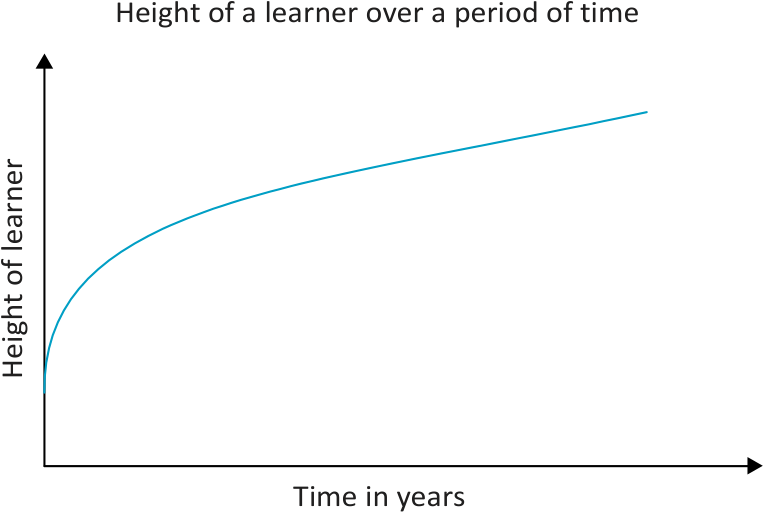
> **[Diagram Context - Textbook_Mathematics_Gr8_Graphs.pdf-0008-07.png]**
> This line graph illustrates the relationship between a learner's height and their age over time, featuring axes labeled "Height of learner" and "Time in years." It conceptually demonstrates a non-linear growth pattern, showing that while height increases over time, the rate of growth decelerates as the learner matures.

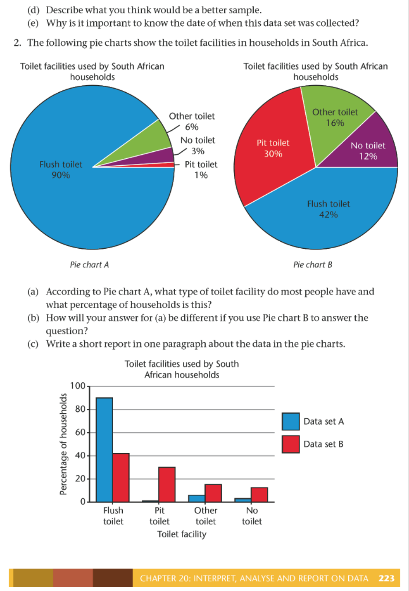
> **[Diagram Context - Textbook_Mathematics_Gr8_Interpret-analyse-and-report-on-data.pdf-0008-06.png]**
> This graphic presents two pie charts and a corresponding bar graph comparing "Data set A" and "Data set B" regarding toilet facilities in South African households, categorized as "Flush toilet," "Pit toilet," "Other toilet," and "No toilet." These visual representations allow students to practice data interpretation and comparison, highlighting how different datasets can illustrate significant shifts in socioeconomic infrastructure over time or across different demographics.

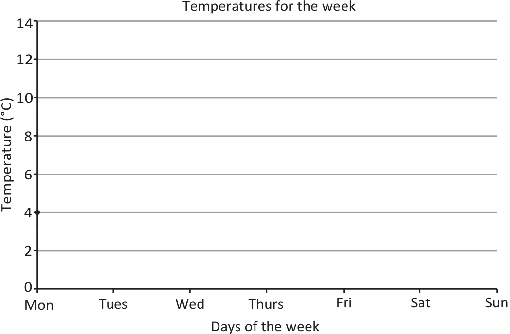
> **[Diagram Context - Textbook_Mathematics_Gr8_Represent-data.pdf-0008-01.png]**
> This image is a line graph titled "Temperatures for the week." The vertical axis is labeled "Temperature (°C)" with numerical increments from 0 to 14, and the horizontal axis is labeled "Days of the week" showing the days from Mon to Sun, with a single plotted data point at 4 °C for Monday. Conceptually, this template introduces learners to data handling and graphical representation by demonstrating how to set up Cartesian axes, interpret scales, and plot discrete meteorological data points over time.

---

(d) Complete the histogram showing the data.

3. In a Natural Sciences class, learners planted beans and measured the heights of the bean plants after two months. Here is the data they collected (in centimetres):

$34 \quad 65 \quad 72 \quad 42 \quad 37 \quad 29 \quad 78 \quad 43 \quad 79 \quad 91 \quad 43 \quad 45 \quad 28 \quad 42 \quad 79$

$34 \quad 92 \quad 87 \quad 40 \quad 43 \quad 43 \quad 78 \quad 82 \quad 47 \quad 85 \quad 43 \quad 32 \quad 86 \quad 76$

(a) Copy and complete this frequency table:

| Height of bean plants (cm) | Tally | Frequency |
| :--- | :--- | :--- |
| $20-30$ | | |
| $30-40$ | | |
| $40-50$ | | |
| $50-60$ | | |
| $60-70$ | | |
| $70-80$ | | |
| $80-90$ | | |
| $90-100$ | | |
| **Total** | | |

(b) Draw a histogram of this data.

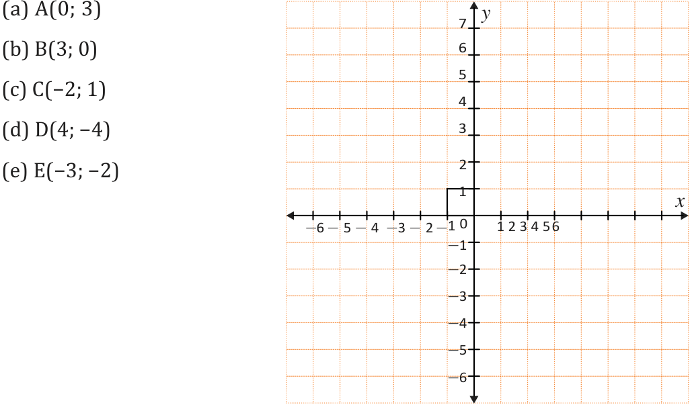
> **[Diagram Context - Textbook_Mathematics_Gr8_Graphs.pdf-0009-08.png]**
> This graphic displays a Cartesian plane with $x$ and $y$ axes and a list of five coordinate points labeled (a) through (e). It serves as a foundational exercise for Grade 8 and 9 Mathematics, requiring students to practice plotting ordered pairs $(x; y)$ accurately within the four quadrants of the coordinate system.

> **[Diagram Context - Textbook_Mathematics_Gr8_Graphs.pdf-0009-11.png]**
> This graphic is an abstract geometric figure consisting of three adjacent rectangular blocks in varying shades of brown and yellow, with a single diagonal line extending from the top-right corner. It lacks labels, symbols, or biological/chemical structures, providing no identifiable educational content related to the CAPS curriculum. Consequently, the image does not convey any specific conceptual information for a high school student.

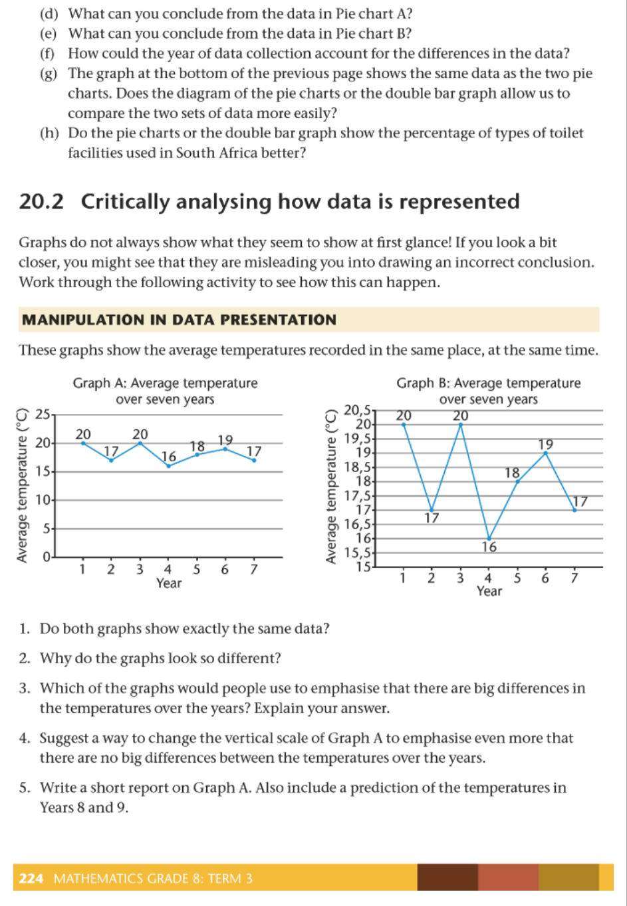
> **[Diagram Context - Textbook_Mathematics_Gr8_Interpret-analyse-and-report-on-data.pdf-0009-23.png]**
> This educational resource features two line graphs displaying identical average temperature data over seven years, but with different vertical axis scales. By comparing the two representations, students learn how manipulating the y-axis range can visually exaggerate or diminish fluctuations in data. This exercise develops critical data literacy skills by demonstrating how graphical presentation can influence the interpretation of trends.

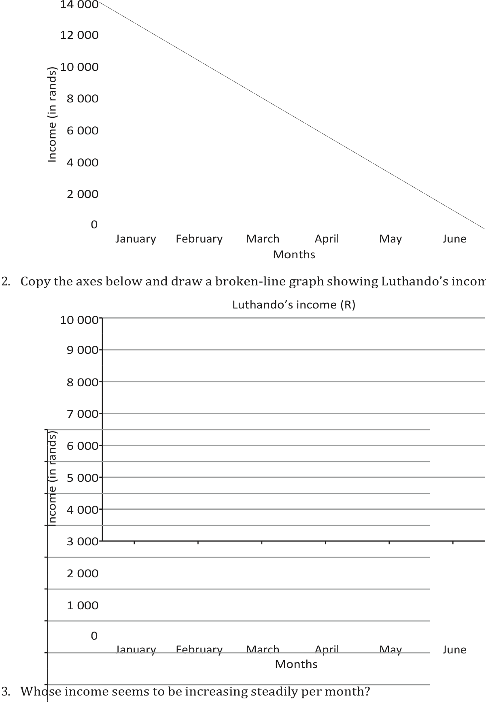
> **[Diagram Context - Textbook_Mathematics_Gr8_Represent-data.pdf-0009-02.png]**
> This educational graphic features two line graphs used for mathematical data handling and interpretation. The visible labels include the vertical axis titled "Income (in rands)" with numerical values ranging from 0 to 14 000 and 0 to 10 000, the horizontal axis labeled "Months" with categories from January to June, and titles such as "Luthando's income (R)". Conceptually, these graphs help high school students practice drawing broken-line graphs, plotting financial data over time, and interpreting trends such as increasing or decreasing income within the CAPS curriculum.

> **[Diagram Context - Textbook_Mathematics_Gr8_Represent-data.pdf-0009-05.png]**
> The graphic displays a horizontal bar partitioned into three distinct colored rectangles—dark brown, reddish-brown, and golden-brown—with a diagonal line extending from the top-right corner. There are no visible labels, text, or arrows accompanying the color blocks and line. Conceptually, this abstract layout is incomplete and lacks sufficient context for high school CAPS curriculum application, as it does not represent standard scientific diagrams, soil horizons, or geological strata required for Geography or Science.

---

## 24.3 Pie charts

A **pie chart** consists of a circle divided into slices (**sectors**), where the slices show how the different categories of data make up the whole set of data. Bigger categories of data have bigger slices of the circle.

Look at the example of a pie chart below, which illustrates the number of learners playing different sports:

### Example Breakdown

The pie chart shows the following information:
* A total of 200 learners were surveyed about the sport they played: 
  $$20 + 30 + 50 + 100 = 200$$
* The key shows the four categories:
  * soccer
  * hockey
  * basketball
  * cricket
* $100$ of the $200$ learners play hockey. This is the largest category, and gets the biggest slice (half of the whole, or $\frac{100}{200} = \frac{1}{2}$).
* $20$ of the $200$ learners play basketball. This is the smallest category, and gets the smallest slice (one tenth of the whole, or $\frac{20}{200} = \frac{1}{10}$).

In this grade, you will estimate the portions of a pie chart that each category of data requires.

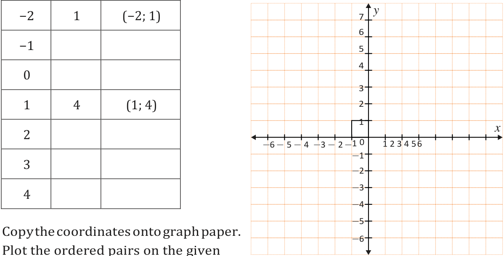

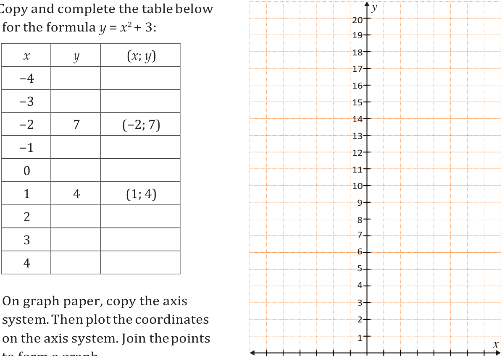

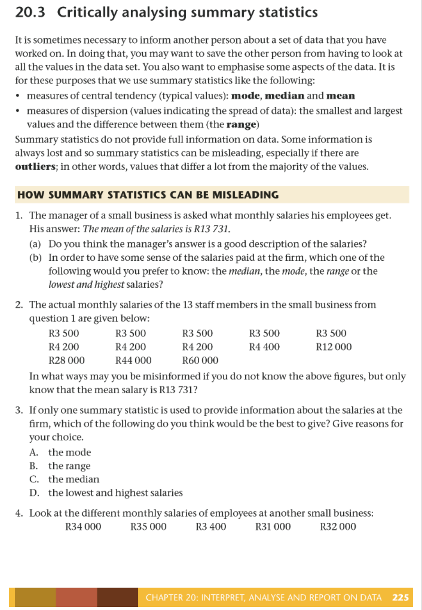

---

### Estimating Sizes of Slices in a Pie Chart

1. (a) Copy the following diagrams and add the slices indicated. Write down the fraction of a whole that each slice in the following diagrams shows.

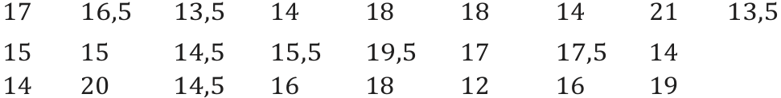
> **[Diagram Context - Textbook_Mathematics_Gr8_Collect-organise-and-summarise-data.pdf-0011-01.png]**
> The graphic displays an unsorted dataset of numerical values arranged in three horizontal rows. The visible numbers include various integers and decimals ranging from 12 to 21 (such as 17, 16.5, 13.5, 14, 18, 15, and 12). Conceptually, this dataset provides raw data for a high school Mathematics or Mathematical Literacy student to practice organizing, processing, and calculating descriptive statistics such as the mean, median, mode, range, and quartiles.

$$\frac{1}{2} = \underline{\quad\quad}\% $$

(b) For each diagram in question 1(a), write down what percentage each fraction is equal to.

You can use the diagrams above to estimate the sizes of slices when drawing your own pie charts.

2. Copy the pie charts on the following page. Use the data in each of the following tables to complete the pie charts. You must:
* label the major sector
* divide the other sector into the parts that represent the other languages
* label each sector.

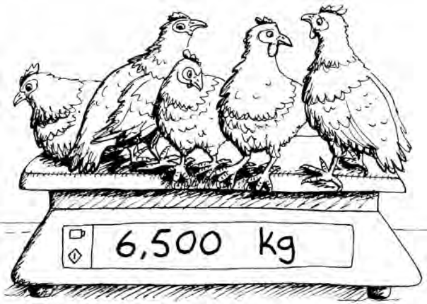
> **[Diagram Context - Textbook_Mathematics_Gr8_Collect-organise-and-summarise-data.pdf-0011-08.png]**
> This educational illustration depicts a digital scale with five chickens standing on the platform, displaying a digital reading of "6,500 kg" on its screen. The visible elements include five illustrated chickens of varying sizes and a scale featuring a digital display box with a battery icon and the numerical value "6,500 kg". Conceptually, this diagram helps learners understand measurement units and mass by demonstrating how a digital scale calculates the combined total mass of multiple animals in an agricultural or everyday context.

> **[Diagram Context - Textbook_Mathematics_Gr8_Collect-organise-and-summarise-data.pdf-0011-15.png]**
> The graphic displays a horizontal bar chart divided into three adjacent colored rectangular sections—dark brown, reddish-brown, and golden-brown—with a diagonal pointer line extending from the top-right corner. There are no visible text labels, numerical values, or variable symbols present within the image frame. Conceptually, this minimalist visual acts as a comparative color-coded key or categorical breakdown often used in CAPS-aligned resources to represent sequential stages, mineral horizons, or proportional data segments.

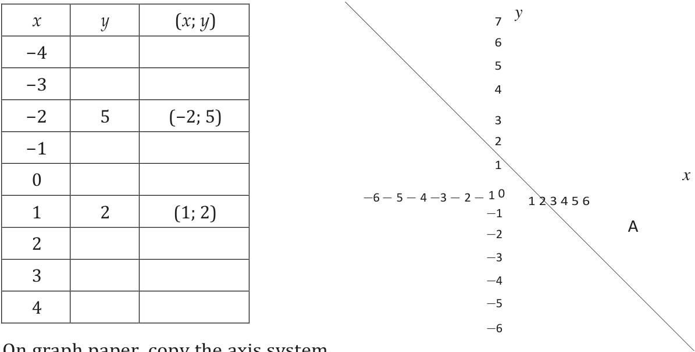
> **[Diagram Context - Textbook_Mathematics_Gr8_Graphs.pdf-0011-01.png]**
> This graphic displays a Cartesian plane with a linear function labeled 'A' alongside a corresponding table of values for $x$ and $y$ coordinates. It illustrates the relationship between algebraic representations and their geometric counterparts, requiring students to determine missing coordinate pairs to complete the table and understand the linear gradient.

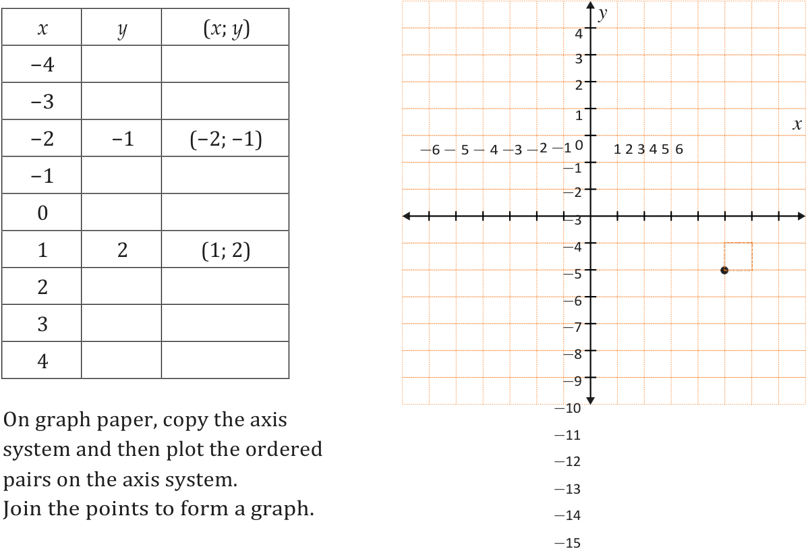
> **[Diagram Context - Textbook_Mathematics_Gr8_Graphs.pdf-0011-06.png]**
> This graphic features a Cartesian plane with a corresponding table of values for $x$ and $y$ coordinates, including labels for the axes and specific ordered pairs. It serves as a foundational exercise for Grade 8-9 learners to practice mapping numerical relationships from a table onto a coordinate system to visualize and plot linear or non-linear functions.

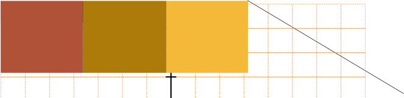
> **[Diagram Context - Textbook_Mathematics_Gr8_Graphs.pdf-0011-09.png]**
> This geometric figure displays three adjacent rectangles of varying shades placed on a grid, with a diagonal line intersecting the top-right corner and a vertical marker below the central rectangle. The diagram serves as a visual aid for teaching coordinate geometry or area calculations, requiring students to use the grid units to determine dimensions, gradients, or the area of composite shapes.

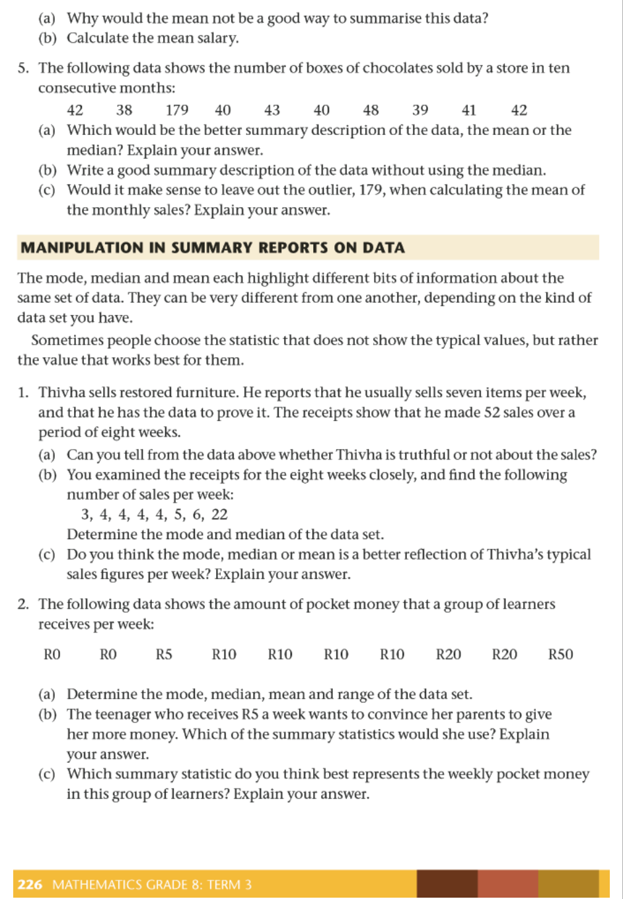
> **[Diagram Context - Textbook_Mathematics_Gr8_Interpret-analyse-and-report-on-data.pdf-0011-18.png]**
> This educational text presents a series of Grade 8 Mathematics problems focused on data handling, specifically the application and interpretation of measures of central tendency (mean, median, and mode). It utilizes numerical datasets—such as chocolate sales, furniture sales, and pocket money amounts—to challenge students to identify outliers and determine which statistical summary best represents a "typical" value. Conceptually, the exercises teach learners how different statistics can be used to manipulate or misrepresent data, fostering critical thinking about the ethical use of summary reports.

---

## Representing Data as Fractions and Percentages in Pie Charts

To represent data in a pie chart, you need to know how to convert (change) the frequencies of the different categories into a fraction or percentage of the total.

---

### Worked Examples: Provincial Language Distribution

#### (a) Province: Western Cape

| Major languages | Frequency (in %) |
| :--- | :--- |
| Afrikaans | $50\%$ |
| English | $20\%$ |
| isiXhosa | $25\%$ |
| Other | $5\%$ |

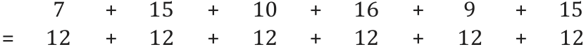
> **[Diagram Context - Textbook_Mathematics_Gr8_Collect-organise-and-summarise-data.pdf-0012-03.png]**
> The graphic displays a horizontal mathematical equation and numeric expression involving addition operations and whole numbers. The visible elements include the numbers 7, 15, 10, 16, 9, 15, and 12, interleaved with addition (+) signs and an equals (=) sign. Conceptually, this representation demonstrates the foundational arithmetic concept of grouping, equivalence, and the redistribution of values to form equal addends.

---

#### (b) Province: KwaZulu-Natal

| Major languages | Frequency (in %) |
| :--- | :--- |
| English | $15\%$ |
| isiZulu | $80\%$ |
| Other | $5\%$ |

---

#### (c) Province: Limpopo

| Major languages | Frequency (in %) |
| :--- | :--- |
| Sepedi | $50\%$ |
| Tshivenda | $15\%$ |
| Xitsonga | $20\%$ |
| Other | $15\%$ |

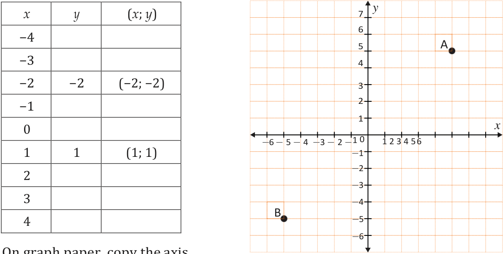
> **[Diagram Context - Textbook_Mathematics_Gr8_Graphs.pdf-0012-01.png]**
> This graphic displays a Cartesian coordinate system featuring a table of values for $x$ and $y$ coordinates alongside a grid with plotted points A and B. It illustrates the relationship between algebraic input-output tables and their corresponding geometric representation as ordered pairs $(x; y)$ on a 2D plane. This exercise helps learners master the fundamental skill of plotting points and interpreting coordinate geometry within the CAPS Mathematics curriculum.

---

### Exercises

1. The learners in Class A were asked how many languages they could speak. The table shows the data that was collected. Copy the table.
   
   (a) Complete the "Fraction" column by determining what fraction of the whole each category is.
   
   (b) Complete the "Percentage" column by converting the fraction to a percentage.

> **Remember:** To convert a common fraction to a percentage you have to multiply by $100\%$.

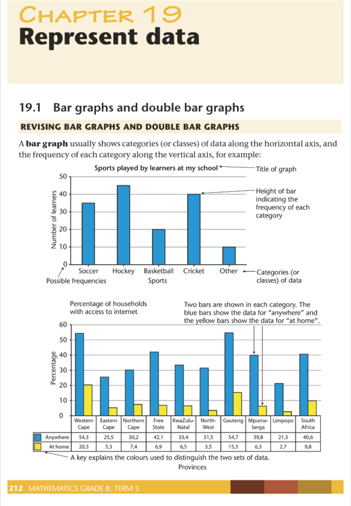
> **[Diagram Context - Textbook_Mathematics_Gr8_Represent-data.pdf-0012-23.png]**
> This educational graphic features two distinct data representation formats: a single bar graph titled "Sports played by learners at my school" and a double bar graph titled "Percentage of households with access to internet". Visible labels include category names such as sports (Soccer, Hockey, Basketball, Cricket, Other) and South African provinces (Western Cape, Eastern Cape, Northern Cape, Free State, KwaZulu-Natal, North-West, Gauteng, Mpumalanga, Limpopo, South Africa), along with axis names like "Number of learners", "Percentage", "Sports", and "Provinces", plus indicator arrows, color keys, and tabular data values. Conceptually, the diagram demonstrates how to construct, read, and interpret single and double bar graphs by showing categories on the horizontal axis and frequencies or percentages on the vertical axis, providing students with practical tools for comparing discrete data sets.

---

### Number of languages spoken by learners in Class A

| Languages | Frequency | Fraction | Percentage |
| :--- | :--- | :--- | :--- |
| One language | 10 | $\frac{10}{40} = \frac{1}{4}$ | $25\%$ |
| Two languages | 20 | $\frac{20}{40}$ | |
| Three languages | 6 | $\frac{6}{40}$ | |
| Four languages | 2 | $\frac{2}{40}$ | |
| More than four languages | 2 | $\frac{2}{40}$ | |
| **Total** | **40** | **$\frac{40}{40}$** | **$100\%$** |

(c) Draw a pie chart of the data in your completed table. Use a circular object to draw the circle. Then estimate the sizes of the various slices of the pie chart.

2. The learners in Class B were asked how many languages they could speak. The table shows the data that was collected. Copy the table. 

(a) Complete the “Fraction” column by determining what fraction of the whole each category is. 

(b) Complete the “Percentage” column by converting the fraction to a percentage. 

### Number of languages spoken by learners in Class B

| Languages | Frequency | Fraction | Percentage |
| :--- | :--- | :--- | :--- |
| One language | 12 | $\frac{12}{60} = \frac{1}{5}$ | $20\%$ |
| Two languages | 30 | $\frac{30}{60}$ | |
| Three languages | 12 | $\frac{12}{60}$ | |
| Four languages | 3 | $\frac{3}{60}$ | |
| More than four languages | 3 | $\frac{3}{60}$ | |
| **Total** | **60** | **$\frac{60}{60}$** | **$100\%$** |

(c) Draw a pie chart to represent the data in your completed table.

---

CHAPTER 24: REPRESENT DATA  
287

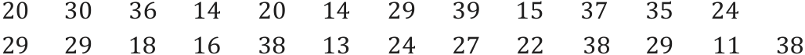
> **[Diagram Context - Textbook_Mathematics_Gr8_Collect-organise-and-summarise-data.pdf-0013-01.png]**
> The graphic presents a raw dataset consisting of two rows of numerical values, representing discrete quantitative data. The visible numbers include integers such as 20, 30, 36, 14, 29, 39, 15, 37, 35, 24, 18, 16, 38, 13, 27, 22, and 11, arranged horizontally without any explicit labels or axes. For a high school mathematics or mathematical literacy learner, this unordered collection of numbers serves as a foundational data set for practicing statistical calculations, such as determining the mean, median, mode, range, and drawing graphical representations like histograms or box and whisker diagrams.

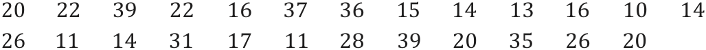
> **[Diagram Context - Textbook_Mathematics_Gr8_Collect-organise-and-summarise-data.pdf-0013-03.png]**
> This educational graphic displays a raw, unorganized dataset consisting of two rows of numerical integer values ranging between 10 and 39. There are no explicit labels, axis names, variables, or statistical symbols present in the image. Conceptually, it serves as an introductory raw data set for CAPS mathematics and mathematical literacy learners to practise fundamental statistical concepts, such as organizing data into frequency tables, calculating measures of central tendency (mean, median, mode), and determining measures of dispersion (range).

> **[Diagram Context - Textbook_Mathematics_Gr8_Collect-organise-and-summarise-data.pdf-0013-18.png]**
> The graphic displays a horizontal bar divided into three adjacent colored blocks (dark brown, reddish-brown, and mustard-yellow) with a diagonal line extending downward and to the right from the top right corner. The image contains no visible labels, text, symbols, or arrows. Conceptually, this abstract layout functions as a basic visual placeholder or incomplete graphic organizer that lacks sufficient context to convey specific CAPS curriculum content to a high school student.

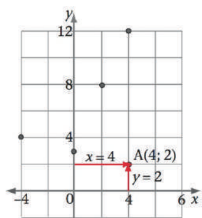
> **[Diagram Context - Textbook_Mathematics_Gr8_Graphs.pdf-0013-16.png]**
> This Cartesian plane displays a scatter plot with labeled axes ($x$ and $y$), grid lines, and a specific point $A(4; 2)$ highlighted by red directional arrows indicating its coordinate values. The diagram conceptually illustrates the fundamental CAPS principle of coordinate geometry, demonstrating how to locate a point by identifying its horizontal displacement ($x=4$) and vertical displacement ($y=2$) from the origin.

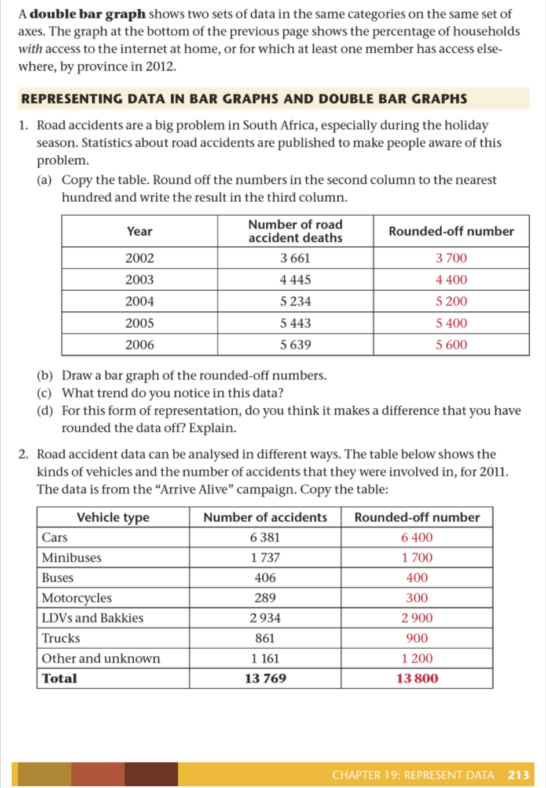
> **[Diagram Context - Textbook_Mathematics_Gr8_Represent-data.pdf-0013-22.png]**
> This educational textbook page features two statistical data tables titled "Representing Data in Bar Graphs and Double Bar Graphs." The tables include visible labels and categories such as "Year" (2002–2006), "Number of road accident deaths," "Vehicle type" (Cars, Minibuses, Buses, Motorcycles, LDVs and Bakkies, Trucks, Other and unknown), and corresponding "Rounded-off number" columns with calculated data. Conceptually, the graphic guides students through organizing raw numerical data, applying rounding conventions, and analyzing real-world South African road safety statistics to prepare them for constructing and interpreting graphical data representations.

---

# Grade 7 Term 4 Chapter 24: Represent Data

## Learner Book Overview

| Sections in this chapter | Content | Pages in Learner Book |
| :--- | :--- | :--- |
| 24.1 Bar graphs and double bar graphs | Draw and interpret bar graphs and double bar graphs | Pages 274 to 277 |
| 24.2 Histograms | Draw and interpret histograms | Pages 277 to 283 |
| 24.3 Pie charts | Draw and interpret pie charts | Pages 284 to 287 |

| Specification Detail | Value |
| :--- | :--- |
| CAPS time allocation | $5$ hours |
| CAPS content specification | Pages 78 to 79 |

---

## Mathematical Background

In the previous chapter, we covered the following **phases in the data handling cycle**:
1. **Pose a question** about a real-life problem that requires the collection of data.
2. **Collect and record data** on data recording sheets during observations and on questionnaires during interviews.
3. **Classify, sort and organise data** in categories or intervals on frequency tables, dot plots and stem-and-leaf displays.
4. **Summarise data** by finding the mode, median, mean and range of the data set.

In this chapter, the focus is on **representing data**, which is the next phase in the data handling cycle. Data is represented by drawing a picture of the tabulated data. This is done for the following reasons:
* A picture makes information **easier to understand**.
* It is easier to **identify patterns** in a picture than in a table. Humans are great at seeing patterns, but they struggle with raw numbers.
* It is easier to **identify trends** in a picture than in a table. These trends can be upward or downward, and they can even be cyclical. Trends are easy to see in a picture, but not easy to see in a table.
* People are more attracted when visual information is presented in an **aesthetically pleasing manner** in the media.

A large variety of statistical displays are used by statisticians and in the media to convey information, for example:
* dot plots, pictographs, single and double bar graphs, pie charts, line and broken-line graphs and scatter plots
* histograms, frequency polygons, ogives (cumulative frequency polygons), regression functions, normal distributions, and so on.

In this chapter, we focus on **single bar graphs**, **double bar graphs**, **histograms** and **pie charts**.

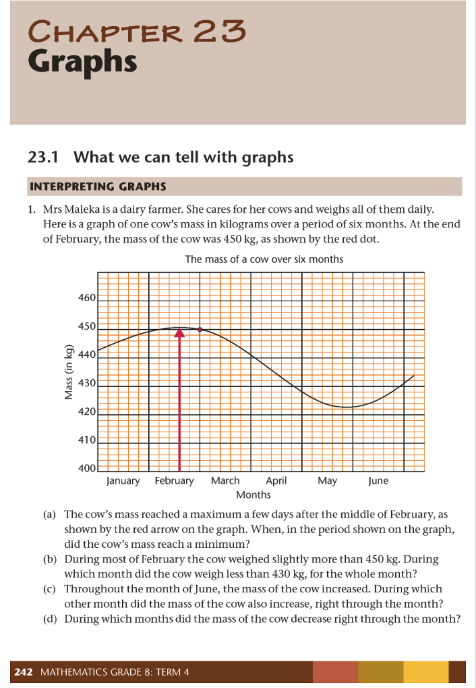
> **[Diagram Context - Textbook_Mathematics_Gr8_Graphs.pdf-0014-11.png]**
> This graphic features a line graph titled "The mass of a cow over six months," which plots "Mass (in kg)" on the y-axis against "Months" on the x-axis, incorporating a red arrow and dot to highlight specific data points. It serves as a practical exercise for Grade 8 learners to develop data literacy by interpreting trends, identifying maximum and minimum values, and analyzing continuous changes in a real-world context.

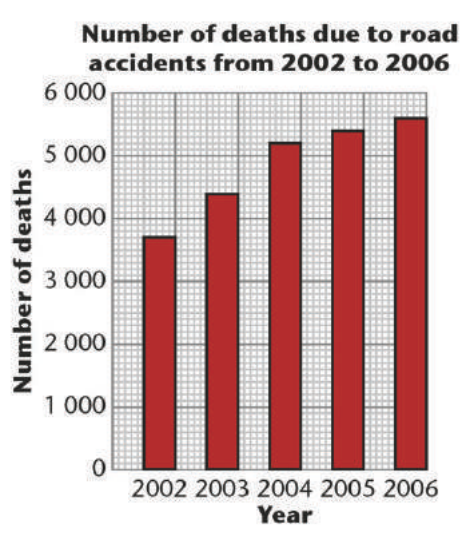
> **[Diagram Context - Textbook_Mathematics_Gr8_Represent-data.pdf-0014-03.png]**
> This graphic is a bar graph titled "Number of deaths due to road accidents from 2002 to 2006". The vertical y-axis is labeled "Number of deaths" with numerical intervals from 0 to 6 000, the horizontal x-axis is labeled "Year" displaying the years 2002 to 2006, and five vertical red bars represent the data values for each corresponding year. Conceptually, the diagram demonstrates how to visually represent discrete categorical data and trends over time using rectangular bars, supporting CAPS mathematical literacy outcomes for data handling and interpretation.

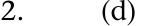

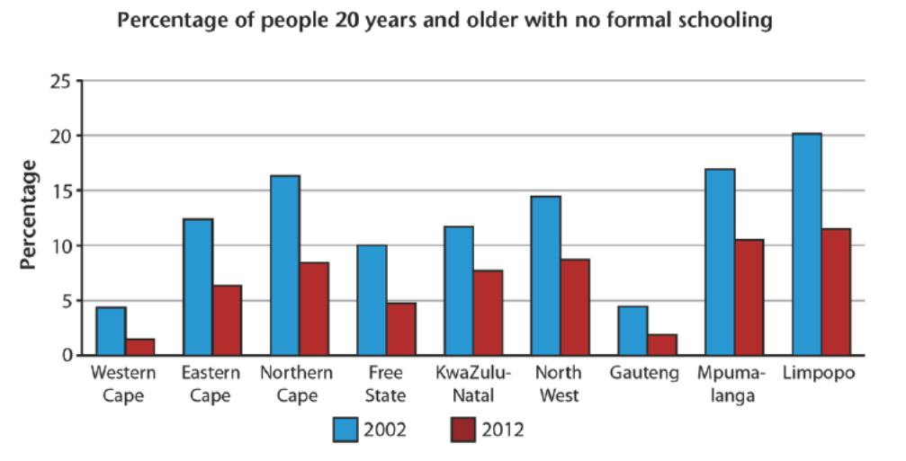
> **[Diagram Context - Textbook_Mathematics_Gr8_Represent-data.pdf-0014-05.png]**
> This double bar graph compares the percentage of people aged 20 years and older with no formal schooling across South Africa's nine provinces, contrasting data from 2002 (blue bars) and 2012 (red bars). The x-axis lists the nine provinces (Western Cape, Eastern Cape, Northern Cape, Free State, KwaZulu-Natal, North West, Gauteng, Mpumalanga, and Limpopo), while the y-axis shows the percentage from 0 to 25. Conceptually, this graph helps students analyze demographic trends and socio-economic changes over a decade, demonstrating a nationwide decrease in illiteracy and lack of formal education in post-apartheid South Africa.

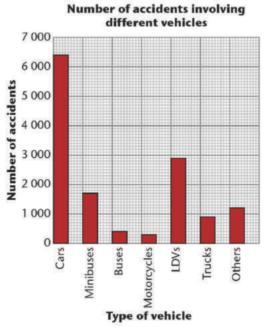
> **[Diagram Context - Textbook_Mathematics_Gr8_Represent-data.pdf-0014-06.png]**
> This educational graphic is a bar graph titled "Number of accidents involving different vehicles". The vertical y-axis is labeled "Number of accidents" ranging from 0 to 7 000, while the horizontal x-axis displays the categorical variable "Type of vehicle" with visible category labels: Cars, Minibuses, Buses, Motorcycles, LDVs, Trucks, and Others, represented by red vertical bars. Conceptually, this graph is used in CAPS Mathematics and Mathematical Literacy to teach learners how to read, interpret, and compare discrete data sets represented graphically.

---

# CHAPTER 24 Represent data

## 24.1 Bar graphs and double bar graphs

### DRAWING A BAR GRAPH

#### Background Information

* **A bar graph** uses separate bars to show the frequencies of different categories in a data set.
* **Features of a bar graph:**
  * It represents only one set of data.
  * It represents either categorical or ungrouped numerical data.
  * It never represents grouped numerical data.
  * It uses bars to show the frequencies of the different categories.
  * The heights or lengths of the bars represent the frequencies of the different categories.
* **Bar graphs are suitable to:**
  * identify patterns in the data.
  * describe trends shown by the data.
* **To draw a bar graph, remember the following:**
  * All bars must be equally wide.
  * Gaps between bars must be equally wide, but narrower than the bars, unless a bar is missing from the sequence.
  * The first bar should not touch the frequency axis.
* **Vertical bar graphs** are usually used to show change over time at discrete times, for example, absentees per day of the week.
* **Horizontal bar graphs** are usually used to compare or rank items at one point in time, for example, absentees per grade on a specific day.

#### Explanation and Layout

A **bar graph** shows categories (or classes) of data along the horizontal axis, and the frequency of each category along the vertical axis. (Sometimes the axes are swopped around.) 

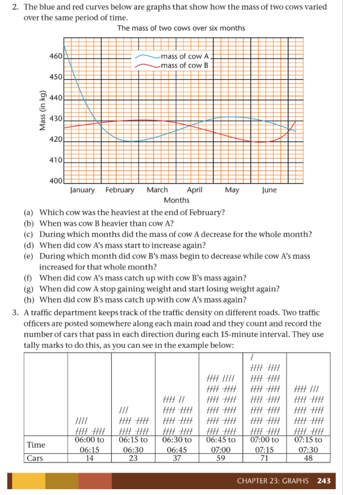
> **[Diagram Context - Textbook_Mathematics_Gr8_Graphs.pdf-0015-13.png]**
> This line graph displays the fluctuating mass (in kg) of two cows, labeled A and B, over a six-month period from January to June. By plotting these variables against time, the diagram enables students to practice interpreting continuous data, identifying trends, and comparing rates of change between two distinct sets of values.

#### Teaching Guidelines

Discuss the features of a bar graph as reflected by the bar graph on LB page 274.

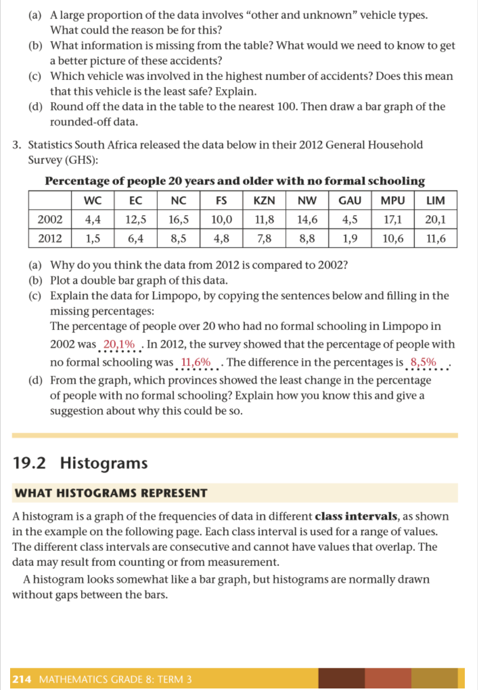
> **[Diagram Context - Textbook_Mathematics_Gr8_Represent-data.pdf-0015-19.png]**
> This educational text page contains a statistics data table titled "Percentage of people 20 years and older with no formal schooling" showing provincial data for 2002 and 2012, along with accompanying questions and an introductory section on histograms. Visible labels include South African provinces (WC, EC, NC, FS, KZN, NW, GAU, MPU, LIM), years (2002, 2012), percentages, and instructional text introducing class intervals and continuous bar representation. Conceptually, it helps Grade 8 learners practice data handling skills by interpreting tabular demographic data across provinces and years, plotting double bar graphs, and transitioning to understanding how histograms represent continuous grouped data without gaps between bars.

---

# USING DOUBLE BAR GRAPHS

## Background Information

* A **double bar graph** uses separate pairs of bars to show the frequencies of different categories in two related data sets.
* Here are some **features of a double bar graph**:
  * It represents two sets of data with matching categories.
  * It represents either categorical or ungrouped numerical data.
  * It never represents grouped numerical data.
  * It uses pairs of bars to show the frequencies of matching categories.
  * The heights or lengths of the bars represent the frequencies of the matching categories.
* **Double bar graphs are suitable to:**
  * identify similar and different patterns in the two sets of data.
  * describe similar and different trends shown by the two sets of data.
* **To draw a double bar graph, remember the following:**
  * All bars must be equally wide.
  * Gaps between pairs of bars must be equally wide, but narrower than the bars, unless a bar is missing from one or both sequences.
  * The first bar should not touch the frequency axis.
  * A key (legend) should explain the colours used to distinguish the two sets of data.

---

## Teaching Guidelines

* Discuss the features of a double bar graph as reflected by the double bar graph on the right.
* Point out that there is no blue bar for netball because none of the boys play netball.

---

## Exercises and Activities

### Activity 1
Go back to section 23.2 of Chapter 23, where you drew a dot plot and made a tally table of Thandeka's data about languages spoken in her class. Copy the grid below and use Thandeka's data to draw a bar graph. Draw the bars to the correct height by looking at the numbers on the vertical axis.

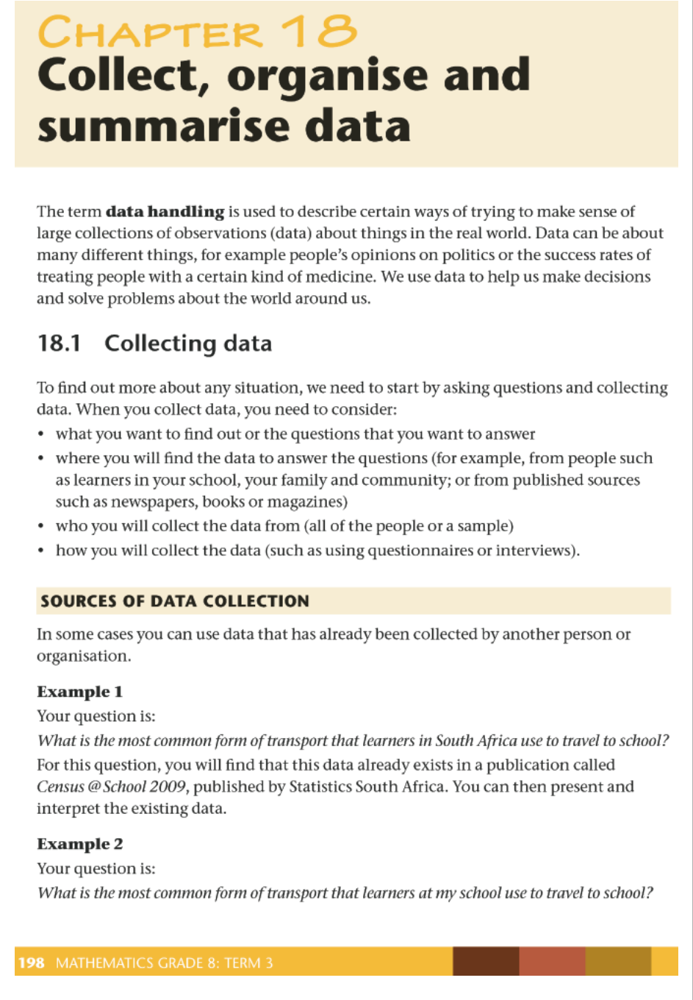
> **[Diagram Context - Textbook_Mathematics_Gr8_Collect-organise-and-summarise-data.pdf-0016-18.png]**
> This educational textbook page introduces Grade 8 Mathematics learners to data handling through the foundational concepts of collecting, organising, and summarising data. Visible text includes headings such as "CHAPTER 18: Collect, organise and summarise data," "18.1 Collecting data," "SOURCES OF DATA COLLECTION," alongside practical examples involving *Census @ School 2009* published by Statistics South Africa. Conceptually, it guides students through the initial stages of the statistical investigative cycle, teaching them how to formulate questions, identify appropriate sources, and differentiate between using existing data versus collecting new data through surveys or interviews.

### Activity 2: Using Double Bar Graphs

A **double bar graph** shows two sets of data for each category (or class). For example, the double bar graph below shows data collected from girls for each category, and data collected from boys for each category.

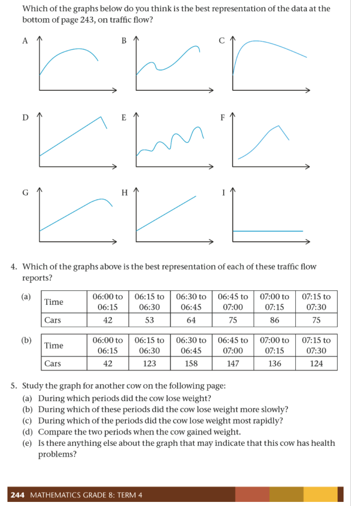
> **[Diagram Context - Textbook_Mathematics_Gr8_Graphs.pdf-0016-11.png]**
> This graphic presents a collection of nine line graphs (labeled A–I) alongside two data tables representing traffic flow over time. It requires students to interpret numerical data and identify the corresponding visual trend, reinforcing the relationship between discrete data points and continuous graphical representation. This exercise develops essential data handling skills by asking learners to match specific patterns of increase and decrease to the most accurate mathematical model.

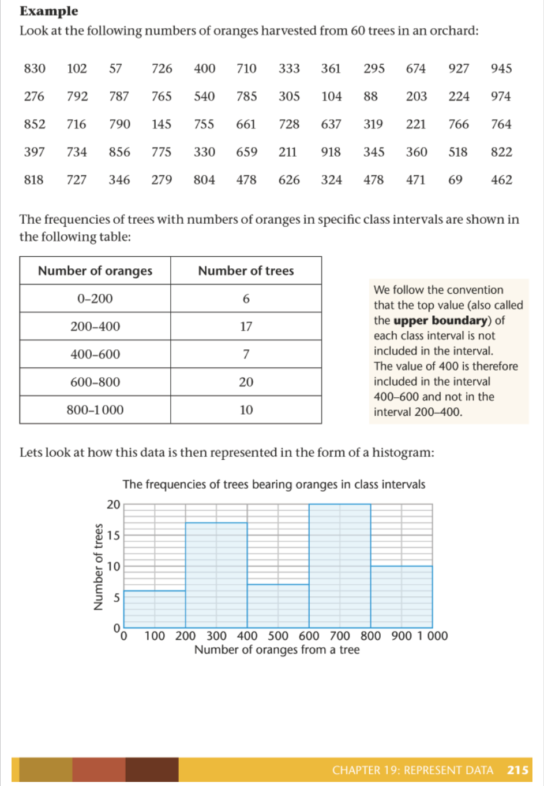
> **[Diagram Context - Textbook_Mathematics_Gr8_Represent-data.pdf-0016-17.png]**
> This educational graphic is a worked example demonstrating the statistical representation of data using a frequency table and a histogram. It displays raw numerical data, a grouped frequency table with class intervals (0–200, 200–400, etc.) and corresponding tree frequencies, an explanatory text box defining upper boundaries, and a corresponding histogram titled "The frequencies of trees bearing oranges in class intervals" with axes labeled "Number of trees" and "Number of oranges from a tree." Conceptually, this helps CAPS learners bridge the gap between organizing raw data into grouped intervals and visually displaying continuous grouped data through adjacent bars without gaps on a histogram.

---

## Answers

1. 
   - (a) Primary schools
   - (b) Northern Cape
   - (c) Eastern Cape, KwaZulu-Natal and Limpopo

2. Refer to the double bar graph on the top of LB page 277 on following page.

---

## 1. Look at the data below and answer the questions that follow.

### Number of schools, by province, participating in a school survey

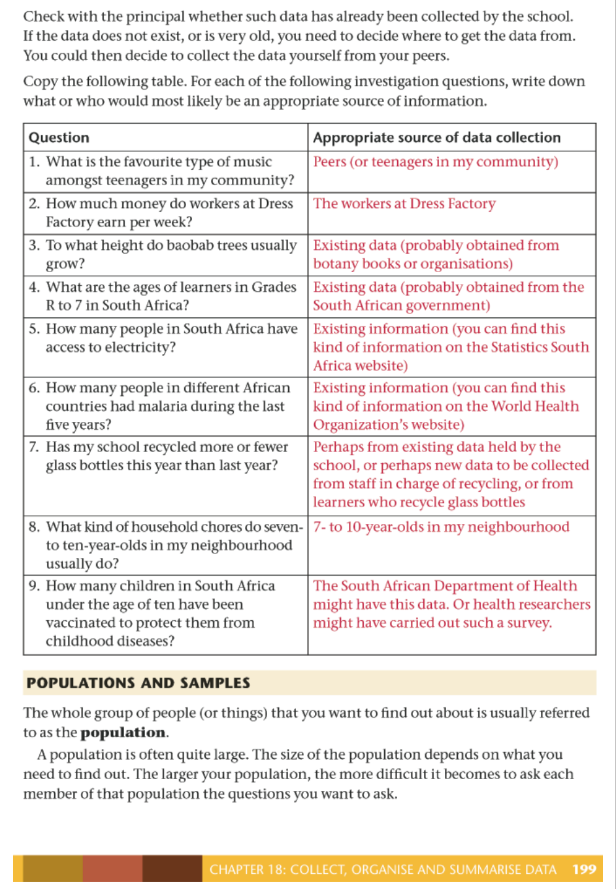
> **[Diagram Context - Textbook_Mathematics_Gr8_Collect-organise-and-summarise-data.pdf-0017-18.png]**
> This educational graphic presents a data collection table mapping various investigation questions to their appropriate sources of data collection, followed by introductory definitions of statistical concepts like populations and samples. Visible text includes numbered investigative questions alongside corresponding sources such as "Peers," "Existing data," "Statistics South Africa," and "World Health Organization," paired with section headings like "POPULATIONS AND SAMPLES." Conceptually, this helps CAPS learners understand how to identify and distinguish between primary data collection and secondary data sources depending on the specific research question being asked.

- (a) Did more primary schools or more secondary schools participate in the survey?
- (b) Which province had fewer than $50$ secondary schools participating in the survey?
- (c) Which provinces had more than $150$ of its primary schools participating in the survey?

---

## 2. Use grid paper, as shown in the example on page 277, to draw a double bar graph to show the following data.

### Facilities available at schools in Province A and Province B

| Facility | Percentage of schools in Province A | Percentage of schools in Province B |
| :--- | :---: | :---: |
| Electricity | $73$ | $50$ |
| Running water | $68$ | $45$ |
| Computers | $60$ | $20$ |
| Internet | $30$ | $10$ |

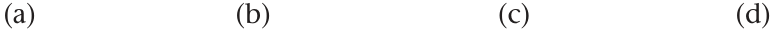

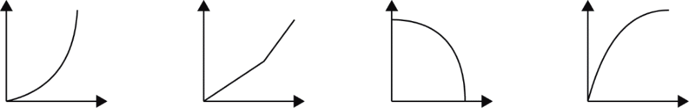
> **[Diagram Context - Textbook_Mathematics_Gr8_Graphs.pdf-0017-15.png]**
> This graphic displays four distinct Cartesian coordinate systems featuring unlabeled axes and various functional curves, including exponential, piecewise linear, concave downward, and saturation-style growth patterns. These graphs illustrate different mathematical relationships between variables, helping learners visualize concepts such as direct proportionality, rates of change, and limiting factors in physical and life sciences.

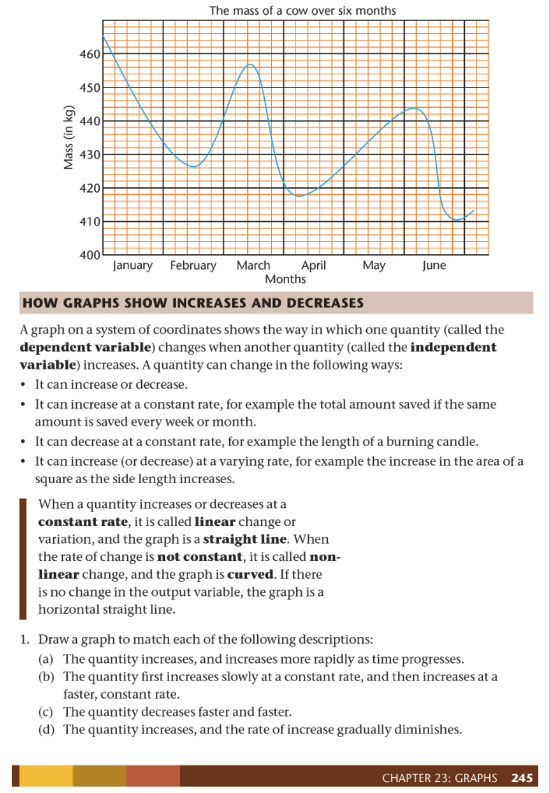
> **[Diagram Context - Textbook_Mathematics_Gr8_Graphs.pdf-0017-16.png]**
> This educational graphic is a Cartesian line graph titled "The mass of a cow over six months," accompanied by explanatory text on how graphs show increases and decreases. The graph features a grid with visible axes labeled "Mass (in kg)" on the vertical axis ranging from 400 to 460, and "Months" on the horizontal axis showing consecutive months from January to June, with a plotted curved line representing the fluctuating mass data. Conceptually, this diagram teaches students how to interpret dependent and independent variables, linear versus non-linear changes, and rates of increase or decrease in real-world contexts.

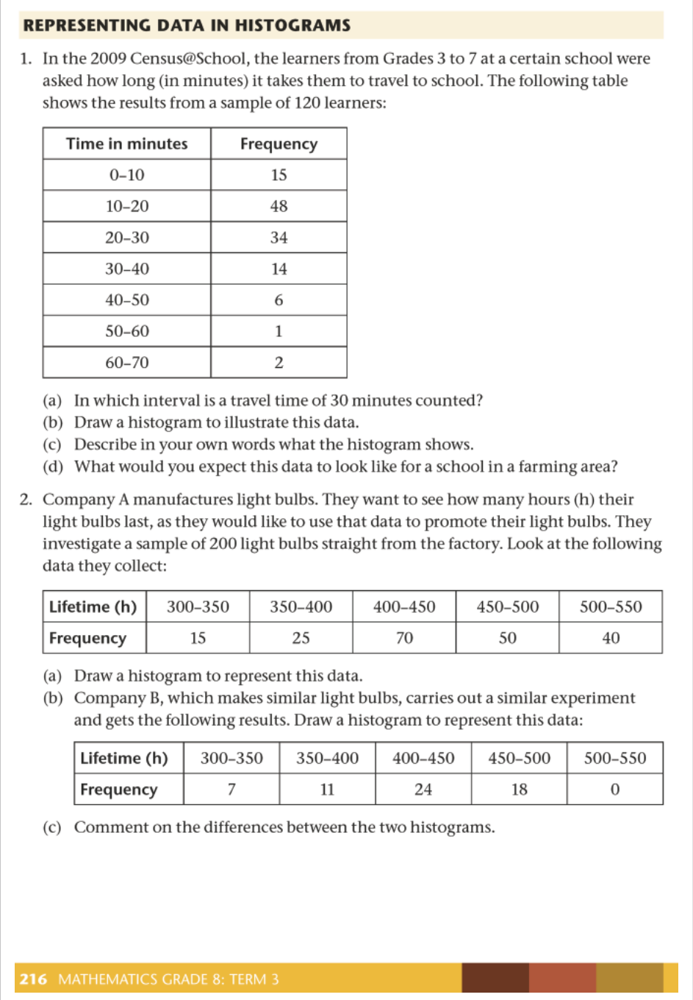
> **[Diagram Context - Textbook_Mathematics_Gr8_Represent-data.pdf-0017-21.png]**
> This educational graphic is a data representation exercise featuring frequency tables for statistical analysis. It displays two sets of grouped numerical data with visible labels including "Time in minutes", "Frequency", "Lifetime (h)", and associated questions labeled (a) through (d). Conceptually, the text and tables guide Grade 8 mathematics learners to organize continuous data into grouped intervals and interpret or construct histograms to compare distributions.

---

## 24.2 Histograms

### A SITUATION WHERE DATA HAS TO BE ORGANISED

#### Background information
* A **histogram** uses touching bars to show the frequencies of different data intervals in a data set.
* Here are some **features of a histogram**:
  * It represents only one set of data.
  * It represents numerical data which is grouped in class intervals.
  * It uses bars to show the frequencies of the different class intervals.
  * The heights of the bars represent the frequencies of the different class intervals.
* **Histograms are suitable to:**
  * identify patterns in the grouped data
  * describe trends shown by the grouped data.
* **To draw a histogram**, remember the following:
  * All bars must be equally wide if all class intervals are equally wide.
  * There are no gaps between bars unless the frequency of a specific class interval is equal to $0$.
  * The first bar should not touch the frequency axis.

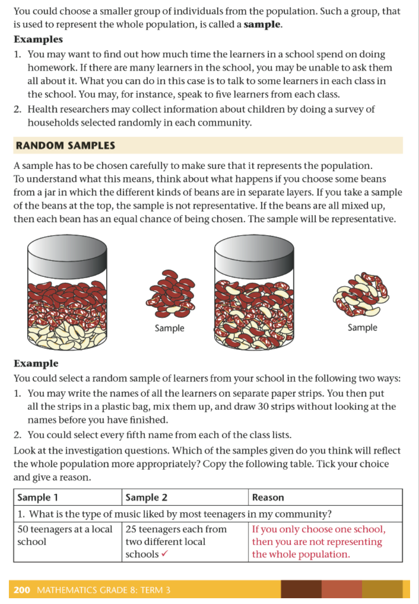
> **[Diagram Context - Textbook_Mathematics_Gr8_Collect-organise-and-summarise-data.pdf-0018-19.png]**
> This educational graphic features an instructional text paired with two jar-and-bean visual models and a data comparison table demonstrating random sampling principles for Grade 8 Mathematics. The visible labels include "Sample," "Sample 1," "Sample 2," and "Reason," accompanied by illustrations of stratified versus mixed beans in glass jars. Conceptually, the diagram conveys the importance of random mixing in population sampling, illustrating that a representative sample requires all subgroup elements to have an equal chance of being chosen rather than biased selection from stratified layers.

---

### 24.2 Histograms

#### A SITUATION WHERE DATA HAS TO BE ORGANISED

1. Mr Makae wants to buy an orange farm. Three farms are available, each with an orchard of orange trees, and the three farms cost about the same. There are $40$ orange trees on each farm. The total mass of oranges (in kilograms) harvested from each tree on each farm over the last three years is given below. Which farm should he buy?

| Farm A: | | | | | | | | | |
|---|---|---|---|---|---|---|---|---|---|
| $426$ | $628$ | $467$ | $413$ | $862$ | $585$ | $652$ | $600$ | $734$ | $611$ |
| $741$ | $605$ | $536$ | $643$ | $833$ | $438$ | $613$ | $704$ | $623$ | $719$ |
| $719$ | $701$ | $501$ | $768$ | $642$ | $444$ | $751$ | $579$ | $695$ | $726$ |
| $616$ | $619$ | $441$ | $703$ | $902$ | $947$ | $785$ | $952$ | $725$ | $721$ |

| Farm B: | | | | | | | | | |
|---|---|---|---|---|---|---|---|---|---|
| $822$ | $736$ | $773$ | $674$ | $884$ | $463$ | $644$ | $433$ | $688$ | $487$ |
| $884$ | $530$ | $448$ | $410$ | $982$ | $638$ | $492$ | $638$ | $725$ | $621$ |
| $743$ | $661$ | $744$ | $530$ | $560$ | $745$ | $455$ | $943$ | $760$ | $734$ |
| $888$ | $457$ | $621$ | $969$ | $507$ | $500$ | $542$ | $831$ | $576$ | $801$ |

| Farm C: | | | | | | | | | |
|---|---|---|---|---|---|---|---|---|---|
| $438$ | $530$ | $743$ | $947$ | $450$ | $777$ | $859$ | $748$ | $473$ | $724$ |
| $750$ | $852$ | $428$ | $464$ | $725$ | $554$ | $758$ | $997$ | $467$ | $743$ |
| $722$ | $438$ | $779$ | $690$ | $785$ | $543$ | $752$ | $898$ | $474$ | $483$ |
| $460$ | $772$ | $544$ | $756$ | $491$ | $576$ | $482$ | $744$ | $701$ | $803$ |

---

### Teaching guidelines
Introduce learners to question 1 on LB page $277$ alongside and challenge them in groups to find a solution for Mr Makae's problem.

### Answers
1. Refer to the teaching guidelines above. The purpose of the question is to engage learners and make them think.

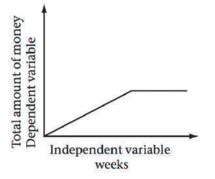
> **[Diagram Context - Textbook_Mathematics_Gr8_Graphs.pdf-0018-03.png]**
> The graphic is a line graph displaying Cartesian coordinates with labeled axes. The vertical y-axis is labeled "Total amount of money / Dependent variable" and the horizontal x-axis is labeled "Independent variable / weeks", with a line curve showing an initial positive linear increase followed by a horizontal constant phase. Conceptually, this diagram teaches CAPS learners how to correctly identify, position, and interpret independent and dependent variables on a graph, illustrating a relationship where the dependent variable initially increases proportionally with time before leveling off.

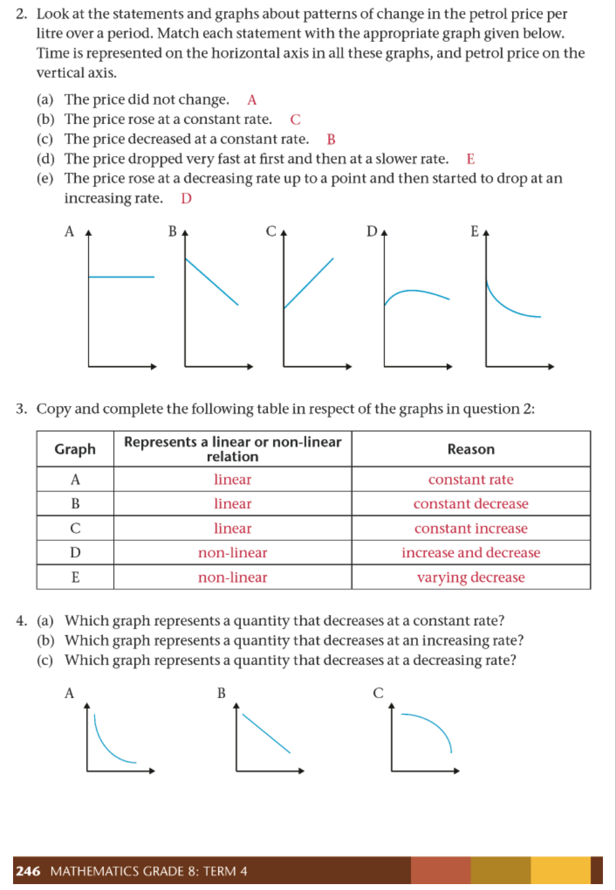
> **[Diagram Context - Textbook_Mathematics_Gr8_Graphs.pdf-0018-10.png]**
> This educational graphic features a series of Cartesian line graphs and tables illustrating linear and non-linear relationships representing patterns of change in petrol price over time. Visible elements include labeled graphs (A–E) with horizontal time axes, vertical price axes, directional curve lines, and matching exercise questions with a completed analytical table. Conceptually, it helps Grade 8 mathematics learners interpret functional relationships, distinguish between constant and varying rates of change, and connect contextual word descriptions to graphical representations.

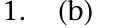

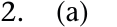

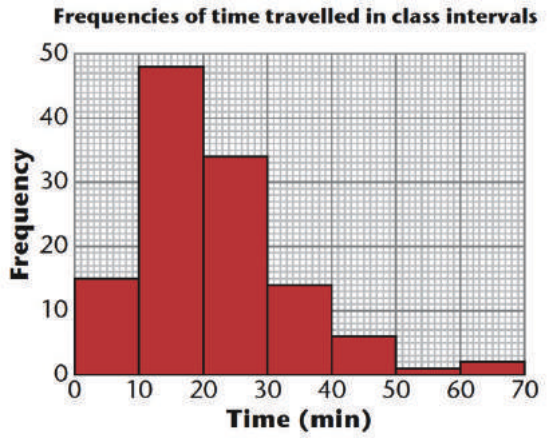
> **[Diagram Context - Textbook_Mathematics_Gr8_Represent-data.pdf-0018-03.png]**
> This graphic is a histogram titled "Frequencies of time travelled in class intervals". The vertical axis is labeled "Frequency" with numerical values from 0 to 50, and the horizontal axis represents "Time (min)" divided into class intervals of 10 units from 0 to 70. Conceptually, it helps CAPS learners visualize the distribution of grouped continuous data and interpret how data frequency varies across different numerical intervals.

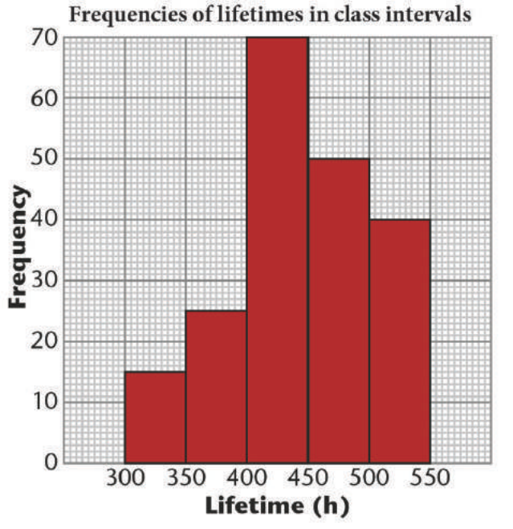
> **[Diagram Context - Textbook_Mathematics_Gr8_Represent-data.pdf-0018-04.png]**
> The graphic is a frequency histogram titled "Frequencies of lifetimes in class intervals" set against a grid background. The vertical axis is labeled "Frequency" with numerical increments from 0 to 70, while the horizontal axis displays "Lifetime (h)" with class intervals ranging from 300 to 550. This diagram helps high-school learners visualize the distribution and frequency of grouped continuous data, supporting statistical analysis concepts such as estimating the mode and interpreting frequency tables.

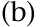

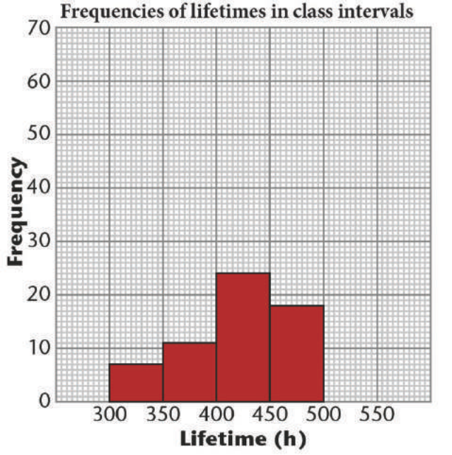
> **[Diagram Context - Textbook_Mathematics_Gr8_Represent-data.pdf-0018-06.png]**
> This educational graphic is a histogram titled "Frequencies of lifetimes in class intervals" displayed on a grid. The vertical axis is labeled "Frequency" with a scale from 0 to 70, and the horizontal axis is labeled "Lifetime (h)" with intervals starting from 300 to 550, showing four red rectangular bars representing data frequencies across consecutive class intervals. For CAPS mathematics and mathematical literacy learners, this diagram visually conveys how to organize and represent continuous grouped data, demonstrating the relationship between class intervals on the horizontal axis and their corresponding frequencies on the vertical axis.

---

## Lesson Revision Notes: Organizing and Representing Data Using Tally and Frequency Tables

### Core Concepts

* **Class Intervals:** When dealing with large sets of continuous numerical data, it is often useful to group the data into ranges called **class intervals** (e.g., "$400\text{ kg}$ or more but less than $500\text{ kg}$"). 
* **Tally Marks:** A system of counting using vertical strokes ($\mid$) grouped in fives ($\text{HH}$) to record frequencies as data is processed.
* **Frequency:** The total count of data points (in this context, the number of trees) that fall into a specific class interval.

---

### Activities & Worked Examples

#### Question 2
*How can the data about the orange trees on the three farms be organised so that the farmer has a clear picture of the difference between the orchards on the three farms?*

* **Answer:** Data can be organized by grouping the numerical values into equal class intervals and recording them in **tally and frequency tables**, which can then be used to draw comparative graphs.

---

#### Question 3: Tally and Frequency Tables for Orange Harvests

Below are the completed frequency tables representing the masses of oranges harvested from different trees across three separate farms (Farm A, Farm B, and Farm C).

##### Masses of oranges harvested from different trees on Farm A
| Class interval | Number of trees that produced masses in the interval (Tally) | Total (Frequency) |
| :--- | :--- | :---: |
| $400\text{ kg}$ or more but less than $500\text{ kg}$ | $\mid$ | $6$ |
| $500\text{ kg}$ or more but less than $600\text{ kg}$ | $\mid\mid\mid\mid$ | $4$ |
| $600\text{ kg}$ or more but less than $700\text{ kg}$ | $\text{HH}\ \text{HH}\ \mid\mid$ | $12$ |
| $700\text{ kg}$ or more but less than $800\text{ kg}$ | $\text{HH}\ \text{HH}\ \mid\mid\mid$ | $13$ |
| $800\text{ kg}$ or more but less than $900\text{ kg}$ | $\mid\mid$ | $2$ |
| $900\text{ kg}$ or more but less than $1\,000\text{ kg}$ | $\mid\mid\mid$ | $3$ |

---

##### Masses of oranges harvested from different trees on Farm B
| Class interval | Number of trees that produced masses in the interval (Tally) | Total (Frequency) |
| :--- | :--- | :---: |
| $400\text{ kg}$ or more but less than $500\text{ kg}$ | $\text{HH}\ \mid\mid\mid$ | $8$ |
| $500\text{ kg}$ or more but less than $600\text{ kg}$ | $\text{HH}\ \mid\mid$ | $7$ |
| $600\text{ kg}$ or more but less than $700\text{ kg}$ | $\text{HH}\ \mid\mid\mid$ | $8$ |
| $700\text{ kg}$ or more but less than $800\text{ kg}$ | $\text{HH}\ \mid\mid\mid$ | $8$ |
| $800\text{ kg}$ or more but less than $900\text{ kg}$ | $\text{HH}\ \mid$ | $6$ |
| $900\text{ kg}$ or more but less than $1\,000\text{ kg}$ | $\mid\mid\mid$ | $3$ |

---

##### Masses of oranges harvested from different trees on Farm C
| Class interval | Number of trees that produced masses in the interval (Tally) | Total (Frequency) |
| :--- | :--- | :---: |
| $400\text{ kg}$ or more but less than $500\text{ kg}$ | $\text{HH}\ \text{HH}\ \mid\mid$ | $12$ |
| $500\text{ kg}$ or more but less than $600\text{ kg}$ | $\text{HH}$ | $5$ |
| $600\text{ kg}$ or more but less than $700\text{ kg}$ | $\mid$ | $1$ |
| $700\text{ kg}$ or more but less than $800\text{ kg}$ | $\text{HH}\ \text{HH}\ \text{HH}\ \mid$ | $16$ |
| $800\text{ kg}$ or more but less than $900\text{ kg}$ | $\mid\mid\mid\mid$ | $4$ |
| $900\text{ kg}$ or more but less than $1\,000\text{ kg}$ | $\mid\mid$ | $2$ |

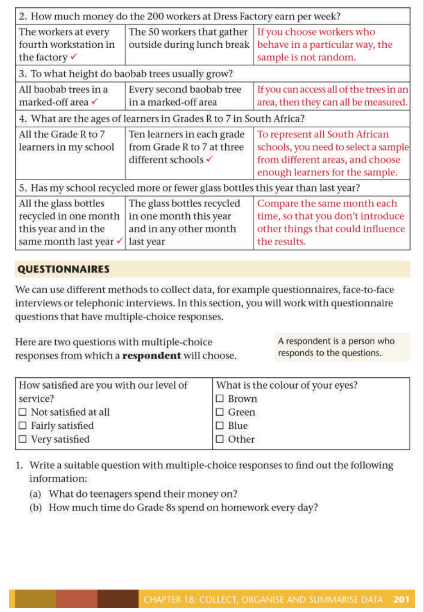
> **[Diagram Context - Textbook_Mathematics_Gr8_Collect-organise-and-summarise-data.pdf-0019-26.png]**
> This educational resource is a textbook page featuring worked examples and exercises on data collection methods, specifically focusing on population sampling, questionnaires, and multiple-choice questions. Visible text and labels include numbered questions (2 to 5 with sub-questions), tick marks indicating correct choices, explanatory red text for evaluating sampling methods, and sample survey questions with checkbox options for service satisfaction and eye color. Conceptually, it guides students through the practical aspects of statistics in the CAPS curriculum by demonstrating how to construct valid questionnaires and select unbiased samples from populations.

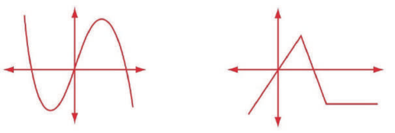
> **[Diagram Context - Textbook_Mathematics_Gr8_Graphs.pdf-0019-10.png]**
> This educational graphic shows two mathematical function graphs plotted on a Cartesian plane with horizontal and vertical axes marked by red arrows. The left graph illustrates a smooth, continuous cubic polynomial curve showing turning points and inflection behavior, while the right graph displays a piecewise function composed of connected linear segments and a horizontal asymptote. Conceptually, these graphs help FET phase learners investigate function characteristics such as domain, range, turning points, and rates of change in alignment with the CAPS Mathematics curriculum.

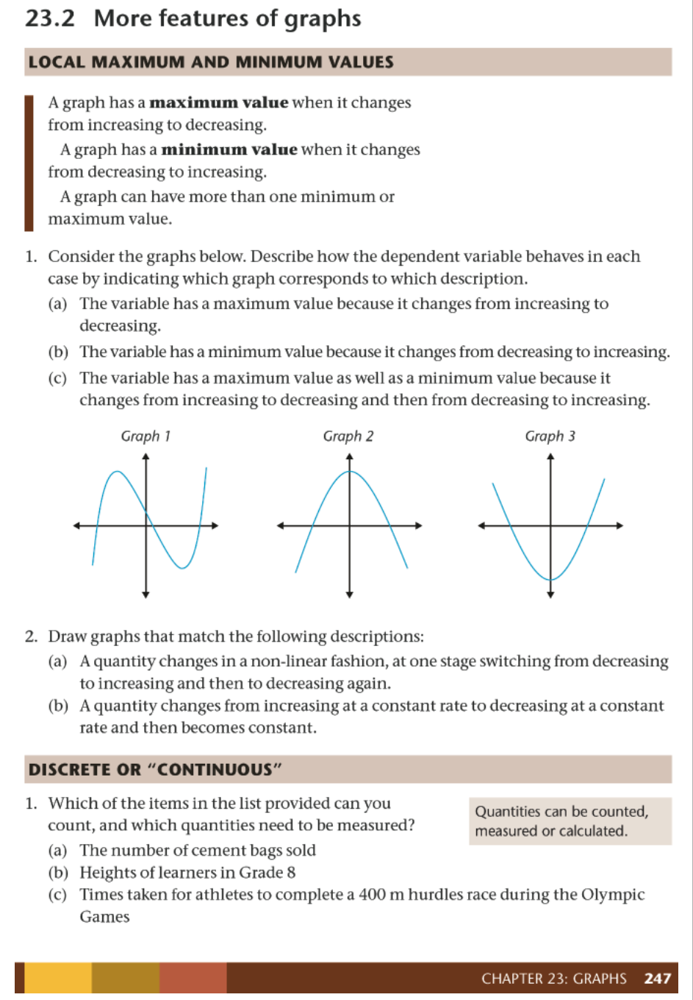
> **[Diagram Context - Textbook_Mathematics_Gr8_Graphs.pdf-0019-15.png]**
> The educational graphic presents mathematical graphs featuring Cartesian coordinate axes and curve functions, labelled as "Graph 1", "Graph 2", and "Graph 3". Visible elements include x-axes, y-axes, intersecting directional arrows, and non-linear blue curves. Conceptually, this resource helps high school learners identify local maximum and minimum values by observing where a curve transitions between increasing and decreasing behaviours.

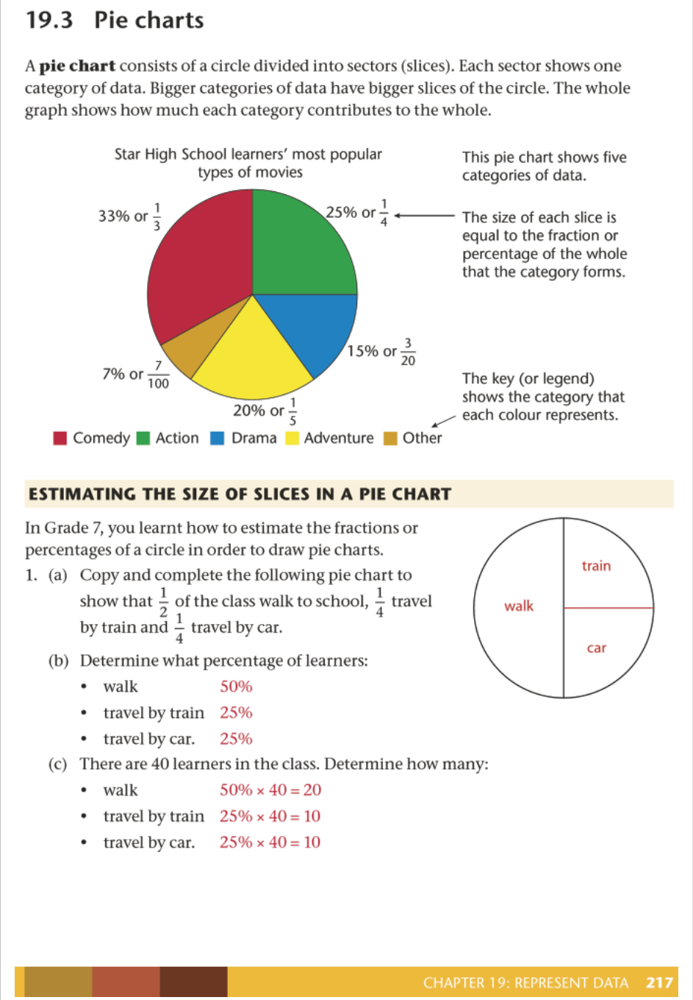
> **[Diagram Context - Textbook_Mathematics_Gr8_Represent-data.pdf-0019-18.png]**
> The educational graphic features a pie chart accompanied by explanatory text, percentage and fraction values, a legend, and a practice exercise with step-by-step calculations. Visible labels include movie categories ("Comedy", "Action", "Drama", "Adventure", "Other"), transport methods ("walk", "train", "car"), percentage and fraction values (e.g., 33% or $\frac{1}{3}$, 25% or $\frac{1}{4}$), pointing arrows, and mathematical operations for data analysis. Conceptually, the diagram demonstrates how categorical data can be represented proportionally as sectors of a circle, teaching students how to interpret fractions and percentages into visual slices and calculate actual quantities from a given total.

---

## Background Information (continued)

Refer to the histogram provided.

* **A class of data** is **one of the groups** in a collection of grouped data, for example, all data values from $500\text{ up to }599$.
* **The class limits** are **the two values at the ends of a class** between which the data values must lie, for example, $500$ is the lower class limit of the green bar and $600$ is the lower class limit of the yellow bar, which means that the smallest data value in the yellow class can be $500$ but the largest data value must be less than $600$.
* **The class interval** is **the width of a class** and is measured by the difference between the class limits, for example, the class interval of the green bar is $600\text{ g} - 500\text{ g} = 100\text{ g}$.
* **The class boundaries** are **the smallest and largest possible values** that fit inside a given class, for example, equal to $500\text{ g}$ but less than $600\text{ g}$ for the green bar.

---

## Teaching Guidelines (continued)

* Use the background information and discuss the features of a histogram as shown on the histogram.
* Point out that there are no gaps between bars (no gaps between class intervals) and no bars overflow (no class intervals overflow).
* Point out that $500$ is the lower boundary of the green bar and $600$ is the lower boundary of the yellow bar, therefore the green bar contains all masses from $500\text{ g}$ to $599\text{ g}$.

---

## Visual Representations

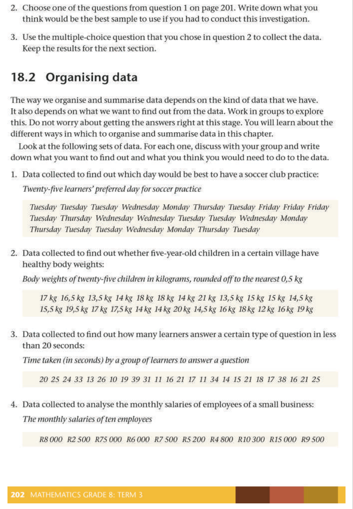
> **[Diagram Context - Textbook_Mathematics_Gr8_Collect-organise-and-summarise-data.pdf-0020-15.png]**
> The graphic presents a Grade 8 Mathematics textbook page focusing on the organisation of raw data, featuring four distinct datasets represented as lists of unorganized values. Visible text elements include section headings like "18.2 Organising data," numbered investigative prompts (1 to 4), and highlighted text boxes containing specific raw data types: categorical days of the week, continuous body weights in kilograms, discrete time measurements in seconds, and financial values in South African Rands (R). Conceptually, this section helps learners understand that the method used to organise and summarise data depends heavily on the type of data collected, laying the foundation for frequency tables and graphical representations.

This type of graph is called a **histogram**.
*(The columns in a histogram are normally not coloured differently, or even coloured at all. In this histogram the columns are coloured only because some questions are asked about them below.)*

* The numbers $400$ on the left and $500$ on the right of the light yellow column indicate that masses of $400\text{ kg}$ or more but less than $500\text{ kg}$ are counted in that interval.
* The height of each column represents the number of masses (the frequency) that fall in that interval.

---

## Exercises

### Question 4

(a) A total of $536\text{ kg}$ of oranges was harvested from one of the trees on Farm A over a period of the three years. In which column on the above histogram is this tree represented? Explain your answer.
(b) Which masses are represented in the red column?
(c) Which class interval is represented by the light blue column on the above histogram?
(d) How many masses are represented by the green column?
(e) Which column represents the highest frequency?

---

### Question 5

Copy and complete the following histograms.

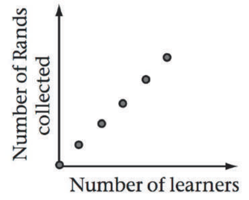
> **[Diagram Context - Textbook_Mathematics_Gr8_Graphs.pdf-0020-10.png]**
> This graphic is a Cartesian scatter plot displaying discrete data points with positive linear correlation. The vertical axis is labeled "Number of Rands collected" and the horizontal axis is labeled "Number of learners," with an origin point at zero. Conceptually, it conveys a direct, proportional relationship where an increase in the number of learners corresponds to an increase in total funds collected, introducing learners to interpreting direct proportion and linear trends in real-world contexts.

Refer to the histogram for Farm B and Farm C.

---

## Answers

**4.** 
* **(a)** In the green column. 
  * *Reason:* This is because all the trees that produced $500\text{ kg}$ or more but less than $600\text{ kg}$ are represented in this column.
* **(b)** Masses of $900\text{ kg}$ or more, but less than $1\ 000\text{ kg}$. 
  * *Reason:* In this case, $902\text{ kg}$, $947\text{ kg}$ and $952\text{ kg}$.
* **(c)** The class interval $700–800$, in other words masses of $700\text{ kg}$ or more but less than $800\text{ kg}$.
* **(d)** Four
* **(e)** The light blue column

**5.** Refer to the histogram for Farm B and Farm C.

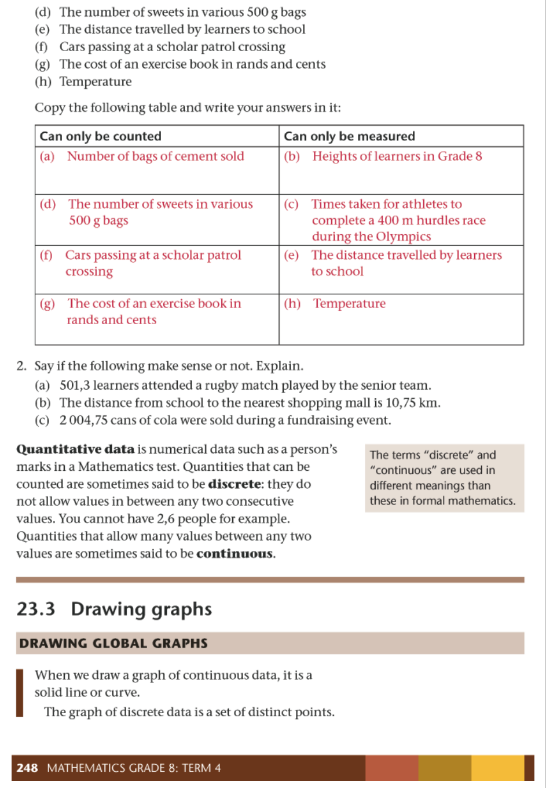
> **[Diagram Context - Textbook_Mathematics_Gr8_Graphs.pdf-0020-11.png]**
> This educational graphic is a textbook page from a Grade 8 Mathematics Term 4 CAPS curriculum resource focusing on data handling and drawing graphs. It contains a completed sorting table comparing quantitative data items categorized under the headings "Can only be counted" (discrete data, such as numbers of bags of cement or sweets) and "Can only be measured" (continuous data, such as heights, distances, and temperatures), alongside explanatory text defining discrete versus continuous quantitative data and introductory rules for drawing global graphs. Conceptually, the material helps learners distinguish between discrete and continuous variables, reinforcing that countable data comprises distinct values while measurable data allows intermediate values, which directly dictates whether a resulting graph should be drawn as a set of distinct points or a solid line/curve.

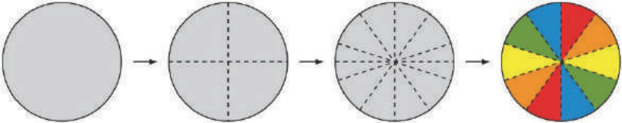
> **[Diagram Context - Textbook_Mathematics_Gr8_Represent-data.pdf-0020-04.png]**
> This graphic is a sequential geometric diagram featuring four grey circular figures linked by horizontal arrows, progressing from a solid circle to one divided by four dashed lines, then to eight dashed lines, and finally to a fully coloured, multi-segmented pie chart. It visually demonstrates the concept of division and fraction representation, where a whole circular shape is progressively partitioned into equal fractional sectors, each distinguished by bright primary and secondary colours.

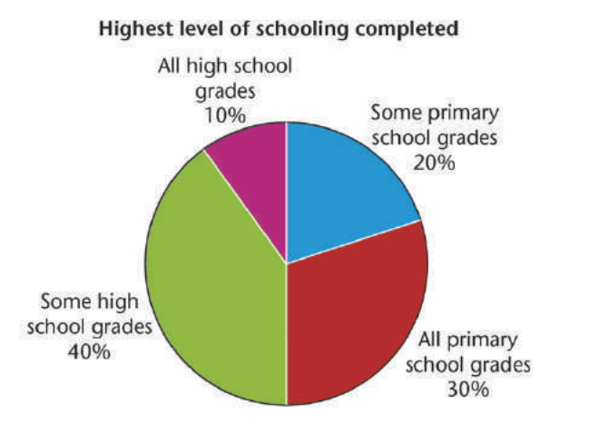
> **[Diagram Context - Textbook_Mathematics_Gr8_Represent-data.pdf-0020-11.png]**
> This educational graphic is a pie chart titled "Highest level of schooling completed" that visually represents categorical data proportions as proportional sectors of a circle. The visible labels and associated percentage values include "Some primary school grades 20%", "All primary school grades 30%", "Some high school grades 40%", and "All high school grades 10%". Conceptually, this diagram helps students learn how to interpret statistical data, understand parts-of-a-whole relationships, and read proportional distributions from circular graphs as outlined in the CAPS curriculum.

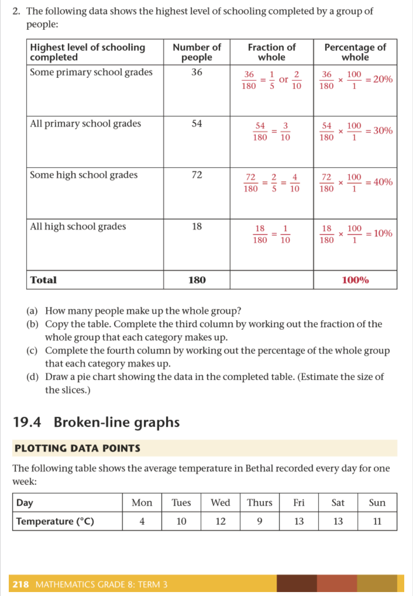
> **[Diagram Context - Textbook_Mathematics_Gr8_Represent-data.pdf-0020-13.png]**
> The graphic displays a data table and accompanying math exercises for Grade 8 Mathematics, followed by an introduction to broken-line graphs. The visible table includes column headers for "Highest level of schooling completed", "Number of people", "Fraction of whole", and "Percentage of whole", along with rows categorizing educational levels ("Some primary school grades", "All primary school grades", "Some high school grades", "All high school grades", and a "Total" of 180), mathematical fraction and percentage calculations, and questions (a) through (d) guiding students to interpret and represent data. This material helps learners practice converting raw data into fractions and percentages, and introduces plotting data points for broken-line graphs as outlined in the CAPS curriculum.

---

• Point out that class intervals are consecutive and cannot overlap.
• Explain that the upper boundary of each class interval is not included in the interval.

## INTERPRETING A HISTOGRAM

### Background information
To interpret histograms, do the following:
• extract data from the histogram
• identify patterns shown by the histogram
• describe trends shown by the histogram.

### Teaching guidelines
Learners extract data from the histogram on LB page 281 to answer some of the questions below.

### Answers

1. Refer to the histogram on LB page 281 on following page.

| Age (years) | Frequency |
| :--- | :--- |
| 20–30 | 0 |
| 30–40 | 3 |
| 40–50 | 11 |
| 50–60 | 17 |
| 60–70 | 34 |
| 70–80 | 19 |

2. 17 members

3. $3 + 11 + 17 + 34 + 19 = 84$ members

4. Yes, the order of the columns is important, because the horizontal axis shows a range of age intervals, from smallest to biggest, like a number line.

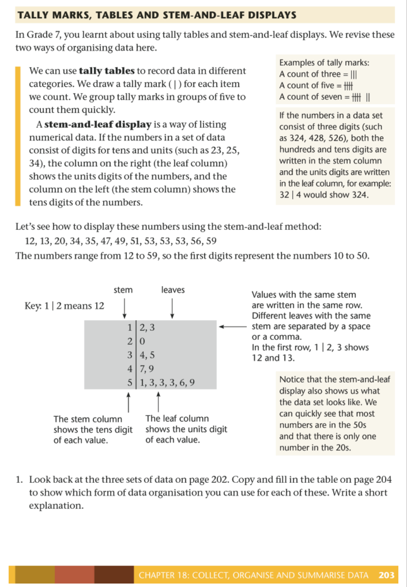
> **[Diagram Context - Textbook_Mathematics_Gr8_Collect-organise-and-summarise-data.pdf-0021-16.png]**
> This educational graphic is a textbook page explaining data organisation methods, specifically focusing on tally tables and a stem-and-leaf display. Visible labels include "stem", "leaves", "Key: 1 | 2 means 12", "The stem column shows the tens digit of each value", and "The leaf column shows the units digit of each value", accompanied by arrows pointing to a structured data table and explanatory text boxes. Conceptually, it demonstrates how to sort numerical data into stems and leaves to visually reveal data distribution, frequency, and clusters at a glance.

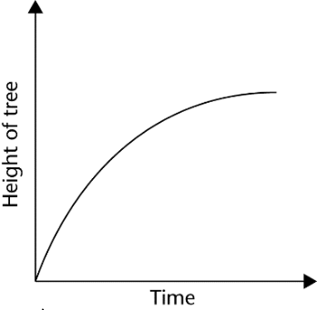
> **[Diagram Context - Textbook_Mathematics_Gr8_Graphs.pdf-0021-07.png]**
> This graphic is a line graph displaying growth dynamics with axes labeled "Height of tree" on the vertical axis and "Time" on the horizontal axis, featuring a curved line that rises and eventually flattens out. Conceptually, it illustrates a typical sigmoid or decelerating growth pattern, helping learners understand how biological growth rates change over a period of time.

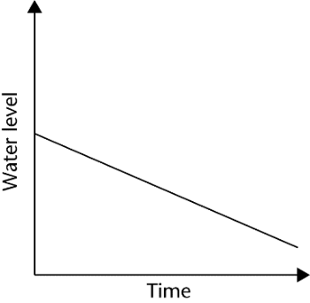
> **[Diagram Context - Textbook_Mathematics_Gr8_Graphs.pdf-0021-09.png]**
> This line graph features a vertical y-axis labeled "Water level" and a horizontal x-axis labeled "Time," with a single straight line sloping downwards from left to right. The graph visually conveys a linear, inverse relationship showing that as time increases, the water level steadily decreases at a constant rate.

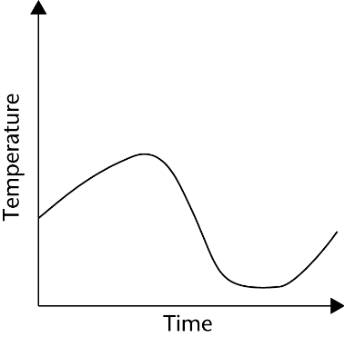
> **[Diagram Context - Textbook_Mathematics_Gr8_Graphs.pdf-0021-11.png]**
> This graphic is a line graph with a vertical axis labeled "Temperature" and a horizontal axis labeled "Time", featuring a curved line that fluctuates upwards and downwards. The visual conveys how temperature changes continuously over a given time period, helping learners interpret trends such as heating and cooling phases in physical science or geography contexts.

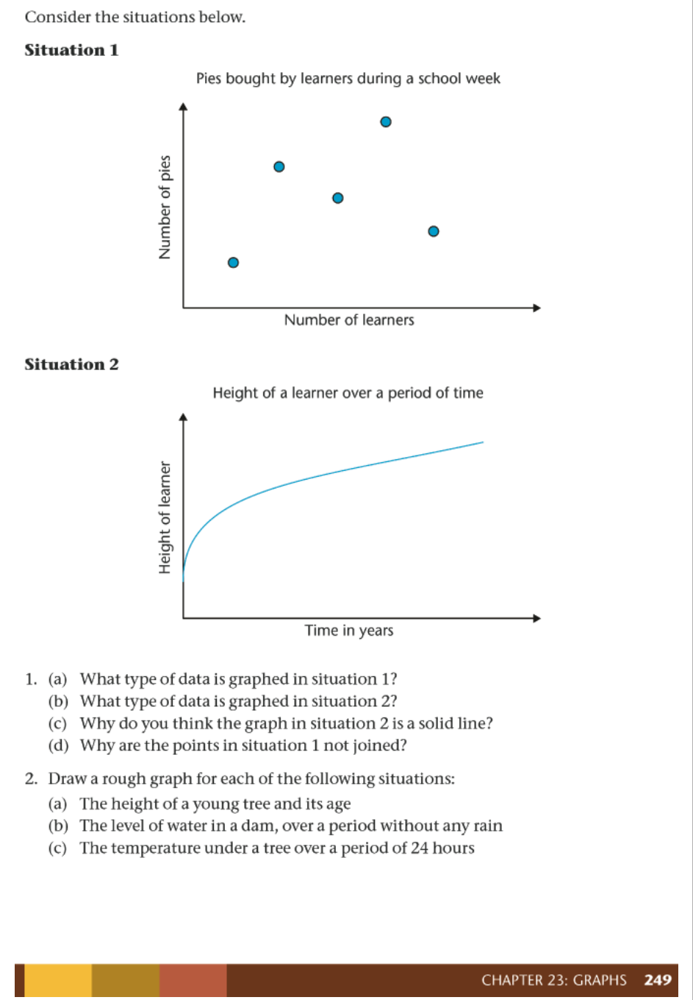
> **[Diagram Context - Textbook_Mathematics_Gr8_Graphs.pdf-0021-12.png]**
> The educational graphic displays two mathematical graphs: a scatter plot in "Situation 1" titled "Pies bought by learners during a school week" and a continuous curve in "Situation 2" titled "Height of a learner over a period of time". Visible labels include axis names such as "Number of pies", "Number of learners", "Height of learner", and "Time in years", accompanied by numbered analytical questions and real-world scenarios. Conceptually, this resource helps high school learners distinguish between discrete and continuous data, teaching them when to use unconnected points versus solid lines to represent relationships between variables.

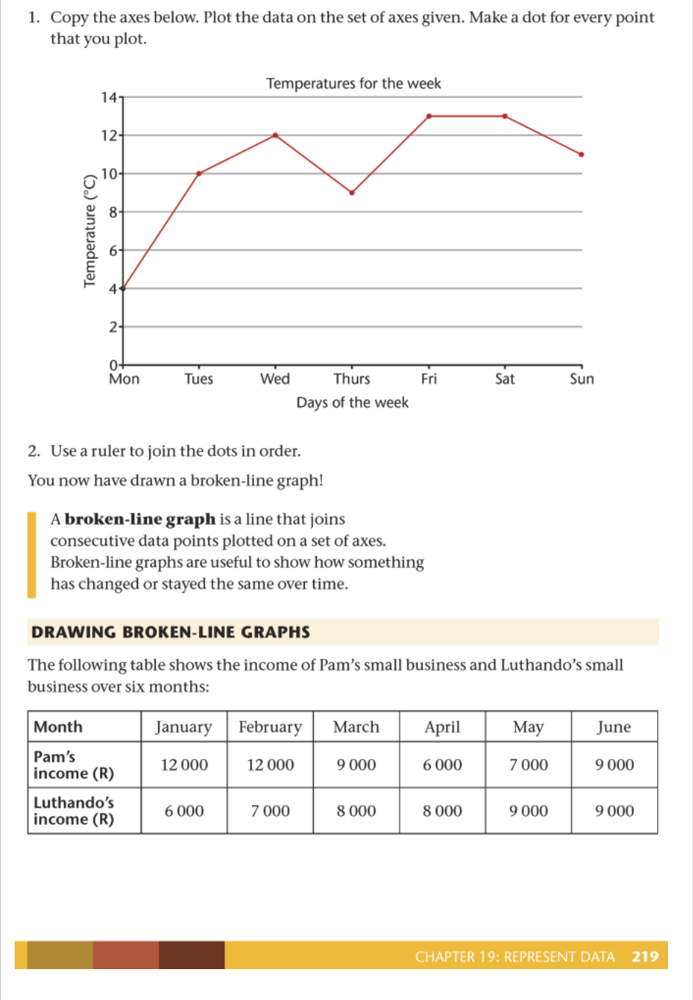
> **[Diagram Context - Textbook_Mathematics_Gr8_Represent-data.pdf-0021-25.png]**
> This educational graphic is a line graph and data table demonstrating how to represent and interpret continuous data over time. It features a broken-line graph titled "Temperatures for the week" with axes labeled "Temperature (°C)" and "Days of the week" (Mon to Sun), alongside an instructional data table comparing the monthly incomes of two small businesses. Conceptually, it teaches learners how to accurately plot data points, connect them to visualize trends, and understand how variables change over time in alignment with CAPS data handling outcomes.

---

## Teaching guidelines (continued)

Point out that the individual data values in a histogram cannot be seen because the data was grouped. This is a disadvantage of histograms as well as of grouped data.

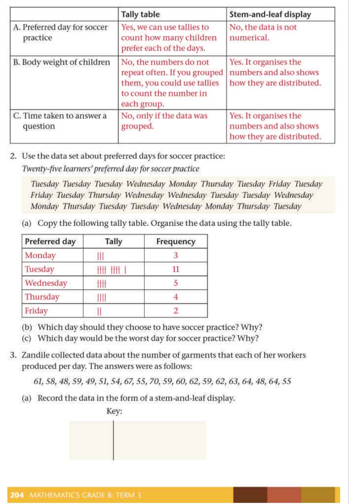
> **[Diagram Context - Textbook_Mathematics_Gr8_Collect-organise-and-summarise-data.pdf-0022-12.png]**
> This educational graphic is a mathematics textbook page featuring data handling exercises comparing tally tables and stem-and-leaf displays. It contains comparative tables, raw categorical and numerical data sets, a completed tally table with columns labeled "Preferred day," "Tally," and "Frequency," and structured questions requiring learners to organise and interpret data. Conceptually, this diagram guides students through selecting appropriate graphical and tabular methods for categorical versus numerical data, teaching them how to tally frequencies and construct stem-and-leaf displays to analyse distributions within South African curriculum standards.

Notice that you cannot see the individual data values in a histogram – they have been "lost". For example, below you can see a stem-and-leaf display and a histogram of the same data set.

<!-- DIAG_PLACEHOLDER: diagram -->

A histogram usually has many more data values than a stem-and-leaf display – too many to show in a stem-and-leaf display. It would, for example, be difficult to put the $84$ values for the members of the sports club onto a stem-and-leaf display.

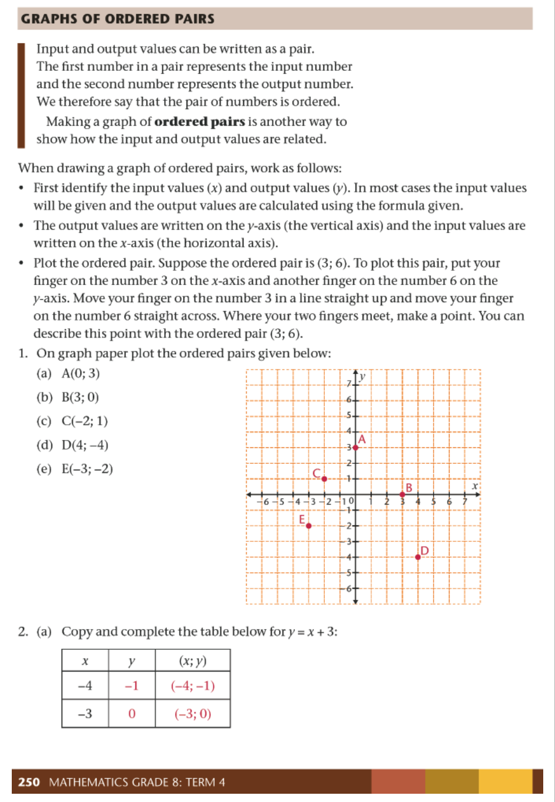
> **[Diagram Context - Textbook_Mathematics_Gr8_Graphs.pdf-0022-13.png]**
> This educational graphic is a Cartesian coordinate plane displaying plotted points representing graphs of ordered pairs. The visible elements include a grid with an $x$-axis (horizontal) and $y$-axis (vertical) labeled from $-7$ to $7$, plotted points labeled A($0;3$), B($3;0$), C($-2;1$), D($4;-4$), and E($-3;-2$), as well as an incomplete table for input-output values using the formula $y = x + 3$. Conceptually, it guides Grade 8 CAPS mathematics learners in understanding how to translate numerical relationships and algebraic formulas into coordinate pairs and plot them visually on a Cartesian plane.

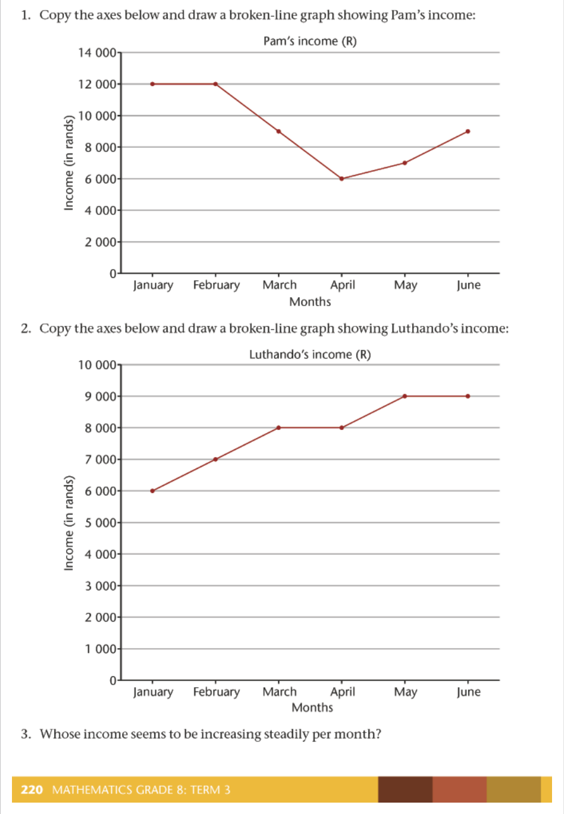
> **[Diagram Context - Textbook_Mathematics_Gr8_Represent-data.pdf-0022-14.png]**
> The graphic displays two broken-line graphs titled "Pam's income (R)" and "Luthando's income (R)". The visible labels and axes include "Income (in rands)" on the vertical axes, "Months" on the horizontal axes, and specific data points plotted across the months from January to June, accompanied by numbered questions. This visual helps learners practice interpreting and comparing trends in data represented graphically over time within a financial context.

---

# Drawing More Histograms

## Teaching Guidelines

When constructing histograms, learners should remember that:
* Bars should be equally wide without any gaps in between because the classes are equally wide with no gaps in between.
* The class intervals do not overflow because the upper class boundary of each class is not included in the interval.
* The height of the bar that represents a category should match the frequency of that category.

> **Note on drawing histograms:** The first bar touches the vertical frequency axis because the lower boundary of the first class interval is equal to $0$.

---

## Worked Examples & Activities

### Question 1

The table below shows how long it takes learners from a Grade 7 class at Western Primary to travel to school each day.

| Time (minutes) | Frequency |
| :--- | :--- |
| $0-10$ | $7$ |
| $10-20$ | $18$ |
| $20-30$ | $11$ |
| $30-40$ | $3$ |

#### Questions
1. (a) How many learners were asked about their travelling hours?
   (b) Look at the grid provided. What do you have to consider in order to help you decide on a scale division for the vertical axis?
   (c) What scale will you use on the horizontal axis? Explain your answer.
   (d) Copy the grid and draw a histogram of the data.

#### Answers
1. (a) Total learners = $7 + 18 + 11 + 3 = 39$
   (b) Look at the maximum frequency (which is $18$). Then choose a scale that will cover the greater part of the axis and grid.
   (c) Intervals of $10$ because the data is grouped in tens. The columns can be one or two blocks wide.
   (d) *Refer to the histogram representation showing "Time taken for learners to travel to school" with frequencies up to $18$ plotted against time intervals from $0$ to $40$ minutes.*

---

### Question 2

The table shows how much money different vendors earn selling their goods every week.

| Money (R) | Frequency |
| :--- | :--- |
| $0-100$ | $6$ |
| $100-200$ | $9$ |
| $200-300$ | $11$ |
| $300-400$ | $7$ |
| $400-500$ | $5$ |

#### Questions
2. (a) How many vendors were asked about their earnings?
   (b) Copy the grid on the following page. Decide on a scale for the vertical axis of a histogram and indicate it on the axis.
   (c) Decide on a scale for the horizontal axis and indicate it on the axis.

#### Answers
2. (a) Total vendors = $6 + 9 + 11 + 7 + 5 = 38$
   (b) Each block represents one or two vendors.
   (c) One block to show $\text{R}100$, or two blocks to show $\text{R}100$.

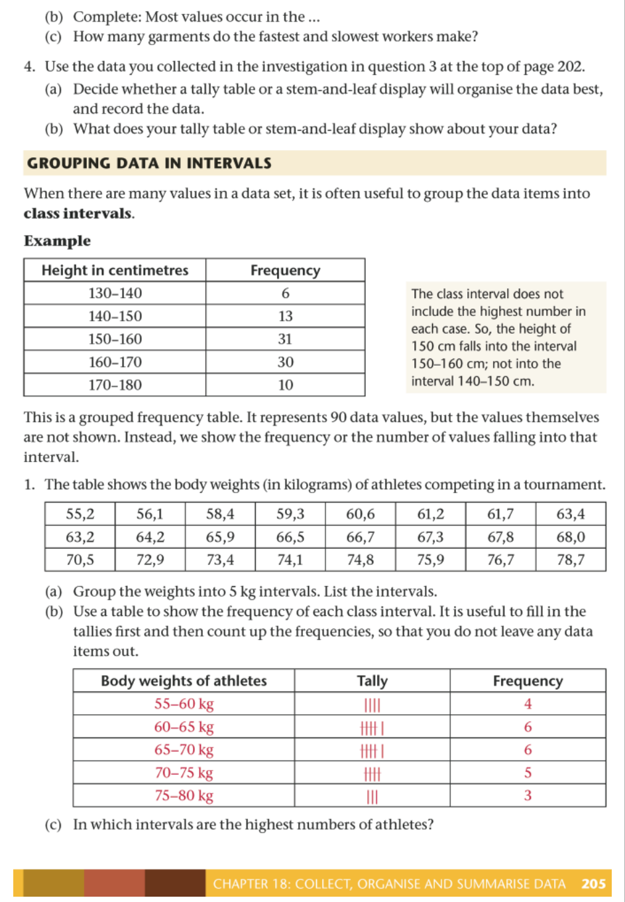
> **[Diagram Context - Textbook_Mathematics_Gr8_Collect-organise-and-summarise-data.pdf-0023-23.png]**
> This educational graphic shows mathematical tables and problem-solving exercises related to statistics and data handling from a CAPS-aligned textbook. Visible elements include tables with column labels such as "Height in centimetres", "Frequency", "Body weights of athletes", "Tally", and numerical data intervals like "130–140" and "55–60 kg". The diagram conceptually demonstrates how to organise large datasets into class intervals and construct grouped frequency tables using tallies for data summarisation.

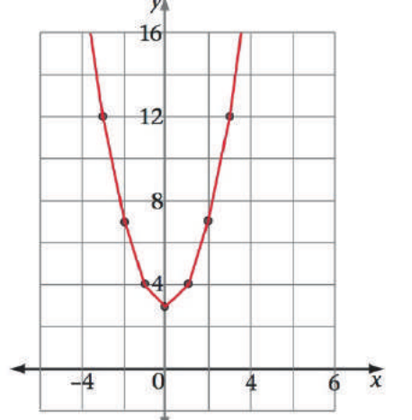
> **[Diagram Context - Textbook_Mathematics_Gr8_Graphs.pdf-0023-07.png]**
> This educational graphic is a Cartesian coordinate graph displaying a plotted parabola on a grid. The axes are labeled with variables $x$ and $y$, numerical values on the $x$-axis (-4, 0, 4, 6) and $y$-axis (4, 8, 12, 16), with plotted data points marked as dark circles along the red curve. For a high school mathematics student under the CAPS curriculum, this diagram visually conveys the parabolic function $y = ax^2 + q$, demonstrating the symmetrical shape of quadratic graphs, the turning point on the $y$-axis, and how dependent $y$-values are generated from independent $x$-values.

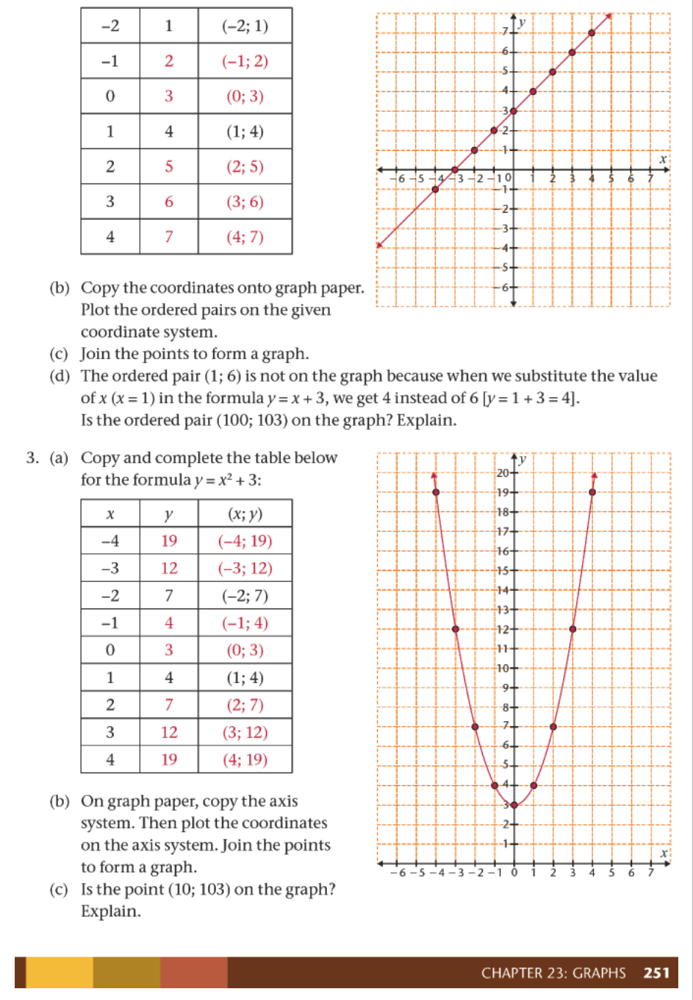
> **[Diagram Context - Textbook_Mathematics_Gr8_Graphs.pdf-0023-16.png]**
> The graphic contains two sets of worked mathematical problems featuring tables of values, Cartesian coordinate systems labeled with $x$ and $y$ axes, and plotted graphs representing linear ($y = x + 3$) and quadratic ($y = x^2 + 3$) functions. Visible labels include coordinate pairs $(x; y)$, numerical values ranging from $-6$ to $7$ on the axes, and instructional text for exercises (b), (c), and (d). Conceptually, this helps high school learners connect algebraic formulas to tabular data and visual representations on a Cartesian plane, reinforcing how to plot points, interpret graphs, and test whether coordinates satisfy a given function.

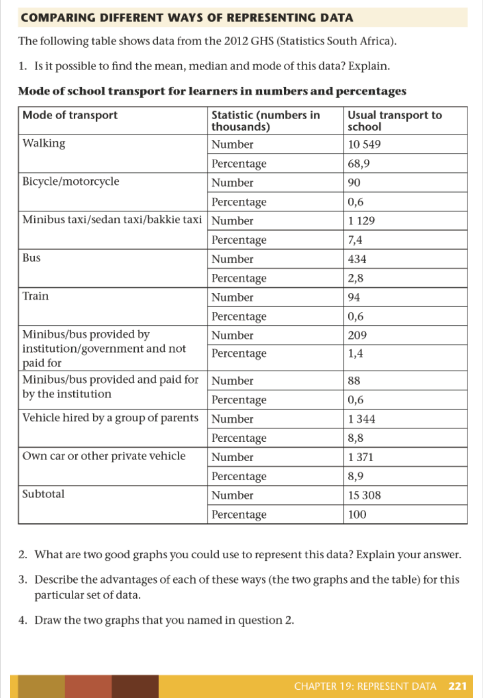
> **[Diagram Context - Textbook_Mathematics_Gr8_Represent-data.pdf-0023-12.png]**
> This educational graphic presents a statistical data table titled "Mode of school transport for learners in numbers and percentages" alongside four related analytical questions. The table displays visible labels and categories including "Mode of transport" (e.g., Walking, Bicycle/motorcycle, Minibus taxi, Bus, Train, Own car), "Statistic (numbers in thousands)", "Number", "Percentage", and a "Subtotal" row totaling 15 308 (thousands) and 100%. Conceptually, this resource helps high school learners practice interpreting tabular data and evaluating how different mathematical representations—such as tables versus various graphical formats—effectively convey statistical information about South African demographics.

---

### Note on Question 2(d)
The first bar touches the frequency axis because the lower boundary of the first class interval is equal to $0$.

---

### Answers

**2.** 
* (d) See the graph on LB page 283 alongside.

**3.** 
* (a) See the table below.
* (b) Refer to the histogram below.

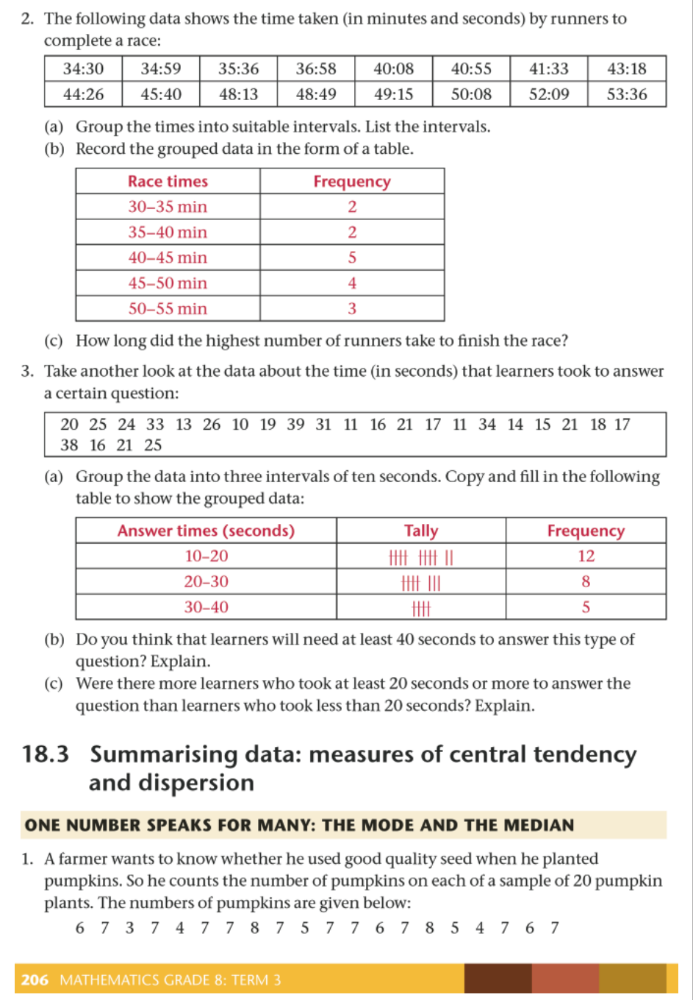
> **[Diagram Context - Textbook_Mathematics_Gr8_Collect-organise-and-summarise-data.pdf-0024-18.png]**
> This educational graphic presents a data handling exercise from a Grade 8 Mathematics textbook, featuring raw numerical datasets for race completion times and answer times alongside structured frequency tables with columns labeled "Race times," "Answer times (seconds)," "Tally," and "Frequency." It also introduces the next section on "Summarising data: measures of central tendency and dispersion," focusing specifically on the mode and median through a contextual word problem about pumpkin yields. Conceptually, the diagram guides learners through the process of organizing raw data into class intervals, using tally marks, reading frequency tables, and transitioning toward calculating summary statistics.

---

### 3. In a Natural Sciences class, learners planted beans and measured the heights of the bean plants after two months. Here is the data they collected (in centimetres):

$$34 \quad 65 \quad 72 \quad 42 \quad 37 \quad 29 \quad 78 \quad 43 \quad 79 \quad 91 \quad 43 \quad 45 \quad 28 \quad 42 \quad 79$$
$$34 \quad 92 \quad 87 \quad 40 \quad 43 \quad 43 \quad 78 \quad 82 \quad 47 \quad 85 \quad 43 \quad 32 \quad 86 \quad 76$$

#### (a) Copy and complete this frequency table:

| Height of bean plants (cm) | Tally | Frequency |
| :---: | :---: | :---: |
| $20-30$ | $\parallel$ | $2$ |
| $30-40$ | $\|$ | $4$ |
| $40-50$ | $\text{HH } \text{HH}$ | $10$ |
| $50-60$ | | $0$ |
| $60-70$ | $\mid$ | $1$ |
| $70-80$ | $\text{HH } \mid$ | $6$ |
| $80-90$ | $\|$ | $4$ |
| $90-100$ | $\parallel$ | $2$ |
| **Total** | | **29** |

#### (b) Draw a histogram of this data.

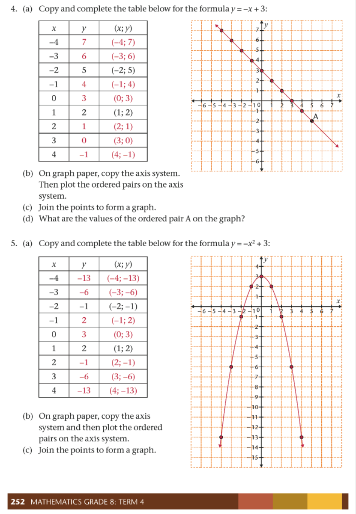
> **[Diagram Context - Textbook_Mathematics_Gr8_Graphs.pdf-0024-07.png]**
> This educational graphic features two sets of mathematical exercises focusing on Cartesian graphs and function tables for Grade 8 Mathematics. Visible labels include variables $x$ and $y$, formula equations $y = -x + 3$ and $y = -x^2 + 3$, ordered pairs $(x; y)$, numbered coordinate axes ranging from $-6$ to $7$, and point label A. The diagram conveys conceptually how algebraic formulas generate tables of ordered pairs that can be plotted on a Cartesian plane to visualize linear and non-linear functions.

---

*(d) Complete the histogram showing the data.*

<!-- DIAGRAM_PLACEHOLDER: diagram -->

---

# MATHEMATICS GRADE 7 TEACHER GUIDE

## 24.3 Pie charts

### Background information

A pie chart uses sectors (slices) of the same circle to compare the frequencies of the different categories within a data set.

* Here are some features of a pie chart:
  * It represents only one set of data.
  * It can be used to display any type of data.
  * It compares parts of a whole because it shows how the data set is divided up into different categories and what fraction of the data set each category represents.
  * The sizes of the sectors are proportional to the frequencies of the different categories.
  * It works best if the frequencies of the different categories in the data set are expressed as percentages.
* Pie charts are suitable to compare categories within a data set.
* To draw a pie chart, express the frequency of each category as a fraction of the total frequency of the data set and convert it to either degrees or a percentage.

### Teaching guidelines

Discuss the features of a pie chart as reflected by the pie chart on LB page 284. Point out the following:

* The numbers surrounding the pie chart are frequencies. If they were percentages, they would add up to 100.
* The key is only necessary if the different sectors are not labelled separately.

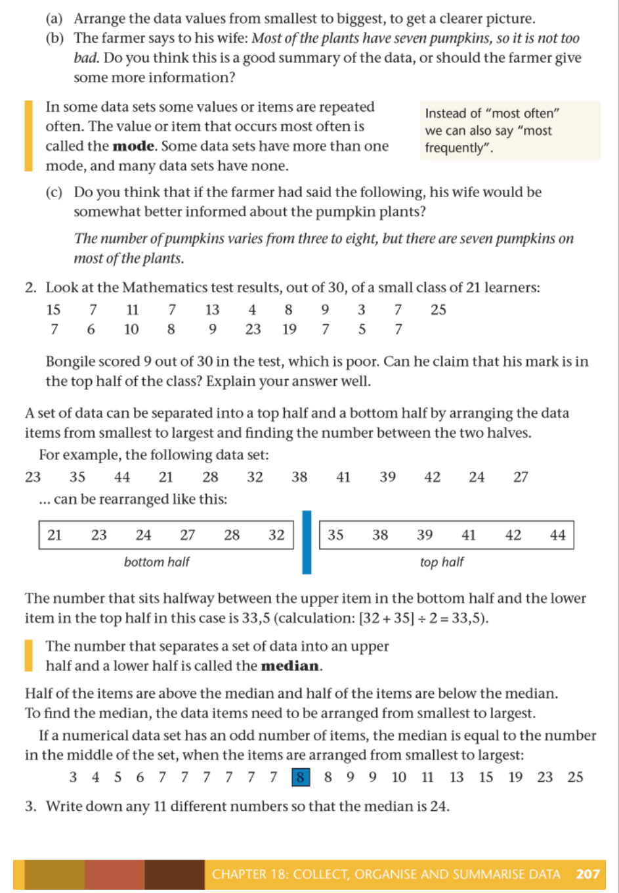
> **[Diagram Context - Textbook_Mathematics_Gr8_Collect-organise-and-summarise-data.pdf-0025-15.png]**
> This educational graphic presents a textbook page from Chapter 18 ("Collect, Organise and Summarise Data") featuring worked examples and exercises on measures of central tendency, specifically focusing on the mode and median. Visible text and labels include data values (e.g., test scores out of 30, pumpkin counts), definitions for "mode" and "median," and directional labels such as "bottom half," "top half," and calculations dividing datasets. Conceptually, the graphic guides learners through organising raw data in ascending order to determine positional measures, demonstrating how to split datasets into upper and halves to find the median and how to identify the most frequently occurring value as the mode.

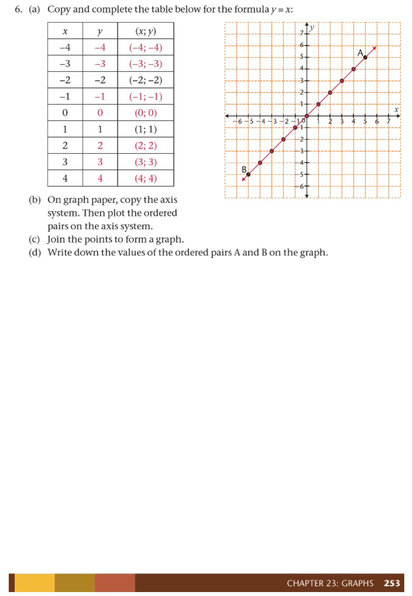
> **[Diagram Context - Textbook_Mathematics_Gr8_Graphs.pdf-0025-03.png]**
> This educational graphic features a Cartesian coordinate system with a plotted linear function and a corresponding table of values. Visible labels include the horizontal $x$-axis, vertical $y$-axis, ordered pairs such as $(x; y)$, equation $y = x$, and plotted points labeled A and B. Conceptually, it demonstrates how to generate a table of coordinates from a linear formula, plot those points on a grid, and join them to form a straight-line graph representing a direct proportional relationship.

---

# Estimating Sizes of Slices in a Pie Chart

## Background Information

If a whole is divided into:
- Two equal parts, each part is $\frac{1}{2}$ of the whole.
- Three equal parts, each part is $\frac{1}{3}$ of the whole.
- Four equal parts, each part is $\frac{1}{4}$ of the whole, etc.

## Teaching Guidelines

Learners should realise that the given sectors in each pie chart in question 1 are equal in size.

---

## Exercises and Activities

### Question 1

(a) Copy the following diagrams and add the slices indicated. Write down the fraction of a whole that each slice in the following diagrams shows.

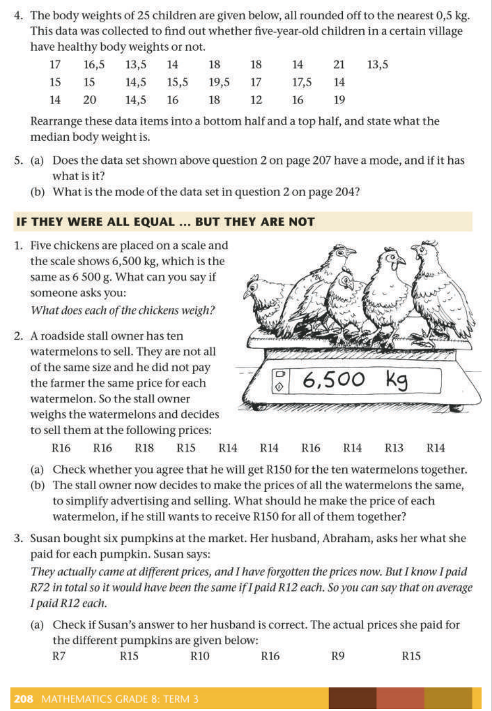
> **[Diagram Context - Textbook_Mathematics_Gr8_Collect-organise-and-summarise-data.pdf-0026-20.png]**
> This educational graphic consists of several mathematical word problems and a supporting illustration featuring a digital scale with five chickens displaying a mass of "6,500 kg". Visible text includes numerical data sets representing body weights, monetary values denoted in South African Rands (R13 to R18), and question prompts labeled 4, 5, 1, 2, and 3 from a Grade 8 Mathematics CAPS curriculum textbook. Conceptually, it conveys how to calculate and interpret measures of central tendency—specifically mean, median, and mode—using real-world contexts such as mass, pricing, and averages.

* Fraction and percentage equivalents shown in diagrams:
  - $\frac{1}{2} = 50\%$
  - $\frac{1}{4} = 25\%$
  - $\frac{1}{8} = 12,5\%$
  - $\frac{1}{3} = 33,3\%$
  - $\frac{1}{6} = 16,6\%$
  - $\frac{1}{5} = 20\%$
  - $\frac{1}{10} = 10\%$

(b) For each diagram in question 1(a), write down what percentage each fraction is equal to.

> **Note:** You can use the diagrams above to estimate the sizes of slices when drawing your own pie charts.

---

### Question 2

Copy the pie charts on the following page. Use the data in each of the following tables to complete the pie charts. You must:
- label the major sector
- divide the other sector into the parts that represent the other languages
- label each sector

---

# Lesson Revision Notes: Representing Data as Fractions and Percentages in Pie Charts

## Core Concepts & Procedures

To represent data from a frequency table on a pie chart, you must convert the frequencies of different categories into fractions or percentages of the total. 

The procedure is as follows:
1. **Express Frequency as a Fraction:** For each category, write its frequency as the numerator and the total frequency of the data set as the denominator:
   $$\text{Fraction} = \frac{\text{Frequency of category}}{\text{Total frequency}}$$

2. **Convert to Percentages (or Degrees):** 
   - To convert a common fraction to a percentage, multiply by $100\%$:
     $$\text{Percentage} = \text{Fraction} \times 100\%$$
   - To convert to degrees (for drawing pie charts), multiply the fraction by $360^\circ$:
     $$\text{Angle in degrees} = \text{Fraction} \times 360^\circ$$

3. **Divide the Circle into Sectors:** Use the calculated percentages or degrees to divide the circle into proportionate sectors.

---

## Worked Examples from Educational Material

### Example (a): Province: Western Cape
The table below shows the distribution of major languages spoken in the Western Cape alongside their percentage frequencies:

| Major languages | Frequency (in %) |
| :--- | :--- |
| Afrikaans | 50% |
| English | 20% |
| isiXhosa | 25% |
| Other | 5% |

---

### Example (b): Province: KwaZulu-Natal
The table below shows the major languages spoken in KwaZulu-Natal and their percentage frequencies:

| Major languages | Frequency (in %) |
| :--- | :--- |
| English | 15% |
| isiZulu | 80% |
| Other | 5% |

---

### Example (c): Province: Limpopo
The table below shows the major languages spoken in Limpopo and their percentage frequencies:

| Major languages | Frequency (in %) |
| :--- | :--- |
| Sepedi | 50% |
| Tshivenda | 15% |
| Xitsonga | 20% |
| Other | 15% |

---

## Activities

### Activity 1: Class A Language Survey
**Scenario:** The learners in Class A were asked how many languages they could speak. 

1. **Task (a):** Complete the "Fraction" column by determining what fraction of the whole each category is.
2. **Task (b):** Complete the "Percentage" column by converting the fraction to a percentage.

> **Hint:** Remember, to convert a common fraction to a percentage, you need to multiply by $100\%$.

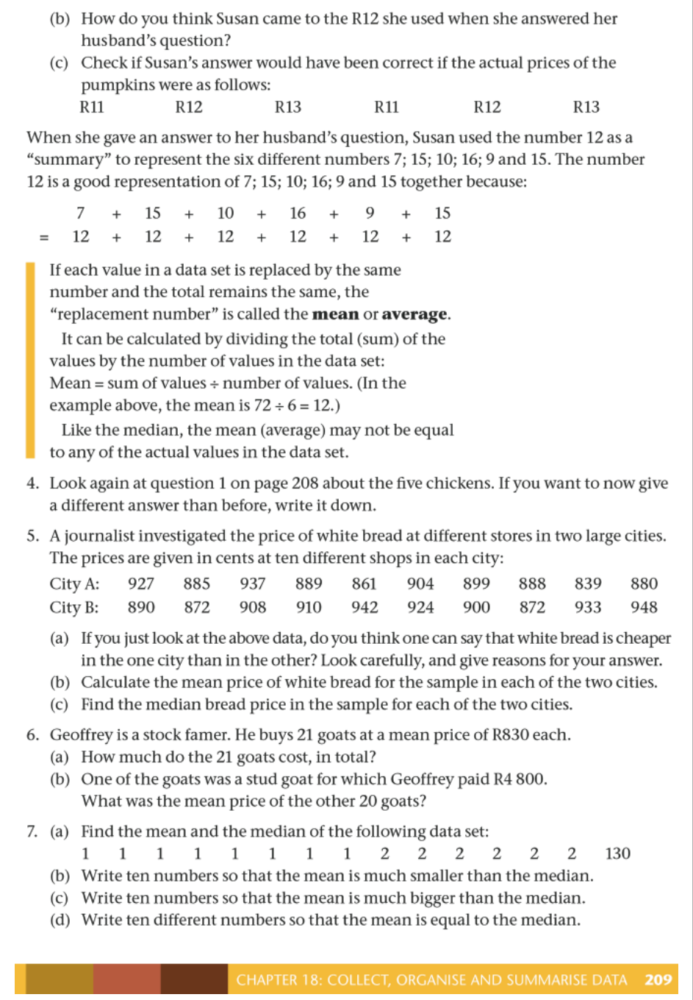
> **[Diagram Context - Textbook_Mathematics_Gr8_Collect-organise-and-summarise-data.pdf-0027-18.png]**
> This is a South African CAPS curriculum mathematics educational text page titled "CHAPTER 18: COLLECT, ORGANISE AND SUMMARISE DATA" containing numerical data sets, mathematical definitions, and numbered problem-solving questions (questions 4 through 7). Visible text elements include labels such as "Mean = sum of values ÷ number of values", "City A", "City B", and numerical values representing prices and quantities in rands and cents. Conceptually, the page guides high school learners through calculating and interpreting measures of central tendency—specifically the mean and median—using real-world contexts like bread prices and livestock costs to demonstrate how data summaries can be compared across different samples.

---

# MATHEMATICS GRADE 7 TEACHER GUIDE

## Answers

1. (c) Refer to the pie chart below.

2. 
   - (a) Refer to the fraction column of the table on LB page 287 alongside.
   - (b) Refer to the percentage column of the table on LB page 287 alongside.
   - (c) Refer to the pie chart below.

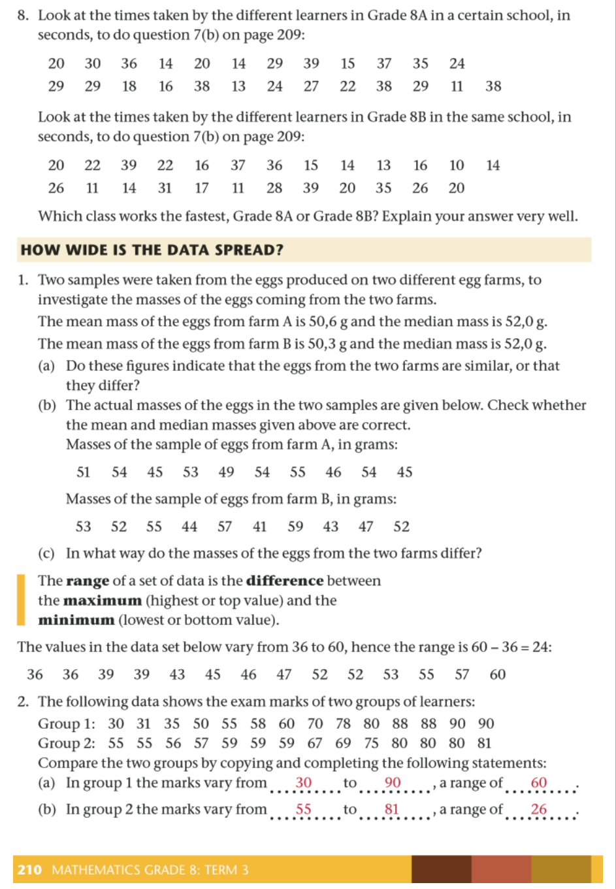
> **[Diagram Context - Textbook_Mathematics_Gr8_Collect-organise-and-summarise-data.pdf-0028-21.png]**
> This educational text and exercise graphic presents mathematical data sets involving times, egg masses, and exam marks alongside related questions and definitions. Visible text includes statistical terms such as "mean", "median", "range", "maximum", and "minimum", accompanied by raw numerical data values for Grade 8 classes, farm samples, and learner groups. It is designed to help Grade 8 students understand and calculate measures of central tendency and dispersion (specifically the range) to compare different data sets within the CAPS Mathematics curriculum.

