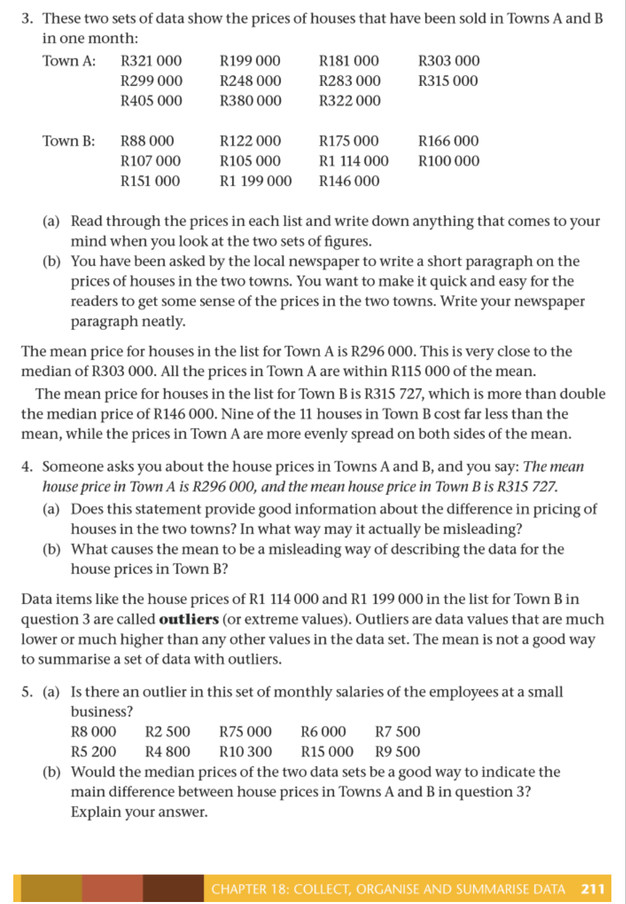

# Chapter 23: Collect, organise and summarise data

## 23.1 Collecting data

The data handling cycle begins with a research question. To effectively collect data, you must plan your approach by considering the following factors:

*   **The Research Question:** What specific information are you trying to find out?
*   **Data Sources:** Where will you find the information? (e.g., peers, family, the wider community, or published sources like books, newspapers, and magazines).
*   **Collection Methods:** How will you gather the data? (e.g., using questionnaires or conducting interviews).
*   **Target Group:** Who will you collect the data from? (Deciding between the entire population or a sample).

---

### Populations and Samples: From whom to collect data

When conducting research, it is important to distinguish between the total group and a representative subset.

| Term | Definition |
| :--- | :--- |
| **Population** | The whole group that you are asking the question about. |
| **Sample** | A small number of the group that you select to represent the whole population. |

#### Example:
Thandeka wants to investigate the home languages of all Grade 7 learners in South Africa.

*   **The Population:** All Grade 7 learners in South Africa.
*   **The Challenge:** It is not practical to reach every single Grade 7 learner in the country.
*   **The Sample:** Thandeka chooses a smaller group, such as her own Grade 7 class and two other classes from different schools, to represent the population.

**Note on Sampling:** If a sample is too small or not diverse enough (e.g., only choosing classes from one specific area), it may not accurately reflect the characteristics of the entire population.

<!-- DIAGRAM_PLACEHOLDER: diagram -->

---

### Representative Samples

To ensure that a sample provides accurate information about the whole population, it must be **representative**. Follow these two guidelines to improve representativeness:

1.  **Choose a big enough sample:** Generally, a larger sample size increases the likelihood that the sample reflects the characteristics of the entire population.
2.  **Avoid bias:** Ensure the sample is not taken from only one specific group within the population. 
    *   *Example:* If you want to determine if people enjoy watching soccer, surveying people at a specific match (e.g., Chiefs vs. Pirates) will result in biased data because those individuals are already there specifically because they enjoy soccer.

---

### Worked Example

**Scenario:** Ganief wants to know if learners at his school like the style and colour of their school uniform. He surveys ten learners in Grade 7. There are 2 000 learners in total at the school. Explain why this sample is not likely to be representative.

**Answer:**
1.  **Sample size:** The sample of ten learners is too small to represent a population of 2 000.
2.  **Lack of diversity:** He is only surveying Grade 7 learners, ignoring the views of learners in other grades who may have different opinions.

---

### Exercise: Thinking about populations and samples

Identify whether the following statements describe the **Population (P)** or a **Sample (S)** of the population.

**(a) What percentage of plants in the vegetable patch is affected by disease?**
*   [ ] All the plants in the vegetable patch
*   [ ] Every fourth or fifth plant in the vegetable patch

**(b) How often do teenagers recycle plastic?**
*   [ ] Every teenager in South Africa
*   [ ] About 40 teenagers in the community

**(c) How many hours of sleep do 10-year-olds in my community get per night?**
*   [ ] All 10-year-olds in the community
*   [ ] About ten 10-year-olds in the community

> **[Diagram Context - Textbook_Mathematics_Gr8_Graphs.pdf-0001-05.png]**
> This line graph plots the change in mass (in kg) over a six-month period from January to June, featuring a red data point and a vertical arrow highlighting a specific value. It illustrates the concept of data interpretation and trend analysis, requiring students to read coordinates from a grid to determine the maximum mass reached during the observed period.

> **[Diagram Context - Textbook_Mathematics_Gr8_Interpret-analyse-and-report-on-data.pdf-0001-15.png]**
> This graphic consists of three adjacent rectangular color blocks (dark brown, reddish-brown, and mustard yellow) with a single diagonal line extending from the top right corner. It lacks labels, variables, or biological/chemical structures, rendering it an abstract geometric figure rather than a functional educational diagram. Consequently, it does not convey any specific conceptual information relevant to the CAPS curriculum.

> **[Diagram Context - Textbook_Mathematics_Gr8_Represent-data.pdf-0001-04.png]**
> The graphic displays bar graphs, featuring a single bar graph outlining parts such as the title of the graph, height of the bar indicating frequency, categories (or classes) of data, and possible frequencies. It also includes a double bar graph comparing percentages of households with internet access across South African provinces with categories labeled "Western Cape", "Eastern Cape", "Northern Cape", "Free State", "KwaZulu-Natal", "North-West", "Gauteng", "Mpumalanga", "Limpopo", and "South Africa", using a legend for "Anywhere" (blue bars) and "At home" (yellow bars) alongside a data table. Conceptually, this visual aids Mathematical Literacy and Mathematics learners in understanding how to read, construct, and interpret single and double bar graphs to analyze categorical data and frequency distributions.

> **[Diagram Context - Textbook_Mathematics_Gr8_Represent-data.pdf-0001-07.png]**
> This educational graphic consists of three adjacent rectangular color blocks (dark brown, reddish-brown, and golden-brown) joined together with a diagonal pointer line extending from the top-right corner. There are no visible text labels, variables, chemical symbols, or axis names present in the image. Conceptually, it serves as a visual color palette or segmented bar indicator, typically used in diagrams to represent different phases, stages, or categorizations in a CAPS curriculum context.

---

### Data Collection and Sampling Exercises

#### Exercise 2: School Survey
You want to know the most popular colour of the learners in your school.
*   **(a)** Write down the population of your data collection.
*   **(b)** Write down what sample you would use.

---

#### Exercise 3: Census@School Case Study
Census@School took place in 2001 and 2009. These were surveys conducted by Statistics South Africa to demonstrate how information about people is collected and analysed. The survey targeted learners from Grades 3 to 12.

**Sampling Method:**
*   A sample of $2\,500$ schools was selected from the Department of Basic Education’s database of approximately $26\,000$ registered schools.
*   Schools were stratified (divided into groups) by province, school type (primary, intermediate, secondary, combined), and education district.
*   A sample of schools was selected from each of these groups.
*   Approximately $790\,000$ learners participated in the 2009 survey.

**Questions:**
*   **(a)** Calculate the percentage of the sample of all schools in the country.
    *   *Calculation:* $\frac{2\,500}{26\,000} \times 100 \approx 9,62\%$
*   **(b)** Why do you think they separated the schools into groups first?
*   **(c)** Do you think the information obtained from this survey would be interesting to you? Explain.

---

#### Exercise 4: Representativeness
Unathi wants to find out whether 13-year-olds in her town prefer rugby or netball. She surveys ten learners from each of the three Grade 7 classes at her school. 
*   **Question:** Is the sample chosen likely to be representative of the population (13-year-olds in her town)? Explain your answer.

---

### Constructing Questionnaires: How to Collect Data

#### Key Definitions
*   **Questionnaire:** A sheet containing questions used to collect data from people.
*   **Respondent:** A person who fills in a questionnaire or from whom you collect data.

#### Types of Questionnaire Responses
The structure of questions depends on the data you intend to collect:
1.  **Dichotomous questions:** Require "yes" or "no" answers.
2.  **Multiple-choice questions:** A selection of answers is provided for the respondent to choose from.
3.  **Open-ended questions:** Respondents enter their own views or detailed information.

> **[Diagram Context - Textbook_Mathematics_Gr8_Graphs.pdf-0002-03.png]**
> This line graph plots the change in mass (in kg) of two cows, labeled A and B, over a six-month period from January to June. It illustrates the fluctuating growth patterns of the two subjects, allowing students to compare and interpret trends in biological data over time.

> **[Diagram Context - Textbook_Mathematics_Gr8_Interpret-analyse-and-report-on-data.pdf-0002-03.png]**
> This graphic presents two side-by-side pie charts comparing the distribution of toilet facilities used by South African households, labeled with categories including "Flush toilet," "Pit toilet," "Other toilet," and "No toilet" alongside their respective percentage values. These charts serve as a comparative data visualization tool to help students interpret statistical proportions and analyze socio-economic disparities in service delivery between different demographic groups or regions.

> **[Diagram Context - Textbook_Mathematics_Gr8_Interpret-analyse-and-report-on-data.pdf-0002-07.png]**
> This double bar graph illustrates the distribution of toilet facilities used by South African households, with the y-axis representing the "Percentage of households" and the x-axis categorizing "Toilet facility" types (Flush, Pit, Other, No toilet). The graph uses two distinct data sets to allow students to compare and contrast socio-economic sanitation trends across different demographic groups or time periods.

---

### Designing Effective Questionnaires

When creating a questionnaire, questions must be worded clearly to ensure data can be collected easily and accurately.

#### Key Principles for Questionnaire Design
1. **Clarity:** Questions should be easy to understand.
2. **No Overlaps:** When using numerical ranges (e.g., age groups), ensure that categories do not overlap. Every possible answer should fit into exactly one category.
3. **Comprehensive Coverage:** Ensure all possible responses are accounted for.

---

#### Examples of Question Types

**Example 1: Binary Choice**
*   **Question:** Do you help with chores at home?
*   **Options:** [ ] Yes / [ ] No

**Example 2: Multiple Choice (Checklist)**
*   **Question:** Which of these chores do you help with?
*   **Options:** [ ] cleaning dishes, [ ] washing clothes, [ ] sweeping/vacuuming, [ ] making beds

**Example 3: Categorical Ranges**
*   **Question:** How old are you?
*   **Options:** [ ] 5–8 years, [ ] 9–11 years, [ ] 12–15 years, [ ] 16–19 years
*   *Note:* All ages from 5 to 19 are covered without any overlaps.

**Example 4: Checklist for Binary Data**
*   **Question:** Tick the box if you have:
    1. Running water inside your home
    2. Electricity inside your home
    3. A radio at home
    4. A TV at home
    5. A telephone at home
    6. A cell phone
    7. Access to a computer
    8. Access to the internet
    9. Access to a library

**Example 5: Quantitative Data Collection**
*   **Question 6:** How tall are you without your shoes on? (Answer to the nearest cm): [ ][ ][ ] cm
*   **Question 7:** What is the length of your right foot, without a shoe? (Answer to the nearest cm): [ ][ ][ ] cm
*   **Question 8:** What is your arm span? (Measure from the tip of the right middle finger to the tip of the left middle finger). (Answer to the nearest cm): [ ][ ][ ] cm

---

#### Exercise: Evaluating Questionnaire Design

**Scenario:** Refue wants to find out how much pocket money learners in her class receive each month. She draws up the following multiple-choice question:

| How much pocket money do you get? |
| :--- |
| [ ] 0–10 | [ ] 10–20 | [ ] 20–30 | [ ] 30–40 |

**Task:** Explain why this question is not clear. Provide at least three reasons.

> **[Diagram Context - Textbook_Mathematics_Gr8_Collect-organise-and-summarise-data.pdf-0003-06.png]**
> This educational graphic depicts a biological apparatus and experimental setup consisting of a sealed glass jar containing distinct layers of seeds (cream-colored at the bottom and reddish-brown at the top). It features no visible text labels or arrows, relying purely on the visual representation of stratified seeds in a closed container. Conceptually, this setup is commonly used in CAPS Life Sciences to demonstrate seed germination requirements, cellular respiration, or ecological sampling techniques such as mark-recapture.

> **[Diagram Context - Textbook_Mathematics_Gr8_Collect-organise-and-summarise-data.pdf-0003-07.png]**
> This educational graphic illustrates an experimental apparatus demonstrating the mark-recapture technique for estimating population size. The diagram features a central glass jar containing a mixed population of bean seeds (some dark red, some pale/white) and two separate piles labeled "Sample" on either side representing captured and marked cohorts. Conceptually, it helps Life Sciences learners understand ecological field study methods used to estimate population numbers of mobile animals by showing the proportional relationship between marked and unmarked individuals in samples.

> **[Diagram Context - Textbook_Mathematics_Gr8_Graphs.pdf-0003-01.png]**
> This graphic displays a collection of six distinct line graphs labeled A, B, D, E, G, and H, each featuring Cartesian axes with arrows indicating positive direction. These plots illustrate various mathematical relationships, including linear growth, parabolic curves, and oscillating patterns, which are essential for interpreting data trends in Life Sciences and Physical Sciences. Students use these visual representations to analyze variables, identify rates of change, and predict outcomes in experimental contexts.

> **[Diagram Context - Textbook_Mathematics_Gr8_Graphs.pdf-0003-02.png]**
> This graphic is a line graph featuring two perpendicular axes representing independent and dependent variables. It illustrates the typical relationship between an environmental factor (such as temperature or pH) and the rate of an enzyme-controlled reaction, showing an initial increase to an optimum point followed by a gradual decline due to denaturation.

> **[Diagram Context - Textbook_Mathematics_Gr8_Graphs.pdf-0003-03.png]**
> This line graph features an x-axis and a y-axis with a single blue curve that rises to a peak before declining. It illustrates the concept of an optimum range, commonly used in Life Sciences to represent enzyme activity relative to factors like temperature or pH, where the peak indicates the point of maximum efficiency before denaturation occurs.

> **[Diagram Context - Textbook_Mathematics_Gr8_Interpret-analyse-and-report-on-data.pdf-0003-10.png]**
> This line graph displays the fluctuation of average temperatures (°C) over a seven-year period, with the x-axis representing the year and the y-axis representing the temperature in degrees Celsius. It illustrates how to plot and interpret discrete data points to identify trends or variations in environmental conditions over time.

> **[Diagram Context - Textbook_Mathematics_Gr8_Interpret-analyse-and-report-on-data.pdf-0003-12.png]**
> This line graph displays the fluctuation of average temperatures (°C) over a seven-year period, with the y-axis representing temperature and the x-axis representing the year. It illustrates how data points can be plotted and connected to visualize trends or variations in environmental data over time.

> **[Diagram Context - Textbook_Mathematics_Gr8_Interpret-analyse-and-report-on-data.pdf-0003-18.png]**
> This graphic consists of three adjacent rectangular color blocks—dark brown, reddish-brown, and mustard yellow—with a single diagonal line extending from the top right corner. It lacks labels, variables, or biological/chemical symbols, rendering it an abstract geometric figure rather than a functional educational diagram. Consequently, it does not convey any specific conceptual information relevant to the CAPS curriculum.

> **[Diagram Context - Textbook_Mathematics_Gr8_Represent-data.pdf-0003-15.png]**
> The graphic consists of three adjacent square blocks arranged horizontally in shades of brown, muted red, and gold, with a single diagonal line extending from the top right corner. There are no visible text labels, mathematical variables, or chemical symbols included in the image. Conceptually, this abstract colour block composition lacks sufficient educational content to convey specific CAPS curriculum outcomes for high school learners.

---

### Exercises: Data Collection

1. **(b)** Draft a multiple-choice question that allows Refue to collect the specific data she requires.
2. **Research Task:** You want to determine which sports learners at your school play.
    * **(a)** Describe the population of your data.
    * **(b)** Describe the sample you will use.
3. **Question Design:** Create a question using either yes/no or multiple-choice responses to assist in collecting the necessary data.
4. **Data Collection:** Collect your data from the population or sample you identified. Retain this data for the next chapter.

---

## 23.2 Organising Data

To organise collected data, we use various methods depending on the type of data collected. Common tools include:
* Tally marks and tables
* Dot plots
* Stem-and-leaf displays
* Grouped data (used when there are many data values)

### Different Types of Data

#### Exercise: Identifying Data Types
Refer to the five examples of questionnaire questions on page 261 to answer the following:

1. Which of the examples will result in data formatted like the table below?

| Response | Number of learners |
| :--- | :--- |
| Yes | 1 235 learners |
| No | 1 265 learners |

2. Which of the examples might result in data formatted like this?
   $132\text{ cm}; 141\text{ cm}; 160\text{ cm}; 132\text{ cm}; 154\text{ cm}; 145\text{ cm}; 147\text{ cm}; 129\text{ cm}; 121\text{ cm}; 143\text{ cm}; 135\text{ cm}; 154\text{ cm}; 156\text{ cm}; 133\text{ cm}; 156\text{ cm}; 123\text{ cm}; 137\text{ cm etc.}$

3. What could the data for example 4 look like? Copy and complete the table below to provide a possible example for 30 learners using your own data.

| Category/Response | Number of learners |
| :--- | :--- |
| | |
| | |
| | |
| | |
| | |
| | |
| | |
| | |
| | |
| | |

> **[Diagram Context - Textbook_Mathematics_Gr8_Graphs.pdf-0004-00.png]**
> This line graph illustrates the fluctuating mass of a cow over a six-month period, with the y-axis representing "Mass (in kg)" and the x-axis representing "Months" from January to June. It serves as a practical exercise in data interpretation, requiring students to analyse trends, identify points of increase or decrease, and extract specific numerical values from a continuous data set.

> **[Diagram Context - Textbook_Mathematics_Gr8_Represent-data.pdf-0004-08.png]**
> This graphic is a histogram displaying statistical data on a grid. The vertical y-axis is labeled "Number of trees" with numerical intervals from 0 to 20, and the horizontal x-axis is labeled "Number of oranges from a tree" with continuous numerical intervals from 0 up to 1 000. Conceptually, this diagram illustrates how to visually represent grouped continuous data in CAPS Mathematics and Mathematical Literacy, allowing learners to interpret frequencies and distributions across defined intervals.

---

4. Which of the examples might give you a data set that looks like this?

| Age Group | Frequency |
| :--- | :--- |
| 5–8 years | 15 |
| 9–11 years | 45 |
| 12–15 years | 32 |
| 16–19 years | 28 |

The type of data in questions 1 and 3 is called **categorical data**. This is often described by words. The categories don’t have to be given in order.

The type of data in questions 2 and 4 is called **numerical data**. Numerical data can be whole numbers only, or it can include fractions.

For both of these kinds of data, your results give you a list of responses. You will soon learn how to organise these responses.

5. Classify the following data sets as categorical or numerical:
    * (a) The number of pages in books
    * (b) The length of learners’ arm spans
    * (c) Learners’ favourite soccer teams
    * (d) The time it takes 13-year-olds to run 1,5 km
    * (e) The cost of different types of cell phones
    * (f) Colours of new cars manufactured

### Organising categorical data

Thandeka asked the following question: “Which of South Africa’s official languages are the home languages of the learners in my class?”

Thandeka drew up a table with each learner’s name. She then asked each learner what his or her home language was, and wrote it down as follows:

| Name | Language | Name | Language | Name | Language |
| :--- | :--- | :--- | :--- | :--- | :--- |
| Nonkhanyiso | isiXhosa | Marike | Afrikaans | Herbert | Sepedi |
| Anna | Afrikaans | Jennifer | Sepedi | Thabo | isiXhosa |
| Mpho | Ndebele | Nomonde | isiXhosa | Nomi | isiXhosa |
| Nontobeko | isiZulu | Thandeka | Sepedi | Manare | Sepedi |
| Jonathan | English | Siza | isiZulu | Unathi | Sesotho |
| Sibongile | isiZulu | Prince | Sesotho | Gabriel | Ndebele |
| Dumisani | isiZulu | Duma | isiZulu | Marlene | Afrikaans |
| Matshediso | Sesotho | Thandile | Sepedi | Simon | Sesotho |

***

**CHAPTER 23: COLLECT, ORGANISE AND SUMMARISE DATA**
263

> **[Diagram Context - Textbook_Mathematics_Gr8_Graphs.pdf-0005-06.png]**
> This graphic displays five Cartesian coordinate systems labeled A through E, each featuring a unique blue line representing different mathematical or scientific relationships between two variables. These graphs illustrate various functional trends, including constant, linear inverse, linear direct, and non-linear relationships. For high school learners, these diagrams serve as foundational tools for interpreting data trends in subjects like Physical Sciences and Life Sciences, helping students identify how one variable influences another in experimental contexts.

> **[Diagram Context - Textbook_Mathematics_Gr8_Graphs.pdf-0005-19.png]**
> This graphic is an abstract geometric figure consisting of a horizontal rectangular bar divided into three distinct color segments (brown, olive, and yellow) with intersecting diagonal and curved lines. It lacks specific labels or variables, serving as a non-representational visual aid. Conceptually, such diagrams are often used in CAPS-aligned materials to illustrate principles of spatial orientation, vector representation, or the geometric interpretation of gradients and slopes in mathematics and physical sciences.

> **[Diagram Context - Textbook_Mathematics_Gr8_Represent-data.pdf-0005-13.png]**
> The graphic features three adjacent rectangular blocks colored in dark brown, reddish-brown, and golden-brown, with a diagonal line extending downward and to the right from the top right corner. The image lacks text, specific labels, or scientific symbols. Conceptually, it provides an abstract visual layout or background placeholder rather than containing specific CAPS-aligned curriculum content for high school learners.

---

### Language Distribution Data

| Name | Language | Name | Language |
| :--- | :--- | :--- | :--- |
| Chokocha | Sepedi | Nicholas | Sesotho |
| Miriam | Setswana | Khanyisile | isiXhosa |
| Jabulani | isiZulu | Sibusiso | isiZulu |
| Ramphamba | Tshivenda | Nomhle | isiXhosa |
| Mishack | isiZulu | Portia | isiZulu |
| Frederik | Afrikaans | Peter | Setswana |
| Erik | Afrikaans | Lola | Afrikaans |
| Maya | Afrikaans | Jan | Afrikaans |
| Zinzi | isiXhosa | Thobile | Sesotho |
| Palesa | isiZulu | Jacob | Setswana |

---

### Language Data Set
The following list represents the languages spoken by the learners:

isiXhosa, Afrikaans, Sepedi, Afrikaans, Sepedi, isiXhosa, Ndebele, isiXhosa, isiXhosa, isiZulu, Sepedi, Sepedi, English, isiZulu, Sesotho, isiZulu, Sesotho, Ndebele, isiZulu, isiZulu, Afrikaans, Sesotho, Sepedi, Sesotho, Sepedi, Sesotho, Setswana, isiXhosa, isiZulu, isiZulu, Tshivenda, isiXhosa, isiZulu, isiZulu, Afrikaans, Setswana, Afrikaans, Afrikaans, Afrikaans, Afrikaans, isiXhosa, Sesotho, isiZulu, Setswana

---

### Analysis Questions
1. What do you need to find out from this list of languages?
2. Does it matter what order you write the languages in? Why or why not?

---

### Dot Plot Exercise
3. (a) Copy Thandeka’s graph below. Place a dot above each language to show every learner who speaks that language. The languages are in alphabetical order. Try to space out the dots evenly. The dots for Afrikaans have been drawn for you. 

*A graph like this is called a dot plot.*

| Language | Dot Plot Representation |
| :--- | :--- |
| Afrikaans | ● ● ● ● ● ● ● ● |
| English | |
| isiXhosa | |
| isiZulu | |
| Ndebele | |
| Sepedi | |
| Sesotho | |
| Setswana | |
| Siswati | |
| Tshivenda | |
| Xitsonga | |

> **[Diagram Context - Textbook_Mathematics_Gr8_Collect-organise-and-summarise-data.pdf-0006-08.png]**
> This educational graphic is a stem-and-leaf display used in Grade 10-12 CAPS Mathematics and Mathematical Literacy to teach data handling. It features labels and explanatory text pointing to the "stem" column representing tens digits and the "leaf" column representing units digits, accompanied by a key ("1 | 2 means 12"). Conceptually, it demonstrates how to organise and read numerical data efficiently while preserving the original values to quickly identify trends, frequency, and distribution patterns like concentration in specific intervals.

> **[Diagram Context - Textbook_Mathematics_Gr8_Graphs.pdf-0006-10.png]**
> This graphic displays a Cartesian coordinate system featuring the curve of a cubic polynomial function. The diagram highlights the characteristic shape of a cubic function with a positive leading coefficient, showing its two turning points and three x-intercepts. It serves as a foundational visual for Grade 12 learners to understand the relationship between the algebraic form of a cubic function and its graphical representation, including intervals of increase, decrease, and concavity.

> **[Diagram Context - Textbook_Mathematics_Gr8_Graphs.pdf-0006-11.png]**
> This graphic displays a Cartesian coordinate system featuring a downward-opening parabola plotted on the x- and y-axes. It illustrates the standard form of a quadratic function $f(x) = ax^2 + q$, where the negative coefficient of $a$ results in a concave-down shape and the vertex lies on the y-axis.

> **[Diagram Context - Textbook_Mathematics_Gr8_Graphs.pdf-0006-12.png]**
> This graphic displays a Cartesian coordinate system featuring a concave-up parabola plotted on the x- and y-axes. It illustrates the standard form of a quadratic function, $f(x) = ax^2 + q$, where the positive $a$ value results in a minimum turning point located on the y-axis.

> **[Diagram Context - Textbook_Mathematics_Gr8_Represent-data.pdf-0006-02.png]**
> This educational graphic is a pie chart representing categorical data titled "Star High School learners' most popular types of movies". Visible labels include categories ("Comedy", "Action", "Drama", "Adventure", "Other") matched with corresponding colours in a legend, along with data values expressed as percentages and equivalent fractions ($33\%$ or $\frac{1}{3}$, $25\%$ or $\frac{1}{4}$, $20\%$ or $\frac{1}{5}$, $15\%$ or $\frac{3}{20}$, and $7\%$ or $\frac{7}{100}$), accompanied by explanatory text. Conceptually, it demonstrates to learners how to visually represent parts of a whole by scaling sector sizes proportionally to percentages or fractions of data.

> **[Diagram Context - Textbook_Mathematics_Gr8_Represent-data.pdf-0006-08.png]**
> This geometric figure displays a circle divided in half by a single vertical diameter line, with no other visible labels, variables, or annotations. Conceptually, it serves as a blank template for high school mathematics and CAPS geometry problems, allowing learners to construct and visualize theorems regarding chords, angles, and symmetry in circles.

---

### Data Handling: Tally Tables

#### Key Concepts
*   **Tally Mark:** A single vertical line ($|$) used to represent one item in a count.
*   **Tally Table:** A method of recording data where tally marks are grouped in sets of five.
*   **Grouping:** The fifth tally mark is drawn horizontally across the previous four ($||||$) to create a group of five ($\text{HHI}$). This makes counting large datasets faster and more accurate.

#### Examples of Tally Marks
| Count | Tally Representation |
| :--- | :--- |
| Three | $|||$ |
| Four | $||||$ |
| Five | $\text{HHI}$ |
| Seven | $\text{HHI} ||$ |

---

#### Exercise: Home Language of Learners in the Grade 7 Class

**4. (a) Copy and complete the table below:**

| Language | Number of speakers of each home language | Total |
| :--- | :--- | :--- |
| Afrikaans | $\text{HHI} |||$ | 8 |
| English | $|$ | 1 |
| isiXhosa | | |
| isiZulu | | |
| Ndebele | | |
| Sepedi | | |
| Sesotho | | |
| Setswana | | |
| Siswati | | |
| Tshivenda | | |
| Xitsonga | | |
| **Total (whole class)** | | |

> **[Diagram Context - Textbook_Mathematics_Gr8_Collect-organise-and-summarise-data.pdf-0007-05.png]**
> The graphic shows a blank frequency data table structured into three distinct columns. The visible column headers are labelled "Preferred day", "Tally", and "Frequency". Conceptually, this template teaches learners how to organise, record, and process raw statistical data by converting counted tallies into numerical frequencies for data handling and analysis.

**(b)** How many learners altogether were asked about their home language?
**(c)** Which home language occurs most often in this class?
**(d)** Which languages are not spoken as a home language by any of the learners in this class?
**(e)** Write a short paragraph to describe the home languages in Thandeka’s class.

---

#### Note on Numerical Data
Dot plots and tally tables are also used for **numerical data**. You can write data values on prepared tally tables or dot plots as you record them. This method sorts the data at the same time as it is recorded.

> **[Diagram Context - Textbook_Mathematics_Gr8_Graphs.pdf-0007-17.png]**
> This graphic consists of a horizontal strip divided into three adjacent rectangular colour blocks (red-brown, ochre, and yellow) with a single diagonal line extending from the top-right corner. It lacks labels, variables, or specific biological or chemical symbols. As an abstract visual, it does not convey a specific concept within the CAPS curriculum and appears to be an incomplete or non-educational image.

> **[Diagram Context - Textbook_Mathematics_Gr8_Interpret-analyse-and-report-on-data.pdf-0007-22.png]**
> This educational text features a textbook exercise on data literacy, specifically focusing on the critical analysis of data collection methods. It presents a hypothetical study on teenage substance use, accompanied by questions that highlight the absence of essential metadata such as sample size, location, and timeframe. The exercise teaches students to identify potential bias and recognize that data is only reliable when the context of its collection is transparent and representative of the broader population.

> **[Diagram Context - Textbook_Mathematics_Gr8_Represent-data.pdf-0007-10.png]**
> This graphic features three adjacent rectangular colour blocks in dark brown, reddish-brown, and golden-yellow, joined by a single diagonal indicator line extending downward and to the right. The image contains no visible text, labels, or variable symbols. Conceptually, this visual serves as a simple colour-coded graphic organiser or legend marker to help students differentiate categories, phases, or sequential stages in a CAPS curriculum context.

---

### Introducing Stem-and-Leaf Displays

A **stem-and-leaf display** (also called a stem-and-leaf plot) is a method of organizing and listing numerical data using two columns separated by a vertical line. Each number is split into two parts:
*   **Numerical data:** Data that consists of numbers.
*   **Stem column (left):** Represents the leading digits (e.g., the tens digit).
*   **Leaf column (right):** Represents the final digit (e.g., the units digit).

---

### Example 1: Creating a Stem-and-Leaf Display

**Data set:** $13, 56, 20, 35, 47, 53, 12, 51, 53, 49, 34, 53$

**Step 1: Order the data**
Arrange the values from smallest to largest:
$12, 13, 20, 34, 35, 47, 49, 51, 53, 53, 53, 56$

**Step 2: Construct the display**
Since the tens digits range from $1$ to $5$, these form the stems. The units digits are placed in the leaf column.

| Stems | Leaves |
| :--- | :--- |
| 1 | 2, 3 |
| 2 | 0 |
| 3 | 4, 5 |
| 4 | 7, 9 |
| 5 | 1, 3, 3, 3, 6 |

**Key:** $1 \mid 2$ means $12$

**Notes on reading the display:**
*   Values with the same stem are written in the same row.
*   Numbers with the same tens value are separated by a space or a comma.
*   The first row represents $12$ and $13$.
*   The last row represents $51, 53, 53, 53,$ and $56$.

---

### Example 2: Advanced Stems
For larger numbers, the stem-and-leaf display can be adapted so that the units digits remain as the leaves, while both the hundreds and tens digits are grouped together to form the stems.

> **[Diagram Context - Textbook_Mathematics_Gr8_Graphs.pdf-0008-07.png]**
> This line graph illustrates the relationship between a learner's height and their age over time, featuring axes labeled "Height of learner" and "Time in years." It conceptually demonstrates a non-linear growth pattern, showing that while height increases over time, the rate of growth decelerates as the learner matures.

> **[Diagram Context - Textbook_Mathematics_Gr8_Interpret-analyse-and-report-on-data.pdf-0008-06.png]**
> This graphic presents two pie charts and a corresponding bar graph comparing "Data set A" and "Data set B" regarding toilet facilities in South African households, categorized as "Flush toilet," "Pit toilet," "Other toilet," and "No toilet." These visual representations allow students to practice data interpretation and comparison, highlighting how different datasets can illustrate significant shifts in socioeconomic infrastructure over time or across different demographics.

> **[Diagram Context - Textbook_Mathematics_Gr8_Represent-data.pdf-0008-01.png]**
> This image is a line graph titled "Temperatures for the week." The vertical axis is labeled "Temperature (°C)" with numerical increments from 0 to 14, and the horizontal axis is labeled "Days of the week" showing the days from Mon to Sun, with a single plotted data point at 4 °C for Monday. Conceptually, this template introduces learners to data handling and graphical representation by demonstrating how to set up Cartesian axes, interpret scales, and plot discrete meteorological data points over time.

---

### Stem-and-Leaf Displays

A stem-and-leaf display is a method of organising data to show the distribution and frequency of values.

#### Understanding the Structure
*   **Stem:** The leading digit(s) of the numbers.
*   **Leaf:** The final digit of the numbers.
*   **Key:** Explains how to read the display (e.g., $10 \mid 2$ means $102$).

**Example:**

| Stem | Leaf |
| :--- | :--- |
| 10 | 2, 5 |
| 11 | 0, 6 |
| 12 | 1, 4, 4 |
| 13 | |
| 14 | 7, 9 |
| 15 | |
| 16 | 1, 3, 8 |

*   **Key:** $10 \mid 2$ means $102$.
*   **Data set:** $102, 105, 110, 116, 121, 124, 124, 147, 149, 161, 163, 168$.
*   **Note:** If a leaf is $0$, the unit digit is $0$ (e.g., $110$). If a stem has no leaves, it means there are no values in that range (e.g., no values between $129$ and $140$).

---

### Exercises

#### 1. Analysing a Stem-and-Leaf Display
Consider the following display:

| Stem | Leaf |
| :--- | :--- |
| 13 | 1, 9 |
| 14 | 0 |
| 15 | |
| 16 | 2, 3, 5, 5, 5 |
| 17 | 6, 8, 8 |
| 18 | |
| 19 | 4, 6, 7 |

**Key:** $13 \mid 1$ means $131$.

(a) Write down the values in the data set.
(b) Do most of the values fall in the $160$s or $170$s?
(c) Which value occurs the most times?
(d) Copy the display and add the following values: $143, 167,$ and $199$.
(e) There are no values in the $150$s. Can we add $15 \mid 0$ to the display to show this? Explain your answer.

#### 2. Organising Data
Given the data set: $378, 360, 390, 378, 378, 400, 379, 382, 354, 394, 399, 395, 378, 361, 375$.

(a) Arrange the values in order from smallest to largest.
(b) Organise the data set as a stem-and-leaf display. Remember to add the key.
(c) Which value occurs most often?

> **[Diagram Context - Textbook_Mathematics_Gr8_Graphs.pdf-0009-08.png]**
> This graphic displays a Cartesian plane with $x$ and $y$ axes and a list of five coordinate points labeled (a) through (e). It serves as a foundational exercise for Grade 8 and 9 Mathematics, requiring students to practice plotting ordered pairs $(x; y)$ accurately within the four quadrants of the coordinate system.

> **[Diagram Context - Textbook_Mathematics_Gr8_Graphs.pdf-0009-11.png]**
> This graphic is an abstract geometric figure consisting of three adjacent rectangular blocks in varying shades of brown and yellow, with a single diagonal line extending from the top-right corner. It lacks labels, symbols, or biological/chemical structures, providing no identifiable educational content related to the CAPS curriculum. Consequently, the image does not convey any specific conceptual information for a high school student.

> **[Diagram Context - Textbook_Mathematics_Gr8_Interpret-analyse-and-report-on-data.pdf-0009-23.png]**
> This educational resource features two line graphs displaying identical average temperature data over seven years, but with different vertical axis scales. By comparing the two representations, students learn how manipulating the y-axis range can visually exaggerate or diminish fluctuations in data. This exercise develops critical data literacy skills by demonstrating how graphical presentation can influence the interpretation of trends.

> **[Diagram Context - Textbook_Mathematics_Gr8_Represent-data.pdf-0009-02.png]**
> This educational graphic features two line graphs used for mathematical data handling and interpretation. The visible labels include the vertical axis titled "Income (in rands)" with numerical values ranging from 0 to 14 000 and 0 to 10 000, the horizontal axis labeled "Months" with categories from January to June, and titles such as "Luthando's income (R)". Conceptually, these graphs help high school students practice drawing broken-line graphs, plotting financial data over time, and interpreting trends such as increasing or decreasing income within the CAPS curriculum.

> **[Diagram Context - Textbook_Mathematics_Gr8_Represent-data.pdf-0009-05.png]**
> The graphic displays a horizontal bar partitioned into three distinct colored rectangles—dark brown, reddish-brown, and golden-brown—with a diagonal line extending from the top-right corner. There are no visible labels, text, or arrows accompanying the color blocks and line. Conceptually, this abstract layout is incomplete and lacks sufficient context for high school CAPS curriculum application, as it does not represent standard scientific diagrams, soil horizons, or geological strata required for Geography or Science.

---

### Data Handling: Dot Plots and Stem-and-Leaf Displays

#### 1. Dot Plots
A dot plot is a graphical display of data using dots plotted on a number line. It is useful for visualizing the distribution and frequency of data points.

**Exercise: Sales Data Analysis**
The data sets below represent the sales of two car models (Mercury and Jupiter) over 24 months.

*   **Mercury:** 23, 27, 30, 27, 32, 31, 32, 32, 35, 33, 28, 39, 32, 29, 35, 36, 33, 25, 35, 37, 26, 28, 36, 30
*   **Jupiter:** 31, 44, 30, 36, 37, 34, 43, 38, 37, 35, 36, 34, 31, 32, 40, 36, 31, 44, 26, 30, 37, 43, 42, 33

**Task:**
1. Copy the number lines provided below.
2. Draw a dot plot for each data set by placing a dot above the corresponding number for each occurrence in the data.

**Analysis Question:**
Compare the dot plots for Mercury and Jupiter. What observations can you make regarding the sales trends of the two cars? What does this mean in a real-world context?

---

#### 2. Something to Think About: Stem-and-Leaf Displays
A stem-and-leaf display organizes data by splitting each value into a "stem" (the leading digit(s)) and a "leaf" (the last digit).

**Concept:**
If you rotate a stem-and-leaf display by $90^\circ$ counter-clockwise, the resulting shape resembles a **histogram** or a **bar graph**. The "leaves" effectively become the bars of the graph, showing the frequency of data within specific intervals.

**Example Transformation:**

| Stem | Leaf |
| :--- | :--- |
| 1 | 2, 5 |
| 2 | 0, 6 |
| 3 | 1, 4, 4, 5, 5, 9 |
| 4 | |
| 5 | 2, 7, 8, 9 |
| 6 | 1, 3, 6, 7, 7 |
| 7 | 1, 3, 8 |

**Rotated View (Histogram representation):**

*   **Observation:** The vertical columns in the rotated display represent the frequency of data points falling within the range defined by the stems (e.g., the 30s range).

---

### Grouping Data into Intervals

When a data set contains many data items, we group the data to make it easier to organise and interpret.

*   **Class Intervals:** Categories used to group data (e.g., $0-9$, $10-19$, $20-29$).
*   **Frequency:** The number of times a data value occurs within a specific interval.

#### Example: Milk Bottles Collected
Data set: $9, 10, 13, 23, 24, 26, 26, 27, 30, 31, 34, 40, 42, 49, 50, 53, 61, 64, 67, 67, 68, 69, 91, 94$

| Interval | 0–9 | 10–19 | 20–29 | 30–39 | 40–49 | 50–59 | 60–69 | 70–79 | 80–89 | 90–99 |
| :--- | :---: | :---: | :---: | :---: | :---: | :---: | :---: | :---: | :---: | :---: |
| **Frequency** | 1 | 2 | 5 | 3 | 3 | 2 | 6 | 0 | 0 | 2 |

---

### Working with Grouped Data

**Exercise:** Anita collected data from Grade 7 learners regarding the distance (in km) they live from the nearest grocery store.

**Data Set:**
$0,1; 0,1; 0,2; 0,2; 0,2; 0,2; 0,3; 0,3; 0,3; 0,4; 0,4; 0,5; 0,5; 0,5; 0,6; 0,6; 0,7; 0,7; 0,7; 0,8; 0,8; 0,8; 0,9; 0,9; 0,9; 1; 1; 1; 1,5; 1,5; 2; 2; 2; 2; 2,5; 2,5; 3; 3; 3; 3,5; 3,5; 4; 4; 4; 4,5; 5; 5; 6; 6; 7; 7; 8; 8; 9; 10; 10; 15; 20; 23; 30$

#### (a) Frequency Table
Copy and complete the table below to indicate the frequency of values in each interval:

| Interval | Frequency |
| :--- | :---: |
| Less than $1,0\text{ km}$ | |
| $1,0–5,9\text{ km}$ | |
| $6,0–9,9\text{ km}$ | |
| $10\text{ km}$ or further | |

#### (b) Analysis
Based on your completed table, determine how far most of the learners live from the nearest grocery store.

> **[Diagram Context - Textbook_Mathematics_Gr8_Collect-organise-and-summarise-data.pdf-0011-01.png]**
> The graphic displays an unsorted dataset of numerical values arranged in three horizontal rows. The visible numbers include various integers and decimals ranging from 12 to 21 (such as 17, 16.5, 13.5, 14, 18, 15, and 12). Conceptually, this dataset provides raw data for a high school Mathematics or Mathematical Literacy student to practice organizing, processing, and calculating descriptive statistics such as the mean, median, mode, range, and quartiles.

> **[Diagram Context - Textbook_Mathematics_Gr8_Collect-organise-and-summarise-data.pdf-0011-08.png]**
> This educational illustration depicts a digital scale with five chickens standing on the platform, displaying a digital reading of "6,500 kg" on its screen. The visible elements include five illustrated chickens of varying sizes and a scale featuring a digital display box with a battery icon and the numerical value "6,500 kg". Conceptually, this diagram helps learners understand measurement units and mass by demonstrating how a digital scale calculates the combined total mass of multiple animals in an agricultural or everyday context.

> **[Diagram Context - Textbook_Mathematics_Gr8_Collect-organise-and-summarise-data.pdf-0011-15.png]**
> The graphic displays a horizontal bar chart divided into three adjacent colored rectangular sections—dark brown, reddish-brown, and golden-brown—with a diagonal pointer line extending from the top-right corner. There are no visible text labels, numerical values, or variable symbols present within the image frame. Conceptually, this minimalist visual acts as a comparative color-coded key or categorical breakdown often used in CAPS-aligned resources to represent sequential stages, mineral horizons, or proportional data segments.

> **[Diagram Context - Textbook_Mathematics_Gr8_Graphs.pdf-0011-01.png]**
> This graphic displays a Cartesian plane with a linear function labeled 'A' alongside a corresponding table of values for $x$ and $y$ coordinates. It illustrates the relationship between algebraic representations and their geometric counterparts, requiring students to determine missing coordinate pairs to complete the table and understand the linear gradient.

> **[Diagram Context - Textbook_Mathematics_Gr8_Graphs.pdf-0011-06.png]**
> This graphic features a Cartesian plane with a corresponding table of values for $x$ and $y$ coordinates, including labels for the axes and specific ordered pairs. It serves as a foundational exercise for Grade 8-9 learners to practice mapping numerical relationships from a table onto a coordinate system to visualize and plot linear or non-linear functions.

> **[Diagram Context - Textbook_Mathematics_Gr8_Graphs.pdf-0011-09.png]**
> This geometric figure displays three adjacent rectangles of varying shades placed on a grid, with a diagonal line intersecting the top-right corner and a vertical marker below the central rectangle. The diagram serves as a visual aid for teaching coordinate geometry or area calculations, requiring students to use the grid units to determine dimensions, gradients, or the area of composite shapes.

> **[Diagram Context - Textbook_Mathematics_Gr8_Interpret-analyse-and-report-on-data.pdf-0011-18.png]**
> This educational text presents a series of Grade 8 Mathematics problems focused on data handling, specifically the application and interpretation of measures of central tendency (mean, median, and mode). It utilizes numerical datasets—such as chocolate sales, furniture sales, and pocket money amounts—to challenge students to identify outliers and determine which statistical summary best represents a "typical" value. Conceptually, the exercises teach learners how different statistics can be used to manipulate or misrepresent data, fostering critical thinking about the ethical use of summary reports.

---

### Data Handling: Heights of Grade 7 Boys

The following data represents the heights of 50 Grade 7 boys in centimetres:

| | | | | | | | | | |
|---|---|---|---|---|---|---|---|---|---|
| 165 | 148 | 150 | 160 | 165 | 150 | 156 | 155 | 164 | 162 |
| 160 | 158 | 138 | 158 | 140 | 146 | 160 | 148 | 152 | 139 |
| 165 | 148 | 152 | 139 | 165 | 148 | 160 | 163 | 178 | 138 |
| 142 | 179 | 156 | 160 | 160 | 171 | 140 | 160 | 164 | 135 |
| 159 | 143 | 167 | 138 | 163 | 164 | 155 | 160 | 167 | 165 |

#### Exercises
(a) Draw a stem-and-leaf display to show this set of data. Remember to include the key.
(b) Write a short paragraph to describe the data set.
(c) Copy and complete the frequency table below for the grouped data from your stem-and-leaf display.

| Class interval (cm) | Frequency |
| :--- | :--- |
| 130–139 | |
| 140–149 | |
| 150–159 | |
| 160–169 | |
| 170–179 | |
| **Total** | |

---

### 23.3 Summarising Data

When data is collected, it is often necessary to communicate findings concisely without presenting the entire raw data set.

#### Measures of Central Tendency
Statisticians use specific values to represent the "center" of a data set—the value around which other data points tend to cluster. These are known as **measures of central tendency** or **summary statistics**.

> **[Diagram Context - Textbook_Mathematics_Gr8_Collect-organise-and-summarise-data.pdf-0012-03.png]**
> The graphic displays a horizontal mathematical equation and numeric expression involving addition operations and whole numbers. The visible elements include the numbers 7, 15, 10, 16, 9, 15, and 12, interleaved with addition (+) signs and an equals (=) sign. Conceptually, this representation demonstrates the foundational arithmetic concept of grouping, equivalence, and the redistribution of values to form equal addends.

**Example:**
Consider the following data set:
$0, 1, 1, 5, 8, 8, 9, 9, 10, 10, 10, 11, 11$

*   **Definition:** A statistician is a mathematician who specialises in collecting, organising, and analysing data.

> **[Diagram Context - Textbook_Mathematics_Gr8_Graphs.pdf-0012-01.png]**
> This graphic displays a Cartesian coordinate system featuring a table of values for $x$ and $y$ coordinates alongside a grid with plotted points A and B. It illustrates the relationship between algebraic input-output tables and their corresponding geometric representation as ordered pairs $(x; y)$ on a 2D plane. This exercise helps learners master the fundamental skill of plotting points and interpreting coordinate geometry within the CAPS Mathematics curriculum.

> **[Diagram Context - Textbook_Mathematics_Gr8_Represent-data.pdf-0012-23.png]**
> This educational graphic features two distinct data representation formats: a single bar graph titled "Sports played by learners at my school" and a double bar graph titled "Percentage of households with access to internet". Visible labels include category names such as sports (Soccer, Hockey, Basketball, Cricket, Other) and South African provinces (Western Cape, Eastern Cape, Northern Cape, Free State, KwaZulu-Natal, North-West, Gauteng, Mpumalanga, Limpopo, South Africa), along with axis names like "Number of learners", "Percentage", "Sports", and "Provinces", plus indicator arrows, color keys, and tabular data values. Conceptually, the diagram demonstrates how to construct, read, and interpret single and double bar graphs by showing categories on the horizontal axis and frequencies or percentages on the vertical axis, providing students with practical tools for comparing discrete data sets.

---

### Measures of Central Tendency

In statistics, we use different measures to represent a data set with a single value.

#### 1. Key Definitions
*   **Mode:** The value that occurs most frequently in a data set. 
    *   *Note:* A data set can have more than one mode.
*   **Median:** The value exactly in the middle of a data set when the values are arranged in order from smallest to largest.
    *   *Note:* If the data set consists of an even number of items, the median is the sum of the two middle values divided by $2$.
*   **Mean (Average):** The total (sum) of all values divided by the number of values in the data set.

#### 2. Calculating the Mean
The formula for the mean is:
$$\text{Mean} = \frac{\text{Total of values}}{\text{Number of values}}$$

**Example:**
If the total of values is $93$ and there are $13$ values:
$$\text{Mean} = \frac{93}{13} \approx 7,15$$

---

### Understanding the Mean: Practical Activity

The mean represents the "leveling out" of data. Imagine you have piles of blocks of different heights. By moving blocks from higher piles to lower ones, you make all piles equal.

> **[Diagram Context - Textbook_Mathematics_Gr8_Collect-organise-and-summarise-data.pdf-0013-01.png]**
> The graphic presents a raw dataset consisting of two rows of numerical values, representing discrete quantitative data. The visible numbers include integers such as 20, 30, 36, 14, 29, 39, 15, 37, 35, 24, 18, 16, 38, 13, 27, 22, and 11, arranged horizontally without any explicit labels or axes. For a high school mathematics or mathematical literacy learner, this unordered collection of numbers serves as a foundational data set for practicing statistical calculations, such as determining the mean, median, mode, range, and drawing graphical representations like histograms or box and whisker diagrams.

#### Mathematical Calculation of the Mean
If you have the numbers $5, 6, 3, 2,$ and $4$, you can find the mean without using blocks by following these steps:

1.  **Find the total (sum):**
    $$5 + 6 + 3 + 2 + 4 = 20$$

2.  **Divide by the number of values:**
    There are $5$ values in this set.
    $$20 \div 5 = 4$$

**Conclusion:** The mean is $4$. This is a single number that represents the entire set of different numbers while maintaining the same total.

> **[Diagram Context - Textbook_Mathematics_Gr8_Collect-organise-and-summarise-data.pdf-0013-03.png]**
> This educational graphic displays a raw, unorganized dataset consisting of two rows of numerical integer values ranging between 10 and 39. There are no explicit labels, axis names, variables, or statistical symbols present in the image. Conceptually, it serves as an introductory raw data set for CAPS mathematics and mathematical literacy learners to practise fundamental statistical concepts, such as organizing data into frequency tables, calculating measures of central tendency (mean, median, mode), and determining measures of dispersion (range).

> **[Diagram Context - Textbook_Mathematics_Gr8_Collect-organise-and-summarise-data.pdf-0013-18.png]**
> The graphic displays a horizontal bar divided into three adjacent colored blocks (dark brown, reddish-brown, and mustard-yellow) with a diagonal line extending downward and to the right from the top right corner. The image contains no visible labels, text, symbols, or arrows. Conceptually, this abstract layout functions as a basic visual placeholder or incomplete graphic organizer that lacks sufficient context to convey specific CAPS curriculum content to a high school student.

> **[Diagram Context - Textbook_Mathematics_Gr8_Graphs.pdf-0013-16.png]**
> This Cartesian plane displays a scatter plot with labeled axes ($x$ and $y$), grid lines, and a specific point $A(4; 2)$ highlighted by red directional arrows indicating its coordinate values. The diagram conceptually illustrates the fundamental CAPS principle of coordinate geometry, demonstrating how to locate a point by identifying its horizontal displacement ($x=4$) and vertical displacement ($y=2$) from the origin.

> **[Diagram Context - Textbook_Mathematics_Gr8_Represent-data.pdf-0013-22.png]**
> This educational textbook page features two statistical data tables titled "Representing Data in Bar Graphs and Double Bar Graphs." The tables include visible labels and categories such as "Year" (2002–2006), "Number of road accident deaths," "Vehicle type" (Cars, Minibuses, Buses, Motorcycles, LDVs and Bakkies, Trucks, Other and unknown), and corresponding "Rounded-off number" columns with calculated data. Conceptually, the graphic guides students through organizing raw numerical data, applying rounding conventions, and analyzing real-world South African road safety statistics to prepare them for constructing and interpreting graphical data representations.

---

### Understanding Data Spread: The Range

The **range** of a data set describes how spread out the values are. It is calculated as the difference between the highest value and the lowest value in the set.

*   **Formula:** $\text{Range} = \text{Highest Value} - \text{Lowest Value}$
*   **Interpretation:**
    *   A **larger range** indicates that the data is widely spread out.
    *   A **smaller range** indicates that the data is clustered around similar values.

---

### Determining Mode, Median, Mean, and Range

**Key Concept:** When a data set has an even number of items, the **median** is calculated by finding the sum of the two middle numbers and dividing by $2$.

#### Exercise 1: Shoe Sizes
Data set: $1, 1, 1, 2, 2, 3, 3, 4, 4, 5, 5, 5, 5, 5, 6, 6$
(a) What is the mode?
(b) What is the median?
(c) What is the mean? (Round to the nearest whole number)
(d) What is the range?

#### Exercise 2: Number of Siblings
Data set: $0, 0, 0, 1, 1, 1, 1, 2, 2, 2, 2, 2, 3, 3, 3, 3, 4, 4, 5$
(a) How many learners are in the sample?
(b) What is the mode?
(c) What is the median?
(d) What is the mean? (Round to the nearest whole number)
(e) What is the range?

#### Exercise 3: Hours Worked (School A)
Data set: $15, 16, 20, 25, 25, 30, 40, 40, 40, 40, 40, 42, 45, 45, 48, 48$
(a) How many parents are in the sample?
(b) What is the mode?
(c) What is the median?
(d) What is the mean? (Round to one decimal place)
(e) What is the range?

#### Exercise 4: Hours Worked (School B)
Data set: $25, 30, 35, 35, 35, 40, 40, 40, 40, 40, 42, 45, 45, 45, 48, 50$
(a) How many parents are in the sample?

> **[Diagram Context - Textbook_Mathematics_Gr8_Graphs.pdf-0014-11.png]**
> This graphic features a line graph titled "The mass of a cow over six months," which plots "Mass (in kg)" on the y-axis against "Months" on the x-axis, incorporating a red arrow and dot to highlight specific data points. It serves as a practical exercise for Grade 8 learners to develop data literacy by interpreting trends, identifying maximum and minimum values, and analyzing continuous changes in a real-world context.

> **[Diagram Context - Textbook_Mathematics_Gr8_Represent-data.pdf-0014-03.png]**
> This graphic is a bar graph titled "Number of deaths due to road accidents from 2002 to 2006". The vertical y-axis is labeled "Number of deaths" with numerical intervals from 0 to 6 000, the horizontal x-axis is labeled "Year" displaying the years 2002 to 2006, and five vertical red bars represent the data values for each corresponding year. Conceptually, the diagram demonstrates how to visually represent discrete categorical data and trends over time using rectangular bars, supporting CAPS mathematical literacy outcomes for data handling and interpretation.

> **[Diagram Context - Textbook_Mathematics_Gr8_Represent-data.pdf-0014-05.png]**
> This double bar graph compares the percentage of people aged 20 years and older with no formal schooling across South Africa's nine provinces, contrasting data from 2002 (blue bars) and 2012 (red bars). The x-axis lists the nine provinces (Western Cape, Eastern Cape, Northern Cape, Free State, KwaZulu-Natal, North West, Gauteng, Mpumalanga, and Limpopo), while the y-axis shows the percentage from 0 to 25. Conceptually, this graph helps students analyze demographic trends and socio-economic changes over a decade, demonstrating a nationwide decrease in illiteracy and lack of formal education in post-apartheid South Africa.

> **[Diagram Context - Textbook_Mathematics_Gr8_Represent-data.pdf-0014-06.png]**
> This educational graphic is a bar graph titled "Number of accidents involving different vehicles". The vertical y-axis is labeled "Number of accidents" ranging from 0 to 7 000, while the horizontal x-axis displays the categorical variable "Type of vehicle" with visible category labels: Cars, Minibuses, Buses, Motorcycles, LDVs, Trucks, and Others, represented by red vertical bars. Conceptually, this graph is used in CAPS Mathematics and Mathematical Literacy to teach learners how to read, interpret, and compare discrete data sets represented graphically.

---

### Statistical Analysis: Measures of Central Tendency and Dispersion

To analyze a dataset, we use specific statistical measures:
*   **Mode:** The value that appears most frequently in a dataset.
*   **Median:** The middle value of an ordered dataset. If there is an even number of values, it is the average of the two middle values.
*   **Mean ($\bar{x}$):** The average of the values, calculated as:
    $$\bar{x} = \frac{\sum \text{values}}{\text{number of values}}$$
*   **Range:** The difference between the highest and lowest values:
    $$\text{Range} = \text{Maximum} - \text{Minimum}$$

---

### Worked Example: Grade 7 Test Scores
**Data:** 40, 42, 44, 13, 10, 23, 68, 31, 69, 91, 30, 49, 50, 53, 67, 94, 61, 64, 67, 34

**(a) Arrange the scores from lowest to highest:**
10, 13, 23, 30, 31, 34, 40, 42, 44, 49, 50, 53, 61, 64, 67, 67, 68, 69, 91, 94

**(b) How many learners are in the population?**
There are $n = 20$ scores.

**(c) What is the mode?**
The value 67 appears twice. All other values appear once.
**Mode = 67**

**(d) What is the median?**
Since $n=20$ (even), the median is the average of the 10th and 11th values:
$$\text{Median} = \frac{49 + 50}{2} = 49.5$$

**(e) What is the mean?**
$$\text{Mean} = \frac{10+13+23+30+31+34+40+42+44+49+50+53+61+64+67+67+68+69+91+94}{20} = \frac{997}{20} = 49.85 \approx 49.9$$

**(f) What is the range?**
$$\text{Range} = 94 - 10 = 84$$

---

### Activity: Hockey Goal Analysis
**Data (30 matches):** 1, 1, 3, 2, 0, 0, 4, 2, 2, 4, 3, 1, 0, 1, 0, 2, 1, 5, 1, 3, 7, 2, 2, 2, 4, 3, 1, 1, 0, 3

**(a) Dot Plot Construction**
To create a dot plot, place a dot above the corresponding number on the number line for every occurrence in the data.

| Number of Goals | Frequency (Count) |
| :--- | :--- |
| 0 | 5 |
| 1 | 7 |
| 2 | 7 |
| 3 | 4 |
| 4 | 3 |
| 5 | 1 |
| 6 | 0 |
| 7 | 1 |

**(b) Outliers:** The value **7** is quite different from the other values (an outlier).

**(c) Highest frequency:** The numbers **1** and **2** were scored most frequently (7 times each).

**(d) Two groups with five matches:** The number **0** was scored in 5 matches.

**(e) Mode:** Since 1 and 2 both appear 7 times, the dataset is bimodal. **Mode = 1 and 2**.

**(f) Median:** With 30 values, the median is the average of the 15th and 16th values.
Ordered: 0, 0, 0, 0, 0, 1, 1, 1, 1, 1, 1, 1, 2, 2, **2, 2**, 2, 2, 2, 3, 3, 3, 3, 4, 4, 4, 5, 7
$$\text{Median} = \frac{2 + 2}{2} = 2$$

**(g) Mean:**
$$\text{Mean} = \frac{\sum \text{goals}}{30} = \frac{0(5) + 1(7) + 2(7) + 3(4) + 4(3) + 5(1) + 7(1)}{30} = \frac{60}{30} = 2$$

> **[Diagram Context - Textbook_Mathematics_Gr8_Graphs.pdf-0015-13.png]**
> This line graph displays the fluctuating mass (in kg) of two cows, labeled A and B, over a six-month period from January to June. By plotting these variables against time, the diagram enables students to practice interpreting continuous data, identifying trends, and comparing rates of change between two distinct sets of values.

> **[Diagram Context - Textbook_Mathematics_Gr8_Represent-data.pdf-0015-19.png]**
> This educational text page contains a statistics data table titled "Percentage of people 20 years and older with no formal schooling" showing provincial data for 2002 and 2012, along with accompanying questions and an introductory section on histograms. Visible labels include South African provinces (WC, EC, NC, FS, KZN, NW, GAU, MPU, LIM), years (2002, 2012), percentages, and instructional text introducing class intervals and continuous bar representation. Conceptually, it helps Grade 8 learners practice data handling skills by interpreting tabular demographic data across provinces and years, plotting double bar graphs, and transitioning to understanding how histograms represent continuous grouped data without gaps between bars.

---

# Grade 7 Term 4: Chapter 23 - Collect, Organise and Summarise Data

## Learner Book Overview

| Sections in this chapter | Content | Pages in Learner Book |
| :--- | :--- | :--- |
| 23.1 Collecting data | Distinguish between populations and samples; construct a questionnaire | Pages 258 to 262 |
| 23.2 Organising data | Classify data; organise data using tallies in frequency tables, dot plots and stem-and-leaf displays; group data into intervals | Pages 262 to 270 |
| 23.3 Summarising data | Find the mode, median, mean and range of a set of numerical data | Pages 270 to 273 |

**CAPS Time Allocation:** 5 hours  
**CAPS Content Specification:** Pages 78 to 79

---

## Mathematical Background

Data handling is the branch of Mathematics that deals with numbers and facts collected about the world. It is used to make informed decisions and solve real-world problems.

### The Data Handling Cycle
The process of working with data follows these specific phases:

1.  **Pose a question:** Identify a real-life problem and formulate a question that requires data collection.
2.  **Collect data:** 
    *   Identify the **population** (the entire group being studied).
    *   If the population is too large, select a **sample** (a smaller representative group).
    *   Choose a collection method, such as observation or a questionnaire.
3.  **Classify and organise data:**
    *   Determine if data is **categorical** (words) or **numerical** (numbers).
    *   Determine if numerical data is **discrete** (fixed numbers) or **continuous** (measurements).
    *   Organise data using tallies, frequency tables, dot plots, or stem-and-leaf displays.
4.  **Summarise data:**
    *   Calculate measures of central tendency: **mode**, **median**, and **mean**.
    *   Calculate the measure of spread: **range**.
5.  **Represent data:** Create visual displays such as bar graphs, histograms, or pie charts.
6.  **Interpret and analyse data:** Identify trends or patterns to draw conclusions.
7.  **Report on the data:** Explain findings and predict how the data solves the initial problem.

> **[Diagram Context - Textbook_Mathematics_Gr8_Collect-organise-and-summarise-data.pdf-0016-18.png]**
> This educational textbook page introduces Grade 8 Mathematics learners to data handling through the foundational concepts of collecting, organising, and summarising data. Visible text includes headings such as "CHAPTER 18: Collect, organise and summarise data," "18.1 Collecting data," "SOURCES OF DATA COLLECTION," alongside practical examples involving *Census @ School 2009* published by Statistics South Africa. Conceptually, it guides students through the initial stages of the statistical investigative cycle, teaching them how to formulate questions, identify appropriate sources, and differentiate between using existing data versus collecting new data through surveys or interviews.

> **[Diagram Context - Textbook_Mathematics_Gr8_Graphs.pdf-0016-11.png]**
> This graphic presents a collection of nine line graphs (labeled A–I) alongside two data tables representing traffic flow over time. It requires students to interpret numerical data and identify the corresponding visual trend, reinforcing the relationship between discrete data points and continuous graphical representation. This exercise develops essential data handling skills by asking learners to match specific patterns of increase and decrease to the most accurate mathematical model.

> **[Diagram Context - Textbook_Mathematics_Gr8_Represent-data.pdf-0016-17.png]**
> This educational graphic is a worked example demonstrating the statistical representation of data using a frequency table and a histogram. It displays raw numerical data, a grouped frequency table with class intervals (0–200, 200–400, etc.) and corresponding tree frequencies, an explanatory text box defining upper boundaries, and a corresponding histogram titled "The frequencies of trees bearing oranges in class intervals" with axes labeled "Number of trees" and "Number of oranges from a tree." Conceptually, this helps CAPS learners bridge the gap between organizing raw data into grouped intervals and visually displaying continuous grouped data through adjacent bars without gaps on a histogram.

---

# Chapter 23: Collect, Organise and Summarise Data

## 23.1 Collecting Data

The data handling cycle begins by identifying a real-life problem and posing a specific question that requires data collection.

### Key Considerations for Data Collection
Before collecting data, you must consider the following:
*   **The Question:** What exactly is being asked?
*   **The Population:** Who or what is the whole group that the question is about?
*   **The Sample:** A smaller group chosen to represent the entire population.
*   **The Data Collection Method:** The best approach to obtain the data:
    *   **Observation:** Watching something closely.
    *   **Interview:** Talking to someone face-to-face.
*   **The Data Collection Instrument:** How the data will be recorded:
    *   **Data collection sheet:** Used during observation.
    *   **Questionnaire:** Used during an interview or survey.

---

### Populations and Samples: From Whom to Collect Data

| Term | Definition |
| :--- | :--- |
| **Population** | The whole group you are asking the question about. |
| **Sample** | A smaller number of the group that you think will represent the whole group. |

#### Illustrative Example
Thandeka wants to know the home languages of all Grade 7 learners in South Africa.
*   **The Population:** All Grade 7 learners in South Africa.
*   **The Challenge:** It is not possible to reach every single Grade 7 learner in the country.
*   **The Solution (Sample):** Thandeka chooses a sample of Grade 7 learners, such as her own class plus two other classes from different schools.

**Note on Sampling:** If Thandeka only chose her own class and two other classes that are not representative of the country, her sample would not provide accurate information about learners across the whole of South Africa.

---

### Teaching Guidelines
When facilitating this section, ensure learners discuss:
1.  The steps required to initiate the data handling cycle.
2.  The fundamental difference between a **population** and a **sample**.
3.  The criteria for choosing an effective and representative sample.

> **[Diagram Context - Textbook_Mathematics_Gr8_Collect-organise-and-summarise-data.pdf-0017-18.png]**
> This educational graphic presents a data collection table mapping various investigation questions to their appropriate sources of data collection, followed by introductory definitions of statistical concepts like populations and samples. Visible text includes numbered investigative questions alongside corresponding sources such as "Peers," "Existing data," "Statistics South Africa," and "World Health Organization," paired with section headings like "POPULATIONS AND SAMPLES." Conceptually, this helps CAPS learners understand how to identify and distinguish between primary data collection and secondary data sources depending on the specific research question being asked.

> **[Diagram Context - Textbook_Mathematics_Gr8_Graphs.pdf-0017-15.png]**
> This graphic displays four distinct Cartesian coordinate systems featuring unlabeled axes and various functional curves, including exponential, piecewise linear, concave downward, and saturation-style growth patterns. These graphs illustrate different mathematical relationships between variables, helping learners visualize concepts such as direct proportionality, rates of change, and limiting factors in physical and life sciences.

> **[Diagram Context - Textbook_Mathematics_Gr8_Graphs.pdf-0017-16.png]**
> This educational graphic is a Cartesian line graph titled "The mass of a cow over six months," accompanied by explanatory text on how graphs show increases and decreases. The graph features a grid with visible axes labeled "Mass (in kg)" on the vertical axis ranging from 400 to 460, and "Months" on the horizontal axis showing consecutive months from January to June, with a plotted curved line representing the fluctuating mass data. Conceptually, this diagram teaches students how to interpret dependent and independent variables, linear versus non-linear changes, and rates of increase or decrease in real-world contexts.

> **[Diagram Context - Textbook_Mathematics_Gr8_Represent-data.pdf-0017-21.png]**
> This educational graphic is a data representation exercise featuring frequency tables for statistical analysis. It displays two sets of grouped numerical data with visible labels including "Time in minutes", "Frequency", "Lifetime (h)", and associated questions labeled (a) through (d). Conceptually, the text and tables guide Grade 8 mathematics learners to organize continuous data into grouped intervals and interpret or construct histograms to compare distributions.

---

### Background Information: Sampling Methods

To conduct research, one must distinguish between the **population** (the entire group being studied) and a **sample** (a smaller group selected from the population). A sample must be **representative** of the population to provide accurate information.

#### How to choose a representative sample
1.  **Simple random sampling:** Select the sample by drawing names from a container that includes all members of the population.
2.  **Systematic random sampling:** Choose a random starting number (e.g., 14) and select every $n^{th}$ (e.g., 14th) name from an alphabetical list.
3.  **Stratified sampling:** Determine the ratio of subgroups (e.g., boys to girls) and select the sample to match that specific ratio.
4.  **Cluster sampling:** Divide the population into groups (e.g., grades and classes) and randomly select one or more entire groups.

#### How NOT to choose a sample (Biased methods)
*   **Convenience sampling:** Choosing only people you know or who are easily accessible (e.g., your friends).
*   **Self-selection sampling:** Asking for volunteers to participate.
*   **Quota sampling:** Choosing only a specific subgroup that does not represent the whole (e.g., only boys in Grade 12).

---

### Ensuring a Representative Sample
To ensure a sample accurately reflects the population:
1.  **Choose a large enough sample:** Larger samples are more likely to represent the characteristics of the population.
2.  **Avoid group bias:** Do not take a sample from only one specific group within the population (e.g., surveying only soccer fans about their interest in soccer).

#### Worked Example
**Scenario:** Ganief wants to know if learners at his school like the style and colour of their uniform. He surveys 10 learners in Grade 7 out of a total of 2 000 learners.

**Why is this sample not representative?**
1.  **Sample size:** The sample is too small relative to the population of 2 000.
2.  **Lack of diversity:** He is only surveying Grade 7s, ignoring the views of other grades who may have different opinions.

---

### Exercise: Populations and Samples
Identify whether the following statements describe the **Population (P)** or a **Sample (S)**:

| Research Question | Statement | Type |
| :--- | :--- | :--- |
| (a) What percentage of plants in the vegetable patch is affected by disease? | All the plants in the vegetable patch | P |
| | Every fourth or fifth plant in the vegetable patch | S |
| (b) How often do teenagers recycle plastic? | Every teenager in South Africa | P |
| | About 40 teenagers in the community | S |
| (c) How many hours of sleep do 10-year-olds in my community get per night? | All 10-year-olds in the community | P |
| | About ten 10-year-olds in the community | S |

> **[Diagram Context - Textbook_Mathematics_Gr8_Collect-organise-and-summarise-data.pdf-0018-19.png]**
> This educational graphic features an instructional text paired with two jar-and-bean visual models and a data comparison table demonstrating random sampling principles for Grade 8 Mathematics. The visible labels include "Sample," "Sample 1," "Sample 2," and "Reason," accompanied by illustrations of stratified versus mixed beans in glass jars. Conceptually, the diagram conveys the importance of random mixing in population sampling, illustrating that a representative sample requires all subgroup elements to have an equal chance of being chosen rather than biased selection from stratified layers.

> **[Diagram Context - Textbook_Mathematics_Gr8_Graphs.pdf-0018-03.png]**
> The graphic is a line graph displaying Cartesian coordinates with labeled axes. The vertical y-axis is labeled "Total amount of money / Dependent variable" and the horizontal x-axis is labeled "Independent variable / weeks", with a line curve showing an initial positive linear increase followed by a horizontal constant phase. Conceptually, this diagram teaches CAPS learners how to correctly identify, position, and interpret independent and dependent variables on a graph, illustrating a relationship where the dependent variable initially increases proportionally with time before leveling off.

> **[Diagram Context - Textbook_Mathematics_Gr8_Graphs.pdf-0018-10.png]**
> This educational graphic features a series of Cartesian line graphs and tables illustrating linear and non-linear relationships representing patterns of change in petrol price over time. Visible elements include labeled graphs (A–E) with horizontal time axes, vertical price axes, directional curve lines, and matching exercise questions with a completed analytical table. Conceptually, it helps Grade 8 mathematics learners interpret functional relationships, distinguish between constant and varying rates of change, and connect contextual word descriptions to graphical representations.

> **[Diagram Context - Textbook_Mathematics_Gr8_Represent-data.pdf-0018-03.png]**
> This graphic is a histogram titled "Frequencies of time travelled in class intervals". The vertical axis is labeled "Frequency" with numerical values from 0 to 50, and the horizontal axis represents "Time (min)" divided into class intervals of 10 units from 0 to 70. Conceptually, it helps CAPS learners visualize the distribution of grouped continuous data and interpret how data frequency varies across different numerical intervals.

> **[Diagram Context - Textbook_Mathematics_Gr8_Represent-data.pdf-0018-04.png]**
> The graphic is a frequency histogram titled "Frequencies of lifetimes in class intervals" set against a grid background. The vertical axis is labeled "Frequency" with numerical increments from 0 to 70, while the horizontal axis displays "Lifetime (h)" with class intervals ranging from 300 to 550. This diagram helps high-school learners visualize the distribution and frequency of grouped continuous data, supporting statistical analysis concepts such as estimating the mode and interpreting frequency tables.

> **[Diagram Context - Textbook_Mathematics_Gr8_Represent-data.pdf-0018-06.png]**
> This educational graphic is a histogram titled "Frequencies of lifetimes in class intervals" displayed on a grid. The vertical axis is labeled "Frequency" with a scale from 0 to 70, and the horizontal axis is labeled "Lifetime (h)" with intervals starting from 300 to 550, showing four red rectangular bars representing data frequencies across consecutive class intervals. For CAPS mathematics and mathematical literacy learners, this diagram visually conveys how to organize and represent continuous grouped data, demonstrating the relationship between class intervals on the horizontal axis and their corresponding frequencies on the vertical axis.

---

### Constructing Questionnaires: How to Collect Data

#### Key Concepts and Definitions
*   **Questionnaire:** A sheet containing a set of questions used to collect data from people.
*   **Respondent:** The person who answers the questions on a questionnaire.
*   **Data Quality:** If the wrong method or instrument is used to collect data, the resulting data may be **flawed**, leading to unreliable conclusions and predictions.

#### Types of Questions
When constructing a questionnaire, you can use different types of questions depending on the information you need:
1.  **Yes/No questions:** Responses are limited to "yes" or "no".
2.  **Multiple-choice questions:** A selection of specific answers is provided for the respondent to choose from.
3.  **Rating questions:** Asks for a frequency or intensity, such as "never", "sometimes", or "always".
4.  **Open-ended questions:** Allows respondents to enter their own views or information in their own words.

---

### Worked Examples and Exercises

#### Exercise 1: Census@School Analysis
**Scenario:** Census@School took place in 2001 and 2009. Statistics South Africa collected information from learners in Grades 3 to 12. 
*   A sample of $2\,500$ schools was selected from a database of approximately $26\,000$ registered schools.
*   Schools were divided into groups based on province, school type (primary, intermediate, secondary, combined), and education district.
*   Approximately $790\,000$ learners participated in the 2009 survey.

**Questions:**
(a) What percentage was the sample of all the schools in the country?
**Calculation:**
$$\frac{2\,500}{26\,000} \times 100\% = 9,6\%$$

(b) Why do you think they separated the schools into groups first?
**Answer:** To ensure that they were not collecting data from only one specific group, ensuring a representative sample.

(c) Do you think the information obtained from this survey would be interesting to you? Explain.
**Answer:** (Learners' own answer).

#### Exercise 2: Sampling Methodology
**Scenario:** Unathi wants to find out whether 13-year-olds in her town prefer rugby or netball. She surveys ten learners from each of the three Grade 7 classes at her school.

**Question:** Is the sample chosen likely to be representative of the population (13-year-olds in her town)? Explain your answer.
**Answer:** No. The sample is not representative because:
1.  She is only sampling girls (who may not play rugby as often as boys).
2.  She is sampling from only one school, whereas 13-year-olds in other schools in the town may have different views.
3.  She needs to include 13-year-olds from other grades as well.

---

### Teaching Guidelines: Discussion Points
*   Define what questionnaires and respondents are.
*   Discuss the different types of questions (Yes/No, Multiple Choice, Rating, Open-ended) and when it is appropriate to use each type based on the data required.

> **[Diagram Context - Textbook_Mathematics_Gr8_Collect-organise-and-summarise-data.pdf-0019-26.png]**
> This educational resource is a textbook page featuring worked examples and exercises on data collection methods, specifically focusing on population sampling, questionnaires, and multiple-choice questions. Visible text and labels include numbered questions (2 to 5 with sub-questions), tick marks indicating correct choices, explanatory red text for evaluating sampling methods, and sample survey questions with checkbox options for service satisfaction and eye color. Conceptually, it guides students through the practical aspects of statistics in the CAPS curriculum by demonstrating how to construct valid questionnaires and select unbiased samples from populations.

> **[Diagram Context - Textbook_Mathematics_Gr8_Graphs.pdf-0019-10.png]**
> This educational graphic shows two mathematical function graphs plotted on a Cartesian plane with horizontal and vertical axes marked by red arrows. The left graph illustrates a smooth, continuous cubic polynomial curve showing turning points and inflection behavior, while the right graph displays a piecewise function composed of connected linear segments and a horizontal asymptote. Conceptually, these graphs help FET phase learners investigate function characteristics such as domain, range, turning points, and rates of change in alignment with the CAPS Mathematics curriculum.

> **[Diagram Context - Textbook_Mathematics_Gr8_Graphs.pdf-0019-15.png]**
> The educational graphic presents mathematical graphs featuring Cartesian coordinate axes and curve functions, labelled as "Graph 1", "Graph 2", and "Graph 3". Visible elements include x-axes, y-axes, intersecting directional arrows, and non-linear blue curves. Conceptually, this resource helps high school learners identify local maximum and minimum values by observing where a curve transitions between increasing and decreasing behaviours.

> **[Diagram Context - Textbook_Mathematics_Gr8_Represent-data.pdf-0019-18.png]**
> The educational graphic features a pie chart accompanied by explanatory text, percentage and fraction values, a legend, and a practice exercise with step-by-step calculations. Visible labels include movie categories ("Comedy", "Action", "Drama", "Adventure", "Other"), transport methods ("walk", "train", "car"), percentage and fraction values (e.g., 33% or $\frac{1}{3}$, 25% or $\frac{1}{4}$), pointing arrows, and mathematical operations for data analysis. Conceptually, the diagram demonstrates how categorical data can be represented proportionally as sectors of a circle, teaching students how to interpret fractions and percentages into visual slices and calculate actual quantities from a given total.

---

### Constructing Questionnaires

When designing a questionnaire to collect data, follow these guidelines to ensure the data is accurate and easy to process:

#### Best Practices for Questionnaire Design
*   **Clarity:** Keep questions short and use clear, simple language.
*   **Flow:** Start with easy, non-threatening questions.
*   **Neutrality:** Avoid leading questions (questions that suggest a specific answer) and biased questions (questions that favor one group or perspective).
*   **Sensitivity:** Avoid offensive or overly personal questions that may upset respondents.
*   **Instruction:** Provide clear instructions on how to complete the questionnaire.
*   **Conciseness:** Keep the questionnaire as short as possible to encourage completion.

---

#### Constructing Multiple Choice Questions
When creating multiple-choice options, ensure they meet these three criteria:
1.  **No Overlap:** Options should not overlap (e.g., a respondent should not be able to tick two different boxes for the same question).
2.  **No Gaps:** There should be no gaps between options (every possible answer should be accounted for).
3.  **Comprehensive:** The options should cover all possible answers.

---

#### Examples of Questionnaire Design

> **[Diagram Context - Textbook_Mathematics_Gr8_Collect-organise-and-summarise-data.pdf-0020-15.png]**
> The graphic presents a Grade 8 Mathematics textbook page focusing on the organisation of raw data, featuring four distinct datasets represented as lists of unorganized values. Visible text elements include section headings like "18.2 Organising data," numbered investigative prompts (1 to 4), and highlighted text boxes containing specific raw data types: categorical days of the week, continuous body weights in kilograms, discrete time measurements in seconds, and financial values in South African Rands (R). Conceptually, this section helps learners understand that the method used to organise and summarise data depends heavily on the type of data collected, laying the foundation for frequency tables and graphical representations.

| Example | Focus | Key Design Feature |
| :--- | :--- | :--- |
| **1** | Yes/No questions | Clear and simple binary choice. |
| **2** | Checklist | Allows for multiple selections based on specific chores. |
| **3** | Age ranges | Ranges are continuous with no overlaps (e.g., 5–8, 9–11, 12–15, 16–19). |
| **4** | Tick-box survey | Efficient way to collect data on household assets. |
| **5** | Measurement | Requires specific units (centimetres) and clear instructions for measurement. |

---

#### Worked Example: Evaluating a Question
**Scenario:** Refue wants to find out how much pocket money learners in her class receive each month. She creates the following question:

*How much pocket money do you get?*
| 0–10 | 10–20 | 20–30 | 30–40 |
| :--- | :--- | :--- | :--- |
| [ ] | [ ] | [ ] | [ ] |

**Critique:** This question is not clear for the following reasons:
1.  **Ambiguity:** It does not specify the currency (e.g., Rands) or the time frame (per week, per month, or per year).
2.  **Overlapping Options:** The options overlap. For example, if a learner receives R10, they could tick both the "0–10" box and the "10–20" box.
3.  **Incomplete Range:** The options do not cover all possibilities. There is no option for someone who receives more than R40.

**Improved Version:**
*How much pocket money do you get each month?*
| Less than R10 | R10–R19,99 | R20–R29,99 | R30 or more |
| :--- | :--- | :--- | :--- |
| [ ] | [ ] | [ ] | [ ] |

> **[Diagram Context - Textbook_Mathematics_Gr8_Graphs.pdf-0020-10.png]**
> This graphic is a Cartesian scatter plot displaying discrete data points with positive linear correlation. The vertical axis is labeled "Number of Rands collected" and the horizontal axis is labeled "Number of learners," with an origin point at zero. Conceptually, it conveys a direct, proportional relationship where an increase in the number of learners corresponds to an increase in total funds collected, introducing learners to interpreting direct proportion and linear trends in real-world contexts.

> **[Diagram Context - Textbook_Mathematics_Gr8_Graphs.pdf-0020-11.png]**
> This educational graphic is a textbook page from a Grade 8 Mathematics Term 4 CAPS curriculum resource focusing on data handling and drawing graphs. It contains a completed sorting table comparing quantitative data items categorized under the headings "Can only be counted" (discrete data, such as numbers of bags of cement or sweets) and "Can only be measured" (continuous data, such as heights, distances, and temperatures), alongside explanatory text defining discrete versus continuous quantitative data and introductory rules for drawing global graphs. Conceptually, the material helps learners distinguish between discrete and continuous variables, reinforcing that countable data comprises distinct values while measurable data allows intermediate values, which directly dictates whether a resulting graph should be drawn as a set of distinct points or a solid line/curve.

> **[Diagram Context - Textbook_Mathematics_Gr8_Represent-data.pdf-0020-04.png]**
> This graphic is a sequential geometric diagram featuring four grey circular figures linked by horizontal arrows, progressing from a solid circle to one divided by four dashed lines, then to eight dashed lines, and finally to a fully coloured, multi-segmented pie chart. It visually demonstrates the concept of division and fraction representation, where a whole circular shape is progressively partitioned into equal fractional sectors, each distinguished by bright primary and secondary colours.

> **[Diagram Context - Textbook_Mathematics_Gr8_Represent-data.pdf-0020-11.png]**
> This educational graphic is a pie chart titled "Highest level of schooling completed" that visually represents categorical data proportions as proportional sectors of a circle. The visible labels and associated percentage values include "Some primary school grades 20%", "All primary school grades 30%", "Some high school grades 40%", and "All high school grades 10%". Conceptually, this diagram helps students learn how to interpret statistical data, understand parts-of-a-whole relationships, and read proportional distributions from circular graphs as outlined in the CAPS curriculum.

> **[Diagram Context - Textbook_Mathematics_Gr8_Represent-data.pdf-0020-13.png]**
> The graphic displays a data table and accompanying math exercises for Grade 8 Mathematics, followed by an introduction to broken-line graphs. The visible table includes column headers for "Highest level of schooling completed", "Number of people", "Fraction of whole", and "Percentage of whole", along with rows categorizing educational levels ("Some primary school grades", "All primary school grades", "Some high school grades", "All high school grades", and a "Total" of 180), mathematical fraction and percentage calculations, and questions (a) through (d) guiding students to interpret and represent data. This material helps learners practice converting raw data into fractions and percentages, and introduces plotting data points for broken-line graphs as outlined in the CAPS curriculum.

---

# Data Handling: Organising Data

## 1. Background Information
The data handling cycle requires that after collecting data, you must classify, sort, and organise it.

*   **Classify:** Determine if the data is **categorical** (words) or **numerical** (numbers). Numerical data can be further classified as **discrete** (fixed counts) or **continuous** (measurements).
*   **Sort:** Group categorical data into categories and numerical data into ungrouped or grouped intervals.
*   **Organise:** Use tools such as tally marks, frequency tables, dot plots, and stem-and-leaf displays.

---

## 2. Data Collection Tools
When designing questionnaires, you can use different formats to collect specific types of data.

### Example: Yes/No Responses
| Do you play the following sport? | Yes | No |
| :--- | :---: | :---: |
| soccer | | |
| hockey | | |
| netball | | |
| rugby | | |
| cricket | | |

### Example: Multiple-Choice Responses
| Which of the following sports do you play? | |
| :--- | :--- |
| $\square$ soccer | $\square$ hockey |
| $\square$ netball | $\square$ rugby |

---

## 3. Organising Data
To organise collected data, we use various visual and tabular methods.

### Types of Data Examples
1.  **Categorical Data:** Results in counts for specific categories (e.g., Yes/No).
2.  **Numerical Data:** Results in a list of values (e.g., heights: $132\text{ cm}, 141\text{ cm}, 160\text{ cm}, \dots$).

### Example Table: Household Amenities
The following table demonstrates how to organise data collected from 30 learners regarding household access to services.

| Item | Number of learners |
| :--- | :---: |
| 1. Running water inside your home | 24 |
| 2. Electricity inside your home | 26 |
| 3. A radio at home | 28 |
| 4. A TV at home | 25 |
| 5. A telephone at home | 12 |
| 6. A cell phone | 14 |
| 7. Access to a computer | 16 |
| 8. Access to the internet | 17 |
| 9. Access to a library | 13 |

> **[Diagram Context - Textbook_Mathematics_Gr8_Collect-organise-and-summarise-data.pdf-0021-16.png]**
> This educational graphic is a textbook page explaining data organisation methods, specifically focusing on tally tables and a stem-and-leaf display. Visible labels include "stem", "leaves", "Key: 1 | 2 means 12", "The stem column shows the tens digit of each value", and "The leaf column shows the units digit of each value", accompanied by arrows pointing to a structured data table and explanatory text boxes. Conceptually, it demonstrates how to sort numerical data into stems and leaves to visually reveal data distribution, frequency, and clusters at a glance.

---

## 4. Exercises
1.  **Population and Sample:** Identify the population and the sample when investigating which sports learners at your school play.
2.  **Questionnaire Design:** Create a multiple-choice question that allows for the collection of specific data regarding sports participation.
3.  **Data Organisation:** Collect data from your chosen population or sample and prepare it for the next phase of the data handling cycle.

> **[Diagram Context - Textbook_Mathematics_Gr8_Graphs.pdf-0021-07.png]**
> This graphic is a line graph displaying growth dynamics with axes labeled "Height of tree" on the vertical axis and "Time" on the horizontal axis, featuring a curved line that rises and eventually flattens out. Conceptually, it illustrates a typical sigmoid or decelerating growth pattern, helping learners understand how biological growth rates change over a period of time.

> **[Diagram Context - Textbook_Mathematics_Gr8_Graphs.pdf-0021-09.png]**
> This line graph features a vertical y-axis labeled "Water level" and a horizontal x-axis labeled "Time," with a single straight line sloping downwards from left to right. The graph visually conveys a linear, inverse relationship showing that as time increases, the water level steadily decreases at a constant rate.

> **[Diagram Context - Textbook_Mathematics_Gr8_Graphs.pdf-0021-11.png]**
> This graphic is a line graph with a vertical axis labeled "Temperature" and a horizontal axis labeled "Time", featuring a curved line that fluctuates upwards and downwards. The visual conveys how temperature changes continuously over a given time period, helping learners interpret trends such as heating and cooling phases in physical science or geography contexts.

> **[Diagram Context - Textbook_Mathematics_Gr8_Graphs.pdf-0021-12.png]**
> The educational graphic displays two mathematical graphs: a scatter plot in "Situation 1" titled "Pies bought by learners during a school week" and a continuous curve in "Situation 2" titled "Height of a learner over a period of time". Visible labels include axis names such as "Number of pies", "Number of learners", "Height of learner", and "Time in years", accompanied by numbered analytical questions and real-world scenarios. Conceptually, this resource helps high school learners distinguish between discrete and continuous data, teaching them when to use unconnected points versus solid lines to represent relationships between variables.

> **[Diagram Context - Textbook_Mathematics_Gr8_Represent-data.pdf-0021-25.png]**
> This educational graphic is a line graph and data table demonstrating how to represent and interpret continuous data over time. It features a broken-line graph titled "Temperatures for the week" with axes labeled "Temperature (°C)" and "Days of the week" (Mon to Sun), alongside an instructional data table comparing the monthly incomes of two small businesses. Conceptually, it teaches learners how to accurately plot data points, connect them to visualize trends, and understand how variables change over time in alignment with CAPS data handling outcomes.

---

# MATHEMATICS GRADE 7 TEACHER GUIDE

## DIFFERENT TYPES OF DATA

### Background information

*   **Categorical data:** Data in the form of words (e.g., the colour of people’s eyes or the type of car they own).
*   **Discrete data:** Data in the form of fixed numbers (e.g., the number of siblings per family or the possible scores when a die is thrown).
*   **Continuous data:** Data in the form of numbers obtained through measurement (e.g., the weight and height of respondents).
*   **Important note:** Although age and shoe size are measurements, both are treated as discrete data because, in real life, they are expressed in fixed numbers.

### Teaching guidelines

Discuss the difference between categorical and numerical data.

### Answers

1. Example 1
2. Question 6 in Example 5
3. See the completed table on LB page 262 on the previous page.
4. Example 3
5. See LB page 263 alongside.

---

## ORGANISING CATEGORICAL DATA

### Background information

Data can be organised in ordinary tables, frequency (tally) tables, dot plots, and stem-and-leaf displays.

*   **Ordinary tables:** Show raw data, which is data as it is collected, before any sorting is done (refer to the table on LB page 263).
*   **Frequency (tally) tables:** Show sorted data, after it has been sorted into categories or intervals (refer to the table in question 4 on LB page 265). 

#### Tally Marks
Tally marks ($|$) are used to record data items in clusters of five ($\cancel{||||}$), which makes it easy to count the number of tally marks in a particular category.

| Category | Tally | Frequency |
| :--- | :--- | :--- |
| Item A | $||||$ | 4 |
| Item B | $\cancel{||||}$ | 5 |
| Item C | $||$ | 2 |

> **[Diagram Context - Textbook_Mathematics_Gr8_Collect-organise-and-summarise-data.pdf-0022-12.png]**
> This educational graphic is a mathematics textbook page featuring data handling exercises comparing tally tables and stem-and-leaf displays. It contains comparative tables, raw categorical and numerical data sets, a completed tally table with columns labeled "Preferred day," "Tally," and "Frequency," and structured questions requiring learners to organise and interpret data. Conceptually, this diagram guides students through selecting appropriate graphical and tabular methods for categorical versus numerical data, teaching them how to tally frequencies and construct stem-and-leaf displays to analyse distributions within South African curriculum standards.

> **[Diagram Context - Textbook_Mathematics_Gr8_Graphs.pdf-0022-13.png]**
> This educational graphic is a Cartesian coordinate plane displaying plotted points representing graphs of ordered pairs. The visible elements include a grid with an $x$-axis (horizontal) and $y$-axis (vertical) labeled from $-7$ to $7$, plotted points labeled A($0;3$), B($3;0$), C($-2;1$), D($4;-4$), and E($-3;-2$), as well as an incomplete table for input-output values using the formula $y = x + 3$. Conceptually, it guides Grade 8 CAPS mathematics learners in understanding how to translate numerical relationships and algebraic formulas into coordinate pairs and plot them visually on a Cartesian plane.

> **[Diagram Context - Textbook_Mathematics_Gr8_Represent-data.pdf-0022-14.png]**
> The graphic displays two broken-line graphs titled "Pam's income (R)" and "Luthando's income (R)". The visible labels and axes include "Income (in rands)" on the vertical axes, "Months" on the horizontal axes, and specific data points plotted across the months from January to June, accompanied by numbered questions. This visual helps learners practice interpreting and comparing trends in data represented graphically over time within a financial context.

---

# Mathematics Grade 7 Teacher Guide

## Teaching Guidelines: Categorical Data
Categorical data can be organised in an ordinary table by recording the data as it is collected, before any sorting is done.

### Answers
1. I need to know how many times each language appears in the list. This will tell me how many learners speak each language.
2. No, there is no particular order as the data is categorical.

---

## Background Information: Dot Plots
A dot plot uses dots to show the number of data values in each category of the data set.

*   **Axis:** The different categories of data are shown below a horizontal line. To avoid bias (prejudice and unfairness), the categories are usually listed in alphabetical order.
*   **Representation:** The number of data items in each category is shown as dots directly above each category.

### Teaching Guidelines: Dot Plots
Check whether learners understand the features of a dot plot.

#### Answers
3. (a) See Learner Book (LB) page 264.

---

### Summary Table: Data Representation Features

| Feature | Categorical Table | Dot Plot |
| :--- | :--- | :--- |
| **Purpose** | Recording raw data | Visualising frequency distribution |
| **Ordering** | No specific order required | Alphabetical order recommended |
| **Symbolism** | Numerical tally/count | Dots representing data items |
| **Bias Mitigation** | Not applicable | Alphabetical sorting to avoid bias |

> **[Diagram Context - Textbook_Mathematics_Gr8_Collect-organise-and-summarise-data.pdf-0023-23.png]**
> This educational graphic shows mathematical tables and problem-solving exercises related to statistics and data handling from a CAPS-aligned textbook. Visible elements include tables with column labels such as "Height in centimetres", "Frequency", "Body weights of athletes", "Tally", and numerical data intervals like "130–140" and "55–60 kg". The diagram conceptually demonstrates how to organise large datasets into class intervals and construct grouped frequency tables using tallies for data summarisation.

> **[Diagram Context - Textbook_Mathematics_Gr8_Graphs.pdf-0023-07.png]**
> This educational graphic is a Cartesian coordinate graph displaying a plotted parabola on a grid. The axes are labeled with variables $x$ and $y$, numerical values on the $x$-axis (-4, 0, 4, 6) and $y$-axis (4, 8, 12, 16), with plotted data points marked as dark circles along the red curve. For a high school mathematics student under the CAPS curriculum, this diagram visually conveys the parabolic function $y = ax^2 + q$, demonstrating the symmetrical shape of quadratic graphs, the turning point on the $y$-axis, and how dependent $y$-values are generated from independent $x$-values.

> **[Diagram Context - Textbook_Mathematics_Gr8_Graphs.pdf-0023-16.png]**
> The graphic contains two sets of worked mathematical problems featuring tables of values, Cartesian coordinate systems labeled with $x$ and $y$ axes, and plotted graphs representing linear ($y = x + 3$) and quadratic ($y = x^2 + 3$) functions. Visible labels include coordinate pairs $(x; y)$, numerical values ranging from $-6$ to $7$ on the axes, and instructional text for exercises (b), (c), and (d). Conceptually, this helps high school learners connect algebraic formulas to tabular data and visual representations on a Cartesian plane, reinforcing how to plot points, interpret graphs, and test whether coordinates satisfy a given function.

> **[Diagram Context - Textbook_Mathematics_Gr8_Represent-data.pdf-0023-12.png]**
> This educational graphic presents a statistical data table titled "Mode of school transport for learners in numbers and percentages" alongside four related analytical questions. The table displays visible labels and categories including "Mode of transport" (e.g., Walking, Bicycle/motorcycle, Minibus taxi, Bus, Train, Own car), "Statistic (numbers in thousands)", "Number", "Percentage", and a "Subtotal" row totaling 15 308 (thousands) and 100%. Conceptually, this resource helps high school learners practice interpreting tabular data and evaluating how different mathematical representations—such as tables versus various graphical formats—effectively convey statistical information about South African demographics.

---

### Frequency (Tally) Tables

A **frequency table** is a tool used to organize and count data values. It allows you to see how often a specific category occurs within a dataset.

#### Structure of a Frequency Table
A standard frequency table consists of three columns:
1. **Categories:** The different items or groups being counted, usually listed in alphabetical order.
2. **Tallies:** A visual representation of the count using vertical lines ($|$).
3. **Total (Frequency):** The numerical sum of the tallies for each category.

#### How to use Tally Marks
*   Draw a single vertical line ($|$) for each item you count.
*   Group tally marks in sets of five. The fifth mark is drawn horizontally across the previous four to show that the group is complete (e.g., $\cancel{||||} = 5$).
*   This grouping makes it easier to count large datasets quickly.

**Examples of Tally Marks:**
*   Count of three: $|||$
*   Count of four: $||||$
*   Count of five: $\cancel{||||}$
*   Count of seven: $\cancel{||||} ||$

---

### Worked Example: Home Language Data
The following table organizes data regarding the home languages of learners in a Grade 7 class.

| Language | Number of speakers (Tallies) | Total |
| :--- | :--- | :--- |
| Afrikaans | $\cancel{||||} |||$ | 8 |
| English | $|$ | 1 |
| isiXhosa | $\cancel{||||} ||$ | 7 |
| isiZulu | $\cancel{||||} \cancel{||||}$ | 10 |
| Ndebele | $||$ | 2 |
| Sepedi | $\cancel{||||} |$ | 6 |
| Sesotho | $\cancel{||||} |$ | 6 |
| Setswana | $|||$ | 3 |
| Siswati | | 0 |
| Tshivenda | $|$ | 1 |
| Xitsonga | | 0 |
| **Total (whole class)** | | **44** |

> **[Diagram Context - Textbook_Mathematics_Gr8_Collect-organise-and-summarise-data.pdf-0024-18.png]**
> This educational graphic presents a data handling exercise from a Grade 8 Mathematics textbook, featuring raw numerical datasets for race completion times and answer times alongside structured frequency tables with columns labeled "Race times," "Answer times (seconds)," "Tally," and "Frequency." It also introduces the next section on "Summarising data: measures of central tendency and dispersion," focusing specifically on the mode and median through a contextual word problem about pumpkin yields. Conceptually, the diagram guides learners through the process of organizing raw data into class intervals, using tally marks, reading frequency tables, and transitioning toward calculating summary statistics.

---

### Important Notes
*   **Data Collection:** Empty tally tables and dot plots are effective tools for recording both categorical and numerical data as it is collected. This process sorts the data simultaneously as you record it.
*   **Analysis:** Once a table is complete, you can easily identify trends, such as the most frequent category (the mode) or categories with zero frequency.

> **[Diagram Context - Textbook_Mathematics_Gr8_Graphs.pdf-0024-07.png]**
> This educational graphic features two sets of mathematical exercises focusing on Cartesian graphs and function tables for Grade 8 Mathematics. Visible labels include variables $x$ and $y$, formula equations $y = -x + 3$ and $y = -x^2 + 3$, ordered pairs $(x; y)$, numbered coordinate axes ranging from $-6$ to $7$, and point label A. The diagram conveys conceptually how algebraic formulas generate tables of ordered pairs that can be plotted on a Cartesian plane to visualize linear and non-linear functions.

---

# Introducing Stem-and-Leaf Displays

## Definition
A **stem-and-leaf display** (also called a stem-and-leaf plot) is a method of organizing numerical data into two columns separated by a vertical line. Each number is split into two parts:
*   **The Stem:** Usually represents the leading digits (tens, hundreds, etc.).
*   **The Leaf:** Usually represents the final digit (units).

**Note:** Numerical data consists of numbers.

---

## Structure of the Display
*   **Stem Column (Left):** Shows the leading digits of all data values in numerical order. If a value is missing from the sequence, the stem is still included.
*   **Leaf Column (Right):** Shows the units digits of all data values, aligned with their corresponding stems.
*   **Key:** Every display must include a key to explain the notation (e.g., $1 \mid 2$ means $12$).

---

## Worked Example 1

**Task:** Show the following data set as a stem-and-leaf display:
$13, 56, 20, 35, 47, 53, 12, 51, 53, 49, 34, 53$

### Step 1: Order the data
Arrange the numbers from smallest to biggest:
$12, 13, 20, 34, 35, 47, 49, 51, 53, 53, 53, 56$

### Step 2: Identify the stems
The tens digits range from $1$ to $5$. These form the stem column.

### Step 3: Construct the display

> **[Diagram Context - Textbook_Mathematics_Gr8_Collect-organise-and-summarise-data.pdf-0025-15.png]**
> This educational graphic presents a textbook page from Chapter 18 ("Collect, Organise and Summarise Data") featuring worked examples and exercises on measures of central tendency, specifically focusing on the mode and median. Visible text and labels include data values (e.g., test scores out of 30, pumpkin counts), definitions for "mode" and "median," and directional labels such as "bottom half," "top half," and calculations dividing datasets. Conceptually, the graphic guides learners through organising raw data in ascending order to determine positional measures, demonstrating how to split datasets into upper and halves to find the median and how to identify the most frequently occurring value as the mode.

| Stems | Leaves |
| :--- | :--- |
| 1 | 2, 3 |
| 2 | 0 |
| 3 | 4, 5 |
| 4 | 7, 9 |
| 5 | 1, 3, 3, 3, 6 |

**Key:** $1 \mid 2$ means $12$

---

## Teaching Guidelines
When teaching this concept, ensure learners understand:
1.  **Features:** The vertical line separates the stem from the leaves.
2.  **Alignment:** Values with the same stem must be written in the same row.
3.  **Spacing:** Numbers within the same row are separated by a space or a comma.
4.  **Repetition:** If a number appears multiple times in the data set (e.g., $53$), it must be represented multiple times in the leaf column.

---

## Advanced Note (Example 2)
Stem-and-leaf displays can be adapted for larger numbers. The stem can represent the hundreds and tens digits, while the leaf represents the units digit.

> **[Diagram Context - Textbook_Mathematics_Gr8_Graphs.pdf-0025-03.png]**
> This educational graphic features a Cartesian coordinate system with a plotted linear function and a corresponding table of values. Visible labels include the horizontal $x$-axis, vertical $y$-axis, ordered pairs such as $(x; y)$, equation $y = x$, and plotted points labeled A and B. Conceptually, it demonstrates how to generate a table of coordinates from a linear formula, plot those points on a grid, and join them to form a straight-line graph representing a direct proportional relationship.

---

### Dot Plots and Stem-and-Leaf Displays

#### Key Concepts
*   **Stem-and-Leaf Display:** A method for organizing numerical data where each data value is split into a "stem" (the leading digit(s)) and a "leaf" (the last digit).
*   **Key:** Every stem-and-leaf display must include a key to explain how to read the values (e.g., $10 \mid 2$ means $102$).
*   **Empty Stems:** If a stem has no corresponding leaves, it must still be included in the display to maintain the scale of the data.

---

#### Worked Example: Interpreting a Display
Consider the following stem-and-leaf display:

| Stem | Leaf |
| :--- | :--- |
| 10 | 2, 5 |
| 11 | 0, 6 |
| 12 | 1, 4, 4 |
| 13 | |
| 14 | 7, 9 |
| 15 | |
| 16 | 1, 3, 8 |

**Key:** $10 \mid 2$ means $102$.

**Notes:**
*   The values represented are: $102, 105, 110, 116, 121, 124, 124, 147, 149, 161, 163, 168$.
*   **Empty Stems:** Stem $13$ and $15$ are empty, meaning there are no values between $129$ and $140$, or $149$ and $161$.
*   **Formatting:** Always align numbers vertically to ensure the data is easy to compare.

---

#### Exercise 1: Analyzing a Stem-and-Leaf Display

> **[Diagram Context - Textbook_Mathematics_Gr8_Collect-organise-and-summarise-data.pdf-0026-20.png]**
> This educational graphic consists of several mathematical word problems and a supporting illustration featuring a digital scale with five chickens displaying a mass of "6,500 kg". Visible text includes numerical data sets representing body weights, monetary values denoted in South African Rands (R13 to R18), and question prompts labeled 4, 5, 1, 2, and 3 from a Grade 8 Mathematics CAPS curriculum textbook. Conceptually, it conveys how to calculate and interpret measures of central tendency—specifically mean, median, and mode—using real-world contexts such as mass, pricing, and averages.

**Data Display:**
| Stem | Leaf |
| :--- | :--- |
| 13 | 1, 9 |
| 14 | 0, 3 |
| 15 | |
| 16 | 2, 3, 5, 5, 5, 7 |
| 17 | 6, 8, 8 |
| 18 | |
| 19 | 4, 6, 7, 9 |

**Key:** $13 \mid 1$ means $131$.

**Questions:**
(a) Write down the values in the data set.
(b) Do most of the values fall in the $160$s or $170$s?
(c) Which value occurs the most times?
(d) Update the display to include: $143, 167,$ and $199$.
(e) Can we add $15 \mid 0$ to the display to show there are no values in the $150$s? Explain.

---

#### Exercise 2: Creating a Stem-and-Leaf Display
**Data Set:** $378, 360, 390, 378, 378, 378, 379, 382, 354, 394, 399, 378, 361, 375$

(a) Arrange the values in order from smallest to largest.
(b) Organise the data set into a stem-and-leaf display.
(c) Identify the mode (the value that occurs most often).

---

#### Solutions and Teacher Guidelines

**Answers to Exercise 1:**
(a) $131, 139, 140, 162, 163, 165, 165, 165, 176, 178, 178, 194, 196, 197$
(b) $160$s
(c) $165$
(d) [Update the table above by adding the new leaves to the corresponding stems]
(e) No, we cannot add $15 \mid 0$ because that would imply a value of $150$ exists in the data set, which is incorrect.

**Answers to Exercise 2:**
(a) $354, 360, 361, 375, 378, 378, 378, 378, 378, 379, 382, 390, 394, 395, 399, 400$
(b) 
| Stem | Leaf |
| :--- | :--- |
| 35 | 4 |
| 36 | 0, 1 |
| 37 | 5, 8, 8, 8, 8, 8, 9 |
| 38 | 2 |
| 39 | 0, 4, 5, 9 |
| 40 | 0 |

**Key:** $35 \mid 4$ means $354$.

(c) $378$ (occurs $5$ times).

---

### Data Handling: Dot Plots and Stem-and-Leaf Displays

#### 1. Dot Plots
A dot plot is a graphical display of data using dots plotted on a simple scale. It is useful for visualizing the distribution of a data set and comparing two different sets of data.

**Exercise: Comparing Sales Data**
The following data sets represent the sales of two car makes (Mercury and Jupiter) over 24 months:

*   **Mercury:** 23, 27, 30, 27, 32, 31, 32, 35, 33, 28, 39, 32, 29, 35, 36, 33, 25, 35, 37, 26, 28, 36, 30
*   **Jupiter:** 31, 44, 30, 36, 37, 34, 43, 38, 37, 35, 36, 34, 31, 32, 40, 36, 31, 44, 26, 30, 37, 43, 42, 33

> **[Diagram Context - Textbook_Mathematics_Gr8_Collect-organise-and-summarise-data.pdf-0027-18.png]**
> This is a South African CAPS curriculum mathematics educational text page titled "CHAPTER 18: COLLECT, ORGANISE AND SUMMARISE DATA" containing numerical data sets, mathematical definitions, and numbered problem-solving questions (questions 4 through 7). Visible text elements include labels such as "Mean = sum of values ÷ number of values", "City A", "City B", and numerical values representing prices and quantities in rands and cents. Conceptually, the page guides high school learners through calculating and interpreting measures of central tendency—specifically the mean and median—using real-world contexts like bread prices and livestock costs to demonstrate how data summaries can be compared across different samples.

**Analysis:**
By observing the dot plots, we can compare the central tendency and spread of the data. 
*   **Observation:** The dots for Mercury are clustered more towards the left (lower values) compared to the dots for Jupiter.
*   **Conclusion:** Even though there is some overlap in the sales figures, the sales for Jupiter are generally higher than those for Mercury.

---

#### 2. Relationship Between Stem-and-Leaf Displays and Dot Plots

**Teaching Guideline:**
A stem-and-leaf display can be transformed into a dot plot by rotating it $90^\circ$ in an anti-clockwise direction.

**Something to Think About:**
When you rotate a stem-and-leaf display $90^\circ$ anti-clockwise, the "leaves" (the individual data points) align vertically to form columns of dots, effectively creating a dot plot.

<!-- DIAGRAM_PLACEHOLDER: diagram -->

**Example of Transformation:**
The provided diagram illustrates how a standard vertical stem-and-leaf display is converted into a horizontal orientation, which visually mirrors the structure of a dot plot where each digit in the leaf section represents a single data point (dot).

---

# Grouping Data into Intervals

## Background Information
When dealing with large sets of numerical data, it is often necessary to group the data to make it easier to analyze.

**When to group data:**
* The data set contains a large number of values.
* The data values vary significantly in magnitude.

**Rules for creating intervals:**
* Intervals must **not overlap**.
* There should be **no gaps** between intervals.

> **Important Note:** Once data is grouped into intervals, the original individual data values cannot be recovered. The specific values can only be found in the original raw data.

---

## Key Concepts
* **Class Intervals:** Categories used to group data (e.g., $0-9$, $10-19$, $20-29$).
* **Frequency:** The number of times a data value occurs within a specific interval.

### Example: Milk Bottles Collected
Data set: $9, 10, 13, 23, 24, 26, 26, 27, 30, 31, 34, 40, 42, 49, 50, 53, 61, 64, 67, 67, 68, 69, 91, 94$

| Interval | 0–9 | 10–19 | 20–29 | 30–39 | 40–49 | 50–59 | 60–69 | 70–79 | 80–89 | 90–99 |
| :--- | :---: | :---: | :---: | :---: | :---: | :---: | :---: | :---: | :---: | :---: |
| **Frequency** | 1 | 2 | 5 | 3 | 3 | 2 | 6 | 0 | 0 | 2 |

---

## Working with Grouped Data: Exercise
Anita collected data from Grade 7 learners regarding the distance (in km) they live from the nearest grocery store.

**Raw Data:**
$0,1; 0,1; 0,2; 0,2; 0,2; 0,2; 0,3; 0,3; 0,3; 0,3; 0,4; 0,4; 0,5; 0,5; 0,5; 0,6; 0,6; 0,7; 0,7; 0,7; 0,8; 0,8; 0,8; 0,9; 0,9; 0,9; 1; 1; 1; 1,5; 1,5; 2; 2; 2; 2; 2,5; 2,5; 3; 3; 3; 3,5; 3,5; 4; 4; 4; 4,5; 5; 5; 6; 6; 7; 7; 8; 8; 9; 10; 10; 15; 20; 23; 30$

### (a) Frequency Table
| Interval | Frequency |
| :--- | :---: |
| Less than $1,0$ km | 25 |
| $1,0–5,9$ km | 22 |
| $6,0–9,9$ km | 7 |
| $10$ km or further | 6 |

### (b) Analysis
Based on the frequency table above, most learners live **less than $1,0$ km** from the nearest grocery store.

> **[Diagram Context - Textbook_Mathematics_Gr8_Collect-organise-and-summarise-data.pdf-0028-21.png]**
> This educational text and exercise graphic presents mathematical data sets involving times, egg masses, and exam marks alongside related questions and definitions. Visible text includes statistical terms such as "mean", "median", "range", "maximum", and "minimum", accompanied by raw numerical data values for Grade 8 classes, farm samples, and learner groups. It is designed to help Grade 8 students understand and calculate measures of central tendency and dispersion (specifically the range) to compare different data sets within the CAPS Mathematics curriculum.

---

### 2. Data Handling Exercise: Heights of 50 Grade 7 Boys

#### Stem-and-Leaf Display
The following stem-and-leaf display represents the heights of 50 boys in centimetres (cm).

**Key:** $13 \mid 9$ means $139\text{ cm}$

| Stem | Leaf |
| :--- | :--- |
| 13 | 5, 8, 8, 8, 9, 9 |
| 14 | 0, 0, 2, 3, 6, 8, 8, 8, 8 |
| 15 | 0, 0, 2, 2, 5, 5, 6, 6, 8, 8, 9 |
| 16 | 0, 0, 0, 0, 0, 0, 0, 2, 3, 3, 4, 4, 4, 5, 5, 5, 5, 5, 7, 7 |
| 17 | 1, 8, 9 |

#### Frequency Table
Based on the data above, the grouped frequency distribution is as follows:

| Class interval (cm) | Frequency |
| :--- | :--- |
| 130–139 | 6 |
| 140–149 | 9 |
| 150–159 | 11 |
| 160–169 | 21 |
| 170–179 | 3 |
| **Total** | **50** |

---

### 23.3 Summarising Data

When data is collected, it is often necessary to summarise it using specific values to describe the set without listing every individual data point. These values are known as **measures of central tendency** or **summary statistics**.

#### Key Concepts

*   **Mode:** The most common data value in an ordered data set. It is the value with the highest frequency.
    *   A data set can have more than one mode.
    *   If all data values have the same frequency, the data set has **no mode**.
*   **Median:** The value that cuts an ordered data set in half.
    *   **Odd number of values:** The median is the middle value.
    *   **Even number of values:** The median is the average of the two middle values.
*   **Mean:** The average of a data set. It is calculated by:
    $$\text{Mean} = \frac{\text{Sum of all data values}}{\text{Number of data values}}$$

> **[Diagram Context - Textbook_Mathematics_Gr8_Collect-organise-and-summarise-data.pdf-0029-17.png]**
> This educational text and data set presents numerical problems related to statistics from Chapter 18: Collect, Organise and Summarise Data. It features raw data lists for Town A and Town B house prices, along with calculated statistical measures such as mean, median, and outliers (extreme values). Conceptually, it teaches learners how to critically interpret data, demonstrating why the mean can be a misleading measure of central tendency in skewed data sets containing outliers while highlighting the utility of the median.

#### Note for Learners
Statisticians are mathematicians who specialise in collecting, organising, and analysing data. They use these three measures (mean, median, and mode) to identify the "central" values around which data tends to cluster.

---

### Measures of Central Tendency and Spread

#### Key Concepts
*   **Measures of spread:** Describe how far apart the data values in an ordered data set lie.
*   **Range:** The difference between the largest and smallest data values in an ordered data set.
*   **Mode:** The value that occurs most frequently in a data set. A data set can have more than one mode.
*   **Median:** The middle value of a data set when the values are arranged in order from smallest to largest.
    *   *Note:* If the data set has an even number of items, the median is the sum of the two middle values divided by $2$.
*   **Mean (Average):** The total sum of all values divided by the number of values in the data set.
    $$\text{Mean} = \frac{\text{Total of values}}{\text{Number of values}}$$

#### Important Teaching Guidelines
1.  **Ordering Data:** Always arrange data in ascending or descending order before determining the mode or median.
2.  **Data Arrangement:** The mode and median are meaningless if the data is not ordered.

---

### Understanding the Mean as a "Balancing" Measure

The mean represents the "balance point" of a data set. If you calculate the difference between each data value and the mean, the sum of the differences to the left of the mean will equal the sum of the differences to the right of the mean (resulting in a total difference of $0$).

<!-- DIAGRAM_PLACEHOLDER: diagram -->

#### Worked Example: Calculating the Mean
To find the mean of the numbers $5, 6, 3, 2,$ and $4$:

1.  **Find the total sum:**
    $$5 + 6 + 3 + 2 + 4 = 20$$
2.  **Divide by the number of values:**
    $$20 \div 5 = 4$$

The mean is $4$. This represents a single number that can be used in place of all the different numbers while maintaining the same total.

<!-- DIAGRAM_PLACEHOLDER: diagram -->

---

### Data Handling: Mode, Median, Mean, and Range

#### Key Concepts
*   **Mode:** The value that appears most frequently in a data set.
*   **Median:** The middle value of a data set when the values are arranged in ascending or descending order. 
    *   *Note:* If the number of items in a data set is even, the median is the sum of the two middle numbers divided by $2$.
*   **Mean:** The average of a data set, calculated as:
    $$\text{Mean} = \frac{\text{Total of values}}{\text{Number of values}}$$
*   **Range:** The difference between the highest value and the lowest value in a data set. A larger range indicates that data is more spread out, while a smaller range indicates data is clustered around similar values.

---

#### Exercises

**1. Shoe sizes of a sample of learners:**
$1, 1, 1, 2, 2, 3, 3, 4, 4, 4, 5, 5, 5, 5, 5, 6, 6$
*   (a) Mode: $5$
*   (b) Median: $4$
*   (c) Mean: $\frac{69}{19} \approx 4$
*   (d) Range: $6 - 1 = 5$

**2. Number of siblings of a sample of learners:**
$0, 0, 1, 1, 1, 1, 2, 2, 2, 2, 2, 3, 3, 3, 3, 4, 4, 5$
*   (a) Number of learners: $23$
*   (b) Mode: $2$
*   (c) Median: $2$
*   (d) Mean: $\frac{47}{23} \approx 2$
*   (e) Range: $5 - 0 = 5$

**3. Hours worked by parents at School A:**
$15, 16, 20, 25, 25, 30, 40, 40, 40, 40, 40, 42, 45, 45, 48, 48$
*   (a) Number of parents: $16$
*   (b) Mode: $40$
*   (c) Median: $\frac{40 + 40}{2} = 40$
*   (d) Mean: $\frac{559}{16} = 34,9$
*   (e) Range: $48 - 15 = 33$

**4. Hours worked by parents at School B:**
$25, 30, 35, 35, 35, 40, 40, 40, 40, 40, 42, 45, 45, 48, 50$
*   (a) Number of parents: $16$

---

<!-- DIAGRAM_PLACEHOLDER: diagram -->

---

### Data Handling: Statistics Exercises

This section focuses on calculating measures of central tendency (mean, median, mode) and range for given data sets.

---

#### Exercise 5: Test Scores Analysis
**Data Set:** $40, 42, 44, 13, 10, 23, 68, 31, 69, 91, 30, 49, 50, 53, 67, 94, 61, 64, 67, 34$

**(a) Arrange the scores from lowest to highest:**
$10, 13, 23, 30, 31, 34, 40, 42, 44, 49, 50, 53, 61, 64, 67, 67, 68, 69, 91, 94$

**(b) How many learners are in the population?**
There are $20$ learners.

**(c) What is the mode of the data set?**
The mode is the value that appears most frequently.
Mode $= 67$

**(d) What is the median of the data set?**
Since there are $20$ values (an even number), the median is the average of the $10^{th}$ and $11^{th}$ values.
Median $= \frac{49 + 50}{2} = \frac{99}{2} = 49,2$

**(e) What is the mean?**
$$\text{Mean} = \frac{\text{Total of values}}{\text{Number of values}} = \frac{1000}{20} = 50$$

**(f) What is the range of the data set?**
$$\text{Range} = \text{Highest value} - \text{Lowest value} = 94 - 10 = 84$$

---

#### Exercise 6: Hockey Goals Analysis
**Data Set:** $1, 1, 3, 2, 0, 0, 4, 2, 2, 4, 3, 1, 0, 1, 0, 2, 1, 5, 1, 3, 7, 2, 2, 2, 4, 3, 1, 1, 0, 3$

<!-- DIAGRAM_PLACEHOLDER: diagram -->

**(a) Dot Plot Construction:**
Organize the data by counting the frequency of each goal value and plotting dots above the corresponding number on the number line.

**(b) Which values are quite different to the other values?**
The values $6$ and $7$ are outliers (quite different from the rest).

**(c) Which number of goals has the highest number of times?**
The mode is $1$ goal.

**(d) Which numbers of goals did she score in the two groups with five matches each?**
Looking at the dot plot, the groups with $5$ matches are $0$ goals and $3$ goals.

**(e) Use the dot plot to find the mode of the data.**
The mode is $1$ goal.

**(f) Use the dot plot to find the median.**
With $30$ matches, the median is the average of the $15^{th}$ and $16^{th}$ values. Counting from the left:
Median $= 2$

**(g) What is the mean of the goals?**
$$\text{Mean} = \frac{\text{Total goals}}{\text{Total matches}} = \frac{61}{30} \approx 2,03 \text{ goals} \approx 2 \text{ goals}$$