# Chapter 22: Algebraic Equations 2

## 22.1 Describing Problem Situations

### Core Concepts
*   **Closed Number Sentence:** A mathematical statement where all numbers are known and the statement is true.
    *   *Example:* $21 + 5 = 26$
*   **Open Number Sentence (Equation):** A mathematical statement where one or more numbers are unknown (represented by a variable).
    *   *Example:* $15 + x = 21$

---

### Worked Examples and Activities

**1. Jan's Age**
Jan is three years older than his sister Amanda. Amanda is 14 years old.
*   *Closed number sentence:* $14 + 3 = 17$

**2. Consecutive Numbers**
Consecutive numbers follow one another (e.g., $-1, 0, 1$).
*   (a) Two consecutive numbers that add up to $-33$:
    *   $(-17) + (-16) = -33$
*   (b) Two consecutive numbers whose product is $6$:
    *   $2 \times 3 = 6$

**3. Cell Phone Price**
A cell phone costs R500 after a discount of R150 is given.
*   *Closed number sentence (original price):* $500 + 150 = 650$

**4. Bus Passengers**
A bus starts with 55 people.
*   Stop 1: 12 get off, 9 get in.
*   Stop 2: 12 get in.
*   *Closed number sentence for current passengers:* $55 - 12 + 9 + 12 = 64$

**5. Rectangle Calculations**
Given a rectangle with length $6\text{ cm}$ and width $2\text{ cm}$:

| Calculation | Formula | Closed Number Sentence |
| :--- | :--- | :--- |
| (a) Area | $\text{length} \times \text{width}$ | $6 \times 2 = 12$ |
| (b) Perimeter | $2 \times (\text{length} + \text{width})$ | $2 \times (6 + 2) = 16$ |

---

### 22.2 Analysing and interpreting equations

**1. School Uniform Problem**
The cost of a school uniform is $x$. An alteration fee of R20 is added. The total paid is R520.
*   **a)** Which equation describes the situation?
    *   A. $20 \times x = 520$
    *   B. $x - 20 = 520$
    *   C. $x + 20 = 520$
    *   D. $20 + 20 = x$
*   **b)** What is the price of the uniform?

**2. Sweets Sharing Problem**
Five learners share 60 sweets equally.
*   **a)** Which equation describes this situation?
    *   A. $5 + s = 60$
    *   B. $5s = 60$
    *   C. $s - 5 = 60$
    *   D. $\frac{s}{5} = 60$
*   **b)** How many sweets does each learner get?
*   **c)** What does the letter $s$ represent?

**3. Taxi Passenger Problem**
A taxi starts with $n$ passengers. The number decreases by 6, leaving 7 passengers.
*   **a)** Which equation describes this situation?
    *   A. $n - 6 = 7$
    *   B. $7 - n = 6$
    *   C. $n + 6 = 7$
    *   D. $n - 7 = 6$
*   **b)** How many passengers were in the taxi initially?

**4. Perimeter of an Equilateral Triangle**
*   **Concept:** An equilateral triangle has three sides of equal length.
*   **Task:** Write a closed number sentence for the perimeter of an equilateral triangle with sides of $5\text{ cm}$.

**5. Perimeter of a Triangle**
*   **Task:** Write a closed number sentence to calculate the perimeter of the triangle shown below.

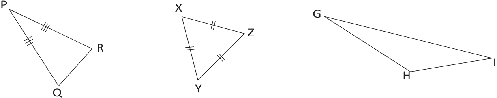
> **[Diagram Context - Textbook_Mathematics_Gr8_Geometry-of-2D-shapes.pdf-0001-07.png]**
> The graphic displays three distinct triangles labeled PQR, XYZ, and GHI with vertices indicated by letters and sides marked with tick marks to denote equal lengths. Triangle PQR has triple tick marks on sides PQ and PR, triangle XYZ has double tick marks on all three sides XY, YZ, and XZ, while triangle GHI has no side markings. This geometry figure helps high school learners identify and classify different types of triangles, such as isosceles and equilateral triangles, based on their side properties.

---

### 22.3 Solving and completing equations

#### Solve by inspection
Make the following number sentences true by changing the numbers in blue:

(a) $13 + 7 = 22$

(b) $50 + (-50) = -100$

(c) $7 \times 8 = 54$

(d) $9 - (-3) = 6$

(e) $-5 + 12 = -7$

(f) $4 \times 6 = 28$

(g) $6 - 9 = 3$

(h) $9 - 6 = -3$

(i) $5 + (-12) = 7$

(j) $10 + (-2) = 12$

(k) $(-1) - (-1) = -2$

(l) $0 + (-2) = 0$

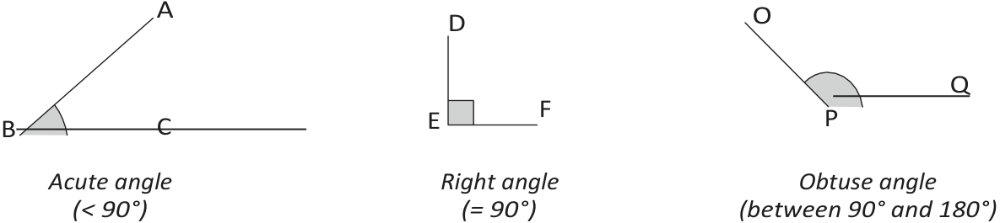
> **[Diagram Context - Textbook_Mathematics_Gr8_Geometry-of-2D-shapes.pdf-0001-10.png]**
> This graphic consists of three separate geometry figures illustrating different types of angles formed by intersecting rays. The visible labels include vertex and ray points (A, B, C, D, E, F, O, P, Q) along with mathematical descriptions indicating angle size categories: an "Acute angle (< 90°)", a "Right angle (= 90°)", and an "Obtuse angle (between 90° and 180°)". Conceptually, this diagram helps high school learners visually distinguish and classify basic angle types based on their degree measurements during geometry foundational lessons.

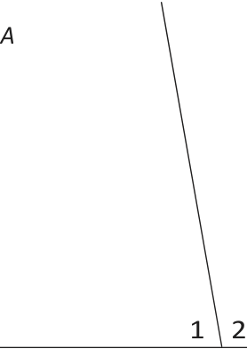
> **[Diagram Context - Textbook_Mathematics_Gr8_Geometry-of-straight-lines.pdf-0001-05.png]**
> This geometry figure displays a line intersecting a horizontal base, forming angles labeled 1 and 2, with a vertex labeled A. The visible labels include the letter "A" near the top left and the numbers "1" and "2" denoting adjacent angles at the base intersection. For high school mathematics learners, this diagram illustrates adjacent supplementary angles on a straight line or intersecting lines, supporting the application of Euclidean geometry theorems regarding angle relationships.

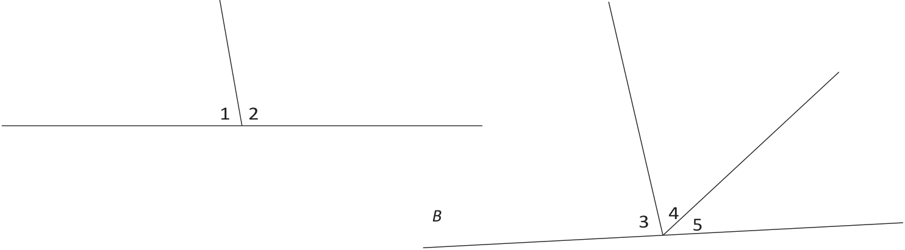
> **[Diagram Context - Textbook_Mathematics_Gr8_Geometry-of-straight-lines.pdf-0001-06.png]**
> This graphic presents a geometry figure illustrating angle relationships on a straight line. The diagram displays two horizontal-like lines intersected by rays, with visible numerical labels 1, 2, 3, 4, 5 and a letter label B. For a high school student studying Euclidean geometry, this visual conveys the concepts of angles on a straight line adding up to 180° and adjacent angles sharing a common vertex and arm.

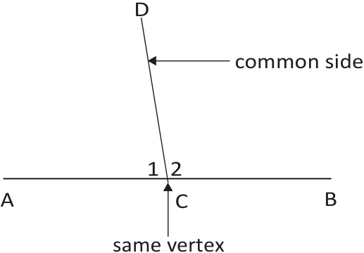
> **[Diagram Context - Textbook_Mathematics_Gr8_Geometry-of-straight-lines.pdf-0001-11.png]**
> This geometry figure illustrates adjacent angles on a straight line. Visible labels include points A, B, C, D, angle numbers 1 and 2, and explanatory labels with arrows pointing to the "common side" (line CD) and "same vertex" (point C). Conceptually, the diagram helps high school learners identify the foundational properties required to prove that adjacent angles on a straight line add up to 180°.

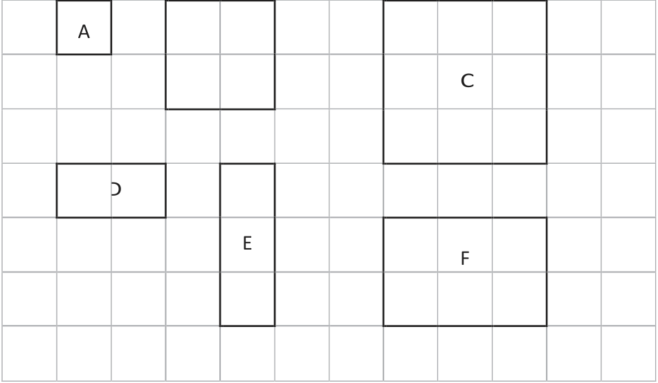
> **[Diagram Context - Textbook_Mathematics_Gr8_Perimeter-and-area-of-2D-shapes.pdf-0001-05.png]**
> This graphic is a geometry figure consisting of a two-dimensional grid containing various rectangular shapes. The visible labels include letters A, C, D, E, and F positioned inside different outlined rectangles and squares of varying grid dimensions. Conceptually, this diagram helps learners practice spatial reasoning, area calculation, and coordinate counting by determining the dimensions and relative sizes of geometric shapes on a grid plane.

---

### Concept: Solving Equations
To check whether a given value is the solution to an equation, substitute the value into the equation. If the left-hand side equals the right-hand side, the equation is **true**, and the value is the **solution**.

---

### Exercise 2: Verifying Solutions
Check whether the value in brackets is the solution. Write "yes" or "no" with an explanation.

(a) $x + 3 = 0$ ($x = -3$)
(b) $3 - x = 4$ ($x = 1$)
(c) $-5 + x = -11$ ($x = -2$)
(d) $3 - x = 4$ ($x = -1$)

---

### Exercise 3: Finding the Unknown
Find the value of the unknown that makes the equation true:

(a) $x + 6 = 8$
(b) $x + 6 = 4$
(c) $x + 6 = 0$
(d) $6 - x = 8$
(e) $6 - x = 4$
(f) $6 - x = 0$
(g) $\frac{x}{4} = 2$
(h) $x = 4 \times 2$
(i) $\frac{x}{2} = \frac{1}{4}$

---

### Exercise 4: Multiple Choice Solutions
Identify the correct solution from the set provided in brackets:

(a) $x + 27 = 27$ $\{-27; 0; 1\}$
(b) $12 = 4 - x$ $\{8; 16; -8\}$
(c) $x + 3 = 0$ $\{-3; 0; 3\}$
(d) $5 - x = 10$ $\{-5; 0; 5\}$
(e) $5 + x = 10$ $\{-5; 0; 5\}$
(f) $-5 + x = 10$ $\{-5; -15; 15\}$
(g) $-5 - x = 10$ $\{-5; -15; 15\}$
(h) $-5 - x = 0$ $\{-5; -15; 15\}$
(i) $5 - x = -10$ $\{-5; -15; 15\}$
(j) $x = \frac{10}{10}$ $\{0; 1; 100\}$
(k) $10x = 0$ $\{0; 1; \frac{1}{10}\}$
(l) $\frac{x}{10} = 0$ $\{0; 1; 10\}$

---

### Exercise 5: Solving for $x$
Determine the value of $x$ that makes the following equations true:

(a) Let $x = \dots$ then $x + 3 = 10$
(b) Let $x = \dots$ then $x + 3 = -4$
(c) $x + x + x = -6$ is true for $x = \dots$
(d) $x + x + x = -8$ is true for $x = \dots$

---

### Exercise 6: Trial and Improvement Tables
Fill in the tables to find the value of $x$ that makes the equation true.

**(a) $37 - 4x = 5$**

| $x$ | 1 | 10 | 5 | 6 | 7 | | | |
| :--- | :--- | :--- | :--- | :--- | :--- | :--- | :--- | :--- |
| $37 - 4x$ | | | | | | | | |

**(b) $50 - 7x = 22$**

| $x$ | 1 | 10 | 5 | 6 | | | | |
| :--- | :--- | :--- | :--- | :--- | :--- | :--- | :--- | :--- |
| $50 - 7x$ | | | | | | | | |

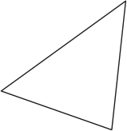
> **[Diagram Context - Textbook_Mathematics_Gr8_Geometry-of-2D-shapes.pdf-0002-01.png]**
> The graphic is a simple geometry figure representing a triangle with three straight sides and three vertices, completely unlabelled. In the context of the CAPS FET curriculum for Mathematics and Mathematical Literacy, this foundational polygon serves as a visual aid for studying Euclidean geometry, angle relationships, and trigonometric calculations.

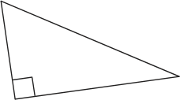
> **[Diagram Context - Textbook_Mathematics_Gr8_Geometry-of-2D-shapes.pdf-0002-03.png]**
> This graphic is a geometry figure showing a right-angled triangle. The diagram contains a single right-angle symbol (square) at the bottom-left vertex. Conceptually, it illustrates a right-angled triangle used in CAPS Mathematics and Mathematical Literacy to teach trigonometric ratios (sin, cos, tan) and Pythagoras' theorem.

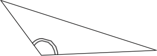
> **[Diagram Context - Textbook_Mathematics_Gr8_Geometry-of-2D-shapes.pdf-0002-05.png]**
> The image displays a geometry figure of a triangle, specifically highlighting an obtuse interior angle marked with a double curved arc at the bottom vertex. The diagram visually represents a triangle containing an angle measuring greater than 90 degrees. For high school mathematics learners, this figure serves as a visual aid for identifying and classifying obtuse-angled triangles and applying trigonometric rules or area formulas related to non-right-angled triangles.

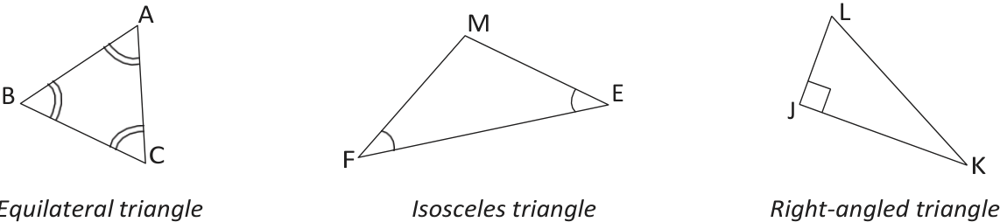
> **[Diagram Context - Textbook_Mathematics_Gr8_Geometry-of-2D-shapes.pdf-0002-17.png]**
> This geometry figure illustrates three distinct types of triangles: an equilateral triangle labeled ABC with double-arc angle markers, an isosceles triangle labeled MEF with single-arc angle markers, and a right-angled triangle labeled LJK with a perpendicular symbol at vertex J. The graphic visually conveys the classification and defining properties of triangles, helping CAPS learners distinguish between equilateral, isosceles, and right-angled triangles based on their interior angles and side relationships.

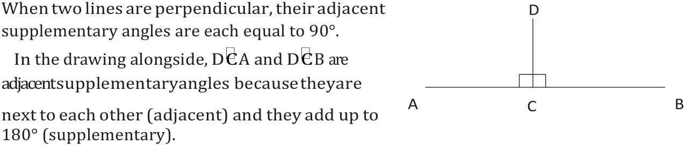
> **[Diagram Context - Textbook_Mathematics_Gr8_Geometry-of-straight-lines.pdf-0002-00.png]**
> This educational graphic is a geometry figure demonstrating the properties of perpendicular lines and adjacent supplementary angles. The diagram features a horizontal line segment with endpoints labeled A and B, intersected at a right angle by a vertical line segment originating from point D, with the intersection point designated as C and marked with right-angle symbols. Conceptually, it helps high school learners understand that when two lines are perpendicular, they form adjacent supplementary angles that each measure $90^\circ$ and add up to $180^\circ$.

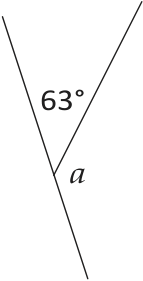
> **[Diagram Context - Textbook_Mathematics_Gr8_Geometry-of-straight-lines.pdf-0002-04.png]**
> This geometry figure illustrates intersecting straight lines forming adjacent angles. Visible labels include the known angle measure $63^\circ$ and the unknown angle variable $a$. For high school mathematics learners, this diagram conveys the concept of angles on a straight line, requiring students to apply Euclidean geometry principles—specifically that adjacent angles on a straight line add up to $180^\circ$—to calculate the value of $a$.

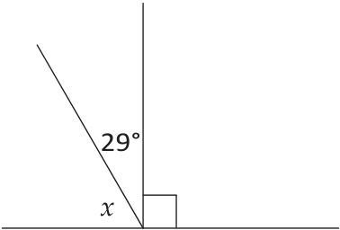
> **[Diagram Context - Textbook_Mathematics_Gr8_Geometry-of-straight-lines.pdf-0002-06.png]**
> This geometry figure illustrates complementary angles formed on a straight line. The diagram displays a horizontal base line intersected by a vertical line indicating a right angle ($90^\circ$), with an additional ray dividing the space to form two adjacent angles labelled $29^\circ$ and an unknown variable $x$. Conceptually, it helps learners apply Euclidean geometry principles to calculate unknown angle values by recognizing that complementary angles sum up to $90^\circ$.

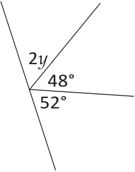
> **[Diagram Context - Textbook_Mathematics_Gr8_Geometry-of-straight-lines.pdf-0002-08.png]**
> The graphic is a geometry figure showing multiple adjacent angles meeting at a common vertex along a straight line. The visible labels include the variable $2y$ and numerical angle values of $48^\circ$ and $52^\circ$. This diagram helps high school students practice applying Euclidean geometry theorems, specifically calculating unknown values using the concept of angles on a straight line summing to $180^\circ$.

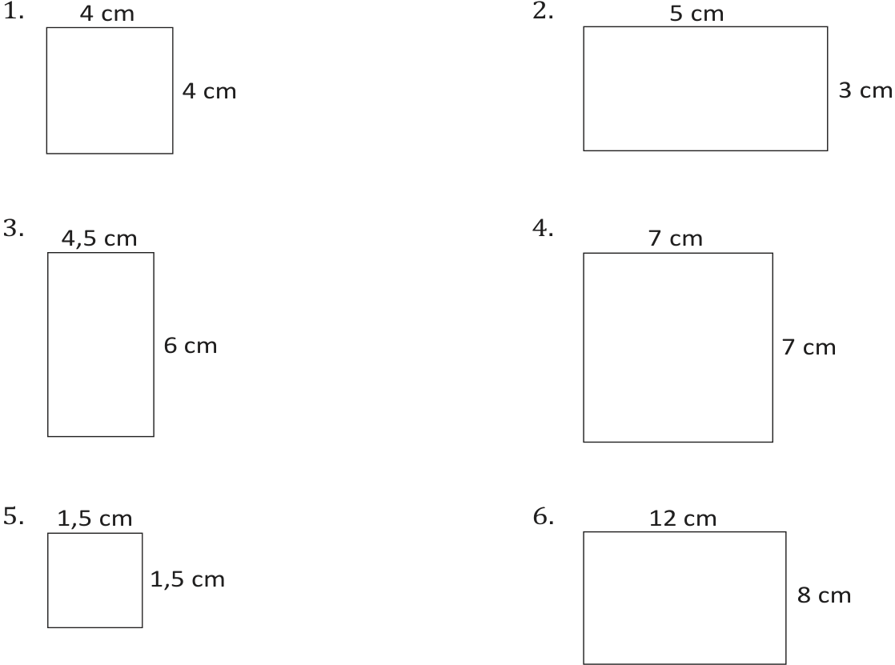
> **[Diagram Context - Textbook_Mathematics_Gr8_Perimeter-and-area-of-2D-shapes.pdf-0002-05.png]**
> The educational graphic displays a geometry figure worksheet featuring six numbered 2D shapes, specifically squares and rectangles. Visible labels include numerical identifiers (1 to 6) and side length measurements with units in centimeters (e.g., 4 cm, 5 cm, 3 cm, 4,5 cm, 6 cm, 7 cm, 1,5 cm, 12 cm, and 8 cm). This diagram helps learners conceptualize the properties and dimensions of 2D shapes, allowing them to practice calculating perimeter and area according to CAPS curriculum requirements.

---

### Solving by Trial and Improvement

An equation is a mathematical statement that asks for a value to be assigned to an **unknown** variable to make the statement true. The "trial and improvement" method involves testing different values for the unknown until the correct value is found.

#### Worked Example
Consider the equation: $82 + m = 23$

| Trial | Equation | True/False |
| :--- | :--- | :--- |
| Let $m = -50$ | $82 + (-50) = 82 - 50 = 32$ | False |
| Let $m = -30$ | $82 + (-30) = 82 - 30 = 52$ | False |
| Let $m = -60$ | $82 + (-60) = 82 - 60 = 22$ | False |
| Let $m = -59$ | $82 + (-59) = 82 - 59 = 23$ | True |

**Conclusion:** $m = -59$ because $82 + (-59) = 23$.

---

### Exercises

#### 1. Solve for $t$
Determine the value of $t$ that makes the equation $28 - t = 82$ true.

| Trial | Equation | True/False |
| :--- | :--- | :--- |
| | | |
| | | |

#### 2. Solve for $w$
Use the trial and improvement method to find the solution for $w + 32 = -68$.

| Trial | Equation | True/False |
| :--- | :--- | :--- |
| | | |
| | | |

#### 3. Solve for $t$
Given the equation $200 - 5t = 110$, determine the value of $t$ that makes the equation true.

| Trial | Equation | True/False |
| :--- | :--- | :--- |
| | | |
| | | |

---

### Additional Practice
Complete the table for the expression $100 - 3x$:

| $x$ | 10 | 20 | 25 | 15 | 16 | | | | |
| :--- | :--- | :--- | :--- | :--- | :--- | :--- | :--- | :--- | :--- |
| $100 - 3x$ | | | | | | | | | |

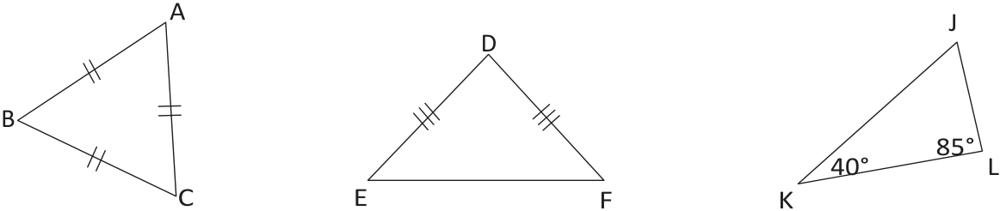
> **[Diagram Context - Textbook_Mathematics_Gr8_Geometry-of-2D-shapes.pdf-0003-12.png]**
> This graphic displays three geometry figures, specifically triangles labeled ABC, DEF, and JKL, with vertices indicated by capital letters. Visible markings include double tick marks on sides AB and AC of triangle ABC, triple tick marks on sides DE and DF of triangle DEF, and angle measurements of 40° at vertex K and 85° at vertex L in triangle JKL. Conceptually, this visual supports CAPS FET mathematics by helping learners identify equilateral, isosceles, and scalene triangles, apply side-angle relationships, and calculate unknown interior angles using the sum of angles in a triangle.

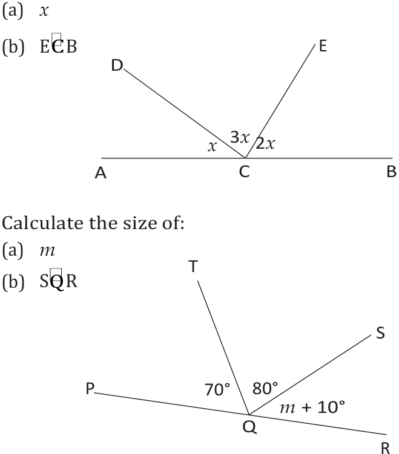
> **[Diagram Context - Textbook_Mathematics_Gr8_Geometry-of-straight-lines.pdf-0003-02.png]**
> This graphic is a geometry figure displaying two separate Euclidean geometry problems involving straight lines and adjacent angles. The diagram features straight lines AB and PR with intersecting rays and vertex points C and Q, labeled with angle measures containing algebraic variables such as $x$, $3x$, $2x$, $70^\circ$, $80^\circ$, and $m + 10^\circ$. Conceptually, it helps learners apply the Euclidean geometry theorem that angles on a straight line add up to $180^\circ$ to set up linear equations and solve for unknown variables.

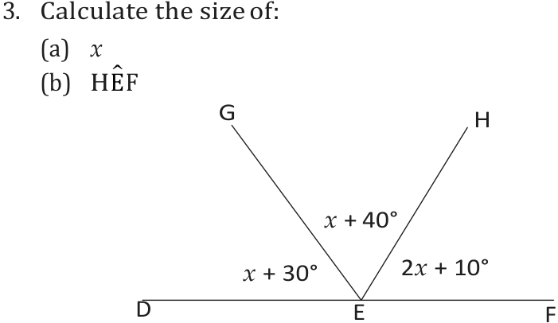
> **[Diagram Context - Textbook_Mathematics_Gr8_Geometry-of-straight-lines.pdf-0003-04.png]**
> This educational graphic is a Euclidean geometry figure depicting adjacent angles on a straight line. The diagram displays a straight line $DF$ with a common vertex $E$, rays $EG$ and $EH$, and angle measures expressed in terms of the variable $x$ as $(x + 30^\circ)$, $(x + 40^\circ)$, and $(2x + 10^\circ)$. It conveys the concept of supplementary angles on a straight line summing to $180^\circ$, allowing high school learners to set up and solve an algebraic equation to find the value of $x$ and the size of specific angles such as $\text{H}\hat{\text{E}}\text{F}$.

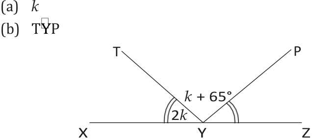
> **[Diagram Context - Textbook_Mathematics_Gr8_Geometry-of-straight-lines.pdf-0003-06.png]**
> This geometry figure displays a straight line $XZ$ intersected by two rays, $YT$ and $YP$, meeting at vertex $Y$. The diagram includes angle labels $2k$ for $\angle XYI$ and $k + 65^\circ$ for $\angle PYZ$, alongside sub-questions (a) $k$ and (b) $\angle TYP$. Conceptually, it helps high school learners apply Euclidean geometry principles regarding angles on a straight line ($\sum = 180^\circ$) to set up and solve algebraic equations for unknown variables.

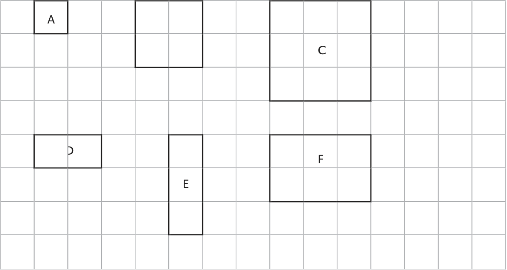
> **[Diagram Context - Textbook_Mathematics_Gr8_Perimeter-and-area-of-2D-shapes.pdf-0003-00.png]**
> This graphic displays a geometry figure consisting of a grid overlaid with various rectangular and square shapes. Visible labels include uppercase letters A, C, D, E, and F positioned inside specific shapes. Conceptually, this diagram helps high school students practice counting grid units to determine area and perimeter, or to analyze scale and proportions of shapes.

---

### Exercises: Solving Equations

**4. What value of $p$ makes the equation $18p = 90$ true?**

| $p$ | Equation | True/False |
| :--- | :--- | :--- |
| | $18p = 90$ | |

**5. What value of $x$ makes the equation $88 - 6x = 46$ true?**

| $x$ | Equation | True/False |
| :--- | :--- | :--- |
| | $88 - 6x = 46$ | |

---

### 22.4 Identifying Variables and Constants

**Definitions:**
*   **Variable:** A symbol (usually a letter) that represents a value that can change or vary.
*   **Constant:** A value that remains fixed and does not change.

#### Worked Example 1: Truck and Cement
The mass of an empty truck is $2\,680\text{ kg}$. Each pocket of cement has a mass of $90\text{ kg}$. The combined mass is given by the formula:
$$y = 90 \times x + 2\,680$$

Identify whether the following are variables or constants:
(a) $y$
(b) $90$
(c) $x$
(d) $2\,680$

#### Worked Example 2: Steel Spring
A steel spring is suspended from a stand. Mass pieces are added, and the length is measured.

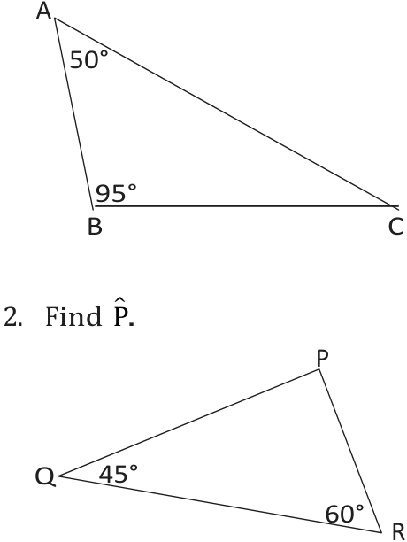
> **[Diagram Context - Textbook_Mathematics_Gr8_Geometry-of-2D-shapes.pdf-0004-03.png]**
> This educational graphic features two distinct geometry figures, specifically triangles labeled ABC and PQR, with visible angle measurements of 50° and 95° at vertices A and B, and 45° and 60° at vertices Q and R, alongside the text prompt "2. Find $\hat{P}$." Conceptually, this diagram helps high school learners apply the Euclidean geometry theorem that the interior angles of a triangle always sum up to $180^\circ$ to calculate a missing unknown angle.

| Number of mass pieces | 1 | 2 | 3 | 4 | 5 | 7 | 10 |
| :--- | :--- | :--- | :--- | :--- | :--- | :--- | :--- |
| Length of spring in cm | 48 | 56 | 64 | 72 | 80 | 96 | 120 |

The formula used to predict the length is:
$$y = 8x + 40$$

Identify whether the following are variables or constants:
(a) $y$
(b) $8$
(c) $x$
(d) $40$

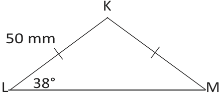
> **[Diagram Context - Textbook_Mathematics_Gr8_Geometry-of-2D-shapes.pdf-0004-06.png]**
> This geometry figure illustrates a triangle labeled KLM with vertices K, L, and M. Visible markings include vertex labels K, L, and M, side length indicator 50 mm, angle measure 38°, and hash marks indicating equal sides LK and KM. This diagram helps high school students practice applying trigonometric ratios or the sine and cosine rules to calculate unknown side lengths and angles in triangles.

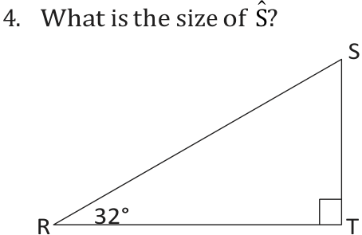
> **[Diagram Context - Textbook_Mathematics_Gr8_Geometry-of-2D-shapes.pdf-0004-07.png]**
> The graphic displays a geometry figure of a right-angled triangle labeled $\triangle RTS$, with a right angle at vertex $T$ and an acute angle of $32^\circ$ at vertex $R$. Visible labels include vertices $R$, $T$, and $S$, along with the question text asking for the size of angle $\hat{S}$. This diagram helps students apply the trigonometric ratio rule that the sum of angles in a triangle equals $180^\circ$, reinforcing the relationship between complementary angles in a right-angled triangle.

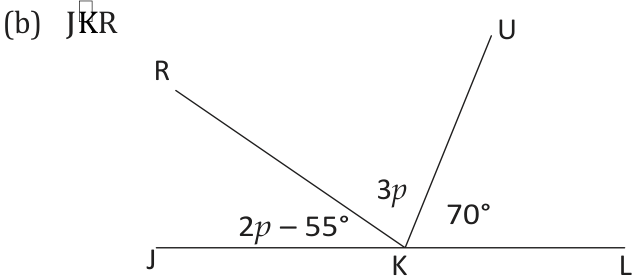
> **[Diagram Context - Textbook_Mathematics_Gr8_Geometry-of-straight-lines.pdf-0004-02.png]**
> This geometry figure illustrates adjacent angles on a straight line. The diagram displays a straight line JKL with vertex K, intersected by rays KR and KU, showing the angle labels JKR ($2p - 55^\circ$), RKU ($3p$), and UKL ($70^\circ$). Conceptually, it helps learners apply the Euclidean geometry theorem that angles on a straight line add up to $180^\circ$ to set up an algebraic equation and solve for the unknown variable $p$.

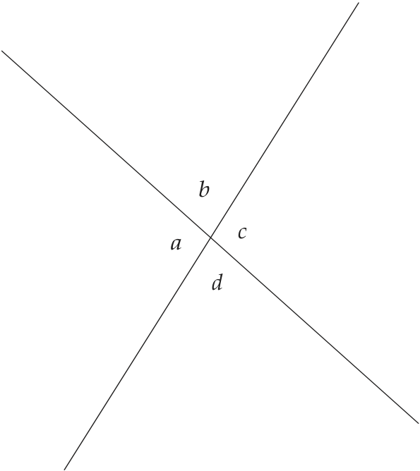
> **[Diagram Context - Textbook_Mathematics_Gr8_Geometry-of-straight-lines.pdf-0004-06.png]**
> This geometry figure illustrates two intersecting straight lines forming four angles around a central point, labeled with the variables $a$, $b$, $c$, and $d$. It visually demonstrates the geometric relationships between angles formed by intersecting lines, specifically highlighting vertically opposite angles and angles on a straight line. For high school learners, this diagram serves as a foundational tool for solving Euclidean geometry problems by applying angle properties such as vertically opposite angles being equal ($a = c$ and $b = d$) and adjacent supplementary angles adding up to $180^\circ$.

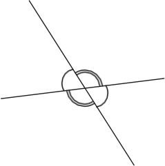
> **[Diagram Context - Textbook_Mathematics_Gr8_Geometry-of-straight-lines.pdf-0004-09.png]**
> The graphic is a geometry figure displaying intersecting lines forming angles. It consists of two straight intersecting lines passing through a central curved, ring-like geometric symbol with attached semi-circular lobes. Conceptually, this diagram visually prompts high school learners to identify and calculate relationships between adjacent, vertically opposite, or supplementary angles formed by intersecting lines.

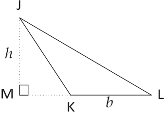
> **[Diagram Context - Textbook_Mathematics_Gr8_Perimeter-and-area-of-2D-shapes.pdf-0004-04.png]**
> This geometry figure illustrates a non-right-angled triangle JKL partitioned by a perpendicular height into a right-angled reference triangle. The diagram features vertices J, K, L, and M, with visible labels including perpendicular height $h$, base segment $b$, and a right-angle symbol at vertex M. Conceptually, it conveys how to determine the area of an obtuse-angled triangle by using an external perpendicular height dropped from a vertex onto an extended base line, a fundamental technique in CAPS Grade 11 Euclidean Geometry and Trigonometry.

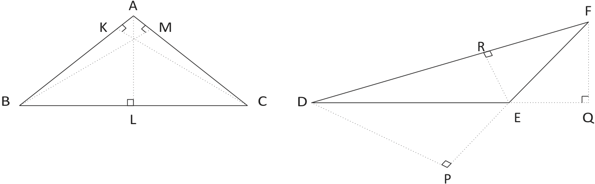
> **[Diagram Context - Textbook_Mathematics_Gr8_Perimeter-and-area-of-2D-shapes.pdf-0004-08.png]**
> This geometric figure illustrates two triangles, triangle ABC with altitude AL and perpendicular segments AK and AM, and triangle DEF with altitude ER and construction line FQ. Visible labels include vertices A, B, C, D, E, F, K, L, M, P, Q, and R, along with right-angle symbols indicating perpendicular heights. Conceptually, this diagram is used in Grade 11/12 Mathematics to prove the area rule or derive trigonometric relationships involving the area of triangles by constructing perpendicular heights.

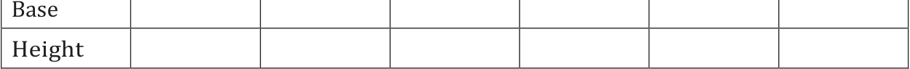
> **[Diagram Context - Textbook_Mathematics_Gr8_Perimeter-and-area-of-2D-shapes.pdf-0004-09.png]**
> The graphic is a geometry table structured with two visible row labels, "Base" and "Height," followed by multiple blank cells arranged in columns. This layout is typically used in Mathematics and Technical Mathematics CAPS curricula to help learners record measurements, solve area problems, or organize data points for geometric figures. By structuring the relationship between base and height, it guides learners in applying area formulas and analyzing proportional data systematically.

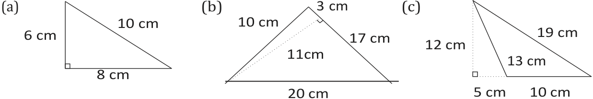
> **[Diagram Context - Textbook_Mathematics_Gr8_Perimeter-and-area-of-2D-shapes.pdf-0004-11.png]**
> This educational graphic features three geometry figures representing right-angled and compound triangles with labelled side lengths in centimetres, denoted as (a), (b), and (c). Diagram (a) shows a single right-angled triangle with sides 6 cm, 8 cm, and 10 cm; diagram (b) illustrates a composite figure containing a dotted internal perpendicular height of 11 cm alongside side lengths 3 cm, 10 cm, 17 cm, and 20 cm; and diagram (c) displays a triangle with an extended vertical height of 12 cm, a base segment of 5 cm, and side lengths of 13 cm, 10 cm, and 19 cm. Conceptually, these diagrams provide learners with practice in applying the Theorem of Pythagoras to calculate unknown lengths, heights, and areas in standard and composite shapes as required in the CAPS curriculum.

---

# 22.5 Numerical values of expressions

### Substituting numbers into expressions
To find the numerical value of an algebraic expression, replace the variable (e.g., $x$) with the given number and perform the calculation.

---

### Exercise 1
(a) Copy and complete the table below by calculating the value of each expression for the given values of $x$.

| $x$ | 0 | 2 | 5 | 10 | 20 | 50 | 100 |
| :--- | :--- | :--- | :--- | :--- | :--- | :--- | :--- |
| $100 - 9x$ | | | | | | | |
| $100 - 8x$ | | | | | | | |
| $100 - 7x$ | | | | | | | |
| $100 - 6x$ | | | | | | | |
| $100 - 5x$ | | | | | | | |
| $100 - 4x$ | | | | | | | |
| $100 - 3x$ | | | | | | | |

(b) Which sequence in the above table decreases fastest, and which sequence decreases slowest?

---

### Exercise 2
(a) Copy and complete the table below.

| $x$ | 1 | 2 | 3 | 4 | 5 | 6 | 7 |
| :--- | :--- | :--- | :--- | :--- | :--- | :--- | :--- |
| $2x + 3$ | | | | | | | |
| $3x - 3$ | | | | | | | |
| $3x - 2$ | | | | | | | |
| $3x - 1$ | | | | | | | |

(b) For which value of $x$ is $2x + 3$ equal to $3x - 1$?

(c) For which values of $x$ is $2x + 3$ smaller than $3x - 1$?

(d) Do you think $2x + 3$ is smaller than $3x - 1$ for all values of $x$ greater than 4? You may try a few numbers to help you think about this.

(e) Which sequence increases fastest, the sequence generated by $2x + 3$ or the sequence generated by $3x - 3$?

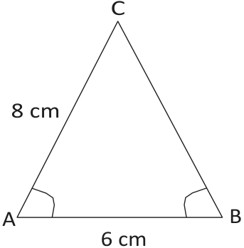
> **[Diagram Context - Textbook_Mathematics_Gr8_Geometry-of-2D-shapes.pdf-0005-01.png]**
> This geometry figure depicts a triangle labeled ABC with side lengths of 8 cm for AC and 6 cm for AB, along with angle markings at vertices A and B. For a high school student studying mathematics, the diagram illustrates the properties of an isosceles triangle where equal side lengths imply equal base angles (angle A equals angle B).

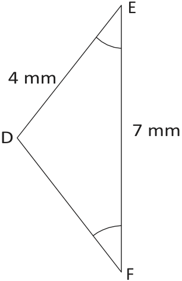
> **[Diagram Context - Textbook_Mathematics_Gr8_Geometry-of-2D-shapes.pdf-0005-04.png]**
> This geometry figure illustrates a triangle labeled DEF with vertices D, E, and F, including interior angle arc markings at vertices E and F. Visible labels include the side lengths $4\text{ mm}$ for side DE and $7\text{ mm}$ for side EF. This diagram helps high school learners apply trigonometric ratios or the sine and cosine rules to calculate unknown sides or angles in non-right-angled triangles.

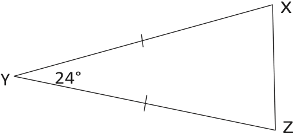
> **[Diagram Context - Textbook_Mathematics_Gr8_Geometry-of-2D-shapes.pdf-0005-07.png]**
> This geometry figure shows a triangle labeled with vertices X, Y, and Z. Visible labels include the vertices X, Y, and Z, with an included angle of 24° at vertex Y, and tick marks indicating that sides XY and YZ are equal in length. This diagram conveys the properties of an isosceles triangle, helping high school students apply Euclidean geometry theorems regarding equal sides and their opposite angles.

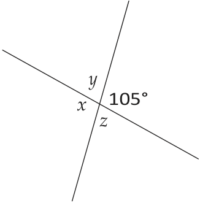
> **[Diagram Context - Textbook_Mathematics_Gr8_Geometry-of-straight-lines.pdf-0005-03.png]**
> This geometry figure illustrates two intersecting straight lines forming four adjacent angles labeled with variables $x$, $y$, $z$, and a known value of $105^\circ$. The diagram displays vertically opposite angles and angles on a straight line. It helps learners apply Euclidean geometry axioms—specifically that vertically opposite angles are equal and angles on a straight line add up to $180^\circ$—to solve for unknown angle values.

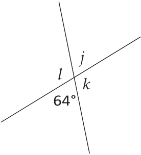
> **[Diagram Context - Textbook_Mathematics_Gr8_Geometry-of-straight-lines.pdf-0005-05.png]**
> The graphic is a geometry figure showing two intersecting straight lines forming four adjacent angles. The visible labels and variables include angle variables $j$, $k$, $l$, and a known angle measure of $64^\circ$. This diagram helps FET/Senior Phase mathematics learners apply Euclidean geometry theorems—specifically vertically opposite angles and angles on a straight line—to calculate unknown angle values.

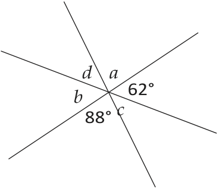
> **[Diagram Context - Textbook_Mathematics_Gr8_Geometry-of-straight-lines.pdf-0005-07.png]**
> This geometry figure illustrates intersecting straight lines meeting at a common vertex. Visible labels include unknown angle variables $a$, $b$, $c$, and $d$, alongside known angle measurements of $62^\circ$ and $88^\circ$. Aligned with the CAPS curriculum for Euclidean geometry, this diagram tests a student's ability to apply geometric axioms, specifically identifying vertically opposite angles and angles on a straight line ($\sum = 180^\circ$) to solve for unknown variables.

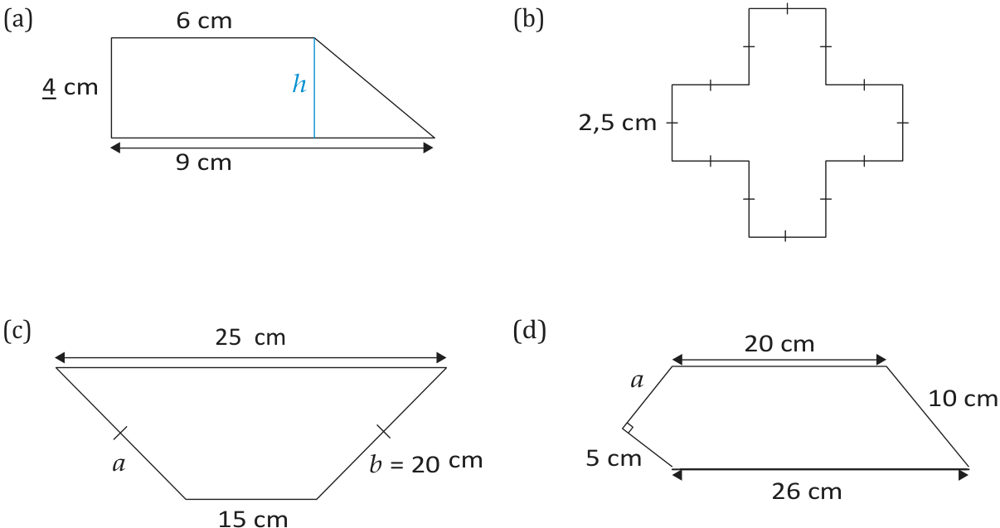
> **[Diagram Context - Textbook_Mathematics_Gr8_Perimeter-and-area-of-2D-shapes.pdf-0005-02.png]**
> The graphic is a geometry figure displaying four distinct 2D composite and regular polygons labeled (a), (b), (c), and (d) with associated side length measurements and variables. Visible labels include dimensions in centimeters (e.g., 4 cm, 6 cm, 9 cm, 25 cm, 15 cm, 20 cm, 26 cm, 5 cm, 10 cm, 2,5 cm), side variables ($a$, $b$), height ($h$), perpendicularity indicators, and tick marks denoting equal side lengths. This diagram conveys the geometric properties and dimensions required for Senior Phase and FET learners to calculate the perimeter and area of complex shapes and irregular polygons by sub-dividing them into standard shapes like rectangles, triangles, and trapeziums.

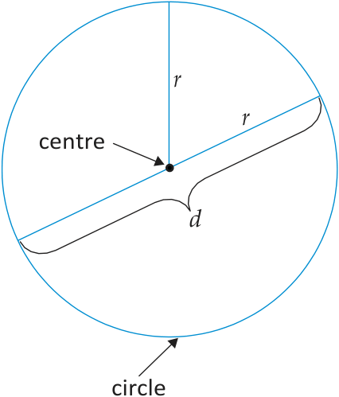
> **[Diagram Context - Textbook_Mathematics_Gr8_Perimeter-and-area-of-2D-shapes.pdf-0005-12.png]**
> This geometry figure illustrates the fundamental properties of a circle. Visible labels include "circle", "centre", radii denoted by the variable "$r$", and diameter denoted by the variable "$d$". Conceptually, the diagram helps students understand Euclidean geometry definitions by demonstrating how the radius ($r$) originates from the centre to the circumference, and how the diameter ($d$) spans straight across the centre, illustrating that $d = 2r$.

