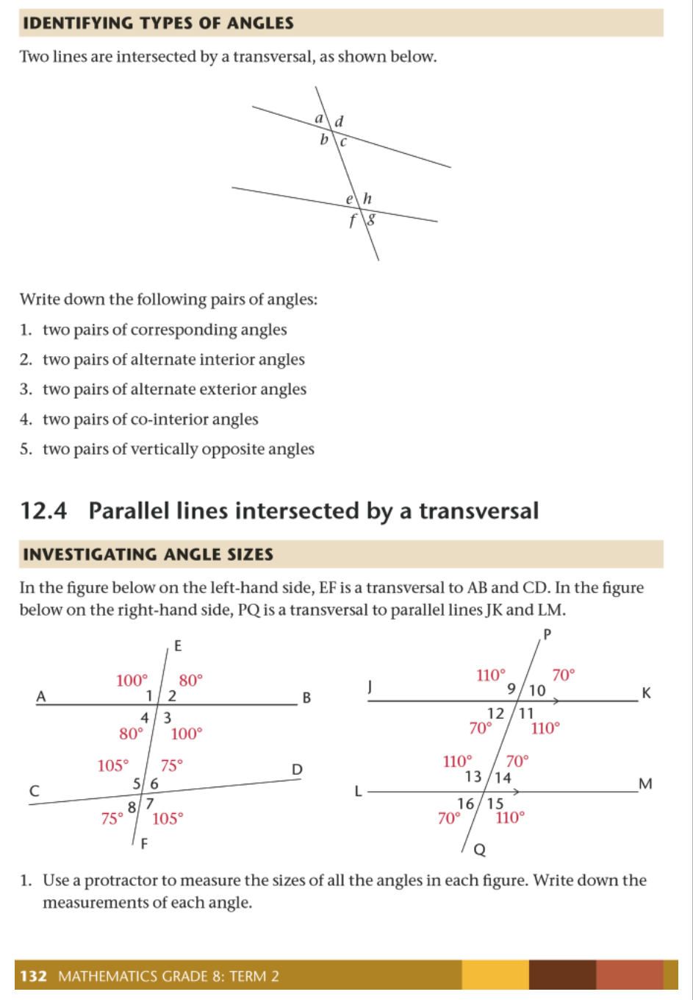
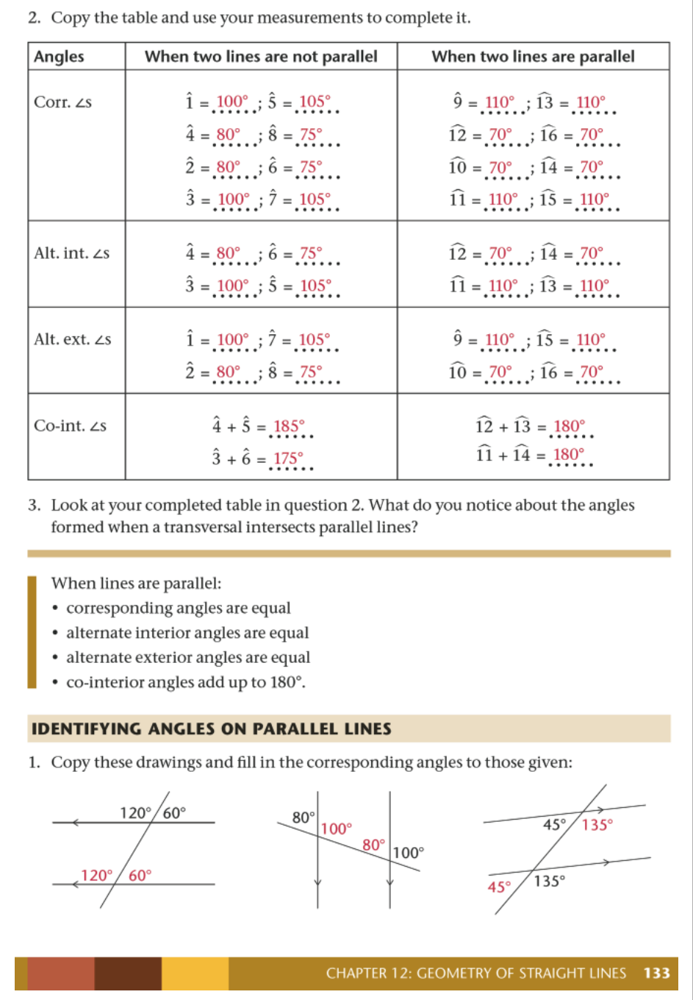
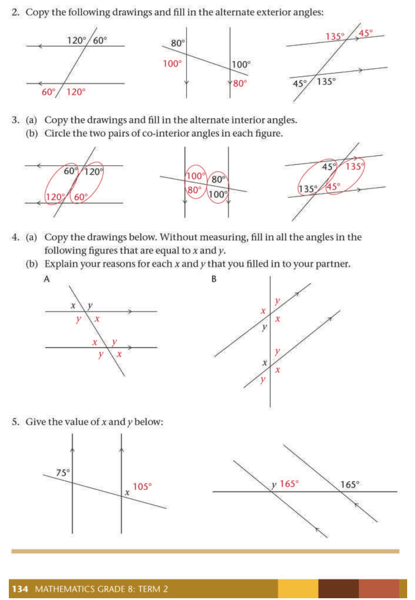
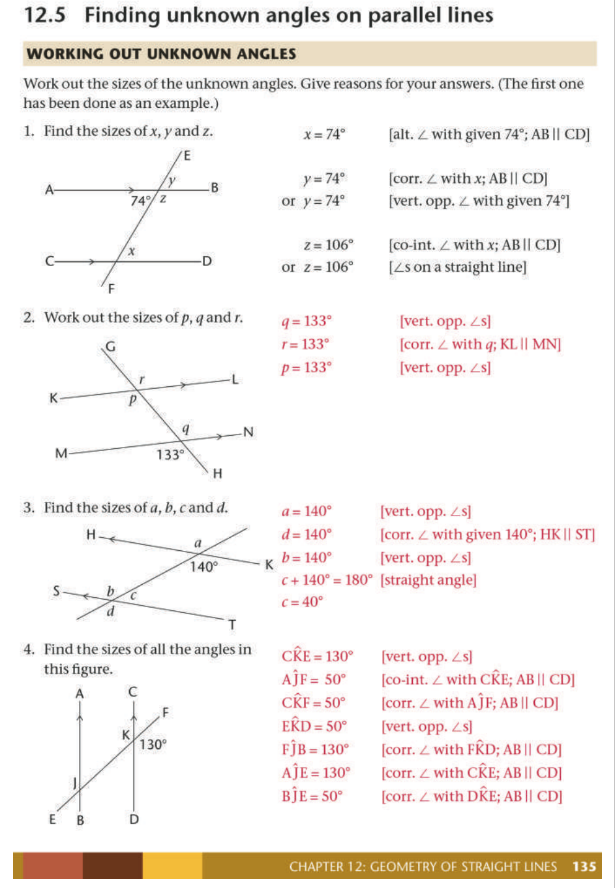
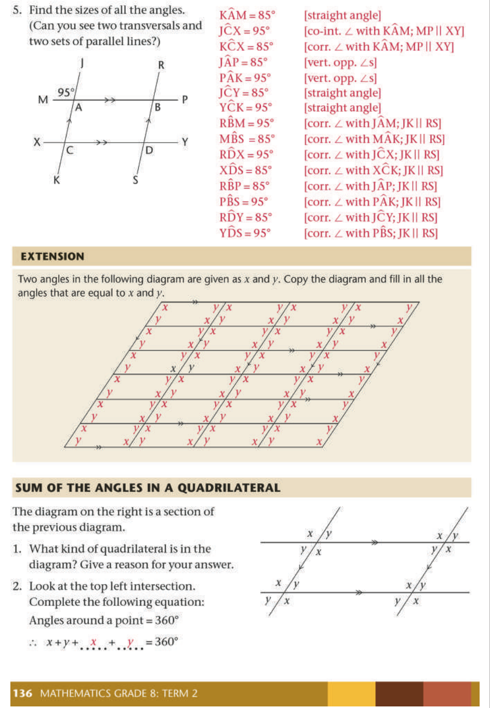
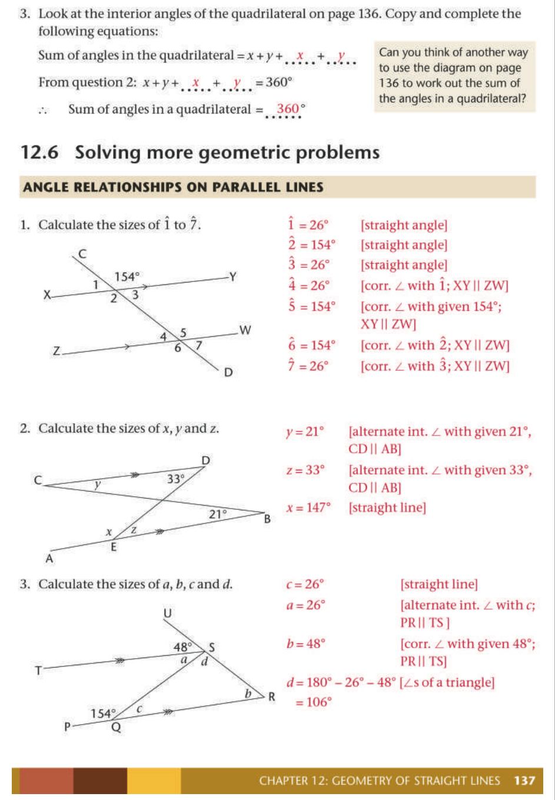
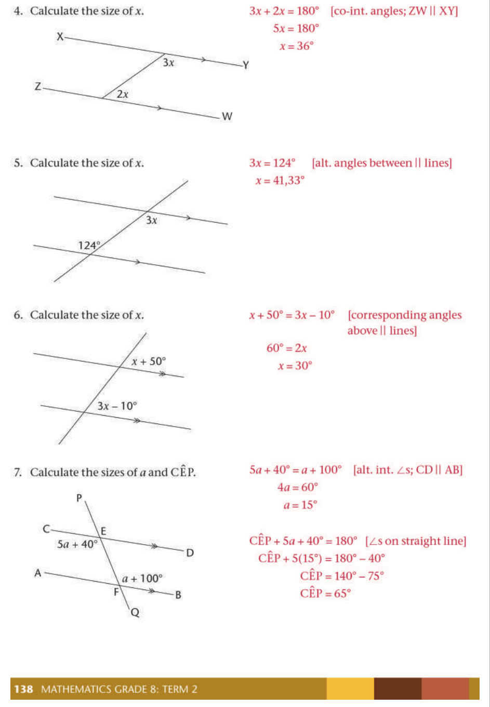
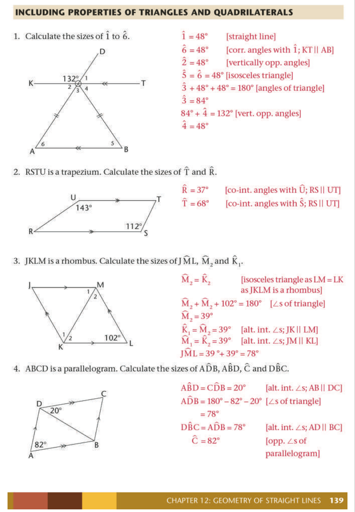
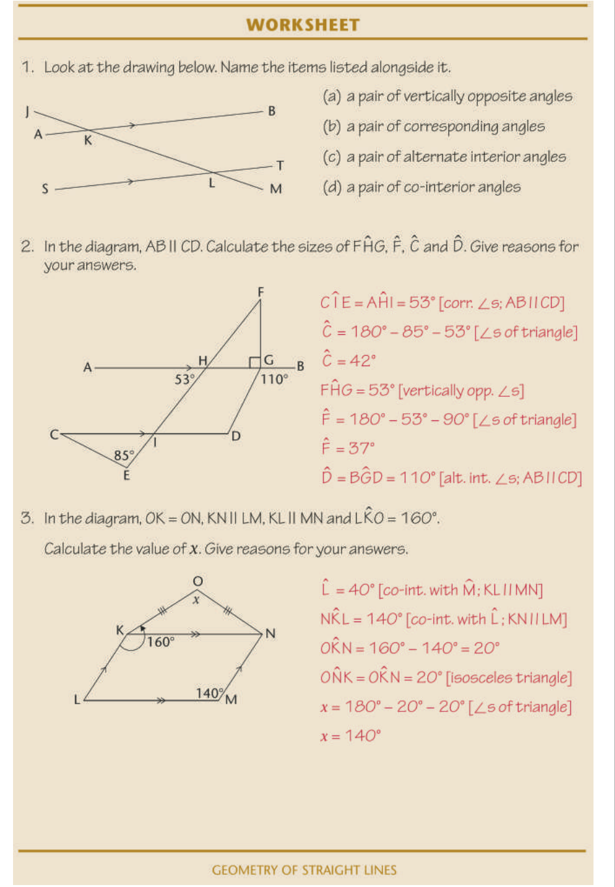

# **Chapter 12 Geometry of straight lines** 

## 12.1 Angles on a straight line 

##### **<mark>sum of angles on a straight line</mark>** 

In the figures below, each angle is given a label from 1 to 5. 

1. Use a protractor to measure the sizes of all the angles in each figure. Write down your answers. 


> **[Diagram Context - Textbook_Mathematics_Gr8_Geometry-of-straight-lines.pdf-0001-05.png]**
> This geometry figure displays a line intersecting a horizontal base, forming angles labeled 1 and 2, with a vertex labeled A. The visible labels include the letter "A" near the top left and the numbers "1" and "2" denoting adjacent angles at the base intersection. For high school mathematics learners, this diagram illustrates adjacent supplementary angles on a straight line or intersecting lines, supporting the application of Euclidean geometry theorems regarding angle relationships.


> **[Diagram Context - Textbook_Mathematics_Gr8_Geometry-of-straight-lines.pdf-0001-06.png]**
> This graphic presents a geometry figure illustrating angle relationships on a straight line. The diagram displays two horizontal-like lines intersected by rays, with visible numerical labels 1, 2, 3, 4, 5 and a letter label B. For a high school student studying Euclidean geometry, this visual conveys the concepts of angles on a straight line adding up to 180° and adjacent angles sharing a common vertex and arm.


2. Use your answers to determine the following sums: 

   - (a) 1^{} +  2^{} (b) 3^{} +  4^{} +  5^{} 

The sum of angles that are formed on a straight line is equal to 180°. (We can shorten this property as: ∠s on a straight line.) 

Two angles whose sizes add up to 180° are also called **supplementary** angles, for example 1^{} +  2^{} . Angles that share a vertex and a common side are said to be **adjacent** . So 1^{} +  2^{} are therefore also called **supplementary adjacent angles** . 


> **[Diagram Context - Textbook_Mathematics_Gr8_Geometry-of-straight-lines.pdf-0001-11.png]**
> This geometry figure illustrates adjacent angles on a straight line. Visible labels include points A, B, C, D, angle numbers 1 and 2, and explanatory labels with arrows pointing to the "common side" (line CD) and "same vertex" (point C). Conceptually, the diagram helps high school learners identify the foundational properties required to prove that adjacent angles on a straight line add up to 180°.


**124** MATHEMATICS GRAdE 8: TERM 2 


> **[Diagram Context - Textbook_Mathematics_Gr8_Geometry-of-straight-lines.pdf-0002-00.png]**
> This educational graphic is a geometry figure demonstrating the properties of perpendicular lines and adjacent supplementary angles. The diagram features a horizontal line segment with endpoints labeled A and B, intersected at a right angle by a vertical line segment originating from point D, with the intersection point designated as C and marked with right-angle symbols. Conceptually, it helps high school learners understand that when two lines are perpendicular, they form adjacent supplementary angles that each measure $90^\circ$ and add up to $180^\circ$.


##### **<mark>finding unknown angles on straight lines</mark>** 

Work out the sizes of the unknown angles below. Build an equation each time as you solve these geometric problems. Always give a reason for every statement you make. 

1. Calculate the size of _a_ . 


> **[Diagram Context - Textbook_Mathematics_Gr8_Geometry-of-straight-lines.pdf-0002-04.png]**
> This geometry figure illustrates intersecting straight lines forming adjacent angles. Visible labels include the known angle measure $63^\circ$ and the unknown angle variable $a$. For high school mathematics learners, this diagram conveys the concept of angles on a straight line, requiring students to apply Euclidean geometry principles—specifically that adjacent angles on a straight line add up to $180^\circ$—to calculate the value of $a$.


2. Calculate the size of _x_ . 


> **[Diagram Context - Textbook_Mathematics_Gr8_Geometry-of-straight-lines.pdf-0002-06.png]**
> This geometry figure illustrates complementary angles formed on a straight line. The diagram displays a horizontal base line intersected by a vertical line indicating a right angle ($90^\circ$), with an additional ray dividing the space to form two adjacent angles labelled $29^\circ$ and an unknown variable $x$. Conceptually, it helps learners apply Euclidean geometry principles to calculate unknown angle values by recognizing that complementary angles sum up to $90^\circ$.


3. Calculate the size of _y_ . 


> **[Diagram Context - Textbook_Mathematics_Gr8_Geometry-of-straight-lines.pdf-0002-08.png]**
> The graphic is a geometry figure showing multiple adjacent angles meeting at a common vertex along a straight line. The visible labels include the variable $2y$ and numerical angle values of $48^\circ$ and $52^\circ$. This diagram helps high school students practice applying Euclidean geometry theorems, specifically calculating unknown values using the concept of angles on a straight line summing to $180^\circ$.


CHAPTER 12: GEOMETRY OF  STRAIGHT LINES 

##### **<mark>finding more unknown angles on straight lines</mark>** 

1. Calculate the size of: 


> **[Diagram Context - Textbook_Mathematics_Gr8_Geometry-of-straight-lines.pdf-0003-02.png]**
> This graphic is a geometry figure displaying two separate Euclidean geometry problems involving straight lines and adjacent angles. The diagram features straight lines AB and PR with intersecting rays and vertex points C and Q, labeled with angle measures containing algebraic variables such as $x$, $3x$, $2x$, $70^\circ$, $80^\circ$, and $m + 10^\circ$. Conceptually, it helps learners apply the Euclidean geometry theorem that angles on a straight line add up to $180^\circ$ to set up linear equations and solve for unknown variables.


2. Calculate the size of: 


> **[Diagram Context - Textbook_Mathematics_Gr8_Geometry-of-straight-lines.pdf-0003-04.png]**
> This educational graphic is a Euclidean geometry figure depicting adjacent angles on a straight line. The diagram displays a straight line $DF$ with a common vertex $E$, rays $EG$ and $EH$, and angle measures expressed in terms of the variable $x$ as $(x + 30^\circ)$, $(x + 40^\circ)$, and $(2x + 10^\circ)$. It conveys the concept of supplementary angles on a straight line summing to $180^\circ$, allowing high school learners to set up and solve an algebraic equation to find the value of $x$ and the size of specific angles such as $\text{H}\hat{\text{E}}\text{F}$.


###### 4. Calculate the size of: 


> **[Diagram Context - Textbook_Mathematics_Gr8_Geometry-of-straight-lines.pdf-0003-06.png]**
> This geometry figure displays a straight line $XZ$ intersected by two rays, $YT$ and $YP$, meeting at vertex $Y$. The diagram includes angle labels $2k$ for $\angle XYI$ and $k + 65^\circ$ for $\angle PYZ$, alongside sub-questions (a) $k$ and (b) $\angle TYP$. Conceptually, it helps high school learners apply Euclidean geometry principles regarding angles on a straight line ($\sum = 180^\circ$) to set up and solve algebraic equations for unknown variables.


**126** MATHEMATICS GRAdE 8: TERM 2 

5. Calculate the size of: 

   - (a) _p_ 


> **[Diagram Context - Textbook_Mathematics_Gr8_Geometry-of-straight-lines.pdf-0004-02.png]**
> This geometry figure illustrates adjacent angles on a straight line. The diagram displays a straight line JKL with vertex K, intersected by rays KR and KU, showing the angle labels JKR ($2p - 55^\circ$), RKU ($3p$), and UKL ($70^\circ$). Conceptually, it helps learners apply the Euclidean geometry theorem that angles on a straight line add up to $180^\circ$ to set up an algebraic equation and solve for the unknown variable $p$.


## 12.2 Vertically opposite angles 

#### **<mark>what are vertically opposite angles?</mark>** 

1. Use a protractor to measure thesizes of all the angles in the figure. Write down your answers. 


> **[Diagram Context - Textbook_Mathematics_Gr8_Geometry-of-straight-lines.pdf-0004-06.png]**
> This geometry figure illustrates two intersecting straight lines forming four angles around a central point, labeled with the variables $a$, $b$, $c$, and $d$. It visually demonstrates the geometric relationships between angles formed by intersecting lines, specifically highlighting vertically opposite angles and angles on a straight line. For high school learners, this diagram serves as a foundational tool for solving Euclidean geometry problems by applying angle properties such as vertically opposite angles being equal ($a = c$ and $b = d$) and adjacent supplementary angles adding up to $180^\circ$.


2. Notice which angles are equal and how these equal angles are formed. 

   - **Vertically opposite angles** ( **vert. opp.** ∠ **s** ) are the angles opposite each other when two lines intersect. Vertically opposite angles are **always equal** . 


> **[Diagram Context - Textbook_Mathematics_Gr8_Geometry-of-straight-lines.pdf-0004-09.png]**
> The graphic is a geometry figure displaying intersecting lines forming angles. It consists of two straight intersecting lines passing through a central curved, ring-like geometric symbol with attached semi-circular lobes. Conceptually, this diagram visually prompts high school learners to identify and calculate relationships between adjacent, vertically opposite, or supplementary angles formed by intersecting lines.


CHAPTER 12: GEOMETRY OF  STRAIGHT LINES 

##### **<mark>finding unknown angles</mark>** 

Calculate the sizes of the unknown angles in the following figures. Always give a reason for every statement you make. 

1. Calculate _x_ , _y_ and _z_ . 


> **[Diagram Context - Textbook_Mathematics_Gr8_Geometry-of-straight-lines.pdf-0005-03.png]**
> This geometry figure illustrates two intersecting straight lines forming four adjacent angles labeled with variables $x$, $y$, $z$, and a known value of $105^\circ$. The diagram displays vertically opposite angles and angles on a straight line. It helps learners apply Euclidean geometry axioms—specifically that vertically opposite angles are equal and angles on a straight line add up to $180^\circ$—to solve for unknown angle values.


2. Calculate _j_ , _k_ and _l_ . 


> **[Diagram Context - Textbook_Mathematics_Gr8_Geometry-of-straight-lines.pdf-0005-05.png]**
> The graphic is a geometry figure showing two intersecting straight lines forming four adjacent angles. The visible labels and variables include angle variables $j$, $k$, $l$, and a known angle measure of $64^\circ$. This diagram helps FET/Senior Phase mathematics learners apply Euclidean geometry theorems—specifically vertically opposite angles and angles on a straight line—to calculate unknown angle values.


3. Calculate _a_ , _b_ , _c_ and _d_ . 


> **[Diagram Context - Textbook_Mathematics_Gr8_Geometry-of-straight-lines.pdf-0005-07.png]**
> This geometry figure illustrates intersecting straight lines meeting at a common vertex. Visible labels include unknown angle variables $a$, $b$, $c$, and $d$, alongside known angle measurements of $62^\circ$ and $88^\circ$. Aligned with the CAPS curriculum for Euclidean geometry, this diagram tests a student's ability to apply geometric axioms, specifically identifying vertically opposite angles and angles on a straight line ($\sum = 180^\circ$) to solve for unknown variables.


**128** MATHEMATICS GRAdE 8: TERM 2 

##### **<mark>equations using vertically opposite angles</mark>** 

Vertically opposite angles are always equal. We can use this property to build an equation. Then we solve the equation to find the value of the unknown variable. 

1. Calculate the value of _m_ . 


> **[Diagram Context - Textbook_Mathematics_Gr8_Geometry-of-straight-lines.pdf-0006-03.png]**
> This geometric figure displays two intersecting straight lines forming opposite angles. Visible annotations include the angle expressions $m + 20^\circ$ and $100^\circ$ positioned in opposite quadrants. Conceptually, this diagram helps learners apply the Euclidean geometry theorem that vertically opposite angles are equal to set up and solve algebraic equations for an unknown variable.


2. Calculate the value of _t_ . 


> **[Diagram Context - Textbook_Mathematics_Gr8_Geometry-of-straight-lines.pdf-0006-05.png]**
> This geometry figure illustrates intersecting straight lines forming opposite angles. The visible labels include the algebraic expression $3t + 12^\circ$ and the numerical value $66^\circ$. Conceptually, it helps learners apply the Euclidean geometry theorem that vertically opposite angles are equal, allowing them to set up an algebraic equation to solve for the unknown variable $t$.


3. Calculate the value of _p_ . 


> **[Diagram Context - Textbook_Mathematics_Gr8_Geometry-of-straight-lines.pdf-0006-07.png]**
> This geometry figure illustrates two intersecting straight lines forming opposite angles. The diagram displays the angular measurements $108^{\circ}$ and an algebraic expression $2p + 30^{\circ}$ positioned vertically opposite each other. It helps high school learners apply the Euclidean geometry theorem that vertically opposite angles are equal to set up an equation ($2p + 30^{\circ} = 108^{\circ}$) and solve for the unknown variable $p$.


4. Calculate the value of _z_ . 


> **[Diagram Context - Textbook_Mathematics_Gr8_Geometry-of-straight-lines.pdf-0006-09.png]**
> This geometry figure illustrates intersecting straight lines forming opposite angles. The visible labels include angle measurements and expressions: $58^\circ$ and $2z - 10^\circ$. Conceptually, it helps learners apply Euclidean geometry theorems—specifically that vertically opposite angles are equal—to set up an algebraic equation and solve for the unknown variable $z$.


CHAPTER 12: GEOMETRY OF  STRAIGHT LINES 

5. Calculate the value of _y_ . 


> **[Diagram Context - Textbook_Mathematics_Gr8_Geometry-of-straight-lines.pdf-0007-01.png]**
> This geometric figure illustrates intersecting straight lines forming opposite angles. The diagram displays algebraic angle expressions $102^\circ - 2y$ and $78^\circ$. Conceptually, it helps students apply the Euclidean geometry theorem that vertically opposite angles are equal, allowing them to set up an equation and solve for the unknown variable $y$.


6. Calculate the value of _r_ . 


> **[Diagram Context - Textbook_Mathematics_Gr8_Geometry-of-straight-lines.pdf-0007-03.png]**
> This geometry figure illustrates intersecting straight lines forming opposite angles. The graphic features two intersecting lines with the algebraic angle expression $180^\circ - 3r$ and the numerical angle value $126^\circ$ positioned in vertically opposite positions. For a high school student following the CAPS curriculum, this diagram conveys the geometric property that vertically opposite angles are equal, enabling learners to set up an algebraic equation to solve for the unknown variable $r$.


12.3 Lines intersected by a transversal 

#### **<mark>pairs of angles formed by a transversal</mark>** 

A **transversal** is a line that crosses at least two other lines. 

The blue line is the transversal. 


> **[Diagram Context - Textbook_Mathematics_Gr8_Geometry-of-straight-lines.pdf-0007-08.png]**
> This geometry figure displays a transversal line (in blue) intersecting two distinct straight lines (in black) at two separate points. There are no explicit algebraic labels, angle measurements, or parallel indicators present in the visual. Conceptually, this diagram illustrates the foundational Euclidean geometry setup used to define and analyze angle relationships—such as corresponding, alternate interior, and co-interior angles—formed when a transversal cuts across lines.


> **[Diagram Context - Textbook_Mathematics_Gr8_Geometry-of-straight-lines.pdf-0007-09.png]**
> This geometry figure displays intersecting lines featuring a single diagonal blue transversal line intersecting a set of three horizontal or near-parallel black lines forming a zig-zag or chevron-like configuration without any explicit algebraic labels or angle values. It illustrates the spatial arrangement of transversals intersecting multiple lines, serving as a visual prompt for identifying corresponding, alternate, or co-interior angles in Euclidean geometry.


> **[Diagram Context - Textbook_Mathematics_Gr8_Geometry-of-straight-lines.pdf-0007-10.png]**
> This geometry figure displays two horizontal parallel lines intersected by a single transversal line. Visible markings include double arrows on both horizontal lines indicating parallelism. Conceptually, this diagram helps high school learners identify angle relationships formed by a transversal, such as corresponding, alternate interior, and co-interior angles.


When a transversal intersects two lines, we can compare the sets of angles on the two lines by looking at their positions. 


**130** MATHEMATICS GRAdE 8: TERM 2 

The angles that lie on the same side of the transversal and are in matching positions are called **corresponding angles** ( **corr.** ∠ **s** ). In thefigure, these are corresponding angles: 

- _a_ and _e_ 

- _b_ and _f_ 

- _d_ and _h_ 

- _c_ and _g_ . 


> **[Diagram Context - Textbook_Mathematics_Gr8_Geometry-of-straight-lines.pdf-0008-05.png]**
> This geometry figure illustrates two straight lines intersected by a transversal line, forming eight distinct angles. The visible labels include angle variables $a$, $b$, $c$, $d$, $f$, $g$, $h$, and circled variables $a$ and $e$. Conceptually, this diagram helps high school students identify angle relationships—such as corresponding, alternate interior, and co-interior angles—formed by a transversal intersecting lines.


1. In the figure, _a_ and _e_ are both left of the transversal and above a line. 

Write down the location of the following corresponding angles. The first one has been done for you. 

_b_ and _f_ : Right of the transversal and above the lines. 

_d_ and _h_ 

_c_ and _g_ 

**Alternate angles** ( **alt.** ∠ **s** ) lie on opposite sides of the transversal, but are not adjacent or vertically opposite. When the alternate angles lie between the two lines, they are called **alternate interior angles** . In the figure, these are alternate interior angles: 


> **[Diagram Context - Textbook_Mathematics_Gr8_Geometry-of-straight-lines.pdf-0008-12.png]**
> This educational graphic is a geometry figure illustrating angle relationships formed by intersecting lines, specifically focusing on alternate angles. The visible labels consist of angle variables $a, b, c, d, e, f, g$, and $h$, along with circled letters identifying specific angle pairs. Conceptually, it conveys how alternate interior and exterior angles are positioned relative to the transversal line, helping high school learners identify congruent angle pairs when solving Euclidean geometry problems.


- _d_ and _f_ 

- _c_ and _e_ . 

When the alternate angles lie outside of the two lines, they are called **alternate exterior angles** . In the figure, these are alternate exterior angles: 

- _a_ and _g_ 

- _b_ and _h_ . 

2. Write down the location of the following alternate angles: _d_ and _f c_ and _e a_ and _g_ 

**Co-interior angles** ( **co-int.** ∠ **s** ) lie on the same side of the transversal and between the two lines. In the figure, these are co-interior angles: 

- _c_ and _f_ 

- _d_ and _e_ . 

3. Write down the location of the following co-interior angles: 

_d_ and _e_ 

_c_ and _f_ 


CHAPTER 12: GEOMETRY OF  STRAIGHT LINES **131** 

##### **<mark>identifying types of angles</mark>** 

Two lines are intersected by a transversal, as shown below. 


> **[Diagram Context - Textbook_Mathematics_Gr8_Geometry-of-straight-lines.pdf-0009-02.png]**
> This geometry figure illustrates two straight lines intersected by a transversal line, forming eight distinct angles labeled with the lowercase variables a, b, c, d, e, f, g, and h. For a high school mathematics student under the CAPS curriculum, this diagram serves as a foundational tool to identify and calculate angle relationships such as corresponding, alternate interior, alternate exterior, and co-interior angles.


Write down the following pairs of angles: 

1. two pairs of corresponding angles 

2. two pairs of alternate interior angles 

3. two pairs of alternate exterior angles 

4. two pairs of co-interior angles 

5. two pairs of vertically opposite angles 

## 12.4 Parallel lines intersected by a transversal 

##### **<mark>investigating angle sizes</mark>** 

In the figure below on the left-hand side, EF is a transversal to AB and CD. In the figure below on the right-hand side, PQ is a transversal to parallel lines JK and LM. 


> **[Diagram Context - Textbook_Mathematics_Gr8_Geometry-of-straight-lines.pdf-0009-12.png]**
> This geometry figure displays two pairs of intersecting lines cut by transversals, labeled with lines AB, CD, EF on the left and JK, LM, PQ on the right, along with numbered angles 1 through 16. The diagram highlights the geometric relationships formed by a transversal intersecting lines, contrasting a general pair of non-parallel lines with a pair of parallel lines (indicated by arrows). For a high school student learning Euclidean geometry in the CAPS curriculum, this conceptual visual aids in identifying corresponding, alternate interior, and co-interior angles to prove or apply line properties.


1. Use a protractor to measure the sizes of all the angles in each figure. Write down the measurements of each angle. 


**132** MATHEMATICS GRAdE 8: TERM 2 

###### 2. Copy the table and use your measurements to complete it. 


3. Look at your completed table in question 2. What do you notice about the angles formed when a transversal intersects parallel lines? 

When lines are parallel: 

- corresponding angles are equal 

- alternate interior angles are equal 

- alternate exterior angles are equal 

- co-interior angles add up to180°. 

#### **<mark>identifying angles on parallel lines</mark>** 

1. Copy these drawings and fill in the corresponding angles to those given: 


CHAPTER 12: GEOMETRY OF  STRAIGHT LINES **133** 

2. Copy the following drawings and fill in the alternate exterior angles: 


> **[Diagram Context - Textbook_Mathematics_Gr8_Geometry-of-straight-lines.pdf-0011-01.png]**
> This geometry figure consists of three separate diagrams showing pairs of straight lines intersected by a transversal line. The visible labels include angle measurements (120°, 60°, 80°, 100°, 45°, 135°) and directional arrows indicating parallel lines. Conceptually, these diagrams help high school learners identify and calculate corresponding, co-interior, and alternate angles formed by parallel lines cut by a transversal.


3. (a) Copy the drawings and fill in the alternate interior angles. (b) Circle the two pairs of co-interior angles in each figure. 


> **[Diagram Context - Textbook_Mathematics_Gr8_Geometry-of-straight-lines.pdf-0011-05.png]**
> This geometry figure illustrates Euclidean geometry principles involving parallel lines intersected by a transversal line. The diagram displays angle measurements labeled as 60° and 120° adjacent to the intersection points. Conceptually, it helps learners identify angle relationships—such as angles on a straight line adding up to 180°—to solve for unknown angles in CAPS mathematics curricula.


> **[Diagram Context - Textbook_Mathematics_Gr8_Geometry-of-straight-lines.pdf-0011-06.png]**
> This geometry figure illustrates two parallel line configurations intersected by a transversal line. The diagram displays angle measurements labeled as 80°, 100°, 45°, and 135°, along with arrowheads indicating parallel lines. Conceptually, it helps CAPS Grade 8 and 9 learners identify and calculate corresponding, co-interior, and alternate angles formed by parallel lines cut by a transversal.


4. (a) Copy the drawings below. Without measuring, fill in all the angles in the following figures that are equal to _x_ and _y_ . 

   - (b) Explain your reasons for each _x_ and _y_ that you filled in to your partner. 


> **[Diagram Context - Textbook_Mathematics_Gr8_Geometry-of-straight-lines.pdf-0011-09.png]**
> This educational graphic is a geometry figure displaying four distinct line and angle diagrams (labeled A, B, and two unnamed practice problems) used to teach Euclidean geometry. The visible labels and symbols include angle variables $x$ and $y$, degree measurements ($75^\circ$ and $165^\circ$), parallel line indicator arrows, and intersecting transversal lines. Conceptually, it helps high school learners practice identifying and calculating unknown angles formed by transversals cutting across parallel lines using geometric relationships like corresponding, alternate interior, and co-interior angles.


5. Give the value of _x_ and _y_ below: 


**134** MATHEMATICS GRAdE 8: TERM 2 

## 12.5 Finding unknown angles on parallel lines 

#### **<mark>working out unknownangles</mark>** 

Work out the sizes of the unknown angles. Give reasons for your answers. (The first one has been done as an example.) 

1. Find the sizes of _x_ , _y_ and _z_ . 


> **[Diagram Context - Textbook_Mathematics_Gr8_Geometry-of-straight-lines.pdf-0012-04.png]**
> This geometry figure illustrates two separate sets of parallel lines intersected by transversals. The first diagram contains lines AB and CD intersected by EF, with visible angle variables $x$, $y$, $z$, and a known angle of $74^\circ$, while the second diagram features lines KL and MN intersected by GH, with angle variables $p$, $q$, $r$, and a known angle of $133^\circ$ alongside a prompt to calculate the unknown angles. Conceptually, this graphic helps high school learners apply Euclidean geometry theorems—such as corresponding, alternate interior, and co-interior angles formed by parallel lines and transversals—to solve for unknown angle values.


2. Work out the sizes of _p_ , _q_ and _r_ . 

- _x_ = 74° [alt. ∠ with given 74°; AB _//_ CD] 

_y_ = 74° [corr. ∠ with _x_ ; AB _//_ CD] or _y_ = 74° [vert. opp. ∠ with given 74°] _z_ = 106° [co-int. ∠ with _x_ ; AB _//_ CD] or _z_ = 106° [ ∠ s on a straight line] 

3. Find the sizes of _a_ , _b_ , _c_ and _d_ . 


> **[Diagram Context - Textbook_Mathematics_Gr8_Geometry-of-straight-lines.pdf-0012-09.png]**
> This geometry figure illustrates Euclidean geometry concepts involving intersecting lines. The diagram shows two lines labelled HK and ST intersected by a transversal line, with visible angle variables $a$, $b$, $c$, $d$, and a known angle of $140^\circ$. For a high school student, it conveys the relationships between angles formed by parallel or intersecting lines, such as corresponding, alternate interior, and vertically opposite angles.


4. Find the sizes of all the angles in this figure. 


> **[Diagram Context - Textbook_Mathematics_Gr8_Geometry-of-straight-lines.pdf-0012-11.png]**
> This geometry figure illustrates two lines intersected by a transversal line, labeled with straight lines AB and CD, transversal EF, intersection points J and K, and a given angle measurement of 130°. For a high school mathematics learner following the CAPS curriculum, this diagram visually conveys the geometric relationships and angle properties—such as corresponding, alternate interior, and co-interior angles—formed when a transversal intersects parallel lines.


CHAPTER 12: GEOMETRY OF  STRAIGHT LINES 

5. Find the sizes of all the angles. (Can you see two transversals and two sets of parallel lines?) 


> **[Diagram Context - Textbook_Mathematics_Gr8_Geometry-of-straight-lines.pdf-0013-01.png]**
> This geometry figure illustrates Euclidean geometry concepts involving parallel lines and transversals. It features parallel lines MP and XY intersected by transversals JK and RS, with visible labels A, B, C, d, M, P, X, Y, J, K, R, S, parallel arrows, and an angle of 95°. For a high school student, this diagram conveys how to apply angle relationships—such as corresponding, alternate interior, and co-interior angles—to find unknown angle measurements in parallel line configurations.


###### **<mark>extension</mark>** 

Two angles in the following diagram are given as _x_ and _y_ . Copy the diagram and fill in all the angles that are equal to _x_ and _y_ . 


> **[Diagram Context - Textbook_Mathematics_Gr8_Geometry-of-straight-lines.pdf-0013-04.png]**
> This geometry figure illustrates a grid of intersecting parallel lines, forming multiple parallelograms and rhombi. The diagram displays directional arrows indicating parallel line segments, along with intersection angle labels $x$ and $y$. Conceptually, it helps students apply Euclidean geometry theorems regarding parallel lines, alternate angles, corresponding angles, and co-interior angles formed by transversals.


#### **<mark>sum of the angles in a quadrilateral</mark>** 

The diagram on the right is a section of the previous diagram. 

1. What kind of quadrilateral is in the diagram? Give a reason for your answer. 

2. Look at the top left intersection. Complete the following equation: Angles around a point = 360° 


> **[Diagram Context - Textbook_Mathematics_Gr8_Geometry-of-straight-lines.pdf-0013-09.png]**
> This geometry figure illustrates two sets of parallel lines intersected by transversals. The diagram displays angle variables labeled $x$ and $y$, along with arrowheads indicating parallel lines. Conceptually, it demonstrates the angle relationships formed by parallel lines cut by a transversal, such as corresponding, alternate interior, and co-interior angles, helping students identify equal and supplementary angle pairs.


- ∴ _x_ + _y_ + + = 360° 


**136** MATHEMATICS GRAdE 8: TERM 2 

3. Look at the interior angles of the quadrilateral on page 136. Copy and complete the following equations: 

Sum of angles in the quadrilateral = _x_ + _y_ + + Can you think of another way to use the diagram on page From question 2: _x_ + _y_ + + = 360° 136 to work out the sum of the angles in a quadrilateral? 

∴ Sum of angles in a quadrilateral = ° 

## 12.6 Solving more geometric problems 

#### **<mark>angle relationships on parallel lines</mark>** 

1. Calculate the sizes of 1^{} to 7^{} . 


> **[Diagram Context - Textbook_Mathematics_Gr8_Geometry-of-straight-lines.pdf-0014-06.png]**
> This geometry figure illustrates Euclidean geometry concepts involving parallel lines and a transversal line. The diagram displays parallel lines labeled XY and ZW intersected by a transversal line CD, marked with angle numbers 1 through 7 and a specific angle measurement of 154°. It helps high school students practice applying angle relationships such as corresponding, alternate interior, and co-interior angles to calculate unknown angle sizes.


2. Calculate the sizes of _x_ , _y_ and _z_ . 


> **[Diagram Context - Textbook_Mathematics_Gr8_Geometry-of-straight-lines.pdf-0014-08.png]**
> This geometry figure illustrates Euclidean geometry relationships involving parallel lines and transversals. The diagram features parallel lines marked with double arrows, intersecting line segments labelled with points A, B, C, D, and E, and angle measurements and variables including 33°, 21°, $x$, $y$, and $z$. For a high school student, this conveys how to apply angle properties such as alternate interior angles, corresponding angles, and angles on a straight line to calculate unknown angle values.


3. Calculate the sizes of _a_ , _b_ , _c_ and _d_ . 


> **[Diagram Context - Textbook_Mathematics_Gr8_Geometry-of-straight-lines.pdf-0014-10.png]**
> This geometry figure illustrates Euclidean geometry relationships involving parallel lines and triangles. It contains vertices labeled P, Q, R, S, T, and U, with parallel line indicators on segments TS and QR, along with angle measurements of $48^\circ$ and $154^\circ$ and unknown angle variables $a$, $b$, $c$, and $d$. Conceptually, it provides a problem-solving exercise for high school learners to apply angle-relationship theorems—such as corresponding angles, alternate angles, co-interior angles, and angles on a straight line—to calculate the unknown angles.


CHAPTER 12: GEOMETRY OF  STRAIGHT LINES **137** 

###### 4. Calculate the size of _x_ . 


> **[Diagram Context - Textbook_Mathematics_Gr8_Geometry-of-straight-lines.pdf-0015-01.png]**
> This geometry figure displays two lines labelled XY and ZW intersected by a transversal line, with arrowheads indicating that lines XY and ZW are parallel. The diagram includes algebraic angle measurements expressed as $2x$ and $3x$ formed at the intersections. It helps high school students practice Euclidean geometry theorem-solving by applying angle relationships—such as co-interior, alternate, or corresponding angles—to set up equations and solve for the unknown variable $x$.


5. Calculate the size of _x_ . 


> **[Diagram Context - Textbook_Mathematics_Gr8_Geometry-of-straight-lines.pdf-0015-03.png]**
> This geometry figure illustrates two parallel lines intersected by a transversal line. Visible labels include the angle measurements $124^\circ$ and $3x$, with directional arrows indicating parallel lines. Conceptually, this diagram helps high school students apply Euclidean geometry theorems—such as corresponding, alternate interior, or co-interior angles—to set up equations and solve for unknown variables.


###### 6. Calculate the size of _x_ . 


> **[Diagram Context - Textbook_Mathematics_Gr8_Geometry-of-straight-lines.pdf-0015-05.png]**
> This geometry figure illustrates two parallel lines intersected by a transversal line, marked with parallel arrow symbols. The diagram displays two angles expressed algebraically as $(x + 50^\circ)$ and $(3x - 10^\circ)$. Conceptually, this helps high school learners identify corresponding angles formed by parallel lines and apply geometric properties to set up and solve algebraic equations for the unknown variable $x$.


7. Calculate the sizes of _a_ and CE^{} P. 


> **[Diagram Context - Textbook_Mathematics_Gr8_Geometry-of-straight-lines.pdf-0015-07.png]**
> This geometry figure shows two parallel straight lines, $CD$ and $AB$, intersected by a transversal line $PQ$ at points $E$ and $F$, with double arrows indicating parallelism. Visible labels include the line endpoints $A, B, C, D, P, Q$, intersection points $E$ and $F$, and two algebraic angle expressions, $5a + 40^\circ$ and $a + 100^\circ$, positioned near the corresponding interior angles. Conceptually, this diagram helps high school learners apply Euclidean geometry theorems—specifically alternate interior or corresponding angles—to set up an algebraic equation, solve for the variable $a$, and find unknown angle sizes.


**138** MATHEMATICS GRAdE 8: TERM 2 

#### **<mark>including properties of triangles and quadrilaterals</mark>** 

1. Calculate the sizes of 1^{} to 6^{} . 


> **[Diagram Context - Textbook_Mathematics_Gr8_Geometry-of-straight-lines.pdf-0016-02.png]**
> This geometry figure illustrates Euclidean geometry concepts involving lines, triangles, and angles. Visible elements include lines labeled KT, AB, and transversal/intersecting line segments, angle markers numbered 1 through 6, a known angle of $132^\circ$, parallel arrows ($\ll$) indicating parallel lines KT and AB, and tick marks indicating equal sides of a triangle. Conceptually, this diagram helps high school students practice applying theorem-based reasoning—such as corresponding angles, alternate angles, angles on a straight line, and the properties of isosceles triangles—to calculate unknown angle sizes.


> **[Diagram Context - Textbook_Mathematics_Gr8_Geometry-of-straight-lines.pdf-0016-03.png]**
> The educational graphic is a geometry figure representing a trapezium, labeled with vertices R, S, T, and U. Visible labels include vertex letters R, S, T, U, angle measurements of 143° at angle U and 112° at angle S, and double arrows on sides UT and RS indicating parallel lines. This diagram conveys the properties of parallel lines and co-interior angles, prompting high school learners to apply Euclidean geometry theorems to calculate the missing interior angles.


3. JKLM is a rhombus. Calculate the sizes of J M^{} L, M^{} and2 K^{} . 1 


> **[Diagram Context - Textbook_Mathematics_Gr8_Geometry-of-straight-lines.pdf-0016-05.png]**
> This educational graphic features two distinct Euclidean geometry figures with intersecting lines and angle measurements. The top diagram displays a polygon labeled J-K-L-M with diagonal line KM, split angle markers ($K_1, K_2, M_1, M_2$), a given angle of $102^\circ$, and directional arrows indicating parallel lines. The bottom diagram displays a parallelogram labeled ABCD with diagonal DB, angle measures of $82^\circ$ and $20^\circ$, and parallel line indicators. Conceptually, these diagrams help CAPS Grade 8-10 learners apply Euclidean geometry theorems—such as alternate interior angles, corresponding angles, and properties of parallelograms—to calculate unknown angles and solve riders involving triangles and quadrilaterals.


4. ABCD is a parallelogram. is a parallelogram.allelogram.ram.am. Calculate the sizes of AD^{} B, AB^{} D, C^{} and DB^{} C. 


CHAPTER 12: GEOMETRY OF  STRAIGHT LINES **139** 

### **Worksheet** 

1. Look at the drawing below. Name the items listed alongside it. 


> **[Diagram Context - Textbook_Mathematics_Gr8_Geometry-of-straight-lines.pdf-0017-02.png]**
> This geometry figure illustrates Euclidean geometry concepts regarding parallel lines intersected by a transversal. The graphic features two lines labeled AB and ST with directional arrows indicating they are parallel, intersected by a transversal line JM at points K and L. For CAPS curriculum learners, this diagram visually conveys the relationships and angle properties—such as corresponding, alternate interior, and co-interior angles—formed when parallel lines are cut by a transversal.


   - (a) a pair of vertically opposite angles (b) a pair of corresponding angles 

   - (c) a pair of alternate interior angles (d) a pair of co-interior angles 

2. In the diagram, AB _//_ CD. Calculate the sizes of FH^{} G, F^{} , C^{} and D^{} . Give reasons for your answers. 


> **[Diagram Context - Textbook_Mathematics_Gr8_Geometry-of-straight-lines.pdf-0017-06.png]**
> This geometry figure illustrates Euclidean geometry relationships involving parallel lines intersected by transversals and triangles. Visible labels include line points A, B, C, D, E, F, G, H, I, parallel arrows on lines AB and CD, a right-angle symbol at G, and angle measurements of 53°, 85°, and 110°. For a high school CAPS mathematics learner, the diagram conveys concepts of corresponding, co-interior, and alternate angles, as well as the sum of angles in a triangle to solve for unknown angles.


3. In the diagram, OK = ON, KN _//_ LM, KL _//_ MN and LK^{} O = 160°. 

Calculate the value of _x_ . Give reasons for your answers. 


> **[Diagram Context - Textbook_Mathematics_Gr8_Geometry-of-straight-lines.pdf-0017-09.png]**
> This geometry figure illustrates intersecting lines and angles involving parallel lines and a triangle. Visible labels include vertices O, K, L, M, N, angle measurements of 160° and 140°, variable $x$, parallel line arrows, equal length hash marks, and directional arrows. Conceptually, this diagram helps high school learners practice Euclidean geometry theorems—specifically applying properties of parallel lines (co-interior, corresponding, or alternate angles) combined with triangle properties such as the sum of angles in a triangle or isosceles triangle theorems to solve for unknown angles like $x$.


GEOMETRY OF STRAIGHT LINES 

##### Grade 8 Term 2 Chapter 12 Geometry of straight lines 

||**Learner Book Overview**||
|---|---|---|
|**Sections in this chapter**|**Content**|**Pages in Learner Book**|
|12.1 Angles on a straight line|Working with the sum of supplementary angles and using the knowledge to<br>calculate unknown angles on a straight line|Pages 124 to 127|
|12.2 Vertically opposite angles|Definition of vertically opposite angles; finding unknown vertically opposite<br>angles; making equations using vertically opposite angles|Pages 127 to 130|
|12.3 Lines intersected by a transversal|Pairs of angles formed by a transversal; identifying angles formed by a<br>transversal|Pages 130 to 132|
|12.4 Parallel lines intersected by a<br>transversal|Investigating angle sizes; identifying angles on parallel lines|Pages 132 to 134|
|12.5 Finding unknown angles on parallel<br>lines|Working out unknown angles using known facts about parallel lines; sum of<br>angles in a quadrilateral|Pages 135 to 137|
|12.6 Solving more geometric problems|Using angle relationships on parallel lines; investigating properties of<br>triangles and quadrilaterals|Pages 137 to 139|
|CAPS time allocation<br>9|hours||
|CAPS content specification<br>P|age 98||

###### **Mathematical background** 

**Supplementary angles** are angles that add up to 180°. **Complementary angles** add up to 90°. 

Angles that share a vertex and a side are called **adjacent angles** . 

Adjacent angles on a straight line are **supplementary** . 

**Vertically opposite angles** are formed when two lines intersect and share a vertex but do not have a common side. 

Two lines intersected by a transversal form pairs of angles: 

- Angles that are in the same position, one at either point of intersection, are called **corresponding angles** , for example an angle above the line and to the left of the transversal. 

- Angles of which the positions at the points of intersection are switched are called **alternate angles** . If the one angle is below the line on the right side of the transversal, its alternate angle is above the line on the right side of the transversal. 

- Angles that lie on the same side of the transversal and between the two lines are called **co-interior angles** . 

When parallel lines are intersected by a transversal, corresponding angle pairs and alternate angle pairs are equal, and co-interior angles are supplementary. 

The facts about angles on a straight line, vertically opposite angles, angles formed when parallel lines are cut by a transversal, and the properties of triangles and quadrilaterals can all be used to find unknown angles in geometric figures. 

MATHEMATICS GRADE 8 TEACHER GUIDE 

##### 12.1 Angles on a straight line 

###### **SUM OF ANGLES ON A STRAIGHT LINE** 

###### **Teaching guidelines** 

In this section learners are introduced to concepts such as: 

- supplementary and complementary angles 

- adjacent angles. 

Show learners that adjacent angles share a side and a vertex. 

###### **Misconceptions** 

Learners think that complementary and supplementary angles are always adjacent. This is not true. As long as they add up to 90° or 180° they are complementary and supplementary respectively. 

###### **Answers** 

1. See the answers on LB page 124 alongside. 

2. See the answers on LB page 124 alongside. 


> **[Diagram Context - Textbook_Mathematics_Gr8_Geometry-of-straight-lines.pdf-0019-12.png]**
> This educational graphic is a geometry figure demonstrating the properties of angles on a straight line for Grade 8 Mathematics. It features line segments forming straight lines labeled with points A, B, C, and D, angle number notations with circumflex accents ($\hat{1}, \hat{2}, \hat{3}, \hat{4}, \hat{5}$), and degree measurements ($80^{\circ}, 100^{\circ}, 60^{\circ}, 40^{\circ}$), alongside explanatory text highlighting concepts like adjacent angles, supplementary angles, and vertices. The diagram conceptually teaches learners that adjacent angles on a straight line add up to a supplementary sum of $180^{\circ}$.


MATHEMATICS GRADE 8 TEACHER GUIDE 

###### **FINDING UNKNOWN ANGLES ON STRAIGHT LINES** 

###### **Teaching guidelines** 

Learners should follow the normal steps to solve an equation after they have made an equation to find an unknown angle. 

Do an example on the board so that learners can see how to communicate their answers. Insist on answers that have all the steps written out in full, not just a single answer, for example _x_ = 117°. Learners can often see the solution, but do not want to write out the full train of thought and the reason. 

Sometimes they “see” what the answer is without consciously thinking why this is so. Reasoning in geometry is a deductive process which learners have to learn. If we expect answers that are set out in full, with reasons, we are helping learners to develop the process of deductive reasoning. 

###### **Answers** 

1. to 3. See the full answers on LB page 125 alongside. 


> **[Diagram Context - Textbook_Mathematics_Gr8_Geometry-of-straight-lines.pdf-0020-07.png]**
> This geometry figure illustrates the concept of perpendicular lines and the calculation of unknown angles on a straight line. The graphic displays geometric line diagrams labeled with points (A, B, C, D), angle variables ($a$, $x$, $y$), degree measurements ($63^\circ$, $29^\circ$, $48^\circ$, $52^\circ$), and right-angle symbols, accompanied by step-by-step algebraic equations and geometric reasons like [$\angle$s on a straight line]. It conceptually demonstrates how to apply Euclidean geometry principles to set up and solve algebraic equations for unknown angles supplementary to a straight line or perpendicular intersection.


MATHEMATICS GRADE 8 TEACHER GUIDE 

###### **FINDING MORE UNKNOWN ANGLES ON STRAIGHT LINES** 

###### **Teaching guidelines** 

Learners have to think about the way to answer more than one question about the information given in the drawing. 

Each situation is given on a straight line, so the angles are all supplementary. 

###### **Misconceptions** 

Sometimes learners guess the size of angles. For example, in question 3 they would say “ _x +_ 40° looks as if it could be 90°” and calculate _x_ from there. Show learners how to use the information about straight lines to solve this one, namely that the three angles add up to 180° and they have to make an equation using this fact. 

In a situation where all the angles are unknown, learners hesitate as they forget the relationship with the straight line. Impress on them that to make an equation you need to set an unknown value equal to a known value, in this case it is the fact that the sum of the angles on a straight line is 180°. 

###### **Answers** 

1. to 4. See the answers on LB page 126 alongside. 


> **[Diagram Context - Textbook_Mathematics_Gr8_Geometry-of-straight-lines.pdf-0021-09.png]**
> This educational graphic presents geometry figures illustrating angle relationships on a straight line, complete with worked-out algebraic solutions. Visible labels include point and line identifiers such as straight lines $AB$, $PR$, $DF$, and $XZ$, along with angle expressions containing variables like $x$, $m$, and $k$ (e.g., $3x$, $m + 10^{\circ}$, $2x + 10^{\circ}$) and geometric reasons such as [$\angle s$ on a straight line]. Conceptually, the diagram guides Grade 8 Mathematics learners through setting up and solving linear equations based on the Euclidean geometry axiom that adjacent angles on a straight line sum to $180^{\circ}$.


MATHEMATICS GRADE 8 TEACHER GUIDE 

###### **Answers** 

5. See answers on LB page 127 alongside. 

##### 12.2 Vertically opposite angles 

###### **WHAT ARE VERTICALLY OPPOSITE ANGLES?** 

###### **Teaching guidelines** 

Use reasoning to show learners that vertically opposite angles are equal. 

On LB page 127 ∠ _a_ + ∠ _b_ = ∠ _b_ + ∠ _c_ ; and therefore ∠ _a_ = ∠ _c_ ; vertically opposite angles are equal. 

###### **Misconceptions** 

Sometimes learners confuse vertically opposite angles and opposite angles. 

Show learners that the opposite angles in a parallelogram, for example, do not share a vertex, while vertically opposite angles share a vertex. 

###### **Answers** 

1.  See the answers on LB page 127 alongside. 

2. _a_ = _c_ and _b_ = _d_ , they are vertically opposite angles. 


> **[Diagram Context - Textbook_Mathematics_Gr8_Geometry-of-straight-lines.pdf-0022-13.png]**
> This educational graphic is a geometry figure from a South African CAPS textbook focusing on the geometry of straight lines. The top section displays a straight line JL with intersecting rays forming adjacent angles labeled with algebraic expressions ($2p - 55^\circ$, $3p$, and $70^\circ$), accompanied by a step-by-step worked calculation. The bottom section introduces vertically opposite angles using two intersecting lines with angle variables ($a$, $b$, $c$, $d$) and degree measurements ($80^\circ$, $100^\circ$). Conceptually, it demonstrates how to apply geometric axioms—specifically angles on a straight line summing to $180^\circ$ and vertically opposite angles being equal—to solve for unknown variables and algebraic angle sizes.


MATHEMATICS GRADE 8 TEACHER GUIDE 

###### **FINDING UNKNOWN ANGLES** 

###### **Teaching guidelines** 

Point out to learners how they can use what they have already learnt (for example about angles on a straight line), combined with the new fact about vertically opposite angles, when they provide answers to these questions. 

###### **Answers** 

1. to 4. See the answers on LB page 128 alongside. 


> **[Diagram Context - Textbook_Mathematics_Gr8_Geometry-of-straight-lines.pdf-0023-05.png]**
> This educational graphic is a geometry figure demonstrating how to find unknown angles using intersecting lines. The visible labels include angle variables ($x, y, z, j, k, l, a, b, c, d$) and given angle values (e.g., $105^\circ$, $64^\circ$, $88^\circ$, $62^\circ$), alongside worked solutions incorporating geometric reasons such as vertically opposite angles and angles on a straight line. Conceptually, this conveys to Grade 8 Mathematics learners how to apply Euclidean geometry theorems systematically to calculate unknown angle sizes and justify each statement with the correct geometric reason.


MATHEMATICS GRADE 8 TEACHER GUIDE 

###### **EQUATIONS USING VERTICALLY OPPOSITE ANGLES** 

###### **Teaching guidelines** 

Learners should not have a problem with these questions. 

When they write down answers they should think of it as communicating their thought processes. This communication should be clear and precise so that a reader can follow the argument; therefore reasons have to be given where needed. The first sentence with the reason is the most important one, thereafter it is a process of solving an equation. 

###### **Answers** 

1. to 4. See the answers on LB page 129 alongside. 


> **[Diagram Context - Textbook_Mathematics_Gr8_Geometry-of-straight-lines.pdf-0024-06.png]**
> This educational graphic features four geometry figures depicting intersecting straight lines used to solve equations involving vertically opposite angles. The diagrams include angle measurements and algebraic expressions containing variables and symbols such as $m$, $t$, $p$, $z$, $^\circ$, and "[vert. opp. $\angle$s]". Conceptually, the graphic demonstrates how to apply the geometric property that vertically opposite angles are equal to set up and algebraically solve linear equations for unknown variables.


MATHEMATICS GRADE 8 TEACHER GUIDE 

###### **Answers** 

5. to 6. See the answers on LB page 130 alongside. 

##### 12.3 Lines intersected by a transversal 

###### **PAIRS OF ANGLES FORMED BY A TRANSVERSAL** 

###### **Teaching guidelines** 

Define a transversal, i.e. a line that intersects at least two other lines. 

Discuss the pairs of angles formed, one at each point of intersection, with regard to the positions of the angles. Refer to the drawing below for the following: 

- Angles that are in the same position, one at either point of intersection, are called **corresponding angles** . For example, an angle above the line and to the left of the transversal, like _a_ and _e_ below. Other examples are _d_ and _h, b_ and _f,_ and _c_ and _g_ . 

- Angles of which the positions at the points of intersection are switched are called alternate angles. If the one angle is below the line on the right side of the transversal, like _c_ below, its alternate angle, _e_ , is above the line on the right side of the transversal. These are **alternate interior angles** . Another pair is _d_ and _f_ . Exterior alternate angle pairs are _g_ and _a_ ; _b_ and _h_ . 

- Angles that lie on the same side of the transversal and between the two lines are called **co-interior angles** . Examples of these are _c_ and _f_ , and _d_ and _e_ below. 


> **[Diagram Context - Textbook_Mathematics_Gr8_Geometry-of-straight-lines.pdf-0025-10.png]**
> The graphic is a geometry figure showing two intersecting lines crossed by a transversal line. It displays eight distinct angle positions labeled with lowercase letters $a, b, c, d, e, f, g,$ and $h$. For a high school student learning Euclidean geometry in the CAPS curriculum, this diagram visually demonstrates the relationships between angles formed by a transversal, such as corresponding, alternate interior, and co-interior angles.


> **[Diagram Context - Textbook_Mathematics_Gr8_Geometry-of-straight-lines.pdf-0025-11.png]**
> This educational graphic features geometry figures demonstrating intersecting lines and transversal lines, categorized into worked examples with algebraic calculations and structural definitions. Visible labels include angle values and variables ($102^\circ - 2y$, $78^\circ$, $y$, $180^\circ - 3r$, $126^\circ$, $r$), geometric reasons ([vert. opp. $\angle$s]), text descriptions ("Lines intersected by a transversal", "The blue line is the transversal"), and parallel line arrows. Aligned with the CAPS curriculum, it teaches Grade 8 learners how to apply geometry theorems such as vertically opposite angles to solve algebraic equations and how to identify relative angle positions formed when a transversal intersects two lines.


MATHEMATICS GRADE 8 TEACHER GUIDE 

###### **Answers** 

1. _d_ and _h_ : Left of the transversal and below a line. 

   - _c_ and _g_ : Right of the transversal and below a line. 

2. _d_ and _f_ : Respectively left of the transversal and below a line, and right of the transversal and above a line. 

   - _c_ and _e_ : Respectively right of the transversal and below a line, and left of the transversal and above a line. 

   - _a_ and _g_ : Respectively left of the transversal and above a line, and right of the transversal and below a line. 

   - _b_ and _h_ : Respectively right of the transversal and above a line, and left of the transversal and below a line. 

3. _d_ and _e_ : Respectively left of the transversal below the top line, and left of the transversal and above the bottom line. 

   - _c_ and _f_ : Respectively right of the transversal below the top line, and right of the transversal and above the bottom line. 


> **[Diagram Context - Textbook_Mathematics_Gr8_Geometry-of-straight-lines.pdf-0026-09.png]**
> This geometry figure illustrates angle relationships formed by a transversal intersecting two lines, labeled with angle variables $a$ through $h$. It displays three distinct sections defining corresponding angles, alternate interior and exterior angles, and co-interior angles alongside guided identification exercises. Conceptually, it helps Senior Phase and FET CAPS learners identify and differentiate angle pairs created by transversals to master Euclidean geometry theorems involving parallel and intersecting lines.


MATHEMATICS GRADE 8 TEACHER GUIDE 

###### **IDENTIFYING TYPES OF ANGLES** 

###### **Teaching guidelines** 

Note that we are not talking about the size of the angles, simply their position in relation to the transversal and the points of intersection of the transversal with the lines. Learners must become fluent in recognising corresponding angle pairs, alternate angle pairs and co-interior angle pairs. 

###### **Answers** 

1. _a_ and _e_ , _c_ and _g_ , _b_ and _f_ , _d_ and _h_ 

2. _b_ and _h_ , _c_ and _e_ 

3. _a_ and _g_ , _d_ and _f_ 

4. _b_ and _e_ , _c_ and _h_ 

5. _a_ and _c_ , _h_ and _f_ , _d_ and _b_ , _e_ and _g_ 

##### 12.4 Parallel lines intersected by a transversal 

###### **INVESTIGATING ANGLE SIZES** 

###### **Teaching guidelines** 

Let learners measure the angles in both figures (i.e. where the lines are parallel and where they are not parallel). 

Let them work in small groups and discuss the measurements they took of the angles. 

Make sure that learners understand that the alternate angles and corresponding angles are equal, and that co-interior angles are supplementary only if the two lines cut by a transversal are parallel. 

An extension of these questions is to give the angle sizes and ask learners to find out whether the lines are parallel or not. 

###### **Misconceptions** 

Learners often think that because angles are corresponding (or alternate) they are equal and that co-interior angles are supplementary. The measuring activity and the table that follows should help to resolve this misconception. 

###### **Answers** 

1.  See the answers on LB page 132 alongside. 



> **[Diagram Context - Textbook_Mathematics_Gr8_Geometry-of-straight-lines.pdf-0027-20.png]**
> This educational graphic features geometry figures illustrating lines intersected by a transversal, including intersecting lines labelled with letters (a–h) and numerical angle measurements (1–16) with degree values (e.g., 70°, 80°, 100°, 105°, 110°) alongside line segments AB, CD, EF, JK, LM, and PQ. It visually conveys the geometric relationships between angles formed by transversals, helping high school learners identify and differentiate between corresponding, alternate interior, alternate exterior, co-interior, and vertically opposite angles.


MATHEMATICS GRADE 8 TEACHER GUIDE 

###### **Answers** 

2.  See the completed table on LB page 133 alongside. 

3. Corresponding angles are equal. 

   - Alternate interior angles are equal. 

   - Alternate exterior angles are equal. 

   - Co-interior angles add up to 180°. 

###### **IDENTIFYING ANGLES ON PARALLEL LINES** 

###### **Teaching guidelines** 

The fact that lines are parallel and cut by a transversal makes it possible to say that corresponding and alternate angles are equal and that co-interior angles are supplementary. 

Remind learners that if lines are parallel they will be marked by small arrows in the same direction. 

###### **Answers** 

1. See the completed diagrams on LB page 133 alongside. 



> **[Diagram Context - Textbook_Mathematics_Gr8_Geometry-of-straight-lines.pdf-0028-12.png]**
> The graphic is a geometry figure and a completion table illustrating angle relationships formed by a transversal line intersecting parallel and non-parallel lines. Visible labels include mathematical notation such as angle symbols ($\hat{1}, \hat{2}, \dots$), degree measurements, and geometric categories like "Corr. $\angle$s", "Alt. int. $\angle$s", "Alt. ext. $\angle$s", and "Co-int. $\angle$s". Conceptually, it guides South African Grade 8 learners to discover and verify Euclidean geometry theorems by comparing angle measurements, demonstrating that corresponding, alternate interior, and alternate exterior angles are equal, while co-interior angles are supplementary when lines are parallel.


MATHEMATICS GRADE 8 TEACHER GUIDE 

###### **Answers** 

2. to 3. See the completed diagrams on LB page 134 alongside. 

4. (a) See the completed diagrams on LB page 134 alongside. 

   - (b) A: At the top point of the intersection, the vertically opposite angles are _y_ on the left of the transversal and _x_ on the right of the transversal. The angles at the bottom point of intersection are the same sizes as those at the top and are in the same order; corresponding pairs of angles. B: The same reasoning as for situation A. 

5.  See the completed diagrams on LB page 134 alongside. 



> **[Diagram Context - Textbook_Mathematics_Gr8_Geometry-of-straight-lines.pdf-0029-05.png]**
> This educational graphic is a geometry exercise sheet containing multiple diagrams of parallel lines intersected by transversals. Visible labels include degree measurements ($60^\circ$, $120^\circ$, $80^\circ$, $100^\circ$, $45^\circ$, $135^\circ$, $75^\circ$, $105^\circ$), angle variables ($x$, $y$), directional arrows on lines, and alphabetical figure labels (A, B). Conceptually, the diagram helps Grade 8 CAPS mathematics learners identify, calculate, and apply geometric properties of angles formed by parallel lines and transversals, specifically alternate exterior, alternate interior, and co-interior angles.


MATHEMATICS GRADE 8 TEACHER GUIDE 

##### 12.5 Finding unknown angles on parallel lines 

###### **WORKING OUT UNKNOWN ANGLES** 

###### **Teaching guidelines** 

Work through question 1 or do an example on the board so that learners can see how to write out the answers with the correct reasons. 

###### **Answers** 

2. to 4. See the answers on LB page 135 alongside. 



> **[Diagram Context - Textbook_Mathematics_Gr8_Geometry-of-straight-lines.pdf-0030-06.png]**
> This educational graphic is a geometry figure worksheet illustrating worked examples for finding unknown angles on parallel lines. It features line segments labelled with letters (such as AB, CD, E, F, G, H, K, L, M, N, S, T), angle variables ($x, y, z, p, q, r, a, b, c, d$), numerical degree values, and geometric reasons in brackets (e.g., alt. $\angle$, corr. $\angle$, vert. opp. $\angle$, co-int. $\angle$). Conceptually, the diagram guides high school learners on how to calculate unknown angles formed by transversals intersecting parallel lines by systematically applying Euclidean geometry theorems and providing formal geometric reasons for each step.


MATHEMATICS GRADE 8 TEACHER GUIDE 

###### **Answer** 

5. See the answers on LB page 136 alongside. 

###### **EXTENSION** 

See the answers on LB page 136 alongside. 

###### **SUM OF THE ANGLES IN A QUADRILATERAL** 

###### **Teaching guidelines** 

This is a confirmation of the fact about the sum of the interior angles of a quadrilateral. 

###### **Answers** 

1. A parallelogram. Two pairs of opposite sides parallel. 

2. See the answers on LB page 136 alongside. 



> **[Diagram Context - Textbook_Mathematics_Gr8_Geometry-of-straight-lines.pdf-0031-10.png]**
> This educational graphic features geometry figures illustrating Euclidean geometry principles, specifically focusing on parallel lines and transversals. The visible elements include intersecting straight lines labeled with points such as $M, P, X, Y, J, K, R, S$, angle measures like $95^\circ$ and $85^\circ$, variables $x$ and $y$, parallel arrows, and accompanying geometric reasoning justifications enclosed in brackets. Conceptually, the diagram helps high school learners determine unknown angle sizes and prove angle relationships by applying geometric theorems such as corresponding, co-interior, vertically opposite, and straight-line angles formed by transversals intersecting parallel lines.


MATHEMATICS GRADE 8 TEACHER GUIDE 

###### **Answers** 

3. See the answers on LB page 137 alongside. 

##### 12.6 Solving more geometric problems 

###### **ANGLE RELATIONSHIPS ON PARALLEL LINES** 

###### **Teaching guidelines** 

Work through an example with learners. These questions are more challenging than the ones learners tackled before. 

###### **Answers** 

1. to 3. See the answers on LB page 137 alongside. 



> **[Diagram Context - Textbook_Mathematics_Gr8_Geometry-of-straight-lines.pdf-0032-08.png]**
> This educational graphic is a geometry problem-solving worksheet featuring worked examples of angle relationships on parallel lines. It displays three numbered problems containing line segments labelled with points (e.g., lines XY and ZW), angle variables (numbered 1 through 7, and variables $x, y, z, a, b, c, d$), numerical degree values, parallel line arrows, and corresponding geometric reasons in red text (such as corresponding angles, alternate interior angles, and straight lines). Conceptually, the diagram guides high school learners in applying Euclidean geometry theorems—specifically regarding lines intersected by transversals—to logically calculate unknown angle sizes and justify their reasoning with correct geometrical statements.


MATHEMATICS GRADE 8 TEACHER GUIDE 

###### **Answers** 

4. to 7. See the answers on LB page 138 alongside. 



> **[Diagram Context - Textbook_Mathematics_Gr8_Geometry-of-straight-lines.pdf-0033-02.png]**
> This educational graphic is a geometry figure containing four worked examples (numbered 4 to 7) on Euclidean geometry involving parallel lines intersected by transversals. The visible labels include line segments and points (XY, ZW, CD, AB, P, Q, E, F), angle variables and expressions ($x$, $3x$, $2x$, $124^\circ$, $x + 50^\circ$, $3x - 10^\circ$, $5a + 40^\circ$, $a + 100^\circ$, $\text{C}\hat{\text{E}}\text{P}$), parallel arrows, and red step-by-step algebraic solutions referencing specific geometrical reasons in square brackets (such as co-interior angles, alternate angles, corresponding angles, and angles on a straight line). Conceptually, this diagram guides Grade 8 mathematics learners on how to apply geometric properties of parallel lines and transversals to set up algebraic equations and solve for unknown angle values with proper geometric reasoning.


MATHEMATICS GRADE 8 TEACHER GUIDE 

###### **INCLUDING PROPERTIES OF TRIANGLES AND QUADRILATERALS** 

###### **Teaching guidelines** 

In these questions the properties of parallel lines, triangles and quadrilaterals will be used to find solutions. 

Work through an example with learners to show them how to use the information given and the knowledge they have about the properties of the shapes to find the required answers with reasons. 

###### **Answers** 

1. to 4. See the answers on LB page 139 alongside. 



> **[Diagram Context - Textbook_Mathematics_Gr8_Geometry-of-straight-lines.pdf-0034-06.png]**
> This educational graphic is a geometry figure worksheet illustrating Euclidean geometry problems involving the properties of triangles and quadrilaterals. It features labeled geometric diagrams with parallel line arrows, angle arcs, and vertices (such as triangles, trapeziums, rhombuses, and parallelograms), alongside step-by-step worked-out angle calculations with accompanying geometrical reasons in red text. Conceptually, it guides high school learners through the application of Euclidean geometry theorems—such as corresponding angles, alternate interior angles, and the interior angles of triangles and quadrilaterals—to logically deduce unknown angle sizes.


MATHEMATICS GRADE 8 TEACHER GUIDE 

###### **WORKSHEET** 

###### **Answers** 

1. (a) JKB and MKA; KLT and  SLM; JKA and BKL; KLS and TLM 

   - (b) JKA and JLS; AKL and SLM; JKB and KLT; or BKL and TLM 

   - (c) BKL and SLK; or AKL and KLT 

   - (d) BKL and KLT; or AKL and KLS 

2. See the answers on LB page 140 alongside. 

3. See the answers on LB page 140 alongside. 



> **[Diagram Context - Textbook_Mathematics_Gr8_Geometry-of-straight-lines.pdf-0035-08.png]**
> This educational graphic is a geometry worksheet containing three geometric figures involving lines, parallel lines, intersecting transversals, and polygons with associated calculation questions and step-by-step worked solutions. Visible labels include line segments and vertices denoted by capital letters (such as AB, CD, JM, ST, F, H, I, G, O, K, N, L, M), angle measures in degrees, parallel line arrows, and geometric reasons provided in brackets. Conceptually, this worksheet helps high school students practice Euclidean geometry theorems by applying properties of parallel lines (corresponding, alternate interior, and co-interior angles), vertically opposite angles, triangle angle sums, and properties of isosceles triangles to calculate unknown angle sizes and variables with geometric justifications.


MATHEMATICS GRADE 8 TEACHER GUIDE 

## 5. Authentic Exam Question Archetypes & Mark Allocations
*(Extracted from official CAPS examination papers to guide marking, pacing, and rubric design)*

### Archetype 1: QUESTION 8: [5 marks]
- **Source Paper:** `Gr8_Mathematics_Exam_1.pdf`
- **Total Mark Allocation:** **[5 Marks]** (Sub-questions: 1, 4 marks)
- **Recommended Time:** **6 Minutes** (Pacing: ~1.2 min/mark | *Calibrated to Official CAPS Paper Pace (1.2 min/mark)*)
- **Assessment Mode Calibration:** Timed Exam Simulation: 6 min countdown (Pacing Checkpoint: 4 min)
- **Cognitive / Marking Strategy:** NSC Standard (Method Marks [M], Accuracy Marks [A], Carry-Over [CA])

#### Question Prompt & Working:
```text
QUESTION 8:  [5 marks] 
Joe plotted the equation 
18
4 
x
y
by using substitution  
and a table. 
The table shows his answers. 
 
 
  
– 2  
-4 
-3 
y 
– 5  
2  
6  
 
 
8.1  
How can we tell he did something wrong just by looking at the graph? 
 
(1) 
 
______Points won’t create a straight line when connected_________________________ 
___________________________________________________________________________ 
8.2 
Joe has made mistakes in the table and on the graph.  Locate, and correct them by 
filling in the table below, and by plotting and connecting the correct points to create 
the graph on the Cartesian plane provided. 
 
 
 
 
 
(4) 
 
 
 
 
 
 
 
 
 
 
 
– 2  
4 – 𝑥  
6 
1 
𝑥  + 1 
5 
0,1 
10  𝑥 
100 
Grade 8 Mathematics Revision Exemplar Papers 
Page 113
```

### Archetype 2: QUESTION 10: [10 marks]
- **Source Paper:** `Gr8_Mathematics_Exam_1.pdf`
- **Total Mark Allocation:** **[10 Marks]** (Sub-questions: 3, 2, 5 marks)
- **Recommended Time:** **12 Minutes** (Pacing: ~1.2 min/mark | *Calibrated to Official CAPS Paper Pace (1.2 min/mark)*)
- **Assessment Mode Calibration:** Timed Exam Simulation: 12 min countdown (Pacing Checkpoint: 9 min)
- **Cognitive / Marking Strategy:** NSC Standard (Method Marks [M], Accuracy Marks [A], Carry-Over [CA])

#### Question Prompt & Working:
```text
QUESTION 10:  [10 marks] 
 
Calculate the value of the variables marked with the small letters a-d.  Write your answers in the 
columns provided.  Show all calculations. 
 
DIAGRAM 
STATEMENT 
REASON 
10.1 
 
 
 
 
 
 
 
 
(3) 
 
 
 a = 70° 
 
 Angles on Straight Line 
10.2 
 
 
 
 
 
 
 
 
(2) 
 
 
 
b + b = 130° 
       b = 65° 
 
Exterior Angles of a 
Triangles 
From 
To 
Describe transformation 
A 
B 
Reflection over   axis 
D 
A 
Translation 3 units right and 4 units up 
F 
D 
Reflection over the y-axis 
A 
G 
90° anticlockwise rotation about the origin 
a 
20 
 
b 
130 
b 
Grade 8 Mathematics Revision Exemplar Papers 
Page 115 
 
 
DIAGRAM 
STATEMENT 
REASON 
10.3 
 
 
 
 
 
 
 
 
 
(5) 
 
     ° +     °    ° 
     °    ° 
    ° 
 
   (  °)   ° 
    ° 
 
Co-interior ang...
```

### Archetype 3: QUESTION 1
- **Source Paper:** `Gr8_Mathematics_Exam_11.pdf`
- **Total Mark Allocation:** **[7 Marks]** (Sub-questions: 1, 1, 1, 1, 1 marks)
- **Recommended Time:** **8 Minutes** (Pacing: ~1.2 min/mark | *Calibrated to Official CAPS Paper Pace (1.2 min/mark)*)
- **Assessment Mode Calibration:** Timed Exam Simulation: 8 min countdown (Pacing Checkpoint: 6 min)
- **Cognitive / Marking Strategy:** NSC Standard (Method Marks [M], Accuracy Marks [A], Carry-Over [CA])

#### Question Prompt & Working:
```text
QUESTION 1 
Complete the following geometrical statements: 
 
1.1 
The supplement of  75o is …………  
 
 
 
             
  
 
(1) 
 
1.2 
From 2 o’clock to 6 o’clock the hour hand of a clock turns through ……o  
 
 
(1) 
 
1.3. 
A triangle with two equal sides is called ……………… 
 
 
 
 
 
(1) 
 
1.4. 
73o is the …………………. of 17o 
 
 
 
 
 
 
 
 
(1) 
 
1.5. 
An angle of 360o is called a …………………….. 
 
 
 
 
 
 
(1) 
 
1.6      The lines that are equidistant from each other are called……….lines.  
 
 
 
(1) 
 
 
 
 
 
1.7      The opposite angles of a rhombus are ……….. 
 
 
 
 
 
 
(1) 
 
 
 
 
 
 
 
 
 
 
 
 
 
 
 
 
 
 
 
 
 
 
 
 
 
 
 
 
[7]
```
