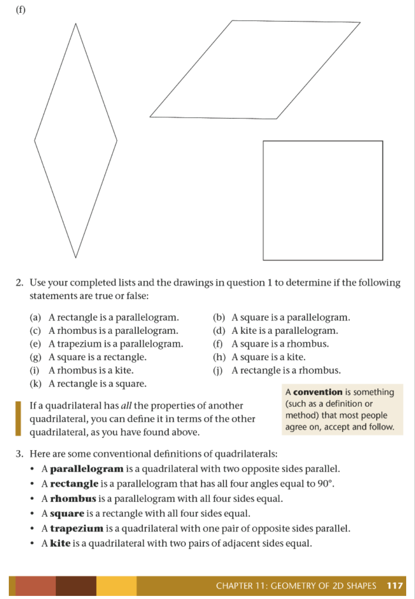
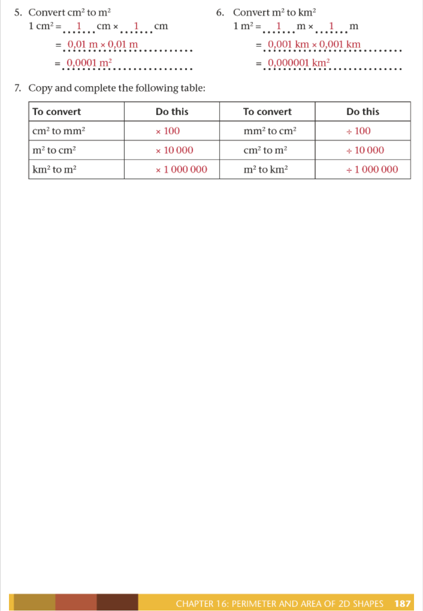
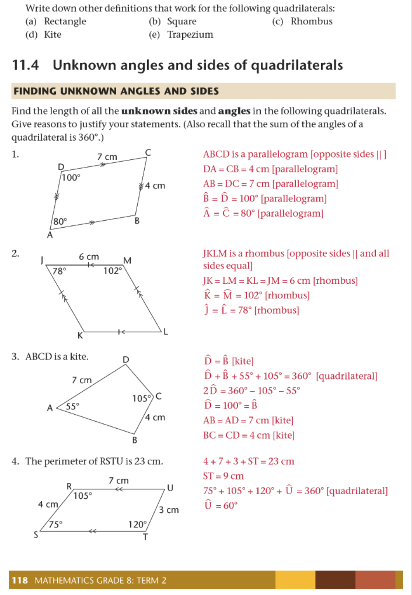
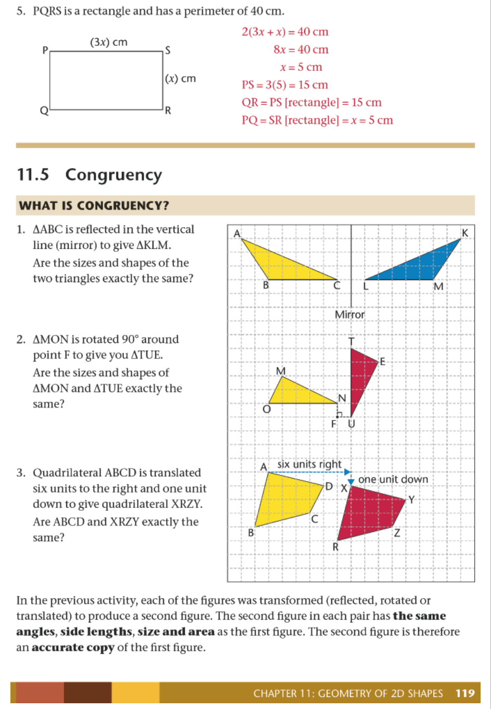
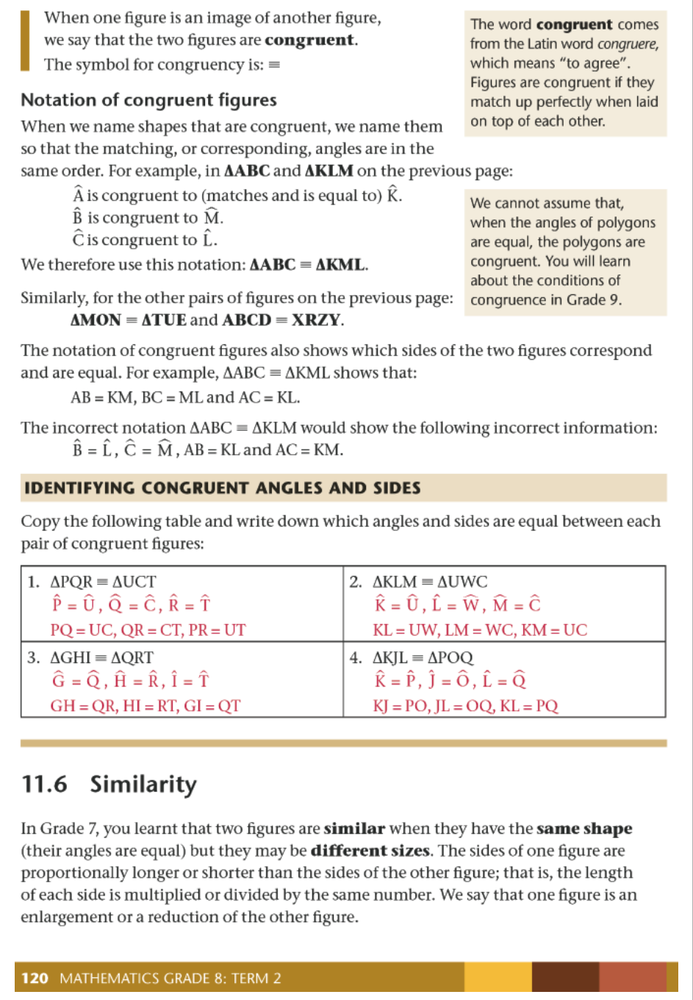
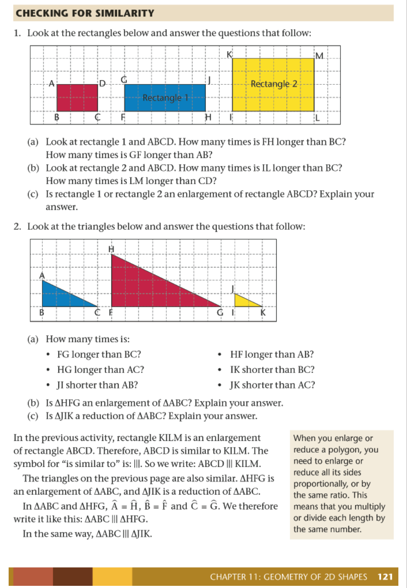
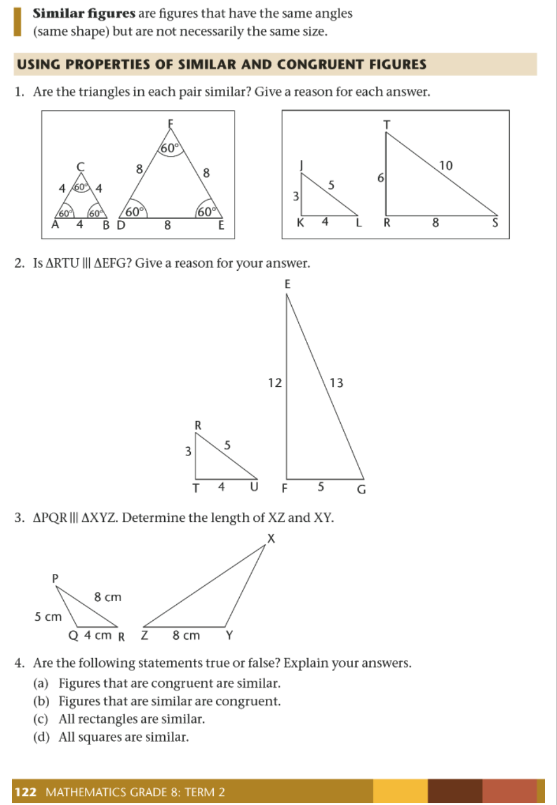
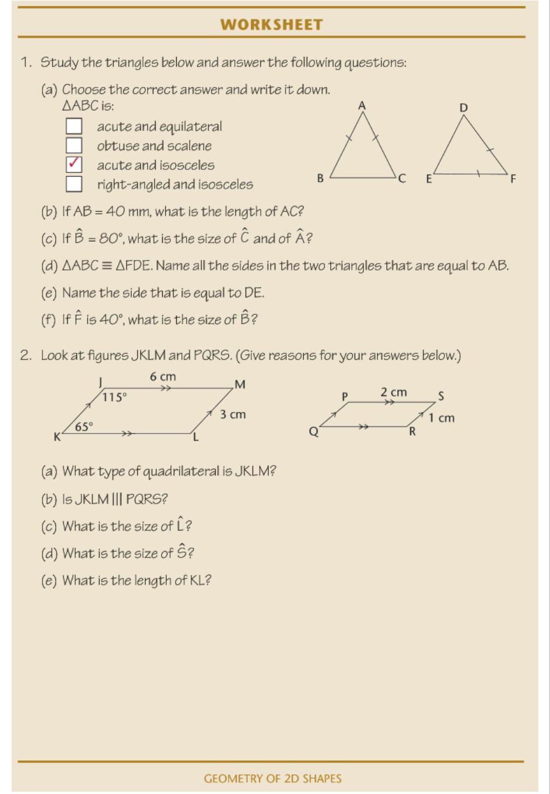

# Chapter 5: Geometry of 2D Shapes

## 5.1 Triangles, Quadrilaterals, Circles and Others

### Definitions
*   **Triangle:** A closed figure with three straight sides and three angles.
*   **Quadrilateral:** A closed figure with four straight sides and four angles.
*   **Circle:** A round figure where the edge is always at the same distance from the centre.

---

### Exercises

1. Identify which shapes are circles.
2. Identify which shapes are triangles.
3. Identify which shapes are quadrilaterals.

**Use your ruler to complete the following tasks:**

4. Draw:
    *   A triangle with three acute angles.
    *   A triangle with one obtuse angle.

5. (a) Draw a quadrilateral with two obtuse angles.
   (b) Can you draw a triangle with two obtuse angles? Explain your reasoning.

6. (a) Draw a triangle with one right angle ($90^\circ$).
   (b) Draw a triangle without any right angles.
   (c) Can you draw a triangle with two right angles?
   (d) Can you draw a quadrilateral with four right angles?

7. **Opposite Sides:**
   In the quadrilateral $ABCD$ shown below, the two red sides, $BC$ and $AD$, are called **opposite sides**. Identify the other two sides of $ABCD$ that are also opposite sides.

<!-- DIAGRAM_PLACEHOLDER: diagram -->

---

# Chapter 5: Geometry of 2D Shapes

## Introduction to 2D Shapes
Two-dimensional (2D) shapes are flat figures that have only two dimensions: length and width. They do not have depth or height. In geometry, we classify these shapes based on the number of sides, the types of angles, and whether the sides are straight or curved.

> **[Diagram Context - Textbook_Mathematics_Gr8_Geometry-of-2D-shapes.pdf-0001-07.png]**
> The graphic displays three distinct triangles labeled PQR, XYZ, and GHI with vertices indicated by letters and sides marked with tick marks to denote equal lengths. Triangle PQR has triple tick marks on sides PQ and PR, triangle XYZ has double tick marks on all three sides XY, YZ, and XZ, while triangle GHI has no side markings. This geometry figure helps high school learners identify and classify different types of triangles, such as isosceles and equilateral triangles, based on their side properties.

## Classification of Shapes
The shapes provided in the diagram can be categorized into different groups based on their geometric properties:

### 1. Polygons
Polygons are closed 2D shapes with straight sides.
*   **Triangles (3 sides):** A, G, J, Q
*   **Quadrilaterals (4 sides):** F, I, O
*   **Pentagons (5 sides):** B
*   **Hexagons (6 sides):** N
*   **Complex Polygons:** K (concave polygon), R (cross/plus shape)

### 2. Curved Shapes
These shapes have at least one curved boundary.
*   **Circles:** C, H
*   **Ovals/Ellipses:** E
*   **Other curved shapes:** L (crescent), M (star-like shape)

### 3. Non-Polygons
Shapes D and P are examples of shapes that do not fit standard polygon classifications due to their specific vertex arrangements or concave nature.

---

## Summary Table of Shapes

| Shape Label | Classification | Number of Sides |
| :--- | :--- | :--- |
| A, G, J, Q | Triangle | 3 |
| B | Pentagon | 5 |
| C, H | Circle | 1 (curved) |
| D, P | Irregular/Concave | Varies |
| E | Ellipse | 1 (curved) |
| F, I, O | Quadrilateral | 4 |
| K | Concave Polygon | 5 |
| L | Crescent | Curved |
| M | Star-like | Curved/Complex |
| N | Hexagon | 6 |
| R | Cross | 12 |

---

## Key Geometric Concepts
*   **Vertex:** The point where two sides of a polygon meet.
*   **Side:** A straight line segment that forms part of the boundary of a polygon.
*   **Concave vs. Convex:** 
    *   A **convex** polygon has all interior angles less than $180^\circ$.
    *   A **concave** polygon has at least one interior angle greater than $180^\circ$ (e.g., shape K).
*   **Regular Polygon:** A polygon where all sides are equal in length and all interior angles are equal (e.g., N, if regular).

> **[Diagram Context - Textbook_Mathematics_Gr8_Geometry-of-2D-shapes.pdf-0001-10.png]**
> This graphic consists of three separate geometry figures illustrating different types of angles formed by intersecting rays. The visible labels include vertex and ray points (A, B, C, D, E, F, O, P, Q) along with mathematical descriptions indicating angle size categories: an "Acute angle (< 90°)", a "Right angle (= 90°)", and an "Obtuse angle (between 90° and 180°)". Conceptually, this diagram helps high school learners visually distinguish and classify basic angle types based on their degree measurements during geometry foundational lessons.

> **[Diagram Context - Textbook_Mathematics_Gr8_Geometry-of-straight-lines.pdf-0001-05.png]**
> This geometry figure displays a line intersecting a horizontal base, forming angles labeled 1 and 2, with a vertex labeled A. The visible labels include the letter "A" near the top left and the numbers "1" and "2" denoting adjacent angles at the base intersection. For high school mathematics learners, this diagram illustrates adjacent supplementary angles on a straight line or intersecting lines, supporting the application of Euclidean geometry theorems regarding angle relationships.

> **[Diagram Context - Textbook_Mathematics_Gr8_Geometry-of-straight-lines.pdf-0001-06.png]**
> This graphic presents a geometry figure illustrating angle relationships on a straight line. The diagram displays two horizontal-like lines intersected by rays, with visible numerical labels 1, 2, 3, 4, 5 and a letter label B. For a high school student studying Euclidean geometry, this visual conveys the concepts of angles on a straight line adding up to 180° and adjacent angles sharing a common vertex and arm.

> **[Diagram Context - Textbook_Mathematics_Gr8_Geometry-of-straight-lines.pdf-0001-11.png]**
> This geometry figure illustrates adjacent angles on a straight line. Visible labels include points A, B, C, D, angle numbers 1 and 2, and explanatory labels with arrows pointing to the "common side" (line CD) and "same vertex" (point C). Conceptually, the diagram helps high school learners identify the foundational properties required to prove that adjacent angles on a straight line add up to 180°.

> **[Diagram Context - Textbook_Mathematics_Gr8_Perimeter-and-area-of-2D-shapes.pdf-0001-05.png]**
> This graphic is a geometry figure consisting of a two-dimensional grid containing various rectangular shapes. The visible labels include letters A, C, D, E, and F positioned inside different outlined rectangles and squares of varying grid dimensions. Conceptually, this diagram helps learners practice spatial reasoning, area calculation, and coordinate counting by determining the dimensions and relative sizes of geometric shapes on a grid plane.

---

### Geometry: Properties of Polygons and Triangles

#### Understanding Adjacent and Opposite Sides
*   **Adjacent sides:** Two sides of a polygon are adjacent if they meet at a common vertex (corner point).
*   **Opposite sides:** Two sides of a polygon are opposite if they do not meet at a common vertex.

**Exercises: Quadrilaterals**

8. In quadrilateral $ABCD$:
    *   (a) Name another two adjacent sides.
    *   (b) If $AB$ is adjacent to $DA$, which other side of $ABCD$ is also adjacent to $DA$?

9. William says: "Each side of a quadrilateral has two adjacent sides. Each side of a quadrilateral also has two opposite sides." Is William correct? Provide reasons.

10. William says: "In a triangle, each side is adjacent to all the other sides." Is this true? Provide a reason.

11. Refer to the quadrilateral $PQRS$ below to identify if the following pairs are **opposite** or **adjacent** sides:
    *   (a) $QP$ and $PS$
    *   (b) $QP$ and $SR$
    *   (c) $PQ$ and $RQ$
    *   (d) $PS$ and $QR$
    *   (e) $SR$ and $QR$

> **[Diagram Context - Textbook_Mathematics_Gr8_Geometry-of-2D-shapes.pdf-0002-01.png]**
> The graphic is a simple geometry figure representing a triangle with three straight sides and three vertices, completely unlabelled. In the context of the CAPS FET curriculum for Mathematics and Mathematical Literacy, this foundational polygon serves as a visual aid for studying Euclidean geometry, angle relationships, and trigonometric calculations.

---

### 5.2 Different Types of Triangles

Triangles are classified based on the lengths of their sides and the size of their angles.

| Triangle Type | Definition |
| :--- | :--- |
| **Isosceles triangle** | A triangle with at least two equal sides. |
| **Equilateral triangle** | A triangle with three equal sides. |
| **Right-angled triangle** | A triangle that contains one right angle ($90^\circ$). |
| **Scalene triangle** | A triangle with three sides of different lengths and no right angle. |

**Classroom Activity**
1. Measure every angle in each of the isosceles triangles provided in your workbook. Do you notice anything special about the angles? If you are unsure, draw more isosceles triangles in your exercise book to investigate.

> **[Diagram Context - Textbook_Mathematics_Gr8_Geometry-of-2D-shapes.pdf-0002-03.png]**
> This graphic is a geometry figure showing a right-angled triangle. The diagram contains a single right-angle symbol (square) at the bottom-left vertex. Conceptually, it illustrates a right-angled triangle used in CAPS Mathematics and Mathematical Literacy to teach trigonometric ratios (sin, cos, tan) and Pythagoras' theorem.

> **[Diagram Context - Textbook_Mathematics_Gr8_Geometry-of-2D-shapes.pdf-0002-05.png]**
> The image displays a geometry figure of a triangle, specifically highlighting an obtuse interior angle marked with a double curved arc at the bottom vertex. The diagram visually represents a triangle containing an angle measuring greater than 90 degrees. For high school mathematics learners, this figure serves as a visual aid for identifying and classifying obtuse-angled triangles and applying trigonometric rules or area formulas related to non-right-angled triangles.

> **[Diagram Context - Textbook_Mathematics_Gr8_Geometry-of-2D-shapes.pdf-0002-17.png]**
> This geometry figure illustrates three distinct types of triangles: an equilateral triangle labeled ABC with double-arc angle markers, an isosceles triangle labeled MEF with single-arc angle markers, and a right-angled triangle labeled LJK with a perpendicular symbol at vertex J. The graphic visually conveys the classification and defining properties of triangles, helping CAPS learners distinguish between equilateral, isosceles, and right-angled triangles based on their interior angles and side relationships.

> **[Diagram Context - Textbook_Mathematics_Gr8_Geometry-of-straight-lines.pdf-0002-00.png]**
> This educational graphic is a geometry figure demonstrating the properties of perpendicular lines and adjacent supplementary angles. The diagram features a horizontal line segment with endpoints labeled A and B, intersected at a right angle by a vertical line segment originating from point D, with the intersection point designated as C and marked with right-angle symbols. Conceptually, it helps high school learners understand that when two lines are perpendicular, they form adjacent supplementary angles that each measure $90^\circ$ and add up to $180^\circ$.

> **[Diagram Context - Textbook_Mathematics_Gr8_Geometry-of-straight-lines.pdf-0002-04.png]**
> This geometry figure illustrates intersecting straight lines forming adjacent angles. Visible labels include the known angle measure $63^\circ$ and the unknown angle variable $a$. For high school mathematics learners, this diagram conveys the concept of angles on a straight line, requiring students to apply Euclidean geometry principles—specifically that adjacent angles on a straight line add up to $180^\circ$—to calculate the value of $a$.

> **[Diagram Context - Textbook_Mathematics_Gr8_Geometry-of-straight-lines.pdf-0002-06.png]**
> This geometry figure illustrates complementary angles formed on a straight line. The diagram displays a horizontal base line intersected by a vertical line indicating a right angle ($90^\circ$), with an additional ray dividing the space to form two adjacent angles labelled $29^\circ$ and an unknown variable $x$. Conceptually, it helps learners apply Euclidean geometry principles to calculate unknown angle values by recognizing that complementary angles sum up to $90^\circ$.

> **[Diagram Context - Textbook_Mathematics_Gr8_Geometry-of-straight-lines.pdf-0002-08.png]**
> The graphic is a geometry figure showing multiple adjacent angles meeting at a common vertex along a straight line. The visible labels include the variable $2y$ and numerical angle values of $48^\circ$ and $52^\circ$. This diagram helps high school students practice applying Euclidean geometry theorems, specifically calculating unknown values using the concept of angles on a straight line summing to $180^\circ$.

> **[Diagram Context - Textbook_Mathematics_Gr8_Perimeter-and-area-of-2D-shapes.pdf-0002-05.png]**
> The educational graphic displays a geometry figure worksheet featuring six numbered 2D shapes, specifically squares and rectangles. Visible labels include numerical identifiers (1 to 6) and side length measurements with units in centimeters (e.g., 4 cm, 5 cm, 3 cm, 4,5 cm, 6 cm, 7 cm, 1,5 cm, 12 cm, and 8 cm). This diagram helps learners conceptualize the properties and dimensions of 2D shapes, allowing them to practice calculating perimeter and area according to CAPS curriculum requirements.

---

# Chapter 5: Geometry of 2D Shapes

## Investigation: Properties of Triangles

> **[Diagram Context - Textbook_Mathematics_Gr8_Geometry-of-2D-shapes.pdf-0003-12.png]**
> This graphic displays three geometry figures, specifically triangles labeled ABC, DEF, and JKL, with vertices indicated by capital letters. Visible markings include double tick marks on sides AB and AC of triangle ABC, triple tick marks on sides DE and DF of triangle DEF, and angle measurements of 40° at vertex K and 85° at vertex L in triangle JKL. Conceptually, this visual supports CAPS FET mathematics by helping learners identify equilateral, isosceles, and scalene triangles, apply side-angle relationships, and calculate unknown interior angles using the sum of angles in a triangle.

### Exercise 2
Measure the angles and sides of the triangles provided in the diagram above. 

**Task:**
1. Use a ruler to measure the length of each side of the triangles.
2. Use a protractor to measure the interior angles of each triangle.
3. Record your findings and determine what is special about these specific triangles compared to others.

**Guiding Questions for Analysis:**
*   Are any sides equal in length? (e.g., Is the triangle equilateral, isosceles, or scalene?)
*   Are any angles equal?
*   Do the interior angles sum to $180^\circ$?
*   What makes these triangles different from other triangles you have encountered?

---
*Note: Remember that for any triangle with angles $\alpha, \beta,$ and $\gamma$, the sum of the interior angles is always:*
$$\alpha + \beta + \gamma = 180^\circ$$

> **[Diagram Context - Textbook_Mathematics_Gr8_Geometry-of-straight-lines.pdf-0003-02.png]**
> This graphic is a geometry figure displaying two separate Euclidean geometry problems involving straight lines and adjacent angles. The diagram features straight lines AB and PR with intersecting rays and vertex points C and Q, labeled with angle measures containing algebraic variables such as $x$, $3x$, $2x$, $70^\circ$, $80^\circ$, and $m + 10^\circ$. Conceptually, it helps learners apply the Euclidean geometry theorem that angles on a straight line add up to $180^\circ$ to set up linear equations and solve for unknown variables.

> **[Diagram Context - Textbook_Mathematics_Gr8_Geometry-of-straight-lines.pdf-0003-04.png]**
> This educational graphic is a Euclidean geometry figure depicting adjacent angles on a straight line. The diagram displays a straight line $DF$ with a common vertex $E$, rays $EG$ and $EH$, and angle measures expressed in terms of the variable $x$ as $(x + 30^\circ)$, $(x + 40^\circ)$, and $(2x + 10^\circ)$. It conveys the concept of supplementary angles on a straight line summing to $180^\circ$, allowing high school learners to set up and solve an algebraic equation to find the value of $x$ and the size of specific angles such as $\text{H}\hat{\text{E}}\text{F}$.

> **[Diagram Context - Textbook_Mathematics_Gr8_Geometry-of-straight-lines.pdf-0003-06.png]**
> This geometry figure displays a straight line $XZ$ intersected by two rays, $YT$ and $YP$, meeting at vertex $Y$. The diagram includes angle labels $2k$ for $\angle XYI$ and $k + 65^\circ$ for $\angle PYZ$, alongside sub-questions (a) $k$ and (b) $\angle TYP$. Conceptually, it helps high school learners apply Euclidean geometry principles regarding angles on a straight line ($\sum = 180^\circ$) to set up and solve algebraic equations for unknown variables.

> **[Diagram Context - Textbook_Mathematics_Gr8_Perimeter-and-area-of-2D-shapes.pdf-0003-00.png]**
> This graphic displays a geometry figure consisting of a grid overlaid with various rectangular and square shapes. Visible labels include uppercase letters A, C, D, E, and F positioned inside specific shapes. Conceptually, this diagram helps high school students practice counting grid units to determine area and perimeter, or to analyze scale and proportions of shapes.

---

### Comparing and Describing Triangles

#### Key Concepts
*   **Equilateral Triangles:** Triangles where all three sides are equal in length.
*   **Right-Angled Triangles:** Triangles that contain one angle equal to $90^\circ$.
*   **Notation:** When two or more sides of a shape are equal in length, we indicate this by drawing short lines (tick marks) across the equal sides.

---

#### Exercise 1: Identifying Triangle Types
Use the triangles labeled A, B, and C below to answer the questions.

> **[Diagram Context - Textbook_Mathematics_Gr8_Geometry-of-2D-shapes.pdf-0004-03.png]**
> This educational graphic features two distinct geometry figures, specifically triangles labeled ABC and PQR, with visible angle measurements of 50° and 95° at vertices A and B, and 45° and 60° at vertices Q and R, alongside the text prompt "2. Find $\hat{P}$." Conceptually, this diagram helps high school learners apply the Euclidean geometry theorem that the interior angles of a triangle always sum up to $180^\circ$ to calculate a missing unknown angle.

| Question | Task |
| :--- | :--- |
| (a) | Which triangle has only two sides that are equal? What is this type of triangle called? |
| (b) | Which triangle has all three sides equal? What is this type of triangle called? |
| (c) | Which triangle has an angle equal to $90^\circ$? What is this type of triangle called? |

---

#### Exercise 2: Investigating Right-Angled Triangles

> **[Diagram Context - Textbook_Mathematics_Gr8_Geometry-of-2D-shapes.pdf-0004-06.png]**
> This geometry figure illustrates a triangle labeled KLM with vertices K, L, and M. Visible markings include vertex labels K, L, and M, side length indicator 50 mm, angle measure 38°, and hash marks indicating equal sides LK and KM. This diagram helps high school students practice applying trigonometric ratios or the sine and cosine rules to calculate unknown side lengths and angles in triangles.

3. (a) Measure each angle in each of the triangles provided above. Do you notice anything special about these angles?
3. (b) Identify the longest side in each of the triangles. If you are not sure which one is the longest side, measure the sides. What do you notice about the longest side in each of these triangles?

> **[Diagram Context - Textbook_Mathematics_Gr8_Geometry-of-2D-shapes.pdf-0004-07.png]**
> The graphic displays a geometry figure of a right-angled triangle labeled $\triangle RTS$, with a right angle at vertex $T$ and an acute angle of $32^\circ$ at vertex $R$. Visible labels include vertices $R$, $T$, and $S$, along with the question text asking for the size of angle $\hat{S}$. This diagram helps students apply the trigonometric ratio rule that the sum of angles in a triangle equals $180^\circ$, reinforcing the relationship between complementary angles in a right-angled triangle.

> **[Diagram Context - Textbook_Mathematics_Gr8_Geometry-of-straight-lines.pdf-0004-02.png]**
> This geometry figure illustrates adjacent angles on a straight line. The diagram displays a straight line JKL with vertex K, intersected by rays KR and KU, showing the angle labels JKR ($2p - 55^\circ$), RKU ($3p$), and UKL ($70^\circ$). Conceptually, it helps learners apply the Euclidean geometry theorem that angles on a straight line add up to $180^\circ$ to set up an algebraic equation and solve for the unknown variable $p$.

> **[Diagram Context - Textbook_Mathematics_Gr8_Geometry-of-straight-lines.pdf-0004-06.png]**
> This geometry figure illustrates two intersecting straight lines forming four angles around a central point, labeled with the variables $a$, $b$, $c$, and $d$. It visually demonstrates the geometric relationships between angles formed by intersecting lines, specifically highlighting vertically opposite angles and angles on a straight line. For high school learners, this diagram serves as a foundational tool for solving Euclidean geometry problems by applying angle properties such as vertically opposite angles being equal ($a = c$ and $b = d$) and adjacent supplementary angles adding up to $180^\circ$.

> **[Diagram Context - Textbook_Mathematics_Gr8_Geometry-of-straight-lines.pdf-0004-09.png]**
> The graphic is a geometry figure displaying intersecting lines forming angles. It consists of two straight intersecting lines passing through a central curved, ring-like geometric symbol with attached semi-circular lobes. Conceptually, this diagram visually prompts high school learners to identify and calculate relationships between adjacent, vertically opposite, or supplementary angles formed by intersecting lines.

> **[Diagram Context - Textbook_Mathematics_Gr8_Perimeter-and-area-of-2D-shapes.pdf-0004-04.png]**
> This geometry figure illustrates a non-right-angled triangle JKL partitioned by a perpendicular height into a right-angled reference triangle. The diagram features vertices J, K, L, and M, with visible labels including perpendicular height $h$, base segment $b$, and a right-angle symbol at vertex M. Conceptually, it conveys how to determine the area of an obtuse-angled triangle by using an external perpendicular height dropped from a vertex onto an extended base line, a fundamental technique in CAPS Grade 11 Euclidean Geometry and Trigonometry.

> **[Diagram Context - Textbook_Mathematics_Gr8_Perimeter-and-area-of-2D-shapes.pdf-0004-08.png]**
> This geometric figure illustrates two triangles, triangle ABC with altitude AL and perpendicular segments AK and AM, and triangle DEF with altitude ER and construction line FQ. Visible labels include vertices A, B, C, D, E, F, K, L, M, P, Q, and R, along with right-angle symbols indicating perpendicular heights. Conceptually, this diagram is used in Grade 11/12 Mathematics to prove the area rule or derive trigonometric relationships involving the area of triangles by constructing perpendicular heights.

> **[Diagram Context - Textbook_Mathematics_Gr8_Perimeter-and-area-of-2D-shapes.pdf-0004-09.png]**
> The graphic is a geometry table structured with two visible row labels, "Base" and "Height," followed by multiple blank cells arranged in columns. This layout is typically used in Mathematics and Technical Mathematics CAPS curricula to help learners record measurements, solve area problems, or organize data points for geometric figures. By structuring the relationship between base and height, it guides learners in applying area formulas and analyzing proportional data systematically.

> **[Diagram Context - Textbook_Mathematics_Gr8_Perimeter-and-area-of-2D-shapes.pdf-0004-11.png]**
> This educational graphic features three geometry figures representing right-angled and compound triangles with labelled side lengths in centimetres, denoted as (a), (b), and (c). Diagram (a) shows a single right-angled triangle with sides 6 cm, 8 cm, and 10 cm; diagram (b) illustrates a composite figure containing a dotted internal perpendicular height of 11 cm alongside side lengths 3 cm, 10 cm, 17 cm, and 20 cm; and diagram (c) displays a triangle with an extended vertical height of 12 cm, a base segment of 5 cm, and side lengths of 13 cm, 10 cm, and 19 cm. Conceptually, these diagrams provide learners with practice in applying the Theorem of Pythagoras to calculate unknown lengths, heights, and areas in standard and composite shapes as required in the CAPS curriculum.

---

### Classification of Triangles

Triangles are classified based on the number of equal sides:
*   **Equilateral Triangle:** All three sides are equal in length.
*   **Isosceles Triangle:** Exactly two sides are equal in length.
*   **Scalene Triangle:** No sides are equal in length.

> **[Diagram Context - Textbook_Mathematics_Gr8_Geometry-of-2D-shapes.pdf-0005-01.png]**
> This geometry figure depicts a triangle labeled ABC with side lengths of 8 cm for AC and 6 cm for AB, along with angle markings at vertices A and B. For a high school student studying mathematics, the diagram illustrates the properties of an isosceles triangle where equal side lengths imply equal base angles (angle A equals angle B).

---

### Finding Unknown Sides in Triangles

When sides are marked with the same number of dashes (e.g., $|$, $||$, $|||$), it indicates that those sides are equal in length.

> **[Diagram Context - Textbook_Mathematics_Gr8_Geometry-of-2D-shapes.pdf-0005-04.png]**
> This geometry figure illustrates a triangle labeled DEF with vertices D, E, and F, including interior angle arc markings at vertices E and F. Visible labels include the side lengths $4\text{ mm}$ for side DE and $7\text{ mm}$ for side EF. This diagram helps high school learners apply trigonometric ratios or the sine and cosine rules to calculate unknown sides or angles in non-right-angled triangles.

#### Exercise 1: Analysis of Triangles
**(a) Identify the types:**
*   **Triangle ABC:** Equilateral (all three sides marked with one dash).
*   **Triangle DEF:** Isosceles (two sides marked with two dashes).
*   **Triangle GHI:** Scalene (all sides have different markings).

**(b) Determine lengths:**
*   **AB:** Since $\triangle ABC$ is equilateral and $AC = 12\text{ mm}$, then $AB = 12\text{ mm}$.
*   **BC:** Since $\triangle ABC$ is equilateral, $BC = 12\text{ mm}$.
*   **EF:** Since $\triangle DEF$ is isosceles and $DE = 70\text{ mm}$, then $EF = 70\text{ mm}$.

**(c) Can you determine the lengths of GH and HI?**
No. While we know $\triangle GHI$ is scalene because the markings are different, there is no numerical value provided for any side of this triangle. Therefore, we cannot determine the specific lengths of $GH$ and $HI$.

---

### Properties of Right-Angled Triangles

> **[Diagram Context - Textbook_Mathematics_Gr8_Geometry-of-2D-shapes.pdf-0005-07.png]**
> This geometry figure shows a triangle labeled with vertices X, Y, and Z. Visible labels include the vertices X, Y, and Z, with an included angle of 24° at vertex Y, and tick marks indicating that sides XY and YZ are equal in length. This diagram conveys the properties of an isosceles triangle, helping high school students apply Euclidean geometry theorems regarding equal sides and their opposite angles.

#### Exercise 2: Analysis of $\triangle JKL$
Given that $\triangle JKL$ has a right angle at $K$ and markings indicating $JK = KL = 6\text{ cm}$:

**(a) Type of triangle:**
It is an **isosceles** triangle because two sides are equal.

**(b) Equal sides:**
The two equal sides are $JK$ and $KL$.

**(c) Length of JK:**
Since $KL = 6\text{ cm}$ and $JK = KL$, then $JK = 6\text{ cm}$.

**(d) Two equal angles:**
In an isosceles triangle, the angles opposite the equal sides are equal. Therefore, $\hat{J} = \hat{L}$.

**(e) Size of $\hat{J}$ and $\hat{L}$:**
The sum of angles in a triangle is $180^\circ$.
Given $\hat{K} = 90^\circ$:
$$\hat{J} + \hat{L} = 180^\circ - 90^\circ = 90^\circ$$
Since $\hat{J} = \hat{L}$:
$$2 \times \hat{J} = 90^\circ$$
$$\hat{J} = 45^\circ$$
Therefore, $\hat{J} = 45^\circ$ and $\hat{L} = 45^\circ$.

> **[Diagram Context - Textbook_Mathematics_Gr8_Geometry-of-straight-lines.pdf-0005-03.png]**
> This geometry figure illustrates two intersecting straight lines forming four adjacent angles labeled with variables $x$, $y$, $z$, and a known value of $105^\circ$. The diagram displays vertically opposite angles and angles on a straight line. It helps learners apply Euclidean geometry axioms—specifically that vertically opposite angles are equal and angles on a straight line add up to $180^\circ$—to solve for unknown angle values.

> **[Diagram Context - Textbook_Mathematics_Gr8_Geometry-of-straight-lines.pdf-0005-05.png]**
> The graphic is a geometry figure showing two intersecting straight lines forming four adjacent angles. The visible labels and variables include angle variables $j$, $k$, $l$, and a known angle measure of $64^\circ$. This diagram helps FET/Senior Phase mathematics learners apply Euclidean geometry theorems—specifically vertically opposite angles and angles on a straight line—to calculate unknown angle values.

> **[Diagram Context - Textbook_Mathematics_Gr8_Geometry-of-straight-lines.pdf-0005-07.png]**
> This geometry figure illustrates intersecting straight lines meeting at a common vertex. Visible labels include unknown angle variables $a$, $b$, $c$, and $d$, alongside known angle measurements of $62^\circ$ and $88^\circ$. Aligned with the CAPS curriculum for Euclidean geometry, this diagram tests a student's ability to apply geometric axioms, specifically identifying vertically opposite angles and angles on a straight line ($\sum = 180^\circ$) to solve for unknown variables.

> **[Diagram Context - Textbook_Mathematics_Gr8_Perimeter-and-area-of-2D-shapes.pdf-0005-02.png]**
> The graphic is a geometry figure displaying four distinct 2D composite and regular polygons labeled (a), (b), (c), and (d) with associated side length measurements and variables. Visible labels include dimensions in centimeters (e.g., 4 cm, 6 cm, 9 cm, 25 cm, 15 cm, 20 cm, 26 cm, 5 cm, 10 cm, 2,5 cm), side variables ($a$, $b$), height ($h$), perpendicularity indicators, and tick marks denoting equal side lengths. This diagram conveys the geometric properties and dimensions required for Senior Phase and FET learners to calculate the perimeter and area of complex shapes and irregular polygons by sub-dividing them into standard shapes like rectangles, triangles, and trapeziums.

> **[Diagram Context - Textbook_Mathematics_Gr8_Perimeter-and-area-of-2D-shapes.pdf-0005-12.png]**
> This geometry figure illustrates the fundamental properties of a circle. Visible labels include "circle", "centre", radii denoted by the variable "$r$", and diameter denoted by the variable "$d$". Conceptually, the diagram helps students understand Euclidean geometry definitions by demonstrating how the radius ($r$) originates from the centre to the circumference, and how the diameter ($d$) spans straight across the centre, illustrating that $d = 2r$.

---

# 5.3 Different types of quadrilaterals

## Investigating Quadrilaterals

### Exercise 1: Analyzing Properties
Examine the groups of quadrilaterals provided in your textbook to answer the following questions:

(a) In which groups are both pairs of opposite sides parallel?
(b) In which groups are only some adjacent sides equal?
(c) In which groups are all four angles equal?
(d) In which groups are all the sides in each quadrilateral equal?
(e) In which groups are all four sides equal?
(f) In which groups is each side perpendicular to the sides adjacent to it?
(g) In which groups are opposite sides equal?
(h) In which groups is at least one pair of adjacent sides equal?
(i) In which groups is at least one pair of opposite sides parallel?
(j) In which groups are all the angles right angles?

---

### Exercise 2: Parallelograms
The figures in Group 1 are classified as **parallelograms**.

(a) What do you observe about the opposite sides of parallelograms?
(b) What do you observe about the angles of parallelograms?

> **[Diagram Context - Textbook_Mathematics_Gr8_Geometry-of-2D-shapes.pdf-0006-01.png]**
> This graphic is a geometry figure showing triangle FGE with vertices labeled F, G, and E. Visible labels include the variable $x$ at angle $\hat{G}$, a known angle measurement of $80^\circ$ at vertex E, and tick marks on sides GE and FE indicating that these two sides are equal in length. Conceptually, this diagram helps high school learners apply Euclidean geometry theorems regarding isosceles triangles—specifically that angles opposite equal sides are equal—to calculate unknown angle values.

---

### Exercise 3: Kites
The figures in Group 2 (refer to the subsequent pages of your textbook) are classified as **kites**.

(a) What do you observe about the sides of kites?
(b) What else do you observe about the kites?

> **[Diagram Context - Textbook_Mathematics_Gr8_Geometry-of-2D-shapes.pdf-0006-03.png]**
> This graphic is a geometry figure showing triangle JKL with side KL extended to point M. The visible labels include vertices J, K, L, and M, interior angles measuring 50° at vertex J and 100° at vertex K, interior angle $x$ at vertex L, and exterior angle $y$ formed by extending side KL to M. Conceptually, this diagram helps high school students practice applying Euclidean geometry theorems, specifically the interior angles sum of a triangle and the exterior angle theorem.

> **[Diagram Context - Textbook_Mathematics_Gr8_Geometry-of-2D-shapes.pdf-0006-05.png]**
> This geometry figure shows a triangle with an extended side forming an interior angle and an exterior angle. The diagram includes the interior angle labels $30^\circ$, $a$, and $b$, as well as an exterior angle value of $130^\circ$. Conceptually, it illustrates Euclidean geometry theorems regarding angles in triangles, specifically helping learners practise calculating unknown angles using supplementary angles on a straight line and the exterior angle theorem.

> **[Diagram Context - Textbook_Mathematics_Gr8_Geometry-of-2D-shapes.pdf-0006-07.png]**
> This geometry figure shows an equilateral triangle with a straight line extending from its base to form an exterior angle. Visible markings include single tick marks on all three sides indicating equal lengths, and variable labels $m$ for the interior angle and $n$ for the adjacent exterior angle. For a high school student studying Euclidean geometry, this diagram conceptually illustrates the exterior angle theorem of a triangle, demonstrating the geometric relationships between interior and exterior angles.

> **[Diagram Context - Textbook_Mathematics_Gr8_Geometry-of-straight-lines.pdf-0006-03.png]**
> This geometric figure displays two intersecting straight lines forming opposite angles. Visible annotations include the angle expressions $m + 20^\circ$ and $100^\circ$ positioned in opposite quadrants. Conceptually, this diagram helps learners apply the Euclidean geometry theorem that vertically opposite angles are equal to set up and solve algebraic equations for an unknown variable.

> **[Diagram Context - Textbook_Mathematics_Gr8_Geometry-of-straight-lines.pdf-0006-05.png]**
> This geometry figure illustrates intersecting straight lines forming opposite angles. The visible labels include the algebraic expression $3t + 12^\circ$ and the numerical value $66^\circ$. Conceptually, it helps learners apply the Euclidean geometry theorem that vertically opposite angles are equal, allowing them to set up an algebraic equation to solve for the unknown variable $t$.

> **[Diagram Context - Textbook_Mathematics_Gr8_Geometry-of-straight-lines.pdf-0006-07.png]**
> This geometry figure illustrates two intersecting straight lines forming opposite angles. The diagram displays the angular measurements $108^{\circ}$ and an algebraic expression $2p + 30^{\circ}$ positioned vertically opposite each other. It helps high school learners apply the Euclidean geometry theorem that vertically opposite angles are equal to set up an equation ($2p + 30^{\circ} = 108^{\circ}$) and solve for the unknown variable $p$.

> **[Diagram Context - Textbook_Mathematics_Gr8_Geometry-of-straight-lines.pdf-0006-09.png]**
> This geometry figure illustrates intersecting straight lines forming opposite angles. The visible labels include angle measurements and expressions: $58^\circ$ and $2z - 10^\circ$. Conceptually, it helps learners apply Euclidean geometry theorems—specifically that vertically opposite angles are equal—to set up an algebraic equation and solve for the unknown variable $z$.

> **[Diagram Context - Textbook_Mathematics_Gr8_Perimeter-and-area-of-2D-shapes.pdf-0006-01.png]**
> This geometric figure displays a circle with a central point and a single radius line extending from the center to the circumference. The visual elements include a closed circular boundary, a central dot representing the origin or center, and a straight line segment indicating the radius. Conceptually, this diagram helps learners understand circle geometry definitions, specifically illustrating the relationship between the center and any point on the circumference.

> **[Diagram Context - Textbook_Mathematics_Gr8_Perimeter-and-area-of-2D-shapes.pdf-0006-02.png]**
> This geometric figure illustrates a circle with a central point and a single radius line connecting the center to the circumference. The visual elements include a circular boundary, a central dot representing the center, and a straight line segment extending from the center to the edge. Conceptually, this diagram helps high school learners identify foundational circle geometry terms such as the center and the radius, which are essential for calculating circle properties like circumference and area in CAPS Mathematics.

> **[Diagram Context - Textbook_Mathematics_Gr8_Perimeter-and-area-of-2D-shapes.pdf-0006-03.png]**
> This geometry figure illustrates a circle with a marked center point and a straight line segment extending from the center to the circumference. The graphic shows the circle's boundary, a central point, and a single radius line segment without explicit text labels or variable names. Conceptually, this diagram introduces learners to the fundamental properties of a circle, specifically demonstrating the definition and visual representation of a radius connecting the center to any point on the circumference.

> **[Diagram Context - Textbook_Mathematics_Gr8_Perimeter-and-area-of-2D-shapes.pdf-0006-04.png]**
> This educational graphic features a data table with rows labeled "Circle", "Radius (mm)", and "Diameter (mm)", and columns corresponding to circles labeled A, B, and C. The table provides a structured format for learners to record, organize, and compare measurement data of geometric shapes. Conceptually, this helps students practice empirical data collection and reinforces the mathematical relationship between the radius and diameter of circles within measurement and geometry modules.

> **[Diagram Context - Textbook_Mathematics_Gr8_Perimeter-and-area-of-2D-shapes.pdf-0006-10.png]**
> This educational graphic is a geometry figure demonstrating how to measure a circle's diameter using a ruler. It features a circle, a diagonal yellow measuring ruler intersecting the circle, a red alignment mark on the circumference, and a double-headed arrow indicating rotational adjustment. Conceptually, this diagram illustrates the practical method for finding the diameter—the longest chord passing through the center—by pivoting a ruler across the circle until the maximum length is achieved.

> **[Diagram Context - Textbook_Mathematics_Gr8_Perimeter-and-area-of-2D-shapes.pdf-0006-15.png]**
> This graphic illustrates a time-series line graph aligned directly above a seismogram-style strip chart with distinct vertical event markers. The visualization features a horizontal blue line curving upward and a yellow rectangular strip containing various vertical black tick marks and a red diagonal slash. Conceptually, this diagram helps high school learners interpret geological or seismological data by connecting continuous physical measurements to discrete chronological events or threshold triggers.

> **[Diagram Context - Textbook_Mathematics_Gr8_Perimeter-and-area-of-2D-shapes.pdf-0006-16.png]**
> The graphic is a geometry figure demonstrating a method for measuring the circumference of a circular object using a string. It shows a circular shape with a blue string wrapped around its perimeter, a red perpendicular tick mark, and an arrow pointing to the label "mark here". Conceptually, this visual aids learners in understanding practical measurement techniques for curved boundaries, specifically how to accurately transfer the length of a curved perimeter to a straight ruler.

---

# Chapter 5: Geometry of 2D Shapes

## Classification of Polygons

This section focuses on the visual identification and grouping of 2D geometric shapes. Learners are expected to observe the properties of sides and angles to categorize these polygons.

### Group 2
This group contains a collection of quadrilaterals and triangles with varying side lengths and interior angles.

### Group 3
This group contains a collection of quadrilaterals, including parallelograms and squares.

> **[Diagram Context - Textbook_Mathematics_Gr8_Geometry-of-2D-shapes.pdf-0007-02.png]**
> The graphic displays two geometry figures, including a triangle with an extended side and tick marks indicating sides of equal length, and a second triangle with interior angles expressed algebraically. Visible labels include vertex letters B, C, D, G, H, I, angle values such as $68^\circ$, and variable expressions including $x$, $2x + 40^\circ$, and $x + 20^\circ$. Conceptually, this diagram helps high school learners apply Euclidean geometry theorems—specifically the exterior angle theorem of a triangle and the sum of interior angles in a triangle—to set up equations and solve for unknown variables.

---

### Key Concepts for Analysis
When analyzing these shapes, consider the following geometric properties:

1.  **Parallel Sides:** Identify pairs of sides that will never intersect.
2.  **Equal Sides:** Use a ruler to determine if sides are of equal length.
3.  **Interior Angles:** Identify right angles ($90^\circ$), acute angles ($< 90^\circ$), and obtuse angles ($> 90^\circ$).
4.  **Classification:**
    *   **Square:** A quadrilateral with $4$ equal sides and $4$ right angles.
    *   **Parallelogram:** A quadrilateral with $2$ pairs of parallel sides.
    *   **Triangle:** A polygon with $3$ sides and $3$ angles. The sum of interior angles is always $180^\circ$.

> **[Diagram Context - Textbook_Mathematics_Gr8_Geometry-of-2D-shapes.pdf-0007-06.png]**
> This educational graphic is a geometry figure showing a triangle with algebraic expressions representing its interior angles. The visible labels include vertex N, vertex P, and interior angle expressions $(2x - 50^\circ)$, $(2x - 30^\circ)$, and $(x + 10^\circ)$. This diagram conveys the Euclidean geometry concept that the sum of the interior angles of a triangle is $180^\circ$, allowing students to set up an algebraic equation to solve for the unknown variable $x$.

> **[Diagram Context - Textbook_Mathematics_Gr8_Geometry-of-2D-shapes.pdf-0007-08.png]**
> This geometry figure shows triangle DMP intersected by a line segment MN from vertex M to side DP. Visible labels include vertices D, M, N, and P, angle measures and variables $x$ and $y$, and double tick marks indicating equal side lengths on segments DN, NM, and NP. Conceptually, this diagram is used in high school mathematics to test Euclidean geometry theorems, specifically properties of isosceles triangles and angle-side relationships within triangles.

> **[Diagram Context - Textbook_Mathematics_Gr8_Geometry-of-straight-lines.pdf-0007-01.png]**
> This geometric figure illustrates intersecting straight lines forming opposite angles. The diagram displays algebraic angle expressions $102^\circ - 2y$ and $78^\circ$. Conceptually, it helps students apply the Euclidean geometry theorem that vertically opposite angles are equal, allowing them to set up an equation and solve for the unknown variable $y$.

> **[Diagram Context - Textbook_Mathematics_Gr8_Geometry-of-straight-lines.pdf-0007-03.png]**
> This geometry figure illustrates intersecting straight lines forming opposite angles. The graphic features two intersecting lines with the algebraic angle expression $180^\circ - 3r$ and the numerical angle value $126^\circ$ positioned in vertically opposite positions. For a high school student following the CAPS curriculum, this diagram conveys the geometric property that vertically opposite angles are equal, enabling learners to set up an algebraic equation to solve for the unknown variable $r$.

> **[Diagram Context - Textbook_Mathematics_Gr8_Geometry-of-straight-lines.pdf-0007-08.png]**
> This geometry figure displays a transversal line (in blue) intersecting two distinct straight lines (in black) at two separate points. There are no explicit algebraic labels, angle measurements, or parallel indicators present in the visual. Conceptually, this diagram illustrates the foundational Euclidean geometry setup used to define and analyze angle relationships—such as corresponding, alternate interior, and co-interior angles—formed when a transversal cuts across lines.

> **[Diagram Context - Textbook_Mathematics_Gr8_Geometry-of-straight-lines.pdf-0007-09.png]**
> This geometry figure displays intersecting lines featuring a single diagonal blue transversal line intersecting a set of three horizontal or near-parallel black lines forming a zig-zag or chevron-like configuration without any explicit algebraic labels or angle values. It illustrates the spatial arrangement of transversals intersecting multiple lines, serving as a visual prompt for identifying corresponding, alternate, or co-interior angles in Euclidean geometry.

> **[Diagram Context - Textbook_Mathematics_Gr8_Geometry-of-straight-lines.pdf-0007-10.png]**
> This geometry figure displays two horizontal parallel lines intersected by a single transversal line. Visible markings include double arrows on both horizontal lines indicating parallelism. Conceptually, this diagram helps high school learners identify angle relationships formed by a transversal, such as corresponding, alternate interior, and co-interior angles.

> **[Diagram Context - Textbook_Mathematics_Gr8_Perimeter-and-area-of-2D-shapes.pdf-0007-02.png]**
> The graphic displays an atomic structure model showing five circular representations labeled A, B, C, D, and E, each containing a central point representing a nucleus. Visible labels consist solely of the uppercase letters A, B, C, D, and E identifying each individual atom or ion. Conceptually, this diagram helps high school chemistry learners visualize and compare relative atomic or ionic radii across different elements or species.

---

### Geometry: Classification of Quadrilaterals

#### Visual Classification Groups

> **[Diagram Context - Textbook_Mathematics_Gr8_Geometry-of-2D-shapes.pdf-0008-03.png]**
> This educational graphic is a geometry figure displaying two irregular polygons with no visible labels, variables, or text. For high school learners studying Euclidean geometry and polygons, the diagram can be used to practice calculating interior angles, identifying convex versus concave shapes, or determining polygon properties.

*   **Group 4:** Contains various quadrilaterals (parallelograms/rectangles).
*   **Group 5:** Contains various quadrilaterals (parallelograms/trapezoids).
*   **Group 6:** Contains figures identified as **rhombi**.

---

#### Key Concept: The Rhombus

**Definition:**
A **rhombus** is a special type of quadrilateral. 
*   **Note:** The singular form is **rhombus**; the plural form is **rhombi**.

**Exercise 4:**
Based on the figures provided in the curriculum:

(a) What do you observe about the sides of rhombi?
(b) What else do you observe about the rhombi?

---
*Mathematics Grade 7: Term 1 | Page 86*

> **[Diagram Context - Textbook_Mathematics_Gr8_Geometry-of-2D-shapes.pdf-0008-07.png]**
> This geometry graphic displays three separate unlabeled quadrilateral figures, specifically parallelograms or trapeziums, drawn with black outlines on a white background. There are no visible labels, letters, variables, or directional arrows associated with the shapes. Conceptually, this diagram serves as a foundational visual aid for high school mathematics learners to investigate and classify the geometric properties, angles, and area calculations of various four-sided polygons.

> **[Diagram Context - Textbook_Mathematics_Gr8_Geometry-of-straight-lines.pdf-0008-05.png]**
> This geometry figure illustrates two straight lines intersected by a transversal line, forming eight distinct angles. The visible labels include angle variables $a$, $b$, $c$, $d$, $f$, $g$, $h$, and circled variables $a$ and $e$. Conceptually, this diagram helps high school students identify angle relationships—such as corresponding, alternate interior, and co-interior angles—formed by a transversal intersecting lines.

> **[Diagram Context - Textbook_Mathematics_Gr8_Geometry-of-straight-lines.pdf-0008-12.png]**
> This educational graphic is a geometry figure illustrating angle relationships formed by intersecting lines, specifically focusing on alternate angles. The visible labels consist of angle variables $a, b, c, d, e, f, g$, and $h$, along with circled letters identifying specific angle pairs. Conceptually, it conveys how alternate interior and exterior angles are positioned relative to the transversal line, helping high school learners identify congruent angle pairs when solving Euclidean geometry problems.

---

### Properties of Quadrilaterals

#### 5. Rectangles
(a) What do you observe about the opposite sides of rectangles?
(b) What do you observe about the angles of rectangles?
(c) What do you observe about the adjacent sides of rectangles?

#### 6. Trapeziums
(a) What do you observe about the opposite sides of trapeziums?
*Note: The arrows on the diagrams indicate which sides are parallel to each other.*

#### 7. Squares
(a) What do you observe about the sides of squares?
(b) What do you observe about the angles of squares?

---

### Comparing and Describing Shapes

1. Name each shape in the provided groups.

> **[Diagram Context - Textbook_Mathematics_Gr8_Geometry-of-2D-shapes.pdf-0009-00.png]**
> This geometry figure displays a collection of 2D quadrilateral shapes labeled with sub-headings (b), (c), (d), and (e). The visual elements include various 2D quadrilaterals such as squares, rectangles, and parallelograms, alongside sub-figure index labels (b), (c), (d), and (e). Conceptually, this diagram helps CAPS learners identify, classify, and compare the properties of different quadrilaterals regardless of their orientation or position on the page.

2. In what way(s) are the figures in each group the same?
3. In what way(s) does one of the figures in each group differ from the other two figures in the group?

---

### Finding Unknown Sides in Quadrilaterals

Use your knowledge of the properties of sides and angles in quadrilaterals to answer the following questions. Provide reasons for your answers.

> **[Diagram Context - Textbook_Mathematics_Gr8_Geometry-of-2D-shapes.pdf-0009-01.png]**
> This graphic is a simple geometry figure representing a diamond-shaped quadrilateral. The figure consists of four straight, connected line segments forming a closed shape rotated at a forty-five-degree angle with no visible internal lines, labels, or vertices. Conceptually, it provides a basic visual representation of a rhombus or square in Euclidean geometry, supporting high school CAPS mathematics learners in identifying shapes, symmetry, and calculating perimeter or area.

**Questions regarding quadrilateral ABCD:**

(a) What type of quadrilateral is ABCD?
(b) Name a side equal to AB.
(c) What is the length of BC?

*Given information from the diagram:*
*   Side $AD = 2,5\text{ m}$
*   The markings indicate that $AD = BC$ and $AB = DC$.

> **[Diagram Context - Textbook_Mathematics_Gr8_Geometry-of-2D-shapes.pdf-0009-02.png]**
> The graphic displays a blank geometry figure in the form of an empty quadrilateral. No visible labels, variables, or annotations are present within the figure. Conceptually, it serves as a blank canvas for students studying Euclidean geometry to construct quadrilaterals, measure angles, and apply geometric theorems and properties.

> **[Diagram Context - Textbook_Mathematics_Gr8_Geometry-of-straight-lines.pdf-0009-02.png]**
> This geometry figure illustrates two straight lines intersected by a transversal line, forming eight distinct angles labeled with the lowercase variables a, b, c, d, e, f, g, and h. For a high school mathematics student under the CAPS curriculum, this diagram serves as a foundational tool to identify and calculate angle relationships such as corresponding, alternate interior, alternate exterior, and co-interior angles.

> **[Diagram Context - Textbook_Mathematics_Gr8_Geometry-of-straight-lines.pdf-0009-12.png]**
> This geometry figure displays two pairs of intersecting lines cut by transversals, labeled with lines AB, CD, EF on the left and JK, LM, PQ on the right, along with numbered angles 1 through 16. The diagram highlights the geometric relationships formed by a transversal intersecting lines, contrasting a general pair of non-parallel lines with a pair of parallel lines (indicated by arrows). For a high school student learning Euclidean geometry in the CAPS curriculum, this conceptual visual aids in identifying corresponding, alternate interior, and co-interior angles to prove or apply line properties.

> **[Diagram Context - Textbook_Mathematics_Gr8_Perimeter-and-area-of-2D-shapes.pdf-0009-00.png]**
> This educational graphic is a geometry figure displaying a circle centered on a Cartesian coordinate grid. The image contains a black circular outline, a square grid with grey lines, and a single black dot marking the central origin point. Conceptually, this diagram helps high school mathematics learners visualize analytical geometry principles, such as determining the equation of a circle $x^2 + y^2 = r^2$ by relating the radius to grid units.

> **[Diagram Context - Textbook_Mathematics_Gr8_Perimeter-and-area-of-2D-shapes.pdf-0009-07.png]**
> This geometry figure depicts a circle divided into multiple identical yellow sectors meeting at a central point. There are no visible text labels, variables, or arrows present in the graphic. Conceptually, it demonstrates circle geometry and fractions, helping learners visualize how a whole circle can be partitioned into equal angular sectors to calculate area or understand parts of a whole.

---

### 2. Quadrilateral Analysis: EFGH

(a) **Type of quadrilateral:** Based on the markings, this is a **kite** (two pairs of adjacent sides are equal).
(b) **Lengths:**
*   $EF = 35\text{ cm}$
*   $GH = 16\text{ cm}$

---

### 3. Quadrilateral Analysis: JKLM

(a) **Type of quadrilateral:** This is an **isosceles trapezium** (one pair of parallel sides, and the non-parallel sides are equal in length).
(b) **Length of JK:** Since the non-parallel sides are equal, $JK = 24\text{ mm}$.

---

### 4. Kite Construction: PQRS

Given $PQ = 4\text{ cm}$ and $QR = 10\text{ cm}$ for kite $PQRS$:
(a) **Vertices:** Label the corners $P, Q, R, S$ in order around the perimeter.
(b) **Equal sides:** Mark $PQ = PS$ with one dash and $QR = SR$ with two dashes.
(c) **Lengths:**
*   $PQ = 4\text{ cm}$
*   $PS = 4\text{ cm}$
*   $QR = 10\text{ cm}$
*   $SR = 10\text{ cm}$

---

## 5.4 Circles

### Key Concepts
*   **Midpoint (Centre):** The fixed point in the middle of a circle, equidistant from all points on the circumference.
*   **Radius:** A line segment from the centre ($M$) to any point on the circle (e.g., $MA, MB, MC$).
*   **Diameter:** A straight line segment that passes through the centre of the circle and has both endpoints on the circle (e.g., $AC$).

**Instructions for Exercise 1:**
(a) Identify the centre of the circle and label it $M$.
(b) Draw lines $MA, MB,$ and $MC$. These lines represent the **radii** of the circle.

---

### Geometry of Circles: Key Concepts

#### 1. Practical Exercise: Identifying the Midpoint
To verify the centre of a circle, measure the distances from the centre point ($M$) to various points on the circumference ($A, B, C$).
*   If $MA = MB = MC$, the point $M$ is correctly identified as the midpoint (centre).
*   If the lengths are not equal, the sketch of the circle or the placement of the centre requires adjustment.

#### 2. Definitions of Circle Parts

*   **Radius:** A straight line segment from the centre of a circle to any point on the circle. In the provided diagrams, $MA$ is a radius.
*   **Chord:** A straight line segment that joins any two points on the circumference of a circle. In the provided diagrams, $AB$ is a chord.
*   **Segment:** The area enclosed between a chord and the arc it subtends.
    

> **[Diagram Context - Textbook_Mathematics_Gr8_Geometry-of-2D-shapes.pdf-0011-06.png]**
> This graphic features three geometry figures representing quadrilaterals: two parallelograms labeled ABCD and JKLM, and a kite labeled ABCD. The figures display visible vertex labels (A, B, C, D, J, K, L, M), side lengths in centimetres (7 cm, 4 cm, 6 cm), interior angle measurements in degrees (80°, 100°, 78°, 102°, 55°, 105°), parallel line arrows, and equal side tick marks. These diagrams help high-school learners apply Euclidean geometry theorems regarding the properties of sides, angles, and diagonals in parallelograms and kites.

*   **Sector:** The region enclosed between two radii and an arc.
    

> **[Diagram Context - Textbook_Mathematics_Gr8_Geometry-of-2D-shapes.pdf-0011-08.png]**
> This geometry figure displays a quadrilateral labeled RSTU with vertices S, R, U, and T, featuring side lengths of 4 cm (RS), 7 cm (RU), 3 cm (TU), parallel arrows on sides RU and ST, and interior angle measurements of 75° (at S), 105° (at R), and 120° (at T). For a high school student following the CAPS curriculum, the diagram is used to test Euclidean geometry concepts regarding the properties of quadrilaterals, specifically prompting learners to verify whether the shape is a parallelogram by analyzing opposite sides, angles, and parallel lines.

#### 3. Visual Representations

**Circle Components**

**Segments and Sectors**

> **[Diagram Context - Textbook_Mathematics_Gr8_Geometry-of-straight-lines.pdf-0011-01.png]**
> This geometry figure consists of three separate diagrams showing pairs of straight lines intersected by a transversal line. The visible labels include angle measurements (120°, 60°, 80°, 100°, 45°, 135°) and directional arrows indicating parallel lines. Conceptually, these diagrams help high school learners identify and calculate corresponding, co-interior, and alternate angles formed by parallel lines cut by a transversal.

***

*Source: Chapter 5: Geometry of 2D Shapes, Page 89*

> **[Diagram Context - Textbook_Mathematics_Gr8_Geometry-of-straight-lines.pdf-0011-05.png]**
> This geometry figure illustrates Euclidean geometry principles involving parallel lines intersected by a transversal line. The diagram displays angle measurements labeled as 60° and 120° adjacent to the intersection points. Conceptually, it helps learners identify angle relationships—such as angles on a straight line adding up to 180°—to solve for unknown angles in CAPS mathematics curricula.

> **[Diagram Context - Textbook_Mathematics_Gr8_Geometry-of-straight-lines.pdf-0011-06.png]**
> This geometry figure illustrates two parallel line configurations intersected by a transversal line. The diagram displays angle measurements labeled as 80°, 100°, 45°, and 135°, along with arrowheads indicating parallel lines. Conceptually, it helps CAPS Grade 8 and 9 learners identify and calculate corresponding, co-interior, and alternate angles formed by parallel lines cut by a transversal.

> **[Diagram Context - Textbook_Mathematics_Gr8_Geometry-of-straight-lines.pdf-0011-09.png]**
> This educational graphic is a geometry figure displaying four distinct line and angle diagrams (labeled A, B, and two unnamed practice problems) used to teach Euclidean geometry. The visible labels and symbols include angle variables $x$ and $y$, degree measurements ($75^\circ$ and $165^\circ$), parallel line indicator arrows, and intersecting transversal lines. Conceptually, it helps high school learners practice identifying and calculating unknown angles formed by transversals cutting across parallel lines using geometric relationships like corresponding, alternate interior, and co-interior angles.

> **[Diagram Context - Textbook_Mathematics_Gr8_Perimeter-and-area-of-2D-shapes.pdf-0011-01.png]**
> This graphic is a geometry figure demonstrating the derivation of the formula for the area of a circle. It features a yellow circle divided into equal sectors that are rearranged into a rectangular shape, with visible labels including $C = 2\pi r$, $\text{length} = \frac{1}{2}\text{ circumference}$, $\text{height} = \text{radius}$, and the algebraic steps leading to $\text{Area} = \pi r^2$. For a high school mathematics learner, this visual proof conceptually links the circumference and radius of a circle to the area of a rectangle ($l \times b$) to derive the circle's area formula.

> **[Diagram Context - Textbook_Mathematics_Gr8_Perimeter-and-area-of-2D-shapes.pdf-0011-10.png]**
> This geometry figure illustrates a composite shape featuring a square inscribed with a circle, with visible dimensions labelled as $3\text{ cm}$ along the top and right sides, and a smaller solid blue square in the bottom-left corner. The graphic conveys the concept of calculating area and perimeter by combining two-dimensional shapes, prompting learners to apply area formulas for squares and circles to solve problems involving composite regions.

---

# 5.5 Similar and Congruent Shapes

## Introduction
In geometry, shapes are categorized based on their properties, sizes, and orientations. This section explores the visual differences between groups of quadrilaterals.

## Activity: Comparing Groups
Observe the provided groups of shapes. Consider what distinguishes each group from the others, excluding the differences in colour.

### Group A
This group consists of various quadrilaterals with different side lengths and interior angles.

> **[Diagram Context - Textbook_Mathematics_Gr8_Geometry-of-2D-shapes.pdf-0012-01.png]**
> The graphic is a geometry figure showing a rectangle labeled PQRS. Visible labels include vertices P, Q, R, S, with algebraic side-length dimensions of $(3x)\text{ cm}$ along the top edge PS and $(x)\text{ cm}$ along the right edge SR. Conceptually, this diagram visually represents a two-dimensional rectangular shape with variable dimensions, used in high school mathematics for practicing perimeter, area calculations, and algebraic problem-solving.

### Group B
This group consists of shapes that appear to be identical in size and shape, but are rotated or reflected in different orientations.

> **[Diagram Context - Textbook_Mathematics_Gr8_Geometry-of-2D-shapes.pdf-0012-07.png]**
> This graphic is a geometry figure illustrating different types of geometric transformations on a grid, specifically reflections and translations. The visible labels include vertices such as triangles ABC and KLM reflected across a vertical line labeled "Mirror," triangles MNO and TEU, and quadrilaterals ABCD and XYZ with directional arrows annotated as "six units right" and "one unit down." For a CAPS high school mathematics learner, this diagram conveys how shapes change position on the Cartesian plane while preserving their size and shape during rigid transformations.

---

## Key Concepts

### Congruent Shapes
Two shapes are **congruent** if they are identical in every way. This means:
*   They have the same side lengths.
*   They have the same interior angles.
*   One shape can be placed exactly on top of the other (possibly after rotation or reflection).

### Similar Shapes
Two shapes are **similar** if they have the same shape but not necessarily the same size. This means:
*   Their corresponding angles are equal.
*   Their corresponding sides are in the same proportion (ratio).

---

## Mathematical Reflection
When analyzing shapes, consider the following properties:
1.  **Side Lengths:** Are the lengths of the sides equal ($s_1 = s_2$)?
2.  **Interior Angles:** Are the angles equal ($\theta_1 = \theta_2$)?
3.  **Orientation:** Has the shape been rotated or flipped?

*Note: In Group B, the shapes are congruent because they maintain the same dimensions regardless of their orientation on the page.*

> **[Diagram Context - Textbook_Mathematics_Gr8_Geometry-of-straight-lines.pdf-0012-04.png]**
> This geometry figure illustrates two separate sets of parallel lines intersected by transversals. The first diagram contains lines AB and CD intersected by EF, with visible angle variables $x$, $y$, $z$, and a known angle of $74^\circ$, while the second diagram features lines KL and MN intersected by GH, with angle variables $p$, $q$, $r$, and a known angle of $133^\circ$ alongside a prompt to calculate the unknown angles. Conceptually, this graphic helps high school learners apply Euclidean geometry theorems—such as corresponding, alternate interior, and co-interior angles formed by parallel lines and transversals—to solve for unknown angle values.

> **[Diagram Context - Textbook_Mathematics_Gr8_Geometry-of-straight-lines.pdf-0012-09.png]**
> This geometry figure illustrates Euclidean geometry concepts involving intersecting lines. The diagram shows two lines labelled HK and ST intersected by a transversal line, with visible angle variables $a$, $b$, $c$, $d$, and a known angle of $140^\circ$. For a high school student, it conveys the relationships between angles formed by parallel or intersecting lines, such as corresponding, alternate interior, and vertically opposite angles.

> **[Diagram Context - Textbook_Mathematics_Gr8_Geometry-of-straight-lines.pdf-0012-11.png]**
> This geometry figure illustrates two lines intersected by a transversal line, labeled with straight lines AB and CD, transversal EF, intersection points J and K, and a given angle measurement of 130°. For a high school mathematics learner following the CAPS curriculum, this diagram visually conveys the geometric relationships and angle properties—such as corresponding, alternate interior, and co-interior angles—formed when a transversal intersects parallel lines.

> **[Diagram Context - Textbook_Mathematics_Gr8_Perimeter-and-area-of-2D-shapes.pdf-0012-04.png]**
> This geometry figure displays a concentric circle problem featuring a smaller inner white circle with a radius of $r = 7\text{ cm}$ set inside a larger outer circle where the shaded annular region corresponds to a radius of $r = 12\text{ cm}$. Visible labels include the radius values $r = 7\text{ cm}$ and $r = 12\text{ cm}$, a center point dot, and line segments extending from the center to the circle boundaries. Conceptually, this diagram helps high school students practice calculating the area of composite shapes or annular regions by subtracting the area of the inner circle from the area of the outer circle.

> **[Diagram Context - Textbook_Mathematics_Gr8_Perimeter-and-area-of-2D-shapes.pdf-0012-05.png]**
> This geometry figure illustrates a 2D composite shape consisting of a larger grey-shaded circle containing a smaller unshaded circular hole. Visible labels include center points, radius measurements of $r = 10\text{ cm}$ for the outer circle and $r = 6\text{ cm}$ for the inner circle, and radius lines terminating at the boundaries. The diagram helps high school learners conceptualize how to calculate the area of a shaded region by subtracting the area of an inner geometric shape from an outer one.

> **[Diagram Context - Textbook_Mathematics_Gr8_Perimeter-and-area-of-2D-shapes.pdf-0012-15.png]**
> The graphic presents two mathematical conversion problems involving square units, specifically converting between square kilometres and square metres, and square millimetres and square centimetres. Visible text labels include question prompts "3. Convert $\text{km}^2\text{ to m}^2$" and "4. Convert $\text{mm}^2\text{ to cm}^2$", along with incomplete algebraic and numerical equations using units such as $\text{km}$, $\text{m}$, $\text{mm}$, and $\text{cm}$. Conceptually, the diagram helps high school learners understand how linear conversion factors must be squared when working with two-dimensional area measurements, reinforcing the step-by-step substitution method for unit conversions.

---

### Group C: Geometry of 2D Shapes

#### Key Concepts

**1. Similar Shapes**
*   **Definition:** Shapes that have the same form (shape) but may differ in size.
*   **Characteristics:** They maintain the same proportions and angles, even if one is larger or smaller than the other.
*   

> **[Diagram Context - Textbook_Mathematics_Gr8_Geometry-of-straight-lines.pdf-0013-01.png]**
> This geometry figure illustrates Euclidean geometry concepts involving parallel lines and transversals. It features parallel lines MP and XY intersected by transversals JK and RS, with visible labels A, B, C, d, M, P, X, Y, J, K, R, S, parallel arrows, and an angle of 95°. For a high school student, this diagram conveys how to apply angle relationships—such as corresponding, alternate interior, and co-interior angles—to find unknown angle measurements in parallel line configurations.

**2. Congruent Shapes**
*   **Definition:** Shapes that have the exact same form and the exact same size.
*   **Characteristics:** If you were to place one shape on top of the other, they would match perfectly.
*   

> **[Diagram Context - Textbook_Mathematics_Gr8_Geometry-of-straight-lines.pdf-0013-04.png]**
> This geometry figure illustrates a grid of intersecting parallel lines, forming multiple parallelograms and rhombi. The diagram displays directional arrows indicating parallel line segments, along with intersection angle labels $x$ and $y$. Conceptually, it helps students apply Euclidean geometry theorems regarding parallel lines, alternate angles, corresponding angles, and co-interior angles formed by transversals.

---

#### Exercises

**4. Analysis of Shapes**
Are the red shapes on the previous page *similar* to each other?

*   **Guidance:** To determine if the shapes are similar, observe if they maintain the same form. Since the red shapes are identical in both size and shape, they satisfy the definition of being similar (as congruence is a special case of similarity where the scale factor is $1$).

> **[Diagram Context - Textbook_Mathematics_Gr8_Geometry-of-straight-lines.pdf-0013-09.png]**
> This geometry figure illustrates two sets of parallel lines intersected by transversals. The diagram displays angle variables labeled $x$ and $y$, along with arrowheads indicating parallel lines. Conceptually, it demonstrates the angle relationships formed by parallel lines cut by a transversal, such as corresponding, alternate interior, and co-interior angles, helping students identify equal and supplementary angle pairs.

---

### Geometry: Similarity and Congruence

#### Key Concepts
*   **Congruent Shapes:** Shapes that are identical in size and shape. They can be rotated or flipped, but their corresponding sides and angles are equal.
*   **Similar Shapes:** Shapes that have the same shape (corresponding angles are equal) but are different in size (corresponding sides are in the same proportion).
*   **Neither:** Shapes that do not share the same proportions or angles.

---

#### Exercise 5
Examine the provided groups of shapes. For each group, determine if the shapes are:
1.  **Similar and congruent**
2.  **Similar but not congruent**
3.  **Neither similar nor congruent**

**Group D**

> **[Diagram Context - Textbook_Mathematics_Gr8_Geometry-of-2D-shapes.pdf-0014-02.png]**
> This graphic presents geometry figures on grid backgrounds accompanied by mathematical questions regarding proportional scaling and enlargement. The visual content includes labeled rectangles (ABCD, Rectangle 1, Rectangle 2) with vertex markers such as A, D, F, H, I, J, K, L, M, and various triangles drawn on square grid units. Conceptually, this diagram helps learners understand the geometric principles of enlargement, scale factors, and proportional side-length relationships in 2D shapes.

**Group E**

---

#### Summary Table for Analysis

| Group | Observation | Classification |
| :--- | :--- | :--- |
| **Group D** | Shapes are all rectangles with varying side lengths. | Similar but not congruent |
| **Group E** | Shapes are all triangles with identical side markings and angles. | Similar and congruent |

> **[Diagram Context - Textbook_Mathematics_Gr8_Geometry-of-straight-lines.pdf-0014-06.png]**
> This geometry figure illustrates Euclidean geometry concepts involving parallel lines and a transversal line. The diagram displays parallel lines labeled XY and ZW intersected by a transversal line CD, marked with angle numbers 1 through 7 and a specific angle measurement of 154°. It helps high school students practice applying angle relationships such as corresponding, alternate interior, and co-interior angles to calculate unknown angle sizes.

> **[Diagram Context - Textbook_Mathematics_Gr8_Geometry-of-straight-lines.pdf-0014-08.png]**
> This geometry figure illustrates Euclidean geometry relationships involving parallel lines and transversals. The diagram features parallel lines marked with double arrows, intersecting line segments labelled with points A, B, C, D, and E, and angle measurements and variables including 33°, 21°, $x$, $y$, and $z$. For a high school student, this conveys how to apply angle properties such as alternate interior angles, corresponding angles, and angles on a straight line to calculate unknown angle values.

> **[Diagram Context - Textbook_Mathematics_Gr8_Geometry-of-straight-lines.pdf-0014-10.png]**
> This geometry figure illustrates Euclidean geometry relationships involving parallel lines and triangles. It contains vertices labeled P, Q, R, S, T, and U, with parallel line indicators on segments TS and QR, along with angle measurements of $48^\circ$ and $154^\circ$ and unknown angle variables $a$, $b$, $c$, and $d$. Conceptually, it provides a problem-solving exercise for high school learners to apply angle-relationship theorems—such as corresponding angles, alternate angles, co-interior angles, and angles on a straight line—to calculate the unknown angles.

---

# Chapter 5: Geometry of 2D Shapes

## Group F: Similar Triangles
The triangles in Group F demonstrate the concept of **similarity**. Two triangles are considered similar if their corresponding angles are equal, even if their side lengths differ.

*   **Key Characteristic:** The triangles have been marked with matching symbols (yellow highlights and circles) to indicate that the corresponding interior angles are equal.
*   **Geometric Property:** If $\triangle ABC \sim \triangle DEF$, then:
    *   $\hat{A} = \hat{D}$
    *   $\hat{B} = \hat{E}$
    *   $\hat{C} = \hat{F}$
*   **Ratio of Sides:** In similar triangles, the ratio of corresponding sides is constant:
    $$\frac{AB}{DE} = \frac{BC}{EF} = \frac{AC}{DF}$$

> **[Diagram Context - Textbook_Mathematics_Gr8_Geometry-of-2D-shapes.pdf-0015-03.png]**
> The graphic presents two pairs of geometry figures: equilateral triangles ABC and DEF, and right-angled triangles JKL and TRS. Visible labels include vertex letters (A, B, C, D, E, F, J, K, L, T, R, S), side lengths (4, 8, 3, 5, 6, 10), and interior angle measurements (60°). For CAPS high school mathematics learners, this diagram visually demonstrates the concept of similar triangles, illustrating that triangles with equal corresponding angles have sides in constant proportion (scaling).

## Group G: Congruent Triangles
The triangles in Group G demonstrate the concept of **congruence**. Two triangles are congruent if they are identical in shape and size.

*   **Key Characteristic:** These triangles can be superimposed exactly onto one another. They have the same side lengths and the same interior angles.
*   **Geometric Property:** If $\triangle ABC \cong \triangle DEF$, then:
    *   All corresponding sides are equal ($AB = DE$, $BC = EF$, $AC = DF$).
    *   All corresponding angles are equal ($\hat{A} = \hat{D}$, $\hat{B} = \hat{E}$, $\hat{C} = \hat{F}$).
*   **Visual Representation:** The overlapping arrangement shows that each triangle is a translation or rotation of the others, maintaining identical dimensions.

> **[Diagram Context - Textbook_Mathematics_Gr8_Geometry-of-2D-shapes.pdf-0015-05.png]**
> This geometry figure displays two right-angled triangles, labeled $\Delta RTU$ and $\Delta EFG$. Visible labels include vertices $R, T, U, E, F, G$ and side length values $3, 4, 5, 12, 13$. For a CAPS FET mathematics learner, this graphic illustrates the concept of similar triangles and scaling ratios by comparing two non-similar right-angled triangles to test proportionality and Euclidean geometry principles.

> **[Diagram Context - Textbook_Mathematics_Gr8_Geometry-of-2D-shapes.pdf-0015-08.png]**
> This graphic displays two geometry figures, specifically two triangles labeled PQR and XYZ. The visible labels include vertices P, Q, R, Z, Y, and X (partially shown), alongside side length measurements of 5 cm, 4 cm, and 8 cm on triangle PQR, and an 8 cm side length on triangle ZY. Conceptually, this diagram is used in high school mathematics to teach similarity and congruence of triangles by comparing corresponding side lengths and applying geometric proportionality theorems.

> **[Diagram Context - Textbook_Mathematics_Gr8_Geometry-of-straight-lines.pdf-0015-01.png]**
> This geometry figure displays two lines labelled XY and ZW intersected by a transversal line, with arrowheads indicating that lines XY and ZW are parallel. The diagram includes algebraic angle measurements expressed as $2x$ and $3x$ formed at the intersections. It helps high school students practice Euclidean geometry theorem-solving by applying angle relationships—such as co-interior, alternate, or corresponding angles—to set up equations and solve for the unknown variable $x$.

> **[Diagram Context - Textbook_Mathematics_Gr8_Geometry-of-straight-lines.pdf-0015-03.png]**
> This geometry figure illustrates two parallel lines intersected by a transversal line. Visible labels include the angle measurements $124^\circ$ and $3x$, with directional arrows indicating parallel lines. Conceptually, this diagram helps high school students apply Euclidean geometry theorems—such as corresponding, alternate interior, or co-interior angles—to set up equations and solve for unknown variables.

> **[Diagram Context - Textbook_Mathematics_Gr8_Geometry-of-straight-lines.pdf-0015-05.png]**
> This geometry figure illustrates two parallel lines intersected by a transversal line, marked with parallel arrow symbols. The diagram displays two angles expressed algebraically as $(x + 50^\circ)$ and $(3x - 10^\circ)$. Conceptually, this helps high school learners identify corresponding angles formed by parallel lines and apply geometric properties to set up and solve algebraic equations for the unknown variable $x$.

> **[Diagram Context - Textbook_Mathematics_Gr8_Geometry-of-straight-lines.pdf-0015-07.png]**
> This geometry figure shows two parallel straight lines, $CD$ and $AB$, intersected by a transversal line $PQ$ at points $E$ and $F$, with double arrows indicating parallelism. Visible labels include the line endpoints $A, B, C, D, P, Q$, intersection points $E$ and $F$, and two algebraic angle expressions, $5a + 40^\circ$ and $a + 100^\circ$, positioned near the corresponding interior angles. Conceptually, this diagram helps high school learners apply Euclidean geometry theorems—specifically alternate interior or corresponding angles—to set up an algebraic equation, solve for the variable $a$, and find unknown angle sizes.

> **[Diagram Context - Textbook_Mathematics_Gr8_Perimeter-and-area-of-2D-shapes.pdf-0015-07.png]**
> This educational graphic is a geometry figure displaying a centimeter grid with various squares and rectangles labeled A through F, accompanied by a completed data table containing the variables "Shape," "Length," "Breadth," and "Perimeter." Visible text includes chapter headings explaining perimeter in units such as mm, cm, m, and km, alongside instructions to calculate perimeter by adding side lengths. Conceptually, this diagram helps learners understand that perimeter is the total distance around a 2D shape by physically counting grid units and linking dimensions to additive formulas.

---

The provided image is a blank page from the Grade 7 Mathematics Term 1 textbook. There is no instructional content, text, or diagrams to analyze.

> **[Diagram Context - Textbook_Mathematics_Gr8_Geometry-of-2D-shapes.pdf-0016-03.png]**
> This graphic displays two distinct geometry figures, specifically two triangles labeled ABC and DEF. The first triangle features vertices A, B, and C with hash marks indicating equal side lengths on AB and AC, while the second triangle features vertices D, E, and F with hash marks on sides DF and EF. This diagram helps high school learners understand the concept of congruent or isosceles triangles by visually demonstrating side-length equivalencies within geometric shapes.

> **[Diagram Context - Textbook_Mathematics_Gr8_Geometry-of-2D-shapes.pdf-0016-12.png]**
> The graphic displays two geometry figures, specifically two parallelograms labeled JKLM and PQRS. The diagram features vertex labels (J, K, L, M, P, Q, R, S), side lengths (6 cm, 3 cm, 2 cm, 1 cm), interior angle measurements (115° and 65°), and directional arrows indicating parallel sides. Conceptually, this visual helps high school students learn Euclidean geometry by demonstrating the properties of similar shapes, showing how corresponding sides are in proportion and corresponding angles are equal.

> **[Diagram Context - Textbook_Mathematics_Gr8_Geometry-of-straight-lines.pdf-0016-02.png]**
> This geometry figure illustrates Euclidean geometry concepts involving lines, triangles, and angles. Visible elements include lines labeled KT, AB, and transversal/intersecting line segments, angle markers numbered 1 through 6, a known angle of $132^\circ$, parallel arrows ($\ll$) indicating parallel lines KT and AB, and tick marks indicating equal sides of a triangle. Conceptually, this diagram helps high school students practice applying theorem-based reasoning—such as corresponding angles, alternate angles, angles on a straight line, and the properties of isosceles triangles—to calculate unknown angle sizes.

> **[Diagram Context - Textbook_Mathematics_Gr8_Geometry-of-straight-lines.pdf-0016-03.png]**
> The educational graphic is a geometry figure representing a trapezium, labeled with vertices R, S, T, and U. Visible labels include vertex letters R, S, T, U, angle measurements of 143° at angle U and 112° at angle S, and double arrows on sides UT and RS indicating parallel lines. This diagram conveys the properties of parallel lines and co-interior angles, prompting high school learners to apply Euclidean geometry theorems to calculate the missing interior angles.

> **[Diagram Context - Textbook_Mathematics_Gr8_Geometry-of-straight-lines.pdf-0016-05.png]**
> This educational graphic features two distinct Euclidean geometry figures with intersecting lines and angle measurements. The top diagram displays a polygon labeled J-K-L-M with diagonal line KM, split angle markers ($K_1, K_2, M_1, M_2$), a given angle of $102^\circ$, and directional arrows indicating parallel lines. The bottom diagram displays a parallelogram labeled ABCD with diagonal DB, angle measures of $82^\circ$ and $20^\circ$, and parallel line indicators. Conceptually, these diagrams help CAPS Grade 8-10 learners apply Euclidean geometry theorems—such as alternate interior angles, corresponding angles, and properties of parallelograms—to calculate unknown angles and solve riders involving triangles and quadrilaterals.

> **[Diagram Context - Textbook_Mathematics_Gr8_Perimeter-and-area-of-2D-shapes.pdf-0016-21.png]**
> This educational graphic is a geometry worksheet page presenting worked exercises on calculating perimeters of polygons. It features numbered diagrams of squares and rectangles labeled with side lengths in centimeters (e.g., $4\text{ cm}$, $5\text{ cm}$, $3\text{ cm}$) and text prompts explaining perimeter formulae ($4s$ and $2(l+b)$). Conceptually, this helps Grade 8 CAPS mathematics learners practice applying algebraic formulae to find the total distance around two-dimensional shapes using given dimensional measurements.

---

# Grade 7 Term 1: Geometry of 2D Shapes

## Learner Book Overview

| Sections in this chapter | Content | Pages in Learner Book |
| :--- | :--- | :--- |
| 5.1 Triangles, quadrilaterals, circles and others | Distinguish between triangles, quadrilaterals and circles; use some properties to draw some of these shapes | Pages 78 to 79 |
| 5.2 Different types of triangles | Recognise, describe, sort, name and compare triangles according to their sides and use properties to find unknown values in equilateral, isosceles and right-angled triangles | Pages 80 to 83 |
| 5.3 Different types of quadrilaterals | Describe, sort, name and compare different quadrilaterals in terms of length of sides, parallel and perpendicular sides, size of angles (right angles or not); find unknown sides in quadrilaterals | Pages 84 to 88 |
| 5.4 Circles | Describe and name parts of a circle | Pages 88 to 89 |
| 5.5 Similar and congruent shapes | Recognise and describe similar and congruent figures by comparing shape and size | Pages 90 to 93 |

**CAPS Time Allocation:** 10 hours

---

## Mathematical Background

### 1. Triangles
Triangles are classified by their sides or their angles:
*   **Scalene triangle:** All sides have different lengths.
*   **Isosceles triangle:** Two sides have the same length.
*   **Equilateral triangle:** All three sides have the same length.
*   **Acute-angled triangle:** All angles are less than $90^\circ$.
*   **Obtuse-angled triangle:** One angle is greater than $90^\circ$.
*   **Right-angled triangle:** One angle is equal to $90^\circ$.

### 2. Quadrilaterals
Quadrilaterals are closed shapes with four straight sides. They are classified based on their specific properties (sides and angles).

> **[Diagram Context - Textbook_Mathematics_Gr8_Geometry-of-straight-lines.pdf-0017-02.png]**
> This geometry figure illustrates Euclidean geometry concepts regarding parallel lines intersected by a transversal. The graphic features two lines labeled AB and ST with directional arrows indicating they are parallel, intersected by a transversal line JM at points K and L. For CAPS curriculum learners, this diagram visually conveys the relationships and angle properties—such as corresponding, alternate interior, and co-interior angles—formed when parallel lines are cut by a transversal.

### 3. Similarity and Congruence
*   **Similarity:** Shapes are similar if all their sides are in the same ratio and corresponding angles are equal. This relates to concepts like enlargement, scale factor, and area growth.
*   **Congruence:** Shapes are congruent if their corresponding sides are equal (in the ratio $1:1$) and their corresponding angles are equal. 
    *   *Note:* All congruent shapes are also similar.

> **[Diagram Context - Textbook_Mathematics_Gr8_Geometry-of-straight-lines.pdf-0017-06.png]**
> This geometry figure illustrates Euclidean geometry relationships involving parallel lines intersected by transversals and triangles. Visible labels include line points A, B, C, D, E, F, G, H, I, parallel arrows on lines AB and CD, a right-angle symbol at G, and angle measurements of 53°, 85°, and 110°. For a high school CAPS mathematics learner, the diagram conveys concepts of corresponding, co-interior, and alternate angles, as well as the sum of angles in a triangle to solve for unknown angles.

> **[Diagram Context - Textbook_Mathematics_Gr8_Geometry-of-straight-lines.pdf-0017-09.png]**
> This geometry figure illustrates intersecting lines and angles involving parallel lines and a triangle. Visible labels include vertices O, K, L, M, N, angle measurements of 160° and 140°, variable $x$, parallel line arrows, equal length hash marks, and directional arrows. Conceptually, this diagram helps high school learners practice Euclidean geometry theorems—specifically applying properties of parallel lines (co-interior, corresponding, or alternate angles) combined with triangle properties such as the sum of angles in a triangle or isosceles triangle theorems to solve for unknown angles like $x$.

> **[Diagram Context - Textbook_Mathematics_Gr8_Perimeter-and-area-of-2D-shapes.pdf-0017-13.png]**
> This educational graphic is a geometry figure showing 2D shapes (squares and rectangles labeled A to F) drawn on a grid, accompanied by instructional text, area formulae, and word problems. Visible labels include shape letters A, B, C, D, E, F, corresponding numerical labels 1, 2, 3, 4, 6, 9, and grid measurements specifying $1\text{ cm} \times 1\text{ cm}$. This diagram conceptually reinforces how to calculate the area and perimeter of 2D shapes by counting grid units and applying standard formulae ($\text{Area} = s^2$ and $\text{Area} = l \times b$) in a CAPS-aligned mathematics context.

---

# Chapter 5: Geometry of 2D Shapes

## 5.1 Triangles, Quadrilaterals, Circles and Others

### Key Definitions
*   **Triangle:** A closed figure with three straight sides and three angles.
*   **Quadrilateral:** A closed figure with four straight sides and four angles.
*   **Circle:** A round figure where the edge is always at the same distance from the centre.
*   **Opposite sides:** Sides that are across from each other in a polygon.
*   **Adjacent sides:** Sides that share a common vertex (they are next to each other).
*   **Acute angle:** An angle less than $90^\circ$.
*   **Obtuse angle:** An angle greater than $90^\circ$ but less than $180^\circ$.

---

### Exercises: Decide Which is Which

1. Identify the circles.
2. Identify the triangles.
3. Identify the quadrilaterals.

**Use your ruler to complete the following:**

4. Draw a triangle with three acute angles, and another triangle with one obtuse angle.
   

> **[Diagram Context - Textbook_Mathematics_Gr8_Geometry-of-2D-shapes.pdf-0018-19.png]**
> This educational graphic presents a geometry figure section from a Grade 8 Mathematics CAPS textbook focusing on the types of triangles and angles. The page contains a matching table, geometric shape diagrams labeled with vertices (PQR, XYZ, GHI, ABC, DEF, OPQ), tick marks indicating side lengths, and angle illustrations with corresponding text descriptions. Conceptually, it helps learners classify triangles based on their side lengths and interior angle measurements by connecting visual representations to formal mathematical definitions.

5. (a) Draw a quadrilateral with two obtuse angles.
   (b) Can you draw a triangle with two obtuse angles? Explain your reasoning.

6. (a) Draw a triangle with one right angle, and a triangle without any right angles.
   (b) Can you draw a triangle with two right angles?
   (c) Can you draw a quadrilateral with four right angles?

7. These four lines form quadrilateral $ABCD$. The two red sides, $BC$ and $AD$, are called **opposite sides** of quadrilateral $ABCD$. Which other two sides of $ABCD$ are also opposite sides?
   

> **[Diagram Context - Textbook_Mathematics_Gr8_Perimeter-and-area-of-2D-shapes.pdf-0018-08.png]**
> This educational graphic displays three mathematical worked examples, labeled (a), (b), and (c), for calculating the area of a triangle. The visible text includes the formula $A = \frac{1}{2}(b \times h)$, numerical base and height values with units in centimeters (cm), and final calculated areas in square centimeters ($\text{cm}^2$). This content demonstrates the correct procedural steps for applying the triangle area formula to learners.

---

### Worked Examples and Solutions

| Question | Answer / Explanation |
| :--- | :--- |
| 1 | C and H |
| 2 | A; G; J; P; Q |
| 3 | D; F; I; O |
| 4 | See diagrams for acute and obtuse triangles. |
| 5 (a) | See diagram for quadrilateral with two obtuse angles. |
| 5 (b) | No. |
| 6 (a) | See diagrams for right-angled and non-right-angled triangles. |
| 6 (b) | No. The sum of the angles of a triangle is $180^\circ$ and two right angles add up to $180^\circ$ (leaving $0^\circ$ for the third angle). |
| 6 (c) | Yes. A rectangle (or a square). |
| 7 | $AB$ and $DC$ are also opposite sides. |

> **[Diagram Context - Textbook_Mathematics_Gr8_Perimeter-and-area-of-2D-shapes.pdf-0018-12.png]**
> This educational graphic is a geometry lesson page featuring geometric figures, specifically triangles and composite shapes. Visible labels include triangle vertices (A, B, C, D, E, F, J, K, L, M, P, Q, R), variables for base ($b$) and height ($h$), and numerical measurements in centimeters for various triangle dimensions. The diagram conveys conceptually how to identify the correct perpendicular height relative to any chosen base of acute, right-angled, and obtuse triangles in order to calculate their areas using the standard formula $\text{Area} = \frac{1}{2}(\text{base} \times \text{perpendicular height})$.

---

# Chapter 5: Geometry of 2D Shapes

## Overview of 2D Shapes
In geometry, a 2D shape is a flat figure that has only two dimensions: length and width. These shapes are enclosed by lines or curves.

> **[Diagram Context - Textbook_Mathematics_Gr8_Geometry-of-2D-shapes.pdf-0019-21.png]**
> This educational graphic is a geometry figure worksheet presenting various triangles categorized by their angles and sides, labeled as acute, right-angled, obtuse, equilateral, and isosceles triangles. Visible labels include vertex letters (A, B, C, M, F, E, L, J, K), angle arcs indicating equal angles, and perpendicular angle markers. The diagram conveys conceptual understanding for high school learners by prompting investigation into the properties, interior angle sums, and relationships between the sides and angles of different triangle types.

### Classification of Shapes
The shapes provided in the diagram can be categorized based on their properties:

| Category | Shape Labels | Characteristics |
| :--- | :--- | :--- |
| **Polygons** | A, B, D, F, G, I, J, K, N, O, P, Q, R | Closed figures made of straight line segments. |
| **Curved Shapes** | C, E, H, L, M | Figures containing at least one curved boundary. |
| **Triangles** | A, D, G, J, Q | Polygons with exactly 3 sides and 3 angles. |
| **Quadrilaterals** | F, I, O | Polygons with exactly 4 sides and 4 angles. |

### Key Definitions
*   **Polygon:** A plane figure with at least three straight sides and angles.
*   **Regular Polygon:** A polygon where all sides and all interior angles are equal (e.g., Shape N, which is a regular hexagon).
*   **Irregular Polygon:** A polygon where sides and angles are not all equal (e.g., Shape A, D, G, J, Q).
*   **Circle/Ellipse:** Shapes defined by a continuous curved line where all points are at a specific distance from a center point (C, E, H).

### Exercises for Learners
1.  **Identify the Polygons:** List all the shapes from the diagram that are polygons.
2.  **Classify Triangles:** Look at shapes A, D, G, J, and Q. Determine if any of these are right-angled triangles by inspecting the corners.
3.  **Compare Shapes:** Explain the difference between shape C (circle) and shape E (ellipse).
4.  **Complex Shapes:** Shape R is a composite polygon. Count the number of sides it has. 
    *   *Hint:* A shape with $n$ sides is called an $n$-gon. If a shape has 12 sides, it is a dodecagon.

> **[Diagram Context - Textbook_Mathematics_Gr8_Geometry-of-straight-lines.pdf-0019-12.png]**
> This educational graphic is a geometry figure demonstrating the properties of angles on a straight line for Grade 8 Mathematics. It features line segments forming straight lines labeled with points A, B, C, and D, angle number notations with circumflex accents ($\hat{1}, \hat{2}, \hat{3}, \hat{4}, \hat{5}$), and degree measurements ($80^{\circ}, 100^{\circ}, 60^{\circ}, 40^{\circ}$), alongside explanatory text highlighting concepts like adjacent angles, supplementary angles, and vertices. The diagram conceptually teaches learners that adjacent angles on a straight line add up to a supplementary sum of $180^{\circ}$.

> **[Diagram Context - Textbook_Mathematics_Gr8_Perimeter-and-area-of-2D-shapes.pdf-0019-03.png]**
> This graphic shows a step-by-step mathematical calculation for finding the area of a composite 2D geometric figure. The visible text includes algebraic variables ($l$, $b$, $h$), multiplication and addition operators, fractions ($\frac{1}{2}$), units of measurement ($\text{cm}$ and $\text{cm}^2$), and numerical values substituted into a formula to arrive at a final squared-unit answer. Conceptually, it demonstrates how to break down a complex shape into standard geometric components (such as a rectangle and a triangle) and correctly apply area formulas to solve measurement problems in Senior Phase and FET Mathematics.

> **[Diagram Context - Textbook_Mathematics_Gr8_Perimeter-and-area-of-2D-shapes.pdf-0019-04.png]**
> The graphic is a geometry calculation showing step-by-step mathematical working out. The visible text includes "(b) Area of one square = 2,5 cm × 2,5 cm = 6,25 cm²" and "Area of shape = 5 × 6,25 cm² = 31,25 cm²". This text conveys conceptually how to calculate the total surface area of a composite 2D shape made up of multiple identical square units by first finding the area of a single square and multiplying it by the total count of squares.

> **[Diagram Context - Textbook_Mathematics_Gr8_Perimeter-and-area-of-2D-shapes.pdf-0019-05.png]**
> This graphic displays worked mathematical calculations for determining the area of composite geometric figures, labeled as sections (c) and (d). Visible labels, variables, and units include side lengths and heights denoted by $a$, $b$, and $h$, congruence statements such as '[Congruent triangles, RHS]', calculation steps for rectangles and triangles, and area measurements in square centimeters ($\text{cm}^2$). Conceptually, it guides high school learners through the step-by-step process of breaking down complex shapes into standard geometric components (rectangles and triangles), applying the Theorem of Pythagoras to find missing dimensions, and summing individual areas to find the total surface area.

> **[Diagram Context - Textbook_Mathematics_Gr8_Perimeter-and-area-of-2D-shapes.pdf-0019-10.png]**
> This educational graphic is a geometry figure displaying instructional exercises for calculating the area of composite 2D shapes, alongside a reference diagram for parts of a circle. The top section shows four composite shapes labeled (a), (b), (c), and (d) with visible dimensions including lengths of 4 cm, 6 cm, 9 cm, 15 cm, 20 cm, 25 cm, and 26 cm, as well as variables such as $h$, $a$, and $b$. The lower section defines circle terminology with visible labels pointing to the "centre," "circle," radius ($r$), and diameter ($d$). Conceptually, this helps learners master the decomposition of irregular polygons into basic shapes (rectangles, squares, and triangles) to find their total area, while reinforcing foundational circle geometry and the relationship between radius and diameter ($r = \frac{1}{2}d$ and $d = 2r$).

---

### 5.2 Different Types of Triangles

Triangles are classified based on the lengths of their sides and the size of their interior angles.

#### Classification by Sides
*   **Equilateral Triangle:** A triangle where all three sides are equal in length and all three angles are equal.
*   **Isosceles Triangle:** A triangle with at least two sides of equal length. The two angles opposite the equal sides are also equal.
*   **Scalene Triangle:** A triangle with three sides of different lengths. Consequently, all three angles are of different sizes.

#### Classification by Angles
*   **Acute-angled Triangle:** A triangle where all three interior angles are less than $90^\circ$.
*   **Obtuse-angled Triangle:** A triangle where one angle is greater than $90^\circ$ (but smaller than $180^\circ$).
*   **Right-angled Triangle:** A triangle where one angle is exactly $90^\circ$.

**Key Geometric Property:**
In any triangle, the largest angle is always opposite the longest side, and the smallest angle is always opposite the shortest side.

---

### Exercises: Quadrilaterals

**8. Adjacent Sides**
Lines DA and AB are called **adjacent sides** because they meet at a common vertex.
*   (a) Name another pair of adjacent sides in quadrilateral ABCD.
*   (b) AB is adjacent to DA. Which other side of ABCD is also adjacent to DA?

**9. William's Statement**
William says: *"Each side of a quadrilateral has two adjacent sides. Each side of a quadrilateral also has two opposite sides."*
*   Is William correct? Provide reasons for your answer.

**10. Triangle Property**
William says: *"In a triangle, each side is adjacent to all the other sides."*
*   Is this true? Provide a reason for your answer.

**11. Identifying Sides in Quadrilateral PQRS**
In the figure provided, state whether the following pairs are **opposite sides** or **adjacent sides**:

| Pair | Relationship |
| :--- | :--- |
| (a) QP and PS | |
| (b) QP and SR | |
| (c) PQ and RQ | |
| (d) PS and QR | |
| (e) SR and QR | |

---

### Practical Activity
1. Measure every angle in each of the isosceles triangles provided in your workbook. Do you notice anything special about the angles? If you are unsure, draw more isosceles triangles to investigate further.

> **[Diagram Context - Textbook_Mathematics_Gr8_Geometry-of-2D-shapes.pdf-0020-09.png]**
> The educational graphic is a geometry resource detailing the properties of triangles, including definitions for equilateral, isosceles, scalene, right-angled, obtuse, and acute triangles, alongside worked examples for finding unknown angles and sides. It features three distinct triangle diagrams labeled with vertices A, B, C, D, E, F, J, K, and L, alongside tick marks indicating equal sides and degree measurements of $40^\circ$ and $85^\circ$. Conceptually, it conveys how to apply Euclidean geometry theorems and axiomatic reasoning—such as the sum of interior angles totaling $180^\circ$ and properties of isosceles and equilateral triangles—to solve for unknown geometric values and structure mathematical proofs using formal reasons in square brackets.

> **[Diagram Context - Textbook_Mathematics_Gr8_Geometry-of-straight-lines.pdf-0020-07.png]**
> This geometry figure illustrates the concept of perpendicular lines and the calculation of unknown angles on a straight line. The graphic displays geometric line diagrams labeled with points (A, B, C, D), angle variables ($a$, $x$, $y$), degree measurements ($63^\circ$, $29^\circ$, $48^\circ$, $52^\circ$), and right-angle symbols, accompanied by step-by-step algebraic equations and geometric reasons like [$\angle$s on a straight line]. It conceptually demonstrates how to apply Euclidean geometry principles to set up and solve algebraic equations for unknown angles supplementary to a straight line or perpendicular intersection.

> **[Diagram Context - Textbook_Mathematics_Gr8_Perimeter-and-area-of-2D-shapes.pdf-0020-08.png]**
> This educational graphic is a geometry figure worksheet illustrating circle measurements. It features three circles labeled A, B, and C with drawn radii, a data table showing corresponding radius and diameter values in millimeters, and two instructional diagrams demonstrating how to find a circle's centre with a ruler and its circumference using a string. Conceptually, it guides Grade 8 learners through practical measurement techniques to establish the relationship between a circle's radius and diameter.

---

### Classifying Triangles

Triangles can be classified by combining their side properties and angle properties. For example, a triangle can be:
*   Isosceles acute-angled
*   Isosceles obtuse-angled
*   Isosceles right-angled

#### Key Properties
*   **Equilateral Triangles:** An equilateral triangle is also equi-angular. In an equilateral triangle, all three sides are equal in length, and all three internal angles are equal to $60^\circ$.
*   **Equilateral Constraint:** An equilateral triangle cannot be obtuse-angled or right-angled.

---

### Common Misconceptions

1.  **Classification Limits:** Learners often mistakenly believe a triangle can only be classified in one way (e.g., "it is a scalene triangle" OR "it is a right-angled triangle"). In reality, triangles can be classified by both sides and angles simultaneously (e.g., a scalene acute-angled triangle or a scalene obtuse-angled triangle).
2.  **Orientation:** Learners often fail to recognize a right-angled triangle if it is rotated so that the right-angled sides are not perfectly horizontal and vertical.

> **[Diagram Context - Textbook_Mathematics_Gr8_Geometry-of-2D-shapes.pdf-0021-04.png]**
> This geometry figure presents four worked examples of finding unknown angles and side lengths in triangles. The visible labels include triangle vertices ($A, B, C; Q, P, R; L, K, M; R, T, S$), angle measurements in degrees (e.g., $50^\circ, 95^\circ, 38^\circ$), side lengths in millimetres, and geometric reasoning statements with angle notation ($\hat{C}, \hat{P}, \hat{K}, \hat{S}$). Conceptually, it demonstrates the step-by-step application of Euclidean geometry theorems—specifically the sum of interior angles in a triangle equalling $180^\circ$ and the properties of isosceles triangles—to solve for missing dimensions while reinforcing the CAPS requirement of providing geometric reasons for every statement.

---

### Exercises

**Task:** Measure the angles and sides of the triangles provided in the diagram. Determine what is special about these triangles and how they differ from others.

> **[Diagram Context - Textbook_Mathematics_Gr8_Geometry-of-straight-lines.pdf-0021-09.png]**
> This educational graphic presents geometry figures illustrating angle relationships on a straight line, complete with worked-out algebraic solutions. Visible labels include point and line identifiers such as straight lines $AB$, $PR$, $DF$, and $XZ$, along with angle expressions containing variables like $x$, $m$, and $k$ (e.g., $3x$, $m + 10^{\circ}$, $2x + 10^{\circ}$) and geometric reasons such as [$\angle s$ on a straight line]. Conceptually, the diagram guides Grade 8 Mathematics learners through setting up and solving linear equations based on the Euclidean geometry axiom that adjacent angles on a straight line sum to $180^{\circ}$.

#### Answers
1.  **Isosceles Triangles:** In every isosceles triangle, two of the angles are equal.
2.  **Equilateral Triangles:** In every equilateral triangle, all three angles are $60^\circ$ and all three sides are equal in length.

> **[Diagram Context - Textbook_Mathematics_Gr8_Perimeter-and-area-of-2D-shapes.pdf-0021-09.png]**
> This educational graphic features a geometry figure consisting of five circles of varying sizes labeled A, B, C, D, and E, each with a marked center point, accompanied by an investigative data table and explanatory text about pi ($\pi$). Visible labels include circle identifiers (A-E), column headings for "Circle", "Diameter (cm)", "Circumference (cm)", and "Circumference ÷ diameter", alongside numerical values demonstrating a constant ratio of approximately 3,14. Conceptually, the diagram guides students through an empirical investigation to discover that dividing any circle's circumference by its diameter yields a constant value, thereby introducing the mathematical constant pi ($\pi$) and establishing the foundational formula for the circumference of a circle in alignment with the CAPS curriculum.

---

### Comparing and Describing Triangles

#### Key Concepts
*   **Geometric Markings:** You cannot assume facts about a shape just by looking at it. You must rely on specific markings:
    *   **Equal sides:** Indicated by short lines (or two short lines close together) on the sides.
    *   **Right angles ($90^\circ$):** Indicated by a small square in the corner of the angle.
    *   **Equal angles:** Indicated by the same markings (e.g., arcs) within the angles.

#### Types of Triangles
*   **Equilateral Triangles:** Triangles where all three sides are equal in length.
*   **Isosceles Triangles:** Triangles where at least two sides are equal in length.
*   **Right-angled Triangles:** Triangles that contain one $90^\circ$ angle.

---

#### Exercises

**1. Identifying Triangles**
Use the following triangles (A, B, and C) to answer the questions:

> **[Diagram Context - Textbook_Mathematics_Gr8_Geometry-of-2D-shapes.pdf-0022-09.png]**
> This educational graphic is a geometry figure showing worked examples and exercises on triangles with accompanying step-by-step algebraic solutions. Visible labels include vertices labeled A, B, C, D, E, F, X, Y, and Z, side length measurements with units (cm, mm), angle values in degrees, angle notation (e.g., Â, Ĉ), and geometric reasoning justifications in brackets like [Isosceles Δ] and [Interior ∠s of a Δ]. Conceptually, the graphic guides Grade 8 CAPS learners in applying the properties of isosceles triangles—specifically that equal sides subtend equal angles—combined with the interior angles sum of a triangle to calculate unknown side lengths and angle sizes.

| Question | Answer |
| :--- | :--- |
| (a) Which triangle has only two sides that are equal? What is this type of triangle called? | C; Isosceles |
| (b) Which triangle has all three sides equal? What is this type of triangle called? | A; Equilateral |
| (c) Which triangle has an angle equal to $90^\circ$? What is this type of triangle called? | B; Right-angled |

**3. Investigating Angles and Sides**
(a) Measure each angle in the provided triangles. 
*   *Observation:* These triangles are called **equilateral triangles**.

(b) Identify the longest side in each of the triangles. Measure the sides.
*   *Observation:* These triangles are called **right-angled triangles**.
*   *Key Property:* In a right-angled triangle, the longest side is always opposite the $90^\circ$ angle.

---

#### Teacher Guidelines: Notes on Questions
*   **Assumption Rule:** Remind learners that if there are no markings on a drawing, they cannot assume properties like equality of sides or angles.
*   **Demonstration:** Use the provided drawings to show how markings communicate information:
    *   Drawings A and C demonstrate equal sides.
    *   Drawing B demonstrates a right angle.
    *   The triangle diagram shows how equal angles are marked with identical arcs.

> **[Diagram Context - Textbook_Mathematics_Gr8_Geometry-of-straight-lines.pdf-0022-13.png]**
> This educational graphic is a geometry figure from a South African CAPS textbook focusing on the geometry of straight lines. The top section displays a straight line JL with intersecting rays forming adjacent angles labeled with algebraic expressions ($2p - 55^\circ$, $3p$, and $70^\circ$), accompanied by a step-by-step worked calculation. The bottom section introduces vertically opposite angles using two intersecting lines with angle variables ($a$, $b$, $c$, $d$) and degree measurements ($80^\circ$, $100^\circ$). Conceptually, it demonstrates how to apply geometric axioms—specifically angles on a straight line summing to $180^\circ$ and vertically opposite angles being equal—to solve for unknown variables and algebraic angle sizes.

> **[Diagram Context - Textbook_Mathematics_Gr8_Perimeter-and-area-of-2D-shapes.pdf-0022-12.png]**
> This educational graphic is a mathematics textbook page outlining formulas and practice exercises for calculating the circumference and area of circles. It includes explanatory text defining the constant $\pi$ as an irrational number, along with formulas such as $C = \pi d$ and $C = 2\pi r$, followed by numbered problem sets labeled 1, 2, and 3 with sub-questions (a) through (f) utilizing variables like radius ($r$), diameter ($d$), and circumference ($C$). Conceptually, it guides Grade 8 learners through understanding the relationship between circle dimensions and $\pi$, providing structured application problems to practice algebraic manipulation and rounding values to two decimal places.

---

### Finding Unknown Sides in Triangles

#### Teaching Guidelines
To find unknown sides or angles in a triangle, follow these steps:
1. **Identify the type of triangle:** Observe the markings on the sides and angles.
2. **Apply properties:** Use your knowledge of triangle classifications (equilateral, isosceles, scalene, or right-angled) to deduce missing information.
   * *Example:* If two sides are marked with the same symbol, they are equal in length. If two sides are equal, the angles opposite those sides are also equal (e.g., $\hat{D} = \hat{F}$).

---

#### Exercise 1: Identifying Triangles and Sides

> **[Diagram Context - Textbook_Mathematics_Gr8_Geometry-of-2D-shapes.pdf-0023-02.png]**
> This geometry figure presents four worked examples of Euclidean geometry problems involving triangles and straight lines, labeled with vertices F, G, E, J, K, L, M, angle variables $x$, $y$, $a$, $b$, $m$, $n$, and numerical angle measurements with accompanying geometric reasons. Conceptually, it demonstrates how high school learners apply foundational theorems—specifically the sum of interior angles in a triangle, properties of isosceles and equilateral triangles, and angles on a straight line—to set up algebraic equations and solve for unknown angle values.

**(a) Name each type of triangle below:**
*   **Triangle 1 (ABC):** All three sides are equal (Equilateral).
*   **Triangle 2 (DEF):** Two sides are equal (Isosceles).
*   **Triangle 3 (GHI):** No sides are equal (Scalene).

**(b) Use the given information to determine the length of the following sides:**
*   $AB = 12\text{ mm}$
*   $BC = 12\text{ mm}$
*   $EF = 70\text{ mm}$

**(c) Can you determine the lengths of $GH$ and $HI$?**
*   **Answer:** No. There are no equal sides marked, and no relationships between the sides are known.

---

#### Exercise 2: Analyzing a Right-Angled Triangle

> **[Diagram Context - Textbook_Mathematics_Gr8_Geometry-of-straight-lines.pdf-0023-05.png]**
> This educational graphic is a geometry figure demonstrating how to find unknown angles using intersecting lines. The visible labels include angle variables ($x, y, z, j, k, l, a, b, c, d$) and given angle values (e.g., $105^\circ$, $64^\circ$, $88^\circ$, $62^\circ$), alongside worked solutions incorporating geometric reasons such as vertically opposite angles and angles on a straight line. Conceptually, this conveys to Grade 8 Mathematics learners how to apply Euclidean geometry theorems systematically to calculate unknown angle sizes and justify each statement with the correct geometric reason.

The square symbol in the corner of $\triangle JKL$ indicates that it is a right-angled triangle ($\hat{K} = 90^\circ$).

**(a) Is this triangle scalene, isosceles, or equilateral?**
*   **Answer:** (Right-angled) isosceles; it has two equal sides.

**(b) Name the two sides of the triangle that are equal.**
*   **Answer:** $JK$ and $KL$; these are marked with identical tick marks on the figure.

**(c) What is the length of $JK$?**
*   **Answer:** $6\text{ cm}$; it is the same as $KL$.

**(d) Name two equal angles in this triangle.**
*   **Answer:** $\hat{KJL}$ and $\hat{JLK}$. Since $\hat{K} = 90^\circ$, the sum of the remaining two angles must be $90^\circ$ ($180^\circ - 90^\circ = 90^\circ$).

**(e) What is the size of $\hat{J}$ and $\hat{L}$?**
*   **Answer:** $45^\circ$ each. Since the triangle is isosceles, the base angles are equal: $\frac{90^\circ}{2} = 45^\circ$.

> **[Diagram Context - Textbook_Mathematics_Gr8_Perimeter-and-area-of-2D-shapes.pdf-0023-15.png]**
> This graphic is a geometry figure illustrating three steps in approximating the surface area or volume of a cone using pyramids. The visible labels include vertices $M$, $A$, and $B$, with shaded triangular faces and dashed lines indicating internal heights and slanted edges converging at the apex. Conceptually, this visual helps high school learners understand the limiting process used to derive the formula for the total surface area or volume of a cone by inscribing pyramids with an increasing number of triangular base sides.

> **[Diagram Context - Textbook_Mathematics_Gr8_Perimeter-and-area-of-2D-shapes.pdf-0023-16.png]**
> This geometry figure illustrates an isosceles triangle with base $b$ and height $h$, alongside its decomposition into two congruent right-angled triangles with bases $\frac{1}{2}b$. The diagram displays the variables $h$, $b$, and $\frac{1}{2}b$, with double tick marks indicating equal side lengths. Conceptually, this visual aids high school learners in deriving the area formula for triangles by relating an isosceles triangle to two combined right-angled triangles.

> **[Diagram Context - Textbook_Mathematics_Gr8_Perimeter-and-area-of-2D-shapes.pdf-0023-18.png]**
> This educational graphic is a geometry figure showing a circle overlaid on a square grid and a second yellow circle divided into 16 identical sectors. Visible elements include a central point, grid lines, and text prompts labeled (e) and (f) regarding area estimation accuracy. Conceptually, it helps learners understand how to estimate the area of curved shapes using grids of varying square sizes and introduces the foundational method of dividing a circle into sectors to derive the formula for calculating its area.

---

# 5.3 Different Types of Quadrilaterals

## Investigating Quadrilaterals

### Key Concepts
*   **Adjacent:** Sides or angles that are next to each other (sharing a common vertex or side).
*   **Opposite:** Sides or angles that are across from each other (not sharing a common vertex or side).
*   **Quadrilateral:** A polygon with four sides.

---

### Activity: Investigating Properties
Answer the following questions based on the groups of quadrilaterals provided in your learner book:

1.  In which groups are both pairs of opposite sides parallel?
2.  In which groups are only some adjacent sides equal?
3.  In which groups are all four angles equal?
4.  In which groups are all the sides in each quadrilateral equal?
5.  In which groups are all four sides equal?
6.  In which groups is each side perpendicular to the sides adjacent to it?
7.  In which groups are opposite sides equal?
8.  In which groups is at least one pair of adjacent sides equal?
9.  In which groups is at least one pair of opposite sides parallel?
10. In which groups are all the angles right angles?

---

### Group Definitions
*   **Parallelograms (Group 1):** Observe the properties of the opposite sides and the angles.
*   **Kites (Group 2):** Observe the properties of the sides and the angles.

> **[Diagram Context - Textbook_Mathematics_Gr8_Geometry-of-2D-shapes.pdf-0024-02.png]**
> This educational graphic presents worked geometry problems involving triangles and straight lines for Grade 8 Mathematics. The visible labels include vertices (A, B, C, D, G, H, I, M, N, P), angle variables ($x$, $y$), angle measurements in degrees, and geometric reasons such as [Interior $\angle$s of a $\Delta$], [Straight line], and [Isosceles $\Delta$]. The diagram conveys conceptually how to apply Euclidean geometry theorems and algebraic equations to solve for unknown angles in complex figures.

---

### Comparison Table
Use the table below to organize your findings and compare the properties of the different groups of shapes.

| Property | Group 1 | Group 2 | Group 3 | Group 4 | Group 5 | Group 6 |
| :--- | :---: | :---: | :---: | :---: | :---: | :---: |
| Both pairs of opposite sides parallel | $\checkmark$ | | $\checkmark$ | $\checkmark$ | | $\checkmark$ |
| Only some adjacent sides equal | | $\checkmark$ | | | | |

---

### Teaching Guidelines
*   **Exploration:** Allow learners to sort shapes into groups without initial guidance. Encourage them to discuss their reasoning.
*   **Measurement:** Ensure learners have physical collections of quadrilaterals to measure and manipulate.
*   **Analysis:** Use the table format to help learners deduce properties and identify patterns across different groups of quadrilaterals.

> **[Diagram Context - Textbook_Mathematics_Gr8_Geometry-of-straight-lines.pdf-0024-06.png]**
> This educational graphic features four geometry figures depicting intersecting straight lines used to solve equations involving vertically opposite angles. The diagrams include angle measurements and algebraic expressions containing variables and symbols such as $m$, $t$, $p$, $z$, $^\circ$, and "[vert. opp. $\angle$s]". Conceptually, the graphic demonstrates how to apply the geometric property that vertically opposite angles are equal to set up and algebraically solve linear equations for unknown variables.

> **[Diagram Context - Textbook_Mathematics_Gr8_Perimeter-and-area-of-2D-shapes.pdf-0024-00.png]**
> The graphic is a geometry figure showing a circle divided into multiple congruent sectors radiating from a central point. Visible labels include sector arc length variables $b_1$, $b_2$, $b_3$, $b_4$, and $b_5$ marked along the circumference. For high school learners, this diagram visually conveys the relationship between central angles, sector areas, and arc lengths in circle geometry problems.

> **[Diagram Context - Textbook_Mathematics_Gr8_Perimeter-and-area-of-2D-shapes.pdf-0024-16.png]**
> This educational graphic is a geometry figure demonstrating the derivation of the formula for the area of a circle. It displays yellow triangular sectors cut from a circle, labeled with "height" and "base" dimensions, and rearranged into a parallelogram-like shape alongside guided questions numbered 2 through 6. Conceptually, it helps learners understand how curvilinear shapes can be transformed into familiar rectilinear shapes (like rectangles or parallelograms) to deduce measurement formulas.

---

### Geometry of 2D Shapes: Quadrilaterals

#### Common Misconceptions
*   Learners often struggle to correctly identify **opposite sides** versus **adjacent sides**.
*   Learners may find it difficult to derive the properties of various quadrilaterals independently.

---

#### Teaching Guidelines: Connecting Groups of Shapes
To help learners understand the hierarchy and relationships between quadrilaterals, encourage them to think about the minimum requirements for a shape to belong to a specific group.

**Guiding Questions:**
*   "Could a square be considered a rhombus?"
*   "Could a rectangle be considered a parallelogram?"

**Reasoning Strategy:**
1.  Identify the minimum properties required for a shape to belong to a group.
2.  Compare these to the properties of the shape in question.
3.  **Example:** To be a rhombus, a shape must have four sides of equal length. A square has four sides of equal length, therefore, a square is a special type of rhombus that also has the extra property of having equal angles.

---

#### Visual Representations

> **[Diagram Context - Textbook_Mathematics_Gr8_Geometry-of-2D-shapes.pdf-0025-07.png]**
> This geometry figure displays a textbook page introducing types of quadrilaterals with text headings, bulleted lists of shapes (parallelograms, rectangles, kites, rhombuses, squares, and trapeziums), and various unlabeled four-sided polygon sketches. It guides learners to investigate and describe the geometric properties of different quadrilaterals by observing and measuring side lengths and angles.

---

#### Exercise Answers and Properties

| Question | Answer |
| :--- | :--- |
| 1 (a) | 1; 3; 4 and 6 |
| 1 (b) | 2 |
| 1 (c) | 4 and 6 |
| 1 (d) | 3 and 6 |
| 1 (e) | 3 and 6 |
| 1 (f) | 4 and 6 |
| 1 (g) | 1; 3; 4; 6 |
| 1 (h) | 2; 3; 6 |
| 1 (i) | 1; 3; 4; 5; 6 |
| 1 (j) | 4 and 6 |

**Key Properties Identified:**
*   **2 (a):** Opposite sides are equal and parallel.
*   **2 (b):** Opposite angles are equal.
*   **3 (a):** Two pairs of adjacent sides are equal.
*   **3 (b):** One pair of opposite angles is equal.

> **[Diagram Context - Textbook_Mathematics_Gr8_Geometry-of-straight-lines.pdf-0025-10.png]**
> The graphic is a geometry figure showing two intersecting lines crossed by a transversal line. It displays eight distinct angle positions labeled with lowercase letters $a, b, c, d, e, f, g,$ and $h$. For a high school student learning Euclidean geometry in the CAPS curriculum, this diagram visually demonstrates the relationships between angles formed by a transversal, such as corresponding, alternate interior, and co-interior angles.

> **[Diagram Context - Textbook_Mathematics_Gr8_Geometry-of-straight-lines.pdf-0025-11.png]**
> This educational graphic features geometry figures demonstrating intersecting lines and transversal lines, categorized into worked examples with algebraic calculations and structural definitions. Visible labels include angle values and variables ($102^\circ - 2y$, $78^\circ$, $y$, $180^\circ - 3r$, $126^\circ$, $r$), geometric reasons ([vert. opp. $\angle$s]), text descriptions ("Lines intersected by a transversal", "The blue line is the transversal"), and parallel line arrows. Aligned with the CAPS curriculum, it teaches Grade 8 learners how to apply geometry theorems such as vertically opposite angles to solve algebraic equations and how to identify relative angle positions formed when a transversal intersects two lines.

> **[Diagram Context - Textbook_Mathematics_Gr8_Perimeter-and-area-of-2D-shapes.pdf-0025-14.png]**
> This educational graphic is a geometry figure demonstrating the derivation of the formula for the area of a circle. It features a yellow circle divided into congruent sectors ($C = 2\pi r$), which are rearranged into a roughly rectangular shape where the length is equal to half the circumference and the height is equal to the radius, alongside algebraic expressions ($Area = l \times b$, $Area = \pi r^2$). Conceptually, this visual proof helps senior phase and high school learners understand how the area formula of a circle is derived by transforming a curved 2D shape into a familiar rectangle.

---

### Geometry: Properties of Quadrilaterals

#### Answers to Exercises
**4. Rhombi**
(a) All sides are equal; opposite sides are parallel.
(b) Opposite angles are equal.

**5. Rectangles**
(a) All sides are equal and parallel (Note: This refers to opposite sides).
(b) All angles are right angles ($90^{\circ}$).
(c) They are not equal, unless the rectangle is a square (a special type of rectangle).

**6. Trapeziums**
One pair of opposite sides is parallel.

**7. Squares**
(a) All sides are equal and opposite sides are parallel.
(b) All the angles are right angles ($90^{\circ}$).

---

#### Visual Classification of Shapes

> **[Diagram Context - Textbook_Mathematics_Gr8_Geometry-of-2D-shapes.pdf-0026-09.png]**
> This educational graphic is a geometry figure showing a collection of various 2D quadrilaterals categorized under subsections (b), (c), (d), and (e), including squares, rectangles, rhombi, parallelograms, and kites oriented at different angles. The image includes the text label "116 MATHEMATICS GRADE 8: TERM 2" at the bottom. Conceptually, it helps learners identify and classify different types of quadrilaterals based on their geometric properties regardless of their orientation or rotation in space.

*   **Group 4:** Parallelograms
*   **Group 5:** Trapeziums
*   **Group 6:** Squares

---

#### Teacher's Notes: Cognitive Development in Geometry
*   **Deductive Reasoning:** Young learners often rely on visual stimuli (what a shape "looks like"). To progress, learners must move from visual observation to deductive reasoning, where they identify properties to classify shapes.
*   **Classifying Quadrilaterals:** Sorting shapes based on specific properties (e.g., "What properties must a square have to be classified as a rectangle?") is essential for developing higher-order mathematical thinking.
*   **Pedagogical Goal:** Teachers should design activities that encourage learners to analyze, make deductions, and connect information rather than relying on spontaneous recognition.

---

#### Key Definitions
*   **Rhombus:** A quadrilateral with all four sides equal in length.
*   **Rhombi:** The plural form of the word "rhombus" (two or more rhombi).

> **[Diagram Context - Textbook_Mathematics_Gr8_Geometry-of-straight-lines.pdf-0026-09.png]**
> This geometry figure illustrates angle relationships formed by a transversal intersecting two lines, labeled with angle variables $a$ through $h$. It displays three distinct sections defining corresponding angles, alternate interior and exterior angles, and co-interior angles alongside guided identification exercises. Conceptually, it helps Senior Phase and FET CAPS learners identify and differentiate angle pairs created by transversals to master Euclidean geometry theorems involving parallel and intersecting lines.

> **[Diagram Context - Textbook_Mathematics_Gr8_Perimeter-and-area-of-2D-shapes.pdf-0026-19.png]**
> This educational graphic is a mathematics worksheet page featuring geometry figures (circles with shaded annular regions), conversion tables, and algebraic formulas. Visible text and labels include radius variables ($r = 7\text{ cm}$, $r = 12\text{ cm}$, $r = 10\text{ cm}$, $r = 6\text{ cm}$), unit conversion factors ($\text{mm}$, $\text{cm}$, $\text{m}$, $\text{km}$, and squared units $\text{mm}^2$, $\text{cm}^2$, $\text{m}^2$, $\text{km}^2$), and instructional prompts. Conceptually, the diagram helps learners calculate the area of circles and composite shaded shapes, while demonstrating how to derive and apply multiplicative conversion factors for square units based on linear measurements.

---

# Comparing and Describing Shapes

## 1. Understanding Geometric Markings
To analyze shapes, observe the markings on the sides and angles:
*   **Parallel sides:** Indicated by arrows ($>$) on the lines.
*   **Equal sides:** Indicated by small dashes ($|$) on the lines.
*   **Right angles:** Indicated by a small square in the corner.

## 2. Comparing Shapes (Group Analysis)

> **[Diagram Context - Textbook_Mathematics_Gr8_Geometry-of-2D-shapes.pdf-0027-13.png]**
> This educational graphic presents geometry figures of various 2D quadrilaterals (specifically a rhombus, parallelogram, and square) alongside instructional text, true-or-false classification questions (a) to (k), and formal definitions for shapes including a parallelogram, rectangle, rhombus, square, trapezium, and kite. Conceptually, the diagram conveys the hierarchical classification and properties of quadrilaterals, helping high school learners understand how different shapes relate to one another based on shared geometric properties and conventional definitions.

### Group A
*   **(a) Square:** All sides are equal.
*   **(b) Rhombus:** All sides are equal.
*   **(c) Equilateral Triangle:** All sides are equal.

### Group B
*   **(a) Rectangle:** Opposite sides are parallel and equal; all angles are $90^\circ$.
*   **(b) Trapezium:** At least one pair of opposite sides is parallel.
*   **(c) Parallelogram:** Opposite sides are parallel and equal.

### Key Observations
*   **Rectangles:** Opposite sides are equal and parallel; all angles are equal ($90^\circ$); adjacent sides are perpendicular.
*   **Trapeziums:** At least one pair of opposite sides is parallel.
*   **Squares:** All sides are equal; all angles are equal ($90^\circ$).

---

## 3. Finding Unknown Sides in Quadrilaterals

When solving for unknown sides, use the properties of the specific quadrilateral.

> **[Diagram Context - Textbook_Mathematics_Gr8_Geometry-of-straight-lines.pdf-0027-20.png]**
> This educational graphic features geometry figures illustrating lines intersected by a transversal, including intersecting lines labelled with letters (a–h) and numerical angle measurements (1–16) with degree values (e.g., 70°, 80°, 100°, 105°, 110°) alongside line segments AB, CD, EF, JK, LM, and PQ. It visually conveys the geometric relationships between angles formed by transversals, helping high school learners identify and differentiate between corresponding, alternate interior, alternate exterior, co-interior, and vertically opposite angles.

### Worked Example: Parallelogram ABCD
Given that $AD = 2,5\text{ m}$ and markings indicate that opposite sides are equal:

1.  **Identify the shape:** It is a **parallelogram** because two pairs of opposite sides are parallel and equal.
2.  **Identify equal sides:** Since $AB$ is opposite to $CD$, then $AB = CD$.
3.  **Calculate length:** Since $AD$ is opposite to $BC$, then $BC = AD$. Therefore, $BC = 2,5\text{ m}$.

---

## Summary Table of Properties

| Shape | Parallel Sides | Equal Sides | Angles |
| :--- | :--- | :--- | :--- |
| **Square** | 2 pairs | All 4 equal | All $90^\circ$ |
| **Rectangle** | 2 pairs | Opposite pairs equal | All $90^\circ$ |
| **Parallelogram** | 2 pairs | Opposite pairs equal | Opposite angles equal |
| **Rhombus** | 2 pairs | All 4 equal | Opposite angles equal |
| **Trapezium** | At least 1 pair | Varies | Varies |

> **[Diagram Context - Textbook_Mathematics_Gr8_Perimeter-and-area-of-2D-shapes.pdf-0027-02.png]**
> This educational graphic is a mathematics resource demonstrating unit conversions for area involving square units ($\text{cm}^2$, $\text{m}^2$, $\text{mm}^2$, and $\text{km}^2$). It features step-by-step worked examples (labeled 5 and 6) showing fractional and decimal linear conversions applied to area, alongside a summary conversion table (labeled 7) with columns for "To convert" and "Do this" detailing multiplication and division factors such as 100, 10 000, and 1 000 000. Conceptually, this diagram guides learners in understanding how linear conversion factors squared translate to area conversions, helping them master systematic multi-step unit transformations required in the CAPS measurement curriculum.

---

### 5.4 Circles

#### Key Concepts and Definitions
*   **Midpoint (Centre):** The fixed point in the middle of a circle. In the provided example, this is labeled as point $M$.
*   **Radius:** The distance from the midpoint to any point on the edge of the circle.
*   **Diameter:** A straight line segment that passes through the midpoint of a circle, with both endpoints lying on the circle.

> **[Diagram Context - Textbook_Mathematics_Gr8_Geometry-of-2D-shapes.pdf-0028-14.png]**
> This educational graphic features four geometry figures illustrating how to find unknown angles and sides of quadrilaterals. Visible labels include vertex letters (A, B, C, D, J, K, L, M, R, S, T, U), side lengths with units (7 cm, 4 cm, 3 cm, 6 cm), angle measures in degrees (e.g., $100^\circ$, $80^\circ$, $78^\circ$, $102^\circ$, $55^\circ$, $105^\circ$, $75^\circ$, $120^\circ$), parallel side markers, and side tick marks indicating equal lengths, alongside worked-out formal geometric reasons. Conceptually, the diagram guides Grade 8 mathematics learners on how to apply the properties of special quadrilaterals (parallelograms, rhombi, and kites), angle sum rules, and perimeter calculations to systematically solve for missing geometric dimensions and justify their statements.

---

### Exercises and Worked Examples

#### Quadrilateral Analysis

**Question 2: Analyzing Kite EFGH**
*   **(a)** What type of quadrilateral is $EFGH$?
    *   **Answer:** It is a kite because two pairs of adjacent sides are equal.
*   **(b)** What are the lengths of the sides $EF$ and $GH$?
    *   **Answer:** $FG = EF = 35\text{ cm}$ and $EH = GH = 16\text{ cm}$.

**Question 3: Analyzing Trapezium JKLM**
*   **(a)** What type of quadrilateral is $JKLM$?
    *   **Answer:** It is a trapezium because it has one pair of parallel sides.
*   **(b)** What is the length of $JK$?
    *   **Answer:** $JK = 24\text{ mm}$ (since $LM = JK$).

**Question 4: Constructing Kite PQRS**
*   **Given:** $PQ = 4\text{ cm}$ and $QR = 10\text{ cm}$.
*   **Tasks:**
    *   (a) Label the vertices of the kite.
    *   (b) Show on the drawing which sides are equal.
    *   (c) Label the length of each side.

---

### Circle Construction Activity

**Question 1:**
*   **(a)** Copy the circle provided. Mark a dot in the middle and label it $M$. This point is the **midpoint** or **centre**.
*   **(b)** Draw lines $MA$, $MB$, and $MC$ from the midpoint $M$ to the points $A$, $B$, and $C$ on the circumference.
*   **Note:** A straight line, such as $AC$, drawn across a circle and passing through its midpoint $M$ is called the **diameter**.

---

### Teacher's Notes & Misconceptions
*   **Teaching Guidelines:** While learners are familiar with the term **radius**, ensure they clearly understand the definition and application of the term **diameter**.
*   **Common Misconception:** Learners often confuse the definitions of **radius** and **diameter**. Ensure they distinguish that the radius is from the centre to the edge, while the diameter spans the full width through the centre.

> **[Diagram Context - Textbook_Mathematics_Gr8_Geometry-of-straight-lines.pdf-0028-12.png]**
> The graphic is a geometry figure and a completion table illustrating angle relationships formed by a transversal line intersecting parallel and non-parallel lines. Visible labels include mathematical notation such as angle symbols ($\hat{1}, \hat{2}, \dots$), degree measurements, and geometric categories like "Corr. $\angle$s", "Alt. int. $\angle$s", "Alt. ext. $\angle$s", and "Co-int. $\angle$s". Conceptually, it guides South African Grade 8 learners to discover and verify Euclidean geometry theorems by comparing angle measurements, demonstrating that corresponding, alternate interior, and alternate exterior angles are equal, while co-interior angles are supplementary when lines are parallel.

---

### Geometry of 2D Shapes: Parts of a Circle

#### 1. Key Definitions
*   **Radius:** A straight line from the midpoint (centre) of a circle to any point on the circumference of the circle.
*   **Chord:** A straight line that joins any two points on the circumference of a circle.
*   **Segment:** The area enclosed between a chord and the arc it forms.
*   **Sector:** The area enclosed between two radii and an arc. It resembles a slice of a cake and always has its vertex at the centre of the circle.

#### 2. Visual Representations

> **[Diagram Context - Textbook_Mathematics_Gr8_Geometry-of-2D-shapes.pdf-0029-12.png]**
> This educational graphic is a geometry page demonstrating transformations of 2D shapes on a Cartesian grid. It features labeled triangles ($\triangle ABC$, $\triangle KLM$, $\triangle MON$, $\triangle TUE$) and quadrilaterals ($ABCD$, $XRZY$), along with text labels such as "Mirror", "six units right", "one unit down", and point $F$. Conceptually, it conveys how geometric figures undergo transformations—specifically reflection, rotation, and translation—to illustrate that the resulting shapes retain identical angles, side lengths, size, and area, thereby establishing the fundamental properties of congruency.

#### 3. Important Notes
*   **Semi-circle:** A semi-circle can be classified as both a segment and a sector.
*   **Diameter:** A diameter is a special type of chord that passes through the centre of the circle.

#### 4. Teaching Guidelines & Common Misconceptions
*   **Instructional Approach:** When teaching these concepts, draw a circle on the board and label the parts one by one (radius, chord, diameter). Use the "slice of cake" analogy to help learners visualize a sector.
*   **Common Misconception:** Learners frequently confuse **segments** and **sectors**. 
    *   Remind learners that a **sector** requires two radii (meeting at the centre).
    *   Remind learners that a **segment** is defined by a single chord.

#### 5. Practical Exercise
**Task:** Measure lines $MA$, $MB$, and $MC$ in your sketch.
*   If $MA$, $MB$, and $MC$ are equal in length, you have accurately identified the midpoint.
*   If they are not equal, adjust your sketch to ensure the centre point is equidistant from the points on the circumference.

> **[Diagram Context - Textbook_Mathematics_Gr8_Geometry-of-straight-lines.pdf-0029-05.png]**
> This educational graphic is a geometry exercise sheet containing multiple diagrams of parallel lines intersected by transversals. Visible labels include degree measurements ($60^\circ$, $120^\circ$, $80^\circ$, $100^\circ$, $45^\circ$, $135^\circ$, $75^\circ$, $105^\circ$), angle variables ($x$, $y$), directional arrows on lines, and alphabetical figure labels (A, B). Conceptually, the diagram helps Grade 8 CAPS mathematics learners identify, calculate, and apply geometric properties of angles formed by parallel lines and transversals, specifically alternate exterior, alternate interior, and co-interior angles.

---

# 5.5 Similar and Congruent Shapes

## Notes and Background Information

### Similar Shapes
Two geometrical shapes are **similar** if they have the same shape, even if they are not the same size. 
*   A shape is similar to another if it can be matched by uniformly enlarging or shrinking (scaling) it, potentially combined with transformations like reflection, rotation, or translation.
*   **Examples:** All circles are similar to each other; all squares are similar to each other; all equilateral triangles are similar to each other.
*   **Non-examples:** Not all rectangles are similar to each other, and not all isosceles triangles are similar to each other.

**Key Condition for Similarity:**
Shapes are similar if their corresponding angles are equal and their corresponding sides are in the same proportion (ratio).

### Congruent Shapes
Two shapes are **congruent** if they have the exact same size and the same shape.
*   For shapes to be congruent, their corresponding angles must be equal AND their corresponding sides must be equal.
*   **Important Rule:** All congruent shapes are also similar.

---

## Teaching Guidelines

To help learners understand these concepts, encourage them to investigate the elements of the shapes provided in the groups:

1.  **Measurement:** Have learners measure and compare the properties of the shapes.
2.  **Ratio Analysis:** In groups where angles are the same but side lengths differ, guide learners to calculate the ratios between corresponding sides to prove similarity.
3.  **Congruence Identification:** Identify groups where shapes have identical side lengths and angles, confirming they are congruent.

---

## Misconceptions
A common error is for learners to believe that similar shapes cannot be congruent. It is essential to clarify that congruence is a specific type of similarity where the scale factor is $1$.

---

## Activity: Identifying Differences

> **[Diagram Context - Textbook_Mathematics_Gr8_Geometry-of-2D-shapes.pdf-0030-14.png]**
> This educational graphic is a geometry text page explaining the mathematical concepts of figure congruency and similarity according to the CAPS curriculum. It displays definitions, congruency symbols ($\equiv$), triangle notation examples (e.g., $\Delta ABC \equiv \Delta KML$), and four worked exercises mapping corresponding equal angles and sides (such as $\hat{P} = \hat{U}, \hat{Q} = \hat{C}, \hat{R} = \hat{T}$ and $PQ = UC$). Conceptually, the material teaches Grade 8 learners how to properly name congruent geometric figures in the correct order to accurately reflect matching sides and angles, before introducing the foundational concept of similarity.

**Task:** Examine the three groups of quadrilaterals provided. Determine what makes each group different from the others, apart from their colours.

| Group | Characteristics |
| :--- | :--- |
| **Group A** | Shapes vary in size and proportion; angles and side lengths differ. |
| **Group B** | Shapes have the same angles but different side lengths (Similar). |
| **Group C** | Shapes have the same size and same shape (Congruent). |

> **[Diagram Context - Textbook_Mathematics_Gr8_Geometry-of-straight-lines.pdf-0030-06.png]**
> This educational graphic is a geometry figure worksheet illustrating worked examples for finding unknown angles on parallel lines. It features line segments labelled with letters (such as AB, CD, E, F, G, H, K, L, M, N, S, T), angle variables ($x, y, z, p, q, r, a, b, c, d$), numerical degree values, and geometric reasons in brackets (e.g., alt. $\angle$, corr. $\angle$, vert. opp. $\angle$, co-int. $\angle$). Conceptually, the diagram guides high school learners on how to calculate unknown angles formed by transversals intersecting parallel lines by systematically applying Euclidean geometry theorems and providing formal geometric reasons for each step.

---

### Geometry of 2D Shapes: Similarity and Congruence

#### 1. Key Definitions

*   **Similar Shapes:** Shapes that have the same form (shape) but may differ in size. They always maintain the same shape.
*   **Congruent Shapes:** Shapes that have the same form (shape) and the same size. They are identical in every way.

#### 2. Visual Concepts

> **[Diagram Context - Textbook_Mathematics_Gr8_Geometry-of-2D-shapes.pdf-0031-08.png]**
> This educational graphic presents a geometry figure featuring two sets of polygons—rectangles (ABCD, Rectangle 1, and Rectangle 2) and triangles (ABC, HFG, and JIK)—drawn on grid backgrounds with labeled vertices. The visible labels include vertex letters (A, B, C, D, F, G, H, I, J, K, L, M) and descriptive text outlining similarity, enlargement, and reduction questions. Conceptually, the diagram helps learners investigate the properties of similar 2D shapes by comparing side lengths and scaling factors across proportional figures on a Cartesian grid.

*   **Similar Triangles:** These triangles have corresponding angles that are equal, even if the side lengths are scaled differently.
*   **Congruent Triangles:** These triangles have corresponding sides and angles that are exactly equal.

#### 3. Analysis of Shape Groups

| Group | Characteristics |
| :--- | :--- |
| **Group A** | Quadrilaterals with different properties; they do not belong to one specific class. |
| **Group B** | Shapes that have the same shape but different sizes. |
| **Group C** | Shapes that have the same shape and the same size. |

#### 4. Additional Notes for Learners

*   **Developing Congruence:** Learners can master the concept of congruence by thoroughly understanding the specific properties of geometric shapes.
*   **Developing Similarity:** The concept of similarity is developed by applying **proportional reasoning** to the dimensions of shapes.

#### 5. Review Questions

1.  **Are the red shapes in Group C similar to each other?**
    *   **Answer:** Yes. Because they have the same shape and size, they are both similar and congruent.

> **[Diagram Context - Textbook_Mathematics_Gr8_Geometry-of-straight-lines.pdf-0031-10.png]**
> This educational graphic features geometry figures illustrating Euclidean geometry principles, specifically focusing on parallel lines and transversals. The visible elements include intersecting straight lines labeled with points such as $M, P, X, Y, J, K, R, S$, angle measures like $95^\circ$ and $85^\circ$, variables $x$ and $y$, parallel arrows, and accompanying geometric reasoning justifications enclosed in brackets. Conceptually, the diagram helps high school learners determine unknown angle sizes and prove angle relationships by applying geometric theorems such as corresponding, co-interior, vertically opposite, and straight-line angles formed by transversals intersecting parallel lines.

---

### Understanding Geometric Markings

When analyzing geometric figures, it is essential to interpret the markings correctly to determine the properties of the shapes.

#### Key Concepts
*   **Markings on a drawing:** These apply only to that specific drawing.
*   **Side Markings:** Lines or dashes placed across the sides of a shape indicate that sides with the same number of marks have the same length.
*   **Angle Markings:** Symbols (such as small open circles or arcs) placed inside an angle indicate that angles with the same markings are equal in size.
*   **Congruent Shapes:** Shapes that are identical in both size and shape.
*   **Similar Shapes:** Shapes that have the same shape (equal angles) but may differ in size.

---

### Exercise: Analyzing Geometric Groups

Look at the provided groups of shapes and determine if they are **similar and congruent**, **similar but not congruent**, or **neither similar nor congruent**.

> **[Diagram Context - Textbook_Mathematics_Gr8_Geometry-of-2D-shapes.pdf-0032-09.png]**
> This educational graphic presents geometry figures featuring pairs of triangles labeled with vertex letters (such as A, B, C, D, E, F, I, K, L, R, S, T, P, Q, X, Y, Z), numerical side lengths in centimeters, and angle measurements in degrees (such as 60°). The resource provides exercise questions to help Grade 8 mathematics learners apply the properties of similar and congruent figures by comparing angles and side-length ratios.

#### Analysis of Groups

| Group | Classification | Reasoning |
| :--- | :--- | :--- |
| **Group D** | Neither similar nor congruent | The shapes are all quadrilaterals, but they have different side lengths and internal angle properties. |
| **Group E** | Similar and congruent | The triangles have corresponding sides marked with identical dashes and corresponding angles marked with identical circles, indicating they are identical in size and shape. |
| **Group F** | Similar but not congruent | The triangles share the same angle properties, but the side lengths are clearly different. |
| **Group G** | Similar and congruent | The shapes possess identical side and angle markings, confirming they are identical in size and shape. |

---

### Teaching Guidelines
*   **Contextual Interpretation:** Remind learners that markings are specific to the diagram. For example, in a set of squares, markings indicate that all sides within a single square are equal, but they do not necessarily mean that a small square is the same size as a large square.
*   **Equality vs. Similarity:** Ensure learners understand that "equality" refers to the specific measurements (length or degrees) being the same, whereas "similarity" refers to the ratio of sides and the equality of angles.

> **[Diagram Context - Textbook_Mathematics_Gr8_Geometry-of-straight-lines.pdf-0032-08.png]**
> This educational graphic is a geometry problem-solving worksheet featuring worked examples of angle relationships on parallel lines. It displays three numbered problems containing line segments labelled with points (e.g., lines XY and ZW), angle variables (numbered 1 through 7, and variables $x, y, z, a, b, c, d$), numerical degree values, parallel line arrows, and corresponding geometric reasons in red text (such as corresponding angles, alternate interior angles, and straight lines). Conceptually, the diagram guides high school learners in applying Euclidean geometry theorems—specifically regarding lines intersected by transversals—to logically calculate unknown angle sizes and justify their reasoning with correct geometrical statements.

---

# Chapter 5: Geometry of 2D Shapes

## Classification of Triangles

This section focuses on the visual identification and grouping of triangles based on their properties (angles and side lengths).

### Group F: Triangles with Marked Angles
This group displays various triangles where specific angles are highlighted. These markings are used to identify:
*   **Equiangular triangles:** Where all internal angles are equal.
*   **Congruent triangles:** Triangles that have the same shape and size.
*   **Similar triangles:** Triangles that have the same shape but different sizes.

> **[Diagram Context - Textbook_Mathematics_Gr8_Geometry-of-2D-shapes.pdf-0033-15.png]**
> This geometry worksheet presents two main problem sets focused on the properties of 2D shapes, specifically triangles and quadrilaterals. Visible labels include triangle vertices ABC and DEF with tick marks indicating side lengths, parallel lines and angle measurements (e.g., 115°, 65°) on parallelograms JKLM and PQRS, alongside related questions requiring learners to identify shape types, calculate missing side lengths, and determine angle sizes. Conceptually, it helps learners apply geometric theorems regarding congruent triangles, similar figures, interior angles, and parallel sides to solve analytical problems.

### Group G: Tessellating Triangles
This group demonstrates the concept of **tessellation** (or tiling). 
*   **Definition:** A tessellation is a pattern of shapes that fit together perfectly without any gaps or overlaps.
*   **Observation:** The triangles in Group G are arranged in a repeating sequence of colors (red, yellow, blue). Because the sum of the angles meeting at a point on a straight line is $180^\circ$, these triangles can be arranged to form a straight edge, demonstrating how they can tile a plane.

> **[Diagram Context - Textbook_Mathematics_Gr8_Geometry-of-straight-lines.pdf-0033-02.png]**
> This educational graphic is a geometry figure containing four worked examples (numbered 4 to 7) on Euclidean geometry involving parallel lines intersected by transversals. The visible labels include line segments and points (XY, ZW, CD, AB, P, Q, E, F), angle variables and expressions ($x$, $3x$, $2x$, $124^\circ$, $x + 50^\circ$, $3x - 10^\circ$, $5a + 40^\circ$, $a + 100^\circ$, $\text{C}\hat{\text{E}}\text{P}$), parallel arrows, and red step-by-step algebraic solutions referencing specific geometrical reasons in square brackets (such as co-interior angles, alternate angles, corresponding angles, and angles on a straight line). Conceptually, this diagram guides Grade 8 mathematics learners on how to apply geometric properties of parallel lines and transversals to set up algebraic equations and solve for unknown angle values with proper geometric reasoning.

---
*Mathematics Grade 7 Teacher Guide | Chapter 5: Geometry of 2D Shapes | Page 101*