# Chapter 9: Perimeter and Area of 2D Shapes

## 9.1 Perimeter of Polygons

### Definition
The **perimeter** ($P$) of a shape is the total distance around the outside of the shape. It is calculated by adding the lengths of all its sides together.

**Units of Measurement:**
Perimeter is measured in linear units, such as:
*   Millimetres ($\text{mm}$)
*   Centimetres ($\text{cm}$)
*   Metres ($\text{m}$)

---

### Exercise: Measuring Perimeters

#### 1. Measuring sides with a ruler
Use a compass and/or a ruler to measure the length of each side for figures A, B, and C.
*   (a) Record the length of each side in millimetres ($\text{mm}$).
*   (b) Calculate the perimeter ($P$) by summing the lengths of all sides.

<!-- DIAGRAM_PLACEHOLDER: diagram -->

#### 2. Perimeter using unit lengths
The following shapes are composed of arrows of equal length.

<!-- DIAGRAM_PLACEHOLDER: diagram -->

**(a) Perimeter in number of arrows**
Count the number of arrows forming the boundary of each shape:

| Shape | Number of Arrows |
| :--- | :--- |
| A | 4 |
| B | 6 |
| C | 8 |
| d | 5 |
| E | 3 |
| F | 6 |
| G | 4 |

**(b) Perimeter in millimetres ($\text{mm}$)**
If each arrow is $30\text{ mm}$ long, the perimeter is calculated as:
$$P = (\text{Number of arrows}) \times 30\text{ mm}$$

| Shape | Calculation | Perimeter ($\text{mm}$) |
| :--- | :--- | :--- |
| A | $4 \times 30$ | $120\text{ mm}$ |
| B | $6 \times 30$ | $180\text{ mm}$ |
| C | $8 \times 30$ | $240\text{ mm}$ |
| d | $5 \times 30$ | $150\text{ mm}$ |
| E | $3 \times 30$ | $90\text{ mm}$ |
| F | $6 \times 30$ | $180\text{ mm}$ |
| G | $4 \times 30$ | $120\text{ mm}$ |

---

# 9.2 Perimeter formulae

Perimeter is the total distance around the outside of a 2D shape.

### 1. Square
If the sides of a square are all $s$ units long:
*   **Perimeter of square** $= s + s + s + s$
*   $= 4 \times s$
*   or $P = 4s$

> **[Diagram Context - Textbook_Mathematics_Gr8_Geometry-of-2D-shapes.pdf-0001-07.png]**
> The graphic displays three distinct triangles labeled PQR, XYZ, and GHI with vertices indicated by letters and sides marked with tick marks to denote equal lengths. Triangle PQR has triple tick marks on sides PQ and PR, triangle XYZ has double tick marks on all three sides XY, YZ, and XZ, while triangle GHI has no side markings. This geometry figure helps high school learners identify and classify different types of triangles, such as isosceles and equilateral triangles, based on their side properties.

### 2. Rectangle
If the length of a rectangle is $l$ units and the breadth (width) is $b$ units:
*   **Perimeter of rectangle** $= l + l + b + b$
*   $= 2 \times l + 2 \times b$
*   $= 2l + 2b$
*   or $P = 2(l + b)$

> **[Diagram Context - Textbook_Mathematics_Gr8_Geometry-of-2D-shapes.pdf-0001-10.png]**
> This graphic consists of three separate geometry figures illustrating different types of angles formed by intersecting rays. The visible labels include vertex and ray points (A, B, C, D, E, F, O, P, Q) along with mathematical descriptions indicating angle size categories: an "Acute angle (< 90°)", a "Right angle (= 90°)", and an "Obtuse angle (between 90° and 180°)". Conceptually, this diagram helps high school learners visually distinguish and classify basic angle types based on their degree measurements during geometry foundational lessons.

### 3. Triangle
A triangle has three sides ($s_1, s_2, s_3$):
*   **Perimeter of triangle** $= s_1 + s_2 + s_3$
*   or $P = s_1 + s_2 + s_3$

---

## Applying Perimeter Formulae

1. Calculate the perimeter of a square if the length of one of its sides is $17,5\text{ cm}$.
2. One side of an equilateral triangle is $32\text{ cm}$. Calculate the triangle’s perimeter.
3. Calculate the length of one side of a square if the perimeter of the square is $7,2\text{ m}$. (Hint: $4s = ?$ Therefore $s = ?$)
4. Two sides of a triangle are $2,5\text{ cm}$ each. Calculate the length of the third side if the triangle’s perimeter is $6,4\text{ cm}$.
5. A rectangle is $40\text{ cm}$ long and $25\text{ cm}$ wide. Calculate its perimeter.
6. Calculate the perimeter of a rectangle that is $2,4\text{ m}$ wide and $4\text{ m}$ long.
7. The perimeter of a rectangle is $8,88\text{ m}$. How long is the rectangle if it is $1,2\text{ m}$ wide?

8. Do the necessary calculations and then complete the tables below for rectangles:

| | Length | Breadth | Perimeter |
| :--- | :--- | :--- | :--- |
| (a) | $74\text{ mm}$ | $30\text{ mm}$ | |
| (c) | | $1,125\text{ cm}$ | $6,25\text{ cm}$ |
| (e) | $7,5\text{ m}$ | $3,8\text{ m}$ | |

| | Length | Breadth | Perimeter |
| :--- | :--- | :--- | :--- |
| (b) | $25\text{ mm}$ | | $90\text{ mm}$ |
| (d) | $5,5\text{ cm}$ | | $22\text{ cm}$ |
| (f) | | $2,5\text{ m}$ | $12\text{ m}$ |

> **[Diagram Context - Textbook_Mathematics_Gr8_Geometry-of-straight-lines.pdf-0001-05.png]**
> This geometry figure displays a line intersecting a horizontal base, forming angles labeled 1 and 2, with a vertex labeled A. The visible labels include the letter "A" near the top left and the numbers "1" and "2" denoting adjacent angles at the base intersection. For high school mathematics learners, this diagram illustrates adjacent supplementary angles on a straight line or intersecting lines, supporting the application of Euclidean geometry theorems regarding angle relationships.

> **[Diagram Context - Textbook_Mathematics_Gr8_Geometry-of-straight-lines.pdf-0001-06.png]**
> This graphic presents a geometry figure illustrating angle relationships on a straight line. The diagram displays two horizontal-like lines intersected by rays, with visible numerical labels 1, 2, 3, 4, 5 and a letter label B. For a high school student studying Euclidean geometry, this visual conveys the concepts of angles on a straight line adding up to 180° and adjacent angles sharing a common vertex and arm.

> **[Diagram Context - Textbook_Mathematics_Gr8_Geometry-of-straight-lines.pdf-0001-11.png]**
> This geometry figure illustrates adjacent angles on a straight line. Visible labels include points A, B, C, D, angle numbers 1 and 2, and explanatory labels with arrows pointing to the "common side" (line CD) and "same vertex" (point C). Conceptually, the diagram helps high school learners identify the foundational properties required to prove that adjacent angles on a straight line add up to 180°.

> **[Diagram Context - Textbook_Mathematics_Gr8_Perimeter-and-area-of-2D-shapes.pdf-0001-05.png]**
> This graphic is a geometry figure consisting of a two-dimensional grid containing various rectangular shapes. The visible labels include letters A, C, D, E, and F positioned inside different outlined rectangles and squares of varying grid dimensions. Conceptually, this diagram helps learners practice spatial reasoning, area calculation, and coordinate counting by determining the dimensions and relative sizes of geometric shapes on a grid plane.

---

# 9.3 Area and square units

### Definition
The **area** of a shape is the size of the flat surface surrounded by the border (perimeter) of the shape.

### Measurement
Area ($A$) is measured in square units. Common units include:
*   Square millimetres ($\text{mm}^2$)
*   Square centimetres ($\text{cm}^2$)
*   Square metres ($\text{m}^2$)

---

### Exercise 1: Counting Square Units
In your book, write down the area of figures A to E by counting the square units. Remember to add halves or smaller parts of squares to reach a whole unit.

> **[Diagram Context - Textbook_Mathematics_Gr8_Geometry-of-2D-shapes.pdf-0002-01.png]**
> The graphic is a simple geometry figure representing a triangle with three straight sides and three vertices, completely unlabelled. In the context of the CAPS FET curriculum for Mathematics and Mathematical Literacy, this foundational polygon serves as a visual aid for studying Euclidean geometry, angle relationships, and trigonometric calculations.

| Figure | Area (Square Units) |
| :--- | :--- |
| A | \_\_\_ |
| B | \_\_\_ |
| C | \_\_\_ |
| D | \_\_\_ |
| E | \_\_\_ |

---

### Exercise 2: Calculating Area with Grid Units
Each square in the grid below measures $1\text{ cm}^2$ (calculated as $1\text{ cm} \times 1\text{ cm}$).

> **[Diagram Context - Textbook_Mathematics_Gr8_Geometry-of-2D-shapes.pdf-0002-03.png]**
> This graphic is a geometry figure showing a right-angled triangle. The diagram contains a single right-angle symbol (square) at the bottom-left vertex. Conceptually, it illustrates a right-angled triangle used in CAPS Mathematics and Mathematical Literacy to teach trigonometric ratios (sin, cos, tan) and Pythagoras' theorem.

**Instructions:** Calculate the total area of the shape provided in the grid by counting the number of $1\text{ cm}^2$ squares it covers.

> **[Diagram Context - Textbook_Mathematics_Gr8_Geometry-of-2D-shapes.pdf-0002-05.png]**
> The image displays a geometry figure of a triangle, specifically highlighting an obtuse interior angle marked with a double curved arc at the bottom vertex. The diagram visually represents a triangle containing an angle measuring greater than 90 degrees. For high school mathematics learners, this figure serves as a visual aid for identifying and classifying obtuse-angled triangles and applying trigonometric rules or area formulas related to non-right-angled triangles.

> **[Diagram Context - Textbook_Mathematics_Gr8_Geometry-of-2D-shapes.pdf-0002-17.png]**
> This geometry figure illustrates three distinct types of triangles: an equilateral triangle labeled ABC with double-arc angle markers, an isosceles triangle labeled MEF with single-arc angle markers, and a right-angled triangle labeled LJK with a perpendicular symbol at vertex J. The graphic visually conveys the classification and defining properties of triangles, helping CAPS learners distinguish between equilateral, isosceles, and right-angled triangles based on their interior angles and side relationships.

> **[Diagram Context - Textbook_Mathematics_Gr8_Geometry-of-straight-lines.pdf-0002-00.png]**
> This educational graphic is a geometry figure demonstrating the properties of perpendicular lines and adjacent supplementary angles. The diagram features a horizontal line segment with endpoints labeled A and B, intersected at a right angle by a vertical line segment originating from point D, with the intersection point designated as C and marked with right-angle symbols. Conceptually, it helps high school learners understand that when two lines are perpendicular, they form adjacent supplementary angles that each measure $90^\circ$ and add up to $180^\circ$.

> **[Diagram Context - Textbook_Mathematics_Gr8_Geometry-of-straight-lines.pdf-0002-04.png]**
> This geometry figure illustrates intersecting straight lines forming adjacent angles. Visible labels include the known angle measure $63^\circ$ and the unknown angle variable $a$. For high school mathematics learners, this diagram conveys the concept of angles on a straight line, requiring students to apply Euclidean geometry principles—specifically that adjacent angles on a straight line add up to $180^\circ$—to calculate the value of $a$.

> **[Diagram Context - Textbook_Mathematics_Gr8_Geometry-of-straight-lines.pdf-0002-06.png]**
> This geometry figure illustrates complementary angles formed on a straight line. The diagram displays a horizontal base line intersected by a vertical line indicating a right angle ($90^\circ$), with an additional ray dividing the space to form two adjacent angles labelled $29^\circ$ and an unknown variable $x$. Conceptually, it helps learners apply Euclidean geometry principles to calculate unknown angle values by recognizing that complementary angles sum up to $90^\circ$.

> **[Diagram Context - Textbook_Mathematics_Gr8_Geometry-of-straight-lines.pdf-0002-08.png]**
> The graphic is a geometry figure showing multiple adjacent angles meeting at a common vertex along a straight line. The visible labels include the variable $2y$ and numerical angle values of $48^\circ$ and $52^\circ$. This diagram helps high school students practice applying Euclidean geometry theorems, specifically calculating unknown values using the concept of angles on a straight line summing to $180^\circ$.

> **[Diagram Context - Textbook_Mathematics_Gr8_Perimeter-and-area-of-2D-shapes.pdf-0002-05.png]**
> The educational graphic displays a geometry figure worksheet featuring six numbered 2D shapes, specifically squares and rectangles. Visible labels include numerical identifiers (1 to 6) and side length measurements with units in centimeters (e.g., 4 cm, 5 cm, 3 cm, 4,5 cm, 6 cm, 7 cm, 1,5 cm, 12 cm, and 8 cm). This diagram helps learners conceptualize the properties and dimensions of 2D shapes, allowing them to practice calculating perimeter and area according to CAPS curriculum requirements.

---

### Exercises
(a) What is the area of the shape drawn on the grid?
(b) Trace the grid, then draw two shapes of your own. The shapes should have the same area, but different perimeters.

> **[Diagram Context - Textbook_Mathematics_Gr8_Geometry-of-2D-shapes.pdf-0003-12.png]**
> This graphic displays three geometry figures, specifically triangles labeled ABC, DEF, and JKL, with vertices indicated by capital letters. Visible markings include double tick marks on sides AB and AC of triangle ABC, triple tick marks on sides DE and DF of triangle DEF, and angle measurements of 40° at vertex K and 85° at vertex L in triangle JKL. Conceptually, this visual supports CAPS FET mathematics by helping learners identify equilateral, isosceles, and scalene triangles, apply side-angle relationships, and calculate unknown interior angles using the sum of angles in a triangle.

---

### Conversion of Units

The figure on the right shows a square with sides of $1\text{ cm}$. The area of the square is one square centimetre ($1\text{ cm}^2$).

#### Converting between $\text{cm}^2$ and $\text{mm}^2$
To change $\text{cm}^2$ to $\text{mm}^2$:
$$1\text{ cm}^2 = 1\text{ cm} \times 1\text{ cm}$$
$$= 10\text{ mm} \times 10\text{ mm}$$
$$= 100\text{ mm}^2$$

To change $\text{mm}^2$ to $\text{cm}^2$:
$$1\text{ mm}^2 = 1\text{ mm} \times 1\text{ mm}$$
$$= 0,1\text{ cm} \times 0,1\text{ cm}$$
$$= 0,01\text{ cm}^2$$

#### Conversion Summary Table

| From $\text{m}^2$ to $\text{cm}^2$ | From $\text{cm}^2$ to $\text{m}^2$ |
| :--- | :--- |
| $1\text{ m}^2 = 1\text{ m} \times 1\text{ m}$ | $1\text{ cm}^2 = 1\text{ cm} \times 1\text{ cm}$ |
| $= 100\text{ cm} \times 100\text{ cm}$ | $= 0,01\text{ m} \times 0,01\text{ m}$ |
| $= 10\ 000\text{ cm}^2$ | $= 0,0001\text{ m}^2$ |

#### Conversion Rules
*   $\text{cm}^2$ to $\text{mm}^2 \rightarrow$ multiply by $100$
*   $\text{mm}^2$ to $\text{cm}^2 \rightarrow$ divide by $100$
*   $\text{m}^2$ to $\text{cm}^2 \rightarrow$ multiply by $10\ 000$
*   $\text{cm}^2$ to $\text{m}^2 \rightarrow$ divide by $10\ 000$

---

### Practice Exercises

**1. Perform the necessary calculations:**
(a) $5\text{ m}^2 = \_\_\_\_\_\_ \text{ cm}^2$
(b) $5\text{ cm}^2 = \_\_\_\_\_\_ \text{ mm}^2$
(c) $20\text{ cm}^2 = \_\_\_\_\_\_ \text{ m}^2$
(d) $20\text{ mm}^2 = \_\_\_\_\_\_ \text{ cm}^2$

**2. Perform the necessary calculations:**
(a) $25\text{ m}^2 = \_\_\_\_\_\_ \text{ cm}^2$
(b) $240\ 000\text{ cm}^2 = \_\_\_\_\_\_ \text{ m}^2$
(c) $460,5\text{ mm}^2 = \_\_\_\_\_\_ \text{ cm}^2$
(d) $0,4\text{ m}^2 = \_\_\_\_\_\_ \text{ cm}^2$
(e) $12\ 100\text{ cm}^2 = \_\_\_\_\_\_ \text{ m}^2$
(f) $2,295\text{ cm}^2 = \_\_\_\_\_\_ \text{ mm}^2$

> **[Diagram Context - Textbook_Mathematics_Gr8_Geometry-of-straight-lines.pdf-0003-02.png]**
> This graphic is a geometry figure displaying two separate Euclidean geometry problems involving straight lines and adjacent angles. The diagram features straight lines AB and PR with intersecting rays and vertex points C and Q, labeled with angle measures containing algebraic variables such as $x$, $3x$, $2x$, $70^\circ$, $80^\circ$, and $m + 10^\circ$. Conceptually, it helps learners apply the Euclidean geometry theorem that angles on a straight line add up to $180^\circ$ to set up linear equations and solve for unknown variables.

> **[Diagram Context - Textbook_Mathematics_Gr8_Geometry-of-straight-lines.pdf-0003-04.png]**
> This educational graphic is a Euclidean geometry figure depicting adjacent angles on a straight line. The diagram displays a straight line $DF$ with a common vertex $E$, rays $EG$ and $EH$, and angle measures expressed in terms of the variable $x$ as $(x + 30^\circ)$, $(x + 40^\circ)$, and $(2x + 10^\circ)$. It conveys the concept of supplementary angles on a straight line summing to $180^\circ$, allowing high school learners to set up and solve an algebraic equation to find the value of $x$ and the size of specific angles such as $\text{H}\hat{\text{E}}\text{F}$.

> **[Diagram Context - Textbook_Mathematics_Gr8_Geometry-of-straight-lines.pdf-0003-06.png]**
> This geometry figure displays a straight line $XZ$ intersected by two rays, $YT$ and $YP$, meeting at vertex $Y$. The diagram includes angle labels $2k$ for $\angle XYI$ and $k + 65^\circ$ for $\angle PYZ$, alongside sub-questions (a) $k$ and (b) $\angle TYP$. Conceptually, it helps high school learners apply Euclidean geometry principles regarding angles on a straight line ($\sum = 180^\circ$) to set up and solve algebraic equations for unknown variables.

> **[Diagram Context - Textbook_Mathematics_Gr8_Perimeter-and-area-of-2D-shapes.pdf-0003-00.png]**
> This graphic displays a geometry figure consisting of a grid overlaid with various rectangular and square shapes. Visible labels include uppercase letters A, C, D, E, and F positioned inside specific shapes. Conceptually, this diagram helps high school students practice counting grid units to determine area and perimeter, or to analyze scale and proportions of shapes.

---

# 9.4 Area of Squares and Rectangles

## Investigating the Area of Squares and Rectangles

### Exercise 1: Counting Units
Each of the following figures is divided into squares of equal size, measuring $1\text{ cm} \times 1\text{ cm}$.

> **[Diagram Context - Textbook_Mathematics_Gr8_Geometry-of-2D-shapes.pdf-0004-03.png]**
> This educational graphic features two distinct geometry figures, specifically triangles labeled ABC and PQR, with visible angle measurements of 50° and 95° at vertices A and B, and 45° and 60° at vertices Q and R, alongside the text prompt "2. Find $\hat{P}$." Conceptually, this diagram helps high school learners apply the Euclidean geometry theorem that the interior angles of a triangle always sum up to $180^\circ$ to calculate a missing unknown angle.

**(a)** Determine the area of each figure in square centimetres ($\text{cm}^2$).
**(b)** Is there a shorter method to work out the area of each figure? Explain.

---

### Exercise 2: Converting Units
Figure BCDE is a rectangle and MNRS is a square.

> **[Diagram Context - Textbook_Mathematics_Gr8_Geometry-of-2D-shapes.pdf-0004-06.png]**
> This geometry figure illustrates a triangle labeled KLM with vertices K, L, and M. Visible markings include vertex labels K, L, and M, side length indicator 50 mm, angle measure 38°, and hash marks indicating equal sides LK and KM. This diagram helps high school students practice applying trigonometric ratios or the sine and cosine rules to calculate unknown side lengths and angles in triangles.

**(a)** How many $\text{cm}^2$ ($1\text{ cm} \times 1\text{ cm}$) would fit into rectangle BCDE?
**(b)** How many $\text{mm}^2$ ($1\text{ mm} \times 1\text{ mm}$) would fit into rectangle BCDE?
**(c)** What is the area of square MNRS in $\text{cm}^2$?
**(d)** What is the area of square MNRS in $\text{mm}^2$?

---

### Exercise 3: Square Metres and Centimetres
Figure KLMN is a square with sides of $1\text{ m}$.

> **[Diagram Context - Textbook_Mathematics_Gr8_Geometry-of-2D-shapes.pdf-0004-07.png]**
> The graphic displays a geometry figure of a right-angled triangle labeled $\triangle RTS$, with a right angle at vertex $T$ and an acute angle of $32^\circ$ at vertex $R$. Visible labels include vertices $R$, $T$, and $S$, along with the question text asking for the size of angle $\hat{S}$. This diagram helps students apply the trigonometric ratio rule that the sum of angles in a triangle equals $180^\circ$, reinforcing the relationship between complementary angles in a right-angled triangle.

**(a)** How many squares with sides of $1\text{ cm}$ would fit along the length of the square?
**(b)** How many squares with sides of $1\text{ cm}$ would fit along the breadth of the square?
**(c)** How many squares ($\text{cm}^2$) would therefore fit into the whole square?
**(d)** Copy and complete: $1\text{ m}^2 = \_\_\_ \text{ cm}^2$

> **[Diagram Context - Textbook_Mathematics_Gr8_Geometry-of-straight-lines.pdf-0004-02.png]**
> This geometry figure illustrates adjacent angles on a straight line. The diagram displays a straight line JKL with vertex K, intersected by rays KR and KU, showing the angle labels JKR ($2p - 55^\circ$), RKU ($3p$), and UKL ($70^\circ$). Conceptually, it helps learners apply the Euclidean geometry theorem that angles on a straight line add up to $180^\circ$ to set up an algebraic equation and solve for the unknown variable $p$.

> **[Diagram Context - Textbook_Mathematics_Gr8_Geometry-of-straight-lines.pdf-0004-06.png]**
> This geometry figure illustrates two intersecting straight lines forming four angles around a central point, labeled with the variables $a$, $b$, $c$, and $d$. It visually demonstrates the geometric relationships between angles formed by intersecting lines, specifically highlighting vertically opposite angles and angles on a straight line. For high school learners, this diagram serves as a foundational tool for solving Euclidean geometry problems by applying angle properties such as vertically opposite angles being equal ($a = c$ and $b = d$) and adjacent supplementary angles adding up to $180^\circ$.

> **[Diagram Context - Textbook_Mathematics_Gr8_Geometry-of-straight-lines.pdf-0004-09.png]**
> The graphic is a geometry figure displaying intersecting lines forming angles. It consists of two straight intersecting lines passing through a central curved, ring-like geometric symbol with attached semi-circular lobes. Conceptually, this diagram visually prompts high school learners to identify and calculate relationships between adjacent, vertically opposite, or supplementary angles formed by intersecting lines.

> **[Diagram Context - Textbook_Mathematics_Gr8_Perimeter-and-area-of-2D-shapes.pdf-0004-04.png]**
> This geometry figure illustrates a non-right-angled triangle JKL partitioned by a perpendicular height into a right-angled reference triangle. The diagram features vertices J, K, L, and M, with visible labels including perpendicular height $h$, base segment $b$, and a right-angle symbol at vertex M. Conceptually, it conveys how to determine the area of an obtuse-angled triangle by using an external perpendicular height dropped from a vertex onto an extended base line, a fundamental technique in CAPS Grade 11 Euclidean Geometry and Trigonometry.

> **[Diagram Context - Textbook_Mathematics_Gr8_Perimeter-and-area-of-2D-shapes.pdf-0004-08.png]**
> This geometric figure illustrates two triangles, triangle ABC with altitude AL and perpendicular segments AK and AM, and triangle DEF with altitude ER and construction line FQ. Visible labels include vertices A, B, C, D, E, F, K, L, M, P, Q, and R, along with right-angle symbols indicating perpendicular heights. Conceptually, this diagram is used in Grade 11/12 Mathematics to prove the area rule or derive trigonometric relationships involving the area of triangles by constructing perpendicular heights.

> **[Diagram Context - Textbook_Mathematics_Gr8_Perimeter-and-area-of-2D-shapes.pdf-0004-09.png]**
> The graphic is a geometry table structured with two visible row labels, "Base" and "Height," followed by multiple blank cells arranged in columns. This layout is typically used in Mathematics and Technical Mathematics CAPS curricula to help learners record measurements, solve area problems, or organize data points for geometric figures. By structuring the relationship between base and height, it guides learners in applying area formulas and analyzing proportional data systematically.

> **[Diagram Context - Textbook_Mathematics_Gr8_Perimeter-and-area-of-2D-shapes.pdf-0004-11.png]**
> This educational graphic features three geometry figures representing right-angled and compound triangles with labelled side lengths in centimetres, denoted as (a), (b), and (c). Diagram (a) shows a single right-angled triangle with sides 6 cm, 8 cm, and 10 cm; diagram (b) illustrates a composite figure containing a dotted internal perpendicular height of 11 cm alongside side lengths 3 cm, 10 cm, 17 cm, and 20 cm; and diagram (c) displays a triangle with an extended vertical height of 12 cm, a base segment of 5 cm, and side lengths of 13 cm, 10 cm, and 19 cm. Conceptually, these diagrams provide learners with practice in applying the Theorem of Pythagoras to calculate unknown lengths, heights, and areas in standard and composite shapes as required in the CAPS curriculum.

---

### Calculating Area of Rectangles and Squares

A quick way to calculate the number of squares that fit into a rectangle is to multiply the number of squares along the length by the number of squares along the breadth.

> **[Diagram Context - Textbook_Mathematics_Gr8_Geometry-of-2D-shapes.pdf-0005-01.png]**
> This geometry figure depicts a triangle labeled ABC with side lengths of 8 cm for AC and 6 cm for AB, along with angle markings at vertices A and B. For a high school student studying mathematics, the diagram illustrates the properties of an isosceles triangle where equal side lengths imply equal base angles (angle A equals angle B).

#### Formulae

**1. Area of a Rectangle**
The area ($A$) is calculated by multiplying the length ($l$) by the breadth ($b$):
$$A = l \times b$$

**2. Area of a Square**
Since all sides of a square are equal, the area ($A$) is calculated by multiplying the length of the side ($l$) by itself:
$$A = l \times l = l^2$$

---

#### Units of Measurement
When calculating area, all dimensions must be in the same unit. Use the following conversions:

*   $1\text{ m} = 100\text{ cm}$
*   $1\text{ cm} = 10\text{ mm}$
*   $1\text{ cm}^2 = 1\text{ cm} \times 1\text{ cm} = 10\text{ mm} \times 10\text{ mm} = 100\text{ mm}^2$
*   $1\text{ m}^2 = 1\text{ m} \times 1\text{ m} = 100\text{ cm} \times 100\text{ cm} = 10\text{ 000 cm}^2$
*   $1\text{ mm}^2 = 1\text{ mm} \times 1\text{ mm} = 0,1\text{ cm} \times 0,1\text{ cm} = 0,01\text{ cm}^2$
*   $1\text{ cm}^2 = 1\text{ cm} \times 1\text{ cm} = 0,01\text{ m} \times 0,01\text{ m} = 0,0001\text{ m}^2$

---

#### Worked Example

**Question:** Calculate the area of a rectangle with a length of $50\text{ mm}$ and a breadth of $3\text{ cm}$. Give the answer in $\text{cm}^2$.

**Solution:**
First, ensure units are consistent. Convert $50\text{ mm}$ to $\text{cm}$:
$50\text{ mm} = 5\text{ cm}$

Using the formula $A = l \times b$:
$$A = 5\text{ cm} \times 3\text{ cm}$$
$$A = 15\text{ cm}^2$$

> **[Diagram Context - Textbook_Mathematics_Gr8_Geometry-of-2D-shapes.pdf-0005-04.png]**
> This geometry figure illustrates a triangle labeled DEF with vertices D, E, and F, including interior angle arc markings at vertices E and F. Visible labels include the side lengths $4\text{ mm}$ for side DE and $7\text{ mm}$ for side EF. This diagram helps high school learners apply trigonometric ratios or the sine and cosine rules to calculate unknown sides or angles in non-right-angled triangles.

> **[Diagram Context - Textbook_Mathematics_Gr8_Geometry-of-2D-shapes.pdf-0005-07.png]**
> This geometry figure shows a triangle labeled with vertices X, Y, and Z. Visible labels include the vertices X, Y, and Z, with an included angle of 24° at vertex Y, and tick marks indicating that sides XY and YZ are equal in length. This diagram conveys the properties of an isosceles triangle, helping high school students apply Euclidean geometry theorems regarding equal sides and their opposite angles.

> **[Diagram Context - Textbook_Mathematics_Gr8_Geometry-of-straight-lines.pdf-0005-03.png]**
> This geometry figure illustrates two intersecting straight lines forming four adjacent angles labeled with variables $x$, $y$, $z$, and a known value of $105^\circ$. The diagram displays vertically opposite angles and angles on a straight line. It helps learners apply Euclidean geometry axioms—specifically that vertically opposite angles are equal and angles on a straight line add up to $180^\circ$—to solve for unknown angle values.

> **[Diagram Context - Textbook_Mathematics_Gr8_Geometry-of-straight-lines.pdf-0005-05.png]**
> The graphic is a geometry figure showing two intersecting straight lines forming four adjacent angles. The visible labels and variables include angle variables $j$, $k$, $l$, and a known angle measure of $64^\circ$. This diagram helps FET/Senior Phase mathematics learners apply Euclidean geometry theorems—specifically vertically opposite angles and angles on a straight line—to calculate unknown angle values.

> **[Diagram Context - Textbook_Mathematics_Gr8_Geometry-of-straight-lines.pdf-0005-07.png]**
> This geometry figure illustrates intersecting straight lines meeting at a common vertex. Visible labels include unknown angle variables $a$, $b$, $c$, and $d$, alongside known angle measurements of $62^\circ$ and $88^\circ$. Aligned with the CAPS curriculum for Euclidean geometry, this diagram tests a student's ability to apply geometric axioms, specifically identifying vertically opposite angles and angles on a straight line ($\sum = 180^\circ$) to solve for unknown variables.

> **[Diagram Context - Textbook_Mathematics_Gr8_Perimeter-and-area-of-2D-shapes.pdf-0005-02.png]**
> The graphic is a geometry figure displaying four distinct 2D composite and regular polygons labeled (a), (b), (c), and (d) with associated side length measurements and variables. Visible labels include dimensions in centimeters (e.g., 4 cm, 6 cm, 9 cm, 25 cm, 15 cm, 20 cm, 26 cm, 5 cm, 10 cm, 2,5 cm), side variables ($a$, $b$), height ($h$), perpendicularity indicators, and tick marks denoting equal side lengths. This diagram conveys the geometric properties and dimensions required for Senior Phase and FET learners to calculate the perimeter and area of complex shapes and irregular polygons by sub-dividing them into standard shapes like rectangles, triangles, and trapeziums.

> **[Diagram Context - Textbook_Mathematics_Gr8_Perimeter-and-area-of-2D-shapes.pdf-0005-12.png]**
> This geometry figure illustrates the fundamental properties of a circle. Visible labels include "circle", "centre", radii denoted by the variable "$r$", and diameter denoted by the variable "$d$". Conceptually, the diagram helps students understand Euclidean geometry definitions by demonstrating how the radius ($r$) originates from the centre to the circumference, and how the diameter ($d$) spans straight across the centre, illustrating that $d = 2r$.

---

### Worked Examples

**2. Calculate the area of a square bathroom tile with a side of $150\text{ mm}$.**

*   **Solution:**
    $$\text{Area of square} = l \times l$$
    $$\text{Area} = (150 \times 150)\text{ mm}^2$$
    $$\text{Area} = 22\,500\text{ mm}^2$$
    *(Note: $22\,500\text{ mm}^2 = 225\text{ cm}^2$)*

**3. Calculate the length of a rectangle if its area is $450\text{ cm}^2$ and its width is $150\text{ mm}$.**

*   **Solution:**
    First, convert units to be consistent: $150\text{ mm} = 15\text{ cm}$.
    $$\text{Area of rectangle} = l \times b$$
    $$450 = l \times 15$$
    $$l = 450 \div 15$$
    $$l = 30\text{ cm}$$

---

### Applying the Formulae

**1. Calculate the area of each of the following shapes:**
(a) A rectangle with sides of $12\text{ cm}$ and $9\text{ cm}$.
(b) A square with sides of $110\text{ mm}$ (give answer in $\text{cm}^2$).
(c) A rectangle with sides of $2,5\text{ cm}$ and $105\text{ mm}$ (give answer in $\text{mm}^2$).
(d) A rectangle with a length of $8\text{ cm}$ and a perimeter of $24\text{ cm}$.

**2. A rugby field has a length of $100\text{ m}$ and a breadth of $69\text{ m}$.**
(a) What is the area of the field?
(b) What would it cost to plant new grass on that area at a cost of $\text{R}45/\text{m}^2$?
(c) $1\text{ hectare (ha)} = 100\text{ m} \times 100\text{ m}$. Is a rugby field greater or smaller than $1\text{ ha}$? Explain.

**3. Copy and complete the table below (All measurements refer to rectangles):**

| | Length | Breadth | Area |
| :--- | :--- | :--- | :--- |
| (a) | $\text{m}$ | $8\text{ m}$ | $120\text{ m}^2$ |
| (b) | $120\text{ mm}$ | $\text{mm}$ | $60\text{ cm}^2$ |
| (c) | $3,5\text{ m}$ | $4,3\text{ m}$ | $\text{m}^2$ |
| (d) | $2,3\text{ cm}$ | $\text{cm}$ | $2,76\text{ cm}^2$ |
| (e) | $5,2\text{ m}$ | $460\text{ cm}$ | $\text{m}^2$ |

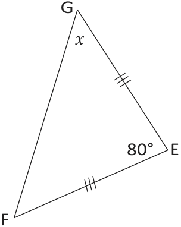
> **[Diagram Context - Textbook_Mathematics_Gr8_Geometry-of-2D-shapes.pdf-0006-01.png]**
> This graphic is a geometry figure showing triangle FGE with vertices labeled F, G, and E. Visible labels include the variable $x$ at angle $\hat{G}$, a known angle measurement of $80^\circ$ at vertex E, and tick marks on sides GE and FE indicating that these two sides are equal in length. Conceptually, this diagram helps high school learners apply Euclidean geometry theorems regarding isosceles triangles—specifically that angles opposite equal sides are equal—to calculate unknown angle values.

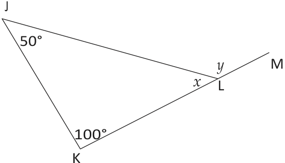
> **[Diagram Context - Textbook_Mathematics_Gr8_Geometry-of-2D-shapes.pdf-0006-03.png]**
> This graphic is a geometry figure showing triangle JKL with side KL extended to point M. The visible labels include vertices J, K, L, and M, interior angles measuring 50° at vertex J and 100° at vertex K, interior angle $x$ at vertex L, and exterior angle $y$ formed by extending side KL to M. Conceptually, this diagram helps high school students practice applying Euclidean geometry theorems, specifically the interior angles sum of a triangle and the exterior angle theorem.

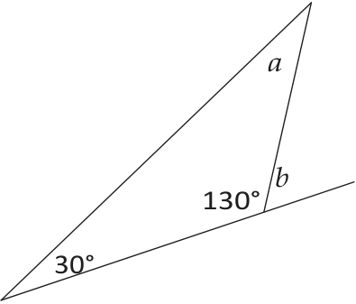
> **[Diagram Context - Textbook_Mathematics_Gr8_Geometry-of-2D-shapes.pdf-0006-05.png]**
> This geometry figure shows a triangle with an extended side forming an interior angle and an exterior angle. The diagram includes the interior angle labels $30^\circ$, $a$, and $b$, as well as an exterior angle value of $130^\circ$. Conceptually, it illustrates Euclidean geometry theorems regarding angles in triangles, specifically helping learners practise calculating unknown angles using supplementary angles on a straight line and the exterior angle theorem.

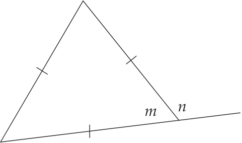
> **[Diagram Context - Textbook_Mathematics_Gr8_Geometry-of-2D-shapes.pdf-0006-07.png]**
> This geometry figure shows an equilateral triangle with a straight line extending from its base to form an exterior angle. Visible markings include single tick marks on all three sides indicating equal lengths, and variable labels $m$ for the interior angle and $n$ for the adjacent exterior angle. For a high school student studying Euclidean geometry, this diagram conceptually illustrates the exterior angle theorem of a triangle, demonstrating the geometric relationships between interior and exterior angles.

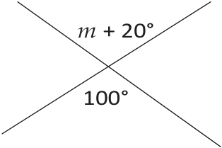
> **[Diagram Context - Textbook_Mathematics_Gr8_Geometry-of-straight-lines.pdf-0006-03.png]**
> This geometric figure displays two intersecting straight lines forming opposite angles. Visible annotations include the angle expressions $m + 20^\circ$ and $100^\circ$ positioned in opposite quadrants. Conceptually, this diagram helps learners apply the Euclidean geometry theorem that vertically opposite angles are equal to set up and solve algebraic equations for an unknown variable.

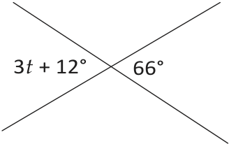
> **[Diagram Context - Textbook_Mathematics_Gr8_Geometry-of-straight-lines.pdf-0006-05.png]**
> This geometry figure illustrates intersecting straight lines forming opposite angles. The visible labels include the algebraic expression $3t + 12^\circ$ and the numerical value $66^\circ$. Conceptually, it helps learners apply the Euclidean geometry theorem that vertically opposite angles are equal, allowing them to set up an algebraic equation to solve for the unknown variable $t$.

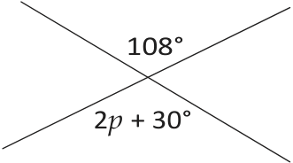
> **[Diagram Context - Textbook_Mathematics_Gr8_Geometry-of-straight-lines.pdf-0006-07.png]**
> This geometry figure illustrates two intersecting straight lines forming opposite angles. The diagram displays the angular measurements $108^{\circ}$ and an algebraic expression $2p + 30^{\circ}$ positioned vertically opposite each other. It helps high school learners apply the Euclidean geometry theorem that vertically opposite angles are equal to set up an equation ($2p + 30^{\circ} = 108^{\circ}$) and solve for the unknown variable $p$.

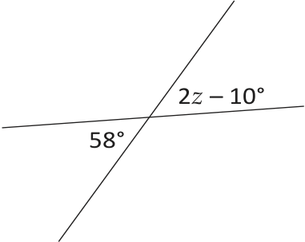
> **[Diagram Context - Textbook_Mathematics_Gr8_Geometry-of-straight-lines.pdf-0006-09.png]**
> This geometry figure illustrates intersecting straight lines forming opposite angles. The visible labels include angle measurements and expressions: $58^\circ$ and $2z - 10^\circ$. Conceptually, it helps learners apply Euclidean geometry theorems—specifically that vertically opposite angles are equal—to set up an algebraic equation and solve for the unknown variable $z$.

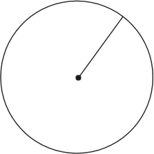
> **[Diagram Context - Textbook_Mathematics_Gr8_Perimeter-and-area-of-2D-shapes.pdf-0006-01.png]**
> This geometric figure displays a circle with a central point and a single radius line extending from the center to the circumference. The visual elements include a closed circular boundary, a central dot representing the origin or center, and a straight line segment indicating the radius. Conceptually, this diagram helps learners understand circle geometry definitions, specifically illustrating the relationship between the center and any point on the circumference.

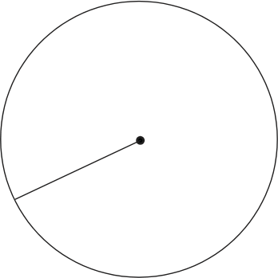
> **[Diagram Context - Textbook_Mathematics_Gr8_Perimeter-and-area-of-2D-shapes.pdf-0006-02.png]**
> This geometric figure illustrates a circle with a central point and a single radius line connecting the center to the circumference. The visual elements include a circular boundary, a central dot representing the center, and a straight line segment extending from the center to the edge. Conceptually, this diagram helps high school learners identify foundational circle geometry terms such as the center and the radius, which are essential for calculating circle properties like circumference and area in CAPS Mathematics.

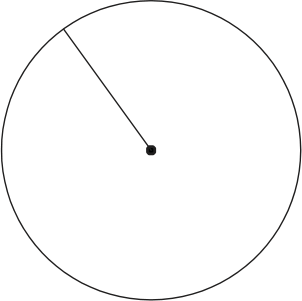
> **[Diagram Context - Textbook_Mathematics_Gr8_Perimeter-and-area-of-2D-shapes.pdf-0006-03.png]**
> This geometry figure illustrates a circle with a marked center point and a straight line segment extending from the center to the circumference. The graphic shows the circle's boundary, a central point, and a single radius line segment without explicit text labels or variable names. Conceptually, this diagram introduces learners to the fundamental properties of a circle, specifically demonstrating the definition and visual representation of a radius connecting the center to any point on the circumference.

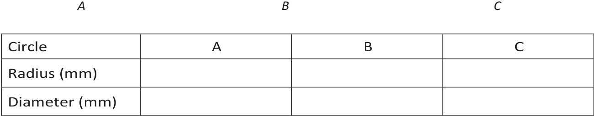
> **[Diagram Context - Textbook_Mathematics_Gr8_Perimeter-and-area-of-2D-shapes.pdf-0006-04.png]**
> This educational graphic features a data table with rows labeled "Circle", "Radius (mm)", and "Diameter (mm)", and columns corresponding to circles labeled A, B, and C. The table provides a structured format for learners to record, organize, and compare measurement data of geometric shapes. Conceptually, this helps students practice empirical data collection and reinforces the mathematical relationship between the radius and diameter of circles within measurement and geometry modules.

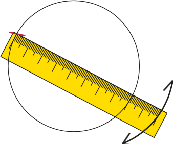
> **[Diagram Context - Textbook_Mathematics_Gr8_Perimeter-and-area-of-2D-shapes.pdf-0006-10.png]**
> This educational graphic is a geometry figure demonstrating how to measure a circle's diameter using a ruler. It features a circle, a diagonal yellow measuring ruler intersecting the circle, a red alignment mark on the circumference, and a double-headed arrow indicating rotational adjustment. Conceptually, this diagram illustrates the practical method for finding the diameter—the longest chord passing through the center—by pivoting a ruler across the circle until the maximum length is achieved.

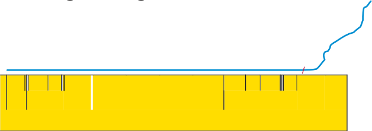
> **[Diagram Context - Textbook_Mathematics_Gr8_Perimeter-and-area-of-2D-shapes.pdf-0006-15.png]**
> This graphic illustrates a time-series line graph aligned directly above a seismogram-style strip chart with distinct vertical event markers. The visualization features a horizontal blue line curving upward and a yellow rectangular strip containing various vertical black tick marks and a red diagonal slash. Conceptually, this diagram helps high school learners interpret geological or seismological data by connecting continuous physical measurements to discrete chronological events or threshold triggers.

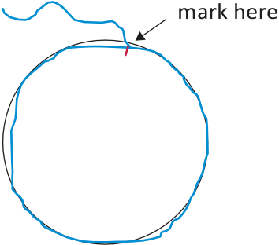
> **[Diagram Context - Textbook_Mathematics_Gr8_Perimeter-and-area-of-2D-shapes.pdf-0006-16.png]**
> The graphic is a geometry figure demonstrating a method for measuring the circumference of a circular object using a string. It shows a circular shape with a blue string wrapped around its perimeter, a red perpendicular tick mark, and an arrow pointing to the label "mark here". Conceptually, this visual aids learners in understanding practical measurement techniques for curved boundaries, specifically how to accurately transfer the length of a curved perimeter to a straight ruler.

---

### 4. Area of Combined Shapes
Figure A is a square with sides of $20\text{ mm}$. It is cut and rearranged to form Figure B.

*   **Concept:** The area of a shape remains constant even if it is cut and rearranged into a different shape (Conservation of Area).
*   **Calculation:**
    $$\text{Area of square} = \text{side} \times \text{side}$$
    $$\text{Area} = 20\text{ mm} \times 20\text{ mm} = 400\text{ mm}^2$$
*   **Conclusion:** The area of Figure B is $400\text{ mm}^2$.

---

### 5. Vegetable Patch Problem
Margie has a vegetable patch measuring $12\text{ m} \times 8\text{ m}$.

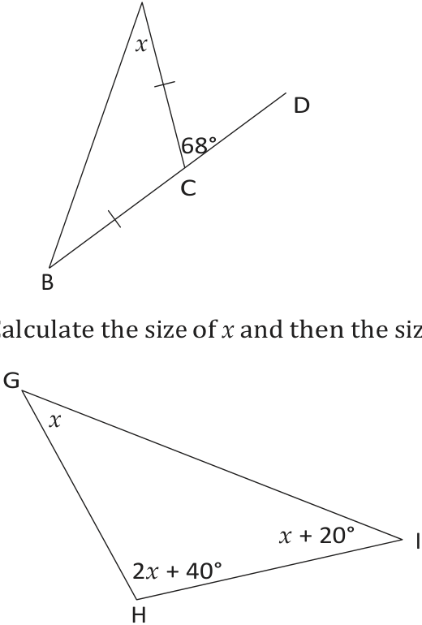
> **[Diagram Context - Textbook_Mathematics_Gr8_Geometry-of-2D-shapes.pdf-0007-02.png]**
> The graphic displays two geometry figures, including a triangle with an extended side and tick marks indicating sides of equal length, and a second triangle with interior angles expressed algebraically. Visible labels include vertex letters B, C, D, G, H, I, angle values such as $68^\circ$, and variable expressions including $x$, $2x + 40^\circ$, and $x + 20^\circ$. Conceptually, this diagram helps high school learners apply Euclidean geometry theorems—specifically the exterior angle theorem of a triangle and the sum of interior angles in a triangle—to set up equations and solve for unknown variables.

**(a) Area of the patch:**
$$\text{Area} = \text{length} \times \text{breadth} = 12\text{ m} \times 8\text{ m} = 96\text{ m}^2$$

**(b) Area per vegetable type:**
*   **Carrots (half):** $\frac{1}{2} \times 96\text{ m}^2 = 48\text{ m}^2$
*   **Tomatoes (quarter):** $\frac{1}{4} \times 96\text{ m}^2 = 24\text{ m}^2$
*   **Potatoes (quarter):** $\frac{1}{4} \times 96\text{ m}^2 = 24\text{ m}^2$

**(c) Fencing cost:**
*   **Perimeter:** $2 \times (12\text{ m} + 8\text{ m}) = 2 \times 20\text{ m} = 40\text{ m}$
*   **Total Cost:** $40\text{ m} \times R38/\text{m} = R1\,520$

---

### 6. Tiling a Kitchen Floor
Mr Allie has a floor of $5\text{ m} \times 4\text{ m}$. Tiles measure $40\text{ cm} \times 20\text{ cm}$.

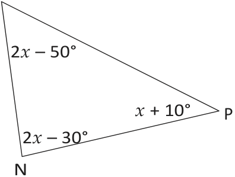
> **[Diagram Context - Textbook_Mathematics_Gr8_Geometry-of-2D-shapes.pdf-0007-06.png]**
> This educational graphic is a geometry figure showing a triangle with algebraic expressions representing its interior angles. The visible labels include vertex N, vertex P, and interior angle expressions $(2x - 50^\circ)$, $(2x - 30^\circ)$, and $(x + 10^\circ)$. This diagram conveys the Euclidean geometry concept that the sum of the interior angles of a triangle is $180^\circ$, allowing students to set up an algebraic equation to solve for the unknown variable $x$.

**(a) Number of tiles needed:**
*   Convert floor dimensions to cm: $500\text{ cm} \times 400\text{ cm}$.
*   $\text{Area of floor} = 500\text{ cm} \times 400\text{ cm} = 200\,000\text{ cm}^2$
*   $\text{Area of one tile} = 40\text{ cm} \times 20\text{ cm} = 800\text{ cm}^2$
*   $\text{Number of tiles} = \frac{200\,000}{800} = 250\text{ tiles}$

**(b) Boxes required:**
*   Each box contains $20$ tiles.
*   $\text{Boxes} = \frac{250}{20} = 12,5$
*   Since he cannot buy half a box, he must buy **13 boxes**.

---

### Doubling a Side and its Effect on Area

**Concept:** Investigating the relationship between side length and area.

1.  **Activity:** Draw squares on a $1\text{ cm} \times 1\text{ cm}$ grid.
2.  **Observation:** When the side length of a square is doubled, the area does not simply double.
3.  **Comparison:**
    *   If side = $1\text{ cm}$, Area = $1\text{ cm}^2$
    *   If side = $2\text{ cm}$ (doubled), Area = $4\text{ cm}^2$
    *   If side = $3\text{ cm}$, Area = $9\text{ cm}^2$
    *   If side = $6\text{ cm}$ (doubled), Area = $36\text{ cm}^2$

**Conclusion:** When the side of a square is doubled, its area increases by a factor of $4$ (it is quadrupled).

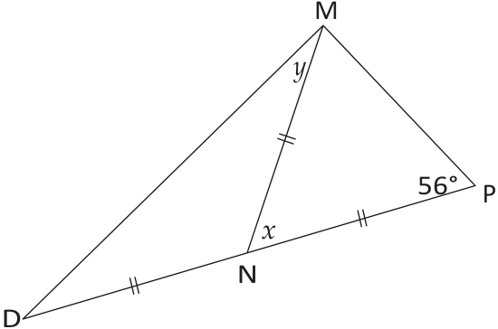
> **[Diagram Context - Textbook_Mathematics_Gr8_Geometry-of-2D-shapes.pdf-0007-08.png]**
> This geometry figure shows triangle DMP intersected by a line segment MN from vertex M to side DP. Visible labels include vertices D, M, N, and P, angle measures and variables $x$ and $y$, and double tick marks indicating equal side lengths on segments DN, NM, and NP. Conceptually, this diagram is used in high school mathematics to test Euclidean geometry theorems, specifically properties of isosceles triangles and angle-side relationships within triangles.

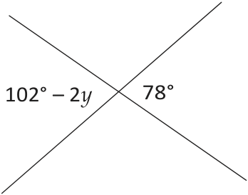
> **[Diagram Context - Textbook_Mathematics_Gr8_Geometry-of-straight-lines.pdf-0007-01.png]**
> This geometric figure illustrates intersecting straight lines forming opposite angles. The diagram displays algebraic angle expressions $102^\circ - 2y$ and $78^\circ$. Conceptually, it helps students apply the Euclidean geometry theorem that vertically opposite angles are equal, allowing them to set up an equation and solve for the unknown variable $y$.

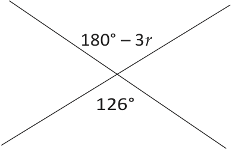
> **[Diagram Context - Textbook_Mathematics_Gr8_Geometry-of-straight-lines.pdf-0007-03.png]**
> This geometry figure illustrates intersecting straight lines forming opposite angles. The graphic features two intersecting lines with the algebraic angle expression $180^\circ - 3r$ and the numerical angle value $126^\circ$ positioned in vertically opposite positions. For a high school student following the CAPS curriculum, this diagram conveys the geometric property that vertically opposite angles are equal, enabling learners to set up an algebraic equation to solve for the unknown variable $r$.

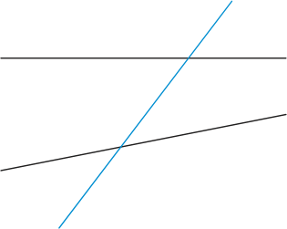
> **[Diagram Context - Textbook_Mathematics_Gr8_Geometry-of-straight-lines.pdf-0007-08.png]**
> This geometry figure displays a transversal line (in blue) intersecting two distinct straight lines (in black) at two separate points. There are no explicit algebraic labels, angle measurements, or parallel indicators present in the visual. Conceptually, this diagram illustrates the foundational Euclidean geometry setup used to define and analyze angle relationships—such as corresponding, alternate interior, and co-interior angles—formed when a transversal cuts across lines.

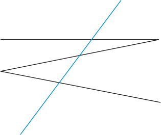
> **[Diagram Context - Textbook_Mathematics_Gr8_Geometry-of-straight-lines.pdf-0007-09.png]**
> This geometry figure displays intersecting lines featuring a single diagonal blue transversal line intersecting a set of three horizontal or near-parallel black lines forming a zig-zag or chevron-like configuration without any explicit algebraic labels or angle values. It illustrates the spatial arrangement of transversals intersecting multiple lines, serving as a visual prompt for identifying corresponding, alternate, or co-interior angles in Euclidean geometry.

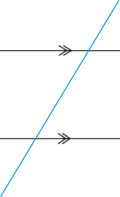
> **[Diagram Context - Textbook_Mathematics_Gr8_Geometry-of-straight-lines.pdf-0007-10.png]**
> This geometry figure displays two horizontal parallel lines intersected by a single transversal line. Visible markings include double arrows on both horizontal lines indicating parallelism. Conceptually, this diagram helps high school learners identify angle relationships formed by a transversal, such as corresponding, alternate interior, and co-interior angles.

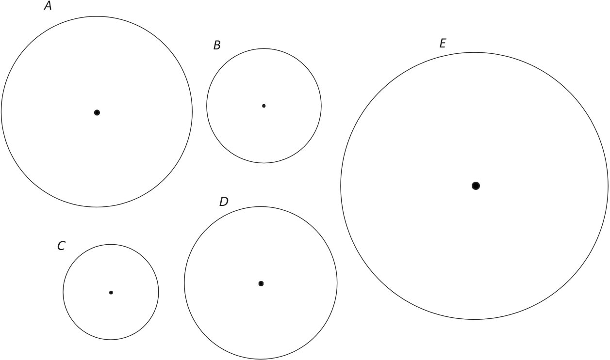
> **[Diagram Context - Textbook_Mathematics_Gr8_Perimeter-and-area-of-2D-shapes.pdf-0007-02.png]**
> The graphic displays an atomic structure model showing five circular representations labeled A, B, C, D, and E, each containing a central point representing a nucleus. Visible labels consist solely of the uppercase letters A, B, C, D, and E identifying each individual atom or ion. Conceptually, this diagram helps high school chemistry learners visualize and compare relative atomic or ionic radii across different elements or species.

---

# 9.5 Area of Triangles

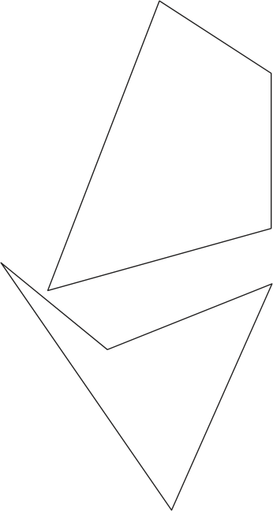
> **[Diagram Context - Textbook_Mathematics_Gr8_Geometry-of-2D-shapes.pdf-0008-03.png]**
> This educational graphic is a geometry figure displaying two irregular polygons with no visible labels, variables, or text. For high school learners studying Euclidean geometry and polygons, the diagram can be used to practice calculating interior angles, identifying convex versus concave shapes, or determining polygon properties.

### Heights and Bases of a Triangle

The **height ($h$)** of a triangle is a perpendicular line segment drawn from a vertex to its opposite side. 

The opposite side, which forms a right angle with the height, is called the **base ($b$)** of the triangle.

**Key Note:** Any triangle has three possible heights and three corresponding bases.

---

### Understanding Scaling (Grid Analysis)

The diagram illustrates how shapes are scaled on a grid. By observing the squares, we can determine the relationship between the original shapes (A, C, E) and their enlarged counterparts (B, D, F).

| Original Shape | Side Length (units) | Enlarged Shape | Side Length (units) |
| :--- | :--- | :--- | :--- |
| A | $1$ | B | $2$ |
| C | $2$ | D | $4$ |
| E | $3$ | F | $6$ |

*   **Observation:** In each case, the side length of the enlarged shape is double the side length of the original shape.
*   **Area Relationship:** Since the area of a square is $Area = side \times side$, doubling the side length results in an area that is $2^2 = 4$ times larger than the original.

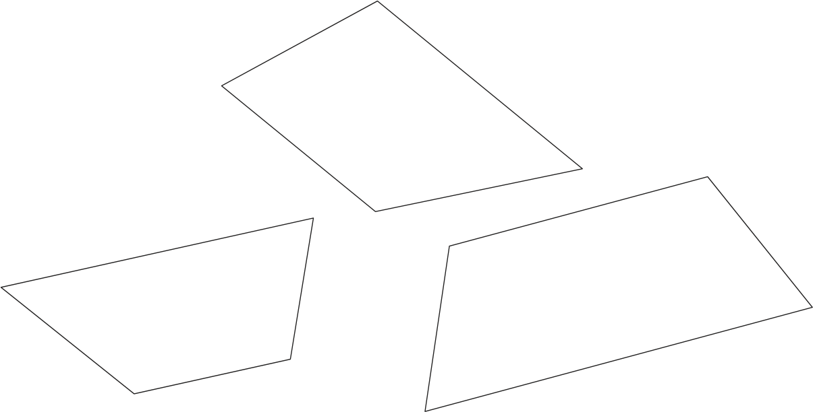
> **[Diagram Context - Textbook_Mathematics_Gr8_Geometry-of-2D-shapes.pdf-0008-07.png]**
> This geometry graphic displays three separate unlabeled quadrilateral figures, specifically parallelograms or trapeziums, drawn with black outlines on a white background. There are no visible labels, letters, variables, or directional arrows associated with the shapes. Conceptually, this diagram serves as a foundational visual aid for high school mathematics learners to investigate and classify the geometric properties, angles, and area calculations of various four-sided polygons.

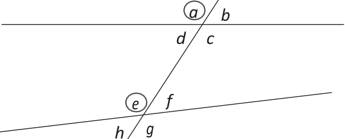
> **[Diagram Context - Textbook_Mathematics_Gr8_Geometry-of-straight-lines.pdf-0008-05.png]**
> This geometry figure illustrates two straight lines intersected by a transversal line, forming eight distinct angles. The visible labels include angle variables $a$, $b$, $c$, $d$, $f$, $g$, $h$, and circled variables $a$ and $e$. Conceptually, this diagram helps high school students identify angle relationships—such as corresponding, alternate interior, and co-interior angles—formed by a transversal intersecting lines.

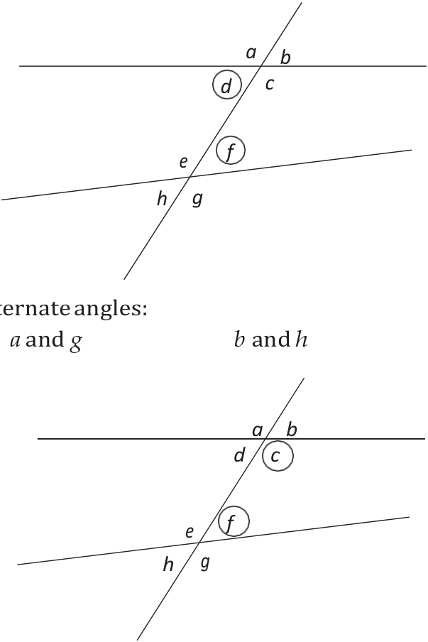
> **[Diagram Context - Textbook_Mathematics_Gr8_Geometry-of-straight-lines.pdf-0008-12.png]**
> This educational graphic is a geometry figure illustrating angle relationships formed by intersecting lines, specifically focusing on alternate angles. The visible labels consist of angle variables $a, b, c, d, e, f, g$, and $h$, along with circled letters identifying specific angle pairs. Conceptually, it conveys how alternate interior and exterior angles are positioned relative to the transversal line, helping high school learners identify congruent angle pairs when solving Euclidean geometry problems.

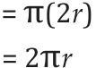

---

### Identifying Bases and Heights in Triangles

To calculate the area of a triangle, you must identify a **base** ($b$) and its corresponding **perpendicular height** ($h$). The height is the line segment drawn from the vertex opposite the base, meeting the base (or the line containing the base) at a $90^\circ$ angle.

---

#### 1. Standard Triangles
In any triangle, any side can be chosen as the base. The height is the perpendicular distance from the opposite vertex to that base.

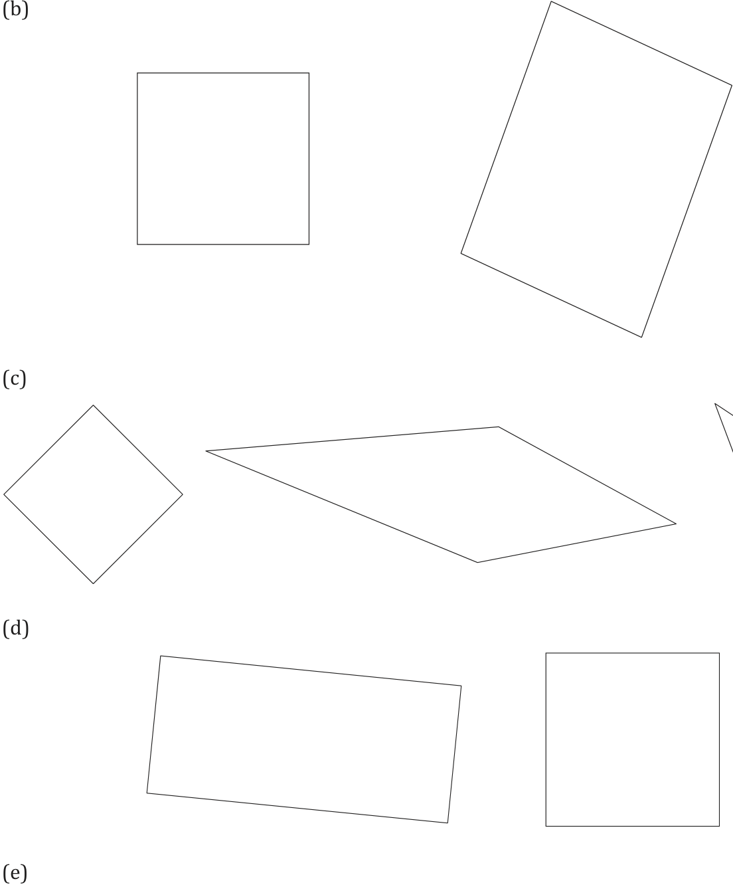
> **[Diagram Context - Textbook_Mathematics_Gr8_Geometry-of-2D-shapes.pdf-0009-00.png]**
> This geometry figure displays a collection of 2D quadrilateral shapes labeled with sub-headings (b), (c), (d), and (e). The visual elements include various 2D quadrilaterals such as squares, rectangles, and parallelograms, alongside sub-figure index labels (b), (c), (d), and (e). Conceptually, this diagram helps CAPS learners identify, classify, and compare the properties of different quadrilaterals regardless of their orientation or position on the page.

*   **Triangle 1:** Base = $BC$, Height = $AD$
*   **Triangle 2:** Base = $AC$, Height = $BD$
*   **Triangle 3:** Base = $AB$, Height = $CD$

---

#### 2. Right-Angled Triangles
In a right-angled triangle, the two sides that form the right angle can serve as the base and height. Alternatively, you can use the hypotenuse as a base if you draw the perpendicular height to it.

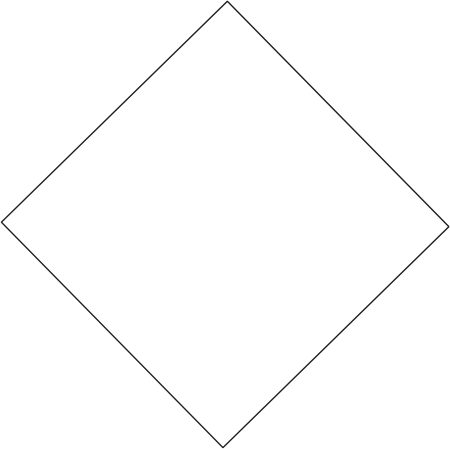
> **[Diagram Context - Textbook_Mathematics_Gr8_Geometry-of-2D-shapes.pdf-0009-01.png]**
> This graphic is a simple geometry figure representing a diamond-shaped quadrilateral. The figure consists of four straight, connected line segments forming a closed shape rotated at a forty-five-degree angle with no visible internal lines, labels, or vertices. Conceptually, it provides a basic visual representation of a rhombus or square in Euclidean geometry, supporting high school CAPS mathematics learners in identifying shapes, symmetry, and calculating perimeter or area.

*   **Triangle 1:** Base = $EF$, Height = $dF$
*   **Triangle 2:** Base = $dF$, Height = $EF$
*   **Triangle 3:** Base = $dE$, Height = $FG$

---

#### 3. Triangles with Extended Bases
Sometimes, the perpendicular height falls outside the triangle. In these cases, you must extend the line of the base to meet the height at a $90^\circ$ angle. **Note:** Only the original side length of the triangle is considered the base; the extended part is not included in the measurement.

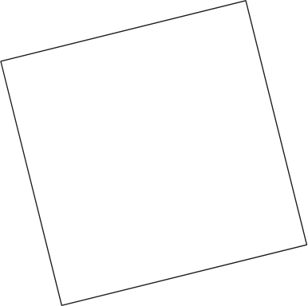
> **[Diagram Context - Textbook_Mathematics_Gr8_Geometry-of-2D-shapes.pdf-0009-02.png]**
> The graphic displays a blank geometry figure in the form of an empty quadrilateral. No visible labels, variables, or annotations are present within the figure. Conceptually, it serves as a blank canvas for students studying Euclidean geometry to construct quadrilaterals, measure angles, and apply geometric theorems and properties.

*   **Triangle 1:** Base = $KL$, Height = $JM$
*   **Triangle 2:** Base = $JL$, Height = $KM$
*   **Triangle 3:** Base = $JK$, Height = $LM$

---

#### Exercises

**1. Copy the following triangles:**
Draw the height ($h$) and label the base ($b$) for each of the provided triangles.

**2. Alternative Labeling:**
Using the same triangles from Question 1, identify and label a different set of heights and bases for each triangle.

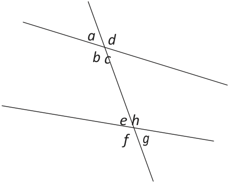
> **[Diagram Context - Textbook_Mathematics_Gr8_Geometry-of-straight-lines.pdf-0009-02.png]**
> This geometry figure illustrates two straight lines intersected by a transversal line, forming eight distinct angles labeled with the lowercase variables a, b, c, d, e, f, g, and h. For a high school mathematics student under the CAPS curriculum, this diagram serves as a foundational tool to identify and calculate angle relationships such as corresponding, alternate interior, alternate exterior, and co-interior angles.

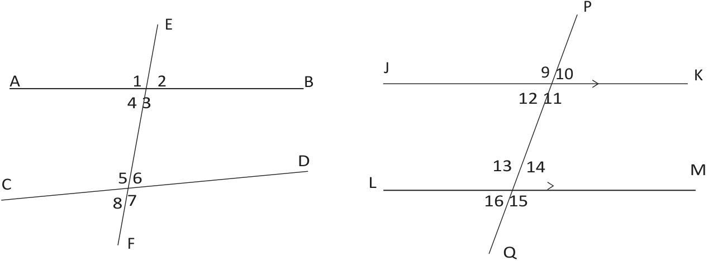
> **[Diagram Context - Textbook_Mathematics_Gr8_Geometry-of-straight-lines.pdf-0009-12.png]**
> This geometry figure displays two pairs of intersecting lines cut by transversals, labeled with lines AB, CD, EF on the left and JK, LM, PQ on the right, along with numbered angles 1 through 16. The diagram highlights the geometric relationships formed by a transversal intersecting lines, contrasting a general pair of non-parallel lines with a pair of parallel lines (indicated by arrows). For a high school student learning Euclidean geometry in the CAPS curriculum, this conceptual visual aids in identifying corresponding, alternate interior, and co-interior angles to prove or apply line properties.

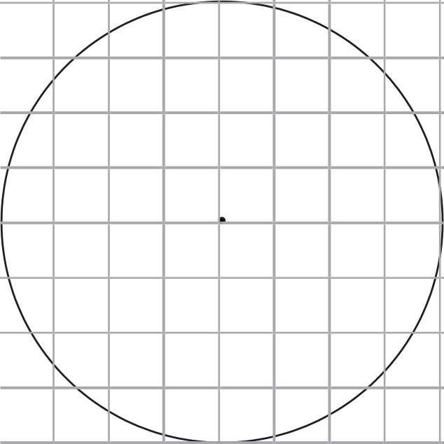
> **[Diagram Context - Textbook_Mathematics_Gr8_Perimeter-and-area-of-2D-shapes.pdf-0009-00.png]**
> This educational graphic is a geometry figure displaying a circle centered on a Cartesian coordinate grid. The image contains a black circular outline, a square grid with grey lines, and a single black dot marking the central origin point. Conceptually, this diagram helps high school mathematics learners visualize analytical geometry principles, such as determining the equation of a circle $x^2 + y^2 = r^2$ by relating the radius to grid units.

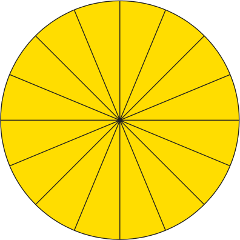
> **[Diagram Context - Textbook_Mathematics_Gr8_Perimeter-and-area-of-2D-shapes.pdf-0009-07.png]**
> This geometry figure depicts a circle divided into multiple identical yellow sectors meeting at a central point. There are no visible text labels, variables, or arrows present in the graphic. Conceptually, it demonstrates circle geometry and fractions, helping learners visualize how a whole circle can be partitioned into equal angular sectors to calculate area or understand parts of a whole.

---

### Formula: Area of a Triangle

To understand the area of a triangle, consider a rectangle $ABCD$ with a length ($l$) of $5\text{ cm}$ and a breadth ($b$) of $3\text{ cm}$. When diagonal $AC$ is drawn, it divides the rectangle into two equal triangles: $\Delta ABC$ and $\Delta ADC$.

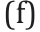

#### Derivation
1. The area of a rectangle is calculated as:
   $$\text{Area} = l \times b$$
2. Since the triangle is exactly half of the rectangle:
   $$\text{Area of } \Delta ABC = \frac{1}{2} \times (\text{Area of rectangle})$$
   $$\text{Area of } \Delta ABC = \frac{1}{2} \times (l \times b)$$
3. In the context of a triangle, the length of the rectangle becomes the **base** ($b$) and the breadth becomes the **perpendicular height** ($h$).

#### The Area Formula
The general formula for the area of any triangle is:
$$\text{Area} = \frac{1}{2} \times (\text{base} \times \text{height})$$
$$\text{Area} = \frac{1}{2} \times (b \times h)$$

**Note:** In this formula, $b$ represents the base and $h$ represents the perpendicular height.

---

### Applying the Area Formula

Use the formula $\text{Area} = \frac{1}{2} \times b \times h$ to calculate the areas of the triangles provided.

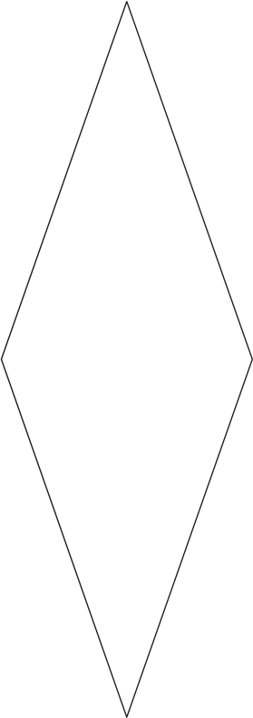

#### Worked Examples

**Example (a):**
*   **Base ($b$):** $18\text{ cm}$
*   **Height ($h$):** $6\text{ cm}$
*   **Calculation:**
    $$\text{Area} = \frac{1}{2} \times 18\text{ cm} \times 6\text{ cm}$$
    $$\text{Area} = 9\text{ cm} \times 6\text{ cm}$$
    $$\text{Area} = 54\text{ cm}^2$$

**Example (b):**
*   **Base ($b$):** $16\text{ cm}$
*   **Height ($h$):** $4\text{ cm}$
*   **Calculation:**
    $$\text{Area} = \frac{1}{2} \times 16\text{ cm} \times 4\text{ cm}$$
    $$\text{Area} = 8\text{ cm} \times 4\text{ cm}$$
    $$\text{Area} = 32\text{ cm}^2$$

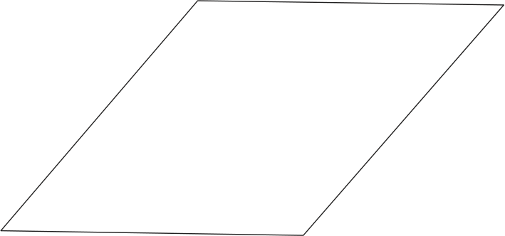

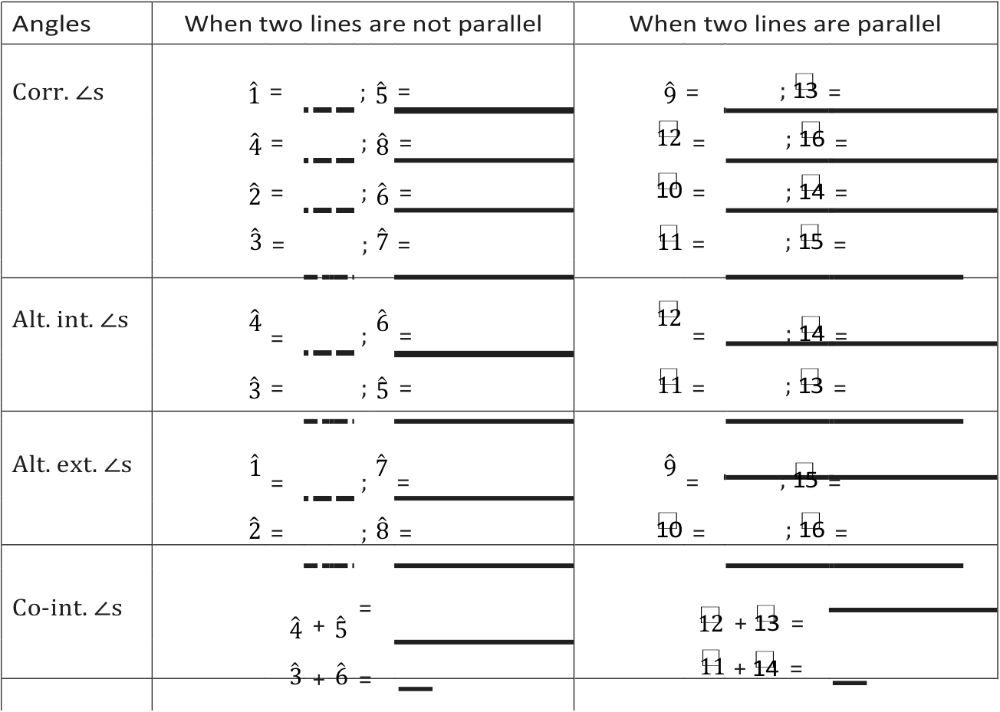

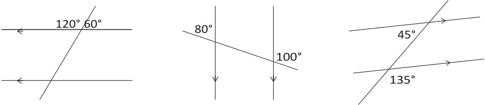

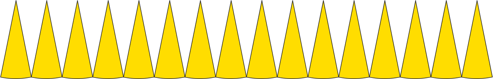

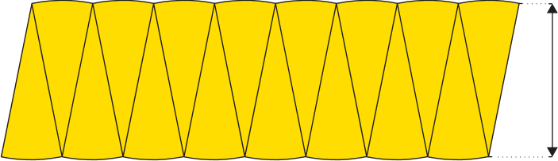

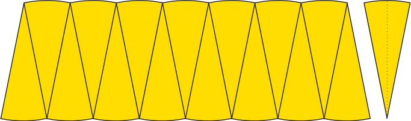

---

### Geometry: Area of Triangles and Rectangles

#### 1. Triangle Area Calculations (Continued)

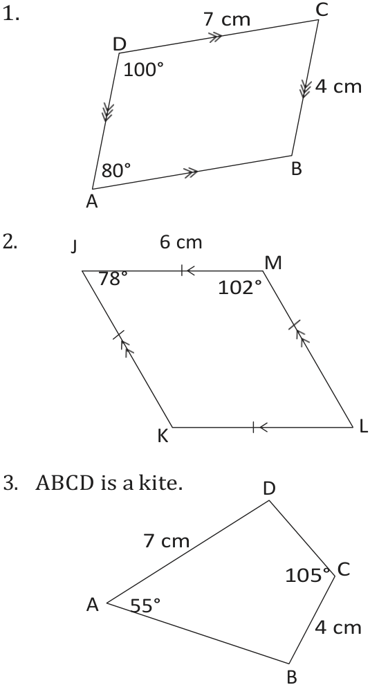
> **[Diagram Context - Textbook_Mathematics_Gr8_Geometry-of-2D-shapes.pdf-0011-06.png]**
> This graphic features three geometry figures representing quadrilaterals: two parallelograms labeled ABCD and JKLM, and a kite labeled ABCD. The figures display visible vertex labels (A, B, C, D, J, K, L, M), side lengths in centimetres (7 cm, 4 cm, 6 cm), interior angle measurements in degrees (80°, 100°, 78°, 102°, 55°, 105°), parallel line arrows, and equal side tick marks. These diagrams help high-school learners apply Euclidean geometry theorems regarding the properties of sides, angles, and diagonals in parallelograms and kites.

To calculate the area of a triangle, use the formula:
$$\text{Area} = \frac{1}{2} \times \text{base} \times \text{perpendicular height}$$

---

#### 2. Area of $\triangle PQR$ within Rectangles
In these problems, $PQST$ is a rectangle. You are required to calculate the area of the triangle $\triangle PQR$ formed within these rectangles.

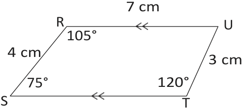
> **[Diagram Context - Textbook_Mathematics_Gr8_Geometry-of-2D-shapes.pdf-0011-08.png]**
> This geometry figure displays a quadrilateral labeled RSTU with vertices S, R, U, and T, featuring side lengths of 4 cm (RS), 7 cm (RU), 3 cm (TU), parallel arrows on sides RU and ST, and interior angle measurements of 75° (at S), 105° (at R), and 120° (at T). For a high school student following the CAPS curriculum, the diagram is used to test Euclidean geometry concepts regarding the properties of quadrilaterals, specifically prompting learners to verify whether the shape is a parallelogram by analyzing opposite sides, angles, and parallel lines.

**(a)** Rectangle $PQST$ with $PT = 20\text{ cm}$, $TS = 12\text{ cm}$, and $RS = 10\text{ cm}$.
*   **Note:** Since $PQST$ is a rectangle, $PQ = TS = 12\text{ cm}$ and $QS = PT = 20\text{ cm}$.
*   $QR = QS - RS = 20\text{ cm} - 10\text{ cm} = 10\text{ cm}$.

**(b)** Rectangle $PQST$ with $QS = 12\text{ m}$ and $TS = 32\text{ m}$.
*   **Note:** $PQ = TS = 32\text{ m}$.

**(c)** Rectangle $PQST$ with $PT = 86,2\text{ cm}$ and $TS = 35\text{ cm}$.
*   **Note:** $R$ is the midpoint of $QS$. Therefore, $QR = \frac{1}{2} \times QS$.

---

#### 3. Finding the Base of a Triangle
**Problem:** In $\triangle ABC$, the area is $42\text{ m}^2$ and the perpendicular height is $16\text{ m}$. Find the length of the base.

**Solution Steps:**
1.  State the formula:
    $$\text{Area} = \frac{1}{2} \times \text{base} \times \text{height}$$
2.  Substitute the known values:
    $$42 = \frac{1}{2} \times \text{base} \times 16$$
3.  Simplify the equation:
    $$42 = 8 \times \text{base}$$
4.  Solve for the base:
    $$\text{base} = \frac{42}{8}$$
    $$\text{base} = 5,25\text{ m}$$

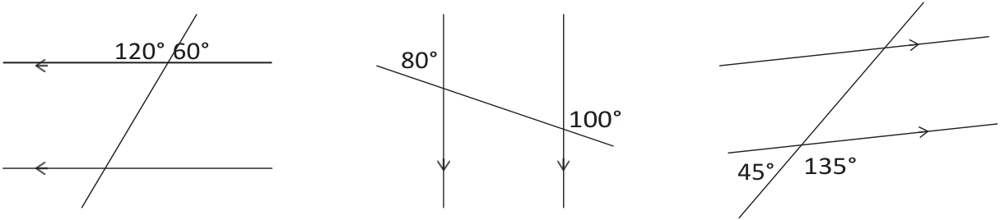
> **[Diagram Context - Textbook_Mathematics_Gr8_Geometry-of-straight-lines.pdf-0011-01.png]**
> This geometry figure consists of three separate diagrams showing pairs of straight lines intersected by a transversal line. The visible labels include angle measurements (120°, 60°, 80°, 100°, 45°, 135°) and directional arrows indicating parallel lines. Conceptually, these diagrams help high school learners identify and calculate corresponding, co-interior, and alternate angles formed by parallel lines cut by a transversal.

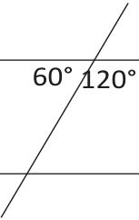
> **[Diagram Context - Textbook_Mathematics_Gr8_Geometry-of-straight-lines.pdf-0011-05.png]**
> This geometry figure illustrates Euclidean geometry principles involving parallel lines intersected by a transversal line. The diagram displays angle measurements labeled as 60° and 120° adjacent to the intersection points. Conceptually, it helps learners identify angle relationships—such as angles on a straight line adding up to 180°—to solve for unknown angles in CAPS mathematics curricula.

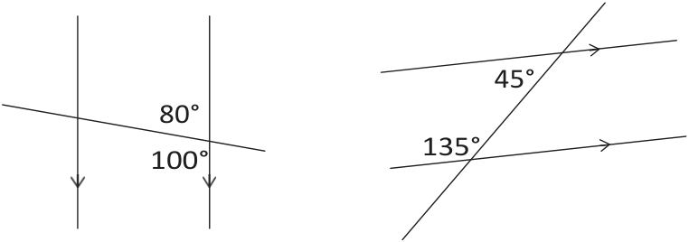
> **[Diagram Context - Textbook_Mathematics_Gr8_Geometry-of-straight-lines.pdf-0011-06.png]**
> This geometry figure illustrates two parallel line configurations intersected by a transversal line. The diagram displays angle measurements labeled as 80°, 100°, 45°, and 135°, along with arrowheads indicating parallel lines. Conceptually, it helps CAPS Grade 8 and 9 learners identify and calculate corresponding, co-interior, and alternate angles formed by parallel lines cut by a transversal.

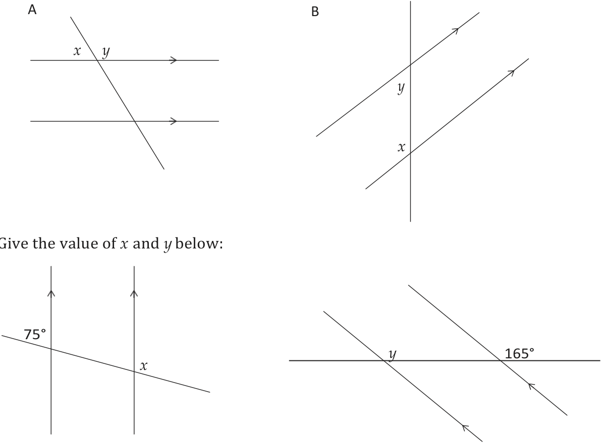
> **[Diagram Context - Textbook_Mathematics_Gr8_Geometry-of-straight-lines.pdf-0011-09.png]**
> This educational graphic is a geometry figure displaying four distinct line and angle diagrams (labeled A, B, and two unnamed practice problems) used to teach Euclidean geometry. The visible labels and symbols include angle variables $x$ and $y$, degree measurements ($75^\circ$ and $165^\circ$), parallel line indicator arrows, and intersecting transversal lines. Conceptually, it helps high school learners practice identifying and calculating unknown angles formed by transversals cutting across parallel lines using geometric relationships like corresponding, alternate interior, and co-interior angles.

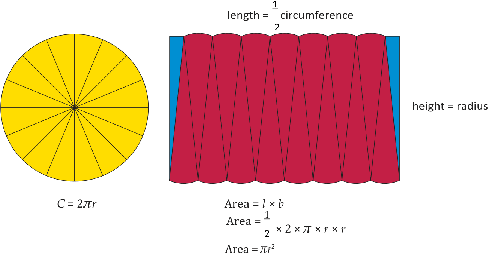
> **[Diagram Context - Textbook_Mathematics_Gr8_Perimeter-and-area-of-2D-shapes.pdf-0011-01.png]**
> This graphic is a geometry figure demonstrating the derivation of the formula for the area of a circle. It features a yellow circle divided into equal sectors that are rearranged into a rectangular shape, with visible labels including $C = 2\pi r$, $\text{length} = \frac{1}{2}\text{ circumference}$, $\text{height} = \text{radius}$, and the algebraic steps leading to $\text{Area} = \pi r^2$. For a high school mathematics learner, this visual proof conceptually links the circumference and radius of a circle to the area of a rectangle ($l \times b$) to derive the circle's area formula.

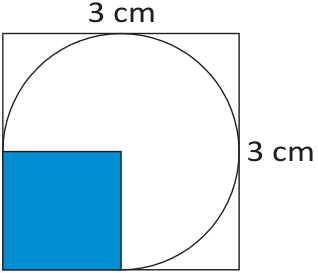
> **[Diagram Context - Textbook_Mathematics_Gr8_Perimeter-and-area-of-2D-shapes.pdf-0011-10.png]**
> This geometry figure illustrates a composite shape featuring a square inscribed with a circle, with visible dimensions labelled as $3\text{ cm}$ along the top and right sides, and a smaller solid blue square in the bottom-left corner. The graphic conveys the concept of calculating area and perimeter by combining two-dimensional shapes, prompting learners to apply area formulas for squares and circles to solve problems involving composite regions.

---

# Worksheet: Perimeter and Area of 2D Shapes

## 1. Calculate the perimeter ($P$) and area ($A$) of the following figures:

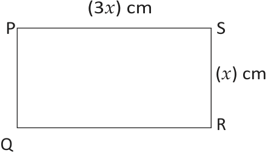
> **[Diagram Context - Textbook_Mathematics_Gr8_Geometry-of-2D-shapes.pdf-0012-01.png]**
> The graphic is a geometry figure showing a rectangle labeled PQRS. Visible labels include vertices P, Q, R, S, with algebraic side-length dimensions of $(3x)\text{ cm}$ along the top edge PS and $(x)\text{ cm}$ along the right edge SR. Conceptually, this diagram visually represents a two-dimensional rectangular shape with variable dimensions, used in high school mathematics for practicing perimeter, area calculations, and algebraic problem-solving.

### Figure 1: Rectangle ABCD
*   **Dimensions:** $AB = 7\text{ cm}$, $BC = 70\text{ mm} = 7\text{ cm}$
*   **Perimeter ($P$):** $2 \times (\text{length} + \text{breadth}) = 2 \times (7\text{ cm} + 7\text{ cm}) = 28\text{ cm}$
*   **Area ($A$):** $\text{length} \times \text{breadth} = 7\text{ cm} \times 7\text{ cm} = 49\text{ cm}^2$

### Figure 2: Rectangle EFGH
*   **Dimensions:** $EF = 5\text{ cm}$, $EH = 8,2\text{ cm}$
*   **Perimeter ($P$):** $2 \times (8,2\text{ cm} + 5\text{ cm}) = 2 \times 13,2\text{ cm} = 26,4\text{ cm}$
*   **Area ($A$):** $8,2\text{ cm} \times 5\text{ cm} = 41\text{ cm}^2$

### Figure 3: Triangle JKL
*   **Dimensions:** $\text{Base } (KL) = 8,6\text{ m}$, $\text{Height } (h) = 5\text{ m}$, $\text{Side } (JK) = 5,9\text{ m}$, $\text{Side } (JL) = 950\text{ cm} = 9,5\text{ m}$
*   **Perimeter ($P$):** $JK + KL + JL = 5,9\text{ m} + 8,6\text{ m} + 9,5\text{ m} = 24\text{ m}$
*   **Area ($A$):** $\frac{1}{2} \times \text{base} \times \text{height} = \frac{1}{2} \times 8,6\text{ m} \times 5\text{ m} = 21,5\text{ m}^2$

---

## 2. Figure ABCD is a rectangle
*   **Given:** $AB = 3\text{ cm}$, $AD = 9\text{ cm}$, $TC = 4\text{ cm}$

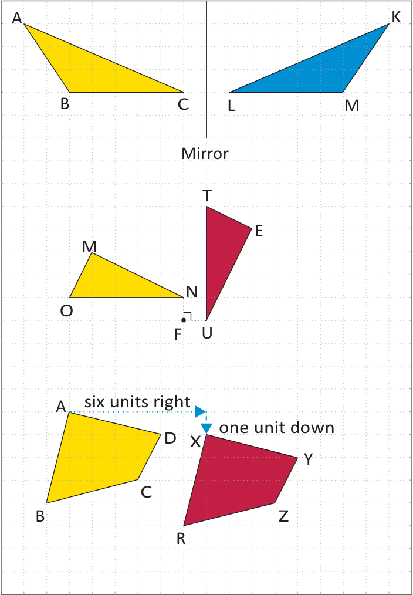
> **[Diagram Context - Textbook_Mathematics_Gr8_Geometry-of-2D-shapes.pdf-0012-07.png]**
> This graphic is a geometry figure illustrating different types of geometric transformations on a grid, specifically reflections and translations. The visible labels include vertices such as triangles ABC and KLM reflected across a vertical line labeled "Mirror," triangles MNO and TEU, and quadrilaterals ABCD and XYZ with directional arrows annotated as "six units right" and "one unit down." For a CAPS high school mathematics learner, this diagram conveys how shapes change position on the Cartesian plane while preserving their size and shape during rigid transformations.

### (a) Calculate the perimeter of ABCD
*   $P = 2 \times (AD + AB) = 2 \times (9\text{ cm} + 3\text{ cm}) = 2 \times 12\text{ cm} = 24\text{ cm}$

### (b) Calculate the area of ABCD
*   $A = \text{length} \times \text{breadth} = 9\text{ cm} \times 3\text{ cm} = 27\text{ cm}^2$

### (c) Calculate the area of $\Delta DTC$
*   $\text{Base } (TC) = 4\text{ cm}$
*   $\text{Height } (DT) = AB = 3\text{ cm}$
*   $A = \frac{1}{2} \times \text{base} \times \text{height} = \frac{1}{2} \times 4\text{ cm} \times 3\text{ cm} = 6\text{ cm}^2$

### (d) Calculate the area of ABTD
*   $\text{Area of ABTD} = \text{Area of rectangle ABCD} - \text{Area of } \Delta DTC$
*   $A = 27\text{ cm}^2 - 6\text{ cm}^2 = 21\text{ cm}^2$

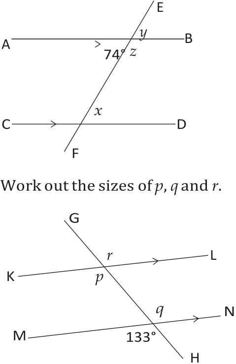
> **[Diagram Context - Textbook_Mathematics_Gr8_Geometry-of-straight-lines.pdf-0012-04.png]**
> This geometry figure illustrates two separate sets of parallel lines intersected by transversals. The first diagram contains lines AB and CD intersected by EF, with visible angle variables $x$, $y$, $z$, and a known angle of $74^\circ$, while the second diagram features lines KL and MN intersected by GH, with angle variables $p$, $q$, $r$, and a known angle of $133^\circ$ alongside a prompt to calculate the unknown angles. Conceptually, this graphic helps high school learners apply Euclidean geometry theorems—such as corresponding, alternate interior, and co-interior angles formed by parallel lines and transversals—to solve for unknown angle values.

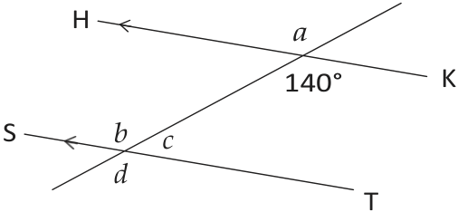
> **[Diagram Context - Textbook_Mathematics_Gr8_Geometry-of-straight-lines.pdf-0012-09.png]**
> This geometry figure illustrates Euclidean geometry concepts involving intersecting lines. The diagram shows two lines labelled HK and ST intersected by a transversal line, with visible angle variables $a$, $b$, $c$, $d$, and a known angle of $140^\circ$. For a high school student, it conveys the relationships between angles formed by parallel or intersecting lines, such as corresponding, alternate interior, and vertically opposite angles.

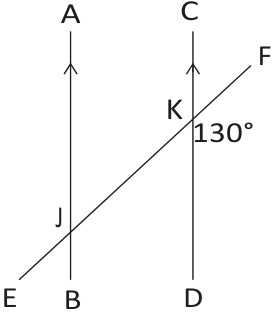
> **[Diagram Context - Textbook_Mathematics_Gr8_Geometry-of-straight-lines.pdf-0012-11.png]**
> This geometry figure illustrates two lines intersected by a transversal line, labeled with straight lines AB and CD, transversal EF, intersection points J and K, and a given angle measurement of 130°. For a high school mathematics learner following the CAPS curriculum, this diagram visually conveys the geometric relationships and angle properties—such as corresponding, alternate interior, and co-interior angles—formed when a transversal intersects parallel lines.

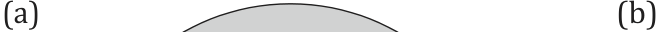

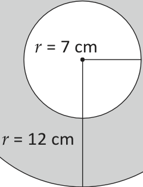
> **[Diagram Context - Textbook_Mathematics_Gr8_Perimeter-and-area-of-2D-shapes.pdf-0012-04.png]**
> This geometry figure displays a concentric circle problem featuring a smaller inner white circle with a radius of $r = 7\text{ cm}$ set inside a larger outer circle where the shaded annular region corresponds to a radius of $r = 12\text{ cm}$. Visible labels include the radius values $r = 7\text{ cm}$ and $r = 12\text{ cm}$, a center point dot, and line segments extending from the center to the circle boundaries. Conceptually, this diagram helps high school students practice calculating the area of composite shapes or annular regions by subtracting the area of the inner circle from the area of the outer circle.

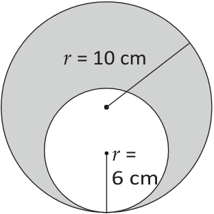
> **[Diagram Context - Textbook_Mathematics_Gr8_Perimeter-and-area-of-2D-shapes.pdf-0012-05.png]**
> This geometry figure illustrates a 2D composite shape consisting of a larger grey-shaded circle containing a smaller unshaded circular hole. Visible labels include center points, radius measurements of $r = 10\text{ cm}$ for the outer circle and $r = 6\text{ cm}$ for the inner circle, and radius lines terminating at the boundaries. The diagram helps high school learners conceptualize how to calculate the area of a shaded region by subtracting the area of an inner geometric shape from an outer one.

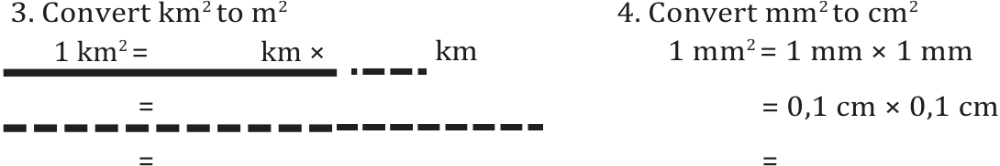
> **[Diagram Context - Textbook_Mathematics_Gr8_Perimeter-and-area-of-2D-shapes.pdf-0012-15.png]**
> The graphic presents two mathematical conversion problems involving square units, specifically converting between square kilometres and square metres, and square millimetres and square centimetres. Visible text labels include question prompts "3. Convert $\text{km}^2\text{ to m}^2$" and "4. Convert $\text{mm}^2\text{ to cm}^2$", along with incomplete algebraic and numerical equations using units such as $\text{km}$, $\text{m}$, $\text{mm}$, and $\text{cm}$. Conceptually, the diagram helps high school learners understand how linear conversion factors must be squared when working with two-dimensional area measurements, reinforcing the step-by-step substitution method for unit conversions.

---

# Grade 7 Term 2: Perimeter and Area of 2D Shapes

## Learner Book Overview

| Sections in this chapter | Content | Pages in Learner Book |
| :--- | :--- | :--- |
| 9.1 Perimeter of polygons | Definition of perimeter; measuring perimeter | Page 133 |
| 9.2 Perimeter formulae | Formulae for calculating perimeter and applying the formulae | Page 134 |
| 9.3 Area and square units | Definition of area; square units; converting units | Pages 135 to 136 |
| 9.4 Area of squares and rectangles | Investigating area; formulae; doubling sides effect | Pages 137 to 140 |
| 9.5 Area of triangles | Heights and bases; formulae; applying the formula | Pages 140 to 144 |

**CAPS Time Allocation:** 7 hours  
**CAPS Content Specification:** Pages 55 to 56

---

## Mathematical Background

### 1. Perimeter
The **perimeter** is the distance around the border of a shape. It is calculated by adding the lengths of all sides or by using specific formulae.

*   **Perimeter of a rectangle:** $P = 2 \times \text{length} + 2 \times \text{breadth}$
*   **Perimeter of a square:** $P = 4 \times \text{side length}$

### 2. Area
The **area** is a measure of the surface a shape covers, expressed in square units (e.g., $cm^2$).

*   **Area of a rectangle:** $A = \text{length} \times \text{breadth}$ ($A = l \times b$)
*   **Area of a square:** $A = \text{side} \times \text{side}$ ($A = s \times s$)

### 3. Area of Triangles
Any triangle can fit inside a rectangle that has the same base and height. The area of a triangle is exactly half the area of that rectangle.

*   **Formula:** $A = \frac{1}{2} \times b \times h$
    *   Where $b$ is the base.
    *   Where $h$ is the perpendicular height (altitude).

**Key Concepts:**
*   **Irregular shapes:** These are composite shapes made up of squares and rectangles. Their area is found by dividing them into smaller, regular shapes.
*   **Triangles:** The altitude (height) divides a triangle into two right-angled triangles. By calculating the area of the corresponding rectangles and halving them, we prove the formula $A = \frac{1}{2} \times b \times h$ applies to all triangles, including obtuse-angled triangles.

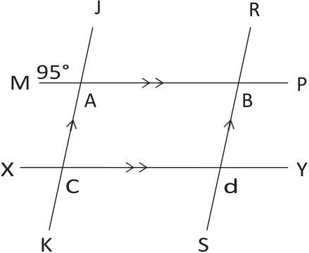
> **[Diagram Context - Textbook_Mathematics_Gr8_Geometry-of-straight-lines.pdf-0013-01.png]**
> This geometry figure illustrates Euclidean geometry concepts involving parallel lines and transversals. It features parallel lines MP and XY intersected by transversals JK and RS, with visible labels A, B, C, d, M, P, X, Y, J, K, R, S, parallel arrows, and an angle of 95°. For a high school student, this diagram conveys how to apply angle relationships—such as corresponding, alternate interior, and co-interior angles—to find unknown angle measurements in parallel line configurations.

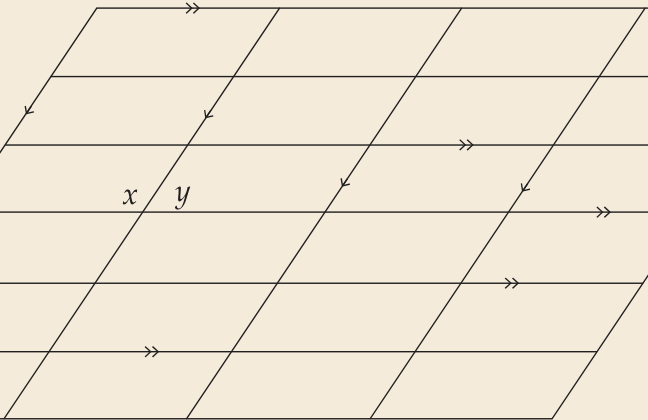
> **[Diagram Context - Textbook_Mathematics_Gr8_Geometry-of-straight-lines.pdf-0013-04.png]**
> This geometry figure illustrates a grid of intersecting parallel lines, forming multiple parallelograms and rhombi. The diagram displays directional arrows indicating parallel line segments, along with intersection angle labels $x$ and $y$. Conceptually, it helps students apply Euclidean geometry theorems regarding parallel lines, alternate angles, corresponding angles, and co-interior angles formed by transversals.

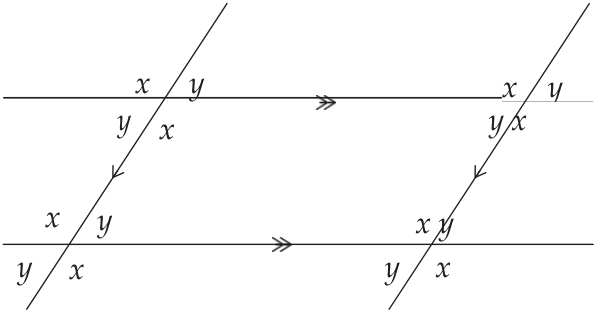
> **[Diagram Context - Textbook_Mathematics_Gr8_Geometry-of-straight-lines.pdf-0013-09.png]**
> This geometry figure illustrates two sets of parallel lines intersected by transversals. The diagram displays angle variables labeled $x$ and $y$, along with arrowheads indicating parallel lines. Conceptually, it demonstrates the angle relationships formed by parallel lines cut by a transversal, such as corresponding, alternate interior, and co-interior angles, helping students identify equal and supplementary angle pairs.

---

# Chapter 9: Perimeter and Area of 2D Shapes

## 9.1 Perimeter of Polygons

### Definition
The **perimeter** ($P$) of a shape is the total distance around the outside of the shape. It is calculated by finding the sum of the lengths of all its sides.

### Units of Measurement
Perimeter is measured in units of length, such as:
*   Millimetres ($\text{mm}$)
*   Centimetres ($\text{cm}$)
*   Metres ($\text{m}$)

### Converting Units of Length
To convert between units, use the following relationships:

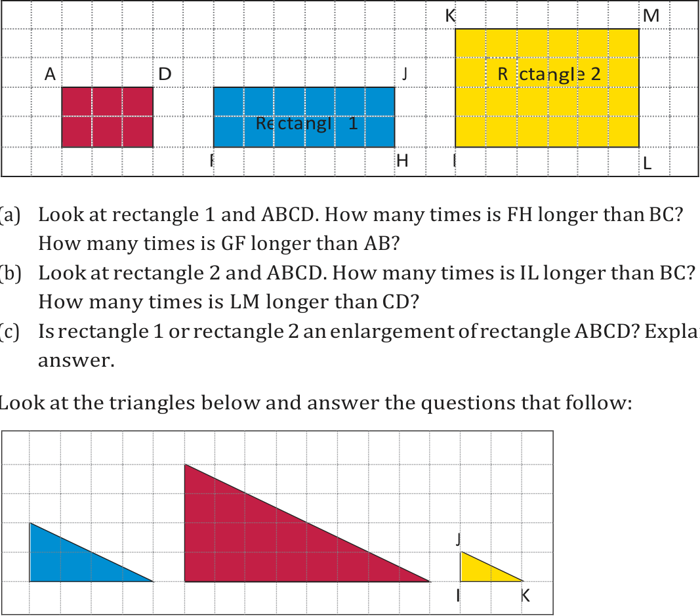
> **[Diagram Context - Textbook_Mathematics_Gr8_Geometry-of-2D-shapes.pdf-0014-02.png]**
> This graphic presents geometry figures on grid backgrounds accompanied by mathematical questions regarding proportional scaling and enlargement. The visual content includes labeled rectangles (ABCD, Rectangle 1, Rectangle 2) with vertex markers such as A, D, F, H, I, J, K, L, M, and various triangles drawn on square grid units. Conceptually, this diagram helps learners understand the geometric principles of enlargement, scale factors, and proportional side-length relationships in 2D shapes.

*   To convert from $\text{m}$ to $\text{cm}$: multiply by $100$ ($\times 100$)
*   To convert from $\text{cm}$ to $\text{mm}$: multiply by $10$ ($\times 10$)
*   To convert from $\text{mm}$ to $\text{cm}$: divide by $10$ ($\div 10$)
*   To convert from $\text{cm}$ to $\text{m}$: divide by $100$ ($\div 100$)

---

### Worked Examples: Measuring Perimeters

**Example 1: Calculating perimeter by adding side lengths**
To find the perimeter of a polygon, add the lengths of all individual sides.

*   **Figure A:** $31 + 34 + 21 + 42 = 128 \text{ mm}$
*   **Figure B:** $36 + 26 + 50 = 112 \text{ mm}$

**Example 2: Calculating perimeter using equal sides**
If a shape consists of several equal sides (represented by arrows), the perimeter is calculated by multiplying the number of sides by the length of one side.

*   **Formula:** $P = (\text{Number of sides}) \times (\text{Length of one side})$

| Shape | Number of Sides | Calculation | Perimeter |
| :--- | :--- | :--- | :--- |
| A | 4 | $4 \times 30 \text{ mm}$ | $120 \text{ mm}$ |
| B | 6 | $6 \times 30 \text{ mm}$ | $180 \text{ mm}$ |
| C | 8 | $8 \times 30 \text{ mm}$ | $240 \text{ mm}$ |
| D | 5 | $5 \times 30 \text{ mm}$ | $150 \text{ mm}$ |
| E | 3 | $3 \times 30 \text{ mm}$ | $90 \text{ mm}$ |
| F | 6 | $6 \times 30 \text{ mm}$ | $180 \text{ mm}$ |
| G | 4 | $4 \times 30 \text{ mm}$ | $120 \text{ mm}$ |

---

### Common Misconceptions
*   **Unit Consistency:** Learners often attempt to add side lengths that are in different units (e.g., adding $\text{cm}$ and $\text{mm}$ directly). 
*   **Correction:** Always ensure all side lengths are converted to the same unit before performing the addition.

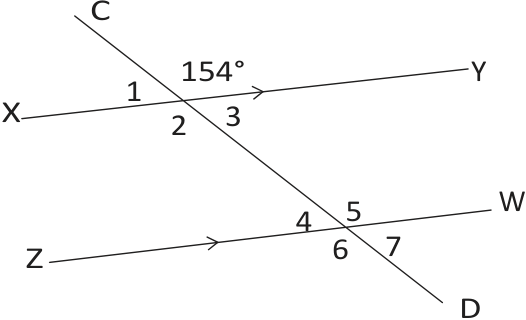
> **[Diagram Context - Textbook_Mathematics_Gr8_Geometry-of-straight-lines.pdf-0014-06.png]**
> This geometry figure illustrates Euclidean geometry concepts involving parallel lines and a transversal line. The diagram displays parallel lines labeled XY and ZW intersected by a transversal line CD, marked with angle numbers 1 through 7 and a specific angle measurement of 154°. It helps high school students practice applying angle relationships such as corresponding, alternate interior, and co-interior angles to calculate unknown angle sizes.

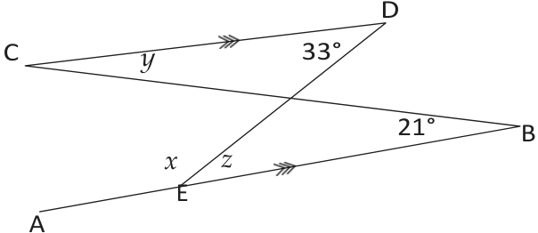
> **[Diagram Context - Textbook_Mathematics_Gr8_Geometry-of-straight-lines.pdf-0014-08.png]**
> This geometry figure illustrates Euclidean geometry relationships involving parallel lines and transversals. The diagram features parallel lines marked with double arrows, intersecting line segments labelled with points A, B, C, D, and E, and angle measurements and variables including 33°, 21°, $x$, $y$, and $z$. For a high school student, this conveys how to apply angle properties such as alternate interior angles, corresponding angles, and angles on a straight line to calculate unknown angle values.

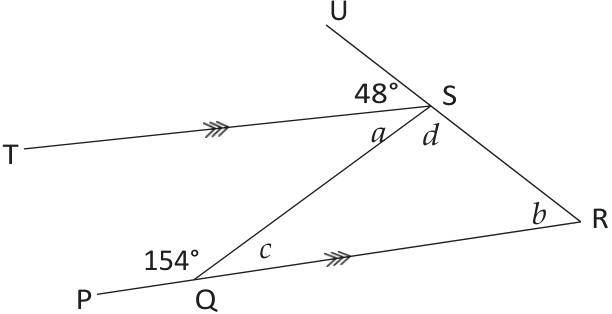
> **[Diagram Context - Textbook_Mathematics_Gr8_Geometry-of-straight-lines.pdf-0014-10.png]**
> This geometry figure illustrates Euclidean geometry relationships involving parallel lines and triangles. It contains vertices labeled P, Q, R, S, T, and U, with parallel line indicators on segments TS and QR, along with angle measurements of $48^\circ$ and $154^\circ$ and unknown angle variables $a$, $b$, $c$, and $d$. Conceptually, it provides a problem-solving exercise for high school learners to apply angle-relationship theorems—such as corresponding angles, alternate angles, co-interior angles, and angles on a straight line—to calculate the unknown angles.

---

# 9.2 Perimeter Formulae

## Key Concepts and Definitions

Perimeter is the total distance around the outside of a 2D shape. It is calculated by adding the lengths of all sides together.

### 1. Square
A square has four equal sides of length $s$.
*   **Formula:** $P = s + s + s + s = 4 \times s$
*   **Simplified:** $P = 4s$

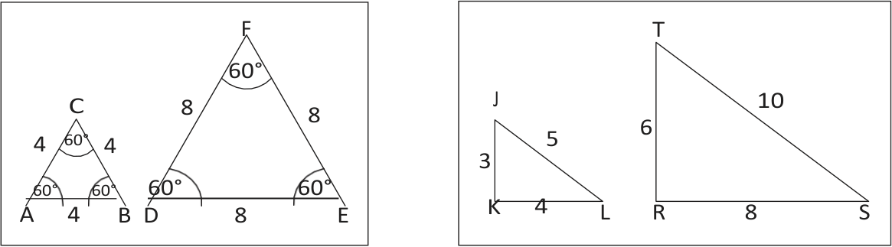
> **[Diagram Context - Textbook_Mathematics_Gr8_Geometry-of-2D-shapes.pdf-0015-03.png]**
> The graphic presents two pairs of geometry figures: equilateral triangles ABC and DEF, and right-angled triangles JKL and TRS. Visible labels include vertex letters (A, B, C, D, E, F, J, K, L, T, R, S), side lengths (4, 8, 3, 5, 6, 10), and interior angle measurements (60°). For CAPS high school mathematics learners, this diagram visually demonstrates the concept of similar triangles, illustrating that triangles with equal corresponding angles have sides in constant proportion (scaling).

### 2. Rectangle
A rectangle has a length ($l$) and a breadth ($b$).
*   **Formula:** $P = l + l + b + b = 2 \times l + 2 \times b$
*   **Simplified:** $P = 2(l + b)$

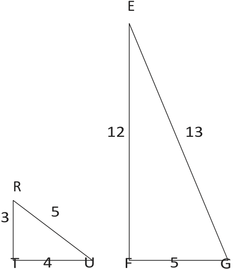
> **[Diagram Context - Textbook_Mathematics_Gr8_Geometry-of-2D-shapes.pdf-0015-05.png]**
> This geometry figure displays two right-angled triangles, labeled $\Delta RTU$ and $\Delta EFG$. Visible labels include vertices $R, T, U, E, F, G$ and side length values $3, 4, 5, 12, 13$. For a CAPS FET mathematics learner, this graphic illustrates the concept of similar triangles and scaling ratios by comparing two non-similar right-angled triangles to test proportionality and Euclidean geometry principles.

### 3. Triangle
A triangle has three sides ($s_1, s_2, s_3$).
*   **Formula:** $P = s_1 + s_2 + s_3$

---

## Applying Perimeter Formulae: Exercises

1. Calculate the perimeter of a square if the length of one side is $17,5\text{ cm}$.
2. One side of an equilateral triangle is $32\text{ cm}$. Calculate the triangle's perimeter.
3. Calculate the length of one side of a square if the perimeter is $7,2\text{ m}$.
4. Two sides of a triangle are $2,5\text{ cm}$ each. Calculate the third side if the perimeter is $6,4\text{ cm}$.
5. A rectangle is $40\text{ cm}$ long and $25\text{ cm}$ wide. Calculate its perimeter.
6. Calculate the perimeter of a rectangle that is $2,4\text{ m}$ wide and $4\text{ m}$ long.
7. The perimeter of a rectangle is $8,88\text{ m}$. How long is the rectangle if it is $1,2\text{ m}$ wide?
8. Complete the following tables for rectangles:

| | Length | Breadth | Perimeter | | Length | Breadth | Perimeter |
| :--- | :--- | :--- | :--- | :--- | :--- | :--- | :--- |
| (a) | $74\text{ mm}$ | $30\text{ mm}$ | $208\text{ mm}$ | (b) | $25\text{ mm}$ | $20\text{ mm}$ | $90\text{ mm}$ |
| (c) | $2\text{ cm}$ | $1,125\text{ cm}$ | $6,25\text{ cm}$ | (d) | $5,5\text{ cm}$ | $5,5\text{ cm}$ | $22\text{ cm}$ |
| (e) | $7,5\text{ m}$ | $3,8\text{ m}$ | $22,6\text{ m}$ | (f) | $3,5\text{ m}$ | $2,5\text{ m}$ | $12\text{ m}$ |

---

## Worked Solutions

1. $P = 4 \times 17,5 = 70\text{ cm}$
2. $P = 3 \times 32 = 96\text{ cm}$
3. $4s = 7,2 \implies s = 7,2 \div 4 = 1,8\text{ m}$
4. $6,4 = 2,5 + 2,5 + s_3 \implies s_3 = 6,4 - 5 = 1,4\text{ cm}$
5. $P = 2(40 + 25) = 2 \times 65 = 130\text{ cm}$
6. $P = 2(2,4 + 4) = 2 \times 6,4 = 12,8\text{ m}$
7. $P = 2(l + b) \implies 8,88 = 2(l + 1,2)$. 
   $l + 1,2 = 8,88 \div 2 = 4,44$.
   $l = 4,44 - 1,2 = 3,24\text{ m}$.

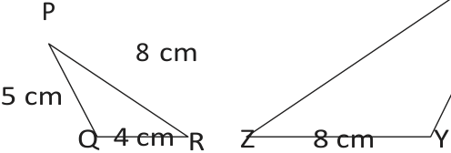
> **[Diagram Context - Textbook_Mathematics_Gr8_Geometry-of-2D-shapes.pdf-0015-08.png]**
> This graphic displays two geometry figures, specifically two triangles labeled PQR and XYZ. The visible labels include vertices P, Q, R, Z, Y, and X (partially shown), alongside side length measurements of 5 cm, 4 cm, and 8 cm on triangle PQR, and an 8 cm side length on triangle ZY. Conceptually, this diagram is used in high school mathematics to teach similarity and congruence of triangles by comparing corresponding side lengths and applying geometric proportionality theorems.

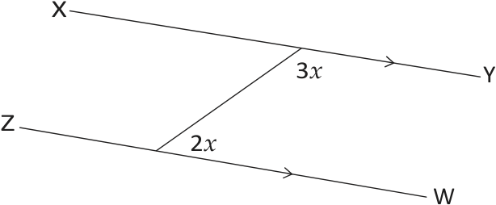
> **[Diagram Context - Textbook_Mathematics_Gr8_Geometry-of-straight-lines.pdf-0015-01.png]**
> This geometry figure displays two lines labelled XY and ZW intersected by a transversal line, with arrowheads indicating that lines XY and ZW are parallel. The diagram includes algebraic angle measurements expressed as $2x$ and $3x$ formed at the intersections. It helps high school students practice Euclidean geometry theorem-solving by applying angle relationships—such as co-interior, alternate, or corresponding angles—to set up equations and solve for the unknown variable $x$.

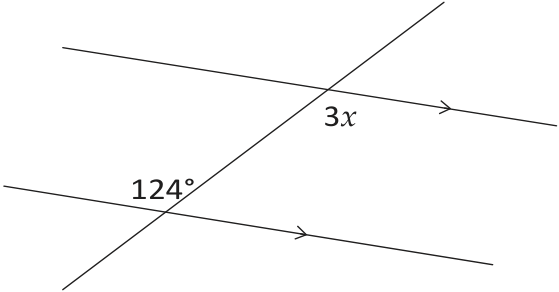
> **[Diagram Context - Textbook_Mathematics_Gr8_Geometry-of-straight-lines.pdf-0015-03.png]**
> This geometry figure illustrates two parallel lines intersected by a transversal line. Visible labels include the angle measurements $124^\circ$ and $3x$, with directional arrows indicating parallel lines. Conceptually, this diagram helps high school students apply Euclidean geometry theorems—such as corresponding, alternate interior, or co-interior angles—to set up equations and solve for unknown variables.

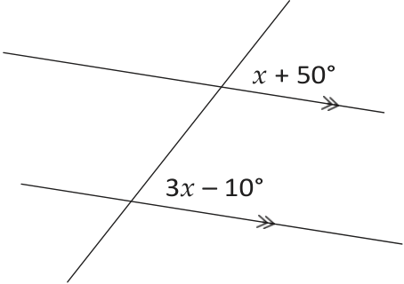
> **[Diagram Context - Textbook_Mathematics_Gr8_Geometry-of-straight-lines.pdf-0015-05.png]**
> This geometry figure illustrates two parallel lines intersected by a transversal line, marked with parallel arrow symbols. The diagram displays two angles expressed algebraically as $(x + 50^\circ)$ and $(3x - 10^\circ)$. Conceptually, this helps high school learners identify corresponding angles formed by parallel lines and apply geometric properties to set up and solve algebraic equations for the unknown variable $x$.

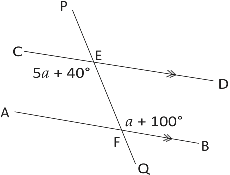
> **[Diagram Context - Textbook_Mathematics_Gr8_Geometry-of-straight-lines.pdf-0015-07.png]**
> This geometry figure shows two parallel straight lines, $CD$ and $AB$, intersected by a transversal line $PQ$ at points $E$ and $F$, with double arrows indicating parallelism. Visible labels include the line endpoints $A, B, C, D, P, Q$, intersection points $E$ and $F$, and two algebraic angle expressions, $5a + 40^\circ$ and $a + 100^\circ$, positioned near the corresponding interior angles. Conceptually, this diagram helps high school learners apply Euclidean geometry theorems—specifically alternate interior or corresponding angles—to set up an algebraic equation, solve for the variable $a$, and find unknown angle sizes.

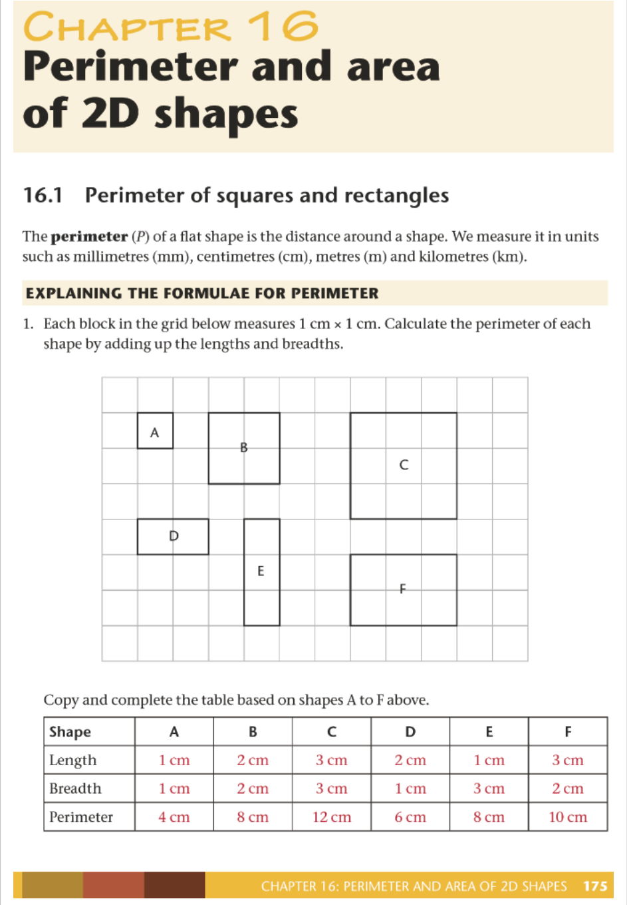
> **[Diagram Context - Textbook_Mathematics_Gr8_Perimeter-and-area-of-2D-shapes.pdf-0015-07.png]**
> This educational graphic is a geometry figure displaying a centimeter grid with various squares and rectangles labeled A through F, accompanied by a completed data table containing the variables "Shape," "Length," "Breadth," and "Perimeter." Visible text includes chapter headings explaining perimeter in units such as mm, cm, m, and km, alongside instructions to calculate perimeter by adding side lengths. Conceptually, this diagram helps learners understand that perimeter is the total distance around a 2D shape by physically counting grid units and linking dimensions to additive formulas.

---

# 9.3 Area and Square Units

### Definition
**Area** is the size of a flat surface surrounded by the border (perimeter) of a shape.

### Measuring Area
Area ($A$) is measured in square units. Common standard units include:
*   Square millimetres ($\text{mm}^2$)
*   Square centimetres ($\text{cm}^2$)
*   Square metres ($\text{m}^2$)

---

### Teaching Guidelines
To help learners understand the concept of area:
1.  **Visualization:** Encourage learners to imagine covering a surface with a material like paint or paper.
2.  **Distinguishing Concepts:** Ensure learners do not confuse **perimeter** (the distance around the edge) with **area** (the space inside).
    *   Ask: "How long is the perimeter?" (Linear measurement)
    *   Ask: "How many units will cover the shape?" (Area measurement)
3.  **Collaborative Learning:** Encourage class discussions regarding solution methods to reinforce the correct application of these concepts.

---

### Exercises

#### Exercise 1: Counting Square Units
Write down the area of figures A to E by counting the square units. Remember to add halves or smaller parts of squares to form whole units.

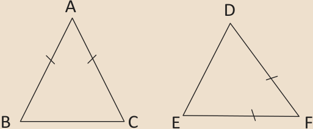
> **[Diagram Context - Textbook_Mathematics_Gr8_Geometry-of-2D-shapes.pdf-0016-03.png]**
> This graphic displays two distinct geometry figures, specifically two triangles labeled ABC and DEF. The first triangle features vertices A, B, and C with hash marks indicating equal side lengths on AB and AC, while the second triangle features vertices D, E, and F with hash marks on sides DF and EF. This diagram helps high school learners understand the concept of congruent or isosceles triangles by visually demonstrating side-length equivalencies within geometric shapes.

| Figure | Area (Square Units) |
| :--- | :--- |
| A | 8 |
| B | 4 |
| C | 6 |
| D | 14 |
| E | 9 |

#### Exercise 2: Grid Measurement
Each square in the grid below measures $1\text{ cm}^2$ ($1\text{ cm} \times 1\text{ cm}$).

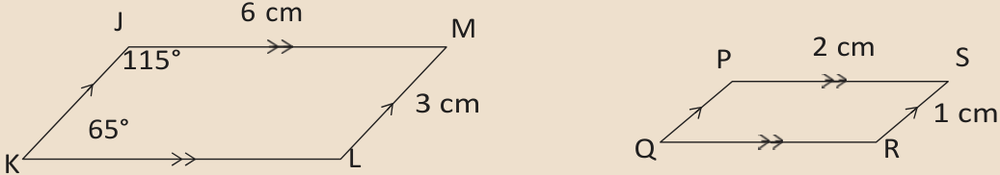
> **[Diagram Context - Textbook_Mathematics_Gr8_Geometry-of-2D-shapes.pdf-0016-12.png]**
> The graphic displays two geometry figures, specifically two parallelograms labeled JKLM and PQRS. The diagram features vertex labels (J, K, L, M, P, Q, R, S), side lengths (6 cm, 3 cm, 2 cm, 1 cm), interior angle measurements (115° and 65°), and directional arrows indicating parallel sides. Conceptually, this visual helps high school students learn Euclidean geometry by demonstrating the properties of similar shapes, showing how corresponding sides are in proportion and corresponding angles are equal.

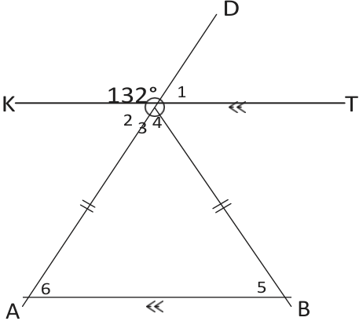
> **[Diagram Context - Textbook_Mathematics_Gr8_Geometry-of-straight-lines.pdf-0016-02.png]**
> This geometry figure illustrates Euclidean geometry concepts involving lines, triangles, and angles. Visible elements include lines labeled KT, AB, and transversal/intersecting line segments, angle markers numbered 1 through 6, a known angle of $132^\circ$, parallel arrows ($\ll$) indicating parallel lines KT and AB, and tick marks indicating equal sides of a triangle. Conceptually, this diagram helps high school students practice applying theorem-based reasoning—such as corresponding angles, alternate angles, angles on a straight line, and the properties of isosceles triangles—to calculate unknown angle sizes.

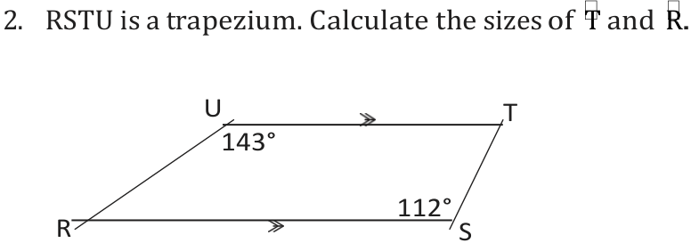
> **[Diagram Context - Textbook_Mathematics_Gr8_Geometry-of-straight-lines.pdf-0016-03.png]**
> The educational graphic is a geometry figure representing a trapezium, labeled with vertices R, S, T, and U. Visible labels include vertex letters R, S, T, U, angle measurements of 143° at angle U and 112° at angle S, and double arrows on sides UT and RS indicating parallel lines. This diagram conveys the properties of parallel lines and co-interior angles, prompting high school learners to apply Euclidean geometry theorems to calculate the missing interior angles.

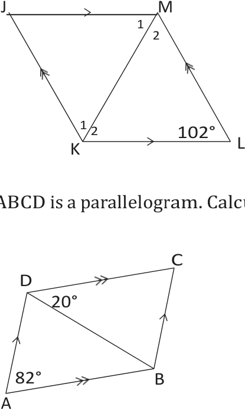
> **[Diagram Context - Textbook_Mathematics_Gr8_Geometry-of-straight-lines.pdf-0016-05.png]**
> This educational graphic features two distinct Euclidean geometry figures with intersecting lines and angle measurements. The top diagram displays a polygon labeled J-K-L-M with diagonal line KM, split angle markers ($K_1, K_2, M_1, M_2$), a given angle of $102^\circ$, and directional arrows indicating parallel lines. The bottom diagram displays a parallelogram labeled ABCD with diagonal DB, angle measures of $82^\circ$ and $20^\circ$, and parallel line indicators. Conceptually, these diagrams help CAPS Grade 8-10 learners apply Euclidean geometry theorems—such as alternate interior angles, corresponding angles, and properties of parallelograms—to calculate unknown angles and solve riders involving triangles and quadrilaterals.

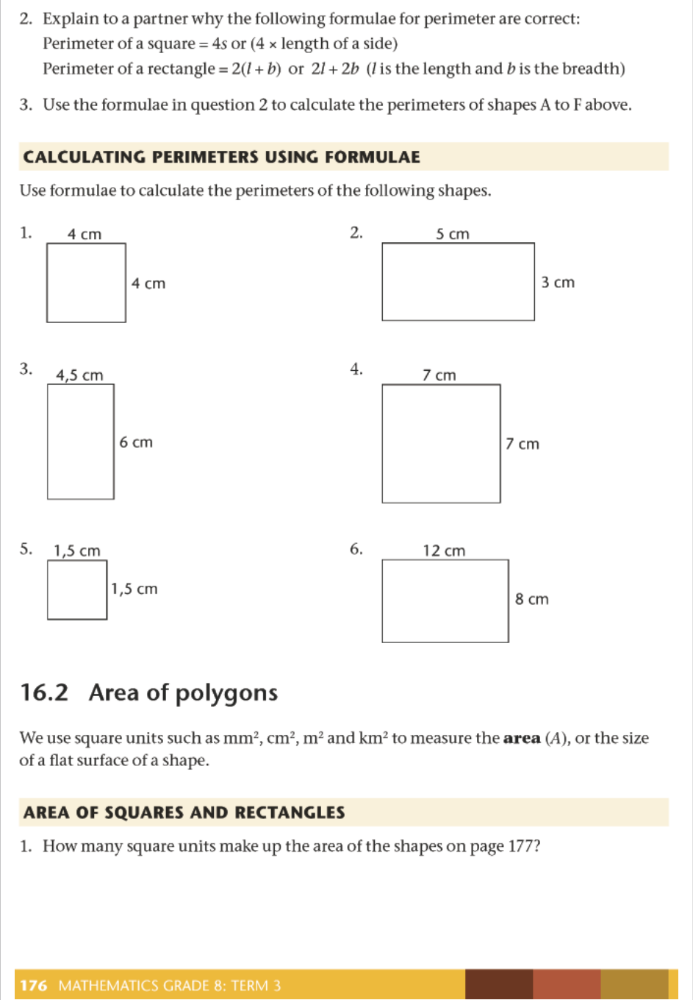
> **[Diagram Context - Textbook_Mathematics_Gr8_Perimeter-and-area-of-2D-shapes.pdf-0016-21.png]**
> This educational graphic is a geometry worksheet page presenting worked exercises on calculating perimeters of polygons. It features numbered diagrams of squares and rectangles labeled with side lengths in centimeters (e.g., $4\text{ cm}$, $5\text{ cm}$, $3\text{ cm}$) and text prompts explaining perimeter formulae ($4s$ and $2(l+b)$). Conceptually, this helps Grade 8 CAPS mathematics learners practice applying algebraic formulae to find the total distance around two-dimensional shapes using given dimensional measurements.

---

### Conversion of Units: Area

It is essential to use the correct units and understand how to convert between them. The standard units for area are square millimetres ($mm^2$), square centimetres ($cm^2$), and square metres ($m^2$).

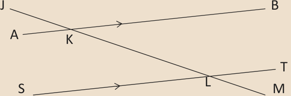
> **[Diagram Context - Textbook_Mathematics_Gr8_Geometry-of-straight-lines.pdf-0017-02.png]**
> This geometry figure illustrates Euclidean geometry concepts regarding parallel lines intersected by a transversal. The graphic features two lines labeled AB and ST with directional arrows indicating they are parallel, intersected by a transversal line JM at points K and L. For CAPS curriculum learners, this diagram visually conveys the relationships and angle properties—such as corresponding, alternate interior, and co-interior angles—formed when parallel lines are cut by a transversal.

#### Conversion Factors
To convert between units of area, use the following rules:

| Conversion | Operation |
| :--- | :--- |
| $cm^2$ to $mm^2$ | Multiply by $100$ |
| $mm^2$ to $cm^2$ | Divide by $100$ |
| $m^2$ to $cm^2$ | Multiply by $10\,000$ |
| $cm^2$ to $m^2$ | Divide by $10\,000$ |

---

#### Worked Examples

**1. Converting $cm^2$ to $mm^2$:**
Since $1\ cm = 10\ mm$:
$$1\ cm^2 = 1\ cm \times 1\ cm$$
$$1\ cm^2 = 10\ mm \times 10\ mm = 100\ mm^2$$

**2. Converting $mm^2$ to $cm^2$:**
$$1\ mm^2 = 1\ mm \times 1\ mm$$
$$1\ mm^2 = 0,1\ cm \times 0,1\ cm = 0,01\ cm^2$$

**3. Converting $m^2$ to $cm^2$:**
Since $1\ m = 100\ cm$:
$$1\ m^2 = 1\ m \times 1\ m$$
$$1\ m^2 = 100\ cm \times 100\ cm = 10\,000\ cm^2$$

---

#### Exercises

**1. Complete the following conversions:**
(a) $5\ m^2 = 50\,000\ cm^2$
(b) $5\ cm^2 = 500\ mm^2$
(c) $20\ cm^2 = 0,002\ m^2$
(d) $20\ mm^2 = 0,2\ cm^2$

**2. Complete the following conversions:**
(a) $25\ m^2 = 250\,000\ cm^2$
(b) $240\,000\ cm^2 = 24\ m^2$
(c) $460,5\ mm^2 = 4,605\ cm^2$
(d) $0,4\ m^2 = 4\,000\ cm^2$
(e) $12\,100\ cm^2 = 1,21\ m^2$
(f) $2,295\ cm^2 = 229,5\ mm^2$

---

#### Teacher's Note: Common Misconceptions
Learners often struggle to determine the correct conversion factor because they lack a sense of relative scale. They may not intuitively grasp how long a metre is compared to a centimetre. It is recommended to use physical measuring tapes in class to compare these units visually.

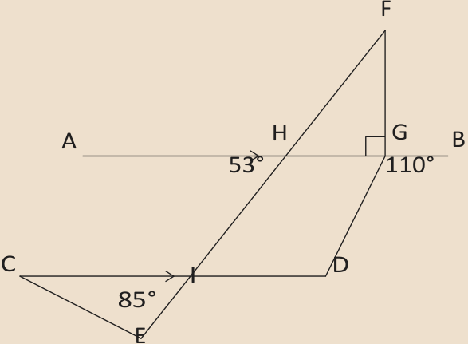
> **[Diagram Context - Textbook_Mathematics_Gr8_Geometry-of-straight-lines.pdf-0017-06.png]**
> This geometry figure illustrates Euclidean geometry relationships involving parallel lines intersected by transversals and triangles. Visible labels include line points A, B, C, D, E, F, G, H, I, parallel arrows on lines AB and CD, a right-angle symbol at G, and angle measurements of 53°, 85°, and 110°. For a high school CAPS mathematics learner, the diagram conveys concepts of corresponding, co-interior, and alternate angles, as well as the sum of angles in a triangle to solve for unknown angles.

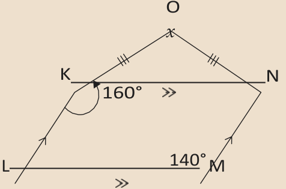
> **[Diagram Context - Textbook_Mathematics_Gr8_Geometry-of-straight-lines.pdf-0017-09.png]**
> This geometry figure illustrates intersecting lines and angles involving parallel lines and a triangle. Visible labels include vertices O, K, L, M, N, angle measurements of 160° and 140°, variable $x$, parallel line arrows, equal length hash marks, and directional arrows. Conceptually, this diagram helps high school learners practice Euclidean geometry theorems—specifically applying properties of parallel lines (co-interior, corresponding, or alternate angles) combined with triangle properties such as the sum of angles in a triangle or isosceles triangle theorems to solve for unknown angles like $x$.

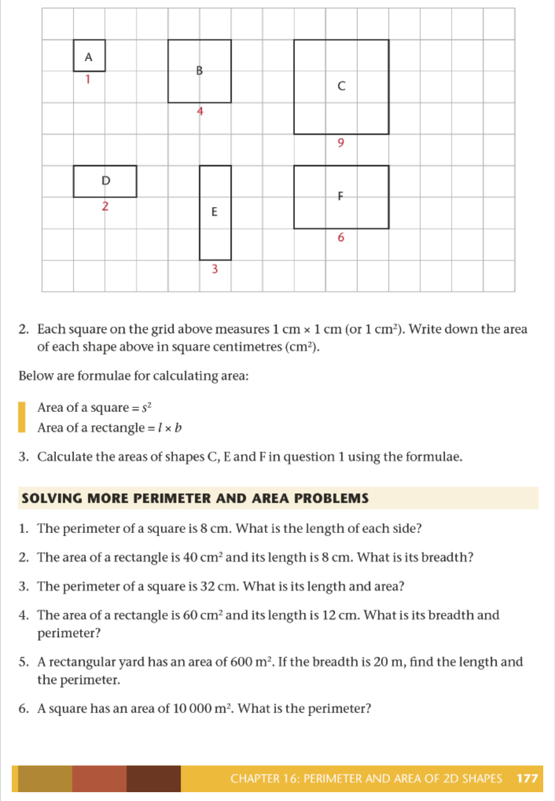
> **[Diagram Context - Textbook_Mathematics_Gr8_Perimeter-and-area-of-2D-shapes.pdf-0017-13.png]**
> This educational graphic is a geometry figure showing 2D shapes (squares and rectangles labeled A to F) drawn on a grid, accompanied by instructional text, area formulae, and word problems. Visible labels include shape letters A, B, C, D, E, F, corresponding numerical labels 1, 2, 3, 4, 6, 9, and grid measurements specifying $1\text{ cm} \times 1\text{ cm}$. This diagram conceptually reinforces how to calculate the area and perimeter of 2D shapes by counting grid units and applying standard formulae ($\text{Area} = s^2$ and $\text{Area} = l \times b$) in a CAPS-aligned mathematics context.

---

# 9.4 Area of Squares and Rectangles

## Concept Overview
The area of a rectangle or square is defined by the number of square units that cover the surface of the shape. Common units of measurement include:
*   Square millimetres ($\text{mm}^2$)
*   Square centimetres ($\text{cm}^2$)
*   Square metres ($\text{m}^2$)

---

## Investigating Area

### Exercise 1: Grid Counting
Each figure is divided into squares of $1\text{ cm} \times 1\text{ cm}$.

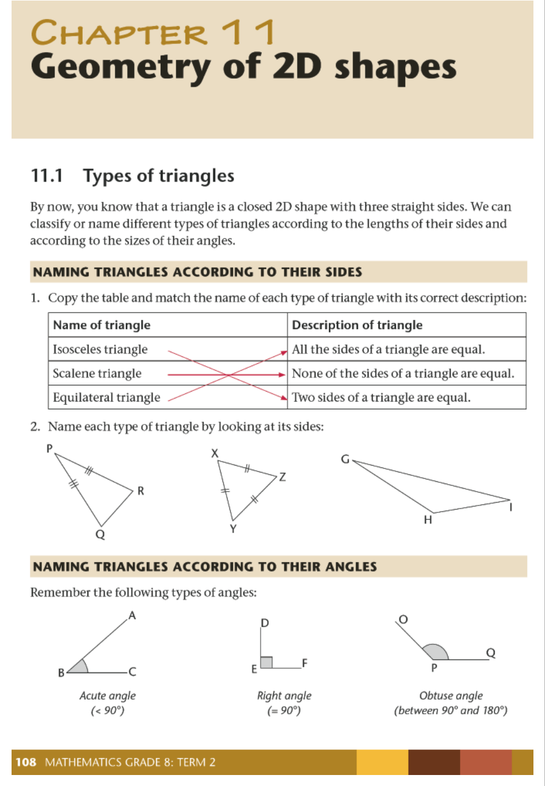
> **[Diagram Context - Textbook_Mathematics_Gr8_Geometry-of-2D-shapes.pdf-0018-19.png]**
> This educational graphic presents a geometry figure section from a Grade 8 Mathematics CAPS textbook focusing on the types of triangles and angles. The page contains a matching table, geometric shape diagrams labeled with vertices (PQR, XYZ, GHI, ABC, DEF, OPQ), tick marks indicating side lengths, and angle illustrations with corresponding text descriptions. Conceptually, it helps learners classify triangles based on their side lengths and interior angle measurements by connecting visual representations to formal mathematical definitions.

**(a)** Determine the area of each figure in $\text{cm}^2$.
**(b)** Identify a shorter method to calculate the area.

**Instructional Note:** The most efficient method is to multiply the number of rows by the number of columns.

---

### Exercise 2: Rectangle and Square Calculations
Figure BCDE is a rectangle and MNRS is a square.

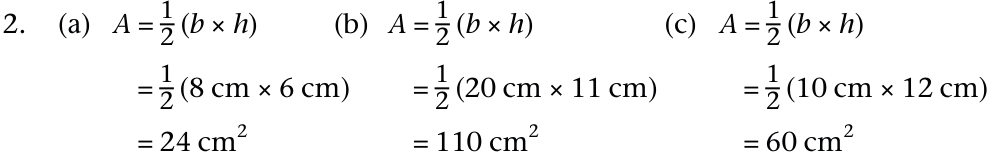
> **[Diagram Context - Textbook_Mathematics_Gr8_Perimeter-and-area-of-2D-shapes.pdf-0018-08.png]**
> This educational graphic displays three mathematical worked examples, labeled (a), (b), and (c), for calculating the area of a triangle. The visible text includes the formula $A = \frac{1}{2}(b \times h)$, numerical base and height values with units in centimeters (cm), and final calculated areas in square centimeters ($\text{cm}^2$). This content demonstrates the correct procedural steps for applying the triangle area formula to learners.

**(a)** How many $\text{cm}^2$ ($1\text{ cm} \times 1\text{ cm}$) would fit into rectangle BCDE?
**(b)** How many $\text{mm}^2$ ($1\text{ mm} \times 1\text{ mm}$) would fit into rectangle BCDE?
**(c)** What is the area of square MNRS in $\text{cm}^2$?
**(d)** What is the area of square MNRS in $\text{mm}^2$?

---

### Exercise 3: Unit Conversions
Figure KLMN is a square with sides of $1\text{ m}$.

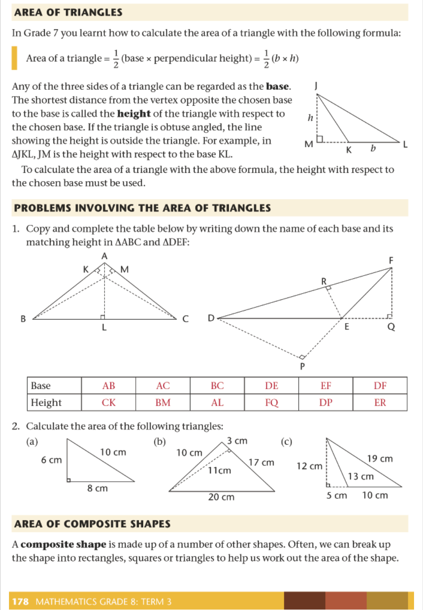
> **[Diagram Context - Textbook_Mathematics_Gr8_Perimeter-and-area-of-2D-shapes.pdf-0018-12.png]**
> This educational graphic is a geometry lesson page featuring geometric figures, specifically triangles and composite shapes. Visible labels include triangle vertices (A, B, C, D, E, F, J, K, L, M, P, Q, R), variables for base ($b$) and height ($h$), and numerical measurements in centimeters for various triangle dimensions. The diagram conveys conceptually how to identify the correct perpendicular height relative to any chosen base of acute, right-angled, and obtuse triangles in order to calculate their areas using the standard formula $\text{Area} = \frac{1}{2}(\text{base} \times \text{perpendicular height})$.

**(a)** How many squares of side $1\text{ cm}$ fit along the length?
**(b)** How many squares of side $1\text{ cm}$ fit along the breadth?
**(c)** How many squares ($\text{cm}^2$) fit into the whole square?
**(d)** Copy and complete: $1\text{ m}^2 = \dots \text{cm}^2$.

---

## Teacher's Answer Key

| Question | Answer |
| :--- | :--- |
| 1(a) | A: $1\text{ cm}^2$; B: $4\text{ cm}^2$; C: $8\text{ cm}^2$; D: $45\text{ cm}^2$ |
| 1(b) | Yes, multiply the number of rows by the number of columns. |
| 2(a) | $18$ |
| 2(b) | $1\,800$ |
| 2(c) | $25\text{ cm}^2$ |
| 2(d) | $2\,500\text{ mm}^2$ |
| 3(a) | $100$ |
| 3(b) | $100$ |
| 3(c) | $10\,000$ |
| 3(d) | $1\text{ m}^2 = 10\,000\text{ cm}^2$ |

---

# Area of Rectangles and Squares

## Concept Overview
To calculate the area of a rectangle, determine how many square units fit in a row along the length, and how many of these rows fit along the breadth.

### Formulas
*   **Area of a rectangle:** $A = l \times b$
    *   Where $A$ is the area, $l$ is the length, and $b$ is the breadth.
*   **Area of a square:** $A = l \times l = l^{2}$
    *   Where $A$ is the area and $l$ is the length of a side.

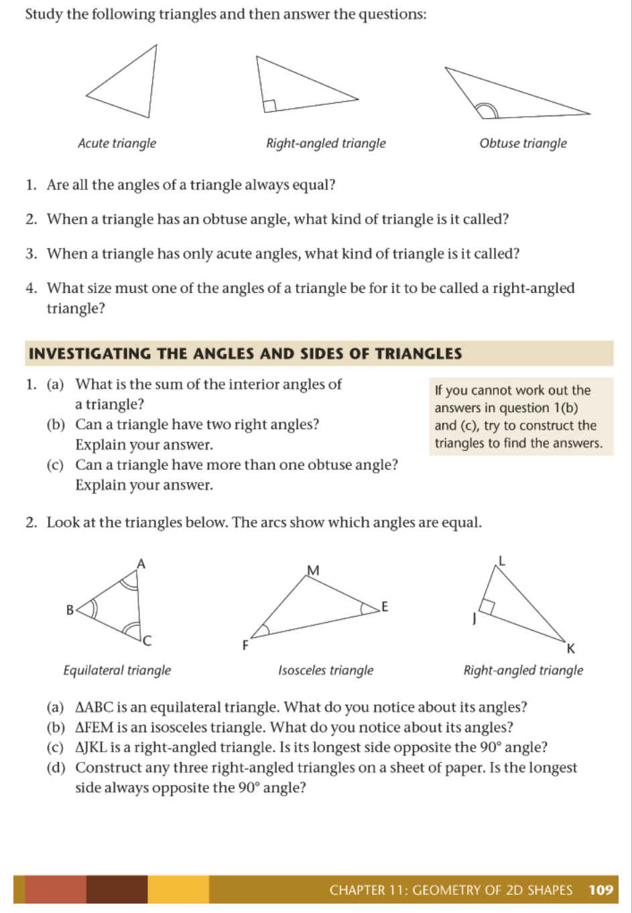
> **[Diagram Context - Textbook_Mathematics_Gr8_Geometry-of-2D-shapes.pdf-0019-21.png]**
> This educational graphic is a geometry figure worksheet presenting various triangles categorized by their angles and sides, labeled as acute, right-angled, obtuse, equilateral, and isosceles triangles. Visible labels include vertex letters (A, B, C, M, F, E, L, J, K), angle arcs indicating equal angles, and perpendicular angle markers. The diagram conveys conceptual understanding for high school learners by prompting investigation into the properties, interior angle sums, and relationships between the sides and angles of different triangle types.

## Unit Conversions
When calculating area, ensure all dimensions use the same units. Use the following conversions:

| Conversion Type | Relationship |
| :--- | :--- |
| Length | $1\text{ m} = 100\text{ cm}$ and $1\text{ cm} = 10\text{ mm}$ |
| Area (mm to cm) | $1\text{ cm}^{2} = 1\text{ cm} \times 1\text{ cm} = 10\text{ mm} \times 10\text{ mm} = 100\text{ mm}^{2}$ |
| Area (m to cm) | $1\text{ m}^{2} = 1\text{ m} \times 1\text{ m} = 100\text{ cm} \times 100\text{ cm} = 10\,000\text{ cm}^{2}$ |
| Area (mm to cm) | $1\text{ mm}^{2} = 1\text{ mm} \times 1\text{ mm} = 0,1\text{ cm} \times 0,1\text{ cm} = 0,01\text{ cm}^{2}$ |
| Area (cm to m) | $1\text{ cm}^{2} = 1\text{ cm} \times 1\text{ cm} = 0,01\text{ m} \times 0,01\text{ m} = 0,0001\text{ m}^{2}$ |

---

## Worked Example
**Problem:** Calculate the area of a rectangle with a length of $50\text{ mm}$ and a breadth of $3\text{ cm}$. Give the answer in $\text{cm}^{2}$.

**Solution:**
1. Convert all dimensions to $\text{cm}$:
   *   Length: $50\text{ mm} = 5\text{ cm}$
   *   Breadth: $3\text{ cm}$
2. Apply the formula:
   *   $A = l \times b$
   *   $A = 5\text{ cm} \times 3\text{ cm}$
   *   $A = 15\text{ cm}^{2}$

---

## Teaching Strategy: Solving for Unknowns
If you are given the area and one side (e.g., breadth) and need to find the other side (e.g., length), use inverse operations:
*   Since $Area = \text{length} \times \text{breadth}$
*   To find the length: $\text{Length} = \frac{\text{Area}}{\text{Breadth}}$

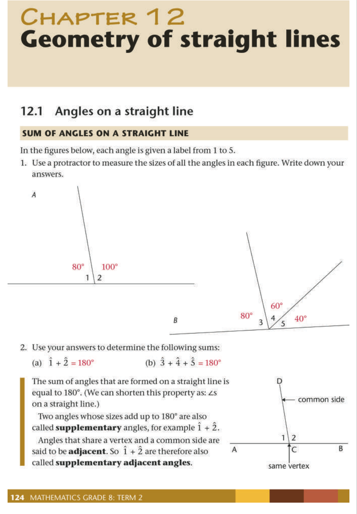
> **[Diagram Context - Textbook_Mathematics_Gr8_Geometry-of-straight-lines.pdf-0019-12.png]**
> This educational graphic is a geometry figure demonstrating the properties of angles on a straight line for Grade 8 Mathematics. It features line segments forming straight lines labeled with points A, B, C, and D, angle number notations with circumflex accents ($\hat{1}, \hat{2}, \hat{3}, \hat{4}, \hat{5}$), and degree measurements ($80^{\circ}, 100^{\circ}, 60^{\circ}, 40^{\circ}$), alongside explanatory text highlighting concepts like adjacent angles, supplementary angles, and vertices. The diagram conceptually teaches learners that adjacent angles on a straight line add up to a supplementary sum of $180^{\circ}$.

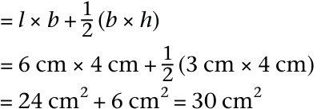
> **[Diagram Context - Textbook_Mathematics_Gr8_Perimeter-and-area-of-2D-shapes.pdf-0019-03.png]**
> This graphic shows a step-by-step mathematical calculation for finding the area of a composite 2D geometric figure. The visible text includes algebraic variables ($l$, $b$, $h$), multiplication and addition operators, fractions ($\frac{1}{2}$), units of measurement ($\text{cm}$ and $\text{cm}^2$), and numerical values substituted into a formula to arrive at a final squared-unit answer. Conceptually, it demonstrates how to break down a complex shape into standard geometric components (such as a rectangle and a triangle) and correctly apply area formulas to solve measurement problems in Senior Phase and FET Mathematics.

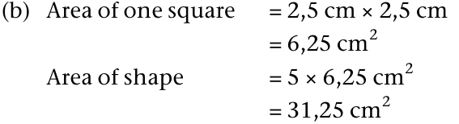
> **[Diagram Context - Textbook_Mathematics_Gr8_Perimeter-and-area-of-2D-shapes.pdf-0019-04.png]**
> The graphic is a geometry calculation showing step-by-step mathematical working out. The visible text includes "(b) Area of one square = 2,5 cm × 2,5 cm = 6,25 cm²" and "Area of shape = 5 × 6,25 cm² = 31,25 cm²". This text conveys conceptually how to calculate the total surface area of a composite 2D shape made up of multiple identical square units by first finding the area of a single square and multiplying it by the total count of squares.

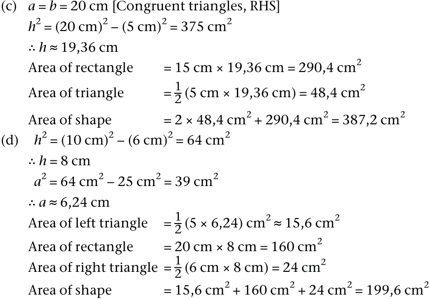
> **[Diagram Context - Textbook_Mathematics_Gr8_Perimeter-and-area-of-2D-shapes.pdf-0019-05.png]**
> This graphic displays worked mathematical calculations for determining the area of composite geometric figures, labeled as sections (c) and (d). Visible labels, variables, and units include side lengths and heights denoted by $a$, $b$, and $h$, congruence statements such as '[Congruent triangles, RHS]', calculation steps for rectangles and triangles, and area measurements in square centimeters ($\text{cm}^2$). Conceptually, it guides high school learners through the step-by-step process of breaking down complex shapes into standard geometric components (rectangles and triangles), applying the Theorem of Pythagoras to find missing dimensions, and summing individual areas to find the total surface area.

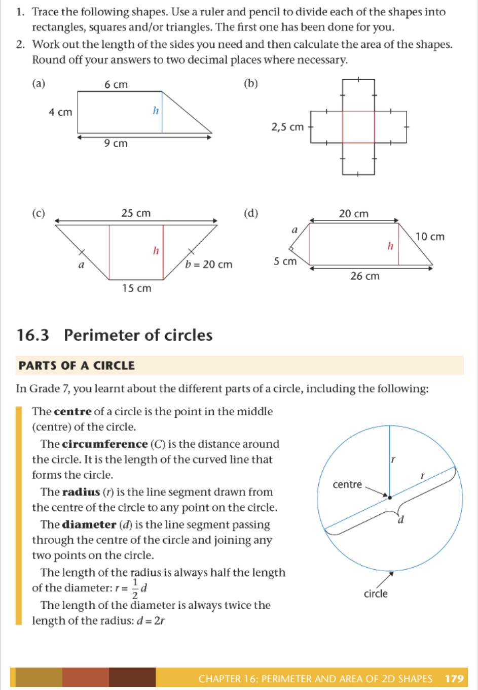
> **[Diagram Context - Textbook_Mathematics_Gr8_Perimeter-and-area-of-2D-shapes.pdf-0019-10.png]**
> This educational graphic is a geometry figure displaying instructional exercises for calculating the area of composite 2D shapes, alongside a reference diagram for parts of a circle. The top section shows four composite shapes labeled (a), (b), (c), and (d) with visible dimensions including lengths of 4 cm, 6 cm, 9 cm, 15 cm, 20 cm, 25 cm, and 26 cm, as well as variables such as $h$, $a$, and $b$. The lower section defines circle terminology with visible labels pointing to the "centre," "circle," radius ($r$), and diameter ($d$). Conceptually, this helps learners master the decomposition of irregular polygons into basic shapes (rectangles, squares, and triangles) to find their total area, while reinforcing foundational circle geometry and the relationship between radius and diameter ($r = \frac{1}{2}d$ and $d = 2r$).

---

### Applying the Formulae: Perimeter and Area

#### Key Concepts
*   **Area of a Rectangle:** $A = l \times b$
*   **Area of a Square:** $A = l^2$ (or $s^2$)
*   **Perimeter of a Rectangle:** $P = 2(l + b)$
*   **Unit Conversion:** Always ensure all measurements are in the same units before calculating.
*   **Hectare (ha):** A unit of area equal to $10\,000\text{ m}^2$ (equivalent to $100\text{ m} \times 100\text{ m}$).

---

#### Worked Examples

**Example 1: Area of a square tile**
Calculate the area of a square tile with a side of $150\text{ mm}$.
*   $A = l \times l$
*   $A = 150\text{ mm} \times 150\text{ mm}$
*   $A = 22\,500\text{ mm}^2$

**Example 2: Finding a missing length**
Calculate the length of a rectangle if the area is $450\text{ cm}^2$ and the width is $150\text{ mm}$.
*   *Step 1: Convert units.* $150\text{ mm} = 15\text{ cm}$.
*   *Step 2: Use the formula.* $A = l \times b$
*   $450 = l \times 15$
*   $l = \frac{450}{15}$
*   $l = 30\text{ cm}$ (or $300\text{ mm}$)

---

#### Exercises

**1. Calculate the area of the following shapes:**
(a) A rectangle with sides of $12\text{ cm}$ and $9\text{ cm}$.
(b) A square with sides of $110\text{ mm}$ (answer in $\text{cm}^2$).
(c) A rectangle with sides of $2,5\text{ cm}$ and $105\text{ mm}$ (answer in $\text{mm}^2$).
(d) A rectangle with a length of $8\text{ cm}$ and a perimeter of $24\text{ cm}$.

**2. Rugby Field Problem:**
A rugby field has a length of $100\text{ m}$ and a breadth of $69\text{ m}$.
(a) What is the area of the field?
(b) What would it cost to plant new grass at a cost of $\text{R}45/\text{m}^2$?
(c) Is a rugby field greater or smaller than $1\text{ ha}$? Explain.

**3. Complete the Table:**
Perform the necessary calculations to complete the table for rectangles:

| | Length | Breadth | Area |
| :--- | :--- | :--- | :--- |
| (a) | $15\text{ m}$ | $8\text{ m}$ | $120\text{ m}^2$ |
| (b) | $120\text{ mm}$ | $50\text{ mm}$ | $60\text{ cm}^2$ |
| (c) | $3,5\text{ m}$ | $4,3\text{ m}$ | $15,05\text{ m}^2$ |
| (d) | $2,3\text{ cm}$ | $1,2\text{ cm}$ | $2,76\text{ cm}^2$ |
| (e) | $5,2\text{ m}$ | $460\text{ cm}$ | $23,92\text{ m}^2$ |

---

#### Teacher Guidelines & Misconceptions
*   **Teaching Tip:** Demonstrate how to combine squares and rectangles to find the total area of complex shapes by calculating individual areas and summing them.
*   **Common Misconception:** Learners often attempt to calculate area using mixed units (e.g., multiplying meters by centimeters). Always remind learners to convert to a single unit first.

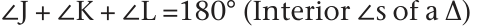

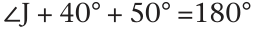

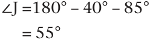

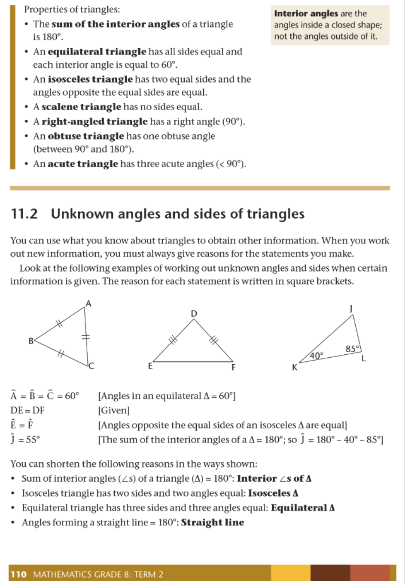
> **[Diagram Context - Textbook_Mathematics_Gr8_Geometry-of-2D-shapes.pdf-0020-09.png]**
> The educational graphic is a geometry resource detailing the properties of triangles, including definitions for equilateral, isosceles, scalene, right-angled, obtuse, and acute triangles, alongside worked examples for finding unknown angles and sides. It features three distinct triangle diagrams labeled with vertices A, B, C, D, E, F, J, K, and L, alongside tick marks indicating equal sides and degree measurements of $40^\circ$ and $85^\circ$. Conceptually, it conveys how to apply Euclidean geometry theorems and axiomatic reasoning—such as the sum of interior angles totaling $180^\circ$ and properties of isosceles and equilateral triangles—to solve for unknown geometric values and structure mathematical proofs using formal reasons in square brackets.

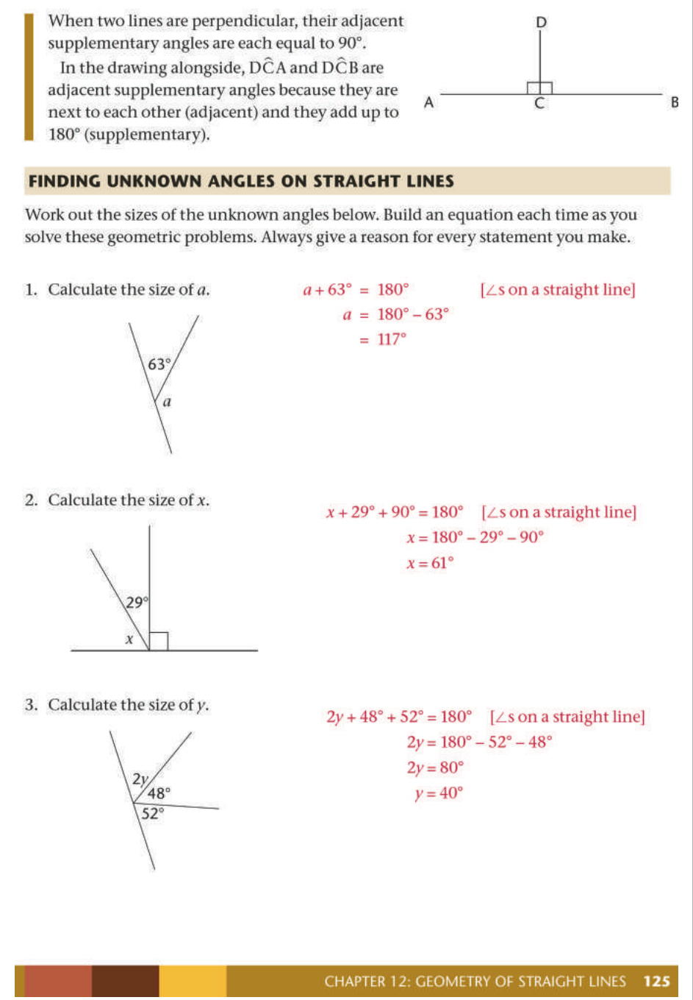
> **[Diagram Context - Textbook_Mathematics_Gr8_Geometry-of-straight-lines.pdf-0020-07.png]**
> This geometry figure illustrates the concept of perpendicular lines and the calculation of unknown angles on a straight line. The graphic displays geometric line diagrams labeled with points (A, B, C, D), angle variables ($a$, $x$, $y$), degree measurements ($63^\circ$, $29^\circ$, $48^\circ$, $52^\circ$), and right-angle symbols, accompanied by step-by-step algebraic equations and geometric reasons like [$\angle$s on a straight line]. It conceptually demonstrates how to apply Euclidean geometry principles to set up and solve algebraic equations for unknown angles supplementary to a straight line or perpendicular intersection.

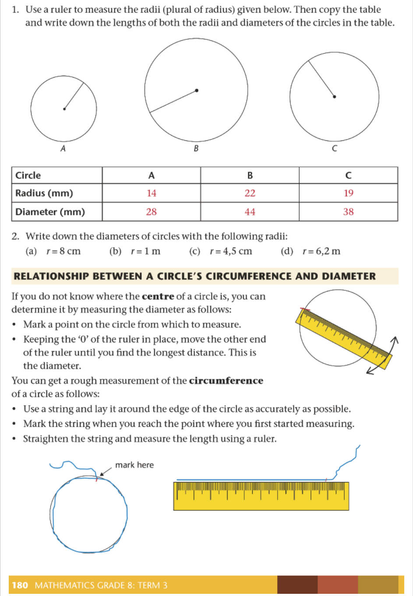
> **[Diagram Context - Textbook_Mathematics_Gr8_Perimeter-and-area-of-2D-shapes.pdf-0020-08.png]**
> This educational graphic is a geometry figure worksheet illustrating circle measurements. It features three circles labeled A, B, and C with drawn radii, a data table showing corresponding radius and diameter values in millimeters, and two instructional diagrams demonstrating how to find a circle's centre with a ruler and its circumference using a string. Conceptually, it guides Grade 8 learners through practical measurement techniques to establish the relationship between a circle's radius and diameter.

---

### Geometry: Area, Perimeter, and Scaling

#### Worked Example: Rearranging Shapes
**Problem:** Figure A is a square with sides of $20\text{ mm}$. It is cut and rearranged into Figure B. Calculate the area of Figure B.

*   **Calculation:**
    $$\text{Area} = \text{side} \times \text{side}$$
    $$\text{Area} = 20\text{ mm} \times 20\text{ mm} = 400\text{ mm}^2$$
*   **Note:** The area remains the same after rearrangement.

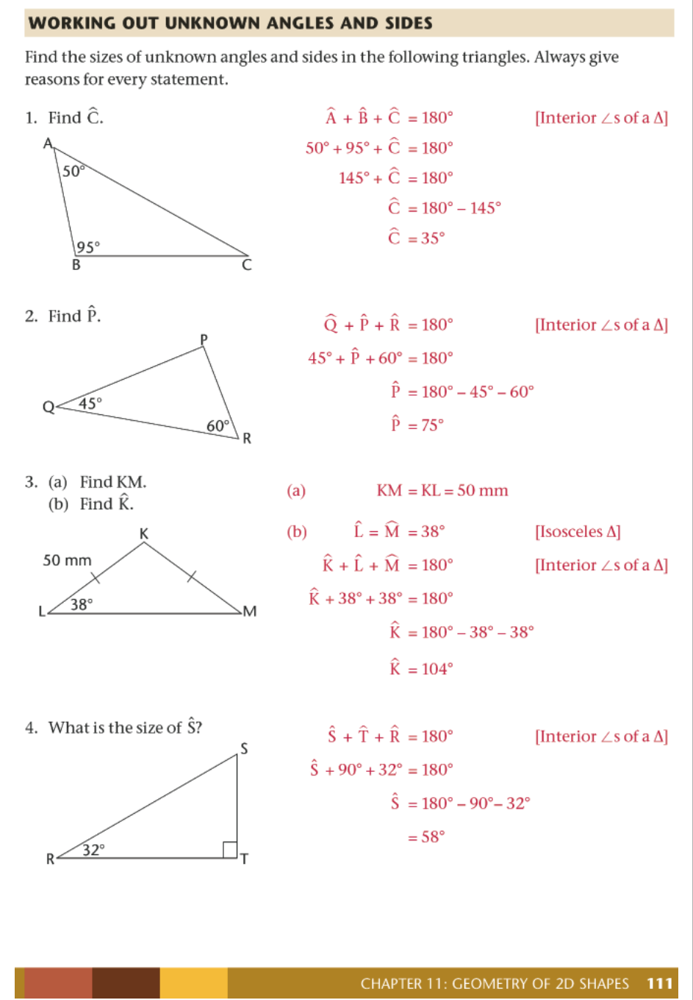
> **[Diagram Context - Textbook_Mathematics_Gr8_Geometry-of-2D-shapes.pdf-0021-04.png]**
> This geometry figure presents four worked examples of finding unknown angles and side lengths in triangles. The visible labels include triangle vertices ($A, B, C; Q, P, R; L, K, M; R, T, S$), angle measurements in degrees (e.g., $50^\circ, 95^\circ, 38^\circ$), side lengths in millimetres, and geometric reasoning statements with angle notation ($\hat{C}, \hat{P}, \hat{K}, \hat{S}$). Conceptually, it demonstrates the step-by-step application of Euclidean geometry theorems—specifically the sum of interior angles in a triangle equalling $180^\circ$ and the properties of isosceles triangles—to solve for missing dimensions while reinforcing the CAPS requirement of providing geometric reasons for every statement.

---

#### Worked Example: Vegetable Patch Dimensions
**Problem:** Margie plants a vegetable patch measuring $12\text{ m} \times 8\text{ m}$.

**(a) What is the area of the vegetable patch?**
$$\text{Area} = l \times b = 12\text{ m} \times 8\text{ m} = 96\text{ m}^2$$

**(b) She plants carrots on half of the patch, and tomatoes and potatoes on a quarter of the patch each. Calculate the area covered by each type of vegetable.**
*   Carrots: $\frac{1}{2} \times 96\text{ m}^2 = 48\text{ m}^2$
*   Tomatoes: $\frac{1}{4} \times 96\text{ m}^2 = 24\text{ m}^2$
*   Potatoes: $\frac{1}{4} \times 96\text{ m}^2 = 24\text{ m}^2$

**(c) How much will she pay to put fencing around the patch? (Fencing costs R38/m)**
*   $\text{Perimeter} = 2(l + b) = 2(12 + 8) = 2(20) = 40\text{ m}$
*   $\text{Cost} = 40\text{ m} \times \text{R}38 = \text{R}1\ 520$

---

#### Worked Example: Tiling a Floor
**Problem:** Mr Allie has to tile a kitchen floor measuring $5\text{ m} \times 4\text{ m}$ using tiles that measure $40\text{ cm} \times 20\text{ cm}$.

**(a) How many tiles does Mr Allie need?**
*   Convert units: $5\text{ m} = 500\text{ cm}$; $4\text{ m} = 400\text{ cm}$
*   Tiles along length: $500 \div 40 = 12,5$ tiles
*   Tiles along breadth: $400 \div 20 = 20$ tiles
*   Total tiles: $20 \times 12,5 = 250$ tiles

**(b) The tiles are sold in boxes containing 20 tiles. How many boxes should he buy?**
*   $250 \div 20 = 12,5$
*   He must buy $13$ boxes.

---

#### Investigation: Perimeter and Area of Squares
**Notes:** When the side length of a square increases by $1\text{ cm}$, the perimeter increases by $4\text{ cm}$ (a constant rate). However, the area does not increase at a constant rate.

**Table: Relationship between side length, area, and perimeter**

| Length of each side in cm | 1 | 2 | 3 | 4 | 5 | 6 |
| :--- | :--- | :--- | :--- | :--- | :--- | :--- |
| Area of square in $\text{cm}^2$ | 1 | 4 | 9 | 16 | 25 | 36 |
| Perimeter in cm | 4 | 8 | 12 | 16 | 20 | 24 |

**Analysis:**
*   **Perimeter increase:** The perimeter increases by $4\text{ cm}$ for every $1\text{ cm}$ increase in side length.
*   **Area increase:** The increase in area is not constant; it increases by $3\text{ cm}^2, 5\text{ cm}^2, 7\text{ cm}^2, 9\text{ cm}^2, 11\text{ cm}^2$ respectively as the side length grows.

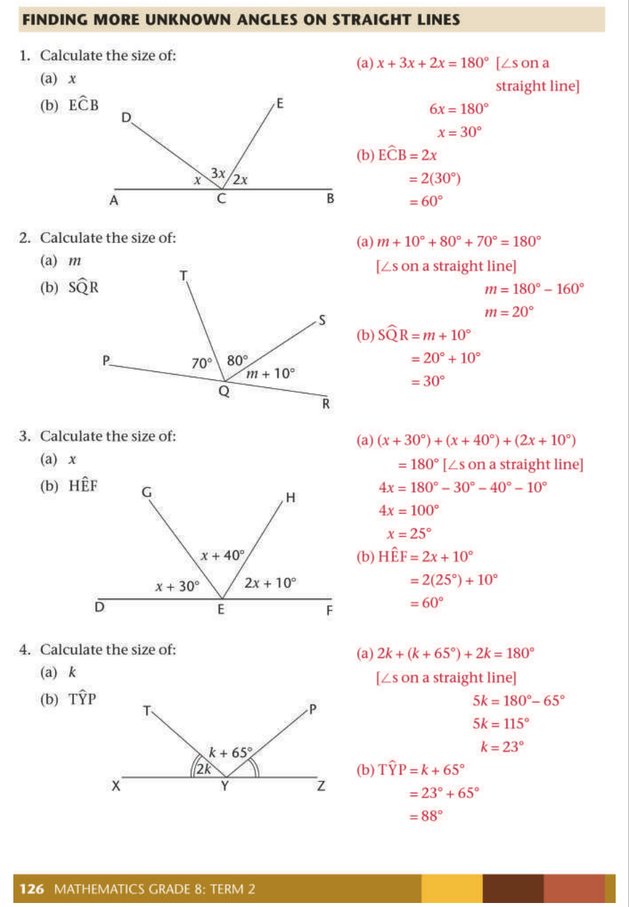
> **[Diagram Context - Textbook_Mathematics_Gr8_Geometry-of-straight-lines.pdf-0021-09.png]**
> This educational graphic presents geometry figures illustrating angle relationships on a straight line, complete with worked-out algebraic solutions. Visible labels include point and line identifiers such as straight lines $AB$, $PR$, $DF$, and $XZ$, along with angle expressions containing variables like $x$, $m$, and $k$ (e.g., $3x$, $m + 10^{\circ}$, $2x + 10^{\circ}$) and geometric reasons such as [$\angle s$ on a straight line]. Conceptually, the diagram guides Grade 8 Mathematics learners through setting up and solving linear equations based on the Euclidean geometry axiom that adjacent angles on a straight line sum to $180^{\circ}$.

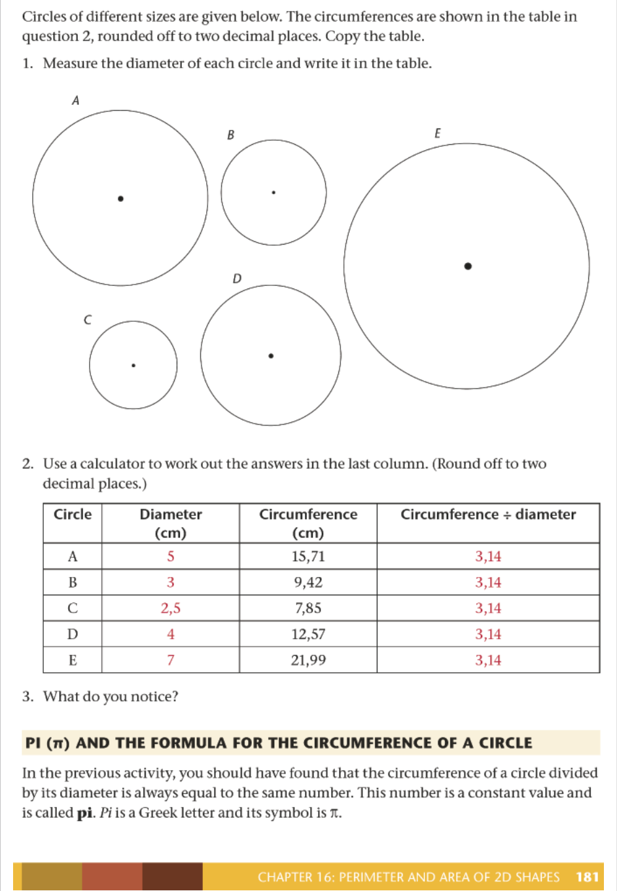
> **[Diagram Context - Textbook_Mathematics_Gr8_Perimeter-and-area-of-2D-shapes.pdf-0021-09.png]**
> This educational graphic features a geometry figure consisting of five circles of varying sizes labeled A, B, C, D, and E, each with a marked center point, accompanied by an investigative data table and explanatory text about pi ($\pi$). Visible labels include circle identifiers (A-E), column headings for "Circle", "Diameter (cm)", "Circumference (cm)", and "Circumference ÷ diameter", alongside numerical values demonstrating a constant ratio of approximately 3,14. Conceptually, the diagram guides students through an empirical investigation to discover that dividing any circle's circumference by its diameter yields a constant value, thereby introducing the mathematical constant pi ($\pi$) and establishing the foundational formula for the circumference of a circle in alignment with the CAPS curriculum.

---

# 9.5 Area of Triangles: Heights and Bases

## Key Concepts
*   **Height ($h$):** A perpendicular line segment drawn from a vertex of a triangle to its opposite side.
*   **Base ($b$):** The side of the triangle that forms a right angle with the height.
*   **Relationship:** Every base has a specific height associated with it. Because a triangle has three sides, any triangle has three possible bases and three corresponding heights.

## Understanding Triangle Geometry
The concept of the area of a triangle applies to all types of triangles, including acute and obtuse triangles. To calculate the area, you must identify the perpendicular height relative to the chosen base.

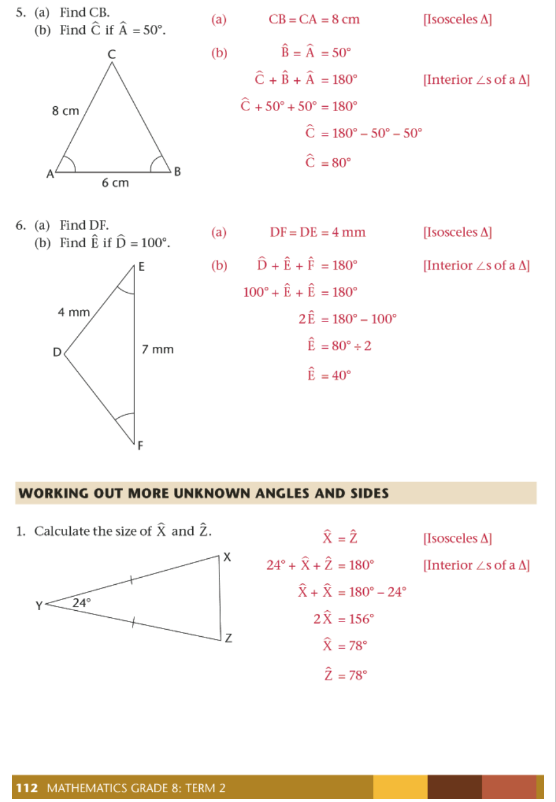
> **[Diagram Context - Textbook_Mathematics_Gr8_Geometry-of-2D-shapes.pdf-0022-09.png]**
> This educational graphic is a geometry figure showing worked examples and exercises on triangles with accompanying step-by-step algebraic solutions. Visible labels include vertices labeled A, B, C, D, E, F, X, Y, and Z, side length measurements with units (cm, mm), angle values in degrees, angle notation (e.g., Â, Ĉ), and geometric reasoning justifications in brackets like [Isosceles Δ] and [Interior ∠s of a Δ]. Conceptually, the graphic guides Grade 8 CAPS learners in applying the properties of isosceles triangles—specifically that equal sides subtend equal angles—combined with the interior angles sum of a triangle to calculate unknown side lengths and angle sizes.

## Teaching Guidelines
*   **Practical Application:** Learners should practice drawing sketches of various acute and obtuse triangles.
*   **Identification:** For each sketch, learners must identify and label the base and the corresponding perpendicular height.

## Addressing Common Misconceptions
*   **Orientation:** Learners often struggle to identify the height if it is not oriented vertically (i.e., if the triangle is tilted). 
*   **Correction:** Emphasize that the height is defined by its **perpendicular relationship** to the base, not by its position on the page. Always look for the right-angle symbol to confirm the height.

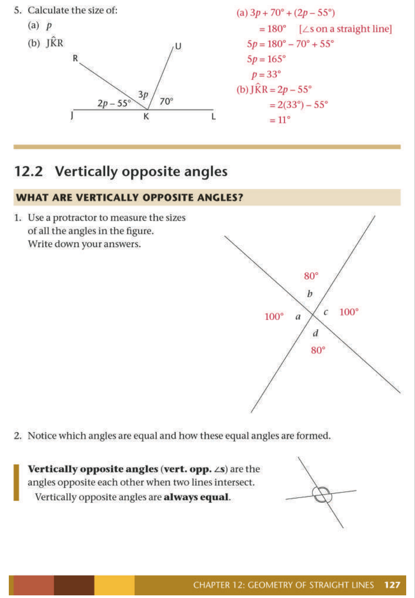
> **[Diagram Context - Textbook_Mathematics_Gr8_Geometry-of-straight-lines.pdf-0022-13.png]**
> This educational graphic is a geometry figure from a South African CAPS textbook focusing on the geometry of straight lines. The top section displays a straight line JL with intersecting rays forming adjacent angles labeled with algebraic expressions ($2p - 55^\circ$, $3p$, and $70^\circ$), accompanied by a step-by-step worked calculation. The bottom section introduces vertically opposite angles using two intersecting lines with angle variables ($a$, $b$, $c$, $d$) and degree measurements ($80^\circ$, $100^\circ$). Conceptually, it demonstrates how to apply geometric axioms—specifically angles on a straight line summing to $180^\circ$ and vertically opposite angles being equal—to solve for unknown variables and algebraic angle sizes.

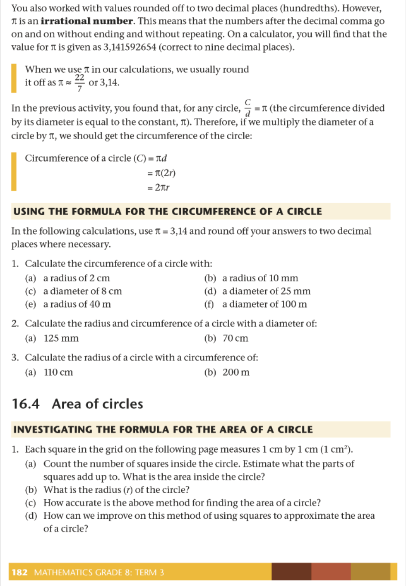
> **[Diagram Context - Textbook_Mathematics_Gr8_Perimeter-and-area-of-2D-shapes.pdf-0022-12.png]**
> This educational graphic is a mathematics textbook page outlining formulas and practice exercises for calculating the circumference and area of circles. It includes explanatory text defining the constant $\pi$ as an irrational number, along with formulas such as $C = \pi d$ and $C = 2\pi r$, followed by numbered problem sets labeled 1, 2, and 3 with sub-questions (a) through (f) utilizing variables like radius ($r$), diameter ($d$), and circumference ($C$). Conceptually, it guides Grade 8 learners through understanding the relationship between circle dimensions and $\pi$, providing structured application problems to practice algebraic manipulation and rounding values to two decimal places.

---

### Identifying Bases and Heights of Triangles

To calculate the area of a triangle, it is essential to correctly identify the **base** ($b$) and the corresponding **perpendicular height** ($h$). The height must always be at a $90^\circ$ angle to the base.

#### 1. Standard Triangles
In any triangle, any side can be chosen as the base. The height is the perpendicular line segment from the opposite vertex to that base.

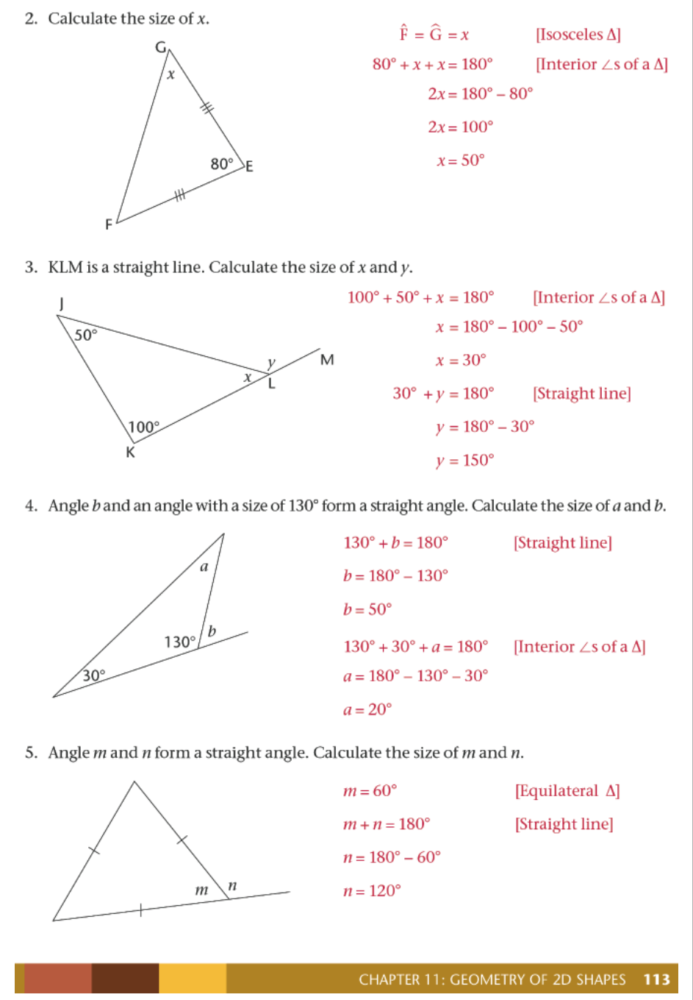
> **[Diagram Context - Textbook_Mathematics_Gr8_Geometry-of-2D-shapes.pdf-0023-02.png]**
> This geometry figure presents four worked examples of Euclidean geometry problems involving triangles and straight lines, labeled with vertices F, G, E, J, K, L, M, angle variables $x$, $y$, $a$, $b$, $m$, $n$, and numerical angle measurements with accompanying geometric reasons. Conceptually, it demonstrates how high school learners apply foundational theorems—specifically the sum of interior angles in a triangle, properties of isosceles and equilateral triangles, and angles on a straight line—to set up algebraic equations and solve for unknown angle values.

#### 2. Right-Angled Triangles
In a right-angled triangle, the two sides that form the right angle can serve as the base and height. Alternatively, the hypotenuse can be used as a base if the perpendicular height from the opposite vertex is known.

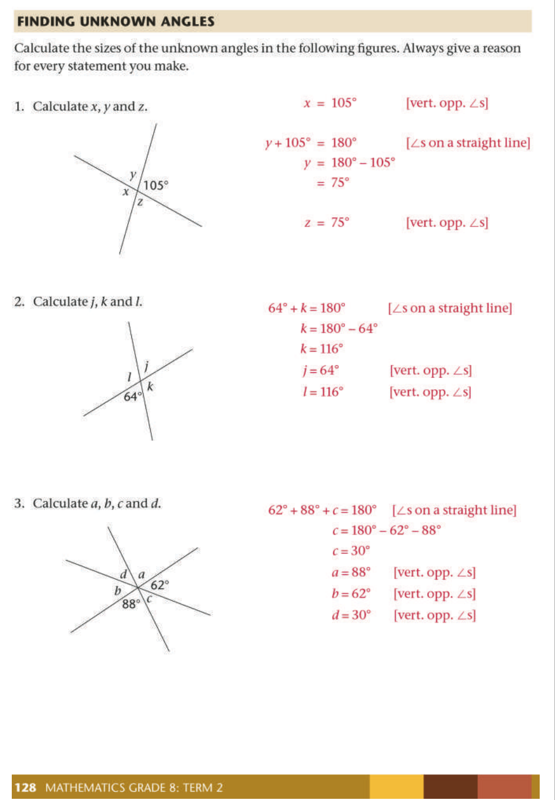
> **[Diagram Context - Textbook_Mathematics_Gr8_Geometry-of-straight-lines.pdf-0023-05.png]**
> This educational graphic is a geometry figure demonstrating how to find unknown angles using intersecting lines. The visible labels include angle variables ($x, y, z, j, k, l, a, b, c, d$) and given angle values (e.g., $105^\circ$, $64^\circ$, $88^\circ$, $62^\circ$), alongside worked solutions incorporating geometric reasons such as vertically opposite angles and angles on a straight line. Conceptually, this conveys to Grade 8 Mathematics learners how to apply Euclidean geometry theorems systematically to calculate unknown angle sizes and justify each statement with the correct geometric reason.

#### 3. Extended Bases
Sometimes, the perpendicular height falls outside the triangle. In these cases, the base must be extended (using a dashed line) to meet the height. 
*   **Note:** Only the original side of the triangle is considered the base; the extended dashed part is **not** included in the base measurement.

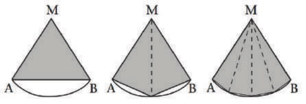
> **[Diagram Context - Textbook_Mathematics_Gr8_Perimeter-and-area-of-2D-shapes.pdf-0023-15.png]**
> This graphic is a geometry figure illustrating three steps in approximating the surface area or volume of a cone using pyramids. The visible labels include vertices $M$, $A$, and $B$, with shaded triangular faces and dashed lines indicating internal heights and slanted edges converging at the apex. Conceptually, this visual helps high school learners understand the limiting process used to derive the formula for the total surface area or volume of a cone by inscribing pyramids with an increasing number of triangular base sides.

---

### Exercises

**Task 1:** Copy the provided triangles. Draw any height ($h$) in each triangle and label the corresponding base ($b$).

**Task 2:** Label a different set of heights and bases on the same triangles used in Task 1 to demonstrate that any side can function as a base.

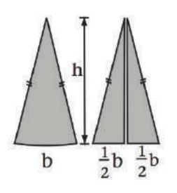
> **[Diagram Context - Textbook_Mathematics_Gr8_Perimeter-and-area-of-2D-shapes.pdf-0023-16.png]**
> This geometry figure illustrates an isosceles triangle with base $b$ and height $h$, alongside its decomposition into two congruent right-angled triangles with bases $\frac{1}{2}b$. The diagram displays the variables $h$, $b$, and $\frac{1}{2}b$, with double tick marks indicating equal side lengths. Conceptually, this visual aids high school learners in deriving the area formula for triangles by relating an isosceles triangle to two combined right-angled triangles.

---

### Summary Table: Base and Height Relationships

| Triangle Type | Base ($b$) | Height ($h$) |
| :--- | :--- | :--- |
| Acute/Obtuse | Any side | Perpendicular line from opposite vertex to base |
| Right-Angled | One of the two sides forming $90^\circ$ | The other side forming $90^\circ$ |
| With Extended Base | The actual side of the triangle | Perpendicular line from vertex to the line containing the base |

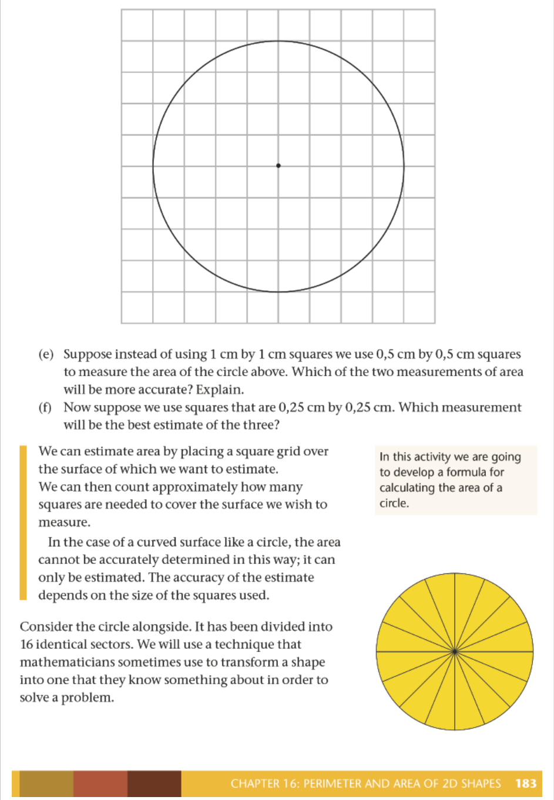
> **[Diagram Context - Textbook_Mathematics_Gr8_Perimeter-and-area-of-2D-shapes.pdf-0023-18.png]**
> This educational graphic is a geometry figure showing a circle overlaid on a square grid and a second yellow circle divided into 16 identical sectors. Visible elements include a central point, grid lines, and text prompts labeled (e) and (f) regarding area estimation accuracy. Conceptually, it helps learners understand how to estimate the area of curved shapes using grids of varying square sizes and introduces the foundational method of dividing a circle into sectors to derive the formula for calculating its area.

---

### Formula: Area of a Triangle

#### Conceptual Understanding
The area of a triangle is exactly half the area of a rectangle that shares the same base and height. 

**Derivation:**
1. Consider a rectangle with length ($l$) and breadth ($b$).
2. The area of this rectangle is $A = l \times b$.
3. If you draw a diagonal across the rectangle, it splits the rectangle into two equal triangles.
4. Therefore, the area of one triangle is half the area of the rectangle:
   $$A = \frac{1}{2} \times (l \times b)$$

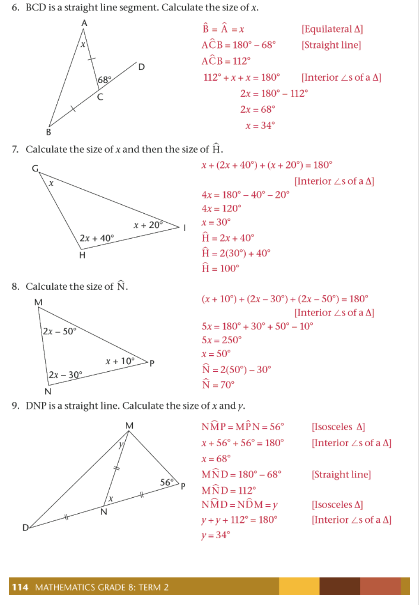
> **[Diagram Context - Textbook_Mathematics_Gr8_Geometry-of-2D-shapes.pdf-0024-02.png]**
> This educational graphic presents worked geometry problems involving triangles and straight lines for Grade 8 Mathematics. The visible labels include vertices (A, B, C, D, G, H, I, M, N, P), angle variables ($x$, $y$), angle measurements in degrees, and geometric reasons such as [Interior $\angle$s of a $\Delta$], [Straight line], and [Isosceles $\Delta$]. The diagram conveys conceptually how to apply Euclidean geometry theorems and algebraic equations to solve for unknown angles in complex figures.

#### The Area Formula
In a triangle, we refer to the length as the **base** ($b$) and the breadth as the **perpendicular height** ($h$). The height must always be the line drawn at a right angle ($90^\circ$) from the base to the opposite vertex.

The formula for the area of a triangle is:
$$A = \frac{1}{2} \times \text{base} \times \text{height}$$
$$A = \frac{1}{2}bh$$

*Note: In the case of obtuse-angled triangles, the perpendicular height may fall outside the triangle.*

---

### Worked Examples: Applying the Area Formula

**Example 1: Calculating Area**
Use the formula $A = \frac{1}{2}bh$ to calculate the area of the following triangles:

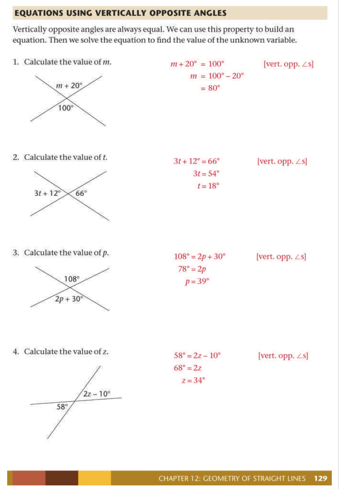
> **[Diagram Context - Textbook_Mathematics_Gr8_Geometry-of-straight-lines.pdf-0024-06.png]**
> This educational graphic features four geometry figures depicting intersecting straight lines used to solve equations involving vertically opposite angles. The diagrams include angle measurements and algebraic expressions containing variables and symbols such as $m$, $t$, $p$, $z$, $^\circ$, and "[vert. opp. $\angle$s]". Conceptually, the graphic demonstrates how to apply the geometric property that vertically opposite angles are equal to set up and algebraically solve linear equations for unknown variables.

**(a) Triangle ABC**
*   Base ($b$) = $18\text{ cm}$
*   Height ($h$) = $6\text{ cm}$

Calculation:
$$A = \frac{1}{2} \times (18 \times 6)$$
$$A = \frac{1}{2} \times 108$$
$$A = 54\text{ cm}^2$$

**(b) Triangle EFG**
*   Base ($b$) = $16\text{ cm}$
*   Height ($h$) = $4\text{ cm}$

Calculation:
$$A = \frac{1}{2} \times (4 \times 16)$$
$$A = \frac{1}{2} \times 64$$
$$A = 32\text{ cm}^2$$

---

### Teacher Guidelines & Common Misconceptions

*   **Visualizing the concept:** Use grid paper to demonstrate that a triangle occupies half the space of a rectangle with the same dimensions. Have learners cut out rectangles and slice them along the diagonal to physically prove the two resulting triangles are equal.
*   **Identifying the height:** Ensure learners understand that the height ($h$) must be perpendicular to the base. 
*   **Common Error:** In triangles where the height is drawn outside the base (such as in obtuse triangles), learners often mistakenly use the slanted side length instead of the perpendicular height. Always emphasize that $h$ is the vertical distance from the base to the highest point.

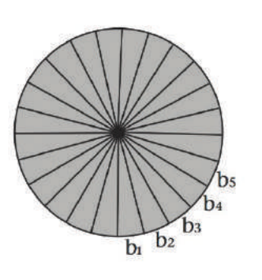
> **[Diagram Context - Textbook_Mathematics_Gr8_Perimeter-and-area-of-2D-shapes.pdf-0024-00.png]**
> The graphic is a geometry figure showing a circle divided into multiple congruent sectors radiating from a central point. Visible labels include sector arc length variables $b_1$, $b_2$, $b_3$, $b_4$, and $b_5$ marked along the circumference. For high school learners, this diagram visually conveys the relationship between central angles, sector areas, and arc lengths in circle geometry problems.

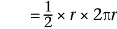

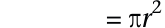

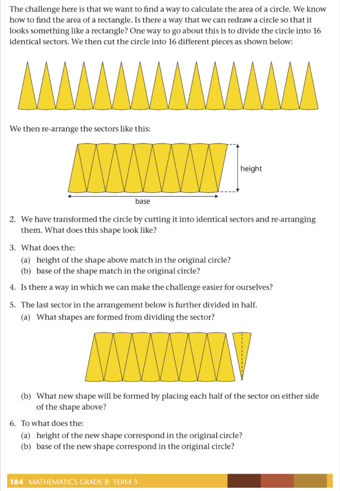
> **[Diagram Context - Textbook_Mathematics_Gr8_Perimeter-and-area-of-2D-shapes.pdf-0024-16.png]**
> This educational graphic is a geometry figure demonstrating the derivation of the formula for the area of a circle. It displays yellow triangular sectors cut from a circle, labeled with "height" and "base" dimensions, and rearranged into a parallelogram-like shape alongside guided questions numbered 2 through 6. Conceptually, it helps learners understand how curvilinear shapes can be transformed into familiar rectilinear shapes (like rectangles or parallelograms) to deduce measurement formulas.

---

### Area of Triangles: Worked Examples and Solutions

The fundamental formula for calculating the area ($A$) of a triangle is:
$$A = \frac{1}{2} \times \text{base} \times \text{height}$$
$$A = \frac{1}{2}(b \times h)$$

---

#### 1. Calculating Area from Given Dimensions

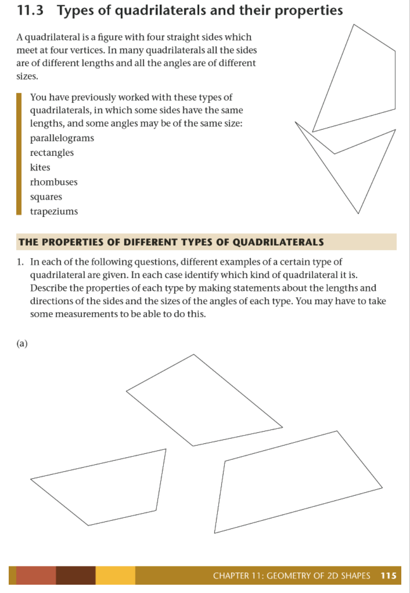
> **[Diagram Context - Textbook_Mathematics_Gr8_Geometry-of-2D-shapes.pdf-0025-07.png]**
> This geometry figure displays a textbook page introducing types of quadrilaterals with text headings, bulleted lists of shapes (parallelograms, rectangles, kites, rhombuses, squares, and trapeziums), and various unlabeled four-sided polygon sketches. It guides learners to investigate and describe the geometric properties of different quadrilaterals by observing and measuring side lengths and angles.

**Worked Examples:**

**(c) Triangle JKL:**
*   Base ($b$) = $400\text{ mm}$
*   Height ($h$) = $210\text{ mm}$
*   Calculation:
    $$A = \frac{1}{2}(400 \times 210)$$
    $$A = \frac{1}{2}(84\ 000)$$
    $$A = 42\ 000\text{ mm}^2$$

**(d) Triangle MNP:**
*   Base ($b$) = $10\text{ cm}$
*   Height ($h$) = $8,66\text{ cm}$
*   Calculation:
    $$A = \frac{1}{2}(10 \times 8,66)$$
    $$A = \frac{1}{2}(86,6)$$
    $$A = 43,3\text{ cm}^2$$

---

#### 2. Calculating Area within Rectangles

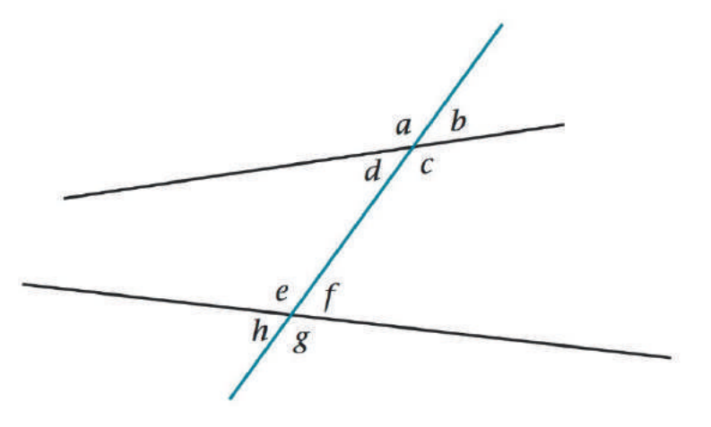
> **[Diagram Context - Textbook_Mathematics_Gr8_Geometry-of-straight-lines.pdf-0025-10.png]**
> The graphic is a geometry figure showing two intersecting lines crossed by a transversal line. It displays eight distinct angle positions labeled with lowercase letters $a, b, c, d, e, f, g,$ and $h$. For a high school student learning Euclidean geometry in the CAPS curriculum, this diagram visually demonstrates the relationships between angles formed by a transversal, such as corresponding, alternate interior, and co-interior angles.

In these problems, we calculate the area of $\Delta PQR$ based on the dimensions of the surrounding rectangle $PQST$.

**(a)**
*   Base ($QR$) = $20 - 10 = 10\text{ cm}$
*   Height = $12\text{ cm}$
*   Calculation:
    $$A = \frac{1}{2}(10 \times 12) = \frac{1}{2}(120) = 60\text{ cm}^2$$

**(b)**
*   Base ($PQ$) = $9\text{ cm}$ (implied)
*   Height = $32\text{ m}$
*   Calculation:
    $$A = \frac{1}{2}(9 \times 32) = \frac{1}{2}(228) = 144\text{ m}^2$$

**(c) Where R is the midpoint of QS:**
*   Base ($QR$) = $86,2 \div 2 = 43,1\text{ cm}$
*   Height = $35\text{ cm}$
*   Calculation:
    $$A = \frac{1}{2}(43,1 \times 35) = \frac{1}{2}(1\ 508,5) = 754,25\text{ cm}^2$$

---

#### 3. Finding the Base when Area is Known
**Problem:** In $\Delta ABC$, the area is $42\text{ m}^2$ and the perpendicular height is $16\text{ m}$. Find the length of the base.

**Solution:**
*   Formula: $A = \frac{1}{2}(b \times h)$
*   Substitute known values: $42 = \frac{1}{2}(b \times 16)$
*   Rearrange to solve for $b$:
    $$b = 42 \times 2 \div 16$$
    $$b = 5,25\text{ m}$$

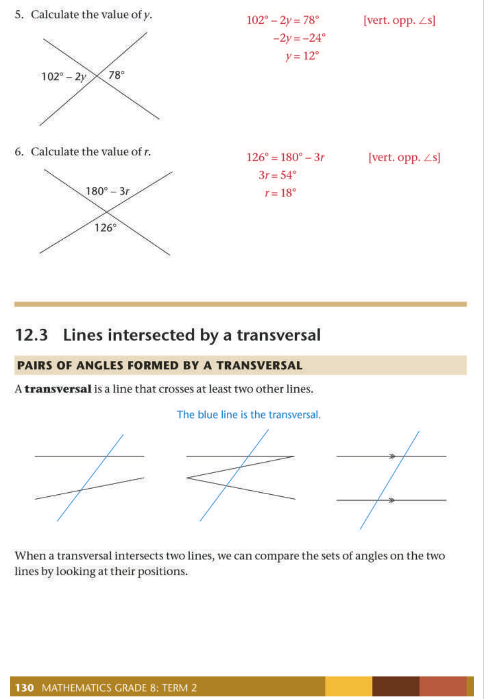
> **[Diagram Context - Textbook_Mathematics_Gr8_Geometry-of-straight-lines.pdf-0025-11.png]**
> This educational graphic features geometry figures demonstrating intersecting lines and transversal lines, categorized into worked examples with algebraic calculations and structural definitions. Visible labels include angle values and variables ($102^\circ - 2y$, $78^\circ$, $y$, $180^\circ - 3r$, $126^\circ$, $r$), geometric reasons ([vert. opp. $\angle$s]), text descriptions ("Lines intersected by a transversal", "The blue line is the transversal"), and parallel line arrows. Aligned with the CAPS curriculum, it teaches Grade 8 learners how to apply geometry theorems such as vertically opposite angles to solve algebraic equations and how to identify relative angle positions formed when a transversal intersects two lines.

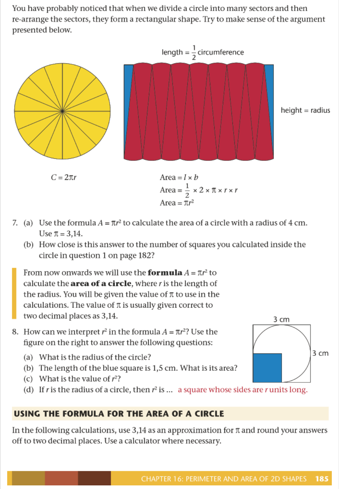
> **[Diagram Context - Textbook_Mathematics_Gr8_Perimeter-and-area-of-2D-shapes.pdf-0025-14.png]**
> This educational graphic is a geometry figure demonstrating the derivation of the formula for the area of a circle. It features a yellow circle divided into congruent sectors ($C = 2\pi r$), which are rearranged into a roughly rectangular shape where the length is equal to half the circumference and the height is equal to the radius, alongside algebraic expressions ($Area = l \times b$, $Area = \pi r^2$). Conceptually, this visual proof helps senior phase and high school learners understand how the area formula of a circle is derived by transforming a curved 2D shape into a familiar rectangle.

---

# Perimeter and Area of 2D Shapes

## 1. Concepts and Definitions

*   **Perimeter ($P$):** The total distance around the outside of a 2D shape.
*   **Area ($A$):** The amount of surface covered by a 2D shape.

### Formulas
*   **Square:**
    *   $P = 4 \times \text{side}$
    *   $A = \text{side} \times \text{side}$
*   **Rectangle:**
    *   $P = 2(l + b)$
    *   $A = l \times b$
*   **Triangle:**
    *   $A = \frac{1}{2}(b \times h)$

---

## 2. Worksheet Exercises

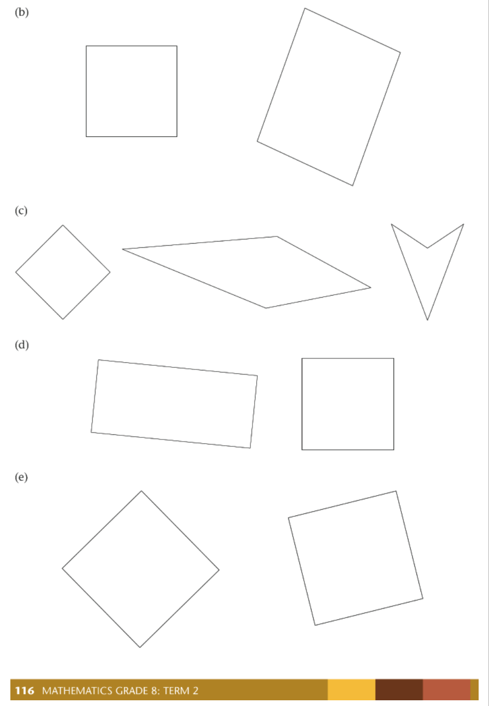
> **[Diagram Context - Textbook_Mathematics_Gr8_Geometry-of-2D-shapes.pdf-0026-09.png]**
> This educational graphic is a geometry figure showing a collection of various 2D quadrilaterals categorized under subsections (b), (c), (d), and (e), including squares, rectangles, rhombi, parallelograms, and kites oriented at different angles. The image includes the text label "116 MATHEMATICS GRADE 8: TERM 2" at the bottom. Conceptually, it helps learners identify and classify different types of quadrilaterals based on their geometric properties regardless of their orientation or rotation in space.

### Question 1: Calculate the perimeter ($P$) and area ($A$)
**a) Square ABCD** (Side = 7 cm, 70 mm)
*   $P = 4 \times 7 = 28 \text{ cm}$
*   $A = 7 \times 7 = 49 \text{ cm}^2$ (or $4\,900 \text{ mm}^2$)

**b) Rectangle EFGH** ($l = 8,2 \text{ cm}, b = 5 \text{ cm}$)
*   $P = 2(8,2 + 5) = 26,4 \text{ cm}$
*   $A = 8,2 \times 5 = 41 \text{ cm}^2$

**c) Triangle JKL** ($b = 8,6 \text{ m}, h = 5 \text{ m}$)
*   $A = \frac{1}{2}(8,6 \times 5) = 21,5 \text{ m}^2$

---

### Question 2: Composite Shape Analysis
Given rectangle ABCD with $AB = 3 \text{ cm}$, $AD = 9 \text{ cm}$, and $TC = 4 \text{ cm}$.

**a) Calculate the perimeter of ABCD:**
*   $P = 2(l + b)$
*   $P = 2(3 + 9) = 24 \text{ cm}$

**b) Calculate the area of ABCD:**
*   $A = l \times b$
*   $A = 3 \times 9 = 27 \text{ cm}^2$

**c) Calculate the area of $\Delta DTC$:**
*   $A = \frac{1}{2}(b \times h)$
*   $A = \frac{1}{2}(4 \times 3) = 6 \text{ cm}^2$

**d) Calculate the area of ABTD:**
*   $A = \text{Area of ABCD} - \text{Area of } \Delta DTC$
*   $A = 27 - 6 = 21 \text{ cm}^2$

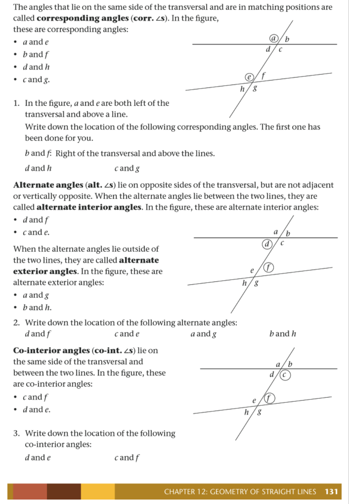
> **[Diagram Context - Textbook_Mathematics_Gr8_Geometry-of-straight-lines.pdf-0026-09.png]**
> This geometry figure illustrates angle relationships formed by a transversal intersecting two lines, labeled with angle variables $a$ through $h$. It displays three distinct sections defining corresponding angles, alternate interior and exterior angles, and co-interior angles alongside guided identification exercises. Conceptually, it helps Senior Phase and FET CAPS learners identify and differentiate angle pairs created by transversals to master Euclidean geometry theorems involving parallel and intersecting lines.

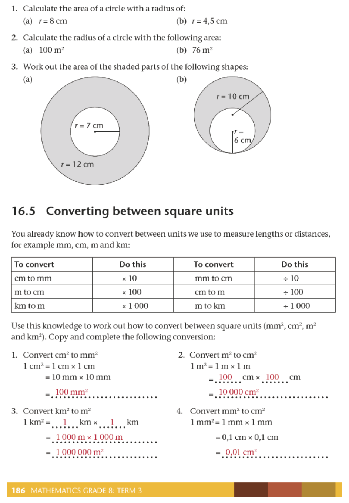
> **[Diagram Context - Textbook_Mathematics_Gr8_Perimeter-and-area-of-2D-shapes.pdf-0026-19.png]**
> This educational graphic is a mathematics worksheet page featuring geometry figures (circles with shaded annular regions), conversion tables, and algebraic formulas. Visible text and labels include radius variables ($r = 7\text{ cm}$, $r = 12\text{ cm}$, $r = 10\text{ cm}$, $r = 6\text{ cm}$), unit conversion factors ($\text{mm}$, $\text{cm}$, $\text{m}$, $\text{km}$, and squared units $\text{mm}^2$, $\text{cm}^2$, $\text{m}^2$, $\text{km}^2$), and instructional prompts. Conceptually, the diagram helps learners calculate the area of circles and composite shaded shapes, while demonstrating how to derive and apply multiplicative conversion factors for square units based on linear measurements.

