# **Chapter  10 Construction of geometric figures** 

## 10.1 Bisecting lines 

When we construct, or draw geometric figures, we often need to bisect lines or angles. To **bisect** means to cut something into two equal parts. There are different ways to bisect a line segment. 

#### **<mark>bisecting a line segment with a ruler</mark>** 

1. Read through the following steps: 

**Step 1:** Draw line segment AB and determine its midpoint. 


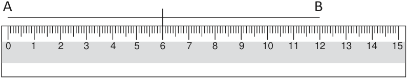
> **[Diagram Context - Textbook_Mathematics_Gr8_Construction-of-geometric-figures.pdf-0001-06.png]**
> This graphic is a measurement apparatus showing a standard 15 cm ruler with numerical markings from 0 to 15. Visible labels include the letters A and B indicating a measured span extending from the 0 mark to the 12 cm mark, with a midpoint indicator at 6 cm. This diagram teaches learners foundational practical measurement skills, specifically how to correctly read metric scales, determine instrument resolution, and calculate lengths or midpoints in physical sciences and mathematics.


**Step 2:** Draw any line segment through the midpoint. 


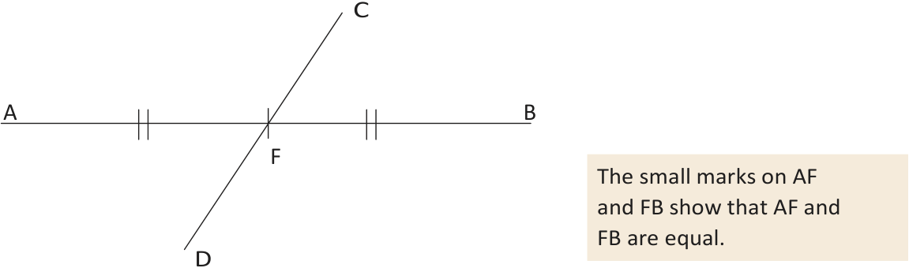
> **[Diagram Context - Textbook_Mathematics_Gr8_Construction-of-geometric-figures.pdf-0001-08.png]**
> This geometry figure illustrates a line segment AB intersected by line CD at point F, accompanied by an explanatory text box stating that the small tick marks on segments AF and FB indicate they are equal in length. The diagram clearly labels points A, B, C, D, and F, along with double-hash equality tick marks on segments AF and FB. Conceptually, this visual aids high school learners in understanding the definition of a perpendicular bisector or midpoint in Euclidean geometry, showing how geometric notation indicates equal lengths along a straight line.


CD is called a **bisector** because it bisects AB. AF = FB. 

2. Use a ruler to draw and bisect the following line segments: AB = 6 cm and XY = 7 cm. 


**92** MATHEMATICS GRAdE 8: TERM 2 

In Grade 6, you learnt how to use a compass to draw circles and parts of circles called arcs. We can use arcs to bisect a line segment. 

##### **<mark>bisecting a line segment with a compass and ruler</mark>** 

###### 1. Read through the following steps: 

**Step 1:** Place the compass on one endpoint of the line segment (point A). Draw an arc above and below the line. (Notice that all the points on the arc above and belowthelinearethesame distance frompoint A.) 


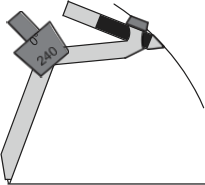
> **[Diagram Context - Textbook_Mathematics_Gr8_Construction-of-geometric-figures.pdf-0002-04.png]**
> The graphic illustrates a mechanical apparatus, specifically a drafting compass or divider resting on a horizontal surface, featuring numerical angle or measurement markings such as "0°" and "240°". The visible components include the pivoted legs, a tightening screw mechanism at the hinge, a pointed tip resting on the baseline, and an intersecting curved arc line. This diagram helps high school learners visualize geometric construction principles, spatial measurement, and the mechanical function of mathematical drawing instruments in practical geometry.


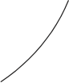


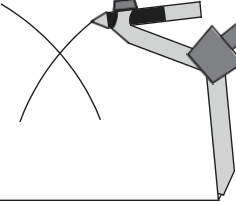
> **[Diagram Context - Textbook_Mathematics_Gr8_Construction-of-geometric-figures.pdf-0002-07.png]**
> This graphic is a geometry figure illustrating a pair of intersecting curved arcs being drawn on a plane. Visible elements include a mechanical compass holding a pencil, intersecting curved lines, and a plain background without explicit labels, variables, or axis names. Conceptually, this diagram visually reinforces geometric construction techniques, demonstrating how precise tools are used to construct intersecting loci or arcs as required in high school mathematics and Euclidean geometry.


###### **Step 2:** Without changing 

the compass width, place the compass on point B. Draw an arc above and below the line so that the arcs cross the first two. (The two points where the arcs cross are the same distance away from point A and from point B.) 


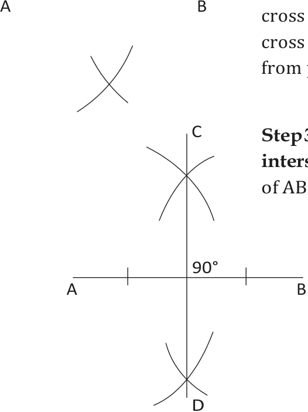
> **[Diagram Context - Textbook_Mathematics_Gr8_Construction-of-geometric-figures.pdf-0002-10.png]**
> The graphic is a geometry figure illustrating a foundational Euclidean construction step. Visible labels include line segment AB, points C and D, a 90° angle indicator, arc intersection marks, and text referencing "Step". This diagram conceptually demonstrates how to construct a perpendicular bisector using a compass and ruler, reinforcing geometric construction skills required in the CAPS curriculum.


**Step 3:** Use a ruler to join the points where the arcs **intersect** . This line segment (CD) is the bisector of AB. 

**intersect** means to cross or meet. A **perpendicular** is a line that meets another line at an angle of 90°. 

Notice that CD is also **perpendicular** to AB. Therefore, CD is a **perpendicular bisector** . 

2. Use a compass and a ruler to practise drawing perpendicular bisectors on line segments. 

###### **try this!** 

Use only a protractor and ruler to draw a perpendicular bisector on a line segment. (Remember that we use a protractor to measure angles.) 


CHAPTER 10: CONSTRUCTION OF GEOMETRIC FIGURES **93** 

## 10.2 Constructing perpendicular lines 

##### **<mark>a perpendicular line from a given point</mark>** 

1. Read through the followingsteps: **Step 1:** Place your compass on the given point (point P). Draw an arc across the line on each side of the given point. Do not adjust the compass width when drawing the second arc. 


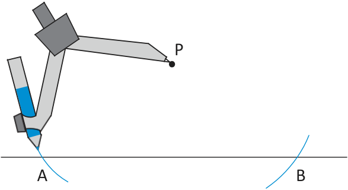
> **[Diagram Context - Textbook_Mathematics_Gr8_Construction-of-geometric-figures.pdf-0003-03.png]**
> This geometric construction diagram illustrates the use of a pair of compasses to draw arcs intersecting a straight line, labeled with points P, A, and B. The visual shows a grey compass instrument positioned above a horizontal line, with pencil marks and arc intersections marked at letters A and B. Conceptually, this demonstrates fundamental Euclidean geometry construction techniques used in CAPS Mathematics for bisecting lines, constructing angles, or transferring lengths.


**Step 2:** From each arc on the line, draw another arc on the opposite side of the line from the given point (P). The two new arcs will intersect. 


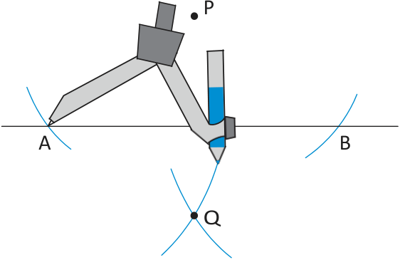
> **[Diagram Context - Textbook_Mathematics_Gr8_Construction-of-geometric-figures.pdf-0003-05.png]**
> This geometry figure illustrates a standard Euclidean construction technique using a pair of compasses and a straight line. The visible labels include points P, Q, A, and B, along with intersecting blue arc markings created by the compass tool. Conceptually, this diagram conveys the step-by-step process of constructing geometric relationships, such as bisecting a line segment or dropping a perpendicular from a point, essential for high school mathematics CAPS outcomes.


**Step 3:** Use your ruler to join the given point (P) to the point where the arcs intersect (Q). 


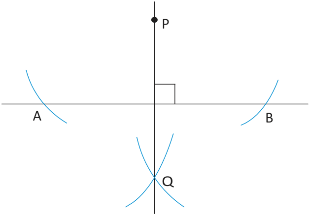
> **[Diagram Context - Textbook_Mathematics_Gr8_Construction-of-geometric-figures.pdf-0003-07.png]**
> This geometry figure illustrates a Cartesian coordinate plane with intersecting lines, coordinate points P and Q, and arc intersection points A and B along the horizontal axis, marked with a right-angle symbol. Visible labels include the points P, Q, A, and B, alongside perpendicular intersecting axes. Conceptually, this diagram helps high school learners practice analytical geometry and coordinate proofs by visually representing points, perpendicular lines, and geometric constructions.


PQ is perpendicular to AB. We also write it like this: PQ ⊥ AB. 

2. Use your compass and ruler to draw a perpendicular line from each given point to the line segment: 


**94** MATHEMATICS GRAdE 8: TERM 2 

##### **<mark>a perpendicular line at a given point on a line</mark>** 

1. Read through the following steps: 

**Step 1:** Place your compass on the given point (P). Draw an arc across the line on each side of the given point. Do not adjust the compass width when drawing the second arc. 


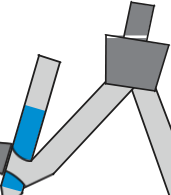
> **[Diagram Context - Textbook_Mathematics_Gr8_Construction-of-geometric-figures.pdf-0004-03.png]**
> This educational graphic illustrates a specialized laboratory apparatus, specifically a dual-chamber or Y-tube respirometer setup often used in biological investigations. The visible components include interconnected glass tubing with sealed rubber bungs and distinct columns of blue liquid acting as manometer fluid to track gas volume changes. Conceptually, this apparatus helps high school learners measure the rate of oxygen consumption or carbon dioxide production during metabolic processes such as cellular respiration in germinating seeds or small organisms.


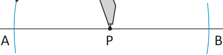
> **[Diagram Context - Textbook_Mathematics_Gr8_Construction-of-geometric-figures.pdf-0004-04.png]**
> This physics diagram illustrates the reflection properties of spherical mirrors, showing two curved mirror surfaces labelled A and B, a principal axis, and a point labelled P. It also includes a compass or drawing tool positioned on the principal axis to demonstrate the geometric construction of the mirror's centre of curvature. Conceptually, this helps learners understand the optical geometry and ray-tracing principles required for concave and convex mirrors in Grade 11 Physical Sciences.


**Step 3:** Use your ruler to join the given point (P) and the point where the arcs intersect (Q). 

PQ ⊥ AB 

**Step 2:** Open your compass so that it is wider than the distance from one of the arcs to point P. Place the compass on each arc and draw an arc above or below the point P. The two new arcs will intersect. 


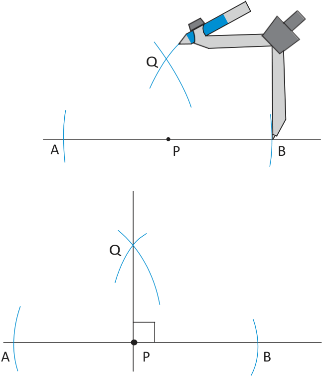
> **[Diagram Context - Textbook_Mathematics_Gr8_Construction-of-geometric-figures.pdf-0004-08.png]**
> This geometry figure illustrates the construction of a perpendicular line to a given line segment using a pair of compasses. Visible labels include points A, B, P, and intersection Q, alongside construction arcs and a right-angle symbol. It demonstrates the step-by-step geometric construction technique required for learners to accurately construct a perpendicular line at a specific point on a line.


2. Copy the following diagrams. Use your compass and ruler to draw a perpendicular at the given point on each line: 


CHAPTER 10: CONSTRUCTION OF GEOMETRIC FIGURES **95** 

## 10.3 Bisecting angles 

Angles are formed when any two lines meet. We use degrees (°) to measure angles. 

#### **<mark>measuring and classifying angles</mark>** 

In the figures below, each angle has a number from 1 to 9. 

1. Use a protractor to measure the sizes of all the angles in each figure. Write your answers for each figure. 

   - (a) 

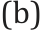


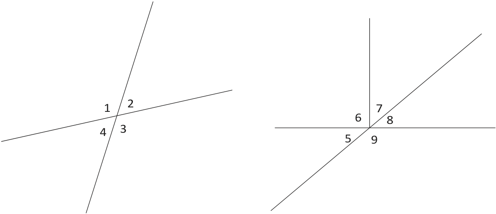
> **[Diagram Context - Textbook_Mathematics_Gr8_Construction-of-geometric-figures.pdf-0005-07.png]**
> This graphic features two geometry figures showing intersecting lines that form numbered angles. The left diagram displays intersecting lines with numbered angles 1, 2, 3, and 4, while the right diagram shows intersecting lines including a perpendicular line with numbered angles 5, 6, 7, 8, and 9. Conceptually, these diagrams help learners identify angle relationships—such as vertically opposite angles, angles on a straight line, and complementary or supplementary angles—found in Euclidean geometry.


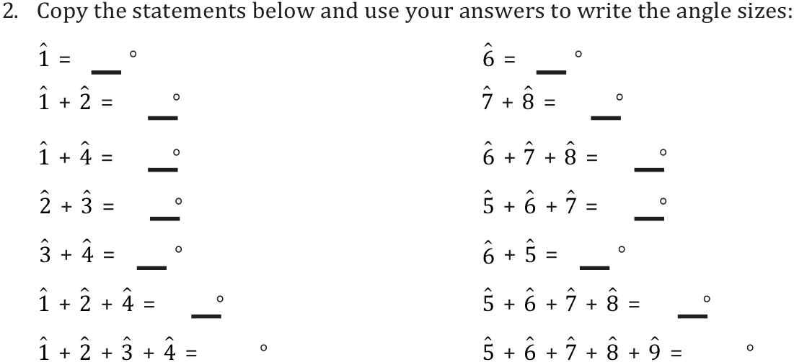
> **[Diagram Context - Textbook_Mathematics_Gr8_Construction-of-geometric-figures.pdf-0005-08.png]**
> The graphic presents a geometry exercise containing mathematical statements and blanks for angle sizes. It displays numbered angle labels with caret symbols ($\hat{1}, \hat{2}, \hat{3}, \hat{4}, \hat{5}, \hat{6}, \hat{7}, \hat{8}, \hat{9}$), addition signs, degree symbols ($^\circ$), and fill-in-the-blank lines. Conceptually, this exercise helps learners practice angle relationships and summations by combining adjacent angle measurements in Euclidean geometry.


3. Next to each of your answers above, write down what type of angle it is, namely acute, obtuse, right, straight, reflex or revolution. 


**96** MATHEMATICS GRAdE 8: TERM 2 

#### **<mark>bisecting angles without a protractor</mark>** 

1. Read through the following steps: 

**Step 2:** Place the compass on the point where one arc crosses an arm and draw an arc inside the angle. Without changing the compass width, repeat for the other arm so that the two arcs cross. 

**Step 1:** Place the compass on the vertex of the angle (point B). Draw an arc across each arm of the angle. 


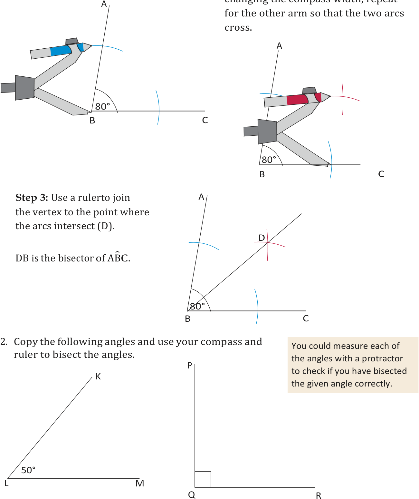
> **[Diagram Context - Textbook_Mathematics_Gr8_Construction-of-geometric-figures.pdf-0006-04.png]**
> This educational graphic is a geometry construction guide illustrating step-by-step instructions for bisecting an angle using a compass and a ruler. The diagram includes geometric line segments and vertices labeled A, B, C, D, K, L, M, P, Q, and R, along with angle measurements of 80° and 50°, a right-angle symbol, and intersecting construction arcs. Conceptually, it demonstrates the precise geometric construction technique required to divide an angle into two equal halves, supporting foundational CAPS geometry skills in construction and angle properties.


2. Copy the following angles and use your compass and ruler to bisect the angles. 


CHAPTER 10: CONSTRUCTION OF GEOMETRIC FIGURES **97** 

## 10.4 Constructing special angles without a protractor 

##### **<mark>constructing angles of 60°, 30° and 120°</mark>** 

1. Read through the following steps: 

**Step 1:** Draw a line segment (JK). With the compass on point J, draw an arc across JK and up over above point J. 


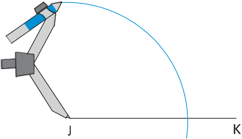
> **[Diagram Context - Textbook_Mathematics_Gr8_Construction-of-geometric-figures.pdf-0007-04.png]**
> The graphic illustrates a geometry construction apparatus, specifically a pair of compasses resting on a horizontal line segment with endpoints labeled J and K, tracing a blue curved arc. Visible elements include the hinged metal compass holding a pencil lead, the straight reference line, and the intersection points denoted by letters J and K. Conceptually, this diagram demonstrates the fundamental Euclidean construction technique of setting and swinging a fixed radius arc from a given point to perform geometric constructions such as bisecting lines or copying segments.


**Step 3:** Join point J to the point where the two arcs meet (point P). P^{} JK = 60° 

**Step 2:** Without changing the compass width, move the compass to the point where the arc crosses JK, and draw an arc that crosses the first one. 


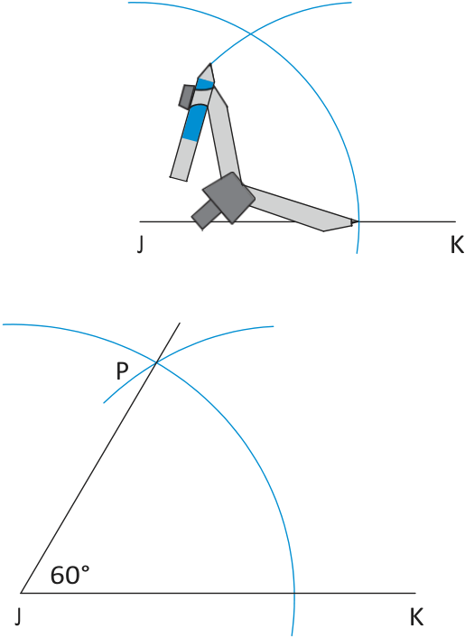
> **[Diagram Context - Textbook_Mathematics_Gr8_Construction-of-geometric-figures.pdf-0007-07.png]**
> This geometry figure illustrates the construction of a standard angle using a pair of compasses and a straightedge. The graphic features points and lines labeled J, K, and P, with intersecting blue arcs and a resulting angle measurement of 60°. Conceptually, it demonstrates the step-by-step geometric construction technique required in high school mathematics to accurately construct a 60° angle without a protractor.


2. (a) Copy the drawing at the top of page 99. Construct an angle of 60° at point B. 

   - (b) Bisect the angle you constructed. 

   - (c) Do you notice that the bisected angle consists of two 30° angles? 

   - (d) Extend line segment BC to A. Then measure the angle adjacent to the 60° angle. What is its size? 

   - (e) What do the 60° angle and its adjacent angle add up to? 

When you learn more about the properties of triangles later, you will understand why the method above creates a 60° angle. Or can you already work this out now? (Hint: What do you know about equilateral triangles?) 

**<mark>adjacent</mark>** <mark>means “next to”.</mark> 


**98** MATHEMATICS GRAdE 8: TERM 2 


##### **<mark>constructing angles of 90° and 45°</mark>** 

1. Construct an angle of 90° at point A. Go back to Section 10.2 if you need help. 

2. Bisect the 90° angle to create an angle of 45°. Go back to Section 10.3 if you need help. 

###### **challenge** 

Try to construct the following angles without using a protractor: 150°, 210° and 135°. 


## 10.5 Constructing triangles 

In this section, you will learn how to construct triangles. You will need a pencil, a protractor, a ruler and a compass. 

A triangle has three sides and three angles. We can construct a triangle when we know some of its measurements, that is, its sides, its angles, or some of its sides and angles. 


CHAPTER 10: CONSTRUCTION OF GEOMETRIC FIGURES 

#### **<mark>constructing triangles</mark>** 

##### Constructing triangles when three sides are given 

1. Read through the following steps. They describe how to construct ∆ABC with side lengths of 3 cm, 5 cm and 7 cm. 

**Step 1:** Draw one side of the triangle using a ruler. It is often easier to start with the longest side. 

**Step 2:** Set the compass width to 5 cm. Draw an arc 5 cm away from point A. The third vertex of the triangle will be somewhere along this arc. 


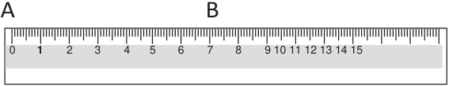
> **[Diagram Context - Textbook_Mathematics_Gr8_Construction-of-geometric-figures.pdf-0009-05.png]**
> The graphic shows a standard measuring apparatus, specifically a linear ruler. Visible labels include the letters "A" and "B" positioned above the ruler, along with numerical calibration marks ranging from 0 to 15 representing centimeter intervals. For a CAPS curriculum student, this diagram illustrates the fundamental scientific skill of length measurement, demonstrating how to properly read a graduated scale to determine physical dimensions accurately.


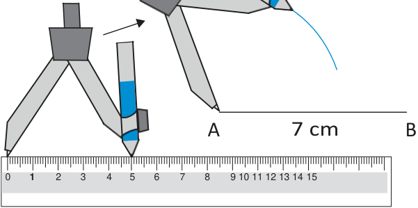
> **[Diagram Context - Textbook_Mathematics_Gr8_Construction-of-geometric-figures.pdf-0009-06.png]**
> This geometric construction figure illustrates the process of measuring a specific length using a pair of compasses and a ruler. Visible elements include a graduated ruler marked from 0 to 15, a pair of compasses spanning a distance of 7 cm between points A and B, and directional arrows indicating measurement. This diagram conceptually demonstrates how to accurately set, read, and transfer exact linear measurements in geometry constructions.


**Step 3:** Set the compass width to 3 cm. Draw an arc from point B. Note where this arc crosses the first arc. This will be the third vertex of the triangle. 

**Step 4:** Use your ruler to join points A and B to the point where the arcs intersect (C). 


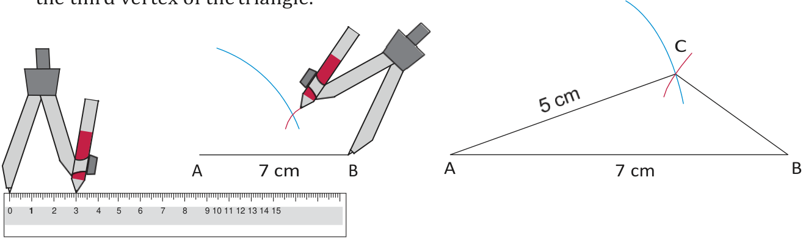
> **[Diagram Context - Textbook_Mathematics_Gr8_Construction-of-geometric-figures.pdf-0009-09.png]**
> This graphic illustrates a geometry construction procedure using a pair of compasses, a ruler, and pencil arcs. Visible labels include vertices A, B, and C, along with length measurements of 7 cm and 5 cm. For a high school student, the diagram demonstrates the step-by-step method for constructing a triangle given side lengths (specifically SSS construction), showing how to measure a specific radius on a ruler and swing intersecting arcs to locate the third vertex.


2. Follow the steps above to construct the following triangles: 

   - (a) ∆ABC with sides 6 cm, 7 cm and 4 cm 

   - (b) ∆KLM with sides 10 cm, 5 cm and 8 cm 

   - (c) ∆PQR with sides 5 cm, 9 cm and 11 cm 


**100** MATHEMATICS GRAdE 8: TERM 2 

##### Constructing triangles when certain angles and sides are given 

3. Use the rough sketches in (a) to (c) below to construct accurate triangles, using a ruler, compass and protractor. Make sure that: 

   - the dotted lines show where you have to use a compass to measure the length of a side 

   - you use a protractor to measure the size of the given angles. 

   - (a) Construct ∆ABC, with **two angles and one side given** . 


- (c) Construct a right-angled ∆PQR, with the **hypotenuse and one other side given** . 


CHAPTER 10: CONSTRUCTION OF GEOMETRIC FIGURES **101** 

4. Measure the missing angles and sides of each triangle in 3(a) to (c) on the previous page. Write the measurements next to your completed constructions. 

5. Compare each of your constructed triangles in question 3(a) to (c) with a classmate’s triangles. Are the triangles exactly the same? 

If triangles are exactly the same, we say they are **congruent** . 

###### **challenge** 

1. Construct these triangles: 

   - (a) ∆STU, with three angles given: S^{} = 45°, T^{} = 70° and U^{} = 65°. 

   - (b) ∆XYZ, with two sides and the angle opposite one of the sides given: X^{} = 50°, XY = 8 cm and XZ = 7 cm. 

2. Can you find more than one solution for each triangle above? Explain your findings to a classmate. 

## 10.6 Properties of triangles 

The angles of a triangle can be the same size or different sizes. The sides of a triangle can be the same length or differentlengths. 

#### **<mark>properties of equilateral triangles</mark>** 

1. (a) Construct ∆ABC. 

   - (b) Measure and label the sizes of all its sides and angles. 


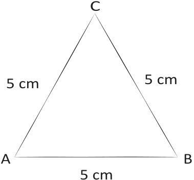
> **[Diagram Context - Textbook_Mathematics_Gr8_Construction-of-geometric-figures.pdf-0011-13.png]**
> This geometric figure is an equilateral triangle with vertices labeled A, B, and C. Each of its three sides is annotated with a length of $5\text{ cm}$. The diagram conveys the properties of an equilateral triangle, specifically demonstrating that equal side lengths correspond to equal interior angles in Euclidean geometry.


2. Measure and write down the sizes of the sides and angles of ∆DEF on the right. 

3. Both triangles in questions 1 and 2 are called **equilateral triangles** . Discuss with a classmate if the following is true for an equilateral triangle: 

   - All the sides are equal. 

   - All the angles are equal to 60°. 


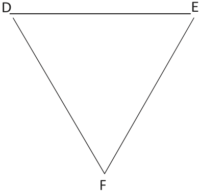
> **[Diagram Context - Textbook_Mathematics_Gr8_Construction-of-geometric-figures.pdf-0011-18.png]**
> This geometric figure is a triangle labeled with vertices D, E, and F. The diagram provides a standard visual representation used in Euclidean geometry to teach polygon properties, angles, and triangle theorems. It helps high-school learners identify sides and vertices when solving riders and proofs involving congruence or similarity.


**102** MATHEMATICS GRAdE 8: TERM 2 

#### **<mark>properties of isosceles triangles</mark>** 

1. (a) Construct ∆DEF with EF = 7 cm, E^{} = 50° and F^{} = 50°. 

Also construct ∆JKL with JK = 6 cm, KL = 6 cm and^{} J = 70°. 

   - (b) Measure and label all the sides and angles of each triangle. 

2. Both triangles above are called **isosceles triangles** . Discuss with a classmate whether the following is true for an isosceles triangle: 

   - Only two sides are equal. 

   - Only two angles are equal. 

   - The two equal angles are opposite the two equal sides. 

##### **<mark>the sum of the angles in a triangle</mark>** 

1. Look at your constructed triangles ∆ABC, ∆DEF and ∆JKL above and on the previous page. What is the sum of the three angles each time? 

2. Did you find that the sum of the interior angles of each triangle is 180°? Do the following to check if this is true for other triangles. 


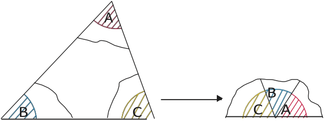
> **[Diagram Context - Textbook_Mathematics_Gr8_Construction-of-geometric-figures.pdf-0012-11.png]**
> This geometric illustration depicts a triangle and a straight line showing the sum of angles in a triangle. The diagram contains three shaded corner angles labeled A, B, and C, and a horizontal directional arrow pointing from the triangle to the angles arranged adjacently along a straight line. Conceptually, this conveys the Euclidean geometry theorem that the interior angles of a triangle sum up to 180° ($180^\circ$) when combined on a straight line.


- (a) On a clean sheet of paper, construct any triangle. Label the angles A, B and C and cut out the triangle. 

- (b) Neatly tear the angles off the triangle and fit them next to one another. 

- ° 

- (c) Notice that A^{} , B^{} and C^{} form a straight angle. Complete: A^{} + B^{} + C^{} = 

- We can conclude that the interior angles of a triangle always add up to 180°. 

## 10.7 Properties of quadrilaterals 

A quadrilateral is any closed shape with four straight sides. We classify quadrilaterals according to their sides and angles. We note which sides are parallel, perpendicular or equal. We also note which angles are equal. 


CHAPTER 10: CONSTRUCTION OF GEOMETRIC FIGURES **103** 

#### **<mark>properties of quadrilaterals</mark>** 

1. Measure and write down the sizes of all the angles and the lengths of all the sides of each of the following quadrilaterals: 


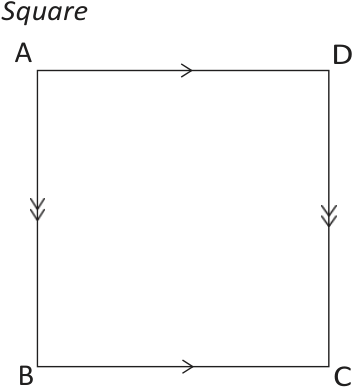
> **[Diagram Context - Textbook_Mathematics_Gr8_Construction-of-geometric-figures.pdf-0013-02.png]**
> This graphic is a geometry figure representing a square labeled with vertices A, B, C, and D, featuring directional arrows on sides AD and BC, and double arrows on sides AB and DC. It visually communicates the fundamental properties of a square, including equal side lengths and parallel opposite sides, which are essential for learners mastering Euclidean geometry and quadrilateral theorems.


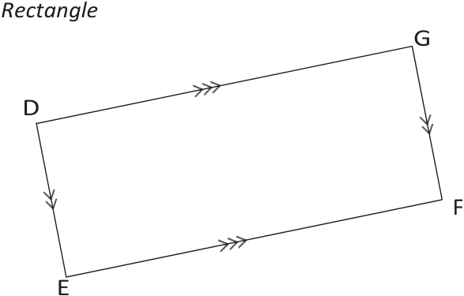
> **[Diagram Context - Textbook_Mathematics_Gr8_Construction-of-geometric-figures.pdf-0013-03.png]**
> This graphic displays a geometry figure of a rectangle labeled with vertices D, E, F, and G, accompanied by parallel line arrows on opposite sides. The diagram visually communicates the defining properties of a rectangle in Euclidean geometry, specifically showing that opposite sides are parallel and equal in length, which is fundamental for high school learners studying quadrilateral properties and riders in CAPS mathematics.


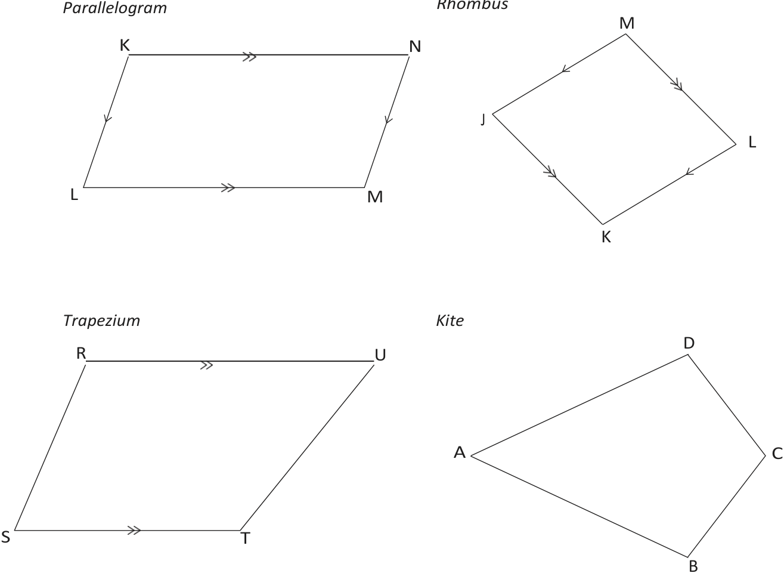
> **[Diagram Context - Textbook_Mathematics_Gr8_Construction-of-geometric-figures.pdf-0013-05.png]**
> The graphic displays four distinct geometry figures—a Parallelogram (labeled KLMN with vertex letters and parallel arrows), a Rhombus (labeled JKLM with side arrows indicating equal lengths), a Trapezium (labeled RSTU with a single pair of parallel arrows), and a Kite (labeled ABCD). These diagrams visually define the key quadrilaterals studied in Senior Phase and FET Mathematics, highlighting their defining geometric properties such as parallel sides and vertex labeling. For a high school student, this helps establish the foundational visual recognition and structural differences needed for Euclidean geometry theorems and proofs.


**104** MATHEMATICS GRAdE 8: TERM 2 

2. Use your answers in question 1. Copy the following table and place a ✓ in the correct box to show which property is correct for each shape. 

|Properties<br>Parallelogram|Rectangle|Rhombus Square<br>Kite|Trapezium|
|---|---|---|---|
|Only one pair of<br>sides are parallel||||
|Opposite sides are<br>parallel||||
|Opposite sides are<br>equal||||
|All sides are equal||||
|Two pairs of adjacent<br>sides are equal||||
|Opposite angles are<br>equal||||
|All angles are equal||||

#### **<mark>sum of the angles in a quadrilateral</mark>** 

1. Add up the four angles of each quadrilateral on the previous page. What do you notice about the sum of the angles of each quadrilateral? 

2. Did you find that the sum of the interior angles of each quadrilateral equals 360°? Do the following to check if this is true for other quadrilaterals: 

   - (a) On a clean sheet of paper, use a ruler to construct any quadrilateral. 

   - (b) Label the angles A, B, C and D. Cut out the quadrilateral. 

   - (c) Neatly tear the angles off the quadrilateral and fit them next to one another. 

   - (d) What do you notice? 

We can conclude that the interior angles of a quadrilateral always add up to 360°. 

## 10.8 Constructing quadrilaterals 

You learnt how to construct perpendicular lines in Section 10.2. If you know how to construct parallel lines, you should be able to construct any quadrilateral accurately. 


CHAPTER 10: CONSTRUCTION OF GEOMETRIC FIGURES **105** 

#### **<mark>constructing parallel lines to draw quadrilaterals</mark>** 

1. Read through the following steps: 

**Step 1:** From line segment AB, mark a point D. This point D will be on the line that will be parallel to AB. Draw a line from A through D. 


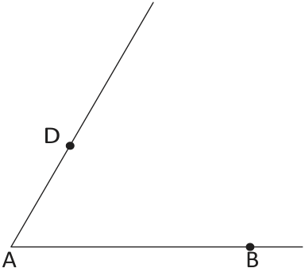
> **[Diagram Context - Textbook_Mathematics_Gr8_Construction-of-geometric-figures.pdf-0015-03.png]**
> This geometry figure illustrates an acute angle formed by two intersecting line segments meeting at vertex A. The diagram includes labeled points A at the vertex, B positioned along the bottom ray, and D positioned along the inclined ray. Conceptually, this visual supports high school learners in identifying geometric components such as vertices, arms, and points on lines when studying Euclidean geometry.


**Step 2:** Draw an arc from A that crosses AD and AB. Keep the same compass width and draw an arc from point D as shown. 


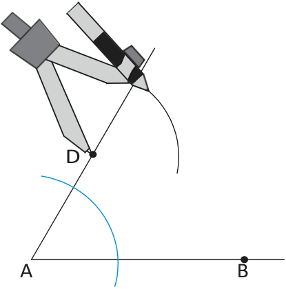
> **[Diagram Context - Textbook_Mathematics_Gr8_Construction-of-geometric-figures.pdf-0015-05.png]**
> This geometry figure illustrates a compass construction step involving an angle with vertex A and point B on one arm, and an arc drawn from point D intersecting the upper ray. Visible labels include the points A, B, and D. Conceptually, it demonstrates the precise technical method for constructing congruent angles or angle bisectors using a pair of compasses, reinforcing foundational Euclidean geometry skills.


**Step 3:** Set the compass width to the distance between the two points where the first arc crosses AD and AB. From the point where the second arc crosses AD, draw a third arc to cross the second arc. 


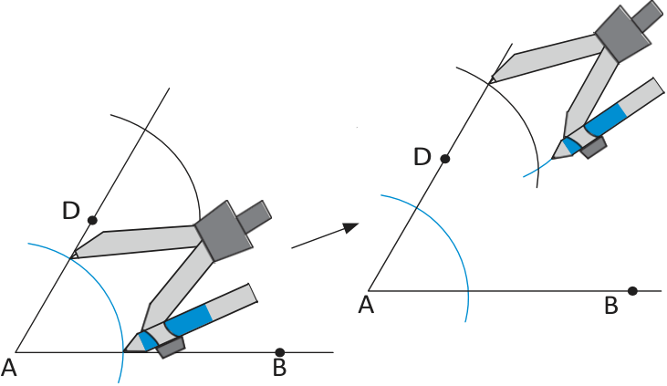
> **[Diagram Context - Textbook_Mathematics_Gr8_Construction-of-geometric-figures.pdf-0015-07.png]**
> This geometric construction diagram illustrates the step-by-step process of copying an angle using a pair of compasses and a straightedge. Visible labels include points A, B, and D along the intersecting rays forming the angle, with curved arcs drawn by the compass to transfer the exact angular measurement. Conceptually, this demonstrates Euclidean geometry construction techniques, showing high school learners how to accurately replicate an angle without a protractor by preserving equal radii and arc lengths.


**Step 4:** Draw a line from D through the point where the two arcs meet. DC is parallel to AB. 


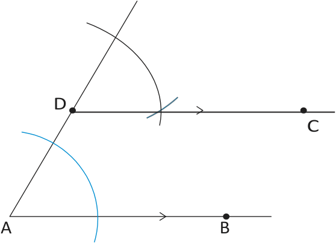
> **[Diagram Context - Textbook_Mathematics_Gr8_Construction-of-geometric-figures.pdf-0015-09.png]**
> This geometry figure illustrates a geometric construction demonstrating the creation of parallel lines. Visible labels include points A, B, C, and D, along with intersecting construction arcs and directional arrow symbols on lines AB and DC. Conceptually, this diagram conveys the Euclidean geometry theorem that corresponding or alternate angles are equal, showing high school learners how to construct a line parallel to a given line through a specific point using only a compass and straightedge.


2. Practise drawing a parallelogram, square and rhombus. 

3. Use a protractor to draw quadrilaterals with at least one set of parallel lines. 

**106** MATHEMATICS GRAdE 8: TERM 2 

### **Worksheet** 

1. Do the followingconstruction: 

   - (a) Use a compass and ruler to construct equilateral ∆ABC with sides of 9 cm. 

   - (b) Without using a protractor, bisect B^{} .Let the bisector intersect AC at point D. 

   - (c) Use a protractorto measure AD^{} B. Write the measurement on the drawing. 

2. Name the following types of triangles and quadrilaterals: 


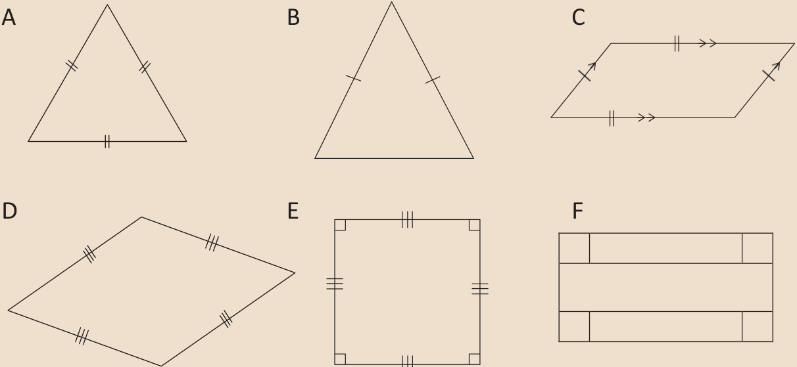
> **[Diagram Context - Textbook_Mathematics_Gr8_Construction-of-geometric-figures.pdf-0016-06.png]**
> This graphic is a geometry figure displaying six different shapes labeled A through F with tick marks, parallel arrows, and right-angle indicators. Shapes A and B show triangles with side-length equivalence tick marks, shapes C, D, and E show quadrilaterals (parallelogram, rhombus, square) with specific side and angle markers, and shape F illustrates a composite rectangular layout. For a CAPS FET phase mathematics student, this diagram visually reinforces Euclidean geometry theorems regarding properties of triangles and quadrilaterals, specifically how geometric markings denote equal sides, parallel lines, and perpendicular angles.


3. Which of the following quadrilaterals matches each description below? (There may be more than one answer for each.) 

##### parallelogram; rectangle; rhombus; square; kite; trapezium 

- (a) All sides are equal and all angles are equal. 

- (b) Two pairs of adjacent sides are equal. 

- (c) Onepairofsidesisparallel. 

- (d) Opposite sides are parallel. 

- (e) Opposite sides are parallel and all angles are equal. 

- (f) All sides areequal. 

CONSTRUCTION OF GEOMETRIC FIGURES 

##### Grade 8 Term 2 Chapter 10 Construction of geometric figures 

###### **Learner Book Overview** 

|**Sections in this chapter**|**Content**|**Pages in Learner Book**|
|---|---|---|
|10.1 Bisecting lines|Bisecting a line using a ruler; bisecting a line using a compass|Pages 92 to 93|
|10.2 Constructing perpendicular lines|Constructing a line perpendicular to another line from a point not on the line;<br>constructing a line perpendicular to another line from a point on the line|Pages 94 to 95|
|10.3 Bisecting angles|Measuring and classifying angles; bisecting angles using a protractor|Pages 96 to 97|
|10.4 Constructing special angles<br>without a protractor|Constructing angles of 60°, 30° and 120° as well as 90° and 45°|Pages 98 to 99|
|10.5 Constructing triangles|Constructing triangles when three sides are given, and when certain angles and<br>sides are given; definition of congruent triangles|Pages 99 to 102|
|10.6 Properties of triangles|Properties of equilateral triangles and isosceles triangles; the sum of the angles in<br>a triangle|Pages 102 to 103|
|10.7 Properties of quadrilaterals|Properties (angles and side lengths) of quadrilaterals; the sum of the angles in a<br>quadrilateral|Pages 103 to 105|
|10.8 Constructing quadrilaterals|Using the properties, parallel lines and perpendicular lines, to construct<br>quadrilaterals|Pages 105 to 106|
|CAPS time allocation|8 hours||
|CAPS content specification|Page 95||

###### **Mathematical background** 

In order to perform constructions of geometrical figures we must be able to: 

- bisect line segments using compasses and rulers 

- construct perpendicular lines to another line from points on the line and points not on the line 

- bisect angles and construct special angles 

- construct triangles when at least three measurements are given, for example two sides and an included angle, or three sides, etc. 

- construct quadrilaterals using their properties of parallel lines and equal angles, etc. 

We need to know how to classify triangles according to their sides (for example, isosceles, equilateral, scalene, etc.) and according to their angle properties (for example, obtuse-angled, acute-angled and right-angled). Furthermore, equilateral triangles have all their angles equal and isosceles triangles have the two angles opposite the equal sides equal. 

MATHEMATICS GRADE 8 TEACHER GUIDE 

##### 10.1 Bisecting lines 

###### **BISECTING A LINE SEGMENT WITH A RULER** 

###### **Teaching guidelines** 

Explain that to bisect a line means to divide the line into two equal parts, so we are looking at finding the midpoint of the line. 

If we draw a line through the midpoint of the line, the new line is called a bisector of the original line. 

Use a ruler to measure off half of the given line. Mark the midpoint at the halfway mark on the line 

###### **Answers** 

2. Bisecting line AB = 6 cm. Midpoint is at 3 cm. 


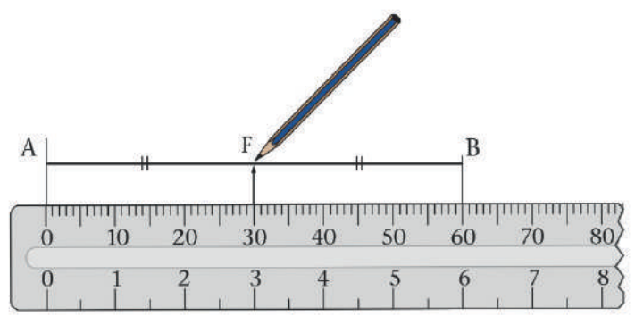
> **[Diagram Context - Textbook_Mathematics_Gr8_Construction-of-geometric-figures.pdf-0018-08.png]**
> This physics apparatus diagram illustrates a balancing or centre of gravity experiment using a uniform ruler supported at a pivot point F. Visible labels include endpoints A and B, pivot point F, and dual metric scales along the ruler showing markings from 0 to 80 (in millimeters) and 0 to 8 (in centimeters), with hash marks indicating equal segment lengths AF and FB. Conceptually, this conveys the principle of moments in rotational equilibrium, showing how a system balances when the clockwise and anticlockwise moments about the fulcrum are equal.


Bisecting line XY = 7 cm. Midpoint is at 3,5 cm. 


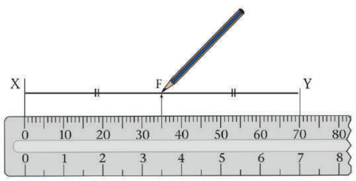
> **[Diagram Context - Textbook_Mathematics_Gr8_Construction-of-geometric-figures.pdf-0018-10.png]**
> This educational graphic is a measurement apparatus diagram illustrating reading errors and scale interpretation using a ruler and a pencil pointing at a line segment labeled XY. The visible labels include points X and Y, the pointer F, and a dual-scale metric ruler displaying numerical markings from 0 to 80 (in millimeters) and 0 to 8 (in centimeters) with hash marks indicating equal spacing. Conceptually, this diagram helps learners practice precision in measurement, read different scales correctly, and identify potential parallax or zero errors in physical science and mathematics practical tasks.


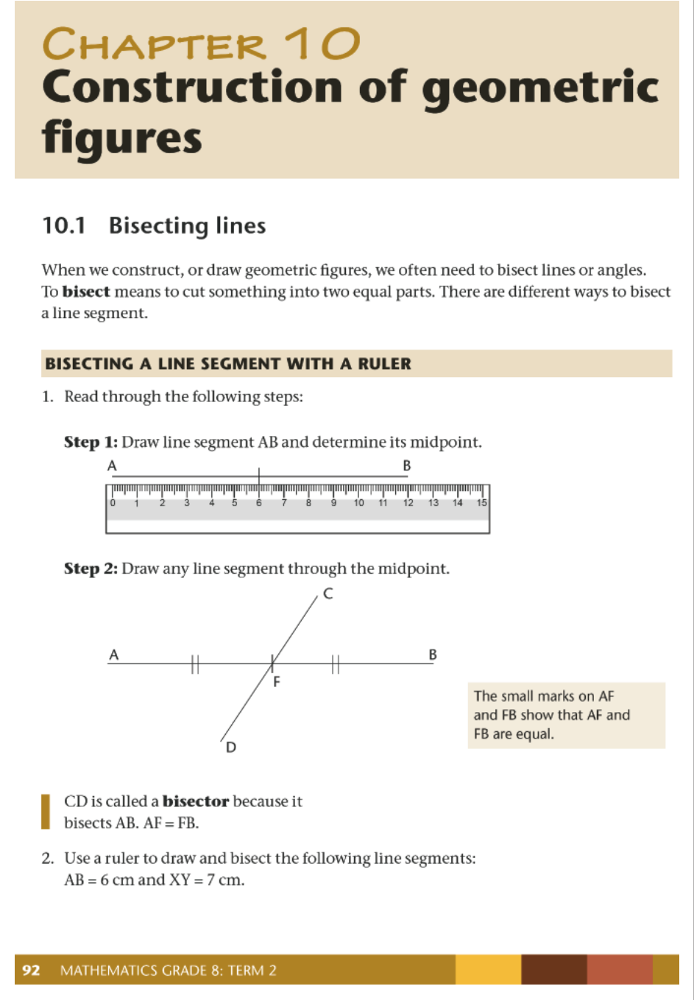
> **[Diagram Context - Textbook_Mathematics_Gr8_Construction-of-geometric-figures.pdf-0018-11.png]**
> This educational graphic presents a geometry figure demonstrating the construction and bisection of a line segment using a ruler. The visible labels and variables include line segments AB and CD, midpoint/intersection point F, and tick marks indicating equal length segments AF and FB. Conceptually, the diagram guides students through the step-by-step process of identifying a midpoint and drawing a bisector, visually reinforcing that a line segment is divided into two equal parts.


MATHEMATICS GRADE 8 TEACHER GUIDE 

###### **BISECTING A LINE SEGMENT WITH A COMPASS AND RULER** 

###### **Teaching guidelines** 

Remind learners that their pencils should be sharp. A blunt pencil leads to thick lines and arcs that make it difficult to find the exact point of intersection. 

Explain to learners that they should adjust the compass so that its width is slightly longer than half the length of the line segment so that the arcs can intersect. Demonstrate on the board that taking the width too short will lead to an unsuccessful construction. 

With this method you not only bisect the line, but you can also draw a perpendicular line through the midpoint. This line is called the perpendicular bisector of the original line. 

Remind learners of the meaning of the words **intersect** and **perpendicular** . 

To construct a perpendicular bisector using only a ruler and a protractor: 

- find the midpoint F of the line with a ruler (see LB page 92) 

- at F, construct an angle of 90° using a protractor. 

###### **Misconceptions** 

Learners do not realise why this method works and are therefore not meticulous about keeping the radius of the circles the same, so the constructions fails. 

###### **Notes on the questions** 


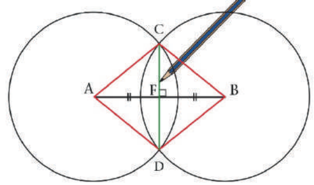
> **[Diagram Context - Textbook_Mathematics_Gr8_Construction-of-geometric-figures.pdf-0019-12.png]**
> This geometry figure illustrates two intersecting circles of equal radii with centers A and B, featuring a rhombus (ACBD) inscribed within them, a line segment AB connecting the centers, a perpendicular bisector segment CD intersecting at point F with a right-angle symbol, and double-tick marks indicating equal line segments. For FET Phase Mathematics learners, this diagram demonstrates Euclidean geometry theorems related to circles, specifically proving that the line joining the centers of two intersecting circles is the perpendicular bisector of the common chord.


Refer to the drawing on the right. The construction works because the circles have the same radius 

AC = CB = BD = DA, which forms a rhombus and the diagonals of a rhombus bisect each other at right angles. 

###### **Answers** 

2. Learners’ own work. 


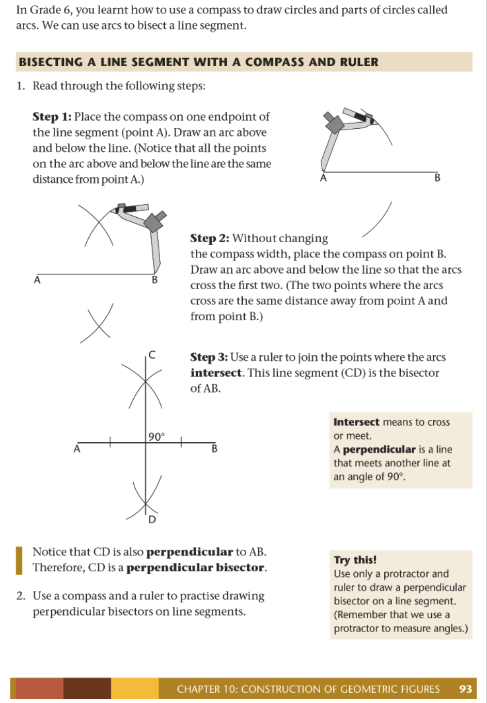
> **[Diagram Context - Textbook_Mathematics_Gr8_Construction-of-geometric-figures.pdf-0019-17.png]**
> This instructional geometry figure demonstrates the step-by-step geometrical construction for bisecting a line segment using a pair of compasses and a ruler. The diagrams feature labeled points A, B, C, and D, intersecting circular arcs, perpendicular intersection symbols ($90^\circ$), and directional lines illustrating geometric construction techniques. Conceptually, it teaches learners how to construct a perpendicular bisector by maintaining equal radii from endpoints to establish equidistant intersection points, reinforcing core CAPS geometry construction skills.


MATHEMATICS GRADE 8 TEACHER GUIDE 

##### 10.2 Constructing perpendicular lines 

A line perpendicular to another line can be constructed from: 

- a given point that is not on the line 

- a given point on the line. 

###### **A PERPENDICULAR LINE FROM A GIVEN POINT** 

###### **Teaching guidelines** 

The given point is not on the line. Learners start off with a line and a point outside the line. 

Draw the arcs of a circle so that they intersect the line at A and B. 

From each of the points A and B, draw another arc so that the two new arcs intersect above or below the line. The width of the compass need not be the same as for the first arcs. 

###### **Notes on the questions** 


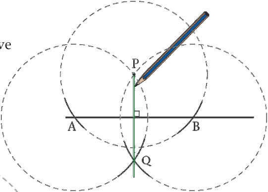
> **[Diagram Context - Textbook_Mathematics_Gr8_Construction-of-geometric-figures.pdf-0020-10.png]**
> This geometric construction diagram illustrates the process of constructing a perpendicular bisector to a line segment using a compass and straightedge. Visible elements include a horizontal line segment with endpoints labeled A and B, overlapping dashed construction circles centered at points A, B, P, and Q, a vertical green line segment intersecting AB perpendicularly at a right-angle symbol, and a pencil pointing to point P. Conceptually, it demonstrates the Euclidean geometry theorem that points equidistant from the endpoints of a line segment define its perpendicular bisector, a fundamental foundational construction skill in FET phase mathematics.


The drawings below explain why this construction works. 

In the first drawing the circles all have the same radius and in the second drawing the circles at A and B have slightly larger radii than the circle drawn at P. 


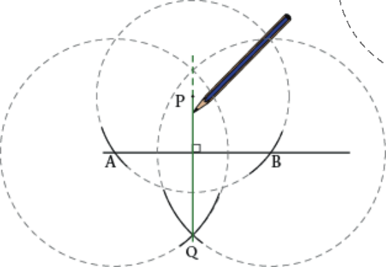
> **[Diagram Context - Textbook_Mathematics_Gr8_Construction-of-geometric-figures.pdf-0020-13.png]**
> This geometry figure illustrates a compass construction demonstrating the perpendicular bisector of a line segment. The visible elements include a horizontal line segment with endpoints A and B, intersecting construction arcs forming points P and Q, a vertical perpendicular line segment passing through PQ with a right-angle symbol, and a pencil drawing the line. Conceptually, this diagram conveys the step-by-step construction method used to divide a line segment into two equal parts at a 90-degree angle without measuring tools.


###### **Answers** 

2. Learners’ own work. 


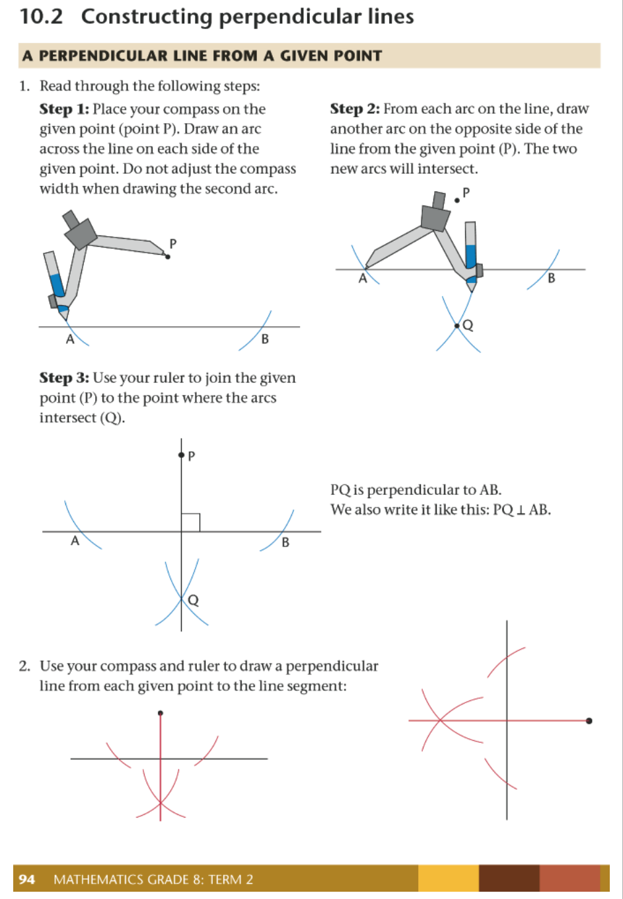
> **[Diagram Context - Textbook_Mathematics_Gr8_Construction-of-geometric-figures.pdf-0020-16.png]**
> This educational graphic is a geometry figure demonstrating step-by-step constructions using a pair of compasses and a ruler. It displays instructions and diagrams labelled with points P, Q, A, and B, arc intersection markings, and the perpendicularity symbol ($\perp$). Conceptually, the diagram guides students through the geometric method of constructing a perpendicular line from a given point to a line segment without using a protractor.


MATHEMATICS GRADE 8 TEACHER GUIDE 

###### **A PERPENDICULAR LINE FROM A GIVEN POINT ON A LINE** 

###### **Teaching guidelines** 

Remind learners to always work with a sharp pencil. 

The radius of the circles drawn at the points A and B must be larger than the circle drawn at P. 

###### **Notes on the questions/tasks** 

The drawings below explain why this construction works. 

The distance AQ = BQ because the circles A and B have the same radius. 

The line PQ bisects the line segment AB perpendicularly. 


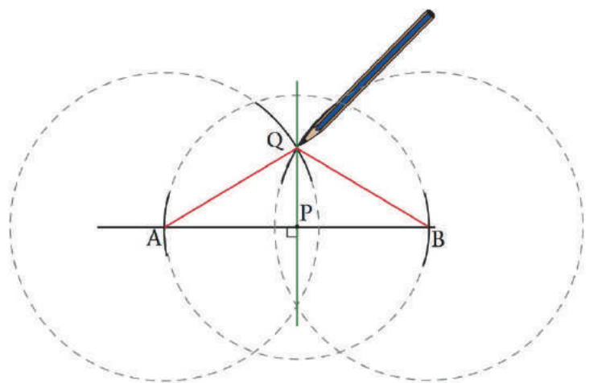
> **[Diagram Context - Textbook_Mathematics_Gr8_Construction-of-geometric-figures.pdf-0021-08.png]**
> This geometry figure illustrates a compass-and-straightedge construction demonstrating the perpendicular bisector of a line segment. Visible elements include points A and B on a horizontal base line, intersection point Q at the top where arc curves meet, midpoint P on the baseline, intersecting dashed circles centered at A and B, a perpendicular green dividing line, red connecting lines, and a pencil drawing the intersection. For FET mathematics learners, this diagram visually conveys the step-by-step geometric construction used to prove congruence triangles and construct a line perpendicular to a given line segment.


###### **Answers** 

2. Learners’ own work. See the answers on LB page 95 alongside. 


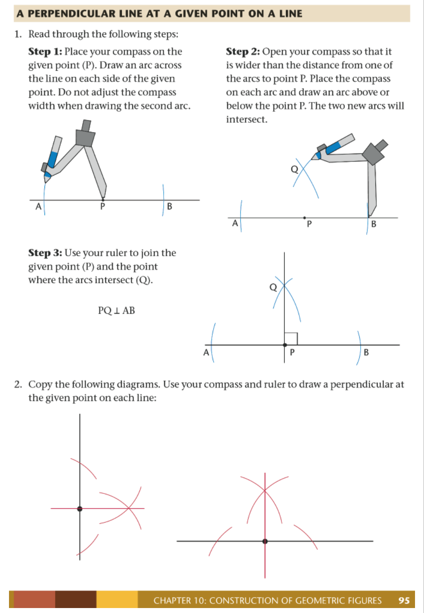
> **[Diagram Context - Textbook_Mathematics_Gr8_Construction-of-geometric-figures.pdf-0021-11.png]**
> This instructional geometry figure demonstrates the step-by-step construction of a perpendicular line at a given point on a line using a ruler and compass. The graphic displays points labeled A, B, P, and Q, along with construction arcs and perpendicularity symbols ($\perp$). Conceptually, it guides South African high school learners through accurate Euclidean geometry construction techniques required to construct perpendiculars without a protractor.


MATHEMATICS GRADE 8 TEACHER GUIDE 

##### 10.3 Bisecting angles 

###### **MEASURING AND CLASSIFYING ANGLES** 

###### **Teaching guidelines** 

Remind learners how to measure the magnitude of an angle by doing an example on the board. 

###### **Misconceptions** 

Learners read the wrong scale on the protractor. 

###### **Answers** 

1. See the answers on LB page 96 alongside. 

2.  See the answers on LB page 96 alongside. 

3. ∠1: obtuse ∠6: right 

   - ∠1 + ∠2: straight ∠7 + ∠8; right 

   - ∠1 + ∠4:  straight ∠6 + ∠7 + ∠8: straight 

   - ∠2 + ∠3: straight ∠5 + ∠6 + ∠7: straight 

   - ∠3 + ∠4: straight 

   - ∠5 + ∠6: obtuse 

- ∠1 + ∠2 + ∠4: reflex ∠5 + ∠6 + ∠7 + ∠8: reflex 

- ∠1 + ∠2 + ∠3 + ∠4: revolution ∠5 + ∠6 + ∠7 + ∠8 + ∠9: revolution 


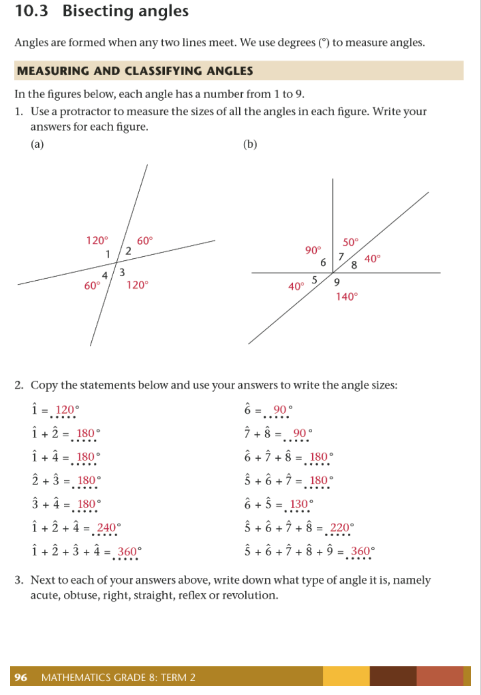
> **[Diagram Context - Textbook_Mathematics_Gr8_Construction-of-geometric-figures.pdf-0022-17.png]**
> This educational graphic is a geometry figure showing intersecting lines forming multiple angles in two distinct diagrams labeled (a) and (b). Visible labels include numbered angles (1 through 9 marked with hat notations like $\hat{1}$ and $\hat{6}$) and numerical degree values (e.g., $120^\circ$, $60^\circ$, $90^\circ$, $50^\circ$, $40^\circ$), alongside mathematical exercises requiring students to measure, calculate, and classify angle sums. Conceptually, the diagram helps students investigate angle relationships—such as angles on a straight line and angles around a point—reinforcing foundational geometry principles aligned with the CAPS curriculum.


MATHEMATICS GRADE 8 TEACHER GUIDE 

###### **BISECTING ANGLES WITHOUT A PROTRACTOR** 

###### **Teaching guidelines** 

Learners can use any radius to draw the first circle and may change the radius of the next two circles, or they can keep it the same as that of the first circle, but then the drawing may become very large. 

Allow learners to experiment with this construction until they can do it smoothly. 

###### **Notes on the questions/tasks** 

The drawings below explain why this construction works: 

- AB = BC = radii of circle B 

- AP = PC = radii of circle A and circle C that have the same radius 

- So triangle ABP and triangle CBP have all the sides the same length, the angles are the same as well. 

- So ∠ABP = ∠CBP. 


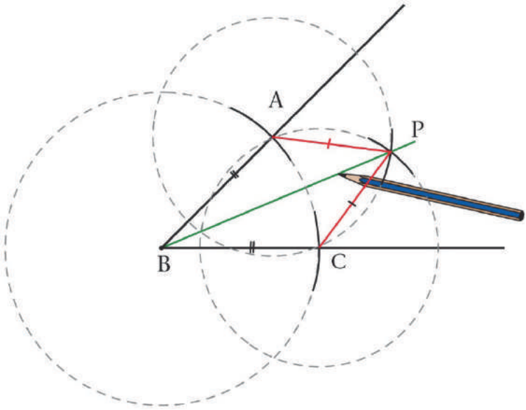
> **[Diagram Context - Textbook_Mathematics_Gr8_Construction-of-geometric-figures.pdf-0023-10.png]**
> This educational graphic is a Euclidean geometry construction figure demonstrating the geometric construction of an angle. Visible elements include intersecting dashed construction circles, vertex points labeled A, B, C, and P, straight black rays originating from vertex B, red connecting lines with double tick marks, a green ray bisecting the angle, and a blue pencil drawing the final arc. Conceptually, this diagram illustrates the step-by-step method used in high school mathematics to construct a 60-degree angle or bisect an existing angle using only a compass and straightedge.


###### **Answers** 

2.  Learners’ own work. See the answers on LB page 97 alongside. 


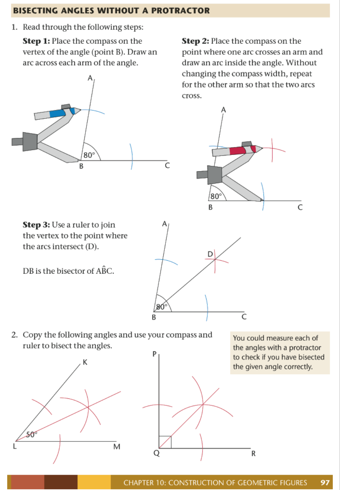
> **[Diagram Context - Textbook_Mathematics_Gr8_Construction-of-geometric-figures.pdf-0023-13.png]**
> This educational graphic is a geometry figure demonstrating the construction steps for bisecting angles without a protractor. It features labelled points (A, B, C, D, K, L, M, P, Q, R), degree measurements (80°, 50°), compass arcs, and straight-line bisectors. For a high school student following the CAPS curriculum, this diagram visually conveys the geometric construction technique of dividing an angle into two equal parts using only a pair of compasses and a ruler.


MATHEMATICS GRADE 8 TEACHER GUIDE 

##### 10.4 Constructing special angles without a protractor 

###### **CONSTRUCTING ANGLES OF 60°, 30° AND 120°** 

###### **Teaching guidelines** 

You could show learners the following construction on the board. 

- Draw the arc from J and use the same radius to draw another arc from the point K to intersect the first arc at P. 


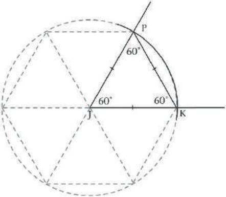
> **[Diagram Context - Textbook_Mathematics_Gr8_Construction-of-geometric-figures.pdf-0024-05.png]**
> This geometry figure illustrates circle geometry theorems, featuring a circle intersected by inscribed shapes, radii, and chords. The graphic includes vertex labels J, P, and K, angle measurements of 60°, tick marks indicating equal side lengths, and dashed construction lines forming a regular hexagon inscribed within the circle. Conceptually, this helps CAPS Grade 11 learners apply Euclidean geometry theorems relating to angles in the same segment, radii, tangents, and cyclic quadrilaterals.


- Now JK and KP have the same length and JP will have the same length because P lies on the first arc that has radius JK. 

- The triangle formed is an equilateral triangle of which all the angles are 60°. 

- Produce KJ and show learners that 

the adjacent angle is 120° as a straight angle is 180°. 

###### **Answers** 

2. (a) See the answers at the top of LB page 99 on the next page. 

   - (b) See the answers at the top of LB page 99 on the next page. 

   - (c) Learners should be able to deduce that an angle of 60° that is bisected gives two angles of 30° each. 

   - (d) 120° 

   - (e) 180° 


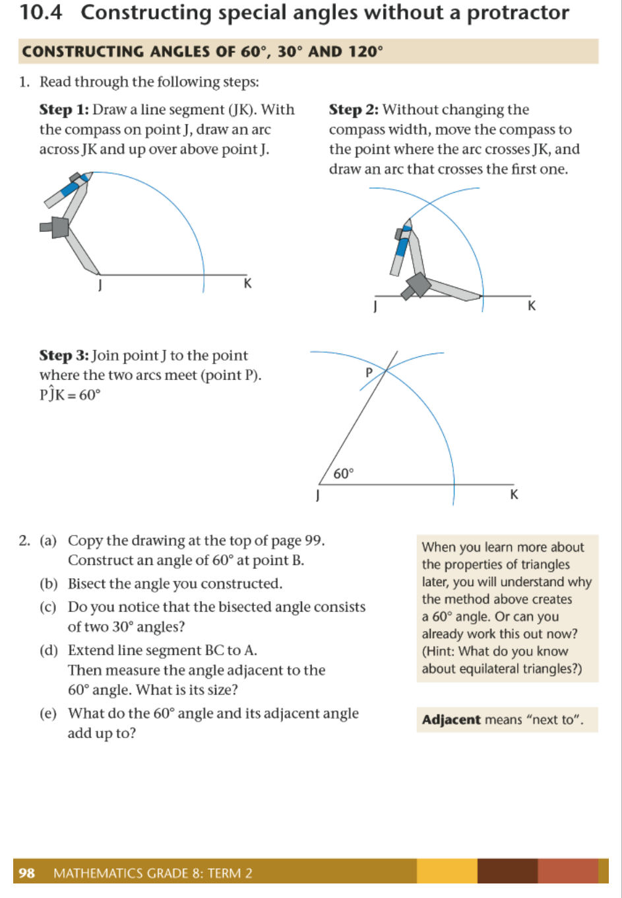
> **[Diagram Context - Textbook_Mathematics_Gr8_Construction-of-geometric-figures.pdf-0024-16.png]**
> This educational graphic is a geometry figure demonstrating a geometric construction procedure using a pair of compasses and a straight edge. It displays step-by-step instructions with visible labels including line segment JK, points J, K, and P, intersection arcs, and angle notation $P\hat{J}K = 60^\circ$. For a high school student following the CAPS curriculum, this diagram conveys the step-by-step methodology required to construct a standard $60^\circ$ angle without a protractor by utilizing the geometric properties of an equilateral triangle.


MATHEMATICS GRADE 8 TEACHER GUIDE 

###### **CONSTRUCTING ANGLES OF 90° AND 45°** 

###### **Teaching guidelines** 

If learners could manage the previous construction, they should be able to do this one. 

- Construct a right angle as shown in section 10.2. 

- Bisect the angle as shown in section 10.2 to get 45°. 

###### **Answers** 

1. See the answers on LB page 99 alongside. 

2. See the answers on LB page 99 alongside. 

###### **Challenge** 

Have learners construct the following angles, using their newly gained knowledge of constructing angles. 


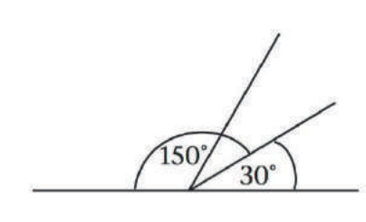
> **[Diagram Context - Textbook_Mathematics_Gr8_Construction-of-geometric-figures.pdf-0025-10.png]**
> This geometry figure shows two adjacent angles resting on a straight line. Visible labels include the degree measurements 150° and 30°. Conceptually, this diagram illustrates supplementary angles on a straight line, helping learners understand that adjacent angles sharing a common vertex and arm sum up to 180°.


1. 150° 

   - 150° = 180° –  30°. 

   - Construct a 30° angle. 

   - Produce the side. 

   - The outer angle is 150°. 

2. 210° 

   - 210° = 180° + 30°. 

   - Construct a 30° angle. 

   - Produce the upper side. 

   - The whole angle is 210°. 


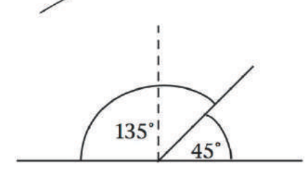
> **[Diagram Context - Textbook_Mathematics_Gr8_Construction-of-geometric-figures.pdf-0025-21.png]**
> This geometric figure displays a straight line intersected by a ray, forming adjacent angles on a straight line. The diagram includes a horizontal base line, a perpendicular dashed line, an angled ray, and numerical angle measurements labeled as $135^\circ$ and $45^\circ$. Conceptually, this helps CAPS FET mathematics learners understand supplementary angles on a straight line, demonstrating that adjacent angles sharing a common vertex and side sum up to $180^\circ$.


3. 135° 

   - Construct an angle of 45°. 

   - Produce the side and take the outer angle. 


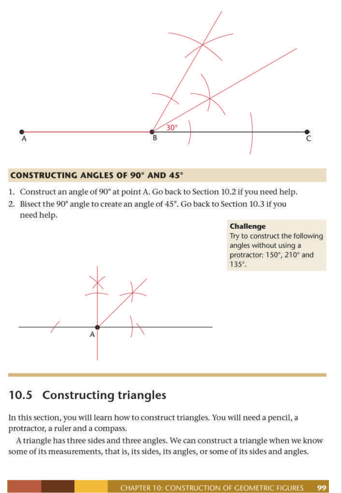
> **[Diagram Context - Textbook_Mathematics_Gr8_Construction-of-geometric-figures.pdf-0025-25.png]**
> This textbook page is a geometry figure graphic illustrating geometric constructions, specifically focusing on angles and triangles. Visible labels include point markers A, B, and C, degree measurements such as 30°, section headings like "CONSTRUCTING ANGLES OF 90° AND 45°" and "10.5 Constructing triangles", instructional steps numbered 1 and 2, and a challenge box alongside construction arcs and intersecting ray lines. Conceptually, it demonstrates step-by-step Euclidean geometry construction techniques using a compass and straightedge to construct specific angles and triangles without a protractor, aligning with CAPS curriculum requirements for spatial reasoning and geometric accuracy.


MATHEMATICS GRADE 8 TEACHER GUIDE 

##### 10.5 Constructing triangles 

###### **CONSTRUCTING TRIANGLES** 

###### **Teaching guidelines** 

Encourage learners to always make a rough drawing on which they write all the information when they start planning the construction. A rough drawing is a tidy drawing, but need not be accurate. A construction should be as accurate as possible. 

Follow the instructions on LB page 100 alongside to construct triangles if three sides are given. 

We recommend that you use the longest side as the base of the triangle. 

###### **Answers** 


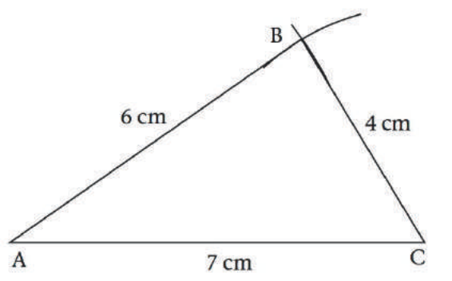
> **[Diagram Context - Textbook_Mathematics_Gr8_Construction-of-geometric-figures.pdf-0026-07.png]**
> This geometry figure illustrates the construction of a triangle using a compass and ruler based on given side lengths. Visible labels include vertices A, B, and C, with side measurements of 7 cm for AC, 6 cm for AB, and 4 cm for BC, alongside construction arcs intersecting at point B. Conceptually, this diagram demonstrates the geometric construction method for triangles when all three side lengths (SSS condition) are known, reinforcing spatial reasoning and accurate instrument use in senior phase mathematics.


2. (a) 

(b) 


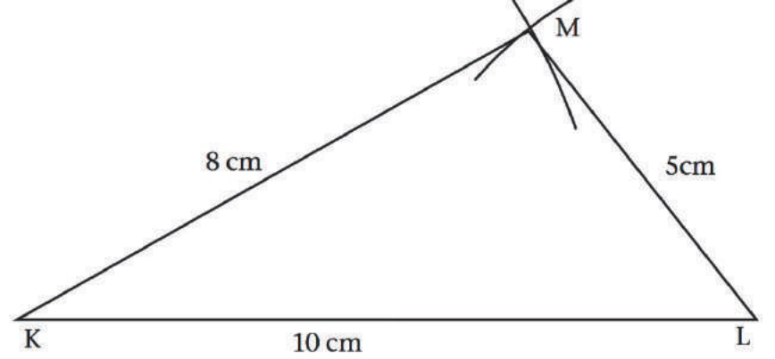
> **[Diagram Context - Textbook_Mathematics_Gr8_Construction-of-geometric-figures.pdf-0026-10.png]**
> This geometric figure represents a triangle labeled KLM with construction arc markings intersecting at vertex M. The visible labels include vertices K, L, and M, along with side length measurements of 8 cm for KM, 5 cm for ML, and 10 cm for KL. Conceptually, this diagram illustrates Euclidean geometry construction techniques and the application of the cosine rule to determine unknown angles in a non-right-angled triangle based on three given side lengths (SSS).


(c) Construct ∆PQR in the same way as shown above. 


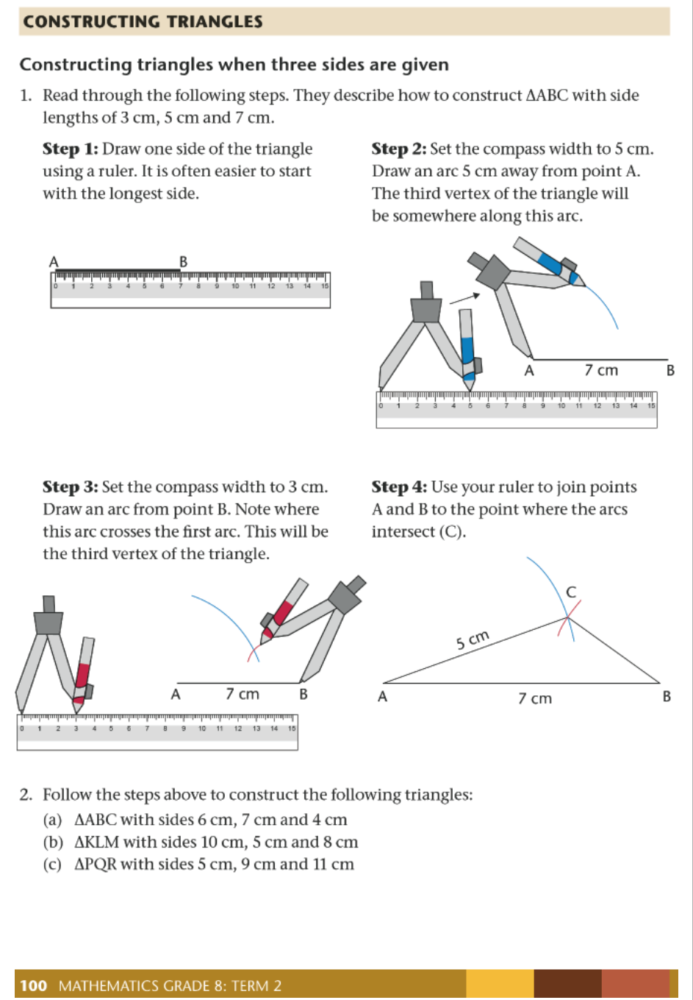
> **[Diagram Context - Textbook_Mathematics_Gr8_Construction-of-geometric-figures.pdf-0026-12.png]**
> This educational graphic is a step-by-step geometry figure illustrating the construction of triangles using a ruler, compass, and arc intersections. Visible labels include vertices A, B, and C, measurement values such as 3 cm, 5 cm, and 7 cm, and triangle notation like $\Delta$ABC, $\Delta$KLM, and $\Delta$PQR. Conceptually, it guides Grade 8 learners through the SSS (side-side-side) geometric construction method, demonstrating how to accurately translate side lengths into precise triangle vertices using geometric instruments.


MATHEMATICS GRADE 8 TEACHER GUIDE 

###### **Teaching guidelines** 

When learners have to construct triangles using a combination of angles and sides, it is imperative that they do a rough sketch. Doing a rough sketch will allow them to see what information they do not have and to plan how the construction will be performed. 

Remind learners to work with a sharp pencil. 

###### **Answers** 

3. (a) Two angles and a side between the two angles are given. See the rough drawing and answers on LB page 101 alongside. Start with the given facts. Draw line AB 7 cm long. At A, construct an angle of 50° and at B, an angle of 45°. Where the upper sides of these angles intersect is angle C. Measure the angle and the sides AC and BC. 

In the exercise, two angles and the side between them are given. If the information was two angles and any other side (not between the angles), the construction is slightly more complicated. Let’s say the angles B = 45° and C = 85° and AB = 7 cm were given. Learners can first work out the third angle and proceed as described in question 3(a). This implies that they have 

to know that the sum of the interior angles of a triangle add up to 180°. 

- (b) In this example the angle between the two known sides is given. The construction is simple: draw KL 9 cm long; at K construct a 35° angle and draw its side KM 8 cm long; join L and M to give the third side. See the rough drawing and answers on LB page 101 alongside. 

In the exercise the given angle is between the two sides. If the angle was not between the two sides, the construction would be a little different. First, the 35° angle is drawn and one of its sides, KL, is made 9 cm. At L, with the compass set at 8 cm, an arc is drawn to cut the other side from K at M. All the unknown sides and angles are measured. 

   - (c) Construct the 90° angle and then the other sides or angles. See the rough drawing and answers on LB page 101 alongside. 

4. See the answers on LB page 101 alongside. 

5. Learners’ own work. 


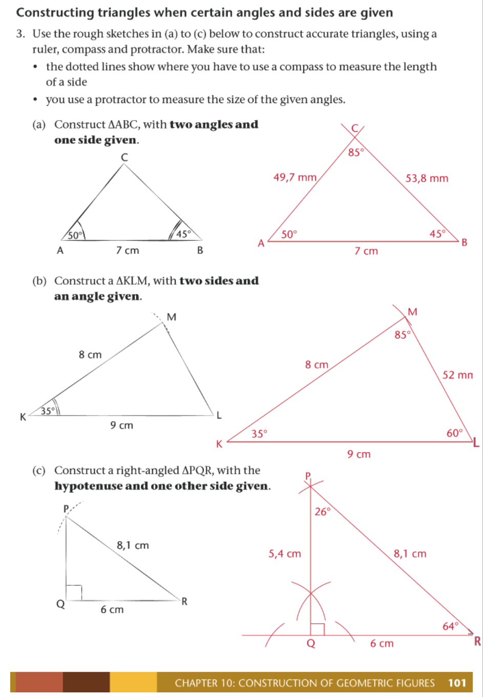
> **[Diagram Context - Textbook_Mathematics_Gr8_Construction-of-geometric-figures.pdf-0027-12.png]**
> This educational graphic is a geometry figure demonstrating the step-by-step construction of triangles using standard geometric instruments. It features three distinct problem scenarios labeled (a), (b), and (c), showing rough sketches alongside fully constructed triangles with visible vertex labels (A, B, C; K, L, M; P, Q, R), side length measurements in centimeters and millimeters, angle measurements in degrees, and compass arc construction lines. Conceptually, the diagram guides South African CAPS senior phase and FET learners on how to accurately construct triangles given specific boundary conditions—such as two angles and a side, two sides and an included angle, or a hypotenuse and another side—by applying fundamental ruler, compass, and protractor techniques.


MATHEMATICS GRADE 8 TEACHER GUIDE 

###### **Challenge** 

1. (a) If no sides are given, learners have to choose a length for the sides and proceed as in 3(a). 

   - (b) Draw XY = 8 cm; at X construct and angle of 50°; at Y draw an arc with radius 7 cm to cut the side drawn from X at Z. 

2. For (a) there are many solutions. 

   - For (b) there is one triangle. All the triangles drawn should be congruent. 

##### 10.6 Properties of triangles 

###### **PROPERTIES OF EQUILATERAL TRIANGLES** 

###### **Teaching guidelines** 

Point out that all equilateral triangles have the same angle sizes. 

###### **Answers** 

1. (a) Learners’ own work. 

   - (b) See the answers on LB page 102 alongside. 

2. See the answers on LB page 102 alongside. 

3. Learners’ own work. 


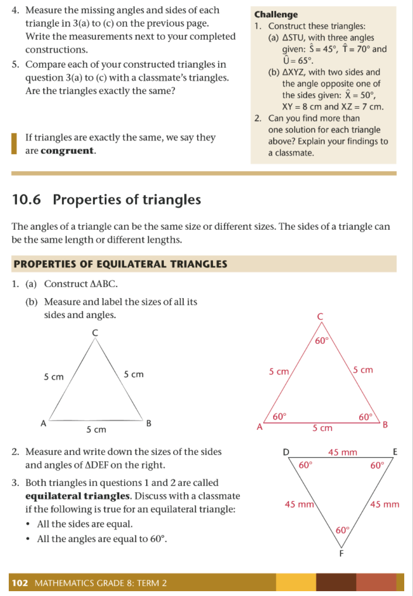
> **[Diagram Context - Textbook_Mathematics_Gr8_Construction-of-geometric-figures.pdf-0028-14.png]**
> This educational graphic is a Grade 8 Mathematics textbook page focusing on geometry and the properties of triangles under the CAPS curriculum. It displays worked examples and exercises featuring two geometric figures: triangle ABC with side lengths of 5 cm and triangle DEF with side lengths of 45 mm, both labeled with vertices (A, B, C and D, E, F) and interior angle measurements of 60°. Conceptually, the page guides learners to discover that equilateral triangles possess sides of equal length and internal angles that always measure 60 degrees.


MATHEMATICS GRADE 8 TEACHER GUIDE 

###### **PROPERTIES OF ISOSCELES TRIANGLES** 

###### **Teaching guidelines** 

Isosceles triangles have two sides equal and the angles opposite those sides are equal. 

###### **Misconceptions** 

Be aware that learners sometimes confuse isosceles and equilateral triangles. 

###### **Answers** 

1. (a) In ∆DEF DE = DF and in ∆JKL ∠J = ∠L = 70° 

   - (b) Learners’ own work. 

2. Learners’ own work. 

###### **THE SUM OF THE ANGLES IN A TRIANGLE** 

###### **Teaching guidelines** 

The conclusion reached by doing question 2 is an important fact about triangles. Learners must be sure of this fact concerning triangles as they will use it often in their future mathematical studies. 

###### **Answers** 

1. 180° 

2. (a) and (b) Learners’ own work. 

   - (c) 180° 

##### 10.7 Properties of quadrilaterals 

###### **Background information** 

In order to classify shapes we need to know what their properties are. 

It may be that the shape has more than the minimum required properties, as in the case of the square being a rectangle. It has to have all four angles equal and two pairs of opposite sides equal. It has the extra property that all its sides are also equal, which makes it a special rectangle. 


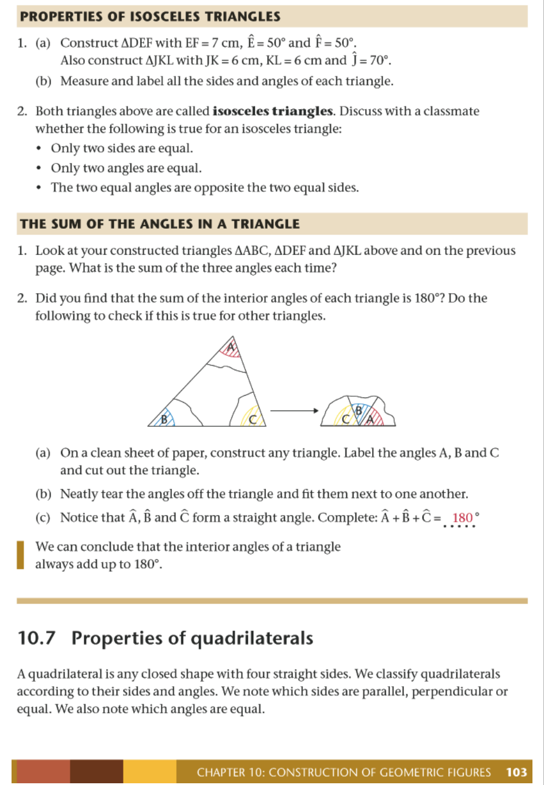
> **[Diagram Context - Textbook_Mathematics_Gr8_Construction-of-geometric-figures.pdf-0029-20.png]**
> This educational graphic is a geometry figure demonstrating the interior angles of a triangle through a cut-and-paste investigative activity. It includes text prompts, construction instructions, and a diagram showing a triangle with vertices labeled A, B, and C whose torn-off corner angles are rearranged adjacently via an arrow to form a straight line. Conceptually, this activity guides learners to discover and prove empirically that the sum of the interior angles of any triangle always equals 180°.


MATHEMATICS GRADE 8 TEACHER GUIDE 

###### **PROPERTIES OF QUADRILATERALS** 

###### **Teaching guidelines** 

The quadrilaterals can be subdivided into groups according to their properties. For example, they can be parallelograms, kites, squares, rectangles and trapeziums. 

Ask questions to make learners think about the connections between the groups of shapes, for example: 

- Could a rectangle be considered a parallelogram? 

- Could a square be considered a rhombus, or a rectangle? 

- Could a rhombus be considered a kite? 

In order to answer these questions we have to determine what the minimum properties are that a shape should have to belong to a group. For example, “What does a square need to have to be considered a rhombus?” (All four sides have to be the same length.) 

Sorting quadrilaterals according to their properties is an important activity which helps learners to develop the ability to think analytically and make deductions and connections. They need to gather all the available information and compare the properties of the different shapes in order to classify them. 

###### **Answers** 

1. See the answers on LB page 104 alongside. 


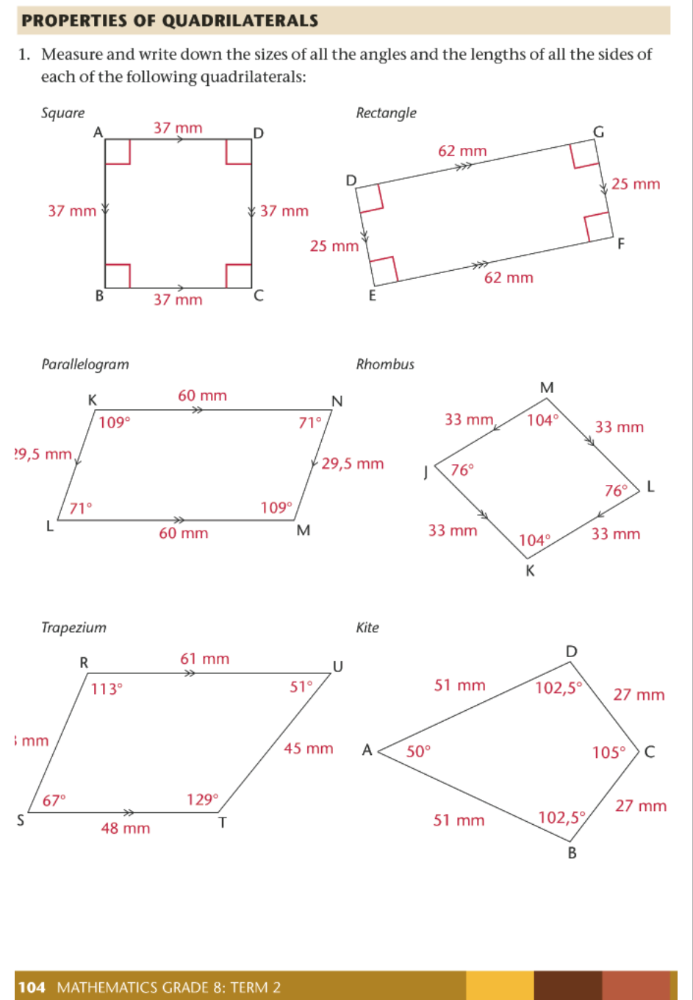
> **[Diagram Context - Textbook_Mathematics_Gr8_Construction-of-geometric-figures.pdf-0030-11.png]**
> This geometry figure displays six distinct quadrilaterals: a square (ABCD), rectangle (DEFG), parallelogram (KLMN), rhombus (JMLK), trapezium (RSTU), and kite (ABCD). Visible labels include vertex letters (A, B, C, D, etc.), side lengths in millimeters (e.g., 37 mm, 62 mm), interior angle measurements in degrees (e.g., 90°, 109°, 76°), and parallel side indicator arrows. Conceptually, the diagram helps Grade 8 CAPS mathematics learners investigate and discover the defining geometric properties of various quadrilaterals by comparing their sides and angles.


MATHEMATICS GRADE 8 TEACHER GUIDE 

###### **Answers** 

2. See the completed table on LB page 105 alongside. 

###### **Teaching guidelines** 

Completing the table of properties of quadrilaterals is an important activity and should not be hurried over. 

Allow learners to complete the table and discuss it with each other in small groups or pairs. 

In a class discussion, help learners to see that a rectangle, a rhombus and a square are also parallelograms, because they have the required properties of a parallelogram. They have more properties than needed, but that is why they also belong to subgroups, for example, a square is also a rectangle, and a rhombus, but a rhombus is not a rectangle. A kite and a trapezium each belong to a group of their own within the quadrilaterals. 

Let learners verbalise these properties and classifications to each other. 

###### **SUM OF THE ANGLES IN A QUADRILATERAL** 

###### **Teaching guidelines** 

Another way of seeing that the sum of the interior angles of a quadrilateral is 360°, is to draw a few quadrilaterals and draw a diagonal in each. The diagonal divides the quadrilateral into two triangles. We have found that the sum of the interior angles of a triangle is 180°. Therefore, the sum of the interior angles of the two triangles is 2 × 180° = 360°. 

###### **Answer** 

1. It is always 360°. 

2. It forms a circle, which is 360°. 

##### 10.8 Constructing quadrilaterals 

###### **Teaching guidelines** 

Let learners construct a few of the quadrilaterals shown on LB page 104 on the previous page. 


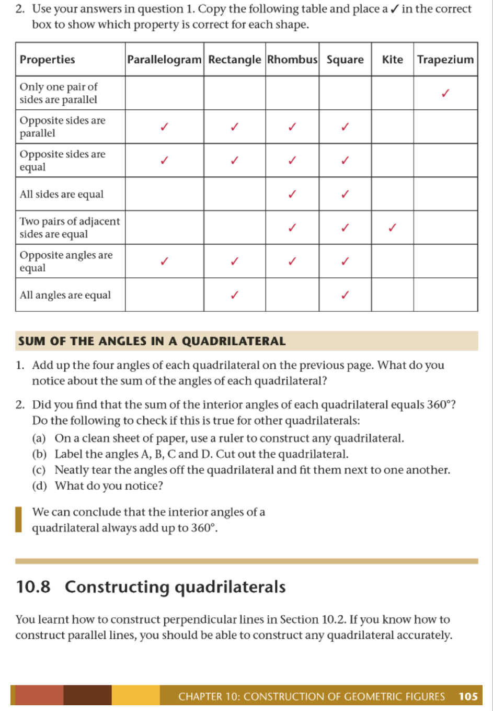
> **[Diagram Context - Textbook_Mathematics_Gr8_Construction-of-geometric-figures.pdf-0031-16.png]**
> The graphic is a geometry learning activity table and exercise set titled "CHAPTER 10: CONSTRUCTION OF GEOMETRIC FIGURES". It features a property classification table with column headers for "Parallelogram", "Rectangle", "Rhombus", "Square", "Kite", and "Trapezium", and row labels listing geometric properties such as parallel sides, equal sides, equal adjacent sides, and equal angles marked with ticks. Additionally, it includes investigative questions demonstrating that the sum of interior angles in any quadrilateral equals 360°, guiding students through practical construction and deduction steps.


MATHEMATICS GRADE 8 TEACHER GUIDE 

###### **Teaching guidelines** 

Allow learners to carefully read through and follow the four steps given on LB page 106 for the construction of parallel lines. Then ask learners to go back to reconstruct the quadrilaterals on LB page 104. The exercises on LB page 106 are for practising ideas and skills they have developed. 


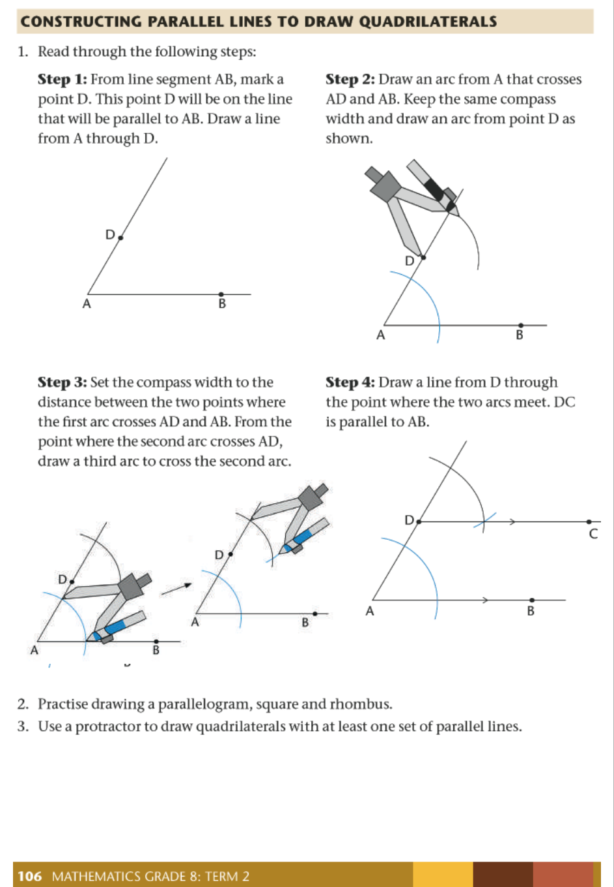
> **[Diagram Context - Textbook_Mathematics_Gr8_Construction-of-geometric-figures.pdf-0032-02.png]**
> The educational graphic is a geometric construction diagram illustrating the step-by-step process of constructing parallel lines using a compass and straightedge. Visible labels include line segments and points marked as A, B, C, and D, alongside intersecting arcs and geometric drawing tools. This diagram guides learners through Euclidean construction techniques, conceptually demonstrating how to transfer angles and use corresponding properties to construct parallel lines for drawing quadrilaterals.


MATHEMATICS GRADE 8 TEACHER GUIDE 

###### **WORKSHEET** 

###### **Answer** 

1. Learners’ own work. 

2. A equilateral triangle 

   - B isosceles triangle 

   - C parallelogram 

   - D rhombus 

   - E square 

   - F rectangle 

3. (a) square 

   - (b) rhombus, square, kite 

   - (c) trapezium 

   - (d) parallelogram, rhombus, square, rectangle 

   - (e) square, rectangle 

   - (f) rhombus, square 


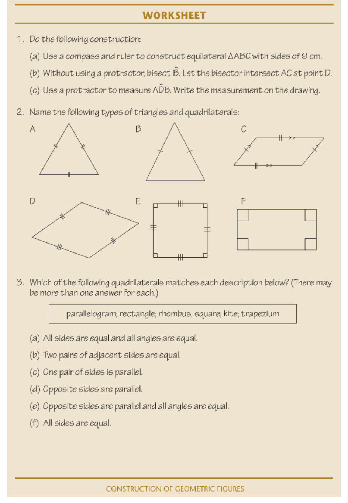
> **[Diagram Context - Textbook_Mathematics_Gr8_Construction-of-geometric-figures.pdf-0033-15.png]**
> This educational worksheet is a geometry figure graphic featuring three distinct instructional sections on the construction, classification, and properties of polygons. Visible elements include text prompts numbered 1 to 3, geometric labels A through F for shapes, side-length hash marks, parallel arrows, right-angle indicators, and a word bank listing quadrilaterals such as parallelogram, rectangle, rhombus, square, kite, and trapezium. Conceptually, it helps learners apply Euclidean geometry principles by practicing compass-and-ruler construction, identifying specific types of triangles and quadrilaterals based on side and angle properties, and linking descriptive geometric definitions to the correct polygon names.


MATHEMATICS GRADE 8 TEACHER GUIDE 

## 5. Authentic Exam Question Archetypes & Mark Allocations
*(Extracted from official CAPS examination papers to guide marking, pacing, and rubric design)*

### Archetype 1: QUESTION 1
- **Source Paper:** `Gr8_Mathematics_Exam_11.pdf`
- **Total Mark Allocation:** **[7 Marks]** (Sub-questions: 1, 1, 1, 1, 1 marks)
- **Recommended Time:** **8 Minutes** (Pacing: ~1.2 min/mark | *Calibrated to Official CAPS Paper Pace (1.2 min/mark)*)
- **Assessment Mode Calibration:** Timed Exam Simulation: 8 min countdown (Pacing Checkpoint: 6 min)
- **Cognitive / Marking Strategy:** NSC Standard (Method Marks [M], Accuracy Marks [A], Carry-Over [CA])

#### Question Prompt & Working:
```text
QUESTION 1 
Complete the following geometrical statements: 
 
1.1 
The supplement of  75o is …………  
 
 
 
             
  
 
(1) 
 
1.2 
From 2 o’clock to 6 o’clock the hour hand of a clock turns through ……o  
 
 
(1) 
 
1.3. 
A triangle with two equal sides is called ……………… 
 
 
 
 
 
(1) 
 
1.4. 
73o is the …………………. of 17o 
 
 
 
 
 
 
 
 
(1) 
 
1.5. 
An angle of 360o is called a …………………….. 
 
 
 
 
 
 
(1) 
 
1.6      The lines that are equidistant from each other are called……….lines.  
 
 
 
(1) 
 
 
 
 
 
1.7      The opposite angles of a rhombus are ……….. 
 
 
 
 
 
 
(1) 
 
 
 
 
 
 
 
 
 
 
 
 
 
 
 
 
 
 
 
 
 
 
 
 
 
 
 
 
[7]
```

### Archetype 2: QUESTION 1
- **Source Paper:** `Gr8_Mathematics_Exam_13.pdf`
- **Total Mark Allocation:** **[17 Marks]** (Sub-questions: 2, 1, 3, 3, 6 marks)
- **Recommended Time:** **20 Minutes** (Pacing: ~1.2 min/mark | *Calibrated to Official CAPS Paper Pace (1.2 min/mark)*)
- **Assessment Mode Calibration:** Timed Exam Simulation: 20 min countdown (Pacing Checkpoint: 15 min)
- **Cognitive / Marking Strategy:** NSC Standard (Method Marks [M], Accuracy Marks [A], Carry-Over [CA])

#### Question Prompt & Working:
```text
QUESTION 1 
 
 
  
 
1.1 
The histogram below shows the number of athletes in specific age groups who 
participated in the Two Oceans Half Marathon in March 2013.  
The oldest runner was 79 years. 
number of athletes 
 
 
 
 
 
 
 
(a) 
How many athletes under 30 years participated in the Two Oceans Half 
marathon? 
(2) 
 
 
 
 
 
(b) 
In what age group did the most athletes participate in the Two Oceans Half 
Marathon? 
(1) 
 
 
 
 
 
(c) 
How many athletes in total participated in the Two Oceans Half marathon? 
(3) 
 
 
 
 
 
(d) 
Compare the number of athletes younger than 50 to those 50 and older. Describe 
your observations and give a possible reason for your observations. 
(3) 
 
 
 
 
1.2 
The following table shows the monthly rainfall figures for two towns over a period of 
one yea...
```

### Archetype 3: Question 2
- **Source Paper:** `Gr8_Mathematics_Exam_14.pdf`
- **Total Mark Allocation:** **[15 Marks]** (Sub-questions: 4, 3, 2, 3, 3 marks)
- **Recommended Time:** **18 Minutes** (Pacing: ~1.2 min/mark | *Calibrated to Official CAPS Paper Pace (1.2 min/mark)*)
- **Assessment Mode Calibration:** Timed Exam Simulation: 18 min countdown (Pacing Checkpoint: 14 min)
- **Cognitive / Marking Strategy:** NSC Standard (Method Marks [M], Accuracy Marks [A], Carry-Over [CA])

#### Question Prompt & Working:
```text
Question 2 
 
2.1 
 
 
 
 
The ratio of women engineers to men engineers in a construction 
company is 3:8. There are six women engineers. How many men 
engineers are there? 
 
(4) 
 
 
2.2 
 
 
 
The cost of breakfast cereal is R35 for 1 kg. Calculate how much 25 g 
of breakfast cereal will cost. 
 
(3) 
 
 
2.3 
 
 
Study the following pattern:  2 ; 5 ; 8 ;------ ; ----- 
 
 
 
 
2.3.1 Complete the pattern. 
 
(2) 
 
 
2.3.2 Determine the rule for the pattern in the form Tn = ……. 
 
(3) 
 
 
2.3.3 
 
Use the rule in 2.4.2 to find the 15th term of the pattern 
 
 
(3) 
 
 
 
 
[15]
```
