# Chapter 16: Transformation Geometry

## 16.1 Lines of Symmetry

### What is the line of symmetry?
A line of symmetry (also called an **axis of symmetry**) is a line that divides a figure into two parts that are mirror images of each other. 

If you were to fold a figure along its line of symmetry, the two parts would fit perfectly on top of one another, meaning all corresponding edges, sides, and angles would match exactly.

<!-- DIAGRAM_PLACEHOLDER: diagram -->

### Key Definitions

*   **Line of Symmetry / Axis of Symmetry:** A line that divides a figure into two parts that have an equal number of sides, where all corresponding sides and angles are equal.
*   **Congruent Figures:** Figures that are the exact same size and shape. When a figure is divided by a line of symmetry, the two resulting parts are congruent.

### Important Notes
*   A geometric figure can have:
    *   No lines of symmetry.
    *   One line of symmetry.
    *   More than one line of symmetry.
*   In the provided example, **Arrow A** demonstrates a line of symmetry because the red dotted line divides it into two congruent parts that would match if folded. **Arrow B** does not have a line of symmetry in the position shown.

---

# Identifying Lines of Symmetry

## Concept: Line of Symmetry
A line of symmetry is an imaginary line that divides a figure into two identical halves that are mirror images of each other. If you were to fold the figure along this line, the two halves would match perfectly.

---

## Exercise 1

### Instructions
1. **Part (a):** Copy each of the figures shown below. Place a tick ($\checkmark$) next to each figure where the provided red line acts as a line of symmetry.
2. **Part (b):** For figures where the red line is **not** a line of symmetry, draw in the correct line(s) of symmetry if possible. If a figure has more than one line of symmetry, draw all of them. If a figure has no lines of symmetry, write "No lines of symmetry" above the figure.

### Figures for Analysis

> **[Diagram Context - Textbook_Mathematics_Gr8_Construction-of-geometric-figures.pdf-0001-06.png]**
> This graphic is a measurement apparatus showing a standard 15 cm ruler with numerical markings from 0 to 15. Visible labels include the letters A and B indicating a measured span extending from the 0 mark to the 12 cm mark, with a midpoint indicator at 6 cm. This diagram teaches learners foundational practical measurement skills, specifically how to correctly read metric scales, determine instrument resolution, and calculate lengths or midpoints in physical sciences and mathematics.

| Figure | Description |
| :--- | :--- |
| **A** | Square with a diagonal red line. |
| **B** | Rectangle with a diagonal red line. |
| **C** | Crown-like shape with a horizontal red line. |
| **D** | Eight-pointed star with a diagonal red line. |
| **E** | Trapezium with a diagonal red line. |
| **F** | Parallelogram with a diagonal red line. |

---

### Mathematical Notes for Symmetry
*   **Square (A):** A square has $4$ lines of symmetry (two diagonals, one vertical, one horizontal).
*   **Rectangle (B):** A rectangle has $2$ lines of symmetry (vertical and horizontal). Note that diagonals are **not** lines of symmetry for a non-square rectangle.
*   **Parallelogram (F):** A general parallelogram has $0$ lines of symmetry.
*   **Trapezium (E):** An isosceles trapezium has $1$ line of symmetry, while a scalene trapezium has $0$.

> **[Diagram Context - Textbook_Mathematics_Gr8_Construction-of-geometric-figures.pdf-0001-08.png]**
> This geometry figure illustrates a line segment AB intersected by line CD at point F, accompanied by an explanatory text box stating that the small tick marks on segments AF and FB indicate they are equal in length. The diagram clearly labels points A, B, C, D, and F, along with double-hash equality tick marks on segments AF and FB. Conceptually, this visual aids high school learners in understanding the definition of a perpendicular bisector or midpoint in Euclidean geometry, showing how geometric notation indicates equal lengths along a straight line.

> **[Diagram Context - Textbook_Mathematics_Gr8_Geometry-of-3D-objects.pdf-0001-04.png]**
> This educational graphic displays a geometric diagram of a solid cylinder with two distinct circular points marked in black on its outer curved surface. There are no text labels, variables, or arrows visible in the illustration. For high school mathematics and CAPS geometry learners, this visual represents a three-dimensional cylindrical shape used to teach surface area, volume calculations, or spatial positioning on curved surfaces.

> **[Diagram Context - Textbook_Mathematics_Gr8_Geometry-of-3D-objects.pdf-0001-08.png]**
> The graphic displays a 3D geometry figure of a rectangular prism (cuboid) rendered in solid yellow with black outline edges. There are no explicit labels, letters, or dimensions visible on the figure. Conceptually, it helps students visualize three-dimensional shapes to calculate surface area and volume in CAPS Mathematics.

> **[Diagram Context - Textbook_Mathematics_Gr8_The-theorem-of-Pythagoras.pdf-0001-03.png]**
> This geometry graphic illustrates three distinct types of triangles classified by their interior angles: right-angled, obtuse-angled, and acute-angled triangles. Each triangle is labeled with vertices A, B, and C, side lengths $a$, $b$, and $c$, and indicates the relationships between angle sizes and corresponding side lengths, specifically identifying the hypotenuse and the longest sides. Conceptually, this helps learners differentiate triangle classifications and understand the geometric principle that the longest side of a triangle is always opposite its largest interior angle.

> **[Diagram Context - Textbook_Mathematics_Gr8_The-theorem-of-Pythagoras.pdf-0001-07.png]**
> This educational graphic is a geometry figure demonstrating the geometric proof of Pythagoras' theorem using square areas. It features triangles labeled with sides $a$, $b$, and $c$, vertices $A$, $B$, and $C$, and a grid of unit squares constructed on each side of the triangles, accompanied by right-angle symbols. The diagram visually conveys the conceptual relationship that the sum of the areas of the squares on the two shorter sides equals the area of the square on the hypotenuse, helping students understand the area-based derivation of the theorem $a^2 + b^2 = c^2$.

> **[Diagram Context - Textbook_Mathematics_Gr8_Transformation-geometry.pdf-0001-11.png]**
> This educational graphic illustrates three distinct geometric transformations—translation, reflection, and rotation—plotted on Cartesian grid paper. The diagrams feature original triangles labeled with vertices A, B, and C, and their transformed image counterparts labeled with primed notation A', B', and C', alongside directional arrows, reflection axes, and rotational angles. Conceptually, this visual supports high school mathematics learners in understanding Euclidean transformations by demonstrating how shapes move, flip, and turn while preserving their size and shape properties.

---

### Geometry: Symmetry

#### Concept: Lines of Symmetry
A line of symmetry (or axis of symmetry) is an imaginary line that divides a figure into two identical halves that are mirror images of each other. If you fold the figure along this line, the two parts will match perfectly.

---

#### Exercise 2: Identifying Lines of Symmetry
Copy the following geometric figures and draw the lines of symmetry. State the total number of lines of symmetry for each figure.

> **[Diagram Context - Textbook_Mathematics_Gr8_Construction-of-geometric-figures.pdf-0002-04.png]**
> The graphic illustrates a mechanical apparatus, specifically a drafting compass or divider resting on a horizontal surface, featuring numerical angle or measurement markings such as "0°" and "240°". The visible components include the pivoted legs, a tightening screw mechanism at the hinge, a pointed tip resting on the baseline, and an intersecting curved arc line. This diagram helps high school learners visualize geometric construction principles, spatial measurement, and the mechanical function of mathematical drawing instruments in practical geometry.

| Figure | Description | Number of Lines of Symmetry |
| :--- | :--- | :--- |
| **A** | Letter 'E' | 1 |
| **B** | Triangle | 1 |
| **C** | Regular Pentagon | 5 |
| **D** | Parallelogram | 0 |
| **E** | Four-pointed star | 4 |
| **F** | Irregular polygon | 0 |

---

#### Exercise 3: Completing Figures using Symmetry
In each diagram, the dotted line represents the axis of symmetry. Copy the grid and complete the figure so that it is perfectly symmetrical across the dotted line.

**Instructions for completion:**
1. **Identify the distance:** For every point on the existing side of the figure, measure its perpendicular distance from the axis of symmetry.
2. **Plot the reflection:** Mark a corresponding point on the opposite side of the axis at the exact same distance.
3. **Connect the points:** Join the new points to recreate the mirror image of the original shape.

> **[Diagram Context - Textbook_Mathematics_Gr8_Construction-of-geometric-figures.pdf-0002-07.png]**
> This graphic is a geometry figure illustrating a pair of intersecting curved arcs being drawn on a plane. Visible elements include a mechanical compass holding a pencil, intersecting curved lines, and a plain background without explicit labels, variables, or axis names. Conceptually, this diagram visually reinforces geometric construction techniques, demonstrating how precise tools are used to construct intersecting loci or arcs as required in high school mathematics and Euclidean geometry.

> **[Diagram Context - Textbook_Mathematics_Gr8_Construction-of-geometric-figures.pdf-0002-10.png]**
> The graphic is a geometry figure illustrating a foundational Euclidean construction step. Visible labels include line segment AB, points C and D, a 90° angle indicator, arc intersection marks, and text referencing "Step". This diagram conceptually demonstrates how to construct a perpendicular bisector using a compass and ruler, reinforcing geometric construction skills required in the CAPS curriculum.

> **[Diagram Context - Textbook_Mathematics_Gr8_Geometry-of-3D-objects.pdf-0002-01.png]**
> This graphic is a 3D geometric figure representing a composite prism with a pentagonal cross-section. The structure features distinct colored faces—blue on the front vertical end, green on the right side, yellow on the top-right slanted roof, and red on the top-left slanted roof—with no text labels or arrows. Conceptually, this diagram helps Grade 10-12 Mathematics and Mathematical Literacy learners visualize spatial dimensions and surface area calculations by breaking down a compound 3D solid into simpler geometric components.

> **[Diagram Context - Textbook_Mathematics_Gr8_Geometry-of-3D-objects.pdf-0002-08.png]**
> This educational graphic displays a 3D geometry figure representing a polyhedron alongside descriptive text. Visible text includes the words "polyhedron", "many-seated", and "flat faces". The diagram visually conveys the definition of a polyhedron as a three-dimensional geometric solid bounded by multiple flat polygonal faces, helping FET phase mathematics learners identify the structural characteristics of 3D objects.

> **[Diagram Context - Textbook_Mathematics_Gr8_Geometry-of-3D-objects.pdf-0002-12.png]**
> This graphic displays a collection of 3D geometric shapes and curved vessels labeled with letters A, B, C, D, E, and F, including a cylinder (A), a pyramid-like polyhedron (B), a curved vase-like container (D), and multi-faced prismatic polyhedra (E and F). Conceptually, this visual supports Intermediate Phase and Senior Phase Mathematics CAPS curricula by helping learners identify, classify, and compare the properties of various geometric solids, prisms, and irregular 3D objects based on their faces, vertices, and curved surfaces.

> **[Diagram Context - Textbook_Mathematics_Gr8_Geometry-of-3D-objects.pdf-0002-16.png]**
> The graphic displays an abstract colour gradient graphic consisting of three adjacent rectangular blocks in shades of reddish-brown, dark gold, and light yellow, with a thin diagonal line extending from the top right corner. The image lacks any explicit textual labels, variables, or scientific symbols. Conceptually, this visual does not contain recognizable CAPS curriculum content and serves merely as a decorative or incomplete graphical element.

> **[Diagram Context - Textbook_Mathematics_Gr8_The-theorem-of-Pythagoras.pdf-0002-00.png]**
> The graphic displays two geometry figures showing right-angled triangles with squares constructed on each of their sides. Visible labels include vertices A, B, and C, side length variables $a$, $b$, and $c$, and right-angle symbols in the corners of both the triangles and the grid-divided squares. Conceptually, this visual demonstrates the geometric proof of Pythagoras' theorem by showing that the area of the square on the hypotenuse ($c^2$) equals the sum of the areas of the squares on the other two sides ($a^2 + b^2$).

> **[Diagram Context - Textbook_Mathematics_Gr8_Transformation-geometry.pdf-0002-02.png]**
> This geometry figure displays a sequence of four triangles on a Cartesian grid representing consecutive Euclidean transformations. Visible labels include vertices $B$ and $C$ on the original blue triangle, progressing through primed variants up to $A''$, $B''$, and $C'''''$ on the transformed figures, connected by directional red arrows. The diagram conveys conceptually how Euclidean transformations—such as translations, reflections, or rotations—map an object to its images while preserving shape and size, supporting Grade 10-12 CAPS mathematics outcomes on transformations.

> **[Diagram Context - Textbook_Mathematics_Gr8_Transformation-geometry.pdf-0002-08.png]**
> This geometry figure displays a pair of triangular shapes reflected across a horizontal axis, indicated by dashed grid lines marking corresponding coordinate points. The graphic illustrates the geometric concept of reflection transformation in a Cartesian plane, demonstrating how figures maintain congruence and dimensions while inverting orientation across a line of symmetry.

> **[Diagram Context - Textbook_Mathematics_Gr8_Transformation-geometry.pdf-0002-09.png]**
> This geometry figure illustrates a transformation of shapes on a Cartesian coordinate grid, showing a blue triangle and a yellow triangle linked by vertical dotted construction lines. The graphic features a grid of grey dashed lines and vertical projection lines dropped from the vertices of the original shape to the transformed image. It conveys the concept of geometric transformations, specifically reflection or translation, helping learners visualize how coordinates change and how corresponding points relate between an object and its image.

---

The provided image is a blank template page containing only a decorative header bar with three colored blocks (yellow, brown, and terracotta). There is no educational content, text, or curriculum material present on this page to analyze.

> **[Diagram Context - Textbook_Mathematics_Gr8_Construction-of-geometric-figures.pdf-0003-03.png]**
> This geometric construction diagram illustrates the use of a pair of compasses to draw arcs intersecting a straight line, labeled with points P, A, and B. The visual shows a grey compass instrument positioned above a horizontal line, with pencil marks and arc intersections marked at letters A and B. Conceptually, this demonstrates fundamental Euclidean geometry construction techniques used in CAPS Mathematics for bisecting lines, constructing angles, or transferring lengths.

> **[Diagram Context - Textbook_Mathematics_Gr8_Construction-of-geometric-figures.pdf-0003-05.png]**
> This geometry figure illustrates a standard Euclidean construction technique using a pair of compasses and a straight line. The visible labels include points P, Q, A, and B, along with intersecting blue arc markings created by the compass tool. Conceptually, this diagram conveys the step-by-step process of constructing geometric relationships, such as bisecting a line segment or dropping a perpendicular from a point, essential for high school mathematics CAPS outcomes.

> **[Diagram Context - Textbook_Mathematics_Gr8_Construction-of-geometric-figures.pdf-0003-07.png]**
> This geometry figure illustrates a Cartesian coordinate plane with intersecting lines, coordinate points P and Q, and arc intersection points A and B along the horizontal axis, marked with a right-angle symbol. Visible labels include the points P, Q, A, and B, alongside perpendicular intersecting axes. Conceptually, this diagram helps high school learners practice analytical geometry and coordinate proofs by visually representing points, perpendicular lines, and geometric constructions.

> **[Diagram Context - Textbook_Mathematics_Gr8_Geometry-of-3D-objects.pdf-0003-04.png]**
> This educational graphic displays six 3D geometric figures labelled A through F, rendered with colored faces in yellow, red, blue, and green to show spatial orientation and perspective. For a high school mathematics or CAT student, the diagram visually conveys spatial reasoning, surface area, and perspective rendering of polyhedra, helping learners interpret 3D shapes and their constituent planar faces from 2D representations.

> **[Diagram Context - Textbook_Mathematics_Gr8_Geometry-of-3D-objects.pdf-0003-06.png]**
> This graphic displays four 3D geometric figures or polyhedra, labeled G, H, I, and J, rendered with colored faces in blue, red, and yellow. The diagram illustrates spatial visualization and the properties of three-dimensional shapes, helping high school learners understand surface areas, faces, and spatial orientation in Euclidean geometry.

> **[Diagram Context - Textbook_Mathematics_Gr8_Transformation-geometry.pdf-0003-00.png]**
> The graphic features two geometric coordinate geometry figures illustrating transformations on a Cartesian plane, labelled with numbers 5 and 6 and featuring coloured triangular shapes plotted over grid lines and intersecting axes. Figure 5 displays a Cartesian plane with four distinct quadrants (green, yellow, blue, pink) and numbered axes displaying a plotted green triangle, while figure 6 shows a grid with two side-by-side yellow and blue triangles demonstrating lateral displacement or reflection. Conceptually, this visual supports high school mathematics learners in understanding Euclidean transformations, coordinate systems, and how the position and orientation of shapes change across Cartesian planes or lines of symmetry.

> **[Diagram Context - Textbook_Mathematics_Gr8_Transformation-geometry.pdf-0003-02.png]**
> The graphic is a Cartesian coordinate geometry figure displaying a Cartesian plane with an x-axis, y-axis, origin, and plotted points including A(4; 3), C(-4; - ), and B(4; - ). It features visible text explaining that the system is named after the French mathematician Descartes, alongside a yellow geometric triangle in the upper left quadrant. Conceptually, the diagram helps high school learners understand the structure of the Cartesian coordinate system, plotting points using ordered pairs ($x$; $y$), and locating positions across the four quadrants.

> **[Diagram Context - Textbook_Mathematics_Gr8_Transformation-geometry.pdf-0003-05.png]**
> The graphic is a geometry figure displaying a Cartesian coordinate system with perpendicular x and y-axes scaled from -6 to 6 and -5 to 4 respectively, alongside text instructions and a list of coordinate points labeled A through H. It illustrates the four quadrants of the Cartesian plane and provides an exercise for students to plot specific ordered pairs to reinforce coordinate geometry and spatial orientation skills in South African high school mathematics.

> **[Diagram Context - Textbook_Mathematics_Gr8_Transformation-geometry.pdf-0003-06.png]**
> The graphic displays a horizontal bar divided into three adjacent colored blocks (red-brown, dark gold, and yellow-gold) with a single diagonal line extending from the top-right corner. There are no visible labels, text, or numerical variables present on the image. Conceptually, it is an abstract visual aid that lacks sufficient context to convey specific curriculum content for high school CAPS topics.

---

# Chapter 16: Transformation Geometry

## 16.2 Original Figures and Their Images

Figures can be moved in space by shifting, swinging, or turning them over. The resulting figure in its new position is called the **image** of the original figure.

### Types of Transformations
There are three primary ways to move a figure:
1. **Translation:** Often referred to as "sliding" or "shifting."
2. **Reflection:** Often referred to as "flipping" or "turning over."
3. **Rotation:** Often referred to as "turning" or "swinging."

---

## 16.3 Translating Figures

A translation occurs when a figure is moved in a specific direction by a set distance.

> **[Diagram Context - Textbook_Mathematics_Gr8_Construction-of-geometric-figures.pdf-0004-03.png]**
> This educational graphic illustrates a specialized laboratory apparatus, specifically a dual-chamber or Y-tube respirometer setup often used in biological investigations. The visible components include interconnected glass tubing with sealed rubber bungs and distinct columns of blue liquid acting as manometer fluid to track gas volume changes. Conceptually, this apparatus helps high school learners measure the rate of oxygen consumption or carbon dioxide production during metabolic processes such as cellular respiration in germinating seeds or small organisms.

### Naming Conventions
When naming an image, we use the same letters as the original figure but add a prime symbol ($'$) after each letter to indicate correspondence.
*   The image of $\Delta JKL$ is $\Delta J'K'L'$.
*   The image of parallelogram $DEFG$ is parallelogram $D'E'F'G'$.

### Properties of Translation
In a translation, every point on the figure moves in the same direction by the same distance.
*   **Example 1:** In $\Delta JKL$, all points moved $6$ units to the right.
*   **Example 2:** In parallelogram $DEFG$, all points moved $3$ units to the right and $5$ units down.

### Exercise: Investigating Translation
1. Look at $\Delta ABC$ (on the following page).
   (a) Copy the triangle. Translate each of the points $A$, $B$, and $C$ five units to the right and two units down. Join the translated points to form the image $\Delta A'B'C'$.

> **[Diagram Context - Textbook_Mathematics_Gr8_Construction-of-geometric-figures.pdf-0004-04.png]**
> This physics diagram illustrates the reflection properties of spherical mirrors, showing two curved mirror surfaces labelled A and B, a principal axis, and a point labelled P. It also includes a compass or drawing tool positioned on the principal axis to demonstrate the geometric construction of the mirror's centre of curvature. Conceptually, this helps learners understand the optical geometry and ray-tracing principles required for concave and convex mirrors in Grade 11 Physical Sciences.

> **[Diagram Context - Textbook_Mathematics_Gr8_Construction-of-geometric-figures.pdf-0004-08.png]**
> This geometry figure illustrates the construction of a perpendicular line to a given line segment using a pair of compasses. Visible labels include points A, B, P, and intersection Q, alongside construction arcs and a right-angle symbol. It demonstrates the step-by-step geometric construction technique required for learners to accurately construct a perpendicular line at a specific point on a line.

> **[Diagram Context - Textbook_Mathematics_Gr8_Geometry-of-3D-objects.pdf-0004-02.png]**
> This geometric figure is a polygon decomposed into triangular regions radiating from an interior vertex, shaded in alternating blue and yellow colours. There are no alphabetical labels, variables, or mathematical symbols visible in the graphic. Conceptually, this diagram visually conveys how complex polygons can be broken down into simpler constituent triangles, helping learners calculate total interior angles or composite area.

> **[Diagram Context - Textbook_Mathematics_Gr8_Geometry-of-3D-objects.pdf-0004-04.png]**
> The graphic is a geometry figure displaying a composite 2D shape or net, composed of a central yellow triangle flanked by two blue quadrilaterals sharing its slanted sides. There are no explicit text labels, variables, or axis names present on the diagram. Conceptually, this figure helps learners in calculating the area of composite shapes by breaking them down into simpler geometric components, specifically triangles and quadrilaterals.

> **[Diagram Context - Textbook_Mathematics_Gr8_Geometry-of-3D-objects.pdf-0004-13.png]**
> This is a geometry figure showing a 3D solid, specifically a pentagonal prism rendered with black line outlines on a white background, featuring yellow shading on three of its faces (the two pentagonal end bases and one rectangular lateral face). The diagram contains no text labels, variables, or directional arrows. Conceptually, it helps FET phase learners visualize the spatial properties, surface area components, and cross-sections of right prisms in Euclidean Geometry and Measurement.

> **[Diagram Context - Textbook_Mathematics_Gr8_Geometry-of-3D-objects.pdf-0004-14.png]**
> This graphic is a 3D geometric figure featuring a polyhedron with alternating yellow and blue faces, tapering to a sharp apex. The diagram consists entirely of black outlines forming polygons with no text labels, variables, or directional arrows. Conceptually, it helps learners visualise spatial properties, 3D shapes, and surface areas in mathematics by illustrating complex polyhedral structures and perspective drawing.

> **[Diagram Context - Textbook_Mathematics_Gr8_Geometry-of-3D-objects.pdf-0004-15.png]**
> This graphic is a 3D geometry figure representing a polyhedron, specifically a triangular prism oriented horizontally with distinct colored faces (yellow, green, and reddish-purple). There are no visible labels, text, variables, or arrows on the diagram. Conceptually, it illustrates the spatial properties and surface structure of a three-dimensional prism, helping high school learners visualize volume, surface area, and net formations in Euclidean geometry.

> **[Diagram Context - Textbook_Mathematics_Gr8_Geometry-of-3D-objects.pdf-0004-18.png]**
> The graphic is a geometric figure featuring three adjacent rectangles in shades of brown, bronze, and yellow at the top, along with a collection of multicolored polygons and an inclined line intersecting the upper right corner. There are no visible text labels, variables, or mathematical symbols present on the image. Conceptually, it serves as an abstract visual aid for exploring spatial relationships, polygon decomposition, or basic geometric constructions in high school mathematics.

> **[Diagram Context - Textbook_Mathematics_Gr8_The-theorem-of-Pythagoras.pdf-0004-07.png]**
> The graphic is a geometry figure showing a right-angled triangle labeled ABC. The vertices are labeled A, B, and C, with a right-angle symbol at vertex C, while the side lengths opposite to the respective vertices are labeled $a$, $b$, and $c$, where $c$ represents the hypotenuse. This diagram conceptually illustrates the foundational setup for Euclidean geometry theorems and trigonometry, specifically serving to help high school learners apply the Pythagorean theorem ($a^2 + b^2 = c^2$) and define trigonometric ratios.

> **[Diagram Context - Textbook_Mathematics_Gr8_The-theorem-of-Pythagoras.pdf-0004-10.png]**
> This graphic displays three distinct right-angled geometry figures, each with right-angle symbols and side length variables labeled $x, y, z$ on the first triangle, $p, q, r$ on the second, and $d, e, f$ on the third. Conceptually, this diagram visually represents the Theorem of Pythagoras in right-angled triangles, helping high school learners identify the hypotenuse opposite the right angle and apply the algebraic relationship $a^2 + b^2 = c^2$ regardless of triangle orientation.

> **[Diagram Context - Textbook_Mathematics_Gr8_Transformation-geometry.pdf-0004-09.png]**
> This educational graphic is a geometry figure demonstrating a transformation on a Cartesian grid. The visible labels include the vertices P, R, and I (or P'), with dashed projection lines featuring double-arrow indicators connecting corresponding points between the red "original" triangle and the blue "image" triangle. This diagram visually conveys the concept of translation in Euclidean geometry, showing how every point of an object moves the same distance in the same direction to form a congruent image.

> **[Diagram Context - Textbook_Mathematics_Gr8_Transformation-geometry.pdf-0004-11.png]**
> The educational graphic consists of two Cartesian coordinate plane grids with perpendicular $x$ and $y$-axes marked with numbered integer intervals ranging from $-7$ to $5$ on the horizontal axes and $-5$ to $6$ on the vertical axes. Plotted points are indicated with solid black dots at specific coordinate positions, along with a faint dotted rectangular projection in the top grid. These graphs convey the foundational concept of plotting points and identifying ordered pairs $(x, y)$ in the Cartesian plane, which is essential for analytical geometry in the CAPS curriculum.

---

### Geometry: Transformations (Translations)

#### Concept: Translation
A translation is a transformation that slides a figure horizontally and/or vertically. During a translation, the size and shape of the figure remain unchanged (the figure is congruent to its image).

---

#### Exercise 1: Analyzing Translations
*Refer to the provided grid diagram showing triangle ABC.*

**(b)** Are the side lengths of the original triangle and those of its image the same?
**(c)** Is the area of the original triangle the same as the area of its image?

---

#### Exercise 2: Performing a Translation
*Look at $\Delta PQR$ below.*

> **[Diagram Context - Textbook_Mathematics_Gr8_Construction-of-geometric-figures.pdf-0005-07.png]**
> This graphic features two geometry figures showing intersecting lines that form numbered angles. The left diagram displays intersecting lines with numbered angles 1, 2, 3, and 4, while the right diagram shows intersecting lines including a perpendicular line with numbered angles 5, 6, 7, 8, and 9. Conceptually, these diagrams help learners identify angle relationships—such as vertically opposite angles, angles on a straight line, and complementary or supplementary angles—found in Euclidean geometry.

**(a)** On grid paper, copy the triangle shown above. Translate each of the points $P$, $Q$, and $R$ four units to the right and two units up. Then join the translated points to form the image $\Delta P'Q'R'$.

**(b)** Join point $P$ and its image $P'$, point $Q$ and its image $Q'$, and point $R$ and its image $R'$.

**(c)** Are the line segments that join the original points to their image points equal in length?

**(d)** Are the line segments that join the original points to their image points parallel?

---
*Mathematics Grade 7: Term 3 | Page 198*

> **[Diagram Context - Textbook_Mathematics_Gr8_Construction-of-geometric-figures.pdf-0005-08.png]**
> The graphic presents a geometry exercise containing mathematical statements and blanks for angle sizes. It displays numbered angle labels with caret symbols ($\hat{1}, \hat{2}, \hat{3}, \hat{4}, \hat{5}, \hat{6}, \hat{7}, \hat{8}, \hat{9}$), addition signs, degree symbols ($^\circ$), and fill-in-the-blank lines. Conceptually, this exercise helps learners practice angle relationships and summations by combining adjacent angle measurements in Euclidean geometry.

> **[Diagram Context - Textbook_Mathematics_Gr8_Geometry-of-3D-objects.pdf-0005-01.png]**
> The graphic displays four 3D geometric figures, specifically pyramids with colored triangular and quadrilateral faces. There are no text labels, variables, or mathematical symbols visible in the image. Conceptually, it illustrates three-dimensional solids and their visible surface faces, which helps learners in spatial visualization and calculating surface area or volume in mathematics.

> **[Diagram Context - Textbook_Mathematics_Gr8_Geometry-of-3D-objects.pdf-0005-02.png]**
> This graphic displays four three-dimensional geometry figures, specifically right pyramids with polygonal bases shown from left to right. The diagram features colored triangular faces (purple, green, pink, orange) meeting at a common apex, depicting pyramids with bases of increasing vertex counts or varying dimensions. Conceptually, this visual helps high school mathematics learners understand the spatial properties, surface areas, and structural anatomy of 3D polyhedra as part of measurement and Euclidean geometry.

> **[Diagram Context - Textbook_Mathematics_Gr8_The-theorem-of-Pythagoras.pdf-0005-03.png]**
> The graphic presents a geometry figure illustrating Pythagoras' theorem using right-angled triangles and associated squares on each side. Visible labels include triangle vertices A, B, and C, side lengths $a$, $b$, and $c$, area values (16, 9, 25, 144), a right-angle symbol, and step-by-step algebraic working. Conceptually, it demonstrates that the sum of the areas of the squares on the two shorter sides equals the area of the square on the hypotenuse ($c^2 = a^2 + b^2$), helping learners apply the theorem to calculate unknown side lengths and areas.

> **[Diagram Context - Textbook_Mathematics_Gr8_The-theorem-of-Pythagoras.pdf-0005-07.png]**
> This geometry figure illustrates a right-angled triangle with squares constructed on each of its three sides. The diagram displays vertices labeled A, B, and C, side lengths labeled $a$, $b$, and $c$, a right-angle symbol at vertex C, and numerical area values of 576 and 676 inside two of the grey-shaded squares. For a high school student, this visual representation demonstrates the geometric proof of Pythagoras' theorem, showing that the sum of the areas of the squares on the two shorter sides equals the area of the square on the hypotenuse ($a^2 + b^2 = c^2$).

> **[Diagram Context - Textbook_Mathematics_Gr8_Transformation-geometry.pdf-0005-02.png]**
> This educational graphic is a geometry coordinate system exercise presenting two translation problems for a polygon on a Cartesian plane. Visible labels include the axes $x$ and $y$ with numerical scales, point labels Q and R, and instructional text for sub-questions (a) and (b) involving triangle $\Delta$PQR. Conceptually, this diagram helps high school learners practice transformations by applying specific horizontal and vertical shifts to determine the new coordinates of translated vertices.

> **[Diagram Context - Textbook_Mathematics_Gr8_Transformation-geometry.pdf-0005-05.png]**
> This educational graphic is a Cartesian coordinate geometry figure displaying a triangle plotted on a grid. The image features a grid with an x-axis, y-axis, axis labels 'x' and 'y', scale markings ranging from -8 to 4 on the vertical axis and -6 to 8 on the horizontal axis, and additional labels 'D' and 'F'. It visually conveys how to locate vertices and determine coordinates for geometric shapes in the Cartesian plane, supporting CAPS curriculum outcomes for high school analytical geometry.

> **[Diagram Context - Textbook_Mathematics_Gr8_Transformation-geometry.pdf-0005-08.png]**
> This graphic features a geometric figure on a Cartesian coordinate grid with three adjacent colored rectangular regions (red, dark yellow, light yellow) and a descending diagonal line. Visible elements include a grid background, a vertical axis-like line with a tick mark, and a straight line sloping downward from top-left to bottom-right. Conceptually, this visual supports high school mathematics learners in analyzing coordinate geometry, linear functions, and area calculations under curves or composite geometric shapes.

---

### Properties of Translation

A translation is a transformation that slides a figure in a specific direction for a specific distance. When a figure is translated, the following properties hold true:

1.  **Equal Lengths:** The line segments connecting the vertices of the original figure to the corresponding vertices of the image are equal in length.
    *   $PP' = RR' = QQ'$
2.  **Parallel Segments:** The line segments connecting the vertices of the original figure to the corresponding vertices of the image are parallel to one another.
    *   $PP' \parallel RR' \parallel QQ'$
3.  **Congruence:** The shape and size of the figure do not change. The original figure and its image are congruent.

> **[Diagram Context - Textbook_Mathematics_Gr8_Construction-of-geometric-figures.pdf-0006-04.png]**
> This educational graphic is a geometry construction guide illustrating step-by-step instructions for bisecting an angle using a compass and a ruler. The diagram includes geometric line segments and vertices labeled A, B, C, D, K, L, M, P, Q, and R, along with angle measurements of 80° and 50°, a right-angle symbol, and intersecting construction arcs. Conceptually, it demonstrates the precise geometric construction technique required to divide an angle into two equal halves, supporting foundational CAPS geometry skills in construction and angle properties.

---

### Practise Translating Figures

**Exercise 1**
On grid paper, copy the figure provided. Translate the figure eight units to the left and two units down.

**Exercise 2**
On grid paper, copy the figure provided. Translate the figure six units to the right and one unit down.

> **[Diagram Context - Textbook_Mathematics_Gr8_Geometry-of-3D-objects.pdf-0006-02.png]**
> This graphic is a geometry figure showing a spatial arrangement of connected triangles and polygonal faces, rendered with light-yellow solid surfaces and dashed outline triangles. There are no explicit alphabetical labels, variables, or axis names present. Conceptually, this diagram illustrates spatial geometry and polyhedral structures, helping students visualize 3D shapes, surface development (nets), or spatial reasoning in Euclidean geometry.

> **[Diagram Context - Textbook_Mathematics_Gr8_Geometry-of-3D-objects.pdf-0006-03.png]**
> This educational graphic illustrates a mechanical analogy using stick figures pushing and organizing interlocking colored triangular blocks connected by directional arrows. The diagram features a set of distinct geometric shapes—specifically blue, olive, yellow, and orange triangles—acted upon by directional force arrows and human figures. Conceptually, it conveys how systems of components or forces interact and depend on spatial alignment and sequence to maintain stability and function.

> **[Diagram Context - Textbook_Mathematics_Gr8_Geometry-of-3D-objects.pdf-0006-10.png]**
> This image features an abstract color chart consisting of three vertical rectangular blocks in shades of reddish-brown, dark yellow-brown, and light yellow, with a thin diagonal black line extending from the top right corner. The graphic lacks explicit labels, text, symbols, or axes to contextualize specific scientific or mathematical concepts. Conceptually, it does not convey recognizable CAPS curriculum content for high school students without additional labeling or instructional framing.

> **[Diagram Context - Textbook_Mathematics_Gr8_The-theorem-of-Pythagoras.pdf-0006-01.png]**
> This educational graphic is a geometry figure displaying a right-angled triangle labeled ABC with a right angle indicated at vertex C. The diagram features visible vertex labels A, B, and C, side length variables $a$, $b$, and $c$, and a right-angle symbol at C. For CAPS high school mathematics learners, this diagram visually conveys the fundamental setup for applying the Theorem of Pythagoras and trigonometric ratios to right-angled triangles.

> **[Diagram Context - Textbook_Mathematics_Gr8_The-theorem-of-Pythagoras.pdf-0006-07.png]**
> This graphic displays a step-by-step mathematical calculation using algebraic variables and numerical values. Visible elements include the variables $a$, $b$, and $c$, exponent symbols ($^2$), square root radicals ($\sqrt{}$), equal signs, addition signs, and the final result labeled with "units". Conceptually, this demonstrates the procedural application of the Pythagorean theorem to calculate the hypotenuse of a right-angled triangle, guiding learners through substitution, squaring, summing, and square rooting to find the final length.

> **[Diagram Context - Textbook_Mathematics_Gr8_The-theorem-of-Pythagoras.pdf-0006-10.png]**
> The graphic shows a geometry calculation involving the application of the Pythagorean theorem. Visible variables, symbols, and text include $a$, $b$, $c$, exponents, square root signs, equality signs, the instruction "(leave in surd form)", and the therefore symbol ($\therefore$). This step-by-step algebraic working demonstrates how to calculate the length of the hypotenuse in a right-angled triangle, illustrating how to simplify an expression and correctly leave the final answer in surd form as required in high school mathematics.

> **[Diagram Context - Textbook_Mathematics_Gr8_Transformation-geometry.pdf-0006-05.png]**
> This geometric figure illustrates a reflection transformation on a Cartesian grid. Visible elements include an original red shaded triangle labeled FGH, its reflected image F'G'H', a dashed diagonal "line of reflection", perpendicular construction lines intersecting at points C, D, and E with right-angle symbols, and grid squares. Conceptually, the diagram demonstrates Euclidean transformation geometry by showing how corresponding points maintain equal perpendicular distances to the line of reflection, preserving the shape and size of the object.

> **[Diagram Context - Textbook_Mathematics_Gr8_Transformation-geometry.pdf-0006-13.png]**
> The graphic is a Cartesian plane grid displaying two points plotted on coordinate axes. Visible labels include the horizontal $x$-axis, vertical $y$-axis, origin $0$, coordinate point $(5; 4)$, and point $B(-3; -2)$ with a dashed bounding box around its coordinates. Conceptually, this diagram helps high school students practice identifying and plotting coordinate pairs across all four quadrants of the Cartesian plane.

---

### 3. Exercises: Describing Translations

Describe the translation in each of the following diagrams:

(a) 

> **[Diagram Context - Textbook_Mathematics_Gr8_Construction-of-geometric-figures.pdf-0007-04.png]**
> The graphic illustrates a geometry construction apparatus, specifically a pair of compasses resting on a horizontal line segment with endpoints labeled J and K, tracing a blue curved arc. Visible elements include the hinged metal compass holding a pencil lead, the straight reference line, and the intersection points denoted by letters J and K. Conceptually, this diagram demonstrates the fundamental Euclidean construction technique of setting and swinging a fixed radius arc from a given point to perform geometric constructions such as bisecting lines or copying segments.

(b) 

> **[Diagram Context - Textbook_Mathematics_Gr8_Construction-of-geometric-figures.pdf-0007-07.png]**
> This geometry figure illustrates the construction of a standard angle using a pair of compasses and a straightedge. The graphic features points and lines labeled J, K, and P, with intersecting blue arcs and a resulting angle measurement of 60°. Conceptually, it demonstrates the step-by-step geometric construction technique required in high school mathematics to accurately construct a 60° angle without a protractor.

(c) 

---

## 16.4 Reflecting figures

### Definition: Reflection
When a figure is **reflected**, it is flipped or turned over. The image that is produced is the mirror image of the original figure. 

*   **Line of reflection:** This acts like a mirror in which the original figure is reflected.
*   **Properties:** 
    *   The image is produced on the opposite side of the line of reflection.
    *   Each point on the original figure and its corresponding point on the image are the same perpendicular distance away from the line of reflection.

### Investigating the properties of reflection
The diagrams on the following pages show examples of figures that have been correctly and incorrectly reflected in the lines of reflection.

***

*Mathematics Grade 7: Term 3 | Page 200*

> **[Diagram Context - Textbook_Mathematics_Gr8_Geometry-of-3D-objects.pdf-0007-04.png]**
> This educational graphic is a geometric figure showing two overlapping blue circular shapes with black outlines, creating a central lens-shaped intersection. There are no explicit text labels, variables, or arrows visible in the illustration. Conceptually, for a high school mathematics student, this visual illustrates set theory operations, specifically the intersection (A ∩ B) of two sets in a Venn diagram, or the geometric intersection of two circles.

> **[Diagram Context - Textbook_Mathematics_Gr8_Geometry-of-3D-objects.pdf-0007-06.png]**
> The graphic is a geometry figure representing a right circular cone shown in a 2D frontal elevation view with no visible labels, variables, or internal construction lines. It portrays the basic outline of a 3D solid bounded by a circular base and a curved lateral surface tapering to an apex. For a high school mathematics or technical graphics student, this diagram serves as a foundational visual aid for identifying the key geometric components required when calculating surface area and volume.

> **[Diagram Context - Textbook_Mathematics_Gr8_Geometry-of-3D-objects.pdf-0007-08.png]**
> This graphic is a simple geometric figure showing a plain, unlabelled black-outlined circle on a white background. There are no visible labels, variables, arrows, or text associated with the shape. Conceptually, it serves as a blank canvas or foundational element for high school mathematics and physical sciences learners to construct geometric proofs, draw free-body diagrams, or illustrate circular motion concepts.

> **[Diagram Context - Textbook_Mathematics_Gr8_Geometry-of-3D-objects.pdf-0007-12.png]**
> This geometry figure illustrates a three-dimensional triangular prism with shaded faces and arrows pointing to its structural components, labeled with letters (a) through (f) and the title "Triangular prism" at the bottom. It conveys the spatial properties of a polyhedron, helping FET phase learners identify key geometric features such as vertices, edges, and faces in 3D solids.

> **[Diagram Context - Textbook_Mathematics_Gr8_The-theorem-of-Pythagoras.pdf-0007-02.png]**
> This graphic displays two right-angled geometry figures, specifically right-angled triangles labeled 1 and 2, with vertices marked A, B, and C. The first triangle shows side lengths of 3 cm for AB and 4 cm for BC, while the second shows 8 cm for AB and 15 cm for BC, with right-angle symbols at vertex B. Conceptually, this diagram provides the foundational right-angled triangle setups used to practice applying Pythagoras' theorem to calculate unknown hypotenuse lengths under the CAPS curriculum.

> **[Diagram Context - Textbook_Mathematics_Gr8_The-theorem-of-Pythagoras.pdf-0007-03.png]**
> The graphic displays two right-angled geometry figures, specifically right-angled triangles labeled with question numbers 3 and 4. Triangle 3 shows vertices P, Q, and R with a right angle at Q, side lengths of 12 cm and 5 cm, and an unknown hypotenuse labeled with variable $q$. Triangle 4 shows a right-angled triangle with side lengths of 4 cm and 10 cm, and an unknown hypotenuse labeled with variable $f$. This visual conveys the application of Pythagoras' theorem, helping high school learners practice calculating the length of an unknown hypotenuse in right-angled triangles.

> **[Diagram Context - Textbook_Mathematics_Gr8_Transformation-geometry.pdf-0007-05.png]**
> This educational graphic is a Cartesian coordinate graph displaying a straight-line function. The visible labels include the x-axis, y-axis, numerical scales ranging from -6 to 5 on the x-axis and -4 to 6 on the y-axis, a straight diagonal line with a negative gradient, and the letters M and T positioned in different quadrants. Conceptually, this diagram helps FET phase Mathematics learners practice analytical geometry skills such as determining linear equations, finding x- and y-intercepts, and interpreting the gradient of a straight line.

> **[Diagram Context - Textbook_Mathematics_Gr8_Transformation-geometry.pdf-0007-11.png]**
> The educational graphic is a geometry figure representing a Cartesian coordinate plane with a plotted triangle. Visible labels include the x-axis, y-axis, coordinate points labeled P, Q, and R, and numerical grid scales ranging from -8 to 6 on the axes. This diagram conceptually conveys analytical geometry principles, allowing FET learners to practice calculating gradients, lengths, midpoints, and angles of straight lines within polygons.

> **[Diagram Context - Textbook_Mathematics_Gr8_Transformation-geometry.pdf-0007-13.png]**
> This graphic displays a Cartesian coordinate system with perpendicular $x$ and $y$-axes marked with numerical integer values ranging from $-7$ to $5$. Visible labels include the axis variables $x$ and $y$, along with specific coordinate letters $D$, $E$, and $F$ positioned in the fourth quadrant. For a South African high school mathematics student, this diagram illustrates the foundational plane used to plot points, determine coordinates, and study analytical geometry functions.

> **[Diagram Context - Textbook_Mathematics_Gr8_Transformation-geometry.pdf-0007-14.png]**
> This graphic features a partitioned rectangular block representing three distinct horizontal color sections ranging from reddish-brown to bright yellow against a grid background, with black line supports extending downward and diagonally from the base. Visible features include the three coloured segments, a grid pattern, support lines with a circular pivot joint, and a diagonal line extending downward to the right. Conceptually, this diagram visually represents a mechanical or structural system demonstrating equilibrium, moments, or centre of gravity principles relevant to Grade 11 Physics mechanics.

---

# Chapter 16: Transformation Geometry - Reflection

## Concept: Reflection
A reflection is a transformation that flips a figure over a line, called the **line of reflection**. 

### Key Properties of Reflection
1. **Distance:** Each point of the original figure and its corresponding point on the reflected image are the same distance from the line of reflection.
2. **Orientation:** The image is a mirror reflection of the original. If the original vertices are labeled in a specific order (e.g., clockwise), the reflected image will appear reversed (e.g., counter-clockwise).
3. **Congruence:** The reflected image is congruent to the original figure (same shape and size).

---

## Visual Analysis of Reflections

The following diagrams illustrate the difference between correct and incorrect reflections across vertical, horizontal, and diagonal lines of reflection.

### 1. Vertical Reflection

*   **Correct:** The triangle is flipped horizontally across the vertical axis. The distance from each vertex to the line of reflection is preserved.
*   **Incorrect:** The triangle is simply translated (slid) to the right without being flipped.

### 2. Horizontal Reflection

*   **Correct:** The triangle $DEF$ is flipped vertically across the horizontal line of reflection. Vertex $E$ (closest to the line) maps to $E'$ (closest to the line).
*   **Incorrect:** The triangle is translated downwards without the necessary vertical flip.

### 3. Diagonal Reflection

*   **Correct:** The triangle $HKG$ is flipped across the diagonal line. The orientation of the vertices is reversed relative to the line of reflection.
*   **Incorrect:** The triangle is translated or rotated incorrectly, failing to maintain the perpendicular distance relationship to the line of reflection.

---

## Summary Checklist for Accurate Reflections
To ensure a reflection is correct, verify the following:
*   **Perpendicularity:** The line segment connecting any point $P$ to its image $P'$ must be perpendicular to the line of reflection.
*   **Midpoint:** The line of reflection must be the perpendicular bisector of the segment connecting any point $P$ and its image $P'$.
*   **Orientation:** Check that the "handedness" of the figure has been reversed (e.g., a right-pointing triangle becomes a left-pointing triangle).

> **[Diagram Context - Textbook_Mathematics_Gr8_Geometry-of-3D-objects.pdf-0008-02.png]**
> This geometric net diagram consists of a rectangular shape divided into four vertical panels by internal dashed fold lines, with an additional trapezoidal flap extending from the bottom edge of the second panel. The diagram explicitly uses solid outer outlines for cutting edges and dashed lines to indicate folding axes, accompanied by a protruding tab flap. Conceptually, this visual aids learners in visualizing three-dimensional objects from two-dimensional nets, supporting spatial reasoning skills required in CAPS mathematics and engineering graphics.

> **[Diagram Context - Textbook_Mathematics_Gr8_Geometry-of-3D-objects.pdf-0008-09.png]**
> The graphic appears to be a cropped or fragmented educational diagram featuring abstract geometric line structures alongside blocks of solid color (brown, gold, and yellow). Due to severe cropping, standard CAPS curriculum elements such as labels, variables, or clear biological and physical structures are not visible. Consequently, it does not convey a recognizable conceptual topic for high school learners in this format.

> **[Diagram Context - Textbook_Mathematics_Gr8_Geometry-of-3D-objects.pdf-0008-10.png]**
> This geometric figure consists of connected line segments forming open polygonal shapes, without any visible labels, variables, or annotations. For a high school mathematics learner studying Euclidean geometry or trigonometry, such diagrams typically serve as a visual prompt to identify angle relationships, parallel lines, or polygon properties.

> **[Diagram Context - Textbook_Mathematics_Gr8_The-theorem-of-Pythagoras.pdf-0008-02.png]**
> This educational graphic displays two separate right-angled geometry figures. The diagram includes numerical side lengths labeled "6 cm", "10 cm", "12 cm", and "15 cm", along with unknown side variables "a" and "y", and right-angle symbols. For a CAPS curriculum high school mathematics student, it visually conveys the application of Pythagoras' theorem ($a^2 + b^2 = c^2$) to calculate missing side lengths in right-angled triangles.

> **[Diagram Context - Textbook_Mathematics_Gr8_The-theorem-of-Pythagoras.pdf-0008-03.png]**
> This geometry figure is a right-angled triangle with a numbered question label "3." visible in the upper left. The diagram displays side lengths of "5 m" and "13 m", a base labeled with the variable "p", and a right-angle symbol at the corner between the vertical and horizontal sides. Conceptually, it provides the necessary side lengths and right-angle indicator for a high school student to apply the Theorem of Pythagoras to solve for the unknown side length $p$.

> **[Diagram Context - Textbook_Mathematics_Gr8_The-theorem-of-Pythagoras.pdf-0008-04.png]**
> This geometry figure represents a right-angled triangle labeled with the number 4. The diagram displays side lengths of 7 and 24 for the perpendicular sides, with a right-angle symbol, and the variable $p$ representing the hypotenuse. For a high school student studying Euclidean geometry or trigonometry, this conveys how to apply the theorem of Pythagoras to calculate the unknown length of the hypotenuse.

> **[Diagram Context - Textbook_Mathematics_Gr8_Transformation-geometry.pdf-0008-01.png]**
> This graphic consists of two tables, labeled (a) and (b), designed for practicing Euclidean geometry coordinate transformations. Table (a) lists triangle vertices K(-4; 5), L(2; -5), and M(-5; -3) alongside a column for "Reflection in the $x$-axis", while Table (b) lists vertices X(-1; 3), Y(-2; -3), and Z(4; 1) with a column for "Reflection in the $y$-axis". Conceptually, this helps CAPS high school learners master coordinate geometry rules for reflections by prompting them to apply algebraic coordinate mappings—changing the sign of the $y$-coordinate for an $x$-axis reflection and the $x$-coordinate for a $y$-axis reflection.

> **[Diagram Context - Textbook_Mathematics_Gr8_Transformation-geometry.pdf-0008-03.png]**
> This educational graphic is a three-column mathematical table designed for practicing coordinate geometry transformations. The table contains column headers labelled "Vertices of triangle", "Reflection in the $y$-axis", and "Reflection in the $x$-axis", with corresponding rows listing coordinate points $D(-2; 5)$, $E(0; -3)$, and $G(2; 0)$ alongside empty spaces for student answers. Conceptually, it helps learners practice and understand the algebraic rules of coordinate transformations by reflecting points across the Cartesian axes.

> **[Diagram Context - Textbook_Mathematics_Gr8_Transformation-geometry.pdf-0008-07.png]**
> This educational graphic is a geometry figure demonstrating transformation geometry, specifically rotation on a Cartesian coordinate grid. The visible labels and points include the original shape with vertices P and S, the rotated image with vertices P', S', and R', point A representing the "centre of rotation," and dashed construction lines connecting corresponding points to the centre of rotation. This diagram conceptually conveys how to determine or construct the centre of rotation for a rotated 2D shape by drawing perpendicular bisectors between corresponding object and image points (such as S to S' and R to R').

---

### Exercises

**1. Distance from points to the line of reflection**

Copy the table below and record the distance from each point to the line of reflection.

| Point | Distance (Original) | Distance (Correct Reflection) | Distance (Incorrect Reflection) |
| :--- | :--- | :--- | :--- |
| **A** | 2 units | | |
| **B** | | | |
| **C** | | | |
| **D** | | | |
| **E** | | | |
| **F** | | | |
| **G** | | | |
| **H** | | | |
| **K** | | | |

**2. Analyzing correct reflections**
(a) Are the side lengths of the image the same as those of the original figure?
(b) Are the size and shape of the image the same as the size and shape of the original figure?

**3. Connecting points on correct reflections**
(a) Copy each diagram that shows the correct reflection and draw a dotted line to join each point on the original figure to its corresponding reflected point (e.g., $A$ to $A'$, $B$ to $B'$, $C$ to $C'$, etc.).
(b) Is the line that joins the original point to its correct reflection perpendicular to the line of reflection?

**4. Connecting points on incorrect reflections**
(a) Copy each diagram that shows the incorrect reflection and draw a dotted line to join each point on the original figure to its corresponding reflected point.
(b) Is the line that joins the original point to its incorrect reflection perpendicular to the line of reflection?

---

### Properties of Reflection

The diagram shows $\triangle FHG$ and its reflection $\triangle F'H'G'$. Note the following properties of reflection:

*   The image of $\triangle FHG$ lies on the opposite side of the line of reflection.
*   The distance from the original point to the line of reflection is the same as the distance from the reflected point to the line of reflection:
    *   $GE = G'E$
    *   $FC = F'C$
    *   $HD = H'D$

> **[Diagram Context - Textbook_Mathematics_Gr8_Construction-of-geometric-figures.pdf-0009-05.png]**
> The graphic shows a standard measuring apparatus, specifically a linear ruler. Visible labels include the letters "A" and "B" positioned above the ruler, along with numerical calibration marks ranging from 0 to 15 representing centimeter intervals. For a CAPS curriculum student, this diagram illustrates the fundamental scientific skill of length measurement, demonstrating how to properly read a graduated scale to determine physical dimensions accurately.

> **[Diagram Context - Textbook_Mathematics_Gr8_Construction-of-geometric-figures.pdf-0009-06.png]**
> This geometric construction figure illustrates the process of measuring a specific length using a pair of compasses and a ruler. Visible elements include a graduated ruler marked from 0 to 15, a pair of compasses spanning a distance of 7 cm between points A and B, and directional arrows indicating measurement. This diagram conceptually demonstrates how to accurately set, read, and transfer exact linear measurements in geometry constructions.

> **[Diagram Context - Textbook_Mathematics_Gr8_Construction-of-geometric-figures.pdf-0009-09.png]**
> This graphic illustrates a geometry construction procedure using a pair of compasses, a ruler, and pencil arcs. Visible labels include vertices A, B, and C, along with length measurements of 7 cm and 5 cm. For a high school student, the diagram demonstrates the step-by-step method for constructing a triangle given side lengths (specifically SSS construction), showing how to measure a specific radius on a ruler and swing intersecting arcs to locate the third vertex.

> **[Diagram Context - Textbook_Mathematics_Gr8_Geometry-of-3D-objects.pdf-0009-03.png]**
> This educational graphic displays a plain background divided into vertical columns separated by evenly spaced vertical dashed lines, with no visible labels, text, or scientific symbols. The abstract grid structure can serve as a versatile template for organizing tabular data, timeline sequencing, or comparative analyses across various CAPS curriculum subjects.

> **[Diagram Context - Textbook_Mathematics_Gr8_Geometry-of-3D-objects.pdf-0009-05.png]**
> The graphic shows a geometry figure, specifically a three-dimensional pentagonal prism drawn in an isometric perspective with shaded polygonal faces and distinct outline edges. There are no visible labels, variables, or directional arrows present on the diagram. Conceptually, this figure helps high school learners visualize spatial geometry properties, such as identifying faces, vertices, edges, and calculating surface area or volume for polyhedra in Mathematics and Mathematical Literacy.

> **[Diagram Context - Textbook_Mathematics_Gr8_Geometry-of-3D-objects.pdf-0009-09.png]**
> The graphic is a ray diagram illustrating the propagation of light waves. It features a point source at the top edge emitting multiple divergent dashed rays that spread outward across the grey rectangular field. This visual helps learners understand how light travels in straight lines from a source and how diverging rays are represented in geometrical optics.

> **[Diagram Context - Textbook_Mathematics_Gr8_The-theorem-of-Pythagoras.pdf-0009-00.png]**
> This geometry figure displays a right-angled triangle with a numbered question label "5". Visible labels include side lengths of 16 and 8, an unknown hypotenuse labeled with the variable $x$, and a right-angle symbol in the top-left corner. Conceptually, this diagram helps high school learners apply the Theorem of Pythagoras to calculate the length of an unknown side in a right-angled triangle.

> **[Diagram Context - Textbook_Mathematics_Gr8_Transformation-geometry.pdf-0009-08.png]**
> This graphic shows a Cartesian coordinate system with a linear graph plotted on it. Visible labels and elements include the $x$-axis and $y$-axis with numbered integers ranging from $-5$ to $6$, a straight diagonal line passing through the axes, and coordinate points labeled as $(2; 6)$, $C(1; )$, $(5; 1)$, and $C'(2; 1)$. Conceptually, this diagram helps learners practice analytical geometry and function plotting by identifying coordinates, interpreting linear equations, and understanding transformations or point plotting on a Cartesian plane.

> **[Diagram Context - Textbook_Mathematics_Gr8_Transformation-geometry.pdf-0009-15.png]**
> This graphic is a Cartesian coordinate geometry figure plotted on a grid, featuring horizontal and vertical axes labeled $x$ and $y$ with numerical scales from -7 to 6 and -7 to 7 respectively. The diagram displays plotted points labeled $K$ at $(0, 7)$ and $M$ at $(4, 2)$, alongside a blue rotational arc labeled $L$ with dashed radial lines forming a right angle at the origin between points $(-1, 0)$ and $(-2, 3)$. Conceptually, this visual helps high school learners practice analytical geometry skills such as identifying coordinates, determining point locations across quadrants, and understanding geometric transformations like rotations on the Cartesian plane.

> **[Diagram Context - Textbook_Mathematics_Gr8_Transformation-geometry.pdf-0009-17.png]**
> The graphic is a geometric figure consisting of three adjacent colored rectangles (red-brown, dark gold, and light yellow) overlaid on a faint grid with pointing lines and a dashed square. Visible elements include a dotted selection square in the top-left red rectangle, diagonal lines extending from the rectangles, and vertical grid axes. Conceptually, this diagram is used in high school mathematics and technical drawing to teach concepts of scaling, area calculation, or coordinate geometry across composite shapes on a Cartesian plane.

---

### Transformation Geometry: Reflection

#### Key Concepts
*   **Perpendicularity:** The line segment connecting an original point to its reflected image is always perpendicular ($\perp$) to the line of reflection. For example, if $H$ is a point and $H'$ is its image, then $HH' \perp \text{line of reflection}$.
*   **Congruence:** When a figure is reflected, its shape and size remain unchanged. Therefore, the original figure and its reflected image are congruent.

---

#### Practise Reflecting Figures

**Instructions:** Copy the figures below and reflect them across the given line of reflection. 
*Hint: First reflect the individual vertices (points) of the shape, then join the reflected points to complete the image.*

**(a) Reflection across a vertical line**

**(b) Reflection across a horizontal line**

---

### Geometry: Reflections

#### Concept: Line of Reflection
A reflection is a transformation that acts like a mirror. When a shape is reflected across a line (the line of reflection), the image is flipped. 

**Key Properties:**
*   Each point on the original shape is the same perpendicular distance from the line of reflection as the corresponding point on the image.
*   The line of reflection is the perpendicular bisector of the line segment connecting any point and its image.

---

#### Exercises: Identifying the Line of Reflection

**Instruction:** Copy the following shapes and draw the line of reflection that maps the "Original" shape onto the "Image".

**Task (a)**

> **[Diagram Context - Textbook_Mathematics_Gr8_Construction-of-geometric-figures.pdf-0011-13.png]**
> This geometric figure is an equilateral triangle with vertices labeled A, B, and C. Each of its three sides is annotated with a length of $5\text{ cm}$. The diagram conveys the properties of an equilateral triangle, specifically demonstrating that equal side lengths correspond to equal interior angles in Euclidean geometry.

*   **Original:** Quadrilateral $DF...$
*   **Image:** Quadrilateral $D'F'...$

**Task (b)**

> **[Diagram Context - Textbook_Mathematics_Gr8_Construction-of-geometric-figures.pdf-0011-18.png]**
> This geometric figure is a triangle labeled with vertices D, E, and F. The diagram provides a standard visual representation used in Euclidean geometry to teach polygon properties, angles, and triangle theorems. It helps high-school learners identify sides and vertices when solving riders and proofs involving congruence or similarity.

*   **Original:** Triangle $I...$
*   **Image:** Triangle $I'G'...$

**Task (c)**

*   **Original:** Quadrilateral $BD...$
*   **Image:** Quadrilateral $D'B'...$

---

#### Worked Example: How to find the line of reflection
To find the line of reflection between two congruent shapes:
1.  Identify a vertex on the original shape (e.g., point $A$) and its corresponding vertex on the image (e.g., point $A'$).
2.  Draw a line segment connecting $A$ and $A'$.
3.  Find the midpoint of the segment $AA'$.
4.  Draw a line passing through this midpoint that is perpendicular to the segment $AA'$. This is your line of reflection.

*Note: Repeat this for at least two pairs of points to ensure accuracy.*

> **[Diagram Context - Textbook_Mathematics_Gr8_Transformation-geometry.pdf-0011-05.png]**
> This graphic displays a geometry figure consisting of three nested trapezoid shapes rendered in different colors (green outer frame, blue middle band, and yellow inner region) without text labels. Conceptually, it illustrates the geometric properties of nested quadrilaterals, relative surface areas, and proportional scaling in two-dimensional space. High school learners study this to calculate perimeter, area ratios, and spatial relationships between similar shapes in Euclidean geometry.

> **[Diagram Context - Textbook_Mathematics_Gr8_Transformation-geometry.pdf-0011-07.png]**
> The graphic is a geometry figure displaying three coloured trapeziums (yellow, blue, and green) arranged in a sequence with dotted projection lines extending from their vertices. Visible elements include the three distinct quadrilateral shapes and multiple dotted lines acting as geometric rays or projections connecting their corresponding corners. Conceptually, this diagram illustrates Euclidean geometric transformations—specifically enlargement or similarity—demonstrating how corresponding sides and vertices maintain proportional relationships under scaling.

> **[Diagram Context - Textbook_Mathematics_Gr8_Transformation-geometry.pdf-0011-09.png]**
> This educational graphic appears to be an incomplete or cropped diagram containing geometric shapes and colour blocks, including a blue triangle, a green polygon, and three contiguous rectangular blocks shaded in brown, dark yellow, and light yellow. There are no visible text labels, variables, or directional arrows within the provided frame. Due to the lack of complete contextual elements, it does not convey a clear conceptual scientific process aligned with the CAPS curriculum.

> **[Diagram Context - Textbook_Mathematics_Gr8_Transformation-geometry.pdf-0011-11.png]**
> The graphic is a cropped, abstract geometric illustration showing a brown rectangular prism overlapping with a yellow polygon outlined by a dashed black border and a blue shape. There are no visible text labels, variables, biological structures, chemical symbols, axis names, or directional arrows. Because the image is incomplete and lacks educational context, it does not convey a recognizable scientific or mathematical concept aligned with the CAPS curriculum.

---

# 16.5 Rotating Figures

### Definition
When a figure is **rotated**, it is turned in a clockwise or anticlockwise direction around a specific point. This point is known as the **centre of rotation**. The centre of rotation may be located inside or outside the figure.

*   **Clockwise:** Turning in the direction of the hands of a clock.
*   **Anticlockwise:** Turning in the opposite direction to the hands of a clock.
*   **Note:** In this context, the word "about" means "around".

---

### Visualizing Rotation
The following diagrams illustrate $\Delta ABC$ being rotated $90^\circ$ clockwise and $90^\circ$ anticlockwise around various centres of rotation.

> **[Diagram Context - Textbook_Mathematics_Gr8_Construction-of-geometric-figures.pdf-0012-11.png]**
> This geometric illustration depicts a triangle and a straight line showing the sum of angles in a triangle. The diagram contains three shaded corner angles labeled A, B, and C, and a horizontal directional arrow pointing from the triangle to the angles arranged adjacently along a straight line. Conceptually, this conveys the Euclidean geometry theorem that the interior angles of a triangle sum up to 180° ($180^\circ$) when combined on a straight line.

#### 1. Centre of rotation at C
*   The figure is rotated $90^\circ$ clockwise to form $\Delta A'B'C'$.
*   The figure is rotated $90^\circ$ anticlockwise to form $\Delta A''B''C''$.

#### 2. Centre of rotation at B
*   The figure is rotated $90^\circ$ clockwise to form $\Delta A'B'C'$.
*   The figure is rotated $90^\circ$ anticlockwise to form $\Delta A''B''C''$.

#### 3. Centre of rotation at A
*   The figure is rotated $90^\circ$ clockwise to form $\Delta A'B'C'$.
*   The figure is rotated $90^\circ$ anticlockwise to form $\Delta A''B''C''$.

#### 4. Centre of rotation at P
*   The figure is rotated $90^\circ$ clockwise to form $\Delta A'B'C'$.
*   The figure is rotated $90^\circ$ anticlockwise to form $\Delta A''B''C''$.

> **[Diagram Context - Textbook_Mathematics_Gr8_Geometry-of-3D-objects.pdf-0012-02.png]**
> The graphic is a geometry figure displaying an interconnected arrangement of polygons divided into triangles by dashed lines, including a rectangle labeled BCde and a vertex labeled A, alongside dashed internal construction lines. Visible labels include vertices A, B, C, E, and d, colored line segments in blue, green, and orange, and a text prompt asking: "On which line segments will the blue, green and orange segments fall?". This diagram is used to teach high school students spatial reasoning, transformations, and geometric folding or net visualization by challenging them to track the positioning of specific colored edges when figures are manipulated or aligned.

> **[Diagram Context - Textbook_Mathematics_Gr8_Geometry-of-3D-objects.pdf-0012-05.png]**
> This educational graphic displays a 2D geometric net of a three-dimensional prism, featuring labeled vertices A, B, C, d (D), E, F, G, and H, with dashed lines indicating folding edges and colored segments highlighting specific perimeter boundaries. Conceptually, it helps learners visualise how a flat two-dimensional pattern folds up to form a 3D solid figure, reinforcing spatial reasoning and surface area calculations in high school mathematics.

> **[Diagram Context - Textbook_Mathematics_Gr8_The-theorem-of-Pythagoras.pdf-0012-15.png]**
> This geometry figure displays seven geometric configurations (labeled A through G) set against a grid background, featuring central triangles (colored blue, green, or red) surrounded by attached yellow squares and rectangles partitioned into smaller grid-based numerical areas (such as numbers 1, 2, 3, 4, 8, 9, and fractional values). Visible labels include letters A to G identifying each sub-figure, numerical area values distributed within the shapes, dashed cut-lines, and right-angle symbols. Conceptually, this visual supports the investigation of the Pythagorean theorem and area dissection proofs, helping learners understand how the sum of the areas of squares on the sides of right-angled triangles relates to the area of the hypotenuse or how irregular figures can be dissected and rearranged to prove geometric area conservation.

> **[Diagram Context - Textbook_Mathematics_Gr8_The-theorem-of-Pythagoras.pdf-0012-16.png]**
> This educational textbook page features geometry figures illustrating the properties of triangles and the lengths of their sides. Visible labels include triangle vertices A, B, and C, side lengths $a$, $b$, and $c$, and descriptive text identifying right-angled, obtuse-angled, and acute-angled triangles along with grid squares constructed on their sides. Conceptually, the diagrams help high school learners identify the hypotenuse of a right-angled triangle and investigate the geometric relationship between the areas of squares built on the sides of triangles leading to the Theorem of Pythagoras.

> **[Diagram Context - Textbook_Mathematics_Gr8_Transformation-geometry.pdf-0012-05.png]**
> This educational graphic is a geometry coordinate grid featuring a repeating dashed line pattern across a Cartesian coordinate plane with two highlighted rectangular shapes outlined in blue. Visible elements include a fine gray grid of dashed lines and two distinct cyan rectangular outlines positioned near the upper-left and lower-left regions of the grid. Conceptually, this diagram serves as a visual aid for high school mathematics learners to practice coordinate geometry, transformations, and plotting 2D shapes on a Cartesian plane.

> **[Diagram Context - Textbook_Mathematics_Gr8_Transformation-geometry.pdf-0012-10.png]**
> This geometry figure displays three nested rectangles ($ABCD$, $EFGH$, and $KLMN$) overlaid on a Cartesian grid with diagonal construction lines intersecting at a central point. Visible labels include vertices $A, B, C, D, E, F, G, H, K, L, M, N$ and dashed projection rays extending from the inner rectangle through the outer rectangles. This diagram visually conveys the geometric concepts of enlargement, reduction, and proportional scaling in coordinate geometry and Euclidean transformations.

---

### Investigating the Properties of Rotation

In geometry, a **rotation** is a transformation that turns a figure about a fixed point called the **centre of rotation**. In the examples below, $\triangle PRS$ is rotated anticlockwise through $90^\circ$ about point $A$ to form the image $\triangle P'R'S'$.

---

#### Exercise 1: Investigating Point S

> **[Diagram Context - Textbook_Mathematics_Gr8_Construction-of-geometric-figures.pdf-0013-02.png]**
> This graphic is a geometry figure representing a square labeled with vertices A, B, C, and D, featuring directional arrows on sides AD and BC, and double arrows on sides AB and DC. It visually communicates the fundamental properties of a square, including equal side lengths and parallel opposite sides, which are essential for learners mastering Euclidean geometry and quadrilateral theorems.

Lines have been drawn to join the centre of rotation $A$ to point $S$ (on the original triangle) and to point $S'$ (the corresponding point on the image).

1.  **(a)** Measure the distance from $A$ to $S$.
2.  **(b)** Measure the distance from $A$ to $S'$.
3.  **(c)** Compare the distances in (a) and (b). What do you notice?
4.  **(d)** Measure the size of the angle $\angle SAS'$. What do you notice?

---

#### Exercise 2: Investigating Point P

> **[Diagram Context - Textbook_Mathematics_Gr8_Construction-of-geometric-figures.pdf-0013-03.png]**
> This graphic displays a geometry figure of a rectangle labeled with vertices D, E, F, and G, accompanied by parallel line arrows on opposite sides. The diagram visually communicates the defining properties of a rectangle in Euclidean geometry, specifically showing that opposite sides are parallel and equal in length, which is fundamental for high school learners studying quadrilateral properties and riders in CAPS mathematics.

Lines have been drawn to join the centre of rotation $A$ to point $P$ (on the original triangle) and to point $P'$ (the corresponding point on the image).

1.  **(a)** Measure the distance from $A$ to $P$.
2.  **(b)** Measure the distance from $A$ to $P'$.
3.  **(c)** Compare the distances in (a) and (b). What do you notice?
4.  **(d)** Measure the size of the angle $\angle PAP'$. What do you notice?

---

#### Key Mathematical Properties of Rotation
Based on the investigations above, you should observe the following properties:

*   **Distance:** The distance from the centre of rotation to any point on the original figure is equal to the distance from the centre of rotation to the corresponding point on the image. 
    *   For example: $AS = AS'$ and $AP = AP'$.
*   **Angle of Rotation:** The angle formed by joining a point, the centre of rotation, and the corresponding image point is equal to the angle of rotation.
    *   In this case, $\angle SAS' = 90^\circ$ and $\angle PAP' = 90^\circ$.

> **[Diagram Context - Textbook_Mathematics_Gr8_Construction-of-geometric-figures.pdf-0013-05.png]**
> The graphic displays four distinct geometry figures—a Parallelogram (labeled KLMN with vertex letters and parallel arrows), a Rhombus (labeled JKLM with side arrows indicating equal lengths), a Trapezium (labeled RSTU with a single pair of parallel arrows), and a Kite (labeled ABCD). These diagrams visually define the key quadrilaterals studied in Senior Phase and FET Mathematics, highlighting their defining geometric properties such as parallel sides and vertex labeling. For a high school student, this helps establish the foundational visual recognition and structural differences needed for Euclidean geometry theorems and proofs.

> **[Diagram Context - Textbook_Mathematics_Gr8_Geometry-of-3D-objects.pdf-0013-12.png]**
> This geometry figure is a flat two-dimensional net composed of three contiguous triangles in the center, flanked by parallelograms on the sides and a square attached at the bottom, outlined with solid external lines and internal dashed fold lines. The graphic contains no visible text, variables, or labels, relying purely on geometric shapes and dashed fold indicators. Conceptually, it demonstrates how a 3D polyhedron (such as a triangular prism with attached sections) can be unfolded into a flat 2D surface to help learners calculate surface area and visualize spatial relationships in CAPS mathematics.

> **[Diagram Context - Textbook_Mathematics_Gr8_The-theorem-of-Pythagoras.pdf-0013-17.png]**
> The educational graphic displays a geometry figure consisting of triangles labelled $\triangle ABC$ with side lengths $a$, $b$, and $c$, accompanied by squares constructed on each side, a data table, and related algebraic inequality statements. Visible labels include figure identifiers (c) and (d), vertices $A$, $B$, and $C$, side lengths $a$, $b$, $c$, triangle types (right-angled, acute-angled, obtuse-angled), squared values ($a^2$, $b^2$, $c^2$), and comparison operators ($=, >, <$). The diagram visually and numerically conveys the relationship between the squared side lengths of acute, right-angled, and obtuse triangles, helping Grade 8 learners generalize Pythagoras' theorem and investigate inequalities for non-right-angled triangles.

> **[Diagram Context - Textbook_Mathematics_Gr8_Transformation-geometry.pdf-0013-00.png]**
> This geometry figure illustrates Euclidean geometry principles of enlargement and similar polygons on a square grid. The graphic displays three rectangles labeled ABCD (orange), EFGH (blue), and KLMN (green), with dashed projection lines radiating from a central point of enlargement and intersecting the corresponding vertices. Conceptually, it conveys how the scale factor affects the dimensions of shapes while preserving their shape and angle measures during a geometric transformation.

> **[Diagram Context - Textbook_Mathematics_Gr8_Transformation-geometry.pdf-0013-12.png]**
> This educational graphic displays two geometric figures, specifically two rectangles labelled ABCD and EFGH, each featuring a right-angle symbol at corners B and F. Visible labels include vertices A, B, C, D, E, F, G, and H, alongside side-length dimensions of 2 cm, 6 cm, 6 cm, and 18 cm. In the context of the CAPS curriculum, this diagram helps high school learners investigate similarity by comparing the proportional relationships between corresponding sides of enlarged and reduced figures.

---

### Geometry: Properties of Rotation

#### Exercise 3: Investigating Rotation
Lines have been drawn to join point $A$ (the centre of rotation) to point $R$ (on the original figure) and to point $R'$ (the corresponding point on the image).

**(a)** Measure the distance from $A$ to $R$.
**(b)** Measure the distance from $A$ to $R'$.
**(c)** What do you notice about the distances in (a) and (b) above?
**(d)** Measure the size of the angle $\angle RAR'$. What do you notice?

---

#### Exercise 4: Comparing Side Lengths
In any of the diagrams provided, measure the sides of the original triangle and the corresponding sides of the image. What do you notice about the lengths of the sides?

---

#### Key Concepts: Properties of Rotation

When a figure is rotated, the following geometric properties apply:

1.  **Distance from Centre:** The distance from the centre of rotation to any point on the original figure is equal to the distance from the centre of rotation to the corresponding point on the image.
    *   *Example:* In the diagram below, $PA = PA'$, $PB = PB'$, and $PC = PC'$.

2.  **Angle of Rotation:** The angle formed by the connecting lines between any point on the original figure, the centre of rotation, and the corresponding point on the image is equal to the angle of rotation.
    *   *Example:* If an image is rotated through $90^\circ$, the angle formed at the centre of rotation will be $90^\circ$. If rotated through $45^\circ$, the angle will be $45^\circ$.

3.  **Congruence:** When a figure is rotated, its shape and size do not change. The original figure and the image are congruent.

> **[Diagram Context - Textbook_Mathematics_Gr8_Geometry-of-3D-objects.pdf-0014-00.png]**
> This educational graphic shows a collection of two-dimensional geometry figures representing unfolded nets of three-dimensional solids, labeled (f) through (k). The diagrams feature solid outlines representing faces and dashed lines indicating fold lines for construction. For FET phase mathematics learners, these nets convey how 2D flat patterns can be folded to form 3D geometric objects such as pyramids, prisms, and cylinders, reinforcing spatial visualization and surface area concepts.

> **[Diagram Context - Textbook_Mathematics_Gr8_The-theorem-of-Pythagoras.pdf-0014-05.png]**
> The graphic presents a geometry problem set featuring a worked calculation table for the Theorem of Pythagoras with side variables $a$, $b$, and $c$, alongside a physical model of a triangle formed by two wooden rods linked by a spring. Visible text and labels include table headers for side lengths, squared sums ($a^2 + b^2$), squared hypotenuse equivalents ($c^2$), inequality comparisons ($=$, $<$, $>$), and triangle classifications (acute-angled, obtuse-angled, right-angled), accompanied by an arrow indicating a changing interior angle. Conceptually, it reinforces the converse of the Theorem of Pythagoras for classifying triangles numerically, while applying a dynamic physical model to help CAPS learners visualize how varying angle sizes directly impact the length of the connecting side.

> **[Diagram Context - Textbook_Mathematics_Gr8_Transformation-geometry.pdf-0014-00.png]**
> The graphic displays geometric figures consisting of two pairs of polygons labelled (b) and (c), with vertices TUV, XYZ, JKLM, and PQRS. Visible labels include side lengths in centimetres (10 cm, 12 cm, 15 cm, 5 cm, 7 cm, 9 cm, 20 cm, 28 cm) and parallel line indicators on the sides of the parallelograms. This diagram helps high school learners understand the concepts of similarity and scaling in Euclidean geometry by demonstrating that similar polygons maintain proportional side lengths.

> **[Diagram Context - Textbook_Mathematics_Gr8_Transformation-geometry.pdf-0014-02.png]**
> This graphic is a geometry figure showing a simple quadrilateral polygon outlined in blue against a white background, containing no explicit vertex labels or internal measurement markings. It visually represents a general four-sided closed shape with straight sides and interior angles. For a high school mathematics learner, this diagram serves as a foundational visual aid to study the properties, classification, angle sum, and area calculations of general quadrilaterals within Euclidean geometry.

> **[Diagram Context - Textbook_Mathematics_Gr8_Transformation-geometry.pdf-0014-03.png]**
> This graphic is a geometry figure showing a convex quadrilateral outlined in green without any vertex labels. It visually represents a four-sided polygon with interior angles summing to 360 degrees. For CAPS mathematics students, this shape serves as a foundational polygon used for investigating properties of quadrilaterals, calculating area, and solving Euclidean geometry riders.

> **[Diagram Context - Textbook_Mathematics_Gr8_Transformation-geometry.pdf-0014-06.png]**
> This geometry figure displays four separate rectangles drawn on a square grid background, each labeled with vertices: green rectangle MJKL, red rectangle EFGH, orange rectangle PQRS, and blue rectangle ABCD. The graphic illustrates the concept of area through grid-unit counting, demonstrating how dimensions (length and breadth) relate to surface area and proportional scaling.

---

# CHAPTER 16: TRANSFORMATION GEOMETRY

This page serves as the introductory header for Chapter 16 of the curriculum.

> **[Diagram Context - Textbook_Mathematics_Gr8_Construction-of-geometric-figures.pdf-0015-03.png]**
> This geometry figure illustrates an acute angle formed by two intersecting line segments meeting at vertex A. The diagram includes labeled points A at the vertex, B positioned along the bottom ray, and D positioned along the inclined ray. Conceptually, this visual supports high school learners in identifying geometric components such as vertices, arms, and points on lines when studying Euclidean geometry.

> **[Diagram Context - Textbook_Mathematics_Gr8_Construction-of-geometric-figures.pdf-0015-05.png]**
> This geometry figure illustrates a compass construction step involving an angle with vertex A and point B on one arm, and an arc drawn from point D intersecting the upper ray. Visible labels include the points A, B, and D. Conceptually, it demonstrates the precise technical method for constructing congruent angles or angle bisectors using a pair of compasses, reinforcing foundational Euclidean geometry skills.

> **[Diagram Context - Textbook_Mathematics_Gr8_Construction-of-geometric-figures.pdf-0015-07.png]**
> This geometric construction diagram illustrates the step-by-step process of copying an angle using a pair of compasses and a straightedge. Visible labels include points A, B, and D along the intersecting rays forming the angle, with curved arcs drawn by the compass to transfer the exact angular measurement. Conceptually, this demonstrates Euclidean geometry construction techniques, showing high school learners how to accurately replicate an angle without a protractor by preserving equal radii and arc lengths.

> **[Diagram Context - Textbook_Mathematics_Gr8_Construction-of-geometric-figures.pdf-0015-09.png]**
> This geometry figure illustrates a geometric construction demonstrating the creation of parallel lines. Visible labels include points A, B, C, and D, along with intersecting construction arcs and directional arrow symbols on lines AB and DC. Conceptually, this diagram conveys the Euclidean geometry theorem that corresponding or alternate angles are equal, showing high school learners how to construct a line parallel to a given line through a specific point using only a compass and straightedge.

> **[Diagram Context - Textbook_Mathematics_Gr8_Geometry-of-3D-objects.pdf-0015-05.png]**
> This geometry figure illustrates a three-dimensional rectangular prism (cuboid) drawn with solid and dashed lines to show perspective and hidden edges. Visible dimension labels indicate a length of 3 cm, a breadth of 2 cm, and a height of 5 cm. For a high school student learning Senior Phase or FET mathematics, this diagram conveys how to identify the dimensions of a right prism in order to calculate surface area and volume using standard formulas.

> **[Diagram Context - Textbook_Mathematics_Gr8_Geometry-of-3D-objects.pdf-0015-12.png]**
> This graphic is a three-dimensional geometry figure representing a solid prism with a triangular cross-section resting horizontally on a brown base. Visible markings include solid line segments forming the front triangular face and connecting edges, dashed line segments representing hidden edges in perspective, and tick marks on specific sides indicating equal lengths. Conceptually, this diagram helps Grade 10-12 learners visualize spatial relationships, surface area, and volume calculations for three-dimensional prisms in Euclidean geometry and technical mathematics.

> **[Diagram Context - Textbook_Mathematics_Gr8_Geometry-of-3D-objects.pdf-0015-13.png]**
> This graphical illustration features a simplified conceptual diagram composed of three adjacent rectangular blocks in shades of brown and yellow, with partial dashed and solid line outlines underneath and an angled diagonal line extending from the upper right. There are no visible text labels, chemical symbols, or variable markers present within the graphic. Conceptually, this visual representation serves as a basic schematic aid to help learners conceptualise structural divisions, sequences, or spatial orientation in topics across the CAPS curriculum.

> **[Diagram Context - Textbook_Mathematics_Gr8_The-theorem-of-Pythagoras.pdf-0015-08.png]**
> This geometric figure illustrates a right-angled triangle with squares constructed on each of its three sides. The diagram displays vertex labels A, B, and C, side lengths labeled as $a$, $b$, and $c$, a right-angle symbol at vertex C, and three yellow squares. It conveys the geometric proof and conceptual foundation of Pythagoras' theorem, demonstrating that the area of the square on the hypotenuse ($c^2$) equals the sum of the areas of the squares on the other two sides ($a^2 + b^2$).

> **[Diagram Context - Textbook_Mathematics_Gr8_The-theorem-of-Pythagoras.pdf-0015-15.png]**
> This graphic presents a geometry figure displaying three algebraic equations representing the Pythagorean theorem using different variables. The visible labels and variables include numbered item 1 followed by equations involving $y^2 = x^2 + z^2$, $q^2 = r^2 + p^2$, and $e^2 = d^2 + f^2$. Conceptually, this conveys to high school learners that the Pythagorean theorem relates the lengths of the sides of a right-angled triangle regardless of the specific letter symbols assigned to those sides.

> **[Diagram Context - Textbook_Mathematics_Gr8_The-theorem-of-Pythagoras.pdf-0015-17.png]**
> This educational textbook page features geometry figures illustrating the theorem of Pythagoras for right-angled triangles. Visible labels include vertex letters (A, B, C) and side length variables ($a$, $b$, $c$, $d$, $e$, $f$, $p$, $q$, $r$, $x$, $y$, $z$), alongside right-angle symbols and an algebraic formula ($c^2 = a^2 + b^2$). The diagram conceptually conveys the fundamental algebraic relationship between the lengths of the sides of a right-angled triangle, guiding learners to identify the hypotenuse and apply the Pythagorean formula across different orientations.

> **[Diagram Context - Textbook_Mathematics_Gr8_Transformation-geometry.pdf-0015-27.png]**
> This educational graphic is an abstract diagram featuring three adjacent colored blocks (red-brown, dark yellow-brown, and light orange-yellow) next to a blank white space crossed by a single diagonal black line. The image contains no visible labels, text, variables, or specific scientific symbols. Conceptually, it is incomplete or malformed and lacks the necessary contextual elements to convey a specific South African CAPS curriculum topic for high school learners.

---

# Practise Rotating Figures

## Key Concepts for Rotation
When rotating a figure about a point (the centre of rotation), keep the following rules in mind:
*   **Distance:** The image point must be the same distance from the centre of rotation as the original point.
*   **Angle:** The angle formed between the line connecting an original point to the centre and the line connecting its image point to the centre must be equal to the angle of rotation (e.g., $90^\circ$ or $180^\circ$).

---

## Exercises

### 1. Rotating Triangle $\Delta ABC$
Rotate triangle $\Delta ABC$ $90^\circ$ clockwise about point $P$.

*   **Step (a):** Plot the image of each vertex on grid paper.
*   **Step (b):** Join the image points to create $\Delta A'B'C'$.

> **[Diagram Context - Textbook_Mathematics_Gr8_Construction-of-geometric-figures.pdf-0016-06.png]**
> This graphic is a geometry figure displaying six different shapes labeled A through F with tick marks, parallel arrows, and right-angle indicators. Shapes A and B show triangles with side-length equivalence tick marks, shapes C, D, and E show quadrilaterals (parallelogram, rhombus, square) with specific side and angle markers, and shape F illustrates a composite rectangular layout. For a CAPS FET phase mathematics student, this diagram visually reinforces Euclidean geometry theorems regarding properties of triangles and quadrilaterals, specifically how geometric markings denote equal sides, parallel lines, and perpendicular angles.

### 2. Rotating Quadrilateral $KLMN$
On grid paper, rotate quadrilateral $KLMN$ $180^\circ$ about point $T$.

### 3. Rotating Triangle $\Delta XYZ$
On grid paper, rotate triangle $\Delta XYZ$ $90^\circ$ anticlockwise about point $F$.

> **[Diagram Context - Textbook_Mathematics_Gr8_Geometry-of-3D-objects.pdf-0016-02.png]**
> This graphic is a geometry figure showing a 2D net layout. It contains no visible labels, variables, or annotations, consisting purely of solid outline shapes and dotted fold lines. Conceptually, it illustrates how a three-dimensional geometric solid can be unfolded into a flat, two-dimensional surface for calculating surface area or visualizing spatial relationships in CAPS mathematics.

> **[Diagram Context - Textbook_Mathematics_Gr8_Geometry-of-3D-objects.pdf-0016-04.png]**
> This graphic is a 2D geometric net representing the surface layout of a 3D prism. It consists of solid outer outlines and dashed lines indicating fold or crease lines where the rectangular and pentagonal faces meet. Conceptually, this diagram helps high school mathematics learners visualize spatial relationships and calculate the total surface area by unfolding a 3D solid into flat 2D shapes.

> **[Diagram Context - Textbook_Mathematics_Gr8_The-theorem-of-Pythagoras.pdf-0016-08.png]**
> This educational graphic presents a geometry figure demonstrating the Theorem of Pythagoras through worked examples. Visible labels include triangle vertices A, B, and C, side lengths $a$, $b$, and $c$, area values (16, 9, 25, 144, 576, 676), right-angle symbols, and algebraic working steps ($c^2 = a^2 + b^2$). The diagram conceptually conveys that the area of the square built upon the hypotenuse of a right-angled triangle is equal to the sum of the areas of the squares built upon the other two sides.

---

# 16.6 Enlarging and reducing figures

### Definitions
*   **Enlarging:** Making a figure bigger in a specific way.
*   **Reducing:** Making a figure smaller in a specific way.
*   **Resizing:** The collective term for both enlarging and reducing figures.
*   **Scale Factor:** The specific number by which all the sides of a figure are multiplied to produce an enlargement or a reduction.

---

### Investigation: Properties of enlargements and reductions

**1. Look at the rectangles provided in the diagram and answer the following questions:**

**(a) Rectangle EFGH:**
*   How many times is $FG$ longer than $BC$?
*   How many times is $EF$ longer than $AB$?

**(b) Rectangle JKLM:**
*   How many times is $KL$ longer than $BC$?
*   How many times is $JK$ longer than $AB$?

---

### Key Principles

*   **Rule for Enlargement/Reduction:** When the lengths of **all** the sides of a figure are multiplied by the **same number**, the resulting figure is an enlargement or a reduction of the first figure.
*   **Scale Factor Application:** In question 1(b) above, the scale factor is $2$. This means figure $ABCD$ has been enlarged by a scale factor of $2$ to produce figure $JKLM$.
*   **Non-proportional change:** Figure $EFGH$ is **not** an enlargement of figure $ABCD$ because not all its sides have been increased by the same scale factor.

> **[Diagram Context - Textbook_Mathematics_Gr8_Geometry-of-3D-objects.pdf-0017-01.png]**
> The graphic is a geometry figure representing a flat net of a 3D solid, consisting of a central rectangle flanked by dashed folding lines and adjacent trapezoidal or rectangular panels with solid outer outlines. There are no explicit text labels, variables, or measurements visible on the diagram. Conceptually, it helps learners visualize spatial reasoning and surface area calculations by showing how a 3D shape can be unfolded into a 2D composite geometric figure.

> **[Diagram Context - Textbook_Mathematics_Gr8_Geometry-of-3D-objects.pdf-0017-03.png]**
> The graphic is a linear geometry figure showing a straight diagonal line with the label "(d)" in the upper left corner. It illustrates a simple linear graph or mathematical line segment used for coordinate geometry and analytical functions. For CAPS FET mathematics learners, this diagram provides a visual representation of a straight-line function with a negative gradient, supporting the study of linear equations and slopes.

> **[Diagram Context - Textbook_Mathematics_Gr8_Geometry-of-3D-objects.pdf-0017-04.png]**
> The graphic shows a partial horizontal diagram divided into three distinct coloured rectangular blocks (red-brown, dark yellow, and light yellow) with adjacent black geometric lines and a dashed vertical line beneath the rightmost block. The image lacks any visible text, labels, symbols, or arrows. Conceptually, incomplete diagrams of this nature typically prompt learners to identify and complete missing sections, construct graphical scales, or interpret proportional relationships within a structured layout.

> **[Diagram Context - Textbook_Mathematics_Gr8_The-theorem-of-Pythagoras.pdf-0017-12.png]**
> The educational graphic is a geometry figure displaying a right-angled triangle alongside a completed table and worked examples. The visible labels and variables include vertices A, B, and C, side lengths $a$, $b$, and $c$, and mathematical expressions such as $a^2$, $b^2$, $a^2 + b^2$, and $c^2$. Conceptually, the diagram conveys the application of Pythagoras' theorem to find missing side lengths in right-angled triangles, demonstrating both rational and surd answers for Grade 8 learners.

> **[Diagram Context - Textbook_Mathematics_Gr8_Transformation-geometry.pdf-0017-10.png]**
> This educational graphic presents a geometry figure demonstrating three main types of transformations on a Cartesian grid: translation, reflection, and rotation. The diagrams feature labelled triangles ABC (object) and A'B'C' (image), accompanied by green and red directional arrows, a vertical dashed line of symmetry for reflection, and an arc indicating the angle of rotation around a center point. Conceptually, it illustrates how geometric shapes alter their position on a flat surface through sliding, flipping, or turning, helping students grasp the fundamental rules and visual outcomes of Euclidean transformations.

---

### The Scale Factor

The scale factor determines how the size of an image changes relative to the original figure:

*   **Scale factor = 1:** The image is the same size as the original.
*   **Scale factor < 1:** The image is a **reduction**. For example, if the scale factor is $\frac{1}{2}$ or $0,5$, each side of the image is half the length of its corresponding side in the original figure.
*   **Scale factor > 1:** The image is an **enlargement**. For example, if the scale factor is $2$, each side of the image is double the length of its corresponding side in the original figure.

---

### Exercise: Comparing Triangles

> **[Diagram Context - Textbook_Mathematics_Gr8_Construction-of-geometric-figures.pdf-0018-08.png]**
> This physics apparatus diagram illustrates a balancing or centre of gravity experiment using a uniform ruler supported at a pivot point F. Visible labels include endpoints A and B, pivot point F, and dual metric scales along the ruler showing markings from 0 to 80 (in millimeters) and 0 to 8 (in centimeters), with hash marks indicating equal segment lengths AF and FB. Conceptually, this conveys the principle of moments in rotational equilibrium, showing how a system balances when the clockwise and anticlockwise moments about the fulcrum are equal.

**(a) Comparison Questions**
Based on the provided triangles, determine the relationship between the sides:
*   How many times is $FG$ longer than $BC$?
*   How many times is $EF$ longer than $AB$?
*   How many times is $EG$ longer than $AC$?
*   How many times is $JK$ shorter than $BC$?
*   How many times is $IJ$ shorter than $AB$?
*   How many times is $IK$ shorter than $AC$?

**(b) Enlargement Analysis**
Is $\Delta EFG$ an enlargement of $\Delta ABC$? Explain your answer.

**(c) Reduction Analysis**
Is $\Delta IJK$ a reduction of $\Delta ABC$? Explain your answer.

---

### Similar Figures

When figures are enlarged or reduced, the resulting image is **similar** to the original figure. In the example above, $\Delta ABC$, $\Delta EFG$, and $\Delta IJK$ are all similar. 

We say that the lengths of their corresponding sides are **in proportion**.

**Definition of Similar Figures:**
Two or more figures are **similar** if:
1.  Their corresponding angles are equal.
2.  Their corresponding sides are longer or shorter by the same scale factor.

> **[Diagram Context - Textbook_Mathematics_Gr8_Construction-of-geometric-figures.pdf-0018-10.png]**
> This educational graphic is a measurement apparatus diagram illustrating reading errors and scale interpretation using a ruler and a pencil pointing at a line segment labeled XY. The visible labels include points X and Y, the pointer F, and a dual-scale metric ruler displaying numerical markings from 0 to 80 (in millimeters) and 0 to 8 (in centimeters) with hash marks indicating equal spacing. Conceptually, this diagram helps learners practice precision in measurement, read different scales correctly, and identify potential parallax or zero errors in physical science and mathematics practical tasks.

> **[Diagram Context - Textbook_Mathematics_Gr8_Construction-of-geometric-figures.pdf-0018-11.png]**
> This educational graphic presents a geometry figure demonstrating the construction and bisection of a line segment using a ruler. The visible labels and variables include line segments AB and CD, midpoint/intersection point F, and tick marks indicating equal length segments AF and FB. Conceptually, the diagram guides students through the step-by-step process of identifying a midpoint and drawing a bisector, visually reinforcing that a line segment is divided into two equal parts.

> **[Diagram Context - Textbook_Mathematics_Gr8_Geometry-of-3D-objects.pdf-0018-00.png]**
> This educational graphic is a geometry figure displaying sixteen different two-dimensional arrangements of six connected squares labeled (a) through (p) with dashed internal fold lines. The diagram visually challenges learners to identify which of these specific configurations function as valid nets that can fold into a three-dimensional cube. Conceptually, this helps students develop spatial reasoning and visualization skills by analyzing surface area properties and face connectivity of 3D objects in the CAPS mathematics curriculum.

> **[Diagram Context - Textbook_Mathematics_Gr8_The-theorem-of-Pythagoras.pdf-0018-03.png]**
> This geometric figure illustrates a right-angled triangle with a square constructed on each of its three sides. The diagram displays vertices labelled A, B, and C, side lengths labelled $a$, $b$, and $c$, and a right-angle symbol at vertex C. Conceptually, it demonstrates Pythagoras' theorem by showing that the sum of the areas of the two smaller squares equals the area of the largest square on the hypotenuse.

> **[Diagram Context - Textbook_Mathematics_Gr8_The-theorem-of-Pythagoras.pdf-0018-12.png]**
> This educational graphic is a geometry figure illustrating worked examples on calculating the length of the hypotenuse using the Theorem of Pythagoras. It displays right-angled triangles labeled with vertices (A, B, C; P, Q, R), side lengths in centimeters (e.g., $3\text{ cm}$, $4\text{ cm}$, $8\text{ cm}$, $15\text{ cm}$, $12\text{ cm}$, $5\text{ cm}$, $10\text{ cm}$, $4\text{ cm}$, $a=9\text{ cm}$, $b=40\text{ cm}$), variable hypotenuses ($AC$, $q$, $f$, $c$), right-angle symbols, and step-by-step algebraic working involving squares and square roots ($AC^2 = AB^2 + BC^2$). The diagram conceptually demonstrates how to apply the theorem of Pythagoras to find an unknown hypotenuse length, including scenarios resulting in exact integer values or simplified surd forms.

> **[Diagram Context - Textbook_Mathematics_Gr8_Transformation-geometry.pdf-0018-09.png]**
> The educational graphic illustrates a geometry figure featuring a Cartesian grid with multiple colored triangles labeled with vertices A, B, C, A', B', C', A", B", C", A''', B''', and C''', alongside red directional arrows connecting sequential shapes. Conceptually, it conveys transformation geometry by demonstrating how original figures (blue) undergo slides, turns, and flips to create congruent images (yellow, green, orange), using prime notation to name successive positions.

---

### Practise Resizing Figures

#### 1. Understanding Scale Factors
A scale factor determines whether a figure is enlarged or reduced:
*   If the scale factor is **greater than 1**, the image will be **larger** than the original.
*   If the scale factor is **less than 1**, the image will be **smaller** than the original.

**Exercise: State whether the following scale factors will produce a larger or smaller image:**

| Scale Factor | Result |
| :--- | :--- |
| (a) $5$ | Larger |
| (b) $0,25$ | Smaller |
| (c) $1,2$ | Larger |
| (d) $\frac{3}{8}$ | Smaller |

---

#### 2. Enlarging Figures
To enlarge a figure, multiply the length of each side by the given scale factor.

**Exercise: On grid paper, enlarge the triangle below with a scale factor of $2$.**

> **[Diagram Context - Textbook_Mathematics_Gr8_Construction-of-geometric-figures.pdf-0019-12.png]**
> This geometry figure illustrates two intersecting circles of equal radii with centers A and B, featuring a rhombus (ACBD) inscribed within them, a line segment AB connecting the centers, a perpendicular bisector segment CD intersecting at point F with a right-angle symbol, and double-tick marks indicating equal line segments. For FET Phase Mathematics learners, this diagram demonstrates Euclidean geometry theorems related to circles, specifically proving that the line joining the centers of two intersecting circles is the perpendicular bisector of the common chord.

---

#### 3. Reducing Figures
To reduce a figure, multiply the length of each side by the given scale factor (where the factor is a fraction or decimal less than $1$).

**Exercise: On grid paper, resize the following figure. Use a scale factor of $0,5$.**

> **[Diagram Context - Textbook_Mathematics_Gr8_Construction-of-geometric-figures.pdf-0019-17.png]**
> This instructional geometry figure demonstrates the step-by-step geometrical construction for bisecting a line segment using a pair of compasses and a ruler. The diagrams feature labeled points A, B, C, and D, intersecting circular arcs, perpendicular intersection symbols ($90^\circ$), and directional lines illustrating geometric construction techniques. Conceptually, it teaches learners how to construct a perpendicular bisector by maintaining equal radii from endpoints to establish equidistant intersection points, reinforcing core CAPS geometry construction skills.

---

#### 4. Resizing Figures
**Exercise: On grid paper, resize the figure below. Use a scale factor of $\frac{1}{3}$.**

> **[Diagram Context - Textbook_Mathematics_Gr8_Geometry-of-3D-objects.pdf-0019-01.png]**
> This geometry figure shows the net of a pentagonal prism labeled with (a) and (b) at the top corners. The net consists of five connected rectangular faces flanked by dashed fold lines and two identical pentagonal bases attached at opposite ends. Conceptually, this diagram helps learners visualize three-dimensional shapes by demonstrating how a 3D right pentagonal prism can be unfolded into a 2D net to calculate surface area.

***

*Chapter 16: Transformation Geometry | Page 211*

> **[Diagram Context - Textbook_Mathematics_Gr8_Geometry-of-3D-objects.pdf-0019-08.png]**
> This graphic is a geometry net representing the 2D surface layout of a 3D right pentagonal prism. It consists of three connected rectangular faces bordered by dashed fold lines, flanked by two identical pentagonal bases attached at opposite ends. Conceptually, it demonstrates how a 3D polyhedron can be unfolded into a flat 2D net, helping learners calculate total surface area and visualize spatial relationships between faces and edges.

> **[Diagram Context - Textbook_Mathematics_Gr8_Geometry-of-3D-objects.pdf-0019-14.png]**
> This graphic is a geometry figure showing the unfolded net of a pentagonal prism, composed of two identical pentagonal bases and three rectangular lateral faces outlined with solid and dashed fold lines. For high school mathematics learners, this visual demonstrates the two-dimensional representation of a three-dimensional solid, helping students understand surface area calculations by visualizing how individual flat polygons fold together to form a closed prism.

> **[Diagram Context - Textbook_Mathematics_Gr8_Geometry-of-3D-objects.pdf-0019-15.png]**
> This educational graphic features a cropped segmented colour bar diagram with three distinct rectangular blocks coloured brown, bronze-brown, and yellow, accompanied by vertical dashed and solid marker lines along the bottom and a diagonal guide line extending from the top right corner. The image lacks visible text labels, symbols, or axis names within the cropped view. Conceptually, it serves as a visual scale or partitioned continuum often used in CAPS-aligned physical sciences or mathematics contexts to illustrate intervals, fractional parts, or sequential categorical data.

> **[Diagram Context - Textbook_Mathematics_Gr8_The-theorem-of-Pythagoras.pdf-0019-03.png]**
> This geometric figure illustrates Pythagoras' theorem using a central red right-angled triangle with vertex labels A, B, and C, and side lengths labeled as a, b, and c opposite to their respective vertices. Three yellow squares are constructed outward from each of the three sides of the right-angled triangle, with a right-angle symbol indicated at vertex C. The diagram conceptually demonstrates that the sum of the areas of the two smaller squares on the sides forming the right angle ($a^2 + b^2$) equals the area of the largest square on the hypotenuse ($c^2$).

> **[Diagram Context - Textbook_Mathematics_Gr8_The-theorem-of-Pythagoras.pdf-0019-15.png]**
> The educational graphic is a geometry problem-solving worksheet featuring right-angled triangles accompanied by step-by-step algebraic calculations. It displays four numbered examples with side length labels ($6\text{ cm}$, $10\text{ cm}$, $a$, $y$, $12\text{ cm}$, $15\text{ cm}$, $5\text{ m}$, $13\text{ m}$, $p$, $7$, $24$), right-angle symbols, and corresponding Pythagorean theorem working-out lines in red ink. This resource visually demonstrates how to apply Pythagoras' theorem ($c^2 = a^2 + b^2$) to calculate missing side lengths of right-angled triangles without a calculator, reinforcing foundational Euclidean geometry and surd simplification skills for CAPS Grade 8 Mathematics.

> **[Diagram Context - Textbook_Mathematics_Gr8_Transformation-geometry.pdf-0019-21.png]**
> This educational graphic is a geometry and coordinate systems resource featuring Cartesian coordinate planes with plotted points, geometric transformations, and coloured quadrants. Visible labels include an $x$-axis, $y$-axis, origin, coordinates like $A(4; 3)$ and $D(-4; 3)$, points labeled A through J, and headings denoting "reflected" and "translated." The diagram conveys conceptually how to read and plot ordered pairs, identify coordinates across four distinct quadrants, and recognise basic geometric transformations on a grid.

---

### Similarity and Scale Factors

#### Key Concepts
*   **Similar Figures:** Two shapes are similar if they have the same shape but not necessarily the same size. This means their corresponding sides are proportional.
*   **Scale Factor:** The ratio of the lengths of corresponding sides of two similar figures. It is calculated as:
    $$\text{Scale Factor} = \frac{\text{Length of side on new image}}{\text{Length of corresponding side on original}}$$

---

#### Exercise 5
(a) Which image below is similar to the original?
(b) State the scale factor by which it has been resized.

> **[Diagram Context - Textbook_Mathematics_Gr8_Construction-of-geometric-figures.pdf-0020-10.png]**
> This geometric construction diagram illustrates the process of constructing a perpendicular bisector to a line segment using a compass and straightedge. Visible elements include a horizontal line segment with endpoints labeled A and B, overlapping dashed construction circles centered at points A, B, P, and Q, a vertical green line segment intersecting AB perpendicularly at a right-angle symbol, and a pencil pointing to point P. Conceptually, it demonstrates the Euclidean geometry theorem that points equidistant from the endpoints of a line segment define its perpendicular bisector, a fundamental foundational construction skill in FET phase mathematics.

**Analysis:**
*   **Original:** The vertical height is 6 units.
*   **Image 1:** The vertical height is 3 units.
*   **Image 2:** The vertical height is 2 units.

**Solution:**
*   (a) Both Image 1 and Image 2 are similar to the original as they maintain the same proportions.
*   (b) 
    *   For Image 1: $\text{Scale Factor} = \frac{3}{6} = \frac{1}{2}$ (or $0,5$)
    *   For Image 2: $\text{Scale Factor} = \frac{2}{6} = \frac{1}{3}$

---

#### Exercise 6
What scale factors were used to produce Image 1 and Image 2 from the original?

> **[Diagram Context - Textbook_Mathematics_Gr8_Construction-of-geometric-figures.pdf-0020-13.png]**
> This geometry figure illustrates a compass construction demonstrating the perpendicular bisector of a line segment. The visible elements include a horizontal line segment with endpoints A and B, intersecting construction arcs forming points P and Q, a vertical perpendicular line segment passing through PQ with a right-angle symbol, and a pencil drawing the line. Conceptually, this diagram conveys the step-by-step construction method used to divide a line segment into two equal parts at a 90-degree angle without measuring tools.

**Analysis:**
To find the scale factor, compare the height of the original shape to the height of the images:
*   **Original height:** 3 units.
*   **Image 1 height:** 6 units.
*   **Image 2 height:** 9 units.

**Calculation:**

| Image | Calculation | Scale Factor |
| :--- | :--- | :--- |
| Image 1 | $\frac{6}{3}$ | $2$ |
| Image 2 | $\frac{9}{3}$ | $3$ |

**Conclusion:**
*   Image 1 was produced using a scale factor of $2$.
*   Image 2 was produced using a scale factor of $3$.

> **[Diagram Context - Textbook_Mathematics_Gr8_Construction-of-geometric-figures.pdf-0020-16.png]**
> This educational graphic is a geometry figure demonstrating step-by-step constructions using a pair of compasses and a ruler. It displays instructions and diagrams labelled with points P, Q, A, and B, arc intersection markings, and the perpendicularity symbol ($\perp$). Conceptually, the diagram guides students through the geometric method of constructing a perpendicular line from a given point to a line segment without using a protractor.

> **[Diagram Context - Textbook_Mathematics_Gr8_Geometry-of-3D-objects.pdf-0020-02.png]**
> This graphic displays a 3D geometry figure of a right rectangular-based pyramid with visible dimensions and tick marks. The diagram includes numerical labels indicating side lengths of $3\text{ cm}$ and $1\text{ cm}$, along with hatch marks on the slanted edges. Conceptually, this helps CAPS high school mathematics learners practice calculating surface area, volume, and perpendicular height using Pythagoras' theorem.

> **[Diagram Context - Textbook_Mathematics_Gr8_Geometry-of-3D-objects.pdf-0020-03.png]**
> This graphic is a geometry figure showing the net of a square-based pyramid, consisting of a central square base outlined by dashed lines surrounded by four triangular faces sharing solid-line edges. There are no text labels, variables, or directional arrows present in the diagram. Conceptually, this visual helps FET phase mathematics learners understand three-dimensional shapes by demonstrating how a two-dimensional net can be folded along the dashed crease lines to construct a solid pyramid.

> **[Diagram Context - Textbook_Mathematics_Gr8_Geometry-of-3D-objects.pdf-0020-06.png]**
> The graphic is a 3D geometry figure of a right rectangular-based pyramid with dashed lines representing hidden edges. Visible labels include numerical dimensions of "4 cm" (slant height or edge) and "2 cm" (base side length), along with single and double tick marks indicating equal lengths on specific edges. This diagram helps CAPS learners visualize 3D shapes and apply formulas for surface area and volume by identifying key linear dimensions.

> **[Diagram Context - Textbook_Mathematics_Gr8_Geometry-of-3D-objects.pdf-0020-08.png]**
> This geometry figure illustrates a three-dimensional pyramid with a triangular base. Visible labels and notations include length measurements of 5 cm and 3 cm alongside single and double tick marks indicating equal side lengths. The diagram helps high school learners visualize spatial dimensions, surface area, and volume calculations for three-dimensional objects in accordance with the CAPS Mathematics curriculum.

> **[Diagram Context - Textbook_Mathematics_Gr8_The-theorem-of-Pythagoras.pdf-0020-18.png]**
> This educational graphic is a geometry figure displaying right-angled triangles alongside step-by-step algebraic calculations. Visible labels and variables include side lengths such as 8, 16, $x$, 9, 12, 15, and $a, b, c$, alongside mathematical equations applying the Theorem of Pythagoras and its converse. The diagram and text convey conceptually how to use the converse of Pythagoras's theorem to test whether a given triangle with known side lengths contains a right angle.

> **[Diagram Context - Textbook_Mathematics_Gr8_Transformation-geometry.pdf-0020-24.png]**
> This educational page on transformation geometry features a Cartesian coordinate system with multiple geometric figures, coordinate grids, and text explanations. Visible labels include axes $x$ and $y$, polygon vertices $PQR$ and $P'Q'R'$, points $A$, $B$, $C$ with their primed counterparts, and directional arrows indicating translation vectors. Conceptually, the graphics and exercises convey how to translate shapes and points across a coordinate plane while maintaining congruence, parallel displacement lines, and equal segment lengths.

---

# Chapter 16: Transformation Geometry

## Overview of Concepts
Transformation geometry involves operations that change a figure's position, size, or shape.
*   **Object:** The original figure before transformation.
*   **Image:** The resulting figure after transformation.

---

## Types of Transformations

### 1. Transformations affecting Position
These transformations change where the figure is located but maintain its size and shape.

*   **Translation:** Every point in the figure is shifted in the same direction and over the same distance.
*   **Reflection:** Every point is flipped perpendicularly over a **line of symmetry** (mirror line). The point and its image remain at the same distance from this line.
*   **Rotation:** Every point is turned clockwise or anti-clockwise through a specific angle about a fixed point called the **centre of rotation**. The point and its image remain at the same distance from the centre of rotation.

### 2. Transformations affecting Size
These transformations change the dimensions of the figure.

*   **Enlargement:** Every side of the figure is multiplied by a scale factor $k > 1$, resulting in a larger image.
*   **Reduction:** Every side of the figure is multiplied by a scale factor $0 < k < 1$, resulting in a smaller image.

### 3. Transformations affecting Shape
These transformations alter the internal angles or proportions of the figure.

*   **Shear:** Points along a fixed line remain stationary, while all other points are shifted parallel to that line (e.g., transforming a square into a rhombus).
*   **Stretch:** Points along a fixed line remain stationary, while all other points are stretched away from the fixed line (e.g., transforming a square into a rectangle).

---

## Chapter Summary Table

| Section | Content |
| :--- | :--- |
| 16.1 Lines of symmetry | Introduce lines of symmetry and congruent figures |
| 16.2 Original figures and their images | Introduce images of figures, translation, reflection and rotation |
| 16.3 Translating figures | Investigate properties of translation; practise translating figures |
| 16.4 Reflecting figures | Investigate properties of reflection; practise reflecting figures |
| 16.5 Rotating figures | Investigate properties of rotation; practise rotating figures |
| 16.6 Enlarging and reducing figures | Investigate properties of enlargements and reductions; practise resizing figures |

---

## Administrative Information
*   **Time Allocation:** 5 hours
*   **CAPS Content Specification:** Pages 78 to 79

> **[Diagram Context - Textbook_Mathematics_Gr8_Construction-of-geometric-figures.pdf-0021-08.png]**
> This geometry figure illustrates a compass-and-straightedge construction demonstrating the perpendicular bisector of a line segment. Visible elements include points A and B on a horizontal base line, intersection point Q at the top where arc curves meet, midpoint P on the baseline, intersecting dashed circles centered at A and B, a perpendicular green dividing line, red connecting lines, and a pencil drawing the intersection. For FET mathematics learners, this diagram visually conveys the step-by-step geometric construction used to prove congruence triangles and construct a line perpendicular to a given line segment.

> **[Diagram Context - Textbook_Mathematics_Gr8_Construction-of-geometric-figures.pdf-0021-11.png]**
> This instructional geometry figure demonstrates the step-by-step construction of a perpendicular line at a given point on a line using a ruler and compass. The graphic displays points labeled A, B, P, and Q, along with construction arcs and perpendicularity symbols ($\perp$). Conceptually, it guides South African high school learners through accurate Euclidean geometry construction techniques required to construct perpendiculars without a protractor.

> **[Diagram Context - Textbook_Mathematics_Gr8_Geometry-of-3D-objects.pdf-0021-06.png]**
> This educational graphic displays two 2D geometric nets of a square-based pyramid, outlined in solid lines with internal folding lines represented by dashed lines. The nets show a central square base surrounded by four triangular lateral faces attached along its edges. Conceptually, these diagrams help learners visualize the transition between two-dimensional surface development and three-dimensional solid shapes in spatial geometry.

> **[Diagram Context - Textbook_Mathematics_Gr8_Geometry-of-3D-objects.pdf-0021-07.png]**
> The graphic displays an abstract colour gradient containing three distinct horizontal blocks coloured in shades of brown, dark yellow-brown, and bright yellow, with a diagonal black line extending from the top right edge. The image features no text labels, variables, or specific biological or chemical symbols. It provides no recognizable CAPS curriculum content for high school students.

> **[Diagram Context - Textbook_Mathematics_Gr8_The-theorem-of-Pythagoras.pdf-0021-09.png]**
> This geometric figure, commonly known as the Spiral of Theodorus, consists of a series of connected right-angled triangles sharing a common vertex. Visible labels include vertices A through H, constant side lengths of $1\text{ cm}$, right-angle symbols at each triangle's corner, and hypotenuse lengths expressed as square roots ($\sqrt{2}\text{ cm}$ to $\sqrt{7}\text{ cm}$). This diagram visually conveys the iterative application of the theorem of Pythagoras to construct irrational lengths geometrically, helping high school learners understand surds and real number representations in Euclidean geometry.

> **[Diagram Context - Textbook_Mathematics_Gr8_The-theorem-of-Pythagoras.pdf-0021-10.png]**
> This educational graphic is a geometry problem set featuring triangles with side length values (such as 6, 8, 10; 5, 12, 13; and 6, 9, 15) accompanied by step-by-step algebraic working out. The visible text includes numerical measurements, mathematical symbols ($=$, $\neq$, $^2$, $\therefore$), and worked solutions applying the converse of Pythagoras' theorem. Conceptually, it guides Grade 8 mathematics learners on how to test whether a given triangle is right-angled by comparing the square of the longest side to the sum of the squares of the two shorter sides.

> **[Diagram Context - Textbook_Mathematics_Gr8_Transformation-geometry.pdf-0021-20.png]**
> The graphic is a Grade 8 Mathematics page featuring coordinate geometry grids and worked examples for translating triangles on a Cartesian plane. Visible labels include the axes ($x$ and $y$), triangle vertices labeled $P, Q, R, D, E, F, K, L, M$, and their transformed image points denoted with single and double primes (e.g., $P', P''$). Conceptually, the diagrams and tables guide learners through performing and recording the algebraic and spatial effects of sliding two-dimensional shapes horizontally and vertically across a coordinate system.

---

# Chapter 16: Transformation Geometry

## 16.1 Lines of Symmetry

### What is the Line of Symmetry?
The symmetry of a figure describes how parts of that figure can, under certain rules of movement, fit exactly onto other parts of the same figure.

A **line of symmetry** (or **axis of symmetry**) is a line that divides a figure into two parts that are mirror images of each other. If you were to fold the figure along this line, the two parts would fit perfectly on top of one another (all edges would match).

*   **Congruent figures:** Figures that are the same size and shape. When a line of symmetry divides a figure, the two parts are congruent.
*   **Note:** A geometric figure can have no line of symmetry, one line of symmetry, or more than one line of symmetry.

> **[Diagram Context - Textbook_Mathematics_Gr8_Construction-of-geometric-figures.pdf-0022-17.png]**
> This educational graphic is a geometry figure showing intersecting lines forming multiple angles in two distinct diagrams labeled (a) and (b). Visible labels include numbered angles (1 through 9 marked with hat notations like $\hat{1}$ and $\hat{6}$) and numerical degree values (e.g., $120^\circ$, $60^\circ$, $90^\circ$, $50^\circ$, $40^\circ$), alongside mathematical exercises requiring students to measure, calculate, and classify angle sums. Conceptually, the diagram helps students investigate angle relationships—such as angles on a straight line and angles around a point—reinforcing foundational geometry principles aligned with the CAPS curriculum.

---

### Types of Symmetry

There are three main types of symmetry:

#### 1. Line Symmetry
A figure has line symmetry if it can be folded along a line running through the figure so that one half fits exactly onto the other half.

#### 2. Rotational Symmetry
A figure has rotational symmetry if it can be turned around a point and fitted onto itself somewhere other than in its original position.
*   **Centre of symmetry:** The point about which the figure has rotational symmetry.
*   *Example:* During one full revolution ($360^\circ$), a square fits onto itself four times.

#### 3. Plane Symmetry
A solid has plane symmetry if a flat mirror can be placed so that the reflection in the mirror looks exactly like the part of the solid which is covered by the mirror.
*   *Example:* A cube has nine planes of symmetry.

> **[Diagram Context - Textbook_Mathematics_Gr8_Geometry-of-3D-objects.pdf-0022-02.png]**
> This educational graphic illustrates two geometric nets of a right regular triangular prism. The diagrams consist of a central rectangle surrounded by three triangles connected along dashed fold lines representing the edges of the 3D shape. Conceptually, it demonstrates how a three-dimensional triangular prism can be unfolded into a two-dimensional surface area net, helping learners visualize spatial relationships and calculate total surface area.

---

### Teaching Guidelines
To identify lines of symmetry in regular and irregular figures, use the **paper folding** method.

**Worked Example: Arrow Analysis**
*   **Question:** In the diagrams below, which red dotted line divides the arrow into two parts that are exactly the same?
*   **Analysis:** 
    *   **Arrow A:** The vertical line divides the arrow into two identical mirror images.
    *   **Arrow B:** The horizontal line does not create two identical parts.
*   **Answer:** Arrow A has a line of symmetry.

> **[Diagram Context - Textbook_Mathematics_Gr8_Transformation-geometry.pdf-0022-20.png]**
> The educational graphic is a geometry figure displaying Cartesian coordinate planes with plotted points and shapes to illustrate the transformation geometry concept of reflections. Visible labels include vertices $F, G, H, F', G', H'$ and points $A(5; 4)$, $A'(5; -4)$, $A''(-5; 4)$, $B(-3; -2)$, $B'(3; -2)$, and $B''(-3; 2)$, along with axis names $x$ and $y$, and the "line of reflection". This diagram conceptually conveys how geometric figures and coordinate points transform across a mirror line or the $x$- and $y$-axes, demonstrating that object-to-image distances are equal and perpendicular, and that coordinates change predictably (e.g., $(x, y) \rightarrow (x, -y)$ when reflected about the $x$-axis).

---

### Concept: Identifying Lines of Symmetry

#### Definition
A **line of symmetry** is a line that divides a figure into two congruent (identical) halves, such that if you were to fold the figure along that line, the two halves would match perfectly.

#### Teaching Guidelines
*   **Congruence:** Ensure learners understand that the two halves created by a line of symmetry must be congruent.
*   **Placement:** A line of symmetry must pass through the middle of the figure.
*   **Misconception Alert:** Learners often mistakenly believe that a line of symmetry can be positioned *alongside* a figure. Remind them that the line must intersect the figure to divide it.

---

### Exercise: Identifying Lines of Symmetry

**Instructions:**
1.  Copy each of the figures shown below.
2.  Make a tick ($\checkmark$) next to each figure where the red line is a line of symmetry.
3.  In figures where the red line is not a line of symmetry, draw in a line of symmetry if possible.
4.  If a figure has more than one line of symmetry, draw them all in.
5.  If a figure has no lines of symmetry, write "No line of symmetry" above the figure.

> **[Diagram Context - Textbook_Mathematics_Gr8_Construction-of-geometric-figures.pdf-0023-10.png]**
> This educational graphic is a Euclidean geometry construction figure demonstrating the geometric construction of an angle. Visible elements include intersecting dashed construction circles, vertex points labeled A, B, C, and P, straight black rays originating from vertex B, red connecting lines with double tick marks, a green ray bisecting the angle, and a blue pencil drawing the final arc. Conceptually, this diagram illustrates the step-by-step method used in high school mathematics to construct a 60-degree angle or bisect an existing angle using only a compass and straightedge.

#### Summary of Figures
| Figure | Description | Symmetry Status |
| :--- | :--- | :--- |
| **A** | Square with diagonals and mid-lines | Four possibilities |
| **B** | Rectangle with mid-lines | Two possibilities |
| **C** | Crown/Sawtooth shape | One line of symmetry |
| **D** | Eight-pointed star | Four possibilities |
| **E** | Trapezoid | No line of symmetry |
| **F** | Parallelogram | No line of symmetry |

---

### Advanced Example: Multiple Lines of Symmetry

When a figure is highly regular, it may possess many lines of symmetry. 

**Note on Question 1(d):**
If a figure is a regular polygon or a complex star shape (like the one illustrated below), it can have many lines of symmetry. For example, the star shown below has eight distinct lines of symmetry passing through its center.

> **[Diagram Context - Textbook_Mathematics_Gr8_Construction-of-geometric-figures.pdf-0023-13.png]**
> This educational graphic is a geometry figure demonstrating the construction steps for bisecting angles without a protractor. It features labelled points (A, B, C, D, K, L, M, P, Q, R), degree measurements (80°, 50°), compass arcs, and straight-line bisectors. For a high school student following the CAPS curriculum, this diagram visually conveys the geometric construction technique of dividing an angle into two equal parts using only a pair of compasses and a ruler.

> **[Diagram Context - Textbook_Mathematics_Gr8_Geometry-of-3D-objects.pdf-0023-03.png]**
> This graphic features a simple linear geometry figure represented by a single straight diagonal line sloping downward from top-left to bottom-right without any labels or variables. It conceptually demonstrates the fundamental linear relationship and slope of a straight line in Cartesian coordinates. For high school mathematics learners, this visual serves as a foundational building block for analyzing linear functions and gradients.

> **[Diagram Context - Textbook_Mathematics_Gr8_Geometry-of-3D-objects.pdf-0023-06.png]**
> The graphic shows a simplified anatomical diagram of an insect body divided into three distinct segments: head (brown), thorax (bronze), and abdomen (yellow), with attached limbs and an antenna extending from the head. The diagram contains no text labels, but clearly delineates the tagmata of an insect along with colored appendages (yellow, red, blue, and black line segments representing legs) and a single thin line representing an antenna. For a CAPS Life Sciences student, this visual conveys the basic external body plan of arthropods, demonstrating how the body is segmented into three distinct regions characteristic of insects.

> **[Diagram Context - Textbook_Mathematics_Gr8_Transformation-geometry.pdf-0023-19.png]**
> The graphic is a geometry coordinate system and transformation figure featuring Cartesian planes with plotted points and triangles labelled K, M, T, P, Q, R, D, E, and F along with their reflections marked with single and double primes (e.g., K', K'', P', P''). Visible labels include coordinate axes ($x$ and $y$), numerical scale markings, and numbered exercise questions ranging from 1 to 2. Conceptually, it demonstrates the algebraic and visual effects of reflecting 2D geometric shapes (triangles) across the $x$-axis and $y$-axis on a Cartesian plane, helping learners understand coordinate transformation rules and shape congruence.

---

### Geometry: Lines of Symmetry

#### Key Concept: Line of Symmetry
A line of symmetry is an imaginary line that divides a figure into two identical halves that are mirror images of each other. If you fold the figure along this line, the two parts will match perfectly.

---

#### Exercise 2: Identifying Lines of Symmetry
Copy the following geometric figures and draw the lines of symmetry. State the total number of lines of symmetry for each figure.

> **[Diagram Context - Textbook_Mathematics_Gr8_Construction-of-geometric-figures.pdf-0024-05.png]**
> This geometry figure illustrates circle geometry theorems, featuring a circle intersected by inscribed shapes, radii, and chords. The graphic includes vertex labels J, P, and K, angle measurements of 60°, tick marks indicating equal side lengths, and dashed construction lines forming a regular hexagon inscribed within the circle. Conceptually, this helps CAPS Grade 11 learners apply Euclidean geometry theorems relating to angles in the same segment, radii, tangents, and cyclic quadrilaterals.

| Figure | Description | Number of Lines of Symmetry |
| :--- | :--- | :--- |
| **A** | Letter 'E' shape | 1 |
| **B** | Equilateral Triangle | 3 |
| **C** | Regular Pentagon | 5 |
| **D** | Parallelogram | 0 |
| **E** | Four-pointed star | 4 |
| **F** | Irregular Polygon | 0 |

---

#### Exercise 3: Completing Symmetric Figures
In each diagram, the dotted line represents the axis of symmetry. Copy the grid and complete the missing half of the figure so that it is perfectly symmetrical.

> **[Diagram Context - Textbook_Mathematics_Gr8_Construction-of-geometric-figures.pdf-0024-16.png]**
> This educational graphic is a geometry figure demonstrating a geometric construction procedure using a pair of compasses and a straight edge. It displays step-by-step instructions with visible labels including line segment JK, points J, K, and P, intersection arcs, and angle notation $P\hat{J}K = 60^\circ$. For a high school student following the CAPS curriculum, this diagram conveys the step-by-step methodology required to construct a standard $60^\circ$ angle without a protractor by utilizing the geometric properties of an equilateral triangle.

*   **Task A:** Complete the right side of the 'H' shape to match the left side.
*   **Task B:** Complete the bottom half of the shape to mirror the top half across the horizontal axis.

---

#### Note: Patterns and Congruence
Learners can use **congruent figures** (figures that are identical in shape and size) to design complex patterns. By arranging these shapes symmetrically, you can create intricate geometric designs.

> **[Diagram Context - Textbook_Mathematics_Gr8_Geometry-of-3D-objects.pdf-0024-08.png]**
> This geometric figure illustrates a construction proof for the area of a trapezoid, showing the decomposition and rearrangement of shapes using intersecting circular arcs and straight-line segments. The graphic features a central polygon with shaded triangles in grey and yellow, outlined by green dashed construction lines and red circular arcs originating from marked green and red vertices. Conceptually, this diagram helps high school learners visualize how complex polygons can be transformed and dissected into familiar triangular components to derive area formulas or prove geometric theorems.

> **[Diagram Context - Textbook_Mathematics_Gr8_Transformation-geometry.pdf-0024-16.png]**
> This educational graphic presents geometry tables and coordinate grids illustrating transformation geometry, specifically reflections and rotations on a Cartesian plane. It features three coordinate tables for reflections (a, b, c) across the $x$- and $y$-axes, and three grid diagrams demonstrating a 90° rotation of an original blue triangle (vertices P, S, R) to an image yellow triangle (vertices P', S', R') around a centre of rotation (A). Conceptually, this helps high school learners understand the algebraic rules of reflections and the geometric properties of rotation—such as equal distances from the centre of rotation and specific angles of rotation—on a coordinate system.

---

# 16.2 Original Figures and Their Images

Figures can be moved around in three different ways without changing their shape or size. The resulting figure in its new position is called the **image** of the original figure.

### Types of Transformations
*   **Translation:** Often referred to as "sliding".
*   **Reflection:** Often referred to as "flipping" (turning over).
*   **Rotation:** Often referred to as "turning" (swinging).

---

# 16.3 Translating Figures

### Investigating the Properties of Translation
A translation involves shifting a figure to a new position without changing the direction in which it is facing.

> **[Diagram Context - Textbook_Mathematics_Gr8_Construction-of-geometric-figures.pdf-0025-10.png]**
> This geometry figure shows two adjacent angles resting on a straight line. Visible labels include the degree measurements 150° and 30°. Conceptually, this diagram illustrates supplementary angles on a straight line, helping learners understand that adjacent angles sharing a common vertex and arm sum up to 180°.

#### Properties of a Translation
1.  All points on the figure move in the **same direction**.
2.  All points on the figure move by the **same distance**.
3.  A figure and its image are **congruent figures** because they maintain the same shape and size.

#### Notation
When naming an image, we use the same letters as the original figure but add a **prime symbol** ($'$) after each letter.
*   Example: The image of $\triangle ABC$ is denoted as $\triangle A'B'C'$.
*   Example: The image of $\triangle JKL$ is $\triangle J'K'L'$.

---

### Worked Example: Analyzing Translation
In the provided examples:
*   $\triangle JKL$ moved six units to the right.
*   Parallelogram $DEFG$ moved three units to the right and five units down.

### Exercise
1.  Copy $\triangle ABC$ onto grid paper.
2.  Translate each of the points $A$, $B$, and $C$ five units to the right and two units down.
3.  Join the translated points to form the image $\triangle A'B'C'$.

> **[Diagram Context - Textbook_Mathematics_Gr8_Construction-of-geometric-figures.pdf-0025-21.png]**
> This geometric figure displays a straight line intersected by a ray, forming adjacent angles on a straight line. The diagram includes a horizontal base line, a perpendicular dashed line, an angled ray, and numerical angle measurements labeled as $135^\circ$ and $45^\circ$. Conceptually, this helps CAPS FET mathematics learners understand supplementary angles on a straight line, demonstrating that adjacent angles sharing a common vertex and side sum up to $180^\circ$.

> **[Diagram Context - Textbook_Mathematics_Gr8_Construction-of-geometric-figures.pdf-0025-25.png]**
> This textbook page is a geometry figure graphic illustrating geometric constructions, specifically focusing on angles and triangles. Visible labels include point markers A, B, and C, degree measurements such as 30°, section headings like "CONSTRUCTING ANGLES OF 90° AND 45°" and "10.5 Constructing triangles", instructional steps numbered 1 and 2, and a challenge box alongside construction arcs and intersecting ray lines. Conceptually, it demonstrates step-by-step Euclidean geometry construction techniques using a compass and straightedge to construct specific angles and triangles without a protractor, aligning with CAPS curriculum requirements for spatial reasoning and geometric accuracy.

> **[Diagram Context - Textbook_Mathematics_Gr8_Geometry-of-3D-objects.pdf-0025-02.png]**
> This graphic displays a simple linear geometry figure consisting of a single straight line sloping downwards from the top-left to the bottom-right corner without any visible labels, axes, or arrows. In the context of CAPS Mathematics or Physical Sciences, such a straight line is typically used to represent linear functions, constant rates of change, or inverse proportionality relationships on a Cartesian plane. Conceptually, it helps learners understand the foundational properties of linear graphs, such as negative gradients and direct proportionality between variables in a simplified graphical format.

> **[Diagram Context - Textbook_Mathematics_Gr8_Geometry-of-3D-objects.pdf-0025-07.png]**
> The graphic appears to be an abstract geometric figure or incomplete diagram showing a combination of colored rectangular blocks (brown, dark yellow, and light yellow), a red trapezoidal base, and thin curved and straight lines in black, green, and red. It lacks explicit labels, variables, biological structures, chemical symbols, or axis names. Due to the cropping and lack of clear context, it does not convey a recognizable scientific or mathematical concept suitable for a high school CAPS curriculum.

> **[Diagram Context - Textbook_Mathematics_Gr8_Transformation-geometry.pdf-0025-12.png]**
> The graphic features two Cartesian coordinate geometry figures illustrating the rotation of geometric figures about the origin. Visible elements include labeled axes ($x$ and $y$), original coordinate points (A, B, C; K, L, M), transformed image points denoted with prime notation (A', B', C'; K', L', M' and K'', L'', M''), directional curved arrows indicating rotation, and grid lines. Conceptually, it guides Grade 8 learners through performing and analyzing coordinate transformations—specifically $90^\circ$ clockwise, $90^\circ$ anticlockwise, and $180^\circ$ rotations around the origin—to discover algebraic rules for coordinate changes and observe the preservation of shape and size (congruence).

---

### Geometry: Translations

#### Key Concepts
A **translation** is a transformation that slides a figure horizontally, vertically, or both, without changing its size, shape, or orientation. When a figure is translated:
*   The side lengths of the original figure and its image remain the same.
*   The area of the original figure and its image remain the same.
*   The line segments joining corresponding points (vertices) are equal in length and parallel to each other.

---

#### Worked Example: Translating $\Delta PQR$
To translate a triangle $\Delta PQR$ four units to the right and two units up:
1.  Identify the coordinates of vertices $P$, $Q$, and $R$.
2.  Move each point $4$ units right ($+4$ on the x-axis) and $2$ units up ($+2$ on the y-axis).
3.  Label the new points $P'$, $Q'$, and $R'$.
4.  Join the new points to form the image $\Delta P'Q'R'$.

> **[Diagram Context - Textbook_Mathematics_Gr8_Construction-of-geometric-figures.pdf-0026-07.png]**
> This geometry figure illustrates the construction of a triangle using a compass and ruler based on given side lengths. Visible labels include vertices A, B, and C, with side measurements of 7 cm for AC, 6 cm for AB, and 4 cm for BC, alongside construction arcs intersecting at point B. Conceptually, this diagram demonstrates the geometric construction method for triangles when all three side lengths (SSS condition) are known, reinforcing spatial reasoning and accurate instrument use in senior phase mathematics.

---

#### An Important Note: Drawing 3D Objects
Translations can be used to create the appearance of three-dimensional objects. Follow these steps:
1.  **Draw the front face:** Draw any 2D figure on your grid.
2.  **Translate:** Move the figure a specific number of steps (e.g., four steps right and two steps up).
3.  **Connect:** Join the corresponding vertices of the original figure to the vertices of the translated image.

---

#### Exercises and Answers

**1. Analysis of Triangle Translation**
*   **(b)** Are the side lengths of the original triangle and those of its image the same? **Yes.**
*   **(c)** Is the area of the original triangle the same as the area of its image? **Yes.**

**2. Analysis of $\Delta PQR$**
*   **(a)** Translate $\Delta PQR$ four units right and two units up to form $\Delta P'Q'R'$.
*   **(b)** Join point $P$ to $P'$, $Q$ to $Q'$, and $R$ to $R'$.
*   **(c)** Are the line segments that join the original points to their image points equal in length? **Yes.**
*   **(d)** Are the line segments that join the original points to their image points parallel? **Yes.**

> **[Diagram Context - Textbook_Mathematics_Gr8_Construction-of-geometric-figures.pdf-0026-10.png]**
> This geometric figure represents a triangle labeled KLM with construction arc markings intersecting at vertex M. The visible labels include vertices K, L, and M, along with side length measurements of 8 cm for KM, 5 cm for ML, and 10 cm for KL. Conceptually, this diagram illustrates Euclidean geometry construction techniques and the application of the cosine rule to determine unknown angles in a non-right-angled triangle based on three given side lengths (SSS).

> **[Diagram Context - Textbook_Mathematics_Gr8_Construction-of-geometric-figures.pdf-0026-12.png]**
> This educational graphic is a step-by-step geometry figure illustrating the construction of triangles using a ruler, compass, and arc intersections. Visible labels include vertices A, B, and C, measurement values such as 3 cm, 5 cm, and 7 cm, and triangle notation like $\Delta$ABC, $\Delta$KLM, and $\Delta$PQR. Conceptually, it guides Grade 8 learners through the SSS (side-side-side) geometric construction method, demonstrating how to accurately translate side lengths into precise triangle vertices using geometric instruments.

> **[Diagram Context - Textbook_Mathematics_Gr8_Geometry-of-3D-objects.pdf-0026-01.png]**
> This educational graphic is a Venn diagram consisting of four overlapping circular regions enclosing distinct point markers. The diagram features four intersecting circles and four small black dots positioned inside specific regions. Conceptually, this visual aids learners in understanding set theory, logical classifications, and the intersection or union of multiple groups in mathematics.

> **[Diagram Context - Textbook_Mathematics_Gr8_Geometry-of-3D-objects.pdf-0026-07.png]**
> This graphic is a 3D geometric figure representing a rectangular prism or cube constructed from twelve distinct rectangular bar edges. The visible components consist of parallel edges color-coded in pairs or sets of four (red, purple, yellow, brown) to distinguish three-dimensional orientation along the length, width, and height axes. Conceptually, this diagram helps high school learners visualize spatial dimensions, surface area, and volume calculations by clearly delineating the twelve edges that make up a three-dimensional rectangular prism in Euclidean geometry.

> **[Diagram Context - Textbook_Mathematics_Gr8_Geometry-of-3D-objects.pdf-0026-09.png]**
> This geometry figure illustrates a 2D net composed of a central regular pentagon surrounded by five adjacent pentagons connected by solid outer edges and dotted fold lines. In the top right, a 3D polyhedron model demonstrates how the flaps fold upward along the dotted lines to form a bowl-like or open 3D geometric solid. This visual helps high school learners understand spatial reasoning and surface geometry by connecting a flat 2D net directly to its corresponding 3D polyhedron structure.

> **[Diagram Context - Textbook_Mathematics_Gr8_Transformation-geometry.pdf-0026-11.png]**
> This educational graphic is a geometry figure displaying four Cartesian coordinate planes labelled (a) through (d), each showing triangles undergoing specific rotational transformations about the origin. The visible labels include axis names $x$ and $y$, coordinate grid values ranging from -8 to 6, original triangle vertices (such as $X$, $Y$, $Z$, $H$, $J$, $K$, $D$, $E$, $F$, $R$, $S$, $T$), and their corresponding rotated image points denoted with primes (such as $X'$, $Y'$, $Z'$). Conceptually, the diagram demonstrates how rotational transformations—specifically 180°, 90° clockwise, and 90° anticlockwise about the origin—affect the coordinate positions of geometric shapes, allowing high school learners to practise reading coordinates and deriving algebraic rules for Euclidean transformations.

---

### Transformation Geometry: Translations

#### Properties of Translation
When a figure is translated, the following properties hold true:

1.  **Equal Lengths:** The line segments connecting the vertices of the original figure to the corresponding vertices of the image are equal in length.
    *   $PP' = RR' = QQ'$
2.  **Parallelism:** The line segments connecting the vertices of the original figure to the corresponding vertices of the image are parallel to one another.
    *   $PP' \parallel RR' \parallel QQ'$
3.  **Congruence:** The shape and size of the figure do not change. The original figure and its image are congruent.

> **[Diagram Context - Textbook_Mathematics_Gr8_Construction-of-geometric-figures.pdf-0027-12.png]**
> This educational graphic is a geometry figure demonstrating the step-by-step construction of triangles using standard geometric instruments. It features three distinct problem scenarios labeled (a), (b), and (c), showing rough sketches alongside fully constructed triangles with visible vertex labels (A, B, C; K, L, M; P, Q, R), side length measurements in centimeters and millimeters, angle measurements in degrees, and compass arc construction lines. Conceptually, the diagram guides South African CAPS senior phase and FET learners on how to accurately construct triangles given specific boundary conditions—such as two angles and a side, two sides and an included angle, or a hypotenuse and another side—by applying fundamental ruler, compass, and protractor techniques.

#### Describing a Translation
To describe a translation, you must specify the movement in two directions:
*   **Horizontal movement:** The distance and direction (left or right).
*   **Vertical movement:** The distance and direction (up or down).

---

#### Practise Translating Figures

**Exercise 1**
On grid paper, copy the figure provided. Translate the figure eight units to the left and two units down.

> **[Diagram Context - Textbook_Mathematics_Gr8_Geometry-of-3D-objects.pdf-0027-01.png]**
> The graphic is a 3D geometry figure showing an open, bowl-like polyhedral structure rendered with shaded planar faces to depict depth and perspective. The diagram contains no visible text, labels, variables, or directional arrows. Conceptually, it helps FET phase mathematics learners visualize spatial reasoning, surface area, and volume calculations for composite 3D objects made of interconnected polygons.

**Exercise 2**
On grid paper, copy the figure provided. Translate the figure six units to the right and one unit down.

> **[Diagram Context - Textbook_Mathematics_Gr8_Geometry-of-3D-objects.pdf-0027-03.png]**
> This graphic displays a geometry figure, specifically a three-dimensional truncated polyhedral container rendered with solid black outline edges and shaded grey polygonal faces. It contains no text labels, variables, or directional arrows. Conceptually, it helps FET phase Mathematics learners visualize spatial reasoning, surface area, and volume calculations for composite 3D solids.

---

#### Teaching Guidelines
*   **Application:** Use the first two properties (same distance and same direction) to draw the image of a figure.
*   **Verification:** Use the third property (congruence) to check if your translated result is correct.
*   **Communication:** Always describe a translation by providing the horizontal movement first, followed by the vertical movement.

> **[Diagram Context - Textbook_Mathematics_Gr8_Geometry-of-3D-objects.pdf-0027-04.png]**
> This geometry figure illustrates a three-dimensional polyhedron being assembled from two separate halves, featuring shaded polygonal faces and two vertical downward-pointing arrows indicating how the top section fits into the bottom section. Conceptually, this diagram helps high school students visualize 3D shapes, spatial orientation, surface area, and the structural composition of regular polyhedra in CAPS Mathematics.

> **[Diagram Context - Textbook_Mathematics_Gr8_Geometry-of-3D-objects.pdf-0027-11.png]**
> The graphic is a simplified biological diagram illustrating insect body segmentation, showing three distinct tagmata connected in a linear arrangement with jointed appendages attached underneath. Visible elements include three color-coded rectangular body segments representing the head, thorax, and abdomen, along with thin black lines indicating jointed legs and an extended pointer line. This diagram helps high school learners identify the key anatomical regions and characteristic body plan of arthropods under the Life Sciences curriculum.

> **[Diagram Context - Textbook_Mathematics_Gr8_Transformation-geometry.pdf-0027-08.png]**
> This geometry figure displays various solid geometrical shapes, specifically pyramids built from stacked two-dimensional lamellae alongside smooth three-dimensional pyramids. The visual content shows stacked flat polygonal layers increasing in number and decreasing in thickness towards the apex, next to solid shaded pyramids with dashed lines indicating internal depth and height dimensions. Conceptually, this diagram illustrates how a smooth three-dimensional pyramid can be approximated by stacking infinitely thin flat lamellae, supporting learners in visualising volume derivation and integration principles in CAPS mathematics.

> **[Diagram Context - Textbook_Mathematics_Gr8_Transformation-geometry.pdf-0027-13.png]**
> This educational graphic from a Grade 8 Mathematics textbook illustrates geometric enlargements and reductions using colored quadrilaterals. It features three colored quadrilaterals (yellow, blue, and green) with dotted projection lines demonstrating scale transformations and shape comparisons. Conceptually, the diagram teaches students that an enlargement or reduction preserves the exact shape and equal corresponding angles of a figure, whereas having equal angles alone is insufficient to guarantee that shapes are proportional enlargements or reductions of one another.

---

### 16.4 Reflecting Figures

#### Definition
A **reflection** occurs when a figure is flipped or turned over a **line of reflection** (also known as a mirror line). The resulting figure is called the **image**.

#### Properties of Reflection
When a figure is reflected, it follows these geometric rules:
*   **Opposite Sides:** The original figure and its image lie on opposite sides of the line of reflection.
*   **Equal Distance:** Any point on the original figure and its corresponding point on the image are at an equal distance from the line of reflection.
*   **Perpendicularity:** The line segment connecting an original point to its corresponding image point is always perpendicular ($90^\circ$) to the line of reflection.
*   **Congruence:** The original figure and its image are **congruent**, meaning they have the exact same shape and size.

#### Notation
The prime symbol ($'$) is used to label the vertices of the image. For example, if a vertex is labeled $P$, its corresponding point on the reflected image is labeled $P'$.

#### Common Misconception
It is a common error to believe that the mirror line must be drawn on top of a side of the figure. In reality, the line of reflection can be drawn:
*   Across the figure.
*   Through any of the vertices (corners) of the figure.
*   Anywhere alongside the figure.

---

### Exercises: Describing Translations

> **[Diagram Context - Textbook_Mathematics_Gr8_Construction-of-geometric-figures.pdf-0028-14.png]**
> This educational graphic is a Grade 8 Mathematics textbook page focusing on geometry and the properties of triangles under the CAPS curriculum. It displays worked examples and exercises featuring two geometric figures: triangle ABC with side lengths of 5 cm and triangle DEF with side lengths of 45 mm, both labeled with vertices (A, B, C and D, E, F) and interior angle measurements of 60°. Conceptually, the page guides learners to discover that equilateral triangles possess sides of equal length and internal angles that always measure 60 degrees.

**3. Describe the translation in each of the following diagrams:**

| Diagram | Description |
| :--- | :--- |
| (a) | Seven units to the right |
| (b) | Five units down |
| (c) | Seven units to the right and three units up |

---

### Investigating Properties of Reflection

> **[Diagram Context - Textbook_Mathematics_Gr8_Geometry-of-3D-objects.pdf-0028-01.png]**
> This educational graphic is a geometry figure displaying a large triangle divided by an internal dashed triangular outline connecting the midpoints of its three sides. The diagram features a solid outer triangle and an inverted dashed inner triangle dividing the shape into four congruent triangular regions. Conceptually, this figure helps high school mathematics learners investigate geometric properties such as the Midpoint Theorem, similarity, area ratios, and tessellation within Euclidean geometry.

*   **Step 1:** Identify the original figure.
*   **Step 2:** Identify the line of reflection.
*   **Step 3:** Observe the flip across the line.
*   **Step 4:** Verify the image position relative to the original.

> **[Diagram Context - Textbook_Mathematics_Gr8_Transformation-geometry.pdf-0028-06.png]**
> The graphic shows two geometric figures, specifically two octagons colored yellow and blue, each featuring several black circular dots placed along their vertices or edges. Visible elements include the two colored octagons (left yellow, right blue) and multiple black dots positioned symmetrically or asymmetrically on their boundaries. Conceptually, this visual assists learners in studying spatial geometry, pattern recognition, or comparing shapes and vertex configurations.

> **[Diagram Context - Textbook_Mathematics_Gr8_Transformation-geometry.pdf-0028-08.png]**
> This educational graphic displays two closed geometry figures: a large regular octagon shaded in yellow on the left and a smaller concave polygon shaded in blue on the right, both annotated with tick marks indicating equal side lengths. Visible elements include double-hash tick marks on the yellow octagon's sides and single-hash tick marks on the blue polygon's sides. Conceptually, this diagram helps high school students practice identifying polygon properties, distinguishing between convex and concave shapes, and calculating perimeter or interior angles in Euclidean geometry.

> **[Diagram Context - Textbook_Mathematics_Gr8_Transformation-geometry.pdf-0028-14.png]**
> This instructional geometry resource features text explanations, grid-based exercises, and geometric figures used to teach enlargement and reduction. Visible labels include vertices denoted by letters such as rectangles ABCD, PQRS, and KLMN, along with text boxes defining scale factors and proportional side lengths. Conceptually, it demonstrates how multiplying side lengths by a scale factor produces a true enlargement or reduction while maintaining equal corresponding angles and constant side-length ratios.

---

### Transformation Geometry: Understanding Reflections

A reflection is a transformation where a figure is "flipped" over a line of reflection. To perform or verify a correct reflection, two fundamental geometric rules must be satisfied:

1.  **Equal Distance:** Every point on the original figure must be at the same perpendicular distance from the line of reflection as its corresponding point on the image.
2.  **Perpendicularity:** The line segment connecting any point to its corresponding image point must be perpendicular ($90^\circ$) to the line of reflection.

---

#### Analysis of Incorrect Reflections

The following points highlight common errors when performing reflections:

*   **Error in Distance (Second Reflection):**
    A reflection is incorrect if a point and its image are not at equal distances from the line of reflection. In the provided example, points $A, B,$ and $C$ do not maintain the same distance from the line as their images $A', B',$ and $C'$.

*   **Error in Distance (Fourth Reflection):**
    Similarly, if points $D, E,$ and $F$ are not equidistant from the line of reflection compared to their images $D', E',$ and $F'$, the reflection is invalid.

*   **Error in Orientation/Perpendicularity (Sixth Reflection):**
    A reflection is incorrect if the line segment connecting a point to its image is not perpendicular to the line of reflection. In the example provided, the lines connecting $G$ to $G'$, $H$ to $H'$, and $K$ to $K'$ must intersect the line of reflection at a $90^\circ$ angle. If they do not, the transformation is not a true reflection.

---

#### Visual Reference

> **[Diagram Context - Textbook_Mathematics_Gr8_Construction-of-geometric-figures.pdf-0029-20.png]**
> This educational graphic is a geometry figure demonstrating the interior angles of a triangle through a cut-and-paste investigative activity. It includes text prompts, construction instructions, and a diagram showing a triangle with vertices labeled A, B, and C whose torn-off corner angles are rearranged adjacently via an arrow to form a straight line. Conceptually, this activity guides learners to discover and prove empirically that the sum of the interior angles of any triangle always equals 180°.

*   **Top Row:** Demonstrates the distance rule for a vertical line of reflection.
*   **Middle Row:** Demonstrates the distance rule for a horizontal line of reflection.
*   **Bottom Row:** Demonstrates the perpendicularity rule for a diagonal line of reflection.

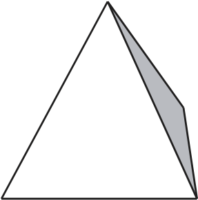
> **[Diagram Context - Textbook_Mathematics_Gr8_Geometry-of-3D-objects.pdf-0029-02.png]**
> This graphic illustrates a 3D geometry figure, specifically a triangular-based pyramid (tetrahedron) rendered with one side shaded in grey. There are no explicit alphabetical labels, variables, or text characters present in the diagram. Conceptually, it helps FET phase mathematics learners visualize three-dimensional spatial objects, supporting calculations of surface area, volume, and the relationships between 2D faces and 3D shapes.

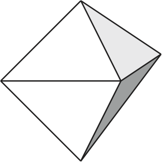
> **[Diagram Context - Textbook_Mathematics_Gr8_Geometry-of-3D-objects.pdf-0029-04.png]**
> This graphic displays a geometry figure, specifically a regular octahedron depicted in a 3D perspective with shaded triangular faces. The diagram contains no visible labels, variables, or text, relying solely on outlines and shading to define its vertices, edges, and faces. Conceptually, it helps high school learners visualize three-dimensional polyhedra, their surface areas, and volumes within space and shape geometry curricula.

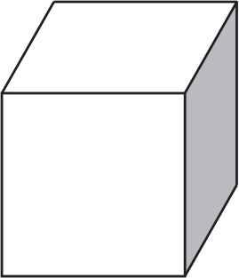
> **[Diagram Context - Textbook_Mathematics_Gr8_Geometry-of-3D-objects.pdf-0029-06.png]**
> This graphic is a geometry figure showing a three-dimensional rectangular prism or cube drawn in perspective, with no visible text labels or symbols. It illustrates the basic properties of 3D polyhedra, helping learners visualize depth, faces, and vertices when calculating surface area and volume in senior phase and FET mathematics.

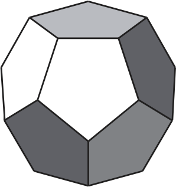
> **[Diagram Context - Textbook_Mathematics_Gr8_Geometry-of-3D-objects.pdf-0029-08.png]**
> This geometry figure depicts a three-dimensional regular dodecahedron viewed from the front, showcasing its twelve flat pentagonal faces, thirty edges, and twenty vertices. The diagram uses varying shades of grey to create perspective, distinguishing between the central face, adjacent faces, and outer boundaries without any explicit alphanumeric labels or arrows. Conceptually, it helps FET phase mathematics learners visualize three-dimensional polyhedra, spatial relationships, surface area properties, and Euler's formula ($V - E + F = 2$) in solid geometry.

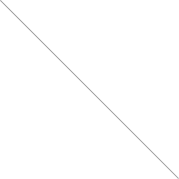

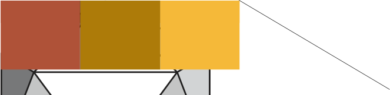
> **[Diagram Context - Textbook_Mathematics_Gr8_Geometry-of-3D-objects.pdf-0029-14.png]**
> This visual content is a geometric diagram featuring a rectangular bar divided into three colored sections (red, brown, and yellow) resting above a structural base containing triangular framing and a projecting diagonal line. The graphic displays distinct color blocks and linear elements forming structural and geometric shapes without any explicit text labels or symbols. Conceptually, this diagram helps high-school learners analyze composite structures and geometric relationships in mechanical or structural systems by breaking down combined shapes into simpler constituent parts.

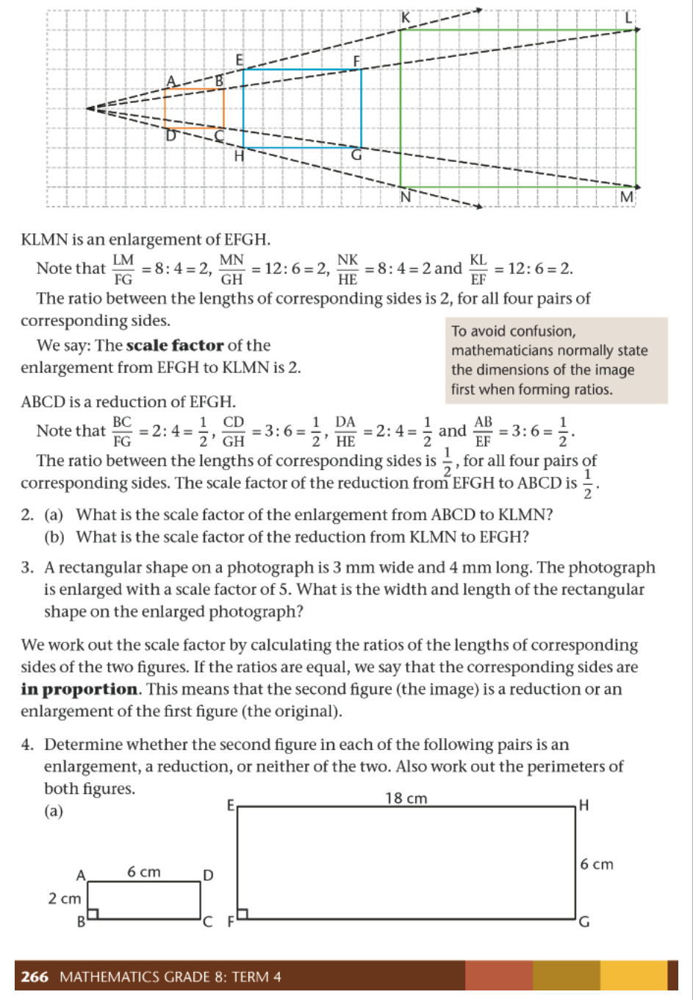
> **[Diagram Context - Textbook_Mathematics_Gr8_Transformation-geometry.pdf-0029-18.png]**
> This educational graphic features a geometry figure illustrating enlargement and reduction on a grid, complete with instructional text, mathematical ratios, and worked examples. Visible labels include vertices $A, B, C, D$ for the smaller rectangle, $E, F, G, H$ for the middle rectangle, and $K, L, M, N$ for the largest rectangle, along with dashed projection lines and numerical side lengths in centimetres and millimetres. Conceptually, the diagram helps Grade 8 CAPS learners understand the core principles of similar figures by visually demonstrating how scale factors relate to the proportional lengths of corresponding sides.

---

# Properties of Reflection

A reflection is a transformation that flips a figure over a line, called the **line of reflection**. When a figure is reflected, it creates an image that is congruent to the original figure.

## Key Properties of Reflection

When observing a reflection (such as $\triangle FHG$ and its reflection $\triangle F'H'G'$), the following geometric properties always hold true:

1.  **Opposite Sides:** The image of the figure always lies on the opposite side of the line of reflection compared to the original figure.
2.  **Equal Distance:** The perpendicular distance from any point on the original figure to the line of reflection is exactly the same as the distance from the corresponding point on the reflected image to the line of reflection.
    *   Example: $GE = G'E$, $FC = F'C$, and $HD = H'D$.
3.  **Congruence:** The side lengths and the shape of the reflected image remain identical to those of the original figure.
4.  **Perpendicularity:** The line segment connecting any point on the original figure to its corresponding point on the reflected image is always perpendicular to the line of reflection.

---

## Worked Example: Analyzing Distances

The table below compares the distances of points from the line of reflection for a correct reflection versus an incorrect one.

| Original figure | Correct reflection | Incorrect reflection |
| :--- | :--- | :--- |
| A: 2 units | A': 2 units | A': 3 units |
| B: 5 units | B': 5 units | B': 6 units |
| C: 2 units | C': 2 units | C': 3 units |
| D: 5 units | D': 5 units | D': 2 units |
| E: 2 units | E': 2 units | E': 5 units |
| F: 5 units | F': 5 units | F': 2 units |
| G: 6 units | G': 6 units | G': 6 units |
| H: 6 units | H': 6 units | H': 6 units |
| K: 2 units | K': 2 units | K': 2 units |

---

## Learning Activities

### Activity 1: Evaluating Reflections
1.  **Analyze Side Lengths:** For any set of correct reflections, compare the side lengths of the image to the original figure. You will find they are equal.
2.  **Analyze Shape:** Confirm that the shape of the image is identical to the original figure.
3.  **Geometric Construction:**
    *   Draw a dotted line connecting corresponding points (e.g., $A$ to $A'$, $B$ to $B'$).
    *   Observe that for a **correct reflection**, this line is always perpendicular ($90^\circ$) to the line of reflection.
    *   Observe that for an **incorrect reflection**, this line is generally not perpendicular to the line of reflection.

> **[Diagram Context - Textbook_Mathematics_Gr8_Construction-of-geometric-figures.pdf-0030-11.png]**
> This geometry figure displays six distinct quadrilaterals: a square (ABCD), rectangle (DEFG), parallelogram (KLMN), rhombus (JMLK), trapezium (RSTU), and kite (ABCD). Visible labels include vertex letters (A, B, C, D, etc.), side lengths in millimeters (e.g., 37 mm, 62 mm), interior angle measurements in degrees (e.g., 90°, 109°, 76°), and parallel side indicator arrows. Conceptually, the diagram helps Grade 8 CAPS mathematics learners investigate and discover the defining geometric properties of various quadrilaterals by comparing their sides and angles.

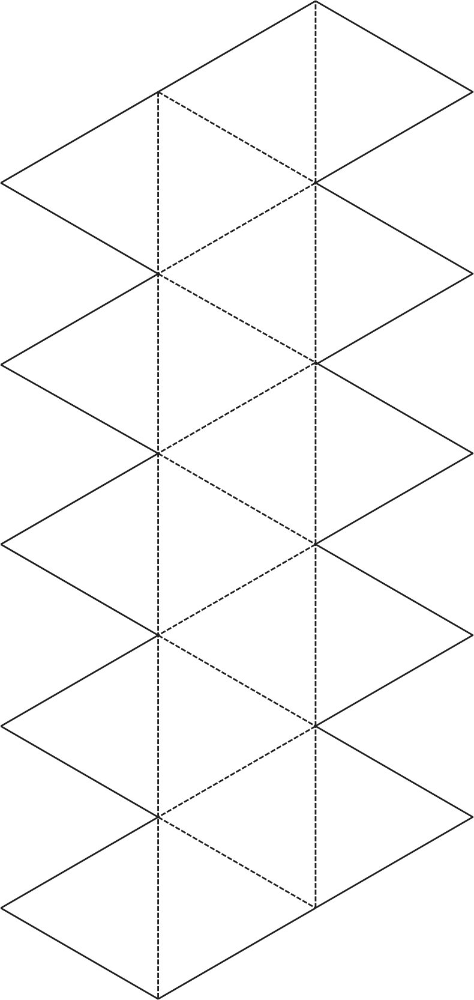
> **[Diagram Context - Textbook_Mathematics_Gr8_Geometry-of-3D-objects.pdf-0030-01.png]**
> This graphic displays a 2D geometric net composed of multiple connected triangles featuring solid outline borders and internal dashed lines indicating folds. The diagram visualizes the flat surface pattern required to construct a three-dimensional polyhedral shape, such as a triangular prism or anti-prism. For FET Phase Mathematics learners, this conceptual layout demonstrates spatial reasoning and surface area calculations by showing how two-dimensional polygonal faces fold along specific edges to form a 3D solid.

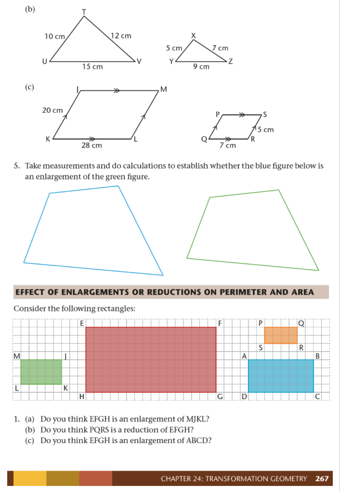
> **[Diagram Context - Textbook_Mathematics_Gr8_Transformation-geometry.pdf-0030-20.png]**
> This educational graphic is a geometry figures and grid worksheet featuring triangles (TUV and XYZ), parallelograms (JKLM and PQRS), and various colored rectangles (EFGH, MJKL, PQRS, ABCD) mapped across coordinate squares. The visible labels include vertex letters (T, U, V, X, Y, Z, J, K, L, M, P, Q, R, S, E, F, G, H, A, B, C, D) and numerical side lengths with units (cm). Conceptually, the diagram guides students through transformation geometry by applying measurements and calculations to determine the proportional relationships, scale factors, and the distinct effects of enlargements or reductions on perimeter and area.

---

# Transformation Geometry: Reflecting Figures

## Key Concepts
Reflection is a transformation where a figure is flipped over a line, called the **line of reflection**.

### Important Properties
*   **Perpendicularity:** The line segment connecting an original point to its corresponding image point is always perpendicular ($\perp$) to the line of reflection. For example, if $H$ is a point and $H'$ is its image, then $HH' \perp$ line of reflection.
*   **Equidistance:** A point and its image are always at the same perpendicular distance from the line of reflection.
*   **Congruence:** When a figure is reflected, its shape and size do not change. The original figure and its image are congruent.

---

## Teaching Guidelines: How to Reflect a Figure
To perform a reflection accurately, follow these steps:

1.  **Reflect Vertices:** Identify the points (vertices) of the original figure and plot their corresponding image points on the opposite side of the line of reflection.
2.  **Check Distance:** Ensure that each point and its image are at equal distances from the line of reflection.
3.  **Verify Perpendicularity:** Ensure the line connecting the point to its image is perpendicular ($\perp$) to the line of reflection.
4.  **Join Points:** Connect the reflected points in the same order as the original figure.
5.  **Verify Congruence:** Check that the reflected figure is identical in shape and size to the original.

---

## Practise Reflecting Figures

**Task:** Copy the figures below and reflect them across the given line of reflection.

> **[Diagram Context - Textbook_Mathematics_Gr8_Construction-of-geometric-figures.pdf-0031-16.png]**
> The graphic is a geometry learning activity table and exercise set titled "CHAPTER 10: CONSTRUCTION OF GEOMETRIC FIGURES". It features a property classification table with column headers for "Parallelogram", "Rectangle", "Rhombus", "Square", "Kite", and "Trapezium", and row labels listing geometric properties such as parallel sides, equal sides, equal adjacent sides, and equal angles marked with ticks. Additionally, it includes investigative questions demonstrating that the sum of interior angles in any quadrilateral equals 360°, guiding students through practical construction and deduction steps.

### Exercise (a)
Reflect the polygon $CDEFG$ across the vertical line of reflection to create image $C'D'E'F'G'$.

### Exercise (b)
Reflect the polygon $CDEFGHIKJ$ across the horizontal line of reflection to create the reflected image below the line.

---

## Answers
1. (a) Refer to the reflected image $C'D'E'F'G'$ shown on the grid.
2. (b) Refer to the reflected image $C'D'E'F'G'H'I'J'K'$ shown on the grid.

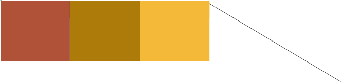
> **[Diagram Context - Textbook_Mathematics_Gr8_Geometry-of-3D-objects.pdf-0031-02.png]**
> The graphic consists of three adjacent rectangular colour blocks transitioning from dark reddish-brown to mustard yellow, accompanied by a single diagonal line extending downward and to the right from the top right corner. The image contains no visible labels, text, variables, or specific scientific symbols. Conceptually, this abstract visual lacks sufficient context to convey specific CAPS curriculum concepts for high school learners.

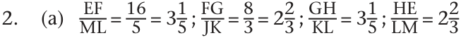
> **[Diagram Context - Textbook_Mathematics_Gr8_Transformation-geometry.pdf-0031-01.png]**
> This geometry figure presents a set of algebraic ratios comparing corresponding side lengths of two polygons, labelled with vertices EFGH and MLKJ. Visible variables and labels include line segments EF, ML, FG, JK, GH, KL, HE, LM, along with numerical values forming ratios such as 16/5 and 8/3, mixed numbers (3 1/5, 2 2/3), and question number 2.(a). Conceptually, this conveys the preliminary working for testing the similarity of polygons by checking whether corresponding sides are in proportion according to Euclidean geometry principles in the CAPS curriculum.

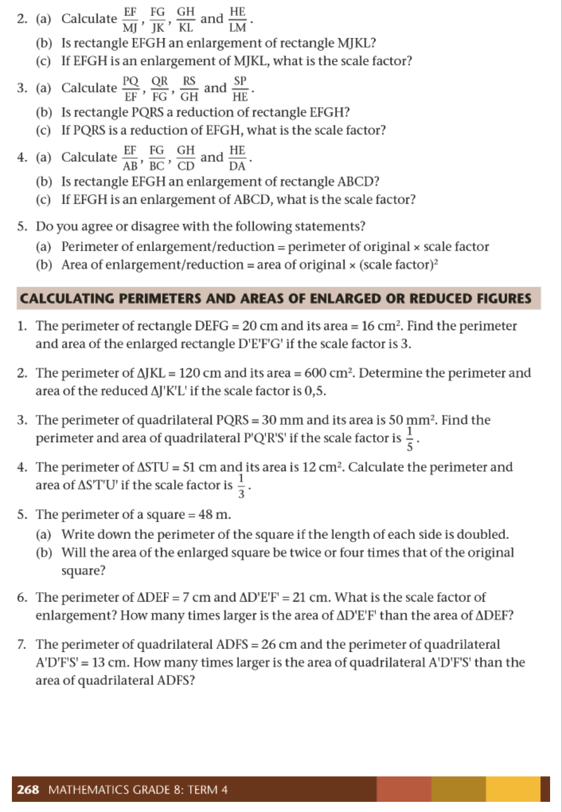
> **[Diagram Context - Textbook_Mathematics_Gr8_Transformation-geometry.pdf-0031-22.png]**
> This educational graphic features a Grade 8 Mathematics page focused on geometric transformations, specifically calculating perimeters and areas of enlarged or reduced figures. The text contains algebraic ratios of side lengths (such as $\frac{EF}{MJ}, \frac{FG}{JK}$), geometric figure labels (rectangles like $EFGH$, $MJKL$, $PQRS$, $ABCD$ and triangles like $\Delta JKL$, $\Delta STU$), and numerical word problems incorporating units like $\text{cm}$, $\text{cm}^2$, $\text{mm}$, $\text{mm}^2$, and $\text{m}$. Conceptually, the text guides learners to investigate and apply the effects of a scale factor on the linear dimensions, perimeter, and area of 2D shapes, reinforcing that while perimeter scales linearly, area scales by the square of the scale factor.

---

### Geometry: Reflection

#### Key Concepts of Reflection
When performing a reflection of a geometric figure, keep the following rules in mind:
*   **Position:** The line of reflection must always lie exactly between the original figure and its reflected image.
*   **Distance:** Every point on the original figure and its corresponding point on the image must be at an equal perpendicular distance from the line of reflection.
*   **Orientation:** The line connecting any point to its corresponding image point must be perpendicular ($90^\circ$) to the line of reflection.

---

#### Exercises: Identifying Lines of Reflection

**Task:** Copy the provided figures and draw the line of reflection for each case.

> **[Diagram Context - Textbook_Mathematics_Gr8_Construction-of-geometric-figures.pdf-0032-02.png]**
> The educational graphic is a geometric construction diagram illustrating the step-by-step process of constructing parallel lines using a compass and straightedge. Visible labels include line segments and points marked as A, B, C, and D, alongside intersecting arcs and geometric drawing tools. This diagram guides learners through Euclidean construction techniques, conceptually demonstrating how to transfer angles and use corresponding properties to construct parallel lines for drawing quadrilaterals.

**Guidance for identifying the line of reflection:**
1.  **Locate corresponding vertices:** Identify a point on the original figure (e.g., point $A$) and its matching point on the image (e.g., point $A'$).
2.  **Find the midpoint:** Calculate the midpoint between these two points. The line of reflection must pass through this midpoint.
3.  **Determine the perpendicular bisector:** The line of reflection acts as the perpendicular bisector of the segment connecting any point and its image.

---

#### Summary of Examples

| Figure | Description |
| :--- | :--- |
| **(a)** | Reflection across a horizontal line. |
| **(b)** | Reflection across a diagonal line. |
| **(c)** | Reflection across a vertical line. |

*Note: Refer to the provided diagrams to observe how the grid lines assist in measuring the equal distances required for an accurate reflection.*

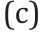

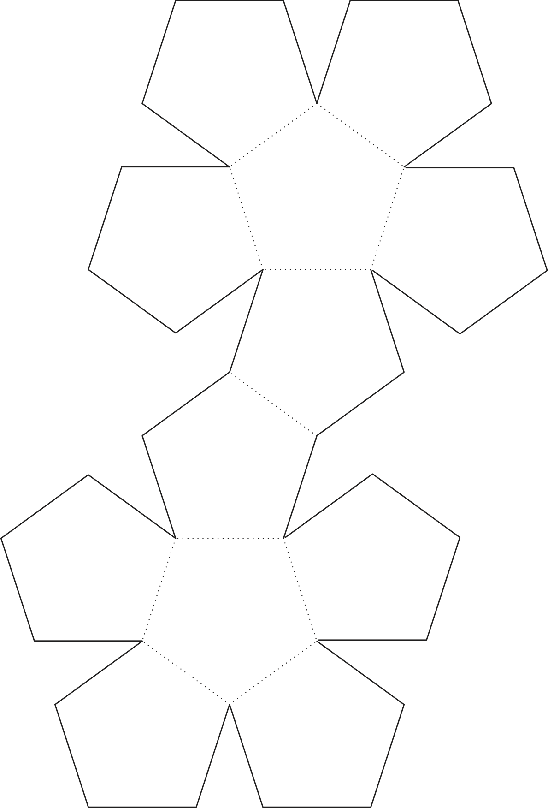
> **[Diagram Context - Textbook_Mathematics_Gr8_Geometry-of-3D-objects.pdf-0032-01.png]**
> This graphic displays a 2D geometric net for constructing a regular dodecahedron, featuring twelve interconnected identical regular pentagons outlined with solid outer edges and dotted fold lines. It helps students visualize 3D shapes in space geometry by demonstrating how a three-dimensional Platonic solid with twelve pentagonal faces can be unfolded into a flat, two-dimensional surface net.

---

# 16.5 Rotating Figures

## Investigating the Properties of Rotation

### Definition
A **rotation** occurs when a figure is turned in a clockwise or anticlockwise direction around a fixed point. This fixed point is called the **centre of rotation**.

*   **Clockwise:** Turning in the direction of the hands of a clock.
*   **Anticlockwise:** Turning in the opposite direction of the hands of a clock.
*   **Centre of rotation:** The point "around" which the figure is turned. This point can be inside the figure, on an edge, at a vertex, or outside the figure.

> **[Diagram Context - Textbook_Mathematics_Gr8_Construction-of-geometric-figures.pdf-0033-15.png]**
> This educational worksheet is a geometry figure graphic featuring three distinct instructional sections on the construction, classification, and properties of polygons. Visible elements include text prompts numbered 1 to 3, geometric labels A through F for shapes, side-length hash marks, parallel arrows, right-angle indicators, and a word bank listing quadrilaterals such as parallelogram, rectangle, rhombus, square, kite, and trapezium. Conceptually, it helps learners apply Euclidean geometry principles by practicing compass-and-ruler construction, identifying specific types of triangles and quadrilaterals based on side and angle properties, and linking descriptive geometric definitions to the correct polygon names.

### Properties of Rotation
1.  **Distance:** An original point and its corresponding image point lie at equal distances from the centre of rotation.
2.  **Angle of Rotation:** The angle formed by the connecting lines between any original point, the centre of rotation, and the image point is called the angle of rotation.
3.  **Congruence:** A figure and its rotated image are **congruent figures**, meaning they maintain the exact same shape and size.

### Notation
*   The prime symbol ($'$) is used to label the image of a figure. For example, if the original point is $A$, the rotated image is labeled $A'$.

### Common Misconceptions
*   **Misconception:** "The point of rotation must be part of the figure."
*   **Correction:** This is **not true**. The centre of rotation can be positioned anywhere: inside the figure, on an edge, at a vertex, or completely outside the figure.

<!-- DIAGRAM_PLACEHOLDER: diagram -->

### Examples of Rotation
The following table summarizes the rotation of $\Delta ABC$ by $90^\circ$ about different centres:

| Centre of Rotation | Description |
| :--- | :--- |
| **At C** | The figure rotates around vertex $C$. |
| **At B** | The figure rotates around vertex $B$. |
| **At A** | The figure rotates around vertex $A$. |
| **At P** | The figure rotates around a point $P$ located outside the figure. |

<!-- DIAGRAM_PLACEHOLDER: diagram -->

---

# Investigating the Properties of Rotation

## Concept: Rotation
A rotation is a transformation that turns a figure about a fixed point called the **centre of rotation**. In this investigation, we examine the relationship between the original points, the centre of rotation, and the image points after a $90^\circ$ anti-clockwise rotation.

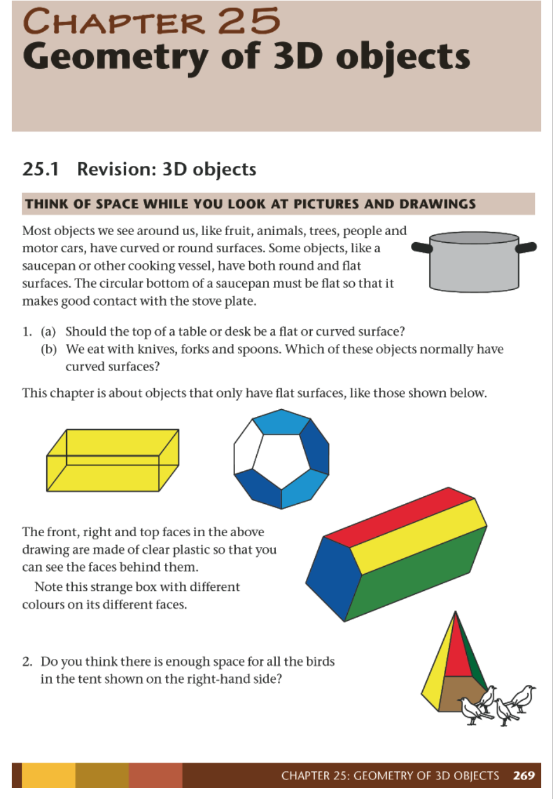
> **[Diagram Context - Textbook_Mathematics_Gr8_Geometry-of-3D-objects.pdf-0034-14.png]**
> The graphic is a geometry figure displaying 3D objects, specifically geometric solids like a rectangular prism, a regular polyhedron, a multicolored prism, and a pyramidal tent alongside text and questions. Visible elements include text headings such as "CHAPTER 25 Geometry of 3D objects," introductory revision text, numbered questions 1 and 2, and illustrations of a saucepan, a yellow wireframe box, a blue and white dodecahedron-like shape, a multicolored prism, and a yellow-and-red tent with small birds at the base. This material conveys the foundational concepts of spatial awareness and the properties of three-dimensional objects with flat surfaces for CAPS curriculum learners, bridging real-world contexts with formal geometric shapes.

---

## Investigation Tasks

### Task 1: Properties of Point S
Given $\triangle PRS$ rotated $90^\circ$ anti-clockwise about point $A$:
1. Measure the distance from $A$ to $S$.
2. Measure the distance from $A$ to $S'$.
3. Compare the distances in (1) and (2).
4. Measure the angle $\angle SAS'$.

### Task 2: Properties of Point P
Given $\triangle PRS$ rotated $90^\circ$ anti-clockwise about point $A$:
1. Measure the distance from $A$ to $P$.
2. Measure the distance from $A$ to $P'$.
3. Compare the distances in (1) and (2).
4. Measure the angle $\angle PAP'$.

---

## Answers and Observations

The following table summarizes the findings from the investigation:

| Question | Measurement (a) | Measurement (b) | Comparison (c) | Angle Measurement (d) |
| :--- | :--- | :--- | :--- | :--- |
| **1** | $20\text{ mm}$ | $20\text{ mm}$ | They are the same | $90^\circ$ |
| **2** | $45\text{ mm}$ | $45\text{ mm}$ | They are the same | $90^\circ$ |

### Key Findings
* **Distance:** The distance from the centre of rotation ($A$) to any point on the original figure is equal to the distance from the centre of rotation to the corresponding point on the image.
* **Angle of Rotation:** The angle formed by joining a point, the centre of rotation, and its corresponding image point (e.g., $\angle SAS'$ or $\angle PAP'$) is equal to the angle of rotation ($90^\circ$).

---

### Transformation Geometry: Properties of Rotation

#### Understanding Rotation
Rotation is a transformation where a figure is turned around a fixed point called the **centre of rotation**. When a figure is rotated, its shape and size remain unchanged (the original figure and the image are congruent).

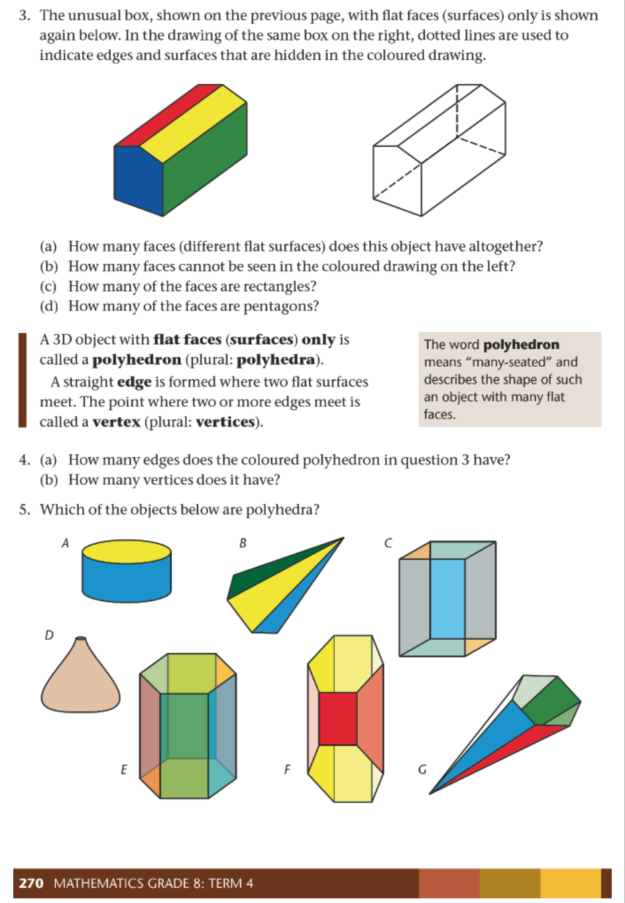
> **[Diagram Context - Textbook_Mathematics_Gr8_Geometry-of-3D-objects.pdf-0035-08.png]**
> This educational graphic is a geometry figure worksheet illustrating 3D shapes, polyhedra, faces, edges, and vertices. It features coloured and line-drawn 3D geometric objects labelled with alphabetic letters A through G, alongside definitions for polyhedron, edge, and vertex, and related questions (a) through (d). Conceptually, the diagram helps Grade 8 mathematics learners identify the properties of polyhedra by distinguishing between flat-faced 3D objects and curved shapes, and by counting their constituent faces, edges, and vertices.

#### Properties of Rotation
When performing or analyzing a rotation, the following three properties must always hold true:

1.  **Distance from Centre:** The distance from the centre of rotation to any point on the original figure is equal to the distance from the centre of rotation to the corresponding point on the image.
    *   *Example:* If $P$ is the centre of rotation, then $PA = PA'$, $PB = PB'$, and $PC = PC'$.
2.  **Angle of Rotation:** The angle formed by connecting lines between any point on the original figure, the centre of rotation, and the corresponding point on the image is equal to the angle of rotation.
    *   *Example:* If a figure is rotated through $90^\circ$, the angle formed at the centre of rotation will be $90^\circ$. If rotated through $45^\circ$, the angle will be $45^\circ$.
3.  **Congruence:** The original figure and the rotated image are congruent. This means all corresponding sides and angles are equal.

---

#### Worked Example: Analyzing a $90^\circ$ Rotation

**Task:** Lines have been drawn to join point $A$ to the centre of rotation $R$, and $A$ to the image point $A'$.

**Questions:**
(a) Measure the distance from $A$ to $R$.
(b) Measure the distance from $A'$ to $R$.
(c) What do you notice about the distances in (a) and (b)?
(d) Measure the size of the angle $\angle ARA'$. What do you notice?

**Answers:**
(a) $50\text{ mm}$
(b) $50\text{ mm}$
(c) The distances are the same.
(d) The angle is $90^\circ$.

<!-- DIAGRAM_PLACEHOLDER: diagram -->

---

#### Exercise: Comparing Sides
In any rotation, measure the sides of the original triangle and the corresponding sides of the image. 

**Observation:** You will notice that the lengths of the corresponding sides are equal, confirming that the triangles are congruent.

**Teaching Note:** Ensure learners understand that for any rotation:
*   The distance from the centre to the object point equals the distance from the centre to the image point.
*   The angle of rotation is consistent across all corresponding points.
*   The figure maintains its original size and shape.

---

# Practise Rotating Figures

## Teaching Guidelines: How to Rotate a Figure
To rotate a figure $90^{\circ}$ clockwise about a centre of rotation, follow these steps:

1.  **Rotate each vertex:** Rotate each point (vertex) of the figure $90^{\circ}$ clockwise about the centre of rotation.
2.  **Check distance:** Ensure that each original point and its corresponding image point are at equal distances from the centre of rotation.
3.  **Check the angle:** Verify that the angle formed by the original point, the centre of rotation, and the image point is exactly $90^{\circ}$.
4.  **Connect:** Join the reflected points to form the new figure.
5.  **Verify congruence:** Check that the original figure and its image are congruent (identical in shape and size).

---

## Worked Examples and Exercises

### 1. Rotating Triangle $\Delta ABC$
**Task:** Rotate triangle $\Delta ABC$ $90^{\circ}$ clockwise about point $P$.

*   **Key Principles:**
    *   The image point must be the same distance from $P$ as the original point.
    *   The angle formed between the line connecting an original point to $P$ and the line connecting its image point to $P$ must be $90^{\circ}$.
*   **Action:** Join the image points to create $\Delta A'B'C'$.

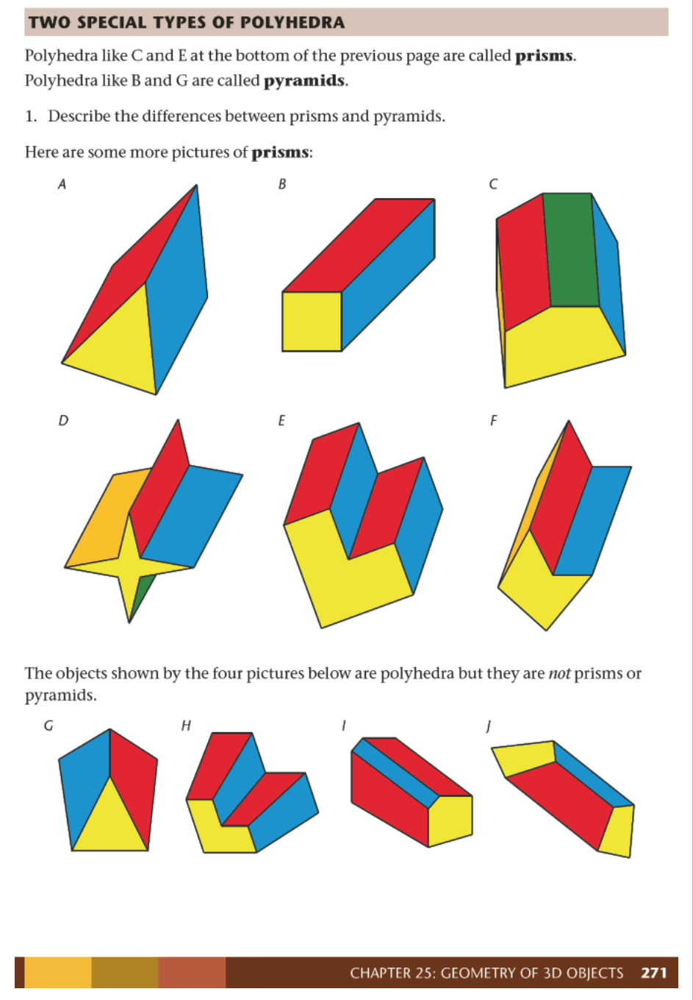
> **[Diagram Context - Textbook_Mathematics_Gr8_Geometry-of-3D-objects.pdf-0036-09.png]**
> This educational graphic is a geometry figure displaying ten 3D polyhedra labeled A through J, categorized into "prisms" and non-prisms. The visible text labels include headings such as "TWO SPECIAL TYPES OF POLYHEDRA" and "Here are some more pictures of prisms:". Conceptually, the diagram helps students distinguish the defining properties of geometric prisms—such as having congruent parallel bases and uniform cross-sections—from other three-dimensional shapes.

### 2. Rotating Quadrilateral $KLMN$
**Task:** On grid paper, rotate quadrilateral $KLMN$ $180^{\circ}$ about point $T$.

<!-- DIAGRAM_PLACEHOLDER: diagram -->

### 3. Rotating Triangle $\Delta XYZ$
**Task:** On grid paper, rotate triangle $\Delta XYZ$ $90^{\circ}$ anticlockwise about point $F$.

<!-- DIAGRAM_PLACEHOLDER: diagram -->

---

## Summary of Answers
*   **1.** Refer to the image on LB page 208.
*   **2.** Refer to the image on LB page 208.
*   **3.** Refer to the image on LB page 208.

---

# 16.6 Enlarging and Reducing Figures

## Definitions
*   **Resizing:** The process of making a figure bigger (enlargement) or smaller (reduction) in a specific way.
*   **Enlargement:** An image of a figure made bigger by multiplying the lengths of all its sides by a number greater than 1.
*   **Reduction:** An image of a figure made smaller by multiplying the lengths of all its sides by a number smaller than 1 (but larger than 0).
*   **Scale Factor:** The number by which the sides of a figure are multiplied to create an enlargement or reduction.
*   **Centre of Enlargement/Reduction:** The common point where straight lines joining corresponding points of the original figure and its image intersect.

---

## Key Principle
When the lengths of **all** the sides of a figure are multiplied by the **same number** (the scale factor), the resulting figure is an enlargement or reduction of the first figure. If the sides are not all increased by the same scale factor, the resulting figure is not a true enlargement.

---

## Investigation: Properties of Enlargements and Reductions

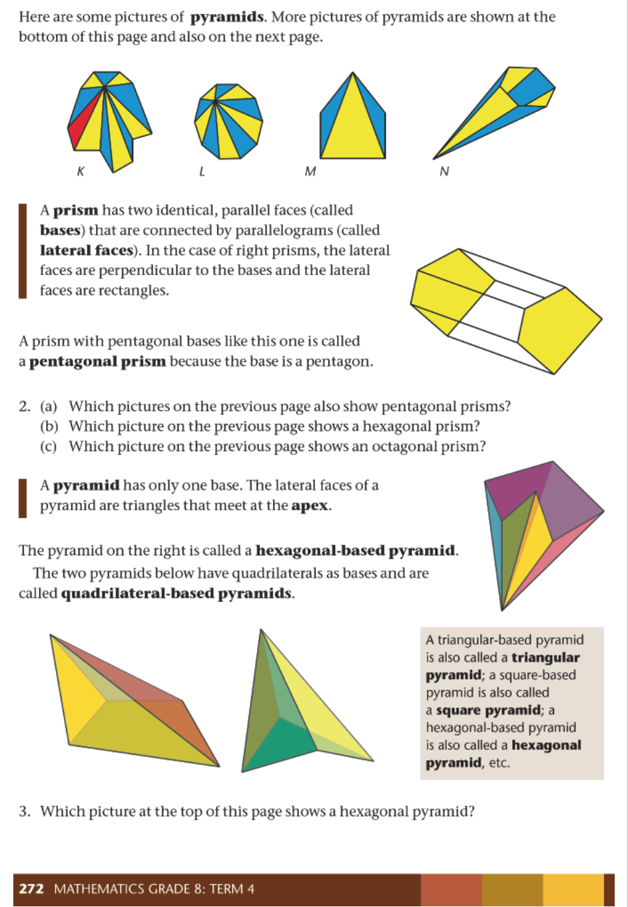
> **[Diagram Context - Textbook_Mathematics_Gr8_Geometry-of-3D-objects.pdf-0037-05.png]**
> This educational graphic is a geometry figure worksheet illustrating three-dimensional objects, specifically prisms and pyramids, with accompanying text and questions. Visible text and labels include the letters $K$, $L$, $M$, and $N$ identifying different geometric nets or 3D drawings, alongside definitions for "prism", "pentagonal prism", "pyramid", "apex", "hexagonal-based pyramid", and "quadrilateral-based pyramids". Conceptually, it helps Grade 8 Mathematics learners differentiate between prisms and pyramids by examining their bases, lateral faces, and defining structural properties within the CAPS curriculum.

### Questions
Look at the rectangles provided in the diagram and answer the following:

**(a) Rectangle EFGH:**
*   How many times is $FG$ longer than $BC$?
*   How many times is $EF$ longer than $AB$?

**(b) Rectangle JKLM:**
*   How many times is $KL$ longer than $BC$?
*   How many times is $JK$ longer than $AB$?

---

## Answers and Worked Examples

### Analysis of Rectangle EFGH
*   $FG$ is the same length as $BC$.
*   $EF$ is the same length as $AB$.
*   **Conclusion:** Rectangle EFGH is not an enlargement of rectangle ABCD because the sides have not been increased by a scale factor.

### Analysis of Rectangle JKLM
*   $KL$ is $2 \times BC$.
*   $JK$ is $2 \times AB$.
*   **Conclusion:** Rectangle JKLM is an enlargement of rectangle ABCD. The scale factor is $2$. We say rectangle ABCD has been enlarged by a scale factor of $2$ to produce rectangle JKLM.

---

### The Scale Factor

The size of the scale factor determines whether an image is an enlargement or a reduction of the original figure.

*   **Scale factor = 1:** The image is the same size as the original.
*   **Scale factor > 1:** The image is larger than the original (enlargement).
    *   *Example:* If the scale factor is $2$, each side of the image is double the length of its corresponding side in the original figure.
*   **Scale factor < 1 (but > 0):** The image is smaller than the original (reduction).
    *   *Example:* If the scale factor is $\frac{1}{2}$ or $0,5$, each side of the image is half the length of its corresponding side in the original figure.

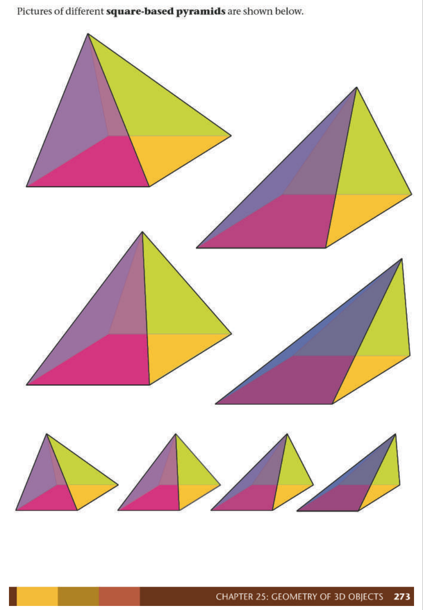
> **[Diagram Context - Textbook_Mathematics_Gr8_Geometry-of-3D-objects.pdf-0038-00.png]**
> The educational graphic is a geometry figure displaying several colorful 3D square-based pyramids of varying proportions and orientations. The visible labels include the heading text "Pictures of different square-based pyramids are shown below." and the footer text "CHAPTER 25: GEOMETRY OF 3D OBJECTS 273". Conceptually, the diagram helps high school learners visualize the properties and spatial relationships of three-dimensional shapes by contrasting multiple variations of square-based pyramids with distinct heights and slant angles.

---

### Similar Figures

Two or more figures are **similar** if:
1.  Their corresponding angles are equal.
2.  Their corresponding sides are longer or shorter by the same scale factor (the sides are in **proportion**).

When figures are enlarged or reduced, the resulting image is similar to the original figure.

---

### Worked Example: Analyzing Triangles

<!-- DIAGRAM_PLACEHOLDER: diagram -->

#### (a) Comparison Questions
Based on the grid provided in the diagram, determine the relationships between the sides of $\triangle ABC$, $\triangle EFG$, and $\triangle IJK$:

*   **FG vs BC:** $FG$ is $2$ times longer than $BC$.
*   **EF vs AB:** $EF$ is $2$ times longer than $AB$.
*   **EG vs AC:** $EG$ is $2$ times longer than $AC$.
*   **JK vs BC:** $JK$ is $0,5$ times shorter than $BC$.
*   **IJ vs AB:** $IJ$ is $0,5$ times shorter than $AB$.
*   **IK vs AC:** $IK$ is $0,5$ times shorter than $AC$.

#### (b) Is $\triangle EFG$ an enlargement of $\triangle ABC$?
**Yes.** The lengths of all corresponding sides have been multiplied by a scale factor of $2$.

#### (c) Is $\triangle IJK$ a reduction of $\triangle ABC$?
**Yes.** The lengths of all corresponding sides have been multiplied by a scale factor of $0,5$.

---

# Practise Resizing Figures

## Teaching Guidelines
To resize a figure, you apply a **scale factor** to the side lengths of the original shape.

*   **Enlargement:** If the scale factor is greater than $1$, the resulting image will be larger than the original.
    *   *Example:* A scale factor of $2$ means the sides of the new figure are $2$ times as long as the original.
*   **Reduction:** If the scale factor is between $0$ and $1$, the resulting image will be smaller than the original.
    *   *Example:* A scale factor of $0,5$ (or $\frac{1}{2}$) means the sides of the new figure are half as long as the original.

---

## Exercises

### 1. Determine the effect of the scale factor
State whether the following scale factors will produce a larger or smaller image:

| Scale Factor | Result |
| :--- | :--- |
| (a) $5$ | Larger |
| (b) $0,25$ | Smaller |
| (c) $1,2$ | Larger |
| (d) $\frac{3}{8}$ | Smaller |

### 2. Enlargement on grid paper
Enlarge the triangle below with a scale factor of $2$.

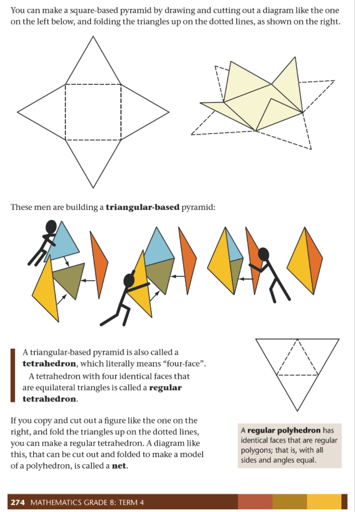
> **[Diagram Context - Textbook_Mathematics_Gr8_Geometry-of-3D-objects.pdf-0039-00.png]**
> This educational graphic illustrates geometric figures, specifically a square-based pyramid net, a triangular-based pyramid (tetrahedron) construction sequence featuring stick figures, and a regular tetrahedron net with dotted folding lines and arrows. It visually conveys the concept of geometric nets and how two-dimensional flat patterns can be folded along dotted lines to create three-dimensional polyhedra.

### 3. Reduction on grid paper
Resize the following figure using a scale factor of $0,5$.

<!-- DIAGRAM_PLACEHOLDER: diagram -->

### 4. Reduction on grid paper
Resize the figure below using a scale factor of $\frac{1}{3}$.

<!-- DIAGRAM_PLACEHOLDER: diagram -->

---

### Geometry: Enlargements and Reductions

#### Concept: Scale Factors
A scale factor is the ratio used to resize a shape. 
*   If the scale factor is greater than $1$, the image is an **enlargement**.
*   If the scale factor is between $0$ and $1$, the image is a **reduction**.

#### Note: Constructing Enlargements
To enlarge a figure from a point (the centre of enlargement, $O$):
1.  Draw lines from the centre $O$ through each vertex of the original shape ($A, B, C$).
2.  Measure the distance from $O$ to a vertex (e.g., $OA$).
3.  Multiply this distance by the scale factor to find the position of the new vertex (e.g., $OA' = OA \times \text{scale factor}$).
4.  Mark the new vertices ($A', B', C'$) and join them to form the enlarged shape.

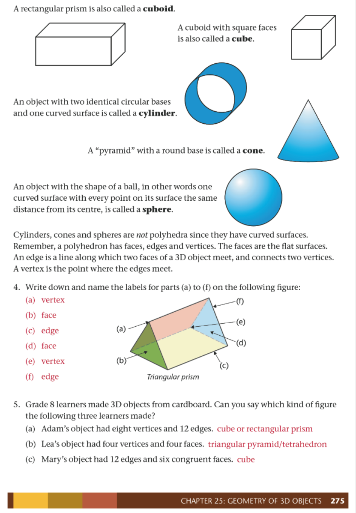
> **[Diagram Context - Textbook_Mathematics_Gr8_Geometry-of-3D-objects.pdf-0040-03.png]**
> This educational graphic is a geometry figure displaying various 3D shapes and their definitions, featuring a labelled triangular prism with pointers for parts (a) to (f). The visible text labels identify geometrical terms including vertex, face, edge, cuboid, cube, cylinder, cone, and sphere, alongside accompanying descriptive exercises for Grade 8 learners. Conceptually, it conveys the properties and nomenclature of 3D objects—distinguishing between polyhedra with flat faces and non-polyhedra with curved surfaces—while reinforcing how to identify vertices, edges, and faces on a solid figure.

---

#### Exercises

**Question 5**
(a) Which image below is similar to the original?
(b) State the scale factor by which it has been resized.

<!-- DIAGRAM_PLACEHOLDER: diagram -->

**Answers:**
(a) Image 2
(b) Scale factor of $0,5$

---

**Question 6**
What scale factors were used to produce Image 1 and Image 2 from the original?

<!-- DIAGRAM_PLACEHOLDER: diagram -->

**Answers:**
*   Image 1: Scale factor $1,5$
*   Image 2: Scale factor $2$

---

#### Summary Table of Results

| Question | Image | Scale Factor | Type of Transformation |
| :--- | :--- | :--- | :--- |
| 5 | Image 2 | $0,5$ | Reduction |
| 6 | Image 1 | $1,5$ | Enlargement |
| 6 | Image 2 | $2$ | Enlargement |