# Chapter 17: Geometry of 3D Objects

## 17.1 Classifying 3D Objects

Three-dimensional (3D) objects possess three dimensions: **length**, **width**, and **height**. These objects are categorized into two main groups based on their surfaces:

1.  **Objects with curved surfaces:** These include shapes like spheres (balls), cylinders, and cones.
2.  **Polyhedra:** These are objects made entirely of flat surfaces.

<!-- DIAGRAM_PLACEHOLDER: diagram -->

---

## What is a Polyhedron?

A **polyhedron** is a 3D object composed exclusively of flat surfaces. It contains no curved surfaces. Every polyhedron is defined by three specific components:

*   **Face:** A flat surface of a 3D object.
*   **Edge:** The line segment where two faces of a polyhedron intersect.
*   **Vertex:** The point where the edges meet.

### Terminology Note
*   **Singular:** One polyhedron; one vertex.
*   **Plural:** Two or more polyhedra; two or more vertices.

---

### Identifying and Describing 3D Objects

3D objects (three-dimensional objects) are defined by their **faces** (flat surfaces), **edges** (where two faces meet), and **vertices** (corners where edges meet).

#### Key Examples
*   **Cube:** A cube has $6$ faces, $12$ edges, and $8$ vertices.
*   **Pyramid:** A square-based pyramid has $5$ faces, $8$ edges, and $5$ vertices.

> **[Diagram Context - Textbook_Mathematics_Gr8_Construction-of-geometric-figures.pdf-0001-06.png]**
> This graphic is a measurement apparatus showing a standard 15 cm ruler with numerical markings from 0 to 15. Visible labels include the letters A and B indicating a measured span extending from the 0 mark to the 12 cm mark, with a midpoint indicator at 6 cm. This diagram teaches learners foundational practical measurement skills, specifically how to correctly read metric scales, determine instrument resolution, and calculate lengths or midpoints in physical sciences and mathematics.

---

### Exercises

#### 1. Identifying Parts of a 3D Object
Identify parts (a) to (d) on the figure provided.

> **[Diagram Context - Textbook_Mathematics_Gr8_Construction-of-geometric-figures.pdf-0001-08.png]**
> This geometry figure illustrates a line segment AB intersected by line CD at point F, accompanied by an explanatory text box stating that the small tick marks on segments AF and FB indicate they are equal in length. The diagram clearly labels points A, B, C, D, and F, along with double-hash equality tick marks on segments AF and FB. Conceptually, this visual aids high school learners in understanding the definition of a perpendicular bisector or midpoint in Euclidean geometry, showing how geometric notation indicates equal lengths along a straight line.

#### 2. Identifying Polyhedra
A **polyhedron** is a 3D object with flat faces. Which of the following objects are polyhedra?
*   (a) Cone
*   (b) Triangular Pyramid
*   (c) Hexagonal Prism
*   (d) Triangular Prism
*   (e) Cylinder
*   (f) Hexagonal Prism

#### 3. Properties of Polyhedra
Determine the number of faces, edges, and vertices for each of the following polyhedra:

| Object | Faces | Edges | Vertices |
| :--- | :---: | :---: | :---: |
| (a) Triangular Prism | ? | ? | ? |
| (b) Hexagonal Prism | ? | ? | ? |
| (c) Rectangular Prism | ? | ? | ? |

#### 4. Practical Application
Six learners each used play dough to make a 3D object. Use the descriptions provided to match each 3D object to the learner who made it.

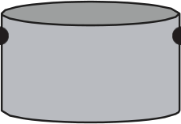
> **[Diagram Context - Textbook_Mathematics_Gr8_Geometry-of-3D-objects.pdf-0001-04.png]**
> This educational graphic displays a geometric diagram of a solid cylinder with two distinct circular points marked in black on its outer curved surface. There are no text labels, variables, or arrows visible in the illustration. For high school mathematics and CAPS geometry learners, this visual represents a three-dimensional cylindrical shape used to teach surface area, volume calculations, or spatial positioning on curved surfaces.

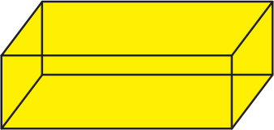
> **[Diagram Context - Textbook_Mathematics_Gr8_Geometry-of-3D-objects.pdf-0001-08.png]**
> The graphic displays a 3D geometry figure of a rectangular prism (cuboid) rendered in solid yellow with black outline edges. There are no explicit labels, letters, or dimensions visible on the figure. Conceptually, it helps students visualize three-dimensional shapes to calculate surface area and volume in CAPS Mathematics.

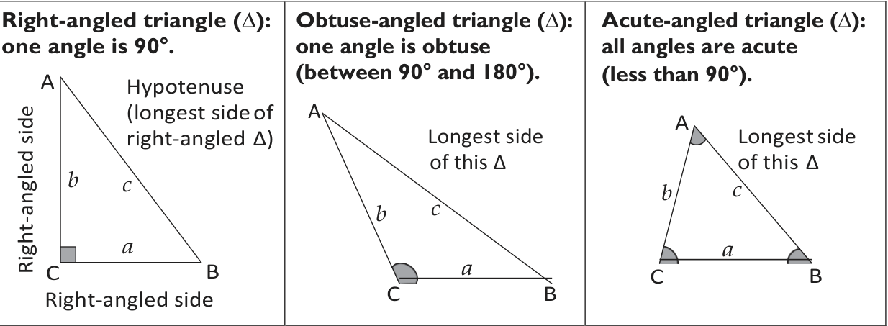
> **[Diagram Context - Textbook_Mathematics_Gr8_The-theorem-of-Pythagoras.pdf-0001-03.png]**
> This geometry graphic illustrates three distinct types of triangles classified by their interior angles: right-angled, obtuse-angled, and acute-angled triangles. Each triangle is labeled with vertices A, B, and C, side lengths $a$, $b$, and $c$, and indicates the relationships between angle sizes and corresponding side lengths, specifically identifying the hypotenuse and the longest sides. Conceptually, this helps learners differentiate triangle classifications and understand the geometric principle that the longest side of a triangle is always opposite its largest interior angle.

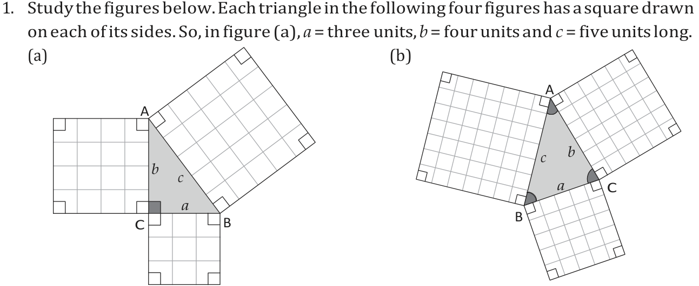
> **[Diagram Context - Textbook_Mathematics_Gr8_The-theorem-of-Pythagoras.pdf-0001-07.png]**
> This educational graphic is a geometry figure demonstrating the geometric proof of Pythagoras' theorem using square areas. It features triangles labeled with sides $a$, $b$, and $c$, vertices $A$, $B$, and $C$, and a grid of unit squares constructed on each side of the triangles, accompanied by right-angle symbols. The diagram visually conveys the conceptual relationship that the sum of the areas of the squares on the two shorter sides equals the area of the square on the hypotenuse, helping students understand the area-based derivation of the theorem $a^2 + b^2 = c^2$.

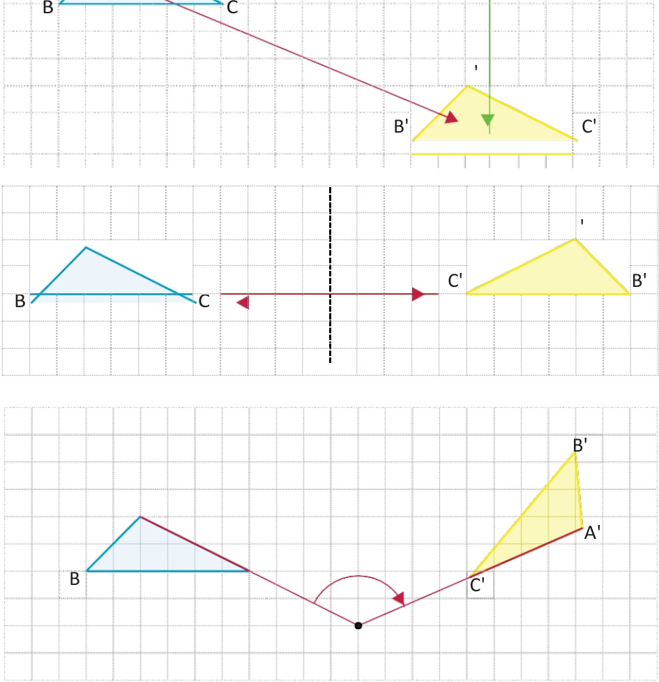
> **[Diagram Context - Textbook_Mathematics_Gr8_Transformation-geometry.pdf-0001-11.png]**
> This educational graphic illustrates three distinct geometric transformations—translation, reflection, and rotation—plotted on Cartesian grid paper. The diagrams feature original triangles labeled with vertices A, B, and C, and their transformed image counterparts labeled with primed notation A', B', and C', alongside directional arrows, reflection axes, and rotational angles. Conceptually, this visual supports high school mathematics learners in understanding Euclidean transformations by demonstrating how shapes move, flip, and turn while preserving their size and shape properties.

---

### 17.2 Prisms and Pyramids

#### Identifying 3D Objects

> **[Diagram Context - Textbook_Mathematics_Gr8_Construction-of-geometric-figures.pdf-0002-04.png]**
> The graphic illustrates a mechanical apparatus, specifically a drafting compass or divider resting on a horizontal surface, featuring numerical angle or measurement markings such as "0°" and "240°". The visible components include the pivoted legs, a tightening screw mechanism at the hinge, a pointed tip resting on the baseline, and an intersecting curved arc line. This diagram helps high school learners visualize geometric construction principles, spatial measurement, and the mechanical function of mathematical drawing instruments in practical geometry.

**Exercise: Match the descriptions to the objects**
*   Tumi’s object has six vertices and five faces.
*   Debbie’s object has eight vertices and 12 edges.
*   Brad made an object that has seven faces and ten vertices.
*   Xola made an object with no vertices.
*   Mpuka’s object has eight edges and five faces.
*   Maggie made an object with two circles and no vertices.

---

#### Difference Between Prisms and Pyramids

Prisms and pyramids are two special groups of **polyhedra** (3D objects with flat faces).

##### Prisms
A **prism** is a polyhedron with two faces that are congruent and parallel polygons. 

*   **Bases:** The two congruent and parallel faces.
*   **Lateral faces:** The faces that connect the bases (these are parallelograms).
*   **Congruent:** Means exactly the same shape and size.

**Right Prisms:**
In a right prism, the bases are connected by rectangles that are perpendicular to the base. This means the lateral faces make a $90^{\circ}$ angle with the bases.

**Naming Prisms:**
Prisms are named according to the shape of their base:
*   **Triangular prism:** Base is a triangle.
*   **Rectangular prism:** Base is a rectangle or square.
*   **Pentagonal prism:** Base is a pentagon.
*   **Cube:** A special type of prism where all six faces are congruent; therefore, any face can be a base.

> **[Diagram Context - Textbook_Mathematics_Gr8_Construction-of-geometric-figures.pdf-0002-07.png]**
> This graphic is a geometry figure illustrating a pair of intersecting curved arcs being drawn on a plane. Visible elements include a mechanical compass holding a pencil, intersecting curved lines, and a plain background without explicit labels, variables, or axis names. Conceptually, this diagram visually reinforces geometric construction techniques, demonstrating how precise tools are used to construct intersecting loci or arcs as required in high school mathematics and Euclidean geometry.

> **[Diagram Context - Textbook_Mathematics_Gr8_Construction-of-geometric-figures.pdf-0002-10.png]**
> The graphic is a geometry figure illustrating a foundational Euclidean construction step. Visible labels include line segment AB, points C and D, a 90° angle indicator, arc intersection marks, and text referencing "Step". This diagram conceptually demonstrates how to construct a perpendicular bisector using a compass and ruler, reinforcing geometric construction skills required in the CAPS curriculum.

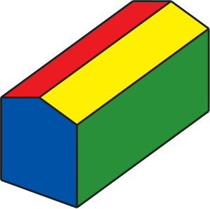
> **[Diagram Context - Textbook_Mathematics_Gr8_Geometry-of-3D-objects.pdf-0002-01.png]**
> This graphic is a 3D geometric figure representing a composite prism with a pentagonal cross-section. The structure features distinct colored faces—blue on the front vertical end, green on the right side, yellow on the top-right slanted roof, and red on the top-left slanted roof—with no text labels or arrows. Conceptually, this diagram helps Grade 10-12 Mathematics and Mathematical Literacy learners visualize spatial dimensions and surface area calculations by breaking down a compound 3D solid into simpler geometric components.

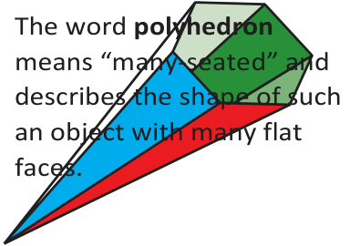
> **[Diagram Context - Textbook_Mathematics_Gr8_Geometry-of-3D-objects.pdf-0002-08.png]**
> This educational graphic displays a 3D geometry figure representing a polyhedron alongside descriptive text. Visible text includes the words "polyhedron", "many-seated", and "flat faces". The diagram visually conveys the definition of a polyhedron as a three-dimensional geometric solid bounded by multiple flat polygonal faces, helping FET phase mathematics learners identify the structural characteristics of 3D objects.

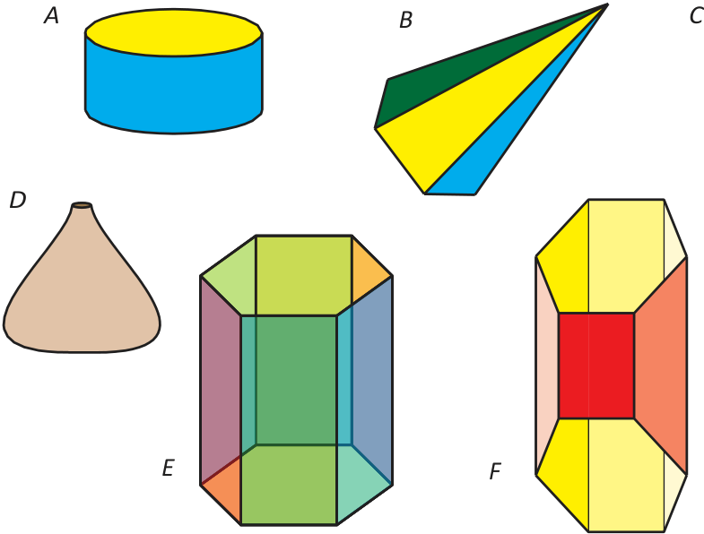
> **[Diagram Context - Textbook_Mathematics_Gr8_Geometry-of-3D-objects.pdf-0002-12.png]**
> This graphic displays a collection of 3D geometric shapes and curved vessels labeled with letters A, B, C, D, E, and F, including a cylinder (A), a pyramid-like polyhedron (B), a curved vase-like container (D), and multi-faced prismatic polyhedra (E and F). Conceptually, this visual supports Intermediate Phase and Senior Phase Mathematics CAPS curricula by helping learners identify, classify, and compare the properties of various geometric solids, prisms, and irregular 3D objects based on their faces, vertices, and curved surfaces.

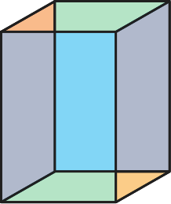

> **[Diagram Context - Textbook_Mathematics_Gr8_Geometry-of-3D-objects.pdf-0002-16.png]**
> The graphic displays an abstract colour gradient graphic consisting of three adjacent rectangular blocks in shades of reddish-brown, dark gold, and light yellow, with a thin diagonal line extending from the top right corner. The image lacks any explicit textual labels, variables, or scientific symbols. Conceptually, this visual does not contain recognizable CAPS curriculum content and serves merely as a decorative or incomplete graphical element.

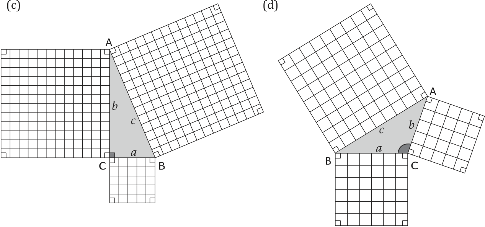
> **[Diagram Context - Textbook_Mathematics_Gr8_The-theorem-of-Pythagoras.pdf-0002-00.png]**
> The graphic displays two geometry figures showing right-angled triangles with squares constructed on each of their sides. Visible labels include vertices A, B, and C, side length variables $a$, $b$, and $c$, and right-angle symbols in the corners of both the triangles and the grid-divided squares. Conceptually, this visual demonstrates the geometric proof of Pythagoras' theorem by showing that the area of the square on the hypotenuse ($c^2$) equals the sum of the areas of the squares on the other two sides ($a^2 + b^2$).

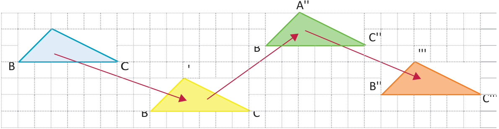
> **[Diagram Context - Textbook_Mathematics_Gr8_Transformation-geometry.pdf-0002-02.png]**
> This geometry figure displays a sequence of four triangles on a Cartesian grid representing consecutive Euclidean transformations. Visible labels include vertices $B$ and $C$ on the original blue triangle, progressing through primed variants up to $A''$, $B''$, and $C'''''$ on the transformed figures, connected by directional red arrows. The diagram conveys conceptually how Euclidean transformations—such as translations, reflections, or rotations—map an object to its images while preserving shape and size, supporting Grade 10-12 CAPS mathematics outcomes on transformations.

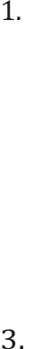

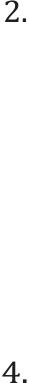

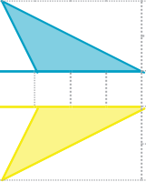
> **[Diagram Context - Textbook_Mathematics_Gr8_Transformation-geometry.pdf-0002-08.png]**
> This geometry figure displays a pair of triangular shapes reflected across a horizontal axis, indicated by dashed grid lines marking corresponding coordinate points. The graphic illustrates the geometric concept of reflection transformation in a Cartesian plane, demonstrating how figures maintain congruence and dimensions while inverting orientation across a line of symmetry.

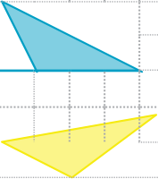
> **[Diagram Context - Textbook_Mathematics_Gr8_Transformation-geometry.pdf-0002-09.png]**
> This geometry figure illustrates a transformation of shapes on a Cartesian coordinate grid, showing a blue triangle and a yellow triangle linked by vertical dotted construction lines. The graphic features a grid of grey dashed lines and vertical projection lines dropped from the vertices of the original shape to the transformed image. It conveys the concept of geometric transformations, specifically reflection or translation, helping learners visualize how coordinates change and how corresponding points relate between an object and its image.

---

### Oblique Prisms
An oblique prism is a prism in which the side faces are parallelograms, but they are not perpendicular to the base.

> **[Diagram Context - Textbook_Mathematics_Gr8_Construction-of-geometric-figures.pdf-0003-03.png]**
> This geometric construction diagram illustrates the use of a pair of compasses to draw arcs intersecting a straight line, labeled with points P, A, and B. The visual shows a grey compass instrument positioned above a horizontal line, with pencil marks and arc intersections marked at letters A and B. Conceptually, this demonstrates fundamental Euclidean geometry construction techniques used in CAPS Mathematics for bisecting lines, constructing angles, or transferring lengths.

---

### Pyramids
A **pyramid** is a 3D object with only one base. The lateral faces (the sides) are always triangles that meet at a single common point called the **apex**.

#### Right Pyramids
In a **right pyramid**, the lateral faces are isosceles triangles.

#### Classification of Pyramids
Pyramids are named according to the shape of their base:

| Base Shape | Name of Pyramid |
| :--- | :--- |
| Triangle | Triangular-based pyramid (Triangular pyramid) |
| Square | Square-based pyramid (Square pyramid) |
| Hexagon | Hexagonal-based pyramid (Hexagonal pyramid) |

> **[Diagram Context - Textbook_Mathematics_Gr8_Construction-of-geometric-figures.pdf-0003-05.png]**
> This geometry figure illustrates a standard Euclidean construction technique using a pair of compasses and a straight line. The visible labels include points P, Q, A, and B, along with intersecting blue arc markings created by the compass tool. Conceptually, this diagram conveys the step-by-step process of constructing geometric relationships, such as bisecting a line segment or dropping a perpendicular from a point, essential for high school mathematics CAPS outcomes.

**Examples of Face Counts:**
*   **Square-based pyramid:** Has 5 faces (1 square base + 4 triangular faces).
*   **Hexagonal-based pyramid:** Has 7 faces (1 hexagonal base + 6 triangular faces).

---

### Oblique Pyramids
If a pyramid is not a right pyramid, it is called an **oblique pyramid**. In an oblique pyramid, the lateral faces are not necessarily isosceles triangles.

> **[Diagram Context - Textbook_Mathematics_Gr8_Construction-of-geometric-figures.pdf-0003-07.png]**
> This geometry figure illustrates a Cartesian coordinate plane with intersecting lines, coordinate points P and Q, and arc intersection points A and B along the horizontal axis, marked with a right-angle symbol. Visible labels include the points P, Q, A, and B, alongside perpendicular intersecting axes. Conceptually, this diagram helps high school learners practice analytical geometry and coordinate proofs by visually representing points, perpendicular lines, and geometric constructions.

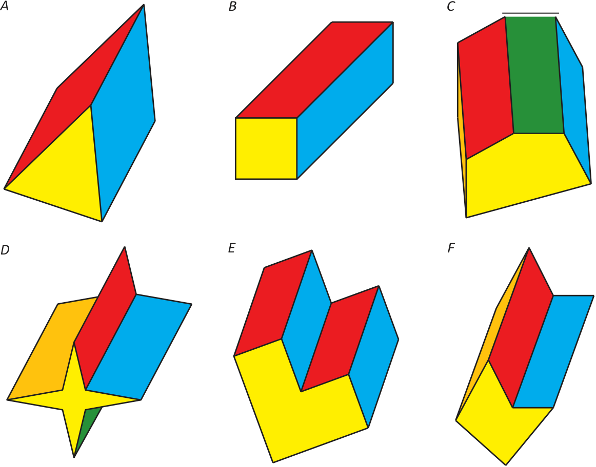
> **[Diagram Context - Textbook_Mathematics_Gr8_Geometry-of-3D-objects.pdf-0003-04.png]**
> This educational graphic displays six 3D geometric figures labelled A through F, rendered with colored faces in yellow, red, blue, and green to show spatial orientation and perspective. For a high school mathematics or CAT student, the diagram visually conveys spatial reasoning, surface area, and perspective rendering of polyhedra, helping learners interpret 3D shapes and their constituent planar faces from 2D representations.

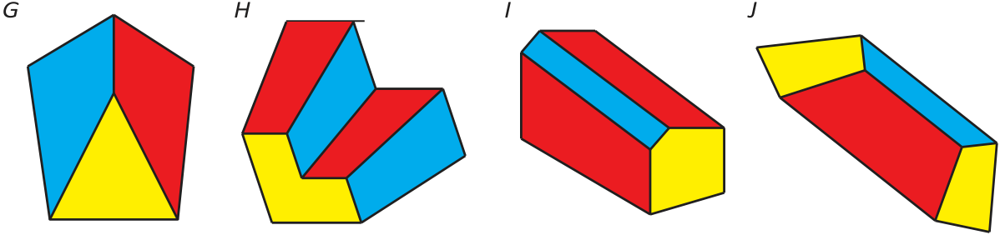
> **[Diagram Context - Textbook_Mathematics_Gr8_Geometry-of-3D-objects.pdf-0003-06.png]**
> This graphic displays four 3D geometric figures or polyhedra, labeled G, H, I, and J, rendered with colored faces in blue, red, and yellow. The diagram illustrates spatial visualization and the properties of three-dimensional shapes, helping high school learners understand surface areas, faces, and spatial orientation in Euclidean geometry.

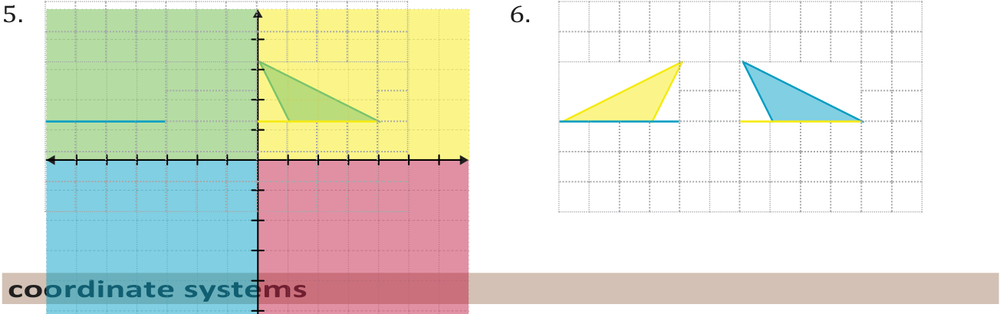
> **[Diagram Context - Textbook_Mathematics_Gr8_Transformation-geometry.pdf-0003-00.png]**
> The graphic features two geometric coordinate geometry figures illustrating transformations on a Cartesian plane, labelled with numbers 5 and 6 and featuring coloured triangular shapes plotted over grid lines and intersecting axes. Figure 5 displays a Cartesian plane with four distinct quadrants (green, yellow, blue, pink) and numbered axes displaying a plotted green triangle, while figure 6 shows a grid with two side-by-side yellow and blue triangles demonstrating lateral displacement or reflection. Conceptually, this visual supports high school mathematics learners in understanding Euclidean transformations, coordinate systems, and how the position and orientation of shapes change across Cartesian planes or lines of symmetry.

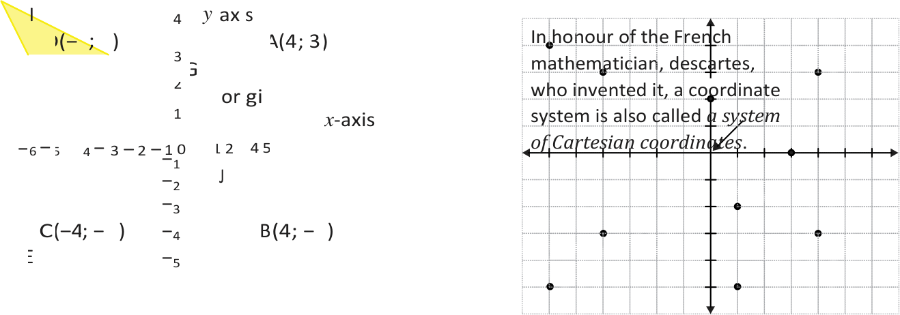
> **[Diagram Context - Textbook_Mathematics_Gr8_Transformation-geometry.pdf-0003-02.png]**
> The graphic is a Cartesian coordinate geometry figure displaying a Cartesian plane with an x-axis, y-axis, origin, and plotted points including A(4; 3), C(-4; - ), and B(4; - ). It features visible text explaining that the system is named after the French mathematician Descartes, alongside a yellow geometric triangle in the upper left quadrant. Conceptually, the diagram helps high school learners understand the structure of the Cartesian coordinate system, plotting points using ordered pairs ($x$; $y$), and locating positions across the four quadrants.

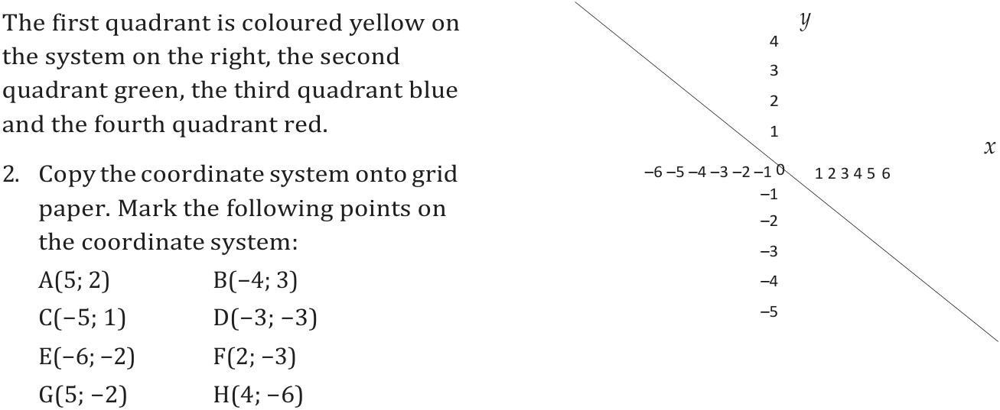
> **[Diagram Context - Textbook_Mathematics_Gr8_Transformation-geometry.pdf-0003-05.png]**
> The graphic is a geometry figure displaying a Cartesian coordinate system with perpendicular x and y-axes scaled from -6 to 6 and -5 to 4 respectively, alongside text instructions and a list of coordinate points labeled A through H. It illustrates the four quadrants of the Cartesian plane and provides an exercise for students to plot specific ordered pairs to reinforce coordinate geometry and spatial orientation skills in South African high school mathematics.

> **[Diagram Context - Textbook_Mathematics_Gr8_Transformation-geometry.pdf-0003-06.png]**
> The graphic displays a horizontal bar divided into three adjacent colored blocks (red-brown, dark gold, and yellow-gold) with a single diagonal line extending from the top-right corner. There are no visible labels, text, or numerical variables present on the image. Conceptually, it is an abstract visual aid that lacks sufficient context to convey specific curriculum content for high school CAPS topics.

---

# Identifying Prisms and Pyramids

## 1. Concept: Identifying Bases
A **base** is the face of a 3D object that defines its shape or upon which the object rests. 
*   **Prisms** have two identical, parallel bases connected by rectangular sides.
*   **Pyramids** have one base and triangular faces that meet at a single point (apex).

### Exercise 1: Identify and Shade
Copy the following figures and shade the base of each. Determine if the object is a prism or a pyramid.

> **[Diagram Context - Textbook_Mathematics_Gr8_Construction-of-geometric-figures.pdf-0004-03.png]**
> This educational graphic illustrates a specialized laboratory apparatus, specifically a dual-chamber or Y-tube respirometer setup often used in biological investigations. The visible components include interconnected glass tubing with sealed rubber bungs and distinct columns of blue liquid acting as manometer fluid to track gas volume changes. Conceptually, this apparatus helps high school learners measure the rate of oxygen consumption or carbon dioxide production during metabolic processes such as cellular respiration in germinating seeds or small organisms.

| Figure | Classification |
| :--- | :--- |
| A | Prism |
| B | Prism |
| C | Pyramid |
| D | Pyramid |
| E | Prism |
| F | Prism |
| G | Pyramid |
| H | Prism |

---

## 2. Concept: Matching 3D Objects to Names
To identify 3D objects, observe the shape of the base and the number of faces.

### Exercise 2: Matching
Join each 3D object (A–E) with its correct name.

> **[Diagram Context - Textbook_Mathematics_Gr8_Construction-of-geometric-figures.pdf-0004-04.png]**
> This physics diagram illustrates the reflection properties of spherical mirrors, showing two curved mirror surfaces labelled A and B, a principal axis, and a point labelled P. It also includes a compass or drawing tool positioned on the principal axis to demonstrate the geometric construction of the mirror's centre of curvature. Conceptually, this helps learners understand the optical geometry and ray-tracing principles required for concave and convex mirrors in Grade 11 Physical Sciences.

| Letter | 3D Object Name |
| :--- | :--- |
| A | Cube |
| B | Hexagonal-based pyramid |
| C | Pentagonal prism |
| d | Square-based pyramid |
| E | Triangular prism |

---

### Summary Notes
*   **Prisms:** Named after the shape of their base (e.g., a triangular prism has a triangle as its base). They have a uniform cross-section throughout their length.
*   **Pyramids:** Named after the shape of their base (e.g., a square-based pyramid has a square as its base). All side faces are triangles.

> **[Diagram Context - Textbook_Mathematics_Gr8_Construction-of-geometric-figures.pdf-0004-08.png]**
> This geometry figure illustrates the construction of a perpendicular line to a given line segment using a pair of compasses. Visible labels include points A, B, P, and intersection Q, alongside construction arcs and a right-angle symbol. It demonstrates the step-by-step geometric construction technique required for learners to accurately construct a perpendicular line at a specific point on a line.

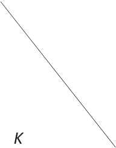

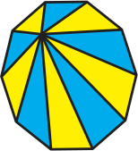
> **[Diagram Context - Textbook_Mathematics_Gr8_Geometry-of-3D-objects.pdf-0004-02.png]**
> This geometric figure is a polygon decomposed into triangular regions radiating from an interior vertex, shaded in alternating blue and yellow colours. There are no alphabetical labels, variables, or mathematical symbols visible in the graphic. Conceptually, this diagram visually conveys how complex polygons can be broken down into simpler constituent triangles, helping learners calculate total interior angles or composite area.

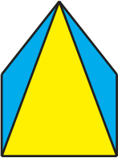
> **[Diagram Context - Textbook_Mathematics_Gr8_Geometry-of-3D-objects.pdf-0004-04.png]**
> The graphic is a geometry figure displaying a composite 2D shape or net, composed of a central yellow triangle flanked by two blue quadrilaterals sharing its slanted sides. There are no explicit text labels, variables, or axis names present on the diagram. Conceptually, this figure helps learners in calculating the area of composite shapes by breaking them down into simpler geometric components, specifically triangles and quadrilaterals.

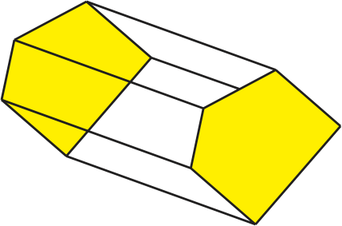
> **[Diagram Context - Textbook_Mathematics_Gr8_Geometry-of-3D-objects.pdf-0004-13.png]**
> This is a geometry figure showing a 3D solid, specifically a pentagonal prism rendered with black line outlines on a white background, featuring yellow shading on three of its faces (the two pentagonal end bases and one rectangular lateral face). The diagram contains no text labels, variables, or directional arrows. Conceptually, it helps FET phase learners visualize the spatial properties, surface area components, and cross-sections of right prisms in Euclidean Geometry and Measurement.

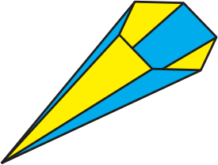
> **[Diagram Context - Textbook_Mathematics_Gr8_Geometry-of-3D-objects.pdf-0004-14.png]**
> This graphic is a 3D geometric figure featuring a polyhedron with alternating yellow and blue faces, tapering to a sharp apex. The diagram consists entirely of black outlines forming polygons with no text labels, variables, or directional arrows. Conceptually, it helps learners visualise spatial properties, 3D shapes, and surface areas in mathematics by illustrating complex polyhedral structures and perspective drawing.

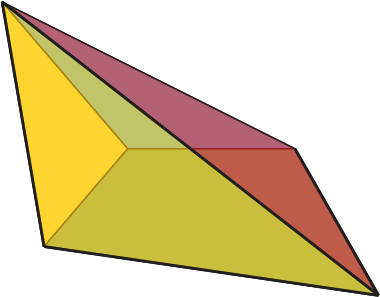
> **[Diagram Context - Textbook_Mathematics_Gr8_Geometry-of-3D-objects.pdf-0004-15.png]**
> This graphic is a 3D geometry figure representing a polyhedron, specifically a triangular prism oriented horizontally with distinct colored faces (yellow, green, and reddish-purple). There are no visible labels, text, variables, or arrows on the diagram. Conceptually, it illustrates the spatial properties and surface structure of a three-dimensional prism, helping high school learners visualize volume, surface area, and net formations in Euclidean geometry.

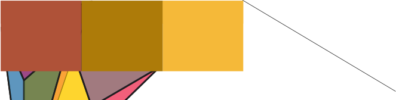
> **[Diagram Context - Textbook_Mathematics_Gr8_Geometry-of-3D-objects.pdf-0004-18.png]**
> The graphic is a geometric figure featuring three adjacent rectangles in shades of brown, bronze, and yellow at the top, along with a collection of multicolored polygons and an inclined line intersecting the upper right corner. There are no visible text labels, variables, or mathematical symbols present on the image. Conceptually, it serves as an abstract visual aid for exploring spatial relationships, polygon decomposition, or basic geometric constructions in high school mathematics.

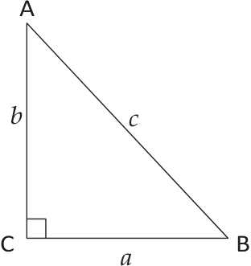
> **[Diagram Context - Textbook_Mathematics_Gr8_The-theorem-of-Pythagoras.pdf-0004-07.png]**
> The graphic is a geometry figure showing a right-angled triangle labeled ABC. The vertices are labeled A, B, and C, with a right-angle symbol at vertex C, while the side lengths opposite to the respective vertices are labeled $a$, $b$, and $c$, where $c$ represents the hypotenuse. This diagram conceptually illustrates the foundational setup for Euclidean geometry theorems and trigonometry, specifically serving to help high school learners apply the Pythagorean theorem ($a^2 + b^2 = c^2$) and define trigonometric ratios.

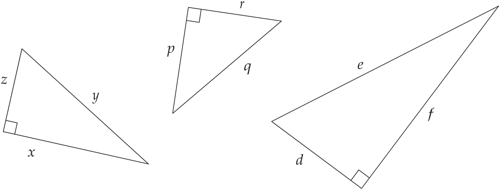
> **[Diagram Context - Textbook_Mathematics_Gr8_The-theorem-of-Pythagoras.pdf-0004-10.png]**
> This graphic displays three distinct right-angled geometry figures, each with right-angle symbols and side length variables labeled $x, y, z$ on the first triangle, $p, q, r$ on the second, and $d, e, f$ on the third. Conceptually, this diagram visually represents the Theorem of Pythagoras in right-angled triangles, helping high school learners identify the hypotenuse opposite the right angle and apply the algebraic relationship $a^2 + b^2 = c^2$ regardless of triangle orientation.

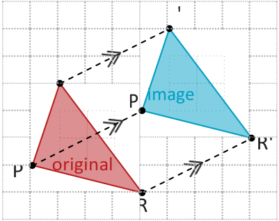
> **[Diagram Context - Textbook_Mathematics_Gr8_Transformation-geometry.pdf-0004-09.png]**
> This educational graphic is a geometry figure demonstrating a transformation on a Cartesian grid. The visible labels include the vertices P, R, and I (or P'), with dashed projection lines featuring double-arrow indicators connecting corresponding points between the red "original" triangle and the blue "image" triangle. This diagram visually conveys the concept of translation in Euclidean geometry, showing how every point of an object moves the same distance in the same direction to form a congruent image.

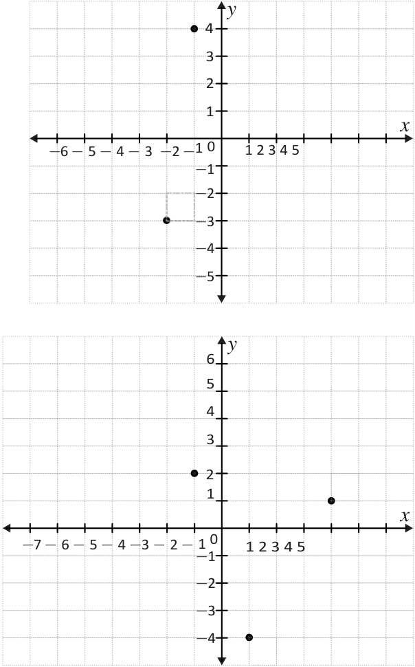
> **[Diagram Context - Textbook_Mathematics_Gr8_Transformation-geometry.pdf-0004-11.png]**
> The educational graphic consists of two Cartesian coordinate plane grids with perpendicular $x$ and $y$-axes marked with numbered integer intervals ranging from $-7$ to $5$ on the horizontal axes and $-5$ to $6$ on the vertical axes. Plotted points are indicated with solid black dots at specific coordinate positions, along with a faint dotted rectangular projection in the top grid. These graphs convey the foundational concept of plotting points and identifying ordered pairs $(x, y)$ in the Cartesian plane, which is essential for analytical geometry in the CAPS curriculum.

---

# 17.3 Describing, sorting and comparing 3D objects

## Practise describing and classifying 3D objects

**Exercise 1:** For each of the following 3D objects (A–F), identify the object and describe the number of faces it has and the shapes of these faces.

### Summary Table for 3D Objects

| Object | Name of Object | Number of Faces | Shape(s) of Faces |
| :--- | :--- | :--- | :--- |
| **A** | Cube | 6 | All 6 faces are squares |
| **B** | Triangular-based pyramid (Tetrahedron) | 4 | All 4 faces are triangles |
| **C** | Rectangular prism | 6 | 6 rectangular faces (or 2 squares and 4 rectangles) |
| **D** | Triangular prism | 5 | 2 triangular bases and 3 rectangular sides |
| **E** | Square-based pyramid | 5 | 1 square base and 4 triangular sides |
| **F** | Cylinder | 3 | 2 circular bases and 1 curved surface |

***

*Note: In geometry, a "face" is a flat surface of a 3D object. Objects like the cylinder (F) have a curved surface which is often distinguished from flat faces, though it is a boundary of the object.*

> **[Diagram Context - Textbook_Mathematics_Gr8_Construction-of-geometric-figures.pdf-0005-07.png]**
> This graphic features two geometry figures showing intersecting lines that form numbered angles. The left diagram displays intersecting lines with numbered angles 1, 2, 3, and 4, while the right diagram shows intersecting lines including a perpendicular line with numbered angles 5, 6, 7, 8, and 9. Conceptually, these diagrams help learners identify angle relationships—such as vertically opposite angles, angles on a straight line, and complementary or supplementary angles—found in Euclidean geometry.

> **[Diagram Context - Textbook_Mathematics_Gr8_Construction-of-geometric-figures.pdf-0005-08.png]**
> The graphic presents a geometry exercise containing mathematical statements and blanks for angle sizes. It displays numbered angle labels with caret symbols ($\hat{1}, \hat{2}, \hat{3}, \hat{4}, \hat{5}, \hat{6}, \hat{7}, \hat{8}, \hat{9}$), addition signs, degree symbols ($^\circ$), and fill-in-the-blank lines. Conceptually, this exercise helps learners practice angle relationships and summations by combining adjacent angle measurements in Euclidean geometry.

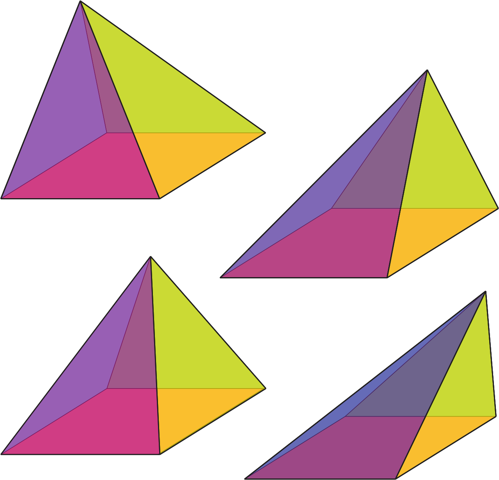
> **[Diagram Context - Textbook_Mathematics_Gr8_Geometry-of-3D-objects.pdf-0005-01.png]**
> The graphic displays four 3D geometric figures, specifically pyramids with colored triangular and quadrilateral faces. There are no text labels, variables, or mathematical symbols visible in the image. Conceptually, it illustrates three-dimensional solids and their visible surface faces, which helps learners in spatial visualization and calculating surface area or volume in mathematics.

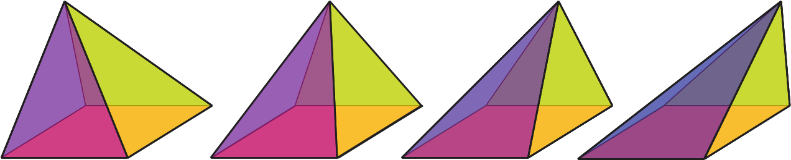
> **[Diagram Context - Textbook_Mathematics_Gr8_Geometry-of-3D-objects.pdf-0005-02.png]**
> This graphic displays four three-dimensional geometry figures, specifically right pyramids with polygonal bases shown from left to right. The diagram features colored triangular faces (purple, green, pink, orange) meeting at a common apex, depicting pyramids with bases of increasing vertex counts or varying dimensions. Conceptually, this visual helps high school mathematics learners understand the spatial properties, surface areas, and structural anatomy of 3D polyhedra as part of measurement and Euclidean geometry.

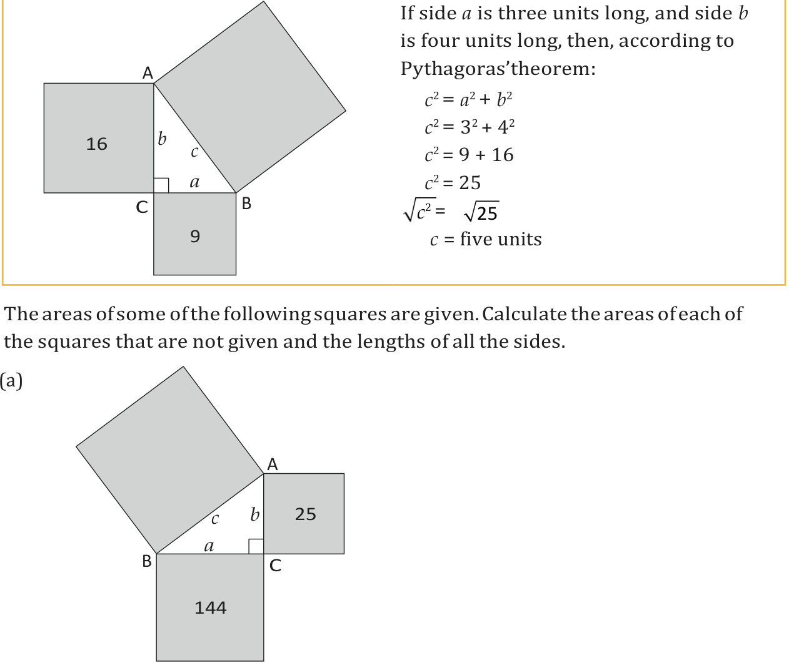
> **[Diagram Context - Textbook_Mathematics_Gr8_The-theorem-of-Pythagoras.pdf-0005-03.png]**
> The graphic presents a geometry figure illustrating Pythagoras' theorem using right-angled triangles and associated squares on each side. Visible labels include triangle vertices A, B, and C, side lengths $a$, $b$, and $c$, area values (16, 9, 25, 144), a right-angle symbol, and step-by-step algebraic working. Conceptually, it demonstrates that the sum of the areas of the squares on the two shorter sides equals the area of the square on the hypotenuse ($c^2 = a^2 + b^2$), helping learners apply the theorem to calculate unknown side lengths and areas.

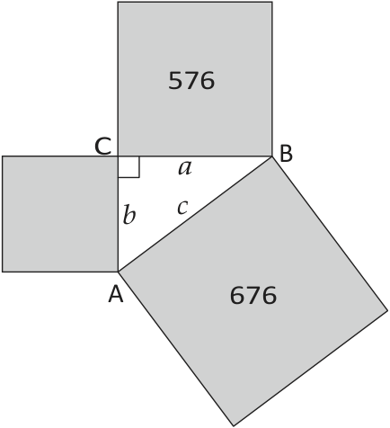
> **[Diagram Context - Textbook_Mathematics_Gr8_The-theorem-of-Pythagoras.pdf-0005-07.png]**
> This geometry figure illustrates a right-angled triangle with squares constructed on each of its three sides. The diagram displays vertices labeled A, B, and C, side lengths labeled $a$, $b$, and $c$, a right-angle symbol at vertex C, and numerical area values of 576 and 676 inside two of the grey-shaded squares. For a high school student, this visual representation demonstrates the geometric proof of Pythagoras' theorem, showing that the sum of the areas of the squares on the two shorter sides equals the area of the square on the hypotenuse ($a^2 + b^2 = c^2$).

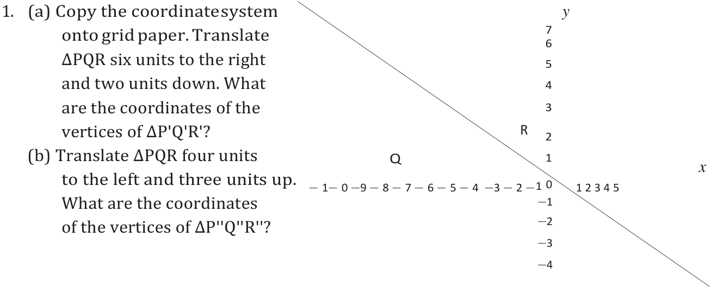
> **[Diagram Context - Textbook_Mathematics_Gr8_Transformation-geometry.pdf-0005-02.png]**
> This educational graphic is a geometry coordinate system exercise presenting two translation problems for a polygon on a Cartesian plane. Visible labels include the axes $x$ and $y$ with numerical scales, point labels Q and R, and instructional text for sub-questions (a) and (b) involving triangle $\Delta$PQR. Conceptually, this diagram helps high school learners practice transformations by applying specific horizontal and vertical shifts to determine the new coordinates of translated vertices.

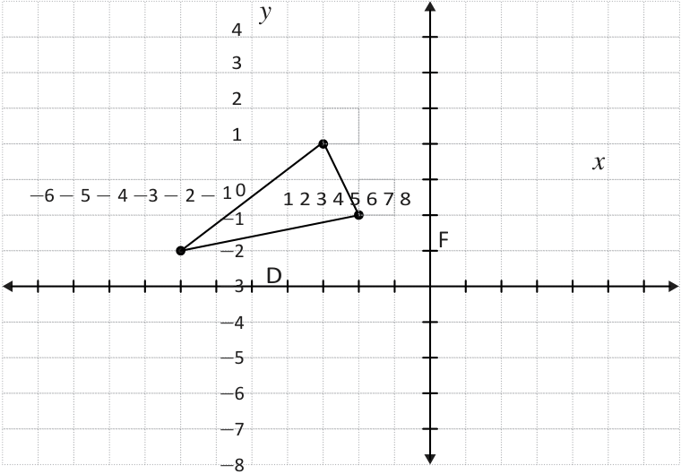
> **[Diagram Context - Textbook_Mathematics_Gr8_Transformation-geometry.pdf-0005-05.png]**
> This educational graphic is a Cartesian coordinate geometry figure displaying a triangle plotted on a grid. The image features a grid with an x-axis, y-axis, axis labels 'x' and 'y', scale markings ranging from -8 to 4 on the vertical axis and -6 to 8 on the horizontal axis, and additional labels 'D' and 'F'. It visually conveys how to locate vertices and determine coordinates for geometric shapes in the Cartesian plane, supporting CAPS curriculum outcomes for high school analytical geometry.

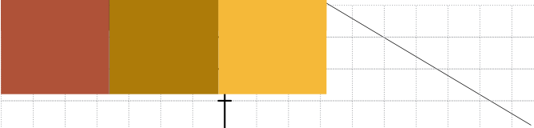
> **[Diagram Context - Textbook_Mathematics_Gr8_Transformation-geometry.pdf-0005-08.png]**
> This graphic features a geometric figure on a Cartesian coordinate grid with three adjacent colored rectangular regions (red, dark yellow, light yellow) and a descending diagonal line. Visible elements include a grid background, a vertical axis-like line with a tick mark, and a straight line sloping downward from top-left to bottom-right. Conceptually, this visual supports high school mathematics learners in analyzing coordinate geometry, linear functions, and area calculations under curves or composite geometric shapes.

---

### Geometry of 3D Objects: Classification Exercise

> **[Diagram Context - Textbook_Mathematics_Gr8_Construction-of-geometric-figures.pdf-0006-04.png]**
> This educational graphic is a geometry construction guide illustrating step-by-step instructions for bisecting an angle using a compass and a ruler. The diagram includes geometric line segments and vertices labeled A, B, C, D, K, L, M, P, Q, and R, along with angle measurements of 80° and 50°, a right-angle symbol, and intersecting construction arcs. Conceptually, it demonstrates the precise geometric construction technique required to divide an angle into two equal halves, supporting foundational CAPS geometry skills in construction and angle properties.

#### 2. (a) Sorting 3D Objects
Sort the objects labeled A through N into the three primary categories: **Prisms**, **Pyramids**, and **Cylinders**.

| Prisms | Pyramids | Cylinders |
| :--- | :--- | :--- |
| B, C, E, G, H, L, M | A, F, K, N | D, I, J |

***

#### 2. (b) Further Classification of Prisms
Divide the prisms identified in the previous step into three specific sub-groups: **Cubes**, **Rectangular Prisms**, and **Triangular Prisms**.

| Cubes | Rectangular Prisms | Triangular Prisms |
| :--- | :--- | :--- |
| B, M | E, H, L | C, G |

***

#### Key Definitions for Reference
*   **Prism:** A 3D object with two identical, parallel ends (bases) and flat rectangular or square sides. The cross-section remains the same throughout the length of the object.
*   **Pyramid:** A 3D object with a polygon base and triangular faces that meet at a single common point called the apex.
*   **Cylinder:** A 3D object with two identical circular bases connected by a curved surface.
*   **Cube:** A special type of rectangular prism where all six faces are identical squares.

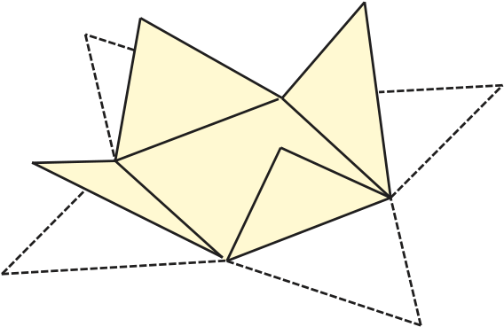
> **[Diagram Context - Textbook_Mathematics_Gr8_Geometry-of-3D-objects.pdf-0006-02.png]**
> This graphic is a geometry figure showing a spatial arrangement of connected triangles and polygonal faces, rendered with light-yellow solid surfaces and dashed outline triangles. There are no explicit alphabetical labels, variables, or axis names present. Conceptually, this diagram illustrates spatial geometry and polyhedral structures, helping students visualize 3D shapes, surface development (nets), or spatial reasoning in Euclidean geometry.

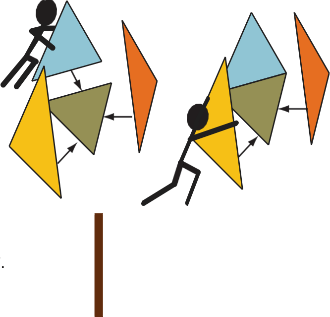
> **[Diagram Context - Textbook_Mathematics_Gr8_Geometry-of-3D-objects.pdf-0006-03.png]**
> This educational graphic illustrates a mechanical analogy using stick figures pushing and organizing interlocking colored triangular blocks connected by directional arrows. The diagram features a set of distinct geometric shapes—specifically blue, olive, yellow, and orange triangles—acted upon by directional force arrows and human figures. Conceptually, it conveys how systems of components or forces interact and depend on spatial alignment and sequence to maintain stability and function.

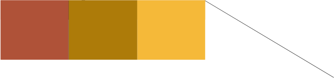
> **[Diagram Context - Textbook_Mathematics_Gr8_Geometry-of-3D-objects.pdf-0006-10.png]**
> This image features an abstract color chart consisting of three vertical rectangular blocks in shades of reddish-brown, dark yellow-brown, and light yellow, with a thin diagonal black line extending from the top right corner. The graphic lacks explicit labels, text, symbols, or axes to contextualize specific scientific or mathematical concepts. Conceptually, it does not convey recognizable CAPS curriculum content for high school students without additional labeling or instructional framing.

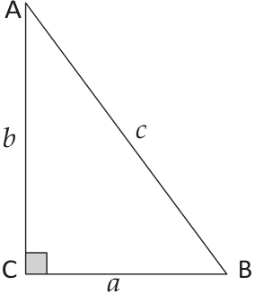
> **[Diagram Context - Textbook_Mathematics_Gr8_The-theorem-of-Pythagoras.pdf-0006-01.png]**
> This educational graphic is a geometry figure displaying a right-angled triangle labeled ABC with a right angle indicated at vertex C. The diagram features visible vertex labels A, B, and C, side length variables $a$, $b$, and $c$, and a right-angle symbol at C. For CAPS high school mathematics learners, this diagram visually conveys the fundamental setup for applying the Theorem of Pythagoras and trigonometric ratios to right-angled triangles.

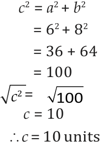
> **[Diagram Context - Textbook_Mathematics_Gr8_The-theorem-of-Pythagoras.pdf-0006-07.png]**
> This graphic displays a step-by-step mathematical calculation using algebraic variables and numerical values. Visible elements include the variables $a$, $b$, and $c$, exponent symbols ($^2$), square root radicals ($\sqrt{}$), equal signs, addition signs, and the final result labeled with "units". Conceptually, this demonstrates the procedural application of the Pythagorean theorem to calculate the hypotenuse of a right-angled triangle, guiding learners through substitution, squaring, summing, and square rooting to find the final length.

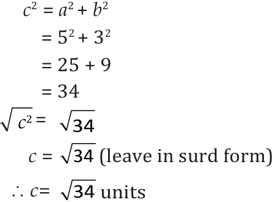
> **[Diagram Context - Textbook_Mathematics_Gr8_The-theorem-of-Pythagoras.pdf-0006-10.png]**
> The graphic shows a geometry calculation involving the application of the Pythagorean theorem. Visible variables, symbols, and text include $a$, $b$, $c$, exponents, square root signs, equality signs, the instruction "(leave in surd form)", and the therefore symbol ($\therefore$). This step-by-step algebraic working demonstrates how to calculate the length of the hypotenuse in a right-angled triangle, illustrating how to simplify an expression and correctly leave the final answer in surd form as required in high school mathematics.

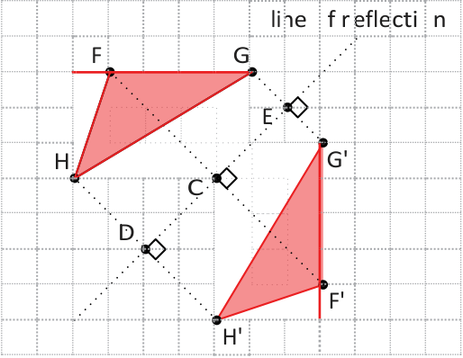
> **[Diagram Context - Textbook_Mathematics_Gr8_Transformation-geometry.pdf-0006-05.png]**
> This geometric figure illustrates a reflection transformation on a Cartesian grid. Visible elements include an original red shaded triangle labeled FGH, its reflected image F'G'H', a dashed diagonal "line of reflection", perpendicular construction lines intersecting at points C, D, and E with right-angle symbols, and grid squares. Conceptually, the diagram demonstrates Euclidean transformation geometry by showing how corresponding points maintain equal perpendicular distances to the line of reflection, preserving the shape and size of the object.

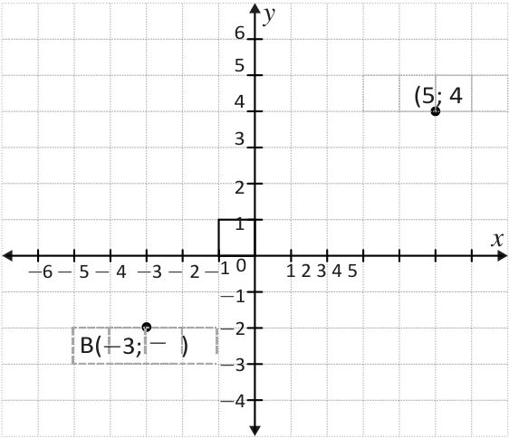
> **[Diagram Context - Textbook_Mathematics_Gr8_Transformation-geometry.pdf-0006-13.png]**
> The graphic is a Cartesian plane grid displaying two points plotted on coordinate axes. Visible labels include the horizontal $x$-axis, vertical $y$-axis, origin $0$, coordinate point $(5; 4)$, and point $B(-3; -2)$ with a dashed bounding box around its coordinates. Conceptually, this diagram helps high school students practice identifying and plotting coordinate pairs across all four quadrants of the Cartesian plane.

---

# 17.4 Nets of 3D Objects

### What is a net?
In mathematics, a **net** is a flat pattern that can be folded to form a 3D object. Different 3D objects have different nets. Sometimes, the same 3D object can have different possible nets.

> **[Diagram Context - Textbook_Mathematics_Gr8_Construction-of-geometric-figures.pdf-0007-04.png]**
> The graphic illustrates a geometry construction apparatus, specifically a pair of compasses resting on a horizontal line segment with endpoints labeled J and K, tracing a blue curved arc. Visible elements include the hinged metal compass holding a pencil lead, the straight reference line, and the intersection points denoted by letters J and K. Conceptually, this diagram demonstrates the fundamental Euclidean construction technique of setting and swinging a fixed radius arc from a given point to perform geometric constructions such as bisecting lines or copying segments.

### Nets of a Cube
A cube is a special 3D object. To form a cube, a net must consist of exactly six equal squares. However, not all patterns consisting of six squares will successfully fold into a cube.

#### Exercise: Identifying a Cube Net
Only one of the nets shown below will fold into a cube. Identify which one it is.

> **[Diagram Context - Textbook_Mathematics_Gr8_Construction-of-geometric-figures.pdf-0007-07.png]**
> This geometry figure illustrates the construction of a standard angle using a pair of compasses and a straightedge. The graphic features points and lines labeled J, K, and P, with intersecting blue arcs and a resulting angle measurement of 60°. Conceptually, it demonstrates the step-by-step geometric construction technique required in high school mathematics to accurately construct a 60° angle without a protractor.

| Net Label | Description |
| :--- | :--- |
| **A** | A cross-like arrangement of 6 squares |
| **B** | A stepped arrangement of 6 squares |
| **C** | A long vertical arrangement with side extensions |
| **D** | A T-shaped arrangement of 6 squares |

***

*Note: To determine if a net forms a cube, visualize folding the squares along the lines. If any squares overlap or if there is no "top" or "bottom" face to close the shape, it is not a valid net for a cube.*

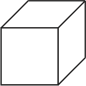

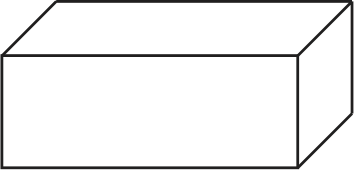

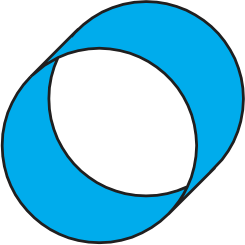
> **[Diagram Context - Textbook_Mathematics_Gr8_Geometry-of-3D-objects.pdf-0007-04.png]**
> This educational graphic is a geometric figure showing two overlapping blue circular shapes with black outlines, creating a central lens-shaped intersection. There are no explicit text labels, variables, or arrows visible in the illustration. Conceptually, for a high school mathematics student, this visual illustrates set theory operations, specifically the intersection (A ∩ B) of two sets in a Venn diagram, or the geometric intersection of two circles.

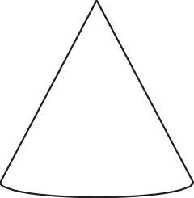
> **[Diagram Context - Textbook_Mathematics_Gr8_Geometry-of-3D-objects.pdf-0007-06.png]**
> The graphic is a geometry figure representing a right circular cone shown in a 2D frontal elevation view with no visible labels, variables, or internal construction lines. It portrays the basic outline of a 3D solid bounded by a circular base and a curved lateral surface tapering to an apex. For a high school mathematics or technical graphics student, this diagram serves as a foundational visual aid for identifying the key geometric components required when calculating surface area and volume.

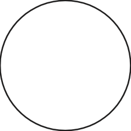
> **[Diagram Context - Textbook_Mathematics_Gr8_Geometry-of-3D-objects.pdf-0007-08.png]**
> This graphic is a simple geometric figure showing a plain, unlabelled black-outlined circle on a white background. There are no visible labels, variables, arrows, or text associated with the shape. Conceptually, it serves as a blank canvas or foundational element for high school mathematics and physical sciences learners to construct geometric proofs, draw free-body diagrams, or illustrate circular motion concepts.

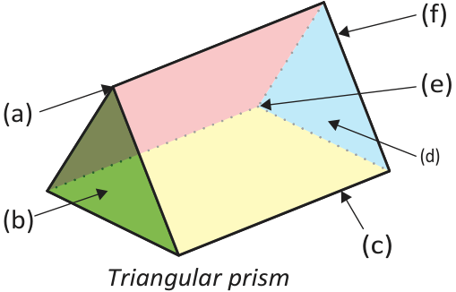
> **[Diagram Context - Textbook_Mathematics_Gr8_Geometry-of-3D-objects.pdf-0007-12.png]**
> This geometry figure illustrates a three-dimensional triangular prism with shaded faces and arrows pointing to its structural components, labeled with letters (a) through (f) and the title "Triangular prism" at the bottom. It conveys the spatial properties of a polyhedron, helping FET phase learners identify key geometric features such as vertices, edges, and faces in 3D solids.

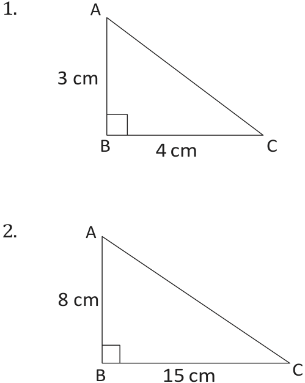
> **[Diagram Context - Textbook_Mathematics_Gr8_The-theorem-of-Pythagoras.pdf-0007-02.png]**
> This graphic displays two right-angled geometry figures, specifically right-angled triangles labeled 1 and 2, with vertices marked A, B, and C. The first triangle shows side lengths of 3 cm for AB and 4 cm for BC, while the second shows 8 cm for AB and 15 cm for BC, with right-angle symbols at vertex B. Conceptually, this diagram provides the foundational right-angled triangle setups used to practice applying Pythagoras' theorem to calculate unknown hypotenuse lengths under the CAPS curriculum.

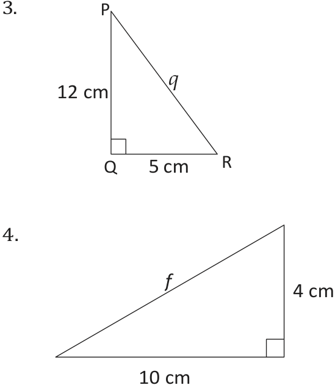
> **[Diagram Context - Textbook_Mathematics_Gr8_The-theorem-of-Pythagoras.pdf-0007-03.png]**
> The graphic displays two right-angled geometry figures, specifically right-angled triangles labeled with question numbers 3 and 4. Triangle 3 shows vertices P, Q, and R with a right angle at Q, side lengths of 12 cm and 5 cm, and an unknown hypotenuse labeled with variable $q$. Triangle 4 shows a right-angled triangle with side lengths of 4 cm and 10 cm, and an unknown hypotenuse labeled with variable $f$. This visual conveys the application of Pythagoras' theorem, helping high school learners practice calculating the length of an unknown hypotenuse in right-angled triangles.

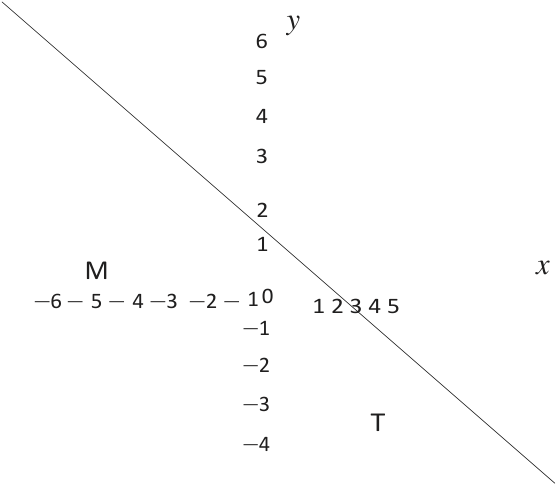
> **[Diagram Context - Textbook_Mathematics_Gr8_Transformation-geometry.pdf-0007-05.png]**
> This educational graphic is a Cartesian coordinate graph displaying a straight-line function. The visible labels include the x-axis, y-axis, numerical scales ranging from -6 to 5 on the x-axis and -4 to 6 on the y-axis, a straight diagonal line with a negative gradient, and the letters M and T positioned in different quadrants. Conceptually, this diagram helps FET phase Mathematics learners practice analytical geometry skills such as determining linear equations, finding x- and y-intercepts, and interpreting the gradient of a straight line.

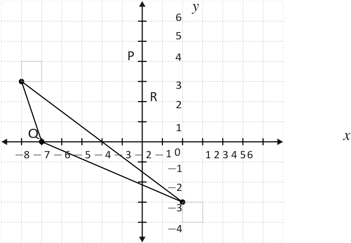
> **[Diagram Context - Textbook_Mathematics_Gr8_Transformation-geometry.pdf-0007-11.png]**
> The educational graphic is a geometry figure representing a Cartesian coordinate plane with a plotted triangle. Visible labels include the x-axis, y-axis, coordinate points labeled P, Q, and R, and numerical grid scales ranging from -8 to 6 on the axes. This diagram conceptually conveys analytical geometry principles, allowing FET learners to practice calculating gradients, lengths, midpoints, and angles of straight lines within polygons.

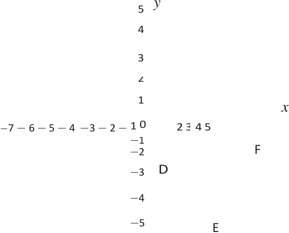
> **[Diagram Context - Textbook_Mathematics_Gr8_Transformation-geometry.pdf-0007-13.png]**
> This graphic displays a Cartesian coordinate system with perpendicular $x$ and $y$-axes marked with numerical integer values ranging from $-7$ to $5$. Visible labels include the axis variables $x$ and $y$, along with specific coordinate letters $D$, $E$, and $F$ positioned in the fourth quadrant. For a South African high school mathematics student, this diagram illustrates the foundational plane used to plot points, determine coordinates, and study analytical geometry functions.

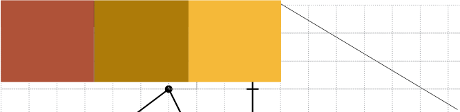
> **[Diagram Context - Textbook_Mathematics_Gr8_Transformation-geometry.pdf-0007-14.png]**
> This graphic features a partitioned rectangular block representing three distinct horizontal color sections ranging from reddish-brown to bright yellow against a grid background, with black line supports extending downward and diagonally from the base. Visible features include the three coloured segments, a grid pattern, support lines with a circular pivot joint, and a diagonal line extending downward to the right. Conceptually, this diagram visually represents a mechanical or structural system demonstrating equilibrium, moments, or centre of gravity principles relevant to Grade 11 Physics mechanics.

---

# A Cube or Not a Cube

To determine if a 2D net will fold into a 3D cube, you must visualize the folding process. Follow these steps to analyze the structure of a cube.

### 1. Labeling the Faces
A cube consists of six faces. We can label them as follows:
*   **X**: Bottom face
*   **R**: Right face
*   **B**: Back face
*   **L**: Left face
*   **T**: Top face
*   **F**: Front face

### 2. Identifying the Base
Start by choosing one square on the net to serve as the bottom face. Mark this square with an **X**.

### 3. Folding the Right Face
Locate the square immediately to the right of the bottom face (**X**). If you fold the net along the indicated red line, this square will rise to become the right face (**R**) of the cube.

### 4. Folding the Front Face
Locate the next square to the left of the right face (**R**). When you fold this square along the red line, it will become the front face (**F**) of the cube.

***

**Note:** By continuing this process of folding each adjacent square, you can determine if all six faces correctly form a closed cube without overlapping or leaving gaps.

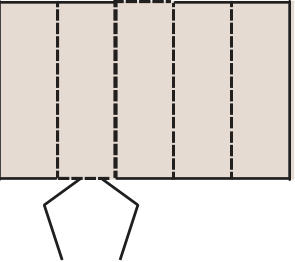
> **[Diagram Context - Textbook_Mathematics_Gr8_Geometry-of-3D-objects.pdf-0008-02.png]**
> This geometric net diagram consists of a rectangular shape divided into four vertical panels by internal dashed fold lines, with an additional trapezoidal flap extending from the bottom edge of the second panel. The diagram explicitly uses solid outer outlines for cutting edges and dashed lines to indicate folding axes, accompanied by a protruding tab flap. Conceptually, this visual aids learners in visualizing three-dimensional objects from two-dimensional nets, supporting spatial reasoning skills required in CAPS mathematics and engineering graphics.

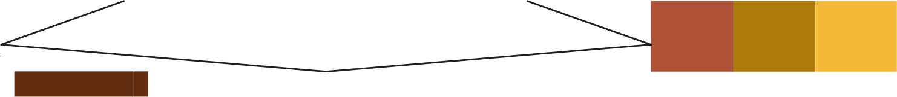
> **[Diagram Context - Textbook_Mathematics_Gr8_Geometry-of-3D-objects.pdf-0008-09.png]**
> The graphic appears to be a cropped or fragmented educational diagram featuring abstract geometric line structures alongside blocks of solid color (brown, gold, and yellow). Due to severe cropping, standard CAPS curriculum elements such as labels, variables, or clear biological and physical structures are not visible. Consequently, it does not convey a recognizable conceptual topic for high school learners in this format.

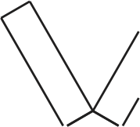
> **[Diagram Context - Textbook_Mathematics_Gr8_Geometry-of-3D-objects.pdf-0008-10.png]**
> This geometric figure consists of connected line segments forming open polygonal shapes, without any visible labels, variables, or annotations. For a high school mathematics learner studying Euclidean geometry or trigonometry, such diagrams typically serve as a visual prompt to identify angle relationships, parallel lines, or polygon properties.

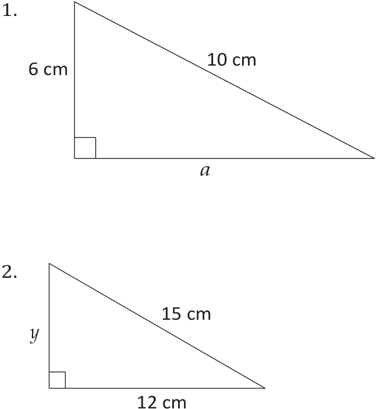
> **[Diagram Context - Textbook_Mathematics_Gr8_The-theorem-of-Pythagoras.pdf-0008-02.png]**
> This educational graphic displays two separate right-angled geometry figures. The diagram includes numerical side lengths labeled "6 cm", "10 cm", "12 cm", and "15 cm", along with unknown side variables "a" and "y", and right-angle symbols. For a CAPS curriculum high school mathematics student, it visually conveys the application of Pythagoras' theorem ($a^2 + b^2 = c^2$) to calculate missing side lengths in right-angled triangles.

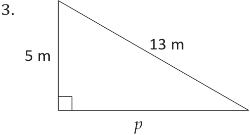
> **[Diagram Context - Textbook_Mathematics_Gr8_The-theorem-of-Pythagoras.pdf-0008-03.png]**
> This geometry figure is a right-angled triangle with a numbered question label "3." visible in the upper left. The diagram displays side lengths of "5 m" and "13 m", a base labeled with the variable "p", and a right-angle symbol at the corner between the vertical and horizontal sides. Conceptually, it provides the necessary side lengths and right-angle indicator for a high school student to apply the Theorem of Pythagoras to solve for the unknown side length $p$.

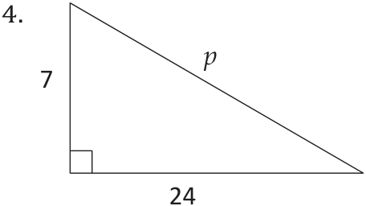
> **[Diagram Context - Textbook_Mathematics_Gr8_The-theorem-of-Pythagoras.pdf-0008-04.png]**
> This geometry figure represents a right-angled triangle labeled with the number 4. The diagram displays side lengths of 7 and 24 for the perpendicular sides, with a right-angle symbol, and the variable $p$ representing the hypotenuse. For a high school student studying Euclidean geometry or trigonometry, this conveys how to apply the theorem of Pythagoras to calculate the unknown length of the hypotenuse.

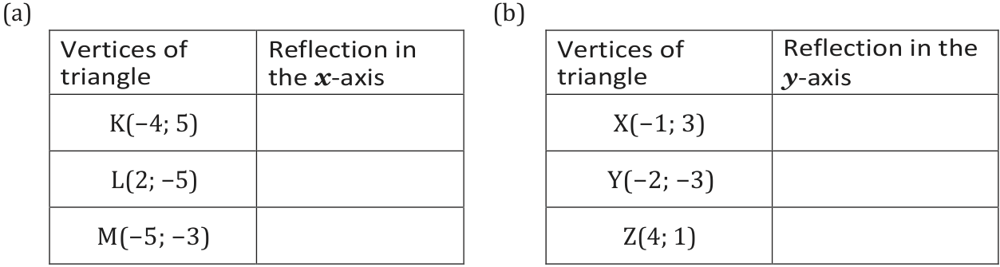
> **[Diagram Context - Textbook_Mathematics_Gr8_Transformation-geometry.pdf-0008-01.png]**
> This graphic consists of two tables, labeled (a) and (b), designed for practicing Euclidean geometry coordinate transformations. Table (a) lists triangle vertices K(-4; 5), L(2; -5), and M(-5; -3) alongside a column for "Reflection in the $x$-axis", while Table (b) lists vertices X(-1; 3), Y(-2; -3), and Z(4; 1) with a column for "Reflection in the $y$-axis". Conceptually, this helps CAPS high school learners master coordinate geometry rules for reflections by prompting them to apply algebraic coordinate mappings—changing the sign of the $y$-coordinate for an $x$-axis reflection and the $x$-coordinate for a $y$-axis reflection.

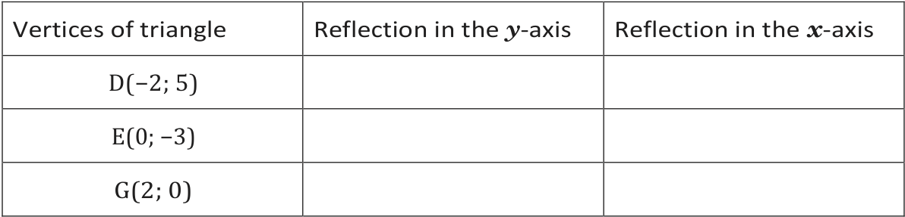
> **[Diagram Context - Textbook_Mathematics_Gr8_Transformation-geometry.pdf-0008-03.png]**
> This educational graphic is a three-column mathematical table designed for practicing coordinate geometry transformations. The table contains column headers labelled "Vertices of triangle", "Reflection in the $y$-axis", and "Reflection in the $x$-axis", with corresponding rows listing coordinate points $D(-2; 5)$, $E(0; -3)$, and $G(2; 0)$ alongside empty spaces for student answers. Conceptually, it helps learners practice and understand the algebraic rules of coordinate transformations by reflecting points across the Cartesian axes.

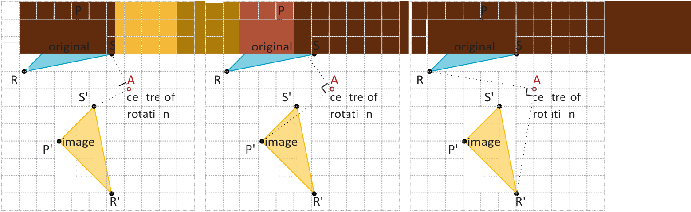
> **[Diagram Context - Textbook_Mathematics_Gr8_Transformation-geometry.pdf-0008-07.png]**
> This educational graphic is a geometry figure demonstrating transformation geometry, specifically rotation on a Cartesian coordinate grid. The visible labels and points include the original shape with vertices P and S, the rotated image with vertices P', S', and R', point A representing the "centre of rotation," and dashed construction lines connecting corresponding points to the centre of rotation. This diagram conceptually conveys how to determine or construct the centre of rotation for a rotated 2D shape by drawing perpendicular bisectors between corresponding object and image points (such as S to S' and R to R').

---

### Understanding Cube Nets

A **net** is a 2D shape that can be folded to form a 3D object. When folding a net into a cube, each square corresponds to a specific face of the cube.

#### Folding Process
To visualize how a net forms a cube, follow these steps:
1. **Front Face (F):** Establish your base or front face.
2. **Left Face (L):** The square to the left of the front face folds to become the left side.
3. **Back Face (B):** The square to the left of the left face folds to become the back face.
4. **Top Face (T):** The remaining square at the top folds to cover the cube.

> **[Diagram Context - Textbook_Mathematics_Gr8_Construction-of-geometric-figures.pdf-0009-05.png]**
> The graphic shows a standard measuring apparatus, specifically a linear ruler. Visible labels include the letters "A" and "B" positioned above the ruler, along with numerical calibration marks ranging from 0 to 15 representing centimeter intervals. For a CAPS curriculum student, this diagram illustrates the fundamental scientific skill of length measurement, demonstrating how to properly read a graduated scale to determine physical dimensions accurately.

#### Mapping a Cube to a Net
By labeling the faces of a cube (T = Top, B = Back, L = Left, F = Front, R = Right), we can unfold it into a flat net.

> **[Diagram Context - Textbook_Mathematics_Gr8_Construction-of-geometric-figures.pdf-0009-06.png]**
> This geometric construction figure illustrates the process of measuring a specific length using a pair of compasses and a ruler. Visible elements include a graduated ruler marked from 0 to 15, a pair of compasses spanning a distance of 7 cm between points A and B, and directional arrows indicating measurement. This diagram conceptually demonstrates how to accurately set, read, and transfer exact linear measurements in geometry constructions.

---

### Identifying the Nets of a Cube

**Exercise:** For each of the following nets, determine whether it will fold into a cube or not by copying and labelling the squares to match the faces of a cube.

> **[Diagram Context - Textbook_Mathematics_Gr8_Construction-of-geometric-figures.pdf-0009-09.png]**
> This graphic illustrates a geometry construction procedure using a pair of compasses, a ruler, and pencil arcs. Visible labels include vertices A, B, and C, along with length measurements of 7 cm and 5 cm. For a high school student, the diagram demonstrates the step-by-step method for constructing a triangle given side lengths (specifically SSS construction), showing how to measure a specific radius on a ruler and swing intersecting arcs to locate the third vertex.

**Instructions for learners:**
*   A standard cube has 6 faces. Ensure the net has exactly 6 squares.
*   Use the "folding" method: Pick one square as the base (F) and mentally fold the adjacent squares up.
*   If two squares overlap or if there is no square to cover a specific side (like the top or back), the net will not form a complete cube.
*   Note: The shaded squares in the diagrams above are part of the net structure; use them as reference points when labeling your faces.

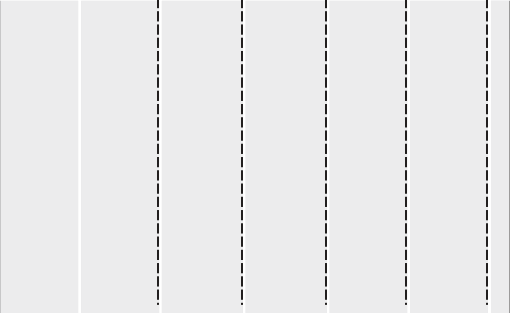
> **[Diagram Context - Textbook_Mathematics_Gr8_Geometry-of-3D-objects.pdf-0009-03.png]**
> This educational graphic displays a plain background divided into vertical columns separated by evenly spaced vertical dashed lines, with no visible labels, text, or scientific symbols. The abstract grid structure can serve as a versatile template for organizing tabular data, timeline sequencing, or comparative analyses across various CAPS curriculum subjects.

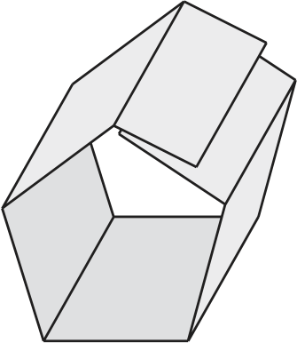
> **[Diagram Context - Textbook_Mathematics_Gr8_Geometry-of-3D-objects.pdf-0009-05.png]**
> The graphic shows a geometry figure, specifically a three-dimensional pentagonal prism drawn in an isometric perspective with shaded polygonal faces and distinct outline edges. There are no visible labels, variables, or directional arrows present on the diagram. Conceptually, this figure helps high school learners visualize spatial geometry properties, such as identifying faces, vertices, edges, and calculating surface area or volume for polyhedra in Mathematics and Mathematical Literacy.

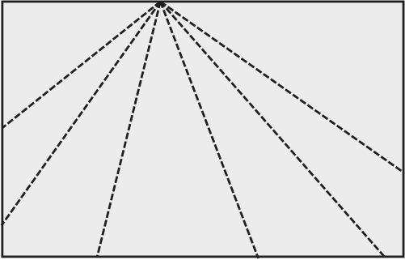
> **[Diagram Context - Textbook_Mathematics_Gr8_Geometry-of-3D-objects.pdf-0009-09.png]**
> The graphic is a ray diagram illustrating the propagation of light waves. It features a point source at the top edge emitting multiple divergent dashed rays that spread outward across the grey rectangular field. This visual helps learners understand how light travels in straight lines from a source and how diverging rays are represented in geometrical optics.

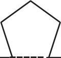

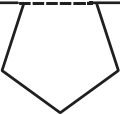

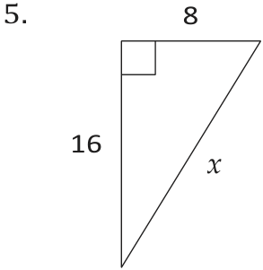
> **[Diagram Context - Textbook_Mathematics_Gr8_The-theorem-of-Pythagoras.pdf-0009-00.png]**
> This geometry figure displays a right-angled triangle with a numbered question label "5". Visible labels include side lengths of 16 and 8, an unknown hypotenuse labeled with the variable $x$, and a right-angle symbol in the top-left corner. Conceptually, this diagram helps high school learners apply the Theorem of Pythagoras to calculate the length of an unknown side in a right-angled triangle.

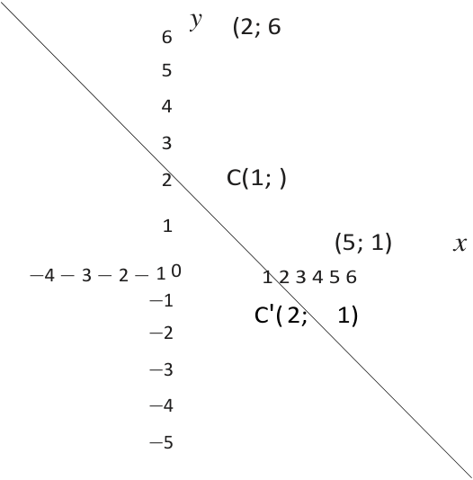
> **[Diagram Context - Textbook_Mathematics_Gr8_Transformation-geometry.pdf-0009-08.png]**
> This graphic shows a Cartesian coordinate system with a linear graph plotted on it. Visible labels and elements include the $x$-axis and $y$-axis with numbered integers ranging from $-5$ to $6$, a straight diagonal line passing through the axes, and coordinate points labeled as $(2; 6)$, $C(1; )$, $(5; 1)$, and $C'(2; 1)$. Conceptually, this diagram helps learners practice analytical geometry and function plotting by identifying coordinates, interpreting linear equations, and understanding transformations or point plotting on a Cartesian plane.

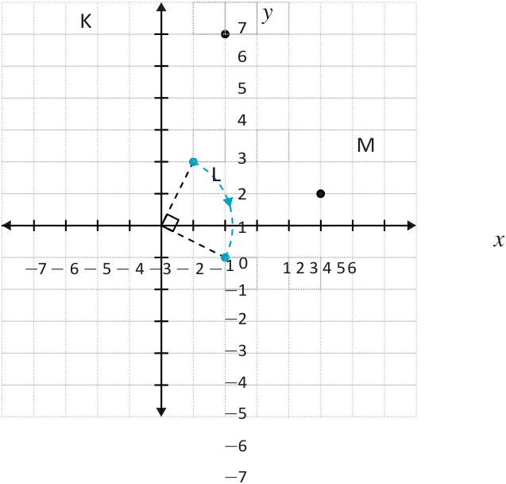
> **[Diagram Context - Textbook_Mathematics_Gr8_Transformation-geometry.pdf-0009-15.png]**
> This graphic is a Cartesian coordinate geometry figure plotted on a grid, featuring horizontal and vertical axes labeled $x$ and $y$ with numerical scales from -7 to 6 and -7 to 7 respectively. The diagram displays plotted points labeled $K$ at $(0, 7)$ and $M$ at $(4, 2)$, alongside a blue rotational arc labeled $L$ with dashed radial lines forming a right angle at the origin between points $(-1, 0)$ and $(-2, 3)$. Conceptually, this visual helps high school learners practice analytical geometry skills such as identifying coordinates, determining point locations across quadrants, and understanding geometric transformations like rotations on the Cartesian plane.

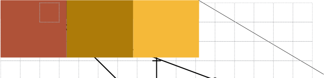
> **[Diagram Context - Textbook_Mathematics_Gr8_Transformation-geometry.pdf-0009-17.png]**
> The graphic is a geometric figure consisting of three adjacent colored rectangles (red-brown, dark gold, and light yellow) overlaid on a faint grid with pointing lines and a dashed square. Visible elements include a dotted selection square in the top-left red rectangle, diagonal lines extending from the rectangles, and vertical grid axes. Conceptually, this diagram is used in high school mathematics and technical drawing to teach concepts of scaling, area calculation, or coordinate geometry across composite shapes on a Cartesian plane.

---

### Nets of Other 3D Objects

A **net** is a 2D shape that can be folded to form a 3D object. When working with nets, it is essential to identify which faces of the 3D object correspond to the specific sections of the 2D layout.

---

#### Exercise 1: Labeling Faces on Nets
In each of the following cases, copy the net and label the faces to match the corresponding labels on the 3D object.

**Part (a): Rectangular Prism**
*   **3D Object:** A rectangular prism with faces labeled T (Top), B (Back), L (Left), R (Right), F (Front), and a base marked with an X.
*   **Task:** Map these labels onto the provided 2D net.

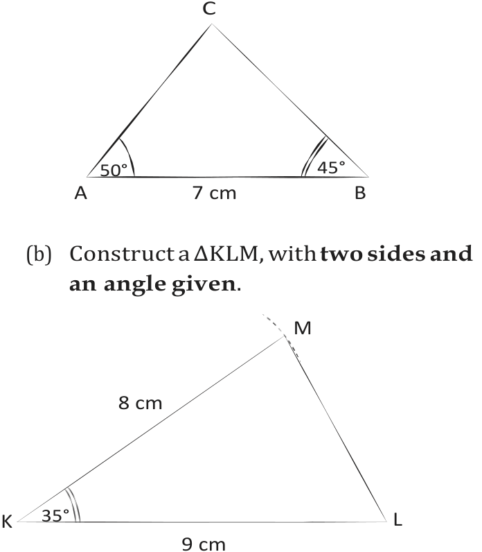

**Part (b): Square-based Pyramid**
*   **3D Object:** A pyramid with a square base and four triangular faces labeled L, B, F, and R.
*   **Task:** Map these labels onto the provided 2D net.

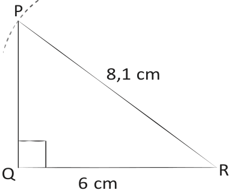

**Part (c): Triangular Prism**
*   **3D Object:** A prism with two triangular ends and three rectangular faces labeled L, R, and B, with a front face F and a base marked with an X.
*   **Task:** Map these labels onto the provided 2D net.

---

#### Exercise 2: Identifying Valid Nets
Decide whether the following nets will successfully fold to form a closed 3D object.

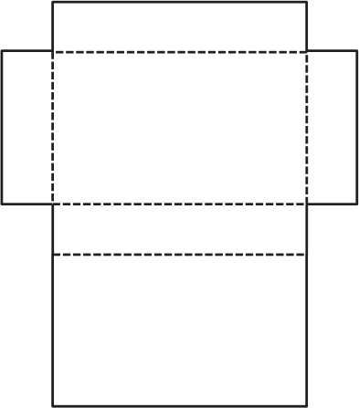

| Net | Description | Can it form a 3D object? |
| :--- | :--- | :--- |
| (a) | A combination of rectangles and triangles. | [Yes/No] |
| (b) | A square base with four triangular flaps. | [Yes/No] |
| (c) | A layout of six squares. | [Yes/No] |
| (d) | A series of rectangles with triangular ends. | [Yes/No] |

---

**Study Note:**
To determine if a net will form a 3D object, visualize the folding process:
1.  Identify the **base** of the object.
2.  Ensure there are enough faces to cover all sides of the object.
3.  Check that the edges of the faces are of equal length where they are intended to join.
4.  Ensure there is no overlap of faces when folded.

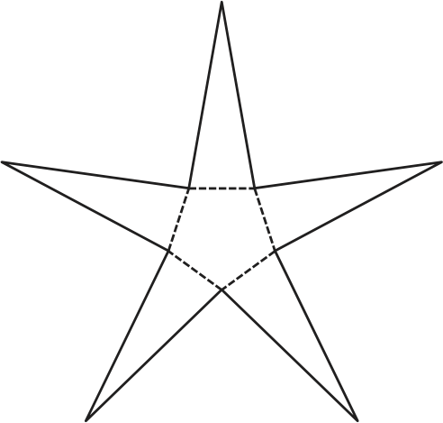

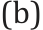

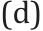

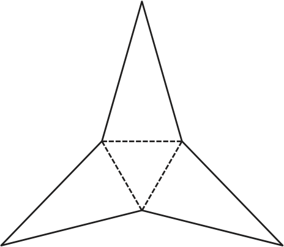

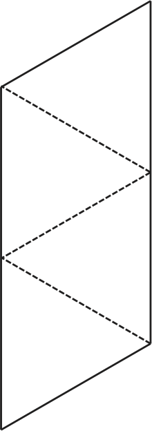

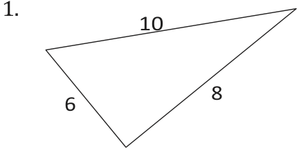

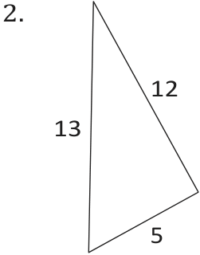

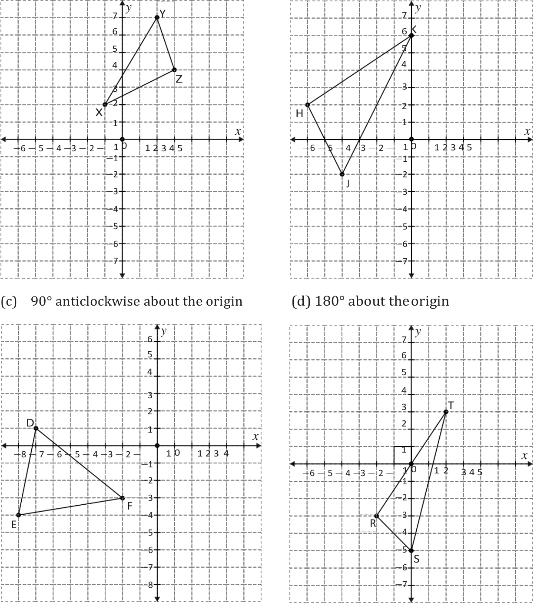

---

### 3. Identifying 3D Objects from Nets

A **net** is a 2D shape that can be folded to form a 3D object. Identify the 3D objects represented by the following nets:

> **[Diagram Context - Textbook_Mathematics_Gr8_Construction-of-geometric-figures.pdf-0011-13.png]**
> This geometric figure is an equilateral triangle with vertices labeled A, B, and C. Each of its three sides is annotated with a length of $5\text{ cm}$. The diagram conveys the properties of an equilateral triangle, specifically demonstrating that equal side lengths correspond to equal interior angles in Euclidean geometry.

*   **(a)** Triangular prism
*   **(b)** Tetrahedron (Triangular pyramid)
*   **(c)** Square-based pyramid
*   **(d)** Rectangular prism (Cuboid)
*   **(e)** Pentagonal prism

---

### 4. Analyzing a Hexagonal Net

Examine the net provided on the right, which consists of a central hexagon surrounded by six rectangles.

> **[Diagram Context - Textbook_Mathematics_Gr8_Construction-of-geometric-figures.pdf-0011-18.png]**
> This geometric figure is a triangle labeled with vertices D, E, and F. The diagram provides a standard visual representation used in Euclidean geometry to teach polygon properties, angles, and triangle theorems. It helps high-school learners identify sides and vertices when solving riders and proofs involving congruence or similarity.

**(a) Identify the shapes that the net consists of:**
The net consists of one hexagon and six rectangles.

**(b) How many rectangular faces does the net have?**
6 rectangular faces.

**(c) How many other shapes does the net have? What are they?**
1 other shape, which is a hexagon.

**(d) Will this form a pyramid or a prism?**
It will form a prism.

**(e) How do you know?**
Because it has two identical bases (the hexagon and the central shape) connected by rectangular faces.

**(f) Name the 3D object that the net will form:**
Hexagonal prism.

---

### 5. Analyzing a Circular/Octagonal Net

Examine the net provided on the right, which consists of an octagon connected to several triangular sections.

**(a) Which shapes does this net consist of?**
One octagon and eight triangles.

**(b) How many triangular faces does the net have?**
8 triangular faces.

**(c) How many other shapes does the net have?**
1 other shape (the octagon).

**(d) Will this form a pyramid or a prism?**
It will form a pyramid.

**(e) How do you know?**
Because the triangular faces meet at a single common apex point.

**(f) Name the 3D object that the net will form:**
Octagonal pyramid.

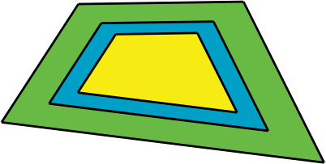
> **[Diagram Context - Textbook_Mathematics_Gr8_Transformation-geometry.pdf-0011-05.png]**
> This graphic displays a geometry figure consisting of three nested trapezoid shapes rendered in different colors (green outer frame, blue middle band, and yellow inner region) without text labels. Conceptually, it illustrates the geometric properties of nested quadrilaterals, relative surface areas, and proportional scaling in two-dimensional space. High school learners study this to calculate perimeter, area ratios, and spatial relationships between similar shapes in Euclidean geometry.

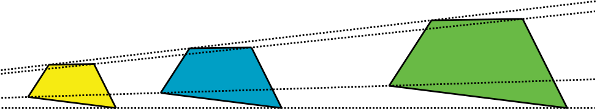
> **[Diagram Context - Textbook_Mathematics_Gr8_Transformation-geometry.pdf-0011-07.png]**
> The graphic is a geometry figure displaying three coloured trapeziums (yellow, blue, and green) arranged in a sequence with dotted projection lines extending from their vertices. Visible elements include the three distinct quadrilateral shapes and multiple dotted lines acting as geometric rays or projections connecting their corresponding corners. Conceptually, this diagram illustrates Euclidean geometric transformations—specifically enlargement or similarity—demonstrating how corresponding sides and vertices maintain proportional relationships under scaling.

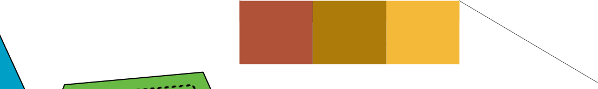
> **[Diagram Context - Textbook_Mathematics_Gr8_Transformation-geometry.pdf-0011-09.png]**
> This educational graphic appears to be an incomplete or cropped diagram containing geometric shapes and colour blocks, including a blue triangle, a green polygon, and three contiguous rectangular blocks shaded in brown, dark yellow, and light yellow. There are no visible text labels, variables, or directional arrows within the provided frame. Due to the lack of complete contextual elements, it does not convey a clear conceptual scientific process aligned with the CAPS curriculum.

> **[Diagram Context - Textbook_Mathematics_Gr8_Transformation-geometry.pdf-0011-11.png]**
> The graphic is a cropped, abstract geometric illustration showing a brown rectangular prism overlapping with a yellow polygon outlined by a dashed black border and a blue shape. There are no visible text labels, variables, biological structures, chemical symbols, axis names, or directional arrows. Because the image is incomplete and lacks educational context, it does not convey a recognizable scientific or mathematical concept aligned with the CAPS curriculum.

---

# 17.5 Using nets to construct cubes and prisms

## How to draw a net of a prism

A **net** is a 2D shape that can be folded to form a 3D object. To draw the net of a triangular prism, follow these steps based on the prism's faces.

### Example: Triangular Prism
The prism has:
*   Two right-angled triangles.
*   Three rectangles (since the base has three edges).

> **[Diagram Context - Textbook_Mathematics_Gr8_Construction-of-geometric-figures.pdf-0012-11.png]**
> This geometric illustration depicts a triangle and a straight line showing the sum of angles in a triangle. The diagram contains three shaded corner angles labeled A, B, and C, and a horizontal directional arrow pointing from the triangle to the angles arranged adjacently along a straight line. Conceptually, this conveys the Euclidean geometry theorem that the interior angles of a triangle sum up to 180° ($180^\circ$) when combined on a straight line.

### Step-by-Step Construction

**Step 1: Draw the base and the ends**
Draw a rectangle to represent the bottom face of the prism. Add a right-angled triangle to the top edge and a mirror image of that triangle to the bottom edge of the rectangle.

**Step 2: Add the remaining rectangles**
Draw the other two rectangles attached to the sides of the centre rectangle. 
*   The rectangle on the right must correspond to the side opposite the right angle in the triangle (the hypotenuse). This will be the largest rectangle.
*   The rectangle on the left corresponds to the remaining side of the triangle. This will be the smallest of the three rectangles.

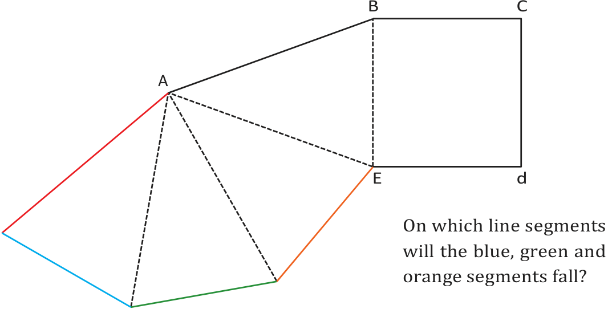
> **[Diagram Context - Textbook_Mathematics_Gr8_Geometry-of-3D-objects.pdf-0012-02.png]**
> The graphic is a geometry figure displaying an interconnected arrangement of polygons divided into triangles by dashed lines, including a rectangle labeled BCde and a vertex labeled A, alongside dashed internal construction lines. Visible labels include vertices A, B, C, E, and d, colored line segments in blue, green, and orange, and a text prompt asking: "On which line segments will the blue, green and orange segments fall?". This diagram is used to teach high school students spatial reasoning, transformations, and geometric folding or net visualization by challenging them to track the positioning of specific colored edges when figures are manipulated or aligned.

### Summary of Dimensions
When constructing the net, ensure the lengths of the sides of the rectangles match the lengths of the sides of the triangles:
*   Triangle sides: $3\text{ cm}$, $4\text{ cm}$, and $5\text{ cm}$.
*   Prism length: $11\text{ cm}$.

The resulting rectangles will have dimensions:
1.  $11\text{ cm} \times 4\text{ cm}$
2.  $11\text{ cm} \times 3\text{ cm}$
3.  $11\text{ cm} \times 5\text{ cm}$

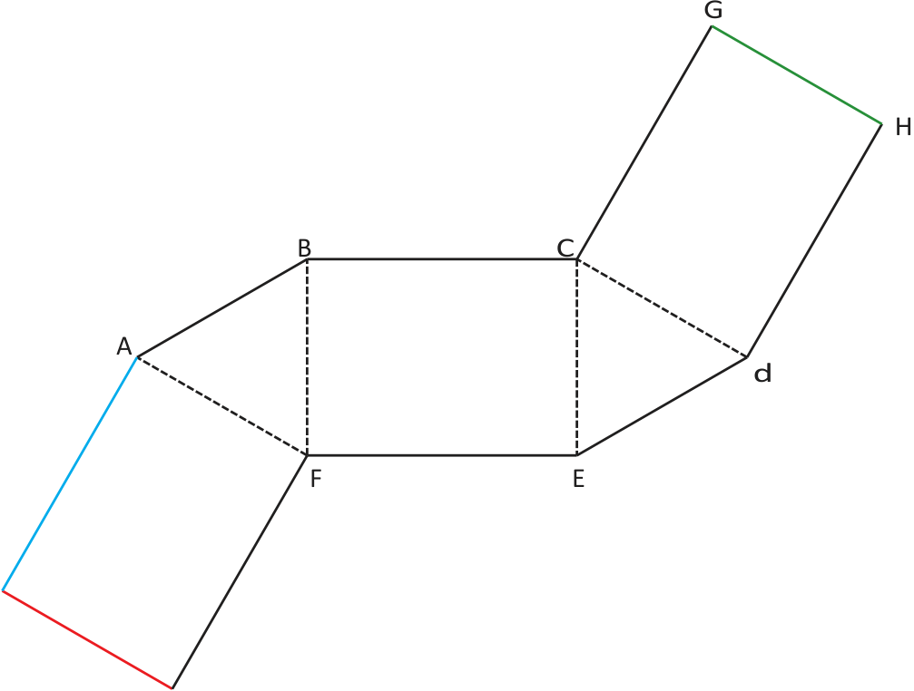
> **[Diagram Context - Textbook_Mathematics_Gr8_Geometry-of-3D-objects.pdf-0012-05.png]**
> This educational graphic displays a 2D geometric net of a three-dimensional prism, featuring labeled vertices A, B, C, d (D), E, F, G, and H, with dashed lines indicating folding edges and colored segments highlighting specific perimeter boundaries. Conceptually, it helps learners visualise how a flat two-dimensional pattern folds up to form a 3D solid figure, reinforcing spatial reasoning and surface area calculations in high school mathematics.

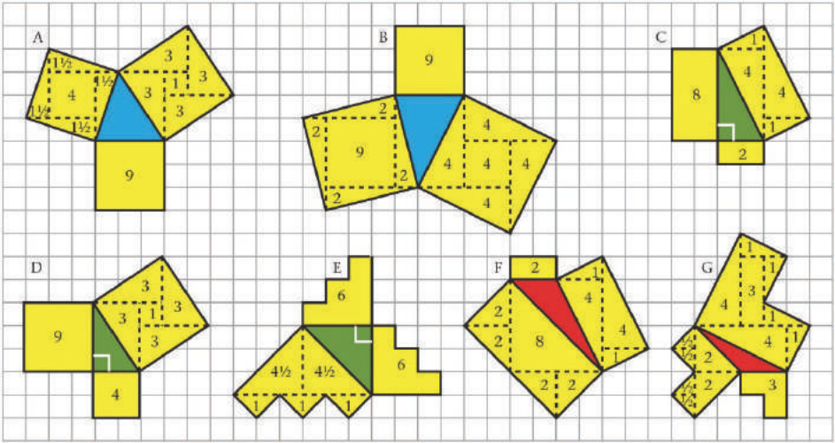
> **[Diagram Context - Textbook_Mathematics_Gr8_The-theorem-of-Pythagoras.pdf-0012-15.png]**
> This geometry figure displays seven geometric configurations (labeled A through G) set against a grid background, featuring central triangles (colored blue, green, or red) surrounded by attached yellow squares and rectangles partitioned into smaller grid-based numerical areas (such as numbers 1, 2, 3, 4, 8, 9, and fractional values). Visible labels include letters A to G identifying each sub-figure, numerical area values distributed within the shapes, dashed cut-lines, and right-angle symbols. Conceptually, this visual supports the investigation of the Pythagorean theorem and area dissection proofs, helping learners understand how the sum of the areas of squares on the sides of right-angled triangles relates to the area of the hypotenuse or how irregular figures can be dissected and rearranged to prove geometric area conservation.

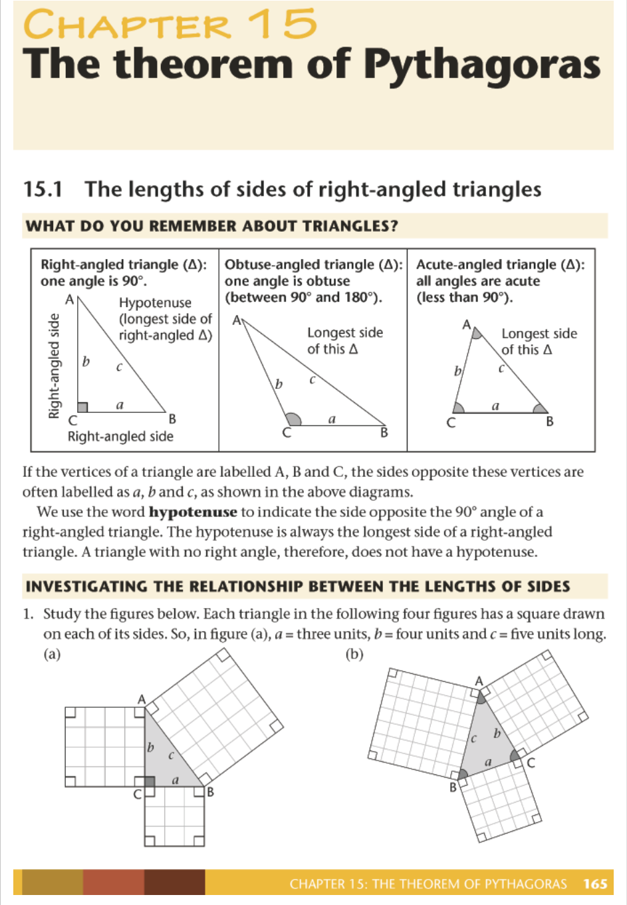
> **[Diagram Context - Textbook_Mathematics_Gr8_The-theorem-of-Pythagoras.pdf-0012-16.png]**
> This educational textbook page features geometry figures illustrating the properties of triangles and the lengths of their sides. Visible labels include triangle vertices A, B, and C, side lengths $a$, $b$, and $c$, and descriptive text identifying right-angled, obtuse-angled, and acute-angled triangles along with grid squares constructed on their sides. Conceptually, the diagrams help high school learners identify the hypotenuse of a right-angled triangle and investigate the geometric relationship between the areas of squares built on the sides of triangles leading to the Theorem of Pythagoras.

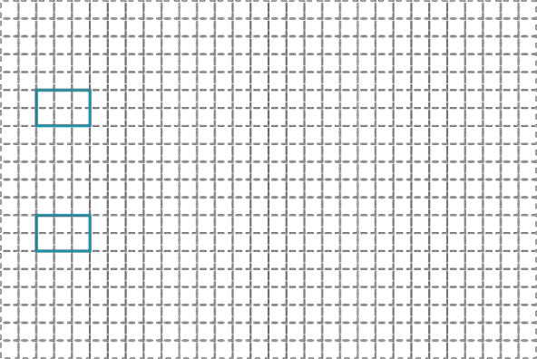
> **[Diagram Context - Textbook_Mathematics_Gr8_Transformation-geometry.pdf-0012-05.png]**
> This educational graphic is a geometry coordinate grid featuring a repeating dashed line pattern across a Cartesian coordinate plane with two highlighted rectangular shapes outlined in blue. Visible elements include a fine gray grid of dashed lines and two distinct cyan rectangular outlines positioned near the upper-left and lower-left regions of the grid. Conceptually, this diagram serves as a visual aid for high school mathematics learners to practice coordinate geometry, transformations, and plotting 2D shapes on a Cartesian plane.

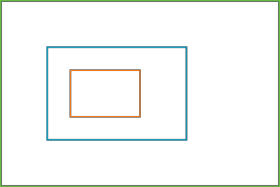

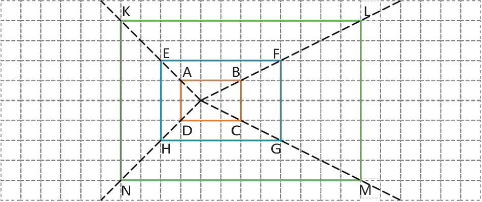
> **[Diagram Context - Textbook_Mathematics_Gr8_Transformation-geometry.pdf-0012-10.png]**
> This geometry figure displays three nested rectangles ($ABCD$, $EFGH$, and $KLMN$) overlaid on a Cartesian grid with diagonal construction lines intersecting at a central point. Visible labels include vertices $A, B, C, D, E, F, G, H, K, L, M, N$ and dashed projection rays extending from the inner rectangle through the outer rectangles. This diagram visually conveys the geometric concepts of enlargement, reduction, and proportional scaling in coordinate geometry and Euclidean transformations.

---

# Practise Drawing Nets and Constructing 3D Models

## 1. Copy and Complete the Following Nets
Identify the faces of the 3D objects and complete the corresponding nets.

*   **(a) Cube:**
    

> **[Diagram Context - Textbook_Mathematics_Gr8_Construction-of-geometric-figures.pdf-0013-02.png]**
> This graphic is a geometry figure representing a square labeled with vertices A, B, C, and D, featuring directional arrows on sides AD and BC, and double arrows on sides AB and DC. It visually communicates the fundamental properties of a square, including equal side lengths and parallel opposite sides, which are essential for learners mastering Euclidean geometry and quadrilateral theorems.

*   **(b) Triangular Prism:**
    

> **[Diagram Context - Textbook_Mathematics_Gr8_Construction-of-geometric-figures.pdf-0013-03.png]**
> This graphic displays a geometry figure of a rectangle labeled with vertices D, E, F, and G, accompanied by parallel line arrows on opposite sides. The diagram visually communicates the defining properties of a rectangle in Euclidean geometry, specifically showing that opposite sides are parallel and equal in length, which is fundamental for high school learners studying quadrilateral properties and riders in CAPS mathematics.

---

## 2. Draw Nets for the Following Objects
Sketch the flat patterns (nets) that would fold into the following 3D shapes:

*   **(a) Rectangular Prism (Cuboid):**
    

*   **(b) Triangular Prism:**
    

> **[Diagram Context - Textbook_Mathematics_Gr8_Construction-of-geometric-figures.pdf-0013-05.png]**
> The graphic displays four distinct geometry figures—a Parallelogram (labeled KLMN with vertex letters and parallel arrows), a Rhombus (labeled JKLM with side arrows indicating equal lengths), a Trapezium (labeled RSTU with a single pair of parallel arrows), and a Kite (labeled ABCD). These diagrams visually define the key quadrilaterals studied in Senior Phase and FET Mathematics, highlighting their defining geometric properties such as parallel sides and vertex labeling. For a high school student, this helps establish the foundational visual recognition and structural differences needed for Euclidean geometry theorems and proofs.

*   **(c) Square-based Prism:**
    

---

## 3. Construction Activity
Follow these steps to build your own 3D models:

1.  **(a)** Copy each of the nets that you drew in questions 1 and 2 above onto cardboard or paper.
2.  **(b)** Cut out the nets, and fold and paste them to make each 3D object.
3.  **(c)** Write down what you found difficult in making your 3D models and how you overcame this difficulty.

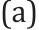

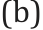

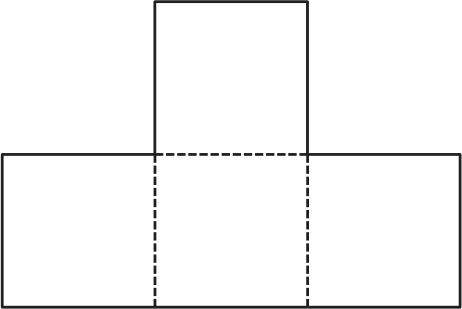

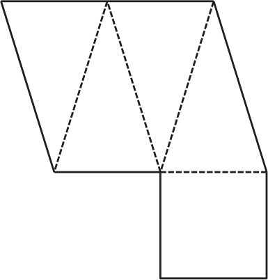
> **[Diagram Context - Textbook_Mathematics_Gr8_Geometry-of-3D-objects.pdf-0013-12.png]**
> This geometry figure is a flat two-dimensional net composed of three contiguous triangles in the center, flanked by parallelograms on the sides and a square attached at the bottom, outlined with solid external lines and internal dashed fold lines. The graphic contains no visible text, variables, or labels, relying purely on geometric shapes and dashed fold indicators. Conceptually, it demonstrates how a 3D polyhedron (such as a triangular prism with attached sections) can be unfolded into a flat 2D surface to help learners calculate surface area and visualize spatial relationships in CAPS mathematics.

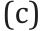

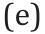

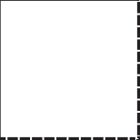

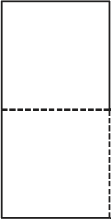

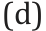

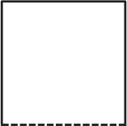

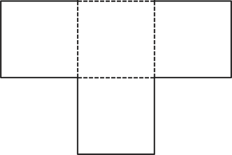

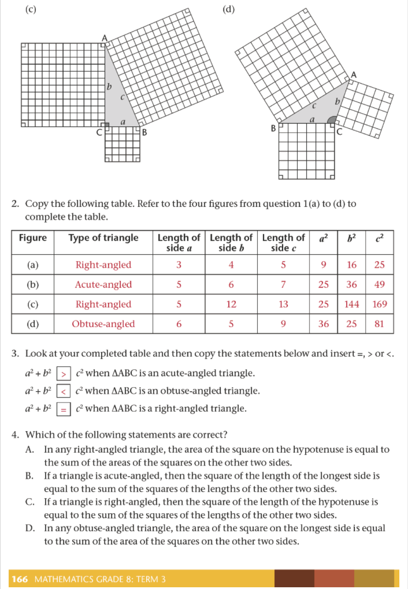
> **[Diagram Context - Textbook_Mathematics_Gr8_The-theorem-of-Pythagoras.pdf-0013-17.png]**
> The educational graphic displays a geometry figure consisting of triangles labelled $\triangle ABC$ with side lengths $a$, $b$, and $c$, accompanied by squares constructed on each side, a data table, and related algebraic inequality statements. Visible labels include figure identifiers (c) and (d), vertices $A$, $B$, and $C$, side lengths $a$, $b$, $c$, triangle types (right-angled, acute-angled, obtuse-angled), squared values ($a^2$, $b^2$, $c^2$), and comparison operators ($=, >, <$). The diagram visually and numerically conveys the relationship between the squared side lengths of acute, right-angled, and obtuse triangles, helping Grade 8 learners generalize Pythagoras' theorem and investigate inequalities for non-right-angled triangles.

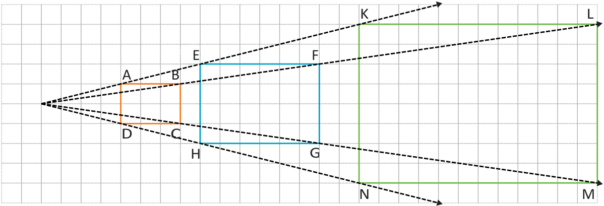
> **[Diagram Context - Textbook_Mathematics_Gr8_Transformation-geometry.pdf-0013-00.png]**
> This geometry figure illustrates Euclidean geometry principles of enlargement and similar polygons on a square grid. The graphic displays three rectangles labeled ABCD (orange), EFGH (blue), and KLMN (green), with dashed projection lines radiating from a central point of enlargement and intersecting the corresponding vertices. Conceptually, it conveys how the scale factor affects the dimensions of shapes while preserving their shape and angle measures during a geometric transformation.

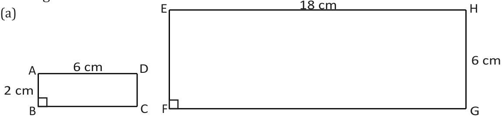
> **[Diagram Context - Textbook_Mathematics_Gr8_Transformation-geometry.pdf-0013-12.png]**
> This educational graphic displays two geometric figures, specifically two rectangles labelled ABCD and EFGH, each featuring a right-angle symbol at corners B and F. Visible labels include vertices A, B, C, D, E, F, G, and H, alongside side-length dimensions of 2 cm, 6 cm, 6 cm, and 18 cm. In the context of the CAPS curriculum, this diagram helps high school learners investigate similarity by comparing the proportional relationships between corresponding sides of enlarged and reduced figures.

---

# Grade 7 Term 3: Geometry of 3D Objects

## Learner Book Overview

| Section | Content | Pages |
| :--- | :--- | :--- |
| 17.1 Classifying 3D objects | Defining a polyhedron; using properties to identify and describe 3D objects | 213–215 |
| 17.2 Prisms and pyramids | The difference between prisms and pyramids; using properties to identify prisms and pyramids | 215–217 |
| 17.3 Describing, sorting and comparing 3D objects | Using properties of 3D objects to classify them | 218–219 |
| 17.4 Nets of 3D objects | Defining a net of a 3D object; evaluating possible nets of a cube; identifying nets of other 3D objects | 220–224 |
| 17.5 Using nets to construct cubes and prisms | How to draw the net of a prism; drawing nets and using them to construct 3D models | 225–226 |

**CAPS Time Allocation:** 9 hours  
**CAPS Content Specification:** Page 66

---

## Mathematical Background

### Definitions
*   **3D Object:** An object that has length, breadth, and height, and takes up space.
*   **Polyhedra (singular: polyhedron):** 3D objects that have only flat surfaces.
*   **Cylinder:** An object shaped like a pipe with one curved surface and two flat circular faces.
*   **Net:** A flat 2D arrangement of all the faces that make up a 3D object when joined to each other at one side.

### Prisms
Prisms have identical faces at the top and bottom. All remaining side faces are rectangles or squares. The name of a prism is determined by the shape of its base (the face on which it rests).
*   *Example:* A prism with an octagon as a base is an octagonal prism.
*   *Note:* A cube is a special type of prism where all six faces are identical squares.

### Pyramids
Pyramids rest on a 2D shape with straight sides. All remaining faces are isosceles triangles that meet at a single point called the **apex**.

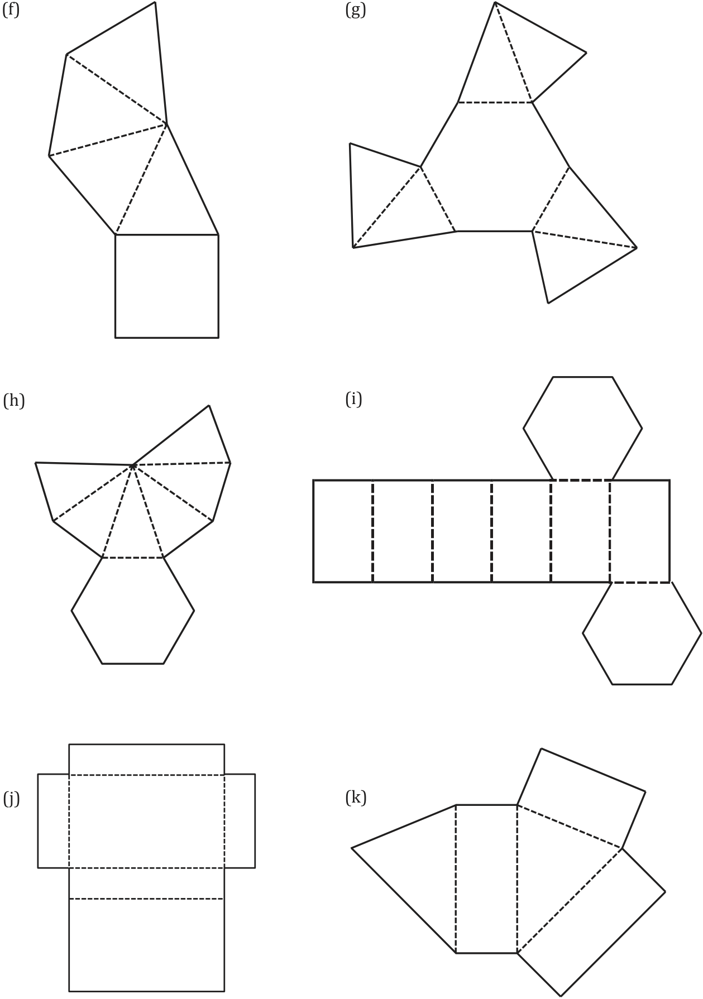
> **[Diagram Context - Textbook_Mathematics_Gr8_Geometry-of-3D-objects.pdf-0014-00.png]**
> This educational graphic shows a collection of two-dimensional geometry figures representing unfolded nets of three-dimensional solids, labeled (f) through (k). The diagrams feature solid outlines representing faces and dashed lines indicating fold lines for construction. For FET phase mathematics learners, these nets convey how 2D flat patterns can be folded to form 3D geometric objects such as pyramids, prisms, and cylinders, reinforcing spatial visualization and surface area concepts.

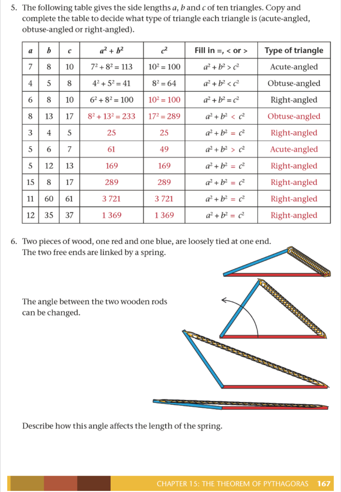
> **[Diagram Context - Textbook_Mathematics_Gr8_The-theorem-of-Pythagoras.pdf-0014-05.png]**
> The graphic presents a geometry problem set featuring a worked calculation table for the Theorem of Pythagoras with side variables $a$, $b$, and $c$, alongside a physical model of a triangle formed by two wooden rods linked by a spring. Visible text and labels include table headers for side lengths, squared sums ($a^2 + b^2$), squared hypotenuse equivalents ($c^2$), inequality comparisons ($=$, $<$, $>$), and triangle classifications (acute-angled, obtuse-angled, right-angled), accompanied by an arrow indicating a changing interior angle. Conceptually, it reinforces the converse of the Theorem of Pythagoras for classifying triangles numerically, while applying a dynamic physical model to help CAPS learners visualize how varying angle sizes directly impact the length of the connecting side.

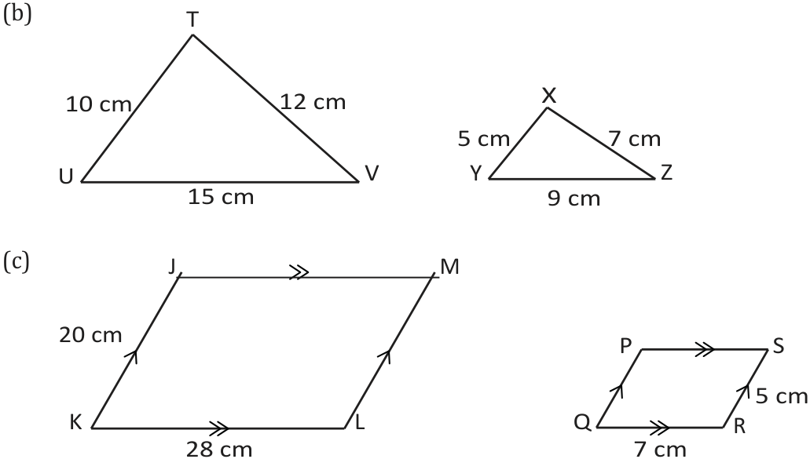
> **[Diagram Context - Textbook_Mathematics_Gr8_Transformation-geometry.pdf-0014-00.png]**
> The graphic displays geometric figures consisting of two pairs of polygons labelled (b) and (c), with vertices TUV, XYZ, JKLM, and PQRS. Visible labels include side lengths in centimetres (10 cm, 12 cm, 15 cm, 5 cm, 7 cm, 9 cm, 20 cm, 28 cm) and parallel line indicators on the sides of the parallelograms. This diagram helps high school learners understand the concepts of similarity and scaling in Euclidean geometry by demonstrating that similar polygons maintain proportional side lengths.

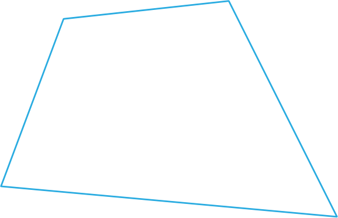
> **[Diagram Context - Textbook_Mathematics_Gr8_Transformation-geometry.pdf-0014-02.png]**
> This graphic is a geometry figure showing a simple quadrilateral polygon outlined in blue against a white background, containing no explicit vertex labels or internal measurement markings. It visually represents a general four-sided closed shape with straight sides and interior angles. For a high school mathematics learner, this diagram serves as a foundational visual aid to study the properties, classification, angle sum, and area calculations of general quadrilaterals within Euclidean geometry.

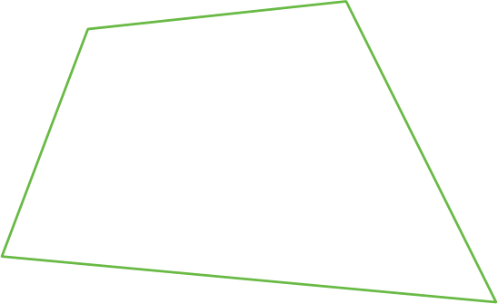
> **[Diagram Context - Textbook_Mathematics_Gr8_Transformation-geometry.pdf-0014-03.png]**
> This graphic is a geometry figure showing a convex quadrilateral outlined in green without any vertex labels. It visually represents a four-sided polygon with interior angles summing to 360 degrees. For CAPS mathematics students, this shape serves as a foundational polygon used for investigating properties of quadrilaterals, calculating area, and solving Euclidean geometry riders.

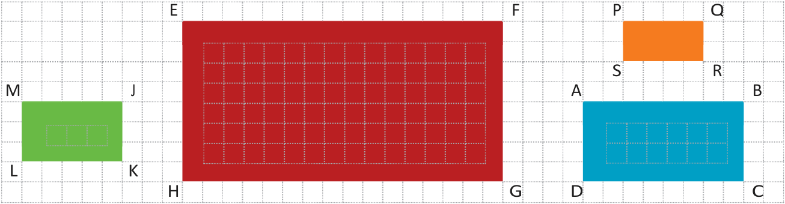
> **[Diagram Context - Textbook_Mathematics_Gr8_Transformation-geometry.pdf-0014-06.png]**
> This geometry figure displays four separate rectangles drawn on a square grid background, each labeled with vertices: green rectangle MJKL, red rectangle EFGH, orange rectangle PQRS, and blue rectangle ABCD. The graphic illustrates the concept of area through grid-unit counting, demonstrating how dimensions (length and breadth) relate to surface area and proportional scaling.

---

# Chapter 17: Geometry of 3D Objects

## 17.1 Classifying 3D Objects

3D objects are objects that have three dimensions: **length**, **width**, and **height**. They are generally classified into two main groups:
1. Objects with **curved surfaces** (e.g., spheres, cylinders, and cones).
2. Objects with **flat surfaces only** (called **polyhedra**).

> **[Diagram Context - Textbook_Mathematics_Gr8_Construction-of-geometric-figures.pdf-0015-03.png]**
> This geometry figure illustrates an acute angle formed by two intersecting line segments meeting at vertex A. The diagram includes labeled points A at the vertex, B positioned along the bottom ray, and D positioned along the inclined ray. Conceptually, this visual supports high school learners in identifying geometric components such as vertices, arms, and points on lines when studying Euclidean geometry.

### Key Definitions
*   **Face:** A flat surface of a 3D object.
*   **Edge:** The line segment where two faces of a polyhedron meet.
    *   A **straight edge** is formed when two flat surfaces meet.
    *   A **curved edge** is formed when at least one of the two surfaces is curved.
*   **Vertex (plural: vertices):** The point where the edges of a polyhedron meet.

---

## What is a Polyhedron?

A **polyhedron** is a three-dimensional object made entirely of flat surfaces. It has no curved surfaces and consists of faces, edges, and vertices.

### Terminology Note
*   **One polyhedron:** The singular form.
*   **Two or more polyhedra:** The plural form.
*   **One vertex:** The singular point where edges meet.
*   **Two or more vertices:** The plural form.

---

## Teaching Guidelines & Identification

To understand the properties of 3D objects, identify the following components on a polyhedron:
*   **Faces:** The flat sides of the object.
*   **Edges:** The lines where two faces join.
*   **Vertices:** The corners or points where edges meet.
*   **Apex:** The top point of a pyramid (where the triangular faces meet).
*   **Base:** The bottom face upon which the object rests.

> **[Diagram Context - Textbook_Mathematics_Gr8_Construction-of-geometric-figures.pdf-0015-05.png]**
> This geometry figure illustrates a compass construction step involving an angle with vertex A and point B on one arm, and an arc drawn from point D intersecting the upper ray. Visible labels include the points A, B, and D. Conceptually, it demonstrates the precise technical method for constructing congruent angles or angle bisectors using a pair of compasses, reinforcing foundational Euclidean geometry skills.

### Common Misconceptions
Learners often struggle to distinguish between **polyhedra** (objects with only flat surfaces) and objects that contain **curved surfaces**. Always check if an object has any rounded parts; if it does, it is not a polyhedron.

### Practical Exercise
1. Collect various 3D objects (e.g., a tin of beans, a milk carton, a ball).
2. Sort them into two groups: those with curved surfaces and those with flat surfaces only.
3. Draw a polyhedron of your choice.
4. Use arrows to label the **vertices**, **edges**, and **faces** on your drawing.

> **[Diagram Context - Textbook_Mathematics_Gr8_Construction-of-geometric-figures.pdf-0015-07.png]**
> This geometric construction diagram illustrates the step-by-step process of copying an angle using a pair of compasses and a straightedge. Visible labels include points A, B, and D along the intersecting rays forming the angle, with curved arcs drawn by the compass to transfer the exact angular measurement. Conceptually, this demonstrates Euclidean geometry construction techniques, showing high school learners how to accurately replicate an angle without a protractor by preserving equal radii and arc lengths.

> **[Diagram Context - Textbook_Mathematics_Gr8_Construction-of-geometric-figures.pdf-0015-09.png]**
> This geometry figure illustrates a geometric construction demonstrating the creation of parallel lines. Visible labels include points A, B, C, and D, along with intersecting construction arcs and directional arrow symbols on lines AB and DC. Conceptually, this diagram conveys the Euclidean geometry theorem that corresponding or alternate angles are equal, showing high school learners how to construct a line parallel to a given line through a specific point using only a compass and straightedge.

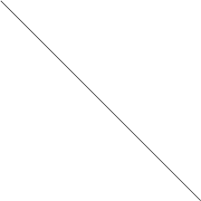

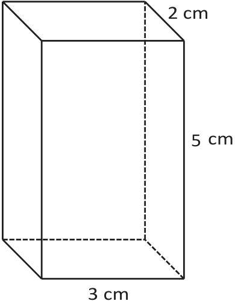
> **[Diagram Context - Textbook_Mathematics_Gr8_Geometry-of-3D-objects.pdf-0015-05.png]**
> This geometry figure illustrates a three-dimensional rectangular prism (cuboid) drawn with solid and dashed lines to show perspective and hidden edges. Visible dimension labels indicate a length of 3 cm, a breadth of 2 cm, and a height of 5 cm. For a high school student learning Senior Phase or FET mathematics, this diagram conveys how to identify the dimensions of a right prism in order to calculate surface area and volume using standard formulas.

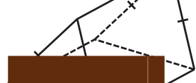
> **[Diagram Context - Textbook_Mathematics_Gr8_Geometry-of-3D-objects.pdf-0015-12.png]**
> This graphic is a three-dimensional geometry figure representing a solid prism with a triangular cross-section resting horizontally on a brown base. Visible markings include solid line segments forming the front triangular face and connecting edges, dashed line segments representing hidden edges in perspective, and tick marks on specific sides indicating equal lengths. Conceptually, this diagram helps Grade 10-12 learners visualize spatial relationships, surface area, and volume calculations for three-dimensional prisms in Euclidean geometry and technical mathematics.

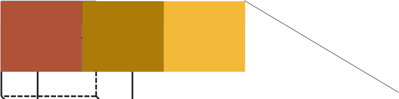
> **[Diagram Context - Textbook_Mathematics_Gr8_Geometry-of-3D-objects.pdf-0015-13.png]**
> This graphical illustration features a simplified conceptual diagram composed of three adjacent rectangular blocks in shades of brown and yellow, with partial dashed and solid line outlines underneath and an angled diagonal line extending from the upper right. There are no visible text labels, chemical symbols, or variable markers present within the graphic. Conceptually, this visual representation serves as a basic schematic aid to help learners conceptualise structural divisions, sequences, or spatial orientation in topics across the CAPS curriculum.

> **[Diagram Context - Textbook_Mathematics_Gr8_The-theorem-of-Pythagoras.pdf-0015-08.png]**
> This geometric figure illustrates a right-angled triangle with squares constructed on each of its three sides. The diagram displays vertex labels A, B, and C, side lengths labeled as $a$, $b$, and $c$, a right-angle symbol at vertex C, and three yellow squares. It conveys the geometric proof and conceptual foundation of Pythagoras' theorem, demonstrating that the area of the square on the hypotenuse ($c^2$) equals the sum of the areas of the squares on the other two sides ($a^2 + b^2$).

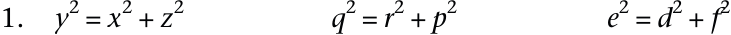
> **[Diagram Context - Textbook_Mathematics_Gr8_The-theorem-of-Pythagoras.pdf-0015-15.png]**
> This graphic presents a geometry figure displaying three algebraic equations representing the Pythagorean theorem using different variables. The visible labels and variables include numbered item 1 followed by equations involving $y^2 = x^2 + z^2$, $q^2 = r^2 + p^2$, and $e^2 = d^2 + f^2$. Conceptually, this conveys to high school learners that the Pythagorean theorem relates the lengths of the sides of a right-angled triangle regardless of the specific letter symbols assigned to those sides.

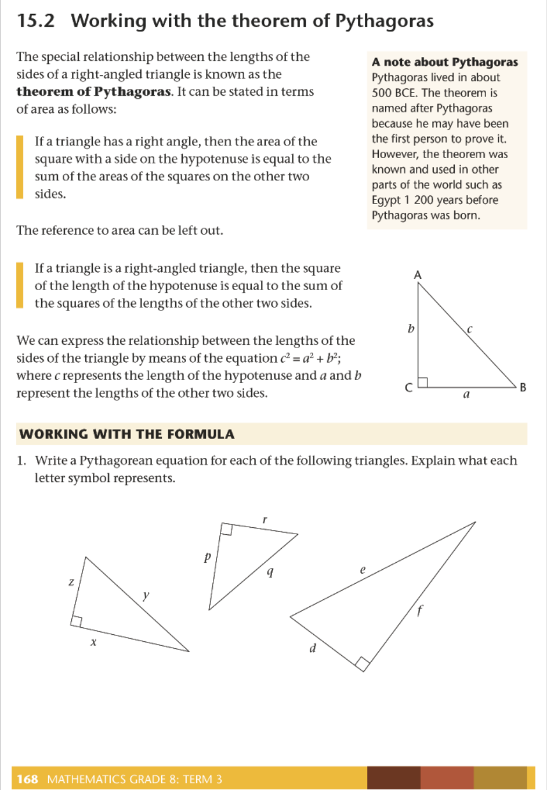
> **[Diagram Context - Textbook_Mathematics_Gr8_The-theorem-of-Pythagoras.pdf-0015-17.png]**
> This educational textbook page features geometry figures illustrating the theorem of Pythagoras for right-angled triangles. Visible labels include vertex letters (A, B, C) and side length variables ($a$, $b$, $c$, $d$, $e$, $f$, $p$, $q$, $r$, $x$, $y$, $z$), alongside right-angle symbols and an algebraic formula ($c^2 = a^2 + b^2$). The diagram conceptually conveys the fundamental algebraic relationship between the lengths of the sides of a right-angled triangle, guiding learners to identify the hypotenuse and apply the Pythagorean formula across different orientations.

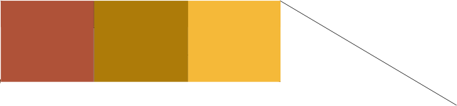
> **[Diagram Context - Textbook_Mathematics_Gr8_Transformation-geometry.pdf-0015-27.png]**
> This educational graphic is an abstract diagram featuring three adjacent colored blocks (red-brown, dark yellow-brown, and light orange-yellow) next to a blank white space crossed by a single diagonal black line. The image contains no visible labels, text, variables, or specific scientific symbols. Conceptually, it is incomplete or malformed and lacks the necessary contextual elements to convey a specific South African CAPS curriculum topic for high school learners.

---

# Identifying and Describing 3D Objects

## Key Concepts
*   **Polyhedron:** A 3D object that has only flat surfaces (faces).
*   **Non-polyhedron:** A 3D object that contains at least one curved surface.
*   **Face:** A flat surface of a 3D object.
*   **Edge:** The line segment where two faces meet.
*   **Vertex (plural: vertices):** The point where three or more edges meet.

> **[Diagram Context - Textbook_Mathematics_Gr8_Construction-of-geometric-figures.pdf-0016-06.png]**
> This graphic is a geometry figure displaying six different shapes labeled A through F with tick marks, parallel arrows, and right-angle indicators. Shapes A and B show triangles with side-length equivalence tick marks, shapes C, D, and E show quadrilaterals (parallelogram, rhombus, square) with specific side and angle markers, and shape F illustrates a composite rectangular layout. For a CAPS FET phase mathematics student, this diagram visually reinforces Euclidean geometry theorems regarding properties of triangles and quadrilaterals, specifically how geometric markings denote equal sides, parallel lines, and perpendicular angles.

## Examples of Properties
*   **Cube:** Has $6$ faces, $12$ edges, and $8$ vertices.
*   **Pyramid:** Has $5$ faces, $8$ edges, and $5$ vertices.

---

## Exercises

### 1. Identifying Parts of a 3D Object
Identify the parts labeled (a) to (d) on the provided figure.
*   (a) Vertices
*   (b) Vertex
*   (c) Edges
*   (d) Face

### 2. Classifying Polyhedra
Determine which of the following objects are polyhedra:
| Object | Classification |
| :--- | :--- |
| (a) | Not a polyhedron |
| (b) | Polyhedron |
| (c) | Polyhedron |
| (d) | Polyhedron |
| (e) | Not a polyhedron |
| (f) | Polyhedron |

### 3. Counting Faces, Edges, and Vertices
Determine the number of faces, edges, and vertices for the following polyhedra:

| Object | Faces | Edges | Vertices |
| :--- | :--- | :--- | :--- |
| (a) | $5$ | $9$ | $6$ |
| (b) | $10$ | $24$ | $16$ |
| (c) | $6$ | $12$ | $8$ |

### 4. Matching Descriptions
Match the 3D objects made by learners to their descriptions:
*   (a) Debbie
*   (b) Maggie
*   (c) Tumi
*   (d) Xola
*   (e) Mpuka
*   (f) Brad

---

## Teaching Guidelines
*   Emphasize the distinction between polyhedra and non-polyhedra by focusing on the presence of curved surfaces.
*   Use the provided exercises to help learners practice identifying and counting the fundamental components of 3D shapes (faces, edges, and vertices).

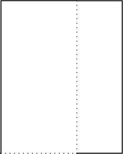

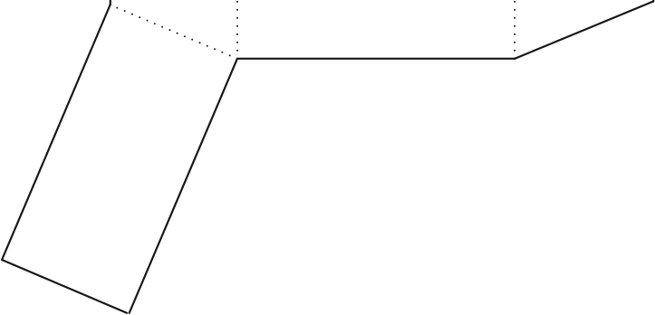
> **[Diagram Context - Textbook_Mathematics_Gr8_Geometry-of-3D-objects.pdf-0016-02.png]**
> This graphic is a geometry figure showing a 2D net layout. It contains no visible labels, variables, or annotations, consisting purely of solid outline shapes and dotted fold lines. Conceptually, it illustrates how a three-dimensional geometric solid can be unfolded into a flat, two-dimensional surface for calculating surface area or visualizing spatial relationships in CAPS mathematics.

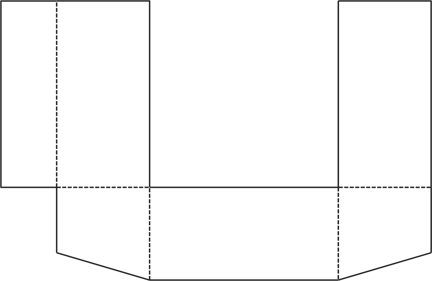
> **[Diagram Context - Textbook_Mathematics_Gr8_Geometry-of-3D-objects.pdf-0016-04.png]**
> This graphic is a 2D geometric net representing the surface layout of a 3D prism. It consists of solid outer outlines and dashed lines indicating fold or crease lines where the rectangular and pentagonal faces meet. Conceptually, this diagram helps high school mathematics learners visualize spatial relationships and calculate the total surface area by unfolding a 3D solid into flat 2D shapes.

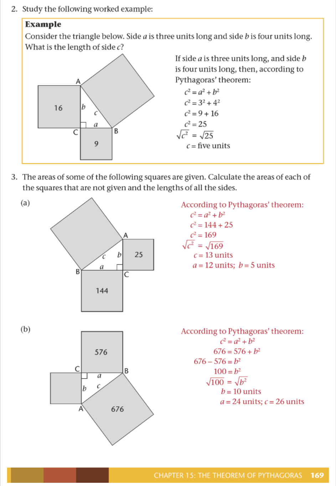
> **[Diagram Context - Textbook_Mathematics_Gr8_The-theorem-of-Pythagoras.pdf-0016-08.png]**
> This educational graphic presents a geometry figure demonstrating the Theorem of Pythagoras through worked examples. Visible labels include triangle vertices A, B, and C, side lengths $a$, $b$, and $c$, area values (16, 9, 25, 144, 576, 676), right-angle symbols, and algebraic working steps ($c^2 = a^2 + b^2$). The diagram conceptually conveys that the area of the square built upon the hypotenuse of a right-angled triangle is equal to the sum of the areas of the squares built upon the other two sides.

---

# 17.2 Prisms and Pyramids

## Key Definitions
*   **Apex:** The vertex of a pyramid where all triangular faces meet.
*   **Edge:** The line segment where two surfaces (faces) of a 3D object meet.
*   **Base:** The face on which a prism or pyramid rests.
*   **Congruent:** Objects that have exactly the same shape and size.
*   **Lateral Faces:** The faces of a polyhedron that are not the bases.

---

## Prisms
A **prism** is a polyhedron with two faces that are congruent and parallel. These faces are called **bases** and are connected by **lateral faces** (which are parallelograms).

### Properties of Prisms
*   **Right Prisms:** The lateral faces are rectangles that are perpendicular ($90^\circ$ angle) to the bases.
*   **Oblique Prisms:** The lateral faces are at an angle to their bases.
*   **Naming:** Prisms are named according to the shape of their base (e.g., triangular prism, rectangular prism, pentagonal prism).
*   **Cube:** A special type of prism where all six faces are congruent.

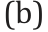

---

## Pyramids
A **pyramid** is a polyhedron with one base. The lateral faces are triangles that meet at a common point called the **apex**.

### Properties of Pyramids
*   **Right Pyramids:** The lateral faces are isosceles triangles.
*   **Oblique Pyramids:** The lateral faces are not isosceles triangles.

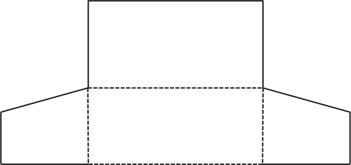
> **[Diagram Context - Textbook_Mathematics_Gr8_Geometry-of-3D-objects.pdf-0017-01.png]**
> The graphic is a geometry figure representing a flat net of a 3D solid, consisting of a central rectangle flanked by dashed folding lines and adjacent trapezoidal or rectangular panels with solid outer outlines. There are no explicit text labels, variables, or measurements visible on the diagram. Conceptually, it helps learners visualize spatial reasoning and surface area calculations by showing how a 3D shape can be unfolded into a 2D composite geometric figure.

---

## Exercise: Identifying Objects
Match the descriptions provided to the objects (a) through (f):

| Description | Object |
| :--- | :--- |
| Tumi's object has six vertices and five faces | (a) |
| Debbie's object has eight vertices and 12 edges | (d) |
| Brad made an object that has seven faces and ten vertices | (f) |
| Xola made an object with no vertices | (b) |
| Mpuka's object has eight edges and five faces | (e) |
| Maggie made an object with two circles and no vertices | (b) |

*(Note: Object (c) is a tetrahedron/triangular pyramid).*

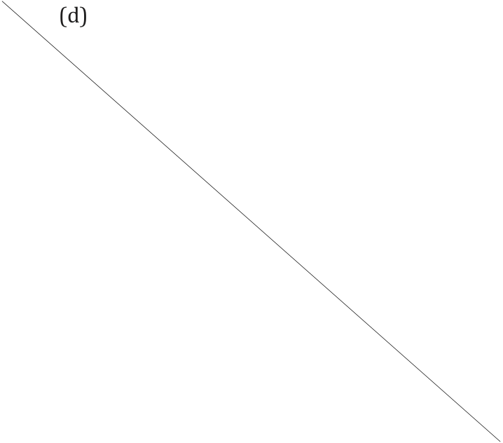
> **[Diagram Context - Textbook_Mathematics_Gr8_Geometry-of-3D-objects.pdf-0017-03.png]**
> The graphic is a linear geometry figure showing a straight diagonal line with the label "(d)" in the upper left corner. It illustrates a simple linear graph or mathematical line segment used for coordinate geometry and analytical functions. For CAPS FET mathematics learners, this diagram provides a visual representation of a straight-line function with a negative gradient, supporting the study of linear equations and slopes.

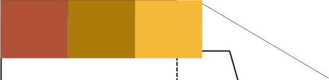
> **[Diagram Context - Textbook_Mathematics_Gr8_Geometry-of-3D-objects.pdf-0017-04.png]**
> The graphic shows a partial horizontal diagram divided into three distinct coloured rectangular blocks (red-brown, dark yellow, and light yellow) with adjacent black geometric lines and a dashed vertical line beneath the rightmost block. The image lacks any visible text, labels, symbols, or arrows. Conceptually, incomplete diagrams of this nature typically prompt learners to identify and complete missing sections, construct graphical scales, or interpret proportional relationships within a structured layout.

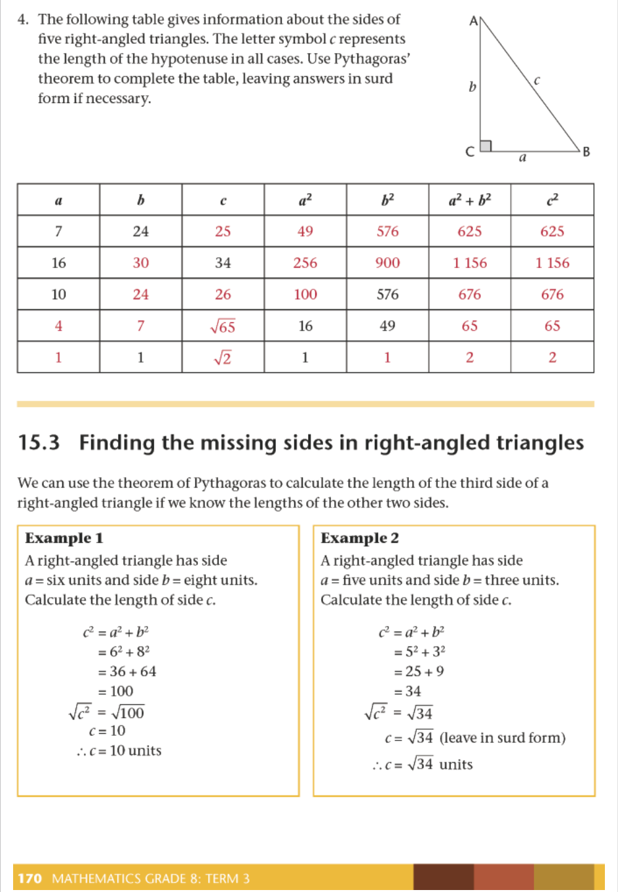
> **[Diagram Context - Textbook_Mathematics_Gr8_The-theorem-of-Pythagoras.pdf-0017-12.png]**
> The educational graphic is a geometry figure displaying a right-angled triangle alongside a completed table and worked examples. The visible labels and variables include vertices A, B, and C, side lengths $a$, $b$, and $c$, and mathematical expressions such as $a^2$, $b^2$, $a^2 + b^2$, and $c^2$. Conceptually, the diagram conveys the application of Pythagoras' theorem to find missing side lengths in right-angled triangles, demonstrating both rational and surd answers for Grade 8 learners.

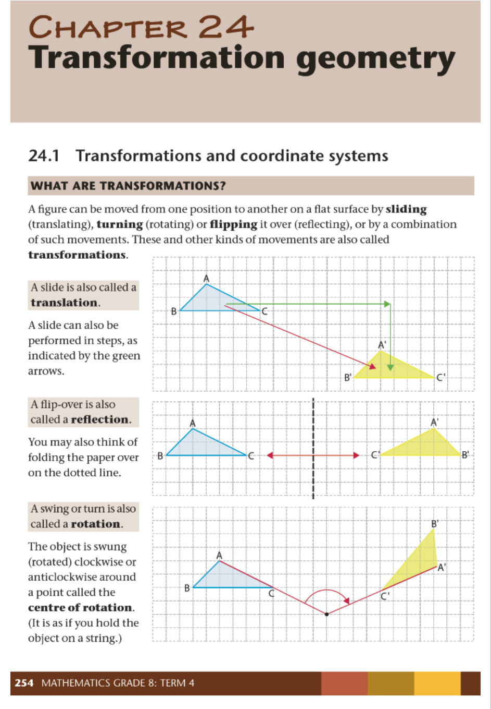
> **[Diagram Context - Textbook_Mathematics_Gr8_Transformation-geometry.pdf-0017-10.png]**
> This educational graphic presents a geometry figure demonstrating three main types of transformations on a Cartesian grid: translation, reflection, and rotation. The diagrams feature labelled triangles ABC (object) and A'B'C' (image), accompanied by green and red directional arrows, a vertical dashed line of symmetry for reflection, and an arc indicating the angle of rotation around a center point. Conceptually, it illustrates how geometric shapes alter their position on a flat surface through sliding, flipping, or turning, helping students grasp the fundamental rules and visual outcomes of Euclidean transformations.

---

# Geometry: Prisms and Pyramids

## 1. Prisms
A prism is a 3D object defined by the following characteristics:
*   It has **two congruent faces** (identical in shape and size) that are parallel to each other.
*   These two bases are joined by **rectangular lateral faces**.

> **[Diagram Context - Textbook_Mathematics_Gr8_Construction-of-geometric-figures.pdf-0018-08.png]**
> This physics apparatus diagram illustrates a balancing or centre of gravity experiment using a uniform ruler supported at a pivot point F. Visible labels include endpoints A and B, pivot point F, and dual metric scales along the ruler showing markings from 0 to 80 (in millimeters) and 0 to 8 (in centimeters), with hash marks indicating equal segment lengths AF and FB. Conceptually, this conveys the principle of moments in rotational equilibrium, showing how a system balances when the clockwise and anticlockwise moments about the fulcrum are equal.

### Oblique Prisms
An oblique prism is a prism where the lateral faces are not perpendicular to the bases. The diagram above shows an oblique triangular prism and an oblique pentagonal prism.

---

## 2. Pyramids
A pyramid is a 3D object defined by the following characteristics:
*   It has **only one base**.
*   The lateral faces are **always triangles**.
*   All lateral faces meet at a single point at the top, called the **apex**.

> **[Diagram Context - Textbook_Mathematics_Gr8_Construction-of-geometric-figures.pdf-0018-10.png]**
> This educational graphic is a measurement apparatus diagram illustrating reading errors and scale interpretation using a ruler and a pencil pointing at a line segment labeled XY. The visible labels include points X and Y, the pointer F, and a dual-scale metric ruler displaying numerical markings from 0 to 80 (in millimeters) and 0 to 8 (in centimeters) with hash marks indicating equal spacing. Conceptually, this diagram helps learners practice precision in measurement, read different scales correctly, and identify potential parallax or zero errors in physical science and mathematics practical tasks.

### Types of Pyramids
The type of pyramid is determined by the shape of its base:

| Base Shape | Name of Pyramid |
| :--- | :--- |
| Triangle | Triangular-based pyramid (or triangular pyramid) |
| Square | Square-based pyramid (or square pyramid) |
| Hexagon | Hexagonal-based pyramid (or hexagonal pyramid) |

### Right Pyramids vs. Oblique Pyramids
*   **Right Pyramid:** The lateral faces are isosceles triangles.
*   **Oblique Pyramid:** A pyramid that is not a right pyramid. In an oblique pyramid, the lateral faces are not necessarily isosceles triangles.

> **[Diagram Context - Textbook_Mathematics_Gr8_Construction-of-geometric-figures.pdf-0018-11.png]**
> This educational graphic presents a geometry figure demonstrating the construction and bisection of a line segment using a ruler. The visible labels and variables include line segments AB and CD, midpoint/intersection point F, and tick marks indicating equal length segments AF and FB. Conceptually, the diagram guides students through the step-by-step process of identifying a midpoint and drawing a bisector, visually reinforcing that a line segment is divided into two equal parts.

### Examples of Face Counts
*   **Square-based pyramid:** Has 5 faces (1 square base + 4 triangular lateral faces).
*   **Hexagonal-based pyramid:** Has 7 faces (1 hexagonal base + 6 triangular lateral faces).

---

## Summary Comparison
| Feature | Prism | Pyramid |
| :--- | :--- | :--- |
| **Number of Bases** | Two (congruent and parallel) | One |
| **Lateral Faces** | Rectangles | Triangles |
| **Apex** | None | One (where triangles meet) |

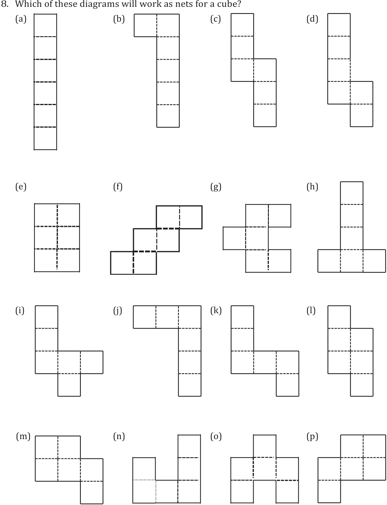
> **[Diagram Context - Textbook_Mathematics_Gr8_Geometry-of-3D-objects.pdf-0018-00.png]**
> This educational graphic is a geometry figure displaying sixteen different two-dimensional arrangements of six connected squares labeled (a) through (p) with dashed internal fold lines. The diagram visually challenges learners to identify which of these specific configurations function as valid nets that can fold into a three-dimensional cube. Conceptually, this helps students develop spatial reasoning and visualization skills by analyzing surface area properties and face connectivity of 3D objects in the CAPS mathematics curriculum.

> **[Diagram Context - Textbook_Mathematics_Gr8_The-theorem-of-Pythagoras.pdf-0018-03.png]**
> This geometric figure illustrates a right-angled triangle with a square constructed on each of its three sides. The diagram displays vertices labelled A, B, and C, side lengths labelled $a$, $b$, and $c$, and a right-angle symbol at vertex C. Conceptually, it demonstrates Pythagoras' theorem by showing that the sum of the areas of the two smaller squares equals the area of the largest square on the hypotenuse.

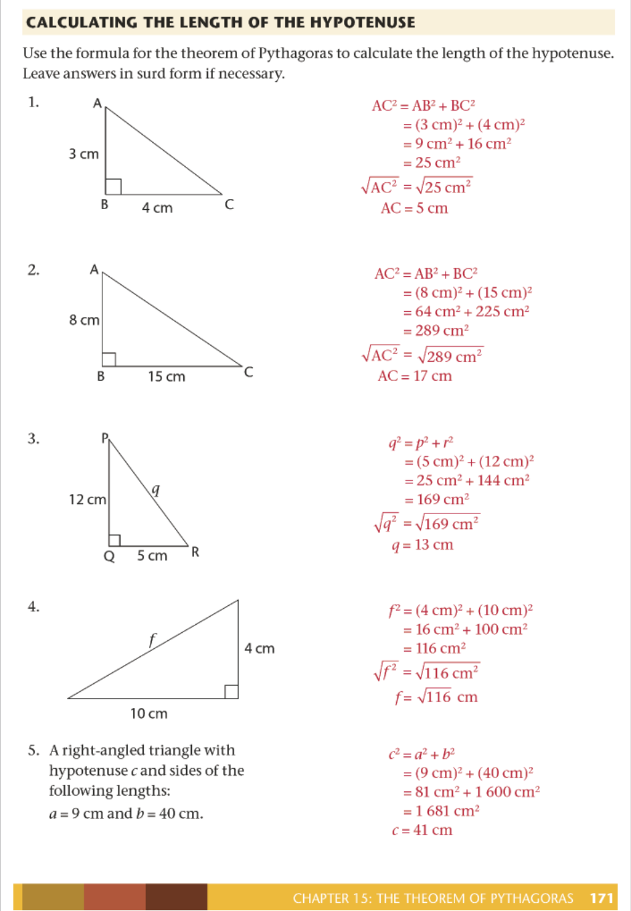
> **[Diagram Context - Textbook_Mathematics_Gr8_The-theorem-of-Pythagoras.pdf-0018-12.png]**
> This educational graphic is a geometry figure illustrating worked examples on calculating the length of the hypotenuse using the Theorem of Pythagoras. It displays right-angled triangles labeled with vertices (A, B, C; P, Q, R), side lengths in centimeters (e.g., $3\text{ cm}$, $4\text{ cm}$, $8\text{ cm}$, $15\text{ cm}$, $12\text{ cm}$, $5\text{ cm}$, $10\text{ cm}$, $4\text{ cm}$, $a=9\text{ cm}$, $b=40\text{ cm}$), variable hypotenuses ($AC$, $q$, $f$, $c$), right-angle symbols, and step-by-step algebraic working involving squares and square roots ($AC^2 = AB^2 + BC^2$). The diagram conceptually demonstrates how to apply the theorem of Pythagoras to find an unknown hypotenuse length, including scenarios resulting in exact integer values or simplified surd forms.

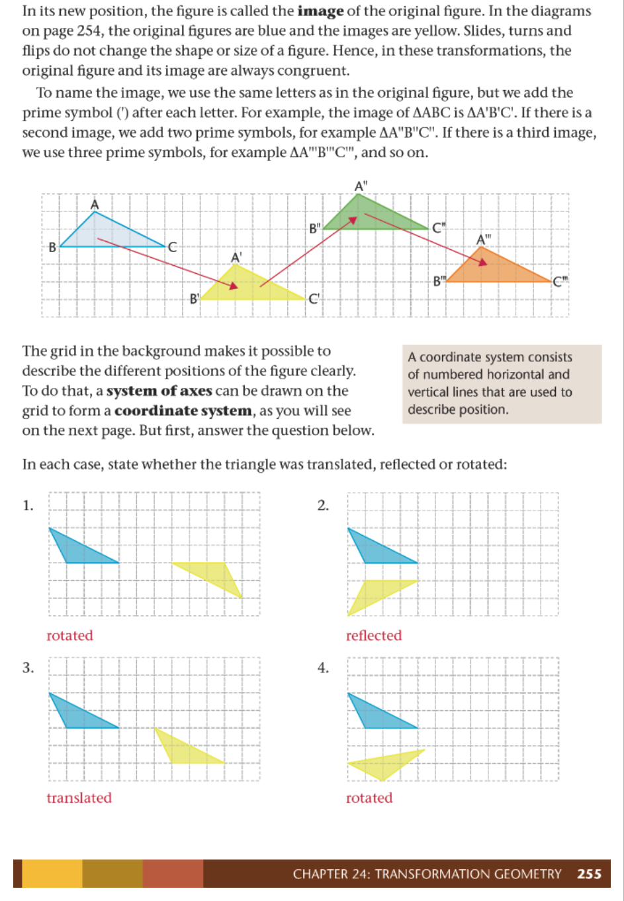
> **[Diagram Context - Textbook_Mathematics_Gr8_Transformation-geometry.pdf-0018-09.png]**
> The educational graphic illustrates a geometry figure featuring a Cartesian grid with multiple colored triangles labeled with vertices A, B, C, A', B', C', A", B", C", A''', B''', and C''', alongside red directional arrows connecting sequential shapes. Conceptually, it conveys transformation geometry by demonstrating how original figures (blue) undergo slides, turns, and flips to create congruent images (yellow, green, orange), using prime notation to name successive positions.

---

# Identifying Prisms and Pyramids

## Concept Overview
To identify 3D objects, it is essential to understand the properties of prisms and pyramids. A common misconception is that the "base" of an object is always the face that is drawn horizontally. In reality, the base is defined by the geometric properties of the shape.

### Key Definitions
*   **Prism:** A 3D object with two identical, parallel ends (bases) and flat sides that are parallelograms (usually rectangles).
*   **Pyramid:** A 3D object with a single base (which can be any polygon) and triangular sides that meet at a common point called the apex.

---

## Exercise 1: Identifying and Shading Bases
Copy the figures provided and shade the base of each. Determine whether the object is a prism or a pyramid.

> **[Diagram Context - Textbook_Mathematics_Gr8_Construction-of-geometric-figures.pdf-0019-12.png]**
> This geometry figure illustrates two intersecting circles of equal radii with centers A and B, featuring a rhombus (ACBD) inscribed within them, a line segment AB connecting the centers, a perpendicular bisector segment CD intersecting at point F with a right-angle symbol, and double-tick marks indicating equal line segments. For FET Phase Mathematics learners, this diagram demonstrates Euclidean geometry theorems related to circles, specifically proving that the line joining the centers of two intersecting circles is the perpendicular bisector of the common chord.

| Figure | Classification |
| :--- | :--- |
| A | Prism |
| B | Prism |
| C | Pyramid |
| D | Pyramid |
| E | Prism |
| F | Prism |
| G | Pyramid |
| H | Prism |

*Note: In some cases (such as E and G), more than one face can be considered the base depending on the orientation.*

---

## Exercise 2: Matching 3D Objects to Names
Match the letter of the 3D object to its correct geometric name.

> **[Diagram Context - Textbook_Mathematics_Gr8_Construction-of-geometric-figures.pdf-0019-17.png]**
> This instructional geometry figure demonstrates the step-by-step geometrical construction for bisecting a line segment using a pair of compasses and a ruler. The diagrams feature labeled points A, B, C, and D, intersecting circular arcs, perpendicular intersection symbols ($90^\circ$), and directional lines illustrating geometric construction techniques. Conceptually, it teaches learners how to construct a perpendicular bisector by maintaining equal radii from endpoints to establish equidistant intersection points, reinforcing core CAPS geometry construction skills.

| Letter | 3D Object Name |
| :--- | :--- |
| A | Cube |
| B | Hexagonal-based pyramid |
| C | Triangular prism |
| D | Square-based pyramid |
| E | Pentagonal prism |

---

## Teaching Guidelines
*   **Peer Learning:** Encourage learners to work in pairs. Have them take turns explaining to each other what type of object is shown and justifying why a specific face is identified as the base.
*   **Addressing Misconceptions:** Explicitly teach learners that the base is not necessarily the "bottom" face. Use examples like Figure F, where the triangular face acts as the base even if it is not resting on a horizontal plane.

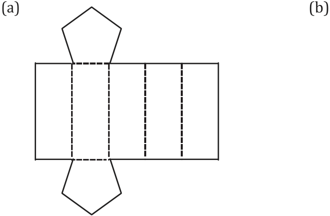
> **[Diagram Context - Textbook_Mathematics_Gr8_Geometry-of-3D-objects.pdf-0019-01.png]**
> This geometry figure shows the net of a pentagonal prism labeled with (a) and (b) at the top corners. The net consists of five connected rectangular faces flanked by dashed fold lines and two identical pentagonal bases attached at opposite ends. Conceptually, this diagram helps learners visualize three-dimensional shapes by demonstrating how a 3D right pentagonal prism can be unfolded into a 2D net to calculate surface area.

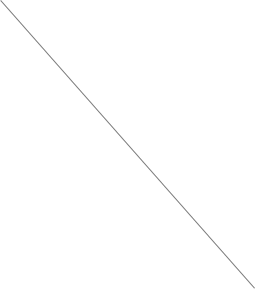

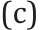

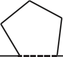

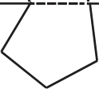

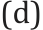

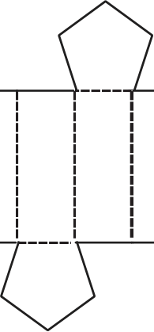
> **[Diagram Context - Textbook_Mathematics_Gr8_Geometry-of-3D-objects.pdf-0019-08.png]**
> This graphic is a geometry net representing the 2D surface layout of a 3D right pentagonal prism. It consists of three connected rectangular faces bordered by dashed fold lines, flanked by two identical pentagonal bases attached at opposite ends. Conceptually, it demonstrates how a 3D polyhedron can be unfolded into a flat 2D net, helping learners calculate total surface area and visualize spatial relationships between faces and edges.

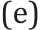

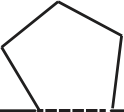

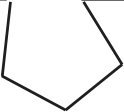

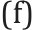

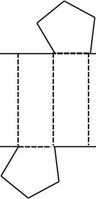
> **[Diagram Context - Textbook_Mathematics_Gr8_Geometry-of-3D-objects.pdf-0019-14.png]**
> This graphic is a geometry figure showing the unfolded net of a pentagonal prism, composed of two identical pentagonal bases and three rectangular lateral faces outlined with solid and dashed fold lines. For high school mathematics learners, this visual demonstrates the two-dimensional representation of a three-dimensional solid, helping students understand surface area calculations by visualizing how individual flat polygons fold together to form a closed prism.

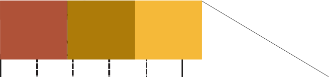
> **[Diagram Context - Textbook_Mathematics_Gr8_Geometry-of-3D-objects.pdf-0019-15.png]**
> This educational graphic features a cropped segmented colour bar diagram with three distinct rectangular blocks coloured brown, bronze-brown, and yellow, accompanied by vertical dashed and solid marker lines along the bottom and a diagonal guide line extending from the top right corner. The image lacks visible text labels, symbols, or axis names within the cropped view. Conceptually, it serves as a visual scale or partitioned continuum often used in CAPS-aligned physical sciences or mathematics contexts to illustrate intervals, fractional parts, or sequential categorical data.

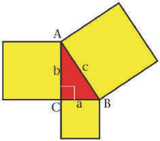
> **[Diagram Context - Textbook_Mathematics_Gr8_The-theorem-of-Pythagoras.pdf-0019-03.png]**
> This geometric figure illustrates Pythagoras' theorem using a central red right-angled triangle with vertex labels A, B, and C, and side lengths labeled as a, b, and c opposite to their respective vertices. Three yellow squares are constructed outward from each of the three sides of the right-angled triangle, with a right-angle symbol indicated at vertex C. The diagram conceptually demonstrates that the sum of the areas of the two smaller squares on the sides forming the right angle ($a^2 + b^2$) equals the area of the largest square on the hypotenuse ($c^2$).

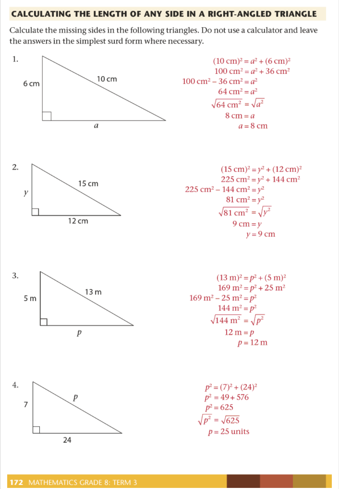
> **[Diagram Context - Textbook_Mathematics_Gr8_The-theorem-of-Pythagoras.pdf-0019-15.png]**
> The educational graphic is a geometry problem-solving worksheet featuring right-angled triangles accompanied by step-by-step algebraic calculations. It displays four numbered examples with side length labels ($6\text{ cm}$, $10\text{ cm}$, $a$, $y$, $12\text{ cm}$, $15\text{ cm}$, $5\text{ m}$, $13\text{ m}$, $p$, $7$, $24$), right-angle symbols, and corresponding Pythagorean theorem working-out lines in red ink. This resource visually demonstrates how to apply Pythagoras' theorem ($c^2 = a^2 + b^2$) to calculate missing side lengths of right-angled triangles without a calculator, reinforcing foundational Euclidean geometry and surd simplification skills for CAPS Grade 8 Mathematics.

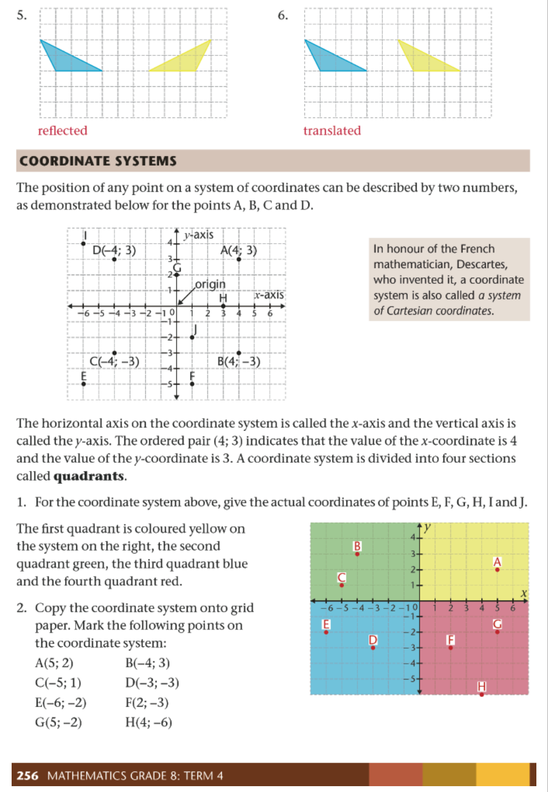
> **[Diagram Context - Textbook_Mathematics_Gr8_Transformation-geometry.pdf-0019-21.png]**
> This educational graphic is a geometry and coordinate systems resource featuring Cartesian coordinate planes with plotted points, geometric transformations, and coloured quadrants. Visible labels include an $x$-axis, $y$-axis, origin, coordinates like $A(4; 3)$ and $D(-4; 3)$, points labeled A through J, and headings denoting "reflected" and "translated." The diagram conveys conceptually how to read and plot ordered pairs, identify coordinates across four distinct quadrants, and recognise basic geometric transformations on a grid.

---

# 17.3 Describing, Sorting and Comparing 3D Objects

## Teaching Guidelines
To classify 3D objects effectively, follow these steps:
1. **Analyze Surfaces and Edges:** Determine if the object has straight edges and flat faces, or if it contains curved edges and curved surfaces.
2. **Distinguish Categories:** Separate objects into prisms and pyramids.
3. **Sub-classify:** Sort prisms into specific types such as cubes, rectangular prisms, or triangular prisms.

---

## Practise Describing and Classifying 3D Objects

Identify the following 3D objects and describe their faces:

> **[Diagram Context - Textbook_Mathematics_Gr8_Construction-of-geometric-figures.pdf-0020-10.png]**
> This geometric construction diagram illustrates the process of constructing a perpendicular bisector to a line segment using a compass and straightedge. Visible elements include a horizontal line segment with endpoints labeled A and B, overlapping dashed construction circles centered at points A, B, P, and Q, a vertical green line segment intersecting AB perpendicularly at a right-angle symbol, and a pencil pointing to point P. Conceptually, it demonstrates the Euclidean geometry theorem that points equidistant from the endpoints of a line segment define its perpendicular bisector, a fundamental foundational construction skill in FET phase mathematics.

| Object | Name | Description of Faces |
| :--- | :--- | :--- |
| **A** | Cube (regular hexahedron) | 6 square faces |
| **B** | Triangular pyramid (tetrahedron) | 4 triangular faces |
| **C** | Rectangular prism (hexahedron) | 6 rectangular faces |
| **D** | Triangular prism | 2 triangular faces, 3 rectangular faces |
| **E** | Square-based pyramid | 1 square face, 4 triangular faces |
| **F** | Cylinder | 2 circular faces, 1 curved surface (rectangular) |

> **[Diagram Context - Textbook_Mathematics_Gr8_Construction-of-geometric-figures.pdf-0020-13.png]**
> This geometry figure illustrates a compass construction demonstrating the perpendicular bisector of a line segment. The visible elements include a horizontal line segment with endpoints A and B, intersecting construction arcs forming points P and Q, a vertical perpendicular line segment passing through PQ with a right-angle symbol, and a pencil drawing the line. Conceptually, this diagram conveys the step-by-step construction method used to divide a line segment into two equal parts at a 90-degree angle without measuring tools.

> **[Diagram Context - Textbook_Mathematics_Gr8_Construction-of-geometric-figures.pdf-0020-16.png]**
> This educational graphic is a geometry figure demonstrating step-by-step constructions using a pair of compasses and a ruler. It displays instructions and diagrams labelled with points P, Q, A, and B, arc intersection markings, and the perpendicularity symbol ($\perp$). Conceptually, the diagram guides students through the geometric method of constructing a perpendicular line from a given point to a line segment without using a protractor.

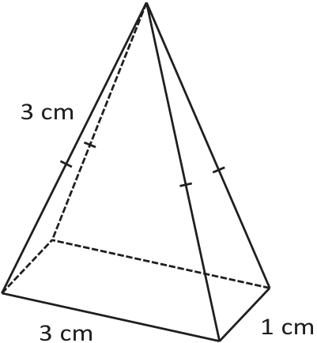
> **[Diagram Context - Textbook_Mathematics_Gr8_Geometry-of-3D-objects.pdf-0020-02.png]**
> This graphic displays a 3D geometry figure of a right rectangular-based pyramid with visible dimensions and tick marks. The diagram includes numerical labels indicating side lengths of $3\text{ cm}$ and $1\text{ cm}$, along with hatch marks on the slanted edges. Conceptually, this helps CAPS high school mathematics learners practice calculating surface area, volume, and perpendicular height using Pythagoras' theorem.

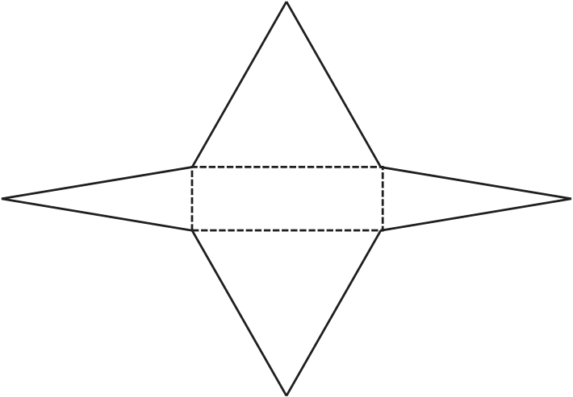
> **[Diagram Context - Textbook_Mathematics_Gr8_Geometry-of-3D-objects.pdf-0020-03.png]**
> This graphic is a geometry figure showing the net of a square-based pyramid, consisting of a central square base outlined by dashed lines surrounded by four triangular faces sharing solid-line edges. There are no text labels, variables, or directional arrows present in the diagram. Conceptually, this visual helps FET phase mathematics learners understand three-dimensional shapes by demonstrating how a two-dimensional net can be folded along the dashed crease lines to construct a solid pyramid.

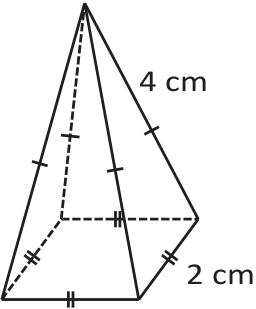
> **[Diagram Context - Textbook_Mathematics_Gr8_Geometry-of-3D-objects.pdf-0020-06.png]**
> The graphic is a 3D geometry figure of a right rectangular-based pyramid with dashed lines representing hidden edges. Visible labels include numerical dimensions of "4 cm" (slant height or edge) and "2 cm" (base side length), along with single and double tick marks indicating equal lengths on specific edges. This diagram helps CAPS learners visualize 3D shapes and apply formulas for surface area and volume by identifying key linear dimensions.

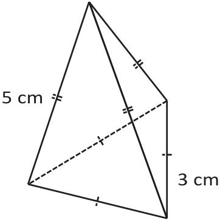
> **[Diagram Context - Textbook_Mathematics_Gr8_Geometry-of-3D-objects.pdf-0020-08.png]**
> This geometry figure illustrates a three-dimensional pyramid with a triangular base. Visible labels and notations include length measurements of 5 cm and 3 cm alongside single and double tick marks indicating equal side lengths. The diagram helps high school learners visualize spatial dimensions, surface area, and volume calculations for three-dimensional objects in accordance with the CAPS Mathematics curriculum.

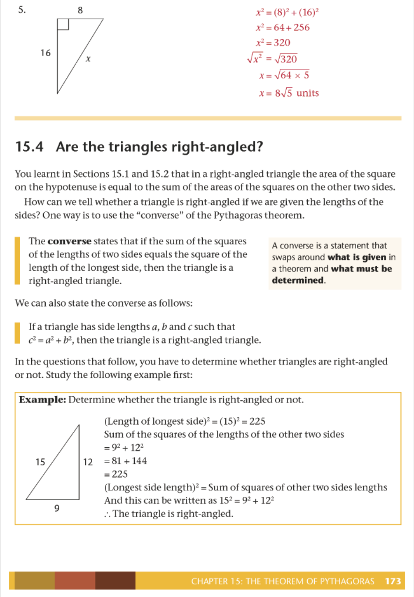
> **[Diagram Context - Textbook_Mathematics_Gr8_The-theorem-of-Pythagoras.pdf-0020-18.png]**
> This educational graphic is a geometry figure displaying right-angled triangles alongside step-by-step algebraic calculations. Visible labels and variables include side lengths such as 8, 16, $x$, 9, 12, 15, and $a, b, c$, alongside mathematical equations applying the Theorem of Pythagoras and its converse. The diagram and text convey conceptually how to use the converse of Pythagoras's theorem to test whether a given triangle with known side lengths contains a right angle.

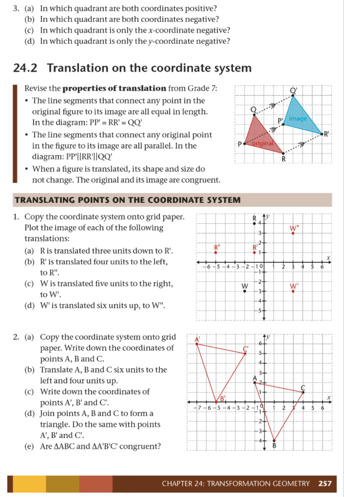
> **[Diagram Context - Textbook_Mathematics_Gr8_Transformation-geometry.pdf-0020-24.png]**
> This educational page on transformation geometry features a Cartesian coordinate system with multiple geometric figures, coordinate grids, and text explanations. Visible labels include axes $x$ and $y$, polygon vertices $PQR$ and $P'Q'R'$, points $A$, $B$, $C$ with their primed counterparts, and directional arrows indicating translation vectors. Conceptually, the graphics and exercises convey how to translate shapes and points across a coordinate plane while maintaining congruence, parallel displacement lines, and equal segment lengths.

---

### Chapter 17: Geometry of 3D Objects

#### Exercise: Sorting 3D Objects

**Task (a):** Sort the 3D objects (labeled A through N) into three groups: **Prisms**, **Pyramids**, and **Cylinders**.

> **[Diagram Context - Textbook_Mathematics_Gr8_Construction-of-geometric-figures.pdf-0021-08.png]**
> This geometry figure illustrates a compass-and-straightedge construction demonstrating the perpendicular bisector of a line segment. Visible elements include points A and B on a horizontal base line, intersection point Q at the top where arc curves meet, midpoint P on the baseline, intersecting dashed circles centered at A and B, a perpendicular green dividing line, red connecting lines, and a pencil drawing the intersection. For FET mathematics learners, this diagram visually conveys the step-by-step geometric construction used to prove congruence triangles and construct a line perpendicular to a given line segment.

| Group | Objects |
| :--- | :--- |
| **Prisms** | B, C, E, F, G, H, L, M |
| **Pyramids** | A, K, N |
| **Cylinders** | D, I, J |

***

**Task (b):** Further divide the **Prisms** identified in Task (a) into three specific sub-groups: **Cubes**, **Rectangular Prisms**, and **Triangular Prisms**.

| Sub-group | Objects |
| :--- | :--- |
| **Cubes** | B, M |
| **Rectangular Prisms** | E, H, L |
| **Triangular Prisms** | C, F, G |

***

#### Key Definitions for Reference
*   **Prism:** A 3D object with two identical, parallel ends (bases) and flat sides. The cross-section is the same all along its length.
*   **Pyramid:** A 3D object with a flat base and triangular sides that meet at a common point called the apex.
*   **Cylinder:** A 3D object with two identical circular or elliptical bases connected by a curved surface.
*   **Cube:** A special type of rectangular prism where all six faces are squares of equal size.

> **[Diagram Context - Textbook_Mathematics_Gr8_Construction-of-geometric-figures.pdf-0021-11.png]**
> This instructional geometry figure demonstrates the step-by-step construction of a perpendicular line at a given point on a line using a ruler and compass. The graphic displays points labeled A, B, P, and Q, along with construction arcs and perpendicularity symbols ($\perp$). Conceptually, it guides South African high school learners through accurate Euclidean geometry construction techniques required to construct perpendiculars without a protractor.

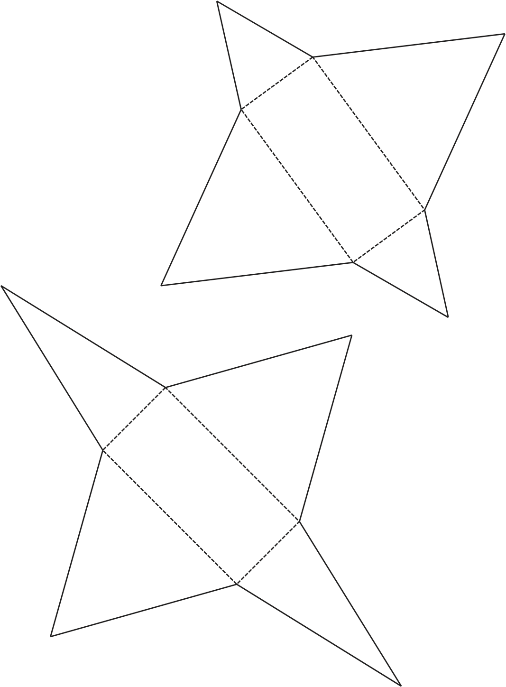
> **[Diagram Context - Textbook_Mathematics_Gr8_Geometry-of-3D-objects.pdf-0021-06.png]**
> This educational graphic displays two 2D geometric nets of a square-based pyramid, outlined in solid lines with internal folding lines represented by dashed lines. The nets show a central square base surrounded by four triangular lateral faces attached along its edges. Conceptually, these diagrams help learners visualize the transition between two-dimensional surface development and three-dimensional solid shapes in spatial geometry.

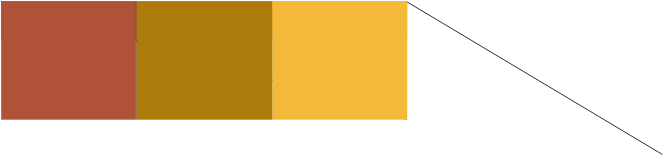
> **[Diagram Context - Textbook_Mathematics_Gr8_Geometry-of-3D-objects.pdf-0021-07.png]**
> The graphic displays an abstract colour gradient containing three distinct horizontal blocks coloured in shades of brown, dark yellow-brown, and bright yellow, with a diagonal black line extending from the top right edge. The image features no text labels, variables, or specific biological or chemical symbols. It provides no recognizable CAPS curriculum content for high school students.

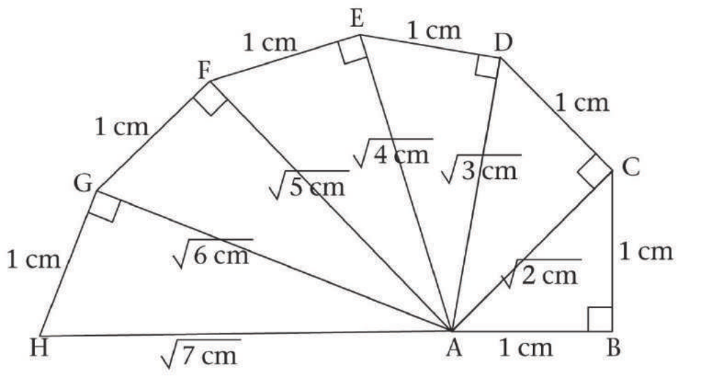
> **[Diagram Context - Textbook_Mathematics_Gr8_The-theorem-of-Pythagoras.pdf-0021-09.png]**
> This geometric figure, commonly known as the Spiral of Theodorus, consists of a series of connected right-angled triangles sharing a common vertex. Visible labels include vertices A through H, constant side lengths of $1\text{ cm}$, right-angle symbols at each triangle's corner, and hypotenuse lengths expressed as square roots ($\sqrt{2}\text{ cm}$ to $\sqrt{7}\text{ cm}$). This diagram visually conveys the iterative application of the theorem of Pythagoras to construct irrational lengths geometrically, helping high school learners understand surds and real number representations in Euclidean geometry.

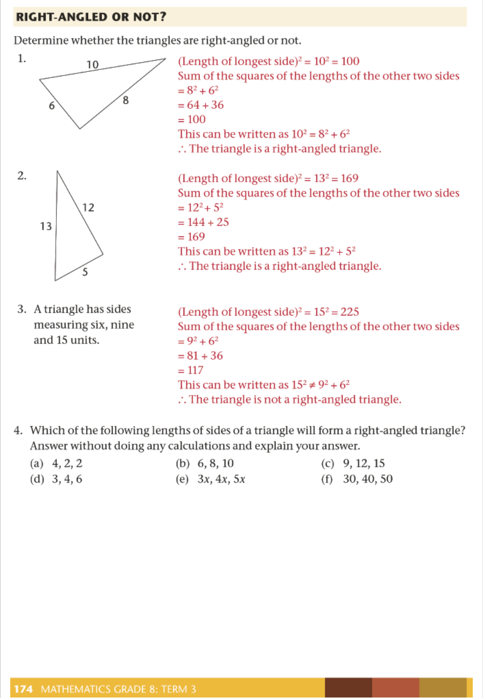
> **[Diagram Context - Textbook_Mathematics_Gr8_The-theorem-of-Pythagoras.pdf-0021-10.png]**
> This educational graphic is a geometry problem set featuring triangles with side length values (such as 6, 8, 10; 5, 12, 13; and 6, 9, 15) accompanied by step-by-step algebraic working out. The visible text includes numerical measurements, mathematical symbols ($=$, $\neq$, $^2$, $\therefore$), and worked solutions applying the converse of Pythagoras' theorem. Conceptually, it guides Grade 8 mathematics learners on how to test whether a given triangle is right-angled by comparing the square of the longest side to the sum of the squares of the two shorter sides.

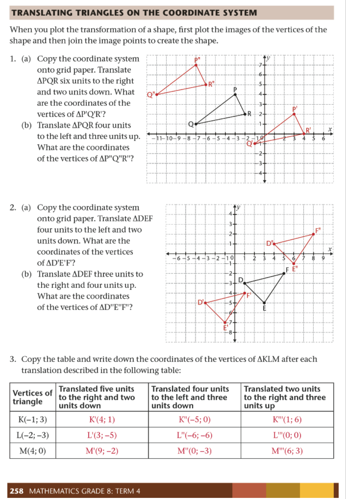
> **[Diagram Context - Textbook_Mathematics_Gr8_Transformation-geometry.pdf-0021-20.png]**
> The graphic is a Grade 8 Mathematics page featuring coordinate geometry grids and worked examples for translating triangles on a Cartesian plane. Visible labels include the axes ($x$ and $y$), triangle vertices labeled $P, Q, R, D, E, F, K, L, M$, and their transformed image points denoted with single and double primes (e.g., $P', P''$). Conceptually, the diagrams and tables guide learners through performing and recording the algebraic and spatial effects of sliding two-dimensional shapes horizontally and vertically across a coordinate system.

---

# 17.4 Nets of 3D Objects

### What is a Net?
In mathematics, a **net** is a flat, two-dimensional arrangement of all the faces of a 3D object, joined to each other at their edges. When folded along these edges, the pattern forms the 3D object.

*   **Key Note:** Different 3D objects have different nets. Furthermore, the same 3D object can sometimes be represented by different net patterns.

> **[Diagram Context - Textbook_Mathematics_Gr8_Construction-of-geometric-figures.pdf-0022-17.png]**
> This educational graphic is a geometry figure showing intersecting lines forming multiple angles in two distinct diagrams labeled (a) and (b). Visible labels include numbered angles (1 through 9 marked with hat notations like $\hat{1}$ and $\hat{6}$) and numerical degree values (e.g., $120^\circ$, $60^\circ$, $90^\circ$, $50^\circ$, $40^\circ$), alongside mathematical exercises requiring students to measure, calculate, and classify angle sums. Conceptually, the diagram helps students investigate angle relationships—such as angles on a straight line and angles around a point—reinforcing foundational geometry principles aligned with the CAPS curriculum.

### Focus: Nets of a Cube
To form a cube, a net must consist of exactly six equal squares. However, not every arrangement of six squares will successfully fold into a cube.

#### Exercise: Identifying a Cube Net
Only one of the nets shown below will fold into a cube. Identify which one it is.

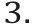

**Answer:** Net A

---

### Teaching Guidelines
*   **Practical Demonstration:** Show learners how to cut open a box and lay it flat to reveal its net.
*   **Hands-on Activity:** Have learners bring various boxes to class. Ask them to cut the boxes open, draw the resulting nets, and measure the dimensions to draw them to scale.
*   **Exploration:** Encourage learners to draw different net patterns and cut them out to test if they can be folded into a 3D object.
*   **Common Misconception:** Learners often assume that any arrangement of the correct number of faces will form the object. It is important to guide them to realize that only specific arrangements of faces will successfully form the intended 3D shape.

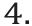

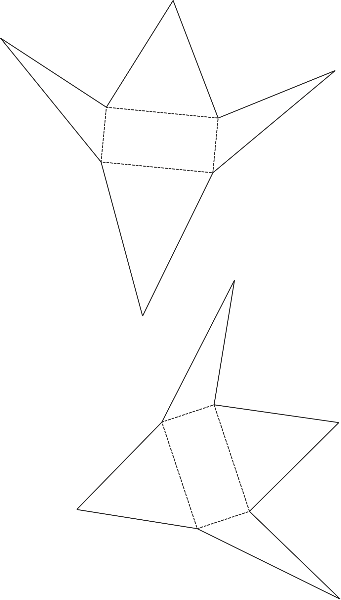
> **[Diagram Context - Textbook_Mathematics_Gr8_Geometry-of-3D-objects.pdf-0022-02.png]**
> This educational graphic illustrates two geometric nets of a right regular triangular prism. The diagrams consist of a central rectangle surrounded by three triangles connected along dashed fold lines representing the edges of the 3D shape. Conceptually, it demonstrates how a three-dimensional triangular prism can be unfolded into a two-dimensional surface area net, helping learners visualize spatial relationships and calculate total surface area.

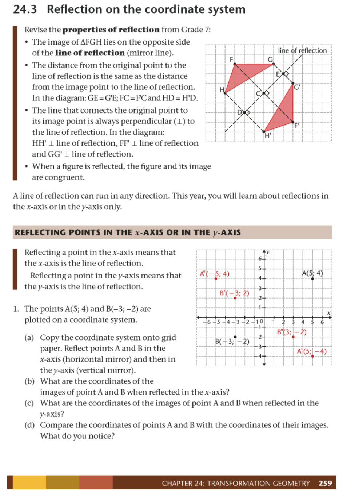
> **[Diagram Context - Textbook_Mathematics_Gr8_Transformation-geometry.pdf-0022-20.png]**
> The educational graphic is a geometry figure displaying Cartesian coordinate planes with plotted points and shapes to illustrate the transformation geometry concept of reflections. Visible labels include vertices $F, G, H, F', G', H'$ and points $A(5; 4)$, $A'(5; -4)$, $A''(-5; 4)$, $B(-3; -2)$, $B'(3; -2)$, and $B''(-3; 2)$, along with axis names $x$ and $y$, and the "line of reflection". This diagram conceptually conveys how geometric figures and coordinate points transform across a mirror line or the $x$- and $y$-axes, demonstrating that object-to-image distances are equal and perpendicular, and that coordinates change predictably (e.g., $(x, y) \rightarrow (x, -y)$ when reflected about the $x$-axis).

---

# A Cube or Not a Cube

## Concept Overview
To determine if a 2D net will successfully fold into a 3D cube, you must mentally visualize the folding process. By systematically assigning positions to each square in the net, you can track how the faces align.

## Steps to Visualize Folding a Cube

### 1. Labeling the Faces
Before folding, identify the faces of the cube relative to a chosen base.
*   **Bottom face (X)**
*   **Right face (R)**
*   **Back face (B)**
*   **Left face (L)**
*   **Top face (T)**
*   **Front face (F)**

> **[Diagram Context - Textbook_Mathematics_Gr8_Construction-of-geometric-figures.pdf-0023-10.png]**
> This educational graphic is a Euclidean geometry construction figure demonstrating the geometric construction of an angle. Visible elements include intersecting dashed construction circles, vertex points labeled A, B, C, and P, straight black rays originating from vertex B, red connecting lines with double tick marks, a green ray bisecting the angle, and a blue pencil drawing the final arc. Conceptually, this diagram illustrates the step-by-step method used in high school mathematics to construct a 60-degree angle or bisect an existing angle using only a compass and straightedge.

### 2. Choosing the Base
Select one square on the net to serve as the **bottom face**. Mark this square with an **X**.

> **[Diagram Context - Textbook_Mathematics_Gr8_Construction-of-geometric-figures.pdf-0023-13.png]**
> This educational graphic is a geometry figure demonstrating the construction steps for bisecting angles without a protractor. It features labelled points (A, B, C, D, K, L, M, P, Q, R), degree measurements (80°, 50°), compass arcs, and straight-line bisectors. For a high school student following the CAPS curriculum, this diagram visually conveys the geometric construction technique of dividing an angle into two equal parts using only a pair of compasses and a ruler.

### 3. Folding the Right Face
Identify the square to the right of the base (X). When you fold along the red line, this square becomes the **right face (R)** of the cube.

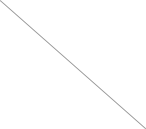
> **[Diagram Context - Textbook_Mathematics_Gr8_Geometry-of-3D-objects.pdf-0023-03.png]**
> This graphic features a simple linear geometry figure represented by a single straight diagonal line sloping downward from top-left to bottom-right without any labels or variables. It conceptually demonstrates the fundamental linear relationship and slope of a straight line in Cartesian coordinates. For high school mathematics learners, this visual serves as a foundational building block for analyzing linear functions and gradients.

### 4. Folding the Front Face
Identify the next square to the left of the right face. When you fold this square along the red line, it becomes the **front face (F)** of the cube.

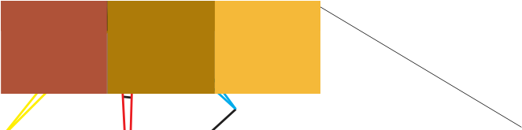
> **[Diagram Context - Textbook_Mathematics_Gr8_Geometry-of-3D-objects.pdf-0023-06.png]**
> The graphic shows a simplified anatomical diagram of an insect body divided into three distinct segments: head (brown), thorax (bronze), and abdomen (yellow), with attached limbs and an antenna extending from the head. The diagram contains no text labels, but clearly delineates the tagmata of an insect along with colored appendages (yellow, red, blue, and black line segments representing legs) and a single thin line representing an antenna. For a CAPS Life Sciences student, this visual conveys the basic external body plan of arthropods, demonstrating how the body is segmented into three distinct regions characteristic of insects.

## Teaching Guidelines
*   **Practical Activity:** Have learners draw the net on a sheet of paper, cut it out, and physically fold it to verify their mental model.
*   **Exploration:** Encourage learners to choose a different square as the "bottom face" and repeat the folding process to see how the orientation of the other faces changes.

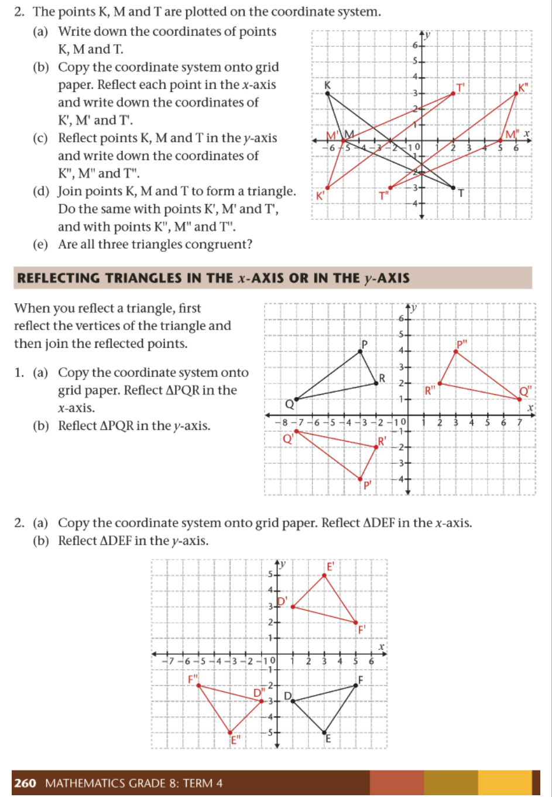
> **[Diagram Context - Textbook_Mathematics_Gr8_Transformation-geometry.pdf-0023-19.png]**
> The graphic is a geometry coordinate system and transformation figure featuring Cartesian planes with plotted points and triangles labelled K, M, T, P, Q, R, D, E, and F along with their reflections marked with single and double primes (e.g., K', K'', P', P''). Visible labels include coordinate axes ($x$ and $y$), numerical scale markings, and numbered exercise questions ranging from 1 to 2. Conceptually, it demonstrates the algebraic and visual effects of reflecting 2D geometric shapes (triangles) across the $x$-axis and $y$-axis on a Cartesian plane, helping learners understand coordinate transformation rules and shape congruence.

---

# Identifying the Nets of a Cube

## Concept: What is a Net?
A net is a two-dimensional shape that can be folded to form a three-dimensional object. In the case of a cube, a net consists of six squares arranged in a specific pattern that, when folded along the edges, creates a closed cube.

## Visualizing the Folding Process
To determine if a net forms a cube, follow these steps:
1. Identify the "Front" face.
2. Imagine folding the adjacent squares upward or downward.
3. Ensure that every face of the cube (Top, Bottom, Front, Back, Left, Right) is accounted for without any overlapping faces.

> **[Diagram Context - Textbook_Mathematics_Gr8_Construction-of-geometric-figures.pdf-0024-05.png]**
> This geometry figure illustrates circle geometry theorems, featuring a circle intersected by inscribed shapes, radii, and chords. The graphic includes vertex labels J, P, and K, angle measurements of 60°, tick marks indicating equal side lengths, and dashed construction lines forming a regular hexagon inscribed within the circle. Conceptually, this helps CAPS Grade 11 learners apply Euclidean geometry theorems relating to angles in the same segment, radii, tangents, and cyclic quadrilaterals.

## Worked Example: Mapping a Net
When you have a cube with faces labeled **T** (Top), **B** (Back), **L** (Left), **R** (Right), **F** (Front), you can unfold it into a net. 

*   **Step 5-7:** By observing the orientation of the faces, you can determine which square on the flat net corresponds to which side of the 3D cube.
*   **Step 8:** The resulting net shows the spatial relationship between the six squares.
*   **Step 9:** If every square on the net corresponds to a unique face of the cube, the net is valid.

> **[Diagram Context - Textbook_Mathematics_Gr8_Construction-of-geometric-figures.pdf-0024-16.png]**
> This educational graphic is a geometry figure demonstrating a geometric construction procedure using a pair of compasses and a straight edge. It displays step-by-step instructions with visible labels including line segment JK, points J, K, and P, intersection arcs, and angle notation $P\hat{J}K = 60^\circ$. For a high school student following the CAPS curriculum, this diagram conveys the step-by-step methodology required to construct a standard $60^\circ$ angle without a protractor by utilizing the geometric properties of an equilateral triangle.

## Exercise: Identifying Valid Nets
For each of the following nets, determine whether it will fold into a cube or not by copying and labeling the squares to match the faces of a cube.

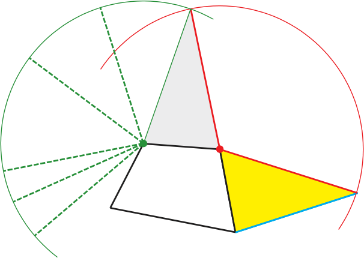
> **[Diagram Context - Textbook_Mathematics_Gr8_Geometry-of-3D-objects.pdf-0024-08.png]**
> This geometric figure illustrates a construction proof for the area of a trapezoid, showing the decomposition and rearrangement of shapes using intersecting circular arcs and straight-line segments. The graphic features a central polygon with shaded triangles in grey and yellow, outlined by green dashed construction lines and red circular arcs originating from marked green and red vertices. Conceptually, this diagram helps high school learners visualize how complex polygons can be transformed and dissected into familiar triangular components to derive area formulas or prove geometric theorems.

### Answers
| Net | Result |
| :--- | :--- |
| (a) | Forms a cube |
| (b) | Forms a cube |
| (c) | Forms a cube |
| (d) | Does not form a cube |

## Teaching Guidelines
*   **Visualization:** Encourage learners to first imagine the folding process mentally before attempting to draw or cut out the shapes.
*   **Practical Activity:** Have learners draw the nets on grid paper, cut them out, and physically attempt to fold them into cubes to verify their answers.

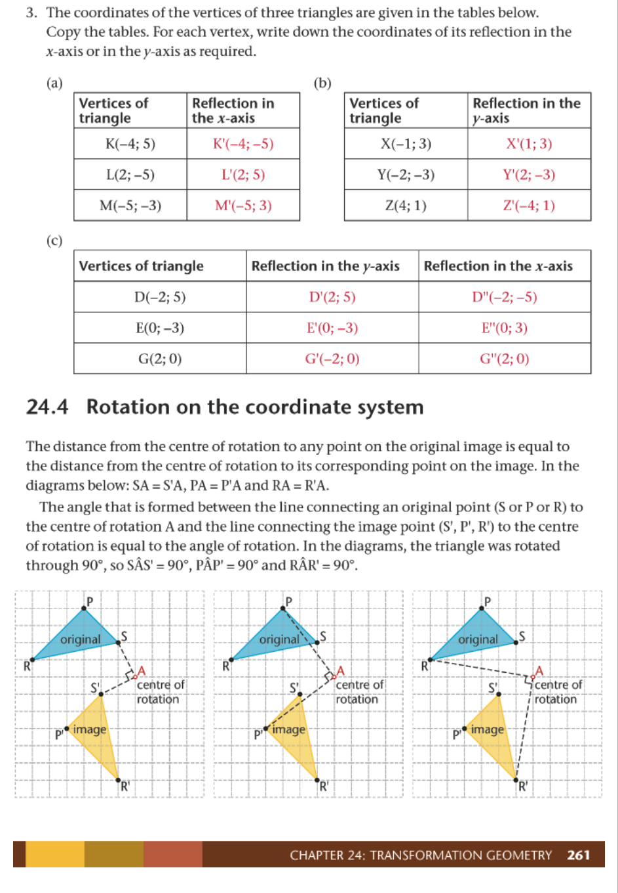
> **[Diagram Context - Textbook_Mathematics_Gr8_Transformation-geometry.pdf-0024-16.png]**
> This educational graphic presents geometry tables and coordinate grids illustrating transformation geometry, specifically reflections and rotations on a Cartesian plane. It features three coordinate tables for reflections (a, b, c) across the $x$- and $y$-axes, and three grid diagrams demonstrating a 90° rotation of an original blue triangle (vertices P, S, R) to an image yellow triangle (vertices P', S', R') around a centre of rotation (A). Conceptually, this helps high school learners understand the algebraic rules of reflections and the geometric properties of rotation—such as equal distances from the centre of rotation and specific angles of rotation—on a coordinate system.

---

# Nets of Other 3D Objects

## Teaching Guidelines
*   **Practical Exploration:** Learners should cut open boxes to observe how the faces are arranged in a net.
*   **Investigation:** Encourage learners to explore if alternative net configurations can be created for the same 3D object.
*   **Critical Thinking:** Discuss why certain nets do not form 3D objects. For example:
    *   In 2(c), a square should be added to the row of three squares in the middle to complete the shape.
    *   In 2(d), a square should be removed and the triangles repositioned to be opposite each other.

---

## Exercises

### Question 1: Labeling Faces
In each of the following cases, copy and label the faces on the net according to the labels on the 3D object.

> **[Diagram Context - Textbook_Mathematics_Gr8_Construction-of-geometric-figures.pdf-0025-10.png]**
> This geometry figure shows two adjacent angles resting on a straight line. Visible labels include the degree measurements 150° and 30°. Conceptually, this diagram illustrates supplementary angles on a straight line, helping learners understand that adjacent angles sharing a common vertex and arm sum up to 180°.

### Question 2: Identifying Valid Nets
Decide whether the following nets will form 3D objects.

> **[Diagram Context - Textbook_Mathematics_Gr8_Construction-of-geometric-figures.pdf-0025-21.png]**
> This geometric figure displays a straight line intersected by a ray, forming adjacent angles on a straight line. The diagram includes a horizontal base line, a perpendicular dashed line, an angled ray, and numerical angle measurements labeled as $135^\circ$ and $45^\circ$. Conceptually, this helps CAPS FET mathematics learners understand supplementary angles on a straight line, demonstrating that adjacent angles sharing a common vertex and side sum up to $180^\circ$.

---

## Answers

| Question | Answer |
| :--- | :--- |
| 1 | See the labeled diagrams in the learner's book (page 223). |
| 2 (a) | Yes |
| 2 (b) | Yes |
| 2 (c) | No |
| 2 (d) | No |

> **[Diagram Context - Textbook_Mathematics_Gr8_Construction-of-geometric-figures.pdf-0025-25.png]**
> This textbook page is a geometry figure graphic illustrating geometric constructions, specifically focusing on angles and triangles. Visible labels include point markers A, B, and C, degree measurements such as 30°, section headings like "CONSTRUCTING ANGLES OF 90° AND 45°" and "10.5 Constructing triangles", instructional steps numbered 1 and 2, and a challenge box alongside construction arcs and intersecting ray lines. Conceptually, it demonstrates step-by-step Euclidean geometry construction techniques using a compass and straightedge to construct specific angles and triangles without a protractor, aligning with CAPS curriculum requirements for spatial reasoning and geometric accuracy.

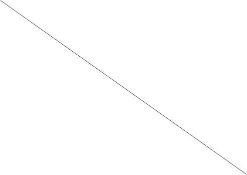
> **[Diagram Context - Textbook_Mathematics_Gr8_Geometry-of-3D-objects.pdf-0025-02.png]**
> This graphic displays a simple linear geometry figure consisting of a single straight line sloping downwards from the top-left to the bottom-right corner without any visible labels, axes, or arrows. In the context of CAPS Mathematics or Physical Sciences, such a straight line is typically used to represent linear functions, constant rates of change, or inverse proportionality relationships on a Cartesian plane. Conceptually, it helps learners understand the foundational properties of linear graphs, such as negative gradients and direct proportionality between variables in a simplified graphical format.

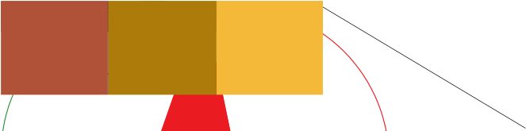
> **[Diagram Context - Textbook_Mathematics_Gr8_Geometry-of-3D-objects.pdf-0025-07.png]**
> The graphic appears to be an abstract geometric figure or incomplete diagram showing a combination of colored rectangular blocks (brown, dark yellow, and light yellow), a red trapezoidal base, and thin curved and straight lines in black, green, and red. It lacks explicit labels, variables, biological structures, chemical symbols, or axis names. Due to the cropping and lack of clear context, it does not convey a recognizable scientific or mathematical concept suitable for a high school CAPS curriculum.

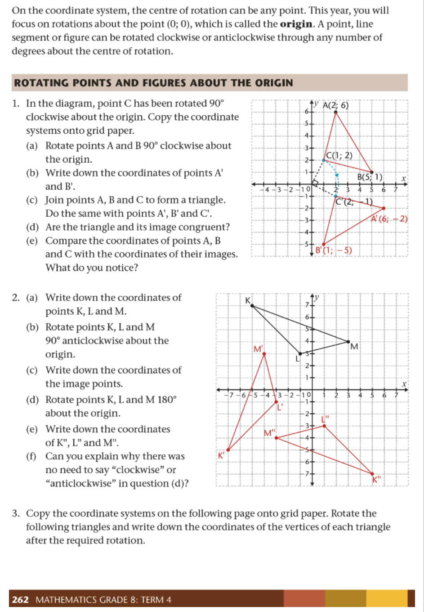
> **[Diagram Context - Textbook_Mathematics_Gr8_Transformation-geometry.pdf-0025-12.png]**
> The graphic features two Cartesian coordinate geometry figures illustrating the rotation of geometric figures about the origin. Visible elements include labeled axes ($x$ and $y$), original coordinate points (A, B, C; K, L, M), transformed image points denoted with prime notation (A', B', C'; K', L', M' and K'', L'', M''), directional curved arrows indicating rotation, and grid lines. Conceptually, it guides Grade 8 learners through performing and analyzing coordinate transformations—specifically $90^\circ$ clockwise, $90^\circ$ anticlockwise, and $180^\circ$ rotations around the origin—to discover algebraic rules for coordinate changes and observe the preservation of shape and size (congruence).

---

### 3D Objects and Their Nets

A **net** is a 2D shape that can be folded to form a 3D object. Understanding nets helps in identifying the faces, edges, and vertices of 3D solids.

---

#### Exercise 3: Identifying 3D Objects from Nets
Use the nets provided to identify the corresponding 3D objects.

> **[Diagram Context - Textbook_Mathematics_Gr8_Construction-of-geometric-figures.pdf-0026-07.png]**
> This geometry figure illustrates the construction of a triangle using a compass and ruler based on given side lengths. Visible labels include vertices A, B, and C, with side measurements of 7 cm for AC, 6 cm for AB, and 4 cm for BC, alongside construction arcs intersecting at point B. Conceptually, this diagram demonstrates the geometric construction method for triangles when all three side lengths (SSS condition) are known, reinforcing spatial reasoning and accurate instrument use in senior phase mathematics.

*   **(a)** Triangular prism
*   **(b)** Triangular-based pyramid (Tetrahedron)
*   **(c)** Square-based pyramid
*   **(d)** Triangular prism
*   **(e)** Square-based pyramid

---

#### Exercise 4: Analyzing a Hexagonal Net
Analyze the provided net consisting of a central hexagon surrounded by rectangles and another hexagon.

> **[Diagram Context - Textbook_Mathematics_Gr8_Construction-of-geometric-figures.pdf-0026-10.png]**
> This geometric figure represents a triangle labeled KLM with construction arc markings intersecting at vertex M. The visible labels include vertices K, L, and M, along with side length measurements of 8 cm for KM, 5 cm for ML, and 10 cm for KL. Conceptually, this diagram illustrates Euclidean geometry construction techniques and the application of the cosine rule to determine unknown angles in a non-right-angled triangle based on three given side lengths (SSS).

**Questions and Answers:**
*   **(a) Identify the shapes that the net consists of:** The net consists of hexagons (A and C) and rectangles (B, D, E, F, G, H).
*   **(b) How many rectangular faces does the net have?** Six.
*   **(c) How many other shapes does the net have? What are they?** Two hexagons.
*   **(d) Will this form a pyramid or a prism?** A prism.
*   **(e) How do you know?** It has two congruent and parallel bases (the hexagons). Pyramids do not use rectangles for their sides; they use triangles that converge to a point.
*   **(f) Name the 3D object that the net will form:** Hexagonal prism.

---

#### Exercise 5: Analyzing an Octagonal Net
Analyze the provided net consisting of an octagon attached to eight triangles.

> **[Diagram Context - Textbook_Mathematics_Gr8_Construction-of-geometric-figures.pdf-0026-12.png]**
> This educational graphic is a step-by-step geometry figure illustrating the construction of triangles using a ruler, compass, and arc intersections. Visible labels include vertices A, B, and C, measurement values such as 3 cm, 5 cm, and 7 cm, and triangle notation like $\Delta$ABC, $\Delta$KLM, and $\Delta$PQR. Conceptually, it guides Grade 8 learners through the SSS (side-side-side) geometric construction method, demonstrating how to accurately translate side lengths into precise triangle vertices using geometric instruments.

**Questions and Answers:**
*   **(a) Which shapes does this net consist of?** Triangles and an octagon.
*   **(b) How many triangular faces does the net have?** Eight.
*   **(c) How many other shapes does the net have?** One octagon.
*   **(d) Will this form a pyramid or a prism?** A pyramid.
*   **(e) How do you know?** There is only one base (the octagon) and the lateral faces are triangles that meet at a single apex.
*   **(f) Name the 3D object that the net will form:** Octagonal-based pyramid.

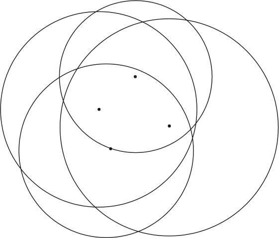
> **[Diagram Context - Textbook_Mathematics_Gr8_Geometry-of-3D-objects.pdf-0026-01.png]**
> This educational graphic is a Venn diagram consisting of four overlapping circular regions enclosing distinct point markers. The diagram features four intersecting circles and four small black dots positioned inside specific regions. Conceptually, this visual aids learners in understanding set theory, logical classifications, and the intersection or union of multiple groups in mathematics.

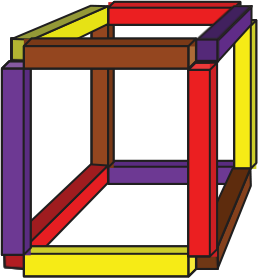
> **[Diagram Context - Textbook_Mathematics_Gr8_Geometry-of-3D-objects.pdf-0026-07.png]**
> This graphic is a 3D geometric figure representing a rectangular prism or cube constructed from twelve distinct rectangular bar edges. The visible components consist of parallel edges color-coded in pairs or sets of four (red, purple, yellow, brown) to distinguish three-dimensional orientation along the length, width, and height axes. Conceptually, this diagram helps high school learners visualize spatial dimensions, surface area, and volume calculations by clearly delineating the twelve edges that make up a three-dimensional rectangular prism in Euclidean geometry.

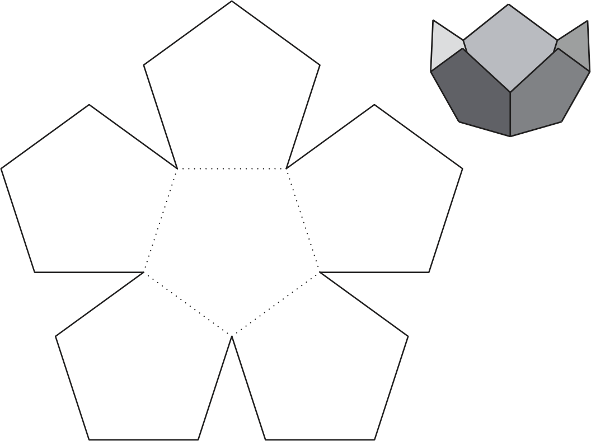
> **[Diagram Context - Textbook_Mathematics_Gr8_Geometry-of-3D-objects.pdf-0026-09.png]**
> This geometry figure illustrates a 2D net composed of a central regular pentagon surrounded by five adjacent pentagons connected by solid outer edges and dotted fold lines. In the top right, a 3D polyhedron model demonstrates how the flaps fold upward along the dotted lines to form a bowl-like or open 3D geometric solid. This visual helps high school learners understand spatial reasoning and surface geometry by connecting a flat 2D net directly to its corresponding 3D polyhedron structure.

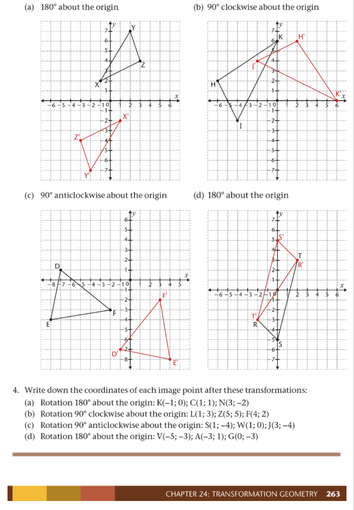
> **[Diagram Context - Textbook_Mathematics_Gr8_Transformation-geometry.pdf-0026-11.png]**
> This educational graphic is a geometry figure displaying four Cartesian coordinate planes labelled (a) through (d), each showing triangles undergoing specific rotational transformations about the origin. The visible labels include axis names $x$ and $y$, coordinate grid values ranging from -8 to 6, original triangle vertices (such as $X$, $Y$, $Z$, $H$, $J$, $K$, $D$, $E$, $F$, $R$, $S$, $T$), and their corresponding rotated image points denoted with primes (such as $X'$, $Y'$, $Z'$). Conceptually, the diagram demonstrates how rotational transformations—specifically 180°, 90° clockwise, and 90° anticlockwise about the origin—affect the coordinate positions of geometric shapes, allowing high school learners to practise reading coordinates and deriving algebraic rules for Euclidean transformations.

---

# 17.5 Using Nets to Construct Cubes and Prisms

## How to Draw a Net of a Prism

A prism is a 3D object with two identical ends (bases) and flat sides (lateral faces). A key rule for constructing a net is: **A prism will have the same number of lateral faces as the number of edges on its base.**

### Example: Drawing a Triangular Prism
The triangular prism shown has two right-angled triangular bases and three rectangular faces.

> **[Diagram Context - Textbook_Mathematics_Gr8_Construction-of-geometric-figures.pdf-0027-12.png]**
> This educational graphic is a geometry figure demonstrating the step-by-step construction of triangles using standard geometric instruments. It features three distinct problem scenarios labeled (a), (b), and (c), showing rough sketches alongside fully constructed triangles with visible vertex labels (A, B, C; K, L, M; P, Q, R), side length measurements in centimeters and millimeters, angle measurements in degrees, and compass arc construction lines. Conceptually, the diagram guides South African CAPS senior phase and FET learners on how to accurately construct triangles given specific boundary conditions—such as two angles and a side, two sides and an included angle, or a hypotenuse and another side—by applying fundamental ruler, compass, and protractor techniques.

### Step-by-Step Construction Process

**Step 1: Draw the base and the triangular ends**
*   Draw a rectangle to represent the bottom face of the prism.
*   Attach a right-angled triangle to the top edge of the rectangle.
*   Attach a mirror image of that triangle to the bottom edge of the rectangle.

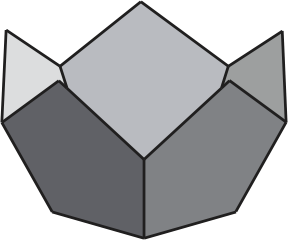
> **[Diagram Context - Textbook_Mathematics_Gr8_Geometry-of-3D-objects.pdf-0027-01.png]**
> The graphic is a 3D geometry figure showing an open, bowl-like polyhedral structure rendered with shaded planar faces to depict depth and perspective. The diagram contains no visible text, labels, variables, or directional arrows. Conceptually, it helps FET phase mathematics learners visualize spatial reasoning, surface area, and volume calculations for composite 3D objects made of interconnected polygons.

**Step 2: Add the remaining rectangular faces**
*   Draw the two remaining rectangles attached to the sides of the centre rectangle.
*   **Note on sizing:** 
    *   The rectangle on the right must fit onto the side opposite the right angle in the triangle (the hypotenuse). This will be the largest rectangle.
    *   The rectangle on the left will be the smallest of the three rectangles.

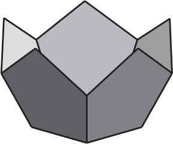
> **[Diagram Context - Textbook_Mathematics_Gr8_Geometry-of-3D-objects.pdf-0027-03.png]**
> This graphic displays a geometry figure, specifically a three-dimensional truncated polyhedral container rendered with solid black outline edges and shaded grey polygonal faces. It contains no text labels, variables, or directional arrows. Conceptually, it helps FET phase Mathematics learners visualize spatial reasoning, surface area, and volume calculations for composite 3D solids.

### Teaching Tips for Learners
1.  **Rough Sketches:** Always encourage learners to make a rough drawing of the net first.
2.  **Verification:** After sketching, ask learners to mentally "fold" the net to decide if it will successfully form the intended 3D prism.

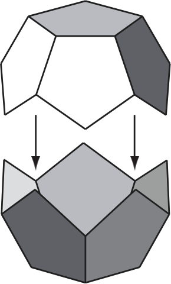
> **[Diagram Context - Textbook_Mathematics_Gr8_Geometry-of-3D-objects.pdf-0027-04.png]**
> This geometry figure illustrates a three-dimensional polyhedron being assembled from two separate halves, featuring shaded polygonal faces and two vertical downward-pointing arrows indicating how the top section fits into the bottom section. Conceptually, this diagram helps high school students visualize 3D shapes, spatial orientation, surface area, and the structural composition of regular polyhedra in CAPS Mathematics.

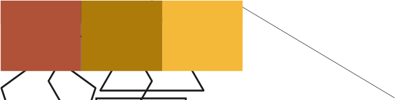
> **[Diagram Context - Textbook_Mathematics_Gr8_Geometry-of-3D-objects.pdf-0027-11.png]**
> The graphic is a simplified biological diagram illustrating insect body segmentation, showing three distinct tagmata connected in a linear arrangement with jointed appendages attached underneath. Visible elements include three color-coded rectangular body segments representing the head, thorax, and abdomen, along with thin black lines indicating jointed legs and an extended pointer line. This diagram helps high school learners identify the key anatomical regions and characteristic body plan of arthropods under the Life Sciences curriculum.

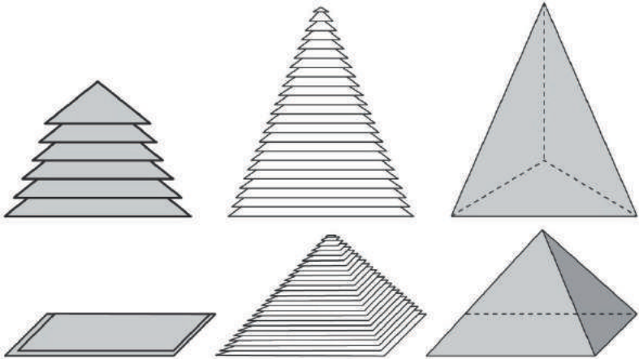
> **[Diagram Context - Textbook_Mathematics_Gr8_Transformation-geometry.pdf-0027-08.png]**
> This geometry figure displays various solid geometrical shapes, specifically pyramids built from stacked two-dimensional lamellae alongside smooth three-dimensional pyramids. The visual content shows stacked flat polygonal layers increasing in number and decreasing in thickness towards the apex, next to solid shaded pyramids with dashed lines indicating internal depth and height dimensions. Conceptually, this diagram illustrates how a smooth three-dimensional pyramid can be approximated by stacking infinitely thin flat lamellae, supporting learners in visualising volume derivation and integration principles in CAPS mathematics.

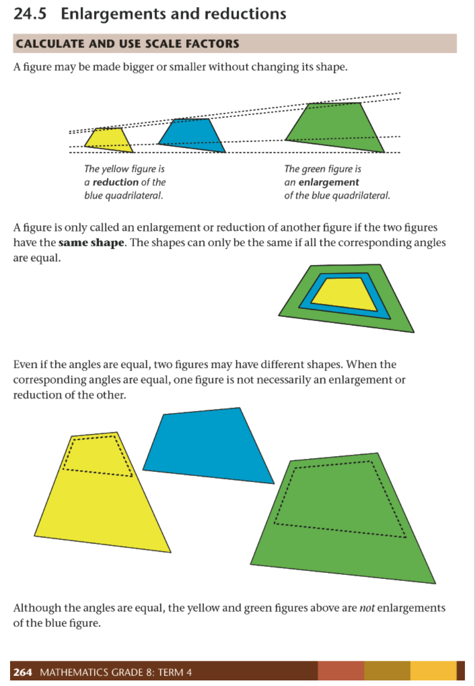
> **[Diagram Context - Textbook_Mathematics_Gr8_Transformation-geometry.pdf-0027-13.png]**
> This educational graphic from a Grade 8 Mathematics textbook illustrates geometric enlargements and reductions using colored quadrilaterals. It features three colored quadrilaterals (yellow, blue, and green) with dotted projection lines demonstrating scale transformations and shape comparisons. Conceptually, the diagram teaches students that an enlargement or reduction preserves the exact shape and equal corresponding angles of a figure, whereas having equal angles alone is insufficient to guarantee that shapes are proportional enlargements or reductions of one another.

---

# Practise Drawing Nets and Constructing 3D Models

## Teaching Guidelines
*   **Objective:** Learners must be able to draw the nets for various 3D objects.
*   **Support:** If learners experience difficulty, encourage peer-to-peer learning by working with a partner.
*   **Construction Tips:** When constructing models, ensure measurements are accurate. If an object is difficult to close, add small, overlapping flaps to the edges to provide a surface for tape or glue.

---

## Exercises

### 1. Copy and Complete
Copy and complete the nets for the following objects:
*   **(a)** A cube.
*   **(b)** A right-angled triangular prism.

> **[Diagram Context - Textbook_Mathematics_Gr8_Construction-of-geometric-figures.pdf-0028-14.png]**
> This educational graphic is a Grade 8 Mathematics textbook page focusing on geometry and the properties of triangles under the CAPS curriculum. It displays worked examples and exercises featuring two geometric figures: triangle ABC with side lengths of 5 cm and triangle DEF with side lengths of 45 mm, both labeled with vertices (A, B, C and D, E, F) and interior angle measurements of 60°. Conceptually, the page guides learners to discover that equilateral triangles possess sides of equal length and internal angles that always measure 60 degrees.

### 2. Draw Nets
Draw the nets for the following 3D objects:
*   **(a)** A rectangular prism (cuboid).
*   **(b)** A triangular prism.
*   **(c)** A square-based prism.

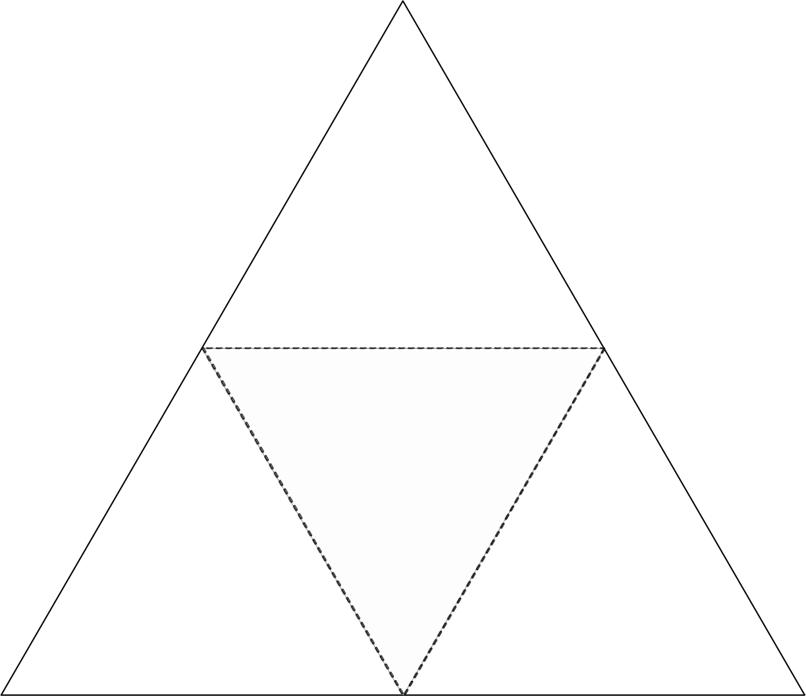
> **[Diagram Context - Textbook_Mathematics_Gr8_Geometry-of-3D-objects.pdf-0028-01.png]**
> This educational graphic is a geometry figure displaying a large triangle divided by an internal dashed triangular outline connecting the midpoints of its three sides. The diagram features a solid outer triangle and an inverted dashed inner triangle dividing the shape into four congruent triangular regions. Conceptually, this figure helps high school mathematics learners investigate geometric properties such as the Midpoint Theorem, similarity, area ratios, and tessellation within Euclidean geometry.

### 3. Construction Task
*   **(a)** Copy each of the nets that you drew in questions 1 and 2 onto cardboard or paper.
*   **(b)** Cut out the nets, fold them along the edges, and paste the flaps to construct each 3D object.
*   **(c)** Reflect on the process: Write down what you found difficult in making your 3D models and explain the method you used to overcome these difficulties.

---

## Teacher's Notes & Answers
1.  Refer to the Learner's Book (LB) page 226 for visual references.
2.  The nets for questions 1(a) and 1(c) correspond to the examples provided on LB page 223.
3.  **Example of a learner reflection:** "I found it difficult to make the sides exactly the right size. I overcame this by measuring more accurately. I also found it difficult to close the object, so I overcame this by adding a small, overlapping flap to the edges for the tape."

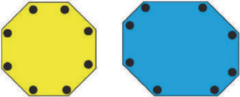
> **[Diagram Context - Textbook_Mathematics_Gr8_Transformation-geometry.pdf-0028-06.png]**
> The graphic shows two geometric figures, specifically two octagons colored yellow and blue, each featuring several black circular dots placed along their vertices or edges. Visible elements include the two colored octagons (left yellow, right blue) and multiple black dots positioned symmetrically or asymmetrically on their boundaries. Conceptually, this visual assists learners in studying spatial geometry, pattern recognition, or comparing shapes and vertex configurations.

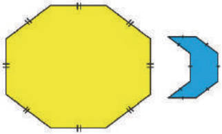
> **[Diagram Context - Textbook_Mathematics_Gr8_Transformation-geometry.pdf-0028-08.png]**
> This educational graphic displays two closed geometry figures: a large regular octagon shaded in yellow on the left and a smaller concave polygon shaded in blue on the right, both annotated with tick marks indicating equal side lengths. Visible elements include double-hash tick marks on the yellow octagon's sides and single-hash tick marks on the blue polygon's sides. Conceptually, this diagram helps high school students practice identifying polygon properties, distinguishing between convex and concave shapes, and calculating perimeter or interior angles in Euclidean geometry.

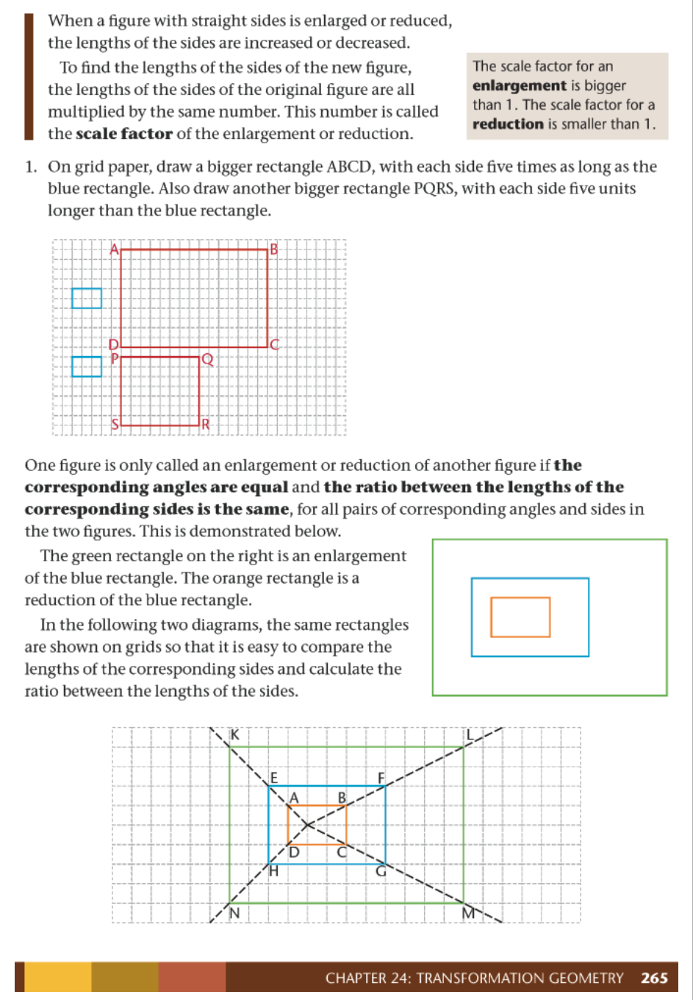
> **[Diagram Context - Textbook_Mathematics_Gr8_Transformation-geometry.pdf-0028-14.png]**
> This instructional geometry resource features text explanations, grid-based exercises, and geometric figures used to teach enlargement and reduction. Visible labels include vertices denoted by letters such as rectangles ABCD, PQRS, and KLMN, along with text boxes defining scale factors and proportional side lengths. Conceptually, it demonstrates how multiplying side lengths by a scale factor produces a true enlargement or reduction while maintaining equal corresponding angles and constant side-length ratios.

