# **Chapter 17 Surface area and volume of 3D objects** 

## 17.1 From 2D to 3D measurements 

Remember that 2D shapes have only length and breadth, while 3D objects have length, breadth and height. 


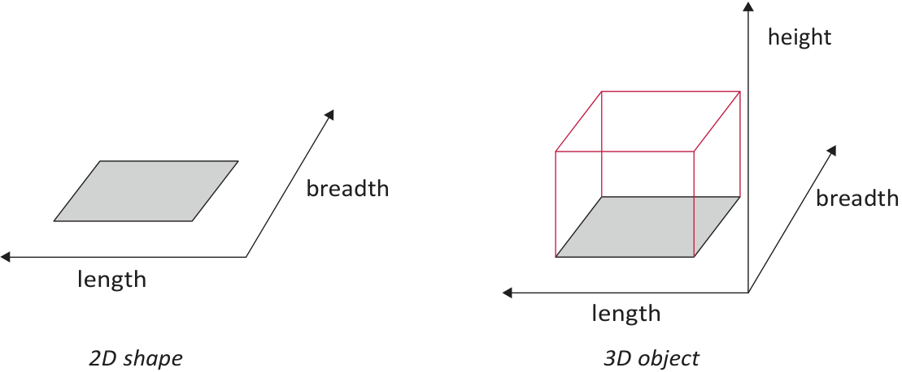
> **[Diagram Context - Textbook_Mathematics_Gr8_Surface-area-and-volume-of-3D-objects.pdf-0001-03.png]**
> This geometry figure compares a 2D shape with a 3D object using spatial axes. The diagram displays directional arrows and labels for "length", "breadth", and "height", alongside the captions "2D shape" and "3D object". Conceptually, it illustrates the distinction between two-dimensional figures defined only by length and breadth, and three-dimensional objects that additionally incorporate height, forming the foundational spatial concepts taught in Senior Phase Mathematics.


A 2D shape has only one surface. We call the size of this flat surface the **area** of the shape. 

A 3D object has more than one surface. For example, a cube has six surfaces, or faces. The sizes of these surfaces on the outside of the 3D object are called its **surface area** . 

A 2D shape is flat, so it takes up space in only two directions. But a 3D object has height as well, so it takes up space in a third direction also. The space that a 3D object takes up is called its **volume** . 

#### **<mark>investigating the surface area and volume of a book</mark>** 

Work with a partner. Choose a book each. The books must be different sizes. 

1. Run your hand over all the outside surfaces of your book. How many surfaces (or faces) does your book have? 

2. Estimate whether the surface area of your book is bigger or smaller than that of your partner’s book. 


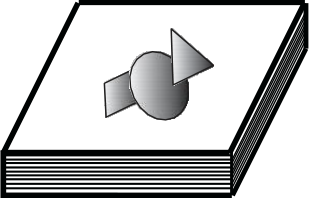
> **[Diagram Context - Textbook_Mathematics_Gr8_Surface-area-and-volume-of-3D-objects.pdf-0001-11.png]**
> This graphic is a simplified 3D line drawing representing a stack of paper topped with a central arrangement of geometric shapes (a rectangle, circle, and triangle). The visible features include a layered rectangular pad or book base and three overlapping shaded shapes in the center without text labels or arrows. Conceptually, this abstract diagram can be used in foundational design or technology lessons to illustrate spatial relationships, layering, or composition on a flat surface.


**188** MATHEMATICS GRAdE 8: TERM 3 

3. If you were to cover the book with wrapping paper, explain how you would calculate the minimum size of paper you would need. 

4. Estimate whose book takes up the most space. How could you calculate which book really takes up the most space? 

## 17.2 Surface area of 3D objects 

#### **<mark>using nets to explore surface area</mark>** 

The **surface area** of an object is equal to the sum of the areas of all its faces. So we can use the net of an object to investigate its surface area. 

A net is a flat shape that can be folded to make a 3d object. 

The following diagrams show 3D objects with their matching nets: 

1. Use the measurements given to calculate the area of each face shown by the net. (Use your calculator if necessary and round off to two decimal places.) 

2. Add up the areas to calculate the surface area of each object. A 


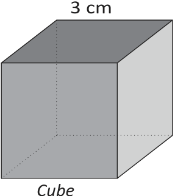
> **[Diagram Context - Textbook_Mathematics_Gr8_Surface-area-and-volume-of-3D-objects.pdf-0002-09.png]**
> This educational graphic shows a three-dimensional geometry figure of a cube with a side length label of "3 cm" at the top and the text "Cube" at the bottom. The visual represents a regular hexahedron used for teaching measurement and calculating surface area or volume in the CAPS curriculum.


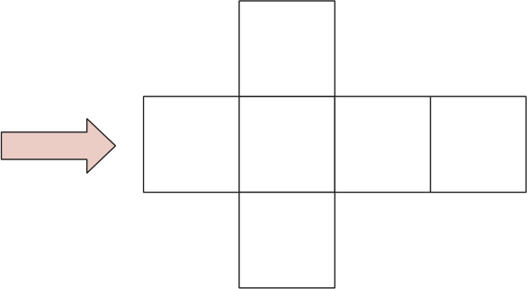
> **[Diagram Context - Textbook_Mathematics_Gr8_Surface-area-and-volume-of-3D-objects.pdf-0002-10.png]**
> This geometry figure illustrates the net of a cube, composed of six identical square faces connected in a cross-like layout alongside a single pink horizontal arrow pointing towards the left face. Aligned with the CAPS Mathematics curriculum for spatial reasoning, it visually demonstrates how a three-dimensional solid can be unfolded into a two-dimensional surface and aids learners in visualizing surface area calculations and spatial transformations.


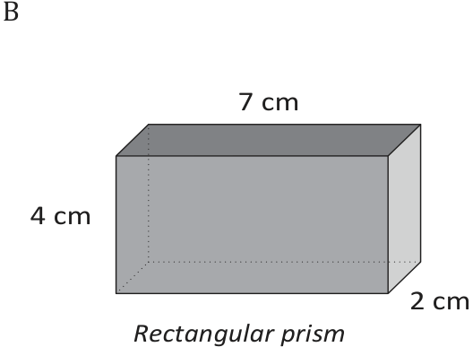
> **[Diagram Context - Textbook_Mathematics_Gr8_Surface-area-and-volume-of-3D-objects.pdf-0002-11.png]**
> This graphic is a 3D geometry figure of a rectangular prism labeled with dimensions 7 cm, 4 cm, and 2 cm, along with the text label "Rectangular prism" and letter "B". It illustrates a right rectangular prism with designated length, height, and width values to support learners in calculating surface area and volume.


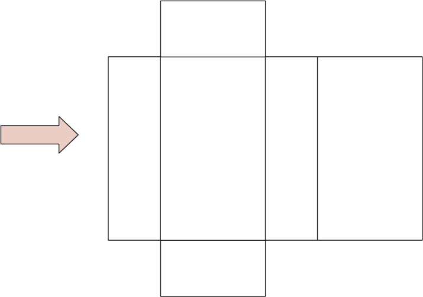
> **[Diagram Context - Textbook_Mathematics_Gr8_Surface-area-and-volume-of-3D-objects.pdf-0002-12.png]**
> The graphic shows a 2D geometry net of a rectangular prism (cuboid) alongside a single light pink horizontal arrow pointing towards the left edge of the net. The visible components include interconnected rectangular outlines forming a standard unfolding of a three-dimensional box with six faces. This diagram conceptually conveys spatial visualization and surface area calculation in senior phase mathematics by demonstrating how a 3D rectangular prism can be flattened into a 2D composite shape made of six constituent rectangles.


CHAPTER 17: SURFACE AREA ANd VOLUME OF 3d OBJECTS **189** 


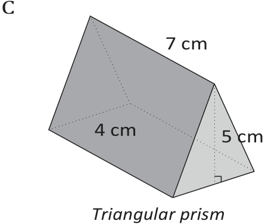
> **[Diagram Context - Textbook_Mathematics_Gr8_Surface-area-and-volume-of-3D-objects.pdf-0003-00.png]**
> This graphic is a 3D geometry figure of a triangular prism labeled with the dimensions 7 cm, 4 cm, and 5 cm, alongside a right-angle indicator on the triangular base. The visible labels include the letter "C" in the upper-left corner and the text "Triangular prism" at the bottom. Conceptually, this diagram helps high-school learners visualize the 3D structure of a right triangular prism and apply formulas to calculate its surface area and volume using the provided linear dimensions.


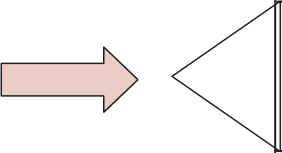
> **[Diagram Context - Textbook_Mathematics_Gr8_Surface-area-and-volume-of-3D-objects.pdf-0003-01.png]**
> This educational graphic is a physical sciences ray optics diagram showing a large horizontal arrow pointing towards a triangular prism shape. The visible elements include a shaded directional arrow on the left and a triangular geometric outline with a vertical surface on the right. Conceptually, it illustrates the propagation of light waves or incident rays approaching a refracting medium, supporting the study of reflection, refraction, and wave fronts in high school physics.


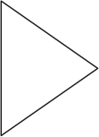

#### **<mark>deducing formulae for surface areas</mark>** 

   - The surface area of a prism = the sum of the areas of all its faces 

1. (a) Use the general formula above and the work you did on the cube on page 189 to determine which of the following formulae are correct. Write down the correct one(s). 

      - Surface area of a cube = 4 × _s_ 

      - Surface area of a cube = _s_ × _s_ × _s_ × _s_ 

      - Surface area of a cube = 6 × _s_^{2} 

      - Surface area of a cube = _s_^{6} 

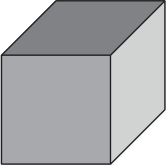


   - (b) Explain your choice above. 

2. (a) Write a formula for the surface area of any rectangular prism. 

   - (b) Explain your formula. 


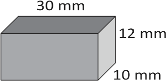
> **[Diagram Context - Textbook_Mathematics_Gr8_Surface-area-and-volume-of-3D-objects.pdf-0003-15.png]**
> This geometry figure is a 3D rectangular prism (cuboid) shaded in grey to represent a solid block. Visible measurements include a length of 30 mm, a height of 12 mm, and a width of 10 mm. This diagram conveys spatial reasoning and measurement concepts, enabling high school students to calculate surface area, volume, and unit conversions in millimeters.


3. (a) Write a formula for the surface area of any triangular prism. 

   - (b) Explain your formula. 

4. Use the formulae in questions 1 to 3 to calculate the surface areas of the cube, rectangular prism and triangular prism shown in questions 1 to 3. Surface area of cube: ... 


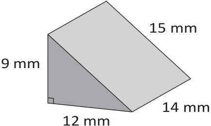
> **[Diagram Context - Textbook_Mathematics_Gr8_Surface-area-and-volume-of-3D-objects.pdf-0003-19.png]**
> This geometry figure depicts a triangular prism with visible dimensions labelled as 9 mm, 12 mm, 14 mm, and 15 mm, along with a right-angle indicator on the triangular cross-section. It illustrates a 3D solid shape, helping FET phase learners understand surface area and volume calculations by identifying base dimensions, height, and length.


Surface area of rectangular prism: ... 

Surface area of triangular prism: ... 


**190** MATHEMATICS GRAdE 8: TERM 3 

### **<mark>surface area calculations</mark>** 

Work out the surface areas of the following four objects. Give all answers in cm^{2} . 

Remember: 1 cm^{2} = 100 mm^{2} 1 mm^{2} = 0,01 cm^{2} 1 m^{2} = 10 000 cm^{2} 1 cm^{2} = 0,0001 m^{2} 1 km^{2} = 1 000 000 m^{2} 1 m^{2} = 0,000001 km^{2} 

It may be a good idea to sketch the net for each object before doing the calculations. 


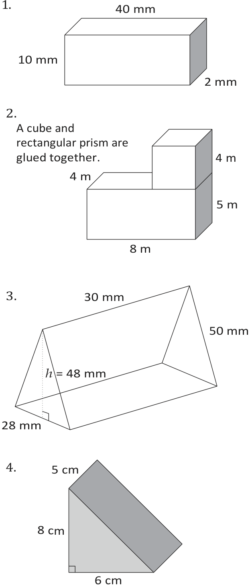
> **[Diagram Context - Textbook_Mathematics_Gr8_Surface-area-and-volume-of-3D-objects.pdf-0004-04.png]**
> This educational graphic displays four 3D geometry figures, including a rectangular prism, a composite shape formed by a cube and rectangular prism, a triangular prism, and a right-angled triangular prism. The diagrams feature numerical dimension labels such as length, width, height, and perpendicular height $h$, accompanied by right-angle symbols and descriptive text like "A cube and rectangular prism are glued together." Conceptually, this helps learners practice calculating surface area and volume of basic and composite 3D objects as prescribed by the CAPS mathematics curriculum.


CHAPTER 17: SURFACE AREA ANd VOLUME OF 3d OBJECTS **191** 

## 17.3 Volume of 3D objects 

### **<mark>deriving formulae to calculate volume</mark>** 

Think of a prism and its base. If you were to move the base up to the top, between the lateral faces of the prism, the area of the base would remain exactly the same. 


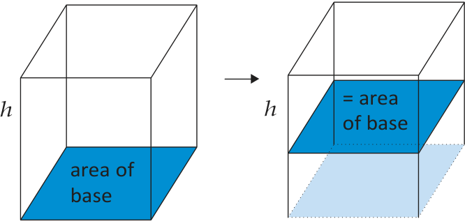
> **[Diagram Context - Textbook_Mathematics_Gr8_Surface-area-and-volume-of-3D-objects.pdf-0005-03.png]**
> This graphic is a geometry figure illustrating the concept of volume for right prisms. The visible labels include height variable $h$, "area of base", and " = area of base" with horizontal blue cross-sections and an arrow indicating translation or slicing. Conceptually, it demonstrates that any right prism maintains a uniform cross-sectional area equal to its base along its entire height $h$, serving as the geometric foundation for calculating volume ($V = \text{Area of base} \times h$).


Lateral faces are faces that are not bases. 


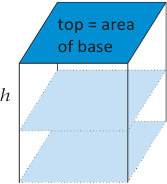
> **[Diagram Context - Textbook_Mathematics_Gr8_Surface-area-and-volume-of-3D-objects.pdf-0005-05.png]**
> This geometry figure illustrates a three-dimensional rectangular prism with parallel cross-sectional layers. Visible labels include the variable "$h$" representing height and the text "top = area of base" highlighting the uniform cross-sectional area. Conceptually, this diagram demonstrates that the volume of a right prism is calculated by multiplying the area of the base by the perpendicular height ($V = \text{Area}_{\text{base}} \times h$).


The volume of a prism = area of base × height 

Use this general formula above to write the formula for the volume of a cube, a rectangular prism and a triangular prism. 

**volume** is the amount of space that an object takes up. 


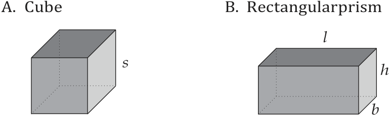
> **[Diagram Context - Textbook_Mathematics_Gr8_Surface-area-and-volume-of-3D-objects.pdf-0005-09.png]**
> The graphic shows a geometry figure comprising 3D solid shapes labeled A. Cube and B. Rectangular prism. Diagram A displays a cube with a side length labeled $s$, while Diagram B displays a rectangular prism with dimensions labeled length ($l$), height ($h$), and breadth ($b$). Conceptually, this diagram helps learners identify the key structural components of standard right prisms and provides the foundational variables required for calculating surface area and volume in CAPS-aligned mathematics.


###### **note about triangular prism** 

do not get confused between: 

- the base of the prism and the base of the triangular face of the prism 

- the height of the prism and the height of the triangular face of the prism. 


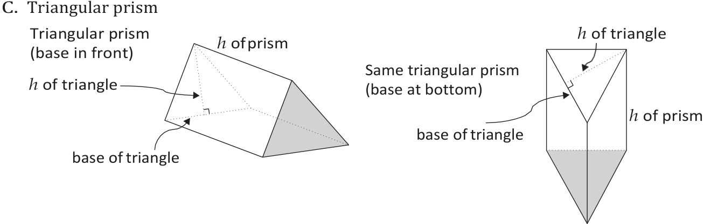
> **[Diagram Context - Textbook_Mathematics_Gr8_Surface-area-and-volume-of-3D-objects.pdf-0005-14.png]**
> This geometry figure illustrates two 3D representations of a triangular prism shown from different orientations. Visible labels include "C. Triangular prism," "h of prism," "h of triangle," "base of triangle," and descriptive text such as "(base in front)" and "(base at bottom)" with corresponding arrows indicating perpendicular height and base dimensions. For a high school student studying mathematics, the diagram conceptually clarifies how to correctly identify the base and perpendicular heights of a 3D solid regardless of its orientation in space, which is essential for calculating surface area and volume.


**192** MATHEMATICS GRAdE 8: TERM 3 

You should have found the following volume formulae: 

Volume of a cube = _s_^{3} or _s_ × _s_ × _s_ 

Volume of a rectangular prism = _l_ × _b_ × _h_ Volume of a triangular prism = <u>1 (base ×</u> _h_ ) × height of prism 2 

Because we multiply three dimensions, the units used are cubic units, such as mm^{3} , cm^{3} or m^{3} . 

### **<mark>volume calculations</mark>** 

Calculate the volume of the following objects using the formulae given above: 


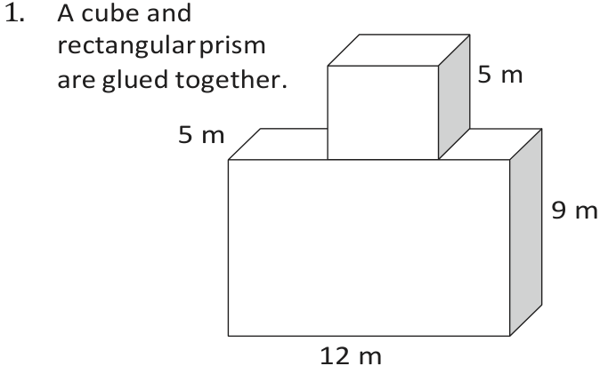
> **[Diagram Context - Textbook_Mathematics_Gr8_Surface-area-and-volume-of-3D-objects.pdf-0006-06.png]**
> This geometry figure shows a composite 3D object formed by gluing a smaller cube on top of a larger rectangular prism. Visible labels include numerical dimensions and units indicating side lengths (5 m, 9 m, 12 m) alongside the introductory text: "1. A cube and rectangular prism are glued together." Conceptually, this diagram helps high school students practice calculating surface area and volume of composite objects by combining measurements of individual 3D shapes.


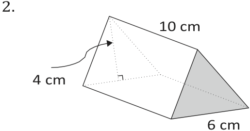
> **[Diagram Context - Textbook_Mathematics_Gr8_Surface-area-and-volume-of-3D-objects.pdf-0006-07.png]**
> This educational graphic displays a 3D geometry figure of a triangular prism, labelled with the number "2." Visible dimensions include a length of 10 cm, a base side of 6 cm, and a perpendicular height of 4 cm indicated with a dotted line and right-angle symbol pointed to by an arrow, alongside one shaded triangular face. Conceptually, this diagram helps high school learners practice calculating surface area and volume by identifying the base, height, and length dimensions of a right triangular prism.


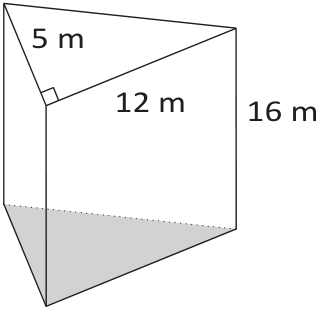
> **[Diagram Context - Textbook_Mathematics_Gr8_Surface-area-and-volume-of-3D-objects.pdf-0006-09.png]**
> The graphic is a 3D geometry figure representing a right triangular prism with a shaded base. Visible labels include linear dimensions of 5 m, 12 m, and 16 m, alongside a right-angle symbol indicating perpendicular sides on the triangular cross-section. Conceptually, this diagram helps high school learners practice calculating surface area and volume by identifying the base area and perpendicular height of a composite 3D object.


CHAPTER 17: SURFACE AREA ANd VOLUME OF 3d OBJECTS **193** 

## 17.4 Relationship between surface area and volume 

Do objects with the same volume always have the same surface area? Do the investigation below in order to find out. 

1. (a) Calculate the surface area and volume of the following five rectangular prisms by copying and completing the table below: 


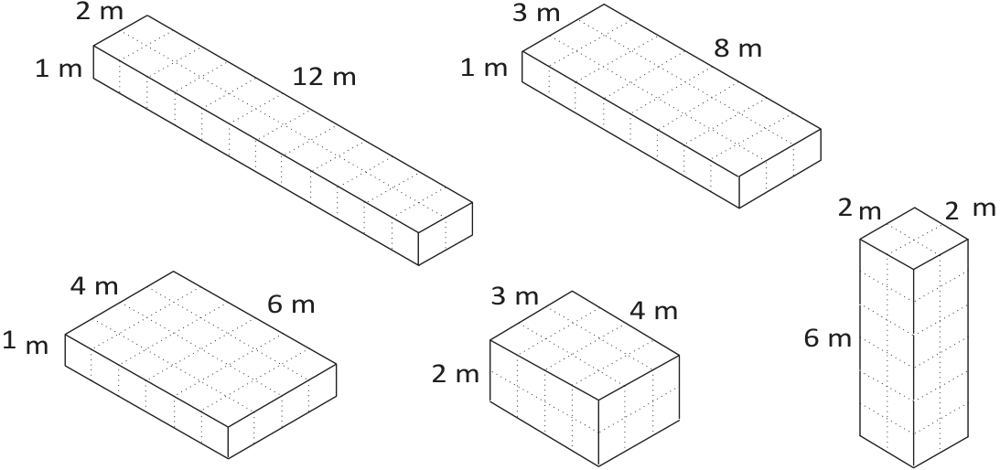
> **[Diagram Context - Textbook_Mathematics_Gr8_Surface-area-and-volume-of-3D-objects.pdf-0007-03.png]**
> The graphic shows five 3D rectangular prism geometry figures, each subdivided into a grid with dimensions labelled in meters ($1\text{ m}$, $2\text{ m}$, $3\text{ m}$, $4\text{ m}$, $6\text{ m}$, $8\text{ m}$, and $12\text{ m}$). It visually demonstrates how different rectangular prisms can maintain a constant volume (or differing surface-to-volume ratios) while having varying lengths, widths, and heights. For CAPS mathematics learners, this diagram reinforces spatial reasoning, volume calculation ($V = \text{l} \times \text{b} \times \text{h}$), and the relationship between dimensions and surface area in 3D shapes.


|Length (m)|Breadth (m)|Height (m)|Surface area<br>(m^{2})|Volume (m^{3})|
|---|---|---|---|---|
|12|2|1|||
|8|3|1|||
|6|4|1|||
|4|3|2|||
|2|2|6|||

   - (b) In the last row of the table, write another set of dimensions ( _l_ , _b_ and _h_ ) that will give the same volume but a different surface area as the ones already recorded. 

2. Look at the completed table. What can you conclude about the surface area and volume of objects? 

3. A rectangular prism has a volume of 8 m^{3} . Write down two possible sets of dimensions. Draw the prisms below with their dimensions written on the drawings. 

4. The table on the following page shows surface area and volume calculations for cubes with different side lengths. 


**194** MATHEMATICS GRAdE 8: TERM 3 

|Side length of cube (m)|Surface area (m^{2})|Volume (m^{3})|
|---|---|---|
|1|6|1|
|2|24|8|
|3|54|27|
|5|150|125|
|8|384|512|
|10|600|1 000|

- (a) Look at the surface area column. Does the surface area increase or decrease as the side length of the cube increases? 

- (b) Look at the volume column. Does the volume increase or decrease as the side length of the cube increases? 

- (c) Does **volume** or **surface area** increase more rapidly when the side length of the cube increases? 

- (d) Sketch a global graph of the volume of a cube versus its surface area. 

## 17.5 Converting between cubic units 

#### **<mark>how many cubes?</mark>** 


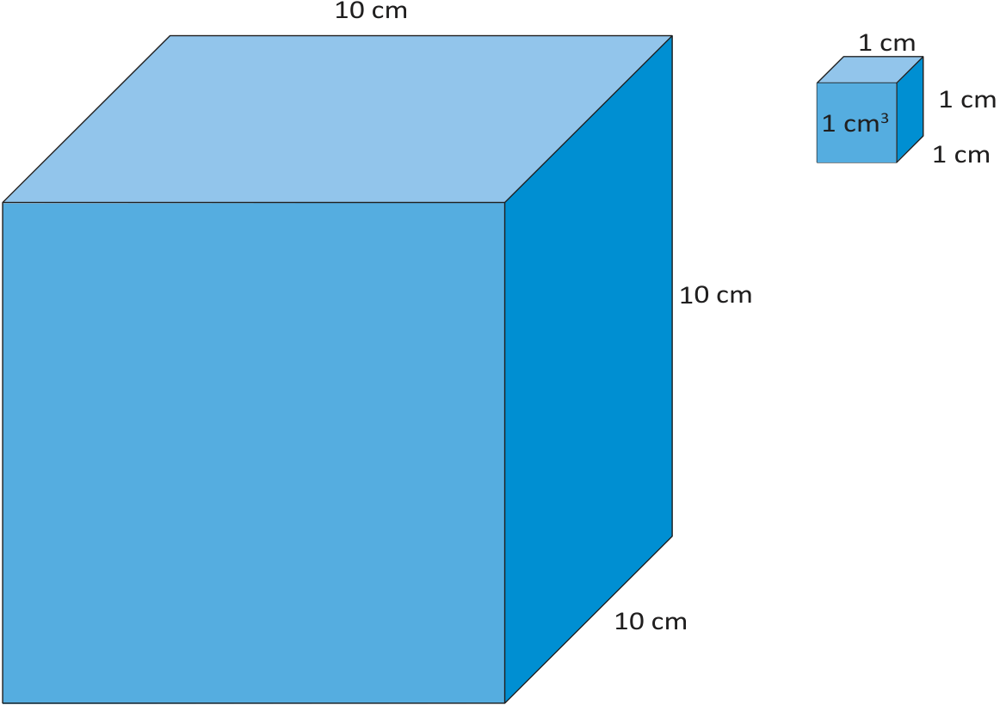
> **[Diagram Context - Textbook_Mathematics_Gr8_Surface-area-and-volume-of-3D-objects.pdf-0008-07.png]**
> This educational graphic displays two contrasting geometry figures, specifically a large cube with dimensions of 10 cm on each side and a much smaller cube measuring 1 cm on each side with a volume label of $1\text{ cm}^3$. Visible labels include side length measurements of "10 cm" and "1 cm". Conceptually, this diagram visually demonstrates the relationship between cell size, surface area, and volume to help high school Life Sciences learners understand why larger organisms require specialized transport and exchange systems rather than relying solely on diffusion.


CHAPTER 17: SURFACE AREA ANd VOLUME OF 3d OBJECTS **195** 

1. The small cube has the dimensions of 1 cm × 1 cm × 1 cm and a volume of 1 cm^{3} . How many 1 cm^{3} cubes will you need to form a large cube with dimensions 10 cm × 10 cm × 10 cm like the one shown on the previous page? 

2. How many 10 cm × 10 cm × 10 cm cubes will form a 100 cm × 100 cm × 100 cm cube? 

3. (a) To form a 1 000 cm^{3} cube you need 1 000 cubes with a volume of 1 cm^{3} . If cubes of 1 000 cm^{3} (10 cm × 10 cm × 10 cm) are then used to form a cube of 100 cm × 100 cm × 100 cm, how many 1 000 cm^{3} cubes will there be? 

   - (b) What is the volume of this new cube? 

   - (c) How many cubes of 1 cm^{3} will form a cube with a volume of 1 000 000 cm^{3} ? 

4. Which of the cubes given below has a bigger volume? Explain. 

   - A. A cube with a volume of 1 m^{3} 

   - B. A cube with a volume of 1 000 000 cm^{3} 

5. (a) How many 1 mm × 1 mm × 1 mm cubes (1 mm^{3} ) are needed to form a 1 cm × 1 cm × 1 cm cube? 

   - (b) What is the total volume of the 1 mm^{3} cubes forming the 1 cm^{3} cube? 

#### **<mark>practise converting between units</mark>** 

When working with volume, you often have to convert between different cubic units. Here are two examples of how you can work out equivalent units. 

**Converting cm**^{**3**} **to mm**^{**3**} **:** 

   - 1 cm^{3} = 1 cm × 1 cm × 1 cm 

      - = 10 mm × 10 mm ×10 mm 

      - = 1 000 mm^{3} 

   - ∴ multiply by 1 000 

1. Write the following volumes in cm^{3} : (a)  3 mm^{3} (b)  45 mm^{3} 

2. Write the following volumes in mm^{3} : (a)   20 cm^{3} (b)  151 cm^{3} 

3. Write the following volumes in m^{3} : (a)   9 cm^{3} (b)  50 cm^{3} 

4. Write the following answers in cm^{3} : (a)   4 m^{3} + 68 cm^{3} 

##### **Converting cm**^{**3**} **tom**^{**3**} **:** 

- 1 cm^{3} = 1 cm × 1 cm × 1 cm 

      - = 0,01 m × 0,01 m × 0,01m 

      - = 0,000001 m^{3} 

- ∴ multiply by 0,000001 or divide by 1 000 000 

   - (c)  0,6 m^{3} (d) 1,22 m^{3} 

   - (c)   4,7 cm^{3} (d) 89,5 cm^{3} 

   - (c)   643 cm^{3} (d) 1 967 cm^{3} 

- (b) 12 m^{3} + 143 cm^{3} 

## 17.6 Capacity of 3D objects 

#### **<mark>difference between capacity and volume</mark>** 

**Capacity** is the amount of space available _inside_ an object. 

Volume is the amount of space that the object itself takes up. 


**196** MATHEMATICS GRAdE 8: TERM 3 


1. A solid block of wood measures 30 cm × 20 cm × 10 cm. 

   - (a) What is its volume? 

The same solid block of wood is carved out to make a hollow container. The measurements inside the container are 25 cm × 15 cm × 8 cm. 

   - (b) How thick are the walls of the container? 

   - (c) What is the capacity of the container? 

   - (d) If you filled the container with water, what volume of water would the container hold? 

2. More of the wood is carved out of the container to make walls 1 cm thick at the sides and the bottom. Calculate the capacity of the container in litres. 

#### **<mark>displacement and more capacity calculations</mark>** 

Consider a glass vase half full of water. As soon as you place marbles into the water, the level of the water rises. This is not because the amount of water has changed, but rather because the marbles have taken the place of the water and have pushed the water higher up in the vase. 

If one of the marbles has a volume of 

- 1 cm^{3} , it would **displace** 1 ml of water. 

- ∴ We know that: 

   - 1 cm^{3} = 1 ml 

   - 1 m^{3} = 1 kl 


To displace means to move something out of its place. 

1. Calculate the capacities of the following containers. The _inside_ measurements are given. Write your answers in ml or kl. 

   - (a) 


2. Work out a possible set of inside measurements for a container with a capacity of 12 kl. Draw a sketch and write the measurements on it. 


CHAPTER 17: SURFACE AREA ANd VOLUME OF 3d OBJECTS **197** 

#### Grade 8 Term 3 Chapter 17 Surface area and volume of 3D objects 

||**Learner Book Overview**||
|---|---|---|
|**Sections in this chapter**|**Content**|**Pages in Learner Book**|
|17.1 From 2D to 3D measurements|Defining the surface area and volume of an object; investigating the surface<br>area and volume of an object|Pages 188 to 189|
|17.2 Surface area of 3D objects|Using nets to calculate the surface area of objects; deducing formulae for<br>surface areas; calculating surface areas|Pages 189 to 191|
|17.3 Volume of 3D objects|Deriving formulae to calculate the volume of objects; calculating volumes|Pages 192 to 193|
|17.4 Relationship between surface area<br>and volume|Investigating the relationship between surface area and volume|Pages 194 to 195|
|17.5 Converting between cubic units|Determining that the number of cubic units change when the dimensions are<br>increased; converting between units|Pages 195 to 196|
|17.6 Capacity of 3D objects|Defining the difference between volume and capacity; calculations about<br>displacement and volume|Pages 196 to 197|
|CAPS time allocation|5 hours||
|CAPS content specification|Page 108||

###### **Mathematical background** 

- The **surface area** of an object is the sum of the areas of all the faces; it is measured in square units. The **net** of an object can be used to calculate its surface area. 

- Another way to interpret the formula of the net of a prism is to say: Surface area = 2 × area of the base + the perimeter × the height of the prism. 

- The **volume** of an object is the amount of space it takes up. Volume = area of base × height. Three dimensions are involved: length, breadth and height. So, volume is measured in cubic units, for example cubic centimetres (cm^{3} ) and cubic metres (m^{3} ). 

- A **cubic centimetre** is a cube with sides that are 1 cm each. 

- A **cubic metre** is a cube with sides that are 1 m each. 

- An object can have both volume and capacity. The difference between volume and capacity is: 

   - volume is the amount of space an object takes up 

   - **capacity** is how much a container can hold. 

- If volume is measured in cubic centimetres (cm^{3} ) the measure of capacity is millilitres. A millilitre is the content of a cube with sides measuring 1 cm. 

MATHEMATICS GRADE 8 TEACHER GUIDE 

#### 17.1 From 2D to 3D measurements 

###### **Background information** 

The surface area of an object is the sum of the areas of all its faces. Area is measured in square units. 

The volume of an object is the amount of space it takes up. Three dimensions are involved, namely length, breadth and height. Volume is measured in cubic units. 

A prism is an object that has two identical faces, the bases that are parallel to each other, and these are joined by parallelograms (the side faces or lateral faces). 

A right prism is an object of which the side faces are perpendicular to the bases. For the purpose of this work, a prism means a right prism. 

A rectangular or cubic prism could have any of its faces as the base; the side faces will be perpendicular to the chosen base. 

In this definition, the base of a triangular prism would be its triangular faces on which the rectangular faces are perpendicular. 

###### **INVESTIGATING THE SURFACE AREA AND VOLUME OF A BOOK** 

###### **Teaching guidelines** 

This activity should make learners aware of the difference between surface area and volume. 

###### **Answers** 

1. Six surfaces (or faces) 

2. Consider learners’ answers. 


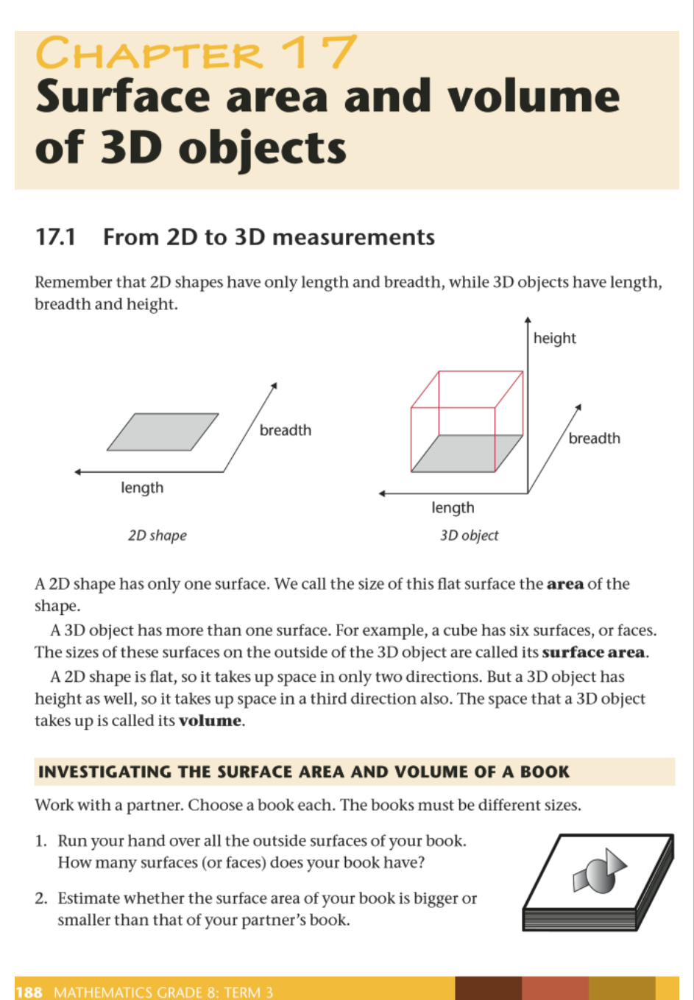
> **[Diagram Context - Textbook_Mathematics_Gr8_Surface-area-and-volume-of-3D-objects.pdf-0012-14.png]**
> This educational graphic is a geometry figure illustration comparing two-dimensional shapes and three-dimensional objects. It features directional axis lines and labels for length, breadth, and height next to a flat planar shape and a cube object, alongside explanatory CAPS curriculum text for Grade 8 Mathematics. Conceptually, the diagram helps learners transition from 2D measurements restricted to area to 3D measurements involving surface area and volume by visualizing the addition of a third spatial dimension (height).


MATHEMATICS GRADE 8 TEACHER GUIDE 

###### **Answers** 

3. If wrapping paper covers each surface of the book exactly, then the least amount of paper needed to cover the book is the sum of the areas of each of the faces of the book. 

4. Consider learners’ answers. 

#### 17.2 Surface area of 3D objects 

###### **USING NETS TO EXPLORE SURFACE AREA** 

###### **Teaching guidelines** 

Let learners bring discarded rectangular or cubic boxes, such as cereal boxes or milk cartons, to class to cut open. Let them arrange the faces so that if they were to fold them up again, they would get the original box. Refer to the illustrations in question 2 on LB page 189. 

Ask learners measure the sides of the containers they brought to class and get them to write the measurements along the sides of the net. 

Let them work out the area of each face of the container. All the boxes will be rectangular or cubic and will therefore have six faces each. 

To find the surface area of the container, they must add up all the areas they calculated. 

###### **Answers** 

1. and 2. 

- A: Area of each face = 3 cm × 3 cm = 9 cm^{2} 

   - Surface area = 6 × 9 cm^{2} = 54 cm^{2} 

- B: Areas of faces:  two faces each 2 cm × 4 cm = 8 cm^{2} 

      - two faces each 4 cm × 7 cm = 28 cm^{2} 

      - two faces each 2 cm × 7 cm = 14 cm^{2} 

   - Surface area = 2 × (8 cm^{2} + 28 cm^{2} + 14 cm^{2} ) = 2 × 50 cm^{2} = 100 cm^{2} 

###### **Teaching guidelines (for C on LB page 190 on following page)** 

In order to work out the area of the two rectangular side faces, the side length of the triangular face has to be known. To work out the unknown side of the triangle, learners must use the theorem of Pythagoras. The height of the triangular side divides the triangle into two congruent right-angled triangles with right-angled sides of 5 cm and 2 cm respectively. The unknown side is the hypotenuse of each of these two right-angled triangles. 


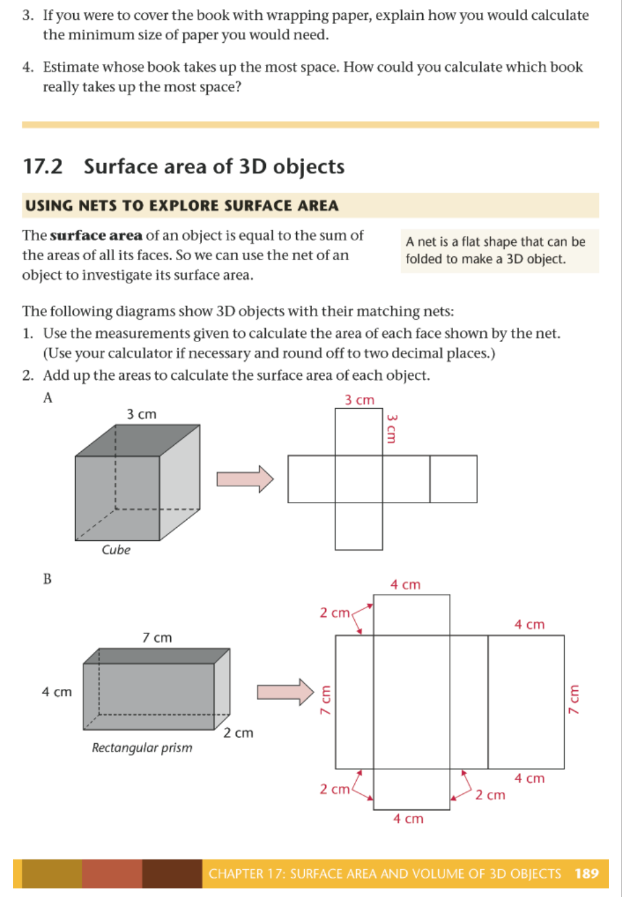
> **[Diagram Context - Textbook_Mathematics_Gr8_Surface-area-and-volume-of-3D-objects.pdf-0013-20.png]**
> This educational graphic features geometry figures illustrating the surface area of 3D objects using nets. It displays 3D solids—specifically a "Cube" labeled with dimensions like "3 cm" and a "Rectangular prism" labeled with dimensions "7 cm", "4 cm", and "2 cm"—connected by horizontal arrows pointing to their corresponding 2D unrolled nets with labeled side lengths in red. Conceptually, the diagram conveys how a 3D object can be decomposed into a flat 2D net, helping learners understand that total surface area is simply the sum of the areas of all individual faces.


MATHEMATICS GRADE 8 TEACHER GUIDE 

###### **Answers** 

- C: Unknown side of the triangle: 5^{2} + 2^{2} = 29 cm^{2} ≈ 5,39 cm 

   - Area of each triangular face =^{1} 2 (4 cm × 5 cm) = 10 cm^{2} 

   - Area of face on which triangular prisms rests = 4 cm × 7 cm = 28 cm^{2} 

   - Area of each of the other two faces = 7 cm × 5,39 cm = 37,73 cm^{2} 

   - Surface area = (2 × 10 cm^{2} ) + (2 × 37,73 cm^{2} ) + 28 cm^{2} 

   - = 20 cm^{2} + 75,46 cm^{2} + 28 cm^{2} = 123,46 cm^{2} 

###### **DEDUCING FORMULAE FOR SURFACE AREAS** 

###### **Teaching guidelines** 

Learners work with a formula that is derived by adding the areas of all the faces of the prism. There is another way to use the formula. See the note on LB page 191. 

###### **Answers** 

1. (a) The third choice: 6 _s_^{2} (b) Consider learners’ answers. 

2. (a) Surface area = 2( _bh_ + _lb_ + _lh_ ) 

   - (b) Consider learners’ answers. A sample answer is given below. 

      - When a rectangular prism is opened flat, it is composed of three sets of two identical rectangles. Two of them are the front and back faces of the prism, and the other four rectangles connect the front and the back faces. 

3. (a) Surface area = Area of two triangular faces (bases) + Area of three rectangles (lateral faces) 

   - (b) Consider learners’ answers. A sample answer is given below. When a triangular prism is opened flat, it is composed of two triangles, the front and back faces, and three rectangles which connect the triangular faces. 

4. Surface area of cube: 6 × (8 mm)^{2} = 6 × 64 mm^{2} = 384 mm^{2} 

   - Surface area of rectangular prism: 

   - 2 × (10 mm × 12 mm) + 2 × (30 mm × 10 mm) + 2 × (30 mm × 12 mm) 

   - = 2 × (120 mm^{2} + 300 mm^{2} + 360 mm^{2} ) = 2 × 780 mm^{2} = 1 560 mm^{2} 

   - Surface area of triangular prism: 

   - 2 ~~(~~^{1} 2 × 12 mm × 9 mm) + (12 mm × 14 mm) + (15 mm × 14 mm) + (9 mm × 14 mm) 

   - = 2(54 mm^{2} ) + 168 mm^{2} + 210 mm^{2} + 126 mm^{2} 

- = 108 mm^{2} + 168 mm^{2} + 210 mm^{2} + 126 mm^{2} = 612 mm^{2} 


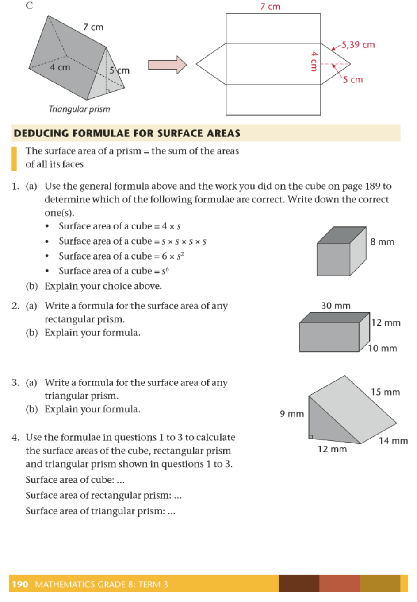
> **[Diagram Context - Textbook_Mathematics_Gr8_Surface-area-and-volume-of-3D-objects.pdf-0014-25.png]**
> This educational graphic is a geometry figure worksheet focusing on calculating the surface area of 3D objects, specifically a triangular prism, cube, and rectangular prism, complete with a 2D net representation. Visible labels include dimensions such as lengths ($7\text{ cm}$, $4\text{ cm}$, $5\text{ cm}$, $8\text{ mm}$, $30\text{ mm}$, $12\text{ mm}$, $10\text{ mm}$, $9\text{ mm}$, $14\text{ mm}$, $15\text{ mm}$, $5,39\text{ cm}$), text headings ("DEDUCING FORMULAE FOR SURFACE AREAS", "Triangular prism"), and numbered exercise questions. Conceptually, it helps students understand that total surface area is the sum of the areas of all individual 2D faces by using nets to deconstruct 3D solids and applying formulas to cubes, rectangular prisms, and triangular prisms.


MATHEMATICS GRADE 8 TEACHER GUIDE 

###### **Teaching guidelines (Note extended from page 189)** 

If you look at the net of a prism, the side faces form a rectangle of which, the length is the perimeter of the prism, and the height is the length of the prism. See the drawings below. 

1.  Rectangular prism 

   - Area of base: 

   - = 5 × 2 

   - Area of side faces: 

   - = 2(5 + 2) × 3 


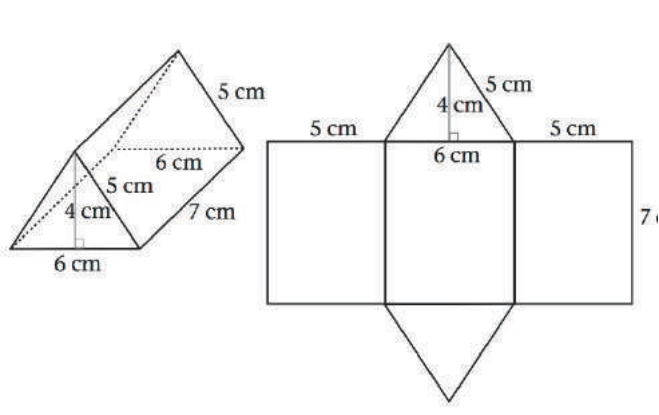
> **[Diagram Context - Textbook_Mathematics_Gr8_Surface-area-and-volume-of-3D-objects.pdf-0015-07.png]**
> The graphic shows a 3D geometry figure of a right triangular prism alongside its corresponding 2D net. Visible labels include linear dimensions with units (4 cm, 5 cm, 6 cm, and 7 cm) and perpendicular height indicator symbols on the triangular faces. Conceptually, this diagram helps learners visualize the relationship between a three-dimensional solid and its two-dimensional surface layout, facilitating the calculation of total surface area by summing the areas of the constituent rectangles and triangles.


   - = perimeter × height 

2. Triangular prism 

   - Area of base: 

   - =^{1} × 6 × 4 cm^{2} 2 

   - Area of side faces: 

   - = (2 × 5 + 6) × 7 cm^{2} 

   - = perimeter × height 

Another way to interpret the formula from the net of a prism is to say: Surface area = 2 × area of the base + the perimeter × the height of the prism 

###### **SURFACE AREA CALCULATIONS** 

###### **Teaching guidelines** 

Learners should use the formulae. Do an example so that they can see how to present their answers. 

###### **Answers** 

1. Surface area: 

   - = 2 × (10 mm × 2 mm) + 2 × (10 mm × 40 mm) + 2 × (2 mm × 40 mm) 

   - = 2 × 20 mm^{2} + 2 × 400 mm^{2} + 2 × 80 mm^{2} 

   - = 40 mm^{2} + 800 mm^{2} + 160 mm^{2} = 1 000 mm^{2} = 10 cm^{2} 

2. to 4. See the answers on LB page 191 alongside. 


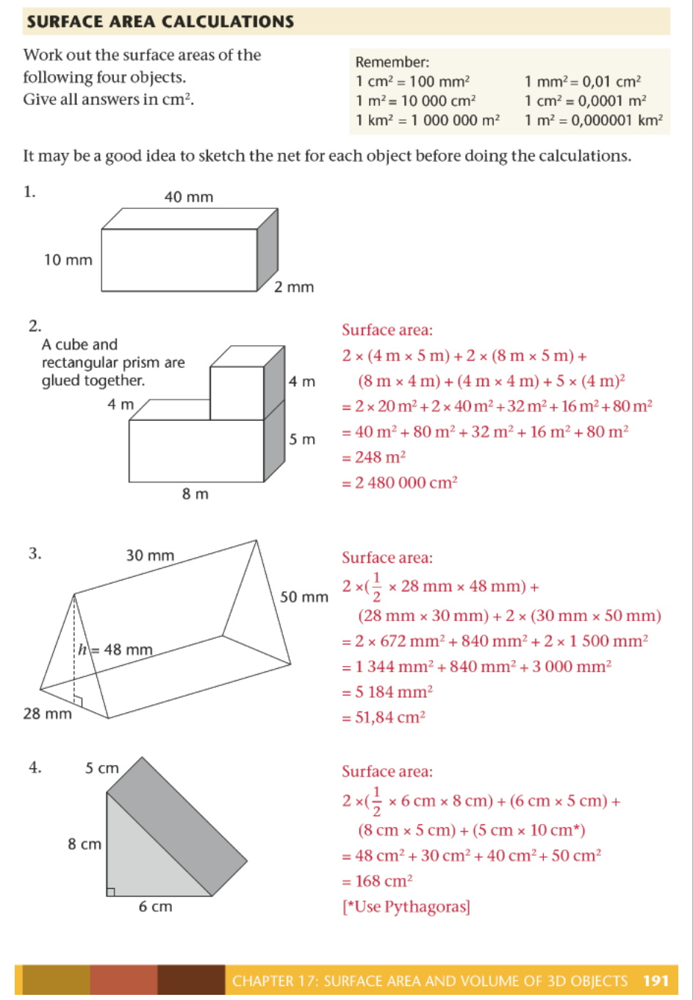
> **[Diagram Context - Textbook_Mathematics_Gr8_Surface-area-and-volume-of-3D-objects.pdf-0015-25.png]**
> This educational graphic is a geometry exercise sheet featuring four 3D objects, including rectangular prisms, a composite shape, and triangular prisms, accompanied by conversion factors and step-by-step surface area calculations. Visible labels include numerical dimensions with units ($\text{mm}$, $\text{cm}$, $\text{m}$), variables such as $h$, and mathematical expressions detailing surface area formulas. The diagram conveys conceptually how to calculate the total surface area of various 3D shapes, including composite objects, by breaking them down into constituent faces and applying unit conversions relevant to the CAPS curriculum.


MATHEMATICS GRADE 8 TEACHER GUIDE 

#### 17.3 Volume of 3D objects 

###### **DERIVING FORMULAE TO CALCULATE VOLUME** 

###### **Teaching guidelines** 

Another way to think about the volume of a prism is to imagine the area of the base as a number of cubes along the length, and this row repeated along the width to cover the base. This is the area of the “floor” of the object, the bottom layer. As more layers are stacked on the bottom one, the height grows. The number of cubic centimetres (or units) grows in multiples of the number in the bottom layer, as you add more layers. 

As learners think of building up the prisms by adding layers, they may see the relationship between the measurements of the prism and its volume. 

Volume = area of base × height 

This formula can be confusing when learners work with a triangular prism as there are two heights to consider – the height of the triangular base and the height (or length) of the prism. Stress this point to help learners avoid making a mistake. 

The formula: volume = area of base × height is the general form of the formula and will work for any prism. What will change when we work with a particular object, is the area of the base. This depends on the shape of the base of the object. For example, the volume of a cylinder will still be given by the area of the base multiplied by the height, but the area of the base will be the area of a circle. 

###### **Misconceptions** 

Learners do not know which height to use when they work with a triangular prism. 

###### **Answers** 

See the formulae on LB page 192 alongside. 


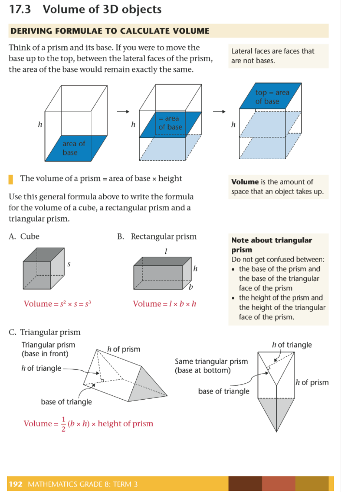
> **[Diagram Context - Textbook_Mathematics_Gr8_Surface-area-and-volume-of-3D-objects.pdf-0016-12.png]**
> The educational graphic is a geometry figure demonstrating the derivation of the volume of 3D objects. It features three-dimensional prism diagrams with visible labels including $h$ (height), $s$ (side), $l$ (length), $b$ (breadth), "area of base", "top", "lateral faces", and formula derivations for a cube ($s^3$), rectangular prism ($l \times b \times h$), and triangular prism ($\frac{1}{2}(b \times h) \times \text{height of prism}$). Conceptually, it conveys how the general volume formula of any prism is derived from multiplying the constant area of its base by its perpendicular height, helping learners distinguish between the dimensions of a base shape and the height of the prism itself.


MATHEMATICS GRADE 8 TEACHER GUIDE 

###### **VOLUME CALCULATIONS** 

###### **Teaching guidelines** 

Once learners understand the formula they can apply it to any object. If the object consists of two joined prisms, as in question 1, they work out the volume of each object and add the two answers to get the volume of the combined object. 

###### **Answers** 

1. to 3. See the answers on LB page 193 alongside. 


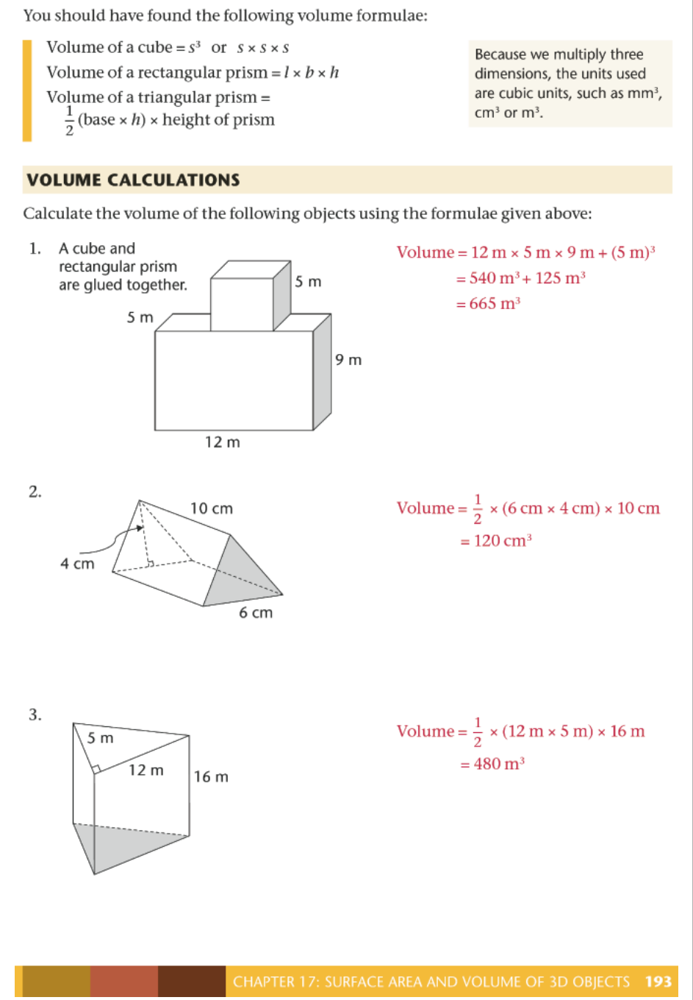
> **[Diagram Context - Textbook_Mathematics_Gr8_Surface-area-and-volume-of-3D-objects.pdf-0017-05.png]**
> This educational graphic presents a geometry resource detailing volume formulas for a cube ($s^3$), a rectangular prism ($l \times b \times h$), and a triangular prism ($\frac{1}{2}(\text{base} \times h) \times \text{height of prism}$), accompanied by three worked numerical examples. The visible labels include dimension variables like length ($12\text{ m}$), breadth ($5\text{ m}$), height ($9\text{ m}, 16\text{ m}$), and side lengths alongside step-by-step red calculation steps yielding cubic units ($\text{m}^3, \text{cm}^3$). Conceptually, the diagram guides FET phase learners through applying algebraic volume formulae to composite and standard 3D objects, demonstrating both addition of volumes and proper dimensional analysis.


MATHEMATICS GRADE 8 TEACHER GUIDE 

#### 17.4 Relationship between surface area and volume 

###### **Teaching guidelines** 

Suppose we want to make a box with a fixed volume, for example 24 m^{3} , but we want to use as little material as possible (in other words, the net must be as small as possible). This means that we want the surface area to be as small as possible. The question that could be asked is: Will the surface area change if the shape of the object changes but the volume remains the same? 

The investigation should help learners answer the question. 

###### **Notes on the questions** 

You could ask learners to investigate the relationship between the surface area and the volume of an object that has as a volume of, for example, 64 cm^{3} . They should find that the possible arrangements of cubic centimetre blocks will be in the prime factors of 64. The arrangement that gives the smallest surface area will be a cube with sides 4 cm. For example, if the measurements are given ( _l_ , _b_ , _h_ ) some of the possible combinations are: 

(64, 1, 1;   32, 2, 1;   16, 4, 1;   16, 2, 2;   8, 8, 1;   8, 4, 2;   8, 2, 4;   4, 4, 4) etc. 

###### **Answers** 

1. (a) See the answers on LB page 194 alongside. 

   - (b) Consider learners’ answers. One possibility is given in the last row of the table shown on LB page 194 alongside. 

2. When the volume is constant, the surface area depends on the shape of the object being considered. 

3. Consider learners’ answers. Two possible answers are given below. 

   - A. length = 2 m; breadth = 1 m; height = 4 m 

   - B. length = 8 m; breadth = 1 m; height = 1 m 


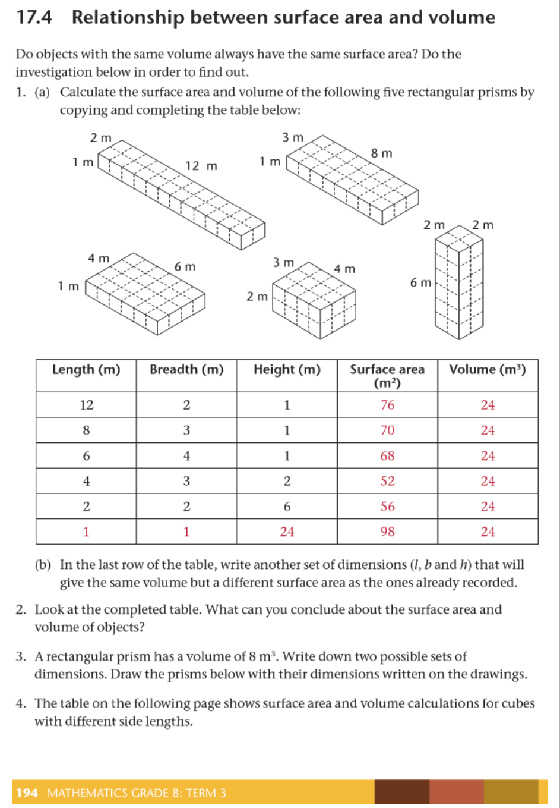
> **[Diagram Context - Textbook_Mathematics_Gr8_Surface-area-and-volume-of-3D-objects.pdf-0018-14.png]**
> This educational graphic features a geometry investigation with five illustrated 3D rectangular prisms and a corresponding data table displaying dimensions, surface area, and volume. The visible labels include measurement units (m, m², m³) and dimension headers: Length (m), Breadth (m), Height (m), Surface area (m²), and Volume (m³). Conceptually, the diagram demonstrates that objects can maintain a constant volume while possessing varying surface areas, supporting high school learners in understanding mathematical relationships in measurement.


MATHEMATICS GRADE 8 TEACHER GUIDE 

###### **Answers** 

4. (a) The surface area increases as the side length of the cube increases. 

   - (b) The volume increases as the side length of the cube increases. 

   - (c) The volume increases more rapidly when the side length of the cube increases. 

   - (d) See the answer on LB page 195 alongside. 

#### 17.5 Converting between cubic units 

###### **HOW MANY CUBES?** 

###### **Teaching guidelines** 

Volume is measured in cubic units, for example cubic centimetres (cm^{3} ) and cubic metres (m^{3} ). 

- A cubic centimetre is a cube with sides that are 1 cm each. 

- A cubic metre is a cube with sides that are 1 m each. 

Make sure that learners know how to read the measurements of a cube or a rectangular prism. 

###### **Misconceptions** 

Some learners find it very difficult to realise that if you increase the sides of a cube the volume will increase threefold. For example, if a cube has side lengths of 2 cm, its volume is (2 cm)^{3} = 8 cm^{3} . Now double the side lengths of the cube. What is the volume of the new cube? Learners find it difficult to believe that the new volume is not 16 cm^{3} , double the previous volume. 

Show learners that the new volume = (new side length)^{3} = (4 cm)^{3} = 64 cm^{3} . 


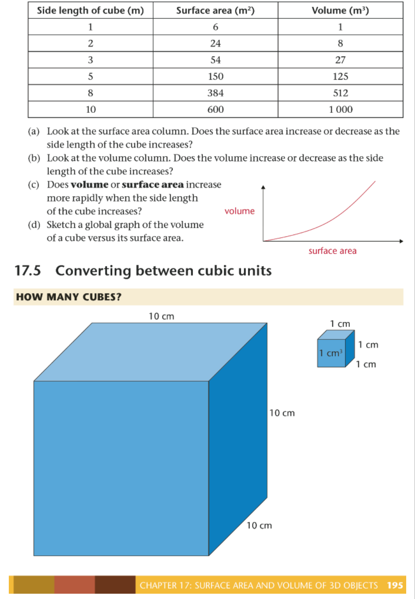
> **[Diagram Context - Textbook_Mathematics_Gr8_Surface-area-and-volume-of-3D-objects.pdf-0019-15.png]**
> The educational graphic presents a geometry table, a set of analytical questions, a non-linear graph, and 3D diagrams of cubes labeled with side length (m), surface area (m²), volume (m³), and dimensions in cm. Visible labels include table headers for "Side length of cube (m)", "Surface area (m²)", and "Volume (m³)", axis labels "volume" and "surface area" on the graph, and dimension measurements like "10 cm" and "1 cm³". Conceptually, this resource helps high school learners understand the mathematical relationships between linear dimensions, surface area, and volume in three-dimensional objects, demonstrating how changes in side length disproportionately affect surface area and cubic capacity.


MATHEMATICS GRADE 8 TEACHER GUIDE 

###### **Answers** 

1. 1 000 cubes 

2. 1 000 cubes 

3. (a) There will be 10 × 10 × 10 = 1 000 cubes of 1 000 cm^{3} 

   - (b) 1 000 × 1 000 cm^{3} = 1 000 000 cm^{3} 

   - (c) 1 000 000 cubes 

4. Neither: they have the same volume. 

   - 100 cm makes a metre, so 100 cm × 100 cm × 100 cm = 1 000 000 cm^{3} which is equivalent to 1 m × 1 m × 1 m = 1 m^{3} . 

5. (a) 1 000 cubes (b) 1 000 mm^{3} 

###### **PRACTISE CONVERTING BETWEEN UNITS** 

###### **Teaching guidelines** 

Learners should be aware that if the answer is to be given in cubic centimetres, for example, all the units have to be in centimetres. Sometimes units have to be converted to one unit. 

Help learners to decide which unit to convert everything to. The chosen unit should make the answer manageable. For example, changing kilometres to centimetres and getting an answer like 14 560 000 cm^{3} is not quite manageable. All units should rather be changed to metres or kilometres, unless the problem demands answers in cubic centimetres. 

###### **Misconceptions** 

Learners do not realise that to change 300 mm^{3} to cubic centimetres they have to divide by 1 000. Their reasoning is: there are 10 mm in a centimetre, so to convert they should divide by 10, where they should rather be reasoning 300 mm^{3} = 300 ÷ (10 × 10 × 10) cm^{3} = 0,3 cm^{3} . 

###### **Answers** 

1. (a) 0,003 cm^{3} (b) 0,045 cm^{3} 

   - (c) 600 000 cm^{3} (d) 1 220 000 cm^{3} 

2. (a) 20 000 mm^{3} (b) 151 000 mm^{3} 

   - (c) 4 700 mm^{3} (d) 89 500 mm^{3} 

3. (a) 0,000009 m^{3} (b) 0,00005 m^{3} 

   - (c) 0,000643 m^{3} (d) 0,001967 m^{3} 

4. (a) 4 000 000 cm^{3} + 68 cm^{3} (b) 12 000 000 cm^{3} + 143 cm^{3} = 4 000 068 cm^{3} = 12 000 143 cm^{3} 


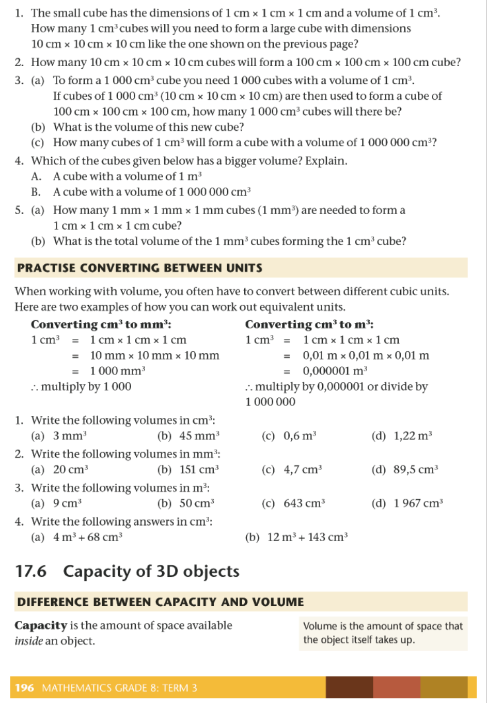
> **[Diagram Context - Textbook_Mathematics_Gr8_Surface-area-and-volume-of-3D-objects.pdf-0020-23.png]**
> The graphic presents a series of mathematical word problems, conversion examples, and definitions related to the volume and capacity of 3D objects. Visible text includes dimensional units such as $\text{cm}^3$, $\text{mm}^3$, and $\text{m}^3$, conversion factors like multiplying by $1\ 000$ or $0{,}000001$, and explicit definitions distinguishing between capacity ("the amount of space available inside an object") and volume ("the amount of space that the object itself takes up"). Conceptually, this content helps students understand the proportional scaling of cubic units, master unit conversions, and differentiate between the internal capacity and external volume of 3D geometric shapes.


MATHEMATICS GRADE 8 TEACHER GUIDE 

#### 17.6 Capacity of 3D objects 

###### **DIFFERENCE BETWEEN CAPACITY AND VOLUME** 

###### **Teaching guidelines** 

There is often confusion when people work with the concepts of volume and capacity. The volume is the amount of space an object takes up, while capacity is the amount of the content a container can hold when filled to capacity. 

An object can have both volume and capacity. 

Volume is measured in cubic centimetres (cm^{3} ) and capacity is measured in millilitres. A millilitre is the content of a cube with sides of 1 cm. For example: a measuring cup has a capacity of 250 ml, but there is a volume of 125 ml of water in the cup. 

###### **Answers** 

1. (a) Volume = 6 000 cm^{3} 

   - (b) Sides = 2,5 cm; bottom = 2 cm 

   - (c) Capacity = 25 cm × 15 cm × 8 cm = 3 000 cm^{3} 

   - (d) 3 000 cm^{3} 

2. Capacity = 28 cm × 18 cm × 9 cm = 4 536 cm^{3} = 4 536 ml = 4,536 ℓ 

###### **DISPLACEMENT AND MORE CAPACITY CALCULATIONS** 

###### **Teaching guidelines** 

This method can be used to determine the volume of irregular objects (for example, a stone) or of objects like marbles of which the volume is difficult to find otherwise. 

###### **Answers** 

1. (a) Capacity = 8 cm × 2 cm × 5 cm 

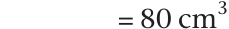

   - = 80 ml 

- (b) Capacity = 10 m × 17 m × 8 m 

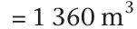

   - = 1 360 kl 

2. Consider learners’ answers. 


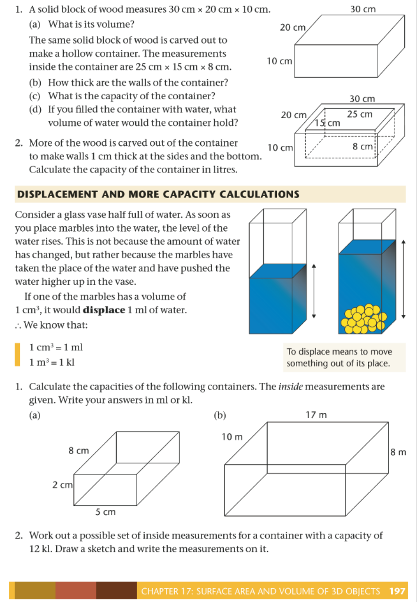
> **[Diagram Context - Textbook_Mathematics_Gr8_Surface-area-and-volume-of-3D-objects.pdf-0021-23.png]**
> This educational graphic is a geometry page featuring mathematical word problems, 3D rectangular prism diagrams, and an illustration of water displacement with marbles. The visible labels include dimensions ($30\text{ cm} \times 20\text{ cm} \times 10\text{ cm}$, $25\text{ cm} \times 15\text{ cm} \times 8\text{ cm}$, $8\text{ cm} \times 5\text{ cm} \times 2\text{ cm}$, $17\text{ m} \times 10\text{ m} \times 8\text{ m}$), conversion formulas ($1\text{ cm}^3 = 1\text{ ml}$, $1\text{ m}^3 = 1\text{ kl}$), and vertical double-headed arrows indicating water level changes. Conceptually, this resource helps high school learners calculate volume and capacity of rectangular prisms, determine wall thicknesses of hollow containers, and apply the principle of water displacement to convert between cubic units and liquid capacity measurements.


MATHEMATICS GRADE 8 TEACHER GUIDE 

## 5. Authentic Exam Question Archetypes & Mark Allocations
*(Extracted from official CAPS examination papers to guide marking, pacing, and rubric design)*

### Archetype 1: QUESTION 2
- **Source Paper:** `Gr8_Mathematics_Exam_13.pdf`
- **Total Mark Allocation:** **[43 Marks]** (Sub-questions: 3, 3, 2, 2, 3 marks)
- **Recommended Time:** **52 Minutes** (Pacing: ~1.2 min/mark | *Calibrated to Official CAPS Paper Pace (1.2 min/mark)*)
- **Assessment Mode Calibration:** Timed Exam Simulation: 52 min countdown (Pacing Checkpoint: 39 min)
- **Cognitive / Marking Strategy:** NSC Standard (Method Marks [M], Accuracy Marks [A], Carry-Over [CA])

#### Question Prompt & Working:
```text
QUESTION 2 
 
 
2.1. 
Determine the length of b. 
 
 
 
 
 
 
 
 
 
 
 
 
 
 
 
 
(3) 
2.2 
Jaco wants to build a cement path of one meter (1m) width around a rectangular 
swimming pool with dimensions, 7m × 5m.  See sketch below. 
 
              A                                                                                                            B 
 
 
 
 
 
 
5m 
 
 
 
 
 
               D                                                                                                           C 
 
                                                                  7m 
 
 
 
 
 
 
 
 
 
 
 
 
 
 
 
 
 
 
 
 
Do the following calculations to help Jaco to determine the total area of the cement path: 
 
 
 
 
 
 
2.2.1 
Determine the length and width of rectangle ABCD, and then its ar...
```

### Archetype 2: QUESTION 9
- **Source Paper:** `Gr8_Mathematics_Exam_4.pdf`
- **Total Mark Allocation:** **[12 Marks]** (Sub-questions: 3, 3, 2, 1, 3 marks)
- **Recommended Time:** **14 Minutes** (Pacing: ~1.2 min/mark | *Calibrated to Official CAPS Paper Pace (1.2 min/mark)*)
- **Assessment Mode Calibration:** Timed Exam Simulation: 14 min countdown (Pacing Checkpoint: 10 min)
- **Cognitive / Marking Strategy:** NSC Standard (Method Marks [M], Accuracy Marks [A], Carry-Over [CA])

#### Question Prompt & Working:
```text
QUESTION 9 
9.1 
Study the shape below and answer the questions that follow. 
                                  20cm 
                                                                 
   10cm 
                                            6cm 
                        9cm 
 
 
9.1.1 
Calculate the perimeter of the shape. 
(3) 
 
9.1.2 
Calculate the area of the shape. 
(3) 
9.2 
Below is a closed rectangular box. 
 
 
                          2m 
 
                                3m 
                                                          6m 
 
 
 
9.2.1 
Calculate the volume of the box. 
(2) 
 
9.2.2 
Draw a net of the box. 
(1) 
 
9.2.3 
Calculate the surface area of the box. 
(3) 
 
 
 
 
[12]
```

### Archetype 3: QUESTION 8
- **Source Paper:** `Gr8_Mathematics_Exam_2.pdf`
- **Total Mark Allocation:** **[13 Marks]** (Sub-questions: 4, 2, 3, 1, 1 marks)
- **Recommended Time:** **16 Minutes** (Pacing: ~1.2 min/mark | *Calibrated to Official CAPS Paper Pace (1.2 min/mark)*)
- **Assessment Mode Calibration:** Timed Exam Simulation: 16 min countdown (Pacing Checkpoint: 12 min)
- **Cognitive / Marking Strategy:** NSC Standard (Method Marks [M], Accuracy Marks [A], Carry-Over [CA])

#### Question Prompt & Working:
```text
QUESTION 8 
8.1  Find the area of a rectangular picture frame with outer dimensions 1       by 
         1       and the perimeter of inner dimensions 1     by 10       
 
 
 
  
 
 
 
 
                                                                                     
 
 
 
      (4)    
                               
 
 
 
 
 
 
8.2    A medicine measuring cup has a capacity of    . How much medicine 
           measures of cough medicine are there in a bottle that contains 0   litres?         (2) 
8.3         Calculate the surface area of this matchbox.  
 
                           (3)  
 
  
 
 
 
                 
 
8.4 
 
18,9cm 
13,9cm 
Grade 8 Mathematics Revision Exemplar Papers 
Page 77 
 
8.4.1   Name the solid in Figure 1  
 
 
 
 
 
                 (1) 
8.4.2  Name the ...
```
