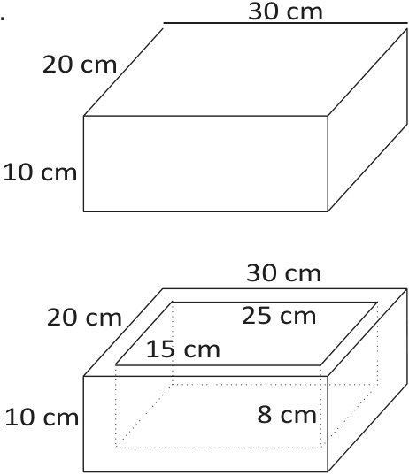
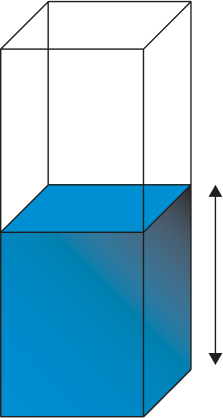
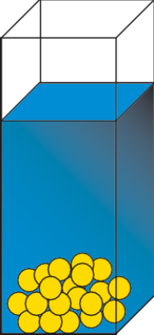
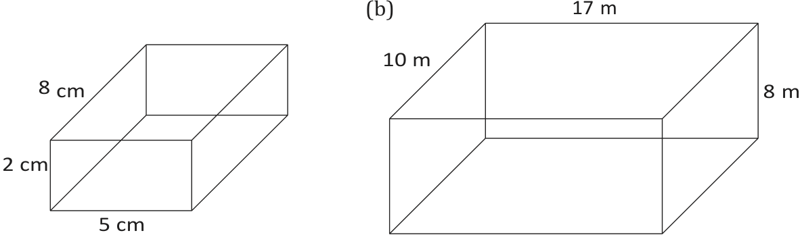

# CHAPTER 7

## Probability

<!-- DIAGRAM_PLACEHOLDER: diagram -->

### Chapter Contents

| Section | Topic | Page |
| :--- | :--- | :--- |
| **7.1** | *Introduction and key concepts* | 240 |
| **7.2** | *Prediction* | 242 |
| **7.3** | *Fair and unfair games* | 245 |
| **7.4** | *Single and combined outcomes* | 246 |
| **7.5** | *Weather predictions* | 252 |
| **7.6** | *End of chapter activity* | 254 |

---

# 7
# Probability

## 7.1 Introduction and key concepts
EMG4Y

Probability is the study of the chances of things happening in future. We often make statements like "I am sure it will never happen"; "I have no chance of winning the prize!", "I am sure it is going to snow this year." Each of the statements tries to predict a future event.

In this chapter we will learn about:
* the probabilty scale and making predicitions.
* games of chance and fair and unfair games.
* the difference between an event and an outcome.
* tree diagrams and two-way tables.
* weather predictions.

### The probability scale
EMG4Z

To describe the probability that something will happen we can use a probability scale. This scale is a continuous line that starts with impossible events at the left-hand end and ends with certain events at the right-hand end. All probabilities must fall somewhere on this line. An event that is described as "impossible" is one that we know will never happen, such as having 8 days in one week. An event is described as "certain" if we know that it will definitely happen, such as having a Monday in a week. Between the two ends of the line are word descriptions: very unlikely, unlikely, even chance, likely, very likely.

We can also give numbers to the probabilities on this scale. Remember, though, that each word description covers a range of continuous probabilities on the scale, and it doesn't match a particular number exactly. The word descriptions used describe the mathematical meaning.

| 0 | 0,2 | 0,4 | 0,5 | 0,6 | 0,8 | 1 |
| :--- | :--- | :--- | :--- | :--- | :--- | :--- |
| Impossible | Very unlikely | Unlikely | Even chances | Likely | Very likely | Certain |

> **[Diagram Context - Textbook_Mathematics_Gr8_Surface-area-and-volume-of-3D-objects.pdf-0001-03.png]**
> This geometry figure compares a 2D shape with a 3D object using spatial axes. The diagram displays directional arrows and labels for "length", "breadth", and "height", alongside the captions "2D shape" and "3D object". Conceptually, it illustrates the distinction between two-dimensional figures defined only by length and breadth, and three-dimensional objects that additionally incorporate height, forming the foundational spatial concepts taught in Senior Phase Mathematics.

> **[Diagram Context - Textbook_Mathematics_Gr8_Surface-area-and-volume-of-3D-objects.pdf-0001-11.png]**
> This graphic is a simplified 3D line drawing representing a stack of paper topped with a central arrangement of geometric shapes (a rectangle, circle, and triangle). The visible features include a layered rectangular pad or book base and three overlapping shaded shapes in the center without text labels or arrows. Conceptually, this abstract diagram can be used in foundational design or technology lessons to illustrate spatial relationships, layering, or composition on a flat surface.

---

### Worked Example 1: Working with the probability scale

#### QUESTION
Give each of these events a word description from the probability scale.

1. What are the chances of winning the Lottery if you buy a ticket every week for two months?
2. How likely is it that you will pass Maths Literacy this year?
3. What are the chances of rainfall in your area today?
4. What are the chances of a pregnant woman having a male child?

#### SOLUTION

1. It is highly unlikely that a particular person will win the Lottery.
2. Your answer here would depend on your personal situation.
3. You can give your own answer, depending on the current weather and forecasts.
4. A $50\%$ (equal) chance.

---

Probabilities between $0$ and $1$ can be written as decimals, common fractions or percentages. So our probability scale could look like this:

> **[Diagram Context - Textbook_Mathematics_Gr8_Surface-area-and-volume-of-3D-objects.pdf-0002-09.png]**
> This educational graphic shows a three-dimensional geometry figure of a cube with a side length label of "3 cm" at the top and the text "Cube" at the bottom. The visual represents a regular hexahedron used for teaching measurement and calculating surface area or volume in the CAPS curriculum.

---

### Activity 7 – 1: Becoming familiar with the probability scale

Work in a group to answer the following questions about the probability scale:

1. 
    a) Think about five events that have different chances of happening.
    b) Draw a probability scale with all the word labels written on it.
    c) Discuss where these events should go on the probability scale and come to an agreement in your group. You might find that different people have different ideas about what the words on the scale mean.
    d) Write your five events on this probability scale.

> **[Diagram Context - Textbook_Mathematics_Gr8_Surface-area-and-volume-of-3D-objects.pdf-0002-10.png]**
> This geometry figure illustrates the net of a cube, composed of six identical square faces connected in a cross-like layout alongside a single pink horizontal arrow pointing towards the left face. Aligned with the CAPS Mathematics curriculum for spatial reasoning, it visually demonstrates how a three-dimensional solid can be unfolded into a two-dimensional surface and aids learners in visualizing surface area calculations and spatial transformations.

> **[Diagram Context - Textbook_Mathematics_Gr8_Surface-area-and-volume-of-3D-objects.pdf-0002-11.png]**
> This graphic is a 3D geometry figure of a rectangular prism labeled with dimensions 7 cm, 4 cm, and 2 cm, along with the text label "Rectangular prism" and letter "B". It illustrates a right rectangular prism with designated length, height, and width values to support learners in calculating surface area and volume.

> **[Diagram Context - Textbook_Mathematics_Gr8_Surface-area-and-volume-of-3D-objects.pdf-0002-12.png]**
> The graphic shows a 2D geometry net of a rectangular prism (cuboid) alongside a single light pink horizontal arrow pointing towards the left edge of the net. The visible components include interconnected rectangular outlines forming a standard unfolding of a three-dimensional box with six faces. This diagram conceptually conveys spatial visualization and surface area calculation in senior phase mathematics by demonstrating how a 3D rectangular prism can be flattened into a 2D composite shape made of six constituent rectangles.

---

2. Place these events on your probability scale:
   a) A one in ten chance of pulling a red T-shirt out of your cupboard without looking.
   b) An $80\%$ chance of rain.
   c) A $\frac{1}{20}$ chance of having twins.
   d) A one in a million chance of being struck by lightning.

3. Write these probabilities as decimals and as percentages:
   a) $\frac{1}{4}$
   b) $\frac{4}{5}$
   c) $\frac{1}{20}$
   d) $\frac{3}{100}$
   e) $\frac{6}{7}$

4. Discuss whether you think it is easier to describe a probability using a number or a word description.

Think you got it? Get this answer and more practice on our Intelligent Practice Service

1. $24\text{KW}$ \quad 2. $24\text{KX}$ \quad 3. $24\text{KY}$ \quad 4. $24\text{KZ}$

---

## 7.2 Prediction

### Games of chance

> **[Diagram Context - Textbook_Mathematics_Gr8_Surface-area-and-volume-of-3D-objects.pdf-0003-00.png]**
> This graphic is a 3D geometry figure of a triangular prism labeled with the dimensions 7 cm, 4 cm, and 5 cm, alongside a right-angle indicator on the triangular base. The visible labels include the letter "C" in the upper-left corner and the text "Triangular prism" at the bottom. Conceptually, this diagram helps high-school learners visualize the 3D structure of a right triangular prism and apply formulas to calculate its surface area and volume using the provided linear dimensions.

Probability games, for example using coins and dice, help us to understand probability better. These games work with random events, so they are a useful way to learn how to use probabilities to predict events.

> **DEFINITION:** *Frequency*
> 
> The number of times that something happens.

> **[Diagram Context - Textbook_Mathematics_Gr8_Surface-area-and-volume-of-3D-objects.pdf-0003-01.png]**
> This educational graphic is a physical sciences ray optics diagram showing a large horizontal arrow pointing towards a triangular prism shape. The visible elements include a shaded directional arrow on the left and a triangular geometric outline with a vertical surface on the right. Conceptually, it illustrates the propagation of light waves or incident rays approaching a refracting medium, supporting the study of reflection, refraction, and wave fronts in high school physics.

> **[Diagram Context - Textbook_Mathematics_Gr8_Surface-area-and-volume-of-3D-objects.pdf-0003-15.png]**
> This geometry figure is a 3D rectangular prism (cuboid) shaded in grey to represent a solid block. Visible measurements include a length of 30 mm, a height of 12 mm, and a width of 10 mm. This diagram conveys spatial reasoning and measurement concepts, enabling high school students to calculate surface area, volume, and unit conversions in millimeters.

> **[Diagram Context - Textbook_Mathematics_Gr8_Surface-area-and-volume-of-3D-objects.pdf-0003-19.png]**
> This geometry figure depicts a triangular prism with visible dimensions labelled as 9 mm, 12 mm, 14 mm, and 15 mm, along with a right-angle indicator on the triangular cross-section. It illustrates a 3D solid shape, helping FET phase learners understand surface area and volume calculations by identifying base dimensions, height, and length.

---

## Chapter 7. Probability

### Definitions

**DEFINITION: Random**  
When something happens without being made to happen on purpose.

**DEFINITION: Trial**  
A test. Throwing a dice or tossing a coin are examples of a trial.

**DEFINITION: Fair**  
Treated equally, without having an advantage or disadvantage.

---

### Random events and equal chances

Two important points make games of chance useful for learning about probability:

1. First, the events in probability experiments are **random**. This means that they cannot be deliberately influenced in any way (provided that the game is fair!). There is no way of making a fair dice fall on one number rather than another.
2. Second, each possible outcome has an **equal chance** of occurring. All the numbers on a dice have exactly the same chance of coming up when the dice is tossed: i.e., a $1$ in $6$ chance.

Because of these two facts, we know that when we toss a coin, we have a $50\%$ or $0,5$ or $\frac{1}{2}$ chance of getting heads, and a $50\%$ or $0,5$ or $\frac{1}{2}$ chance of getting tails.

Similarly, on a dice, there is a $1$ in $6$ chance of throwing a $1$; $2$; $3$; $4$; $5$ or $6$.

This chance is called the **theoretical probability**.

**DEFINITION: Theoretical probability**  
The calculated probability, not the actual result.

When you do a probability experiment, such as tossing a coin a number of times, you find the **relative frequency** of each outcome. For example, if you toss a coin $10$ times and you get Heads $3$ times, then the relative frequency is simply $3$ in $10$ or $\frac{3}{10}$.

---

### The difference between an event and an outcome

An **outcome** is the result of a single trial. For example, if I roll a dice, one outcome would be a $6$. 

An **event** is a collection of one or more outcomes. Using the example of rolling a dice, an event might be rolling an even number. Thus this event consists of any of the outcomes $2$; $4$; $6$.

> **[Diagram Context - Textbook_Mathematics_Gr8_Surface-area-and-volume-of-3D-objects.pdf-0004-04.png]**
> This educational graphic displays four 3D geometry figures, including a rectangular prism, a composite shape formed by a cube and rectangular prism, a triangular prism, and a right-angled triangular prism. The diagrams feature numerical dimension labels such as length, width, height, and perpendicular height $h$, accompanied by right-angle symbols and descriptive text like "A cube and rectangular prism are glued together." Conceptually, this helps learners practice calculating surface area and volume of basic and composite 3D objects as prescribed by the CAPS mathematics curriculum.

---

## Activity 7 – 2: Experimenting with games of chance

1. Work in groups to carry out the following experiment and record your results. You will need coins and dice for each group.

Each of you should flip a coin $20$ times. Record your results in a tally table like this:

| | Tally | Total |
|---|---|---|
| **H** | | |
| **T** | | |

a) Calculate the relative frequency of Tails, by working out the fraction of $20$, the decimal fraction and the percentage.
b) How does this compare to the theoretical probability of $50\%$?
c) Now put all your results together. Work out the relative frequency of Tails as:
   i. a fraction out of $100$.
   ii. a decimal fraction.
   iii. a percentage.
d) Do the combined results get closer to $50\%$ than your results on their own?
e) What was the relative frequency of Heads in each case?

You should find that the relative frequency gets closer to the theoretical probability when you increase the number of throws. Each result is caused by chance, and eventually the experiment will reflect the theoretical chance.

2. 
   a) What is the theoretical probability for each outcome when you throw a dice? In other words, what fraction describes how often you expect to get each number?
   b) Draw up a table for all the possible outcomes for throwing a dice.
   c) Throw the dice $50$ times and keep a tally of the results.
   d) Calculate the relative frequency of each outcome.
   e) How do the answers in d) compare to the expected probability in a)?

---

Think you got it? Get this answer and more practice on our Intelligent Practice Service

1. 24M2 $\quad$ 2. 24M3

> **[Diagram Context - Textbook_Mathematics_Gr8_Surface-area-and-volume-of-3D-objects.pdf-0005-03.png]**
> This graphic is a geometry figure illustrating the concept of volume for right prisms. The visible labels include height variable $h$, "area of base", and " = area of base" with horizontal blue cross-sections and an arrow indicating translation or slicing. Conceptually, it demonstrates that any right prism maintains a uniform cross-sectional area equal to its base along its entire height $h$, serving as the geometric foundation for calculating volume ($V = \text{Area of base} \times h$).

www.everythingmaths.co.za $\quad$ m.everythingmaths.co.za

> **[Diagram Context - Textbook_Mathematics_Gr8_Surface-area-and-volume-of-3D-objects.pdf-0005-05.png]**
> This geometry figure illustrates a three-dimensional rectangular prism with parallel cross-sectional layers. Visible labels include the variable "$h$" representing height and the text "top = area of base" highlighting the uniform cross-sectional area. Conceptually, this diagram demonstrates that the volume of a right prism is calculated by multiplying the area of the base by the perpendicular height ($V = \text{Area}_{\text{base}} \times h$).

> **[Diagram Context - Textbook_Mathematics_Gr8_Surface-area-and-volume-of-3D-objects.pdf-0005-09.png]**
> The graphic shows a geometry figure comprising 3D solid shapes labeled A. Cube and B. Rectangular prism. Diagram A displays a cube with a side length labeled $s$, while Diagram B displays a rectangular prism with dimensions labeled length ($l$), height ($h$), and breadth ($b$). Conceptually, this diagram helps learners identify the key structural components of standard right prisms and provides the foundational variables required for calculating surface area and volume in CAPS-aligned mathematics.

> **[Diagram Context - Textbook_Mathematics_Gr8_Surface-area-and-volume-of-3D-objects.pdf-0005-14.png]**
> This geometry figure illustrates two 3D representations of a triangular prism shown from different orientations. Visible labels include "C. Triangular prism," "h of prism," "h of triangle," "base of triangle," and descriptive text such as "(base in front)" and "(base at bottom)" with corresponding arrows indicating perpendicular height and base dimensions. For a high school student studying mathematics, the diagram conceptually clarifies how to correctly identify the base and perpendicular heights of a 3D solid regardless of its orientation in space, which is essential for calculating surface area and volume.

---

# Activity 7 – 3: More games of chance

1. Most dice are cubes, which means that they have six identical faces. It is also possible to get dice with different numbers of faces. As long as all of the faces are the same shape and size, the dice should still be fair. The photograph below shows some dice with 8 faces.
   a) List the possible outcomes when throwing one of these dice.
   b) What are the theoretical chances of throwing a "7" on one of these dice?
   c) Is it more likely that you will get an even number on these dice than on normal 6-sided dice? Explain.

2. Work in two groups to carry out a new probability experiment. Colour in some paper disks red and blue. One group should make 8 red disks and 4 blue disks. The other should make 4 red disks and 4 blue disks.
   a) Put the disks into a closed box or bag and take turns to draw a disk out and note down which it is. (Remember to put the disk back each time.)
   b) Draw up a table and record your results.
   c) Write a few sentences to describe the difference in the two groups' results.

---

## 7.3 Fair and unfair games

**EMG54**

Do you think games of chance are always fair?

So far all of the games that we have looked at are fair because you have an equal chance of winning and losing. But some games are designed to be unfair. Do gamblers have a good chance of winning? Are you more likely to win if you are luckier?

Many games of chance are designed to make one person have a better chance of winning that the other. Every now and then, the loser will win, which gives them confidence to carry on playing! However, if the game is weighted towards one player...

> **[Diagram Context - Textbook_Mathematics_Gr8_Surface-area-and-volume-of-3D-objects.pdf-0006-06.png]**
> This geometry figure shows a composite 3D object formed by gluing a smaller cube on top of a larger rectangular prism. Visible labels include numerical dimensions and units indicating side lengths (5 m, 9 m, 12 m) alongside the introductory text: "1. A cube and rectangular prism are glued together." Conceptually, this diagram helps high school students practice calculating surface area and volume of composite objects by combining measurements of individual 3D shapes.

> **[Diagram Context - Textbook_Mathematics_Gr8_Surface-area-and-volume-of-3D-objects.pdf-0006-07.png]**
> This educational graphic displays a 3D geometry figure of a triangular prism, labelled with the number "2." Visible dimensions include a length of 10 cm, a base side of 6 cm, and a perpendicular height of 4 cm indicated with a dotted line and right-angle symbol pointed to by an arrow, alongside one shaded triangular face. Conceptually, this diagram helps high school learners practice calculating surface area and volume by identifying the base, height, and length dimensions of a right triangular prism.

> **[Diagram Context - Textbook_Mathematics_Gr8_Surface-area-and-volume-of-3D-objects.pdf-0006-09.png]**
> The graphic is a 3D geometry figure representing a right triangular prism with a shaded base. Visible labels include linear dimensions of 5 m, 12 m, and 16 m, alongside a right-angle symbol indicating perpendicular sides on the triangular cross-section. Conceptually, this diagram helps high school learners practice calculating surface area and volume by identifying the base area and perpendicular height of a composite 3D object.

---

then that person will always win in the end.

When you know the chance of a particular event, then you can make predictions about the probability of it happening. A fair game is a game in which there is an equal chance of winning or losing. We can say that if a game is fair then the probability of winning is equal to the probability of losing.

If you change the rules, you can make the game less fair. For example, if someone wins a game of dice only if they get a $3$, is it a fair game?

In the next activity you will make your own simple games and decide which rules give a player a good chance of winning, which games are fair or unfair and why.

---

### Activity 7 - 4: Fair and unfair games

1. In this activity you need to invent fair and unfair games. Invent your two games using a single dice. You must explain clearly how a person can win the game. Make:
   * a) a fair game.
   * b) an unfair game.

2. Write a paragraph explaining how your games work.

3. Which of these games is more likely to be used by a person who is planning to make a lot of money out of the game? Why?

Think you got it? Get this answer and more practice on our Intelligent Practice Service

1. 24M6 $\quad$ 2. 24M7 $\quad$ 3. 24M8

[www.everythingmaths.co.za](www.everythingmaths.co.za) | [m.everythingmaths.co.za](m.everythingmaths.co.za)

---

## 7.4 Single and combined outcomes (EMG55)

### Single outcomes (EMG56)

In this section we will explain and show how to draw a tree diagram. If we flip a coin there are two possible outcomes. There is a $\frac{1}{2}$ chance of getting Heads and a $\frac{1}{2}$ chance of getting Tails. Representing this in a tree diagram would look like this:

> **[Diagram Context - Textbook_Mathematics_Gr8_Surface-area-and-volume-of-3D-objects.pdf-0007-03.png]**
> The graphic shows five 3D rectangular prism geometry figures, each subdivided into a grid with dimensions labelled in meters ($1\text{ m}$, $2\text{ m}$, $3\text{ m}$, $4\text{ m}$, $6\text{ m}$, $8\text{ m}$, and $12\text{ m}$). It visually demonstrates how different rectangular prisms can maintain a constant volume (or differing surface-to-volume ratios) while having varying lengths, widths, and heights. For CAPS mathematics learners, this diagram reinforces spatial reasoning, volume calculation ($V = \text{l} \times \text{b} \times \text{h}$), and the relationship between dimensions and surface area in 3D shapes.

---

# Chapter 7: Probability

> **[Diagram Context - Textbook_Mathematics_Gr8_Surface-area-and-volume-of-3D-objects.pdf-0008-07.png]**
> This educational graphic displays two contrasting geometry figures, specifically a large cube with dimensions of 10 cm on each side and a much smaller cube measuring 1 cm on each side with a volume label of $1\text{ cm}^3$. Visible labels include side length measurements of "10 cm" and "1 cm". Conceptually, this diagram visually demonstrates the relationship between cell size, surface area, and volume to help high school Life Sciences learners understand why larger organisms require specialized transport and exchange systems rather than relying solely on diffusion.

If we are rolling a dice the tree diagram would look like this. There is a $\frac{1}{6}$ chance of getting each number.

## Combined outcomes

In this section we will use two outcomes to create more interesting games. To make sure we list all possible outcomes of the two events, we use two tools called tree diagrams and two-way tables.

Lets take these two situations mentioned above and combine their outcomes. I.e. we are going to flip the coin once and throw the dice once. We now have a **combined event**.

When we use more than one object or we repeat an experiment, we call this a **compound event**. For example, we could get Heads on the coin and a 2 on the dice and we could write this result as H2.

Now we need to use a different process for listing all the possible outcomes.

### Tree diagrams of combined outcomes

Let's look at how a tree diagram is used to show combined outcomes.

---

## Worked example 2: Using a tree diagram for combined outcomes

### QUESTION

The tree diagram below shows all the possible outcomes for tossing a coin and then throwing a dice.

| Coin | Dice | Outcomes | Probability |
| :---: | :---: | :---: | :---: |
| Heads | 1 | H1 | $\frac{1}{12}$ |
| | 2 | H2 | $\frac{1}{12}$ |
| | 3 | H3 | $\frac{1}{12}$ |
| | 4 | H4 | $\frac{1}{12}$ |
| | 5 | H5 | $\frac{1}{12}$ |
| | 6 | H6 | $\frac{1}{12}$ |
| Tails | 1 | T1 | $\frac{1}{12}$ |
| | 2 | T2 | $\frac{1}{12}$ |
| | 3 | T3 | $\frac{1}{12}$ |
| | 4 | T4 | $\frac{1}{12}$ |
| | 5 | T5 | $\frac{1}{12}$ |
| | 6 | T6 | $\frac{1}{12}$ |

1. How many possible outcomes are there?
2. What is the probability of getting each outcome? Write this probability as a fraction, a decimal and a percentage.
3. How many possible outcomes out of the $12$ include getting an even number on the dice?
4. How many possible outcomes out of the $12$ include getting Tails and an even number?
5. How many possible outcomes out of the $12$ include getting a $5$ on the dice?

---

## SOLUTION

1. There are $12$ possible outcomes altogether.
2. The probability is $\frac{1}{12} = 0,08 = 8\%$.
3. $\text{H2; H4; H6; T2; T4; T6}$ - six of them.
4. $\text{T2; T4; T6}$ - three possible outcomes.
5. $\text{H5}$ and $\text{T5}$ - two possible outcomes.

---

## Using a two-way table to show combined outcomes

A two-way table (also known as a contingency table) works in a similar way to a tree diagram. We write the outcomes of one event in rows and the outcomes of the other event in columns.

For example, this table shows all the possible combinations for tossing a coin twice.

| | H | T |
|---|---|---|
| **H** | H, H | H, T |
| **T** | T, H | T, T |

So each block in the table will show a possible outcome of the combined events. Let's look at a worked example to understand this better.

---

### Worked example 3: Using a two-way table for combined outcomes

#### QUESTION

1. Draw up a two-way table to show all the possible outcomes for tossing a red dice and a blue dice.
2. How many possible outcomes are there?
3. Now answer the following:
   a) What is the chance of rolling a $3$ on the blue dice (and any number on the red dice)?
   b) Write the probability of getting a $5$ on the blue dice as a:
      i. fraction.
      ii. decimal fraction (round off your answer to $2$ decimal places).
      iii. percentage (round off your answer to $2$ decimal places).

---

c) What is the chance of rolling a 4 on the red dice and a 2 on the blue dice?

4. What is the chance, in a single roll of both dice, of you getting a 1 and a 2 of either colour?

## SOLUTION

1. For tossing a red dice and a blue dice we would have:

| Blue / Red | R1 | R2 | R3 | R4 | R5 | R6 |
| :--- | :--- | :--- | :--- | :--- | :--- | :--- |
| **B1** | (B1; R1) | (B1; R2) | (B1; R3) | (B1; R4) | (B1; R5) | (B1; R6) |
| **B2** | (B2; R1) | (B2; R2) | (B2; R3) | (B2; R4) | (B2; R5) | (B2; R6) |
| **B3** | (B3; R1) | (B3; R2) | (B3; R3) | (B3; R4) | (B3; R5) | (B3; R6) |
| **B4** | (B4; R1) | (B4; R2) | (B4; R3) | (B4; R4) | (B4; R5) | (B4; R6) |
| **B5** | (B5; R1) | (B5; R2) | (B5; R3) | (B5; R4) | (B5; R5) | (B5; R6) |
| **B6** | (B6; R1) | (B6; R2) | (B6; R3) | (B6; R4) | (B6; R5) | (B6; R6) |

So, for example, (B1; R3) represents rolling a 1 on the blue dice and a 3 on the red dice.

2. There are 36 possible outcomes.

3. 
   a) The chance is 1 in 6 or $\frac{1}{6}$.
   
   b)
      i. $\frac{1}{6}$
      ii. $0{,}17$
      iii. $16{,}67\%$

   c) There is only one block on the table for this: (B2; R4), so there is a 1 in 36 chance of this outcome.

4. To get a 1 and a 2: could be (B1; R2) or (B2; R1) [Note: context implies either order such as (B1; R2) or (B2; R1)], so there are two possible outcomes and hence a 2 in 36 chance. This simplifies to 1 in 18 or $\frac{1}{18}$.

---

## Activity 7 – 5: Calculating combined outcomes

1. Look at the table given for all the possible outcomes for tossing two coins.

| | H | T |
| :--- | :--- | :--- |
| **H** | (H, H) | (H, T) |
| **T** | (T, H) | (T, T) |

a) How many possible outcomes are there altogether?

b) How many possible outcomes are there for getting two Heads (H; H)?

c) What is the probability of getting two Heads?

d) Is the probability of getting two Heads the same as the probability of getting two Tails?

---

e) How many possible outcomes are there for getting one Heads and one Tails, in any order?

f) Is the probability of getting one Heads and one Tails greater or smaller than the probability of getting two Heads? Explain your answer.

---

2. A bag contains $5$ balls: $2$ red (R) and $3$ blue (B). In a game of chance, a learner takes a ball out of the bag without looking, notes down the colour, and then puts it back into the bag. The learner then takes out another ball, notes down the colour and puts it back into the bag.

The two-way table shows all of the possible outcomes for this game.

| | R | R | B | B | B |
|---|---|---|---|---|---|
| **R** | R; R | R; R | B; R | B; R | B; R |
| **R** | R; R | R; R | B; R | B; R | B; R |
| **B** | R; B | R; B | B; B | B; B | B; B |
| **B** | R; B | R; B | B; B | B; B | B; B |
| **B** | R; B | R; B | B; B | B; B | B; B |

a) How many possible outcomes are there?

b) How many of the events represent getting R and then B?

c) Use your list to say what the probability of getting R and then B is.

d) What is the probability of drawing blue twice?

---

3. In a game of chance, learners toss two coins, a $\text{R } 1$ coin and a $\text{R } 2$ coin.

> **[Diagram Context - Textbook_Mathematics_Gr8_Surface-area-and-volume-of-3D-objects.pdf-0012-14.png]**
> This educational graphic is a geometry figure illustration comparing two-dimensional shapes and three-dimensional objects. It features directional axis lines and labels for length, breadth, and height next to a flat planar shape and a cube object, alongside explanatory CAPS curriculum text for Grade 8 Mathematics. Conceptually, the diagram helps learners transition from 2D measurements restricted to area to 3D measurements involving surface area and volume by visualizing the addition of a third spatial dimension (height).

a) Draw up a two-way table to show all the possible outcomes.

b) How many possible outcomes are there altogether?

c) How many of the events are two Heads (H; H)?

d) In how many of the events is there only one Heads?

e) How many of the events are two Tails (T; T)?

---

Think you got it? Get this answer and more practice on our Intelligent Practice Service

1. 24M9  
2. 24MB  
3. 24MC  

www.everythingmaths.co.za  
m.everythingmaths.co.za

---

Chapter 7. Probability $\quad 251$

---

## 7.5 Weather predictions

### Core Concepts

#### 1. Weather Forecasts and Probability
When a weather report states that there is a $60\%$ chance of rain, this value is calculated using probability based on historical data. 

Forecasts are generated by meteorological organizations (such as the South African Weather Service) by analyzing historical databases for days with matching weather characteristics (such as temperature, pressure, and humidity). A $60\%$ chance of rain means that out of all recorded historical days with similar weather characteristics, it rained on $60\%$ of those days.

#### 2. Definition: Database
> **DATABASE:** An organised collection of information, often collected over time that is organised in such a way that it can be easily accessed, updated and managed. A database may take the form of paper (e.g., a telephone book) or computer storage (e.g., social media platforms storing user information and photos).

---

### Procedures and Calculations

To calculate the probability of an event occurring, we use the standard probability formula:

$$\text{Probability} = \frac{\text{Number of favourable outcomes}}{\text{Total number of possible outcomes}}$$

#### Worked Example: Calculating Rain Probability
If we analyze historical data for $100$ days with weather conditions identical to today:
* **Total number of possible outcomes (Denominator):** $100$ similar days
* **Number of favourable outcomes (Numerator):** $60$ days where it actually rained

$$\text{Probability of rain} = \frac{60}{100} = 0{,}60 = 60\%$$

---

### Complementary Probabilities (Will Not Rain)

Probabilities range from $0\%$ (impossible) to $100\%$ (certain). 
* Since the sum of all possible outcomes equals $100\%$, the probability of an event **not** occurring is calculated by subtracting the probability of the event occurring from $100\%$.

#### Formula:
$$\text{P(Not Rain)} = 100\% - \text{P(Rain)}$$

#### Example Calculation:
If the probability of rain is $60\%$ (which is greater than $50\%$, meaning it is more likely to rain than not), the probability that it will **not** rain is:

$$100\% - 60\% = 40\%$$

---

### Summary Table: Weekly Weather Forecast Example

| Day | Monday | Tuesday | Wednesday | Thursday | Friday | Saturday | Sunday |
| :--- | :---: | :---: | :---: | :---: | :---: | :---: | :---: |
| **Chance of rainfall** | $70\%$ | $80\%$ | $90\%$ | $80\%$ | $60\%$ | $20\%$ | $0\%$ |
| **Weather Icon** | Thunderstorm | Rain | Rain | Rain | Rain | Partly Cloudy | Sunny |

> **[Diagram Context - Textbook_Mathematics_Gr8_Surface-area-and-volume-of-3D-objects.pdf-0013-20.png]**
> This educational graphic features geometry figures illustrating the surface area of 3D objects using nets. It displays 3D solids—specifically a "Cube" labeled with dimensions like "3 cm" and a "Rectangular prism" labeled with dimensions "7 cm", "4 cm", and "2 cm"—connected by horizontal arrows pointing to their corresponding 2D unrolled nets with labeled side lengths in red. Conceptually, the diagram conveys how a 3D object can be decomposed into a flat 2D net, helping learners understand that total surface area is simply the sum of the areas of all individual faces.

---

### Activity 7 – 6: Working with weather predictions

1. Try to find three different weather forecasts for your area. Listen to weather reports on the radio, watch them on the television and read them in newspapers. Collect information for a week about the predicted temperatures and the predicted rainfall.
2. Keep a record of what the weather is actually like on the day and note whether it was different or similar to the predicted weather.
3. If a weather prediction was very different from the weather that you experienced in reality, explain why this could have happened.
4. Explain how weather forecasters use past data about the weather to predict the weather.
5. If a weather forecast says there is a $80\%$ chance that it will rain in your area, does that mean that you will definitely see rain? Is there a chance that it will not rain where you are? Explain.

***

### Activity 7 – 7: Weather predictions

1. When one enters some games reserves and national parks in South Africa managed by SA National Parks you will find a sign in the form of a pie chart indicating the risk of a fire occurring in the park that particular day. Look at the picture of one of these fire risk pie charts and determine what weather predictions the fire risk probability is based upon.

> **[Diagram Context - Textbook_Mathematics_Gr8_Surface-area-and-volume-of-3D-objects.pdf-0014-25.png]**
> This educational graphic is a geometry figure worksheet focusing on calculating the surface area of 3D objects, specifically a triangular prism, cube, and rectangular prism, complete with a 2D net representation. Visible labels include dimensions such as lengths ($7\text{ cm}$, $4\text{ cm}$, $5\text{ cm}$, $8\text{ mm}$, $30\text{ mm}$, $12\text{ mm}$, $10\text{ mm}$, $9\text{ mm}$, $14\text{ mm}$, $15\text{ mm}$, $5,39\text{ cm}$), text headings ("DEDUCING FORMULAE FOR SURFACE AREAS", "Triangular prism"), and numbered exercise questions. Conceptually, it helps students understand that total surface area is the sum of the areas of all individual 2D faces by using nets to deconstruct 3D solids and applying formulas to cubes, rectangular prisms, and triangular prisms.

---

## 7.6 End of chapter activity

### Activity 7 – 8: End of chapter activity

1. On the probability scale below choose the which words best describe the probability of each of the following events:

> **[Diagram Context - Textbook_Mathematics_Gr8_Surface-area-and-volume-of-3D-objects.pdf-0015-07.png]**
> The graphic shows a 3D geometry figure of a right triangular prism alongside its corresponding 2D net. Visible labels include linear dimensions with units (4 cm, 5 cm, 6 cm, and 7 cm) and perpendicular height indicator symbols on the triangular faces. Conceptually, this diagram helps learners visualize the relationship between a three-dimensional solid and its two-dimensional surface layout, facilitating the calculation of total surface area by summing the areas of the constituent rectangles and triangles.

* a) The chance of visiting Mars.
* b) The sun rising tomorrow morning.
* c) Getting snow in the Kruger National Park in December.
* d) The chance of getting rain in the Sahara Desert.
* e) The chance of throwing Heads on a coin.

2. Fill in the numbers in this table to show probabilities in different number formats.

| Fraction (simplest form) | Decimal fraction | Percentage |
| :---: | :---: | :---: |
| $\frac{3}{4}$ | $0,75$ | |
| | $0,3$ | |
| | | $10\%$ |
| | | $90\%$ |
| $\frac{1}{8}$ | | |

3. Look at the five-sided spinner shown in the diagram. When we spin the arrow, it has an equal chance of landing in each triangle, because they are all the same size.

> **[Diagram Context - Textbook_Mathematics_Gr8_Surface-area-and-volume-of-3D-objects.pdf-0015-25.png]**
> This educational graphic is a geometry exercise sheet featuring four 3D objects, including rectangular prisms, a composite shape, and triangular prisms, accompanied by conversion factors and step-by-step surface area calculations. Visible labels include numerical dimensions with units ($\text{mm}$, $\text{cm}$, $\text{m}$), variables such as $h$, and mathematical expressions detailing surface area formulas. The diagram conveys conceptually how to calculate the total surface area of various 3D shapes, including composite objects, by breaking them down into constituent faces and applying unit conversions relevant to the CAPS curriculum.

---

Answer the following questions:

a) List all the possible outcomes for getting an even number.
b) List all the possible outcomes for getting an odd number.
c) Is there an equal chance of getting an odd number and an even number? Explain.
d) How could you use this spinner to design an unfair game of chance?

4. a) Draw a tree diagram with the first set of branches showing the possible outcomes for spinning the spinner in question 3. Then add the outcomes for a coin toss to each of the branches.
b) How many possible outcomes are there altogether?
c) How many outcomes are there for getting a $4$; $H$?
d) What is the probability of getting a $4$; $H$?
e) How many outcomes are there for getting an even number and Heads? List them.
f) What is the probability of getting an even number and Heads?

Think you got it? Get this answer and more practice on our Intelligent Practice Service

1. 24MM  2. 24MN  3. 24MP  4. 24MQ

<!-- DIAGRAM_PLACEHORN: computer and mobile phone icons with URLs -->

> **[Diagram Context - Textbook_Mathematics_Gr8_Surface-area-and-volume-of-3D-objects.pdf-0016-12.png]**
> The educational graphic is a geometry figure demonstrating the derivation of the volume of 3D objects. It features three-dimensional prism diagrams with visible labels including $h$ (height), $s$ (side), $l$ (length), $b$ (breadth), "area of base", "top", "lateral faces", and formula derivations for a cube ($s^3$), rectangular prism ($l \times b \times h$), and triangular prism ($\frac{1}{2}(b \times h) \times \text{height of prism}$). Conceptually, it conveys how the general volume formula of any prism is derived from multiplying the constant area of its base by its perpendicular height, helping learners distinguish between the dimensions of a base shape and the height of the prism itself.

---

# CHAPTER 7

## Probability

> **[Diagram Context - Textbook_Mathematics_Gr8_Surface-area-and-volume-of-3D-objects.pdf-0017-05.png]**
> This educational graphic presents a geometry resource detailing volume formulas for a cube ($s^3$), a rectangular prism ($l \times b \times h$), and a triangular prism ($\frac{1}{2}(\text{base} \times h) \times \text{height of prism}$), accompanied by three worked numerical examples. The visible labels include dimension variables like length ($12\text{ m}$), breadth ($5\text{ m}$), height ($9\text{ m}, 16\text{ m}$), and side lengths alongside step-by-step red calculation steps yielding cubic units ($\text{m}^3, \text{cm}^3$). Conceptually, the diagram guides FET phase learners through applying algebraic volume formulae to composite and standard 3D objects, demonstrating both addition of volumes and proper dimensional analysis.

### Contents

| Section | Topic | Page |
| :--- | :--- | :--- |
| **7.2** | Prediction | 147 |
| **7.3** | Fair and unfair games | 149 |
| **7.4** | Single and combined outcomes | 150 |
| **7.5** | Weather predictions | 152 |
| **7.6** | End of chapter activity | 153 |

---

# 7 Probability

## The probability scale

### Activity 7 – 1: Becoming familiar with the probability scale

Work in a group to answer the following questions about the probability scale:

1. 
   a) Think about five events that have different chances of happening.
   b) Draw a probability scale with all the word labels written on it.
   c) Discuss where these events should go on the probability scale and come to an agreement in your group. You might find that different people have different ideas about what the words on the scale mean.
   d) Write your five events on this probability scale.

**Solution:**
* a) Learners should come up with their own meaningful descriptions here.
* b) Learner-dependent answer.
* c) It is useful for learners to have a discussion about this to help them see that the descriptions are somewhat subjective.
* d) Learner-dependent answer.

2. Place these events on your probability scale:
   a) A one in ten chance of pulling a red T-shirt out of your cupboard without looking.
   b) An $80\%$ chance of rain.
   c) A $\frac{1}{20}$ chance of having twins.
   d) A one in a million chance of being struck by lightning.

**Solution:**
* a) At $0,1$ on the scale.
* b) At $0,8$ on the scale.
* c) At $0,05$ (unlikely) on the scale.
* d) Close to zero on the scale.

3. Write these probabilities as decimals and as percentages:
   a) $\frac{1}{4}$
   b) $\frac{4}{5}$
   c) $\frac{1}{20}$
   d) $\frac{3}{100}$
   e) $\frac{6}{7}$

> **[Diagram Context - Textbook_Mathematics_Gr8_Surface-area-and-volume-of-3D-objects.pdf-0018-14.png]**
> This educational graphic features a geometry investigation with five illustrated 3D rectangular prisms and a corresponding data table displaying dimensions, surface area, and volume. The visible labels include measurement units (m, m², m³) and dimension headers: Length (m), Breadth (m), Height (m), Surface area (m²), and Volume (m³). Conceptually, the diagram demonstrates that objects can maintain a constant volume while possessing varying surface areas, supporting high school learners in understanding mathematical relationships in measurement.

---

## Solutions to Previous Exercises (Continued)

* a) $0,25$; $25\%$
* b) $0,8$; $80\%$
* c) $0,05$; $5\%$
* d) $0,03$; $3\%$
* e) $0,86$; $86\%$

**4.** Discuss whether you think it is easier to describe a probability using a number or a word description.

**Solution:**
Learner-dependent answer. Encourage learners to discuss the fact that will probably give different answers if they use words, while using a number ensures that everyone has the same understanding.

---

## 7.2 Prediction

### Games of chance

#### Activity 7 – 2: Experimenting with games of chance

**1.** Work in groups to carry out the following experiment and record your results. You will need coins and dice for each group.

Each of you should flip a coin $20$ times. Record your results in a tally table like this:

> **[Diagram Context - Textbook_Mathematics_Gr8_Surface-area-and-volume-of-3D-objects.pdf-0019-15.png]**
> The educational graphic presents a geometry table, a set of analytical questions, a non-linear graph, and 3D diagrams of cubes labeled with side length (m), surface area (m²), volume (m³), and dimensions in cm. Visible labels include table headers for "Side length of cube (m)", "Surface area (m²)", and "Volume (m³)", axis labels "volume" and "surface area" on the graph, and dimension measurements like "10 cm" and "1 cm³". Conceptually, this resource helps high school learners understand the mathematical relationships between linear dimensions, surface area, and volume in three-dimensional objects, demonstrating how changes in side length disproportionately affect surface area and cubic capacity.

| | Tally | Total |
|---|---|---|
| **H** | | |
| **T** | | |

* a) Calculate the relative frequency of Tails, by working out the fraction of $20$, the decimal fraction and the percentage.
* b) How does this compare to the theoretical probability of $50\%$?
* c) Now put all your results together. Work out the relative frequency of Tails as:
    * i. a fraction out of $100$.
    * ii. a decimal fraction.
    * iii. a percentage.
* d) Do the combined results get closer to $50\%$ than your results on their own?
* e) What was the relative frequency of Heads in each case?

You should find that the relative frequency gets closer to the theoretical probability when you increase the number of throws. Each result is caused by chance, and eventually the experiment will reflect the theoretical chance.

---

Solution:
a) Learner-dependent answer.
b) Learner-dependent answer. Learners may find it quite confusing that they do not get 50% Tails.
c)
i. Learner-dependent answer.
ii. Learner-dependent answer.
iii. Learner-dependent answer.
d) Learner-dependent answer. We expect that a higher number of trials gives an answer closer to 50%. Allow plenty of time for a class discussion about this.
e) Learner-dependent answer. Some learners may realise that the frequency of Heads will be complementary to the frequency of Tails (the two totals together equal 1 or 100%).

2. 
a) What is the theoretical probability for each outcome when you throw a dice? In other words, what fraction describes how often you expect to get each number?
b) Draw up a table for all the possible outcomes for throwing a dice.
c) Throw the dice 50 times and keep a tally of the results.
d) Calculate the relative frequency of each outcome.
e) How do the answers in d) compare to the expected probability in a)?

Solution:
a) $\frac{1}{6}$
b) Learner-dependent answer.
c) Learner-dependent answer.
d) Learner-dependent answer.
e) Learner-dependent answer. Here again, learners will see that the frequency is different to the actual probability.

It is very important that learners actually do these practical tasks (and the others in the chapter). If learners struggle with probability, it helps them to develop an intuitive understanding of the concepts.

### Activity 7 – 3: More games of chance

1. Most dice are cubes, which means that they have six identical faces. It is also possible to get dice with different numbers of faces. As long as all of the faces are the same shape and size, the dice should still be fair.

The photograph below shows some dice with 8 faces.

148

7.2. Prediction

> **[Diagram Context - Textbook_Mathematics_Gr8_Surface-area-and-volume-of-3D-objects.pdf-0020-23.png]**
> The graphic presents a series of mathematical word problems, conversion examples, and definitions related to the volume and capacity of 3D objects. Visible text includes dimensional units such as $\text{cm}^3$, $\text{mm}^3$, and $\text{m}^3$, conversion factors like multiplying by $1\ 000$ or $0{,}000001$, and explicit definitions distinguishing between capacity ("the amount of space available inside an object") and volume ("the amount of space that the object itself takes up"). Conceptually, this content helps students understand the proportional scaling of cubic units, master unit conversions, and differentiate between the internal capacity and external volume of 3D geometric shapes.

---

a) List the possible outcomes when throwing one of these dice.
b) What are the theoretical chances of throwing a "7" on one of these dice?
c) Is it more likely that you will get an even number on these dice than on normal 6-sided dice? Explain.

**Solution:**
a) $1; 2; 3; 4; 5; 6; 7; 8$
b) $1$ in $8$, or $12{,}5\%$, or $0{,}125$
c) The chance is the same, as there are the same number of even numbers and odd numbers on each type of dice.

2. Work in two groups to carry out a new probability experiment. Colour in some paper disks red and blue. One group should make 8 red disks and 4 blue disks. The other should make 4 red disks and 4 blue disks.
   
a) Put the disks into a closed box or bag and take turns to draw a disk out and note down which it is. (Remember to put the disk back each time.)
b) Draw up a table and record your results.
c) Write a few sentences to describe the difference in the two groups' results.

**Solution:**
a) Learner-dependent answer.
b) Learner-dependent answer.
c) Learner-dependent answer.

## 7.3 Fair and unfair games

### Activity 7 – 4: Fair and unfair games

1. In this activity you need to invent fair and unfair games. Invent your two games using a single dice. You must explain clearly how a person can win the game. Make:
   
   a) a fair game.

> **[Diagram Context - Textbook_Mathematics_Gr8_Surface-area-and-volume-of-3D-objects.pdf-0021-23.png]**
> This educational graphic is a geometry page featuring mathematical word problems, 3D rectangular prism diagrams, and an illustration of water displacement with marbles. The visible labels include dimensions ($30\text{ cm} \times 20\text{ cm} \times 10\text{ cm}$, $25\text{ cm} \times 15\text{ cm} \times 8\text{ cm}$, $8\text{ cm} \times 5\text{ cm} \times 2\text{ cm}$, $17\text{ m} \times 10\text{ m} \times 8\text{ m}$), conversion formulas ($1\text{ cm}^3 = 1\text{ ml}$, $1\text{ m}^3 = 1\text{ kl}$), and vertical double-headed arrows indicating water level changes. Conceptually, this resource helps high school learners calculate volume and capacity of rectangular prisms, determine wall thicknesses of hollow containers, and apply the principle of water displacement to convert between cubic units and liquid capacity measurements.

---

b) an unfair game.

**Solution:**
* a) Learner-dependent answer.
* b) Learner-dependent answer.

2. Write a paragraph explaining how your games work.

**Solution:**
Learner-dependent answer.

3. Which of these games is more likely to be used by a person who is planning to make a lot of money out of the game? Why?

**Solution:**
Learner-dependent answer.

---

## 7.4 Single and combined outcomes

### Activity 7 – 5: Calculating combined outcomes

1. Look at the table given for all the possible outcomes for tossing two coins.

<!-- DIAGRAM_PLACEHOLDER: diagram -->

| | H | T |
|---|---|---|
| **H** | H, H | H, T |
| **T** | T, H | T, T |

* a) How many possible outcomes are there altogether?
* b) How many possible outcomes are there for getting two Heads (H; H)?
* c) What is the probability of getting two Heads?
* d) Is the probability of getting two Heads the same as the probability of getting two Tails, in any order?
* e) How many possible outcomes are there for getting one Head and one Tail, in any order?
* f) Is the probability of getting one Head and one Tail greater or smaller than the probability of getting two Heads? Explain your answer.

**Solution:**
* a) Four possible outcomes.
* b) One possible outcome.
* c) $1$ in $4$ or $\frac{1}{4}$.
* d) Yes.
* e) There are two ways of getting this: H; T or T; H.
* f) It is twice as likely to get one Head and one Tail, because there are two possible ways of getting this and only one way of getting H; H.

---

## Chapter 7: Probability

### Worked Example 2

A bag contains $5$ balls: $2$ red ($R$) and $3$ blue ($B$). In a game of chance, a learner takes a ball out of the bag without looking, notes down the colour, and then puts it back into the bag. The learner then takes out another ball, notes down the colour and puts it back into the bag.

The two-way table shows all of the possible outcomes for this game:

| | R | R | B | B | B |
|---|---|---|---|---|---|
| **R** | R; R | R; R | B; R | B; R | B; R |
| **R** | R; R | R; R | B; R | B; R | B; R |
| **B** | R; B | R; B | B; B | B; B | B; B |
| **B** | R; B | R; B | B; B | B; B | B; B |
| **B** | R; B | R; B | B; B | B; B | B; B |

#### Exercises

a) How many possible outcomes are there?
b) How many of the events represent getting $R$ and then $B$?
c) Use your list to say what the probability of getting $R$ and then $B$ is.
d) What is the probability of drawing blue twice?

#### Solutions

a) $25$
b) $6$
c) $\frac{6}{25}$
d) There are $9$ possible outcomes out of $25$, so the probability is $\frac{9}{25}$.

---

### Worked Example 3

In a game of chance, learners toss two coins, a $\text{R } 1$ coin and a $\text{R } 2$ coin.

#### Exercises

a) Draw up a two-way table to show all the possible outcomes.
b) How many possible outcomes are there altogether?
c) How many of the events are two Heads ($H; H$)?
d) In how many of the events is there only one Head?
e) How many of the events are two Tails ($T; T$)?

#### Solutions

| | H | T |
|---|---|---|
| **H** | H; H | T; H |
| **T** | H; T | T; T |

a) There are four possible outcomes.
b) One of the outcomes is ($H; H$).
c) Two of the outcomes have one $H$ only.
d) One of the outcomes is ($T; T$).

---

## 7.5 Weather predictions

### Activity 7 – 6: Working with weather predictions

1. Try to find three different weather forecasts for your area. Listen to weather reports on the radio, watch them on the television and read them in newspapers. Collect information for a week about the predicted temperatures and the predicted rainfall.

   **Solution:**
   Learner-dependent answer.

2. Keep a record of what the weather is actually like on the day and note whether it was different or similar to the predicted weather.

   **Solution:**
   Learner-dependent answer.

3. If a weather prediction was very different from the weather that you experienced in reality, explain why this could have happened.

   **Solution:**
   The prediction is based on past experience with similar weather conditions, and is not always correct.

4. Explain how weather forecasters use past data about the weather to predict the weather.

   **Solution:**
   Weather forecasters look at the weather characteristics (temperature, pressure, humidity, etc.) and compare it to their accumulated data about weather patterns. Then they make a prediction based on this.

5. If a weather forecast says there is a $80\%$ chance that it will rain in your area, does that mean that you will definitely see rain? Is there a chance that it will not rain where you are? Explain.

   **Solution:**
   Forecasters know that it rained on $80\%$ of the days in the past with similar weather conditions, but they can only state a probability, not exactly what will happen. There is also a $20\%$ probability of no rain.

---

### Activity 7 – 7: Weather predictions

1. When one enters some games reserves and national parks in South Africa managed by SA National Parks you will find a sign in the form of a pie chart indicating the risk of a fire occurring in the park that particular day. Look at the picture of

---

one of these fire risk pie charts and determine what weather predictions the fire risk probability is based upon.

<!-- DIAGRAM_PLACEHOLDER: diagram -->

**Solution:**

The fire risk probability depends on different aspects of the weather - primarily the probability of rain and high wind speeds. For example, if it has been very dry, and it is predicted that it will be windy, the risk of fire increases. If there is a $90\%$ chance of rain predicted, the risk of fire is reduced.

---

## 7.6 End of chapter activity

### Activity 7 – 8: End of chapter activity

1. On a the probability scale below choose the which words best describe the probability of each of the following events:

<!-- DIAGRAM_PLACEHOLDER: diagram -->

*Note:* Learners' answers to this kind of activity will differ, as some learners will put more weight on the very slight chance that something will happen, while others will say that things that have a very remote possibility of happening are impossible. Encourage learners to discuss their choices.

a) The chance of visiting Mars.
b) The sun rising tomorrow morning.
c) Getting snow in the Kruger National Park in December.
d) The chance of getting rain in the Sahara Desert.
e) The chance of throwing Heads on a coin.

---

**Solution:**

* a) Learner-dependent answer.
* b) Learner-dependent answer.
* c) Learner-dependent answer.
* d) Learner-dependent answer.
* e) Learner-dependent answer.

---

2. Fill in the numbers in this table to show probabilities in different number formats.

| Fraction (simplest form) | Decimal fraction | Percentage |
| :---: | :---: | :---: |
| $\frac{3}{4}$ | $0,75$ | |
| | $0,3$ | |
| | | $10\%$ |
| | | $90\%$ |
| $\frac{1}{8}$ | | |

**Solution:**

| Fraction (simplest form) | Decimal fraction | Percentage |
| :---: | :---: | :---: |
| $\frac{3}{4}$ | $0,75$ | $75\%$ |
| $\frac{3}{10}$ | $0,3$ | $30\%$ |
| $\frac{1}{10}$ | $0,1$ | $10\%$ |
| $\frac{9}{10}$ | $0,9$ | $90\%$ |
| $\frac{1}{8}$ | $0,125$ | $12,5\%$ |

---

3. Look at the five-sided spinner shown in the diagram. When we spin the arrow, it has an equal chance of landing in each triangle, because they are all the same size.

<!-- DIAGRAM_PLACEHOLDER: diagram -->

Answer the following questions:

* a) List all the possible outcomes for getting an even number.
* b) List all the possible outcomes for getting an odd number.
* c) Is there an equal chance of getting an odd number and an even number? Explain.
* d) How could you use this spinner to design an unfair game of chance?

**Solution:**

* a) $2; 4$
* b) $1; 3; 5$

---

c) No, there is a higher chance of getting an odd number, because there are more possible outcomes for odd numbers.

d) The game would be unfair if a player has a small chance of winning, for example, if they win only if they get five. It would also be unfair if they win only if they get an even number.

---

### Exercise 4

**a) Draw a tree diagram with the first set of branches showing the possible outcomes for spinning the spinner in question 3. Then add the outcomes for a coin toss to each of the branches.**

**b) How many possible outcomes are there altogether?**

**c) How many outcomes are there for getting a $4; H$?**

**d) What is the probability of getting a $4; H$?**

**e) How many outcomes are there for getting an even number and Heads? List them.**

**f) What is the probability of getting an even number and Heads?**

---

### Solution:

**a)**

<!-- DIAGRAM_PLACEHOLDER: diagram -->

**b)** Ten

**c)** Only one.

**d)** One in ten or $\frac{1}{10}$

**e)** Two: $2; H$ and $4; H$

**f)** The probability is $2$ in $10$, which simplifies to $1$ in $5$ or $\frac{1}{5}$