# Chapter 1: Working with Whole Numbers

## 1.1 Revision
**Instruction:** Do not use a calculator for any of the exercises in this section.

### Key Concepts & Definitions

*   **Sum:** The word "sum" is used to indicate two or more numbers that have to be added. The final answer obtained after addition is also called the sum (e.g., $20$ is the sum of $15$ and $5$).
*   **Expanded Notation:** When a number is written as a sum of its place values (units, tens, hundreds, thousands, etc.), it is called expanded notation. For example: $791 = 700 + 90 + 1$.

---

### Exercises

#### 1. Write each of the following sums as a single number:
(a) $4\,000 + 800 + 60 + 5$  
(b) $8\,000 + 300 + 7$  
(c) $40\,000 + 9\,000 + 200 + 3$  
(d) $800\,000 + 70\,000 + 3\,000 + 900 + 2$  
(e) $8 \text{ thousands} + 7 \text{ hundreds} + 8 \text{ units}$  
(f) $4 \text{ hundred thousands} + 8 \text{ ten thousands} + 4 \text{ hundreds} + 9 \text{ tens}$

#### 2. What is the sum of $8\,000$ and $24$?

#### 3. Write each of the numbers below as a sum of units, tens, hundreds, thousands, ten thousands, and hundred thousands:
(a) $8\,706$  
(b) $449\,203$  
(c) $83\,490$  
(d) $873\,092$

#### 4. Arrange the numbers in question 3 from smallest to biggest.

#### 5. Write the numbers in expanded notation:
(a) $493\,020$  
(b) $409\,302$  
(c) $490\,032$  
(d) $400\,932$

#### 6. Arrange the numbers in question 5 from biggest to smallest.

#### 7. Write each sum as a single number:
(a) $600\,000 + 40\,000 + 27\,000 + 100 + 20 + 34$  
(b) $320\,000 + 40\,000 + 8\,000 + 670 + 10 + 5$  
(c) $500\,000 + 280\,000 + 7\,000 + 300 + 170 + 38$  
(d) $4 \text{ hundred thousands} + 18 \text{ ten thousands} + 4 \text{ hundreds} + 29 \text{ tens} + 5 \text{ units}$

---

### 8. Writing Sums as Single Numbers
Write each expanded sum as a single number:
(a) $300\,000 + 70\,000 + 6\,000 + 400 + 80 + 6$
(b) $400\,000 + 20\,000 + 2\,000 + 500 + 10 + 3$
(c) $500\,000 + 40\,000 + 7\,000 + 300 + 60 + 6$
(d) $800\,000 + 90\,000 + 7\,000 + 800 + 90 + 8$
(e) $300\,000 + 110\,000 + 12\,000 + 400 + 110 + 3$

---

### 9. Addition of Numbers
Add the two numbers specified. Provide the answer in both expanded form and as a single number.
(a) The number in 8(a) and the number in 8(b)
(b) The number in 8(c) and the number in 8(b)
(c) The number in 8(c) and the number in 8(a)
(d) The number in 8(d) and the number in 8(a)

---

### 10. Subtraction and Comparison
(a) Subtract the number in 8(b) from the number in 8(d).
(b) Are the numbers in 8(b) and 8(e) the same?
(c) Subtract the number in 8(a) from the number in 8(b).

---

### 11. Products
**Definition:** The word **product** is used to indicate two or more numbers that have to be multiplied. The answer obtained when numbers are multiplied is also called the product. 
*Example:* $20$ is the product of $2$ and $10$.

Write each of the following products as a single number:
(a) $2 \times 3$
(b) $2 \times 3 \times 5$
(c) $2 \times 3 \times 5 \times 7$
(d) $2 \times 3 \times 5 \times 7 \times 2$
(e) $2 \times 3 \times 5 \times 7 \times 2 \times 2$

---

### 12. Working with Products
(a) What is the product of $20$ and $500$?
(b) Write $1\,000$ as a product of $5$ and another number.
(c) Write $1\,000$ as a product of $50$ and another number.
(d) Write $1\,000$ as a product of $25$ and another number.
(e) What is the product of $2\,500$ and $4$?
(f) What is the product of $250$ and $40$?

---

### 13. Addition Table
The number in each yellow cell is formed by adding the number in the red row above it to the number in the blue column to its left.

| + | 2 | 3 | 4 | 5 |
| :--- | :--- | :--- | :--- | :--- |
| **10** | | | | |
| **20** | | | | |
| **30** | | | 34 | |
| **40** | | | | |
| **50** | | | | |
| **60** | | 63 | | 65 |
| **70** | | | | |

---

### 14. Extended Addition Table
Copy the table above and fill in all the cells for which you know the answers immediately. Leave the other cells open for now.

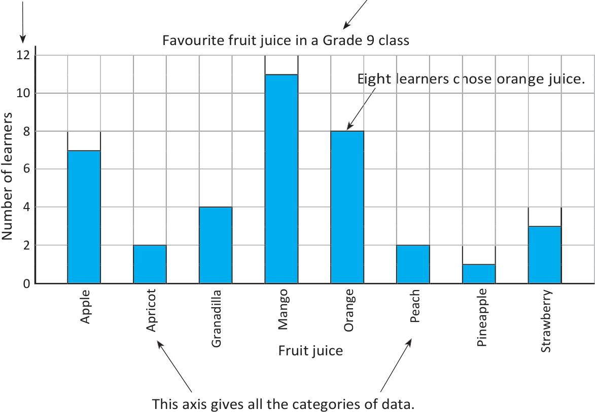
> **[Diagram Context - Textbook_Mathematics_Gr9_Representing-data.pdf-0001-05.png]**
> This bar graph displays categorical data representing the "Favourite fruit juice in a Grade 9 class," with the vertical axis labeled "Number of learners" and the horizontal axis listing various fruit categories. It serves as an introductory tool for learners to practice data handling by interpreting frequencies, identifying modes, and understanding how to represent discrete variables visually.

---

### Addition Table Exercise

Complete the addition table by adding the row header to the column header.

| $+$ | 8 | 5 | 4 | 9 | 7 | 3 | 6 | 18 | 36 | 57 |
| :--- | :--- | :--- | :--- | :--- | :--- | :--- | :--- | :--- | :--- | :--- |
| **7** | | | | | | | | | | 64 |
| **3** | | | | | | 6 | | | | |
| **9** | | | | | | | | | | |
| **5** | | | | | | | | | | |
| **8** | | | | | | | | | | |
| **6** | | | | | | | | | | |
| **4** | | | | | | | | | | |

---

### Multiples and Grouping

#### Concept: Grouping
When objects are arranged in consistent patterns, we can use multiplication or repeated addition to find the total count instead of counting items one by one.

*   **Blue dots:** Arranged in groups of 4.
*   **Red dots:** Arranged in groups of 6.

#### Exercise 1
In the provided dot arrangement:

**(a) Strategy:**
To find the total number of blue dots without counting individually, identify the number of groups and multiply by the number of dots per group.
$$\text{Total} = (\text{Number of groups}) \times (\text{Dots per group})$$

**(b) Implementation:**
1. Count the number of blue dot groups in the diagram.
2. Multiply that number by $4$.
3. If there are $n$ groups, the calculation is:
   $$\text{Total blue dots} = n \times 4$$

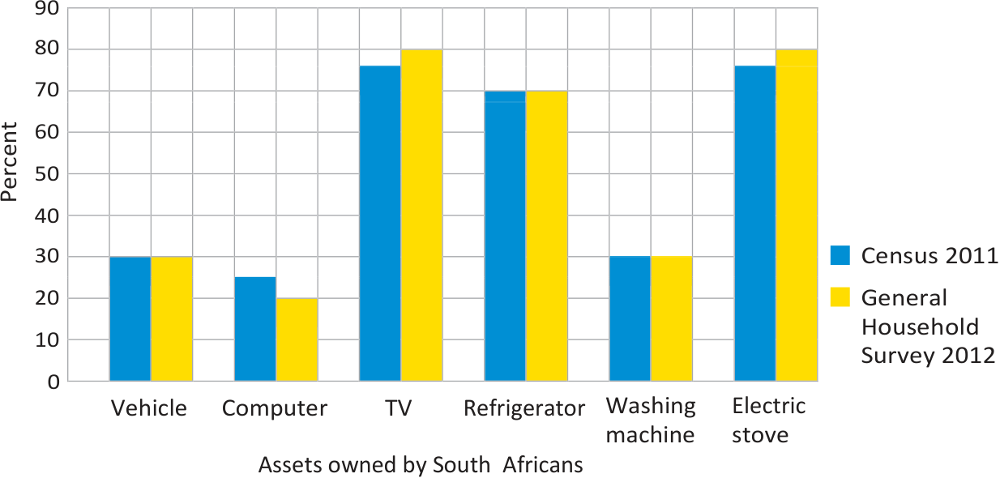
> **[Diagram Context - Textbook_Mathematics_Gr9_Interpret-analyse-and-report-on-data.pdf-0002-10.png]**
> This double bar graph displays the percentage of South African households owning specific assets, comparing data from the Census 2011 and the General Household Survey 2012. The x-axis lists asset categories (Vehicle, Computer, TV, Refrigerator, Washing machine, Electric stove), while the y-axis represents the percentage of ownership. This visual tool helps learners interpret and compare statistical data sets to identify trends in household living standards and socio-economic development over time.

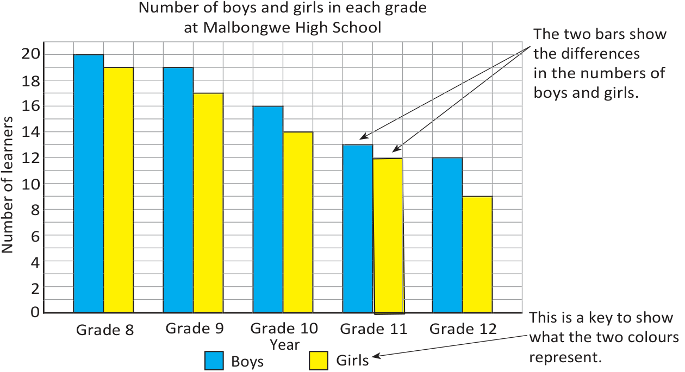
> **[Diagram Context - Textbook_Mathematics_Gr9_Representing-data.pdf-0002-00.png]**
> This double bar graph displays the distribution of learners by gender across grades 8 to 12, with the y-axis representing the "Number of learners" and the x-axis representing the "Year" (Grade). The visual uses blue and yellow bars to compare the specific counts of boys and girls, allowing students to interpret and analyze categorical data trends within a school population.

---

### Counting and Analyzing Patterns

#### Methods of Counting
When determining the quantity of items in an arrangement, you can use two primary methods:
1.  **Counting in groups:** Manually counting items by grouping them (e.g., counting by threes: $3, 6, 9, 12, 15, 18, \dots$).
2.  **Analysis and Calculation:** Using the structure of the arrangement to perform multiplication.

**Example: Calculating Black Dots**
If an arrangement has 10 rows of 3 dots, you can calculate the total using these methods:
*   **Column method:** $3 \times 10 = 30$ per column. Total: $30 + 30 + 30 = 90$.
*   **Row method:** $3 + 3 + 3 = 9$ per row. Total: $10 \times 9 = 90$.
*   **Group method:** $3 \times 10 = 30$ groups of three. Total: $3 \times 30 = 90$.

| | | |
| :--- | :--- | :--- |
| 3 | 3 | 3 |
| 3 | 3 | 3 |
| 3 | 3 | 3 |
| 3 | 3 | 3 |
| 3 | 3 | 3 |
| 3 | 3 | 3 |
| 3 | 3 | 3 |
| 3 | 3 | 3 |
| 3 | 3 | 3 |
| 3 | 3 | 3 |

---

#### Multiples
A **multiple** is the product of a given number and any other whole number. For example, the numbers you get when counting in fives ($5, 10, 15, 20, \dots$) are called **multiples of five**.

**Number Grid (1–120)**

| | | | | | | | | | |
| :--- | :--- | :--- | :--- | :--- | :--- | :--- | :--- | :--- | :--- |
| 1 | 2 | 3 | 4 | 5 | 6 | 7 | 8 | 9 | 10 |
| 11 | 12 | 13 | 14 | 15 | 16 | 17 | 18 | 19 | 20 |
| 21 | 22 | 23 | 24 | 25 | 26 | 27 | 28 | 29 | 30 |
| 31 | 32 | 33 | 34 | 35 | 36 | 37 | 38 | 39 | 40 |
| 41 | 42 | 43 | 44 | 45 | 46 | 47 | 48 | 49 | 50 |
| 51 | 52 | 53 | 54 | 55 | 56 | 57 | 58 | 59 | 60 |
| 61 | 62 | 63 | 64 | 65 | 66 | 67 | 68 | 69 | 70 |
| 71 | 72 | 73 | 74 | 75 | 76 | 77 | 78 | 79 | 80 |
| 81 | 82 | 83 | 84 | 85 | 86 | 87 | 88 | 89 | 90 |
| 91 | 92 | 93 | 94 | 95 | 96 | 97 | 98 | 99 | 100 |
| 101 | 102 | 103 | 104 | 105 | 106 | 107 | 108 | 109 | 110 |
| 111 | 112 | 113 | 114 | 115 | 116 | 117 | 118 | 119 | 120 |

---

#### Common Multiples
A number that is a multiple of two different numbers is called a **common multiple**.
*   **Definition:** A number that is a multiple of 5 AND a multiple of 7 is a common multiple of 5 and 7.

---

#### Exercises
2. Determine the number of blue dots using a different method than previously used and verify the result.
4. Determine the number of red dots in the arrangement on page 3 and describe your method.
5. (a) In the number grid above, underline all multiples of 7.
   (b) Identify which multiples of 5 in the table are also multiples of 7.

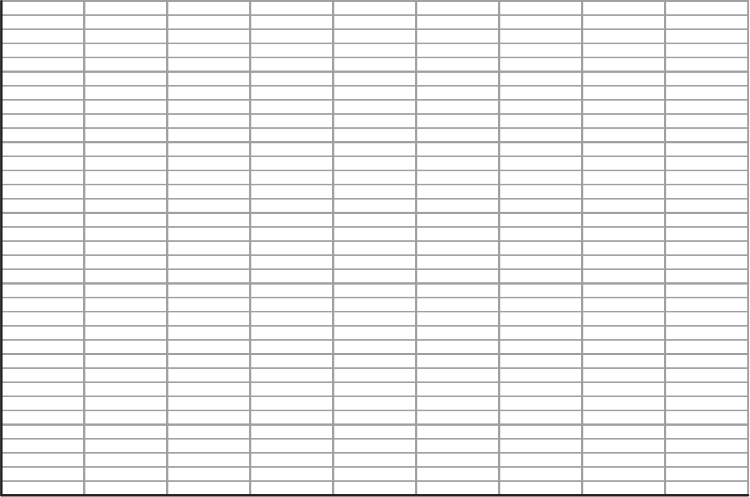
> **[Diagram Context - Textbook_Mathematics_Gr9_Representing-data.pdf-0003-09.png]**
> This image is a blank grid consisting of horizontal and vertical lines forming a series of empty rectangular cells. It contains no labels, variables, or symbols. This template serves as a foundational tool for students to organize data, construct tables for scientific investigations, or plot graphs during practical assessments.

---

### Exercises: Working with Whole Numbers

**6.** How many yellow dots are there in the arrangement on page 3? Describe the method that you use to find this out.

**7.** 
(a) Cross out all the multiples of $9$ in the table you drew for question 3.
(b) Which numbers in the table in question 3 are common multiples of $7$ and $9$?

**8.** 
(a) Look at the numbers in the yellow cells of the table below. How are these numbers formed from the numbers in the red row and the numbers in the blue column?
(b) Copy the table below and fill in all the cells for which you know the answers immediately. Leave the other cells open for now.

| $\times$ | 8 | 5 | 4 | 9 | 7 | 3 | 6 | 2 | 10 | 20 |
| :--- | :--- | :--- | :--- | :--- | :--- | :--- | :--- | :--- | :--- | :--- |
| **7** | | | | | | | | | | |
| **3** | | | | | | | | | | |
| **9** | | | | | | | | | 90 | |
| **5** | | | 20 | | | | | | | |
| **8** | | | | | | | | | | |
| **6** | | | | | | | | | | |
| **4** | | | | | | | | | | |
| **2** | | | | | | | | | | |
| **10** | | 50 | | | | | | | | |
| **20** | | | | | | 60 | | | | |

**9.** Copy the table below and write down the first thirteen multiples of each of the numbers in the column on the left. The multiples of $4$ are already written in, as an example.

| | 1 | 2 | 3 | 4 | 5 | 6 | 7 | 8 | 9 | 10 | 11 | 12 | 13 |
| :--- | :--- | :--- | :--- | :--- | :--- | :--- | :--- | :--- | :--- | :--- | :--- | :--- | :--- |
| **1** | | | | | | | | | | | | | |
| **2** | | | | | | | | | | | | | |
| **3** | | | | | | | | | | | | | |
| **4** | 8 | 12 | 16 | 20 | 24 | 28 | 32 | 36 | 40 | 44 | 48 | 52 | |
| **5** | | | | | | | | | | | | | |
| **6** | | | | | | | | | | | | | |
| **7** | | | | | | | | | | | | | |
| **8** | | | | | | | | | | | | | |
| **9** | | | | | | | | | | | | | |
| **10** | | | | | | | | | | | | | |
| **11** | | | | | | | | | | | | | |
| **12** | | | | | | | | | | | | | |
| **13** | | | | | | | | | | | | | |

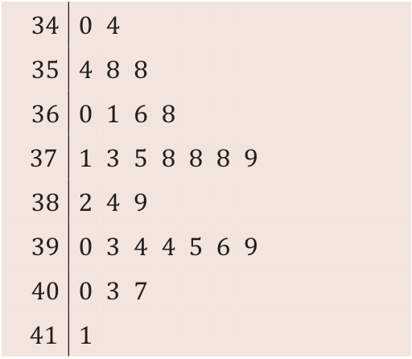
> **[Diagram Context - Textbook_Mathematics_Gr9_Collect-organise-and-summarise-data.pdf-0004-05.png]**
> This graphic is a stem-and-leaf plot displaying a dataset with stems ranging from 34 to 41 and corresponding leaves representing individual data points. It serves as a foundational statistical tool for Grade 10-12 learners to organize numerical data, allowing them to easily identify the range, mode, and distribution shape of a data set.

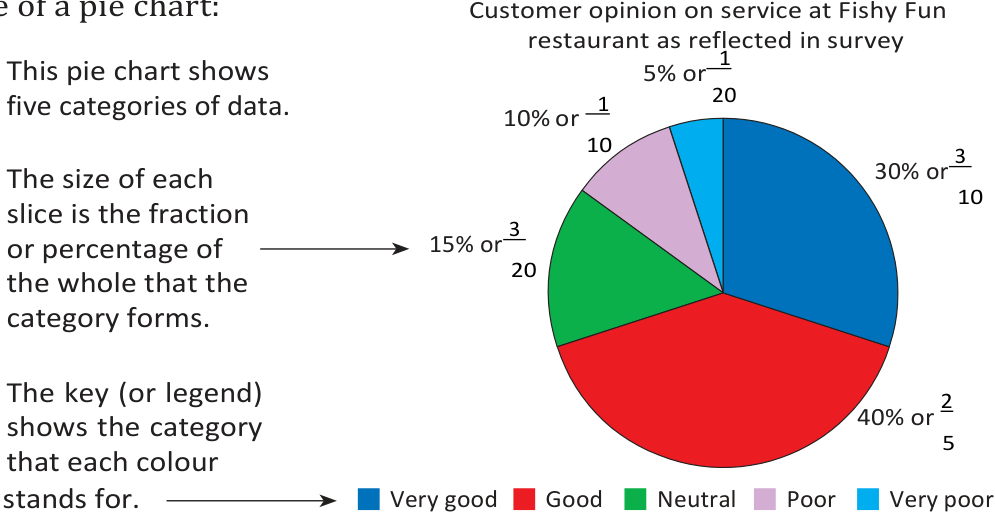
> **[Diagram Context - Textbook_Mathematics_Gr9_Representing-data.pdf-0004-09.png]**
> This graphic presents a pie chart illustrating customer survey data, labeled with percentages and their equivalent fractions for five categories: "Very good," "Good," "Neutral," "Poor," and "Very poor." It conceptually demonstrates how to represent parts of a whole using proportional sectors, helping learners visualize data distribution and the mathematical relationship between percentages and fractions.

---

### Multiplication Practice

#### 10. Multiplication Table
Copy and complete the following table by multiplying the row header by the column header.

| $\times$ | 6 | 2 | 7 | 9 | 4 | 5 | 3 | 8 | 10 | 50 |
| :--- | :--- | :--- | :--- | :--- | :--- | :--- | :--- | :--- | :--- | :--- |
| **8** | | | | | | | | | | |
| **6** | | | | | | | | | | |
| **7** | | | | | | | | | | |
| **9** | | | | | | | | | | |
| **5** | | | | | | | | | | |
| **3** | | | | | | | | | | |
| **4** | | | | | | | | | | |
| **2** | | | | | | | | | | |

#### 11. Review
Go back to the table you drew for question 8(b). If you can easily fill in the numbers in some of the open spaces now, do it.

#### 12. Pattern Calculation
Suppose there are 10 small black spots on each of the yellow dots in the arrangement on page 3. How many small black spots would there be on all the yellow dots together in the arrangement on page 3?

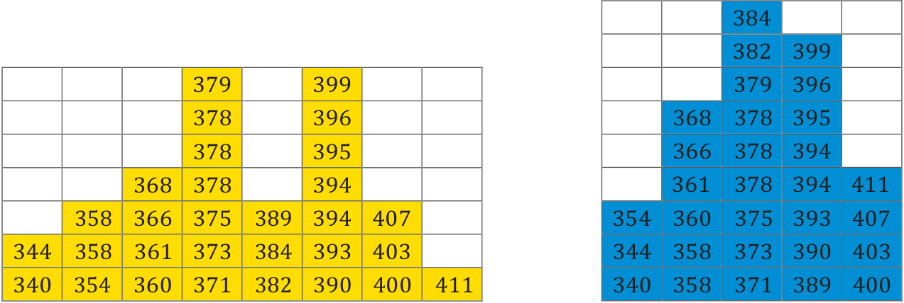
> **[Diagram Context - Textbook_Mathematics_Gr9_Collect-organise-and-summarise-data.pdf-0005-02.png]**
> This graphic displays two dot plots (or frequency histograms) representing numerical data sets, with each cell containing a specific integer value. By organizing these values into columns, the diagram allows students to visually compare the distribution, frequency, and central tendency of two distinct data sets.

---

### Multiples of 10, 100, 1 000 and 10 000

1. How many spotted yellow dots are there on page 7? Explain what you did to find out.
2. How many learners are there in your class? Suppose each learner in the class has a book like this. How many spotted yellow dots are there on the same page (that is, on page 7) of all these books together?
3. Each yellow dot has 10 small black spots, as you can see on this enlarged picture:
   

   (a) How many small black spots are there on page 7?
   (b) How many small black spots are there on page 7 in all the books in your class?
4. Here is a very big enlargement of one of the black spots on the yellow dots. There are 10 very small white spots on each small black spot. How many very small white spots are there on all the black spots on page 7?
   

5. (a) How many very small white spots are there on 10 pages like page 7?
   (b) How many very small white spots are there on 100 pages like page 7?

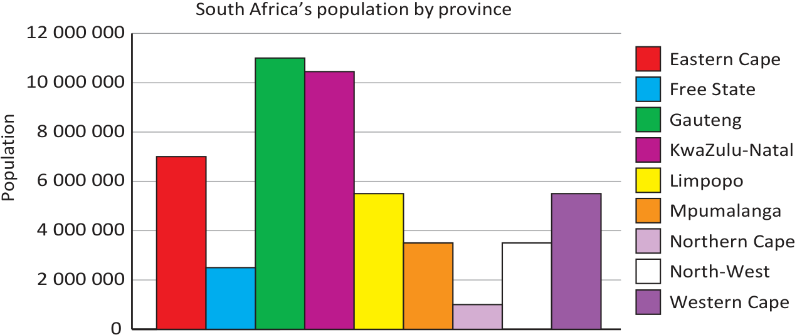
> **[Diagram Context - Textbook_Mathematics_Gr9_Representing-data.pdf-0005-02.png]**
> This bar graph illustrates South Africa's population distribution, with the y-axis representing total population count and the x-axis categorized by the nine provinces (Eastern Cape, Free State, Gauteng, KwaZulu-Natal, Limpopo, Mpumalanga, Northern Cape, North-West, and Western Cape). It serves as a visual tool for learners to compare demographic data across regions, highlighting significant population disparities between highly urbanized provinces like Gauteng and more sparsely populated areas like the Northern Cape.

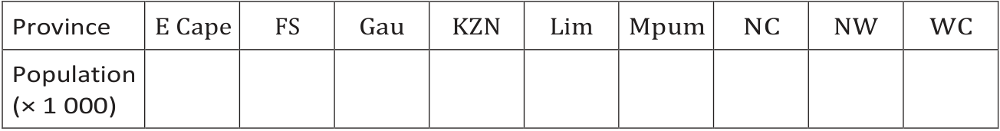
> **[Diagram Context - Textbook_Mathematics_Gr9_Representing-data.pdf-0005-05.png]**
> This graphic is a blank data table designed to record the population statistics for South Africa's nine provinces, labeled as E Cape, FS, Gau, KZN, Lim, Mpum, NC, NW, and WC. The table includes a specific unit of measurement, "Population (× 1 000)," which requires students to correctly interpret and record large numerical data sets in a structured format. It serves as a foundational tool for data handling and statistical analysis within the CAPS curriculum, helping learners organize geographical or demographic information for further comparison or graphical representation.

---

# Chapter 1: Working with Whole Numbers

## Understanding Place Value Relationships
In our number system, multiplying by 10 shifts the value of digits to the next place value. The following relationships demonstrate how larger numbers are constructed:

*   10 tens are a hundred: $10 \times 10 = 100$
*   10 hundreds are a thousand: $10 \times 100 = 1\,000$
*   10 thousands are a ten thousand: $10 \times 1\,000 = 10\,000$
*   10 ten thousands are a hundred thousand: $10 \times 10\,000 = 100\,000$
*   10 hundred thousands are a million: $10 \times 100\,000 = 1\,000\,000$

---

## Exercises

**6. Working with Expanded Notation**

(a) Write $7\,000 + 600 + 80 + 4$ as a single number.

(b) Write 10 times the number in (a) in expanded notation and as a single number.

(c) Write 100 times the number in (a) in expanded notation and as a single number.

**7. Write each of the following numbers in expanded notation:**

*(Note: This section requires the list of numbers provided in the original curriculum text to be completed.)*

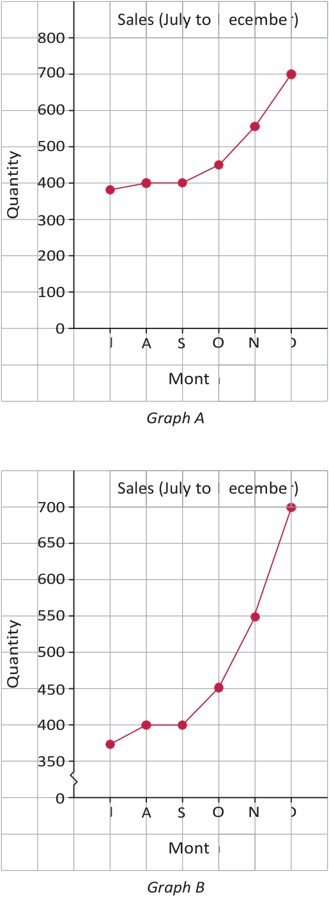
> **[Diagram Context - Textbook_Mathematics_Gr9_Interpret-analyse-and-report-on-data.pdf-0006-00.png]**
> This graphic displays two line graphs representing sales data from July to December, with axes labeled "Quantity" and "Month" (J, A, S, O, N, D). By comparing Graph A, which uses a standard scale starting at zero, with Graph B, which utilizes a broken axis (kink), the diagram illustrates how visual manipulation of scales can influence the perception of data trends and growth rates.

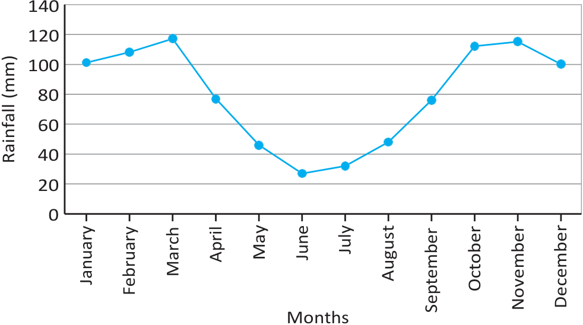
> **[Diagram Context - Textbook_Mathematics_Gr9_Representing-data.pdf-0006-08.png]**
> This line graph displays the annual rainfall distribution, with "Rainfall (mm)" on the vertical axis and the twelve months of the year on the horizontal axis. It illustrates seasonal precipitation patterns, allowing students to identify peak rainfall periods and dry seasons characteristic of specific South African climatic regions.

---

### Place Value and Number Recognition

This section focuses on the recognition and reading of large numbers based on their place value structure.

#### Number List
The following numbers are presented in increasing order of magnitude:

| Label | Number | Word Form |
| :--- | :--- | :--- |
| (a) | $746$ | Seven hundred and forty-six |
| (b) | $7\,460$ | Seven thousand four hundred and sixty |
| (c) | $74\,600$ | Seventy-four thousand six hundred |
| (d) | $746\,000$ | Seven hundred and forty-six thousand |
| (e) | $7\,460\,000$ | Seven million four hundred and sixty thousand |

#### Mathematical Breakdown
Each step in the sequence represents a multiplication by a power of $10$:

*   **From (a) to (b):** $746 \times 10 = 7\,460$
*   **From (b) to (c):** $7\,460 \times 10 = 74\,600$
*   **From (c) to (d):** $74\,600 \times 10 = 746\,000$
*   **From (d) to (e):** $746\,000 \times 10 = 7\,460\,000$

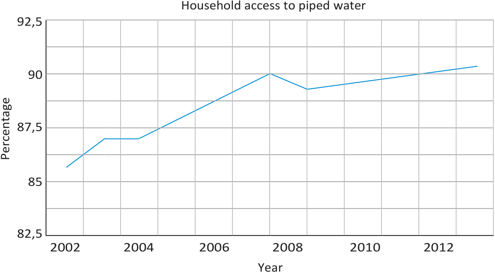
> **[Diagram Context - Textbook_Mathematics_Gr9_Interpret-analyse-and-report-on-data.pdf-0007-02.png]**
> This line graph illustrates the trend in "Household access to piped water" over time, with the x-axis representing "Year" (2002–2013) and the y-axis representing "Percentage" (82,5–92,5). It enables learners to analyze socio-economic data trends, specifically identifying periods of growth, stagnation, or decline in service delivery infrastructure within a South African context.

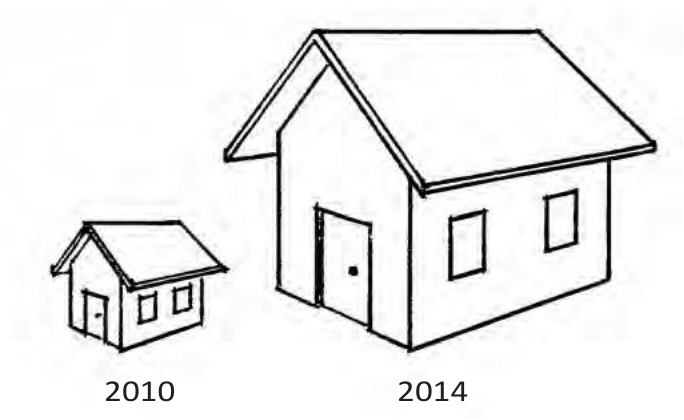
> **[Diagram Context - Textbook_Mathematics_Gr9_Interpret-analyse-and-report-on-data.pdf-0007-08.png]**
> This graphic is a pictorial representation of data using two house icons of different sizes, labeled with the years "2010" and "2014." It illustrates the concept of misleading data visualization, where scaling the area of a 3D object disproportionately to the numerical values can create a false perception of growth for a high school Mathematical Literacy learner.

---

### Exercise 8: Products of Powers of 10
Express the following numbers as a product of the given factor and one other number:

(a) $10\,000 = 10 \times 1\,000$
(b) $10\,000 = 100 \times 100$
(c) $100\,000 = 10 \times 10\,000$
(d) $100\,000 = 1\,000 \times 100$
(e) $1\,000\,000 = 1\,000 \times 1\,000$

---

### Exercise 9: Multiplication Table (Multiples of 10)
Copy and complete the table below by calculating the product of the row and column headers.

| $\times$ | 10 | 20 | 30 | 40 | 50 | 60 | 70 | 80 | 90 | 100 |
| :--- | :--- | :--- | :--- | :--- | :--- | :--- | :--- | :--- | :--- | :--- |
| **2** | | | | | | | | | | |
| **3** | | | | | | | | | | |
| **4** | | | | | | | | | | |
| **5** | | | | | | | | | | |
| **6** | | | | | | | | | | |
| **7** | | | | | | | | | | |
| **8** | | | | | | | | | | |
| **9** | | | | | | | | | | |
| **10** | | | | | | | | | | |
| **11** | | | | | | | | | | |
| **12** | | | | | | | | | | |

---

### Exercise 10: Multiplication Table (Multiples of 100)
Copy and complete the table below by calculating the product of the row and column headers.

| $\times$ | 100 | 200 | 300 | 400 | 500 | 600 |
| :--- | :--- | :--- | :--- | :--- | :--- | :--- |
| **2** | | | | | | |
| **3** | | | | | | |
| **4** | | | | | | |
| **5** | | | | | | |
| **6** | | | | | | |
| **7** | | | | | | |
| **8** | | | | | | |
| **9** | | | | | | |
| **10** | | | | | | |
| **11** | | | | | | |
| **12** | | | | | | |

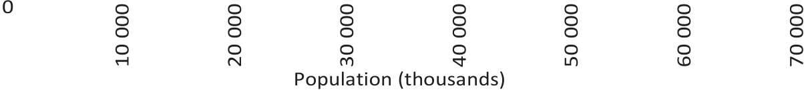
> **[Diagram Context - Textbook_Mathematics_Gr9_Collect-organise-and-summarise-data.pdf-0008-07.png]**
> This graphic is a horizontal axis from a bar graph or histogram labeled "Population (thousands)," with numerical increments ranging from 0 to 70 000. It serves as a quantitative scale for representing demographic data, allowing students to interpret and compare the size of different population groups within a statistical study.

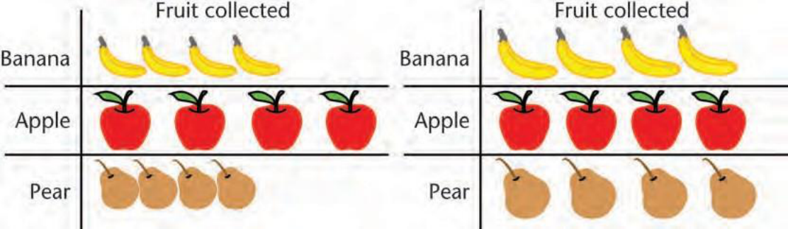
> **[Diagram Context - Textbook_Mathematics_Gr9_Interpret-analyse-and-report-on-data.pdf-0008-02.png]**
> This graphic presents two side-by-side pictographs comparing the quantities of "Fruit collected," specifically bananas, apples, and pears. By using icons as variables to represent discrete data points, the diagram serves as a foundational tool for teaching learners how to organize, visualize, and compare categorical data sets.

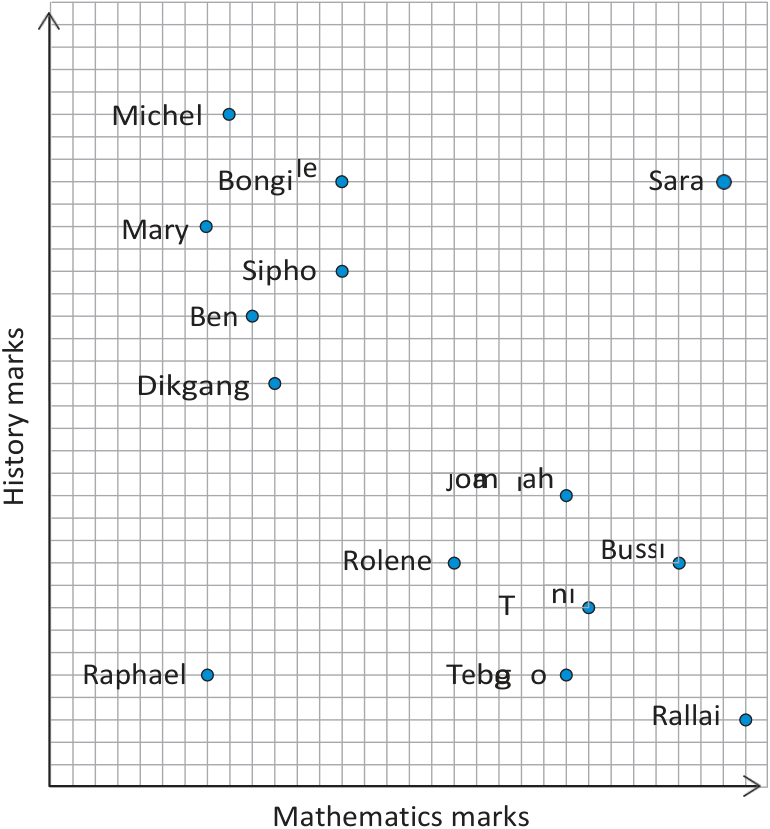
> **[Diagram Context - Textbook_Mathematics_Gr9_Interpret-analyse-and-report-on-data.pdf-0008-08.png]**
> This scatter plot displays the relationship between Mathematics marks (x-axis) and History marks (y-axis) for a group of individual students, identified by name labels next to their respective data points. It serves as a foundational tool for learners to analyse bivariate data, helping them identify trends, clusters, or the absence of a correlation between two distinct academic subjects.

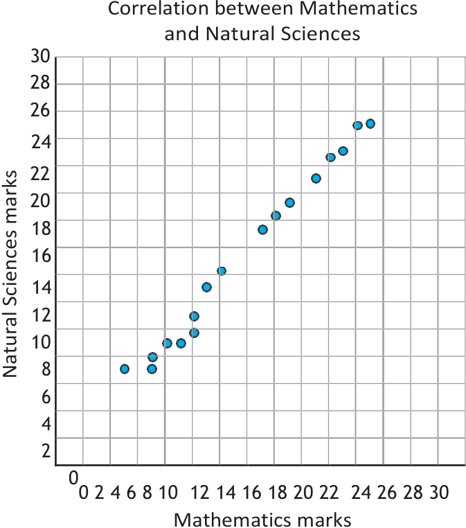
> **[Diagram Context - Textbook_Mathematics_Gr9_Representing-data.pdf-0008-05.png]**
> This scatter plot displays the correlation between "Mathematics marks" on the x-axis and "Natural Sciences marks" on the y-axis, using blue data points to represent individual student performance. It illustrates a strong positive correlation, helping learners understand how to interpret bivariate data and identify trends where an increase in one variable corresponds to an increase in the other.

---

### 11. Multiples of 10
(a) Estimate how many multiples of $10$ are smaller than $250$.
(b) Check your estimate by writing down the multiples.

### 12. Estimating and Counting Multiples
In each case, first estimate, then check by writing all the multiples down and counting them.
(a) How many multiples of $100$ are smaller than $2\,500$?
(b) How many multiples of $250$ are smaller than $2\,500$?
(c) How many numbers smaller than $2\,500$ are multiples of both $100$ and $250$?
(d) How many numbers smaller than $2\,500$ are multiples of both $250$ and $400$?

### 13. Working with Money and Multiples
There are eight tins. Each tin contains:
*   $3 \times R10$ notes
*   $3 \times R20$ notes
*   $3 \times R100$ notes
*   $3 \times R200$ notes

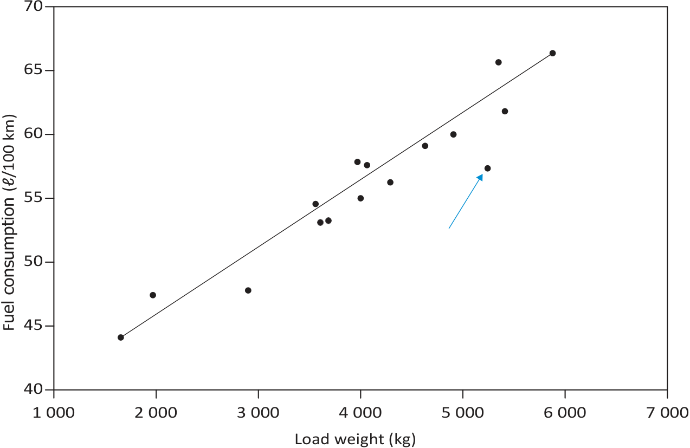
> **[Diagram Context - Textbook_Mathematics_Gr9_Interpret-analyse-and-report-on-data.pdf-0009-04.png]**
> This scatter plot displays the relationship between load weight (kg) on the x-axis and fuel consumption (ℓ/100 km) on the y-axis, featuring a line of best fit and a blue arrow highlighting an outlier. It illustrates the concept of positive correlation in data analysis, helping students identify trends and recognize how individual data points deviate from the linear regression model.

Zain wants to find the total value of all the $R10$ notes by counting in $30$s (since there are $3 \times R10 = R30$ per tin).
(a) Complete the sequence: $30, 60, 90, \dots$
(b) Count in $300$s to find the total value of all the $R100$ notes in all the tins.

### 14. Total Value Calculation
(a) How much money is there in total in the eight yellow tins in question 13?
(b) Discuss with two classmates how you worked to find the total amount of money.

### 15. Investigation: Counting Strategies
(a) Investigate which is easiest for you: counting in $20$s, $30$s, or $50$s, up to $500$.
(b) Many people find it easier to count in $50$s than in $30$s. Why do you think this is so?

### 16. Advanced Counting Investigation
What do you expect to be the most difficult: counting in $40$s, $70$s, or $90$s? Investigate this and write a short report.

***

#### Note: Counting Strategies
It is often easier to count in units that reach multiples of $100$ quickly. 

**Example: Counting in $50$s**
When counting in $50$s, you reach a multiple of $100$ every second step:
$50, 100, 150, 200, 250, 300, 350, 400, 450, 500 \dots$

**Example: Counting in $70$s**
When counting in $70$s, you do not reach multiples of $100$ as cleanly:
$70, 140, 210, 280 \dots$

---

### Using Multiples of 100 as Stepping Stones

When counting or adding, you can use multiples of $100$ as "stepping stones" to make calculations easier. 

**Example:**
To count by $40$s:
$70 + 30 \rightarrow 100 + 40 \rightarrow 140 + 60 \rightarrow 200 + 10 \rightarrow 210 + 70 \rightarrow 280 \dots$

---

### Exercises: Multiples

**17. Practice Exercises**
(a) Count in forties up to $1\,000$. Use multiples of $100$ as stepping stones.
(b) Write down the first twenty multiples of $80$.
(c) Write down the first twenty multiples of $90$.
(d) Write down the first ten multiples of $700$.

**18. Multiplication Table**
Copy and complete the following table:

| $\times$ | 60 | 50 | 70 | 90 | 40 | 20 | 30 | 80 |
| :--- | :--- | :--- | :--- | :--- | :--- | :--- | :--- | :--- |
| **8** | | | | | | | | |
| **6** | | | | | | | | |
| **7** | | | | | | | | |
| **9** | | | | | | | | |
| **5** | | | | | | | | |
| **3** | | | | | | | | |
| **4** | | | | | | | | |
| **2** | | | | | | | | |
| **70** | | | | | | | | |
| **30** | | | | | | | | |
| **60** | | | | | | | | |
| **80** | | | | | | | | |
| **40** | | | | | | | | |
| **90** | | | | | | | | |
| **50** | | | | | | | | |
| **20** | | | | | | | | |

---

### Doubling and Halving

**1. Write the next eight numbers in each pattern:**
(a) $1, 2, 4, 8, 16, 32, \dots$
(b) $3, 6, 12, 24, \dots$
(c) $5, 10, 20, 40, \dots$
(d) $5, 10, 15, 20, \dots$
(e) $6, 12, 24, 48, \dots$

**2. Analysis**
Which pattern or patterns in question 1 are **not** formed by repeated doubling?

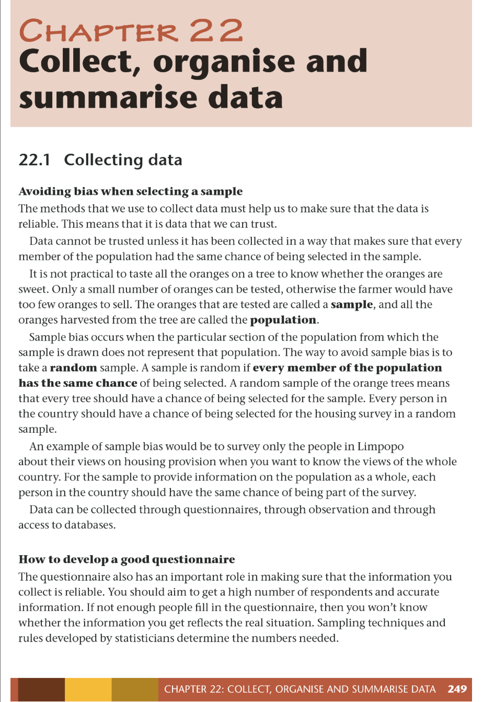

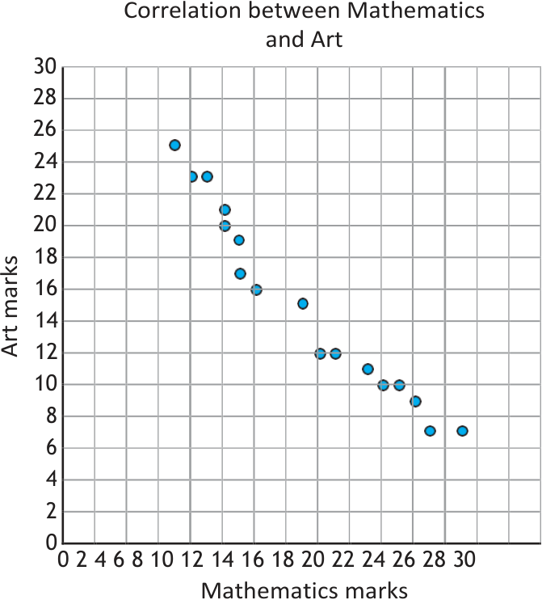

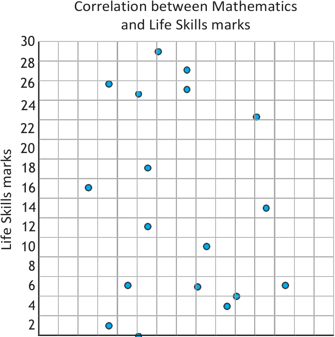

---

### Repeated Doubling Patterns

A **repeated doubling pattern** is a sequence where each term is multiplied by $2$ to get the next term. For example, the pattern starting with $3$ is: $3, 6, 12, 24, 48, \dots$

#### Exercise 3: Completing the Doubling Table
Copy and complete the table below by calculating the first nine terms for each starting number.

| Starting Number | Term 2 | Term 3 | Term 4 | Term 5 | Term 6 | Term 7 | Term 8 | Term 9 |
| :--- | :--- | :--- | :--- | :--- | :--- | :--- | :--- | :--- |
| 2 | | | | | | | | |
| 3 | | | | | | | | |
| 4 | | | | | | | | |
| 5 | | | | | | | | |
| 6 | | | | | | | | |
| 7 | | | | | | | | |
| 8 | | | | | | | | |
| 9 | | | | | | | | |
| 10 | | | | | | | | |
| 11 | | | | | | | | |
| 12 | | | | | | | | |
| 13 | 26 | 52 | 104 | 208 | 416 | 832 | 1 664 | 3 328 |
| 14 | | | | | | | | |
| 15 | | | | | | | | |
| 16 | | | | | | | | |
| 17 | | | | | | | | |
| 18 | | | | | | | | |
| 19 | | | | | | | | |

---

### Multiplication Using Doubling
Doubling can be used as a strategy to perform multiplication by breaking down numbers into powers of $2$.

**Worked Example: Calculate $29 \times 8$**
1. $8$ doubled is $16$, so $16 = 2 \times 8$
2. $16$ doubled is $32$, so $32 = 4 \times 8$
3. $32$ doubled is $64$, so $64 = 8 \times 8$
4. $64$ doubled is $128$, so $128 = 16 \times 8$

Since $29 = 16 + 8 + 4 + 1$, we can express the calculation as:
$29 \times 8 = (16 + 8 + 4 + 1) \times 8$
$29 \times 8 = (16 \times 8) + (8 \times 8) + (4 \times 8) + (1 \times 8)$
$29 \times 8 = 128 + 64 + 32 + 8 = 232$

#### Exercise 4: Practice
Use the doubling method to calculate the following:
(a) $37 \times 21$
(b) $17 \times 41$

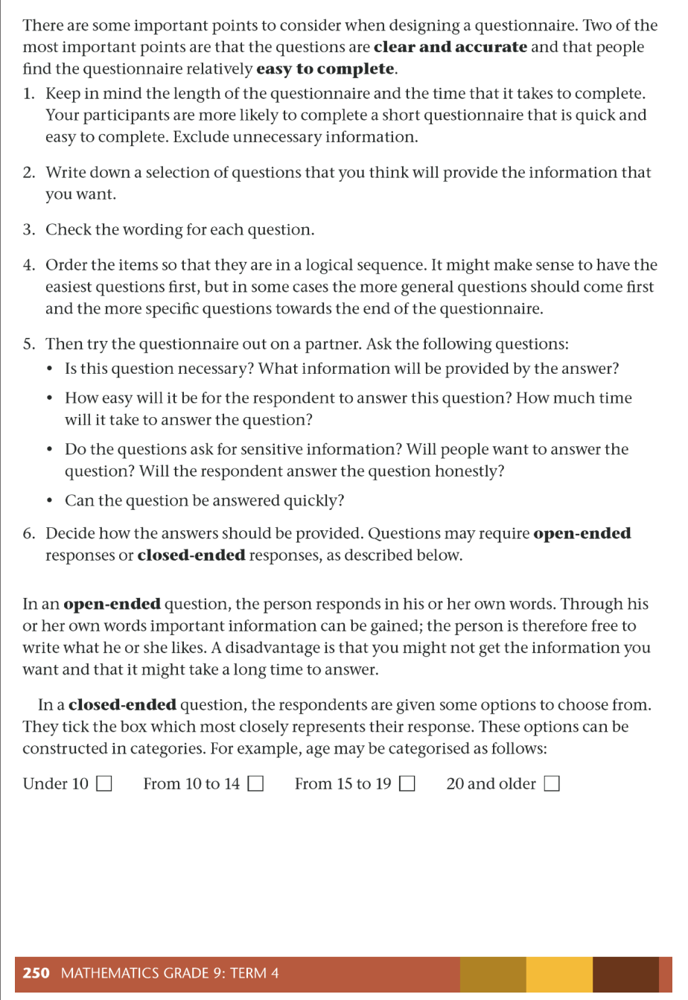
> **[Diagram Context - Textbook_Mathematics_Gr9_Collect-organise-and-summarise-data.pdf-0011-24.png]**
> This educational text provides a structured guide for designing effective questionnaires, featuring key terms such as "clear and accurate," "logical sequence," "open-ended," and "closed-ended" responses. It conceptually outlines the methodological steps for data collection, including refining question wording, pilot testing, and categorizing response options, which are essential skills for Grade 9 Mathematics data handling.

---

### 5. Repeated Halving
Repeated halving is a method used to break down numbers into smaller, manageable parts.

**Exercises:**
(a) Continue the pattern: $1\,024, 512, 256, 128, \dots$
(b) Continue the pattern: $64\,000, 32\,000, 16\,000, 8\,000, \dots$

---

### Using Halving for Multiplication
Halving can be used to simplify complex multiplication problems by breaking factors into smaller components.

**Worked Example: Calculate $37 \times 28$**
1. $100 \times 28 = 2\,800$
2. Half of that is $50 \times 28 = 1\,400$
3. Half of that is $25 \times 28 = 700$
4. $10 \times 28 = 280$
5. $25 \times 28 + 10 \times 28 = 980$ (which is $35 \times 28$)
6. $2 \times 28 = 56$
7. $37 \times 28 = 980 + 56 = 1\,036$

**Exercise 6:**
Given $80 \times 78 = 6\,240$, use this to calculate:
(a) $20 \times 78$
(b) $37 \times 78$

---

### Application: Division using Halving
When calculating how many items can be bought with a specific budget, you can use a table to track the total cost and the number of items.

**Example: Buying chickens at R27 each with R2 400**

| Number of Chickens | Total Cost | Thinking |
| :--- | :--- | :--- |
| 100 | R2 700 | |
| 50 | R1 350 | half of R2 700 |
| 25 | R675 | half of R1 350 |
| 75 | R2 025 | $50 + 25$ chickens |
| 10 | R270 | $10 \times 27$ |
| 85 | R2 295 | $75 + 10$ chickens |
| 3 | R81 | $3 \times 27$ |
| 88 | R2 376 | $85 + 3$ chickens |

**Exercise 7:**
Use the halving method to determine how many books at R67 each a school can buy with R5 000.

| Number of Books | Total Cost | Thinking |
| :--- | :--- | :--- |
| | | |
| | | |
| | | |
| | | |
| | | |

---

### Using Multiplication to do Division
**Problem 1:**
R7 500 must be shared between 27 netball players. The money is in R10 notes, and no small change is available.
(a) How much money will be used to give each player R100?

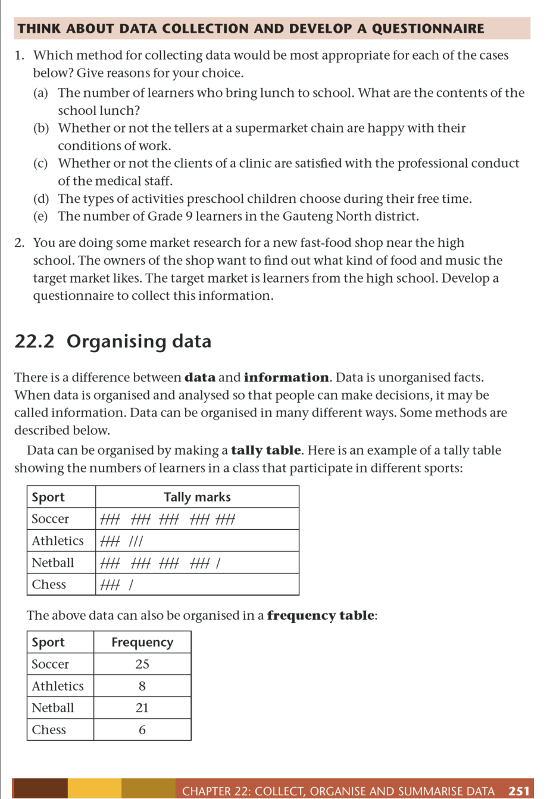
> **[Diagram Context - Textbook_Mathematics_Gr9_Collect-organise-and-summarise-data.pdf-0012-07.png]**
> This educational text features two data representation tools: a tally table and a corresponding frequency table. The tables use categorical variables (Sport) and quantitative variables (Tally marks and Frequency) to illustrate how raw data is organized and summarized. Conceptually, this helps learners distinguish between raw data collection and the structured analysis required to transform data into meaningful information.

---

### Problem Solving: Division and Inverse Operations

#### Exercises: Applying Division
1. **Contextual Questions (based on R7 500 total):**
    * (b) Is there enough money to give each player R200?
    * (c) Is there enough money to give each player R300?
    * (d) How much of the R7 500 will be left over, if each player is given R200?
    * (e) Is there enough money left to give each player R50 more (a total of R250 each)?
    * (f) What is the highest amount that can be given to each player, so that less than R20 is left over? (Note: You cannot split up R10 notes).

2. **String Problem:**
    There is $4\,580\text{ m}$ of string on a roll. How many pieces of $17\text{ m}$ each can be cut from this roll?
    *Hint: Start by calculating how much string is used if you cut $100$ pieces of $17\text{ m}$ each.*

3. **Shop Owner Problem:**
    A shop owner has R1 800 available to buy chickens. The farmer wants R26 for each chicken. How many chickens can the shop owner buy?

#### Key Concept: Inverse Operations
When solving division problems like $1\,800 \div 26$, you are essentially asking: *"With what must I multiply $26$ to get as close to $1\,800$ as possible?"*

*   **Definition:** Division is the **inverse** of multiplication.
*   **Definition:** Multiplication is the **inverse** of division.
*   **Conclusion:** Multiplication and division are **inverse operations**.

---

### 1.2 Ordering and Comparing Whole Numbers

#### Exploration: How far can you count?
1. **Time Calculation:** If it takes one second to count each number, how long will it take to count to a million? Express your answer in days, hours, and seconds.
2. **Number Names:** Write $234\,500\,320$ in words.
3. **Comparing Numbers:** Use the symbols $>$ (greater than) or $<$ (less than) to compare the following pairs:

| Pair | Comparison |
| :--- | :--- |
| (a) $876\,243$ | $876\,234$ |
| (b) $534\,616$ | $543\,016$ |
| (c) $701\,021$ | $698\,769$ |
| (d) $103\,232$ | $99\,878$ |

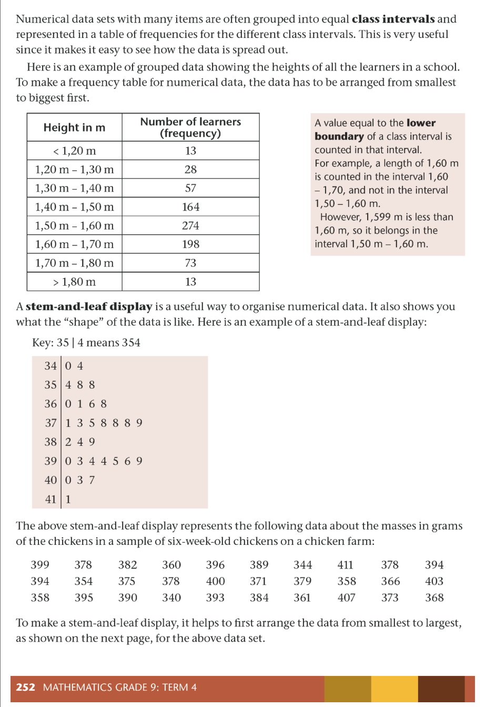
> **[Diagram Context - Textbook_Mathematics_Gr9_Collect-organise-and-summarise-data.pdf-0013-18.png]**
> This educational resource presents a frequency table for grouped data and a stem-and-leaf display for raw numerical data. The graphic includes labels for "Height in m," "Number of learners (frequency)," "lower boundary," and a "Key" for interpreting the stem-and-leaf digits. It conceptually demonstrates how to organize large datasets into manageable intervals or visual distributions to identify trends and the overall shape of the data.

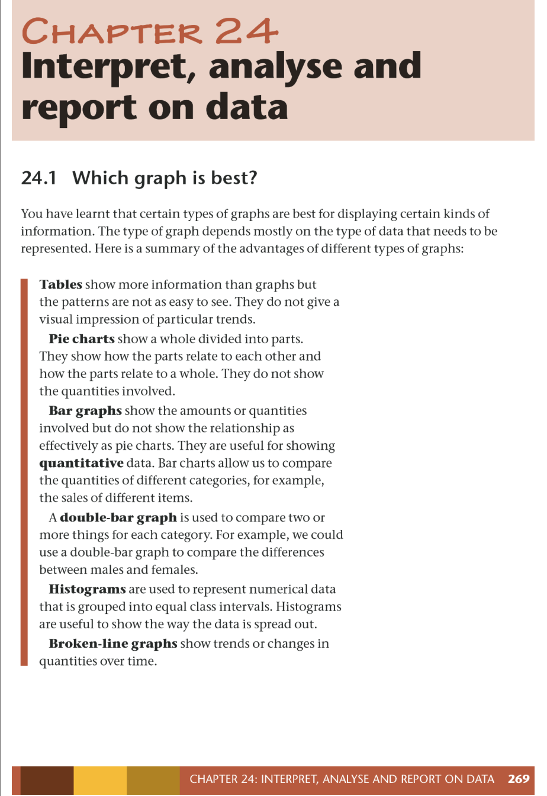
> **[Diagram Context - Textbook_Mathematics_Gr9_Interpret-analyse-and-report-on-data.pdf-0013-06.png]**
> This educational text provides a conceptual summary of various data representation methods, including tables, pie charts, bar graphs, double-bar graphs, histograms, and broken-line graphs. It outlines the specific advantages and appropriate applications for each format, helping students understand how to select the most effective visual tool for interpreting and reporting different types of quantitative and categorical data.

---

### 4. Number Line Exercises
Copy the number lines and place the following numbers as accurately as possible:

(a) $185\ 000$; $178\ 000$; $170\ 900$; $180\ 500$

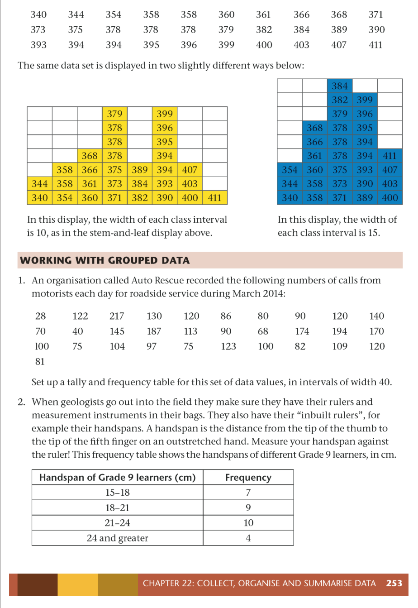
> **[Diagram Context - Textbook_Mathematics_Gr9_Collect-organise-and-summarise-data.pdf-0014-15.png]**
> This graphic presents two histograms comparing the same numerical data set using different class interval widths (10 and 15) to demonstrate how grouping affects data visualization. It includes raw data lists, frequency tables for roadside service calls and handspan measurements, and labels defining class intervals and frequencies. The diagram illustrates how changing the width of class intervals alters the shape and interpretation of a distribution, a fundamental concept for organizing and summarizing grouped data in statistics.

(b) $1\ 110\ 000$; $1\ 102\ 900$; $1\ 100\ 500$; $1\ 105\ 050$

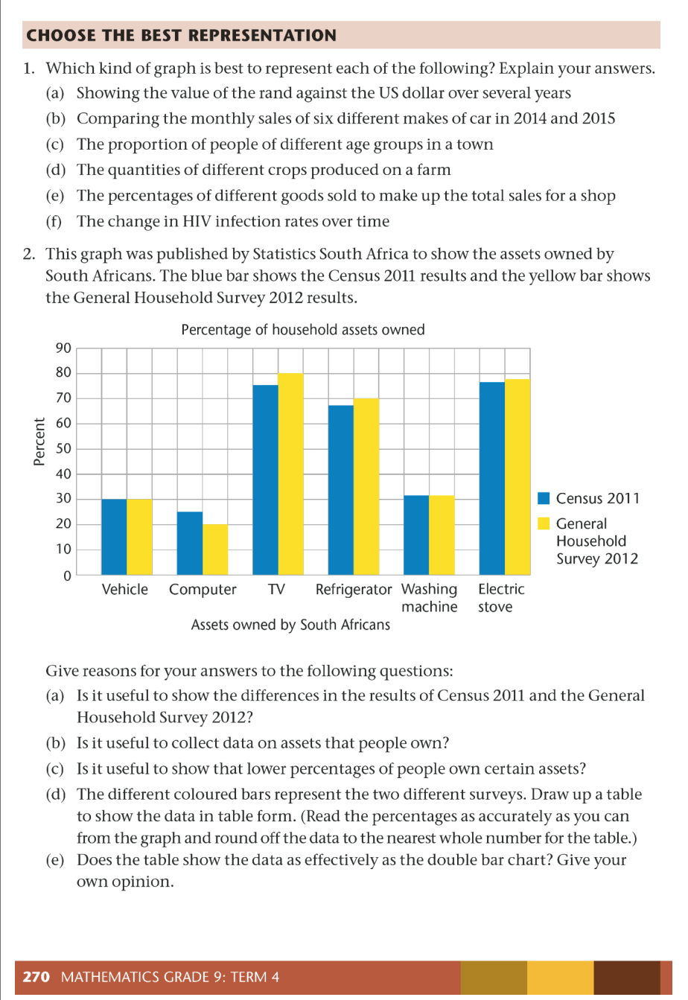
> **[Diagram Context - Textbook_Mathematics_Gr9_Interpret-analyse-and-report-on-data.pdf-0014-16.png]**
> This educational resource features a double bar graph comparing household asset ownership between Census 2011 (blue) and the General Household Survey 2012 (yellow), with axes labeled "Percent" and "Assets owned by South Africans." The graphic serves to develop data literacy by requiring students to interpret comparative categorical data and evaluate the effectiveness of different graphical representations for specific statistical contexts.

---

### Planetary Data
The table below shows the average distances of planets from the sun (in millions of kilometres) and their equatorial diameters.

**Note:** The distances from the sun are called "average distances" because the planets are not always the same distance from the sun; their orbits are not perfect circles.
**Conversion:** One million kilometres is $1\ 000\ 000\ \text{km}$.

| Planet | Mercury | Venus | Earth | Mars | Jupiter | Saturn | Uranus | Neptune |
| :--- | :--- | :--- | :--- | :--- | :--- | :--- | :--- | :--- |
| **Distance from sun** | $58\ \text{m km}$ | $108\ \text{m km}$ | $150\ \text{m km}$ | $228\ \text{m km}$ | $778\ \text{m km}$ | $1\ 427\ \text{m km}$ | $2\ 870\ \text{m km}$ | $4\ 497\ \text{m km}$ |
| **Equatorial diameter** | $4\ 880\ \text{km}$ | $12\ 102\ \text{km}$ | $12\ 756\ \text{km}$ | $6\ 794\ \text{km}$ | $142\ 800\ \text{km}$ | $120\ 000\ \text{km}$ | $52\ 400\ \text{km}$ | $49\ 500\ \text{km}$ |

#### Exercises
5. Which planet is the second farthest planet from the sun?
6. How does Mars’ distance from the sun compare to that of Venus? Give two possible answers.
7. Arrange the planets from the smallest to the biggest (based on equatorial diameter).

---

### Rounding Off
In many real-world situations, we do not require the exact number. We use **rounding off** (or **rounding**) to provide an estimate that is close to the actual value.

*   **Example 1:** A loaf of bread costs about $\text{R}10$. The actual cost might be $\text{R}8$ or $\text{R}12$, but it is close to $\text{R}10$.
*   **Example 2:** A bag of mealie meal costs about $\text{R}20$. The actual cost might be $\text{R}18$ or $\text{R}21$, but it is close to $\text{R}20$.
*   **Example 3:** If a newspaper reports $15\ 000$ spectators at a soccer game, this is an estimate, not the exact count of people who entered the stadium.

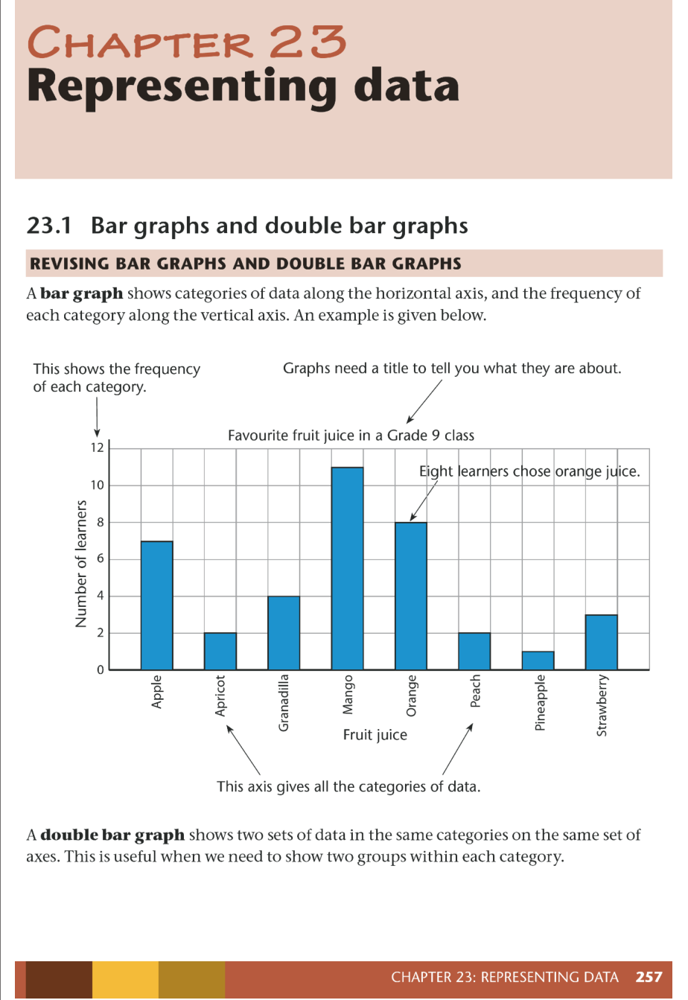
> **[Diagram Context - Textbook_Mathematics_Gr9_Representing-data.pdf-0014-22.png]**
> This graphic presents a bar graph illustrating the frequency of favorite fruit juices among a Grade 9 class, labeled with axes for "Number of learners" and "Fruit juice" categories (Apple, Apricot, Granadilla, Mango, Orange, Peach, Pineapple, Strawberry). It serves as a foundational pedagogical tool to demonstrate how to interpret graphical data, emphasizing the importance of titles, axis labels, and the visual representation of discrete numerical values.

---

### Rounding to 5s, 10s, 100s and 1 000s

#### 1. Rounding to the Nearest 5
To round off to the nearest 5, examine the unit digit:
*   **Round down:** If the number ends in 1 or 2, or 6 or 7, round down to the closest multiple of 5.
*   **Round up:** If the number ends in 3 or 4, or 8 or 9, round up to the closest multiple of 5.

**Examples:**
*   $233 \rightarrow 235$
*   $234 \rightarrow 235$
*   $237 \rightarrow 235$
*   $238 \rightarrow 240$

**Exercise:** Round the following numbers to the nearest 5:
(a) $612$
(b) $87$
(c) $454$
(d) $1\,328$

---

#### 2. Rounding to the Nearest 10
To round off to the nearest 10, examine the unit digit:
*   **Round down:** If the number ends in 1, 2, 3, or 4, round down to the closest multiple of 10.
*   **Round up:** If the number ends in 5, 6, 7, 8, or 9, round up to the closest multiple of 10.

**Example:**
To round $534$ to the nearest 10, look at the units digit ($4$). Since $4$ is closer to $0$ than to $10$, the number rounds to $530$.

**Exercise:** Round the following numbers to the nearest 10:
(a) $12$
(b) $87$
(c) $454$
(d) $1\,325$

---

#### 3. Rounding to the Nearest 100
To round off to the nearest 100, examine the last two digits of the number:
*   **Round down:** If the last two digits are less than $50$, round down to the lower $100$.
*   **Round up:** If the last two digits are $50$ or more, round up to the higher $100$.

---

#### 4. Summary Table
Copy and complete the following table:

| Number | Round to the nearest 5 | Round to the nearest 10 | Round to the nearest 100 |
| :--- | :--- | :--- | :--- |
| $681$ | | | |
| $5\,639$ | | | |
| $5\,361$ | | | |
| $12\,458$ | | | |

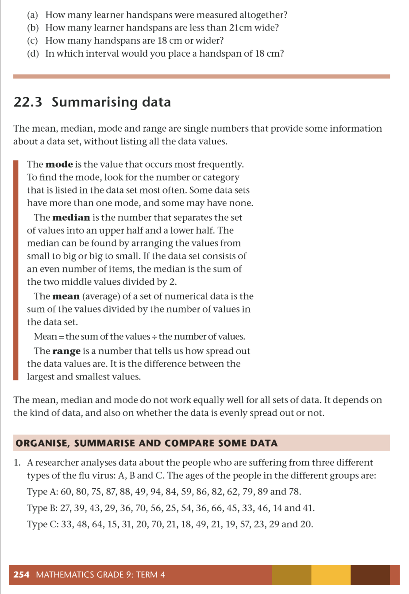
> **[Diagram Context - Textbook_Mathematics_Gr9_Collect-organise-and-summarise-data.pdf-0015-18.png]**
> This educational text provides a conceptual overview of statistical measures of central tendency and dispersion, specifically defining the mode, median, mean, and range. It includes practical application exercises involving learner handspan measurements and age data sets for three flu virus types (A, B, and C). These materials help students master the CAPS curriculum requirements for organizing, summarizing, and interpreting numerical data sets.

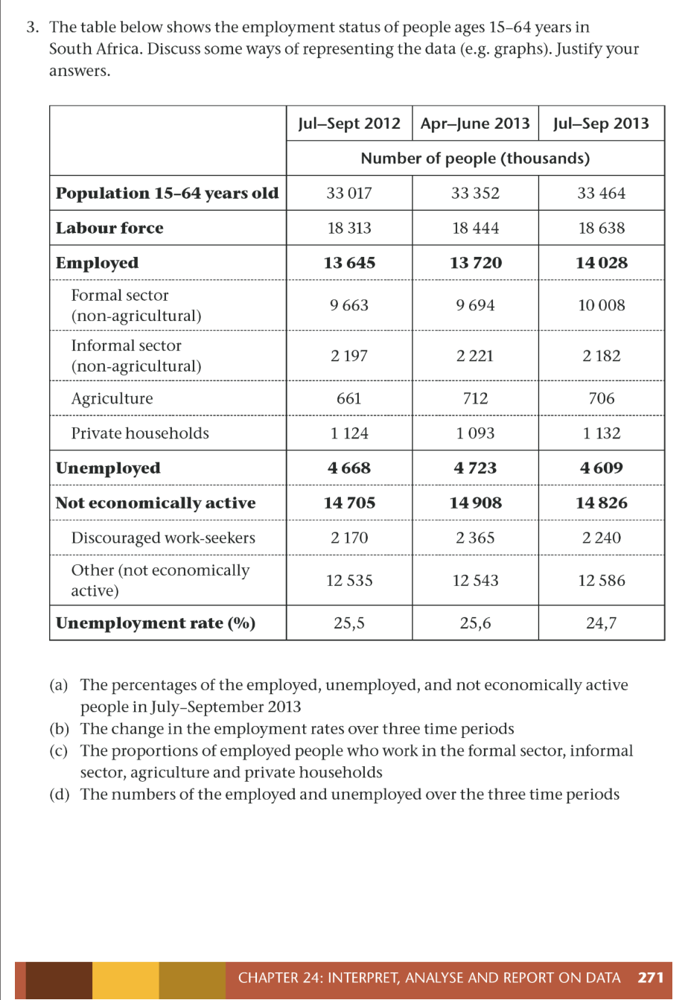
> **[Diagram Context - Textbook_Mathematics_Gr9_Interpret-analyse-and-report-on-data.pdf-0015-05.png]**
> This educational graphic is a statistical data table detailing the employment status of the South African population aged 15–64 across three specific time periods. It includes categories such as labour force, employed sectors, unemployed, not economically active, and the unemployment rate, providing raw data for learners to practice data interpretation and graphical representation. The table serves as a foundational exercise in Mathematical Literacy, requiring students to select appropriate graph types—such as pie charts, bar graphs, or line graphs—to effectively communicate these socio-economic trends.

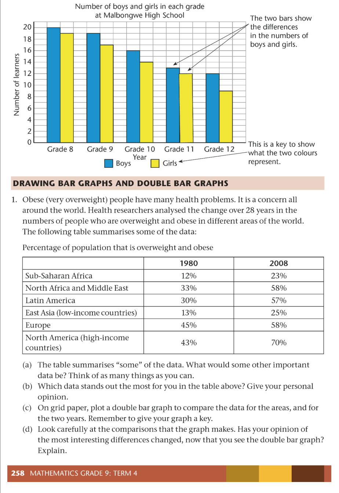
> **[Diagram Context - Textbook_Mathematics_Gr9_Representing-data.pdf-0015-19.png]**
> This double bar graph displays the number of boys and girls across Grades 8 to 12 at Malbongwe High School, using a y-axis for the number of learners and an x-axis for the specific grades. The diagram serves as a pedagogical model to demonstrate how dual data sets can be visually compared side-by-side to identify trends and differences between two distinct groups within a single category.

---

### Rounding Numbers

#### Rules for Rounding
*   **Rounding to the nearest 1 000:** Look at the hundreds digit.
    *   If the hundreds value is less than $500$, round down (the thousands digit stays the same).
    *   If the hundreds value is equal to or greater than $500$, round up.
*   **Rounding to the nearest 10 000:** Look at the thousands digit.
    *   If the thousands value is less than $5 000$, round down (the ten thousands digit stays the same).
    *   If the thousands value is equal to or greater than $5 000$, round up.

#### Exercise: Rounding Table

| Number | Round to the nearest 1 000 | Round to the nearest 10 000 |
| :--- | :--- | :--- |
| $142 389$ | | |
| $343 621$ | | |
| $356 552$ | | |
| $100 489$ | | |

---

### 1.3 Factors, Prime Numbers, and Common Multiples

#### Different Ways to Produce the Same Number
A number can be represented as a product of different factors. For example, the number $80$ can be produced in several ways:
*   $4 \times 20 = 80$
*   $5 \times 16 = 80$

**Using Brackets:**
Brackets indicate which calculation should be performed first.
*   Instead of $2 \times 10 = 20$ and $20 \times 4 = 80$, we write: $(2 \times 10) \times 4 = 80$
*   Instead of $10 \times 4 = 40$ and $40 \times 2 = 80$, we write: $2 \times (10 \times 4) = 80$

#### Exercises
1. In what other ways can $80$ be produced by multiplying two numbers?
2. Show how the number $80$ can be produced by multiplying four numbers. Describe how you do it in two ways: without using brackets and by using brackets.
3. Show three different ways in which the number $30$ can be produced by multiplying two numbers.
4. (a) Can the number $30$ be produced by multiplying three whole numbers? Which three whole numbers?

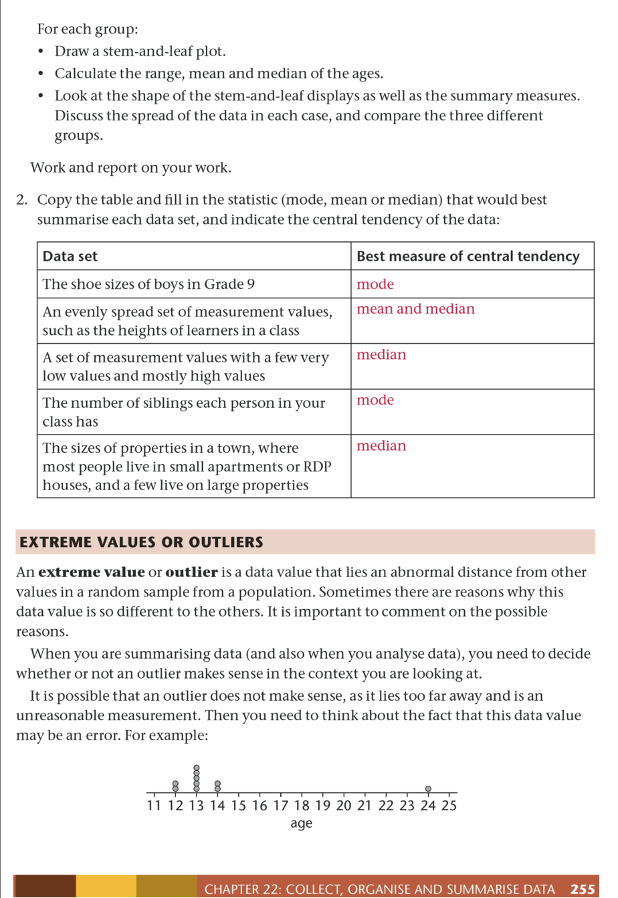
> **[Diagram Context - Textbook_Mathematics_Gr9_Collect-organise-and-summarise-data.pdf-0016-23.png]**
> This educational resource features a table comparing appropriate measures of central tendency (mean, median, and mode) for various data sets, followed by a dot plot illustrating the concept of an outlier at age 24. It guides learners to critically evaluate data distribution and identify when extreme values may skew statistical summaries or indicate measurement errors.

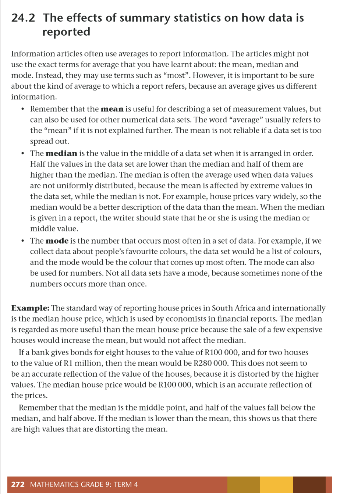
> **[Diagram Context - Textbook_Mathematics_Gr9_Interpret-analyse-and-report-on-data.pdf-0016-14.png]**
> This educational text provides a conceptual overview of summary statistics, specifically defining the mean, median, and mode within the context of data reporting. It uses a practical example of house prices to illustrate how extreme values can distort the mean, thereby demonstrating why the median is often a more reliable measure for skewed data sets.

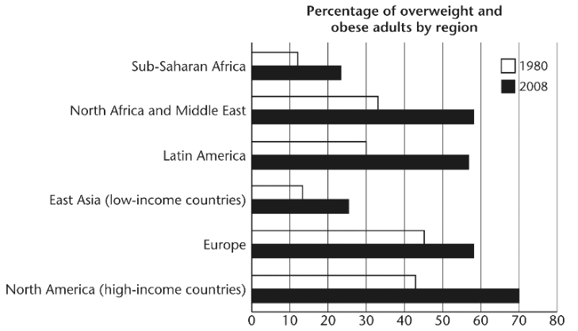
> **[Diagram Context - Textbook_Mathematics_Gr9_Representing-data.pdf-0016-00.png]**
> This horizontal bar graph compares the percentage of overweight and obese adults across six global regions for the years 1980 (white bars) and 2008 (black bars). It illustrates a significant global trend of increasing obesity rates over time, providing learners with a visual tool to analyse demographic health data and identify regional disparities in lifestyle-related health outcomes.

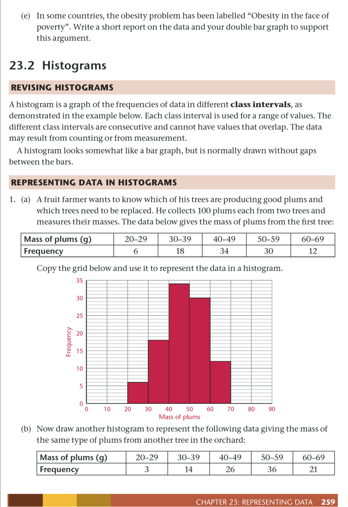
> **[Diagram Context - Textbook_Mathematics_Gr9_Representing-data.pdf-0016-12.png]**
> This educational resource features a histogram representing the frequency distribution of plum masses, with the x-axis labeled "Mass of plums (g)" and the y-axis labeled "Frequency." The diagram illustrates how continuous data is grouped into non-overlapping class intervals and displayed as adjacent bars to visualize the distribution of a dataset. By comparing the provided table and graph, students learn to translate numerical frequency data into a graphical format that highlights the spread and central tendency of the measurements.

---

### Factors and Products

#### Key Concepts
*   **Product:** When numbers are multiplied together, the result is called the product. For example, $105 = 3 \times 5 \times 7$. We say $105$ is the product of $3, 5,$ and $7$.
*   **Factors:** The whole numbers that are multiplied to form a number are called the factors of that number. For example, since $6 \times 8 = 48$, both $6$ and $8$ are factors of $48$.
*   **Repeated Factor:** When a factor appears more than once in the product of a number, it is called a repeated factor. For example, $36 = 2 \times 2 \times 3 \times 3$. Here, $2$ and $3$ are repeated factors.

---

#### Exercises

**5. Express each of the following numbers as a product of three numbers:**
(a) $248$
(b) $375$

**6. Describe all the different ways in which $48$ can be expressed as a product of two factors.**

**7. Express the following as a product of three factors:**
(a) $48$
(b) $75$

**8. Express $36$ as a product of:**
(a) Three factors
(b) Five factors

**9. Express each of the following numbers as a product of as many factors as possible (do not use $1$):**
(a) $300$
(b) $310$
(c) $320$
(d) $330$
(e) $340$
(f) $350$

---

### Prime Numbers

**1. Express each of the following numbers as a product of as many factors as possible (do not use $1$):**

| Letter | Number |
| :--- | :--- |
| (a) | $36$ |
| (b) | $37$ |
| (c) | $38$ |
| (d) | $39$ |
| (e) | $40$ |
| (f) | $41$ |
| (g) | $42$ |
| (h) | $43$ |
| (i) | $44$ |
| (j) | $45$ |
| (k) | $46$ |
| (l) | $47$ |
| (m) | $48$ |
| (n) | $49$ |

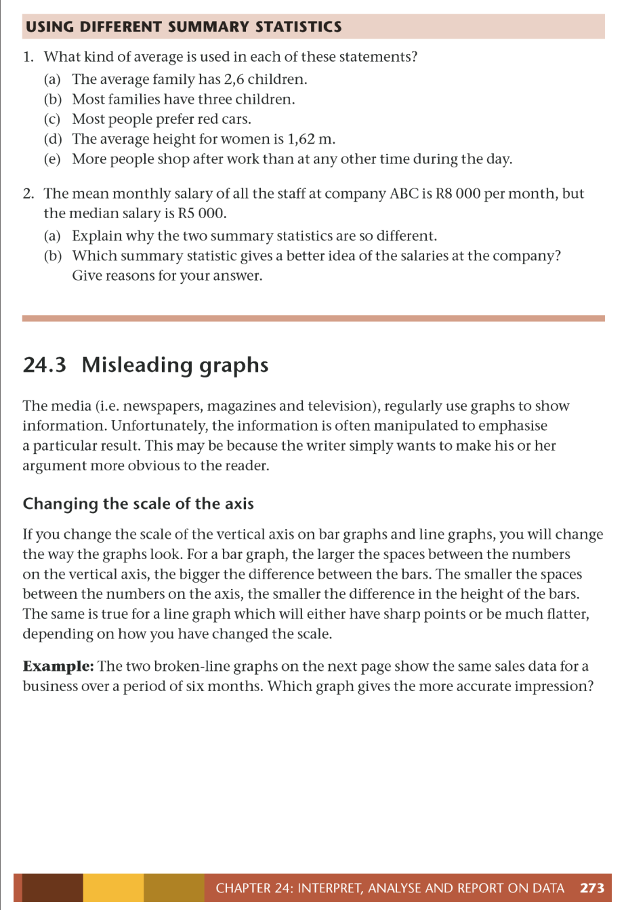
> **[Diagram Context - Textbook_Mathematics_Gr9_Interpret-analyse-and-report-on-data.pdf-0017-19.png]**
> This educational text presents a series of exercises and explanatory notes regarding summary statistics and the critical analysis of data visualization. It covers concepts such as mean, median, and mode, while highlighting how manipulating the scale of axes on bar and line graphs can create misleading visual representations of data. The content encourages learners to critically evaluate statistical claims and graphical integrity to avoid being influenced by biased data presentation.

---

### Prime Numbers

#### Definition
A **prime number** is a natural number greater than 1 that cannot be expressed as a product of two whole numbers, except as the product $1 \times \text{the number itself}$.

---

### Exercises

**2.** Identify which numbers cannot be expressed as a product of two whole numbers, except as $1 \times \text{the number itself}$.

**3.** 
(a) Identify the prime numbers from the previous set.
(b) List the prime numbers between 20 and 30.
(c) Determine if 11 and 17 are prime numbers.

---

### The Sieve of Eratosthenes
The Sieve of Eratosthenes is a historical method designed by the Greek mathematician Eratosthenes to identify all prime numbers up to a specific limit.

**4. Instructions to find prime numbers up to 100:**
*   **Step 1:** Cross out 1.
*   **Step 2:** Circle 2, then cross out all multiples of 2.
*   **Step 3:** Circle 3, then cross out all multiples of 3.
*   **Step 4:** Find the next number that has not been crossed out, circle it, and cross out all its multiples.
*   **Step 5:** Continue this process until all prime numbers are identified.

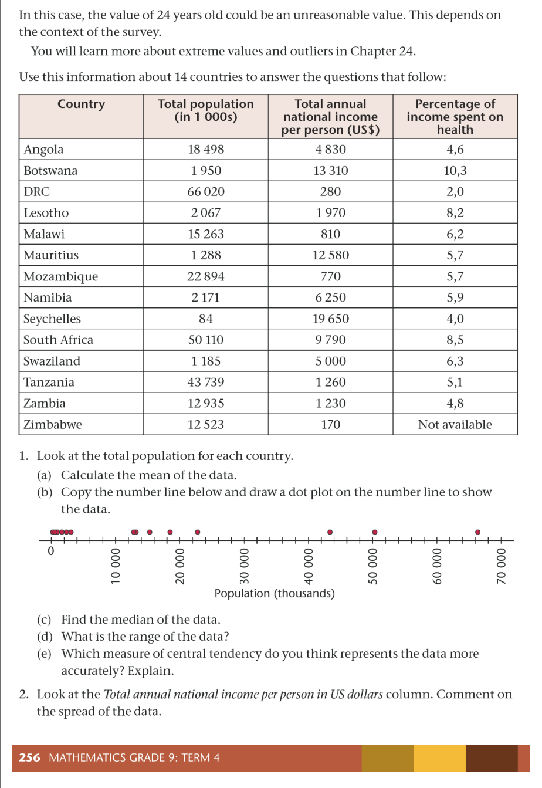
> **[Diagram Context - Textbook_Mathematics_Gr9_Collect-organise-and-summarise-data.pdf-0018-08.png]**
> This resource features a statistical data table listing 14 countries alongside their total population, annual income, and health expenditure, accompanied by a dot plot representing the population distribution on a number line. It provides learners with a practical application of data handling, requiring them to calculate measures of central tendency (mean and median) and dispersion (range) to interpret real-world socio-economic datasets.

| | | | | | | | | | |
|---|---|---|---|---|---|---|---|---|---|
| 1 | 2 | 3 | 4 | 5 | 6 | 7 | 8 | 9 | 10 |
| 11 | 12 | 13 | 14 | 15 | 16 | 17 | 18 | 19 | 20 |
| 21 | 22 | 23 | 24 | 25 | 26 | 27 | 28 | 29 | 30 |
| 31 | 32 | 33 | 34 | 35 | 36 | 37 | 38 | 39 | 40 |
| 41 | 42 | 43 | 44 | 45 | 46 | 47 | 48 | 49 | 50 |
| 51 | 52 | 53 | 54 | 55 | 56 | 57 | 58 | 59 | 60 |
| 61 | 62 | 63 | 64 | 65 | 66 | 67 | 68 | 69 | 70 |
| 71 | 72 | 73 | 74 | 75 | 76 | 77 | 78 | 79 | 80 |
| 81 | 82 | 83 | 84 | 85 | 86 | 87 | 88 | 89 | 90 |
| 91 | 92 | 93 | 94 | 95 | 96 | 97 | 98 | 99 | 100 |

---

### Prime Factorisation

**5.**
(a) What is the smallest number that can be formed as a product of three prime numbers, if the same factor may be repeated?
(b) What is the smallest number that can be formed as a product of three prime numbers, if no repeated factors are allowed?

**6.** Manare found that $840$ can be formed as the product of $2, 2, 2, 3, 5,$ and $7$. Check if this is correct.

#### Note on Prime Factorisation
When we express a number as a product of its prime factors, we say we have **found the prime factors** of the number, or that we have **factorised the number completely**.

**Example:**
$$2 \times 2 \rightarrow 4 \times 2 \rightarrow 8 \times 3 \rightarrow 24 \times 5 \rightarrow 120 \times 7 = 840$$

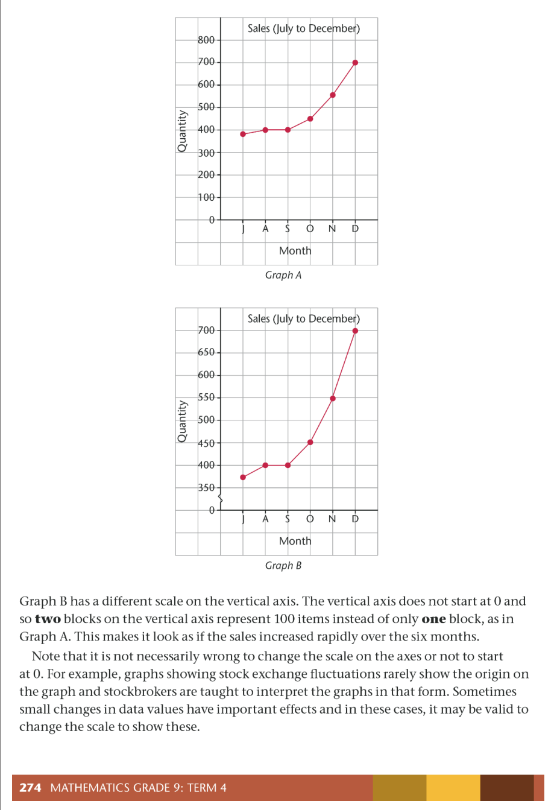
> **[Diagram Context - Textbook_Mathematics_Gr9_Interpret-analyse-and-report-on-data.pdf-0018-05.png]**
> This figure displays two line graphs, labeled Graph A and Graph B, which plot "Quantity" against "Month" (J, A, S, O, N, D) to represent sales data. By comparing a graph with a standard vertical axis starting at zero to one with a truncated axis and adjusted scale, the diagram illustrates how visual manipulation of axes can significantly alter the perceived rate of change in data.

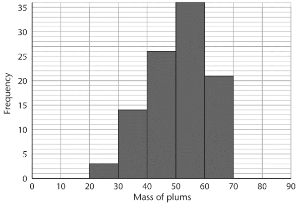
> **[Diagram Context - Textbook_Mathematics_Gr9_Representing-data.pdf-0018-00.png]**
> This graphic is a histogram displaying the frequency distribution of the mass of plums, with the x-axis representing "Mass of plums" in intervals of 10 and the y-axis representing "Frequency." It illustrates how to represent grouped continuous data visually, allowing students to identify the modal class and observe the overall distribution pattern of the dataset.

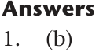

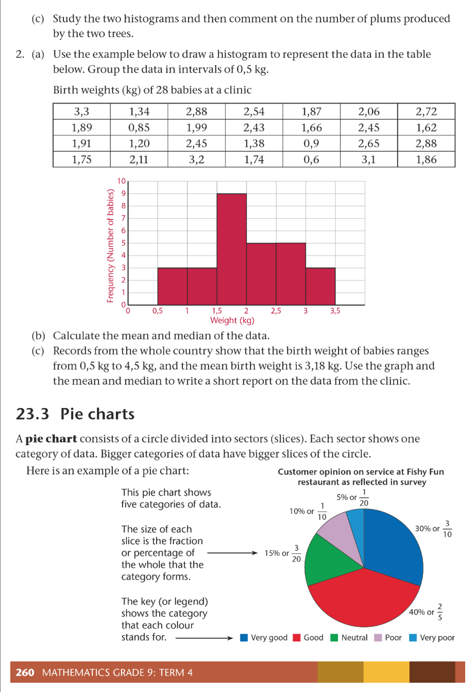
> **[Diagram Context - Textbook_Mathematics_Gr9_Representing-data.pdf-0018-17.png]**
> This educational resource features a histogram representing grouped birth weight data and a pie chart illustrating categorical data distribution through percentages and fractions. The histogram uses frequency on the y-axis and weight intervals on the x-axis to demonstrate data grouping, while the pie chart uses a color-coded legend to show how parts of a whole relate to specific categories. Together, these visuals teach learners how to organize, interpret, and compare statistical data sets using different graphical representations.

---

### Prime Factors and Common Factors

#### Exercises: Prime Factors
**7. Determine the original numbers from their prime factors:**
(a) $3 \times 5 \times 5 \times 11 = 825$
(b) $3 \times 3 \times 5 \times 7 = 315$
(c) $2 \times 7 \times 11 \times 13 = 2002$

**8. Investigation: Evaluate the following statements:**
*   **(a) If a number is even, 2 is one of its prime factors.** (True: All even numbers are divisible by 2.)
*   **(b) If half an even number is also even, 2 is a repeated prime factor.** (True: If $n$ is even, $n = 2 \times k$. If $k$ is also even, $k = 2 \times m$, therefore $n = 2 \times 2 \times m = 2^2 \times m$.)
*   **(c) If a number is odd, 3 is one of its prime factors.** (False: For example, 5, 7, 11, and 13 are odd but do not have 3 as a factor.)
*   **(d) If a number ends in 0 or 5, then 5 is one of its prime factors.** (True: Divisibility rules state that any number ending in 0 or 5 is divisible by 5.)

---

#### Method: Finding Prime Factors
To find the prime factors of a number:
1. Divide by 2 repeatedly until the result is odd.
2. Divide by 3 repeatedly until no longer possible.
3. Continue the process using the next prime numbers ($5, 7, 11, \dots$) until the quotient is 1.

**9. Find the prime factors of the following:**
(a) $588 = 2^2 \times 3 \times 7^2$
(b) $825 = 3 \times 5^2 \times 11$
(c) $729 = 3^6$
(d) $999 = 3^3 \times 37$
(e) $538 = 2 \times 269$
(f) $113 = 113$ (113 is a prime number)

**10. Find at least three prime numbers between 800 and 850:**
*   809, 811, 821, 823, 827, 829, 839, 853 (Any three of these).

---

### Highest Common Factor (HCF) and Lowest Common Multiple (LCM)

**1. Factorisation Exercise:**
(a) Factorise 195 and 385:
*   $195 = 3 \times 5 \times 13$
*   $385 = 5 \times 7 \times 11$
(b) Is 7 a factor of both 195 and 385? No (7 is a factor of 385, but not 195).
(c) Is 5 a factor of both 195 and 385? Yes.

#### Key Definitions
*   **Common Factor:** When a number is a factor of two or more other numbers, it is called a common factor of those numbers.
*   **Highest Common Factor (HCF):** The biggest number that is a factor of two or more numbers is called the highest common factor (HCF) of the numbers.

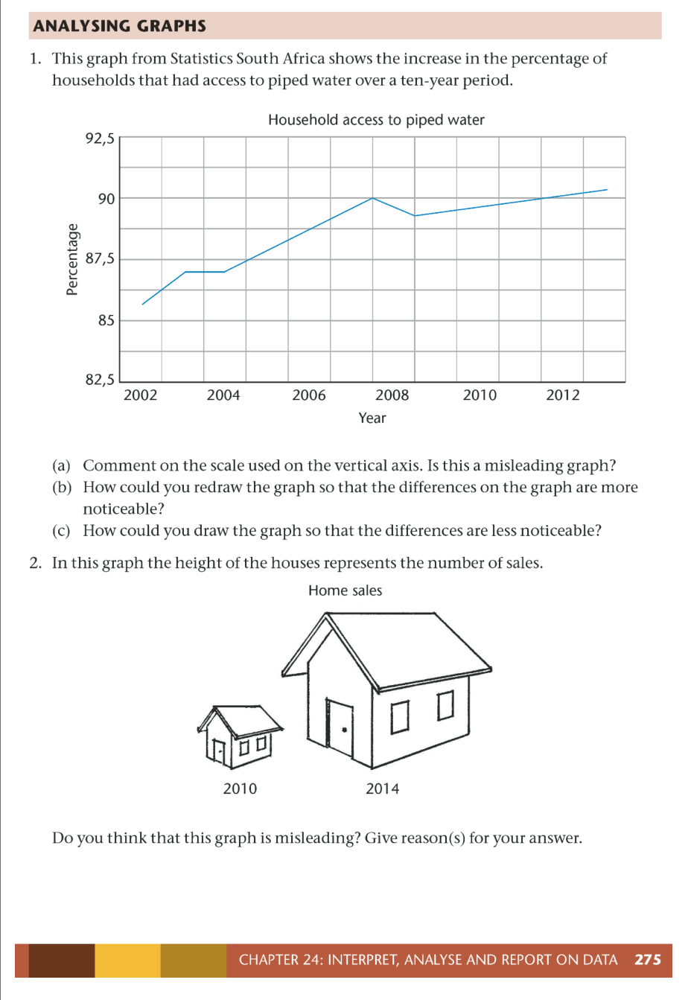
> **[Diagram Context - Textbook_Mathematics_Gr9_Interpret-analyse-and-report-on-data.pdf-0019-08.png]**
> This educational resource features a line graph plotting the percentage of household access to piped water against years, and a pictorial bar graph comparing home sales between 2010 and 2014. The labels include "Percentage" and "Year" for the line graph, and "Home sales" for the pictorial representation. These examples conceptually challenge students to critically evaluate how data visualization techniques, such as axis scaling and the use of 3D objects, can be manipulated to either exaggerate or diminish perceived trends in statistical reporting.

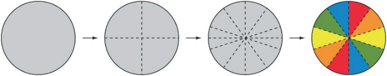
> **[Diagram Context - Textbook_Mathematics_Gr9_Representing-data.pdf-0019-05.png]**
> This diagram illustrates the sequential division of a circle into twelve equal sectors, represented by dashed radial lines and distinct color-coded segments. It conceptually demonstrates the geometric partitioning of a whole into fractional parts, providing a visual foundation for understanding angles, circular proportions, and the construction of a colour wheel.

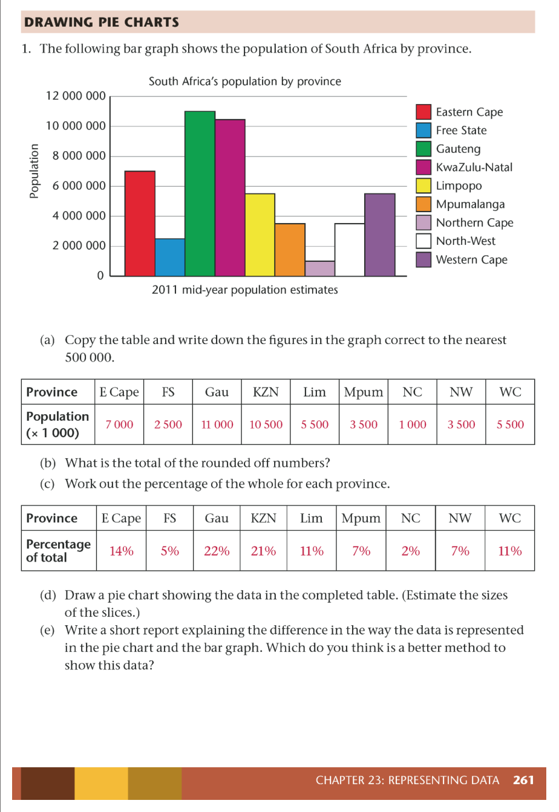
> **[Diagram Context - Textbook_Mathematics_Gr9_Representing-data.pdf-0019-16.png]**
> This graphic features a bar graph representing South Africa's 2011 provincial population estimates, accompanied by data tables showing population figures in thousands and their corresponding percentage contributions to the national total. It illustrates the process of data transformation, guiding students to convert absolute values into percentages to facilitate the construction of a pie chart. This exercise reinforces core CAPS data handling skills by demonstrating how different graphical representations highlight distinct aspects of a dataset, such as magnitude versus proportional distribution.

---

### 2. Highest Common Factor (HCF) Exercises
Find the HCF for the following pairs:
(a) $2 \times 2 \times 5 \times 7 \times 7 \times 11 \times 17$ and $2 \times 3 \times 3 \times 7 \times 7 \times 11 \times 13 \times 23$
(b) $24$ and $40$
(c) $8$ and $12$
(d) $12$ and $20$
(e) $210$ and $56$

### 3. HCF Application
Write five different numbers, all different from $35$, that have $35$ as a highest common factor.

### 4. Multiples and Lowest Common Multiple (LCM)
Copy the patterns below and write the next seven numbers for each:
*   **Pattern A:** $12, 24, 36, 48, \dots$
*   **Pattern B:** $15, 30, 45, 60, \dots$

**Definitions:**
*   **Multiples:** The numbers in Pattern A are multiples of $12$. The numbers in Pattern B are multiples of $15$.
*   **Common Multiples:** Numbers that appear in both patterns (e.g., $60, 120$).
*   **Lowest Common Multiple (LCM):** The smallest number that is a common multiple of two or more numbers. For $12$ and $15$, the LCM is $60$.

### 5. LCM Exercise
Continue writing multiples of $18$ and $24$ until you find the LCM:
*   $18, 36, \dots$
*   $24, 48, \dots$

### 6. HCF and LCM Practice
Find the HCF and LCM for the following pairs:
(a) $5$ and $7$
(b) $15$ and $14$
(c) $20$ and $30$
(d) $10$ and $100$
(e) $8$ and $9$
(f) $25$ and $24$
(g) $8$ and $12$
(h) $10$ and $18$

---

## 1.4 Properties of Operations

### Order of Operations and the Associative Property
A **numerical expression** is a set of instructions for a calculation, such as $200 - 130 - 30$.

**The Problem of Interpretation:**
Different people may interpret the order of operations differently:
*   **Ben's method:** $(200 - 130) - 30 = 70 - 30 = 40$
*   **Sara's method:** $200 - (130 - 30) = 200 - 100 = 100$

To prevent different interpretations, mathematicians have established a universal agreement on the order of operations.

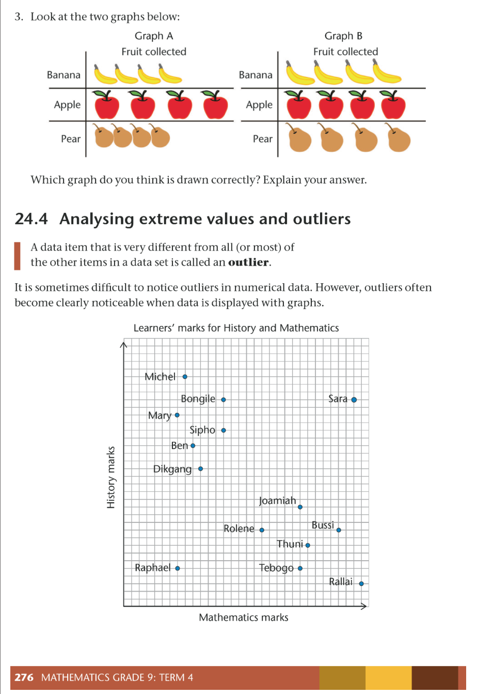
> **[Diagram Context - Textbook_Mathematics_Gr9_Interpret-analyse-and-report-on-data.pdf-0020-14.png]**
> This graphic features two pictographs comparing fruit collection and a scatter plot titled "Learners' marks for History and Mathematics" with labeled axes and individual data points. It introduces learners to the concept of outliers by demonstrating how visual data representation makes it easier to identify values that deviate significantly from the general trend of a data set.

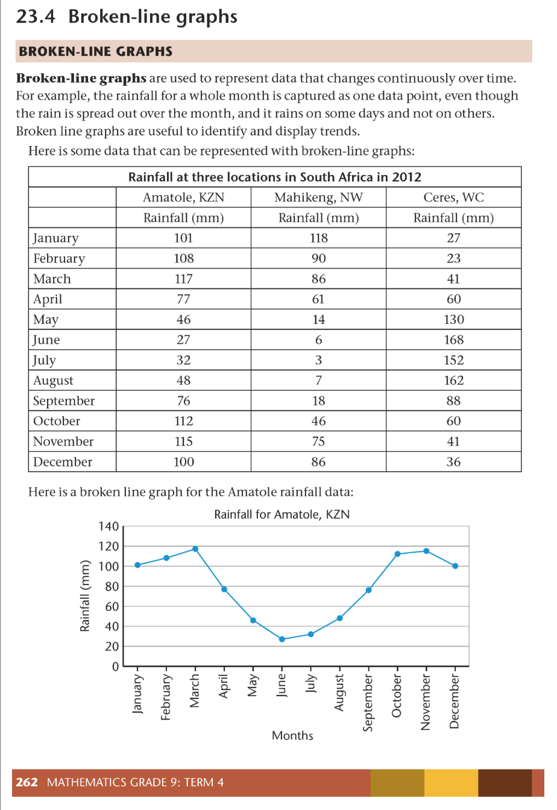
> **[Diagram Context - Textbook_Mathematics_Gr9_Representing-data.pdf-0020-20.png]**
> This educational resource features a data table and a corresponding broken-line graph illustrating rainfall patterns across three South African locations. The graph plots "Rainfall (mm)" on the vertical axis against "Months" on the horizontal axis, using connected data points to visualize continuous trends. It serves to teach learners how to translate tabular data into a graphical format to effectively identify and interpret fluctuations in environmental data over time.

---

### Mathematical Conventions: Addition and Subtraction

In a numerical expression that involves **addition and subtraction only**, the operations should be performed from **left to right**, unless otherwise indicated. An agreement like this is called a **mathematical convention**.

#### Exercises
1. Who followed this convention, Ben or Sara?
2. Follow the convention and calculate:
   (a) $8\,000 + 6\,000 - 3\,000$
   (b) $8\,000 - 3\,000 + 6\,000$
   (c) $8\,000 + 3\,000 - 6\,000$
3. Follow the convention and calculate:
   (a) $R25\,000 + R30\,000 + R13\,000 + R6\,000$
   (b) $R13\,000 + R6\,000 + R30\,000 + R25\,000$
   (c) $R30\,000 + R25\,000 + R6\,000 + R13\,000$

---

### The Associative Property of Addition

When three or more numbers are added, the order in which you perform the calculations makes no difference. This is called the **associative property of addition**. We also say that: **addition is associative**.

4. Investigate whether multiplication is associative. Use the numbers $2, 3, 5$ and $10$.
5. What must be added to each of the following numbers to get $100$?
   $73, 56, 66, 41, 34, 23, 88$
6. Calculate the following (use smart grouping to simplify):
   (a) $73 + 54 + 27 + 46 + 138$
   (b) $34 + 88 + 41 + 66 + 59 + 12 + 127$

---

### The Commutative Property of Addition and Multiplication

1. Solve the following problems:
   (a) What is the total cost of $20$ chairs at $R250$ each?
   (b) What is the total cost of $250$ exercise books at $R20$ each?
   (c) $R5\,000$ was paid for $100$ towels. What is the price for one towel?
   (d) $R100$ was paid for $5\,000$ beads. What is the price for one bead?

2. Which of the following calculations will produce the same answer? Copy the calculations and mark those that produce the same answers with a $\checkmark$ and those that won't with an $\times$.
   (a) $20 \times 250$ and $250 \times 20$
   (b) $5\,000 \div 100$ and $100 \div 5\,000$
   (c) $730 + 270$ and $270 + 730$
   (d) $730 - 270$ and $270 - 730$

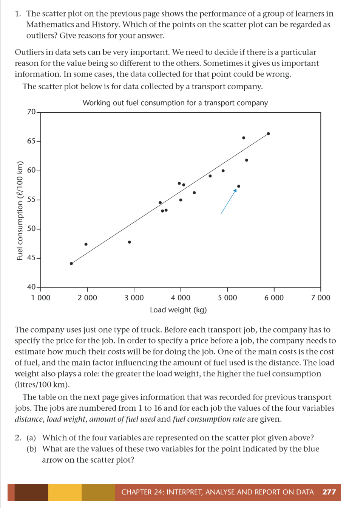
> **[Diagram Context - Textbook_Mathematics_Gr9_Interpret-analyse-and-report-on-data.pdf-0021-11.png]**
> This graphic is a scatter plot with a line of best fit, featuring the axes "Load weight (kg)" and "Fuel consumption (ℓ/100 km)" with a blue arrow highlighting a specific data point. It illustrates the positive correlation between load weight and fuel consumption, helping learners identify trends and outliers within a bivariate data set.

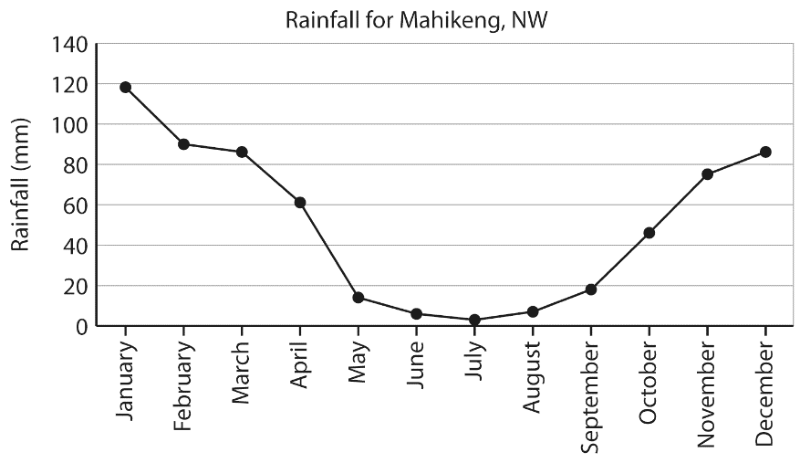
> **[Diagram Context - Textbook_Mathematics_Gr9_Representing-data.pdf-0021-05.png]**
> This line graph illustrates the seasonal rainfall patterns for Mahikeng, North West, using months of the year on the x-axis and rainfall in millimetres (mm) on the y-axis. It enables learners to analyse climatic data by identifying the summer rainfall peak and the distinct dry winter season characteristic of the region's climate.

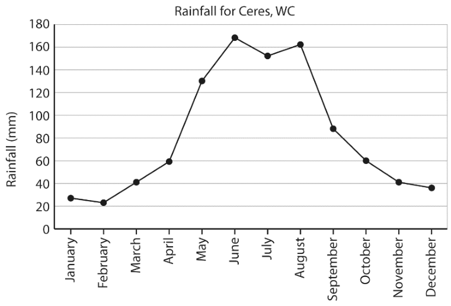
> **[Diagram Context - Textbook_Mathematics_Gr9_Representing-data.pdf-0021-07.png]**
> This line graph illustrates the monthly rainfall patterns for Ceres, Western Cape, with the x-axis representing the months of the year and the y-axis indicating rainfall in millimeters (mm). It conceptually demonstrates the winter-rainfall climate characteristic of the region, allowing students to interpret seasonal precipitation trends and data distribution over a 12-month period.

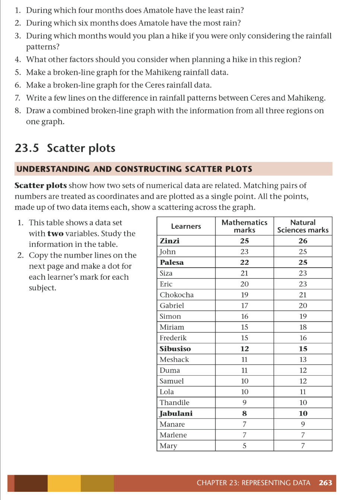
> **[Diagram Context - Textbook_Mathematics_Gr9_Representing-data.pdf-0021-10.png]**
> This educational resource presents a data table containing two numerical variables: Mathematics marks and Natural Sciences marks for a group of learners. It serves as a foundational exercise for students to organize bivariate data, which is essential for constructing scatter plots to identify potential correlations between two sets of academic performance scores.

---

### Commutative Property
The commutative property states that the order in which you add or multiply numbers does not change the result. For example, $25 + 75 = 75 + 25$.

**Exercise 3: Investigating Commutativity**
Demonstrate each of your answers with two different examples:
*   (a) Is subtraction commutative?
*   (b) Is multiplication commutative?
*   (c) Is division commutative?

---

### Conventions and the Distributive Property

#### Order of Operations
Mathematicians have agreed that, unless otherwise indicated, **multiplication and division must be performed before addition and subtraction.**

**Example:**
The expression $20 + 5 \times 3$ means:
1. Multiply $5 \times 3 = 15$
2. Add $20 + 15 = 35$

**Exercise 2: Applying the Convention**
Calculate the following:
*   (a) $500 + 20 \times 10$
*   (b) $500 - 20 \times 10$
*   (c) $500 + 20 - 10$
*   (d) $500 - 20 + 10$
*   (e) $500 + 200 \div 5$
*   (f) $500 - 200 \div 5$

---

### Using Brackets
To specify that addition or subtraction must be performed before multiplication or division, we use **brackets**. Operations inside brackets are always performed first.

**Example:**
To express "Add 5 to 20, then multiply the answer by 5," we write:
$$(20 + 5) \times 5 = 25 \times 5 = 125$$

#### Summary of Rules
| Rule | Description |
| :--- | :--- |
| **No Brackets** | Multiplication and division are performed first; addition and subtraction are performed later. |
| **With Brackets** | Operations inside the brackets are performed first, regardless of the operation type. |

**Additional Examples:**
*   $12 + 3 \times 5$ means "multiply $3 \times 5$, then add $12$."
*   To say "add $5$ and $12$, then multiply by $3$," we write $3 \times (5 + 12)$ or $(5 + 12) \times 3$.

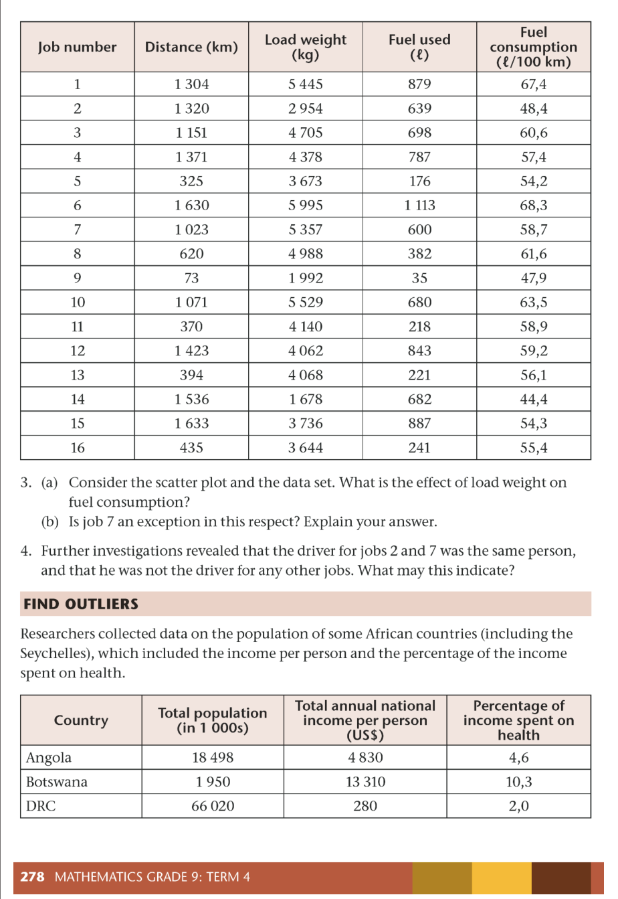
> **[Diagram Context - Textbook_Mathematics_Gr9_Interpret-analyse-and-report-on-data.pdf-0022-07.png]**
> This graphic presents two statistical data tables used for Grade 9 Mathematics exercises, featuring variables such as job number, distance, load weight, fuel consumption, national income, and health expenditure. It requires students to interpret bivariate data, identify trends or correlations, and detect outliers within real-world contexts. By analyzing these tables, learners develop critical skills in data handling, specifically regarding the influence of independent variables on dependent outcomes and the impact of external factors on data consistency.

---

### Mathematical Conventions and Operations

When working with numerical expressions, always remember the order of operations (BODMAS/BIDMAS):
1. **B**rackets
2. **O**rders (Exponents/Roots)
3. **D**ivision and **M**ultiplication (from left to right)
4. **A**ddition and **S**ubtraction (from left to right)

---

### Exercises

#### 3. Numerical Expressions
Calculate the following, keeping mathematical conventions in mind:

| Letter | Expression | Letter | Expression |
| :--- | :--- | :--- | :--- |
| (a) | $500 + 30 \times 10$ | (b) | $(500 + 30) \times 10$ |
| (c) | $100 \times 500 + 30$ | (d) | $100 \times (500 + 30)$ |
| (e) | $500 - 30 \times 10$ | (f) | $(500 - 30) \times 10$ |
| (g) | $100 \times 500 - 30$ | (h) | $100 \times (500 - 30)$ |
| (i) | $(200 + 300) \div 20$ | (j) | $200 \div 20 + 300 \div 20$ |
| (k) | $600 \div (20 + 30)$ | (l) | $600 \div 20 + 600 \div 30$ |

#### 4. Distributive Property
Calculate the following:

| Letter | Expression | Letter | Expression |
| :--- | :--- | :--- | :--- |
| (a) | $50 \times (70 + 30)$ | (b) | $50 \times 70 + 50 \times 30$ |
| (c) | $50 \times (70 - 30)$ | (d) | $50 \times 70 - 50 \times 30$ |

*Note: Your answers for 4(a) and 4(b) should be the same. Your answers for 4(c) and 4(d) should also be the same.*

#### 5. Predicting Outcomes
Do not perform the calculations yet. Analyze the expressions below and answer the questions (a) through (f):

**Expressions:**
*   A: $5 \times (200 + 3)$
*   B: $5 \times 200 + 3$
*   C: $5 \times 200 + 5 \times 3$
*   D: $5 + 200 \times 3$
*   E: $(5 + 200) \times 3$
*   F: $(200 + 3) \times 5$
*   G: $5 \times 203$
*   H: $5 \times 100 + 5 \times 103$
*   I: $5 \times 300 - 5 \times 70$

**Questions:**
(a) Will A and B have the same answers?
(b) Will G and H have the same answers?
(c) Will A and D have the same answers?
(d) Will A and G have the same answers?
(e) Will A and F have the same answers?
(f) Will D and E have the same answers?

#### 6. Verification
Perform the calculations for A through I listed in Question 5 and check your predictions.

#### 7. Investigation: The Distributive Property
(a) Choose three different numbers between 3 and 11.
(b) Add your first number to your third number. Multiply the answer by your second number.
(c) Multiply your first number by your second number. Also multiply your third number by your second number. Add the two answers.
(d) If you worked correctly, you should get the same answers in (b) and (c). Do you think you will get the same result with numbers between 10 and 100, or any other numbers?

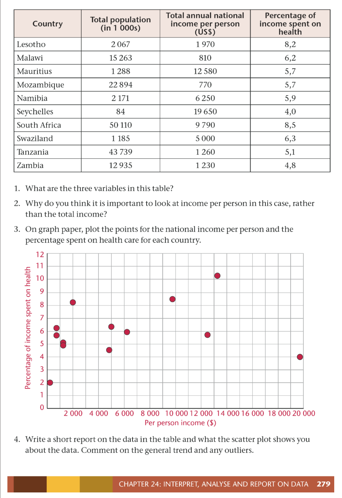
> **[Diagram Context - Textbook_Mathematics_Gr9_Interpret-analyse-and-report-on-data.pdf-0023-05.png]**
> This resource features a statistical data table and a corresponding scatter plot comparing "Total population," "Total annual national income per person (US$)," and "Percentage of income spent on health" across ten African countries. It is designed to help learners practice data interpretation, identify variables, and analyze correlations or trends between economic status and public health expenditure.

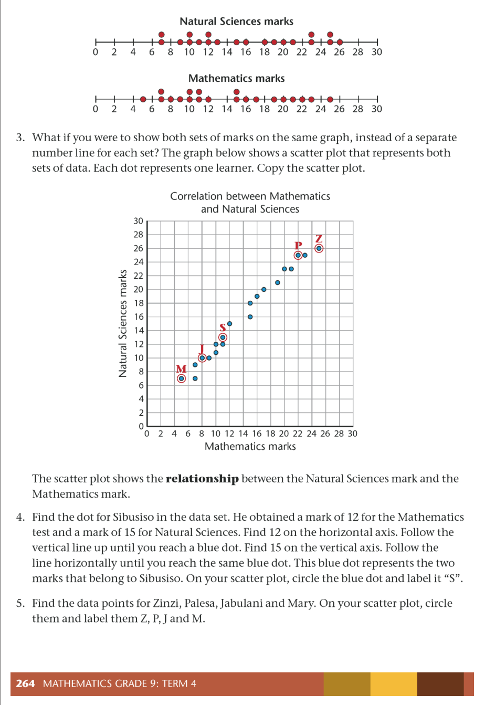
> **[Diagram Context - Textbook_Mathematics_Gr9_Representing-data.pdf-0023-24.png]**
> This graphic features two dot plots representing individual subject marks and a scatter plot with axes labeled "Mathematics marks" and "Natural Sciences marks," containing multiple data points and specific labels (Z, P, S, J, M). It conceptually illustrates how to represent bivariate data visually to identify a positive correlation between two variables, teaching learners how to map individual data points to specific coordinate values.

---

### The Distributive Property

The **distributive property of multiplication over addition** states that multiplying a sum by a number is the same as multiplying each addend by the number and then adding the products together.

**Formula:**
$$a \times (b + c) = (a \times b) + (a \times c)$$

#### Exercises
8. Check whether the distributive property is true for the following sets of numbers:
    * (a) $100, 50,$ and $10$
    * (b) Three numbers of your own choice.

9. Use the numbers in question 8(a) to investigate whether multiplication also distributes over subtraction.

10. Verify that $8 \times 238 = 1\,904$ by calculating $238 + 238 + 238 + 238 + 238 + 238 + 238 + 238$ or by using a calculator.

---

### 1.5 Basic Operations: A Method of Addition

To add two numbers, align them vertically so that the units are below the units, tens below the tens, hundreds below the hundreds, and so on. This allows you to add each place value column separately.

**Example:** Calculate $378\,539 + 46\,285$

| | | | | | |
| :--- | :--- | :--- | :--- | :--- | :--- |
| | | $378\,539$ | | | |
| $+$ | | $46\,285$ | | | |

**Conceptual Breakdown:**
When adding, you can visualize the numbers broken down by their place values:

| Place Value | Hundred Thousands | Ten Thousands | Thousands | Hundreds | Tens | Units |
| :--- | :--- | :--- | :--- | :--- | :--- | :--- |
| **Number 1** | $300\,000$ | $70\,000$ | $8\,000$ | $500$ | $30$ | $9$ |
| **Number 2** | | $40\,000$ | $6\,000$ | $200$ | $80$ | $5$ |

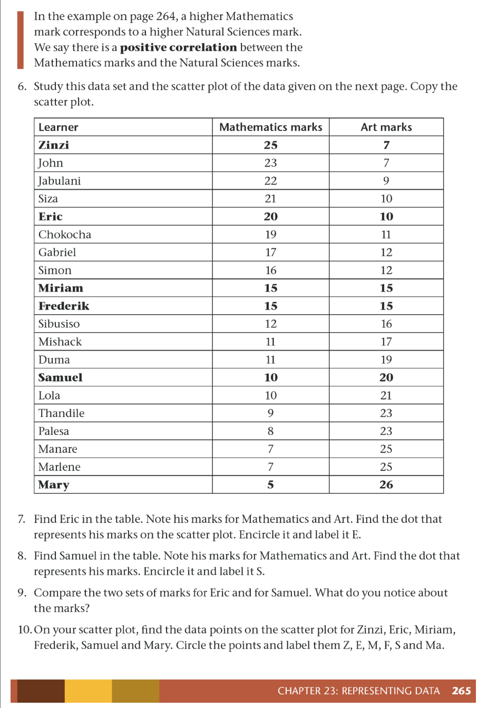
> **[Diagram Context - Textbook_Mathematics_Gr9_Representing-data.pdf-0024-11.png]**
> This image presents a statistical data table listing individual learners alongside their respective Mathematics and Art marks. The table serves as the foundational dataset for constructing a scatter plot, allowing students to identify and interpret the relationship between two variables. By comparing specific data points, learners can conceptually explore the nature of correlation—in this case, a negative correlation—within the context of data representation.

---

### Addition of Whole Numbers: Column Method

When adding large numbers, you can break them down into their place values (hundred thousands, ten thousands, thousands, hundreds, tens, and units) to make the calculation easier.

#### Example: $378\,539 + 46\,285$

By breaking the numbers into columns, we can add each place value separately:

| | Hundred Thousands | Ten Thousands | Thousands | Hundreds | Tens | Units |
| :--- | :---: | :---: | :---: | :---: | :---: | :---: |
| | | | | | | |
| | | $70\,000$ | $8\,000$ | $500$ | $30$ | $9$ |
| | | $40\,000$ | $6\,000$ | $200$ | $80$ | $5$ |
| | | | | | | $14$ |
| | | | | | $110$ | |
| | | | | $700$ | | |
| | | | $14\,000$ | | | |
| | | $110\,000$ | | | | |
| | $300\,000$ | | | | | |
| **Total** | **$300\,000$** | **$110\,000$** | **$14\,000$** | **$700$** | **$110$** | **$14$** |

**Result:** $300\,000 + 110\,000 + 14\,000 + 700 + 110 + 14 = 424\,824$

---

#### The Concept of "Carrying"
You do not have to start with the units; you can start with any place value. However, starting with the units allows for a more compact method where you "carry" values to the next column:

*   **Example:** When adding $9 + 5$ in the units column, you get $14$.
*   Write down the $4$ in the units column.
*   **Carry** the $10$ over to the tens column.
*   Add the carried $10$ to the other tens ($30 + 80 + 10 = 120$).
*   Write down the $2$ in the tens column and carry the $100$ to the hundreds column.

---

#### Exercises

**1. Calculate the following:**
(a) $237\,847 + 87\,776$
(b) $567\,298 + 392\,076$
(c) $28\,387 + 365\,667$

**2. Municipal Budget Calculation**
Calculate the total expenditure for the new office equipment listed below:

| Item Description | Cost (R) |
| :--- | :--- |
| 74 new office chairs | $54\,020$ |
| 42 new computer screens | $100\,800$ |
| 12 new printers | $141\,600$ |
| 18 new tea trolleys | $25\,740$ |
| 8 new carpets for senior staff offices | $144\,000$ |
| 108 small plastic filing cabinets | $52\,380$ |
| New table for the boardroom | $48\,000$ |
| 18 new chairs for the boardroom | $41\,400$ |
| **Total Expenditure** | **R** |

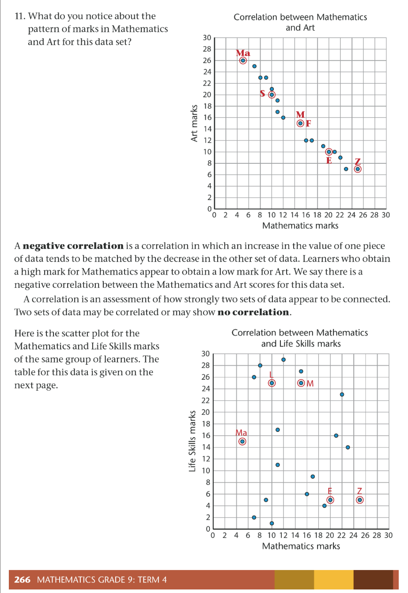
> **[Diagram Context - Textbook_Mathematics_Gr9_Representing-data.pdf-0025-08.png]**
> This educational graphic displays two scatter plots comparing Mathematics marks against Art and Life Skills marks, featuring labeled data points (Ma, S, M, F, E, Z, L) on Cartesian axes. It conceptually illustrates the difference between a strong negative correlation, where variables move in opposite directions, and a lack of correlation, where no discernible linear pattern exists between the data sets.

---

### Exercises: Budgeting Calculations

2. How much has the municipal manager budgeted for printers and computer screens together?
3. How much, in total, has the municipal manager budgeted for chairs and tables?
4. Work out the total cost of all the items the municipal manager has budgeted for.
5. Calculate:
    (a) $23\,809 + 2\,009 + 23$
    (b) $320\,293 + 16\,923 + 349 + 200\,323$

---

### Methods of Subtraction

#### Method 1: "Filling Up"
To calculate the difference between two numbers, you can "fill up" from the smaller number to the larger number.

**Example:** Calculate $R835\,234 - R687\,885$
1. $687\,885 + 15 = 687\,900$
2. $687\,900 + 100 = 688\,000$
3. $688\,000 + 12\,000 = 700\,000$
4. $700\,000 + 135\,234 = 835\,234$

**Summing the additions:**
| | |
| :--- | :--- |
| | $15$ |
| | $100$ |
| | $12\,000$ |
| | $135\,234$ |
| **Total** | **$147\,349$** |

Therefore, $R835\,234 - R687\,885 = R147\,349$.

#### Method 2: Rounding Off and Compensating
This method involves rounding the number being subtracted to a "round" number, performing the subtraction, and then adjusting the result.

**Example:** Calculate $R3\,224 - R1\,885$
1. Round $R1\,885$ up to $R2\,000$:
   * $1\,885 + 15 = 1\,900$
   * $1\,900 + 100 = 2\,000$
   * Total added: $15 + 100 = 115$
2. Add the same amount ($115$) to the first number:
   * $3\,224 + 115 = 3\,339$
3. Subtract the rounded number:
   * $3\,339 - 2\,000 = 1\,339$

**Mathematical Logic:**
$R3\,224 - R1\,885 = (R3\,224 + R115) - (R1\,885 + R115) = R1\,339$

---

### Practice Exercises

1. Calculate each of the following:
    (a) $6\,234 - 2\,992$
    (b) $76\,214 - 34\,867$
    (c) $134\,372 - 45\,828$
    (d) $623\,341 - 236\,768$

2. Check each of your answers in question 1 by doing addition, or by doing subtraction with a different method than the one you have already used.

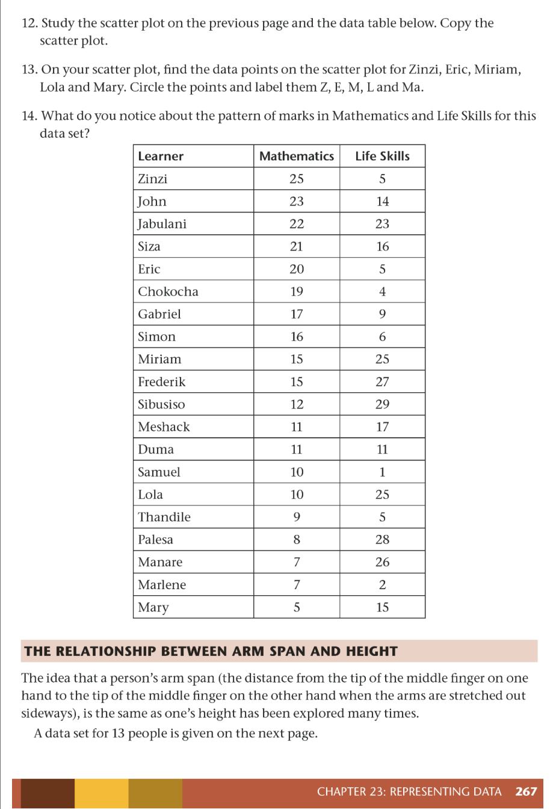
> **[Diagram Context - Textbook_Mathematics_Gr9_Representing-data.pdf-0026-14.png]**
> This educational resource presents a data table containing paired quantitative variables for 19 learners, specifically their marks in Mathematics and Life Skills. The exercise requires students to interpret and manipulate this data by plotting it on a scatter plot and identifying specific data points to analyze the correlation between the two subjects. This task develops foundational statistical literacy by teaching learners how to represent bivariate data and observe trends or patterns within a dataset.

---

### Subtraction Using Expanded Notation

Expanded notation allows you to break down large numbers into their place values to make subtraction easier. When a digit in the top number is smaller than the corresponding digit in the bottom number, you must "rearrange" (borrow) values from the higher place-value columns.

#### Worked Example: $835\,234 - 687\,885$

**Step 1: Initial Expansion**
| | Hundred Thousands | Ten Thousands | Thousands | Hundreds | Tens | Units |
| :--- | :--- | :--- | :--- | :--- | :--- | :--- |
| $835\,234$ | $800\,000$ | $30\,000$ | $5\,000$ | $200$ | $30$ | $4$ |
| $687\,885$ | $600\,000$ | $80\,000$ | $7\,000$ | $800$ | $80$ | $5$ |

**Step 2: Rearrangement (Borrowing)**
To make subtraction possible in each column, we shift values to the right:

| | Hundred Thousands | Ten Thousands | Thousands | Hundreds | Tens | Units |
| :--- | :--- | :--- | :--- | :--- | :--- | :--- |
| $835\,234$ | $700\,000$ | $120\,000$ | $14\,000$ | $1100$ | $120$ | $14$ |
| $687\,885$ | $600\,000$ | $80\,000$ | $7\,000$ | $800$ | $80$ | $5$ |
| **Difference** | $100\,000$ | $40\,000$ | $7\,000$ | $300$ | $40$ | $9$ |

**Final Result:** $147\,349$

---

### Exercises

**3. Describe the other rearrangements that were made in the above work.**
*(Hint: Explain how $10$ was taken from the tens, $100$ from the hundreds, and $1\,000$ from the thousands.)*

**4. Calculate the difference between the two car prices in each case:**
(a) $R73\,463$ and $R88\,798$
(b) $R63\,378$ and $R96\,889$

**5. In each case, first estimate the answer to the nearest $100\,000$, then calculate:**
(a) $238\,769 - 141\,453$
(b) $856\,333 - 439\,878$

**6. In each case, first estimate the answer to the nearest $10\,000$, then calculate:**
(a) $88\,023 - 45\,664$
(b) $342\,029 - 176\,553$

**7. Look again at the municipal budget on page 25. How much money does the municipal manager have left to buy new computers?**

**8. Calculate:**
(a) $670\,034 - 299\,999$
(b) $670\,034 - 300\,000$
(c) $376\,539 - 175\,998$
(d) $376\,541 - 176\,000$

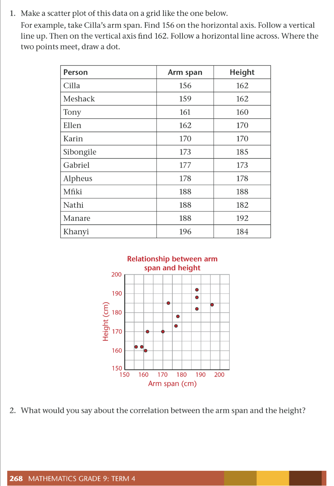
> **[Diagram Context - Textbook_Mathematics_Gr9_Representing-data.pdf-0027-03.png]**
> This graphic features a data table and a corresponding scatter plot illustrating the relationship between arm span and height. The visual components include a table listing names with their respective measurements, and a Cartesian plane labeled with "Arm span (cm)" on the x-axis and "Height (cm)" on the y-axis, populated with data points. Conceptually, this exercise teaches learners how to represent bivariate numerical data graphically to identify and interpret trends or correlations between two variables.

---

### A Method of Multiplication

Multiplication can be performed by breaking numbers into parts (place values) and calculating partial products before adding them together.

#### Example: $6 \times 3258$

**Method 1: Expanded Partial Products**
1. Break $3258$ into $3000 + 200 + 50 + 8$.
2. Multiply each part by $6$:
   * $6 \times 3000 = 18000$
   * $6 \times 200 = 1200$
   * $6 \times 50 = 300$
   * $6 \times 8 = 48$
3. Add the results: $18000 + 1200 + 300 + 48 = 19548$.

**Method 2: Vertical Column Method (with carrying)**
This method works from right to left. You write down the unit digit and "carry" the remaining value to the next column to be added to the next partial product.

<!-- DIAGRAM_PLACEHOLDER: diagram -->

---

### Exercises

**1. Calculate the following without a calculator:**
(a) $8 \times 786$
(b) $9 \times 3453$
(c) $60 \times 786$
(d) $60 \times 7860$

**2. Verification:**
Use a calculator to check your answers for Question 1. If incorrect, redo the work to identify your mistakes, then put the calculator away.

**3. Application:**
Use your answers from 1(a) and 1(c) to calculate $68 \times 786$.

**4. Calculation:**
Calculate $36 \times 378$ by breaking it into two parts: $30 \times 378$ and $6 \times 378$.

---

### Analysis of Multiplication: $76 \times 2348$

The table below shows the breakdown of the calculation $76 \times 2348$ (where $76 = 70 + 6$ and $2348 = 2000 + 300 + 40 + 8$).

| Row | Calculation | Result |
| :--- | :--- | :--- |
| A | $6 \times 8$ | $48$ |
| B | $6 \times 40$ | $240$ |
| C | $6 \times 300$ | $1800$ |
| D | $6 \times 2000$ | $12000$ |
| E | $70 \times 8$ | $560$ |
| F | $70 \times 40$ | $2800$ |
| G | $70 \times 300$ | $21000$ |
| H | $70 \times 2000$ | $140000$ |
| **Total** | | **$178448$** |

**5. Questions on the table above:**
(a) Explain how the $240$ in row B was obtained.
(b) Explain how the $560$ in row E was obtained.
(c) Explain how the $21000$ in row G was obtained.

---

### Column Multiplication
To multiply large numbers, you can use the column method. For example, to calculate $2\,348 \times 76$:

| | | | | |
| :--- | :--- | :--- | :--- | :--- |
| | | $2$ | $3$ | $4$ | $8$ |
| $\times$ | | | $7$ | $6$ |
| | $1$ | $4$ | $0$ | $8$ | $8$ |
| $1$ | $6$ | $4$ | $3$ | $6$ | $0$ |
| $1$ | $7$ | $8$ | $4$ | $4$ | $8$ |

---

### Exercises: Multiplication
**6. Calculate each of the following:**
(a) $53 \times 738$
(b) $73 \times 3\,457$

**7. Calculate:**
(a) $64 \times 3\,478$
(b) $78 \times 1\,298$
(c) $37 \times 3\,428$
(d) $78 \times 7\,285$

**8.** Use a calculator to check your answers for question 7. Redo any questions you got wrong to ensure you understand the method.

**9. Inverse Operations:**
Use your correct answers from question 7 to provide the answers to the following without performing new calculations:
(a) $101\,244 \div 1\,298$
(b) $568\,230 \div 7\,285$

**10. Calculate without using a calculator:**
(a) $3\,659 \times 38$
(b) $27 \times 23\,487$
(c) $486 \times 278$
(d) $2\,135 \times 232$

---

### A Process Called Long Division
Use a calculator to solve the following word problems:

1. You want to buy live chickens at R37 each. If you have R920 available, how many chickens can you buy in total?
2. R880 is to be shared equally among 34 learners. How many full rands can each learner receive?
3. You want to buy live chickens at R47 each. If you have R1\,280 available, how many chickens can you buy?
4. 42 equal bags of rice weigh a total of $7\,560\text{ g}$. How much does one bag weigh?
5. The number 26 was multiplied by a secret number, and the answer was $2\,184$. What is the secret number?

---

### Measurement Application
The image below is an accurate sketch of the back of a house. The red line on the sketch is $70\text{ mm}$ long and represents the width of the house. The blue line indicates the height of the chimney.

<!-- DIAGRAM_PLACEHOLDER: diagram -->

*Note: Do not measure the blue line.*

---

### Understanding Division: Grouping vs. Sharing

Division is used for two primary purposes:

*   **Grouping:** Used when you know the total amount and the size of each part, and you need to find out **how many parts** there are.
*   **Sharing:** Used when you know the total amount and the number of parts, and you need to find out **how big each part is**.

---

### Exercises: Concepts and Estimation

#### Question 6
The actual width of a house is $5\,600\text{ mm}$ and the height of the chimney is $3\,360\text{ mm}$.
*   (a) How many times is the house bigger than the sketch? Describe how to find this.
*   (b) Calculate the required length of the blue line on the sketch.
*   (c) Measure the blue line to verify your answer for (b).

#### Question 7
*   (a) Does question 3 require sharing or grouping?
*   (b) Does question 4 require sharing or grouping?

---

### Mental Math and Estimation Skills
To perform division without a calculator, it is essential to be able to **estimate products**. Use the following exercises to practice your estimation skills:

#### Question 8
**(a) Which is closest to $4\,080$?**
$10 \times 74$, $30 \times 74$, $50 \times 74$, $70 \times 74$, or $90 \times 74$?

**(b) Calculate some of the products to check your answer.**

**(c) Which is closest to $9\,238$?**
$30 \times 38$, $50 \times 38$, $100 \times 38$, $150 \times 38$, $200 \times 38$, $250 \times 38$, or $300 \times 38$?

**(d) Calculate some of the products to check your answer.**

**(e) Which is closest to $9\,746$?**
$10 \times 287$, $20 \times 287$, $30 \times 287$, $40 \times 287$, $50 \times 287$, $60 \times 287$, or $70 \times 287$?

**(f) Calculate some of the products to check your answer.**

**(g) By what multiple of $10$ should you multiply $27$ to get as close to $6\,487$ as possible?**

---

### Application: Financial Problem Solving

#### Question 9
A principal wants to buy T-shirts for $115$ Grade $7$ learners. The T-shirts cost $\text{R}67$ each, and there is a budget of $\text{R}8\,500$ available. Is there enough money to buy T-shirts for all learners? Explain your answer.

#### Question 10
*   (a) How much will $100$ of the T-shirts cost?
*   (b) How much money will be left if $100$ T-shirts are bought?
*   (c) How much money will be left if $20$ more T-shirts are bought?

<!-- DIAGRAM_PLACEHOLDER: diagram -->

---

### Long Division: Calculating T-shirt Purchases

The goal is to determine how many T-shirts, costing $R67$ each, can be purchased with a total budget of $R8\ 500$. This is solved using the long division method by breaking the total into "chunks."

#### Step-by-Step Calculation

| Step | Calculation Process | Reasoning |
| :--- | :--- | :--- |
| **1** | $67 \overline{)8\ 500}$ | Determine how many chunks of $67$ are in $8\ 500$. |
| **2** | $100 \times 67 = 6\ 700$ | Estimate at least $100$ chunks. Subtract $6\ 700$ from $8\ 500$ to get $1\ 800$ remaining. |
| **3** | $20 \times 67 = 1\ 340$ | Estimate at least $20$ more chunks. Subtract $1\ 340$ from $1\ 800$ to get $460$ remaining. |
| **4** | $5 \times 67 = 335$ | Estimate at least $5$ more chunks. Subtract $335$ from $460$ to get $125$ remaining. |
| **5** | $1 \times 67 = 67$ | Estimate $1$ more chunk. Subtract $67$ from $125$ to get $58$ remaining. |

#### Final Summary
By adding the chunks together:
$$100 + 20 + 5 + 1 = 126$$

*   **Total T-shirts purchased:** $126$
*   **Remainder (money left over):** $R58$

<!-- DIAGRAM_PLACEHOLDER: diagram -->

---

### Division Exercises (No Calculator)

**Instruction:** Do not use a calculator. The purpose of these exercises is to develop an understanding of division. Check your answers using multiplication.

**11. Word Problems**
*   **(a)** Selina bought 85 chickens for a total of R3 995. Calculate the cost per chicken. (Hint: Start by estimating how much she would have paid if each chicken cost R10).
*   **(b)** Anton has R4 850. If each young goat costs R78, how many goats can he buy?

**12. Long Division Calculations**
Calculate the following:
*   **(a)** $7\,234 \div 48$
*   **(b)** $3\,267 \div 24$
*   **(c)** $9\,500 \div 364$
*   **(d)** $8\,347 \div 24$

**13. Application Problems**
*   **(a)** A factory made 9 325 chocolates. If they are packed into boxes of 24, how many boxes can be filled?
*   **(b)** A farmer sells eggs in cartons of 36. If he sold 72 468 eggs in one month, how many cartons were sold?

---

### 1.6 Problem Solving: Rate and Ratio

**Note:** You may use a calculator for this section.

**Concept Definition:**
A **rate** describes how one quantity changes in relation to another quantity over time or space.
*   Instead of saying "85 000 litres each day", we say "at a rate of 85 000 litres per day".
*   Instead of saying "8 cm each hour", we say "at a rate of 8 cm per hour".

**Exercises**

1.  A village dam contains 688 000 litres of water. The villagers use 85 000 litres per day. If there is no rain, how many days will the water in the dam last?
2.  During heavy rain, a river level increases at a rate of $8\text{ cm/hour}$. By how much will the water level increase in 24 hours?
3.  A woman is driving from Johannesburg to Durban. Her distance from Durban decreases at a rate of approximately $95\text{ km/hour}$. How far does she travel in four hours?

<!-- DIAGRAM_PLACEHOLDER: diagram -->

---

### 4. Linear Growth Problem
**Problem:** The number of unemployed people in a province increases at a rate of $35\,000$ people per year. If there were $860\,000$ unemployed people in the year $2000$, how many unemployed people will there be, approximately, in the year $2020$?

*   **Step 1:** Calculate the number of years elapsed: $2020 - 2000 = 20 \text{ years}$.
*   **Step 2:** Calculate the total increase: $20 \times 35\,000 = 700\,000$.
*   **Step 3:** Add the increase to the initial amount: $860\,000 + 700\,000 = 1\,560\,000$.

---

### 5. Patterns and Ratios
<!-- DIAGRAM_PLACEHOLDER: diagram -->

**Concept:** A ratio compares quantities. In Pattern A, there are 4 yellow beads for every 5 red beads, written as $4 : 5$.

*   **Pattern B:** The ratio of yellow beads to red beads is $3 : 6$ (which simplifies to $1 : 2$).
*   **Pattern C:** The ratio of yellow beads to red beads is $2 : 7$.

---

### 6. Production Rates and Ratios
**Context:** Machine A produces $800$ tins/hour. Machine B produces $2\,400$ tins/hour.

#### (a) Production Table
| Number of hours | 1 | 2 | 3 | 5 | 8 |
| :--- | :--- | :--- | :--- | :--- | :--- |
| Number of tins produced by machine A | 800 | 1 600 | 2 400 | 4 000 | 6 400 |
| Number of tins produced by machine B | 2 400 | 4 800 | 7 200 | 12 000 | 19 200 |

#### (b) Comparison
How much faster is machine B than machine A?
$$\frac{2\,400}{800} = 3$$
Machine B is $3$ times faster than machine A.

#### (c), (d), and (e) Proportional Production
Since machine B is $3$ times faster, it produces $3$ tins for every $1$ tin produced by machine A.

*   **(c)** If machine A produces $30$ tins, machine B produces: $30 \times 3 = 90 \text{ tins}$.
*   **(d)** If machine A produces $200$ tins, machine B produces: $200 \times 3 = 600 \text{ tins}$.
*   **(e)** If machine A produces $1$ tin, machine B produces: $1 \times 3 = 3 \text{ tins}$.

---

### Summary of Ratios
*   **Production Ratio:** The ratio between the production speeds of machine A and machine B is $1 : 3$.

---

### Rates and Ratios

#### Problem 7: Speed and Distance
Truck A travels at $20\text{ km/h}$ and Truck B travels at $30\text{ km/h}$.

(a) Calculate the distance Truck B covers in the same time Truck A covers $10\text{ km}$.
(b) Complete the table below for distances covered by Truck B:

| Distance covered by truck A | 10 km | 18 km | 50 km | 100 km | 30 km |
| :--- | :--- | :--- | :--- | :--- | :--- |
| Distance covered by truck B | | | | | |

(c) What distance will Truck B cover in the same time that Truck A covers $1\text{ km}$?
(d) What is the ratio between the speed of Truck A and the speed of Truck B?

#### Problem 8: Sharing in a Ratio
Divide R240 between David and Sally in the ratio $3 : 5$. 
*   Total parts = $3 + 5 = 8$
*   David's share = $\frac{3}{8} \times 240$
*   Sally's share = $\frac{5}{8} \times 240$

#### Problem 9: Sharing R14 400
Calculate the share for each person if R14 400 is divided in the following ratios:
(a) $1 : 3$
(b) $5 : 7$

---

### Financial Mathematics

**Key Concepts:**
*   **Interest:** The money paid for using another person's (or bank's) money.
*   **Percentage:** $15\%$ is equivalent to $\frac{15}{100}$ (15 hundredths).
*   **Rent:** The money paid for using another person's house or property.

**Example:**
To calculate $15\%$ interest on R12 000:
1. Divide by 100: $12\,000 \div 100 = 120$
2. Multiply by 15: $120 \times 15 = 1\,800$
The interest is R1 800.

#### Exercises (No Calculator)

**1. Calculation Practice**
Calculate $12\,000 \div 100$, then multiply the answer by $15$.

**2. Calculate the following percentages:**
(a) $12\%$ of R8 000
(b) $18\%$ of R24 000

**3. Calculate the interest paid for the following loans:**
(a) R6 000 borrowed for one year at $9\%$ interest.
(b) R21 000 borrowed for three years at $11\%$ interest per year.
(c) R45 000 borrowed for ten years at $12\%$ interest per year.

<!-- DIAGRAM_PLACEHOLDER: diagram -->

---

### Profit, Loss, and Discount

#### Key Concepts
*   **Profit:** The positive difference between the selling price and the cost price.
    $$\text{Profit} = \text{Selling Price} - \text{Cost Price}$$
*   **Loss:** Occurs when the selling price is lower than the cost price.
    $$\text{Loss} = \text{Cost Price} - \text{Selling Price}$$
*   **Discount:** A reduction in the normal selling price of an item, usually expressed as a percentage.

---

#### Exercises

**4. Calculate the profit for the following:**

| Item | Cost Price | Selling Price | Profit Calculation | Profit Amount |
| :--- | :--- | :--- | :--- | :--- |
| (a) Car | R40 000 | R52 000 | $52\,000 - 40\,000$ | R12 000 |
| (b) Truck | R100 000 | N/A | $28\% \text{ of } 100\,000$ | R28 000 |
| (c) Bakkie | R120 000 | N/A | $30\% \text{ of } 120\,000$ | R36 000 |

**5. Understanding Loss**
A shop owner bought a stove for R2 000 and sold it for R1 600. The loss is R400.

(a) How much is one hundredth of R2 000?
$$\frac{1}{100} \times 2\,000 = \text{R}20$$

(b) How many hundredths of R2 000 is R400?
$$\frac{400}{2\,000} = \frac{4}{20} = \frac{20}{100} = 20\%$$

(c) How much is 20% of R2 000?
$$0,20 \times 2\,000 = \text{R}400$$

*Note: By completing 5(b), you have determined that the shop owner sold the stove at a 20% loss.*

**6. Calculating Discount**
A fridge normally sells for R4 000. It is sold at a discount of 20%.

*   **Step 1: Calculate the discount amount**
    $$20\% \text{ of } 4\,000 = \frac{20}{100} \times 4\,000 = \text{R}800$$
*   **Step 2: Calculate the final price paid**
    $$\text{Normal Price} - \text{Discount} = 4\,000 - 800 = \text{R}3\,200$$

The customer received a discount of **R800** and paid **R3 200** for the fridge.

---

# Grade 7 Term 1: Working with Whole Numbers

## Learner Book Overview

| Sections in this chapter | Content | Pages in Learner Book |
| :--- | :--- | :--- |
| 1.1 Revision | Building up and breaking down whole numbers; multiples of numbers and powers of 10; doubling and halving; using multiplication to do division | Pages 1 to 13 |
| 1.2 Ordering and comparing whole numbers | Ordering whole numbers; rounding to 5s, 10s, 100s and 1 000s | Pages 13 to 16 |
| 1.3 Factors, prime numbers and common multiples | Different ways to produce the same whole number; prime numbers; prime factors; common factors and HCF; common multiples and LCM | Pages 16 to 20 |
| 1.4 Properties of operations | Mathematical conventions on order of operations; associative property; commutative property of addition and multiplication; distributive property | Pages 20 to 24 |
| 1.5 Basic operations | Addition; subtraction; multiplication; long division | Pages 24 to 32 |
| 1.6 Problem solving | Rate and ratio; financial mathematics (interest; profit; loss; discount) | Pages 32 to 35 |

---

## Mathematical Background: Number Sets

The development of number systems allows for more complex mathematical operations.

<!-- DIAGRAM_PLACEHOLDER: diagram -->

### 1. Natural Numbers ($N$)
*   **Definition:** $N = \{1; 2; 3; 4; 5; ...\}$
*   **Advantages:** Closed under addition and multiplication; contains the identity element for multiplication ($1$).
*   **Disadvantages:** Not closed under subtraction or division; does not contain the identity element for addition ($0$).
*   **Note:** If natural numbers are added, the answer is also a natural number. We say: The set of natural numbers is closed under addition.

### 2. Whole Numbers ($N_0$)
*   **Definition:** $N_0 = \{0; 1; 2; 3; 4; 5; ...\}$
*   **Additional Advantage:** Contains the identity element for addition ($0$).

### 3. Integers ($Z$)
*   **Definition:** $Z = \{...; -3; -2; -1; 0; 1; 2; 3; ...\}$
*   **Formation:** Formed by adding the set $\{...; -4; -3; -2; -1\}$ to the set of whole numbers.
*   **Additional Advantage:** Closed under subtraction.

### 4. Rational Numbers ($Q$)
*   **Definition:** Formed by adding common fractions, mixed numbers, decimal fractions, percentages, and ratios to the set of integers.
*   **Additional Advantage:** Closed under division (except division by $0$, which is undefined).

### 5. Real Numbers ($R$)
*   **Definition:** Formed by adding the set of irrational numbers ($Q'$) to the set of rational numbers.
*   **Irrational Numbers ($Q'$):** Includes surds (e.g., $\sqrt{2}$) and numbers like $\pi$.

---

## Administrative Information

| Category | Details |
| :--- | :--- |
| **CAPS Time Allocation** | 9 hours |
| **CAPS Content Specification** | Pages 39 to 42 |

---

# Chapter 1: Working with Whole Numbers

## 1.1 Revision: Build Numbers Up and Break Numbers Down

### Key Concepts

*   **Place Value:** The position of a digit in a number (e.g., units, tens, hundreds, thousands, ten thousands).
*   **Value of a Digit:** The product of the digit and its place value.
*   **Expanded Notation:** Writing a number as a sum of the values of its digits (e.g., $12\,345 = 10\,000 + 2\,000 + 300 + 40 + 5$).
*   **Sum:** The result obtained when two or more numbers are added together.

---

### Worked Example: Analyzing $12\,345$

| Digit | Place Value | Value of Digit |
| :--- | :--- | :--- |
| $1$ | Ten thousands | $1 \times 10\,000 = 10\,000$ |
| $2$ | Thousands | $2 \times 1\,000 = 2\,000$ |
| $3$ | Hundreds | $3 \times 100 = 300$ |
| $4$ | Tens | $4 \times 10 = 40$ |
| $5$ | Units | $5 \times 1 = 5$ |

---

### Exercises

**1. Write each of the following sums as a single number:**
(a) $4\,000 + 800 + 60 + 5$
(b) $8\,000 + 300 + 7$
(c) $40\,000 + 9\,000 + 200 + 3$
(d) $800\,000 + 70\,000 + 3\,000 + 900 + 2$
(e) $8 \text{ thousands} + 7 \text{ hundreds} + 8 \text{ units}$
(f) $4 \text{ hundred thousands} + 8 \text{ ten thousands} + 4 \text{ hundreds} + 9 \text{ tens}$

**2. What is the sum of $8\,000$ and $24$?**

**3. Write each of the numbers below as a sum of units, tens, hundreds, thousands, ten thousands, and hundred thousands:**
(a) $8\,706$
(b) $449\,203$
(c) $83\,490$
(d) $873\,092$

**4. Arrange the numbers in question 3 from smallest to biggest.**

**5. Write the numbers in expanded notation:**
(a) $493\,020$
(b) $409\,302$
(c) $490\,032$
(d) $400\,932$

**6. Arrange the numbers in question 5 from biggest to smallest.**

**7. Write each sum as a single number:**
(a) $600\,000 + 40\,000 + 27\,000 + 100 + 20 + 34$
(b) $320\,000 + 40\,000 + 8\,000 + 670 + 10 + 5$
(c) $500\,000 + 280\,000 + 7\,000 + 300 + 170 + 38$
(d) $4 \text{ hundred thousands} + 18 \text{ ten thousands} + 4 \text{ hundreds} + 29 \text{ tens} + 5 \text{ units}$

<!-- DIAGRAM_PLACEHOLDER: diagram -->

---

### Understanding Numbers and Operations

#### Important Concept: Place Value
To truly understand numbers, it is essential to recognize them by their proper names (e.g., "three hundred and fifty-four") rather than just reading the digits individually. Breaking numbers down into their component parts (expanded notation) helps reinforce this understanding.

---

### Exercises

#### 8. Write each sum as a single number
*   (a) $300\,000 + 70\,000 + 6\,000 + 400 + 80 + 6$
*   (b) $400\,000 + 20\,000 + 2\,000 + 500 + 10 + 3$
*   (c) $500\,000 + 40\,000 + 7\,000 + 300 + 60 + 6$
*   (d) $800\,000 + 90\,000 + 7\,000 + 800 + 90 + 8$
*   (e) $300\,000 + 110\,000 + 12\,000 + 400 + 110 + 3$

#### 9. Addition in expanded form
Add the two numbers indicated in question 8. Write the answer in expanded form and as a single number.
*   (a) The number in 8(a) and the number in 8(b)
*   (b) The number in 8(c) and the number in 8(b)
*   (c) The number in 8(c) and the number in 8(a)
*   (d) The number in 8(d) and the number in 8(a)

#### 10. Subtraction
*   (a) Subtract the number in 8(b) from the number in 8(d).
*   (b) Are the numbers in 8(b) and 8(e) the same?
*   (c) Subtract the number in 8(a) from the number in 8(b).

#### 11. Products
*Note: The word **product** refers to the result obtained when numbers are multiplied.*
*   (a) $2 \times 3$
*   (b) $2 \times 3 \times 5$
*   (c) $2 \times 3 \times 5 \times 7$
*   (d) $2 \times 3 \times 5 \times 7 \times 2$
*   (e) $2 \times 3 \times 5 \times 7 \times 2 \times 2$

#### 12. Understanding Products
*   (a) What is the product of $20$ and $500$?
*   (b) Write $1\,000$ as a product of $5$ and another number.
*   (c) Write $1\,000$ as a product of $50$ and another number.
*   (d) Write $1\,000$ as a product of $25$ and another number.
*   (e) What is the product of $2\,500$ and $4$?
*   (f) What is the product of $250$ and $40$?

---

### Addition Table (Exercise 13)

The yellow cells are formed by adding the number in the red row to the number in the blue column.

| + | 2 | 3 | 4 | 5 |
| :--- | :--- | :--- | :--- | :--- |
| **10** | 12 | 13 | 14 | 15 |
| **20** | 22 | 23 | 24 | 25 |
| **30** | 32 | 33 | 34 | 35 |
| **40** | 42 | 43 | 44 | 45 |
| **50** | 52 | 53 | 54 | 55 |
| **60** | 62 | 63 | 64 | 65 |
| **70** | 72 | 73 | 74 | 75 |

<!-- DIAGRAM_PLACEHOLDER: diagram -->

---

# Multiples

## Background Information
A **multiple** is a number made by multiplying together two other numbers. 

*   **Example:** Since $2 \times 3 = 6$, then $6$ is a multiple.
*   **Common Multiple:** $6$ is a common multiple of $2$ and $3$.

A number is a multiple of any of its factors. For example, the factors of $12$ are $1, 2, 3, 4, 6,$ and $12$. This means $12$ is a multiple of these numbers because:
*   $12 = 1 \times 12$
*   $12 = 2 \times 6$
*   $12 = 3 \times 4$

### Finding Multiples
To find the multiples of a number, multiply that number by the set of natural numbers $\{1; 2; 3; 4; 5; 6; 7; 8; 9; 10; ...\}$.

*   **Multiples of 1:** $\{1; 2; 3; 4; 5; 6; 7; 8; 9; 10; ...\}$
*   **Multiples of 2:** $\{2; 4; 6; 8; 10; 12; 14; 16; 18; 20; ...\}$
*   **Multiples of 3:** $\{3; 6; 9; 12; 15; 18; 21; 24; 27; 30; ...\}$
*   **Multiples of 4:** $\{4; 8; 12; 16; 20; 24; 28; 32; 36; 40; ...\}$

---

## Teaching Guidelines: Counting
*   **Count in 1s:** $1, 2, 3, ...$ (Multiples of 1). $1 = 1 \times 1; 2 = 1 \times 2; 3 = 1 \times 3$
*   **Count in 2s:** $2, 4, 6, ...$ (Multiples of 2). $2 = 2 \times 1; 4 = 2 \times 2; 6 = 2 \times 3$
*   **Count in 3s:** $3, 6, 9, ...$ (Multiples of 3). $3 = 3 \times 1; 6 = 3 \times 2; 9 = 3 \times 3$
*   **Count in 4s:** $4, 8, 12, ...$ (Multiples of 4). $4 = 4 \times 1; 8 = 4 \times 2; 12 = 4 \times 3$

---

## Addition Table
| + | 8 | 5 | 4 | 9 | 7 | 3 | 6 | 18 | 36 | 57 |
| :--- | :--- | :--- | :--- | :--- | :--- | :--- | :--- | :--- | :--- | :--- |
| **7** | 15 | 12 | 11 | 16 | 14 | 10 | 13 | 25 | 43 | 64 |
| **3** | 11 | 8 | 7 | 12 | 10 | 6 | 9 | 21 | 39 | 60 |
| **9** | 17 | 14 | 13 | 18 | 16 | 12 | 15 | 27 | 45 | 66 |
| **5** | 13 | 10 | 9 | 14 | 12 | 8 | 11 | 23 | 41 | 62 |
| **8** | 16 | 13 | 12 | 17 | 15 | 11 | 14 | 26 | 44 | 65 |
| **6** | 14 | 11 | 10 | 15 | 13 | 9 | 12 | 24 | 42 | 63 |
| **4** | 12 | 9 | 8 | 13 | 11 | 7 | 10 | 22 | 40 | 61 |

---

## Exercises
1. In the arrangement below, the blue dots are in groups of 5.
   (a) How would you go about finding the number of blue dots, if you do not want to count them one by one?
   (b) Implement your plan to find how many blue dots there are.

<!-- DIAGRAM_PLACEHOLDER: diagram -->

### Answers
(a) Count the number of groups of blue dots and multiply that number by 5.
(b) $30 \times 5 = 150$

---

### Understanding Multiples

Multiples are the numbers you get when you count by a specific number. For example, counting in fives ($5, 10, 15, 20, \dots$) gives you the multiples of $5$.

#### Methods to Identify Multiples

1.  **Flow Diagrams:** These show the relationship between an input number and its multiple.
    <!-- DIAGRAM_PLACEHOLDER: diagram -->

2.  **Number Lines:** These visually represent adding the same number repeatedly to find the next multiple.
    <!-- DIAGRAM_PLACEHOLDER: diagram -->

3.  **Number Blocks (Grids):** These are useful for identifying patterns formed by multiples within a range of numbers.
    <!-- DIAGRAM_PLACEHOLDER: diagram -->

---

### Worked Example: Calculating Totals
To find the total number of items in an arrangement, you can use grouping or multiplication.

**Scenario:** An arrangement has $10$ rows of $3$ dots.
*   **Method 1 (Grouping):** $3 + 3 + 3 + 3 + 3 + 3 + 3 + 3 + 3 + 3 = 30$
*   **Method 2 (Multiplication):** $10 \times 3 = 30$

---

### Exercises

#### 1. Identifying Multiples of 5
Circle all multiples of $5$ in the table below:

| | | | | | | | | | |
|---|---|---|---|---|---|---|---|---|---|
| 1 | 2 | 3 | 4 | 5 | 6 | 7 | 8 | 9 | 10 |
| 11 | 12 | 13 | 14 | 15 | 16 | 17 | 18 | 19 | 20 |
| 21 | 22 | 23 | 24 | 25 | 26 | 27 | 28 | 29 | 30 |
| 31 | 32 | 33 | 34 | 35 | 36 | 37 | 38 | 39 | 40 |
| 41 | 42 | 43 | 44 | 45 | 46 | 47 | 48 | 49 | 50 |
| 51 | 52 | 53 | 54 | 55 | 56 | 57 | 58 | 59 | 60 |
| 61 | 62 | 63 | 64 | 65 | 66 | 67 | 68 | 69 | 70 |
| 71 | 72 | 73 | 74 | 75 | 76 | 77 | 78 | 79 | 80 |
| 81 | 82 | 83 | 84 | 85 | 86 | 87 | 88 | 89 | 90 |
| 91 | 92 | 93 | 94 | 95 | 96 | 97 | 98 | 99 | 100 |
| 101 | 102 | 103 | 104 | 105 | 106 | 107 | 108 | 109 | 110 |
| 111 | 112 | 113 | 114 | 115 | 116 | 117 | 118 | 119 | 120 |

#### 2. Common Multiples
> **Definition:** A number that is a multiple of $5$ AND a multiple of $7$ is called a **common multiple** of $5$ and $7$.

*   **Task (a):** Underline all multiples of $7$ in the table above.
*   **Task (b):** Identify which multiples of $5$ are also multiples of $7$.
    *   *Answer:* $35, 70, 105$

#### 3. Calculating Red Dots
If there are $30$ groups of $7$ red dots, calculate the total:
$$30 \times 7 = 210$$

---

### Mathematics Grade 7: Working with Whole Numbers

#### Exercises and Investigations

**6. Yellow Dot Arrangement**
*   **Task:** Determine the number of yellow dots in the arrangement from page 3 and describe your method.
*   **Methodology:** Use multiplication to find the total. For example, if there are 3 groups of 10, the calculation is:
    $$3 \times 10 = 30 \text{ groups}$$
    $$30 \times 9 = 270 \text{ total yellow dots}$$

**7. Multiples**
*   **(a)** Cross out all multiples of $9$ in the table provided in question 3.
*   **(b)** Identify common multiples of $7$ and $9$ from the table. The answer is $63$.

**8. Multiplication Table Analysis**
*   **(a) Concept:** The value in any cell is the product of the number in the corresponding red row header and the blue column header.
*   **(b) Table Completion:** Fill in the missing cells based on the multiplication rule.

| $\times$ | 8 | 5 | 4 | 9 | 7 | 3 | 6 | 2 | 10 | 20 |
| :--- | :--- | :--- | :--- | :--- | :--- | :--- | :--- | :--- | :--- | :--- |
| **7** | 56 | 35 | 28 | 63 | 49 | 21 | 42 | 14 | 70 | 140 |
| **3** | 24 | 15 | 12 | 27 | 21 | 9 | 18 | 6 | 30 | 60 |
| **9** | 72 | 45 | 36 | 81 | 63 | 27 | 54 | 18 | 90 | 180 |
| **5** | 40 | 25 | 20 | 45 | 35 | 15 | 30 | 10 | 50 | 100 |
| **8** | 64 | 40 | 32 | 72 | 56 | 24 | 48 | 16 | 80 | 160 |
| **6** | 48 | 30 | 24 | 54 | 42 | 18 | 36 | 12 | 60 | 120 |
| **4** | 32 | 20 | 16 | 36 | 28 | 12 | 24 | 8 | 40 | 80 |
| **2** | 16 | 10 | 8 | 18 | 14 | 6 | 12 | 4 | 20 | 40 |
| **10** | 80 | 50 | 40 | 90 | 70 | 30 | 60 | 20 | 100 | 200 |
| **20** | 160 | 100 | 80 | 180 | 140 | 60 | 120 | 40 | 200 | 400 |

**9. Multiples Table**
*   **Task:** Copy the table and complete the first thirteen multiples for each number in the left-hand column.

| | 1 | 2 | 3 | 4 | 5 | 6 | 7 | 8 | 9 | 10 | 11 | 12 | 13 |
| :--- | :--- | :--- | :--- | :--- | :--- | :--- | :--- | :--- | :--- | :--- | :--- | :--- | :--- |
| **2** | 2 | 4 | 6 | 8 | 10 | 12 | 14 | 16 | 18 | 20 | 22 | 24 | 26 |
| **3** | 3 | 6 | 9 | 12 | 15 | 18 | 21 | 24 | 27 | 30 | 33 | 36 | 39 |
| **4** | 4 | 8 | 12 | 16 | 20 | 24 | 28 | 32 | 36 | 40 | 44 | 48 | 52 |
| **5** | 5 | 10 | 15 | 20 | 25 | 30 | 35 | 40 | 45 | 50 | 55 | 60 | 65 |
| **6** | 6 | 12 | 18 | 24 | 30 | 36 | 42 | 48 | 54 | 60 | 66 | 72 | 78 |
| **7** | 7 | 14 | 21 | 28 | 35 | 42 | 49 | 56 | 63 | 70 | 77 | 84 | 91 |
| **8** | 8 | 16 | 24 | 32 | 40 | 48 | 56 | 64 | 72 | 80 | 88 | 96 | 104 |
| **9** | 9 | 18 | 27 | 36 | 45 | 54 | 63 | 72 | 81 | 90 | 99 | 108 | 117 |
| **10** | 10 | 20 | 30 | 40 | 50 | 60 | 70 | 80 | 90 | 100 | 110 | 120 | 130 |
| **11** | 11 | 22 | 33 | 44 | 55 | 66 | 77 | 88 | 99 | 110 | 121 | 132 | 143 |
| **12** | 12 | 24 | 36 | 48 | 60 | 72 | 84 | 96 | 108 | 120 | 132 | 144 | 156 |
| **13** | 13 | 26 | 39 | 52 | 65 | 78 | 91 | 104 | 117 | 130 | 143 | 156 | 169 |

<!-- DIAGRAM_PLACEHOLDER: diagram -->

---

### Multiples of 10, 100, 1 000 and 10 000

#### Background Information
The powers of 10 are expressed as follows:
*   $10^1 = 10$
*   $10^2 = 100$
*   $10^3 = 1 000$
*   $10^4 = 10 000$

**Rules for Multiplication:**
1.  **Multiplication by 10:** Moves the position of each digit in a number one place value to the left.
2.  **Multiplication by 100:** Moves the position of each digit in a number two place values to the left (since $100 = 10 \times 10 = 10^2$).
3.  **Multiplication by 1 000:** Moves the position of each digit in a number three place values to the left (since $1 000 = 10 \times 10 \times 10 = 10^3$).
4.  **Multiplication by 10 000:** Moves the position of each digit in a number four place values to the left (since $10 000 = 10 \times 10 \times 10 \times 10 = 10^4$).

---

#### Teaching Guidelines
*   Every time a number is multiplied by 10, its digits move one **place value position** to the left.
*   The **value of each digit** increases tenfold.

---

#### Multiplication Table
| $\times$ | 6 | 2 | 7 | 9 | 4 | 5 | 3 | 8 | 10 | 50 |
| :--- | :--- | :--- | :--- | :--- | :--- | :--- | :--- | :--- | :--- | :--- |
| **8** | 48 | 16 | 56 | 72 | 32 | 40 | 24 | 64 | 80 | 400 |
| **6** | 36 | 12 | 42 | 54 | 24 | 30 | 18 | 48 | 60 | 300 |
| **7** | 42 | 14 | 49 | 63 | 28 | 35 | 21 | 56 | 70 | 350 |
| **9** | 54 | 18 | 63 | 81 | 36 | 45 | 27 | 72 | 90 | 450 |
| **5** | 30 | 10 | 35 | 45 | 20 | 25 | 15 | 40 | 50 | 250 |
| **3** | 18 | 6 | 21 | 27 | 12 | 15 | 9 | 24 | 30 | 150 |
| **4** | 24 | 8 | 28 | 36 | 16 | 20 | 12 | 32 | 40 | 200 |
| **2** | 12 | 4 | 14 | 18 | 8 | 10 | 6 | 16 | 20 | 100 |

---

#### Exercises and Worked Examples

**Example: Yellow Dots**
If there are 10 small black spots on each yellow dot, and there are 270 yellow dots:
$270 \times 10 = 2 700$ black spots.

<!-- DIAGRAM_PLACEHOLDER: diagram -->

**Practice Problems:**
1. Calculate: $10 \times 10 \times 10 = 1 000$.
2. If there are $n$ learners in a class, and each has a book with a specific number of spots, the total is $1 000 \times n$.
3. (a) $10 \times 1 000 = 10 000$
   (b) $10 000 \times \text{number of learners}$
4. $10 \times 10 000 = 100 000$
5. (a) $10 \times 100 000 = 1 000 000$
   (b) $100 \times 100 000 = 10 000 000$

---

### Place Value and Powers of 10

#### Key Concepts: Building Numbers
Numbers are constructed by adding their place value components together. 

*   **10 tens** = a hundred ($10 \times 10 = 100$)
*   **10 hundreds** = a thousand ($10 \times 100 = 1\,000$)
*   **10 thousands** = a ten thousand ($10 \times 1\,000 = 10\,000$)
*   **10 ten thousands** = a hundred thousand ($10 \times 10\,000 = 100\,000$)
*   **10 hundred thousands** = a million ($10 \times 100\,000 = 1\,000\,000$)

---

#### Multiplication by Powers of 10
When multiplying a number by powers of 10, each digit shifts to the left, increasing its place value.

<!-- DIAGRAM_PLACEHOLDER: diagram -->

**Rules for Multiplication:**
*   **Multiply by 10:** Moves each digit one place value to the left (increases value tenfold).
*   **Multiply by 100 ($10^2$):** Moves each digit two place values to the left (increases value hundredfold).
*   **Multiply by 1\,000 ($10^3$):** Moves each digit three place values to the left (increases value thousandfold).
*   **Multiply by 10\,000:** Moves each digit four place values to the left (increases value ten thousandfold).

---

#### Exercises

**6. Expanded Notation and Single Numbers**
(a) Write $7\,000 + 600 + 80 + 4$ as a single number.
(b) Write 10 times the number in (a) in expanded notation and as a single number.
(c) Write 100 times the number in (a) in expanded notation and as a single number.

**7. Writing Numbers in Expanded Notation**
Write each of the following numbers in expanded notation:
(a) $746$
(b) $7\,460$
(c) $74\,600$
(d) $746\,000$
(e) $7\,460\,000$

---

#### Answer Key

| Question | Answer |
| :--- | :--- |
| 6 (a) | $7\,684$ |
| 6 (b) | $70\,000 + 6\,000 + 800 + 40 = 76\,840$ |
| 6 (c) | $700\,000 + 60\,000 + 8\,000 + 400 = 768\,400$ |
| 7 (a) | $700 + 40 + 6$ |
| 7 (b) | $7\,000 + 400 + 60$ |
| 7 (c) | $70\,000 + 4\,000 + 600$ |
| 7 (d) | $700\,000 + 40\,000 + 6\,000$ |
| 7 (e) | $7\,000\,000 + 400\,000 + 60\,000$ |

---

### Exercise 8: Products of Powers of 10

Write the following numbers as a product of two numbers:

(a) Write $10\,000$ as a product of $10$ and one other number.
(b) Write $10\,000$ as a product of $100$ and one other number.
(c) Write $100\,000$ as a product of $10$ and one other number.
(d) Write $100\,000$ as a product of $1\,000$ and one other number.
(e) Write $1\,000\,000$ as a product of $1\,000$ and one other number.

---

### Exercise 9: Multiplication Table (10 to 100)

Copy the table below and fill in all the cells for which you know the answers immediately.

| $\times$ | 10 | 20 | 30 | 40 | 50 | 60 | 70 | 80 | 90 | 100 |
| :--- | :--- | :--- | :--- | :--- | :--- | :--- | :--- | :--- | :--- | :--- |
| **2** | 20 | 40 | 60 | 80 | 100 | 120 | 140 | 160 | 180 | 200 |
| **3** | 30 | 60 | 90 | 120 | 150 | 180 | 210 | 240 | 270 | 300 |
| **4** | 40 | 80 | 120 | 160 | 200 | 240 | 280 | 320 | 360 | 400 |
| **5** | 50 | 100 | 150 | 200 | 250 | 300 | 350 | 400 | 450 | 500 |
| **6** | 60 | 120 | 180 | 240 | 300 | 360 | 420 | 480 | 540 | 600 |
| **7** | 70 | 140 | 210 | 280 | 350 | 420 | 490 | 560 | 630 | 700 |
| **8** | 80 | 160 | 240 | 320 | 400 | 480 | 560 | 640 | 720 | 800 |
| **9** | 90 | 180 | 270 | 360 | 450 | 540 | 630 | 720 | 810 | 900 |
| **10** | 100 | 200 | 300 | 400 | 500 | 600 | 700 | 800 | 900 | 1 000 |
| **11** | 110 | 220 | 330 | 440 | 550 | 660 | 770 | 880 | 990 | 1 100 |
| **12** | 120 | 240 | 360 | 480 | 600 | 720 | 840 | 960 | 1 080 | 1 200 |

---

### Exercise 10: Multiplication Table (100 to 600)

Copy the table below and fill in all the cells for which you know the answers immediately.

| $\times$ | 100 | 200 | 300 | 400 | 500 | 600 |
| :--- | :--- | :--- | :--- | :--- | :--- | :--- |
| **2** | 200 | 400 | 600 | 800 | 1 000 | 1 200 |
| **3** | 300 | 600 | 900 | 1 200 | 1 500 | 1 800 |
| **4** | 400 | 800 | 1 200 | 1 600 | 2 000 | 2 400 |
| **5** | 500 | 1 000 | 1 500 | 2 000 | 2 500 | 3 000 |
| **6** | 600 | 1 200 | 1 800 | 2 400 | 3 000 | 3 600 |
| **7** | 700 | 1 400 | 2 100 | 2 800 | 3 500 | 4 200 |
| **8** | 800 | 1 600 | 2 400 | 3 200 | 4 000 | 4 800 |
| **9** | 900 | 1 800 | 2 700 | 3 600 | 4 500 | 5 400 |
| **10** | 1 000 | 2 000 | 3 000 | 4 000 | 5 000 | 6 000 |
| **11** | 1 100 | 2 200 | 3 300 | 4 400 | 5 500 | 6 600 |
| **12** | 1 200 | 2 400 | 3 600 | 4 800 | 6 000 | 7 200 |

<!-- DIAGRAM_PLACEHOLDER: diagram -->

---

### Working with Whole Numbers: Multiples and Counting Strategies

#### 1. Multiples and Estimation
When working with multiples, estimation helps predict the quantity before performing a full count.

**Example: Multiples of 10 smaller than 250**
*   **Estimate:** A reasonable guess based on the magnitude of the numbers.
*   **Verification:** List the multiples: $10, 20, 30, 40, 50, 60, 70, 80, 90, 100, 110, 120, 130, 140, 150, 160, 170, 180, 190, 200, 210, 220, 230, 240$.
*   **Total Count:** There are $24$ multiples.

#### 2. Common Multiples
To find numbers that are multiples of two different values (e.g., $100$ and $250$), list the multiples of each and identify the shared values.

| Question | Multiples List | Count |
| :--- | :--- | :--- |
| Multiples of $100 < 2500$ | $100, 200, \dots, 2400$ | $24$ |
| Multiples of $250 < 2500$ | $250, 500, \dots, 2250$ | $9$ |
| Multiples of both $100$ and $250$ | $500, 1000, 1500, 2000$ | $4$ |
| Multiples of both $250$ and $400$ | $2000$ | $1$ |

#### 3. Practical Application: Financial Counting
<!-- DIAGRAM_PLACEHOLDER: diagram -->

**Scenario:** Eight tins, each containing three R10 notes, three R20 notes, and three R100 notes.

**Calculation Strategy:**
To find the total value, calculate the sum per note type across all tins:
*   **R10 notes:** $8 \text{ tins} \times 3 \text{ notes} \times R10 = R240$
*   **R20 notes:** $8 \text{ tins} \times 3 \text{ notes} \times R20 = R480$
*   **R100 notes:** $8 \text{ tins} \times 3 \text{ notes} \times R100 = R2400$
*   **R200 notes:** $8 \text{ tins} \times 3 \text{ notes} \times R200 = R4800$

**Total Value Calculation:**
$$R240 + R480 + R2400 + R4800 = R7920$$

#### 4. Counting Strategies and Efficiency
Different counting units have varying levels of difficulty based on how quickly they reach "round" numbers (like $100, 200, 500$).

*   **Counting in 50s:** Generally considered easier because every second step lands on a multiple of $100$ ($50, 100, 150, 200, 250, 300, \dots$).
*   **Counting in 70s:** More difficult because the pattern does not align with round hundreds as frequently ($70, 140, 210, 280, \dots$).
*   **Counting in 40s:** Can be viewed as "double twenties," which provides a predictable pattern.
*   **Counting in 90s:** Similar to counting backwards from $100$ (e.g., $90, 180, 270 \dots$ relates to the $9$ times table).

**Investigation Task:**
1. Compare counting in $20$s, $30$s, and $50$s up to $500$.
2. Report on which counting unit is the most difficult between $40$s, $70$s, and $90$s, explaining the mathematical reasoning behind your choice.

---

### Counting Strategies: Multiples and Stepping Stones

#### Using Multiples of 100 as "Stepping Stones"
When counting in multiples of 40, 60, 70, 80, or 90, you can use multiples of 100 to simplify the process.

*   **Example:** To count in 70s, use the pattern: $70 + 30 \rightarrow 100 + 40 \rightarrow 140 + 60 \rightarrow 200 + 10 \rightarrow 210 + 70 \rightarrow 280 \dots$

#### Alternate Methods for Nineties and Eighties
*   **Counting in nineties:** Add 100 and subtract 10 to get the next number.
*   **Counting in eighties:** Add 100 and subtract 20 to get the next number.

---

### Multiplication Table (Completed)

| $\times$ | 60 | 50 | 70 | 90 | 40 | 20 | 30 | 80 |
| :--- | :--- | :--- | :--- | :--- | :--- | :--- | :--- | :--- |
| **8** | 480 | 400 | 560 | 720 | 320 | 160 | 240 | 640 |
| **6** | 360 | 300 | 420 | 540 | 240 | 120 | 180 | 480 |
| **7** | 420 | 350 | 490 | 630 | 280 | 140 | 210 | 560 |
| **9** | 540 | 450 | 630 | 810 | 360 | 180 | 270 | 720 |
| **5** | 300 | 250 | 350 | 450 | 200 | 100 | 150 | 400 |
| **3** | 180 | 150 | 210 | 270 | 120 | 60 | 90 | 240 |
| **4** | 240 | 200 | 280 | 360 | 160 | 80 | 120 | 320 |
| **2** | 120 | 100 | 140 | 180 | 80 | 40 | 60 | 160 |
| **70** | 4 200 | 3 500 | 4 900 | 6 300 | 2 800 | 1 400 | 2 100 | 5 600 |
| **30** | 1 800 | 1 500 | 2 100 | 2 700 | 1 200 | 600 | 900 | 2 400 |
| **60** | 3 600 | 3 000 | 4 200 | 5 400 | 2 400 | 1 200 | 1 800 | 4 800 |
| **80** | 4 800 | 4 000 | 5 600 | 7 200 | 3 200 | 1 600 | 2 400 | 6 400 |
| **40** | 2 400 | 2 000 | 2 800 | 3 600 | 1 600 | 800 | 1 200 | 3 200 |
| **90** | 5 400 | 4 500 | 6 300 | 8 100 | 3 600 | 1 800 | 2 700 | 7 200 |
| **50** | 3 000 | 2 500 | 3 500 | 4 500 | 2 000 | 1 000 | 1 500 | 4 000 |
| **20** | 1 200 | 1 000 | 1 400 | 1 800 | 800 | 400 | 600 | 1 600 |

---

### Doubling and Halving

#### Definition
**Doubling** means multiplying a number by 2 to get the next number.

#### Exercises: Doubling Patterns
Write the next eight numbers in each pattern:
(a) 1, 2, 4, 8, 16, 32, ...
(b) 3, 6, 12, 24, ...
(c) 5, 10, 20, 40, ...
(d) 5, 10, 15, 20, ...
(e) 6, 12, 24, 48, ...

**Note:** Pattern (d) is not formed by repeated doubling; it is a sequence of multiples of 5.

<!-- DIAGRAM_PLACEHOLDER: diagram -->

---

### Multiplication Strategies: Doubling and Halving

#### 1. The Repeated Doubling Pattern
A pattern where each term is multiplied by $2$ to get the next term is called a **repeated doubling pattern**.

#### 2. Multiplication using Doubling
You can calculate the product of two numbers by breaking one factor into a sum of powers of $2$ (doubling) and adding the corresponding multiples.

**Worked Example: Calculate $13 \times 8$**
1. Start with $1 \times 8$ and double the first factor:
   * $1 \times 8 = 8$
   * $2 \times 8 = 16$
   * $4 \times 8 = 32$
   * $8 \times 8 = 64$
2. Find the sum of the first factors that add up to $13$: $8 + 4 + 1 = 13$
3. Add the corresponding multiples of $8$: $64 + 32 + 8 = 104$
4. Therefore: $13 \times 8 = 104$

**Worked Example: Calculate $37 \times 9$**
1. Start with $1 \times 9$ and double the first factor:
   * $1 \times 9 = 9$
   * $2 \times 9 = 18$
   * $4 \times 9 = 36$
   * $8 \times 9 = 72$
   * $16 \times 9 = 144$
   * $32 \times 9 = 288$
2. Find the sum of the first factors that add up to $37$: $32 + 4 + 1 = 37$
3. Add the corresponding multiples of $9$: $288 + 36 + 9 = 333$
4. Therefore: $37 \times 9 = 333$

#### 3. Multiplication using Halving
Halving means dividing a number by $2$ to get the next number. This can be used to simplify multiplication problems.

**Worked Example: Calculate $29 \times 8$**
* $8$ doubled is $16$, so $16 = 2 \times 8$
* $16$ doubled is $32$, so $32 = 4 \times 8$
* $32$ doubled is $64$, so $64 = 8 \times 8$
* $64$ doubled is $128$, so $128 = 16 \times 8$
* Since $29 = 16 + 8 + 4 + 1$, then:
  $29 \times 8 = (16 + 8 + 4 + 1) \times 8$
  $29 \times 8 = 128 + 64 + 32 + 8 = 232$

---

#### Repeated Doubling Table (First 9 Terms)

| Start | Term 2 | Term 3 | Term 4 | Term 5 | Term 6 | Term 7 | Term 8 | Term 9 |
| :--- | :--- | :--- | :--- | :--- | :--- | :--- | :--- | :--- |
| 2 | 4 | 8 | 16 | 32 | 64 | 128 | 256 | 512 |
| 3 | 6 | 12 | 24 | 48 | 96 | 192 | 384 | 768 |
| 4 | 8 | 16 | 32 | 64 | 128 | 256 | 512 | 1024 |
| 5 | 10 | 20 | 40 | 80 | 160 | 320 | 640 | 1280 |
| 6 | 12 | 24 | 48 | 96 | 192 | 384 | 768 | 1536 |
| 7 | 14 | 28 | 56 | 112 | 224 | 448 | 896 | 1792 |
| 8 | 16 | 32 | 64 | 128 | 256 | 512 | 1024 | 2048 |
| 9 | 18 | 36 | 72 | 144 | 288 | 576 | 1152 | 2304 |
| 10 | 20 | 40 | 80 | 160 | 320 | 640 | 1280 | 2560 |
| 11 | 22 | 44 | 88 | 176 | 352 | 704 | 1408 | 2816 |
| 12 | 24 | 48 | 96 | 192 | 384 | 768 | 1536 | 3072 |
| 13 | 26 | 52 | 104 | 208 | 416 | 832 | 1664 | 3328 |
| 14 | 28 | 56 | 112 | 224 | 448 | 896 | 1792 | 3584 |
| 15 | 30 | 60 | 120 | 240 | 480 | 960 | 1920 | 3840 |
| 16 | 32 | 64 | 128 | 256 | 512 | 1024 | 2048 | 4096 |
| 17 | 34 | 68 | 136 | 272 | 544 | 1088 | 2176 | 4352 |
| 18 | 36 | 72 | 144 | 288 | 576 | 1152 | 2304 | 4608 |
| 19 | 38 | 76 | 152 | 304 | 608 | 1216 | 2432 | 4864 |

<!-- DIAGRAM_PLACEHOLDER: diagram -->

---

### Multiplication and Division Strategies

#### 1. Multiplication by Halving and Doubling
This method uses the property that if you halve one factor and double the other, the product remains the same.

**Example: Calculating $25 \times 38$**
*   Start with $100 \times 38 = 3\,800$
*   Halve the first factor: $50 \times 38 = 1\,900$
*   Halve again: $25 \times 38 = 950$

**Example: Calculating $37 \times 44$**
*   $100 \times 44 = 4\,400$
*   $50 \times 44 = 2\,200$
*   $25 \times 44 = 1\,100$
*   $10 \times 44 = 440$
*   $2 \times 44 = 88$
*   Add the parts: $1\,100 + 440 + 88 = 1\,628$
*   *Note:* If halving does not result in a whole number, use other multiples (like $10$ or $2$) to reach the target number.

---

#### 2. Financial Calculations using Tables
When calculating costs or division problems, use a table to track multiples and remainders.

**Example: Buying chickens at R27 each with R400**

| Total cost | Thinking |
| :--- | :--- |
| 100 | R2 700 |
| 50 | R1 350 | half of R2 700 |
| 25 | R675 | half of R1 350 |
| 75 | R2 025 | 50 + 25 chickens |
| 10 | R270 | 10 $\times$ R27 |
| 85 | R2 295 | 75 + 10 chickens |
| 3 | R81 | 3 $\times$ R27 |
| 88 | R2 376 | 85 + 3 chickens |

---

#### 3. Using Multiplication to do Division
To divide, find "easy" multiples of the divisor that subtract from the total until you reach zero.

**Example: Calculate $1\,845 \div 15$**
1.  $100 \times 15 = 1\,500$
    *   $1\,845 - 1\,500 = 345$
2.  $20 \times 15 = 300$
    *   $345 - 300 = 45$
3.  $3 \times 15 = 45$
    *   $45 - 45 = 0$
4.  **Answer:** $100 + 20 + 3 = 123$

---

#### 4. Exercises

**Repeated Halving Patterns:**
(a) $1\,024 \rightarrow 512 \rightarrow 256 \rightarrow 128$
(b) $64\,000 \rightarrow 32\,000 \rightarrow 16\,000 \rightarrow 8\,000$

**Using $80 \times 78 = 6\,240$ to solve:**
(a) $20 \times 78 = 1\,560$ (Halve 80 to get 20 by dividing by 4)
(b) $37 \times 78$:
*   $10 \times 78 = 780$
*   $5 \times 78 = 390$
*   $2 \times 78 = 156$
*   $1\,560 + 780 + 390 + 156 = 2\,886$

<!-- DIAGRAM_PLACEHOLDER: diagram -->

---

### Division and Inverse Operations

Division is the **inverse** of multiplication. This means that multiplication and division are inverse operations. When solving division problems, you can use multiplication to estimate how many times a divisor fits into a dividend.

#### Worked Examples: Division using Multiplication

**Example 1: Distributing Money**
*Problem:* You have R7 500 to distribute among 27 players.
*   (a) Total: R7 500
*   (b) Is there enough for R200 each? Yes ($27 \times 200 = 5\,400$).
*   (c) Is there enough for R300 each? No ($27 \times 300 = 8\,100$).
*   (d) Leftover after giving R200 each: $7\,500 - 5\,400 = 2\,100$.
*   (e) Is there enough for R50 more each? Yes ($27 \times 50 = 1\,350$).
*   (f) Highest amount per player (without splitting R10 notes): R270 per player.

**Example 2: Cutting String**
*Problem:* How many pieces of $17\text{ m}$ can be cut from a $4\,580\text{ m}$ roll?
*   $100 \times 17 = 1\,700\text{ m}$
*   $200 \times 17 = 3\,400\text{ m}$
*   $50 \times 17 = 850\text{ m}$
*   $19 \times 17 = 323\text{ m}$
*   Total pieces: $200 + 50 + 19 = 269$ pieces.
*   Calculation: $4\,580 - 3\,400 = 1\,180$; $1\,180 - 850 = 330$.

**Example 3: Buying Chickens**
*Problem:* How many chickens at R26 each can be bought with R1 800?
*   $20 \times 26 = 520$
*   $60 \times 26 = 1\,560$
*   $9 \times 26 = 234$
*   Total: $60 + 9 = 69$ chickens.
*   Remaining: $1\,800 - 1\,560 = 240$; $240 - 234 = 6$.

---

### 1.2 Ordering and Comparing Whole Numbers

#### Teaching Guidelines
*   **Ordering:** Arrange numbers from smallest to biggest (**ascending order**) or biggest to smallest (**descending order**).
*   **Comparing:** Compare digit values starting from the left.
    *   Example: Compare $5\,687$ and $5\,678$.
    *   Thousands and hundreds are the same.
    *   In the tens place, $8 > 7$.
    *   Therefore: $5\,687 > 5\,678$ or $5\,678 < 5\,687$.

#### Exercises: How Far Can You Count?

1.  **Time calculation:** How long to count to a million if it takes one second per count?
    *   Answer: 11 days, 13 hours, 2 820 seconds.
2.  **Writing numbers:** Write $234\,500\,320$ in words.
    *   Answer: Two hundred and thirty-four million, five hundred thousand, three hundred and twenty.
3.  **Comparing numbers:** Use $>$ or $<$ to indicate the smaller number.

| Comparison | Symbol |
| :--- | :---: |
| $876\,243$ | $>$ | $876\,234$ |
| $534\,616$ | $<$ | $543\,016$ |
| $701\,021$ | $>$ | $698\,769$ |
| $103\,232$ | $>$ | $99\,878$ |

<!-- DIAGRAM_PLACEHOLDER: diagram -->

---

### Comparing Whole Numbers

To compare whole numbers, position them on a number line:
*   For any two numbers on a number line, the number on the **left** is smaller.
*   For any two numbers on a number line, the number on the **right** is bigger.

---

### Exercise: Number Lines
Copy the number lines and place the following numbers on them as accurately as possible:

(a) $185\ 000$; $178\ 000$; $170\ 900$; $180\ 500$
<!-- DIAGRAM_PLACEHOLDER: diagram -->

(b) $1\ 110\ 000$; $1\ 102\ 900$; $1\ 100\ 500$; $1\ 105\ 050$
<!-- DIAGRAM_PLACEHOLDER: diagram -->

---

### Data: Distances of Planets from the Sun
The following table shows the average distances of planets from the sun (in millions of kilometres) and their equatorial diameters. Note: $1\ 000\ 000\ \text{km} = 1\ \text{million km}$.

| Planet | Mercury | Venus | Earth | Mars | Jupiter | Saturn | Uranus | Neptune |
| :--- | :--- | :--- | :--- | :--- | :--- | :--- | :--- | :--- |
| **Distance from sun** | $58\ \text{m km}$ | $108\ \text{m km}$ | $150\ \text{m km}$ | $228\ \text{m km}$ | $778\ \text{m km}$ | $1\ 427\ \text{m km}$ | $2\ 870\ \text{m km}$ | $4\ 497\ \text{m km}$ |
| **Equatorial diameter** | $4\ 880\ \text{km}$ | $12\ 102\ \text{km}$ | $12\ 756\ \text{km}$ | $6\ 794\ \text{km}$ | $142\ 800\ \text{km}$ | $120\ 000\ \text{km}$ | $52\ 400\ \text{km}$ | $49\ 500\ \text{km}$ |

#### Questions
5. Which planet is the second farthest planet from the sun?
6. How does Mars' distance from the sun compare to that of Venus? Give two possible answers.
7. Arrange the planets from the smallest to the biggest (based on diameter).

---

### Concept: Rounding Off
In many real-world situations, we do not need the exact number. We use **rounding off** to provide an estimate.

*   **Example 1:** If a loaf of bread costs R8 or R12, we say it costs about R10.
*   **Example 2:** If a bag of mealie meal costs R18 or R21, we say it costs about R20.
*   **Example 3:** If a newspaper reports $15\ 000$ spectators at a soccer game, this is a rounded figure representing the approximate attendance.

---

### Answers
4. See number line placements.
5. **Uranus** is the second farthest planet from the sun.
6. Mars is farther away from the sun than Venus; it is about twice as far away.
7. **Order (smallest to biggest):** Mercury, Mars, Venus, Earth, Neptune, Uranus, Saturn, Jupiter.

---

# Rounding to 5s, 10s, 100s, and 1 000s

## Background Information
*   **Estimation:** Used to guess a quantity without counting every individual object.
*   **Rounding:** Used to make a real value easier to understand and work with by approximating it to a nearby multiple.

---

## Rules for Rounding

### Rounding to the nearest 5
*   If the number ends in $1, 2, 6,$ or $7$: Round **down** to the closest multiple of $5$.
*   If the number ends in $3, 4, 8,$ or $9$: Round **up** to the closest multiple of $5$.

### Rounding to the nearest 10
*   Look at the units digit.
*   If the units digit is $1, 2, 3,$ or $4$: Round **down** to the previous multiple of $10$.
*   If the units digit is $5, 6, 7, 8,$ or $9$: Round **up** to the next multiple of $10$.

### Rounding to the nearest 100
*   Look at the last two digits.
*   If the last two digits are less than $50$: Round **down** to the previous multiple of $100$.
*   If the last two digits are $50$ or more: Round **up** to the next multiple of $100$.

### Rounding to the nearest 1 000
*   Look at the last three digits.
*   If the last three digits are less than $500$: Round **down** to the previous multiple of $1 000$.
*   If the last three digits are $500$ or more: Round **up** to the next multiple of $1 000$.

### Rounding to the nearest 10 000
*   Look at the last four digits.
*   If the last four digits are less than $5 000$: Round **down** to the previous multiple of $10 000$.
*   If the last four digits are $5 000$ or more: Round **up** to the next multiple of $10 000$.

---

## Exercises

### 1. Round to the nearest 5
(a) $612 \rightarrow 610$
(b) $87 \rightarrow 90$
(c) $454 \rightarrow 455$
(d) $1 328 \rightarrow 1 330$

### 2. Round to the nearest 10
(a) $12 \rightarrow 10$
(b) $87 \rightarrow 90$
(c) $454 \rightarrow 450$
(d) $1 325 \rightarrow 1 330$

### 3. Rounding Table
Complete the table by rounding the given numbers:

| Number | Round to the nearest 5 | Round to the nearest 10 | Round to the nearest 100 |
| :--- | :--- | :--- | :--- |
| $681$ | $680$ | $680$ | $700$ |
| $5 639$ | $5 640$ | $5 640$ | $5 600$ |
| $5 361$ | $5 360$ | $5 360$ | $5 400$ |
| $12 458$ | $12 460$ | $12 460$ | $12 500$ |

<!-- DIAGRAM_PLACEHOLDER: diagram -->

---

# 1.3 Factors, Prime Numbers and Common Multiples

## Different Ways to Produce the Same Number

### Understanding Factors
A **factor** of a number is a whole number that can divide into that number without leaving a remainder.

**Example: Factors of 96**
*   $96 \div 1 = 96$
*   $96 \div 2 = 48$
*   $96 \div 3 = 32$

<!-- DIAGRAM_PLACEHOLDER: diagram -->

Any product can be broken down into smaller factors. For example:
*   $3 \times 32$ can be broken down into $3 \times 2 \times 16$ or $3 \times 4 \times 8$ or $3 \times 2 \times 2 \times 8$.
*   $4 \times 24$ can be broken down into $4 \times 2 \times 12$ or $4 \times 3 \times 8$ or $4 \times 4 \times 6$.

### Prime Factorization
A number can be expressed as a product of its smallest possible factors.
*   $96 = 2 \times 6 \times 8$
*   $96 = 2 \times 2 \times 2 \times 2 \times 2 \times 3$

---

## Rounding Numbers

### Rules for Rounding
*   **Rounding to the nearest 1 000:** Look at the hundreds digit. If it is less than 500, round down. If it is 500 or greater, round up.
*   **Rounding to the nearest 10 000:** Look at the thousands digit. If it is less than 5 000, round down. If it is 5 000 or greater, round up.

### Rounding Table

| Number | Round to the nearest 1 000 | Round to the nearest 10 000 |
| :--- | :--- | :--- |
| 142 389 | 142 000 | 140 000 |
| 343 621 | 344 000 | 340 000 |
| 356 552 | 357 000 | 360 000 |
| 100 489 | 100 000 | 100 000 |

---

## Exercises: Producing Numbers

### Producing 80
The number 80 can be produced in various ways:
*   $4 \times 20 = 80$
*   $5 \times 16 = 80$
*   $2 \times 10 \times 4 = 80$

**Using Brackets:**
Brackets are used to show which calculation is performed first.
*   Instead of $2 \times 10 = 20$ and $20 \times 4 = 80$, we write $(2 \times 10) \times 4$.
*   Instead of $10 \times 4 = 40$ and $40 \times 2 = 80$, we write $2 \times (10 \times 4)$.

### Producing 30
1.  **Three different ways to produce 30 using two numbers:**
    *   $1 \times 30 = 30$
    *   $2 \times 15 = 30$
    *   $3 \times 10 = 30$
    *   $5 \times 6 = 30$
2.  **Can 30 be produced by multiplying three whole numbers?**
    *   Yes, for example: $2 \times 3 \times 5 = 30$.

---

### Prime and Composite Numbers

#### Definitions
*   **Prime Number:** A number that has only two different factors: $1$ and itself.
*   **Composite Number:** A number that has more than two factors.
*   **Note:** The number $1$ is **not** a prime number because it does not have two *different* factors.

---

#### Factorisation Methods
To express a number as a product of its factors, you can use a **Factor Ladder** or a **Factor Tree**.

**Example: Factorising $96$**
$96 = 2 \times 2 \times 2 \times 2 \times 2 \times 3$

<!-- DIAGRAM_PLACEHOLDER: diagram -->

---

#### Expressing Numbers as Products
When we multiply whole numbers to form a result, those numbers are called **factors**.

*   **Example:** $105 = 3 \times 5 \times 7$. We say $105$ is the product of $3, 5,$ and $7$.
*   **Repeated Factors:** If a factor is used more than once, it is called a repeated factor.
    *   *Example:* $36 = 2 \times 2 \times 3 \times 3$. Here, $2$ and $3$ are repeated factors.

---

#### Exercises

**1. Expressing numbers as a product of three factors:**
(a) $248 = 2 \times 4 \times 31$
(b) $375 = 3 \times 5 \times 25$

**2. Expressing numbers as a product of as many factors as possible (excluding $1$):**

| Number | Prime Factorisation |
| :--- | :--- |
| (a) $36$ | $2 \times 2 \times 3 \times 3$ |
| (b) $37$ | Prime |
| (c) $38$ | $2 \times 19$ |
| (d) $39$ | $3 \times 13$ |
| (e) $40$ | $2 \times 2 \times 2 \times 5$ |
| (f) $41$ | Prime |
| (g) $42$ | $2 \times 3 \times 7$ |
| (h) $43$ | Prime |
| (i) $44$ | $2 \times 2 \times 11$ |
| (j) $45$ | $3 \times 3 \times 5$ |
| (k) $46$ | $2 \times 23$ |
| (l) $47$ | Prime |
| (m) $48$ | $2 \times 2 \times 2 \times 2 \times 3$ |
| (n) $49$ | $7 \times 7$ |

**3. Expressing larger numbers as a product of as many factors as possible:**

| Number | Prime Factorisation |
| :--- | :--- |
| (a) $300$ | $2 \times 2 \times 3 \times 5 \times 5$ |
| (b) $310$ | $2 \times 5 \times 31$ |
| (c) $320$ | $2 \times 2 \times 2 \times 2 \times 2 \times 2 \times 5$ |
| (d) $330$ | $2 \times 3 \times 5 \times 11$ |
| (e) $340$ | $2 \times 2 \times 5 \times 17$ |
| (f) $350$ | $2 \times 5 \times 5 \times 7$ |

---

### Prime Numbers and Factorisation

#### Definition: Prime Number
A number that cannot be expressed as a product of two whole numbers, except as the product $1 \times$ the number itself, is called a **prime number**.

---

#### The Sieve of Eratosthenes
Eratosthenes, a Greek mathematician, designed a method to find all prime numbers up to 100.

**Steps to find prime numbers:**
1. Cross out 1.
2. Circle 2, and then cross out all the multiples of 2.
3. Circle 3, and then cross out all the multiples of 3.
4. Find the next number that has not been crossed out, encircle it, and cross out all its multiples.
5. Continue this process until all prime numbers are identified.

<!-- DIAGRAM_PLACEHOLDER: diagram -->

---

#### Prime Factors
When a number is expressed as a product of its prime factors, it is called **prime factorisation** (or factorising a number completely).

**Example:**
To factorise 840 completely:
$$2 \times 2 \times 2 \times 3 \times 5 \times 7 = 840$$

---

### Exercises

**Question 2**
Which of the numbers in question 1 cannot be expressed as a product of two whole numbers, except as the product $1 \times$ the number itself?

**Question 3**
(a) Which of the numbers in question 1 are prime numbers?
(b) Which numbers between 20 and 30 are prime numbers?
(c) Are 11 and 17 prime numbers?

**Question 5**
(a) What is the smallest number that can be formed as a product of three prime numbers, if the same factor may be repeated?
(b) What is the smallest number that can be formed as a product of three prime numbers, if no repeated factors are allowed?

**Question 6**
Manare found that 840 can be formed as the product of $2, 2, 3, 5$ and $7$. Check whether Manare is correct.

---

### Answer Key

| Question | Answer |
| :--- | :--- |
| 2 | 37; 41; 43; 47 |
| 3(a) | 37; 41; 43; 47 |
| 3(b) | 23 and 29 |
| 3(c) | Yes |
| 5(a) | $8$ ($2 \times 2 \times 2$) |
| 5(b) | $30$ ($2 \times 3 \times 5$) |
| 6 | Yes, he is correct. |

---

### Prime Factors and Common Factors

#### 1. Prime Factorization
To find the prime factors of a number, use the following method:
*   If the number is even, divide by $2$. If the result is still even, divide by $2$ again. Continue this until the result is odd.
*   Divide by $3$ as long as it is possible.
*   Switch to $5$, then continue with the next prime numbers ($7, 11, 13, \dots$) until the number is fully factorized.

**Example Exercises:**
*   **Find the numbers given their prime factors:**
    *   (a) $3 \times 5 \times 5 \times 11 = 825$
    *   (b) $3 \times 3 \times 5 \times 7 = 315$
    *   (c) $2 \times 7 \times 11 \times 13 = 2002$

*   **Find all prime factors of the following:**
    *   (a) $588 = 2 \times 2 \times 3 \times 7 \times 7$
    *   (b) $825 = 3 \times 5 \times 5 \times 11$
    *   (c) $729 = 3 \times 3 \times 3 \times 3 \times 3 \times 3$
    *   (d) $999 = 3 \times 3 \times 3 \times 37$
    *   (e) $538 = 2 \times 269$
    *   (f) $113 = 113$ (Prime number)

#### 2. Investigation: Statements about Prime Factors
Evaluate the following statements:
*   (a) **If a number is even, $2$ is one of its prime factors.** (Agree: All even numbers are multiples of $2$).
*   (b) **If half an even number is also even, $2$ is a repeated prime factor.** (Agree: Dividing by $2$ twice means $2 \times 2$ are factors).
*   (c) **If a number is odd, $3$ is one of its prime factors.** (Disagree: For example, $5 \times 7 = 35$, which is odd but not divisible by $3$).
*   (d) **If a number ends in $0$ or $5$, $5$ is one of its prime factors.** (Agree: All numbers ending in $0$ or $5$ are multiples of $5$).

---

### Highest Common Factor (HCF)

#### Definitions
*   **Common Factor:** A number that is a factor of two or more other numbers.
    *   *Example:* $5$ is a common factor of $110$ and $105$ because $110 = 2 \times 5 \times 11$ and $105 = 3 \times 5 \times 7$.
*   **Highest Common Factor (HCF):** The biggest number that is a common factor of two or more numbers.
    *   *Example:* The HCF of $96$ and $120$:
        *   $96 = 2 \times 2 \times 2 \times 2 \times 2 \times 3$
        *   $120 = 2 \times 2 \times 2 \times 3 \times 5$
        *   The common factors are $2 \times 2 \times 2 \times 3 = 24$.

#### Worked Exercise
**1. Factorise $195$ and $385$ completely:**
*   $195 = 3 \times 5 \times 13$
*   $385 = 5 \times 7 \times 11$

**(a) Is $7$ a factor of both $195$ and $385$?**
No, $7$ is only a factor of $385$.

**(b) Is $5$ a factor of both $195$ and $385$?**
Yes, $5$ is a common factor.

---

### Additional Tasks
*   **Prime Numbers:** Find at least three prime numbers between $800$ and $850$.
    *   *Possible answers:* $809, 811, 821, 823, 827, 829, 839$.

<!-- DIAGRAM_PLACEHOLDER: diagram -->

---

### 1.3 Multiples and Factors: Background Information

*   **Common Multiple:** A number is a common multiple if it is a multiple of two or more other numbers.
    *   *Example:* The multiples of 6 are 6, 12, **18**, 24, 30, **36**, 42, 48, 54, 60.
    *   *Example:* The multiples of 9 are 9, **18**, 27, **36**, 45, 63, 72, 81, 90.
    *   The common multiples of 6 and 9 are 18, 36, etc.
*   **Lowest Common Multiple (LCM):** The smallest number that is a common multiple of two or more numbers.
    *   *Example:* The LCM of 6 and 9 is 18.

---

### Exercises

**2. Find the HCF of the following:**
(a) $2 \times 2 \times 5 \times 7 \times 7 \times 11 \times 17$ and $2 \times 3 \times 3 \times 7 \times 7 \times 11 \times 13 \times 23$
(b) 24 and 40
(c) 8 and 12
(d) 12 and 20
(e) 210 and 56

**3. Write five different numbers, all different from 35, that have 35 as a highest common factor.**

**4. Number Patterns:**
Copy pattern A and pattern B. Write the next seven numbers in each.
*   Pattern A: 12, 24, 36, 48, 60, 72, 84, 96, 108, 120, 132
*   Pattern B: 15, 30, 45, 60, 75, 90, 105, 120, 135, 150, 165
*   *Note:* Numbers like 60 and 120 are common multiples. The smallest is the LCM.

**5. Continue writing multiples of 18 and 24 until you find the LCM:**
*   18: 18, 36, 54, 72
*   24: 24, 48, 72

**6. Find the HCF and LCM of the following:**
(a) 5 and 7
(b) 15 and 14
(c) 20 and 30
(d) 10 and 100
(e) 8 and 9
(f) 25 and 24
(g) 8 and 12
(h) 10 and 18

---

### 1.4 Properties of Operations: Order of Operations

**Mathematical Convention:** An agreement made by mathematicians to be followed globally to prevent different interpretations of the same numerical expression.

*   **The Problem of Interpretation:**
    Consider the expression: $200 - 130 - 30$
    *   If performed from the left: $(200 - 130) - 30 = 70 - 30 = 40$
    *   If performed from the right: $200 - (130 - 30) = 200 - 100 = 100$

To prevent these conflicting results, specific conventions (Order of Operations) are applied.

<!-- DIAGRAM_PLACEHOLDER: diagram -->

---

### Summary of Answers (Teacher Guide Reference)

| Question | (a) | (b) | (c) | (d) | (e) | (f) | (g) | (h) |
| :--- | :--- | :--- | :--- | :--- | :--- | :--- | :--- | :--- |
| **2. HCF** | $1078$ | $8$ | $4$ | $4$ | $14$ | - | - | - |
| **6. HCF** | $1$ | $1$ | $10$ | $10$ | $1$ | $1$ | $4$ | $2$ |
| **6. LCM** | $35$ | $210$ | $60$ | $100$ | $72$ | $600$ | $24$ | $90$ |

---

### Mathematical Conventions and Properties

#### 1. Order of Operations (Addition and Subtraction)
**Mathematical Convention:** In a numerical expression that involves only addition and subtraction, the operations should be performed from **left to right**, unless otherwise indicated.

**Exercises:**
1. Calculate the following:
   * (a) $8\,000 + 6\,000 - 3\,000 = 11\,000$
   * (b) $8\,000 - 3\,000 + 6\,000 = 11\,000$
   * (c) $8\,000 + 3\,000 - 6\,000 = 5\,000$

2. Calculate the following:
   * (a) $R25\,000 + R30\,000 + R13\,000 = R74\,000$
   * (b) $R13\,000 + R6\,000 + R30\,000 + R25\,000 = R74\,000$
   * (c) $R30\,000 + R25\,000 + R6\,000 + R13\,000 = R74\,000$

---

#### 2. The Associative Property
When three or more numbers are added or multiplied, the order in which you perform the calculations makes no difference. This is called the **associative property**.

*   **Addition is associative:** $(a + b) + c = a + (b + c)$
*   **Multiplication is associative:** $(a \times b) \times c = a \times (b \times c)$

**Exercises:**
*   **Investigation:** Is multiplication associative? Use the numbers $2, 3, 5,$ and $10$.
    *   Example: $2 \times 3 \times 5 \times 10 = 300$ and $10 \times 5 \times 3 \times 2 = 300$.
*   **Addition Challenge:** What must be added to each of the following numbers to get $100$?
    *   $73 + \text{?} = 100$
    *   $56 + \text{?} = 100$
    *   $66 + \text{?} = 100$
    *   $41 + \text{?} = 100$
    *   $34 + \text{?} = 100$
    *   $23 + \text{?} = 100$
    *   $88 + \text{?} = 100$

---

#### 3. The Commutative Property
If a numerical expression involves **only addition** or **only multiplication**, calculations can be performed in any order.

**Exercises: Cost and Price Calculations**
1. Solve the following:
   * (a) Total cost of $20$ chairs at $R250$ each: $20 \times 250 = R5\,000$
   * (b) Total cost of $250$ exercise books at $R20$ each: $250 \times 20 = R5\,000$
   * (c) Price for one towel ($R5\,000$ for $100$ towels): $\frac{5\,000}{100} = R50$
   * (d) Price for one bead ($R100$ for $5\,000$ beads): $\frac{100}{5\,000} = R0,02$ (or $2c$)

2. Identify which calculations produce the same answer (mark with $\checkmark$ or $\times$):

| Expression | Result | Status |
| :--- | :--- | :--- |
| (a) $20 \times 250$ and $250 \times 20$ | $5\,000 = 5\,000$ | $\checkmark$ |
| (b) $5\,000 \div 100$ and $100 \div 5\,000$ | $50 \neq 0,02$ | $\times$ |
| (c) $730 + 270$ and $270 + 730$ | $1\,000 = 1\,000$ | $\checkmark$ |
| (d) $730 - 270$ and $270 - 730$ | $460 \neq -460$ | $\times$ |

<!-- DIAGRAM_PLACEHOLDER: diagram -->

---

### More Conventions and the Distributive Property

#### 1. The Distributive Property
The distributive property allows you to break down (decompose) a product into smaller, easier partial products.

*   **Decomposition:** To calculate $7 \times 648$, you can rewrite $648$ as $(600 + 40 + 8)$.
    $$7 \times 648 = 7 \times (600 + 40 + 8)$$
    $$= (7 \times 600) + (7 \times 40) + (7 \times 8)$$
    $$= 4200 + 280 + 56 = 4536$$

*   **Distribution over Addition and Subtraction:**
    *   **Addition:** $7 \times 123 = 7 \times (100 + 20 + 3) = (7 \times 100) + (7 \times 20) + (7 \times 3) = 700 + 140 + 21 = 861$
    *   **Subtraction:** $7 \times 99 = 7 \times (100 - 1) = (7 \times 100) - (7 \times 1) = 700 - 7 = 693$

#### 2. Mathematical Conventions (Order of Operations)
To ensure calculations are consistent, mathematicians follow these rules:
1.  **Brackets:** Operations inside brackets must be performed first.
2.  **Multiplication and Division:** These must be performed before addition and subtraction, unless brackets indicate otherwise.

**Example:**
*   The expression $12 + 3 \times 5$ means "multiply 3 by 5, then add 12" ($12 + 15 = 27$).
*   If you want to say "add 12 and 3, then multiply by 5", you must use brackets: $(12 + 3) \times 5 = 15 \times 5 = 75$.

---

### Exercises

**Exercise 1: Commutative Property**
Demonstrate whether the following operations are commutative (i.e., does $a \text{ op } b = b \text{ op } a$?):
(a) Is subtraction commutative?
(b) Is multiplication commutative?
(c) Is division commutative?

**Exercise 2: Order of Operations**
Calculate the following:
(a) $500 + 20 \times 10$
(b) $500 - 20 \times 10$
(c) $500 + 20 \div 10$
(d) $500 - 20 \div 10$
(e) $500 + 200 \div 5$
(f) $500 - 200 \div 5$

---

### Important Notes & Misconceptions

*   **Commutative Property:** Addition is commutative because $25 + 75$ and $75 + 25$ result in the same answer.
*   **Clarifying the Distributive Property:** The distributive property is not a "law" that forces you to remove brackets. It is a mathematical proposition showing that two different sets of calculations produce the same result. For example:
    *   $7 \times (25 + 75) = 7 \times 100 = 700$
    *   $(7 \times 25) + (7 \times 75) = 175 + 525 = 700$
    Both methods are valid; choose the one that is easier to calculate.

<!-- DIAGRAM_PLACEHOLDER: diagram -->

---

### The Distributive Property

The distributive property allows us to simplify calculations by distributing a multiplier across terms inside brackets.

#### 1. Distributive Property over Addition
To multiply a number by a sum, multiply the number by each addend individually and then add the products:
$$8 \times 234 = 8 \times (200 + 30 + 4) = (8 \times 200) + (8 \times 30) + (8 \times 4)$$

#### 2. Distributive Property over Subtraction
To multiply a number by a difference, multiply the number by each term individually and then subtract the products:
$$8 \times 394 = 8 \times (400 - 6) = (8 \times 400) - (8 \times 6)$$

---

### Exercises: Mathematical Conventions

When calculating numerical expressions, always follow the order of operations (BODMAS/PEMDAS).

**Question 3: Calculate the following**
(a) $500 + 30 \times 10$
(b) $(500 + 30) \times 10$
(c) $100 \times 500 + 30$
(d) $100 \times (500 + 30)$
(e) $500 - 30 \times 10$
(f) $(500 - 30) \times 10$
(g) $100 \times 500 - 30$
(h) $100 \times (500 - 30)$
(i) $(200 + 300) \div 20$
(j) $200 \div 20 + 300 \div 20$
(k) $600 \div (20 + 30)$
(l) $600 \div 20 + 600 \div 30$

**Question 4: Calculate the following**
(a) $50 \times (70 + 30)$
(b) $50 \times 70 + 50 \times 30$
(c) $50 \times (70 - 30)$
(d) $50 \times 70 - 50 \times 30$
*Note: The answers for (a) and (b) should be the same. The answers for (c) and (d) should be the same.*

---

### Investigation: Equivalence of Expressions

**Question 5: Predict if the following pairs of expressions are equal.**

| Expression A | Expression B |
| :--- | :--- |
| A: $5 \times (200 + 3)$ | B: $5 \times 200 + 3$ |
| C: $5 \times 200 + 5 \times 3$ | D: $5 + 200 \times 3$ |
| E: $(5 + 200) \times 3$ | F: $(200 + 3) \times 5$ |
| G: $5 \times 203$ | H: $5 \times 100 + 5 \times 103$ |
| I: $5 \times 300 - 5 \times 70$ | |

---

### Practical Application: Number Properties

**Question 7: Testing the Distributive Property**
1. Choose three different numbers between 3 and 11. Let them be $a, b,$ and $c$.
2. Perform the following calculation: $(a + c) \times b$
3. Perform the following calculation: $(a \times b) + (c \times b)$
4. Compare the results. Do you think this will work for any numbers between 10 and 100?

<!-- DIAGRAM_PLACEHOLDER: diagram -->

---

### 1.5 Basic Operations

#### The Distributive Property
The distributive property explains how multiplication interacts with addition and subtraction.

**Distributive Property of Multiplication over Addition:**
Multiplying a number by a sum is the same as multiplying that number by each addend individually and then adding the products.
$$\text{first number} \times (\text{second number} + \text{third number}) = (\text{first number} \times \text{second number}) + (\text{first number} \times \text{third number})$$

**Example:**
To calculate $8 \times 238$:
$$8 \times 238 = 8 \times (200 + 30 + 8)$$
$$8 \times 238 = (8 \times 200) + (8 \times 30) + (8 \times 8)$$
$$8 \times 238 = 1600 + 240 + 64 = 1904$$

**Distributive Property of Multiplication over Subtraction:**
Similarly, multiplication distributes over subtraction.
$$100 \times (50 - 10) = (100 \times 50) - (100 \times 10)$$
$$100 \times 40 = 5000 - 1000 = 4000$$

---

#### A Method of Addition (Column Addition)
When adding large numbers, writing them in columns ensures that place values (units, tens, hundreds, etc.) are aligned. This allows you to work with each place value part separately.

**Example: $378\,539 + 46\,285$**

| Place Value | Hundreds of Thousands | Tens of Thousands | Thousands | Hundreds | Tens | Units |
| :--- | :---: | :---: | :---: | :---: | :---: | :---: |
| **Number 1** | 300 000 | 70 000 | 8 000 | 500 | 30 | 9 |
| **Number 2** | | 40 000 | 6 000 | 200 | 80 | 5 |

<!-- DIAGRAM_PLACEHOLDER: diagram -->

---

#### Conceptual Background: Properties of Numbers
Operations with numbers are governed by the **associative** and **commutative** properties. Understanding these helps in performing calculations efficiently.

*   **Associative Property:** Allows numbers to be grouped differently without changing the result (e.g., adding hundreds, then tens, then units).
*   **Commutative Property:** Allows the order of numbers to be changed without changing the result (e.g., $354 + 235$ is the same as $235 + 354$).

**Teacher Note:**
To support learners with large numbers (up to nine digits), refer to the following sections in the Learner Book:
*   **Addition in columns:** pages 24–26
*   **Subtraction in columns:** pages 26–27
*   **Multiplication in columns:** pages 28–29
*   **Division in columns:** pages 29–32

---

# A Method of Addition

## 1. Addition in Expanded Form
To add large numbers, you can break them down into their place values (hundred thousands, ten thousands, thousands, hundreds, tens, and units).

**Example:** $573\,489 + 379\,692$

1.  **Expand the numbers:**
    $573\,489 = 500\,000 + 70\,000 + 3\,000 + 400 + 80 + 9$
    $379\,692 = 300\,000 + 70\,000 + 9\,000 + 600 + 90 + 2$

2.  **Sum the place values:**
    Sum $= 800\,000 + 140\,000 + 12\,000 + 1\,000 + 170 + 11$
    $= 940\,000 + 13\,000 + 181$
    $= 953\,000 + 181$
    $= 953\,181$

---

## 2. Addition in Columns
### Without "Carries"
You can add each place value column separately and then sum the results.

| Place Value | Calculation | Result |
| :--- | :--- | :--- |
| Units | $9 + 2$ | $11$ |
| Tens | $80 + 90$ | $170$ |
| Hundreds | $400 + 600$ | $1\,000$ |
| Thousands | $3\,000 + 9\,000$ | $12\,000$ |
| Ten Thousands | $70\,000 + 70\,000$ | $140\,000$ |
| Hundred Thousands | $500\,000 + 300\,000$ | $800\,000$ |
| **Total** | | **$953\,181$** |

### With "Carries"
This is the standard method where you write the unit digit in the column and "carry" the remaining value to the next column on the left.

<!-- DIAGRAM_PLACEHOLDER: diagram -->

---

## 3. Columnar Addition Table
The following table illustrates how numbers can be broken down into columns to simplify addition:

| | Hundred Thousands | Ten Thousands | Thousands | Hundreds | Tens | Units |
| :--- | :--- | :--- | :--- | :--- | :--- | :--- |
| | $300\,000$ | $70\,000$ | $8\,000$ | $500$ | $30$ | $9$ |
| | | $40\,000$ | $6\,000$ | $200$ | $80$ | $5$ |
| | | | | | | $14$ |
| | | | | | $110$ | |
| | | | | $700$ | | |
| | | $14\,000$ | | | | |
| | $110\,000$ | | | | | |
| | $300\,000$ | $300\,000$ | | | | |
| **Total** | **$424\,824$** | | | | | |

---

## 4. Exercises
**Calculate the following:**
(a) $237\,847 + 87\,776$
(b) $567\,298 + 392\,076$
(c) $28\,387 + 365\,667$

**Answers:**
(a) $325\,623$
(b) $959\,374$
(c) $394\,054$

---

## 5. Application: Municipal Budget
A municipal manager is calculating the total expenditure for new office equipment.

| Item | Cost (R) |
| :--- | :--- |
| 74 new office chairs | $54\,020$ |
| 42 new computer screens | $100\,800$ |
| 12 new printers | $141\,600$ |
| 18 new tea trolleys | $25\,740$ |
| 8 new carpets for senior staff offices | $144\,000$ |
| 108 small plastic filing cabinets | $52\,380$ |
| New table for the boardroom | $48\,000$ |
| 18 new chairs for the boardroom | $41\,400$ |
| **Total Budget** | **$607\,940$** |

---

### Methods of Subtraction

There are various methods to subtract numbers. Understanding these methods helps build a foundation for algebra.

#### 1. Adding On (Filling Up)
To find the difference between two numbers, start at the smaller number and "skip forward" to the larger number. The total of the skips equals the difference.

**Example:** Calculate $835\,234 - 687\,885$
*   $687\,885 + 15 = 687\,900$
*   $687\,900 + 100 = 688\,000$
*   $688\,000 + 12\,000 = 700\,000$
*   $700\,000 + 135\,234 = 835\,234$

**Summing the skips:**
| Step | Value |
| :--- | :--- |
| | $15$ |
| | $100$ |
| | $12\,000$ |
| | $135\,234$ |
| **Total** | **$147\,349$** |

Therefore, $835\,234 - 687\,885 = 147\,349$.

#### 2. Using Compensation
This method involves rounding off numbers to make them "easier" to work with.

**Example:** Calculate $3\,224 - 1\,885$
*   Round $1\,885$ up to $2\,000$. To do this, add $115$ ($1\,885 + 15 = 1\,900$; $1\,900 + 100 = 2\,000$).
*   Add the same amount ($115$) to the first number: $3\,224 + 115 = 3\,339$.
*   Subtract the rounded numbers: $3\,339 - 2\,000 = 1\,339$.

#### 3. Using Expanded Form
Break numbers down into their place values (thousands, hundreds, tens, units) to subtract them column by column.

---

### Exercises

**Exercise 1: Calculate the following**
(a) $6\,234 - 2\,992$
(b) $76\,214 - 34\,867$
(c) $134\,372 - 45\,828$
(d) $623\,341 - 236\,768$

**Exercise 2: Verification**
Check each of your answers in Exercise 1 by doing addition, or by using a different subtraction method than the one you originally chose.

**Exercise 3: Mixed Operations**
Calculate:
(a) $23\,809 + 2\,009 + 23$
(b) $320\,293 + 16\,923 + 349 + 200\,323$

---

### Teaching Guidelines
*   **Start Small:** Begin with 2-digit numbers before moving to larger numbers.
*   **Column Subtraction:** When using expanded form, start with numbers that do not require "borrowing" (regrouping) before introducing more complex calculations.
*   **Conceptual Understanding:** Do not use a calculator. The goal is to understand the mechanics of subtraction to prepare for algebraic thinking.

<!-- DIAGRAM_PLACEHOLDER: diagram -->

---

### Subtraction Methods

#### 1. Subtraction Without Using "Borrows" (Expanded Notation)
This method involves breaking numbers into their place values to ensure each column can be subtracted directly.

**Example: $573\,489 - 379\,692$**

*   **Step 1: Write in expanded form**
    $573\,489 = 500\,000 + 70\,000 + 3\,000 + 400 + 80 + 9$
    $379\,692 = 300\,000 + 70\,000 + 9\,000 + 600 + 90 + 2$

*   **Step 2: Rearrange row 1 so subtraction is possible**
    *   $400 - 100 = 300; 100 + 80 = 180$
    *   $3\,000 - 1\,000 = 2\,000; 1\,000 + 300 = 1\,300$
    *   $70\,000 - 10\,000 = 60\,000; 10\,000 + 2\,000 = 12\,000$
    *   $500\,000 - 100\,000 = 400\,000; 100\,000 + 60\,000 = 160\,000$

    Resulting in: $400\,000 + 160\,000 + 12\,000 + 1\,300 + 180 + 9$

*   **Step 3: Subtract in columns**
    $573\,489 = 400\,000 + 160\,000 + 12\,000 + 1\,300 + 180 + 9$
    $379\,692 = 300\,000 + 70\,000 + 9\,000 + 600 + 90 + 2$
    **Difference** $= 100\,000 + 90\,000 + 3\,000 + 700 + 90 + 7 = 193\,797$

---

#### 2. Subtraction Using "Borrows" (Standard Column Method)
This is the traditional method of regrouping digits across place values.

<!-- DIAGRAM_PLACEHOLDER: diagram -->

---

#### 3. Subtraction via Expanded Notation Rearrangement
To calculate $835\,234 - 687\,885$, we rearrange the place values:

| Place Value | 100 000 | 10 000 | 1 000 | 100 | 10 | 1 |
| :--- | :--- | :--- | :--- | :--- | :--- | :--- |
| **835 234** | 700 000 | 120 000 | 14 000 | 1 100 | 120 | 14 |
| **687 885** | 600 000 | 80 000 | 7 000 | 800 | 80 | 5 |
| **Difference** | 100 000 | 40 000 | 7 000 | 300 | 40 | 9 |

**Total Difference:** $147\,349$

---

### Exercises

**4. Calculate the difference between the two car prices:**
(a) $R73\,463$ and $R88\,798$
(b) $R63\,378$ and $R96\,889$

**5. Estimate to the nearest $100\,000$, then calculate:**
(a) $238\,769 - 141\,453$
(b) $856\,333 - 439\,878$

**6. Estimate to the nearest $10\,000$, then calculate:**
(a) $88\,023 - 45\,664$
(b) $342\,029 - 176\,553$

**7. Municipal Budget Problem:**
Look at the municipal budget on page 25. How much money does the municipal manager have left to buy new computers?
Calculation: $R800\,000 - R607\,940 = R192\,060$

**8. Calculate:**
(a) $670\,034 - 299\,999$
(b) $670\,034 - 300\,000$
(c) $376\,539 - 175\,998$
(d) $376\,541 - 176\,000$

---

# A Method of Multiplication

## 1. Multiplying a Large Number by a 1-Digit Number

### Method A: Expansion
Expand the large number into its place value parts (hundreds, tens, units), multiply each part by the 1-digit number, and find the sum.

**Example:** $7 \times 234$
$$7 \times 234 = 7 \times (200 + 30 + 4)$$
$$= (7 \times 200) + (7 \times 30) + (7 \times 4)$$
$$= 1400 + 210 + 28 = 1638$$

### Method B: Column Multiplication (No Carries)
Write the numbers in vertical columns and multiply each place value separately.

| | | | |
| :--- | :--- | :--- | :--- |
| | 2 | 3 | 4 |
| $\times$ | | | 7 |
| | | 2 | 8 | $(7 \times 4)$ |
| | 2 | 1 | 0 | $(7 \times 30)$ |
| 1 | 4 | 0 | 0 | $(7 \times 200)$ |
| **1** | **6** | **3** | **8** | |

### Method C: Column Multiplication (With Carries)
When the product of a column exceeds 9, write down the unit digit and "carry" the tens digit to the next column to be added to the next product.

**Example:** $6 \times 3258$

| | Th | H | T | U |
| :--- | :--- | :--- | :--- | :--- |
| | | 3 | 2 | 5 | 8 |
| $\times$ | | | | 6 |
| | 1 | 9 | 5 | 4 | 8 |

**Step-by-step logic:**
*   $6 \times 8 = 48$: Write 8, carry 4.
*   $6 \times 5 + 4 \text{ (carry)} = 34$: Write 4, carry 3.
*   $6 \times 2 + 3 \text{ (carry)} = 15$: Write 5, carry 1.
*   $6 \times 3 + 1 \text{ (carry)} = 19$: Write 19.

---

## 2. Multiplying a Large Number by a 2-Digit Number
1.  **Expansion:** Break the 2-digit number into tens and units. Multiply the large number by each part separately and add the results.
2.  **Column Method:** Use the standard vertical algorithm, applying "carries" where necessary.

---

## 3. Exercises

### Exercise 1: Calculate without a calculator
(a) $8 \times 786$
(b) $9 \times 3453$
(c) $60 \times 786$
(d) $60 \times 7860$

### Exercise 2: Verification
Use a calculator to check your answers for Question 1. If incorrect, identify your mistake and re-calculate.

### Exercise 3: Application
Use your answers from 1(a) and 1(c) to find $68 \times 786$.

### Exercise 4: Calculation
Calculate $36 \times 378$.

### Exercise 5: Analysis of Column Multiplication
Given the calculation for $76 \times 2348$:

<!-- DIAGRAM_PLACEHOLDER: diagram -->

Explain how the following values were obtained:
(a) The $240$ in row B.
(b) The $560$ in row E.
(c) The $21000$ in row G.

---

## 4. Answers

1. (a) $6288$ | (b) $31077$ | (c) $47160$ | (d) $471600$
2. Answers are the same as in question 1.
3. $53448$
4. $378 \times 30 = 11340$; $378 \times 6 = 2268$; $11340 + 2268 = 13608$
5. (a) $6 \times 40 = 240$ | (b) $70 \times 8 = 560$ | (c) $70 \times 300 = 21000$

---

### Multiplication and Division: Concepts and Exercises

#### Multiplication in Columns
To multiply large numbers, you can use the column method. 
**Example:** $76 \times 2\,348$

| | | | | |
| :--- | :--- | :--- | :--- | :--- |
| | | 2 | 3 | 4 | 8 |
| $\times$ | | | 7 | 6 |
| | 1 | 4 | 0 | 8 | 8 |
| 1 | 6 | 4 | 3 | 6 | 0 |
| **1** | **7** | **8** | **4** | **4** | **8** |

**Exercises:**
6. Calculate:
   (a) $53 \times 738$
   (b) $73 \times 3\,457$

7. Calculate:
   (a) $64 \times 3\,478$
   (b) $78 \times 1\,298$
   (c) $37 \times 3\,428$
   (d) $78 \times 7\,285$

8. Use a calculator to check your answers for question 7. Redo any incorrect calculations.

9. Use your answers from question 7 to solve the following without new calculations:
   (a) $101\,244 \div 1\,298 = 78$
   (b) $568\,230 \div 7\,285 = 78$

10. Calculate without a calculator:
    (a) $3\,659 \times 38$
    (b) $27 \times 23\,487$
    (c) $486 \times 278$
    (d) $2\,135 \times 232$

---

#### A Process Called Long Division
Division is used for two primary purposes:

1. **Grouping:** Finding out **how many parts** there are.
   * *Example:* You have R920 and each chicken costs R37. How many chickens can you buy?
2. **Sharing:** Finding out **how big each part is**.
   * *Example:* You have R880 to be shared equally among 34 learners. How much does each learner get?

**Grouping vs. Sharing Exercises:**
1. You want to buy live chickens at R37 each and you have R920 available. How many live chickens can you buy? (Answer: Grouping)
2. R880 is to be shared equally among 34 learners. How many full rands can each learner get? (Answer: Sharing)
3. You want to buy live chickens at R47 each. You have R1\,280 available. How many live chickens can you buy? (Answer: Grouping)
4. 42 equal bags of rice weigh a total of $7\,560\text{ g}$. How much does one bag weigh? (Answer: Sharing)
5. The number 26 was multiplied by a secret number and the answer was $2\,184$. What was the secret number?

---

#### Visual Interpretation
<!-- DIAGRAM_PLACEHOLDER: diagram -->

*Note: The diagram above represents the back of a house. The red line indicates the width ($70\text{ mm}$ on the sketch), and the blue line indicates the height of the chimney.*

---

### Estimation and Division Strategies

#### 1. Estimation using Doubling
Estimation helps find the multiple of a number closest to a target value. By doubling known multiples, you can quickly narrow down the range.

**Example: Find the multiple of 75 closest to $3\,050$**
*   $10 \times 75 = 750$
*   $20 \times 75 = 1\,500$
*   $40 \times 75 = 3\,000$
*   **Result:** The multiple of 75 closest to $3\,050$ is $3\,000$.

**Example: Find the multiple of 74 closest to $4\,080$**
*   $10 \times 74 = 740$
*   $20 \times 74 = 1\,480$
*   $40 \times 74 = 2\,960$
*   $50 \times 74 = 3\,700$
*   **Result:** The multiple of 74 closest to $4\,080$ is $3\,700$.

---

#### 2. Purposes of Division
Division is used for two distinct mathematical purposes:

*   **Grouping:** Used when you need to find out how many parts (groups) there are.
    *   *Example:* Dividing a total number of items into equal groups of a specific size.
*   **Sharing:** Used when you need to find out how big each part is.
    *   *Example:* Dividing a total amount into a specific number of equal parts.

---

#### 3. Exercises and Worked Examples

**Question 6: Scale and Measurement**
*Context: Actual house width = $5\,600\text{ mm}$, Chimney height = $3\,360\text{ mm}$.*
*   **(a)** How many times is the house bigger than the sketch?
    *   Calculation: $5\,600 \div 70 = 80$. The house is 80 times bigger.
*   **(b)** How long should the blue line on the sketch be?
    *   Calculation: $3\,360 \div 80 = 42$. The line should be $42\text{ mm}$.

**Question 8: Product Estimation**
Use estimation to find the closest product before calculating the exact value.

| Question | Estimation Task |
| :--- | :--- |
| (a) | Closest to $4\,080$: $10 \times 74, 30 \times 74, 50 \times 74, 70 \times 74, 90 \times 74$ |
| (b) | Calculate products for (a) |
| (c) | Closest to $9\,238$: $30 \times 38, 50 \times 38, 100 \times 38, 150 \times 38, 200 \times 38, 250 \times 38, 300 \times 38$ |
| (d) | Calculate products for (c) |
| (e) | Closest to $9\,746$: $10 \times 287, 20 \times 287, 30 \times 287, 40 \times 287, 50 \times 287, 60 \times 287, 70 \times 287$ |
| (f) | Calculate products for (e) |
| (g) | Multiple of 10 to get closest to $6\,487$ using $27$ |

**Question 9 & 10: Financial Application**
*Context: 115 T-shirts at R67 each. Budget = R8 500.*

*   **9.** Is there enough money?
    *   Calculation: $115 \times 67 = 7\,705$. Yes, R7 705 is less than R8 500.
*   **10 (a).** Cost of 100 T-shirts: $100 \times 67 = 6\,700$.
*   **10 (b).** Money left after 100 T-shirts: $8\,500 - 6\,700 = 1\,800$.
*   **10 (c).** Money left after 20 more T-shirts ($120$ total): $1\,800 - (20 \times 67) = 1\,800 - 1\,340 = 460$.

<!-- DIAGRAM_PLACEHOLDER: diagram -->

---

### Division Concepts

*   **Dividend:** The number that is being divided.
*   **Divisor:** The number that does the dividing.
*   **Long Division:** A method of division that involves the repeated subtraction of multiples of the divisor from the dividend until the remainder is smaller than the divisor.

---

### Worked Example 1: Dividing $6\,342 \div 8$

To solve this, we subtract multiples of $8$ from $6\,342$:

| Calculation | Multiple of 8 |
| :--- | :--- |
| $6\,342 - 4\,000$ | $8 \times 500 = 4\,000$ |
| $2\,342 - 2\,000$ | $8 \times 250 = 2\,000$ |
| $342 - 320$ | $8 \times 40 = 320$ |
| $22 - 16$ | $8 \times 2 = 16$ |
| **Remainder: 6** | |

**Answer:** $6\,342 \div 8 = 792$ remainder $6$.

---

### Worked Example 2: Dividing $20\,880 \div 36$

To solve this, we subtract multiples of $36$ from $20\,880$:

| Calculation | Multiple of 36 |
| :--- | :--- |
| $20\,880 - 18\,000$ | $36 \times 500 = 18\,000$ |
| $2\,880 - 2\,880$ | $36 \times 80 = 2\,880$ |
| **Remainder: 0** | |

**Answer:** $20\,880 \div 36 = 580$.

---

### Worked Example 3: Long Division Application
**Problem:** How many T-shirts at $R67$ each can be bought with $R8\,500$?

<!-- DIAGRAM_PLACEHOLDER: diagram -->

**Step-by-Step Process:**

1.  **Step 1:** Set up the division: $8\,500 \div 67$.
2.  **Step 2:** Estimate $100$ chunks: $100 \times 67 = 6\,700$. Subtract $6\,700$ from $8\,500$ to get $1\,800$.
3.  **Step 3:** Estimate $20$ chunks: $20 \times 67 = 1\,340$. Subtract $1\,340$ from $1\,800$ to get $460$.
4.  **Step 4:** Estimate $5$ chunks: $5 \times 67 = 335$. Subtract $335$ from $460$ to get $125$.
5.  **Step 5:** Estimate $1$ chunk: $1 \times 67 = 67$. Subtract $67$ from $125$ to get $58$.

**Final Calculation:**
$100 + 20 + 5 + 1 = 126$

**Result:** The principal can buy **126 T-shirts**, and there will be **$R58$** remaining.

---

### 1.1 Division Exercises (No Calculator)

**Instructions:** Solve the following problems without using a calculator. Verify your answers using multiplication.

**Problems:**
11. (a) Selina bought 85 chickens for a total of $R3\ 995$. What did each chicken cost?
    (b) Anton has $R4\ 850$. Goats cost $R78$ each. How many goats can he buy?
12. Calculate the following:
    (a) $7\ 234 \div 48$
    (b) $3\ 267 \div 24$
    (c) $9\ 500 \div 364$
    (d) $8\ 347 \div 24$
13. (a) A factory made $9\ 325$ chocolates. They are packed in boxes of $24$. How many boxes were filled?
    (b) A farmer packs eggs in cartons of $36$. If he sold $72\ 468$ eggs, how many cartons is this?

**Answers:**
| Question | Calculation | Result |
| :--- | :--- | :--- |
| 11 (a) | $3\ 995 \div 85$ | $R47$ per chicken |
| 11 (b) | $4\ 850 \div 78$ | $62$ goats (with $14$ remaining) |
| 12 (a) | $7\ 234 \div 48$ | $150$ remainder $34$ |
| 12 (b) | $3\ 267 \div 24$ | $136$ remainder $3$ |
| 12 (c) | $9\ 500 \div 364$ | $26$ remainder $36$ |
| 12 (d) | $8\ 347 \div 24$ | $347$ remainder $19$ |
| 13 (a) | $9\ 325 \div 24$ | $388$ boxes (with $13$ remaining) |
| 13 (b) | $72\ 468 \div 36$ | $2\ 013$ cartons |

---

### 1.6 Problem Solving: Rate and Ratio

#### Key Concepts
*   **Ratio:** Compares the sizes of two or more quantities of the same kind. 
    *   *Example:* If mortar is made of $2$ parts cement to $7$ parts sand, the ratio is $2:7$.
*   **Rate:** Compares quantities of different kinds.
    *   *Example:* A car travelling $300\text{ km}$ in $3\text{ hours}$ is travelling at a rate of $100\text{ km/h}$.

#### Exercises
1. A dam contains $688\ 000$ litres of water. The village uses $85\ 000$ litres per day. How many days will the water last if no rain falls?
2. During heavy rain, the water level in a river increases at a rate of $8\text{ cm}$ per hour. By how much will the water level increase in $24\text{ hours}$?
3. A woman is driving from Johannesburg to Durban. Her distance from Durban decreases at a rate of about $95\text{ km}$ per hour. How far does she travel in $4\text{ hours}$?

#### Solutions
| Question | Calculation | Answer |
| :--- | :--- | :--- |
| 1 | $688\ 000 \div 85\ 000$ | $\approx 8\text{ days}$ |
| 2 | $8\text{ cm} \times 24$ | $192\text{ cm}$ |
| 3 | $95\text{ km/h} \times 4\text{ h}$ | $380\text{ km}$ |

<!-- DIAGRAM_PLACEHOLDER: diagram -->

---

### Ratios and Rates

#### Understanding Ratios
A ratio compares quantities of the same kind. For example, if a pattern has 4 yellow beads for every 5 red beads, the ratio is written as $4 : 5$.

*   **Pattern A:** Ratio of yellow to red beads is $4 : 5$.
*   **Pattern B:** Ratio of yellow to red beads is $3 : 6$.
*   **Pattern C:** Ratio of yellow to red beads is $2 : 7$.

<!-- DIAGRAM_PLACEHOLDER: diagram -->

#### Understanding Rates
A rate compares quantities of different kinds (e.g., production speed). If Machine A produces 1 tin for every 3 tins produced by Machine B:
*   The ratio of production speeds of Machine A to Machine B is $1 : 3$.
*   The ratio of production speeds of Machine B to Machine A is $3 : 1$.

---

### Worked Examples and Exercises

#### 1. Population Growth Calculation
**Problem:** The number of unemployed people increases by $35\,000$ per year. If there were $860\,000$ people in the year $2000$, how many will there be in $2020$?
*   **Time elapsed:** $2020 - 2000 = 20$ years.
*   **Calculation:** $860\,000 + (35\,000 \times 20)$
*   $860\,000 + 700\,000 = 1\,560\,000$ people.

#### 2. Production Table
Machine A produces $800$ tins/hour. Machine B produces $2\,400$ tins/hour.

| Number of hours | 1 | 2 | 3 | 5 | 8 |
| :--- | :--- | :--- | :--- | :--- | :--- |
| Number of tins (Machine A) | $800$ | $1\,600$ | $2\,400$ | $4\,000$ | $6\,400$ |
| Number of tins (Machine B) | $2\,400$ | $4\,800$ | $7\,200$ | $12\,000$ | $19\,200$ |

#### 3. Rate Comparison Questions
**(b) How much faster is Machine B than Machine A?**
$$\frac{2\,400}{800} = 3 \text{ times faster}$$

**(c) How many tins will Machine B produce in the time Machine A produces 30 tins?**
Since Machine B is 3 times faster: $30 \times 3 = 90$ tins.

**(d) How many tins will Machine B produce in the time Machine A produces 200 tins?**
$200 \times 3 = 600$ tins.

**(e) How many tins will Machine B produce in the time Machine A produces one tin?**
$1 \times 3 = 3$ tins.

---

### Ratio and Rate Exercises

**Problem 7: Truck Speeds**
Two trucks travel at constant speeds: Truck A at $20\text{ km/h}$ and Truck B at $30\text{ km/h}$.

(a) Distance covered by Truck B when Truck A covers $10\text{ km}$:
Since Truck B is $1.5$ times faster than Truck A ($30 \div 20 = 1.5$), it covers $10\text{ km} \times 1.5 = 15\text{ km}$.

(b) Completed distance table:

| Distance covered by Truck A | $10\text{ km}$ | $18\text{ km}$ | $50\text{ km}$ | $100\text{ km}$ | $30\text{ km}$ |
| :--- | :--- | :--- | :--- | :--- | :--- |
| **Distance covered by Truck B** | $15\text{ km}$ | $27\text{ km}$ | $75\text{ km}$ | $150\text{ km}$ | $45\text{ km}$ |

(c) Distance covered by Truck B when Truck A covers $1\text{ km}$: $1.5\text{ km}$.
(d) Ratio between speed of Truck A and Truck B: $20 : 30 = 2 : 3$.

**Problem 8: Sharing in a Ratio**
Divide $\text{R}240$ between David and Sally in the ratio $3 : 5$.
*   Total parts: $3 + 5 = 8$
*   Value of one part: $\text{R}240 \div 8 = \text{R}30$
*   Sally ($5$ parts): $5 \times \text{R}30 = \text{R}150$
*   David ($3$ parts): $3 \times \text{R}30 = \text{R}90$

**Problem 9: Sharing $\text{R}14\text{ 400}$**
(a) Ratio $1 : 3$ (Total $4$ parts):
*   One part: $\text{R}14\text{ 400} \div 4 = \text{R}3\text{ 600}$
*   Person 1: $\text{R}3\text{ 600}$; Person 2: $\text{R}10\text{ 800}$

(b) Ratio $5 : 7$ (Total $12$ parts):
*   One part: $\text{R}14\text{ 400} \div 12 = \text{R}1\text{ 200}$
*   Person 1: $5 \times \text{R}1\text{ 200} = \text{R}6\text{ 000}$; Person 2: $7 \times \text{R}1\text{ 200} = \text{R}8\text{ 400}$

---

### Financial Mathematics

#### Key Concepts
*   **Loan:** Money borrowed from a person or institution.
*   **Interest:** The cost paid for using another person's money.
*   **Interest Rate:** The percentage charged on the principal amount. $15\%$ means $15$ hundredths ($\frac{15}{100}$).

#### Worked Example
Borrowing $\text{R}10\text{ 000}$ at $15\%$ interest:
1.  Calculate one hundredth: $\text{R}10\text{ 000} \div 100 = \text{R}100$
2.  Calculate interest: $\text{R}100 \times 15 = \text{R}1\text{ 500}$
3.  Total repayment: $\text{R}10\text{ 000} + \text{R}1\text{ 500} = \text{R}11\text{ 500}$

#### Exercises
**1. Calculation:**
$\text{R}12\text{ 000} \div 100 = 120$; $120 \times 15 = 1\text{ 800}$

**2. Calculate Percentages:**
(a) $12\%$ of $\text{R}8\text{ 000}$: $\text{R}8\text{ 000} \div 100 = 80$; $80 \times 12 = \text{R}960$
(b) $18\%$ of $\text{R}24\text{ 000}$: $\text{R}24\text{ 000} \div 100 = 240$; $240 \times 18 = \text{R}4\text{ 320}$

**3. Calculate Interest Paid:**
(a) $\text{R}6\text{ 000}$ at $9\%$: $\text{R}6\text{ 000} \div 100 = 60$; $60 \times 9 = \text{R}540$
(b) $\text{R}21\text{ 000}$ at $11\%$ for $3$ years:
*   Interest for $1$ year: $\text{R}21\text{ 000} \div 100 \times 11 = \text{R}2\text{ 310}$
*   Total for $3$ years: $3 \times \text{R}2\text{ 310} = \text{R}6\text{ 930}$
(c) $\text{R}45\text{ 000}$ at $12\%$ for $10$ years:
*   Interest for $1$ year: $\text{R}45\text{ 000} \div 100 \times 12 = \text{R}5\text{ 400}$
*   Total for $10$ years: $10 \times \text{R}5\text{ 400} = \text{R}54\text{ 000}$

<!-- DIAGRAM_PLACEHOLDER: diagram -->

---

### Financial Mathematics: Profit, Loss, and Discount

#### Key Concepts and Definitions

*   **Profit:** A profit is made when an item is sold for more than its original cost price.
    *   Formula: $\text{Profit} = \text{Selling Price} - \text{Cost Price}$
*   **Loss:** A loss is made when an item is sold for less than its original cost price.
    *   Formula: $\text{Loss} = \text{Cost Price} - \text{Selling Price}$
*   **Discount:** A discount is an amount taken off the original price of an item, usually expressed as a percentage.
    *   To calculate a percentage discount: $\text{Discount} = \text{Original Price} \times \frac{\text{Percentage}}{100}$

---

#### Worked Example: Calculating Discount
**Problem:** Calculate $20\%$ discount on $R1\,500$.

1. Find one hundredth of the amount: $R1\,500 \div 100 = R15$
2. Multiply by the percentage: $R15 \times 20 = R300$
3. **Result:** The discount is $R300$.

---

#### Exercises

**4. Calculate the amount of profit in each of the following cases:**
(a) A car is bought for $R40\,000$ and sold for $R52\,000$.
(b) A small truck is bought for $R100\,000$ and sold at a profit of $28\%$.
(c) A bakkie is bought for $R120\,000$ and sold at a profit of $30\%$.

**5. Calculate the following:**
(a) How much is one hundredth of $R2\,000$?
(b) How many hundredths of $R2\,000$ is $R400$?
(c) How much is $20\%$ of $R2\,000$?

**6. Application Problem:**
The shop owner sold a fridge that normally sells for $R4\,000$ at a discount of $20\%$. Calculate the discount in rands and the amount the customer paid for the fridge.

---

#### Solutions

| Question | Calculation | Answer |
| :--- | :--- | :--- |
| 4(a) | $R52\,000 - R40\,000$ | $R12\,000$ |
| 4(b) | $1 \text{ hundredth of } R100\,000 = R1\,000; 28 \times R1\,000$ | $R28\,000$ |
| 4(c) | $1 \text{ hundredth of } R120\,000 = R1\,200; 30 \times R1\,200$ | $R36\,000$ |
| 5(a) | $R2\,000 \div 100$ | $R20$ |
| 5(b) | $R400 \div R20$ | $20$ |
| 5(c) | $20 \times R20$ | $R400$ |
| 6 (Discount) | $1 \text{ hundredth of } R4\,000 = R40; 20 \times R40$ | $R800$ |
| 6 (Paid) | $R4\,000 - R800$ | $R3\,200$ |

<!-- DIAGRAM_PLACEHOLDER: diagram -->