# Chapter 6: Fractions

## 6.1 Measuring accurately with parts of a unit

### Activity: A strange measuring unit
In this activity, we use a "greystick" as a unit of measurement to understand how fractions represent parts of a whole.

<!-- DIAGRAM_PLACEHOLDER: diagram -->

*   **One greystick:** The base unit of measurement.
*   **Two greysticks:** A length equal to two of the base units.
*   **Measuring with fractions:** When an object is longer than one unit but shorter than two, we divide the unit into equal parts to measure it accurately.

### Key Concepts
*   **One sixth ($\frac{1}{6}$):** When one greystick is divided into six equal parts, each part represents $\frac{1}{6}$ of the greystick.
*   **One seventh ($\frac{1}{7}$):** When one greystick is divided into seven equal parts, each part represents $\frac{1}{7}$ of the greystick.

### Exercise
1. **Question:** Do you think one can say the yellow bar is one and four sixths ($1\frac{4}{6}$) of a greystick long?

<!-- DIAGRAM_PLACEHOLDER: diagram -->

---

### Fractions and Length Measurement

#### Exercise 3: Identifying Fractional Parts
In each case below, identify the name of the smaller parts of the greystick based on how many equal segments the stick is divided into. Write your answers in words.

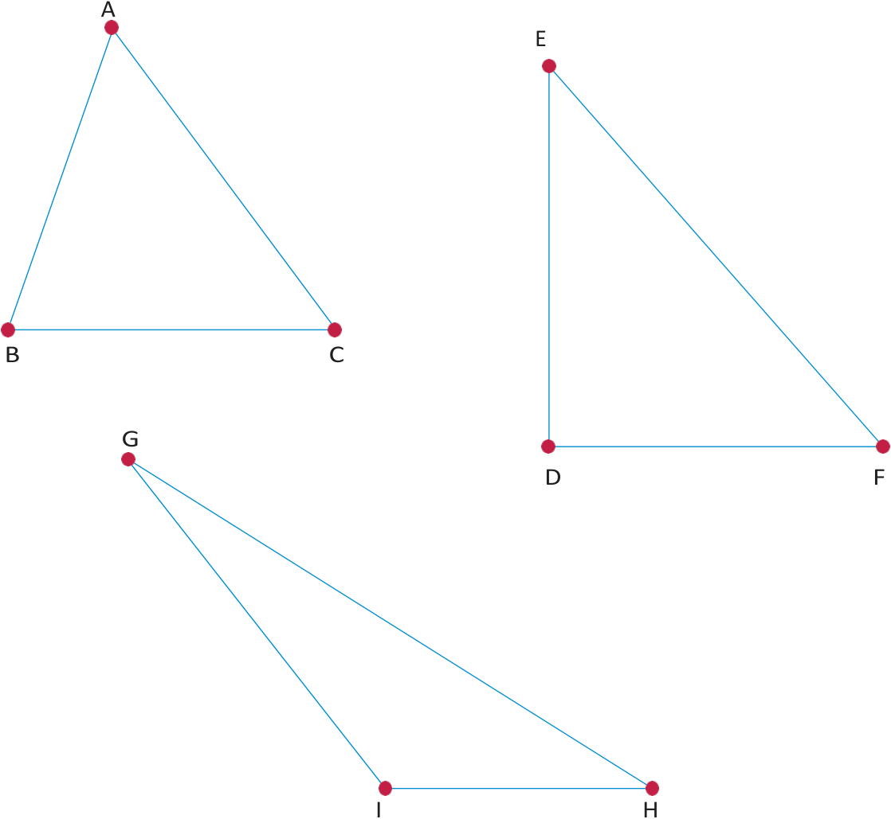
> **[Diagram Context - Textbook_Mathematics_Gr9_Geometry-of-2D-shapes.pdf-0001-03.png]**
> This geometric figure displays three distinct triangles labeled with vertices ABC, DEF, and GIH. The diagram serves as a foundational visual aid for learners to practice identifying triangle properties, calculating area and perimeter, or applying trigonometric ratios and Euclidean geometry theorems.

| Item | Number of segments | Name of part |
| :--- | :--- | :--- |
| (a) | 5 | fifths |
| (b) | 6 | sixths |
| (c) | 7 | sevenths |
| (d) | 8 | eighths |
| (e) | 9 | ninths |
| (f) | 10 | tenths |
| (g) | 11 | elevenths |
| (h) | 12 | twelfths |
| (i) | 13 | thirteenths |
| (j) | 14 | fourteenths |
| (k) | 15 | fifteenths |
| (l) | 16 | sixteenths |
| (m) | 17 | seventeenths |
| (n) | 18 | eighteenths |

---

#### Exercise 4 & 5: Measuring with Bars
Use the provided visual representations to determine the length of the bars in relation to the greystick. Write your answers in words.

*   **4(a):** How long is the upper yellow bar?
*   **4(b):** How long is the lower yellow bar?
*   **5(a):** How long is the blue bar?
*   **5(b):** How long is the red bar?

---

#### Exercise 6: Equivalent Fractions
Use your knowledge of fractions to answer the following questions regarding the length of a greystick:

(a) How many twelfths of a greystick is the same length as one sixth of a greystick?
*   Calculation: $\frac{1}{6} = \frac{1 \times 2}{6 \times 2} = \frac{2}{12}$
*   Answer: Two twelfths.

(b) How many twenty-fourths is the same length as one sixth of a greystick?
*   Calculation: $\frac{1}{6} = \frac{1 \times 4}{6 \times 4} = \frac{4}{24}$
*   Answer: Four twenty-fourths.

(c) How many twenty-fourths is the same length as seven twelfths of a greystick?
*   Calculation: $\frac{7}{12} = \frac{7 \times 2}{12 \times 2} = \frac{14}{24}$
*   Answer: Fourteen twenty-fourths.

---

#### Exercise 7: Further Measurement
(a) How long is the upper yellow bar on the following page?
(b) How long is the lower yellow bar on the following page?

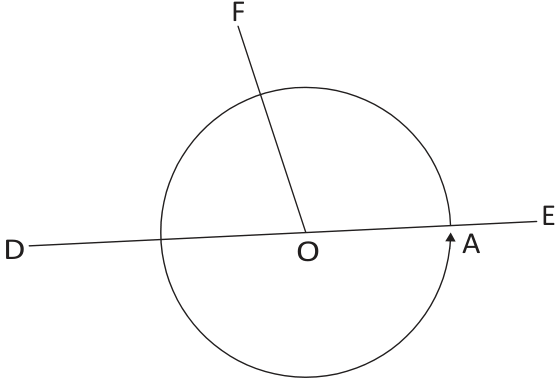
> **[Diagram Context - Textbook_Mathematics_Gr9_Geometry-of-straight-lines.pdf-0001-05.png]**
> This geometry figure depicts a circle with center O, intersected by a straight line segment DE passing through the center, and a radial line segment OF. The diagram illustrates fundamental circle geometry concepts, such as radii, diameters, and the formation of central angles, which are essential for learners to master circle theorems in the CAPS curriculum.

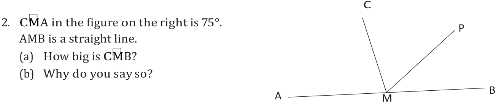
> **[Diagram Context - Textbook_Mathematics_Gr9_Geometry-of-straight-lines.pdf-0001-11.png]**
> This geometry figure displays a straight line segment AMB with a point M and two rays, MC and MP, originating from M. The problem requires learners to apply the Euclidean geometry principle of angles on a straight line, which sum to 180°, to calculate the size of angle CMB given that angle CMA is 75°.

---

### Understanding Equivalent Fractions

#### Concept: Equivalent Fractions
When two different fractions describe the same portion or length, they are called **equivalent**.

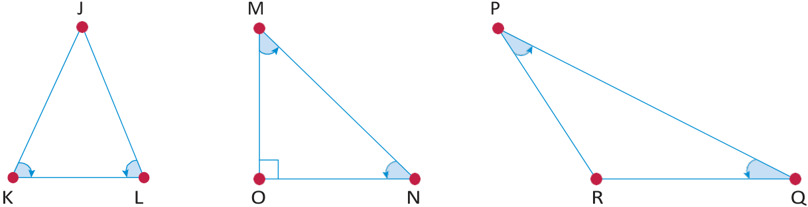
> **[Diagram Context - Textbook_Mathematics_Gr9_Geometry-of-2D-shapes.pdf-0002-05.png]**
> This graphic displays three distinct triangles labeled $\triangle JKL$, $\triangle MON$, and $\triangle PRQ$, featuring vertices marked with red dots and specific interior angles highlighted with blue arcs. The diagram serves as a visual aid for identifying and classifying triangles based on their properties, such as the right-angled triangle at vertex $O$ and the varying interior angle sizes, which are foundational concepts in Euclidean geometry.

---

### Exercises

#### Exercise 8
(a) How many fifths of a greystick is the same length as $\frac{12}{20}$ of a greystick?
(b) How many fourths (or quarters) of a greystick is the same length as $\frac{15}{20}$ of a greystick?

---

#### Exercise 1
(a) What can each small part on this greystick be called?

(b) How many eighteenths ($\frac{1}{18}$) is one sixth ($\frac{1}{6}$) of the greystick?
(c) How many eighteenths ($\frac{1}{18}$) is one third ($\frac{1}{3}$) of the greystick?
(d) How many eighteenths ($\frac{1}{18}$) is five sixths ($\frac{5}{6}$) of the greystick?

---

#### Exercise 2
(a) Write (in words) the names of four different fractions that are all equivalent to three quarters ($\frac{3}{4}$).
(b) Which equivalents for two thirds ($\frac{2}{3}$) can you find on the greysticks?

---

#### Exercise 3
The information that two thirds is equivalent to four sixths, to six ninths and to eight twelfths is written in the second row of the table below. Copy the table and complete the other rows in the same way.

| Fraction | Equivalent 1 | Equivalent 2 | Equivalent 3 |
| :--- | :--- | :--- | :--- |
| $\frac{1}{2}$ | $\frac{2}{4}$ | $\frac{3}{6}$ | $\frac{4}{8}$ |
| $\frac{2}{3}$ | $\frac{4}{6}$ | $\frac{6}{9}$ | $\frac{8}{12}$ |
| $\frac{1}{3}$ | | | |
| $\frac{1}{4}$ | | | |
| $\frac{3}{4}$ | | | |

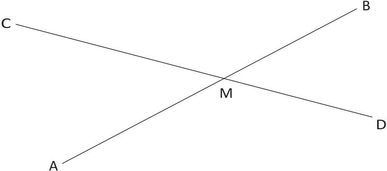
> **[Diagram Context - Textbook_Mathematics_Gr9_Geometry-of-straight-lines.pdf-0002-11.png]**
> This geometry figure displays two intersecting straight lines, AB and CD, which meet at the point of intersection labeled M. It illustrates the concept of vertically opposite angles, providing a foundational visual for learners to identify and calculate equal angles formed by intersecting lines in Euclidean geometry.

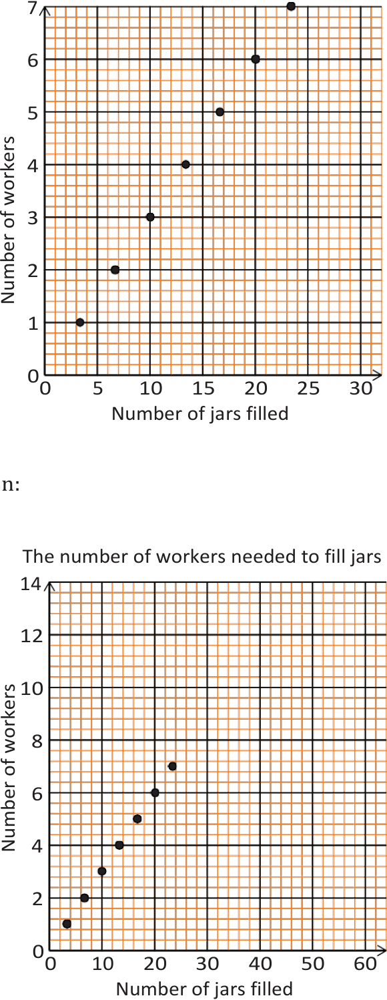
> **[Diagram Context - Textbook_Mathematics_Gr9_Graphs.pdf-0002-02.png]**
> This scatter plot displays the relationship between the "Number of workers" on the y-axis and the "Number of jars filled" on the x-axis, using discrete data points to map productivity. It illustrates a linear direct proportion, helping students visualize how increasing the number of workers results in a predictable, constant increase in the number of jars filled.

---

### Equivalent Fractions and Multiples

Equivalent fractions represent the same portion of a whole. To find equivalent fractions, you multiply or divide both the numerator and the denominator by the same non-zero number.

#### 4. Equivalent Fraction Tables
Copy and complete the following table by finding the equivalent values for each fraction. For example, if the first column is $\frac{1}{5}$, the equivalent in tenths is $\frac{2}{10}$.

| | fifths | tenths | fifteenths | twentieths | twenty-fifths | fiftieths | hundredths |
| :--- | :--- | :--- | :--- | :--- | :--- | :--- | :--- |
| **1** | 1 | 2 | 3 | 4 | 5 | 10 | 20 |
| **2** | 2 | 4 | 6 | 8 | 10 | 20 | 40 |
| **3** | 3 | 6 | 9 | 12 | 15 | 30 | 60 |
| **4** | 4 | 8 | 12 | 16 | 20 | 40 | 80 |
| **5** | 5 | 10 | 15 | 20 | 25 | 50 | 100 |
| **6** | 6 | 12 | 18 | 24 | 30 | 60 | 120 |
| **7** | 7 | 14 | 21 | 28 | 35 | 70 | 140 |

---

#### 5. Visualizing Equivalence
Copy the "greysticks" (rectangular bars) below. Use them to demonstrate that $\frac{3}{5}$ is equivalent to $\frac{9}{15}$.

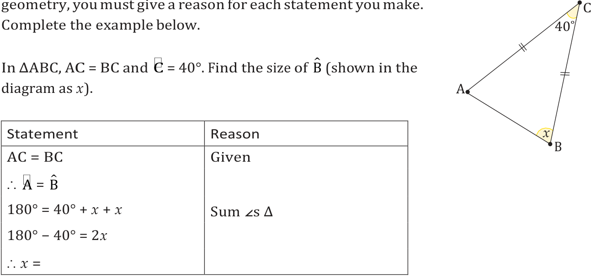
> **[Diagram Context - Textbook_Mathematics_Gr9_Geometry-of-2D-shapes.pdf-0003-02.png]**
> This geometry figure displays an isosceles triangle (ΔABC) with vertices labeled A, B, and C, marked with side-length equality indicators and angle measures of 40° and $x$. The accompanying table provides a structured "Statement and Reason" proof format, utilizing variables $x$ and geometric properties such as the sum of angles in a triangle. This exercise teaches learners how to apply the properties of isosceles triangles and algebraic solving techniques to determine unknown angle sizes within a formal Euclidean geometry proof.

---

#### 6. Extended Fraction Tables
Copy and complete the tables below to practice finding equivalent fractions using multiples.

**Table A: Eighths, Sixteenths, and Twenty-fourths**

| eighths | sixteenths | twenty-fourths |
| :--- | :--- | :--- |
| 1 | 2 | 3 |
| 2 | 4 | 6 |
| 3 | 6 | 9 |
| 4 | 8 | 12 |
| 5 | 10 | 15 |
| 6 | 12 | 18 |
| 7 | 14 | 21 |
| 8 | 16 | 24 |
| 9 | 18 | 27 |

**Table B: Twenty-fourths, Sixths, Twelfths, and Eighteenths**

| twenty-fourths | sixths | twelfths | eighteenths |
| :--- | :--- | :--- | :--- |
| 4 | 1 | 2 | 3 |
| 8 | 2 | 4 | 6 |
| 12 | 3 | 6 | 9 |
| 16 | 4 | 8 | 12 |
| 20 | 5 | 10 | 15 |
| 24 | 6 | 12 | 18 |
| 28 | 7 | 14 | 21 |
| 32 | 8 | 16 | 24 |
| 36 | 9 | 18 | 27 |

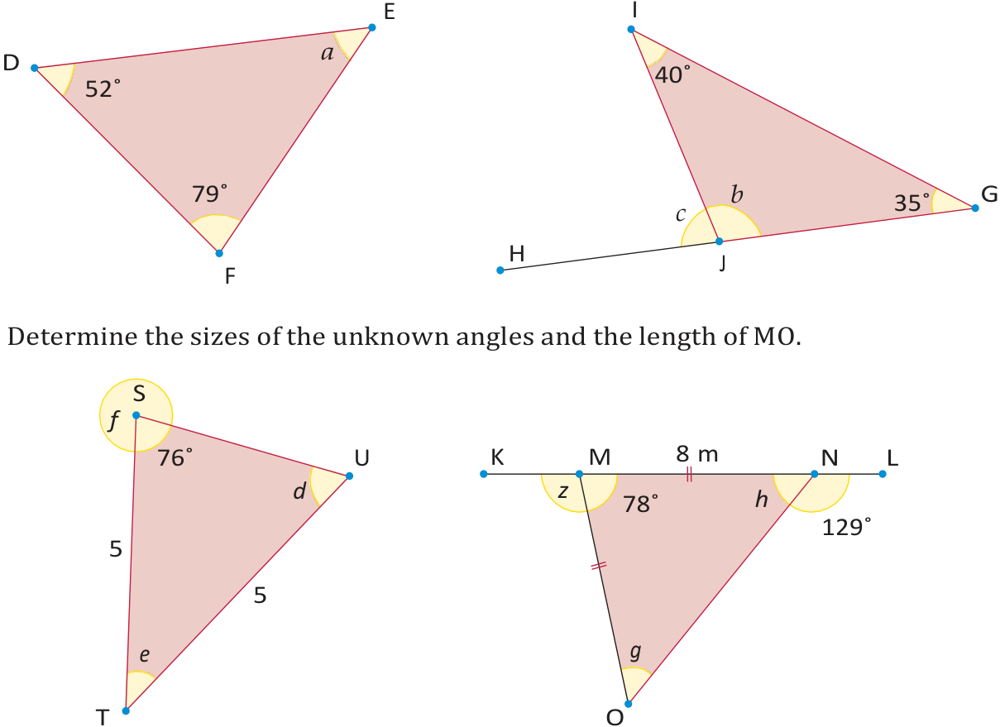
> **[Diagram Context - Textbook_Mathematics_Gr9_Geometry-of-2D-shapes.pdf-0003-05.png]**
> This geometry figure presents four distinct triangles labeled with vertices (D-E-F, I-J-G, S-U-T, and M-N-O), known angle values, side lengths, and unknown variables (a, b, c, d, e, f, g, h, z). The diagram tests the application of fundamental Euclidean geometry principles, including the sum of interior angles in a triangle, properties of isosceles triangles, and the use of supplementary angles on a straight line. Students must use these geometric relationships to solve for the missing variables and the specified side length.

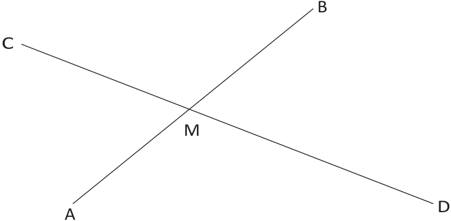
> **[Diagram Context - Textbook_Mathematics_Gr9_Geometry-of-straight-lines.pdf-0003-05.png]**
> This geometry figure displays two intersecting straight lines, AB and CD, which meet at the point of intersection labeled M. It illustrates the concept of vertically opposite angles, helping learners identify the pairs of equal angles formed at the intersection point.

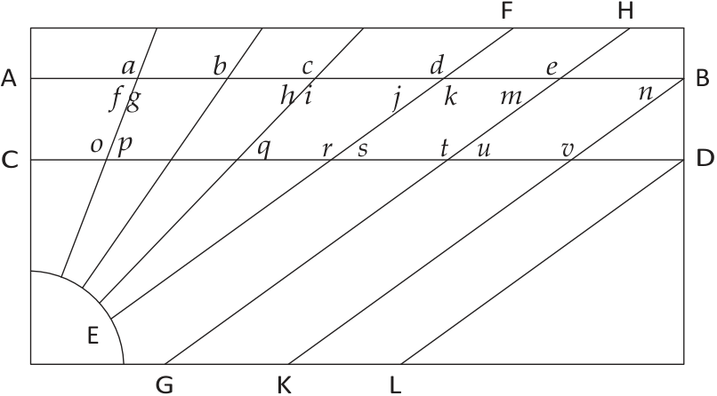
> **[Diagram Context - Textbook_Mathematics_Gr9_Geometry-of-straight-lines.pdf-0003-11.png]**
> This geometry figure illustrates the intercept theorem (Thales's theorem) by showing parallel lines intersecting two transversals originating from a common point E. The diagram features horizontal lines AB and CD, multiple transversal lines, and intersection points labeled with lowercase letters a through v, alongside boundary labels A, B, C, D, E, F, G, H, K, and L. It conceptually demonstrates that parallel lines cut transversals into proportional segments, a fundamental principle for understanding similarity and ratio in Euclidean geometry.

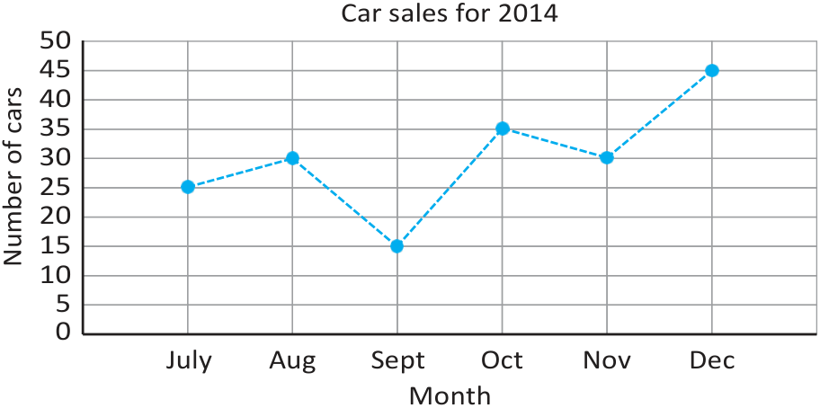
> **[Diagram Context - Textbook_Mathematics_Gr9_Graphs.pdf-0003-01.png]**
> This line graph illustrates car sales data for the latter half of 2014, featuring a vertical axis labeled "Number of cars" (0–50) and a horizontal axis representing the months from July to December. The graph uses data points connected by dashed lines to visually represent the fluctuations and trends in sales volume over this six-month period, helping students interpret data representation and change over time.

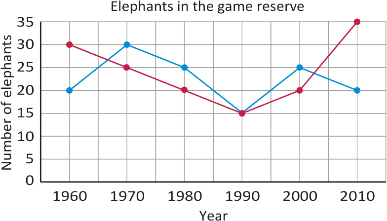
> **[Diagram Context - Textbook_Mathematics_Gr9_Graphs.pdf-0003-09.png]**
> This line graph displays population trends over time, with the y-axis representing the "Number of elephants" and the x-axis representing the "Year" from 1960 to 2010. By plotting two distinct data series using red and blue lines, the graph allows students to compare fluctuating population dynamics and identify patterns of growth or decline within the game reserve.

---

### Understanding Fractions: Core Concepts

A fraction represents a part of a whole. It consists of two main components:

*   **Numerator:** The number of parts being considered.
*   **Denominator:** The total number of equal parts that make up the whole (the "name" of the part).

For example, in the fraction $\frac{5}{6}$:
*   The **numerator** is $5$.
*   The **denominator** is $6$.
*   We read this as "five sixths".

---

### Worked Examples: Addition of Fractions

To add fractions, they must have a common denominator. If they do not, convert them to equivalent fractions first.

**(a) Five twelfths plus three twelfths**
$$\frac{5}{12} + \frac{3}{12} = \frac{5+3}{12} = \frac{8}{12} = \frac{2}{3}$$

**(b) Five twelfths plus one quarter**
Convert $\frac{1}{4}$ to twelfths: $\frac{1 \times 3}{4 \times 3} = \frac{3}{12}$.
$$\frac{5}{12} + \frac{3}{12} = \frac{8}{12} = \frac{2}{3}$$

**(c) Five twelfths plus three quarters**
Convert $\frac{3}{4}$ to twelfths: $\frac{3 \times 3}{4 \times 3} = \frac{9}{12}$.
$$\frac{5}{12} + \frac{9}{12} = \frac{14}{12} = 1\frac{2}{12} = 1\frac{1}{6}$$

**(d) One third plus one quarter**
Find a common denominator (12):
$\frac{1}{3} = \frac{4}{12}$ and $\frac{1}{4} = \frac{3}{12}$.
$$\frac{4}{12} + \frac{3}{12} = \frac{7}{12}$$

---

### Activity: Analyzing Strip Fractions

Use the visual representation of strips to determine the fractional parts.

| Question | Scenario | Analysis |
| :--- | :--- | :--- |
| 1 | Strip of 8 parts, 5 red. | Blue parts = $8 - 5 = 3$. Fraction: $\frac{3}{8}$ |
| 2 | Strip of 6 parts, 3 yellow, 3 red. | Yellow: $\frac{3}{6} = \frac{1}{2}$; Red: $\frac{3}{6} = \frac{1}{2}$ |
| 3 | Strip of 8 parts, 2 blue, 3 red, 3 blue. | Red: $\frac{3}{8}$ |
| 4 | Strip of 8 parts, 3 red, 2 blue, 3 red. | Blue: $\frac{2}{8} = \frac{1}{4}$; Red: $\frac{6}{8} = \frac{3}{4}$ |
| 5 | Strip of 12 parts, 5 red, 3 blue, 3 white, 1 yellow. | Red: $\frac{5}{12}$; Blue: $\frac{3}{12} = \frac{1}{4}$; White: $\frac{3}{12} = \frac{1}{4}$ |
| 6 | Strip of 9 parts, 2 blue, 3 green. | Red = $9 - (2+3) = 4$. Fraction: $\frac{4}{9}$ |
| 7 | Strip of 15 parts, 2 yellow, 3 blue, 1 yellow, 3 blue, 2 red, 4 red. | Yellow: $\frac{3}{15} = \frac{1}{5}$; Blue: $\frac{6}{15} = \frac{2}{5}$; Red: $\frac{6}{15} = \frac{2}{5}$ |

---

### Vocabulary Note
*   **Enumerate:** To find the number of items (related to the *numerator*).
*   **Denominate:** To give a name to something (related to the *denominator*).

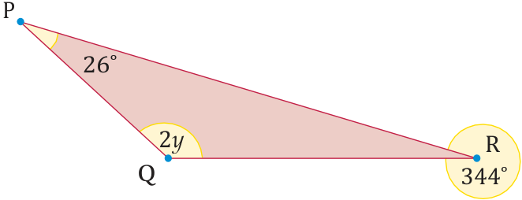
> **[Diagram Context - Textbook_Mathematics_Gr9_Geometry-of-2D-shapes.pdf-0004-01.png]**
> This geometry figure displays a triangle with vertices P, Q, and R, featuring the interior angles 26° at vertex P and 2y at vertex Q, alongside a reflex angle of 344° at vertex R. It serves as an exercise in Euclidean geometry, requiring students to apply the sum of angles in a triangle (180°) after calculating the interior angle at R by subtracting the given reflex angle from 360°.

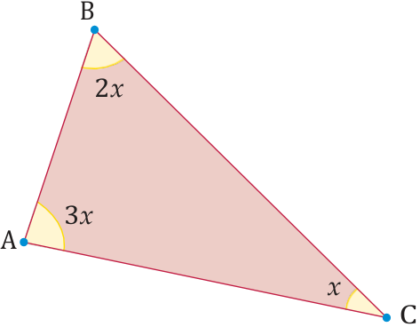
> **[Diagram Context - Textbook_Mathematics_Gr9_Geometry-of-2D-shapes.pdf-0004-02.png]**
> This geometry figure displays a triangle with vertices labeled A, B, and C, where the interior angles are represented by the algebraic expressions $3x$, $2x$, and $x$. The diagram serves as a foundational exercise for learners to apply the Euclidean geometry theorem that the sum of interior angles in a triangle is equal to $180^\circ$ to solve for the variable $x$.

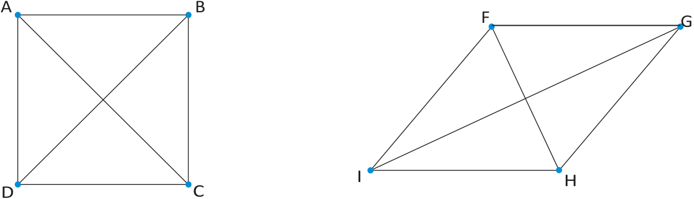
> **[Diagram Context - Textbook_Mathematics_Gr9_Geometry-of-2D-shapes.pdf-0004-06.png]**
> This geometry figure displays two quadrilaterals, a rectangle labeled ABCD and a parallelogram labeled IFGH, both including their respective internal diagonals. The diagram serves as a visual aid for Grade 10-12 learners to practice applying Euclidean geometry theorems regarding the properties of sides, angles, and diagonals in various quadrilaterals.

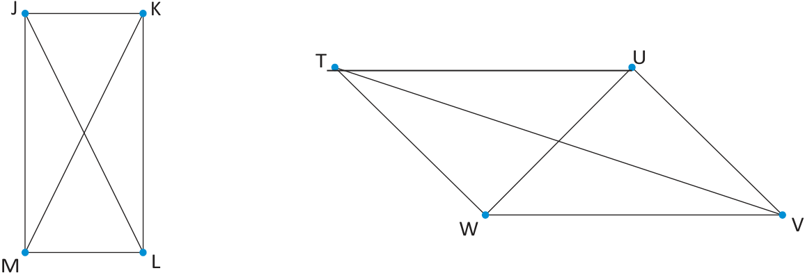
> **[Diagram Context - Textbook_Mathematics_Gr9_Geometry-of-2D-shapes.pdf-0004-07.png]**
> This geometry figure displays two quadrilaterals, rectangle JKLM and parallelogram TUVW, each with their respective internal diagonals drawn. The diagram serves as a visual aid for Grade 9-12 learners to identify and apply the properties of quadrilaterals, specifically focusing on the relationships between sides, angles, and the bisecting nature of diagonals in these polygons.

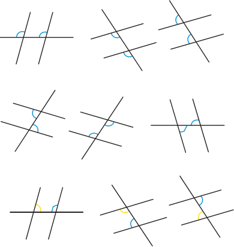
> **[Diagram Context - Textbook_Mathematics_Gr9_Geometry-of-straight-lines.pdf-0004-10.png]**
> This geometry figure displays various pairs of parallel lines intersected by a transversal, highlighted with blue and yellow arcs to denote specific angle relationships. It illustrates key Euclidean geometry concepts, including corresponding, alternate interior, and co-interior angles, helping learners identify these relationships regardless of the lines' orientation.

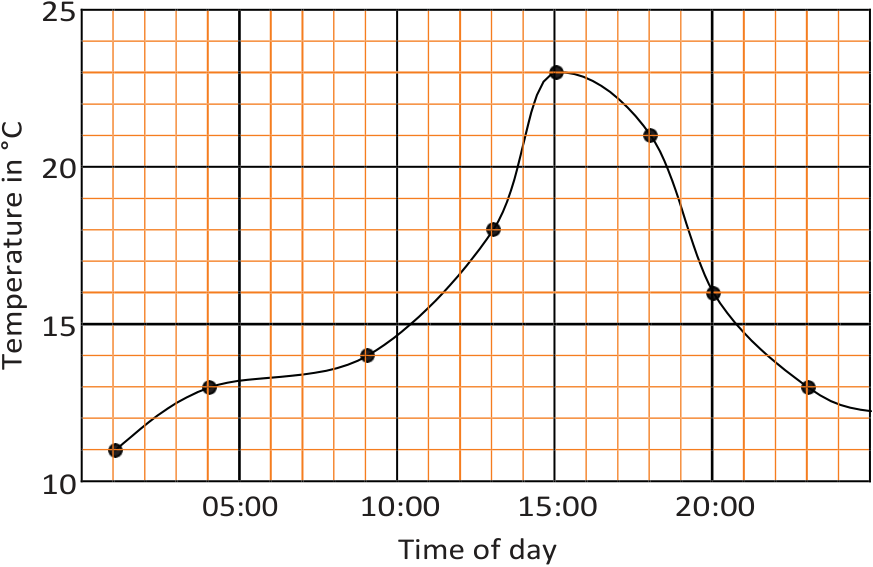
> **[Diagram Context - Textbook_Mathematics_Gr9_Graphs.pdf-0004-09.png]**
> This line graph plots temperature in °C against the time of day, using data points connected by a smooth curve to represent continuous change. It illustrates the daily fluctuation of temperature, allowing learners to interpret trends, identify the peak temperature at 15:00, and analyse the rate of change over a 24-hour cycle.

---

### Understanding Fractions

A fraction represents parts of a whole. It is written as:
$$\frac{\text{numerator}}{\text{denominator}}$$

*   **Numerator:** The number of parts being considered (written above the line).
*   **Denominator:** The total number of equal parts the whole is divided into (written below the line).

---

### Equivalent Fractions
Equivalent fractions represent the same value, even if the numbers look different. You can create equivalent fractions by multiplying both the numerator and the denominator by the same non-zero number.

**Example: Consider the fraction $\frac{3}{4}$**

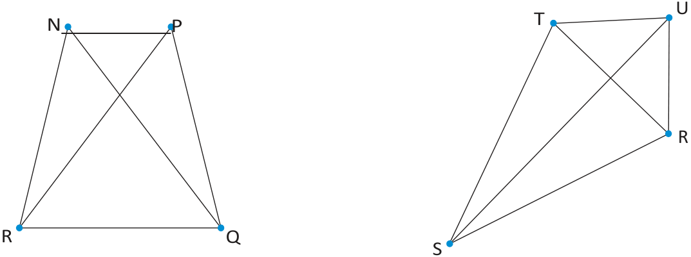
> **[Diagram Context - Textbook_Mathematics_Gr9_Geometry-of-2D-shapes.pdf-0005-00.png]**
> This geometry figure displays two distinct polygons with vertices labeled N, P, Q, R and S, T, U, R, featuring internal diagonals connecting the vertices. The diagram serves as a visual aid for high school geometry, requiring students to apply theorems related to triangle congruence, similarity, or area ratios within complex quadrilaterals and triangles.

(a) Multiply by 2: $\frac{3 \times 2}{4 \times 2} = \frac{6}{8}$ (Equivalent to $\frac{3}{4}$)
(b) Multiply by 3: $\frac{3 \times 3}{4 \times 3} = \frac{9}{12}$ (Equivalent to $\frac{3}{4}$)
(c) Multiply by 4: $\frac{3 \times 4}{4 \times 4} = \frac{12}{16}$ (Equivalent to $\frac{3}{4}$)
(d) Multiply by 6: $\frac{3 \times 6}{4 \times 6} = \frac{18}{24}$ (Equivalent to $\frac{3}{4}$)

---

### 6.3 Combining Fractions

When denominators are the same, you can add the numerators while keeping the denominator constant.

#### Worked Example 1: Adding fractions with the same denominator
**Problem:** A team builds $\frac{8}{12}$ km of road in one week and $\frac{10}{12}$ km in the next. What is the total length?

1.  **Add the numerators:** $8 + 10 = 18$
2.  **Keep the denominator:** $\frac{18}{12}$
3.  **Simplify:** Since $\frac{12}{12} = 1$ whole, then $\frac{18}{12} = \frac{12}{12} + \frac{6}{12} = 1 \frac{6}{12}$
4.  **Final result:** $1 \frac{6}{12}$ km, which is the same as $1 \frac{1}{2}$ km.

#### Worked Example 2: Adding mixed numbers
**Problem:** Calculate $4 \frac{5}{9} + 2 \frac{7}{9}$

1.  **Add the whole numbers:** $4 + 2 = 6$
2.  **Add the fractions:** $\frac{5}{9} + \frac{7}{9} = \frac{12}{9}$
3.  **Convert the improper fraction:** $\frac{12}{9} = \frac{9}{9} + \frac{3}{9} = 1 \frac{3}{9}$
4.  **Combine the results:** $6 + 1 \frac{3}{9} = 7 \frac{3}{9}$

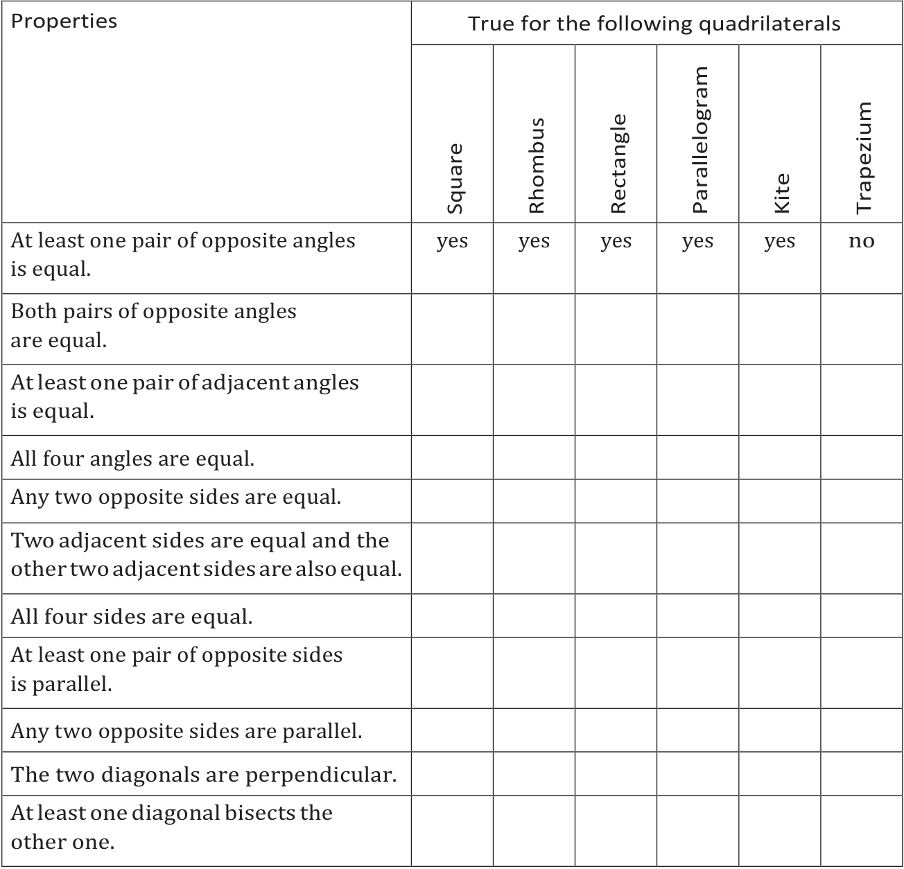
> **[Diagram Context - Textbook_Mathematics_Gr9_Geometry-of-2D-shapes.pdf-0005-02.png]**
> This graphic is a geometry classification table comparing the properties of various quadrilaterals, including squares, rhombi, rectangles, parallelograms, kites, and trapeziums. It lists specific geometric attributes—such as side equality, parallel lines, angle relationships, and diagonal properties—as rows, with the quadrilateral types as columns. This tool helps learners systematically identify and differentiate between the defining characteristics of these shapes, reinforcing the hierarchical relationships essential for Euclidean geometry.

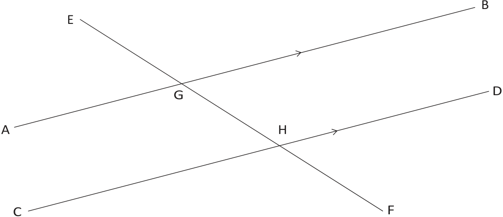
> **[Diagram Context - Textbook_Mathematics_Gr9_Geometry-of-straight-lines.pdf-0005-01.png]**
> This geometry figure illustrates two parallel lines, AB and CD, intersected by a transversal line EF at points G and H, as indicated by the directional arrows on the lines. It serves as a foundational visual for Grade 8 and 9 learners to identify and calculate relationships between angles formed by transversals, such as corresponding, alternate, and co-interior angles.

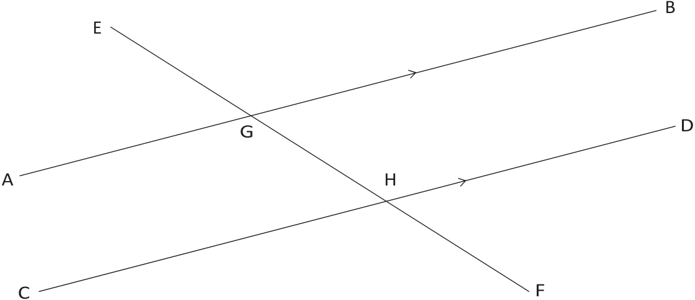
> **[Diagram Context - Textbook_Mathematics_Gr9_Geometry-of-straight-lines.pdf-0005-11.png]**
> This geometry figure displays two parallel lines, AB and CD, intersected by a transversal line EF at points G and H. The diagram uses arrowheads on lines AB and CD to denote their parallel relationship, providing a visual foundation for learners to identify and calculate corresponding, alternate, and co-interior angles formed by the transversal.

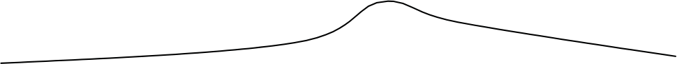
> **[Diagram Context - Textbook_Mathematics_Gr9_Graphs.pdf-0005-07.png]**
> This graphic is a line graph representing a single, asymmetrical wave pulse or a localized disturbance in a medium. It contains no labels, axes, or variables, focusing purely on the geometric profile of a wave crest. For a high school student, this illustrates the fundamental shape of a transverse wave pulse, demonstrating how energy is displaced from an equilibrium position as it propagates through a medium.

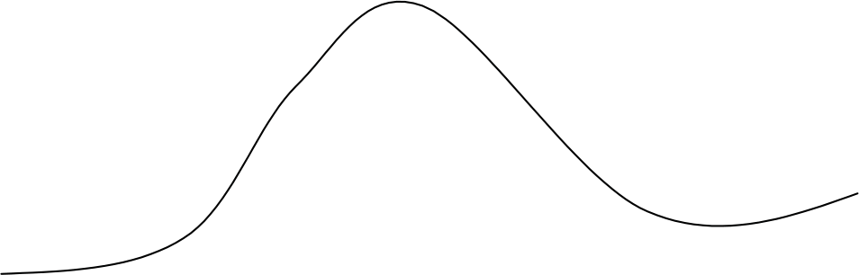
> **[Diagram Context - Textbook_Mathematics_Gr9_Graphs.pdf-0005-08.png]**
> This graphic is a line graph representing a continuous wave or a statistical distribution curve, though it lacks explicit labels, axes, or variables. In a CAPS context, this visual is used to teach the fundamental properties of waves, such as amplitude and wavelength, or to illustrate the concept of a normal distribution in statistics.

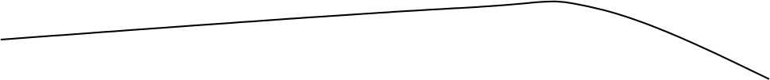
> **[Diagram Context - Textbook_Mathematics_Gr9_Graphs.pdf-0005-09.png]**
> This graphic displays a simple line graph featuring a single, continuous curve with no visible labels, axes, or variables. In a CAPS context, this abstract representation serves as a foundational tool for teaching learners how to interpret trends, gradients, and non-linear relationships between variables in Physical Sciences or Mathematics.

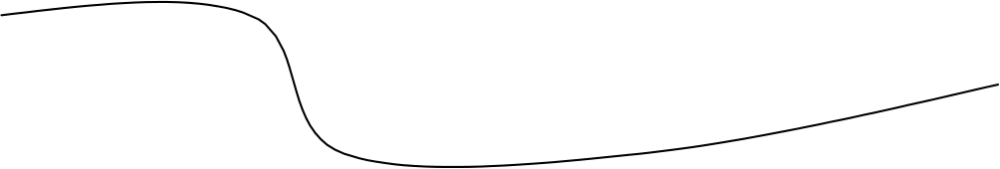
> **[Diagram Context - Textbook_Mathematics_Gr9_Graphs.pdf-0005-10.png]**
> This graphic displays a simple line graph featuring a single continuous curve with no visible labels, axes, or variables. In a CAPS Physical Sciences or Mathematics context, this represents a generic functional relationship or wave-like motion, serving as a foundational visual for teaching students how to interpret trends, gradients, or oscillatory patterns in data.

---

# Mathematics Revision: Fractions and Percentages

## 1. Operations with Mixed Numbers
When working with mixed numbers, you can either convert them to improper fractions or work with the whole numbers and fractions separately.

### Worked Example: Subtraction of Mixed Numbers
To solve $4\frac{7}{12} - 1\frac{5}{12}$:
1. Subtract the whole numbers: $4 - 1 = 3$
2. Subtract the fractions: $\frac{7}{12} - \frac{5}{12} = \frac{2}{12}$
3. Simplify the fraction: $\frac{2}{12} = \frac{1}{6}$
4. Combine: $3\frac{1}{6}$

---

## 2. Practice Exercises: Fractions

### Exercise 4: Calculations
Calculate the following expressions:

| Problem | Expression |
| :--- | :--- |
| (a) | $4\frac{2}{7} - 3\frac{6}{7}$ |
| (b) | $3\frac{6}{7} + 3\frac{3}{7}$ |
| (c) | $3\frac{6}{7} + 1\frac{4}{5}$ |
| (d) | $4\frac{3}{8} - 2\frac{5}{4}$ |
| (e) | $1\frac{3}{10} - 2$ |
| (f) | $3\frac{5}{10} - 1\frac{1}{2}$ |
| (g) | $\frac{5}{8} + \frac{5}{8} + \frac{5}{8} + \frac{5}{8}$ |
| (h) | $6\frac{2}{5} + 2\frac{1}{4} - 1$ |
| (i) | $\frac{5}{4} + \frac{5}{4} + \frac{5}{4} + \frac{5}{4} + \frac{5}{4} + \frac{5}{4} + \frac{5}{4} + \frac{5}{4}$ |
| (j) | $2\frac{2}{4} + 2\frac{1}{7} + 2\frac{7}{2} + 2\frac{7}{7}$ |
| (k) | $(4\frac{1}{7}) - 2\frac{1}{3}$ |
| (l) | $(2\frac{7}{10} + 3\frac{2}{5}) - (1\frac{5}{3} + 3\frac{7}{10})$ |

### Exercise 5: Word Problem
Neo's report has five chapters with the following page lengths:
*   Chapter 1: $\frac{3}{4}$ pages
*   Chapter 2: $1\frac{1}{2}$ pages
*   Chapter 3: $3\frac{3}{4}$ pages
*   Chapter 5: $1\frac{1}{2}$ pages

*Calculate the total number of pages in the report.*

---

## 3. Tenths, Hundredths, and Percentages

A fraction with a denominator of $100$ represents **hundredths**. This is the basis for percentages.

### Key Concept: The Licorice Strip
If a strip is divided into 100 equal parts, each small piece represents:
$$\frac{1}{100} = 0,01 = 1\%$$

### Exercise: Spaza Shop Application
Gatsha sells a full strip of licorice for R2.00.

| Question | Task |
| :--- | :--- |
| (a) | What is the cost of one very small piece (1/100th)? |
| (b) | Jonathan wants $\frac{1}{5}$ of a strip. How much should he pay? |
| (c) | Batseba eats 25 very small pieces. What part of the whole strip is this? |

**Hint for (b):** Convert $\frac{1}{5}$ to hundredths:
$$\frac{1}{5} = \frac{1 \times 20}{5 \times 20} = \frac{20}{100}$$
Since the whole strip costs R2,00, calculate $\frac{20}{100}$ of R2,00.

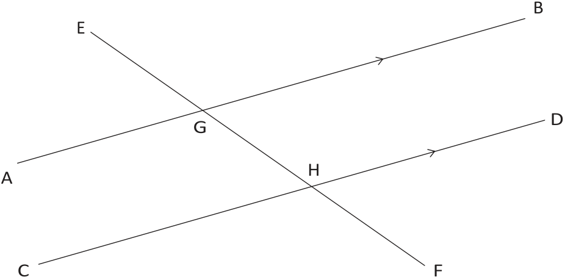
> **[Diagram Context - Textbook_Mathematics_Gr9_Geometry-of-straight-lines.pdf-0006-07.png]**
> This geometry figure illustrates two parallel lines, AB and CD, intersected by a transversal line EF at points G and H. The diagram uses arrowheads on lines AB and CD to denote parallelism, providing a visual basis for identifying corresponding, alternate, and co-interior angles formed by the transversal.

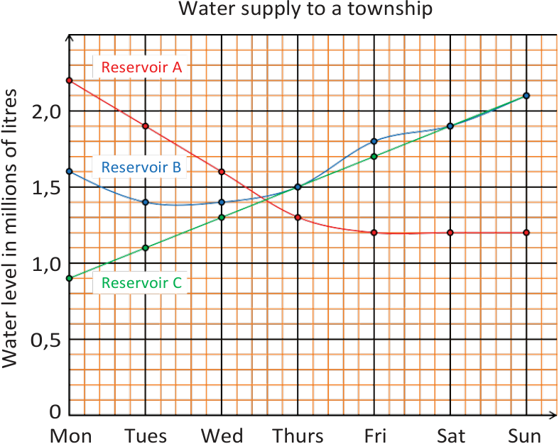
> **[Diagram Context - Textbook_Mathematics_Gr9_Graphs.pdf-0006-01.png]**
> This line graph illustrates the fluctuating water levels in three reservoirs (A, B, and C) over the course of a week, with the x-axis representing days of the week and the y-axis measuring water levels in millions of litres. It enables learners to interpret data trends, compare rates of change between different reservoirs, and identify points of intersection where water levels are equal.

---

### Understanding Fractions and Percentages

#### Conceptual Exercises: Licorice Strips
**4. Understanding Hundredths**
*   (a) Why can each small piece be called one hundredth of the whole strip?
*   (b) How many hundredths is the same as one tenth of the strip?

**5. Equivalent Fractions**
Gatsha uses "quarters" and "fifths" markers to cut strips.
*   (a) How many hundredths is the same as $\frac{2}{5}$ of the whole strip?
*   (b) How many tenths is the same as $\frac{2}{5}$ of the whole strip?
*   (c) How many hundredths is the same as $\frac{3}{4}$ of the whole strip?
*   (d) Freddie bought $\frac{60}{100}$ of a strip. How many fifths of a strip is this?
*   (e) Jamey bought part of a strip for R1,60. What part of a strip did she buy?

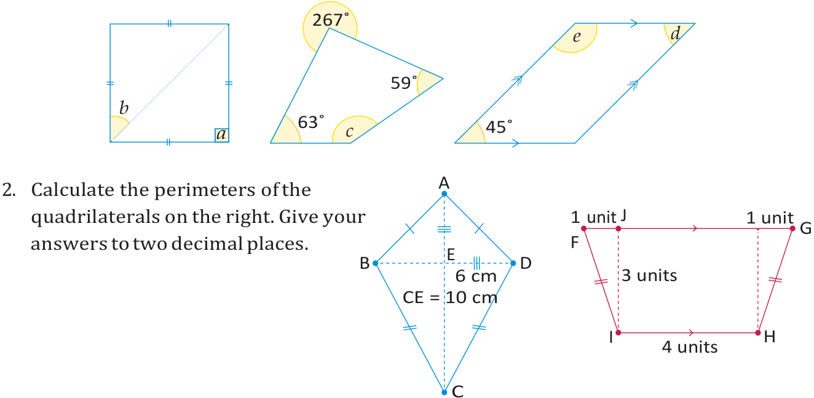
> **[Diagram Context - Textbook_Mathematics_Gr9_Geometry-of-2D-shapes.pdf-0007-02.png]**
> This geometry figure displays various quadrilaterals, including a square, a general quadrilateral, a parallelogram, a kite, and a trapezoid, marked with side-length indicators, parallel-line arrows, and interior angle measurements. It prompts students to apply their knowledge of Euclidean geometry properties—such as side equality and parallel lines—to calculate the perimeters of the kite and trapezoid. This exercise reinforces the CAPS curriculum requirements for identifying polygon properties and performing accurate perimeter calculations using given dimensions.

#### Practical Application: Spaza Shop Sales
**6. Identifying Parts of a Whole**
Gatsha sells pieces of yellow licorice. Observe the diagram below to determine what fraction of the whole strip each child received.

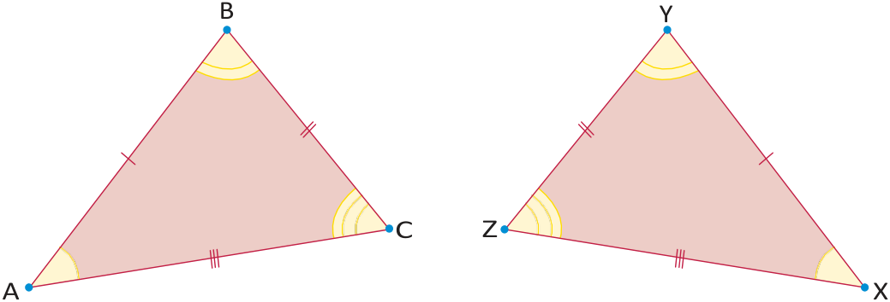
> **[Diagram Context - Textbook_Mathematics_Gr9_Geometry-of-2D-shapes.pdf-0007-07.png]**
> This geometry figure displays two triangles, ABC and ZYX, labeled with vertices and marked with corresponding tick marks on sides and arc markings on angles. These indicators demonstrate that the triangles are congruent according to the Side-Angle-Side (SAS) or Side-Side-Side (SSS) conditions, visually representing the concept of geometric congruence for learners.

**7. Cost Calculation**
The yellow licorice costs R2,40 (240 cents) for a full strip. Calculate how much each child must pay based on their piece size. Round off amounts to the nearest cent.

#### Mathematical Calculations: Fractions of Amounts
**8. Calculating Parts of 300 cents**
Calculate the following:
*   (a) How much is $\frac{1}{100}$ of 300 cents?
*   (b) How much is $\frac{7}{100}$ of 300 cents?
*   (c) How much is $\frac{25}{100}$ of 300 cents?
*   (d) How much is $\frac{1}{4}$ of 300 cents?
*   (e) How much is $\frac{40}{100}$ of 300 cents?
*   (f) How much is $\frac{2}{5}$ of 300 cents?

**9. Comparison**
Explain why your answers for questions 8(e) and 8(f) are the same.

---

### Key Concept: Per Cent
*   **Definition:** Another word for **hundredth** is **per cent**.
*   **Example:** If Miriam receives 32 hundredths of a licorice strip, we can say she received **32 per cent** of the strip.
*   **Symbol:** The symbol for per cent is **%**.

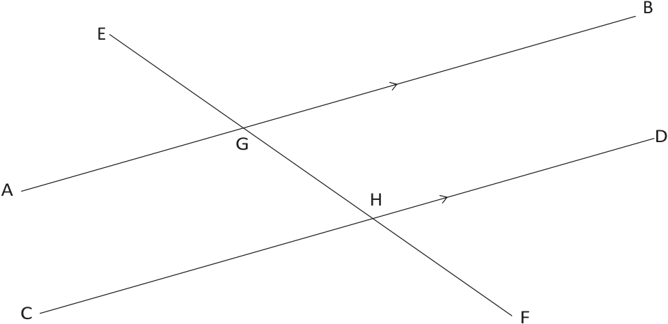
> **[Diagram Context - Textbook_Mathematics_Gr9_Geometry-of-straight-lines.pdf-0007-00.png]**
> This geometry figure displays two parallel lines, AB and CD, intersected by a transversal line EF at points G and H, indicated by arrows on the parallel lines. It serves as a foundational visual for Grade 8 and 9 learners to identify and calculate relationships between angles, such as corresponding, alternate, and co-interior angles formed by a transversal cutting parallel lines.

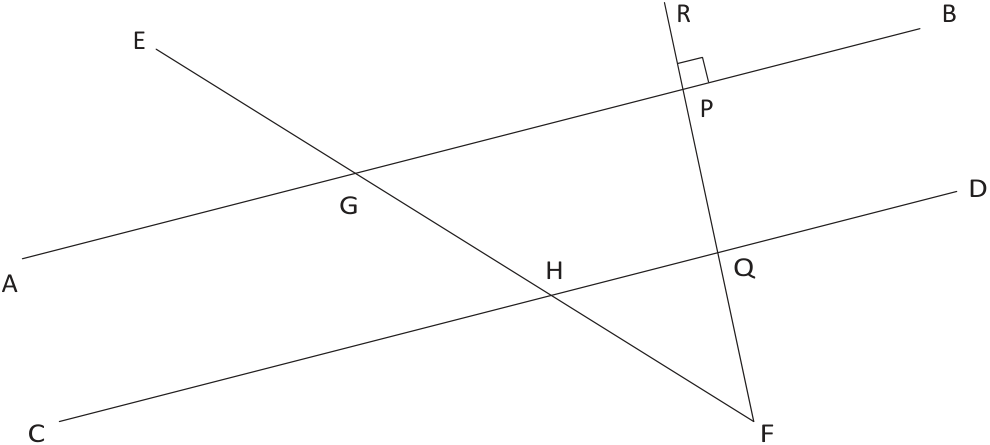
> **[Diagram Context - Textbook_Mathematics_Gr9_Geometry-of-straight-lines.pdf-0007-08.png]**
> This geometry figure displays three intersecting lines (AB, CD, and EF) and a transversal line (RF) that is perpendicular to line AB at point P. The diagram includes labeled points A, B, C, D, E, F, G, H, P, Q, and R, along with a right-angle symbol at the intersection of lines AB and RF. It serves as a foundational exercise for high school learners to apply Euclidean geometry theorems, such as angle relationships, parallel line properties, and triangle interior angles, to solve for unknown variables.

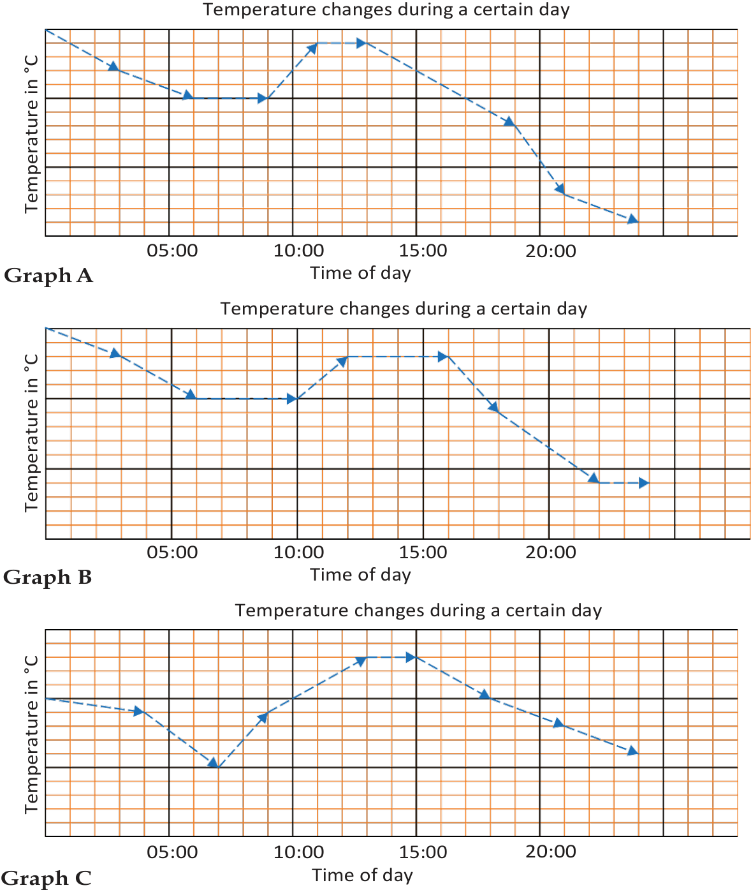
> **[Diagram Context - Textbook_Mathematics_Gr9_Graphs.pdf-0007-03.png]**
> This graphic displays three line graphs (A, B, and C) plotting "Temperature in °C" against "Time of day" on a grid. These graphs illustrate how temperature fluctuates over time, requiring students to interpret trends, rates of change, and data points to understand how environmental variables are represented visually.

---

The provided image is a blank template page containing only a header design element. There is no instructional content, text, or mathematical data to analyze.

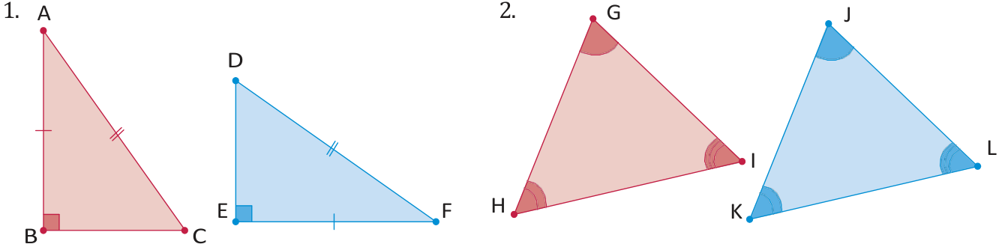
> **[Diagram Context - Textbook_Mathematics_Gr9_Geometry-of-2D-shapes.pdf-0008-15.png]**
> This geometry figure illustrates two pairs of triangles labeled with vertices A-C, D-F, G-I, and J-L, using markings to denote equal sides and congruent angles. The diagram demonstrates the conditions for triangle congruence, specifically showcasing the Right-Angle-Hypotenuse-Side (RHS) theorem in the first pair and the Angle-Angle-Angle (AAA) or Angle-Angle-Side (AAS) properties in the second. These visual cues help learners identify the geometric criteria required to prove that two triangles are congruent or similar.

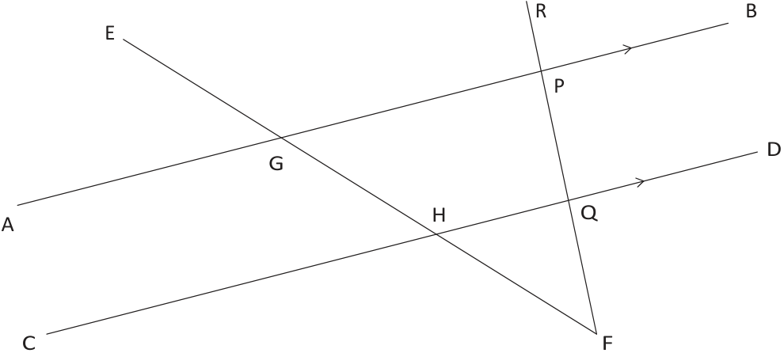
> **[Diagram Context - Textbook_Mathematics_Gr9_Geometry-of-straight-lines.pdf-0008-04.png]**
> This geometry figure illustrates two parallel lines, AB and CD, intersected by two transversals, EF and RF, creating various points of intersection labeled G, H, P, and Q. The diagram uses arrows on lines AB and CD to denote parallelism, serving as a foundational visual for Grade 8-10 learners to identify and calculate corresponding, alternate, and co-interior angles.

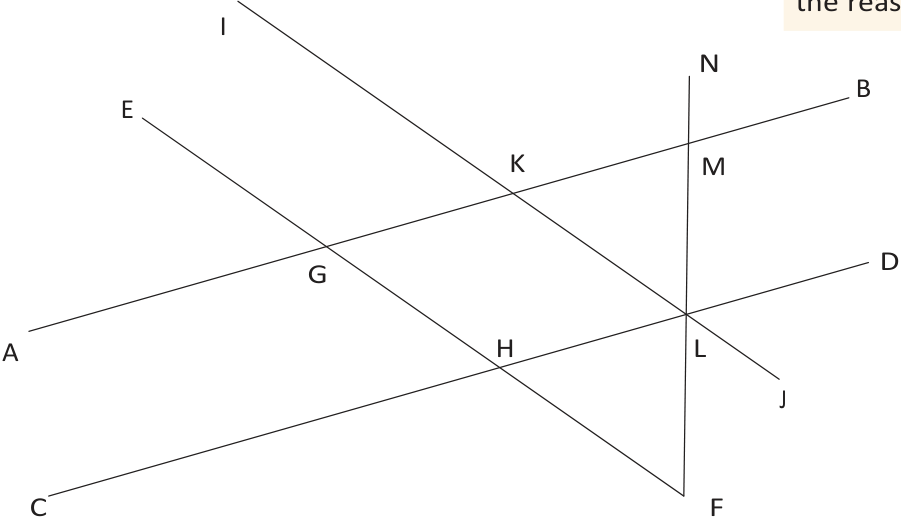
> **[Diagram Context - Textbook_Mathematics_Gr9_Geometry-of-straight-lines.pdf-0008-11.png]**
> This geometry figure displays a system of intersecting straight lines labeled with points A, B, C, D, E, F, I, J, N, and intersection points G, H, K, L, M. It serves as a foundational diagram for high school Euclidean geometry, requiring students to apply theorems related to parallel lines, transversals, and angle relationships to solve for unknown variables or prove geometric properties.

---

### Exercises: Percentages and Financial Calculations

**10. Calculate 80% of the following:**
(a) R500
(b) R480
(c) R850
(d) R2 400

**11. Calculate 8% of the amounts in 10(a), (b), (c), and (d).**

**12. Calculate 15% of the amounts in 10(a), (b), (c), and (d).**

**13. Percentage Increase:**
Building costs of houses increased by $20\%$. What is the new building cost for a house that previously cost R110 000 to build?

**14. Percentage Decrease:**
The value of a car decreases by $30\%$ after one year. If the price of a new car is R125 000, what is the value of the car after one year?

**15. Investigation:**
Investigate which denominators of fractions can easily be converted to powers of $10$ (e.g., $10, 100, 1 000$).

---

## 6.5 Thousandths, Hundredths, and Tenths

### Concept: Many Equal Parts
When a whole is divided into equal parts, we use fractions to represent these parts. 
*   **Tenths:** $\frac{1}{10}$
*   **Hundredths:** $\frac{1}{100}$
*   **Thousandths:** $\frac{1}{1000}$

**1. Practical Application:**
In a camp for refugees, $50\text{ kg}$ of sugar must be shared equally between $1 000$ refugees. How much sugar will each refugee get? (Hint: $1\text{ kg} = 1 000\text{ g}$).

**2. Calculate the following parts of R6 000:**
(a) One tenth of R6 000
(b) One hundredth of R6 000
(c) One thousandth of R6 000
(d) Ten hundredths of R6 000
(e) $100$ thousandths of R6 000
(f) Seven hundredths of R6 000
(g) $70$ thousandths of R6 000
(h) Seven thousandths of R6 000

**3. Calculate the sums:**
(a) $\frac{3}{10} + \frac{5}{8}$
(b) $3\frac{3}{10} + 2\frac{4}{5}$
(c) $\frac{3}{10} + \frac{7}{100}$
(d) $\frac{3}{10} + \frac{70}{100}$
(e) $\frac{3}{10} + \frac{7}{1000}$
(f) $\frac{3}{10} + \frac{70}{1000}$

**4. Calculate the sums:**
(a) $\frac{3}{10} + \frac{7}{100} + \frac{4}{1000}$
(b) $\frac{3}{10} + \frac{70}{100} + \frac{400}{1000}$
(c) $\frac{6}{10} + \frac{20}{100} + \frac{700}{1000}$
(d) $2 + \frac{5}{10} + \frac{4}{1000}$

**5. Investigation: True or False?**
Investigate whether the following statements are true or false and provide reasons for your decision:

(a) $\frac{1}{10} + \frac{23}{100} + \frac{346}{1000} = \frac{6}{10} + \frac{3}{100} + \frac{46}{1000}$
(b) $\frac{1}{10} + \frac{23}{100} + \frac{346}{1000} = \frac{7}{10} + \frac{2}{100} + \frac{6}{1000}$
(c) $\frac{1}{10} + \frac{23}{100} + \frac{346}{1000} = \frac{6}{10} + \frac{7}{100} + \frac{6}{1000}$
(d) $\frac{676}{1000} = \frac{6}{10} + \frac{7}{100} + \frac{6}{1000}$

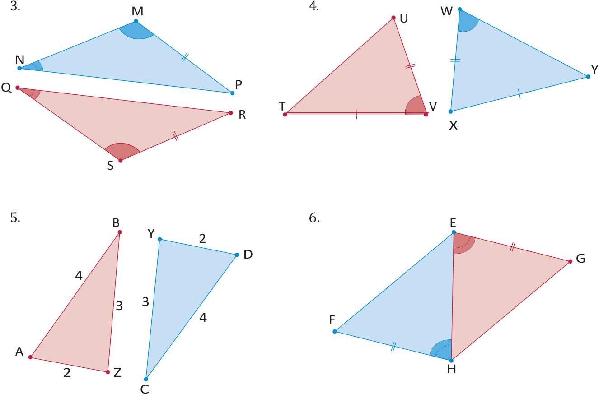
> **[Diagram Context - Textbook_Mathematics_Gr9_Geometry-of-2D-shapes.pdf-0009-00.png]**
> This graphic displays four pairs of triangles labeled 3 through 6, utilizing geometric notation such as tick marks on sides and arcs on angles to indicate congruent parts. These diagrams illustrate the conditions for triangle congruence, specifically applying the Side-Angle-Side (SAS), Side-Side-Side (SSS), and Angle-Side-Angle (ASA) theorems. By visually representing these properties, the figure helps students identify and justify when two triangles are congruent based on the minimum required information provided in Euclidean geometry.

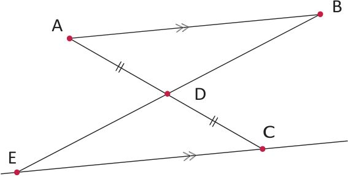
> **[Diagram Context - Textbook_Mathematics_Gr9_Geometry-of-2D-shapes.pdf-0009-09.png]**
> This geometry figure displays two triangles, $\triangle ABD$ and $\triangle ECD$, featuring vertices labeled A, B, C, D, and E. The diagram uses standard geometric notation, including double-arrow indicators to show parallel lines ($AB \parallel EC$) and double-dash marks to indicate equal line segments ($AD = CD$). Conceptually, this figure serves as a foundation for proving triangle congruency, specifically using the Angle-Side-Angle (ASA) or Angle-Angle-Side (AAS) theorems by leveraging vertically opposite angles and alternate interior angles created by the parallel lines.

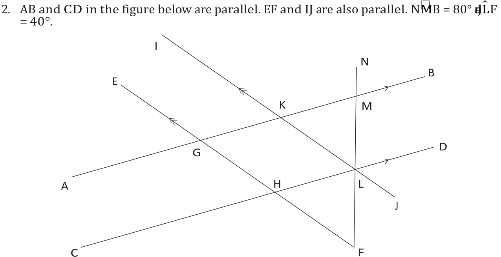
> **[Diagram Context - Textbook_Mathematics_Gr9_Geometry-of-straight-lines.pdf-0009-02.png]**
> This geometry figure displays two sets of parallel lines (AB || CD and EF || IJ) intersected by a transversal line segment NM. The diagram includes labeled points (A, B, C, D, E, F, G, H, I, J, K, L, M, N) and directional arrows indicating parallel relationships. It serves as an exercise for Grade 9-10 learners to apply Euclidean geometry theorems, such as corresponding, alternate, and co-interior angles, to calculate unknown angle values based on the provided measurements.

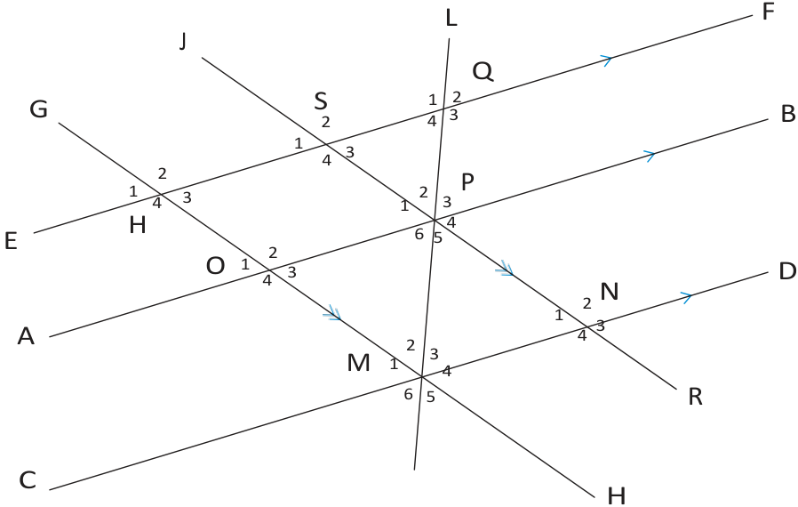
> **[Diagram Context - Textbook_Mathematics_Gr9_Geometry-of-straight-lines.pdf-0009-05.png]**
> This geometry figure illustrates a system of parallel lines (EF, AB, CD) intersected by two transversals (JL and GH), with numbered angles at each intersection point (H, S, Q, O, P, M, N). The diagram serves as a foundational tool for high school learners to identify and apply angle relationships, such as corresponding, alternate, and co-interior angles, created when transversals cut across parallel lines.

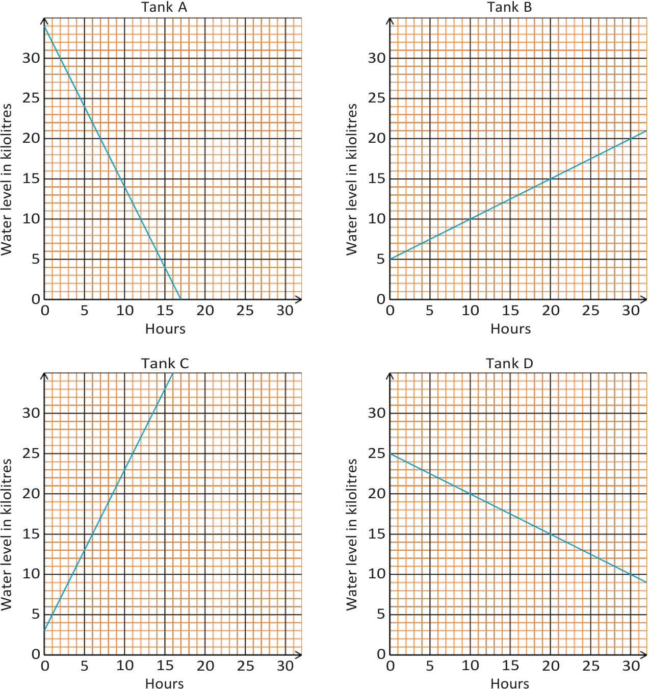
> **[Diagram Context - Textbook_Mathematics_Gr9_Graphs.pdf-0009-08.png]**
> This graphic displays four linear graphs representing the change in water level (in kilolitres) over time (in hours) for four different tanks, labeled A through D. By plotting these relationships on a Cartesian plane, the diagrams illustrate the concepts of positive and negative gradients, allowing students to interpret rates of filling or emptying for each tank.

---

# 6.6 Fraction of a Fraction

To calculate a "fraction of a fraction" or a "fraction of an amount," you multiply the fraction by the total value. The word "of" in mathematics indicates multiplication.

### Core Concept: Calculating Parts of a Whole
To find a fraction of an amount, divide the amount by the denominator (bottom number) and multiply by the numerator (top number).

**Example:** To find $\frac{3}{5}$ of $R60$:
1. Find $\frac{1}{5}$ of $R60$: $R60 \div 5 = R12$
2. Find $\frac{3}{5}$ of $R60$: $R12 \times 3 = R36$

---

### Practice Exercises

#### 1. Basic Calculations
(a) How much is $\frac{1}{5}$ of $R60$?
(b) How much is $\frac{3}{5}$ of $R60$?

#### 2. Multi-step Calculations
How much is $\frac{7}{10}$ of $R80$? (Hint: First find $\frac{1}{10}$ of $R80$).

#### 3. Currency Conversions
(a) How much is $\frac{2}{5}$ of $20$ pula?
(b) How much is $\frac{2}{5}$ of $20$ euro?
(c) How much is $\frac{2}{5}$ of $12$ pula?

#### 4. Conceptual Reasoning
Why was it easy to calculate $\frac{2}{5}$ of $20$, but more difficult to calculate $\frac{2}{5}$ of $12$?

---

### Strategy: Converting Units
When a calculation results in a fraction of a unit that is difficult to divide, convert the larger unit into smaller units (e.g., Rands to cents).

**Example:** To calculate $\frac{3}{5}$ of $R4$:
1. Convert $R4$ to $400$ cents.
2. $\frac{1}{5}$ of $400 = 80$ cents.
3. $\frac{3}{5}$ of $400 = 80 \times 3 = 240$ cents (or $R2,40$).

#### 5. Calculate the following (use cents if necessary):
(a) $\frac{3}{8}$ of $R2,40$
(b) $\frac{7}{12}$ of $R6$
(c) $\frac{2}{5}$ of $R21$
(d) $\frac{5}{6}$ of $R3$

---

### Working with "Secret Objects" (Fiftieths)
The following questions treat "fiftieths of a rand" as the base unit.

#### 6. Secret Objects
(a) How much is $\frac{3}{10}$ of $40$ secret objects?
(b) How much is $\frac{3}{8}$ of $40$ secret objects?

#### 7. Fiftieths
(a) How many fiftieths is $\frac{3}{10}$ of $40$ fiftieths?
(b) How many fiftieths is $\frac{5}{8}$ of $40$ fiftieths?

---

### Fractions of Fractions
To find a fraction of a fraction, multiply the numerators together and the denominators together:
$$\frac{a}{b} \times \frac{c}{d} = \frac{a \times c}{b \times d}$$

#### 8. Kilogram Conversions
(a) How many twentieths of a kilogram is the same as $\frac{3}{4}$ of a kilogram?
(b) How much is $\frac{1}{5}$ of $15$ rands?
(c) How much is $\frac{1}{5}$ of $15$ twentieths of a kilogram?
(d) So, how much is $\frac{1}{5}$ of $\frac{3}{4}$ of a kilogram?

#### 9. Calculating with Fortieths
(a) How much is $\frac{1}{12}$ of $24$ fortieths of some secret object?
(b) How much is $\frac{7}{12}$ of $24$ fortieths of the secret object?

#### 10. Discussion
Do you agree that the answers for question 9 are $\frac{2}{40}$ and $\frac{14}{40}$? If you disagree, explain why.

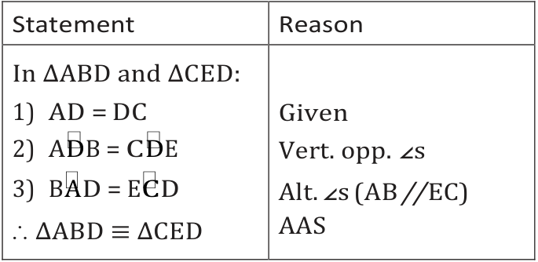

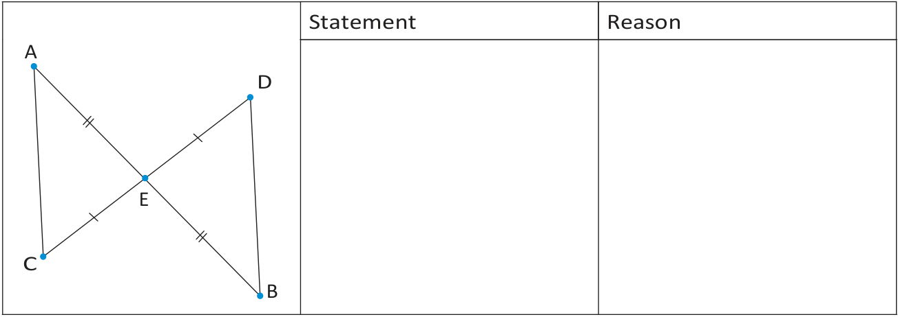

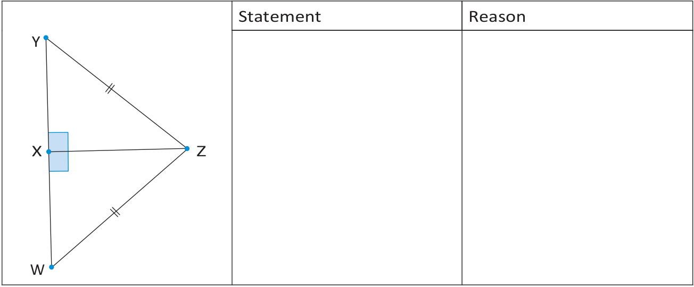

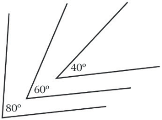

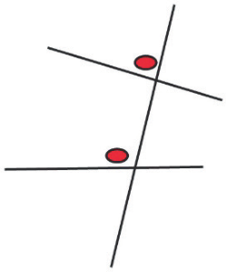

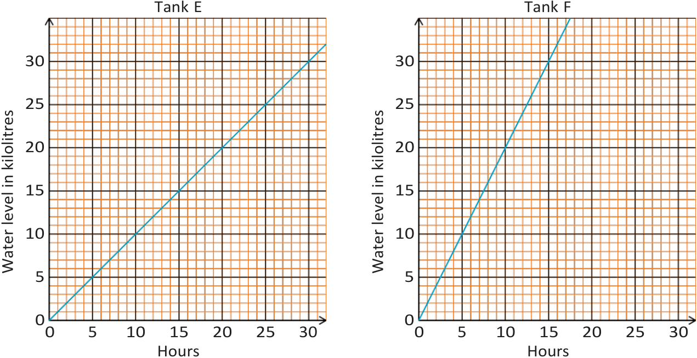

---

### Fractions: Calculating Fractions of Fractions

#### Exercise 11: Calculating Fractions of a Whole
Calculate the following:
(a) How much is $\frac{1}{5}$ of $80$?
(b) How much is $\frac{3}{5}$ of $80$?
(c) How much is $\frac{1}{40}$ of $80$?
(d) How much is $\frac{24}{40}$ of $80$?
(e) Explain why $\frac{3}{5}$ of $80$ is the same as $\frac{24}{40}$ of $80$.

#### Exercise 12: Comparing Fractions
Look at your answers for questions 9(b) and 11(e). How much is $\frac{7}{12}$ of $\frac{3}{5}$? Explain your answer.

---

### Key Concepts: Equivalent Fractions and Multiplication
When calculating a fraction of a fraction, it is often easier to use equivalent fractions to simplify the calculation.

**Example:**
To calculate $\frac{3}{8}$ of $\frac{2}{3}$:
1. Finding one-eighth of $\frac{2}{3}$ is difficult.
2. We look for an equivalent fraction for $\frac{2}{3}$ where the numerator is divisible by $8$.
3. Since $\frac{2}{3} = \frac{8}{12}$, we can calculate $\frac{3}{8}$ of $\frac{8}{12}$ instead.
4. One-twelfth of $8$ is $\frac{8}{12} = \frac{2}{3}$. Therefore, $\frac{3}{8}$ of $\frac{8}{12} = \frac{3}{12} = \frac{1}{4}$.

---

### Exercises

#### Exercise 13
(a) Calculate $\frac{3}{8}$ of $\frac{8}{12}$.
(b) So, how much is $\frac{3}{8}$ of $\frac{2}{3}$?

#### Exercise 14: Calculating Fractions of Fractions
In each case, replace the second fraction with a suitable equivalent fraction, and then calculate:

(a) How much is $\frac{3}{4}$ of $\frac{5}{8}$?
(b) How much is $\frac{7}{10}$ of $\frac{2}{3}$?
(c) How much is $\frac{2}{3}$ of $\frac{1}{3}$?
(d) How much is $\frac{3}{5}$ of $\frac{2}{5}$?

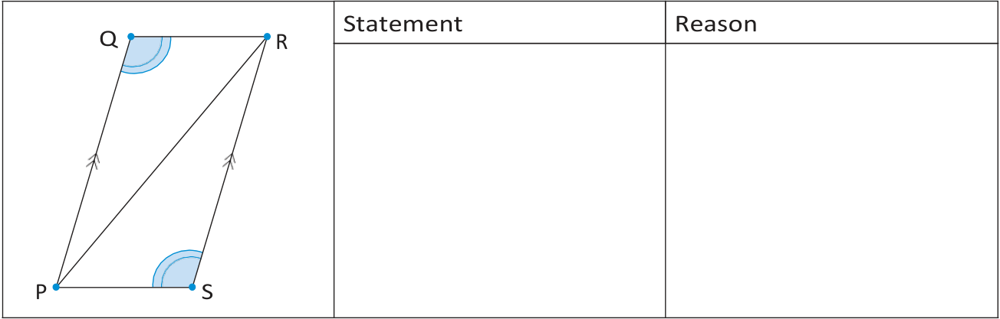
> **[Diagram Context - Textbook_Mathematics_Gr9_Geometry-of-2D-shapes.pdf-0011-01.png]**
> This geometry figure depicts a quadrilateral PQRS divided by diagonal PR, featuring vertices labeled P, Q, R, and S, parallel line indicators on sides PQ and RS, and congruent angle markings at vertices Q and S. The diagram serves as a scaffold for Grade 10-12 Euclidean geometry proofs, requiring students to use the provided "Statement" and "Reason" columns to formally prove properties of quadrilaterals or triangle congruence.

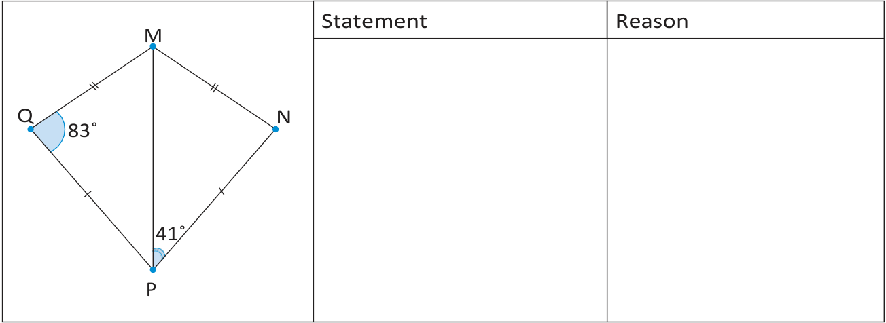
> **[Diagram Context - Textbook_Mathematics_Gr9_Geometry-of-2D-shapes.pdf-0011-03.png]**
> This geometry figure displays a kite (MQNP) with vertices labeled M, Q, N, and P, featuring tick marks indicating equal adjacent sides and given angle measures of 83° and 41°. The accompanying table provides a structured format for a formal Euclidean geometry proof, requiring students to apply properties of kites—such as congruent triangles and bisected angles—to solve for unknown interior angles.

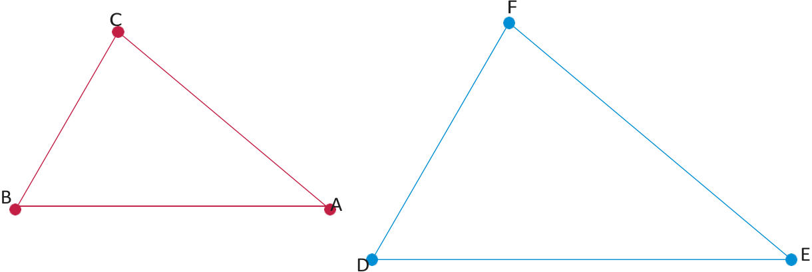
> **[Diagram Context - Textbook_Mathematics_Gr9_Geometry-of-2D-shapes.pdf-0011-07.png]**
> This graphic displays two distinct triangles, labeled ABC and DEF, defined by their vertices. It serves as a foundational visual for Euclidean geometry, allowing students to explore concepts such as triangle congruence, similarity, and the properties of geometric transformations.

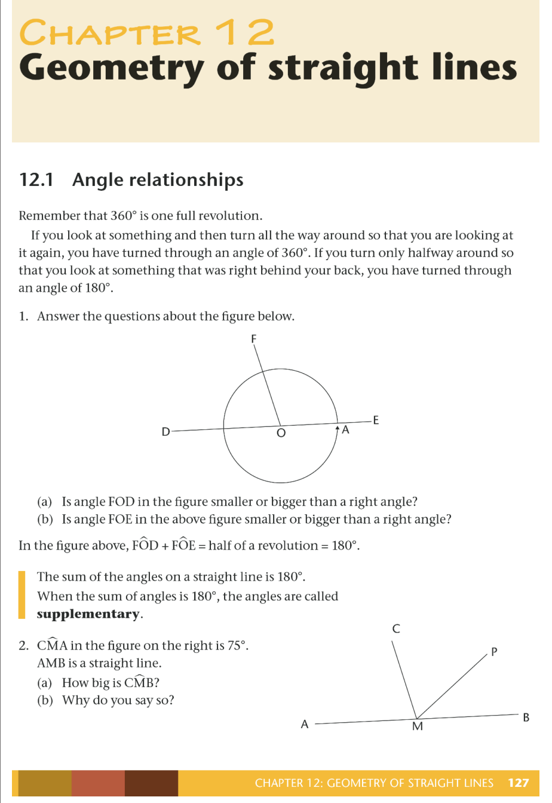
> **[Diagram Context - Textbook_Mathematics_Gr9_Geometry-of-straight-lines.pdf-0011-10.png]**
> This geometry figure illustrates angle relationships using two diagrams: one showing a ray intersecting a straight line at point O (labeled D, E, F, O) and another showing rays originating from a straight line at point M (labeled A, B, C, M, P). The diagrams conceptually demonstrate the properties of supplementary angles and angles on a straight line, providing a visual foundation for students to calculate unknown angles by applying the principle that angles on a straight line sum to 180°.

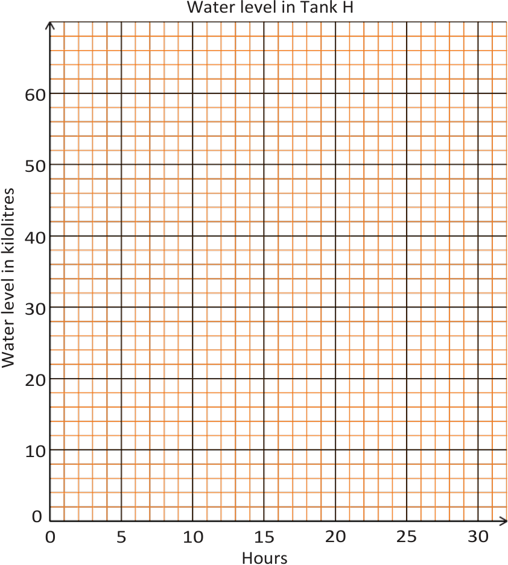
> **[Diagram Context - Textbook_Mathematics_Gr9_Graphs.pdf-0011-00.png]**
> This image is a blank Cartesian coordinate system designed for plotting data, featuring a title "Water level in Tank H," a y-axis labeled "Water level in kilolitres," and an x-axis labeled "Hours." It provides a structured grid for learners to represent the relationship between time and volume, facilitating the practice of plotting points, drawing lines of best fit, and interpreting rates of change in a practical context.

---

# 6.7 Multiplying with Fractions

## Parts of Rectangles and Parts of Parts

### Exercise 1
1. (a) Copy the rectangles below. Divide the rectangle on the left into eighths by drawing vertical lines. Lightly shade the left $\frac{3}{8}$ of the rectangle.
   (b) Divide the rectangle on the right into fifths by drawing horizontal lines. Lightly shade the upper $\frac{2}{5}$ of the rectangle.

### Exercise 2
2. (a) Copy the rectangles below. Shade $\frac{4}{7}$ of the rectangle on the left.
   (b) Shade $\frac{16}{28}$ of the rectangle on the right.

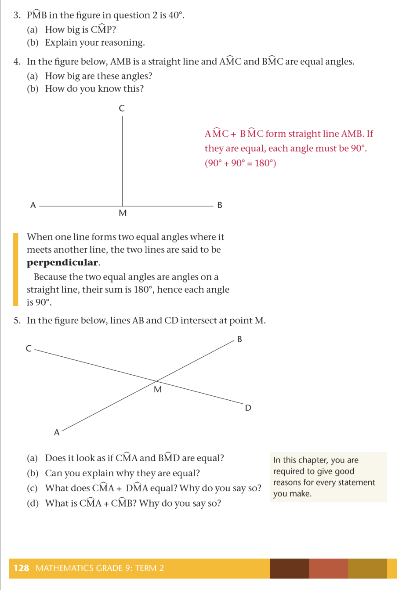
> **[Diagram Context - Textbook_Mathematics_Gr9_Geometry-of-straight-lines.pdf-0012-15.png]**
> This geometry exercise features two diagrams illustrating line segments intersecting at point M, labeled with points A, B, C, and D. The content guides students through the conceptual application of Euclidean geometry principles, specifically the properties of perpendicular lines and the relationships between angles on a straight line and vertically opposite angles.

### Exercise 3
3. (a) What part of each big rectangle below is coloured yellow?

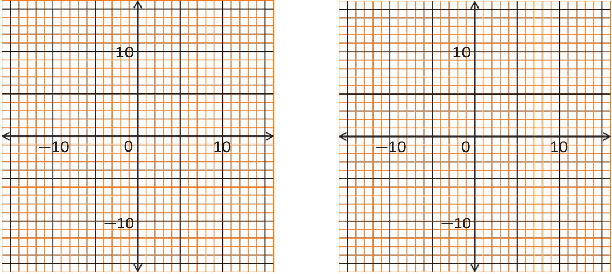
> **[Diagram Context - Textbook_Mathematics_Gr9_Graphs.pdf-0012-08.png]**
> This graphic displays two identical Cartesian coordinate planes featuring a grid background, horizontal x-axes, and vertical y-axes marked with numerical labels at 0, 10, and -10. These templates are designed for learners to plot functions, geometric transformations, or data points, providing a structured workspace for mastering analytical geometry and algebraic graphing within the CAPS curriculum.

(b) What part of the *yellow* part of the rectangle on the right is dotted?
(c) Into how many squares is the whole rectangle on the right divided?
(d) What part of the whole rectangle on the right is yellow *and* dotted?

---

### Multiplying Fractions

#### 1. Visualizing Fractions
To find a fraction of a fraction, you can use grid paper to create diagrams.
*   **(a)** Find $\frac{3}{4}$ of $\frac{5}{8}$
*   **(b)** Find $\frac{2}{3}$ of $\frac{4}{5}$

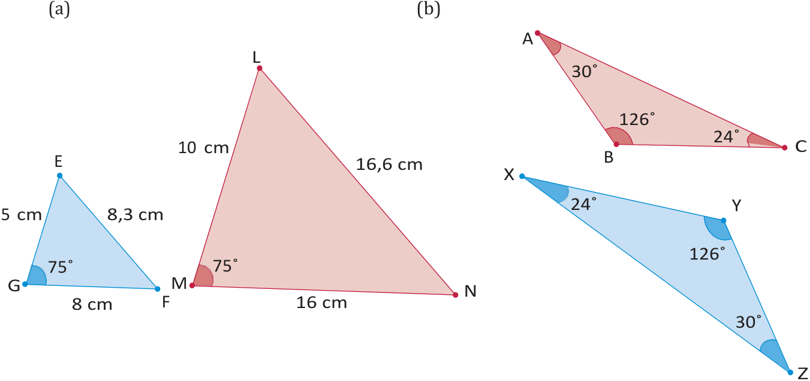
> **[Diagram Context - Textbook_Mathematics_Gr9_Geometry-of-2D-shapes.pdf-0013-02.png]**
> This geometry figure illustrates the properties of similar triangles, featuring two pairs of triangles labeled (a) and (b) with vertices EFG, LMN, ABC, and XYZ. The diagram displays side lengths in centimeters and interior angles in degrees, demonstrating that triangles are similar when their corresponding angles are equal and their corresponding sides are in the same proportion.

#### 2. The Rule for Multiplying Fractions
When multiplying two fractions, you can follow these steps:
1.  Multiply the two numerators together to get the new numerator.
2.  Multiply the two denominators together to get the new denominator.

**Example:**
$$\frac{3}{4} \times \frac{5}{8} = \frac{3 \times 5}{4 \times 8} = \frac{15}{32}$$

---

### Exercises

**Question 4:** Use grid paper to represent the fractions as shown in the diagram above.

**Question 5:** Compare the result of the multiplication rule with the visual representation of $\frac{3}{4}$ of $\frac{5}{8}$. What do you notice about the relationship between "of" and the multiplication sign ($\times$)?

**Question 6:** Solve the following word problems:
*   **(a)** Alan has five heaps of eight apples each. How many apples is that in total?
*   **(b)** Sean has ten heaps of six quarter apples each. How many apples is that in total?

---

### Key Concept: "Of" means Multiply
In mathematics, the word "of" indicates multiplication. 

*   Instead of saying $\frac{5}{8}$ **of** R40, we say $\frac{5}{8} \times R40$.
*   Instead of saying $\frac{5}{8}$ **of** $\frac{2}{3}$ of a floor surface, we say $\frac{5}{8} \times \frac{2}{3}$ of a floor surface.

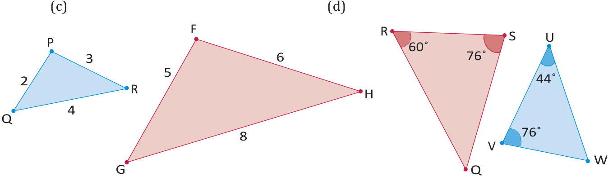
> **[Diagram Context - Textbook_Mathematics_Gr9_Geometry-of-2D-shapes.pdf-0013-03.png]**
> This geometry figure displays two pairs of triangles labeled (c) and (d) with specific side lengths (2, 3, 4 and 5, 6, 8) and interior angles (60°, 76° and 44°, 76°). It illustrates the concepts of similarity and proportionality, where students must determine if the triangles in each pair are similar by comparing the ratios of corresponding sides or the equality of corresponding angles.

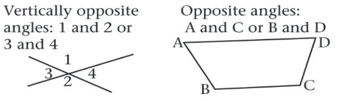
> **[Diagram Context - Textbook_Mathematics_Gr9_Geometry-of-straight-lines.pdf-0013-02.png]**
> This geometry figure illustrates two distinct types of angle relationships: vertically opposite angles formed by intersecting lines (labeled 1, 2, 3, and 4) and opposite interior angles within a quadrilateral (labeled A, B, C, and D). It serves to clarify the conceptual difference between angles created by line intersections and those defined by the vertices of a polygon, helping learners distinguish between these fundamental geometric properties.

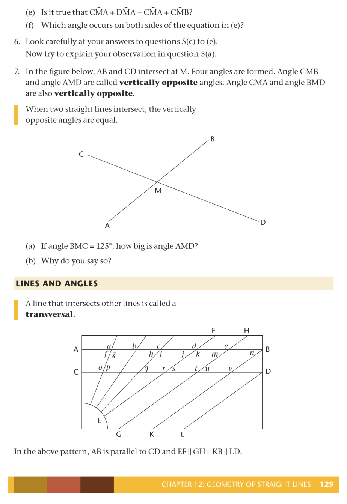
> **[Diagram Context - Textbook_Mathematics_Gr9_Geometry-of-straight-lines.pdf-0013-18.png]**
> This geometry figure illustrates two distinct concepts: the first is a pair of intersecting lines (AB and CD) forming vertically opposite angles at intersection M, and the second is a grid of parallel lines (AB || CD) intersected by a series of transversals (EF, GH, KB, LD) labeled with variables a through v. These diagrams conceptually guide learners to identify and apply the properties of vertically opposite angles and the relationships between angles formed by transversals across parallel lines, which are foundational topics in the CAPS Grade 8-9 Geometry curriculum.

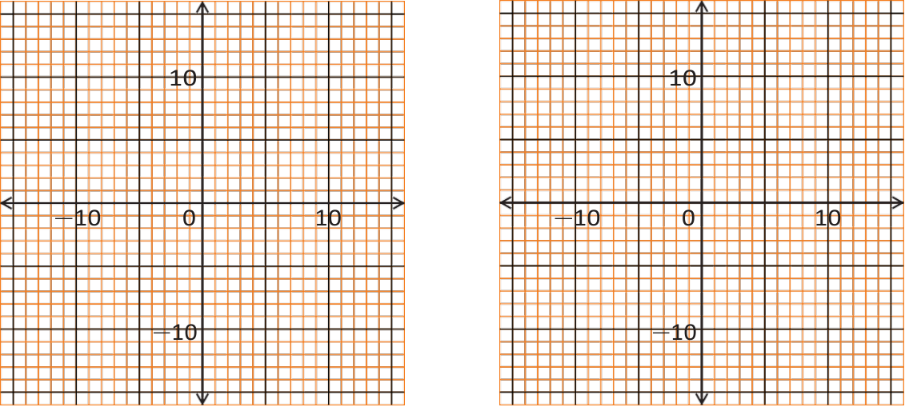
> **[Diagram Context - Textbook_Mathematics_Gr9_Graphs.pdf-0013-04.png]**
> This graphic displays two identical Cartesian coordinate systems featuring a grid with x- and y-axes marked with arrows and numerical labels at the origin (0), and at intervals of 10 units. These grids serve as a foundational mathematical tool for learners to plot coordinates, sketch functions, and represent geometric transformations as required by the CAPS curriculum.

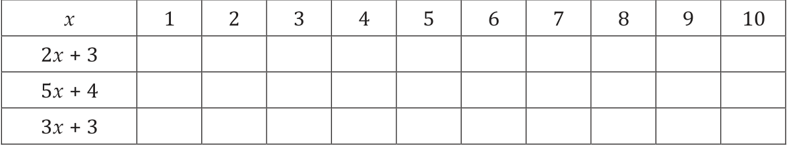
> **[Diagram Context - Textbook_Mathematics_Gr9_Graphs.pdf-0013-09.png]**
> This table presents a mathematical input-output structure featuring an independent variable $x$ (ranging from 1 to 10) and three distinct linear algebraic expressions: $2x + 3$, $5x + 4$, and $3x + 3$. It serves as a foundational tool for learners to practice substitution and observe how varying input values generate corresponding outputs for different linear functions.

---

### Multiplying Fractions

#### 7. Visualizing Fraction Multiplication
Use the provided grid diagrams to determine the product of the following fractions:

(a) $\frac{3}{10} \times \frac{5}{6}$

(b) $\frac{2}{5} \times \frac{7}{8}$

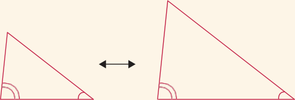
> **[Diagram Context - Textbook_Mathematics_Gr9_Geometry-of-2D-shapes.pdf-0014-11.png]**
> This geometry figure displays two triangles with identical interior angle markings, separated by a double-headed arrow. The diagram illustrates the concept of equiangular triangles, which serves as the foundational condition for proving that two triangles are similar in Euclidean geometry.

---

#### 8. Testing the Multiplication Rule
The general rule for multiplying fractions is:
$$\text{Product} = \frac{\text{numerator} \times \text{numerator}}{\text{denominator} \times \text{denominator}}$$

(a) Perform the calculation using the rule for $\frac{3}{10} \times \frac{5}{6}$ and compare the result to your answer from question 7(a).

(b) Perform the calculation using the rule for $\frac{2}{5} \times \frac{7}{8}$ and compare the result to your answer from question 7(b).

---

#### 9. Applying the Formula
Perform the calculations using the formula $\frac{\text{numerator} \times \text{numerator}}{\text{denominator} \times \text{denominator}}$ for the following:

(a) $\frac{5}{6} \times \frac{7}{12}$

(b) $\frac{3}{4} \times \frac{2}{3}$

---

#### 10. Verification
Use the diagrams on the following page to verify if the formula $\frac{\text{numerator} \times \text{numerator}}{\text{denominator} \times \text{denominator}}$ produces the correct answers for:

(a) $\frac{5}{6} \times \frac{7}{12}$

(b) $\frac{3}{4} \times \frac{2}{3}$

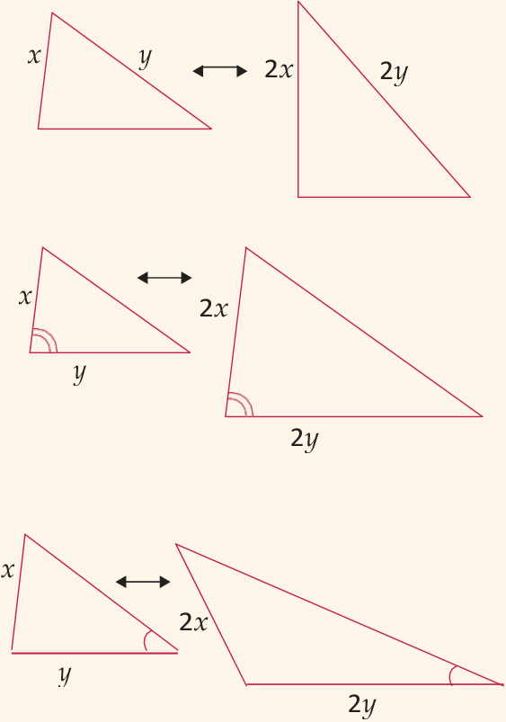
> **[Diagram Context - Textbook_Mathematics_Gr9_Geometry-of-2D-shapes.pdf-0014-15.png]**
> This graphic displays three pairs of triangles labeled with variables $x$ and $y$ and their scaled equivalents $2x$ and $2y$, connected by double-headed arrows. It illustrates the concept of geometric similarity, demonstrating how doubling the side lengths while maintaining corresponding angles results in an enlarged triangle with a scale factor of two. This visual aid helps learners understand the proportional relationship between sides in similar triangles, a core component of the CAPS Grade 9 and 10 Euclidean Geometry curriculum.

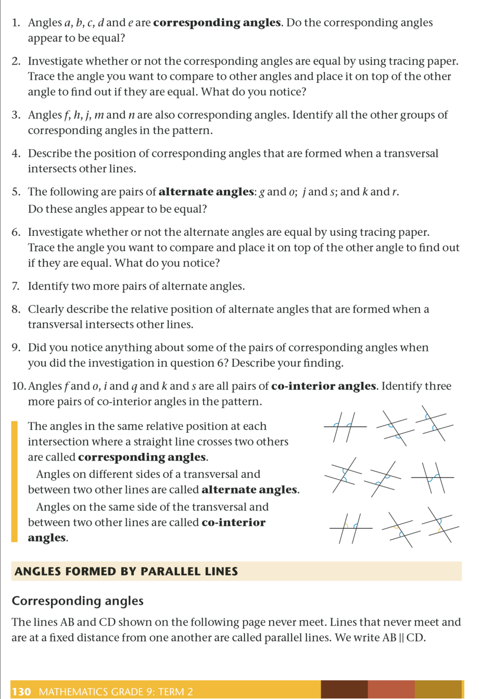
> **[Diagram Context - Textbook_Mathematics_Gr9_Geometry-of-straight-lines.pdf-0014-17.png]**
> This resource is a Grade 9 Mathematics geometry worksheet featuring a series of investigative questions and small geometric diagrams showing transversals intersecting pairs of lines. The text defines and labels corresponding, alternate, and co-interior angles, using visual markers to highlight specific angle relationships. It conceptually guides students through an inquiry-based approach to discover the properties of angles formed by transversals, building a foundational understanding of parallel line geometry.

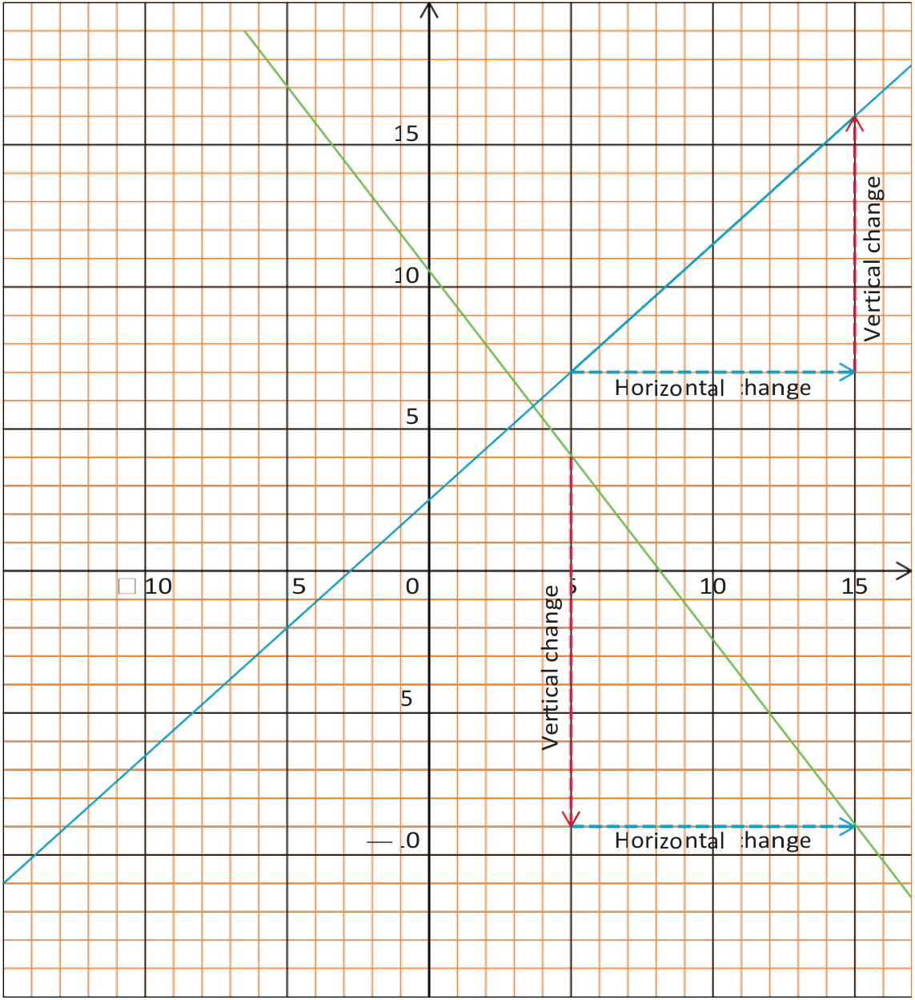
> **[Diagram Context - Textbook_Mathematics_Gr9_Graphs.pdf-0014-00.png]**
> This Cartesian plane displays two intersecting linear functions plotted on a grid, with labels indicating "Vertical change" and "Horizontal change" along specific segments of the lines. The diagram visually demonstrates the concept of gradient (slope) as the ratio of vertical change to horizontal change, providing a geometric representation of how the rate of change is calculated for linear equations.

---

### 11. Calculating Fractions of Fractions
To calculate a fraction of a fraction, multiply the numerators together and the denominators together.

**Worked Examples:**
(a) $\frac{1}{2}$ of $\frac{1}{3}$ of R60
$= (\frac{1}{2} \times \frac{1}{3}) \times 60 = \frac{1}{6} \times 60 = R10$

(b) $\frac{2}{7}$ of $\frac{2}{9}$ of R63
$= (\frac{2}{7} \times \frac{2}{9}) \times 63 = \frac{4}{63} \times 63 = R4$

(c) $\frac{4}{3}$ of $\frac{2}{5}$ of R45
$= (\frac{4}{3} \times \frac{2}{5}) \times 45 = \frac{8}{15} \times 45 = 8 \times 3 = R24$

---

### 12. Practical Applications
(a) John practises for $\frac{1}{2}$ of $\frac{3}{4}$ of an hour.
$= \frac{1}{2} \times \frac{3}{4} = \frac{3}{8}$ of an hour.

(b) A bag weighs $\frac{3}{8}$ kg. Find $\frac{3}{4}$ of a bag.
$= \frac{3}{4} \times \frac{3}{8} = \frac{9}{32}$ kg.

(c) Mass of $7\frac{1}{2}$ packets if one packet is $\frac{3}{4}$ kg.
$= \frac{15}{2} \times \frac{3}{4} = \frac{45}{8} = 5\frac{5}{8}$ kg.

---

### 6.8 Ordering and Comparing Fractions
To compare fractions, convert them to a common denominator or convert them to decimals/percentages.

#### 1. Order from smallest to biggest
(a) $\frac{7}{16}, \frac{3}{8}, \frac{11}{24}, \frac{5}{12}, \frac{23}{48}$
*Common denominator is 48:*
$\frac{21}{48}, \frac{18}{48}, \frac{22}{48}, \frac{20}{48}, \frac{23}{48}$
**Order:** $\frac{3}{8}, \frac{5}{12}, \frac{7}{16}, \frac{11}{24}, \frac{23}{48}$

(b) $\frac{703}{1000}, \frac{13}{20}, \frac{7}{10}, 73\%, \frac{71}{100}$
*Convert to decimals:*
$0.703, 0.65, 0.7, 0.73, 0.71$
**Order:** $\frac{13}{20}, \frac{7}{10}, \frac{703}{1000}, \frac{71}{100}, 73\%$

#### 2. Order from biggest to smallest
(a) $\frac{41}{60}, \frac{19}{30}, \frac{7}{10}, \frac{11}{15}, \frac{17}{20}$
*Common denominator is 60:*
$\frac{41}{60}, \frac{38}{60}, \frac{42}{60}, \frac{44}{60}, \frac{51}{60}$
**Order:** $\frac{17}{20}, \frac{11}{15}, \frac{7}{10}, \frac{41}{60}, \frac{19}{30}$

(b) $\frac{23}{24}, \frac{2}{3}, \frac{7}{8}, \frac{19}{20}, \frac{5}{6}$
*Common denominator is 120:*
$\frac{115}{120}, \frac{80}{120}, \frac{105}{120}, \frac{114}{120}, \frac{100}{120}$
**Order:** $\frac{23}{24}, \frac{19}{20}, \frac{7}{8}, \frac{5}{6}, \frac{2}{3}$

#### 3. Use symbols ($=, >, <$)
| Comparison | Calculation | Result |
| :--- | :--- | :--- |
| (a) $\frac{7}{17} \dots \frac{21}{51}$ | $\frac{7}{17} = \frac{7 \times 3}{17 \times 3} = \frac{21}{51}$ | $\frac{7}{17} = \frac{21}{51}$ |
| (b) $\frac{1}{17} \dots \frac{1}{19}$ | Since $17 < 19$, then $\frac{1}{17} > \frac{1}{19}$ | $\frac{1}{17} > \frac{1}{19}$ |

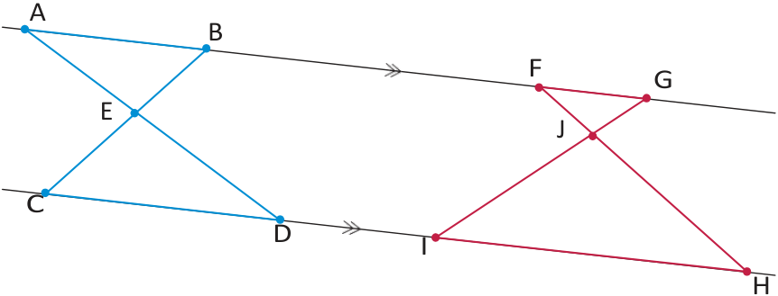
> **[Diagram Context - Textbook_Mathematics_Gr9_Geometry-of-2D-shapes.pdf-0015-06.png]**
> This geometry figure illustrates two pairs of vertically opposite triangles formed by transversals intersecting two parallel lines, marked with double-arrow indicators. The diagram features vertices labeled A, B, C, D, E, F, G, H, I, and J, highlighting the relationship between parallel lines and the resulting similar triangles. It serves as a visual aid for Grade 10-12 learners to identify alternate interior angles and apply the properties of equiangular triangles to prove similarity.

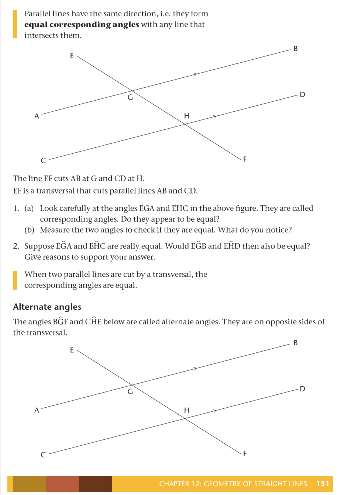
> **[Diagram Context - Textbook_Mathematics_Gr9_Geometry-of-straight-lines.pdf-0015-07.png]**
> This geometry figure illustrates two parallel lines (AB and CD) intersected by a transversal line (EF), marked with arrows to denote parallelism and points G and H at the intersections. The diagram serves as a visual aid for Grade 8-9 learners to identify and verify the properties of corresponding and alternate angles formed by parallel lines. It encourages students to investigate the equality of these angle pairs through measurement and logical reasoning, reinforcing fundamental Euclidean geometry concepts.

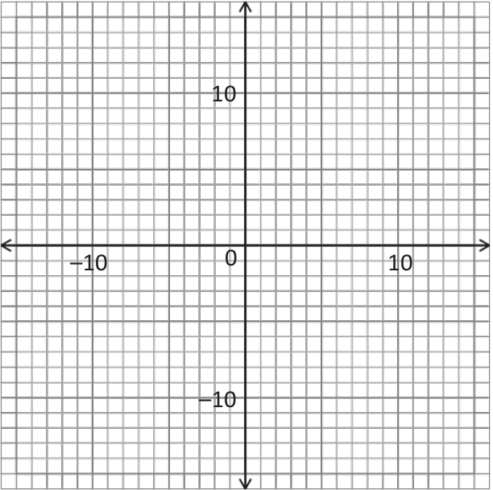
> **[Diagram Context - Textbook_Mathematics_Gr9_Graphs.pdf-0015-02.png]**
> This image is a Cartesian coordinate plane featuring a grid with perpendicular x and y-axes intersecting at the origin (0). The axes are marked with numerical labels at intervals of 10 and include arrows indicating the positive direction of each axis. This tool is essential for learners to plot coordinates, represent functions, and visualize geometric transformations within the CAPS Mathematics curriculum.

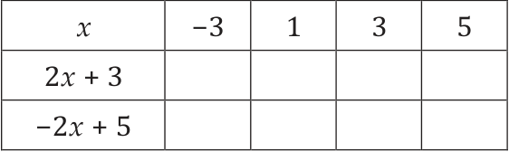
> **[Diagram Context - Textbook_Mathematics_Gr9_Graphs.pdf-0015-06.png]**
> This table presents a mathematical input-output exercise featuring the independent variable $x$ with values $-3, 1, 3,$ and $5$, alongside two linear algebraic expressions, $2x + 3$ and $-2x + 5$. It serves as a foundational tool for learners to practice substitution, demonstrating how different functions map the same set of input values to distinct output values.

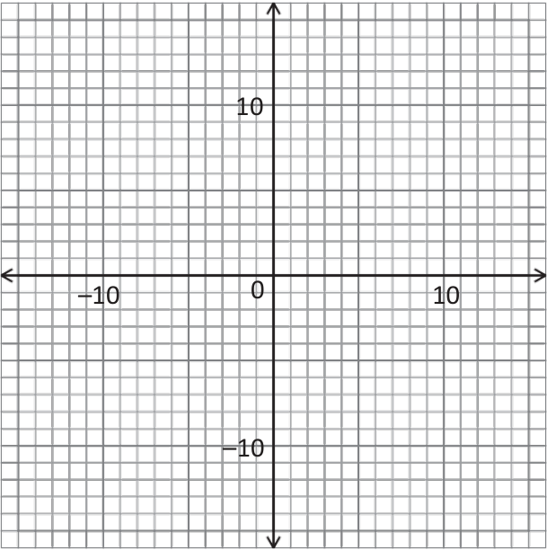
> **[Diagram Context - Textbook_Mathematics_Gr9_Graphs.pdf-0015-07.png]**
> This graphic is a standard Cartesian coordinate plane featuring a grid with perpendicular x and y-axes intersecting at the origin (0). The axes are labeled with numerical markers at intervals of 10 and include arrows indicating the positive and negative directions for both dimensions. This tool provides the foundational framework for learners to plot coordinates, represent functions, and perform geometric transformations as required by the CAPS Mathematics curriculum.

---

# Worksheet: Fractions and Percentages

## 1. Addition of Fractions (Words to Notation)
Rewrite each question in common fraction notation, calculate, and write the answer in words and common fraction notation.
*   (a) three twentieths + five twentieths
*   (b) five twelfths + 11 twelfths
*   (c) three halves + five quarters
*   (d) three fifths + three tenths

## 2. Equivalent Fractions
Complete the missing values:
*   (a) $\frac{5}{7} = \frac{\Box}{49}$
*   (b) $\frac{9}{11} = \frac{\Box}{33}$
*   (c) $\frac{15}{10} = \frac{3}{\Box}$
*   (d) $\frac{1}{9} = \frac{4}{\Box}$
*   (e) $\frac{45}{18} = \frac{\Box}{2}$
*   (f) $\frac{\Box}{5} = \frac{\Box}{35}$

## 3. Addition of Fractions
Calculate the following. Write the answer in words and in common fraction notation.
*   (a) $\frac{3}{10} + \frac{7}{30}$
*   (b) $\frac{2}{5} + \frac{7}{12}$
*   (c) $\frac{1}{100} + \frac{7}{10}$
*   (d) $\frac{3}{5} - \frac{3}{8}$
*   (e) $2\frac{3}{10} + 5\frac{9}{10}$

## 4. Percentage Increase
Joe earns R5 000 per month. His salary increases by 12%. What is his new salary?

## 5. Successive Percentage Change
Ahmed earned R7 500 per month. His employer raised his salary by 10%. One month later, his employer decreased his salary by 10%. What was Ahmed's salary then?

## 6. Subtraction and Addition (Simplify to lowest form)
Calculate and simplify:
*   (a) $\frac{13}{20} - \frac{2}{5}$
*   (b) $3\frac{24}{100} - 1\frac{2}{10}$
*   (c) $5\frac{9}{11} - 2\frac{1}{4}$
*   (d) $\frac{2}{3} + \frac{4}{7}$

## 7. Evaluation of Products
Evaluate the following:
*   (a) $\frac{1}{2} \times 9$
*   (b) $\frac{3}{5} \times \frac{10}{27}$
*   (c) $\frac{2}{3} \times 15$
*   (d) $\frac{2}{3} \times \frac{3}{4}$

## 8. Complex Calculations
Calculate the following:
*   (a) $2\frac{2}{3} \times 2\frac{2}{3}$
*   (b) $8\frac{2}{5} \times 3\frac{1}{3}$
*   (c) $(\frac{1}{3} + \frac{1}{2}) \times 6$
*   (d) $2\frac{2}{3} \times 1\frac{1}{3}$
*   (e) $5\frac{3}{6} + 2\frac{2}{3} \times 1\frac{1}{5}$
*   (f) $3\frac{2}{4} - 2\frac{2}{5} \times \frac{4}{6}$

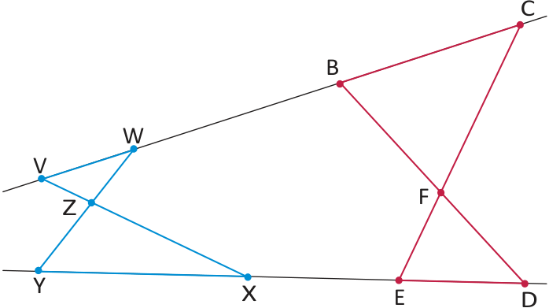
> **[Diagram Context - Textbook_Mathematics_Gr9_Geometry-of-2D-shapes.pdf-0016-01.png]**
> This geometry figure displays two sets of intersecting lines forming triangles $\triangle VWZ$ and $\triangle BFC$ (or similar configurations) between two transversals. The diagram features vertices labeled $V, W, Z, Y, X$ in blue and $B, C, F, E, D$ in red, illustrating the relationship between parallel or intersecting lines. It serves as a visual aid for Grade 10-12 learners to apply the Midpoint Theorem or the Proportionality Theorem to solve for unknown side lengths or prove similarity between triangles.

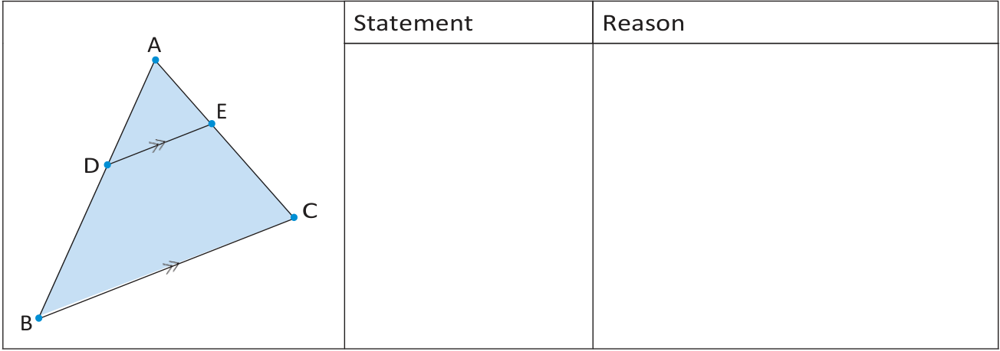
> **[Diagram Context - Textbook_Mathematics_Gr9_Geometry-of-2D-shapes.pdf-0016-03.png]**
> This geometry figure depicts a triangle ABC with a line segment DE parallel to the base BC, indicated by parallel arrows on the lines. It serves as a template for Grade 11 and 12 learners to practice formal geometric proofs, specifically the Proportionality Theorem, by requiring them to provide corresponding statements and reasons for properties derived from the parallel lines.

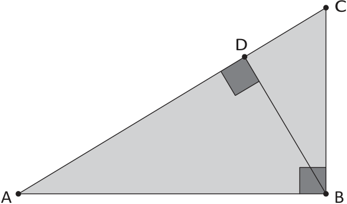
> **[Diagram Context - Textbook_Mathematics_Gr9_Geometry-of-2D-shapes.pdf-0016-06.png]**
> This geometry figure illustrates a right-angled triangle $ABC$ with an altitude $BD$ drawn from the right-angle vertex $B$ to the hypotenuse $AC$. The diagram uses vertices $A, B, C,$ and $D$ alongside two right-angle symbols to demonstrate the geometric properties of similar triangles formed within a right-angled triangle. It serves as a foundational visual for learners to derive and apply the Euclidean geometry theorems regarding proportionality in right-angled triangles.

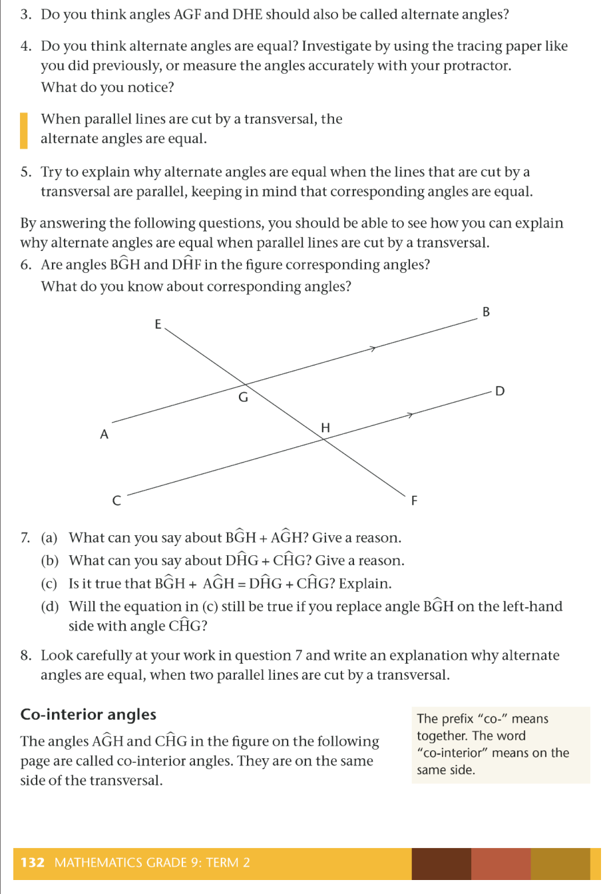
> **[Diagram Context - Textbook_Mathematics_Gr9_Geometry-of-straight-lines.pdf-0016-13.png]**
> This geometry figure displays two parallel lines intersected by a transversal line, labeled with points A, B, C, D, E, F, G, and H. The diagram serves as a guided inquiry tool for Grade 9 learners to investigate the properties of angles formed by parallel lines, specifically helping them derive the proofs for alternate and co-interior angle relationships.

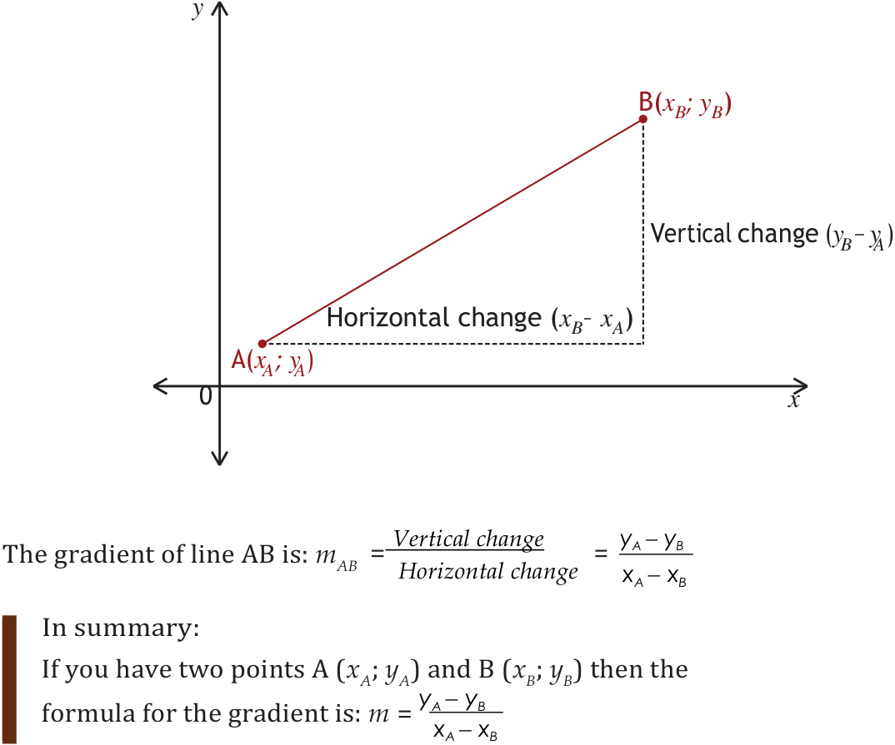
> **[Diagram Context - Textbook_Mathematics_Gr9_Graphs.pdf-0016-01.png]**
> This Cartesian plane diagram illustrates the geometric derivation of the gradient formula using two points, $A(x_A; y_A)$ and $B(x_B; y_B)$, connected by a line segment. It labels the "Vertical change" $(y_B - y_A)$ and "Horizontal change" $(x_B - x_A)$ to visually demonstrate that the gradient ($m$) is the ratio of the change in $y$ to the change in $x$. This provides learners with a conceptual foundation for calculating the slope of a straight line in analytical geometry.

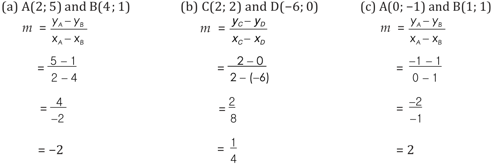
> **[Diagram Context - Textbook_Mathematics_Gr9_Graphs.pdf-0016-04.png]**
> This mathematical figure displays three worked examples of calculating the gradient ($m$) of a straight line using the formula $m = \frac{y_2 - y_1}{x_2 - x_1}$ with given coordinate pairs (A, B, C, and D). It demonstrates the procedural application of the gradient formula, including the handling of negative coordinates and signs, to determine the slope between two points on a Cartesian plane.

---

# Grade 7 Term 2: Chapter 6 - Fractions

## Learner Book Overview

| Sections in this chapter | Content | Pages in Learner Book |
| :--- | :--- | :--- |
| 6.1 Measuring accurately with parts of a unit | Describe the same part of a whole, collection, quantity or unit of measurement with different fractions; specify equivalent fractions | Pages 95 to 99 |
| 6.2 The fraction notation | Produce equivalent fractions with a formula | Pages 99 to 100 |
| 6.3 Adding fractions | Add and subtract fractions | Pages 100 to 101 |
| 6.4 Tenths and hundredths (percentages) | Introduce percentages | Pages 101 to 103 |
| 6.5 Thousandths, hundredths and tenths | Introduce fractions related to decimal fractions | Page 103 |
| 6.6 Fraction of a fraction | Determine a fraction of a fraction | Pages 104 to 105 |
| 6.7 Multiplying with fractions | Multiply fractions | Pages 106 to 109 |
| 6.8 Ordering and comparing fractions | Use equivalent fractions to order and compare fractions | Page 109 |

**CAPS Time Allocation:** 5 hours  
**CAPS Content Specification:** Pages 93 to 108

---

## Mathematical Background

Fractions were historically developed to facilitate accurate measurement of objects smaller than standard units. For example, the Latin roots of our current measurement system reflect this:
*   **Centimetres:** Hundredths of a metre.
*   **Millimetres:** Thousandths of a metre.

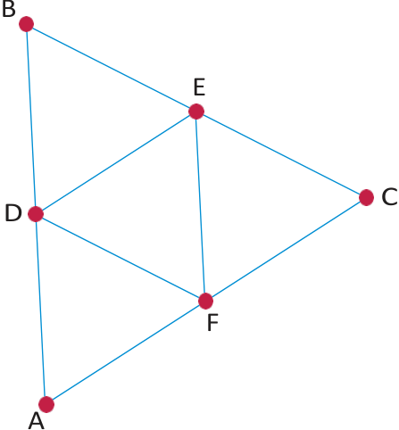
> **[Diagram Context - Textbook_Mathematics_Gr9_Geometry-of-2D-shapes.pdf-0017-07.png]**
> This geometry figure displays a large triangle ABC with an inscribed triangle DEF, defined by vertices labeled A, B, C, D, E, and F connected by line segments. It serves as a foundational visual for Grade 10-12 Euclidean geometry, allowing students to apply theorems related to triangle midsegments, similarity, and the properties of parallel lines within a triangle.

### Definition of a Fraction
A **fraction** is a number representing equal parts of the same whole, collection, quantity, or unit of measurement.

### Uses of Fractions
1.  **As Measures:** Used to express lengths or quantities (e.g., a strip measured as $3 \frac{3}{5}$ units).
2.  **Parts of Whole Objects:** Used for physical items (e.g., "a quarter of an apple").
3.  **Parts of Collections:** Used for groups (e.g., "three eighths of the learners in a school").
4.  **Parts of Non-physical Quantities:** Used for abstract values (e.g., "63 hundredths of the available marks").
5.  **Explaining Decimals:** Fractions help explain decimal place value.
    *   Example: $34,56 = 30 + 4 + \frac{5}{10} + \frac{6}{100}$
    *   This represents: $3 \text{ tens} + 4 \text{ units} + 5 \text{ tenths} + 6 \text{ hundredths}$.

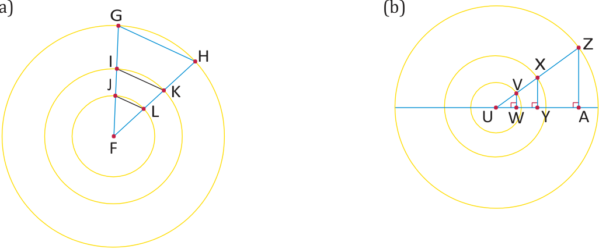
> **[Diagram Context - Textbook_Mathematics_Gr9_Geometry-of-2D-shapes.pdf-0017-11.png]**
> This geometry figure illustrates two sets of concentric circles with intersecting line segments and triangles labeled with vertices G, H, I, J, K, L, F in (a) and U, V, W, X, Y, Z, A in (b). The diagram demonstrates the principles of similarity and proportionality in geometry, showing how segments originating from a common center maintain constant ratios across concentric boundaries. It serves as a visual aid for Grade 11 and 12 learners to apply the Midpoint Theorem or the Proportionality Theorem to solve for unknown lengths within circular configurations.

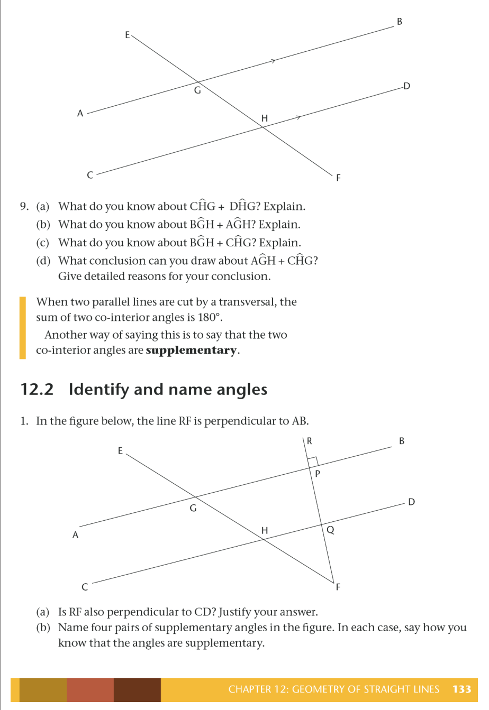
> **[Diagram Context - Textbook_Mathematics_Gr9_Geometry-of-straight-lines.pdf-0017-15.png]**
> This geometry figure illustrates parallel lines AB and CD intersected by transversals EF and RF, with specific points labeled G, H, P, and Q. The diagram uses angle notation and a perpendicularity symbol to help students apply Euclidean geometry theorems regarding supplementary angles, co-interior angles, and perpendicular lines. It serves as a practical exercise for learners to identify angle relationships and provide formal justifications based on the properties of parallel lines.

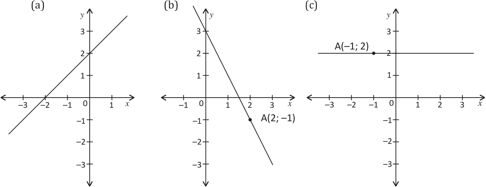
> **[Diagram Context - Textbook_Mathematics_Gr9_Graphs.pdf-0017-04.png]**
> This graphic displays three Cartesian coordinate systems showing linear functions with labeled axes ($x$ and $y$) and specific points $A(2; -1)$ and $A(-1; 2)$. It illustrates the conceptual application of the straight-line equation $y = mx + c$, demonstrating how to determine the gradient and equation of a line given its intercepts or a specific coordinate point.

---

# Chapter 6: Fractions

## 6.1 Measuring accurately with parts of a unit

### A Strange Measuring Unit
In mathematics, we use fractions to measure lengths accurately when whole units are not sufficient. To understand this, we use a hypothetical unit called a **greystick**.

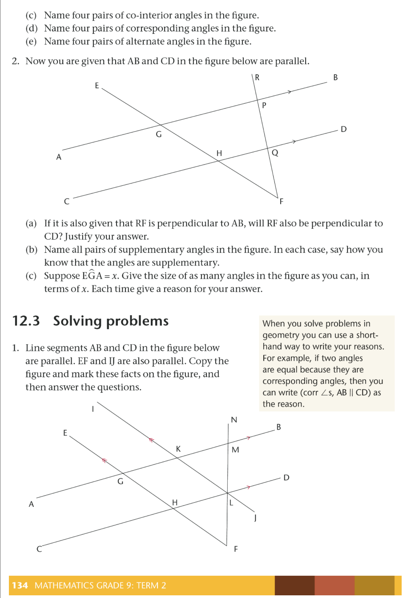
> **[Diagram Context - Textbook_Mathematics_Gr9_Geometry-of-straight-lines.pdf-0018-20.png]**
> This geometry figure illustrates two sets of parallel lines intersected by transversals, featuring labeled points (A, B, C, D, E, F, G, H, I, J, K, L, M, N) and parallel indicators. It serves to help Grade 9 learners identify and apply the properties of co-interior, corresponding, and alternate angles formed by parallel lines to solve algebraic and geometric problems.

### Key Concepts
*   **Reading Fractions:** A fraction like $\frac{5}{8}$ should be read as "five eighths," not "five over eight." This ensures a conceptual understanding of the parts of a whole.
*   **The Need for Fractions:** When measuring, objects often fall between whole units. To measure accurately, we must subdivide the unit into smaller, equal parts (e.g., sixths or tenths).
*   **Quantities in Fractions:** When a whole is divided into equal parts, there are three related quantities:
    1.  The size of the whole.
    2.  The number of equal parts.
    3.  The size of each individual part.

### Developmental Phases of Fractions
1.  **Awareness:** Understanding that the same part of a whole or collection can be described using different fractions.
2.  **Specification:** The ability to identify and name equivalent fractions.
3.  **Production:** The ability to generate equivalent fractions using a mathematical formula.

### Mathematical Relationships
*   **Sharing Situations:** Finding the size of each part when the size of the whole and the number of parts are known.
*   **Grouping Situations:** Finding the number of equal parts when the size of the whole and the size of each part are known.

---

### Activity: Measuring with Greysticks
*   **Example 1:** A red bar is exactly $2$ greysticks long.
*   **Example 2:** A yellow bar is longer than $1$ greystick but shorter than $2$ greysticks.
*   **Subdivision:** To measure the yellow bar accurately, we divide the greystick into smaller equal parts.
    *   If divided into $6$ equal parts, each part is $\frac{1}{6}$ of a greystick.
    *   If divided into $7$ equal parts, each part is $\frac{1}{7}$ of a greystick.

#### Exercise
1.  **Question:** Can you say the yellow bar is one and four sixths ($1\frac{4}{6}$) of a greystick long?
    *   **Answer:** Yes. By dividing the unit into equal parts, we can describe the same length in different ways.

---

### Understanding Fractions: Concepts and Misconceptions

#### Common Misconception
Learners often mistakenly view a fraction like $\frac{2}{5}$ as two separate whole numbers stacked on top of each other. 
*   **Correction:** In the term "two fifths," the number $2$ indicates a count of objects, but the objects themselves are no longer "wholes." They are "fifths." The fraction represents a specific type of object being counted.
*   **Pedagogical Note:** It is essential for learners to develop the concept of fractions by using verbal descriptions (e.g., "two fifths") before introducing symbolic notation.

---

### Exercises: Measuring with Greysticks

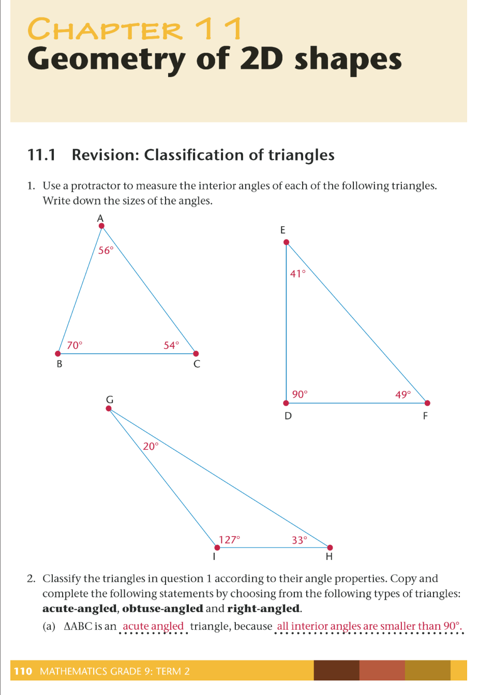
> **[Diagram Context - Textbook_Mathematics_Gr9_Geometry-of-2D-shapes.pdf-0019-25.png]**
> This geometry figure displays three distinct triangles labeled ABC, DEF, and GIH, each annotated with specific interior angle measurements in degrees. The diagram serves as a foundational exercise for Grade 9 learners to practice measuring angles and classifying triangles as acute-angled, right-angled, or obtuse-angled based on their interior properties.

#### 2. Describing Lengths
Describe the length of the blue bar (from the previous page) in words.
*   **Answer:** One and five sixths of a greystick.

#### 3. Identifying Fractional Parts
In each case below, identify what the smaller parts of the greystick are called.

| Part | Name | Part | Name |
| :--- | :--- | :--- | :--- |
| (a) | fifths | (b) | sixths |
| (c) | eighths | (d) | ninths |
| (e) | tenths | (f) | twelfths |
| (g) | fifteenths | (h) | sixteenths |
| (i) | eighteenths | (j) | twentieths |
| (k) | twenty-firsts | (l) | twenty-seconds |
| (m) | twenty-fourths | (n) | twenty-fifths |

#### 4. Measuring Yellow Bars
How long is the upper yellow bar?
*   **Answer:** One and seven twelfths of a greystick.
*   **Alternative Answer:** One and fourteen twenty-fourths of a greystick.
*   *Note:* Describing the same length in different ways (e.g., $\frac{7}{12}$ vs $\frac{14}{24}$) lays the foundation for understanding **equivalent fractions**.

#### 5. Measuring Bars
(a) How long is the blue bar?
*   **Answer:** One and ten twelfths of a greystick OR one and five sixths of a greystick.

(b) How long is the red bar?
*   **Answer:** One and three sixths of a greystick OR one and twelve twenty-fourths of a greystick.

#### 6. Equivalent Fractions
(a) How many twelfths of a greystick is the same length as one sixth of a greystick?
*   **Answer:** Two twelfths.

(b) How many twenty-fourths is the same length as one sixth of a greystick?
*   **Answer:** Four twenty-fourths.

(c) How many twenty-fourths is the same length as seven twelfths of a greystick?
*   **Answer:** Fourteen twenty-fourths.

#### 7. Further Measurements
(a) How long is the upper yellow bar on the following page?
*   **Answer:** One and eight tenths of a greystick.

(b) How long is the lower yellow bar on the following page?
*   **Answer:** One and four fifths of a greystick.

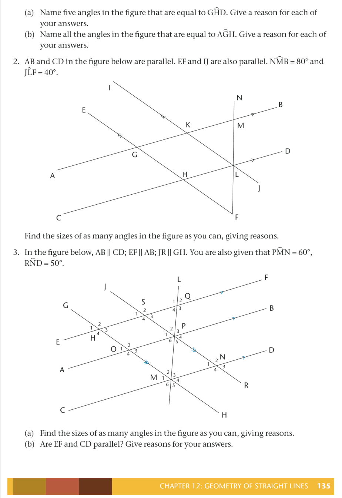
> **[Diagram Context - Textbook_Mathematics_Gr9_Geometry-of-straight-lines.pdf-0019-07.png]**
> This geometry figure displays two sets of intersecting lines with parallel line indicators, labeled with points (A-N) and numbered angles (1-6). It requires students to apply Euclidean geometry theorems—specifically corresponding, alternate, and co-interior angles—to calculate unknown angle sizes and prove parallel line relationships. This exercise reinforces the foundational CAPS curriculum skill of using deductive reasoning to solve complex angle problems involving transversals.

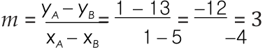
> **[Diagram Context - Textbook_Mathematics_Gr9_Graphs.pdf-0019-12.png]**
> This mathematical expression demonstrates the calculation of the gradient ($m$) of a straight line using the coordinates of two points, $A$ and $B$. It utilizes the formula $m = \frac{y_A - y_B}{x_A - x_B}$ and substitutes the values $(1, 1)$ and $(5, 13)$ to show the step-by-step simplification process resulting in a gradient of 3. This serves as a foundational example for Grade 10-12 learners to understand how to determine the steepness of a line between two specific points on a Cartesian plane.

---

### Describe the Same Length in Different Ways (Equivalent Forms)

#### Concept: Equivalent Fractions
Two fractions are **equivalent** if they describe the same portion or length of a whole (a "greystick"). Even if the numbers used to represent the fraction are different, the actual value remains the same.

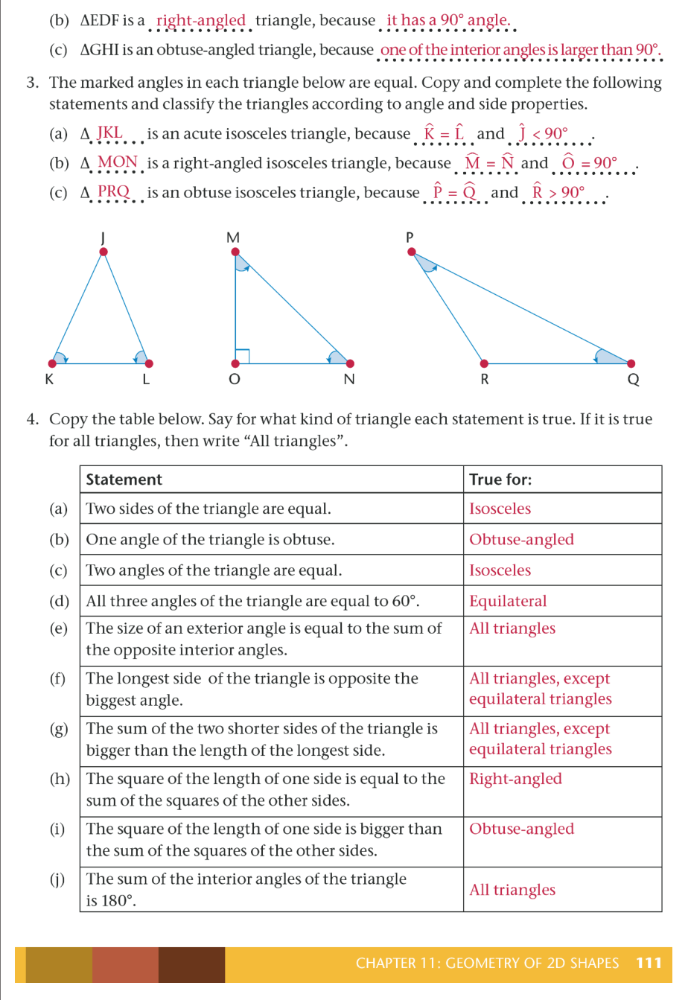
> **[Diagram Context - Textbook_Mathematics_Gr9_Geometry-of-2D-shapes.pdf-0020-03.png]**
> This graphic features geometric figures of three triangles (JKL, MON, PRQ) with marked angles and a summary table classifying triangle properties. The diagrams use vertex labels (J, K, L, M, O, N, P, R, Q) and arc markers to denote equal angles, while the table lists ten mathematical statements alongside their corresponding triangle classifications. This resource helps learners consolidate their understanding of triangle classification based on side and angle properties, as well as fundamental geometric theorems.

---

#### Exercises

**1. Understanding Parts of a Greystick**
*   (a) What can each small part on this greystick be called?
*   (b) How many eighteenths is one sixth of the greystick?
*   (c) How many eighteenths is one third of the greystick?
*   (d) How many eighteenths is five sixths of the greystick?

**2. Finding Equivalents**
*   (a) Write (in words) the names of four different fractions that are all equivalent to three quarters ($\frac{3}{4}$).
*   (b) Which equivalents for two thirds ($\frac{2}{3}$) can you find on the greysticks?

**3. Completing the Table**
The information that two thirds is equivalent to four sixths, six ninths, and eight twelfths is written in the second row of the table below. Copy the table and complete the other rows in the same way.

| Fraction | Equivalent 1 | Equivalent 2 | Equivalent 3 |
| :--- | :--- | :--- | :--- |
| $\frac{1}{2}$ | $\frac{2}{4}$ | $\frac{3}{6}$ | $\frac{4}{8}$ |
| $\frac{2}{3}$ | $\frac{4}{6}$ | $\frac{6}{9}$ | $\frac{8}{12}$ |
| $\frac{3}{4}$ | $\frac{6}{8}$ | $\frac{9}{12}$ | $\frac{12}{16}$ |
| $\frac{4}{5}$ | $\frac{8}{10}$ | $\frac{12}{15}$ | $\frac{16}{20}$ |

---

#### Teacher's Guide: Background Information
*   **Purpose:** This section develops the concept of equivalent fractions, which is the foundation for ordering, comparing, adding, and subtracting fractions as required by the CAPS curriculum.
*   **Common Misconception:** Many learners struggle because they view common fractions, decimal fractions, and percentages as entirely different types of numbers. 
*   **Instructional Strategy:** Use the "greystick" model to illustrate that different fractions can represent the exact same physical portion. Emphasize that understanding tenths, hundredths, and thousandths is crucial to bridging the gap between common and decimal fractions.

---

#### Answers for Exercises

**1.**
*   (a) One eighteenth ($\frac{1}{18}$)
*   (b) Three eighteenths ($\frac{3}{18}$)
*   (c) Six eighteenths ($\frac{6}{18}$)
*   (d) Fifteen eighteenths ($\frac{15}{18}$)

**2.**
*   (a) Sample answer: nine twelfths ($\frac{9}{12}$); twelve sixteenths ($\frac{12}{16}$); fifteen twentieths ($\frac{15}{20}$); eighteen twenty-fourths ($\frac{18}{24}$)
*   (b) Eight twelfths ($\frac{8}{12}$) and sixteen twenty-fourths ($\frac{16}{24}$)

**8.**
*   (a) Three fifths ($\frac{3}{5}$)
*   (b) Three fourths ($\frac{3}{4}$)

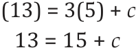
> **[Diagram Context - Textbook_Mathematics_Gr9_Graphs.pdf-0020-03.png]**
> This image displays a linear algebraic equation in two steps, featuring the numerical constants 13, 3, 5, and the variable $c$. It illustrates the process of substitution and simplification, showing how to resolve a product within an equation to isolate a variable in accordance with basic algebraic principles.

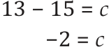

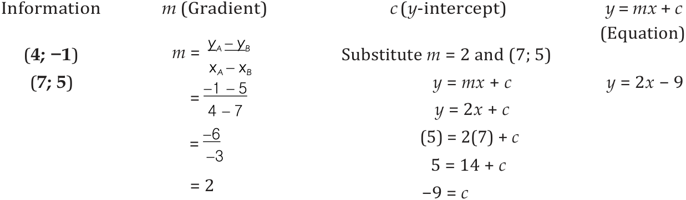
> **[Diagram Context - Textbook_Mathematics_Gr9_Graphs.pdf-0020-07.png]**
> This mathematical figure demonstrates the algebraic process of determining the equation of a straight line passing through two given coordinates, $(4; -1)$ and $(7; 5)$. It utilizes the gradient formula $m = \frac{y_A - y_B}{x_A - x_B}$ to calculate the slope, followed by substitution into the standard form $y = mx + c$ to solve for the y-intercept. This step-by-step procedure provides learners with a clear algorithmic approach to linear function modeling as required in the CAPS Mathematics curriculum.

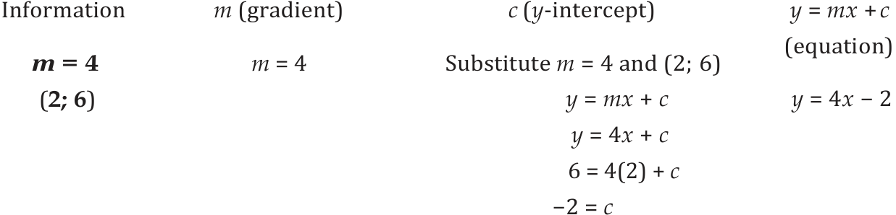
> **[Diagram Context - Textbook_Mathematics_Gr9_Graphs.pdf-0020-09.png]**
> This algebraic table demonstrates the step-by-step process for determining the equation of a straight line given a gradient ($m=4$) and a coordinate point $(2; 6)$. By substituting these known variables into the standard form $y = mx + c$, the graphic illustrates how to solve for the $y$-intercept ($c$) to derive the final linear equation, $y = 4x - 2$.

---

### Equivalent Fractions

#### Critical Knowledge
*   Equivalent fractions are different in appearance, but they represent the same quantities.
*   Equivalent fractions are different ways to represent the same part of a whole, collection, quantity, or measurement.

#### The Fraction Wall
A fraction wall is a visual tool used to compare fractions and identify equivalent values.

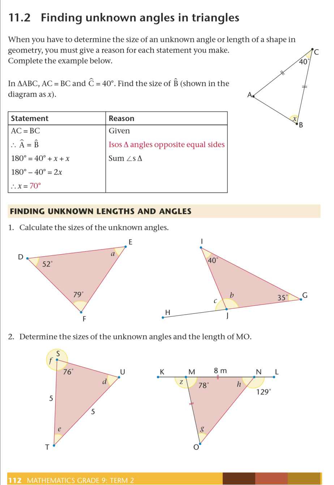
> **[Diagram Context - Textbook_Mathematics_Gr9_Geometry-of-2D-shapes.pdf-0021-23.png]**
> This geometry resource features several triangles labeled with vertices (e.g., ABC, DEF, STU) and includes variables (a, b, c, d, e, f, g, h, x, z), given angle measures in degrees, and side-length indicators. It demonstrates the application of Euclidean geometry theorems—such as the sum of angles in a triangle, isosceles triangle properties, and exterior angles—by guiding students through a structured "Statement and Reason" proof format to calculate unknown values.

---

### Exercises and Tables

#### Question 3: Equivalent Fractions Table
| thirds | fourths | fifths | sixths | eighths | ninths | tenths | twelfths | twentieths |
| :--- | :--- | :--- | :--- | :--- | :--- | :--- | :--- | :--- |
| 1 | - | - | 2 | - | 3 | - | 4 | - |
| 2 | - | - | 4 | - | 6 | - | 8 | - |
| - | 3 | - | - | 6 | - | - | 9 | 15 |
| - | - | 1 | - | - | - | 2 | - | 4 |
| - | - | 2 | - | - | - | 4 | - | 8 |
| - | - | 3 | - | - | - | 6 | - | 12 |
| - | - | 4 | - | - | - | 8 | - | 16 |

#### Question 4: Equivalent Fractions Table
| fifths | tenths | fifteenths | twentieths | twenty-fifths | fiftieths | hundredths |
| :--- | :--- | :--- | :--- | :--- | :--- | :--- |
| 1 | 2 | 3 | 4 | 5 | 10 | 20 |
| 2 | 4 | 6 | 8 | 10 | 20 | 40 |
| 3 | 6 | 9 | 12 | 15 | 30 | 60 |
| 4 | 8 | 12 | 16 | 20 | 40 | 80 |
| 5 | 10 | 15 | 20 | 25 | 50 | 100 |
| 6 | 12 | 18 | 24 | 30 | 60 | 120 |
| 7 | 14 | 21 | 28 | 35 | 70 | 140 |

#### Question 5: Greysticks
Copy the greysticks and shade them to show that $\frac{3}{5}$ and $\frac{9}{15}$ are equivalent.

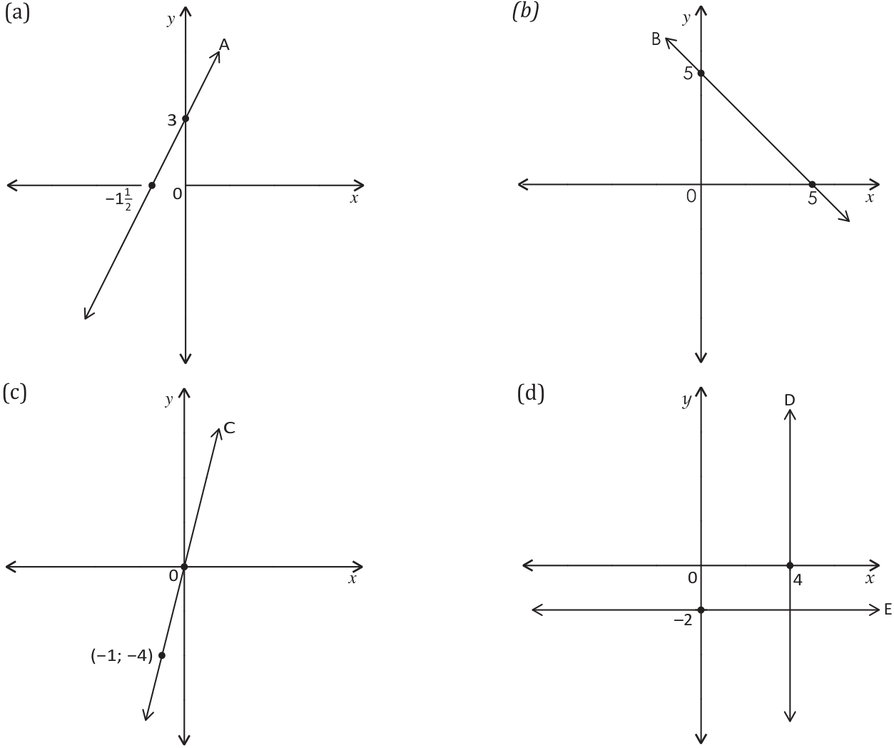
> **[Diagram Context - Textbook_Mathematics_Gr9_Graphs.pdf-0021-01.png]**
> This graphic displays four Cartesian coordinate systems (a–d) representing linear functions with labeled axes ($x$ and $y$), origins (0), and specific points or intercepts. It illustrates how to determine the equation of a straight line by identifying key features such as $x$-intercepts, $y$-intercepts, coordinate points, and constant lines (vertical and horizontal). These diagrams serve as foundational tools for Grade 10–12 learners to practice calculating gradients and formulating linear equations in the form $y = mx + c$.

#### Question 6: Equivalent Fractions Table
| eighths | sixteenths | twenty-fourths | twenty-fourths | sixths | twelfths | eighteenths |
| :--- | :--- | :--- | :--- | :--- | :--- | :--- |
| 1 | 2 | 3 | 4 | 1 | 2 | 3 |
| 2 | 4 | 6 | 8 | 2 | 4 | 6 |
| 3 | 6 | 9 | 12 | 3 | 6 | 9 |
| 4 | 8 | 12 | 16 | 4 | 8 | 12 |
| 5 | 10 | 15 | 20 | 5 | 10 | 15 |
| 6 | 12 | 18 | 24 | 6 | 12 | 18 |
| 7 | 14 | 21 | 28 | 7 | 14 | 21 |
| 8 | 16 | 24 | 32 | 8 | 16 | 24 |
| 9 | 18 | 27 | 36 | 9 | 18 | 27 |

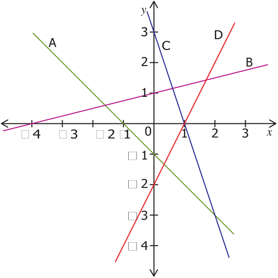
> **[Diagram Context - Textbook_Mathematics_Gr9_Graphs.pdf-0021-03.png]**
> This Cartesian plane displays four distinct linear functions labeled A, B, C, and D, plotted against x and y axes with integer-marked intervals. The diagram illustrates the relationship between linear equations and their graphical representations, allowing students to identify key features such as x-intercepts, y-intercepts, and gradients. By observing these intersecting lines, learners can practice determining the equations of straight lines or solving systems of linear equations graphically.

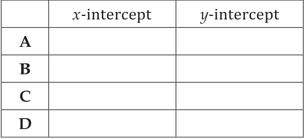
> **[Diagram Context - Textbook_Mathematics_Gr9_Graphs.pdf-0021-05.png]**
> This graphic is a blank table designed for recording the mathematical properties of four distinct functions or graphs labeled A, B, C, and D. The table includes column headers for "x-intercept" and "y-intercept," providing a structured framework for students to systematically determine and compare the coordinate points where these functions cross the Cartesian axes. This exercise reinforces the fundamental algebraic skill of identifying key features of functions, which is essential for sketching and analyzing graphs in the CAPS Mathematics curriculum.

---

# Lesson: Understanding Fraction Notation

## 1. Core Concepts

### The Anatomy of a Fraction
A fraction represents a part of a whole. It consists of two main components:

*   **Numerator:** The number of parts being referred to. It "enumerates" (counts) the parts.
*   **Denominator:** The name/size of the parts. It "denominates" (names) the parts based on how many equal pieces the whole is divided into.

**Example:** In the fraction $\frac{5}{6}$:
*   The numerator is $5$.
*   The denominator is $6$.
*   We read this as "five sixths."

### Equivalent Fractions
Equivalent fractions represent the same value even though they have different numerators and denominators. You can visualize these using a "fraction wall."

**Examples:**
*   $\frac{2}{3} = \frac{4}{6}$
*   $\frac{6}{9} = \frac{2}{3}$

---

## 2. Addition of Fractions with Same Denominators
When denominators are the same, you simply add the numerators while keeping the denominator constant.

**Formula:**
$$\frac{a}{c} + \frac{b}{c} = \frac{a + b}{c}$$

**Worked Examples:**

| Problem | Calculation | Result |
| :--- | :--- | :--- |
| Five twelfths plus three twelfths | $\frac{5}{12} + \frac{3}{12}$ | $\frac{8}{12}$ (eight twelfths) |
| Five twelfths plus one quarter | $\frac{5}{12} + \frac{3}{12}$ | $\frac{8}{12}$ (eight twelfths) |
| Five twelfths plus three quarters | $\frac{5}{12} + \frac{9}{12}$ | $\frac{14}{12}$ (fourteen twelfths) |

*Note: To add fractions with different denominators (like quarters and twelfths), first convert them to equivalent fractions with the same denominator.*

---

## 3. Practice Activities

### Activity 1: Identifying Fractions
Based on a strip divided into equal parts, identify the fraction represented by specific colors:

| Scenario | Question | Answer |
| :--- | :--- | :--- |
| Strip of 8 parts | What part is blue? | $\frac{3}{8}$ (three eighths) |
| Strip of 5 parts | What part is yellow? | $\frac{2}{5}$ (two fifths) |
| Strip of 5 parts | What part is red? | $\frac{2}{5}$ (two fifths) |

### Activity 2: Complex Strip Analysis
Given a strip with multiple colors:

1.  **Two ninths are green, three ninths are blue, and the rest is red.**
    *   Calculation: $1 - (\frac{2}{9} + \frac{3}{9}) = 1 - \frac{5}{9} = \frac{4}{9}$
    *   Answer: The red part is $\frac{4}{9}$ (four ninths).

2.  **Strip divided into 24 parts (Yellow, Blue, Red):**
    *   Yellow: $\frac{3}{24}$ (three twenty-fourths)
    *   Blue: $\frac{15}{24}$ (fifteen twenty-fourths)
    *   Red: $\frac{6}{24}$ (six twenty-fourths)

---

## 4. Summary Table of Terminology

| Term | Definition |
| :--- | :--- |
| **Numerator** | The top number; counts how many parts we have. |
| **Denominator** | The bottom number; names the size of the parts. |
| **Enumerate** | To count the number of parts. |
| **Denominate** | To give a name to the parts. |

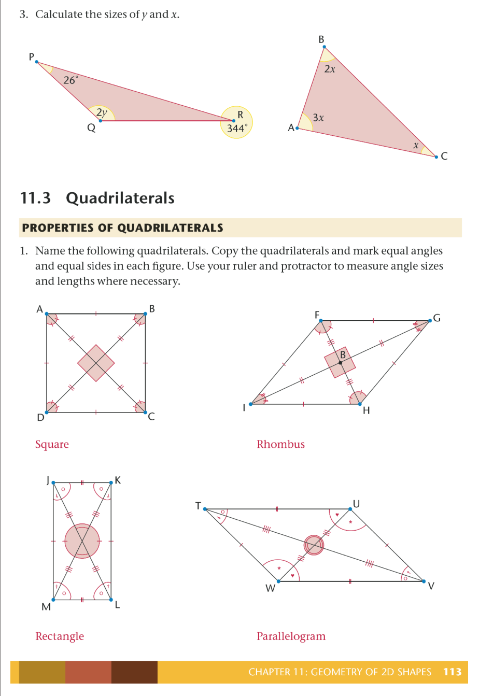
> **[Diagram Context - Textbook_Mathematics_Gr9_Geometry-of-2D-shapes.pdf-0022-27.png]**
> This graphic features geometry figures, including two triangles with interior angle variables ($26^\circ, 2y, 344^\circ, 2x, 3x, x$) and four quadrilaterals (square, rhombus, rectangle, parallelogram) labeled with vertices and standard geometric markings for equal sides and angles. It conceptually guides students to apply the sum of interior angles in triangles and to identify the defining properties of quadrilaterals by interpreting visual notation for congruence and perpendicularity.

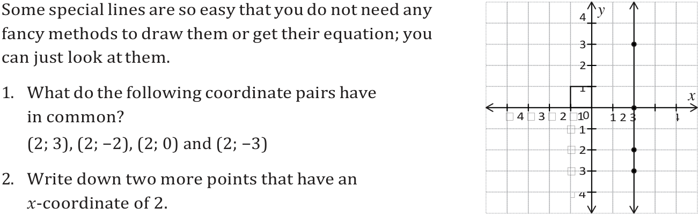
> **[Diagram Context - Textbook_Mathematics_Gr9_Graphs.pdf-0022-08.png]**
> This graphic features a Cartesian plane with a vertical line passing through $x = 2$, labeled with coordinate points on the $x$ and $y$ axes. It guides students to observe that all points on this vertical line share a constant $x$-coordinate, conceptually reinforcing the derivation of the equation $x = 2$ for vertical lines in analytical geometry.

---

### Understanding Fractions

#### Key Concepts
*   **Numerator:** The number of parts being considered. It is written above the fraction line.
*   **Denominator:** The name/size of the parts. It is written below the fraction line.
*   **Notation:** Five sixths is written as $\frac{5}{6}$.

#### Equivalent Fractions Exercise
Consider the fraction $\frac{3}{4}$. Multiply both the numerator and the denominator by the same number to find equivalent fractions:

(a) Multiply by 2: $\frac{3 \times 2}{4 \times 2} = \frac{6}{8}$ (Equivalent to $\frac{3}{4}$)
(b) Multiply by 3: $\frac{3 \times 3}{4 \times 3} = \frac{9}{12}$ (Equivalent to $\frac{3}{4}$)
(c) Multiply by 4: $\frac{3 \times 4}{4 \times 4} = \frac{12}{16}$ (Equivalent to $\frac{3}{4}$)
(d) Multiply by 6: $\frac{3 \times 6}{4 \times 6} = \frac{18}{24}$ (Equivalent to $\frac{3}{4}$)

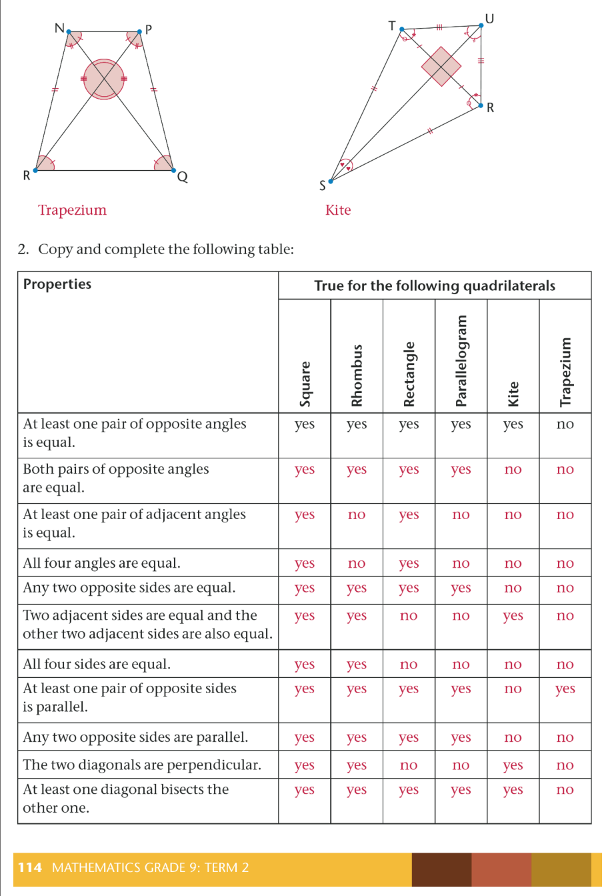
> **[Diagram Context - Textbook_Mathematics_Gr9_Geometry-of-2D-shapes.pdf-0023-21.png]**
> This graphic features geometric figures of a trapezium and a kite, alongside a comprehensive table comparing the properties of various quadrilaterals including squares, rhombi, rectangles, parallelograms, kites, and trapeziums. The diagrams use standard notation for equal sides, equal angles, and perpendicular diagonals to visually represent geometric definitions. This resource helps Grade 9 learners systematically classify quadrilaterals by identifying and comparing their defining characteristics, such as parallel sides, angle equality, and diagonal properties.

---

### 6.3 Adding Fractions

#### Common Misconceptions
When adding fractions with the same denominator, do not add the denominators together.
*   **Incorrect:** $\frac{2}{4} + \frac{1}{4} = \frac{3}{8}$
*   **Correct:** $\frac{2}{4} + \frac{1}{4} = \frac{3}{4}$ (Two quarters + one quarter = three quarters)

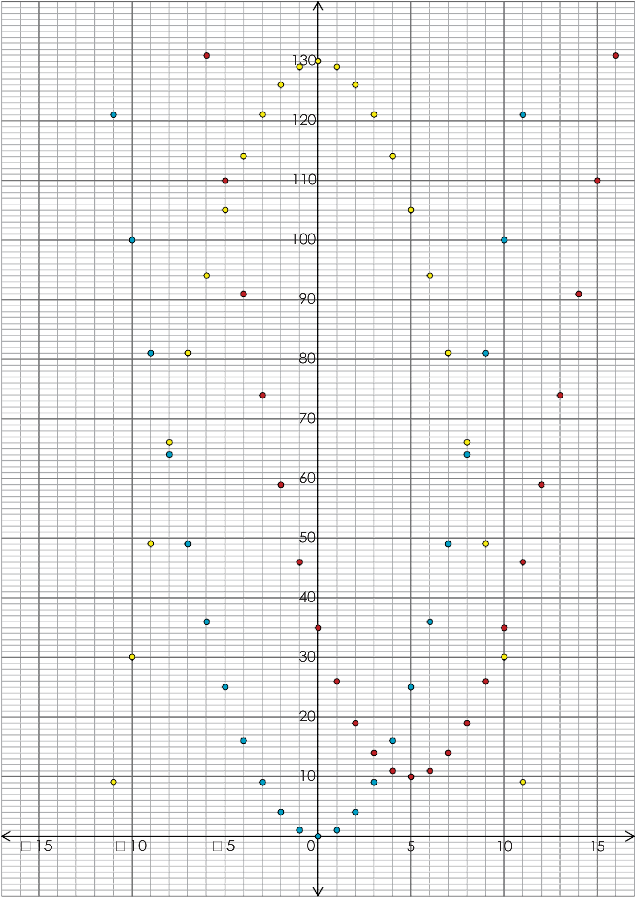
> **[Diagram Context - Textbook_Mathematics_Gr9_Graphs.pdf-0023-00.png]**
> This Cartesian coordinate plane displays three distinct parabolic scatter plots, differentiated by yellow, blue, and red data points, plotted against a vertical y-axis ranging from 0 to 130 and a horizontal x-axis from -15 to 15. The diagram illustrates the concept of quadratic functions, allowing students to compare the effects of different coefficients on the vertex position, concavity, and width of parabolas.

#### Worked Example 1: Adding Fractions with Equal Denominators
**Problem:** A team builds $\frac{8}{12}$ km of road in one week and $\frac{10}{12}$ km in the next. What is the total length?

1.  **Identify parts:** $\frac{8}{12}$ is eight twelfths; $\frac{10}{12}$ is ten twelfths.
2.  **Add:** $\frac{8}{12} + \frac{10}{12} = \frac{18}{12}$ (eighteen twelfths).
3.  **Simplify:** Since $\frac{12}{12} = 1$ km, then $\frac{18}{12} = 1 \frac{6}{12}$ km, which simplifies to $1 \frac{1}{2}$ km.

#### Worked Example 2: Adding Mixed Numbers
**Problem:** Calculate $4 \frac{5}{9} + 2 \frac{7}{9}$

1.  **Add whole numbers:** $4 + 2 = 6$
2.  **Add fractions:** $\frac{5}{9} + \frac{7}{9} = \frac{12}{9}$
3.  **Convert improper fraction:** $\frac{12}{9} = 1 \frac{3}{9}$
4.  **Combine:** $6 + 1 \frac{3}{9} = 7 \frac{3}{9}$

---

# Fractions: Operations and Percentages

## 1. Operations with Mixed Numbers
To add or subtract mixed numbers, ensure the fractions have a common denominator. If the fractional part of the first number is smaller than the second, you may need to "borrow" from the whole number.

### Worked Examples
*   **Addition:** $3\frac{3}{10} + 1\frac{4}{5}$
    *   Find a common denominator: $1\frac{4}{5} = 1\frac{8}{10}$
    *   Add whole numbers and fractions: $(3+1) + (\frac{3}{10} + \frac{8}{10}) = 4 + \frac{11}{10} = 4 + 1\frac{1}{10} = 5\frac{1}{10}$
*   **Subtraction:** $5\frac{5}{8} - 3\frac{7}{8}$
    *   Since $\frac{5}{8} < \frac{7}{8}$, borrow from the 5: $4\frac{13}{8} - 3\frac{7}{8} = 1\frac{6}{8} = 1\frac{3}{4}$

### Practice Exercises: Solutions
| Problem | Calculation | Result |
| :--- | :--- | :--- |
| (a) | $4\frac{2}{7} - 3\frac{6}{7} = 3\frac{9}{7} - 3\frac{6}{7}$ | $\frac{3}{7}$ |
| (b) | $3\frac{3}{7} + \frac{4}{7}$ | $3\frac{7}{7} = 4$ |
| (c) | $3\frac{3}{10} + 1\frac{4}{5} = 3\frac{3}{10} + 1\frac{8}{10}$ | $4\frac{11}{10} = 5\frac{1}{10}$ |
| (d) | $4\frac{3}{8} - 2\frac{5}{8} = 3\frac{11}{8} - 2\frac{5}{8}$ | $1\frac{6}{8} = 1\frac{3}{4}$ |
| (e) | $1\frac{3}{10} - \frac{2}{3} = 1\frac{9}{30} - \frac{20}{30} = \frac{39}{30} - \frac{20}{30}$ | $\frac{19}{30}$ |
| (f) | $3\frac{5}{10} - 1\frac{5}{10}$ | $2$ |
| (g) | $\frac{5}{8} + \frac{5}{8} + \frac{5}{8} + \frac{5}{8} + \frac{5}{8} = \frac{25}{8}$ | $3\frac{1}{8}$ |
| (h) | $6\frac{5}{20} + 2\frac{5}{20}$ | $8\frac{10}{20} = 8\frac{1}{2}$ |
| (i) | $8 \times \frac{5}{8}$ | $5$ |
| (j) | $7 \times 2\frac{4}{7} = 7 \times \frac{18}{7}$ | $18$ |
| (k) | $(4\frac{2}{10} + 1\frac{7}{10}) - 2\frac{3}{10} = 5\frac{9}{10} - 2\frac{3}{10}$ | $3\frac{6}{10} = 3\frac{3}{5}$ |
| (l) | $(2\frac{7}{10} + 3\frac{3}{10}) - (1\frac{2}{10} + 3\frac{7}{10}) = 6 - 4\frac{9}{10}$ | $\frac{1}{10}$ |

---

## 2. Tenths and Hundredths
A whole can be divided into 10 equal parts (tenths) or 100 equal parts (hundredths). 
*   $1 \text{ whole} = 10 \text{ tenths} = 100 \text{ hundredths}$
*   $1 \text{ hundredth} = \frac{1}{100}$

### Application: Spaza Shop Economics
If a strip of licorice costs $R2$ and contains 100 small pieces:

| Question | Calculation | Result |
| :--- | :--- | :--- |
| (a) Cost of one piece | $200c \div 100$ | $2c$ |
| (b) Cost of 20 pieces | $20 \times 2c$ | $40c$ |
| (c) Part of whole for 25 pieces | $\frac{25}{100}$ | $\frac{1}{4}$ |

### Word Problem: Neo's Report
To find the total pages, add the fractions:
$$\frac{3}{4} + 2\frac{1}{2} + 3\frac{3}{4} + 3 + 1\frac{1}{2}$$
1. Convert to common denominators: $\frac{3}{4} + 2\frac{2}{4} + 3\frac{3}{4} + 3 + 1\frac{2}{4}$
2. Add whole numbers: $2 + 3 + 3 + 1 = 9$
3. Add fractions: $\frac{3+2+3+2}{4} = \frac{10}{4} = 2\frac{2}{4} = 2\frac{1}{2}$
4. Total: $9 + 2\frac{1}{2} = 11\frac{1}{2} \text{ pages}$

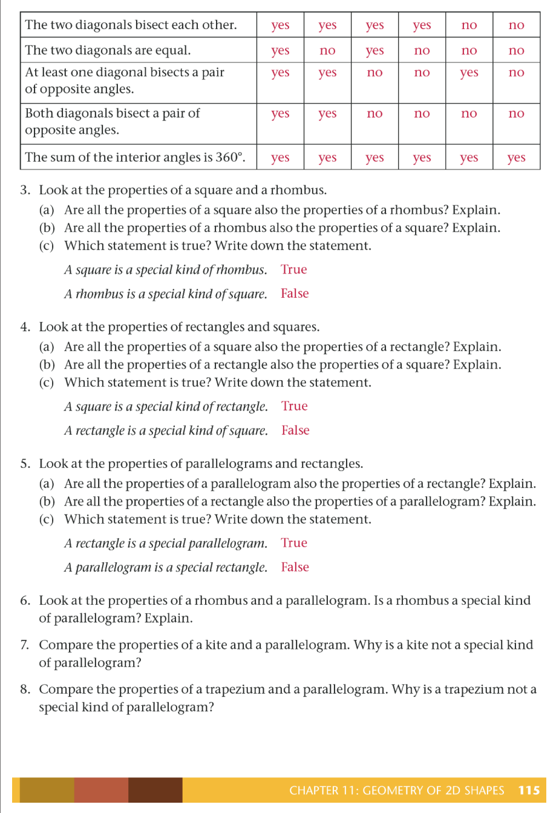
> **[Diagram Context - Textbook_Mathematics_Gr9_Geometry-of-2D-shapes.pdf-0024-13.png]**
> This educational resource presents a geometry table comparing the properties of various quadrilaterals, followed by a series of guided inquiry questions. The table lists specific geometric attributes—such as diagonal bisection, equality, and interior angle sums—to evaluate different shapes, while the questions prompt students to analyze hierarchical relationships between these polygons. Conceptually, this helps learners understand the inclusive classification of quadrilaterals, reinforcing how specific shapes are subsets of broader categories based on their shared properties.

---

### Understanding Percentages

#### Key Concepts
*   **Hundredth:** A fraction representing one part out of a total of 100 equal parts.
*   **Per cent:** A special type of fraction where the value represents the number of parts in every hundred parts of a whole.
*   **Symbol:** The symbol for per cent is $\%$.
*   **Equivalence:** Percentages, fractions, and decimals can represent the same value. For example, $32$ hundredths is the same as $32\%$.

---

#### Exercises: Working with Licorice Strips

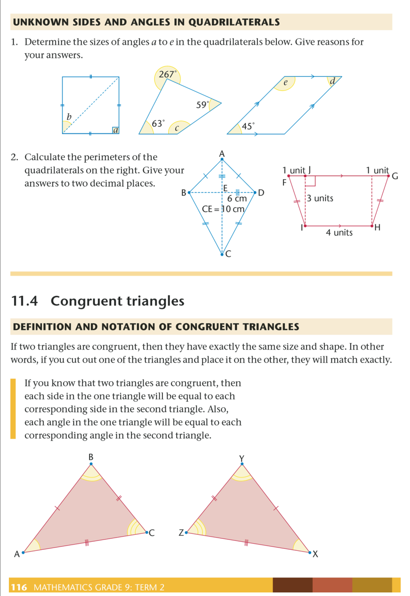
> **[Diagram Context - Textbook_Mathematics_Gr9_Geometry-of-2D-shapes.pdf-0025-23.png]**
> This geometry resource features various quadrilaterals (square, trapezoid, parallelogram, kite) and a pair of congruent triangles, labeled with variables (a-e), geometric markings for sides and angles, and specific numerical measurements. It requires students to apply properties of polygons, such as angle sum and parallel line relationships, to calculate unknown values and perimeters, while reinforcing the definition of congruence through corresponding parts.

**4. Understanding the Strip**
(a) Why can each small piece be called one hundredth of the whole strip?
(b) How many hundredths is the same as one tenth of the strip?

**5. Converting Fractions**
(a) How many hundredths is the same as $\frac{2}{5}$ of the whole strip?
(b) How many tenths is the same as $\frac{2}{5}$ of the whole strip?
(c) How many hundredths is the same as $\frac{3}{4}$ of the whole strip?
(d) Freddie bought $\frac{60}{100}$ of a strip. How many fifths of a strip is this?
(e) Jamey bought part of a strip for $R1,60$. What part of a strip did she buy?

**6. Analyzing Portions**
Gatsha sold pieces of yellow licorice to different children. Based on the visual representation of the pieces:
*   Determine what part of the whole strip each child received.

**7. Financial Calculations**
The yellow licorice costs $R2,40$ ($240$ cents) for a full strip. Calculate how much each child has to pay based on their portion. Round off the amounts to the nearest cent.

**8. Calculating Values of Fractions**
Calculate the following values based on a total of $300$ cents:
(a) $\frac{1}{100}$ of $300$ cents
(b) $\frac{7}{100}$ of $300$ cents
(c) $\frac{25}{100}$ of $300$ cents
(d) $\frac{1}{4}$ of $300$ cents
(e) $\frac{40}{100}$ of $300$ cents
(f) $\frac{2}{5}$ of $300$ cents

**9. Reasoning**
Explain why your answers for questions 8(e) and 8(f) are the same.

---

#### Answer Key

| Question | Answer |
| :--- | :--- |
| 4(a) | Because the strip is divided into 100 pieces of equal size. |
| 4(b) | 10 hundredths |
| 5(a) | 40 hundredths |
| 5(b) | 4 tenths |
| 5(c) | 75 hundredths |
| 5(d) | 3 fifths |
| 5(e) | 80 hundredths |
| 6 | Gabieba: 27 hundredths; Miriam: 32 hundredths; Sannie: 28 hundredths; Enoch: 20 hundredths; Mpati: 30 hundredths; Mpho: 33 hundredths |
| 7 | Gabieba: 65c; Miriam: 77c; Sannie: 67c; Enoch: 48c; Mpati: 72c; Mpho: 79c |
| 8(a) | $300c \div 100 = 3c$ |
| 8(b) | $7 \times 3c = 21c$ |
| 8(c) | $25 \times 3c = 75c$ |
| 8(d) | $300 \div 4 = 75c$ |
| 8(e) | $40 \times 3c = 120c$ or $R1,20$ |
| 8(f) | $\frac{1}{5}$ of $300c = 60c$, so $\frac{2}{5} = 120c$ or $R1,20$ |
| 9 | Because $\frac{40}{100}$ and $\frac{2}{5}$ are equivalent fractions. |

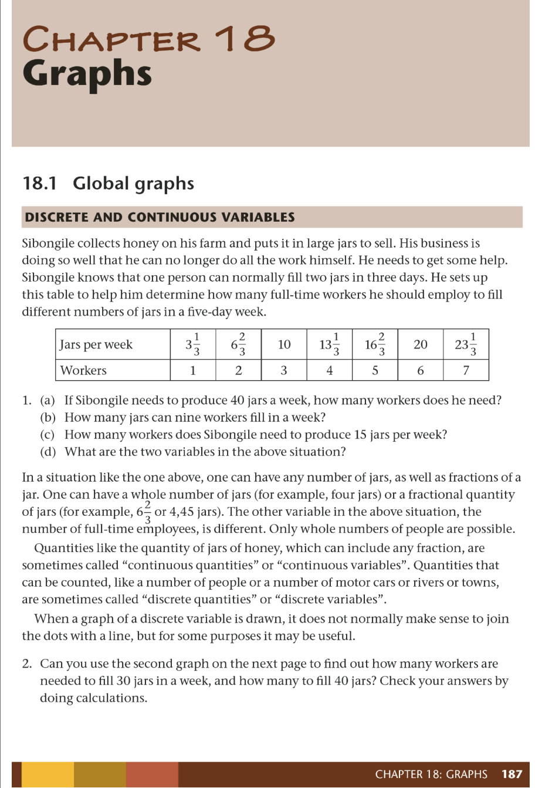
> **[Diagram Context - Textbook_Mathematics_Gr9_Graphs.pdf-0025-13.png]**
> This educational resource presents a mathematical table illustrating the relationship between two variables: "Jars per week" and "Workers." It uses this data to conceptually distinguish between continuous variables, which can take any fractional value, and discrete variables, which are limited to whole numbers. This helps students understand how to classify data types and interpret the appropriateness of connecting points on a graph based on the nature of the variables involved.

---

### 6.5 Thousandths, Hundredths, and Tenths

#### Background Information
This section introduces fractions that form the structure of decimal fractions. 
*   **Tenths:** Relate to decimetres.
*   **Hundredths:** Relate to centimetres.
*   **Thousandths:** Relate to millimetres.

---

#### Exercises: Many Equal Parts

**1. Practical Application**
In a camp for refugees, $50\text{ kg}$ of sugar must be shared equally between $1\,000$ refugees. How much sugar will each refugee get? (Note: $1\text{ kg} = 1\,000\text{ g}$)

**2. Calculating Fractions of Amounts**
Calculate the following values based on R6 000:
*   (a) One tenth of R6 000
*   (b) One hundredth of R6 000
*   (c) One thousandth of R6 000
*   (d) Ten hundredths of R6 000
*   (e) $100$ thousandths of R6 000
*   (f) Seven hundredths of R6 000
*   (g) $70$ thousandths of R6 000
*   (h) Seven thousandths of R6 000

**3. Addition of Fractions**
Calculate the following:
*   (a) $\frac{3}{10} + \frac{5}{8}$
*   (b) $3\frac{3}{10} + 2\frac{4}{5}$
*   (c) $\frac{3}{10} + \frac{7}{100}$
*   (d) $\frac{3}{10} + \frac{70}{100}$
*   (e) $\frac{3}{10} + \frac{7}{1\,000}$
*   (f) $\frac{3}{10} + \frac{70}{1\,000}$

**4. Addition of Fractions (Thousandths)**
Calculate the following:
*   (a) $\frac{3}{10} + \frac{7}{100} + \frac{4}{1\,000}$
*   (b) $\frac{3}{10} + \frac{70}{100} + \frac{400}{1\,000}$
*   (c) $\frac{6}{10} + \frac{20}{100} + \frac{700}{1\,000}$
*   (d) $\frac{2}{10} + \frac{5}{100} + \frac{4}{1\,000}$

**5. Investigation: True or False**
Investigate whether the following statements are true or false and provide reasons:
*   (a) $\frac{1}{10} + \frac{23}{100} + \frac{346}{1\,000} = \frac{6}{10} + \frac{46}{1\,000}$
*   (b) $\frac{1}{10} + \frac{23}{100} + \frac{346}{1\,000} = \frac{7}{10} + \frac{2}{100} + \frac{6}{1\,000}$
*   (c) $\frac{1}{10} + \frac{23}{100} + \frac{346}{1\,000} = \frac{6}{10} + \frac{7}{100} + \frac{6}{1\,000}$
*   (d) $\frac{676}{1\,000} = \frac{6}{10} + \frac{7}{100} + \frac{6}{1\,000}$

---

#### Answers and Solutions

| Question | Answer / Solution |
| :--- | :--- |
| **1** | $50\text{ kg} = 50\,000\text{ g}$; $50\,000 \div 1\,000 = 50\text{ g}$ per refugee |
| **2(a-d)** | (a) R600; (b) R60; (c) R6; (d) R600 |
| **2(e-h)** | (e) R600; (f) R420; (g) R420; (h) R42 |
| **3(a-c)** | (a) $\frac{74}{80}$ or $\frac{37}{40}$; (b) $6\frac{1}{10}$; (c) $\frac{37}{100}$ |
| **3(d-f)** | (d) $1$; (e) $\frac{307}{1\,000}$; (f) $\frac{37}{100}$ |
| **4(a-d)** | (a) $\frac{374}{1\,000}$ or $\frac{187}{500}$; (b) $1\frac{1}{10}$ or $1\frac{1}{2}$; (c) $1\frac{5}{10}$ or $1\frac{1}{2}$; (d) $\frac{254}{1\,000}$ or $\frac{127}{500}$ |
| **5(a)** | $\frac{100}{1\,000} + \frac{230}{1\,000} + \frac{346}{1\,000} = \frac{676}{1\,000}$; $\frac{600}{1\,000} + \frac{30}{1\,000} + \frac{46}{1\,000} = \frac{676}{1\,000}$; **True** |
| **5(b)** | LHS = $\frac{676}{1\,000}$; RHS = $\frac{726}{1\,000}$; **False** |
| **5(c)** | LHS = $\frac{676}{1\,000}$; RHS = $\frac{600}{1\,000} + \frac{70}{1\,000} + \frac{6}{1\,000} = \frac{676}{1\,000}$; **True** |
| **5(d)** | Both sides = $\frac{600}{1\,000} + \frac{70}{1\,000} + \frac{6}{1\,000} = \frac{676}{1\,000}$; **True** |

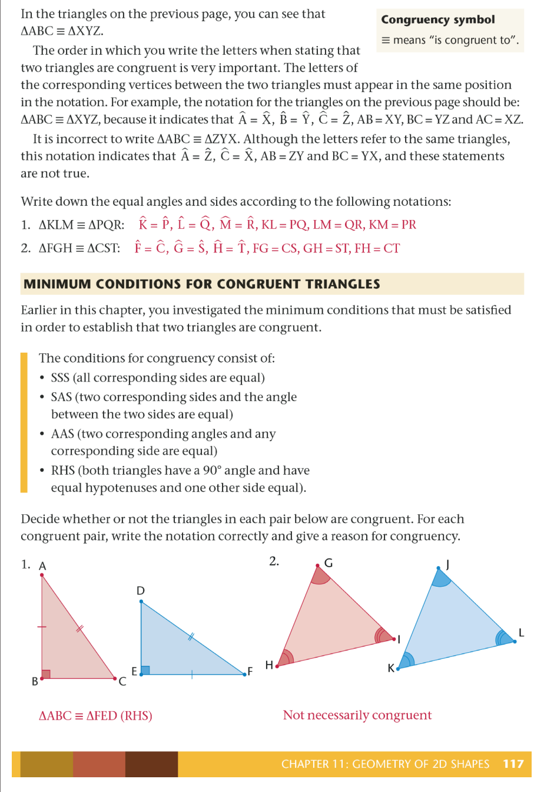
> **[Diagram Context - Textbook_Mathematics_Gr9_Geometry-of-2D-shapes.pdf-0026-25.png]**
> This educational resource features geometric figures and text explaining the notation and minimum conditions (SSS, SAS, AAS, RHS) for triangle congruency. It uses labeled vertices (A-L) and visual markers, such as tick marks for sides and arcs for angles, to illustrate how to identify corresponding parts. The content guides students in correctly naming congruent triangles and applying specific criteria to determine if two triangles are identical in shape and size.

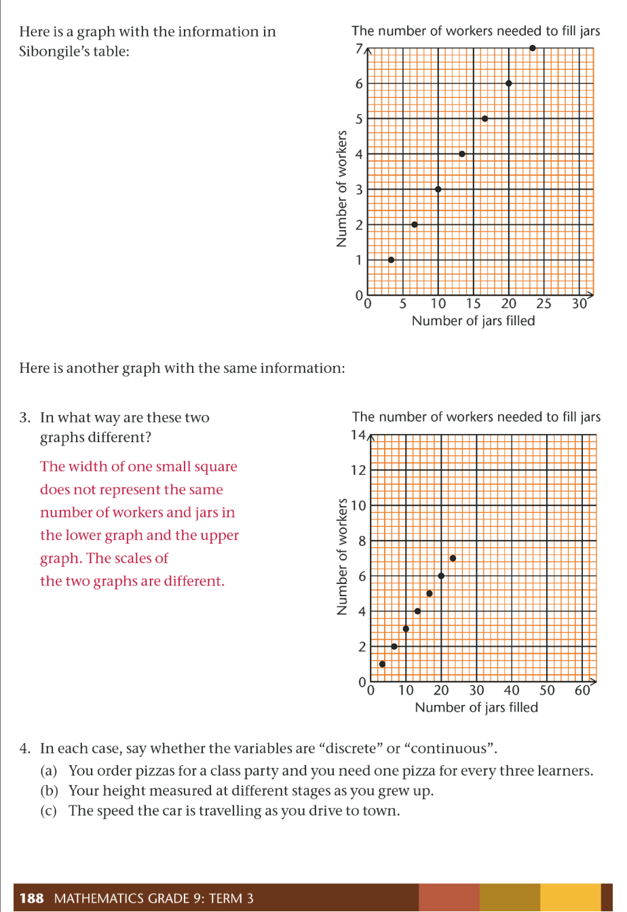
> **[Diagram Context - Textbook_Mathematics_Gr9_Graphs.pdf-0026-05.png]**
> This graphic displays two scatter plots representing the same data set of "Number of workers" versus "Number of jars filled," utilizing different axis scales for each graph. The labels identify the independent variable on the x-axis and the dependent variable on the y-axis, with grid lines providing visual structure. Conceptually, this exercise teaches learners how changing the scale of an axis affects the visual representation of data, while also prompting them to distinguish between discrete and continuous variables in real-world contexts.

---

# 6.6 Fraction of a Fraction

## Concept: Form Parts of Parts
To calculate a fraction of a whole, collection, quantity, or measurement, remember that the word **"of"** acts as a mathematical operation meaning **multiply**.

### Key Rules for Calculation
When calculating a fraction of an amount:
1. To find $\frac{1}{5}$ of R60, divide R60 by 5:
   $$\frac{1}{5} \times 60 = 60 \div 5 = 12$$
2. To find $\frac{2}{5}$ of R60, divide by 5 and multiply the result by 2:
   $$\frac{2}{5} \times 60 = (60 \div 5) \times 2 = 12 \times 2 = 24$$
3. To find $\frac{3}{5}$ of R60, divide by 5 and multiply the result by 3:
   $$\frac{3}{5} \times 60 = (60 \div 5) \times 3 = 12 \times 3 = 36$$

---

## Exercises

### 1. Basic Fractions of Amounts
(a) How much is $\frac{1}{5}$ of R60?
(b) How much is $\frac{3}{5}$ of R60?

### 2. Multi-step Calculation
How much is $\frac{7}{10}$ of R80? (Hint: First calculate $\frac{1}{10}$ of R80).

### 3. Currency Conversions
(a) How much is $\frac{2}{5}$ of 20 pula?
(b) How much is $\frac{2}{5}$ of 20 euro?
(c) How much is $\frac{2}{5}$ of 12 pula?

### 4. Conceptual Understanding
Why was it easy to calculate $\frac{2}{5}$ of 20, but difficult to calculate $\frac{2}{5}$ of 12?

### 5. Mixed Calculations (Convert Rands to Cents if needed)
(a) $\frac{3}{8}$ of R2,40
(b) $\frac{7}{12}$ of R6
(c) $\frac{2}{5}$ of R21
(d) $\frac{5}{6}$ of R3

### 6. Secret Objects
(a) How much is $\frac{3}{10}$ of 40 secret objects?
(b) How much is $\frac{3}{8}$ of 40 secret objects?

### 7. Fractions of Fiftieths
(a) How many fiftieths is $\frac{3}{10}$ of 40 fiftieths?
(b) How many fiftieths is $\frac{5}{8}$ of 40 fiftieths?

### 8. Fractions of Kilograms and Rands
(a) How many twentieths of a kilogram is the same as $\frac{3}{4}$ of a kilogram?
(b) How much is $\frac{1}{5}$ of 15 rands?
(c) How much is $\frac{1}{5}$ of 15 twentieths of a kilogram?
(d) So, how much is $\frac{1}{5}$ of $\frac{3}{4}$ of a kilogram?

### 9. Fractions of Fractions
(a) How much is $\frac{1}{12}$ of 24 fortieths of some secret object?
(b) How much is $\frac{7}{12}$ of 24 fortieths of the secret object?

### 10. Reflection
Do you agree that the answers for the previous question are two fortieths and 14 fortieths? If you disagree, explain why.

---

## Answer Key

| Question | Answer |
| :--- | :--- |
| 1 | (a) R12; (b) R36 |
| 2 | R56 (since $\frac{1}{10}$ of R80 = R8, then $7 \times 8 = 56$) |
| 3 | (a) 8 pula; (b) 8 euro; (c) $4\frac{4}{5}$ or 4,8 pula |
| 4 | Because 5 divides into 20 without a remainder. |
| 5 | (a) 90c; (b) R3,50; (c) R8,40; (d) R2,50 |
| 6 | (a) 12 secret objects; (b) 15 secret objects |
| 7 | (a) 12; (b) 25 |
| 8 | (a) 15 twentieths; (b) R3; (c) 150 g; (d) 150 g |
| 9 | (a) 2 fortieths; (b) 14 fortieths |
| 10 | Yes |

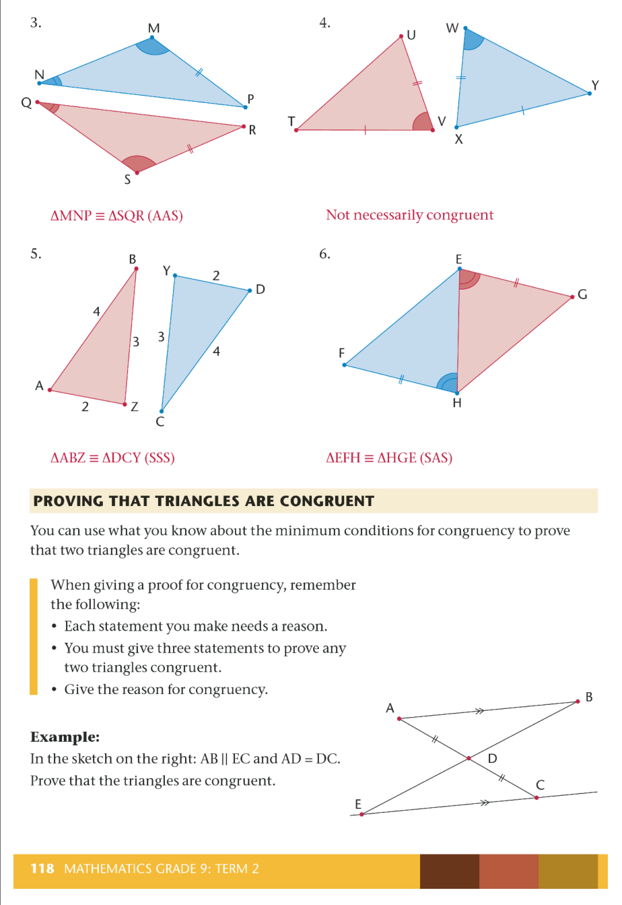
> **[Diagram Context - Textbook_Mathematics_Gr9_Geometry-of-2D-shapes.pdf-0027-16.png]**
> This geometry figure illustrates various triangle pairs labeled with vertices, side-length indicators, and angle markings to demonstrate the minimum conditions for congruence (AAS, SSS, SAS). By contrasting congruent triangles with non-congruent examples, the graphic helps Grade 9 learners identify the specific criteria required to formally prove triangle congruence in Euclidean geometry.

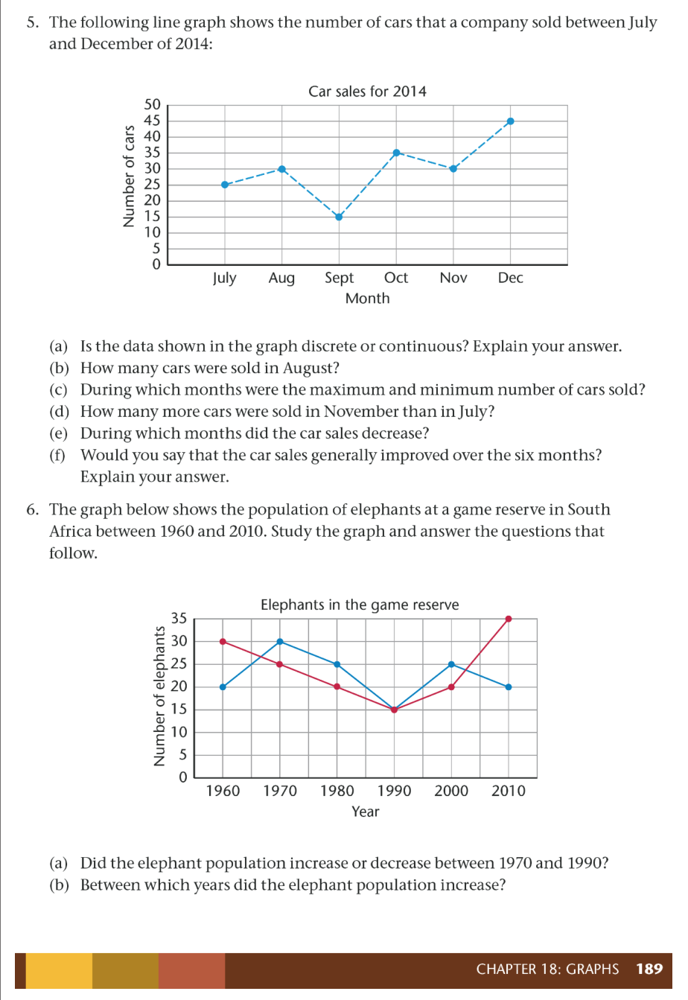
> **[Diagram Context - Textbook_Mathematics_Gr9_Graphs.pdf-0027-09.png]**
> This document presents two line graphs used to teach data handling and interpretation within the CAPS curriculum. The first graph plots "Number of cars" against "Month," while the second plots "Number of elephants" against "Year," utilizing axes, grid lines, and plotted data points to represent trends. These visuals help students develop the skills to extract specific values, identify maximums and minimums, and analyze rates of change or general trends over time.

---

### Fractions: Multiplication and Equivalent Fractions

#### Key Concept: Calculating Fractions of Fractions
To calculate a fraction of a fraction (e.g., $\frac{7}{12}$ of $\frac{3}{5}$), it is often easier to find an equivalent fraction for the second part so that the numerator is divisible by the denominator of the first part.

**Example:** Calculate $\frac{7}{12}$ of $\frac{3}{5}$.
1. Find an equivalent fraction for $\frac{3}{5}$ that can be divided by $12$:
   $$\frac{3}{5} \times \frac{4}{4} = \frac{12}{20}$$
2. We know that one-twelfth ($\frac{1}{12}$) of $\frac{12}{20}$ is $\frac{1}{20}$.
3. Therefore, seven-twelfths ($\frac{7}{12}$) of $\frac{12}{20}$ is:
   $$7 \times \frac{1}{20} = \frac{7}{20}$$
4. Thus, $\frac{7}{12}$ of $\frac{3}{5} = \frac{7}{20}$.

---

#### Exercises: Fractions of Quantities

**11. Calculate the following:**
(a) $\frac{1}{5}$ of $80$
(b) $\frac{3}{5}$ of $80$
(c) $\frac{1}{40}$ of $80$
(d) $\frac{24}{40}$ of $80$
(e) Explain why $\frac{3}{5}$ of $80$ is the same as $\frac{24}{40}$ of $80$.

**12. Application:**
Look at your answers for questions 9(b) and 11(e). How much is $\frac{7}{12}$ of $\frac{3}{5}$? Explain your answer.

**13. Calculation Practice:**
(a) Calculate $\frac{3}{8}$ of $\frac{8}{12}$.
(b) How much is $\frac{3}{8}$ of $\frac{2}{3}$?

**14. Equivalent Fraction Method:**
In each case, replace the second fraction with a suitable equivalent, then calculate:
(a) $\frac{3}{5}$ of $\frac{5}{8}$
(b) $\frac{7}{10}$ of $\frac{2}{3}$
(c) $\frac{2}{3}$ of $\frac{1}{2}$
(d) $\frac{3}{5}$ of $\frac{3}{5}$

---

#### Answer Key and Worked Solutions

| Question | Solution Steps | Final Answer |
| :--- | :--- | :--- |
| 11(a) | $80 \div 5$ | $16$ |
| 11(b) | $16 \times 3$ | $48$ |
| 11(c) | $80 \div 40$ | $2$ |
| 11(d) | $2 \times 24$ | $48$ |
| 11(e) | $\frac{3}{5} = \frac{3 \times 8}{5 \times 8} = \frac{24}{40}$ | Equivalent fractions |
| 12 | $\frac{7}{12}$ of $\frac{24}{40} = \frac{14}{40}$ | $\frac{14}{40}$ |
| 13(a) | $\frac{3}{8} \times \frac{8}{12} = \frac{24}{96}$ | $\frac{6}{24}$ |
| 13(b) | $\frac{3}{8} \times \frac{2}{3} = \frac{3}{8} \times \frac{8}{12}$ | $\frac{6}{24}$ |
| 14(a) | $\frac{3}{5} \times \frac{5}{8} = \frac{3}{5} \times \frac{20}{32}$ | $\frac{15}{32}$ |
| 14(b) | $\frac{7}{10} \times \frac{2}{3} = \frac{7}{10} \times \frac{20}{30}$ | $\frac{14}{30}$ |
| 14(c) | $\frac{2}{3} \times \frac{1}{2} = \frac{2}{3} \times \frac{3}{6}$ | $\frac{2}{6}$ |
| 14(d) | $\frac{3}{5} \times \frac{3}{5} = \frac{3}{5} \times \frac{15}{25}$ | $\frac{9}{25}$ |

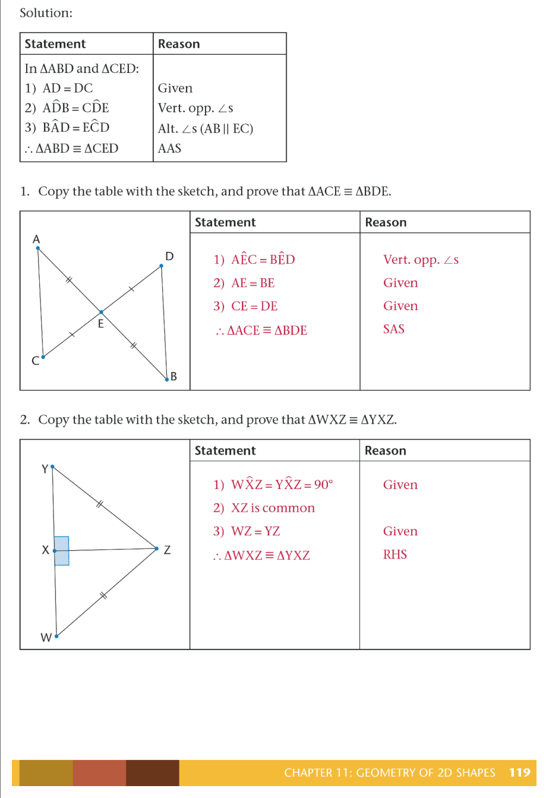
> **[Diagram Context - Textbook_Mathematics_Gr9_Geometry-of-2D-shapes.pdf-0028-13.png]**
> This geometry resource presents two sets of geometric figures (triangles) alongside formal two-column proofs using labels A, B, C, D, E, W, X, Y, and Z. It illustrates the application of triangle congruence theorems—specifically SAS (Side-Angle-Side) and RHS (Right-angle-Hypotenuse-Side)—by using visual markers like tick marks and right-angle symbols to justify logical statements. The diagram helps students bridge the gap between visual geometric properties and the formal deductive reasoning required to prove triangle congruence in the CAPS curriculum.

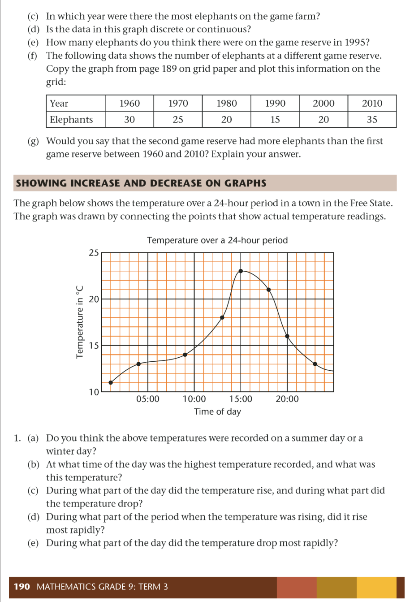
> **[Diagram Context - Textbook_Mathematics_Gr9_Graphs.pdf-0028-19.png]**
> This graphic features a line graph titled "Temperature over a 24-hour period," with the y-axis representing "Temperature in °C" and the x-axis representing "Time of day." It helps students interpret continuous data by identifying trends, such as periods of increasing or decreasing temperature, and determining specific values like maximums and rates of change.

---

# 6.7 Multiplying with Fractions

## Parts of Rectangles and Parts of Parts

### Teaching Guidelines: Dividing Sides of a Rectangle
To divide a side of a rectangle into specific fractional parts, use the following techniques:

*   **Halves, quarters, eighths, sixteenths, etc.:** Halve the side repeatedly.
*   **Thirds, sixths, and ninths:** Draw two lines to partition the whole side approximately into thirds.
*   **Fifths and tenths:** Draw a line that divides the side into two parts, where one part is about $1\frac{1}{2}$ times as long as the other.

**Note:** Diagrams used to explain the multiplication of fractions should be drawn freehand and quickly. These diagrams are intended to support conceptual thinking about fractions rather than for precise measurements.

---

### Exercises

#### 1. Partitioning Rectangles
(a) Copy the rectangles. Divide the rectangle on the left into eighths by drawing vertical lines. Lightly shade $\frac{3}{8}$ of the rectangle.
(b) Divide the rectangle on the right into fifths by drawing horizontal lines. Lightly shade the upper $\frac{2}{5}$ of the rectangle.

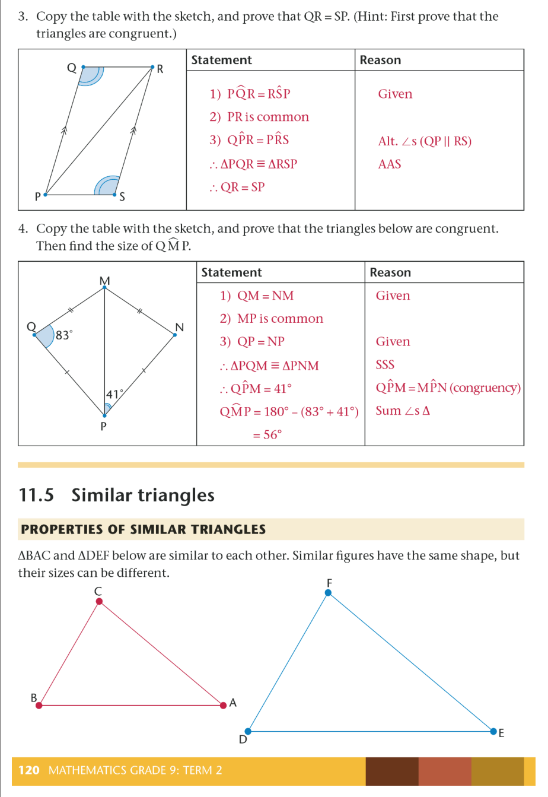
> **[Diagram Context - Textbook_Mathematics_Gr9_Geometry-of-2D-shapes.pdf-0029-19.png]**
> This graphic features geometry figures, including a parallelogram, a kite, and two similar triangles, accompanied by formal two-column proofs and definitions. It utilizes labels such as vertices (P, Q, R, S, M, N, A, B, C, D, E, F), angle measures, and congruency markings to demonstrate the logical application of geometric theorems. The content guides students in applying congruency criteria (AAS, SSS) and triangle properties to solve for unknown sides and angles, while introducing the conceptual distinction between congruent and similar figures.

#### 2. Shading Fractions
(a) Copy the rectangles. Shade $\frac{4}{7}$ of the rectangle on the left.
(b) Shade $\frac{16}{28}$ of the rectangle on the right.

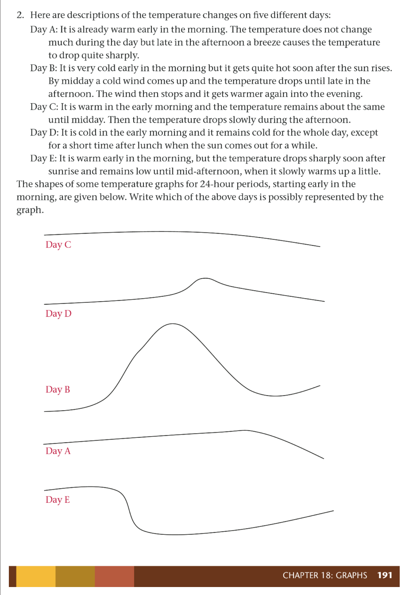
> **[Diagram Context - Textbook_Mathematics_Gr9_Graphs.pdf-0029-03.png]**
> This educational graphic presents a set of five line graphs representing temperature fluctuations over a 24-hour period, labeled Day A through Day E. The exercise requires students to interpret qualitative descriptions of weather patterns and match them to the corresponding visual trends in temperature change. This task develops mathematical literacy by testing a student's ability to translate narrative data into graphical representations and understand the relationship between independent and dependent variables.

#### 3. Analyzing Coloured Rectangles
(a) What part of each big rectangle below is coloured yellow?
(b) What part of the yellow part of the rectangle on the right is dotted?
(c) Into how many squares is the whole rectangle on the right divided?
(d) What part of the whole rectangle on the right is yellow AND dotted?

<!-- DIAGRAM_PLACEHOLDER: diagram -->

---

### Answers

| Question | Answer |
| :--- | :--- |
| 1 | See Learner's Book page 106 |
| 2 | See Learner's Book page 106 |
| 3 (a) | $\frac{5}{8}$ |
| 3 (b) | $\frac{3}{5}$ |
| 3 (c) | $40$ |
| 3 (d) | $\frac{15}{40}$ |

---

### Additional Notes on Multiplication with Fractions

Circular diagrams can be used to visualize the multiplication of basic fractions:

*   $\frac{1}{2}$ of $\frac{1}{2} = \frac{1}{2} \times \frac{1}{2} = \frac{1}{4}$ (Half of a semi-circle is a quarter of the circle).
*   $\frac{1}{2}$ of $\frac{1}{4} = \frac{1}{2} \times \frac{1}{4} = \frac{1}{8}$ (Half of a quarter circle is one eighth of the circle).
*   $\frac{1}{3}$ of $\frac{3}{4} = \frac{1}{3} \times \frac{3}{4} = \frac{1}{4}$ (A third of a three-quarter circle is a quarter of the circle).
*   $\frac{2}{3}$ of $\frac{3}{4} = \frac{2}{3} \times \frac{3}{4} = \frac{1}{2}$ (Two-thirds of three-quarters of a circle is half of the circle).

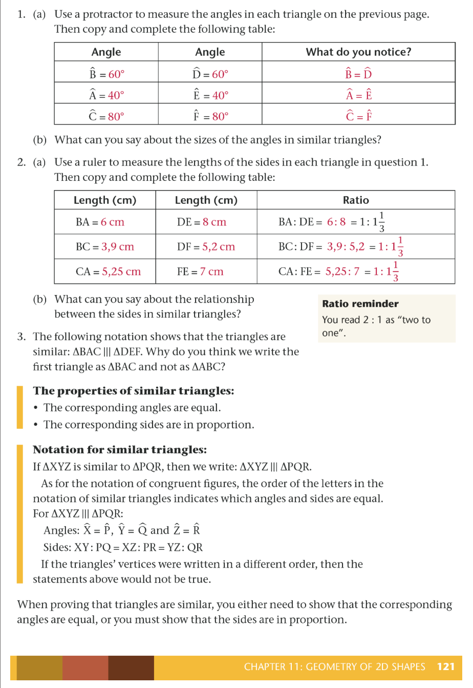
> **[Diagram Context - Textbook_Mathematics_Gr9_Geometry-of-2D-shapes.pdf-0030-06.png]**
> This educational resource presents a geometry exercise focused on the properties of similar triangles, utilizing tables to compare corresponding angles (labeled A, B, C, D, E, F) and side lengths (BA, BC, CA, DE, DF, FE). It conceptually guides students to discover that similar triangles possess equal corresponding angles and proportional side lengths, while emphasizing the importance of correct vertex notation in mathematical proofs.

---

### The Rule for Multiplying Fractions

To multiply two fractions, you multiply the numerators together to get the new numerator, and multiply the denominators together to get the new denominator.

**Example:** To calculate $\frac{3}{4} \times \frac{5}{8}$:
1. Multiply the numerators: $3 \times 5 = 15$
2. Multiply the denominators: $4 \times 8 = 32$
3. Result: $\frac{3 \times 5}{4 \times 8} = \frac{15}{32}$

**Note:** The word "of" in mathematical problems often indicates multiplication. For example, $\frac{5}{8}$ of R40 is the same as $\frac{5}{8} \times R40$.

---

### Exercises

**4. Grid Paper Diagrams**
Use grid paper to represent the following:
(a) $\frac{3}{4}$ of $\frac{5}{8}$
(b) $\frac{2}{3}$ of $\frac{4}{5}$

**5. Comparison**
Compare the results of your grid diagrams with the multiplication rule. What do you notice about $\frac{3}{4}$ of $\frac{5}{8}$ and $\frac{3 \times 5}{4 \times 8}$?

**6. Word Problems**
(a) Alan has 5 heaps of 8 apples each. How many apples is that in total?
(b) Sean has 10 heaps of $\frac{6}{4}$ apples each. How many apples is that in total?

---

### Answers

| Question | Answer |
| :--- | :--- |
| 4 (a) | $\frac{15}{32}$ |
| 4 (b) | $\frac{8}{15}$ |
| 5 | The answers are the same; multiplying numerators and denominators is the correct method. |
| 6 (a) | $5 \times 8 = 40$ apples |
| 6 (b) | $10 \times \frac{6}{4} = \frac{60}{4} = 15$ apples |

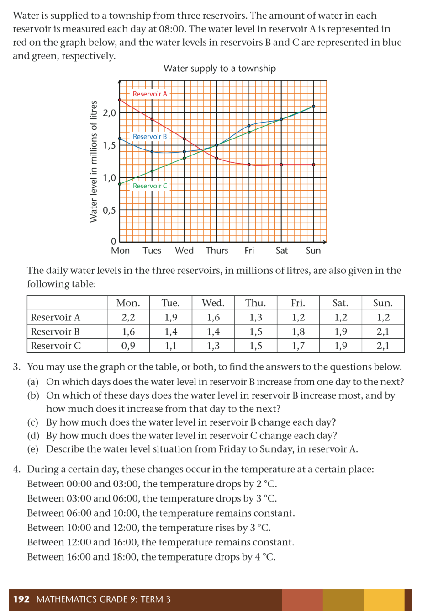
> **[Diagram Context - Textbook_Mathematics_Gr9_Graphs.pdf-0030-06.png]**
> This graphic features a line graph and a corresponding data table representing the daily water levels (in millions of litres) for three reservoirs (A, B, and C) over a one-week period. The axes are labeled with days of the week and water volume, while the visual data uses color-coded lines to illustrate trends and fluctuations in supply. This exercise helps learners interpret and compare continuous data sets, reinforcing skills in reading graphical representations and calculating rates of change over time.

---

### Multiplying Fractions

#### Key Concept: The Multiplication Formula
To multiply two fractions, use the following formula:
$$\text{Product} = \frac{\text{numerator} \times \text{numerator}}{\text{denominator} \times \text{denominator}}$$

---

#### Exercises

**7. Visualizing Multiplication**
Use the provided diagrams to determine the product of the following fractions:
(a) $\frac{3}{10} \times \frac{5}{6}$
(b) $\frac{2}{5} \times \frac{7}{8}$

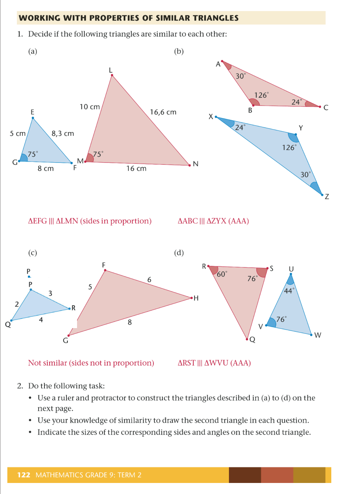
> **[Diagram Context - Textbook_Mathematics_Gr9_Geometry-of-2D-shapes.pdf-0031-08.png]**
> This geometry figure presents four pairs of triangles labeled (a) through (d), featuring vertex labels (e.g., E, F, G), side lengths in centimeters, and interior angle measurements in degrees. The diagram illustrates the criteria for triangle similarity by contrasting cases where sides are in proportion or angles are equal (AAA) against cases where these conditions are not met. It serves as a practical guide for Grade 9 learners to identify and verify similar triangles through quantitative analysis of their corresponding sides and angles.

**8. Comparing Calculations**
Perform the calculations using the formula above and compare your results to the answers obtained from the diagrams in question 7.
(a) $\frac{3}{10} \times \frac{5}{6}$
(b) $\frac{2}{5} \times \frac{7}{8}$

**9. Practice Calculations**
Perform the calculations using the formula:
(a) $\frac{5}{6} \times \frac{7}{12}$
(b) $\frac{3}{4} \times \frac{2}{3}$

**10. Verification**
Use the diagrams on the following page to check whether the formula produces the correct answers for:
$\frac{5}{6} \times \frac{7}{12}$ and $\frac{3}{4} \times \frac{2}{3}$

---

#### Answers and Worked Examples

| Question | Calculation | Result |
| :--- | :--- | :--- |
| 7 (a) | Visual representation | $\frac{15}{60}$ |
| 7 (b) | Visual representation | $\frac{14}{40}$ |
| 8 (a) | $\frac{3 \times 5}{10 \times 6} = \frac{15}{60}$ | Matches diagram |
| 8 (b) | $\frac{2 \times 7}{5 \times 8} = \frac{14}{40}$ | Matches diagram |
| 9 (a) | $\frac{5 \times 7}{6 \times 12}$ | $\frac{35}{72}$ |
| 9 (b) | $\frac{3 \times 2}{4 \times 3}$ | $\frac{6}{12}$ |
| 10 | Verification | Yes, it does. |

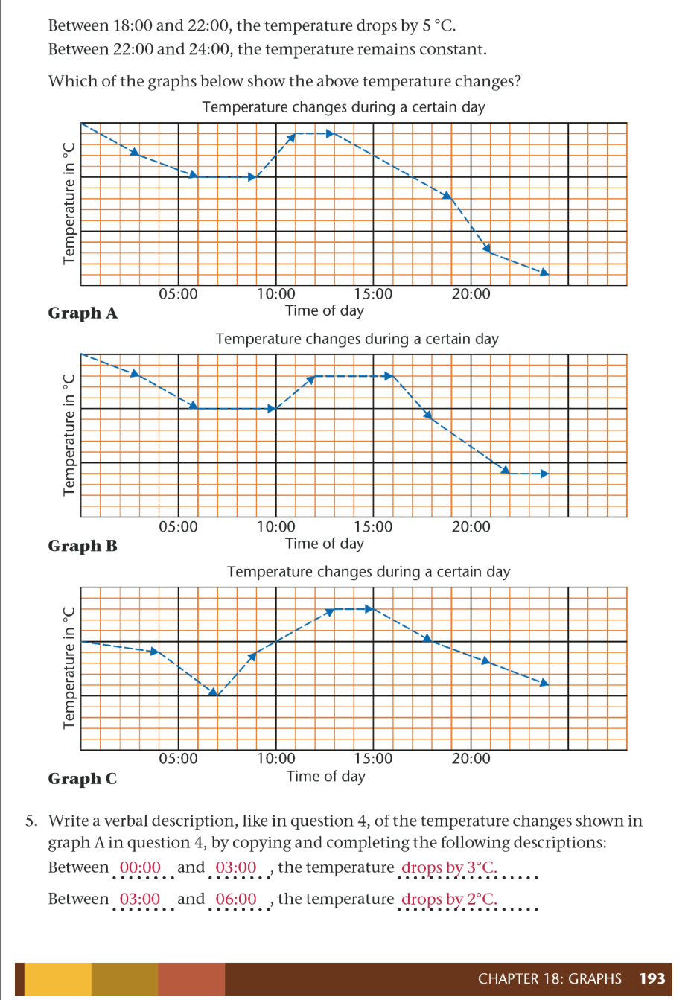
> **[Diagram Context - Textbook_Mathematics_Gr9_Graphs.pdf-0031-03.png]**
> This educational resource features three line graphs representing "Temperature changes during a certain day," with axes labeled "Temperature in °C" and "Time of day." The diagrams use dashed lines with directional arrows to illustrate continuous data trends, requiring students to interpret the relationship between time intervals and temperature fluctuations. This exercise develops the essential mathematical skill of translating verbal descriptions into graphical representations and vice versa, a core requirement for data handling in the CAPS curriculum.

---

# Fractions: Calculations and Ordering

## 1. Calculating Fractions of Quantities
To calculate a fraction of a quantity, multiply the fraction by the given value.

### Worked Examples
| Problem | Calculation | Result |
| :--- | :--- | :--- |
| (a) $\frac{1}{6}$ of R60 | $\frac{1}{6} \times 60$ | R10 |
| (b) $\frac{2}{7}$ of R63 | $\frac{2}{7} \times 63$ | R18 |
| (c) $\frac{4}{15}$ of R45 | $\frac{4}{15} \times 45$ | R12 |

*Note: The provided source text contains a discrepancy in the answer key for 11(b) and 11(c). Based on the mathematical operation $\frac{2}{7} \times 63 = 18$ and $\frac{4}{15} \times 45 = 12$.*

### Practical Applications
**Example: Time Calculation**
John practises soccer for $\frac{3}{4}$ of an hour. If he practises for $\frac{1}{2}$ of that time:
*   Calculation: $\frac{1}{2} \times \frac{3}{4} = \frac{3}{8}$ of an hour.
*   In minutes: $\frac{3}{8} \times 60 \text{ minutes} = \frac{180}{8} = 22\frac{1}{2} \text{ minutes}$.

**Example: Mass Calculation**
If one packet of sugar has a mass of $\frac{3}{4} \text{ kg}$, find the mass of $7\frac{1}{2}$ packets:
*   Calculation: $7\frac{1}{2} \times \frac{3}{4} = \frac{15}{2} \times \frac{3}{4} = \frac{45}{8} = 5\frac{5}{8} \text{ kg}$.

---

## 2. Ordering and Comparing Fractions

### Core Concept: The Common Denominator
Fractions can only be compared accurately when their denominators are the same. To achieve this, find the **Least Common Multiple (LCM)** of the denominators.

*   **To compare halves and quarters:** Use $4$ (LCM of $2$ and $4$).
*   **To compare halves, quarters, and eighths:** Use $8$ (LCM of $2, 4,$ and $8$).
*   **To compare sixteenths, eighths, twenty-fourths, and twelfths:** Use $48$ (LCM of $16, 8, 24,$ and $12$).

### Rules for Ordering
Once denominators are identical:
1.  **Ascending Order:** Arrange fractions from smallest to largest based on the size of their numerators.
2.  **Descending Order:** Arrange fractions from largest to smallest based on the size of their numerators.

### Worked Examples

#### Ordering from Smallest to Biggest
**Set:** $\frac{7}{16}, \frac{3}{8}, \frac{11}{24}, \frac{5}{12}, \frac{23}{48}$
1.  Convert to common denominator ($48$):
    $$\frac{21}{48}, \frac{18}{48}, \frac{22}{48}, \frac{20}{48}, \frac{23}{48}$$
2.  Order numerators: $18, 20, 21, 22, 23$
3.  **Result:** $\frac{3}{8}, \frac{5}{12}, \frac{7}{16}, \frac{11}{24}, \frac{23}{48}$

#### Ordering from Biggest to Smallest
**Set:** $\frac{41}{60}, \frac{19}{30}, \frac{42}{60}, \frac{44}{60}, \frac{51}{60}$
1.  Convert to common denominator ($60$):
    $$\frac{41}{60}, \frac{38}{60}, \frac{42}{60}, \frac{44}{60}, \frac{51}{60}$$
2.  Order numerators (descending): $51, 44, 42, 41, 38$
3.  **Result:** $\frac{51}{60}, \frac{44}{60}, \frac{42}{60}, \frac{41}{60}, \frac{19}{30}$

---

## 3. Comparison Symbols
Use the following symbols to compare fractions:
*   $=$ (Equal to)
*   $>$ (Greater than)
*   $<$ (Less than)

**Examples:**
*   $\frac{7}{17} = \frac{21}{51}$ (Since $\frac{7 \times 3}{17 \times 3} = \frac{21}{51}$)
*   $\frac{1}{17} > \frac{1}{19}$ (A larger denominator results in a smaller fraction when the numerator is the same).

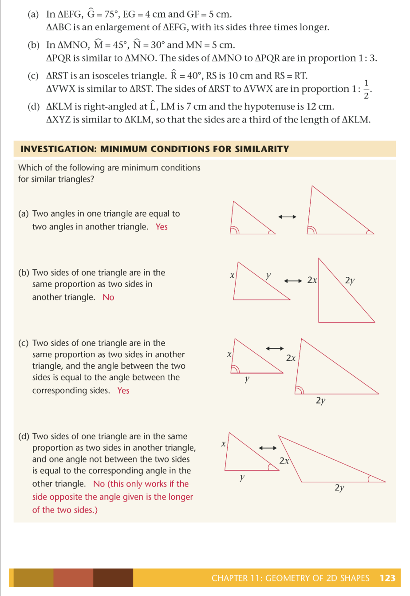
> **[Diagram Context - Textbook_Mathematics_Gr9_Geometry-of-2D-shapes.pdf-0032-15.png]**
> This geometry resource presents a series of triangle pairs labeled with variables (x, y) and their scaled counterparts (2x, 2y) to illustrate the minimum conditions for similarity. By evaluating four specific criteria, the diagram helps students distinguish between valid similarity theorems—such as AAA and SAS—and invalid assumptions, reinforcing the conceptual requirement for proportional sides and equal angles in Euclidean geometry.

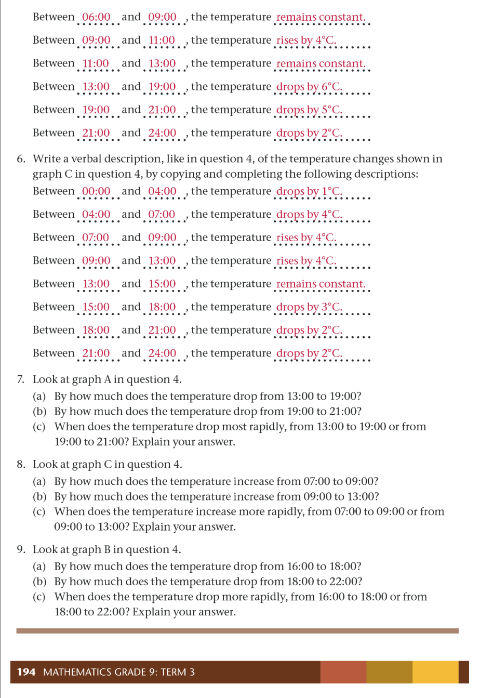
> **[Diagram Context - Textbook_Mathematics_Gr9_Graphs.pdf-0032-11.png]**
> This educational text consists of a series of mathematical exercises designed to test data interpretation skills regarding temperature fluctuations over time. It utilizes time intervals (00:00 to 24:00) and temperature change descriptors (rises, drops, or remains constant) to guide students in analyzing trends and rates of change. Conceptually, this helps learners develop the ability to translate graphical information into verbal descriptions and perform comparative calculations to determine the rate of change between different intervals.

---

# Mathematics Grade 7: Fractions Worksheet

## 1. Addition of Fractions
To add fractions, ensure they have a common denominator.

**Calculations:**
(a) $\frac{3}{20} + \frac{5}{20} = \frac{8}{20}$
(b) $\frac{5}{12} + \frac{11}{12} = \frac{16}{12} = 1\frac{4}{12} = 1\frac{1}{3}$
(c) $\frac{3}{2} + \frac{5}{4} = \frac{6}{4} + \frac{5}{4} = \frac{11}{4} = 2\frac{3}{4}$
(d) $\frac{3}{5} + \frac{3}{10} = \frac{6}{10} + \frac{3}{10} = \frac{9}{10}$

---

## 2. Equivalent Fractions
Find the missing numerator or denominator to make the fractions equal.

| Equation | Solution |
| :--- | :--- |
| (a) $\frac{5}{7} = \frac{35}{49}$ | Multiply by $\frac{7}{7}$ |
| (b) $\frac{9}{11} = \frac{27}{33}$ | Multiply by $\frac{3}{3}$ |
| (c) $\frac{15}{10} = \frac{3}{2}$ | Divide by $\frac{5}{5}$ |
| (d) $\frac{1}{9} = \frac{4}{36}$ | Multiply by $\frac{4}{4}$ |
| (e) $\frac{45}{18} = \frac{5}{2}$ | Divide by $\frac{9}{9}$ |
| (f) $\frac{4}{5} = \frac{28}{35}$ | Multiply by $\frac{7}{7}$ |

---

## 3. Mixed Operations with Fractions
Convert to common denominators before adding or subtracting.

(a) $\frac{3}{10} + \frac{7}{30} = \frac{9}{30} + \frac{7}{30} = \frac{16}{30} = \frac{8}{15}$
(b) $\frac{2}{5} + \frac{7}{12} = \frac{24}{60} + \frac{35}{60} = \frac{59}{60}$
(c) $\frac{1}{100} + \frac{7}{10} = \frac{1}{100} + \frac{70}{100} = \frac{71}{100}$
(d) $\frac{3}{5} - \frac{3}{8} = \frac{24}{40} - \frac{15}{40} = \frac{9}{40}$
(e) $2\frac{3}{10} + 5\frac{9}{10} = 7\frac{12}{10} = 8\frac{2}{10} = 8\frac{1}{5}$

---

## 4. Financial Calculations (Percentages)

**Problem 4: Salary Increase**
Joe earns R5 000. Increase = 12%.
Calculation: $\frac{12}{100} \times 5000 = 600$.
New Salary: $5000 + 600 = R5 600$.

**Problem 5: Salary Fluctuation**
Ahmed earns R7 500.
Increase 10%: $7500 + 750 = R8 250$.
Decrease 10%: $8250 - 825 = R7 425$.

---

## 6. Simplify to Lowest Form

(a) $\frac{13}{20} - \frac{5}{20} = \frac{8}{20} = \frac{2}{5}$
(b) $3\frac{24}{100} - 1\frac{2}{10} = 3\frac{24}{100} - 1\frac{20}{100} = 2\frac{4}{100} = 2\frac{1}{25}$
(c) $\frac{5}{11} - 2\frac{1}{4} = \frac{20}{44} - 2\frac{11}{44} = \dots$ (Requires borrowing from whole number)
(d) $\frac{2}{3} + \frac{4}{7} = \frac{14}{21} + \frac{12}{21} = \frac{26}{21} = 1\frac{5}{21}$

---

## 7 & 8. Multiplication of Fractions

**Rule:** Multiply numerators together and denominators together. Simplify where possible.

(7a) $\frac{1}{2} \times 9 = \frac{9}{2} = 4\frac{1}{2}$
(7b) $\frac{3}{5} \times \frac{10}{27} = \frac{30}{135} = \frac{2}{9}$
(7c) $\frac{2}{3} \times 15 = \frac{30}{3} = 10$
(7d) $\frac{2}{3} \times \frac{3}{4} = \frac{6}{12} = \frac{1}{2}$

(8a) $2\frac{2}{3} \times 2\frac{2}{3} = \frac{8}{3} \times \frac{8}{3} = \frac{64}{9} = 7\frac{1}{9}$
(8b) $8\frac{2}{5} \times 3\frac{1}{3} = \frac{42}{5} \times \frac{10}{3} = \frac{420}{15} = 28$
(8c) $(\frac{1}{3} + \frac{1}{2}) \times \frac{6}{7} = (\frac{2}{6} + \frac{3}{6}) \times \frac{6}{7} = \frac{5}{6} \times \frac{6}{7} = \frac{30}{42} = \frac{5}{7}$
(8d) $\frac{2}{3} \times \frac{1}{2} \times \frac{3}{4} = \frac{6}{24} = \frac{1}{4}$
(8e) $\frac{5}{6} + \frac{2}{3} \times \frac{1}{5} = \frac{5}{6} + \frac{2}{15} = \frac{25}{30} + \frac{4}{30} = \frac{29}{30}$
(8f) $\frac{3}{4} - \frac{2}{5} \times \frac{5}{6} = \frac{3}{4} - \frac{10}{30} = \frac{3}{4} - \frac{1}{3} = \frac{9}{12} - \frac{4}{12} = \frac{5}{12}$

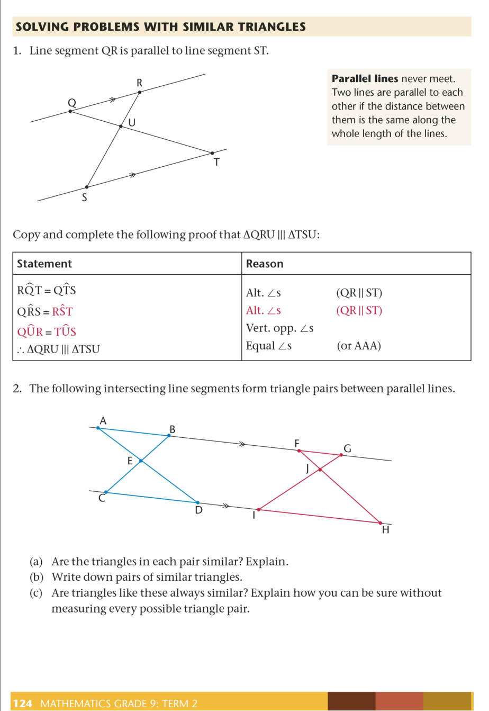
> **[Diagram Context - Textbook_Mathematics_Gr9_Geometry-of-2D-shapes.pdf-0033-13.png]**
> This geometry resource features two diagrams of intersecting line segments between parallel lines, labeled with vertices (Q, R, U, S, T; A, B, E, C, D; F, G, J, I, H) and parallel indicators. It provides a structured proof table using alternate and vertically opposite angles to demonstrate that the resulting triangles are equiangular and therefore similar. Conceptually, this helps learners apply Euclidean geometry properties to identify similarity in triangles formed by transversals cutting across parallel lines.

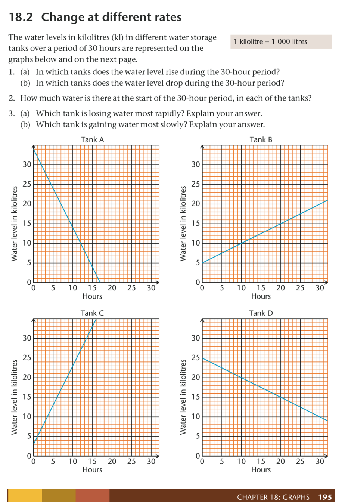
> **[Diagram Context - Textbook_Mathematics_Gr9_Graphs.pdf-0033-11.png]**
> This graphic displays four linear graphs representing the water levels in kilolitres (y-axis) over a 30-hour period (x-axis) for tanks labeled A, B, C, and D. By comparing the gradients and intercepts of these lines, students learn to interpret rates of change, identifying whether water levels are increasing or decreasing and determining the relative speed of these changes.

