# Chapter 4: Construction of geometric figures

## 4.1 Angles revision

When two lines point in different directions, we say they are **at an angle** to each other. If the directions are almost the same, we say the **angle** between them is small. If the directions are very different, we say the angle between them is big.

<!-- DIAGRAM_PLACEHOLDER: diagram -->

### Words we use to describe angles:

* **Arms of the angle:** the two lines that are at an angle to each other
* **The vertex:** the point where the two arms meet
* **Vertices:** plural of "vertex"

<!-- DIAGRAM_PLACEHOLDER: diagram -->

### Symbols to describe angles:

Arrowheads on the lines mean that the lines keep on going. The length of an angle's arms does not change the size of the angle. Whether the arms are long or short, the angle size stays the same.

There are **two angles at a vertex** so it is important to show which one we are talking about.

<!-- DIAGRAM_PLACEHOLDER: diagram -->

### Labelling angles:

There are many different ways to label angles. Look at the examples below:

<!-- DIAGRAM_PLACEHOLDER: diagram -->

---

## Concepts & Structure

### Naming Angles
You can name an angle in different ways:
* $\hat{A}\hat{B}C$
* $C\hat{B}A$
* Just $\hat{B}$

The "hat" symbol ($\,\hat{ }\,\text{}$) on the letter shows where the vertex of the angle is.

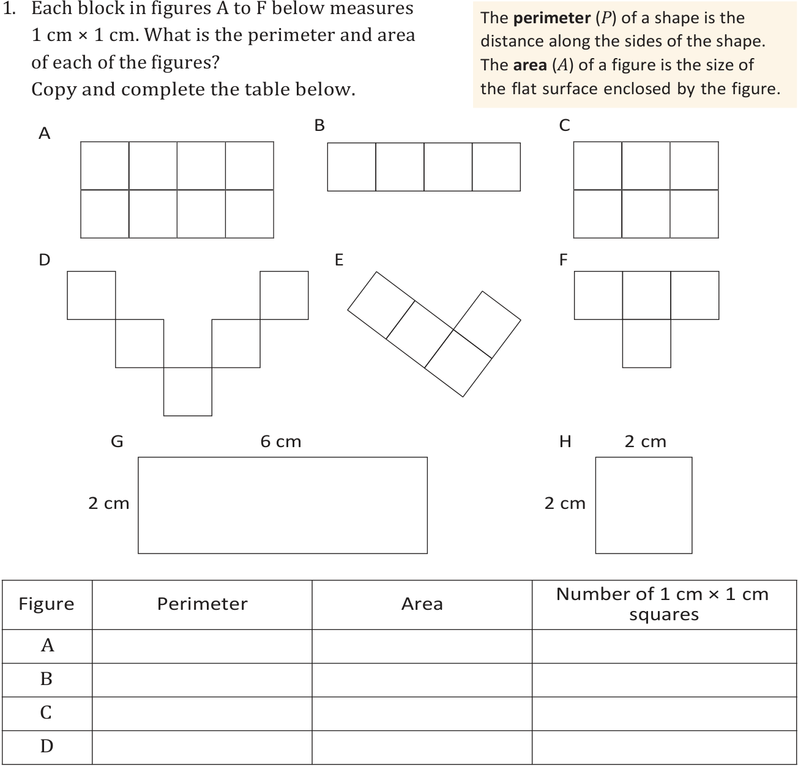
> **[Diagram Context - Textbook_Mathematics_Gr9_Area-and-perimeter-of-2D-shapes.pdf-0001-03.png]**
> This geometry exercise presents a series of composite shapes (A–F) and rectangles (G–H) constructed from 1 cm × 1 cm grid units, accompanied by a table for recording perimeter and area. By requiring students to calculate these values for various configurations, the diagram reinforces the conceptual distinction between the boundary length (perimeter) and the total surface coverage (area) of two-dimensional shapes.

---

## Revision: Seeing Angles and Describing Angles

1. Look at the drawing on the right.
   
   

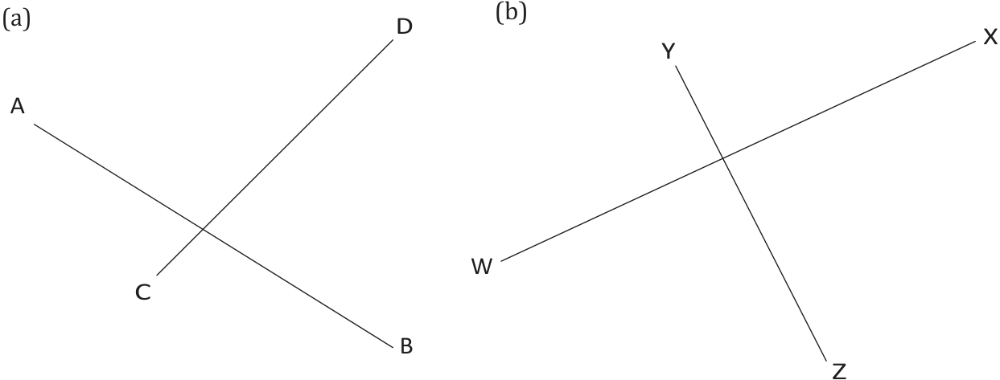
> **[Diagram Context - Textbook_Mathematics_Gr9_Construction-of-geometric-figures.pdf-0001-06.png]**
> This geometry figure displays two pairs of intersecting lines labeled (a) with lines AB and CD, and (b) with lines WX and YZ. It serves as a foundational visual for Grade 8 and 9 learners to identify vertically opposite angles, adjacent angles on a straight line, and the properties of angles formed at the intersection of two straight lines.

   (a) Are these lines at an angle to each other? Do the lines have to meet to be at an angle?
   
   (b) Copy the lines. Use a pencil and your ruler to draw the lines a bit longer so they meet. Did you change the angle between the lines when you extended them?

2. Arrange the angles from biggest to smallest. Just write the letters (a) to (f) in the correct order.

   

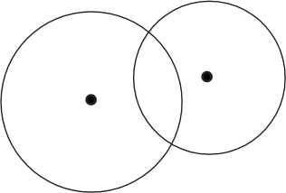
> **[Diagram Context - Textbook_Mathematics_Gr9_Construction-of-geometric-figures.pdf-0001-12.png]**
> This diagram represents an orbital overlap model, featuring two circles with central dots representing atomic nuclei. It illustrates the concept of covalent bonding, where the overlapping region signifies the shared electron density between two atoms.

3. How can you check that an angle is a right angle without using any special mathematics equipment? *(Hint: Think about where you can find right angles around you.)*

4. Are these two angles the same size? Describe how you found your answer. *(Hint: A piece of scrap paper may help!)*

   

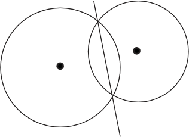
> **[Diagram Context - Textbook_Mathematics_Gr9_Construction-of-geometric-figures.pdf-0001-13.png]**
> This geometry figure illustrates two intersecting circles, each marked with a central point, and a straight line passing through their two points of intersection. This diagram represents the common chord of two circles, a fundamental concept in Euclidean geometry used to explore the properties of intersecting circles and their shared secant line.

5. Two lines are drawn by holding down a ruler and drawing lines on both sides. What can you say about the two lines?

   

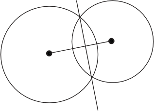
> **[Diagram Context - Textbook_Mathematics_Gr9_Construction-of-geometric-figures.pdf-0001-14.png]**
> This geometric figure displays two intersecting circles with their respective centers connected by a line segment and a common chord drawn through the points of intersection. The diagram illustrates the properties of intersecting circles, specifically highlighting the relationship between the line connecting the centers and the common chord. For a high school learner, this serves as a foundational visual for Euclidean geometry theorems regarding the perpendicular bisector of a common chord.

6. Look at the analogue clock face on the next page. The minute hand and the hour hand make an angle. Focus on the smaller angle for now.

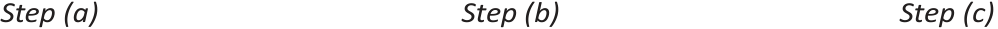

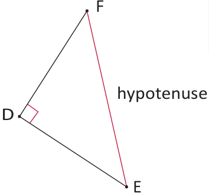
> **[Diagram Context - Textbook_Mathematics_Gr9_Pythagoras-Theorem.pdf-0001-04.png]**
> This graphic illustrates a right-angled triangle labeled with vertices D, E, and F, featuring a right-angle symbol at vertex D and the label "hypotenuse" identifying the side opposite the right angle (FE). It serves as a foundational visual aid for Grade 8-10 Mathematics, helping learners identify the longest side of a right-angled triangle in preparation for applying the Theorem of Pythagoras or trigonometric ratios.

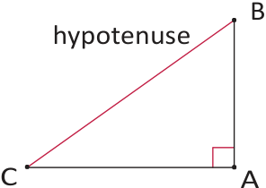
> **[Diagram Context - Textbook_Mathematics_Gr9_Pythagoras-Theorem.pdf-0001-05.png]**
> This geometric figure illustrates a right-angled triangle with vertices labeled A, B, and C, featuring a right-angle symbol at vertex A and the side BC highlighted in red. The diagram explicitly labels the side opposite the right angle as the "hypotenuse," serving as a foundational visual aid for learners to identify the longest side of a right-angled triangle in preparation for applying the Theorem of Pythagoras or trigonometric ratios.

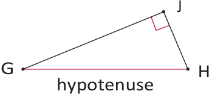
> **[Diagram Context - Textbook_Mathematics_Gr9_Pythagoras-Theorem.pdf-0001-09.png]**
> This geometry figure displays a right-angled triangle labeled with vertices G, J, and H, featuring a right-angle symbol at vertex J and a red line segment highlighting the side GH. The diagram conceptually identifies GH as the hypotenuse, which is the longest side of a right-angled triangle located directly opposite the 90-degree angle.

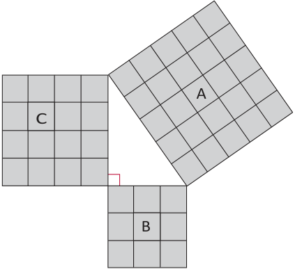
> **[Diagram Context - Textbook_Mathematics_Gr9_Pythagoras-Theorem.pdf-0001-19.png]**
> This geometric figure illustrates the Pythagorean theorem by showing squares attached to the sides of a right-angled triangle, identified by labels A, B, and C. By counting the grid units within each square, the diagram visually demonstrates that the sum of the areas of the two smaller squares (B and C) equals the area of the largest square (A), reinforcing the algebraic relationship $a^2 + b^2 = c^2$.

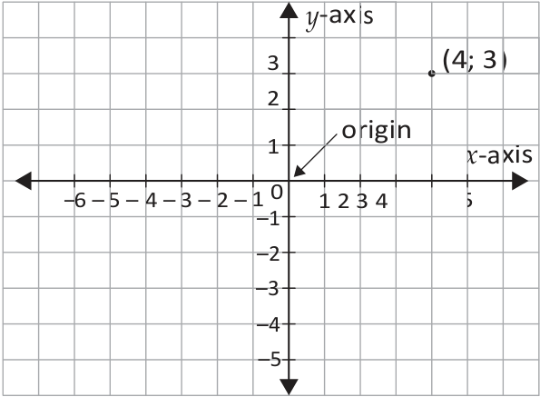
> **[Diagram Context - Textbook_Mathematics_Gr9_Transformation-geometry.pdf-0001-05.png]**
> This Cartesian plane diagram features an x-axis, a y-axis, an origin point, and a specific coordinate point labeled (4; 3). It illustrates the fundamental concept of the Cartesian coordinate system, demonstrating how to locate a point in a two-dimensional plane by identifying its horizontal and vertical distance from the origin.

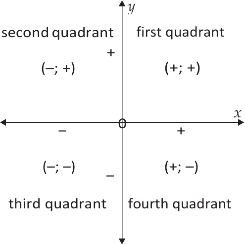
> **[Diagram Context - Textbook_Mathematics_Gr9_Transformation-geometry.pdf-0001-11.png]**
> This Cartesian plane diagram displays the four quadrants defined by the x-axis and y-axis, intersecting at the origin (0). It labels each quadrant and indicates the corresponding signs of the coordinate pairs (x; y) within each region. This visual aid helps learners understand the spatial orientation of points in a 2D coordinate system, which is fundamental for graphing functions and analytical geometry in the CAPS curriculum.

---

(a) Explain why the angle between the hands at 8 o’ clock is the same size as the angle at 4 o’ clock. 

(b) Compare the angle at 2 o’ clock with the angle at 4 o’ clock. What do you notice? Why is this so? 

(c) Is the angle at 3 o’ clock the same as the angle at a quarter past 12? Explain. 

7. When you open the cover of a hardcover book you can make different angles. Can you think of at least five other situations in everyday life where objects are turned through angles? Say what the arms and the vertices are in each of your examples.

## 4.2 The degree: a unit for measuring angles

Imagine if we didn’t have units for measuring length. How would tailors make clothes to the right size without a tape measure? How could an architect design a safe and beautiful house without a ruler? How could we lay out a professional soccer field without being able to measure accurately in metres? 

We need units and measuring instruments in many situations. You know that we use metres, centimetres, kilometres, millimetres, etc. for measuring lengths. 

We should also have units for measuring angles. The units we use for measuring angles are very ancient. No one today is completely sure why, but our ancestors decided many thousands of years ago that a revolution should be divided into $360$ equal parts. We call these parts degrees. The symbol for a degree is $^\circ$.

### Some familiar angles in degrees

1. Copy and complete the table by filling in the size of each angle described.

| Angle (in words) | Angle (degrees) |
| :--- | :--- |
| right angle | $90^\circ$ |
| straight angle | |
| revolution | $360^\circ$ |
| half a right angle | |
| a third of a right angle | |
| a quarter of a right angle | $22,5^\circ$ |
| half a straight angle | |
| three quarters of a revolution | |
| a third of a revolution | |

59  
CHAPTER 4: CONSTRUCTION OF GEOMETRIC FIGURES

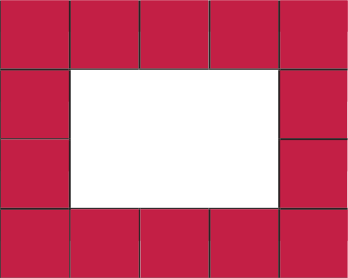

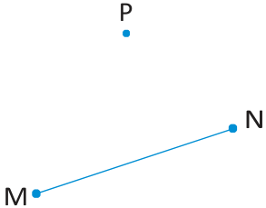

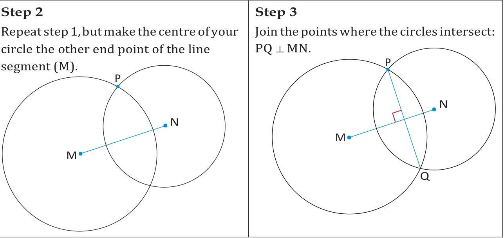
> **[Diagram Context - Textbook_Mathematics_Gr9_Construction-of-geometric-figures.pdf-0002-10.png]**
> This geometry figure illustrates the construction of a perpendicular bisector using a compass and straightedge, featuring two intersecting circles centered at points M and N with intersection points P and Q. By connecting the intersection points P and Q, the diagram demonstrates the geometric principle that the resulting line segment PQ is perpendicular to the original line segment MN.

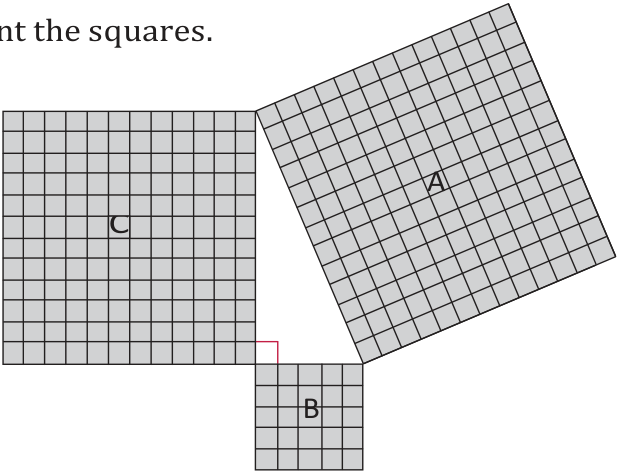
> **[Diagram Context - Textbook_Mathematics_Gr9_Pythagoras-Theorem.pdf-0002-01.png]**
> This geometry figure illustrates the Pythagorean theorem using three squares labeled A, B, and C attached to the sides of a right-angled triangle. By counting the grid units within each square, students can visually verify that the area of the square on the hypotenuse (A) is equal to the sum of the areas of the squares on the other two sides (B + C), reinforcing the algebraic relationship $a^2 + b^2 = c^2$.

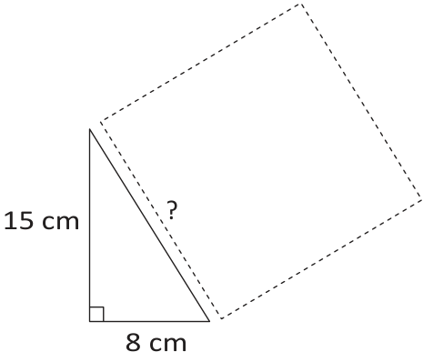
> **[Diagram Context - Textbook_Mathematics_Gr9_Pythagoras-Theorem.pdf-0002-12.png]**
> This geometry figure illustrates a right-angled triangle with legs measuring 15 cm and 8 cm, adjacent to a dashed square constructed on the hypotenuse. The diagram uses the labels "15 cm", "8 cm", and a question mark to prompt the learner to calculate the length of the hypotenuse or the area of the square. It conceptually reinforces the Pythagorean theorem, requiring students to apply the relationship $a^2 + b^2 = c^2$ to solve for the unknown side length.

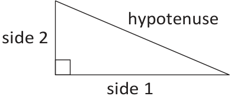
> **[Diagram Context - Textbook_Mathematics_Gr9_Pythagoras-Theorem.pdf-0002-15.png]**
> This geometry figure illustrates a right-angled triangle, featuring labels for "side 1," "side 2," the "hypotenuse," and a right-angle symbol. It serves as a foundational visual aid for learners to identify the components of a right-angled triangle, which is essential for applying the Theorem of Pythagoras and trigonometric ratios in the CAPS mathematics curriculum.

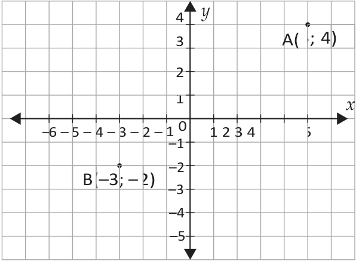
> **[Diagram Context - Textbook_Mathematics_Gr9_Transformation-geometry.pdf-0002-14.png]**
> This Cartesian plane displays two points, A(5; 4) and B(-3; -2), plotted on a grid with labeled x- and y-axes. The diagram serves as a foundational tool for Grade 9-10 Analytical Geometry, allowing students to practice identifying coordinates, determining quadrants, and calculating distance or gradient between two points.

---

2. Look at the clock shown. How many degrees does:
   (a) the minute hand move in an hour?
   (b) the hour hand move in an hour?

   

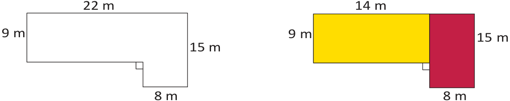
> **[Diagram Context - Textbook_Mathematics_Gr9_Area-and-perimeter-of-2D-shapes.pdf-0003-00.png]**
> This geometry figure displays an L-shaped composite polygon with side lengths labeled in metres (22 m, 9 m, 15 m, 8 m). It illustrates the concept of area decomposition, showing how a complex shape can be partitioned into two simpler rectangles (yellow and red) to facilitate the calculation of total area.

3. In Grade 6 you learnt that angles are classified into types. Copy and complete the table. The first one has been done as an example for you.

| Angle | Size of the angle | Sketch of the angle |
| :--- | :--- | :--- |
| Acute angle | Between $0^\circ$ and $90^\circ$ | 

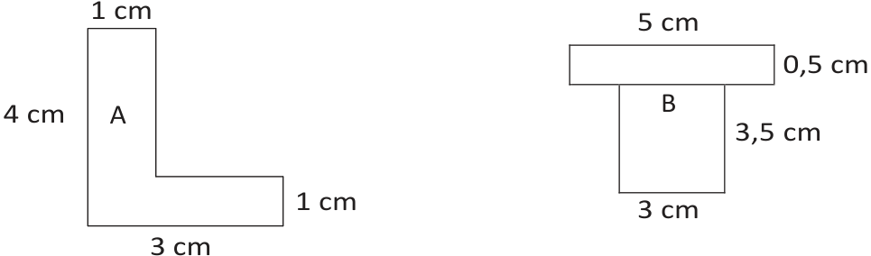
> **[Diagram Context - Textbook_Mathematics_Gr9_Area-and-perimeter-of-2D-shapes.pdf-0003-05.png]**
> This graphic displays two composite 2D geometric figures, labeled A and B, defined by specific side lengths in centimetres. It illustrates the concept of area decomposition, requiring students to partition these irregular polygons into simpler rectangles to calculate their total area or perimeter.

 |
| Right angle | | |
| Obtuse angle | | |
| Straight angle | | |
| Reflex angle | | |
| Revolution | | |

---

### Comparing angles using A4 paper

You need a sheet of A4 paper. At the corners you have four right angles. Number them and tear the corners off as shown in the diagram. Do not make them too small.

Now use your right angles to investigate the following situations:

1. Show that a straight angle is two right angles. You can sketch what you have done in your book.
2. Show that a revolution is four right angles. You can sketch what you have done in your book.
3. Create a right angle using three of your corners. You can sketch what you have done in your book.
4. Describe how you can use one of your corners to check if an angle is acute, right or obtuse.
5. 
   (a) Fold corner $1$ so that you can use it to measure $45^\circ$.
   (b) Fold corner $2$ so that you can use it to measure $30^\circ$.
   (c) Fold corner $3$ so that you can use it to measure $22,5^\circ$.
   (d) Which is bigger: a right angle *or* half a right angle $+$ a third of a right angle $+$ a quarter of a right angle? Can you do a calculation to show that?

**Important:** Keep your folded pieces of paper for the next lesson!

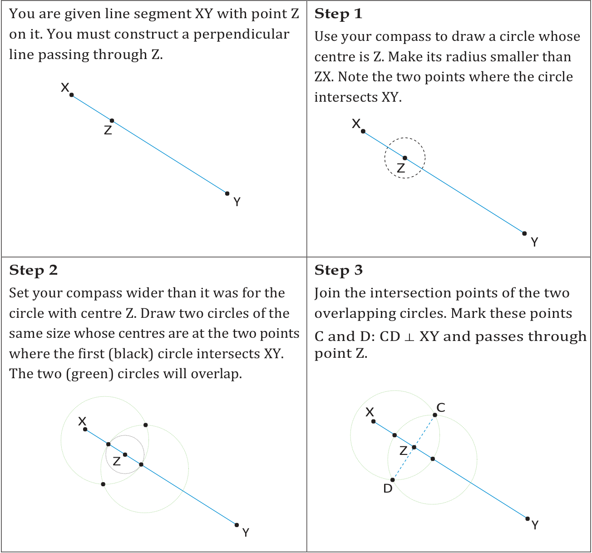
> **[Diagram Context - Textbook_Mathematics_Gr9_Construction-of-geometric-figures.pdf-0003-02.png]**
> This geometry figure illustrates a step-by-step Euclidean construction of a perpendicular line passing through a specific point Z on a line segment XY. Using labels X, Y, Z, C, and D, the diagram demonstrates how to use a compass to create equidistant intersection points that define a line perpendicular to the original segment. This process teaches learners the fundamental geometric principles of locus and construction required for CAPS mathematics.

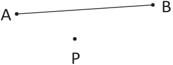

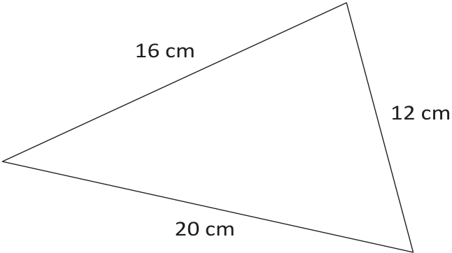
> **[Diagram Context - Textbook_Mathematics_Gr9_Pythagoras-Theorem.pdf-0003-02.png]**
> This geometric figure is a triangle with side lengths labeled as 16 cm, 12 cm, and 20 cm. By applying the converse of the Pythagorean theorem ($12^2 + 16^2 = 144 + 256 = 400 = 20^2$), this diagram serves as a practical exercise for students to identify a right-angled triangle and calculate its area or missing angles using trigonometric ratios.

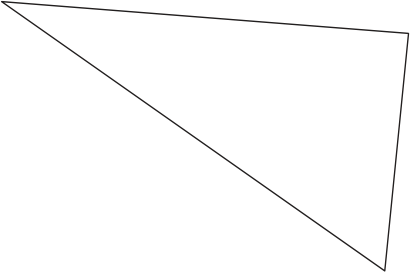
> **[Diagram Context - Textbook_Mathematics_Gr9_Pythagoras-Theorem.pdf-0003-10.png]**
> This graphic is a simple geometric figure representing a scalene triangle with no visible labels or variables. It serves as a foundational visual aid for high school geometry, allowing learners to practice applying theorems related to interior angle sums, side-length calculations, or area formulas in a non-right-angled context.

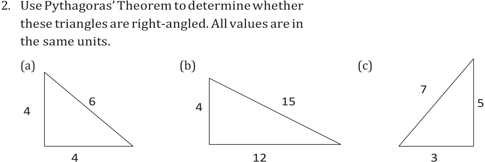
> **[Diagram Context - Textbook_Mathematics_Gr9_Pythagoras-Theorem.pdf-0003-11.png]**
> This geometry figure presents three distinct triangles labeled (a), (b), and (c), each with specific numerical side lengths provided for their legs and hypotenuses. The exercise requires students to apply the converse of the Pythagorean theorem ($a^2 + b^2 = c^2$) to verify if these triangles satisfy the mathematical conditions necessary to be classified as right-angled.

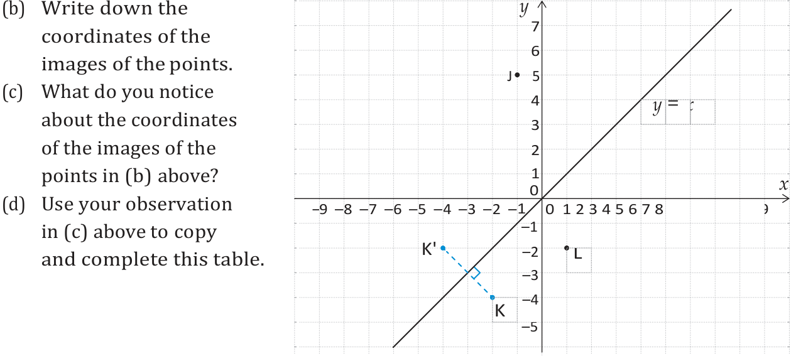
> **[Diagram Context - Textbook_Mathematics_Gr9_Transformation-geometry.pdf-0003-04.png]**
> This Cartesian plane graphic illustrates the geometric transformation of reflection across the line $y = x$, featuring points $J$, $K$, and $L$ alongside the reflected image $K'$. The diagram uses a grid, labeled $x$ and $y$ axes, and a dashed perpendicular line segment to help students identify the coordinate mapping rule $(x, y) \rightarrow (y, x)$ inherent in this specific reflection.

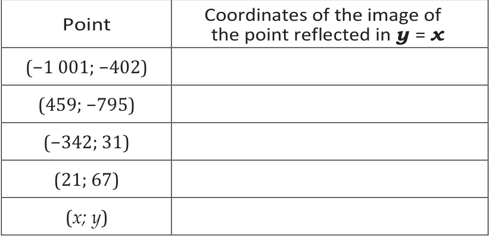
> **[Diagram Context - Textbook_Mathematics_Gr9_Transformation-geometry.pdf-0003-05.png]**
> This table presents a mathematical exercise on coordinate geometry, specifically focusing on the transformation of points. It lists various coordinate pairs $(x; y)$ and requires the student to determine their corresponding images after reflection across the line $y = x$. Conceptually, this reinforces the algebraic rule for this transformation, where the coordinates are swapped to become $(y; x)$.

---

## 4.3 Using the protractor

We have a special instrument for measuring angles. It is called a **protractor**. Look at the picture of a typical protractor with its important parts labelled.

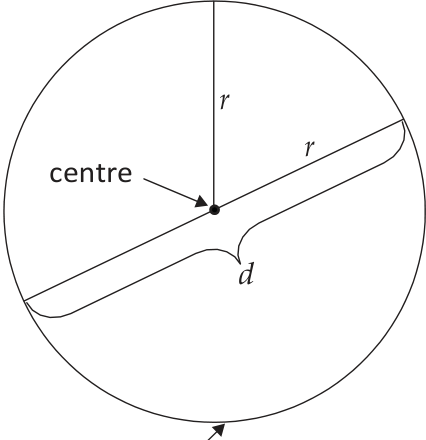
> **[Diagram Context - Textbook_Mathematics_Gr9_Area-and-perimeter-of-2D-shapes.pdf-0004-06.png]**
> This geometry figure illustrates the fundamental properties of a circle, featuring labels for the "centre," the radius ($r$), and the diameter ($d$). It conceptually demonstrates the relationship between these components, showing that the diameter is a chord passing through the centre and is equal to twice the length of the radius ($d = 2r$).

Protractors can be big or small, but they all measure angles in exactly the same way. The size of the protractor makes no difference to an angle's size.

---

### Measuring some familiar angles

You need the four folded angles from the previous activity on page 60. If you didn't do that activity, then go back now and follow the instructions in question 5.

1. In a group of three or four, use your protractor to measure the angles that you made: $90^\circ$, $45^\circ$, $30^\circ$, and $22{,}5^\circ$.
2. Did you measure the correct sized angle? If not, then ask yourself the following questions:
   - Did you put the vertex of the angle at the origin of the protractor?
   - Is the bottom arm of your angle lined up with the base line?
   - Did you fold your corners correctly?

---

### How to use a protractor to measure an angle

#### Step 1: Are the angle arms long enough?

The angle arms must be a little longer than the distance from the origin of the protractor to its edge. If they are too short, use a sharp pencil and a ruler to make them longer. Be careful to line the ruler up with the arm.

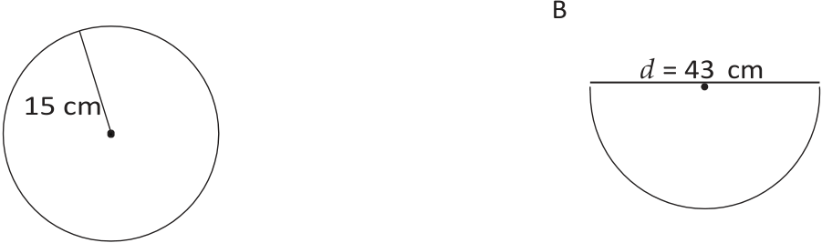
> **[Diagram Context - Textbook_Mathematics_Gr9_Area-and-perimeter-of-2D-shapes.pdf-0004-22.png]**
> This geometry figure displays a full circle with a radius of 15 cm and a semicircle labeled "B" with a diameter ($d$) of 43 cm. It serves to test a learner's ability to identify and apply the correct dimensions—radius versus diameter—when calculating the circumference or area of circular shapes in accordance with CAPS measurement requirements.

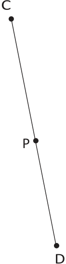
> **[Diagram Context - Textbook_Mathematics_Gr9_Construction-of-geometric-figures.pdf-0004-01.png]**
> This geometric figure displays a line segment defined by endpoints C and D, with a point P positioned between them. It serves as a foundational visual for Euclidean geometry, illustrating the collinear relationship between points and the division of a line segment into smaller parts.

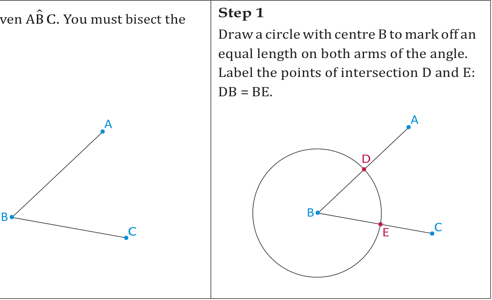
> **[Diagram Context - Textbook_Mathematics_Gr9_Construction-of-geometric-figures.pdf-0004-06.png]**
> This geometric construction figure illustrates the initial step in bisecting an angle, featuring points A, B, C, D, and E, and a circle centered at B. It demonstrates how to use a compass to establish equidistant points on the arms of angle ABC, which is a foundational technique for accurate geometric constructions in the CAPS curriculum.

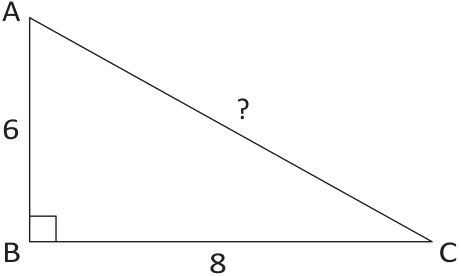
> **[Diagram Context - Textbook_Mathematics_Gr9_Pythagoras-Theorem.pdf-0004-10.png]**
> This geometry figure depicts a right-angled triangle labeled ABC, with vertices A, B, and C, a right-angle symbol at vertex B, and side lengths of 6 and 8 units, with the hypotenuse marked by a question mark. It serves as a foundational exercise for learners to apply the Pythagorean theorem ($a^2 + b^2 = c^2$) to calculate the unknown length of the hypotenuse.

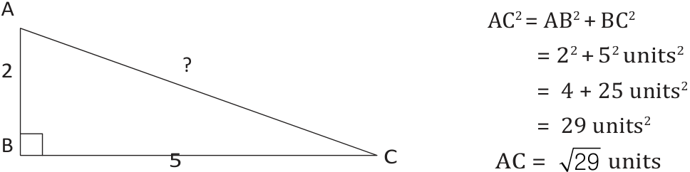
> **[Diagram Context - Textbook_Mathematics_Gr9_Pythagoras-Theorem.pdf-0004-16.png]**
> This graphic displays a right-angled triangle with vertices A, B, and C, labeled with side lengths of 2 and 5, and a question mark representing the unknown hypotenuse. It demonstrates the application of the Pythagorean theorem ($AC^2 = AB^2 + BC^2$) to calculate the length of the hypotenuse, providing a step-by-step algebraic solution that results in $\sqrt{29}$ units.

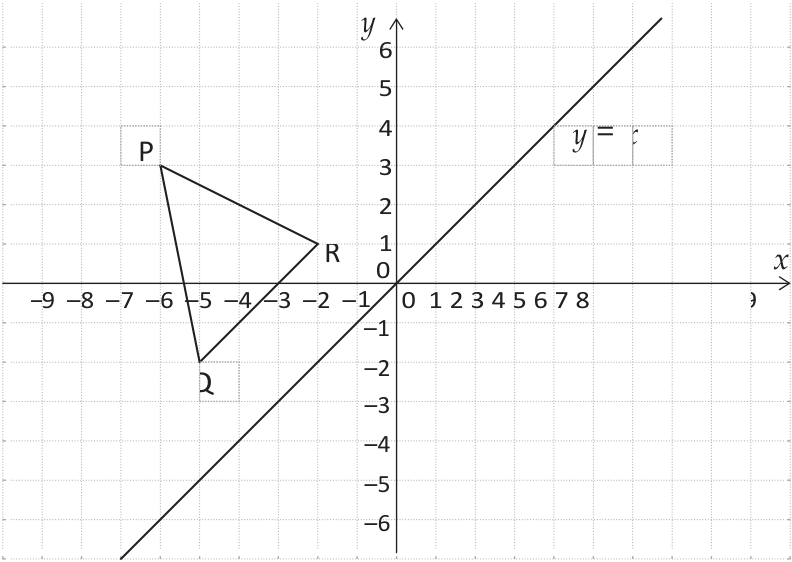
> **[Diagram Context - Textbook_Mathematics_Gr9_Transformation-geometry.pdf-0004-12.png]**
> This Cartesian plane displays a triangle with vertices P, Q, and R alongside the linear function $y = x$. The diagram serves as a foundational tool for Grade 10-12 learners to practice coordinate geometry transformations, such as reflecting the triangle across the line $y = x$ or calculating the lengths and gradients of its sides.

---

Now you are ready to start measuring your angle.

## Step 2: Line up the angle and your protractor

Place your protractor on top of the angle. Make sure of the following:
* the origin is exactly on the vertex of the angle, and
* the base line is exactly on top of one of the arms of the angle.

Keep adjusting the position of the protractor until the origin and the base line are exactly lined up.

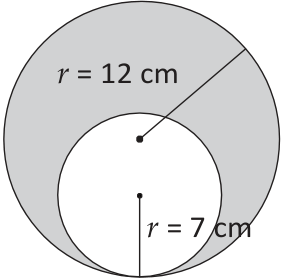
> **[Diagram Context - Textbook_Mathematics_Gr9_Area-and-perimeter-of-2D-shapes.pdf-0005-03.png]**
> This geometry figure displays two circles, one nested within the other, with radii labeled as $r = 12\text{ cm}$ for the larger circle and $r = 7\text{ cm}$ for the smaller circle. It is designed to help students practice calculating the area of composite shapes by subtracting the area of the inner circle from the area of the outer circle to find the shaded region.

Once your protractor is in the correct place, keep a finger on the protractor to stop it from moving. If it moves... start again! You are now ready to make a measurement.

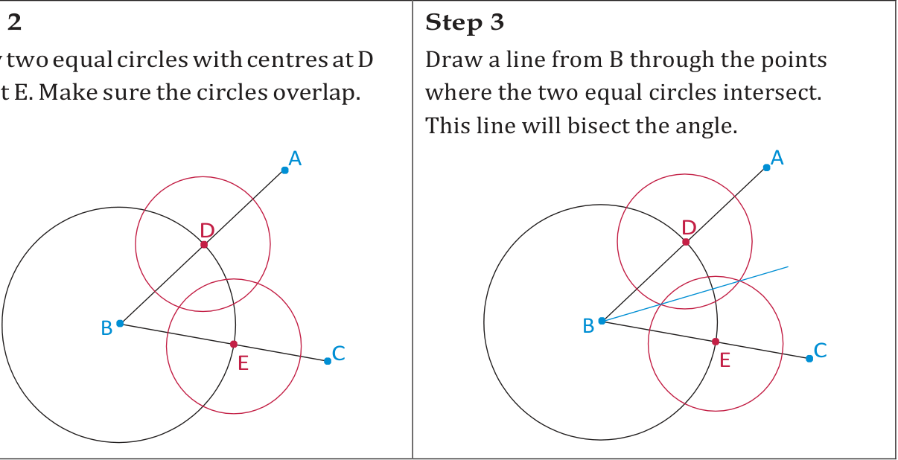
> **[Diagram Context - Textbook_Mathematics_Gr9_Construction-of-geometric-figures.pdf-0005-00.png]**
> This geometry figure illustrates the construction steps for bisecting an angle using a compass and straightedge. The diagram features two intersecting circles centered at points D and E along the rays of angle ABC, with labels A, B, C, D, and E marking the vertices and intersection points. It demonstrates the geometric principle that drawing a line from the vertex B through the intersection of two equidistant arcs creates an angle bisector, a fundamental skill in Euclidean geometry.

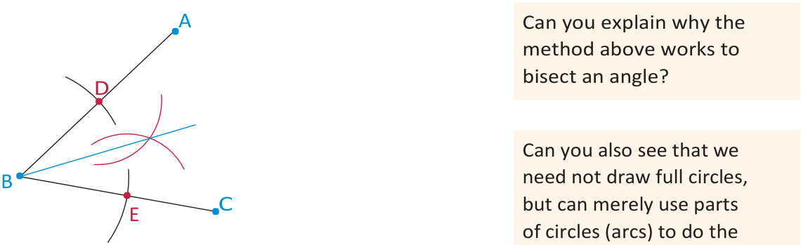
> **[Diagram Context - Textbook_Mathematics_Gr9_Construction-of-geometric-figures.pdf-0005-03.png]**
> This geometry figure illustrates the compass-and-straightedge construction of an angle bisector for angle ABC, featuring points A, B, C, D, and E, along with intersecting arcs and a bisecting ray. It conceptually guides students to understand the geometric principles of congruence and equidistance that underpin the construction of an angle bisector.

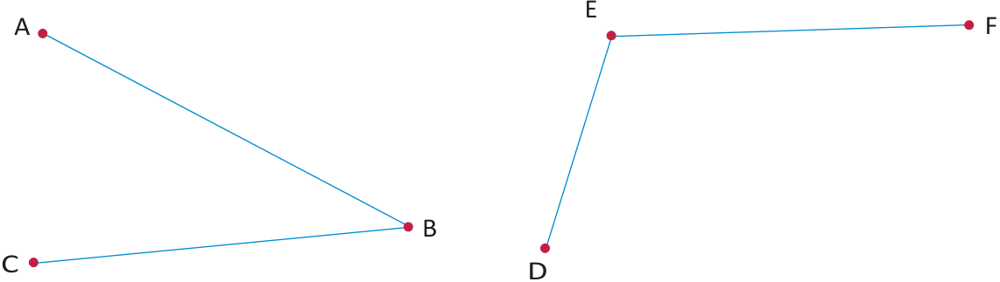
> **[Diagram Context - Textbook_Mathematics_Gr9_Construction-of-geometric-figures.pdf-0005-08.png]**
> This geometry figure displays two separate angles, labeled as $\angle ABC$ and $\angle DEF$, defined by line segments connecting points A, B, C and D, E, F respectively. It serves as a foundational visual aid for learners to identify, measure, and compare the magnitude of different angles in Euclidean geometry.

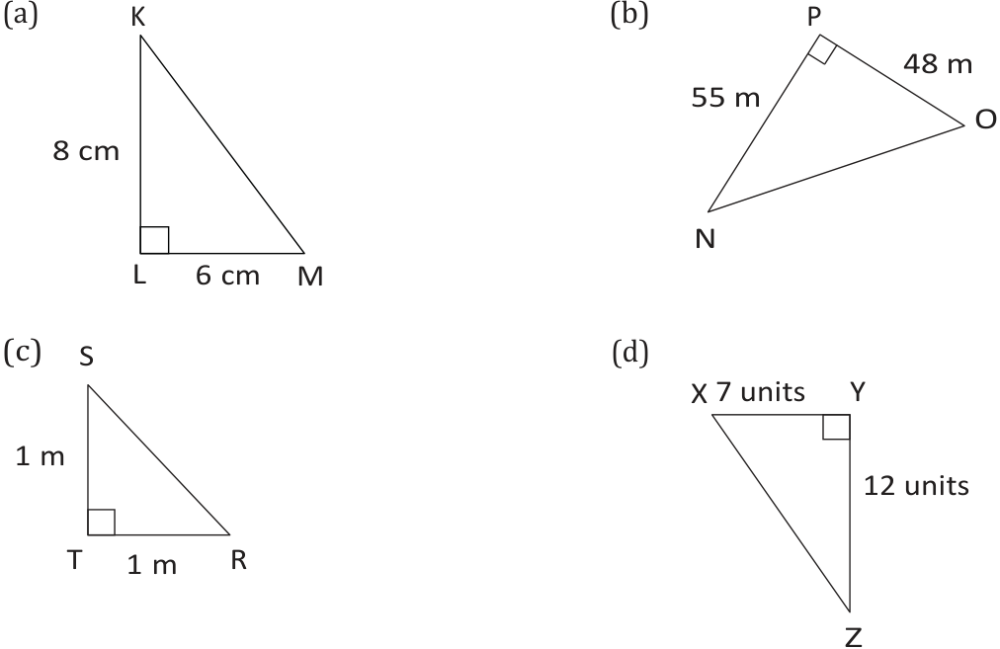
> **[Diagram Context - Textbook_Mathematics_Gr9_Pythagoras-Theorem.pdf-0005-00.png]**
> This graphic displays four distinct right-angled triangles labeled (a) through (d), each marked with a right-angle symbol and specific side lengths (KL=8cm, LM=6cm; PN=55m, PO=48m; ST=1m, TR=1m; XY=7 units, YZ=12 units). These figures serve as foundational exercises for high school learners to apply the Theorem of Pythagoras to calculate the length of the hypotenuse or missing sides in various geometric orientations.

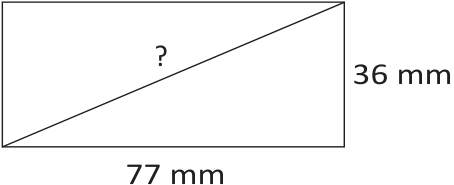
> **[Diagram Context - Textbook_Mathematics_Gr9_Pythagoras-Theorem.pdf-0005-02.png]**
> This geometry figure depicts a rectangle divided into two right-angled triangles by a diagonal, with side lengths labeled as 77 mm and 36 mm and the unknown diagonal marked with a question mark. It serves as a practical application of the Pythagorean theorem, requiring students to calculate the length of the hypotenuse in a right-angled triangle.

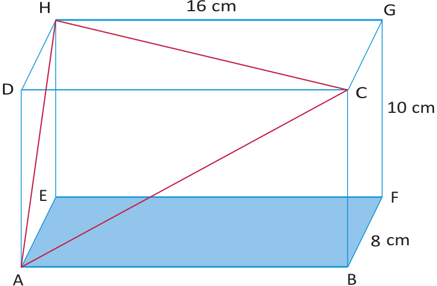
> **[Diagram Context - Textbook_Mathematics_Gr9_Pythagoras-Theorem.pdf-0005-05.png]**
> This geometric figure represents a rectangular prism with vertices labeled A through H, featuring dimensions of 16 cm, 10 cm, and 8 cm. The diagram highlights an internal triangle formed by the vertices A, H, and C, connected by red lines. It serves as a visual aid for Grade 10-12 learners to practice applying the Theorem of Pythagoras and trigonometric ratios to calculate lengths and angles within three-dimensional space.

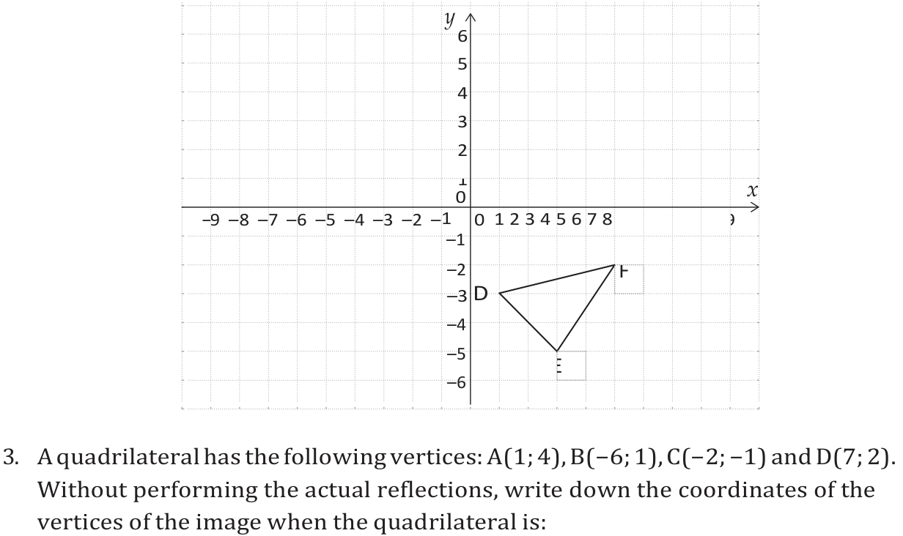
> **[Diagram Context - Textbook_Mathematics_Gr9_Transformation-geometry.pdf-0005-01.png]**
> This graphic features a Cartesian plane with an $x$-axis and $y$-axis, displaying a triangle with vertices labeled D, E, and F. It serves as a foundational exercise for Grade 9-10 analytical geometry, requiring students to apply coordinate transformation rules—such as reflections across the axes or lines—to determine the new positions of vertices without manual plotting.

---

## Step 3: Measure the angle

A protractor gives a clockwise degree scale and an anticlockwise degree scale. You choose the correct scale by finding the one that starts with $0^\circ$ on the angle arm. Look at where the other angle arm passes under the degree scale. That is where your measurement is.

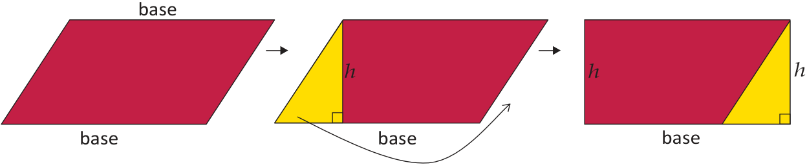
> **[Diagram Context - Textbook_Mathematics_Gr9_Area-and-perimeter-of-2D-shapes.pdf-0006-03.png]**
> This geometric figure illustrates the derivation of the area formula for a parallelogram using a transformation process. By labeling the "base" and perpendicular height "$h$", the diagram demonstrates how a triangular section can be cut and rearranged to transform a parallelogram into a rectangle of equal area. This visual proof helps learners understand why the area of a parallelogram is calculated as base multiplied by height.

Here we must use the inner scale (goes anticlockwise from the base line).

You can also place the protractor on the angle using the other arm. Then the correct position looks like this:

Here we must use the outer scale (goes clockwise from the base line).

The angle in the pictures above is $37^\circ$. Do you agree? Do you see that there are two ways to measure an angle?

---

### Practise measuring with a protractor

1. Measure the angles and copy and complete the table on the next page. If you need to, copy the drawing and extend the arms.

(a)  

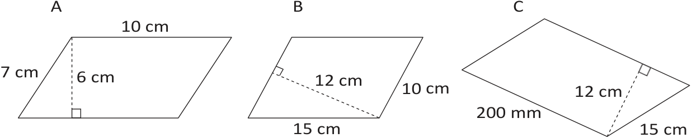
> **[Diagram Context - Textbook_Mathematics_Gr9_Area-and-perimeter-of-2D-shapes.pdf-0006-13.png]**
> This graphic displays three parallelograms labeled A, B, and C, each featuring side lengths and perpendicular heights indicated by dashed lines and right-angle symbols. The diagrams provide the necessary dimensions in centimeters and millimeters to practice calculating the area of a parallelogram using the formula $Area = base \times perpendicular\ height$. This exercise reinforces the importance of identifying the correct corresponding base and height, as well as the necessity of unit conversion before performing calculations.

(b)  

(c)  

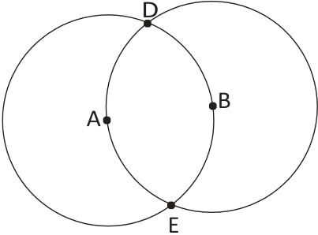
> **[Diagram Context - Textbook_Mathematics_Gr9_Construction-of-geometric-figures.pdf-0006-14.png]**
> This geometry figure illustrates two intersecting circles with centers labeled A and B, and intersection points labeled D and E. It serves as a foundational visual for Grade 10-12 Euclidean geometry, demonstrating the properties of common chords and the symmetry of intersecting circles.

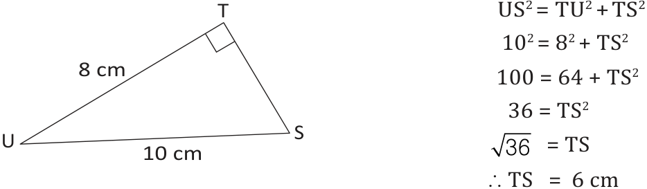
> **[Diagram Context - Textbook_Mathematics_Gr9_Pythagoras-Theorem.pdf-0006-04.png]**
> This graphic displays a right-angled triangle labeled with vertices T, U, and S, alongside a step-by-step algebraic calculation. The diagram includes side lengths of 8 cm and 10 cm, a right-angle symbol at vertex T, and a derivation using the Pythagorean theorem ($US^2 = TU^2 + TS^2$) to solve for the unknown side length TS. It conceptually demonstrates the application of the theorem of Pythagoras to calculate the missing side of a right-angled triangle in Euclidean geometry.

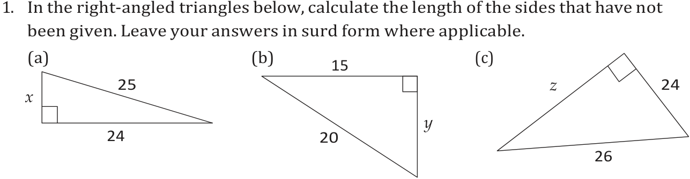
> **[Diagram Context - Textbook_Mathematics_Gr9_Pythagoras-Theorem.pdf-0006-05.png]**
> This graphic presents three right-angled triangles labeled (a), (b), and (c), each containing two known side lengths and one unknown variable ($x, y,$ or $z$). The diagram requires students to apply the Pythagorean theorem ($a^2 + b^2 = c^2$) to solve for the missing side length, reinforcing the skill of manipulating the formula to find either a leg or the hypotenuse while expressing results in surd form.

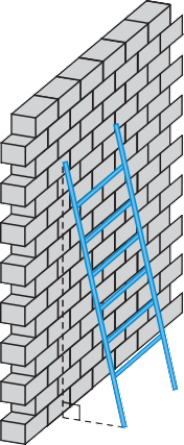
> **[Diagram Context - Textbook_Mathematics_Gr9_Pythagoras-Theorem.pdf-0006-10.png]**
> This geometric figure depicts a ladder leaning against a vertical brick wall, represented by a right-angled triangle formed by the ladder, the wall, and the ground. The diagram uses dashed lines and a right-angle symbol to illustrate the relationship between the vertical wall and horizontal ground, providing a visual model for applying the Theorem of Pythagoras or trigonometric ratios to solve real-world problems involving height and distance.

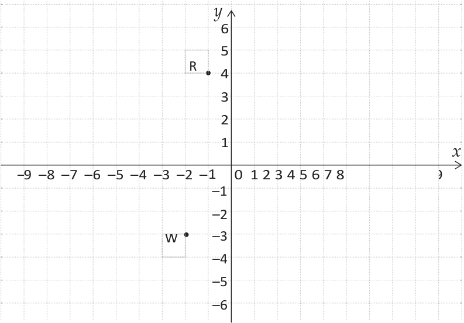
> **[Diagram Context - Textbook_Mathematics_Gr9_Transformation-geometry.pdf-0006-08.png]**
> This Cartesian plane displays two points, R and W, plotted on a grid with labeled x and y axes. The diagram illustrates the fundamental concept of coordinate geometry, requiring students to identify the ordered pairs (x; y) for each point, specifically R(-1; 4) and W(-2; -3).

---

## Geometry: Measuring Angles

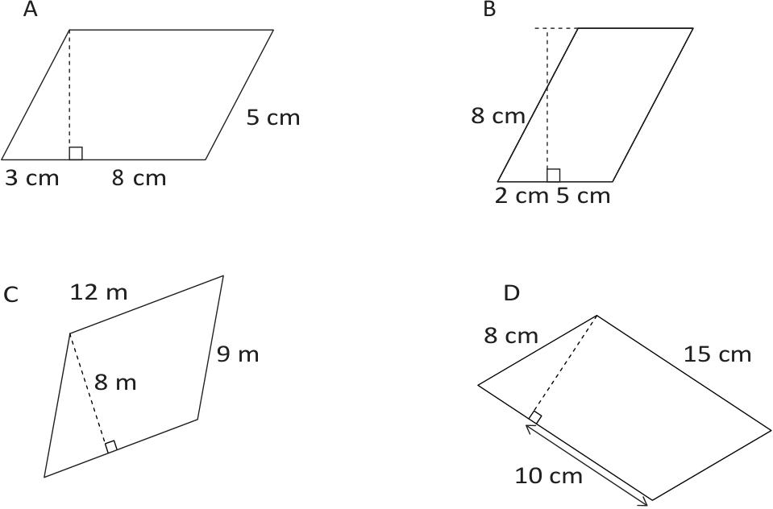
> **[Diagram Context - Textbook_Mathematics_Gr9_Area-and-perimeter-of-2D-shapes.pdf-0007-00.png]**
> This graphic displays four parallelograms labeled A through D, each featuring specific side lengths and perpendicular heights indicated by dashed lines and right-angle symbols. These figures illustrate the geometric components required to calculate the area of a parallelogram, reinforcing the CAPS curriculum requirement to identify and apply the correct base and corresponding perpendicular height in area calculations.

### Exercises and Tables

#### Part 1: Angle Measurements (d, e, f)

| Angle | (a) | (b) | (c) | (d) | (e) | (f) |
| :--- | :---: | :---: | :---: | :---: | :---: | :---: |
| Angle size in degrees | | | | | | |

---

#### Part 2: Complex Figure Measurement

Copy the table below. Measure all the numbered angles in the following figure. Some angles can be measured directly, others not. Your protractor cannot measure reflex angles like angles 7 and 8. So you will have to make a plan!

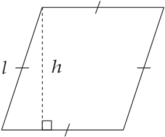
> **[Diagram Context - Textbook_Mathematics_Gr9_Area-and-perimeter-of-2D-shapes.pdf-0007-05.png]**
> This geometry figure illustrates a parallelogram with side length $l$ and perpendicular height $h$, indicated by a dashed line and a right-angle symbol. The tick marks on the sides denote equal lengths, helping students identify the properties of the shape and apply the formula for calculating its area.

| Angle | Size |
| :---: | :---: |
| 1 | |
| 2 | |
| 3 | |
| 4 | |
| 5 | |
| 6 | |
| 7 | |
| 8 | |
| 9 | |
| 10 | |
| 11 | |
| 12 | |

---

#### Part 3: Reflection Task

3. Write a short note for yourself about measuring reflex angles.

---

### Some Things to Think About

Look at your answers in question 2 above:

1. How do angles 3 and 4 compare?
2. What about angles 6 and 7?
3. What about angles 4 and 5?
4. There are some interesting ideas here. Try to do some further investigation and show your teacher what you discover.

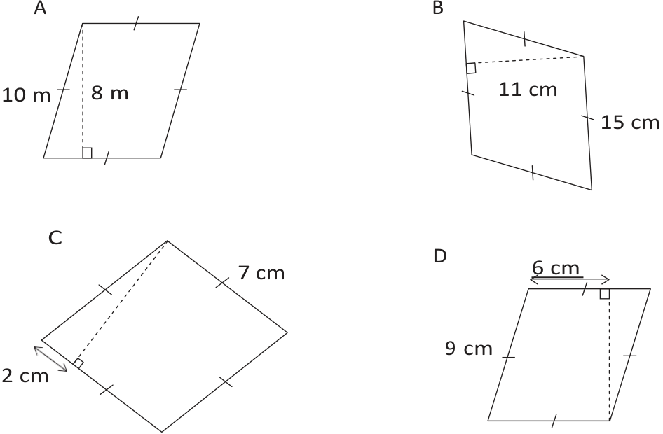
> **[Diagram Context - Textbook_Mathematics_Gr9_Area-and-perimeter-of-2D-shapes.pdf-0007-08.png]**
> This graphic displays four parallelograms labeled A, B, C, and D, each marked with side-length indicators and dashed lines representing perpendicular heights. By providing specific measurements for bases and heights, the diagram helps students practice identifying the correct dimensions required to calculate the area of a parallelogram using the formula Area = base × perpendicular height.

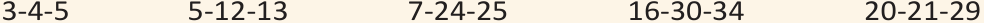

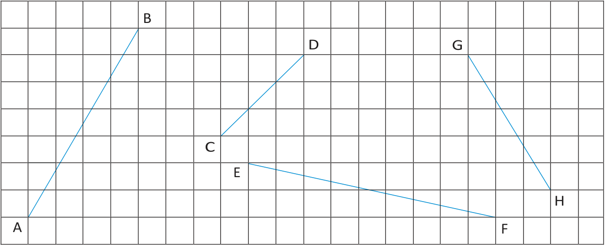
> **[Diagram Context - Textbook_Mathematics_Gr9_Pythagoras-Theorem.pdf-0007-09.png]**
> This geometry figure displays three distinct line segments plotted on a Cartesian grid, identified by the endpoints A, B, C, D, E, F, G, and H. The diagram serves as a foundational exercise for learners to practice calculating the distance, midpoint, and gradient of line segments using coordinate geometry principles.

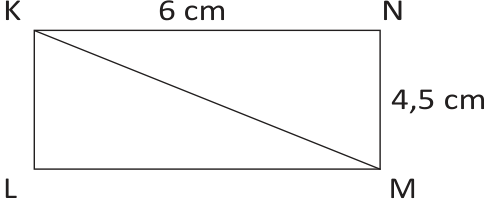
> **[Diagram Context - Textbook_Mathematics_Gr9_Pythagoras-Theorem.pdf-0007-11.png]**
> This geometry figure displays a rectangle KLNM with vertices labeled K, L, M, and N, featuring a diagonal line segment connecting vertices K and M. The diagram provides the side lengths of 6 cm and 4,5 cm, illustrating how a rectangle can be divided into two congruent right-angled triangles. This setup allows learners to apply the Theorem of Pythagoras to calculate the length of the diagonal KM.

---

## 4.4 Using a protractor to construct angles

### Constructing angles to a given line

Work together with a partner on this activity. You need your protractor, a sharp pencil, and a straight ruler.

1. Your first challenge is to copy the line below and construct a line at exactly right angles to it. Begin by choosing a point on the line. You must mark this point clearly and neatly with a small dot. Then use your understanding of a protractor to draw a $90^\circ$ angle.

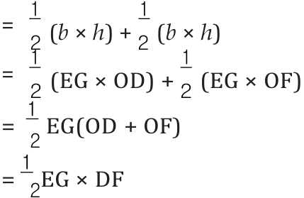
> **[Diagram Context - Textbook_Mathematics_Gr9_Area-and-perimeter-of-2D-shapes.pdf-0008-03.png]**
> This mathematical derivation demonstrates the algebraic summation of two triangle areas using the variables $b$, $h$, $EG$, $OD$, $OF$, and $DF$. It illustrates the distributive property and geometric substitution, showing how the sum of two smaller triangles sharing a common base ($EG$) can be simplified into the area formula for a single larger triangle.

2. Now copy Steps 2 to 4 and fill in the missing words.

   **Step 1:** Choose a point anywhere on the line. Make a small mark on the line. (You don't always have a choice here. Sometimes you must use a specific point on the line.)

   **Step 2:** Place the protractor with its **\_\_\_\_\_\_\_\_\_\_\_\_\_\_\_** on the line and its origin exactly on top of the **\_\_\_\_\_\_\_\_\_\_\_\_\_\_\_\_\_\_\_\_\_**

   **Step 3:** Make a small, clear mark at the **\_\_\_\_\_\_\_\_\_\_\_\_\_\_\_\_\_\_\_\_\_\_\_\_\_\_\_\_**

   **Step 4:** Use a ruler to line up the two **\_\_\_\_\_\_\_\_\_\_\_\_** and draw a straight line that passes exactly through them.

3. Copy the line below and use it to construct the angles listed below. The line below will be one arm of the angles you are going to construct. The vertex for each of your angles is the point labelled $0$ where the tiny vertical line cuts the long horizontal one. Your angles must be measured *anticlockwise* from the line.

   > **Angle direction**
   > The line you have been given below is called a **reference line**.
   > Mathematicians usually measure angles **anticlockwise** from the reference line.

   (a) $23^\circ$  
   (b) $45^\circ$  
   (c) $65^\circ$  
   (d) $79^\circ$  
   (e) $90^\circ$  
   (f) $121^\circ$  
   (g) $154^\circ$  
   (h) $180^\circ$  
   (i) $200^\circ$  
   (j) $270^\circ$  
   (k) $300^\circ$

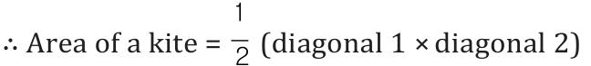
> **[Diagram Context - Textbook_Mathematics_Gr9_Area-and-perimeter-of-2D-shapes.pdf-0008-05.png]**
> This text-based graphic presents the mathematical formula for calculating the area of a kite, specifically using the variables "diagonal 1" and "diagonal 2." It serves as a concise reference for learners to understand that the area is derived by finding half the product of the lengths of the two diagonals.

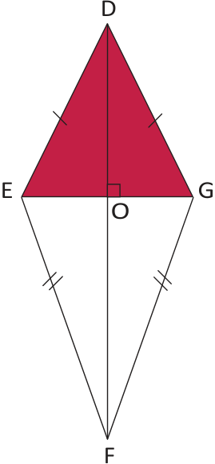
> **[Diagram Context - Textbook_Mathematics_Gr9_Area-and-perimeter-of-2D-shapes.pdf-0008-06.png]**
> This geometry figure illustrates a kite-shaped quadrilateral with vertices D, E, F, and G, featuring a central diagonal DF that perpendicularly bisects the horizontal diagonal EG at point O. The diagram uses tick marks to indicate equal side lengths (DE=DG and FE=FG) and a right-angle symbol at O to demonstrate the properties of diagonals in a kite. This visual aids learners in understanding Euclidean geometry theorems regarding the symmetry, perpendicularity, and congruence of triangles within quadrilaterals.

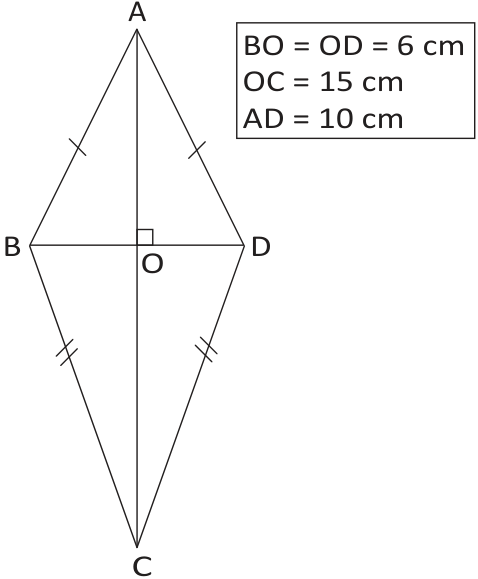
> **[Diagram Context - Textbook_Mathematics_Gr9_Area-and-perimeter-of-2D-shapes.pdf-0008-09.png]**
> This geometry figure depicts a kite (quadrilateral ABCD) with diagonals intersecting at point O, indicated by a right-angle symbol and side-length markings. The diagram provides specific values for segments BO, OD, OC, and AD, requiring students to apply the Pythagorean theorem and properties of kites to calculate unknown side lengths or areas.

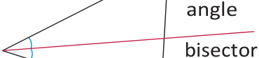
> **[Diagram Context - Textbook_Mathematics_Gr9_Construction-of-geometric-figures.pdf-0008-02.png]**
> This geometry figure illustrates an angle being divided by a red line labeled "bisector." It visually demonstrates the concept of an angle bisector, which is a ray that divides an angle into two congruent, equal parts.

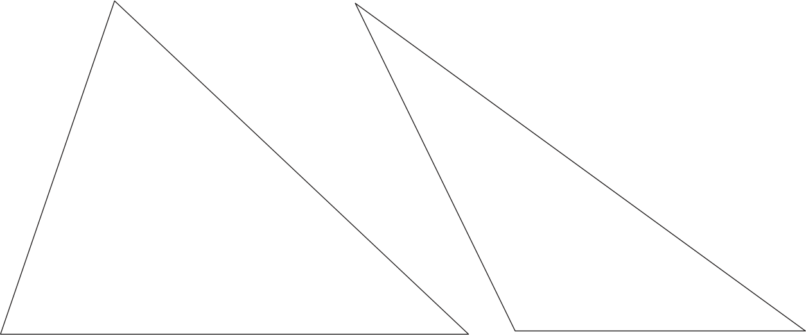
> **[Diagram Context - Textbook_Mathematics_Gr9_Construction-of-geometric-figures.pdf-0008-06.png]**
> This geometry figure displays two distinct scalene triangles with no visible labels, variables, or markings. It serves as a foundational visual aid for Grade 10-12 learners to practice identifying properties of congruence or similarity by measuring side lengths and interior angles.

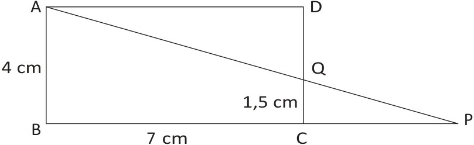
> **[Diagram Context - Textbook_Mathematics_Gr9_Pythagoras-Theorem.pdf-0008-00.png]**
> This geometry figure displays a rectangle ABCD with an extended base line segment BCP and a transversal line AP intersecting side CD at point Q. The diagram includes vertices A, B, C, D, P, and Q, with specified lengths of 4 cm for AB, 7 cm for BC, and 1,5 cm for CQ. It serves as a visual aid for applying Euclidean geometry principles, such as similar triangles or intercept theorems, to calculate unknown lengths or ratios within composite geometric shapes.

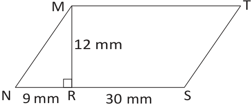
> **[Diagram Context - Textbook_Mathematics_Gr9_Pythagoras-Theorem.pdf-0008-07.png]**
> This geometry figure displays a parallelogram labeled MNTS with an altitude MR dropped to the base NS. The diagram includes the vertices M, N, T, R, and S, with specific measurements provided for the height (12 mm) and the segments of the base (9 mm and 30 mm). It serves as a visual aid for calculating the area of a parallelogram by identifying the total base length (NS = 39 mm) and the corresponding perpendicular height.

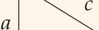

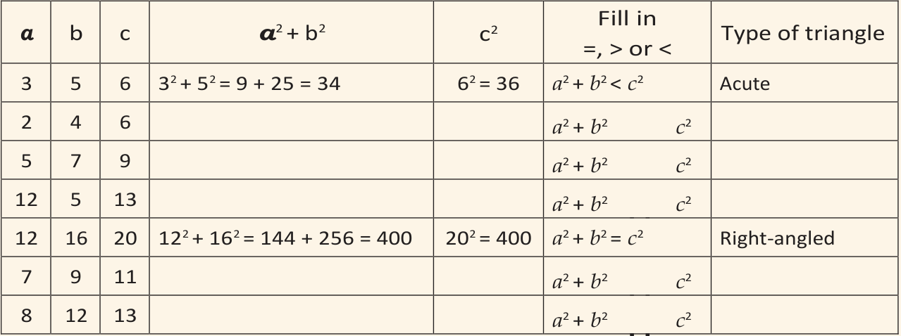
> **[Diagram Context - Textbook_Mathematics_Gr9_Pythagoras-Theorem.pdf-0008-16.png]**
> This table presents a mathematical exercise using the variables $a$, $b$, and $c$ to investigate the relationship between the squares of triangle side lengths. By comparing the sum $a^2 + b^2$ to $c^2$, the table guides students to classify triangles as acute, right-angled, or obtuse based on the converse of the Pythagorean theorem.

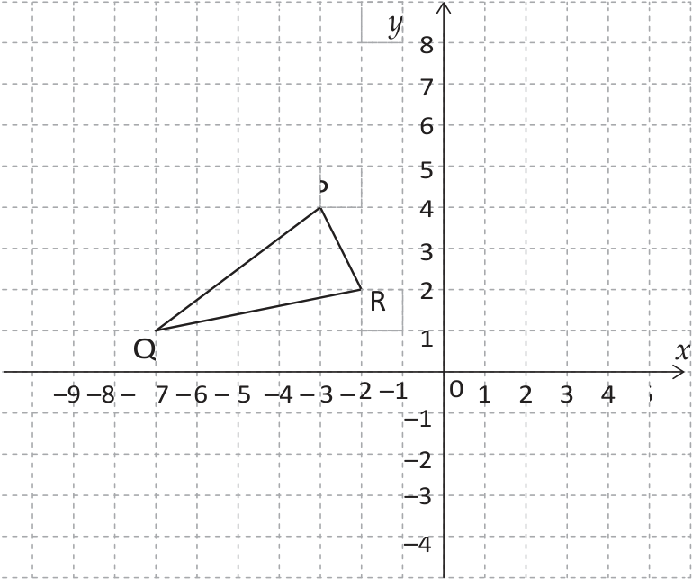
> **[Diagram Context - Textbook_Mathematics_Gr9_Transformation-geometry.pdf-0008-04.png]**
> This graphic displays a triangle plotted on a Cartesian plane with labeled vertices P, Q, and R and axes marked as x and y. It serves as a foundational tool for Grade 10-12 Analytical Geometry, allowing students to identify coordinate points, calculate lengths, gradients, and perform geometric transformations.

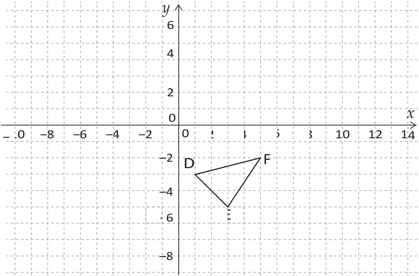
> **[Diagram Context - Textbook_Mathematics_Gr9_Transformation-geometry.pdf-0008-08.png]**
> This Cartesian plane displays a triangle with vertices labeled D, E, and F, plotted against x and y axes with a grid background. The diagram serves as a foundational tool for Grade 10-12 Analytical Geometry, allowing students to determine coordinates, calculate side lengths, gradients, and perform geometric transformations.

---

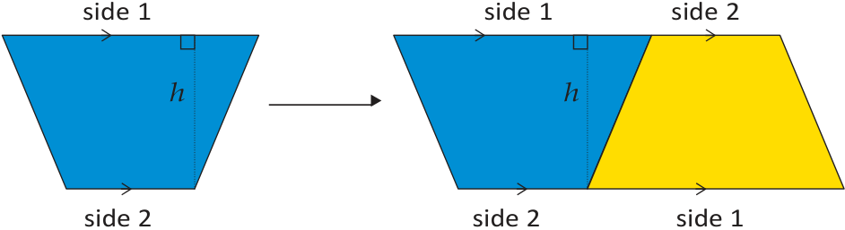
> **[Diagram Context - Textbook_Mathematics_Gr9_Area-and-perimeter-of-2D-shapes.pdf-0009-00.png]**
> This geometry figure illustrates the derivation of the area formula for a trapezium by rearranging two identical trapeziums into a single parallelogram. The diagram labels the parallel sides as "side 1" and "side 2," the perpendicular height as "h," and uses arrows to indicate parallel lines. Conceptually, it demonstrates that the area of a trapezium is half the area of a parallelogram with base (side 1 + side 2) and height h, leading to the formula Area = ½(a + b)h.

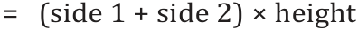

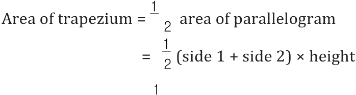
> **[Diagram Context - Textbook_Mathematics_Gr9_Area-and-perimeter-of-2D-shapes.pdf-0009-04.png]**
> This text-based graphic presents the mathematical formula for calculating the area of a trapezium, explicitly relating it to the area of a parallelogram. It uses the labels "Area of trapezium," "area of parallelogram," "side 1," "side 2," and "height" to demonstrate how the geometric properties of parallel sides and perpendicular height derive the standard area calculation.

> **[Diagram Context - Textbook_Mathematics_Gr9_Area-and-perimeter-of-2D-shapes.pdf-0009-05.png]**
> This text-based graphic presents the mathematical formula for calculating the area of a trapezium, specifically identifying the components as the "sum of parallel sides" and the "perp. height." It serves as a foundational reference for high school geometry, reinforcing the requirement to use the perpendicular height rather than the slanted side lengths when calculating the area of this quadrilateral.

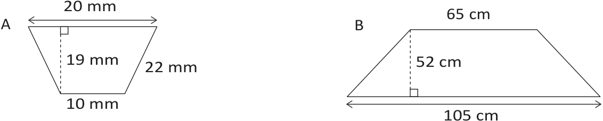
> **[Diagram Context - Textbook_Mathematics_Gr9_Area-and-perimeter-of-2D-shapes.pdf-0009-07.png]**
> This geometry figure displays two trapezoids, labeled A and B, with dimensions provided for their parallel sides and perpendicular heights. The diagram uses labels (20 mm, 10 mm, 19 mm, 22 mm, 65 cm, 105 cm, 52 cm) and right-angle symbols to define the geometric properties of these shapes. It serves as a practical exercise for students to apply the area formula for a trapezoid, $Area = \frac{1}{2}(a + b)h$, while reinforcing the importance of unit consistency and identifying the correct height measurement.

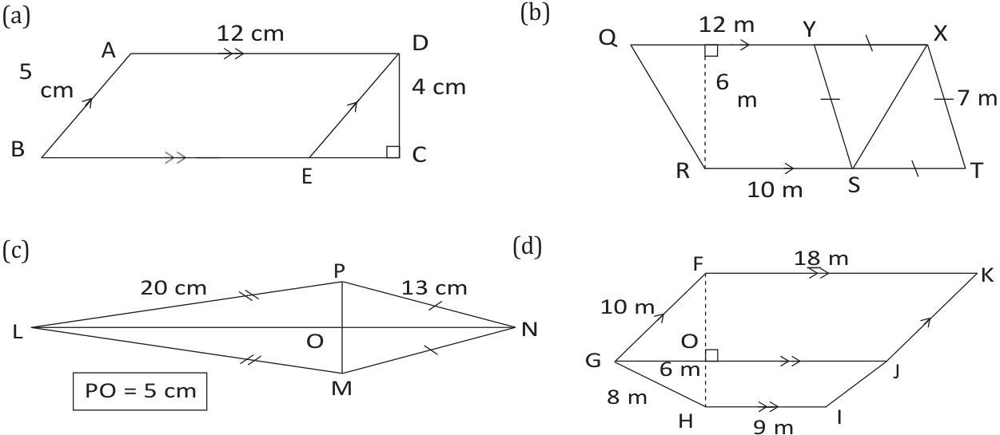
> **[Diagram Context - Textbook_Mathematics_Gr9_Area-and-perimeter-of-2D-shapes.pdf-0009-10.png]**
> This graphic presents four geometric figures—a trapezoid, a parallelogram, a kite, and a composite polygon—labeled (a) through (d) with various side lengths, perpendicular heights, and parallel/equal side markers. It serves as a visual exercise for learners to apply properties of quadrilaterals and triangles to calculate perimeters, areas, or missing side lengths using the Pythagorean theorem and geometric reasoning.

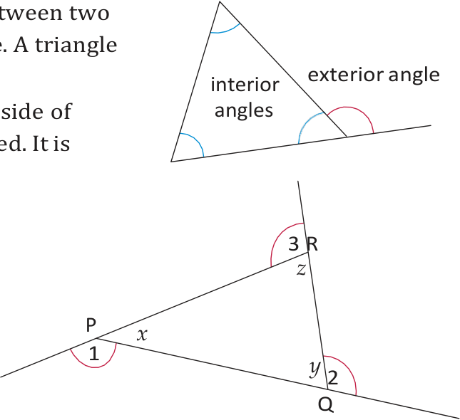
> **[Diagram Context - Textbook_Mathematics_Gr9_Construction-of-geometric-figures.pdf-0009-02.png]**
> This geometry figure illustrates the properties of interior and exterior angles of a triangle, using labels P, Q, R, variables x, y, z, and numbered angles 1, 2, and 3. It conceptually demonstrates the exterior angle theorem, which states that an exterior angle of a triangle is equal to the sum of the two opposite interior angles.

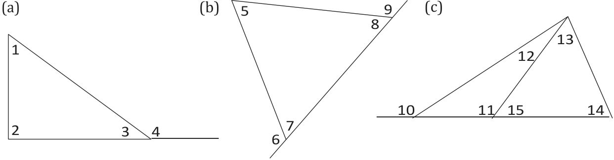
> **[Diagram Context - Textbook_Mathematics_Gr9_Construction-of-geometric-figures.pdf-0009-11.png]**
> This geometry figure displays three distinct triangle configurations labeled (a), (b), and (c), featuring numbered interior and exterior angles ranging from 1 to 15. The diagrams illustrate fundamental Euclidean geometry concepts, specifically the sum of interior angles, the exterior angle theorem, and angle relationships formed by intersecting lines, which are essential for solving riders in the CAPS Mathematics curriculum.

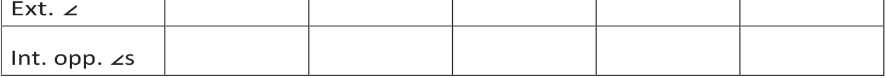
> **[Diagram Context - Textbook_Mathematics_Gr9_Construction-of-geometric-figures.pdf-0009-12.png]**
> This image is a table fragment used in Euclidean geometry to compare the properties of an exterior angle ("Ext. ∠") and interior opposite angles ("Int. opp. ∠s") of a triangle. It serves as a scaffold for students to record the relationship defined by the Exterior Angle Theorem, which states that the exterior angle of a triangle is equal to the sum of the two interior opposite angles.

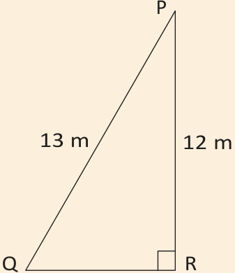
> **[Diagram Context - Textbook_Mathematics_Gr9_Pythagoras-Theorem.pdf-0009-03.png]**
> This graphic displays a right-angled triangle labeled PQR, with vertices P, Q, and R, a right-angle symbol at vertex R, and side lengths of 13 m for the hypotenuse (PQ) and 12 m for the vertical leg (PR). It serves as a foundational geometry problem requiring students to apply the Theorem of Pythagoras to calculate the length of the unknown base, QR.

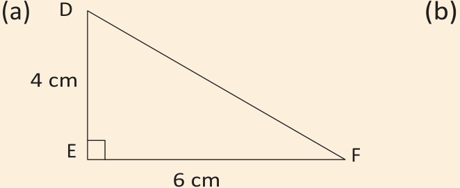
> **[Diagram Context - Textbook_Mathematics_Gr9_Pythagoras-Theorem.pdf-0009-04.png]**
> This geometry figure displays a right-angled triangle labeled DEF, with vertices D, E, and F, and a right-angle symbol at vertex E. The diagram provides the lengths of the two legs as 4 cm and 6 cm, serving as a foundational visual for learners to apply the Pythagorean theorem to calculate the length of the hypotenuse DF.

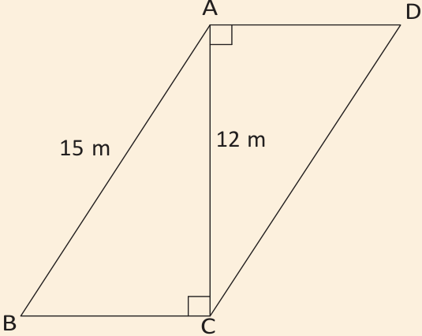
> **[Diagram Context - Textbook_Mathematics_Gr9_Pythagoras-Theorem.pdf-0009-08.png]**
> This geometry figure depicts a parallelogram ABCD with an internal altitude AC, labeled with vertices A, B, C, and D, side lengths of 15 m and 12 m, and two right-angle symbols. It illustrates the relationship between the base and perpendicular height of a parallelogram, providing the necessary dimensions for learners to calculate its area or apply the Pythagorean theorem to the constituent right-angled triangle ABC.

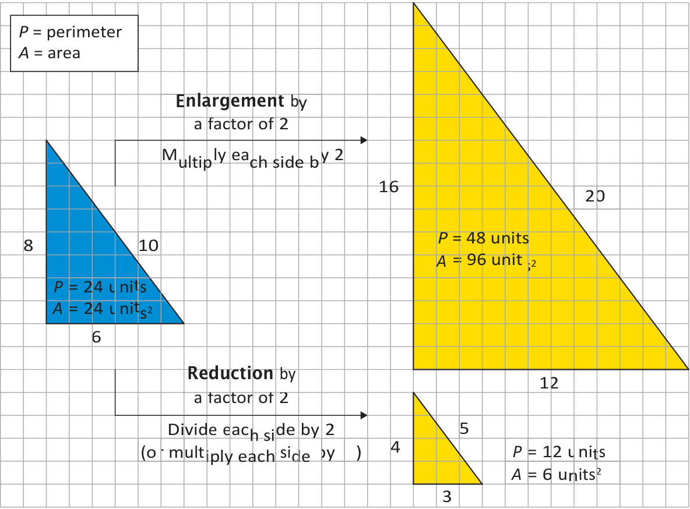
> **[Diagram Context - Textbook_Mathematics_Gr9_Transformation-geometry.pdf-0009-12.png]**
> This geometry figure illustrates the effects of enlargement and reduction on right-angled triangles using a grid-based coordinate system. It displays side lengths (6, 8, 10, 12, 16, 20, 3, 4, 5), perimeters ($P$), and areas ($A$) to demonstrate how scaling side lengths by a factor of $k$ affects perimeter by $k$ and area by $k^2$. The diagram conceptually reinforces the CAPS curriculum topic of similarity and transformation geometry by showing that while perimeter scales linearly, area scales quadratically.

---

4. Copy the line on the right. Then at each end, draw lines at an angle of $60^{\circ}$ to form a triangle. What sort of triangle is this?

5. Copy and complete the quadrilateral below. The angle at P must be $52^{\circ}$ and the one at Q, must be $23^{\circ}$.

---

## 4.5 Parallel and perpendicular lines

**Perpendicular lines** meet each other at an angle of $90^{\circ}$.

The sketch shows two perpendicular lines.
We say: AB is perpendicular to DC.

We write: $AB \perp DC$

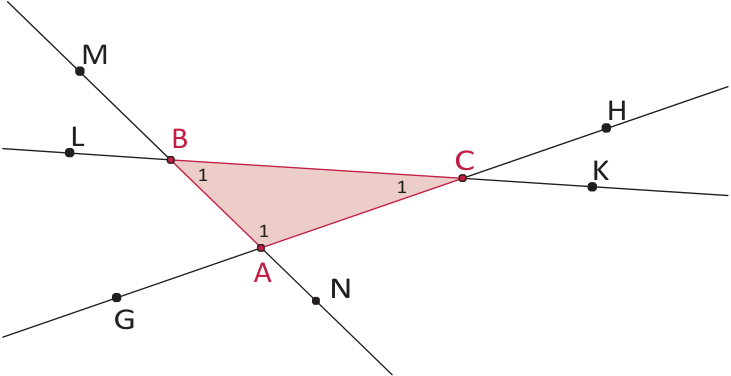

**Parallel lines** never meet each other. They are an equal distance apart. They have the same direction.
The sketch shows two parallel lines.
We say: PQ is parallel to RS.

We write: $PQ \parallel RS$

The arrows on the middle of the lines show that the lines are parallel to each other.

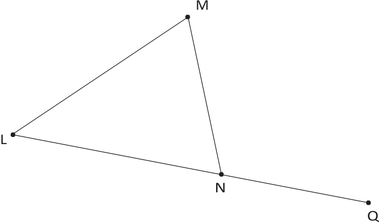

### constructing perpendicular and parallel lines

When constructing parallel lines, remember that the lines always stay the same distance apart. Follow the steps on page 67 to draw perpendicular and parallel lines using a protractor and a ruler.

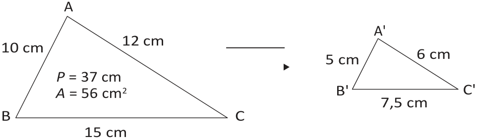

---

# Chapter 4: Construction of Geometric Figures

## 1. Drawing a Parallel Line Passing Through a Given Point

We want to draw a line that is parallel to $XY$ and that passes through point $A$.

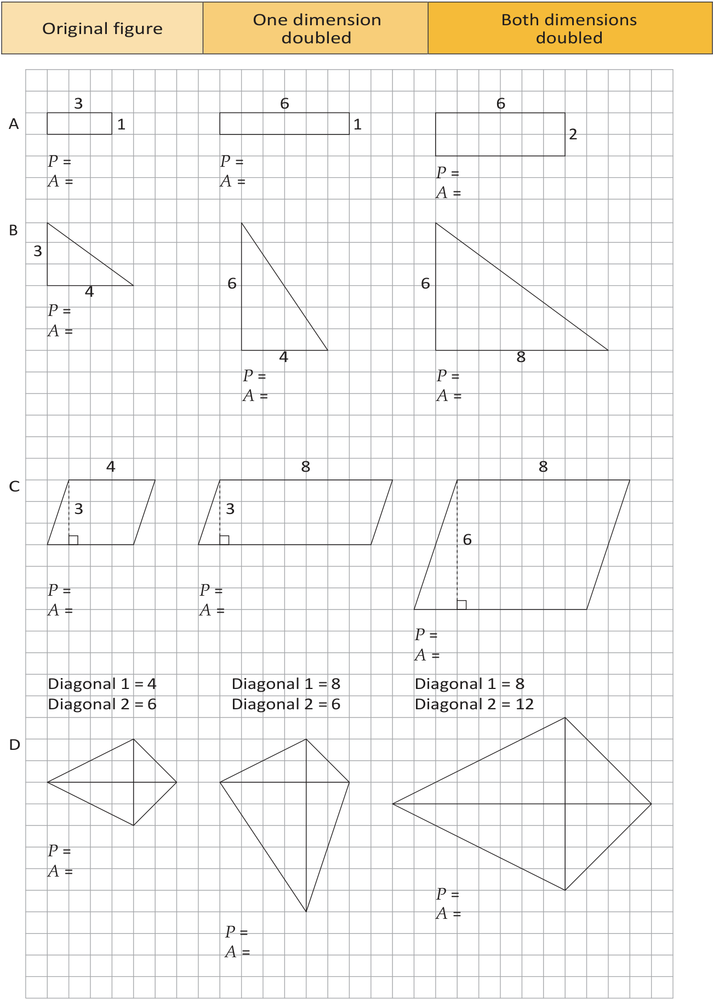
> **[Diagram Context - Textbook_Mathematics_Gr9_Area-and-perimeter-of-2D-shapes.pdf-0011-00.png]**
> This geometry figure displays a grid-based comparison of rectangles, triangles, parallelograms, and kites across three scenarios: original dimensions, one dimension doubled, and both dimensions doubled. It utilizes labels for side lengths, heights, and diagonals, alongside placeholders for perimeter ($P$) and area ($A$) calculations. The diagram conceptually illustrates how scaling linear dimensions affects the perimeter and area of 2D shapes, helping learners understand the non-linear relationship between side length changes and area growth.

### Step 1: Draw a perpendicular line between $A$ and $XY$.

Copy the line $XY$ above. Use your protractor to draw a line that goes through $A$ and is at $90^\circ$ to $XY$. Label the point $C$ where your new line touches $XY$.

Look at the sketch on the right if you get stuck.

### Step 2: Measure the perpendicular distance between the point and the line.

Write down the length of $AC$.

### Step 3: Draw a point that is the same distance from the line.

Then draw another line that is perpendicular to line $XY$. Mark off the same length as $AC$ on that line. The sketch below shows what you must do.

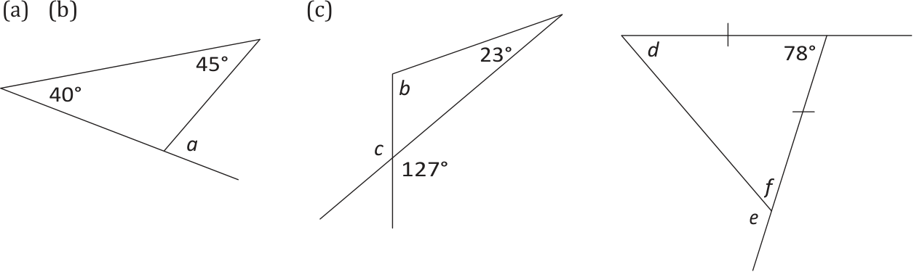
> **[Diagram Context - Textbook_Mathematics_Gr9_Construction-of-geometric-figures.pdf-0011-01.png]**
> This geometry figure displays three triangles labeled (a), (b), and (c) featuring interior and exterior angles, as well as side-length indicators. The diagrams include variables $a, b, c, d, e, f$ and specific angle measurements ($40^\circ, 45^\circ, 23^\circ, 127^\circ, 78^\circ$) alongside tick marks indicating equal sides. These problems test the learner's application of Euclidean geometry theorems, specifically the exterior angle of a triangle, vertically opposite angles, and the properties of isosceles triangles.

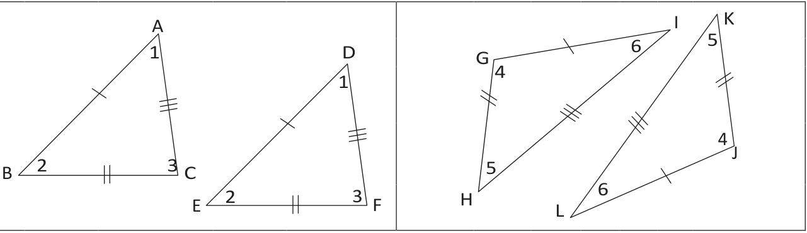
> **[Diagram Context - Textbook_Mathematics_Gr9_Construction-of-geometric-figures.pdf-0011-04.png]**
> This geometry figure displays two pairs of triangles, labeled ABC/DEF and GHI/KLJ, marked with specific side-length indicators (single, double, and triple tick marks) and numbered interior angles. It illustrates the concept of congruent triangles, demonstrating how corresponding sides and angles can be identified to prove congruence using standard Euclidean geometry criteria such as SSS (Side-Side-Side).

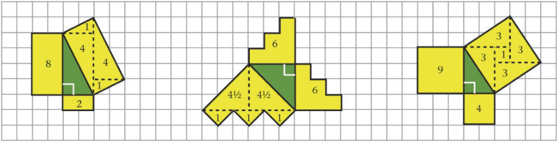
> **[Diagram Context - Textbook_Mathematics_Gr9_Pythagoras-Theorem.pdf-0011-09.png]**
> This geometric figure displays three right-angled triangles on a grid, each surrounded by squares or decomposed shapes labeled with numerical area values. By using dissection and rearrangement, the diagram visually demonstrates the Pythagorean theorem ($a^2 + b^2 = c^2$) by showing that the combined area of the squares on the two shorter sides equals the area of the square on the hypotenuse.

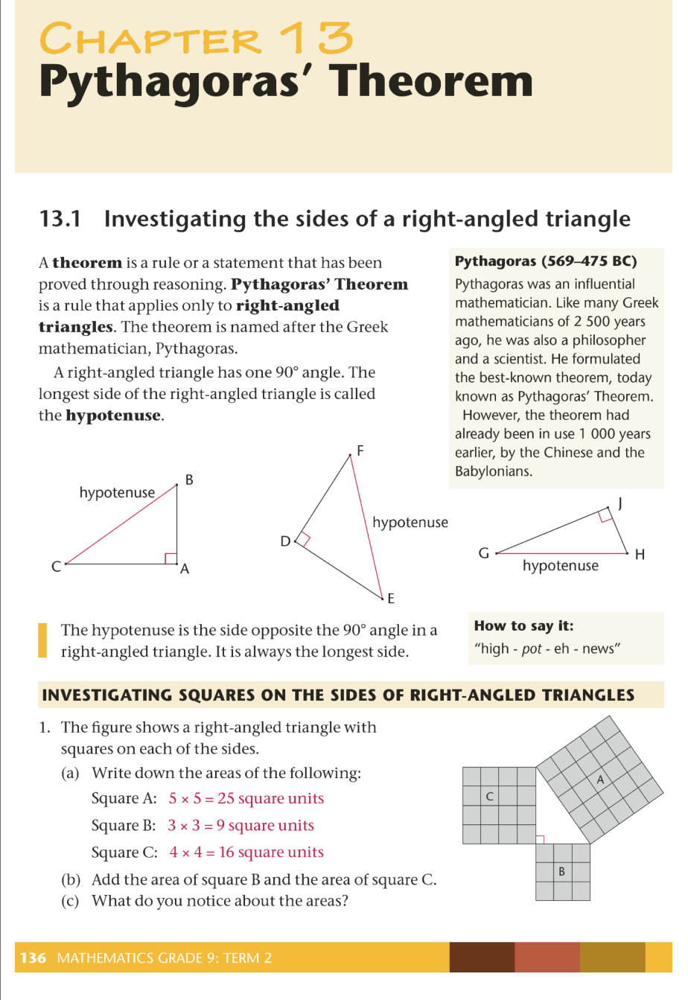
> **[Diagram Context - Textbook_Mathematics_Gr9_Pythagoras-Theorem.pdf-0011-18.png]**
> This graphic features geometric figures of right-angled triangles labeled with vertices (A, B, C, D, E, F, G, H, J) and the term "hypotenuse," alongside a grid-based diagram illustrating squares attached to the sides of a triangle labeled A, B, and C. It introduces Grade 9 learners to the definition of the hypotenuse and provides a visual, area-based investigation to help students derive the relationship between the squares of the sides in a right-angled triangle.

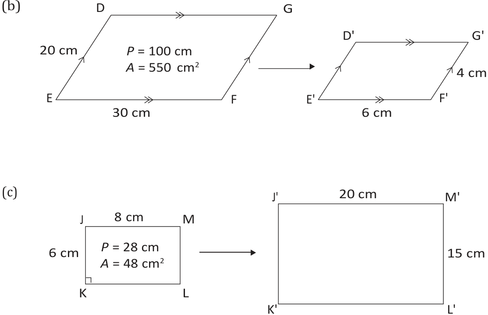
> **[Diagram Context - Textbook_Mathematics_Gr9_Transformation-geometry.pdf-0011-00.png]**
> This figure displays two sets of geometric shapes, parallelograms (DEFG to D'E'F'G') and rectangles (JKLM to J'K'L'M'), labeled with side lengths, perimeters ($P$), and areas ($A$). It illustrates the concept of geometric enlargement by showing how side lengths scale by a constant factor, while highlighting that perimeter and area do not scale proportionally in the same way. This helps learners understand the relationship between scale factors and the resulting changes in the dimensions, perimeters, and areas of similar polygons.

---

### Step 4: Draw the parallel line.

Join $A$ with the new point that is an equal distance away from $XY$. 

You now have a parallel line.

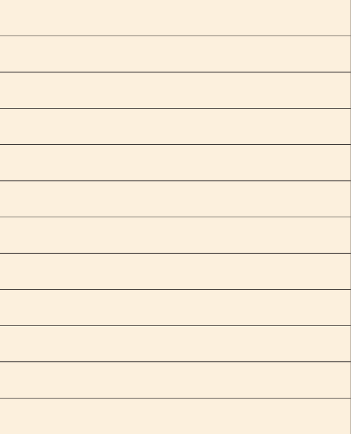

2. Practise constructing perpendicular and parallel lines using a protractor and a ruler.

---

## 4.6 Circles are very special figures

And now for something slightly different... let us have a look at **circles**.

### A circle with string

You may need to work with a partner here. You need two sharp pencils and a short length of string, an A4 sheet of paper and a ruler.

1. Tie the string to both pencils with double knots. The knots must be firm but not tight. The string must swing easily around the pencils without falling off. Once you have tied your string, the distance between the pencils when the string is tight should not be more than $8\text{ cm}$.
2. Your partner must hold one pencil *vertically* with its point near the centre of the sheet of paper.
3. Now carefully move the tip of the other pencil around the middle one, drawing as you go. Try to keep the string *stretched* and the pencil *vertical* as you draw. 

   If you have been careful, you will have drawn a circle (well, hopefully something pretty close to a circle). You can swop now so your partner also has a turn drawing while you hold the centre pencil.
4. Mark three points on the circle line. Measure the distance between the point and the centre of the circle for each. If you have a circle you should find that the distances are the same.

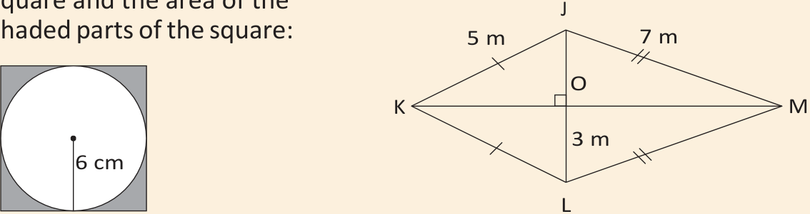
> **[Diagram Context - Textbook_Mathematics_Gr9_Area-and-perimeter-of-2D-shapes.pdf-0012-06.png]**
> This graphic presents two geometry figures: a circle inscribed in a square with a radius of 6 cm, and a kite labeled JKML with side lengths of 5 m and 7 m, an internal segment of 3 m, and perpendicular diagonals intersecting at O. These diagrams test the learner's ability to apply area and perimeter formulas for composite shapes and quadrilaterals, requiring the use of circle properties and the Pythagorean theorem to solve for unknown dimensions.

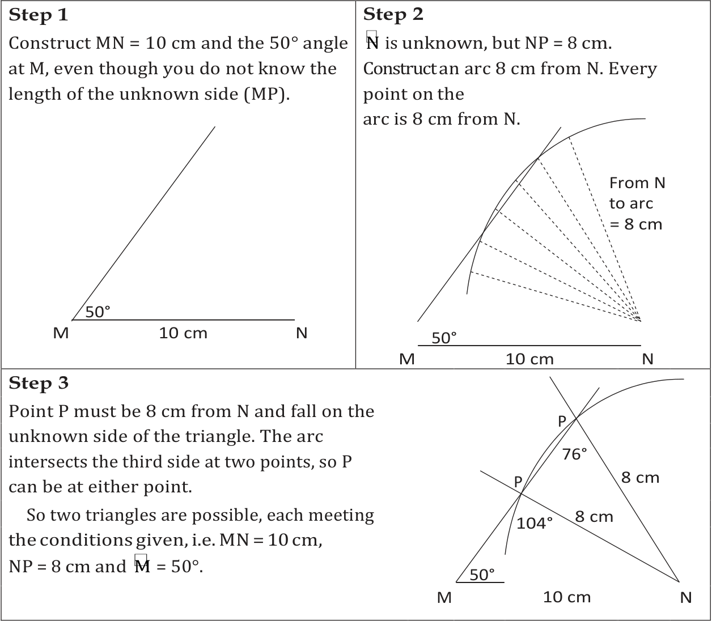
> **[Diagram Context - Textbook_Mathematics_Gr9_Construction-of-geometric-figures.pdf-0012-09.png]**
> This geometric construction figure illustrates the ambiguous case of the sine rule using points M, N, and P, with labels for side lengths (10 cm, 8 cm) and angles (50°, 76°, 104°). It demonstrates how an arc of a fixed radius from point N can intersect an unknown side at two distinct points, conceptually proving that two different triangles can be formed under the given side-side-angle (SSA) conditions.

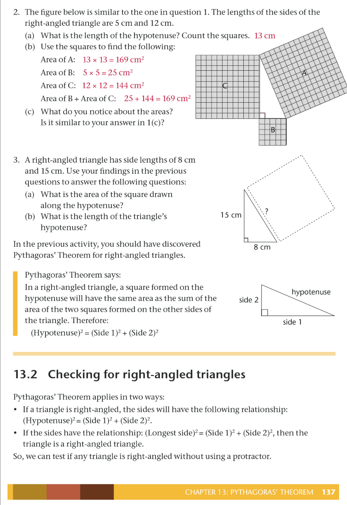
> **[Diagram Context - Textbook_Mathematics_Gr9_Pythagoras-Theorem.pdf-0012-18.png]**
> This geometry figure illustrates the geometric proof of Pythagoras' Theorem using right-angled triangles with squares constructed on each side, labeled with variables such as "side 1," "side 2," and "hypotenuse." By calculating and comparing the areas of these squares, the diagram conceptually demonstrates that the square of the hypotenuse is equal to the sum of the squares of the other two sides, providing a visual foundation for algebraic application.

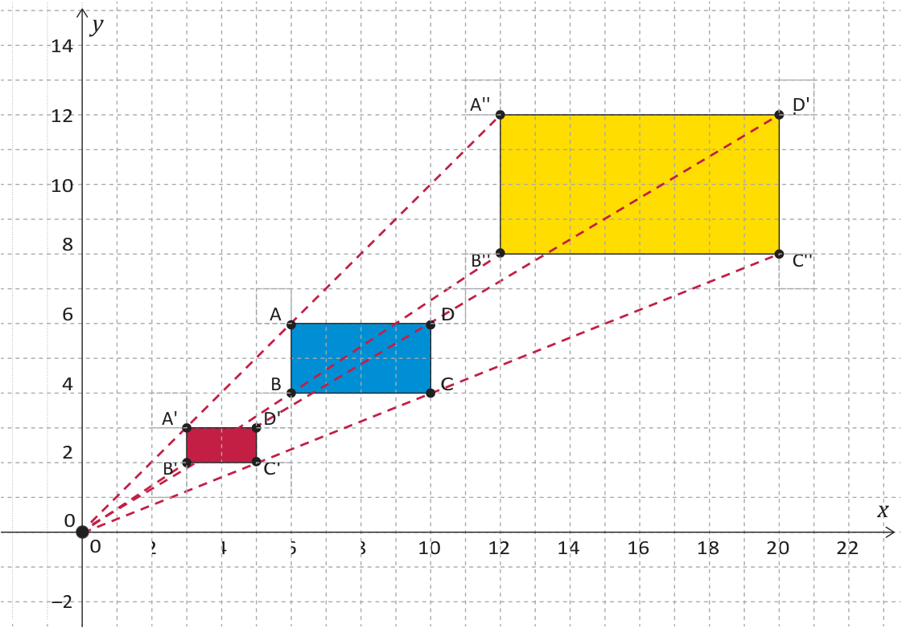
> **[Diagram Context - Textbook_Mathematics_Gr9_Transformation-geometry.pdf-0012-04.png]**
> This Cartesian plane displays three rectangles labeled with vertices (A', B', C', D'), (A, B, C, D), and (A'', B'', C'', D'') connected by dashed lines to the origin (0,0). The diagram illustrates the concept of geometric enlargement (dilation) from the origin, showing how the coordinates of the vertices scale proportionally as the shape increases in size while maintaining its orientation and shape.

---

# Chapter 4: Construction of Geometric Figures

Circles are special for many reasons. The most important reason is the following:

**The distance from the centre of a circle to the edge is the same in any direction.**

This distance is called the **radius**.
* We pronounce this: "ray-dee-us".
* The plural of **radius** is **radii**.
* We pronounce this: "ray-dee-eye".

---

## Think About It

Can you think of any other figure where the distance between the centre and the edge is constant in all directions?
* A square?
* A hexagon?
* What about an oval shape (ellipse)?

Do some investigation to see what you can find.

---

Do you agree that the two pencils and string are not a good way to draw circles? The string is stretchy. It is difficult to change the radius. And, the drawing pencil can wander off course and make a spiral or a wobbly curve. We need something better.

## 4.7 Using the Compass

We need a special instrument for drawing circles. It must have a pointy tip, like the centre pencil. It must also have a drawing tip, like the pencil you moved. If you can set the distance between these two tips, you can draw circles of any radius. This instrument is called a **pair of compasses**, or often just a **compass**.

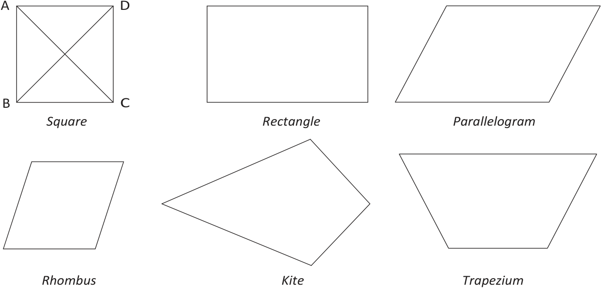
> **[Diagram Context - Textbook_Mathematics_Gr9_Construction-of-geometric-figures.pdf-0013-07.png]**
> This geometry figure displays six distinct quadrilaterals labeled as Square (with vertices A, B, C, D and diagonals), Rectangle, Parallelogram, Rhombus, Kite, and Trapezium. It serves as a visual reference for learners to identify the defining characteristics and unique properties of various polygons, which is essential for mastering Euclidean geometry proofs and classification in the CAPS curriculum.

*(Labels from diagram description:)*
* **Centre of your circle:** This is the point that goes at the centre of your circle. The pencil tip must turn around this point.
* **Handle:** Here is the handle of the compass. You hold it between your forefinger and thumb. Only use one hand when you draw a circle. **Turn the compass by twisting it between your forefinger and thumb.**
* **Radius:** This gap will be the radius of your circle. You can set the gap to the correct radius using your ruler. Change the gap by changing the angle between the arms of the compass.
* **Pencil clamp:** Clamp your **sharpened** pencil tightly in here. The tip of the pencil must be next to the tip of the turning point when you push the arms together.

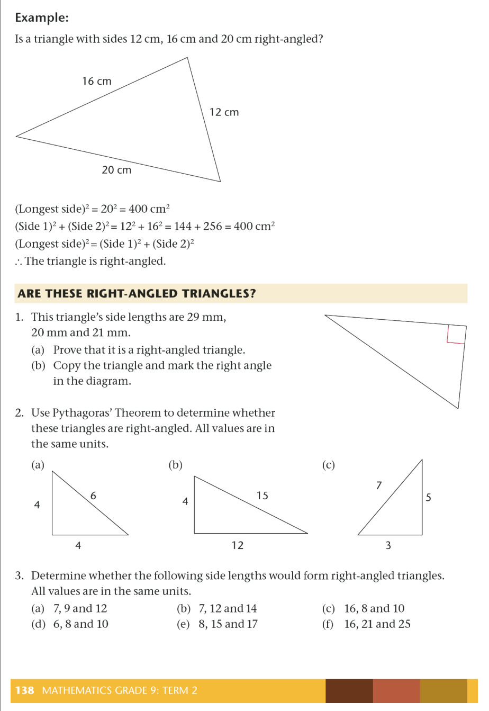
> **[Diagram Context - Textbook_Mathematics_Gr9_Pythagoras-Theorem.pdf-0013-18.png]**
> This geometry worksheet features multiple triangles with labeled side lengths and a right-angle symbol, designed to test the application of the converse of the Pythagorean Theorem. It guides students through the process of verifying whether a triangle is right-angled by checking if the square of the longest side equals the sum of the squares of the other two sides.

---

## Constructing Circles with a Compass

1. You will see a point labelled $\text{A}$ below. Follow the steps below and on the next page to draw a circle with a radius of $2\text{ cm}$. The centre must be at $\text{A}$.

    * **Step 1:** Place the pointed tip on the zero line of your ruler. Carefully widen the angle between the arms. Move the pencil tip until it is exactly at $2\text{ cm}$. Make sure that the pointed tip is still on zero. Be careful not to change the gap once it is set to $2\text{ cm}$.
    * **Step 2:** Mark point $\text{A}$ in the centre of your page. Gently push the pointed tip into point $\text{A}$. Push just deep enough into the paper to keep it in place. This will be the centre of your circle.

    

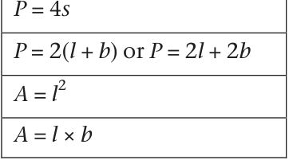
> **[Diagram Context - Textbook_Mathematics_Gr9_Area-and-perimeter-of-2D-shapes.pdf-0014-05.png]**
> This table presents mathematical formulas for calculating the perimeter ($P$) and area ($A$) of squares and rectangles, using variables $s$ for side length, $l$ for length, and $b$ for breadth. It serves as a foundational reference for learners to distinguish between the specific formulas for squares ($P=4s, A=l^2$) and the general formulas for rectangles ($P=2(l+b), A=l \times b$).

    * **Step 3:** Hold the handle between the forefinger and thumb of your writing hand. Keep your other hand out of the way. Use only one hand when you draw a circle with a compass.
    * **Step 4:** Twist the handle between your thumb and forefinger. If you are right-handed, it is easiest to twist the compass clockwise. If you are left-handed, turn the compass anticlockwise. Let the pencil tip *drag* over the paper. Don't push down too hard on the pencil. Rather, push down lightly on the pointed arm as you draw. The pencil tip must move smoothly and easily.

2. Then draw concentric circles at centre $\text{A}$ with radii of $3\text{ cm}$, $4\text{ cm}$, $5\text{ cm}$ and $6\text{ cm}$. Set the gap carefully each time. Write the radius on the edge of each circle.

> **concentric circles** have the same midpoint.

> Learning to use a compass is like learning to ride a bicycle. It takes co-ordination and practice. Don't be embarrassed if it goes wrong. With practice you will get very good at it. If your circles end up being all wobbly lines, just begin again!

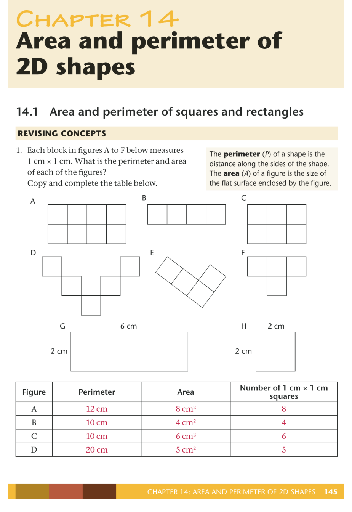
> **[Diagram Context - Textbook_Mathematics_Gr9_Area-and-perimeter-of-2D-shapes.pdf-0014-08.png]**
> This graphic presents a geometry exercise featuring various 2D shapes composed of unit squares (labeled A–F) and standard rectangles/squares (labeled G–H) alongside a summary table. It uses visual representations of grid-based figures to help students conceptually distinguish between perimeter (the boundary length) and area (the total surface space) by counting unit squares and their edges.

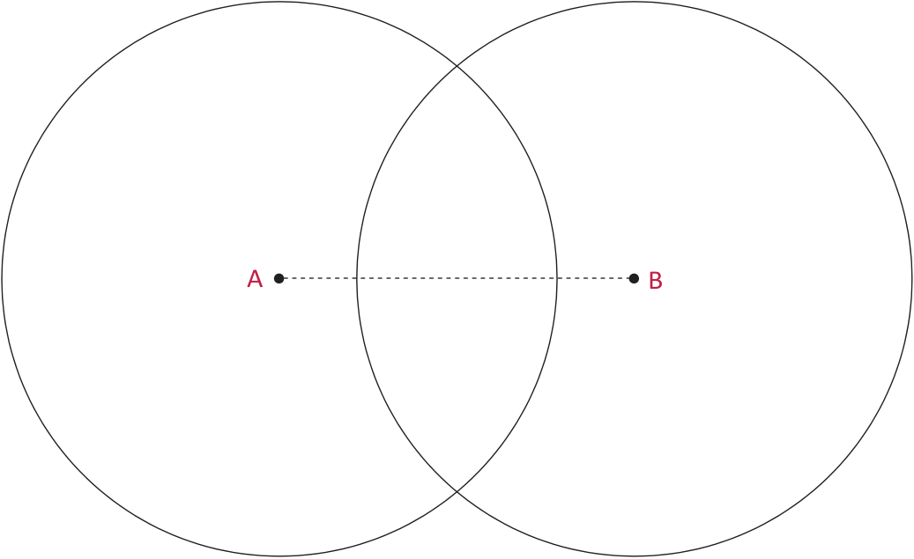
> **[Diagram Context - Textbook_Mathematics_Gr9_Construction-of-geometric-figures.pdf-0014-05.png]**
> This diagram illustrates the overlapping of two atomic orbitals, labeled with points A and B connected by a dashed line representing the internuclear axis. It conceptually demonstrates the formation of a covalent bond through the sharing of electron density in the region where the two spherical orbitals intersect.

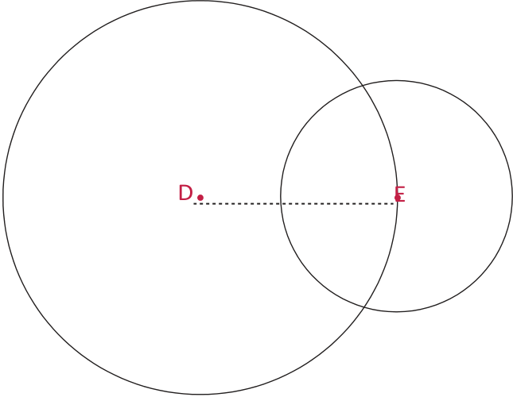
> **[Diagram Context - Textbook_Mathematics_Gr9_Construction-of-geometric-figures.pdf-0014-13.png]**
> This geometry figure displays two intersecting circles with centers labeled D and E, connected by a dashed line segment. It illustrates the fundamental geometric relationship between two circles, serving as a basis for high school learners to explore properties of radii, chords, and the distance between centers in Euclidean geometry.

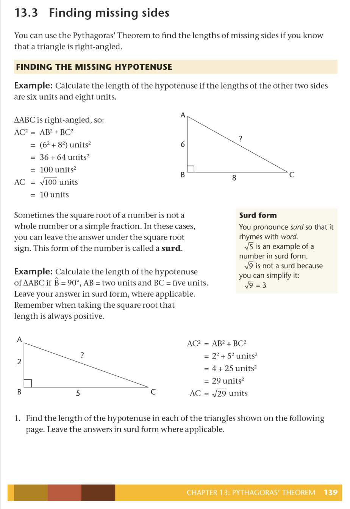
> **[Diagram Context - Textbook_Mathematics_Gr9_Pythagoras-Theorem.pdf-0014-14.png]**
> This educational resource features two geometry figures of right-angled triangles labeled with vertices A, B, and C, side lengths, and a right-angle symbol. It demonstrates the application of Pythagoras' Theorem ($AC^2 = AB^2 + BC^2$) to calculate the length of an unknown hypotenuse, specifically highlighting the process of expressing non-perfect square results in surd form.

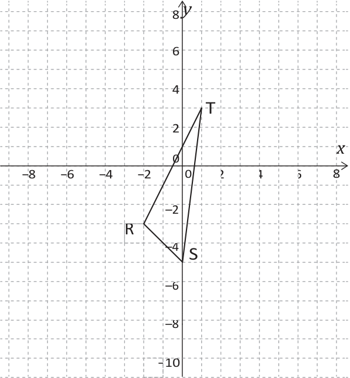
> **[Diagram Context - Textbook_Mathematics_Gr9_Transformation-geometry.pdf-0014-03.png]**
> This graphic displays a triangle RST plotted on a Cartesian plane with labeled x and y axes. The vertices are located at coordinates R(-2, -3), S(0, -5), and T(0.5, 3). This diagram serves as a foundational tool for analytical geometry, allowing students to practice calculating distance, midpoint, gradient, and area using coordinate geometry formulas.

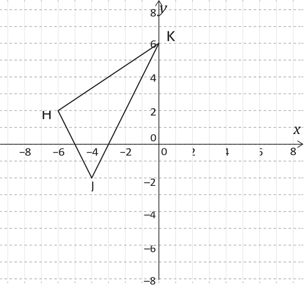
> **[Diagram Context - Textbook_Mathematics_Gr9_Transformation-geometry.pdf-0014-06.png]**
> This figure is a geometry plot on a Cartesian plane featuring a triangle with vertices labeled H, J, and K, and axes marked with x and y variables. It illustrates the application of analytical geometry, allowing students to determine coordinates, calculate side lengths using the distance formula, or find gradients and areas of the polygon.

---

# Chapter 4: Construction of Geometric Figures

## Here are some tips for drawing circles:

* If your circles are turning into spirals it is because the arms of your compass have moved. Check their width again against a ruler.
* If the arms of your compass won't stay in the position you set them at, it is because the nut at the hinge below the handle is loose. Ask your teacher to help you if you can't tighten it yourself.
* If you can't do the twist, imagine you have a small piece of soft clay between your thumb and forefinger and you are trying to roll it into a small strip. The twist for turning your compass uses the same type of sliding movement. Let the compass hang from your hand in the air and twist the handle. Then try it on scrap paper a few times until you can turn the compass easily.

## Circles on Circles

It's time to have some fun with the compass while getting better at using it. Follow these instructions to draw the beautiful pattern shown on the right in your exercise book.

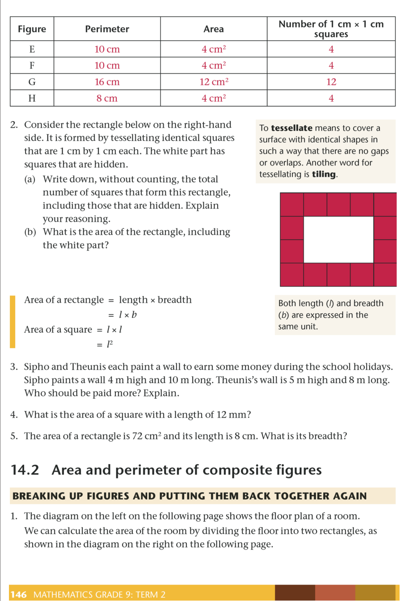
> **[Diagram Context - Textbook_Mathematics_Gr9_Area-and-perimeter-of-2D-shapes.pdf-0015-01.png]**
> This educational resource features a geometry exercise containing a data table, a visual representation of a tessellated rectangle with a central void, and mathematical formulas for calculating area. It guides learners through the conceptual relationship between unit squares, tessellation, and the derivation of area formulas for rectangles and squares. By applying these principles to practical problems, students develop the foundational skills required to calculate the area and perimeter of both simple and composite shapes.

1. Make sure your pencil is sharp; then place it in the compass.
2. Set the radius to $4\text{ cm}$. Draw a circle at the centre of your page. Important: your radius must stay the same for the whole activity.
3. Put your compass point anywhere on the circle edge. Draw another circle. This circle should pass through the centre of your first circle (they have the same radius).
4. Your second circle cuts the first circle at two points. Choose one of these points. Place your compass point at this point. Draw another circle of radius $4\text{ cm}$.
5. Repeat step 3 with your third circle, fourth circle etc. You should end up with six circles on your first circle. That is, seven circles in total.
6. Decorate it as you please. (You can decorate your pattern further by adding more circles or joining points with straight lines, and so on. See what patterns and shapes you can discover among all the circles.)

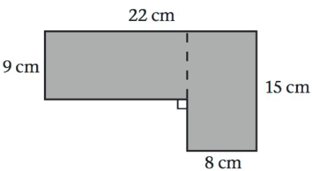
> **[Diagram Context - Textbook_Mathematics_Gr9_Area-and-perimeter-of-2D-shapes.pdf-0015-13.png]**
> This geometry figure represents a composite L-shaped polygon with side lengths labeled as 22 cm, 9 cm, 15 cm, and 8 cm, including a dashed line indicating a subdivision of the shape. It serves as a practical exercise for learners to calculate the area or perimeter of composite shapes by decomposing the figure into two simpler rectangles.

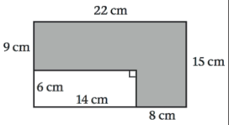
> **[Diagram Context - Textbook_Mathematics_Gr9_Area-and-perimeter-of-2D-shapes.pdf-0015-15.png]**
> This geometry figure displays a composite shape consisting of a large rectangle with a smaller rectangular section removed from its corner, labeled with dimensions of 22 cm, 15 cm, 9 cm, 6 cm, 14 cm, and 8 cm. It serves as a practical exercise for learners to calculate the area of a composite 2D shape by either subtracting the area of the smaller rectangle from the larger one or by partitioning the shaded region into smaller, manageable rectangles.

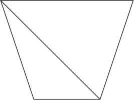
> **[Diagram Context - Textbook_Mathematics_Gr9_Construction-of-geometric-figures.pdf-0015-14.png]**
> This geometric figure is a trapezium divided into two triangles by a single diagonal line, with no specific labels or variables provided. It serves as a foundational visual aid for high school geometry, illustrating how complex polygons can be decomposed into simpler triangles to calculate area or apply trigonometric ratios.

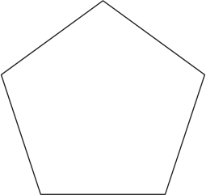
> **[Diagram Context - Textbook_Mathematics_Gr9_Construction-of-geometric-figures.pdf-0015-15.png]**
> This graphic is a simple geometric figure representing a regular pentagon, a polygon defined by five equal sides and five interior angles. In the context of the CAPS curriculum, this shape serves as a foundational element for exploring Euclidean geometry, including the calculation of interior and exterior angles, as well as the structural basis for organic molecules like the deoxyribose sugar found in DNA.

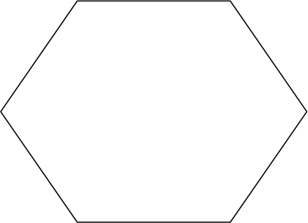
> **[Diagram Context - Textbook_Mathematics_Gr9_Construction-of-geometric-figures.pdf-0015-16.png]**
> This graphic is a simple geometric figure representing a regular hexagon, containing no labels, variables, or internal structures. In the CAPS curriculum, this shape serves as the foundational template for representing organic molecules like benzene rings or the basic structural unit of carbohydrates such as glucose in Life Sciences and Chemistry.

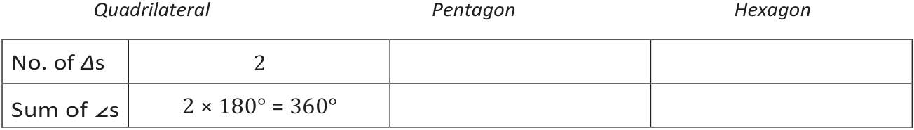
> **[Diagram Context - Textbook_Mathematics_Gr9_Construction-of-geometric-figures.pdf-0015-17.png]**
> This table is a geometry exercise comparing polygons (Quadrilateral, Pentagon, Hexagon) based on the number of triangles ($\Delta$s) they can be divided into and the resulting sum of their interior angles ($\angle$s). By identifying the relationship between the number of sides and the number of triangles, students learn to derive the general formula for the sum of interior angles of any $n$-sided polygon, which is $(n - 2) \times 180^\circ$.

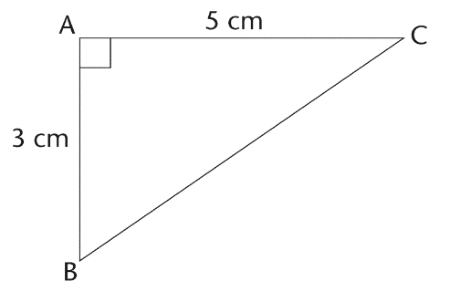
> **[Diagram Context - Textbook_Mathematics_Gr9_Pythagoras-Theorem.pdf-0015-07.png]**
> This geometry figure displays a right-angled triangle labeled with vertices A, B, and C, featuring a right-angle symbol at vertex A and side lengths of 3 cm and 5 cm for the two legs. It serves as a foundational visual aid for learners to apply the Theorem of Pythagoras to calculate the length of the hypotenuse, BC.

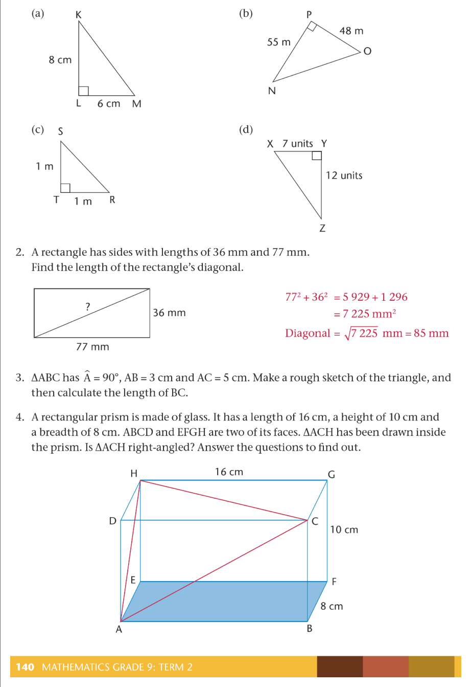
> **[Diagram Context - Textbook_Mathematics_Gr9_Pythagoras-Theorem.pdf-0015-11.png]**
> This graphic features a collection of right-angled triangles labeled (a) through (d), a worked example of a rectangle's diagonal, and a 3D rectangular prism with an internal triangle (ΔACH). It utilizes geometric vertices (e.g., K, L, M, P, N, O, S, T, R, X, Y, Z, A-H) and numerical side lengths to illustrate the application of the Pythagorean theorem. Conceptually, these exercises guide Grade 9 learners to identify right-angled triangles within 2D and 3D shapes to calculate unknown side lengths or verify geometric properties.

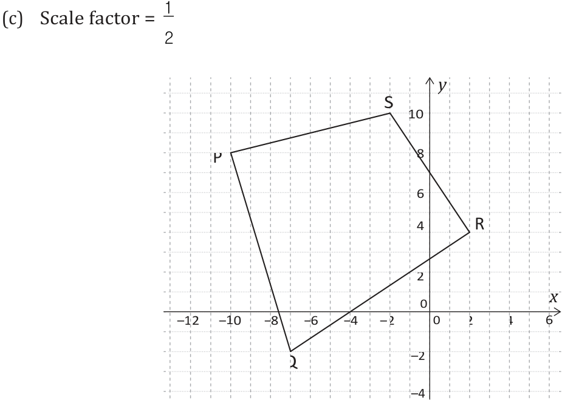
> **[Diagram Context - Textbook_Mathematics_Gr9_Transformation-geometry.pdf-0015-00.png]**
> This Cartesian plane diagram displays a quadrilateral with vertices labeled P, Q, R, and S, plotted against x and y axes with a grid background. The figure illustrates the concept of geometric transformation, specifically requiring the student to apply a scale factor of 1/2 to the coordinates of the vertices to perform an enlargement or reduction.

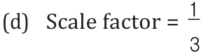
> **[Diagram Context - Textbook_Mathematics_Gr9_Transformation-geometry.pdf-0015-01.png]**
> This mathematical expression defines a scale factor of 1/3, represented by the label "(d)" and the fraction 1/3. In the context of CAPS geometry, this indicates a reduction transformation where the dimensions of an image are one-third the size of the original object.

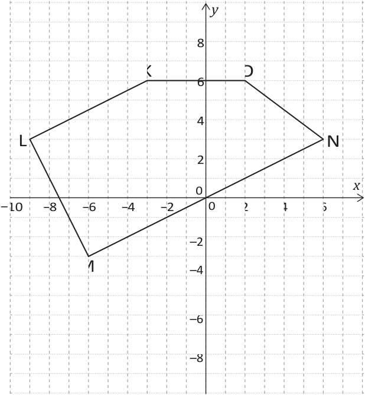
> **[Diagram Context - Textbook_Mathematics_Gr9_Transformation-geometry.pdf-0015-02.png]**
> This Cartesian plane displays a polygon with vertices labeled K, D, N, M, and L plotted against x and y axes. The diagram serves as a foundational tool for Grade 10-12 Analytical Geometry, requiring students to determine coordinates, calculate gradients, lengths, or midpoints of the line segments forming the polygon.

---

## 4.8 Using circles to draw other figures

### Geometric figures hiding in the circles

Below is a set of seven circles like the one you drew. Sit with a partner and try to find hidden polygons.

You will find these polygons by joining the points where the circles cut each other. The points will be the vertices of the polygons. Look carefully. There are triangles, quadrilaterals, pentagons and hexagons. When you can see them, neatly and carefully rule in their sides with a pencil. If there is not enough space on the set of circles below, redraw the circles on a separate piece of paper and show the figures there. If you wish, you can measure the angles at each vertex and the lengths of the sides.

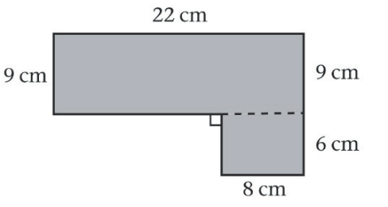
> **[Diagram Context - Textbook_Mathematics_Gr9_Area-and-perimeter-of-2D-shapes.pdf-0016-03.png]**
> This geometry figure depicts a composite L-shaped polygon with side lengths labeled as 22 cm, 9 cm, 9 cm, 6 cm, and 8 cm, including a dashed line indicating a perpendicular partition. The diagram serves as an exercise in calculating the area or perimeter of composite shapes by decomposing the polygon into two simpler rectangles.

### Arcs of circles

We do not have to draw whole circles to construct figures. We are only really interested in the points where the circles cross each other, so we could just draw arcs where they cross. Next year, you will use arcs in your geometric constructions.

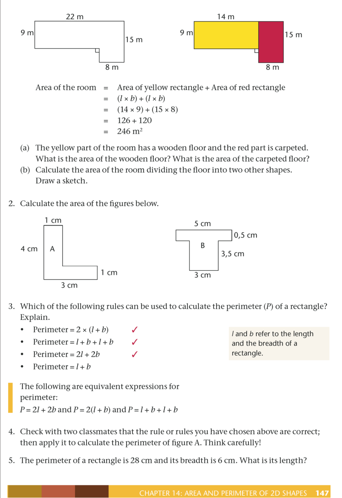
> **[Diagram Context - Textbook_Mathematics_Gr9_Area-and-perimeter-of-2D-shapes.pdf-0016-20.png]**
> This educational page features composite geometric figures (L-shaped and T-shaped polygons) labeled with dimensions in meters and centimeters, alongside algebraic expressions for calculating perimeter. It demonstrates the additive method for finding the area of complex shapes by decomposing them into simpler rectangles and reinforces the conceptual equivalence of various perimeter formulas. This resource supports learners in developing spatial reasoning and algebraic fluency required for calculating the area and perimeter of 2D shapes.

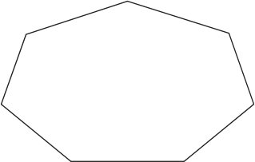
> **[Diagram Context - Textbook_Mathematics_Gr9_Construction-of-geometric-figures.pdf-0016-00.png]**
> This graphic is a geometric figure representing a heptagon, a polygon characterized by seven straight sides and seven interior angles. In the context of the CAPS mathematics curriculum, this shape serves as a fundamental visual aid for teaching the properties of polygons, including the calculation of interior angle sums and the identification of regular versus irregular shapes.

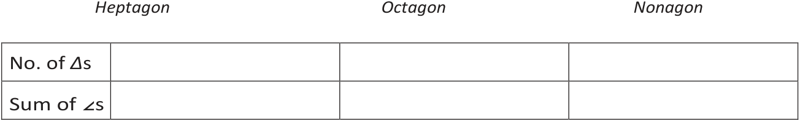
> **[Diagram Context - Textbook_Mathematics_Gr9_Construction-of-geometric-figures.pdf-0016-01.png]**
> This table is a geometry exercise designed to help learners derive the formula for the sum of interior angles of polygons. It features column headers for "Heptagon," "Octagon," and "Nonagon," with row labels for "No. of Δs" (number of triangles) and "Sum of ∠s" (sum of angles). By completing this table, students practice partitioning polygons into triangles to understand the relationship between the number of sides ($n$) and the total interior angle sum, expressed as $(n - 2) \times 180^\circ$.

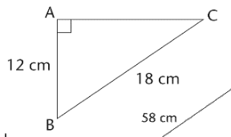
> **[Diagram Context - Textbook_Mathematics_Gr9_Pythagoras-Theorem.pdf-0016-11.png]**
> This geometry figure illustrates a right-angled triangle labeled ABC, with a right-angle symbol at vertex A and side lengths of 12 cm for AB and 18 cm for the hypotenuse BC. The diagram serves as a foundational exercise for applying the Theorem of Pythagoras or trigonometric ratios to calculate unknown side lengths or angles within a right-angled triangle.

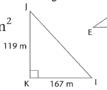
> **[Diagram Context - Textbook_Mathematics_Gr9_Pythagoras-Theorem.pdf-0016-15.png]**
> This graphic displays a right-angled triangle labeled JKL with a right angle at vertex K, featuring side lengths of 119 m and 167 m. It serves as a foundational geometry problem for Grade 10-12 learners to apply the Pythagorean theorem or trigonometric ratios to calculate the hypotenuse or interior angles.

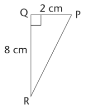
> **[Diagram Context - Textbook_Mathematics_Gr9_Pythagoras-Theorem.pdf-0016-19.png]**
> This geometry figure depicts a right-angled triangle labeled PQR, with vertices P, Q, and R, and a right-angle symbol at vertex Q. The diagram provides the lengths of the two perpendicular sides as 2 cm and 8 cm, respectively. It serves as a foundational visual aid for learners to apply the Pythagorean theorem or trigonometric ratios to calculate the length of the hypotenuse or the interior angles of the triangle.

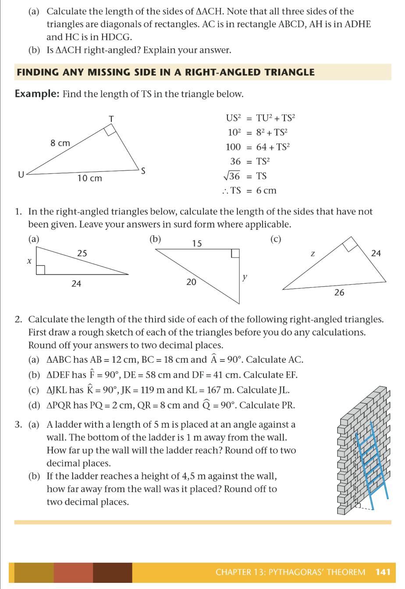
> **[Diagram Context - Textbook_Mathematics_Gr9_Pythagoras-Theorem.pdf-0016-26.png]**
> This educational resource features geometry figures of right-angled triangles and a real-world application diagram of a ladder against a wall. It utilizes labels such as vertices (e.g., T, U, S), side lengths (e.g., 8 cm, 10 cm, x, y, z), and right-angle indicators to facilitate the application of the Pythagorean theorem. The content guides learners through calculating missing side lengths in both abstract mathematical contexts and practical scenarios, reinforcing the relationship between the hypotenuse and the two shorter sides.

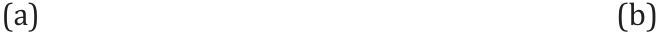

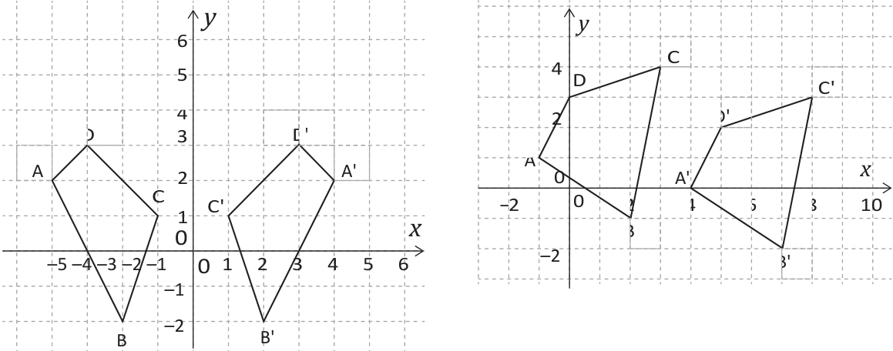
> **[Diagram Context - Textbook_Mathematics_Gr9_Transformation-geometry.pdf-0016-14.png]**
> This graphic displays two sets of Cartesian coordinate planes illustrating geometric transformations of quadrilaterals, labeled with vertices A, B, C, D and their corresponding images A', B', C', D'. The left panel demonstrates a reflection across the y-axis, while the right panel illustrates a horizontal translation along the x-axis. These diagrams help learners visualize how coordinate geometry rules map original points to their transformed positions while preserving the shape and size of the figure.

---

# Chapter 4: Construction of Geometric Figures

## Concepts & Definitions

* **Arc:** A small part of a circle.
* **Circumference:** The distance around a circle or around any other curved shape.

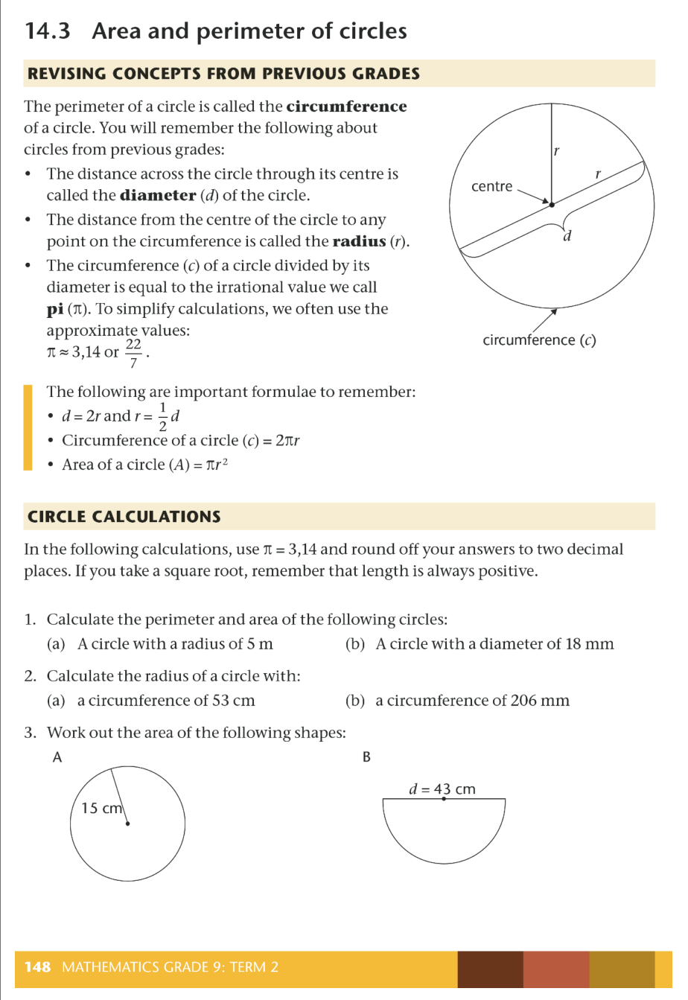
> **[Diagram Context - Textbook_Mathematics_Gr9_Area-and-perimeter-of-2D-shapes.pdf-0017-25.png]**
> This geometry figure illustrates the fundamental components of a circle, specifically labeling the centre, radius ($r$), diameter ($d$), and circumference ($c$). By defining these variables and their mathematical relationships, the diagram provides the necessary conceptual foundation for students to apply the formulas for circumference ($2\pi r$) and area ($\pi r^2$) in practical calculations.

## Exercises

Do the following in your exercise book:

1. Draw an arc using a radius of $3\text{ cm}$.
2. Draw an arc bigger than a quarter circle, using a radius of $5\text{ cm}$.
3. Draw an arc smaller than a quarter circle, using a radius of $5\text{ cm}$.

---

## Enrichment

Once you have finished the work in section 4.8, experiment with drawing only the arcs that you need in various constructions. Here is an example to show how to construct a regular hexagon with only arcs:

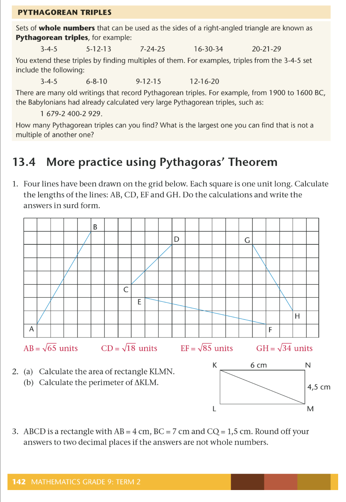
> **[Diagram Context - Textbook_Mathematics_Gr9_Pythagoras-Theorem.pdf-0017-22.png]**
> This educational resource features a geometry exercise on a Cartesian grid, accompanied by text explaining Pythagorean triples and practical application problems. The graphic includes line segments labeled AB, CD, EF, and GH on a grid, a rectangle KLMN with a diagonal, and various numerical values for lengths and units. It conceptually guides Grade 9 learners to apply Pythagoras' Theorem to calculate unknown side lengths in surd form and solve perimeter and area problems within geometric figures.

---

## Familiar Figures in the Seven-Circle Pattern

For this activity you need five seven-circle sets like the ones drawn in the previous two activities. Start by drawing these on blank pieces of paper. Don't make your radius bigger than $4\text{ cm}$. Number your sets Figure 2 to Figure 6. Label each figure as shown on the right.

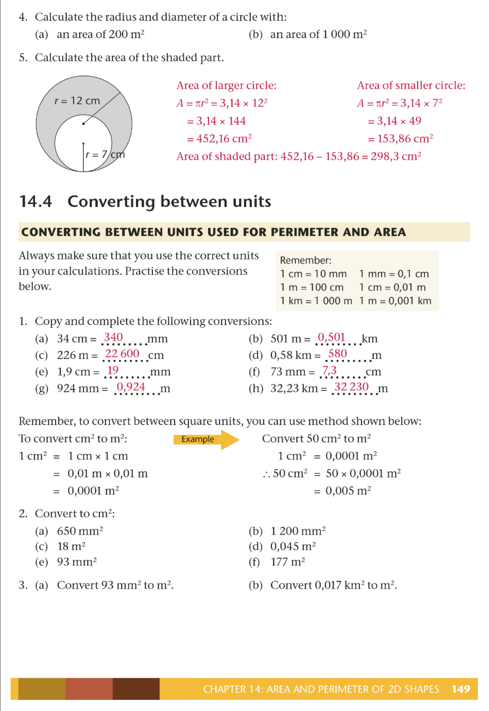
> **[Diagram Context - Textbook_Mathematics_Gr9_Area-and-perimeter-of-2D-shapes.pdf-0018-21.png]**
> This graphic presents a geometry problem involving concentric circles and a structured exercise on metric unit conversions for length and area. It features a diagram of two circles with radii labeled $r = 12\text{ cm}$ and $r = 7\text{ cm}$, alongside mathematical steps for calculating the area of the shaded region and conversion tables for linear and square units. The content guides students through the conceptual application of area formulas and the systematic process of converting between different metric units, a core competency in the CAPS mathematics curriculum.

1. Copy the figure above right by following the instructions below.
   * **Figure 1:** Draw lines connecting $AB$, $BC$, $CD$, $\dots$ up to $FA$.
   * **Figure 2:** Draw lines connecting $A$, $O$ and $B$.
   * **Figure 3:** Draw lines connecting $B$, $F$ and $D$.
   * **Figure 4:** Draw lines connecting $BC$, $CE$, $EF$ and $FB$.
   * **Figure 5:** Draw lines connecting $CD$, $DE$, $EF$ and $FC$.
   * **Figure 6:** Draw lines connecting $AB$, $BC$, $CE$ and $EA$.

2. Copy and complete the table below. It shows the name of each figure and its properties. Figure 1 (on the right) has been done as an example.

| Figure | Name of figure | Properties |
| :---: | :--- | :--- |
| 1 | Regular hexagon | six-sided figure. All the sides are equal. All the interior angles are equal. |
| 2 | | |
| 3 | | |
| 4 | | |
| 5 | | |
| 6 | | |

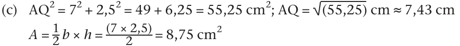
> **[Diagram Context - Textbook_Mathematics_Gr9_Pythagoras-Theorem.pdf-0018-03.png]**
> This mathematical text displays a two-part calculation involving the variables AQ, b (base), and h (height) with units in cm and cm². It demonstrates the application of the Pythagorean theorem to determine the length of a hypotenuse (AQ) and the subsequent use of the area formula for a right-angled triangle to calculate its surface area.

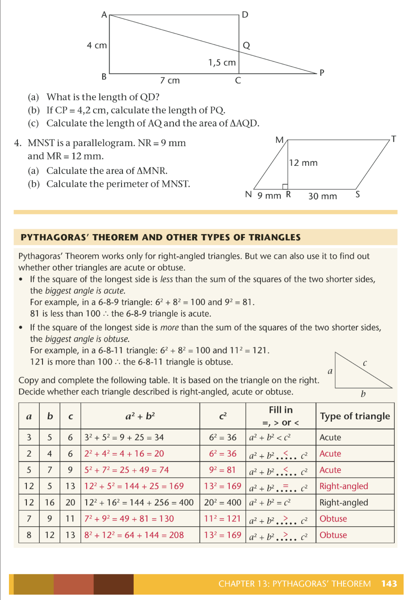
> **[Diagram Context - Textbook_Mathematics_Gr9_Pythagoras-Theorem.pdf-0018-22.png]**
> This educational resource features geometric figures, including a composite rectangle-triangle shape and a parallelogram, alongside a structured table for classifying triangles. The content utilizes labels such as vertices (A, B, C, D, P, Q, M, N, S, T), side lengths in centimeters and millimeters, and mathematical variables (a, b, c) to demonstrate the application of Pythagoras' Theorem and the converse inequalities used to identify acute, obtuse, or right-angled triangles. It provides high school learners with a practical framework for applying algebraic calculations to determine geometric properties and classify triangles based on the relationship between the squares of their sides.

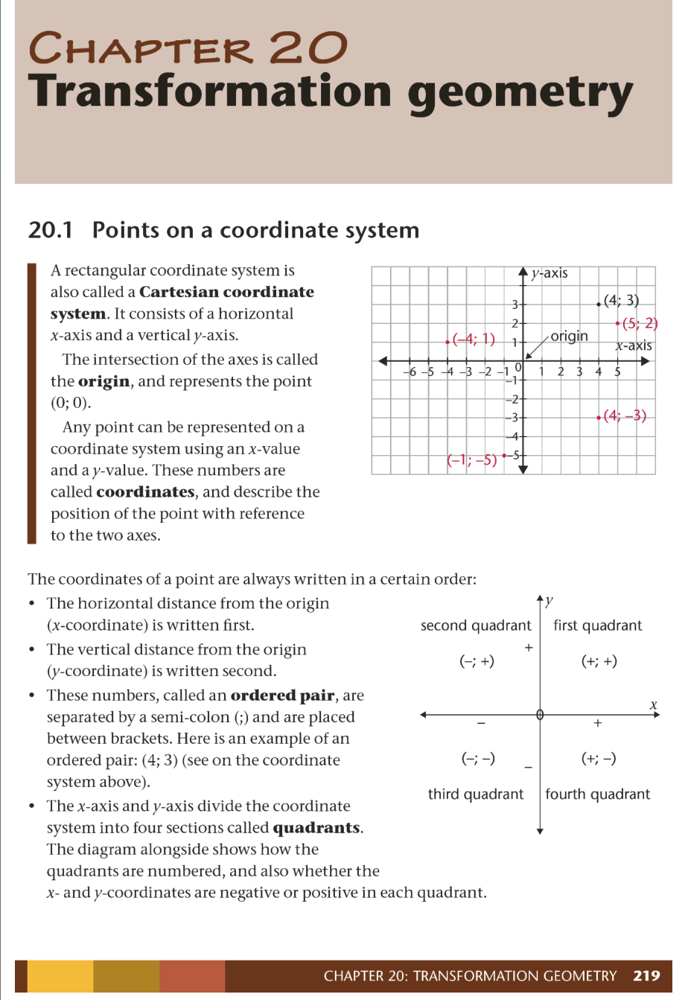
> **[Diagram Context - Textbook_Mathematics_Gr9_Transformation-geometry.pdf-0018-21.png]**
> This graphic illustrates a Cartesian coordinate system, featuring a grid with labeled x- and y-axes, an origin, and specific plotted points such as (4; 3), (-4; 1), (5; -2), (4; -3), and (-1; -5). It further categorizes the plane into four quadrants, detailing the sign conventions for ordered pairs within each. Conceptually, this serves as a foundational guide for high school learners to understand how to locate and represent points spatially using ordered pairs and quadrant-based sign rules.

---

## Construct Some More Figures

Read the instructions carefully and follow them exactly.

### Exercise 1

1. (a) Draw a line in your exercise book. The line should be between $3\text{ cm}$ and $6\text{ cm}$ long. Draw it in the middle of your page.
   (b) Label the ends $A$ and $B$.
   (c) Place the point of your compass at point $A$. Carefully set the radius of your compass to the distance between $A$ and $B$.
   (d) Draw a circle with the compass point at $A$.
   (e) Draw another circle with the compass point at $B$ without changing the radius width.
   (f) The circles cross at two points. Choose one of these points. Label it $C$. Check that you are on the right track by comparing your sketch to the one on the right.
   (g) Carefully rule the lines $AC$ and $BC$.
   (h) What sort of figure is $ABC$? Check this by measuring angles. Why do you think this happened?

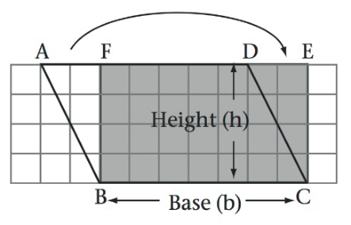
> **[Diagram Context - Textbook_Mathematics_Gr9_Area-and-perimeter-of-2D-shapes.pdf-0019-07.png]**
> This geometry figure illustrates the derivation of the area of a parallelogram using a grid, labeled with vertices A, B, C, D, E, and F, along with variables for "Height (h)" and "Base (b)." It demonstrates that a parallelogram can be transformed into a rectangle of equal area by shifting the triangular section from one side to the other, visually proving that the area formula is base multiplied by perpendicular height.

---

### Exercise 2

2. (a) Draw two lines $PQ$ and $QR$ in your exercise book.
   * The lines meet and form an angle at $Q$.
   * You can make your angle anysize.
   * Make your line lengths different.
   * Do not make your lines longer than $6\text{ cm}$ each.

   (b) Place your compass point at point $Q$. Set the radius of your compass to the distance $QP$. Place the compass point at $R$. Draw a circle.

   (c) Place the compass point back at $Q$. Set the radius to the length $QR$. Place the compass point at $P$. Draw a circle.

   (d) The circles cross at two points. Decide which point will be the vertex of a parallelogram. Call this point $S$.

   (e) Join the lines $SP$ and $SR$. Is $PQRS$ a parallelogram?

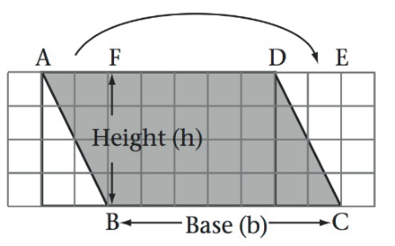
> **[Diagram Context - Textbook_Mathematics_Gr9_Area-and-perimeter-of-2D-shapes.pdf-0019-08.png]**
> This geometry figure illustrates a parallelogram on a grid, labeled with vertices A, B, C, D, E, and F, and includes variables for "Height (h)" and "Base (b)." The diagram visually demonstrates the derivation of the area of a parallelogram by showing how a triangular section can be conceptually "shifted" to transform the shape into a rectangle of equal area.

### Something to Think About
Why does this method form a parallelogram?

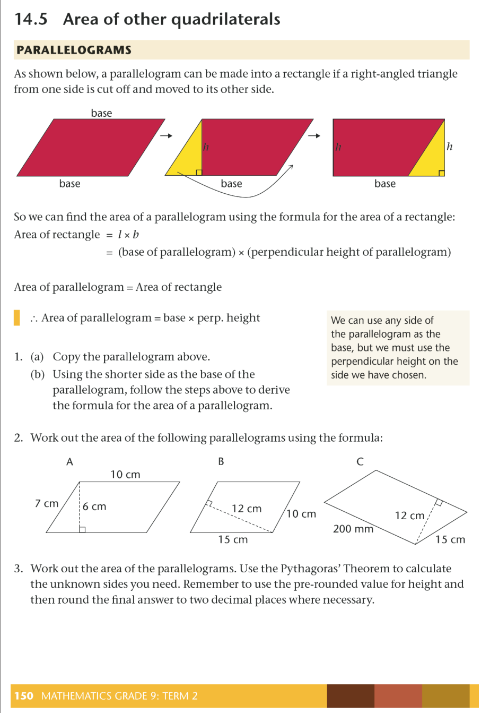
> **[Diagram Context - Textbook_Mathematics_Gr9_Area-and-perimeter-of-2D-shapes.pdf-0019-13.png]**
> This geometry figure illustrates the derivation of the area formula for a parallelogram through a visual transformation into a rectangle. By using labels for "base" and "perpendicular height" ($h$), the diagram demonstrates that a parallelogram's area is equivalent to a rectangle's area, providing a conceptual foundation for the formula $\text{Area} = \text{base} \times \text{perpendicular height}$.

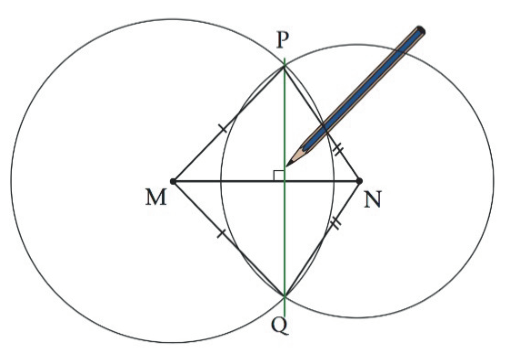
> **[Diagram Context - Textbook_Mathematics_Gr9_Construction-of-geometric-figures.pdf-0019-12.png]**
> This geometry figure illustrates the standard Euclidean construction of the perpendicular bisector of a line segment MN using two intersecting circles of equal radii centered at M and N. The diagram features points M, N, P, and Q, with tick marks indicating equal radii and a right-angle symbol denoting the perpendicular intersection of line segment PQ with MN. It conceptually demonstrates how to geometrically bisect a line segment by identifying the intersection points of two congruent circles, a fundamental skill in Grade 8-10 Mathematics.

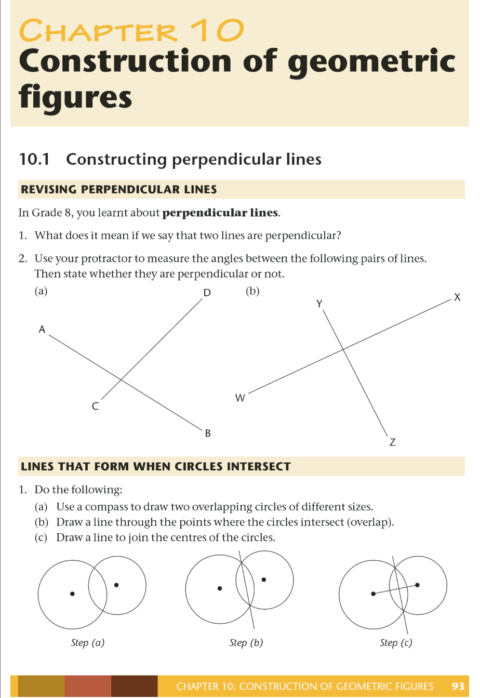
> **[Diagram Context - Textbook_Mathematics_Gr9_Construction-of-geometric-figures.pdf-0019-19.png]**
> This graphic features geometric figures consisting of intersecting line segments labeled AB, CD, WX, and YZ, alongside a three-step construction sequence showing overlapping circles with marked centers and intersection points. It serves as a practical exercise to help learners identify perpendicular lines through measurement and understand the geometric relationship between intersecting circles and the lines formed by their centers and intersection points.

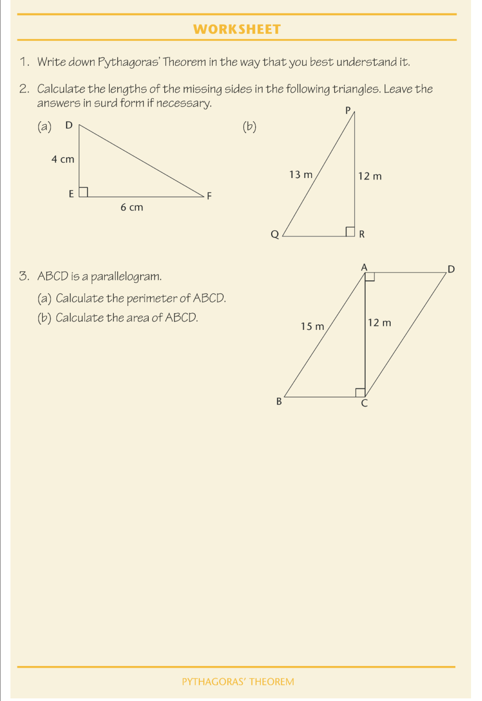
> **[Diagram Context - Textbook_Mathematics_Gr9_Pythagoras-Theorem.pdf-0019-13.png]**
> This geometry worksheet features three right-angled triangles and a parallelogram, labeled with vertices (D, E, F; P, Q, R; A, B, C, D) and side lengths in centimeters and meters. It serves to assess a learner's ability to apply Pythagoras' Theorem to calculate missing side lengths and utilize those results to determine the perimeter and area of a quadrilateral.

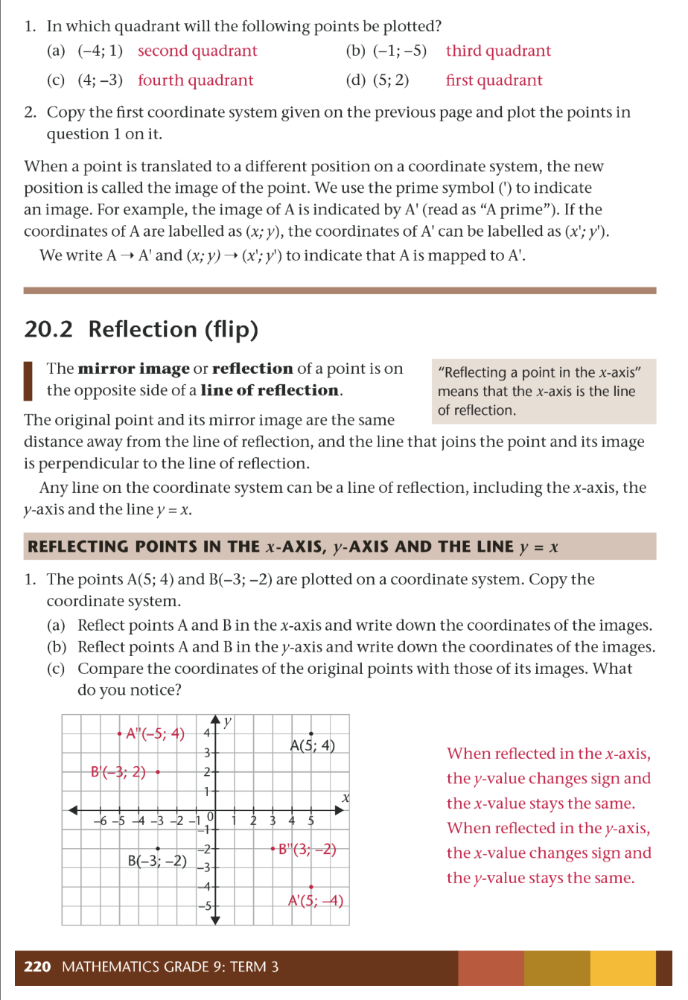
> **[Diagram Context - Textbook_Mathematics_Gr9_Transformation-geometry.pdf-0019-18.png]**
> This educational resource features a Cartesian coordinate system with plotted points A and B and their respective reflections across the x-axis (A', B') and y-axis (A'', B''). The diagram utilizes labels for the axes (x, y), coordinate pairs, and prime notation to illustrate the geometric transformation of reflection. It conceptually guides Grade 9 learners to identify the algebraic rules for reflections by observing how the signs of x and y coordinates change when mirrored across the primary axes.

---

## 4.9 Parallel and perpendicular lines with circles

### parallel and perpendicular

**Note:** When two lines (or arcs) cross each other we say they **intersect**. The **intersection point** is the place where they meet.

---

### Exercises

1. **Revision:** Copy and complete these definitions.
   - (a) When one line is parallel to another line, the lines ...
   - (b) When one line is perpendicular to another line, the lines ...

2. Copy the seven-circle figure below. The intersection points have been marked. A line segment has been drawn in. Use a ruler and pencil to join pairs of points so that the lines are:
   - (a) parallel to the line segment
   - (b) perpendicular to the line segment

   

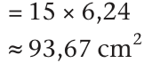

   *You should have drawn seven lines (two parallel and five perpendicular to the line segment).*  
   *Compare your lines with a friend's lines. Do you agree?*

3. Draw a few circles with the same radius along a line. Start by drawing a line. Then use your compass to draw a circle with the midpoint on the line.

   

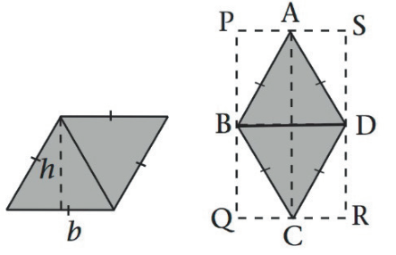
> **[Diagram Context - Textbook_Mathematics_Gr9_Area-and-perimeter-of-2D-shapes.pdf-0020-14.png]**
> This geometry figure illustrates the derivation of area formulas for a parallelogram and a rhombus using base ($b$), height ($h$), and vertices labeled $A, B, C, D, P, Q, R, S$. It demonstrates how a parallelogram can be decomposed into triangles and how a rhombus relates to a bounding rectangle, providing a visual proof for calculating their respective areas in the CAPS Mathematics curriculum.

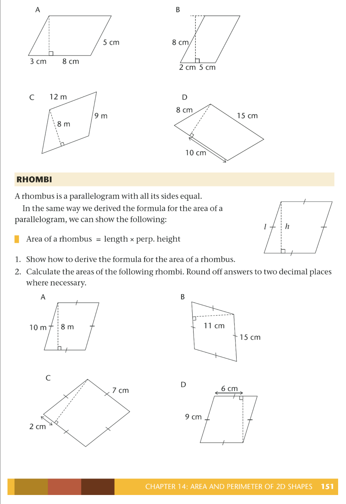
> **[Diagram Context - Textbook_Mathematics_Gr9_Area-and-perimeter-of-2D-shapes.pdf-0020-23.png]**
> This educational graphic presents a series of geometric figures, specifically parallelograms and rhombi, labeled with dimensions including side lengths and perpendicular heights. By using dashed lines to indicate altitude and right-angle symbols to denote perpendicularity, the diagram illustrates the application of the area formula (Area = base × perpendicular height) for quadrilaterals. It serves as a practical exercise for learners to distinguish between side lengths and heights when calculating the area of these specific 2D shapes.

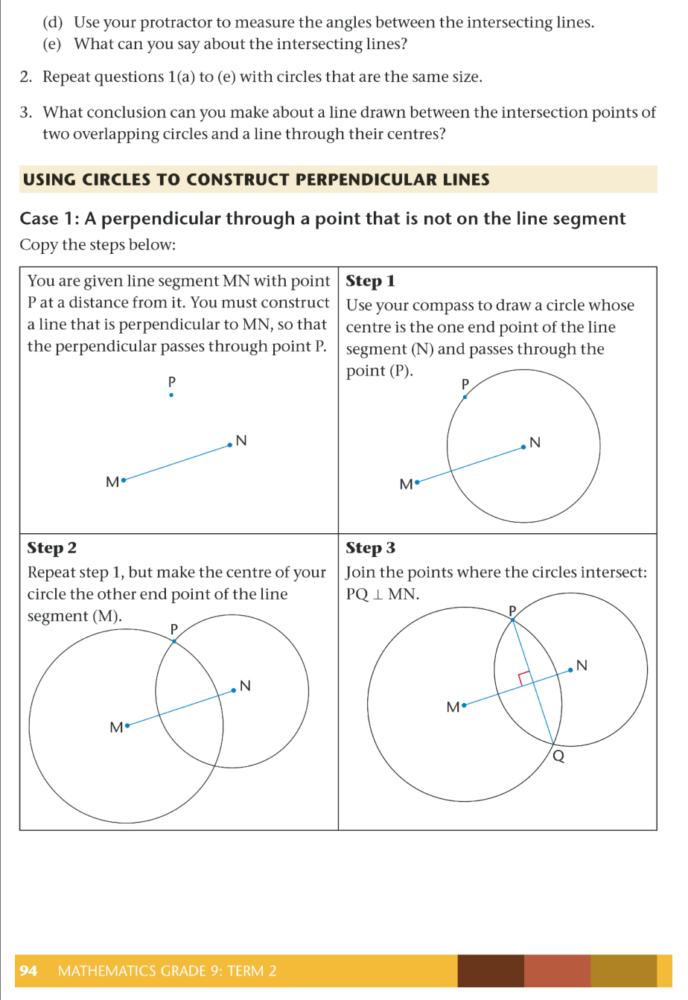
> **[Diagram Context - Textbook_Mathematics_Gr9_Construction-of-geometric-figures.pdf-0020-09.png]**
> This geometry figure illustrates a step-by-step construction process using a compass and straightedge to draw a perpendicular line through a point not on a given line segment. The diagram labels points M, N, P, and Q, and utilizes intersecting circles to demonstrate the geometric principle that the line connecting the intersection points of two circles is perpendicular to the line segment connecting their centers. This exercise helps learners understand the relationship between circle properties and perpendicularity, a foundational skill in Euclidean geometry.

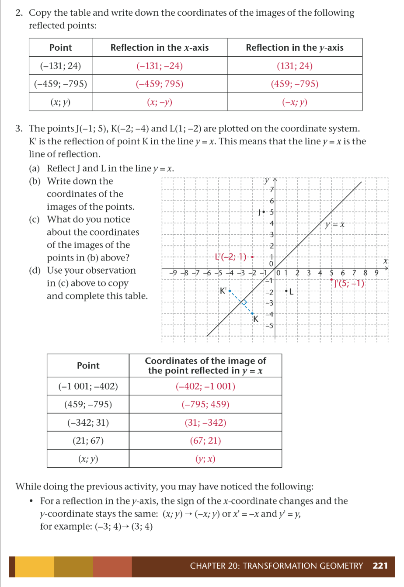
> **[Diagram Context - Textbook_Mathematics_Gr9_Transformation-geometry.pdf-0020-17.png]**
> This educational resource features a Cartesian coordinate system with plotted points (J, K, L) and their reflected images (J', K', L') across the line $y = x$, accompanied by tables summarizing coordinate transformation rules. It illustrates the geometric principles of reflection, specifically demonstrating how reflecting a point $(x; y)$ across the line $y = x$ results in the coordinate swap $(y; x)$. This helps learners identify algebraic patterns in transformation geometry to generalize rules for reflections across various axes and lines.

---

Keep your compass the same width and draw another circle with the centre where the first circle crossed the line. Repeat as many times as you wish. In the example at the bottom of the previous page, only three circles have been drawn.

(a) Can you find that example in the seven-circle figure? Look carefully until you see it.

(b) Can you see where you can construct lines that are perpendicular to the given line? Draw them carefully with a pencil and your ruler.

(c) Can you see the two lines that are parallel to the given line? Draw them in too.

---

4. Copy the line below. Use circles to construct a line that is perpendicular to the line below.

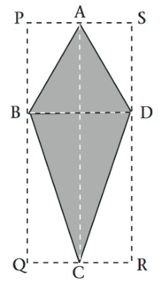
> **[Diagram Context - Textbook_Mathematics_Gr9_Area-and-perimeter-of-2D-shapes.pdf-0021-03.png]**
> This geometry figure displays a shaded kite (ABCD) inscribed within a rectangle (PQRS), with vertices labeled A, B, C, D, P, Q, R, and S. The diagram illustrates the relationship between the area of a kite and its bounding rectangle, demonstrating that the area of the kite is exactly half the area of the rectangle defined by its diagonals.

---

5. Copy the line below. Use circles to construct a line that is parallel to the line below.

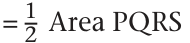

---

### extension

1. Write $P$, as in the example below. Set your compass at a certain distance, for example $3\text{ cm}$, and investigate points that are the same distance from a fixed point, $P$.

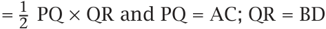
> **[Diagram Context - Textbook_Mathematics_Gr9_Area-and-perimeter-of-2D-shapes.pdf-0021-06.png]**
> This mathematical expression defines the area of a quadrilateral using its diagonals, represented by the variables PQ, QR, AC, and BD. It illustrates the geometric relationship where the area is calculated as half the product of the diagonals, specifically substituting the lengths of diagonals AC and BD for PQ and QR.

2. Write two points, $A$ and $B$, as shown below. Use your compass and investigate all the points

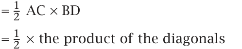
> **[Diagram Context - Textbook_Mathematics_Gr9_Area-and-perimeter-of-2D-shapes.pdf-0021-07.png]**
> This mathematical expression defines the area of a quadrilateral with perpendicular diagonals, using the variables AC and BD to represent the lengths of those diagonals. It conceptually illustrates the geometric formula for calculating the area of shapes such as rhombi, kites, or squares by taking half the product of their diagonal lengths.

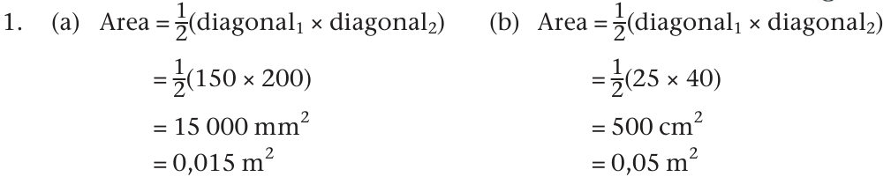
> **[Diagram Context - Textbook_Mathematics_Gr9_Area-and-perimeter-of-2D-shapes.pdf-0021-10.png]**
> This image displays two mathematical worked examples for calculating the area of a quadrilateral using the formula: Area = ½(diagonal₁ × diagonal₂). The text includes numerical values for the diagonals in millimeters and centimeters, followed by the calculated area in square units and the subsequent conversion to square meters. It demonstrates the practical application of geometry formulas and the importance of unit conversion within the context of measurement.

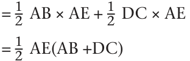
> **[Diagram Context - Textbook_Mathematics_Gr9_Area-and-perimeter-of-2D-shapes.pdf-0021-17.png]**
> This mathematical expression demonstrates the algebraic factorization of the area formula for a trapezium, using the variables AB, AE, and DC. It illustrates the distributive property by showing how the common factor of $\frac{1}{2}AE$ is extracted to simplify the sum of two triangular areas into the standard formula for the area of a trapezium.

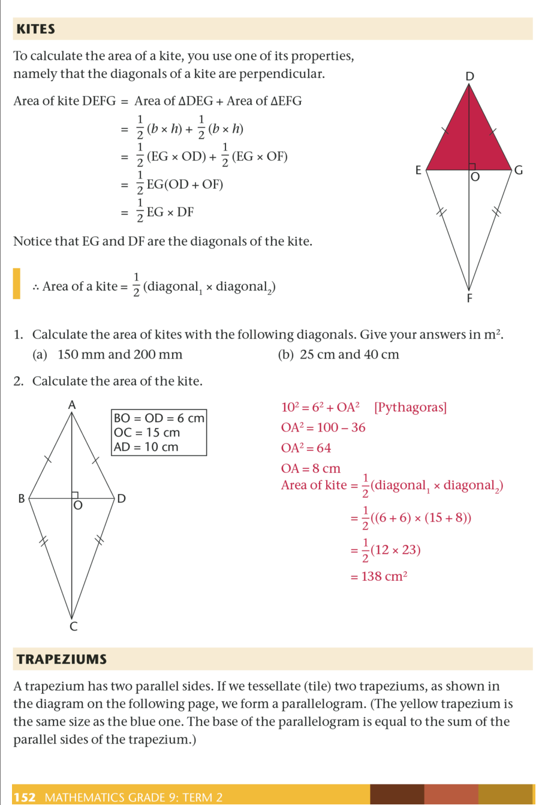
> **[Diagram Context - Textbook_Mathematics_Gr9_Area-and-perimeter-of-2D-shapes.pdf-0021-20.png]**
> This geometry resource features two kite diagrams labeled with vertices (DEFG and ABCD), intersection point O, and perpendicularity markers. It demonstrates the derivation of the area formula for a kite by splitting the shape into two triangles and applying the property that diagonals are perpendicular. By integrating algebraic substitution and the Pythagorean theorem, the content guides learners to calculate the area of a kite using the product of its diagonals.

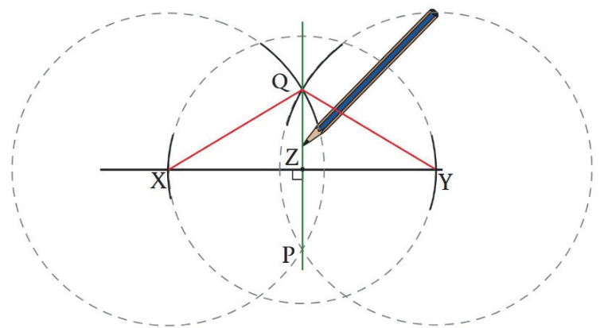
> **[Diagram Context - Textbook_Mathematics_Gr9_Construction-of-geometric-figures.pdf-0021-02.png]**
> This geometric construction figure illustrates the process of bisecting a line segment XY using a compass and straightedge, marked with points X, Y, Q, Z, and P. By drawing intersecting arcs of equal radii from points X and Y, the diagram demonstrates how to locate the perpendicular bisector that passes through the midpoint Z, establishing the geometric principle that any point on the bisector is equidistant from the endpoints.

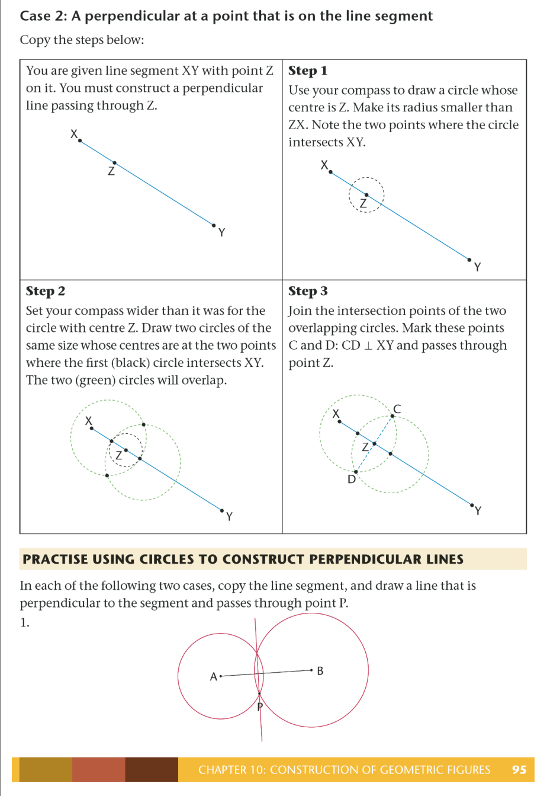
> **[Diagram Context - Textbook_Mathematics_Gr9_Construction-of-geometric-figures.pdf-0021-08.png]**
> This geometric construction figure illustrates the step-by-step process of drawing a perpendicular line through a specific point (Z) on a given line segment (XY) using a compass and straightedge. The diagram utilizes labels X, Y, Z, C, and D, along with intersecting circular arcs, to demonstrate how to create equidistant points that define a perpendicular bisector. Conceptually, this teaches learners the fundamental Euclidean construction technique of using overlapping circles to establish precise 90-degree angles relative to a base line.

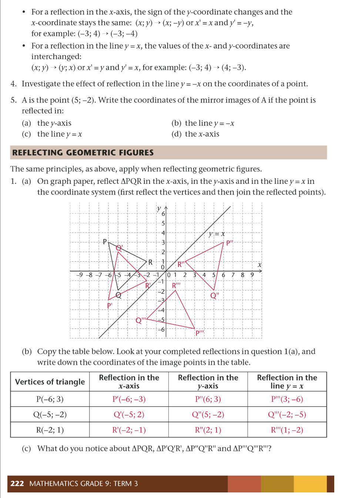
> **[Diagram Context - Textbook_Mathematics_Gr9_Transformation-geometry.pdf-0021-11.png]**
> This graphic displays a Cartesian coordinate system featuring a triangle $\Delta PQR$ and its reflected images across the $x$-axis, $y$-axis, and the line $y=x$. The diagram uses labels for vertices ($P, Q, R$), their corresponding image points ($P', Q', R'$, etc.), and axis variables ($x, y$) to illustrate the algebraic rules of geometric transformations. It conceptually guides Grade 9 learners to visualize how coordinate mapping functions as a mirror reflection, reinforcing the relationship between algebraic coordinate changes and spatial orientation.

---

Grade 7 Term 1 Chapter 4: Construction of geometric figures

## Learner Book Overview

| Sections in this chapter | Content | Pages in Learner Book |
| :--- | :--- | :---: |
| 4.1 Angles revision | Vocabulary and the conventions for representing, describing and labelling angles | 57 to 59 |
| 4.2 The degree: a unit for measuring angles | Recognising the need for a unit of measurement and developing an understanding of the degree as a suitable unit | 59 to 60 |
| 4.3 Using the protractor | Explaining a protractor and how to use it to measure all types of angles | 61 to 64 |
| 4.4 Using a protractor to construct angles | Constructing angles to a given size using a protractor | 65 to 66 |
| 4.5 Parallel and perpendicular lines | Using a protractor to construct $90^{\circ}$ angles (perpendicular lines) and measuring distances on perpendicular lines to construct parallel lines | 66 to 68 |
| 4.6 Circles are very special figures | Understanding a circle as a curve of which the ends meet and every point on the curve is the same distance from a point in the centre of the curve | 68 to 69 |
| 4.7 Using the compass | Learning how to use a compass and drawing circles using a compass | 69 to 71 |
| 4.8 Using circles to draw other figures | Investigating patterns of circles and shapes that are formed by joining points of intersection | 72 to 75 |
| 4.9 Parallel and perpendicular lines with circles | Investigating how parallel and perpendicular lines are formed when circles intersect | 76 |

| CAPS time allocation | 10 hours |
| :--- | :--- |
| CAPS content specification | Page 45 |

## Mathematical Background

* An **angle** is formed when two lines, the sides of the angle, meet at a common point, the **vertex**.
* An angle measures the amount of turning about a point in degrees. For example, starting on BA and turning A about B to end at C, forms $\hat{\text{ABC}}$.
* The **label** of the vertex is always written in the middle, for example $\angle\text{ABC}$ or angle $\angle\text{CBA}$ means that B is the vertex. Another way of writing $\angle\text{ABC}$ is $\hat{\text{ABC}}$ or simply $\hat{\text{B}}$. When there is more than one angle at a vertex, the two endpoints will have to be included, for example $\text{A}\hat{\text{B}}\text{C}$ or $\text{C}\hat{\text{B}}\text{D}$, to avoid confusion.
* Angles could have their sides slanted and learners should also be shown angles with sides that are not horizontal and/or vertical.
* In order to measure the size of an angle, the sides sometimes have to be lengthened, this is also called **producing the lines**.
* Parallel lines and perpendicular lines could also be slanted and learners should work with such lines oriented in different ways.

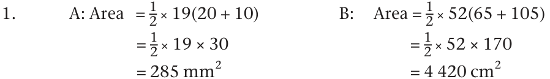
> **[Diagram Context - Textbook_Mathematics_Gr9_Area-and-perimeter-of-2D-shapes.pdf-0022-01.png]**
> This image displays two mathematical calculations for the area of a trapezium, identified by the labels "A" and "B" and the formula $\text{Area} = \frac{1}{2} \times \text{height} \times (\text{sum of parallel sides})$. The calculations demonstrate the application of this geometric formula using specific numerical values and include the resulting units of measurement in square millimetres ($\text{mm}^2$) and square centimetres ($\text{cm}^2$).

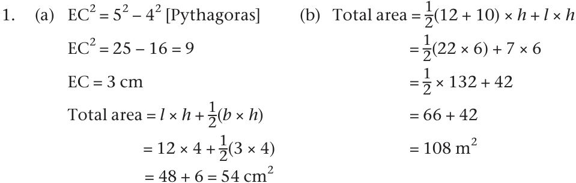
> **[Diagram Context - Textbook_Mathematics_Gr9_Area-and-perimeter-of-2D-shapes.pdf-0022-06.png]**
> This text-based graphic presents two mathematical solutions involving geometry calculations, specifically using the Pythagorean theorem to find a missing side length (EC) and applying area formulas for composite shapes. It utilizes variables such as $l$, $b$, and $h$, along with numerical constants and units like $\text{cm}^2$ and $\text{m}^2$, to demonstrate the step-by-step algebraic process required to determine the total area of complex polygons. These examples reinforce the CAPS curriculum requirements for applying geometric principles and algebraic substitution to solve practical measurement problems.

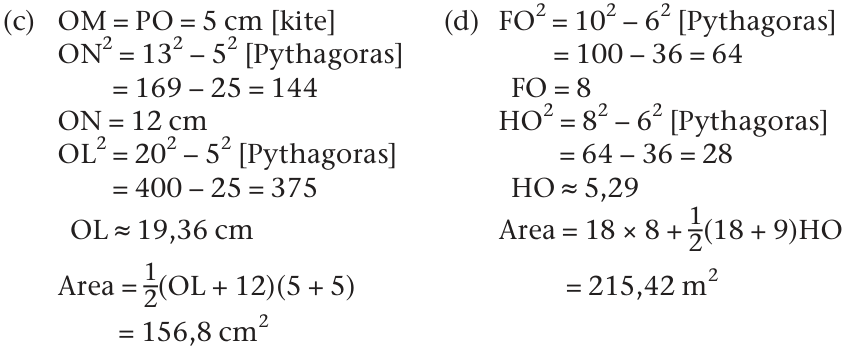
> **[Diagram Context - Textbook_Mathematics_Gr9_Area-and-perimeter-of-2D-shapes.pdf-0022-07.png]**
> This text-based graphic displays two mathematical worked examples involving geometry calculations, specifically utilizing the Theorem of Pythagoras to determine unknown side lengths and areas of polygons. The content features algebraic variables (OM, PO, ON, OL, FO, HO), numerical values, and geometric justifications such as "kite" and "Pythagoras" to solve for lengths and final area measurements. It serves as a procedural guide for Grade 10-12 learners to apply trigonometric and geometric principles to solve complex composite shape problems.

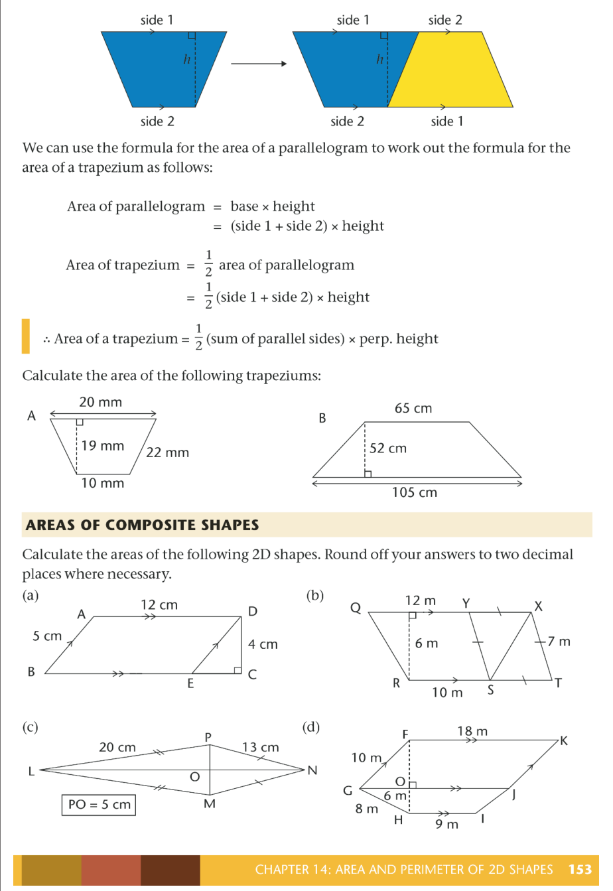
> **[Diagram Context - Textbook_Mathematics_Gr9_Area-and-perimeter-of-2D-shapes.pdf-0022-08.png]**
> This geometry resource uses diagrams of trapeziums and composite 2D shapes to demonstrate the derivation of the area formula for a trapezium and the application of area calculations. It features labels for parallel sides, perpendicular heights ($h$), and specific side lengths (e.g., 20 mm, 12 cm) to guide students through the logical construction of formulas and the decomposition of complex polygons. By visually transforming a trapezium into a parallelogram, the graphic helps learners conceptualize the relationship between these shapes to solve for area in practical exercises.

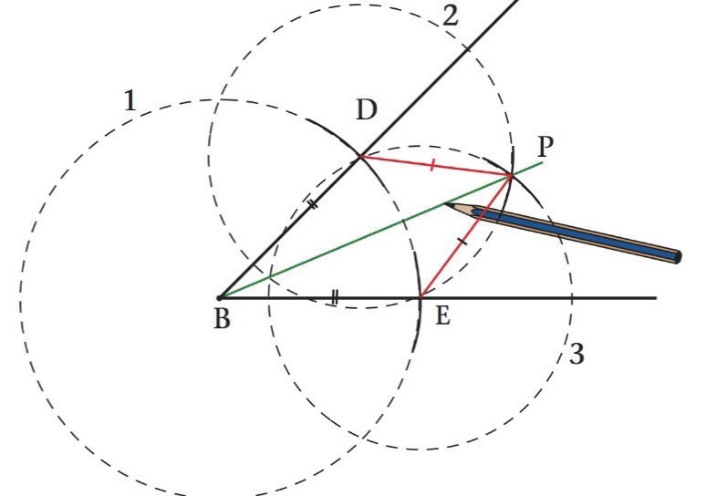
> **[Diagram Context - Textbook_Mathematics_Gr9_Construction-of-geometric-figures.pdf-0022-07.png]**
> This geometry figure illustrates the Euclidean construction of an angle bisector using a compass and straightedge, featuring points B, D, E, and P, along with three circular arcs labeled 1, 2, and 3. The diagram demonstrates the use of congruent triangles (indicated by tick marks) to ensure that the green line segment correctly bisects the angle at vertex B.

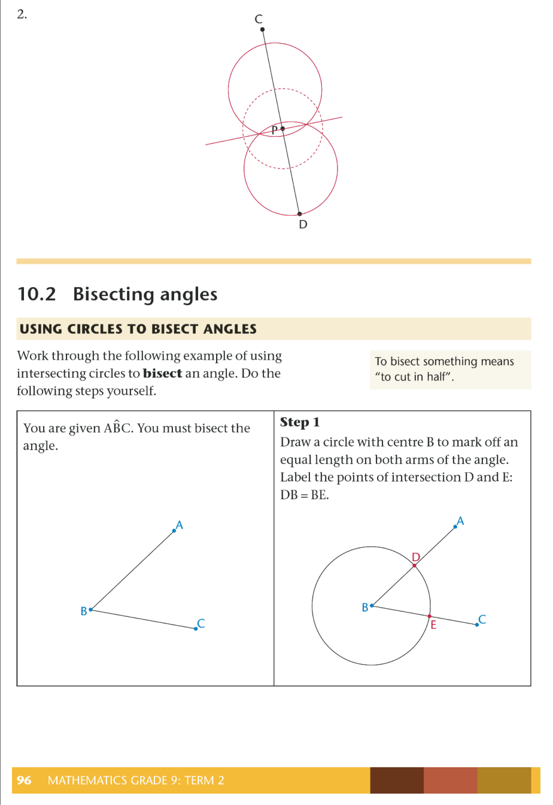
> **[Diagram Context - Textbook_Mathematics_Gr9_Construction-of-geometric-figures.pdf-0022-10.png]**
> This geometry figure illustrates the step-by-step construction process for bisecting an angle using a compass and straightedge. It features points A, B, C, D, E, and P, along with intersecting circles and line segments that demonstrate how to geometrically divide an angle into two equal parts. By following these construction steps, students learn the logical application of circle properties to accurately bisect any given angle.

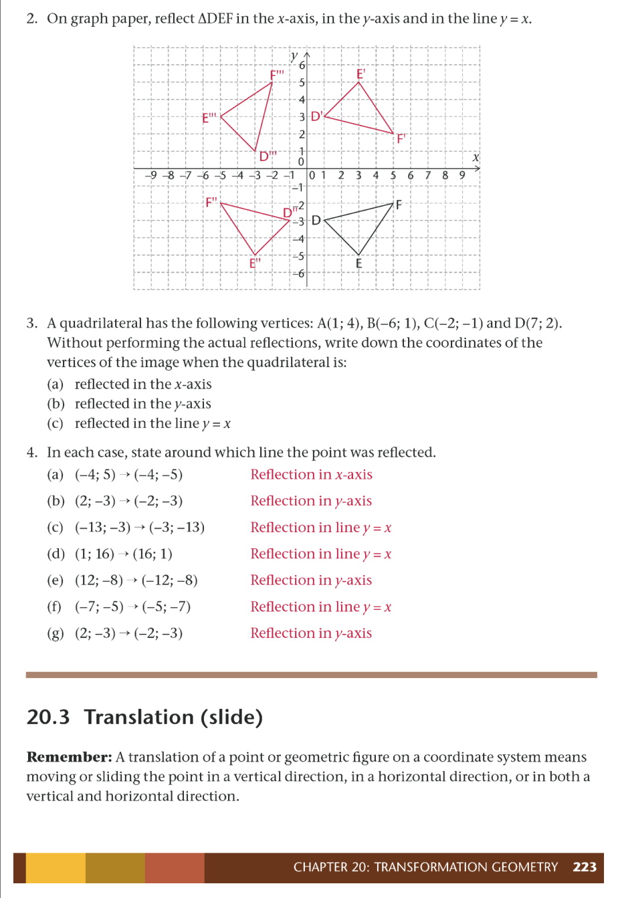
> **[Diagram Context - Textbook_Mathematics_Gr9_Transformation-geometry.pdf-0022-17.png]**
> This graphic features a Cartesian plane displaying the geometric transformation of triangle DEF through reflections across the x-axis, y-axis, and the line y = x, accompanied by coordinate-based exercises. It illustrates the algebraic rules of reflection by showing how the vertices (D, E, F) map to their respective image coordinates (D', E', F', etc.) across different axes and lines. This helps learners visualize how coordinate geometry properties remain invariant under reflection while providing practice in applying transformation rules to points and shapes.

---

# CHAPTER 4: Construction of geometric figures

## 4.1 Angles revision

### Background

There is more than one way to think about angles. For example, they can be thought of:
* As the space between two lines that cross or intersect, or meet at a vertex. Let learners think of examples from daily life where angles are encountered, for example traffic signs. 

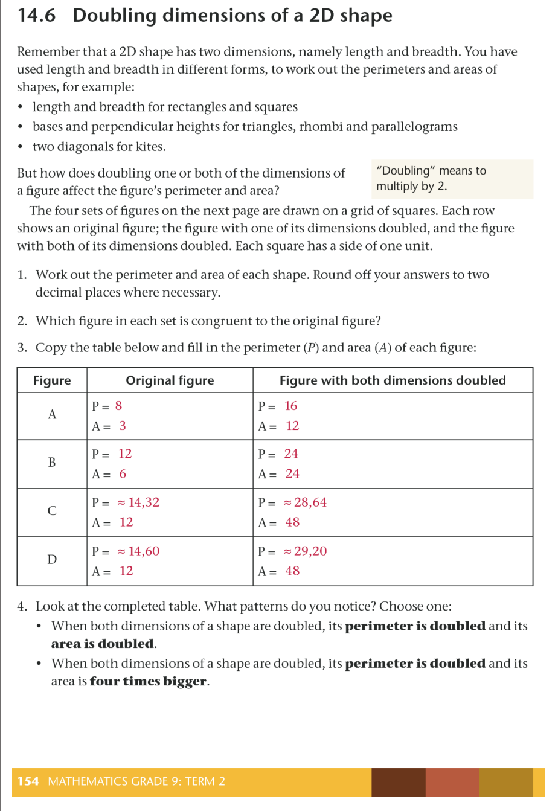
> **[Diagram Context - Textbook_Mathematics_Gr9_Area-and-perimeter-of-2D-shapes.pdf-0023-09.png]**
> This educational resource is a mathematics worksheet featuring a data table that compares the perimeter (P) and area (A) of four different 2D shapes (labeled A–D) before and after their dimensions are doubled. It uses numerical variables and labels to guide students through an inquiry-based exercise, helping them conceptually distinguish how linear scaling affects perimeter versus the exponential scaling effect on area.

* As the amount of turning about a point, for example when a door is opened, each point on the surface of the door turns through the same angle.

### Teaching guidelines

Work through the concept of an angle as an amount of turning about a point and discuss the words used to describe an angle (arms, vertex, etc.). Let learners think of standing in one spot and turning until they face in the same direction they were facing when they started the motion. Point out that they have turned through a **full turn**, or a **revolution**.

Use the activity to revise the angles they learnt about in previous grades. Let one or two learners stand in front of the class facing in a direction and let the rest of the class instruct the learner to turn through specific angles they know, for example, a right angle, a reflex angle, a straight angle, etc.

Show learners how to draw and label an angle on paper and how to write the name of the angle. Point out that using the "hat" label is convenient, but if there is more than one angle at a vertex, care should be taken to write the name of the angle in full. For example, at the vertex $A$ in the drawing alongside, we find three different angles, $\hat{A}$, $C\hat{A}D$ and $B\hat{A}D$. In this case we avoid confusion by writing the name of the angle we mean to work with in full. 

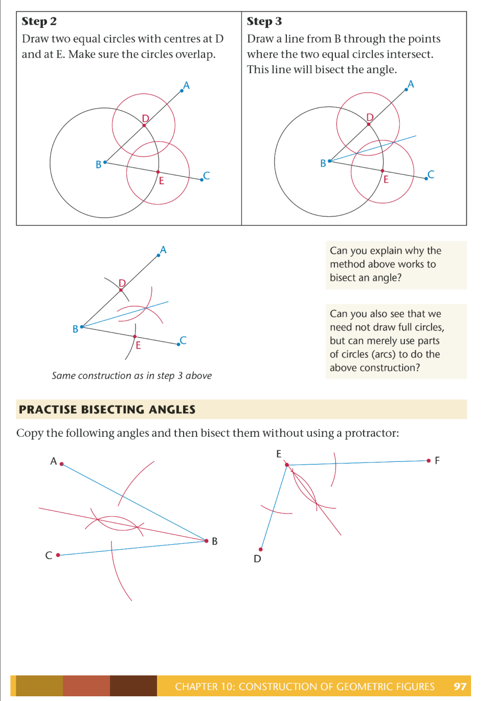
> **[Diagram Context - Textbook_Mathematics_Gr9_Construction-of-geometric-figures.pdf-0023-05.png]**
> This geometry figure illustrates the step-by-step construction process for bisecting an angle using a compass and straightedge, featuring points A, B, C, D, E, and F. By using intersecting arcs centered on the arms of an angle, the diagram demonstrates how to geometrically determine the angle bisector without the use of a protractor. This supports the CAPS curriculum objective of mastering Euclidean construction techniques to develop spatial reasoning and understanding of geometric properties.

### Misconceptions

Learners could think that an angle that takes up more space (B) is larger than the same size angle that takes up less space (A). Show learners that the amount of turn about the vertex is the same in both cases and explain that the length of the arms does not change the size of the angle. 

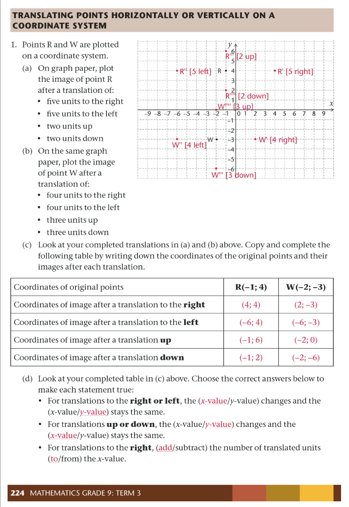
> **[Diagram Context - Textbook_Mathematics_Gr9_Transformation-geometry.pdf-0023-19.png]**
> This educational resource features a Cartesian coordinate system with plotted points R and W, alongside a corresponding table and guided questions. The diagram displays the original points and their translated images labeled with specific directional shifts (e.g., R', R'', W', W'') across the x and y axes. It conceptually demonstrates how horizontal and vertical translations affect coordinate values, helping learners derive the algebraic rules for shifting points on a 2D plane.

---

When two lines point in different directions, we say they are **at an angle** to each other. If the directions are almost the same, we say the **angle** between them is small. If the directions are very different, we say the angle between them is big. <!-- DIAGRAM_PLACEHOLDER: diagram -->

#### Words we use to describe angles:
* **Arms of the angle:** the two lines that are at an angle to each other
* **The vertex:** the point where the two arms meet
* **Vertices:** plural of "vertex"

<!-- DIAGRAM_PLACEHOLDER: diagram -->

#### Symbols to describe angles:
* **Arrowheads** on the lines mean that the lines keep on going. The length of an angle's arms does not change the size of the angle. Whether the arms are long or short, the angle size stays the same.
* There are **two angles at a vertex** so it is important to show which one we are talking about. <!-- DIAGRAM_PLACEHOLDER: diagram -->

#### Labelling angles:
There are many different ways to label angles. Look at the examples below:

<!-- DIAGRAM_PLACEHOLDER: diagram -->

---

# REVISION: SEEING ANGLES AND DESCRIBING ANGLES

## Teaching Guidelines & Concepts

* **Constructing Angles:** Ensure learners keep their rulers aligned directly on the lines when making the sides of an angle (producing lines). Explain that being slightly off the line when starting can make a significant difference when the line is lengthened and then measured.
* **Comparing Lines and Parallelism:** If two lines are moved towards each other and have no angle between them (drawn on either side of a ruler), we expect them to be parallel.
* **Angles as Rotation:** Use clock faces to reinforce the concept of an angle as an amount of turning about a point. The hands on a clock move and form measurable angles.

---

## Common Misconceptions
* Learners might incorrectly think that angles are always the same for questions like 6 (c). Encourage learners to discuss in pairs the movement of the hour hand versus the minute hand and how corresponding angles compare (e.g., quarter to twelve versus $9\text{ o'clock}$; $4\text{ o'clock}$ versus twenty past $12$, etc.).

---

## Revision Activities

### 1. Naming and Extending Angles
You can name an angle in different ways. For example, the angle formed by points $A$, $B$, and $C$ can be written as $\hat{ABC}$, $\hat{CBA}$, or simply $\hat{B}$. The "hat" ($\,\hat{}\,\}$) symbol on the letter shows the vertex where the angle is located.

* **(a)** Look at the drawing. Are these lines at an angle to each other? Do the lines have to meet to be at an angle?
* **(b)** Copy the lines. Use a pencil and your ruler to draw the lines a bit longer so they meet. Did you change the angle between the lines when you extended them?

### 2. Ordering Angles
Arrange the angles shown below from biggest to smallest. Write the letters (a) to (f) in the correct order.

* **(a)** Acute/obtuse angle representation
* **(b)** Right-angle representation
* **(c)** Straight line representation
* **(d)** Acute angle
* **(e)** Acute angle
* **(f)** Obtuse angle

### 3. Checking Right Angles
How can you check that an angle is a right angle without using any special mathematics equipment? 
*(Hint: Think about where you can find right angles around you, such as the corner of a sheet of paper, a book, a ruler, a small box, or a pencil sharpener).*

### 4. Comparing Angle Sizes
Are these two angles the same size? Describe how you found your answer. 
*(Hint: A piece of scrap paper may help!)*

### 5. Properties of Drawn Lines
Two lines are drawn by holding down a ruler and drawing lines on both sides. What can you say about the two lines?

### 6. Analogue Clock Faces and Angles
Look at an analogue clock face. The minute hand and the hour hand make an angle. Focus on the smaller angle for now:
* **(a)** The clock face is divided into $12$ equal sections ($30^\circ$ each). Calculate the angle for four sections:
  $$4 \times 30^\circ = 120^\circ$$
* **(b)** Compare the angle at $2\text{ o'clock}$ to the angle at $4\text{ o'clock}$.
* **(c)** Discuss whether the angles are identical when the hour hand and minute hand essentially switch places.

---

## Answers and Worked Solutions

| Question Number | Answer / Explanation |
| :--- | :--- |
| **1. (a)** | Yes. No, they do not have to meet. |
| **1. (b)** | No |
| **2.** | (d), (e), (c), (b), (a), (f) |
| **3.** | You can place the corner of any square or rectangular object from everyday life on the angle, for example, a sheet of paper, a book, a ruler, a small box, or a pencil sharpener. |
| **4.** | They are the same size. Learners use different methods, such as paper folding, tracing, or drawing and cutting out. |
| **5.** | The lines are parallel. They have the same direction. |
| **6. (a)** | The clock face is divided into $12$ equal sections ($30^\circ$ each). Both angles are four sections big ($4 \times 30^\circ = 120^\circ$). |
| **6. (b)** | The angle at $2\text{ o'clock}$ is half the size of the angle at $4\text{ o'clock}$. At $4\text{ o'clock}$ the minute hand has moved twice as far away from the $12$ than at $2\text{ o'clock}$. |
| **6. (c)** | No, although the hour hand and the minute hand basically switch places, the hour hand is not pointing exactly at the $12$, but to the right of the $12$. |

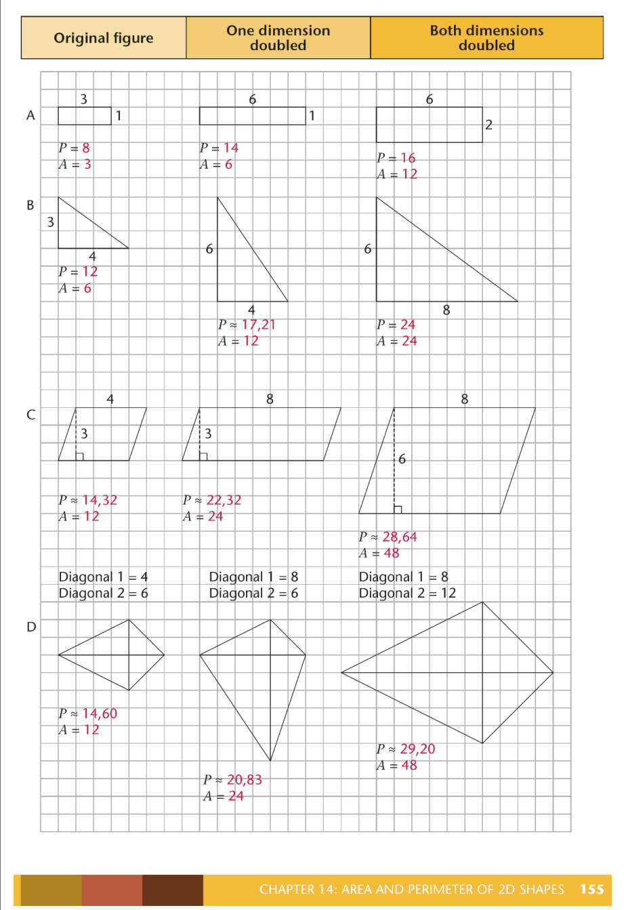
> **[Diagram Context - Textbook_Mathematics_Gr9_Area-and-perimeter-of-2D-shapes.pdf-0024-03.png]**
> This geometry figure uses a grid to compare the effects of scaling dimensions on the perimeter ($P$) and area ($A$) of rectangles, triangles, parallelograms, and kites. By displaying numerical values for original shapes alongside versions with one or both dimensions doubled, it illustrates how linear scaling affects perimeter proportionally while area scales by the square of the enlargement factor. This helps learners visualize the non-linear relationship between side lengths and area in 2D shapes.

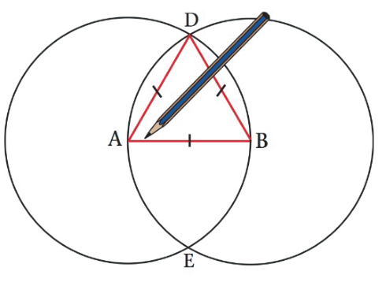
> **[Diagram Context - Textbook_Mathematics_Gr9_Construction-of-geometric-figures.pdf-0024-07.png]**
> This geometry figure illustrates a compass-and-straightedge construction of an equilateral triangle, featuring two intersecting circles with labels A, B, D, and E. The diagram uses tick marks on the sides of triangle ABD to indicate that all three sides are equal in length, demonstrating the geometric principle that the radii of congruent circles are identical. This construction serves as a foundational exercise for students to understand how to accurately create equilateral triangles using only a compass and ruler.

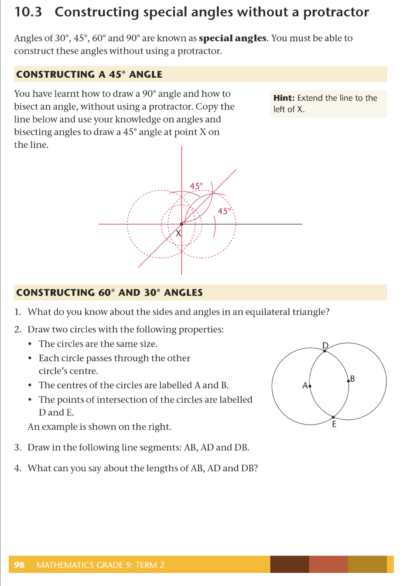
> **[Diagram Context - Textbook_Mathematics_Gr9_Construction-of-geometric-figures.pdf-0024-14.png]**
> This geometry resource illustrates the construction of special angles (45°, 30°, and 60°) using a compass and straightedge. The diagrams feature intersecting arcs, perpendicular lines, and circles labeled with points A, B, D, E, and X to demonstrate the geometric principles of angle bisection and equilateral triangle properties. These visuals guide learners through the step-by-step logical process of creating precise angles without relying on a protractor, reinforcing foundational Euclidean construction techniques.

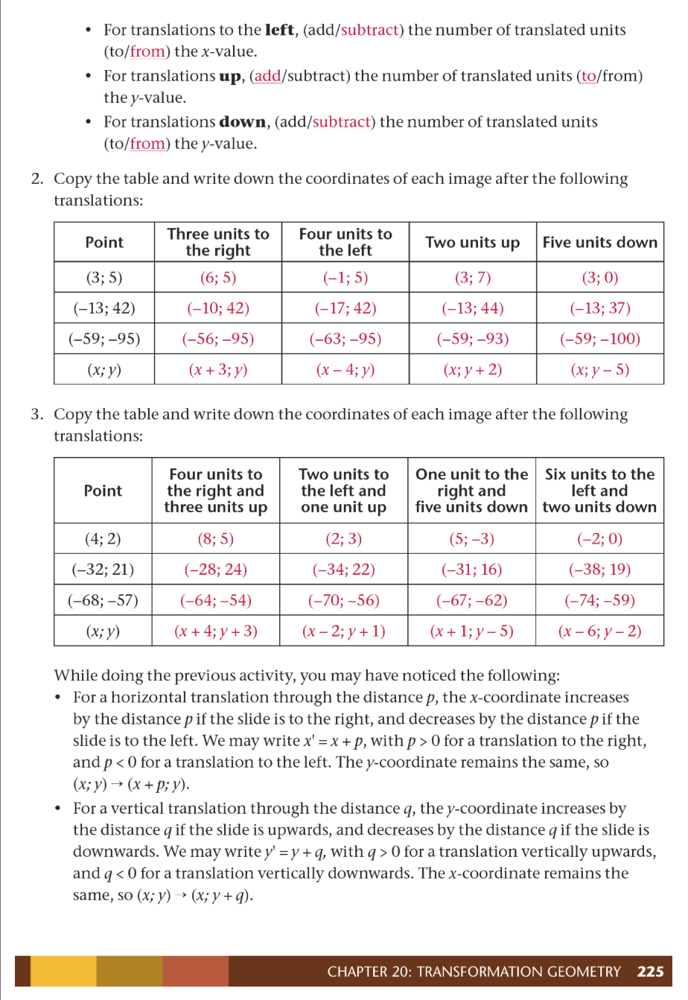
> **[Diagram Context - Textbook_Mathematics_Gr9_Transformation-geometry.pdf-0024-14.png]**
> This educational resource presents a series of tables and instructional notes focused on transformation geometry, specifically coordinate translations. It utilizes Cartesian coordinate pairs $(x; y)$ and algebraic notation to demonstrate how horizontal and vertical shifts affect point positions. The content guides learners to generalize the rules for translations, showing that adding or subtracting values from coordinates corresponds to specific directional movements on a 2D plane.

---

## 4.2 The Degree: A Unit for Measuring Angles

### Core Concepts

Just as we need standard units to measure length (such as metres, centimetres, or millimetres) or area (such as square units), we need standard units to measure angles. 

* **The Degree ($^\circ$):** Historically, a full revolution (a complete circle) was divided into $360$ equal parts. Each of these parts is called a **degree**, denoted by the symbol $^\circ$. 
* Therefore, a complete revolution measures $360^\circ$.
* Angles can be thought of as fractions or wedges of a full revolution. For example:
  * A quarter turn is $\frac{1}{4}$ of $360^\circ$, which equals $90^\circ$.

---

### Worked Activities & Questions

#### Conceptual Questions on Angles

1. **Clock Hands:**
   * **(a)** Explain why the angle between the hands at $8\text{ o'clock}$ is the same size as the angle at $4\text{ o'clock}$.
   * **(b)** Compare the angle at $2\text{ o'clock}$ with the angle at $4\text{ o'clock}$. What do you notice? Why is this so?
   * **(c)** Is the angle at $3\text{ o'clock}$ the same as the angle at a quarter past $12$? Explain.

2. **Real-World Angles:**
   * When you open the cover of a hardcover book, you can make different angles. Identify at least five other everyday situations where objects are turned through angles, and describe the "arms" and "vertices" for each example.

---

### Table: Familiar Angles in Degrees

The following table outlines common angles described in words and their equivalent measurements in degrees:

| Angle (in words) | Angle (degrees) |
| :--- | :--- |
| right angle | $90^\circ$ |
| straight angle | $180^\circ$ |
| revolution | $360^\circ$ |
| half a right angle | $45^\circ$ |
| a third of a right angle | $30^\circ$ |
| a quarter of a right angle | $22.5^\circ$ |
| half a straight angle | $90^\circ$ |
| three quarters of a revolution | $270^\circ$ |
| a third of a revolution | $120^\circ$ |

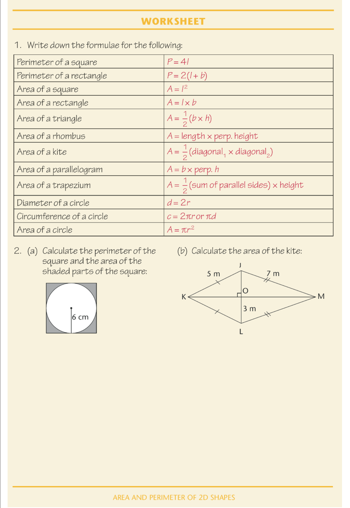
> **[Diagram Context - Textbook_Mathematics_Gr9_Area-and-perimeter-of-2D-shapes.pdf-0025-08.png]**
> This geometry worksheet provides a reference table of standard formulae for the perimeter and area of various 2D shapes, alongside two practical application problems featuring a circle inscribed in a square and a kite defined by its diagonals. It serves as a foundational resource for learners to practice identifying geometric properties and applying algebraic formulae to solve for unknown dimensions and shaded regions.

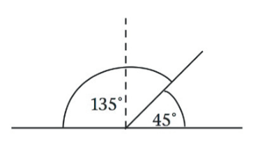
> **[Diagram Context - Textbook_Mathematics_Gr9_Construction-of-geometric-figures.pdf-0025-12.png]**
> This geometry figure depicts a straight line intersected by a ray, creating two adjacent angles labeled 135° and 45° relative to a vertical dashed line and the horizontal base. It illustrates the concept of supplementary angles on a straight line, demonstrating that the sum of adjacent angles on a straight line equals 180°.

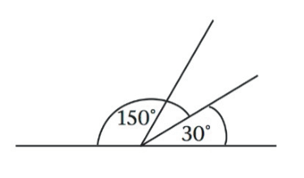
> **[Diagram Context - Textbook_Mathematics_Gr9_Construction-of-geometric-figures.pdf-0025-16.png]**
> This geometry figure illustrates two adjacent angles on a straight line, labeled as 150° and 30°. It demonstrates the concept of supplementary angles, showing that the sum of these adjacent angles equals 180°, which confirms the properties of angles on a straight line as per the CAPS geometry curriculum.

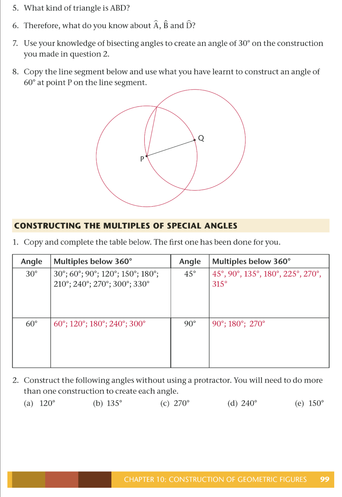
> **[Diagram Context - Textbook_Mathematics_Gr9_Construction-of-geometric-figures.pdf-0025-18.png]**
> This geometry resource features a geometric construction diagram showing two intersecting circles with points P and Q, alongside a table listing multiples of special angles (30°, 45°, 60°, 90°). It guides learners through the practical application of Euclidean geometry by requiring them to construct specific angles without a protractor, reinforcing the relationship between basic geometric constructions and their angular properties.

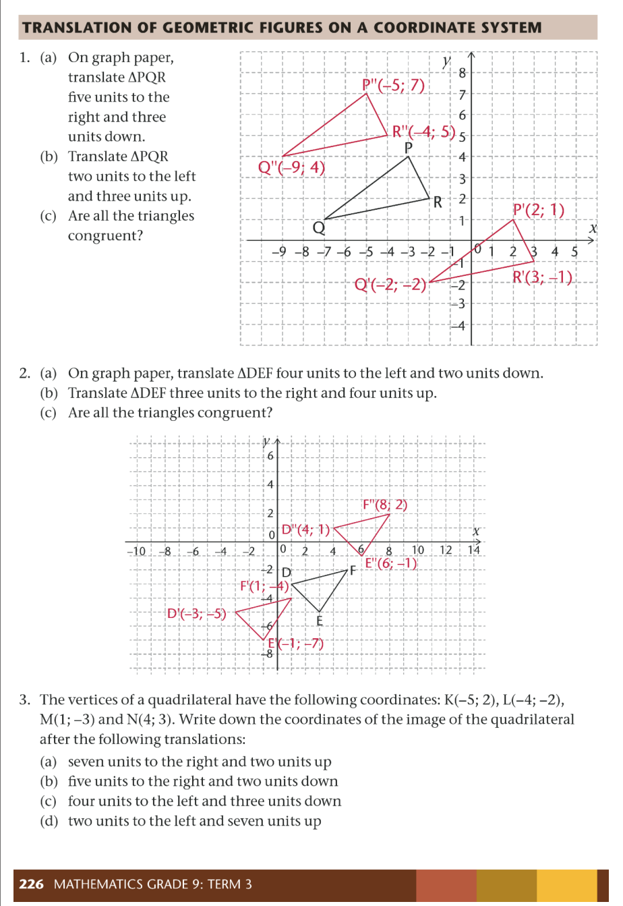
> **[Diagram Context - Textbook_Mathematics_Gr9_Transformation-geometry.pdf-0025-14.png]**
> This graphic features two Cartesian coordinate systems displaying geometric transformations of triangles, labeled with vertices P, Q, R and D, E, F along with their translated images (e.g., P', P'', D', D''). It illustrates the concept of translation by showing how shifting a figure across the x and y axes changes coordinate values while preserving the shape and size of the object, thereby demonstrating that translations result in congruent figures.

---

# Grade 7 Mathematics: Comparing Angles

## 1. Types of Angles Reference

Angles are classified into different types based on their size in degrees ($^\circ$).

| Angle | Size of the angle | Sketch of the angle |
| :--- | :--- | :--- |
| **Acute angle** | Between $0^\circ$ and $90^\circ$ | 

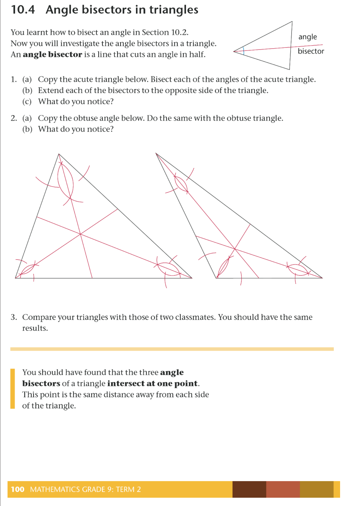
> **[Diagram Context - Textbook_Mathematics_Gr9_Construction-of-geometric-figures.pdf-0026-14.png]**
> This geometry figure illustrates the construction of angle bisectors within acute and obtuse triangles using compass arcs and straight lines. It demonstrates that the three angle bisectors of any triangle are concurrent, meaning they intersect at a single point that is equidistant from all three sides of the triangle.

 |
| **Right angle** | $90^\circ$ | 

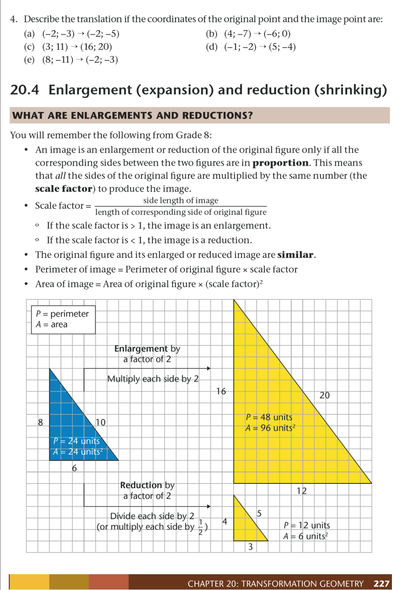
> **[Diagram Context - Textbook_Mathematics_Gr9_Transformation-geometry.pdf-0026-22.png]**
> This educational graphic illustrates the geometric concepts of enlargement and reduction using right-angled triangles plotted on a grid. It labels side lengths, perimeters ($P$), areas ($A$), and scale factors to demonstrate how multiplying side lengths by a constant affects the overall dimensions and area of similar figures. The diagram provides a visual proof of how scale factors influence geometric properties, helping students understand the proportional relationship between an original figure and its transformed image.

 |
| **Obtuse angle** | Between $90^\circ$ and $180^\circ$ | <!-- DIAGRAM_PLACEHOLDER: diagram --> |
| **Straight angle** | $180^\circ$ | <!-- DIAGRAM_PLACEHOLDER: diagram --> |
| **Reflex angle** | Between $180^\circ$ and $360^\circ$ | <!-- DIAGRAM_PLACEHOLDER: diagram --> |
| **Revolution** | $360^\circ$ | <!-- DIAGRAM_PLACEHOLDER: diagram --> |

---

## 2. Clock Hands and Degrees

<!-- DIAGRAM_PLACEHOLDER: diagram -->

* **(a) The minute hand:** Moves $360^\circ$ in one hour ($1$ full revolution).
* **(b) The hour hand:** Moves $30^\circ$ in one hour ($360^\circ \div 12 = 30^\circ$).

---

## 3. Practical Investigation: Comparing Angles Using A4 Paper

### Teaching Guidelines
Learners' understanding is increased through hands-on experiences. Allow learners to experiment with folding paper before giving solutions. Circulate to ensure they grasp what needs to be done.

### Instructions
1. Take a sheet of A4 paper. At the four corners, you have four right angles ($90^\circ$). 
2. Number them and tear the corners off as shown in the diagram (do not make them too small).
3. Use your right angles to investigate the following situations:

<!-- DIAGRAM_PLACEHOLDER: diagram -->

### Exercises

1. **Show that a straight angle is two right angles.**
   * *Investigation:* Place two of your torn corners adjacent to each other on a straight line. 
   * *Sketch:* You can sketch what you have done in your book.

2. **Show that a revolution is four right angles.**
   * *Investigation:* Place all four of your torn corners around a single point to form a full circle.
   * *Sketch:* You can sketch what you have done in your book.

3. **Create a right angle using three of your corners.**
   * *Investigation:* Combine three folded/torn corners.

4. **Describe how you can use one of your corners to check if an angle is acute, right, or obtuse.**
   * *Method:* Put the corner of the paper on the given angle. 
     * If it matches the angle perfectly, the angle is a **right angle ($90^\circ$)**.
     * If the corner is bigger than the angle, then the angle is smaller than $90^\circ$, making it an **acute angle**.
     * If the corner is smaller than the angle, then the angle is bigger than $90^\circ$, making it an **obtuse angle**.

5. **Folding Paper Investigations:**
   * **(a)** Fold corner $1$ so that you can use it to measure $45^\circ$ ($\frac{1}{2} \times 90^\circ = 45^\circ$).
   * **(b)** Fold corner $2$ so that you can use it to measure $30^\circ$ ($\frac{1}{3} \times 90^\circ = 30^\circ$).
   * **(c)** Fold corner $3$ so that you can use it to measure $22,5^\circ$ ($\frac{1}{4} \times 90^\circ = 22,5^\circ$).
   * **(d)** **Which is bigger: a right angle, or half a right angle + a third of a right angle + a quarter of a right angle?**
     $$\frac{1}{2} \times 90^\circ + \frac{1}{3} \times 90^\circ + \frac{1}{4} \times 90^\circ$$
     $$= 45^\circ + 30^\circ + 22,5^\circ$$
     $$= 97,5^\circ$$
     Since $97,5^\circ > 90^\circ$, **the second angle is bigger**.

**Important:** Keep your folded pieces of paper for the next lesson!

---

## 4.3 Using the protractor

### Background
Many learners struggle when using a protractor for the first time due to the unfamiliar shape, the tiny measuring unit of one degree, and the lack of visible angles on the tool itself. Remind learners that angles are measured by the number of degrees of a circle between the arms of the angle, which explains why the standard protractor is semi-circular (representing half a circle). 

To help learners understand, we start with a protractor using a large unit angle before refining the unit size for greater accuracy.

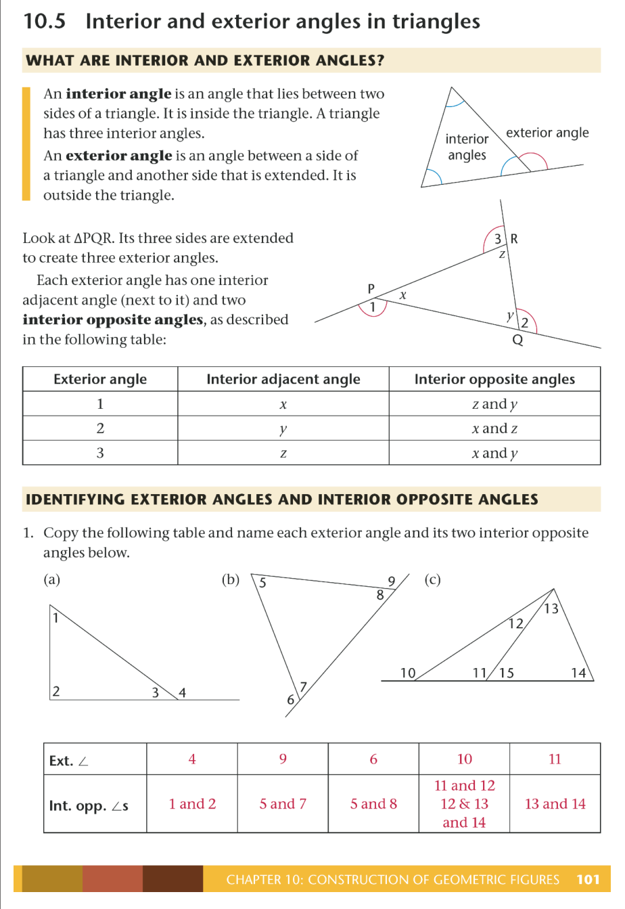
> **[Diagram Context - Textbook_Mathematics_Gr9_Construction-of-geometric-figures.pdf-0027-09.png]**
> This geometry figure illustrates the relationship between interior and exterior angles of triangles using labeled diagrams and a corresponding table. It identifies specific angles (numbered 1–15 and variables x, y, z) to demonstrate how an exterior angle is formed by extending a side and how it relates to its interior adjacent and interior opposite angles. The graphic conceptually reinforces the Exterior Angle Theorem, helping students visually distinguish between these angle types to solve for unknown values in geometric proofs.

*(The Background section and Teaching guidelines are continued on TG page 69.)*

---

### MEASURING SOME FAMILIAR ANGLES

#### Teaching guidelines
* Give learners the opportunity to work together and help each other learn how to handle the protractor.
* Let them discuss in their group the problems they experience and how to correct such problems or mistakes.

---

### HOW TO USE A PROTRACTOR TO MEASURE AN ANGLE

#### Teaching guidelines
* Work carefully through the instructions in the Learner Book, paying attention to the correct way to produce the arms: to line up the angle on the protractor.
* Draw examples on the board and let learners draw and measure angles that have to be read in both a clockwise direction on the protractor and in an anti-clockwise direction.

---

### Understanding the Protractor

We have a special instrument for measuring angles called a **protractor**. 

* **Important parts labelled on a protractor:**
  * Clockwise degree scale
  * Anticlockwise degree scale
  * Origin
  * Base line
  * Degree marks

Protractors can be big or small, but they all measure angles in exactly the same way. The size of the protractor makes no difference to an angle's size.

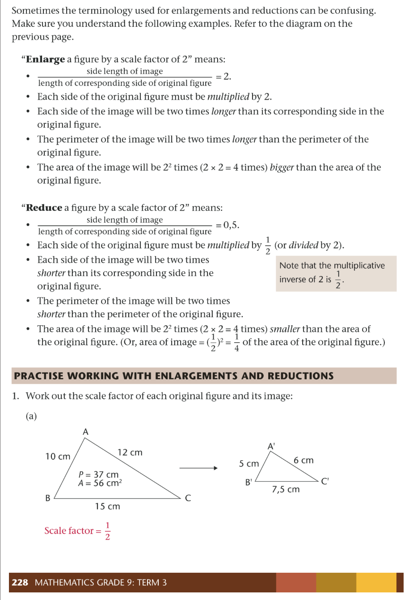
> **[Diagram Context - Textbook_Mathematics_Gr9_Transformation-geometry.pdf-0027-20.png]**
> This educational text and diagram illustrate the geometric principles of enlargement and reduction using triangles labeled ABC and A'B'C'. It provides explicit mathematical definitions for scale factors, side lengths, perimeters, and areas, demonstrating how a scale factor of 1/2 results in a proportional reduction of a figure. This resource helps learners conceptualize how linear dimensions change proportionally while area changes by the square of the scale factor.

---

### Activity: Measuring Some Familiar Angles

You need the four folded angles from the previous activity on page 60. If you didn't do that activity, go back now and follow the instructions in question 5.

1. In a group of three or four, use your protractor to measure the angles that you made: $90^\circ$; $45^\circ$; $30^\circ$ and $22{,}5^\circ$.
2. Did you measure the correct sized angle? If not, then ask yourself the following questions:
   * Did you put the vertex of the angle at the origin of the protractor?
   * Is the bottom arm of your angle lined up with the base line?
   * Did you fold your corners correctly?

---

### How to Use a Protractor to Measure an Angle

#### Step 1: Are the angle arms long enough?
The angle arms must be a little longer than the distance from the origin of the protractor to its edge. If they are too short, use a sharp pencil and a ruler to make them longer. Be careful to line the ruler up with the arm.

<!-- DIAGRAM_PLACEHOLDER: diagram -->

* **Incorrect ($\times$):** only a small part of the arm is used / ruler not lined up carefully (at an angle to the arm)
* **Correct ($\checkmark \checkmark$):** ruler lined up carefully and the whole arm is used

---

# Mathematics Grade 7: Measuring Angles

## 1. Concepts and Structure

### Drawing and Measuring Angles
* Learners should draw and measure angles to learn the range of different types of angles (e.g., obtuse angles are larger than $90^{\circ}$ but smaller than $180^{\circ}$).
* Angles can be presented with one side horizontal, as well as with sides that are neither horizontal nor vertical.

### How to Use a Protractor
1. **Place the centre:** Place the centre (origin) of the protractor on the vertex of the angle.
2. **Pivot:** Pivot the protractor about that point until one of the sides lies directly on the base line of the angle.
3. **Choose the correct scale:** Learners should discuss in pairs when to use the inner scale versus the outer scale to ensure a correct measurement.

---

## 2. Step-by-Step Guide: Measuring an Angle

### Step 2: Line Up the Angle and Your Protractor
Place your protractor on top of the angle, ensuring that:
* The origin is exactly on the vertex of the angle.
* The base line is exactly on top of one of the arms of the angle.

Keep adjusting the position of the protractor until the origin and the base line are perfectly lined up.

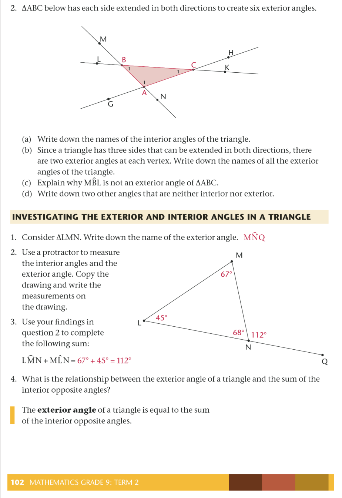
> **[Diagram Context - Textbook_Mathematics_Gr9_Construction-of-geometric-figures.pdf-0028-13.png]**
> This geometry figure illustrates the properties of interior and exterior angles of triangles, featuring two distinct diagrams: a triangle ABC with extended sides creating six exterior angles, and a triangle LMN with a single extended side. The labels include vertices (A, B, C, L, M, N), points on extended lines (G, H, K, Q), and specific angle measurements (67°, 45°, 68°, 112°). Conceptually, these diagrams guide learners to identify exterior angles and empirically discover the theorem that an exterior angle of a triangle is equal to the sum of the two interior opposite angles.

*Once your protractor is in the correct place, keep a finger on the protractor to stop it from moving. If it moves, start again! You are now ready to make a measurement.*

---

## 3. Worked Example: Measuring a Reflex Angle

To measure a reflex angle such as reflex $\angle BAC$:

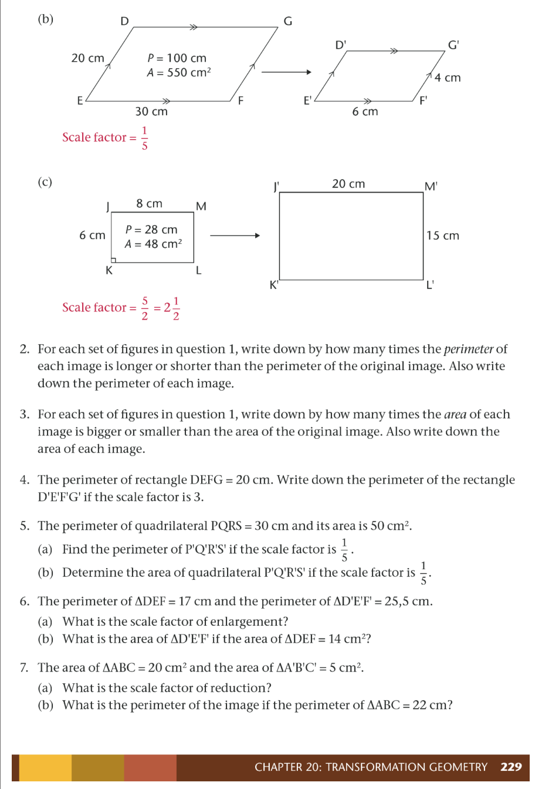
> **[Diagram Context - Textbook_Mathematics_Gr9_Transformation-geometry.pdf-0028-22.png]**
> This geometry exercise features two sets of quadrilaterals (parallelograms DEFG and rectangles JKLM) undergoing transformations, labeled with side lengths, perimeters ($P$), areas ($A$), and calculated scale factors. The diagram illustrates the relationship between linear scale factors and their proportional effects on the perimeter and area of similar figures. It serves to help students understand that while perimeter changes by the scale factor ($k$), area changes by the square of the scale factor ($k^2$).

* **Method 1:**
  1. Lengthen side $BA$ to point $D$.
  2. We know that $\angle BAD = 180^{\circ}$, so we need to measure $\angle DAC$ and add it to $180^{\circ}$.
  3. Align the protractor to measure $\angle DAC = 60^{\circ}$.
  4. Calculate the total angle: 
     $$\angle BAC = 180^{\circ} + 60^{\circ} = 240^{\circ}$$

* **Method 2 (Alternative):**
  * Measure the obtuse $\angle BAC$ ($120^{\circ}$) and subtract it from $360^{\circ}$.

---

## 4. Background and Teaching Guidelines

### Exploring Units of Measurement through Tiling
Explain the idea of a measuring unit to learners by tiling about a point using a $60^{\circ}$ set square. 

* There are three possibilities to tile a full revolution ($360^{\circ}$) with the $60^{\circ}$ set square.
* Repeat the process using the $45^{\circ}$ set square.

<!-- DIAGRAM_PLACEHOLDER: diagram -->

---

## Chapter 4: Construction of Geometric Figures

### Understanding Protractors and Measuring Angles

These tiles fit around the point but are only useful to measure certain angles. Refer to the circles on TG page 68.

A protractor represents $180^{\circ}$ identical angles about the centre. Each small angle represents one degree. 

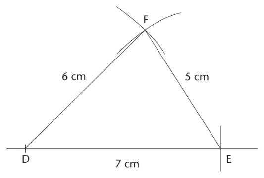
> **[Diagram Context - Textbook_Mathematics_Gr9_Construction-of-geometric-figures.pdf-0029-11.png]**
> This geometric construction figure illustrates the process of drawing a triangle with given side lengths of 6 cm, 5 cm, and 7 cm, labeled with vertices D, E, and F. The diagram displays the base line segment DE (7 cm) and the intersecting arcs used to locate vertex F, demonstrating the SSS (Side-Side-Side) construction method. This visualizes the fundamental Euclidean principle that a unique triangle is determined when the lengths of all three sides are known.

The drawing alongside shows half of a protractor with $90$ tiles, each one degree. It is almost impossible to read accurately. This shows why a protractor has only the small marks at the outer edge or lines only at some angles.

The protractor shown here is commonly found in the school mathematical sets. Explain that the common vertex, $M$, of all the angles on the protractor is called the **origin** (or **centre**) of the protractor. Explain how the scales work.

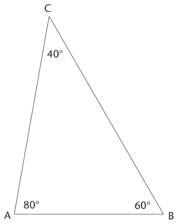
> **[Diagram Context - Textbook_Mathematics_Gr9_Construction-of-geometric-figures.pdf-0029-12.png]**
> This figure is a geometry diagram of a triangle labeled ABC, with interior angles at vertices A, B, and C given as 80°, 60°, and 40° respectively. It serves as a foundational visual for high school trigonometry, allowing students to apply the sine rule or cosine rule to solve for unknown side lengths or to verify the sum of interior angles in a triangle.

---

### Step 3: Measure the Angle

A protractor gives a clockwise degree scale and an anticlockwise degree scale. You choose the correct scale by finding the one that starts with $0^{\circ}$ on the angle arm. Look at where the other angle arm passes under the degree scale. That is where your measurement is.

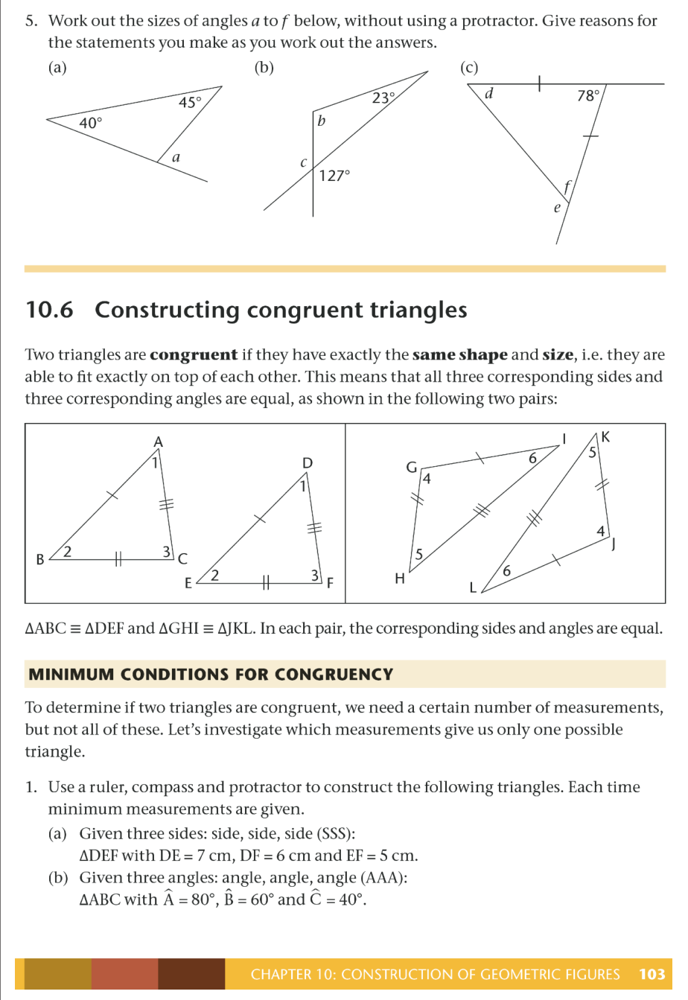
> **[Diagram Context - Textbook_Mathematics_Gr9_Construction-of-geometric-figures.pdf-0029-14.png]**
> This geometry resource features diagrams of triangles with internal and exterior angles, as well as pairs of congruent triangles labeled with vertices (A-L) and side-length indicators. It illustrates the application of Euclidean geometry principles, such as the exterior angle theorem and angle sum properties, while defining the criteria for triangle congruency. These visuals help students understand how to calculate unknown angles and identify the specific conditions required to prove that two triangles are identical in shape and size.

*Here we must use the inner scale (goes anticlockwise from the base line).*

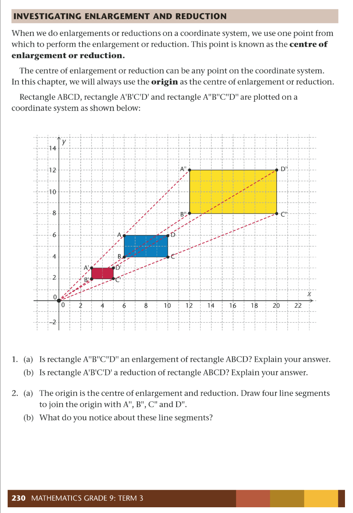
> **[Diagram Context - Textbook_Mathematics_Gr9_Transformation-geometry.pdf-0029-13.png]**
> This Cartesian coordinate diagram illustrates the geometric transformation of three rectangles (ABCD, A'B'C'D', and A"B"C"D") relative to the origin (0,0). By using dashed lines to connect the origin to the vertices of each shape, the graphic demonstrates how the origin acts as the centre of enlargement or reduction, visually showing the proportional scaling of figures in a coordinate plane.

*You can also place the protractor on the angle using the other arm. Then the correct position looks like this:*

*Here we must use the outer scale (goes clockwise from the base line).*

The angle in the pictures above is $37^{\circ}$. Do you agree? Do you see that there are two ways to measure an angle?

---

### PRACTISE MEASURING WITH A PROTRACTOR

#### Misconceptions
* **Learners use the wrong scale:** They measure an acute angle using the wrong scale and the number of degrees they read off suggests an obtuse angle.
* Circulate to make sure that learners can correct such mistakes and understand why it is not correct.

#### Answers
1. See LB page $64$ on following page.

---

### PRACTISE MEASURING WITH A PROTRACTOR (Continued)

1. Measure the angles and copy and complete the table on the next page. If you need to, copy the drawing and extend the arms.

*(a)* <!-- DIAGRAM_PLACEHOLDER: diagram -->
*(b)* <!-- DIAGOURCE_PLACEHOLDER: diagram -->
*(c)* <!-- DIAGRAM_PLACEHOLDER: diagram -->

---

## Revision Notes: Geometry of Angles

### Key Concepts

* **Straight Angle:** A straight line represents an angle of $180^\circ$. Angles on a straight line add up to $180^\circ$.
* **Revolution:** A full circle or complete turn around a point represents an angle of $360^\circ$. Angles around a point add up to $360^\circ$.
* **Reflex Angle:** An angle greater than $180^\circ$ and less than $360^\circ$. Because standard protractors only measure up to $180^\circ$, measuring a reflex angle requires a specific strategy:
  1. Measure the angle on the other side and subtract its size from $360^\circ$.
  2. Alternatively, extend one of the arms to split the angle into two parts (one part being a straight angle of $180^\circ$), measure the remaining smaller part, and add it to $180^\circ$.

---

### Worked Examples & Activities

#### Activity 1: Measuring Angle Sizes
Angles can be measured directly using a protractor, or calculated using angle relationships. 

| Angle | (a) | (b) | (c) | (d) | (e) | (f) |
| :--- | :---: | :---: | :---: | :---: | :---: | :---: |
| **Angle size in degrees** | $43^\circ$ | $83^\circ$ | $90^\circ$ | $120^\circ$ | $103^\circ$ | $32^\circ$ |

---

#### Activity 2: Numbered Angles in a Complex Figure
Some angles in complex figures can be measured directly, while reflex angles (such as angles $7$ and $8$) require calculation or strategic measurement.

| Angle | Size |
| :---: | :---: |
| 1 | $48^\circ$ |
| 2 | $88^\circ$ |
| 3 | $45^\circ$ |
| 4 | $45^\circ$ |
| 5 | $135^\circ$ |
| 6 | $65^\circ$ |
| 7 | $295^\circ$ |
| 8 | $268^\circ$ |
| 9 | $21^\circ$ |
| 10 | $44^\circ$ |
| 11 | $136^\circ$ |
| 12 | $92^\circ$ |

---

### Some Things to Think About

1. **Comparing Angles 3 and 4:** Observe how angle $3$ and angle $4$ relate in size to one another.
2. **Angles 6 and 7:** Investigate the relationship between angle $6$ and reflex angle $7$.
3. **Angles 4 and 5:** Compare the sizes and positions of angle $4$ and angle $5$.
4. **Further Investigation:** Look for additional geometric patterns, supplementary angles, or vertically opposite angles within the complex figure.

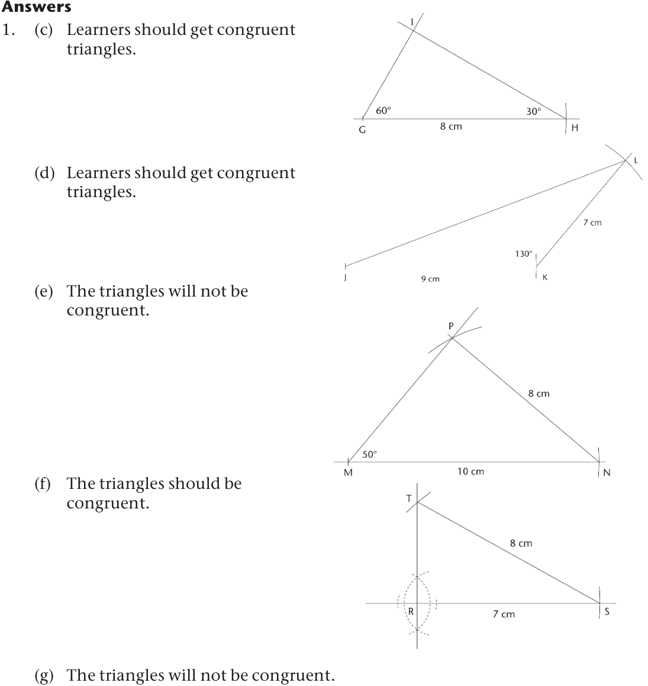
> **[Diagram Context - Textbook_Mathematics_Gr9_Construction-of-geometric-figures.pdf-0030-00.png]**
> This graphic displays a series of geometric construction figures labeled (c) through (g), featuring triangles defined by specific side lengths (e.g., 7 cm, 8 cm, 9 cm, 10 cm) and interior angles (e.g., 30°, 50°, 60°, 130°). These diagrams serve as practical exercises for Grade 9-10 learners to investigate the conditions for triangle congruence, such as SSS, SAS, ASA, and RHS, by comparing constructed triangles against given criteria.

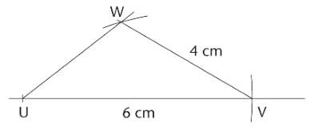
> **[Diagram Context - Textbook_Mathematics_Gr9_Construction-of-geometric-figures.pdf-0030-01.png]**
> This geometry figure illustrates the construction of a triangle using a compass and ruler, featuring vertices U, V, and W with side lengths of 6 cm and 4 cm. The diagram displays construction arcs at vertices W and V, demonstrating the geometric method for accurately locating a point in space based on fixed side lengths.

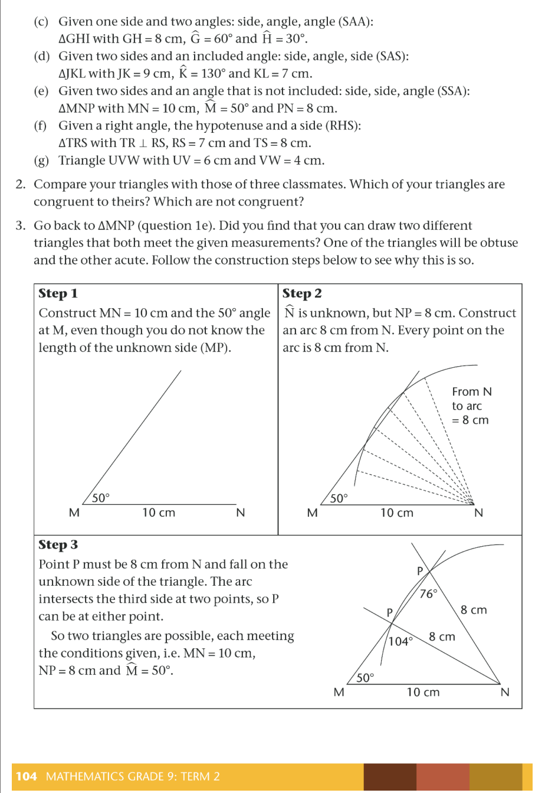
> **[Diagram Context - Textbook_Mathematics_Gr9_Construction-of-geometric-figures.pdf-0030-02.png]**
> This geometry instructional graphic illustrates the construction of triangles using specific side and angle measurements, focusing on the ambiguous case of the Side-Side-Angle (SSA) condition. It uses labeled vertices (M, N, P), side lengths (10 cm, 8 cm), and angle measures (50°, 76°, 104°) to demonstrate how an arc can intersect a line at two distinct points. This visually explains why the SSA condition does not guarantee a unique triangle, as the construction results in two possible triangles—one acute and one obtuse—that satisfy the same initial criteria.

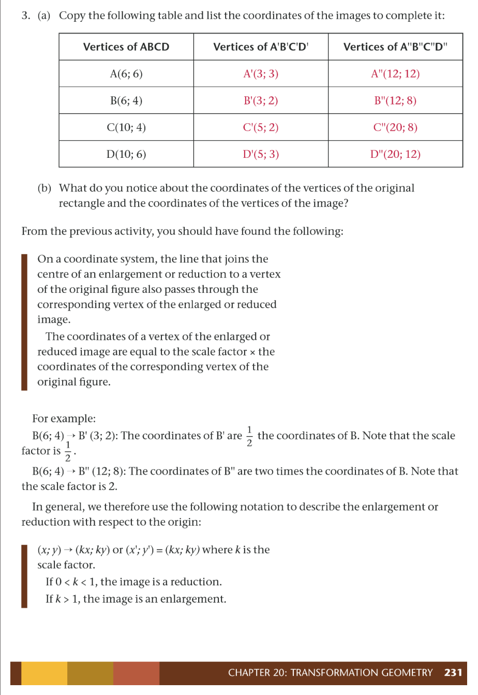
> **[Diagram Context - Textbook_Mathematics_Gr9_Transformation-geometry.pdf-0030-15.png]**
> This educational resource presents a table of coordinate geometry data for a rectangle undergoing transformations, accompanied by explanatory text defining enlargement and reduction. It utilizes vertex labels (A, B, C, D), their transformed counterparts (A', B', C', D' and A'', B'', C'', D''), and the algebraic notation $(x; y) \rightarrow (kx; ky)$ to represent scale factors. Conceptually, it guides learners to understand how multiplying coordinates by a scale factor $k$ relative to the origin results in geometric enlargements or reductions.

---

## 4.4 Using a protractor to construct angles

### Constructing Angles to a Given Line

#### Core Concepts and Teaching Guidelines
* **Reference Line:** The line you are given to start with is called a reference line.
* **Angle Direction:** Mathematicians usually measure angles **anticlockwise** from the reference line.
* **Inner Scale:** Measuring in an anticlockwise direction on a reference line means using the **inner scale** on the protractor.

---

### Step-by-Step Procedure: Constructing a $90^\circ$ Angle

1. **Step 1:** Choose a point anywhere on the line. Make a small mark on the line (the vertex, labeled $O$).
2. **Step 2:** Place the protractor with its **base line** on the line and its origin exactly on top of the **mark you made on the line**.
3. **Step 3:** Make a small, clear mark at the **edge of the protractor above the $90^\circ$ mark**.
4. **Step 4:** Use a ruler to line up the two **marks** and draw a straight line that passes exactly through them.

---

### Activities and Worked Examples

#### Activity: Constructing Various Angles
Copy the provided reference line and use it to construct the following angles, measured anticlockwise from the line:

* (a) $23^\circ$
* (b) $45^\circ$
* (c) $65^\circ$
* (d) $79^\circ$
* (e) $90^\circ$
* (f) $121^\circ$
* (g) $154^\circ$
* (h) $180^\circ$
* (i) $200^\circ$
* (j) $270^\circ$
* (k) $300^\circ$

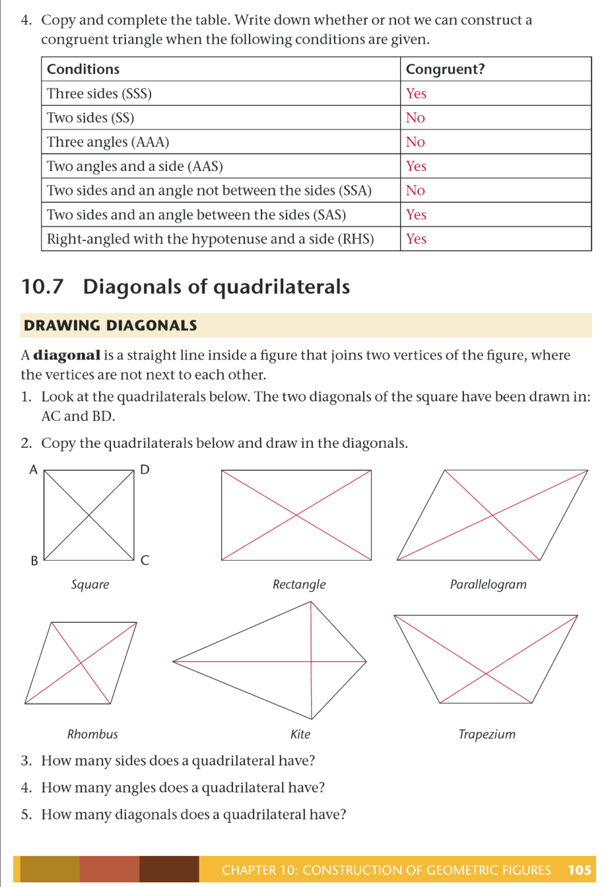
> **[Diagram Context - Textbook_Mathematics_Gr9_Construction-of-geometric-figures.pdf-0031-13.png]**
> This educational graphic features a table summarizing triangle congruence conditions (SSS, SS, AAA, AAS, SSA, SAS, RHS) followed by a geometry exercise illustrating the diagonals of various quadrilaterals, including a square, rectangle, parallelogram, rhombus, kite, and trapezium. The content helps students distinguish between sufficient and insufficient conditions for triangle congruence and provides a visual representation of how diagonals connect non-adjacent vertices within different quadrilateral shapes.

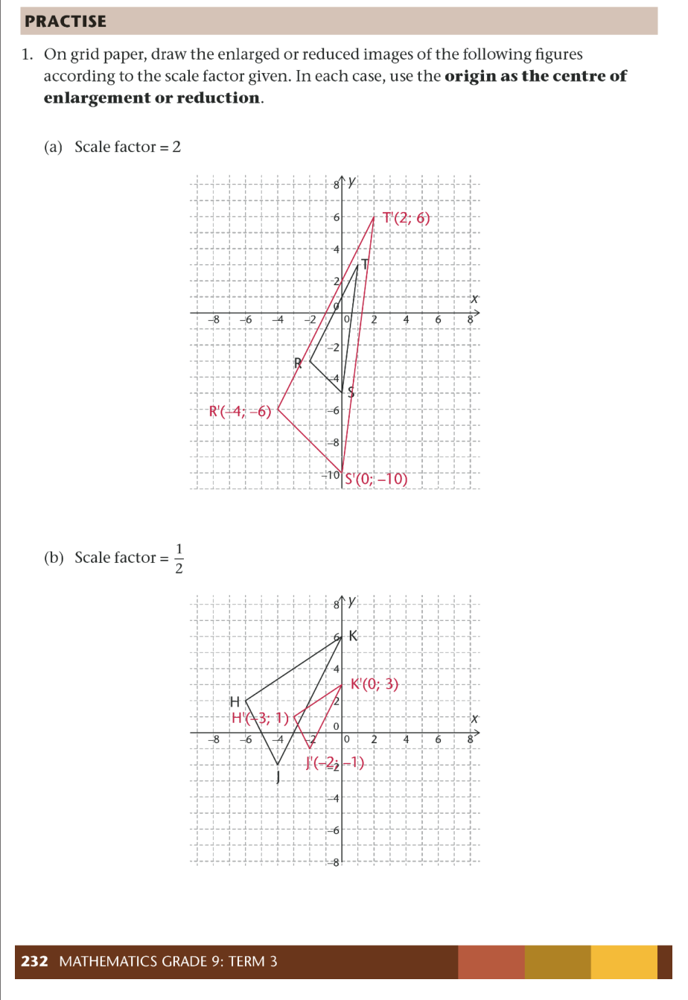
> **[Diagram Context - Textbook_Mathematics_Gr9_Transformation-geometry.pdf-0031-06.png]**
> This graphic displays two Cartesian coordinate geometry problems involving the transformation of polygons through enlargement and reduction. It features triangles labeled with vertices (T, R, S and H, J, K) and their corresponding transformed images (T', R', S' and H', J', K') plotted on grid paper with x and y-axes. The diagrams illustrate the concept of dilation centered at the origin, showing how multiplying vertex coordinates by a specific scale factor (2 or 1/2) changes the size of the shape while maintaining its geometric similarity.

---

4. See LB page 66 alongside. It is an equilateral triangle.
5. See LB page 66 alongside.

---

## 4.5 Parallel and perpendicular lines

### Notes
Learners worked with parallel and perpendicular lines in the previous chapter. Work through the revision in the Learner Book and make sure that learners understand how to:
* recognise perpendicular and parallel lines
* write that lines are perpendicular or parallel
* show in a drawing that two lines are meant to be perpendicular or parallel.

---

### CONSTRUCTING PERPENDICULAR AND PARALLEL LINES

#### Background
In this section the emphasis is on using the protractor to construct perpendicular and parallel lines, but there are other ways of constructing these lines. Some of these methods are shown below the answers in this section.

#### Teaching guidelines
Work through the methods explained in the Learner Book so that learners practise using the protractor. 

You could use the additional methods mentioned shown below to provide extra exercises for learners who need extension exercises.

---

### Exercises & Activities

4. Copy the line on the right. Then at each end, draw lines at an angle of $60^\circ$ to form a triangle. What sort of triangle is this?

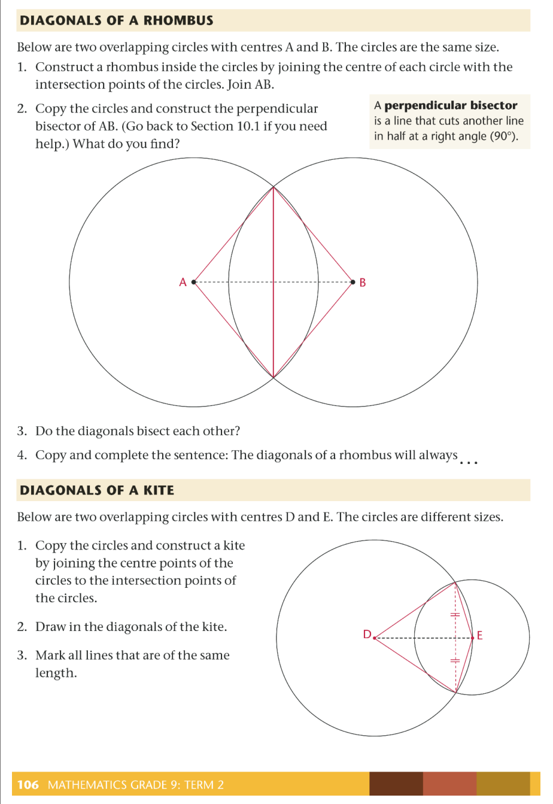
> **[Diagram Context - Textbook_Mathematics_Gr9_Construction-of-geometric-figures.pdf-0032-15.png]**
> This geometry figure uses overlapping circles to construct a rhombus (with centres A and B) and a kite (with centres D and E), utilizing labels for centres and congruence markers for line segments. It conceptually guides learners to discover the properties of diagonals in these quadrilaterals, specifically demonstrating that diagonals bisect each other in a rhombus and that one diagonal is the perpendicular bisector of the other in a kite.

5. Copy and complete the quadrilateral below. The angle at P must be $52^\circ$ and the one at Q must be $23^\circ$.

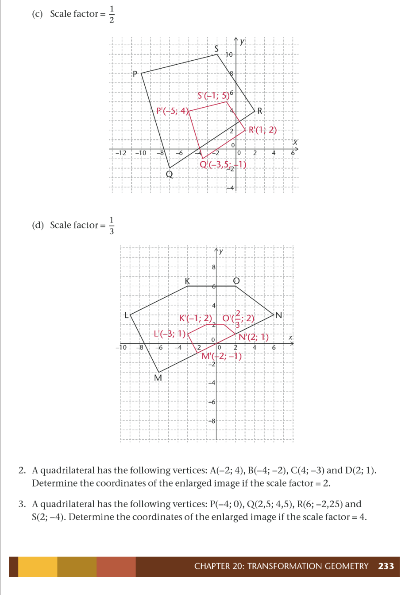
> **[Diagram Context - Textbook_Mathematics_Gr9_Transformation-geometry.pdf-0032-05.png]**
> This graphic illustrates transformation geometry on a Cartesian plane, specifically showing the reduction of polygons (PQRS and KLON) by scale factors of 1/2 and 1/3. The diagrams display original vertices labeled with black letters and corresponding image vertices labeled with red prime notation (e.g., P', Q', R', S') and their specific coordinate values. Conceptually, this demonstrates how multiplying the coordinates of a figure by a fractional scale factor results in a smaller, similar image centered at the origin, reinforcing the relationship between algebraic coordinate multiplication and geometric dilation.

---

### 4.5 Parallel and perpendicular lines

#### Perpendicular lines
* Perpendicular lines meet each other at an angle of $90^\circ$.
* The sketch shows two perpendicular lines.
* We say: $AB$ is perpendicular to $DC$.
* We write: $AB \perp DC$

<!-- DIAGRAM_PLACEHOLDER: diagram -->

#### Parallel lines
* Parallel lines never meet each other. They are an equal distance apart. They have the same direction.
* The sketch shows two parallel lines.
* We say: $PQ$ is parallel to $RS$.
* We write: $PQ \parallel RS$
* The arrows on the middle of the lines show that the lines are parallel to each other.

<!-- DIAGRAM_PLACEHOLDER: diagram -->

---

### CONSTRUCTING PERPENDICULAR AND PARALLEL LINES
When constructing parallel lines, remember that the lines always stay the same distance apart. Follow the steps on page 67 to draw perpendicular and parallel lines using a protractor and a ruler.

---

## CHAPTER 4: CONSTRUCTION OF GEOMETRIC FIGURES

### Answers

1. See steps 1–4 in the Learner Book. Step 4 (on LB page 68) shows the final construction drawing. Length of $AC$: $3,5\text{ cm}$ (Step 2).

---

### Additional Background: Alternative Ways to Draw Lines

#### 1. Drawing a Line Perpendicular to a Reference Line

Follow the steps below to draw a line perpendicular to a reference line using a set square:

* Draw reference line $AB$ about $7\text{ cm}$ long and mark a point $4\text{ cm}$ from $B$.
* Place the edge of the set square on $AB$ at the marked point.
* Draw a line along the upright edge of the set square.
* Remove the set square; lengthen the line.
* Mark the right angle where the lines cross with a small square.

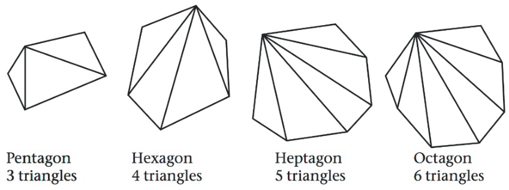
> **[Diagram Context - Textbook_Mathematics_Gr9_Construction-of-geometric-figures.pdf-0033-15.png]**
> This geometry figure illustrates the triangulation of convex polygons, specifically a pentagon, hexagon, heptagon, and octagon, each subdivided into non-overlapping triangles from a single vertex. The labels identify the polygon names and the corresponding number of triangles formed, which is always two less than the number of sides ($n-2$). This diagram conceptually demonstrates the derivation of the formula for the sum of interior angles of a polygon by showing how any $n$-sided polygon can be partitioned into $(n-2)$ triangles.

---

#### 2. Drawing Parallel Lines

Follow the steps below to draw parallel lines using a set square:

* Draw line $AB$ about $7\text{ cm}$ long and mark a point $R$ $4\text{ cm}$ from $B$.
* Place the short edge of the set square on $AB$ at $R$ and draw line $RS$ perpendicular to $AB$.
* Move the set square to $T$ and draw $TU \parallel RS$.

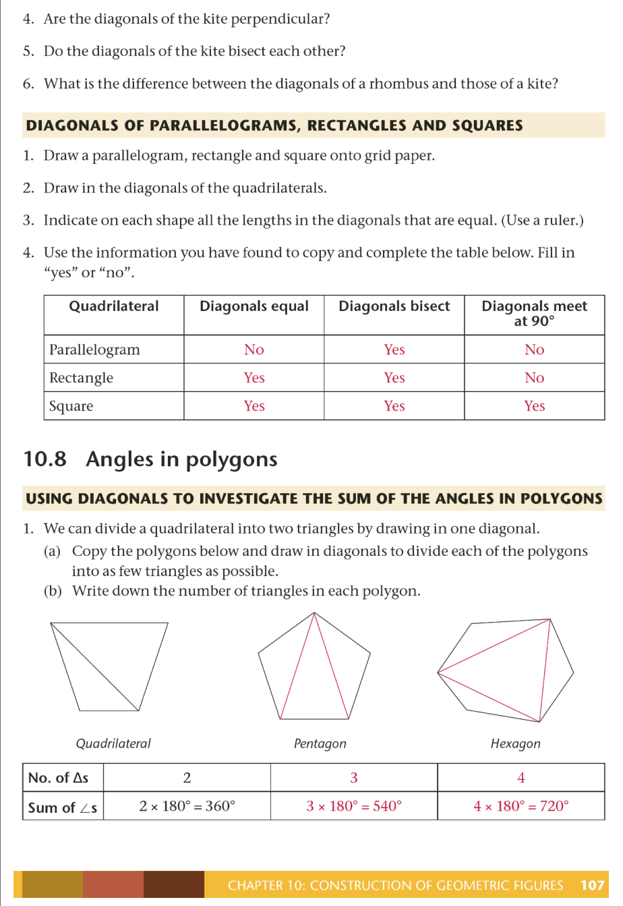
> **[Diagram Context - Textbook_Mathematics_Gr9_Construction-of-geometric-figures.pdf-0033-18.png]**
> This educational resource features a geometry exercise containing a comparison table for the properties of quadrilaterals and a set of polygons (quadrilateral, pentagon, and hexagon) divided into triangles by internal diagonals. The content uses labels such as "Quadrilateral," "Pentagon," "Hexagon," "No. of Δs," and "Sum of ∠s" to guide students in discovering the relationship between the number of sides in a polygon and the sum of its interior angles. By decomposing polygons into triangles, learners conceptually derive the general formula for the sum of interior angles in any polygon.

---

### Step-by-Pedagogy Construction Activity

We want to draw a line that is parallel to $XY$ and that passes through point $A$.

* **Step 1: Draw a perpendicular line between $A$ and $XY$.**  
  Copy the line $XY$ above. Use your protractor to draw a line that goes through $A$ and is at $90^\circ$ to $XY$. Label the point $C$ where your new line touches $XY$. Look at the sketch on the right if you get stuck.

* **Step 2: Measure the perpendicular distance between the point and the line.**  
  Write down the length of $AC$. ($3,5\text{ cm}$)

* **Step 3: Draw a point that is the same distance from the line.**  
  Then draw another line that is perpendicular to line $XY$. Mark off the same length as $AC$ on that line. The sketch below shows what you must do.

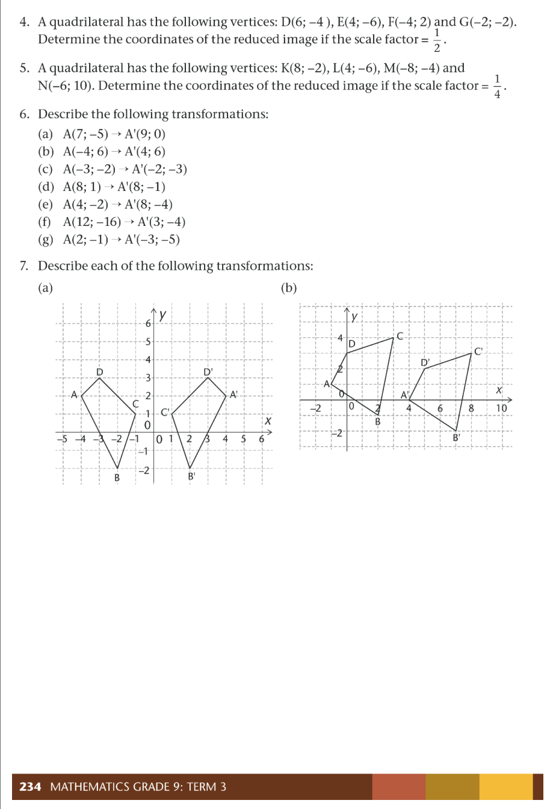
> **[Diagram Context - Textbook_Mathematics_Gr9_Transformation-geometry.pdf-0033-13.png]**
> This document contains a set of Grade 9 mathematics exercises featuring Cartesian plane graphs of geometric transformations. The visual content includes two sets of quadrilaterals labeled with vertices (A, B, C, D and their transformed counterparts A', B', C', D') plotted against x and y axes. These diagrams conceptually illustrate the geometric properties of translations, helping students visualize how coordinates change when a shape is shifted across the Cartesian plane.

---

- Remove the set square. Lines can be drawn parallel to each other along a slanted reference line as illustrated in the drawing.

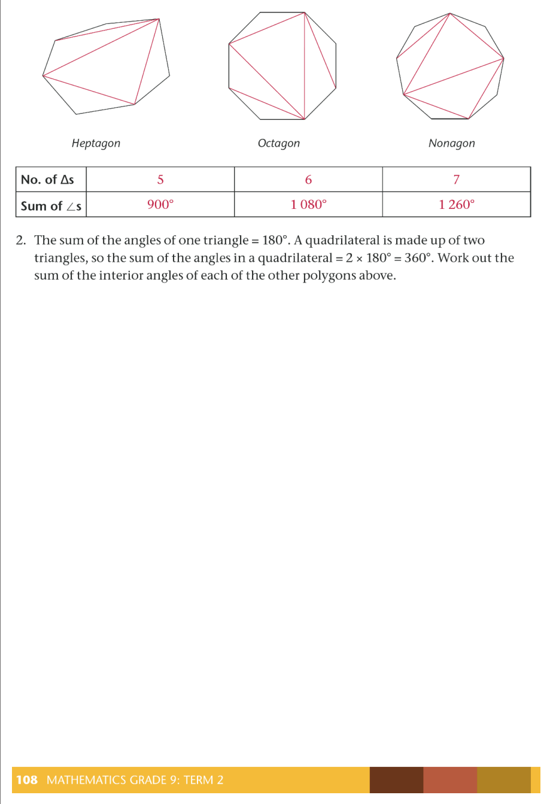
> **[Diagram Context - Textbook_Mathematics_Gr9_Construction-of-geometric-figures.pdf-0034-02.png]**
> This geometry figure illustrates the triangulation of polygons (heptagon, octagon, and nonagon) to determine the sum of their interior angles. By showing how these shapes are divided into triangles, the diagram helps students derive the general formula $(n - 2) \times 180^\circ$ for calculating the sum of interior angles in any polygon.

**Step 4: Draw the parallel line.**
Join A with the new point that is an equal distance away from $XY$. You now have a parallel line.

<!-- DIAGRAM_PLACEHOLDER: diagram -->

2. Practise constructing perpendicular and parallel lines using a protractor and a ruler.

## 4.6 Circles are very special figures

And now for something slightly different ... let us have a look at **circles**.

### A CIRCLE WITH STRING

You may need to work with a partner here. You need two sharp pencils and a short length of string, an A4 sheet of paper and a ruler.

1. Tie the string to both pencils with double knots. The knots must be firm but not tight. The string must swing easily around the pencils without falling off. Once you have tied your string, the distance between the pencils when the string is tight should not be more than $8\text{ cm}$.
2. Your partner must hold one pencil *vertically* with its point near the centre of the sheet of paper.
3. Now carefully move the tip of the other pencil around the middle one, drawing as you go. Try to keep the string *stretched* and the pencil *vertical* as you draw.
   If you have been careful, you will have drawn a circle (well, hopefully something pretty close to a circle). You can swop now so your partner also has a turn drawing while you hold the centre pencil.
4. Mark three points on the circle line. Measure the distance between the point and the centre of the circle for each. If you have a circle you should find that the distances are the same.

---

### Notes

It is useful for learners to draw circles as described on LB page 68. This method can be used when a gardener wants to make a circular flower bed. This would be done by knocking a stick or batten into the ground with a hammer; tying string around it and attaching another stick to the other end, pulling it taught and drawing the second stick along the ground to complete a circle.

#### A CIRCLE WITH STRING

#### Misconceptions
Learners need to be quite clear about the difference between the radius and the diameter of a circle. Learners often confuse the two. For example, if they want a circle that is two metres across, they must have a radius of one metre.

Learners sometimes do not realise that a diameter goes through the centre of the circle, so they would draw a chord and call it a diameter.

#### Teaching guidelines
Learners concentrate so much on managing the activity, that they might not realise the significance of the end result. Therefore, pay special attention to question 4 with a discussion about the fact that any point you choose on the circle that you drew, is the same distance from the centre of the circle as any other point.

Make sure learners understand the difference between the radius and the diameter. Make sure learners realise that a diameter is a line that runs through the centre of the circle, point to point. It may help to show two radii that are in opposite directions.

---

# 4.7 Using the Compass

## Concepts & Structure

### Why We Use a Compass
Drawing circles using a string and pencils has drawbacks because string is stretchy, making it difficult to keep the radius constant. This can cause the drawing pencil to wander off course, resulting in a spiral or wobbly curve rather than a true circle. 

To draw accurate circles, we need a special instrument called a **pair of compasses**, or simply a **compass**.

### Key Definitions & Terminology
* **Radius:** The distance from the centre of a circle to any point on the circle.
  * Pronunciation: *"ray-dee-us"*
* **Radii:** The plural form of radius.
  * Pronunciation: *"ray-dee-eye"*

---

## Teaching Guidelines

1. **Practice Handling the Compass:** Learning to use a compass requires practice. Work through the description of the compass and demonstrate how to draw a circle using it. Let learners practice drawing circles and circular patterns to learn how to handle the tool.
2. **Measuring Accurately:** Let learners practice measuring a radius accurately on a ruler (refer to step 1 on LB page 70).
3. **Marking Points:** In addition to drawing full circles, learners must practice making small marks with the pencil of a compass, such as marking off points on the circumference of a circle.
4. **Drawing Tips:** Conclude this section by working through the tips for drawing circles on LB pages 70 and 71.

---

## Think About It

*Can you think of any other figure where the distance between the centre and the edge is constant in all directions?*
* A square?
* A hexagon?
* What about an oval shape (ellipse)?

*Do some investigation to see what you can find.*

---

## Diagram Reference

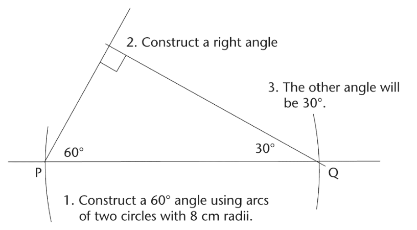
> **[Diagram Context - Textbook_Mathematics_Gr9_Construction-of-geometric-figures.pdf-0035-05.png]**
> This geometry figure illustrates a step-by-step geometric construction of a right-angled triangle using points P and Q, arcs, and specific angle measurements of 60° and 30°. The diagram labels the construction steps and identifies the resulting angles, demonstrating the application of Euclidean geometry principles to construct specific triangles. It serves as a visual guide for learners to understand how angle properties and arc construction are used to accurately form geometric shapes.

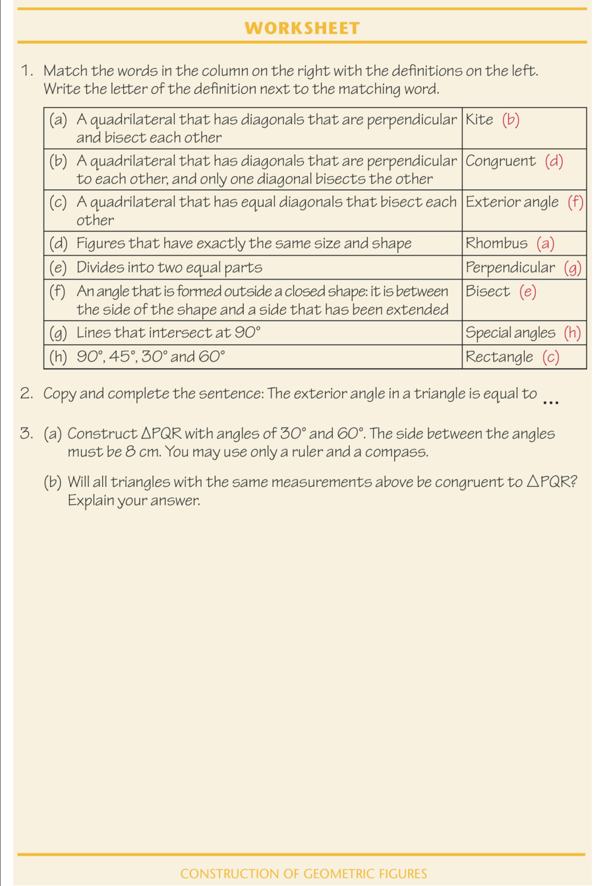
> **[Diagram Context - Textbook_Mathematics_Gr9_Construction-of-geometric-figures.pdf-0035-07.png]**
> This geometry worksheet features a matching exercise for quadrilateral properties and terminology, followed by conceptual questions regarding the exterior angle theorem and triangle construction. It includes labels for geometric terms such as "Kite," "Rhombus," "Congruent," "Perpendicular," and "Bisect," alongside specific angle values and triangle notation. The content reinforces the CAPS curriculum requirements for understanding Euclidean geometry properties and the conditions for geometric construction and congruence.

---

# CONSTRUCTING CIRCLES WITH A COMPASS

## Teaching Guidelines
Guide learners through the steps on how to draw a circle with the compass.

Discuss new words, like **concentric**. Draw a few sets of concentric circles so that learners can see how they come about. They have the same midpoint, but the radii are different.

## Misconceptions
Learners confuse radius and diameter.

---

## Instructions: Constructing a Circle

1. You will see a point labelled A below. Follow the steps below to draw a circle with a radius of $2\text{ cm}$. The centre must be at A.

<!-- DIAGRAM_PLACEHOLDER: diagram -->

* **Step 1:** Place the pointed tip on the zero line of your ruler. Carefully widen the angle between the arms. Move the pencil tip until it is exactly at $2\text{ cm}$. Make sure that the pointed tip is still on zero. Be careful not to change the gap once it is set to $2\text{ cm}$.
* **Step 2:** Mark point A in the centre of your page. Gently push the pointed tip into point A. Push just deep enough into the paper to keep it in place. This will be the centre of your circle.
* **Step 3:** Hold the handle between the forefinger and thumb of your writing hand. Keep your other hand out of the way. Use only one hand when you draw a circle with a compass.
* **Step 4:** Twist the handle between your thumb and forefinger. If you are right-handed, it is easiest to twist the compass clockwise. If you are left-handed, turn the compass anticlockwise. Let the pencil tip drag over the paper. Don't push down too hard on the pencil. Rather, push down lightly on the pointed arm as you draw. The pencil tip must move smoothly and easily.

2. Then draw concentric circles at centre A with radii of $3\text{ cm}$, $4\text{ cm}$, $5\text{ cm}$ and $6\text{ cm}$. Set the gap carefully each time. Write the radius on the edge of each circle.

> **Note:** Concentric circles have the same midpoint.

Learning to use a compass is like learning to ride a bicycle. It takes co-ordination and practice. Don't be embarrassed if it goes wrong. With practice you will get very good at it. If your circles end up being all wobbly lines, just begin again!

---

## Answers

<!-- DIAGRAM_PLACEHOLDER: diagram -->

---

# CHAPTER 4: CONSTRUCTION OF GEOMETRIC FIGURES

## CIRCLES ON ONES

### Teaching Guidelines

Guide learners through the steps explained to draw the six circles on the centre circle.

When learners are inexperienced, the patterns don't work out. Point out that they need to be precise when they place the compass point; the pencil has to be sharp and their touch light. If they press too hard on the compass, the pencil may move slightly outward, which will influence the circle drawn.

### Notes

Suggest to learners that they use their patterns to decorate greeting cards (for example, a get-well card or a Mother's Day card, etc.), or they could decorate a cover of a book with repeated patterns of their own design. They could also use concentric circles in different colours as decoration. A few suggestions are shown in the answer section below.

---

## TIPS FOR DRAWING CIRCLES

* If your circles are turning into spirals it is because the arms of your compass have moved. Check their width again against a ruler.
* If the arms of your compass won't stay in the position you set them at, it is because the nut at the hinge below the handle is loose. Ask your teacher to help you if you can't tighten it yourself.
* If you can't do the twist, imagine you have a small piece of soft clay between your thumb and forefinger and you are trying to roll it into a small strip. The twist for turning your compass uses the same type of sliding movement. Let the compass hang from your hand in the air and twist the handle. Then try it on scrap paper a few times until you can turn the compass easily.

---

## CIRCLES ON CIRCLES

It's time to have some fun with the compass while getting better at using it. Follow these instructions to draw the beautiful pattern shown in your exercise book.

<!-- DIAGRAM_PLACEHOLDER: diagram -->

### Instructions

1. Make sure your pencil is sharp; then place it in the compass.
2. Set the radius to $4\text{ cm}$. Draw a circle at the centre of your page. **Important:** your radius must stay the same for the whole activity.
3. Put your compass point anywhere on the circle edge. Draw another circle. This circle should pass through the centre of your first circle (they have the same radius).
4. Your second circle cuts the first circle at two points. Choose one of these points. Place your compass point at this point. Draw another circle of radius $4\text{ cm}$.
5. Repeat step 3 with your third circle, fourth circle etc. You should end up with six circles on your first circle. That is, seven circles in total.
6. Decorate it as you please. (You can decorate your pattern further by adding more circles or joining points with straight lines, and so on. See what patterns and shapes you can discover among all the circles.)

---

## Answers

<!-- DIAGRAM_PLACEHOLDER: diagram -->

---

# 4.8 Using Circles to Draw Other Figures

## Background
Engineers, architects, designers, sign writers, production designers, and artists often use compasses and circles. Many logos and well-known symbols incorporate circles or parts of circles, such as the yin-yang logo or the Mercedes-Benz logo.

---

## Geometric Figures Hiding in the Circles

### Activity Instructions
1. Look at the set of seven intersecting circles (such as the flower-of-life pattern shown in the diagram).
2. Find hidden polygons by joining the points where the circles intersect each other.
3. The intersection points serve as the vertices of the polygons. 
4. Carefully rule lines with a pencil to discover various shapes:
   - Triangles
   - Quadrilaterals
   - Pentagons
   - Hexagons
5. Once identified, you can measure the interior angles at each vertex and the lengths of the sides to analyze the geometric properties of the constructed figures.

---

## Arcs of Circles
It is not always necessary to draw complete circles to construct geometric figures. Often, constructors are only interested in the specific intersection points where circles cross each other. Consequently, drawing only the necessary **arcs** at those crossing points is sufficient for clean geometric constructions.

---

## Arcs of circles

### Notes

* **Circumference:** The distance around a circle, a sphere, a cylinder, or any other curved shape.
* **Perimeter:** The distance around a shape that has vertices, such as a rectangle. 
* **Note on Perimeter and Circumference:** Both terms refer to the same type of measurement: the distance around the shape or around the base of an object.
* **Arc:** Part of the length of the circumference of a circle. It could be a small part or it could be all the way around, the full circle.
* Radii of the same circle are all equal; therefore, the straight distance between any point on the circle and the centre of the circle is the radius of the circle. Starting from any point on the circle and marking off six equal arcs, we should get the sides of a regular hexagon.
* In practice, learners sometimes find that their last arc does not go through the original point on the circumference. If this happens, help learners to find why and to improve the effort.

<!-- DIAGRAM_PLACEHOLDER: diagram -->

### Teaching guidelines

* Discuss the different drawings on LB page 73.
* Learners should do the practical work on LB page 73, drawing the arcs.
* Circulate to make sure that learners can follow the instructions.

### Exercises

Do the following in your exercise book:

1. Draw an arc using a radius of $3\text{ cm}$.
2. Draw an arc bigger than a quarter circle, using a radius of $5\text{ cm}$.
3. Draw an arc smaller than a quarter circle, using a radius of $5\text{ cm}$.

### Answers

1. <!-- DIAGRAM_PLACEHOLDER: diagram -->
2. <!-- DIAGRAM_PLACEHOLDER: diagram -->
3. <!-- DIAGRAM_PLACEHOLDER: diagram -->

### ENRICHMENT

Once you have finished the work in section 4.8, experiment with drawing only the arcs that you need in various constructions. Here is an example to show how to construct a regular hexagon with only arcs:

<!-- DIAGRAM_PLACEHOLDER: diagram -->

It takes some skill to construct the hexagon using only the arcs as required in this section. Learners can work in pairs and try to give reasons why this works.

---

# Familiar Figures in the Seven-Circle Pattern

## Notes & Teaching Guidelines

* **Prerequisites:** Learners should complete foundational activities involving seven-circle patterns before attempting these constructions.
* **Construction Instructions:** 
  1. Start by drawing five seven-circle sets on blank pieces of paper using a radius no bigger than $4\text{ cm}$.
  2. Label each figure using the points of intersection as shown in the reference diagrams.
  3. Number the sets from **Figure 2** to **Figure 6**.
* **Extensions:** Encourage learners to measure the internal angles of the constructed shapes, use their compasses for advanced circular designs, and create decorative art (such as posters, greeting cards, gift wrapping, or book covers) using these patterns.

---

## Core Activities

### 1. Connecting Points on the Seven-Circle Pattern

Follow the instructions below for each figure by drawing straight lines connecting the designated points:

* **Figure 1:** Draw lines connecting $AB$, $BC$, $CD$, $\dots$ up to $FA$. *(Forms a regular hexagon, as shown in the reference diagram).*
* **Figure 2:** Draw lines connecting $A$, $O$, and $B$.
* **Figure 3:** Draw lines connecting $B$, $F$, and $D$.
* **Figure 4:** Draw lines connecting $BC$, $CE$, $EF$, and $FB$.
* **Figure 5:** Draw lines connecting $CD$, $DE$, $EF$, and $FC$.
* **Figure 6:** Draw lines connecting $AB$, $BC$, $CE$, and $EA$.

---

### 2. Properties of Geometric Figures

| Figure | Name of Figure | Properties |
| :---: | :--- | :--- |
| **1** | Regular hexagon | Six-sided figure. All the sides are equal. All the interior angles are equal. |
| **2** | Equilateral triangle | 3-sided figure. All three sides are equal. All three angles are equal ($60^\circ$). |
| **3** | Equilateral triangle | 3-sided figure. All three sides are equal. All three angles are equal ($60^\circ$). |
| **4** | Rectangle | 4-sided figure. Has two pairs of parallel sides: two long sides and two short sides. All four angles are right angles ($90^\circ$). |
| **5** | Trapezium | 4-sided figure. Has two obtuse angles and two acute angles. One pair of sides is parallel. |
| **6** | Kite | 4-sided figure. Adjacent sides are equal in length. One pair of angles is equal in size. |

---

## Additional Exercises & Design Challenges

1. **Reproduction on Dotted Backgrounds:** 
   Challenge learners to copy symmetrical circular patterns onto dotted paper grids. These can be colored in to create repeating tessellations, greeting cards, or decorative covers.
2. **Advanced Compass Construction:**
   Advanced learners can attempt to construct dynamic spiral and Yin-Yang style curved designs using a compass, following step-by-step construction arcs across aligned circle bases.

---

# CONSTRUCT SOME MORE FIGURES

## Teaching Guidelines

* Let learners work in pairs or small groups, but ensure each learner makes their own drawing. Once complete, they can compare and discuss their findings.
* The drawings learners make for question 2 will differ depending on the size chosen for their angles. Remind learners of the properties of the sides of a parallelogram.

---

## Exercises and Instructions

### Question 1: Constructing an Equilateral Triangle

Read the instructions carefully and follow them exactly:

1. (a) Draw a line in your exercise book between $3\text{ cm}$ and $6\text{ cm}$ long in the middle of your page.
2. (b) Label the ends $A$ and $B$.
3. (c) Place the point of your compass at point $A$. Carefully set the radius of your compass to the distance between $A$ and $B$.
4. (d) Draw a circle with the compass point at $A$.
5. (e) Draw another circle with the compass point at $B$ without changing the radius width.
6. (f) The circles cross at two points. Choose one of these points and label it $C$. Check that you are on the right track by comparing your sketch to the diagram below.
7. (g) Carefully rule the lines $AC$ and $BC$.
8. (h) What sort of figure is $\triangle ABC$? Check this by measuring angles. Why do you think this happened?

<!-- DIAGRAM_PLACEHOLDER: diagram -->

**Answers for Question 1:**
* (a)-(g) Learners follow the instructions.
* (h) $\triangle ABC$ is an equilateral triangle (each angle $= 60^\circ$). This is because the distance from the centre of a circle to its edge is the same in any direction, therefore $AB = AC = BC$.

---

### Question 2: Constructing a Parallelogram

Read the instructions carefully and follow them exactly:

1. (a) Draw two lines $PQ$ and $QR$ in your exercise book:
   * The lines meet and form an angle at $Q$.
   * You can make your angle any size.
   * Make your line lengths different.
   * Do not make your lines longer than $6\text{ cm}$ each.
2. (b) Place your compass point at point $Q$. Set the radius of your compass to the distance $QP$. Place the compass point at $R$ and draw a circle.
3. (c) Place the compass point back at $Q$. Set the radius to the length $QR$. Place the compass point at $P$ and draw a circle.
4. (d) The two circles cross at two points. Decide which point will be the vertex of a parallelogram. Call this point $S$.
5. (e) Join the lines $SP$ and $SR$. Is $PQRS$ a parallelogram?

<!-- DIAGRAM_PLACEHOLDER: diagram -->

**Something to think about:**  
*Why does this method form a parallelogram?*

**Answers for Question 2:**
* (a)-(d) Learners follow the instructions.
* (e) Yes

---

## 4.9 Parallel and perpendicular lines with circles

### PARALLEL AND PERPENDICULAR

#### Notes and Teaching Guidelines
* **Parallel lines** are always the same distance apart and will never meet.
* **Perpendicular lines** meet at right angles ($90^\circ$).
* **Intersection:** When two lines (or arcs) cross each other, we say they **intersect**. The **intersection point** is the exact place where they meet.

---

### Activities and Exercises

#### Exercise 1: Definitions
Copy and complete these definitions:
1. (a) When one line is parallel to another line, the lines **...**
   *(Answer: are always the same distance apart and will never meet.)*
2. (b) When one line is perpendicular to another line, the lines **...**
   *(Answer: meet at right angles.)*

---

#### Exercise 2: Seven-Circle Figure Task
Copy the seven-circle figure. The intersection points have been marked. A line segment has been drawn in. Use a ruler and pencil to join pairs of points so that the lines are:
* (a) parallel to the line segment
* (b) perpendicular to the line segment

*Guidance:* You should draw a total of seven lines (two parallel and five perpendicular to the line segment).

---

#### Exercise 3: Drawing Circles along a Line
1. Draw a straight line to start.
2. Use your compass to draw a circle with the midpoint on the line.
3. Draw a few more circles with the same radius along the line.

---

## Chapter 4: Construction of Geometric Figures

### Extension Activities

#### 1. Exploring Points on the Circumference
* The points lie on the circumference of a circle.

#### 2. Intersecting Circles and Perpendicular Lines
1. Learners set their compass with a radius of $3\text{ cm}$ and draw a circle with midpoint $A$. 
2. With the same radius, they then draw a circle with midpoint $B$. 
3. The points where the two circles intersect, labeled $P$ and $Q$, are both $3\text{ cm}$ away from $A$ and from $B$.

**Investigation:**
* Connect points $P$ and $Q$ to form line segment $PQ$.
* Test using a protractor to verify that line segment $PQ$ is perpendicular to line segment $AB$.
* Any point on this line is equidistant from points $A$ and $B$. Learners can verify this using their compasses or through logical reasoning. (Note: Constructing a perpendicular bisector is formally introduced in Grade 8).

---

### Additional Construction Tasks

* Keep your compass at the same width and draw another circle with the centre where the first circle crossed the line. Repeat as many times as you wish. 

**(a)** Can you find that example in the seven-circle figure? Look carefully until you see it.  
**(b)** Can you see where you can construct lines that are perpendicular to the given line? Draw them carefully with a pencil and your ruler.  
**(c)** Can you see the two lines that are parallel to the given line? Draw them in too.  

#### 4. Constructing Perpendicular Lines
* Copy the given line. Use circles to construct a line that is perpendicular to the line.

#### 5. Constructing Parallel Lines
* Copy the given line. Use circles to construct a line that is parallel to the line.

---

### Extension Box Exercises

1. Write point $P$. Set your compass at a certain distance (for example, $3\text{ cm}$) and investigate points that are the same distance from a fixed point, $P$.
2. Write two points, $A$ and $B$. Use your compass and investigate all the points that are at the same distance (for example, $3\text{ cm}$) from two fixed points, $A$ and $B$.