# Chapter 17: Geometry of 3D objects

## 17.1 Classifying 3D objects

There are two main groups of objects with **three dimensions** (length, width, and height), namely those with **curved surfaces** and those with **flat surfaces**. Spheres (balls), **cylinders**, and **cones** are examples of objects with curved surfaces. Objects with only flat surfaces are called **polyhedra**.

<!-- DIAGRAM_PLACEHOLDER: diagram -->

*Examples of objects with curved surfaces* | *Examples of objects with flat surfaces only*

---

### What is a polyhedron?

A **polyhedron** is a three-dimensional object (or 3D object) made of flat surfaces only. It has no curved surfaces. It consists of faces, edges, and vertices.

* **A face** is the flat surface of a 3D object.
* **An edge** is the segment where two faces of a polyhedron intersect.
* **A vertex** is the point where the edges meet.

> **Vocabulary Note:**
> * We say: one **polyhedron**; two or more **polyhedra**.
> * We say: one **vertex**; two or more **vertices**.

---

# Identifying and Describing 3D Objects

## Key Concepts & Definitions

* **Cube**: A 3D geometric object that has:
  * $6$ faces
  * $12$ edges
  * $8$ vertices

* **Pyramid**: A 3D geometric object that has:
  * $5$ faces
  * $8$ edges
  * $5$ vertices

* **Faces**: The flat or curved surfaces that make up the boundary of a 3D object.
* **Edges**: The line segments where two faces meet.
* **Vertices**: The corners or points where edges meet (singular: *vertex*).
* **Polyhedron** (plural: *polyhedra*): A 3D object whose faces are all flat polygons.

---

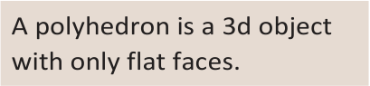
> **[Diagram Context - Textbook_Mathematics_Gr9_Geometry-of-3D-objects.pdf-0001-02.png]**
> This text-based graphic provides a formal definition for a geometric figure. It explicitly defines a "polyhedron" as a three-dimensional object characterized by having only flat faces, serving as a foundational concept for identifying and classifying solid shapes in geometry.

---

## Exercises

### 1. Identify parts (a) to (d) on the figure correctly.

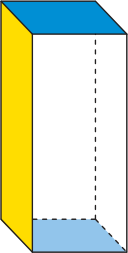

---

### 2. Which of the following objects are polyhedra?
* (a) 

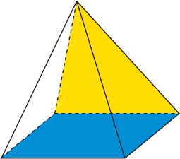
> **[Diagram Context - Textbook_Mathematics_Gr9_Geometry-of-3D-objects.pdf-0001-05.png]**
> This graphic depicts a three-dimensional square-based pyramid, characterized by a blue square base and four yellow triangular lateral faces meeting at a single apex. It serves as a foundational geometric model for high school learners to practice calculating surface area and volume, requiring them to distinguish between the base area, slant height, and perpendicular height.

* (b) 

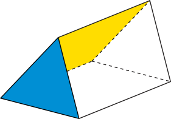
> **[Diagram Context - Textbook_Mathematics_Gr9_Geometry-of-3D-objects.pdf-0001-06.png]**
> This diagram illustrates a triangular prism, a 3D geometric solid characterized by two parallel triangular bases and three rectangular lateral faces. The visual highlights the spatial relationship between the blue triangular face and the yellow rectangular face, using dashed lines to represent hidden edges. It serves as a foundational model for high school learners to practice calculating surface area and volume by identifying the prism's height, base area, and lateral dimensions.

* (c) 

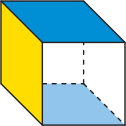

* (d) 

* (e) 

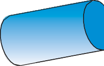
> **[Diagram Context - Textbook_Mathematics_Gr9_Geometry-of-3D-objects.pdf-0001-12.png]**
> This graphic is a geometric figure representing a cylinder, which contains no labels, variables, or symbols. It serves as a foundational visual aid for learners to identify the properties of a 3D object, such as its circular bases and curved lateral surface, in preparation for calculating surface area and volume.

* (f) 

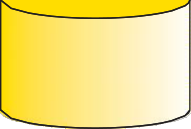
> **[Diagram Context - Textbook_Mathematics_Gr9_Geometry-of-3D-objects.pdf-0001-13.png]**
> This graphic is a simple geometric representation of a cylinder, featuring no labels, variables, or text. In the context of the CAPS curriculum, it serves as a foundational visual aid for learners to identify 3D shapes and calculate surface area or volume in Mathematics or Technical Sciences.

---

### 3. How many faces, edges and vertices do each of the following polyhedra have?
* (a) 

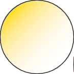
> **[Diagram Context - Textbook_Mathematics_Gr9_Geometry-of-3D-objects.pdf-0001-15.png]**
> This graphic is a simple geometric figure consisting of a single circle with a yellow-to-white radial gradient fill. It lacks labels, variables, or specific biological or chemical annotations. In a CAPS context, this abstract shape serves as a foundational visual aid for representing a generic cell, a spherical organism, or a basic unit of matter in introductory Life Sciences or Physical Sciences models.

* (b) 

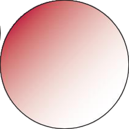
> **[Diagram Context - Textbook_Mathematics_Gr9_Geometry-of-3D-objects.pdf-0001-16.png]**
> This graphic is a circular diagram featuring a radial colour gradient transitioning from deep red on the left to white on the right. It serves as a visual representation of a concentration gradient, where the intensity of the red colour denotes a higher concentration of a substance that decreases across the space. For Life Sciences learners, this illustrates the concept of diffusion, showing how particles move from an area of high concentration to an area of low concentration until equilibrium is reached.

* (c) 

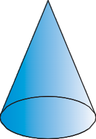
> **[Diagram Context - Textbook_Mathematics_Gr9_Geometry-of-3D-objects.pdf-0001-18.png]**
> This graphic is a 3D geometric figure representing a right circular cone, characterized by a circular base and a single apex. It serves as a fundamental visual aid for high school geometry, helping students identify the key components required to calculate surface area and volume, such as the radius of the base, the vertical height, and the slant height.

---

### 4. 
Six learners each used play dough to make a 3D object. Use the descriptions on the next page to match each 3D object to the learner who made it.

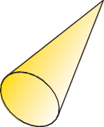
> **[Diagram Context - Textbook_Mathematics_Gr9_Geometry-of-3D-objects.pdf-0001-19.png]**
> This graphic depicts a three-dimensional geometric figure known as a right circular cone, characterized by a circular base and a single apex. There are no labels or variables present in this image. Conceptually, it serves as a foundational visual for high school learners to practice calculating surface area and volume using the relevant geometric formulae in the CAPS Mathematics curriculum.

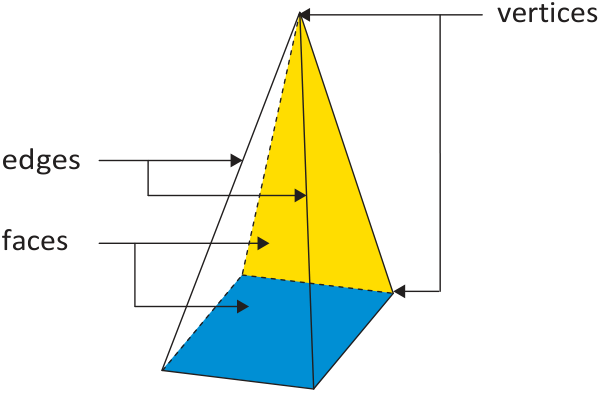
> **[Diagram Context - Textbook_Mathematics_Gr9_Geometry-of-3D-objects.pdf-0001-22.png]**
> This diagram illustrates a square-based pyramid, a 3D geometric solid, with labels pointing to its constituent parts: vertices, edges, and faces. It serves as a foundational visual aid for learners to identify and distinguish the defining properties of polyhedra in geometry.

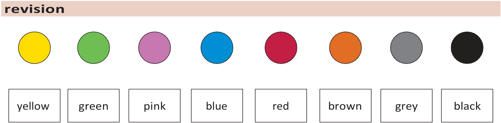
> **[Diagram Context - Textbook_Mathematics_Gr9_Probability.pdf-0001-02.png]**
> This graphic is a visual key or legend consisting of eight distinct coloured circles paired with corresponding text labels: yellow, green, pink, blue, red, brown, grey, and black. It serves as a foundational tool for learners to associate specific colours with categorical data, which is essential for interpreting complex biological or chemical diagrams where colour-coding represents different structures, elements, or variables.

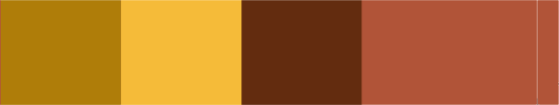

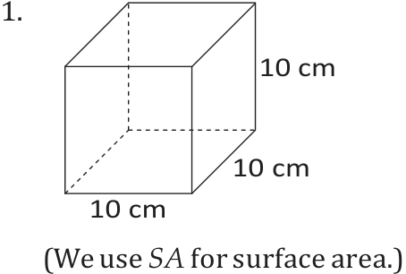
> **[Diagram Context - Textbook_Mathematics_Gr9_Surface-area-volume-and-capacity-of-3D-objects.pdf-0001-06.png]**
> This diagram displays a geometric cube with side lengths labeled as 10 cm and includes the notation "We use SA for surface area." It serves as a foundational visual aid for Life Sciences or Mathematics learners to calculate the surface area of a three-dimensional object, illustrating the relationship between physical dimensions and the total area available for biological exchange processes.

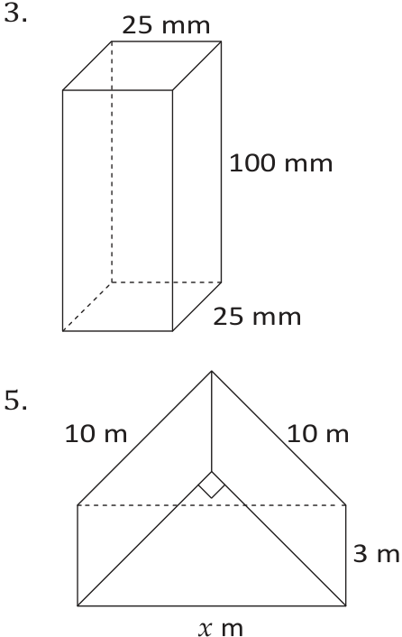
> **[Diagram Context - Textbook_Mathematics_Gr9_Surface-area-volume-and-capacity-of-3D-objects.pdf-0001-07.png]**
> This graphic displays two geometric figures: a rectangular prism labeled with dimensions of 25 mm, 25 mm, and 100 mm, and a composite shape consisting of a rectangular base and a triangular roof with a right-angled apex, labeled with dimensions of 10 m, 3 m, and variable $x$ m. These diagrams serve as exercises for learners to practice calculating surface area and volume by applying geometric formulas to 3D objects with mixed units and algebraic variables.

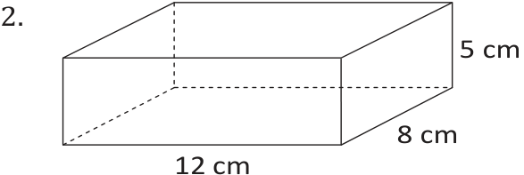
> **[Diagram Context - Textbook_Mathematics_Gr9_Surface-area-volume-and-capacity-of-3D-objects.pdf-0001-08.png]**
> This diagram illustrates a rectangular prism with labeled dimensions of 12 cm (length), 8 cm (width), and 5 cm (height). It serves as a foundational geometry exercise for calculating the surface area and volume of 3D objects by applying the relevant mathematical formulas to these specific measurements.

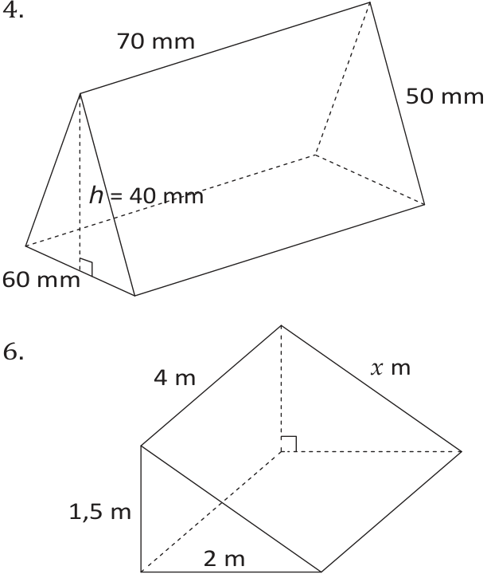
> **[Diagram Context - Textbook_Mathematics_Gr9_Surface-area-volume-and-capacity-of-3D-objects.pdf-0001-09.png]**
> This graphic displays two geometric figures: a triangular prism labeled with dimensions 70 mm, 50 mm, 60 mm, and height $h=40$ mm, and a right-angled triangular prism with dimensions 4 m, $x$ m, 1.5 m, and 2 m. These diagrams serve as visual prompts for learners to apply surface area and volume formulas for prisms by identifying the base area and perpendicular height of the 3D shapes.

---

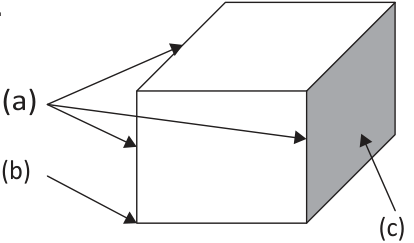
> **[Diagram Context - Textbook_Mathematics_Gr9_Geometry-of-3D-objects.pdf-0002-02.png]**
> This diagram is a geometric figure of a rectangular prism featuring labels (a), (b), and (c) indicated by arrows pointing to its edges, vertices, and faces respectively. It serves as a foundational visual aid for teaching spatial geometry, helping students identify and distinguish between the fundamental components of 3D shapes.

* Tumi's object has six vertices and five faces.
* Debbie's object has eight vertices and 12 edges.
* Brad made an object that has seven faces and ten vertices.
* Xola made an object with no vertices.
* Mpuka's object has eight edges and five faces.
* Maggie made an object with two circles and no vertices.

## 17.2 Prisms and pyramids

### Difference between prisms and pyramids

Prisms and pyramids are two special groups of polyhedra.

#### Prisms

A **prism** is a polyhedron with two faces that are congruent and parallel polygons. These faces are called **bases** and they are connected by **lateral faces** that are parallelograms.

> **congruent** means exactly the same shape and size.
> **lateral faces** are faces that aren't bases.

In the case of **right prisms** the bases are connected by rectangles which are perpendicular to the base and the top. This means the lateral faces of a right prism make a $90^{\circ}$ angle with the bases.

A prism is named according to the shape of its base. So a prism whose base is a triangle is called a triangular prism; a prism whose base is a rectangle or square is called a rectangular prism; and a prism with a pentagonal base is called a pentagonal prism.

Any pair of faces in a prism that are congruent and parallel can be the bases of that prism. A cube is a special type of prism. It has six congruent faces; therefore any of its faces can be a base.

<!-- DIAG_PLACEHOLDER: diagram -->

* **Triangular prism**
* **Rectangular prism**
* **Pentagonal prism**
* **Cube**

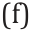

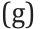

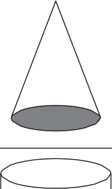
> **[Diagram Context - Textbook_Mathematics_Gr9_Geometry-of-3D-objects.pdf-0002-12.png]**
> This geometric figure displays a three-dimensional cone positioned above a cylinder, separated by a horizontal line. The diagram serves as a foundational visual aid for Grade 10-12 Mathematics, illustrating the distinct spatial properties and cross-sectional shapes of these two common solids.

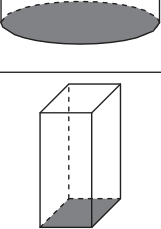
> **[Diagram Context - Textbook_Mathematics_Gr9_Geometry-of-3D-objects.pdf-0002-13.png]**
> This geometry figure displays two 3D solids: a cylinder (top) and a rectangular prism (bottom), both featuring shaded bases to indicate their orientation. The diagram serves as a visual aid for Grade 9-12 Mathematics learners to identify geometric properties, calculate surface area, and determine the volume of basic prisms.

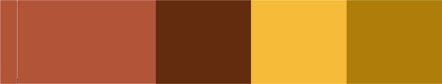

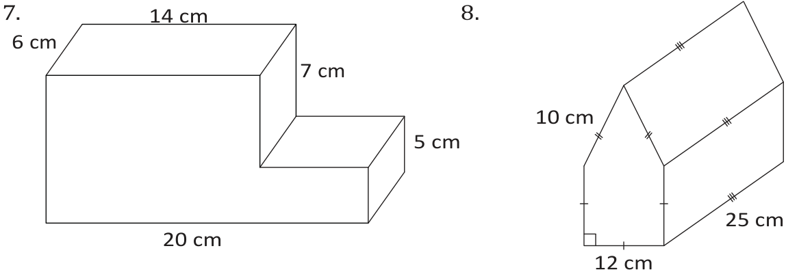
> **[Diagram Context - Textbook_Mathematics_Gr9_Surface-area-volume-and-capacity-of-3D-objects.pdf-0002-00.png]**
> This graphic displays two composite 3D geometric figures labeled 7 and 8, featuring specific linear dimensions in centimetres and geometric markings such as tick marks and a right-angle symbol. These figures are designed to test a learner's ability to calculate the surface area and volume of complex prisms by decomposing them into simpler geometric shapes.

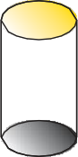
> **[Diagram Context - Textbook_Mathematics_Gr9_Surface-area-volume-and-capacity-of-3D-objects.pdf-0002-04.png]**
> This graphic is a geometric figure representing a right circular cylinder with no visible labels or variables. It serves as a foundational visual aid for high school mathematics, helping students identify the properties of a cylinder to calculate its surface area and volume using the standard formulas $V = \pi r^2 h$ and $A = 2\pi r^2 + 2\pi rh$.

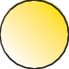

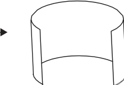
> **[Diagram Context - Textbook_Mathematics_Gr9_Surface-area-volume-and-capacity-of-3D-objects.pdf-0002-06.png]**
> This graphic depicts a geometric net or a partial cylinder structure, featuring a single black arrow pointing toward the open side of the shape. It serves as a visual aid for learners to understand spatial reasoning, surface area calculations, or the transformation of two-dimensional shapes into three-dimensional solids.

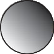

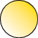

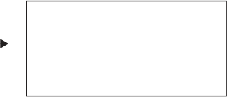

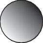

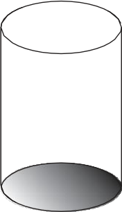
> **[Diagram Context - Textbook_Mathematics_Gr9_Surface-area-volume-and-capacity-of-3D-objects.pdf-0002-12.png]**
> This graphic is a geometric representation of a right circular cylinder, featuring no labels or variables. It serves as a foundational visual aid for high school learners to identify the properties of a cylinder, such as its circular base and height, which are essential for calculating surface area and volume in accordance with CAPS geometry requirements.

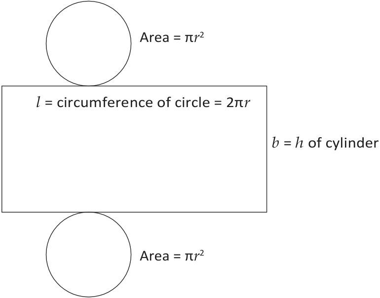
> **[Diagram Context - Textbook_Mathematics_Gr9_Surface-area-volume-and-capacity-of-3D-objects.pdf-0002-13.png]**
> This diagram displays the 2D net of a cylinder, consisting of two circular bases labeled with "Area = πr²" and a rectangular lateral surface labeled with dimensions "l = circumference of circle = 2πr" and "b = h of cylinder". It conceptually illustrates how the surface area of a cylinder is derived by unfolding its components, helping students understand the relationship between the circular bases and the rectangular lateral face.

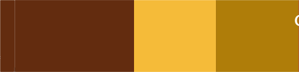

---

These are two **oblique prisms** – the one on the left is a triangular prism and the one on the right is an oblique pentagonal prism.

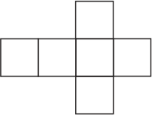

## Pyramids

A **pyramid** has only one base. The lateral faces of a pyramid are always triangles. These triangles meet at the same vertex at the top. This vertex is called the **apex** of the pyramid. In a **right pyramid**, the lateral faces are isosceles triangles.

<!-- DIAG_PLACEHOLDER: diagram -->

There are many types of pyramids. The type of pyramid is determined by the shape of its base. For example, a triangular-based pyramid has a triangle as its base, a square-based pyramid has a square as its base and a hexagonal-based pyramid has a hexagon as its base.

> A triangular-based pyramid is also called a **triangular pyramid**; a square-based pyramid is also called a **square pyramid**; a hexagonal-based pyramid is also called a **hexagonal pyramid**, etc.

<!-- DIAG_PLACEHOLDER: diagram -->

* **Square-based pyramid**
  * It has five faces: one square, four triangles
* **Hexagonal-based pyramid**
  * It has seven faces: one hexagon, six triangles

If a pyramid is not a right pyramid, it is called an **oblique pyramid**, like the two shown below. The lateral faces of an oblique pyramid are not necessarily isosceles triangles.

<!-- DIAG_PLACEHOLDER: diagram -->

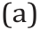

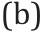

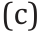

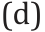

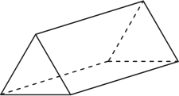
> **[Diagram Context - Textbook_Mathematics_Gr9_Geometry-of-3D-objects.pdf-0003-15.png]**
> This graphic is a 3D geometric figure representing a triangular prism, rendered with solid lines for visible edges and dashed lines for hidden internal or rear edges. It illustrates the spatial properties of a polyhedron with two congruent triangular bases connected by three rectangular faces. This diagram serves as a foundational visual aid for learners to calculate surface area and volume in accordance with the CAPS Mathematics curriculum.

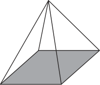
> **[Diagram Context - Textbook_Mathematics_Gr9_Geometry-of-3D-objects.pdf-0003-16.png]**
> This geometric figure is a square-based pyramid consisting of a shaded quadrilateral base and four triangular lateral faces meeting at a single apex. It serves as a fundamental visual aid for high school learners to practice calculating surface area and volume by identifying the base area, perpendicular height, and slant height of the solid.

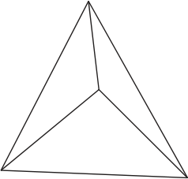
> **[Diagram Context - Textbook_Mathematics_Gr9_Geometry-of-3D-objects.pdf-0003-17.png]**
> This graphic is a geometric figure representing a triangular pyramid (tetrahedron) viewed from an elevated angle, consisting of four triangular faces and four vertices connected by line segments. It serves as a foundational visual aid for Grade 10-12 Mathematics and Physical Sciences to illustrate three-dimensional spatial orientation, surface area calculations, and the tetrahedral molecular geometry of atoms like carbon.

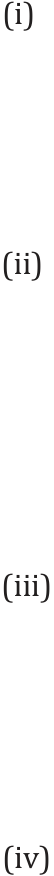
> **[Diagram Context - Textbook_Mathematics_Gr9_Geometry-of-3D-objects.pdf-0003-18.png]**
> This image displays a vertical list of Roman numeral labels (i) through (iv) used to identify sequential steps or distinct components in a biological or chemical process. These labels serve as structural markers for organizing multi-part questions or diagrams within a CAPS assessment. They help students systematically categorize information, such as stages of mitosis, steps in a chemical reaction, or components of a biological system.

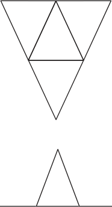
> **[Diagram Context - Textbook_Mathematics_Gr9_Geometry-of-3D-objects.pdf-0003-19.png]**
> This geometric figure consists of a large inverted triangle containing a smaller upright triangle within its upper half, positioned above a separate, smaller upright triangle. The diagram lacks labels or variables and serves as a visual exercise in spatial reasoning, symmetry, and the identification of nested or congruent geometric shapes. It helps learners practice visual-spatial analysis and the decomposition of complex polygons into simpler triangular components.

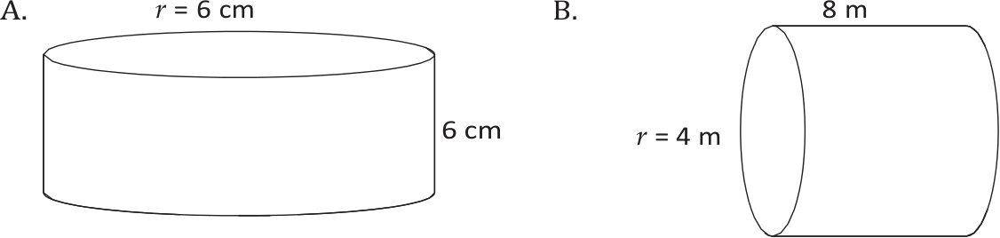
> **[Diagram Context - Textbook_Mathematics_Gr9_Surface-area-volume-and-capacity-of-3D-objects.pdf-0003-06.png]**
> This graphic displays two geometric figures, labeled A and B, representing cylinders with specific dimensions. Figure A provides a radius ($r$) of 6 cm and a height of 6 cm, while Figure B provides a radius ($r$) of 4 m and a length/height of 8 m. These diagrams serve as visual prompts for learners to apply the CAPS geometry curriculum by calculating the surface area or volume of cylinders using the provided dimensions and appropriate units.

---

### Identifying Prisms and Pyramids

1. Copy the following figures and shade the base of each figure. Write down whether it is a prism or a pyramid. In some cases there is more than one possibility for the base.

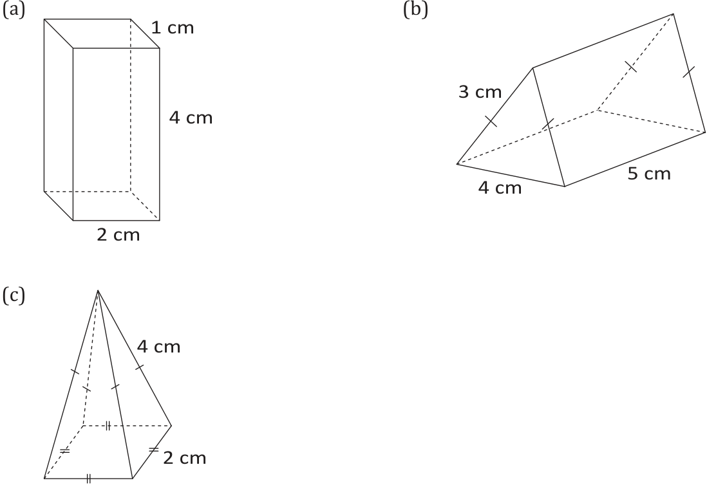
> **[Diagram Context - Textbook_Mathematics_Gr9_Geometry-of-3D-objects.pdf-0004-01.png]**
> This graphic displays three geometric solids labeled (a) a rectangular prism, (b) a triangular prism, and (c) a square-based pyramid, annotated with specific side lengths in centimeters and congruence markers. It serves to help learners identify 3D shapes and apply their knowledge of dimensions to calculate surface area and volume as required by the CAPS Mathematics curriculum.

2. Join each 3D object with its correct name. Write the letter and the 3D object's name.

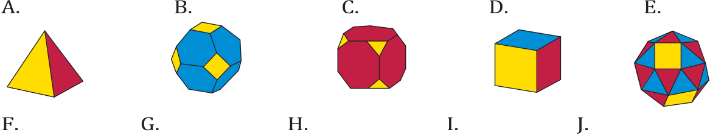
> **[Diagram Context - Textbook_Mathematics_Gr9_Geometry-of-3D-objects.pdf-0004-06.png]**
> This graphic displays a collection of three-dimensional geometric polyhedra labeled A through E, featuring various faces colored in yellow, blue, and red. These figures represent Platonic and Archimedean solids, which serve as foundational models for students to explore spatial reasoning, surface area, volume, and the symmetry properties of 3D shapes in the CAPS Mathematics curriculum.

* **Hexagonal-based pyramid**
* **Triangular prism**
* **Square-based pyramid**
* **Cube**
* **Pentagonal prism**

---
*CHAPTER 17: GEOMETRY OF 3D OBJECTS* **217**

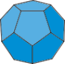
> **[Diagram Context - Textbook_Mathematics_Gr9_Geometry-of-3D-objects.pdf-0004-07.png]**
> This graphic displays a regular dodecahedron, a three-dimensional Platonic solid composed of twelve congruent regular pentagonal faces. In the context of the CAPS curriculum, this figure serves as a geometric model for understanding polyhedra, spatial reasoning, and the calculation of surface area and volume in Grade 10-12 Mathematics.

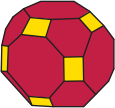
> **[Diagram Context - Textbook_Mathematics_Gr9_Geometry-of-3D-objects.pdf-0004-08.png]**
> This image displays a truncated octahedron, a semi-regular Archimedean solid composed of eight hexagonal faces (red) and six square faces (yellow). In the context of high school Physical Sciences, this geometry serves as a model for the body-centered cubic (BCC) crystal lattice structure, helping students visualize the spatial arrangement of atoms in metallic bonding.

> **[Diagram Context - Textbook_Mathematics_Gr9_Geometry-of-3D-objects.pdf-0004-09.png]**
> This graphic depicts a regular octahedron, a three-dimensional geometric solid consisting of eight equilateral triangular faces. In the context of Grade 10-12 Physical Sciences, this structure illustrates the octahedral molecular geometry (VSEPR theory) adopted by molecules with six electron domains around a central atom, such as sulfur hexafluoride (SF₆).

> **[Diagram Context - Textbook_Mathematics_Gr9_Geometry-of-3D-objects.pdf-0004-10.png]**
> This graphic depicts a geometric icosahedron, a regular polyhedron consisting of twenty equilateral triangular faces. In the context of the CAPS curriculum, this structure is used to illustrate the icosahedral symmetry found in the capsids of many viruses, helping students visualize the complex three-dimensional arrangement of protein subunits.

> **[Diagram Context - Textbook_Mathematics_Gr9_Geometry-of-3D-objects.pdf-0004-11.png]**
> This graphic displays a truncated icosahedron, a geometric solid composed of yellow hexagonal and red pentagonal faces. In the context of Physical Sciences, this structure serves as a model for a Buckminsterfullerene (C60) molecule, illustrating how carbon atoms bond in a spherical arrangement to form an allotrope of carbon.

> **[Diagram Context - Textbook_Mathematics_Gr9_Surface-area-volume-and-capacity-of-3D-objects.pdf-0004-01.png]**
> This diagram illustrates the geometric properties and volume formulas for a rectangular prism, a cube, and a triangular prism, using labels for length ($l$), breadth ($b$), height ($h$), and side length ($s$). It conceptually demonstrates that the volume of any prism is calculated by multiplying the area of its uniform base by its perpendicular height, reinforcing the foundational CAPS geometry principle of $V = \text{Area of base} \times \text{height}$.

> **[Diagram Context - Textbook_Mathematics_Gr9_Surface-area-volume-and-capacity-of-3D-objects.pdf-0004-04.png]**
> This graphic displays four 3D geometric solids labeled A through D, including a rectangular prism, a right-angled triangular prism, a cube, and an isosceles triangular prism. The figures are annotated with specific dimensions in centimeters, meters, and millimeters, including length, width, height, and perpendicular height ($h$). This diagram serves as a foundational exercise for learners to practice identifying geometric properties and applying surface area and volume formulas to various prisms.

---

## 17.3 Describing, sorting and comparing 3D objects

### Practise describing and classifying 3D objects

1. For each of the following 3D objects, name the object and describe the number of faces it has and the shapes of these faces.

> **[Diagram Context - Textbook_Mathematics_Gr9_Geometry-of-3D-objects.pdf-0005-05.png]**
> This graphic depicts a three-dimensional cube with a single vertex highlighted by a red dot, labeled with the numbers 1, 2, and 3 adjacent to the three intersecting edges. It serves as a visual aid for Grade 10-12 Mathematics or Engineering Graphics and Design to illustrate the concept of a vertex as the point where three planes or edges meet in 3D space.

> **[Diagram Context - Textbook_Mathematics_Gr9_Geometry-of-3D-objects.pdf-0005-15.png]**
> This graphic depicts a three-dimensional geometric figure known as a tetrahedron, which contains no labels or variables. It serves as a fundamental visual aid for Grade 10-12 learners to understand spatial geometry, molecular shapes (such as the tetrahedral geometry of methane), and the calculation of surface area and volume for polyhedra.

> **[Diagram Context - Textbook_Mathematics_Gr9_Geometry-of-3D-objects.pdf-0005-17.png]**
> This graphic displays a three-dimensional geometric figure known as a regular octahedron, characterized by eight equilateral triangular faces and six vertices. In the context of the CAPS curriculum, this model is used to illustrate VSEPR theory for molecules with octahedral molecular geometry, such as sulfur hexafluoride ($SF_6$), where a central atom is bonded to six surrounding atoms.

> **[Diagram Context - Textbook_Mathematics_Gr9_Geometry-of-3D-objects.pdf-0005-19.png]**
> This graphic depicts an icosahedron, a regular polyhedron composed of twenty equilateral triangular faces, with dashed lines representing the hidden edges. It serves as a visual aid for Grade 10-12 Mathematics, helping students conceptualize three-dimensional geometry, spatial reasoning, and the properties of Platonic solids.

> **[Diagram Context - Textbook_Mathematics_Gr9_Surface-area-volume-and-capacity-of-3D-objects.pdf-0005-00.png]**
> This geometry figure presents two composite 3D objects labeled A and B, annotated with various side lengths in centimeters and geometric markings indicating equal sides and right angles. The diagram challenges students to apply spatial reasoning and volume formulas by decomposing these complex shapes into simpler prisms, such as rectangular prisms and triangular prisms, to calculate their total volume.

> **[Diagram Context - Textbook_Mathematics_Gr9_Surface-area-volume-and-capacity-of-3D-objects.pdf-0005-02.png]**
> This graphic illustrates the geometric formula for the volume of a cylinder, featuring a 3D cylinder diagram labeled with height ($h$) and radius ($r$). It conceptually demonstrates that the volume is derived by multiplying the area of the circular base ($\pi r^2$) by the vertical height, providing learners with a visual link between 2D area and 3D capacity.

> **[Diagram Context - Textbook_Mathematics_Gr9_Surface-area-volume-and-capacity-of-3D-objects.pdf-0005-07.png]**
> This graphic displays four geometric figures (A, B, C, and D) representing cylinders with various dimensions labeled as radius ($r$), diameter, and height in units of centimeters (cm) or meters (m). It serves as a foundational exercise for learners to practice identifying dimensions and applying the correct formulas for calculating the surface area and volume of cylinders.

---

# CHAPTER 17: GEOMETRY OF 3D OBJECTS

## Exercise

2. 
   (a) Sort the 3D objects below into the three groups, namely **prisms**, **pyramids** and **cylinders**. Write down the correct letter under each group.
   
   (b) Further divide the prisms into three groups (**cubes**, **rectangular prisms** and **triangular prisms**). Write the letter under each group.

> **[Diagram Context - Textbook_Mathematics_Gr9_Geometry-of-3D-objects.pdf-0006-13.png]**
> This graphic depicts a regular dodecahedron, a three-dimensional Platonic solid composed of twelve congruent pentagonal faces. It serves as a visual aid for Grade 10-12 Mathematics, illustrating the properties of polyhedra, including the spatial arrangement of vertices, edges, and faces in a non-planar geometry.

> **[Diagram Context - Textbook_Mathematics_Gr9_Probability.pdf-0006-01.png]**
> This graphic is a two-way contingency table used to determine the sample space of a probability experiment involving two coin tosses, labeled with "Heads" and "Tails" as row and column headers. The cell containing "H T" illustrates how to represent the combined outcomes of independent events. This tool helps learners systematically identify all possible outcomes to calculate theoretical probabilities in accordance with the CAPS Mathematics curriculum.

> **[Diagram Context - Textbook_Mathematics_Gr9_Probability.pdf-0006-06.png]**
> This tree diagram illustrates the sample space for three consecutive coin tosses, using labels for "First coin," "Second coin," "Third coin," and "Outcome" alongside branches representing "heads" and "tails." It serves as a visual tool for learners to systematically map all possible independent events and determine the total number of outcomes in a probability experiment.

> **[Diagram Context - Textbook_Mathematics_Gr9_Surface-area-volume-and-capacity-of-3D-objects.pdf-0006-06.png]**
> This geometry figure illustrates a composite 3D object consisting of a cylinder mounted on a rectangular prism, with labels indicating a cylinder diameter of 8 cm and height of 10 cm, and a prism with dimensions of 20 cm by 16 cm by 30 cm. This diagram is designed to test a student's ability to calculate the total surface area or volume of composite solids by applying the relevant geometric formulas for prisms and cylinders.

> **[Diagram Context - Textbook_Mathematics_Gr9_Surface-area-volume-and-capacity-of-3D-objects.pdf-0006-15.png]**
> This geometry figure displays two rectangular prisms, with the second representing a hollowed-out container labeled with dimensions of 10 cm, 6 cm, 4 cm, 8 cm, and 3 cm. It illustrates the concept of calculating the volume of a solid versus the internal capacity of a hollow object, requiring students to apply subtraction of volumes to determine the material thickness or remaining space.

---

## 17.4 Nets of 3D objects

### What is a net?

In mathematics, a **net** is a flat pattern that can be folded to form a 3D object. Different 3D objects have different nets. Sometimes the same 3D object can have different nets. 

Here are examples of different 3D objects and their nets:

> **[Diagram Context - Textbook_Mathematics_Gr9_Geometry-of-3D-objects.pdf-0007-04.png]**
> This geometric figure consists of a large equilateral triangle subdivided into four smaller, congruent equilateral triangles by connecting the midpoints of its sides. It serves as a foundational visual aid for teaching concepts such as similarity, ratio, area scaling, and the properties of midsegments in Euclidean geometry.

* **Triangular pyramid**
* **Rectangular prism**
* **Cube**

In this section, you are going to focus on the net of a cube. In order for a net to form a cube, it must consist of six equal squares. But not all net patterns that consist of six squares will fold into a cube.

### Exercise

Only one of the nets below will fold into a cube. Write down which one it is.

* **A**
* **B**
* **C**
* **D**

> **[Diagram Context - Textbook_Mathematics_Gr9_Geometry-of-3D-objects.pdf-0007-08.png]**
> This graphic is a two-dimensional geometric net consisting of six congruent equilateral triangles arranged in a specific pattern. It serves as a visual representation of the unfolded surface area of a regular octahedron, helping students understand the relationship between 2D shapes and 3D polyhedra.

> **[Diagram Context - Textbook_Mathematics_Gr9_Geometry-of-3D-objects.pdf-0007-10.png]**
> This graphic displays a two-dimensional net consisting of twelve congruent regular pentagons arranged in a specific planar configuration. It serves as a geometric template that, when folded along the shared edges, conceptually demonstrates the construction of a three-dimensional regular dodecahedron.

> **[Diagram Context - Textbook_Mathematics_Gr9_Geometry-of-3D-objects.pdf-0007-12.png]**
> This graphic is a geometric net composed of a tessellating pattern of equilateral triangles. It serves as a two-dimensional representation that can be folded to construct a three-dimensional triangular prism or a similar polyhedral solid.

> **[Diagram Context - Textbook_Mathematics_Gr9_Surface-area-volume-and-capacity-of-3D-objects.pdf-0007-09.png]**
> This graphic displays four rectangular prisms with varying dimensions labeled in centimeters, specifically illustrating the effects of doubling one, two, or three dimensions of an original 5 cm × 3 cm × 2 cm object. It conceptually demonstrates how changing specific linear dimensions impacts the volume and surface area of a 3D shape, a foundational skill for CAPS Mathematics and Physical Sciences learners.

---

# Chapter 17: Geometry of 3D Objects

## A Cube or Not a Cube

In order to decide whether or not a net will fold into a cube, you have to imagine what will happen when you fold the net. Read through the following steps:

1. We can label the faces of a cube: 
   - Bottom face ($X$)
   - Right face ($R$)
   - Back face ($B$)
   - Left face ($L$)
   - Top face ($T$)
   - Front face ($F$)
   
   We will use these terms in the rest of the steps.

   

> **[Diagram Context - Textbook_Mathematics_Gr9_Geometry-of-3D-objects.pdf-0008-04.png]**
> This graphic illustrates three-dimensional geometric solids, specifically a tetrahedron, a cube, and an octahedron, rendered with colored faces and dashed lines to indicate hidden edges. These figures serve as foundational models for understanding spatial geometry and molecular geometry (VSEPR theory) in the CAPS curriculum. By visualizing these polyhedra, students can better comprehend the spatial arrangement of atoms in molecules and the properties of three-dimensional shapes in space.

2. Start by choosing one square of the net as the bottom face (marked with an $X$).

   

> **[Diagram Context - Textbook_Mathematics_Gr9_Geometry-of-3D-objects.pdf-0008-05.png]**
> This graphic depicts a geometric representation of a dodecahedron, a Platonic solid characterized by twelve pentagonal faces. The diagram uses varied colors and internal line segments to illustrate the three-dimensional spatial arrangement and symmetry of the polyhedron. It serves as a visual aid for students to understand spatial geometry, surface area, and the properties of regular solids in a three-dimensional coordinate system.

3. Look at the square to the right of the $X$. (It is coloured blue.) If you fold the net on the red line, the blue square will be the right face of the cube.

   

> **[Diagram Context - Textbook_Mathematics_Gr9_Geometry-of-3D-objects.pdf-0008-06.png]**
> This graphic depicts an icosahedron, a regular polyhedron composed of twenty equilateral triangular faces. The diagram uses dashed lines to represent internal edges and vertices, providing a three-dimensional perspective of the geometric solid. It serves as a visual aid for students to understand spatial geometry, symmetry, and the properties of Platonic solids.

4. Look at the next square to the left of the right face. If you fold this square on the red line, it will become the front face of the cube.

   

> **[Diagram Context - Textbook_Mathematics_Gr9_Surface-area-volume-and-capacity-of-3D-objects.pdf-0008-08.png]**
> This graphic displays two cylinders with identical radii ($r = 7\text{ cm}$) but different heights ($h = 2\text{ cm}$ and $h = 4\text{ cm}$). It illustrates the relationship between height and volume, helping learners understand how doubling the height of a cylinder with a constant base area results in a proportional doubling of its total volume.

> **[Diagram Context - Textbook_Mathematics_Gr9_Surface-area-volume-and-capacity-of-3D-objects.pdf-0008-11.png]**
> This graphic displays two cylinders with identical radii ($r = 14\text{ cm}$) but different heights ($h = 2\text{ cm}$ and $h = 4\text{ cm}$). It illustrates the relationship between height and volume, helping students understand how doubling the height of a cylinder while keeping the base area constant results in a proportional doubling of its total volume.

---

5. Look at the square to the left of the front face. It will fold to become the left face of the cube.

6. The square to the left of the left face of the cube will become the back face of the cube.

7. The last square will form the top.

8. Therefore you can label the squares on the net as follows:

> **[Diagram Context - Textbook_Mathematics_Gr9_Geometry-of-3D-objects.pdf-0009-15.png]**
> This diagram displays a series of geometric solids labeled A through E, representing various cylindrical and non-cylindrical forms. It illustrates the conceptual differences between standard right cylinders and variations in curvature or orientation, helping students distinguish between geometric shapes based on their cross-sectional properties and surface profiles.

9. Since each square on the net corresponds with a face of the cube, this net can be folded into a cube.

---

### identifying the nets of a cube

1. For each of the following nets, determine whether it will fold into a cube or not by copying and labelling the squares to match the faces of a cube.

(a)

> **[Diagram Context - Textbook_Mathematics_Gr9_Geometry-of-3D-objects.pdf-0009-16.png]**
> This graphic is a geometric line drawing of a hyperboloid of one sheet, characterized by its concave, hourglass-like profile. It serves as a visual aid for Grade 12 learners to explore conic sections, surfaces of revolution, or the properties of hyperbolic functions in coordinate geometry.

(b)
<!-- DIAG_PLACEHOLDER: diagram -->

(c)

(d)
<!-- DIAG_PLACEHOLDER: diagram -->

> **[Diagram Context - Textbook_Mathematics_Gr9_Probability.pdf-0009-16.png]**
> This educational graphic presents a probability exercise featuring eight distinct coloured buttons (yellow, green, pink, blue, red, brown, grey, and black) as a sample space. Through guided questions and definitions, it introduces students to the concepts of trials, frequency, and relative frequency, illustrating how theoretical probability predicts outcomes over repeated experiments.

---

## Nets of Other 3D Objects

1. In each of the following cases, copy and label the faces on the net according to the labels on the 3D object.

    (a) 
    

    (b) 
    

    (c) 
    

2. Decide whether the following nets will form 3D objects.

    (a) 
    

    (b) 
    

    (c) 
    

    (d) 
    

---

3. Use the nets to identify each of the following 3D objects.

*(a)*  
*(b)*  
*(c)*  
*(d)*  
*(e)*  

---

4. *(a)* Identify the shapes that the net on the right consists of.  
   *(b)* How many rectangular faces does the net have?  
   *(c)* How many other shapes does the net have? What are they?  
   *(d)* Will this form a pyramid or a prism?  
   *(e)* How do you know?  
   *(f)* Name the 3D object that the net will form.  

> **[Diagram Context - Textbook_Mathematics_Gr9_Geometry-of-3D-objects.pdf-0011-01.png]**
> This geometric figure represents the 2D net of a cylinder, consisting of one rectangular lateral surface and two circular bases. It illustrates how a 3D object can be unfolded into a flat plane, helping learners visualize the surface area components required for calculating the total area of a cylinder.

---

5. Answer the following questions about this net.

*(a)* Which shapes does this net consist of?  
*(b)* How many triangular faces does the net have?  
*(c)* How many other shapes does the net have?  
*(d)* Will this form a pyramid or a prism?  
*(e)* How do you know?  
*(f)* Name the 3D object that the net will form.  

> **[Diagram Context - Textbook_Mathematics_Gr9_Geometry-of-3D-objects.pdf-0011-02.png]**
> This geometric figure consists of two yellow circles resting on top of a blue rectangle, with no additional labels or symbols present. It serves as a simplified visual model to demonstrate basic spatial relationships, such as contact points between curved and flat surfaces, or as a foundational element for calculating combined surface area and volume in Grade 10-12 Mathematics.

---

224 MATHEMATICS GRADE 7: TERM 3

> **[Diagram Context - Textbook_Mathematics_Gr9_Geometry-of-3D-objects.pdf-0011-03.png]**
> This graphic displays the 2D net of a cylinder, consisting of a central blue rectangle and two yellow circles attached to its opposite sides. It illustrates the geometric relationship between a 3D solid and its flattened surface area, showing how the rectangle's length corresponds to the circumference of the circular bases.

> **[Diagram Context - Textbook_Mathematics_Gr9_Geometry-of-3D-objects.pdf-0011-15.png]**
> This diagram illustrates various geometric shapes labeled A through G, each containing a central black dot. It serves as a visual aid for teaching basic geometry or spatial reasoning, helping students identify and differentiate between polygons, circles, ellipses, and irregular shapes based on their distinct properties and symmetry.

> **[Diagram Context - Textbook_Mathematics_Gr9_Probability.pdf-0011-17.png]**
> This graphic presents two structured data collection tables designed for a Grade 9 Mathematics probability investigation. The tables feature columns for eight distinct colours (Yellow, Green, Pink, Blue, Red, Brown, Grey, Black) and rows for recording tally marks, frequencies, and relative frequencies expressed as fractions and decimals. Conceptually, these tables guide students through an empirical investigation to demonstrate the Law of Large Numbers, helping them understand how experimental relative frequency converges toward theoretical probability as the number of trials increases.

> **[Diagram Context - Textbook_Mathematics_Gr9_Surface-area-volume-and-capacity-of-3D-objects.pdf-0011-21.png]**
> This graphic presents six geometric figures, including cubes, rectangular prisms, and triangular prisms, labeled with specific dimensions in centimeters, millimeters, and meters. By providing these 3D objects with variable and numerical measurements, the diagram serves as a foundational exercise for learners to apply the conceptual definition of surface area as the sum of the areas of all individual faces.

---

## 17.5 Using nets to construct cubes and prisms

### How to draw a net of a prism

Look at the triangular prism alongside. Its faces are two right-angled triangles and three rectangles. (Since the base has three edges, there will be three rectangles.)

> **[Diagram Context - Textbook_Mathematics_Gr9_Geometry-of-3D-objects.pdf-0012-11.png]**
> This graphic displays two spherical geometry figures, with the top sphere labeled with radius $r$ and the bottom sphere labeled with center $M$, diameter $AB$, and a radius of $5\text{ cm}$ along segment $CD$. It illustrates the fundamental properties of a sphere, helping learners visualize the relationship between the center, radius, and diameter required for calculating surface area and volume in the CAPS Mathematics curriculum.

1. Draw a rectangle, which will be the bottom of the prism. Then add a right-angled triangle at the top and a mirror image of the triangle at the bottom of the rectangle.

<!-- DIAG_PLACEHOLDER: diagram -->

2. Draw the other two rectangles next to the centre one. The rectangle on the right must fit onto the side opposite the right angle in the triangle when it is folded, so that rectangle will be the biggest. The rectangle on the left is the smallest of the three rectangles.

> **[Diagram Context - Textbook_Mathematics_Gr9_Probability.pdf-0012-13.png]**
> This educational resource presents a structured data collection table designed for a probability experiment involving eight distinct colours. The table includes rows for individual student results, multiple classmate datasets, and a final row for calculating total and relative frequencies over 200 trials. Conceptually, this exercise demonstrates the Law of Large Numbers, illustrating how increasing the number of trials causes experimental relative frequencies to converge toward theoretical probabilities.

> **[Diagram Context - Textbook_Mathematics_Gr9_Surface-area-volume-and-capacity-of-3D-objects.pdf-0012-01.png]**
> This text-based graphic displays mathematical calculations for determining the surface area of 3D geometric solids, specifically involving components like front/back faces, side faces, bases, and the height of an isosceles triangle. It utilizes numerical variables and geometric formulas to demonstrate the step-by-step process of calculating the total surface area of complex prisms. This serves as a practical application of Euclidean geometry and algebraic substitution, helping learners break down composite shapes into manageable 2D areas.

> **[Diagram Context - Textbook_Mathematics_Gr9_Surface-area-volume-and-capacity-of-3D-objects.pdf-0012-11.png]**
> This graphic features geometric figures and a decomposition of a cylinder into its 2D net, labeled with dimensions (cm), mathematical formulas for area ($\pi r^2$) and circumference ($2\pi r$), and variables ($l, b, h, r$). It conceptually demonstrates how to derive the surface area formula for a cylinder by deconstructing the 3D object into two circular bases and a rectangular lateral surface, providing a visual foundation for calculating total surface area.

---

## Practise Drawing Nets and Constructing 3D Models

### Exercise 1

1. Copy and complete the following nets:

   (a) 

> **[Diagram Context - Textbook_Mathematics_Gr9_Geometry-of-3D-objects.pdf-0013-02.png]**
> This diagram depicts a spherical geometry model featuring a vertical axis passing through center point M, with three distinct positions labeled A, B, and C occupied by stick figures. It illustrates the concept of spherical coordinates or planetary positioning, helping students visualize how different locations on a curved surface relate to a central reference point or axis.

   
   (b) 

> **[Diagram Context - Textbook_Mathematics_Gr9_Geometry-of-3D-objects.pdf-0013-06.png]**
> This graphic is a geometric net representing the gore projection of a sphere, consisting of a series of identical, lens-shaped segments joined at their vertices. It illustrates the concept of map projection and surface development, demonstrating how a three-dimensional spherical surface can be flattened into two dimensions for geographical or cartographic study.

---

### Exercise 2

2. Draw nets for the following objects:

   (a) 

   (b) 

> **[Diagram Context - Textbook_Mathematics_Gr9_Probability.pdf-0013-21.png]**
> This educational resource consists of a data collection table for recording relative frequencies and a set of structured mathematics exercises focused on probability. The content includes labels for experimental trials, colour categories, and conceptual questions regarding independent events, sample spaces, and the distinction between theoretical probability and experimental outcomes. It guides learners to understand that independent events do not influence one another and that experimental results often deviate from theoretical expectations over a limited number of trials.

   (c) 

> **[Diagram Context - Textbook_Mathematics_Gr9_Surface-area-volume-and-capacity-of-3D-objects.pdf-0013-24.png]**
> This educational resource presents geometry figures of cylinders alongside mathematical formulas and application exercises for calculating surface area and volume. It utilizes variables such as radius ($r$), height ($h$), and circumference to guide students through the derivation of surface area and the practical application of volume formulas for prisms. The content reinforces conceptual understanding by prompting students to relate the net of a cylinder to its dimensions and by providing real-world problem-solving tasks suitable for the Grade 9 CAPS curriculum.

---

### Exercise 3

3. (a) Copy each of the nets that you drew in questions 1 and 2 above onto cardboard or paper.
   (b) Cut out the nets, and fold and paste them to make each 3D object.
   (c) Write down what you found difficult in making your 3D models and how you overcame this difficulty.

---

# Grade 7 Term 3 Chapter 17: Geometry of 3D Objects

## Learner Book Overview

| Sections in this chapter | Content | Pages in Learner Book |
| :--- | :--- | :--- |
| 17.1 Classifying 3D objects | Defining a polyhedron; using properties to identify and describe 3D objects | Pages 213 to 215 |
| 17.2 Prisms and pyramids | The difference between prisms and pyramids; using properties to identify prisms and pyramids | Pages 215 to 217 |
| 17.3 Describing, sorting and comparing 3D objects | Using properties of 3D objects to classify them | Pages 218 to 219 |
| 17.4 Nets of 3D objects | Defining a net of a 3D object; evaluating possible nets of a cube; identifying nets of other 3D objects | Pages 220 to 224 |
| 17.5 Using nets to construct cubes and prisms | How to draw the net of a prism; drawing nets and using them to construct 3D models | Pages 225 to 226 |

* **CAPS time allocation:** 9 hours
* **CAPS content specification:** Page 66

---

## Mathematical Background

A three-dimensional object (**3D object**) has length, breadth and height and takes up space. 3D objects can have curved surfaces only (spheres) or curved and flat surfaces (like cylinders and cones) or only flat surfaces. 

* **Cylinder:** Shaped like a pipe and has one curved surface (on the side) and two flat surfaces or faces (at each end).
* **Polyhedra:** 3D objects that have flat surfaces only, like a cube or a pyramid (singular: *polyhedron*).

### Prisms
Prisms have identical faces at the top and bottom, and all remaining faces are either rectangles or squares. The base of a prism (the face on which it rests) can be a triangle, quadrilateral, pentagon, hexagon, heptagon or octagon or any polygon. The name of a prism or a pyramid is related to its base, for example a prism with an octagon as a base is called an **octagonal prism** and has eight rectangles or squares (depending on its height) as side faces because its base has eight sides. A rectangular prism has six faces of which at least four are rectangles. A cube is a prism with all six of its faces being identical squares.

> **[Diagram Context - Textbook_Mathematics_Gr9_Geometry-of-3D-objects.pdf-0014-11.png]**
> This graphic presents a geometry exercise featuring a cylinder (Object A) and an octahedron (Object B) alongside a table requiring the identification of their properties, including faces, edges, vertices, and classification. It serves as a diagnostic tool for learners to distinguish between curved solids and polyhedra while testing their understanding of Euler’s formula and the criteria for Platonic solids.

### Pyramids
Pyramids rest on a particular 2D shape with straight sides only. All remaining faces of pyramids are isosceles triangles which meet at one point (called the **apex**).

> **[Diagram Context - Textbook_Mathematics_Gr9_Probability.pdf-0014-23.png]**
> This educational resource features a two-way table and a tree diagram used to model probability outcomes for independent events involving coin tosses. The diagrams utilize labels such as "Heads," "Tails," and "Outcome," with arrows indicating the branching paths of sequential events to represent the sample space. These visual tools help learners systematically identify all possible combinations of outcomes, providing a foundational method for calculating theoretical probability in line with the CAPS curriculum.

### Nets
The net of a 3D object is a flat 2D arrangement of all the faces that make up the 3D object when joined to each other at one side.

> **[Diagram Context - Textbook_Mathematics_Gr9_Surface-area-volume-and-capacity-of-3D-objects.pdf-0014-07.png]**
> This image displays two mathematical calculations for volume ($V$) labeled A and B, using variables representing dimensions in centimeters ($\text{cm}^3$) and meters ($\text{m}^3$). It demonstrates the application of geometric volume formulas, specifically for a rectangular prism in calculation A and a triangular prism in calculation B, to reinforce spatial measurement skills in the CAPS curriculum.

> **[Diagram Context - Textbook_Mathematics_Gr9_Surface-area-volume-and-capacity-of-3D-objects.pdf-0014-08.png]**
> This image displays two mathematical calculations for volume ($V$) labeled C and D, utilizing variables and units of measurement ($m^3$ and $mm^3$). It demonstrates the application of geometric formulas to determine the volume of 3D objects, specifically a cube in calculation C and a triangular prism in calculation D. These examples reinforce the CAPS curriculum requirements for calculating the volume of prisms and applying correct SI units in spatial geometry.

> **[Diagram Context - Textbook_Mathematics_Gr9_Surface-area-volume-and-capacity-of-3D-objects.pdf-0014-09.png]**
> This image displays mathematical calculation steps involving volume ($V$) in cubic metres ($m^3$) and the determination of an edge length using a cube root ($\sqrt[3]{216}$). It demonstrates the application of geometric formulas for calculating the volume of a rectangular prism and finding the side length of a cube from its volume, which are core concepts in the CAPS Mathematics curriculum for measurement and geometry.

> **[Diagram Context - Textbook_Mathematics_Gr9_Surface-area-volume-and-capacity-of-3D-objects.pdf-0014-11.png]**
> This geometry resource illustrates the volume formulas for rectangular prisms, cubes, and triangular prisms, using labeled variables such as length ($l$), breadth ($b$), height ($h$), and side ($s$). It provides a conceptual framework for learners to calculate the volume of 3D objects by multiplying the area of the base by the perpendicular height, supported by practical application exercises.

---

# CHAPTER 17 Geometry of 3D objects

## 17.1 Classifying 3D objects

There are two main groups of objects with **three dimensions** (length, width, and height), namely those with **curved surfaces** and those with **flat surfaces**. Spheres (balls), cylinders, and cones are examples of objects with curved surfaces. Objects with only flat surfaces are called **polyhedra**.

> **[Diagram Context - Textbook_Mathematics_Gr9_Probability.pdf-0015-02.png]**
> This tree diagram illustrates the sample space for four consecutive independent events with two possible outcomes, labeled P and Q. By mapping every possible branching path, the graphic visually demonstrates the fundamental counting principle and helps students systematically determine all 16 unique permutations of a four-stage sequence.

### Key Definitions

* A **face** is the flat surface of a 3D object.
* An **edge** is the segment where two faces of a polyhedron intersect (where the sides of two of its surfaces come together).
* A **straight edge** is formed when both surfaces are faces (flat).
* A **curved edge** is formed when at least one of the two surfaces is curved.
* A **vertex** is the point where the edges meet.

---

### What is a Polyhedron?

A **polyhedron** is a three-dimensional object (or 3D object) made of flat surfaces only. It has no curved surfaces. It consists of faces, edges, and vertices.

#### Terminology Note
* We say: one **polyhedron**, two or more **polyhedra**.
* We say: one **vertex**, two or more **vertices**.

---

### Teaching Guidelines & Classroom Activities

* Try to have 3D objects when you explain what curved surfaces and flat surfaces are. Objects like a ball, a tin (for example a tin of baked beans), a milk carton, or any other rectangular box can be used.
* If possible, have an example of a prism and a pyramid in the class or have pictures available or draw them on the board. Point out that each of these objects is a polyhedron. Let learners point out objects around them that are polyhedra.
* Point to the faces, edges, and vertices on a polyhedron and let learners name the different properties.
* Let learners draw a polyhedron of their choice and identify and label the vertices, edges, and faces on their drawing using arrows.

### Misconceptions
* Learners often do not make a distinction between polyhedra and objects with curved surfaces.

> **[Diagram Context - Textbook_Mathematics_Gr9_Probability.pdf-0015-10.png]**
> This graphic features a two-way table used to represent the sample space for the gender of two children, with labels including "Boy" and "Girl" and outcomes denoted as "BB", "BG", "GB", and "GG". It conceptually guides Grade 9 learners in using systematic listing methods to calculate theoretical probabilities for independent events.

> **[Diagram Context - Textbook_Mathematics_Gr9_Surface-area-volume-and-capacity-of-3D-objects.pdf-0015-17.png]**
> This geometry worksheet features various 3D figures, including composite prisms and cylinders, labeled with dimensions such as length, height, radius ($r$), and diameter. It provides the formula for the volume of a cylinder ($V = \pi r^2 h$) and tasks learners with applying these mathematical principles to calculate volumes for different shapes.

---

# IDENTIFYING AND DESCRIBING 3D OBJECTS

## Teaching Guidelines
Point out that polyhedra can be distinguished from objects that are not polyhedra by the fact that they have only flat surfaces (faces). Objects with curved surfaces are not polyhedra.

## Notes on the Questions
The objects in question 2 can be used to increase learners' ability to recognise and identify the faces, vertices, and edges of objects.

---

> **[Diagram Context - Textbook_Mathematics_Gr9_Geometry-of-3D-objects.pdf-0016-09.png]**
> This graphic displays a series of three-dimensional geometric figures, specifically various types of prisms and a hexahedron. The labels identify each shape as a triangular prism, hexahedron (cube), square prism, rectangular prism, pentagonal prism, hexagonal prism, heptagonal prism, and octagonal prism. This visual aid helps learners classify polyhedra based on their base shapes and understand the structural relationship between the uniform cross-section and the prism's name.

## Exercises and Answers

### 1. Identify parts (a) to (d) on the figure correctly.
**Answers:**
1. 
    * (a) vertices
    * (b) vertex
    * (c) edges
    * (d) face

---

### 2. Which of the following objects are polyhedra?
**Answers:**
2. 
    * (a) not a polyhedron
    * (b) polyhedron
    * (c) polyhedron
    * (d) polyhedron
    * (e) not a polyhedron
    * (f) polyhedron

---

### 3. How many faces, edges and vertices do each of the following polyhedra have?
* **(a)** Faces: $5$, Edges: $9$, Vertices: $6$
* **(b)** Faces: $10$, Edges: $24$, Vertices: $16$
* **(c)** Faces: $6$, Edges: $12$, Vertices: $8$

*(See answers on LB page 214 alongside).*

---

### 4. Matching 3D Objects to Learners
Six learners each used play dough to make a 3D object. Use the descriptions to match each 3D object to the learner who made it.

**Answers:**
* (a) Debbie
* (b) Maggie
* (c) Tumi
* (d) Xola
* (e) Mpuka
* (f) Brad

> **[Diagram Context - Textbook_Mathematics_Gr9_Geometry-of-3D-objects.pdf-0016-13.png]**
> This geometry figure displays a series of eight three-dimensional pyramids, labeled as triangular, tetrahedron, square, rectangular, pentagonal, hexagonal, heptagonal, and octagonal pyramids. It illustrates the relationship between the shape of a pyramid's polygonal base and its corresponding name, helping learners identify how the number of base sides determines the structure of the lateral faces.

> **[Diagram Context - Textbook_Mathematics_Gr9_Geometry-of-3D-objects.pdf-0016-17.png]**
> This educational graphic illustrates the classification and properties of 3D objects, featuring labelled diagrams of polyhedra (triangular prism, rectangular prism, rectangular-based pyramid, and cube) alongside objects with curved surfaces (cylinders, spheres, and cones). It provides a foundational conceptual framework for identifying geometric solids by distinguishing between flat-faced polyhedra and curved shapes, while explicitly labeling the vertices, edges, and faces of a square-based pyramid to define the key components of 3D geometry.

> **[Diagram Context - Textbook_Mathematics_Gr9_Surface-area-volume-and-capacity-of-3D-objects.pdf-0016-12.png]**
> This graphic features geometric diagrams of composite 3D objects (a cylinder on a rectangular prism) and hollowed rectangular blocks, labeled with dimensions including diameter, length, width, and height. It illustrates the mathematical application of volume and capacity formulas, demonstrating how to calculate the total volume of combined shapes and distinguish between the external volume of a solid and the internal capacity of a hollowed container.

---

## 17.2 Prisms and Pyramids

### Difference Between Prisms and Pyramids

#### Background
* **Apex of a pyramid:** The vertex at which all the triangular faces meet.
* **Edge of a 3D object:** Where the sides of two of its surfaces come together.
* **Straight edge:** Formed when both surfaces are faces (flat).
* **Base:** The face on which a prism or pyramid rests.
* Prisms and pyramids have only flat surfaces.

> **[Diagram Context - Textbook_Mathematics_Gr9_Geometry-of-3D-objects.pdf-0017-14.png]**
> This graphic presents a geometry exercise featuring a labeled diagram of a rectangular prism and a comprehensive table classifying various 3D objects. The content identifies key structural components—edges, vertices, and faces—and provides a comparative analysis of these properties across prisms, pyramids, cones, and cylinders. It serves as a foundational resource for learners to master the nomenclature and spatial characteristics of geometric solids required in the Grade 9 curriculum.

---

### Teaching Guidelines

* Explain the properties of prisms.
* Mention that the lateral faces of **right prisms** are perpendicular to their bases.
* **Oblique prisms** have their lateral faces at an angle to their bases.
* Discuss the fact that **right pyramids** have only one base and that the lateral faces are isosceles triangles that meet in a vertex, called the apex. Show learners a drawing of an oblique pyramid. The lateral faces of such a pyramid are not isosceles triangles.

---

### Prisms

Prisms and pyramids are two special groups of polyhedra.

A **prism** is a polyhedron with two faces that are congruent and parallel polygons. These faces are called **bases** and they are connected by **lateral faces** that are parallelograms.

> **Note:**
> * **Congruent** means exactly the same shape and size.
> * **Lateral faces** are faces that aren't bases.

In the case of **right prisms**, the bases are connected by rectangles which are perpendicular to the base and the top. This means the lateral faces of a right prism make a $90^\circ$ angle with the bases.

A prism is named according to the shape of its base. 
* A prism whose base is a triangle is called a **triangular prism**.
* A prism whose base is a rectangle or square is called a **rectangular prism**.
* A prism with a pentagonal base is called a **pentagonal prism**.

Any pair of faces in a prism that are congruent and parallel can be the bases of that prism. A cube is a special type of prism. It has six congruent faces; therefore any of its faces can be a base.

<!-- DIAG_PLACEHOLDER: diagram -->

> **[Diagram Context - Textbook_Mathematics_Gr9_Surface-area-volume-and-capacity-of-3D-objects.pdf-0017-17.png]**
> This educational graphic features four rectangular prisms with varying dimensions labeled in centimeters, illustrating the mathematical relationship between scaling linear dimensions and the resulting volume. By comparing the base prism to those with one, two, or three dimensions doubled, the diagram conceptually demonstrates that volume scales cubically rather than linearly. This helps learners visualize how changing the length, width, or height of a 3D object exponentially impacts its total capacity.

---

## Teaching Guidelines

* Explain the difference between prisms and pyramids.
* Discuss the fact that a pyramid has only one base, whereas a prism has two congruent faces parallel to each other and joined by perpendicular lateral faces. These faces are rectangular.
* A pyramid has only one base and the lateral faces are isosceles triangles that meet in a vertex, called the **apex**. Show learners a drawing of an **oblique pyramid**. The lateral faces of such a pyramid are not isosceles triangles.

---

## Prisms and Pyramids

> **[Diagram Context - Textbook_Mathematics_Gr9_Geometry-of-3D-objects.pdf-0018-07.png]**
> This graphic displays the two-dimensional nets for various three-dimensional prisms, including triangular, square, rectangular, pentagonal, hexagonal, heptagonal, and octagonal prisms, as well as a cube (hexahedron). These diagrams illustrate the spatial relationship between a 3D solid and its flattened 2D surface area, helping learners visualize how the faces of a polyhedron unfold to form a net. This is a foundational concept in CAPS Mathematics for calculating the surface area of prisms by summing the areas of their individual component shapes.

* These are two **oblique prisms** – the one on the left is a triangular prism and the one on the right is an oblique pentagonal prism.

---

### Pyramids

* A **pyramid** has only one base. The lateral faces of a pyramid are always triangles. These triangles meet at the same vertex at the top. This vertex is called the **apex** of the pyramid. In a **right pyramid**, the lateral faces are isosceles triangles.
* There are many types of pyramids. The type of pyramid is determined by the shape of its base. For example, a triangular-based pyramid has a triangle as its base, a square-based pyramid has a square as its base and a hexagonal-based pyramid has a hexagon as its base.
  * A triangular-based pyramid is also called a **triangular pyramid**
  * A square-based pyramid is also called a **square pyramid**
  * A hexagonal-based pyramid is also called a **hexagonal pyramid**, etc.

> **[Diagram Context - Textbook_Mathematics_Gr9_Geometry-of-3D-objects.pdf-0018-12.png]**
> This graphic displays the two-dimensional nets for various pyramids, including the triangular, square, rectangular, pentagonal, hexagonal, heptagonal, and octagonal pyramids. It features labels for each geometric solid and uses tick marks to indicate congruent side lengths on specific nets. These nets illustrate the spatial relationship between a 3D pyramid's base and its triangular lateral faces, helping students visualize how a flat surface can be folded into a three-dimensional object.

* **Square-based pyramid**
  * It has five faces: one square, four triangles
* **Hexagonal-based pyramid**
  * It has seven faces: one hexagon, six triangles

* If a pyramid is not a right pyramid, it is called an **oblique pyramid**, like the two shown below. The lateral faces of an oblique pyramid are not necessarily isosceles triangles.

> **[Diagram Context - Textbook_Mathematics_Gr9_Geometry-of-3D-objects.pdf-0018-17.png]**
> This educational resource features a geometry exercise on 3D objects, including a true/false assessment on properties of polyhedra and a matching activity for prisms and pyramids with their corresponding 2D nets. The diagram utilizes labels for specific shapes (triangular prism, square-based pyramid, rectangular prism, triangular pyramid) and red directional arrows to visually link 3D models to their flattened net representations. It conceptually reinforces the spatial relationship between 3D solids and their 2D surface patterns, helping students understand how folding flat shapes constructs complex geometric forms.

> **[Diagram Context - Textbook_Mathematics_Gr9_Surface-area-volume-and-capacity-of-3D-objects.pdf-0018-11.png]**
> This graphic displays four mathematical calculations for the volume ($V$) of cylinders, using the formula $V = \pi r^2 h$ with the approximation $\pi \approx \frac{22}{7}$. It demonstrates how changing the radius ($r = 7$ or $14$) and height ($h = 2$ or $4$) variables proportionally affects the resulting volume in cubic centimetres ($\text{cm}^3$).

> **[Diagram Context - Textbook_Mathematics_Gr9_Surface-area-volume-and-capacity-of-3D-objects.pdf-0018-14.png]**
> This educational resource features geometric diagrams of cylinders with varying dimensions, labeled with radius ($r$) and height ($h$) values in centimeters. It conceptually demonstrates the relationship between scaling linear dimensions and the resulting change in volume, illustrating how doubling height, radius, or both affects the total capacity of 3D objects.

---

# IDENTIFYING PRISMS AND PYRAMIDS

## Teaching Guidelines
Let learners work in pairs and take turns to explain to each other what type of object the drawing shows and why the base is where it is indicated to be.

## Misconceptions
Learners think that the face that is drawn to be horizontal is always the base, for example in $F$, the base is triangular.

---

## Exercises

### Question 1
Copy the following figures and shade the base of each figure. Write down whether it is a prism or a pyramid. In some cases there is more than one possibility for the base.

> **[Diagram Context - Textbook_Mathematics_Gr9_Geometry-of-3D-objects.pdf-0019-05.png]**
> This figure displays the 2D net of a triangular prism, featuring labels for dimensions of 3 cm, 4 cm, and 5 cm. It illustrates the geometric relationship between a 3D object and its flattened surface area, helping students visualize how to calculate the total surface area by summing the areas of the individual rectangular and triangular faces.

**Answers:**
* **A:** Prism
* **B:** Prism
* **C:** Pyramid
* **D:** Pyramid
* **E:** Prism
* **F:** Prism
* **G:** Pyramid
* **H:** Prism

*Note: In $E$ and $G$ any of the faces can be the base.*

---

### Question 2
Join each 3D object with its correct name. Write the letter and the 3D object's name.

> **[Diagram Context - Textbook_Mathematics_Gr9_Geometry-of-3D-objects.pdf-0019-06.png]**
> This geometric figure represents the net of a rectangular prism, labeled with dimensions of 2 cm, 1 cm, and 4 cm. It illustrates the spatial relationship between the faces of a 3D object, helping students practice calculating surface area by summing the areas of individual rectangular components.

| Letter | 3D Object Name |
| :---: | :--- |
| **A** | Cube |
| **B** | Pentagonal prism |
| **C** | Hexagonal-based pyramid |
| **D** | Triangular prism |
| **E** | Square-based pyramid |

> **[Diagram Context - Textbook_Mathematics_Gr9_Geometry-of-3D-objects.pdf-0019-07.png]**
> This geometric figure represents the net of a square-based pyramid, featuring a central square base with side lengths of 2 cm and four attached isosceles triangular faces with slant heights of 4 cm. The inclusion of construction arcs at the vertices indicates the geometric method used to accurately plot the triangular faces. This diagram serves as a foundational tool for learners to understand surface area calculations and the spatial relationship between 2D nets and 3D solids.

> **[Diagram Context - Textbook_Mathematics_Gr9_Geometry-of-3D-objects.pdf-0019-13.png]**
> This graphic features geometric figures, including a rectangular prism, triangular prism, and pyramid with labeled dimensions, alongside a set of ten 3D polyhedra labeled A through J. It requires students to apply spatial reasoning to construct 2D nets from 3D objects and identify Platonic solids based on the criteria of having identical regular polygon faces and vertices. This exercise reinforces the CAPS curriculum requirements for visualizing 3D geometry and understanding the properties that define regular polyhedra.

> **[Diagram Context - Textbook_Mathematics_Gr9_Surface-area-volume-and-capacity-of-3D-objects.pdf-0019-06.png]**
> This graphic presents two mathematical tables for a rectangular prism and a cylinder, featuring variables for length ($l$), breadth ($b$), radius ($r$), height ($h$), and volume ($V$). It conceptually demonstrates the proportional relationship between dimensions and volume, guiding students to observe how doubling a single dimension affects the total volume without relying on direct formulaic calculation.

---

# 17.3 Describing, sorting and comparing 3D objects

## PRACTISE DESCRIBING AND CLASSIFYING 3D OBJECTS

### Teaching guidelines
Explain how to use the following properties to classify the objects:
* First look for types of surfaces and edges; straight edges and faces as opposed to curved edges and curved surfaces.
* Secondly, separate prisms from pyramids.
* Thirdly, sort the prisms into cubes, rectangular prisms, triangular prisms, etc.

---

### Exercises

#### 1. For each of the following 3D objects, name the object and describe the number of faces it has and the shapes of these faces.

> **[Diagram Context - Textbook_Mathematics_Gr9_Geometry-of-3D-objects.pdf-0020-02.png]**
> This graphic displays the five Platonic solids, labeled as Tetrahedron, Hexahedron (cube), Octahedron, Dodecahedron, and Icosahedron. It illustrates the geometric properties of regular polyhedra, helping students visualize three-dimensional symmetry and the relationship between faces, vertices, and edges in Euclidean geometry.

* **Object A:**
  * **Name:** cube (regular hexahedron)
  * **Faces:** 6 square faces

* **Object B:**
  * **Name:** triangular pyramid (tetrahedron)
  * **Faces:** 4 triangular faces

* **Object C:**
  * **Name:** rectangular prism (hexahedron)
  * **Faces:** 6 rectangular faces

* **Object D:**
  * **Name:** triangular prism
  * **Faces:** 2 triangular faces, 3 rectangular faces

* **Object E:**
  * **Name:** square-based pyramid
  * **Faces:** 1 square face, 4 triangular faces

* **Object F:**
  * **Name:** cylinder
  * **Faces:** 2 circular faces, 1 curved surface (rectangular)

> **[Diagram Context - Textbook_Mathematics_Gr9_Geometry-of-3D-objects.pdf-0020-15.png]**
> This educational resource presents a geometric analysis of Platonic solids, featuring a cube diagram with labeled vertices and illustrations of a tetrahedron, octahedron, and icosahedron. It uses mathematical reasoning regarding interior angles and vertex convergence to explain why only a limited number of 3D shapes can be constructed from identical regular polygons. By calculating the sum of angles at a vertex, the text guides students to understand the spatial constraints that prevent polygons from forming closed 3D structures when the sum reaches or exceeds 360°.

---

# CHAPTER 17: GEOMETRY OF 3D OBJECTS

## Exercises

### Question 2

> **[Diagram Context - Textbook_Mathematics_Gr9_Geometry-of-3D-objects.pdf-0021-16.png]**
> This geometric figure displays three distinct nets composed of equilateral triangles constructed using overlapping circular arcs. The diagram utilizes dashed circles and intersecting points to demonstrate the precise geometric construction of these shapes, which include a single triangle, a tetrahedron net, and a larger triangular strip. It serves to help learners visualize how two-dimensional nets are derived from fundamental geometric constructions and how they can be folded to form three-dimensional polyhedra.

**(a)** Sort the 3D objects below into the three groups, namely **prisms**, **pyramids** and **cylinders**. Write down the correct letter under each group.

**(b)** Further divide the prisms into three groups (**cubes**, **rectangular prisms** and **triangular prisms**). Write the letter under each group.

---

## Answers

**2.** 
* **(a)** 
  * **Prisms:** B, C, E, F, G, H, L, M
  * **Pyramids:** A, K, N
  * **Cylinders:** D, I, J

* **(b)** 
  * **Cubes:** B, M
  * **Rectangular prisms:** E, H, L
  * **Triangular prisms:** C, F, G

> **[Diagram Context - Textbook_Mathematics_Gr9_Geometry-of-3D-objects.pdf-0021-17.png]**
> This educational resource presents geometric figures of a hexahedron (cube) and a dodecahedron alongside mathematical proofs using interior angle calculations. It demonstrates how the sum of interior angles meeting at a vertex determines whether regular polygons can form a closed 3D object, specifically explaining why only five Platonic solids are possible. This conceptual framework helps learners understand the spatial constraints of geometry by showing that if the sum of angles equals or exceeds 360°, the shape remains flat or cannot close.

---

## 17.4 Nets of 3D objects

### WHAT IS A NET?

In mathematics, a **net** is a flat pattern that can be folded to form a 3D object. Different 3D objects have different nets. Sometimes the same 3D object can have different nets. 

Here are examples of different 3D objects and their nets:

> **[Diagram Context - Textbook_Mathematics_Gr9_Geometry-of-3D-objects.pdf-0022-27.png]**
> This educational graphic displays the five Platonic solids, featuring 3D perspective illustrations alongside their corresponding 2D nets. Each entry is labeled with the object's name, the shape of its faces, and the specific count of its faces, edges, and vertices. The diagram conceptually reinforces the geometric properties of regular polyhedra, helping students visualize the relationship between 3D structures and their flattened 2D components.

*(Triangular pyramid, Rectangular prism, and Cube along with their corresponding nets)*

---

### Teaching Guidelines

* The net of a 3D object is a flat, two-dimensional arrangement of all the faces that make up the 3D object, joined to each other at one side.
* Show learners how to cut open a box and lay it flat to see the net.
* Let learners bring boxes to class to cut open and draw the nets. They should measure the dimensions and draw it more or less to scale.
* Learners can draw the four nets A to D, cut them out and try to fold them to form a cube.

---

### Misconception

Learners do not realise that only certain arrangements of the faces of an object will be a net.

---

### Note on the Question

In this section, you are going to focus on the net of a cube. In order for a net to form a cube, it must consist of six equal squares. But not all net patterns that consist of six squares will fold into a cube.

Learners can try to find as many different nets of a cube as they can.

---

### Exercise

Only one of the nets below will fold into a cube. Write down which one it is.

<!-- DIAGRAM_PLACEHOLDER: diagram -->

*(Four net patterns labelled A, B, C, and D consisting of six squares arranged in different configurations)*

#### Answer

Net A

---

# A CUBE OR NOT A CUBE

## Teaching Guidelines

* Work through the steps to fold a cube from this net. You could let the learners draw the net on a sheet of paper first, cut it out and fold it with you.
* Let learners choose another face as the bottom face and try to fold the cube from there.

---

## A Cube or Not a Cube

In order to decide whether or not a net will fold into a cube, you have to imagine what will happen when you fold the net. Read through the following steps.

1. We can label the faces of a cube: bottom face ($X$), right face ($R$), back face ($B$), left face ($L$), top face ($T$) and front face ($F$). We will use these terms in the rest of the steps.

   

> **[Diagram Context - Textbook_Mathematics_Gr9_Geometry-of-3D-objects.pdf-0023-24.png]**
> This educational resource presents a geometry table and exercise set illustrating Euler’s formula for Platonic solids, featuring 3D models of a tetrahedron, cube, octahedron, dodecahedron, and icosahedron. The table lists variables for the number of faces (F), vertices (V), and edges (E), demonstrating that the relationship $F + V - E = 2$ remains constant across these polyhedra. This exercise helps learners verify the mathematical consistency of 3D shapes and apply algebraic substitution to solve for unknown geometric properties.

2. Start by choosing one square of the net as the bottom face (marked with an $X$).

   <!-- DIAGRAM_PLACEHOLDER: diagram -->

3. Look at the square to the right of the $X$. (It is coloured blue.) If you fold the net on the red line, the blue square will be the right face of the cube.

   <!-- DIAGRAM_PLACEHOLDER: diagram -->

4. Look at the next square to the left of the right face. If you fold this square on the red line, it will become the front face of the cube.

   <!-- DIAGRAM_PLACEHOLDER: diagram -->

---

# IDENTIFYING THE NETS OF A CUBE

## Teaching Guidelines

* Let learners first imagine the folds and decide whether they will be able to fold the cube or not.
* You could let them draw the nets, cut them out, and try to fold the cubes.

---

## Step-by-Step Instructions

5. Look at the square to the left of the front face. It will fold to become the left face of the cube.
6. The square to the left of the left face of the cube will become the back face of the cube.
7. The last square will form the top.
8. Therefore, you can label the squares on the net as follows:
   

> **[Diagram Context - Textbook_Mathematics_Gr9_Geometry-of-3D-objects.pdf-0024-22.png]**
> This educational resource features a table summarizing the properties of various polyhedra (faces, vertices, and edges) and a net diagram of a soccer ball composed of pentagons and hexagons. It conceptually reinforces Euler’s formula ($F + V = E + 2$) and helps students visualize the relationship between 2D nets and 3D geometric structures.

9. Since each square on the net corresponds with a face of the cube, this net can be folded into a cube.

---

## Exercise: Identifying the Nets of a Cube

1. For each of the following nets, determine whether it will fold into a cube or not by copying and labelling the squares to match the faces of a cube.

   <!-- DIAGRAM_PLACEHOLDER: diagram -->

---

## Answers

1. 
   * (a) Forms a cube
   * (b) Forms a cube
   * (c) Forms a cube
   * (d) Does not form a cube

---

# NETS OF OTHER 3D OBJECTS

## Teaching Guidelines

* Learners can cut open a box to see how the shapes in the net lie.
* Let learners investigate if there are other nets that can be made for the objects shown in question 1.
* Let learners discuss how to change the nets in question 2 that do not form 3D objects, so that they will each form an object. For example, in 2(c) another square should be added to the row of three squares in the middle; in 2(d) a square should be removed and the triangles moved to be opposite each other.

---

## Exercises and Activities

### NETS OF OTHER 3D OBJECTS

1. In each of the following cases, copy and label the faces on the net according to the labels on the 3D object.

   

> **[Diagram Context - Textbook_Mathematics_Gr9_Geometry-of-3D-objects.pdf-0025-14.png]**
> This educational resource features geometric figures, including 3D cylinder diagrams and their corresponding 2D nets, accompanied by descriptive text and multiple-choice questions. It utilizes labels such as "faces," "vertices," "edges," and "circumference" to guide students in identifying the properties of a cylinder and understanding the spatial relationship between a rectangle and circular bases when forming a net. Conceptually, the material helps learners visualize how 3D objects are constructed from 2D shapes, reinforcing the geometric reasoning required to identify valid nets for a cylinder.

2. Decide whether the following nets will form 3D objects.

   * (a) Yes
   * (b) Yes
   * (c) No
   * (d) No

   <!-- DIAGRAM_PLACEHOLDER: diagram -->

---

## Answers

1. See the answers on LB page 223 alongside.
2. 
   * (a) Yes
   * (b) Yes
   * (c) No
   * (d) No

---

## Answers

3. See LB page 224 alongside.

4. 
   - (a) A: Hexagon, B: Rectangle, C: Hexagon, D: Rectangle, E: Rectangle, F: Rectangle, G: Rectangle, H: Rectangle
   - (b) six
   - (c) two; hexagons
   - (d) A prism
   - (e) It has two congruent and parallel bases. Pyramids don't use rectangles for the sides as they converge to a point.
   - (f) Hexagonal prism

5. 
   - (a) Triangles and an octagon
   - (b) eight triangles
   - (c) one octagon
   - (d) A pyramid
   - (e) There is only one base and the lateral faces are triangles.
   - (f) Octagonal-based pyramid

---

## Exercises

### 3. Use the nets to identify each of the following 3D objects.

> **[Diagram Context - Textbook_Mathematics_Gr9_Geometry-of-3D-objects.pdf-0026-03.png]**
> This geometry figure displays the net of a cylinder, consisting of a central rectangle and two circular bases, labeled with dimensions including a radius of 1 cm and a length of 6,28 cm. It illustrates the mathematical relationship between the circumference of a circle and the corresponding side length of the rectangular lateral surface, helping students visualize how 2D nets form 3D objects.

- (a) Triangular prism
- (b) (Tetrahedron) Triangular-based pyramid
- (c) Square-based pyramid
- (d) Triangular prism
- (e) Square-based pyramid

---

### 4. Identify the shapes that the net on the right consists of.

> **[Diagram Context - Textbook_Mathematics_Gr9_Geometry-of-3D-objects.pdf-0026-05.png]**
> This diagram displays the net of a cylinder, consisting of a rectangular lateral surface and two circular bases. It includes labels for the radius (1,5 cm), height (3 cm), and circumference (9,42 cm), while demonstrating the mathematical relationship where the length of the rectangle equals the circumference of the circle ($2\pi r$). This visual aid helps learners understand how 3D objects are unfolded into 2D components to calculate surface area.

- (a) Identify the shapes that the net on the right consists of.
- (b) How many rectangular faces does the net have?
- (c) How many other shapes does the net have? What are they?
- (d) Will this form a pyramid or a prism?
- (e) How do you know?
- (f) Name the 3D object that the net will form.

---

### 5. Answer the following questions about this net.

> **[Diagram Context - Textbook_Mathematics_Gr9_Geometry-of-3D-objects.pdf-0026-07.png]**
> This graphic displays geometric figures, specifically nets of cylinders (labeled D, E, F) and various 2D shapes (labeled A through G) to test the identification of spheres. The diagrams use labels, colored shapes, and central points to illustrate the spatial properties and construction requirements of 3D objects. Conceptually, this helps learners distinguish between the properties of spheres and other geometric forms while reinforcing the relationship between a cylinder's circumference and its net.

- (a) Which shapes does this net consist of?
- (b) How many triangular faces does the net have?
- (c) How many other shapes does the net have?
- (d) Will this form a pyramid or a prism?
- (e) How do you know?
- (f) Name the 3D object that the net will form.

---

# 17.5 Using nets to construct cubes and prisms

## HOW TO DRAW A NET OF A PRISM

### Teaching guidelines
* Explain to learners that a prism will have the same number of lateral faces as the number of edges of its base.
* Work through the process of drawing the triangular prism with the learners.
* When they draw the net, let learners make a rough drawing first and then they can decide if their net will work or not.

---

### Step-by-Step Instructions

Look at the triangular prism alongside. Its faces are two right-angled triangles and three rectangles. (Since the base has three edges, there will be three rectangles.)

> **[Diagram Context - Textbook_Mathematics_Gr9_Geometry-of-3D-objects.pdf-0027-14.png]**
> This geometry exercise features two illustrations of a sphere, including labels for the centre (M), radius (r), and points on the surface (A, B, C, D). It conceptually reinforces the defining properties of a sphere—specifically its lack of vertices and edges, its single curved surface, and the constant distance from the centre to any point on its surface—to help learners distinguish it from other 3D objects.

#### 1. Draw the bottom rectangle and triangles
Draw a rectangle, which will be the bottom of the prism. Then add a right-angled triangle at the top and a mirror image of the triangle at the bottom of the rectangle.

<!-- DIAGRAM_PLACEHOLDER: diagram -->

#### 2. Add the remaining rectangles
Draw the other two rectangles next to the centre one. The rectangle on the right must fit onto the side opposite the right angle in the triangle when it is folded, so that rectangle will be the biggest. The rectangle on the left is the smallest of the three rectangles.

<!-- DIAGRAM_PLACEHOLDER: diagram -->

---

# PRACTISE DRAWING NETS AND CONSTRUCTING 3D MODELS

## Teaching Guidelines
Learners should be able to draw the nets for the objects, but if they still have difficulty, let them work with a partner that can help.

---

## Answers

1. See answers LB page 226 alongside.
2. The nets of (a) and (c) look like the net in question 1(a) on LB page 223. The net of (b) looks like the net in question 1(c) on LB page 223.
3. (c) Example of a response: I found it difficult to make the sides exactly the right size and I overcame this by measuring accurately. I found it difficult to close the object, and I overcame this by adding a small, overlapping flap just for the tape.

---

## Exercises (Learner Book Content)

### PRACTISE DRAWING NETS AND CONSTRUCTING 3D MODELS

1. Copy and complete the following nets:

   (a) 
   

> **[Diagram Context - Textbook_Mathematics_Gr9_Geometry-of-3D-objects.pdf-0028-08.png]**
> This geometry figure illustrates a spherical surface containing three figures labeled A, B, and C, along with a central point M and a corresponding "net of a sphere" diagram consisting of multiple connected elliptical segments. The graphic conceptually demonstrates the challenges of representing 3D curved surfaces on 2D planes, highlighting why flat paper nets can only provide approximations of spherical objects.

   (b) 
   <!-- DIAGRAM_PLACEHOLDER: diagram -->

2. Draw nets for the following objects:

   (a) 
   <!-- DIAGRAM_PLACEHOLDER: diagram -->

   (b) 
   <!-- DIAGRAM_PLACEHOLDER: diagram -->

   (c) 
   <!-- DIAGRAM_PLACEHOLDER: diagram -->

3. 
   - (a) Copy each of the nets that you drew in questions 1 and 2 above onto cardboard or paper.
   - (b) Cut out the nets, and fold and paste them to make each 3D object.
   - (c) Write down what you found difficult in making your 3D models and how you overcame this difficulty.