# GLOSSARY

* **acceleration due to gravity:** the acceleration given to an object by the attractive gravitational force of the Earth or other celestial body
* **axis:** a real or imaginary straight line about which something turns; the imaginary axis of the Earth passes through the North and South Pole
* **cellulose:** a carbohydrate which plants use to form leaves and stems
* **coal:** brown or black rock that can be ignited and burned, and which consists of carbonised plant matter
* **constellation:** a group of stars that when viewed from Earth form a pattern in the sky
* **crude oil:** a dark oil found in rock formations deep underground, used as fuel
* **day:** the length of time it takes for a planet to spin once on its axis
* **decompose:** to break down or decay
* **direct:** the shortest way
* **eclipse:** the blocking of light coming from a celestial object, for example, a solar eclipse or a lunar eclipse
* **ecosystem:** a community of living organisms and their interaction with the environment
* **equator:** an imaginary horizontal line around the middle of the Earth, at an equal distance from the North Pole and the South Pole
* **equinox:** occurs twice a year (around 20 March and 22 September) when the Sun's rays fall directly on the Earth's equator
* **fossil fuels:** a natural fuel such as coal, oil or natural gas, formed in the geological past from the remains of living organisms
* **glucose:** a carbohydrate produce by most plants, which is energy rich
* **gravitational force:** the force that attracts an object with mass towards another object with mass
* **gravity:** the force that attracts a body towards the centre of the Earth or towards any other celestial body having mass
* **hemisphere:** one half of a sphere or globe; the Earth is divided at the equator into the Northern and Southern hemispheres
* **indirect:** not direct, by a longer way
* **intensity:** the concentration or amount of something
* **intertidal zone:** an area that is above water at low tide and under water at high tide (i.e. lies between low and high tide levels)

---

# Chapter 3. Historical Development of Astronomy

## Glossary of Terms

* **lunar calendar:** a calendar based on lunar cycles (phases of the Moon)
* **lunar:** related to the Moon, e.g. lunar surface (Moon's surface), lunar day (the Moon's day)
* **mass:** the quantity of matter an object contains
* **moon:** a body that orbits around a planet or small body such as an asteroid (not a star)
* **natural gas:** a flammable gas, consisting largely of methane, occurring naturally underground and used as fuel
* **neap tides:** tides with the minimum difference between low and high tides which occur when the Moon and Sun are at right angles to each other ($90^\circ$)
* **non-renewable:** something of which there is a limited supply, or which can only be used once
* **oblique:** at an angle other than $90^\circ$ degrees, slanting inward
* **observatory:** a room or building housing a telescope or other scientific equipment for observations and research, especially of objects in space.
* **orbit:** the path followed by a planet, moon, or other object in space as it travels around another object; the path of the Earth around the Sun is an orbit
* **photosynthesis:** the process whereby green plants use sunlight (energy), water and carbon dioxide to produce glucose, which is food for the plant; oxygen is released during this process
* **prograde:** direct or forward motion (proceeding from west to east across the sky)
* **renewable:** something of which there is an unlimited supply found in nature, or which can be reused
* **retrograde:** reversed motion (proceeding from east to west across the sky)
* **revolution:** the orbit of Earth (or other object or planet) around the Sun
* **rotation:** the spinning of the Earth (or other object or planet) on its axis
* **season:** each of the four divisions of the year (spring, summer, autumn, winter) which have different weather patterns and daylight hours
* **solar calendar:** a calendar whose dates indicate the position of the Earth in its orbit around the Sun
* **solar energy:** energy from the Sun's light and heat
* **solstice:** occurs twice in a year (around 21 June and 21 December), when the Sun's rays strike the Tropic of Capricorn (southern summer solstice) or the Tropic of Cancer (northern summer solstice) directly
* **sphere:** any round object that has a surface that is the same distance from its centre at all points, for example, a ball or globe
* **spring tides:** extreme tides with the maximum difference between low and high tides which occur when the Earth, Moon and Sun are in alignment

> **[Diagram Context - Textbook_NaturalScience_Gr7_Biodiversity.pdf-0001-01.png]**
> This anatomical diagram illustrates a sectional view of the inner ear, specifically highlighting the sensory epithelium of the organ of Corti with its characteristic row of hair cells. Visible features include a horizontal supporting basilar membrane topped by a regular arrangement of sensory hair cells bearing curved stereocilia extending upward. Conceptually, this diagram helps high school learners understand the structural specialization of mechanoreceptors responsible for transducing sound vibrations into electrical nerve impulses in hearing.

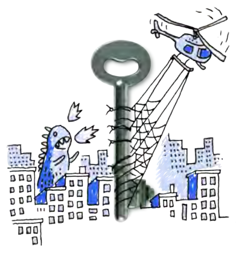
> **[Diagram Context - Textbook_NaturalScience_Gr7_Biodiversity.pdf-0001-02.png]**
> The graphic is an illustrated conceptual metaphor depicting a large metal key standing vertically between a fire-breathing blue monster and a helicopter carrying a net amidst a city skyline. The illustration features no text labels, variables, or chemical symbols, consisting entirely of the sketched city buildings, the blue monster on the left, the helicopter and net on the right, and the central metallic key. Conceptually, this visual serves as a creative prompt or discussion starter for high school learners to explore problem-solving strategies, containment mechanisms, or the interplay between destructive forces and controlled interventions in CAPS-aligned scenario analysis.

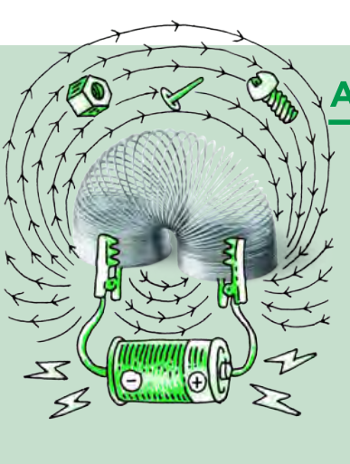
> **[Diagram Context - Textbook_NaturalScience_Gr7_Biodiversity.pdf-0001-16.png]**
> This educational graphic illustrates an electromagnet apparatus consisting of a coiled wire connected to a direct current power source, accompanied by magnetic field lines, directional arrows, positive (+) and negative (-) terminals, and small metallic objects (a nut, nail, and screw). It visually demonstrates how passing an electric current through a solenoid produces a magnetic field that mimics a bar magnet and exerts magnetic force on ferromagnetic materials.

> **[Diagram Context - Textbook_NaturalScience_Gr7_Glossary1.pdf-0001-00.png]**
> This graphic is a biological structure diagram illustrating a continuous layer of epithelial tissue featuring evenly spaced, hook-like villi or microvilli projections along a horizontal membrane band. The visual elements include a light purple cellular layer embedded with a repeated series of outlined, curved pink structures extending upward. Conceptually, this diagram helps high school learners visualize specialized absorptive surfaces in the digestive system, emphasizing how microscopic folding maximizes surface area for nutrient absorption.

> **[Diagram Context - Textbook_NaturalScience_Gr7_Glossary3.pdf-0001-00.png]**
> This educational graphic illustrates a biological cellular structure showing a linear row of repeating, hook-like pink structures embedded along a horizontal purple strip. The graphic visually represents microvilli or similar specialized epithelial cell projections that increase surface area for absorption. Conceptually, it helps high school Life Sciences learners understand how structural adaptations at a microscopic level maximize absorption efficiency in organs like the small intestine.

> **[Diagram Context - Textbook_NaturalScience_Gr7_Glossary4.pdf-0001-00.png]**
> This educational graphic illustrates a biological cellular structure, specifically showing a continuous row of purple, hook-shaped villi or microvilli lining an epithelial surface without any explicit text labels or arrows. For CAPS Life Sciences learners, this diagram visually conveys the adaptation of the small intestine's inner lining, demonstrating how microscopic folds significantly increase the surface area available for the efficient absorption of digested nutrients.

> **[Diagram Context - Textbook_NaturalScience_Gr7_Sexual-reproduction.pdf-0001-02.png]**
> This graphic depicts a physical science/mathematics illustration showing a uniform series of repeating wave-like curl symbols arranged linearly along the top surface of a solid horizontal strip. The visible elements include a blue rectangular band representing a medium or surface, topped by a repeating sequence of blue looped wave crests or curl icons without text labels or coordinate axes. Conceptually, it conveys the periodic nature of waves, wave trains, or boundary phenomena, helping learners visualise continuous repeating patterns or uniform oscillations along a medium.

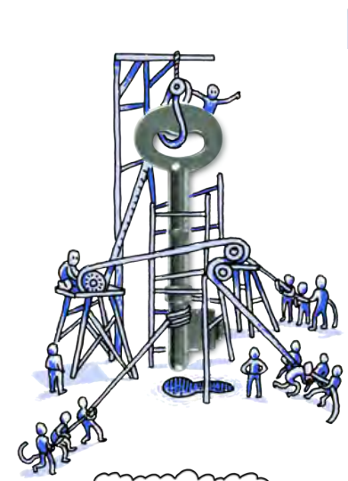
> **[Diagram Context - Textbook_NaturalScience_Gr7_Sexual-reproduction.pdf-0001-03.png]**
> This metaphorical graphic illustrates a mechanical apparatus featuring a system of ropes, pulleys, scaffolding structures, and multiple small human figures pulling ropes to lift a large central metal key. The visible elements include a suspended hook, scaffolding towers, overhead pulleys, guide ropes, and several groups of blue cartoon figures exerting pulling force from various angles. Conceptually, this diagram visually conveys the principles of mechanical advantage and work in physics, demonstrating how combined forces, levers, and pulley systems allow multiple agents to coordinate effort to lift a heavy load.

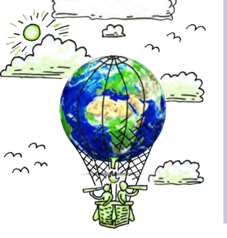
> **[Diagram Context - Textbook_NaturalScience_Gr7_Sexual-reproduction.pdf-0001-17.png]**
> This conceptual illustration features a planet Earth enclosed within a hot air balloon basket structure, complete with a burner flame beneath and two figures looking through telescopes from the basket against a backdrop of the sun, clouds, and birds. The graphic uses metaphorical imagery—a globe transformed into a hot air balloon steered by observers—to convey the idea of exploring, monitoring, and actively managing Earth's environmental systems and global climate change.

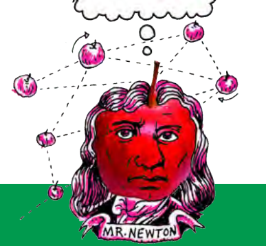
> **[Diagram Context - Textbook_NaturalScience_Gr7_Sexual-reproduction.pdf-0001-31.png]**
> This conceptual illustration depicts a portrait labeled "MR. NEWTON" with an apple for a head, set against a network of multiple interconnected red apples linked by dashed lines and directional rotation arrows. For a high school Physical Sciences learner studying Grade 11 Newtonian Mechanics, the graphic conveys the principle of universal gravitation, demonstrating how masses attract each other mutually across a system rather than simply falling downward.

> **[Diagram Context - Textbook_NaturalScience_Gr7_The-Biosphere.pdf-0001-02.png]**
> This biological illustration depicts a cross-section of an epithelial surface, specifically showing numerous finger-like projections representing microvilli lining the apical border of absorptive cells. The graphic features a continuous purple horizontal tissue layer embedded with a dense, repeating array of curved, blue loop structures. Conceptually, it conveys how the folding of the cell membrane into microvilli significantly increases the surface area available for the efficient absorption of nutrients in the human small intestine.

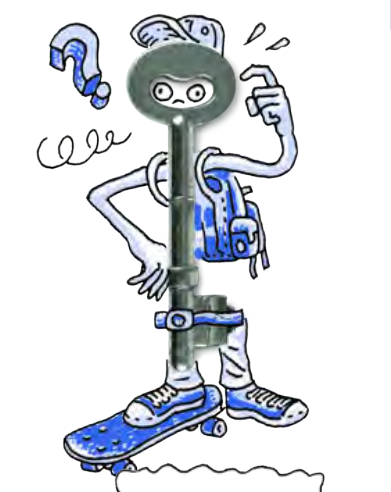
> **[Diagram Context - Textbook_NaturalScience_Gr7_The-Biosphere.pdf-0001-03.png]**
> The graphic features a cartoon character sketched in blue ink riding a skateboard, with a realistic metal key superimposed over its head and torso to serve as a face. Visible elements include a large blue question mark, a scratching hand gesture, sweat droplets, curly scribbles, and a backpack on the character. Conceptually, this illustration conveys a sense of confusion, problem-solving, or unlocking a key concept, serving as an engaging visual prompt for high school learners to prompt critical thinking or inquiry-based learning.

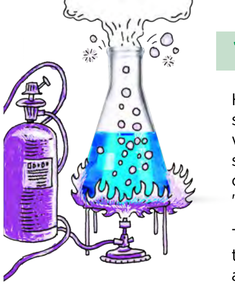
> **[Diagram Context - Textbook_NaturalScience_Gr7_The-Biosphere.pdf-0001-19.png]**
> This educational graphic depicts a laboratory apparatus setup showing a conical flask filled with a blue liquid heated by a Bunsen burner, connected to a purple gas cylinder via tubing. Visible elements include the gas cylinder with a regulator valve, connecting tubes, a burner flame, ascending gas bubbles within the liquid, and escaping vapor/smoke from the flask opening. Conceptually, this diagram illustrates a chemical reaction involving heating and gas supply, helping learners visualize how energy transfer and gas evolution occur during laboratory experiments.

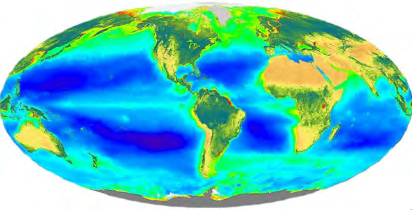
> **[Diagram Context - Textbook_NaturalScience_Gr7_The-Biosphere.pdf-0001-25.png]**
> This global satellite map displays a pseudocolor visualization of Earth's biosphere, illustrating terrestrial vegetation greenness and oceanic chlorophyll concentrations. The visual features continental landmasses shaded in greens, yellows, and browns alongside global oceans colored in gradients of blue, cyan, and red representing photosynthetic activity. Conceptually, it conveys the distribution and density of primary producers across both terrestrial biomes and marine ecosystems, supporting CAPS Life Sciences topics on the biosphere, biogeochemical cycles, and the flow of energy through ecosystems.

> **[Diagram Context - Textbook_NaturalScience_Gr7_Variation.pdf-0001-01.png]**
> This diagram illustrates Huygens' Principle, featuring a horizontal wavefront represented by a light-blue

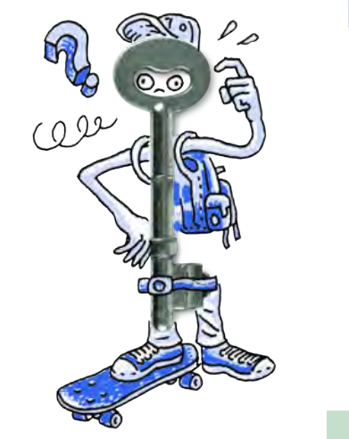
> **[Diagram Context - Textbook_NaturalScience_Gr7_Variation.pdf-0001-02.png]**
> This metaphorical illustration features a cartoon student character with a large metal key superimposed as

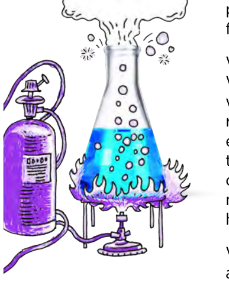
> **[Diagram Context - Textbook_NaturalScience_Gr7_Variation.pdf-0001-17.png]**
> This illustration depicts a laboratory heating apparatus consisting of an Erlenmeyer flask

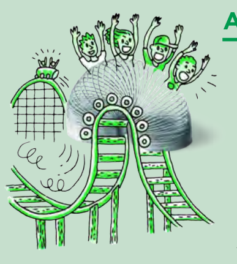
> **[Diagram Context - Textbook_NaturalScience_Gr7_Variation.pdf-0001-20.png]**
> This illustration depicts a roller coaster track with passengers in a car,

---

# Glossary: Planet Earth and Beyond

* **star lore:** mythical stories about the stars, planets and constellations
* **starch:** a carbohydrate consisting of a large number of glucose units
* **telescope:** an instrument designed to make distant objects appear nearer and magnified
* **tidal bulge:** a swell in the sea level in line with the Moon on either side of the Earth (along the Earth-Moon line)
* **tides:** the regular rise and fall of the oceans (and some rivers and lakes) twice per day caused by the gravitational attraction of the Moon and to a lesser extent the Sun
* **tilt:** to slant or tip
* **vegetation:** the general word used for plant growing in an area or region
* **weight:** the force exerted on a mass due to gravity

> **[Diagram Context - Textbook_NaturalScience_Gr7_Biodiversity.pdf-0002-03.png]**
> The provided image is entirely blank and contains no visual content, labels, or structures. As a result, no pedagogical concepts or curriculum topics from the CAPS syllabus can be identified or interpreted from this graphic.

> **[Diagram Context - Textbook_NaturalScience_Gr7_Biodiversity.pdf-0002-08.png]**
> This illustration depicts a digital learning device, specifically a tablet or e-reader screen displaying a grid of various application icons with a blank speech bubble emerging from the top. Two hands hold the device, with a finger touching a specific icon while a page-curl graphic appears in the lower corner. Conceptually, this visual represents e-learning, digital literacy, and interactive technology in education, demonstrating how digital devices and applications facilitate modern learning environments in CAPS curricula.

> **[Diagram Context - Textbook_NaturalScience_Gr7_Biodiversity.pdf-0002-09.png]**
> This graphic is a decorative border featuring repeating, stylized green zigzag arrow patterns across a light background. There are no specific labels, variables, biological structures, or chemical symbols present within the image. Conceptually, it serves as a visual separator or header line in educational materials rather than conveying specific curriculum content for high school science or mathematics.

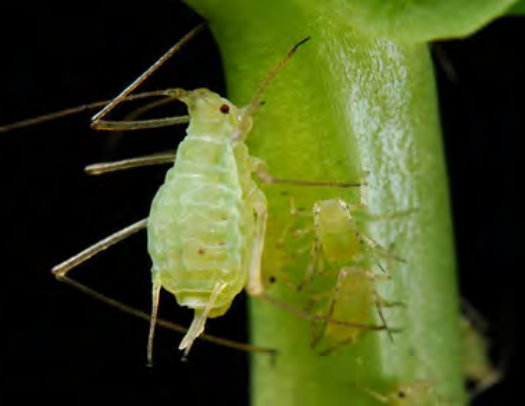
> **[Diagram Context - Textbook_NaturalScience_Gr7_Sexual-reproduction.pdf-0002-00.png]**
> This photograph shows an aphid (greenfly) feeding on the green stem of a plant. The visual displays the insect with its piercing-sucking mouthparts inserted directly into the plant vascular tissue to extract phloem sap. Conceptually, for Grade 10-12 Life Sciences, this illustrates plant transport systems, herbivory, and how sap-sucking pests access nutrient-rich organic solutions moving through the phloem.

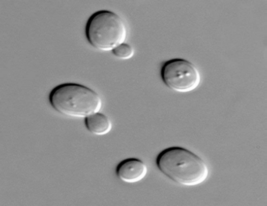
> **[Diagram Context - Textbook_NaturalScience_Gr7_Sexual-reproduction.pdf-0002-01.png]**
> This is a light micrograph showing single-celled fungi (yeast cells) undergoing reproduction, with no text labels or arrows present. Conceptually, it visually conveys the process of budding in fungi, where a smaller daughter cell outgrowth forms from a larger parent cell, demonstrating asexual reproduction as studied in Grade 10 Life Sciences.

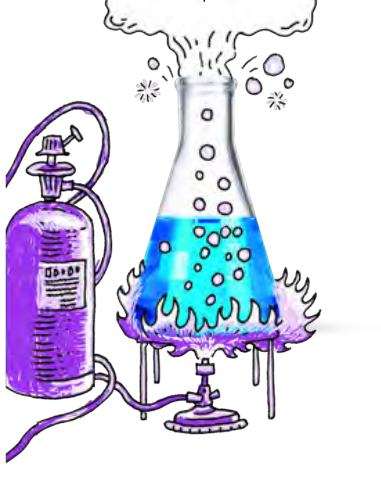
> **[Diagram Context - Textbook_NaturalScience_Gr7_Sexual-reproduction.pdf-0002-11.png]**
> This educational graphic illustrates a laboratory apparatus setup, specifically featuring an Erlenmeyer flask containing a blue liquid heated by a Bunsen burner connected to a gas cylinder. Visible elements include the purple gas cylinder with a regulator valve and tubing, a Bunsen burner with purple flames, an Erlenmeyer flask showing rising bubbles and vapor escaping from the top, and supporting tripod stands. Conceptually, this diagram demonstrates the application of thermal energy to liquid reactants in a chemical reaction or heating process, helping learners visualize safety and equipment setup for physical sciences experiments.

> **[Diagram Context - Textbook_NaturalScience_Gr7_Sexual-reproduction.pdf-0002-21.png]**
> This physics demonstration graphic shows a coiled slinky toy flipping down a flight of green stairs. Motion lines indicate the flipping action as the spring's coils alternately compress and stretch to travel downward step by step. Conceptually, this demonstrates longitudinal and transverse wave propagation, as well as the conversion and transfer of potential and kinetic energy in a mechanical system.

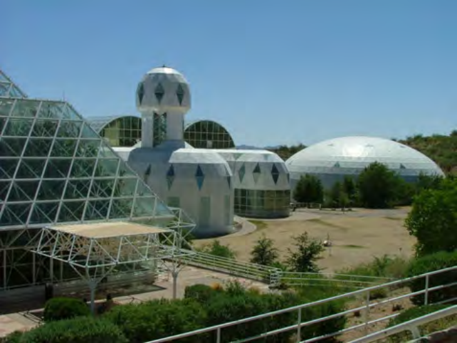
> **[Diagram Context - Textbook_NaturalScience_Gr7_The-Biosphere.pdf-0002-01.png]**
> This photograph depicts a large-scale artificial closed ecological system, specifically the Biosphere 2 facility featuring sealed glass and steel architectural domes containing various biomes. No explicit labels, variables, or chemical symbols are visible within the image frame. Conceptually, this visual supports CAPS Life Sciences topics on environmental studies, biomes, and human impact by illustrating a controlled, self-sustaining biosphere used to study ecological interactions and nutrient cycling on Earth.

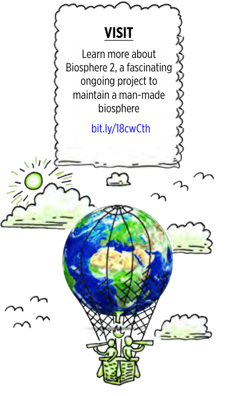
> **[Diagram Context - Textbook_NaturalScience_Gr7_The-Biosphere.pdf-0002-02.png]**
> This educational graphic depicts an informational callout box with a speech bubble outline above an illustrative cartoon scene of the Earth enclosed in a net suspended from a hot air balloon, accompanied by birds, clouds, and a sun. Visible text includes the headings "VISIT" and "Learn more about Biosphere 2, a fascinating ongoing project to maintain a man-made biosphere" along with the web link "bit.ly/18cwCth". This diagram introduces Grade 10 Life Sciences learners to the concept of the biosphere by illustrating the Earth as a closed ecological system and encouraging further research into artificial biospheres.

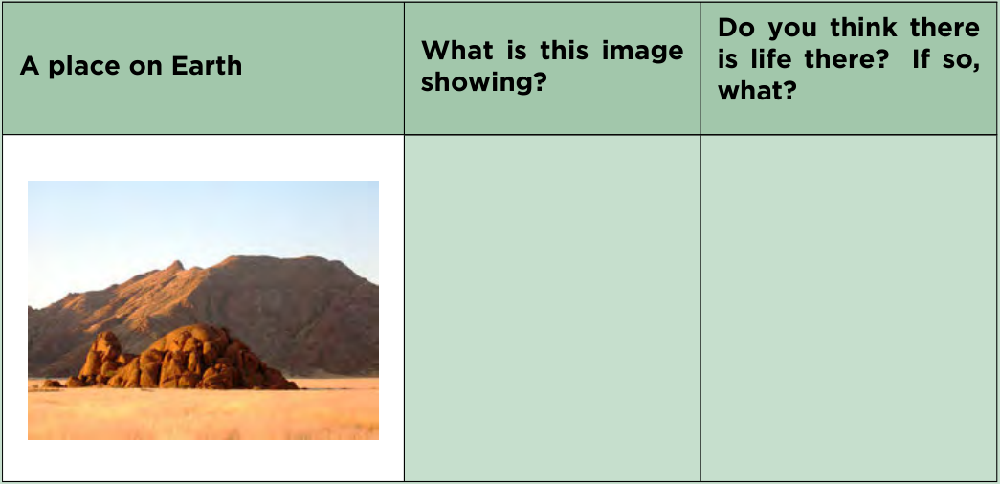
> **[Diagram Context - Textbook_NaturalScience_Gr7_The-Biosphere.pdf-0002-09.png]**
> This educational graphic is a worksheet table with three column headings: "A place on Earth", "What is this image showing?", and "Do you think there is life there? If so, what?". The left column contains a photograph of an arid, rocky landscape featuring mountains and sparse vegetation under an open sky. Conceptually, this activity encourages students to observe different environments on Earth and critically evaluate the conditions necessary to support life in extreme or diverse habitats.

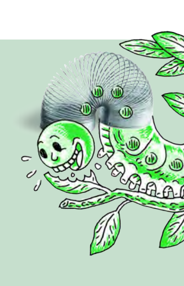
> **[Diagram Context - Textbook_NaturalScience_Gr7_The-Biosphere.pdf-0002-10.png]**
> This biological illustration depicts a caterpillar feeding on green leaves, with its body integrated into a metallic slinky toy shape to demonstrate flexible looping locomotion. Visible elements include a smiling green cartoon head, segmented body segments with legs, and leaves attached to a stem. Conceptually, this visual model helps learners understand invertebrate locomotion and biomechanics, specifically how peristaltic muscular contractions enable soft-bodied organisms to crawl.

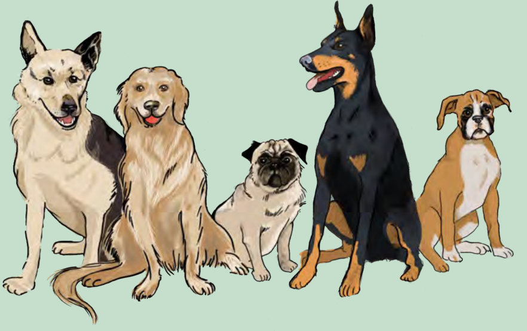
> **[Diagram Context - Textbook_NaturalScience_Gr7_Variation.pdf-0002-01.png]**
> This illustration depicts a variety of domestic dog breeds, showcasing distinct phenotypic differences in body size,

