# 1. The Biosphere

**KEY QUESTIONS:**
* What is the biosphere?
* What are the coldest or hottest places where life can exist?
* How deep can you go in the sea before you do not find anything living anymore?
* Are there living organisms on top of the world's highest mountains?
* How can you tell if something is alive or if it was never alive?
* What do organisms need to stay alive?
* How come some organisms can live in certain places while others cannot?

Let's start exploring the world around us and how it works! Remember that this is your book! You must use it to explore and ask questions about the world around you, and also to learn about yourself and who you are. Do not be afraid to take notes in the margins of this book - make your own scribbles and notes to yourself about points to remember or questions you would like to ask. Be curious! Explore and imagine the possibilities of what you can do with science!

---

## 1.1 What is the biosphere?

**NEW WORDS**
* atmosphere
* biosphere
* depend
* environment
* habitat
* microorganism
* organism

> **TAKE NOTE**
> All the 'New words' listed in the boxes in the margin are defined in the glossary at the end of this strand.

Have you heard the word 'sphere' before? Do you know what it means? A sphere is normally used when talking about a round shape (like a ball). Now, what do we mean when we talk about the biosphere? The prefix 'bio-' indicates something to do with life. For example, 'biology' is the study of living organisms. So, can you put these two meanings together to work out what 'biosphere' means?

The biosphere is the place where life exists on planet Earth. When we talk about the biosphere, we are talking about a huge system (the whole world!) and how all the different parts work together to support life. We will look at these different parts in more detail a bit later.

The biosphere is where life exists on our planet, including the soil and rocks, water and air.

---

# Chapter 1. The Biosphere

## Core Concepts

* **The Biosphere:** The global ecological system integrating all living beings and their relationships; the zone of life on Earth. It includes interactions between living organisms and the non-living components of Earth, such as rocks, soil, water, and air (the **atmosphere**).
* **Environments:** Specific regions or parts of Earth that support life, encompassing both the living organisms and their surrounding habitats.
* **Artificial Biospheres:** Man-made enclosed ecological systems created for research purposes, such as **Biosphere 2** in the Arizona desert, America.

---

## Activity: Where do you think life exists on Earth?

### Instructions

1. Examine the photo of a place on Earth provided below. Describe what the photo is showing.
2. Decide whether you think life exists there or not. If you do think so, list some of the organisms which you think live in this place.

### Activity Table

| A place on Earth | What is this image showing? | Do you think there is life there? If so, what? |
| :--- | :--- | :--- |
|  | | |

> **[Diagram Context - Textbook_NaturalScience_Gr7_Biodiversity.pdf-0001-01.png]**
> This anatomical diagram illustrates a sectional view of the inner ear, specifically highlighting the sensory epithelium of the organ of Corti with its characteristic row of hair cells. Visible features include a horizontal supporting basilar membrane topped by a regular arrangement of sensory hair cells bearing curved stereocilia extending upward. Conceptually, this diagram helps high school learners understand the structural specialization of mechanoreceptors responsible for transducing sound vibrations into electrical nerve impulses in hearing.

> **[Diagram Context - Textbook_NaturalScience_Gr7_Biodiversity.pdf-0001-02.png]**
> The graphic is an illustrated conceptual metaphor depicting a large metal key standing vertically between a fire-breathing blue monster and a helicopter carrying a net amidst a city skyline. The illustration features no text labels, variables, or chemical symbols, consisting entirely of the sketched city buildings, the blue monster on the left, the helicopter and net on the right, and the central metallic key. Conceptually, this visual serves as a creative prompt or discussion starter for high school learners to explore problem-solving strategies, containment mechanisms, or the interplay between destructive forces and controlled interventions in CAPS-aligned scenario analysis.

> **[Diagram Context - Textbook_NaturalScience_Gr7_Biodiversity.pdf-0001-16.png]**
> This educational graphic illustrates an electromagnet apparatus consisting of a coiled wire connected to a direct current power source, accompanied by magnetic field lines, directional arrows, positive (+) and negative (-) terminals, and small metallic objects (a nut, nail, and screw). It visually demonstrates how passing an electric current through a solenoid produces a magnetic field that mimics a bar magnet and exerts magnetic force on ferromagnetic materials.

> **[Diagram Context - Textbook_NaturalScience_Gr7_Glossary1.pdf-0001-00.png]**
> This graphic is a biological structure diagram illustrating a continuous layer of epithelial tissue featuring evenly spaced, hook-like villi or microvilli projections along a horizontal membrane band. The visual elements include a light purple cellular layer embedded with a repeated series of outlined, curved pink structures extending upward. Conceptually, this diagram helps high school learners visualize specialized absorptive surfaces in the digestive system, emphasizing how microscopic folding maximizes surface area for nutrient absorption.

> **[Diagram Context - Textbook_NaturalScience_Gr7_Glossary3.pdf-0001-00.png]**
> This educational graphic illustrates a biological cellular structure showing a linear row of repeating, hook-like pink structures embedded along a horizontal purple strip. The graphic visually represents microvilli or similar specialized epithelial cell projections that increase surface area for absorption. Conceptually, it helps high school Life Sciences learners understand how structural adaptations at a microscopic level maximize absorption efficiency in organs like the small intestine.

> **[Diagram Context - Textbook_NaturalScience_Gr7_Glossary4.pdf-0001-00.png]**
> This educational graphic illustrates a biological cellular structure, specifically showing a continuous row of purple, hook-shaped villi or microvilli lining an epithelial surface without any explicit text labels or arrows. For CAPS Life Sciences learners, this diagram visually conveys the adaptation of the small intestine's inner lining, demonstrating how microscopic folds significantly increase the surface area available for the efficient absorption of digested nutrients.

> **[Diagram Context - Textbook_NaturalScience_Gr7_Sexual-reproduction.pdf-0001-02.png]**
> This graphic depicts a physical science/mathematics illustration showing a uniform series of repeating wave-like curl symbols arranged linearly along the top surface of a solid horizontal strip. The visible elements include a blue rectangular band representing a medium or surface, topped by a repeating sequence of blue looped wave crests or curl icons without text labels or coordinate axes. Conceptually, it conveys the periodic nature of waves, wave trains, or boundary phenomena, helping learners visualise continuous repeating patterns or uniform oscillations along a medium.

> **[Diagram Context - Textbook_NaturalScience_Gr7_Sexual-reproduction.pdf-0001-03.png]**
> This metaphorical graphic illustrates a mechanical apparatus featuring a system of ropes, pulleys, scaffolding structures, and multiple small human figures pulling ropes to lift a large central metal key. The visible elements include a suspended hook, scaffolding towers, overhead pulleys, guide ropes, and several groups of blue cartoon figures exerting pulling force from various angles. Conceptually, this diagram visually conveys the principles of mechanical advantage and work in physics, demonstrating how combined forces, levers, and pulley systems allow multiple agents to coordinate effort to lift a heavy load.

> **[Diagram Context - Textbook_NaturalScience_Gr7_Sexual-reproduction.pdf-0001-17.png]**
> This conceptual illustration features a planet Earth enclosed within a hot air balloon basket structure, complete with a burner flame beneath and two figures looking through telescopes from the basket against a backdrop of the sun, clouds, and birds. The graphic uses metaphorical imagery—a globe transformed into a hot air balloon steered by observers—to convey the idea of exploring, monitoring, and actively managing Earth's environmental systems and global climate change.

> **[Diagram Context - Textbook_NaturalScience_Gr7_Sexual-reproduction.pdf-0001-31.png]**
> This conceptual illustration depicts a portrait labeled "MR. NEWTON" with an apple for a head, set against a network of multiple interconnected red apples linked by dashed lines and directional rotation arrows. For a high school Physical Sciences learner studying Grade 11 Newtonian Mechanics, the graphic conveys the principle of universal gravitation, demonstrating how masses attract each other mutually across a system rather than simply falling downward.

> **[Diagram Context - Textbook_NaturalScience_Gr7_The-Biosphere.pdf-0001-02.png]**
> This biological illustration depicts a cross-section of an epithelial surface, specifically showing numerous finger-like projections representing microvilli lining the apical border of absorptive cells. The graphic features a continuous purple horizontal tissue layer embedded with a dense, repeating array of curved, blue loop structures. Conceptually, it conveys how the folding of the cell membrane into microvilli significantly increases the surface area available for the efficient absorption of nutrients in the human small intestine.

> **[Diagram Context - Textbook_NaturalScience_Gr7_The-Biosphere.pdf-0001-03.png]**
> The graphic features a cartoon character sketched in blue ink riding a skateboard, with a realistic metal key superimposed over its head and torso to serve as a face. Visible elements include a large blue question mark, a scratching hand gesture, sweat droplets, curly scribbles, and a backpack on the character. Conceptually, this illustration conveys a sense of confusion, problem-solving, or unlocking a key concept, serving as an engaging visual prompt for high school learners to prompt critical thinking or inquiry-based learning.

> **[Diagram Context - Textbook_NaturalScience_Gr7_The-Biosphere.pdf-0001-19.png]**
> This educational graphic depicts a laboratory apparatus setup showing a conical flask filled with a blue liquid heated by a Bunsen burner, connected to a purple gas cylinder via tubing. Visible elements include the gas cylinder with a regulator valve, connecting tubes, a burner flame, ascending gas bubbles within the liquid, and escaping vapor/smoke from the flask opening. Conceptually, this diagram illustrates a chemical reaction involving heating and gas supply, helping learners visualize how energy transfer and gas evolution occur during laboratory experiments.

> **[Diagram Context - Textbook_NaturalScience_Gr7_The-Biosphere.pdf-0001-25.png]**
> This global satellite map displays a pseudocolor visualization of Earth's biosphere, illustrating terrestrial vegetation greenness and oceanic chlorophyll concentrations. The visual features continental landmasses shaded in greens, yellows, and browns alongside global oceans colored in gradients of blue, cyan, and red representing photosynthetic activity. Conceptually, it conveys the distribution and density of primary producers across both terrestrial biomes and marine ecosystems, supporting CAPS Life Sciences topics on the biosphere, biogeochemical cycles, and the flow of energy through ecosystems.

> **[Diagram Context - Textbook_NaturalScience_Gr7_Variation.pdf-0001-01.png]**
> This diagram illustrates Huygens' Principle, featuring a horizontal wavefront represented by a light-blue

> **[Diagram Context - Textbook_NaturalScience_Gr7_Variation.pdf-0001-02.png]**
> This metaphorical illustration features a cartoon student character with a large metal key superimposed as

> **[Diagram Context - Textbook_NaturalScience_Gr7_Variation.pdf-0001-17.png]**
> This illustration depicts a laboratory heating apparatus consisting of an Erlenmeyer flask

> **[Diagram Context - Textbook_NaturalScience_Gr7_Variation.pdf-0001-20.png]**
> This illustration depicts a roller coaster track with passengers in a car,

---

# Revision Notes: Life and Living

## Components of the Biosphere

Life exists everywhere on Earth—from the highest mountains to the deepest oceans, the hottest deserts, and the thickest jungles. When describing the places on Earth where life exists, we use specific names corresponding to the different spheres of our planet.

### Core Definitions

The biosphere includes the lithosphere, hydrosphere, and atmosphere, as well as all living organisms and dead **organic matter**.

| Component | Description |
| :--- | :--- |
| **Lithosphere** | Includes the soil and rocks. |
| **Hydrosphere** | Includes all the water. |
| **Atmosphere** | Includes all the gases. |

---

## New Words & Vocabulary

* **adapt**
* **aquatic**
* **component**
* **hydrosphere**
* **lithosphere**
* **marine**
* **matter**
* **organic**
* **photosynthesis**
* **respire**

> **[Diagram Context - Textbook_NaturalScience_Gr7_Biodiversity.pdf-0002-03.png]**
> The provided image is entirely blank and contains no visual content, labels, or structures. As a result, no pedagogical concepts or curriculum topics from the CAPS syllabus can be identified or interpreted from this graphic.

> **[Diagram Context - Textbook_NaturalScience_Gr7_Biodiversity.pdf-0002-08.png]**
> This illustration depicts a digital learning device, specifically a tablet or e-reader screen displaying a grid of various application icons with a blank speech bubble emerging from the top. Two hands hold the device, with a finger touching a specific icon while a page-curl graphic appears in the lower corner. Conceptually, this visual represents e-learning, digital literacy, and interactive technology in education, demonstrating how digital devices and applications facilitate modern learning environments in CAPS curricula.

> **[Diagram Context - Textbook_NaturalScience_Gr7_Biodiversity.pdf-0002-09.png]**
> This graphic is a decorative border featuring repeating, stylized green zigzag arrow patterns across a light background. There are no specific labels, variables, biological structures, or chemical symbols present within the image. Conceptually, it serves as a visual separator or header line in educational materials rather than conveying specific curriculum content for high school science or mathematics.

> **[Diagram Context - Textbook_NaturalScience_Gr7_Sexual-reproduction.pdf-0002-00.png]**
> This photograph shows an aphid (greenfly) feeding on the green stem of a plant. The visual displays the insect with its piercing-sucking mouthparts inserted directly into the plant vascular tissue to extract phloem sap. Conceptually, for Grade 10-12 Life Sciences, this illustrates plant transport systems, herbivory, and how sap-sucking pests access nutrient-rich organic solutions moving through the phloem.

> **[Diagram Context - Textbook_NaturalScience_Gr7_Sexual-reproduction.pdf-0002-01.png]**
> This is a light micrograph showing single-celled fungi (yeast cells) undergoing reproduction, with no text labels or arrows present. Conceptually, it visually conveys the process of budding in fungi, where a smaller daughter cell outgrowth forms from a larger parent cell, demonstrating asexual reproduction as studied in Grade 10 Life Sciences.

> **[Diagram Context - Textbook_NaturalScience_Gr7_Sexual-reproduction.pdf-0002-11.png]**
> This educational graphic illustrates a laboratory apparatus setup, specifically featuring an Erlenmeyer flask containing a blue liquid heated by a Bunsen burner connected to a gas cylinder. Visible elements include the purple gas cylinder with a regulator valve and tubing, a Bunsen burner with purple flames, an Erlenmeyer flask showing rising bubbles and vapor escaping from the top, and supporting tripod stands. Conceptually, this diagram demonstrates the application of thermal energy to liquid reactants in a chemical reaction or heating process, helping learners visualize safety and equipment setup for physical sciences experiments.

> **[Diagram Context - Textbook_NaturalScience_Gr7_Sexual-reproduction.pdf-0002-21.png]**
> This physics demonstration graphic shows a coiled slinky toy flipping down a flight of green stairs. Motion lines indicate the flipping action as the spring's coils alternately compress and stretch to travel downward step by step. Conceptually, this demonstrates longitudinal and transverse wave propagation, as well as the conversion and transfer of potential and kinetic energy in a mechanical system.

> **[Diagram Context - Textbook_NaturalScience_Gr7_The-Biosphere.pdf-0002-01.png]**
> This photograph depicts a large-scale artificial closed ecological system, specifically the Biosphere 2 facility featuring sealed glass and steel architectural domes containing various biomes. No explicit labels, variables, or chemical symbols are visible within the image frame. Conceptually, this visual supports CAPS Life Sciences topics on environmental studies, biomes, and human impact by illustrating a controlled, self-sustaining biosphere used to study ecological interactions and nutrient cycling on Earth.

> **[Diagram Context - Textbook_NaturalScience_Gr7_The-Biosphere.pdf-0002-02.png]**
> This educational graphic depicts an informational callout box with a speech bubble outline above an illustrative cartoon scene of the Earth enclosed in a net suspended from a hot air balloon, accompanied by birds, clouds, and a sun. Visible text includes the headings "VISIT" and "Learn more about Biosphere 2, a fascinating ongoing project to maintain a man-made biosphere" along with the web link "bit.ly/18cwCth". This diagram introduces Grade 10 Life Sciences learners to the concept of the biosphere by illustrating the Earth as a closed ecological system and encouraging further research into artificial biospheres.

> **[Diagram Context - Textbook_NaturalScience_Gr7_The-Biosphere.pdf-0002-09.png]**
> This educational graphic is a worksheet table with three column headings: "A place on Earth", "What is this image showing?", and "Do you think there is life there? If so, what?". The left column contains a photograph of an arid, rocky landscape featuring mountains and sparse vegetation under an open sky. Conceptually, this activity encourages students to observe different environments on Earth and critically evaluate the conditions necessary to support life in extreme or diverse habitats.

> **[Diagram Context - Textbook_NaturalScience_Gr7_The-Biosphere.pdf-0002-10.png]**
> This biological illustration depicts a caterpillar feeding on green leaves, with its body integrated into a metallic slinky toy shape to demonstrate flexible looping locomotion. Visible elements include a smiling green cartoon head, segmented body segments with legs, and leaves attached to a stem. Conceptually, this visual model helps learners understand invertebrate locomotion and biomechanics, specifically how peristaltic muscular contractions enable soft-bodied organisms to crawl.

> **[Diagram Context - Textbook_NaturalScience_Gr7_Variation.pdf-0002-01.png]**
> This illustration depicts a variety of domestic dog breeds, showcasing distinct phenotypic differences in body size,

---

# ACTIVITY: Describe the components of the biosphere

## INSTRUCTIONS:
1. Study the photo that shows the components of the biosphere.
2. Identify and describe the elements of the lithosphere, hydrosphere, and atmosphere that you can see in the photo.

* * *

1. Lithosphere:  
_________________________________________________________________________________________________  
_________________________________________________________________________________________________  
_________________________________________________________________________________________________  

2. Hydrosphere:  
_________________________________________________________________________________________________  
_________________________________________________________________________________________________  
_________________________________________________________________________________________________  

3. Atmosphere:  
_________________________________________________________________________________________________  
_________________________________________________________________________________________________  
_________________________________________________________________________________________________  

* * *

### DID YOU KNOW?
The Earth's atmosphere has changed over time. Our oxygen-rich atmosphere was formed by algae millions of years ago.

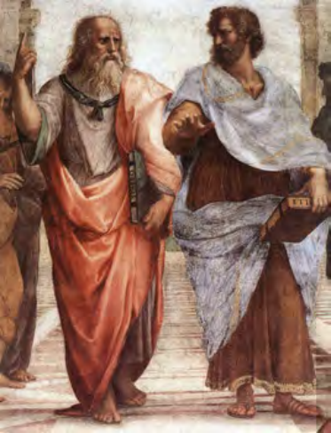
> **[Diagram Context - Textbook_NaturalScience_Gr7_Biodiversity.pdf-0003-07.png]**
> This historical art reproduction depicts a central section of Raphael's fresco *The School of Athens*, featuring the central figures of Plato (pointing upward, holding his book *Timaeus*) and Aristotle (gesturing outward toward the earthly realm, holding his book *Ethics*). The image contains no explicit textual labels, variables, or mathematical symbols, focusing entirely on the contrasting philosophical postures and classical robes of the two philosophers. Conceptually, this artwork serves as a visual prompt in CAPS humanities and history curricula to illustrate the foundational debate between Platonic idealism (focusing on transcendent forms) and Aristotelian empiricism (grounded in the physical world and observation).

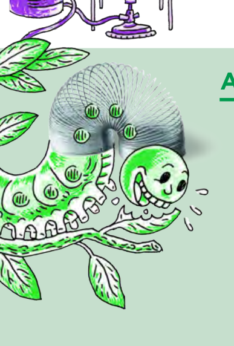
> **[Diagram Context - Textbook_NaturalScience_Gr7_Biodiversity.pdf-0003-09.png]**
> This illustration features a cartoon caterpillar with a metallic coiled spring forming its body segments, feeding on green leaves. Visible elements include the smiley cartoon head, leaf fragments, and striped circular markings on the segments beneath the spring. Conceptually, this visual uses a mechanical spring analogy to help CAPS Life Sciences learners understand the segmented body plan and hydrostatic or flexible locomotion of annelids and arthropods.

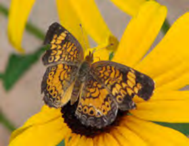
> **[Diagram Context - Textbook_NaturalScience_Gr7_Biodiversity.pdf-0003-15.png]**
> This educational graphic is a biological photograph showing a butterfly resting on a yellow flower. The visual elements include the organism (butterfly with patterned wings) and the floral structure (yellow petals with a dark central disc). Conceptually, this image illustrates ecological relationships such as pollination, mutualism, or animal-plant interactions taught within high school Life Sciences.

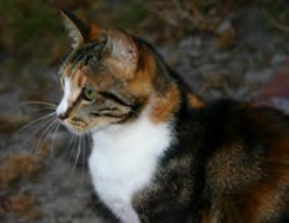
> **[Diagram Context - Textbook_NaturalScience_Gr7_Biodiversity.pdf-0003-16.png]**
> This photograph shows a calico cat displaying distinct patches of black, orange, and white fur, serving as a biological example of phenotype. The visible features include the tricolour coat pattern, whiskers, green eyes, and facial structure without explicit text labels or arrows. Conceptually, this image illustrates the expression of polygenic inheritance and sex-linked traits in mammalian genetics, demonstrating how different alleles combine to determine physical appearance in high school Life Sciences.

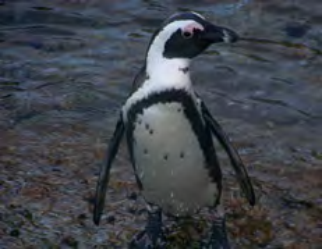
> **[Diagram Context - Textbook_NaturalScience_Gr7_Biodiversity.pdf-0003-17.png]**
> This biological photograph depicts an African penguin (*Spheniscus demersus*), characterized by its distinct black-and-white plumage, pink supraorbital glands, and characteristic black chest band standing near water. The image clearly displays visible external morphological features, including modified forelimbs adapted as flippers, webbed feet, and streamlined body shape. Conceptually, this visual supports CAPS Life Sciences curriculum topics on biodiversity, animal kingdoms, and structural adaptations for locomotion and thermoregulation in specific aquatic environments.

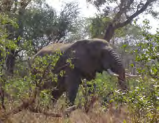
> **[Diagram Context - Textbook_NaturalScience_Gr7_Biodiversity.pdf-0003-21.png]**
> This photograph depicts a large African elephant (*Loxodonta africana*) in its natural woodland savanna habitat, surrounded by trees, shrubs, and dry grass. There are no explicit text labels or arrows visible in the image. Conceptually, this visual represents a key consumer within a terrestrial ecosystem, illustrating biodiversity, trophic levels, and organism-environment interactions relevant to Grade 10-12 Life Sciences.

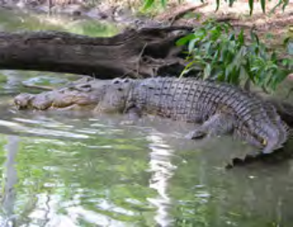
> **[Diagram Context - Textbook_NaturalScience_Gr7_Biodiversity.pdf-0003-23.png]**
> This photograph shows a living reptile (a crocodile) in its natural aquatic habitat surrounded by water, mud, and vegetation. The image contains no explicit text, labels, arrows, or biological diagrams. Conceptually, it supports CAPS Life Sciences lessons on biodiversity and vertebrate phylogeny (Class Reptilia), illustrating ectothermic adaptations, amniotic traits, and environmental interactions.

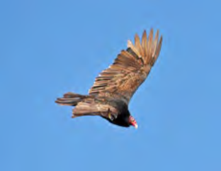
> **[Diagram Context - Textbook_NaturalScience_Gr7_Biodiversity.pdf-0003-25.png]**
> This photograph shows a bird of prey, specifically a vulture, soaring in flight against a clear blue sky, displaying visible anatomical features such as broad wings with extended primary feathers and a bare head. There are no text labels, symbols, or directional arrows present in the image. Conceptually, this visual supports the CAPS Life Sciences curriculum by illustrating vertebrate locomotion and aerodynamic adaptations for soaring in the class Aves.

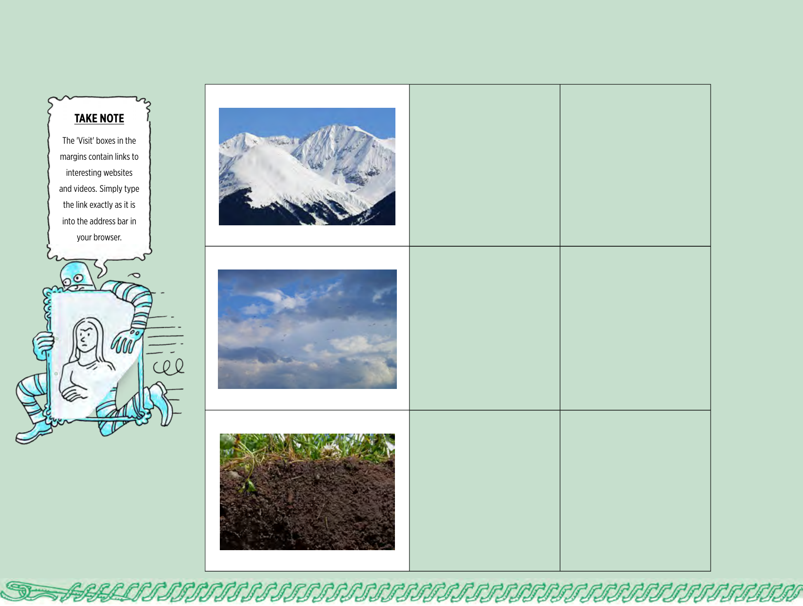
> **[Diagram Context - Textbook_NaturalScience_Gr7_The-Biosphere.pdf-0003-00.png]**
> This educational graphic features a two-column grid layout accompanied by a cartoon character holding a "TAKE NOTE" text box that explains how to use margin links for websites and videos. The left column contains three photographic images representing different Earth spheres: snow-capped mountains depicting the lithosphere, a cloudy sky depicting the atmosphere, and soil depicting the pedosphere/biosphere, while the right column provides blank green grid squares for student notes or observations. Conceptually, this layout introduces CAPS geography learners to the Earth's interacting spheres by prompting them to identify and categorize environmental features and web resources.

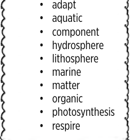
> **[Diagram Context - Textbook_NaturalScience_Gr7_The-Biosphere.pdf-0003-03.png]**
> This educational graphic presents a vocabulary list framed within a decorative scrolled border, typical of primary or senior phase CAPS natural sciences materials. The visible text labels include bulleted key terms: "adapt", "aquatic", "component", "hydrosphere", "lithosphere", "marine", "matter", "organic", "photosynthesis", and "respire". Conceptually, this list serves as a glossary or spelling/terminology bank introducing learners to foundational concepts regarding Earth's spheres, ecological systems, and biological processes.

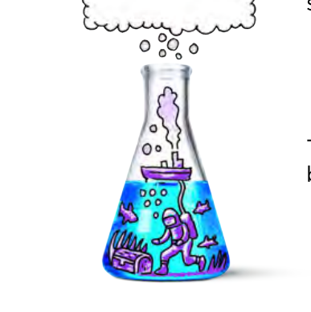
> **[Diagram Context - Textbook_NaturalScience_Gr7_The-Biosphere.pdf-0003-06.png]**
> This illustration depicts a laboratory apparatus, specifically an Erlenmeyer flask filled with blue liquid containing a whimsical underwater scene featuring a scuba diver, ship, bubbles, and a thought bubble rising from the neck. Visible elements include purple-outlined drawings of a ship emitting smoke, rising circular gas bubbles, a scuba diver connected by a tube, fish, seaweed, and a treasure chest. Conceptually, this creative graphic engages high school learners by visually linking laboratory glassware to imaginative scientific inquiry and the observation of chemical reactions that produce gas.

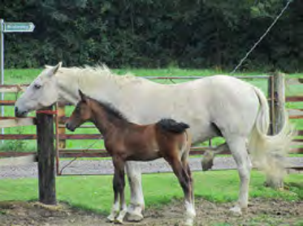
> **[Diagram Context - Textbook_NaturalScience_Gr7_Variation.pdf-0003-02.png]**
> This photograph depicts a biological comparison between a mature white mare and her brown foal, illustrating phenotypic

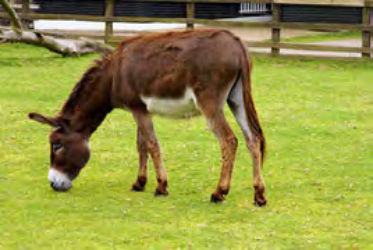
> **[Diagram Context - Textbook_NaturalScience_Gr7_Variation.pdf-0003-06.png]**
> This photograph depicts a domesticated donkey (*Equus africanus asinus

> **[Diagram Context - Textbook_NaturalScience_Gr7_Variation.pdf-0003-08.png]**
> This biological diagram depicts an elongated, continuous helical ribbon structure with a looping left terminus, characteristic of a spiral chloroplast from the green alga *Spirogyra* or spiral lignin thickening in plant xylem vessels. The graphic features repeating diagonal, curved segments containing internal stippling (pyrenoid-like granules) along a horizontal strip, presented without text labels, axes, or arrows. Conceptually, it illustrates the specialized helical arrangement of cellular components to help Life Sciences students visualize structural adaptations, such as maximizing light absorption in algal chloroplasts or providing flexible mechanical support in conducting tissues.

> **[Diagram Context - Textbook_NaturalScience_Gr7_Variation.pdf-0003-10.png]**
> This photograph displays three domestic kittens from a single litter sitting in a crate, without labels or annotations, prominently exhibiting distinct phenotypic variations in their coat colours and fur patterns (solid black, striped tabby, and bi-colour tabby with white). Conceptually, this visual represents intra-specific genetic variation among offspring resulting from sexual reproduction, meiosis, and the inheritance of different combinations of alleles.

---

# Revision Notes: Life and Living

## 4. Organisms in the Biosphere

Even though you cannot see living organisms clearly in some photos, there are many living and dead plants and animals that exist in environments like a beach. 

### Activity: Beach Ecosystem
* **Task:** Make about 10 plausible (believable) guesses of the types of organisms that would live in a beach environment. 
* **Hint:** Think about what might be living in the sea, sand, or air.

---

## Components of the Biosphere

Different organisms can exist in different places in the biosphere. Let's look at the different components of the biosphere and which types of organisms exist there:

### Atmosphere
* **Definition:** The atmosphere is the layer of gases that surrounds the Earth.
* **Key Gases:** The three most important gases in the atmosphere are:
  1. Nitrogen ($N_2$)
  2. Oxygen ($O_2$)
  3. Carbon dioxide ($CO_2$)
* **Structure:** The atmosphere is made up of several layers.

#### ACTIVITY: The atmosphere
* **Question 1:** Discuss with your partner whether you think organisms could live on Earth without the atmosphere. Explain why you think so.

---

### Hydrosphere
* **Definition:** The hydrosphere consists of all water on Earth in all its forms (liquid, solid, and gas).

> **[Diagram Context - Textbook_NaturalScience_Gr7_Biodiversity.pdf-0004-01.png]**
> This photograph shows a young woman wading through shallow ocean water, wearing sunglasses, a headband, and swimwear, with other people visible in the background surf. There are no visible labels, text, arrows, or scientific variables present in the image. Conceptually, this real-world scene can be used in Life Sciences or Tourism contexts to discuss human recreation, coastal environments, or water safety, though it lacks direct curriculum-specific diagrams or terminology.

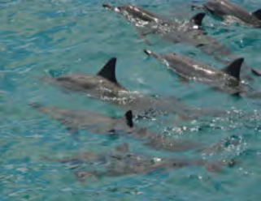
> **[Diagram Context - Textbook_NaturalScience_Gr7_Biodiversity.pdf-0004-03.png]**
> This image is a photograph showing a pod of dolphins swimming together in clear blue ocean water. No labels, text, arrows, or specific anatomical variables are present in the frame. Conceptually, it illustrates social grouping and animal behavior within a marine ecosystem, supporting life sciences topics related to biodiversity, population interactions, and ecological relationships in high school CAPS curricula.

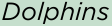

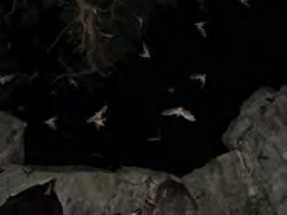
> **[Diagram Context - Textbook_NaturalScience_Gr7_Biodiversity.pdf-0004-05.png]**
> This photograph depicts a natural ecosystem scene showing a colony of bats flying inside a dark cave. The visual displays multiple bats in flight against dark rock formations and cave walls, with no explicit text labels or arrows present. Conceptually, this image supports Life Sciences topics relating to animal behavior, habitat adaptations, and ecological interactions within specific biomes.

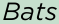

> **[Diagram Context - Textbook_NaturalScience_Gr7_Biodiversity.pdf-0004-11.png]**
> The graphic is a decorative green horizontal border featuring a repeating pattern of slanted arrows. The visible elements include a continuous linear green band filled with numerous repeating arrow shapes pointing in a consistent diagonal direction. Conceptually, this visual serves as a graphic separator or page divider commonly found in educational worksheets to structure sections, rather than conveying a specific scientific concept from the CAPS curriculum.

> **[Diagram Context - Textbook_NaturalScience_Gr7_Sexual-reproduction.pdf-0004-06.png]**
> This image is entirely blank with no visible educational content, text, labels, or diagrams. Consequently, no CAPS curriculum concepts can be identified or evaluated from this graphic.

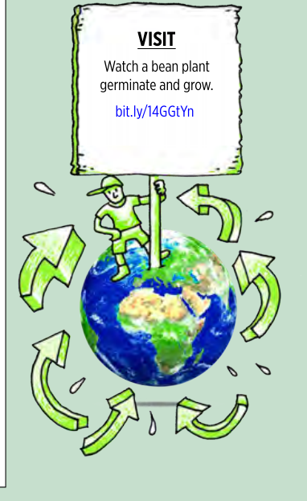
> **[Diagram Context - Textbook_NaturalScience_Gr7_Sexual-reproduction.pdf-0004-07.png]**
> This educational graphic features an illustrative cartoon of a globe surrounded by circular green arrows and a figure holding a sign. Visible text includes the heading "VISIT", the instruction "Watch a bean plant germinate and grow.", and a URL link "bit.ly/14GGTyn". Conceptually, this visual serves as an interactive multimedia prompt to help students explore plant life cycles and growth dynamics in environmental studies.

> **[Diagram Context - Textbook_NaturalScience_Gr7_Sexual-reproduction.pdf-0004-08.png]**
> The graphic displays a repeating decorative border featuring stylized green wave or curl patterns. There are no visible labels, variables, biological structures, chemical symbols, axis names, or directional arrows. Conceptually, this visual serves purely as a non-content graphic separator or page divider rather than conveying academic curriculum concepts for high school students.

> **[Diagram Context - Textbook_NaturalScience_Gr7_The-Biosphere.pdf-0004-04.png]**
> This photograph depicts a coastal landscape featuring rocky shorelines, ocean waves, and breaking surf under a clear blue sky. There are no visible labels, text, or arrows in the image. Conceptually, this visual serves as a contextual stimulus for Grade 10-12 CAPS Geography and Life Sciences topics, illustrating surface processes such as coastal erosion, wave action, and intertidal biomes.

> **[Diagram Context - Textbook_NaturalScience_Gr7_The-Biosphere.pdf-0004-07.png]**
> This illustrative physical sciences graphic depicts a mechanical wave model featuring a coiled spring (slinky) draped over a green roller coaster track with cheering passengers, alongside a smaller schematic of a roller coaster cart and spring loops. The visual elements include a metallic coil representing longitudinal or transverse wave motion, a green supporting framework track, and sketched motion lines. Conceptually, this helps high school learners visualize the relationship between mechanical wave propagation and energy transfer through a medium, aligning with Grade 10-11 Physics CAPS requirements for wave motion.

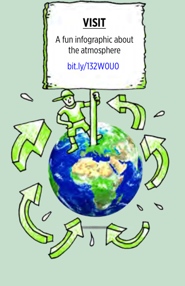
> **[Diagram Context - Textbook_NaturalScience_Gr7_The-Biosphere.pdf-0004-08.png]**
> This educational graphic is an illustrated infographic placeholder featuring a globe and a figure holding a sign. Visible text and elements include the heading "VISIT", the phrase "A fun infographic about the atmosphere", a web link "bit.ly/132W0U0", a cartoon person holding a signpost, a rendering of planet Earth showing Africa and parts of Europe and the Atlantic Ocean, and multiple green curved arrows circling the globe. Conceptually, it serves as an introductory resource to engage high school learners in topics related to Earth systems, global atmospheric circulation, or environmental science within the CAPS curriculum.

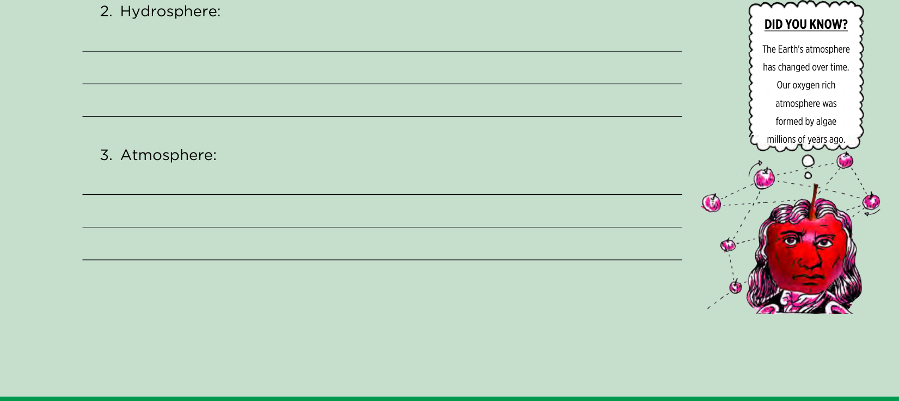
> **[Diagram Context - Textbook_NaturalScience_Gr7_The-Biosphere.pdf-0004-09.png]**
> This educational graphic is a worksheet layout containing structured written response lines paired with a decorative cartoon sidebar. Visible text includes the headings "2. Hydrosphere:" and "3. Atmosphere:", alongside a "DID YOU KNOW?" bubble featuring a figure resembling Isaac Newton with floating apples and text explaining that Earth's oxygen-rich atmosphere was formed by algae millions of years ago. Conceptually, this layout prompts learners to define or describe Earth's spheres while engaging them with historical context about atmospheric evolution relevant to the CAPS Natural Sciences curriculum.

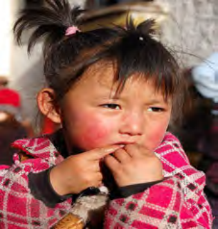
> **[Diagram Context - Textbook_NaturalScience_Gr7_Variation.pdf-0004-01.png]**
> This photograph depicts a young child living in a cold, high-altitude environment, featuring prominently reddened or flushed cheeks without any text, labels, or arrows. Conceptually, in CAPS Life Sciences (Homeostasis and Thermoregulation), this image illustrates the physiological response of vasodilation, where blood vessels near the skin surface widen to increase warm blood flow and prevent tissue damage caused by extreme cold temperatures.

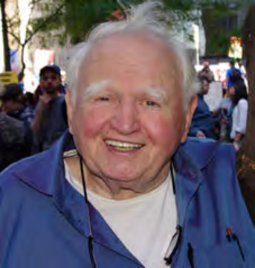
> **[Diagram Context - Textbook_NaturalScience_Gr7_Variation.pdf-0004-03.png]**
> This image is a portrait photograph of an elderly man with white hair, smiling and wearing a

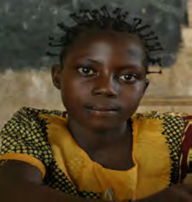
> **[Diagram Context - Textbook_NaturalScience_Gr7_Variation.pdf-0004-05.png]**
> This visual is a photographic portrait of a young female learner seated in a classroom with a chalkboard in the background,

> **[Diagram Context - Textbook_NaturalScience_Gr7_Variation.pdf-0004-07.png]**
> This image is a photographic portrait of a woman dressed in traditional Indian attire,

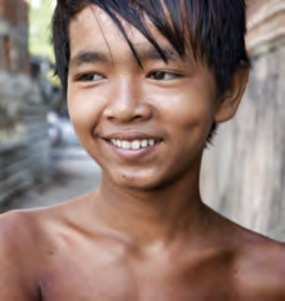
> **[Diagram Context - Textbook_NaturalScience_Gr7_Variation.pdf-0004-09.png]**
> This photograph shows a close-up portrait of a smiling boy displaying a distinct facial dimple on his cheek, without any accompanying labels, arrows, or text. Within the South African CAPS Life Sciences curriculum (Genetics and Heredity), this image illustrates human phenotypic variation, serving as an example of discontinuous variation and an inherited dominant physical trait.

> **[Diagram Context - Textbook_NaturalScience_Gr7_Variation.pdf-0004-11.png]**
> This visual is a portrait photograph of a young female human (*Homo sapiens*) positioned outdoors among tall grass, rather than an abstract scientific diagram or chart. There are no diagrammatic labels, variables, chemical symbols, or axes present, with the image showing only visible macroscopic biological features such as human facial traits, hair, and surrounding terrestrial vegetation. In an educational context (such as Life Sciences), the image conceptually represents an individual human subject, which may be used illustratively for topics concerning human phenotypic variation, observable genetics, or social contexts in Life Orientation.

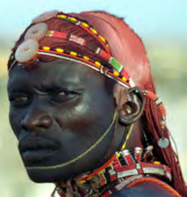
> **[Diagram Context - Textbook_NaturalScience_Gr7_Variation.pdf-0004-13.png]**
> This image is a portrait of a person from an indigenous culture, featuring traditional adornments such as ochre-dyed hair, beaded headbands, and intricate neck jewelry. There are no labels, symbols, or variables present in the photograph. In a CAPS Life Sciences or Social Sciences context, this visual serves as a primary source to discuss human diversity, cultural heritage, and the significance of traditional aesthetic practices in identity formation.

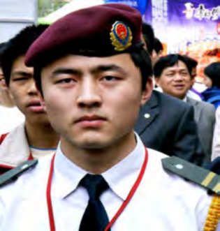
> **[Diagram Context - Textbook_NaturalScience_Gr7_Variation.pdf-0004-15.png]**
> This image is a portrait of a young man wearing a maroon beret with a military-style emblem, a white shirt, a black tie, and shoulder epaulettes. It does not contain educational labels, variables, or scientific diagrams, and therefore does not convey a conceptual lesson relevant to the CAPS curriculum.

> **[Diagram Context - Textbook_NaturalScience_Gr7_Variation.pdf-0004-17.png]**
> 1. A boy wearing glasses.

> **[Diagram Context - Textbook_NaturalScience_Gr7_Variation.pdf-0004-19.png]**
> 1. A woman with a gray jacket and white collar.

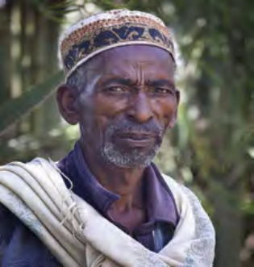
> **[Diagram Context - Textbook_NaturalScience_Gr7_Variation.pdf-0004-21.png]**
> The image shows a man wearing a traditional African headdress and a white scarf. The man is looking directly at the camera, and the background is blurred, suggesting that he is in a forest or a wooded area. The image does not contain any text or other discernible objects.

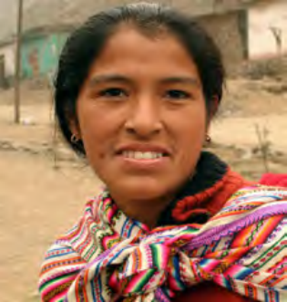
> **[Diagram Context - Textbook_NaturalScience_Gr7_Variation.pdf-0004-23.png]**
> 1. A woman wearing a colorful scarf.

---

# ACTIVITY: The water cycle

## INSTRUCTIONS
1. Study the following diagram describing the water cycle on Earth.
2. Answer the questions that follow.

## QUESTIONS
1. Do you remember learning about the different states of matter? The hydrosphere includes all water in all the states of matter. Look at the diagram of the water cycle and identify water in the different states of matter.

> **TAKE NOTE**
> The word 'aquatic' is used to describe something to do with water. Therefore aquatic animals are animals that live in or near water. The word 'marine' describes organisms that live in saltwater or the sea. So someone studying the organisms in the sea is called a marine biologist.

2. The water cycle shows different sources of freshwater and saltwater. Many plants, animals and microorganisms have adapted to live in an aquatic habitat. A very small percentage of the world's water sources are freshwater and the rest is saltwater. Write down as many different types of aquatic habitats that you can think of where different organisms exist.

---

Chapter 1: The Biosphere

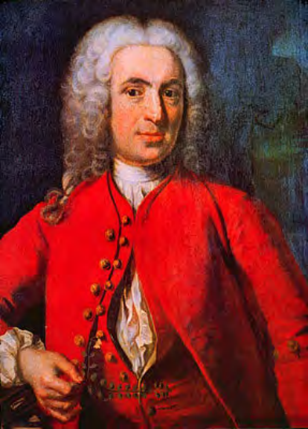
> **[Diagram Context - Textbook_NaturalScience_Gr7_Biodiversity.pdf-0005-00.png]**
> This educational graphic features a historical portrait of the 18th-century French naturalist and mathematician René Antoine Ferchault de Réaumur. The image contains no visible text labels, mathematical variables, or directional arrows. Conceptually, it introduces learners to historical figures who contributed to the development of early thermometry and the physical sciences, specifically the invention of the Réaumur temperature scale.

> **[Diagram Context - Textbook_NaturalScience_Gr7_Biodiversity.pdf-0005-05.png]**
> This illustrative physics graphic features a caricature of Sir Isaac Newton ("MR. NEWTON") depicted as a red apple with a stem, positioned beneath a network of interconnected orbiting apples linked by dashed lines and directional rotational arrows. The visual playfully conveys Newton's Universal Law of Gravitation, illustrating how gravitational force acts universally between any two masses—such as celestial bodies or particles—represented here by interconnected apples in a gravitational field.

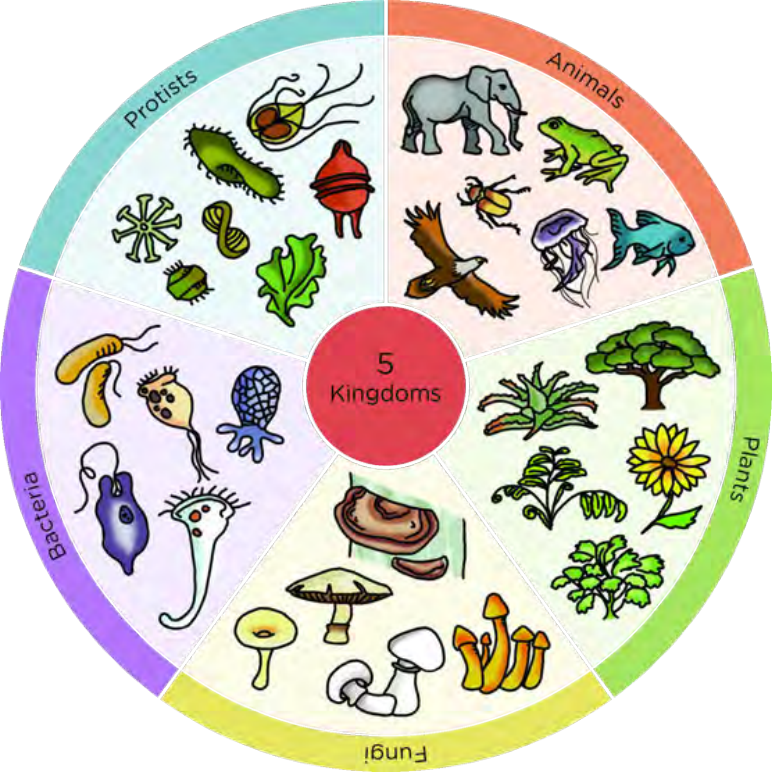
> **[Diagram Context - Textbook_NaturalScience_Gr7_Biodiversity.pdf-0005-16.png]**
> This educational graphic is a circular classification chart displaying the biological diversity of living organisms. The central red circle is labeled "5 Kingdoms", branching out into five distinct colored sectors labeled "Animals", "Plants", "Fungi", "Protists", and "Bacteria", each populated with illustrative examples such as an elephant, trees, mushrooms, microscopic organisms, and bacilli. This diagram conceptually conveys the Whittaker system of biological classification, helping high school learners understand how life on Earth is categorized into major kingdoms based on cellular organization and trophic levels.

> **[Diagram Context - Textbook_NaturalScience_Gr7_Biodiversity.pdf-0005-17.png]**
> This cartoon illustration depicts a blue-skinned thief in a striped uniform running away with a framed portrait that resembles the Mona Lisa. The visible elements include motion lines, a speech bubble, and a framed artwork featuring a person with long hair and folded arms. Conceptually, this visual metaphor introduces learners to the scientific or legal concepts of plagiarism, intellectual property theft, or the reproduction of copyrighted material in an engaging, relatable context.

> **[Diagram Context - Textbook_NaturalScience_Gr7_Sexual-reproduction.pdf-0005-30.png]**
> The graphic is an illustrative diagram showing a pair of hands holding and interacting with a tablet device displaying an app interface, accompanied by a speech bubble above it. Visible elements include a tablet screen with an array of distinct application icons, a finger pressing one of the icons, hands gripping the sides of the device, and a blank speech bubble extending upward. Conceptually, this illustration depicts digital interaction, e-learning navigation, or the use of mobile technology and educational apps within a modern CAPS classroom environment.

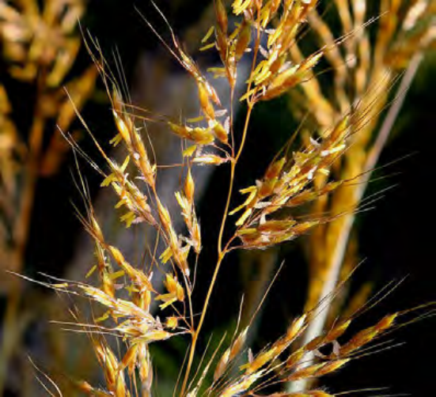
> **[Diagram Context - Textbook_NaturalScience_Gr7_Sexual-reproduction.pdf-0005-31.png]**
> This macro photograph shows a close-up of a wind-pollinated grass inflorescence featuring exposed, feathery stigmas and dangling yellow anthers adapted for pollen dispersal. No text labels or arrows are visible within the image frame. Conceptually, this visual supports the CAPS Life Sciences curriculum by illustrating the structural adaptations of anemophilous (wind-pollinated) flowers in angiosperms, such as reduced petals, exposed reproductive organs, and abundant pollen production.

> **[Diagram Context - Textbook_NaturalScience_Gr7_The-Biosphere.pdf-0005-02.png]**
> The graphic displays an anatomical and cellular diagram illustrating a biological process featuring a repeating pattern of green curved arrow-shaped structures aligned horizontally. The visible elements include a continuous series of green directional arrows running alongside a wavy boundary. Conceptually, this diagram helps high school learners visualize directional movement, transport mechanisms, or physiological processes within a biological system.

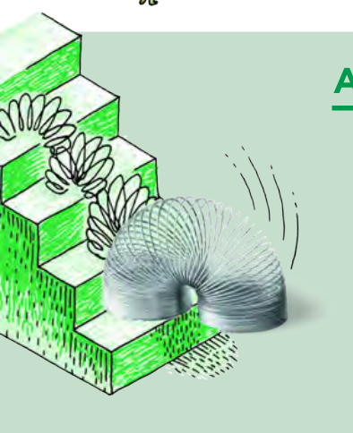
> **[Diagram Context - Textbook_NaturalScience_Gr7_The-Biosphere.pdf-0005-08.png]**
> This educational graphic illustrates a longitudinal wave model using a Slinky toy descending a staircase. The diagram features a coiled spring depicted in successive stages of compression and expansion as it tumbles step-by-step down a set of stairs, accompanied by curved motion lines indicating its flipping action. Conceptually, this helps CAPS Physical Sciences learners visualize how longitudinal waves propagate through compressions and rarefactions, demonstrating wave motion and energy transfer in a medium.

> **[Diagram Context - Textbook_NaturalScience_Gr7_The-Biosphere.pdf-0005-12.png]**
> This educational graphic functions as a decorative border featuring a continuous chain of repeating green arrow shapes linked horizontally. It displays directional arrows oriented towards the right, forming a repeating linear pattern. Conceptually, this visual element serves as a graphical divider in a textbook or worksheet, subtly reinforcing themes of progression, process flow, or sequential steps often encountered in CAPS curriculum learning materials.

> **[Diagram Context - Textbook_NaturalScience_Gr7_Variation.pdf-0005-02.png]**
> A diagram of a spring with a green background and a green staircase.

---

# Lithosphere

As we have said, the lithosphere includes the rocks, soil and sand on Earth. Organisms depend on the lithosphere in many different ways. We find out how in the next activity.

---

### ACTIVITY: How do organisms depend on the lithosphere?

**INSTRUCTIONS:**
1. Below are several photos depicting different ways that organisms depend on and interact with the lithosphere.
2. Use these images to write a paragraph about how different organisms depend on the lithosphere in different ways.

* Bird nests
* A rock pool
* A termite mound
* A tree growing in the ground

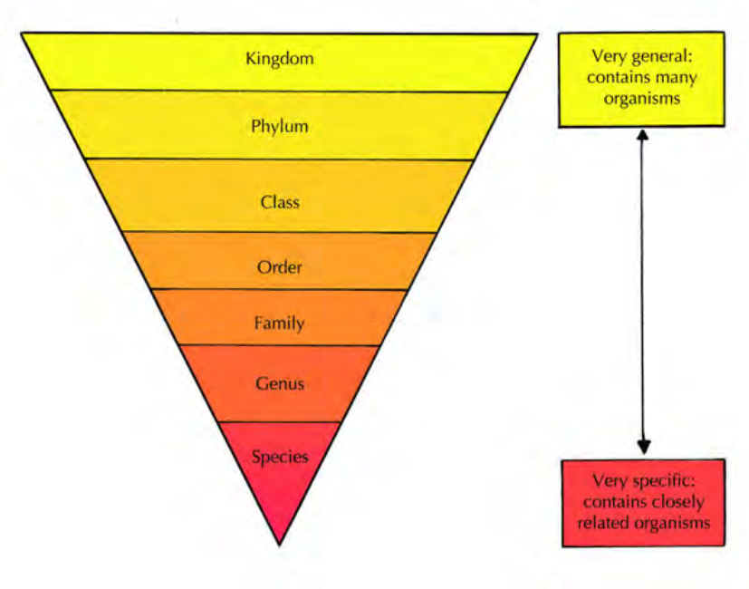
> **[Diagram Context - Textbook_NaturalScience_Gr7_Biodiversity.pdf-0006-04.png]**
> This educational graphic is an inverted pyramid diagram illustrating biological classification and taxonomy. It displays the hierarchical taxonomic ranks labeled sequentially from top to bottom as "Kingdom", "Phylum", "Class", "Order", "Family", "Genus", and "Species", accompanied by explanatory text boxes and a double-headed vertical arrow. Conceptually, it conveys how biological diversity narrows from broad, highly inclusive categories containing many organisms at the top to narrow, exclusive categories containing closely related organisms at the bottom.

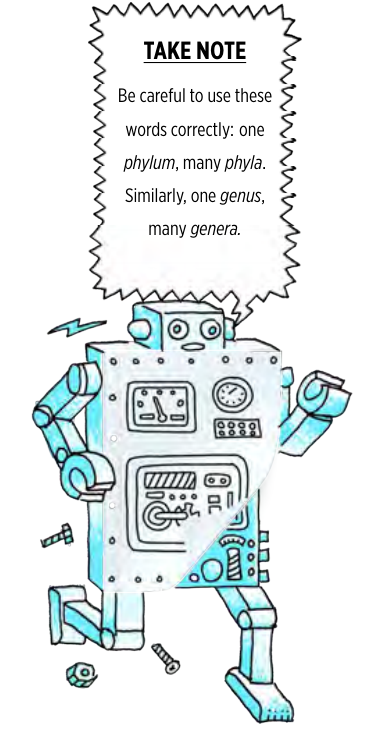
> **[Diagram Context - Textbook_NaturalScience_Gr7_Biodiversity.pdf-0006-05.png]**
> This educational graphic is an instructional text box accompanied by a cartoon robot, featuring a jagged speech bubble titled "TAKE NOTE." The visible text reads: "Be careful to use these words correctly: one *phylum*, many *phyla*. Similarly, one *genus*, many *genera*." This graphic conveys the importance of correct biological terminology and grammatical pluralization when learning taxonomy in Life Sciences.

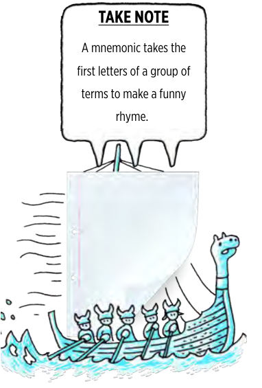
> **[Diagram Context - Textbook_NaturalScience_Gr7_Biodiversity.pdf-0006-06.png]**
> This educational graphic features an illustrated cartoon showing a Viking ship carrying five rowers and a sail made of a lined notebook page, accompanied by a speech bubble titled "TAKE NOTE". The visible text reads "TAKE NOTE" and defines a mnemonic as a study method that uses the first letters of a group of terms to create a funny rhyme. Conceptually, this visual aids high school learners in understanding how to construct and use mnemonics as an effective study strategy to memorise complex terminology and sequences across various CAPS subjects.

> **[Diagram Context - Textbook_NaturalScience_Gr7_Sexual-reproduction.pdf-0006-01.png]**
> This educational graphic is a photograph showing the macroscopic external structure of an angiosperm plant, specifically featuring a pink rose flower, green leaves, stem, and thorns against a mountainous backdrop. The image displays visible biological structures including petals, foliage, stems, and prickles without explicit text labels, axes, or arrows. Conceptually, this visual introduces learners to plant morphology and diversity within the plant kingdom, serving as a real-world example of a flowering plant studied in high school Life Sciences.

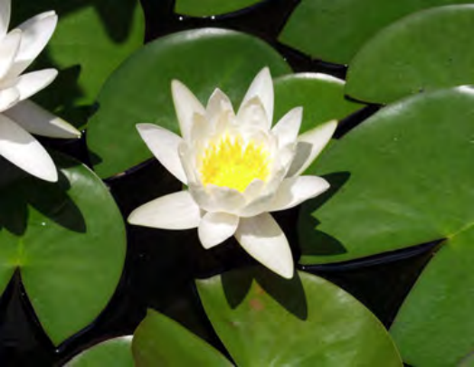
> **[Diagram Context - Textbook_NaturalScience_Gr7_Sexual-reproduction.pdf-0006-02.png]**
> This photograph shows a hydrophytic angiosperm, specifically a white water lily (*Nymphaea*), featuring broad, flat green floating leaves and a radial white flower with a central yellow reproductive structure. There are no explicit text labels or arrows visible in the image. Conceptually, this visual supports the CAPS Life Sciences curriculum by demonstrating plant adaptations to aquatic environments, such as broad floating leaves maximizing light absorption for photosynthesis and air spaces in tissues for buoyancy.

> **[Diagram Context - Textbook_NaturalScience_Gr7_Sexual-reproduction.pdf-0006-05.png]**
> The graphic illustrates a circuit apparatus featuring a coiled wire connected to a battery with positive (+) and negative (-) terminals. Visible elements include directional arrows tracing magnetic field lines around the coil, alongside metal hardware components like a bolt, pin, and nut near the top. For a CAPS curriculum high school learner, this diagram conveys the concept of electromagnetism, demonstrating how an electric current flowing through a solenoid produces a surrounding magnetic field.

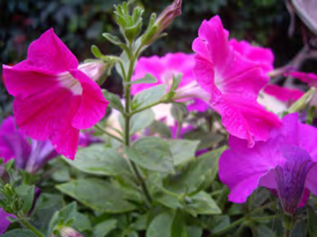
> **[Diagram Context - Textbook_NaturalScience_Gr7_Sexual-reproduction.pdf-0006-06.png]**
> This photograph displays an angiosperm plant structure, specifically highlighting bright pink flowers, green leaves, stems, and buds. Visible features include the petals (corolla), green sepals (calyx), leaves, and floral stems. Conceptually, this image supports Life Sciences CAPS curriculum topics by illustrating external plant morphology and reproductive structures of flowering plants in their natural environment.

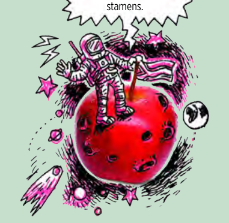
> **[Diagram Context - Textbook_NaturalScience_Gr7_Sexual-reproduction.pdf-0006-14.png]**
> This illustrative graphic depicts a fanciful outer space scene featuring an astronaut standing on a cratered red sphere resembling a planet, holding a flag pole, surrounded by stars, planets, and comets, with a speech bubble referencing "stamens." The visible labels and elements include a speech bubble fragment reading "stamens.", an astronaut in a space suit planting a flag, a red spherical celestial body with craters acting as a planet, and background cosmic elements like stars, a comet, planets, and a distant Earth. Conceptually, this whimsical illustration serves as a creative hook or engagement tool for high school life sciences learners, linking botanical concepts (such as flower reproductive structures like stamens) to imaginative cosmic themes to stimulate curiosity and introduce plant reproduction topics.

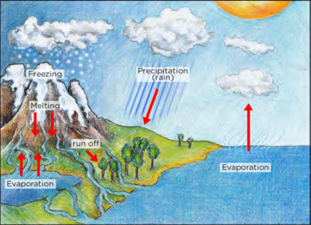
> **[Diagram Context - Textbook_NaturalScience_Gr7_The-Biosphere.pdf-0006-03.png]**
> This illustrative diagram depicts the Earth's water cycle, featuring geographical landscapes including mountains, land, and a body of water beneath a sun-filled sky with clouds. Visible labels include "Freezing," "Melting," "run off," "Precipitation (rain)," and "Evaporation," accompanied by red directional arrows indicating the movement and phase changes of water. Conceptually, this graphic helps learners understand how water continuously cycles through the atmosphere, land, and oceans via processes like evaporation, precipitation, and runoff, aligning with CAPS Earth and Beyond topics.

> **[Diagram Context - Textbook_NaturalScience_Gr7_The-Biosphere.pdf-0006-06.png]**
> This circuit diagram illustrates electromagnetism, featuring a battery connected to a coiled wire (solenoid) with positive (+) and negative (-) terminals. Visible elements include circular magnetic field lines with directional arrows surrounding the coil, along with floating ferromagnetic objects such as a screw, nail, and nut. Conceptually, it conveys how an electric current passing through a conductor generates a magnetic field capable of exerting magnetic forces on ferromagnetic materials.

> **[Diagram Context - Textbook_NaturalScience_Gr7_The-Biosphere.pdf-0006-10.png]**
> This graphic is a decorative border featuring a repeating green line-art pattern of stylized plant tendrils or curled leaves. There are no visible text labels, variables, or specific biological structures indicated within the pattern. Conceptually, it functions purely as an aesthetic page divider or ornamental header for a worksheet or textbook chapter rather than conveying specific CAPS curriculum content.

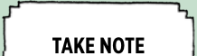
> **[Diagram Context - Textbook_NaturalScience_Gr7_Variation.pdf-0006-02.png]**
> The image shows a white rectangular label with black text that reads "Take Note". The label is placed on a gray background. The text is written in a serif font, and the label is positioned in the center of the image. The background is a solid color, and the label is the only object in the image.

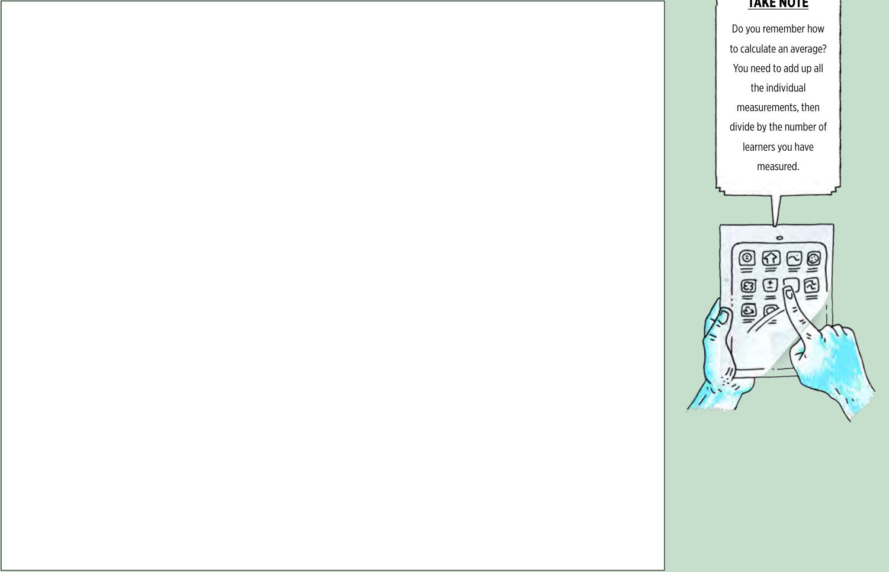
> **[Diagram Context - Textbook_NaturalScience_Gr7_Variation.pdf-0006-03.png]**
> 1. A diagram of a cell with arrows pointing to different parts of the cell.

---

# Chapter 1. The Biosphere

## Characteristics of Living Plants and Animals

All living organisms perform seven fundamental processes that determine whether they are alive or not. 

### The Seven Life Processes

1. **Move:** All living things need to be able to **move**. Moving does not have to consist of big movements. Even plants move, for example, as flowers and leaves turn to face the sun during the course of the day.
2. **Respire:** All living things need energy to perform life processes. Organisms release energy from their food by a process called **cellular respiration**.
3. **Sensitive:** All living things need to be **sensitive** to their environment. Organisms must sense changes in their surroundings and respond to them.
4. **Grow:** All living things need to be able to **grow**.
5. **Reproduce:** All living things need to be able to **reproduce** so that their species does not die out.

---

## New Words

| Word | Definition / Context |
| :--- | :--- |
| **abiotic** | Non-living physical and chemical elements in the environment. |
| **cellular respiration** | The process by which organisms release energy from their food. |

> **[Diagram Context - Textbook_NaturalScience_Gr7_Biodiversity.pdf-0007-03.png]**
> This educational graphic illustrates a roller coaster track system featuring a green sketched layout with tracks, supports, a looping section, and an overlaid photograph of a slinky spring along the crest. Visible elements include cartoon passengers with raised arms riding the cars, small circular wheels gripping the tracks, and motion lines indicating movement. Conceptually, it helps learners visualize the conversion between potential energy and kinetic energy, as well as mechanical wave propagation modelled through a slinky along a dynamic curved path.

> **[Diagram Context - Textbook_NaturalScience_Gr7_Biodiversity.pdf-0007-12.png]**
> This digital learning graphic illustrates a user interacting with a tablet device displaying an application grid with abstract icons and an empty speech bubble above. The visible elements include two hands holding the tablet, a finger touching the screen, a grid of twelve application icons, and a blank speech bubble pointer. Conceptually, this diagram visually represents digital engagement, interactive learning technologies, or software navigation relevant to modern CAPS educational tools and e-learning resources.

> **[Diagram Context - Textbook_NaturalScience_Gr7_Biodiversity.pdf-0007-16.png]**
> This educational graphic is a decorative green border featuring a repeating pattern of stylized arrows pointing rightwards. The horizontal design consists entirely of sequential curved arrow motifs in a light green shade against a paler green background. Conceptually, while purely decorative, this graphic reinforces the pedagogical theme of directional flow, progression, and sequential processes often found in CAPS Life Sciences and Natural Sciences diagrams.

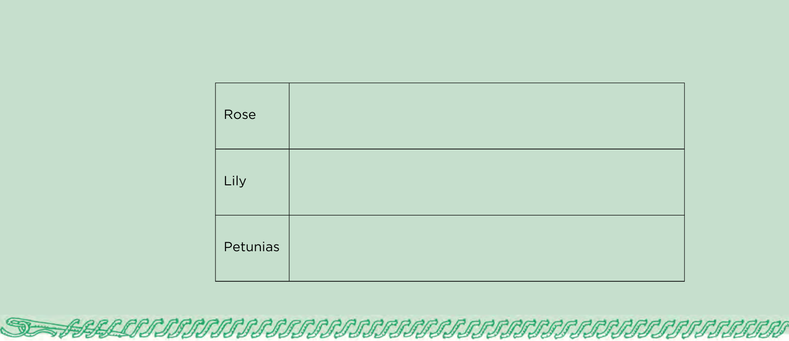
> **[Diagram Context - Textbook_NaturalScience_Gr7_Sexual-reproduction.pdf-0007-00.png]**
> The graphic is a structured table with three blank rows, featuring the labels "Rose", "Lily", and "Petunias" in the left-hand column. This layout is designed for learners to categorize, compare, or record specific botanical features and characteristics of these different plant types in alignment with CAPS Life Sciences.

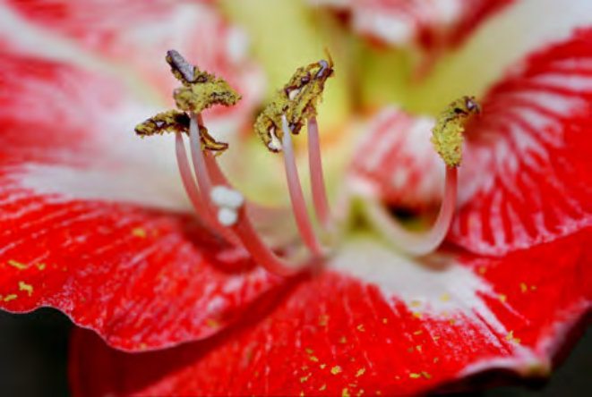
> **[Diagram Context - Textbook_NaturalScience_Gr7_Sexual-reproduction.pdf-0007-09.png]**
> This photographic image shows a close-up macro view of the reproductive structures of a flowering plant (angiosperm), specifically highlighting the stamens consisting of slender filaments supporting anthers covered in yellow pollen grains. Visible biological structures include the stamens, filaments, anthers, pollen, and surrounding petals. For Life Sciences learners studying plant reproduction, this visual demonstrates the male reproductive organs (androecium) responsible for pollen production and dispersal, aiding in the understanding of pollination mechanisms.

> **[Diagram Context - Textbook_NaturalScience_Gr7_Sexual-reproduction.pdf-0007-10.png]**
> This illustrative cartoon features a thief in striped clothing hurriedly running away while carrying a large framed portrait of a woman resembling the Mona Lisa. Motion lines and a blank speech bubble surround the escaping figure, who holds the ornate picture frame with both hands. Conceptually, the graphic serves as a visual metaphor for theft or plagiarism, often used in educational materials to prompt discussions around copyright infringement, intellectual property, and artistic reproduction.

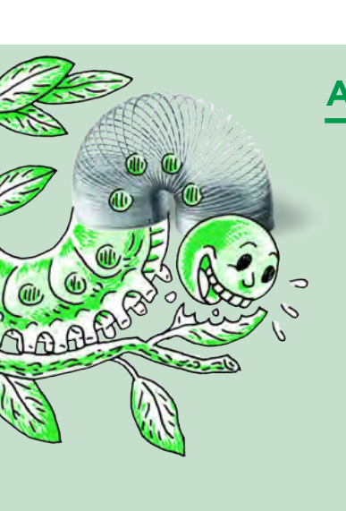
> **[Diagram Context - Textbook_NaturalScience_Gr7_The-Biosphere.pdf-0007-02.png]**
> This educational graphic is an anatomical and mechanical illustration of a caterpillar eating a leaf, with its body superimposed by a metal slinky spring. Visible elements include green leaves, a smiling caterpillar head, segmented body structures with legs, and a coiled metallic spring spanning the body segments marked with circular green patterns. Conceptually, this diagram visually conveys the biological form and crawling locomotion of an invertebrate, helping high school learners understand the structural adaptations and movement mechanisms of organisms in biodiversity and life sciences.

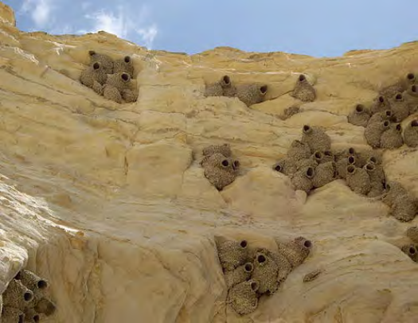
> **[Diagram Context - Textbook_NaturalScience_Gr7_The-Biosphere.pdf-0007-07.png]**
> This photograph displays an ecological view of a colony of numerous mud nests built by cliff swallows adhered to a rocky sandstone cliff face, showing distinct gourd-shaped structures with visible circular entrances. There are no explicit labels, text, or arrows present in the image. Conceptually, this visual supports CAPS Life Sciences topics on population ecology and animal behavior, demonstrating social organization, colonial nesting habits, and how organisms interact with and modify their abiotic environment for shelter and reproduction.

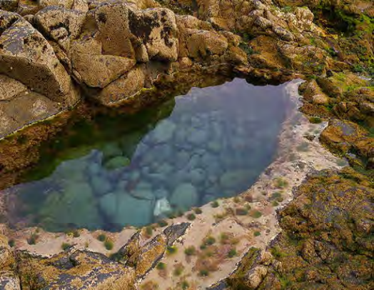
> **[Diagram Context - Textbook_NaturalScience_Gr7_The-Biosphere.pdf-0007-08.png]**
> This educational photograph shows a coastal rock pool ecosystem situated within rocky intertidal shores. The visual displays abiotic elements such as rock formations, sea water, and sandy sediment, alongside biotic components like submerged vegetation and marine habitats. For CAPS Grade 10 and 11 Life Sciences learners, this image illustrates how living organisms interact with extreme environmental fluctuations (like salinity, temperature, and wave action) in a specific terrestrial biome and aquatic ecosystem.

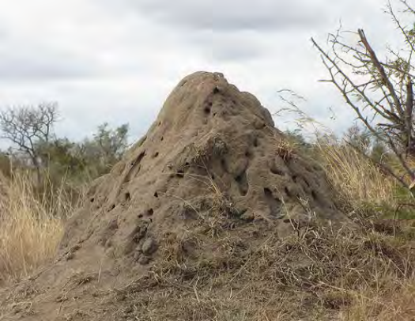
> **[Diagram Context - Textbook_NaturalScience_Gr7_The-Biosphere.pdf-0007-11.png]**
> This photograph shows an external view of a large, earthen termite mound set in a natural African savanna landscape. The visible features include the domed structure of compacted soil dotted with numerous ventilation holes and surrounded by dry grass and sparse thorny vegetation. In the CAPS curriculum, this visual aids learners in understanding animal architecture and adaptations, specifically how complex social structures interact with and modify their abiotic environment for thermoregulation and survival.

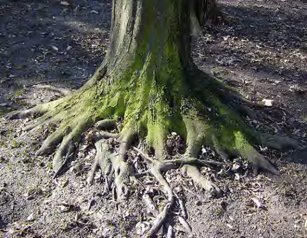
> **[Diagram Context - Textbook_NaturalScience_Gr7_The-Biosphere.pdf-0007-13.png]**
> This photograph shows the basal stem and surface-exposed root system of a mature tree, showing thick woody roots radiating outwards into the soil. Visible features include rough bark, green moss growth on the lower trunk, and branching structural roots embedded in leaf litter. For Grade 10-12 Life Sciences learners, this image illustrates plant organ morphology and root systems adapted for anchorage, support, and the absorption of water and mineral salts.

> **[Diagram Context - Textbook_NaturalScience_Gr7_Variation.pdf-0007-09.png]**
> 1. A diagram of a cell with a green line representing the cell wall.

---

6. All living things need to be able to excrete waste.
7. All living things need nutrition, as they need to break down nutrients during cellular respiration to release energy.

Now that we can determine whether something is living or not, we can take a look at what living things need to survive. In other words, what are the requirements for life?

## 1.2 Requirements for sustaining life

After studying the seven life processes, we now know what animals, plants and other living organisms need to do in order to be classified as living. In order to stay alive these living organisms require (need) certain things or specific conditions. In this section we are going to study the requirements necessary to sustain life.

### NEW WORDS
* favourable
* requirement
* sustain

---

### ACTIVITY: Identify the requirements for sustaining life

Imagine that you are the design team for the first International Moon Space Station, similar to the International Space Station already orbiting Earth, but situated on the Moon!

> *The international space station that orbits Earth, seen from above.*

**VISIT**
Find out more about life on the International Space Station as astronauts perform their everyday tasks.
`bit.ly/178CXVe` or `bit.ly/1cfDcF7`

#### INSTRUCTIONS:
1. Work in groups of four.
2. What do you think the astronauts and plants living on the new Moon Station will need in order to live? Discuss the five most important requirements that you need to provide in order for the astronauts and plants to remain alive on your Moon Space Station.
3. Explain why your group chose these five requirements as the most important to sustain life. Write down your notes from your group discussion on the lines provided. Decide which member of your group is going to report back your findings to the rest of the class.
4. Have a class discussion after you have finished discussing this in your group.

---

*Life and living* | 12

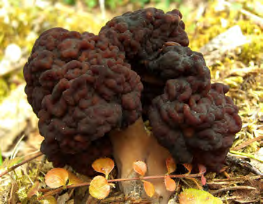
> **[Diagram Context - Textbook_NaturalScience_Gr7_Biodiversity.pdf-0008-02.png]**
> This biological photograph displays a specimen of *Gyromitra esculenta*, commonly known as the false morel, featuring its characteristic dark brown, heavily wrinkled, brain-like cap and a thick stipe growing amidst forest litter. The image lacks text labels or arrows, presenting purely visual morphological features. Conceptually, this visual aids CAPS Life Sciences learners in studying fungal diversity within the Kingdom Fungi, highlighting reproductive structures and distinguishing edible ascomycetes from toxic look-alikes.

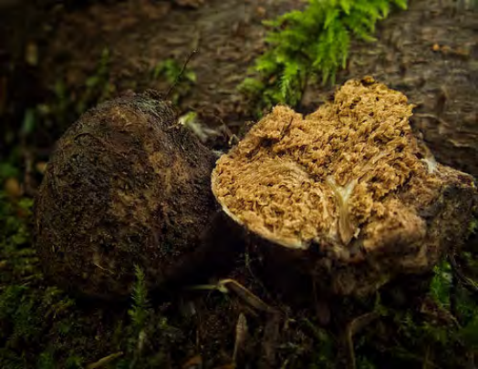
> **[Diagram Context - Textbook_NaturalScience_Gr7_Biodiversity.pdf-0008-03.png]**
> This photograph shows a fungal organism, specifically a truffle-like fruiting body split open to reveal its internal spore-bearing gleba. The image displays the rough exterior surface and the spongy, marbled internal texture without explicit text labels or arrows. Conceptually, it supports Life Sciences CAPS curriculum topics on biodiversity and the Kingdom Fungi by illustrating the morphological adaptations of subterranean or hypogeal fungi for spore dispersal.

> **[Diagram Context - Textbook_NaturalScience_Gr7_Biodiversity.pdf-0008-06.png]**
> This photograph depicts biological structures, specifically multicellular fungal growth (mold) colonizing an organic food substrate. The image displays visible patches of green, grey, white, and yellow filamentous mycelium and fuzzy spore-bearing structures. For a CAPS Life Sciences student, this visual conveys the role of fungi as heterotrophic saprotrophs that secrete extracellular digestive enzymes to break down organic matter, illustrating decomposition and nutrient recycling in ecosystems.

> **[Diagram Context - Textbook_NaturalScience_Gr7_Biodiversity.pdf-0008-07.png]**
> This microphotograph displays single-celled eukaryotic yeast organisms undergoing asexual reproduction. The image captures several oval yeast cells, including prominent parent cells with smaller bud protuberances forming on their surfaces. Conceptually, this visual supports the CAPS Life Sciences curriculum by demonstrating budding, a form of asexual reproduction typical in fungi, where an outgrowth pinches off to form a new genetically identical offspring.

> **[Diagram Context - Textbook_NaturalScience_Gr7_Biodiversity.pdf-0008-10.png]**
> This photograph shows an anatomical structure of a macroscopic macro-fungi, specifically the *Amanita muscaria* mushroom, featuring an upper cap (pileus) with white patches, supported by a central stalk (stipe) emerging from a natural forest floor. There are no explicit text labels, arrows, or chemical symbols visible in this photographic specimen. Conceptually, this visual introduces learners to the macroscopic reproductive structures of the Kingdom Fungi in biodiversity topics, illustrating the typical fruiting body morphology used to study multicellular heterotrophic organisms.

> **[Diagram Context - Textbook_NaturalScience_Gr7_Biodiversity.pdf-0008-11.png]**
> This photographic image depicts a collection of white button mushrooms (*Agaricus bisporus*), showing macroscopic structures like the cap (pileus) and stalk (stipe). It features no explicit text labels, variables, or directional arrows, focusing purely on natural morphological specimen observation. For a CAPS Life Sciences student, this visual introduces the macroscopic characteristics of the Kingdom Fungi, illustrating the fruiting body of a multicellular fungus.

> **[Diagram Context - Textbook_NaturalScience_Gr7_Biodiversity.pdf-0008-15.png]**
> This illustrative graphic features an Earth-patterned hot air balloon carrying observers in a basket beneath a cloud-filled sky, alongside a text callout box with the heading "VISIT" and URL text "bit.ly/18djDrj". Visible labels and text include "VISIT", "Learn more about the kingdom Animalia", and the web address "bit.ly/18djDrj". Conceptually, this graphic serves as an engaging textbook or worksheet placeholder to direct learners toward digital enrichment resources regarding biodiversity and animal classification within the CAPS Life Sciences curriculum.

> **[Diagram Context - Textbook_NaturalScience_Gr7_Biodiversity.pdf-0008-16.png]**
> This educational infographic features a stylized illustration of an astronaut standing on a red apple surrounded by space elements, paired with a text box titled "DID YOU KNOW?". The text block contains the visible heading "DID YOU KNOW?" and descriptive sentences identifying morels as edible mushrooms with honeycomb-like pits and ridges on their caps. Conceptually, this graphic uses engaging, whimsical imagery to spark curiosity and convey interesting biological facts about fungi diversity for high school learners studying life sciences.

> **[Diagram Context - Textbook_NaturalScience_Gr7_Biodiversity.pdf-0008-17.png]**
> This educational graphic features an illustrated cartoon figure holding a rectangular sign above a globe, surrounded by a circular arrangement of directional green arrows. The visible text reads "VISIT The phylogame (a card game which could be played in class) bit.ly/14o3yPp". For a Life Sciences student learning about evolution and phylogeny, this graphic serves as an interactive classroom resource recommendation that connects global biodiversity to evolutionary relationships through gamified learning.

> **[Diagram Context - Textbook_NaturalScience_Gr7_Sexual-reproduction.pdf-0008-07.png]**
> This educational graphic is a simplified anatomical diagram of a flower highlighting female reproductive structures. The visible labels pointing to specific plant parts include "stigma", "style", and "ovary". For a high school student learning plant reproduction in Life Sciences, this diagram conveys the internal layout and relative positions of the pistil components essential for pollination and fertilization.

> **[Diagram Context - Textbook_NaturalScience_Gr7_The-Biosphere.pdf-0008-01.png]**
> This photograph shows an earthworm (phylum Annelida) moving through damp soil, lacking any text labels or arrows. In the CAPS Life Sciences curriculum, it serves as a visual example of biodiversity and animal diversity, illustrating the segmented body plan and habitat of coelomate invertebrates. This image helps learners contextualize the ecological role and external morphology of annelids within soil ecosystems.

> **[Diagram Context - Textbook_NaturalScience_Gr7_The-Biosphere.pdf-0008-03.png]**
> This photographic image depicts an earthbag dome dwelling, showcasing alternative, low-cost construction using stacked tyres for the foundation and plastered mud-brick domes. The structure reveals an underlying geometric geodesic framework exposed through cutouts for windows and doors. Conceptually, for high school learners studying Design or Technology, this image demonstrates sustainable building practices, indigenous and modern material integration, and structural efficiency in eco-architecture.

> **[Diagram Context - Textbook_NaturalScience_Gr7_The-Biosphere.pdf-0008-05.png]**
> This educational graphic introduces the biological concept of life processes and adaptation within a habitat. The text features headings and instructional prompts accompanied by a sidebar labeled "NEW WORDS" containing the terms "abiotic" and "cellular respiration," alongside an illustrative Erlenmeyer flask graphic containing aquatic plant and animal life. Conceptually, this section sets up the foundational Senior Phase CAPS Life Sciences framework by defining the seven life processes necessary to distinguish living organisms from non-living things in the biosphere.

> **[Diagram Context - Textbook_NaturalScience_Gr7_The-Biosphere.pdf-0008-07.png]**
> This educational graphic is an illustrated cartoon resource featuring a human-like figure hugging a globe. The image includes text boxes with the headings "VISIT," "Video about the seven life processes," and a shortened URL link ("bit.ly/1cxrrZT"). Conceptually, this visual serves as an engaging multimedia prompt to introduce Senior Phase Natural Sciences learners to the fundamental characteristics that distinguish living organisms from non-living matter on Earth.

> **[Diagram Context - Textbook_NaturalScience_Gr7_Variation.pdf-0008-07.png]**
> 1. A diagram of a cell with arrows pointing to different parts of the cell.

> **[Diagram Context - Textbook_NaturalScience_Gr7_Variation.pdf-0008-08.png]**
> 1. A green spring with a silver spring inside of it. 
 2. A green battery with a silver battery inside of it. 
 3. A green wire with a silver wire inside of it. 
 4. A green wire with a silver wire inside of it. 
 5. A green wire with a silver wire inside of it.

---

# Chapter 1. The Biosphere

## Lesson Notes: Requirements for Life

### Core Concepts

Living organisms require certain conditions and resources to stay alive. We say that these things or conditions **sustain** life. 

> **Take Note:** 'Sustain' means to keep things alive or in existence. We also use the word sustainable when we want to say that something can continue or be continued for a long time.

To survive, living organisms require:
* **Energy**
* **Gases**
* **Water**
* **Soil**
* **Favourable temperatures**

---

### Detailed Breakdown of Key Requirements

#### 1. Energy
All living organisms need energy to stay alive and perform life processes.
* **Plants** need energy from sunlight in order to photosynthesise. For example, grass and trees get their energy directly from the Sun.
* **Other organisms** get their energy from the food that they eat. For example, a cow gets its energy by eating the grass.

#### 2. Gases
Living things require gases (such as oxygen) to respire. For example, animals like dogs breathe air containing oxygen through their nose to survive.

> **[Diagram Context - Textbook_NaturalScience_Gr7_Biodiversity.pdf-0009-06.png]**
> This educational cartoon depicts a thief character in striped clothing hurriedly running off with a framed portrait of a person. The visual includes motion lines, a speech bubble, and a framed artwork featuring a figure with long hair and folded arms. Conceptually, this illustration uses an analogy of theft to introduce or reinforce legal, social, or historical concepts related to copyright infringement, intellectual property theft, or art forgery.

> **[Diagram Context - Textbook_NaturalScience_Gr7_Biodiversity.pdf-0009-07.png]**
> This scanning electron micrograph shows a cluster of rod-shaped prokaryotic cells, specifically *Escherichia coli* bacteria, adhering to a surface. The visual includes a scale bar marked with "1 µm" in the bottom right corner to indicate microscopic size. For CAPS Life Sciences learners, this image visually reinforces the microscopic scale, unicellular nature, and characteristic bacillus shape of bacteria studied in the diversity of microorganisms and micro-organisms in biodata topics.

> **[Diagram Context - Textbook_NaturalScience_Gr7_Biodiversity.pdf-0009-08.png]**
> This false-colour scanning electron micrograph (SEM) displays spherical bacteria (cocci) being attacked and enveloped by a web-like human neutrophil extracellular trap (NET) composed of chromatin fibres and antimicrobial proteins. The visual elements show a cluster of green-yellow spherical microbes entangled within a complex network of branching orange-red fibrous structures. Conceptually, this image conveys the innate immune system's cellular response—specifically phagocytosis and the release of NETs by white blood cells—to trap and destroy pathogenic microorganisms during an infection.

> **[Diagram Context - Textbook_NaturalScience_Gr7_Biodiversity.pdf-0009-11.png]**
> This is a false-color scanning electron micrograph displaying rod-shaped bacteria interacting with a host cell surface. The image shows brown bacillus cells in close proximity to a textured, blue-green eukaryotic cellular membrane dotted with small pink structures. Conceptually, this visual supports the Life Sciences CAPS curriculum by illustrating microorganisms, pathogens, and the initial stages of cellular infection or interaction between prokaryotic bacteria and host tissues.

> **[Diagram Context - Textbook_NaturalScience_Gr7_Biodiversity.pdf-0009-13.png]**
> This photograph displays three distinct bacterial colonies growing on an agar plate, showing characteristic circular morphology with undulate or lobate margins and raised elevations. The visual features include distinct colony margins, central raised areas, and a smooth, glossy surface texture viewed against a green growth medium. Conceptually, this image helps Life Sciences learners identify macroscopic characteristics of bacterial growth used in microbiology to differentiate species and understand colony morphology during investigations on microorganisms.

> **[Diagram Context - Textbook_NaturalScience_Gr7_Biodiversity.pdf-0009-16.png]**
> This photomicrograph displays a diverse collection of microscopic diatoms, which are single-celled photosynthetic protists featuring intricate, glowing blue silica cell walls (frustules) of various geometric shapes, including centric and pennate forms. The visual highlights the structural diversity and crystalline silica architecture characteristic of kingdom Protista within biodiversity studies. Conceptually, it demonstrates the structural adaptations and microscopic diversity of photosynthetic aquatic organisms that play a crucial role in primary production and marine food webs.

> **[Diagram Context - Textbook_NaturalScience_Gr7_Biodiversity.pdf-0009-18.png]**
> This microscopic micrograph displays a colony of *Asterionella* diatoms arranged in a characteristic radial star-like formation on a yellow-brown background. The image shows multiple elongated, unicellular algal cells connected at their basal ends to form a symmetrical ring structure without any text labels, arrows, or axis markers. Conceptually, this visual supports the Grade 10-12 Life Sciences curriculum by illustrating microscopic biodiversity, unicellular protist adaptations, and colonial organization within aquatic ecosystems.

> **[Diagram Context - Textbook_NaturalScience_Gr7_Sexual-reproduction.pdf-0009-00.png]**
> This educational graphic illustrates a biological organism, specifically a smiling green cartoon caterpillar eating green leaves, with its segmented body partially transformed into a metallic spring. Visible features include segmented body parts marked with green circular patterns, jointed legs along its ventral side, a distinct head with facial expressions, and a coiled metal spring replacing its midsection. Conceptually, this diagram serves as an analogy or visual mnemonic to help high school learners understand the mechanics of peristalsis and muscular contraction, demonstrating how longitudinal and circular muscle layers work in waves to produce movement similar to a contracting spring.

> **[Diagram Context - Textbook_NaturalScience_Gr7_Sexual-reproduction.pdf-0009-08.png]**
> This educational graphic features an illustrative cartoon showing a giant telescope viewing planet Earth with a speech bubble pointing to it. The visible text reads "VISIT", "Watch a flower dissection.", and a short URL link "bit.ly/15yql7o". Conceptually, this digital resource prompt directs high school Life Sciences learners to an online interactive or video demonstration of floral anatomy to complement textbook study of plant reproduction.

> **[Diagram Context - Textbook_NaturalScience_Gr7_Sexual-reproduction.pdf-0009-09.png]**
> This educational graphic is an anatomical structure showing a bisected, half-cut yellow flower. Visible biological structures include the green stem-like pedicel, sepals, yellow petals (corolla), green carpel/pistil centrally featuring a stigma, style, and ovary containing ovules, and surrounding stamen filaments terminating in anthers. This diagram conceptually conveys the internal reproductive structures of an angiosperm to help high school students identify male and female plant organs essential for pollination and sexual reproduction.

> **[Diagram Context - Textbook_NaturalScience_Gr7_Sexual-reproduction.pdf-0009-17.png]**
> This graphical element depicts a repetitive decorative border consisting of stylized, interlocking green curved arrows forming a continuous horizontal band. The graphic contains only repeated green arrow symbols without any explicit text labels, axes, or biological structures. Conceptually, it functions as a visual divider or aesthetic page frame rather than a core instructional scientific diagram for the CAPS curriculum.

> **[Diagram Context - Textbook_NaturalScience_Gr7_The-Biosphere.pdf-0009-00.png]**
> This educational graphic features a hand-drawn, cloud-shaped text box enclosing the underlined heading "NEW WORDS" in bold, uppercase black font. It serves as a pedagogical signpost or visual marker to introduce key vocabulary terms for learners. Conceptually, it draws the student's attention to essential terminology, supporting language development and comprehension within the CAPS curriculum.

> **[Diagram Context - Textbook_NaturalScience_Gr7_The-Biosphere.pdf-0009-09.png]**
> This educational graphic illustrates a roller coaster track overlaid with a metallic spring-like coil, accompanied by sketches of a ride car and cheering passengers. Visible elements include a green-sketched coaster structure, motion lines, loops, and a coiled metallic spring arching over the crest of the track. For high school physics learners studying mechanics within the CAPS curriculum, this visual serves as an engaging analogy to help conceptualize the transformation and conservation of mechanical energy—specifically the interconversion between gravitational potential energy at the peak and kinetic energy during descent.

> **[Diagram Context - Textbook_NaturalScience_Gr7_The-Biosphere.pdf-0009-12.png]**
> This photographic graphic depicts the International Space Station orbiting Earth, showing its interconnected modules and large, dark rectangular photovoltaic solar panels. Visible features include cylindrical pressurized habitation modules, structural trusses, and solar arrays. Conceptually, this visual illustrates the practical application of Newton's laws of motion, gravitational force, and energy conversion technologies within the context of space exploration for Physical Sciences learners.

> **[Diagram Context - Textbook_NaturalScience_Gr7_The-Biosphere.pdf-0009-19.png]**
> This educational illustration depicts the Earth encased in a netted hot-air balloon structure, heated from below by flames against a backdrop of the sun, clouds, and flying birds. The graphic features a globe representing the Earth, a net-like containment grid, a heat source with flames at the base, and atmospheric elements including the sun and clouds. Conceptually, this metaphor illustrates the enhanced greenhouse effect and global warming for CAPS Geography and Life Sciences learners, showing how trapped heat warms the planet similarly to how heated air causes a hot-air balloon to rise.

> **[Diagram Context - Textbook_NaturalScience_Gr7_Variation.pdf-0009-00.png]**
> 1. A diagram of a human head with various labels and arrows.

---

# Revision Notes: Life and Living

## Core Concepts

### Requirements for Life

All living organisms require specific environmental conditions to survive, grow, and reproduce. 

*   **Gases:** 
    *   All living things require oxygen for cellular respiration. Oxygen is used to release energy from nutrients, producing carbon dioxide and water as waste products.
    *   Green plants also need carbon dioxide in order to photosynthesise.
*   **Water:** 
    *   Water is vital to life. Every organism on Earth needs water to live and carry out metabolic processes.
*   **Soil:** 
    *   Soil sustains life on Earth by providing support, minerals, and water for most plants. 
    *   Without soil, plants would not be able to produce the food that animals and other organisms depend on.
*   **Favourable Temperatures:** 
    *   All organisms are adapted to live within a particular temperature range. 
    *   Earth maintains favourable temperatures to support life because it is at an optimal distance from the Sun—not too hot (like Mercury) and not too cold (like Neptune).

---

## Scientific Investigation

### Investigation: What are the requirements to sustain life in plants?

#### Background
In this investigation, bean seeds (or alternative seeds provided by your teacher) are germinated. Different groups in the class test different environmental requirements necessary for seed germination and the subsequent growth of the seedling.

#### Aim
A scientific investigation always starts with a clear aim or question that needs to be answered.

*   **Task:** Write down the specific aim of your investigation in the spaces provided below:

| Investigation Component | Student Notes / Response Area |
| :--- | :--- |
| **Aim / Research Question** | _________________________________________________________________ |
| | _________________________________________________________________ |
| | _________________________________________________________________ |
| | _________________________________________________________________ |

---

## Hypothesis and Variables in Scientific Investigations

### Hypothesis
A hypothesis is a proposed prediction or suggestion of what the outcome of an investigation will be. 

* **Take Note:** A hypothesis is an educated guess about the outcome of the investigation. It must be stated before starting the investigation, written as a statement, and phrased in the future tense.

---

### Variables
Scientists often use investigations to search for cause-and-effect relationships by designing experiments to see how changes in one quantity cause an effect on another. These changing quantities are called **variables**. There are usually three kinds of variables in an investigation:

1. **Independent variable:** 
   * This is the factor that you change in the investigation. You are in direct control of the independent variable.
   * *Example:* If you want to investigate if eating a lot of sugar makes you gain weight, the amount of sugar you eat is the independent variable because you control how much sugar you consume.
   * *Fair Test Rule:* To achieve a fair test, you must change only **one** independent variable at a time. For instance, you cannot simultaneously investigate whether exercise makes you lose weight in the same test.

2. **Dependent variable:** 
   * This is the factor that you observe and measure in an investigation. You do not change it directly; it changes depending on the independent variable.
   * *Example:* In the sugar and weight gain investigation, the dependent variable is how many kilograms you gain (or lose) as a result of eating sugar. 
   * Dependent variables should be measured objectively using numbers as far as possible.

3. **Controlled variables:** 
   * These are quantities that a scientist keeps the same or unchanged throughout the experiment to ensure a fair test.
   * *Example:* To see if sugar causes weight gain, two people could be tested, but both must maintain the exact same amount of exercise so that exercise does not influence their weight. Exercise here is a controlled variable.

#### Control Tests
You can also use a **control test**. For example, in an investigation about plant growth, you might take away one requirement for growth (such as sunlight or water) for an experimental plant. You then perform a control test where a control plant is given *all* the necessary requirements. By comparing the plant missing one requirement to the control plant, you can observe if there is a difference.

---

### New Words / Glossary
* **Dependent variable:** The variable that is measured and changes in response to the independent variable.
* **Hypothesis:** A testable prediction of what the outcome of an investigation will be, stated in the future tense.
* **Independent variable:** The variable that is intentionally changed or manipulated by the scientist.
* **Scientific method:** A method of procedure consisting in systematic observation, measurement, experiment, and the formulation, testing, and modification of hypotheses.
* **Variables:** Quantities, events, or characteristics that can change or be changed in an experiment.

> **[Diagram Context - Textbook_NaturalScience_Gr7_Biodiversity.pdf-0011-01.png]**
> This educational graphic is a physical mechanics illustration depicting a coiled spring (Slinky) walking down a set of stairs, accompanied by motion lines to indicate movement. The visual elements include a green staircase, a metallic coiled spring, and curved motion lines indicating forward and downward tumbling action. Conceptually, this diagram demonstrates mechanical energy transformations, showing how potential energy at the top of the stairs is continuously converted into kinetic and rotational energy as the spring performs a periodic end-over-end flipping motion.

> **[Diagram Context - Textbook_NaturalScience_Gr7_Biodiversity.pdf-0011-06.png]**
> This educational graphic is a comparative biological table featuring photographs of four distinct organisms: "A grasshopper", "A bluebottle", "Cape sparrow", and "Butterfly". The table contains row labels including "Animal", "Type of skeleton", "Vertebrate or invertebrate", and a repeating "Type of skeleton" row designed for classifying these organisms. Conceptually, it guides high school learners in categorizing biodiversity by examining structural features, specifically linking skeletal types (such as endoskeletons, exoskeletons, or hydrostatic skeletons) to vertebrate and invertebrate classifications.

> **[Diagram Context - Textbook_NaturalScience_Gr7_Sexual-reproduction.pdf-0011-02.png]**
> This graphic is a biological photograph showing a honeybee (Apis mellifera) foraging on the disk florets of a flower, with visible pollen grains dusted across its body and legs. The image prominently features the insect's compound eyes, hairy thorax, wings, and legs interacting with the floral structures. Conceptually, this visual supports the CAPS Life Sciences curriculum by illustrating the process of pollination and the mutualistic ecological relationship between plants and animal vectors (zoophily).

> **[Diagram Context - Textbook_NaturalScience_Gr7_Sexual-reproduction.pdf-0011-05.png]**
> This graphic is an illustration featuring a green roller coaster track with a carriage carrying cheering people, overlaid with a metallic Slinky spring and smaller spring symbols. The visible elements include a green and white heading text beginning with "A", a roller coaster structure, a superimposed Slinky coil, and sketched spring loops. Conceptually, this visual aids high school Physical Sciences learners in understanding wave motion and mechanical energy conservation by using a familiar roller coaster model alongside longitudinal spring analogies.

> **[Diagram Context - Textbook_NaturalScience_Gr7_Sexual-reproduction.pdf-0011-09.png]**
> This educational graphic consists of two photographs showing different examples of mutualistic pollination relationships: a butterfly feeding on a purple and yellow flower (left) and a sunbird feeding on tubular orange flowers (right). There are no text labels, variables, or arrows visible in either image. Conceptually, this diagram conveys the ecological concept of mutualism and co-evolution, illustrating how specific animal pollinators interact with corresponding floral structures to facilitate plant reproduction while obtaining food.

> **[Diagram Context - Textbook_NaturalScience_Gr7_The-Biosphere.pdf-0011-04.png]**
> This photographic image shows spherical water droplets resting on green plant blades of grass. It contains no explicit text labels, symbols, or arrows. Conceptually, it illustrates the intermolecular forces of water—specifically cohesion, which forms spherical droplets, and adhesion, which allows the drops to cling to the plant surface—supporting Physical Sciences topics on intermolecular forces and properties of water.

> **[Diagram Context - Textbook_NaturalScience_Gr7_The-Biosphere.pdf-0011-05.png]**
> This photograph displays a cross-section of a soil profile, showing the topsoil layer supporting surface vegetation such as grass and small flowering plants. There are no explicit text labels, diagrams, or symbols present in the image. Conceptually, it introduces learners to the study of pedology and soil composition by illustrating the interface between living flora and the underlying organic-rich soil matrix.

> **[Diagram Context - Textbook_NaturalScience_Gr7_The-Biosphere.pdf-0011-06.png]**
> This conceptual illustration depicts a whimsical outer space scene featuring an astronaut standing on a cratered red apple, surrounded by stars, a comet, and a distant planet set against a starry cosmic background. Visible elements include an astronaut in a spacesuit holding a flag, a red apple modified to resemble a rocky planet with craters, and a speech bubble at the top. Conceptually, this creative visual engages high school learners by stimulating imaginative thinking, creative writing, and scientific curiosity about space exploration and alternative perspectives.

> **[Diagram Context - Textbook_NaturalScience_Gr7_The-Biosphere.pdf-0011-12.png]**
> This educational graphic illustrates a physics phenomenon where light rays from the sun are directed through a magnifying glass, represented with light beam lines converging through the lens onto a focal point that ignites a material. The visual elements include a radiating sun on the left, a centrally positioned magnifying glass with dashed ray patterns visible through the lens, and converging lines leading to a spark and rising smoke on the right. Conceptually, this diagram helps learners understand how convex lenses refract and concentrate parallel light rays to a single focal point, demonstrating the transfer and concentration of thermal energy to reach ignition temperature.

> **[Diagram Context - Textbook_NaturalScience_Gr7_Variation.pdf-0011-01.png]**
> 1. A diagram of a cell.

> **[Diagram Context - Textbook_NaturalScience_Gr7_Variation.pdf-0011-05.png]**
> The image shows a cartoon illustration of a hot air balloon filled with a globe. The globe is depicted in a cartoon style with a blue and green color scheme. The balloon is filled with a green substance, and there are two people inside the balloon, one holding a map and the other holding a compass. The illustration is labeled "The Earth is a globe" and "The Earth is a cartoon

> **[Diagram Context - Textbook_NaturalScience_Gr7_Variation.pdf-0011-08.png]**
> The image is a cartoon drawing of a caterpillar with a green body and a white head, holding a green ball in its mouth. The caterpillar is surrounded by green leaves, and there is a green leaf attached to the caterpillar's body. The drawing also includes a text box that reads "A" and "A+", and a green arrow pointing to the right.

> **[Diagram Context - Textbook_NaturalScience_Gr7_Variation.pdf-0011-15.png]**
> 1. A detailed illustration of a moth with a brown body and black wings.

---

2. Dependent variable. What will you measure to see the effect of the independent variable on the germination and growth of the plant?

3. Controlled variables and control group. What will your control test be and what will you keep the same between the control plant and the tested plant?

> **TAKE NOTE**
> Remember your control group is a special kind of comparison group.

### METHOD:
In your group, plan how you are going to do the investigation. Think about which requirement you are testing and how you will take this requirement away. For example, if you are looking at light, where could you place the seeds so that they do not receive light? Remember, if you are looking at light, then you need to make sure the control and test seeds both receive the same amount of water.

Once you have planned the investigation on rough paper and discussed it with your teacher, write up the method below (in numbered steps) explaining what you will do.

> **TAKE NOTE**
> In Natural Sciences, when we use the word 'favourable' we mean something that is advantageous, helpful, or optimal. For example, we can talk about favourable conditions for life.

### MATERIALS AND APPARATUS:
Write a list of all the materials and apparatus that you will be using in this investigation.

---

16

Life and living

> **[Diagram Context - Textbook_NaturalScience_Gr7_Biodiversity.pdf-0012-00.png]**
> This educational graphic is a classification table used to categorize animal specimens. It features photographic images and text labels including "Tortoise", "Frog", "Crab", and "Earthworm", alongside table row headings such as "Animal", "Type of skeleton", and "Vertebrate or invertebrate". Conceptually, this diagram helps students distinguish between vertebrate and invertebrate animals based on their skeletal structures, supporting foundational biological taxonomy in the curriculum.

> **[Diagram Context - Textbook_NaturalScience_Gr7_Sexual-reproduction.pdf-0012-00.png]**
> The graphic is a photographic comparison showing different insect pollinators interacting with flowering plants. The left panel shows a honeybee foraging on vibrant pink tubular flowers, while the right panel displays multiple dark beetles crawling on a purple flower head. Conceptually, this visual illustrates the ecological concept of pollination syndromes and animal-plant relationships, highlighting how various insect vectors serve as agents of pollination in different floral adaptations as prescribed by the CAPS Life Sciences curriculum.

> **[Diagram Context - Textbook_NaturalScience_Gr7_Sexual-reproduction.pdf-0012-01.png]**
> This educational graphic features photographs comparing two different organisms: a butterfly feeding on a flower on the left and a bat hanging upside down from a branch on the right. The visual contains no text labels, variables, or directional arrows. Conceptually, for a high school Life Sciences student, this comparison illustrates biodiversity, analogous structures, or convergent evolution regarding flight and pollination adaptations in invertebrates and vertebrates.

> **[Diagram Context - Textbook_NaturalScience_Gr7_The-Biosphere.pdf-0012-12.png]**
> This educational graphic depicts a laboratory apparatus setup featuring an Erlenmeyer flask containing a blue liquid heated by a Bunsen burner connected to a gas cylinder. Visible elements include rising gas bubbles, vapor escaping from the flask opening, and purple flames surrounding the base of the flask. Conceptually, this diagram illustrates a chemical reaction or physical change involving heating, gas production, and energy transfer for CAPS Physical Sciences learners.

> **[Diagram Context - Textbook_NaturalScience_Gr7_The-Biosphere.pdf-0012-15.png]**
> This illustration depicts a digital device interface graphic showing a tablet held in two hands with a finger touching the screen, featuring an empty speech bubble above it. The visible screen contains a grid of twelve icon squares with various abstract symbols and lines underneath them. Conceptually, this diagram serves as a visual prompt for interactive digital learning or e-learning tools aligned with CAPS curriculum technology integration, encouraging students to select or discuss digital applications.

> **[Diagram Context - Textbook_NaturalScience_Gr7_Variation.pdf-0012-03.png]**
> 1. A cartoon of a bird on a tree branch.

> **[Diagram Context - Textbook_NaturalScience_Gr7_Variation.pdf-0012-06.png]**
> The image features a cartoon depiction of a man's head with a red apple on his forehead, accompanied by a thought bubble containing a pink apple and a thought bubble with a pink apple. The man's head is depicted in a cartoon style, and the thought bubbles contain a pink apple and a pink apple thought bubble. The image also includes the text "Mr. Newton" and "MRS NEW

> **[Diagram Context - Textbook_NaturalScience_Gr7_Variation.pdf-0012-11.png]**
> The image is a cartoon depiction of a man standing on a globe, with arrows pointing to different parts of the world. The man is wearing a green hat and holding a stick. The globe is divided into different regions, each represented by a different color. The arrows indicate the direction of travel, showing the man's journey around the world. The image is labeled with the text "Visit"

---

# Chapter 1. The Biosphere

## Results and Observations

Use the designated space to record the results for your scientific investigation. 

* If you are observing whether plants germinate or not, draw a table to record this data.
* If you are measuring how much the plants grow over time, use a table to record your measurements.

---

## Analysis

Once you have collected your results in a scientific investigation, you need to analyse them. This often involves drawing a graph:

* **Line Graph:** Use a line graph to show the growth of seedlings over time.
* **Bar Chart:** Use a bar chart to show the number of seeds that germinated, provided you used the same number of seeds in each group.
* **Pie Chart:** Express the percentage of seeds that germinated as a pie chart. 

---

## Did You Know?

Every solar system has a **'Goldilocks' zone**, which is a region that is not too hot (close to the sun), and not too cold (far from the sun) to be able to sustain life. 

Earth is in the middle of our solar system's Goldilocks zone!

> **[Diagram Context - Textbook_NaturalScience_Gr7_Biodiversity.pdf-0013-00.png]**
> This educational text graphic presents a reference prompt directing students to an external resource. It displays the underlined heading "VISIT", the instructional text "A useful chart showing the classification system", and a shortened hyperlink "bit.ly/178IzyU" enclosed within a hand-drawn border. For a high school Life Sciences student, this graphic serves as a signpost to a taxonomic classification chart, supporting the study of biodiversity and the hierarchical grouping of organisms.

> **[Diagram Context - Textbook_NaturalScience_Gr7_Biodiversity.pdf-0013-05.png]**
> This educational graphic is an illustration featuring a large telescope pointed at planet Earth, complete with human figures interacting with the apparatus and a blank speech bubble above. The visible elements include a detailed representation of the Earth showing Africa and Europe, a large green optical telescope on a scaffolding structure, a small figure using a secondary scope on a ladder, and another figure operating a computer console. Conceptually, this diagram visually conveys the scale of planetary observation and scientific inquiry, helping learners contextualise how humanity uses technology and astronomy to study the Earth from a macro-perspective.

> **[Diagram Context - Textbook_NaturalScience_Gr7_Biodiversity.pdf-0013-10.png]**
> This educational infographic presents a radial biological classification chart dividing the animal kingdom into two main categories: Vertebrates and Invertebrates. Visible labels include major taxonomic groups such as Mammals, Birds, Reptiles, Amphibians, Fish, Sponges, Jellyfish, Worms, Molluscs, Starfish, and Arthropods, along with specific animal examples like the Blue crane, Rat, Elephant, Human, Sponge, Jellyfish, Earthworm, and Octopus, all connected via directional arrows to their respective group headings. Conceptually, this diagram helps high school learners visualize biodiversity and hierarchical biological classification by comparing the anatomical diversity of animals with and without backbones.

> **[Diagram Context - Textbook_NaturalScience_Gr7_Biodiversity.pdf-0013-11.png]**
> This educational graphic features an illustrated cartoon robot paired with a text box. The visible text reads "TAKE NOTE" followed by the grammatical clarification: "'Phylum' is the singular and 'phyla' is the plural use of the word." Conceptually, this graphic provides a quick linguistic reminder for high school Life Sciences learners to correctly use biological terminology when classifying animal diversity into major groups.

> **[Diagram Context - Textbook_NaturalScience_Gr7_Sexual-reproduction.pdf-0013-02.png]**
> This biological photograph features a tui bird feeding on nectar from a tubular red flower. Visible biological structures include the bird's specialized curved beak, iridescent feathers, and white throat tufts interacting directly with the floral reproductive organs. Conceptually, this visual conveys the ecological concept of co-evolution and mutualism, illustrating how morphological adaptations in pollinators and plants facilitate pollination and reciprocal survival in an ecosystem.

> **[Diagram Context - Textbook_NaturalScience_Gr7_Sexual-reproduction.pdf-0013-07.png]**
> This educational graphic depicts an illustrated cartoon scene featuring a person riding in a pink apple-shaped carriage pulled by two horses, with a speech bubble emerging from the top. Visible elements include the pink-hued apple carriage, wheels, reins, two horses, a driver, a waving passenger, a flag, and a blank speech bubble. Conceptually, this whimsical illustration serves as a creative prompt or visual stimulus for language and communication exercises in CAPS-aligned Foundation or Intermediate Phase lessons.

> **[Diagram Context - Textbook_NaturalScience_Gr7_Sexual-reproduction.pdf-0013-08.png]**
> This photograph shows a specimen of a specialized floral structure adapted for pollination, specifically a large, reddish-brown flower hanging downwards amidst surrounding green foliage. There are no explicit text labels, arrows, or chemical symbols visible in the image. Conceptually, this visual supports the study of plant reproduction and pollination syndromes in Life Sciences by illustrating how specific flower shapes and colorations are adapted to attract particular pollinators, such as birds or insects.

> **[Diagram Context - Textbook_NaturalScience_Gr7_The-Biosphere.pdf-0013-02.png]**
> This educational graphic is a text-based reminder emphasizing scientific methodology and experimental design. It features the underlined heading "TAKE NOTE" followed by the sentence, "Remember your control group is a special kind of comparison group." Conceptually, this reinforces the foundational scientific skill of using a control group as a baseline to validate experimental results and ensure fair testing in investigations.

> **[Diagram Context - Textbook_NaturalScience_Gr7_Variation.pdf-0013-03.png]**
> The image shows a cartoon depiction of a globe with a speech bubble above it, suggesting a conversation or dialogue between two people. The globe is surrounded by various objects, including a microscope, a television, and a computer. The objects are arranged in a way that they appear to be interacting with the globe, possibly discussing a scientific or technological topic. The text "Vocabulary" is also present

> **[Diagram Context - Textbook_NaturalScience_Gr7_Variation.pdf-0013-05.png]**
> 1. A diagram of a cell with blue and white lines.

> **[Diagram Context - Textbook_NaturalScience_Gr7_Variation.pdf-0013-06.png]**
> 1. A key is shown with a tree and a swing hanging from it.

---

> **DID YOU KNOW?**
> Not all plants need to grow in soil. Epiphytes, such as mosses and orchids, are a group of plants which grow on other plants or rocks. They get their moisture and minerals from the air and rain.

**CONCLUSION:**
After collecting all your results and drawing a graph using these results, you will need to use this to draw a conclusion about the requirements to sustain life in plants. The following questions will guide you in drawing your conclusion.

1. I found out...
2. I know this because...
3. The investigation was fair because...
4. I can trust the results because...
5. While I conducted (did) this investigation I also discovered that...
6. If I did this investigation again I could improve it by...

> **[Diagram Context - Textbook_NaturalScience_Gr7_Biodiversity.pdf-0014-05.png]**
> The graphic is a circuit diagram illustrating electromagnetism, featuring a coiled wire (solenoid) connected to a battery with visible positive (+) and negative (-) terminals. It includes directional arrows indicating magnetic field lines looping around the coil, alongside floating metal objects like a screw, nail, and nut. Conceptually, this demonstrates how an electric current flowing through a conductor generates a magnetic field capable of magnetizing ferromagnetic objects, aligning with CAPS Grade 9 Natural Sciences curriculum requirements.

> **[Diagram Context - Textbook_NaturalScience_Gr7_Biodiversity.pdf-0014-07.png]**
> This graphic is a decorative border featuring a repeating pattern of stylized green arrows oriented diagonally across a horizontal strip. The visible elements consist solely of continuous green arrow shapes pointing uniformly in one direction. Conceptually, it serves as a visual divider or page header in a curriculum textbook, often used symbolically to represent continuous flow, progression, or directional processes in scientific studies.

> **[Diagram Context - Textbook_NaturalScience_Gr7_Sexual-reproduction.pdf-0014-00.png]**
> The provided image is a blank white rectangular space bordered by a thin black outline against a pale green background, containing no visual content, labels, or structures. Because the image is entirely blank, it lacks any instructional elements, variables, or educational graphics. Consequently, it conveys no conceptual information for a CAPS curriculum high school learner.

> **[Diagram Context - Textbook_NaturalScience_Gr7_Sexual-reproduction.pdf-0014-06.png]**
> This educational illustration depicts an ecological scene featuring a smiling pink earthworm burrowing through a bright red apple amidst a natural outdoor background of grass, birds, a sun, and clouds, with a blank speech bubble above the worm. Visible elements include the anthropomorphized pink earthworm, a red apple, grass blades, birds in flight, a stylized sun and clouds, and an empty text speech bubble. Conceptually, this diagram visually introduces younger learners to concepts of animal habitats, feeding relationships, and organism interactions within an ecosystem.

> **[Diagram Context - Textbook_NaturalScience_Gr7_Sexual-reproduction.pdf-0014-07.png]**
> This graphic is a decorative border featuring repeating, stylized green zig-zag or coiled shapes on a pale green background. It contains no text labels, scientific symbols, or academic variables. Conceptually, it serves purely as a visual divider or aesthetic element rather than conveying core curriculum content for high school students.

> **[Diagram Context - Textbook_NaturalScience_Gr7_The-Biosphere.pdf-0014-07.png]**
> The graphic is an illustrated cartoon depicting a whimsical horse-drawn carriage in the shape of an apple, carrying a driver and passenger with an empty speech bubble above them. Visible elements include a pair of pink horses harnessed to an apple-shaped carriage with wooden wheels, a driver holding reins, a waving passenger, a flying flag, motion lines indicating speed, and an empty white speech bubble. Conceptually, this creative illustration serves as a visual prompt or creative writing stimulus for students to explore narrative development, descriptive language, and character interaction within a CAPS-aligned language curriculum.

> **[Diagram Context - Textbook_NaturalScience_Gr7_The-Biosphere.pdf-0014-10.png]**
> This graphic is a simple text banner featuring the word "VISIT" printed in bold uppercase black letters inside a white rectangular box with torn or jagged edges. The image contains only the visible text label "VISIT" against a plain background. Conceptually, this visual serves as a directional or navigational signpost commonly used in educational worksheets or digital resources to prompt learners to explore external links, websites, or related content.

> **[Diagram Context - Textbook_NaturalScience_Gr7_The-Biosphere.pdf-0014-12.png]**
> This educational cartoon depicts a conceptual graphic showing a large telescope with planet Earth fitted into its lens and an empty speech bubble above. Visible elements include human figures operating the scientific apparatus, scaffolding, and a computer monitoring station setup. Conceptually, it illustrates humanity's scientific inquiry into planetary systems and Earth science, encouraging learners to think about observation and the scale of geographical and astronomical study.

> **[Diagram Context - Textbook_NaturalScience_Gr7_Variation.pdf-0014-00.png]**
> A diagram of a human body, showing the different systems and their functions.

---

What did you learn from doing this scientific investigation? Write 3 to 5 sentences explaining what you learnt from doing this scientific investigation following the scientific method.

**VISIT**
Watch a timelapse of bean plants growing.  
`bit.ly/1467MIj`

Each organism is able to survive and continue to survive in their environment because they have acquired the characteristics that allow them to do things in a special way in their particular environment. We say they have adapted to life in their particular type of environment.

## Adapted for life

Do you think you could put a polar bear in the Kalahari desert or a gemsbok in Antarctica and they would survive? Why, or why not?

These animals are specifically adapted to live in their specific environments. All organisms are adapted to their specific environments. In the next activity we examine some more examples of how organisms are adapted to their environments.

---

## ACTIVITY: Adaptations in organisms

### INSTRUCTIONS:
1. Study the photos below showing different organisms in different environments.
2. Answer the questions.
3. You might need to do some extra research in books and on the Internet to complete your answers.

### QUESTIONS:
Look at the photos of a penguin in the water and an eagle flying in the air. Both of these are birds, but they live in very different environments that make the penguin adapted for the water and the eagle adapted for flight.

> **[Diagram Context - Textbook_NaturalScience_Gr7_Biodiversity.pdf-0015-00.png]**
> This educational graphic is a historical biological illustration of a marine fish species. The visible text labels read "SCORPÆNA ANTENNATA," "Der Fühlernträger," "La Scorpène à antennes," and "The East-Indian Scorpion." Conceptually, this diagram supports biodiversity and animal classification studies in the Life Sciences curriculum by providing a detailed visual representation of external morphological features used in taxonomy and species identification.

> **[Diagram Context - Textbook_NaturalScience_Gr7_Biodiversity.pdf-0015-01.png]**
> This visual content is an historical biological illustration of an organism. It features visible text labels including "XIPHIAS GLADIUS", "Der Schwerdfisch", "L'Empereur", and "The Sword - Fish". Conceptually, this diagram conveys organismal diversity and external morphology, supporting Life Sciences topics on biodiversity and animal classification.

> **[Diagram Context - Textbook_NaturalScience_Gr7_Biodiversity.pdf-0015-02.png]**
> This educational graphic features a text-based pedagogical callout box enclosed in a hand-drawn black border. It prominently displays the underlined heading "DID YOU KNOW?" in bold, uppercase sans-serif font against a plain white background. Conceptually, this visual serves as a standard textbook feature designed to introduce interesting, real-world enrichment facts or contextual background information to support CAPS curriculum learning outcomes.

> **[Diagram Context - Textbook_NaturalScience_Gr7_Biodiversity.pdf-0015-03.png]**
> This educational illustration features an anthropomorphic invertebrate (earthworm) emerging from a red apple in a natural outdoor setting with grass, birds, and a sun. A speech bubble contains the visible text: "Only about 2% of all the animals on Earth have a backbone." Conceptually, this graphic introduces intermediate phase Life Sciences learners to biodiversity by highlighting the vast numerical dominance of invertebrates over vertebrates within the animal kingdom.

> **[Diagram Context - Textbook_NaturalScience_Gr7_Biodiversity.pdf-0015-06.png]**
> This educational graphic is a historical biological illustration of a flatfish (*Pleuronectes maximus*, commonly known as the turbot). Visible text includes the taxonomic label "Pleuronectes Maximus", "Der Steinbut", "Le Turbot", and "The Turbot". For Life Sciences learners, this diagram visually conveys the morphological adaptations of vertebrate phylum Chordata, specifically illustrating bilateral asymmetry in adult teleost fish as an adaptation for benthic (bottom-dwelling) survival and camouflage.

> **[Diagram Context - Textbook_NaturalScience_Gr7_Biodiversity.pdf-0015-07.png]**
> This historical zoological illustration depicts an organism's anatomical structure, specifically a hammerhead shark shown in lateral profile alongside a frontal view of its head. Visible text includes the scientific and common names: "Squalus Zygaena," "Der Hammerfisch," "Le Marteau," and "The Balance-Fish." For a high school Life Sciences student, this visual conveys organismal diversity and external morphology within the Phylum Chondrichthyes, highlighting adaptations such as the distinct lateral head extensions (cephalofoil) for sensory reception and maneuverability.

> **[Diagram Context - Textbook_NaturalScience_Gr7_Biodiversity.pdf-0015-08.png]**
> The image shows a text box graphic containing the capitalized word "VISIT" inside a hand-drawn rectangular border. There are no other visible labels, variables, symbols, or arrows present in this graphic. Conceptually, it serves as a simple call-to-action button or signpost directing learners to explore a specific resource or website topic within educational materials.

> **[Diagram Context - Textbook_NaturalScience_Gr7_Biodiversity.pdf-0015-09.png]**
> This educational cartoon graphic depicts a cartoon figure embracing a globe and pointing at the Earth, accompanied by a speech bubble containing the text "Unusual and weird deep sea fish (video)" and the shortened URL "bit.ly/1460jZG". The visual humorously connects global geography with marine biology, prompting students to explore biodiversity in aquatic ecosystems. Conceptually, it serves as a digital multimedia resource link to engage learners with specific curriculum topics relating to biosphere interactions and adaptations of marine organisms.

> **[Diagram Context - Textbook_NaturalScience_Gr7_Biodiversity.pdf-0015-12.png]**
> This educational graphic is a historical biological illustration of a porcupinefish, identified by the scientific and common text label "Diodon Hystrix". The visible elements include detailed botanical-style artwork of the fish's body covered in defensive spines, distinct pectoral and caudal fins, and the taxonomy label in the upper right corner. Conceptually, this diagram supports Life Sciences CAPS curriculum topics on biodiversity, animal adaptations, and structural defense mechanisms used by organisms to avoid predation.

> **[Diagram Context - Textbook_NaturalScience_Gr7_Biodiversity.pdf-0015-13.png]**
> This historical anatomical illustration depicts a goldfish, specifically labeled with the scientific and common names "Cyprinus Auratus" and "The Gold-Fish." Visible features include distinct fins, scales covering the body, a lateral line, and operculum structures around the gill region. Conceptually, this visual serves to introduce learners to biodiversity and vertebrate taxonomy in Life Sciences, demonstrating external morphological adaptations of aquatic organisms.

> **[Diagram Context - Textbook_NaturalScience_Gr7_Biodiversity.pdf-0015-16.png]**
> This educational graphic is an anatomical and mechanical analogy featuring a stylized green caterpillar feeding on a leaf, with its body partially replaced by a metal spring (Slinky) and striped circular segments. The visible elements include a smiling cartoon caterpillar head, segmented body rings containing green striped markers, a coiled metal spring resting on its back, a leafy twig being eaten, and a partial green letter 'A' label in the top right corner. Conceptually, this diagram uses a physical model to help senior phase learners visualize biological body segmentation and the mechanics of movement and muscle contraction in invertebrates like annelids or arthropods.

> **[Diagram Context - Textbook_NaturalScience_Gr7_Sexual-reproduction.pdf-0015-03.png]**
> The educational graphic depicts a physical model of a helical spring (Slinky) moving down a flight of green stairs, accompanied by motion lines indicating forward and downward tumbling action. The visible elements include a multi-tiered staircase and a coiled spring in successive stages of overturning motion. Conceptually, this diagram illustrates mechanical wave motion and the conversion between gravitational potential energy and kinetic energy as a continuous wave pulse travels through a medium.

> **[Diagram Context - Textbook_NaturalScience_Gr7_Sexual-reproduction.pdf-0015-08.png]**
> This photographic image displays a close-up of grass inflorescences featuring elongated, feathery green and pale-yellow panicles characteristic of wind-pollinated grasses. There are no visible text labels, axes, or arrows in the photograph. Conceptually, this visual supports the study of plant reproduction in Life Sciences by illustrating adaptations for anemophily (wind pollination), such as exposed, feather-like stigmas and pendulous spikelets designed to release and catch airborne pollen efficiently.

> **[Diagram Context - Textbook_NaturalScience_Gr7_Sexual-reproduction.pdf-0015-09.png]**
> This educational photograph depicts a dense stand of Pampas grass (*Cortaderia selloana*), an invasive alien plant species in South Africa, showing its characteristic tall, feathery cream-colored inflorescences and slender green leaves. The image provides no visible text, labels, or arrows, focusing purely on the macroscopic appearance of the plant in a natural setting. Conceptually, this visual supports the CAPS Life Sciences curriculum by introducing learners to the identification and ecological impact of invasive alien plants, illustrating how opportunistic species disrupt indigenous biodiversity and consume scarce water resources.

> **[Diagram Context - Textbook_NaturalScience_Gr7_Sexual-reproduction.pdf-0015-12.png]**
> This photograph displays an agricultural field of maize (corn) plants showing their visible vegetative structures and tassel inflorescences. The image contains no explicit text labels, variables, chemical symbols, or directional arrows. Conceptually, it illustrates a monoculture agricultural ecosystem relevant to Grade 10-12 Life Sciences topics on population ecology, human impact on the environment, and agricultural practices.

> **[Diagram Context - Textbook_NaturalScience_Gr7_Sexual-reproduction.pdf-0015-14.png]**
> This photograph depicts growing maize (corn) plants showing distinct green stalks, broad parallel-veined leaves, and developing ears of corn with protruding pale green silks (styles and stigmas). The visible structures include the protective husk leaves enclosing the cob and the filamentous silks extending from the top to capture wind-borne pollen. Conceptually, this image illustrates the reproductive structures of an angiosperm in an agricultural context, supporting Grade 11 Life Sciences studies on plant diversity, reproduction, and food security in South Africa.

> **[Diagram Context - Textbook_NaturalScience_Gr7_The-Biosphere.pdf-0015-00.png]**
> The provided image is entirely blank with no visible educational content, labels, or structures. Consequently, it conveys no conceptual information related to the CAPS curriculum.

> **[Diagram Context - Textbook_NaturalScience_Gr7_Variation.pdf-0015-03.png]**
> The image shows a cat sitting on a concrete surface. The cat is facing the camera and appears to be looking down. The cat is brown and white in color. The cat is sitting on a sidewalk.

---

# Revision Notes: Life and Living – Animal Adaptations

## Core Concepts & Observations

Animals have specific physical characteristics and adaptations that allow them to survive, move, and hunt effectively in their unique environments. 

---

## Lesson Activities

1. **Penguin Adaptation (Aquatic Environment)**
   * **Question:** How do you think the penguin is adapted to swim in water? (*Hint: What are its wings used for? Does it have small or large feathers? How do you think this helps?*)
   * **Learner Response Area:** 
     __________________________________________________________________________________
     __________________________________________________________________________________

2. **Fish Eagle Adaptation (Airborne / Terrestrial Environment)**
   * **Question:** How do you think the eagle is adapted to fly and catch its prey? (*Hint: Look at its feathers and wings.*)
   * **Learner Response Area:** 
     __________________________________________________________________________________
     __________________________________________________________________________________

---

## Predators in South Africa

South Africa is home to two very skilled predators: **the great white shark** and **the lion**. Both animals are highly skilled at catching their prey, but operate in very different environments.

3. **Shark Adaptation (Marine Environment)**
   * **Question:** What characteristics does the shark have that makes it adapted to living and feeding in the sea? (*Hint: Look at its streamlined body shape and sharp teeth.*)
   * **Learner Response Area:** 
     __________________________________________________________________________________
     __________________________________________________________________________________

> **[Diagram Context - Textbook_NaturalScience_Gr7_Biodiversity.pdf-0016-02.png]**
> This educational graphic shows a decorative border featuring a repeating pattern of green arrows pointing to the right. The visible elements consist exclusively of stylized, directional arrow shapes forming a continuous horizontal line. Conceptually, this visual element functions as a page divider or decorative flourish rather than conveying specific CAPS curriculum content.

> **[Diagram Context - Textbook_NaturalScience_Gr7_Biodiversity.pdf-0016-08.png]**
> This photograph depicts a marine organism, specifically a manta ray swimming in an ocean environment. The visual captures the biological structure of a cartilaginous fish, showing its broad pectoral fins, dorsal fin, and long tail. Conceptually, this image supports Life Sciences curricula by illustrating biodiversity, vertebrate classification (Chondrichthyes), and organismal adaptation to aquatic biomes.

> **[Diagram Context - Textbook_NaturalScience_Gr7_Biodiversity.pdf-0016-09.png]**
> This educational graphic is an underwater photograph showcasing a spotted eagle ray swimming above a benthic marine ecosystem, with no visible text, labels, or arrows present. Aligned with the CAPS Life Sciences curriculum for biodiversity and animal kingdom phyla, it visually introduces cartilaginous fish (Chondrichthyes), highlighting their characteristic flattened body shape, pectoral fins adapted for swimming, and distinct dorsal patterning.

> **[Diagram Context - Textbook_NaturalScience_Gr7_Biodiversity.pdf-0016-12.png]**
> This photograph shows an underwater marine ecosystem featuring a large whale shark surrounded by various smaller fish species in a blue, sunlit water column. Visible elements include the cartilaginous skeleton structure implied by the whale shark's morphology, distinct pectoral and caudal fins, spot-patterned dermal pigmentation, and numerous schooling fish in the background. Conceptually, this visual supports the CAPS Life Sciences curriculum by illustrating marine biodiversity, organism adaptations within aquatic biomes, and predator-prey or commensal ecological relationships in a marine habitat.

> **[Diagram Context - Textbook_NaturalScience_Gr7_Biodiversity.pdf-0016-13.png]**
> This photographic graphic depicts a Great White Shark swimming in open blue water, viewed from a slightly head-on angle. The image displays the shark's anatomical features, including its distinctive dorsal fin, pectoral fins, caudal fin, visible rows of sharp teeth, and countershaded skin. For Life Sciences learners studying biodiversity and animal kingdoms, this visual illustrates the external adaptations of a cartilaginous fish (Chondrichthyes) suited for marine predation and aquatic locomotion.

> **[Diagram Context - Textbook_NaturalScience_Gr7_Biodiversity.pdf-0016-17.png]**
> This educational graphic is a conceptual illustration of Newton's Law of Universal Gravitation, featuring a caricature of Isaac Newton with a red apple head and a stem. Visible elements include a thought bubble containing the text "Africa", a banner reading "MR. NEWTON", and multiple orbiting red apples connected by dashed lines with directional rotational arrows. For a high school Physical Sciences student, this diagram conveys the foundational physics concept that every particle attracts every other particle in the universe with a gravitational force directly proportional to the product of their masses and inversely proportional to the square of the distance between their centres.

> **[Diagram Context - Textbook_NaturalScience_Gr7_Biodiversity.pdf-0016-19.png]**
> This whimsical educational illustration features an astronaut planting a flag on a red sphere resembling a planet, accompanied by surrounding space elements such as stars, planets, and a comet. A prominent speech bubble above the astronaut contains the text: "A whale shark is a shark and not a whale. It is the world's largest fish and it eats only plankton." Conceptually, this graphic combines imaginative imagery with a factual biological statement to teach learners about the classification and feeding habits of the whale shark in Life Sciences.

> **[Diagram Context - Textbook_NaturalScience_Gr7_The-Biosphere.pdf-0016-05.png]**
> The graphic is a decorative banner featuring an outstretched zipper extending horizontally across the frame alongside a cartoon globe character. Visible elements include a continuous orange zipper mechanism and a green-skinned anthropomorphic globe figure pointing towards the center. Conceptually, this banner serves as a thematic visual divider or header for geography and environmental science educational content related to global connectivity or Earth systems.

> **[Diagram Context - Textbook_NaturalScience_Gr7_The-Biosphere.pdf-0016-16.png]**
> This illustration features a coiled spring toy (Slinky) descending a flight of green steps in a continuous, looping motion. Visible elements include the metallic, helical structure of the spring shown in multiple progressive positions as it flips over each step, accompanied by curved motion lines indicating rotation and translation. Conceptually, this diagram demonstrates the conversion between gravitational potential energy and kinetic energy, illustrating how longitudinal and transverse wave-like motion allows an elastic object to propagate continuously down an inclined plane under gravity.

> **[Diagram Context - Textbook_NaturalScience_Gr7_Variation.pdf-0016-03.png]**
> The image shows a close-up view of a diagram of a cell, with a red ant positioned on the right side. The diagram is set against a gray background, and the ant is located near the center of the image. The diagram includes various labels and arrows, which may be used to explain the different parts of the cell or the process of mitosis. The image is educational in nature

> **[Diagram Context - Textbook_NaturalScience_Gr7_Variation.pdf-0016-05.png]**
> The image shows a key with a silver color and a hole in the center. The key is positioned vertically, with the handle pointing downwards and the key itself pointing upwards. The key is set against a plain white background, which makes it the focal point of the image. The key appears to be a standard key, designed for use with a lock and key mechanism. The key is oriented in such

---

4. What characteristics does a lion have that makes it adapted to living and hunting in the savanna? Hint: Look at the colour of its fur and the colour of the grass and its strong limbs.

We have now looked at how a few of the animals on Earth are adapted to their environments. There are many, many more organisms with very unique and interesting adaptations. In the next chapter we will learn more about the diversity of plants and animals on Earth.

---

# Chapter 1. The Biosphere

> **[Diagram Context - Textbook_NaturalScience_Gr7_Biodiversity.pdf-0017-03.png]**
> This photograph shows a seahorse camouflaged amongst aquatic plants in a marine environment. The image contains no explicit text labels, variables, or arrows, focusing instead on the natural habitat and body morphology of the seahorse. Conceptually, for Life Sciences learners, this diagram visually conveys the biological concept of camouflage as an evolutionary adaptation for survival and predator avoidance in aquatic ecosystems.

> **[Diagram Context - Textbook_NaturalScience_Gr7_Biodiversity.pdf-0017-04.png]**
> This educational graphic is an illustrative cartoon showing a carriage shaped like a red apple being pulled by two pink horses, carrying a driver and a passenger, accompanied by a speech bubble stating "they are ready to hatch." The visible elements include a speech bubble text, an apple-shaped carriage with wheels, a flag, a driver in a hat, a waving passenger, and two harnessed horses. Conceptually, this whimsical diagram uses creative analogy to engage students in life sciences topics such as reproductive strategies and developmental stages in oviparous animals.

> **[Diagram Context - Textbook_NaturalScience_Gr7_Biodiversity.pdf-0017-09.png]**
> The educational graphic is an environmental concept illustration featuring planet Earth designed as a hot air balloon carrying observers in a basket beneath clouds, sun, and birds. Visible elements include a globe patterned with a grid net, a burning flame heating the balloon from below, and two stick-figure observers holding telescopes in a basket. This conceptual illustration helps learners visualize global observation, environmental monitoring, or atmospheric stewardship from a global perspective.

> **[Diagram Context - Textbook_NaturalScience_Gr7_Sexual-reproduction.pdf-0017-03.png]**
> This educational graphic features a decorative, continuous green border pattern composed of stylized, repeating wave or ribbon-like shapes with internal dots. The visible elements consist solely of the interlocking green curved motifs spanning horizontally across the frame. Conceptually, this functions as a thematic or aesthetic divider rather than a scientific diagram, often used in educational materials to separate sections or chapters related to life sciences or general topics.

> **[Diagram Context - Textbook_NaturalScience_Gr7_The-Biosphere.pdf-0017-01.png]**
> This photograph shows a king penguin swimming underwater, with a distinct trail of tiny air bubbles rising from its plumage. Visible features include the streamlined body shape, modified wing-like flippers, and a stream of air bubbles escaping from the feathers. Conceptually, this visual supports CAPS Life Sciences topics on animal adaptations, demonstrating how aquatic birds trap air in their feathers for insulation and buoyancy control while using modified limbs for locomotion in water.

> **[Diagram Context - Textbook_NaturalScience_Gr7_The-Biosphere.pdf-0017-03.png]**
> This photograph displays an eagle in flight above a grassy shoreline with weathered wooden stumps against a blurred blue background. The image contains no explicit text, labels, or arrows, focusing purely on the natural specimen. Conceptually, it supports Life Sciences topics related to animal behaviour, biomechanics of flight, and ecological interactions within South African biomes.

> **[Diagram Context - Textbook_NaturalScience_Gr7_The-Biosphere.pdf-0017-08.png]**
> This visual shows an anatomical photograph of a great white shark swimming in a blue ocean environment. The image displays the organism's external features, including its cartilaginous body structure, pectoral fins, dorsal fin, and countershaded skin. Conceptually, this helps Grade 10 Life Sciences learners study biodiversity and animal kingdom phyla, specifically examining the adaptations of Chondrichthyes (cartilaginous fish) to an aquatic lifestyle.

> **[Diagram Context - Textbook_NaturalScience_Gr7_The-Biosphere.pdf-0017-10.png]**
> This ecological photograph captures a predatory interaction in a grassland ecosystem, featuring a lion (predator) attacking an African buffalo (prey). No explicit text labels or symbols are present within the frame. Conceptually, this visual aids learners in understanding biotic relationships, specifically predation, energy flow, and trophic interactions within an ecosystem.

---

### Summary

#### Key Concepts
* Life on planet Earth exists in the biosphere.
* The biosphere consists of the lithosphere, hydrosphere and atmosphere, as well as the many living organisms and dead, organic matter.
* Many different kinds of living organisms exist in the biosphere.
* Things can be classified as living if they perform the seven life processes:
  – Movement
  – Reproduction
  – Sensing the environment
  – Growth
  – Respiration
  – Excretion
  – Nutrition
* Living things need energy, gases, water, soil and a favourable temperature to survive.
* Living things are suited or adapted to the environment in which they live.

---

### Concept Map

Do you know what a concept map is? This year in Natural Sciences, we are going to learn more about how to make our own concept maps.

Above you have the 'Key concepts' for this chapter. This is a written summary and the information from this chapter is summarised using words. We can also create a concept map of this chapter, which is a map of how all the concepts (ideas and topics) in this chapter fit together and are linked to each other. A concept map gives us a more visual way of summarising information. Different people like to learn and study in different ways: some people like to make written summaries, whilst others like to draw their own concept maps when studying and learning. These are useful skills to have, especially for later in high school and after school!

Have a look at the concept map for 'The Biosphere' on the next page. Complete the concept map by filling in the $7$ life processes in the blank spaces.

> **[Diagram Context - Textbook_NaturalScience_Gr7_Biodiversity.pdf-0018-00.png]**
> This comparative educational chart illustrates the life stages of various amphibians. The visible labels include column headings "Amphibian", "Larva (young)", and "Adult", alongside row labels for "Frog", "Toad", "Salamander", and "Newt", accompanied by corresponding photographic images. Conceptually, this diagram conveys the diversity of amphibian life cycles, demonstrating how aquatic larvae develop into terrestrial or semi-aquatic adults across different species.

> **[Diagram Context - Textbook_NaturalScience_Gr7_Sexual-reproduction.pdf-0018-08.png]**
> This educational graphic is a physical science diagram illustrating an electromagnetic solenoid circuit. It shows a battery with positive (+) and negative (-) terminals connected to a coiled wire (solenoid), surrounded by curved magnetic field lines with directional arrows, as well as metallic hardware elements (a screw, nail, and nut) near the top. For a CAPS curriculum high school learner, this diagram conveys the concept of electromagnetism, demonstrating how an electric current flowing through a coiled conductor creates a magnetic field similar to that of a bar magnet.

> **[Diagram Context - Textbook_NaturalScience_Gr7_The-Biosphere.pdf-0018-02.png]**
> This decorative graphical border features a repeating pattern of stylized green arrows or ribbon-like loops aligned horizontally across the strip. It serves as a visual divider or page ornament in educational materials rather than a scientific diagram with specific labels, variables, or chemical symbols. Conceptually, it is purely aesthetic and does not convey specific CAPS curriculum content for high school students.

---

# The Biosphere

## 1. Structure of the Biosphere

* **Definition**: The biosphere is where **life exists**.
* **Includes**:
  * **Lithosphere**: The solid, outer part of the Earth.
  * **Hydrosphere**: All the water on the Earth's surface.
  * **Atmosphere**: The layers of gases surrounding the Earth.
* **Made up of**:
  * **Living things**
  * **Dead organic matter**

---

## 2. Requirements for Life

The biosphere provides requirements for life, such as:
* **Energy**
* **Gases**
* **Water**
* **Soil**
* **Favourable temperatures**

---

## 3. Living Things

Living things have the following characteristics and interactions:

### Categories of Living Things
Living things can be:
* **Plants**
* **Animals**
* **Microorganisms**

### Adaptation
* Living things are **adapted to** their **environment**.

### Life Processes
* Living things **carry out** the **7 life processes**.

> **[Diagram Context - Textbook_NaturalScience_Gr7_Biodiversity.pdf-0019-04.png]**
> This educational cartoon depicts a biological illustration featuring a smiling anthropomorphic earthworm burrowing through a red apple in an outdoor environment containing grass, a sun, clouds, and birds, complete with a speech bubble. The visual elements include a segmented worm body, an apple with a stem, and background environmental features rendered in pink and green tones. Conceptually, this diagram introduces learners to the ecological interactions within a habitat, specifically illustrating how organisms interact with their food sources and environment in foundational life sciences and natural sciences CAPS topics.

> **[Diagram Context - Textbook_NaturalScience_Gr7_Biodiversity.pdf-0019-11.png]**
> This educational cartoon illustrates Newton's Law of Universal Gravitation, featuring a portrait of Isaac Newton with a red apple for a head, labeled "MR. NEWTON" on a banner below. Surrounding his head are multiple pink apples connected by dotted lines and directional curved arrows, linked to a thought bubble above. Conceptually, this visual aid helps Grade 11 Physical Sciences learners understand that every particle attracts every other particle in the universe through gravitational force, forming an interconnected web of mutual attraction as conceptualized by Newton.

> **[Diagram Context - Textbook_NaturalScience_Gr7_Biodiversity.pdf-0019-14.png]**
> This photographic image depicts an organism belonging to the order Apoda (caecilians), a group of limbless, serpentine amphibians. The visual shows no text labels, symbols, or arrows, focusing purely on the elongated, segmented body and smooth, moist skin characteristic of this amphibian group. Conceptually, for high school Life Sciences learners studying biodiversity and animal diversity, this image illustrates the unusual morphology and adaptations of amphibians that deviate from the standard tetrapod body plan.

> **[Diagram Context - Textbook_NaturalScience_Gr7_Sexual-reproduction.pdf-0019-02.png]**
> This macro photograph depicts an insect anatomical structure, specifically showing a dead drone fly (Eristalis tenax) lying on its dorsal surface to reveal ventral anatomical features. Visible physical structures include the compound eyes, hairy thorax, segmented abdomen, jointed legs, and membranous wings. In the Life Sciences curriculum, this image helps students study insect morphology, arthropod characteristics, and biodiversity by providing a clear, detailed view of an adult insect's primary body segments and appendages.

> **[Diagram Context - Textbook_NaturalScience_Gr7_Sexual-reproduction.pdf-0019-06.png]**
> This educational graphic depicts an illustrative conceptual diagram of Planet Earth shaped as a hot air balloon, featuring a globe enclosed in a net, a burner flame at the base, and a basket carrying two figures with binoculars. The visual elements include clouds, the sun, flying birds, and grid lines wrapping around the terrestrial sphere. For a high school CAPS learner studying Geography or Environmental Sciences, this conveys the concept of global observation, atmospheric management, and humanity's shared responsibility in monitoring planetary systems and climate change.

> **[Diagram Context - Textbook_NaturalScience_Gr7_The-Biosphere.pdf-0019-01.png]**
> The image is a screenshot of a web browser interface showing a search engine homepage. Visible text and elements include the browser tab labeled "Ubuntu Start Page", an address bar containing the URL "bit.ly/17yWSL", navigation arrows, the "Google" logo, a central search input box, and a blue search button with a magnifying glass icon. This interface demonstrates how users access online resources and search engines to retrieve educational information and digital content.

> **[Diagram Context - Textbook_NaturalScience_Gr7_The-Biosphere.pdf-0019-03.png]**
> This educational graphic is a biological structure diagram representing a cross-section of the epithelial tissue in the small intestine lined with numerous microvilli. The diagram displays a horizontal band (representing the cell membrane/cytoplasm) covered by a uniform series of repeating, finger-like blue projections representing microvilli, with no text labels or arrows present. Conceptually, this conveys how the folding of the cell membrane into microvilli significantly increases the surface area for the efficient absorption of digested food nutrients into the bloodstream.

> **[Diagram Context - Textbook_NaturalScience_Gr7_The-Biosphere.pdf-0019-04.png]**
> This illustration features a conceptual metaphor graphic showing a large metal key overlaid vertically on a blue-toned sketch of a tree with roots extending into the ground, a swing, an owl, a treasure chest, and a skull with crossbones. There are no text labels, variables, or chemical symbols present in the image. Conceptually, it serves as an introductory visual metaphor representing a "key to unlocking knowledge" or a key to hidden information within life sciences and biodiversity topics, encouraging learners to uncover underlying concepts.

> **[Diagram Context - Textbook_NaturalScience_Gr7_The-Biosphere.pdf-0019-18.png]**
> This educational graphic is a cartoon conceptual diagram featuring a caricature of Sir Isaac Newton's head depicted as a red apple labeled "MR. NEWTON" with an apple stem on top, surrounded by a network of smaller interconnected red apples linked by dashed lines and directional arrows in a thought bubble. It conveys Newton's Law of Universal Gravitation by visually linking objects with mass (represented by apples) in a gravitational field network. For a high school Physical Sciences learner, this conceptual illustration helps reinforce that every particle attracts every other particle in the universe with a gravitational force proportional to their masses.

---

## REVISION

1. Explain what the biosphere is. **[2 marks]**

2. Give an example of something that is found in each of the following: **[3 marks]**
   a) Lithosphere:
   b) Hydrosphere:
   c) Atmosphere:

3. Discuss why the atmosphere is important for life on Earth. **[2 marks]**

4. Imagine an alien creature arrives on Earth attached to a meteorite (fallen space rock). You were tasked with deciding whether it lives in the conventional way that we understand organisms to live. Draw up seven questions to determine how this organism lives and whether it can be classified as alive. **[7 marks]**

> **[Diagram Context - Textbook_NaturalScience_Gr7_Biodiversity.pdf-0020-03.png]**
> This photograph illustrates an adult amphibian (a frog) alongside a clump of its fertilised eggs (spawn) submerged in an aquatic environment. Visible features include the adult frog's moist, glandular skin, powerful hind limbs, and numerous small, dark spherical eggs enclosed in a jelly-like matrix. In the context of the CAPS Life Sciences curriculum, this visual aids learners in understanding animal reproduction, life cycles (metamorphosis), and the adaptations of amphibians for dual aquatic and terrestrial existence.

> **[Diagram Context - Textbook_NaturalScience_Gr7_Biodiversity.pdf-0020-04.png]**
> The graphic is an educational resource link featuring an illustration of a globe surrounded by circular green directional arrows and a figure holding a sign with the text "VISIT Metamorphosis: Amphibians (full documentary) bit.ly/14rZABn". The visible labels include the heading "VISIT", the documentary title "Metamorphosis: Amphibians (full documentary)", and the short URL "bit.ly/14rZABn". Conceptually, this graphic serves as a multimedia prompt to direct high school Life Sciences learners to an external video resource detailing the biological process of amphibian metamorphosis within a global context.

> **[Diagram Context - Textbook_NaturalScience_Gr7_Biodiversity.pdf-0020-06.png]**
> This decorative or transitional graphic banner features a continuous, repeating pattern of green arrows pointing horizontally. The image contains no text, chemical symbols, axis names, or biological structures. Conceptually, it serves as a visual separator or pedagogical divider rather than conveying specific curriculum content for high school science learners.

> **[Diagram Context - Textbook_NaturalScience_Gr7_Biodiversity.pdf-0020-10.png]**
> This image is a biological photograph showing an ectothermic vertebrate organism, specifically a lizard resting on a rock in its natural habitat. The visual displays external anatomical features typical of reptiles, including dry scaly skin, four limbs, a distinct head with eyes, and a long tail, with no explicit textual labels, arrows, or axis names. Conceptually, for CAPS Life Sciences learners, this visual serves as an authentic example of animal diversity, demonstrating ectothermy, behavioral thermoregulation (basking on rocks), and structural adaptations to terrestrial environments within the vertebrate phylum.

> **[Diagram Context - Textbook_NaturalScience_Gr7_Biodiversity.pdf-0020-13.png]**
> This graphic features a stylized text callout box in the shape of a jagged, starburst speech bubble containing the capitalized text "DID YOU KNOW?". The visible text includes the heading "DID YOU KNOW?". Conceptually, this graphical element serves as an instructional pedagogical tool designed to highlight interesting contextual facts, real-world applications, or enrichment information aligned with the CAPS curriculum.

> **[Diagram Context - Textbook_NaturalScience_Gr7_Biodiversity.pdf-0020-15.png]**
> This illustrative graphic depicts an artistic scene of an astronaut standing on a cratered, red celestial body resembling an apple, set against a stylized outer space background with stars, a comet, and lightning bolts. Visible elements include an astronaut figure in a spacesuit holding a flag planted into the surface, craters pitting the red sphere, and a speech bubble at the top. Conceptually, this creative diagram serves as a whimsical prompt or stimulus for imaginative writing and creative thinking exercises within the CAPS English curriculum.

> **[Diagram Context - Textbook_NaturalScience_Gr7_Sexual-reproduction.pdf-0020-08.png]**
> This educational graphic features an illustration of a person holding a sign titled "VISIT" atop a globe, surrounded by a circular ring of green directional arrows. The visible text reads "Watch this video about the mysterious disappearance of bees" alongside a shortened URL link ("bit.ly/195ITRh"). Conceptually, this visual prompts high school learners to investigate global ecological issues, specifically linking biodiversity loss—such as honeybee population declines—to broader environmental systems and sustainability within the CAPS Life Sciences curriculum.

> **[Diagram Context - Textbook_NaturalScience_Gr7_The-Biosphere.pdf-0020-00.png]**
> This educational graphic is a concept map detailing the structure and components of "The biosphere". Visible labels include "lithosphere," "hydrosphere," "atmosphere," "living things," "dead organic matter," "requirements for life" (such as energy, water, gases, soil, and favourable temperatures), "plants," "animals," "microorganisms," and "7 life processes" connected by directional arrows. Conceptually, it illustrates for senior phase learners how the biosphere integrates Earth's physical layers (spheres) with living organisms, their basic requirements, and their biological characteristics.

---

5. What are the requirements for sustaining life on Earth? [5 marks]

6. Look at the following photos of different organisms in their environments. Answer the questions about how they are adapted.

a) Giraffe  
How are giraffe adapted to eat their food? Hint: They eat the leaves of trees. [1 mark]

b) A cactus  
This cactus is adapted to live in hot environments? How do you think it stores water for long periods? Hint: Look at its leaves. [1 mark]  
How do you think the cactus has adapted to prevent other animals from eating it? Hint: What is on the leaves? [1 mark]

c) A stick insect.

> **[Diagram Context - Textbook_NaturalScience_Gr7_Biodiversity.pdf-0021-00.png]**
> This educational graphic illustrates a mechanical physics demonstration featuring a coiled spring toy (Slinky) descending a flight of green stairs, captured with motion lines showing its tumbling action. The visible elements include a multi-tiered staircase and the spring toy in various stages of flipping and uncoiling down the steps, accompanied by a partial green heading "A". Conceptually, this diagram visualizes energy conversions, specifically the continuous transfer between gravitational potential energy and kinetic energy, along with the conservation of mechanical energy as the spring tumbles downward.

> **[Diagram Context - Textbook_NaturalScience_Gr7_Biodiversity.pdf-0021-07.png]**
> This educational graphic is a cartoon illustration depicting a giant telescope viewing the Earth with a speech bubble pointing from it. The text inside the bubble reads "VISIT Learn more about the boa constrictor which keeps its eggs inside its body until they are ready to hatch bit.ly/1331Bd1". Conceptually, this graphic serves as an engaging prompt or digital resource link to help high school Life Sciences students explore reproductive strategies in vertebrates, specifically ovoviviparity as seen in reptiles like the boa constrictor.

> **[Diagram Context - Textbook_NaturalScience_Gr7_Biodiversity.pdf-0021-08.png]**
> This image is entirely blank with no visual content, labels, or educational diagrams present. Consequently, it conveys no conceptual information related to the CAPS curriculum.

> **[Diagram Context - Textbook_NaturalScience_Gr7_Sexual-reproduction.pdf-0021-04.png]**
> This educational graphic is a biological illustration featuring a conical flask filled with a blue liquid and various purple plant-like structures and fronds growing inside, overflowing through the neck, and spreading into the surrounding environment. Visible elements include the glassware containing the liquid, submerged aquatic or plant structures, falling seeds or spores, and a dividing DNA double helix strand woven across the background. Conceptually, this diagram visually conveys the biotechnology concepts of plant tissue culture, micropropagation, or cloning, demonstrating how whole plants can be regenerated aseptically from plant tissues or cells in a nutrient medium.

> **[Diagram Context - Textbook_NaturalScience_Gr7_Sexual-reproduction.pdf-0021-12.png]**
> This illustration depicts a user interacting with a handheld tablet or mobile device,

> **[Diagram Context - Textbook_NaturalScience_Gr7_Sexual-reproduction.pdf-0021-15.png]**
> This anatomical diagram illustrates the process of pollination and fertilization in an angiosperm

> **[Diagram Context - Textbook_NaturalScience_Gr7_Sexual-reproduction.pdf-0021-18.png]**
> This cartoon illustration depicts a large telescope with the planet Earth—centered on the African continent—visible in its primary lens, accompanied by a blank speech bubble at the top. Visible elements include a

---

# Life and Living: Revision and Assessment

## Discussion & Evaluation Questions

* **Question 6:** Can you see the stick insect in this photo? How do you think it is adapted, especially to hide away from predators? **[1 mark]**
* **Question 7:** Think back to the scientific investigation you did in this section. Evaluate how well you think you followed the scientific method to make your experiment fair or not fair. **[2 marks]**

---

**Total:** $25 \text{ marks}$

> **[Diagram Context - Textbook_NaturalScience_Gr7_Biodiversity.pdf-0022-02.png]**
> This educational graphic consists of a photographic collage displaying four diverse examples of ectothermic vertebrates belonging to the class Reptilia. The visible images feature crocodiles, a lizard, a snake, and a tortoise, showcasing their distinct body coverings of scales or bony plates. Conceptually, this visual supports the CAPS Life Sciences curriculum by illustrating biodiversity within the vertebrate phylum and highlighting the key external morphological adaptations characteristic of reptiles.

> **[Diagram Context - Textbook_NaturalScience_Gr7_Biodiversity.pdf-0022-03.png]**
> The image is a decorative graphical border featuring a repeating pattern of stylized green arrows or ribbon-like shapes. The graphic displays directional arrows in a continuous horizontal chain. Conceptually, it serves as a visual separator or design element for educational documents to indicate progression or direction in a curriculum layout.

> **[Diagram Context - Textbook_NaturalScience_Gr7_Biodiversity.pdf-0022-05.png]**
> A full-colour photograph of a Blue Crane (*Anthropoides paradiseus*), South Africa's national bird, standing in a natural wetland habitat with no text labels or arrows. The image shows the bird's distinctive blue-grey plumage, large head, pinkish bill, and long trailing tertiary wing feathers that resemble a tail, standing on slender legs in shallow water. Conceptually, this visual supports CAPS Life Sciences topics on biodiversity, endemism, and animal adaptations by illustrating a keystone endemic grassland bird in its natural ecosystem.

> **[Diagram Context - Textbook_NaturalScience_Gr7_Biodiversity.pdf-0022-07.png]**
> This educational graphic features an informative text box titled "DID YOU KNOW?" positioned above an illustrative cartoon drawing of two people riding in an apple-shaped carriage pulled by two pink horses. The visible text reads: "Turtles are only found in the sea, terrapins are found in freshwater, and tortoises do not swim around, but walk on land." Conceptually, this diagram serves as an engaging mnemonic aid or fun fact summary to help Life Sciences learners easily distinguish between the ecological habitats and locomotion of marine turtles, freshwater terrapins, and terrestrial tortoises.

> **[Diagram Context - Textbook_NaturalScience_Gr7_Sexual-reproduction.pdf-0022-03.png]**
> This light micrograph shows germinating pollen grains, featuring visible spherical pollen grains

> **[Diagram Context - Textbook_NaturalScience_Gr7_Sexual-reproduction.pdf-0022-06.png]**
> This botanical illustration depicts various microscopic and anatomical structures of bryophytes (mosses), showcasing

> **[Diagram Context - Textbook_NaturalScience_Gr7_Sexual-reproduction.pdf-0022-07.png]**
> This photograph displays a botanical specimen of the *Lodoicea maldiv

> **[Diagram Context - Textbook_NaturalScience_Gr7_Sexual-reproduction.pdf-0022-13.png]**
> This educational cartoon depicts a caricature of Sir Isaac Newton, labeled "MR. NEW

> **[Diagram Context - Textbook_NaturalScience_Gr7_Sexual-reproduction.pdf-0022-16.png]**
> This conceptual cartoon illustration depicts an astronaut planting a flag on a cratered red apple that

> **[Diagram Context - Textbook_NaturalScience_Gr7_Sexual-reproduction.pdf-0022-17.png]**
> This photograph displays a variety of fresh fruits, including red apples, yellow bananas

> **[Diagram Context - Textbook_NaturalScience_Gr7_The-Biosphere.pdf-0022-04.png]**
> This photograph depicts an organismal and ecological scene showing a giraffe feeding on a leafy tree in a savannah habitat. There are no explicit text labels, arrows, or symbols present in the image. Conceptually, for high school Life Sciences students, this visual illustrates natural selection and evolution by natural selection—specifically referencing Lamarck's or Darwin's theories regarding the inheritance of acquired characteristics or survival of the fittest for long-necked traits—as well as concepts of ecological trophic levels, herbivory, and niche adaptation within a South African biome.

> **[Diagram Context - Textbook_NaturalScience_Gr7_The-Biosphere.pdf-0022-07.png]**
> This educational photograph shows a prickly pear (Opuntia) cactus displaying typical xerophytic structural adaptations. Visible features include flattened succulent cladodes (stems) for water storage and sharp spines modified from leaves to deter herbivores and reduce transpiration. Conceptually, this visual supports the CAPS Life Sciences curriculum by demonstrating how plant structural modifications enable survival in arid environments through water conservation.

---

# Chapter 1. The Biosphere

Here is your chance to discover the possibilities. What can this apple become?

> **[Diagram Context - Textbook_NaturalScience_Gr7_Biodiversity.pdf-0023-00.png]**
> This educational graphic illustrates an electromagnetic apparatus featuring a coiled wire connected to a battery with positive (+) and negative (-) terminals, surrounded by circular magnetic field lines with directional arrows and ferromagnetic objects (a nut, pin, and screw) placed nearby. The diagram conveys conceptually how an electric current passing through a solenoid generates a magnetic field, demonstrating the fundamental principles of electromagnetism as prescribed by the CAPS curriculum.

> **[Diagram Context - Textbook_NaturalScience_Gr7_Sexual-reproduction.pdf-0023-01.png]**
> This educational graphic is a vocabulary-building text box featuring a wavy, cloud-like

> **[Diagram Context - Textbook_NaturalScience_Gr7_Sexual-reproduction.pdf-0023-02.png]**
> This cartoon illustration depicts a laboratory Erlenmeyer flask acting as an erupt

> **[Diagram Context - Textbook_NaturalScience_Gr7_Sexual-reproduction.pdf-0023-08.png]**
> This cartoon illustration depicts a character hugging a globe of the Earth and pointing

> **[Diagram Context - Textbook_NaturalScience_Gr7_Sexual-reproduction.pdf-0023-10.png]**
> This photograph depicts an African elephant (*Loxodonta africana*) in its

> **[Diagram Context - Textbook_NaturalScience_Gr7_Sexual-reproduction.pdf-0023-13.png]**
> This cartoon illustration depicts a whimsical carriage made from a large red apple being pulled by two pink

> **[Diagram Context - Textbook_NaturalScience_Gr7_The-Biosphere.pdf-0023-01.png]**
> This photograph shows a stick insect (order Phasmatodea) perfectly camouflaged against the bare, woody branches of a tree against a clear blue sky. The visual features include slender, twig-like anatomical structures, segmented legs, and a rigid, elongated body that mimics plant tissue. Conceptually, this image illustrates the evolutionary mechanism of camouflage as an adaptive structural response to predation in Life Sciences.

> **[Diagram Context - Textbook_NaturalScience_Gr7_The-Biosphere.pdf-0023-05.png]**
> This biological illustration shows two distinct horizontal trails of ants moving across a reddish and white background, with a larger ant leading each linear path. The graphic depicts two continuous lines of individual red ant silhouettes marching in opposite directions. Conceptually, this diagram illustrates animal behaviour and social communication in insects, specifically demonstrating how ants use pheromone trails to coordinate movement, forage for food, and navigate collectively in their environment.

---

# 1 The biosphere

## Chapter overview
**Duration:** 1 week

In this introduction to the biosphere learners are exposed to the components of the biosphere, namely the lithosphere, hydrosphere and atmosphere, as well as the organisms that live in each of these spheres. Learners are required to identify organisms that are specifically adapted to live in each of these spheres, in different temperatures and at different altitudes, and will learn how and why some organisms have developed specific adaptations to survive. They are then guided to distinguish between living and non-living elements of the biosphere, by identifying the seven life processes (a revision of Gr. 4 work). 

Having revised the seven life processes, they will then learn what is necessary to continue these seven life processes, by studying the requirements to sustain life and learning about adaptations that enable organisms to live in extreme environments. This links back to work done in Gr. 5 and 6 on the interdependence between living and non-living things in ecosystems and food webs. Learners will look at the biosphere again in Gr. 8 in the context of ecology, as well as in Earth and Beyond in Gr. 9, where there is a greater focus on the lithosphere and atmosphere. 

In the section on 'Requirements to sustain life' there is an investigation to germinate seeds and grow seedlings under different conditions. This is the first investigation for Natural Sciences in this phase. Learners will repeat a familiar study of observing the requirements to sustain the life of a bean plant; however, for the first time they are confronted with topics such as dependent and independent variables, and more on graphing. As learners progress into high school, they will be required to conduct more and more of the investigation design and planning on their own, whereas now they are still led through the steps. 

**NB:** We suggest doing this investigation concurrently to the rest of the content so that you are growing seedlings through the week that you do the biosphere, and you might even only finish it and do the results and conclusion a bit later. 

These tables and how to use them are explained in the Teacher's Guide Overview at the front of the book. We have also explained how to use the bit.ly links to websites and videos in the front of the book.

---

## 1.1 What is the Biosphere? (1.5 hours)

| Tasks | Skills | Recommendation |
| :--- | :--- | :--- |
| Activity: Where do you think life exists on Earth? | Identifying, describing, writing | CAPS suggested |
| Activity: Describe the components of the biosphere | Describing, writing | CAPS suggested |
| Activity: Study the atmosphere | Identifying, writing | Optional (Extension) |
| Activity: The water cycle | Remembering, identifying, describing, writing | Optional (Revision) |
| Activity: How do organisms depend on the lithosphere? | Identifying, describing, writing | Optional (Extension) |

> **[Diagram Context - Textbook_NaturalScience_Gr7_Biodiversity.pdf-0024-05.png]**
> This educational graphic depicts a photograph of a flying gull (Class Aves) viewed from below against an overcast sky, with no text labels, arrows, or visible biological structures indicated. For a high school student learning CAPS Life Sciences, this image serves as a visual example of vertebrate diversity and avian adaptations for flight, such as wings, feathers, and a streamlined body shape.

> **[Diagram Context - Textbook_NaturalScience_Gr7_Biodiversity.pdf-0024-06.png]**
> This photograph depicts three ostriches in a natural grassland habitat, showing sexual dimorphism in plumage coloration (black-and-white males and brownish females). No textual labels or arrows are visible in the image. Conceptually, this visual supports the CAPS Life Sciences curriculum by illustrating biodiversity, animal adaptations, and phenotypic variation within a population in an ecosystem.

> **[Diagram Context - Textbook_NaturalScience_Gr7_Biodiversity.pdf-0024-09.png]**
> This educational photograph shows a hummingbird in active flight against a blurred green foliage background. The visible features include the bird's elongated beak, outstretched wings displaying primary flight feathers, and iridescent body plumage. Aligned with the CAPS Life Sciences curriculum, this image conceptually illustrates the structural adaptations for flight and convergent or divergent evolutionary traits in animal life forms.

> **[Diagram Context - Textbook_NaturalScience_Gr7_Biodiversity.pdf-0024-10.png]**
> This photograph shows a group of African penguins (*Spheniscus demersus*) on a sandy breeding site. The image features several visible organisms with distinct black-and-white plumage, pink supraorbital glands, and characteristic facial markings. In the context of the CAPS Life Sciences curriculum, this visual aids learners in studying biodiversity, population dynamics, and behavioral adaptations of endemic South African fauna.

> **[Diagram Context - Textbook_NaturalScience_Gr7_Biodiversity.pdf-0024-14.png]**
> This cartoon graphic depicts a person holding a globe of the Earth with a speech bubble pointing to them. The visible text reads "An application for a smart phone which helps you to identify all birds in South Africa." and includes a shortened URL ("bit.ly/178KinL"). Conceptually, this illustration introduces high school learners to the practical application of ICT and mobile technology in biodiversity studies and geographical data collection.

> **[Diagram Context - Textbook_NaturalScience_Gr7_Biodiversity.pdf-0024-15.png]**
> This decorative border graphic features a repeating pattern of stylized green arrows or ribbon-like twists running horizontally. It does not contain specific CAPS scientific labels, variables, or structures. It functions purely as a visual separator or stylistic element in educational materials rather than conveying a core scientific concept.

> **[Diagram Context - Textbook_NaturalScience_Gr7_Sexual-reproduction.pdf-0024-00.png]**
> This side-by-side photographic comparison illustrates the biological mechanism of explosive seed dispersal

> **[Diagram Context - Textbook_NaturalScience_Gr7_Sexual-reproduction.pdf-0024-03.png]**
> This close-up photograph depicts the reproductive and dispersal structures of a dandelion (ang

> **[Diagram Context - Textbook_NaturalScience_Gr7_Sexual-reproduction.pdf-0024-06.png]**
> This photograph depicts a brown seed pod floating on the surface of still, murky water

> **[Diagram Context - Textbook_NaturalScience_Gr7_Sexual-reproduction.pdf-0024-09.png]**
> This educational cartoon features an illustrative graphic of a cheerful worm emerging from a red apple

> **[Diagram Context - Textbook_NaturalScience_Gr7_Sexual-reproduction.pdf-0024-10.png]**
> This educational graphic features a cartoon illustration of a hot-air balloon shaped like

> **[Diagram Context - Textbook_NaturalScience_Gr7_Sexual-reproduction.pdf-0024-11.png]**
> 1 (Identify & Labels):* This educational graphic features a

> **[Diagram Context - Textbook_NaturalScience_Gr7_The-Biosphere.pdf-0024-01.png]**
> This photographic image shows a whole red apple covered in water droplets with a visible brown stem at the top. There are no explicit text labels, axis names, or arrows present in the visual. Conceptually, this graphic can be used in CAPS Life Sciences to introduce plant structures, specifically angiosperm fruit development and adaptations related to seed dispersal, or in Agricultural Sciences when discussing crop production and quality.

---

2

1.2 Requirements for sustaining life (1.5 hours)

| Tasks | Skills | Recommendation |
| :--- | :--- | :--- |
| Activity: Identify the requirements for sustaining life | Identifying, discussing, group work, writing | CAPS suggested |
| Investigation: What are the requirements to sustain life in plants | Investigating, observing, recording, measuring, plotting graphs, group work | CAPS suggested |
| Activity: Adaptations in organisms | Identifying, describing, writing | Optional (Extension) |

### Key questions

* What is the biosphere?
* What are the coldest or hottest places where life can exist?
* How deep can you go in the sea before you do not find anything living anymore?
* Are there living organisms on top of the world's highest mountains?
* How can you tell if something is alive or if it was never alive?
* What do organisms need to stay alive?
* How come some organisms can live in certain places while others cannot?

## 1.1 What is the biosphere?

This website has many interesting articles about science and science-related jobs. They have been classified according to topics and also provide tips on how to incorporate the articles into your classroom. If you are interested in incorporating real world science into your classroom, visit: `bit.ly/16zEuUf`

## ACTIVITY: Where do you think life exists on Earth?

LB page 3

This is meant as an introductory activity to show that life exists everywhere on Earth and also bring to mind some of the work done on habitats in Gr. 4-6. You can also use it to assess what learners understand by the term 'life'. For example, do they only identify animals as life, and forget that plants are also living organisms? Learners have not yet been exposed much to microorganisms and so might not identify these as life forms.

| A place on Earth |
| :--- |
| **What is this image showing?** | A desert with rocks, some mountains and grass. |
| **Do you think there is life there? If so, what?** | Yes, life exists here. Organisms include: * Snakes * Birds * Grasses * Cacti * Insects * Possibly buck, jackal, hares, etc Possibly humans (this is actually a photo from |

> **[Diagram Context - Textbook_NaturalScience_Gr7_Biodiversity.pdf-0025-01.png]**
> This photographic visual depicts a pair of lions (*Panthera leo*)—a male with a prominent mane and a female without one—resting in a natural grassland habitat. The image displays visible biological features such as sexual dimorphism, distinct fur coloration, and anatomical structures in a living ecosystem. Conceptually, this illustration supports Life Sciences CAPS curriculum topics on biodiversity, animal interactions, and sexual dimorphism within populations.

> **[Diagram Context - Textbook_NaturalScience_Gr7_Biodiversity.pdf-0025-02.png]**
> This photograph depicts a warthog kneeling in grass while foraging. Visible features include the animal's mud-covered body, distinctive facial warts, bristly mane, and upward-curving tail. Conceptually, this image illustrates animal behavior and structural adaptations in a natural African habitat, relevant for studying ecosystems and mammal biology in the CAPS curriculum.

> **[Diagram Context - Textbook_NaturalScience_Gr7_Biodiversity.pdf-0025-11.png]**
> This educational cartoon illustration depicts an animated organism interacting with its environment, featuring a cheerful segmented worm tunneling through a red apple surrounded by grass, birds, clouds, and the sun, with a speech bubble above. It visually conveys ecological concepts regarding heterotrophic nutrition and the role of organisms as consumers or decomposers in an ecosystem.

> **[Diagram Context - Textbook_NaturalScience_Gr7_Biodiversity.pdf-0025-14.png]**
> The graphic displays a repeating horizontal decorative border consisting of stylized green arrows forming an undulating pattern. There are no explicit text labels, mathematical variables, chemical symbols, or anatomical structures present within the image. Conceptually, this visual serves purely as a non-content-bearing decorative divider separating sections of a textbook or worksheet.

> **[Diagram Context - Textbook_NaturalScience_Gr7_Sexual-reproduction.pdf-0025-00.png]**
> This composite educational graphic depicts a cartoon caterpillar feeding on a leafy branch with its arched body integrated with a metallic slinky spring, accompanied by an underlined letter label "A". The visible elements include plant leaves, a chewing caterpillar

> **[Diagram Context - Textbook_NaturalScience_Gr7_Sexual-reproduction.pdf-0025-07.png]**
> This graphic is a textbook multimedia callout box featuring a cartoon illustration of

---

| Image / Visual | Description | Life & Organisms |
| :--- | :--- | :--- |
| 

> **[Diagram Context - Textbook_NaturalScience_Gr7_Biodiversity.pdf-0026-02.png]**
> This photograph depicts a marine mammal interaction showing an adult seal nursing its pup on a sandy shore near shallow water. There are no explicit text labels, arrows, or symbols present in the image. Conceptually, this visual supports the CAPS Life Sciences curriculum by illustrating mammalian parental care, reproductive strategies, and suckling behaviour essential for infant survival and growth.

 | A mountain range covered in snow. | Namibia) Yes, life exists here. Organisms include: • Trees (seen at bottom of photo) • Possibly bears, snow leopards, rabbits, etc. • Possibly humans |
| 

> **[Diagram Context - Textbook_NaturalScience_Gr7_Biodiversity.pdf-0026-03.png]**
> This photograph shows a mother cat nursing her newborn kittens in a grassy area, illustrating mammalian reproductive behavior and parental care without explicit labels or text. Conceptually, it demonstrates how placental mammals feed their young post-birth through lactation, supporting life processes and offspring survival as taught in the CAPS Life Sciences curriculum.

 | The sky with clouds and some birds. | Yes, life exists here. Organisms include: • Birds • Insects |

## Components of the biosphere

### ACTIVITY: Describe the components of the biosphere (LB page 4)

1. There are rocks. They are hard, sharp, porous in places, eroded by water. There is sand. It is grainy, rough, contains many small pieces of shell and rocks.
2. This is the seawater and sea spray. Some learners might mention the water vapour that evaporates from the sea. The water is clear and fast flowing, the sea water tastes salty, the sea foam forms on top.
3. This is the gases. The air includes gases such as oxygen, carbon dioxide and nitrogen. Atmospheric gases are not visible, but the sky looks blue.
4. Learner-dependent answer. Learners should be able to imagine for example dolphins swimming in the water, or snails or mussels on the rocks, seaweed in the water and perhaps microbes in the sand. Other organisms could be: crabs, sea gulls and other birds, many types of fish, sharks and whales out at sea, corals, anemones, etc.

*This question was specifically included in this way to assist teachers in gauging learner's ability to differentiate between living (biotic) and non-living (abiotic) components of the biosphere.*

## Atmosphere

### ACTIVITY: The atmosphere (LB page 5)

*Learners do not need to know the layers of the atmosphere – this will be done in more detail in Gr. 9 Earth and Beyond. The focus of this activity is to show that the atmosphere is actually a very wide layer around the Earth, but life only exists at the bottom near to the Earth's surface where their requirements for life are met.*

1. This question is deliberately included to encourage debate. Without the atmosphere, life as we know it would not be possible. The oxygen and carbon dioxide in the lower layers of the troposphere (that touches Earth) allow life to exist as organisms can respire and plants can photosynthesise. The atmosphere also helps to keep the Earth warm by trapping solar energy. The atmosphere protects life from too much UV radiation from the Sun. Earth is the only planet in our solar system that can support life, due in part to our atmosphere.

> **[Diagram Context - Textbook_NaturalScience_Gr7_Biodiversity.pdf-0026-07.png]**
> This educational photograph shows a marine mammal, specifically a dolphin, surfacing with its blowhole visible above the water line. The image features no explicit text labels, axis names, or arrows, focusing instead on the biological form of the cetacean in its aquatic habitat. Conceptually, it illustrates the physiological adaptation of internal lung ventilation in aquatic mammals, demonstrating how marine vertebrates must surface to exchange gases via their blowhole despite living fully in water.

> **[Diagram Context - Textbook_NaturalScience_Gr7_Biodiversity.pdf-0026-11.png]**
> This educational illustration features a caricature of Isaac Newton with a red apple for a head, labeled "MR. NEWTON," surrounded by a network of interconnected pink apples linked by dashed lines and directional arrows. Conceptually, it introduces learners to Newton's Law of Universal Gravitation by illustrating how masses interact through a universal gravitational field.

> **[Diagram Context - Textbook_NaturalScience_Gr7_Biodiversity.pdf-0026-13.png]**
> This educational graphic features an illustration of a Viking ship with rowers and a speech bubble containing etymological text. Visible text includes the definitions "Thermic" (temperature) and "endo" (inside), explaining that mammals are endothermic because they regulate body temperature internally. Conceptually, this diagram helps CAPS Life Sciences learners understand the biological definition and mechanism of endothermy in mammals through word-part analysis and visual mnemonics.

> **[Diagram Context - Textbook_NaturalScience_Gr7_Sexual-reproduction.pdf-0026-00.png]**
> This graphic presents a worksheet-style table depicting five distinct biological adaptations for seed and fruit dispersal: an exploding fruit pod releasing seeds, burrs clinging to a dog's fur, a winged samara seed, a dehiscence capsule releasing small seeds, and a squirrel carrying a nut. The visual contains no text labels, featuring an illustration column paired with two blank columns intended for learners to identify and record data. Conceptually, it demonstrates the various mechanisms of plant dispersal—including mechanical/explosive mechanisms, external animal transport (epizoochory), wind dispersal, and seed caching by animals—illustrating how structural adaptations aid angiosperm reproductive success.

> **[Diagram Context - Textbook_NaturalScience_Gr7_Sexual-reproduction.pdf-0026-01.png]**
> This graphic depicts a long, tightly wound helical coil or solenoid containing a loop of wire or

> **[Diagram Context - Textbook_NaturalScience_Gr7_The-Biosphere.pdf-0026-16.png]**
> This educational graphic displays a photograph of a geological landscape featuring an eroded rock formation or plateau in an arid environment with visible horizontal sedimentary strata. The image shows natural rock layers and a debris-covered foreground under a blue sky, with no explicit textual labels, variables, or arrows present. Conceptually, for high school Geography and Earth Sciences learners, this visual demonstrates surface processes such as weathering, erosion, and the horizontal layering characteristic of sedimentary rock formations.

---

# Hydrosphere

## ACTIVITY: The water cycle
*LB page 5*

This acts as a revision of some of the previous work done on the water cycle and states of matter and links this to different aquatic habitats for organisms.

1. Water is a liquid in the sea, dams, river, rain and dew. Water is a solid as snow on the mountains (or in hail). Water is a gas as water vapour in the air.
2. Aquatic habitats include: rivers, dams, lakes, ponds, marshes, estuaries, groundwater and aquifers. There are many different aquatic habitats in the sea, such as rocky shorelines and rock pools, deep water and polar ice caps.

---

## Lithosphere

Learners will look at the lithosphere in much more detail in Gr. 9 Earth and Beyond, where they will look at the rock cycle as well as mining in South Africa. This is meant as an introduction and the focus should be on how organisms interact with the lithosphere.

## ACTIVITY: How do organisms depend on the lithosphere?
*LB page 6*

Learners will look at the lithosphere in much more detail in Gr. 9 Earth and Beyond, where they will look at the rock cycle as well as mining in South Africa. This is meant as an introduction and the focus should be on how organisms interact with the lithosphere.

A frequent misconception is that plants get larger and grow because of nutrients they absorb from the soil. However most of the organic mass from any plant is from carbon dioxide that is captured during photosynthesis and used to make organic molecules. It is important to stress that the main nutrient obtained from the soil is water, and relatively small amounts of minerals. If plants 'took up' the actual soil, then one would expect it to be depleted and there would be large craters around every large tree!

Some of the things which learners could note are:
* Animals live in parts of the lithosphere, such as earthworms which live in the soil, ants which make their nests out of sand. Many microorganisms live in soil.
* Some birds make their nests on rocks and also use sand to make the nests.
* Most plants and trees need soil to grow in. They absorb water and minerals and use the soil to anchor their roots.
* Rocks form rock pools on the shoreline. Rock pools are homes to many different organisms.
* Humans use mud and stones to build houses and other buildings.

---

### Characteristics of living plants and animals

This was first introduced in Gr. 4 Life and Living and revised in Gr. 5 and 6.

The seven life processes:
1. All living things need to be able to **move**. Moving does not have to consist of big movements. Even plants move, for example, flowers and leaves turn to face the sun during the course of the day.

   Learners may wonder about certain animals that don't move (are sessile) such as anemones, barnacles and corals. Usually these animals do move during some part of their life cycle and are sessile or stationary for the adult phase. In addition, even animals that stay in one spot can

> **[Diagram Context - Textbook_NaturalScience_Gr7_Biodiversity.pdf-0027-03.png]**
> This graphic is a classification comparison table featuring animal photographs and biological traits. The visible column headers and row labels include Tortoise, Chimpanzee, Frog, Guinea fowl, Goldfish, Class, Skin covering, How babies are born, Habitat, Ectothermic or Endothermic, and Distinguishing features. Conceptually, this table helps high school learners compare vertebrate classes by organizing key biological characteristics such as thermoregulation, reproduction, and anatomical adaptations.

> **[Diagram Context - Textbook_NaturalScience_Gr7_Biodiversity.pdf-0027-04.png]**
> This decorative border graphic features a repeating green linear pattern composed of interlocking S-shaped wave curves and arrows. The design displays continuous directional arrows forming an undulating, woven ribbon-like motif across a horizontal band. Conceptually, this graphical element serves as a stylized separator or margin decoration in educational materials, visually dividing sections while implying movement or progression.

> **[Diagram Context - Textbook_NaturalScience_Gr7_Sexual-reproduction.pdf-0027-08.png]**
> This illustration depicts a chemistry laboratory heating apparatus consisting of a gas cylinder connected via rubber tubing to

> **[Diagram Context - Textbook_NaturalScience_Gr7_Sexual-reproduction.pdf-0027-19.png]**
> This graphic features a cartoon roller coaster with cheering passengers seamlessly integrated with a photographic slinky coiled

> **[Diagram Context - Textbook_NaturalScience_Gr7_The-Biosphere.pdf-0027-00.png]**
> This educational graphic is a structured table containing photographic images and corresponding descriptive text. The visible text labels include descriptions such as "A mountain range covered in snow," "The sky with clouds and some birds," and lists of organisms like "Trees," "Bears," "Birds," and "Insects" alongside statements confirming that "Yes, life exists here." Conceptually, this table illustrates the biosphere for Grade 10 Life Sciences learners by demonstrating the wide global distribution of living organisms across diverse environments and biomes.

---

still moves parts of their body, such as barnacles which have feathery appendages which beat the water and bring food into the shell.

2. All living things need energy to perform the life processes. Organisms release energy from their food by a process called cellular respiration.

3. All living things need to be sensitive to their environment. Think of an example of why animals need to sense their environment and write it down below.

For example, animals need to sense food and be able to find it. They also need to sense danger in their environment or sense temperature changes and respond to them.

4. All living things need to be able to grow.

5. All living things need to be able to reproduce so that they do not die out.

6. All living things need to be able to excrete waste.

7. All living things need nutrition, as they need to break down nutrients during cellular respiration to release energy.

## 1.2 Requirements for sustaining life

### ACTIVITY: Identify the requirements for sustaining life LB page 7

The answers to this activity are summarised in the subsequent text. In order to get learners to first think about the answers and discuss them without just reading them up in the text, perhaps get them to first take notes in a separate notebook or on scrap paper and have the class discussion before opening the workbooks and allowing them to then take down some notes.

When groups are finished discussing their most important requirements, let groups share their lists with the other groups and have a class discussion. List their answers on the board and make a tick for each one that is repeated – for example Food/ Oxygen/ Water might be repeated so each time it repeats make a tick next to it. This way they will quickly be able to see which requirements are most commonly repeated in the class. Learners might identify 'Food' rather than energy. Remind them that they also have to think about the plants which do not need to eat food. So, ask the learners what term they could use as a more general term for food? This links back to nutrition in the seven life processes.

The answer is that living things need a source of energy. If learners do not come up with the fact that living things need 'favourable/good/optimal temperatures', ask them some leading questions such as: 'Do you think the space station needs to be heated or cooled? Why? Will the humans and plants be able to survive at the temperature it is on the Moon?' etc.

Ask your learners what they think makes Earth's atmosphere unique. Answers: Our atmosphere contains the right gases to sustain life (i.e. oxygen and carbon dioxide), our atmosphere also protects us from the harmful rays of the Sun (such as UV rays) by absorbing some of them.

In previous grades learners were required to complete a similar investigation to determine the optimal requirements for seeds to grow. CAPS suggests that they do this activity again in order to reinforce the concept of the requirements to sustain life. Teachers should gauge how many learners did this particular activity in previous grades and should explain that this repetition is not so much to find out what requirements are necessary to sustain life, but to give them an opportunity to learn how to conduct a science investigation. This has therefore been included again as a very good opportunity (with learners already aware of the outcome) to review the scientific method and allow learners to practise this.

### INVESTIGATION: What are the requirements to sustain life in plants?

LB page 9

> **[Diagram Context - Textbook_NaturalScience_Gr7_Biodiversity.pdf-0028-18.png]**
> This apparatus illustration depicts an Erlenmeyer flask undergoing a violent chemical reaction, represented as a simulated volcanic eruption with purple liquid and froth violently overflowing its neck. Visible elements include a blue liquid contained within the flask, purple froth and foam erupting from the top and running down the sides, wavy steam lines, small houses, a tree, and fleeing human figures at the base. Conceptually, this visual demonstrates a rapid chemical reaction releasing gas and producing an overflow, helping learners understand reaction rates, exothermic processes, and safety protocols regarding volatile mixtures in the laboratory.

> **[Diagram Context - Textbook_NaturalScience_Gr7_Biodiversity.pdf-0028-19.png]**
> This educational cartoon graphic features an illustrated globe encircled by green directional arrows, with a figure holding a sign that reads "VISIT: Find out more about the other phyla of invertebrates" alongside a web link (bit.ly/178L1FG). The visual serves as an interactive extension activity prompt to encourage learners to explore biodiversity beyond the core curriculum. Conceptually, it directs students to expand their knowledge of animal diversity by researching additional invertebrate phyla globally.

> **[Diagram Context - Textbook_NaturalScience_Gr7_Sexual-reproduction.pdf-0028-01.png]**
> This anatomical illustration depicts the sequential physical progression of female puberty across three developmental stages from childhood to late adolescence, showing visible changes in height, body proportions, breast development, and pubic hair growth without any text labels or arrows. Conceptually, it demonstrates to Life Sciences students the gradual morphological manifestation of female secondary sexual characteristics driven by endocrine changes (specifically rising oestrogen levels) during adolescence, including breast enlargement and the widening of the pelvic region.

> **[Diagram Context - Textbook_NaturalScience_Gr7_Sexual-reproduction.pdf-0028-02.png]**
> This anatomical illustration depicts the progression of male physical development through puberty into adulthood across three stages: pre-adolescence, adolescence, and maturity. While there are no visible labels, text, or arrows, the graphic highlights visible morphological changes, including an increase in overall height, broadening of the shoulders and chest, enlargement of the external genitalia (penis and scrotum), and the development of secondary sexual hair on the pubic area and chest. Conceptually, it demonstrates to Life Sciences students the physical manifestations of male puberty and the emergence of secondary sexual characteristics driven by the hormone testosterone.

> **[Diagram Context - Textbook_NaturalScience_Gr7_Sexual-reproduction.pdf-0028-03.png]**
> This visual is a two-column comparison table featuring the headings "Changes in the girl" on the left and "Changes in the boy" on the right, set within blank green response sections. It serves as a pedagogical graphic organizer for learners to tabulate and contrast the physical, hormonal, and secondary sexual characteristics that occur during

> **[Diagram Context - Textbook_NaturalScience_Gr7_Sexual-reproduction.pdf-0028-05.png]**
> This visual content is a comparative line graph titled "Average height of girls and boys from birth to 18 years old," displaying the independent variable "Age (years)" on the x-axis (from 0 to 18) and the dependent variable "Height (cm)" on the y-axis (from 0 to 200). It features two distinct line traces labeled "girls" (red line) and "boys" (blue-green line) that diverge after age 6 and cross each other twice, around ages 11 and 14. Conceptually, the graph illustrates human growth patterns and pubertal growth spurts, showing that girls temporarily become taller than boys due to an earlier onset of puberty (around ages 11–13), but boys experience a later, more sustained growth spurt that results in a greater average adult height by age 18.

---

# Practical Investigation: Growing Seedlings

## Introduction and Class Organization
* Start growing seedlings at the beginning of the term in the first lesson.
* Break the class up into groups and assign each group a different requirement to investigate. 
* **Group Investigations Examples:**
  * Test whether water is needed.
  * Test whether light is needed.
  * Test favourable temperatures.
* Each group should also conduct a **control** alongside their test to attempt to get seeds to germinate.

---

## Aim
* **Definition:** To find out what plants need to grow.
* **Important Rule:** An aim **MUST** start with phrases such as *"To find out"*, *"To determine"*, or *"To see if..."*. This is different from a scientific question like *"What do plants need to grow?"*.

---

## Hypothesis
* **Definition:** A learner-dependent answer containing a prediction about the need for soil, light, water, and favourable temperature.
* **Example:** *"The plant will grow best in full sunlight, less in the shade, and not at all in full darkness."*

---

## Variables and Controls
* **Dependent Variables:** Must be measured using **numbers** as far as possible (yielding tables and graphs). Avoid subjective evaluations like *"looks good"* or *"feels nice"*, as these are unscientific.
* **Fair Testing & Controlled Variables:** Keep all other factors constant while changing only one factor at a time (e.g., removing light by placing in a dark cupboard, or removing water by not watering).
* **Control Group:** A group that has all the necessary factors/requirements allowed to grow, serving as a standard of comparison. More than one control group can be included.

---

## Method and Investigation Guidelines
* **Teacher Guidance:** Circulate the classroom as groups discuss their design to ensure they are on the right path and provide help where necessary (e.g., finding ways to test favourable temperatures or utilizing a fridge/windowsill).
* **Sample Size Considerations:** Consider how many seeds to use for each experimental condition. Discuss what can go wrong if only one seed is used.
* **Materials:** Provide learners with options for materials used for germinating the seeds.

> **[Diagram Context - Textbook_NaturalScience_Gr7_Biodiversity.pdf-0029-00.png]**
> This educational graphic illustrates a mechanical physics phenomenon showing a helical spring (Slinky) tumbling down a flight of green stairs, accompanied by motion lines to indicate trajectory and rotation. Visible elements include a multi-stepped staircase and a coiled spring transitioning between successive steps. Conceptually, this diagram helps high school learners visualize the conversion between potential and kinetic energy, wave motion, and longitudinal-transverse mechanical wave characteristics.

> **[Diagram Context - Textbook_NaturalScience_Gr7_Biodiversity.pdf-0029-05.png]**
> This photograph displays an organism belonging to the Phylum Arthropoda, Subphylum Crustacea, resting on a rocky substrate. Visible features include a segmented exoskeleton, jointed appendages, a prominent cephalothorax with compound eyes, and long antennae. For a Grade 10 Life Sciences student, this visual illustrates key external morphological characteristics of arthropods, such as bilateral symmetry, jointed limbs, and protective exoskeletons, as part of biodiversity and phylum-level classification studies.

> **[Diagram Context - Textbook_NaturalScience_Gr7_Biodiversity.pdf-0029-06.png]**
> The educational graphic is a close-up photograph of an organism belonging to the phylum Arthropoda, specifically an orb-weaving spider positioned on its symmetrical silk web while holding a captured insect prey. Visible features include the spider's segmented body divided into a cephalothorax and abdomen, eight jointed legs with distinct banding, and fine silk threads forming a radial and concentric web architecture. For a Grade 10-12 Life Sciences learner, this visual conveys key biological concepts related to biodiversity, specifically the external structural adaptations of arachnids (such as jointed appendages and chitinous exoskeletons) as well as ecological roles like predation and web construction for survival.

> **[Diagram Context - Textbook_NaturalScience_Gr7_Biodiversity.pdf-0029-09.png]**
> This photographic image displays a colourful adult butterfly resting on green foliage, highlighting external morphological features such as segmented legs, a coiled proboscis, antennae, and patterned wings. The graphic has no text labels, variables, or arrows. Conceptually, it serves as a visual aid for Grade 10 Life Sciences to introduce insect biodiversity, animal adaptations, and phylum Arthropoda characteristics within the biodiversity and classification strand.

> **[Diagram Context - Textbook_NaturalScience_Gr7_Biodiversity.pdf-0029-11.png]**
> The educational graphic is a biological photograph showing the whole-organism external anatomy of a live scorpion resting on a pale, rocky substrate. The image displays visible anatomical structures characteristic of the phylum Arthropoda, including segmented body regions (cephalothorax and abdomen), jointed walking legs, prominent modified pedipalps with chelae (pincers), and a curved metasoma (tail) ending in a telson (stinger). In the CAPS Life Sciences curriculum, this visual aids learners in identifying key external features and phylum-level characteristics of invertebrates, specifically arthropods, illustrating structural adaptations for survival, locomotion, and predation.

> **[Diagram Context - Textbook_NaturalScience_Gr7_Biodiversity.pdf-0029-13.png]**
> This photograph shows a living millipede resting on a weathered wooden surface, displaying its elongated, segmented body and numerous small legs. There are no visible labels, text, or arrows in the image. For CAPS Life Sciences learners, this visual serves as an authentic example of a representative organism from the phylum Arthropoda, illustrating key morphological features such as segmentation and jointed appendages within biodiversity topics.

> **[Diagram Context - Textbook_NaturalScience_Gr7_Biodiversity.pdf-0029-15.png]**
> This photograph depicts an organismal interaction, specifically showing a dung beetle rolling a large ball of animal dung across the ground. There are no explicit text labels, chemical symbols, or directional arrows visible in the image. Conceptually, this visual supports the CAPS Life Sciences curriculum by illustrating ecological relationships, such as decomposition, nutrient cycling, and the ecological roles of organisms within a specific African biome.

---

## Designing and Recording Scientific Investigations

### Core Concepts and Procedures

When planning investigations involving plants (such as germination or growth experiments):
* **Control and Test Variables:** Materials used for planting (such as cotton wool, newspaper, or soil) must remain consistent between the control and test plants within any single group. However, different experimental groups may use different materials.
* **Recording Methods:** Results should be recorded systematically using structured tables before proceeding to graphical representation.
* **Quantitative Measurements:** When measuring growth, tools like string can be used to track height, which is then measured against a ruler. Results can be represented as raw numbers or percentages of germinated seeds.

---

### Results and Observations: Sample Tables

#### 1. Table to show whether plants have germinated or not

| Requirement being tested | Did test plants germinate? | Did control plants germinate? |
| :--- | :--- | :--- |
| Light | Some did. | Yes |
| Water | No | Yes |
| Favourable temperature | No | Yes |

#### 2. Table to show growth of seedlings over time in light and in dark

| Day | Average height of seedlings in dark (mm) | Average height of seedlings in light (mm) |
| :--- | :--- | :--- |
| 0 | 0 | 0 |
| 1 | 0 | 2 |
| 2 | 0 | 5 |
| 3 | 1 | 10 |
| 4 | 2 | 15 |
| 5 | 3 | 22 |
| 6 | 3 | 30 |

---

### Analysis and Graphical Representation

When transforming data from tables into visual formats like line graphs:
* **Independent Variable ($x$-axis):** Represents time (e.g., number of days).
* **Dependent Variable ($y$-axis):** Represents the measured outcome (e.g., height of the plants in mm).
* **Comparative Plotting:** Both test and control plants can be plotted on the same graph to facilitate easy comparison.
* **Scale Intervals:** 
  * Intervals along each axis must represent consistent increments (e.g., $0, 5, 10, 15, 20, 25$).
  * The scale used on the $x$-axis and the $y$-axis do not need to be identical, allowing each axis to be scaled appropriately to best fit its respective data range.

> **[Diagram Context - Textbook_NaturalScience_Gr7_Biodiversity.pdf-0030-01.png]**
> This photograph features a brightly colored red and yellow crab perched on a dark, rough volcanic rock surface in a natural intertidal habitat. There are no visible text labels, arrows, or mathematical variables present in the image. Conceptually, this visual supports high school Life Sciences studies on biodiversity and animal adaptations, illustrating how the physical traits and coloration of organisms help them blend into or survive within specific abiotic environments.

> **[Diagram Context - Textbook_NaturalScience_Gr7_Biodiversity.pdf-0030-03.png]**
> This photographic image shows a live lobster resting in a rocky marine habitat, highlighting an organism belonging to the phylum Arthropoda and subphylum Crustacea. The visible anatomical structures include segmented body parts, jointed appendages, a hard exoskeleton, and long sensory antennae. For CAPS Life Sciences learners, this visual supports the study of biodiversity, invertebrate phyla characteristics, and structural adaptations for survival in aquatic ecosystems.

> **[Diagram Context - Textbook_NaturalScience_Gr7_Biodiversity.pdf-0030-05.png]**
> This educational photograph displays a live insect specimen, specifically a brown grasshopper resting on a human finger, highlighting the key morphological features of the phylum Arthropoda. Visible external structures include the segmented body divided into a head with antennae, a thorax bearing jointed walking legs, and a prominent hind leg adapted for jumping, as well as an abdomen covered by wings. In the CAPS Life Sciences curriculum, this visual aids learners in identifying the defining characteristics of invertebrates, such as a chitinous exoskeleton and segmented appendages, during the study of animal diversity.

> **[Diagram Context - Textbook_NaturalScience_Gr7_Biodiversity.pdf-0030-07.png]**
> This photograph depicts a live centipede moving across dry soil, showcasing its elongated, segmented body and numerous pairs of jointed legs. The visual displays key arthropod features including a distinct head with antennae, a segmented exoskeleton, and multiple ambulatory appendages. For Grade 11 Life Sciences students, this specimen illustrates the phylum Arthropoda, highlighting key evolutionary traits such as segmentation, chitinous exoskeletons, and jointed appendages adapted for terrestrial locomotion.

> **[Diagram Context - Textbook_NaturalScience_Gr7_Biodiversity.pdf-0030-11.png]**
> This illustrative diagram depicts a hand interacting with a digital tablet displaying an application grid with a speech bubble at the top. The graphic features a touch screen interface with various app icon symbols and a finger touching one of the central app tiles. Conceptually, it illustrates digital learning tools and e-learning integration in the CAPS curriculum, representing interactive educational technology used by learners.

> **[Diagram Context - Textbook_NaturalScience_Gr7_Biodiversity.pdf-0030-20.png]**
> This graphic is an illustrative cartoon depicting an astronaut standing on a red celestial body resembling a cratered apple, surrounded by stars, comets, and a speech bubble mentioning an infected female bite. The visual elements include an astronaut figure holding a flagpole, a red planetoid sphere with surface pits, a speech bubble containing text fragments about a bite, and cosmic symbols like stars and comets against a light green background. Conceptually, this whimsical imagery serves as a metaphorical or creative prompt for life sciences learners studying vectors and infectious diseases, linking imaginative space exploration to biological concepts like malaria transmission by female Anopheles mosquitoes.

> **[Diagram Context - Textbook_NaturalScience_Gr7_Sexual-reproduction.pdf-0030-10.png]**
> This diagram illustrates a long, tightly wound solenoid (helical coil of wire) carrying an electric current, represented in green. While there are no alphanumeric labels, directional arrows are visible along the individual loops indicating the continuous path of current flowing through the coils. Conceptually, it helps high school physics students visualize the winding of a solenoid to apply the right-hand rule for determining the magnetic field direction inside the core

---

## Conclusion

1. Learner-dependent answer.
2. Learner-dependent answer.
3. Learner-dependent answer.
4. Learner-dependent answer.
5. Learner-dependent answer.
6. Learner-dependent answer.

Learning about adaptations is a precursor to an understanding of the concepts of natural selection and evolution which will be introduced later in the term. Make sure that learners understand that organisms cannot will their bodies to change or learn to survive in a particular environment in a single generation (lifetime). These adaptations take place over many generations as a result of natural selection, in which organisms who are better adapted to their environment are more likely to thrive and have lots of offspring.

These offspring will have the genes of the parents and will inherit the characteristics (adaptations) that made the parents better able to survive. Teachers do not need to go into any detail about natural selection yet but should make sure that the learners are not under the impression that any organism can 'decide' to acquire an adaptation.

---

## Adapted for life

Discuss this with your learners. If you put a polar bear in the Kalahari Desert, it would overheat, and similarly, if you put a gemsbok in Antarctica, it would freeze to death.

1. How do you think the penguin is adapted to swim in water? **Hint:** What are its wings used for? Does it have small or large feathers? How do you think this helps?

**Answer:** The penguin is adapted to swim in water as it uses its wings as flippers to swim. The feathers are very small/fine which help make it waterproof.

> **[Diagram Context - Textbook_NaturalScience_Gr7_Biodiversity.pdf-0031-08.png]**
> The graphic is a decorative border or divider featuring a repeating green linear pattern composed of stylized arrows, loops, and segmented waveforms. It contains no text labels, variables, biological structures, chemical symbols, or axis names. Conceptually, this visual element functions purely as a stylistic page separator rather than an instructional diagram for CAPS curriculum content.

> **[Diagram Context - Textbook_NaturalScience_Gr7_Sexual-reproduction.pdf-0031-01.png]**
> This graphic is a textbook call-out illustration featuring a cartoon character holding a globe and

> **[Diagram Context - Textbook_NaturalScience_Gr7_Sexual-reproduction.pdf-0031-03.png]**
> This graphic is an educational callout box featuring an illustration of two figures in an Earth-globe hot air balloon among clouds and a sun, accompanied by the text "VISIT", "Learn more about puberty for boys", and the URL "bit.ly/1cNfFZQ". Designed as a digital curriculum extension for high school Natural Sciences and Life Sciences learners, it directs students to supplementary online resources to explore the physiological, hormonal, and anatomical changes that occur during male puberty.

> **[Diagram Context - Textbook_NaturalScience_Gr7_Sexual-reproduction.pdf-0031-06.png]**
> This graphic is an illustration of a helical spring (slinky) demonstrating continuous "walking" motion down a set of green stairs. It features sequential representations of the coiled spring at different stages descending the steps, accompanied by curved motion lines indicating dynamic flipping and an underlined capital letter "A" in the upper right. Conceptually, it demonstrates the continuous transfer and conservation of mechanical energy—converting gravitational potential energy into kinetic and elastic potential energy—frequently used in CAPS Physical Sciences to introduce energy transformations or wave motion.

---

# ACTIVITY: Adaptations in organisms (LB page 11)

1. **The penguin** is adapted to swim in water as it uses its wings as flippers to swim. The feathers are very small/fine which help make it waterproof.
   * **Some additional adaptations to discuss:** Penguins are able to hold their breath and dive deep underwater to catch food. Penguins are black and white which helps them to be camouflaged in the water and hide from predators (they look dark like the water from above, and light like the sky from below). Penguins have even adapted to drink salty sea water.

2. **Fish eagles** have very long wings and long feathers to enable flight and to be able to soar in the air and then swoop down and catch prey.
   * **Some additional adaptations to discuss:** They have long talons/claws so that they can catch their food as they swoop down and grab it. They also have large tail feathers that they can fan out to help them control their speed when flying.

3. **The great white shark** is adapted to move very fast through the water as its body is streamlined and it has fins and a tail to swim. It has sharp teeth to bite into prey.

4. **The lion** is a light brown colour so that it is camouflaged in the savanna/bush to sneak up on its prey. It has 4 strong legs with claws to chase and catch prey.

---

## Summary

### Concept map

Throughout this year, we are going to develop the skill of designing and making **concept maps** in Natural Sciences. The 'Key concepts' listed above is a summary written out in full sentences. A concept map provides another way of representing information (ideas and concepts) in a more visual way. The benefits of a concept map are that it allows one to show the linkages between different concepts. Often a concept map has a 'focus question' around which the other concepts radiate from – in these books the focus question will be the main topic for the chapter. The relationships between different concepts are shown using arrows with linking phrases, such as 'results in', 'includes', 'can be', 'used to', 'depends on', etc.

As this year progresses, learners will have to start filling in more parts of the concept maps themselves, and then hopefully draw their own ones by the end of the year. This teacher's guide contains the full version of each concept map. Encourage your learners to study the concept maps and make sense of them at the end of each chapter before doing the revision questions. Help your learners to understand and 'read' the concept maps by constructing sentences from them. For example, in this case you could read: 'The biosphere is made up of dead organic matter and living things. Living things can be plants, animals or microorganisms. Living things are adapted to their environment and carry out the 7 life processes. These are ....' **Learners need to learn how to learn!** This is one skill which might help them later in their school career where they have a lot more information to ingest and learn and make sense of. Concept mapping is one tool to use to summarise information and also understand how different concepts link together. Real understanding and knowledge comes from grappling with the subject matter, and not just memorising facts.

> *"Knowledge is real knowledge only when it is acquired by the efforts of your intellect, not by memory."* — Henry David Thoreau.

> **[Diagram Context - Textbook_NaturalScience_Gr7_Biodiversity.pdf-0032-00.png]**
> This photograph shows a live squid in its natural marine habitat, surrounded by coral and aquatic vegetation. No explicit text labels, arrows, or anatomical callouts are visible on the image. Conceptually, this visual supports the CAPS Life Sciences curriculum by illustrating biodiversity, animal adaptations, and the phylum Mollusca within aquatic ecosystems.

> **[Diagram Context - Textbook_NaturalScience_Gr7_Biodiversity.pdf-0032-02.png]**
> This photograph illustrates the organism *Melibe viridis*, a species of dendronotacean nudibranch belonging to the phylum Mollusca. Visible structures include a broad, flattened foot, oral hood, and conspicuous cerata along the dorsal surface. Conceptually, this visual supports the CAPS Life Sciences curriculum by demonstrating biodiversity, animal phyla characteristics, and adaptations for survival within marine ecosystems.

> **[Diagram Context - Textbook_NaturalScience_Gr7_Biodiversity.pdf-0032-04.png]**
> This educational graphic is a biological photograph showing a live cuttlefish resting on a sandy ocean floor. The image clearly displays visible anatomical structures including a W-shaped pupil, specialized dermal chromatophores creating striped camouflage patterns, and undulating fin margins. Conceptually, this visual supports the CAPS Life Sciences curriculum by demonstrating adaptation, biodiversity, and how organisms use structural and behavioral features for camouflage and survival in their natural marine habitat.

> **[Diagram Context - Textbook_NaturalScience_Gr7_Biodiversity.pdf-0032-06.png]**
> This photograph displays an adult South African abalone (*Haliotis midae*, locally known as perlemoen) held in human hands above a harvesting basket, showing its distinct flattened muscular foot and single spiral shell without text labels. As part of the Grade 10-12 CAPS Life Sciences curriculum, it illustrates biodiversity, marine mollusc anatomy, and the economic importance of indigenous coastal resources. Conceptually, the image highlights the external morphology of a gastropod and serves as a practical context for discussing sustainable utilisation, overfishing, and conservation management of endemic species in South African marine ecosystems.

> **[Diagram Context - Textbook_NaturalScience_Gr7_Biodiversity.pdf-0032-08.png]**
> This photograph displays an organism belonging to the phylum Mollusca, specifically an octopus resting on a sandy and rocky marine substrate. The visual features the soft-bodied invertebrate with prominent arms, suckers, a distinct mantle, and complex eyes, with no text labels or arrows present. Conceptually, this image supports Life Sciences CAPS curriculum topics by illustrating biodiversity and the specific structural adaptations of invertebrates within marine ecosystems.

> **[Diagram Context - Textbook_NaturalScience_Gr7_Biodiversity.pdf-0032-10.png]**
> This image is a photograph of a blue dragon sea slug (*Glaucus atlanticus*), showcasing its distinct blue-and-silver countershaded body and branching cerata (finger-like appendages) against a blurred aquatic background. There are no explicit text labels, arrows, or symbols present in the visual. Conceptually, this organism serves as a striking Life Sciences example for demonstrating biological adaptations—such as countershading for camouflage in open-ocean habitats—and evolutionary strategies related to buoyancy and defense mechanisms.

> **[Diagram Context - Textbook_NaturalScience_Gr7_Biodiversity.pdf-0032-12.png]**
> This photograph displays a cluster of limpets (molluscs) clinging to a rocky substrate. There are no explicit labels, text, or arrows visible in the image. Conceptually, it supports Life Sciences topics on biodiversity, ecological adaptations, and intertidal zonation by illustrating how organisms physically anchor themselves to endure wave action and desiccation in rocky shore habitats.

> **[Diagram Context - Textbook_NaturalScience_Gr7_Biodiversity.pdf-0032-14.png]**
> This photograph shows a terrestrial snail crawling on a rough, textured surface, representing an organism from the phylum Mollusca. Visible structures include the muscular foot, the spiral shell, and sensory tentacles on the head. Conceptually, this visual supports CAPS Life Sciences by providing a tangible example of biodiversity and invertebrate animal phyla, highlighting key adaptive features such as a protective shell and moist muscular foot for locomotion in terrestrial environments.

> **[Diagram Context - Textbook_NaturalScience_Gr7_Biodiversity.pdf-0032-16.png]**
> This educational graphic features an illustrated cartoon character holding a framed picture that contains a "TAKE NOTE" text box. The text box includes the labels "TAKE NOTE" and the statement: "Mollusc is Latin for 'soft' which refers to the soft bodies of molluscs." Conceptually, this diagram introduces Life Sciences learners to phylum Mollusca by explaining the etymological origin and key structural characteristic of these invertebrate organisms.

> **[Diagram Context - Textbook_NaturalScience_Gr7_Biodiversity.pdf-0032-17.png]**
> This educational cartoon graphic depicts a large telescope framing planet Earth, accompanied by smaller figures of scientists and a speech bubble pointing to a digital resource. Visible text elements include the heading "VISIT", the description "Video on nudibranch sea slugs", and the URL "bit.ly/1euVRIX". Conceptually, this visual serves as a multimedia prompt in CAPS Life Sciences to bridge textbook learning with digital exploration, encouraging learners to investigate marine biodiversity and specific organisms like nudibranchs beyond the classroom.

> **[Diagram Context - Textbook_NaturalScience_Gr7_Biodiversity.pdf-0032-18.png]**
> This educational graphic is an illustrative cartoon figure hugging a globe of the Earth and pointing to the African continent, accompanied by a speech bubble. The visible text reads "VISIT Video on Cuttlefish: The chameleons of the sea" alongside a shortened URL link ("bit.ly/178LRIG"). Conceptually, this resource directs CAPS Life Sciences learners to digital media exploring marine biodiversity and adaptive camouflage in cephalopods.

> **[Diagram Context - Textbook_NaturalScience_Gr7_Sexual-reproduction.pdf-0032-07.png]**
> This graphic illustrates a coiled helical spring (or Slinky) used

> **[Diagram Context - Textbook_NaturalScience_Gr7_Sexual-reproduction.pdf-0032-15.png]**
> This unlabelled anatomical diagram depicts a frontal view of the human male reproductive and urinary systems within

> **[Diagram Context - Textbook_NaturalScience_Gr7_Sexual-reproduction.pdf-0032-17.png]**
> This illustration features a conical (Erlenmeyer) flask containing an imaginative underwater scene with a

> **[Diagram Context - Textbook_NaturalScience_Gr7_The-Biosphere.pdf-0032-00.png]**
> This line graph displays experimental results comparing the growth of seedlings over time under two different environmental conditions. The vertical axis shows "Height (mm)" ranging from 0 to 35, the horizontal axis shows "Time (days)" ranging from 0 to 6, and a legend identifies two data series: "Seedlings in dark" and "Seedlings in light (control)". Conceptually, it demonstrates how plant growth and development are influenced by environmental factors such as light, illustrating that seedlings grown in light exhibit greater overall height increase compared to those in darkness.

---

# Revision

## 1. The Biosphere
* **Definition:** The biosphere is where life exists on earth. 
* **Components:** It includes the atmosphere, lithosphere, and hydrosphere.

---

## 2. Spheres of the Earth
* **a) Lithosphere:** Rocks or sand.
* **b) Hydrosphere:** Water, for example, oceans, seas, lakes, and rivers.
* **c) Atmosphere:** Gases, for example, carbon dioxide, nitrogen, and oxygen.

---

## 3. The Atmosphere
* **Definition:** The atmosphere is the layer of gases surrounding Earth.
* **Key Functions:**
  * Contains important gases key to life on Earth (oxygen for respiration in organisms and carbon dioxide for photosynthesis in plants).
  * Filters out harmful rays of the sun.
  * Holds heat energy from the sun's rays to maintain necessary heat levels required for life.
  * Weather changes occur in the lower part of the atmosphere, allowing precipitation (rain, snow, hail) to drive the water cycle and deliver water to plants on land.

---

## 4. The Seven Life Processes
Learners need to be able to use their knowledge of the 7 (seven) life processes to ask key questions to establish if an organism is living or not:
* Can it move?
* Can it make more of its own kind? How does this reproduction occur?
* Can it sense changes in its environment and respond to this?
* Does this organism grow?
* How does it get energy for movement, reproduction, or growth?
* Does it excrete waste products?
* Does it get nourishment somehow?

---

## 5. Basic Requirements for Organisms
Organisms require:
* Energy
* Gases
* Water
* Soil
* Favourable temperatures

---

## 6. Plant and Animal Adaptations
* **a) Giraffes:** Have very long necks so that they can reach the leaves at the tops of trees. 
  * *Additional adaptation:* Giraffes have very tough tongues so that they do not get hurt when pulling leaves off branches covered in thorns.
* **b) Cactus:** Has thick succulent stems which can store water for when there is none around. 
  * Leaves are modified into long, sharp thorns to prevent animals from eating them.
  * *Additional adaptation:* The stems have a thick waxy layer that prevents the loss of water.
* **c) Insects:** Can be heavily camouflaged to look like surrounding sticks, which helps protect them from being eaten by predators.

---

## 7. Extended Response
* **Learner-dependent answer:** Make sure that learners justify their answers clearly.

> **[Diagram Context - Textbook_NaturalScience_Gr7_Biodiversity.pdf-0033-00.png]**
> This educational graphic depicts an electromagnetic apparatus, specifically a current-carrying solenoid connected to a DC power source (battery) with visible positive (+) and negative (-) terminals, surrounded by circular magnetic field lines with directional arrows and ferromagnetic objects (a nut, pin, and bolt) floating above. It visually conveys the concept of electromagnetism as outlined in the CAPS Physical Sciences curriculum, demonstrating how an electric current flowing through a coil of wire produces a magnetic field strong enough to magnetize the core and attract nearby magnetic materials.

> **[Diagram Context - Textbook_NaturalScience_Gr7_Sexual-reproduction.pdf-0033-00.png]**
> This anatomical diagram illustrates the human female reproductive system positioned within the torso outline, featuring labeled pointer

> **[Diagram Context - Textbook_NaturalScience_Gr7_Sexual-reproduction.pdf-0033-01.png]**
> This graphic is a educational vocabulary box titled "NEW WORDS" featuring a bulleted

> **[Diagram Context - Textbook_NaturalScience_Gr7_Sexual-reproduction.pdf-0033-02.png]**
> This artistic biological illustration features an Erlenmeyer flask containing liquid solution and stylized purple plant-

> **[Diagram Context - Textbook_NaturalScience_Gr7_Sexual-reproduction.pdf-0033-07.png]**
> This textual callout box features an underlined heading titled "TAKE NOTE" framed

> **[Diagram Context - Textbook_NaturalScience_Gr7_Sexual-reproduction.pdf-0033-09.png]**
> This cartoon illustration depicts a masked thief in a striped uniform running away while carrying a framed portrait

> **[Diagram Context - Textbook_NaturalScience_Gr7_Sexual-reproduction.pdf-0033-13.png]**
> This biological illustration depicts the process of human fertilisation, featuring a large pink spherical ovum

