3

# Sexual reproduction

78

**KEY QUESTIONS:**

**In angiosperms**
* How do plants make seeds?
* What is the role of flowers in reproduction?
* Flowers come in so many different colours, shapes and sizes. So, are there some structures that are common to all flowers?
* What is a 'pollinator'? Why are pollinators also important to humans? Is the flower on a rose the same as the flower on a sweet pea or on a daisy bush?
* Why are seeds in different shapes and sizes, or contained in fruits? Does it have something to do with the way seeds are spread to new areas?
* Does fertilisation mean the same things in plants as it does in animals?

**In humans**
* Why is your body starting to change?
* What is puberty and what does it mean when we "reach puberty"?
* How is it possible that we all go through puberty at different times and rates?
* What changes take place inside our bodies during puberty?
* What do our reproductive organs look like when they are mature?
* How does reproduction occur?
* What is menstruation and why does it occur once a month?
* How does a baby grow inside a woman's uterus?
* There is a lot of awareness now of HIV/AIDS and STDs, but what exactly can we learn in Natural Sciences to help us lead a safe and healthy lifestyle for the rest of our lives?

---

> **VISIT**
> A video on asexual reproduction
> bit.ly/18dp5dE

All living organisms on Earth need to be able to reproduce so that their species does not become extinct. There are two basic ways in which reproduction can take place:
* asexual reproduction
* sexual reproduction

Asexual reproduction occurs when one parent organism makes offspring which are identical to the parent. The parent organism therefore does not need to mate to produce new organisms. Archaea, Bacteria, Fungi and Protists reproduce asexually. Many plants and algae reproduce asexually and also some animals, such as some species of insects, reptiles, sharks, snails and crustaceans.

---

> **DID YOU KNOW?**
> Some species are able to switch between asexual and sexual reproduction, depending on certain conditions, such as whether there is a mate available for sexual reproduction. Aphids are able to do this. This is called heterogamy.

---

These yeast cells are undergoing budding, a type of asexual reproduction. Can you see the smaller offspring 'budding' off the parent?

A mother aphid with offspring which were produced asexually or sexually, depending on the conditions.

In this chapter we are going to learn about sexual reproduction where two parent organisms mate and their genetic information (DNA) combines to make offspring which look similar, but they are not identical. Sexual reproduction takes place in most plants and animals. We will look at flowering plants (angiosperms) as an example of sexual reproduction in plants and at human reproduction as an example of reproduction in animals.

## 3.1 Reproduction in angiosperms

### NEW WORDS
* angiosperm
* asexual reproduction
* cell
* fertilisation
* fuse
* genetic information (DNA)
* mate
* pollen
* pollination
* pollinator(s)
* sexual reproduction

How do plants make new plants? In this chapter we will learn about how angiosperm plants reproduce. Sexual reproduction in angiosperms results in the formation of seeds. Under the right conditions, these seeds will germinate and grow into a new plant.

### ACTIVITY: Growing a bean plant

#### MATERIALS:
* bean seed
* paper towel, toilet paper or tissue
* glass jar (or transparent plastic tub/ jar)
* water
* measuring tape or ruler

#### INSTRUCTIONS:
1. Place some kitchen roll, toilet paper or tissue in your transparent jar.
2. Insert the bean into the paper and place it against the side of the jar so that you can observe the changes that occur.
3. Add a little bit of water so that the paper towel is damp.
4. Place in an area which gets sunlight.
5. Add a little sprinkling of water every day to keep the paper towel damp.
6. Each day, starting on the day that you plant your seed, measure the length of the bean or height of the bean plant and record it in the following table.

---
Chapter 3. Sexual reproduction | 79

> **[Diagram Context - Textbook_NaturalScience_Gr7_Biodiversity.pdf-0001-01.png]**
> This anatomical diagram illustrates a sectional view of the inner ear, specifically highlighting the sensory epithelium of the organ of Corti with its characteristic row of hair cells. Visible features include a horizontal supporting basilar membrane topped by a regular arrangement of sensory hair cells bearing curved stereocilia extending upward. Conceptually, this diagram helps high school learners understand the structural specialization of mechanoreceptors responsible for transducing sound vibrations into electrical nerve impulses in hearing.

> **[Diagram Context - Textbook_NaturalScience_Gr7_Biodiversity.pdf-0001-02.png]**
> The graphic is an illustrated conceptual metaphor depicting a large metal key standing vertically between a fire-breathing blue monster and a helicopter carrying a net amidst a city skyline. The illustration features no text labels, variables, or chemical symbols, consisting entirely of the sketched city buildings, the blue monster on the left, the helicopter and net on the right, and the central metallic key. Conceptually, this visual serves as a creative prompt or discussion starter for high school learners to explore problem-solving strategies, containment mechanisms, or the interplay between destructive forces and controlled interventions in CAPS-aligned scenario analysis.

> **[Diagram Context - Textbook_NaturalScience_Gr7_Biodiversity.pdf-0001-16.png]**
> This educational graphic illustrates an electromagnet apparatus consisting of a coiled wire connected to a direct current power source, accompanied by magnetic field lines, directional arrows, positive (+) and negative (-) terminals, and small metallic objects (a nut, nail, and screw). It visually demonstrates how passing an electric current through a solenoid produces a magnetic field that mimics a bar magnet and exerts magnetic force on ferromagnetic materials.

> **[Diagram Context - Textbook_NaturalScience_Gr7_Glossary1.pdf-0001-00.png]**
> This graphic is a biological structure diagram illustrating a continuous layer of epithelial tissue featuring evenly spaced, hook-like villi or microvilli projections along a horizontal membrane band. The visual elements include a light purple cellular layer embedded with a repeated series of outlined, curved pink structures extending upward. Conceptually, this diagram helps high school learners visualize specialized absorptive surfaces in the digestive system, emphasizing how microscopic folding maximizes surface area for nutrient absorption.

> **[Diagram Context - Textbook_NaturalScience_Gr7_Glossary3.pdf-0001-00.png]**
> This educational graphic illustrates a biological cellular structure showing a linear row of repeating, hook-like pink structures embedded along a horizontal purple strip. The graphic visually represents microvilli or similar specialized epithelial cell projections that increase surface area for absorption. Conceptually, it helps high school Life Sciences learners understand how structural adaptations at a microscopic level maximize absorption efficiency in organs like the small intestine.

> **[Diagram Context - Textbook_NaturalScience_Gr7_Glossary4.pdf-0001-00.png]**
> This educational graphic illustrates a biological cellular structure, specifically showing a continuous row of purple, hook-shaped villi or microvilli lining an epithelial surface without any explicit text labels or arrows. For CAPS Life Sciences learners, this diagram visually conveys the adaptation of the small intestine's inner lining, demonstrating how microscopic folds significantly increase the surface area available for the efficient absorption of digested nutrients.

> **[Diagram Context - Textbook_NaturalScience_Gr7_Sexual-reproduction.pdf-0001-02.png]**
> This graphic depicts a physical science/mathematics illustration showing a uniform series of repeating wave-like curl symbols arranged linearly along the top surface of a solid horizontal strip. The visible elements include a blue rectangular band representing a medium or surface, topped by a repeating sequence of blue looped wave crests or curl icons without text labels or coordinate axes. Conceptually, it conveys the periodic nature of waves, wave trains, or boundary phenomena, helping learners visualise continuous repeating patterns or uniform oscillations along a medium.

> **[Diagram Context - Textbook_NaturalScience_Gr7_Sexual-reproduction.pdf-0001-03.png]**
> This metaphorical graphic illustrates a mechanical apparatus featuring a system of ropes, pulleys, scaffolding structures, and multiple small human figures pulling ropes to lift a large central metal key. The visible elements include a suspended hook, scaffolding towers, overhead pulleys, guide ropes, and several groups of blue cartoon figures exerting pulling force from various angles. Conceptually, this diagram visually conveys the principles of mechanical advantage and work in physics, demonstrating how combined forces, levers, and pulley systems allow multiple agents to coordinate effort to lift a heavy load.

> **[Diagram Context - Textbook_NaturalScience_Gr7_Sexual-reproduction.pdf-0001-17.png]**
> This conceptual illustration features a planet Earth enclosed within a hot air balloon basket structure, complete with a burner flame beneath and two figures looking through telescopes from the basket against a backdrop of the sun, clouds, and birds. The graphic uses metaphorical imagery—a globe transformed into a hot air balloon steered by observers—to convey the idea of exploring, monitoring, and actively managing Earth's environmental systems and global climate change.

> **[Diagram Context - Textbook_NaturalScience_Gr7_Sexual-reproduction.pdf-0001-31.png]**
> This conceptual illustration depicts a portrait labeled "MR. NEWTON" with an apple for a head, set against a network of multiple interconnected red apples linked by dashed lines and directional rotation arrows. For a high school Physical Sciences learner studying Grade 11 Newtonian Mechanics, the graphic conveys the principle of universal gravitation, demonstrating how masses attract each other mutually across a system rather than simply falling downward.

> **[Diagram Context - Textbook_NaturalScience_Gr7_The-Biosphere.pdf-0001-02.png]**
> This biological illustration depicts a cross-section of an epithelial surface, specifically showing numerous finger-like projections representing microvilli lining the apical border of absorptive cells. The graphic features a continuous purple horizontal tissue layer embedded with a dense, repeating array of curved, blue loop structures. Conceptually, it conveys how the folding of the cell membrane into microvilli significantly increases the surface area available for the efficient absorption of nutrients in the human small intestine.

> **[Diagram Context - Textbook_NaturalScience_Gr7_The-Biosphere.pdf-0001-03.png]**
> The graphic features a cartoon character sketched in blue ink riding a skateboard, with a realistic metal key superimposed over its head and torso to serve as a face. Visible elements include a large blue question mark, a scratching hand gesture, sweat droplets, curly scribbles, and a backpack on the character. Conceptually, this illustration conveys a sense of confusion, problem-solving, or unlocking a key concept, serving as an engaging visual prompt for high school learners to prompt critical thinking or inquiry-based learning.

> **[Diagram Context - Textbook_NaturalScience_Gr7_The-Biosphere.pdf-0001-19.png]**
> This educational graphic depicts a laboratory apparatus setup showing a conical flask filled with a blue liquid heated by a Bunsen burner, connected to a purple gas cylinder via tubing. Visible elements include the gas cylinder with a regulator valve, connecting tubes, a burner flame, ascending gas bubbles within the liquid, and escaping vapor/smoke from the flask opening. Conceptually, this diagram illustrates a chemical reaction involving heating and gas supply, helping learners visualize how energy transfer and gas evolution occur during laboratory experiments.

> **[Diagram Context - Textbook_NaturalScience_Gr7_The-Biosphere.pdf-0001-25.png]**
> This global satellite map displays a pseudocolor visualization of Earth's biosphere, illustrating terrestrial vegetation greenness and oceanic chlorophyll concentrations. The visual features continental landmasses shaded in greens, yellows, and browns alongside global oceans colored in gradients of blue, cyan, and red representing photosynthetic activity. Conceptually, it conveys the distribution and density of primary producers across both terrestrial biomes and marine ecosystems, supporting CAPS Life Sciences topics on the biosphere, biogeochemical cycles, and the flow of energy through ecosystems.

> **[Diagram Context - Textbook_NaturalScience_Gr7_Variation.pdf-0001-01.png]**
> This diagram illustrates Huygens' Principle, featuring a horizontal wavefront represented by a light-blue

> **[Diagram Context - Textbook_NaturalScience_Gr7_Variation.pdf-0001-02.png]**
> This metaphorical illustration features a cartoon student character with a large metal key superimposed as

> **[Diagram Context - Textbook_NaturalScience_Gr7_Variation.pdf-0001-17.png]**
> This illustration depicts a laboratory heating apparatus consisting of an Erlenmeyer flask

> **[Diagram Context - Textbook_NaturalScience_Gr7_Variation.pdf-0001-20.png]**
> This illustration depicts a roller coaster track with passengers in a car,

---

# Life and Living

## Plant Growth Observation Table

Use the table below to record your observations and measurements for your plant growth investigation over a 14-day period.

| Day | Height of plant (cm) | Comment/ notes |
| :--- | :--- | :--- |
| **1** | | |
| **2** | | |
| **3** | | |
| **4** | | |
| **5** | | |
| **6** | | |
| **7** | | |
| **8** | | |
| **9** | | |
| **10** | | |
| **11** | | |
| **12** | | |
| **13** | | |
| **14** | | |

> **[Diagram Context - Textbook_NaturalScience_Gr7_Biodiversity.pdf-0002-03.png]**
> The provided image is entirely blank and contains no visual content, labels, or structures. As a result, no pedagogical concepts or curriculum topics from the CAPS syllabus can be identified or interpreted from this graphic.

> **[Diagram Context - Textbook_NaturalScience_Gr7_Biodiversity.pdf-0002-08.png]**
> This illustration depicts a digital learning device, specifically a tablet or e-reader screen displaying a grid of various application icons with a blank speech bubble emerging from the top. Two hands hold the device, with a finger touching a specific icon while a page-curl graphic appears in the lower corner. Conceptually, this visual represents e-learning, digital literacy, and interactive technology in education, demonstrating how digital devices and applications facilitate modern learning environments in CAPS curricula.

> **[Diagram Context - Textbook_NaturalScience_Gr7_Biodiversity.pdf-0002-09.png]**
> This graphic is a decorative border featuring repeating, stylized green zigzag arrow patterns across a light background. There are no specific labels, variables, biological structures, or chemical symbols present within the image. Conceptually, it serves as a visual separator or header line in educational materials rather than conveying specific curriculum content for high school science or mathematics.

> **[Diagram Context - Textbook_NaturalScience_Gr7_Sexual-reproduction.pdf-0002-00.png]**
> This photograph shows an aphid (greenfly) feeding on the green stem of a plant. The visual displays the insect with its piercing-sucking mouthparts inserted directly into the plant vascular tissue to extract phloem sap. Conceptually, for Grade 10-12 Life Sciences, this illustrates plant transport systems, herbivory, and how sap-sucking pests access nutrient-rich organic solutions moving through the phloem.

> **[Diagram Context - Textbook_NaturalScience_Gr7_Sexual-reproduction.pdf-0002-01.png]**
> This is a light micrograph showing single-celled fungi (yeast cells) undergoing reproduction, with no text labels or arrows present. Conceptually, it visually conveys the process of budding in fungi, where a smaller daughter cell outgrowth forms from a larger parent cell, demonstrating asexual reproduction as studied in Grade 10 Life Sciences.

> **[Diagram Context - Textbook_NaturalScience_Gr7_Sexual-reproduction.pdf-0002-11.png]**
> This educational graphic illustrates a laboratory apparatus setup, specifically featuring an Erlenmeyer flask containing a blue liquid heated by a Bunsen burner connected to a gas cylinder. Visible elements include the purple gas cylinder with a regulator valve and tubing, a Bunsen burner with purple flames, an Erlenmeyer flask showing rising bubbles and vapor escaping from the top, and supporting tripod stands. Conceptually, this diagram demonstrates the application of thermal energy to liquid reactants in a chemical reaction or heating process, helping learners visualize safety and equipment setup for physical sciences experiments.

> **[Diagram Context - Textbook_NaturalScience_Gr7_Sexual-reproduction.pdf-0002-21.png]**
> This physics demonstration graphic shows a coiled slinky toy flipping down a flight of green stairs. Motion lines indicate the flipping action as the spring's coils alternately compress and stretch to travel downward step by step. Conceptually, this demonstrates longitudinal and transverse wave propagation, as well as the conversion and transfer of potential and kinetic energy in a mechanical system.

> **[Diagram Context - Textbook_NaturalScience_Gr7_The-Biosphere.pdf-0002-01.png]**
> This photograph depicts a large-scale artificial closed ecological system, specifically the Biosphere 2 facility featuring sealed glass and steel architectural domes containing various biomes. No explicit labels, variables, or chemical symbols are visible within the image frame. Conceptually, this visual supports CAPS Life Sciences topics on environmental studies, biomes, and human impact by illustrating a controlled, self-sustaining biosphere used to study ecological interactions and nutrient cycling on Earth.

> **[Diagram Context - Textbook_NaturalScience_Gr7_The-Biosphere.pdf-0002-02.png]**
> This educational graphic depicts an informational callout box with a speech bubble outline above an illustrative cartoon scene of the Earth enclosed in a net suspended from a hot air balloon, accompanied by birds, clouds, and a sun. Visible text includes the headings "VISIT" and "Learn more about Biosphere 2, a fascinating ongoing project to maintain a man-made biosphere" along with the web link "bit.ly/18cwCth". This diagram introduces Grade 10 Life Sciences learners to the concept of the biosphere by illustrating the Earth as a closed ecological system and encouraging further research into artificial biospheres.

> **[Diagram Context - Textbook_NaturalScience_Gr7_The-Biosphere.pdf-0002-09.png]**
> This educational graphic is a worksheet table with three column headings: "A place on Earth", "What is this image showing?", and "Do you think there is life there? If so, what?". The left column contains a photograph of an arid, rocky landscape featuring mountains and sparse vegetation under an open sky. Conceptually, this activity encourages students to observe different environments on Earth and critically evaluate the conditions necessary to support life in extreme or diverse habitats.

> **[Diagram Context - Textbook_NaturalScience_Gr7_The-Biosphere.pdf-0002-10.png]**
> This biological illustration depicts a caterpillar feeding on green leaves, with its body integrated into a metallic slinky toy shape to demonstrate flexible looping locomotion. Visible elements include a smiling green cartoon head, segmented body segments with legs, and leaves attached to a stem. Conceptually, this visual model helps learners understand invertebrate locomotion and biomechanics, specifically how peristaltic muscular contractions enable soft-bodied organisms to crawl.

> **[Diagram Context - Textbook_NaturalScience_Gr7_Variation.pdf-0002-01.png]**
> This illustration depicts a variety of domestic dog breeds, showcasing distinct phenotypic differences in body size,

---

7. Take notes of your observations from day to day. For example, on what day did your bean start to grow roots? On what day did the stem sprout? When did you see the first leaf (or leaves)? How many were there and what did they look like?

**QUESTIONS:**
1. What is the term for when a seed starts to grow?
2. What are the requirements for a seed to grow?
3. Use your table of measurement to draw a graph of plant growth (height) over the 14 days of your investigation.

> **VISIT**
> Watch a bean plant germinate and grow.
> `bit.ly/14GGtYn`

Now let's learn how plants make seeds. In sexual reproduction, half of the male's and half of the female's genetic material (DNA) fuses (combines) to create a new individual with the combined genetic materials of the parent plants or animals. In most animals we can usually easily identify two sexes of animals: a male or a female animal, which each have male and female parts. In angiosperms, the flowers are the sexual organs of the plant. The flowers produce male and female structures that can either be on the same plant or can be on two separate plants. Let us have a closer look at the structures of flowers.

***

**Chapter 3. Sexual reproduction** | 81

> **[Diagram Context - Textbook_NaturalScience_Gr7_Biodiversity.pdf-0003-07.png]**
> This historical art reproduction depicts a central section of Raphael's fresco *The School of Athens*, featuring the central figures of Plato (pointing upward, holding his book *Timaeus*) and Aristotle (gesturing outward toward the earthly realm, holding his book *Ethics*). The image contains no explicit textual labels, variables, or mathematical symbols, focusing entirely on the contrasting philosophical postures and classical robes of the two philosophers. Conceptually, this artwork serves as a visual prompt in CAPS humanities and history curricula to illustrate the foundational debate between Platonic idealism (focusing on transcendent forms) and Aristotelian empiricism (grounded in the physical world and observation).

> **[Diagram Context - Textbook_NaturalScience_Gr7_Biodiversity.pdf-0003-09.png]**
> This illustration features a cartoon caterpillar with a metallic coiled spring forming its body segments, feeding on green leaves. Visible elements include the smiley cartoon head, leaf fragments, and striped circular markings on the segments beneath the spring. Conceptually, this visual uses a mechanical spring analogy to help CAPS Life Sciences learners understand the segmented body plan and hydrostatic or flexible locomotion of annelids and arthropods.

> **[Diagram Context - Textbook_NaturalScience_Gr7_Biodiversity.pdf-0003-15.png]**
> This educational graphic is a biological photograph showing a butterfly resting on a yellow flower. The visual elements include the organism (butterfly with patterned wings) and the floral structure (yellow petals with a dark central disc). Conceptually, this image illustrates ecological relationships such as pollination, mutualism, or animal-plant interactions taught within high school Life Sciences.

> **[Diagram Context - Textbook_NaturalScience_Gr7_Biodiversity.pdf-0003-16.png]**
> This photograph shows a calico cat displaying distinct patches of black, orange, and white fur, serving as a biological example of phenotype. The visible features include the tricolour coat pattern, whiskers, green eyes, and facial structure without explicit text labels or arrows. Conceptually, this image illustrates the expression of polygenic inheritance and sex-linked traits in mammalian genetics, demonstrating how different alleles combine to determine physical appearance in high school Life Sciences.

> **[Diagram Context - Textbook_NaturalScience_Gr7_Biodiversity.pdf-0003-17.png]**
> This biological photograph depicts an African penguin (*Spheniscus demersus*), characterized by its distinct black-and-white plumage, pink supraorbital glands, and characteristic black chest band standing near water. The image clearly displays visible external morphological features, including modified forelimbs adapted as flippers, webbed feet, and streamlined body shape. Conceptually, this visual supports CAPS Life Sciences curriculum topics on biodiversity, animal kingdoms, and structural adaptations for locomotion and thermoregulation in specific aquatic environments.

> **[Diagram Context - Textbook_NaturalScience_Gr7_Biodiversity.pdf-0003-21.png]**
> This photograph depicts a large African elephant (*Loxodonta africana*) in its natural woodland savanna habitat, surrounded by trees, shrubs, and dry grass. There are no explicit text labels or arrows visible in the image. Conceptually, this visual represents a key consumer within a terrestrial ecosystem, illustrating biodiversity, trophic levels, and organism-environment interactions relevant to Grade 10-12 Life Sciences.

> **[Diagram Context - Textbook_NaturalScience_Gr7_Biodiversity.pdf-0003-23.png]**
> This photograph shows a living reptile (a crocodile) in its natural aquatic habitat surrounded by water, mud, and vegetation. The image contains no explicit text, labels, arrows, or biological diagrams. Conceptually, it supports CAPS Life Sciences lessons on biodiversity and vertebrate phylogeny (Class Reptilia), illustrating ectothermic adaptations, amniotic traits, and environmental interactions.

> **[Diagram Context - Textbook_NaturalScience_Gr7_Biodiversity.pdf-0003-25.png]**
> This photograph shows a bird of prey, specifically a vulture, soaring in flight against a clear blue sky, displaying visible anatomical features such as broad wings with extended primary feathers and a bare head. There are no text labels, symbols, or directional arrows present in the image. Conceptually, this visual supports the CAPS Life Sciences curriculum by illustrating vertebrate locomotion and aerodynamic adaptations for soaring in the class Aves.

> **[Diagram Context - Textbook_NaturalScience_Gr7_The-Biosphere.pdf-0003-00.png]**
> This educational graphic features a two-column grid layout accompanied by a cartoon character holding a "TAKE NOTE" text box that explains how to use margin links for websites and videos. The left column contains three photographic images representing different Earth spheres: snow-capped mountains depicting the lithosphere, a cloudy sky depicting the atmosphere, and soil depicting the pedosphere/biosphere, while the right column provides blank green grid squares for student notes or observations. Conceptually, this layout introduces CAPS geography learners to the Earth's interacting spheres by prompting them to identify and categorize environmental features and web resources.

> **[Diagram Context - Textbook_NaturalScience_Gr7_The-Biosphere.pdf-0003-03.png]**
> This educational graphic presents a vocabulary list framed within a decorative scrolled border, typical of primary or senior phase CAPS natural sciences materials. The visible text labels include bulleted key terms: "adapt", "aquatic", "component", "hydrosphere", "lithosphere", "marine", "matter", "organic", "photosynthesis", and "respire". Conceptually, this list serves as a glossary or spelling/terminology bank introducing learners to foundational concepts regarding Earth's spheres, ecological systems, and biological processes.

> **[Diagram Context - Textbook_NaturalScience_Gr7_The-Biosphere.pdf-0003-06.png]**
> This illustration depicts a laboratory apparatus, specifically an Erlenmeyer flask filled with blue liquid containing a whimsical underwater scene featuring a scuba diver, ship, bubbles, and a thought bubble rising from the neck. Visible elements include purple-outlined drawings of a ship emitting smoke, rising circular gas bubbles, a scuba diver connected by a tube, fish, seaweed, and a treasure chest. Conceptually, this creative graphic engages high school learners by visually linking laboratory glassware to imaginative scientific inquiry and the observation of chemical reactions that produce gas.

> **[Diagram Context - Textbook_NaturalScience_Gr7_Variation.pdf-0003-02.png]**
> This photograph depicts a biological comparison between a mature white mare and her brown foal, illustrating phenotypic

> **[Diagram Context - Textbook_NaturalScience_Gr7_Variation.pdf-0003-06.png]**
> This photograph depicts a domesticated donkey (*Equus africanus asinus

> **[Diagram Context - Textbook_NaturalScience_Gr7_Variation.pdf-0003-08.png]**
> This biological diagram depicts an elongated, continuous helical ribbon structure with a looping left terminus, characteristic of a spiral chloroplast from the green alga *Spirogyra* or spiral lignin thickening in plant xylem vessels. The graphic features repeating diagonal, curved segments containing internal stippling (pyrenoid-like granules) along a horizontal strip, presented without text labels, axes, or arrows. Conceptually, it illustrates the specialized helical arrangement of cellular components to help Life Sciences students visualize structural adaptations, such as maximizing light absorption in algal chloroplasts or providing flexible mechanical support in conducting tissues.

> **[Diagram Context - Textbook_NaturalScience_Gr7_Variation.pdf-0003-10.png]**
> This photograph displays three domestic kittens from a single litter sitting in a crate, without labels or annotations, prominently exhibiting distinct phenotypic variations in their coat colours and fur patterns (solid black, striped tabby, and bi-colour tabby with white). Conceptually, this visual represents intra-specific genetic variation among offspring resulting from sexual reproduction, meiosis, and the inheritance of different combinations of alleles.

---

# Flower Structures

## Introduction
Flowers are the sexual organs of angiosperms. Many plants have both male and female reproductive organs in the same flower, although some may have male and female structures on entirely different plants. 

Flowers come in many different shapes, sizes, and colours, but there are components which can usually be identified in all flowers. These are:
* peduncle
* receptacle
* petals
* sepals
* the male structures
* the female structures

---

## Key Components of a Flower

### 1. Peduncle
* **Definition:** The stalk or stem of a flower.
* **Description:** Flowers are typically set on a stem which may be long and rigid (like a rose or agapanthus stem) or short and flexible (like those on a petunia).

### 2. Receptacle
* **Definition:** The top part of the flower stalk where the different flower parts attach.

### 3. Sepals
* **Definition:** Small green leaves that protect and enclose the young flower bud while it is forming.
* **Description:** Sepals are often green and look like small leaves. Since they are green, they also photosynthesise. Sometimes, sepals may be the same colour as the petals, such as in lilies or tulips.

### 4. Petals
* **Definition:** The usually brightly coloured parts of the flower that attract **pollinators** (such as insects, birds, and mice).
* **Description:** In some plants, the petals are very small and may even be absent. This happens when flowers depend on the wind to carry **pollen** away, meaning they do not need petals to attract animals (e.g., grasses).

---

## New Words
* anther
* embryo sac
* filament
* ovary
* ovule
* peduncle
* petal(s)
* pistil (carpel)
* pollen
* receptacle
* sepal(s)
* stamen
* stigma
* style

---

## Take Note
* Plants can be broadly divided into **gymnosperms** and **angiosperms**. 
* Remember that angiosperms produce flowers, and their seeds are within a fruit, whereas gymnosperms produce seeds in cones.

---

> **[Diagram Context - Textbook_NaturalScience_Gr7_Biodiversity.pdf-0004-01.png]**
> This photograph shows a young woman wading through shallow ocean water, wearing sunglasses, a headband, and swimwear, with other people visible in the background surf. There are no visible labels, text, arrows, or scientific variables present in the image. Conceptually, this real-world scene can be used in Life Sciences or Tourism contexts to discuss human recreation, coastal environments, or water safety, though it lacks direct curriculum-specific diagrams or terminology.

> **[Diagram Context - Textbook_NaturalScience_Gr7_Biodiversity.pdf-0004-03.png]**
> This image is a photograph showing a pod of dolphins swimming together in clear blue ocean water. No labels, text, arrows, or specific anatomical variables are present in the frame. Conceptually, it illustrates social grouping and animal behavior within a marine ecosystem, supporting life sciences topics related to biodiversity, population interactions, and ecological relationships in high school CAPS curricula.

> **[Diagram Context - Textbook_NaturalScience_Gr7_Biodiversity.pdf-0004-05.png]**
> This photograph depicts a natural ecosystem scene showing a colony of bats flying inside a dark cave. The visual displays multiple bats in flight against dark rock formations and cave walls, with no explicit text labels or arrows present. Conceptually, this image supports Life Sciences topics relating to animal behavior, habitat adaptations, and ecological interactions within specific biomes.

> **[Diagram Context - Textbook_NaturalScience_Gr7_Biodiversity.pdf-0004-11.png]**
> The graphic is a decorative green horizontal border featuring a repeating pattern of slanted arrows. The visible elements include a continuous linear green band filled with numerous repeating arrow shapes pointing in a consistent diagonal direction. Conceptually, this visual serves as a graphic separator or page divider commonly found in educational worksheets to structure sections, rather than conveying a specific scientific concept from the CAPS curriculum.

> **[Diagram Context - Textbook_NaturalScience_Gr7_Sexual-reproduction.pdf-0004-06.png]**
> This image is entirely blank with no visible educational content, text, labels, or diagrams. Consequently, no CAPS curriculum concepts can be identified or evaluated from this graphic.

> **[Diagram Context - Textbook_NaturalScience_Gr7_Sexual-reproduction.pdf-0004-07.png]**
> This educational graphic features an illustrative cartoon of a globe surrounded by circular green arrows and a figure holding a sign. Visible text includes the heading "VISIT", the instruction "Watch a bean plant germinate and grow.", and a URL link "bit.ly/14GGTyn". Conceptually, this visual serves as an interactive multimedia prompt to help students explore plant life cycles and growth dynamics in environmental studies.

> **[Diagram Context - Textbook_NaturalScience_Gr7_Sexual-reproduction.pdf-0004-08.png]**
> The graphic displays a repeating decorative border featuring stylized green wave or curl patterns. There are no visible labels, variables, biological structures, chemical symbols, axis names, or directional arrows. Conceptually, this visual serves purely as a non-content graphic separator or page divider rather than conveying academic curriculum concepts for high school students.

> **[Diagram Context - Textbook_NaturalScience_Gr7_The-Biosphere.pdf-0004-04.png]**
> This photograph depicts a coastal landscape featuring rocky shorelines, ocean waves, and breaking surf under a clear blue sky. There are no visible labels, text, or arrows in the image. Conceptually, this visual serves as a contextual stimulus for Grade 10-12 CAPS Geography and Life Sciences topics, illustrating surface processes such as coastal erosion, wave action, and intertidal biomes.

> **[Diagram Context - Textbook_NaturalScience_Gr7_The-Biosphere.pdf-0004-07.png]**
> This illustrative physical sciences graphic depicts a mechanical wave model featuring a coiled spring (slinky) draped over a green roller coaster track with cheering passengers, alongside a smaller schematic of a roller coaster cart and spring loops. The visual elements include a metallic coil representing longitudinal or transverse wave motion, a green supporting framework track, and sketched motion lines. Conceptually, this helps high school learners visualize the relationship between mechanical wave propagation and energy transfer through a medium, aligning with Grade 10-11 Physics CAPS requirements for wave motion.

> **[Diagram Context - Textbook_NaturalScience_Gr7_The-Biosphere.pdf-0004-08.png]**
> This educational graphic is an illustrated infographic placeholder featuring a globe and a figure holding a sign. Visible text and elements include the heading "VISIT", the phrase "A fun infographic about the atmosphere", a web link "bit.ly/132W0U0", a cartoon person holding a signpost, a rendering of planet Earth showing Africa and parts of Europe and the Atlantic Ocean, and multiple green curved arrows circling the globe. Conceptually, it serves as an introductory resource to engage high school learners in topics related to Earth systems, global atmospheric circulation, or environmental science within the CAPS curriculum.

> **[Diagram Context - Textbook_NaturalScience_Gr7_The-Biosphere.pdf-0004-09.png]**
> This educational graphic is a worksheet layout containing structured written response lines paired with a decorative cartoon sidebar. Visible text includes the headings "2. Hydrosphere:" and "3. Atmosphere:", alongside a "DID YOU KNOW?" bubble featuring a figure resembling Isaac Newton with floating apples and text explaining that Earth's oxygen-rich atmosphere was formed by algae millions of years ago. Conceptually, this layout prompts learners to define or describe Earth's spheres while engaging them with historical context about atmospheric evolution relevant to the CAPS Natural Sciences curriculum.

> **[Diagram Context - Textbook_NaturalScience_Gr7_Variation.pdf-0004-01.png]**
> This photograph depicts a young child living in a cold, high-altitude environment, featuring prominently reddened or flushed cheeks without any text, labels, or arrows. Conceptually, in CAPS Life Sciences (Homeostasis and Thermoregulation), this image illustrates the physiological response of vasodilation, where blood vessels near the skin surface widen to increase warm blood flow and prevent tissue damage caused by extreme cold temperatures.

> **[Diagram Context - Textbook_NaturalScience_Gr7_Variation.pdf-0004-03.png]**
> This image is a portrait photograph of an elderly man with white hair, smiling and wearing a

> **[Diagram Context - Textbook_NaturalScience_Gr7_Variation.pdf-0004-05.png]**
> This visual is a photographic portrait of a young female learner seated in a classroom with a chalkboard in the background,

> **[Diagram Context - Textbook_NaturalScience_Gr7_Variation.pdf-0004-07.png]**
> This image is a photographic portrait of a woman dressed in traditional Indian attire,

> **[Diagram Context - Textbook_NaturalScience_Gr7_Variation.pdf-0004-09.png]**
> This photograph shows a close-up portrait of a smiling boy displaying a distinct facial dimple on his cheek, without any accompanying labels, arrows, or text. Within the South African CAPS Life Sciences curriculum (Genetics and Heredity), this image illustrates human phenotypic variation, serving as an example of discontinuous variation and an inherited dominant physical trait.

> **[Diagram Context - Textbook_NaturalScience_Gr7_Variation.pdf-0004-11.png]**
> This visual is a portrait photograph of a young female human (*Homo sapiens*) positioned outdoors among tall grass, rather than an abstract scientific diagram or chart. There are no diagrammatic labels, variables, chemical symbols, or axes present, with the image showing only visible macroscopic biological features such as human facial traits, hair, and surrounding terrestrial vegetation. In an educational context (such as Life Sciences), the image conceptually represents an individual human subject, which may be used illustratively for topics concerning human phenotypic variation, observable genetics, or social contexts in Life Orientation.

> **[Diagram Context - Textbook_NaturalScience_Gr7_Variation.pdf-0004-13.png]**
> This image is a portrait of a person from an indigenous culture, featuring traditional adornments such as ochre-dyed hair, beaded headbands, and intricate neck jewelry. There are no labels, symbols, or variables present in the photograph. In a CAPS Life Sciences or Social Sciences context, this visual serves as a primary source to discuss human diversity, cultural heritage, and the significance of traditional aesthetic practices in identity formation.

> **[Diagram Context - Textbook_NaturalScience_Gr7_Variation.pdf-0004-15.png]**
> This image is a portrait of a young man wearing a maroon beret with a military-style emblem, a white shirt, a black tie, and shoulder epaulettes. It does not contain educational labels, variables, or scientific diagrams, and therefore does not convey a conceptual lesson relevant to the CAPS curriculum.

> **[Diagram Context - Textbook_NaturalScience_Gr7_Variation.pdf-0004-17.png]**
> 1. A boy wearing glasses.

> **[Diagram Context - Textbook_NaturalScience_Gr7_Variation.pdf-0004-19.png]**
> 1. A woman with a gray jacket and white collar.

> **[Diagram Context - Textbook_NaturalScience_Gr7_Variation.pdf-0004-21.png]**
> The image shows a man wearing a traditional African headdress and a white scarf. The man is looking directly at the camera, and the background is blurred, suggesting that he is in a forest or a wooded area. The image does not contain any text or other discernible objects.

> **[Diagram Context - Textbook_NaturalScience_Gr7_Variation.pdf-0004-23.png]**
> 1. A woman wearing a colorful scarf.

---

**ACTIVITY:** Identify the outer structures of flowers

* Rose.
* Water lilies.
* Petunias.

**DID YOU KNOW?**
Sunflowers are in fact composite flowers, made up of hundreds of individual flowers working together. The 'petals' are in fact individual flowers called ray florets and the centre is made of many disc florets. Each of these has a pistil and stamens.

**QUESTIONS:**
1. What do we call the part of the stalk where the flower petals and sepals attach to the flower stalk?
2. Explain why the petals on some flowers are brightly coloured while on other plants we can hardly see the petals, and sometimes they are absent altogether.
3. Study the photos of the different flowers above. Describe the outer structures of each of these flowers based on their peduncles (stalks) and receptacles, and their sepals and petals.

---

Chapter 3. Sexual reproduction

> **[Diagram Context - Textbook_NaturalScience_Gr7_Biodiversity.pdf-0005-00.png]**
> This educational graphic features a historical portrait of the 18th-century French naturalist and mathematician René Antoine Ferchault de Réaumur. The image contains no visible text labels, mathematical variables, or directional arrows. Conceptually, it introduces learners to historical figures who contributed to the development of early thermometry and the physical sciences, specifically the invention of the Réaumur temperature scale.

> **[Diagram Context - Textbook_NaturalScience_Gr7_Biodiversity.pdf-0005-05.png]**
> This illustrative physics graphic features a caricature of Sir Isaac Newton ("MR. NEWTON") depicted as a red apple with a stem, positioned beneath a network of interconnected orbiting apples linked by dashed lines and directional rotational arrows. The visual playfully conveys Newton's Universal Law of Gravitation, illustrating how gravitational force acts universally between any two masses—such as celestial bodies or particles—represented here by interconnected apples in a gravitational field.

> **[Diagram Context - Textbook_NaturalScience_Gr7_Biodiversity.pdf-0005-16.png]**
> This educational graphic is a circular classification chart displaying the biological diversity of living organisms. The central red circle is labeled "5 Kingdoms", branching out into five distinct colored sectors labeled "Animals", "Plants", "Fungi", "Protists", and "Bacteria", each populated with illustrative examples such as an elephant, trees, mushrooms, microscopic organisms, and bacilli. This diagram conceptually conveys the Whittaker system of biological classification, helping high school learners understand how life on Earth is categorized into major kingdoms based on cellular organization and trophic levels.

> **[Diagram Context - Textbook_NaturalScience_Gr7_Biodiversity.pdf-0005-17.png]**
> This cartoon illustration depicts a blue-skinned thief in a striped uniform running away with a framed portrait that resembles the Mona Lisa. The visible elements include motion lines, a speech bubble, and a framed artwork featuring a person with long hair and folded arms. Conceptually, this visual metaphor introduces learners to the scientific or legal concepts of plagiarism, intellectual property theft, or the reproduction of copyrighted material in an engaging, relatable context.

> **[Diagram Context - Textbook_NaturalScience_Gr7_Sexual-reproduction.pdf-0005-30.png]**
> The graphic is an illustrative diagram showing a pair of hands holding and interacting with a tablet device displaying an app interface, accompanied by a speech bubble above it. Visible elements include a tablet screen with an array of distinct application icons, a finger pressing one of the icons, hands gripping the sides of the device, and a blank speech bubble extending upward. Conceptually, this illustration depicts digital interaction, e-learning navigation, or the use of mobile technology and educational apps within a modern CAPS classroom environment.

> **[Diagram Context - Textbook_NaturalScience_Gr7_Sexual-reproduction.pdf-0005-31.png]**
> This macro photograph shows a close-up of a wind-pollinated grass inflorescence featuring exposed, feathery stigmas and dangling yellow anthers adapted for pollen dispersal. No text labels or arrows are visible within the image frame. Conceptually, this visual supports the CAPS Life Sciences curriculum by illustrating the structural adaptations of anemophilous (wind-pollinated) flowers in angiosperms, such as reduced petals, exposed reproductive organs, and abundant pollen production.

> **[Diagram Context - Textbook_NaturalScience_Gr7_The-Biosphere.pdf-0005-02.png]**
> The graphic displays an anatomical and cellular diagram illustrating a biological process featuring a repeating pattern of green curved arrow-shaped structures aligned horizontally. The visible elements include a continuous series of green directional arrows running alongside a wavy boundary. Conceptually, this diagram helps high school learners visualize directional movement, transport mechanisms, or physiological processes within a biological system.

> **[Diagram Context - Textbook_NaturalScience_Gr7_The-Biosphere.pdf-0005-08.png]**
> This educational graphic illustrates a longitudinal wave model using a Slinky toy descending a staircase. The diagram features a coiled spring depicted in successive stages of compression and expansion as it tumbles step-by-step down a set of stairs, accompanied by curved motion lines indicating its flipping action. Conceptually, this helps CAPS Physical Sciences learners visualize how longitudinal waves propagate through compressions and rarefactions, demonstrating wave motion and energy transfer in a medium.

> **[Diagram Context - Textbook_NaturalScience_Gr7_The-Biosphere.pdf-0005-12.png]**
> This educational graphic functions as a decorative border featuring a continuous chain of repeating green arrow shapes linked horizontally. It displays directional arrows oriented towards the right, forming a repeating linear pattern. Conceptually, this visual element serves as a graphical divider in a textbook or worksheet, subtly reinforcing themes of progression, process flow, or sequential steps often encountered in CAPS curriculum learning materials.

> **[Diagram Context - Textbook_NaturalScience_Gr7_Variation.pdf-0005-02.png]**
> A diagram of a spring with a green background and a green staircase.

---

# Flower Structures and Plant Reproduction

## Lesson Content: Flower Structures

The structures of a flower discussed previously are located on the outside. The reproductive structures of the flower are found in the middle. Flowers can contain either male structures, female structures, or both.

### Male Reproductive Structures

Sex cells are either male or female sex cells and carry half the genetic material (DNA) of a typical cell. When these sex cells fuse, the two halves from the male and the female organism combine to form a new organism with DNA from both parents.

* **Stamen:** The male part of the flower. It consists of two main parts:
  * **Anthers:** Produce the pollen that contains the male reproductive sex cells. When pollen is carried to the female sex cells and fuses with them, it creates a seed which can grow into a new plant.
  * **Filaments:** Stalk-like structures that support the anthers. In some flowers the filaments may be long, and in others, relatively short.

---

## Take Note: What Are Cells?

Cells are the smallest building blocks of organisms. There are many different kinds of cells:
* **Animal cells:** e.g., cheek cells, muscle cells, and nerve cells.
* **Plant cells:** e.g., leaf cells, root cells, or petal cells.

---

## Activity Table

| Flower Type | Observations / Notes |
| :--- | :--- |
| **Rose** | |
| **Lily** | |
| **Petunias** | |

> **[Diagram Context - Textbook_NaturalScience_Gr7_Biodiversity.pdf-0006-04.png]**
> This educational graphic is an inverted pyramid diagram illustrating biological classification and taxonomy. It displays the hierarchical taxonomic ranks labeled sequentially from top to bottom as "Kingdom", "Phylum", "Class", "Order", "Family", "Genus", and "Species", accompanied by explanatory text boxes and a double-headed vertical arrow. Conceptually, it conveys how biological diversity narrows from broad, highly inclusive categories containing many organisms at the top to narrow, exclusive categories containing closely related organisms at the bottom.

> **[Diagram Context - Textbook_NaturalScience_Gr7_Biodiversity.pdf-0006-05.png]**
> This educational graphic is an instructional text box accompanied by a cartoon robot, featuring a jagged speech bubble titled "TAKE NOTE." The visible text reads: "Be careful to use these words correctly: one *phylum*, many *phyla*. Similarly, one *genus*, many *genera*." This graphic conveys the importance of correct biological terminology and grammatical pluralization when learning taxonomy in Life Sciences.

> **[Diagram Context - Textbook_NaturalScience_Gr7_Biodiversity.pdf-0006-06.png]**
> This educational graphic features an illustrated cartoon showing a Viking ship carrying five rowers and a sail made of a lined notebook page, accompanied by a speech bubble titled "TAKE NOTE". The visible text reads "TAKE NOTE" and defines a mnemonic as a study method that uses the first letters of a group of terms to create a funny rhyme. Conceptually, this visual aids high school learners in understanding how to construct and use mnemonics as an effective study strategy to memorise complex terminology and sequences across various CAPS subjects.

> **[Diagram Context - Textbook_NaturalScience_Gr7_Sexual-reproduction.pdf-0006-01.png]**
> This educational graphic is a photograph showing the macroscopic external structure of an angiosperm plant, specifically featuring a pink rose flower, green leaves, stem, and thorns against a mountainous backdrop. The image displays visible biological structures including petals, foliage, stems, and prickles without explicit text labels, axes, or arrows. Conceptually, this visual introduces learners to plant morphology and diversity within the plant kingdom, serving as a real-world example of a flowering plant studied in high school Life Sciences.

> **[Diagram Context - Textbook_NaturalScience_Gr7_Sexual-reproduction.pdf-0006-02.png]**
> This photograph shows a hydrophytic angiosperm, specifically a white water lily (*Nymphaea*), featuring broad, flat green floating leaves and a radial white flower with a central yellow reproductive structure. There are no explicit text labels or arrows visible in the image. Conceptually, this visual supports the CAPS Life Sciences curriculum by demonstrating plant adaptations to aquatic environments, such as broad floating leaves maximizing light absorption for photosynthesis and air spaces in tissues for buoyancy.

> **[Diagram Context - Textbook_NaturalScience_Gr7_Sexual-reproduction.pdf-0006-05.png]**
> The graphic illustrates a circuit apparatus featuring a coiled wire connected to a battery with positive (+) and negative (-) terminals. Visible elements include directional arrows tracing magnetic field lines around the coil, alongside metal hardware components like a bolt, pin, and nut near the top. For a CAPS curriculum high school learner, this diagram conveys the concept of electromagnetism, demonstrating how an electric current flowing through a solenoid produces a surrounding magnetic field.

> **[Diagram Context - Textbook_NaturalScience_Gr7_Sexual-reproduction.pdf-0006-06.png]**
> This photograph displays an angiosperm plant structure, specifically highlighting bright pink flowers, green leaves, stems, and buds. Visible features include the petals (corolla), green sepals (calyx), leaves, and floral stems. Conceptually, this image supports Life Sciences CAPS curriculum topics by illustrating external plant morphology and reproductive structures of flowering plants in their natural environment.

> **[Diagram Context - Textbook_NaturalScience_Gr7_Sexual-reproduction.pdf-0006-14.png]**
> This illustrative graphic depicts a fanciful outer space scene featuring an astronaut standing on a cratered red sphere resembling a planet, holding a flag pole, surrounded by stars, planets, and comets, with a speech bubble referencing "stamens." The visible labels and elements include a speech bubble fragment reading "stamens.", an astronaut in a space suit planting a flag, a red spherical celestial body with craters acting as a planet, and background cosmic elements like stars, a comet, planets, and a distant Earth. Conceptually, this whimsical illustration serves as a creative hook or engagement tool for high school life sciences learners, linking botanical concepts (such as flower reproductive structures like stamens) to imaginative cosmic themes to stimulate curiosity and introduce plant reproduction topics.

> **[Diagram Context - Textbook_NaturalScience_Gr7_The-Biosphere.pdf-0006-03.png]**
> This illustrative diagram depicts the Earth's water cycle, featuring geographical landscapes including mountains, land, and a body of water beneath a sun-filled sky with clouds. Visible labels include "Freezing," "Melting," "run off," "Precipitation (rain)," and "Evaporation," accompanied by red directional arrows indicating the movement and phase changes of water. Conceptually, this graphic helps learners understand how water continuously cycles through the atmosphere, land, and oceans via processes like evaporation, precipitation, and runoff, aligning with CAPS Earth and Beyond topics.

> **[Diagram Context - Textbook_NaturalScience_Gr7_The-Biosphere.pdf-0006-06.png]**
> This circuit diagram illustrates electromagnetism, featuring a battery connected to a coiled wire (solenoid) with positive (+) and negative (-) terminals. Visible elements include circular magnetic field lines with directional arrows surrounding the coil, along with floating ferromagnetic objects such as a screw, nail, and nut. Conceptually, it conveys how an electric current passing through a conductor generates a magnetic field capable of exerting magnetic forces on ferromagnetic materials.

> **[Diagram Context - Textbook_NaturalScience_Gr7_The-Biosphere.pdf-0006-10.png]**
> This graphic is a decorative border featuring a repeating green line-art pattern of stylized plant tendrils or curled leaves. There are no visible text labels, variables, or specific biological structures indicated within the pattern. Conceptually, it functions purely as an aesthetic page divider or ornamental header for a worksheet or textbook chapter rather than conveying specific CAPS curriculum content.

> **[Diagram Context - Textbook_NaturalScience_Gr7_Variation.pdf-0006-02.png]**
> The image shows a white rectangular label with black text that reads "Take Note". The label is placed on a gray background. The text is written in a serif font, and the label is positioned in the center of the image. The background is a solid color, and the label is the only object in the image.

> **[Diagram Context - Textbook_NaturalScience_Gr7_Variation.pdf-0006-03.png]**
> 1. A diagram of a cell with arrows pointing to different parts of the cell.

---

# Female Reproductive Structures

## Core Concepts

The **pistil** is the female organ of the plant, usually located at the centre of the flower. It consists of a stigma, style, and ovary. All parts of the pistil work together to help the plant receive pollen, transport it, and fertilise the **ovules** (which contain female sex cells). Ovules become seeds after **fertilisation**.

### Key Components of the Pistil

| Structure | Description and Function |
| :--- | :--- |
| **Stigma** | The structure that receives the pollen during pollination. Located at the top of a long narrow style, it becomes sticky when ready to receive pollen so that the pollen grains stick to it. |
| **Style** | A long tube connecting the stigma with the ovary and ovules. It supports the stigma in the optimal position to receive pollen grains. After pollen lands on the stigma, it grows long tubes called pollen tubes down through the style from the stigma to the ovules in the ovary. |
| **Ovary** | The enlarged structure at the base of the pistil. It may be divided into different parts (or locules) and produces the ovules containing the female reproductive sex cells. Within the ovule is the **embryo sac**, where the embryo or tiny seed will develop. |

---

## Important Take Note

* Each carpel consists of a stigma, style, and ovary.
* Some flowers have one carpel, and some have many. Therefore, in some flowers, the carpel and the pistil are the same thing, but in others, many carpels make up one pistil!

> **[Diagram Context - Textbook_NaturalScience_Gr7_Biodiversity.pdf-0007-03.png]**
> This educational graphic illustrates a roller coaster track system featuring a green sketched layout with tracks, supports, a looping section, and an overlaid photograph of a slinky spring along the crest. Visible elements include cartoon passengers with raised arms riding the cars, small circular wheels gripping the tracks, and motion lines indicating movement. Conceptually, it helps learners visualize the conversion between potential energy and kinetic energy, as well as mechanical wave propagation modelled through a slinky along a dynamic curved path.

> **[Diagram Context - Textbook_NaturalScience_Gr7_Biodiversity.pdf-0007-12.png]**
> This digital learning graphic illustrates a user interacting with a tablet device displaying an application grid with abstract icons and an empty speech bubble above. The visible elements include two hands holding the tablet, a finger touching the screen, a grid of twelve application icons, and a blank speech bubble pointer. Conceptually, this diagram visually represents digital engagement, interactive learning technologies, or software navigation relevant to modern CAPS educational tools and e-learning resources.

> **[Diagram Context - Textbook_NaturalScience_Gr7_Biodiversity.pdf-0007-16.png]**
> This educational graphic is a decorative green border featuring a repeating pattern of stylized arrows pointing rightwards. The horizontal design consists entirely of sequential curved arrow motifs in a light green shade against a paler green background. Conceptually, while purely decorative, this graphic reinforces the pedagogical theme of directional flow, progression, and sequential processes often found in CAPS Life Sciences and Natural Sciences diagrams.

> **[Diagram Context - Textbook_NaturalScience_Gr7_Sexual-reproduction.pdf-0007-00.png]**
> The graphic is a structured table with three blank rows, featuring the labels "Rose", "Lily", and "Petunias" in the left-hand column. This layout is designed for learners to categorize, compare, or record specific botanical features and characteristics of these different plant types in alignment with CAPS Life Sciences.

> **[Diagram Context - Textbook_NaturalScience_Gr7_Sexual-reproduction.pdf-0007-09.png]**
> This photographic image shows a close-up macro view of the reproductive structures of a flowering plant (angiosperm), specifically highlighting the stamens consisting of slender filaments supporting anthers covered in yellow pollen grains. Visible biological structures include the stamens, filaments, anthers, pollen, and surrounding petals. For Life Sciences learners studying plant reproduction, this visual demonstrates the male reproductive organs (androecium) responsible for pollen production and dispersal, aiding in the understanding of pollination mechanisms.

> **[Diagram Context - Textbook_NaturalScience_Gr7_Sexual-reproduction.pdf-0007-10.png]**
> This illustrative cartoon features a thief in striped clothing hurriedly running away while carrying a large framed portrait of a woman resembling the Mona Lisa. Motion lines and a blank speech bubble surround the escaping figure, who holds the ornate picture frame with both hands. Conceptually, the graphic serves as a visual metaphor for theft or plagiarism, often used in educational materials to prompt discussions around copyright infringement, intellectual property, and artistic reproduction.

> **[Diagram Context - Textbook_NaturalScience_Gr7_The-Biosphere.pdf-0007-02.png]**
> This educational graphic is an anatomical and mechanical illustration of a caterpillar eating a leaf, with its body superimposed by a metal slinky spring. Visible elements include green leaves, a smiling caterpillar head, segmented body structures with legs, and a coiled metallic spring spanning the body segments marked with circular green patterns. Conceptually, this diagram visually conveys the biological form and crawling locomotion of an invertebrate, helping high school learners understand the structural adaptations and movement mechanisms of organisms in biodiversity and life sciences.

> **[Diagram Context - Textbook_NaturalScience_Gr7_The-Biosphere.pdf-0007-07.png]**
> This photograph displays an ecological view of a colony of numerous mud nests built by cliff swallows adhered to a rocky sandstone cliff face, showing distinct gourd-shaped structures with visible circular entrances. There are no explicit labels, text, or arrows present in the image. Conceptually, this visual supports CAPS Life Sciences topics on population ecology and animal behavior, demonstrating social organization, colonial nesting habits, and how organisms interact with and modify their abiotic environment for shelter and reproduction.

> **[Diagram Context - Textbook_NaturalScience_Gr7_The-Biosphere.pdf-0007-08.png]**
> This educational photograph shows a coastal rock pool ecosystem situated within rocky intertidal shores. The visual displays abiotic elements such as rock formations, sea water, and sandy sediment, alongside biotic components like submerged vegetation and marine habitats. For CAPS Grade 10 and 11 Life Sciences learners, this image illustrates how living organisms interact with extreme environmental fluctuations (like salinity, temperature, and wave action) in a specific terrestrial biome and aquatic ecosystem.

> **[Diagram Context - Textbook_NaturalScience_Gr7_The-Biosphere.pdf-0007-11.png]**
> This photograph shows an external view of a large, earthen termite mound set in a natural African savanna landscape. The visible features include the domed structure of compacted soil dotted with numerous ventilation holes and surrounded by dry grass and sparse thorny vegetation. In the CAPS curriculum, this visual aids learners in understanding animal architecture and adaptations, specifically how complex social structures interact with and modify their abiotic environment for thermoregulation and survival.

> **[Diagram Context - Textbook_NaturalScience_Gr7_The-Biosphere.pdf-0007-13.png]**
> This photograph shows the basal stem and surface-exposed root system of a mature tree, showing thick woody roots radiating outwards into the soil. Visible features include rough bark, green moss growth on the lower trunk, and branching structural roots embedded in leaf litter. For Grade 10-12 Life Sciences learners, this image illustrates plant organ morphology and root systems adapted for anchorage, support, and the absorption of water and mineral salts.

> **[Diagram Context - Textbook_NaturalScience_Gr7_Variation.pdf-0007-09.png]**
> 1. A diagram of a cell with a green line representing the cell wall.

---

# ACTIVITY: Flower dissection

### MATERIALS
* dissecting needle
* dissecting knife
* petunia or hibiscus flowers

### INSTRUCTIONS

1. Study the following diagram of a flower. Use your understanding of the outer structures of a flower to add the following labels: petal, sepal, receptacle and peduncle. Once we have done the dissection, we will come back to label the inner structures.

> **VISIT**
> Watch a flower dissection.
> `bit.ly/15yql7o`

2. Go out into your garden or explore the school grounds and surroundings and select a flower of your own to dissect. If your teacher has petunias or hibiscus flowers, dissect one of those.
   * a) First remove the outer sepals.
   * b) Then remove the petals. You have now exposed the ovary.
   * c) Identify the male and female structures. Label these on the diagram above.
   * d) Using your dissecting knife or scalpel, cut the ovary in half.
   * e) Use the dissecting needle to carefully open up the ovary. See if you can identify the ovules.
   * f) Label the ovary and ovule on the above diagram.

Now that we have learnt about the structures of flowers, let us take a look at how flowers are pollinated.

> **[Diagram Context - Textbook_NaturalScience_Gr7_Biodiversity.pdf-0008-02.png]**
> This biological photograph displays a specimen of *Gyromitra esculenta*, commonly known as the false morel, featuring its characteristic dark brown, heavily wrinkled, brain-like cap and a thick stipe growing amidst forest litter. The image lacks text labels or arrows, presenting purely visual morphological features. Conceptually, this visual aids CAPS Life Sciences learners in studying fungal diversity within the Kingdom Fungi, highlighting reproductive structures and distinguishing edible ascomycetes from toxic look-alikes.

> **[Diagram Context - Textbook_NaturalScience_Gr7_Biodiversity.pdf-0008-03.png]**
> This photograph shows a fungal organism, specifically a truffle-like fruiting body split open to reveal its internal spore-bearing gleba. The image displays the rough exterior surface and the spongy, marbled internal texture without explicit text labels or arrows. Conceptually, it supports Life Sciences CAPS curriculum topics on biodiversity and the Kingdom Fungi by illustrating the morphological adaptations of subterranean or hypogeal fungi for spore dispersal.

> **[Diagram Context - Textbook_NaturalScience_Gr7_Biodiversity.pdf-0008-06.png]**
> This photograph depicts biological structures, specifically multicellular fungal growth (mold) colonizing an organic food substrate. The image displays visible patches of green, grey, white, and yellow filamentous mycelium and fuzzy spore-bearing structures. For a CAPS Life Sciences student, this visual conveys the role of fungi as heterotrophic saprotrophs that secrete extracellular digestive enzymes to break down organic matter, illustrating decomposition and nutrient recycling in ecosystems.

> **[Diagram Context - Textbook_NaturalScience_Gr7_Biodiversity.pdf-0008-07.png]**
> This microphotograph displays single-celled eukaryotic yeast organisms undergoing asexual reproduction. The image captures several oval yeast cells, including prominent parent cells with smaller bud protuberances forming on their surfaces. Conceptually, this visual supports the CAPS Life Sciences curriculum by demonstrating budding, a form of asexual reproduction typical in fungi, where an outgrowth pinches off to form a new genetically identical offspring.

> **[Diagram Context - Textbook_NaturalScience_Gr7_Biodiversity.pdf-0008-10.png]**
> This photograph shows an anatomical structure of a macroscopic macro-fungi, specifically the *Amanita muscaria* mushroom, featuring an upper cap (pileus) with white patches, supported by a central stalk (stipe) emerging from a natural forest floor. There are no explicit text labels, arrows, or chemical symbols visible in this photographic specimen. Conceptually, this visual introduces learners to the macroscopic reproductive structures of the Kingdom Fungi in biodiversity topics, illustrating the typical fruiting body morphology used to study multicellular heterotrophic organisms.

> **[Diagram Context - Textbook_NaturalScience_Gr7_Biodiversity.pdf-0008-11.png]**
> This photographic image depicts a collection of white button mushrooms (*Agaricus bisporus*), showing macroscopic structures like the cap (pileus) and stalk (stipe). It features no explicit text labels, variables, or directional arrows, focusing purely on natural morphological specimen observation. For a CAPS Life Sciences student, this visual introduces the macroscopic characteristics of the Kingdom Fungi, illustrating the fruiting body of a multicellular fungus.

> **[Diagram Context - Textbook_NaturalScience_Gr7_Biodiversity.pdf-0008-15.png]**
> This illustrative graphic features an Earth-patterned hot air balloon carrying observers in a basket beneath a cloud-filled sky, alongside a text callout box with the heading "VISIT" and URL text "bit.ly/18djDrj". Visible labels and text include "VISIT", "Learn more about the kingdom Animalia", and the web address "bit.ly/18djDrj". Conceptually, this graphic serves as an engaging textbook or worksheet placeholder to direct learners toward digital enrichment resources regarding biodiversity and animal classification within the CAPS Life Sciences curriculum.

> **[Diagram Context - Textbook_NaturalScience_Gr7_Biodiversity.pdf-0008-16.png]**
> This educational infographic features a stylized illustration of an astronaut standing on a red apple surrounded by space elements, paired with a text box titled "DID YOU KNOW?". The text block contains the visible heading "DID YOU KNOW?" and descriptive sentences identifying morels as edible mushrooms with honeycomb-like pits and ridges on their caps. Conceptually, this graphic uses engaging, whimsical imagery to spark curiosity and convey interesting biological facts about fungi diversity for high school learners studying life sciences.

> **[Diagram Context - Textbook_NaturalScience_Gr7_Biodiversity.pdf-0008-17.png]**
> This educational graphic features an illustrated cartoon figure holding a rectangular sign above a globe, surrounded by a circular arrangement of directional green arrows. The visible text reads "VISIT The phylogame (a card game which could be played in class) bit.ly/14o3yPp". For a Life Sciences student learning about evolution and phylogeny, this graphic serves as an interactive classroom resource recommendation that connects global biodiversity to evolutionary relationships through gamified learning.

> **[Diagram Context - Textbook_NaturalScience_Gr7_Sexual-reproduction.pdf-0008-07.png]**
> This educational graphic is a simplified anatomical diagram of a flower highlighting female reproductive structures. The visible labels pointing to specific plant parts include "stigma", "style", and "ovary". For a high school student learning plant reproduction in Life Sciences, this diagram conveys the internal layout and relative positions of the pistil components essential for pollination and fertilization.

> **[Diagram Context - Textbook_NaturalScience_Gr7_The-Biosphere.pdf-0008-01.png]**
> This photograph shows an earthworm (phylum Annelida) moving through damp soil, lacking any text labels or arrows. In the CAPS Life Sciences curriculum, it serves as a visual example of biodiversity and animal diversity, illustrating the segmented body plan and habitat of coelomate invertebrates. This image helps learners contextualize the ecological role and external morphology of annelids within soil ecosystems.

> **[Diagram Context - Textbook_NaturalScience_Gr7_The-Biosphere.pdf-0008-03.png]**
> This photographic image depicts an earthbag dome dwelling, showcasing alternative, low-cost construction using stacked tyres for the foundation and plastered mud-brick domes. The structure reveals an underlying geometric geodesic framework exposed through cutouts for windows and doors. Conceptually, for high school learners studying Design or Technology, this image demonstrates sustainable building practices, indigenous and modern material integration, and structural efficiency in eco-architecture.

> **[Diagram Context - Textbook_NaturalScience_Gr7_The-Biosphere.pdf-0008-05.png]**
> This educational graphic introduces the biological concept of life processes and adaptation within a habitat. The text features headings and instructional prompts accompanied by a sidebar labeled "NEW WORDS" containing the terms "abiotic" and "cellular respiration," alongside an illustrative Erlenmeyer flask graphic containing aquatic plant and animal life. Conceptually, this section sets up the foundational Senior Phase CAPS Life Sciences framework by defining the seven life processes necessary to distinguish living organisms from non-living things in the biosphere.

> **[Diagram Context - Textbook_NaturalScience_Gr7_The-Biosphere.pdf-0008-07.png]**
> This educational graphic is an illustrated cartoon resource featuring a human-like figure hugging a globe. The image includes text boxes with the headings "VISIT," "Video about the seven life processes," and a shortened URL link ("bit.ly/1cxrrZT"). Conceptually, this visual serves as an engaging multimedia prompt to introduce Senior Phase Natural Sciences learners to the fundamental characteristics that distinguish living organisms from non-living matter on Earth.

> **[Diagram Context - Textbook_NaturalScience_Gr7_Variation.pdf-0008-07.png]**
> 1. A diagram of a cell with arrows pointing to different parts of the cell.

> **[Diagram Context - Textbook_NaturalScience_Gr7_Variation.pdf-0008-08.png]**
> 1. A green spring with a silver spring inside of it. 
 2. A green battery with a silver battery inside of it. 
 3. A green wire with a silver wire inside of it. 
 4. A green wire with a silver wire inside of it. 
 5. A green wire with a silver wire inside of it.

---

# Pollination

In order for a flowering plant to reproduce sexually, the male sex cells need to fuse (join) with the egg inside the ovules. The stamen produces pollen that contain the male sex cells. The pollen grains are usually very small - about the size of a speck of dust.

> **[Diagram Context - Textbook_NaturalScience_Gr7_Biodiversity.pdf-0009-06.png]**
> This educational cartoon depicts a thief character in striped clothing hurriedly running off with a framed portrait of a person. The visual includes motion lines, a speech bubble, and a framed artwork featuring a figure with long hair and folded arms. Conceptually, this illustration uses an analogy of theft to introduce or reinforce legal, social, or historical concepts related to copyright infringement, intellectual property theft, or art forgery.

*This person's hand is covered in millions of tiny grains of pollen.*

> **[Diagram Context - Textbook_NaturalScience_Gr7_Biodiversity.pdf-0009-07.png]**
> This scanning electron micrograph shows a cluster of rod-shaped prokaryotic cells, specifically *Escherichia coli* bacteria, adhering to a surface. The visual includes a scale bar marked with "1 µm" in the bottom right corner to indicate microscopic size. For CAPS Life Sciences learners, this image visually reinforces the microscopic scale, unicellular nature, and characteristic bacillus shape of bacteria studied in the diversity of microorganisms and micro-organisms in biodata topics.

*A photograph of a variety of pollen grains from different plants taken under a very strong microscope.*

Pollen from the stamen needs to be transferred to the stigma of the flower, either on the same plant or another plant of the same species. This process is called **pollination**. If pollination does not occur, there will be no fertilisation and the plant will not be able to produce seeds or fruit.

Generally plants produce a large amount of pollen to maximise the chances of the pollen being transferred to as many different stigmas on as many different flowers (of the same species) as possible.

> **[Diagram Context - Textbook_NaturalScience_Gr7_Biodiversity.pdf-0009-08.png]**
> This false-colour scanning electron micrograph (SEM) displays spherical bacteria (cocci) being attacked and enveloped by a web-like human neutrophil extracellular trap (NET) composed of chromatin fibres and antimicrobial proteins. The visual elements show a cluster of green-yellow spherical microbes entangled within a complex network of branching orange-red fibrous structures. Conceptually, this image conveys the innate immune system's cellular response—specifically phagocytosis and the release of NETs by white blood cells—to trap and destroy pathogenic microorganisms during an infection.

*Can you identify the stamens covered in pollen and the stigma in this hibiscus flower?*

> **TAKE NOTE**
> An adaptation refers to the way a behaviour or particular structure of the plant has changed (evolved) over time to best perform its function.

Pollination involves the pollen moving from the stamens to the stigma of the same or another flower. There are different ways that pollination of flowers can take place. For example, flowers can be pollinated with the help of the wind, water or animals. Angiosperm flowers have special adaptations which help a specific type of pollination. Let us look at some of these methods for pollination and how flowers are adapted to promote pollination.

---

Chapter 3. Sexual reproduction | 87

> **[Diagram Context - Textbook_NaturalScience_Gr7_Biodiversity.pdf-0009-11.png]**
> This is a false-color scanning electron micrograph displaying rod-shaped bacteria interacting with a host cell surface. The image shows brown bacillus cells in close proximity to a textured, blue-green eukaryotic cellular membrane dotted with small pink structures. Conceptually, this visual supports the Life Sciences CAPS curriculum by illustrating microorganisms, pathogens, and the initial stages of cellular infection or interaction between prokaryotic bacteria and host tissues.

> **[Diagram Context - Textbook_NaturalScience_Gr7_Biodiversity.pdf-0009-13.png]**
> This photograph displays three distinct bacterial colonies growing on an agar plate, showing characteristic circular morphology with undulate or lobate margins and raised elevations. The visual features include distinct colony margins, central raised areas, and a smooth, glossy surface texture viewed against a green growth medium. Conceptually, this image helps Life Sciences learners identify macroscopic characteristics of bacterial growth used in microbiology to differentiate species and understand colony morphology during investigations on microorganisms.

> **[Diagram Context - Textbook_NaturalScience_Gr7_Biodiversity.pdf-0009-16.png]**
> This photomicrograph displays a diverse collection of microscopic diatoms, which are single-celled photosynthetic protists featuring intricate, glowing blue silica cell walls (frustules) of various geometric shapes, including centric and pennate forms. The visual highlights the structural diversity and crystalline silica architecture characteristic of kingdom Protista within biodiversity studies. Conceptually, it demonstrates the structural adaptations and microscopic diversity of photosynthetic aquatic organisms that play a crucial role in primary production and marine food webs.

> **[Diagram Context - Textbook_NaturalScience_Gr7_Biodiversity.pdf-0009-18.png]**
> This microscopic micrograph displays a colony of *Asterionella* diatoms arranged in a characteristic radial star-like formation on a yellow-brown background. The image shows multiple elongated, unicellular algal cells connected at their basal ends to form a symmetrical ring structure without any text labels, arrows, or axis markers. Conceptually, this visual supports the Grade 10-12 Life Sciences curriculum by illustrating microscopic biodiversity, unicellular protist adaptations, and colonial organization within aquatic ecosystems.

> **[Diagram Context - Textbook_NaturalScience_Gr7_Sexual-reproduction.pdf-0009-00.png]**
> This educational graphic illustrates a biological organism, specifically a smiling green cartoon caterpillar eating green leaves, with its segmented body partially transformed into a metallic spring. Visible features include segmented body parts marked with green circular patterns, jointed legs along its ventral side, a distinct head with facial expressions, and a coiled metal spring replacing its midsection. Conceptually, this diagram serves as an analogy or visual mnemonic to help high school learners understand the mechanics of peristalsis and muscular contraction, demonstrating how longitudinal and circular muscle layers work in waves to produce movement similar to a contracting spring.

> **[Diagram Context - Textbook_NaturalScience_Gr7_Sexual-reproduction.pdf-0009-08.png]**
> This educational graphic features an illustrative cartoon showing a giant telescope viewing planet Earth with a speech bubble pointing to it. The visible text reads "VISIT", "Watch a flower dissection.", and a short URL link "bit.ly/15yql7o". Conceptually, this digital resource prompt directs high school Life Sciences learners to an online interactive or video demonstration of floral anatomy to complement textbook study of plant reproduction.

> **[Diagram Context - Textbook_NaturalScience_Gr7_Sexual-reproduction.pdf-0009-09.png]**
> This educational graphic is an anatomical structure showing a bisected, half-cut yellow flower. Visible biological structures include the green stem-like pedicel, sepals, yellow petals (corolla), green carpel/pistil centrally featuring a stigma, style, and ovary containing ovules, and surrounding stamen filaments terminating in anthers. This diagram conceptually conveys the internal reproductive structures of an angiosperm to help high school students identify male and female plant organs essential for pollination and sexual reproduction.

> **[Diagram Context - Textbook_NaturalScience_Gr7_Sexual-reproduction.pdf-0009-17.png]**
> This graphical element depicts a repetitive decorative border consisting of stylized, interlocking green curved arrows forming a continuous horizontal band. The graphic contains only repeated green arrow symbols without any explicit text labels, axes, or biological structures. Conceptually, it functions as a visual divider or aesthetic page frame rather than a core instructional scientific diagram for the CAPS curriculum.

> **[Diagram Context - Textbook_NaturalScience_Gr7_The-Biosphere.pdf-0009-00.png]**
> This educational graphic features a hand-drawn, cloud-shaped text box enclosing the underlined heading "NEW WORDS" in bold, uppercase black font. It serves as a pedagogical signpost or visual marker to introduce key vocabulary terms for learners. Conceptually, it draws the student's attention to essential terminology, supporting language development and comprehension within the CAPS curriculum.

> **[Diagram Context - Textbook_NaturalScience_Gr7_The-Biosphere.pdf-0009-09.png]**
> This educational graphic illustrates a roller coaster track overlaid with a metallic spring-like coil, accompanied by sketches of a ride car and cheering passengers. Visible elements include a green-sketched coaster structure, motion lines, loops, and a coiled metallic spring arching over the crest of the track. For high school physics learners studying mechanics within the CAPS curriculum, this visual serves as an engaging analogy to help conceptualize the transformation and conservation of mechanical energy—specifically the interconversion between gravitational potential energy at the peak and kinetic energy during descent.

> **[Diagram Context - Textbook_NaturalScience_Gr7_The-Biosphere.pdf-0009-12.png]**
> This photographic graphic depicts the International Space Station orbiting Earth, showing its interconnected modules and large, dark rectangular photovoltaic solar panels. Visible features include cylindrical pressurized habitation modules, structural trusses, and solar arrays. Conceptually, this visual illustrates the practical application of Newton's laws of motion, gravitational force, and energy conversion technologies within the context of space exploration for Physical Sciences learners.

> **[Diagram Context - Textbook_NaturalScience_Gr7_The-Biosphere.pdf-0009-19.png]**
> This educational illustration depicts the Earth encased in a netted hot-air balloon structure, heated from below by flames against a backdrop of the sun, clouds, and flying birds. The graphic features a globe representing the Earth, a net-like containment grid, a heat source with flames at the base, and atmospheric elements including the sun and clouds. Conceptually, this metaphor illustrates the enhanced greenhouse effect and global warming for CAPS Geography and Life Sciences learners, showing how trapped heat warms the planet similarly to how heated air causes a hot-air balloon to rise.

> **[Diagram Context - Textbook_NaturalScience_Gr7_Variation.pdf-0009-00.png]**
> 1. A diagram of a human head with various labels and arrows.

---

# Pollination by Animals

## Core Concepts

* **Pollinators:** Animals that pollinate flowers while visiting them to feed on nectar produced by the flowers.
* **The Process of Pollination:** 
  1. As an animal feeds on nectar, pollen sticks to its body.
  2. When the animal moves to the next flower to feed, some of the pollen rubs off onto the new flower's parts.
* **Effectiveness:** Because pollinators tend to feed on specific plants, they usually travel from flower to flower of the same species, thereby pollinating them effectively.

---

## ACTIVITY: Identifying Pollinators

### Instructions
There are many different types of pollinators. Identify the pollinator in each photo below and write its name in the space provided.

| Photo 1 | Photo 2 |
| :---: | :---: |
|  |  |
| ________________________ | ________________________ |

---

### Chapter 3. Sexual reproduction

**QUESTIONS:**

1. What do you notice about most of these pollinators? (Which type of animal is most common?)
2. What do you think these pollinators are getting from the flowers that they visit?
3. What do you think attracts insects to flowers? In other words, how do you think flowers are adapted to attract pollinators to them? See if you can think of three adaptations and list them below.

> **[Diagram Context - Textbook_NaturalScience_Gr7_Biodiversity.pdf-0011-01.png]**
> This educational graphic is a physical mechanics illustration depicting a coiled spring (Slinky) walking down a set of stairs, accompanied by motion lines to indicate movement. The visual elements include a green staircase, a metallic coiled spring, and curved motion lines indicating forward and downward tumbling action. Conceptually, this diagram demonstrates mechanical energy transformations, showing how potential energy at the top of the stairs is continuously converted into kinetic and rotational energy as the spring performs a periodic end-over-end flipping motion.

> **[Diagram Context - Textbook_NaturalScience_Gr7_Biodiversity.pdf-0011-06.png]**
> This educational graphic is a comparative biological table featuring photographs of four distinct organisms: "A grasshopper", "A bluebottle", "Cape sparrow", and "Butterfly". The table contains row labels including "Animal", "Type of skeleton", "Vertebrate or invertebrate", and a repeating "Type of skeleton" row designed for classifying these organisms. Conceptually, it guides high school learners in categorizing biodiversity by examining structural features, specifically linking skeletal types (such as endoskeletons, exoskeletons, or hydrostatic skeletons) to vertebrate and invertebrate classifications.

> **[Diagram Context - Textbook_NaturalScience_Gr7_Sexual-reproduction.pdf-0011-02.png]**
> This graphic is a biological photograph showing a honeybee (Apis mellifera) foraging on the disk florets of a flower, with visible pollen grains dusted across its body and legs. The image prominently features the insect's compound eyes, hairy thorax, wings, and legs interacting with the floral structures. Conceptually, this visual supports the CAPS Life Sciences curriculum by illustrating the process of pollination and the mutualistic ecological relationship between plants and animal vectors (zoophily).

> **[Diagram Context - Textbook_NaturalScience_Gr7_Sexual-reproduction.pdf-0011-05.png]**
> This graphic is an illustration featuring a green roller coaster track with a carriage carrying cheering people, overlaid with a metallic Slinky spring and smaller spring symbols. The visible elements include a green and white heading text beginning with "A", a roller coaster structure, a superimposed Slinky coil, and sketched spring loops. Conceptually, this visual aids high school Physical Sciences learners in understanding wave motion and mechanical energy conservation by using a familiar roller coaster model alongside longitudinal spring analogies.

> **[Diagram Context - Textbook_NaturalScience_Gr7_Sexual-reproduction.pdf-0011-09.png]**
> This educational graphic consists of two photographs showing different examples of mutualistic pollination relationships: a butterfly feeding on a purple and yellow flower (left) and a sunbird feeding on tubular orange flowers (right). There are no text labels, variables, or arrows visible in either image. Conceptually, this diagram conveys the ecological concept of mutualism and co-evolution, illustrating how specific animal pollinators interact with corresponding floral structures to facilitate plant reproduction while obtaining food.

> **[Diagram Context - Textbook_NaturalScience_Gr7_The-Biosphere.pdf-0011-04.png]**
> This photographic image shows spherical water droplets resting on green plant blades of grass. It contains no explicit text labels, symbols, or arrows. Conceptually, it illustrates the intermolecular forces of water—specifically cohesion, which forms spherical droplets, and adhesion, which allows the drops to cling to the plant surface—supporting Physical Sciences topics on intermolecular forces and properties of water.

> **[Diagram Context - Textbook_NaturalScience_Gr7_The-Biosphere.pdf-0011-05.png]**
> This photograph displays a cross-section of a soil profile, showing the topsoil layer supporting surface vegetation such as grass and small flowering plants. There are no explicit text labels, diagrams, or symbols present in the image. Conceptually, it introduces learners to the study of pedology and soil composition by illustrating the interface between living flora and the underlying organic-rich soil matrix.

> **[Diagram Context - Textbook_NaturalScience_Gr7_The-Biosphere.pdf-0011-06.png]**
> This conceptual illustration depicts a whimsical outer space scene featuring an astronaut standing on a cratered red apple, surrounded by stars, a comet, and a distant planet set against a starry cosmic background. Visible elements include an astronaut in a spacesuit holding a flag, a red apple modified to resemble a rocky planet with craters, and a speech bubble at the top. Conceptually, this creative visual engages high school learners by stimulating imaginative thinking, creative writing, and scientific curiosity about space exploration and alternative perspectives.

> **[Diagram Context - Textbook_NaturalScience_Gr7_The-Biosphere.pdf-0011-12.png]**
> This educational graphic illustrates a physics phenomenon where light rays from the sun are directed through a magnifying glass, represented with light beam lines converging through the lens onto a focal point that ignites a material. The visual elements include a radiating sun on the left, a centrally positioned magnifying glass with dashed ray patterns visible through the lens, and converging lines leading to a spark and rising smoke on the right. Conceptually, this diagram helps learners understand how convex lenses refract and concentrate parallel light rays to a single focal point, demonstrating the transfer and concentration of thermal energy to reach ignition temperature.

> **[Diagram Context - Textbook_NaturalScience_Gr7_Variation.pdf-0011-01.png]**
> 1. A diagram of a cell.

> **[Diagram Context - Textbook_NaturalScience_Gr7_Variation.pdf-0011-05.png]**
> The image shows a cartoon illustration of a hot air balloon filled with a globe. The globe is depicted in a cartoon style with a blue and green color scheme. The balloon is filled with a green substance, and there are two people inside the balloon, one holding a map and the other holding a compass. The illustration is labeled "The Earth is a globe" and "The Earth is a cartoon

> **[Diagram Context - Textbook_NaturalScience_Gr7_Variation.pdf-0011-08.png]**
> The image is a cartoon drawing of a caterpillar with a green body and a white head, holding a green ball in its mouth. The caterpillar is surrounded by green leaves, and there is a green leaf attached to the caterpillar's body. The drawing also includes a text box that reads "A" and "A+", and a green arrow pointing to the right.

> **[Diagram Context - Textbook_NaturalScience_Gr7_Variation.pdf-0011-15.png]**
> 1. A detailed illustration of a moth with a brown body and black wings.

---

# Lesson: Plant Adaptations and Pollination

## Core Concepts

* **Pollination Adaptations:** Flowers have specific physical characteristics that attract and work effectively with particular types of pollinators (such as insects, birds, and mammals).
* **Co-evolution:** There is often a direct relationship between the physical traits of a pollinator (such as the length of a bird's beak or an insect's tongue) and the structural depth of the flower's nectar pouch.
* **Sensory Cues:** Flowers use scent and color to signal availability of rewards (like nectar) to targeted pollinators. While many flowers use sweet scents and bright colors for bees and birds, others use foul odors and dark colors to attract carrion-feeding insects.

---

## Activities and Questions

### Activity 1: Bird Pollination
* **Context:** Flowers are adapted so that when pollinators visit them, pollen rubs off onto the pollinator to be transferred to another flower.
* **Observation:** Examine the image of a bird visiting a flower to drink nectar.
* **Question:** How do you think this flower is adapted to make sure that it is pollinated by the bird?

| Answer Space / Notes |
| :--- |
| _________________________________________________________________________________ |
| _________________________________________________________________________________ |
| _________________________________________________________________________________ |

---

### Did You Know?
> There is a direct relationship between the length of the tongue or beak of the main pollinator and the length of the nectar pouch in the flower! This is a very good example of natural selection at play. You will learn more about that in the last chapter of this term's work.

---

### Activity 2: The Voodoo Lily
* **Context:** The Voodoo Lily differs from sweet-scented flowers by giving off a bad smell resembling rotting meat or cow dung. Its petals are also dark, resembling meat. This demonstrates how different flowers adapt to attract alternative pollinators.
* **Question:** What types of pollinators do you think will pollinate this flower? 
* **Hint:** Think of which insects you normally find when there is rotting food around.

| Answer Space / Notes |
| :--- |
| _________________________________________________________________________________ |
| _________________________________________________________________________________ |
| _________________________________________________________________________________ |
| _________________________________________________________________________________ |

---

### Activity 3: Field Investigation (Pair Work)
* **Instructions:** Work in pairs. Take a walk around your school and identify plants that you think are pollinated by specific pollinators. 
* **Task:** Make a drawing of at least $3$ of these plants.

> **[Diagram Context - Textbook_NaturalScience_Gr7_Biodiversity.pdf-0012-00.png]**
> This educational graphic is a classification table used to categorize animal specimens. It features photographic images and text labels including "Tortoise", "Frog", "Crab", and "Earthworm", alongside table row headings such as "Animal", "Type of skeleton", and "Vertebrate or invertebrate". Conceptually, this diagram helps students distinguish between vertebrate and invertebrate animals based on their skeletal structures, supporting foundational biological taxonomy in the curriculum.

> **[Diagram Context - Textbook_NaturalScience_Gr7_Sexual-reproduction.pdf-0012-00.png]**
> The graphic is a photographic comparison showing different insect pollinators interacting with flowering plants. The left panel shows a honeybee foraging on vibrant pink tubular flowers, while the right panel displays multiple dark beetles crawling on a purple flower head. Conceptually, this visual illustrates the ecological concept of pollination syndromes and animal-plant relationships, highlighting how various insect vectors serve as agents of pollination in different floral adaptations as prescribed by the CAPS Life Sciences curriculum.

> **[Diagram Context - Textbook_NaturalScience_Gr7_Sexual-reproduction.pdf-0012-01.png]**
> This educational graphic features photographs comparing two different organisms: a butterfly feeding on a flower on the left and a bat hanging upside down from a branch on the right. The visual contains no text labels, variables, or directional arrows. Conceptually, for a high school Life Sciences student, this comparison illustrates biodiversity, analogous structures, or convergent evolution regarding flight and pollination adaptations in invertebrates and vertebrates.

> **[Diagram Context - Textbook_NaturalScience_Gr7_The-Biosphere.pdf-0012-12.png]**
> This educational graphic depicts a laboratory apparatus setup featuring an Erlenmeyer flask containing a blue liquid heated by a Bunsen burner connected to a gas cylinder. Visible elements include rising gas bubbles, vapor escaping from the flask opening, and purple flames surrounding the base of the flask. Conceptually, this diagram illustrates a chemical reaction or physical change involving heating, gas production, and energy transfer for CAPS Physical Sciences learners.

> **[Diagram Context - Textbook_NaturalScience_Gr7_The-Biosphere.pdf-0012-15.png]**
> This illustration depicts a digital device interface graphic showing a tablet held in two hands with a finger touching the screen, featuring an empty speech bubble above it. The visible screen contains a grid of twelve icon squares with various abstract symbols and lines underneath them. Conceptually, this diagram serves as a visual prompt for interactive digital learning or e-learning tools aligned with CAPS curriculum technology integration, encouraging students to select or discuss digital applications.

> **[Diagram Context - Textbook_NaturalScience_Gr7_Variation.pdf-0012-03.png]**
> 1. A cartoon of a bird on a tree branch.

> **[Diagram Context - Textbook_NaturalScience_Gr7_Variation.pdf-0012-06.png]**
> The image features a cartoon depiction of a man's head with a red apple on his forehead, accompanied by a thought bubble containing a pink apple and a thought bubble with a pink apple. The man's head is depicted in a cartoon style, and the thought bubbles contain a pink apple and a pink apple thought bubble. The image also includes the text "Mr. Newton" and "MRS NEW

> **[Diagram Context - Textbook_NaturalScience_Gr7_Variation.pdf-0012-11.png]**
> The image is a cartoon depiction of a man standing on a globe, with arrows pointing to different parts of the world. The man is wearing a green hat and holding a stick. The globe is divided into different regions, each represented by a different color. The arrows indicate the direction of travel, showing the man's journey around the world. The image is labeled with the text "Visit"

---

# Chapter 3. Sexual reproduction

> **[Diagram Context - Textbook_NaturalScience_Gr7_Biodiversity.pdf-0013-00.png]**
> This educational text graphic presents a reference prompt directing students to an external resource. It displays the underlined heading "VISIT", the instructional text "A useful chart showing the classification system", and a shortened hyperlink "bit.ly/178IzyU" enclosed within a hand-drawn border. For a high school Life Sciences student, this graphic serves as a signpost to a taxonomic classification chart, supporting the study of biodiversity and the hierarchical grouping of organisms.

7. Identify the common names of these plants and try to find the correct scientific name.

8. Explain how each of these plants' flowers have been adapted to be pollinated by pollinators.

9. How could you easily distinguish which plants used pollinators to pollinate them?

---

> ### DID YOU KNOW?
> Some animals can only see certain colour ranges. Although butterflies, birds (and humans) can see red, bees cannot see red colours but they can see ultraviolet (UV) rays. Some flowers especially adapt their petal colours for this to attract different insects.

---

91

> **[Diagram Context - Textbook_NaturalScience_Gr7_Biodiversity.pdf-0013-05.png]**
> This educational graphic is an illustration featuring a large telescope pointed at planet Earth, complete with human figures interacting with the apparatus and a blank speech bubble above. The visible elements include a detailed representation of the Earth showing Africa and Europe, a large green optical telescope on a scaffolding structure, a small figure using a secondary scope on a ladder, and another figure operating a computer console. Conceptually, this diagram visually conveys the scale of planetary observation and scientific inquiry, helping learners contextualise how humanity uses technology and astronomy to study the Earth from a macro-perspective.

> **[Diagram Context - Textbook_NaturalScience_Gr7_Biodiversity.pdf-0013-10.png]**
> This educational infographic presents a radial biological classification chart dividing the animal kingdom into two main categories: Vertebrates and Invertebrates. Visible labels include major taxonomic groups such as Mammals, Birds, Reptiles, Amphibians, Fish, Sponges, Jellyfish, Worms, Molluscs, Starfish, and Arthropods, along with specific animal examples like the Blue crane, Rat, Elephant, Human, Sponge, Jellyfish, Earthworm, and Octopus, all connected via directional arrows to their respective group headings. Conceptually, this diagram helps high school learners visualize biodiversity and hierarchical biological classification by comparing the anatomical diversity of animals with and without backbones.

> **[Diagram Context - Textbook_NaturalScience_Gr7_Biodiversity.pdf-0013-11.png]**
> This educational graphic features an illustrated cartoon robot paired with a text box. The visible text reads "TAKE NOTE" followed by the grammatical clarification: "'Phylum' is the singular and 'phyla' is the plural use of the word." Conceptually, this graphic provides a quick linguistic reminder for high school Life Sciences learners to correctly use biological terminology when classifying animal diversity into major groups.

> **[Diagram Context - Textbook_NaturalScience_Gr7_Sexual-reproduction.pdf-0013-02.png]**
> This biological photograph features a tui bird feeding on nectar from a tubular red flower. Visible biological structures include the bird's specialized curved beak, iridescent feathers, and white throat tufts interacting directly with the floral reproductive organs. Conceptually, this visual conveys the ecological concept of co-evolution and mutualism, illustrating how morphological adaptations in pollinators and plants facilitate pollination and reciprocal survival in an ecosystem.

> **[Diagram Context - Textbook_NaturalScience_Gr7_Sexual-reproduction.pdf-0013-07.png]**
> This educational graphic depicts an illustrated cartoon scene featuring a person riding in a pink apple-shaped carriage pulled by two horses, with a speech bubble emerging from the top. Visible elements include the pink-hued apple carriage, wheels, reins, two horses, a driver, a waving passenger, a flag, and a blank speech bubble. Conceptually, this whimsical illustration serves as a creative prompt or visual stimulus for language and communication exercises in CAPS-aligned Foundation or Intermediate Phase lessons.

> **[Diagram Context - Textbook_NaturalScience_Gr7_Sexual-reproduction.pdf-0013-08.png]**
> This photograph shows a specimen of a specialized floral structure adapted for pollination, specifically a large, reddish-brown flower hanging downwards amidst surrounding green foliage. There are no explicit text labels, arrows, or chemical symbols visible in the image. Conceptually, this visual supports the study of plant reproduction and pollination syndromes in Life Sciences by illustrating how specific flower shapes and colorations are adapted to attract particular pollinators, such as birds or insects.

> **[Diagram Context - Textbook_NaturalScience_Gr7_The-Biosphere.pdf-0013-02.png]**
> This educational graphic is a text-based reminder emphasizing scientific methodology and experimental design. It features the underlined heading "TAKE NOTE" followed by the sentence, "Remember your control group is a special kind of comparison group." Conceptually, this reinforces the foundational scientific skill of using a control group as a baseline to validate experimental results and ensure fair testing in investigations.

> **[Diagram Context - Textbook_NaturalScience_Gr7_Variation.pdf-0013-03.png]**
> The image shows a cartoon depiction of a globe with a speech bubble above it, suggesting a conversation or dialogue between two people. The globe is surrounded by various objects, including a microscope, a television, and a computer. The objects are arranged in a way that they appear to be interacting with the globe, possibly discussing a scientific or technological topic. The text "Vocabulary" is also present

> **[Diagram Context - Textbook_NaturalScience_Gr7_Variation.pdf-0013-05.png]**
> 1. A diagram of a cell with blue and white lines.

> **[Diagram Context - Textbook_NaturalScience_Gr7_Variation.pdf-0013-06.png]**
> 1. A key is shown with a tree and a swing hanging from it.

---

# Pollination by Wind and Water

## Core Concepts

* While many flowers are pollinated by animals, wind and water can also act as agents of pollination.
* **Question to consider:** Do plants that are pollinated by the wind or water need colourful, sweet-smelling flowers with nectar? Why or why not?
* Plants that rely on wind or water face specific environmental challenges and have developed unique structural adaptations to overcome them.

---

## ACTIVITY: Studying the flowers of wind and water pollinated plants

### Instructions
1. Study the characteristics of the flowers of different types of grasses and plants that are pollinated with the help of the wind.
2. Observe the following visual examples:

| Plant Image Description | Key Observations |
| :--- | :--- |
| **Grass Plant 1** | Small yellowish flowers attached to the green stem. |
| **Grass Plant 2** | White, feathery ends functioning as the flowers of this grass. |
| **Maize Plant (Male)** | Small, brown flowers sticking up from the maize plants. |
| **Maize Plant (Female)** | Silky female flowers of the maize plant. |

> **[Diagram Context - Textbook_NaturalScience_Gr7_Biodiversity.pdf-0014-05.png]**
> The graphic is a circuit diagram illustrating electromagnetism, featuring a coiled wire (solenoid) connected to a battery with visible positive (+) and negative (-) terminals. It includes directional arrows indicating magnetic field lines looping around the coil, alongside floating metal objects like a screw, nail, and nut. Conceptually, this demonstrates how an electric current flowing through a conductor generates a magnetic field capable of magnetizing ferromagnetic objects, aligning with CAPS Grade 9 Natural Sciences curriculum requirements.

> **[Diagram Context - Textbook_NaturalScience_Gr7_Biodiversity.pdf-0014-07.png]**
> This graphic is a decorative border featuring a repeating pattern of stylized green arrows oriented diagonally across a horizontal strip. The visible elements consist solely of continuous green arrow shapes pointing uniformly in one direction. Conceptually, it serves as a visual divider or page header in a curriculum textbook, often used symbolically to represent continuous flow, progression, or directional processes in scientific studies.

> **[Diagram Context - Textbook_NaturalScience_Gr7_Sexual-reproduction.pdf-0014-00.png]**
> The provided image is a blank white rectangular space bordered by a thin black outline against a pale green background, containing no visual content, labels, or structures. Because the image is entirely blank, it lacks any instructional elements, variables, or educational graphics. Consequently, it conveys no conceptual information for a CAPS curriculum high school learner.

> **[Diagram Context - Textbook_NaturalScience_Gr7_Sexual-reproduction.pdf-0014-06.png]**
> This educational illustration depicts an ecological scene featuring a smiling pink earthworm burrowing through a bright red apple amidst a natural outdoor background of grass, birds, a sun, and clouds, with a blank speech bubble above the worm. Visible elements include the anthropomorphized pink earthworm, a red apple, grass blades, birds in flight, a stylized sun and clouds, and an empty text speech bubble. Conceptually, this diagram visually introduces younger learners to concepts of animal habitats, feeding relationships, and organism interactions within an ecosystem.

> **[Diagram Context - Textbook_NaturalScience_Gr7_Sexual-reproduction.pdf-0014-07.png]**
> This graphic is a decorative border featuring repeating, stylized green zig-zag or coiled shapes on a pale green background. It contains no text labels, scientific symbols, or academic variables. Conceptually, it serves purely as a visual divider or aesthetic element rather than conveying core curriculum content for high school students.

> **[Diagram Context - Textbook_NaturalScience_Gr7_The-Biosphere.pdf-0014-07.png]**
> The graphic is an illustrated cartoon depicting a whimsical horse-drawn carriage in the shape of an apple, carrying a driver and passenger with an empty speech bubble above them. Visible elements include a pair of pink horses harnessed to an apple-shaped carriage with wooden wheels, a driver holding reins, a waving passenger, a flying flag, motion lines indicating speed, and an empty white speech bubble. Conceptually, this creative illustration serves as a visual prompt or creative writing stimulus for students to explore narrative development, descriptive language, and character interaction within a CAPS-aligned language curriculum.

> **[Diagram Context - Textbook_NaturalScience_Gr7_The-Biosphere.pdf-0014-10.png]**
> This graphic is a simple text banner featuring the word "VISIT" printed in bold uppercase black letters inside a white rectangular box with torn or jagged edges. The image contains only the visible text label "VISIT" against a plain background. Conceptually, this visual serves as a directional or navigational signpost commonly used in educational worksheets or digital resources to prompt learners to explore external links, websites, or related content.

> **[Diagram Context - Textbook_NaturalScience_Gr7_The-Biosphere.pdf-0014-12.png]**
> This educational cartoon depicts a conceptual graphic showing a large telescope with planet Earth fitted into its lens and an empty speech bubble above. Visible elements include human figures operating the scientific apparatus, scaffolding, and a computer monitoring station setup. Conceptually, it illustrates humanity's scientific inquiry into planetary systems and Earth science, encouraging learners to think about observation and the scale of geographical and astronomical study.

> **[Diagram Context - Textbook_NaturalScience_Gr7_Variation.pdf-0014-00.png]**
> A diagram of a human body, showing the different systems and their functions.

---

## Chapter 3. Sexual reproduction

### QUESTIONS

1. Write a description of the flowers in the photos. Your description must show that you have observed the colour of the flowers, the size, the shape and how many there are on each plant.
2. Why do you think these flowers are not colourful like the flowers in the last activity?
3. Do you think the flowers in wind pollinated plants produce nectar? Why do you say so?
4. What types of plants are generally pollinated by the wind?
5. The flowers in these photos generally produce a huge amount of pollen. They produce much more pollen compared to the flowers pollinated by animals. Why do you think this is so? 

   *Hint:* Think of the chances of a flower being pollinated by an animal which visits it to drink nectar, compared to the chances of being pollinated by pollen that is carried in the wind.
6. In animal pollinated flowers, the pollen is often sticky and clumps together. This is so that it sticks to the animal which is visiting the flower for nectar and can then be carried to the next flower. In wind pollinated flowers, the pollen is very different. The pollen is smooth and not sticky. It is also very light and small. Why do you think this is so?
7. The structures of the male and female parts in wind pollinated and animal pollinated flowers are also different. For example, in wind pollinated plants, the stamens (male structures) often have much longer filaments and the anthers hang down and can move easily. The stigmas (female structures) are also often large and look like feathers, as you can see in the photos in this activity. How do you think these adaptations of the stamen and stigma help the flowers to be pollinated by the wind?

> **[Diagram Context - Textbook_NaturalScience_Gr7_Biodiversity.pdf-0015-00.png]**
> This educational graphic is a historical biological illustration of a marine fish species. The visible text labels read "SCORPÆNA ANTENNATA," "Der Fühlernträger," "La Scorpène à antennes," and "The East-Indian Scorpion." Conceptually, this diagram supports biodiversity and animal classification studies in the Life Sciences curriculum by providing a detailed visual representation of external morphological features used in taxonomy and species identification.

> **[Diagram Context - Textbook_NaturalScience_Gr7_Biodiversity.pdf-0015-01.png]**
> This visual content is an historical biological illustration of an organism. It features visible text labels including "XIPHIAS GLADIUS", "Der Schwerdfisch", "L'Empereur", and "The Sword - Fish". Conceptually, this diagram conveys organismal diversity and external morphology, supporting Life Sciences topics on biodiversity and animal classification.

> **[Diagram Context - Textbook_NaturalScience_Gr7_Biodiversity.pdf-0015-02.png]**
> This educational graphic features a text-based pedagogical callout box enclosed in a hand-drawn black border. It prominently displays the underlined heading "DID YOU KNOW?" in bold, uppercase sans-serif font against a plain white background. Conceptually, this visual serves as a standard textbook feature designed to introduce interesting, real-world enrichment facts or contextual background information to support CAPS curriculum learning outcomes.

> **[Diagram Context - Textbook_NaturalScience_Gr7_Biodiversity.pdf-0015-03.png]**
> This educational illustration features an anthropomorphic invertebrate (earthworm) emerging from a red apple in a natural outdoor setting with grass, birds, and a sun. A speech bubble contains the visible text: "Only about 2% of all the animals on Earth have a backbone." Conceptually, this graphic introduces intermediate phase Life Sciences learners to biodiversity by highlighting the vast numerical dominance of invertebrates over vertebrates within the animal kingdom.

> **[Diagram Context - Textbook_NaturalScience_Gr7_Biodiversity.pdf-0015-06.png]**
> This educational graphic is a historical biological illustration of a flatfish (*Pleuronectes maximus*, commonly known as the turbot). Visible text includes the taxonomic label "Pleuronectes Maximus", "Der Steinbut", "Le Turbot", and "The Turbot". For Life Sciences learners, this diagram visually conveys the morphological adaptations of vertebrate phylum Chordata, specifically illustrating bilateral asymmetry in adult teleost fish as an adaptation for benthic (bottom-dwelling) survival and camouflage.

> **[Diagram Context - Textbook_NaturalScience_Gr7_Biodiversity.pdf-0015-07.png]**
> This historical zoological illustration depicts an organism's anatomical structure, specifically a hammerhead shark shown in lateral profile alongside a frontal view of its head. Visible text includes the scientific and common names: "Squalus Zygaena," "Der Hammerfisch," "Le Marteau," and "The Balance-Fish." For a high school Life Sciences student, this visual conveys organismal diversity and external morphology within the Phylum Chondrichthyes, highlighting adaptations such as the distinct lateral head extensions (cephalofoil) for sensory reception and maneuverability.

> **[Diagram Context - Textbook_NaturalScience_Gr7_Biodiversity.pdf-0015-08.png]**
> The image shows a text box graphic containing the capitalized word "VISIT" inside a hand-drawn rectangular border. There are no other visible labels, variables, symbols, or arrows present in this graphic. Conceptually, it serves as a simple call-to-action button or signpost directing learners to explore a specific resource or website topic within educational materials.

> **[Diagram Context - Textbook_NaturalScience_Gr7_Biodiversity.pdf-0015-09.png]**
> This educational cartoon graphic depicts a cartoon figure embracing a globe and pointing at the Earth, accompanied by a speech bubble containing the text "Unusual and weird deep sea fish (video)" and the shortened URL "bit.ly/1460jZG". The visual humorously connects global geography with marine biology, prompting students to explore biodiversity in aquatic ecosystems. Conceptually, it serves as a digital multimedia resource link to engage learners with specific curriculum topics relating to biosphere interactions and adaptations of marine organisms.

> **[Diagram Context - Textbook_NaturalScience_Gr7_Biodiversity.pdf-0015-12.png]**
> This educational graphic is a historical biological illustration of a porcupinefish, identified by the scientific and common text label "Diodon Hystrix". The visible elements include detailed botanical-style artwork of the fish's body covered in defensive spines, distinct pectoral and caudal fins, and the taxonomy label in the upper right corner. Conceptually, this diagram supports Life Sciences CAPS curriculum topics on biodiversity, animal adaptations, and structural defense mechanisms used by organisms to avoid predation.

> **[Diagram Context - Textbook_NaturalScience_Gr7_Biodiversity.pdf-0015-13.png]**
> This historical anatomical illustration depicts a goldfish, specifically labeled with the scientific and common names "Cyprinus Auratus" and "The Gold-Fish." Visible features include distinct fins, scales covering the body, a lateral line, and operculum structures around the gill region. Conceptually, this visual serves to introduce learners to biodiversity and vertebrate taxonomy in Life Sciences, demonstrating external morphological adaptations of aquatic organisms.

> **[Diagram Context - Textbook_NaturalScience_Gr7_Biodiversity.pdf-0015-16.png]**
> This educational graphic is an anatomical and mechanical analogy featuring a stylized green caterpillar feeding on a leaf, with its body partially replaced by a metal spring (Slinky) and striped circular segments. The visible elements include a smiling cartoon caterpillar head, segmented body rings containing green striped markers, a coiled metal spring resting on its back, a leafy twig being eaten, and a partial green letter 'A' label in the top right corner. Conceptually, this diagram uses a physical model to help senior phase learners visualize biological body segmentation and the mechanics of movement and muscle contraction in invertebrates like annelids or arthropods.

> **[Diagram Context - Textbook_NaturalScience_Gr7_Sexual-reproduction.pdf-0015-03.png]**
> The educational graphic depicts a physical model of a helical spring (Slinky) moving down a flight of green stairs, accompanied by motion lines indicating forward and downward tumbling action. The visible elements include a multi-tiered staircase and a coiled spring in successive stages of overturning motion. Conceptually, this diagram illustrates mechanical wave motion and the conversion between gravitational potential energy and kinetic energy as a continuous wave pulse travels through a medium.

> **[Diagram Context - Textbook_NaturalScience_Gr7_Sexual-reproduction.pdf-0015-08.png]**
> This photographic image displays a close-up of grass inflorescences featuring elongated, feathery green and pale-yellow panicles characteristic of wind-pollinated grasses. There are no visible text labels, axes, or arrows in the photograph. Conceptually, this visual supports the study of plant reproduction in Life Sciences by illustrating adaptations for anemophily (wind pollination), such as exposed, feather-like stigmas and pendulous spikelets designed to release and catch airborne pollen efficiently.

> **[Diagram Context - Textbook_NaturalScience_Gr7_Sexual-reproduction.pdf-0015-09.png]**
> This educational photograph depicts a dense stand of Pampas grass (*Cortaderia selloana*), an invasive alien plant species in South Africa, showing its characteristic tall, feathery cream-colored inflorescences and slender green leaves. The image provides no visible text, labels, or arrows, focusing purely on the macroscopic appearance of the plant in a natural setting. Conceptually, this visual supports the CAPS Life Sciences curriculum by introducing learners to the identification and ecological impact of invasive alien plants, illustrating how opportunistic species disrupt indigenous biodiversity and consume scarce water resources.

> **[Diagram Context - Textbook_NaturalScience_Gr7_Sexual-reproduction.pdf-0015-12.png]**
> This photograph displays an agricultural field of maize (corn) plants showing their visible vegetative structures and tassel inflorescences. The image contains no explicit text labels, variables, chemical symbols, or directional arrows. Conceptually, it illustrates a monoculture agricultural ecosystem relevant to Grade 10-12 Life Sciences topics on population ecology, human impact on the environment, and agricultural practices.

> **[Diagram Context - Textbook_NaturalScience_Gr7_Sexual-reproduction.pdf-0015-14.png]**
> This photograph depicts growing maize (corn) plants showing distinct green stalks, broad parallel-veined leaves, and developing ears of corn with protruding pale green silks (styles and stigmas). The visible structures include the protective husk leaves enclosing the cob and the filamentous silks extending from the top to capture wind-borne pollen. Conceptually, this image illustrates the reproductive structures of an angiosperm in an agricultural context, supporting Grade 11 Life Sciences studies on plant diversity, reproduction, and food security in South Africa.

> **[Diagram Context - Textbook_NaturalScience_Gr7_The-Biosphere.pdf-0015-00.png]**
> The provided image is entirely blank with no visible educational content, labels, or structures. Consequently, it conveys no conceptual information related to the CAPS curriculum.

> **[Diagram Context - Textbook_NaturalScience_Gr7_Variation.pdf-0015-03.png]**
> The image shows a cat sitting on a concrete surface. The cat is facing the camera and appears to be looking down. The cat is brown and white in color. The cat is sitting on a sidewalk.

---

8. Fill in the following table to compare the structures of wind pollinated plants and pollinator (animal) pollinated plants.

| Structure | Wind pollinated plants | Pollinator pollinated plants |
| :--- | :--- | :--- |
| Petals | | |
| Scent | | |
| Nectar | | |
| Amount of pollen | | |
| Structure of pollen | | |
| Anthers | | |
| Stigma | | |

Plants that are pollinated with the help of water usually live in water. We say they are aquatic. When pollen is released it floats on the surface of the water. The stigmas of the receiving plant are generally close to the water surface. This is so that they can be pollinated when the pollen in the water washes up against them.

> **[Diagram Context - Textbook_NaturalScience_Gr7_Biodiversity.pdf-0016-02.png]**
> This educational graphic shows a decorative border featuring a repeating pattern of green arrows pointing to the right. The visible elements consist exclusively of stylized, directional arrow shapes forming a continuous horizontal line. Conceptually, this visual element functions as a page divider or decorative flourish rather than conveying specific CAPS curriculum content.

> **[Diagram Context - Textbook_NaturalScience_Gr7_Biodiversity.pdf-0016-08.png]**
> This photograph depicts a marine organism, specifically a manta ray swimming in an ocean environment. The visual captures the biological structure of a cartilaginous fish, showing its broad pectoral fins, dorsal fin, and long tail. Conceptually, this image supports Life Sciences curricula by illustrating biodiversity, vertebrate classification (Chondrichthyes), and organismal adaptation to aquatic biomes.

> **[Diagram Context - Textbook_NaturalScience_Gr7_Biodiversity.pdf-0016-09.png]**
> This educational graphic is an underwater photograph showcasing a spotted eagle ray swimming above a benthic marine ecosystem, with no visible text, labels, or arrows present. Aligned with the CAPS Life Sciences curriculum for biodiversity and animal kingdom phyla, it visually introduces cartilaginous fish (Chondrichthyes), highlighting their characteristic flattened body shape, pectoral fins adapted for swimming, and distinct dorsal patterning.

> **[Diagram Context - Textbook_NaturalScience_Gr7_Biodiversity.pdf-0016-12.png]**
> This photograph shows an underwater marine ecosystem featuring a large whale shark surrounded by various smaller fish species in a blue, sunlit water column. Visible elements include the cartilaginous skeleton structure implied by the whale shark's morphology, distinct pectoral and caudal fins, spot-patterned dermal pigmentation, and numerous schooling fish in the background. Conceptually, this visual supports the CAPS Life Sciences curriculum by illustrating marine biodiversity, organism adaptations within aquatic biomes, and predator-prey or commensal ecological relationships in a marine habitat.

> **[Diagram Context - Textbook_NaturalScience_Gr7_Biodiversity.pdf-0016-13.png]**
> This photographic graphic depicts a Great White Shark swimming in open blue water, viewed from a slightly head-on angle. The image displays the shark's anatomical features, including its distinctive dorsal fin, pectoral fins, caudal fin, visible rows of sharp teeth, and countershaded skin. For Life Sciences learners studying biodiversity and animal kingdoms, this visual illustrates the external adaptations of a cartilaginous fish (Chondrichthyes) suited for marine predation and aquatic locomotion.

> **[Diagram Context - Textbook_NaturalScience_Gr7_Biodiversity.pdf-0016-17.png]**
> This educational graphic is a conceptual illustration of Newton's Law of Universal Gravitation, featuring a caricature of Isaac Newton with a red apple head and a stem. Visible elements include a thought bubble containing the text "Africa", a banner reading "MR. NEWTON", and multiple orbiting red apples connected by dashed lines with directional rotational arrows. For a high school Physical Sciences student, this diagram conveys the foundational physics concept that every particle attracts every other particle in the universe with a gravitational force directly proportional to the product of their masses and inversely proportional to the square of the distance between their centres.

> **[Diagram Context - Textbook_NaturalScience_Gr7_Biodiversity.pdf-0016-19.png]**
> This whimsical educational illustration features an astronaut planting a flag on a red sphere resembling a planet, accompanied by surrounding space elements such as stars, planets, and a comet. A prominent speech bubble above the astronaut contains the text: "A whale shark is a shark and not a whale. It is the world's largest fish and it eats only plankton." Conceptually, this graphic combines imaginative imagery with a factual biological statement to teach learners about the classification and feeding habits of the whale shark in Life Sciences.

> **[Diagram Context - Textbook_NaturalScience_Gr7_The-Biosphere.pdf-0016-05.png]**
> The graphic is a decorative banner featuring an outstretched zipper extending horizontally across the frame alongside a cartoon globe character. Visible elements include a continuous orange zipper mechanism and a green-skinned anthropomorphic globe figure pointing towards the center. Conceptually, this banner serves as a thematic visual divider or header for geography and environmental science educational content related to global connectivity or Earth systems.

> **[Diagram Context - Textbook_NaturalScience_Gr7_The-Biosphere.pdf-0016-16.png]**
> This illustration features a coiled spring toy (Slinky) descending a flight of green steps in a continuous, looping motion. Visible elements include the metallic, helical structure of the spring shown in multiple progressive positions as it flips over each step, accompanied by curved motion lines indicating rotation and translation. Conceptually, this diagram demonstrates the conversion between gravitational potential energy and kinetic energy, illustrating how longitudinal and transverse wave-like motion allows an elastic object to propagate continuously down an inclined plane under gravity.

> **[Diagram Context - Textbook_NaturalScience_Gr7_Variation.pdf-0016-03.png]**
> The image shows a close-up view of a diagram of a cell, with a red ant positioned on the right side. The diagram is set against a gray background, and the ant is located near the center of the image. The diagram includes various labels and arrows, which may be used to explain the different parts of the cell or the process of mitosis. The image is educational in nature

> **[Diagram Context - Textbook_NaturalScience_Gr7_Variation.pdf-0016-05.png]**
> The image shows a key with a silver color and a hole in the center. The key is positioned vertically, with the handle pointing downwards and the key itself pointing upwards. The key is set against a plain white background, which makes it the focal point of the image. The key appears to be a standard key, designed for use with a lock and key mechanism. The key is oriented in such

---

# Chapter 3. Sexual reproduction

## Pollinators and us

Pollinators play an extremely important role in the life cycle of flowering plants. These flowering plants include the crops that farmers grow for us to eat, such as maize and sunflowers. Since angiosperms produce a very large amount of the world's food crops, without pollinators, we would be without most of the food crops produced for us to eat.

---

### ACTIVITY: Article from "The Earth Times"

**INSTRUCTIONS:**
1. Imagine it is the future - it is the year 2056!
2. Read the following article from a newspaper called "The Earth Times".
3. Answer the questions that follow.

#### Loss of pollinators lead to crop destruction - third year of famine
**23 May 2056**

The loss of pollinators in Southern Africa, specifically wild bees and butterflies, has lead to further crop failures three years in a row. Very few viable seeds remain to plant the next crop. The next crops planted might be the last ones unless another means of pollination can be found. The entire region has been severely affected by the sudden death of large swarms of bees and butterflies in the past 5 years. Bees and butterflies, that were once so common, are almost extinct.

One group of researchers have been working to preserve the last remaining colony of bees. It was found hidden away in the mountains of the Helderberg Nature Reserve. So far they report that the colony is doing well and have added $127$ new worker bees this week. It is hoped more colonies will be found in other remote mountain regions.

The researchers are still trying to identify the cause of the extinction of these insects. They think that the huge increase in air pollution and acid rain has affected the wings and flight of these insects. They are therefore not able to fly to food sources, such as the nectar of flowers, and then die.

The lead researcher, Dr Wimple, has indicated that they have wild bee larvae from other parts of the world which were frozen several years ago to preserve them. The team is now close to reintroducing these bee larvae into the remaining colony. They hope this will increase the diversity of the population. Dr Wimple's team is working closely with other similar teams around the world to find a possible solution.

> **[Diagram Context - Textbook_NaturalScience_Gr7_Biodiversity.pdf-0017-03.png]**
> This photograph shows a seahorse camouflaged amongst aquatic plants in a marine environment. The image contains no explicit text labels, variables, or arrows, focusing instead on the natural habitat and body morphology of the seahorse. Conceptually, for Life Sciences learners, this diagram visually conveys the biological concept of camouflage as an evolutionary adaptation for survival and predator avoidance in aquatic ecosystems.

> **[Diagram Context - Textbook_NaturalScience_Gr7_Biodiversity.pdf-0017-04.png]**
> This educational graphic is an illustrative cartoon showing a carriage shaped like a red apple being pulled by two pink horses, carrying a driver and a passenger, accompanied by a speech bubble stating "they are ready to hatch." The visible elements include a speech bubble text, an apple-shaped carriage with wheels, a flag, a driver in a hat, a waving passenger, and two harnessed horses. Conceptually, this whimsical diagram uses creative analogy to engage students in life sciences topics such as reproductive strategies and developmental stages in oviparous animals.

> **[Diagram Context - Textbook_NaturalScience_Gr7_Biodiversity.pdf-0017-09.png]**
> The educational graphic is an environmental concept illustration featuring planet Earth designed as a hot air balloon carrying observers in a basket beneath clouds, sun, and birds. Visible elements include a globe patterned with a grid net, a burning flame heating the balloon from below, and two stick-figure observers holding telescopes in a basket. This conceptual illustration helps learners visualize global observation, environmental monitoring, or atmospheric stewardship from a global perspective.

> **[Diagram Context - Textbook_NaturalScience_Gr7_Sexual-reproduction.pdf-0017-03.png]**
> This educational graphic features a decorative, continuous green border pattern composed of stylized, repeating wave or ribbon-like shapes with internal dots. The visible elements consist solely of the interlocking green curved motifs spanning horizontally across the frame. Conceptually, this functions as a thematic or aesthetic divider rather than a scientific diagram, often used in educational materials to separate sections or chapters related to life sciences or general topics.

> **[Diagram Context - Textbook_NaturalScience_Gr7_The-Biosphere.pdf-0017-01.png]**
> This photograph shows a king penguin swimming underwater, with a distinct trail of tiny air bubbles rising from its plumage. Visible features include the streamlined body shape, modified wing-like flippers, and a stream of air bubbles escaping from the feathers. Conceptually, this visual supports CAPS Life Sciences topics on animal adaptations, demonstrating how aquatic birds trap air in their feathers for insulation and buoyancy control while using modified limbs for locomotion in water.

> **[Diagram Context - Textbook_NaturalScience_Gr7_The-Biosphere.pdf-0017-03.png]**
> This photograph displays an eagle in flight above a grassy shoreline with weathered wooden stumps against a blurred blue background. The image contains no explicit text, labels, or arrows, focusing purely on the natural specimen. Conceptually, it supports Life Sciences topics related to animal behaviour, biomechanics of flight, and ecological interactions within South African biomes.

> **[Diagram Context - Textbook_NaturalScience_Gr7_The-Biosphere.pdf-0017-08.png]**
> This visual shows an anatomical photograph of a great white shark swimming in a blue ocean environment. The image displays the organism's external features, including its cartilaginous body structure, pectoral fins, dorsal fin, and countershaded skin. Conceptually, this helps Grade 10 Life Sciences learners study biodiversity and animal kingdom phyla, specifically examining the adaptations of Chondrichthyes (cartilaginous fish) to an aquatic lifestyle.

> **[Diagram Context - Textbook_NaturalScience_Gr7_The-Biosphere.pdf-0017-10.png]**
> This ecological photograph captures a predatory interaction in a grassland ecosystem, featuring a lion (predator) attacking an African buffalo (prey). No explicit text labels or symbols are present within the frame. Conceptually, this visual aids learners in understanding biotic relationships, specifically predation, energy flow, and trophic interactions within an ecosystem.

---

## Lesson Notes: Life and Living

### Core Concepts

*   **Crop Modification & Pollination:** Research teams look for ways to modify crop plants (such as maize) to increase their efficiency at being pollinated by the wind. This is achieved by changing the DNA of existing crop plants, a process known as **genetic modification**.
*   **Environmental Impact:** Bees and other vital pollinators are dying due to air pollution, which poses a significant threat to global food production and ecosystems.

---

### Questions & Vocabulary Activity

Find the following words, define them in your own words, and identify their parts of speech (noun, verb, adverb, or adjective):

1. **famine**
   * *Definition:* _________________________________________________________________________________
   * *Part of Speech:* ______________________

2. **failure**
   * *Definition:* _________________________________________________________________________________
   * *Part of Speech:* ______________________

3. **severely**
   * *Definition:* _________________________________________________________________________________
   * *Part of Speech:* ______________________

4. **extinct**
   * *Definition:* _________________________________________________________________________________
   * *Part of Speech:* ______________________

5. **preserve**
   * *Definition:* _________________________________________________________________________________
   * *Part of Speech:* ______________________

6. **remote**
   * *Definition:* _________________________________________________________________________________
   * *Part of Speech:* ______________________

> **[Diagram Context - Textbook_NaturalScience_Gr7_Biodiversity.pdf-0018-00.png]**
> This comparative educational chart illustrates the life stages of various amphibians. The visible labels include column headings "Amphibian", "Larva (young)", and "Adult", alongside row labels for "Frog", "Toad", "Salamander", and "Newt", accompanied by corresponding photographic images. Conceptually, this diagram conveys the diversity of amphibian life cycles, demonstrating how aquatic larvae develop into terrestrial or semi-aquatic adults across different species.

> **[Diagram Context - Textbook_NaturalScience_Gr7_Sexual-reproduction.pdf-0018-08.png]**
> This educational graphic is a physical science diagram illustrating an electromagnetic solenoid circuit. It shows a battery with positive (+) and negative (-) terminals connected to a coiled wire (solenoid), surrounded by curved magnetic field lines with directional arrows, as well as metallic hardware elements (a screw, nail, and nut) near the top. For a CAPS curriculum high school learner, this diagram conveys the concept of electromagnetism, demonstrating how an electric current flowing through a coiled conductor creates a magnetic field similar to that of a bar magnet.

> **[Diagram Context - Textbook_NaturalScience_Gr7_The-Biosphere.pdf-0018-02.png]**
> This decorative graphical border features a repeating pattern of stylized green arrows or ribbon-like loops aligned horizontally across the strip. It serves as a visual divider or page ornament in educational materials rather than a scientific diagram with specific labels, variables, or chemical symbols. Conceptually, it is purely aesthetic and does not convey specific CAPS curriculum content for high school students.

---

g) diversity:
h) modify:

2. Write down the title of this article.

VISIT
Watch this video about the mysterious disappearance of bees
`bit.ly/195ITRh`

3. What is the message that is brought across by the title and article?
4. Explain what the link is between the loss of pollinators and crop failures.
5. Which specific pollinators were lost?
6. What reason did the article provide for the loss of these pollinators?
7. Explain at least two ways in which wind pollinated plants' structures are adapted for wind pollination.
8. How do you think the researchers could modify the crops' flowers so that they are able to be pollinated more efficiently by wind?

97

Chapter 3. Sexual reproduction

> **[Diagram Context - Textbook_NaturalScience_Gr7_Biodiversity.pdf-0019-04.png]**
> This educational cartoon depicts a biological illustration featuring a smiling anthropomorphic earthworm burrowing through a red apple in an outdoor environment containing grass, a sun, clouds, and birds, complete with a speech bubble. The visual elements include a segmented worm body, an apple with a stem, and background environmental features rendered in pink and green tones. Conceptually, this diagram introduces learners to the ecological interactions within a habitat, specifically illustrating how organisms interact with their food sources and environment in foundational life sciences and natural sciences CAPS topics.

> **[Diagram Context - Textbook_NaturalScience_Gr7_Biodiversity.pdf-0019-11.png]**
> This educational cartoon illustrates Newton's Law of Universal Gravitation, featuring a portrait of Isaac Newton with a red apple for a head, labeled "MR. NEWTON" on a banner below. Surrounding his head are multiple pink apples connected by dotted lines and directional curved arrows, linked to a thought bubble above. Conceptually, this visual aid helps Grade 11 Physical Sciences learners understand that every particle attracts every other particle in the universe through gravitational force, forming an interconnected web of mutual attraction as conceptualized by Newton.

> **[Diagram Context - Textbook_NaturalScience_Gr7_Biodiversity.pdf-0019-14.png]**
> This photographic image depicts an organism belonging to the order Apoda (caecilians), a group of limbless, serpentine amphibians. The visual shows no text labels, symbols, or arrows, focusing purely on the elongated, segmented body and smooth, moist skin characteristic of this amphibian group. Conceptually, for high school Life Sciences learners studying biodiversity and animal diversity, this image illustrates the unusual morphology and adaptations of amphibians that deviate from the standard tetrapod body plan.

> **[Diagram Context - Textbook_NaturalScience_Gr7_Sexual-reproduction.pdf-0019-02.png]**
> This macro photograph depicts an insect anatomical structure, specifically showing a dead drone fly (Eristalis tenax) lying on its dorsal surface to reveal ventral anatomical features. Visible physical structures include the compound eyes, hairy thorax, segmented abdomen, jointed legs, and membranous wings. In the Life Sciences curriculum, this image helps students study insect morphology, arthropod characteristics, and biodiversity by providing a clear, detailed view of an adult insect's primary body segments and appendages.

> **[Diagram Context - Textbook_NaturalScience_Gr7_Sexual-reproduction.pdf-0019-06.png]**
> This educational graphic depicts an illustrative conceptual diagram of Planet Earth shaped as a hot air balloon, featuring a globe enclosed in a net, a burner flame at the base, and a basket carrying two figures with binoculars. The visual elements include clouds, the sun, flying birds, and grid lines wrapping around the terrestrial sphere. For a high school CAPS learner studying Geography or Environmental Sciences, this conveys the concept of global observation, atmospheric management, and humanity's shared responsibility in monitoring planetary systems and climate change.

> **[Diagram Context - Textbook_NaturalScience_Gr7_The-Biosphere.pdf-0019-01.png]**
> The image is a screenshot of a web browser interface showing a search engine homepage. Visible text and elements include the browser tab labeled "Ubuntu Start Page", an address bar containing the URL "bit.ly/17yWSL", navigation arrows, the "Google" logo, a central search input box, and a blue search button with a magnifying glass icon. This interface demonstrates how users access online resources and search engines to retrieve educational information and digital content.

> **[Diagram Context - Textbook_NaturalScience_Gr7_The-Biosphere.pdf-0019-03.png]**
> This educational graphic is a biological structure diagram representing a cross-section of the epithelial tissue in the small intestine lined with numerous microvilli. The diagram displays a horizontal band (representing the cell membrane/cytoplasm) covered by a uniform series of repeating, finger-like blue projections representing microvilli, with no text labels or arrows present. Conceptually, this conveys how the folding of the cell membrane into microvilli significantly increases the surface area for the efficient absorption of digested food nutrients into the bloodstream.

> **[Diagram Context - Textbook_NaturalScience_Gr7_The-Biosphere.pdf-0019-04.png]**
> This illustration features a conceptual metaphor graphic showing a large metal key overlaid vertically on a blue-toned sketch of a tree with roots extending into the ground, a swing, an owl, a treasure chest, and a skull with crossbones. There are no text labels, variables, or chemical symbols present in the image. Conceptually, it serves as an introductory visual metaphor representing a "key to unlocking knowledge" or a key to hidden information within life sciences and biodiversity topics, encouraging learners to uncover underlying concepts.

> **[Diagram Context - Textbook_NaturalScience_Gr7_The-Biosphere.pdf-0019-18.png]**
> This educational graphic is a cartoon conceptual diagram featuring a caricature of Sir Isaac Newton's head depicted as a red apple labeled "MR. NEWTON" with an apple stem on top, surrounded by a network of smaller interconnected red apples linked by dashed lines and directional arrows in a thought bubble. It conveys Newton's Law of Universal Gravitation by visually linking objects with mass (represented by apples) in a gravitational field network. For a high school Physical Sciences learner, this conceptual illustration helps reinforce that every particle attracts every other particle in the universe with a gravitational force proportional to their masses.

---

# Lesson Revision Notes: Fertilisation in Plants

## 1. Core Concepts & Vocabulary

* **Fertilisation**: The process where a male sex cell fuses with a female sex cell in the ovary to produce a fertile seed.
* **Pollen Grain**: Contains the male sex cells (each containing half of the genetic material from the parent plant).
* **Ovule**: Contains the female sex cells (each containing half of the genetic material from the parent plant).
* **Pollen Tube**: A tube that grows from the stigma down the style after pollination, transporting the male sex cells to the ovules.
* **Embryo Sac**: A small structure inside the ovule where fertilisation takes place.
* **Disperse**: To scatter or spread over a wide area.

---

## 2. Key Takeaways & Rules

* **Genetic Contribution**: Both male and female sex cells contain only half of the genetic material ($\frac{1}{2}$ DNA) of the parent plant. Combining them restores the full genetic complement in the fertile seed.
* **Ovary Structure**: An ovary can contain more than one ovule. If each ovule is fertilised, the resulting fruit will contain more than one seed (e.g., an apple with multiple seeds inside).
* **Angiosperm Feature**: Each pollen grain in angiosperms contains **two** male sex cells.

---

## 3. The Process of Fertilisation

Fertilisation in plants occurs in the following clearly defined steps:

1. **Landing and Germination**: After the pollen grain lands on the mature stigma of a flower from the same species, the pollen produces a tube.
2. **Growth of the Pollen Tube**: The **pollen tube** starts to grow from the stigma and down the style, transporting the male sex cells to the ovules.
3. **Fusion of Sex Cells**: The pollen tube bursts into the ovule, and one of the male sex cells fertilises the female sex cell inside the **embryo sac**.

---

## 4. Activities & Discussion Questions

### Question 9
* **Task**: Do you think the situation described in this article could happen in the future? Write a paragraph where you explain your reason why.
* **Instructions for Answering**: 
  * State your position clearly (Yes or No).
  * Provide logical scientific reasoning based on current trends in biotechnology, climate change, or plant biology.
  * Conclude with a summarizing sentence.

> **[Diagram Context - Textbook_NaturalScience_Gr7_Biodiversity.pdf-0020-03.png]**
> This photograph illustrates an adult amphibian (a frog) alongside a clump of its fertilised eggs (spawn) submerged in an aquatic environment. Visible features include the adult frog's moist, glandular skin, powerful hind limbs, and numerous small, dark spherical eggs enclosed in a jelly-like matrix. In the context of the CAPS Life Sciences curriculum, this visual aids learners in understanding animal reproduction, life cycles (metamorphosis), and the adaptations of amphibians for dual aquatic and terrestrial existence.

> **[Diagram Context - Textbook_NaturalScience_Gr7_Biodiversity.pdf-0020-04.png]**
> The graphic is an educational resource link featuring an illustration of a globe surrounded by circular green directional arrows and a figure holding a sign with the text "VISIT Metamorphosis: Amphibians (full documentary) bit.ly/14rZABn". The visible labels include the heading "VISIT", the documentary title "Metamorphosis: Amphibians (full documentary)", and the short URL "bit.ly/14rZABn". Conceptually, this graphic serves as a multimedia prompt to direct high school Life Sciences learners to an external video resource detailing the biological process of amphibian metamorphosis within a global context.

> **[Diagram Context - Textbook_NaturalScience_Gr7_Biodiversity.pdf-0020-06.png]**
> This decorative or transitional graphic banner features a continuous, repeating pattern of green arrows pointing horizontally. The image contains no text, chemical symbols, axis names, or biological structures. Conceptually, it serves as a visual separator or pedagogical divider rather than conveying specific curriculum content for high school science learners.

> **[Diagram Context - Textbook_NaturalScience_Gr7_Biodiversity.pdf-0020-10.png]**
> This image is a biological photograph showing an ectothermic vertebrate organism, specifically a lizard resting on a rock in its natural habitat. The visual displays external anatomical features typical of reptiles, including dry scaly skin, four limbs, a distinct head with eyes, and a long tail, with no explicit textual labels, arrows, or axis names. Conceptually, for CAPS Life Sciences learners, this visual serves as an authentic example of animal diversity, demonstrating ectothermy, behavioral thermoregulation (basking on rocks), and structural adaptations to terrestrial environments within the vertebrate phylum.

> **[Diagram Context - Textbook_NaturalScience_Gr7_Biodiversity.pdf-0020-13.png]**
> This graphic features a stylized text callout box in the shape of a jagged, starburst speech bubble containing the capitalized text "DID YOU KNOW?". The visible text includes the heading "DID YOU KNOW?". Conceptually, this graphical element serves as an instructional pedagogical tool designed to highlight interesting contextual facts, real-world applications, or enrichment information aligned with the CAPS curriculum.

> **[Diagram Context - Textbook_NaturalScience_Gr7_Biodiversity.pdf-0020-15.png]**
> This illustrative graphic depicts an artistic scene of an astronaut standing on a cratered, red celestial body resembling an apple, set against a stylized outer space background with stars, a comet, and lightning bolts. Visible elements include an astronaut figure in a spacesuit holding a flag planted into the surface, craters pitting the red sphere, and a speech bubble at the top. Conceptually, this creative diagram serves as a whimsical prompt or stimulus for imaginative writing and creative thinking exercises within the CAPS English curriculum.

> **[Diagram Context - Textbook_NaturalScience_Gr7_Sexual-reproduction.pdf-0020-08.png]**
> This educational graphic features an illustration of a person holding a sign titled "VISIT" atop a globe, surrounded by a circular ring of green directional arrows. The visible text reads "Watch this video about the mysterious disappearance of bees" alongside a shortened URL link ("bit.ly/195ITRh"). Conceptually, this visual prompts high school learners to investigate global ecological issues, specifically linking biodiversity loss—such as honeybee population declines—to broader environmental systems and sustainability within the CAPS Life Sciences curriculum.

> **[Diagram Context - Textbook_NaturalScience_Gr7_The-Biosphere.pdf-0020-00.png]**
> This educational graphic is a concept map detailing the structure and components of "The biosphere". Visible labels include "lithosphere," "hydrosphere," "atmosphere," "living things," "dead organic matter," "requirements for life" (such as energy, water, gases, soil, and favourable temperatures), "plants," "animals," "microorganisms," and "7 life processes" connected by directional arrows. Conceptually, it illustrates for senior phase learners how the biosphere integrates Earth's physical layers (spheres) with living organisms, their basic requirements, and their biological characteristics.

---

4. This fertilised egg develops into a seed.
5. The other male sex cell joins with another cell in the embryo sac to form the **endosperm**. The endosperm is the starchy food that is stored in the seed once it has ripened. Later this food is used to feed the germinating seed until it has formed leaves and can produce its own food through photosynthesis.
6. The ovary then starts to swell and enlarge, and becomes a fruit.

> **[Diagram Context - Textbook_NaturalScience_Gr7_Biodiversity.pdf-0021-00.png]**
> This educational graphic illustrates a mechanical physics demonstration featuring a coiled spring toy (Slinky) descending a flight of green stairs, captured with motion lines showing its tumbling action. The visible elements include a multi-tiered staircase and the spring toy in various stages of flipping and uncoiling down the steps, accompanied by a partial green heading "A". Conceptually, this diagram visualizes energy conversions, specifically the continuous transfer between gravitational potential energy and kinetic energy, along with the conservation of mechanical energy as the spring tumbles downward.

*Can you see the pollen tubes growing here from individual pollen grains?*

After fertilisation, the ovule inside the ovary starts to develop into a seed and the ovary wall becomes the rest of the fruit. There is huge variety in the types of seeds and fruit in the world.

> **[Diagram Context - Textbook_NaturalScience_Gr7_Biodiversity.pdf-0021-07.png]**
> This educational graphic is a cartoon illustration depicting a giant telescope viewing the Earth with a speech bubble pointing from it. The text inside the bubble reads "VISIT Learn more about the boa constrictor which keeps its eggs inside its body until they are ready to hatch bit.ly/1331Bd1". Conceptually, this graphic serves as an engaging prompt or digital resource link to help high school Life Sciences students explore reproductive strategies in vertebrates, specifically ovoviviparity as seen in reptiles like the boa constrictor.

*This is one seed from the Coco de Mer plant and it has been cut in half.*

> **[Diagram Context - Textbook_NaturalScience_Gr7_Biodiversity.pdf-0021-08.png]**
> This image is entirely blank with no visual content, labels, or educational diagrams present. Consequently, it conveys no conceptual information related to the CAPS curriculum.

*Seeds from different orchid species. They are really small - like dust particles.*

Think about all the different fruits that you can buy in the shops - there are many different shapes, sizes and colours!

*There are many colours, shapes and sizes of fruit!*

---

> **DID YOU KNOW?**
> 
> There is a difference between fruit and vegetables! **Fruits** are the ripened ovaries of flowering plants that contain seeds, such as tomatoes and oranges. 
> 
> **Vegetables** are produced by other parts of the plant, like the roots, stems, and leaves, such as carrots and cabbage.

---

> **DID YOU KNOW?**
> 
> The Coco de Mer seed is larger than the size of the human head!

---

*Chapter 3. Sexual reproduction* **99**

> **[Diagram Context - Textbook_NaturalScience_Gr7_Sexual-reproduction.pdf-0021-04.png]**
> This educational graphic is a biological illustration featuring a conical flask filled with a blue liquid and various purple plant-like structures and fronds growing inside, overflowing through the neck, and spreading into the surrounding environment. Visible elements include the glassware containing the liquid, submerged aquatic or plant structures, falling seeds or spores, and a dividing DNA double helix strand woven across the background. Conceptually, this diagram visually conveys the biotechnology concepts of plant tissue culture, micropropagation, or cloning, demonstrating how whole plants can be regenerated aseptically from plant tissues or cells in a nutrient medium.

> **[Diagram Context - Textbook_NaturalScience_Gr7_Sexual-reproduction.pdf-0021-12.png]**
> This illustration depicts a user interacting with a handheld tablet or mobile device,

> **[Diagram Context - Textbook_NaturalScience_Gr7_Sexual-reproduction.pdf-0021-15.png]**
> This anatomical diagram illustrates the process of pollination and fertilization in an angiosperm

> **[Diagram Context - Textbook_NaturalScience_Gr7_Sexual-reproduction.pdf-0021-18.png]**
> This cartoon illustration depicts a large telescope with the planet Earth—centered on the African continent—visible in its primary lens, accompanied by a blank speech bubble at the top. Visible elements include a

---

## New Words
* **gravity**

---

## Seed Dispersal

Plants use different methods to disperse their seeds as far from the parent plant as possible. 

* **Dispersed:** When seeds and fruit are spread to other areas to grow into a new plant. The shapes and structures of seeds and fruit help with this process.

### Discussion: Why do seeds need to be dispersed?
Discuss this with your teacher and your class and take some notes.

__________________________________________________________________________________________________

__________________________________________________________________________________________________

__________________________________________________________________________________________________

---

## Methods of Seed Dispersal

Different plants have different ways of dispersing their seeds and fruit. Let's have a look at some of these:

1. **Gravity:** 
   Fruit can fall off a tree and roll as far as possible from the parent plant. When the fruit has fallen, it can then be taken further from the parent plant by water, by rolling along the ground, or by animals.

2. **Animals:** 
   Animals may eat the fruit from the plant or the fallen fruit, and carry the seeds in their digestive systems. The seeds have a tough outer covering so that they are not digested by the animal. Some seeds also have spiky structures that can stick to the fur of animals. They are then carried along as the animal walks and drop off later.

*(Many wild animals love to eat the fruit from the marula tree, such as this elephant, which has pushed the tree over to get to the fruit. The seeds are dispersed later far away in the elephant's dung.)*

3. **Explosive force:** 
   In some plants, their seed capsules mature and then 'explode', shooting the small, light seeds far away from the parent plant.

---

### Did You Know?
The tiny hooks on seeds and burrs that stick to fur inspired the design of Velcro. One part of Velcro tape has hooks, and the other part has loops. Velcro tape works just like seeds hook into fur!

---

### Visit
* Interactive website on the life cycle of plants: `bit.ly/15R4ZYX`

> **[Diagram Context - Textbook_NaturalScience_Gr7_Biodiversity.pdf-0022-02.png]**
> This educational graphic consists of a photographic collage displaying four diverse examples of ectothermic vertebrates belonging to the class Reptilia. The visible images feature crocodiles, a lizard, a snake, and a tortoise, showcasing their distinct body coverings of scales or bony plates. Conceptually, this visual supports the CAPS Life Sciences curriculum by illustrating biodiversity within the vertebrate phylum and highlighting the key external morphological adaptations characteristic of reptiles.

> **[Diagram Context - Textbook_NaturalScience_Gr7_Biodiversity.pdf-0022-03.png]**
> The image is a decorative graphical border featuring a repeating pattern of stylized green arrows or ribbon-like shapes. The graphic displays directional arrows in a continuous horizontal chain. Conceptually, it serves as a visual separator or design element for educational documents to indicate progression or direction in a curriculum layout.

> **[Diagram Context - Textbook_NaturalScience_Gr7_Biodiversity.pdf-0022-05.png]**
> A full-colour photograph of a Blue Crane (*Anthropoides paradiseus*), South Africa's national bird, standing in a natural wetland habitat with no text labels or arrows. The image shows the bird's distinctive blue-grey plumage, large head, pinkish bill, and long trailing tertiary wing feathers that resemble a tail, standing on slender legs in shallow water. Conceptually, this visual supports CAPS Life Sciences topics on biodiversity, endemism, and animal adaptations by illustrating a keystone endemic grassland bird in its natural ecosystem.

> **[Diagram Context - Textbook_NaturalScience_Gr7_Biodiversity.pdf-0022-07.png]**
> This educational graphic features an informative text box titled "DID YOU KNOW?" positioned above an illustrative cartoon drawing of two people riding in an apple-shaped carriage pulled by two pink horses. The visible text reads: "Turtles are only found in the sea, terrapins are found in freshwater, and tortoises do not swim around, but walk on land." Conceptually, this diagram serves as an engaging mnemonic aid or fun fact summary to help Life Sciences learners easily distinguish between the ecological habitats and locomotion of marine turtles, freshwater terrapins, and terrestrial tortoises.

> **[Diagram Context - Textbook_NaturalScience_Gr7_Sexual-reproduction.pdf-0022-03.png]**
> This light micrograph shows germinating pollen grains, featuring visible spherical pollen grains

> **[Diagram Context - Textbook_NaturalScience_Gr7_Sexual-reproduction.pdf-0022-06.png]**
> This botanical illustration depicts various microscopic and anatomical structures of bryophytes (mosses), showcasing

> **[Diagram Context - Textbook_NaturalScience_Gr7_Sexual-reproduction.pdf-0022-07.png]**
> This photograph displays a botanical specimen of the *Lodoicea maldiv

> **[Diagram Context - Textbook_NaturalScience_Gr7_Sexual-reproduction.pdf-0022-13.png]**
> This educational cartoon depicts a caricature of Sir Isaac Newton, labeled "MR. NEW

> **[Diagram Context - Textbook_NaturalScience_Gr7_Sexual-reproduction.pdf-0022-16.png]**
> This conceptual cartoon illustration depicts an astronaut planting a flag on a cratered red apple that

> **[Diagram Context - Textbook_NaturalScience_Gr7_Sexual-reproduction.pdf-0022-17.png]**
> This photograph displays a variety of fresh fruits, including red apples, yellow bananas

> **[Diagram Context - Textbook_NaturalScience_Gr7_The-Biosphere.pdf-0022-04.png]**
> This photograph depicts an organismal and ecological scene showing a giraffe feeding on a leafy tree in a savannah habitat. There are no explicit text labels, arrows, or symbols present in the image. Conceptually, for high school Life Sciences students, this visual illustrates natural selection and evolution by natural selection—specifically referencing Lamarck's or Darwin's theories regarding the inheritance of acquired characteristics or survival of the fittest for long-necked traits—as well as concepts of ecological trophic levels, herbivory, and niche adaptation within a South African biome.

> **[Diagram Context - Textbook_NaturalScience_Gr7_The-Biosphere.pdf-0022-07.png]**
> This educational photograph shows a prickly pear (Opuntia) cactus displaying typical xerophytic structural adaptations. Visible features include flattened succulent cladodes (stems) for water storage and sharp spines modified from leaves to deter herbivores and reduce transpiration. Conceptually, this visual supports the CAPS Life Sciences curriculum by demonstrating how plant structural modifications enable survival in arid environments through water conservation.

---

# Chapter 3. Sexual Reproduction

## Seed Dispersal Mechanisms

Just as flower structures are adapted for pollination by animals, wind, or water, seeds and fruits are adapted for their specific method of dispersal.

### 1. Mechanical Dispersal (Explosion)
* **Description:** Some plants have seed pods that burst open when touched, shooting out the seeds to disperse them.
* **Example:** Jewelweed.
* 

> **[Diagram Context - Textbook_NaturalScience_Gr7_Biodiversity.pdf-0023-00.png]**
> This educational graphic illustrates an electromagnetic apparatus featuring a coiled wire connected to a battery with positive (+) and negative (-) terminals, surrounded by circular magnetic field lines with directional arrows and ferromagnetic objects (a nut, pin, and screw) placed nearby. The diagram conveys conceptually how an electric current passing through a solenoid generates a magnetic field, demonstrating the fundamental principles of electromagnetism as prescribed by the CAPS curriculum.

* *Figure:* The seed pods of jewelweed (shown on the left) explode when they are touched (shown on the right) and shoot out the seeds to disperse them.

### 2. Wind Dispersal
* **Description:** Wind dispersal requires very light, small seeds that can easily be carried by the wind. Some seeds have 'wings' or parachute-like structures that allow them to be carried across great distances.
* **Example:** Dandelion.
* 

* *Figure:* Dandelion seeds are dispersed by the wind.

### 3. Water Dispersal
* **Description:** Plants that grow in or near water use water to disperse their seeds. 
* **Example:** Mangrove seeds start to germinate while still on the parent plant, then drop into the ocean and wait until the sea washes them onto a shore where they can continue germinating and growing.
* 

* *Figure:* A mangrove seed floating in the water.

---

## Did You Know?
The Sandbox tree that grows in the Amazon Rainforest can fling its seeds anything from $45$ to $100\text{ m}$ away at speeds of up to $252\text{ km/h}$!

---

## Visit
* **Video showing how ripe yellow woodsorrel pods explode to release their seeds:** `bit.ly/14Apbii`
* **Review all of the different ways that plants can disperse their seeds:** `bit.ly/1bf1nzm`

> **[Diagram Context - Textbook_NaturalScience_Gr7_Sexual-reproduction.pdf-0023-01.png]**
> This educational graphic is a vocabulary-building text box featuring a wavy, cloud-like

> **[Diagram Context - Textbook_NaturalScience_Gr7_Sexual-reproduction.pdf-0023-02.png]**
> This cartoon illustration depicts a laboratory Erlenmeyer flask acting as an erupt

> **[Diagram Context - Textbook_NaturalScience_Gr7_Sexual-reproduction.pdf-0023-08.png]**
> This cartoon illustration depicts a character hugging a globe of the Earth and pointing

> **[Diagram Context - Textbook_NaturalScience_Gr7_Sexual-reproduction.pdf-0023-10.png]**
> This photograph depicts an African elephant (*Loxodonta africana*) in its

> **[Diagram Context - Textbook_NaturalScience_Gr7_Sexual-reproduction.pdf-0023-13.png]**
> This cartoon illustration depicts a whimsical carriage made from a large red apple being pulled by two pink

> **[Diagram Context - Textbook_NaturalScience_Gr7_The-Biosphere.pdf-0023-01.png]**
> This photograph shows a stick insect (order Phasmatodea) perfectly camouflaged against the bare, woody branches of a tree against a clear blue sky. The visual features include slender, twig-like anatomical structures, segmented legs, and a rigid, elongated body that mimics plant tissue. Conceptually, this image illustrates the evolutionary mechanism of camouflage as an adaptive structural response to predation in Life Sciences.

> **[Diagram Context - Textbook_NaturalScience_Gr7_The-Biosphere.pdf-0023-05.png]**
> This biological illustration shows two distinct horizontal trails of ants moving across a reddish and white background, with a larger ant leading each linear path. The graphic depicts two continuous lines of individual red ant silhouettes marching in opposite directions. Conceptually, this diagram illustrates animal behaviour and social communication in insects, specifically demonstrating how ants use pheromone trails to coordinate movement, forage for food, and navigate collectively in their environment.

---

**ACTIVITY:** Studying different kinds of seeds

**VISIT**
Watch a video that illustrates the different ways that plants can disperse seeds: `bit.ly/178UyMS`

**INSTRUCTIONS:**
1. Look at the following table which contains different kinds of seeds. Each one is dispersed in a different way.
2. In the second column, state how the seed or seeds are dispersed (for example, by an animal, by the wind, by water etc.)
3. In the third column, write a couple sentences describing how you think this seed is adapted for dispersal. You need to think about what would most help this seed to be dispersed.

| Seed | How is it dispersed? | What adaptations does the seed or plant have for dispersal? |
| :--- | :--- | :--- |
| | | |

---
*Life and living* | 102

> **[Diagram Context - Textbook_NaturalScience_Gr7_Biodiversity.pdf-0024-05.png]**
> This educational graphic depicts a photograph of a flying gull (Class Aves) viewed from below against an overcast sky, with no text labels, arrows, or visible biological structures indicated. For a high school student learning CAPS Life Sciences, this image serves as a visual example of vertebrate diversity and avian adaptations for flight, such as wings, feathers, and a streamlined body shape.

> **[Diagram Context - Textbook_NaturalScience_Gr7_Biodiversity.pdf-0024-06.png]**
> This photograph depicts three ostriches in a natural grassland habitat, showing sexual dimorphism in plumage coloration (black-and-white males and brownish females). No textual labels or arrows are visible in the image. Conceptually, this visual supports the CAPS Life Sciences curriculum by illustrating biodiversity, animal adaptations, and phenotypic variation within a population in an ecosystem.

> **[Diagram Context - Textbook_NaturalScience_Gr7_Biodiversity.pdf-0024-09.png]**
> This educational photograph shows a hummingbird in active flight against a blurred green foliage background. The visible features include the bird's elongated beak, outstretched wings displaying primary flight feathers, and iridescent body plumage. Aligned with the CAPS Life Sciences curriculum, this image conceptually illustrates the structural adaptations for flight and convergent or divergent evolutionary traits in animal life forms.

> **[Diagram Context - Textbook_NaturalScience_Gr7_Biodiversity.pdf-0024-10.png]**
> This photograph shows a group of African penguins (*Spheniscus demersus*) on a sandy breeding site. The image features several visible organisms with distinct black-and-white plumage, pink supraorbital glands, and characteristic facial markings. In the context of the CAPS Life Sciences curriculum, this visual aids learners in studying biodiversity, population dynamics, and behavioral adaptations of endemic South African fauna.

> **[Diagram Context - Textbook_NaturalScience_Gr7_Biodiversity.pdf-0024-14.png]**
> This cartoon graphic depicts a person holding a globe of the Earth with a speech bubble pointing to them. The visible text reads "An application for a smart phone which helps you to identify all birds in South Africa." and includes a shortened URL ("bit.ly/178KinL"). Conceptually, this illustration introduces high school learners to the practical application of ICT and mobile technology in biodiversity studies and geographical data collection.

> **[Diagram Context - Textbook_NaturalScience_Gr7_Biodiversity.pdf-0024-15.png]**
> This decorative border graphic features a repeating pattern of stylized green arrows or ribbon-like twists running horizontally. It does not contain specific CAPS scientific labels, variables, or structures. It functions purely as a visual separator or stylistic element in educational materials rather than conveying a core scientific concept.

> **[Diagram Context - Textbook_NaturalScience_Gr7_Sexual-reproduction.pdf-0024-00.png]**
> This side-by-side photographic comparison illustrates the biological mechanism of explosive seed dispersal

> **[Diagram Context - Textbook_NaturalScience_Gr7_Sexual-reproduction.pdf-0024-03.png]**
> This close-up photograph depicts the reproductive and dispersal structures of a dandelion (ang

> **[Diagram Context - Textbook_NaturalScience_Gr7_Sexual-reproduction.pdf-0024-06.png]**
> This photograph depicts a brown seed pod floating on the surface of still, murky water

> **[Diagram Context - Textbook_NaturalScience_Gr7_Sexual-reproduction.pdf-0024-09.png]**
> This educational cartoon features an illustrative graphic of a cheerful worm emerging from a red apple

> **[Diagram Context - Textbook_NaturalScience_Gr7_Sexual-reproduction.pdf-0024-10.png]**
> This educational graphic features a cartoon illustration of a hot-air balloon shaped like

> **[Diagram Context - Textbook_NaturalScience_Gr7_Sexual-reproduction.pdf-0024-11.png]**
> 1 (Identify & Labels):* This educational graphic features a

> **[Diagram Context - Textbook_NaturalScience_Gr7_The-Biosphere.pdf-0024-01.png]**
> This photographic image shows a whole red apple covered in water droplets with a visible brown stem at the top. There are no explicit text labels, axis names, or arrows present in the visual. Conceptually, this graphic can be used in CAPS Life Sciences to introduce plant structures, specifically angiosperm fruit development and adaptations related to seed dispersal, or in Agricultural Sciences when discussing crop production and quality.

---

# Chapter 3. Sexual reproduction

> **[Diagram Context - Textbook_NaturalScience_Gr7_Biodiversity.pdf-0025-01.png]**
> This photographic visual depicts a pair of lions (*Panthera leo*)—a male with a prominent mane and a female without one—resting in a natural grassland habitat. The image displays visible biological features such as sexual dimorphism, distinct fur coloration, and anatomical structures in a living ecosystem. Conceptually, this illustration supports Life Sciences CAPS curriculum topics on biodiversity, animal interactions, and sexual dimorphism within populations.

| Illustration / Diagram | Description / Notes | Activity / Observations |
| :--- | :--- | :--- |
| 

> **[Diagram Context - Textbook_NaturalScience_Gr7_Biodiversity.pdf-0025-02.png]**
> This photograph depicts a warthog kneeling in grass while foraging. Visible features include the animal's mud-covered body, distinctive facial warts, bristly mane, and upward-curving tail. Conceptually, this image illustrates animal behavior and structural adaptations in a natural African habitat, relevant for studying ecosystems and mammal biology in the CAPS curriculum.

 | Plant pod releasing seeds / mechanism of seed dispersal | |
| 

> **[Diagram Context - Textbook_NaturalScience_Gr7_Biodiversity.pdf-0025-11.png]**
> This educational cartoon illustration depicts an animated organism interacting with its environment, featuring a cheerful segmented worm tunneling through a red apple surrounded by grass, birds, clouds, and the sun, with a speech bubble above. It visually conveys ecological concepts regarding heterotrophic nutrition and the role of organisms as consumers or decomposers in an ecosystem.

 | Animal (dog) with burrs / seeds attached to fur | |
| 

 | Winged seed / helicopter seed structure | |
| 

> **[Diagram Context - Textbook_NaturalScience_Gr7_Biodiversity.pdf-0025-14.png]**
> The graphic displays a repeating horizontal decorative border consisting of stylized green arrows forming an undulating pattern. There are no explicit text labels, mathematical variables, chemical symbols, or anatomical structures present within the image. Conceptually, this visual serves purely as a non-content-bearing decorative divider separating sections of a textbook or worksheet.

 | Open seed capsule with seeds | |
| 

> **[Diagram Context - Textbook_NaturalScience_Gr7_Sexual-reproduction.pdf-0025-00.png]**
> This composite educational graphic depicts a cartoon caterpillar feeding on a leafy branch with its arched body integrated with a metallic slinky spring, accompanied by an underlined letter label "A". The visible elements include plant leaves, a chewing caterpillar

 | Animal (squirrel) interacting with seeds / nuts | |

> **[Diagram Context - Textbook_NaturalScience_Gr7_Sexual-reproduction.pdf-0025-07.png]**
> This graphic is a textbook multimedia callout box featuring a cartoon illustration of

---

## NEW WORDS

* **hormone**
* **maturing**
* **menstruation**
* **penis**
* **puberty**
* **sperm**

> **[Diagram Context - Textbook_NaturalScience_Gr7_Biodiversity.pdf-0026-02.png]**
> This photograph depicts a marine mammal interaction showing an adult seal nursing its pup on a sandy shore near shallow water. There are no explicit text labels, arrows, or symbols present in the image. Conceptually, this visual supports the CAPS Life Sciences curriculum by illustrating mammalian parental care, reproductive strategies, and suckling behaviour essential for infant survival and growth.

We have now finished looking at how angiosperm plants reproduce. We are now going to look at how animals reproduce. Specifically, we are going to look at how humans reproduce so that we can learn about our own bodies and how they function.

## 3.2 Human reproduction

If you look around at your Gr. 7 classmates, you will probably notice that your friends, and you, have changed quite a bit since you started Gr. 1. Apart from growing taller, changing hairstyles or changing the way you dress, your bodies are changing and growing up. We say you are **maturing**.

Understanding the changes that occur in your body and more specifically understanding why they occur, will help you to manage and cope in the next few years until you become a young adult.

### Why do humans need to reproduce?

Humans need to reproduce to have children to continue the existence of our species. As with angiosperm plants, humans reproduce sexually. This means that human reproduction requires a male and a female and a new human being is formed by combining the genetic material (DNA) from the parents. The child will have half its genetic material (DNA) from its mother and half from its father. In order for this to happen, the **sperm** (from the male) has to combine with the **egg cell** (from the female) to produce a baby. Our sexual organs are adapted for these functions.

Our sexual organs need to reach maturity. This takes place during a stage in our life called **puberty**.

### Puberty

When a boy or girl reaches a certain point of growth and development, the sexual organs in the body also start to mature. Girls and boys do not, generally, go through puberty at exactly the same time:

* Girls go through puberty between $10/11 - 14/15$ years of age
* Boys go through puberty between $12/13 - 15/16$ years of age

During puberty, you will experience different physical and emotional changes as your body develops towards sexual maturity and adulthood. Let's take a look at some of these changes that take place during puberty.

---

## ACTIVITY: What happens during puberty?

> **[Diagram Context - Textbook_NaturalScience_Gr7_Biodiversity.pdf-0026-03.png]**
> This photograph shows a mother cat nursing her newborn kittens in a grassy area, illustrating mammalian reproductive behavior and parental care without explicit labels or text. Conceptually, it demonstrates how placental mammals feed their young post-birth through lactation, supporting life processes and offspring survival as taught in the CAPS Life Sciences curriculum.

### INSTRUCTIONS:

1. Study the images above of a girl at $10$, $12$ and $17$, and of a boy at $10$, $12$ and $17$.

### QUESTIONS:

1. Identify the changes that both go through during puberty and fill these into the table.

> **[Diagram Context - Textbook_NaturalScience_Gr7_Biodiversity.pdf-0026-07.png]**
> This educational photograph shows a marine mammal, specifically a dolphin, surfacing with its blowhole visible above the water line. The image features no explicit text labels, axis names, or arrows, focusing instead on the biological form of the cetacean in its aquatic habitat. Conceptually, it illustrates the physiological adaptation of internal lung ventilation in aquatic mammals, demonstrating how marine vertebrates must surface to exchange gases via their blowhole despite living fully in water.

> **[Diagram Context - Textbook_NaturalScience_Gr7_Biodiversity.pdf-0026-11.png]**
> This educational illustration features a caricature of Isaac Newton with a red apple for a head, labeled "MR. NEWTON," surrounded by a network of interconnected pink apples linked by dashed lines and directional arrows. Conceptually, it introduces learners to Newton's Law of Universal Gravitation by illustrating how masses interact through a universal gravitational field.

> **[Diagram Context - Textbook_NaturalScience_Gr7_Biodiversity.pdf-0026-13.png]**
> This educational graphic features an illustration of a Viking ship with rowers and a speech bubble containing etymological text. Visible text includes the definitions "Thermic" (temperature) and "endo" (inside), explaining that mammals are endothermic because they regulate body temperature internally. Conceptually, this diagram helps CAPS Life Sciences learners understand the biological definition and mechanism of endothermy in mammals through word-part analysis and visual mnemonics.

> **[Diagram Context - Textbook_NaturalScience_Gr7_Sexual-reproduction.pdf-0026-00.png]**
> This graphic presents a worksheet-style table depicting five distinct biological adaptations for seed and fruit dispersal: an exploding fruit pod releasing seeds, burrs clinging to a dog's fur, a winged samara seed, a dehiscence capsule releasing small seeds, and a squirrel carrying a nut. The visual contains no text labels, featuring an illustration column paired with two blank columns intended for learners to identify and record data. Conceptually, it demonstrates the various mechanisms of plant dispersal—including mechanical/explosive mechanisms, external animal transport (epizoochory), wind dispersal, and seed caching by animals—illustrating how structural adaptations aid angiosperm reproductive success.

> **[Diagram Context - Textbook_NaturalScience_Gr7_Sexual-reproduction.pdf-0026-01.png]**
> This graphic depicts a long, tightly wound helical coil or solenoid containing a loop of wire or

> **[Diagram Context - Textbook_NaturalScience_Gr7_The-Biosphere.pdf-0026-16.png]**
> This educational graphic displays a photograph of a geological landscape featuring an eroded rock formation or plateau in an arid environment with visible horizontal sedimentary strata. The image shows natural rock layers and a debris-covered foreground under a blue sky, with no explicit textual labels, variables, or arrows present. Conceptually, for high school Geography and Earth Sciences learners, this visual demonstrates surface processes such as weathering, erosion, and the horizontal layering characteristic of sedimentary rock formations.

---

> **[Diagram Context - Textbook_NaturalScience_Gr7_Biodiversity.pdf-0027-03.png]**
> This graphic is a classification comparison table featuring animal photographs and biological traits. The visible column headers and row labels include Tortoise, Chimpanzee, Frog, Guinea fowl, Goldfish, Class, Skin covering, How babies are born, Habitat, Ectothermic or Endothermic, and Distinguishing features. Conceptually, this table helps high school learners compare vertebrate classes by organizing key biological characteristics such as thermoregulation, reproduction, and anatomical adaptations.

| Changes in the girl | Changes in the boy |
| :--- | :--- |
| | |

2. Study the following graph and answer the questions that follow.

<!-- DIAG_PLACEHOLDER: graph -->

> **[Diagram Context - Textbook_NaturalScience_Gr7_Biodiversity.pdf-0027-04.png]**
> This decorative border graphic features a repeating green linear pattern composed of interlocking S-shaped wave curves and arrows. The design displays continuous directional arrows forming an undulating, woven ribbon-like motif across a horizontal band. Conceptually, this graphical element serves as a stylized separator or margin decoration in educational materials, visually dividing sections while implying movement or progression.

> **[Diagram Context - Textbook_NaturalScience_Gr7_Sexual-reproduction.pdf-0027-08.png]**
> This illustration depicts a chemistry laboratory heating apparatus consisting of a gas cylinder connected via rubber tubing to

> **[Diagram Context - Textbook_NaturalScience_Gr7_Sexual-reproduction.pdf-0027-19.png]**
> This graphic features a cartoon roller coaster with cheering passengers seamlessly integrated with a photographic slinky coiled

> **[Diagram Context - Textbook_NaturalScience_Gr7_The-Biosphere.pdf-0027-00.png]**
> This educational graphic is a structured table containing photographic images and corresponding descriptive text. The visible text labels include descriptions such as "A mountain range covered in snow," "The sky with clouds and some birds," and lists of organisms like "Trees," "Bears," "Birds," and "Insects" alongside statements confirming that "Yes, life exists here." Conceptually, this table illustrates the biosphere for Grade 10 Life Sciences learners by demonstrating the wide global distribution of living organisms across diverse environments and biomes.

---

What type of graph is this?

3. What information is this graph providing?

4. In a graph, there are two variables. The independent variable is placed along the horizontal x-axis. The dependent variable is the variable that changes according to the independent variable. It goes along the vertical y-axis. Identify the independent variable and the dependent variable that was used in this study based on the graph.

5. What is the unit of measurement that height is recorded in? What is the unit of measurement for age?

6. Explain in words what you think this graph is telling us about how boys and girls grow from 0 to 18 years old. Compare the two different lines for boys and girls and see what you can tell from the average heights as they grow older. Answer the following questions to help you interpret this graph.
   
   a) There are two lines on this graph. What does each line represent? Use the colours in your answer.

   b) Why are the graph lines for boys and girls overlapping from 0 to 6 years old? What does this tell us about the height of boys and girls up until 6 years old?

   c) After 6 years old, and until 10 years old, the graph lines for boys and girls split. Which line is on top? What does this tell you?

   d) At what age are boys and girls on average the same height again? How can you tell this from the graph?

> **[Diagram Context - Textbook_NaturalScience_Gr7_Biodiversity.pdf-0028-18.png]**
> This apparatus illustration depicts an Erlenmeyer flask undergoing a violent chemical reaction, represented as a simulated volcanic eruption with purple liquid and froth violently overflowing its neck. Visible elements include a blue liquid contained within the flask, purple froth and foam erupting from the top and running down the sides, wavy steam lines, small houses, a tree, and fleeing human figures at the base. Conceptually, this visual demonstrates a rapid chemical reaction releasing gas and producing an overflow, helping learners understand reaction rates, exothermic processes, and safety protocols regarding volatile mixtures in the laboratory.

> **[Diagram Context - Textbook_NaturalScience_Gr7_Biodiversity.pdf-0028-19.png]**
> This educational cartoon graphic features an illustrated globe encircled by green directional arrows, with a figure holding a sign that reads "VISIT: Find out more about the other phyla of invertebrates" alongside a web link (bit.ly/178L1FG). The visual serves as an interactive extension activity prompt to encourage learners to explore biodiversity beyond the core curriculum. Conceptually, it directs students to expand their knowledge of animal diversity by researching additional invertebrate phyla globally.

> **[Diagram Context - Textbook_NaturalScience_Gr7_Sexual-reproduction.pdf-0028-01.png]**
> This anatomical illustration depicts the sequential physical progression of female puberty across three developmental stages from childhood to late adolescence, showing visible changes in height, body proportions, breast development, and pubic hair growth without any text labels or arrows. Conceptually, it demonstrates to Life Sciences students the gradual morphological manifestation of female secondary sexual characteristics driven by endocrine changes (specifically rising oestrogen levels) during adolescence, including breast enlargement and the widening of the pelvic region.

> **[Diagram Context - Textbook_NaturalScience_Gr7_Sexual-reproduction.pdf-0028-02.png]**
> This anatomical illustration depicts the progression of male physical development through puberty into adulthood across three stages: pre-adolescence, adolescence, and maturity. While there are no visible labels, text, or arrows, the graphic highlights visible morphological changes, including an increase in overall height, broadening of the shoulders and chest, enlargement of the external genitalia (penis and scrotum), and the development of secondary sexual hair on the pubic area and chest. Conceptually, it demonstrates to Life Sciences students the physical manifestations of male puberty and the emergence of secondary sexual characteristics driven by the hormone testosterone.

> **[Diagram Context - Textbook_NaturalScience_Gr7_Sexual-reproduction.pdf-0028-03.png]**
> This visual is a two-column comparison table featuring the headings "Changes in the girl" on the left and "Changes in the boy" on the right, set within blank green response sections. It serves as a pedagogical graphic organizer for learners to tabulate and contrast the physical, hormonal, and secondary sexual characteristics that occur during

> **[Diagram Context - Textbook_NaturalScience_Gr7_Sexual-reproduction.pdf-0028-05.png]**
> This visual content is a comparative line graph titled "Average height of girls and boys from birth to 18 years old," displaying the independent variable "Age (years)" on the x-axis (from 0 to 18) and the dependent variable "Height (cm)" on the y-axis (from 0 to 200). It features two distinct line traces labeled "girls" (red line) and "boys" (blue-green line) that diverge after age 6 and cross each other twice, around ages 11 and 14. Conceptually, the graph illustrates human growth patterns and pubertal growth spurts, showing that girls temporarily become taller than boys due to an earlier onset of puberty (around ages 11–13), but boys experience a later, more sustained growth spurt that results in a greater average adult height by age 18.

---

e) At age 18, are boys or girls generally taller? What is the average height of boys and of girls at 18 years old? Read this off the graph.

---

7. A growth spurt is when children grow quite rapidly over the years, faster than over other years. Answer the following questions to help you understand this.

   a) What can you use to identify a growth spurt in the graph? **Hint:** A growth spurt means that the boys' and girls' height is increasing faster than at other times.

   b) On the graph, we can see that there is a growth spurt for girls and a growth spurt for boys. Do the growth spurts take place at the same age for boys and girls?

   c) At what ages do the growth spurts take place for boys and girls?

   d) Why do you think these growth spurts took place when they did? **Hint:** Think back to the ages of puberty for boys and girls and how they differ.

---

8. Make an X on the graph to indicate where you are in this process according to your age.

9. Using the data on the graph, what changes in your height can you expect to experience if you were to follow the typical growth trend?

---

10. Based on your family history and the height of other members of your family, predict whether you will 'follow the curve' or whether you will be shorter or taller than the average person your age?

> **[Diagram Context - Textbook_NaturalScience_Gr7_Biodiversity.pdf-0029-00.png]**
> This educational graphic illustrates a mechanical physics phenomenon showing a helical spring (Slinky) tumbling down a flight of green stairs, accompanied by motion lines to indicate trajectory and rotation. Visible elements include a multi-stepped staircase and a coiled spring transitioning between successive steps. Conceptually, this diagram helps high school learners visualize the conversion between potential and kinetic energy, wave motion, and longitudinal-transverse mechanical wave characteristics.

> **[Diagram Context - Textbook_NaturalScience_Gr7_Biodiversity.pdf-0029-05.png]**
> This photograph displays an organism belonging to the Phylum Arthropoda, Subphylum Crustacea, resting on a rocky substrate. Visible features include a segmented exoskeleton, jointed appendages, a prominent cephalothorax with compound eyes, and long antennae. For a Grade 10 Life Sciences student, this visual illustrates key external morphological characteristics of arthropods, such as bilateral symmetry, jointed limbs, and protective exoskeletons, as part of biodiversity and phylum-level classification studies.

> **[Diagram Context - Textbook_NaturalScience_Gr7_Biodiversity.pdf-0029-06.png]**
> The educational graphic is a close-up photograph of an organism belonging to the phylum Arthropoda, specifically an orb-weaving spider positioned on its symmetrical silk web while holding a captured insect prey. Visible features include the spider's segmented body divided into a cephalothorax and abdomen, eight jointed legs with distinct banding, and fine silk threads forming a radial and concentric web architecture. For a Grade 10-12 Life Sciences learner, this visual conveys key biological concepts related to biodiversity, specifically the external structural adaptations of arachnids (such as jointed appendages and chitinous exoskeletons) as well as ecological roles like predation and web construction for survival.

> **[Diagram Context - Textbook_NaturalScience_Gr7_Biodiversity.pdf-0029-09.png]**
> This photographic image displays a colourful adult butterfly resting on green foliage, highlighting external morphological features such as segmented legs, a coiled proboscis, antennae, and patterned wings. The graphic has no text labels, variables, or arrows. Conceptually, it serves as a visual aid for Grade 10 Life Sciences to introduce insect biodiversity, animal adaptations, and phylum Arthropoda characteristics within the biodiversity and classification strand.

> **[Diagram Context - Textbook_NaturalScience_Gr7_Biodiversity.pdf-0029-11.png]**
> The educational graphic is a biological photograph showing the whole-organism external anatomy of a live scorpion resting on a pale, rocky substrate. The image displays visible anatomical structures characteristic of the phylum Arthropoda, including segmented body regions (cephalothorax and abdomen), jointed walking legs, prominent modified pedipalps with chelae (pincers), and a curved metasoma (tail) ending in a telson (stinger). In the CAPS Life Sciences curriculum, this visual aids learners in identifying key external features and phylum-level characteristics of invertebrates, specifically arthropods, illustrating structural adaptations for survival, locomotion, and predation.

> **[Diagram Context - Textbook_NaturalScience_Gr7_Biodiversity.pdf-0029-13.png]**
> This photograph shows a living millipede resting on a weathered wooden surface, displaying its elongated, segmented body and numerous small legs. There are no visible labels, text, or arrows in the image. For CAPS Life Sciences learners, this visual serves as an authentic example of a representative organism from the phylum Arthropoda, illustrating key morphological features such as segmentation and jointed appendages within biodiversity topics.

> **[Diagram Context - Textbook_NaturalScience_Gr7_Biodiversity.pdf-0029-15.png]**
> This photograph depicts an organismal interaction, specifically showing a dung beetle rolling a large ball of animal dung across the ground. There are no explicit text labels, chemical symbols, or directional arrows visible in the image. Conceptually, this visual supports the CAPS Life Sciences curriculum by illustrating ecological relationships, such as decomposition, nutrient cycling, and the ecological roles of organisms within a specific African biome.

---

The following table summarises some of the physical changes that occur during puberty.

| Physical changes in girls during puberty | Physical changes in boys during puberty |
| :--- | :--- |
| 

 | 

> **[Diagram Context - Textbook_NaturalScience_Gr7_Biodiversity.pdf-0030-01.png]**
> This photograph features a brightly colored red and yellow crab perched on a dark, rough volcanic rock surface in a natural intertidal habitat. There are no visible text labels, arrows, or mathematical variables present in the image. Conceptually, this visual supports high school Life Sciences studies on biodiversity and animal adaptations, illustrating how the physical traits and coloration of organisms help them blend into or survive within specific abiotic environments.

 |
| - The **sexual organs** (vagina, uterus and ovaries) start to mature. - **Pubic hair** starts to grow on the genitals. - **Menstruation and fertility**: girls have their first menstrual bleeding. **Menstruation** is a sign that the ovaries have started secreting **hormones** and releasing eggs, and is therefore a sign that the girl is now fertile (able to fall pregnant). - **Body shape**: changes occur, such as the waist becomes more defined and hips widen (to make space for childbirth). There is an increase in body fat. - **Breasts** start to develop - **Body odour** is typically part of puberty as the skin produces more oils and the smell of sweat changes. - **Acne and pimples** can occur due to changes in hormones and increased oil secretion from the skin. | - The **sexual organs** (testicles and penis) start to mature. - **Pubic hair** starts to grow on the genitals. - **Fertility**: the testicles start to produce sperm that can fertilise a female egg during sexual intercourse. - **Body shape**: changes occur as the bones and muscle increase to give the young man a stronger, more muscular look. - **Voice changes** occur becoming deeper and lower. - **Body odour** is typically part of puberty as the skin produces more oils and the smell of sweat changes. - **Acne and pimples** can occur due to changes in hormones and increased oil secretion from the skin. |

During puberty, many young people have commented that their emotions are like a roller-coaster. This time in your lives is not only about growing up and maturing physically, but also emotionally.

Many events are taking place in your life, so let's draw a timeline to show this!

---

## ACTIVITY: Draw a timeline of your life

> **[Diagram Context - Textbook_NaturalScience_Gr7_Biodiversity.pdf-0030-03.png]**
> This photographic image shows a live lobster resting in a rocky marine habitat, highlighting an organism belonging to the phylum Arthropoda and subphylum Crustacea. The visible anatomical structures include segmented body parts, jointed appendages, a hard exoskeleton, and long sensory antennae. For CAPS Life Sciences learners, this visual supports the study of biodiversity, invertebrate phyla characteristics, and structural adaptations for survival in aquatic ecosystems.

A timeline shows us a representation of how time passes and the events which take place.

**INSTRUCTIONS:**

1. Draw a personal timeline of your life so far.
2. You can include photos and pictures.
3. You can possibly include:

> **[Diagram Context - Textbook_NaturalScience_Gr7_Biodiversity.pdf-0030-05.png]**
> This educational photograph displays a live insect specimen, specifically a brown grasshopper resting on a human finger, highlighting the key morphological features of the phylum Arthropoda. Visible external structures include the segmented body divided into a head with antennae, a thorax bearing jointed walking legs, and a prominent hind leg adapted for jumping, as well as an abdomen covered by wings. In the CAPS Life Sciences curriculum, this visual aids learners in identifying the defining characteristics of invertebrates, such as a chitinous exoskeleton and segmented appendages, during the study of animal diversity.

> **[Diagram Context - Textbook_NaturalScience_Gr7_Biodiversity.pdf-0030-07.png]**
> This photograph depicts a live centipede moving across dry soil, showcasing its elongated, segmented body and numerous pairs of jointed legs. The visual displays key arthropod features including a distinct head with antennae, a segmented exoskeleton, and multiple ambulatory appendages. For Grade 11 Life Sciences students, this specimen illustrates the phylum Arthropoda, highlighting key evolutionary traits such as segmentation, chitinous exoskeletons, and jointed appendages adapted for terrestrial locomotion.

> **[Diagram Context - Textbook_NaturalScience_Gr7_Biodiversity.pdf-0030-11.png]**
> This illustrative diagram depicts a hand interacting with a digital tablet displaying an application grid with a speech bubble at the top. The graphic features a touch screen interface with various app icon symbols and a finger touching one of the central app tiles. Conceptually, it illustrates digital learning tools and e-learning integration in the CAPS curriculum, representing interactive educational technology used by learners.

> **[Diagram Context - Textbook_NaturalScience_Gr7_Biodiversity.pdf-0030-20.png]**
> This graphic is an illustrative cartoon depicting an astronaut standing on a red celestial body resembling a cratered apple, surrounded by stars, comets, and a speech bubble mentioning an infected female bite. The visual elements include an astronaut figure holding a flagpole, a red planetoid sphere with surface pits, a speech bubble containing text fragments about a bite, and cosmic symbols like stars and comets against a light green background. Conceptually, this whimsical imagery serves as a metaphorical or creative prompt for life sciences learners studying vectors and infectious diseases, linking imaginative space exploration to biological concepts like malaria transmission by female Anopheles mosquitoes.

> **[Diagram Context - Textbook_NaturalScience_Gr7_Sexual-reproduction.pdf-0030-10.png]**
> This diagram illustrates a long, tightly wound solenoid (helical coil of wire) carrying an electric current, represented in green. While there are no alphanumeric labels, directional arrows are visible along the individual loops indicating the continuous path of current flowing through the coils. Conceptually, it helps high school physics students visualize the winding of a solenoid to apply the right-hand rule for determining the magnetic field direction inside the core

---

4. Your birth - where and when
5. Your first tooth, first word, first step that you took, etc.
6. Your different birthdays - perhaps you have some photos you can stick on for some of your birthdays.
7. Your first day at school, playing a team sport, on stage as a performer, etc.
8. Celebrations and memorable events in your life.
9. Locate puberty on your timeline.

Let us now take a closer look at the male and female reproductive organs that mature during puberty.

## Human reproductive organs

Puberty is a time when the human reproductive organs start to develop, maturing about $5 - 6$ years after puberty started.

In males, the reproductive organs include the **penis** and two **testes** hanging in a pouch or bag of skin called the **scrotum**.

* At the start of puberty the scrotum starts to grow larger and pubic hair starts to appear. The penis also grows bigger.
* Inside the scrotum, the testes mature and start to produce sperm.

When the male reproductive organs are mature in an adult, they will look as they do in the following diagram:

The female reproductive organs include the **vagina**, **uterus**, two **fallopian tubes** (**oviducts**) and two ovaries.

* Inside the girl's body the uterus becomes longer and the lining of the uterus becomes thicker.
* When a girl is born she already carries millions of eggs (also called ova) in two organs called the ovaries. During puberty, the ovaries mature, and start to release one mature egg each month. This is called **ovulation**.
* Two tubes connect the uterus with the ovaries - these are called the fallopian tubes or the oviducts.

When the female reproductive organs are mature in an adult, they will look as they do in the following diagram:

---

### NEW WORDS

* **fallopian tube** (oviduct)
* **ovary** (ovaries)
* **ovulation**
* **scrotum**
* **testes**
* **uterus**
* **vagina**

---

Chapter 3. Sexual reproduction **109**

> **[Diagram Context - Textbook_NaturalScience_Gr7_Biodiversity.pdf-0031-08.png]**
> The graphic is a decorative border or divider featuring a repeating green linear pattern composed of stylized arrows, loops, and segmented waveforms. It contains no text labels, variables, biological structures, chemical symbols, or axis names. Conceptually, this visual element functions purely as a stylistic page separator rather than an instructional diagram for CAPS curriculum content.

> **[Diagram Context - Textbook_NaturalScience_Gr7_Sexual-reproduction.pdf-0031-01.png]**
> This graphic is a textbook call-out illustration featuring a cartoon character holding a globe and

> **[Diagram Context - Textbook_NaturalScience_Gr7_Sexual-reproduction.pdf-0031-03.png]**
> This graphic is an educational callout box featuring an illustration of two figures in an Earth-globe hot air balloon among clouds and a sun, accompanied by the text "VISIT", "Learn more about puberty for boys", and the URL "bit.ly/1cNfFZQ". Designed as a digital curriculum extension for high school Natural Sciences and Life Sciences learners, it directs students to supplementary online resources to explore the physiological, hormonal, and anatomical changes that occur during male puberty.

> **[Diagram Context - Textbook_NaturalScience_Gr7_Sexual-reproduction.pdf-0031-06.png]**
> This graphic is an illustration of a helical spring (slinky) demonstrating continuous "walking" motion down a set of green stairs. It features sequential representations of the coiled spring at different stages descending the steps, accompanied by curved motion lines indicating dynamic flipping and an underlined capital letter "A" in the upper right. Conceptually, it demonstrates the continuous transfer and conservation of mechanical energy—converting gravitational potential energy into kinetic and elastic potential energy—frequently used in CAPS Physical Sciences to introduce energy transformations or wave motion.

---

# Life and Living

## New Words
- **conception**: The moment when a male sperm and female egg cell fuse, leading to pregnancy.
- **ejaculate**: The release of millions of sperm into the woman's vagina during sexual intercourse.
- **sexual intercourse**: The act during which a male ejaculates sperm into a woman's vagina.
- **umbilical cord**: (Referenced in context of pregnancy and development).

---

## Take Note
> You are 100% unique - there is no one like you on Earth!

---

## Different Stages in Human Reproduction

Although you are not ready for the responsibility of having a baby and parenthood, your body starts to prepare itself for reproduction during puberty. The main purpose of the human reproductive organs is to produce a mature sperm or egg that can fuse and create a new human baby.

> **[Diagram Context - Textbook_NaturalScience_Gr7_Biodiversity.pdf-0032-00.png]**
> This photograph shows a live squid in its natural marine habitat, surrounded by coral and aquatic vegetation. No explicit text labels, arrows, or anatomical callouts are visible on the image. Conceptually, this visual supports the CAPS Life Sciences curriculum by illustrating biodiversity, animal adaptations, and the phylum Mollusca within aquatic ecosystems.

### Ovulation

Once a month, one of the ovaries in a girl or woman's body will release a mature egg into the fallopian tube (oviduct). From here it moves to the uterus. During this time the uterus develops a thick lining of blood in preparation for the possible arrival of a fertilised egg.

### Fertilisation and Pregnancy

In order for a baby to develop in the mother's uterus, the egg needs to be fertilised. During **sexual intercourse**, the male **ejaculates** (releases) millions of sperm into the woman's vagina. From the vagina, the sperm travel into the uterus and up into the oviducts and to the egg cell.

The sperm reach the egg cell, and only one of them enters through the outer layer of the egg cell. The layer then hardens and no other sperm are allowed to enter. This moment, when the male sperm and the female egg cell fuse is referred to as the moment of **conception**, or **fertilisation**, and this leads to pregnancy as the baby starts to develop.

> **[Diagram Context - Textbook_NaturalScience_Gr7_Biodiversity.pdf-0032-02.png]**
> This photograph illustrates the organism *Melibe viridis*, a species of dendronotacean nudibranch belonging to the phylum Mollusca. Visible structures include a broad, flattened foot, oral hood, and conspicuous cerata along the dorsal surface. Conceptually, this visual supports the CAPS Life Sciences curriculum by demonstrating biodiversity, animal phyla characteristics, and adaptations for survival within marine ecosystems.

*Only one sperm will fertilise the egg cell. The other millions will not be able to enter.*

> **[Diagram Context - Textbook_NaturalScience_Gr7_Biodiversity.pdf-0032-04.png]**
> This educational graphic is a biological photograph showing a live cuttlefish resting on a sandy ocean floor. The image clearly displays visible anatomical structures including a W-shaped pupil, specialized dermal chromatophores creating striped camouflage patterns, and undulating fin margins. Conceptually, this visual supports the CAPS Life Sciences curriculum by demonstrating adaptation, biodiversity, and how organisms use structural and behavioral features for camouflage and survival in their natural marine habitat.

> **[Diagram Context - Textbook_NaturalScience_Gr7_Biodiversity.pdf-0032-06.png]**
> This photograph displays an adult South African abalone (*Haliotis midae*, locally known as perlemoen) held in human hands above a harvesting basket, showing its distinct flattened muscular foot and single spiral shell without text labels. As part of the Grade 10-12 CAPS Life Sciences curriculum, it illustrates biodiversity, marine mollusc anatomy, and the economic importance of indigenous coastal resources. Conceptually, the image highlights the external morphology of a gastropod and serves as a practical context for discussing sustainable utilisation, overfishing, and conservation management of endemic species in South African marine ecosystems.

> **[Diagram Context - Textbook_NaturalScience_Gr7_Biodiversity.pdf-0032-08.png]**
> This photograph displays an organism belonging to the phylum Mollusca, specifically an octopus resting on a sandy and rocky marine substrate. The visual features the soft-bodied invertebrate with prominent arms, suckers, a distinct mantle, and complex eyes, with no text labels or arrows present. Conceptually, this image supports Life Sciences CAPS curriculum topics by illustrating biodiversity and the specific structural adaptations of invertebrates within marine ecosystems.

> **[Diagram Context - Textbook_NaturalScience_Gr7_Biodiversity.pdf-0032-10.png]**
> This image is a photograph of a blue dragon sea slug (*Glaucus atlanticus*), showcasing its distinct blue-and-silver countershaded body and branching cerata (finger-like appendages) against a blurred aquatic background. There are no explicit text labels, arrows, or symbols present in the visual. Conceptually, this organism serves as a striking Life Sciences example for demonstrating biological adaptations—such as countershading for camouflage in open-ocean habitats—and evolutionary strategies related to buoyancy and defense mechanisms.

> **[Diagram Context - Textbook_NaturalScience_Gr7_Biodiversity.pdf-0032-12.png]**
> This photograph displays a cluster of limpets (molluscs) clinging to a rocky substrate. There are no explicit labels, text, or arrows visible in the image. Conceptually, it supports Life Sciences topics on biodiversity, ecological adaptations, and intertidal zonation by illustrating how organisms physically anchor themselves to endure wave action and desiccation in rocky shore habitats.

> **[Diagram Context - Textbook_NaturalScience_Gr7_Biodiversity.pdf-0032-14.png]**
> This photograph shows a terrestrial snail crawling on a rough, textured surface, representing an organism from the phylum Mollusca. Visible structures include the muscular foot, the spiral shell, and sensory tentacles on the head. Conceptually, this visual supports CAPS Life Sciences by providing a tangible example of biodiversity and invertebrate animal phyla, highlighting key adaptive features such as a protective shell and moist muscular foot for locomotion in terrestrial environments.

> **[Diagram Context - Textbook_NaturalScience_Gr7_Biodiversity.pdf-0032-16.png]**
> This educational graphic features an illustrated cartoon character holding a framed picture that contains a "TAKE NOTE" text box. The text box includes the labels "TAKE NOTE" and the statement: "Mollusc is Latin for 'soft' which refers to the soft bodies of molluscs." Conceptually, this diagram introduces Life Sciences learners to phylum Mollusca by explaining the etymological origin and key structural characteristic of these invertebrate organisms.

> **[Diagram Context - Textbook_NaturalScience_Gr7_Biodiversity.pdf-0032-17.png]**
> This educational cartoon graphic depicts a large telescope framing planet Earth, accompanied by smaller figures of scientists and a speech bubble pointing to a digital resource. Visible text elements include the heading "VISIT", the description "Video on nudibranch sea slugs", and the URL "bit.ly/1euVRIX". Conceptually, this visual serves as a multimedia prompt in CAPS Life Sciences to bridge textbook learning with digital exploration, encouraging learners to investigate marine biodiversity and specific organisms like nudibranchs beyond the classroom.

> **[Diagram Context - Textbook_NaturalScience_Gr7_Biodiversity.pdf-0032-18.png]**
> This educational graphic is an illustrative cartoon figure hugging a globe of the Earth and pointing to the African continent, accompanied by a speech bubble. The visible text reads "VISIT Video on Cuttlefish: The chameleons of the sea" alongside a shortened URL link ("bit.ly/178LRIG"). Conceptually, this resource directs CAPS Life Sciences learners to digital media exploring marine biodiversity and adaptive camouflage in cephalopods.

> **[Diagram Context - Textbook_NaturalScience_Gr7_Sexual-reproduction.pdf-0032-07.png]**
> This graphic illustrates a coiled helical spring (or Slinky) used

> **[Diagram Context - Textbook_NaturalScience_Gr7_Sexual-reproduction.pdf-0032-15.png]**
> This unlabelled anatomical diagram depicts a frontal view of the human male reproductive and urinary systems within

> **[Diagram Context - Textbook_NaturalScience_Gr7_Sexual-reproduction.pdf-0032-17.png]**
> This illustration features a conical (Erlenmeyer) flask containing an imaginative underwater scene with a

> **[Diagram Context - Textbook_NaturalScience_Gr7_The-Biosphere.pdf-0032-00.png]**
> This line graph displays experimental results comparing the growth of seedlings over time under two different environmental conditions. The vertical axis shows "Height (mm)" ranging from 0 to 35, the horizontal axis shows "Time (days)" ranging from 0 to 6, and a legend identifies two data series: "Seedlings in dark" and "Seedlings in light (control)". Conceptually, it demonstrates how plant growth and development are influenced by environmental factors such as light, illustrating that seedlings grown in light exhibit greater overall height increase compared to those in darkness.

---

# Chapter 3. Sexual Reproduction

## Development of the Foetus and Birth

Once the egg cell is fertilised, it continues its journey to the uterus. When it arrives in the uterus, it is safely attached in the thick lining of the uterus. The foetus starts to grow and develop. 

### Key Definitions
* **Umbilical Cord:** A cord that grows between the foetus and the uterus.
* **Placenta:** An organ that forms to supply food and oxygen to the developing baby and to remove waste.

The developing foetus receives food and oxygen from the mother through the placenta and umbilical cord.

> **[Diagram Context - Textbook_NaturalScience_Gr7_Biodiversity.pdf-0033-00.png]**
> This educational graphic depicts an electromagnetic apparatus, specifically a current-carrying solenoid connected to a DC power source (battery) with visible positive (+) and negative (-) terminals, surrounded by circular magnetic field lines with directional arrows and ferromagnetic objects (a nut, pin, and bolt) floating above. It visually conveys the concept of electromagnetism as outlined in the CAPS Physical Sciences curriculum, demonstrating how an electric current flowing through a coil of wire produces a magnetic field strong enough to magnetize the core and attract nearby magnetic materials.

> **TAKE NOTE**
> 
> If the mother consumes drugs and alcohol while she is pregnant, these harmful substances will also pass through the placenta to the baby. They can cause serious damage to the baby. For example, if a pregnant mother drinks alcohol, the baby can develop Foetal Alcohol Syndrome (FAS).

### Childbirth
At the end of pregnancy, the mother gives birth to the baby through the vagina. Sometimes there are complications and the doctors perform a **Caesarean section**. This is a surgical procedure where a cut is made in the mother's abdomen and the baby is removed.

---

## Menstrution

As we have seen, if the egg is fertilised after sexual intercourse, the mother falls pregnant. But what happens to the egg if it is not fertilised?

After ovulation, if the egg in the oviduct does not fuse with a sperm and fertilisation does not take place, then the egg cell will still travel down to the uterus. But instead of implanting into the uterine wall, the unfertilised egg cell will be discarded through the vagina, together with the thick blood-rich uterus lining that had developed in case of fertilisation. This is called **menstruation**.

---

## Science in Context: Myths

Do you know what a myth is? A myth is a story that may or may not be true. Often, myths are quite old stories that are passed down from one generation to the next. Myths are often told and people believe them even when there is no proof that they are actually true.

One such Greek myth is about a lady called Medusa. She had hair made of real snakes and could turn anyone into stone if they looked directly at her. One day, the hero Perseus fought her and rather looked at her reflection in his shield. He was protected from her deathly stare and managed to cut off her head and kill her.

> **[Diagram Context - Textbook_NaturalScience_Gr7_Sexual-reproduction.pdf-0033-00.png]**
> This anatomical diagram illustrates the human female reproductive system positioned within the torso outline, featuring labeled pointer

> **[Diagram Context - Textbook_NaturalScience_Gr7_Sexual-reproduction.pdf-0033-01.png]**
> This graphic is a educational vocabulary box titled "NEW WORDS" featuring a bulleted

> **[Diagram Context - Textbook_NaturalScience_Gr7_Sexual-reproduction.pdf-0033-02.png]**
> This artistic biological illustration features an Erlenmeyer flask containing liquid solution and stylized purple plant-

> **[Diagram Context - Textbook_NaturalScience_Gr7_Sexual-reproduction.pdf-0033-07.png]**
> This textual callout box features an underlined heading titled "TAKE NOTE" framed

> **[Diagram Context - Textbook_NaturalScience_Gr7_Sexual-reproduction.pdf-0033-09.png]**
> This cartoon illustration depicts a masked thief in a striped uniform running away while carrying a framed portrait

> **[Diagram Context - Textbook_NaturalScience_Gr7_Sexual-reproduction.pdf-0033-13.png]**
> This biological illustration depicts the process of human fertilisation, featuring a large pink spherical ovum

---

*Do you think the myth about Medusa is true?*

There are many myths about menstruation and sex which are told by people in our society. A lot of these myths are not based on proof. Now that you know more about human reproduction, you need to decide if these stories and myths are true or not. Let's discuss this some more.

---

## ACTIVITY: Conduct a survey

> **[Diagram Context - Textbook_NaturalScience_Gr7_Biodiversity.pdf-0034-04.png]**
> The provided image is entirely blank, containing no visual content, labels, or educational graphics. Consequently, no CAPS curriculum concepts can be identified or explained. Please provide an active educational image for analysis.

### INSTRUCTIONS:

1. Read some of the following comments people have made about menstruation and sex.
2. As a homework assignment, read these to at least five separate members of your family and friends.
3. Make a small cross if the person thinks it is not true and tick if they think it is true or correct.

| Myth | Responses (tick or cross) |
| :--- | :--- |
| "Women who are menstruating are dirty and unclean." | |
| "During your period you should never have cold food or walk with bare feet. If you get cold your period will be worse." | |
| "Exercise is bad for you when you menstruate." | |

---

*Page 112 | Life and living*

> **[Diagram Context - Textbook_NaturalScience_Gr7_Biodiversity.pdf-0034-05.png]**
> The graphic is a decorative border featuring a repeating pattern of stylized green worm-like shapes. The visible visual elements consist exclusively of these uniform, undulating green biological forms arranged in a continuous horizontal chain. Conceptually, this abstract border serves as a thematic margin for educational materials related to life sciences or biology topics such as zoology, without conveying complex curriculum content.

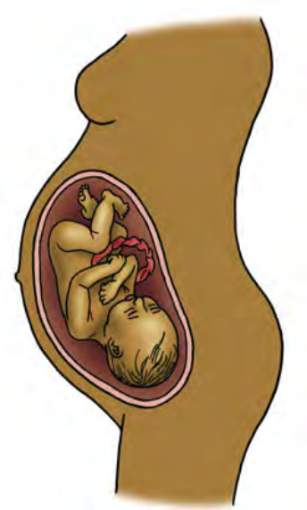
> **[Diagram Context - Textbook_NaturalScience_Gr7_Sexual-reproduction.pdf-0034-01.png]**
> or refining to ensure all 3 prompt points are addressed smoothly within 2

---

# Chapter 3. Sexual reproduction

## Myths and Facts Activity

| Myth | Responses (tick or cross) |
| :--- | :--- |
| "Don't ever swim when you are having a period!" | |
| "Virgins cannot use tampons - they will lose their virginity." | |
| "It is unhealthy to have sex at the time of the month when you are menstruating." | |
| "You cannot fall pregnant during your period." | |
| "You cannot fall pregnant or make someone pregnant if you have sex in water." | |
| "Women are always moody and irrational during menstruation." | |
| "Drinking and drugs make sex more fun." | |
| "If you have a shower after sex, you will not fall pregnant." | |
| "You cannot fall pregnant if it is your first time." | |
| "Everyone is having sex." | |

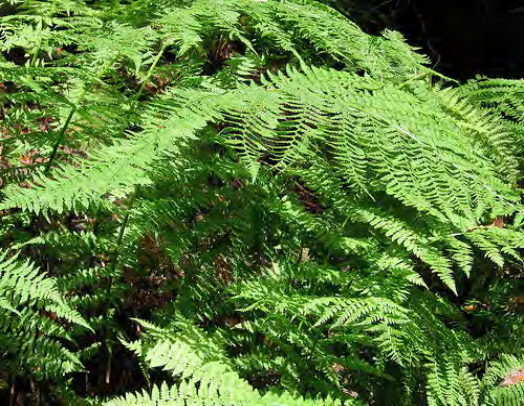
> **[Diagram Context - Textbook_NaturalScience_Gr7_Biodiversity.pdf-0035-16.png]**
> This photographic visual displays a dense cluster of green fern plants, specifically showcasing their characteristic branching fronds and divided leaflets without any explicit text labels or arrows. In the context of the CAPS Life Sciences curriculum, it illustrates a representative member of the Phylum Pteridophyta, highlighting vascular, seedless plants. Conceptually, this image helps learners identify the macroscopic structures of lower vascular plants, emphasizing adaptations such as true roots, stems, and leaves (fronds) that distinguish ferns from bryophytes.

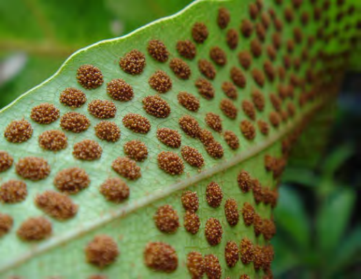
> **[Diagram Context - Textbook_NaturalScience_Gr7_Biodiversity.pdf-0035-17.png]**
> This photographic macro graphic displays the underside of a fern frond covered in numerous rows of brownish sori containing sporangia. The image visually highlights the reproductive structures characteristic of pteridophytes, specifically the clusters of spore-producing sporangia arranged along the veins of the leaf. Conceptually, for Grade 10 Life Sciences, this demonstrates the mechanism of asexual reproduction via spores in seedless vascular plants, emphasizing the dominant sporophyte generation and adaptation for wind dispersal.

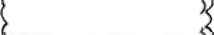

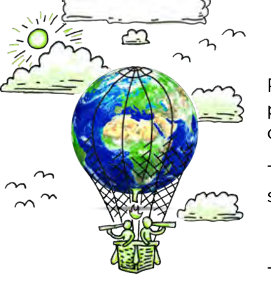
> **[Diagram Context - Textbook_NaturalScience_Gr7_Biodiversity.pdf-0035-21.png]**
> This educational graphic is an illustration depicting a hot air balloon where the envelope is shaped like planet Earth and suspended by a net over a burner, carrying two figures with binoculars in the basket below, set against a background of clouds, the sun, and flying birds. The graphic uses metaphorical imagery to convey concepts related to environmental science, global observation, or planetary stewardship. For high school learners, it visually prompts discussions on the interconnectedness of Earth systems, atmospheric studies, and human observation of global phenomena.

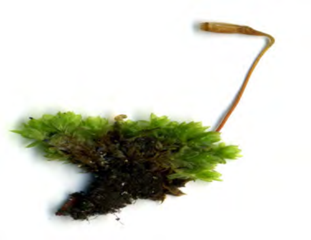
> **[Diagram Context - Textbook_NaturalScience_Gr7_Biodiversity.pdf-0035-28.png]**
> This biological specimen photograph shows a moss plant, representing the division Bryophyta, featuring a low-growing green leafy gametophyte anchored by rhizoids and a taller sporophyte consisting of a seta and a capsule. There are no explicit text labels or arrows visible on the image. Conceptually, this diagram helps Grade 10 Life Sciences learners identify the key structural features of a bryophyte, illustrating the dominant gametophyte generation and the dependent sporophyte adapted for spore dispersal in damp terrestrial environments.

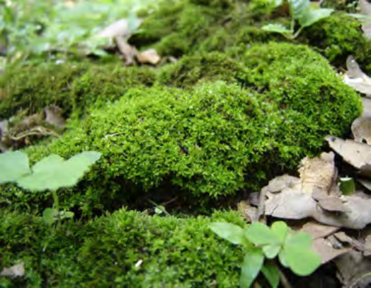
> **[Diagram Context - Textbook_NaturalScience_Gr7_Biodiversity.pdf-0035-29.png]**
> This photograph shows a dense cluster of green moss growing on damp soil and leaf litter in a shaded environment. There are no explicit text labels, arrows, or symbols visible in the image. Conceptually, this visual introduces Grade 10 Life Sciences learners to the structural features and natural habitat of Bryophytes, illustrating their reliance on damp, shady environments for survival and reproduction due to a lack of true vascular tissue.

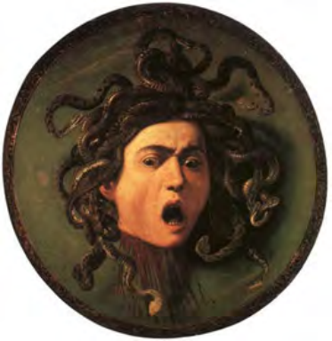
> **[Diagram Context - Textbook_NaturalScience_Gr7_Sexual-reproduction.pdf-0035-00.png]**
> This image depicts Caravaggio’s Baroque artwork *Medusa*, painted on a circular

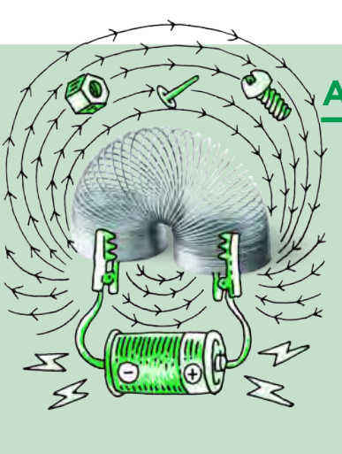
> **[Diagram Context - Textbook_NaturalScience_Gr7_Sexual-reproduction.pdf-0035-03.png]**
> Drafting the 2-3 sentence description:
    *   *Sentence

---

## Questions and Discussion

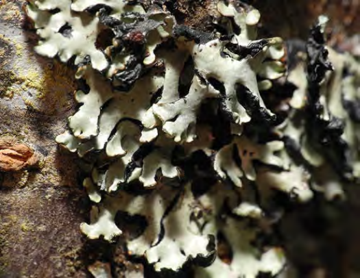
> **[Diagram Context - Textbook_NaturalScience_Gr7_Biodiversity.pdf-0036-01.png]**
> This photograph displays a foliose lichen growing on a tree bark substrate, illustrating a composite organism lacking explicit text labels. It visually conveys the mutualistic symbiotic relationship between a fungal partner (mycobiont) and an algal or cyanobacterial partner (photobiont), functioning as a key example of ecological interaction and biodiversity in Life Sciences.

> **TAKE NOTE**
> A virgin is someone who has not had sexual intercourse.

1. How many people in the homework survey believed that the comments were in fact true?

| Most believed they were true | About half believed they were true and the other half believed they were not. | None believed they were true |
| :---: | :---: | :---: |
| | | |

2. Discuss with your class which of the comments were most widely believed to be true by the people you surveyed. Take some notes on the following lines.

____________________________________________________________________________________________________

____________________________________________________________________________________________________

____________________________________________________________________________________________________

3. Which of these comments had the strongest reaction from the people you surveyed? (Either positive or negative reaction.) Discuss their reactions with your class. Take some notes on the following lines.

____________________________________________________________________________________________________

____________________________________________________________________________________________________

____________________________________________________________________________________________________

4. Did anyone laugh at any of the comments? Which ones? Did they tell you why they laughed? Share this with the class.

____________________________________________________________________________________________________

____________________________________________________________________________________________________

5. Which of these statements do you think are true? Discuss this with your class and take some notes on the following lines.

____________________________________________________________________________________________________

____________________________________________________________________________________________________

____________________________________________________________________________________________________

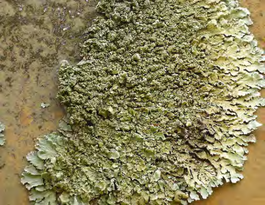
> **[Diagram Context - Textbook_NaturalScience_Gr7_Biodiversity.pdf-0036-02.png]**
> This macro photograph displays a crustose lichen growing on a rocky substrate, showing its characteristic flattened, crust-like thallus with mottled grey-green and yellowish hues. There are no explicit text labels or arrows visible in the image. For a Grade 10 Life Sciences student, this visual illustrates a classic example of mutualistic symbiosis between a fungus and an alga (or cyanobacterium), highlighting how pioneer species adapt to survive on bare rock surfaces during ecological succession.

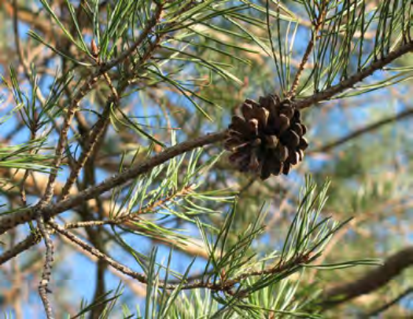
> **[Diagram Context - Textbook_NaturalScience_Gr7_Biodiversity.pdf-0036-07.png]**
> This educational graphic is a botanical photograph displaying the macro structures of a gymnosperm plant, specifically featuring a pine tree branch with needle-like leaves and a mature woody cone. Visible structures include needle clusters, woody branches, and seed-bearing scales on the cone. Conceptually, this image supports the Grade 10 CAPS Life Sciences curriculum by illustrating the key identifying characteristics of gymnosperms, such as naked seeds produced in cones and needle-like leaves adapted to reduce water loss.

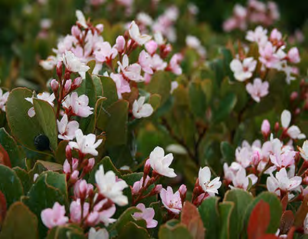
> **[Diagram Context - Textbook_NaturalScience_Gr7_Biodiversity.pdf-0036-08.png]**
> This graphic is a botanical photograph showcasing a flowering plant with glossy green leaves and clusters of small, delicate pink and white flowers. Visible features include rounded to elliptical green leaves, reddish stems, numerous small multi-petalled blossoms, and flower buds. Conceptually, this image supports high school Life Sciences (CAPS curriculum) by providing a realistic specimen for studying plant biodiversity, angiosperm floral structures, and the adaptations of indigenous South African flora.

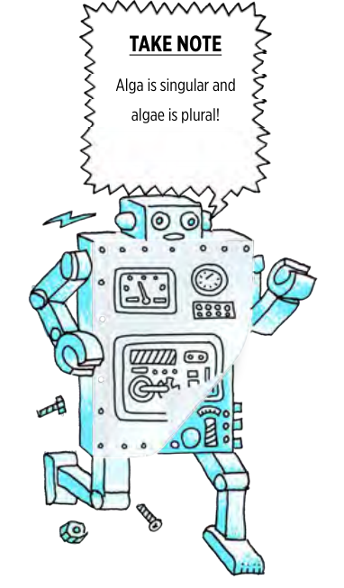
> **[Diagram Context - Textbook_NaturalScience_Gr7_Biodiversity.pdf-0036-11.png]**
> This educational graphic features an illustrated, running blue robot character accompanied by a speech bubble with the text "TAKE NOTE" and "Alga is singular and algae is plural!". It conveys a specific grammatical rule regarding biological terminology, clarifying the difference between singular and plural forms of the word for students studying biodiversity and plant-like organisms in the CAPS Life Sciences curriculum.

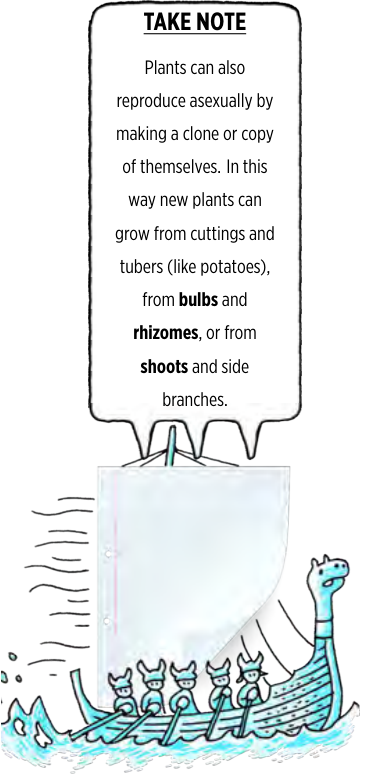
> **[Diagram Context - Textbook_NaturalScience_Gr7_Biodiversity.pdf-0036-12.png]**
> This educational infographic features a text box titled "TAKE NOTE" positioned above a cartoon illustration of a Viking ship with rowers. The text box lists key terms related to asexual plant reproduction, specifically mentioning clones, cuttings, tubers, potatoes, bulbs, rhizomes, shoots, and side branches. Conceptually, this diagram introduces learners to natural and artificial vegetative reproduction in plants, highlighting how genetically identical offspring can arise from vegetative plant organs without the need for seeds.

---

## Ways to Prevent Pregnancy and STDs

As your body prepares itself to reproduce during puberty, you are in control of your body and can make the decision when you are ready to become a parent and to fall pregnant. 

If you decide to become sexually active, it is important to think very carefully about two risks involved in sexual activity:
1. Pregnancy
2. Being infected by a Sexually Transmitted Disease (STD) like HIV/AIDS, Herpes, or Syphilis.

There are different things that you can do to prevent pregnancy.

---

> **TAKE NOTE**
> 
> 'Contra-' means against, so contraception means against conception.

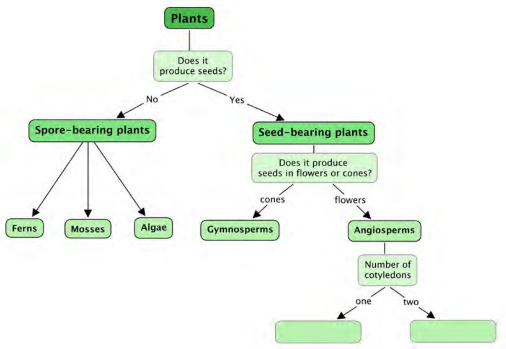
> **[Diagram Context - Textbook_NaturalScience_Gr7_Biodiversity.pdf-0037-02.png]**
> This educational graphic is a biological classification flow chart used to categorize plant diversity. It features directional arrows and visible labels including "Plants", "Does it produce seeds?", "Spore-bearing plants", "Seed-bearing plants", "Ferns", "Mosses", "Algae", "Gymnosperms", "Angiosperms", and "Number of cotyledons". Conceptually, the diagram guides high school learners through a dichotomous key based on reproductive structures and cotyledon counts, reinforcing the hierarchical categorization of major plant groups in alignment with CAPS biodiversity requirements.

---

### Contraceptives

To avoid falling pregnant, you can use **contraceptives**. There are different contraceptives available today. They prevent the sperm from reaching the egg and thus prevent fertilisation from taking place. Or else, they can prevent the fertilised egg from implanting in the uterus wall.

* **Male condoms** are rubbery sheaths that are placed over a man's erect penis before sex, and are worn during sexual intercourse to prevent the sperm from entering the woman's vagina. Condoms also help to prevent the spread of STDs.

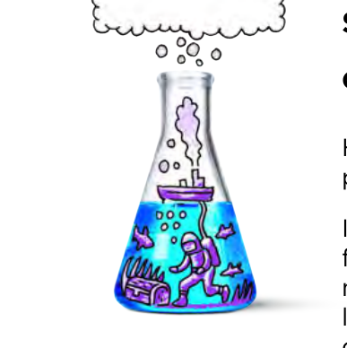
> **[Diagram Context - Textbook_NaturalScience_Gr7_Biodiversity.pdf-0037-10.png]**
> This illustrative science graphic depicts a laboratory Erlenmeyer flask containing a blue liquid submerged with an underwater scene, including a scuba diver connected by a tube to a surface boat, fish, a treasure chest, and an empty thought bubble above the flask's neck. There are no explicit text labels or chemical symbols visible in the image. Conceptually, this creative illustration introduces learners to scientific inquiry and imagination by using a whimsical laboratory setup to connect chemical apparatus with a miniature marine ecosystem.

* **Female condoms** also prevent the sperm from reaching the egg. However, these are placed in a woman's vagina to act as a barrier to the sperm, and are much less commonly used.

* **Oral contraceptive pills** are used by many women today. Many of these prevent ovulation. Pills need to be taken at the same time every day, otherwise they are not effective. If the woman has an infection with a high temperature, or is on antibiotics, this may also reduce the pill's effectiveness. While the pill is excellent at preventing pregnancy, it offers **NO** protection against STDs.

<!-- DIAG_PLACEHOLDER: diagram -->

---

### Sexually Transmitted Diseases (STDs)

There are various very dangerous and harmful diseases that are spread from one person to another during sexual intercourse. Some of these are life-threatening, like the Human Immunodeficiency Virus (HIV), while others cause very painful and long-term symptoms.

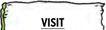
> **[Diagram Context - Textbook_NaturalScience_Gr7_Biodiversity.pdf-0037-15.png]**
> The graphic displays a simple text banner styled like a torn piece of paper with the underlined text "VISIT". It functions as a navigational heading or signpost element on a learning resource page to direct learners toward an external link or activity. Conceptually, this graphical cue guides CAPS learners to explore supplementary educational sites or interactive modules to reinforce their understanding of specific curriculum topics.

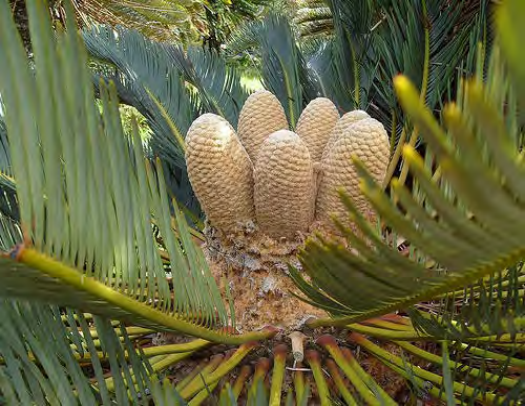
> **[Diagram Context - Textbook_NaturalScience_Gr7_Biodiversity.pdf-0037-16.png]**
> This photograph displays a botanical specimen showing the reproductive structures and foliage of a cycad (*Encephalartos* species), representative of the division Gymnospermae. Visible features include a central cluster of large, woody, cone-like strobili surrounded by stiff, pinnate, compound leaves. In the CAPS Life Sciences curriculum, this visual illustrates the key plant diversity characteristics of gymnosperms, specifically highlighting裸 seed production within cones (strobili) and the lack of true flowers and fruits.

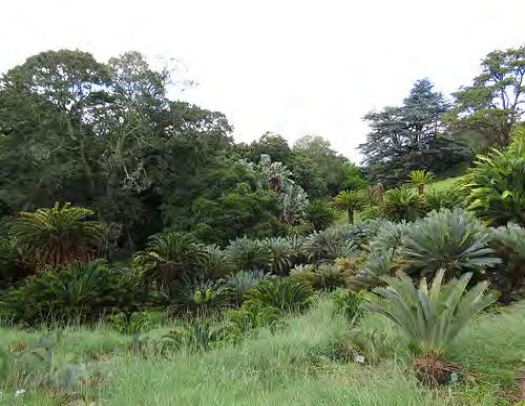
> **[Diagram Context - Textbook_NaturalScience_Gr7_Biodiversity.pdf-0037-17.png]**
> The photograph displays a natural ecosystem showcasing diverse plant biodiversity, dominated by cycads and various indigenous trees in a grassy terrain. Key visual elements include palm-like cycad fronds, woody tree trunks, dense forest canopy foliage, and open grassland ground cover without explicit text labels or arrows. Conceptually, this image illustrates plant diversity and habitat structure in a terrestrial biome, supporting Grade 10-12 CAPS Life Sciences topics on biodiversity, plant phyla (Gymnosperms), and ecosystem interactions.

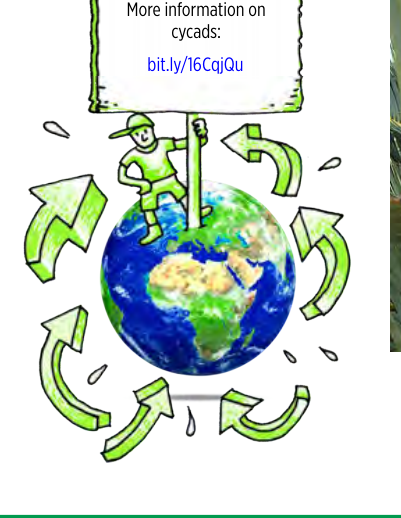
> **[Diagram Context - Textbook_NaturalScience_Gr7_Biodiversity.pdf-0037-18.png]**
> The graphic is an informational illustration featuring a globe surrounded by green cyclic arrows and a figure holding a sign with the text "More information on cycads: bit.ly/16CqjQu". Visible elements include a cartoon person, a globe showing parts of Africa and Europe, multiple curved green directional arrows forming a cycle, and a rectangular signpost with URL text. Conceptually, this visual supports CAPS Life Sciences topics on plant diversity, conservation, and human impact on ecosystems by linking the global protection of endangered endemic species like cycads to broader environmental sustainability.

> **[Diagram Context - Textbook_NaturalScience_Gr7_Sexual-reproduction.pdf-0037-09.png]**
> This diagram depicts a repeating green ribbon-like molecular structure or continuous directional process chain, featuring

---

## Prevention of STDs

You can prevent yourself from being infected with an STD by doing the following:

* **Get the facts:** Make sure you know up-to-date information about STDs and how they are spread, their symptoms, and how you can protect yourself during sexual intercourse.
* **Take control of your sex life:** The more sexual partners you have, the higher your risk will be of contracting an STD.
* **Be faithful:** If you or your partner has sex with someone else, you risk infecting the other person with the STD.
* **Using condoms** significantly reduces the risk of contracting STDs.

It is your decision whether you want to participate in sexual intercourse with a romantic partner or not. There are two very important points to remember here:

1. No one, no matter who they are, has the right to force you or pressure you to have sex with them or with anyone else. Therefore, you are the only one who should be permitted to decide when you are ready to have a sexual relationship.
2. If you decide to have sex, you should do so in a responsible manner. This includes protecting yourself against possible pregnancy and against any STD infection.

---

### TAKE NOTE

If you have been a victim of sexual abuse, you can receive guidance and help by contacting Lifeline at **0800 150 150**. 

Lifeline website for victims of sexual abuse can be found at:  
[http://www.lifeline.co.za/need-support/rape/](http://www.lifeline.co.za/need-support/rape/)

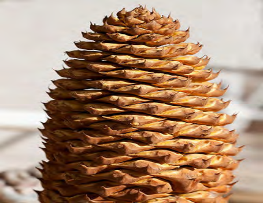
> **[Diagram Context - Textbook_NaturalScience_Gr7_Biodiversity.pdf-0038-01.png]**
> The graphic is a photograph of a mature pine cone representing a seed-bearing reproductive structure of a gymnosperm plant. The visual displays woody, spirally arranged scales (megasporophylls) that protect developing seeds without text labels or arrows. Conceptually, this image illustrates the reproductive adaptation of gymnosperms in the CAPS Life Sciences curriculum, highlighting naked seed production within cones rather than enclosed fruits found in angiosperms.

---

## ACTIVITY: Write a letter

So often we make promises to other people and work very hard to keep them, but when we make promises to ourselves we often neglect to honour these.

Write a letter to yourself in which you explain what you want to do with regards to sexual activity. Do you want to engage in sex or do you want to wait until you are older? Explain why you made this decision.

Then add to your letter what you promise yourself that you will do to protect yourself from contracting an STD or from a pregnancy before you are ready to be a parent. Explain how you see yourself practising responsible choices regarding sex.

Put your letter in a safe place at home where you can often see it to remind yourself of your promise to yourself. Remember this is a private letter and you can choose whether you want to show it to anyone else or not.

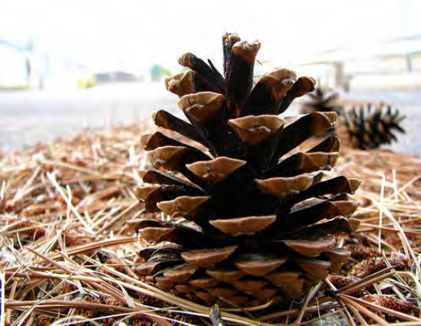
> **[Diagram Context - Textbook_NaturalScience_Gr7_Biodiversity.pdf-0038-02.png]**
> This photograph depicts a mature woody pine cone resting on the ground amongst pine needles, representing the reproductive structure of a gymnosperm. The image shows the spiral arrangement of hard, overlapping scales that protect the developing naked seeds characteristic of the *Pinus* species. Conceptually, this visual supports the CAPS Life Sciences curriculum by illustrating plant diversity and reproduction, specifically how gymnosperms adapt to terrestrial environments by producing seeds enclosed within cones rather than true fruits or flowers.

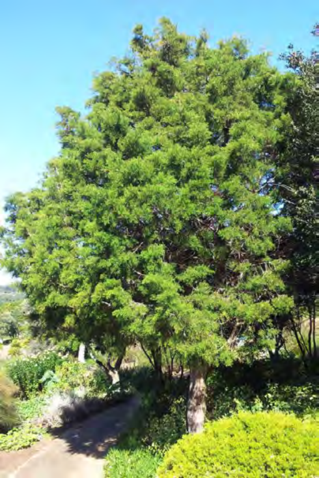
> **[Diagram Context - Textbook_NaturalScience_Gr7_Biodiversity.pdf-0038-05.png]**
> This photograph shows a mature gymnosperm tree, specifically a yellowwood (Podocarpus species), which is a prominent indigenous South African evergreen conifer. The image features a large, leafy canopy, visible woody trunk, and surrounding garden vegetation under a blue sky, with no explicit text labels or arrows present. Conceptually, this visual supports the CAPS Life Sciences curriculum by providing a real-world example of seed-producing vascular plants without flowers (gymnosperms), allowing learners to study plant diversity, reproductive structures, and adaptations in local biomes.

> **[Diagram Context - Textbook_NaturalScience_Gr7_Biodiversity.pdf-0038-11.png]**
> This educational cartoon graphic depicts a whimsical conceptual illustration featuring a bust labeled "MR. NEWTON" with an apple-shaped head and stem, surrounded by multiple interconnected pink apples linked by dashed lines and directional arrows in a network pattern, with a thought bubble above. It visually connects Isaac Newton's historical apple anecdote with a web of interacting masses or gravitational fields. Conceptually, this helps Grade 11 Physical Sciences learners visualize Newton's Law of Universal Gravitation, demonstrating how every particle exerts an attractive gravitational force on every other particle in the universe.

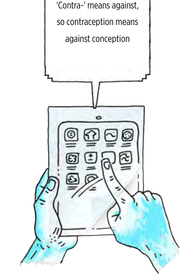
> **[Diagram Context - Textbook_NaturalScience_Gr7_Sexual-reproduction.pdf-0038-09.png]**
> This educational line illustration depicts a pair of blue-shaded hands holding a digital tablet with

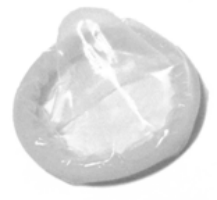
> **[Diagram Context - Textbook_NaturalScience_Gr7_Sexual-reproduction.pdf-0038-11.png]**
> This photograph depicts an unrolled latex male condom, a barrier contraceptive device, featuring no visible

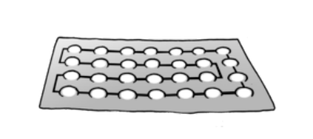
> **[Diagram Context - Textbook_NaturalScience_Gr7_Sexual-reproduction.pdf-0038-14.png]**
> This diagram depicts a 28-day contraceptive pill pack (blister

---

# SUMMARY:

## Key Concepts

* Sexual reproduction occurs when a sperm and an egg from two people combine to make offspring which look similar but not identical to the parents.
* In angiosperm plants, seeds are produced in the flowers.
* The male structures of flowers are the anthers and filaments, making up the stamens.
* The female structures of a flower are the stigma, style and ovary, forming the pistil.
* Pollination occurs when pollen is transferred from the anther of one flower to the stigma of another flower of the same species.
* Pollination is assisted by animals (pollinators), the wind and/ or water.
* Pollinators play an important role in the production of crops for humans.
* The pollen grows a pollen tube down the style to deliver the pollen nucleus to the ovules in the ovary.
* The fertilised ovules become seeds and the ovary may swell to form a fruit.
* Seeds are dispersed in various ways by animals, the wind, water and explosive force.
* In humans the main purpose of reproduction is for the sperm and egg to fuse and develop into a baby during pregnancy.
* Puberty is the stage in the human life cycle when sexual organs mature for reproduction.
* During puberty, boys and girls experience physical and emotional changes.
* The male reproductive organs include the penis and testes that produce sperm.
* The female reproductive organs include the vagina, uterus, oviducts and the ovaries.
* The ovaries produce one mature egg each month during ovulation which is then transported to the oviduct.
* If sexual intercourse takes place, the sperm travel to the egg and one will fuse with it in the process of fertilisation.
* The fertilised egg then moves to the uterus, is embedded in the lining of the uterus and grows for approximately 9 months before the baby is born.
* If fertilisation does not take place the egg moves to the uterus from where it is discarded in the vagina. The uterus lining is broken up and discarded through the vagina during menstruation.
* Pregnancy and STDs can be prevented mostly by wearing a male condom.

## Concept Map

Study the concept map below. Does it make sense to you? Are you starting to see what concept maps do? To complete the concept map below, fill in the blank spot. Look at the concept it is linked to in order to find the answer: 'In humans, fertilisation is prevented by .......'

> **[Diagram Context - Textbook_NaturalScience_Gr7_Biodiversity.pdf-0039-00.png]**
> This educational graphic features an illustrated green caterpillar eating a leaf, with its segmented body metaphorically overlaid by a coiled metal spring toy to demonstrate biomechanics. Visible elements include the cartoon caterpillar's head, legs, segmented body with patterned circles, leaves, and a flexible slinky-style spring resting along its back. Conceptually, this visual helps high school learners understand longitudinal wave mechanics, specifically how compressions and rarefactions travel through a medium, by drawing a direct analogy to the muscular contraction and elongation of peristaltic locomotion in invertebrates.

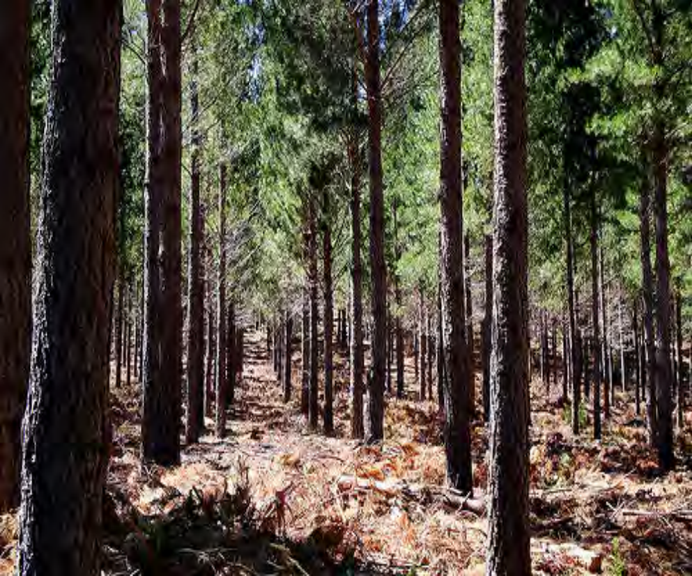
> **[Diagram Context - Textbook_NaturalScience_Gr7_Biodiversity.pdf-0039-06.png]**
> This photograph depicts a dense, managed pine forest plantation with tall, vertical tree trunks and a sparse undergrowth floor. The image has no visible labels, text, or arrows. Conceptually, it illustrates ecological concepts related to biotic interactions, forestry management, and population density under the CAPS Life Sciences curriculum.

> **[Diagram Context - Textbook_NaturalScience_Gr7_Sexual-reproduction.pdf-0039-08.png]**
> This cartoon illustration depicts a masked thief in a striped uniform making off

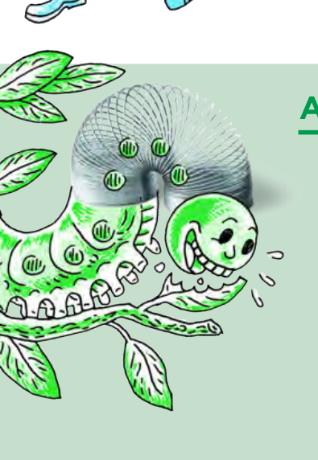
> **[Diagram Context - Textbook_NaturalScience_Gr7_Sexual-reproduction.pdf-0039-11.png]**
> This educational illustration features a cartoon caterpillar resting on a leafy twig, whose arched body is creatively

> **[Diagram Context - Textbook_NaturalScience_Gr7_Sexual-reproduction.pdf-0039-17.png]**
> This diagram illustrates a polyribosome (polysome) complex, depicting a long

---

# Sexual Reproduction

## 1. Angiosperms (Flowering Plants)

* **Angiosperms** are plants that reproduce through flowers and produce **seeds**.
* **Flowers** have both **male parts** and **female parts** with specific **adaptations**.
* **Pollination**:
  * Requires **pollinators**, water, or wind to transfer pollen.
* **Fertilization**:
  * Follows pollination to produce **seeds in fruit**.
* **Seed Dispersal**:
  * Seeds are eventually **dispersed**.

---

## 2. Humans

* Humans go through **puberty** as part of sexual reproduction.

### A. Males
* Have organs such as the **penis** and **testes**.
* Testes produce **sperm**.

### B. Females
* Have organs such as the **ovaries**, **uterus**, and **vagina**.
* Ovaries produce **eggs**.

### C. Fertilization and Development
* **Sperm** and **egg** combine during **fertilization**.
* **Baby Development**:
  * If fertilization occurs, a baby develops (pregnancy occurs).
  * Pregnancy is prevented by... [unspecified/blank block in diagram].
* **Menstruation**:
  * If fertilization does **not** occur, a thick layer in the uterus develops and is then **shed** during **menstruation**.

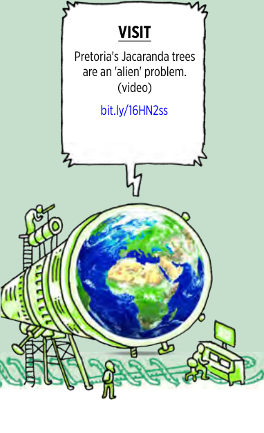
> **[Diagram Context - Textbook_NaturalScience_Gr7_Biodiversity.pdf-0040-03.png]**
> This educational graphic is an environmental science cartoon featuring a large telescope framing the Earth, with text and a URL link above it. Visible text includes the headings "VISIT", "Pretoria's Jacaranda trees are an 'alien' problem. (video)", and the web link "bit.ly/16HN2ss". Conceptually, this diagram introduces learners to environmental studies by highlighting the ecological impact of invasive alien species (such as Jacaranda trees in South Africa) on local biodiversity and ecosystems.

> **[Diagram Context - Textbook_NaturalScience_Gr7_Sexual-reproduction.pdf-0040-00.png]**
> This diagram depicts a horizontal continuous array of identical ear icons with sound wave arcs embedded along a

> **[Diagram Context - Textbook_NaturalScience_Gr7_Sexual-reproduction.pdf-0040-07.png]**
> whimsical illustration depicting a seated man playing a large metallic key like a guitar or string

---

# REVISION:

1. Study the following diagram of a flower and the reproductive parts. Provide labels for numbers 1-12. [12 marks]

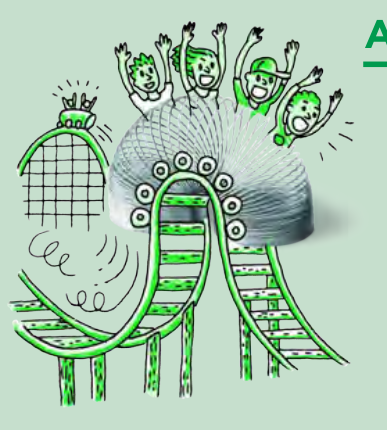
> **[Diagram Context - Textbook_NaturalScience_Gr7_Biodiversity.pdf-0041-00.png]**
> This educational graphic illustrates a physics concept using a cartoon roller coaster track combined with a slinky toy, overlaid with the green letter "A". The visible elements include a green and white illustration of a roller coaster with smiling passengers, support beams, tracks, and a superimposed coiled spring. For a high school Physical Sciences student, this visual metaphor demonstrates the conversion between gravitational potential energy and kinetic energy, or the mechanical wave properties modeled by a spring system along a changing trajectory.

| | |
| :--- | :--- |
| 1: | 7: |
| 2: | 8: |
| 3: | 9: |
| 4: | 10: |
| 5: | 11: |
| 6: | 4 and 10: |

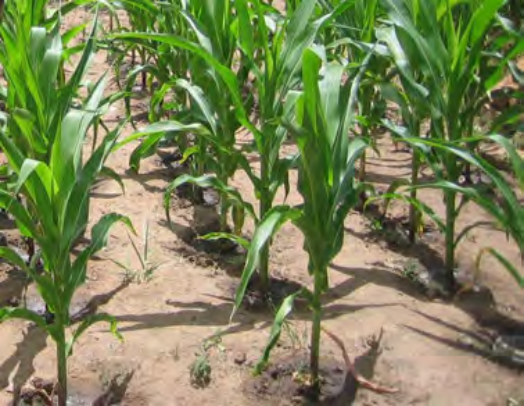
> **[Diagram Context - Textbook_NaturalScience_Gr7_Biodiversity.pdf-0041-05.png]**
> The image shows a photograph of a field containing rows of young maize (corn) plants growing in dry, sandy soil. Visible features include green stems, long parallel-veined leaves typical of monocotyledonous crops, and exposed soil around the base of each plant with no explicit labels or arrows present. Conceptually, this visual represents agricultural crop cultivation, illustrating plant spacing, agricultural practices, and the vegetative structure of monocot crops relevant to agricultural sciences and life sciences curricula.

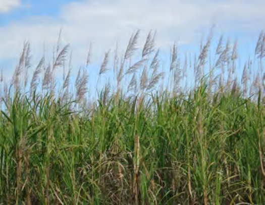
> **[Diagram Context - Textbook_NaturalScience_Gr7_Biodiversity.pdf-0041-06.png]**
> This photographic graphic depicts a field of tall, flowering reeds or sugarcane plants under an open sky with no visible textual labels or arrows. For a high school CAPS Life Sciences learner, this visual introduces the concept of plant biodiversity and biomes in South Africa, specifically illustrating indigenous wetland vegetation or agricultural crops. It helps students connect textbook ecological principles to real-world ecosystems and environmental adaptations.

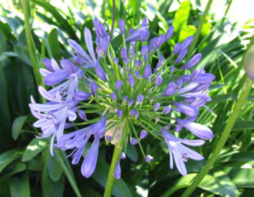
> **[Diagram Context - Textbook_NaturalScience_Gr7_Biodiversity.pdf-0041-09.png]**
> The graphic is a photographic biological specimen showing an *Agapanthus* inflorescence (African lily) with no explicit text labels or arrows visible. It displays a cluster of blue-purple flowers arranged in an umbel atop a green stem, surrounded by long, strap-shaped green leaves. For a CAPS Life Sciences student, this visual serves as a real-world example of plant diversity and angiosperm reproductive structures, illustrating adaptations for pollination and insect attraction in indigenous South African flora.

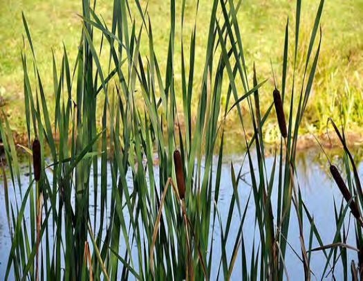
> **[Diagram Context - Textbook_NaturalScience_Gr7_Biodiversity.pdf-0041-11.png]**
> This photographic image shows a wetland ecosystem featuring emergent aquatic plants (specifically bulrushes or reeds) growing along the shallow edge of a freshwater pond. The visual highlights long, slender green leaves and characteristic dark brown, cylindrical flower spikes emerging vertically from the water, set against a backdrop of open water and riparian grassland. In the context of the CAPS Life Sciences curriculum, this graphic serves as a real-world example of biotic components and plant adaptations within an ecosystem, helping learners identify producers and understand the ecological role of wetland vegetation in filtering water and providing habitats.

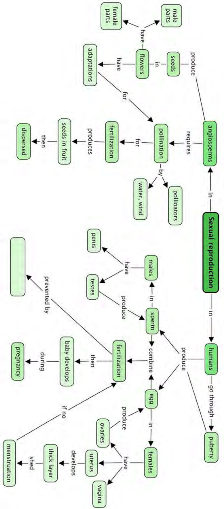
> **[Diagram Context - Textbook_NaturalScience_Gr7_Sexual-reproduction.pdf-0041-00.png]**
> seeds in fruit", "humans", "puberty", "males",

---

2. Describe the function of the following structures: [5 marks]

| Structure | Function |
| :--- | :--- |
| petal | |
| ovules | |
| pollen grains | |
| filament | |
| receptacle | |

3. Look at the following image of a bat busy drinking nectar from the flower. How is this flower adapted for pollination by the bat? [3 marks]

> **[Diagram Context - Textbook_NaturalScience_Gr7_Biodiversity.pdf-0042-00.png]**
> The provided image is entirely blank with no visible graphic, labels, or educational content. As a result, no specific CAPS curriculum topic, structures, or conceptual principles can be identified.

*A bat drinking nectar.*

_________________________________________________________________
_________________________________________________________________
_________________________________________________________________
_________________________________________________________________

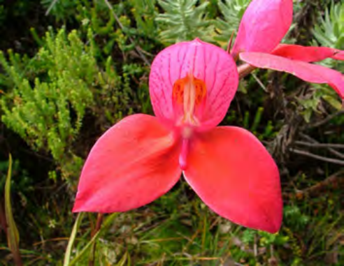
> **[Diagram Context - Textbook_NaturalScience_Gr7_Biodiversity.pdf-0042-03.png]**
> This educational photograph depicts a vibrant Red Disa (*Disa uniflora*), an indigenous South African orchid showcasing distinct floral structures set against a natural fynbos background. The image displays large, brightly coloured red petals and sepals adapted for specific pollination mechanisms. Conceptually, this visual supports CAPS Life Sciences topics on plant diversity and reproductive adaptations, illustrating how floral morphology and specialized pollination syndromes drive speciation and endemism in the Cape Floral Kingdom.

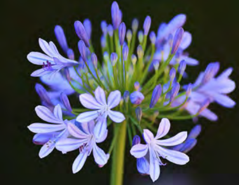
> **[Diagram Context - Textbook_NaturalScience_Gr7_Biodiversity.pdf-0042-05.png]**
> The photograph displays an inflorescence of *Agapanthus*, featuring numerous blue, funnel-shaped flowers arranged in an umbel on green pedicels. There are no explicit text labels or arrows visible in this natural photographic specimen. Conceptually, this image supports the CAPS Life Sciences curriculum by illustrating angiosperm reproductive structures and floral diversity, commonly used when studying plant morphology, pollination mechanisms, and local indigenous flora.

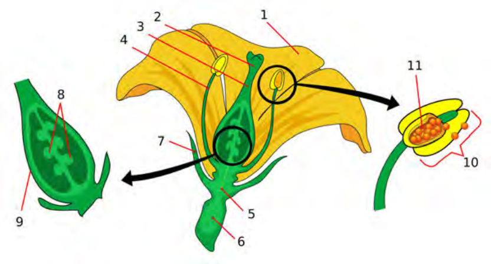
> **[Diagram Context - Textbook_NaturalScience_Gr7_Sexual-reproduction.pdf-0042-02.png]**
> This biological diagram illustrates the anatomical structure of a generalized angiosperm flower, featuring numbered labels

> **[Diagram Context - Textbook_NaturalScience_Gr7_Sexual-reproduction.pdf-0042-03.png]**
> This cartoon illustration depicts a boy balancing on a spoked, gear

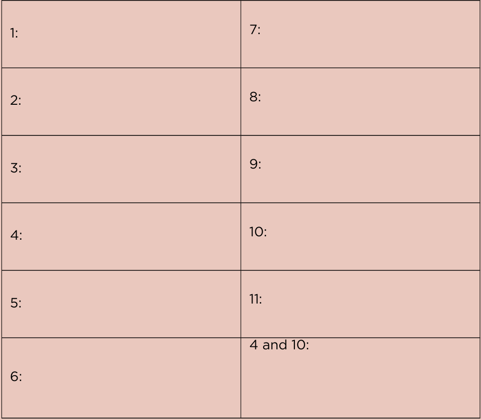
> **[Diagram Context - Textbook_NaturalScience_Gr7_Sexual-reproduction.pdf-0042-04.png]**
> Refinement (CAPS context):* In the South African CAPS curriculum, this is

---

# Chapter 3. Sexual reproduction

4. Look at the following image of the seed. How do you think this seed is dispersed? How is this seed adapted for this kind of dispersal? [3 marks]

*A seed.*

---

5. A Gr. 7 learner was trying to explain the process of the human reproduction cycle, but they muddled up the order of the cycle. Write numbers $1 - 6$ to place their sentences below into the correct order. [3 marks]

______ The sperm arrive in the oviduct.  
______ During sexual intercourse, the sperm is propelled from the penis.  
______ One sperm enters the outer cover of the egg to fertilise it.  
______ The fertilised egg is implanted in the uterine lining.  
______ The sperm travel from the vagina, through the uterus to the oviduct.  
______ The egg is released from the ovaries and travels along the oviduct.  

6. Explain the difference between ovulation and menstruation. [2 marks]

---

7. Once an egg is fertilised, where is it implanted or embedded? [1 mark]

---

**121**

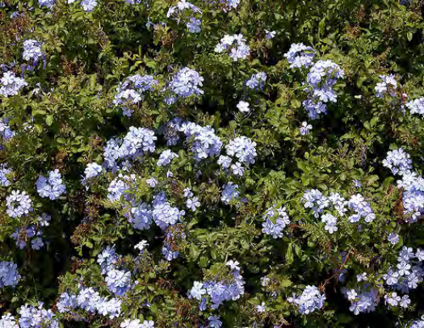
> **[Diagram Context - Textbook_NaturalScience_Gr7_Biodiversity.pdf-0043-03.png]**
> This photograph shows a dense cluster of light blue flowers with green foliage, characteristic of a shrub in a natural habitat. The visual displays no explicit labels, text, arrows, or axis names. Conceptually, this image can be used in Life Sciences to study plant diversity, floral structures, or ecological adaptations within local biomes.

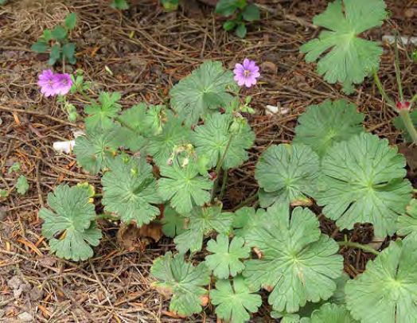
> **[Diagram Context - Textbook_NaturalScience_Gr7_Biodiversity.pdf-0043-05.png]**
> This photographic image depicts a live plant specimen showing external morphological features, including lobed green leaves, stems, and small pinkish-purple flowers growing in soil covered with organic mulch. There are no explicit text labels, variable names, or directional arrows visible in the frame. For a high-school Life Sciences student, this visual serves as a practical example for studying plant biodiversity, external structural adaptations, and angiosperm characteristics within plant kingdom diversity.

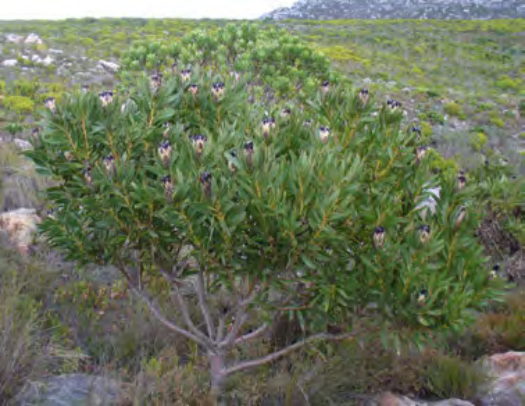
> **[Diagram Context - Textbook_NaturalScience_Gr7_Biodiversity.pdf-0043-07.png]**
> This photograph shows a representative fynbos shrub within its natural mountainous habitat in the Cape Floral Kingdom. The image displays typical sclerophyllous vegetation featuring woody stems, leathery green leaves, and terminal flower heads adapted to nutrient-poor soils and seasonal fires. For high school Life Sciences learners, this visual supports the study of biodiversity, biome characteristics, and indigenous South African ecosystems under the CAPS curriculum.

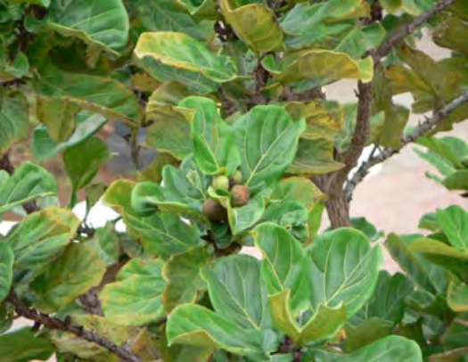
> **[Diagram Context - Textbook_NaturalScience_Gr7_Biodiversity.pdf-0043-08.png]**
> This photograph shows a living plant specimen, specifically a Ficus lyrata (fiddle-leaf fig), displaying its woody stems, broad glossy green leaves, and developing spherical syconium fruits. The image features visible botanical structures including alternate leaf arrangement, prominent reticulate venation, wavy leaf margins, and clustered aerial figs. Conceptually, this visual supports CAPS Life Sciences CAPS topics on plant diversity and morphology, allowing learners to observe external structural adaptations of angiosperms such as vascular tissue distribution and reproductive organs.

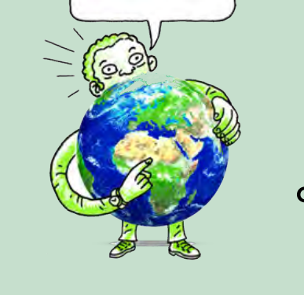
> **[Diagram Context - Textbook_NaturalScience_Gr7_Biodiversity.pdf-0043-10.png]**
> This illustration depicts a cartoon figure whose body is formed by a globe of the Earth, centered on the African continent, with a pointing finger and a speech bubble extending from above. Visible elements include a stylized planet Earth showing landmasses and oceans, a human-like head with motion lines, arms with green sleeves, and legs with green shoes. Conceptually, this graphic conveys geographical or environmental themes related to global awareness, human-environment interaction, and Africa's position within the global context for Geography learners.

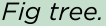

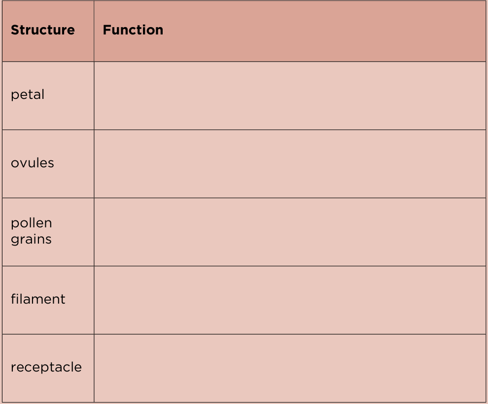
> **[Diagram Context - Textbook_NaturalScience_Gr7_Sexual-reproduction.pdf-0043-02.png]**
> This is a summary table for plant anatomy that lists specific floral structures, including the petal,

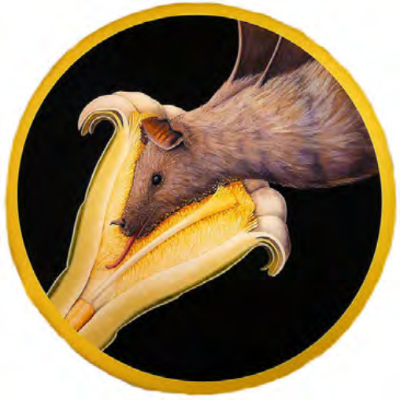
> **[Diagram Context - Textbook_NaturalScience_Gr7_Sexual-reproduction.pdf-0043-04.png]**
> This biological illustration depicts a cross-section of a flower being visited by a bat

---

8. The reproductive organs are structured in a very specific way - to make fertilisation and pregnancy possible. Explain the function of each of these structures in the male and female bodies. [12 marks]

| Reproductive organs | Their function |
| :--- | :--- |
| Ovaries | |
| Oviducts | |
| Uterus | |
| Vagina | |
| Penis | |
| Testes | |

9. During puberty the penis and testes develop and mature to fulfil their function in reproduction. Explain what changes occur and why these changes are necessary. [2 marks]

________________________________________________________________________________

________________________________________________________________________________

________________________________________________________________________________

________________________________________________________________________________

10. Explain what changes occur inside the ovaries of a girl during puberty and why these changes are important for reproduction. [2 marks]

________________________________________________________________________________

________________________________________________________________________________

________________________________________________________________________________

> **[Diagram Context - Textbook_NaturalScience_Gr7_Biodiversity.pdf-0044-00.png]**
> The provided image is a blank white rectangular placeholder set against a pale green background with no visible content, labels, or educational structures. Because the graphic contains no visual information, it conveys no conceptual content for a high school student studying under the CAPS curriculum.

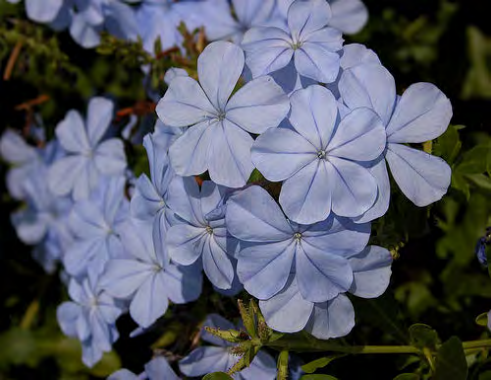
> **[Diagram Context - Textbook_NaturalScience_Gr7_Biodiversity.pdf-0044-04.png]**
> This photograph depicts a cluster of light blue flowers, specifically *Plumbago auriculata*, showcasing their characteristic five-petalled corolla shape and radial symmetry. The image has no visible text, labels, arrows, or analytical overlays. For Grade 10-12 Life Sciences learners studying plant diversity and angiosperm morphology, this visual serves as a real-world example of external floral structures used to study plant reproduction and classification.

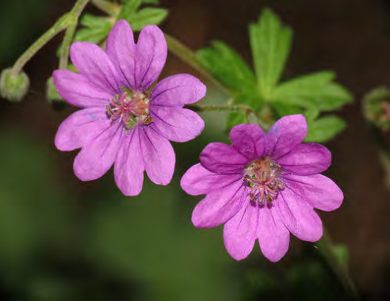
> **[Diagram Context - Textbook_NaturalScience_Gr7_Biodiversity.pdf-0044-05.png]**
> This photograph displays a botanical specimen featuring two pink, radially symmetrical flowers with distinct petals and central reproductive structures, surrounded by green leaves and stems. There are no visible text labels, arrows, or symbols in this image. Conceptually, this visual supports CAPS Life Sciences by providing a real-world example of angiosperm plant structures, aiding learners in studying plant morphology, reproduction, and biodiversity.

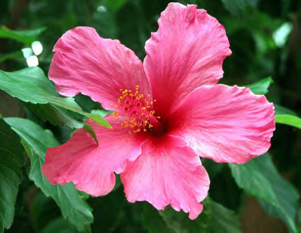
> **[Diagram Context - Textbook_NaturalScience_Gr7_Biodiversity.pdf-0044-08.png]**
> This photograph displays the external anatomical structure of a complete angiosperm flower, specifically a pink hibiscus. Visible features include large, brightly coloured petals (corolla), green leaves (foliage) in the background, and a central column of reproductive structures featuring prominent stamens with pollen-bearing anthers. In the CAPS Life Sciences curriculum, this visual serves to introduce plant reproduction and pollination strategies by illustrating the macroscopic structures responsible for attracting pollinators and housing reproductive organs.

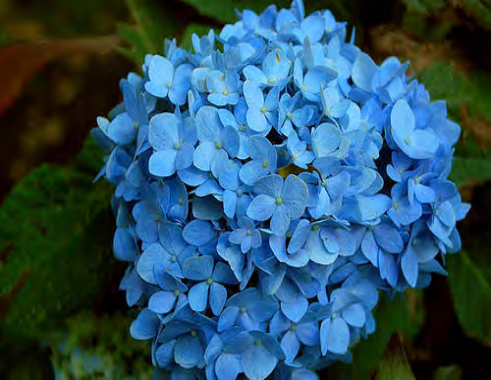
> **[Diagram Context - Textbook_NaturalScience_Gr7_Biodiversity.pdf-0044-09.png]**
> This photographic image displays a cluster of bright blue hydrangea flowers surrounded by green leaves. There are no visible labels, text, or arrows in the image. Conceptually, in the context of the CAPS curriculum, this plant serves as a natural example of how environmental factors—specifically soil pH—affect phenotypic expression, demonstrating that blue flowers indicate acidic soil conditions.

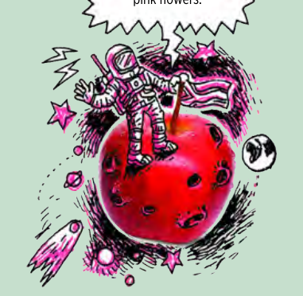
> **[Diagram Context - Textbook_NaturalScience_Gr7_Biodiversity.pdf-0044-13.png]**
> This illustration depicts a whimsical space scene featuring an astronaut standing on a cratered red apple in a starry cosmos, accompanied by a speech bubble referencing pink flowers. Visible elements include a cartoon astronaut in a spacesuit holding a flag, a red apple functioning as a planet with surface craters, surrounding pink stars, lightning bolts, comets, planets, and a distant Earth. Conceptually, this imaginative graphic is used in creative writing or life orientation contexts to stimulate descriptive language, creative thinking, and metaphorical connections between everyday objects and space exploration.

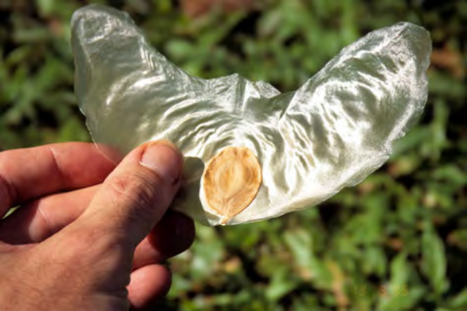
> **[Diagram Context - Textbook_NaturalScience_Gr7_Sexual-reproduction.pdf-0044-02.png]**
> This photograph depicts a winged seed (samara) showing a central seed body and expansive,

---

## Chapter 3. Sexual Reproduction

### Exercise / Assessment

**11.** A Gr. 7 learner was asked to define the terms puberty, menstruation, fertilisation, pregnancy and conception. First **evaluate** how well they defined each of these terms and then **correct or improve** their definitions in each case. [10 marks]

| Term and definition | Evaluation | Improvement |
| :--- | :--- | :--- |
| **Puberty:** when you grow up. | | |
| **Menstruation:** when a girl bleeds. | | |
| **Fertilisation:** when you put stuff into the garden to make it grow better. | | |
| **Pregnancy:** when the mom's stomach grows and a baby pops out. | | |
| **Conception:** when the baby starts to come alive. | | |

Total [55 marks]

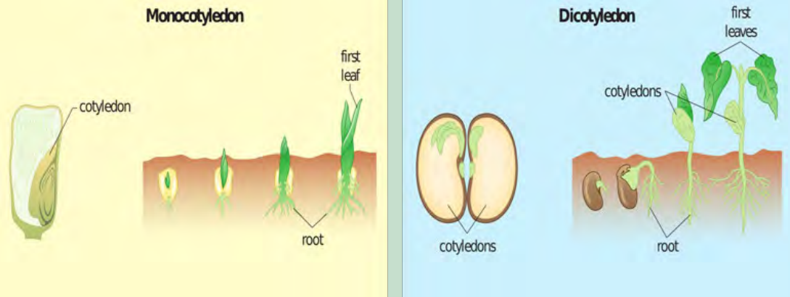
> **[Diagram Context - Textbook_NaturalScience_Gr7_Biodiversity.pdf-0045-02.png]**
> This comparative botanical educational graphic illustrates seed structures and germination processes, divided into "Monocotyledon" and "Dicotyledon" sections. Visible labels include "cotyledon", "cotyledons", "root", and "first leaf" (or "first leaves") pointing to internal seed parts and sequential stages of seedling growth above and below the soil line. Conceptually, it demonstrates the key structural difference of seed leaf count and contrasts the early developmental stages of monocots versus dicots for high school Life Sciences learners.

> **[Diagram Context - Textbook_NaturalScience_Gr7_Biodiversity.pdf-0045-05.png]**
> The graphic is a decorative green border featuring a repeating pattern of stylized S-shapes or interlocking wave-like arrow motifs. There are no explicit text labels, variables, biological structures, chemical symbols, or axis names present within the graphic. It functions purely as a thematic design element rather than a conceptual educational diagram for the CAPS curriculum.

---

# 3 Sexual reproduction

## Chapter overview
**Duration:** 3.5 weeks

In Unit 2 we looked at how to classify organisms, and at the diversity in plants and animals. In this chapter, we will now focus on how angiosperms (plants) and humans (animals) reproduce. A brief introduction and description of asexual and sexual reproduction has been included. This is necessary so that learners are aware that we are learning about one type of reproduction (sexual) in different organisms, but that there are other groups of organisms that reproduce asexually. The differences (and also similarities) in reproduction between these two different systems will further highlight the diversity of organisms on Earth. Sexual reproduction is studied again in Gr. 9 Life and Living and so many of the concepts dealt with here will be reinforced later. One of the aims of this chapter is to also educate learners about human reproduction so that they can make informed and responsible choices regarding sexual activity.

---

## 3.1 Reproduction in angiosperms (5 hours)

| Tasks | Skills | Recommendation |
| :--- | :--- | :--- |
| Activity: Growing a bean plant | Growing, observing, measuring, recording, plotting graphs | CAPS suggested |
| Activity: Identify the outer structures of flowers | Identifying, describing, drawing, labelling | CAPS suggested |
| Activity: Flower dissection | Dissecting, observing, labelling | CAPS Suggested |
| Activity: Identifying pollinators | Identifying, comparing, describing | CAPS suggested |
| Activity: Studying the flowers of wind and water pollinated plants | Observing, writing, comparing | CAPS suggested |
| Activity: Article from 'The Earth Times' | Reading, identifying, interpreting, explaining | Optional (Extension) |
| Activity: Studying different kinds of seeds | Identifying, classifying, explaining | CAPS suggested |

---

## 3.2 Human reproduction (5.5 hours)

| Tasks | Skills | Recommendation |
| :--- | :--- | :--- |
| Activity: What happens during puberty? | Identifying, listing | CAPS suggested |
| Activity: Draw a timeline of your life | Thinking, remembering, drawing, presenting | CAPS suggested |
| Activity: Conduct a survey | Reading, communicating, recording, discussing | CAPS suggested |

---

## Key questions

### In angiosperms
* How do plants make seeds?
* What is the role of flowers in reproduction?
* Flowers come in many different colours, shapes and sizes. So, are there some structures that are common to all flowers?

> **[Diagram Context - Textbook_NaturalScience_Gr7_Biodiversity.pdf-0046-00.png]**
> This diagram depicts a conceptual model of a metal surface embedded with a regular, repeating array of surface plasmon polaritons, represented by blue curl symbols along a flat plane. Visible features include a uniform horizontal substrate layer and a periodic series of wave-like structures protruding from the boundary. Conceptually, it illustrates collective electron oscillations at a metal-dielectric interface, helping high school physics learners visualise boundary wave phenomena and electromagnetic field confinement.

> **[Diagram Context - Textbook_NaturalScience_Gr7_Biodiversity.pdf-0046-07.png]**
> This illustration depicts a worker operating a pneumatic drill, represented symbolically as a key striking rock debris, with motion lines indicating vibration. The visual elements include a helmeted worker with ear protection gripping handles, a vertical metal key acting as the drill bit, flying rock fragments, and curved motion lines showing impact and shaking. For a CAPS physical sciences or technology learner, this graphic conceptually demonstrates mechanical work and the transmission of force and kinetic energy from a vibrating source into breaking hard surfaces.

> **[Diagram Context - Textbook_NaturalScience_Gr7_Sexual-reproduction.pdf-0046-04.png]**
> This biological illustration depicts a red ant positioned at the end of two parallel

---

# Revision Notes: Reproduction in Angiosperms

## Introduction Questions

Consider the following introductory concepts regarding plant reproduction:
- What is a **pollinator**? Why are pollinators important to humans?
- Is the flower on a rose the same as the flower on a sweet pea or on a daisy bush?
- Why are seeds found in different shapes and sizes, or contained inside fruits? Does this relate to seed dispersal?
- Does fertilisation mean the same thing in plants as it does in animals?

---

## 3.1 Reproduction in Angiosperms

Angiosperms are flowering plants. To understand their life cycles, learners can grow a bean plant to directly observe the different stages of development. It is recommended to start growing the seeds during the first lesson.

### ACTIVITY: Growing a bean plant

1. **Germination:** The process by which a seed develops into a new plant.
2. **Requirements for Germination:** Moisture (water), warmth, and light.
3. **Observation:** Learner-dependent answer based on practical growth.

---

## Flower Structures

### ACTIVITY: Identify the outer structures of flowers

1. **Receptacle:** The thickened part of a stem from which the flower organs grow.
2. **Petals:** Brightly coloured petals attract pollinators. Plants that are pollinated by wind do not need to attract insects or animals and often lack brightly coloured petals, allowing them to invest their energy into producing more pollen instead.
3. **Comparison of Different Flowers:**

| Flower | Structural Characteristics |
| :--- | :--- |
| **Rose** | Long straight peduncles (stalks) to hold flowers high up to the sun; green sepals to protect the buds; bright petals to attract pollinators. |
| **Lily** | Long straight peduncle, which is underwater and less rigid than a sunflower so it can sway in the water; inner layer of white petals, with the outer layer actually consisting of white sepals instead of petals. |
| **Petunias** | Short peduncles that branch from a shrub; small green sepals; large pink petals to attract pollinators. |

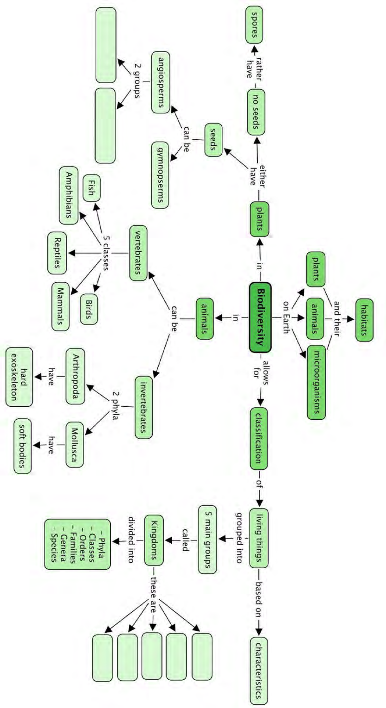
> **[Diagram Context - Textbook_NaturalScience_Gr7_Biodiversity.pdf-0047-00.png]**
> This educational graphic is a concept map illustrating the structure of biodiversity and biological classification. It features interconnected green boxes and directional arrows containing labels such as "Biodiversity", "habitats", "plants", "animals", "microorganisms", "vertebrates", "invertebrates", "gymnosperms", "angiosperms", and taxonomic ranks like "Kingdoms", "Phyla", "Classes", and "Species". Conceptually, the diagram helps high-school learners understand how living things on Earth are categorised into kingdoms, groups, and physical characteristics, reinforcing the hierarchical nature of biological taxonomy and biodiversity.

---

## Male and Female Reproductive Structures

Although cells are formally studied in Grade 9 Life and Living, a general understanding of cells is useful here to comprehend what is meant by male and female sex cells.

---

### ACTIVITY: Flower Dissection (LB page 55)

#### Apparatus and Materials
* **Recommended flowers:** Petunia or hibiscus flowers work best. Alternatively, any flowers available from gardens or surrounding areas can be used.
* **Guidance:** Watch a demonstration video of a flower dissection beforehand to understand how to guide learners.

#### Instructions for Drawing and Labeling
1. Use a ruler to draw straight, parallel label lines.
2. Label lines must point directly to and touch the structure being named.
3. **Specific labeling notes:**
   * The **receptacle** label must point to the green bulge between the sepals.
   * The **peduncle** label must point to the short stalk at the bottom.

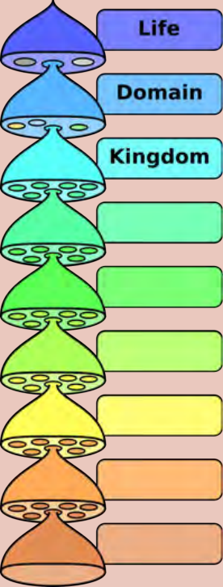
> **[Diagram Context - Textbook_NaturalScience_Gr7_Biodiversity.pdf-0048-02.png]**
> This diagram is a biological classification hierarchy showing the nested levels of taxonomic ranks from broad categories down to specific organisms. Visible labels include "Life", "Domain", and "Kingdom" alongside several blank rectangular boxes representing the remaining taxonomic levels (Phylum, Class, Order, Family, Genus, Species). Conceptually, it illustrates to high school learners how biological diversity is organized hierarchically, demonstrating that broader taxonomic groups contain multiple nested subgroups of increasingly specific relatedness.

---

### Pollination

* **Important Distinction:** Do not confuse **pollination** with **seed dispersal**.
  * **Pollination:** The process whereby male pollen is transferred to the female stigma in order for fertilisation to take place.
  * **Seed Dispersal:** Occurs after fertilisation and involves the dispersal of new seeds (offspring) to locations where they will not compete with the parent plant.
* **Microscopes:** Images of pollen captured using a scanning electron microscope can be introduced to learners (different microscopes are formally studied in Grade 9 Life and Living).
* **Identification:** Learners must be able to identify the stamens and stigma of a flower (e.g., recognizing numerous stamens covered in yellow pollen and the four 'stalks' on a flower photo).

> **[Diagram Context - Textbook_NaturalScience_Gr7_Biodiversity.pdf-0048-03.png]**
> This educational graphic is a mechanical illustration featuring an arrangement of various-sized interlocking gears of different colours alongside a cartoon girl with a question mark overhead. Visible elements include multiple meshed spur gears (both small pink/red ones and larger metallic grey ones) accompanied by curved directional arrows indicating rotational movement. Conceptually, this diagram visually introduces high school Technology learners to mechanical systems, illustrating core principles of gear trains, mechanical advantage, and how the relative sizes and arrangement of driver and driven gears affect rotational speed and direction.

---

## Pollination by Animals

### ACTIVITY: Identifying pollinators (LB page 57)

1. They are mostly insects.
2. These pollinators are mostly feeding on the nectar, and also on the pollen in some cases.
3. Flowers have large colourful petals to attract pollinators. Flowers have sweet nectar for pollinators to feed on as a reward. Flowers have a sweet scent to attract pollinators.

   > **Note:** A common misconception among learners is that they think flowers make pollen for the insects. Insects, such as bees, do collect the pollen and use it for the manufacture of the wax in their hives, but this is not why flowers make pollen. Also, flowers do not make nectar for the bees; rather, you must stress that the nectar is made as a reward system for the pollinator.

4. The flower is long and thin so that the bird has to stick its beak down the flower and then it will rub its head against the stamens containing the pollen. The stamens and stigma are long and sticking out the top of the flower so that they brush against the head of the bird when it is drinking nectar and the pollen then either sticks onto the bird's head or some from another flower is rubbed off onto this flower. The flower stem needs to be strong to support the bird.
5. Flies are attracted to rotting meat, so the most likely pollinators of this flower are flies.
6. Learner-dependent answer.
7. Learner-dependent answer. 

   > **Note:** If possible, invite the school's maintenance personnel to help learners identify the names of these plants. Let them do an Internet search to find the scientific names or have gardening books available in class for them to search in.

8. Learner-dependent answer. Learners might refer to the brightly coloured petals, strong scent, the specific length of the stigma, stamen, nectar pouch, etc.
9. Learner-dependent answer. Answers should include an explanation that these plants have brightly coloured flowers to attract certain insects for example, a strong odour or perhaps a long nectar producing pouch.

---

## Pollination by Wind and Water

Before going through the next section, think about what the flowers of wind- and water-pollinated plants look like and if they need the same or different adaptations to flowers that attract pollinators. 

For example, wind- and water-pollinated flowers do not need to attract animals, so they do not need large, colourful flowers that emit scents. Wind-pollinated plants will need large amounts of very light pollen that is easily wind-borne.

### ACTIVITY: Studying the flowers of wind- and water-pollinated plants (LB page 59)

Some images are supplied in the Learner's Book, but if possible, collect some grass flowers beforehand and bring these to class. Alternatively, take a quick walk around the school to see if there are any grasses or reeds growing nearby with flowers that can be observed. Learners can also do this in pairs and discuss their answers with each other before writing them down.

Afterwards, go through the questions with the class. This activity relies on making observations with real plants and flowers. Learners must use what they have already learned.

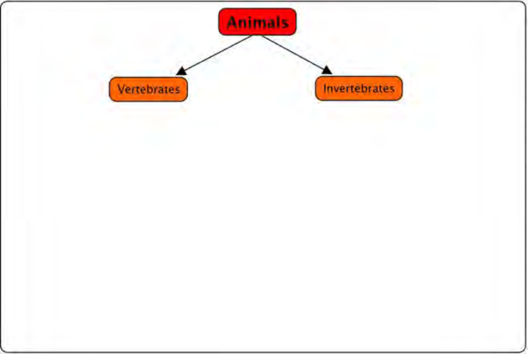
> **[Diagram Context - Textbook_NaturalScience_Gr7_Biodiversity.pdf-0049-01.png]**
> This graphic is a classification flowchart categorizing animals into two primary groups. The visible labels include "Animals" at the top branching down via arrows to "Vertebrates" on the left and "Invertebrates" on the right. Conceptually, it introduces learners to biodiversity by illustrating the fundamental taxonomic split of the animal kingdom based on the presence or absence of a backbone.

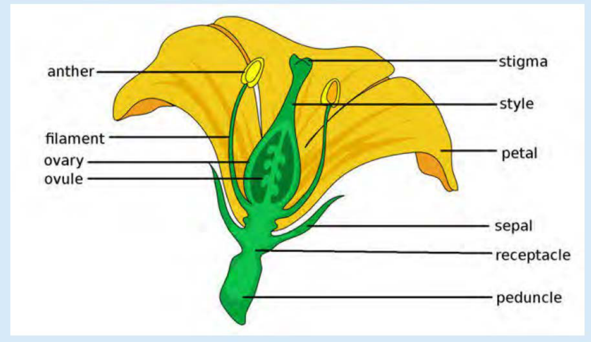
> **[Diagram Context - Textbook_NaturalScience_Gr7_Sexual-reproduction.pdf-0049-06.png]**
> This diagram illustrates a longitudinal section of a typical angiosperm flower, identifying key

---

1. The flowers are not colourful like the flowers that are pollinated by animals. They are dull in colour (whites, browns and greens). The flowers are quite small, but there are many flowers per plant. The flowers are mostly long and slender and quite flimsy (loose). There are large number of anthers which hang out of the flower so that the pollen can easily be swept away by the wind. 
2. These flowers do not need to attract animals with their colourful petals as they rely on the wind for pollination. 
3. Generally, these flowers do not produce nectar as they do not need to attract animals to feed on them in order to pollinate them. They rely on the wind. 
4. Mostly grasses and reeds, and also many trees 
5. Learners may battle with this question, so you could discuss it as a class. These flowers produce large amount of pollen as they cannot predict which way the wind will blow, so the more pollen the greater the chances that pollen will land on other flowers when carried in the wind. In flowers that are pollinated by animals, the animals transfer the pollen directly from one flower to the next, so they can produce smaller amounts. In flowers that are wind pollinated, they have to rely on the chance that the wind will blow and that it will blow in the right direction. The more pollen there is the greater the chances of pollination. 

*Note:* At this point you can also point out to learners that plants that are wind pollinated often grow in large populations where the huge numbers of plants increase the chances of these plants being pollinated (think of fields of grasses or reeds or forests of trees). 

6. In wind-pollinated flowers, the pollen needs to be carried by the wind as it blows. Therefore, the pollen cannot be sticky, otherwise it will not be blown off the flowers when the wind blows. It also must not clump or stick together otherwise it will not be carried in the wind. The smaller and lighter the pollen grains are, the further the wind can carry it. 
7. The long filaments of the stamens enable the anthers to be exposed to the wind so that they can blow and move in the wind and easily release the pollen. The stamens are large and feather-like so that they can 'catch' the pollen in the air as it blows through. They are still light so that they can blow and wave around in the wind. 
8. 

| Structure | Wind-pollinated plants | Insect-pollinated plants |
| :--- | :--- | :--- |
| **Petals** | Very small or absent petals that may be brown or dull green – do not need to attract insects. | Large, brightly coloured petals to attract insects. |
| **Scent** | No scent – do not need to attract insects. | Often specific scent to attract specific pollinator. |
| **Nectar** | No nectar – do not need to attract insects. | Many produce nectar to attract insects. |
| **Amount of pollen** | Very large quantities of pollen produced as there is a lot of wastage. | Smaller amounts of pollen produced because there is less wastage than in wind-pollinated plants. |
| **Structure of pollen** | Pollen light and smooth to travel | Pollen often sticky or spiky to |

> **[Diagram Context - Textbook_NaturalScience_Gr7_Biodiversity.pdf-0050-13.png]**
> This biological graphic illustrates an ant trail showing social insect behavior and chemical communication. Visible elements include a large ant leading parallel lines of numerous smaller ants following a linear path marked by a distinct pinkish chemical scent trail. Conceptually, this conveys how social insects like ants use pheromones to communicate and coordinate collective foraging behavior within an ecosystem.

---

| Part of Flower | Wind-Pollinated Adaptation | Insect-Pollinated Adaptation |
| :--- | :--- | :--- |
| **General** | on the wind and not clump together. | attach to pollinators. |
| **Anthers** | Anthers loosely attached and dangle down (mostly) to release pollen easily into the wind. | Anthers firmly placed inside flowers to brush against pollinators. |
| **Stigma** | Stigma is large and feather-like to filter the air and catch the drifting pollen. | Stigma is inside the flower where the pollinator will brush up against it and has a sticky coating that the pollen sticks to. |

## Pollinators and us

### ACTIVITY: Article from "The Earth Times" (LB page 60)

1. 
   - a) (noun) extreme hunger, starvation or lack (scarcity) of food.
   - b) (noun) when something does not work, and in this case, it specifically refers to crops which have produced a small amount or not produced at all
   - c) (adverb) very badly, or harshly
   - d) (adjective) the species has ended or died out, there are no more left
   - e) (verb) to keep something alive or make it last
   - f) (adjective) far away, out-of-the-way, away from human habitation
   - g) (noun) something that has variety and differences
   - h) (verb) to change

2. Loss of pollinators lead to crop destruction – third year of famine

3. The loss of the wild bees, butterflies and moths has caused major food shortages because they usually help pollinate the food crops; the message might also be a warning to us to value our bee and butterfly populations more, and to reduce air pollution.

4. The pollinators are not around to pollinate the flowers of the crop plants. Therefore, the flowers are not fertilised and can then not produce seeds. There are then no seeds to plant the next crops for the next year, and therefore there is less food for humans.

5. Wild bees, butterflies and moths.

6. The air pollution and resulting acid rain damaged the wings of the pollinators, who could not fly to reach nectar and therefore died of starvation.

7. Learners could mention:
   - Anthers are carried on long filaments that hang down. This allows the wind to move and carry away the pollen easily.
   - Pollen grains are light and dry to prevent them clumping together and are easily carried on the wind.
   - Female stigma is feathery and branched and acts as a filter trapping the pollen that is blown through it.

8. Learner-dependent answer. Learners should make reference to the above adaptations in plants which are already adapted to be pollinated with the help of the wind.

9. Learners can either agree or disagree that this could happen in the future. Their reasoning is important in this question. For example, they could reason that it might happen as there is already lots of air pollution and it is not decreasing so it could get to a level where it affects pollinators. Or else, they could say that they do not think air pollution will get to the level where it affects the flight of pollinators, or there could be other pollinators that might not be affected, etc.

---

# Fertilisation and Seed Dispersal

## Seed Dispersal

Hold a class discussion on why seeds need to be dispersed. Learners must be encouraged to take notes as they will have a question on this at the end of the chapter. They will need to refer to this discussion to formulate their answers, so it is important that they start learning how to take notes. 

### Points for Discussion:
* It is important that seeds are moved to different habitats from those directly around the parent plant.
* If the seeds that are produced by the parent plant germinate and start to grow directly under it, in some cases it may replace aging plants, but in most cases, it would be in direct competition with the parent plant for light, minerals and water.
* When seeds grow too close to others, they grow long and spindly to reach enough light, making them weak and poor fruit producers.
* Therefore, in order to avoid being in competition with the parent plant and to produce stronger plants, the seeds are dispersed away from the parent plant with the hope that they will land in a 'better' habitat where they will receive enough minerals, light and water.
* The cells along the opening are specially designed so they rip open with force. (They have three thickened walls and one very thin wall.)

---

## ACTIVITY: Studying different kinds of seeds (LB page 66)

If possible, try to collect some of these different seeds, pods and fruit before you do this activity and bring them to class for learners to look at. They can also try throwing upwards some of the seeds that are wind dispersed to see how they move through the air. This will help them understand the adaptations. Explain to your learners how they should explain how something is adapted and how this structure suits the function. The most common way to do this is to state the structure and then state why this structure helps the function. This normally takes the format of: 
**The seed has 'x structure' so that it can do 'y function'.**

| Seed | How is it dispersed? | What adaptations does the seed or plant have for dispersal? |
| :--- | :--- | :--- |
| <!-- DIAGRAM_PLACEHOLDER: diagram --> | **By an animal (bird)** | The seeds are within fruit (berries) which the bird likes to eat. Therefore, when they bird eats the fruit, the seeds pass through the bird and are dispersed far away in the bird's droppings. The seeds are also adapted by having a hard outer coat which is not digested by the bird so they can pass through its system. |

---

# Seed Dispersal Methods

| Illustration | Method of Dispersal | Description & Adaptations |
| :--- | :--- | :--- |
| <!-- DIAGRAM_PLACEHOLDER: diagram --> | **By water** | These trees normally grow near water so that when the seeds fall off, they fall into the water to be transported away. The seeds are adapted by being able to float (they are buoyant) so that they can travel down the river to a new place. |
| <!-- DIAGRAM_PLACEHOLDER: diagram --> | **By wind** | The seed is very light so that it can blow in the wind. It is 'feathery' so that it catches the wind and can travel. |
| <!-- DIAG_PLACEHOLDER: diagram --> | **By explosive force** | This seed pod might respond to touch to cause the explosion. This is beneficial so that not all pods explode at the same time, but they do so in stages. The seeds are small and light so that they can travel when they are shot out of the pod. |
| <!-- DIAGRAM_PLACEHOLDER: diagram --> | **By an animal (dog)** | These seeds have burrs (little hooks) so that they can catch onto the fur of the dog and attach to the dog. As the seed dries or it is brushed against something else, they fall off. The seeds are often in position on a plant so that they are at a height to brush against an animal. |
| <!-- DIAGRAM_PLACEHOLDER: diagram --> | **By wind** | These seeds are sometimes quite large, but still light so that they can travel through the air. The 'wings' are light and have a large surface area to catch the air and the seed spins as it moves through the air enabling it to travel. |

33

---

### Seed Dispersal Mechanisms (continued)

| Illustration | Mechanism | Description |
| :--- | :--- | :--- |
| 

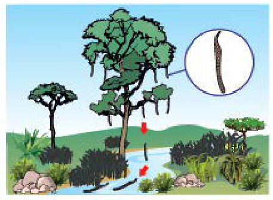
> **[Diagram Context - Textbook_NaturalScience_Gr7_Sexual-reproduction.pdf-0054-00.png]**
> This biological diagram illustrates the reproductive adaptation of vivipary in a mangrove tree within an est

 | **By explosive force** | These seed pods explode when they become dry and crack open. This makes sure the seeds are ready to be dispersed. The seeds are quite small to be able to travel. |
| 

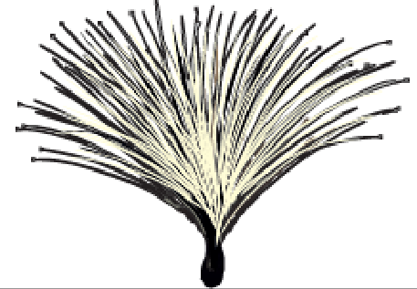
> **[Diagram Context - Textbook_NaturalScience_Gr7_Sexual-reproduction.pdf-0054-01.png]**
> This diagram illustrates a wind-dispersed seed, featuring a small, dark seed

 | **By an animal (squirrel)** | Acorns are dispersed by squirrels who gather the nuts. The nuts are tasty to the squirrel, so the animal collects them and carries them to another place to store them. Some acorns will be eaten, but others will be buried and forgotten by the squirrel and will germinate and start growing later on. Acorns are also hard so that they can last a long time in storage before getting the chance to germinate. |

---

## 3.2 Human reproduction

*Note for Educators:* Be aware that learners may not feel comfortable discussing reproduction in the classroom, and may laugh or make inappropriate jokes to conceal their own discomfort.

### Some tips for teaching human reproduction:

1. **Respect your learners' questions and concerns.** Some of them may not have had an opportunity before to ask questions about reproduction, especially if their parents have not felt comfortable discussing this with them. This is a sensitive topic, and learners may be embarrassed to ask questions. Encourage your learners to ask questions and not be inhibited or embarrassed.
2. **Discuss processes openly** so that learners are comfortable within the classroom environment to talk and learn about reproduction and how it influences their lives. Discourage and discipline any laughing or disrespectful behaviour from other students. Insist that learners use the appropriate scientific terms when asking questions and having discussions, as this should prevent some learners from being intentionally vulgar.
3. **Possibly bring in a guest speaker.** Learners may feel more comfortable asking a stranger questions. Also, if you bring in an expert, such as a gynaecologist or midwife, learners might take the subject more seriously. It may be helpful to have someone from FAMSA come in and talk to the learners. Trained FAMSA facilitators will divide the class into smaller groups so that it is easier to ask questions.

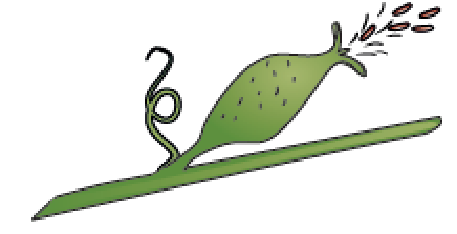
> **[Diagram Context - Textbook_NaturalScience_Gr7_Sexual-reproduction.pdf-0054-02.png]**
> This biological diagram illustrates explosive dehiscence, showing a green seed pod attached

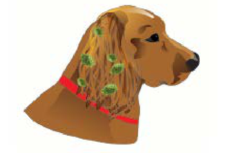
> **[Diagram Context - Textbook_NaturalScience_Gr7_Sexual-reproduction.pdf-0054-03.png]**
> This illustration depicts a dog's head with long ears and a

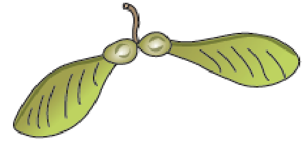
> **[Diagram Context - Textbook_NaturalScience_Gr7_Sexual-reproduction.pdf-0054-04.png]**
> This illustration depicts a double samara, a type of winged fruit

---

4. If necessary, you can separate boys and girls. For example, if you are showing a graphic video about the female reproductive organs, it might be useful to have the boy watch a similar video in another room that explains the male reproductive organs. It may be very helpful to divide the classes into boys and girls at least once during the section so that learners can feel comfortable asking questions that they do not feel comfortable asking in front of their opposite-sex classmates.

5. Avoid portraying the reproductive system in a negative light or "forbidden" as this will only add to some of the discomfort that learners might already feel. At this stage in their lives, learners are already very interested in reproduction and the changes that their bodies are going through. This is natural and should be embraced so that they are educated and can make informed choices about their sexual health going forward.

6. Here is a website to do some further reading: bit.ly/1cfWcTS  
Some extra resources and pdfs can be accessed at bit.ly/19PWW09

It may be useful before starting this section to have a box where learners can put questions in advance of the lesson. Stress to learners that this is an anonymous exercise and that they do not need to identify themselves. You can then filter the questions in advance, and eliminate inappropriate questions, and also pick up on problem areas, misconceptions and concerns of some of the learners in the class who may be too shy to ask questions. You can then attempt to address these anonymous concerns while covering the material in this section. You can then ask the class in general what they may already know about human reproduction. Bear in mind that some learners might already know a significant amount, either from talking to their parents or from their own explorations, and some learners might not know much at all. You should point this out and let learners know that this is alright, and by the end of this section they will all know the basics of human reproduction. By asking them what they already might know, you are also encouraging them to start talking about it in class and not to be embarrassed or make jokes or tease each other. You can even ask some more basic questions, such as:

* Why do humans need to reproduce? (To produce children to continue the existence of our species. This is different from asking why humans have sexual intercourse, which is also for enjoyment with your partner.)
* Do you know how long pregnancy in humans is before the baby is born? (9 months)
* What is the stage in your life called when you go through physical and emotional changes as you become sexually mature? (puberty)

Learners have a right to their privacy during this section. Teachers should also be aware of and sensitive about possible victims of sexual abuse. It is also appropriate in this section to emphasise to girls in the class that it is perfectly all right to say "NO!" to persistent boys. Teachers should also encourage students to wait until they are older before becoming sexually active.

---

### Why do humans need to reproduce?

#### ACTIVITY: What happens during puberty? (LB page 68)

1. 

| Changes in the girl | Changes in the boy |
| :--- | :--- |
| Changing body shape and figure | Changing body shape and figure |
| Body fat increases | More muscular |
| Breasts start to develop | Penis grows bigger |
| Facial features more mature | Facial features more mature |

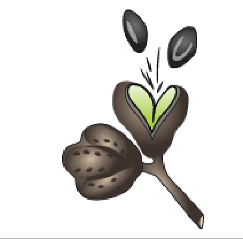
> **[Diagram Context - Textbook_NaturalScience_Gr7_Sexual-reproduction.pdf-0055-00.png]**
> This diagram illustrates the biological process of mechanical seed dispersal through explosive dehiscence. It features

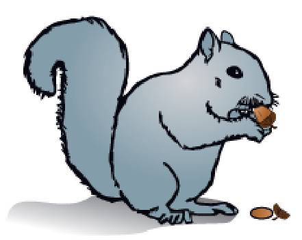
> **[Diagram Context - Textbook_NaturalScience_Gr7_Sexual-reproduction.pdf-0055-01.png]**
> This illustration depicts a squirrel, a mammalian primary consumer, engaged in feeding

---

# Growth and Development: Interpreting Graphs and Physical Changes

## 1. Physical Changes During Puberty

| Changes in Boys | Changes in Girls |
| :--- | :--- |
| Hair growth under arms and on legs | Hair growth under arms, legs, face, chest |
| Pubic hair starts to grow | Pubic hair starts to grow |
| Acne / pimples in some individuals | Acne / pimples in some individuals |

---

## 2. The Line Graph (Growth Curve Graph)

* **Note:** Make sure that learners are aware that this graph displays an **AVERAGE** height. It does not just show a comparison between one girl and one boy, but rather takes the average height of a large group of girls and a large group of boys. 
* *Discussion Question:* Why is using an average important? *(Answer: There will always be exceptions—older people who are shorter than younger people, and girls who are taller than boys—but using the average helps us see the general trend that occurs in most people.)*

---

## 3. Average Increase in Height
* The average increase in height of boys and girls between birth and $18$ years of age.

---

## 4. Variables in the Growth Graph
* **Independent Variable:** The age of the boys and girls.
* **Dependent Variable:** Average height increase.

> **Note:** Height depends on the age of the boys and girls; therefore, height is the **dependent variable** and age is the **independent variable**. As children grow older, they grow taller.

---

## 5. Units of Measurement
* Height is measured in centimetres ($\text{cm}$).
* Age is measured in years.

> **Note:** The axes of graphs must always have labels. If there is a unit of measurement, it must always be included in brackets after the heading (e.g., Height ($\text{cm}$) vs. Age ($\text{years}$)).

---

## 6. Interpreting Growth Graphs

Interpreting graphs is a crucial skill in Natural Sciences. Follow these steps when analyzing a growth graph:

* **a)** The **blue line** represents the average change in height of boys as they grow older. The **red line** indicates the average change in height of girls as they grow older.
* **b)** Boys and girls are on average the same height up until $6$ years of age.
* **c)** Between age $6$ and $10$ years old, the graph line for boys is on top, indicating that boys are generally taller than girls during this phase.
* **d)** Around age $10$, boys and girls are roughly the same height again (where the two lines cross or **intersect**). At around age $14\frac{1}{2}$, boys and girls are once again the same height.
* **e)** At age $18$, boys are generally taller than girls. The average height of boys at $18$ years is about $187\text{ cm}$, and the average height of girls is about $171\text{ cm}$.

> **Note:** Teach learners how to read values off the graph using rulers. Draw a horizontal line across from $18$ years on the x-axis to the y-axis to find where it intersects, then estimate the height for boys and girls.

---

## 7. Analysis of Growth Spurts

* **a) Sharp Incline:** A sharp incline in the line of the graph indicates a **growth spurt**.
* **b) Constant Growth:** Growth is not always steady and uniform throughout childhood.
* **c) Age of Growth Spurts:** 
  * Boys show a growth spurt between the ages of about $14$ and $16$ years.
  * Girls show a growth spurt between the ages of about $11$ and $13$ years.
* **d) Connection to Puberty:** These growth spurts correspond to the ages when girls and boys go through puberty. Girls go through puberty slightly earlier than boys, meaning their growth spurts take place at different phases.

---

## 8. Practical Activity Guidelines
* **8.** Individual learners to mark this on the graph.
* **9.** Learner-dependent answer.
* **10.** Learner-dependent answer.

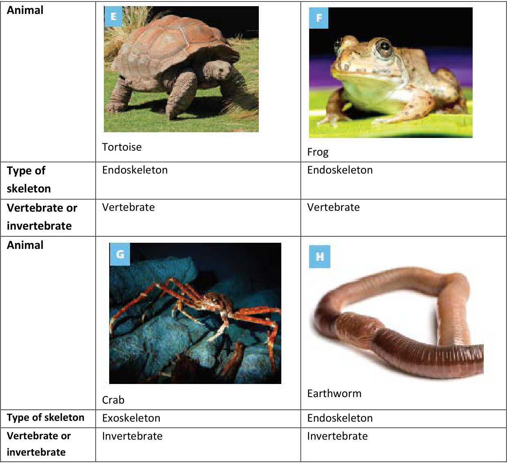
> **[Diagram Context - Textbook_NaturalScience_Gr7_Biodiversity.pdf-0056-00.png]**
> The graphic is a comparative table featuring photographs of four animals labeled E, F, G, and H, representing a Tortoise, Frog, Crab, and Earthworm respectively. Visible labels include categories for each animal such as "Animal," "Type of skeleton" (specifying Endoskeleton or Exoskeleton), and "Vertebrate or invertebrate." This table conveys the biological classification and structural adaptations of different animal groups, helping students distinguish between internal skeletons (endoskeletons) in vertebrates like reptiles and amphibians, external skeletons (exoskeletons) in arthropods, and hydrostatic support systems.

---

# Understanding Puberty and Emotional Development

## Discussion and Reflection Activities
* **Ages 25 to 35:** Height generally remains stable during this period.
* **Ages 65 to 85:** Older individuals often experience a slight decrease in height due to the compression or curving of the vertebrae.

## Teacher Guidance and Self-Reflection
Educators are encouraged to coordinate with the Life Orientation teacher regarding topics such as sexual maturity, emotional changes, and self-awareness. 

* **Suggested Activity:** Grant learners 10 minutes of silent self-reflection outside the classroom, followed by a class discussion.

---

## Key Emotional and Psychological Changes During Puberty

### 1. Strong Feelings
* Puberty involves transitioning between intense emotions. When these emotional states last longer than a few minutes, they are referred to as **moods**.
* Rapid shifts can occur (e.g., feeling excited and happy with friends, then feeling sombre, down, or sad without a clear reason).
* This emotional fluctuation can cause anxiety and frustration, potentially leading to conflicts with parents or siblings.
* **Coping Strategy:** Learning to handle conflict constructively and recognizing when to remove oneself from situations prone to unmanageable emotional outbursts.

### 2. Increased Sensitivity
* Young people experiencing puberty may become highly sensitive to the actions and intentions of others, sometimes misreading facial expressions (often perceived as being "over-sensitive").
* As they mature, individuals learn to interpret facial expressions and body language more accurately, helping them understand hidden or figurative messages and respond in a controlled manner.

### 3. Increased Self-Consciousness
* Physical and emotional changes can heighten self-consciousness, leading to increased concern over physical appearance.
* Adolescents may compare themselves to celebrities, friends, and role models. Dissatisfaction with their appearance can impact self-image and **self-esteem**.

### 4. Seeking New Experiences
* Driven by hormones, young people are often inclined to explore unknown paths and seek new experiences.
* This curiosity can occasionally lead to dangerous, risk-taking behavior that poses physical danger or threatens future plans.
* **Goal:** Developing impulse control to make wiser, safer decisions.

### 5. Exploring Sexual Identity
* Adolescents begin forming romantic relationships and going on "dates."
* While some choose to wait until they are older before engaging in sexual relationships, others feel curious about sex.
* **Importance:** Understanding the risks involved and taking proper precautions to protect one's health and future is a primary focus of this curriculum chapter.

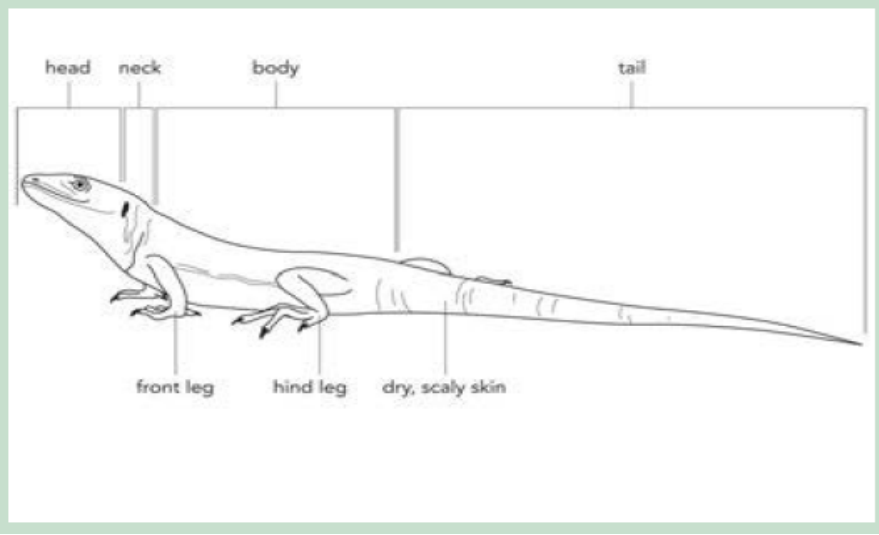
> **[Diagram Context - Textbook_NaturalScience_Gr7_Biodiversity.pdf-0057-12.png]**
> This anatomical diagram illustrates the external body plan of a reptile, specifically a lizard. It includes the visible labels head, neck, body, tail, front leg, hind leg, and dry, scaly skin. Conceptually, this diagram helps learners identify the key external features and structural adaptations characteristic of the class Reptilia, such as tetrapod limbs and waterproof scales.

---

## ACTIVITY: Draw a timeline of your life (LB page 69)

This can be a very sensitive task for learners to do, especially if they have suffered trauma in their lives. You must approach it sensitively and cautiously, making sure that learners feel comfortable with doing it. Some learners might also not want their timelines displayed, so this should be a personal activity for learners to do, without the pressure of having to display their timelines to the class.

---

## Human Reproductive Organs

Different stages in human reproduction

---

## ACTIVITY: Conduct a survey (LB page 72)

This should be done as a homework assignment in the lead up to the lesson about menstruation. The questions can then be answered in class and discussed.

### Questions
1. Learner-dependent answer.
2. Learner-dependent answer.
3. Learner-dependent answer.
4. Learner-dependent answer.
5. Learner-dependent answer.

---

## Addressing Myths Surrounding Menstruation

You should go through each of the myths to show that they are in fact all myths — they are NOT true. Read through these explanations and refer to them during your discussion with your class.

### 1. "Women who are menstruating are dirty and unclean."
* **Explanation:** Women are not dirty and unclean during menstruation as menstruation is a perfectly natural process. Some people do believe this for religious reasons and you should be sensitive to their religious beliefs, while still stating that women are not "dirty".

### 2. "During your period you should never have cold food or walk with bare feet. If you get cold your period will be worse."
* **Explanation:** This is not true. The uterus is the organ that controls menstruation and cold feet or food have nothing to do with the uterus.

### 3. "Exercise is bad for you when you menstruate."
* **Explanation:** Menstruation is a normal, natural function of the body and not in any way a disability. Therefore you should continue with life as if nothing out of the ordinary is going on.

### 4. "Don't ever swim when you're having a period!"
* **Explanation:** If using the right protection (tampons) there is no reason why girls should not be able to swim while they are having their periods.

### 5. "Virgins cannot use tampons – they will lose their virginity."
* **Explanation:** Virginity is about whether a woman has had sexual intercourse or not. Long ago, a woman's virginity used to be assessed by whether her hymen was intact, as this ruptures during sex. However, nowadays, there are many times in a girl's life when her hymen can break without having sex, such as by using a tampon or horse-riding, or by doing gymnastics or ballet. This does not mean she has lost her virginity.

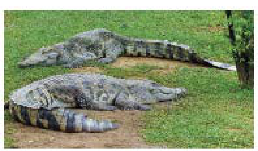
> **[Diagram Context - Textbook_NaturalScience_Gr7_Biodiversity.pdf-0058-08.png]**
> This photograph displays two crocodiles resting in a grassy environment. There are no explicit text labels or arrows visible in the image. For a CAPS Life Sciences student, this visual illustrates ectothermy in reptiles, demonstrating how organisms rely on external environmental sources, such as basking in the sun, to regulate their body temperature.

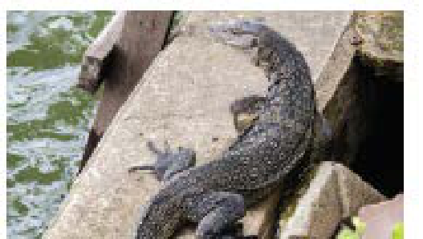
> **[Diagram Context - Textbook_NaturalScience_Gr7_Biodiversity.pdf-0058-09.png]**
> This photograph shows an organism belonging to the class Reptilia, specifically a large lizard resting near water on a concrete surface. The image displays visible biological features including scaly skin, tetrapod limbs with claws, and a flattened head. Conceptually, this visual supports the CAPS Life Sciences curriculum by providing a real-world example of vertebrate diversity, specifically illustrating the key external structural adaptations of reptiles for a terrestrial lifestyle while maintaining a semi-aquatic presence.

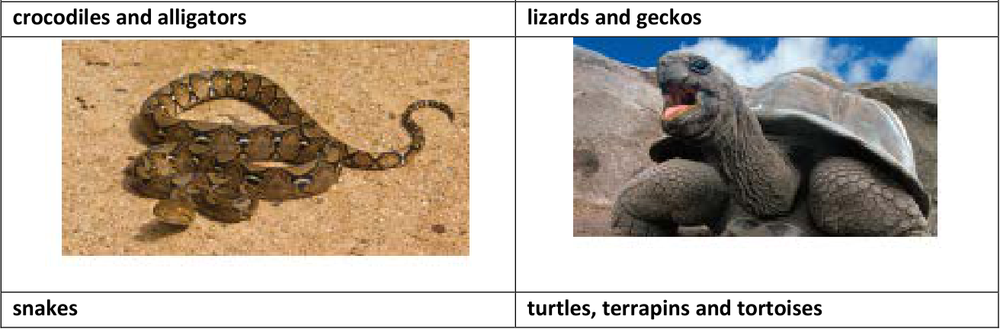
> **[Diagram Context - Textbook_NaturalScience_Gr7_Biodiversity.pdf-0058-10.png]**
> This educational graphic consists of a two-by-two table displaying photographic examples of various reptile groups. The visible labels include the taxonomic or common group names: "crocodiles and alligators", "lizards and geckos", "snakes", and "turtles, terrapins and tortoises". Conceptually, the diagram visually introduces learners to the diversity of living reptiles within the vertebrate phylum by categorizing them into distinct orders for biodiversity and classification studies.

---

# Myths and Facts Regarding Sex, Menstruation, and Pregnancy

## Common Misconceptions Addressed

### 1. "It is unhealthy to have sex at the time of the month when you are menstruating."
* **Fact:** Although some people might find it off-putting, there is no medical reason why sex should be avoided during menstruation. It is not unhealthy or unclean; it is simply the personal preference of the couple.

### 2. "You cannot fall pregnant during your period."
* **Fact:** There is a chance that you can get pregnant if you have sex during your period. Once inside the vagina, sperm can stay alive for several days. This means that even if the last time you had sex was three days ago during your period, you could now be ovulating and therefore could get pregnant.

### 3. "You cannot fall pregnant or make someone pregnant if you have sex in water."
* **Fact:** This is not true. The water does not in any way prevent pregnancy or the spread of STDs (Sexually Transmitted Diseases).

### 4. "Women are always moody and irrational during menstruation."
* **Fact:** Many women (not all) experience different pre-menstrual syndrome (PMS) symptoms, which can include emotional changes. However, this is not always so, and a woman's mood or emotional state should not automatically be attributed to PMS. Teenage boys can be similarly moody and emotional.

### 5. "Drinking and drugs make sex more fun."
* **Fact:** If you are drunk or on drugs, it is hard to make good decisions about sex. Statistics show that $20\%$ of $15\text{- to }17$-year-olds say they have done something sexual while using alcohol or drugs that they might not have done if they were sober. Being under the influence makes you much less likely to practise safe sex, putting you at risk of unwanted pregnancy or contracting an STD. It also makes girls more vulnerable to unwanted approaches.

### 6. "If you have a shower after sex, you will not fall pregnant."
* **Fact:** This is not true. Water will not 'wash off' the sperm, as the sperm have already entered the vagina. Similarly, showering after sex will not prevent pregnancy nor the transmission of STDs.

### 7. "You cannot fall pregnant if it is your first time."
* **Fact:** If you are ovulating, it does not matter if it is the first time you have sex—you can still fall pregnant. If your body has produced an egg during ovulation, sperm can fertilise the egg and result in pregnancy, regardless of whether it is your first time.

### 8. "Everyone is having sex."
* **Fact:** It may seem as though everyone is having sex, but in reality, less than half ($48\%$) of all high school students have ever had sex. People often lie and exaggerate when it comes to sex. Ultimately, what others are doing does not matter; what matters is what is best for you. 
* **Note on Peer Pressure:** Partners may apply pressure by saying things like *"If you love me, you will"*. However, a truly loving and committed partner will wait until you are ready.

---

## Classroom Discussion Points

* **Derogatory Terminology:** At the end of this lesson, discuss derogatory words used with reference to women and men. Brainstorm bad name choices and emphasize the importance of using correct, respectful terminology.
* **Cultural and Religious Perspectives:** If there are different cultural and religious groups in the class, it is an opportune time to discuss religious laws and views on menstruation, as well as what girls experience as part of these groups. Teachers must ensure an open, caring space and avoid degrading or embarrassing any learners based on their family's religious beliefs.

---

# Ways to prevent pregnancy and STDs

Teenagers may be more frightened by a possible pregnancy than by contracting a STD. This is a sad fact, as some STDs are incurable and life-threatening. It is useful to point out to learners in this section that **hormonal contraceptive pills DO NOT protect against STDs** and that a mistake made when they are young may affect the rest of their lives.

You may want to point out to learners that due to the way that STDs are transmitted from person to person, when having sexual intercourse with a partner you are putting yourself at risk of catching disease from them, or ANY of their previous sexual partners, who in turn could have contracted an STD from any of their sexual partners etc.

Emphasise to learners that if someone is forcing you to have sex with them or threatening you in any way to have sex with someone else, you have the right to say no. Our country's constitution protects your right to say no. If this is happening to you, go and speak to someone you trust and ask them to help you solve the problem.

Emphasise to learners that when you decide that you want to have sex with someone, go and speak to a medical professional like the sister at your local clinic or the health care professional that works at the pharmacy. They will help you get the correct contraceptives and protection that you need. Emphasise that it is not only boys who can carry condoms. Girls can carry condoms too. If girls have condoms available, then they can INSIST on using protection.

## ACTIVITY: Write a letter (LB page 76)

This activity is designed to empower the learners to take charge of their own sexual health. This is therefore a very personal activity and should not be for assessment purposes. Learners may choose to keep their letters entirely private.

# Revision

1. 
   - 1: petal
   - 2: stigma
   - 3: style
   - 4: filament
   - 5: receptacle
   - 6: peduncle
   - 7: sepal
   - 8: ovules
   - 9: ovary
   - 10: anther
   - 11: pollen grain
   - $4 + 10$: stamen

2. 

| Structure | Function |
| :--- | :--- |
| Petal | brightly coloured structure that attracts pollinators |
| Ovules | the part of the ovary of the flower that contains the female sex cell and that becomes the seed after fertilisation |

---

### Key Concepts and Definitions

#### Flower Parts and Pollination
| Term | Definition / Description |
| :--- | :--- |
| **pollen grains** | Fine powdery substance that contains the male sex cells that are transported to the stigma, and burrow down the style to the ovules where fertilisation takes place. |
| **Filament** | Stalk-like structure of the stamen that holds and supports the anther. |
| **Receptacle** | Top part of the flower stalk to which all the other flower parts attach. |

---

### Plant Adaptations and Seed Dispersal

3. **Bat Pollination Adaptations:**
   * **Colour & Scent:** The flower is brightly coloured and gives off a sweet-smelling scent to attract bats.
   * **Nourishment:** Contains nectar for the bat to drink.
   * **Timing:** The flower is typically open at night to match the nocturnal habits of bats.
   * **Structure:** Shaped similarly to the bat's head so the bat fits easily into the flower to reach the nectar.
   * **Size:** Large enough with nectar at the bottom, requiring the bat to push its whole head in, brushing against the pollen.
   * **Stamens:** Long with feathery ends designed to brush against the bat as it feeds.

4. **Wind Dispersal Adaptations:**
   * **Structure:** The seed features very thin "wings" enabling it to travel on the wind like a helicopter.
   * **Purpose:** Helps the seed move far away from the parent tree to avoid competition for space, water, and resources. 
   * **Mechanism:** Allows the seed to be lifted by drafts of air rather than falling straight down to the ground.

---

### Human Reproduction

5. **Sequence of Fertilisation and Implantation:**
   * **1 or 2:** The egg is released from the ovaries and travels along the oviduct.
   * **2 or 1:** During sexual intercourse, the sperm is propelled from the penis.
   * **3:** The sperm travel from the vagina, through the uterus to the oviduct.
   * **4:** The sperm arrive in the oviduct.
   * **5:** One sperm enters the outer cover of the egg to fertilise it.
   * **6:** The fertilised egg is implanted in the uterine lining.

6. **Key Reproductive Processes:**
   * **Ovulation:** When the ovary releases a ripe egg cell into the fallopian tube.
   * **Menstruation:** When the blood-rich lining of the uterus and unfertilised egg cell are discarded through the vagina.

7. **Site of Implantation:**
   * Implantation takes place in the **blood-rich lining of the uterus**.

8. **Female Reproductive Organs and Their Functions:**

| Reproductive organs | Their function |
| :--- | :--- |
| **Ovaries** | Produces female sex hormones and stores, matures and releases ripe egg cells. |
| **Oviducts** | Transports the ripened egg cell from the ovary to the uterus; fertilisation takes place in the fallopian tubes (oviducts) so sperm swims from the uterus into the fallopian tube (oviduct). |
| **Uterus** | Once a month the lining of the uterus grows blood-rich and thick to allow the fertilised egg to implant in it and to grow an umbilical cord and placenta; uterus also undergoes strong contractions during childbirth. |

---

# Reproductive System and Key Biological Concepts

## 1. Reproductive Organs and Functions

| Organ | Description and Function |
| :--- | :--- |
| **Vagina** | Muscular, elastic tube that can expand to hold the erect penis; sperm swim from the penis in the vagina to the uterus; it also allows the blood-thick lining of the uterus to be expelled once a month during menstruation; during childbirth it is the birth canal through which the baby travels and leaves the mother's body. |
| **Penis** | Can become erect (stiff and hard) to be placed into the vagina; ejaculates sperm in a liquid called semen; urine is also passed via the urethra. |
| **Testes** | Produce the male hormone; produces sperm that travel through different tubes to the penis from where it is ejaculated. |

## 2. Puberty and Reproduction Notes

9. The penis grows longer and slightly wider; it begins to ejaculate preparing for reproduction. The testes mature and start to produce sperm which can fertilise an egg.
10. During puberty, the ovaries are stimulated to start maturing and releasing the eggs on a monthly basis. The fertilisation of a mature egg by a sperm cell is needed for pregnancy to occur.
11. 

## 3. Evaluation of Biological Terms and Definitions

| Term and definition | Evaluation | Improvement |
| :--- | :--- | :--- |
| **Puberty:** When you grow up. | Vague and not accurate; you grow up from birth to adulthood. | Puberty is the time during childhood when the sex organs mature and the body undergoes various changes, preparing it for reproduction. |
| **Menstruation:** When a girl bleeds. | Vague, inaccurate – if a girl cuts or hurts herself she may also bleed but not as is meant here. | If there is no fertilisation, the female's blood-rich uterus lining and unfertilised egg are discarded through the vagina once a month. |
| **Fertilisation:** When you put stuff into the garden to make it grow better. | Wrong context – that is called fertilising the garden. | When a male sperm cell fuses with a female egg cell. |
| **Pregnancy:** When the mom's stomach grows, and a baby pops out. | Inaccurate – it is not the stomach that grows, but the baby in the uterus. And a baby does not 'pop out' | The period (approximately 40 weeks) from conception to birth, where the foetus develops in the womb or uterus. |
| **Conception:** When the baby starts to come alive. | Inaccurate – life starts for some at different points | The moment that fertilisation takes place when the male sperm fuses with the female egg cell and forms a new individual. |