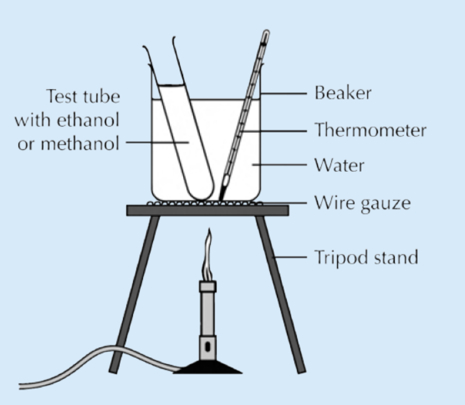
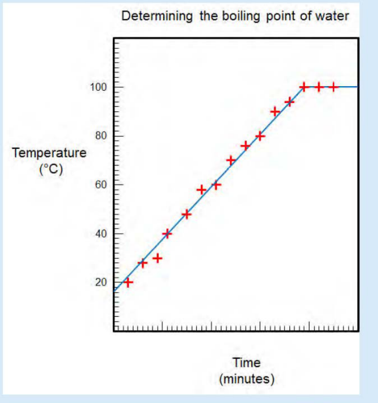
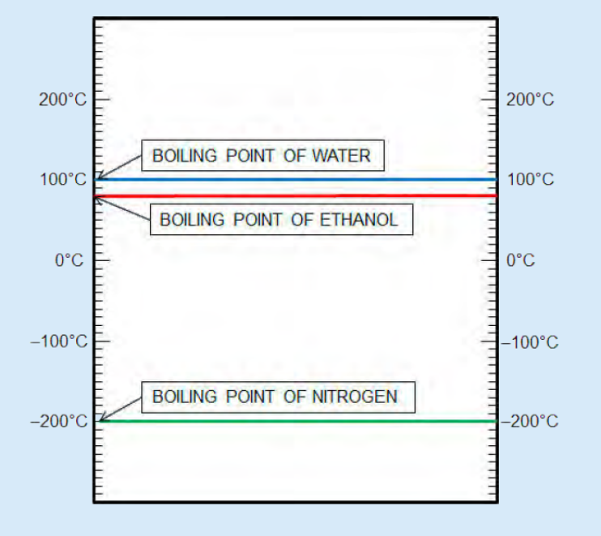

**Properties of materials** 


> **[Diagram Context - Textbook_NaturalScience_Gr7_Properties-of-materials.pdf-0001-02.png]**
> 1. A diagram of a cell with blue and white lines.


> **[Diagram Context - Textbook_NaturalScience_Gr7_Properties-of-materials.pdf-0001-03.png]**
> 1. A cartoon illustration of a key and a dinosaur. 
 2. A cartoon illustration of a key and a crane.


### **KEY .** . **. QUESTIONS:** 

### . **.** . **.** 

- Which properties are important when choosing a material for a particular use? 

- How can we measure the strength of a material? 

- What does it mean when a liquid boils? 

- How can we explain the term 'boiling point'? 

- How can we explain the term 'melting point'? 

- Why should we always think about the impact on the environment when we manufacture or use a particular material? 

We learnt in Gr. 5 that the properties of a material determine what it can be used for. Can you remember what _properties_ are? 

##### **. 1.1 Physical properties of materials** 

###### **What are properties and why are they important?** 

You may remember that properties are distinctive characteristics that describe an object or material. For instance, we can describe a metal by saying that it is strong and **durable** . A metal is is also **malleable** . This **property** , malleability, means that a metal can be formed into sheets which can be used for a variety of different purposes. For example, metal sheets can be used as roof panels for a house, or to press body panels for a car. 

###### **<u>NEW WORDS</u>** 

- property 

- • durable • ductile • malleable • flexible • mould 


> **[Diagram Context - Textbook_NaturalScience_Gr7_Properties-of-materials.pdf-0001-18.png]**
> 1. A purple and blue gas cylinder with a purple nozzle.


> **[Diagram Context - Textbook_NaturalScience_Gr7_Properties-of-materials.pdf-0001-19.png]**
> 1. A diagram of a cell with arrows pointing to different parts of the cell.


> **[Diagram Context - Textbook_NaturalScience_Gr7_Properties-of-materials.pdf-0001-20.png]**
> 1. A diagram of a cell with arrows pointing to different parts of the cell.


_The walls and roof of this house are made of sheets of corrugated metal._ 

_Can you see some parts of a car hanging up inside a car factory? These are made of sheets of metal._ 

What other properties of metals do you remember? Discuss this as a class. 

Let's do a warm-up activity to get us thinking about materials and their properties. 

##### **ACTIVITY:** Thinking about materials and their properties 

###### **INSTRUCTIONS:** 

1. Complete the following table by adding the names of different materials that have the properties listed. 

|**Property**|**Materials**|
|---|---|
|Strong||
|Flexible||
|Conducts<br>electricity<br>Conducts heat||


> **[Diagram Context - Textbook_NaturalScience_Gr7_Properties-of-materials.pdf-0002-04.png]**
> 1. A cartoon depiction of a roller coaster with a spring coiled up on the front.


###### **QUESTIONS:** 

1. What does it mean when a material is flexible? 

2. Suggest three possible uses of flexible materials? 

3. Suggest three possible uses of a material that is a good conductor of electricity. 


   4. Suggest three possible uses of a material that is a good conductor of heat. 

5. Which of the above properties would be important if you were choosing a material for making cookware (cooking pots)? 


> **[Diagram Context - Textbook_NaturalScience_Gr7_Properties-of-materials.pdf-0003-03.png]**
> 1. A silver pot with a lid and handle.


_A metal pot._ 

6. Which of the above properties would be important if you were choosing a material for making the wires used for distribution of electricity (shown in the adjacent photo)? 


> **[Diagram Context - Textbook_NaturalScience_Gr7_Properties-of-materials.pdf-0003-06.png]**
> The image shows three tall metal towers with multiple lines running through them. The towers are set against a clear blue sky with a few clouds. The image also contains a few other objects, such as trees and a field, which are not the main focus of the image. The image is a pedagogical diagram that is meant to help a high school student learn about the structure and function of a


_These electrical wires carried by pylons are made of metal._ 

7. Which of the above properties would be important if you were choosing a material to make a barbed wire fence? 


> **[Diagram Context - Textbook_NaturalScience_Gr7_Properties-of-materials.pdf-0003-09.png]**
> The image shows a diagram of a barbed wire fence with a pole on top. The fence is made up of multiple strands of barbed wire, which are arranged in a zigzag pattern. The pole is positioned on the right side of the image, with the top of the pole being visible. The sky in the background is a clear blue color. The diagram is labeled with the words


_A barbed wire fence._ 


> **[Diagram Context - Textbook_NaturalScience_Gr7_Properties-of-materials.pdf-0003-11.png]**
> This graphic depicts a repeating, stylized wave pattern composed of interconnected, arrow-headed segments. The image uses a continuous, rhythmic flow of green, chevron-like shapes to represent directional movement or a cyclical process. Conceptually, this serves as a visual metaphor for continuous flow, such as the propagation of a wave, the sequential steps in a biological pathway, or the ongoing nature of a repeating process in a scientific system.


Matter and Materials 

We can think of certain properties of materials in terms of advantages and disadvantages. Do you know what those are? Let's find out. 

###### **Advantages versus disadvantages** 


> **[Diagram Context - Textbook_NaturalScience_Gr7_Properties-of-materials.pdf-0004-02.png]**
> 1. A black plastic bag on the sidewalk.


We have seen that strength and durability are desirable properties in some materials. We want things to be strong and to last long. Let's think of an example. 

Why would plastic shopping bags need to be strong? 


> **[Diagram Context - Textbook_NaturalScience_Gr7_Properties-of-materials.pdf-0004-05.png]**
> The image shows a cartoon depiction of a man and a woman on a hot air balloon. The balloon is filled with a green substance, and the man is holding a basket on the basket. The woman is holding a basket on her head. The image also includes a caption that reads "Visit" and a link to a video that explains the concept of a hot air balloon.


_A black, plastic shopping bag._ 

Why would plastic shopping bags need to be durable? 

We call the desirable properties of materials advantages. Disadvantages are unfavourable features, as can be seen in the images of plastic in the environment. 


> **[Diagram Context - Textbook_NaturalScience_Gr7_Properties-of-materials.pdf-0004-09.png]**
> 1. A duck swimming in a body of water with a bag in its mouth.


> **[Diagram Context - Textbook_NaturalScience_Gr7_Properties-of-materials.pdf-0004-10.png]**
> 1. A diagram of a cell with a circle representing a nucleus.


_These plastic rings from soft drink packaging are very dangerous in the wild as they can entangle an animal's neck._ 

_A goose about to eat a plastic bag in a river._ 


> **[Diagram Context - Textbook_NaturalScience_Gr7_Properties-of-materials.pdf-0004-13.png]**
> The image shows a cartoon depiction of a cartoon character, a boy, standing on a globe. The boy is holding a sign that says "Visit Hawaii". The globe is surrounded by various arrows and labels, including one that says "A Hawaiian student looks at plastic objects found in the stomachs of albatrosses". The boy is wearing a green shirt and a hat. The image also includes


The following activity has another example of advantages versus disadvantages. 


> **[Diagram Context - Textbook_NaturalScience_Gr7_Properties-of-materials.pdf-0005-00.png]**
> 1. A diagram of a spring with a green background and a step ladder with a green background.


##### **ACTIVITY:** Advantages versus disadvantages 

Can you imagine a car made of solid gold? A car like this would be very valuable! 

###### **INSTRUCTIONS:** 

1. Look at the image of a gold car then answer the questions that follow. 

2. Discuss some of the questions with your classmates before writing down your answers. 


> **[Diagram Context - Textbook_NaturalScience_Gr7_Properties-of-materials.pdf-0005-06.png]**
> 1. A cartoon drawing of a yellow sports car with a white license plate.


###### **QUESTIONS:** 

1. What are your feelings about the golden car in the picture? 

2. What are the advantages of having a car made of gold? 

3. Do you think a golden car would be very strong? Would it perhaps be safer in the event of an accident? 

4. What are the disadvantages of a car made of gold? 


> **[Diagram Context - Textbook_NaturalScience_Gr7_Properties-of-materials.pdf-0005-12.png]**
> 1. A diagram of a cell with a green line.


Matter and Materials 

We always have to weigh up the advantages against the disadvantages when we choose materials for a particular job. 

How would you test how strong a material is? Let's imagine you have different types of paper. How would you test which paper is the strongest? Discuss this as a class and write some notes on the lines provided. 

The strength of paper is important because we use paper for many different things. 


> **[Diagram Context - Textbook_NaturalScience_Gr7_Properties-of-materials.pdf-0006-03.png]**
> 1. A box of All Bran cereal and a carton of eggs.


_All these objects are made from different types of paper with different properties that suit the function of the object._ 

In the next activity we are going to investigate the tearing strength of different types of paper. 

##### **INVESTIGATION:** Which type of paper is the strongest? 

**AIM:** To compare the tearing strengths of different types of paper. 

###### **HYPOTHESIS:** 

When you write a hypothesis, you must state what you think will happen in your investigation. 


> **[Diagram Context - Textbook_NaturalScience_Gr7_Properties-of-materials.pdf-0006-10.png]**
> 1. A cartoon drawing of a man lifting a ball.


###### **MATERIALS AND APPARATUS:** 

- strips of different types of paper (20cm x 5cm) 

- hole puncher 

- strong paper clips 

- yoghurt tub 

- marbles 

- string 

- hand lens (optional) 

###### **METHOD:** 

1. Punch a hole at both ends of each paper strip. This is so that you can test the paper twice on each side. Make sure that the holes are in the middle, and also at the same distance from the end of each strip. This will make it a fair test. 

2. Form the paper clip into an S-shape and hang it from the hole in the paper. 

3. Make a handle for the yoghurt tub, using the string. 

4. Hang the yoghurt tub from the paper clip and hold it in your hand. 

5. Add marbles one-by-one to the yoghurt tub until the paper tears. Count the number of marbles in the tub. (Tip: Place the marbles very gently into the yoghurt tub or the shock of dropping them in might tear the paper). 

6. Repeat steps 1 - 5 using the other end of the strip and count the marbles again. Take the average of the number of marbles. 

7. Repeat this using the other strips of paper, doing each twice and taking the averages. 

8. If each marble has a mass of 5 grams, work out the mass in grams that was needed to tear each strip of paper and write the number in the final **.** 

column of your table. 

9. If you have time, you can also test different kinds of materials, such as a plastic shopping bag, aluminium foil or plastic wrap. 

**Tip:** To calculate the **average** of a set of numbers, you add all the numbers together and then divide by how many numbers there were in the set. 

In this investigation, you will add the number of marbles together for each time you tested the paper strength (this was twice for each strip of paper) and then divide by 2 to calculate the average number of marbles that each piece of paper can hold before it tears. 

For example, if you had 5 marbles in the first attempt, and 3 marbles in the second attempt, the average will be calculated as follows: 

5 + 3 = 8 marbles 

8 _÷_ 2 = 4 marbles on average 

Therefore, the paper type could hold an average of 4 marbles. 


> **[Diagram Context - Textbook_NaturalScience_Gr7_Properties-of-materials.pdf-0007-25.png]**
> 1. A diagram of a hand holding a white paper with a bunch of balls on it.


**154** Matter and Materials 


###### **RESULTS AND OBSERVATIONS:** 

Record your results in the table. 

|**Type of**<br>**paper**|**Number of**<br>**marbles**<br>**(Trial 1)**|**Number of**<br>**marbles**<br>**(Trial 2)**|**Average**<br>**number of**<br>**marbles**|**Mass of the**<br>**marbles**|
|---|---|---|---|---|

Now answer the following questions: 

1. Look carefully at the surface of one of the paper strips. Now look carefully at the torn edge. Can you see anything special? Describe what you think the paper is made of. 

2. Which paper is the strongest? 

3. Which paper is the weakest? 

4. Arrange the different types of paper _in order of increasing tearing strength_ . (That means from weakest to strongest.) 

###### **ANALYSIS AND EVALUATION:** 

Let's now analyse and think about the results of the investigation. 

1. What do you think causes one paper to be stronger than another? 


2. How would you modify the investigation to test the strength of different types of plastic? 

3. What did you do to ensure fair testing? 

4. How would you modify the investigation to test the flexibility of different types of materials? 

5. Why did you repeat the experiment for the same type of paper? 

###### **CONCLUSION:** 

What can you conclude from this investigation? 


> **[Diagram Context - Textbook_NaturalScience_Gr7_Properties-of-materials.pdf-0009-07.png]**
> The image shows a gray line with a zipper running down the middle. The zipper is made up of small squares, and the background is a solid gray color. The line is labeled with the word "Zipper" in white text. The line is also labeled with the word "Zipper" in orange text. The line is labeled with the word "Zipper" in white text. The


Matter and Materials 

Strength, **flexibility** (the ability to flex or bend), electrical conductivity and heat conductivity are important properties of materials that we learnt about in Gr. 5 and have revised again here. 

Can you think of materials that are both strong and flexible? Most people will immediately think of plastics! Most plastics can easily be melted and **moulded** into different shapes for different purposes. Why do you think plastics can be 'melted and moulded' with ease? 


_All of these items are made of plastic in different shapes, sizes and colours._ 

We are going to learn about two new properties of materials, namely boiling point and melting point. 

First, let's check if everyone knows that there is a difference between the words heat and temperature. The two words, heat and temperature, are connected but they do not mean the same thing: 

- **Heat** is the transfer of energy from one object to another. This happens because of the difference in temperature between the two objects. The transfer of energy will be from the hotter object to the cooler object until they are the same temperature. You cannot measure heat directly, but you can detect its effect on a substance. Changes in heat can usually be detected as changes in temperature. 

- **Temperature** is used to describe how hot or cold something is. Temperature can be measured directly with a thermometer. 

Adding heat energy usually results in a temperature rise, so people often confuse heat and temperature. But they are not the same thing! We will look more at heating as a transfer of energy next term in Energy and Change. 

###### **Boiling and melting points** 

###### **<u>NEW WORDS</u>** 

- temperature 

- • thermometer • heat • melting point • boiling point 


Do you remember learning about the state changes in previous grades? We will be focusing on boiling and melting in this section. Have a look at the following diagram to refresh your memories about the different changes of state between solids, liquids and gases. 


> **[Diagram Context - Textbook_NaturalScience_Gr7_Properties-of-materials.pdf-0011-00.png]**
> 1. A diagram of a process involving a bottle, a glass, and a freezer.


   1. Melting is when a solid changes into a liquid. Look at this photo of a candle burning. What is happening to the wax around the flame? 

2. Discuss with your partner why you think this is happening to the wax. Write your answer below. 


> **[Diagram Context - Textbook_NaturalScience_Gr7_Properties-of-materials.pdf-0011-03.png]**
> 1. A candle with a small flame in the center of a dark background.


_A burning candle._ 

As you can see in the previous diagram, a liquid can change into a gas by evaporation. For example if you leave a saucer of water out in the sun, the water will evaporate. Evaporation can take place at any temperature. But, in boiling, the liquid needs to be heated to reach its **boiling point** . Bubbles of water vapour then form in the liquid and rise up. 

Can you think of at least three different ways to boil water? Discuss this with your class and write your answer down. 

What would happen if you tried to put the kettle into the microwave or on the stove? We will soon find out! 

Matter and Materials 

##### **ACTIVITY:** Boiling and melting 


> **[Diagram Context - Textbook_NaturalScience_Gr7_Properties-of-materials.pdf-0012-01.png]**
> 1. A cartoon drawing of a yellow kettle with a black handle and a white cord.


Look carefully at the picture. It looks as if something has gone wrong here! 

###### **QUESTIONS:** 


> **[Diagram Context - Textbook_NaturalScience_Gr7_Properties-of-materials.pdf-0012-04.png]**
> 1. A green and white diagram of a battery and a spring.
 2. A green and white diagram of a cell.
 3. A green and white diagram of a circuit.
 4. A green and white diagram of a graph.
 5. A green and white diagram of an evolutionary tree.


1. Write a short story to explain what you think happened to the kettle in the picture. 

2. Why do you think the person made the mistake of heating the kettle on the stove? **.** 

3. Do you think plastic is a good choice of material for making a whole cooking pot? Why do you say so? 

4. Why does a plastic kettle not melt when we boil water in it? 

5. Sometimes, just the handles of the cooking pot are made from plastic or wood. Why do you think this is so? 


> **[Diagram Context - Textbook_NaturalScience_Gr7_Properties-of-materials.pdf-0012-10.png]**
> 1. A diagram of a snake's body.
 2. The snake's body is made up of green and white lines.
 3. The snake's head is green.


At what temperature does water boil? We are going to do an investigation to find out! Since we have to make temperature measurements in the investigation, we are going to first check if everyone knows how temperature is measured. 

###### **<u>TAKE NOTE</u>** 

The mercury inside these kinds of thermometers is toxic and dangerous so they must be handled with care. 

Have you ever been so sick that you had a fever? Have you ever had your temperature taken? 

Perhaps you have had your temperature taken with a **thermometer** . A thermometer can be used to find out how hot or cold something is. A thermometer is an instrument for measuring temperature. 


> **[Diagram Context - Textbook_NaturalScience_Gr7_Properties-of-materials.pdf-0013-05.png]**
> 1. A diagram of a cell with arrows pointing to different parts of the cell.


> **[Diagram Context - Textbook_NaturalScience_Gr7_Properties-of-materials.pdf-0013-06.png]**
> The image shows a yellow thermometer with a silver handle and a black scale with numbers from 0 to 100 degrees. The thermometer is the main focus of the image, with the scale providing context for the temperature reading. The text "35C" is visible on the thermometer, indicating the temperature. The image is a simple, straightforward representation of a thermometer, with no additional context or


_This is a thermometer used to take your temperature when you have a fever._ 


> **[Diagram Context - Textbook_NaturalScience_Gr7_Properties-of-materials.pdf-0013-08.png]**
> 1. A diagram of a cell with a diagram of a cell and a diagram of a cell with a diagram of a cell and a diagram of a cell with a diagram of a cell and a diagram of a cell with a diagram of a cell and a diagram of a cell with a diagram of a cell and a diagram of a cell with a diagram of a cell and a diagram of a cell


Let's now investigate boiling and melting. 

**INVESTIGATION:** What is the boiling point of water? 

**AIM:** To observe boiling and to determine the boiling point of water. 

**HYPOTHESIS:** 

What is your hypothesis for this investigation? 

###### **<u>NEW WORDS</u>** 

###### **MATERIALS AND APPARATUS:** 

- contract 

- expand 

   - glass beakers x 2 (or small pot) 

- constant 


> **[Diagram Context - Textbook_NaturalScience_Gr7_Properties-of-materials.pdf-0013-20.png]**
> 1. A diagram of a cell with arrows pointing to different parts of the cell.


- Bunsen burner (or stove plate) 

- tripod with gauze 

- tap water 


> **[Diagram Context - Textbook_NaturalScience_Gr7_Properties-of-materials.pdf-0013-24.png]**
> 1. A cartoon depiction of a plant inside a beaker.


- thermometer 

- funnel 

- ice blocks 

Before you start, discuss the following questions in your group: 

1. Discuss what you know about gases, liquids and solids; the three states of matter. Write down your ideas from your discussion. 

**160** Matter and Materials 


2. What needs to happen to water to make it freeze? 

3. What needs to happen to water to make it boil? 

4. How do we measure temperature? 

5. Can you remember the boiling point and freezing/melting point of water? If you can, write them in the space below. 

6. Let's make some predictions. Read the two statements below, and indicate whether you AGREE, DISAGREE or are NOT SURE, by drawing a cross in the matching column: 

|**Statement**|**AGREE**|**DISAGREE**|**NOT SURE**|
|---|---|---|---|
|Water can get hotter than 100°C.||||
|Water always freezes at 0°C.||||

###### Safety precautions 

- Your teacher will demonstrate how to handle the Bunsen burner safely. 

- Remember that boiling water can cause painful burns. 

- The thermometer is made of very thin glass. Hold it gently, and do not use it to stir the water. Be careful not to drop it or bump it against the bottom or sides of the beaker. 


> **[Diagram Context - Textbook_NaturalScience_Gr7_Properties-of-materials.pdf-0014-11.png]**
> 1. A diagram of a beaker, thermometer, water, wire gauge, and tripod stand.


###### **METHOD:** 

1. Set up your apparatus as shown in the image. Remember that when you want to take the temperature, the thermometer must not be touching the sides. 

2. Take a measurement of the water temperature before you start heating the water. This will be your measurement at time 0. 

**<u>VISIT</u>** This video shows you how to use a laboratory thermometer. bit.ly/16ww1kU 


> **[Diagram Context - Textbook_NaturalScience_Gr7_Properties-of-materials.pdf-0014-16.png]**
> The image is a cartoon drawing of a globe with a speech bubble above it, containing a thought bubble with a lightning bolt. The drawing also includes a man and a woman, who are depicted as scientists. The globe is surrounded by various scientific instruments, including a microscope, a telescope, and a circuit board. The drawing is set against a beige background, and the text "conceptually for


3. Light the burner and heat the water. 

###### **<u>TAKE NOTE</u>** 

4. Measure the temperature of the water at regular intervals. Record the temperature in the table provided. 

Perhaps you measured the boiling point of the water as slightly less than 100°C. This does not mean that your measurements were incorrect. The boiling point of water depends on the atmospheric pressure. At sea level (close to the ocean) water boils at 100°C. Water boils at a lower temperature at higher **altitudes** (for example, on a mountain) because the air pressure is less. 

5. After a while you will notice that the temperature of the water becomes **constant** (this is when the temperature stops going up). Continue to take the temperature three more times (once every three minutes) after this happens. What do you notice about the water? 

###### **RESULTS AND OBSERVATIONS:** 

Record your results in the table. 

|**Elapsed time (minutes)**|**Temperature of the water (°C)**|
|---|---|
|0||


> **[Diagram Context - Textbook_NaturalScience_Gr7_Properties-of-materials.pdf-0015-09.png]**
> 1. A cartoon drawing of a man holding a picture of a woman.


###### **<u>VISIT</u>** 

Water can boil at room temperature, inside a vacuum bit.ly/16ww3cp 


> **[Diagram Context - Textbook_NaturalScience_Gr7_Properties-of-materials.pdf-0015-12.png]**
> 1. A cartoon illustration of a man holding a globe.


We are now going to draw a graph of the results recorded in the table. Here are some guidelines for drawing the graph: 

1. The title of your graph should be: **Determining the boiling point of water** . 

2. The independent variable should be 'Time'. Label the axis, and use minutes as units. Remember that the **independent variable** should always be drawn on the horizontal axis of your graph, or the x-axis. 

3. The dependent variable should be 'Temperature'. Label the axis, and use degrees Celsius (°C) as units. The **dependent variable** should always be drawn on the vertical axis of your graph; this is the y-axis. 

4. Plot the data on a line graph using the graph paper - each data point must be marked with a small, neat cross. 

**162** Matter and Materials 


> **[Diagram Context - Textbook_NaturalScience_Gr7_Properties-of-materials.pdf-0016-01.png]**
> The image shows a page of a graph paper with a grid of squares, each square being a different color. The squares are arranged in a grid pattern, with the colors alternating between blue and white. The page is blank, and there are no other objects or text present. The graph paper is a standard size, with the dimensions being 4x6. The page is in black and white,


**<u>TAKE NOTE</u>** The boiling point of water also depends on the purity of the water. Water which contains impurities (such as salt or sugar) boils at a higher temperature than pure water. This is why orange juice or apple juice will boil at temperatures slightly above 100°C. 


> **[Diagram Context - Textbook_NaturalScience_Gr7_Properties-of-materials.pdf-0016-03.png]**
> The image shows a gray rectangle with the words "Take Note" written in black text on the top. The text is positioned at the top of the rectangle, making it the focal point of the image. The rectangle is filled with a solid gray color, which contrasts with the black text and draws attention to the message. The layout of the image is simple and straightforward, with the text being the


###### **ANALYSIS:** 

1. What did you see when the water started to boil? 

2. What do you think happened to the water when it boiled? 

Different thermometers from different batches might also give slightly different readings. This is because they might have been calibrated differently. 

3. Describe the shape of your graph. Is it a straight line? 

4. How did the temperature of the water change over time? 


5. How does the shape of the graph show the way the temperature changed over time? 

6. What happened to the temperature of the water when it started to boil? 

7. How long did it take for the water to start boiling? 

8. At what temperature did the water boil? 

9. What do we call the temperature at which the water boils? Indicate this temperature on your graph. 

10. Suppose we used a Bunsen burner with a bigger flame. 

   - a) Do you think the water would boil at a temperature that is higher, lower or the same as the boiling point you just measured? Why do you say so? 

   - b) Do you think the time required for the water to boil would be longer, shorter or the same? Why do you say so? 

###### **CONCLUSION:** 

Write a conclusion for this investigation. When writing a conclusion, you must go back to look at your initial aim. 


> **[Diagram Context - Textbook_NaturalScience_Gr7_Properties-of-materials.pdf-0017-11.png]**
> 1. A gray background with a zipper running down the center.


Matter and Materials 

We will learn more about changes of state in Gr. 8 Matter and Materials. In order to melt ice, we need to add energy to it to raise the temperature to **melting point** . However, if we want to freeze water, we need to remove (take out) energy from it until the temperature decreases to freezing point. 


> **[Diagram Context - Textbook_NaturalScience_Gr7_Properties-of-materials.pdf-0018-01.png]**
> 1. A diagram showing the freezing and melting of water.


**<u>TAKE NOTE</u>** Ice melts at 0°C. Water freezes at 0°C. Coincidence, or not? 


> **[Diagram Context - Textbook_NaturalScience_Gr7_Properties-of-materials.pdf-0018-03.png]**
> 1. A diagram of a cell with arrows pointing to different parts of the cell.


Does boiling have a reverse process? Boiling is when liquid water changes to water vapour or steam. The reverse process, when steam turns back to water, is called condensation. In order to boil water, we need to add energy to it. But if we want to condense the water vapour, we need to cool it down (take energy out of it). 


> **[Diagram Context - Textbook_NaturalScience_Gr7_Properties-of-materials.pdf-0018-05.png]**
> 1. A diagram of a boiling water experiment.


The following diagram summarises what we have learnt so far. 


> **[Diagram Context - Textbook_NaturalScience_Gr7_Properties-of-materials.pdf-0019-00.png]**
> A diagram showing the boiling point of water at different temperatures. The diagram is divided into two sections, one in red and the other in blue. The red section shows that when the temperature is above 100 degrees Celsius, water turns into steam. The blue section shows that when the temperature is below 100 degrees Celsius, water turns into ice. The diagram also includes labels for the boiling point of water,


Do all liquids boil at 100°C? No, of course not! Not all substances melt at 0°C either. 

Can you think of a few substances that are solids at low temperatures, but have low melting points? (Think of things that melt easily when it is hot outside. Ice cream is an example.) 

In the next activity we are going to explore the boiling and melting points of a few substances other than water. 


> **[Diagram Context - Textbook_NaturalScience_Gr7_Properties-of-materials.pdf-0019-04.png]**
> The image is a cartoon drawing of a caterpillar with a smiley face and a leaf on its back. The caterpillar is made up of green and white lines, and it has a leaf on its back. The drawing also includes a wire spring and a green ball. The image is labeled with the letters "A" and "B" and the word "leaf" is also present.


##### **ACTIVITY:** Boiling and melting points of other substances 

###### **INSTRUCTIONS:** 

1. Place the boiling and melting points of the substances listed below on the **.** 

blank template provided and then answer the questions. 

2. The boiling point of nitrogen is - 200°C. Draw a green line at this temperature on the diagram and label it 'Boiling point of nitrogen'. 

3. The boiling point of ethanol is 78°C. Draw a red line at this temperature on the diagram and label it 'Boiling point of ethanol'. 

4. Now draw a blue line at the boiling point of water and also label this line. 

5. What is room temperature? Draw a black line at this temperature and label it. 


**166** Matter and Materials 


> **[Diagram Context - Textbook_NaturalScience_Gr7_Properties-of-materials.pdf-0020-01.png]**
> The image shows a diagram of a white rectangle with a black border, divided into six sections. Each section has a label, and the diagram is accompanied by a legend that provides information about the labels. The diagram is set against a green background, and the text "200C" is visible in the image.


###### **QUESTIONS:** 

1. What state would nitrogen be in at room temperature? Why do you say so? 

2. Suppose you mix some water and some ethanol. They are mixed but they have not changed into something else. The mixture is at room temperature to begin with. Now suppose you start heating the mixture. What temperature would be reached first: 78°C or 100°C? 

3. What do you think will happen when the mixture reaches a temperature of 78°C? Do you think the ethanol will start to boil? 


> **[Diagram Context - Textbook_NaturalScience_Gr7_Properties-of-materials.pdf-0020-06.png]**
> The image features a cartoon depiction of a man and a woman riding a hot air balloon. The balloon is filled with a blue substance, and the two people are seated on a basket attached to the balloon. The image also includes a text box that provides information about the game, stating that the player must interact with the game based on the points of solidity.


4. Will the water boil at the same time? 


> **[Diagram Context - Textbook_NaturalScience_Gr7_Properties-of-materials.pdf-0020-08.png]**
> 1. A diagram of a snake's body.


So far we have seen that materials have different properties such as their strength, their flexibility and their melting and boiling points. These properties determine how these different materials are used. 

We also briefly mentioned how some materials can conduct heat better than others. This is called heat conductivity. Think of some objects which you want to be able to conduct heat well and what material they should be made of. Write some of your ideas down. 

- **<u>NEW WORDS</u>** • impact • concern • environmental concerns 

Why do you think you put a jersey on when you are cold? What can we say about the wool that the jersey is made from in terms of heat conductivity? 


> **[Diagram Context - Textbook_NaturalScience_Gr7_Properties-of-materials.pdf-0021-04.png]**
> The image features a cartoon depiction of a volcano with a blue liquid inside, surrounded by purple and white elements. The volcano is depicted as a tall, cone-shaped structure with a spout on top, and it is surrounded by a cloud of purple and white particles. The image also includes a small cartoon character, a house, and a tree, which are all part of the same scene.


We will learn more about heat transfer later in the year. Another property of materials is how well they can conduct electricity. This is called electrical conductivity. We will look more at how different materials can be used as electrical insulators (meaning they do not conduct electricity well), later in the year. 

##### **. 1.2 Impact on the environment** 

Earlier, we saw how some of the properties of materials may be advantages under certain circumstances, but can become disadvantages under a different set of circumstances, such as plastics and other materials which, if they end up in nature, can have serious consequences and cause harm to other animals. Every process used to produce materials for our benefit has an **impact** on the environment. Some processes have a small impact and others have a large impact. 

We have already seen how the use of materials, such as plastics and paper, has a negative impact on our environment, but what about their production? 


> **[Diagram Context - Textbook_NaturalScience_Gr7_Properties-of-materials.pdf-0021-09.png]**
> 1. A green roller coaster with a spring coiled on top.


##### **ACTIVITY:** Environmental impact of material production 

###### **INSTRUCTIONS:** 

1. Look at the pictures and answer the questions that follow about the production of different materials in South Africa. 

2. You will need to do some extra research for this activity. Some information about each of the processes has been provided, but you will need to research them in more detail and answer the questions that follow. 


Matter and Materials 


###### **Mining:** 

Mining in South Africa has been one of the main reasons for our development. South Africa is still one of the top gold mining countries in the world. We also mine and produce other metals such as chromium, platinum, as well as coal and iron ore. Although this is hugely beneficial for the economy, it has devastating effects on the environment. 


> **[Diagram Context - Textbook_NaturalScience_Gr7_Properties-of-materials.pdf-0022-03.png]**
> This photograph depicts an open-cast mine, showing exposed geological strata and the significant surface disruption caused by large-scale mineral extraction. It illustrates the environmental impact of mining, serving as a visual case study for Geography learners to discuss land degradation, habitat destruction, and the physical alteration of the lithosphere.


1. This huge hole is actually a diamond mine about 40 km outside of Pretoria. What effects do you think this has had on the environment? 


> **[Diagram Context - Textbook_NaturalScience_Gr7_Properties-of-materials.pdf-0022-05.png]**
> The image shows a cartoon depiction of a globe with arrows pointing to various parts of the world. The globe is surrounded by arrows, which are labeled with different words such as "circuit", "anatomical", "geometry", and "evolutionary tree". The arrows also point to the words "16KP/S", "16KP/S", and "16K


_The Premier Diamond Mine outside of Pretoria._ 

2. In this photograph, the 2010 World Cup Soccer Stadium can be seen in the centre. In the top left are huge areas called slag piles. These are huge piles of crushed rock left over from decades of gold mining. What impact do you think this has on this area? 


> **[Diagram Context - Textbook_NaturalScience_Gr7_Properties-of-materials.pdf-0022-08.png]**
> The image is a satellite view of a city with a large soccer field in the center. The field is surrounded by buildings and other structures, indicating a developed urban area. The image also includes a map of the city, which provides additional context and information about the layout of the city. The satellite image is labeled with the name of the city and the name of the soccer field, as well as


_An aerial view of the Soccer City Stadium and surrounding area._ 

###### **<u>DID YOU KNOW?</u>** 

A major **environmental concern** at the moment is the proposal to start fracking in the Karoo. Fracking is a process where water is injected at very high pressures into small fractures in underground rock to crack it further and release gas and oil which are used as fuels. 


> **[Diagram Context - Textbook_NaturalScience_Gr7_Properties-of-materials.pdf-0022-12.png]**
> The image features a cartoon depiction of a man's head, with a red apple placed on top of it. The man's face is drawn in a cartoon style, and he is wearing a tie. The image also includes a thought bubble above the man's head, which contains a pink apple and the words "Mr. Newton". The image is labeled as an educational graphic, and it is intended


3. Coal mining in South Africa also has a major impact on the environment. Not only the mining, but the use of coal in power stations has negative impacts. What are some of these? 

###### **Paper making:** 


> **[Diagram Context - Textbook_NaturalScience_Gr7_Properties-of-materials.pdf-0023-03.png]**
> This graphic features a cartoon illustration of a large telescope focused on the Earth, accompanied by a speech bubble containing the text "VISIT," "Video on the environmental impact of coal mining in South Africa," and a shortened URL. It serves as an educational prompt to encourage students to investigate the ecological consequences of coal extraction within the South African context, aligning with CAPS Life Sciences and Geography curriculum requirements regarding human impact on the environment.


Can you imagine your world without paper? Probably not! We use it every day of our lives. South Africa has a big paper-making industry. Although paper is important in our lives today, the production has negative impacts on the environment. 


> **[Diagram Context - Textbook_NaturalScience_Gr7_Properties-of-materials.pdf-0023-05.png]**
> This photograph depicts an industrial facility with prominent smokestacks emitting plumes of smoke into the atmosphere. It serves as a visual representation of anthropogenic air pollution and greenhouse gas emissions, which are key concepts in the Life Sciences and Geography curricula regarding human impact on the environment and climate change.


> **[Diagram Context - Textbook_NaturalScience_Gr7_Properties-of-materials.pdf-0023-06.png]**
> This image depicts a monoculture pine plantation characterized by uniform tree spacing and a lack of diverse undergrowth. The visual elements include vertical tree trunks, a dense canopy, and a forest floor covered in pine needles, illustrating a human-managed ecosystem. For Life Sciences learners, this serves as a practical example of low biodiversity, demonstrating how artificial environments impact ecological stability and species richness compared to natural biomes.


_A paper-making factory._ 

###### **<u>VISIT</u>** 

For a list of the 10 most serious environmental concerns of the 21st century, visit the website. Each of the environmental issues is accompanied by a short video. bit.ly/147jh0V 


> **[Diagram Context - Textbook_NaturalScience_Gr7_Properties-of-materials.pdf-0023-11.png]**
> This cartoon depicts a personified human figure whose torso is replaced by a globe of the Earth, featuring a speech bubble and a pointing gesture toward the African continent. It serves as a visual metaphor for human impact on the environment, illustrating the CAPS Life Sciences and Geography concepts of human-environment interaction, global citizenship, and the anthropogenic influence on Earth's systems.


1. Huge areas of land are used to plant the trees that are then harvested to make pulp and then paper. What impact do you think this has on the environment? Hint: Also think about what you learnt about in Life and Living about biodiversity. 

2. Look at the photo of the paper-making factory. What effects does this have on the environment? 


> **[Diagram Context - Textbook_NaturalScience_Gr7_Properties-of-materials.pdf-0023-14.png]**
> This graphic depicts a repeating, stylized wave pattern composed of interconnected, arrow-headed segments. The image lacks specific labels or biological markers, but conceptually represents the continuous, directional flow of energy or information often used in Life Sciences to illustrate processes like the unidirectional movement of impulses or the sequential flow of matter through a system.


Matter and Materials 


> **[Diagram Context - Textbook_NaturalScience_Gr7_Properties-of-materials.pdf-0024-00.png]**
> This diagram illustrates a cross-section of a biological membrane, specifically representing the arrangement of phospholipid molecules in a monolayer or the surface of a lipid bilayer. It features a series of repeating, hook-shaped symbols representing the hydrophilic phosphate heads oriented toward the aqueous environment above a shaded region representing the hydrophobic fatty acid tails. This visual model helps learners understand the amphipathic nature of phospholipids and their structural role in forming the fluid mosaic model of cell membranes.


##### **SUMMARY:** 

**.** **<u>Key Concepts</u>** 

- The properties of a material determine the purposes for which it can be used. 

- Some of the properties of materials include strength, flexibility, heat and electrical conductivity and they have specific boiling and melting points. 

- Boiling point is the temperature at which a liquid boils. 

- Melting point is the temperature at which a solid melts. 

- The suitability of a material for a certain use is also influenced by other factors such as its cost, its colour and its texture. 


> **[Diagram Context - Textbook_NaturalScience_Gr7_Properties-of-materials.pdf-0024-08.png]**
> This illustration depicts a worker operating a jackhammer, represented by a large key, with motion lines indicating vibration and debris scattering. It serves as a conceptual metaphor for the physical impact of mechanical energy and the importance of personal protective equipment (PPE) like ear defenders in high-noise industrial environments.


- The ways we use materials and the processes we use to produce them always have an impact on the environment. 

###### **.** **<u>Concept Map</u>** 

On the following page is a concept map for what we have learnt about the properties of materials. We discussed several properties of materials in this chapter. Can you see how we can summarise a lot of information onto one page? 


> **[Diagram Context - Textbook_NaturalScience_Gr7_Properties-of-materials.pdf-0025-00.png]**
> This concept map illustrates the relationship between the properties of materials and their practical application in production. It categorizes key physical properties—such as strength, flexibility, conductivity, and thermal points—while linking them to broader considerations like cost, aesthetics, and environmental impact. This visual aid helps learners understand how material selection is a multi-faceted decision-making process based on both technical specifications and external factors.


##### **REVISION:** 

1. Below are a number of short sentences. In each case, you must complete the sentence by filling in the missing words. Write the whole sentences out on the lines provided. Fill in the missing word. [8 x 1 mark each = 8 marks] a) The set of characteristics that describe a material are called the of that material. 


> **[Diagram Context - Textbook_NaturalScience_Gr7_Properties-of-materials.pdf-0026-02.png]**
> This diagram illustrates a mechanical system combining a pulley arrangement with a gear train, featuring a person pulling a rope to lift a load in a basket. It visually demonstrates the principles of mechanical advantage and power transmission, showing how input force applied to a rope is transferred through pulleys and meshed gears to perform work. For high school learners, this serves as an introductory model for understanding simple machines, torque, and the conversion of mechanical energy in engineering systems.


- b) Materials that can be hammered into thin sheets are called <u>.</u> (Metals have this property.) 

- c) Materials that can be bent are called have this property.) 

<u>.</u> (Some plastics 

- d) The boiling point of a material is the liquid state of that material turns into a gas. 

at which the 

- e) When we want to measure temperature we use a 

- f) The boiling point of water at sea level is 

- g) A material that conducts heat well is said to have a high 

- h) If you want to create a circuit for a bulb, the material that you use in the circuit to connect the battery to the bulb must have a high 


2. State whether each of the following statements is TRUE or FALSE. If you think a statement is FALSE, you have to write a TRUE statement in its place. [4 x 2 marks each = 8 marks] 

   - a) All liquids boil at 100°C. 

   - b) Water always boils at 100°C. 

c) Any given material will melt and freeze at the same temperature. 

   - d) When water is boiled over a bigger flame, it will boil at a higher temperature. 

- **.** 

- 3. A scientist wants to determine the boiling point of an unknown liquid. She places the unknown liquid in a beaker and carefully heats it on a hot plate. The scientist measures the temperature of the liquid at regular time intervals (every 3 minutes). Afterwards, she draws the the following graph: 


> **[Diagram Context - Textbook_NaturalScience_Gr7_Properties-of-materials.pdf-0027-07.png]**
> This line graph plots temperature (°C) against time (minutes) to illustrate the heating curve of an unknown liquid. The graph demonstrates the physical principle that during a phase change, such as boiling, the temperature of a substance remains constant despite continued heat input, indicated here by the plateau at 65°C.


- a) At what temperature does the unknown liquid boil? Show this temperature on the graph. [2 marks] 

b) How long does it take for the unknown liquid to start boiling? [1 mark] 

**174** Matter and Materials 


- c) The scientist suspects that the unknown liquid is one of the substances on the following list. Use the list to identify the unknown liquid. Say _why_ you think it is this substance. [2 marks] 

|**Substance**|**Boiling point ( °C )**|
|---|---|
|Acetone|56|
|Methanol|65|
|Ethanol|78|
|Isopropanol|83|
|Water|**.**<br>100|

- d) What was the temperature of the unknown liquid at the start of the experiment? [1 mark] 

Total [22 marks] 


> **[Diagram Context - Textbook_NaturalScience_Gr7_Properties-of-materials.pdf-0028-05.png]**
> This graphic illustrates a biological trail formation, featuring a single ant leading a linear, double-stranded path of smaller ant icons against a shaded background. It conceptually demonstrates the mechanism of pheromone-based chemical communication and collective foraging behavior, where individual organisms contribute to a coordinated group response to navigate their environment.


Draw and discover the possibilities of what a slinky can be. 


> **[Diagram Context - Textbook_NaturalScience_Gr7_Properties-of-materials.pdf-0028-07.png]**
> 1. A silver spring coiled into a spiral shape.


# **5 Properties of materials** 

###### **<mark>Chapter overview</mark>** 

###### **2 weeks** 

This chapter builds on the chapters about the properties of materials in Gr. 5 and 6 Matter and Materials. Some of the properties learners encountered in the earlier grades are revisited, but now we start placing greater emphasis on how properties that may be desirable in a consumer product, may become undesirable properties when that product turns to waste. New properties introduced are boiling point and melting point, and these are introduced using water as example. 

###### **5.1 Physical properties of materials** (5 hours) 

|**Tasks**|**Skills**|**Recommendation**|
|---|---|---|
|Activity: Thinking about<br>materials and their properties|Accessing and recalling<br>information, classifying and<br>sorting|CAPS Suggested|
|Activity: Advantages versus<br>disadvantages|Accessing and recalling<br>information, comparing,<br>identifying problems and issues,<br>writing|Optional|
|Investigation: Which type of<br>paper is the strongest?|Hypothesising, planning<br>investigation, doing<br>investigation, recording<br>information, comparing,<br>communicating|CAPS suggested|
|Activity: Boiling and melting|Identifying problems and issues,<br>writing|Optional|
|Investigation: What is the boiling<br>point of water?|Hypothesising, accessing and<br>recalling information, doing<br>investigation, observing,<br>recording information,<br>interpreting information, writing|CAPS suggested|
|Activity: Boiling and melting<br>points of other substances|Reading, plotting data on graph,<br>comparing, writing|Optional/extension|

###### **5.2 Impact on the environment** (1 hour) 

|**Tasks**|**Skills**|**Recommendation**|
|---|---|---|
|Activity: Environmental impact|Accessing and recalling|CAPS suggested|
|of material production|information, reading and writing||

###### **Key questions** 

- l Which properties are important when choosing a material for a particular use? 

- l How can we measure the strength of a material? 

- l What does it mean when a liquid boils? 

- l How can we explain the term 'boiling point'? 

- l How can we explain the term 'melting point'? 

- l Why should we always think about the impact on the environment when we manufacture or use a particular material? 

#### 5.1 Physical properties of materials 

Here you could also remind learners of a property they learnt about in Term 2 of Gr. 5. 

###### **New word** 

l **ductile** : the property of a material that allows it to be drawn out into a wire. 

Metals conduct electricity and heat. Learners may also remember that metals are ductile. (Ductile describes a material which can be drawn out into a wire.) 

**ACTIVITY: Thinking about materials and their properties** LB page 95 

###### **Instructions** 

|**Property**|**Materials**|
|---|---|
|Strong|Learner-dependent answer: metals, plastics, leather, concrete and wood are all<br>examples of materials that learners could mention.|
|Flexible|Learner-dependent answer: some plastics, rubber, some metals (especially in|
||thin sheets) are all examples that learners could mention.|
|Conducts electricity|Metals|
|Conducts heat|Metals|

###### **Questions** 

1. Flexible means supple and bendy; able to flex and bend. 

2. Flexible materials can be used to make clothing that needs to bend and fold; tubing or a pipe that needs to bend; coverings for electrical wiring that need to bend around corners; soles of shoes that need to flex when walking, etc. 

3. Transmission cables for electricity, electrical wiring, electronic components for computers and other electronic equipment, electrical fencing (to protect property), etc. 

4. Good conductors of heat can be used for making pots and pans, heating elements, etc. 

5. Materials for cookware would need to be strong, rigid, and able to conduct heat. 

6. These electrical wires need to be strong, flexible and able to conduct electricity. 

7. The material used to make barbed wire fences needs to be strong, but also ductile so that it can be made into long thin wires, and also flexible so that the wires can be bent. 

Learners should be encouraged at this stage to start thinking about scientific processes and products in terms of their advantages and disadvantages. This will create awareness that whatever payoff is created by scientific endeavour, one always has to consider the cost. Sometimes the cost is purely financial; at other times the cost may be damage to the individual (as in the case of the irresponsible use of medicines and drugs), or to the environment (some examples follow). 

##### Advantages versus disadvantages 

Learners could be encouraged to imagine carrying a shopping bag filled with heavy items, that would simply fall through a shopping bag that is too weak or thin. 

Learners could be encouraged to think in terms of reusing shopping bags. Encourage them also to 

think of not-so-obvious uses for old shopping bags, like making artworks or weaving mats for instance. 

When we throw a shopping bag away, its durability may mean that it takes years and years to break down, so it pollutes the environment for a long period of time. Its strength may mean that, when an animal becomes entangled in a piece of plastic that has been thrown away, the plastic would be too strong for the animal to escape from. The animal may eventually die as a result. 

##### **ACTIVITY: Advantages versus disadvantages** LB page 96 

This is an optional activity. 

1. Learner-dependent answer. Encourage learners to write what they think of the golden car, what their thoughts and feelings are. Do they think it looks great? Would they like to own one? 

2. A practical advantage is that gold doesn't rust. To some people, it may be important to display their wealth to everyone else. 

3. Allow learners to debate this for a short while. You may want to point out that gold is actually quite a soft metal, and that driving a golden car would not offer more protection to the passengers than a car which has an exterior made mostly of steel would. Avoid the misconception that cars are made entirely out of steel. Cars have crumple zones to increase safety. 

4. Gold is very expensive, and so the car would be unaffordable to most people. Gold is also very heavy (learners may need to be reminded of this), so the car would be heavy to move around. It would require lots of fuel to make it move and fuel is expensive. It would probably also scratch easily. Some learners may also say that because it is so valuable, it might get stolen. You could add that it could be insured against theft, but that insurance on a car this valuable would be very expensive. The conclusion is that although a gold car may seem like a nice idea, it is not practical or safe or fuel efficient. 

Encourage learners to make their own notes as you are talking in class as this is a valuable skill. They can do it either here in the workbook or in a separate notebook if you make use of these. Some points to guide the class discussion: 

- l Something that is durable lasts a long time. 

- l Learners may say that something is strong when it is difficult to break. 

- l Allow learners to discuss how to test how strong a material is for a few minutes and come up with a few ideas. 

- l Learners may say the paper that is most difficult to tear would be the strongest. 

##### **INVESTIGATION: Which type of paper is the strongest?** LB page 97 

Learners can help you prepare for the activity by bringing different types of paper to school: newspaper, tissue paper, paper towel, or old magazines and gift wrap. Tell them to bring the biggest pieces they can find. 

###### **Aim** 

You could let the learners cut the paper into strips of 20 x 5 cm each, or you could do this beforehand to save time. Learners will compare the force required to tear the different types of paper. They have not yet encountered force as a concept (force is covered in Gr 9 Energy and Change) but you could encourage them to think about what they are doing when they hang the 

heavy marbles on the strip of paper. For example, ask learners: "What do more marbles in the yoghurt tub mean?" It means the yoghurt tub is heavier, and `pulls' harder on the strip of paper. (If you cannot get hold of marbles you could try finding small stones or pebbles that are more or less the same size. You would just have to explain to the learners that the stones do not all have a mass of 5 grams, but you will imagine that they do to simplify the calculations.) 

###### **Hypothesis** 

Possible hypotheses are: 'The thicker and stronger the paper, the more marbles it can hold before breaking.', 'Paper X is the strongest', where X is one of the papers supplied. 

###### **Material and apparatus** 

Make sure to use strong paper clips so that they do not bend under the strain of the marbles during the investigation. Make sure to use a range of papers, such as filter paper, tissue paper, crepe paper, wax paper, newspaper, normal white paper, harder card, etc. A suggestion is to also number the pieces of paper so that learners can easily reference them and then use the number to place them in order of strength later on in the questions. If you have time you can also test some other materials such as plastic shopping bags or aluminium foil. 

###### **Method** 

You can introduce the idea of a fair test here. Ask learners why they think they should punch the holes the same distance from the edge in each type of paper. This is because you want it to be a fair test – each piece of paper must be tested fairly and equally. If the holes were punched at different distances from the edge, this might make some papers appear stronger or weaker than they actually are. You need to control all other variables so that the only thing you are changing is the type of paper. 

###### **Results and observations** 

1. Learners should notice that the paper appears to be made of a layer of fibres. The fibres cling to each other because they have tiny branches on them, that become entangled to give the paper extra strength. 

2. Learner-dependent answer based on the evidence from the investigation. 

3. Learner-dependent answer based on the evidence from the investigation. 

4. Learner-dependent answer 

###### **Analysis and evaluation** 

1. More than one factor play a role here, but generally paper that is thicker tends to be stronger. This is because the layer of fibres is thicker, so more fibres to cling to each other. Papers in which the fibres are longer and more tightly packed are also stronger, and coating the paper with a super thin layer of plastic also adds additional strength. Learners could be encouraged to look for signs of these treatments. 

2. Plastics are generally stronger than paper, so for a start, the testing method should allow for greater weights to be hung from the plastic strips. This is a good opportunity to introduce the notion of fair testing: As many variables as possible should be kept the same: length of the plastic strips, method of fastening the weight to the plastic strips, etc. 

3. We used paper strips of the same length and width. l We punched identical holes in all the different paper strips. 

   - l We punched the hole in exactly the same place on all the strips. 

   - l We used the same method to hang the marbles from the paper strip for all the different types of paper. 

   - l We repeated each measurement (by testing both sides of the paper strip). 

4. Learner-dependent answer. One suggestion might be to cut strips of the same size of the materials to be tested, and lay them across the edge of a table, hang a weight on the 

overhanging edge and find a way to measure the amount of flexing that occurs. Learners could discuss ways of ensuring the test is fair. 

5. It is important to repeat experiments to be sure you get the same/similar answers every time. Repeating an experiment and calculating an average value helps to eliminate errors, or results that arise by chance (or luck). We say it makes the answer more reliable. 

Possible conclusions include: 'The stronger the paper, the more marbles it can hold before tearing', or 'Paper X is the strongest as it can hold the most marbles before tearing and paper Y is the weakest', etc. 

Most plastics melt easily because they melt at relatively low temperatures. We say they have low melting points. Note that this is not true for all plastics. 

##### Boiling and melting points 

1. The wax is melting 

2. Discuss this with your class. The heat energy from the flame on the burning wick is transferred to the wax causing the temperature of the wax to rise. When the temperature gets to a certain point (called its **melting point** ), the wax starts to melt as it changes state from a solid to a liquid. 

There are some important differences between evaporation and boiling. Evaporation can take place below the boiling point of a liquid, but boiling takes place only once the liquid is heated and reaches its boiling point. Also, evaporation occurs at the surface of a liquid as individual particles gain enough energy to overcome the forces holding them in the liquid and become individual particles in the gas state. Boiling occurs within the liquid when enough particles escape en masse and form bubbles of gas in the liquid. The gas bubbles then rise to the surface of the liquid and the liquid is said to boil. 

Ask your learners this question and get some answers. Encourage them to take notes: 

- l Water can be boiled in the kettle. 

- l Water can be boiled in a pot on the stove. 

- l Water can be boiled in a microwave oven. 

##### **ACTIVITY: Boiling and melting** LB page 100 

This is an optional activity. 

1. Just a few sentences are required here. The learners should note that someone placed the plastic kettle on the stove. When the person tried to heat the water, the kettle melted as a result of contact with the flame/heat. The kettle is meant to be plugged in to heat the water. 

2. Learners can come up with their own reasons here. Perhaps the person was used to heating water on the stove in a metal kettle. Perhaps the person did not know that the plastic would melt. Perhaps the person was just absent-minded and made a mistake. 

3. No. Plastic is not a good choice because it melts when it is heated above a certain temperature. 

4. The water boils at a temperature that is lower than the temperature needed to melt the plastic of the kettle. 

5. This is because wood and plastic are not good conductors of heat, unlike metal, and so you can pick up the pot easily. 

This is also an extension question as we have not specifically dealt with heat conductivity yet in this grade, but it has been covered in previous grades. 

Some learners may know that water boils at a temperature around 100°C (100 degrees Celsius), depending on factors such as altitude above sea level and atmospheric pressure. Do not answer this question directly, but rather use it to introduce the next activity. 

Here is an optional extension activity on how a thermometer works. It links to what learners will do in Gr 8 Matter and Materials. Next year, learners will look at the Particle Model of Matter, and within this, cover density and the contraction and expansion of materials. However, this is a good extension exercise to get learners thinking about how a thermometer works and introduce the idea that materials **expand** (when heated) and **contract** (when cooled) due to the increase in kinetic energy of the particles (the size and number of the particles do not change, it is only the spaces between the particles that get bigger or smaller). 

**Note:** An exception is water, which actually expands when it becomes a solid (ice). This will be covered in detail in later grades. 

###### **Questions** 

1. The liquid level will rise when the liquid expands. 

2. The inside of the refrigerator is cold. This will make the liquid inside the thermometer contract. The liquid level will drop. 

**INVESTIGATION: What is the boiling point of water?** LB page 101 

The investigation in the Learner’s Book includes only that of investigating boiling point of water, as suggested in CAPS. However, if you would also like to look at melting point of ice, this second part has been included later in the Teacher's Guide. 

###### **Aim** 

CAPS suggests that this investigation could be performed on `other liquids' such as orange juice, apple juice and cola. One issue to be aware of is that the suggested beverages are all solutions of substances in water. Their boiling points will be slightly higher than that of pure water, but this is because adding some substances to water elevates the boiling point of the solution. It is still water that is boiling in all these instances (the phenomenon is called boiling point elevation). Sometimes, adding substances (such as ethanol) to water can bring the boiling point down (refer to Raoult's Law). This is a lot of detail and not necessary for the learners to know about at this stage. 

Here are some suggestions for extensions for this investigation: 

1. Determining the boiling point of methanol (methylated spirits) or ethanol (available as 'surgical spirits' from the pharmacy). The point of this extension would be to show that different substances have different boiling points. 

**Note:** Methylated spirits can be used instead of methanol, but it contains only about 9.5 % methanol in more than 80 % ethanol. This means there may not be a big difference between the experiments carried out with ethanol and methylated spirits. 

**Warning:** Take care when working with these substances, especially methanol, since it is dangerous. Wear gloves if possible and avoid inhaling the fumes. 

Furthermore, ethanol and methanol are both extremely flammable and care should be taken when heating them. A safe way of heating ethanol or methanol to its boiling point is shown in the following diagram. The test tube containing the ethanol or methanol should be suspended in a beaker of tap water, and slowly heated. The principle of thermal equilibrium means that the water and ethanol/methanol will be at the same temperature, so the temperature of the water can be substituted for the temperature of the ethanol/methanol. 



> **[Diagram Context - Textbook_NaturalScience_Gr7_Properties-of-materials.pdf-0035-00.png]**
> 1. A diagram of a beaker and a thermometer with a wire gauge.


2. Determining the boiling point of water by another method, for instance in a pot on the stove, or in a kettle. The point of this would be to show that the boiling point of water is constant (at constant pressure, of course, so it would make sense to do the extensions concurrently with the prescribed procedure below). 

###### **Hypothesis** 

Possible hypotheses that learners could give include stating the boiling point of water that they might know from previous knowledge. 

###### **Materials and apparatus** 

Before starting the investigation, divide the class up into groups in which they will perform the investigation and get learners to discuss the following questions first in their group to revise concepts from Gr 6. 

1. 

   - l The particles in solids are tightly packed into fixed positions, so solids retain their shape. They cannot be compressed. 

   - l The particles in liquids are also close to each other, but they are not in fixed positions and can move around, that means liquids can fill the container they are in. They are not really compressible either. 

   - l The particles of gases are really far apart, they are not ordered in any way, they can move anywhere they want. Gases are compressible as a result. 

   - l Learners should be encouraged to think about the different states of matter in terms of the particle model which was first introduced in Gr 6 and is built upon more next year in Gr 8. 

2. In order for water to freeze, it needs to be cooled down. 

3. In order for water to boil it needs to be heated. 

4. We measure temperature with a thermometer. 

5. It is not important that learners remember these temperatures, as they will be determining them experimentally shortly. This question has been added to allow you to gauge how many 

learners know them. 

###### 6. Learner-dependent answers. 

The concept of making predictions in science investigations is introduced here. 

When lighting the burner, always light the match (or lighter) before opening the gas. 

It might be best to try this experiment in advance to determine how frequently water temperature should be measured. Time intervals would depend on the volume of water. CAPS suggests intervals of 3 minutes, but shorter intervals will provide more data points to plot on the graph. 

Learners should observe that the water is starting to boil. When boiling starts the temperature of the water remains constant. The best graph is obtained when the water is stirred gently throughout; this ensures that the water is heated uniformly. 

Learners should be reminded that the independent variable is the one that was `manipulated'; in this case the total amount of energy added to the water increased with time. Since we have no real measure of the energy added to the water, but since we do know that the energy was added at a constant rate, we can use the **time** that the water was heated as our independent variable. 

Learners could be reminded that the dependent variable is the one that was 'measured' or observed; in this case the temperature of the water as it increased with time. 

Learners' graphs should have the following general shape and features: 



> **[Diagram Context - Textbook_NaturalScience_Gr7_Properties-of-materials.pdf-0036-09.png]**
> The image shows a graph that displays the boiling point of water at different temperatures. The x-axis of the graph represents the temperature in degrees Celsius, while the y-axis represents the boiling point in degrees Celsius. The graph shows a linear relationship between the two variables, with the boiling point increasing linearly with the increase in temperature. The graph is labeled with the title "Determining the


###### **Analysis** 

1. Bubbles could be seen in the water. 

2. Some of the liquid water turned into gas, that is why there were bubbles. 

3. The first part of the graph has a positive slope, then the graph becomes a horizontal line. 

4. The temperature of the water increased gradually, then it became constant. 

5. The left part of the graph where the slope is positive, shows that the temperature of the water increased. The right part of the graph where the graph is horizontal, shows that the 

temperature of the water did not change over time, but stayed constant. 

6. The temperature did not go up anymore, it stayed constant. 

7. Learner-dependent answer. 

8. Learner-dependent answer. 

The boiling temperature depends on the elevation above sea level and the air pressure at the time of measurement. Water boils at 100°C at sea level and at temperatures slightly below that at elevated altitudes. 

9. The temperature at which water boils is called the boiling point of water. 

The next question refers to a bigger flame. A bigger flame simply means that energy is added to the water at a higher rate. This question helps learners to realise that for a fixed amount of water, a fixed amount of energy will be needed to bring it to the boiling point. This may help them to understand the concept of specific heat later on. 

10. a) The water will boil at the same temperature. The bigger flame gives more energy to the water but does not affect the boiling point. 

   - b) The water will boil in a shorter time. The bigger flame gives more energy to the water per time unit. That means less time will be needed to heat the water. 

Learners should write a conclusion stating the boiling point of water that they determined from this investigation, for example, "From this investigation, it can be concluded that the boiling point of water is 100°C. 

This is the second part of the investigation if you would like to look at melting point of ice. 

##### **ACTIVITY: Boiling and melting points of other substances** 

LB page 105 

This is an **optional** activity. 

###### **Teacher's Note:** 

The learners' diagrams should look like this: 



> **[Diagram Context - Textbook_NaturalScience_Gr7_Properties-of-materials.pdf-0037-16.png]**
> 1. Boiling point of water.


Room temperature is normally 21°C. However, it varies in different laboratories in different countries, and the range between 21°C and 25°C is accepted. 

###### **Questions** 

1. Nitrogen would be a gas at room temperature, because room temperature is higher than the boiling point of nitrogen. 

2. 78°C 

3. Learners may be unsure, but you could say that the ethanol is still ethanol, it has not been changed in the process of mixing, so it will most certainly start to boil at 78°C. 

4. No. Water only starts to boil at 100°C. 

This question was included to prepare learners for the concept of distillation that will be introduced in the next chapter. Boiling point is a property of a substance. Boiling point can be used to identify a substance. You can explain this to your learners after you have done this question. 

Possible answers are the metal of cooking pots conducts heat well to cook food and boil water, the metals that make up some heaters also need to conduct heat well. 

The wool or fabric that the jersey is made of does not conduct heat well. It therefore acts as a heat insulator, keeping the body warm. 

#### 5.2 Impact on the environment 

##### **ACTIVITY: Environmental impact of material production** LB page 106 

###### **Mining** 

1. The local habitats are affected by the digging of the hole, the roads that are built and the other infrastructure put in place. Diamond mines require huge amounts of diesel which produce greenhouse gases which build up in the atmosphere. 

2. **Note:** Learners may battle with this question, so you can ask them if they think anything can grow or live on these dumps again? As can be seen, these slag piles do not have anything growing on them as they are not green, and they have been there for decades, so they are reducing the possibilities for habitats and natural vegetation to grow back. The rock can contain toxic chemicals (such as cyanide) which seep into the ground and contaminate soil and water. 

3. Huge amounts of land are destroyed when mining coal. Coal mining also requires large amounts of water, which reduces the water for surrounding areas. Water runoff can also contaminate water supplies. There is air pollution in coal mining and in the use of coal in power stations. when coal is burning, greenhouse gases are released which contribute to acid rain formation and the greenhouse effect. It also contaminates the air for other organisms. 

###### **Paper making** 

1. Plantations take up a lot of space and therefore natural, indigenous vegetation has to be cleared (deforestation). This destroys habitats for other organisms. These trees also use a lot of water and prevent anything from growing underneath them. They reduce the biodiversity in the area. 

2. There is a huge amount of air pollution from paper-making factories, which contributes to a build-up in greenhouse gases. Paper mills use huge amounts of water, and the waste water contains many chemicals and substances which damage the environment. 

## **Revision** 

1. a) The set of characteristics that describe a material are called the properties of that material. 

   - b) Materials that can be hammered into thin sheets are called malleable. 

   - c) Materials that can be bent are called flexible. 

   - d) The boiling point of a material is the temperature at which the liquid state of that material turns into a gas **.** 

   - e) When we want to measure temperature, we use a thermometer. 

   - f) The boiling point of water is 100 °C. 

   - g) A material that conducts heat well is said to have a high heat conductivity. 

   - h) If you want to create a circuit for a bulb, the material that you use in the circuit to connect the battery to the bulb must have a high electrical conductivity. 

2. a) FALSE: There are a few alternative true statements possible: 

      - l Not all liquids boil at 100°C. 

      - l Water boils at 100°C. 

      - l Each liquid has its own unique boiling point. 

   - b) FALSE: At sea level, water boils at 100°C. (At higher altitudes water boils at temperatures slightly below 100°C.) 

   - c) TRUE 

   - d) FALSE: Two alternative TRUE statements are possible: 

      - l When water is boiled over a bigger flame, it will boil at the same temperature, namely 100°C (at lower altitude/at sea level). 

      - l When water is boiled over a bigger flame, it will boil more quickly (sooner). 

3. a) The unknown liquid boils at 65°C. (Learner must indicate this temperature on the graph.) 

   - b) The unknown liquid starts to boil after approximately 40 minutes. 

   - c) The unknown liquid is methanol. The boiling point of methanol is the same as that of the unknown liquid, namely 65°C. 

   - d) 21°C 

## 5. Authentic Exam Question Archetypes & Mark Allocations
*(Extracted from official CAPS examination papers to guide marking, pacing, and rubric design)*

### Archetype 1: QUESTION 1:
- **Source Paper:** `Gr7_NS_Exam2.pdf`
- **Total Mark Allocation:** **[6 Marks]** (Sub-questions: 1, 1, 1, 1, 1 marks)
- **Recommended Time:** **6 Minutes** (Pacing: ~1.0 min/mark | *Calibrated to Official CAPS Paper Pace (1.0 min/mark)*)
- **Assessment Mode Calibration:** Timed Exam Simulation: 6 min countdown (Pacing Checkpoint: 4 min)
- **Cognitive / Marking Strategy:** NSC Standard (Method Marks [M], Accuracy Marks [A], Carry-Over [CA])

#### Question Prompt & Working:
```text
QUESTION 1:
Multi ple c hoi ce question s
Choose the correct answer from the following guesfions and only write the correct letter next to the
question number on your answer sheef.
1.1 Materials that allow electricity to move through them. (1)
a. Flexibitity
b. Electrical conductors
c. Materials
d. Electrical insulators
1.2 When you use a magnet to separate a mixture. (1)
a. Magnetism
b. Evaporation
c. Sieving
d. Distillation
1.3 This word is used to describe a substance that eats through clothing, stonework and metals,
and can burn the skin. (1)
a. Bases
b. Acids
c. Sour
d. Corroslve
1.4 The temperature at which a liquid turns into a gas. (1)
a. Electrical Conductor
. b. Tensile Strength
c. Boiling Point
d. Melting Point
1.5 This substance is neither acid nor base and is not dangerous. (1...
```

### Archetype 2: SECTION A: [17]
- **Source Paper:** `Gr7_NS_Exam2.pdf`
- **Total Mark Allocation:** **[15 Marks]**
- **Recommended Time:** **15 Minutes** (Pacing: ~1.0 min/mark | *Calibrated to Official CAPS Paper Pace (1.0 min/mark)*)
- **Assessment Mode Calibration:** Timed Exam Simulation: 15 min countdown (Pacing Checkpoint: 11 min)
- **Cognitive / Marking Strategy:** NSC Standard (Method Marks [M], Accuracy Marks [A], Carry-Over [CA])

#### Question Prompt & Working:
```text
SECTION A: [17]
2.1
Kinetic Energy
A
The transfer of heat between solid objects.
2.2
Conduction
B
Energy that an object has because it is moving.
2.3
Convection
c
Materials that reduce heat loss.
2.4
Potential Energy
D
The way that heat energy flows through liquids and
gases.
2.5
lnsulating materials
E
Energy stored in an object or system.
Column A
Column B
```

### Archetype 3: QUESTION 6:
- **Source Paper:** `Gr7_NS_Exam2.pdf`
- **Total Mark Allocation:** **[22 Marks]** (Sub-questions: 2, 2, 2, 2, 2 marks)
- **Recommended Time:** **22 Minutes** (Pacing: ~1.0 min/mark | *Calibrated to Official CAPS Paper Pace (1.0 min/mark)*)
- **Assessment Mode Calibration:** Timed Exam Simulation: 22 min countdown (Pacing Checkpoint: 16 min)
- **Cognitive / Marking Strategy:** NSC Standard (Method Marks [M], Accuracy Marks [A], Carry-Over [CA])

#### Question Prompt & Working:
```text
QUESTION 6:
lnvestigations
6.1 lnvestigate the most efficient way to separate mixtures.
Make use of the following table to work out the best way to separate the mixtures that follow. Write
down the separation technique as wellas a reason for using the separation technique.
What would the best separation techniques be to separate the following mixtures (Give a reason
for your answer):
6.1.1 lron fillings and sand (2)
6.1.2 Salt and water (2)
6.1.3 Building sand and stones (2)
6.1.4 Buttons and coins (2)
t8l
Solids of
different sizes
wherein one
solid is quite
small
Method
Hand-sortino
Sievino
Filtration
Maonetism
Evaporation
Type of
substance
Solids of
different sizes,
colours, textures
lnsoluble solids
from liquids
Magnetic
substances from
non-magnetic
substances
Soluble solid
and liquid
6...
```
