# 4 The Periodic Table of Elements

## KEY QUESTIONS:
* What is an element?
* How can we classify the elements in our world?
* Which table helps us to make sense of the patterns we observe in the chemical properties of the elements?
* How are elements arranged on the Periodic Table?
* What does the position of an element on the Periodic Table tell us about its expected properties?
* What information can we use to represent the identity of an element?
* What are the typical properties of the:
  * metals;
  * nonmetals; and
  * semi-metals?

---

People have been interested in science from the earliest times. Early man discovered how to process natural ores into metals for ornaments, weapons and tools. At least 3000 years ago, ancient people were already using embalming fluids (chemicals) obtained from plants to preserve the bodies of dead people and animals!

Mankind has been studying and experimenting with materials to try to understand matter for thousands of years. Scientists especially wanted some understanding of all the different substances that they were working with.

Over time, many different elements were discovered by scientists all over the world. These elements make up all the materials around us. But what do we mean by the word **element**? An element is a pure substance which cannot be broken down any further. We will find out more about elements in this chapter.

---

# Chapter 4. The Periodic Table of Elements

## Introduction to the Periodic Table

Over time, our knowledge about the elements and their behaviour increased, and scientists recognised the need to organise this information. They began to observe patterns and similarities in the way some groups of elements behaved and recorded these observations. Scientists wanted some way to **classify** the elements according to their properties that they were observing.

The version of the Periodic Table that we use today was first proposed by Dmitri Ivanovich Mendeleev in 1872. Mendeleev was a brilliant Russian scientist. While other scientists made many contributions to the design of the Periodic Table, Mendeleev was the one who first showed that the table could predict the existence and properties of elements that were still undiscovered at the time.

> **[Diagram Context - Textbook_NaturalScience_Gr7_Acids-bases-and-neutral-substances.pdf-0001-02.png]**
> 1. A diagram of a cell with blue and white lines.

## New Words

* **element**
* **Periodic Table**
* **symbol** (or element symbol)
* **atomic number**

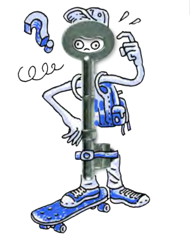
> **[Diagram Context - Textbook_NaturalScience_Gr7_Acids-bases-and-neutral-substances.pdf-0001-03.png]**
> 1. A cartoon character with a backpack and a skateboard.

---

## 4.1 Arrangement of elements on the Periodic Table

The Periodic Table is a classification system for the elements that make up the matter and materials in our world. Today, there are more than 100 different elements known! Each element has its own name, symbol, atomic number and position on the Periodic Table.

### Element names

What is your name? Perhaps it is Thando. Or David. Or Megan. Perhaps you are lucky enough to be the only person in your class with that name. Perhaps you are lucky enough to be the only person in the world with that name! That would make your name unique.

Each element has a unique name. We can think of each name as a unique 'label' we can use to identify the element. There are two other unique labels that we

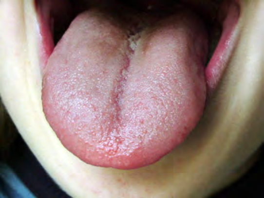
> **[Diagram Context - Textbook_NaturalScience_Gr7_Acids-bases-and-neutral-substances.pdf-0001-29.png]**
> The image shows a close-up view of a person's tongue, with the tongue sticking out. The tongue is pink and appears to be coated in a red substance. The tongue is positioned in the lower part of the image, with the upper part of the person's face visible. The tongue is the main focus of the image, with no other objects or people present.

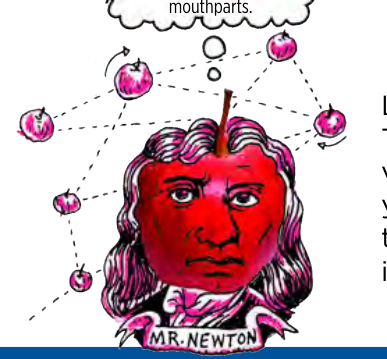
> **[Diagram Context - Textbook_NaturalScience_Gr7_Acids-bases-and-neutral-substances.pdf-0001-33.png]**
> The image features a cartoon depiction of a man's head with a red apple on his forehead. The man is wearing a top hat and a bow tie, and the apple is placed on his forehead. The man is also wearing a crown, and there are several apples scattered around him. The image includes a thought bubble above the man's head, which reads "mouthparts", and a caption

> **[Diagram Context - Textbook_NaturalScience_Gr7_Properties-of-materials.pdf-0001-02.png]**
> 1. A diagram of a cell with blue and white lines.

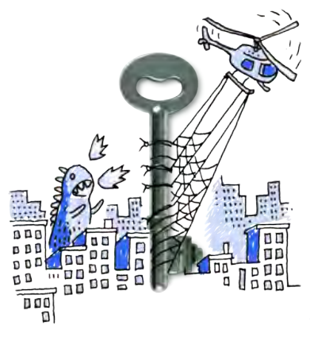
> **[Diagram Context - Textbook_NaturalScience_Gr7_Properties-of-materials.pdf-0001-03.png]**
> 1. A cartoon illustration of a key and a dinosaur. 
 2. A cartoon illustration of a key and a crane.

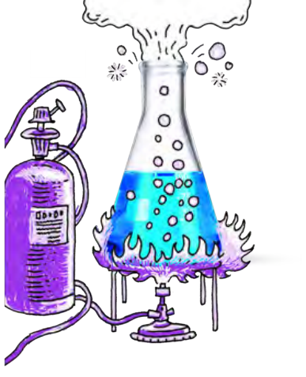
> **[Diagram Context - Textbook_NaturalScience_Gr7_Properties-of-materials.pdf-0001-18.png]**
> 1. A purple and blue gas cylinder with a purple nozzle.

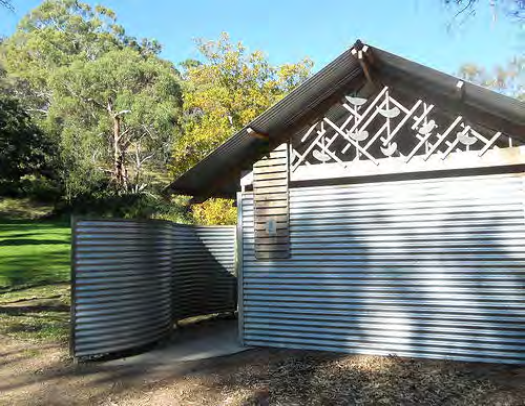
> **[Diagram Context - Textbook_NaturalScience_Gr7_Properties-of-materials.pdf-0001-19.png]**
> 1. A diagram of a cell with arrows pointing to different parts of the cell.

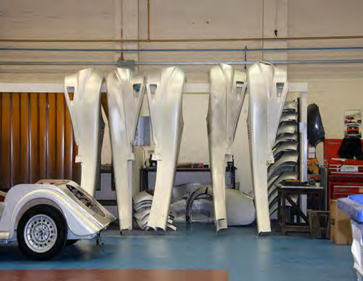
> **[Diagram Context - Textbook_NaturalScience_Gr7_Properties-of-materials.pdf-0001-20.png]**
> 1. A diagram of a cell with arrows pointing to different parts of the cell.

> **[Diagram Context - Textbook_NaturalScience_Gr7_The-Periodic-Table-of-Elements.pdf-0001-02.png]**
> 1. A diagram of a cell with blue and white lines.

> **[Diagram Context - Textbook_NaturalScience_Gr7_The-Periodic-Table-of-Elements.pdf-0001-03.png]**
> 1. A cartoon illustration of a key and a dinosaur.

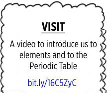
> **[Diagram Context - Textbook_NaturalScience_Gr7_The-Periodic-Table-of-Elements.pdf-0001-16.png]**
> 1. A video to introduce us to elements and the periodic table.

> **[Diagram Context - Textbook_NaturalScience_Gr7_The-Periodic-Table-of-Elements.pdf-0001-18.png]**
> The image features a cartoon illustration of a hot air balloon with a globe on top. The globe is depicted in a cartoon style, with a cartoon-like depiction of the Earth. The balloon is filled with air, and there are two people inside the balloon. One person is holding a book, while the other person is holding a telescope. The illustration conveys the concept of a globe being used

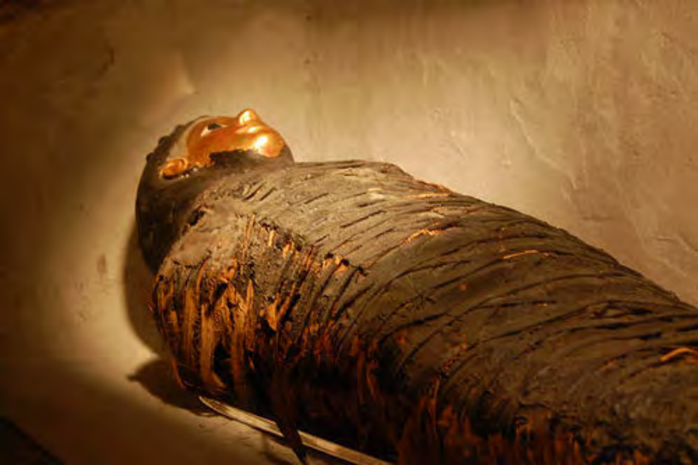
> **[Diagram Context - Textbook_NaturalScience_Gr7_The-Periodic-Table-of-Elements.pdf-0001-20.png]**
> 1. A diagram of a cell with a gold head.

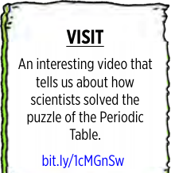
> **[Diagram Context - Textbook_NaturalScience_Gr7_The-Periodic-Table-of-Elements.pdf-0001-21.png]**
> 1. A diagram of a periodic table.
2. The periodic table is a chart that shows the elements of the periodic table.
3. The periodic table is a chart that shows the elements of the periodic table.

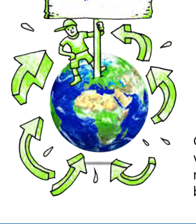
> **[Diagram Context - Textbook_NaturalScience_Gr7_The-Periodic-Table-of-Elements.pdf-0001-22.png]**
> The image shows a cartoon depiction of a boy holding a pole that is connected to a globe. The boy is wearing a green shirt and a hat. The globe is green and blue, and it has arrows pointing in different directions. The boy is standing on the globe, and the pole is attached to the globe with a string. The boy is holding the pole with both hands. The boy is

---

# Matter and Materials

## Periodic Table of the Elements

Elements can be used to identify substances. Each element has its own unique properties, and those with similar properties can be grouped together based on their chemical symbol and atomic number.

> **[Diagram Context - Textbook_NaturalScience_Gr7_Acids-bases-and-neutral-substances.pdf-0002-08.png]**
> 1. A green spring with a white cord attached to it.
2. A green battery with a white cord attached to it.
3. A green spring with a white cord attached to it.

*The Periodic Table of elements as it is today.*

---

## Visit & Resources

### Visit
There are TWO songs to help you remember the elements of the Periodic Table. Which one is your favourite? Can you learn one (or both) of them?
* `bit.ly/18d0BLI`
* `bit.ly/1I0uoPM`

### Visit
A tour of the Periodic Table:
* `bit.ly/147Qzgx`

### Take Note
There is a bigger version of the modern Periodic Table of elements on the inside cover of your workbook. You can use it for easy reference.

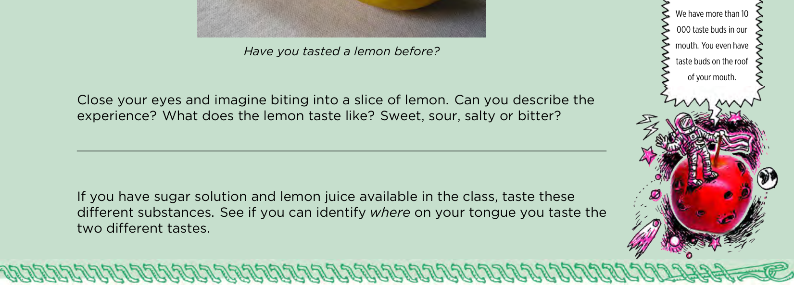
> **[Diagram Context - Textbook_NaturalScience_Gr7_Acids-bases-and-neutral-substances.pdf-0002-11.png]**
> 1. A diagram of a cell with a red dot labeled "Lewis" and a green line labeled "cellular structure".

> **[Diagram Context - Textbook_NaturalScience_Gr7_Properties-of-materials.pdf-0002-04.png]**
> 1. A cartoon depiction of a roller coaster with a spring coiled up on the front.

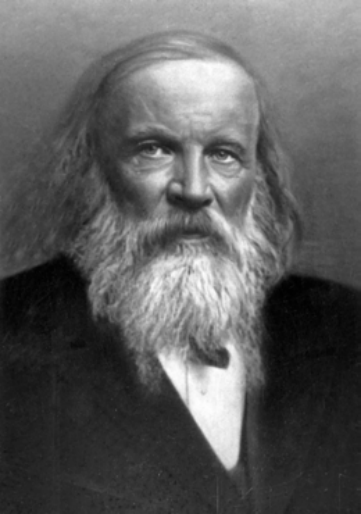
> **[Diagram Context - Textbook_NaturalScience_Gr7_The-Periodic-Table-of-Elements.pdf-0002-01.png]**
> 1. A black and white image of a man with a long beard and a white collar.

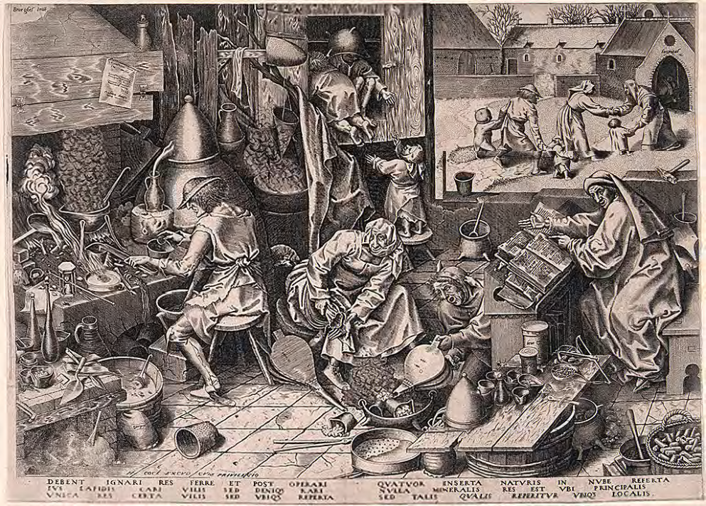
> **[Diagram Context - Textbook_NaturalScience_Gr7_The-Periodic-Table-of-Elements.pdf-0002-04.png]**
> The image is a black and white illustration depicting a scene of a group of people working in a kitchen. The people are engaged in various tasks, such as cooking, cleaning, and organizing. The kitchen is filled with numerous pots, pans, and other cooking utensils, as well as a dining table and chairs. The illustration is a detailed and realistic representation of a kitchen scene, showcasing the

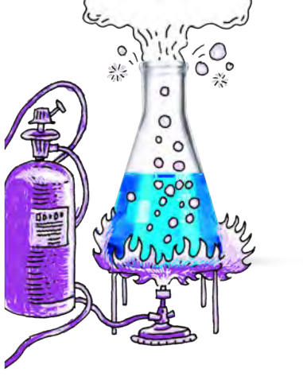
> **[Diagram Context - Textbook_NaturalScience_Gr7_The-Periodic-Table-of-Elements.pdf-0002-11.png]**
> 1. A purple and blue gas cylinder with a purple nozzle.

---

# Chemical symbols

If you are a scientist and you work with elements every day, writing out the names can become very tedious. To make writing about elements easier, scientists have given each element a short symbol. To make sure we do not become confused with different elements when we write about them, the symbol for each element must be unique, just like its name is.

The names and symbols for some common elements are shown in the following table.

| Element | Symbol | Element | Symbol |
| :--- | :--- | :--- | :--- |
| Aluminium | Al | Magnesium | Mg |
| Bromine | Br | Nitrogen | N |
| Calcium | Ca | Oxygen | O |
| Carbon | C | Phosphorus | P |
| Chlorine | Cl | Potassium | K |
| Copper | Cu | Silicon | Si |
| Gold | Au | Silver | Ag |
| Hydrogen | H | Sodium | Na |
| Iodine | I | Sulfur | S |
| Iron | Fe | Tin | Sn |
| Lead | Pb | Zinc | Zn |

The symbol for carbon is C, the symbol for sulfur is S and the symbol for nitrogen is N. It is easy to see why these symbols were chosen: they simply represent the first letter of each name. This letter is always capitalised (upper case).

What happens when the different elements all start with the same letter? For example: calcium, carbon, chlorine and copper all start with the letter 'C'! To ensure they all have a unique symbol, a second letter was added to their symbol. This letter is always a small letter (lower case).

Some chemical symbols are more difficult to understand. Na, for example, is the symbol for sodium. The Na comes from the Latin name for sodium, which is *natrium*. These symbols were chosen very long ago, when many subjects were studied in Latin. Can you imagine how difficult that must have been?!

Some simple rules to remember when using chemical symbols:

1. Every element has its own, unique symbol.
2. The symbol is usually (but not always) the first one or two letters of the name of the element.
3. The first letter of the symbol is always a capital letter.
4. If the symbol has two letters, the second letter is always a small letter.
5. Some elements have symbols that come from their Latin names.

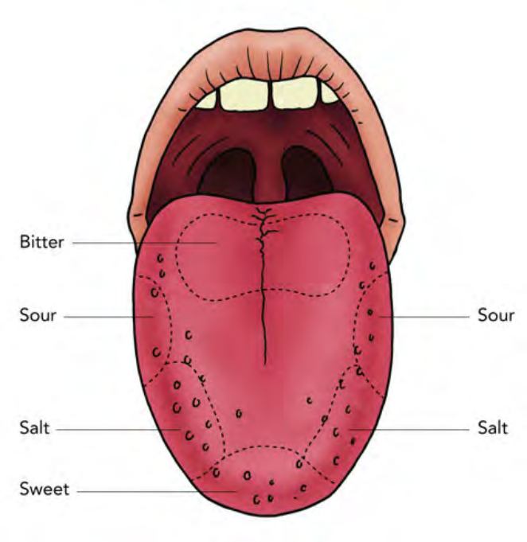
> **[Diagram Context - Textbook_NaturalScience_Gr7_Acids-bases-and-neutral-substances.pdf-0003-00.png]**
> 1. A cartoon illustration of the tongue and its various parts.
 2. The tongue is labeled with the names of the different tastes, including sour, sweet, salty, and bitter.
 3. The diagram also includes the names of the five primary tastes, such as sweet, sour, salty, bitter, and umami.

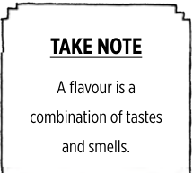
> **[Diagram Context - Textbook_NaturalScience_Gr7_Acids-bases-and-neutral-substances.pdf-0003-01.png]**
> The image shows a black and white graphic with the text "Take Note" written in a bold, capitalized font at the top. Below the text, there is a list of terms and concepts related to the topic of "flavours" and "combination of tastes and smells." The list includes terms such as "flavour," "flavours," "combination of tastes,"

> **[Diagram Context - Textbook_NaturalScience_Gr7_Acids-bases-and-neutral-substances.pdf-0003-02.png]**
> 1. A hand holding a tablet with a stylus. 
 2. A stylus is being used to interact with the tablet. 
 3. The tablet is displaying a diagram of a cell.

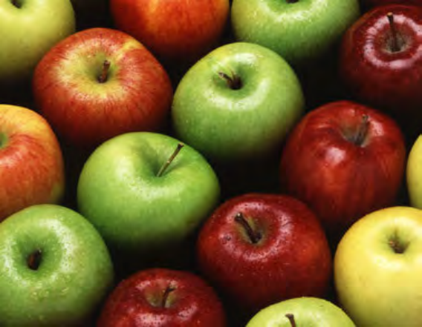
> **[Diagram Context - Textbook_NaturalScience_Gr7_Acids-bases-and-neutral-substances.pdf-0003-05.png]**
> 1. A close-up of a group of apples in various colors.

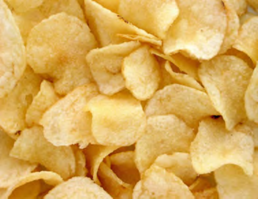
> **[Diagram Context - Textbook_NaturalScience_Gr7_Acids-bases-and-neutral-substances.pdf-0003-06.png]**
> 1. A close-up view of a pile of potato chips.

> **[Diagram Context - Textbook_NaturalScience_Gr7_Acids-bases-and-neutral-substances.pdf-0003-12.png]**
> The image features a cartoon illustration of a man and a woman riding a pink horse-drawn carriage. The man is wearing a black suit and hat, while the woman is wearing a red dress. The carriage is adorned with a pink flag and a banner that reads "P.S.". The illustration is set against a white background, and the man and woman are positioned in the center of the

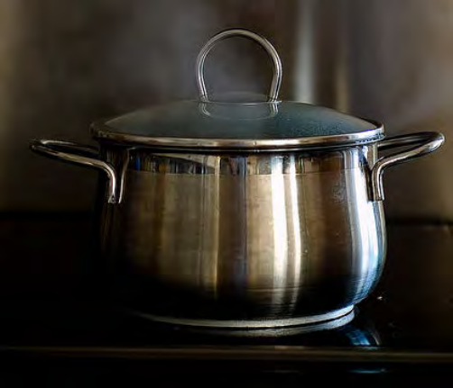
> **[Diagram Context - Textbook_NaturalScience_Gr7_Properties-of-materials.pdf-0003-03.png]**
> 1. A silver pot with a lid and handle.

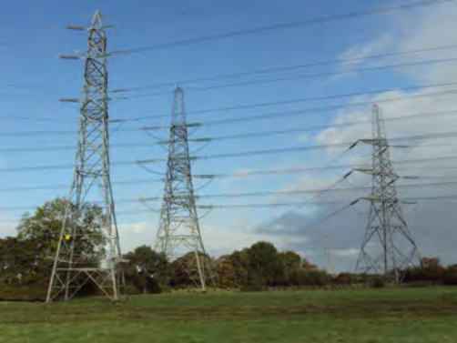
> **[Diagram Context - Textbook_NaturalScience_Gr7_Properties-of-materials.pdf-0003-06.png]**
> The image shows three tall metal towers with multiple lines running through them. The towers are set against a clear blue sky with a few clouds. The image also contains a few other objects, such as trees and a field, which are not the main focus of the image. The image is a pedagogical diagram that is meant to help a high school student learn about the structure and function of a

> **[Diagram Context - Textbook_NaturalScience_Gr7_Properties-of-materials.pdf-0003-09.png]**
> The image shows a diagram of a barbed wire fence with a pole on top. The fence is made up of multiple strands of barbed wire, which are arranged in a zigzag pattern. The pole is positioned on the right side of the image, with the top of the pole being visible. The sky in the background is a clear blue color. The diagram is labeled with the words

> **[Diagram Context - Textbook_NaturalScience_Gr7_Properties-of-materials.pdf-0003-11.png]**
> This graphic depicts a repeating, stylized wave pattern composed of interconnected, arrow-headed segments. The image uses a continuous, rhythmic flow of green, chevron-like shapes to represent directional movement or a cyclical process. Conceptually, this serves as a visual metaphor for continuous flow, such as the propagation of a wave, the sequential steps in a biological pathway, or the ongoing nature of a repeating process in a scientific system.

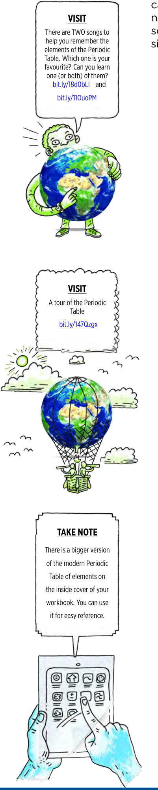
> **[Diagram Context - Textbook_NaturalScience_Gr7_The-Periodic-Table-of-Elements.pdf-0003-01.png]**
> 1. A diagram of a cell with arrows pointing to different parts of the cell.
 2. A diagram of a circuit with arrows pointing to different parts of the circuit.
 3. A diagram of a Lewis structure with arrows pointing to different parts of the Lewis structure.

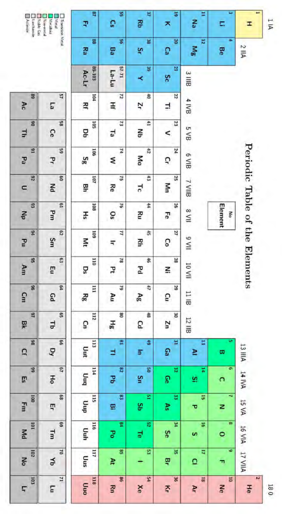
> **[Diagram Context - Textbook_NaturalScience_Gr7_The-Periodic-Table-of-Elements.pdf-0003-02.png]**
> 1. A periodic table of the elements.

---

# Atomic Numbers

## Key Concepts and Definitions

*   **Atomic Number:** Each element on the Periodic Table has a unique number called its **atomic number**. It refers to *how many protons* an element has in its atoms. Since each element has a different number of protons, each element has a unique atomic number.
*   **Atom:** The small particles that make up all matter. An element is a pure substance that contains *only one particular type of atom*. The atoms of one element are different from the atoms of any other element.
*   **Subatomic Particles:** All atoms are made up of even smaller particles called subatomic particles: **protons**, **neutrons**, and **electrons**. 
    *   *Note:* The protons, electrons, and neutrons of one element are *exactly the same* as the protons, electrons, and neutrons of any other element. It is their **number and arrangement** that make the elements different.
*   **Periodic Table & Periodicity:** When things show a regular, repeating pattern, we say it is **periodic**. 
    *   **John Dalton:** Stated that all matter is made up of very small particles called atoms.
    *   **Dmitri Mendeleev:** Developed the first periodic table in 1869 by arranging elements in order of increasing mass, which allowed him to arrange elements into rows and columns where elements in the same rows and columns have similar properties to each other.

---

## Take Note Boxes

> ### TAKE NOTE
> You do not need to know about the atom in detail for now. We will learn more about this in Grade 8!

> ### TAKE NOTE
> When things show a regular, repeating pattern, we say it is **periodic**. When the elements were arranged in order of increasing mass, Mendeleev observed a pattern in their properties, which allowed him to arrange the elements into rows and columns in a table, the **Periodic Table**. Elements in the same rows and columns in the table, have similar properties to each other.

---

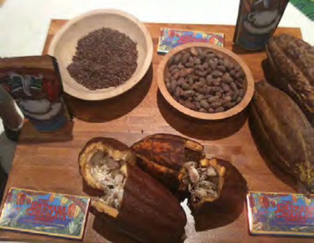
> **[Diagram Context - Textbook_NaturalScience_Gr7_Acids-bases-and-neutral-substances.pdf-0004-00.png]**
> 1. A diagram of a cell with a Lewis structure.
 2. A diagram of a circuit with a wire and a battery.
 3. A diagram of a graph with two variables.

*Figure: Mendeleev's Periodic Table from 1872. The spaces marked with blank lines represent elements that Mendeleev thought existed, but they were not yet discovered at the time, so he left places for them.*

---

## Exercises

1. Have a look at the Periodic Table. What is the atomic number of hydrogen? How many protons are there in its atoms?
_________________________________________________________________________________________

2. What is the atomic number of carbon? How many protons are there in its atoms?
_________________________________________________________________________________________

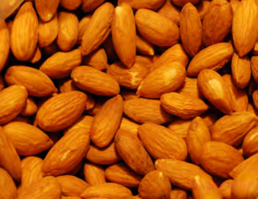
> **[Diagram Context - Textbook_NaturalScience_Gr7_Acids-bases-and-neutral-substances.pdf-0004-01.png]**
> The image shows a close-up view of a pile of almonds, with at least 12 individual almonds visible. The almonds are of varying sizes and are arranged in a somewhat haphazard manner, with some overlapping each other. The almonds are predominantly brown in color, indicating that they are most likely almonds. The image does not contain any text or additional objects, and the focus is solely on the

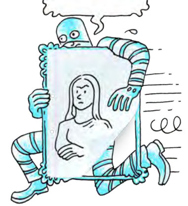
> **[Diagram Context - Textbook_NaturalScience_Gr7_Acids-bases-and-neutral-substances.pdf-0004-09.png]**
> 1. A cartoon drawing of a woman with a blue face and long blonde hair.

> **[Diagram Context - Textbook_NaturalScience_Gr7_Acids-bases-and-neutral-substances.pdf-0004-23.png]**
> The image features a cartoon depiction of a person wearing a spacesuit and holding a submarine, with a submarine filled with water and bubbles. The submarine is depicted in a blue and purple color scheme, and the person is shown in a purple and white color scheme. The submarine is floating in a blue ocean, and the person is standing on the submarine. The image also includes a cloud and a ship

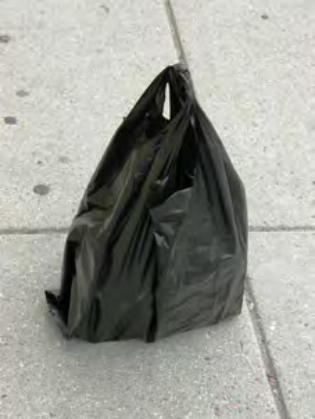
> **[Diagram Context - Textbook_NaturalScience_Gr7_Properties-of-materials.pdf-0004-02.png]**
> 1. A black plastic bag on the sidewalk.

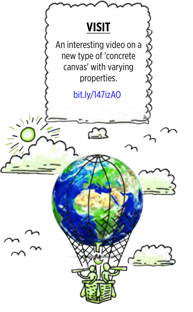
> **[Diagram Context - Textbook_NaturalScience_Gr7_Properties-of-materials.pdf-0004-05.png]**
> The image shows a cartoon depiction of a man and a woman on a hot air balloon. The balloon is filled with a green substance, and the man is holding a basket on the basket. The woman is holding a basket on her head. The image also includes a caption that reads "Visit" and a link to a video that explains the concept of a hot air balloon.

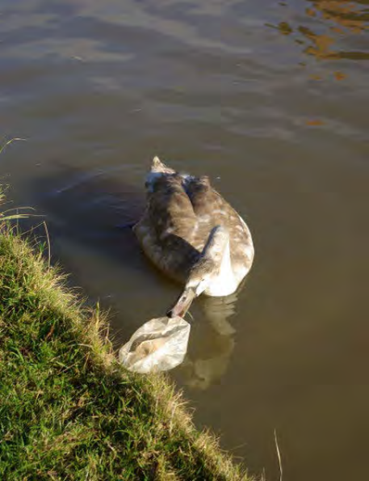
> **[Diagram Context - Textbook_NaturalScience_Gr7_Properties-of-materials.pdf-0004-09.png]**
> 1. A duck swimming in a body of water with a bag in its mouth.

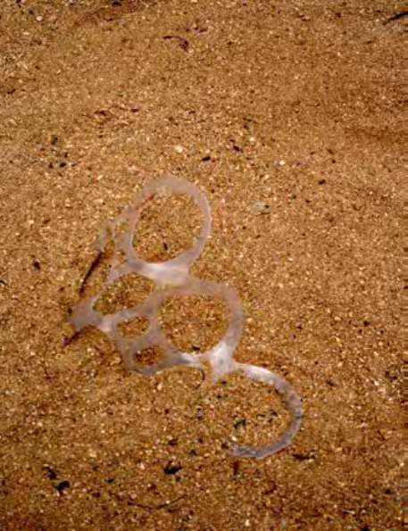
> **[Diagram Context - Textbook_NaturalScience_Gr7_Properties-of-materials.pdf-0004-10.png]**
> 1. A diagram of a cell with a circle representing a nucleus.

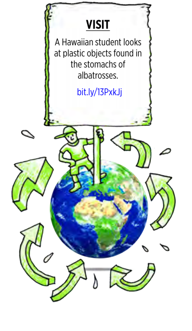
> **[Diagram Context - Textbook_NaturalScience_Gr7_Properties-of-materials.pdf-0004-13.png]**
> The image shows a cartoon depiction of a cartoon character, a boy, standing on a globe. The boy is holding a sign that says "Visit Hawaii". The globe is surrounded by various arrows and labels, including one that says "A Hawaiian student looks at plastic objects found in the stomachs of albatrosses". The boy is wearing a green shirt and a hat. The image also includes

> **[Diagram Context - Textbook_NaturalScience_Gr7_The-Periodic-Table-of-Elements.pdf-0004-14.png]**
> 1. A cartoon drawing of a woman and a robot.
2. The woman is holding a picture of the robot.
3. The robot is holding a picture of the woman.

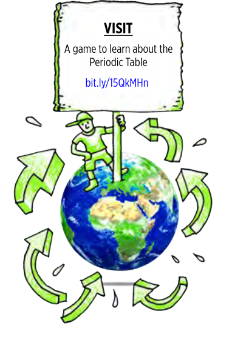
> **[Diagram Context - Textbook_NaturalScience_Gr7_The-Periodic-Table-of-Elements.pdf-0004-15.png]**
> The image is a cartoon depiction of a boy on a stick, with a sign above him that says "visit" and "a game to learn about the Periodic Table". The boy is holding a stick and is positioned on the top of a globe, which is surrounded by arrows. The sign is located at the top of the image, and the boy is located at the bottom.

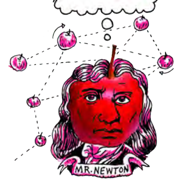
> **[Diagram Context - Textbook_NaturalScience_Gr7_The-Periodic-Table-of-Elements.pdf-0004-18.png]**
> The image features a cartoon depiction of a man's head with a large, red apple on top of it. The man's face is drawn in a cartoon style, and the apple is positioned on his forehead. The man is wearing a tie, and there are several apples scattered around him. The image also includes a thought bubble above the man's head, which contains a line of pink dots.

---

# Chapter 4. The Periodic Table of Elements

When Mendeleev first created the Periodic Table, he arranged the 60 elements that he knew of at the time in order of increasing mass. He then saw that there was a regular pattern in other characteristics of these elements. Mendeleev then grouped them into columns and rows according to their properties. These were physical and chemical properties which the scientists had observed from doing many different experiments. This resulted in the arrangement of the elements on the Periodic Table.

The Periodic Table that we use today looks a lot more modern than Mendeleev's original version. You will notice that there are no empty blocks in the modern version of the table. That tells us that all the elements that were still undiscovered in Mendeleev's lifetime, are now known.

In the next activity, we will compare Mendeleev's original Periodic Table with the version that we use today. This will help show us how scientific discovery is sometimes a slow process.

---

## ACTIVITY: Comparing Mendeleev's table with the modern version of the Periodic Table

When Mendeleev first arranged the elements according to their mass and their properties, it resulted in there being some gaps in the rows. But, as a good scientist, Mendeleev did not see this as a problem! Instead, he thought it simply meant that there were elements that had not been discovered yet. And he was right!

Mendeleev put a blank line and the atomic number to show that he thought there is an element which should go there, but it had not been discovered. Look carefully at Mendeleev's original table. See if you can find where it says '\_\_\_ = 44' in the table.

See if you can find the 2 other elements that had not been discovered at that time. Write their numbers down in the space below.

Now look at the modern version of the Periodic Table. Can you find the elements with these numbers? What are their symbols? What are their names? Write your answers in the table provided.

As an extension of this activity you could look up the names of these elements, and research when they were discovered, and add this information to the table.

| Number of the element | Symbol of the element | Name of the element | When was this element discovered? |
| :--- | :--- | :--- | :--- |
| | | | |
| | | | |
| | | | |

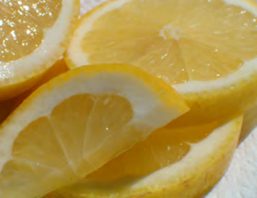
> **[Diagram Context - Textbook_NaturalScience_Gr7_Acids-bases-and-neutral-substances.pdf-0005-00.png]**
> 1. A diagram of a lemon cut in half.

> **TAKE NOTE**
> 
> In Life and Living, we looked at the classification of living organisms in our world.
> 
> Now in Matter and Materials, we are looking at the classification system for elements!

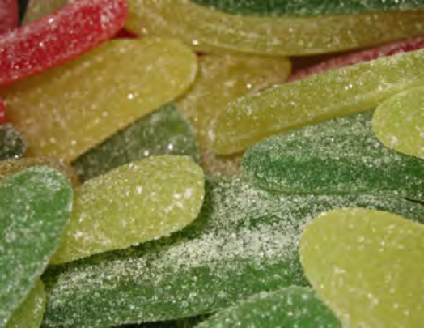
> **[Diagram Context - Textbook_NaturalScience_Gr7_Acids-bases-and-neutral-substances.pdf-0005-01.png]**
> 1. A close-up of a pile of candy with a variety of colors.

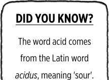
> **[Diagram Context - Textbook_NaturalScience_Gr7_Acids-bases-and-neutral-substances.pdf-0005-02.png]**
> This educational graphic is an informational text box containing the heading "DID YOU KNOW?" and the etymological origin of the term "acid." It identifies the Latin root word "acidus" and its definition, "sour." This provides high school Physical Sciences learners with historical and linguistic context regarding the naming conventions of chemical substances based on their observable properties.

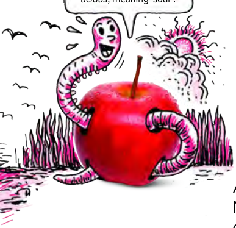
> **[Diagram Context - Textbook_NaturalScience_Gr7_Acids-bases-and-neutral-substances.pdf-0005-03.png]**
> 1. A cartoon of a red apple with a worm on it.

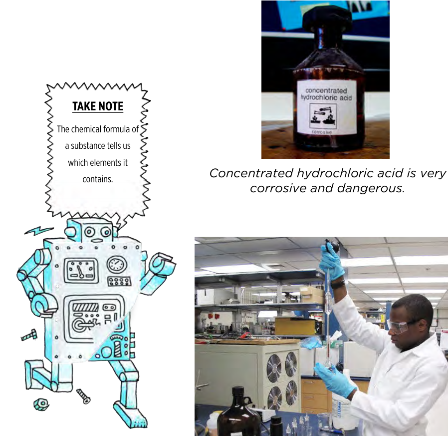
> **[Diagram Context - Textbook_NaturalScience_Gr7_Acids-bases-and-neutral-substances.pdf-0005-08.png]**
> 1. A diagram of a robot with a note that says "Take Note". 
 2. A diagram of a robot with a note that says "The chemical formula is a substance tells us which elements it contains". 
 3. A diagram of a robot with a note that says "Concentrated hydrochloric acid is very corrosive and dangerous".

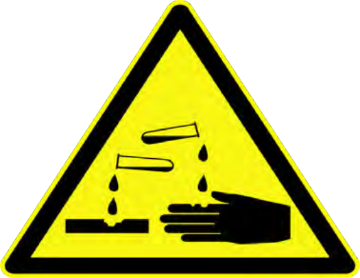
> **[Diagram Context - Textbook_NaturalScience_Gr7_Acids-bases-and-neutral-substances.pdf-0005-11.png]**
> The image shows a yellow triangle with a black border, featuring two black and yellow chemical formulas. The triangle is labeled with the word "Chemistry" at the top and "Chemical Reactions" at the bottom. The chemical formulas are labeled with their respective chemical symbols. The diagram is a simple, straightforward representation of a chemical reaction, with the reactants and products clearly labeled.

> **[Diagram Context - Textbook_NaturalScience_Gr7_Properties-of-materials.pdf-0005-00.png]**
> 1. A diagram of a spring with a green background and a step ladder with a green background.

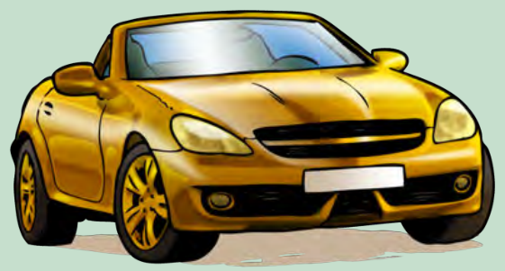
> **[Diagram Context - Textbook_NaturalScience_Gr7_Properties-of-materials.pdf-0005-06.png]**
> 1. A cartoon drawing of a yellow sports car with a white license plate.

> **[Diagram Context - Textbook_NaturalScience_Gr7_Properties-of-materials.pdf-0005-12.png]**
> 1. A diagram of a cell with a green line.

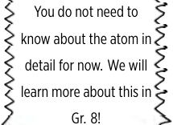
> **[Diagram Context - Textbook_NaturalScience_Gr7_The-Periodic-Table-of-Elements.pdf-0005-03.png]**
> The image shows a diagram of an atom, which is a fundamental unit of matter. The diagram is labeled with the atomic number and mass number of the atom. The diagram also includes a Lewis structure, which is a diagram that shows the valence electrons of an atom. The diagram is accompanied by a caption that provides information about the atom in a clear and concise manner.

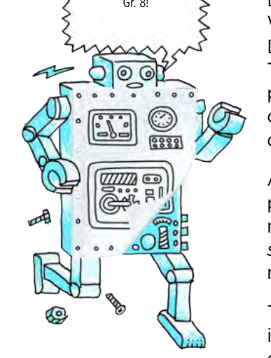
> **[Diagram Context - Textbook_NaturalScience_Gr7_The-Periodic-Table-of-Elements.pdf-0005-05.png]**
> 1. A blue robot with a speech bubble and a clock on its head.

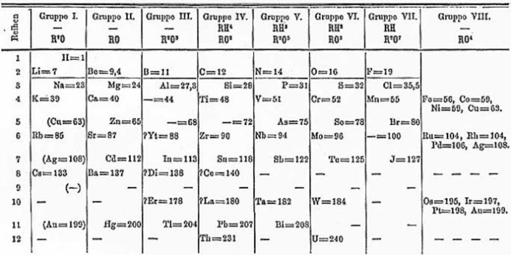
> **[Diagram Context - Textbook_NaturalScience_Gr7_The-Periodic-Table-of-Elements.pdf-0005-12.png]**
> 1. A table with the names of the groups and the corresponding numbers.

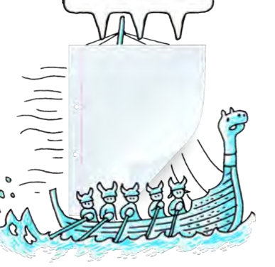
> **[Diagram Context - Textbook_NaturalScience_Gr7_The-Periodic-Table-of-Elements.pdf-0005-13.png]**
> 1. A diagram of a ship with a group of people on it.

---

In the next activity we are going to use our new knowledge of element symbols
and atomic numbers to hunt for a very valuable 'treasure'. We will find the
treasure by following some clues about the Periodic Table.
.

### ACTIVITY: Periodic Table treasure hunt

.
Your job is to follow the clues, in order to find the treasure. The instructions will
help you to spell out the name of the treasure in the blocks below.
1. Clue 1: What is the symbol for carbon (atomic number 6)? Write this
symbol in the first block above.
2. Clue 2: Hydrogen is the lightest element. Can you find it on the Periodic
Table? Write its symbol in the second block.
3. Clue 3: Which element represents the gas that we breathe to stay alive?
Here is a hint: It is represented by atomic number 8. Write its symbol in the
third block and give the name of the element below.
4. Clue 4: This element is in the fourth row and the ninth column of the
Periodic Table. It is a metal that is used in magnets. Write its symbol in the
fourth block. Do you know its name? Write its name below.
5. Clue 5: This element is represented by atomic number 57. Write its symbol
in the fifth block. See if you can find out the name of this element and write
it down below.
6. Clue 6: This element is represented by atomic number 52. It is a
semi-metal that is used in the manufacture of solar panels. Write its
symbol in the last (sixth) block. See if you can find out the name of this
element and write it down below.
7. What is the 'treasure' that you have found?
Complete the following sentence by replacing the names of the elements with
chemical symbols. You would have to look up some of the symbols!
SCIENCE...Fluorine Arsenic Carbon Iodine Nitrogen Astatine Einsteinium... ME!
..
238
.
Matter and Materials

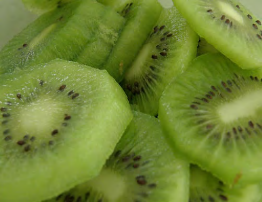
> **[Diagram Context - Textbook_NaturalScience_Gr7_Acids-bases-and-neutral-substances.pdf-0006-06.png]**
> 1. A close-up of sliced kiwi fruit.

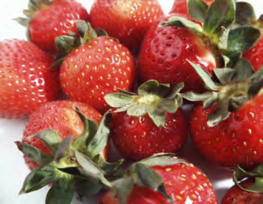
> **[Diagram Context - Textbook_NaturalScience_Gr7_Acids-bases-and-neutral-substances.pdf-0006-07.png]**
> The image shows a close-up view of a group of strawberries, with at least 12 visible strawberries in the frame. The strawberries are red in color and appear to be fresh and ripe. The strawberries are arranged in a cluster, with some overlapping each other. The strawberries are the main focus of the image, and there are no other objects or text present.

> **[Diagram Context - Textbook_NaturalScience_Gr7_Acids-bases-and-neutral-substances.pdf-0006-10.png]**
> The image shows a basket filled with red bell peppers. The peppers are of various sizes and are arranged in a way that they are stacked on top of each other. The peppers are red in color, indicating that they are ripe and ready to be eaten. The basket is placed on a table, and the peppers are the main focus of the image.

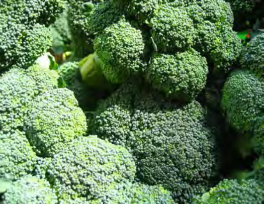
> **[Diagram Context - Textbook_NaturalScience_Gr7_Acids-bases-and-neutral-substances.pdf-0006-11.png]**
> The image shows a close-up view of a bunch of broccoli. The broccoli is covered in tiny green buds and appears to be fresh and healthy. The image is taken from a top-down perspective, allowing for a clear view of the broccoli's structure and color. The broccoli is the main focus of the image, with no other objects or elements present.

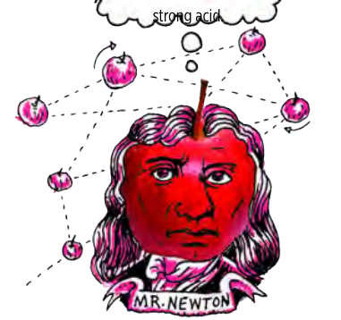
> **[Diagram Context - Textbook_NaturalScience_Gr7_Acids-bases-and-neutral-substances.pdf-0006-16.png]**
> The image features a cartoon depiction of a man's head, with a red apple on his forehead. The man is wearing a white shirt and a black and white striped tie. The image also includes a thought bubble above the man's head, which reads "Strong Acid".

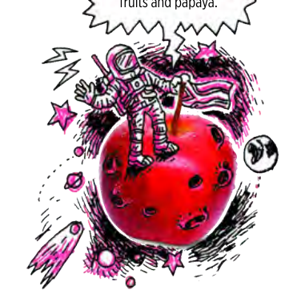
> **[Diagram Context - Textbook_NaturalScience_Gr7_Acids-bases-and-neutral-substances.pdf-0006-19.png]**
> 1. A cartoon drawing of an astronaut on a red apple.
 2. A speech bubble with the text "Fruits and papaya.".

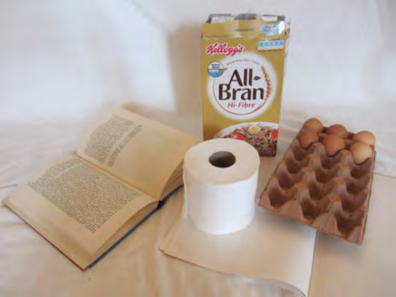
> **[Diagram Context - Textbook_NaturalScience_Gr7_Properties-of-materials.pdf-0006-03.png]**
> 1. A box of All Bran cereal and a carton of eggs.

> **[Diagram Context - Textbook_NaturalScience_Gr7_Properties-of-materials.pdf-0006-10.png]**
> 1. A cartoon drawing of a man lifting a ball.

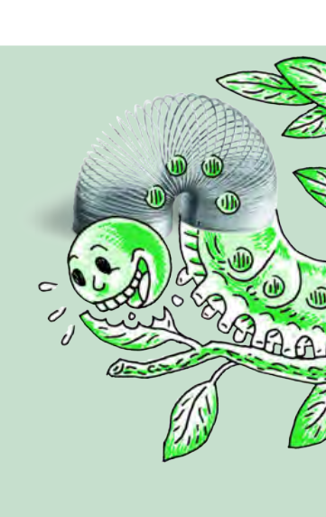
> **[Diagram Context - Textbook_NaturalScience_Gr7_The-Periodic-Table-of-Elements.pdf-0006-06.png]**
> The image features a cartoon depiction of a caterpillar with a green head and body, holding a leaf in its mouth. The caterpillar is surrounded by a leafy branch, and the background is a light green color. The image also includes a Lewis diagram and a diagram of a cell, which are both green and feature various shapes and lines. The text "South Africa" is also present in

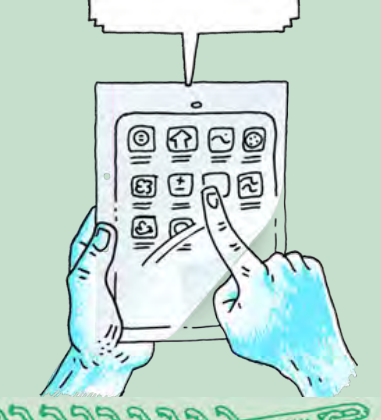
> **[Diagram Context - Textbook_NaturalScience_Gr7_The-Periodic-Table-of-Elements.pdf-0006-12.png]**
> 1. A hand holding a tablet computer.
 2. The tablet is open to a page with a diagram of a cell.
 3. The diagram shows a cell with a nucleus and a cell wall.

> **[Diagram Context - Textbook_NaturalScience_Gr7_The-Periodic-Table-of-Elements.pdf-0006-14.png]**
> The image shows a line drawing of a snake, which is green and white in color. The snake is depicted in a horizontal line, with a green head and a white body. The snake is positioned in the center of the image, and it appears to be coiled up. The image does not contain any text or other objects, and the snake is the sole focus of the image.

---

Complete the following table to test your memory of the names and symbols of the elements. Try to do this without referring to the Periodic Table.

| Element | Symbol | Element | Symbol |
| :--- | :--- | :--- | :--- |
| | Al | | Mg |
| Bromine | | | N |
| Calcium | | Oxygen | |
| | C | Phosphorus | |
| | Cl | | K |
| Copper | | | Si |
| | Au | Silver | |
| | H | | Na |
| Iodine | | Sulfur | |
| | Fe | Tin | |
| Lead | | | Zn |

---

## 4.2 Properties of metals, semi-metals and non-metals

The Periodic Table is an amazing tool! Did you know that the position of an element on the Periodic Table can tell a scientist what properties the element can be expected to have? This is because the elements have not just been arranged randomly! But, rather, they are grouped and arranged according to similar properties. Let's find out what this means.

### NEW WORDS
* **semi-metal**
* **semi-conductor**

---

### ACTIVITY: What do some of the elements look like?

#### INSTRUCTIONS:
1. Your teacher will guide you through this activity. You will either look at real samples of some of the elements, or else refer to the photos below or some of the elements.
2. Your task as a class is to identify the different elements and find their place on the Periodic Table. You will either stick the real samples onto a large blank Periodic Table, or use the blank one here in your workbook, or both.

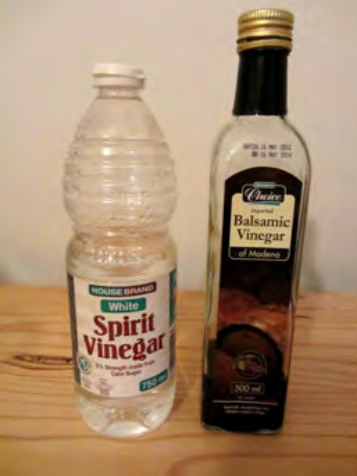
> **[Diagram Context - Textbook_NaturalScience_Gr7_Acids-bases-and-neutral-substances.pdf-0007-03.png]**
> 1. A bottle of water and a bottle of vinegar.

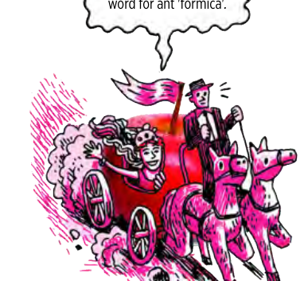
> **[Diagram Context - Textbook_NaturalScience_Gr7_Acids-bases-and-neutral-substances.pdf-0007-04.png]**
> The image is a cartoon drawing of a man and a woman riding in a carriage. The man is holding a flag, and the woman is holding a banner. The carriage is pink and has a red apple on top. The drawing is labeled with the words "word for ant 'tormica'".

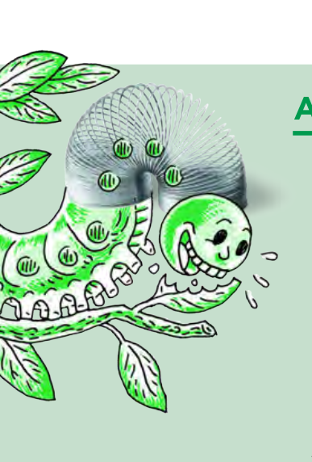
> **[Diagram Context - Textbook_NaturalScience_Gr7_Acids-bases-and-neutral-substances.pdf-0007-06.png]**
> A diagram of a spring coiled around a green ball with a smiley face on it.

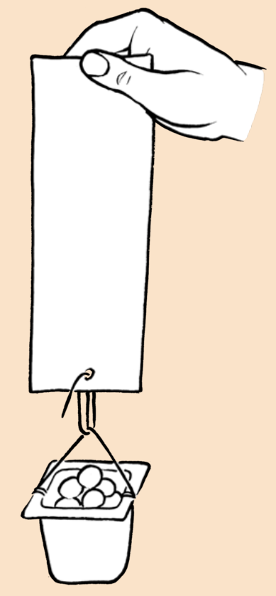
> **[Diagram Context - Textbook_NaturalScience_Gr7_Properties-of-materials.pdf-0007-25.png]**
> 1. A diagram of a hand holding a white paper with a bunch of balls on it.

> **[Diagram Context - Textbook_NaturalScience_Gr7_The-Periodic-Table-of-Elements.pdf-0007-01.png]**
> 1. A cartoon depiction of a roller coaster.

---

3. You must then look at what the different elements look like and see if you can identify any similar properties. The questions at the end will help guide you through this.

## Here are some photos of the different elements:

*Aluminium foil.*

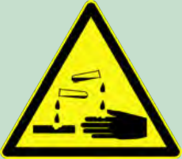
> **[Diagram Context - Textbook_NaturalScience_Gr7_Acids-bases-and-neutral-substances.pdf-0008-03.png]**
> The image features a yellow triangle with a black border, containing two black lines that appear to be pouring a liquid. The liquid is depicted as a small drop, and the triangle is labeled with the word "Chemistry" in black text. The triangle is set against a light blue background, and the text "Chemistry" is positioned at the top of the triangle.

*Carbon (graphite).*

<!-- DIAGrum_PLACEHOLDER: diagram -->
*Copper.*

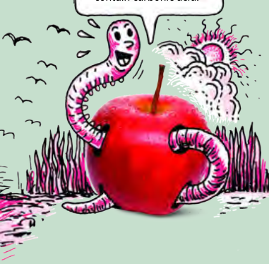
> **[Diagram Context - Textbook_NaturalScience_Gr7_Acids-bases-and-neutral-substances.pdf-0008-05.png]**
> 1. A cartoon apple with a worm inside.

*Magnesium.*

> **[Diagram Context - Textbook_NaturalScience_Gr7_Acids-bases-and-neutral-substances.pdf-0008-08.png]**
> 1. A diagram of a snake's body with a green head and a brown body.

*Sulfur.*

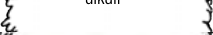

*Bromine in tube.*

---

> **DID YOU KNOW?**
> 
> The Periodic Table is made up of more than 100 elements, but only 90 of the elements occur in nature. The rest have been made by man.

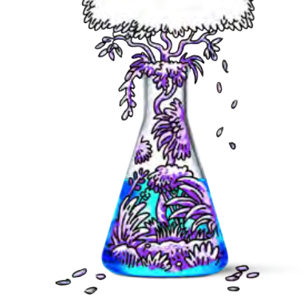
> **[Diagram Context - Textbook_NaturalScience_Gr7_Acids-bases-and-neutral-substances.pdf-0008-16.png]**
> The image features a cartoon depiction of a plant growing out of a beaker, with the plant's roots emerging from the beaker's base. The plant is depicted in a variety of colors, including purple and blue, and is surrounded by a multitude of leaves. The beaker is filled with water, and the plant is growing out of the water, suggesting a process of photosynthesis or plant

> **[Diagram Context - Textbook_NaturalScience_Gr7_The-Periodic-Table-of-Elements.pdf-0008-03.png]**
> The image shows a line of green beads arranged in a straight line, with a gray background. The beads are evenly spaced, and the line extends from the left to the right side of the image. The beads are not touching each other, and there are no other objects or text present in the image. The image does not contain any text or other objects, and the arrangement of the beads is

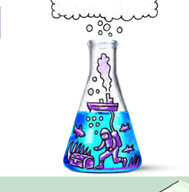
> **[Diagram Context - Textbook_NaturalScience_Gr7_The-Periodic-Table-of-Elements.pdf-0008-13.png]**
> The image features a cartoon depiction of a person wearing a spacesuit and holding a submarine, floating in a blue-green liquid. The submarine is equipped with a large tank on top, which is connected to a pipe, suggesting that the submarine is a submarine or a submarine-like vehicle. The person is also holding a small submarine, indicating that they are exploring the submarine-like vehicle. The

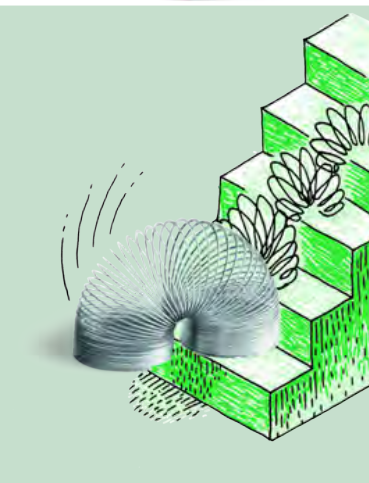
> **[Diagram Context - Textbook_NaturalScience_Gr7_The-Periodic-Table-of-Elements.pdf-0008-14.png]**
> The image is a cartoon drawing of a spring toy, which is shown in a downward motion, with a green staircase in the background. The drawing is a Lewis diagram, which is a visual representation of a chemical reaction. The diagram shows the reactants on the left side and the products on the right side, with arrows connecting the two. The drawing also includes a cell structure and a graph,

---

# Chapter 4. The Periodic Table of Elements

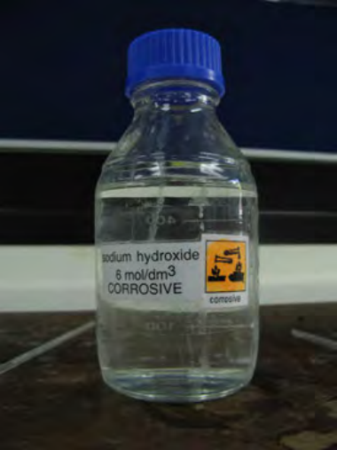
> **[Diagram Context - Textbook_NaturalScience_Gr7_Acids-bases-and-neutral-substances.pdf-0009-00.png]**
> 1. A clear glass bottle with a blue lid.
 2. The label on the bottle reads "Sodium Hydroxide".
 3. The label also indicates that the bottle contains "6 mol/mol Corrosive".

## Elements Visualized

* **Chlorine gas.**
  

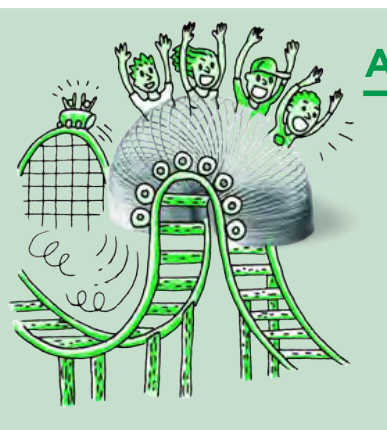
> **[Diagram Context - Textbook_NaturalScience_Gr7_Acids-bases-and-neutral-substances.pdf-0009-03.png]**
> 1. A cartoon depiction of a roller coaster.

* **Calcium.**
  

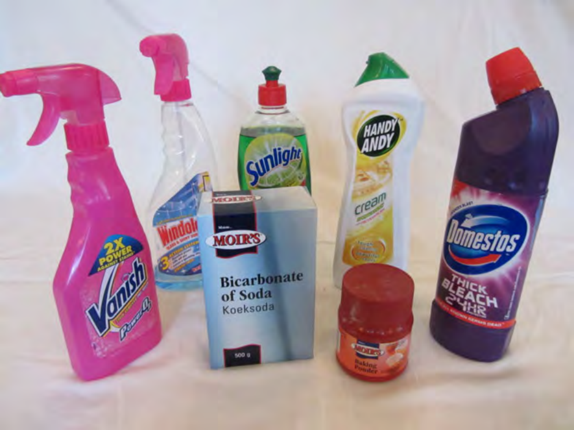
> **[Diagram Context - Textbook_NaturalScience_Gr7_Acids-bases-and-neutral-substances.pdf-0009-06.png]**
> 1. A pink spray bottle with a red nozzle.

* **Phosphorus.**
  

* **Potassium.**
  <!-- DIAGrum_PLACEHOLDER: diagram -->

* **Nitrogen gas.**
  

* **Iron.**
  

> **[Diagram Context - Textbook_NaturalScience_Gr7_Properties-of-materials.pdf-0009-07.png]**
> The image shows a gray line with a zipper running down the middle. The zipper is made up of small squares, and the background is a solid gray color. The line is labeled with the word "Zipper" in white text. The line is also labeled with the word "Zipper" in orange text. The line is labeled with the word "Zipper" in white text. The

---

> If you do not have a large cardboard Periodic Table to work with at the front of the class, write the names of the elements you discuss on the blank table provided here:

> **[Diagram Context - Textbook_NaturalScience_Gr7_The-Periodic-Table-of-Elements.pdf-0009-03.png]**
> The image shows a diagram of a cell with a white border and a black outline. The diagram includes a label that reads "Do you know" and a label that reads "Id you know". The diagram is set against a gray background.

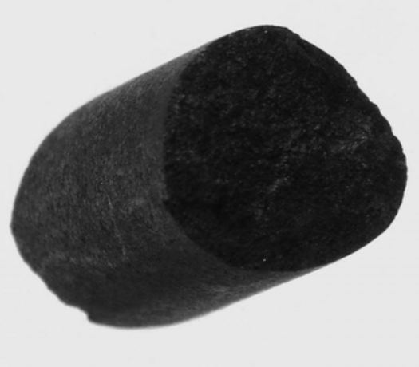
> **[Diagram Context - Textbook_NaturalScience_Gr7_The-Periodic-Table-of-Elements.pdf-0009-05.png]**
> The image shows a black object that appears to be a small black ball. The object is black in color and is the main focus of the image. The object is placed against a white background, which makes it stand out. The object is not a typical object, as it is not a ball or a cylinder, but rather a small black rod. The object is described as being black, round

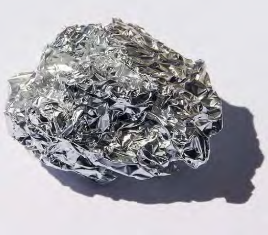
> **[Diagram Context - Textbook_NaturalScience_Gr7_The-Periodic-Table-of-Elements.pdf-0009-06.png]**
> 1. A diagram of a cell with a Lewis structure.

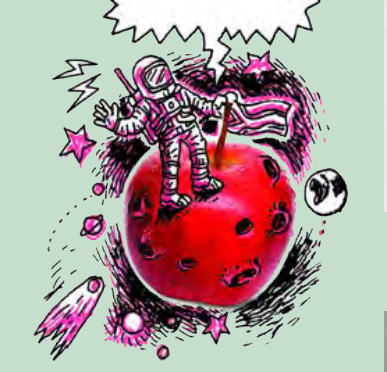
> **[Diagram Context - Textbook_NaturalScience_Gr7_The-Periodic-Table-of-Elements.pdf-0009-07.png]**
> 1. A cartoon drawing of an astronaut on a red planet.
 2. A flag with a pink background and a white star.
 3. A red apple with a stem.
 4. A black and white line drawing of a planet.

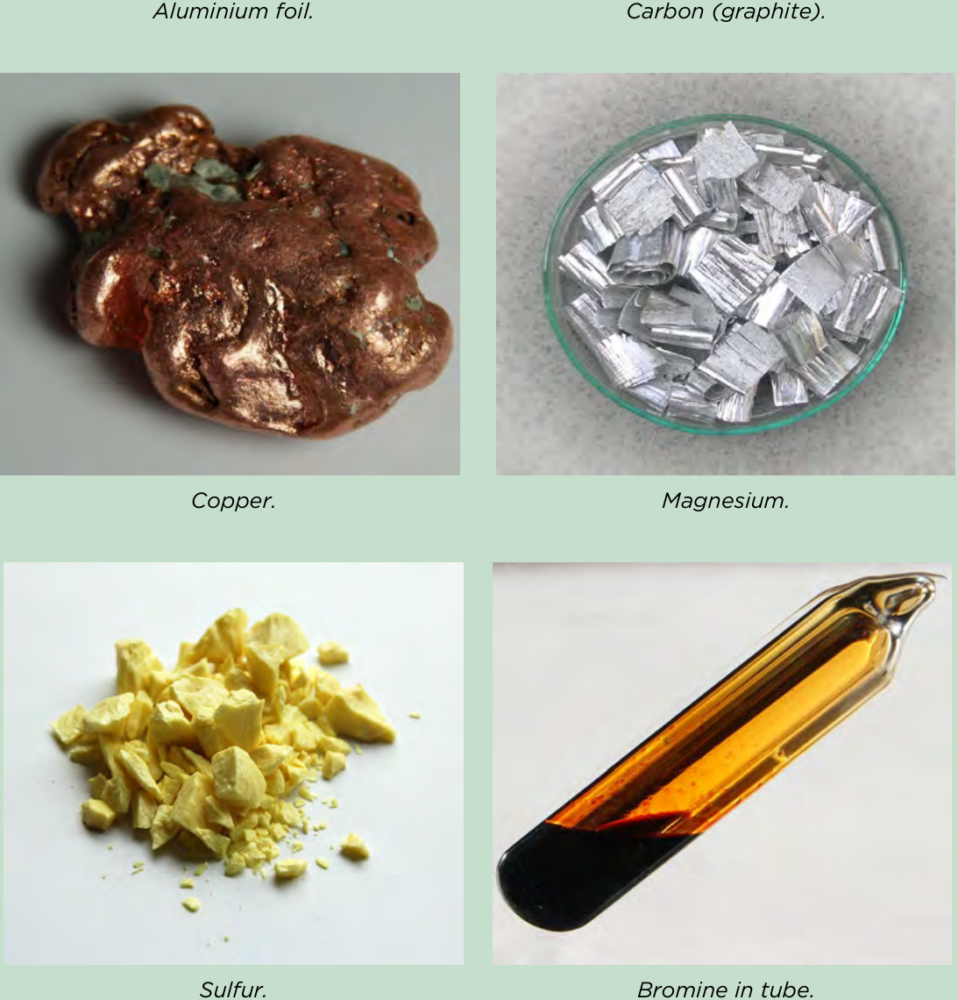
> **[Diagram Context - Textbook_NaturalScience_Gr7_The-Periodic-Table-of-Elements.pdf-0009-08.png]**
> 1. A diagram of a cell with a Lewis structure.

---

After completing this activity, either by sticking actual samples onto a cardboard cut out, or looking at the photos provided here in your workbook and seeing where they are positioned on the Periodic Table, answer these questions:

### QUESTIONS:

1. How would you describe the elements that are mostly on the left side of the Periodic Table?
_________________________________________________________________________________
_________________________________________________________________________________

2. How would you describe the elements that are mostly on the right side of the Periodic Table?
_________________________________________________________________________________
_________________________________________________________________________________

---

**DID YOU KNOW?**
Francium (Fr) is the rarest element on Earth. Only $20\text{ to }30\text{ g}$ exists at any one time on Earth in nature!

You probably saw from the last activity that there is a difference in the elements on the left and right of the Periodic Table. Were you able to identify what these elements are classified as. You have learnt about them before in previous grades. They are **metals** and **non-metals**.

Let's do a quick revision of what we have already learnt about metals and non-metals in previous grades.

### The properties of metals and non-metals

Metals and non-metals have distinct properties. That means their properties are unique and different from each other. Can you remember what the unique properties of metals and non-metals are? The next activity will refresh your memory.

---
*Matter and Materials* | **242**

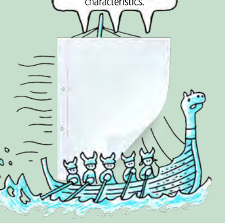

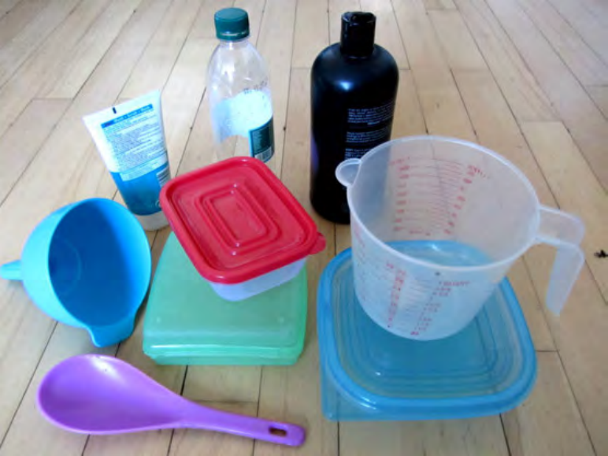

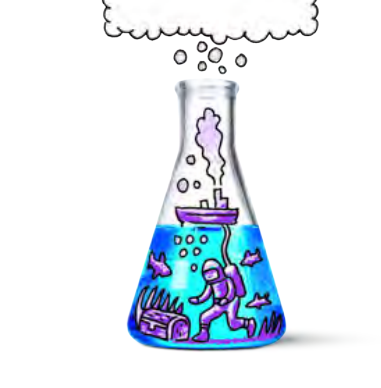

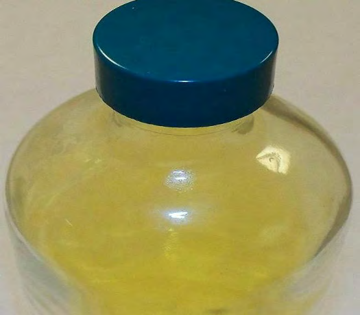

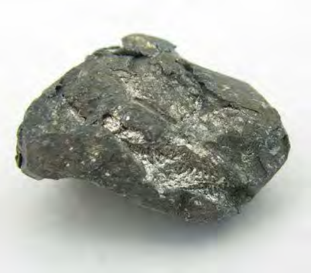

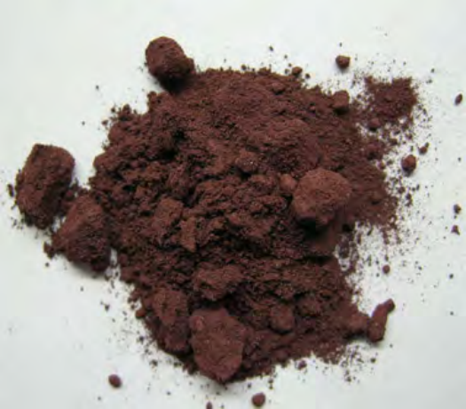

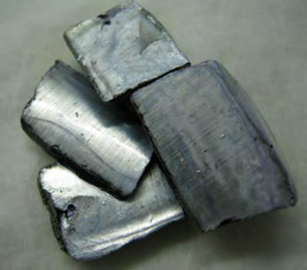

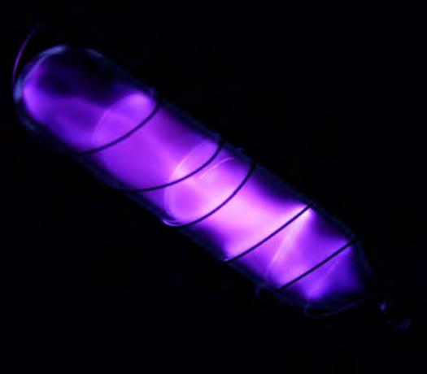

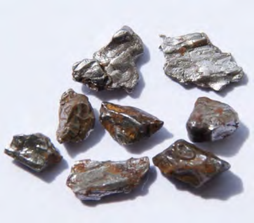

---

## ACTIVITY: Blitz revision of the properties of metals and non-metals

> **[Diagram Context - Textbook_NaturalScience_Gr7_Acids-bases-and-neutral-substances.pdf-0011-06.png]**
> 1. A diagram of a cell with arrows pointing to different parts of the cell.

Here is a block with different properties of metals and non-metals in it. They have been jumbled and are not sorted. You need to decide whether these properties describe metals or non-metals and sort them into the columns in the table which has been provided. Make sure that all the properties in the block are in your table. If you can think of properties that are not listed in the block, you may also add them to the table.

### Properties Box
* shiny
* lustrous
* dull
* brittle
* malleable
* ductile
* conducts electricity
* conducts heat
* usually a solid
* can be solid/liquid/gas
* electrical insulator
* thermal insulator
* (other)

Do the activity as quickly (but also as neatly) as you can, and time yourself!

| Properties of metals | Properties of non-metals |
| :--- | :--- |
| | |

Most elements fall into one of these two categories: metals and non-metals. We use the *properties* of an element to categorise it as a metal or a non-metal.

Think of chromium, for example, which is shiny (lustrous), bends easily (malleable) and conducts heat and electricity well.

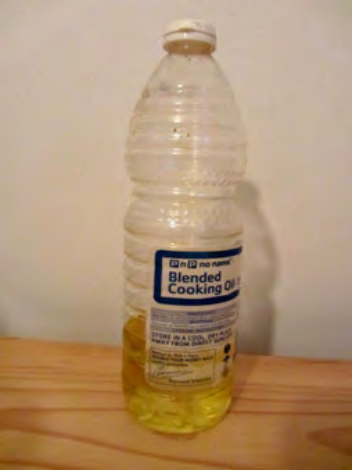
> **[Diagram Context - Textbook_NaturalScience_Gr7_Acids-bases-and-neutral-substances.pdf-0011-07.png]**
> 1. A bottle of oil with a label that says "blended cooking oil".

*A piece of chromium.*

---
*Chapter 4. The Periodic Table of Elements* **243**

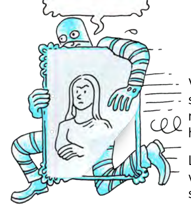
> **[Diagram Context - Textbook_NaturalScience_Gr7_Acids-bases-and-neutral-substances.pdf-0011-09.png]**
> 1. A cartoon drawing of a man holding a picture of a woman.

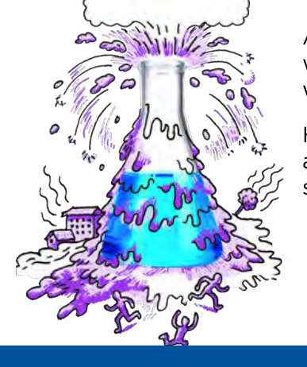
> **[Diagram Context - Textbook_NaturalScience_Gr7_Acids-bases-and-neutral-substances.pdf-0011-17.png]**
> The image is a cartoon depiction of a volcano with a blue liquid inside, which is being spewed out. The volcano is depicted in a cartoon style, with a purple and blue color scheme. The image also includes a few people, including a boy and a girl, who are standing around the volcano, possibly observing the spectacle. The image is labeled as a "conceptual diagram" and is

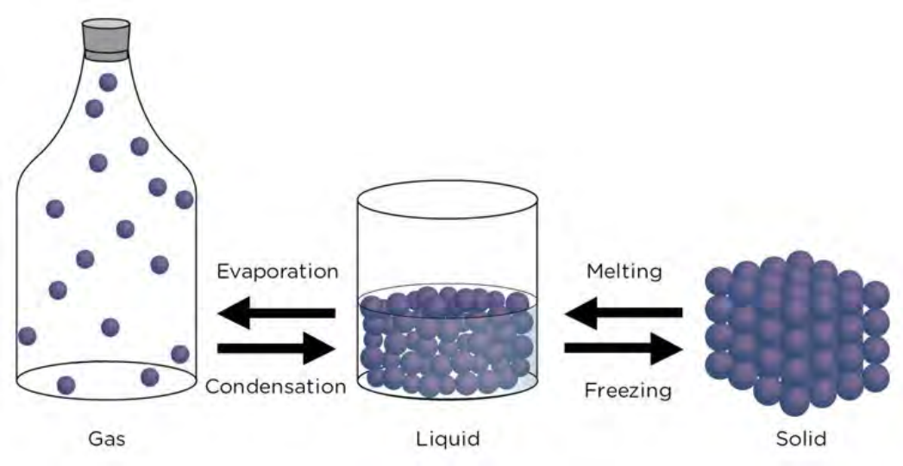
> **[Diagram Context - Textbook_NaturalScience_Gr7_Properties-of-materials.pdf-0011-00.png]**
> 1. A diagram of a process involving a bottle, a glass, and a freezer.

> **[Diagram Context - Textbook_NaturalScience_Gr7_Properties-of-materials.pdf-0011-03.png]**
> 1. A candle with a small flame in the center of a dark background.

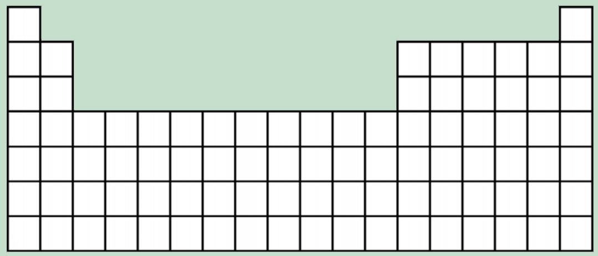
> **[Diagram Context - Textbook_NaturalScience_Gr7_The-Periodic-Table-of-Elements.pdf-0011-01.png]**
> 1. A 2D illustration of the periodic table.
2. The periodic table is a chart that organizes the elements by their atomic number, electron configuration, and recurring chemical properties.
3. The periodic table is a visual representation of the elements and their properties.

> **[Diagram Context - Textbook_NaturalScience_Gr7_The-Periodic-Table-of-Elements.pdf-0011-06.png]**
> 1. A diagram of a cell with a green line.

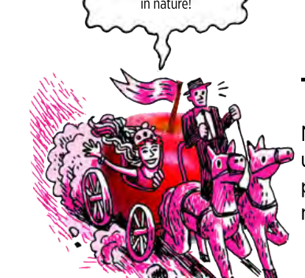
> **[Diagram Context - Textbook_NaturalScience_Gr7_The-Periodic-Table-of-Elements.pdf-0011-11.png]**
> 1. A cartoon drawing of a man and a woman riding a pink horse.
 2. A speech bubble with the text "in nature!".
 3. A pink apple with a crown on top.

---

1. What are the properties of chromium?
2. Based on these properties, would you categorise chromium as a metal or a non-metal?
3. Can you find chromium on the Periodic Table? (Hint: It may help to find its symbol first.) What is its atomic number?

Sulfur crystals forming on a rock wall inside a volcano.

Now think of sulfur.

Sulfur is usually a dull, yellow powder. It does not conduct electricity or heat well and large crystals of sulfur break easily when they are dropped.

1. What are the properties of sulfur?
2. Based on these properties, would you categorise sulfur as a metal or a non-metal?
3. Can you find sulfur on the Periodic Table? (Hint: It may help to find its symbol first.) What is its atomic number?

We have now looked at the properties of metals and non-metals. But, when scientists were doing their experiments to observe the properties of the elements, they sometimes found some elements which were difficult to classify as either a metal or a non-metal.

244

Matter and Materials

> **[Diagram Context - Textbook_NaturalScience_Gr7_Acids-bases-and-neutral-substances.pdf-0012-08.png]**
> 1. A diagram of a spring coiled up and attached to a green block.

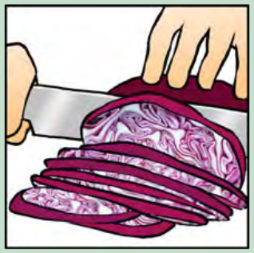
> **[Diagram Context - Textbook_NaturalScience_Gr7_Acids-bases-and-neutral-substances.pdf-0012-15.png]**
> 1. A cartoon depiction of a person cutting a purple onion. 
 2. A cartoon depiction of a person cutting a purple onion. 
 3. A cartoon depiction of a person cutting a purple onion.

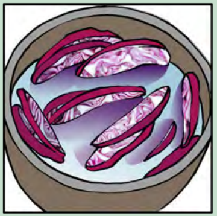
> **[Diagram Context - Textbook_NaturalScience_Gr7_Acids-bases-and-neutral-substances.pdf-0012-18.png]**
> The image shows a cartoon depiction of a bowl filled with purple fruit, possibly apples, and a spoon. The bowl is placed on a table, and the fruit is arranged in a way that suggests they have been cut into slices. The fruit appears to be purple in color, which is consistent with the purple fruit slices in the image. The bowl is placed on a table, and the spoon is

> **[Diagram Context - Textbook_NaturalScience_Gr7_Acids-bases-and-neutral-substances.pdf-0012-20.png]**
> 1. A cartoon depiction of a hot air balloon with a globe on top.
 2. A cartoon depiction of a man and a woman on the balloon.
 3. A cartoon depiction of a globe with a line of text.

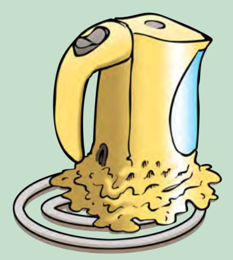
> **[Diagram Context - Textbook_NaturalScience_Gr7_Properties-of-materials.pdf-0012-01.png]**
> 1. A cartoon drawing of a yellow kettle with a black handle and a white cord.

> **[Diagram Context - Textbook_NaturalScience_Gr7_Properties-of-materials.pdf-0012-04.png]**
> 1. A green and white diagram of a battery and a spring.
 2. A green and white diagram of a cell.
 3. A green and white diagram of a circuit.
 4. A green and white diagram of a graph.
 5. A green and white diagram of an evolutionary tree.

> **[Diagram Context - Textbook_NaturalScience_Gr7_Properties-of-materials.pdf-0012-10.png]**
> 1. A diagram of a snake's body.
 2. The snake's body is made up of green and white lines.
 3. The snake's head is green.

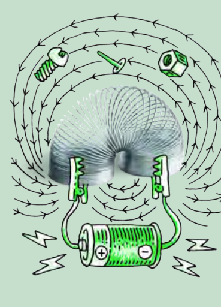
> **[Diagram Context - Textbook_NaturalScience_Gr7_The-Periodic-Table-of-Elements.pdf-0012-16.png]**
> 1. A green spring with a silver spring inside of it.
 2. A green battery with a silver battery inside of it.
 3. A green wire with a silver wire inside of it.
 4. A green spring with a silver spring inside of it.

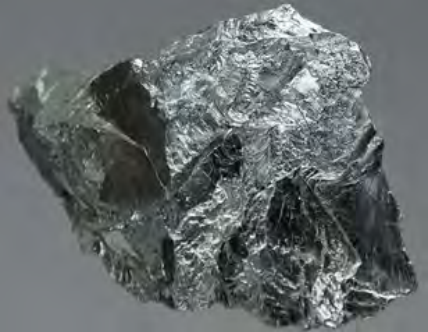
> **[Diagram Context - Textbook_NaturalScience_Gr7_The-Periodic-Table-of-Elements.pdf-0012-22.png]**
> The image shows a close-up view of a rock, which appears to be gray in color. The rock is composed of small, flat pieces, and it is covered in a shiny, metallic sheen. The rock is placed against a gray background, which further emphasizes its gray hue. The rock is the main focus of the image, and it is the sole object in the frame. There

---

# The Properties of Semi-Metals

Some elements are not quite metals, but they are not quite non-metals either. They just don't fit neatly into either category. Let us explore these unique elements.

---

## ACTIVITY: Classifying Element X

### Scenario
Pretend that you are a member of a team of scientists that has just discovered a new element. The element has not been named yet, so it is simply referred to as **'element X'**.

The team has a sufficient amount of element X to make several disks of the material. They create a file about element X, including a picture of one of the disks:

*(Insert visual observation of a silvery, metallic-looking disk with a crystalline pattern)*

---

### Observations and Experimental Data

#### 1. Appearance
* **Question:** Look carefully at the picture. How would you describe the appearance of element X?
* **Observation:** The disk appears shiny and metallic with a distinct crystalline structure.

#### 2. Physical and Chemical Experiments
The team performs experiments on element X and adds the following data to the file:

1. **Brittleness:** In an attempt to bend a disk of element X, the disk shattered like glass. The same result was observed when a second disk was dropped from a height. *(Conclusion: The material is brittle, unlike typical malleable metals).*
2. **Conductivity & Temperature Response:** 
   * At room temperature ($25\,^{\circ}\text{C}$), the material is found to be a poor conductor of heat and electricity.
   * When element X was cooled down significantly by placing it in a freezer, it behaved differently: at very low temperatures, it becomes a **good conductor of electricity**.

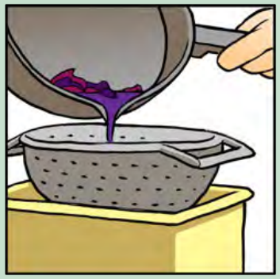
> **[Diagram Context - Textbook_NaturalScience_Gr7_Acids-bases-and-neutral-substances.pdf-0013-01.png]**
> 1. A cartoon drawing of a pot with a spoon in it. 
 2. Purple liquid being poured into a strainer. 
 3. A yellow container holding the strainer.

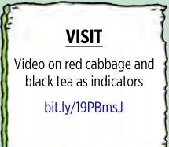
> **[Diagram Context - Textbook_NaturalScience_Gr7_Acids-bases-and-neutral-substances.pdf-0013-02.png]**
> 1. A diagram of a cell with arrows pointing to different parts of the cell.

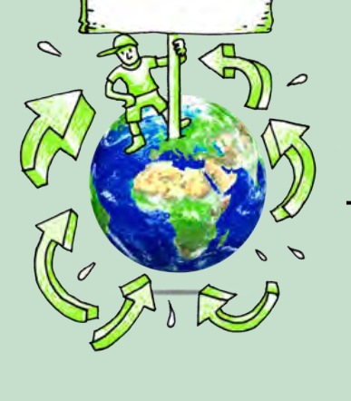
> **[Diagram Context - Textbook_NaturalScience_Gr7_Acids-bases-and-neutral-substances.pdf-0013-03.png]**
> The image features a cartoon depiction of a boy holding a pole, with arrows pointing to the earth and the boy. The boy is wearing a green shirt and a hat. The boy is standing on a globe, which is tilted to the right. The globe is divided into two halves, with the left half being the earth and the right half being the sky. The boy is holding a pole that

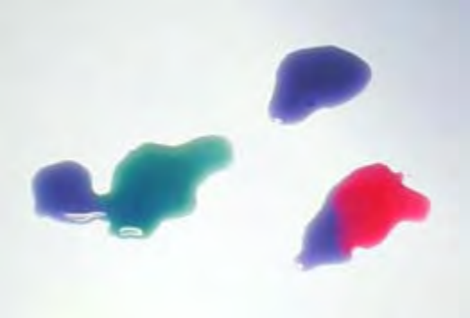
> **[Diagram Context - Textbook_NaturalScience_Gr7_Acids-bases-and-neutral-substances.pdf-0013-09.png]**
> The image shows a diagram of a cell with three different colored liquids representing the cytoplasm, nucleus, and cell membrane. The diagram is labeled with the names of the organelles and the word "cell" is written in the top left corner. The diagram is set against a white background, which makes the colors of the liquids stand out. The diagram is labeled with the names of

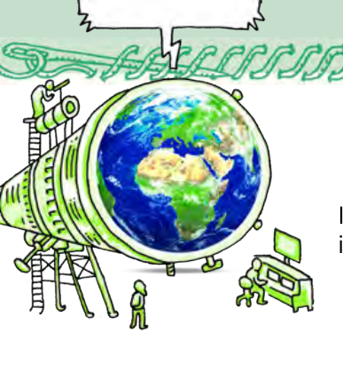
> **[Diagram Context - Textbook_NaturalScience_Gr7_Acids-bases-and-neutral-substances.pdf-0013-12.png]**
> 1. A cartoon drawing of a globe with a speech bubble above it that says "I'm a South African CAPS".

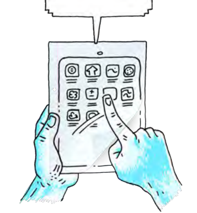
> **[Diagram Context - Textbook_NaturalScience_Gr7_Properties-of-materials.pdf-0013-05.png]**
> 1. A diagram of a cell with arrows pointing to different parts of the cell.

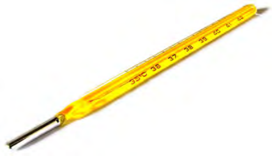
> **[Diagram Context - Textbook_NaturalScience_Gr7_Properties-of-materials.pdf-0013-06.png]**
> The image shows a yellow thermometer with a silver handle and a black scale with numbers from 0 to 100 degrees. The thermometer is the main focus of the image, with the scale providing context for the temperature reading. The text "35C" is visible on the thermometer, indicating the temperature. The image is a simple, straightforward representation of a thermometer, with no additional context or

> **[Diagram Context - Textbook_NaturalScience_Gr7_Properties-of-materials.pdf-0013-08.png]**
> 1. A diagram of a cell with a diagram of a cell and a diagram of a cell with a diagram of a cell and a diagram of a cell with a diagram of a cell and a diagram of a cell with a diagram of a cell and a diagram of a cell with a diagram of a cell and a diagram of a cell with a diagram of a cell and a diagram of a cell

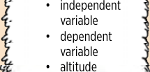
> **[Diagram Context - Textbook_NaturalScience_Gr7_Properties-of-materials.pdf-0013-20.png]**
> 1. A diagram of a cell with arrows pointing to different parts of the cell.

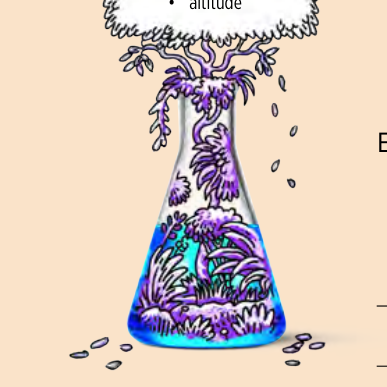
> **[Diagram Context - Textbook_NaturalScience_Gr7_Properties-of-materials.pdf-0013-24.png]**
> 1. A cartoon depiction of a plant inside a beaker.

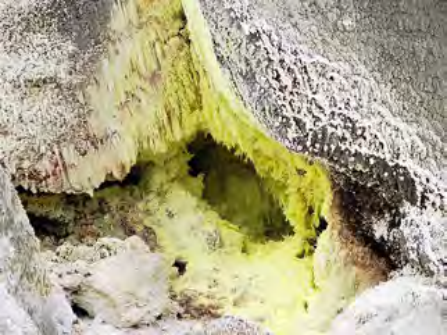
> **[Diagram Context - Textbook_NaturalScience_Gr7_The-Periodic-Table-of-Elements.pdf-0013-04.png]**
> The image shows a diagram of a cell, with a yellow substance inside the cell. The diagram is labeled with the name of the cell and the name of the yellow substance. The diagram also includes a Lewis structure of the cell, which is a diagram that shows the valence electrons of an atom. The diagram is labeled with the name of the Lewis structure.

> **[Diagram Context - Textbook_NaturalScience_Gr7_The-Periodic-Table-of-Elements.pdf-0013-12.png]**
> 1. A diagram of a cell with a green line representing a cell wall.

---

Fill out the following checklist for element X by placing crosses next to each property that was observed.

| Metallic properties | YES | NO |
| :--- | :---: | :---: |
| Is the material shiny (lustrous)? | | |
| Is the material malleable and ductile? | | |
| Does the material conduct electricity at room temperature? | | |
| Does the material conduct heat? | | |
| **Non-metallic properties** | **YES** | **NO** |
| Is the material brittle? | | |
| Does the material have a dull appearance? | | |
| Is the material an insulator? | | |
| **Additional comments** (what else did you observe?): | | |
| | | |

---

### QUESTIONS:

1. Which of the properties of element X are typical of metals?

2. Which of the properties of element X are typical of non-metals?

3. Would you classify element X as a metal or a non-metal?

---

Element X does not quite fit into either category. Some of its properties are metallic and others are non-metallic. Element X is a real element, and its name is tellurium (chemical symbol: Te). Can you find it on the Periodic Table?

---

There are other elements, like tellurium, that are difficult to classify as either metals or non-metals. This is because they have some properties that are typical of metals and some properties that are typical of non-metals. A special category was invented for these elements: they are called **semi-metals**.

> **[Diagram Context - Textbook_NaturalScience_Gr7_Acids-bases-and-neutral-substances.pdf-0014-08.png]**
> 1. A cartoon image of a purple square with a white arrow pointing to the right.

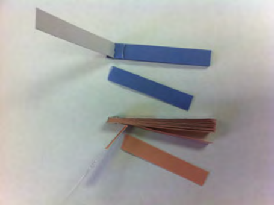
> **[Diagram Context - Textbook_NaturalScience_Gr7_Acids-bases-and-neutral-substances.pdf-0014-12.png]**
> The image shows a diagram of a Lewis structure, which is a diagram used to represent the valence electrons of an atom. The diagram is made up of lines and arrows, and it is placed on a white background. The diagram is broken down into three sections, with the first section being blue, the second section being brown, and the third section being white. The diagram is labeled with the

> **[Diagram Context - Textbook_NaturalScience_Gr7_Acids-bases-and-neutral-substances.pdf-0014-15.png]**
> 1. A green and white diagram of a spring and battery.
 2. A green and white diagram of a spring and battery.
 3. A green and white diagram of a spring and battery.

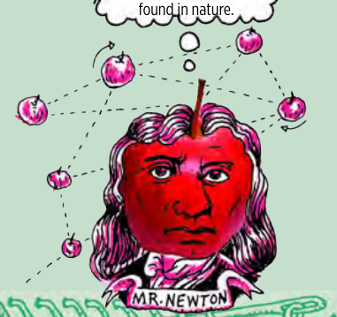
> **[Diagram Context - Textbook_NaturalScience_Gr7_Acids-bases-and-neutral-substances.pdf-0014-18.png]**
> The image features a cartoon depiction of a man's head with a large, red apple on top of his head. The man is wearing a top hat and a scarf, and the apple is positioned on his forehead. The man's face is outlined in black, and the background is a light green color. The image also includes a thought bubble above the man's head, which reads "found in

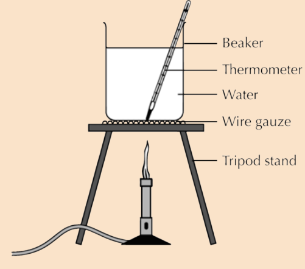
> **[Diagram Context - Textbook_NaturalScience_Gr7_Properties-of-materials.pdf-0014-11.png]**
> 1. A diagram of a beaker, thermometer, water, wire gauge, and tripod stand.

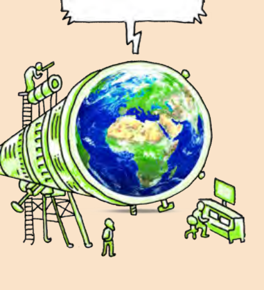
> **[Diagram Context - Textbook_NaturalScience_Gr7_Properties-of-materials.pdf-0014-16.png]**
> The image is a cartoon drawing of a globe with a speech bubble above it, containing a thought bubble with a lightning bolt. The drawing also includes a man and a woman, who are depicted as scientists. The globe is surrounded by various scientific instruments, including a microscope, a telescope, and a circuit board. The drawing is set against a beige background, and the text "conceptually for

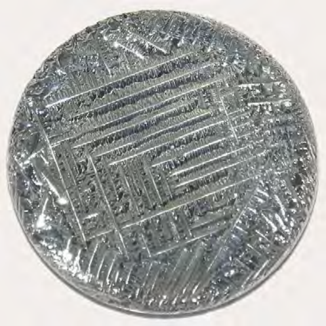
> **[Diagram Context - Textbook_NaturalScience_Gr7_The-Periodic-Table-of-Elements.pdf-0014-05.png]**
> 1. A silver circle with a zigzag pattern.

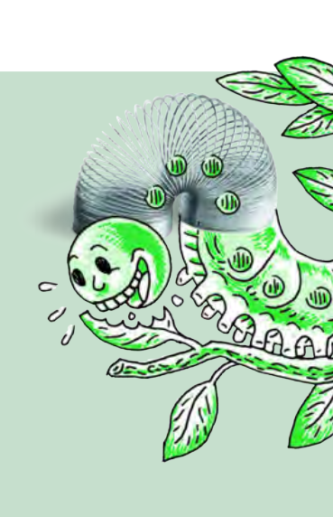
> **[Diagram Context - Textbook_NaturalScience_Gr7_The-Periodic-Table-of-Elements.pdf-0014-06.png]**
> The image features a cartoon depiction of a spring coiled up in the shape of a caterpillar. The caterpillar is surrounded by a green leaf, and there are four holes on its back. The caterpillar is also holding a green ball in its mouth. The image is labeled as a Lewis diagram, which is a diagram used to represent the structure of a molecule or a cell. The diagram

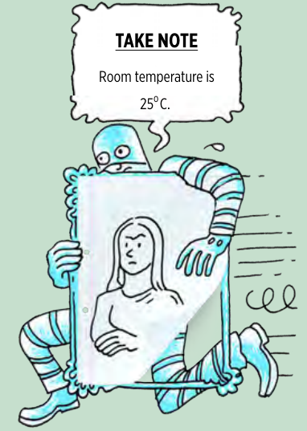
> **[Diagram Context - Textbook_NaturalScience_Gr7_The-Periodic-Table-of-Elements.pdf-0014-12.png]**
> 1. A cartoon illustration of a robot holding a picture of a woman.

---

There are not many semi-metals. They are all listed in the following table. You do not have to remember all their names.

Names and symbols of the semi-metals:

| Name | Chemical symbol | Atomic number |
| :--- | :--- | :--- |
| Boron | B | 5 |
| Silicon | Si | 14 |
| Germanium | Ge | 32 |
| Arsenic | As | 33 |
| Antimony | Sb | 51 |
| Tellurium | Te | 52 |
| Polonium | Po | 84 |

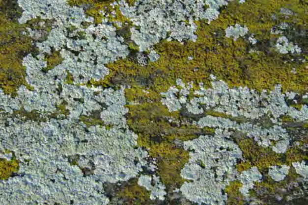
> **[Diagram Context - Textbook_NaturalScience_Gr7_Acids-bases-and-neutral-substances.pdf-0015-00.png]**
> 1. A close-up of a plant with a fuzzy white surface.

> **TAKE NOTE**
> The semi-metals are also sometimes referred to as metalloids.

Now that we have looked at some of the elements and where they are found on the Periodic Table, you might have already recognised that there is a trend in where the metals, semi-metals and non-metals are positioned on the Periodic Table. We are now going to do a colouring activity to see where on the Periodic Table we will find each of the categories of elements.

---

## ACTIVITY: The regions of the Periodic Table

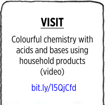
> **[Diagram Context - Textbook_NaturalScience_Gr7_Acids-bases-and-neutral-substances.pdf-0015-01.png]**
> 1. A diagram of a cell with arrows pointing to different parts of the cell.

We are going to colour areas on the following version of the Periodic Table. This will help us identify the regions on the table where the metals, non-metals and semi-metals are located.

### MATERIALS:
For this activity you will need coloured pencils or kokis or crayons in the following colours:
* Blue
* Yellow
* Red

### INSTRUCTIONS:
1. **Semi-metals:**
   Find all the semi-metals on the Periodic Table. You will need to consult the table (names and symbols of the semi-metals) to help you remember which elements are semi-metals. Colour the block representing each of the semi-metals yellow.
2. **Metals:**
   Colour all the blocks to the left of the semi-metals blue. Do not colour hydrogen (H), as it is not strictly a metal. All these elements are metals.
3. **Non-metals:**
   Colour all the blocks to the right of the semi-metals red. All these elements are non-metals.

---
*Chapter 4. The Periodic Table of Elements* | **247**

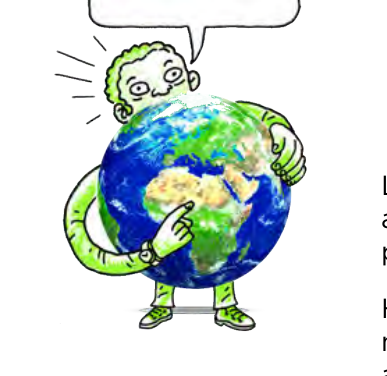
> **[Diagram Context - Textbook_NaturalScience_Gr7_Acids-bases-and-neutral-substances.pdf-0015-02.png]**
> 1. A cartoon depiction of a man holding a globe. 
 2. The globe is green and blue. 
 3. The man is wearing a green shirt and white shoes. 
 4. The man is pointing at the globe.

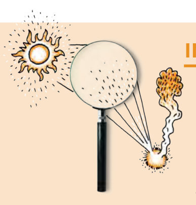
> **[Diagram Context - Textbook_NaturalScience_Gr7_Acids-bases-and-neutral-substances.pdf-0015-06.png]**
> 1. A magnifying glass is being used to look at a diagram of a cell.

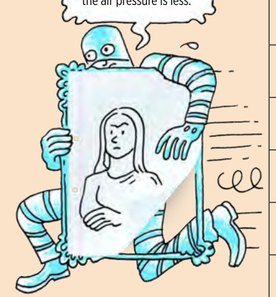
> **[Diagram Context - Textbook_NaturalScience_Gr7_Properties-of-materials.pdf-0015-09.png]**
> 1. A cartoon drawing of a man holding a picture of a woman.

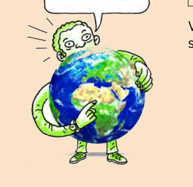
> **[Diagram Context - Textbook_NaturalScience_Gr7_Properties-of-materials.pdf-0015-12.png]**
> 1. A cartoon illustration of a man holding a globe.

> **[Diagram Context - Textbook_NaturalScience_Gr7_The-Periodic-Table-of-Elements.pdf-0015-08.png]**
> 1. A diagram of a cell with a green line representing a cell wall.

---

are non-metals. Now you can also colour hydrogen (H) red. On most versions of the Periodic Table hydrogen is placed with the metals, even though it has physical properties similar to those of the non-metals (it is a gas at room temperature). Hydrogen is placed with the metals, because it tends to behave like the other members of its column in chemical reactions.

Now answer the following questions, using your colourful Periodic Table.

## QUESTIONS:

1. Which category contains the most (biggest number of) elements: metals, non-metals or semi-metals?

2. Which category contains the least (smallest number of) elements: metals, non-metals or semi-metals?

3. State which category of material (metal, non-metal or semi-metal) each of the following elements belongs to:

| Element | Chemical symbol | Category: (Metal, non-metal or semi-metal?) |
| :--- | :--- | :--- |
| Iron | Fe | |
| Silicon | Si | |
| Fluorine | F | |
| Titanium | Ti | |
| Nitrogen | N | |

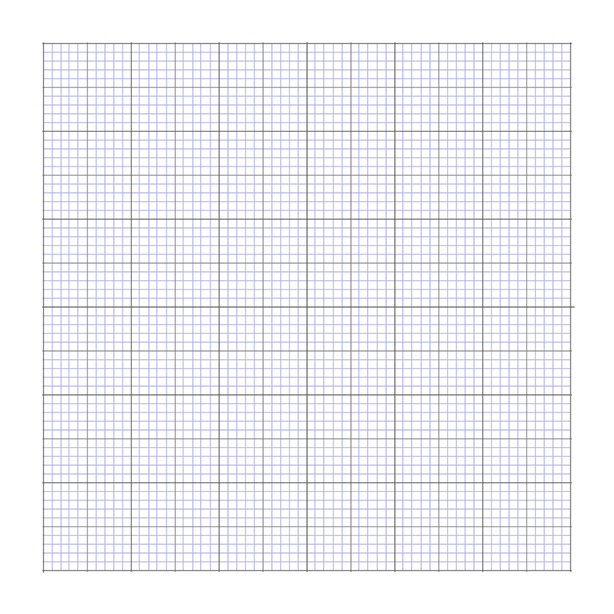
> **[Diagram Context - Textbook_NaturalScience_Gr7_Properties-of-materials.pdf-0016-01.png]**
> The image shows a page of a graph paper with a grid of squares, each square being a different color. The squares are arranged in a grid pattern, with the colors alternating between blue and white. The page is blank, and there are no other objects or text present. The graph paper is a standard size, with the dimensions being 4x6. The page is in black and white,

> **[Diagram Context - Textbook_NaturalScience_Gr7_Properties-of-materials.pdf-0016-03.png]**
> The image shows a gray rectangle with the words "Take Note" written in black text on the top. The text is positioned at the top of the rectangle, making it the focal point of the image. The rectangle is filled with a solid gray color, which contrasts with the black text and draws attention to the message. The layout of the image is simple and straightforward, with the text being the

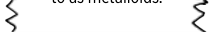

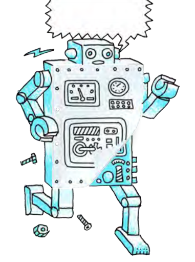
> **[Diagram Context - Textbook_NaturalScience_Gr7_The-Periodic-Table-of-Elements.pdf-0016-06.png]**
> 1. A blue robot with a speech bubble on its head.

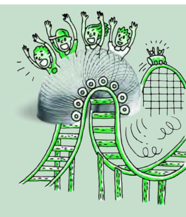
> **[Diagram Context - Textbook_NaturalScience_Gr7_The-Periodic-Table-of-Elements.pdf-0016-12.png]**
> The image is a cartoon depiction of a roller coaster, with a group of people riding the coaster. The roller coaster is made of green metal and has a large loop at the top. The people on the roller coaster are depicted as cartoon characters, including a man with a hat and a woman with a ponytail. The roller coaster is shown in a cartoon style, with the people depicted as cartoon

---

## Chapter 4. The Periodic Table of Elements

### Introduction to Regions and Properties
The Periodic Table can be divided into regions where metals, non-metals, and semi-metals are found. This classification is useful because elements in different regions share similar properties. 

These properties help us decide what we can use them for. For example, metals are durable, malleable, and shiny, making them suitable for making jewellery, pots and pans, and motor car parts.

---

### Did You Know?
> Stainless steel is an alloy, meaning it is made up of a mixture of elements, including iron, carbon, chromium, and nickel.

---

### Elements in the Real World
Where can we find all these elements in the real world? Where do they occur, and what are they used for?

We all know that oxygen ($O$) is one of the elements in the air we breathe. Rings and other jewellery are often made of gold ($Au$), silver ($Ag$), or platinum ($Pt$). But what do we know about calcium? And what is nickel used for?

---

### Questions and Exercises

1. Think about how long coins are used for. How are properties of metals useful to us when making coins?

<!-- DIAG_PLACEHOLDER: diagram -->

*Our South African coins are made from various metals and mixtures of metals, such as copper, nickel, and stainless steel.*

---

2. Why do you think we make jewellery out of the metals gold, silver, and platinum, and not for example out of a non-metal such as sulfur? What are the properties of these metals?

*Jewellery is made from metals such as gold, silver, and platinum.*

> **[Diagram Context - Textbook_NaturalScience_Gr7_Properties-of-materials.pdf-0017-11.png]**
> 1. A gray background with a zipper running down the center.

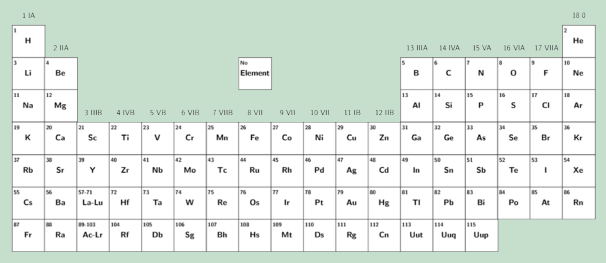
> **[Diagram Context - Textbook_NaturalScience_Gr7_The-Periodic-Table-of-Elements.pdf-0017-02.png]**
> The image is a detailed, labeled periodic table that is divided into rows and columns. The table is filled with chemical symbols, atomic numbers, and atomic masses. The table is color-coded, with each column having a different color. The table is organized in a way that makes it easy to understand the elements and their properties. The table is a visual representation of the periodic table, which is

> **[Diagram Context - Textbook_NaturalScience_Gr7_The-Periodic-Table-of-Elements.pdf-0017-09.png]**
> 1. A diagram of a cell with a green line.

---

3. Why do you think these electrical wires are made out of copper? What property of copper is useful in this situation?

*These electrical wires are made out of copper.*

4. Do you think you could make electrical wires out of a non-metal such as bromine or phosphorus? Why or why not?

---

### Uses of Non-Metals and Other Elements

* **Carbon (coal):** Used as a fuel.
* **Chlorine:** Used as a disinfectant to purify water.
* **Iodine:** Used as an antiseptic for wounds.
* **Helium:** Used to fill balloons.
* **Arsenic (semi-metal):** Poisonous, therefore used as a pesticide for insects, bacteria, and fungi.
* **Antimony (semi-metal):** Used to make an alloy with lead which is very hard and has many applications.

---

### ACTIVITY: Uses of the elements

Your teacher will divide the class into small groups. Your group must choose one element from the Periodic Table (if you are unsure, your teacher will help you choose) and research the following questions about this element:

1. Where is this element found?
2. What do we use this element for?
3. What are some of the properties of the element?

Your group must make a poster to present all the information you found about your element.

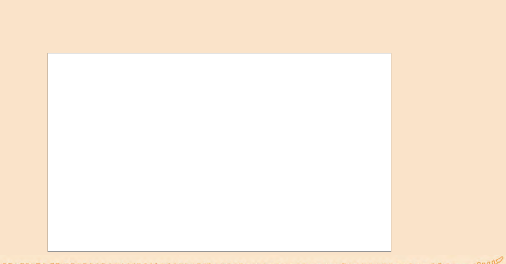
> **[Diagram Context - Textbook_NaturalScience_Gr7_Acids-bases-and-neutral-substances.pdf-0018-00.png]**
> 1. A diagram of a cell with a white square in the center.

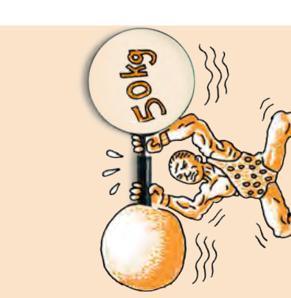
> **[Diagram Context - Textbook_NaturalScience_Gr7_Acids-bases-and-neutral-substances.pdf-0018-14.png]**
> 1. A cartoon drawing of a man lifting a ball with a weight.

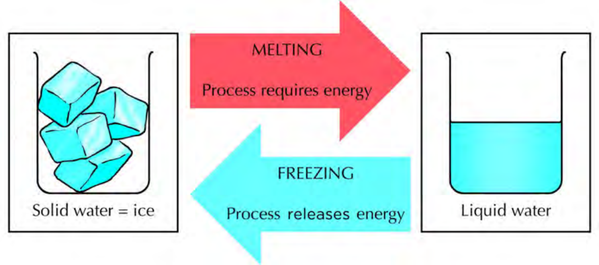
> **[Diagram Context - Textbook_NaturalScience_Gr7_Properties-of-materials.pdf-0018-01.png]**
> 1. A diagram showing the freezing and melting of water.

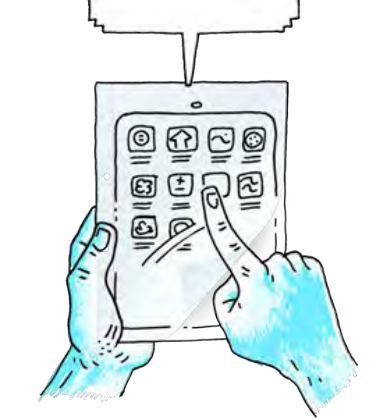
> **[Diagram Context - Textbook_NaturalScience_Gr7_Properties-of-materials.pdf-0018-03.png]**
> 1. A diagram of a cell with arrows pointing to different parts of the cell.

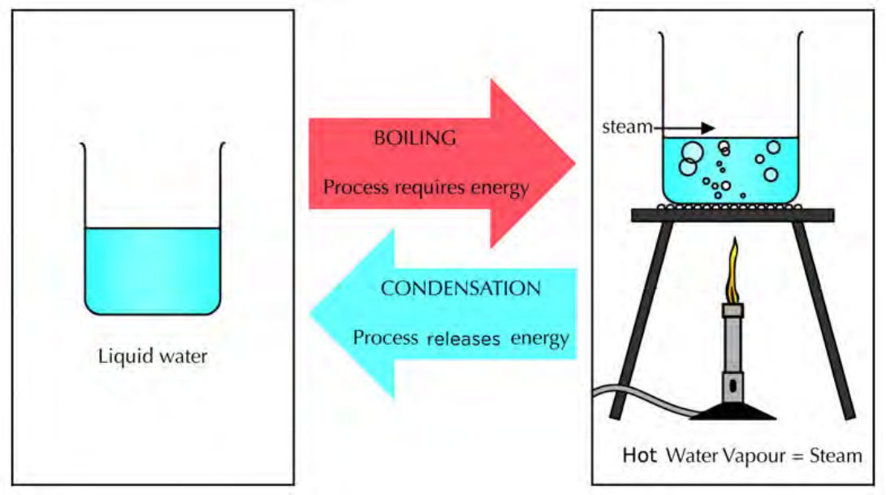
> **[Diagram Context - Textbook_NaturalScience_Gr7_Properties-of-materials.pdf-0018-05.png]**
> 1. A diagram of a boiling water experiment.

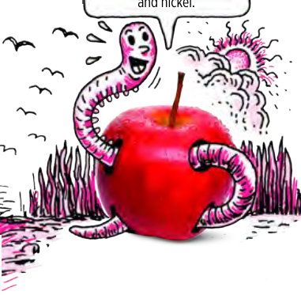
> **[Diagram Context - Textbook_NaturalScience_Gr7_The-Periodic-Table-of-Elements.pdf-0018-04.png]**
> 1. A cartoon apple with a worm wrapped around it.

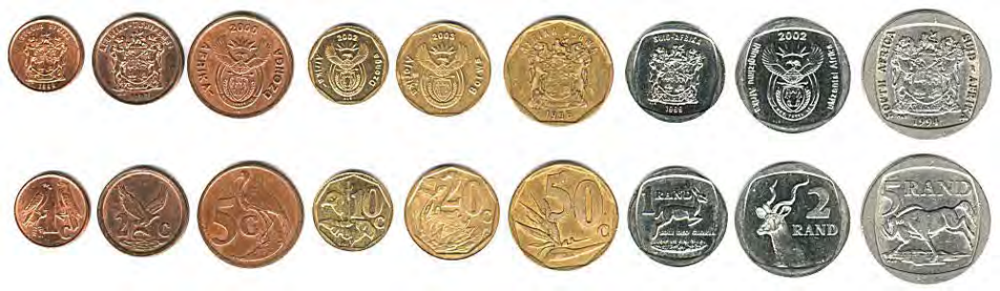
> **[Diagram Context - Textbook_NaturalScience_Gr7_The-Periodic-Table-of-Elements.pdf-0018-07.png]**
> 1. A collection of twelve coins from different countries.

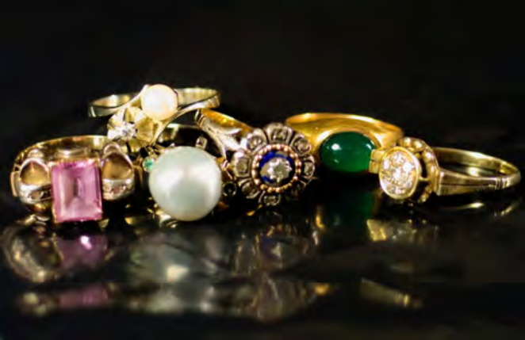
> **[Diagram Context - Textbook_NaturalScience_Gr7_The-Periodic-Table-of-Elements.pdf-0018-10.png]**
> 1. A collection of rings and a pink gemstone.

---

# SUMMARY:

## Key Concepts

* All the elements that are known can be arranged in a table called the **Periodic Table**.
* The discoveries of many scientists over many years contributed to the information in the Periodic Table, but the version of the table that we use today was originally proposed by Dmitri Mendeleev in the 1800s.
* Each element has a fixed position on the Periodic Table. The elements are arranged in order of increasing atomic number, with the lightest element (hydrogen: $\text{H}$) in the top left-hand corner.
* An element's position on the Periodic Table tells us whether it is a metal, a non-metal, or a semi-metal:
  * **Metals** are found on the left-hand side of the table;
  * **Non-metals** are found on the far right-hand side of the table; and
  * **Semi-metals** are found in the region between the metals and non-metals.
* An element can be identified in 3 different ways:
  * each element has a unique name;
  * each element has a unique chemical symbol; and
  * each element has a unique atomic number.
* **Metals** are usually shiny, ductile, and malleable. Most are solids at room temperature, and have high melting and boiling points.
* **Non-metals** can be solids, liquids, or gases at room temperature. They have a great variety of properties that usually depend on the state they are in.
* The **semi-metals** are all solids at room temperature. They usually have a combination of metallic and non-metallic properties.

## Concept Map

We learnt that the elements in the Periodic Table fall into 3 main categories. What are these? Fill these in the concept map by looking at the concepts which come after each category.

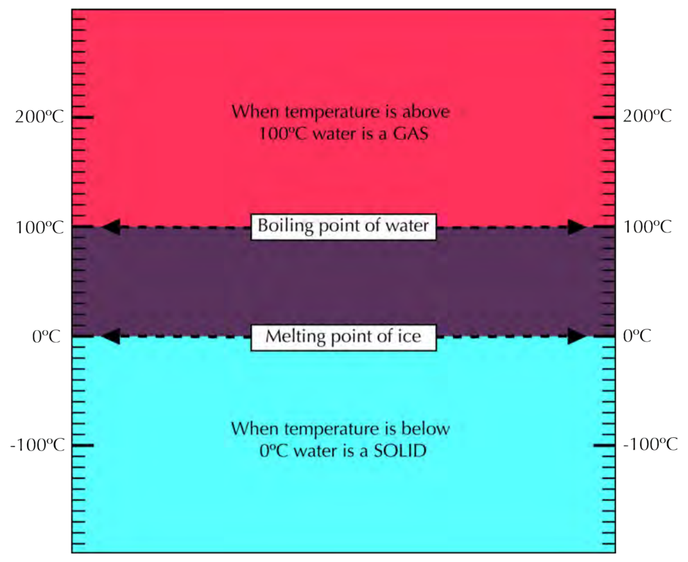
> **[Diagram Context - Textbook_NaturalScience_Gr7_Properties-of-materials.pdf-0019-00.png]**
> A diagram showing the boiling point of water at different temperatures. The diagram is divided into two sections, one in red and the other in blue. The red section shows that when the temperature is above 100 degrees Celsius, water turns into steam. The blue section shows that when the temperature is below 100 degrees Celsius, water turns into ice. The diagram also includes labels for the boiling point of water,

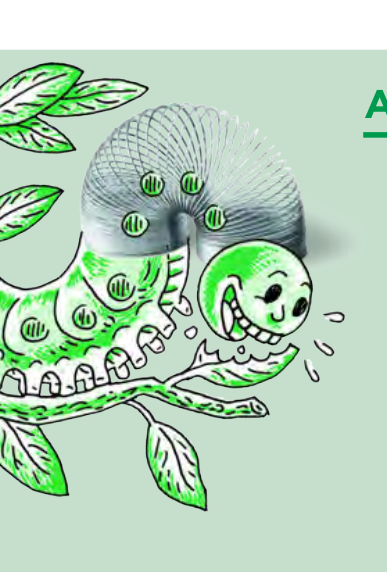
> **[Diagram Context - Textbook_NaturalScience_Gr7_Properties-of-materials.pdf-0019-04.png]**
> The image is a cartoon drawing of a caterpillar with a smiley face and a leaf on its back. The caterpillar is made up of green and white lines, and it has a leaf on its back. The drawing also includes a wire spring and a green ball. The image is labeled with the letters "A" and "B" and the word "leaf" is also present.

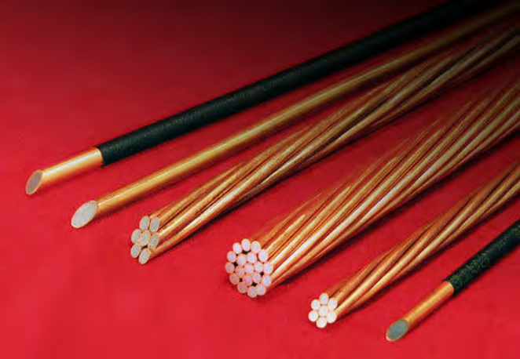
> **[Diagram Context - Textbook_NaturalScience_Gr7_The-Periodic-Table-of-Elements.pdf-0019-01.png]**
> 1. A diagram of a copper wire with a black rod on the left side.

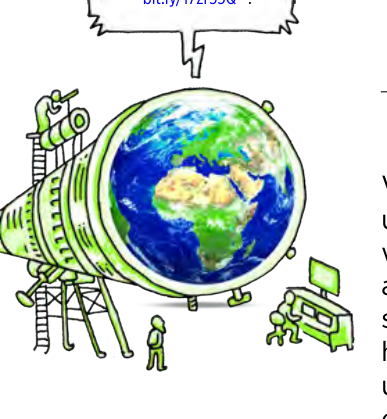
> **[Diagram Context - Textbook_NaturalScience_Gr7_The-Periodic-Table-of-Elements.pdf-0019-06.png]**
> The image features a cartoon depiction of a globe and a telescope, with a group of people gathered around the globe. The globe is depicted in a green color, and the people are standing around it, possibly observing the globe or working on it. The telescope is positioned on the left side of the image, and the people are standing in front of it. The image also includes a speech bubble that

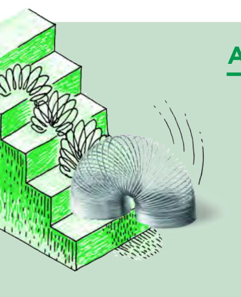
> **[Diagram Context - Textbook_NaturalScience_Gr7_The-Periodic-Table-of-Elements.pdf-0019-08.png]**
> A diagram of a spring coiled up in a spiral motion.

> **[Diagram Context - Textbook_NaturalScience_Gr7_The-Periodic-Table-of-Elements.pdf-0019-15.png]**
> 1. A diagram of a cell with arrows pointing to different parts of the cell.

---

# The Periodic Table of Elements

## 1. Historical Background & Classification System

* **Timeframe:** 1860s
* **Key Figure:** Dmitri Mendeleev
* **Definition:** The **Periodic Table of Elements** is a classification system devised by Dmitri Mendeleev to organize elements found in the world according to their properties.
* **Core Nature:** Elements organized within the Periodic Table are **pure substances**.

---

## 2. Main Categories of Elements

The Periodic Table classifies elements into **3 main categories**, which are positioned across different regions of the table:

### A. Left Region (Metals)
* **Location:** Found on the **left** side of the Periodic Table.
* **Properties:**
  * Solids
  * Shiny
  * Ductile
  * Malleable
  * High melting and boiling points

### B. Region Between (Metalloids / Semi-metals)
* **Location:** Found in the **region between** the left and right sides.

### C. Right Region (Non-metals)
* **Location:** Found on the **right** side of the Periodic Table.
* **Properties:**
  * Solid or gas
  * Variety of properties

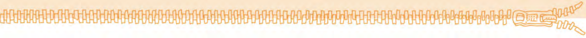
> **[Diagram Context - Textbook_NaturalScience_Gr7_Acids-bases-and-neutral-substances.pdf-0020-05.png]**
> 1. A diagram of a zipper with a zipper pull.

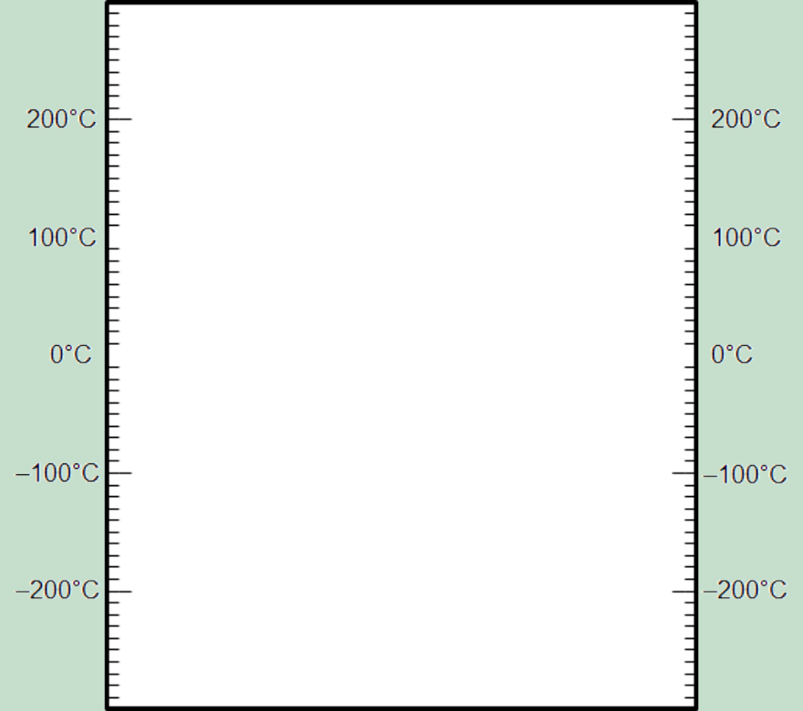
> **[Diagram Context - Textbook_NaturalScience_Gr7_Properties-of-materials.pdf-0020-01.png]**
> The image shows a diagram of a white rectangle with a black border, divided into six sections. Each section has a label, and the diagram is accompanied by a legend that provides information about the labels. The diagram is set against a green background, and the text "200C" is visible in the image.

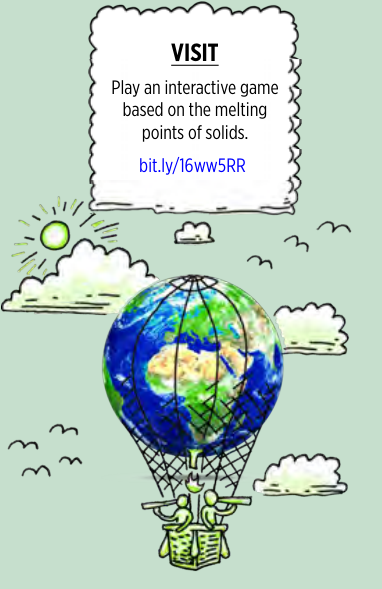
> **[Diagram Context - Textbook_NaturalScience_Gr7_Properties-of-materials.pdf-0020-06.png]**
> The image features a cartoon depiction of a man and a woman riding a hot air balloon. The balloon is filled with a blue substance, and the two people are seated on a basket attached to the balloon. The image also includes a text box that provides information about the game, stating that the player must interact with the game based on the points of solidity.

> **[Diagram Context - Textbook_NaturalScience_Gr7_Properties-of-materials.pdf-0020-08.png]**
> 1. A diagram of a snake's body.

> **[Diagram Context - Textbook_NaturalScience_Gr7_The-Periodic-Table-of-Elements.pdf-0020-00.png]**
> 1. A diagram of a cell with blue and white lines.

> **[Diagram Context - Textbook_NaturalScience_Gr7_The-Periodic-Table-of-Elements.pdf-0020-06.png]**
> 1. A cartoon drawing of a man in a hard hat and safety glasses holding a key and a hammer.

---

## REVISION:

> **[Diagram Context - Textbook_NaturalScience_Gr7_Acids-bases-and-neutral-substances.pdf-0021-00.png]**
> 1. A diagram of a cell with blue and white lines.

1. What information can we tell from an element's position in the Periodic Table? In other words: [2 marks]
   a) What does it tell us when an element occurs on the left hand side of the Periodic Table?

   b) What does it tell us when an atom occurs on the right hand side of the Periodic Table?

2. There are 3 unique 'labels' that can be used to identify an element. The first is its name. What are the other two? [2 marks]

3. What is the relationship between the atomic number of an element and its place on the Periodic Table? [1 mark]

4. Which element has the lowest atomic number? Write both its name and its symbol. [2 marks]

5. Extension question: What does the atomic number of hydrogen tell us about it? [1 mark]

6. Write the chemical symbols of all the elements that are in the same column as the element with the atomic number 9. (Note: The columns on the Periodic Table are called Groups.) [2 marks: 1/2 mark each]

> **[Diagram Context - Textbook_NaturalScience_Gr7_Acids-bases-and-neutral-substances.pdf-0021-01.png]**
> 1. A key is shown with a tree and a swing.

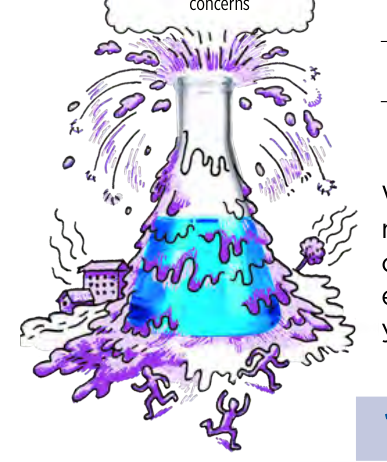
> **[Diagram Context - Textbook_NaturalScience_Gr7_Properties-of-materials.pdf-0021-04.png]**
> The image features a cartoon depiction of a volcano with a blue liquid inside, surrounded by purple and white elements. The volcano is depicted as a tall, cone-shaped structure with a spout on top, and it is surrounded by a cloud of purple and white particles. The image also includes a small cartoon character, a house, and a tree, which are all part of the same scene.

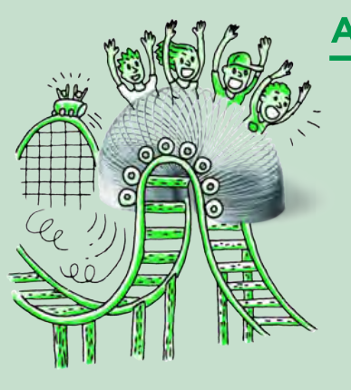
> **[Diagram Context - Textbook_NaturalScience_Gr7_Properties-of-materials.pdf-0021-09.png]**
> 1. A green roller coaster with a spring coiled on top.

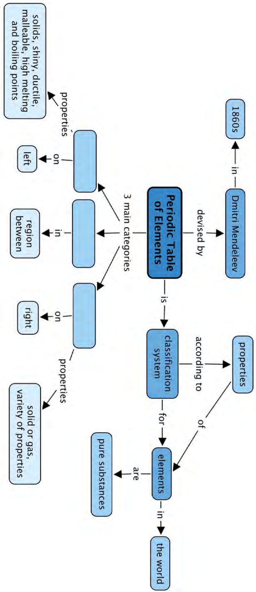
> **[Diagram Context - Textbook_NaturalScience_Gr7_The-Periodic-Table-of-Elements.pdf-0021-00.png]**
> The image is a diagram that illustrates the structure of a molecule. The diagram is color-coded, with blue representing the bonds and the different types of bonds, such as covalent, ionic, and metallic bonds. The diagram also includes labels for the atoms and bonds, as well as arrows to show the direction of the bonds. The diagram is labeled with the names of the atoms and

---

## Matter and Materials

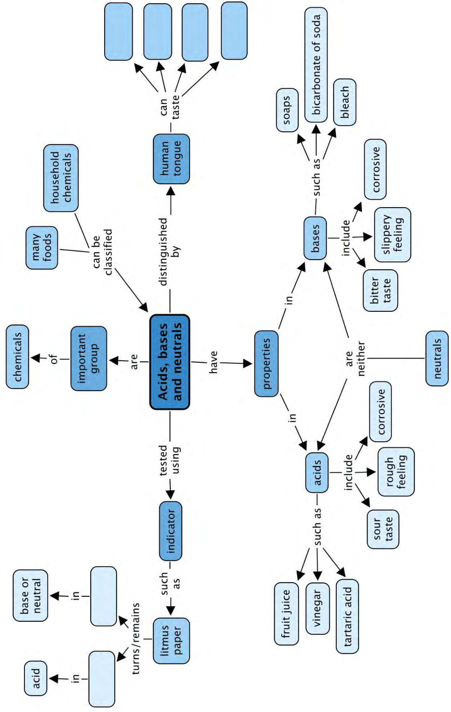
> **[Diagram Context - Textbook_NaturalScience_Gr7_Acids-bases-and-neutral-substances.pdf-0022-00.png]**
> The image is a diagram that illustrates the structure of a cell. The diagram is divided into two main sections, with the upper section being a Lewis diagram and the lower section being a flowchart. The diagram is color-coded, with blue representing the cell's interior and green representing the cell's exterior. The diagram also includes various labels and arrows that provide information about the cell's structure and function

### Exercise and Assessment

7. The following table contains some names of elements. There is also a box of chemical symbols. You should place the chemical symbols in the right hand column of the table so that they match the names in the left hand column. [8 marks]

| Chemical symbols |
| :--- |
| - C |
| - Na |
| - Si |
| - N |
| - He |
| - Cl |
| - S |
| - O |

| Names of elements | Chemical symbols |
| :--- | :--- |
| Sulfur | |
| Carbon | |
| Nitrogen | |
| Sodium | |
| Oxygen | |
| Silicon | |
| Chlorine | |
| Helium | |

8. Write a short paragraph to explain what a semi-metal is. Also give an example of one semi-metal and say where in the Periodic Table the semi-metals can be found. [3 marks]

____________________________________________________________________________________________________

____________________________________________________________________________________________________

____________________________________________________________________________________________________

____________________________________________________________________________________________________

9. Name two properties of metals and two properties of non-metals. [4 marks]

____________________________________________________________________________________________________

____________________________________________________________________________________________________

____________________________________________________________________________________________________

Total [25 marks]

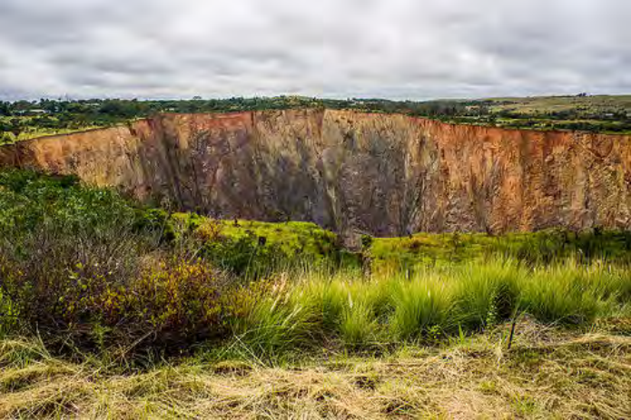
> **[Diagram Context - Textbook_NaturalScience_Gr7_Properties-of-materials.pdf-0022-03.png]**
> This photograph depicts an open-cast mine, showing exposed geological strata and the significant surface disruption caused by large-scale mineral extraction. It illustrates the environmental impact of mining, serving as a visual case study for Geography learners to discuss land degradation, habitat destruction, and the physical alteration of the lithosphere.

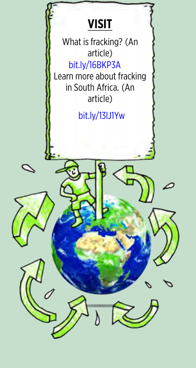
> **[Diagram Context - Textbook_NaturalScience_Gr7_Properties-of-materials.pdf-0022-05.png]**
> The image shows a cartoon depiction of a globe with arrows pointing to various parts of the world. The globe is surrounded by arrows, which are labeled with different words such as "circuit", "anatomical", "geometry", and "evolutionary tree". The arrows also point to the words "16KP/S", "16KP/S", and "16K

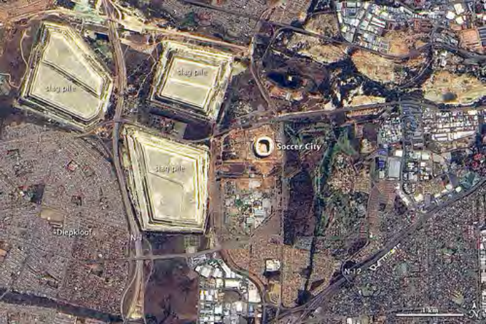
> **[Diagram Context - Textbook_NaturalScience_Gr7_Properties-of-materials.pdf-0022-08.png]**
> The image is a satellite view of a city with a large soccer field in the center. The field is surrounded by buildings and other structures, indicating a developed urban area. The image also includes a map of the city, which provides additional context and information about the layout of the city. The satellite image is labeled with the name of the city and the name of the soccer field, as well as

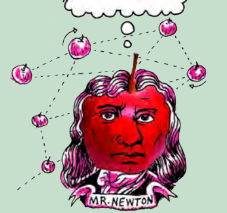
> **[Diagram Context - Textbook_NaturalScience_Gr7_Properties-of-materials.pdf-0022-12.png]**
> The image features a cartoon depiction of a man's head, with a red apple placed on top of it. The man's face is drawn in a cartoon style, and he is wearing a tie. The image also includes a thought bubble above the man's head, which contains a pink apple and the words "Mr. Newton". The image is labeled as an educational graphic, and it is intended

> **[Diagram Context - Textbook_NaturalScience_Gr7_The-Periodic-Table-of-Elements.pdf-0022-03.png]**
> 1. A cartoon of a person holding a gear and a gear in their hands.

---

# GLOSSARY

* **abundant:** when something exists, or is available, in large quantities; plentiful
* **acid:** a substance which is corrosive, has a sour taste and feels rough (grippy) between your fingers
* **alkali:** a base that is dissolved in water
* **alloy:** a mixture of two or more metals (stainless steel is an example of an alloy)
* **altitude:** the height of a place above sea level; places that are inland, or on mountains, are said to be at a higher altitude than places on the coast
* **ascorbic acid:** a natural acid that occurs in some fruits and vegetables; also known as Vitamin C
* **atomic number:** a unique number that represents a given element and shows its position on the Periodic Table
* **base:** a substance that can also be corrosive, has a bitter taste, and feels slippery between your fingers
* **boiling point:** the temperature at which a particular material changes from the liquid to the gas state (boils)
* **capillary action:** the process by which liquid is drawn up in a narrow tube
* **chemical formula:** a representation of chemicals using symbols that tell us which elements a compound contains and in what ratio
* **chemoreceptor:** a sensory nerve cell or sense organ that detects chemical signals
* **chromatogram:** the pattern formed on the paper by the components separated by chromatography
* **chromatography:** a process in which a mixture carried by a liquid is separated into components
* **citric acid:** a natural acid that occurs in citrus fruit
* **clear:** transparent; see-through
* **concern:** (noun) something that you are worried about
* **condensation:** the process of changing a gas to a liquid
* **condense:** when particles come together; to change from the gaseous state to the liquid state
* **constant:** a variable, or physical quantity, that is constant or does not change over time
* **contract:** (verb) the physical size of an object gets smaller
* **controversial:** controversial issues are issues that people do not agree about; issues that people argue about because they hold different opinions
* **corrosive:** a corrosive substance damages ('eats away') other materials by chemical action (the related verb is corrode)
* **dependent variable:** a dependent variable is one that we do not directly choose values for, but can only measure as we go along

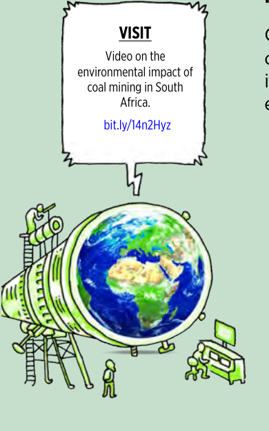
> **[Diagram Context - Textbook_NaturalScience_Gr7_Properties-of-materials.pdf-0023-03.png]**
> This graphic features a cartoon illustration of a large telescope focused on the Earth, accompanied by a speech bubble containing the text "VISIT," "Video on the environmental impact of coal mining in South Africa," and a shortened URL. It serves as an educational prompt to encourage students to investigate the ecological consequences of coal extraction within the South African context, aligning with CAPS Life Sciences and Geography curriculum requirements regarding human impact on the environment.

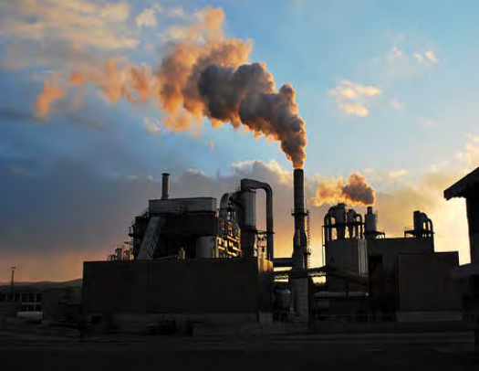
> **[Diagram Context - Textbook_NaturalScience_Gr7_Properties-of-materials.pdf-0023-05.png]**
> This photograph depicts an industrial facility with prominent smokestacks emitting plumes of smoke into the atmosphere. It serves as a visual representation of anthropogenic air pollution and greenhouse gas emissions, which are key concepts in the Life Sciences and Geography curricula regarding human impact on the environment and climate change.

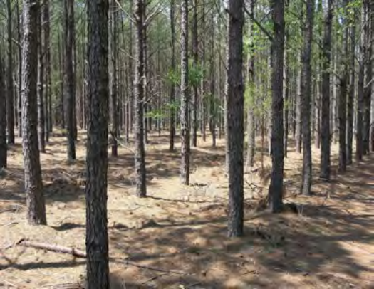
> **[Diagram Context - Textbook_NaturalScience_Gr7_Properties-of-materials.pdf-0023-06.png]**
> This image depicts a monoculture pine plantation characterized by uniform tree spacing and a lack of diverse undergrowth. The visual elements include vertical tree trunks, a dense canopy, and a forest floor covered in pine needles, illustrating a human-managed ecosystem. For Life Sciences learners, this serves as a practical example of low biodiversity, demonstrating how artificial environments impact ecological stability and species richness compared to natural biomes.

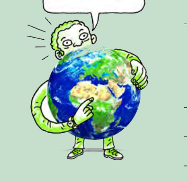
> **[Diagram Context - Textbook_NaturalScience_Gr7_Properties-of-materials.pdf-0023-11.png]**
> This cartoon depicts a personified human figure whose torso is replaced by a globe of the Earth, featuring a speech bubble and a pointing gesture toward the African continent. It serves as a visual metaphor for human impact on the environment, illustrating the CAPS Life Sciences and Geography concepts of human-environment interaction, global citizenship, and the anthropogenic influence on Earth's systems.

> **[Diagram Context - Textbook_NaturalScience_Gr7_Properties-of-materials.pdf-0023-14.png]**
> This graphic depicts a repeating, stylized wave pattern composed of interconnected, arrow-headed segments. The image lacks specific labels or biological markers, but conceptually represents the continuous, directional flow of energy or information often used in Life Sciences to illustrate processes like the unidirectional movement of impulses or the sequential flow of matter through a system.

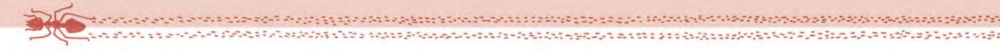
> **[Diagram Context - Textbook_NaturalScience_Gr7_The-Periodic-Table-of-Elements.pdf-0023-09.png]**
> The image shows a close-up view of a gray background with a red and white line running down the center. On the line, there is a red ant, which is the main focus of the image. The ant is positioned in the middle of the line, and it appears to be walking along the line. The background is plain and unadorned, allowing the ant to be the center

---

# Glossary of Key Terms: Matter and Materials

## D

* **disperse:** to spread evenly throughout
* **distillation:** a technique for separating the components of a liquid solution through evaporation and condensation
* **ductile:** the property of a material that allows it to be pulled and stretched out into thin wires
* **durable:** a material that is durable can last for a long time without breaking down

## E

* **element:** a pure substance which cannot be broken down further
* **emulsion:** a mixture of two or more liquids that usually do not mix, such as tiny oil droplets in water
* **environmental concerns:** worries about the negative effects on habitats and ecosystems in our environment, caused by humans and their activities
* **essential:** necessary and important; required
* **evaporation:** the process of changing a liquid to a gas
* **expand:** (verb) the physical size of an object gets bigger

## F

* **filtrate:** the liquid that has passed through a filter is called the filtrate
* **filtration:** the process of passing something through a filter
* **flavour:** the taste and smell of food in the mouth
* **flexible:** a material that is flexible will change shape easily without breaking when it is bent, and will return to its original shape when it is released
* **formic acid:** a natural acid found inside the bodies of some ant species

## G

* **grain:** a very small piece of something

## H

* **heat:** is the transfer of energy, from a hotter object to a colder object

## I

* **immune system:** the biological system inside our bodies that protects us from disease and infection
* **impact:** to have an effect on something else
* **independent variable:** an independent variable is one whose values we can choose (manipulate); we still have to be able to measure it
* **indicator:** a substance that changes colour in the presence of another substance, showing that that substance is present
* **instinct:** a natural or inborn way of responding to something

## L

* **litmus:** a well known acid-base indicator that turns red when mixed with an acid and blue when mixed with a base

## M

* **magnetic:** a property of some materials that allows them to be attracted to a magnet
* **malleable:** the property of a material that allows it to be shaped by flattening with a hammer or squeezing it between rollers
* **melting point:** the temperature beyond which a particular material changes from the solid to the liquid state (melts)

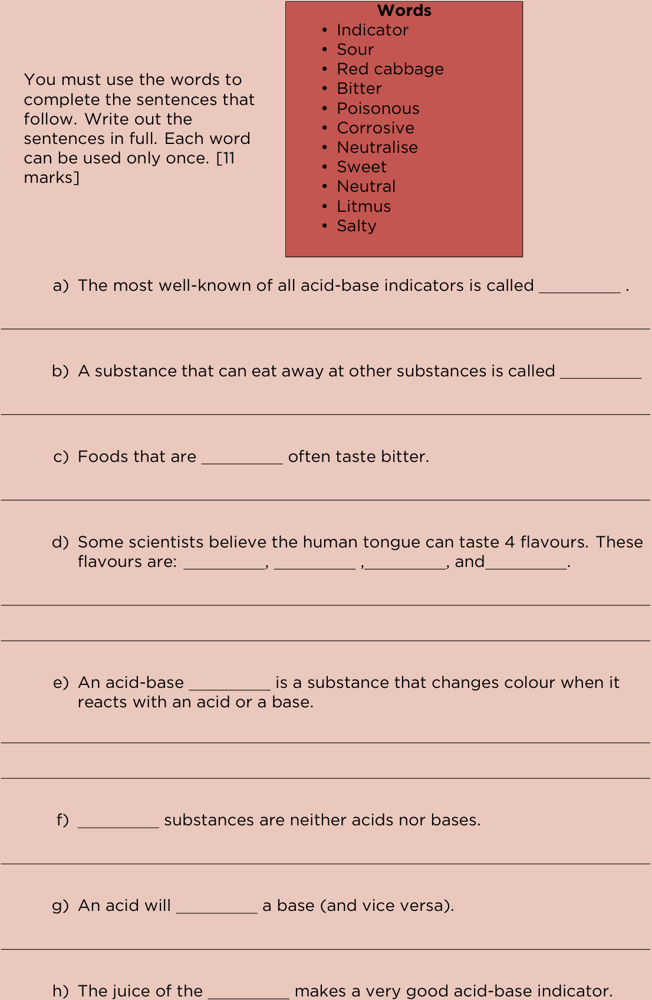
> **[Diagram Context - Textbook_NaturalScience_Gr7_Acids-bases-and-neutral-substances.pdf-0024-02.png]**
> 1. A diagram of a cell with a diagram of a cell on the left side.

> **[Diagram Context - Textbook_NaturalScience_Gr7_Properties-of-materials.pdf-0024-00.png]**
> This diagram illustrates a cross-section of a biological membrane, specifically representing the arrangement of phospholipid molecules in a monolayer or the surface of a lipid bilayer. It features a series of repeating, hook-shaped symbols representing the hydrophilic phosphate heads oriented toward the aqueous environment above a shaded region representing the hydrophobic fatty acid tails. This visual model helps learners understand the amphipathic nature of phospholipids and their structural role in forming the fluid mosaic model of cell membranes.

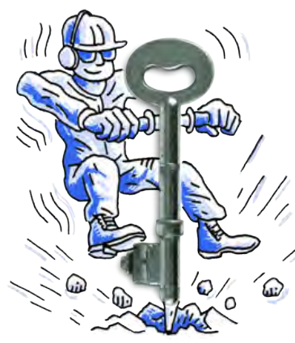
> **[Diagram Context - Textbook_NaturalScience_Gr7_Properties-of-materials.pdf-0024-08.png]**
> This illustration depicts a worker operating a jackhammer, represented by a large key, with motion lines indicating vibration and debris scattering. It serves as a conceptual metaphor for the physical impact of mechanical energy and the importance of personal protective equipment (PPE) like ear defenders in high-noise industrial environments.

> **[Diagram Context - Textbook_NaturalScience_Gr7_The-Periodic-Table-of-Elements.pdf-0024-00.png]**
> 1. A purple line with pink swirls on it.

---

# Chapter 4. The Periodic Table of Elements

## Glossary of Key Terms

- **mixture:** matter consisting of two or more components (substances) that retain their own properties
- **moulding:** a process that involves melting a substance and then pouring it into a specially shaped hollow container (mould) that will give it that particular shape when it cools down and returns to the solid state; clay can also be moulded
- **neutral substance:** a substance that *is neither* acidic *nor* basic
- **neutralise:** to make something chemically neutral
- **opaque:** something that we cannot see through is opaque; opaque is the opposite of transparent
- **Periodic Table:** a table in which the chemical elements are arranged in order of increasing atomic number
- **pigment:** a substance that gives colour to other materials
- **property:** a distinctive attribute, characteristic or quality (of a certain material)
- **residue:** the substances that are left behind in the filter after filtering
- **savoury:** refers to salty or spicy food (not sweet)
- **semi-conductor:** a material that conducts electricity only under special conditions, for instance at very low temperatures
- **semi-metal:** an element that has properties of both metals and non-metals
- **sense:** to become aware of something (specifically through our sense organs, e.g. by smelling, tasting, feeling, hearing or seeing something)
- **sieve:** a device with small holes through which finer particles of a mixture may be passed to separate them from coarser ones
- **solute:** the substance that is dissolved in a solvent to make a solution, for example sugar (solute) dissolved in water (solvent)
- **solution:** when a solid, liquid or gas dissolves in a liquid, we call the resulting mixture a solution; a mixture that has no cloudiness
- **solvent:** the substance that the solute is dissolved in to make a solution
- **soot and ash:** small particles of burnt material that are the solid components in smoke
- **still:** the apparatus used for distillation
- **suspension:** a mixture in which the tiny clumps and pieces are mixed in a liquid but they are undissolved; all suspensions are milky/cloudy in appearance
- **symbol (or element symbol):** a unique letter (or letters) that represents a given element
- **taste buds:** taste buds are very small structures contained within papillae on the surface of the tongue responsible for taste
- **temperature:** a measurement of how hot or cold something is

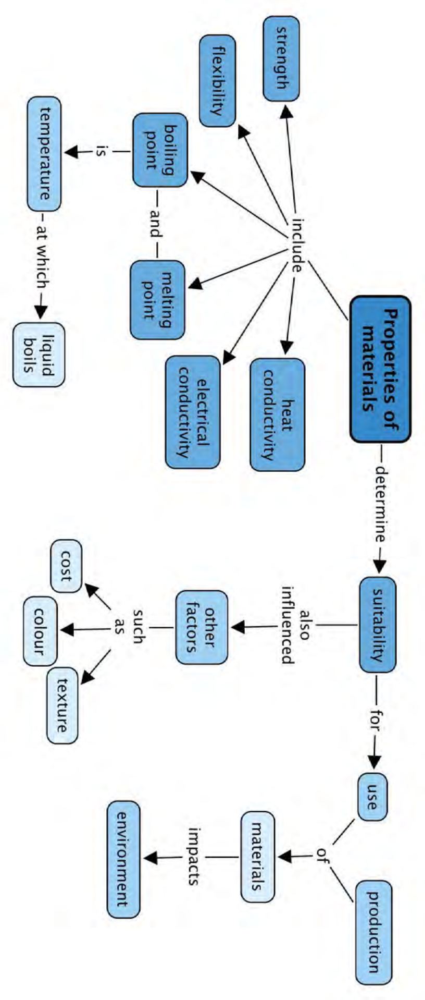
> **[Diagram Context - Textbook_NaturalScience_Gr7_Properties-of-materials.pdf-0025-00.png]**
> This concept map illustrates the relationship between the properties of materials and their practical application in production. It categorizes key physical properties—such as strength, flexibility, conductivity, and thermal points—while linking them to broader considerations like cost, aesthetics, and environmental impact. This visual aid helps learners understand how material selection is a multi-faceted decision-making process based on both technical specifications and external factors.

---

## Key Concepts and Definitions

* **thermometer:** a device for measuring the temperature of an object or a material
* **tongue map:** a map of the human tongue, showing which areas on the tongue are sensitive to which flavours; some scientists do not believe that the 'tongue map' is accurate

Here is your chance to discover the possibilities. What else can this beaker be?

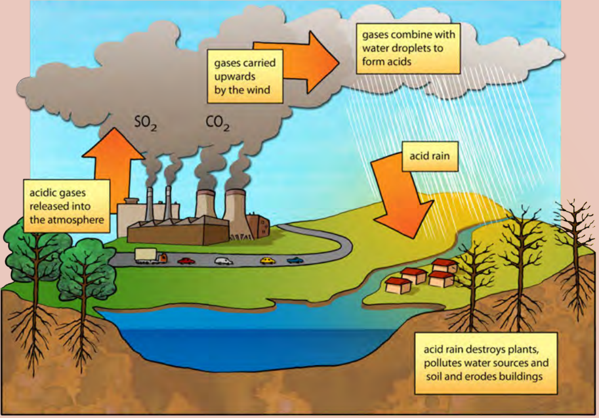
> **[Diagram Context - Textbook_NaturalScience_Gr7_Acids-bases-and-neutral-substances.pdf-0026-02.png]**
> A diagram illustrating the process of carbon dioxide emissions from a factory and their impact on the atmosphere. The diagram shows the factory releasing CO2 into the atmosphere, which then combines with water droplets to form acid rain. The diagram also shows the effect of acid rain on plants, animals, and buildings, as well as the role of the atmosphere in regulating the Earth's climate.

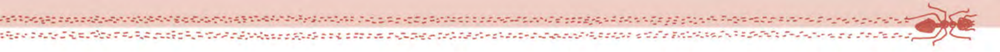
> **[Diagram Context - Textbook_NaturalScience_Gr7_Acids-bases-and-neutral-substances.pdf-0026-08.png]**
> The image shows a close-up view of a diagram of a cell. The diagram is colored in shades of pink and brown, with a red ant positioned on the right side. The diagram is labeled with the word "cell" and features various elements such as a cell membrane, nucleus, and mitochondria. The diagram also includes a Lewis structure and a geometric figure of a cell. The image

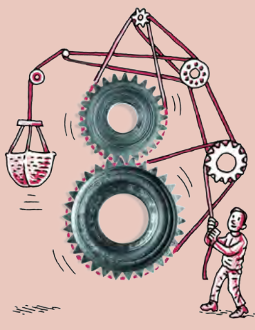
> **[Diagram Context - Textbook_NaturalScience_Gr7_Properties-of-materials.pdf-0026-02.png]**
> This diagram illustrates a mechanical system combining a pulley arrangement with a gear train, featuring a person pulling a rope to lift a load in a basket. It visually demonstrates the principles of mechanical advantage and power transmission, showing how input force applied to a rope is transferred through pulleys and meshed gears to perform work. For high school learners, this serves as an introductory model for understanding simple machines, torque, and the conversion of mechanical energy in engineering systems.

---

# 8 The Periodic Table of Elements

## Chapter Overview

* **Duration:** 2 weeks
* **Introduction:** Learners are introduced to the Periodic Table of elements for the first time. They will learn about the main features of the Periodic Table and where the three categories of elements—metals, non-metals, and semi-metals (also called metalloids)—can be found. 
* **Arrangement:** Elements are arranged on the table according to their **atomic numbers**, starting with hydrogen (atomic number $1$) at the top left-hand corner and continuing from left to right across the table. 
* **Atomic Number:** The atomic number indicates the position of a given element on the Periodic Table. In reality, the atomic number *determines* (rather than just shows) the position of a given element on the table.

### Important Issues to Note:

1. **The Atom:** Although formally introduced later, some basic information on the atom is crucial at this stage to understand atomic numbers. The approach taken here mirrors history: scientists observed similarities and differences in elements and used this information to arrange them in the table before the detailed model of the atom was fully developed. This empirical approach is used to introduce the Periodic Table.
2. **Atomic Number:** Defined simply at this stage as the number of protons in an atom of a given element (subatomic particles like protons, neutrons, and electrons are formally covered in subsequent units).
3. **Complexity:** The detailed arrangement of heavier atoms at the bottom of the table is excluded at this stage as it is considered too complex.

---

## 8.1 Arrangement of elements on the Periodic Table (2 hours)

| Tasks | Skills | Recommendation |
| :--- | :--- | :--- |
| Activity: Comparing Mendeleev's table with the modern version of the Periodic Table | Accessing and recalling information, comparing | CAPS Suggested |
| Activity: Periodic Table treasure hunt | Accessing and recalling information, observing | CAPS Suggested |

---

## 8.2 Properties of metals, semi-metals and non-metals (4 hours)

| Tasks | Skills | Recommendation |
| :--- | :--- | :--- |
| Activity: What do some of the elements look like? | Sorting and classifying, observing, identifying elements and properties, comparing | CAPS Suggested |
| Activity: Blitz revision of the properties of metals and non-metals | Sorting and classifying, identifying properties | Optional revision (suggested) |

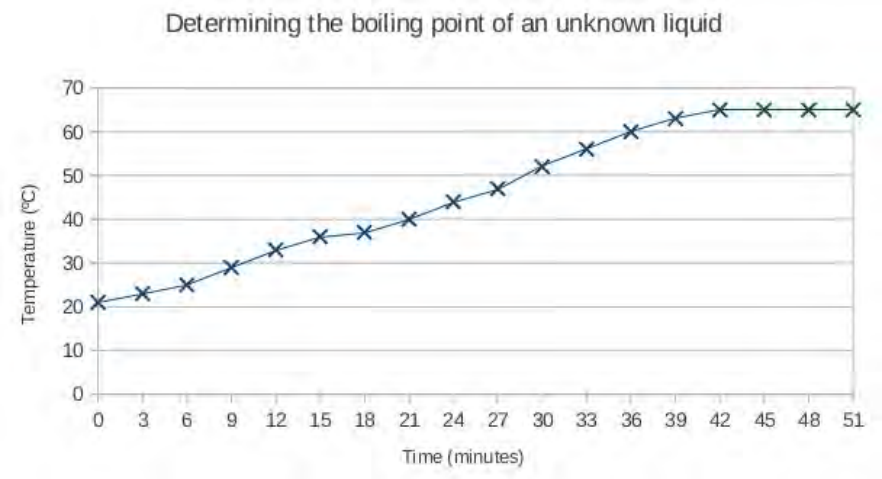
> **[Diagram Context - Textbook_NaturalScience_Gr7_Properties-of-materials.pdf-0027-07.png]**
> This line graph plots temperature (°C) against time (minutes) to illustrate the heating curve of an unknown liquid. The graph demonstrates the physical principle that during a phase change, such as boiling, the temperature of a substance remains constant despite continued heat input, indicated here by the plateau at 65°C.

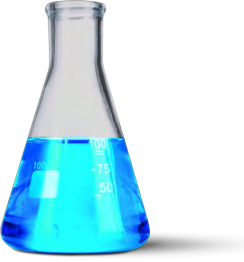
> **[Diagram Context - Textbook_NaturalScience_Gr7_The-Periodic-Table-of-Elements.pdf-0027-02.png]**
> 1. A clear glass beaker filled with a blue liquid.
2. The beaker has a volume of 100 milliliters.
3. The beaker is labeled with the volume of the liquid.

---

| Activity | Skills / Processes | Notes |
| :--- | :--- | :--- |
| Activity: Classifying element X | Accessing and recalling information, reading, observing, identifying properties | CAPS Suggested |
| Activity: The regions of the Periodic Table | Accessing and recalling information, sorting and classifying, comparing | CAPS suggested |
| Activity: Uses of the elements | Accessing and recalling information, communicating, group work, making a poster | CAPS suggested |

## Key questions

* What is an element?
* How can we classify the elements in our world?
* Which table helps us to make sense of the patterns we observe in the chemical properties of the elements?
* How are elements arranged on the Periodic Table?
* What does the position of an element on the Periodic Table tell us about its expected properties?
* What information can we use to represent the identity of an element?
* What are the typical properties of the:
  * metals;
  * non-metals; and
  * semi-metals?

The video in the link is an entertaining and simple way to introduce learners to the subject matter of this chapter about elements and the Periodic Table. It briefly explains what an element is, introduces Dmitri Mendeleev and his arrangement of the Periodic Table and also explains some of the concepts discussed later on in the chapter.

Mendeleev's original table is not part of what learners are required know, but it has been included to give learners a sense of the pace of scientific discovery. In order to make learners aware that scientific discovery can sometimes be a slow process, you could point out the gaps that are evident on Mendeleev's Periodic Table (for example, elements 44, 68 and 72). These gaps represented elements that were not known at the time but have been discovered since.

## 8.1 Arrangement of elements on the Periodic Table

The website found at `http://rsc.li/195tO2e` contains an interactive version of the Periodic Table. It is a wonderful tool to show some of the trends and information that the Periodic Table contains. This website can also be used in the later grades when the Periodic Table is covered again, in more detail. For now, it is a useful teaching tool to give an overview.

Another interesting website which contains mostly photos of the elements is `http://bit.ly/1euHmVi`. This is a very useful site to illustrate to learners what elements actually are.

### Element names

The video above includes a bit more history about Dmitri Mendeleev, reviews Mendeleev's organisation of the Periodic Table and then moves on to relationships of elements on the Periodic Table

> **[Diagram Context - Textbook_NaturalScience_Gr7_Properties-of-materials.pdf-0028-05.png]**
> This graphic illustrates a biological trail formation, featuring a single ant leading a linear, double-stranded path of smaller ant icons against a shaded background. It conceptually demonstrates the mechanism of pheromone-based chemical communication and collective foraging behavior, where individual organisms contribute to a coordinated group response to navigate their environment.

> **[Diagram Context - Textbook_NaturalScience_Gr7_Properties-of-materials.pdf-0028-07.png]**
> 1. A silver spring coiled into a spiral shape.

---

## Atomic Numbers and Subatomic Particles

### Atomic Numbers
* Each element has a unique **atomic number**.
* The **Periodic Table of Elements** is a method of classifying elements so that they are grouped together based on similar properties.
* **Extension:** An interactive explanation of the history of the Periodic Table and the atom can be found online at [http://bit.ly/132Nzbh](http://bit.ly/132Nzbh).

### Important Note on Curriculum Progression
While atoms, electrons, and protons are concepts explored fully in Grade 8, learners should grasp the fundamental idea that each element possesses a unique atomic number and that the Periodic Table categorizes elements logically.

---

### Subatomic Particles and the Model of the Atom

When introducing subatomic particles, teachers can illustrate a model of the atom on the board, though the precise structural arrangement of subatomic particles is not strictly required at this stage.

<!-- DIAGRAM_PLACEHOLDER: diagram -->

#### Key Features of the Atomic Model:
* **Nucleus:** Located at the center of the atom, containing protons and neutrons.
* **Protons:** Subatomic particles with a **positive charge**.
* **Neutrons:** Subatomic particles with a **neutral charge** (no charge).
* **Electrons:** Subatomic particles with a **negative charge** that orbit the nucleus.

#### Charge Balance in Atoms:
* The model illustrated above represents a nitrogen atom (containing $7$ protons).
* An atom is **neutral** (has no overall charge) when the number of electrons equals the number of protons.
* If an atom gains or loses electrons, it develops a net charge and is referred to as an **ion**.

---

### Examples

* **Hydrogen:** Has an atomic number of $1$ and therefore contains $1$ proton.
* **Carbon:** Has an atomic number of $6$ and therefore contains $6$ protons in its atoms.

---

## ACTIVITY: Periodic Table treasure hunt (LB page 152)

This is a fun activity aimed at getting learners to interact with the Periodic Table and learn the names and symbols of the first 20 elements.

| Element | Symbol |
| :--- | :--- |
| C | Carbon |
| H | Hydrogen |
| O | Oxygen |
| Co | Cobalt |
| La | Lanthanum |
| Te | Tellurium |

*Note: This is not a "formula" for chocolate, but simply a fun activity aimed at finding elements on the Periodic Table. Later we will learn how to put element symbols together into formulae that represent actual compounds.*

### Elements and Symbols Reference Table

| Element | Symbol | Element | Symbol |
| :--- | :--- | :--- | :--- |
| Aluminium | Al | Magnesium | Mg |
| Bromine | Br | Nitrogen | N |
| Calcium | Ca | Oxygen | O |
| Carbon | C | Phosphorus | P |
| Chlorine | Cl | Potassium | K |
| Copper | Cu | Silicon | Si |
| Gold | Au | Silver | Ag |
| Hydrogen | H | Sodium | Na |
| Iodine | I | Sulphur | S |
| Iron | Fe | Tin | Sn |
| Lead | Pb | Zinc | Zn |

---

## 8.2 Properties of metals, semi-metals and non-metals

### ACTIVITY: What do some of the elements look like? (LB page 153)

This activity helps learners understand the arrangement of elements into metals, non-metals, and semi-metals on the Periodic Table, grasping that elements are actual, observable substances in the world around us.

#### Instructions for this activity:
1. If possible, collect actual samples of the elements for this activity. You do not need all of them, but at least some listed here. You can use everyday materials such as:
   - A piece of coal or graphite stick (for carbon)
   - A piece of copper piping
   - A tube with sulphur powder
   - A bottle of iodine solution from the chemist
   - A piece of aluminium

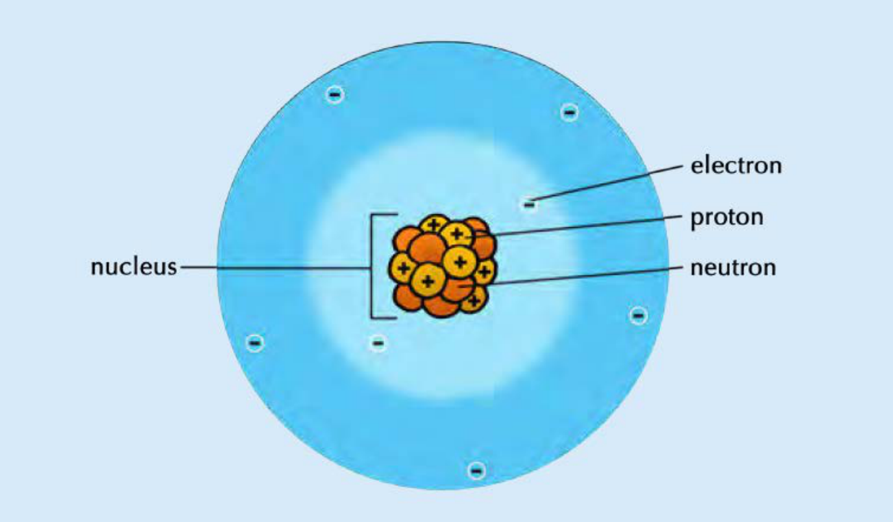
> **[Diagram Context - Textbook_NaturalScience_Gr7_The-Periodic-Table-of-Elements.pdf-0030-06.png]**
> 1. A diagram of an atom with a blue background and a white circle with orange and yellow balls representing protons and neutrons.

---

# Activity Instructions: Exploring the Periodic Table, Metals, and Non-Metals

## Steps for the Activity

1. **Collect Samples:** Gather various element samples (e.g., foil, an iron/steel nail) and arrange them on the front table.
2. **Prepare a Blank Periodic Table:** Stick up a blank cardboard cut-out of the Periodic Table on the board. You can draw it, print a large copy, or use a blank template from the workbook. 
   - *Reference links:* [bit.ly/132NDb7](http://bit.ly/132NDb7)
3. **Examine Samples:** Pass the samples around the class or have learners come up to inspect them.
4. **Match Elements:** Ask volunteers to select a sample, identify its correct place on the Periodic Table using their workbooks, and attach the sample to the correct square on the cardboard table using adhesive tape or Prestik.
5. **Expand the Activity:** Repeat this for as many samples as possible. You can also use colour photos of different elements.
   - *Reference links for public domain images:* [bit.ly/19PEew3](http://bit.ly/19PEew3)
6. **Use Workbook Images:** If actual samples or colour printouts are unavailable, refer to the images provided in the workbooks and write the element symbols on the cardboard cut-out.
7. **Observe Physical Characteristics:** Ask learners to compare the appearance of elements on the left-hand side of the table versus those on the right-hand side. This serves as an introduction to **metals and non-metals**.
8. **Class Discussion:** Answer the follow-up questions at the end of the activity as a class.

---

## Key Learning Objectives

The aim of this activity is to help learners recognize the fundamental differences between elements located on the left (and middle) and those on the right of the Periodic Table. 

While later grades explore periodicity and chemical/physical patterns in greater detail, the current emphasis focuses on the main distinctions between:
* **Metals**
* **Non-metals**
* **Semi-metals** (metalloids)

---

## Observations and Properties

### 1. Characteristics of Metals (Left and Middle of the Periodic Table)
* **Appearance:** Mostly shiny and metallic.
* **Texture & State:** Mostly hard solids at room temperature.
* **Prior Knowledge:** Learners should already be familiar with these properties from previous grades.

### 2. Characteristics of Non-Metals (Right Side of the Periodic Table)
* **Appearance:** Not shiny and metallic; instead, they are dull or exhibit various colours.
* **Texture & Durability:** Generally not as hard and durable as metals. For example, graphite is brittle, and many non-metals occur in powdery forms.
* **States of Matter:** Non-metals are not exclusively solids; some are liquids, and others are gases at room temperature.

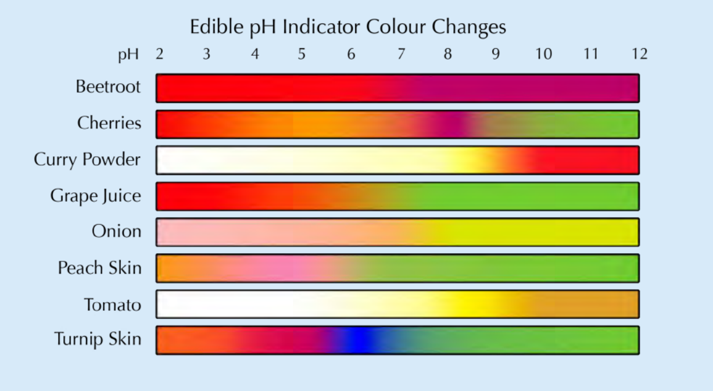
> **[Diagram Context - Textbook_NaturalScience_Gr7_Acids-bases-and-neutral-substances.pdf-0031-00.png]**
> The image is a colorful diagram that illustrates the changes in the ph value of various foods. The diagram is divided into six sections, each representing a different food item. The ph value of the foods is represented by different colors, with the darkest color being the lowest ph value and the lightest color being the highest ph value. The diagram also includes labels for each food item, such as "Ber

---

## ACTIVITY: Blitz revision of the properties of metals and non-metals LB page 155

| Properties of metals | Properties of non-metals |
| :--- | :--- |
| shiny | dull |
| lustrous | brittle |
| malleable | can be solid/liquid/gas |
| ductile | electrical insulator |
| conduct electricity | thermal insulator |
| conduct heat | |
| usually a solid | |

1. Chromium is lustrous, malleable and conducts heat and electricity.
2. Chromium is a metal.
3. 24

1. Sulphur is dull, brittle and does not conduct electricity or heat well.
2. Sulphur is a non-metal.
3. 14

---

## ACTIVITY: Classifying element X LB page 157

The material (element X) has a shiny, lustrous appearance. It also looks as if there are parallel ridges on the disk.

### Metallic properties

| Metallic properties | YES | NO |
| :--- | :--- | :--- |
| Is the material shiny (lustrous)? | X | |
| Is the material malleable and ductile? | | X |
| Does the material conduct electricity at room temperature? | | X |
| Does the material conduct heat? | | X |

### Non-metallic properties

| Non-metallic properties | YES | NO |
| :--- | :--- | :--- |
| Is the material brittle? | X | |
| Does the material have a dull appearance? | | X |
| Is the material an insulator? | | X |

---

### Additional Observations on Material Properties

* **Observation note:** The material does not conduct electricity at room temperature. It does conduct electricity at very low temperatures.
1. Element X is shiny and lustrous. It has the appearance of a metal.
2. Element X is brittle. It does not conduct heat and it does not conduct electricity at room temperature.
3. Learners may say that they don't know how to categorise element X, because it looks as if it might fit into both categories.

---

### ACTIVITY: The Regions of the Periodic Table (LB page 159)

* **Instructions:** Any colour other than yellow should be fine, as long as all the semi-metals have the same colour. The purpose of this activity is that learners must identify regions on the periodic table for each category, but the different regions do not have specific colours associated with them.
* **Colour Coding:** Any colour other than blue should be fine, as long as all the metals have the same colour.

<!-- DIAGRAM_PLACEHOLDER: diagram -->

1. Metals
2. Semi-metals
3. Non-metals

| Element | Chemical symbol | Category: (Metal, non-metal or semi-metal?) |
| :--- | :--- | :--- |
| Iron | Fe | Metal |
| Silicon | Si | Semi-metal |
| Fluorine | F | Non-metal |
| Titanium | Ti | Metal |
| Nitrogen | N | Non-metal |

---

# Revision

1. 
   * **a)** It tells us that the element is a metal (hydrogen is an exception here). The metals occur on the left-hand side of the Periodic Table.
   * **b)** It tells us that the element is most likely a non-metal. The non-metals occur on the right-hand side of the Periodic Table.

2. The chemical symbol of the element and the atomic number of the element.

3. The elements are arranged in order of increasing atomic number.

4. Hydrogen, $\text{H}$.

5. It means it has $1$ proton in its atoms.

6. $\text{F}$, $\text{Cl}$, $\text{Br}$, $\text{I}$, $\text{At}$

7. 

| Names of elements | Chemical symbols |
| :--- | :--- |
| Sulphur | $\text{S}$ |
| Carbon | $\text{C}$ |
| Nitrogen | $\text{N}$ |
| Sodium | $\text{Na}$ |
| Oxygen | $\text{O}$ |
| Silicon | $\text{Si}$ |
| Chlorine | $\text{Cl}$ |
| Helium | $\text{He}$ |

8. Learner's answer should contain at least the following information:
   * Semi-metals are elements that have some properties of both metals and non-metals.
   * They are found in a diagonal strip that separates the metals from the non-metals, towards the right-hand side of the Periodic Table.
   * Learner should give one example from the following list: boron ($\text{B}$), silicon ($\text{Si}$), germanium ($\text{Ge}$), arsenic ($\text{As}$), antimony ($\text{Sb}$), tellurium ($\text{Te}$) or polonium ($\text{Po}$).

9. 
   * **Metals:** Any two of the following properties:
     Usually solid, shiny (lustrous), ductile, malleable, have high melting and boiling points, good conductors of heat and electricity.
   * **Non-metals:** Any two of the following properties:
     Most often gases and liquids (but can be solid), dull, brittle, poor conductors / good insulators.

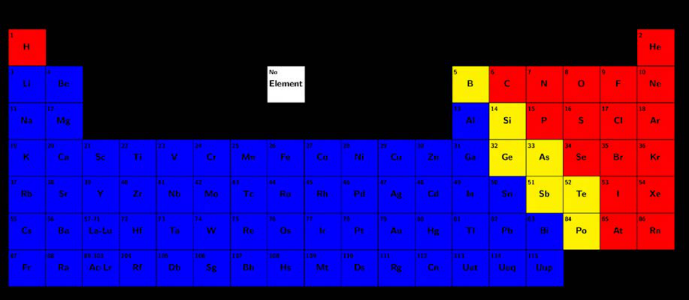
> **[Diagram Context - Textbook_NaturalScience_Gr7_The-Periodic-Table-of-Elements.pdf-0034-07.png]**
> The image is a detailed diagram of the Periodic Table of Elements, which is a chart that lists all the known chemical elements. The table is divided into rows and columns, each containing the chemical symbol of an element and its atomic number. The table is color-coded, with each column having a different color, and the rows are numbered. The diagram is in black and red, with the

