# 2 Potential and kinetic energy

## KEY QUESTIONS:
* What is potential energy?
* What is kinetic energy?
* Where do we get energy from?
* How much energy do I need?
* Can energy be created or destroyed?
* What is a system?

Renewable and non-renewable sources are where we get our energy **from** but what **types** of energy do we find in the world?

All energy can be placed into two main groups:
1. Potential energy
2. Kinetic energy

So what are these different types of energy and what does it mean if an object has potential energy or kinetic energy? Let's investigate!

---

## 2.1 Potential energy

Throughout our investigation and learning about the concepts surrounding energy, we will be talking about systems and how energy is transferred within a system. A system is a set of parts that work together as a whole. A change in one part of the system will affect the other parts. This will become more clear as we see some examples throughout this term.

We are going to find the difference between potential and kinetic energy. Look at the following diagram which shows a ramp with a marble rolling down into a foam cup. The marble will knock the cup and make it move.

<!-- DIAGRAM_PLACEHOLDER: diagram -->

*A marble rolling down a ramp.*

When the marble is released, it rolls down the ramp and transfers some of its energy to the cup. This transfer of energy is what makes the cup move. But where did the marble get energy from? Do you think you can make the cup move more or less depending on how far up the ramp you start the marble? Let's do an investigation to find out.

---

## NEW WORDS
* **joule**
* **potential energy**
* **system**

---

# INVESTIGATION: How can we make the foam cup move further?

**INVESTIGATIVE QUESTION:** If we roll a marble down a ramp and into a cup, how does the starting position of the marble affect how far the cup moves?

## VARIABLES
1. What will we change when performing this investigation?
2. What will we be measuring in this investigation?
3. Which things must stay the same?

## HYPOTHESIS
Write a hypothesis for this investigation. When you do this, you need to write what you expect to observe. It does not have to be the correct answer to the investigative question.

## MATERIALS AND APPARATUS
* A styrofoam cup
* A marble
* A pair of scissors
* A ramp (this can be a plank of wood or stiff card)
* Books or wooden blocks to prop up the ramp
* Rulers

## METHOD
1. Work in groups of 3 or 4.
2. Cut a hole in the lip of the cup so that when you turn it over on a table, there is a hole which a marble can now fit through, as shown in the previous diagram.
3. Build the setup as shown in the following diagram. Place the cup upside down on the table surface. Place the ramp so that it ends at the hole in the cup. Prop up the ramp with blocks or books. You will adjust the height of the ramp using different books or wooden blocks. Otherwise you can just hold the top of the ramp at the specified height.

---

Chapter 2: Potential and kinetic energy | 19

> **[Diagram Context - Textbook_NaturalScience_Gr7_Energy-transfer-to-surroundings.pdf-0001-02.png]**
> This diagram represents a cross-section of a biological membrane surface, featuring a linear array of identical, hook-shaped protein structures embedded within a shaded substrate. It illustrates the concept of membrane-bound receptors or surface proteins, providing a visual model for students to understand the density and uniform orientation of functional molecules on a cellular boundary.

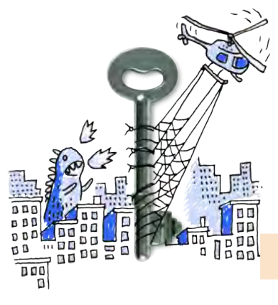
> **[Diagram Context - Textbook_NaturalScience_Gr7_Energy-transfer-to-surroundings.pdf-0001-03.png]**
> This metaphorical illustration depicts a city scene featuring a fire-breathing monster, a helicopter lowering a net, and a central, oversized key. The image uses these symbolic elements to represent the concept of a "key" or "solution" being used to capture or resolve a complex problem or threat within an urban environment. It serves as a visual analogy for identifying the critical factor or "key" required to unlock or manage a challenging situation in a systems-thinking or problem-solving context.

> **[Diagram Context - Textbook_NaturalScience_Gr7_Energy-transfer-to-surroundings.pdf-0001-09.png]**
> This graphic is a text-based heading labeled "5.1 Useful and wasted energy." It serves as an introductory conceptual anchor for the Natural Sciences curriculum, highlighting the principle of energy conservation and the inevitable dissipation of energy during transfers.

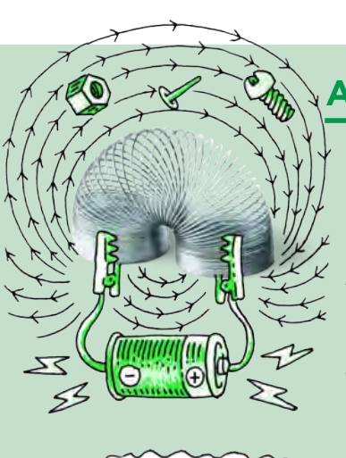
> **[Diagram Context - Textbook_NaturalScience_Gr7_Energy-transfer-to-surroundings.pdf-0001-11.png]**
> This diagram illustrates an electromagnet created by connecting a battery to a coiled wire (solenoid), featuring labels for the battery terminals (+ and -) and arrows indicating the resulting magnetic field lines. It demonstrates the principle of electromagnetism, showing how an electric current flowing through a coil generates a magnetic field capable of attracting metallic objects like a nut, nail, and bolt.

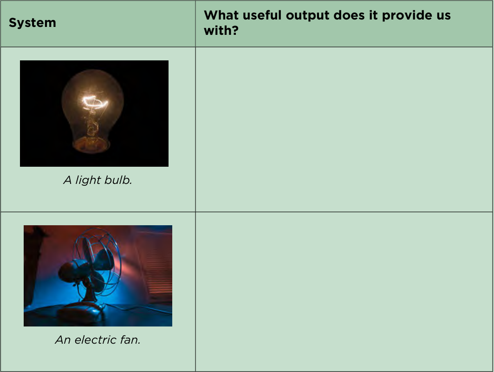
> **[Diagram Context - Textbook_NaturalScience_Gr7_Energy-transfer-to-surroundings.pdf-0001-15.png]**
> This table presents a comparative analysis of two electrical systems, featuring photographic icons of a light bulb and an electric fan. It serves as a foundational exercise in energy transfer, prompting students to identify the specific useful energy outputs—light and thermal energy for the bulb, and kinetic energy for the fan—produced when these systems are connected to an electrical source.

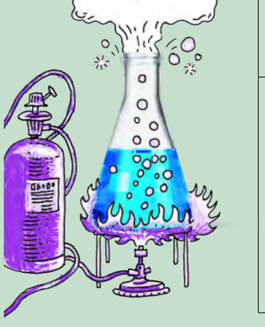
> **[Diagram Context - Textbook_NaturalScience_Gr7_Energy-transfer-to-surroundings.pdf-0001-17.png]**
> This illustration depicts a laboratory apparatus consisting of a Bunsen burner heating a conical flask containing a blue liquid, which is connected to a gas cylinder. The visual elements include a gas canister, tubing, a Bunsen burner with a flame, a conical flask with effervescent bubbles, and escaping gas or steam. Conceptually, this diagram illustrates an exothermic or boiling process, demonstrating the application of heat energy to a chemical system to induce a phase change or a chemical reaction.

> **[Diagram Context - Textbook_NaturalScience_Gr7_Heat-Energy-transfer.pdf-0001-02.png]**
> This diagram represents a cross-section of a biological membrane, specifically illustrating the hydrophilic heads of a phospholipid monolayer oriented towards an aqueous environment. The image features a series of uniform, hook-shaped structures embedded along the surface of a shaded rectangular base, representing the polar phosphate heads of the lipid bilayer. It conceptually demonstrates the structural arrangement of the cell membrane, highlighting the orientation of phospholipids that facilitates the selective permeability essential for cellular homeostasis.

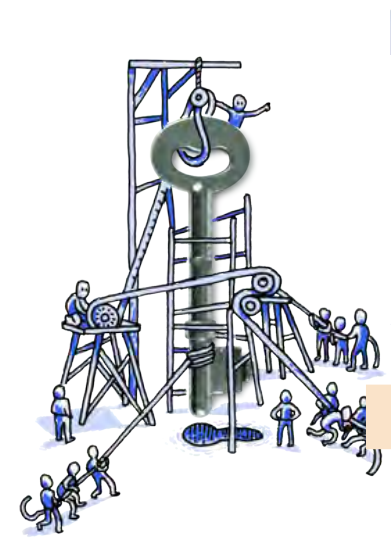
> **[Diagram Context - Textbook_NaturalScience_Gr7_Heat-Energy-transfer.pdf-0001-03.png]**
> This conceptual illustration depicts a complex mechanical apparatus, featuring a large central key being manipulated by a team of figures using a system of pulleys, ropes, and scaffolding. The diagram serves as a metaphor for collaborative effort and the application of mechanical advantage, illustrating how multiple inputs and simple machines can be coordinated to achieve a specific, singular task.

> **[Diagram Context - Textbook_NaturalScience_Gr7_Heat-Energy-transfer.pdf-0001-18.png]**
> This illustration depicts a laboratory apparatus consisting of a Bunsen burner heating a conical flask containing a liquid, which is connected to a gas cylinder. The visual elements include a flame, boiling liquid with rising bubbles, and gas escaping from the top of the flask, representing an exothermic or gas-evolving chemical reaction. This diagram serves to illustrate the practical application of heating substances in a controlled laboratory environment to observe phase changes or chemical reactions involving gas production.

> **[Diagram Context - Textbook_NaturalScience_Gr7_Heat-insulation-and-energy-saving.pdf-0001-02.png]**
> This diagram represents a cross-section of a biological membrane surface, featuring a series of repeating, hook-like or coiled structures embedded in a solid base layer. It illustrates the concept of surface area amplification, such as the microvilli found on the epithelial lining of the small intestine, which are essential for maximizing the efficiency of nutrient absorption in the digestive system.

> **[Diagram Context - Textbook_NaturalScience_Gr7_Heat-insulation-and-energy-saving.pdf-0001-03.png]**
> This graphic is a metaphorical illustration featuring a cartoon character with a physical key as a head, accompanied by a question mark and a scribbled line. It serves as a visual mnemonic to represent the "lock and key" model of enzyme action, where the specific shape of the key corresponds to the active site of an enzyme. This conceptual aid helps Life Sciences learners visualize how substrate specificity dictates biochemical reactions within a cell.

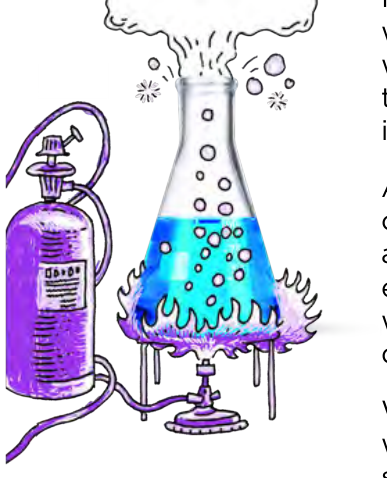
> **[Diagram Context - Textbook_NaturalScience_Gr7_Heat-insulation-and-energy-saving.pdf-0001-14.png]**
> This diagram illustrates a laboratory apparatus setup consisting of a gas cylinder connected to a Bunsen burner heating an Erlenmeyer flask containing a blue liquid, which is producing bubbles and vapor. It visually represents the process of heating a chemical reaction or physical change, demonstrating the application of thermal energy to a system to induce phase changes or gas evolution.

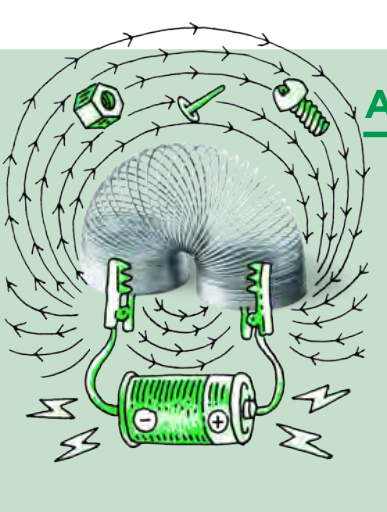
> **[Diagram Context - Textbook_NaturalScience_Gr7_Heat-insulation-and-energy-saving.pdf-0001-17.png]**
> This diagram illustrates an electromagnet, featuring a solenoid (coiled wire) connected to a battery with positive (+) and negative (-) terminals, surrounded by magnetic field lines indicated by directional arrows. It demonstrates the principle of electromagnetism, showing how an electric current flowing through a coil creates a magnetic field capable of attracting nearby metallic objects like a nut, nail, and bolt.

> **[Diagram Context - Textbook_NaturalScience_Gr7_Potential-and-kinetic-energy.pdf-0001-02.png]**
> This diagram illustrates a cross-section of a biological membrane surface, featuring a series of repeating, hook-like structures embedded in a solid substrate. These structures represent the microvilli or specialized surface projections found on epithelial cells, which function to increase the surface area for efficient absorption or secretion.

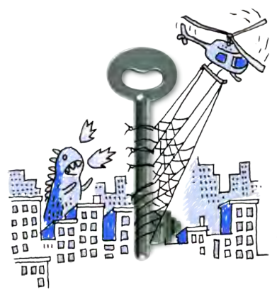
> **[Diagram Context - Textbook_NaturalScience_Gr7_Potential-and-kinetic-energy.pdf-0001-03.png]**
> This metaphorical illustration depicts a city skyline featuring a fire-breathing monster on one side and a helicopter capturing a large key with a net on the other. By using the central key as a symbolic barrier or "lock" between the chaotic monster and the organized rescue effort, the image conceptually represents the idea of a "key solution" or critical intervention required to resolve a complex problem or crisis.

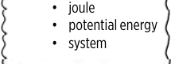
> **[Diagram Context - Textbook_NaturalScience_Gr7_Potential-and-kinetic-energy.pdf-0001-20.png]**
> 1. A diagram of a cell with arrows pointing to different parts of the cell.

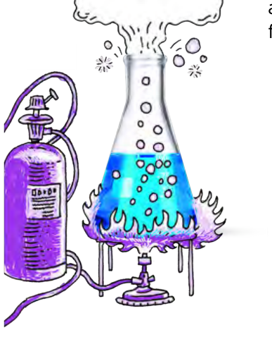
> **[Diagram Context - Textbook_NaturalScience_Gr7_Potential-and-kinetic-energy.pdf-0001-22.png]**
> 1. Purple and blue liquid in a glass beaker.

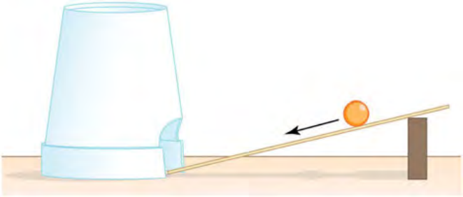
> **[Diagram Context - Textbook_NaturalScience_Gr7_Potential-and-kinetic-energy.pdf-0001-23.png]**
> 1. A diagram of a cell with a yellow ball on a stick.

> **[Diagram Context - Textbook_NaturalScience_Gr7_Sources-of-energy.pdf-0001-02.png]**
> The image shows a line drawing of a cell with blue and white lines. The drawing is set against a gray background, and the lines are arranged in a zigzag pattern. The diagram is labeled with the word "cell" and "biology" written in white text. The diagram also includes a Lewis diagram, an anatomical/cellular structure, and a graph. The diagram is labeled with

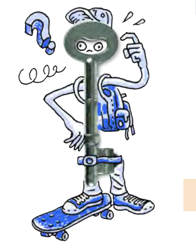
> **[Diagram Context - Textbook_NaturalScience_Gr7_Sources-of-energy.pdf-0001-03.png]**
> 1. A cartoon character with a backpack and a skateboard.

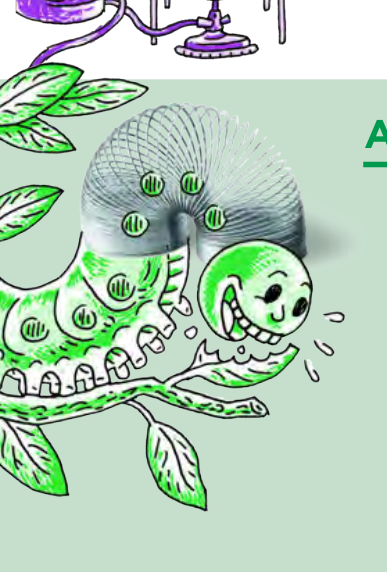
> **[Diagram Context - Textbook_NaturalScience_Gr7_Sources-of-energy.pdf-0001-17.png]**
> The image is a cartoon drawing of a caterpillar with a green body and a face, holding a leaf in its mouth. The caterpillar is surrounded by green leaves and is connected to a purple pipe. The drawing is labeled with the letters "A" and "B" and is accompanied by a description of the drawing.

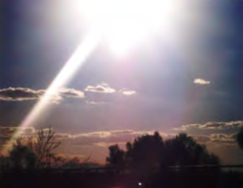
> **[Diagram Context - Textbook_NaturalScience_Gr7_Sources-of-energy.pdf-0001-22.png]**
> 1. A diagram of a cell with arrows pointing to different parts of the cell.

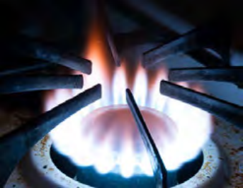
> **[Diagram Context - Textbook_NaturalScience_Gr7_Sources-of-energy.pdf-0001-23.png]**
> The image shows a close-up view of a gas stove burner with a flame that is burning brightly. The flame is composed of a white and orange color, which is the result of the combustion of the gas. The burner is situated on the right side of the image, and there are several other burners in the background. The image does not contain any text or additional objects, and the

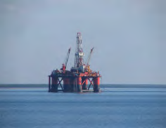
> **[Diagram Context - Textbook_NaturalScience_Gr7_Sources-of-energy.pdf-0001-24.png]**
> 1. A diagram of a cell with arrows pointing to different parts of the cell.

---

4. Practice rolling the marble down the ramp and into the cup. You can use two rulers to create a path down the ramp to guide the marble into the hole so that it does not roll off the side of the ramp. Or else you can bend the cardboard so that the marble rolls down the middle on the fold. You can also try a cardboard tube like a roller towel inner. You will need to practice to see what works best with the materials that you have available.

5. Once you have found the best way to do this, you can start the measurements.

6. First set up the ramp so that the top of the ramp is at a height of $5\text{ cm}$. Roll the marble from a height of $5\text{ cm}$ and then measure how far the styrofoam cup moves.

7. Next adjust the height of the ramp by increasing by $5\text{ cm}$ each time. Each time place the marble at the top of the ramp and roll it down, measuring how far the cup moves.

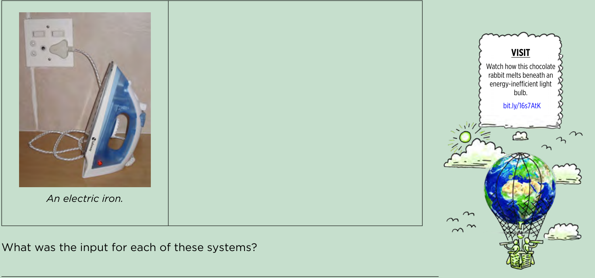
> **[Diagram Context - Textbook_NaturalScience_Gr7_Energy-transfer-to-surroundings.pdf-0002-01.png]**
> This graphic features a photograph of an electric iron and a call-to-action box referencing an energy-inefficient light bulb, accompanied by the prompt, "What was the input for each of these systems?" It serves as an introductory exercise in energy systems, requiring students to identify electrical energy as the primary input for these household appliances and consider the implications of energy efficiency in the context of the CAPS Natural Sciences curriculum.

8. Repeat the measurements until you have at least $6$ recordings.

9. Record your measurements in the table and draw a graph with a line of best fit.

> **[Diagram Context - Textbook_NaturalScience_Gr7_Energy-transfer-to-surroundings.pdf-0002-02.png]**
> This graphic depicts a stylized, repeating pattern of interlocking, arrow-shaped segments forming a continuous horizontal chain. The image lacks specific biological or chemical labels, but conceptually represents the linear, sequential nature of molecular polymers or the repetitive structural units found in biological macromolecules like DNA or protein chains.

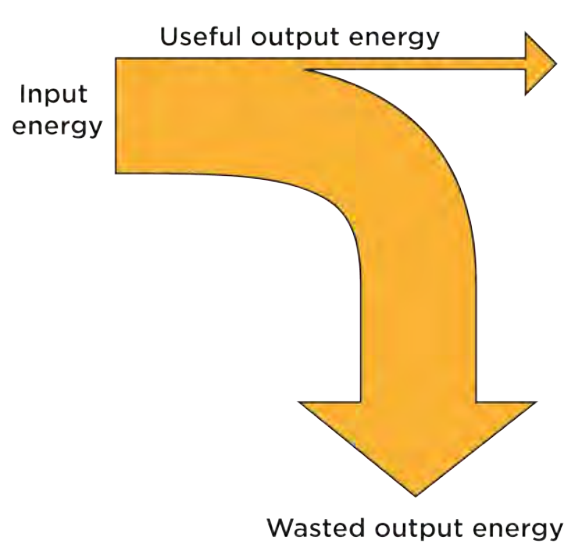
> **[Diagram Context - Textbook_NaturalScience_Gr7_Energy-transfer-to-surroundings.pdf-0002-05.png]**
> This Sankey diagram illustrates energy flow using arrows labeled "Input energy," "Useful output energy," and "Wasted output energy." It conceptually demonstrates the principle of energy conservation by showing how total input energy is divided into desired work and energy losses, helping students visualize energy efficiency in physical systems.

> **[Diagram Context - Textbook_NaturalScience_Gr7_Heat-Energy-transfer.pdf-0002-07.png]**
> This image depicts a real-world example of a heterogeneous mixture, specifically a cup of coffee accompanied by sugar cubes and a creamer. It serves as a visual aid for Grade 7-9 Natural Sciences to illustrate the concepts of solutes (sugar), solvents (coffee), and the formation of mixtures and solutions through physical processes like dissolving.

> **[Diagram Context - Textbook_NaturalScience_Gr7_Heat-Energy-transfer.pdf-0002-10.png]**
> This graphic is a simple text-based call-to-action contained within a cloud-shaped speech bubble. It features the single word "VISIT" in bold, sans-serif capital letters, serving as a navigational prompt or instructional sign. In an educational context, such a graphic functions as a digital signpost to direct students toward external resources, websites, or supplementary learning materials.

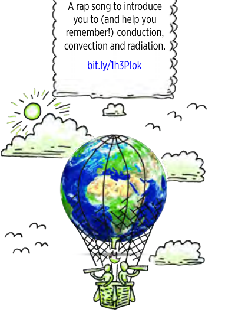
> **[Diagram Context - Textbook_NaturalScience_Gr7_Heat-Energy-transfer.pdf-0002-11.png]**
> This graphic serves as an introductory mnemonic aid featuring a stylized illustration of the Earth as a hot air balloon, accompanied by text referencing conduction, convection, and radiation. It directs students to an external digital resource to help them memorize the three primary methods of heat transfer, which are core concepts in the Natural Sciences curriculum.

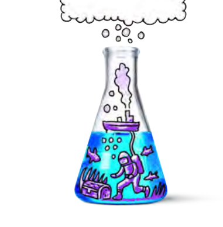
> **[Diagram Context - Textbook_NaturalScience_Gr7_Heat-Energy-transfer.pdf-0002-14.png]**
> This graphic features an Erlenmeyer flask containing a surreal underwater scene with a diver, a treasure chest, fish, and a surface ship emitting smoke, topped by an empty thought bubble. The illustration uses visual metaphors—specifically the flask as a vessel for containment and the thought bubble as a prompt—to encourage students to conceptualize scientific inquiry or the "hidden" processes occurring within a chemical system. It serves as a creative stimulus for learners to hypothesize about the relationship between surface-level observations and the underlying mechanisms of a reaction or environment.

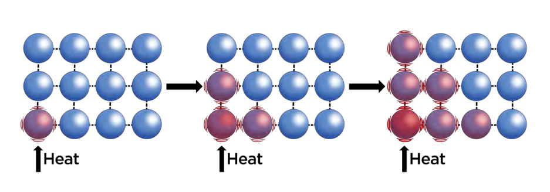
> **[Diagram Context - Textbook_NaturalScience_Gr7_Heat-Energy-transfer.pdf-0002-15.png]**
> This diagram illustrates the particle model of matter, specifically showing a solid lattice structure with spheres representing atoms or molecules and dashed lines representing intermolecular forces. By using arrows labeled "Heat" and red vibration rings, it demonstrates how thermal energy increases the kinetic energy of particles, causing them to vibrate more intensely and transfer energy through the lattice via conduction.

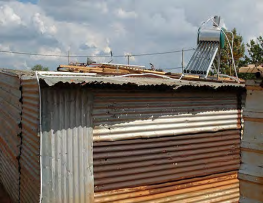
> **[Diagram Context - Textbook_NaturalScience_Gr7_Heat-insulation-and-energy-saving.pdf-0002-01.png]**
> This image depicts a solar water heater (evacuated tube collector) installed on the roof of a corrugated iron structure. It illustrates the practical application of renewable energy technology, demonstrating how thermal energy from the sun is harnessed to heat water for domestic use in off-grid or resource-constrained settings.

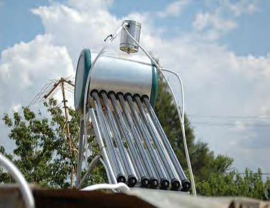
> **[Diagram Context - Textbook_NaturalScience_Gr7_Heat-insulation-and-energy-saving.pdf-0002-02.png]**
> This image displays a solar water heater apparatus, specifically featuring a storage tank and a series of evacuated glass tubes mounted on a support frame. It illustrates the practical application of renewable energy technology, demonstrating how solar radiation is captured and converted into thermal energy for domestic water heating as part of the Physical Sciences curriculum on energy and sustainability.

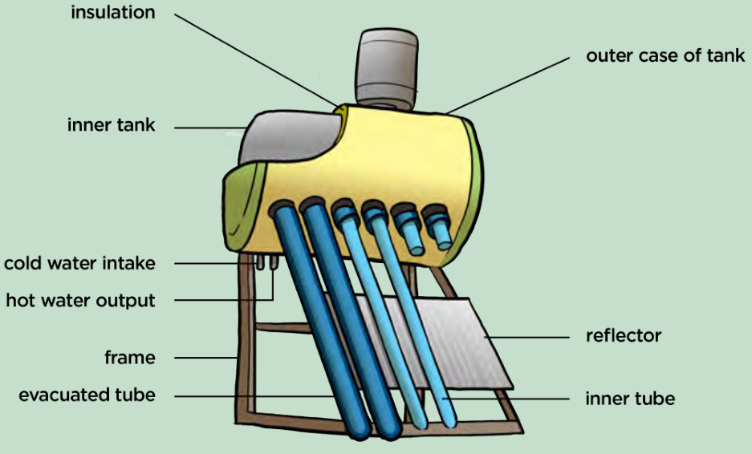
> **[Diagram Context - Textbook_NaturalScience_Gr7_Heat-insulation-and-energy-saving.pdf-0002-05.png]**
> This diagram illustrates the structural components of an evacuated tube solar water heater, featuring labels for the insulation, outer case, inner tank, cold water intake, hot water output, frame, evacuated tube, inner tube, and reflector. It conceptually demonstrates how solar thermal energy is captured and stored, highlighting the importance of insulation and heat-absorbing materials in efficient domestic energy systems.

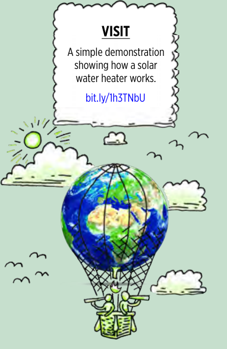
> **[Diagram Context - Textbook_NaturalScience_Gr7_Heat-insulation-and-energy-saving.pdf-0002-06.png]**
> This graphic is an illustrative poster featuring a stylized Earth suspended as a hot air balloon, accompanied by text labels "VISIT," "A simple demonstration showing how a solar water heater works," and a URL. It serves as an introductory visual hook to encourage students to explore renewable energy technologies, specifically the application of solar thermal energy in domestic water heating systems as part of the CAPS Natural Sciences or Physical Sciences curriculum.

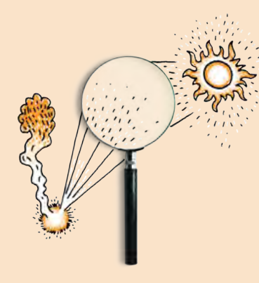
> **[Diagram Context - Textbook_NaturalScience_Gr7_Potential-and-kinetic-energy.pdf-0002-04.png]**
> 1. A magnifying glass is being used to look at a diagram of a cell.

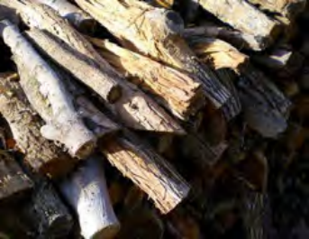
> **[Diagram Context - Textbook_NaturalScience_Gr7_Sources-of-energy.pdf-0002-01.png]**
> 1. A diagram of a cell with a Lewis structure.

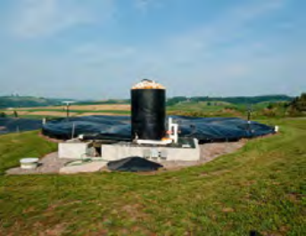
> **[Diagram Context - Textbook_NaturalScience_Gr7_Sources-of-energy.pdf-0002-02.png]**
> 1. A diagram of a cell with a diagram of a cell on it.

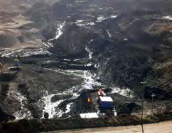
> **[Diagram Context - Textbook_NaturalScience_Gr7_Sources-of-energy.pdf-0002-04.png]**
> The image shows a large, muddy pit with a small blue building in the middle. The pit is filled with water and has a river flowing through it. There are two people standing near the pit, and a crane is visible in the background. The image is labeled with the title "South Africa CAPS" and the caption "Examine this educational graphic carefully and write a concise, 2-

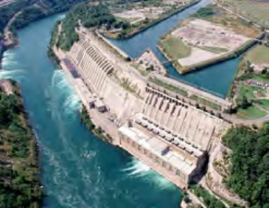
> **[Diagram Context - Textbook_NaturalScience_Gr7_Sources-of-energy.pdf-0002-06.png]**
> The image presents an aerial view of a dam with multiple levels, including a large central pool and smaller pools on the sides. The dam is situated in a river, with a bridge visible in the background. The diagram is labeled with the names of the different parts of the dam, such as the central pool, smaller pools, and the bridge. The diagram also includes a Lewis diagram, an anatomical

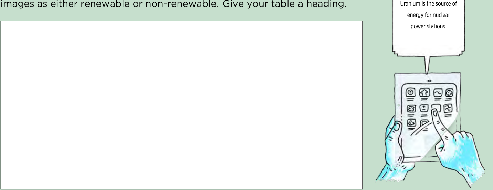
> **[Diagram Context - Textbook_NaturalScience_Gr7_Sources-of-energy.pdf-0002-11.png]**
> 1. A diagram of a cell with arrows pointing to different parts of the cell.

---

## Chapter 2. Potential and kinetic energy

### Results and Observations:

Record your results in this table:

| Height of marble up the ramp (cm) | Distance the cup moves (cm) |
| :--- | :--- |
| &nbsp; | &nbsp; |
| &nbsp; | &nbsp; |
| &nbsp; | &nbsp; |
| &nbsp; | &nbsp; |
| &nbsp; | &nbsp; |

Use the information in your table to draw a graph of the height of the marble up the ramp versus the distance the cup moves. Before you draw the graph, answer the following:

1. Which is the independent variable? This is the value which you changed in the investigation. The independent variable is written on the $x$-axis (horizontal axis).
2. Which is the dependent variable? This is the variable you measured. The dependent variable is written on the $y$-axis (vertical axis).

<!-- DIAGRAM_PLACEHORN_1: Graph plotting area -->

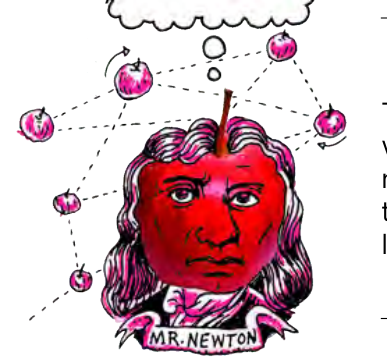
> **[Diagram Context - Textbook_NaturalScience_Gr7_Energy-transfer-to-surroundings.pdf-0003-03.png]**
> This illustration depicts a caricature of Isaac Newton with an apple-shaped head, surrounded by a network of floating apples connected by dashed lines and directional arrows, all leading to a thought bubble. It serves as a conceptual metaphor for Newton’s Law of Universal Gravitation, visually representing the mathematical relationships and gravitational interactions between masses in space.

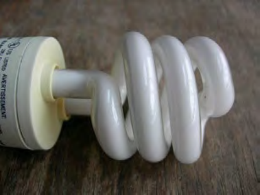
> **[Diagram Context - Textbook_NaturalScience_Gr7_Energy-transfer-to-surroundings.pdf-0003-07.png]**
> This image displays a Compact Fluorescent Lamp (CFL), featuring a helical glass discharge tube attached to a plastic base with visible safety certification markings and text. In the context of the CAPS Physical Sciences curriculum, this object serves as a practical example of energy efficiency and the conversion of electrical energy into light, illustrating how gas-discharge technology reduces heat loss compared to traditional incandescent bulbs.

> **[Diagram Context - Textbook_NaturalScience_Gr7_Heat-Energy-transfer.pdf-0003-00.png]**
> This diagram illustrates the motion of a slinky spring descending a staircase, featuring a coiled spring, steps, and motion lines indicating movement. It conceptually demonstrates the propagation of longitudinal and transverse waves, helping learners visualize how energy is transferred through a medium as the spring undergoes periodic displacement.

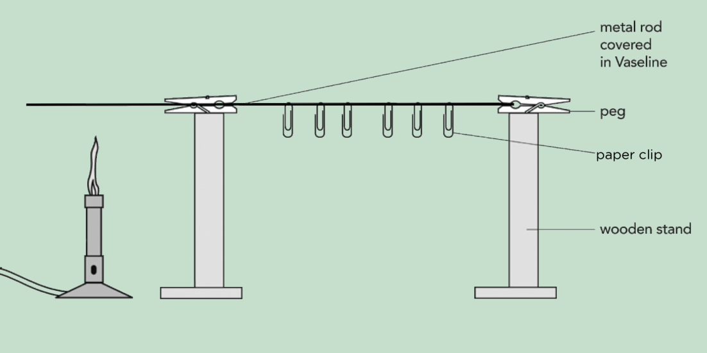
> **[Diagram Context - Textbook_NaturalScience_Gr7_Heat-Energy-transfer.pdf-0003-05.png]**
> This diagram illustrates a laboratory apparatus used to investigate thermal conduction, featuring a metal rod supported by wooden stands and pegs, with paper clips attached via Vaseline and a Bunsen burner as the heat source. By observing the order in which the paper clips fall as the Vaseline melts, students can conceptually understand the rate of heat transfer through different metals and the process of conduction in solids.

> **[Diagram Context - Textbook_NaturalScience_Gr7_Heat-Energy-transfer.pdf-0003-10.png]**
> This graphic depicts a stylized, repeating biological structure representing a double-stranded DNA molecule, characterized by its iconic double helix configuration. The diagram uses continuous, intertwined green ribbons to illustrate the antiparallel nature of the sugar-phosphate backbones, providing a conceptual visualization of the molecular architecture essential for genetic information storage and replication in Life Sciences.

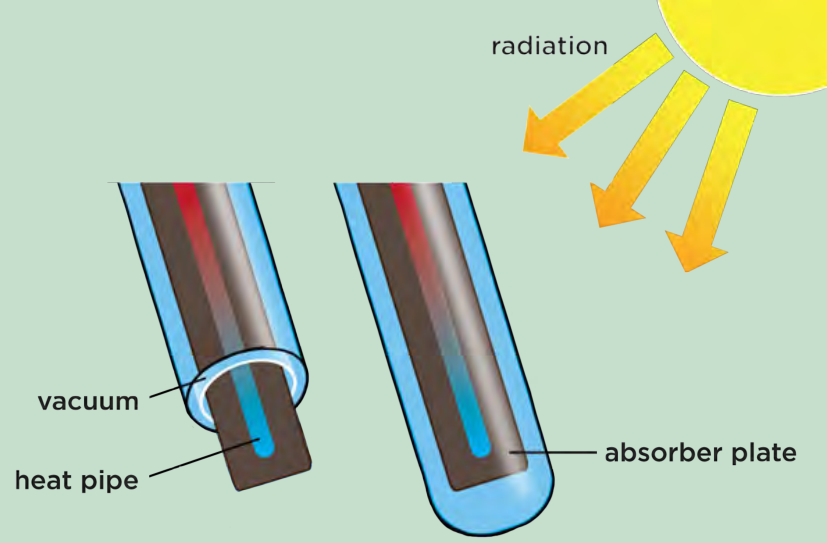
> **[Diagram Context - Textbook_NaturalScience_Gr7_Heat-insulation-and-energy-saving.pdf-0003-05.png]**
> This diagram illustrates the structure of an evacuated tube solar collector, featuring labels for the vacuum, heat pipe, absorber plate, and incoming solar radiation. It demonstrates how the vacuum layer minimizes heat loss through conduction and convection, allowing the absorber plate to efficiently transfer solar energy to the heat pipe for water heating.

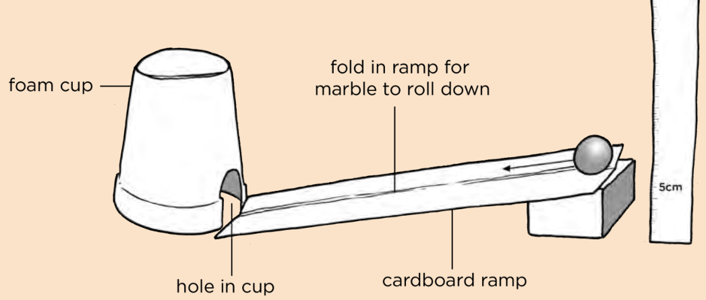
> **[Diagram Context - Textbook_NaturalScience_Gr7_Potential-and-kinetic-energy.pdf-0003-01.png]**
> 1. A diagram of a foam cup with a hole in it.
 2. A diagram of a marble rolling down a ramp.

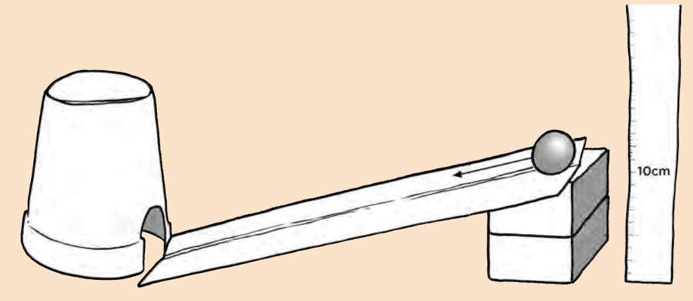
> **[Diagram Context - Textbook_NaturalScience_Gr7_Potential-and-kinetic-energy.pdf-0003-06.png]**
> The image is a black and white diagram that shows a ball on a ramp, a cup, and a ruler. The diagram is labeled with the names of the objects and their relative positions. The ball is positioned on the ramp, and the cup is on the left side of the ramp. The ruler is on the right side of the ramp. The diagram also includes a scale, which is labeled

> **[Diagram Context - Textbook_NaturalScience_Gr7_Sources-of-energy.pdf-0003-02.png]**
> This graphic depicts a stylized, repeating wave-like pattern composed of interconnected, arrow-headed segments. It serves as a visual representation of continuous directional flow or a periodic sequence, often used in Life Sciences to illustrate processes like DNA replication, energy transfer, or the cyclical nature of biological pathways.

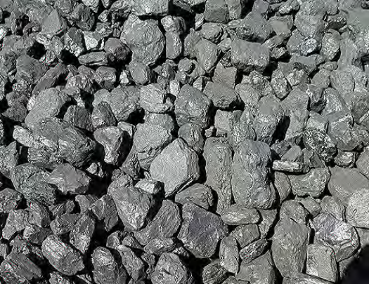
> **[Diagram Context - Textbook_NaturalScience_Gr7_Sources-of-energy.pdf-0003-18.png]**
> 1. A pile of rocks and coal.

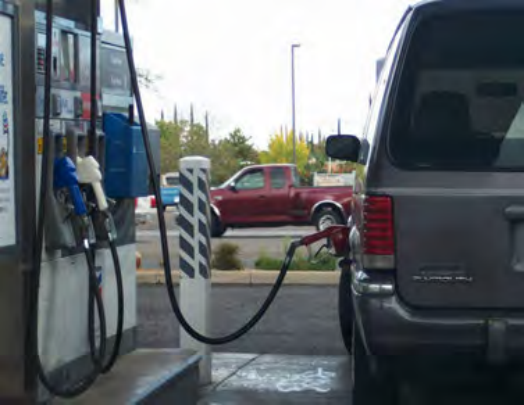
> **[Diagram Context - Textbook_NaturalScience_Gr7_Sources-of-energy.pdf-0003-19.png]**
> 1. A gas station with a blue and white gas pump.
 2. A red pickup truck.
 3. A silver car.
 4. A silver car.
 5. A silver car.

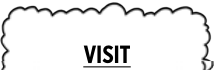
> **[Diagram Context - Textbook_NaturalScience_Gr7_Sources-of-energy.pdf-0003-20.png]**
> The image features a cartoon-like depiction of a cell, with a large cloud of particles surrounding it. The word "visit" is written in black text above the cell, indicating that the image is related to a visit to a cell or a cellular structure. The image is a simple, black and white illustration that focuses on the cell and its components.

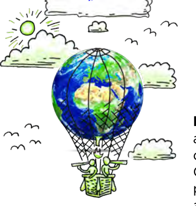
> **[Diagram Context - Textbook_NaturalScience_Gr7_Sources-of-energy.pdf-0003-22.png]**
> The image features a cartoon illustration of a hot air balloon filled with a green substance. The balloon is floating in the sky, with a globe and clouds below it. The globe is green and white, and it is surrounded by a network of lines and arrows, which appear to be representing the Earth's atmosphere. The illustration is labeled with the words "Lewis diagram", "anatomical/cell

---

## CONCLUSION

1. Write a conclusion for this investigation. Remember to refer to your graph and hypothesis when writing your conclusion.
2. Was your hypothesis shown to be true or false?

---

When you hold the marble at a distance up the ramp, you are preventing it from rolling down the ramp. This means that the marble has the **potential** to roll down and knock the cup. So, YOU gave the marble **potential energy** by picking it up and holding it at the top of the ramp. When the marble hits the cup, the marble transfers energy to the cup which then moves. The cup then comes to a stop after a while. Do you have any guesses about why the cup stops after a while?

Your investigation will have shown you that the greater the vertical height of the marble, the further the cup moved. This tells us that lifting the marble to a higher position means that it has more potential energy than if it was released from a lower position.

So the higher an object is above a surface, the more potential energy it has. Think of another example of picking up a brick, as shown in the diagram. Here we are looking at a system consisting of: the arm, the brick and the Earth that pulls on the brick.

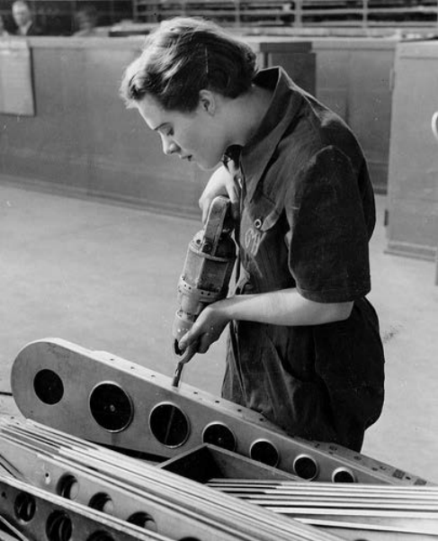
> **[Diagram Context - Textbook_NaturalScience_Gr7_Energy-transfer-to-surroundings.pdf-0004-03.png]**
> This historical photograph depicts a worker using a pneumatic drill on a metal aircraft component, featuring visible rivets and structural ribbing. It serves as a primary source document for Grade 11 History learners to analyze the socio-economic impact of World War II, specifically the shift in gender roles and the mobilization of women into industrial manufacturing sectors.

* *Caption/Labels in diagram:*
  * "This brick has the potential to fall. It has potential energy" (pointing to the brick held in the hand).
  * "This brick does not have potential energy" (pointing to the brick on the ground).

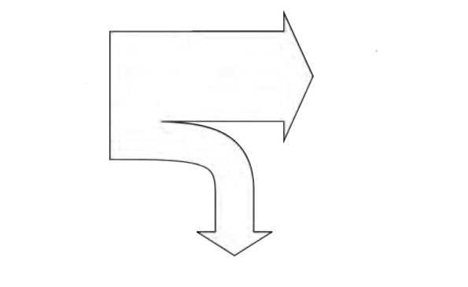
> **[Diagram Context - Textbook_NaturalScience_Gr7_Energy-transfer-to-surroundings.pdf-0004-06.png]**
> This graphic is a schematic flow diagram featuring two branching arrows originating from a single base. It contains no text, labels, or symbols, serving as a blank template for illustrating processes like energy transfer, metabolic pathways, or decision-making branches in Life Sciences and Physical Sciences. Conceptually, it helps students visualize how a single input or starting point can diverge into two distinct outcomes or pathways within a system.

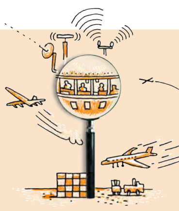
> **[Diagram Context - Textbook_NaturalScience_Gr7_Heat-Energy-transfer.pdf-0004-06.png]**
> This conceptual illustration depicts an airport control tower viewed through a magnifying glass, surrounded by aircraft, communication antennas, and cargo containers. It serves as a visual metaphor for the complex systems of air traffic control, logistics, and telecommunications infrastructure required to manage modern aviation operations.

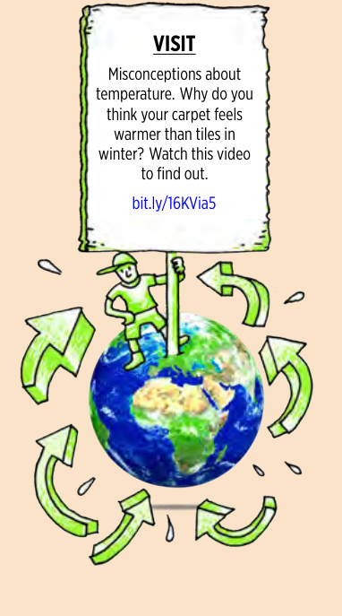
> **[Diagram Context - Textbook_NaturalScience_Gr7_Heat-Energy-transfer.pdf-0004-19.png]**
> This graphic features an illustration of a person holding a sign above a globe, surrounded by circular arrows and text labels including "VISIT," "Misconceptions about temperature," and a shortened URL. It serves as an educational prompt designed to challenge learners' intuitive understanding of thermal energy transfer, specifically addressing why materials with different thermal conductivities feel like they have different temperatures despite being in thermal equilibrium.

> **[Diagram Context - Textbook_NaturalScience_Gr7_Heat-insulation-and-energy-saving.pdf-0004-05.png]**
> This graphic depicts a schematic representation of a DNA molecule, characterized by its iconic double-helix structure with two antiparallel sugar-phosphate backbones. It illustrates the fundamental molecular architecture of genetic material, highlighting the twisted ladder configuration essential for understanding DNA replication and the storage of hereditary information in Life Sciences.

> **[Diagram Context - Textbook_NaturalScience_Gr7_Heat-insulation-and-energy-saving.pdf-0004-18.png]**
> This illustration depicts a metaphorical model of a caterpillar using a metal slinky to represent its segmented body and flexible, undulating movement. The visual elements include a stylized caterpillar head, a coiled spring body, and green foliage, which collectively serve to demonstrate the concept of peristaltic locomotion and body segmentation in invertebrates. This analogy helps students visualize how hydrostatic skeletons or segmented musculature allow for the rhythmic, wave-like contractions necessary for movement in soft-bodied organisms.

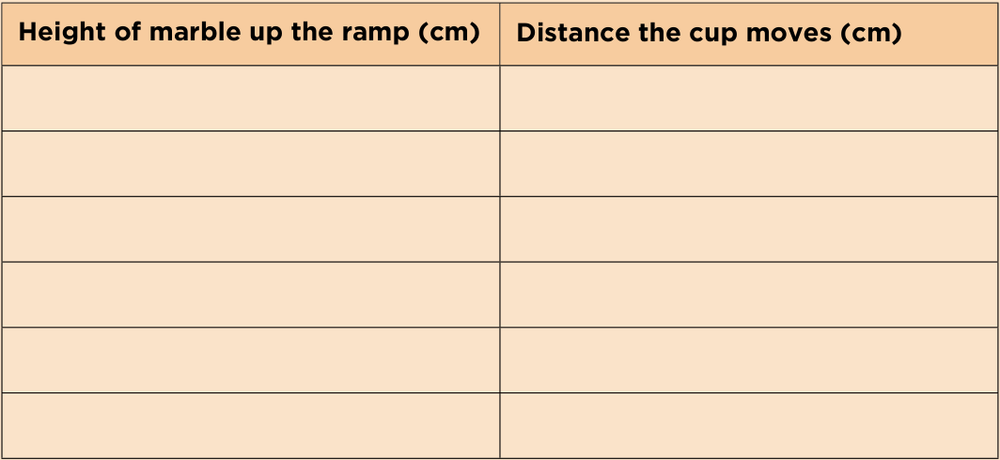
> **[Diagram Context - Textbook_NaturalScience_Gr7_Potential-and-kinetic-energy.pdf-0004-03.png]**
> 1. A diagram of a cell with arrows pointing to different parts of the cell.

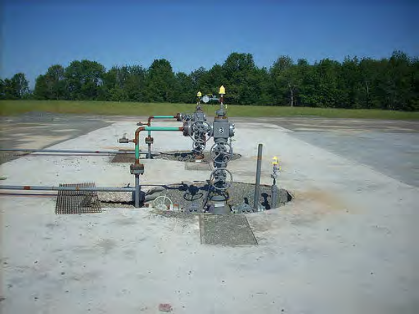
> **[Diagram Context - Textbook_NaturalScience_Gr7_Sources-of-energy.pdf-0004-01.png]**
> The image shows a diagram of a gas pump with two pipes and a gauge. The diagram is labeled with the names of the pipes and the gauge, and the diagram also includes a Lewis diagram and a diagram of a cell. The diagram is set against a backdrop of a field and trees.

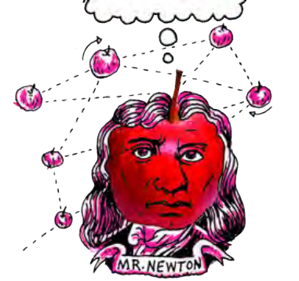
> **[Diagram Context - Textbook_NaturalScience_Gr7_Sources-of-energy.pdf-0004-07.png]**
> The image features a cartoon illustration of a man's head with a red apple on his forehead. The man's face is depicted in a cartoon style, and the apple is placed on his forehead. The man's face is outlined in black, and the apple is outlined in pink. The man is wearing a white shirt, and the background is white. The image also includes a thought bubble with a

---

When the brick was on the floor, it had no potential energy. But when it is lifted up, it has potential energy. Where did the potential energy come from?

____________________________________________________________________________________

The boy now lets go of the brick and it falls down to the ground and makes a hole in the sand. What received the energy of the falling brick?

____________________________________________________________________________________

____________________________________________________________________________________

Do you think the hole in the sand pit will be deeper if we drop the brick from a higher point? Why?

____________________________________________________________________________________

____________________________________________________________________________________

So what we have seen is that the energy is all still there within this system, but it is not easy to use anymore. The sand is warmer but we can not actually use that energy for anything because the temperature increase was so small. So the energy in the system has not been destroyed, but it is less available for us to use.

Let's look at another example of stored energy and energy transfers within a system.

---

## ACTIVITY: Elastic bands

1. We are going to be shooting match boxes with elastic bands by stretching the bands and releasing them to hit the matchbox. What are the parts making up this system?

____________________________________________________________________________________

____________________________________________________________________________________

2. What is the energy input into this system?

____________________________________________________________________________________

____________________________________________________________________________________

Do you think there is a relationship between how far the matchbox travels and the energy that the hand puts in at each try? Let's find out.

### MATERIALS:
* empty matchbox
* elastic band
* ruler

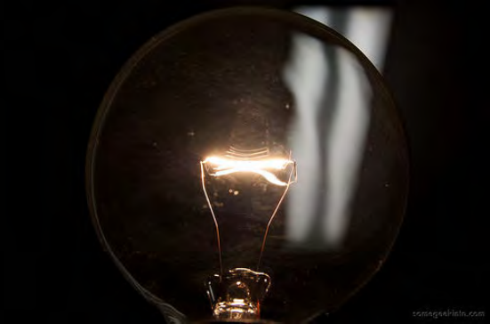
> **[Diagram Context - Textbook_NaturalScience_Gr7_Energy-transfer-to-surroundings.pdf-0005-01.png]**
> This image depicts an incandescent light bulb with a glowing tungsten filament visible inside the glass envelope. It serves as a practical demonstration of the heating effect of an electric current, illustrating how electrical energy is converted into thermal energy and light when charge carriers encounter resistance within a conductor.

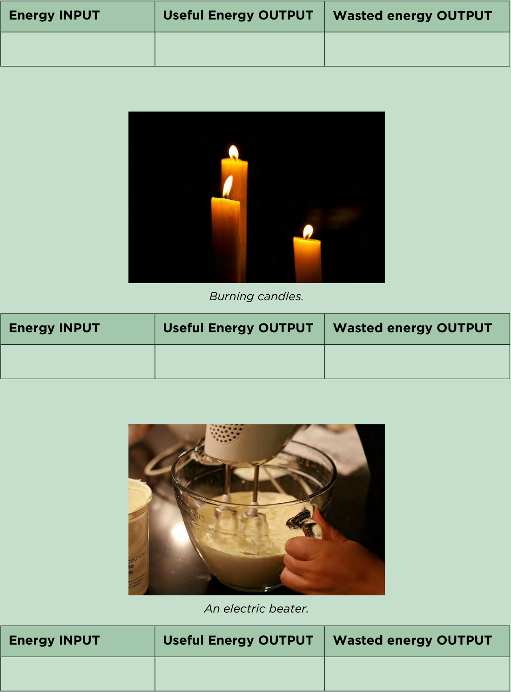
> **[Diagram Context - Textbook_NaturalScience_Gr7_Energy-transfer-to-surroundings.pdf-0005-03.png]**
> This graphic features a series of tables paired with images of a burning candle and an electric beater to facilitate the analysis of energy transfers. The tables include headers for "Energy INPUT," "Useful Energy OUTPUT," and "Wasted energy OUTPUT," requiring students to identify the specific forms of energy involved in each system. Conceptually, this exercise reinforces the Law of Conservation of Energy by helping learners distinguish between intended energy transformations and energy dissipated as heat or sound.

> **[Diagram Context - Textbook_NaturalScience_Gr7_Heat-Energy-transfer.pdf-0005-03.png]**
> This graphic uses the analogy of a zipper to represent the structure of a DNA double helix. The interlocking teeth of the zipper illustrate how complementary nitrogenous bases pair together to hold the two strands of the DNA molecule in a stable, joined configuration.

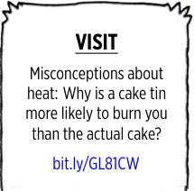
> **[Diagram Context - Textbook_NaturalScience_Gr7_Heat-Energy-transfer.pdf-0005-04.png]**
> This text-based graphic serves as a prompt to explore the physics of thermal energy transfer, specifically addressing the common misconception regarding why a metal cake tin causes burns more readily than the cake itself. It highlights the roles of thermal conductivity and specific heat capacity, which are core concepts in the Physical Sciences curriculum for understanding how different materials transfer heat energy.

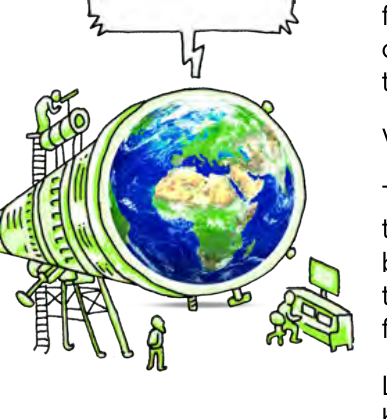
> **[Diagram Context - Textbook_NaturalScience_Gr7_Heat-Energy-transfer.pdf-0005-07.png]**
> This illustration depicts a large telescope focused on the Earth, with human figures observing and monitoring data via a computer console. The visual elements include a stylized telescope apparatus, a satellite-view image of the Earth, and human observers, with a speech bubble indicating active communication or data transmission. Conceptually, this graphic illustrates the role of remote sensing and satellite technology in Earth observation, helping students understand how scientific instruments are used to monitor global environmental systems and gather geographical data.

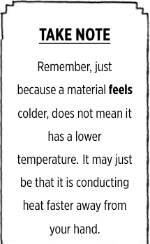
> **[Diagram Context - Textbook_NaturalScience_Gr7_Heat-Energy-transfer.pdf-0005-11.png]**
> This text-based educational graphic serves as a conceptual note regarding thermal physics. It highlights the distinction between subjective sensory perception and objective temperature by explaining that materials often feel cold due to their high thermal conductivity rather than a lower actual temperature.

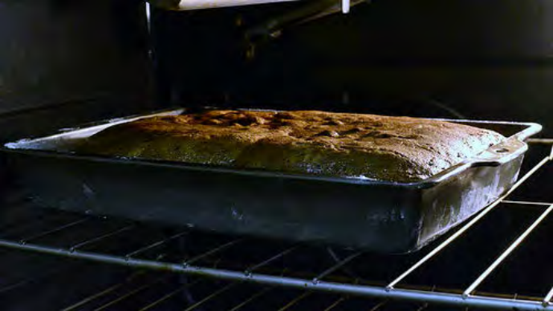
> **[Diagram Context - Textbook_NaturalScience_Gr7_Heat-Energy-transfer.pdf-0005-12.png]**
> This image depicts a baking tray containing a cake batter undergoing a chemical change inside an oven. It serves as a practical, real-world example of an endothermic reaction where heat energy is absorbed to facilitate the irreversible chemical transformation of ingredients into a new substance.

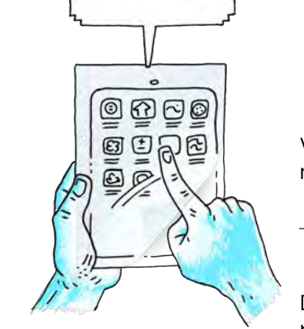
> **[Diagram Context - Textbook_NaturalScience_Gr7_Heat-Energy-transfer.pdf-0005-13.png]**
> This illustration depicts a pair of hands interacting with a tablet interface featuring various icons, including mathematical and scientific symbols like a sine wave, a plus-minus sign, and a circle. It serves as a visual metaphor for digital learning or the integration of ICT (Information and Communication Technology) in the classroom, encouraging students to engage with interactive educational software to explore complex concepts.

> **[Diagram Context - Textbook_NaturalScience_Gr7_Potential-and-kinetic-energy.pdf-0005-04.png]**
> 1. A gray background with a zipper on it.

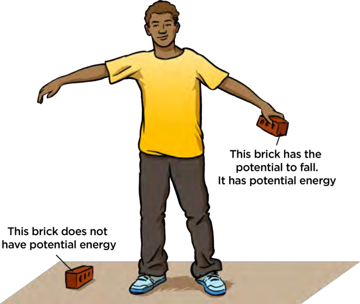
> **[Diagram Context - Textbook_NaturalScience_Gr7_Potential-and-kinetic-energy.pdf-0005-08.png]**
> 1. A cartoon depiction of a man in a yellow shirt and blue shoes holding a brick.

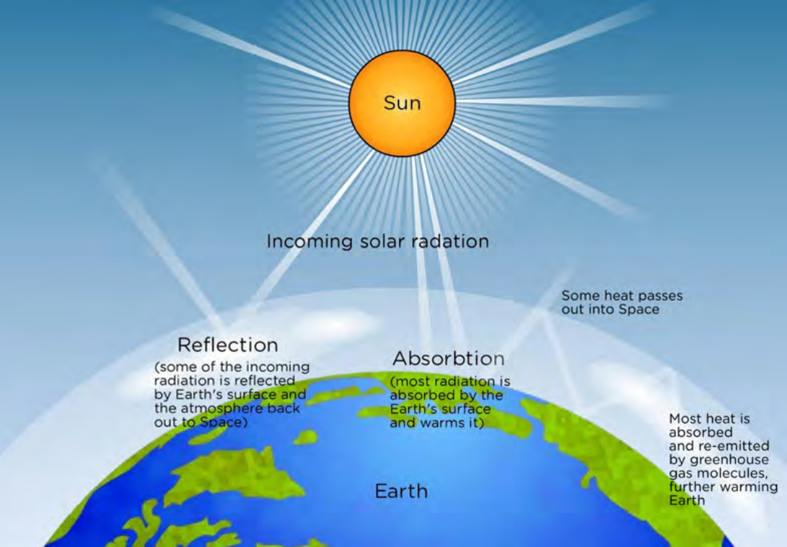
> **[Diagram Context - Textbook_NaturalScience_Gr7_Sources-of-energy.pdf-0005-00.png]**
> The image presents a detailed diagram of the solar system, including the sun, planets, and other celestial bodies. The diagram is color-coded, with the sun depicted in orange and the planets in various shades of blue and green. The diagram also includes labels for the sun, earth, and moon, as well as the concept of solar radiation and its impact on the planets. The diagram is labeled

> **[Diagram Context - Textbook_NaturalScience_Gr7_Sources-of-energy.pdf-0005-04.png]**
> The image features a cartoon depiction of a globe with a speech bubble above it, containing a thought bubble with a lightning bolt. The cartoon also includes a group of people and a green machine, suggesting a theme related to science or technology. The caption "South Africa" is also present in the image.

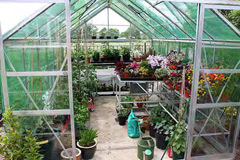
> **[Diagram Context - Textbook_NaturalScience_Gr7_Sources-of-energy.pdf-0005-05.png]**
> The image shows a greenhouse with a variety of plants and flowers. The greenhouse has a large glass structure and is filled with a diverse collection of plants, including flowers and herbs. The plants are arranged in several rows, with some plants placed closer to the front and others further back. The greenhouse appears to be well-maintained and organized, providing an ideal environment for the plants to grow and

---

# INSTRUCTIONS:

1. Place the empty match box on a desk, mark the spot with a piece of paper.
2. First, practice shooting the matchbox with the elastic band. Each time, place the elastic band and matchbox in the same starting position and distance from each other.
3. Once you feel comfortable doing this, stretch the elastic band by a different amount each time and measure how far the matchbox moves with each try.
4. Place a ruler next to your elastic band and first stretch it by a small amount. For example, if your elastic band is $5\text{ cm}$ long when held pulled tight, but not stretched, between your fingers, then stretch it to $8\text{ cm}$.
5. Release the elastic band so that it hits the matchbox across the desk.
6. Measure the distance that the match box moves across the desk.
7. Record the distance in the table below.
8. Put the empty match box back in its original position on the desk.
9. Repeat the experiment several times but stretch the elastic band a bit more than before each time.

Record your measurements in the following table:

| Elastic stretch (cm) | Distance moved (cm) |
| :--- | :--- |
| | |
| | |
| | |
| | |
| | |

---

# QUESTIONS:

1. Does the distance moved by the matchbox increase or decrease as you stretch the elastic band more? State the relationship between these two measurements.

________________________________________________________________________________

________________________________________________________________________________

2. What did you have to do in order to stretch the elastic band and keep it stretched?

________________________________________________________________________________

________________________________________________________________________________

3. Energy is transferred from the elastic band to the matchbox and the matchbox moves. But, then it comes to a stop after a while. Where did the matchbox transfer its energy to?

________________________________________________________________________________

________________________________________________________________________________

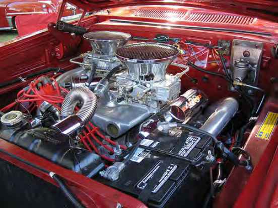
> **[Diagram Context - Textbook_NaturalScience_Gr7_Energy-transfer-to-surroundings.pdf-0006-01.png]**
> This image displays the engine bay of a high-performance internal combustion engine, featuring visible components such as dual carburetors with air cleaners, a lead-acid battery, spark plug wires, and a "426" engine block emblem. It serves as a practical application of Physical Sciences (Technical Sciences) by illustrating the mechanical and electrical systems required for energy conversion, where chemical potential energy from fuel is transformed into mechanical work through controlled combustion.

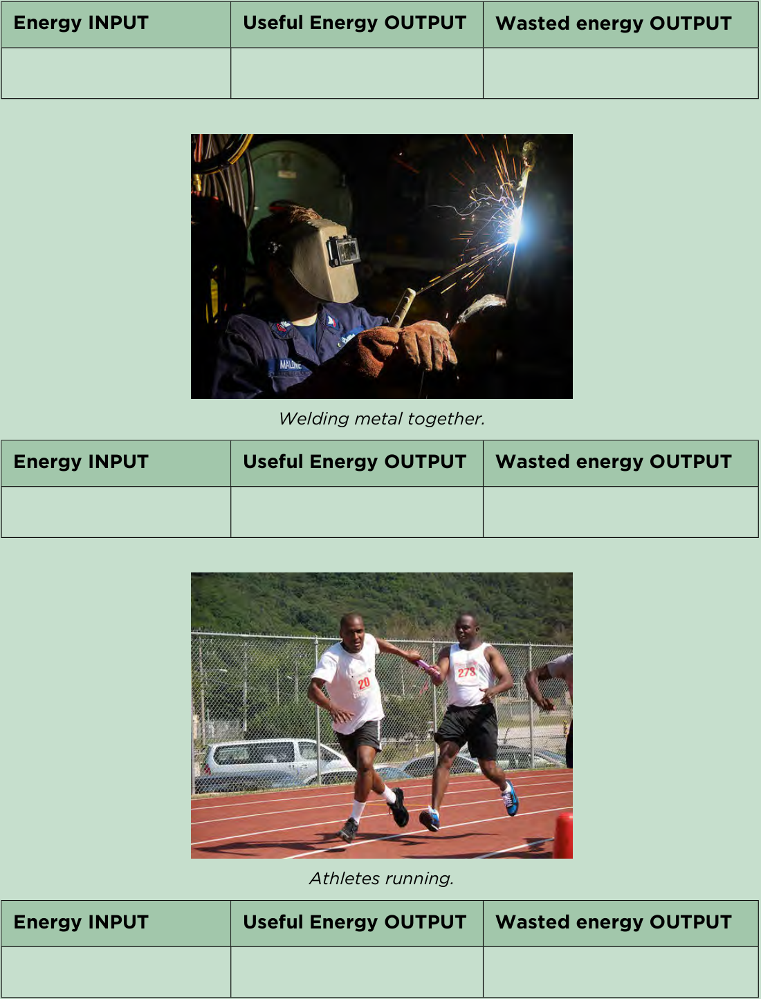
> **[Diagram Context - Textbook_NaturalScience_Gr7_Energy-transfer-to-surroundings.pdf-0006-03.png]**
> This graphic presents a series of real-world scenarios, specifically a welder and athletes, paired with tables labeled "Energy INPUT," "Useful Energy OUTPUT," and "Wasted energy OUTPUT." It serves as a practical exercise for learners to identify energy transfers and transformations, reinforcing the principle of the conservation of energy by distinguishing between intended work and energy dissipated as heat or sound.

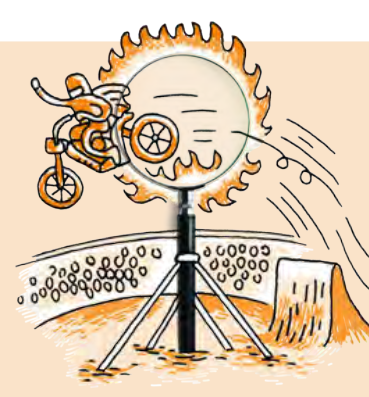
> **[Diagram Context - Textbook_NaturalScience_Gr7_Heat-Energy-transfer.pdf-0006-08.png]**
> This illustration depicts a stunt motorcyclist jumping through a flaming hoop supported by a tripod stand, with motion lines indicating the trajectory. It serves as a conceptual visual aid for Grade 10-12 Physical Sciences, illustrating principles of projectile motion, velocity, and the conservation of energy in a real-world context.

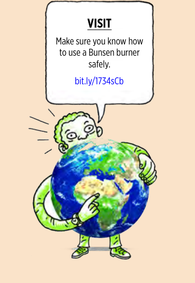
> **[Diagram Context - Textbook_NaturalScience_Gr7_Heat-Energy-transfer.pdf-0006-15.png]**
> This graphic is an illustrative cartoon featuring a character holding a globe and a speech bubble containing the text "VISIT" and "Make sure you know how to use a Bunsen burner safely," along with a shortened URL. It serves as a pedagogical prompt to reinforce laboratory safety protocols, specifically the correct and safe operation of a Bunsen burner, which is a foundational skill in the CAPS Natural Sciences and Physical Sciences curricula.

> **[Diagram Context - Textbook_NaturalScience_Gr7_Potential-and-kinetic-energy.pdf-0006-08.png]**
> The image shows a cartoon depiction of a spring coiled up and ready to spring. The spring is made of a green metal spring and is coiled up in a way that it appears ready to spring. The spring is surrounded by a green leaf, and there is a small green ball on the spring. The spring is positioned in the center of the image, and the leaf is located to the

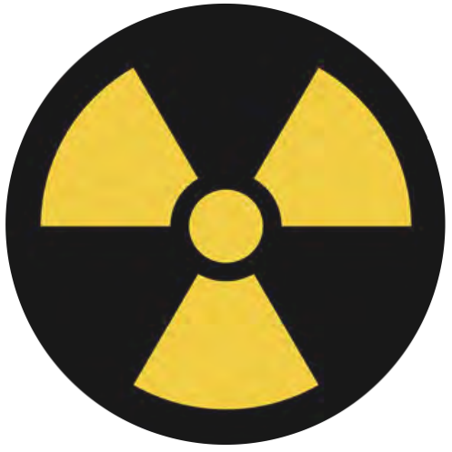
> **[Diagram Context - Textbook_NaturalScience_Gr7_Sources-of-energy.pdf-0006-04.png]**
> 1. A black circle with a yellow radiation symbol inside.

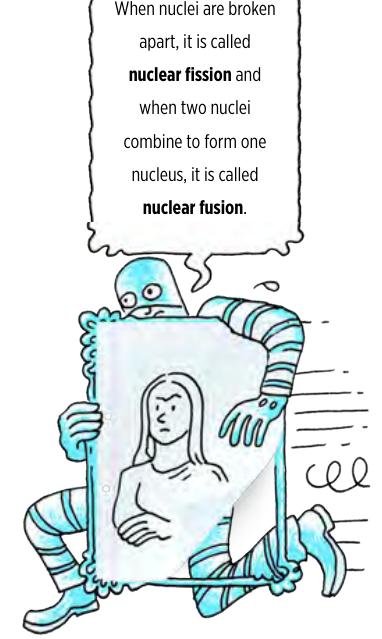
> **[Diagram Context - Textbook_NaturalScience_Gr7_Sources-of-energy.pdf-0006-07.png]**
> 1. A cartoon drawing of a man holding a picture of a woman. 
 2. The drawing is titled "Nuclear Fusion" and is accompanied by a speech bubble that reads "When nucleus are broken apart, it is called nuclear fusion and when two nuclei combine to form one nucleus, it is called nuclear fusion."

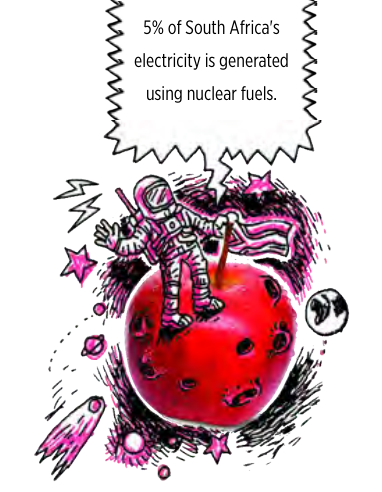
> **[Diagram Context - Textbook_NaturalScience_Gr7_Sources-of-energy.pdf-0006-09.png]**
> The image is a cartoon drawing of an astronaut on a red planet. The astronaut is depicted in a space suit and holding a rocket on his back. The planet is covered in pink and purple hues, and there are stars scattered throughout the scene. The text above the drawing reads, "5% of South Africa's electricity is generated using nuclear fuels. Using nuclear fuels. Lewis diagram, Lewis

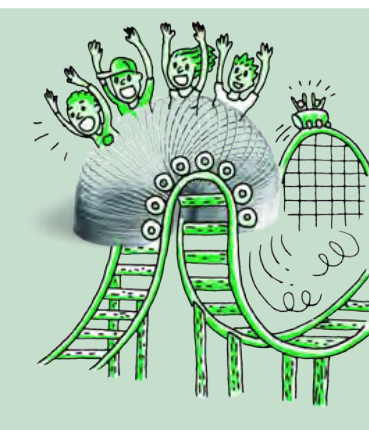
> **[Diagram Context - Textbook_NaturalScience_Gr7_Sources-of-energy.pdf-0006-10.png]**
> 1. A cartoon drawing of a roller coaster with a spring coiled up on the front.

---

# Chapter 2. Potential and Kinetic Energy

## Energy in a Stretched Elastic Band

When an elastic band is stretched, it gains **potential energy**. This happens because work must be done by your hands to stretch it. The elastic band can then snap back and move objects, such as a matchbox, by transferring its energy.

* **Relationship:** The further you stretch the elastic band, the more work you do, and the more potential energy it stores. Consequently, it can push the matchbox further.
* **Energy Transfer within the System:** Energy moves from your hand $\rightarrow$ to the elastic band $\rightarrow$ to the matchbox $\rightarrow$ to the air and the table surface (which ends up slightly warmer as energy disperses and becomes unavailable for further work).

*A stretched elastic band has potential energy.*

---

## What is Potential Energy?

Objects can gain potential energy in different ways, such as **lifting** (raising an object against gravity) or **stretching** (deforming an elastic object). 

> **Definition:** **Potential energy** is energy that is **stored within a system**. It gives an object the potential or the ability to change something or make **something move**.

---

## Other Examples of Potential Energy

### 1. Fossil Fuels
Fossil fuels such as coal and oil contain potential energy. For example, coal is burned in power stations to generate electricity. The chemical energy stored inside the coal is a form of potential energy.

### 2. Batteries
Batteries used in electric circuits act as a source of stored energy. They store energy chemically, meaning **batteries have potential energy**.

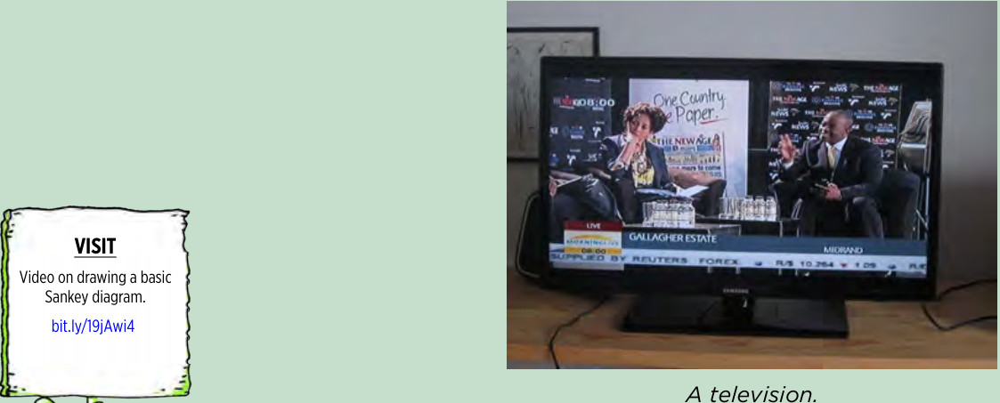
> **[Diagram Context - Textbook_NaturalScience_Gr7_Energy-transfer-to-surroundings.pdf-0007-01.png]**
> This image features a television displaying a news broadcast alongside a text box containing the label "VISIT" and a shortened URL link. The graphic serves as a digital signpost directing students to an external video resource for learning how to construct a Sankey diagram, a tool used in the Physical Sciences curriculum to represent energy transfers and efficiency.

*Batteries are a source of potential energy for electric circuits.*

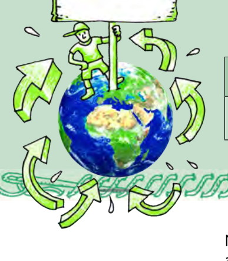
> **[Diagram Context - Textbook_NaturalScience_Gr7_Energy-transfer-to-surroundings.pdf-0007-02.png]**
> This graphic is a conceptual illustration featuring a globe, a human figure holding a blank sign, and a circular arrangement of green arrows. The imagery uses these symbols to represent the cyclical nature of environmental sustainability and the human responsibility to protect the planet. It serves as a visual prompt for learners to discuss global conservation efforts, the impact of human activity on the Earth, and the importance of sustainable practices within the Life Sciences curriculum.

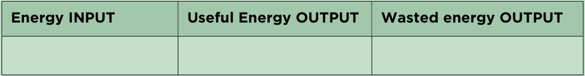
> **[Diagram Context - Textbook_NaturalScience_Gr7_Energy-transfer-to-surroundings.pdf-0007-03.png]**
> This graphic is a three-column table labeled "Energy INPUT," "Useful Energy OUTPUT," and "Wasted energy OUTPUT." It serves as a conceptual framework for learners to analyse energy transfers and transformations in various systems, reinforcing the principle of the conservation of energy by distinguishing between intended work and energy dissipation.

> **[Diagram Context - Textbook_NaturalScience_Gr7_Energy-transfer-to-surroundings.pdf-0007-05.png]**
> This graphic uses a roller coaster illustration to represent the physical principles of motion and energy. It depicts a roller coaster track with a superimposed slinky spring, illustrating the concepts of mechanical energy transformation, specifically the conversion between gravitational potential energy and kinetic energy.

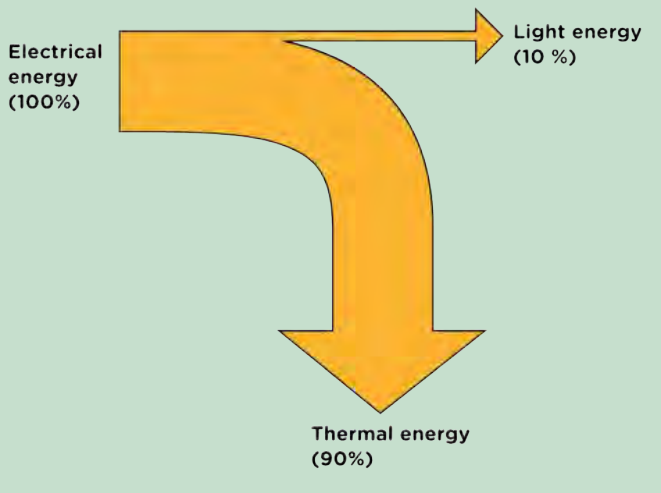
> **[Diagram Context - Textbook_NaturalScience_Gr7_Energy-transfer-to-surroundings.pdf-0007-08.png]**
> This Sankey diagram illustrates the energy transformation process of an incandescent light bulb, labeling the input as "Electrical energy (100%)" and the outputs as "Light energy (10%)" and "Thermal energy (90%)." It conceptually demonstrates the principle of energy conservation while highlighting the inefficiency of the device, showing that the majority of input energy is dissipated as heat rather than useful light.

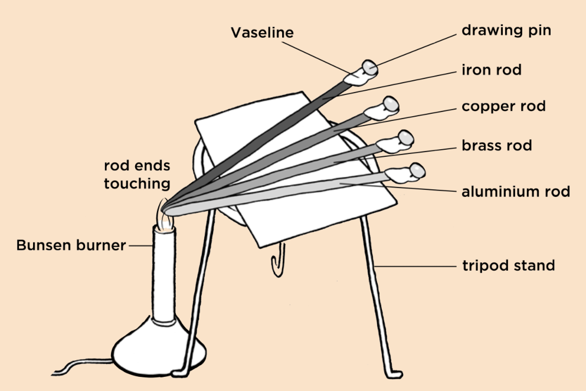
> **[Diagram Context - Textbook_NaturalScience_Gr7_Heat-Energy-transfer.pdf-0007-21.png]**
> This diagram illustrates an experimental apparatus featuring a Bunsen burner heating the ends of four metal rods (iron, copper, brass, and aluminium) supported by a tripod stand, with drawing pins attached to the opposite ends using Vaseline. It demonstrates the concept of thermal conductivity by showing how heat energy transfers through different metals at varying rates, causing the Vaseline to melt and the pins to drop at different times.

> **[Diagram Context - Textbook_NaturalScience_Gr7_Heat-insulation-and-energy-saving.pdf-0007-02.png]**
> This graphic depicts a stylized, repeating wave-like pattern composed of interconnected, arrow-headed segments. It serves as a visual representation of continuous directional flow or a repeating cyclical process, often used in Life Sciences to illustrate metabolic pathways, energy transfer, or the sequential steps of a biological cycle.

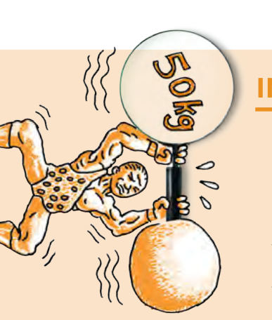
> **[Diagram Context - Textbook_NaturalScience_Gr7_Heat-insulation-and-energy-saving.pdf-0007-04.png]**
> This illustration depicts a weightlifter struggling to lift a barbell, with a magnifying glass highlighting the label "50kg." It serves as a conceptual visual aid for Grade 10 Physical Sciences to distinguish between mass (the amount of matter, measured in kilograms) and weight (the gravitational force exerted on that mass, measured in Newtons).

> **[Diagram Context - Textbook_NaturalScience_Gr7_Potential-and-kinetic-energy.pdf-0007-17.png]**
> This graphic depicts a stylized, repeating wave pattern composed of interconnected, arrow-headed segments. The image uses a continuous green line to illustrate a series of directional flow vectors, representing the concept of periodic motion or a progressive wave. For high school learners, this serves as a visual model for understanding wave propagation, demonstrating how energy is transferred through a medium in a consistent, rhythmic direction.

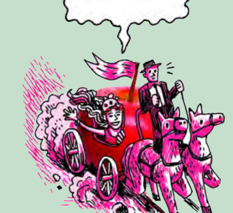
> **[Diagram Context - Textbook_NaturalScience_Gr7_Sources-of-energy.pdf-0007-05.png]**
> 1. A cartoon drawing of a man and a woman riding in a carriage.
 2. A pink flag on the carriage.
 3. A red apple on the carriage.
 4. A thought bubble above the carriage.

> **[Diagram Context - Textbook_NaturalScience_Gr7_Sources-of-energy.pdf-0007-08.png]**
> 1. A diagram of a cell with a green line representing a cell wall.

---

# Energy and Change

## Where Do We Get Our Energy?

As learnt in Life and Living, nutrition is one of the 7 life processes. We have to eat food. Food is the fuel for our bodies.

Have you ever had a look at all the small writing on food packaging? The information gives us nutritional information about the food. It also gives us the amount of **energy** stored in the food. Have you noticed that this is often given in **joules**?

So what is a joule? How do we measure energy?

We can measure energy, just as we can measure the mass of an object or how fast a car is going. The mass of an object is given in grams or kilograms, the speed of a car is given in kilometers per hour ($\text{km/h}$). In the same way, energy is measured in joules. There are $1000$ joules in a kilojoule.

Let's have a look at the energy content for some of the cereals that we eat for breakfast.

---

## DID YOU KNOW?

The joule was named after an English physicist, James Prescott Joule ($1818-1889$).

---

## ACTIVITY: Reading a cereal box

### MATERIALS:
* cereal box
* pair of scissors
* calculator

### INSTRUCTIONS:
1. Read the nutritional information on your cereal box.
2. Answer the questions that follow.

### QUESTIONS:
1. What is the amount of energy per $100\text{ g}$ for your cereal? Write your answer in kilojoules and in joules.

2. The cereal boxes often indicate an amount per $100\text{ g}$ and then an amount per serving, which is normally less. What is the amount of energy per serving on your cereal box? Remember to include how many grams the serving is.

3. Look at the following table which gives the recommended daily amount of energy for an individual depending on your age and level of activity. This is a guideline as to how much energy you should consume in food in one day.

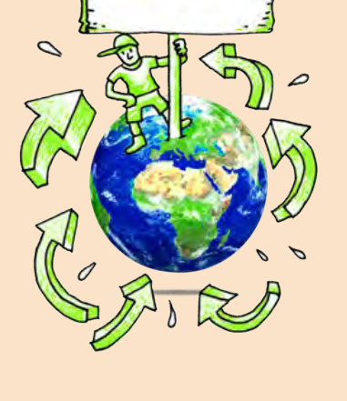
> **[Diagram Context - Textbook_NaturalScience_Gr7_Heat-insulation-and-energy-saving.pdf-0008-11.png]**
> This illustration depicts a conceptual diagram of global environmental stewardship, featuring a human figure holding a blank signpost atop a globe surrounded by a circular arrangement of green arrows. The arrows symbolize cyclical processes, such as the water cycle or sustainable resource management, while the figure represents human responsibility toward Earth's systems. It serves as an introductory visual for Life Sciences or Geography learners to explore human impact on the biosphere and the importance of environmental sustainability.

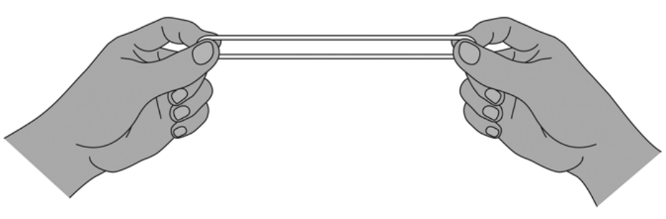
> **[Diagram Context - Textbook_NaturalScience_Gr7_Potential-and-kinetic-energy.pdf-0008-03.png]**
> 1. A diagram of a hand holding a white string.

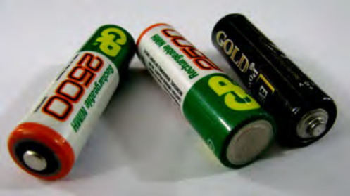
> **[Diagram Context - Textbook_NaturalScience_Gr7_Potential-and-kinetic-energy.pdf-0008-09.png]**
> 1. A diagram of a battery with three different colored batteries.

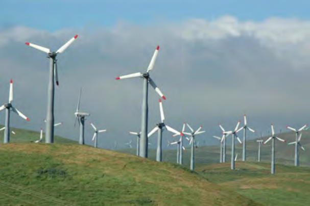
> **[Diagram Context - Textbook_NaturalScience_Gr7_Sources-of-energy.pdf-0008-03.png]**
> The image shows a group of wind turbines on a hill, with a total of 14 turbines. The turbines are of various sizes and are arranged in a line, with the largest one on the left side and the smallest one on the right side. The wind turbines are of different colors, including white, red, and gray, and they are all facing the same direction, indicating that they are all

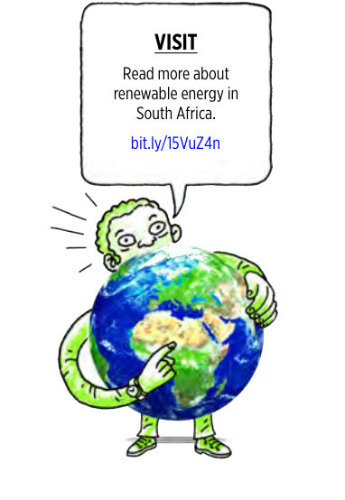
> **[Diagram Context - Textbook_NaturalScience_Gr7_Sources-of-energy.pdf-0008-04.png]**
> The image features a cartoon depiction of a man holding a globe in his hands. The man is wearing a green shirt and is pointing to the globe. The globe is green and white, and it appears to be a map of the world. The man is standing in front of a speech bubble that contains text about renewable energy in South Africa. The text is written in a simple, easy-to

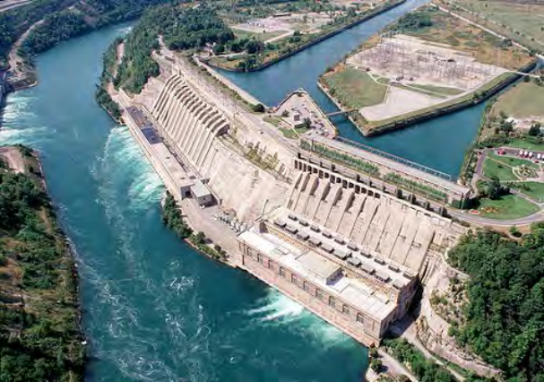
> **[Diagram Context - Textbook_NaturalScience_Gr7_Sources-of-energy.pdf-0008-08.png]**
> The image shows an aerial view of a dam with a large waterway in the foreground. The dam is composed of multiple levels and features a large waterway running through it. The dam is situated in a valley, with a river flowing through the area. The image also contains a map of the dam and the waterway, which provides a visual representation of the dam's layout and the surrounding landscape

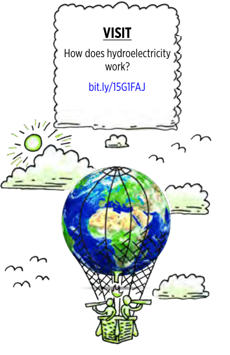
> **[Diagram Context - Textbook_NaturalScience_Gr7_Sources-of-energy.pdf-0008-10.png]**
> The image shows a cartoon depiction of a hot air balloon with two people on it. The balloon is filled with a green substance, and the people are sitting on a basket attached to the balloon. The scene is set against a backdrop of clouds and a globe, which is a representation of the Earth. The image also contains text that reads "Visit" and "How does hydroelectricity work?".

---

### Daily Energy Requirements

| Gender | Age (years) | Sedentary (kJ) | Moderately Active (kJ) | Active (kJ) |
| :--- | :--- | :--- | :--- | :--- |
| Female | 9 - 13 | 8 000 | 8 000 - 9 000 | 8 500 - 9 500 |
| | 14 - 18 | 8 500 | 8 500 - 10 000 | 9 500 - 10 500 |
| Male | 9 - 13 | 8 500 | 8 500 - 10 000 | 9 500 - 11 000 |
| | 14 - 18 | 10 000 | 10 000 - 11 500 | 11 000 - 13 000 |

> **TAKE NOTE**
> Sedentary means that you lead an inactive lifestyle and do not do any exercise.

According to the table, what is the recommended daily amount of energy for your age and level of activity?

4. What percentage of your recommended daily energy is being supplied by one serving of your cereal? Show your calculations below.

---

5. The following photograph shows the nutritional information on a box of cracker biscuits. Study it and then answer the questions that follow.

| TYPICAL NUTRITIONAL INFORMATION INFORMAÇÃO NUTRICIONAL TÍPICA | | |
| :--- | :--- | :--- |
| | PER $100\text{ g}$ | PER SERVING ($2\text{ biscuit} = 15\text{ g}$) |
| Energy | $1492\text{ kJ}$ | $224\text{ kJ}$ |
| | $356\text{ kcal}$ | $53\text{ kcal}$ |
| Protein | $8.4\text{ g}$ | $1.3\text{ g}$ |
| Glycaemic Carbohydrate | $72\text{ g}$ | $11\text{ g}$ |
| of which Total Sugar | $2.8\text{ g}$ | $0.4\text{ g}$ |
| Total Fat | $2.0\text{ g}$ | $0.3\text{ g}$ |
| of which: | | |
| Saturated Fat | $0.4\text{ g}$ | $0.1\text{ g}$ |
| Trans Fat | $0.0\text{ g}$ | $0.0\text{ g}$ |
| Monounsaturated Fat | $0.5\text{ g}$ | $0.1\text{ g}$ |
| Polyunsaturated Fat | $1.1\text{ g}$ | $0.2\text{ g}$ |
| Cholesterol | $0\text{ mg}$ | $0\text{ mg}$ |
| Dietary Fibre # | $6.1\text{ g}$ | $0.9\text{ g}$ |
| Total Sodium | $589\text{ mg}$ | $88\text{ mg}$ |
| Nutritional information above refers to the ready-to-eat product. # AOAC 991.43. | | |

> **TAKE NOTE**
> The joule is a measure of energy. A food joule is not different to an electrical joule, nor different to a joule that heats water, nor a joule that comes from the Sun.

a) What is the energy content per $100\text{ g}$ in **joules**?

> **[Diagram Context - Textbook_NaturalScience_Gr7_Energy-transfer-to-surroundings.pdf-0009-07.png]**
> This graphic illustrates a repeating wave-like pattern, represented by a continuous green line featuring internal dotted segments and directional arrows. It serves as a visual model for a progressive transverse wave, demonstrating the periodic motion and propagation of energy through a medium.

> **[Diagram Context - Textbook_NaturalScience_Gr7_Heat-insulation-and-energy-saving.pdf-0009-00.png]**
> This image is a blank placeholder containing no visual content, labels, or scientific data. Consequently, it provides no pedagogical value or conceptual information for a high school learner studying the CAPS curriculum.

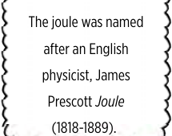
> **[Diagram Context - Textbook_NaturalScience_Gr7_Potential-and-kinetic-energy.pdf-0009-02.png]**
> The image shows a quote from a book about James Prescott Joule. The quote is in black and white and is centered on the image. The text is written in a smaller font size than the rest of the image, making it stand out. The quote is about James Prescott Joule, a famous physicist, and the book is titled "The Joule was named after an English Physicist,

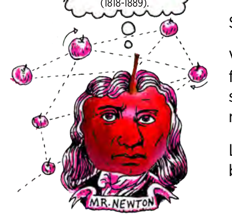
> **[Diagram Context - Textbook_NaturalScience_Gr7_Potential-and-kinetic-energy.pdf-0009-04.png]**
> The image features a cartoon depiction of a man's head with a large, red apple on top, and a thought bubble above the apple with the words "Mr. Newton" written in white. The man's head is depicted in a cartoon style, and the apple is shown in a realistic style. The thought bubble above the apple contains the words "Mr. Newton" written in white.

> **[Diagram Context - Textbook_NaturalScience_Gr7_Potential-and-kinetic-energy.pdf-0009-08.png]**
> 1. A cartoon depiction of a roller coaster.

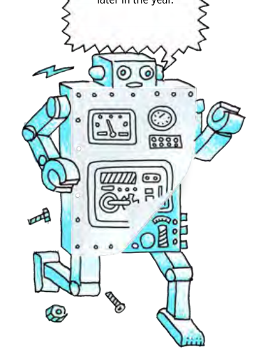
> **[Diagram Context - Textbook_NaturalScience_Gr7_Sources-of-energy.pdf-0009-03.png]**
> The image features a blue robot with a speech bubble above its head, suggesting that it is engaged in a conversation. The robot is depicted in a dynamic pose, running on its hind legs, and is surrounded by various tools and equipment scattered around it. The robot is shown in a detailed and realistic manner, with its mechanical parts and the speech bubble providing a clear visual representation of the concept of a

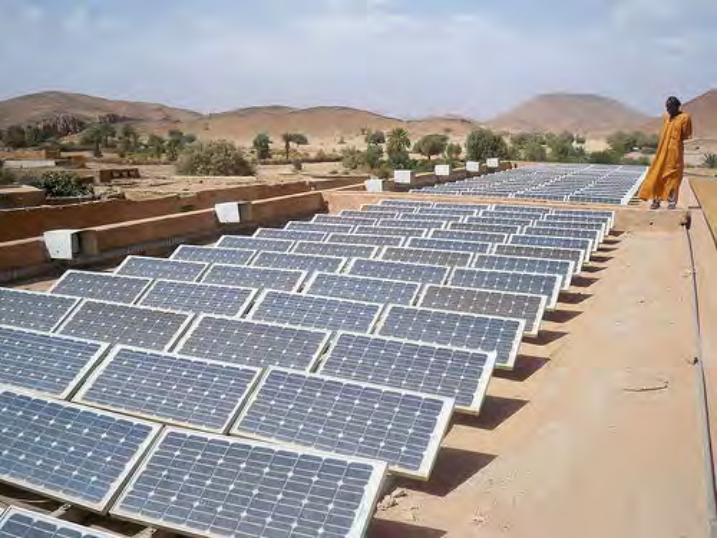
> **[Diagram Context - Textbook_NaturalScience_Gr7_Sources-of-energy.pdf-0009-04.png]**
> The image shows a man standing on a rooftop with a large number of solar panels. The panels are arranged in rows, covering the entire rooftop. The man is positioned on the right side of the image, looking towards the panels. The solar panels are of various sizes and shapes, and they are spread across the entire rooftop. The man appears to be observing the solar panels, possibly assessing their condition

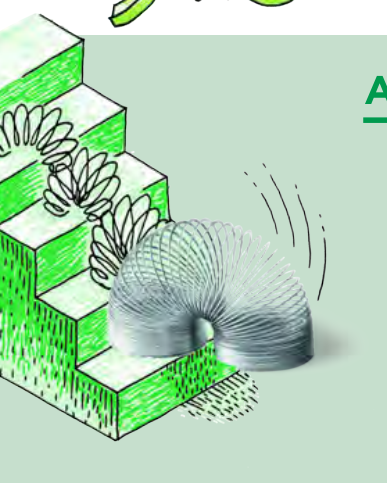
> **[Diagram Context - Textbook_NaturalScience_Gr7_Sources-of-energy.pdf-0009-09.png]**
> 1. A diagram of a spring with a green background and a green staircase.

---

b) What is the mass of **one** biscuit?

c) The nutritional information gives the serving size of $2$ biscuits, but you want to know what the energy content will be if you only eat one biscuit. Write down the answer below.

d) You now decide that you want to eat $5$ biscuits. What is the energy content for this serving of $5$ biscuits?

---

**NEW WORDS**
* kinetic energy
* transfer

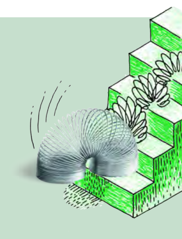

Do you now see why we can say that food has potential energy? We need energy to make our bodies function. We get our energy from the food we eat. The molecules which make up our food have energy stored inside them. We eat the food and use the stored energy to move our muscles and perform all our bodily functions. This stored energy is potential energy.

## 2.2 Kinetic energy

Think back to the last activity where we used elastic bands to move matchboxes. The stretched elastic band had potential energy. When the elastic band was released, it moved and snapped back and then hit the matchbox and caused it to move. So what do we call this energy that the moving elastic band and moving matchbox have? We call it **kinetic energy**.

**Kinetic energy is the energy that an object or system has because it is moving.**

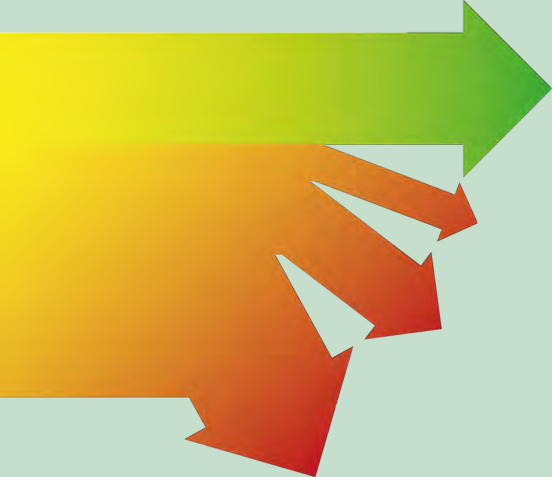

## ACTIVITY: Which objects have kinetic energy?

### INSTRUCTIONS:
1. Think about the definition of kinetic energy
2. Decide which of the objects in the following table have kinetic energy.
3. Give a reason for your answer.

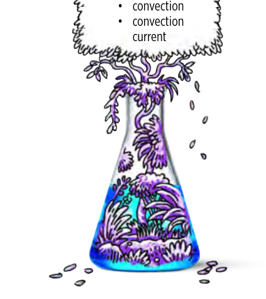

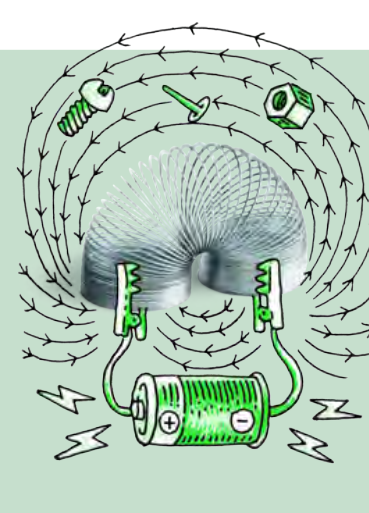

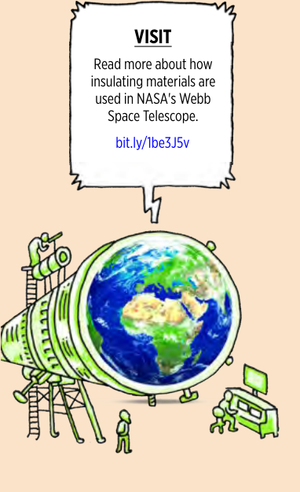

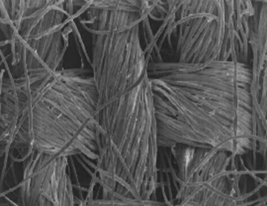

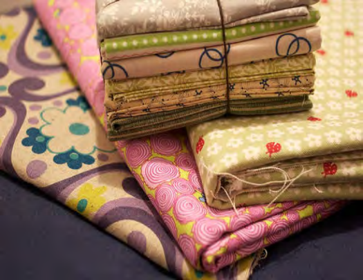

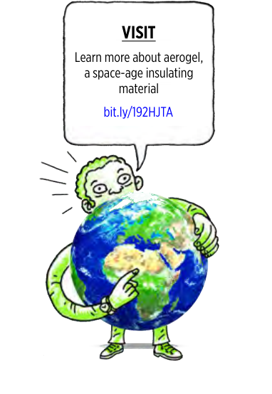

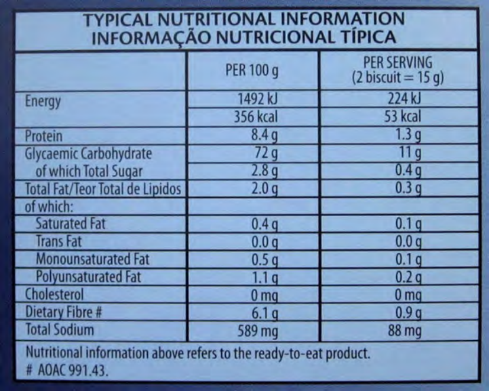

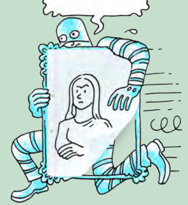

---

## Chapter 2. Potential and kinetic energy

| Object | Does it have kinetic energy? (Yes or no) | Give a reason for your answer. |
| :--- | :--- | :--- |
| 

   A lady running. | | |
| 

   A bird in flight. | | |
| 

> **[Diagram Context - Textbook_NaturalScience_Gr7_Energy-transfer-to-surroundings.pdf-0011-03.png]**
> This graphic is a text-based instructional callout box featuring the heading "TAKE NOTE" enclosed in a decorative, hand-drawn border. It serves as a pedagogical signpost designed to alert students to critical information, key definitions, or common misconceptions within the CAPS curriculum materials.

   A stop street sign. | | |
| 

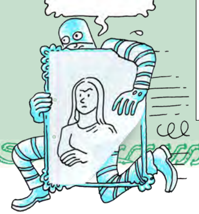
> **[Diagram Context - Textbook_NaturalScience_Gr7_Energy-transfer-to-surroundings.pdf-0011-05.png]**
> This cartoon depicts a masked figure in a striped outfit holding a framed portrait of a woman. The visual elements include a speech bubble, a decorative frame, and motion lines indicating the figure is fleeing. Conceptually, this image serves as a metaphor for theft or plagiarism, often used in Life Sciences or English curriculum materials to illustrate the ethical implications of intellectual property and the importance of academic integrity.

   A roller coaster. | | |

> **[Diagram Context - Textbook_NaturalScience_Gr7_Energy-transfer-to-surroundings.pdf-0011-06.png]**
> This diagram illustrates a cross-section of a biological membrane, specifically representing the hydrophilic heads of a phospholipid monolayer or the surface of a cell membrane. It depicts a repeating pattern of curved, hook-like structures anchored into a shaded horizontal plane, representing the polar phosphate heads oriented toward an aqueous environment. This visualises the structural arrangement of lipids at a boundary, helping learners understand the amphipathic nature of the cell membrane and how phospholipids organise themselves in relation to the surrounding medium.

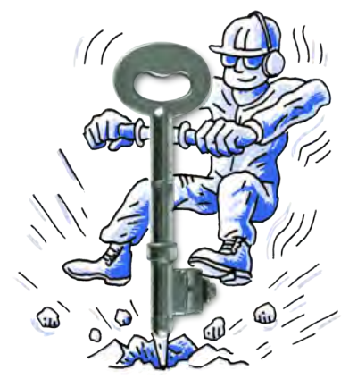
> **[Diagram Context - Textbook_NaturalScience_Gr7_Energy-transfer-to-surroundings.pdf-0011-07.png]**
> This illustration depicts a worker operating a jackhammer, represented by a large key, with motion lines indicating vibration and debris. The visual elements include a human figure in protective gear, a key-shaped tool, and kinetic lines signifying mechanical energy and impact. Conceptually, this serves as a metaphor for the "key" to understanding mechanical work, energy transfer, and the physical impact of forces in a high school Physical Sciences context.

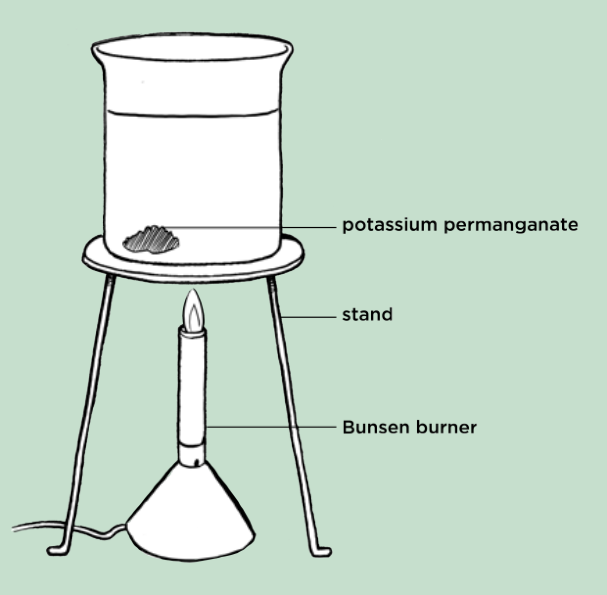
> **[Diagram Context - Textbook_NaturalScience_Gr7_Heat-Energy-transfer.pdf-0011-01.png]**
> This diagram illustrates a laboratory apparatus setup consisting of a beaker containing water and potassium permanganate crystals, supported by a stand over a Bunsen burner. It demonstrates the process of convection in liquids, where heating the base of the beaker creates density differences that cause the purple potassium permanganate to circulate, visually tracking the movement of thermal energy.

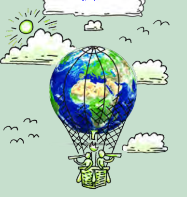
> **[Diagram Context - Textbook_NaturalScience_Gr7_Heat-Energy-transfer.pdf-0011-04.png]**
> This illustration depicts the Earth as a hot air balloon, featuring a globe, a basket, and two figures using telescopes to observe their surroundings. It serves as a metaphorical representation of global environmental stewardship, encouraging students to consider the interconnectedness of human activity and the health of the planet within the context of Life Sciences and Geography.

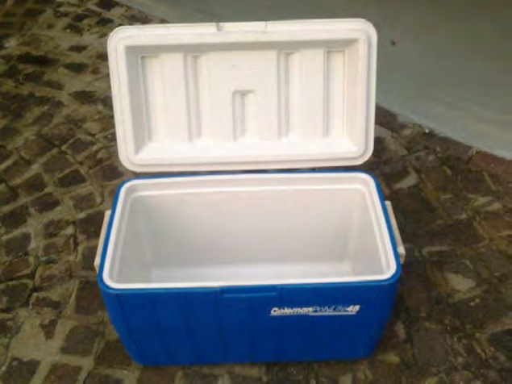
> **[Diagram Context - Textbook_NaturalScience_Gr7_Heat-insulation-and-energy-saving.pdf-0011-01.png]**
> This image depicts a portable insulated cooler box, featuring the brand label "Coleman PolyLite 48." In the context of Physical Sciences, this apparatus serves as a practical model for demonstrating thermal insulation, illustrating how materials with low thermal conductivity minimize heat transfer between the system and its surroundings to maintain a constant temperature.

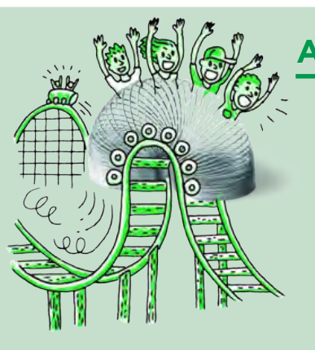
> **[Diagram Context - Textbook_NaturalScience_Gr7_Heat-insulation-and-energy-saving.pdf-0011-05.png]**
> This illustration uses a roller coaster metaphor to represent the principles of mechanical energy in Grade 10-12 Physical Sciences. By visualizing the track's peaks and valleys alongside a slinky, it demonstrates the continuous transformation between gravitational potential energy and kinetic energy as an object moves through a system.

> **[Diagram Context - Textbook_NaturalScience_Gr7_Potential-and-kinetic-energy.pdf-0011-04.png]**
> 1. A diagram of a cell with a green line representing the cell wall.

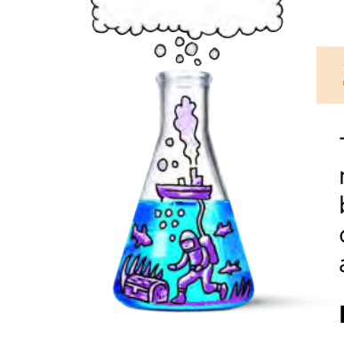
> **[Diagram Context - Textbook_NaturalScience_Gr7_Potential-and-kinetic-energy.pdf-0011-09.png]**
> The image features a cartoon depiction of a person wearing a spacesuit and holding a submarine, with a submarine filled with water and fish inside. The submarine is depicted in a blue and purple color scheme, and the person is wearing a purple spacesuit. The image also includes a cartoon depiction of a cloud, a blue and purple submarine, and a blue and purple fish. The image is labeled "

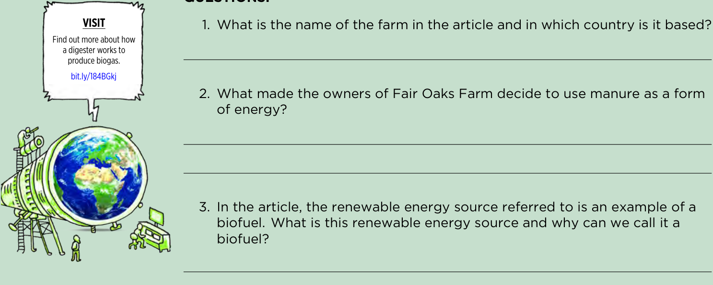
> **[Diagram Context - Textbook_NaturalScience_Gr7_Sources-of-energy.pdf-0011-02.png]**
> 1. The name of the farm in the article is Fair Oaks Farm.

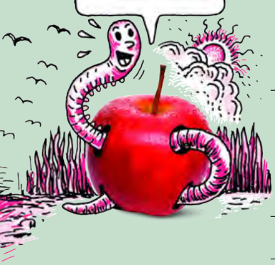
> **[Diagram Context - Textbook_NaturalScience_Gr7_Sources-of-energy.pdf-0011-04.png]**
> 1. A cartoon of a red apple with a worm on it.
2. A cartoon of a red apple with a worm on it.
3. A cartoon of a red apple with a worm on it.

> **[Diagram Context - Textbook_NaturalScience_Gr7_Sources-of-energy.pdf-0011-09.png]**
> 1. A diagram of a cell with a green line representing the cell wall.

---

# Energy and Change

| Object | Does it have kinetic energy? (Yes or no) | Give a reason for your answer. |
| :--- | :--- | :--- |
| 

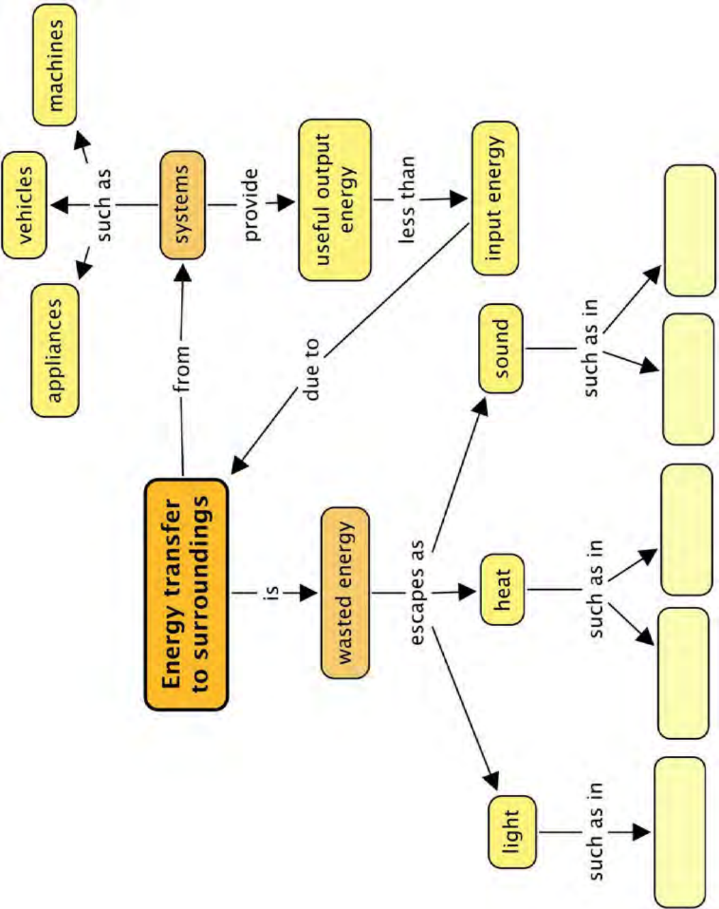
> **[Diagram Context - Textbook_NaturalScience_Gr7_Energy-transfer-to-surroundings.pdf-0012-00.png]**
> This concept map illustrates the principles of energy transfer and efficiency within systems, featuring labels such as "systems," "useful output energy," "input energy," "wasted energy," and forms of energy loss like "sound," "heat," and "light." It conceptually demonstrates the Law of Conservation of Energy by showing that useful output is always less than input energy due to energy escaping to the surroundings as waste, providing a framework for learners to categorize energy dissipation in everyday appliances and machines.

   Two chairs. | | |
| 

   An apple. | | |
| 

> **[Diagram Context - Textbook_NaturalScience_Gr7_Heat-Energy-transfer.pdf-0012-02.png]**
> This graphic depicts a stylized, repeating pattern of interlocking, arrow-shaped biological structures resembling a continuous molecular chain or polymer. The image uses a uniform green color scheme to represent a repetitive, directional sequence, illustrating the concept of monomeric units joining to form a long-chain macromolecule. For Life Sciences learners, this serves as a conceptual model for understanding the polymerization process in biological molecules like DNA, RNA, or proteins.

   A helicopter. | | |

## QUESTIONS:

1. Which bucket has more potential energy, the one sitting on the bottom step of a ladder, or the one sitting on the top step of the ladder?

2. Does a car travelling at $100\text{ km/h}$ or at $200\text{ km/h}$ have more kinetic energy?

3. When the wind blows, it is actually the air particles moving. What type of energy do the air particles have? Why?

---
*Visit: A short video about kinetic energy: bit.ly/15Vfjyf*

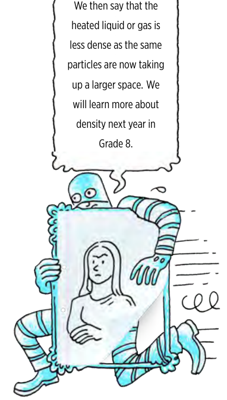
> **[Diagram Context - Textbook_NaturalScience_Gr7_Heat-Energy-transfer.pdf-0012-08.png]**
> This educational graphic uses a cartoon illustration of a character holding a frame to explain the physical concept of thermal expansion. The text explicitly links the heating of liquids or gases to a decrease in density caused by particles occupying a larger volume. This serves as a foundational conceptual bridge for Natural Sciences learners to understand how heat energy affects particle spacing and density before formalizing these calculations in later grades.

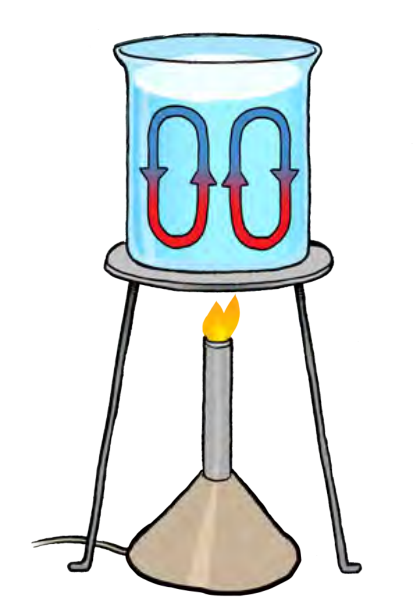
> **[Diagram Context - Textbook_NaturalScience_Gr7_Heat-Energy-transfer.pdf-0012-09.png]**
> This diagram illustrates a laboratory apparatus consisting of a beaker of liquid placed on a tripod stand over a Bunsen burner. The graphic uses red-to-blue gradient arrows to represent the circular flow of convection currents within the heated fluid. It conceptually demonstrates how thermal energy is transferred through a liquid via the movement of warmer, less dense fluid rising and cooler, denser fluid sinking.

> **[Diagram Context - Textbook_NaturalScience_Gr7_Heat-insulation-and-energy-saving.pdf-0012-00.png]**
> The provided image is a blank white rectangular frame set against a light green background, containing no visible labels, symbols, or educational content. Consequently, it cannot be used to convey any specific scientific or mathematical concepts within the CAPS curriculum.

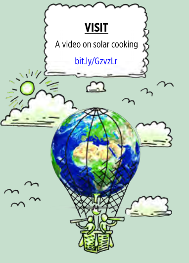
> **[Diagram Context - Textbook_NaturalScience_Gr7_Heat-insulation-and-energy-saving.pdf-0012-04.png]**
> This graphic features an illustrative metaphor of the Earth depicted as a hot air balloon, accompanied by text labels directing students to a video resource on solar cooking. It serves as an introductory visual aid to engage learners in the topic of renewable energy and sustainable technology within the context of environmental science.

> **[Diagram Context - Textbook_NaturalScience_Gr7_Heat-insulation-and-energy-saving.pdf-0012-05.png]**
> This graphic depicts a stylized representation of a double-stranded DNA molecule, characterized by its iconic double helix structure and repeating sugar-phosphate backbone segments. It serves as a foundational visual aid for Life Sciences learners to identify the helical geometry and complementary base-pairing arrangement essential for understanding genetic information storage and replication.

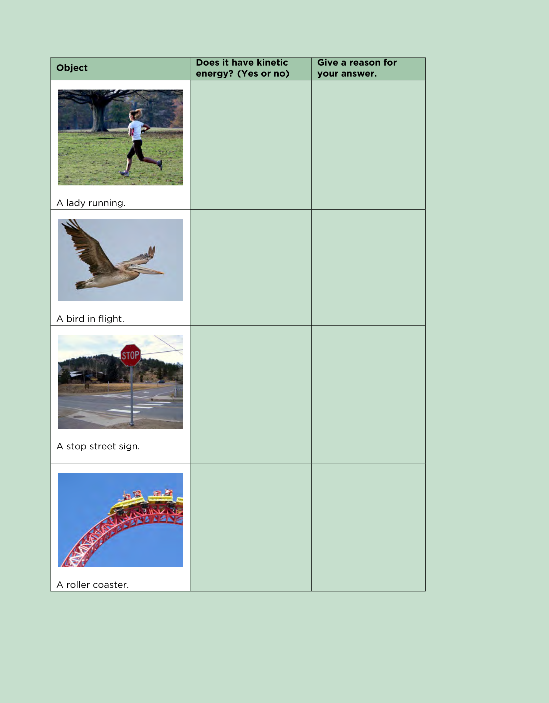
> **[Diagram Context - Textbook_NaturalScience_Gr7_Potential-and-kinetic-energy.pdf-0012-00.png]**
> A diagram of a roller coaster with a red and yellow car.

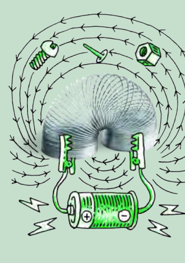
> **[Diagram Context - Textbook_NaturalScience_Gr7_Sources-of-energy.pdf-0012-03.png]**
> 1. A green spring with a silver spring coiled around it.
2. A green battery with a silver battery.
3. A green wire with a silver wire.
4. A green wire with a silver wire.

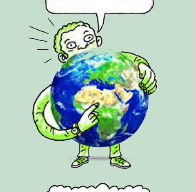
> **[Diagram Context - Textbook_NaturalScience_Gr7_Sources-of-energy.pdf-0012-10.png]**
> 1. A cartoon man holding a globe.

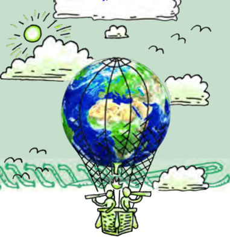
> **[Diagram Context - Textbook_NaturalScience_Gr7_Sources-of-energy.pdf-0012-12.png]**
> The image shows a cartoon illustration of a hot air balloon filled with a green substance, possibly a gas or a liquid. The balloon is floating in the sky, with a globe and clouds in the background. The globe is positioned in the center of the image, with the hot air balloon surrounding it. The illustration also includes a diagram of a human body, a cell, and a molecule, which

---

4. You have a bucket full of water and you are about to tip the water out. What type of energy does the water have at this point? Explain why.

5. When you tip the water out and it falls to the ground, what type of energy does it have now?

---

## What have we learnt so far?

* **Potential energy** is the energy that an object has because of its position in a system. In the brick activity, the brick had potential energy when it was lifted away from the surface of the Earth. The brick and the Earth attract each other so they are a system. The higher you lift the brick, the more potential energy you give it.
* We know that moving objects also have energy, we call the energy of moving objects **kinetic energy**.

But, we have also seen something else. Think again of the marble activity:

* The marble at the top of the ramp has potential energy.
* When the marble was released, it rolled down the ramp and knocked the cup causing it to move.
* The marble therefore **transferred** energy to the cup.

We also saw this in the match box activity:

* The stretched elastic band had potential energy.
* When the elastic band was released, it moved and snapped back and then hit the matchbox and caused it to move. This means that the match box now has energy.
* Energy was therefore transferred from the stretched elastic band to the matchbox.

So, the potential energy in the elastic band is not lost. It is transferred to the matchbox. This brings us to our next section.

---

## 2.3 Law of conservation of energy

The **Law of Conservation of Energy** states that energy cannot be created or destroyed, it can only be transferred from one part of the system to other parts. This means that we keep recycling all the energy in the universe all the time!

Why are we talking about laws in science? Did you think laws were just for lawyers? Well, you would be wrong. In science we talk about **laws** and **theories**.

Scientific laws predict **what** will happen in a particular situation. The law has been tested repeatedly (often) and the results do not change. A law does not explain **why** something happens, it just says what **should** happen. Theories explain **how** or **why** things happen. Theories are also tested over and over again to make sure that they are valid.

---

**NEW WORDS**
* law
* theory
* conservation

---

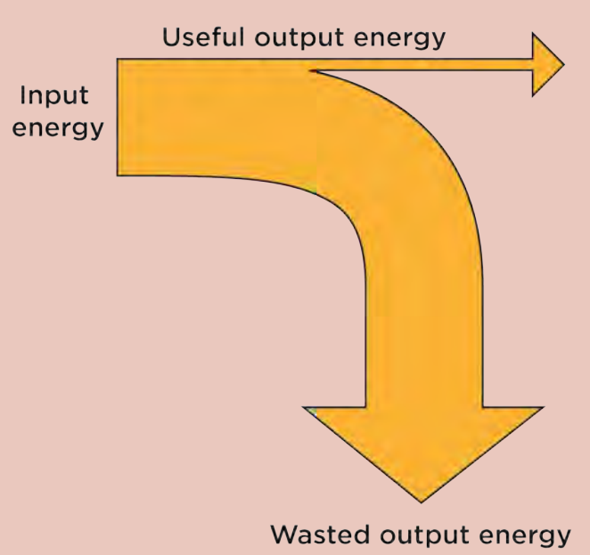
> **[Diagram Context - Textbook_NaturalScience_Gr7_Energy-transfer-to-surroundings.pdf-0013-04.png]**
> This Sankey diagram illustrates energy flow using labels for "Input energy," "Useful output energy," and "Wasted output energy." It conceptually demonstrates the principle of energy conservation and efficiency by showing how total input energy is divided into desired work and dissipated energy, helping students visualize energy loss in systems.

**TAKE NOTE**
Scientific laws and theories are not set in stone, they are just the best explanation for how the world works based on the information we have now. Scientific knowledge is constantly growing and changing as new discoveries are made.

> **[Diagram Context - Textbook_NaturalScience_Gr7_Heat-Energy-transfer.pdf-0013-00.png]**
> This illustration depicts a metaphorical representation of a caterpillar using a coiled spring to model its segmented body structure and locomotion. By visualizing the insect's anatomy through the mechanical properties of a spring, the graphic helps students conceptualize the rhythmic, wave-like muscular contractions required for peristaltic movement in soft-bodied organisms.

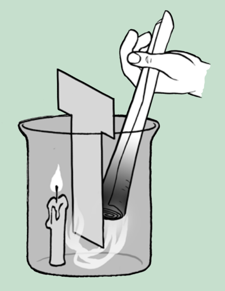
> **[Diagram Context - Textbook_NaturalScience_Gr7_Heat-Energy-transfer.pdf-0013-13.png]**
> This diagram illustrates a classic laboratory demonstration of thermal conductivity, featuring a beaker, a lit candle, a metal partition, and a hand holding a metal rod. It conceptually demonstrates how heat energy is transferred through conduction, showing the rod being heated by the candle flame while the partition acts as a heat shield to isolate the effect.

> **[Diagram Context - Textbook_NaturalScience_Gr7_Heat-Energy-transfer.pdf-0013-17.png]**
> This graphic depicts a repeating, wave-like pattern of interconnected, arrow-shaped segments. It serves as a visual representation of a continuous process or directional flow, often used in Life Sciences to illustrate metabolic pathways, the sequence of DNA replication, or the cyclical nature of biological systems.

> **[Diagram Context - Textbook_NaturalScience_Gr7_Heat-insulation-and-energy-saving.pdf-0013-00.png]**
> This graphic illustrates a slinky toy descending a staircase, featuring a coiled spring and motion lines indicating its downward movement. It serves as a physical model for Grade 10-12 Physics to demonstrate the propagation of longitudinal and transverse waves, as well as the transfer of potential and kinetic energy as the spring oscillates down the steps.

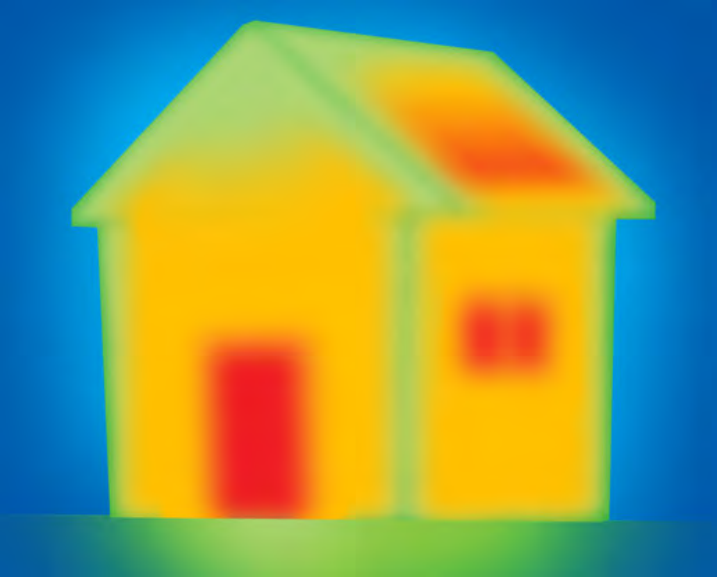
> **[Diagram Context - Textbook_NaturalScience_Gr7_Heat-insulation-and-energy-saving.pdf-0013-03.png]**
> This image is a thermal infrared map of a house, using a color-coded spectrum where red and orange represent higher temperatures and yellow and green represent lower temperatures. It illustrates the concept of thermal energy transfer and heat loss, showing how heat escapes through specific areas like the roof, door, and windows. This visual helps students understand insulation, energy efficiency, and the principles of heat conduction and radiation in a domestic environment.

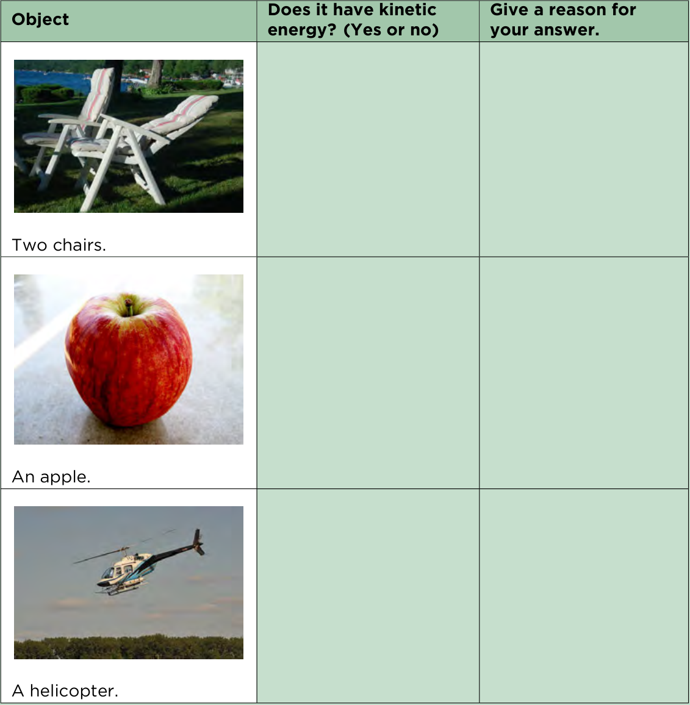
> **[Diagram Context - Textbook_NaturalScience_Gr7_Potential-and-kinetic-energy.pdf-0013-01.png]**
> 1. A diagram of a helicopter.
 2. A diagram of a cell.
 3. A diagram of a circuit.

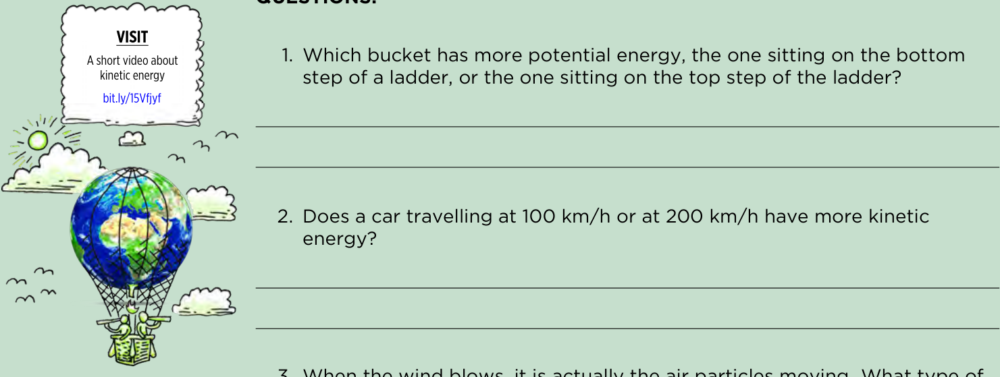
> **[Diagram Context - Textbook_NaturalScience_Gr7_Potential-and-kinetic-energy.pdf-0013-03.png]**
> 1. A hot air balloon has more potential energy than a car traveling at 100 km/h.

> **[Diagram Context - Textbook_NaturalScience_Gr7_Sources-of-energy.pdf-0013-00.png]**
> 1. A diagram of a cell with blue and white lines.

> **[Diagram Context - Textbook_NaturalScience_Gr7_Sources-of-energy.pdf-0013-01.png]**
> 1. A tree with a key on top.

---

Now that we know about the Law of Conservation of Energy, this matches our own observation that the energy in the elastic and matchbox example was not lost, rather it was transferred from the elastic to the matchbox. We can say that the elastic band and matchbox form a **system**. This is also true for the marble and cup example. Remember, a **system** is made up of different parts that work together or affect each other. Let's now look at some more examples of how energy is transferred within systems.

## 2.4 Potential and kinetic energy in systems

Remember, energy cannot be created or destroyed. It is transferred from one part of the system to other parts. When it is transferred it can be stored or used to make something move and so potential energy can be transferred to kinetic energy in a system.

We can look at how energy is transferred within different systems to show that energy is conserved. There are many different types of systems that we can look at to see how energy is transferred through the systems.

### Mechanical systems

A **mechanical system** is one which is based on mechanical principles and the different parts interact in a mechanism. A mechanical system usually involves movement of some kind. It is often a group of simple machines working together.

Do you remember the elastic bands pushing the matchboxes? Do you think that was a system? You are right. It is a mechanical system. The hand, elastic band and matchbox all form part of a mechanical system. Your hand transfers potential energy to the elastic band, this is the input energy. The potential energy of the elastic band was transferred to the matchbox as kinetic energy. No energy was created or destroyed. We experienced the Law of Conservation of Energy without even realising it.

Another simple example is a pulley and rope system, such as at a construction site where the builders want to lift heavy objects up to a higher floor. The construction worker will pull on the rope which goes up over a pulley and to lift the heavy object higher.

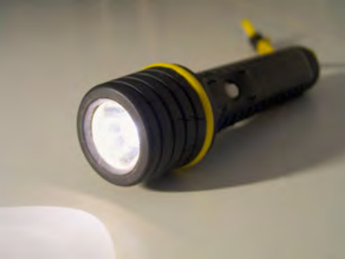
> **[Diagram Context - Textbook_NaturalScience_Gr7_Energy-transfer-to-surroundings.pdf-0014-02.png]**
> This image depicts a functional handheld LED flashlight, a common real-world example of a simple electrical circuit. It serves as a practical demonstration of energy transformation, where chemical potential energy from internal cells is converted into light and thermal energy when the switch closes the circuit.

*A pulley system is an example of a mechanical system.*

> **[Diagram Context - Textbook_NaturalScience_Gr7_Energy-transfer-to-surroundings.pdf-0014-06.png]**
> This image is a photograph of a television screen displaying a live news broadcast from "The New Age" channel, featuring two presenters in a studio setting at Gallagher Estate in Midrand. The screen includes on-screen text labels such as "LIVE," "GALLAGHER ESTATE," "MIDRAND," and a financial ticker showing the South African Rand (R/S) exchange rate. This visual content serves as an example of mass media communication, illustrating how current affairs and economic data are disseminated to the public through broadcast journalism.

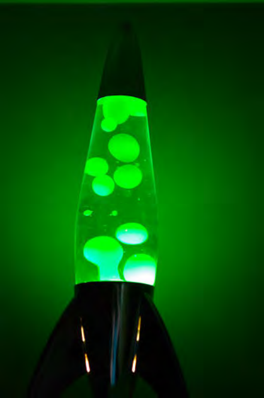
> **[Diagram Context - Textbook_NaturalScience_Gr7_Heat-Energy-transfer.pdf-0014-01.png]**
> This image depicts a lava lamp, a physical apparatus containing two immiscible liquids of different densities. It serves as a visual model for demonstrating the principles of convection currents, density, and thermal energy transfer, where heating at the base causes the less dense liquid to rise and subsequently cool and sink.

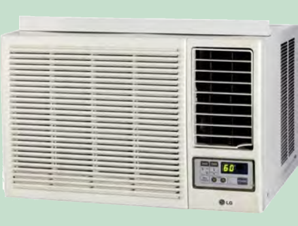
> **[Diagram Context - Textbook_NaturalScience_Gr7_Heat-Energy-transfer.pdf-0014-05.png]**
> This image depicts a window-mounted air conditioning unit featuring a front-facing intake grille, adjustable air vents, and a digital control panel displaying the temperature "60". In the context of Physical Sciences, this apparatus serves as a practical example of a heat pump system, illustrating the principles of thermodynamics, heat transfer, and the refrigeration cycle used to regulate thermal energy in an environment.

> **[Diagram Context - Textbook_NaturalScience_Gr7_Heat-Energy-transfer.pdf-0014-08.png]**
> This graphic is a text-based pedagogical feature formatted as a "Did you know?" speech bubble. It contains the heading "DID YOU KNOW?" underlined to draw attention to supplementary information. In a CAPS curriculum context, this visual element is used to introduce interesting facts or real-world applications that enrich a learner's understanding of a specific scientific or mathematical concept.

> **[Diagram Context - Textbook_NaturalScience_Gr7_Heat-Energy-transfer.pdf-0014-10.png]**
> This illustration depicts a caricature of Isaac Newton with an apple-shaped head, surrounded by a network of smaller apples connected by dashed lines and directional arrows, all linked to a thought bubble. It serves as a conceptual metaphor for Newton’s Law of Universal Gravitation, illustrating how mass exerts an attractive force on other masses within a field. The diagram helps students visualize the interconnected nature of gravitational interactions between objects in space.

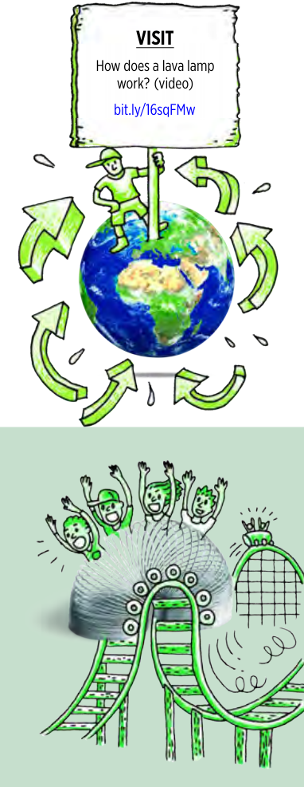
> **[Diagram Context - Textbook_NaturalScience_Gr7_Heat-Energy-transfer.pdf-0014-11.png]**
> This graphic features two illustrative panels: the top shows a person standing on a globe surrounded by circular arrows, while the bottom depicts people riding a roller coaster constructed from a Slinky spring. These illustrations serve as conceptual metaphors for physical processes, such as convection currents in the Earth's mantle or energy transformations in mechanical systems, to engage learners in topics like heat transfer and motion.

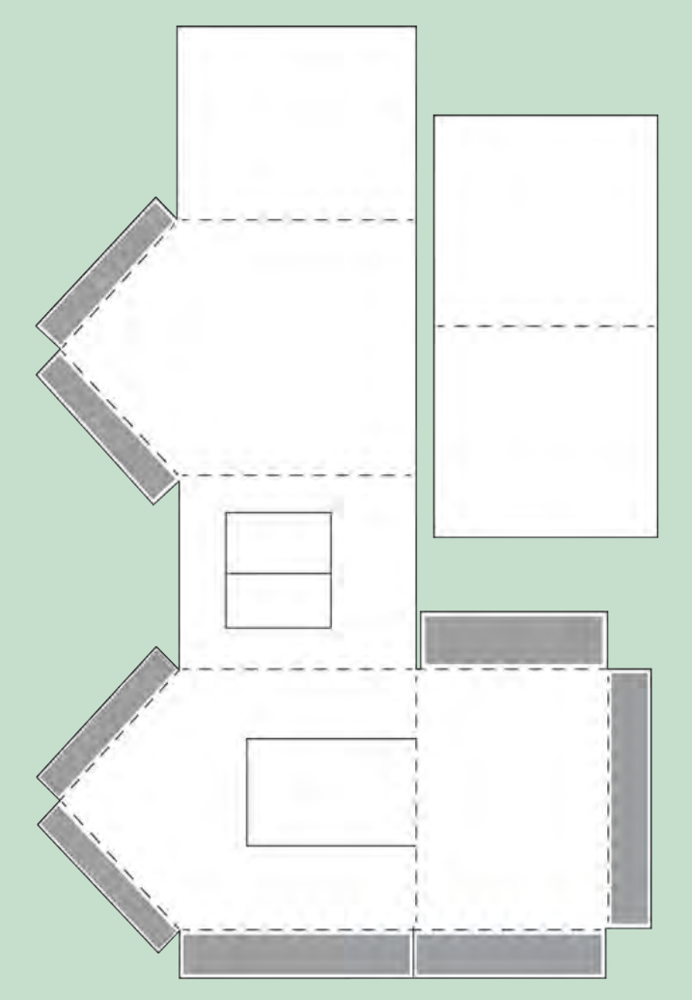
> **[Diagram Context - Textbook_NaturalScience_Gr7_Heat-insulation-and-energy-saving.pdf-0014-03.png]**
> This graphic is a two-dimensional net of a three-dimensional geometric solid, featuring various rectangular and pentagonal faces outlined with dashed fold lines and grey adhesive tabs. It serves as a practical template for students to cut, fold, and assemble, helping them visualize the relationship between 2D surface area components and the resulting 3D spatial structure.

> **[Diagram Context - Textbook_NaturalScience_Gr7_Potential-and-kinetic-energy.pdf-0014-03.png]**
> 1. A diagram of a snake's body with a green head and a brown body.

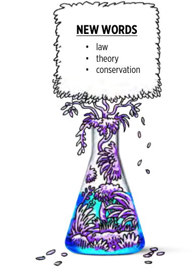
> **[Diagram Context - Textbook_NaturalScience_Gr7_Potential-and-kinetic-energy.pdf-0014-11.png]**
> The image features a cartoon depiction of a science experiment in a beaker. The beaker is filled with a purple liquid, and the plant growing out of it is a representation of the scientific concept of evolution. The plant is depicted as a tree, with leaves and branches, and it is surrounded by a variety of other plants and flowers. The beaker is placed on a table, and the

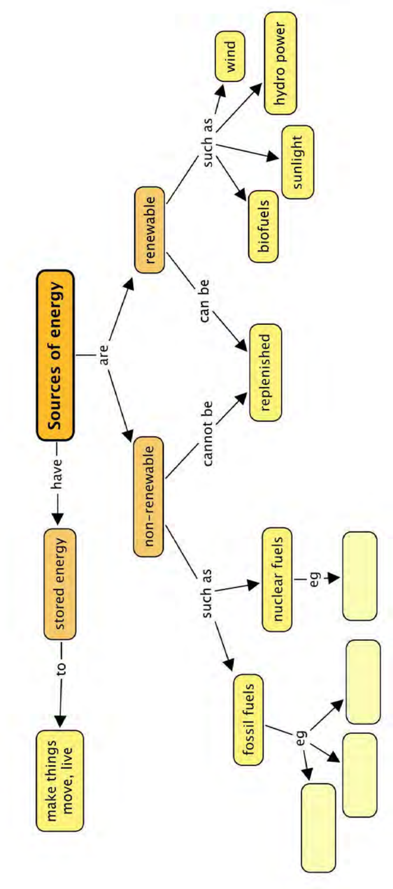
> **[Diagram Context - Textbook_NaturalScience_Gr7_Sources-of-energy.pdf-0014-00.png]**
> The image is a diagram that illustrates the concept of energy sources. It is a flow chart that shows the various sources of energy and how they are interconnected. The diagram is color-coded, with each source of energy represented by a different color. The diagram is labeled with the names of the energy sources and arrows pointing to the connections between them. The diagram is designed to help students understand the concept

---

# Chapter 2. Potential and Kinetic Energy

## Concepts & Structure

### Questions for Thought
* What is the input energy in this system?
* What are the different parts making up this mechanical system?
* What is the input energy transferred to within this system?

---

### Mechanical Systems: Swings and Seesaws
A swing or a seesaw are examples of mechanical systems.

*A swing is a simple mechanical system.*

Did you realise that when you were swinging on the park swings that you were a part of a mechanical system? When you are at the top of the swing's arc, you and the swing have **potential energy** because the Earth is pulling you and you are going to start moving down. The **potential energy** becomes **kinetic energy** as you swing through the arc.

---

### Mechanical Systems: Throwing a Ball
What about when you throw a ball up into the air? Do you think this is a mechanical system?

> **[Diagram Context - Textbook_NaturalScience_Gr7_Energy-transfer-to-surroundings.pdf-0015-02.png]**
> This image depicts a household electrical appliance, specifically a hairdryer, alongside a hairbrush and comb. While the image contains no explicit labels or variables, it serves as a real-world example of a device that converts electrical energy into thermal energy and kinetic energy (via a fan motor) within a domestic circuit. For a high school learner, this illustrates the practical application of power ratings and energy transformation in the context of the Grade 10-12 Physical Sciences curriculum.

When you throw a ball upward it slows down as it moves upwards, stops for an instant and then speeds up as it falls back down to your hand. Your hand moves to throw the ball and transfers energy to the ball which allows it to move upwards. Does this also follow the Law of Conservation of Energy? Yes, it does. No energy was created or destroyed. The kinetic energy was transferred from your hand to the ball which then starts to move. As the ball moves upwards, kinetic energy is transferred to potential energy as it moves further away from the ground.

As the ball moves back down again, the potential energy is transferred to kinetic energy.

> **[Diagram Context - Textbook_NaturalScience_Gr7_Heat-Energy-transfer.pdf-0015-08.png]**
> This graphic depicts a schematic representation of a DNA double helix, characterized by two antiparallel sugar-phosphate backbones connected by repeating base pairs. It illustrates the fundamental molecular structure of DNA, helping students visualize the helical geometry and the complementary pairing essential for genetic replication and protein synthesis.

> **[Diagram Context - Textbook_NaturalScience_Gr7_Potential-and-kinetic-energy.pdf-0015-02.png]**
> The image features a cartoon illustration of a cartoon character, a boy, standing on a globe. The boy is holding a pole, which is connected to the globe, and there are arrows pointing to different parts of the world. The boy is wearing a green shirt and a hat. The image also includes a text box that reads "South Africa, Africa, Lewis diagram, anatomy, cell, circuit

> **[Diagram Context - Textbook_NaturalScience_Gr7_Potential-and-kinetic-energy.pdf-0015-09.png]**
> This cartoon depicts a large telescope focused on the Earth, featuring human figures operating the equipment, a speech bubble, and a computer workstation. It conceptually illustrates the scientific process of Earth observation and remote sensing, highlighting how technology is used to monitor, collect, and analyse global environmental data.

> **[Diagram Context - Textbook_NaturalScience_Gr7_Potential-and-kinetic-energy.pdf-0015-13.png]**
> This illustration features a cartoon character holding and pointing at a globe, with an empty speech bubble above. It serves as a visual metaphor for environmental awareness or global citizenship, commonly used in Life Sciences or Geography to prompt discussion on human impact, sustainability, and the interconnectedness of Earth's systems.

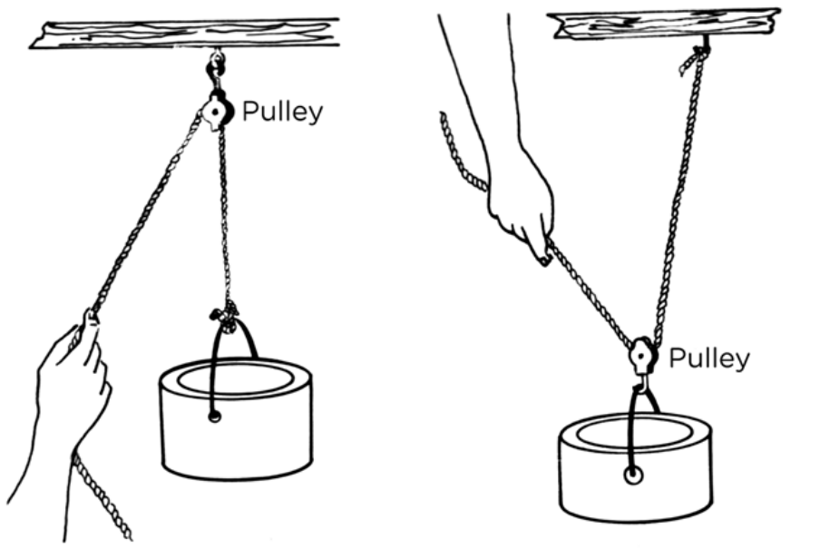
> **[Diagram Context - Textbook_NaturalScience_Gr7_Potential-and-kinetic-energy.pdf-0015-14.png]**
> This diagram illustrates two mechanical systems using a pulley, a rope, and a load, with the label "Pulley" identifying the central component in each setup. The left image depicts a fixed pulley system that changes the direction of force, while the right image demonstrates a movable pulley system that provides a mechanical advantage to reduce the effort required to lift the load.

---

## Energy and Change

* What are the parts involved in this mechanical system?
* What is the input energy in this mechanical system?
* When does the ball have the most potential energy?
* When does the ball have kinetic energy?

Let's have a look at some more examples.

---

### ACTIVITY: Identifying energy transfers in mechanical systems

#### MATERIALS:
* a piece of wire

We are first going to perform a simple demonstration to identify the energy transfers within mechanical systems. Take a length of wire and touch it to your lips. How does it feel?

Then, bend the wire into a U-shape and bend it back and forth $10$ times quickly. Now, feel the temperature again at the bend. How does it feel?

This is an example of a mechanical system. We can describe the transfer of energy as the potential energy within your arms is transferred to kinetic energy as you move them back and forth. This is transferred to kinetic energy in the wire which is then transferred to the lips as heat.

#### INSTRUCTIONS:
1. Look at the following pictures of different mechanical systems.
2. Identify the different parts in the system and then how energy is transferred from one part to another. You can discuss this with your partner.

> **[Diagram Context - Textbook_NaturalScience_Gr7_Energy-transfer-to-surroundings.pdf-0016-04.png]**
> This graphic depicts a biological illustration of an ant leading a trail of smaller ants along a defined path. It visually represents the concept of pheromone-based communication and collective foraging behavior, illustrating how social insects use chemical signals to coordinate movement and maintain group cohesion within an ecosystem.

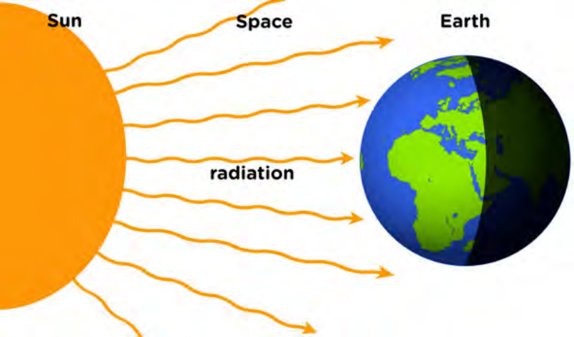
> **[Diagram Context - Textbook_NaturalScience_Gr7_Heat-Energy-transfer.pdf-0016-04.png]**
> This diagram illustrates the transfer of solar energy through space, featuring labels for "Sun," "Space," "Earth," and "radiation," with wavy arrows representing the propagation of electromagnetic waves. It conceptually demonstrates how solar radiation travels through a vacuum to reach the Earth, serving as the fundamental energy source for the planet's climate and life-sustaining processes.

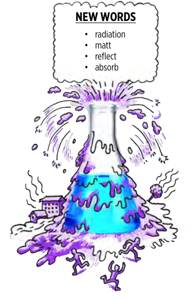
> **[Diagram Context - Textbook_NaturalScience_Gr7_Heat-Energy-transfer.pdf-0016-14.png]**
> This educational graphic features a metaphorical illustration of a laboratory flask erupting with purple energy, accompanied by a vocabulary list containing the terms "radiation," "matt," "reflect," and "absorb." It serves as a conceptual introduction to thermal physics, helping learners visualize how energy transfer processes interact with different surfaces and materials.

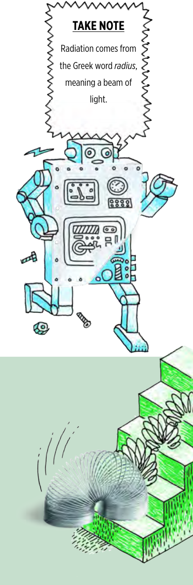
> **[Diagram Context - Textbook_NaturalScience_Gr7_Heat-Energy-transfer.pdf-0016-15.png]**
> This graphic features a cartoon robot accompanied by a "TAKE NOTE" text box and an illustration of a slinky toy descending a staircase. The text defines the etymology of "radiation" as originating from the Greek word *radius*, while the visual of the slinky serves as a mechanical analogy for wave motion. Together, these elements introduce learners to the fundamental concept that radiation involves the transmission of energy through space in the form of waves or particles.

> **[Diagram Context - Textbook_NaturalScience_Gr7_Heat-insulation-and-energy-saving.pdf-0016-07.png]**
> This graphic depicts a schematic representation of a DNA molecule, characterized by its iconic double-helix structure with two antiparallel sugar-phosphate backbones. It illustrates the fundamental molecular architecture of genetic material, highlighting the twisted ladder configuration that allows for the precise storage and replication of hereditary information in living organisms.

> **[Diagram Context - Textbook_NaturalScience_Gr7_Potential-and-kinetic-energy.pdf-0016-04.png]**
> This photograph depicts a playground swing set with two children, one seated on the swing and the other standing on the frame. It serves as a real-world context for Physical Sciences learners to identify and calculate forces such as gravity, tension, and normal force acting on objects in equilibrium or motion. By analyzing this scenario, students can apply Newton’s Laws of Motion to understand the interaction between the children and the structure.

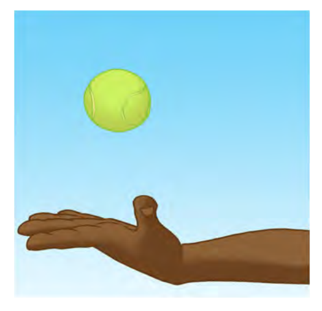
> **[Diagram Context - Textbook_NaturalScience_Gr7_Potential-and-kinetic-energy.pdf-0016-08.png]**
> This illustration depicts a human hand positioned beneath a tennis ball suspended in mid-air against a blue background. It serves as a conceptual starting point for Grade 10-12 Physical Sciences learners to analyse vertical projectile motion, specifically identifying the forces acting on the object, such as gravitational force, and the absence of contact forces once the ball has left the hand.

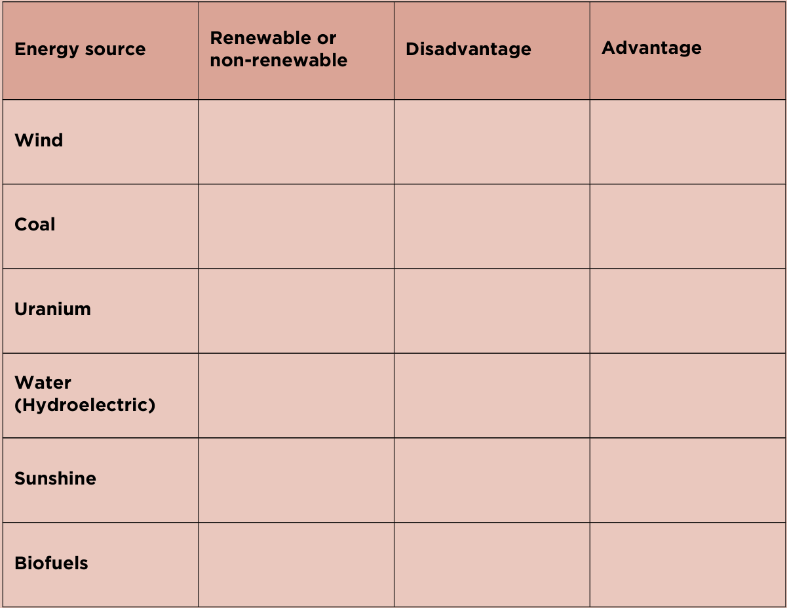
> **[Diagram Context - Textbook_NaturalScience_Gr7_Sources-of-energy.pdf-0016-03.png]**
> The image is a pink and white flow chart that illustrates the concept of renewable and non-renewable energy sources. The chart is divided into four sections, each representing a different type of energy source: wind, coal, uranium, and water. The chart also includes a list of advantages and disadvantages for each energy source, providing a visual representation of the advantages and disadvantages of each type of energy

> **[Diagram Context - Textbook_NaturalScience_Gr7_Sources-of-energy.pdf-0016-05.png]**
> The image shows a close-up view of a diagram of a cell, with a red ant positioned on the right side. The diagram is set against a gray background, and the ant is located at the bottom right corner. The diagram includes various labels and arrows, suggesting a detailed representation of the cell's structure and function. The image is labeled as an educational graphic, and the text "South

---

3. Then write a few sentences to describe the energy transfers within each system.

**QUESTIONS:**

1. The girl uses the energy in her muscles and pulls her leg back. When her leg is at its highest point, what energy does it have?

2. As she swings her leg back down towards the ball, describe the transfer of energy.

3. When her foot hits the ball, and the ball moves off, describe the transfer of energy in the system.

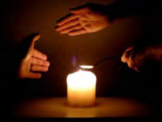
> **[Diagram Context - Textbook_NaturalScience_Gr7_Heat-Energy-transfer.pdf-0017-11.png]**
> This image is a photographic demonstration of heat transfer, featuring a lit candle, a metal spoon held in the flame, and human hands positioned nearby. It illustrates the three methods of thermal energy transfer: conduction through the metal spoon, convection via the rising warm air currents felt by the hand above the flame, and radiation detected by the hand held to the side.

4. The muscles in the cricketer's arm pull the cricket bat upward. Describe the transfer of energy.

5. Describe the transfer of energy as the bat swings down and then hits the moving ball.

> **[Diagram Context - Textbook_NaturalScience_Gr7_Heat-Energy-transfer.pdf-0017-13.png]**
> This graphic depicts a repeating, wave-like pattern of interconnected, arrow-shaped segments. It serves as a visual representation of a continuous process or directional flow, often used in Life Sciences to illustrate metabolic pathways, the sequence of DNA replication, or the cyclical nature of biological systems.

> **[Diagram Context - Textbook_NaturalScience_Gr7_Heat-insulation-and-energy-saving.pdf-0017-00.png]**
> This image is a landscape photograph depicting the coastal architecture of Oia, Santorini, characterized by white-washed buildings, blue domes, and steep volcanic cliffs overlooking the sea. There are no labels, variables, or scientific symbols present in this visual. Consequently, this image does not serve a pedagogical function within the CAPS curriculum as it lacks the necessary instructional data to illustrate specific scientific or mathematical concepts.

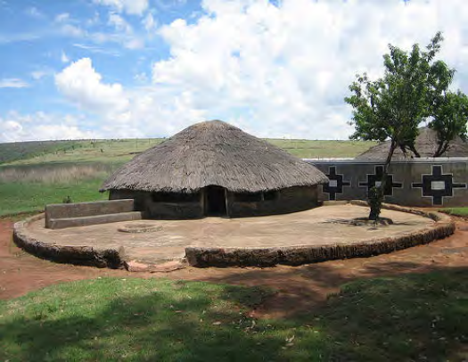
> **[Diagram Context - Textbook_NaturalScience_Gr7_Heat-insulation-and-energy-saving.pdf-0017-05.png]**
> This image depicts a traditional Ndebele homestead, featuring a circular thatched-roof dwelling (rondavel) and a courtyard wall adorned with characteristic geometric patterns. It serves as a visual representation of indigenous South African architectural heritage, illustrating the integration of cultural identity, artistic expression, and traditional building materials within a rural landscape.

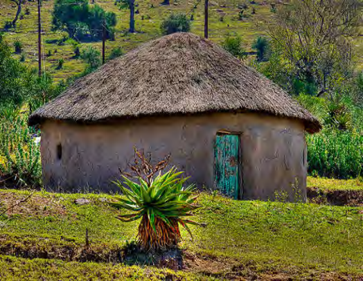
> **[Diagram Context - Textbook_NaturalScience_Gr7_Heat-insulation-and-energy-saving.pdf-0017-06.png]**
> This image depicts a traditional rondavel, a circular dwelling characterized by its conical thatched roof and mud-plastered walls, situated in a rural South African landscape featuring an aloe plant in the foreground. It serves as a visual resource for Geography or Social Sciences, illustrating human-environment interaction, traditional architectural styles, and the adaptation of indigenous building materials to local climatic conditions.

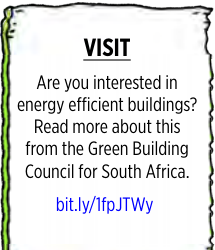
> **[Diagram Context - Textbook_NaturalScience_Gr7_Heat-insulation-and-energy-saving.pdf-0017-07.png]**
> This graphic is an informational text box containing the heading "VISIT," a prompt regarding energy-efficient buildings, and a reference to the Green Building Council for South Africa with an associated URL. It serves as an extension resource to encourage learners to explore real-world applications of sustainable design and energy conservation, which are key topics within the CAPS Life Sciences and Geography curricula.

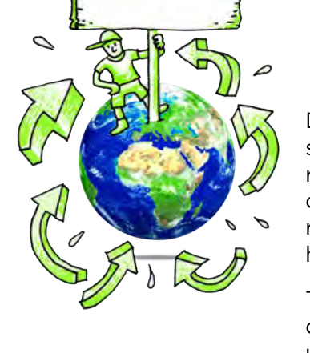
> **[Diagram Context - Textbook_NaturalScience_Gr7_Heat-insulation-and-energy-saving.pdf-0017-08.png]**
> This graphic is a conceptual illustration featuring a globe, a human figure, and a circular arrangement of green arrows. It visually represents the theme of environmental stewardship and global sustainability, using the arrows to symbolize the cyclical nature of resource management and ecological responsibility. For high school learners, this serves as an introductory visual aid for Life Sciences or Geography topics related to human impact on the environment and the importance of sustainable development.

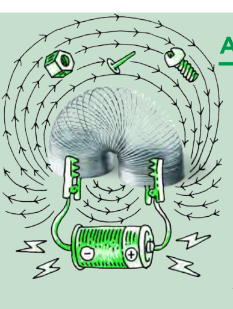
> **[Diagram Context - Textbook_NaturalScience_Gr7_Potential-and-kinetic-energy.pdf-0017-05.png]**
> This diagram illustrates an electromagnet, featuring a coiled wire (solenoid) connected to a battery with positive (+) and negative (-) terminals, surrounded by magnetic field lines indicated by directional arrows. It demonstrates the principle of electromagnetism, where an electric current flowing through a coil creates a magnetic field capable of attracting nearby metallic objects like the depicted nut, nail, and screw.

---

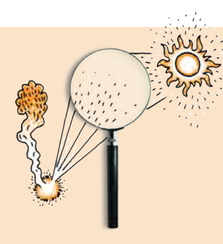
> **[Diagram Context - Textbook_NaturalScience_Gr7_Heat-Energy-transfer.pdf-0018-04.png]**
> This diagram illustrates the concept of solar energy concentration using a magnifying glass to focus sunlight onto a specific point. It features a sun, a magnifying lens, and a focal point where light rays converge to create an intense heat source, represented by a plume of smoke or thermal energy. This visual demonstrates the physical principle of light refraction and energy transfer, commonly used in Life Sciences and Physical Sciences to explain how solar radiation can be harnessed or the dangers of concentrated light.

6. Now that you have had practice with the other examples, use the following space to describe the transfer of energy within the above system as a ruler is pulled back and then flicks a pellet across the room.

---

---

---

> **TAKE NOTE**
> 
> We will learn more about how particles behave next year when we look at the particle model of matter.

---

## Thermal systems

Did you know that the particles that make up a substance or object, such as atoms or molecules, also have kinetic energy? Particles which have more kinetic energy will move faster than particles which have less kinetic energy. When the particles are moving very fast, we feel the substance and say "That's hot!". This is because the temperature of a substance depends on the kinetic energy of the particles.

The thermal energy can be transferred from one object to another in a thermal system. When thermal energy is transferred, this is called heat. We will look more at this in the next chapter, but for now let's look at some simple examples of energy transfers within thermal systems (heating).

---

## INVESTIGATION: The energy transfers when boiling water

### INVESTIGATIVE QUESTION:
What happens to the temperature of water when it is heated over a flame?

### VARIABLES:
We will be measuring the change in the water temperature over time.

1. Which quantity/variable are you in control of? This is the independent variable.

---

> **[Diagram Context - Textbook_NaturalScience_Gr7_Heat-insulation-and-energy-saving.pdf-0018-00.png]**
> This diagram illustrates a cross-section of a biological membrane, specifically representing a phospholipid monolayer or the surface of a lipid bilayer. It features a series of repeating, stylized blue symbols representing hydrophilic phosphate heads oriented toward an aqueous environment, anchored to a solid grey base representing the hydrophobic fatty acid tails. This model helps learners visualize the structural arrangement of phospholipids at an interface, which is fundamental to understanding the fluid mosaic model of the cell membrane.

> **[Diagram Context - Textbook_NaturalScience_Gr7_Heat-insulation-and-energy-saving.pdf-0018-09.png]**
> This conceptual illustration features a large, central metal key superimposed over a landscape containing a tree with an owl and swing, a human skull, bones, and a treasure chest. By juxtaposing symbols of life, death, and hidden discovery, the image serves as a metaphorical "key" to unlocking knowledge or uncovering historical and biological evidence buried within an environment.

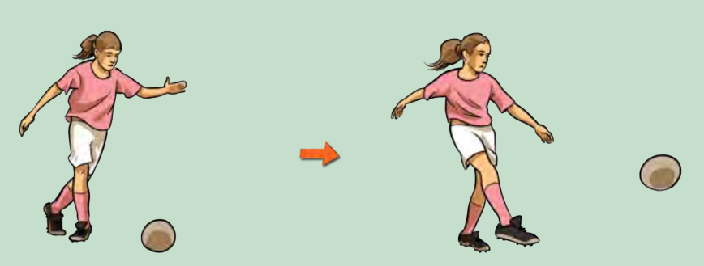
> **[Diagram Context - Textbook_NaturalScience_Gr7_Potential-and-kinetic-energy.pdf-0018-03.png]**
> This diagram illustrates a physical scenario of a soccer player kicking a ball, connected by a central orange arrow indicating a sequence of events. It demonstrates the application of a contact force by the player on the ball, resulting in a change in the ball's state of motion from rest to velocity.

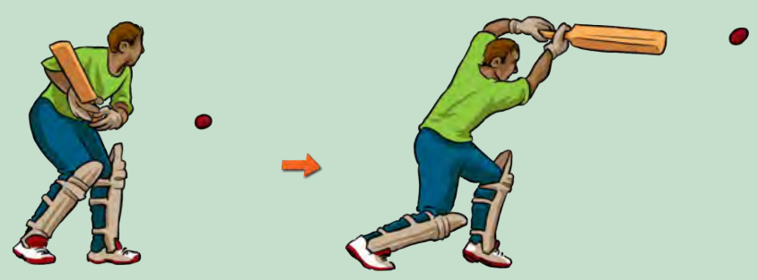
> **[Diagram Context - Textbook_NaturalScience_Gr7_Potential-and-kinetic-energy.pdf-0018-07.png]**
> This physical science diagram illustrates a cricket player striking a ball, featuring a batsman, a cricket ball, a bat, and an orange arrow indicating the sequence of the action. It conceptually demonstrates the application of Newton’s Second Law of Motion, showing how the force exerted by the bat causes a change in the momentum and direction of the ball.

---

2. Which variable are you measuring in response to the independent variable? This is the dependent variable.

__________________________________________________________________________________

__________________________________________________________________________________

3. Which variable are you keeping constant?

__________________________________________________________________________________

__________________________________________________________________________________

---

### **HYPOTHESIS:**

Write a hypothesis for this investigation. (Hint: What do you think will happen to the temperature of the water. Will it go up or down?)

__________________________________________________________________________________

__________________________________________________________________________________

__________________________________________________________________________________

---

### **MATERIALS AND APPARATUS:**

* $150\text{ ml}$ or $250\text{ ml}$ beaker
* tripod
* gauze
* Bunsen burner
* matches
* thermometer
* stopwatch
* retort stand
* clamp

---

### **METHOD:**

1. Pour $200\text{ ml}$ of water into a beaker.
2. Place the beaker onto the wire gauze on the tripod.
3. Carefully place the thermometer into the water. When you take the readings, the thermometer should not be touching the sides of the beaker. Alternatively, if you have a retort stand and clamp, the thermometer can be clamped in the stand with the bulb in the water.
4. Light the Bunsen burner.
5. Measure the temperature of the water every $30\text{ seconds}$ until the water starts to boil.
6. Once the water starts to boil, take $3$ to $5$ more readings.
7. Write down your observations in the table.
8. Once finished, turn off the Bunsen burner and leave the beaker of water to stand.
9. Plot a graph showing the relationship between the time and the temperature.

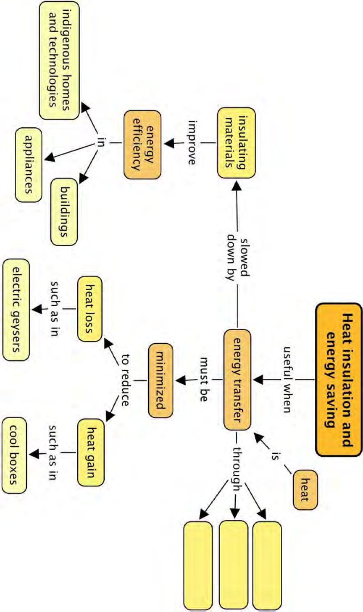
> **[Diagram Context - Textbook_NaturalScience_Gr7_Heat-insulation-and-energy-saving.pdf-0019-00.png]**
> This concept map illustrates the principles of heat insulation and energy saving, featuring nodes such as "energy transfer," "heat loss," "heat gain," "energy efficiency," and "insulating materials." It visually connects these concepts to practical applications like electric geysers, cool boxes, and indigenous technologies to explain how minimizing heat transfer improves energy efficiency. For high school learners, this diagram serves as a framework for understanding the mechanisms of thermal insulation and the importance of energy conservation in everyday systems.

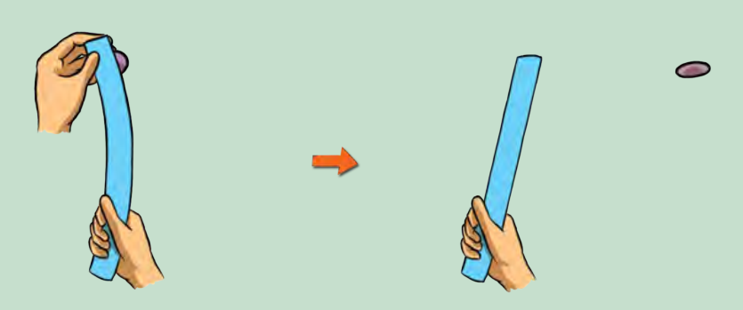
> **[Diagram Context - Textbook_NaturalScience_Gr7_Potential-and-kinetic-energy.pdf-0019-01.png]**
> This diagram illustrates a physical science demonstration of elastic potential energy, showing a pair of hands bending a flexible blue strip and then releasing it to launch a small purple projectile. The visual sequence uses hands, a flexible strip, a projectile, and a directional arrow to represent the conversion of stored elastic potential energy into kinetic energy. It conceptually demonstrates how mechanical work done to deform an elastic object is stored and subsequently transferred to an object upon release.

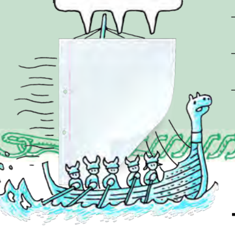
> **[Diagram Context - Textbook_NaturalScience_Gr7_Potential-and-kinetic-energy.pdf-0019-05.png]**
> This cartoon depicts a Viking longship featuring a blank sail shaped like a piece of lined notebook paper, with a speech bubble above it. The visual elements include the rowing crew, the ship's hull, stylized waves, and wind lines, all serving as a metaphorical template for creative writing or historical narrative tasks. It conceptually encourages learners to project their own historical research or imaginative storytelling onto a blank canvas, bridging the gap between historical study and personal expression.

> **[Diagram Context - Textbook_NaturalScience_Gr7_Potential-and-kinetic-energy.pdf-0019-09.png]**
> This illustration depicts a weightlifter struggling to lift a heavy object labeled "50kg," using wavy lines and sweat droplets to signify physical exertion. It conceptually introduces the Grade 10 Physical Sciences topic of force and mass, illustrating the relationship between an object's mass and the gravitational force (weight) that must be overcome to perform work.

---

## RESULTS AND OBSERVATIONS:

A table to record your observations:

| Time (seconds) | Temperature ($^\circ\text{C}$) |
| :--- | :--- |
| 30 | |
| 60 | |
| 90 | |
| 120 | |
| 150 | |
| 180 | |
| | |
| | |
| | |
| | |
| | |
| | |

Use the following space to draw a line graph for your results.

1. First, think about what will go on your horizontal, x-axis? This is what you changed.
2. What will go on the vertical, y-axis? This is what you measured.

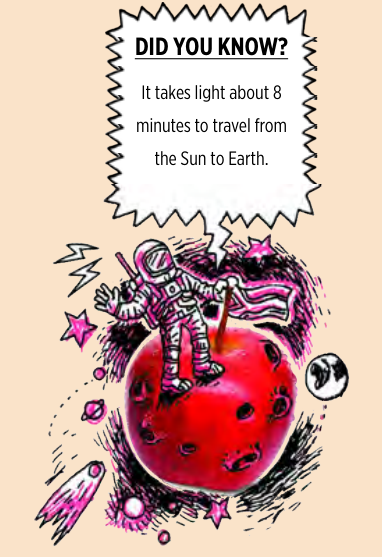
> **[Diagram Context - Textbook_NaturalScience_Gr7_Heat-Energy-transfer.pdf-0020-09.png]**
> This educational graphic features an illustrative cartoon of an astronaut standing on a red sphere resembling a planet, surrounded by stars, a comet, and a small moon. The text box provides a factual statement regarding the speed of light, specifically noting that it takes approximately 8 minutes for light to travel from the Sun to Earth. This visual aid serves to contextualize the vast distances in space for Natural Sciences learners, illustrating the finite speed of light and the concept of light-travel time within our solar system.

> **[Diagram Context - Textbook_NaturalScience_Gr7_Heat-insulation-and-energy-saving.pdf-0020-04.png]**
> This conceptual illustration depicts two interlocking gears positioned over the eyes of a human figure. By metaphorically replacing the eyes with mechanical gears, the image visually represents the concept of visual perception as a mechanical process, often used in Life Sciences to introduce the complex physiological and neurological mechanisms of the human eye.

---

3. The temperature of the water kept increasing, until it started to boil. What temperature did the water boil at?

__________________________________________________________________________________

4. What did you observe in the temperature when the water started to boil?

__________________________________________________________________________________

__________________________________________________________________________________

### **CONCLUSION:**

1. What can you conclude from your results?

__________________________________________________________________________________

__________________________________________________________________________________

2. Can you accept or reject your hypothesis?

__________________________________________________________________________________

__________________________________________________________________________________

---
Chapter 2. Potential and kinetic energy \hfill 39

> **[Diagram Context - Textbook_NaturalScience_Gr7_Heat-Energy-transfer.pdf-0021-04.png]**
> This diagram is a schematic representation of a zipper, featuring interlocking teeth and a central slider mechanism. In the context of the Life Sciences curriculum, this visual serves as a common analogy for the process of DNA replication, where the enzyme helicase acts as the slider to "unzip" the double-stranded DNA molecule by breaking the hydrogen bonds between complementary nitrogenous bases.

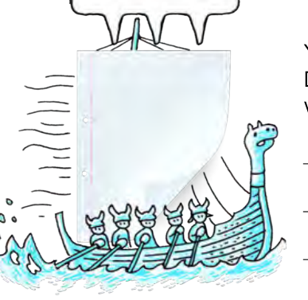
> **[Diagram Context - Textbook_NaturalScience_Gr7_Heat-Energy-transfer.pdf-0021-10.png]**
> This graphic is a metaphorical illustration depicting a Viking longship where the sail is replaced by a blank sheet of paper and the rowers are positioned below. It uses visual symbols of wind lines, oars, water, and a speech bubble to represent the concept of collaborative effort or "brainstorming" in a creative or academic context. For high school learners, this serves as a visual prompt to encourage group discussion, collective problem-solving, or the drafting of ideas within a project-based learning framework.

---

# QUESTIONS:

1. In order for the water to boil, the thermal energy of the water must increase. Where do you think the energy came from to make the water boil?

2. Describe the transfer of energy within this thermal system as the water is heated.

3. After the water has boiled, and you then turn off the Bunsen burner, what happened to the water in the beaker?

4. What do you think happened to the thermal energy of the water? Describe the transfer of energy.

5. A Gr. 7 learner is conducting the investigation and read the temperature off the thermometer as it is set up in the diagram below. What is wrong with this set-up? What is your advice to the learner?

> **[Diagram Context - Textbook_NaturalScience_Gr7_Heat-Energy-transfer.pdf-0022-00.png]**
> This diagram illustrates a cross-section of a biological membrane, specifically representing a phospholipid monolayer or the surface of a lipid bilayer. It features a series of repeating, stylized blue symbols representing hydrophilic phosphate heads oriented toward an aqueous environment, anchored to a solid grey substrate representing the hydrophobic fatty acid tails. This conceptual model helps learners visualize the amphipathic nature of phospholipids and their organized arrangement at the interface of cellular environments.

> **[Diagram Context - Textbook_NaturalScience_Gr7_Heat-Energy-transfer.pdf-0022-09.png]**
> This illustration depicts a metaphorical figure playing a large key as if it were a musical instrument, accompanied by floating musical notes. The image uses the visual symbols of a key and musical notation to represent the concept of "unlocking" or accessing musical expression or creativity. For a high school learner, this serves as a conceptual metaphor for how specific tools or knowledge can act as a catalyst for artistic performance and the generation of sound.

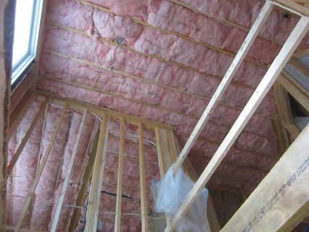
> **[Diagram Context - Textbook_NaturalScience_Gr7_Heat-insulation-and-energy-saving.pdf-0022-04.png]**
> This image depicts the structural framing and pink fiberglass insulation installed within a building's wall and ceiling cavities. It illustrates the practical application of thermal insulation materials placed between wooden studs and rafters to reduce heat transfer. For Physical Sciences learners, this serves as a real-world example of how low-conductivity materials are used to improve energy efficiency and maintain thermal equilibrium in residential structures.

> **[Diagram Context - Textbook_NaturalScience_Gr7_Potential-and-kinetic-energy.pdf-0022-00.png]**
> This image is a blank white rectangular frame set against a light peach background. As it contains no visible labels, variables, or structural content, it provides no pedagogical information or conceptual representation for a CAPS curriculum learner.

---

## Chapter 2. Potential and kinetic energy

* So, what have we discovered? The temperature of the water increased. This means that the water particles must have been given more **kinetic energy**. The energy must have come from the Bunsen burner flame. The flame is there because we are burning gas so the energy must have been stored in the gas. If it is stored energy then it is **potential energy**.
* So, we have discovered that the potential energy stored in the gas has been transferred to the water particles as kinetic energy. No energy has been **created**, it has been **transferred** from the gas to the water. The energy of the system has been **conserved**.

---

### Electrical systems

Do you think an electric circuit is a system? Look at the following image and discuss this with your partner. Write down whether you think it is a system and why.

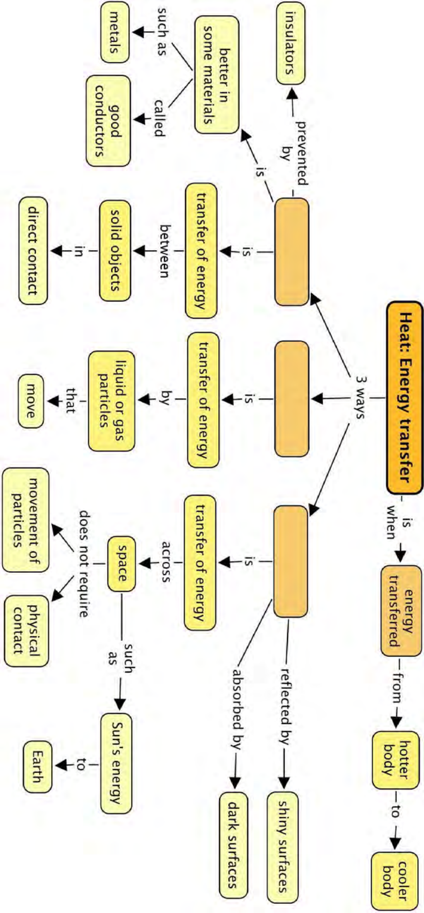
> **[Diagram Context - Textbook_NaturalScience_Gr7_Heat-Energy-transfer.pdf-0023-00.png]**
> This concept map illustrates the mechanisms of heat energy transfer, specifically conduction, convection, and radiation. It uses directional arrows to link key terms such as "hotter body," "cooler body," "solid objects," "liquid or gas particles," "space," "insulators," and surface properties like "absorbed" or "reflected." The diagram provides a structured overview for learners to distinguish between the three methods of thermal energy transfer and understand how materials and surfaces influence these processes.

* What is the source of energy in this electric circuit? In other words, what is the input energy in this system?
* What is the result of the energy transfer in the system? In other words, what is the energy output?

Let's look at another example of an electrical circuit which makes a motor turn to see the different energy transfers within the system.

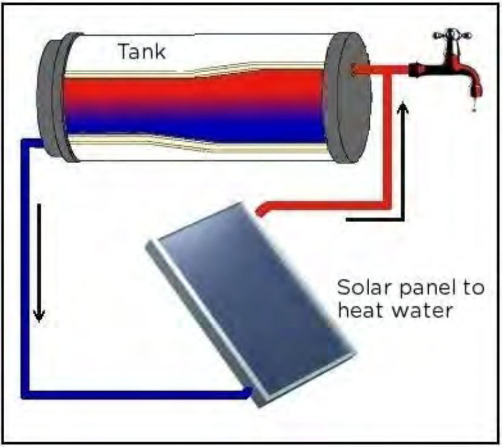
> **[Diagram Context - Textbook_NaturalScience_Gr7_Heat-insulation-and-energy-saving.pdf-0023-05.png]**
> This diagram illustrates a solar water heating system, featuring a storage tank, a solar panel, and connecting pipes marked with directional arrows to indicate water flow. It demonstrates the principle of convection, where solar-heated water rises from the panel into the tank while cooler water circulates back down to be reheated, providing a practical application of thermal energy transfer for high school Physical Sciences learners.

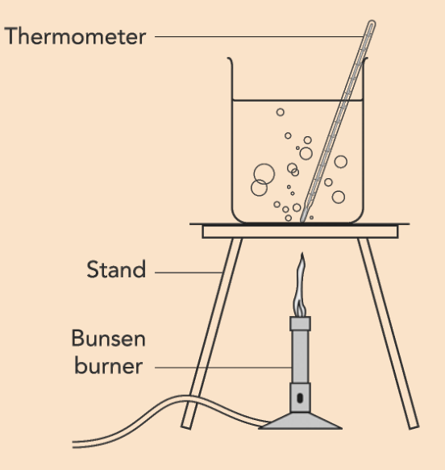
> **[Diagram Context - Textbook_NaturalScience_Gr7_Potential-and-kinetic-energy.pdf-0023-07.png]**
> This diagram illustrates a laboratory apparatus setup for heating a liquid, featuring labels for a thermometer, stand, and Bunsen burner. It demonstrates the practical procedure for monitoring temperature changes during heating, which is fundamental for understanding phase changes and energy transfer in the Physical Sciences curriculum.

> **[Diagram Context - Textbook_NaturalScience_Gr7_Potential-and-kinetic-energy.pdf-0023-08.png]**
> This graphic is a line-art illustration of a zipper, featuring a slider and interlocking teeth. In the context of the Life Sciences CAPS curriculum, this serves as a structural analogy for the unwinding and unzipping of the DNA double helix by the enzyme helicase during DNA replication.

---

# ACTIVITY: An electric fan system

## MATERIALS:
* small electric fan or motor
* conducting wires
* battery
* switch

## INSTRUCTIONS:
1. If possible, make the following circuit in class. However, if you do not make the actual circuit, study the image and answer the questions.
2. To make the circuit, attach a small fan or motor to a battery using the conducting wires.
3. Attach a switch in the circuit as shown in the image. You can make your own switch using a piece of board and pressing two metal pins into it. Then, bend a metal paper clip and attach it to the one drawing pin as shown below.
4. Close the switch and observe what happens to the fan.

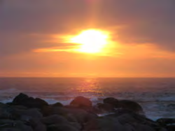
> **[Diagram Context - Textbook_NaturalScience_Gr7_Heat-Energy-transfer.pdf-0024-02.png]**
> This image is a photograph of a sunset over a rocky coastline, containing no labels, symbols, or technical variables. In a CAPS curriculum context, this visual serves as a real-world stimulus for Physical Sciences (Optics) to discuss the scattering of light, or for Geography to illustrate solar radiation and the Earth's energy balance.

## QUESTIONS:
1. What are the parts making up this electrical system?
2. Which part of the system provides the input energy to the system?
3. What happens to the fan or motor when you close the switch?
4. What type of energy does the fan now have?

> **[Diagram Context - Textbook_NaturalScience_Gr7_Heat-Energy-transfer.pdf-0024-03.png]**
> This image depicts a charcoal grill apparatus containing burning coals and a piece of meat on a metal grid. It serves as a practical, real-world illustration of an exothermic chemical reaction, where the combustion of carbon (charcoal) releases thermal energy used to cook the food.

> **[Diagram Context - Textbook_NaturalScience_Gr7_Heat-Energy-transfer.pdf-0024-06.png]**
> This illustration depicts a person balancing on a unicycle while juggling bottles, using motion lines to indicate rotation and movement. It serves as a visual metaphor for dynamic equilibrium, demonstrating how a system must constantly adjust its centre of gravity and apply corrective forces to maintain stability while in motion.

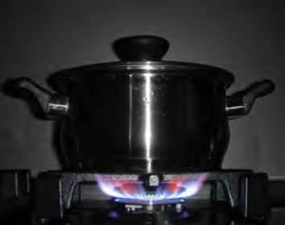
> **[Diagram Context - Textbook_NaturalScience_Gr7_Heat-Energy-transfer.pdf-0024-07.png]**
> This image depicts a stainless steel pot placed on a gas stove burner with a visible blue flame. It serves as a practical, real-world illustration of thermal energy transfer, specifically demonstrating the process of conduction where heat from the combustion reaction is transferred through the metal base of the pot to its contents.

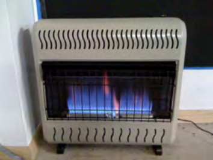
> **[Diagram Context - Textbook_NaturalScience_Gr7_Heat-Energy-transfer.pdf-0024-09.png]**
> This image depicts a domestic gas heater in operation, characterized by a metal casing, a protective safety grille, and visible blue flames. It serves as a practical example of an exothermic chemical reaction where the combustion of fuel releases thermal energy, illustrating the conversion of chemical potential energy into heat energy within a real-world context.

> **[Diagram Context - Textbook_NaturalScience_Gr7_Heat-insulation-and-energy-saving.pdf-0024-04.png]**
> This graphic depicts a biological illustration of an ant leading a trail of smaller ants along a defined path. It visually represents the concept of pheromone-based chemical communication and collective foraging behaviour, illustrating how social insects use chemical signals to coordinate movement and maintain group cohesion.

> **[Diagram Context - Textbook_NaturalScience_Gr7_Heat-insulation-and-energy-saving.pdf-0024-06.png]**
> This image depicts a blank sheet of lined, three-hole punched loose-leaf paper with a curled corner. It contains no academic labels, variables, or scientific content. Conceptually, this serves as a foundational tool for learners to record notes, perform calculations, or draw diagrams required by the CAPS curriculum.

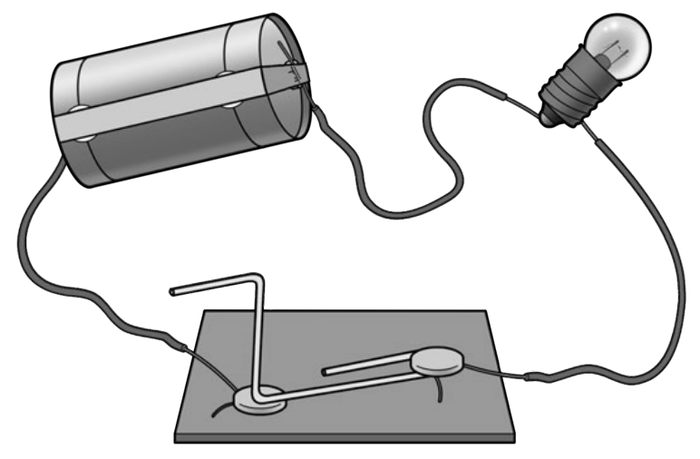
> **[Diagram Context - Textbook_NaturalScience_Gr7_Potential-and-kinetic-energy.pdf-0024-04.png]**
> This diagram illustrates a simple electrical circuit consisting of a battery (power source), a light bulb (load), and a manual switch connected by conducting wires. It demonstrates the fundamental requirement of a closed circuit for current to flow and enable energy transfer, which causes the bulb to illuminate.

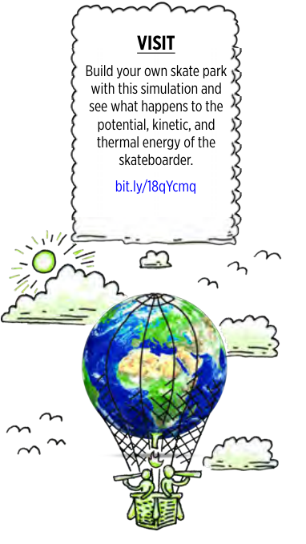
> **[Diagram Context - Textbook_NaturalScience_Gr7_Potential-and-kinetic-energy.pdf-0024-05.png]**
> This graphic features an illustrative call-to-action for an interactive physics simulation, depicting a globe-shaped hot air balloon and a text box containing the URL "bit.ly/18qYcmq". The text prompts students to explore the conservation of mechanical energy by observing the dynamic transformation between potential, kinetic, and thermal energy within a virtual skate park environment.

---

5. Using your answers to the previous questions, complete the following flow diagram which describes the energy transfers within this electrical system. You need to fill in the type of energy at each step.

## Biological systems

Do you know that we also get biological systems? You have come across these types of systems before in Life and Living, but now we are going to talk about them in terms of how the energy is transferred within these systems, and conserved.

Do you remember learning about photosynthesis and food chains in Life and Living? This is an example of a biological system. Let's find out why.

A plant uses the radiant energy from the Sun to make its own food through the process of photosynthesis. The energy from the Sun is stored as potential energy in plants, mainly as starch. Have a look at the following image to remind you.

What process is being shown in the diagram? Write a sentence to describe the requirements for this process.

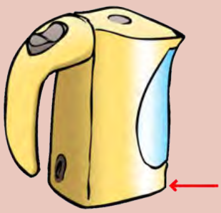
> **[Diagram Context - Textbook_NaturalScience_Gr7_Heat-Energy-transfer.pdf-0025-05.png]**
> This graphic is a technical illustration of an electric kettle featuring a red arrow pointing to its base. It serves as a visual aid for identifying the location of the heating element or the electrical connection point within the appliance. Conceptually, this helps students relate the physical structure of a household device to the principles of energy conversion, specifically the transformation of electrical energy into thermal energy.

> **[Diagram Context - Textbook_NaturalScience_Gr7_Potential-and-kinetic-energy.pdf-0025-00.png]**
> This illustration depicts a metaphorical hybrid of a caterpillar and a metal slinky spring, featuring green leaves and a stylized insect head. It serves as a visual analogy for mechanical waves, using the coiled structure to represent the compression and rarefaction patterns characteristic of longitudinal waves in physics.

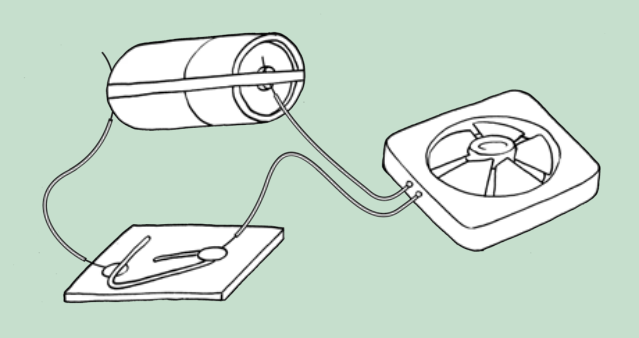
> **[Diagram Context - Textbook_NaturalScience_Gr7_Potential-and-kinetic-energy.pdf-0025-12.png]**
> This diagram illustrates a simple series electrical circuit consisting of a battery (power source), a switch, and a small electric fan (load) connected by conductive wires. It demonstrates the fundamental concept of an energy transfer system where closing the switch completes the circuit, allowing electrical energy to be converted into kinetic energy by the fan.

---

## Energy Transfer and Conservation in Biological Systems

When an animal eats a plant, it uses the **potential energy** in the food which is released during respiration. This energy is then used by the animal to move and for all its life processes. Consequently, the potential energy in the food eaten by the animal is transferred to **kinetic energy**. Energy has thus been transferred from the Sun to the plant, and then to the animal.

*An impala eats the grass and stores the energy in its muscles. When the impala runs, the stored energy becomes kinetic energy.*

When humans eat plants or animals, we are able to use the stored potential energy to make our bodies function.

> **[Diagram Context - Textbook_NaturalScience_Gr7_Heat-Energy-transfer.pdf-0026-07.png]**
> This graphic illustrates a biological trail formation, featuring a single ant leading a linear, double-stranded path of smaller ant icons against a shaded background. It conceptually demonstrates the mechanism of pheromone-based communication and collective behavior in social insects, highlighting how individual organisms contribute to organized, goal-directed group movement.

*Our food provides the input energy for our bodies to work and move. The food contains potential energy.*

### Is Energy Conserved in a Biological System?

Yes, it is! 

1. Plants change the Sun's energy into **potential energy** which they store inside themselves.
2. Animals eat the plants, and the stored potential energy is transferred to them.
3. Animals use the stored energy to enable them to move. This means the potential energy within the animal has been transferred to **kinetic energy**.
4. As the animal moves and performs its functions, this kinetic energy is transferred to the surroundings.

No energy has been created or destroyed; it has simply been transferred from the Sun to the plant and subsequently to the animal.

---

### Activity / Revision
Let's revise the energy transfers within some systems by studying and drawing flow diagrams.

> **[Diagram Context - Textbook_NaturalScience_Gr7_Potential-and-kinetic-energy.pdf-0026-02.png]**
> This flow diagram illustrates the energy conversion process in a simple electrical circuit using three text boxes labeled "Input energy in the battery," "electrons in the wires," and "fan and output." Arrows connecting these boxes are labeled "transferred to," visually mapping the transformation of chemical potential energy into electrical energy and finally into kinetic energy. This model helps learners understand the principle of energy transfer and conservation within a circuit by tracing the path of energy from the source to the load.

> **[Diagram Context - Textbook_NaturalScience_Gr7_Potential-and-kinetic-energy.pdf-0026-03.png]**
> This graphic depicts a stylized, repeating pattern of interlocking, arrow-shaped biological structures resembling a continuous chain or molecular sequence. The image uses a uniform green, linear motif to represent a repetitive biological polymer or a simplified schematic of a genetic sequence. It serves as a visual metaphor for the repetitive, directional nature of biological macromolecules like DNA or protein chains in a Life Sciences context.

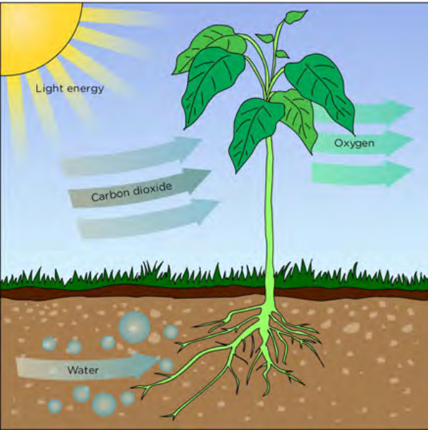
> **[Diagram Context - Textbook_NaturalScience_Gr7_Potential-and-kinetic-energy.pdf-0026-08.png]**
> This diagram illustrates the process of photosynthesis in a green plant, featuring labels for light energy, carbon dioxide, oxygen, and water. It conceptually demonstrates how plants convert solar energy and inorganic raw materials into chemical energy, highlighting the inputs and outputs essential for autotrophic nutrition in the CAPS Life Sciences curriculum.

---

# ACTIVITY: Flow diagrams for energy transfers

## INSTRUCTIONS:
1. Study each of the following diagrams which show different systems.
2. Draw a flow diagram, similar to the one you did for the electric fan in the space provided.
3. Then write a few sentences underneath on the lines to describe how energy is transferred between the different parts in each of these systems.
4. The first one has been done for you.

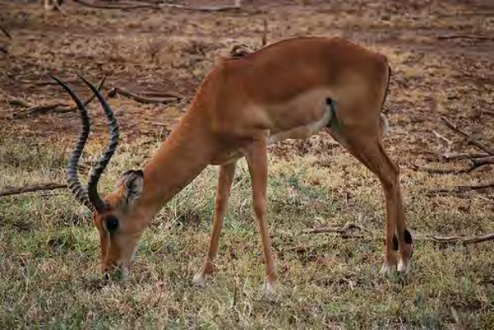
> **[Diagram Context - Textbook_NaturalScience_Gr7_Potential-and-kinetic-energy.pdf-0027-01.png]**
> This photograph depicts an impala (*Aepyceros melampus*) in its natural savanna habitat, showcasing key biological features such as its lyre-shaped horns, slender limbs, and reddish-brown coat. In the context of the Life Sciences CAPS curriculum, this image serves as a practical example of a primary consumer, illustrating the feeding behaviour of an herbivore and its morphological adaptations for survival within a terrestrial ecosystem.

This flow diagram describes the transfers of energy.

| potential energy in raised arm and racket | $\rightarrow$ | transferred to | $\rightarrow$ | kinetic energy in girls arm as she swings | $\rightarrow$ | transferred to | $\rightarrow$ | kinetic energy in tennis racket | $\rightarrow$ | transferred to | $\rightarrow$ | kinetic energy in ball |
| :---: | :---: | :---: | :---: | :---: | :---: | :---: | :---: | :---: | :---: | :---: | :---: | :---: |

The tennis player's arm and racket have potential energy as they are raised. As the girl swings her arm, this potential energy is transferred to the tennis racket as kinetic energy. The tennis racket transfers energy to the ball as kinetic energy which enables the ball to move through the air.

## QUESTIONS:
1. This drawing shows a food chain.

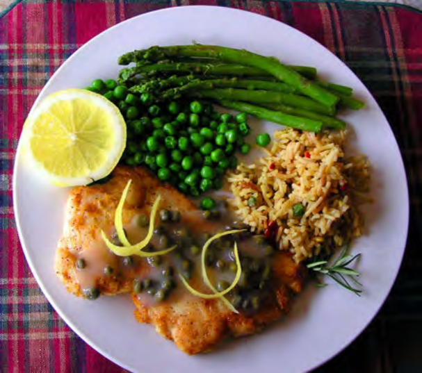
> **[Diagram Context - Textbook_NaturalScience_Gr7_Potential-and-kinetic-energy.pdf-0027-04.png]**
> This image displays a balanced meal consisting of protein (fish), carbohydrates (rice), and vegetables (asparagus and peas). It serves as a practical visual aid for Life Sciences learners to identify the primary food groups and understand the components of a nutritionally balanced diet required for human health.

---

# Energy and Change

1. Draw a diagram showing the energy transfers in this biological system.

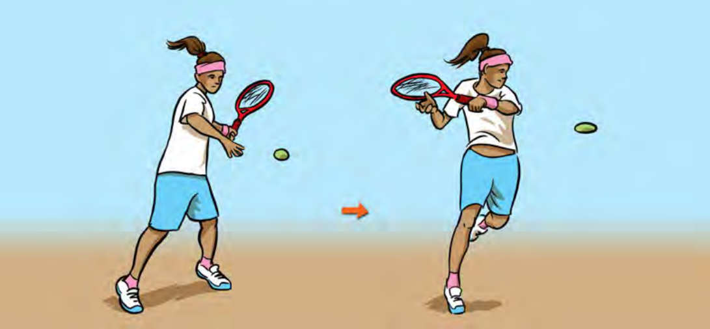
> **[Diagram Context - Textbook_NaturalScience_Gr7_Potential-and-kinetic-energy.pdf-0028-06.png]**
> This diagram illustrates a sequence of physical motion, featuring a tennis player hitting a ball with a racket, connected by a central directional arrow. It conceptually demonstrates the application of a contact force by the racket on the ball, resulting in a change in the ball's state of motion as per Newton’s laws.

2. Write a description of the energy transfers below.

__________________________________________________________________________________

__________________________________________________________________________________

__________________________________________________________________________________

3. Draw a diagram showing the energy transfers in this electrical system.

> **[Diagram Context - Textbook_NaturalScience_Gr7_Potential-and-kinetic-energy.pdf-0028-07.png]**
> This graphic uses a metaphorical illustration of a roller coaster track integrated with a Slinky spring to represent mechanical energy transformations. It visually depicts the interplay between gravitational potential energy at the peak of the track and kinetic energy as the coaster descends, illustrating the principle of conservation of energy in a physical science context.

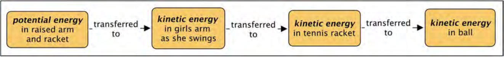
> **[Diagram Context - Textbook_NaturalScience_Gr7_Potential-and-kinetic-energy.pdf-0028-09.png]**
> This flow diagram illustrates the sequential energy transfer process during a tennis serve, using text boxes labeled "potential energy" and "kinetic energy" connected by arrows labeled "transferred to." It conceptually demonstrates the principle of conservation of energy by showing how energy is transformed and transferred from a stored state in the arm and racket into the motion of the ball.

> **[Diagram Context - Textbook_NaturalScience_Gr7_Potential-and-kinetic-energy.pdf-0028-13.png]**
> This diagram illustrates a simple food chain using illustrations of a plant, a bird, and a cat connected by directional arrows. It conceptually represents the transfer of energy through trophic levels in an ecosystem, showing the flow from a producer to a primary consumer and then to a secondary consumer.

---

4. Write a description of the energy transfers below.

5. In the previous example showing the berries, the bird and the cat, we saw an example of a food chain. Do you remember learning about food chains in Gr. 6? A food chain only shows the transfer of energy between organisms, and does not include the Sun. So, it always starts with a producer. Is the image below an example of a food chain? Why or why not?

6. We can rather call this an energy transfer sequence. Draw a flow diagram to explain the energy transfers in this biological and mechanical system.

7. Write a description of the energy transfers below.

Chapter 2. Potential and kinetic energy | 47

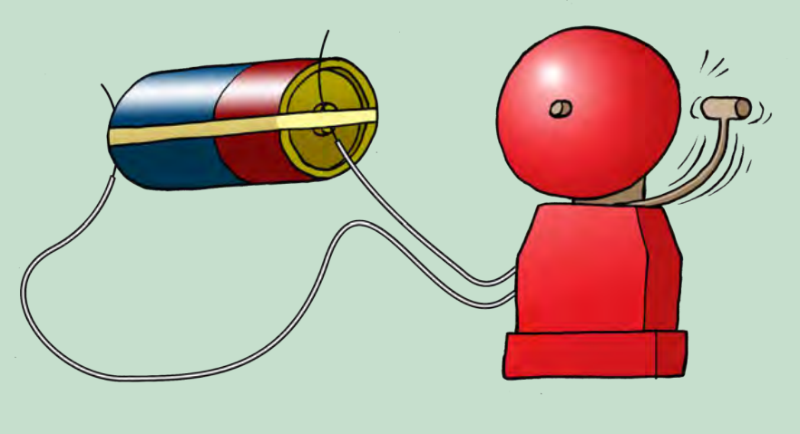
> **[Diagram Context - Textbook_NaturalScience_Gr7_Potential-and-kinetic-energy.pdf-0029-05.png]**
> This diagram illustrates a simple electrical circuit consisting of a cylindrical battery (cell) connected to an electric bell. The visual components include the battery, the bell mechanism, and connecting wires, with motion lines indicating the vibration of the bell's hammer. It demonstrates the conversion of chemical potential energy into electrical energy, which then powers the electromagnetic mechanism of the bell to produce sound.

---

### Lesson Notes: Hydropower Systems and Energy Transfer

#### 1. Introduction to Hydropower
* **Concept:** Hydropower is a renewable energy source that harnesses the natural flow or fall of water to generate electricity.
* **Core Principle:** Water stored at a height possesses stored energy due to its position in a gravitational field. As it moves, this energy is converted through various mechanical and electrical systems to power cities and homes.

---

#### 2. The Hydropower System Diagram Analysis

A typical hydroelectric power plant located at the edge of a dam consists of several interconnected components:
* **Dam:** Holds back water, creating a high-level reservoir.
* **Turbine:** A mechanical device placed in the water flow path that rotates as rushing water hits its blades.
* **Generator:** Connected to the turbine, it converts mechanical energy into electrical energy.
* **Powerhouse:** The building that houses the turbine and generator equipment.
* **Power Lines:** Conductors that transmit the generated electricity across long distances to cities.

---

#### 3. Step-by-Step Activity and Questions

Study the hydropower plant diagram and answer the following conceptual questions:

##### a) Potential Energy in Stored Water
* **Question:** The water in the dam on the left is high up. It has the ability to fall down. What kind of energy does the water have?
* **Explanation:** Because of its elevated position, the water possesses **gravitational potential energy** ($E_p$).

##### b) Energy Transfer During Flow
* **Question:** As the water flows down the outlet from the dam, describe the transfer of energy.
* **Explanation:** As gravity pulls the water downward, its height decreases and its speed increases. Therefore, gravitational potential energy is converted into **kinetic energy** ($E_k$).

##### c) Turbine Mechanics
* **Question:** The flowing water then turns the turbine. This is a mechanical system. What energy does the turbine have?
* **Explanation:** As the moving water forces the turbine blades to spin, the turbine gains **mechanical kinetic energy** ( rotational kinetic energy).

##### d) Generator and Electrical Systems
* **Question:** The generator then transfers the energy between two systems. The kinetic energy in the mechanical system is transferred to kinetic energy in the electrical system as it generates electricity. What parts make up the electrical system in the diagram?
* **Explanation:** Based on the diagram, the electrical system comprises the **generator**, **power lines**, and the connected electrical grid/city distribution infrastructure.

##### e) System Output
* **Question:** What is the output from this whole system? In other words, what does the city get?
* **Explanation:** The final useful output delivered to the city is **electrical energy** (electricity used for lighting, heating, appliances, and industry).

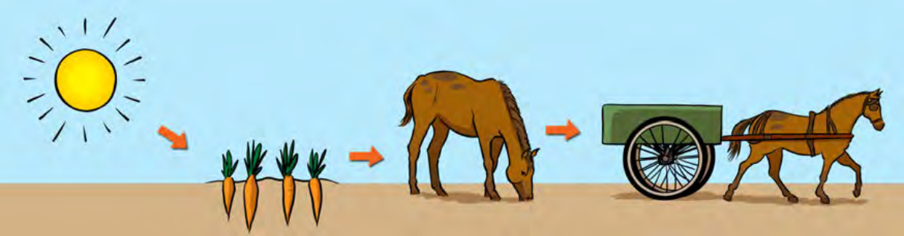
> **[Diagram Context - Textbook_NaturalScience_Gr7_Potential-and-kinetic-energy.pdf-0030-03.png]**
> This diagram is a food chain illustration featuring a sun, carrots, a horse, and a horse-drawn cart, connected by directional arrows. It conceptually demonstrates the flow of energy from the primary energy source (the sun) through a producer (carrots) to a primary consumer (the horse), while highlighting the transition from biological energy consumption to the mechanical work performed by the animal.

---

# SUMMARY:

## Key Concepts

* Potential energy is energy which is stored in a system.
* Kinetic energy is energy which an object has because it is moving.
* Energy is measured in joules ($\text{J}$).
* Energy cannot be created or destroyed. It can only be transferred from one part of a system to another. This is the Law of Conservation of Energy.
* Energy is transferred within systems. The input energy is transferred through the system and energy is conserved.
* There are various energy systems, such as:
  * mechanical systems
  * thermal systems
  * electrical systems
  * biological systems
* Energy is also transferred between different systems.

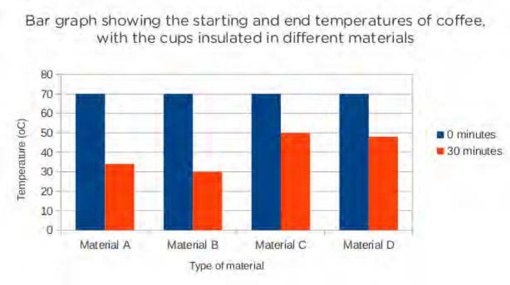
> **[Diagram Context - Textbook_NaturalScience_Gr7_Heat-insulation-and-energy-saving.pdf-0031-00.png]**
> This double bar graph compares the starting (0 minutes) and final (30 minutes) temperatures of coffee insulated by four different materials (A, B, C, and D). The axes represent "Temperature (°C)" and "Type of material," with a legend distinguishing the time intervals. Conceptually, this illustrates the effectiveness of different thermal insulators by showing how much heat energy is retained over time, allowing students to identify which material is the most efficient insulator based on the smallest temperature decrease.

## Concept Map

Complete the concept map below by filling in some examples of objects with either potential energy or kinetic energy that you learnt about in this chapter.

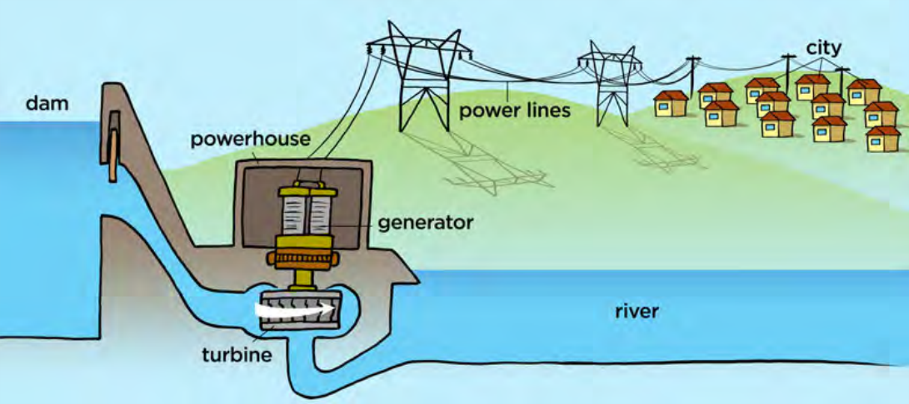
> **[Diagram Context - Textbook_NaturalScience_Gr7_Potential-and-kinetic-energy.pdf-0031-05.png]**
> This diagram illustrates the functional components of a hydroelectric power station, featuring labels for the dam, powerhouse, generator, turbine, power lines, river, and city. It conceptually demonstrates the energy conversion process where the gravitational potential energy of stored water is transformed into kinetic energy to drive a turbine, which then powers a generator to produce electrical energy for distribution to a city.

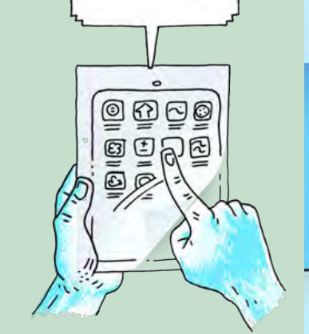
> **[Diagram Context - Textbook_NaturalScience_Gr7_Potential-and-kinetic-energy.pdf-0031-06.png]**
> This illustration depicts a tablet interface featuring various scientific and mathematical icons, including symbols for electricity (AC/DC), atomic structures, and mathematical operators. It serves as a visual metaphor for the integration of Information and Communication Technology (ICT) in the classroom, encouraging students to engage with digital tools to explore and manipulate complex scientific concepts.

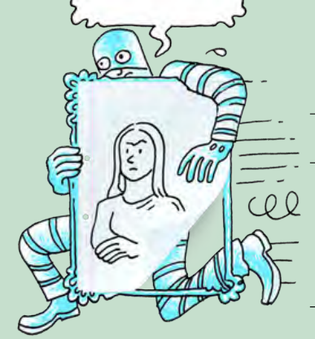
> **[Diagram Context - Textbook_NaturalScience_Gr7_Potential-and-kinetic-energy.pdf-0031-11.png]**
> This cartoon depicts a masked figure in a striped outfit running away while holding a framed portrait of a woman. The visual elements include a speech bubble, a decorative picture frame, and motion lines indicating rapid movement. Conceptually, this image serves as a metaphorical representation of theft or the act of "stealing" an identity or artwork, often used in Life Sciences or Life Orientation contexts to discuss ethics, intellectual property, or the concept of plagiarism.

> **[Diagram Context - Textbook_NaturalScience_Gr7_Potential-and-kinetic-energy.pdf-0031-15.png]**
> This graphic depicts a schematic representation of a DNA double helix, characterized by two antiparallel sugar-phosphate backbones connected by repeating base pairs. It illustrates the fundamental molecular structure of DNA, helping learners visualize the helical geometry and the complementary pairing essential for genetic replication and protein synthesis.

---

# Potential and Kinetic Energy

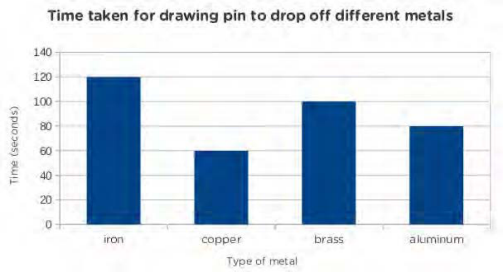
> **[Diagram Context - Textbook_NaturalScience_Gr7_Heat-Energy-transfer.pdf-0032-01.png]**
> This bar graph displays the time taken for a drawing pin to drop off four different metals (iron, copper, brass, and aluminum) with the y-axis representing time in seconds and the x-axis representing the type of metal. It conceptually illustrates the varying rates of thermal conductivity among different metals, demonstrating that materials with higher thermal conductivity transfer heat more efficiently, causing the wax holding the pin to melt faster.

## 1. Law of Conservation of Energy

* **Definition:** Energy cannot be created or destroyed, but can be **transferred** from one object to another.
* **Property:** It is **conserved** in systems.

## 2. Systems

* **Definition:** Systems are a set of parts working together.
* **Types of Systems:**
  * Mechanical
  * Thermal
  * Electrical
  * Biological

## 3. Two Main Groups of Energy

Energy is divided into two primary categories:

### A. Potential Energy
* **Definition:** Energy a body has that is **stored**.

### B. Kinetic Energy
* **Definition:** Energy a body has due to **movement**.

> **[Diagram Context - Textbook_NaturalScience_Gr7_Potential-and-kinetic-energy.pdf-0032-00.png]**
> This diagram illustrates a cross-section of a biological membrane, specifically representing the arrangement of phospholipid molecules with their hydrophilic heads oriented towards the aqueous environment. The graphic features a linear array of stylized, blue, hook-shaped symbols embedded along the surface of a light-grey horizontal plane. It conceptually demonstrates the structural organization of the cell membrane, highlighting the orientation of polar heads in the fluid mosaic model.

> **[Diagram Context - Textbook_NaturalScience_Gr7_Potential-and-kinetic-energy.pdf-0032-09.png]**
> This illustration depicts a worker operating a jackhammer, represented by a large key, with motion lines indicating vibration and debris scattering. It serves as a metaphorical visual aid to explain the concept of mechanical energy transfer and the physical impact of high-frequency vibrations in industrial or geological contexts.

---

## REVISION:

1. What is potential energy? Give two examples of systems which have potential energy [3 marks]

2. What is kinetic energy? Give two examples of systems which have kinetic energy? [3 marks]

3. What does the Law of Conservation of Energy state? [1 mark]

4. Look at the picture below.

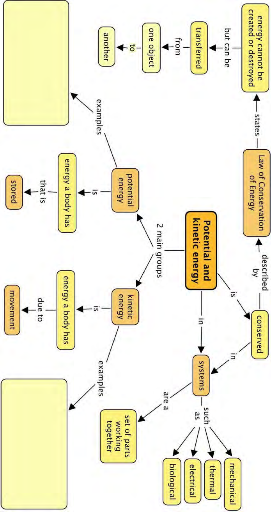
> **[Diagram Context - Textbook_NaturalScience_Gr7_Potential-and-kinetic-energy.pdf-0033-00.png]**
> This concept map illustrates the fundamental principles of energy, categorizing it into potential and kinetic forms while defining the Law of Conservation of Energy. It uses interconnected nodes and directional arrows to link key terms such as "stored," "movement," "systems," and various energy types (mechanical, thermal, electrical, biological) to show how energy is conserved and transferred. The diagram serves as a foundational study tool for Grade 10 Physical Sciences, helping learners visualize the relationship between energy types and the systemic nature of energy conservation.

a) Which ball has the most potential energy? [1 mark]

b) Explain your choice. [1 mark]

---

5. Complete the sentences by filling in the missing words. Write the sentence out in full and underline your answers.

a) A plant receives energy from \_\_\_\_\_\_\_\_\_\_ and uses the energy to make \_\_\_\_\_\_\_\_\_\_. The plant then changes some of the sugar into \_\_\_\_\_\_\_\_\_\_ and stores it in leaves, fruit and other parts. The plant has \_\_\_\_\_\_\_\_\_\_ energy which you can get when you eat the plant. [4 marks]

b) When a plane carries skydivers high into the sky, it is giving them \_\_\_\_\_\_\_\_\_\_ energy. When they jump out and free-fall, they have \_\_\_\_\_\_\_\_\_\_ energy. [2 marks]

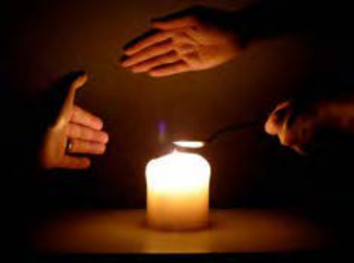
> **[Diagram Context - Textbook_NaturalScience_Gr7_Heat-Energy-transfer.pdf-0034-08.png]**
> This image is a photographic demonstration of heat transfer, featuring a lit candle, a metal spoon held in the flame, and human hands positioned nearby. It illustrates the concepts of conduction, as heat travels through the metal spoon, and radiation, as thermal energy is emitted from the flame to the surrounding hands.

*(Image description: Army skydivers have just jumped out the back of a plane.)*

6. Draw an energy transfer flow diagram to show how energy gets from the Sun into your food and then to you. [3 marks]

> **[Diagram Context - Textbook_NaturalScience_Gr7_Potential-and-kinetic-energy.pdf-0034-03.png]**
> This illustration depicts a system of interconnected gears of varying sizes, accompanied by a student figure and directional arrows indicating rotational movement. It visually represents the mechanical principles of gear trains, where the interaction between meshed gears demonstrates how motion and torque are transferred and modified within a mechanical system.

*(Drawing box for energy transfer flow diagram)*

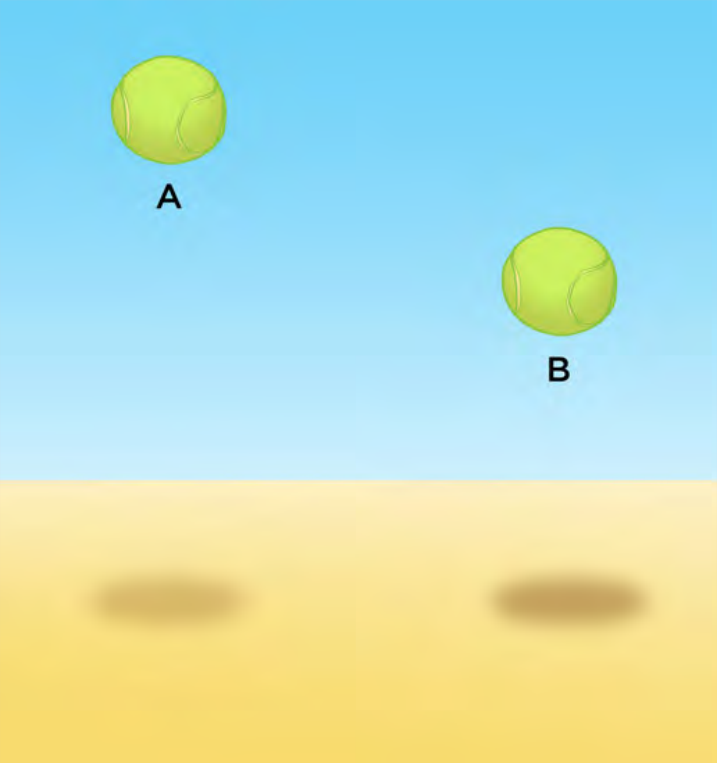
> **[Diagram Context - Textbook_NaturalScience_Gr7_Potential-and-kinetic-energy.pdf-0034-06.png]**
> This diagram depicts two tennis balls, labeled A and B, suspended at different heights above a ground surface. It illustrates the concept of gravitational potential energy, where the varying vertical positions of the objects relative to the reference plane (the ground) demonstrate how height influences the potential energy stored in a system.

---

7. A high jumper starts running. As she approaches the bar, she pushes off the ground and lifts her body off the ground and flies over the bar. She then falls down into a large padding on the ground.

*A high jumper going over the bar.*

Think about her jumping, from the moment her feet leave the ground. She goes up in the air, she almost stops as she goes over the bar, and then she comes down again.

a) Where does she have the most potential energy? [1 mark]

b) Where does she have the most kinetic energy? [1 mark]

c) Does she have some potential energy and some kinetic energy at any point in her jump? If you say yes, name one point where it is true. [2 marks]

---

8. Which type of energy do each of the following systems contain (kinetic or potential or both types)? [6 marks]

    a) A mountain biker at the top of the mountain.

    b) Petrol in a storage tank.

    c) A race-car travelling at its maximum speed.

    d) Water flowing down a waterfall before it hits the pond below.

---

Chapter 2. Potential and kinetic energy **53**

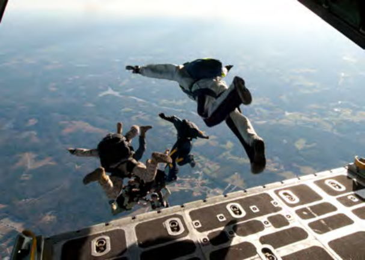
> **[Diagram Context - Textbook_NaturalScience_Gr7_Potential-and-kinetic-energy.pdf-0035-06.png]**
> This photograph depicts skydivers in freefall after exiting an aircraft, illustrating the physical principles of motion in a real-world context. It serves as a visual aid for Grade 10-12 Physical Sciences to discuss concepts such as gravitational force, air resistance (drag), and terminal velocity as the skydivers accelerate toward the Earth.

---

e) A spring in a pinball machine before it is released.

f) A running refrigerator motor.

9. Study the following image and answer the questions.

> **[Diagram Context - Textbook_NaturalScience_Gr7_Heat-Energy-transfer.pdf-0036-02.png]**
> This image is a landscape photograph depicting a sunset over a rocky coastline, featuring no labels, variables, or scientific annotations. For a high school student, this visual serves as a real-world context for discussing atmospheric physics, such as the scattering of light (Rayleigh scattering) that causes the shift in the visible spectrum toward warmer hues during sunrise or sunset.

a) There are two systems involved in this image of heating water in a kettle that is plugged in. What are they? [2 marks]

b) Describe the energy transfers within and between these two systems. [2 marks]

Total [32 marks]

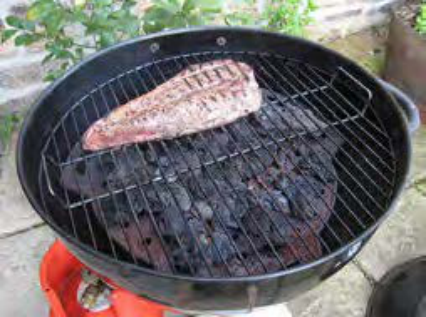
> **[Diagram Context - Textbook_NaturalScience_Gr7_Heat-Energy-transfer.pdf-0036-04.png]**
> This image depicts a charcoal grill apparatus containing burning coals and a piece of meat on a metal grid. It serves as a practical, real-world example of an exothermic chemical reaction, illustrating the combustion of carbon (charcoal) to release thermal energy used for cooking.

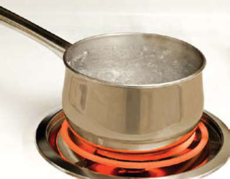
> **[Diagram Context - Textbook_NaturalScience_Gr7_Heat-Energy-transfer.pdf-0036-06.png]**
> This image depicts a physical apparatus consisting of a metal saucepan containing boiling water placed on a glowing electric stove heating element. It illustrates the process of thermal energy transfer via conduction from the heating element to the pot and convection within the water. For high school learners, this serves as a practical example of energy conversion from electrical to thermal energy and the phase change of water from liquid to gas.

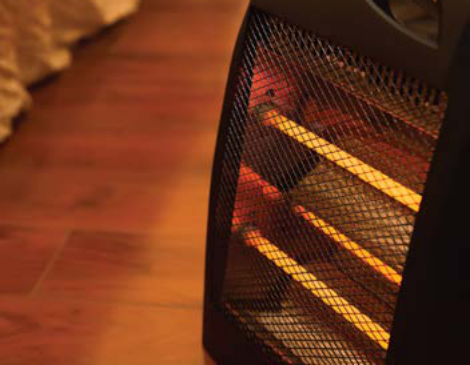
> **[Diagram Context - Textbook_NaturalScience_Gr7_Heat-Energy-transfer.pdf-0036-09.png]**
> This image depicts an electric bar heater featuring a protective metal mesh grille and glowing heating elements. It serves as a practical example of the heating effect of an electric current, where electrical energy is converted into thermal energy through resistance.

> **[Diagram Context - Textbook_NaturalScience_Gr7_Potential-and-kinetic-energy.pdf-0036-02.png]**
> This photograph depicts a high jump athlete clearing a crossbar, illustrating the biomechanical principles of projectile motion and the centre of gravity. The image features the athlete's body, the crossbar, and the landing mat, highlighting how the Fosbury Flop technique allows the athlete's centre of gravity to pass below the bar while their body passes over it. This serves as a practical application for Grade 12 Physical Sciences learners to analyse energy transformations and the physics of human movement.

---

Got another idea for the apple? Discover the possibilities here.

Chapter 2. Potential and kinetic energy

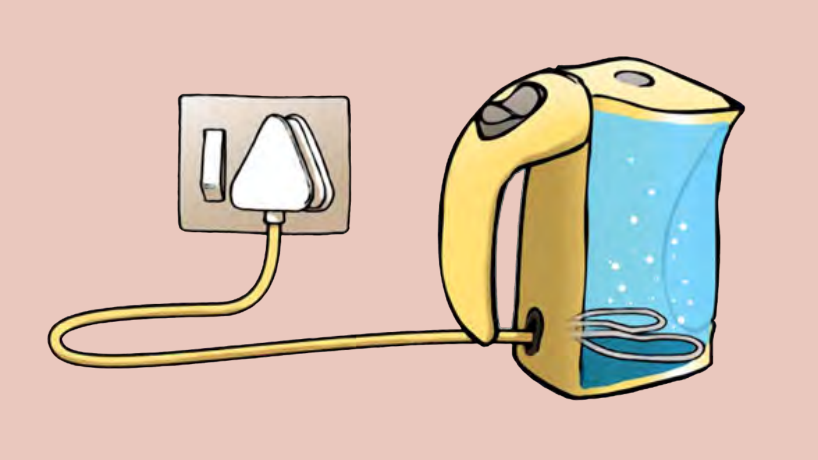
> **[Diagram Context - Textbook_NaturalScience_Gr7_Potential-and-kinetic-energy.pdf-0037-04.png]**
> This illustration depicts an electric kettle connected to a wall socket, showing the internal heating element submerged in water. It visually represents the conversion of electrical energy into thermal energy through the heating element, illustrating the practical application of the heating effect of an electric current as studied in Physical Sciences.

> **[Diagram Context - Textbook_NaturalScience_Gr7_Potential-and-kinetic-energy.pdf-0037-08.png]**
> This graphic illustrates a biological behavioral model showing a single ant leading a linear trail of numerous smaller ants. It visually represents the concept of pheromone-based trail following and collective social behavior in insects. For Life Sciences learners, this serves as an example of chemical communication and innate behavior used to coordinate group movement toward resources.

---

# 10 Potential and kinetic energy

## Chapter Overview
* **Duration:** 2 weeks
* **Core Focus:** This chapter builds on the basic concept of energy, explaining the difference between kinetic and potential energy. 

### Key Concepts & Principles
* **Law of Conservation of Energy:** Energy cannot be created or destroyed, but can be transferred from one part of the system to other parts.
* **Focus on Systems:** Instead of memorising disconnected "forms of energy", focus on systems with different parts that learners can examine. Energy exists in a system in two main ways:
  1. Stored in the system (**potential energy**).
  2. Causing changes in the system (**kinetic energy**).
* **Key areas of study:** Potential energy, kinetic energy, systems, transfer of energy between parts of a system, and the conservation of energy.

---

## 10.1 Potential energy (1.5 hours)

| Tasks | Skills | Recommendation |
| :--- | :--- | :--- |
| Investigation: How can we make the foam cup move further? | Planning, investigation, doing investigation, hypothesising, identifying variables and controls, measuring, recording, drawing graphs, analysing | CAPS Suggested |
| Activity: Elastic bands | Raising questions, carrying out instructions, measuring, recording, interpreting information | CAPS suggested |
| Activity: Reading a cereal box | Observing, comparing, interpreting information, drawing graphs | CAPS suggested |

---

## 10.2 Kinetic energy (1 hour)

| Tasks | Skills | Recommendation |
| :--- | :--- | :--- |
| Activity: Which objects have kinetic energy? | Observing, comparing, sorting and classifying | CAPS Suggested |

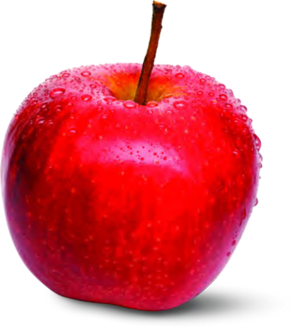
> **[Diagram Context - Textbook_NaturalScience_Gr7_Potential-and-kinetic-energy.pdf-0038-01.png]**
> This image is a high-resolution photograph of a single, red apple with visible water droplets on its skin and a brown stem. The graphic contains no labels, symbols, or variables, serving as a realistic visual representation of a fruit. In a CAPS Life Sciences context, this serves as an illustrative example of an angiosperm fruit, which can be used to discuss plant reproduction, seed dispersal, or the nutritional components of plant-based food sources.

---

## 10.3 Law of Conservation of Energy (0.5 hours)

## 10.4 Potential and Kinetic Energy in Systems (3 hours)

| Tasks | Skills | Recommendation |
| :--- | :--- | :--- |
| Activity: Identifying energy transfers in mechanical systems | Observing, interpreting, identifying and classifying | CAPS suggested |
| Investigation: The energy transfers when boiling water | Doing investigation, hypothesising, observing, identifying variables, recording, drawing graphs | CAPS suggested |
| Activity: An electric fan system | Building a circuit, identifying components and features | CAPS suggested |
| Activity: Flow diagrams for energy transfers | Identifying types of energy transfer, describing, drawing flow diagrams, communicating information | CAPS suggested |

### Key questions
* What is potential energy?
* What is kinetic energy?
* Where do we get energy from?
* How much energy do I need?
* Can energy be created or destroyed?
* What is a system?

---

## 10.1 Potential energy

Start this section by doing the investigations first and allowing the learners to draw their own conclusions. This will lead them to a better understanding of what energy is and what it can do rather than a verbal explanation. There are several activities which deal with potential energy. If you do not have enough time to do all of them, then choose at least one of them. You can base your choice on the resources that you have available at your school. Do not completely ignore the other activities, though. Take some time to talk through what the outcomes would have been and then you could ask the learners to answer the questions at home.

### INVESTIGATION: How can we make the foam cup move further? (LB page 180)

It is important to emphasise the importance of independent and dependent variables. Take special care to explain the difference between the two variables. 
* The **independent variable** is the variable that you chose to change while doing the experiment.
* The **dependent variable** is what result you measure in your experiment.

Learners would have encountered variables in the previous strands by now. Each group will need a set up and they will roll the marble from different heights into the cup. The higher up the ramp the marble starts, the further the cup will move.

1. The height from which the marble is released to roll down the ramp. This is the independent variable because the learners are changing it to see how far the cup moves.
2. The distance that the cup moves. This would be the dependent variable because the distance depends on how high the marble was before it was released.

---

# Experimental Investigation: Ramps, Marbles, and Friction

## 1. Controlling Variables
To ensure a fair test during the experiment, certain factors must remain constant:
* The size of the marble must stay the same.

---

## 2. Formulating Hypotheses
A hypothesis should state how the independent variable is expected to affect the dependent variable. 

**Examples of valid hypotheses:**
* *"The higher the marble is on the ramp, the further the cup will move."*
* *"The higher the marble is on the ramp, the less the cup will move."*

Both examples correctly link the height of the marble (independent variable) to the distance the cup moves (dependent variable).

---

## 3. Setting Up the Ramp
* The height of the ramp at each step depends on the objects used to prop it up.
* Use blocks or books of equal thickness so that the height increases by a consistent, measurable amount at each step.
* Creating larger ramps allows for more measurements to be taken at different positions up the ramp.

---

## 4. Identifying Variables
1. **Independent Variable:** The height of the marble on the ramp (plotted on the horizontal $x$-axis; e.g., using $5\text{ cm}$ increments).
2. **Dependent Variable:** The distance the cup moves (always plotted on the vertical $y$-axis).

---

## 5. Drawing Conclusions
1. The conclusion should state the relationship observed: *As the height of release increases, the distance that the cup moves increases.*
2. Evaluating the hypothesis: Compare the final results against the initial prediction. If the hypothesis predicted that a greater height causes the cup to move further, and the data supports this, the hypothesis is **true**. If the data shows the opposite, the hypothesis is **false**.

---

## 6. Scientific Concepts

### Friction
* **Definition:** A force that opposes motion when surfaces are in contact and move against each other.
* **Effect on Motion:** Causes moving objects (like the cup) to slow down and eventually come to a standstill.
* **Energy Transformation:** When surfaces rub together, friction transfers kinetic energy into **heat** (demonstrated by rubbing hands together until they feel warm).
* *Note on Curriculum:* Friction is covered in greater detail in Grade 8, including static electricity and how rubbing objects transfers electrons to create a charge.

### Energy Conversions and Transfers
* **Potential Energy:** The initial potential energy of the lifted marble originates from the muscular energy of the arm that lifted it.
* **Kinetic and Potential Energy Relationship:** An object at a higher point possesses more potential energy. When released, this converts into higher kinetic energy, meaning it hits the ground moving faster.
* **Energy Dissipation (Sound and Heat):** 
  * When an impact occurs (such as sand flying up or a loud bang), energy is transferred to the surrounding air and detected by eardrums as sound.
  * Friction and impact also increase thermal energy, making surrounding materials (like sand) slightly warmer.

---

## ACTIVITY: Elastic bands (LB page 182)

Try to get elastic bands of equal length and thickness. It is the only variable which really needs to be kept constant. If you are running short of time you can leave out this activity. Rather just discuss the conclusions one would draw from such an activity.

1. The parts of the system are the stiff fingers, rubber band, matchbox, table.
2. Stretching the elastic band so the movement of the fingers transfers potential energy to the elastic band which is now stretched.

The distances moved will depend on the type of elastic bands used and how rough the surface of the desk is. What is important is that the learners see that the small stretch moves the matchbox the shortest distance and the largest stretch moves the matchbox the furthest.

1. The distance the matchbox moves increases as you stretch the elastic band more.
2. The elastic band had to be pulled hard by the learners and they could not let go if they wanted to keep it stretched.
3. The matchbox transfers energy to the air and the table.

### Key Concepts: Understanding Energy

* **The Joule:** At this point it is important to note that the joule ($\text{J}$) is a measure of energy. It is just a number that we calculate after a lot of careful measurements on changes in a system. 
* **Equivalence of Energy:** A food joule is no different from an electrical joule, nor different to a joule that heats water, or a joule that comes from the Sun. It is important that learners realise that joules of energy from food are no different to joules of energy from Eskom. But, if we reinforce the concept of different "forms" of energy, then learners are given the reason to think that energy from food must be different to energy from Eskom, whereas it is not.
* **The Main Idea:** The main idea is to simplify the concepts around energy for learners by eliminating the long lists of "forms" of energy that appear in tests and rather shift the focus to systems, which have parts that learners can examine and understand. It is sufficient to say that the potential energy in a system becomes the kinetic energy of some part of the system.

---

## ACTIVITY: Reading a cereal box (LB page 185)

Encourage the learners to bring in old cereal boxes well in advance of doing this activity. It would be a good idea to find some extras to bring to class for those who forget. You can even photocopy some of the cereal boxes and keep them for the following year.

If you want to extend this exercise you could ask the learners to compare their cereal with the rest of the class. Draw a table on the board with the different cereals and their energies. Get the class to draw a bar graph comparing the energies in the different cereals.

Each learner's answers will depend on the type of cereal that they have chosen. Make sure that the learners have kept their cereal box so that you can check their answers against the box details.

### Example Answers:
1. Learner-dependent answer. For example, Oats contains $1528\text{ kJ}$ per $100\text{ g}$. This is $1528\,000\text{ J}$.
2. Learner-dependent answer. For example, Oats contains $611\text{ kJ}$ per $40\text{ g}$ serving. This is $611\,000\text{ J}$. Weetbix cereal contains $529\text{ kJ}$ ($529\,000\text{ joules}$) of energy per serving.
3. Learner-dependent answer. For example, a female learner who is $13$ and moderately active needs between $8\,000$ and $9\,000\text{ kJ}$ per day.

---

4. Learner-dependent answer. Learners must choose the row which corresponds to their age and gender. They must then consider, honestly, how active they would consider themselves to be. They can then use their cereal to calculate the percentage.

Example calculation:

Let's assume we have a male, aged $15$ who is very active. His recommended daily allowance (RDA) would be between $11\ 000 - 13\ 000\text{ kJ}$.

A serving of Nestle Milo Cereal contains $477\text{ kJ}$. The percentage of $\text{RDA} = \frac{477}{13\ 000} \times 100 = 3,7\%$

An additional question to ask learners and have a class discussion is:

1. Based on the percentage worked out in question 3, do you think this is a good cereal to eat for breakfast? Why do you think it's a good/bad cereal for breakfast?

The learners should decide whether their calculated percentage is low or high. If it is low, they could decide that it is better to eat a high energy meal for breakfast and then lower energy meals throughout the day, or they might indicate that they are hoping to lose/maintain weight and so a low percentage is a good thing.

If their calculated percentage is high, they could indicate that it is better to spread out their energy intake over the entire day rather than concentrate it in one meal.

The nutritional value of a cereal also does not only depend on how much energy it provides, but also what other nutritional ingredients it offers.

There are no incorrect answers to this question. It is based entirely on their own interpretation of their needs. This can be a very sensitive topic, don't spend too much time discussing weight loss programmes as this is not a weight counselling session and learners could get confused between healthy eating and excessive dieting.

Alternatively, ask several learners what the energy content is for their cereal and then ask which one provides the most potential energy and which one the least.

1. The values given on the box are in $\text{kJ}$ and $\text{kCal}$ so learners must convert the values by multiplying by $1000$. The answers are $1\ 492\ 000\text{ J}$ ($1\ 492\text{ kJ}$)
2. The mass is $7,5\text{ g}$, as the mass given on the box of $15\text{ g}$ is for $2$ biscuits.
3. Energy for one biscuit $= \frac{224}{2} = 112\text{ kJ}$ per biscuit.
4. Energy content for $5$ biscuits $= 112 \times 5 = 560\text{ kJ}$.

---
*97*

---

## 10.2 Kinetic energy

### ACTIVITY: Which objects have kinetic energy? (LB page 187)

| Object | Does it have kinetic energy? (Yes or no) | Give a reason for your answer. |
| :--- | :--- | :--- |
| A lady running.  <!-- DIAGRAM_PLACEHOLDER: diagram --> | Yes | The lady is running and moving so she has kinetic energy. |
| A bird in flight.  <!-- DIAG_PLACEHOLDER: diagram --> | Yes | The bird is flying and moving in the air so it has kinetic energy. |
| A stop street sign.  <!-- DIAGRAM_PLACEHOLDER: diagram --> | No | The sign does not move and so does not have kinetic energy. |
| A roller coaster.  <!-- DIAGRAM_PLACEHOLDER: diagram --> | Yes | The roller coaster is moving and so has kinetic energy. |
| Two chairs. | No | The two chairs are stationary and so do not have kinetic energy. |

---

<!-- DIAGRAM_PLACEHOLDER: diagram -->

1. The bucket at the top of the ladder has more gravitational potential energy than the one at the bottom.
2. The car travelling at $200\text{ km/h}$ has more kinetic energy than when it is travelling slower.
3. It is kinetic energy as the air particles are moving.
4. It has potential energy as it has the potential to fall back down to the ground.
5. Now it has kinetic energy as it is moving.

At this level in Gr. 7, it is acceptable to state that the water has kinetic energy as it falls down (as it is moving). However, the water also still has potential energy as it falls. This is because as the water falls, it loses potential energy and gains kinetic energy as potential energy is transferred to kinetic energy. The total energy within the system is equal to the potential energy plus the kinetic energy as energy is conserved.

## 10.3 Law of conservation of energy

In CAPS, this section comes after the potential and kinetic energy in systems. However, it is more logical to first discuss how energy is conserved within systems and to then look at the examples of the systems in the next section. Take time to make sure that the learners understand the difference between laws and theories. Scientific theories are subject to development and new ideas are being developed all the time. Learners should be encouraged to see science as a developing discipline and not a static set of ideas. However, the science knowledge that we teach

---

## 10.4 Potential and kinetic energy in systems

* The input energy is the movement (kinetic energy) of the worker's arms as he pulls on the rope.
* The different parts are the worker's arms pulling on the rope, the rope, the pulley, the heavy object, and the surface of the Earth.
* The kinetic energy is transferred to potential energy as the object is raised higher.
* The hand throwing the ball and the ball are the parts involved.
* The kinetic energy of your moving arm and hand as you throw the ball.

It is important to note that potential energy is relative to a reference point. So, in this example, if we consider the ground to be the reference point, then if you throw a ball upwards and catch it again in your hand, it always has potential energy as it is above the ground. Therefore, the ball has most potential energy when it is at the top of the throw when it stops briefly, before coming back down to the ground.

The ball has kinetic energy as it is moving upwards and then falling back downwards.

---

### ACTIVITY: Identifying energy transfers in mechanical systems (LB page 191)

Learners may battle to do this at first, so you can go through one or two of the examples with them, and if possible, also perform the demonstration of bending the wire back and forth. The key is to first identify the parts that are involved and then how the energy is transferred from one part to another within the system.

* Learners should note that the wire feels cold.
* Learners should note that it feels warm.

1. It has potential energy.
2. The potential energy becomes kinetic energy.
3. The kinetic energy from her leg is transferred to the ball and makes the ball move. The ball now has kinetic energy.
4. This movement transfers potential energy to the bat.
5. As the bat swings down the potential energy becomes kinetic energy as the bat moves. When the bat hits the ball, it transfers the kinetic energy to the ball. The kinetic energy allows the ball to move through the air.
6. When the ruler is pulled back, the movement of the hand has kinetic energy which is transferred to the ruler. The ruler has gained potential energy and when it is released, the potential energy becomes kinetic energy as the ruler flicks backwards. The kinetic energy is transferred to the pellet and so the pellet moves across the room.

> **[Diagram Context - Textbook_NaturalScience_Gr7_Potential-and-kinetic-energy.pdf-0045-00.png]**
> This image is a landscape photograph featuring two wooden chairs positioned on a sandy beach overlooking a calm lake at sunset. There are no labels, symbols, or variables present in the visual content. This image does not represent a specific scientific or mathematical concept within the CAPS curriculum and serves as a generic scenic illustration rather than an educational diagram.

---

# INVESTIGATION: The energy transfers when boiling water (LB page 193)

We will look more at heat as a form of energy transfer in the next chapter.

---

## 1. Overview and Setup

This investigation works best with water placed in a beaker and heated over a Bunsen burner using a tripod. 

### Alternative Equipment
* If you do not have a Bunsen burner, you can use a **candle** and a **tin can**, or **spirit burners**.
* *Note:* A candle will not provide a large amount of heat energy, so you should use a **small amount of water** to ensure it can reach boiling point within the lesson time.
* **Safety Tip:** Remember to use an **alcohol thermometer** rather than a mercury thermometer.

---

## 2. Focus of the Investigation
Although this may seem like a simple investigation that learners have done before, the core focus here is investigating **energy transfers**. It is also an opportunity to practice recording, observing, and translation skills, such as **drawing a graph**.

---

## 3. Variables
1. **Independent Variable:** Time
2. **Dependent Variable:** The temperature of the water is being measured.
3. **Controlled Variable:** The amount/volume of the water must be kept constant.

---

## 4. Hypothesis
* A hypothesis mentions how the dependent variable would change with a change in the independent variable and specifies which variables must remain constant.
* **Suitable examples:** 
  * *"The temperature of the water will increase as time increases if the amount of water is kept constant."*
  * *"The temperature of the water will decrease as time increases if the amount of water is kept constant."*
* **Remember:** A hypothesis does not have to be correct. It is a prediction made before an investigation is done, so the outcome is not necessarily known beforehand. A hypothesis is just as valuable if it is rejected after the investigation.

---

## 5. Procedure and Observations
* Make sure that learners observe that **the temperature remains constant once the water starts to boil**.
* Once measurements are complete, turn off the heat source and leave the water to cool while carrying on with the rest of the task and questions to observe what happens when left to stand.
* If the water takes longer to boil, add rows to the bottom of the data table (each row must represent half a minute / $30\text{ seconds}$). If it takes less time, ignore the rest of the table.

---

## 6. Graphical Representation
1. **X-axis:** Time (Independent variable).
2. **Y-axis:** Temperature (Dependent variable).
3. **Graph Requirements:**
   * Provide a suitable heading (e.g., *"The change in water temperature over time"*).
   * Show data points with a **line of best fit** drawn through them.
   * The graph must **flatten out at the end** as the water boils.

---

## 7. Key Findings & Scientific Principles
3. Boiling point may vary slightly depending on your area and altitude, but it is around $100^{\circ}\text{C}$.
4. When the water reaches boiling point, the temperature remains constant while the water is changing state from a liquid to a gas.

---

# Boiling Point Curves and Energy Systems

## 1. Boiling Point Curves

### Purpose of a Boiling Point Curve
The primary reason for plotting a boiling point curve is to observe how the curve flattens out, indicating that the temperature remains constant. This is how we experimentally determine the boiling point of a liquid. 

* **Comparative Liquids:** It is useful to plot boiling point curves for other liquids, such as Coca-Cola or orange/apple juice. Learners will observe a similarly shaped curve, demonstrating that at the boiling point of that liquid, the temperature remains constant for a period of time.
* **Extended Heating:** If heated longer, the temperature will eventually begin to fall as more particles move into the atmosphere. This links back to concepts covered in *Matter and Materials* (Chapter 1: Properties of Materials).

---

## 2. Activity Analysis & Questions

### Question 1 & 2: Observations and Heat Transfer
1. **Learner-dependent answer:** Learners should conclude that the longer water is kept over a flame, the higher its temperature rises until it reaches its boiling point. At this point, the temperature remains constant as the water changes state from liquid to gas (or vapour).
2. **Learner-dependent answer.**
3. **Source of Energy:** The energy for the temperature increase came from the burning gas in the Bunsen burner.
4. **Thermal Energy Transfer:** The thermal energy (kinetic and potential energy) of the flame from the Bunsen burner or candle is transferred to the water. Consequently, the thermal energy of the water increases, causing the temperature to rise.
   * **Key Definition:** *Temperature is a measure of the average kinetic energy of the particles.*
5. **Cooling Down:** After turning off the heat source, the water cooled down because no more energy was supplied to the system. The loss of energy became greater than the gain, causing the temperature to decrease.
6. **Surrounding Transfer:** The thermal energy was transferred from the water to the surrounding air.
7. **Experimental Error:** If the thermometer rests on the bottom of the beaker and touches the side, it can give an inaccurate reading. To correct this, the thermometer should be held by the learner (without touching the sides/bottom) or securely clamped in a retort stand with the bulb properly suspended in the water.

---

## 3. Simulations: Energy Transformations

### Skate Park Simulation
This is an interactive simulation used to investigate potential and kinetic energy:
* Use the introductory example to demonstrate functionality.
* Use the track playground to create custom tracks.
* Click on the **bar graph** or **pie chart** menu options for a real-time display of fluctuations in **potential**, **kinetic**, and **thermal energy**.
* **Advanced Exploration:** Once basics are mastered, explore the advanced skate park simulation (`bit.ly/1fp5Oxk`), which provides more detailed graphs representing the features of the energy system.
* **Teacher Support:** PhET tips for teachers are available at `bit.ly/16B8r4D`.

---

## 4. Electric Circuits as Energy Systems

An electric circuit functions as a system because it consists of different working parts designed to perform a specific function—such as making a light bulb glow.

### Components of a Simple Circuit
Ask learners to identify the different parts of the circuit:
* **The Battery:** Acts as the source of energy (supplying potential energy as input energy).
* **The Switch:** Controls the flow of current (e.g., a paperclip).
* **Conducting Wires:** Transport the electrical energy.
* **The Light Bulb:** The output component where electrical energy is converted into light and heat energy (the light bulb lights up/glows).

---

# ACTIVITY: An electric fan system (LB page 196)

If possible, make this circuit in class so that you can observe the changes in the circuit and the movement of the fan. You can use any small device that rotates, such as a fan or a small motor. If you do have a small motor, you can attach a sucker stick to the rotating shaft with a piece of Prestik to make a fan.

You can also make your own switch, as described below.

1. The battery, the fan/motor, the switch, the wires.
2. The battery provides the input energy (potential energy).
3. The fan starts to turn/rotate/move.
4. Kinetic energy.
5. 

<!-- DIAGRAM_PLACEHOLDER: diagram -->

The following shows the completed diagram with the answers learners should supply:

<!-- DIAGRAM_PLACEHOLDER: diagram -->

The battery has potential energy which is transferred to the electrons in the circuit. The electrons have kinetic energy which they transfer to the motor. The motor uses the kinetic energy to turn. The turning motor turns the blades of the fan.

The diagram is showing photosynthesis. The plant uses water, carbon dioxide and sunlight energy to produce glucose and oxygen.

---

# ACTIVITY: Flow diagrams for energy transfers (LB page 198)

1. An example of the flow diagram learners could produce:

<!-- DIAGRAM_PLACEHOLDER: diagram -->

2. The berries have potential energy in them. The bird eats the berries and this energy is transferred to the bird as potential energy. Most of the energy is used by the bird and transferred as kinetic energy as it moves around. The bird is then eaten by a cat and the potential energy in the bird's flesh is transferred to the cat as potential energy which is then transferred to kinetic energy as the cat moves around and performs its life processes.

---

Although learners will only look at food chains and energy pyramids in more detail next year in Life and Living, this is an introduction to how not all the energy is transferred onto the cat as most of it is used by the bird as it moves around and performs its functions and processes.

3. An example of the flow diagram learners could produce:

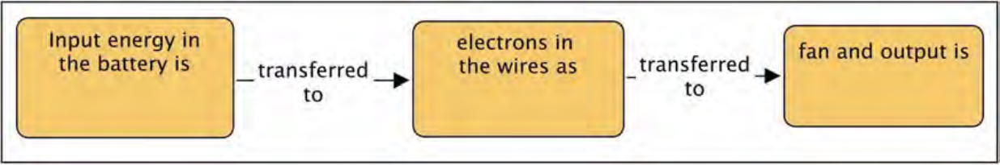
> **[Diagram Context - Textbook_NaturalScience_Gr7_Potential-and-kinetic-energy.pdf-0049-07.png]**
> This flow diagram illustrates the energy transfer process in a simple electrical circuit, featuring three boxes labeled "Input energy in the battery," "electrons in the wires," and "fan and output," connected by arrows labeled "transferred to." It conceptually maps the transformation of chemical potential energy from a battery into kinetic energy via the movement of electrons, which then performs work on a load like a fan.

4. The battery/cell has potential energy which is transferred to kinetic energy in the alarm bell as the hammer moves back and forth to produce sound.

5. 

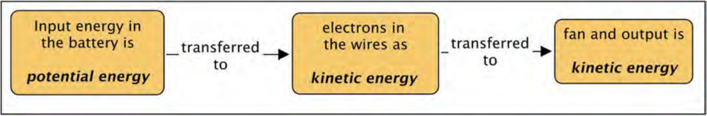
> **[Diagram Context - Textbook_NaturalScience_Gr7_Potential-and-kinetic-energy.pdf-0049-09.png]**
> This flow diagram illustrates the energy transformation process in an electric circuit, featuring three stages labeled "potential energy" (battery), "kinetic energy" (electrons in wires), and "kinetic energy" (fan output), connected by arrows labeled "transferred to." It conceptually demonstrates the principle of energy conversion, showing how chemical potential energy stored in a battery is transferred via moving charges to perform mechanical work in a fan.

No, this is not a food chain, as a food chain only shows the transfers of energy between organisms, highlighting the feeding relationships. This diagram also includes the Sun, as well as showing the horse moving a cart.

6. An example of the flow diagram learners could produce:

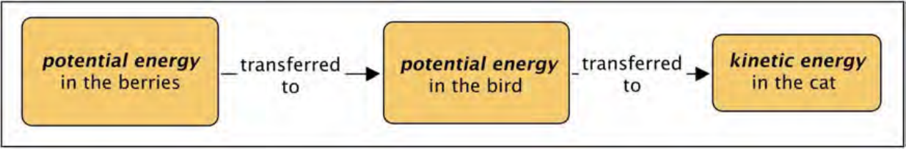
> **[Diagram Context - Textbook_NaturalScience_Gr7_Potential-and-kinetic-energy.pdf-0049-14.png]**
> This flow diagram illustrates the sequential transfer of energy through a simple food chain, using labels such as "potential energy in the berries," "potential energy in the bird," and "kinetic energy in the cat" connected by directional arrows labeled "transferred to." It conceptually demonstrates the principle of energy flow in an ecosystem, showing how chemical potential energy stored in producers is transferred to consumers and converted into kinetic energy for movement.

7. The energy from the Sun is transferred to potential energy within the carrots as they photosynthesise and produce food. The horse then eats the carrots and this potential energy is transferred to potential energy within the horse. The horse then moves and pulls a cart, so the potential energy in the horse is transferred to kinetic energy in the horse and in the cart as it moves along.

8. Renewable.

---

# Revision

9. 
   - a) The water has potential energy.
   - b) The potential energy is transferred to kinetic energy as the water moves/flows down.
   - c) It has kinetic energy.
   - d) The electrical system is made up of the generator, the power lines and then the houses/buildings in the city.
   - e) The city gets electricity to run appliances, machines, equipment, lights and heating systems.

---

1. It is the energy stored inside a system. There are many different examples of potential energy. Some examples are: objects which are held above a surface, elastic bands which have been stretched, batteries contain potential energy.
2. It is the energy a system has because it is moving. There are many different examples of kinetic energy. Learners can use any moving object as an example.
3. Energy cannot be created or destroyed. It is transferred from one part of a system to another.
4. 
   - a) Ball A has more potential energy.
   - b) Ball A is higher than ball B relative to the ground and so it has more stored energy.
5. 
   - a) A plant receives energy from the Sun and uses the energy to make food/sugar/glucose. The plant then changes some of the sugar into starch and stores it in leaves, fruit and other parts. The plant has potential energy which you can get when you eat the plant.
   - b) After skydivers jump out of a helicopter or plane, potential energy is transferred to kinetic energy as they fall.
6. Learners must draw a Sun then a plant then either a person, or another animal which eats the plant and then a person which eats the animal.
7. 
   - a) At the top of her jump (as this is when she is the highest above the ground).
   - b) She has the most kinetic energy just before she touches the ground/pad again (as this is where she will be moving the fastest).
   - c) Yes, she does have both kinetic energy and potential energy at points during her jump. They are on the way up / on the way down (either).
8. 
   - a) Potential energy
   - b) Potential energy
   - c) Kinetic energy
   - d) Both
   - e) Potential energy
   - f) Kinetic energy
9. 
   - a) They are an electrical system and a thermal system.
   - b) The electric current transfers energy to the hot-wire in the kettle, which transfers energy to the water and so the water molecules get more and more kinetic energy until the water starts to boil.

> **[Diagram Context - Textbook_NaturalScience_Gr7_Potential-and-kinetic-energy.pdf-0050-02.png]**
> This flow diagram illustrates the sequential transfer of energy through a simple food chain, using labels such as "potential energy in the berries," "potential energy in the bird," and "kinetic energy in the cat" connected by directional arrows labeled "transferred to." It conceptually demonstrates the principle of energy flow in ecosystems, showing how chemical potential energy stored in producers is transferred to consumers and converted into kinetic energy for movement.

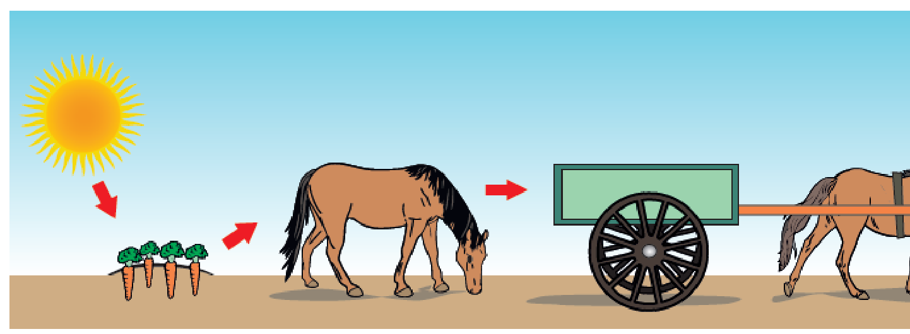
> **[Diagram Context - Textbook_NaturalScience_Gr7_Potential-and-kinetic-energy.pdf-0050-05.png]**
> This diagram illustrates a food chain and energy flow, featuring the sun, carrots (producers), and a horse (consumer) connected by red directional arrows. It conceptually demonstrates the transformation of solar energy into chemical energy through photosynthesis, which is then transferred to the horse to perform mechanical work by pulling a cart.

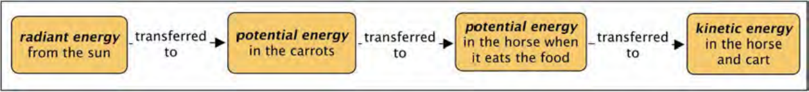
> **[Diagram Context - Textbook_NaturalScience_Gr7_Potential-and-kinetic-energy.pdf-0050-08.png]**
> This flow diagram illustrates the sequential transformation and transfer of energy, using labels such as "radiant energy," "potential energy," and "kinetic energy" connected by "transferred to" arrows. It conceptually demonstrates the principle of energy conversion within a biological and mechanical system, showing how solar energy is stored in producers and eventually utilized for work by a consumer.

