# Relationship of the Moon to the Earth

**KEY QUESTIONS:**
* How long does it take for the Moon to orbit the Earth?
* What keeps the Moon in orbit around the Earth?
* What causes tides on Earth?

The Moon is the most obvious feature in our night sky and has captivated people for thousands of years. Ancient cultures recorded the apparent motion of the Moon through the sky and made calendars which used the phases of the Moon to mark the months. In fact, some religious calendars still use a lunar (Moon) based calendar rather than the official solar (Sun) based calendar used today in South Africa and most of the Western world (called the Gregorian calendar). The Moon's influence on the Earth is also important to us in other ways as you will discover in this chapter.

*Our Moon.*

## 2.1 Relative positions

**NEW WORDS**
* moon
* lunar
* eclipse

You learnt about the Moon in Grades 4 and 6. Let's see what you can remember!

---

### ACTIVITY: Moon revision quiz

**INSTRUCTIONS:**
1. Fill in the gaps in the Earth-Moon comparison table below using the word bank.

**Word bank:**
* rock, soil and water
* rock and lunar soil
* reflects
* absorbs
* Sun
* Earth
* an
* no
* larger
* smaller
* 24
* 27.3

---

## Chapter 2. Relationship of the Moon to the Earth

### Comparison Table: The Earth and The Moon

| The Earth | The Moon |
| :--- | :--- |
| Surface consists of $\underline{\hspace{4cm}}$. | Surface consists of $\underline{\hspace{4cm}}$. |
| Is $\underline{\hspace{3cm}}$ than the Moon. | Is $\underline{\hspace{3cm}}$ than the Earth. |
| Is visible because it $\underline{\hspace{3cm}}$ light from the Sun hitting it. | Is visible because it $\underline{\hspace{3cm}}$ light from the Sun hitting it. |
| Is in orbit around the $\underline{\hspace{3cm}}$. | Is in orbit around the $\underline{\hspace{3cm}}$. |
| Spins on its axis once every $\underline{\hspace{3cm}}$ hours. | Spins on its axis once every $\underline{\hspace{3cm}}$ days. |
| Has $\underline{\hspace{3cm}}$ atmosphere. | Has $\underline{\hspace{3cm}}$ atmosphere. |

---

### Did You Know?
The Moon is actually covered in a layer of lunar 'soil' called regolith. This is why you can see astronauts' footprints on the Moon. Lunar 'soil' has different properties to soil on Earth, most significant is that terrestrial soil has organic matter in it.

> **[Diagram Context - Textbook_NaturalScience_Gr7_Historical-development-of-astronomy.pdf-0001-02.png]**
> This diagram represents a cross-section of a biological membrane, specifically illustrating the arrangement of phospholipid molecules within a single leaflet of the lipid bilayer. It features a series of uniform, blue-outlined "head" structures embedded in a solid, light-blue base, representing the hydrophilic phosphate heads oriented toward the aqueous environment. Conceptually, this visualises the fluid mosaic model, helping learners understand the structural orientation and density of phospholipids that form the foundation of cellular and organelle membranes.

Let's now take a closer look at the surface of the Moon.

### ACTIVITY: Observe the Moon!

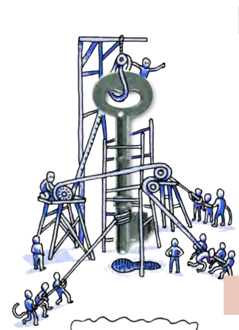
> **[Diagram Context - Textbook_NaturalScience_Gr7_Historical-development-of-astronomy.pdf-0001-03.png]**
> This conceptual illustration depicts a complex mechanical apparatus, featuring a large central key suspended by a pulley system and operated by multiple human figures using ropes and scaffolding. It serves as a visual metaphor for collaborative effort and the application of mechanical advantage, illustrating how complex tasks or "unlocking" solutions require the coordinated input of multiple forces and systems.

*Images of the near side and far side of the Moon taken with NASA's Clementine spacecraft. Look at the difference between the two images, what do you notice?*

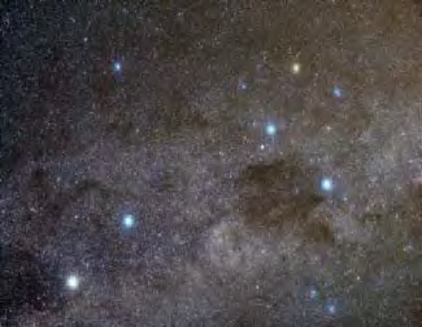
> **[Diagram Context - Textbook_NaturalScience_Gr7_Historical-development-of-astronomy.pdf-0001-22.png]**
> This image is an astronomical photograph of the Scorpius constellation, featuring prominent stars such as Antares and the surrounding dense star fields of the Milky Way. It serves as a visual reference for Grade 10 Physical Sciences learners to identify constellations and understand the distribution of stars within our galaxy.

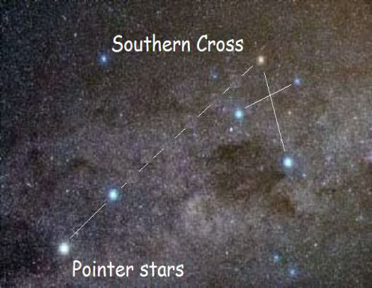
> **[Diagram Context - Textbook_NaturalScience_Gr7_Historical-development-of-astronomy.pdf-0001-23.png]**
> This astronomical image identifies the Southern Cross (Crux) constellation and the nearby Pointer stars against a star-field background. By using connecting lines to highlight these specific stellar patterns, the graphic serves as a navigational aid to help students locate the Southern Cross in the night sky, a key skill in the Natural Sciences curriculum for understanding celestial orientation.

> **[Diagram Context - Textbook_NaturalScience_Gr7_Relationship-of-the-moon-to-the-earth.pdf-0001-02.png]**
> This diagram represents a cross-section of a biological membrane, specifically illustrating the hydrophilic heads of a phospholipid monolayer oriented towards an aqueous environment. The image features a series of repeating, hook-shaped structures embedded in a solid-colored base, representing the polar phosphate heads of the lipid bilayer. It conceptually demonstrates the structural arrangement of the cell membrane, highlighting the orientation of phospholipids that facilitates the selective permeability essential for cellular homeostasis.

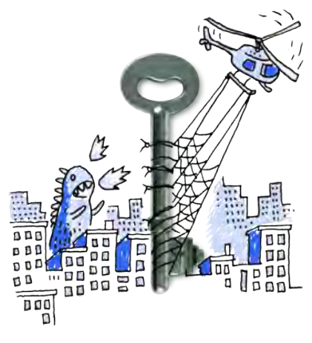
> **[Diagram Context - Textbook_NaturalScience_Gr7_Relationship-of-the-moon-to-the-earth.pdf-0001-03.png]**
> This metaphorical illustration depicts a city scene featuring a monster, a helicopter with a net, and a central key. The image uses these symbolic elements to represent the concept of a "key" or "solution" acting as a barrier or mechanism of control between conflicting forces within an urban environment. It serves as a visual analogy for problem-solving or intervention strategies, encouraging students to interpret how specific tools or "keys" can be applied to manage complex, large-scale challenges.

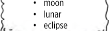
> **[Diagram Context - Textbook_NaturalScience_Gr7_Relationship-of-the-moon-to-the-earth.pdf-0001-05.png]**
> This text-based graphic presents a bulleted list of key astronomical terms: "moon," "lunar," and "eclipse." It serves as a foundational vocabulary prompt for Natural Sciences, helping learners identify the specific celestial body and the associated phenomenon involved in the alignment of the Earth, Moon, and Sun.

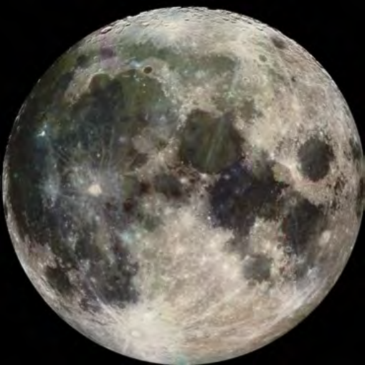
> **[Diagram Context - Textbook_NaturalScience_Gr7_Relationship-of-the-moon-to-the-earth.pdf-0001-11.png]**
> This image is a high-resolution, false-color photograph of the Moon, displaying distinct lunar maria (dark basaltic plains) and highland regions (bright, cratered areas). It serves as a visual aid for Earth and Space Sciences to illustrate lunar topography, surface composition, and the impact cratering history of our natural satellite.

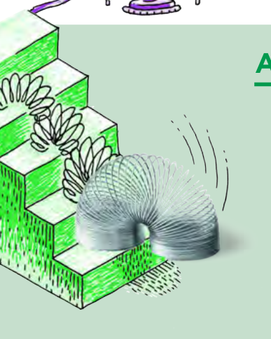
> **[Diagram Context - Textbook_NaturalScience_Gr7_Relationship-of-the-moon-to-the-earth.pdf-0001-16.png]**
> This diagram illustrates a slinky toy moving down a set of stairs, with motion lines indicating its dynamic descent. It serves as a physical model to help learners visualize the transfer of energy and the propagation of longitudinal waves through a medium.

> **[Diagram Context - Textbook_NaturalScience_Gr7_Relationship-of-the-sun-to-the-Earth.pdf-0001-02.png]**
> This diagram represents a cross-section of a biological membrane, specifically illustrating the hydrophilic heads of a phospholipid monolayer oriented towards an aqueous environment. The image features a series of repeating, hook-shaped blue symbols embedded along the surface of a light-blue rectangular base, representing the polar phosphate heads. Conceptually, this helps Grade 10-12 Life Sciences learners visualize the structural arrangement of the phospholipid bilayer's surface, emphasizing the amphipathic nature of cell membranes.

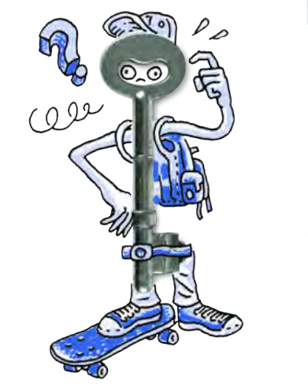
> **[Diagram Context - Textbook_NaturalScience_Gr7_Relationship-of-the-sun-to-the-Earth.pdf-0001-03.png]**
> This graphic features a cartoon character with a key for a head, depicted in a confused or pensive pose alongside a question mark. It serves as a metaphorical visual aid to represent the "lock and key" model of enzyme action, illustrating the concept of substrate specificity where an enzyme's active site must match the shape of a specific substrate.

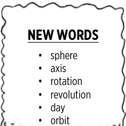
> **[Diagram Context - Textbook_NaturalScience_Gr7_Relationship-of-the-sun-to-the-Earth.pdf-0001-11.png]**
> This graphic is a vocabulary list containing the terms "sphere," "axis," "rotation," "revolution," "day," and "orbit." It serves as a foundational glossary for Natural Sciences, introducing key concepts required to understand planetary motion and the Earth-Sun relationship.

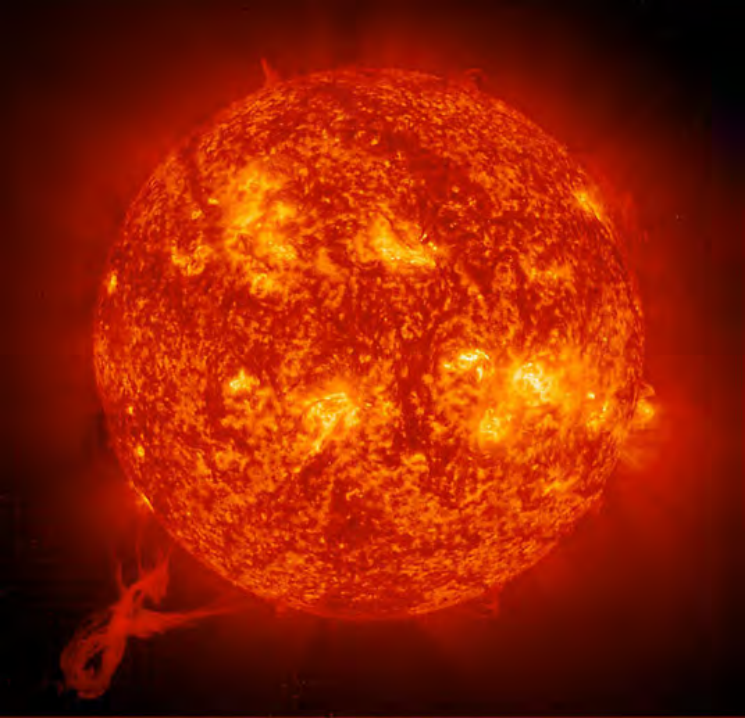
> **[Diagram Context - Textbook_NaturalScience_Gr7_Relationship-of-the-sun-to-the-Earth.pdf-0001-12.png]**
> This image is a high-resolution astronomical photograph of the Sun, displaying its photosphere and active solar features such as prominences and granulation without any textual labels or variables. For a high school learner, it serves as a visual representation of a star, illustrating the dynamic nature of solar activity and the intense thermal energy generated by nuclear fusion within the stellar core.

> **[Diagram Context - Textbook_NaturalScience_Gr7_Relationship-of-the-sun-to-the-Earth.pdf-0001-14.png]**
> This graphic is a text-based heading labeled "1.1 Solar energy and the Earth's seasons." It serves as an introductory title for a Geography or Natural Sciences unit, signaling that the subsequent content will explain how the Earth's axial tilt and orbital position relative to the sun dictate seasonal variations in solar radiation.

---

INSTRUCTIONS:
1. Study the images of the Moon.
2. Answer the questions below.

QUESTIONS:
1. Does the Moon's surface have any oceans or lakes?
2. What do you notice covering much of the Moon's surface?
3. Some areas look dark and others look lighter, the dark areas are called maria (singular mare) meaning seas, as astronomers initially thought that these areas were seas on the surface. The bright areas are called highlands as they are higher than the maria. On what side of the Moon (near or far) are there more dark areas (maria)?

> **DID YOU KNOW?**
> Humanity got its first view of the far side of the Moon in 1959 when the Soviet Union launched the small spacecraft Luna 3. This was the first probe to get to the far side of the Moon and photograph it.

The Earth, just like all the other planets in the solar system, travels around the Sun, completing one revolution every year. As the Earth travels around the Sun it has a companion in space: our Moon!

> **TAKE NOTE**
> The time that it takes an object to make one complete orbit around another object, relative to the stars, is called the orbital period or synodic period.

The Moon orbits around the Earth completing one revolution every $27.3$ days. Our Moon rotates on its own axis and experiences daytime and dark nighttime just like the Earth does. However, the Moon spins much more slowly than the Earth does and completes one rotation on its axis once every $27.3$ days. Did you notice that the Moon takes the same amount of time to spin on its axis as it does to orbit completely around Earth? This means that from the Earth, we always see the same side of the Moon (called the 'nearside'). The side we do not see from Earth, called the 'farside', has been mapped during space missions to the Moon.

Viewed from above, the Moon moves in an anti-clockwise direction around the Earth. The Moon's orbit is not a perfect circle, it is elliptical, so its distance from Earth varies as it revolves around the Earth. The average distance is about $385\,000\text{ km}$, which is about $60$ times the radius of the Earth itself. For comparison, the Earth's average distance from the Sun is $149\,597\,871\text{ km}$, or about $23\,481$ times the radius of the Earth. You can see now why the Moon is called Earth's close companion!

---

190

Planet Earth and Beyond

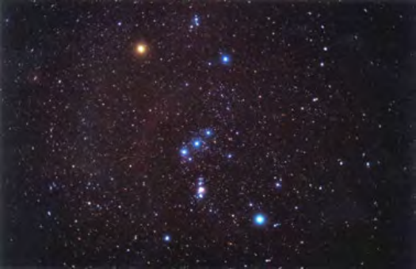
> **[Diagram Context - Textbook_NaturalScience_Gr7_Historical-development-of-astronomy.pdf-0002-00.png]**
> This image is an astronomical photograph of the Orion constellation, featuring prominent stars such as Betelgeuse (the reddish star in the upper left) and Rigel (the bright blue star in the lower right). It serves as a visual aid for Grade 10 Physical Sciences, illustrating the relationship between stellar colour and surface temperature, where cooler stars appear red and hotter stars appear blue.

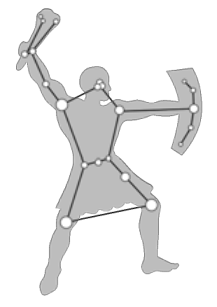
> **[Diagram Context - Textbook_NaturalScience_Gr7_Historical-development-of-astronomy.pdf-0002-01.png]**
> This graphic illustrates the Orion constellation, depicting the arrangement of stars connected by lines to form the mythological figure of a hunter. It serves as a visual aid for Grade 10 Physical Sciences (Earth and Beyond) to help students identify prominent star patterns in the night sky and understand how asterisms are used to map celestial bodies.

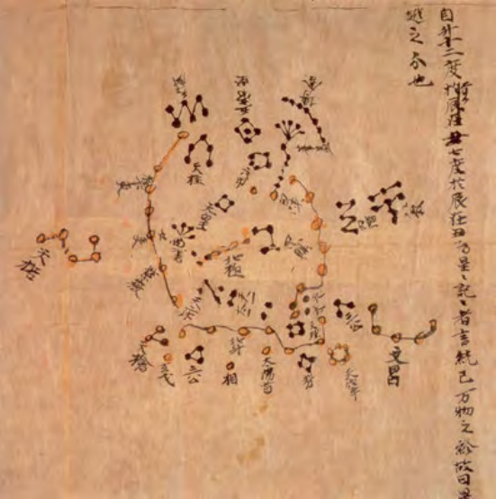
> **[Diagram Context - Textbook_NaturalScience_Gr7_Historical-development-of-astronomy.pdf-0002-06.png]**
> This historical star chart depicts various constellations represented by nodes connected by lines, accompanied by traditional Chinese script and annotations. It illustrates the early scientific practice of mapping celestial bodies to track their positions and patterns in the night sky, providing a foundational perspective on how ancient civilizations observed and organized astronomical data.

> **[Diagram Context - Textbook_NaturalScience_Gr7_Historical-development-of-astronomy.pdf-0002-11.png]**
> This illustration depicts a caricature of Isaac Newton with an apple-shaped head, surrounded by a network of smaller apples connected by dashed lines and directional arrows. It serves as a conceptual metaphor for Newton’s Law of Universal Gravitation, illustrating how mass exerts gravitational influence across a system of bodies.

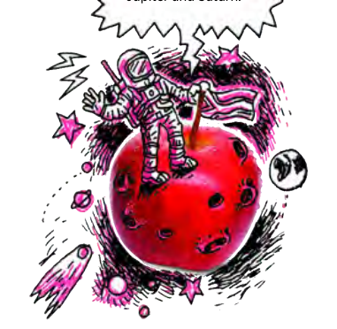
> **[Diagram Context - Textbook_NaturalScience_Gr7_Historical-development-of-astronomy.pdf-0002-14.png]**
> This illustrative graphic depicts an astronaut standing on a cratered, apple-like celestial body, surrounded by stars, planets, a comet, and a speech bubble. It uses symbolic imagery to represent space exploration and planetary science, encouraging students to engage with the concepts of gravity, celestial bodies, and the vastness of the solar system.

> **[Diagram Context - Textbook_NaturalScience_Gr7_Relationship-of-the-moon-to-the-earth.pdf-0002-02.png]**
> This graphic illustrates a schematic representation of a DNA double helix, featuring two antiparallel sugar-phosphate backbones represented by continuous, intertwined green ribbons. It conceptually demonstrates the characteristic helical structure of the DNA molecule, highlighting the complementary and directional nature of the two strands essential for understanding genetic replication and transcription in the Life Sciences curriculum.

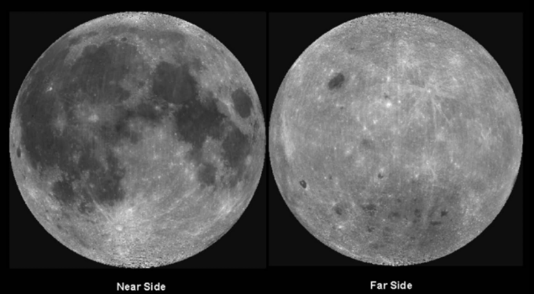
> **[Diagram Context - Textbook_NaturalScience_Gr7_Relationship-of-the-moon-to-the-earth.pdf-0002-05.png]**
> This visual comparison displays two high-resolution lunar photographs labeled as the "Near Side" and "Far Side" of the Moon. It illustrates the stark geological contrast between the two hemispheres, specifically highlighting the abundance of dark, smooth lunar maria on the near side versus the heavily cratered, rugged highlands that dominate the far side.

> **[Diagram Context - Textbook_NaturalScience_Gr7_Relationship-of-the-moon-to-the-earth.pdf-0002-06.png]**
> This diagram illustrates an electromagnet, featuring a coiled wire (solenoid) connected to a battery with positive (+) and negative (-) terminals, surrounded by magnetic field lines indicated by directional arrows. It demonstrates the principle of electromagnetism, showing how an electric current flowing through a coil creates a magnetic field capable of attracting nearby metallic objects like a screw, nail, and nut.

> **[Diagram Context - Textbook_NaturalScience_Gr7_Relationship-of-the-sun-to-the-Earth.pdf-0002-05.png]**
> This diagram illustrates a slinky toy moving down a staircase, using motion lines to indicate its trajectory. It serves as a physical model to help Grade 10-12 Physical Sciences students visualize the transfer of energy and the propagation of longitudinal and transverse waves through a medium.

> **[Diagram Context - Textbook_NaturalScience_Gr7_Relationship-of-the-sun-to-the-Earth.pdf-0002-06.png]**
> This diagram illustrates a simplified representation of a DNA molecule, featuring the characteristic double-helix structure composed of two antiparallel sugar-phosphate backbones. It visually demonstrates the complementary base pairing between the strands, helping learners understand how the genetic code is structured and stabilized within the double-stranded helix.

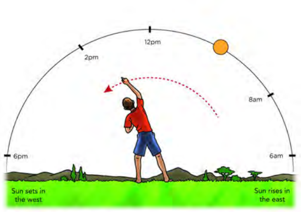
> **[Diagram Context - Textbook_NaturalScience_Gr7_Relationship-of-the-sun-to-the-Earth.pdf-0002-09.png]**
> This diagram illustrates the apparent daily path of the Sun across the sky, featuring an observer, a semi-circular arc representing the celestial path, and time markers from 6am to 6pm. It visually demonstrates the Earth's rotation by showing the Sun rising in the east and setting in the west, helping learners understand how the observer's perspective relates to the Sun's position throughout the day.

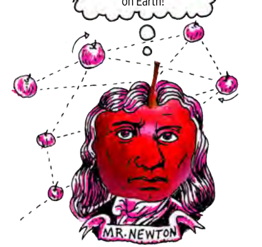
> **[Diagram Context - Textbook_NaturalScience_Gr7_Relationship-of-the-sun-to-the-Earth.pdf-0002-13.png]**
> This caricature depicts Sir Isaac Newton with an apple-shaped head, surrounded by a network of floating apples connected by dashed lines and directional arrows. The graphic serves as a mnemonic device to illustrate Newton’s Law of Universal Gravitation, visually representing the concept of mutual gravitational attraction between masses in space.

---

# Chapter 2. Relationship of the Moon to the Earth

## Lesson Notes: Motions of the Earth, Moon, and Sun

### 1. Core Concepts

* **Earth's Motion Around the Sun:** 
  The Earth revolves in an orbit around the Sun. (Note: Diagrams representing astronomical bodies and distances are often not drawn to scale; the actual distances and sizes of the Sun, Earth, and Moon are significantly larger than what can be shown in a standard image).

* **The Moon's Motion Around the Earth:** 
  The Moon revolves in an orbit around the Earth while the Earth itself travels around the Sun.

* **Rotation vs. Revolution of the Moon:**
  * The Moon spins on its own axis at the exact same rate that it revolves around the Earth.
  * As the Moon completes $\frac{1}{4}$ of a turn on its axis, it simultaneously completes $\frac{1}{4}$ of its orbit around the Earth.
  * **Result:** Because of this synchronized rotation and revolution, the same side of the Moon always faces the Earth. Observers on Earth never see the "far side" of the Moon directly from the surface.

---

### 2. Summary of Key Orbital Characteristics

| Astronomical Body | Motion Type | Path / Reference | Primary Effect |
| :--- | :--- | :--- | :--- |
| **Earth** | Revolution | Around the Sun | Changes in seasons / yearly cycle |
| **Moon** | Revolution | Around the Earth | Lunar phases as viewed from Earth |
| **Moon** | Rotation | On its own axis | The same side of the Moon always faces Earth |

---

### 3. Study Activities & Exploration

* **Visualizing Scale:** Consider why scaling is a challenge in astronomy. If the Sun's diameter is represented by a scale factor $S$, calculate the relative distance to Earth using the scale ratio:
  $$\text{Scaled Distance} = \frac{\text{Actual Distance}}{\text{Actual Sun Diameter}} \times S$$

* **Further Investigation:**
  * Explore why humans only ever observe one side of the Moon from Earth.
  * Research findings and imagery regarding the exploration of the far side of the Moon.

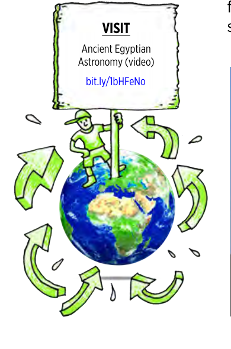
> **[Diagram Context - Textbook_NaturalScience_Gr7_Historical-development-of-astronomy.pdf-0003-01.png]**
> This graphic features an illustration of a person standing on a globe surrounded by circular arrows, accompanied by a signpost labeled "VISIT Ancient Egyptian Astronomy (video)" and a shortened URL. The diagram serves as an interactive educational prompt designed to contextualize the study of Earth's rotation and historical astronomical observations within the CAPS curriculum.

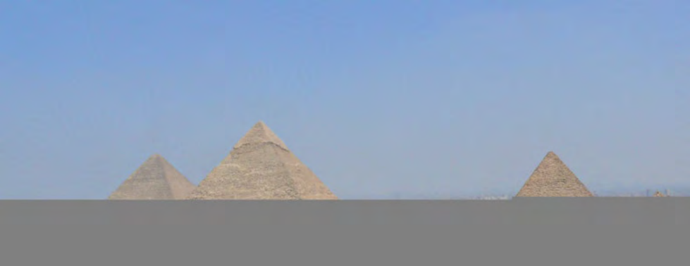
> **[Diagram Context - Textbook_NaturalScience_Gr7_Historical-development-of-astronomy.pdf-0003-02.png]**
> This image depicts a photographic representation of three pyramids, which serve as real-world examples of three-dimensional geometric solids. In the context of the CAPS Mathematics curriculum, these structures illustrate the properties of square-based pyramids, including their triangular lateral faces, square bases, and apexes. This visual serves as a practical application for calculating surface area and volume of polyhedra in geometry.

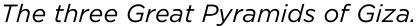

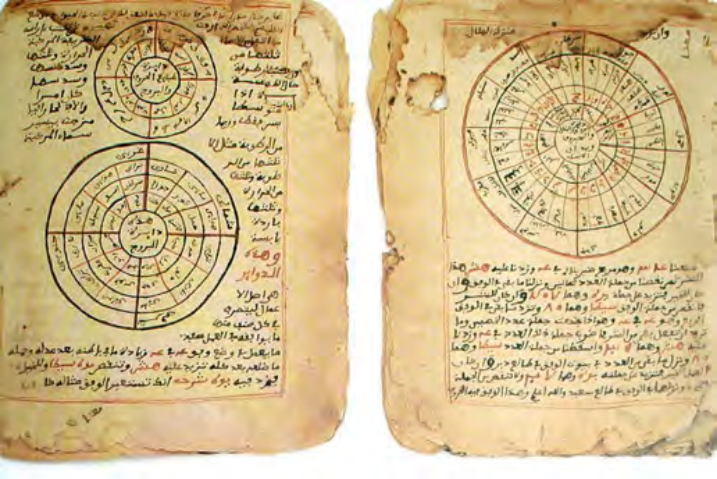
> **[Diagram Context - Textbook_NaturalScience_Gr7_Historical-development-of-astronomy.pdf-0003-08.png]**
> This image displays historical astronomical and astrological manuscripts featuring circular diagrams divided into sectors, accompanied by extensive Arabic text. These charts utilize radial geometry and concentric rings to categorize celestial data, such as the zodiac or planetary positions, alongside descriptive annotations. For a high school learner, this serves as a primary source document illustrating the historical development of observational astronomy and the integration of mathematical systems into early scientific record-keeping.

> **[Diagram Context - Textbook_NaturalScience_Gr7_Historical-development-of-astronomy.pdf-0003-09.png]**
> This illustration is a metaphorical cartoon depicting a person driving a carriage shaped like an apple, accompanied by a passenger and a blank speech bubble. It serves as a visual prompt for creative writing or language exercises, encouraging students to construct a narrative or dialogue based on the whimsical imagery.

> **[Diagram Context - Textbook_NaturalScience_Gr7_Relationship-of-the-moon-to-the-earth.pdf-0003-09.png]**
> This illustrative graphic depicts an astronaut standing on a cratered red apple, surrounded by celestial elements including stars, a planet, a comet, and a speech bubble. The image uses metaphorical imagery to represent the concept of gravity, drawing a parallel between the gravitational pull of a planetary body and the classic Newtonian anecdote of the falling apple. It serves as a creative visual hook to introduce learners to the principles of universal gravitation and the historical development of physics concepts in the CAPS curriculum.

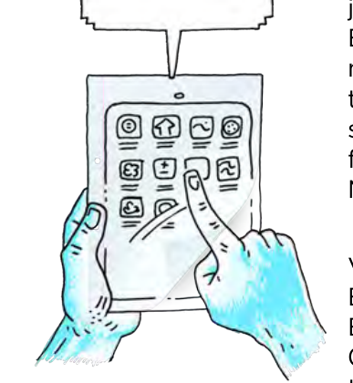
> **[Diagram Context - Textbook_NaturalScience_Gr7_Relationship-of-the-moon-to-the-earth.pdf-0003-15.png]**
> This illustration depicts a pair of hands interacting with a tablet interface featuring a grid of abstract application icons and an empty speech bubble above. The graphic serves as a visual metaphor for digital literacy and the integration of Information and Communication Technology (ICT) in the classroom, prompting students to engage with or identify the functions of various digital tools.

> **[Diagram Context - Textbook_NaturalScience_Gr7_Relationship-of-the-sun-to-the-Earth.pdf-0003-00.png]**
> This diagram illustrates an electromagnet, featuring a coiled wire (solenoid) connected to a battery with positive (+) and negative (-) terminals, surrounded by magnetic field lines indicated by directional arrows. It demonstrates the principle of electromagnetism, showing how an electric current flowing through a coil generates a magnetic field capable of attracting metallic objects like the depicted nut, nail, and screw.

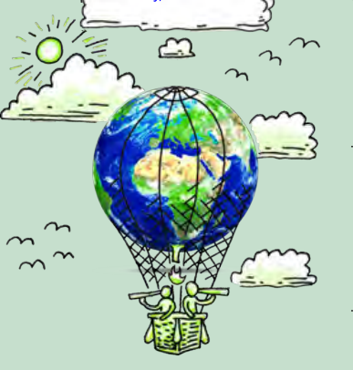
> **[Diagram Context - Textbook_NaturalScience_Gr7_Relationship-of-the-sun-to-the-Earth.pdf-0003-12.png]**
> This conceptual illustration depicts the Earth as a hot air balloon, featuring a globe, a burner flame, and two figures in a basket using telescopes to observe the environment. It serves as a visual metaphor for global environmental monitoring and the human responsibility to observe and manage the Earth's delicate atmospheric and ecological systems.

> **[Diagram Context - Textbook_NaturalScience_Gr7_Relationship-of-the-sun-to-the-Earth.pdf-0003-17.png]**
> This graphic depicts a repeating, stylized wave pattern composed of interconnected, arrow-headed segments. The image lacks specific labels or biological markers, but conceptually illustrates the principle of continuous, directional flow or periodic motion often used in Life Sciences to represent the propagation of nerve impulses or the rhythmic movement of cilia and flagella.

---

An image of the Earth and Moon taken from the Galileo satellite on its way to Jupiter over 6 million km away. The Moon's diameter is just under a third of the Earth's diameter. You can see the sunlit sides of the Earth and Moon. On what side do you think the Sun is?

> **VISIT**
> A spacecraft, called Ladee, was launched in 2013 to orbit the Moon to gather information about the lunar environment. Have a look at this infographic detailing the mission.
> [bit.ly/16C6HZ0](http://bit.ly/16C6HZ0)

The following table summarises some useful information about the Sun, Earth and Moon.

| Characteristic | Sun | Earth | Moon |
| :--- | :--- | :--- | :--- |
| **Relative position** | Is at the centre of our solar system | Orbits the Sun once every $365.25$ days | Orbits the Earth once every $27.3$ days |
| **Rotation** | Spins on its own axis roughly once every $28$ days | Spins on its own axis once every $24$ hours | Spins on its own axis once every $27.3$ days |
| **Distance from orbited body** | — | $23\,481$ Earth radii from the Sun | $60$ Earth radii from Earth |
| **Size** | Diameter is roughly $100$ times the Earth's diameter | — | Diameter is roughly $\frac{1}{3}$ times the Earth's diameter |

> **VISIT**
> Did the Earth have two Moons?
> [bit.ly/1bvHqIx](http://bit.ly/1bvHqIx)

We have now looked at the relative positions and movement of the Earth, Moon and Sun. Let's extend this knowledge to learn about a solar eclipse.

---

### ACTIVITY: Total Solar Eclipse

**INSTRUCTIONS:**  
Look at the image below. It shows a total solar eclipse which you learnt about in Gr. 6. This happens when the Moon passes directly in front of the Sun and blocks the Sun's light. The bright light from the Sun is blocked, allowing us to see the very faint outer edge of the Sun's atmosphere, called the corona. We normally cannot see the corona as it is swamped by the bright light from the...

---

*Planet Earth and Beyond* | 192

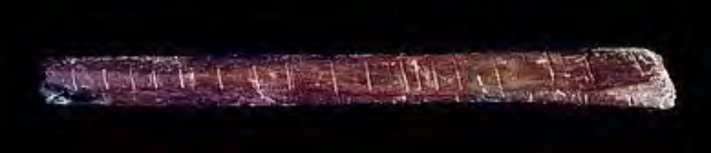
> **[Diagram Context - Textbook_NaturalScience_Gr7_Historical-development-of-astronomy.pdf-0004-01.png]**
> This image displays the Lebombo bone, an ancient baboon fibula featuring a series of 29 distinct notches carved along its length. As a significant archaeological artifact, it serves as evidence of early human cognitive development, representing one of the earliest known mathematical tools used for tallying or tracking lunar cycles.

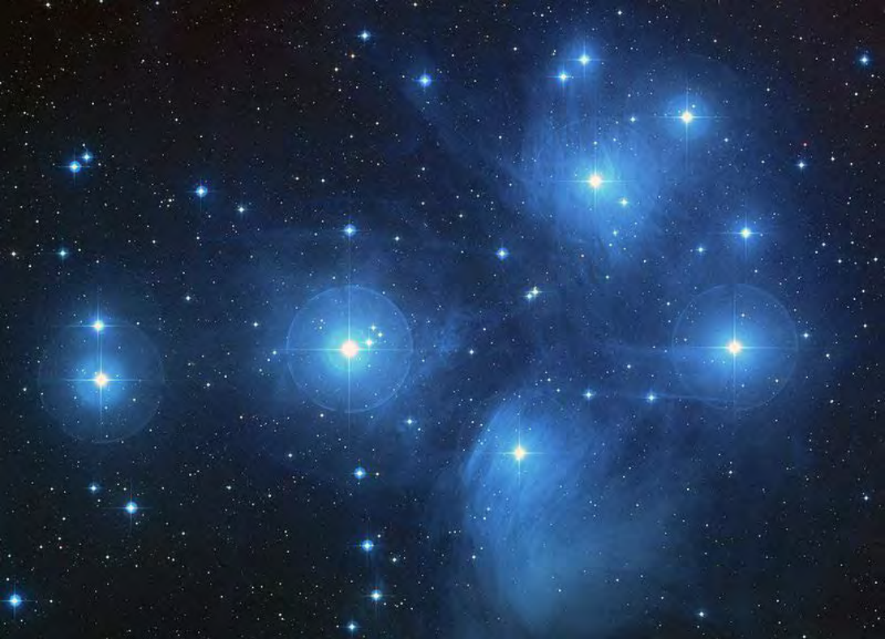
> **[Diagram Context - Textbook_NaturalScience_Gr7_Historical-development-of-astronomy.pdf-0004-04.png]**
> This image is an astronomical photograph of the Pleiades, an open star cluster characterized by bright, young blue stars surrounded by diffuse reflection nebulae. It illustrates the concept of stellar evolution and star formation, demonstrating how stars originate from interstellar gas and dust clouds within the galaxy.

> **[Diagram Context - Textbook_NaturalScience_Gr7_Historical-development-of-astronomy.pdf-0004-06.png]**
> This graphic is a text-based instructional callout box featuring the heading "TAKE NOTE" enclosed within a stylized, wavy-bordered frame. It serves as a pedagogical signpost designed to highlight essential information, key definitions, or common misconceptions that students must prioritize for examination preparation within the CAPS curriculum.

> **[Diagram Context - Textbook_NaturalScience_Gr7_Historical-development-of-astronomy.pdf-0004-08.png]**
> This cartoon depicts a masked figure holding a framed portrait of a woman, with a blank speech bubble above the figure and motion lines indicating movement. It serves as a visual metaphor for the concept of "framing" or "perspective" in social sciences and language studies, illustrating how the way information is presented or enclosed can influence the viewer's interpretation of the subject matter.

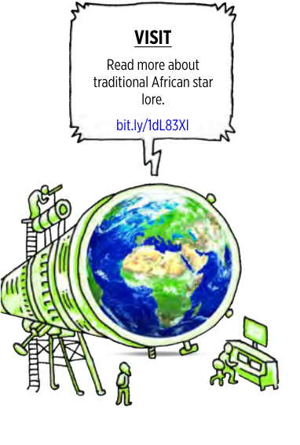
> **[Diagram Context - Textbook_NaturalScience_Gr7_Historical-development-of-astronomy.pdf-0004-09.png]**
> This graphic features an illustration of a large telescope pointed at the Earth, accompanied by a speech bubble containing the text "VISIT," "Read more about traditional African star lore," and a shortened URL. It serves as an educational prompt to encourage learners to explore the intersection of modern astronomical observation and indigenous knowledge systems, aligning with the CAPS curriculum's emphasis on integrating diverse cultural perspectives into scientific study.

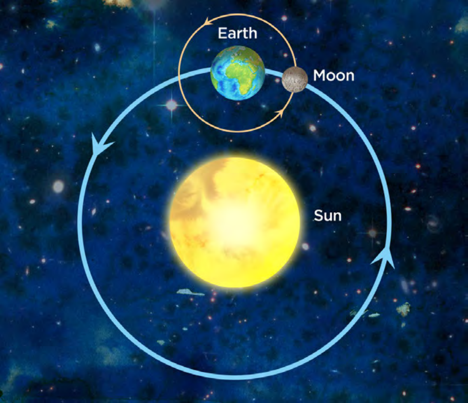
> **[Diagram Context - Textbook_NaturalScience_Gr7_Relationship-of-the-moon-to-the-earth.pdf-0004-00.png]**
> This diagram illustrates the orbital mechanics of the Earth-Moon-Sun system, featuring labels for the Sun, Earth, and Moon alongside directional arrows indicating their respective orbital paths. It conceptually demonstrates the hierarchical nature of celestial motion, showing the Moon revolving around the Earth while the Earth-Moon system simultaneously orbits the Sun.

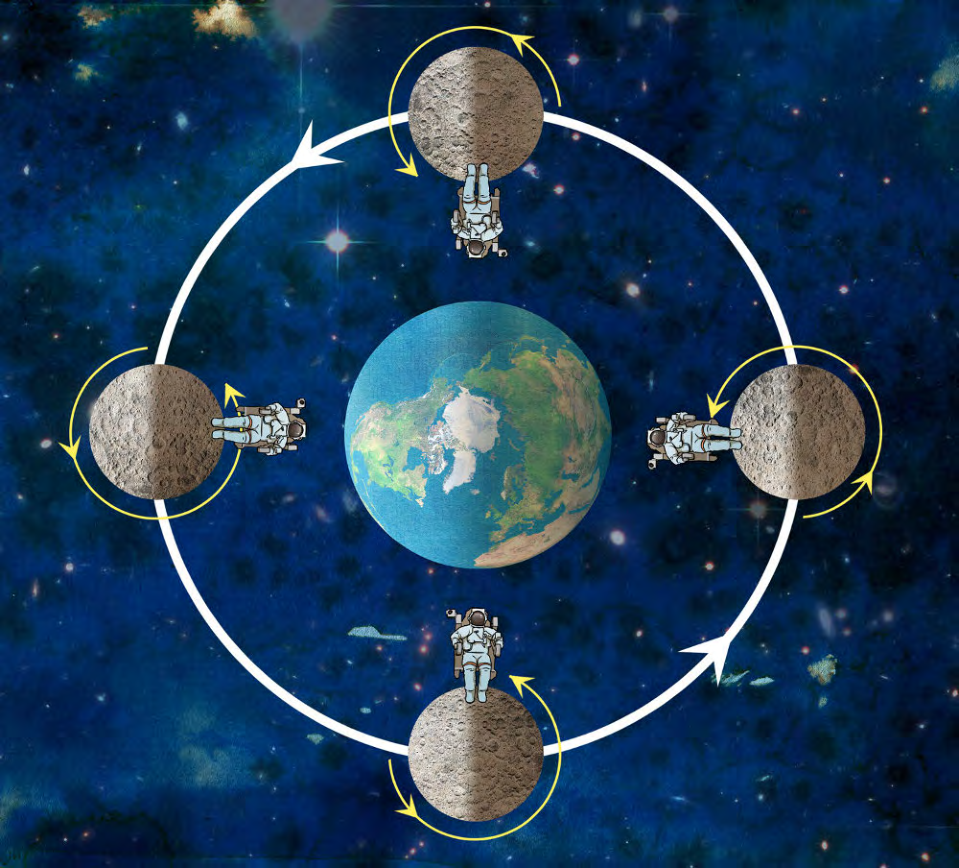
> **[Diagram Context - Textbook_NaturalScience_Gr7_Relationship-of-the-moon-to-the-earth.pdf-0004-02.png]**
> This diagram illustrates the orbital motion of the Moon around the Earth, featuring four lunar positions, astronauts positioned on the lunar surface, and directional arrows indicating both orbital revolution and lunar rotation. It conceptually demonstrates the phenomenon of synchronous rotation, showing how the Moon’s rotation on its axis is synchronized with its orbit, ensuring that the same face of the Moon is always oriented toward the Earth.

> **[Diagram Context - Textbook_NaturalScience_Gr7_Relationship-of-the-moon-to-the-earth.pdf-0004-06.png]**
> This cartoon depicts a masked figure holding a framed portrait of a woman, featuring an empty speech bubble and motion lines. The visual elements include a character in a striped outfit, a decorative frame, and a sketch of a person, serving as a metaphorical representation of identity, representation, or the concept of "framing" a subject. In a CAPS Life Sciences or English context, this image can be used to prompt critical thinking about how perspectives, biases, or external contexts shape our interpretation of individuals or biological subjects.

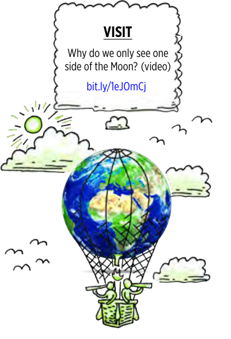
> **[Diagram Context - Textbook_NaturalScience_Gr7_Relationship-of-the-moon-to-the-earth.pdf-0004-07.png]**
> This graphic features a whimsical illustration of a hot air balloon with a globe as its canopy, accompanied by a text box containing the prompt "Why do we only see one side of the Moon?" and a shortened URL. It serves as an introductory hook for a Natural Sciences lesson, designed to prompt inquiry into the concept of synchronous rotation and the orbital mechanics of the Earth-Moon system.

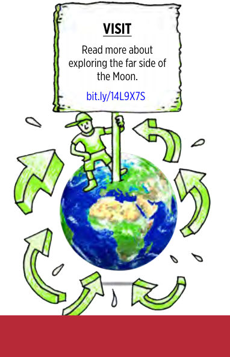
> **[Diagram Context - Textbook_NaturalScience_Gr7_Relationship-of-the-moon-to-the-earth.pdf-0004-08.png]**
> This graphic features a cartoon illustration of a person standing on a globe, surrounded by circular arrows and a signpost labeled "VISIT" with a URL regarding the far side of the Moon. It serves as an introductory visual prompt to engage learners with the concept of planetary rotation and the unique orbital characteristics of the Moon as studied in Earth and Space Sciences.

> **[Diagram Context - Textbook_NaturalScience_Gr7_Relationship-of-the-sun-to-the-Earth.pdf-0004-16.png]**
> This illustration depicts a metaphorical representation of a caterpillar feeding on a plant, using a metallic slinky to represent the segmented body of the larva. The image features a stylized green caterpillar head, a coiled spring body with circular markings, and surrounding green leaves. It serves as a visual mnemonic to help learners identify the physical characteristics of insect larvae, specifically their segmented bodies and herbivorous feeding habits within an ecosystem.

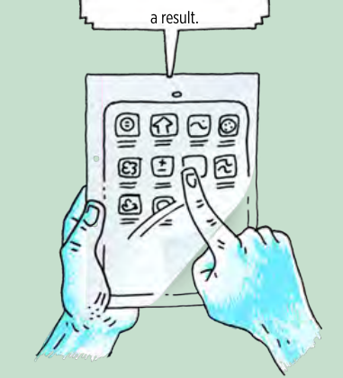
> **[Diagram Context - Textbook_NaturalScience_Gr7_Relationship-of-the-sun-to-the-Earth.pdf-0004-19.png]**
> This illustration depicts a tablet interface featuring various scientific and mathematical icons, including symbols for electricity, chemistry, and geometry, with a finger selecting an app. The graphic serves as a conceptual metaphor for the integration of digital technology and ICT (Information and Communication Technology) tools in modern scientific inquiry and data processing. It highlights how learners can use digital platforms to access, calculate, and simulate scientific information as part of the CAPS curriculum's focus on technological literacy.

> **[Diagram Context - Textbook_NaturalScience_Gr7_Relationship-of-the-sun-to-the-Earth.pdf-0004-22.png]**
> This graphic illustrates a schematic representation of a double-stranded DNA molecule, characterized by its iconic double helix structure. The diagram uses two intertwined, repeating green ribbons to represent the sugar-phosphate backbones, visually demonstrating the antiparallel nature and complementary base pairing essential for genetic replication and protein synthesis in the Life Sciences curriculum.

---

# Chapter 2. Relationship of the Moon to the Earth

## Core Concepts: Angular Size and Solar Eclipses

* **Angular Size:** When viewed from the Earth's surface, the Moon and the Sun appear to be very similar in size. This apparent equal size is known as their **angular size**.
* **Total Solar Eclipse:** A total solar eclipse occurs when the Earth, Moon, and Sun are aligned in a straight line, with the Moon placed directly in between the Earth and the Sun. Because the Moon is much closer to Earth than the Sun, it appears large enough to completely block out the Sun's light, allowing us a glimpse of the Sun's outer corona.
* **Coincidence of Distance:** By pure chance, the Sun and Moon are currently at distances from Earth such that they share almost identical angular sizes as viewed from the Earth's surface. If the Moon's angular size were smaller, it would not be large enough to completely block out the Sun.

---

## Questions for Revision

1. **Which in reality is larger, the Moon or the Sun?**
   * *Answer:* The Sun is vastly larger in reality.

2. **Which is further away, the Moon or the Sun?**
   * *Answer:* The Sun is much further away from the Earth than the Moon.

3. **How do the angular sizes of the Moon and the Sun compare when viewed from the Earth's surface?**
   * *Answer:* They are very similar, appearing almost identical in size from our perspective on Earth.

4. **Why is this the case?**
   * *Answer:* Although the Sun is much larger than the Moon, it is also correspondingly much further away. This exact proportion makes their apparent angular sizes from Earth nearly identical.

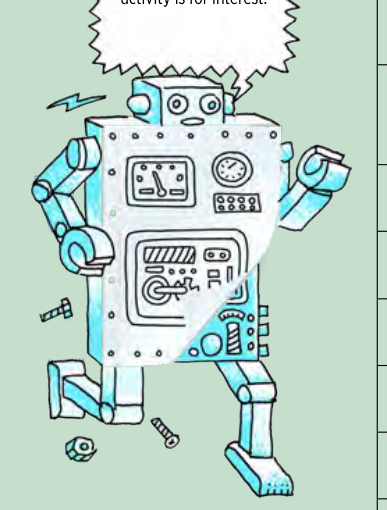
> **[Diagram Context - Textbook_NaturalScience_Gr7_Historical-development-of-astronomy.pdf-0005-04.png]**
> This graphic is a cartoon illustration of a robot with a speech bubble, featuring mechanical components like gauges, dials, switches, and loose hardware such as bolts and nuts. It serves as a visual metaphor to introduce concepts in Technology or Engineering Graphics and Design, representing the structural complexity and functional components of automated systems.

> **[Diagram Context - Textbook_NaturalScience_Gr7_Relationship-of-the-moon-to-the-earth.pdf-0005-02.png]**
> This cartoon depicts a large telescope focused on the Earth, with human figures operating the equipment and monitoring data at a console. It illustrates the concept of Earth observation and remote sensing, highlighting how technology is used to gather scientific data about our planet's systems and environment.

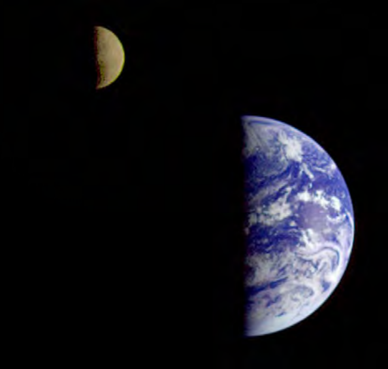
> **[Diagram Context - Textbook_NaturalScience_Gr7_Relationship-of-the-moon-to-the-earth.pdf-0005-03.png]**
> This image is a space-based photograph depicting the Earth and the Moon against a black background, showing both bodies in a partial illumination phase. It illustrates the concept of solar illumination in the Earth-Moon system, demonstrating how the Sun lights one side of these celestial bodies while the other remains in shadow. This visual aids learners in understanding planetary phases and the relative positioning of objects in space as part of the Earth and Beyond strand in the Natural Sciences curriculum.

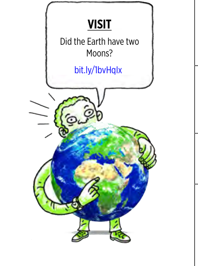
> **[Diagram Context - Textbook_NaturalScience_Gr7_Relationship-of-the-moon-to-the-earth.pdf-0005-06.png]**
> This graphic is a cartoon illustration featuring a personified character holding and pointing at a globe of the Earth, accompanied by a speech bubble containing the text "VISIT: Did the Earth have two Moons?" and a shortened URL. It serves as an engaging hook for Earth and Space Sciences, prompting students to explore planetary formation theories and the historical evolution of the Earth-Moon system.

> **[Diagram Context - Textbook_NaturalScience_Gr7_Relationship-of-the-moon-to-the-earth.pdf-0005-09.png]**
> This graphic uses a metaphorical illustration of a caterpillar with a slinky-like body segment to represent the concept of longitudinal waves. The image features a stylized insect feeding on leaves, with a metallic coil structure integrated into its body to demonstrate the compression and rarefaction patterns characteristic of mechanical wave propagation. This visual serves as an analogy to help learners visualize how particles in a medium oscillate parallel to the direction of energy transfer in longitudinal waves.

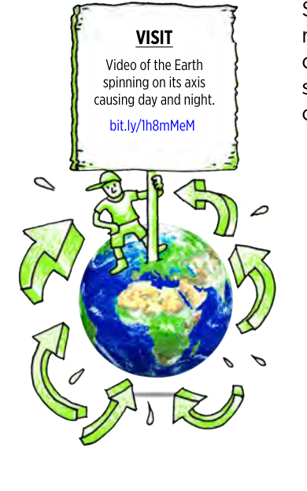
> **[Diagram Context - Textbook_NaturalScience_Gr7_Relationship-of-the-sun-to-the-Earth.pdf-0005-01.png]**
> This graphic is an educational illustration featuring a cartoon figure holding a sign above a globe, surrounded by circular arrows indicating rotation. The labels include the text "VISIT," "Video of the Earth spinning on its axis causing day and night," and a shortened URL. Conceptually, this diagram serves as a visual prompt to help learners understand the Earth's rotation on its axis as the primary mechanism responsible for the cycle of day and night.

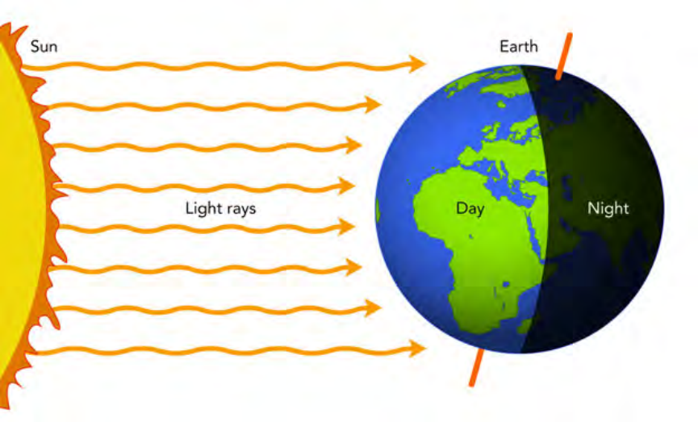
> **[Diagram Context - Textbook_NaturalScience_Gr7_Relationship-of-the-sun-to-the-Earth.pdf-0005-02.png]**
> This diagram illustrates the Earth's rotation relative to the Sun, featuring labels for the "Sun," "Earth," "Light rays," "Day," and "Night," along with an axis line. It conceptually demonstrates how the Earth's rotation causes the cycle of day and night by showing how solar radiation illuminates only one hemisphere at a time.

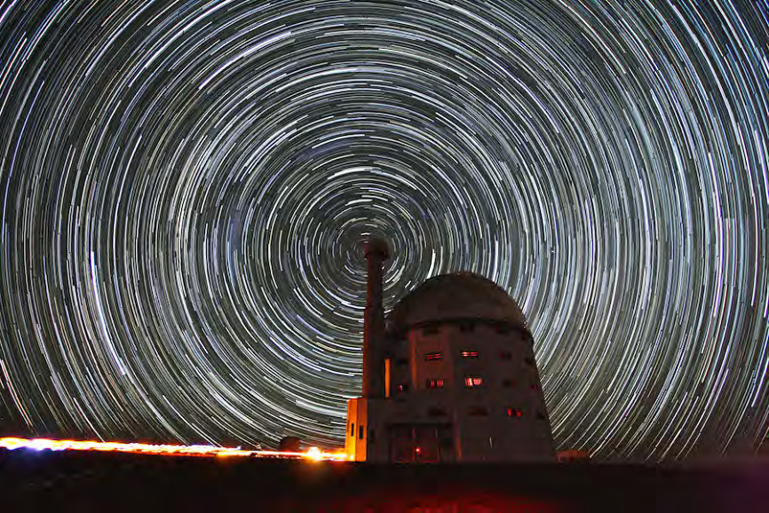
> **[Diagram Context - Textbook_NaturalScience_Gr7_Relationship-of-the-sun-to-the-Earth.pdf-0005-04.png]**
> This long-exposure photograph captures star trails circling a celestial pole above an astronomical observatory. The image visually demonstrates the Earth's rotation on its axis, showing how stars appear to move in concentric arcs relative to a stationary point in the night sky.

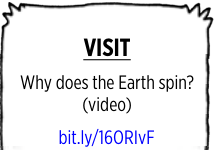
> **[Diagram Context - Textbook_NaturalScience_Gr7_Relationship-of-the-sun-to-the-Earth.pdf-0005-05.png]**
> This graphic is a text-based educational sign containing the heading "VISIT," the inquiry question "Why does the Earth spin? (video)," and a shortened URL link. It serves as a digital resource signpost designed to direct learners to supplementary multimedia content regarding planetary rotation and the formation of the solar system, which are key concepts in the Grade 10 Geography CAPS curriculum.

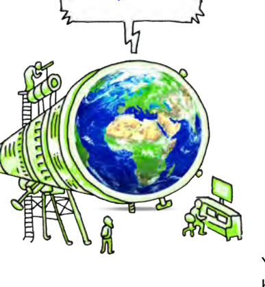
> **[Diagram Context - Textbook_NaturalScience_Gr7_Relationship-of-the-sun-to-the-Earth.pdf-0005-06.png]**
> This illustration depicts a large telescope focused on a globe of the Earth, with human figures observing and monitoring data on a computer screen. It visually represents the concept of Earth observation and remote sensing, highlighting how scientific instruments are used to collect and analyze planetary data.

---

# Planet Earth and Beyond: Eclipses

## Solar Eclipses

* **Alignment:** A solar eclipse occurs when the Sun, Moon, and Earth line up, with the **Moon in the middle**.
* **Shadow Formation:** 
  * The black spot on Earth shows the location from where a total solar eclipse is visible. This area is in the Moon's core shadow.
  * The grey area on Earth's surface indicates the location from where a partial eclipse is visible.

---

## Lunar Eclipses

* **Alignment:** A lunar eclipse occurs when the Sun, Earth, and Moon line up, with the **Earth in the middle**.
* **Mechanism:** The Earth blocks sunlight from reaching the Moon's surface, making the Moon appear dark in the night sky.

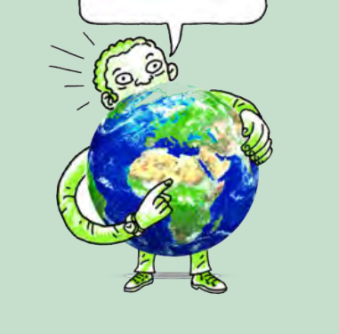
> **[Diagram Context - Textbook_NaturalScience_Gr7_Historical-development-of-astronomy.pdf-0006-07.png]**
> This cartoon depicts a personified human figure whose torso is replaced by a globe of the Earth, with a speech bubble extending from the head. The image uses visual metaphor to represent the concept of global citizenship and human impact on the environment, serving as a prompt for learners to discuss environmental responsibility and sustainable development within the Life Sciences or Geography curriculum.

> **[Diagram Context - Textbook_NaturalScience_Gr7_Historical-development-of-astronomy.pdf-0006-08.png]**
> This graphic depicts a schematic representation of a double-stranded DNA molecule, characterized by its iconic double helix structure. The diagram illustrates the two antiparallel sugar-phosphate backbones intertwined in a helical coil, providing a visual model of the molecular architecture that stores genetic information.

> **[Diagram Context - Textbook_NaturalScience_Gr7_Historical-development-of-astronomy.pdf-0006-12.png]**
> This graphic uses a metaphorical illustration of a roller coaster track integrated with a Slinky spring to represent mechanical energy transformations. It depicts the interplay between gravitational potential energy at the peak and kinetic energy during the descent, visually reinforcing the Law of Conservation of Energy for Grade 10-12 Physical Sciences learners.

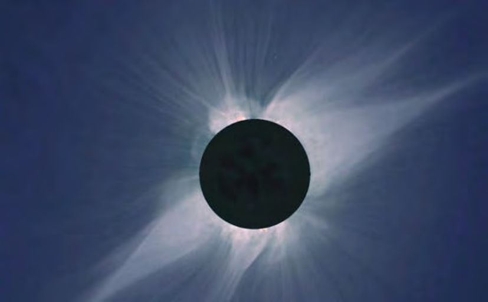
> **[Diagram Context - Textbook_NaturalScience_Gr7_Relationship-of-the-moon-to-the-earth.pdf-0006-02.png]**
> This image captures a total solar eclipse, featuring the dark silhouette of the Moon obscuring the solar disk and revealing the Sun's outer atmosphere, known as the corona. For Grade 10 Physical Sciences learners, this visual demonstrates the alignment of celestial bodies and provides a rare opportunity to observe the extended, wispy plasma structures of the solar corona that are otherwise invisible due to the Sun's intense brightness.

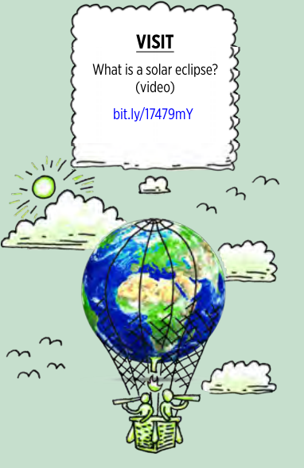
> **[Diagram Context - Textbook_NaturalScience_Gr7_Relationship-of-the-moon-to-the-earth.pdf-0006-09.png]**
> This graphic features an illustrative metaphor of two observers in a hot air balloon shaped like the Earth, accompanied by a text box containing the heading "VISIT," the question "What is a solar eclipse?", and a shortened URL. It serves as an introductory prompt to engage learners in the Natural Sciences curriculum by directing them to digital resources to explore the celestial mechanics of a solar eclipse.

> **[Diagram Context - Textbook_NaturalScience_Gr7_Relationship-of-the-moon-to-the-earth.pdf-0006-10.png]**
> This graphic illustrates the double-helix structure of a DNA molecule, characterized by two antiparallel sugar-phosphate backbones represented by the repeating green ribbon-like strands. It conceptually demonstrates the molecular architecture of genetic material, highlighting the complementary base pairing and the helical twist essential for DNA replication and protein synthesis in Life Sciences.

> **[Diagram Context - Textbook_NaturalScience_Gr7_Relationship-of-the-sun-to-the-Earth.pdf-0006-06.png]**
> This illustration depicts a roller coaster track integrated with a slinky spring, featuring passengers, a grid-like structure, and motion lines. It serves as a conceptual analogy for Grade 10-12 Physical Sciences, illustrating the transformation between gravitational potential energy and kinetic energy, as well as the propagation of mechanical waves along a medium.

---

## 2.2 Gravity

### New Words
* **Gravity**: The natural phenomenon by which all things with mass or energy are brought toward one another.
* **Mass**: The amount of matter in an object, usually measured in kilograms ($\text{kg}$).
* **Weight**: The force exerted on an object's mass by gravity ($W = mg$).
* **Acceleration due to gravity**: The acceleration gained by an object due to gravitational force, approximately $9.8 \text{ m/s}^2$ on Earth's surface.
* **Gravitational force**: The attractive force existing between any two objects that have mass.

---

### Core Concepts

* **Definition**: The word **gravity** describes the **gravitational pull (force)** an object experiences on or near the surface of a planet or moon. 
* **Universal Attraction**: The gravitational force is a force that attracts objects with mass towards each other. *Any object with mass exerts a gravitational force on any other object with mass*. 
* For example, the Earth exerts a gravitational pull on you, your desk, your chair, and falling objects, holding everything on the surface and preventing us from drifting off into space.

---

### Properties of Gravitational Force

1. **Centerward Direction**: The Earth's gravity pulls everything down towards the centre of the Earth. When you drop an object like a book or an apple, it falls directly to the ground.
2. **Mutual Pull**: Every object with mass exerts an equal and opposite pull on the Earth. (Note: The falling apple exerts a pull on the Earth, but the Earth does not move noticeably because its mass is immensely larger than the apple's).
3. **Distance Dependence**: The gravitational force between two objects decreases as the objects move further apart. 
   * If you **double** the distance between two objects, the gravitational force decreases by a factor of four ($2^2 = 4$).
   * If you **triple** the distance between two objects, the gravitational force decreases by a factor of nine ($3^2 = 9$).

---

### Astronomical Context

* **Sun vs. Earth Gravity**: The Sun is $333\,000$ times more massive than the Earth, meaning its gravity is much stronger than the Earth's. However, because we are so far away from the Sun, the gravitational force the Sun exerts on us is much smaller than the gravitational force the Earth exerts on us.
* **Orbits**: The Moon is held in orbit around the Earth by the gravitational force between the Earth and the Moon. Similarly, the Sun's gravity holds the Earth in orbit around the Sun.

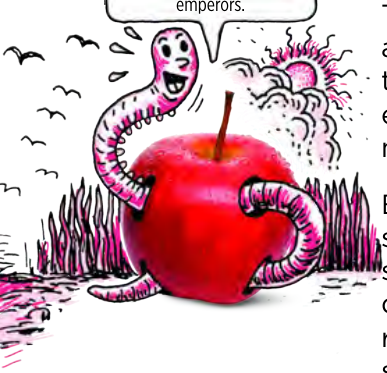
> **[Diagram Context - Textbook_NaturalScience_Gr7_Historical-development-of-astronomy.pdf-0007-06.png]**
> This educational cartoon depicts an anthropomorphized worm interacting with an apple in a natural environment featuring grass, birds, and a sun. The visual elements include a segmented worm, a red apple, and a speech bubble containing the partial text "emperors." Conceptually, this illustration serves as a mnemonic device or visual hook to introduce biological concepts such as detritivores, decomposers, or the role of invertebrates in ecosystem food webs.

> **[Diagram Context - Textbook_NaturalScience_Gr7_Historical-development-of-astronomy.pdf-0007-12.png]**
> This graphic is a text-based instructional sign featuring the heading "TAKE NOTE." It serves as a pedagogical signal to highlight essential information or critical concepts within the CAPS curriculum materials. By drawing the student's attention to specific content, it emphasizes key definitions, rules, or exceptions that are vital for examination preparation.

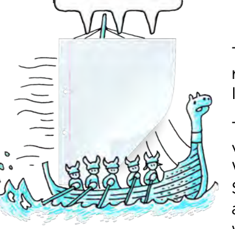
> **[Diagram Context - Textbook_NaturalScience_Gr7_Historical-development-of-astronomy.pdf-0007-15.png]**
> This graphic is a cartoon illustration of a Viking longship featuring a blank sail, oarsmen, and wind-blown waves. It serves as a visual template or creative prompt, utilizing the metaphor of a journey to encourage students to fill the empty space with relevant subject matter content or narrative text.

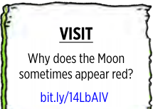
> **[Diagram Context - Textbook_NaturalScience_Gr7_Relationship-of-the-moon-to-the-earth.pdf-0007-01.png]**
> This graphic is an informational prompt containing the text "VISIT," the inquiry "Why does the Moon sometimes appear red?", and a shortened URL link. It serves as an educational signpost designed to direct students to external resources for investigating the physics of light scattering and lunar eclipses within the Earth and Space Sciences curriculum.

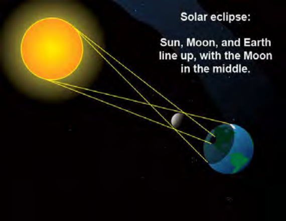
> **[Diagram Context - Textbook_NaturalScience_Gr7_Relationship-of-the-moon-to-the-earth.pdf-0007-02.png]**
> This diagram illustrates the celestial alignment of a solar eclipse, featuring the Sun, Moon, and Earth with yellow light rays tracing the path of obstruction. It conceptually demonstrates how the Moon’s position between the Sun and Earth casts a shadow on the Earth's surface, blocking direct sunlight as required by the Natural Sciences curriculum.

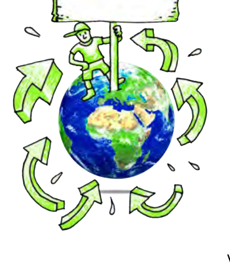
> **[Diagram Context - Textbook_NaturalScience_Gr7_Relationship-of-the-moon-to-the-earth.pdf-0007-04.png]**
> This graphic is a conceptual illustration featuring a globe, a human figure holding a blank sign, and surrounding circular arrows. It visually represents the theme of global environmental stewardship and the cyclical nature of sustainability or ecological processes. For high school learners, it serves as a prompt to discuss human impact on the biosphere and the importance of sustainable development within the CAPS Life Sciences and Geography curricula.

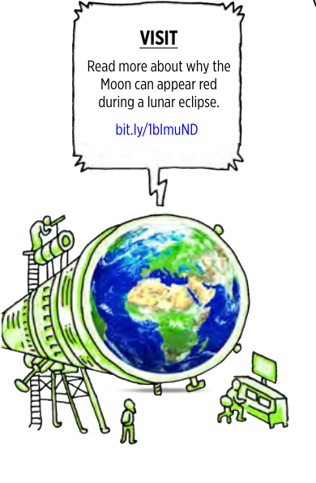
> **[Diagram Context - Textbook_NaturalScience_Gr7_Relationship-of-the-moon-to-the-earth.pdf-0007-06.png]**
> This educational graphic features a cartoon illustration of a large telescope pointed at Earth, accompanied by a speech bubble containing the text "VISIT" and a link regarding the red appearance of the Moon during a lunar eclipse. It serves as an engaging prompt to introduce the physics of light scattering and the celestial mechanics involved in lunar eclipses within the Earth and Space Science curriculum.

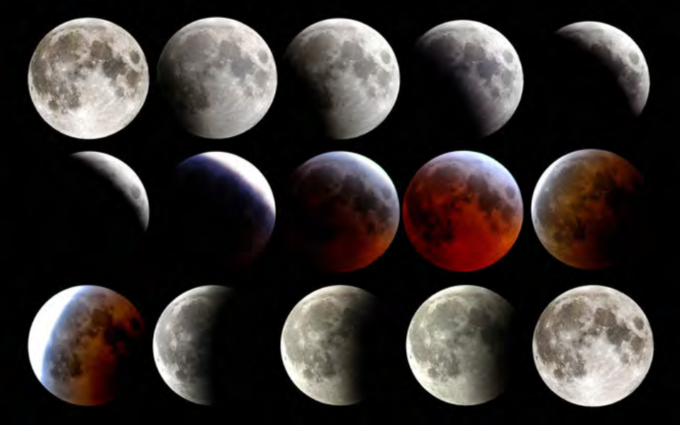
> **[Diagram Context - Textbook_NaturalScience_Gr7_Relationship-of-the-moon-to-the-earth.pdf-0007-07.png]**
> This composite image illustrates the sequential progression of a total lunar eclipse, showing the Moon’s changing illumination and the characteristic reddish "blood moon" hue as it passes through Earth's umbra. It visually demonstrates the celestial mechanics of Earth casting its shadow onto the lunar surface, providing a clear observational timeline for students studying the Earth-Moon-Sun system in Natural Sciences or Geography.

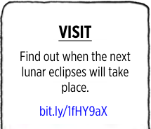
> **[Diagram Context - Textbook_NaturalScience_Gr7_Relationship-of-the-moon-to-the-earth.pdf-0007-08.png]**
> This graphic is an informational prompt containing the text "VISIT," "Find out when the next lunar eclipses will take place," and a shortened URL. It serves as a digital resource signpost to encourage students to research the timing and occurrence of lunar eclipses. This supports the Natural Sciences curriculum by directing learners to external data sources to better understand the orbital mechanics and predictable patterns of celestial events.

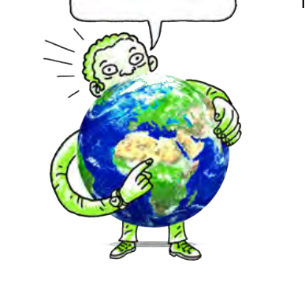
> **[Diagram Context - Textbook_NaturalScience_Gr7_Relationship-of-the-moon-to-the-earth.pdf-0007-11.png]**
> This cartoon depicts a human figure interacting with a globe of the Earth, featuring a blank speech bubble and a prominent focus on the African continent. It serves as a visual prompt for Life Sciences or Geography learners to discuss human impact on the biosphere, environmental sustainability, or global ecological footprints.

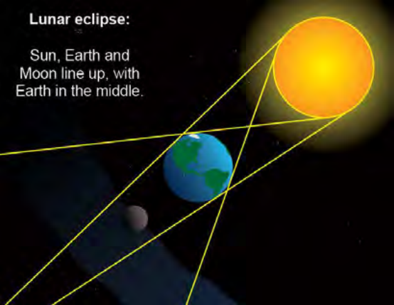
> **[Diagram Context - Textbook_NaturalScience_Gr7_Relationship-of-the-moon-to-the-earth.pdf-0007-12.png]**
> This diagram is an astronomical model illustrating a lunar eclipse, featuring the Sun, Earth, and Moon positioned in a linear arrangement with yellow lines representing light rays and the resulting shadow. It conceptually demonstrates how the Earth blocks sunlight from reaching the Moon, causing the Moon to pass through the Earth's shadow, which is a key component of the Natural Sciences curriculum regarding the Earth and Beyond.

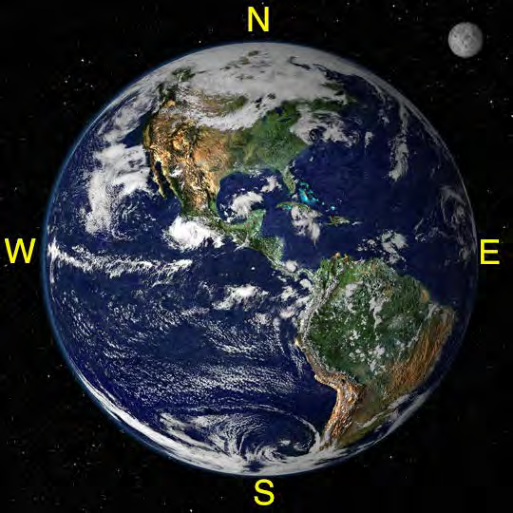
> **[Diagram Context - Textbook_NaturalScience_Gr7_Relationship-of-the-sun-to-the-Earth.pdf-0007-01.png]**
> This graphic is a space-based perspective of Earth featuring the Moon in the background and cardinal direction labels (N, S, E, W) positioned around the planet. It illustrates the Earth's orientation in space, providing a visual reference for understanding planetary positioning and the relative scale of the Earth-Moon system within the context of Earth and Space Sciences.

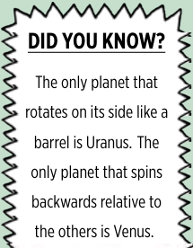
> **[Diagram Context - Textbook_NaturalScience_Gr7_Relationship-of-the-sun-to-the-Earth.pdf-0007-02.png]**
> This educational graphic is an informational text box containing the heading "DID YOU KNOW?" and text referencing the planets Uranus and Venus. It highlights the unique axial tilt of Uranus, which rotates on its side, and the retrograde rotation of Venus compared to other planets in our solar system. This serves as a supplementary fact to support Grade 9 Natural Sciences learners in understanding the diverse rotational characteristics of celestial bodies within the Earth and Beyond strand.

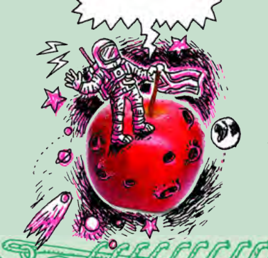
> **[Diagram Context - Textbook_NaturalScience_Gr7_Relationship-of-the-sun-to-the-Earth.pdf-0007-03.png]**
> This illustration is a creative composite featuring an astronaut standing on a cratered red apple, surrounded by celestial elements like stars, planets, a comet, and a speech bubble. It serves as a metaphorical visual aid to introduce concepts of gravity, planetary motion, or the history of scientific discovery, such as Newton’s law of universal gravitation. By juxtaposing a fruit with space exploration, it encourages students to bridge the gap between everyday physical phenomena and the broader principles of physics governing the universe.

---

# ACTIVITY: Demonstrating the Moon's orbit around the Earth

## MATERIALS
* rope
* ball (tennis balls are ideal)

## INSTRUCTIONS
1. Tie a ball to the end of a piece of rope. You may have to wrap the rope around the ball a few times to do this.
2. Hold the rope up high above your head and swing the rope around in a horizontal circle.
3. Let go of the rope and observe what happens.

> ## DID YOU KNOW?
> The Moon is slowly moving away from the Earth at a rate of $3.8\text{ cm}$ per year (the Moon's orbit is getting larger). In about $563$ million years time its angular size on the sky will have decreased so much that it will no longer be large enough to produce total solar eclipses!

*(Looking down at a ball swung in a circle after it is released.)*

## QUESTIONS:
1. How can you describe the movement of the ball as you swing it around?
2. The rope pulls the ball inwards towards the centre of the circle keeping the ball moving in a circle. What force holds the Moon in orbit around the Earth?
3. What happens to be ball when you let the rope go?
4. What does this represent in terms of the Earth and the Moon?

***

196

Planet Earth and Beyond

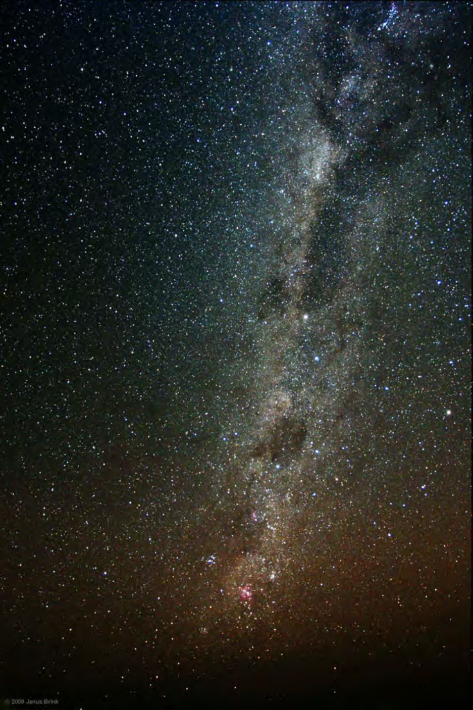
> **[Diagram Context - Textbook_NaturalScience_Gr7_Historical-development-of-astronomy.pdf-0008-00.png]**
> This image is an astronomical photograph capturing a wide-field view of the Milky Way galaxy, featuring visible star clusters, nebulae, and dark interstellar dust lanes. It serves as a visual representation of our galaxy's structure, illustrating the high density of stars and obscuring matter found within the galactic plane. For high school learners, this image provides a concrete reference for understanding the scale of the universe and the composition of galaxies within the Earth and Beyond strand of the Natural Sciences curriculum.

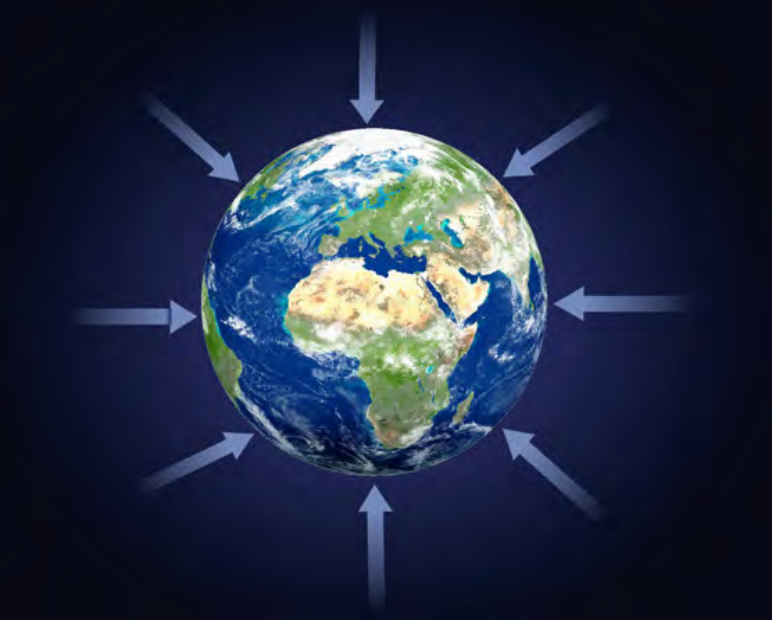
> **[Diagram Context - Textbook_NaturalScience_Gr7_Relationship-of-the-moon-to-the-earth.pdf-0008-04.png]**
> This diagram features a satellite image of Earth surrounded by inward-pointing arrows directed toward the planet's center. It conceptually illustrates the force of gravity, representing the universal gravitational attraction that pulls all objects and matter toward the Earth's core.

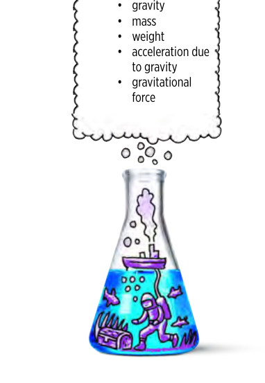
> **[Diagram Context - Textbook_NaturalScience_Gr7_Relationship-of-the-moon-to-the-earth.pdf-0008-08.png]**
> This graphic features an Erlenmeyer flask containing an underwater scene with a diver, a ship, and a treasure chest, topped by a thought bubble listing the terms "gravity," "mass," "weight," "acceleration due to gravity," and "gravitational force." It conceptually introduces Grade 10 Physical Sciences learners to the fundamental concepts of Newtonian mechanics by linking the physical environment of the underwater scene to the key terminology required to define and calculate gravitational interactions.

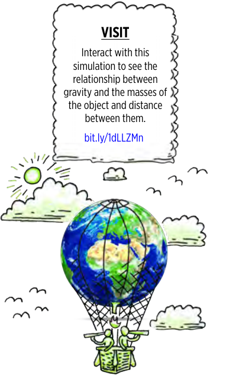
> **[Diagram Context - Textbook_NaturalScience_Gr7_Relationship-of-the-moon-to-the-earth.pdf-0008-09.png]**
> This graphic serves as an educational prompt featuring an illustration of a hot air balloon with a globe-shaped canopy and a link to an interactive simulation. It directs Grade 10 Physical Sciences learners to explore Newton’s Law of Universal Gravitation by investigating how gravitational force is influenced by the masses of objects and the distance between them.

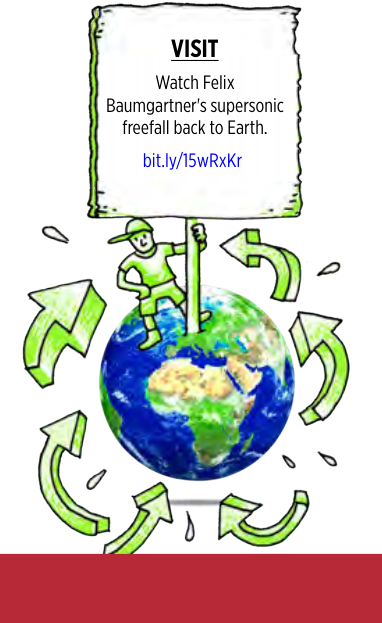
> **[Diagram Context - Textbook_NaturalScience_Gr7_Relationship-of-the-moon-to-the-earth.pdf-0008-10.png]**
> This graphic features an illustration of a person standing on Earth surrounded by circular arrows, accompanied by a text box labeled "VISIT" that directs students to a video link about Felix Baumgartner’s supersonic freefall. It serves as an engaging multimedia resource to help Grade 10-12 Physical Sciences learners visualize the concepts of gravity, air resistance, and vertical projectile motion in a real-world context.

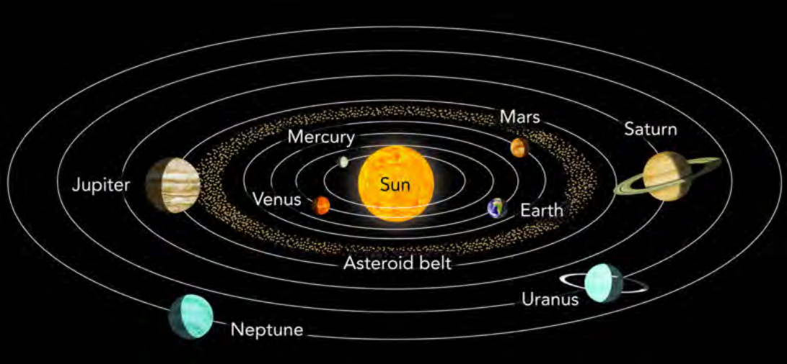
> **[Diagram Context - Textbook_NaturalScience_Gr7_Relationship-of-the-sun-to-the-Earth.pdf-0008-00.png]**
> This diagram is a schematic representation of the solar system, illustrating the Sun at the centre with the eight planets orbiting along elliptical paths. It explicitly labels the Sun, the asteroid belt, and the planets Mercury, Venus, Earth, Mars, Jupiter, Saturn, Uranus, and Neptune. Conceptually, this model helps learners visualise the relative positioning of celestial bodies and the structural organisation of our solar system within the context of Natural Sciences.

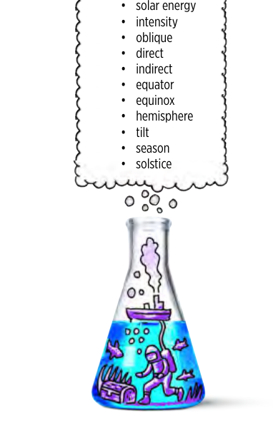
> **[Diagram Context - Textbook_NaturalScience_Gr7_Relationship-of-the-sun-to-the-Earth.pdf-0008-07.png]**
> This graphic features an Erlenmeyer flask containing an underwater scene with a diver and a treasure chest, topped by a thought bubble containing a list of geographical terms: solar energy, intensity, oblique, direct, indirect, equator, equinox, hemisphere, tilt, season, and solstice. It conceptually links the physical processes of Earth's axial tilt and solar radiation intensity to the formation of seasons, serving as a mnemonic or thematic prompt for Geography learners to explore how these variables influence global climate patterns.

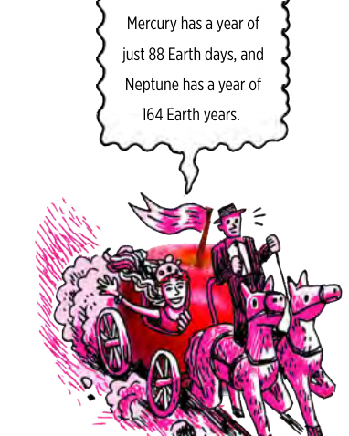
> **[Diagram Context - Textbook_NaturalScience_Gr7_Relationship-of-the-sun-to-the-Earth.pdf-0008-09.png]**
> This illustration uses a whimsical cartoon of a chariot pulled by horses to represent the concept of orbital periods in the solar system. The text labels "Mercury," "88 Earth days," "Neptune," and "164 Earth years" to contrast the vast differences in the time taken for planets at varying distances from the Sun to complete one revolution. It serves as a conceptual aid for Natural Sciences learners to understand how orbital velocity and distance from the Sun influence the length of a planet's year.

---

# Revision Notes: Gravity, Mass, and Weight

## Core Concepts of Gravitational Force

All components in the Universe are held together by gravity. The strength of the gravitational pull between objects depends on two main factors:
1. **Mass:** The greater the mass of the objects, the stronger the gravitational pull between them.
2. **Distance:** The closer objects are to one another, the stronger the gravitational pull between them.

---

## Mass vs. Weight

In everyday language, mass and weight are often confused, but in physics and science, they have distinct definitions and properties.

### 1. Mass
* **Definition:** The amount of matter in an object; it tells you how many particles or atoms are present.
* **Unit of Measurement:** Kilograms ($\text{kg}$).
* **Properties:** Mass is **independent of location**—it remains constant regardless of where you measure it in the Universe.
* **Example:** A wooden block with a mass of $10\text{ kg}$ on Earth also has a mass of $10\text{ kg}$ on the Moon.

### 2. Weight
* **Definition:** The force acting on an object due to gravity. It depends on both the mass of the object and the strength of the local gravitational field.
* **Unit of Measurement:** Newtons ($\text{N}$).
* **Properties:** Weight **can change** depending on where the object is measured.
* **Calculation/Relationship:** On the surface of the Earth, gravity exerts a gravitational force of about $10\text{ N}$ for every kilogram of mass:
  $$\text{Weight} \approx \text{Mass} \times 10\text{ N/kg}$$
* **Example:** A person with a mass of $50\text{ kg}$ has a weight of:
  $$50\text{ kg} \times 10\text{ N/kg} = 500\text{ N}$$
  on the surface of the Earth.

---

## Gravity Across Different Celestial Bodies

The strength of gravity varies depending on the size and mass of the planet or moon:

* **The Moon:** The strength of gravity on the surface of the Moon is $\frac{1}{6}$ (one-sixth) that of the Earth. Therefore, an object weighs six times less on the Moon than it does on Earth.
* **Jupiter:** The strength of gravity on Jupiter is $2.5$ times greater than that of the Earth. Therefore, an object weighs $2.5$ times more on Jupiter than on Earth.

### Summary Comparison Table

| Celestial Body | Gravitational Strength relative to Earth | Mass of Astronaut | Weight of Astronaut ($120\text{ kg}$ mass) |
| :--- | :--- | :--- | :--- |
| **Earth** | $1\times$ (Standard) | $120\text{ kg}$ | $1200\text{ N}$ |
| **Moon** | $\frac{1}{6}\times$ | $120\text{ kg}$ | $200\text{ N}$ |

> **Key Takeaway:** An astronaut's **mass remains the same** wherever it is measured (e.g., $120\text{ kg}$), but the astronaut's **weight depends on location** (e.g., $1200\text{ N}$ on Earth vs. $200\text{ N}$ on the Moon).

> **[Diagram Context - Textbook_NaturalScience_Gr7_Historical-development-of-astronomy.pdf-0009-00.png]**
> This diagram illustrates a slinky toy moving down a staircase, featuring a coiled spring and motion lines indicating its path. It serves as a physical model for Grade 10-12 Physics to demonstrate the propagation of longitudinal and transverse waves, as well as the transfer of potential and kinetic energy during mechanical motion.

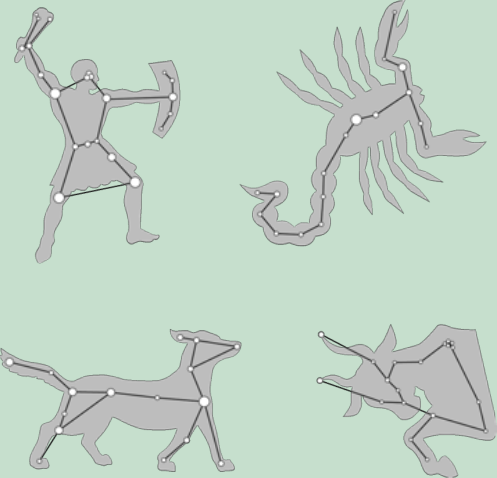
> **[Diagram Context - Textbook_NaturalScience_Gr7_Historical-development-of-astronomy.pdf-0009-04.png]**
> This graphic illustrates four distinct constellations—Orion, Scorpius, Canis Major, and Taurus—depicted as star patterns connected by lines overlaid on mythological silhouettes. It serves to help learners identify prominent star groupings in the night sky by linking individual stars of varying magnitudes to the traditional figures they represent.

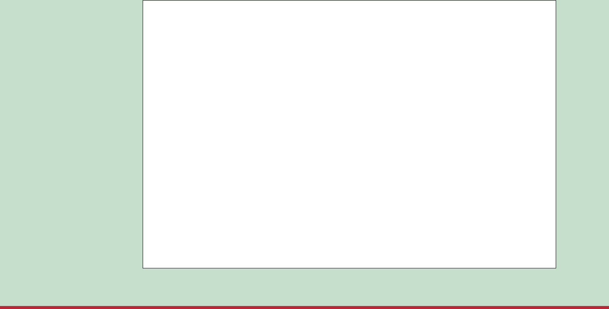
> **[Diagram Context - Textbook_NaturalScience_Gr7_Historical-development-of-astronomy.pdf-0009-10.png]**
> This image is a blank placeholder frame with no visible content, labels, or scientific data to analyze. Consequently, it provides no pedagogical value or conceptual information for a CAPS curriculum student.

> **[Diagram Context - Textbook_NaturalScience_Gr7_Relationship-of-the-moon-to-the-earth.pdf-0009-00.png]**
> This graphic uses a composite illustration of a roller coaster and a Slinky toy to represent the physical principles of motion. It visually juxtaposes the track's path with a coiled spring to demonstrate the relationship between potential and kinetic energy as objects navigate changes in height and velocity. This serves as an intuitive analogy for Grade 10-12 Physical Sciences learners to understand the Law of Conservation of Mechanical Energy in a real-world context.

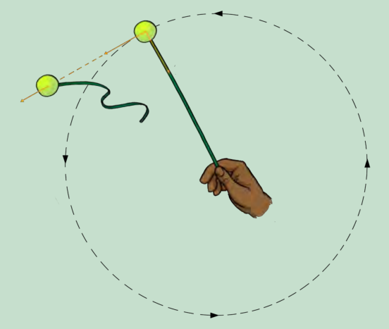
> **[Diagram Context - Textbook_NaturalScience_Gr7_Relationship-of-the-moon-to-the-earth.pdf-0009-09.png]**
> This diagram illustrates circular motion, featuring a hand swinging a ball on a string along a dashed circular path indicated by directional arrows. It demonstrates the concept of inertia by showing the ball's tendency to move in a straight-line tangential path if the centripetal force provided by the string is suddenly removed.

> **[Diagram Context - Textbook_NaturalScience_Gr7_Relationship-of-the-moon-to-the-earth.pdf-0009-13.png]**
> This educational cartoon depicts a whimsical chariot scene featuring a person driving a carriage shaped like a large red apple, pulled by two pink horses. The image serves as a metaphorical visual aid to prompt creative writing or narrative thinking, encouraging students to develop descriptive language or storytelling skills based on the surreal imagery.

> **[Diagram Context - Textbook_NaturalScience_Gr7_Relationship-of-the-moon-to-the-earth.pdf-0009-19.png]**
> This graphic illustrates a schematic representation of a DNA molecule, featuring the characteristic double helix structure with repeating sugar-phosphate backbones and internal nitrogenous base pairs. It conceptually demonstrates the antiparallel nature and helical coiling of the DNA double helix, providing a foundational visual for understanding genetic material and molecular biology in the Life Sciences curriculum.

> **[Diagram Context - Textbook_NaturalScience_Gr7_Relationship-of-the-sun-to-the-Earth.pdf-0009-00.png]**
> This diagram illustrates a longitudinal spring (slinky) moving down a flight of stairs, with motion lines indicating its dynamic displacement. It serves as a physical model to help Grade 10-12 Physical Sciences learners visualize the propagation of longitudinal waves, where the medium oscillates parallel to the direction of wave travel.

> **[Diagram Context - Textbook_NaturalScience_Gr7_Relationship-of-the-sun-to-the-Earth.pdf-0009-12.png]**
> This cartoon depicts a thief in a striped outfit stealing a framed portrait, with a blank speech bubble above him. It serves as a visual metaphor for the concept of plagiarism or intellectual property theft, illustrating the act of misappropriating someone else's creative work. In a Life Orientation or English context, this image prompts students to discuss the ethical implications of academic integrity and the consequences of presenting others' ideas as one's own.

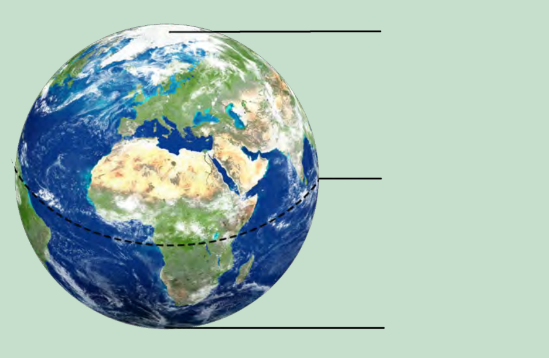
> **[Diagram Context - Textbook_NaturalScience_Gr7_Relationship-of-the-sun-to-the-Earth.pdf-0009-13.png]**
> This diagram is a satellite-view illustration of the Earth featuring three horizontal lines pointing to the North Pole, the Equator (represented by a dashed line), and the South Pole. It serves as a foundational visual aid for Geography learners to identify key latitudinal reference points and understand the Earth's orientation in relation to its axis.

> **[Diagram Context - Textbook_NaturalScience_Gr7_Relationship-of-the-sun-to-the-Earth.pdf-0009-14.png]**
> This graphic depicts a repeating, wave-like pattern of interconnected, arrow-shaped segments. It serves as a visual representation of a continuous process or directional flow, often used in Life Sciences to illustrate metabolic pathways, the sequence of DNA replication, or the cyclical nature of biological systems.

---

Check your understanding of mass and weight with the following questions.

1. Lindiwe has a mass of $50\text{ kg}$ on Earth. What is her mass on the Moon?
2. Andrew has a mass of $60\text{ kg}$ on Earth, what is his weight in Newtons on Earth?
3. How much would Andrew weigh on the Moon?
4. Would Lindiwe feel heavier or lighter on the Moon?

---

### ACTIVITY: How much would you weigh on other planets?

**MATERIALS:**
* weighing scales
* calculator

**INSTRUCTIONS:**
1. Measure your mass in kilograms using weighing scales. Record the value in the table below.
2. Look at the table below, it shows how strong the gravity is on each of the planets in our solar system.
3. Calculate your weight on each of the planets and enter it into the table below.

*Hint:* On Earth each kilogram weighs $10\text{ Newtons}$. So if your mass is $50\text{ kg}$ then you weigh $50 \times 10 = 500\text{ N}$ on Earth. If the strength of gravity on a planet is half the strength of the Earth's gravity then you would weigh half of what you weigh on Earth on that planet.

| Planet | Your mass ($\text{kilograms}$) | Strength of gravity relative to Earth | Your weight ($\text{Newtons}$) |
| :--- | :--- | :---: | :--- |
| Earth | | 1 | |
| Mercury | | 0.378 | |
| Venus | | 0.907 | |
| Mars | | 0.377 | |
| Jupiter | | 2.36 | |
| Saturn | | 0.916 | |
| Uranus | | 0.889 | |
| Neptune | | 1.12 | |

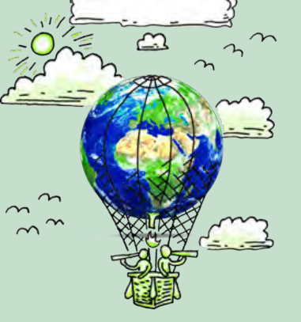

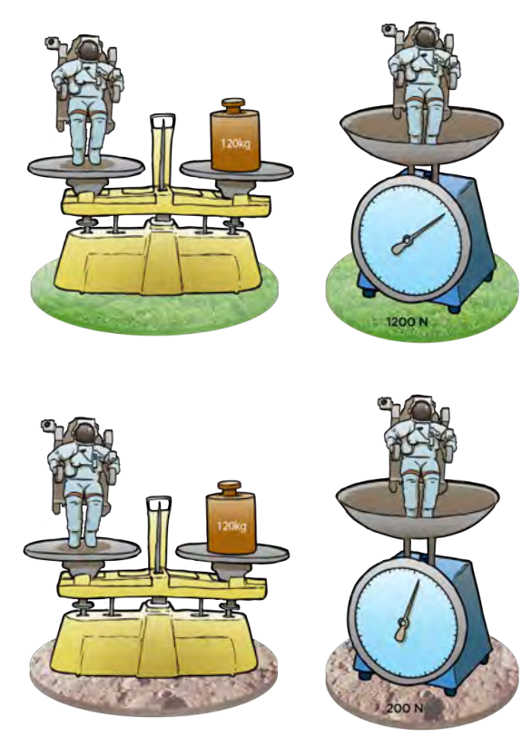

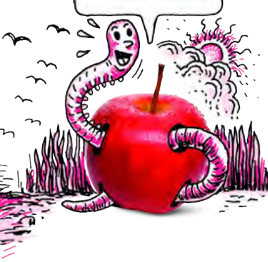

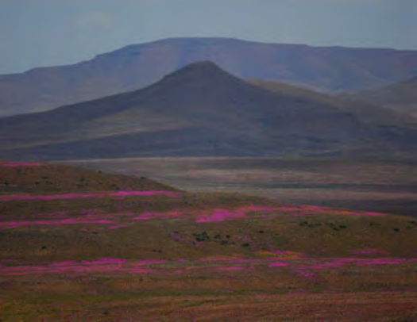

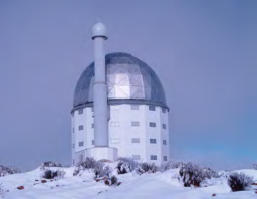

---

### QUESTIONS
1. On which planets would you feel heavier than you do on Earth?
2. On which planets would you feel lighter than you do on Earth?

---

### The Moon's gravity

As you have already discovered, the Moon, like any other planet or moon, has its own gravity. The strength of gravity on the surface of the Moon is one-sixth that of the Earth, and so on the Moon you would weigh one-sixth of what you do on Earth. Due to the weak gravity on the Moon, you would be able to jump six times higher than usual! The astronauts had to learn to walk in strange ways (such as leaping or hopping) to move about on the surface of the Moon.

As we will find out in the next section, the Moon's gravity not only affects humans walking on the Moon, but also influences the Earth.

> **VISIT**
> Neil Armstrong walking on the Moon (video)  
> `bit.ly/1eJPIwZ`

---

## 2.3 Tides

> **NEW WORDS**
> * tides
> * tidal bulge
> * spring tides
> * neap tides

Tides are the predictable, repeated rise and fall of sea levels on Earth. If you look closely you will notice that the height of the surf at any beach varies slowly with time. When the sea is far out and there is lots of sand exposed, it is called low tide. You can see an example of low tide in the photo.

*At low tide, the water is far out and the boats are resting on the sand.*

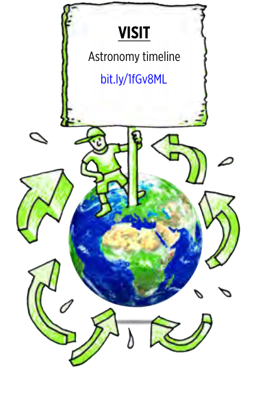
> **[Diagram Context - Textbook_NaturalScience_Gr7_Historical-development-of-astronomy.pdf-0011-00.png]**
> This graphic features an illustration of a person standing on a globe surrounded by circular arrows, holding a sign labeled "VISIT Astronomy timeline" with an associated URL. It serves as an educational prompt designed to direct learners to external digital resources for exploring the historical development and chronological progression of astronomical discoveries.

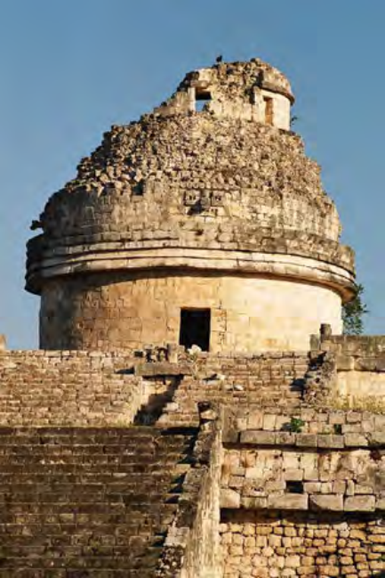
> **[Diagram Context - Textbook_NaturalScience_Gr7_Historical-development-of-astronomy.pdf-0011-01.png]**
> This image depicts the El Caracol observatory at the Mayan archaeological site of Chichén Itzá, characterized by its circular stone tower structure atop a rectangular platform. The visual elements include tiered masonry, a central doorway, and a domed upper section, which serve as historical evidence of ancient astronomical observation. For high school learners, this structure illustrates how early civilizations integrated architectural design with scientific study to track celestial movements and develop sophisticated calendar systems.

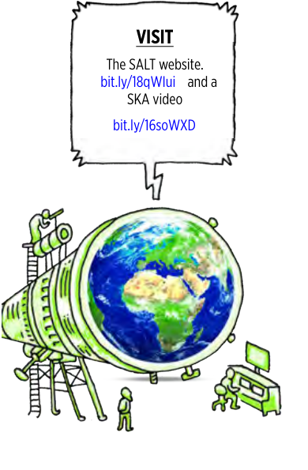
> **[Diagram Context - Textbook_NaturalScience_Gr7_Historical-development-of-astronomy.pdf-0011-04.png]**
> This graphic is an illustrative cartoon depicting a large telescope pointed at Earth, accompanied by a speech bubble containing links to the Southern African Large Telescope (SALT) and the Square Kilometre Array (SKA). It serves as an educational prompt to direct learners toward digital resources regarding South Africa’s significant contributions to global astronomy and radio telescope technology.

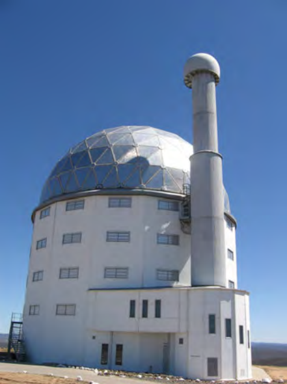
> **[Diagram Context - Textbook_NaturalScience_Gr7_Historical-development-of-astronomy.pdf-0011-05.png]**
> This image depicts the dome and ventilation tower of an optical telescope observatory, specifically the South African Large Telescope (SALT) in Sutherland. It illustrates the specialized architectural infrastructure required to house large-scale astronomical equipment, highlighting the dome's geodesic structure and the tall ventilation shaft used to manage thermal currents for clear observation. This serves as a practical example of how South Africa contributes to global space science and the physical requirements for high-precision observational astronomy.

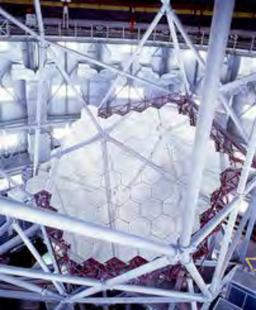
> **[Diagram Context - Textbook_NaturalScience_Gr7_Historical-development-of-astronomy.pdf-0011-07.png]**
> This image displays the segmented primary mirror of a large optical telescope, characterized by a complex structural steel framework supporting a collection of hexagonal mirror panels. It illustrates the engineering principles of modular design and structural support systems used in modern astronomy to achieve high-resolution imaging. For Physical Sciences learners, this serves as a practical application of optics, light collection, and the structural mechanics required to maintain precise alignment in large-scale scientific apparatus.

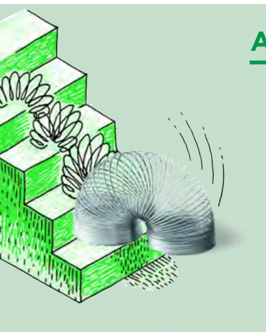
> **[Diagram Context - Textbook_NaturalScience_Gr7_Relationship-of-the-moon-to-the-earth.pdf-0011-05.png]**
> This diagram illustrates a slinky spring moving down a staircase, using motion lines to depict its displacement. It serves as a visual analogy for longitudinal wave propagation, demonstrating how energy is transferred through a medium as the coils compress and expand in sequence.

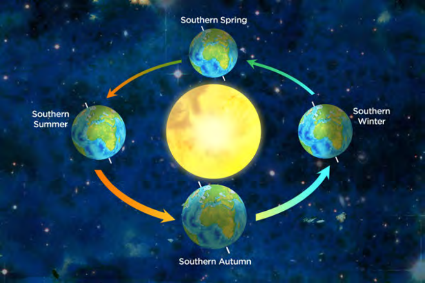
> **[Diagram Context - Textbook_NaturalScience_Gr7_Relationship-of-the-sun-to-the-Earth.pdf-0011-03.png]**
> This diagram illustrates the Earth's orbital revolution around the Sun, featuring labels for the four seasons in the Southern Hemisphere (Southern Spring, Summer, Autumn, and Winter) and directional arrows indicating the orbital path. It conceptually demonstrates how the Earth's axial tilt and position in its orbit relative to the Sun result in the seasonal variations experienced in the Southern Hemisphere throughout the year.

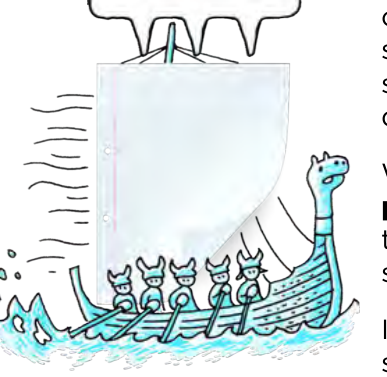
> **[Diagram Context - Textbook_NaturalScience_Gr7_Relationship-of-the-sun-to-the-Earth.pdf-0011-08.png]**
> This graphic is a metaphorical illustration depicting a Viking longship with a blank sail and a speech bubble above it. It uses the visual elements of oarsmen, water, wind lines, and a sail to represent a blank canvas for creative writing or historical narrative tasks. Conceptually, it serves as a prompt for students to fill in the empty space with descriptive text or historical context, encouraging engagement with themes of exploration or storytelling.

---

# Lesson Notes: Understanding Tides

## 1. Core Concepts

* **Low Tide:** Following high tide, the water level gradually drops until it reaches its lowest level on the beach.
* **High Tide:** Following low tide, the water gradually comes further up on the beach until it reaches its highest level.
* **Tidal Cycle:** This pattern of receding and advancing water repeats over and over again.
* **Frequency:** In general, there are **two low tides** and **two high tides** per day on the sea, which can be observed on beaches or in estuaries.
* **Timing:** The times of high and low tides are not exactly the same every day; they occur roughly **one hour later each day**.
* **Tidal Range:** The vertical difference between low tide and high tide.

---

## 2. Did You Know?

* Some lakes and rivers also have tides!

---

## 3. Practical Applications of Tide Information

Tides can be predicted, and low and high tide times are published in tide tables. 

* **Fishermen:** Use tide information to plan when they will fish.
* **Surfers:** Use this information to plan the best times to go surfing, as each beach has a particular time when the sea level is optimal for producing excellent surfing waves.

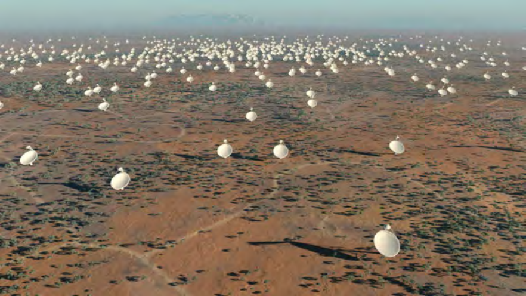
> **[Diagram Context - Textbook_NaturalScience_Gr7_Historical-development-of-astronomy.pdf-0012-00.png]**
> This image depicts an aerial view of a radio telescope array, specifically the Square Kilometre Array (SKA) in the Karoo, featuring numerous parabolic dish antennas distributed across a vast, arid landscape. It illustrates the concept of interferometry, where multiple individual receivers work in unison to function as a single, massive telescope, significantly increasing sensitivity and resolution for deep-space observation in Physical Sciences and Geography.

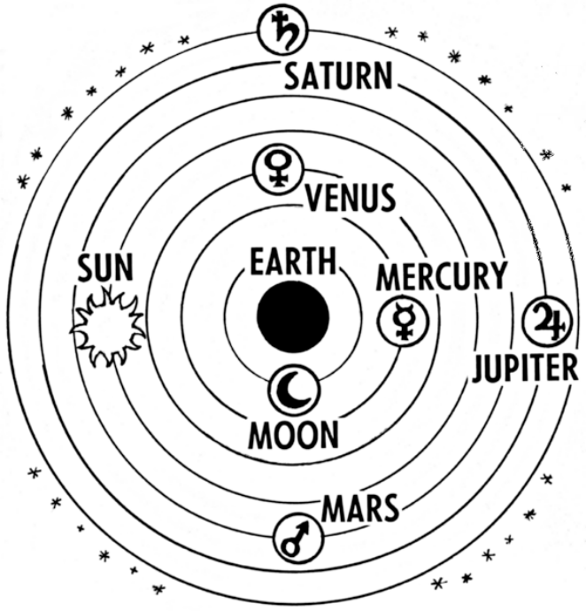
> **[Diagram Context - Textbook_NaturalScience_Gr7_Historical-development-of-astronomy.pdf-0012-07.png]**
> This diagram illustrates the geocentric model of the solar system, featuring concentric circular orbits around a central Earth, with labels for the Moon, Sun, Mercury, Venus, Mars, Jupiter, and Saturn, alongside their respective planetary symbols. It serves as a historical pedagogical tool to contrast the outdated Earth-centered view with the modern heliocentric model, helping learners understand the evolution of astronomical theories and the observational limitations of early science.

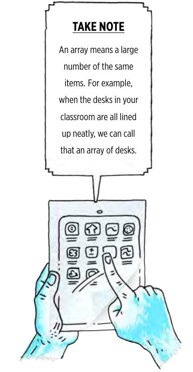
> **[Diagram Context - Textbook_NaturalScience_Gr7_Historical-development-of-astronomy.pdf-0012-09.png]**
> This educational graphic features a text box titled "TAKE NOTE" positioned above an illustration of a person using a tablet with a grid of app icons. The diagram uses the real-world example of classroom desks and the digital interface of a tablet to conceptually define an "array" as a structured, organized collection of identical items.

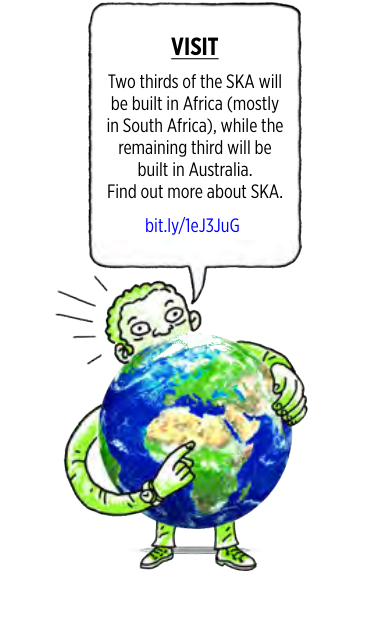
> **[Diagram Context - Textbook_NaturalScience_Gr7_Historical-development-of-astronomy.pdf-0012-10.png]**
> This graphic is an educational cartoon featuring a character pointing at a globe, accompanied by a speech bubble containing text and a URL. The text explicitly labels the "SKA" (Square Kilometre Array) and identifies the geographical distribution of its infrastructure between South Africa and Australia. It serves to contextualize South Africa's significant role in global scientific research and international collaboration within the field of radio astronomy.

> **[Diagram Context - Textbook_NaturalScience_Gr7_Historical-development-of-astronomy.pdf-0012-11.png]**
> This graphic is an illustrative educational prompt featuring a hot air balloon shaped like the Earth, with two figures using telescopes in the basket below. It includes the text "VISIT History of astronomy" alongside two shortened URLs (bit.ly/15Vufw5 and bit.ly/16sp7Cf). The image serves as a thematic gateway to encourage students to explore the historical development of astronomical observation and the evolution of our understanding of the universe.

> **[Diagram Context - Textbook_NaturalScience_Gr7_Relationship-of-the-moon-to-the-earth.pdf-0012-04.png]**
> This graphic illustrates a schematic representation of a DNA molecule, featuring the characteristic double-helix structure formed by two antiparallel sugar-phosphate backbones. It visually demonstrates the twisted ladder configuration, which is essential for students to understand the molecular basis of genetic information storage and replication within the CAPS Life Sciences curriculum.

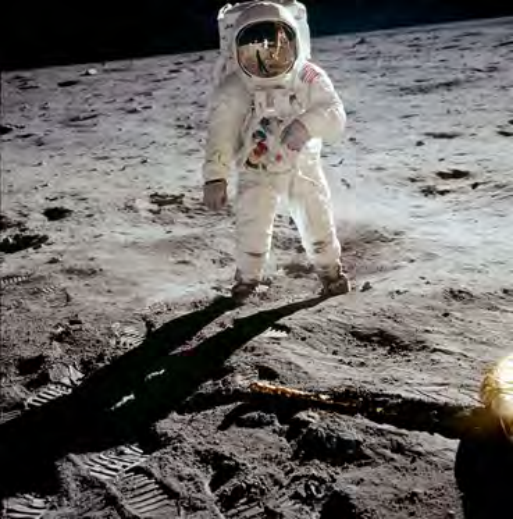
> **[Diagram Context - Textbook_NaturalScience_Gr7_Relationship-of-the-moon-to-the-earth.pdf-0012-09.png]**
> This photograph depicts an astronaut in a pressurized space suit standing on the lunar surface, characterized by regolith, craters, and distinct boot-print impressions. The image illustrates the absence of an atmosphere and the effects of low gravity, providing a visual context for studying Newton’s laws of motion, gravitational force, and the conditions of space exploration within the Physical Sciences curriculum.

> **[Diagram Context - Textbook_NaturalScience_Gr7_Relationship-of-the-moon-to-the-earth.pdf-0012-12.png]**
> This cartoon depicts a stylized human figure holding and pointing toward the African continent on a globe, accompanied by an empty speech bubble. It serves as a visual prompt for Geography or Life Sciences learners to discuss global environmental issues, human-environment interactions, or the specific geographical significance of the African continent within a global context.

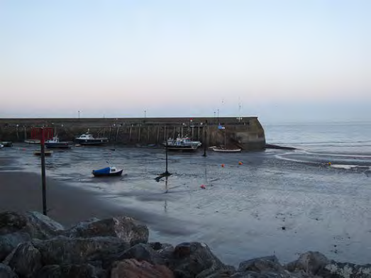
> **[Diagram Context - Textbook_NaturalScience_Gr7_Relationship-of-the-moon-to-the-earth.pdf-0012-15.png]**
> This image is a photograph of a coastal harbour at low tide, featuring boats resting on the exposed seabed, a stone pier, and rocky foreground terrain. There are no labels, variables, or scientific symbols present in the image. Conceptually, this scene serves as a real-world illustration of tidal cycles, demonstrating the significant vertical change in water level that exposes the intertidal zone and affects maritime navigation.

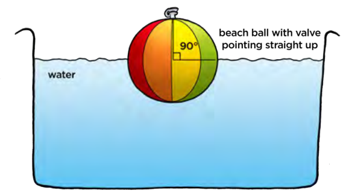
> **[Diagram Context - Textbook_NaturalScience_Gr7_Relationship-of-the-sun-to-the-Earth.pdf-0012-00.png]**
> This diagram illustrates a physical science scenario showing a beach ball floating in a container of water, labeled with a 90° angle indicator at the water's surface. It conceptually demonstrates Archimedes' Principle and the concept of buoyancy, helping students visualize how an object's density relative to a fluid determines its equilibrium position and displacement.

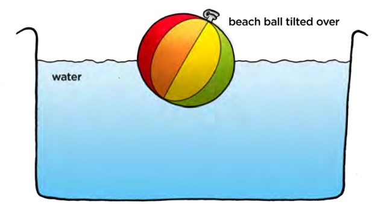
> **[Diagram Context - Textbook_NaturalScience_Gr7_Relationship-of-the-sun-to-the-Earth.pdf-0012-02.png]**
> This diagram illustrates a physical science scenario featuring a beach ball floating in a container of water, with labels identifying the "beach ball tilted over" and the "water." It conceptually demonstrates the principles of buoyancy and Archimedes' Principle, showing how an object with a lower density than the fluid it displaces remains in a state of equilibrium at the surface.

> **[Diagram Context - Textbook_NaturalScience_Gr7_Relationship-of-the-sun-to-the-Earth.pdf-0012-06.png]**
> This cartoon illustration depicts a worm interacting with an apple in a natural environment, featuring a speech bubble, a sun, grass, and birds. It serves as a visual metaphor to introduce the concept of heterotrophic nutrition and the role of decomposers or consumers within a food chain or ecosystem.

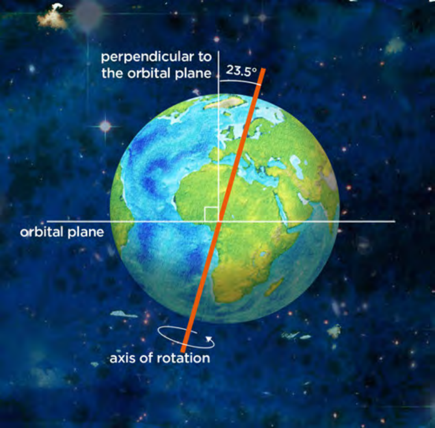
> **[Diagram Context - Textbook_NaturalScience_Gr7_Relationship-of-the-sun-to-the-Earth.pdf-0012-07.png]**
> This diagram illustrates the Earth's axial tilt relative to its orbital plane, featuring labels for the "orbital plane," "axis of rotation," and "perpendicular to the orbital plane," along with a 23.5° angle measurement. It conceptually demonstrates why Earth experiences seasons by showing that the planet's axis is tilted at an angle of 23.5° from the vertical relative to its path around the Sun.

---

### ACTIVITY: Reading a tide chart

This graph shows the predicted tides for a period of one week in Cape Town. Although the graph only includes data for one week, the actual pattern of high and low tides repeats every day throughout the year.

#### INSTRUCTIONS:
1. Look at the chart above, it shows the predicted times of low and high tide for one week in Cape Town.
2. The peaks represent times of high tide and the heights are listed in metres along with the time of high tide. The troughs represent times of low tide.
3. Answer the following questions.

#### QUESTIONS:
1. How many peaks appear per day in the chart?
2. What do these correspond to? High or low tide?
3. How many troughs appear per day in the chart?
4. What do these correspond to? High or low tide?

> **[Diagram Context - Textbook_NaturalScience_Gr7_Historical-development-of-astronomy.pdf-0013-01.png]**
> This graphic is a text-based instructional callout box featuring the heading "TAKE NOTE" enclosed in a decorative, hand-drawn border. It serves as a pedagogical signpost designed to alert students to critical information, key definitions, or essential examination tips within the CAPS curriculum materials.

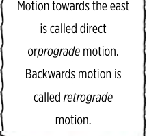
> **[Diagram Context - Textbook_NaturalScience_Gr7_Historical-development-of-astronomy.pdf-0013-02.png]**
> This text-based graphic defines the directional terminology used in planetary science, specifically identifying "direct" or "prograde" motion as movement towards the east and "retrograde" motion as backward movement. It provides foundational vocabulary for Grade 10-12 Physical Sciences and Geography learners to understand orbital mechanics and the apparent motion of celestial bodies against the background of stars.

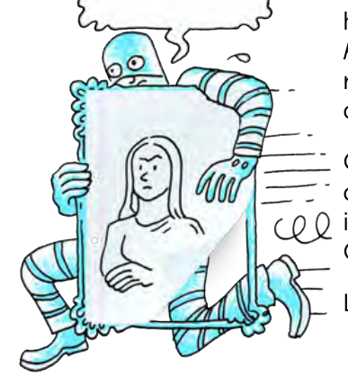
> **[Diagram Context - Textbook_NaturalScience_Gr7_Historical-development-of-astronomy.pdf-0013-04.png]**
> This cartoon depicts a thief in a striped outfit carrying a framed portrait, utilizing motion lines to suggest rapid movement. The visual elements include the thief, a speech bubble, and a framed image of a person, all rendered in a blue-toned illustrative style. Conceptually, this graphic serves as a metaphorical tool to help students visualize the concept of "displacement" or "theft" in a narrative or historical context, often used to introduce discussions on cultural heritage or the movement of objects.

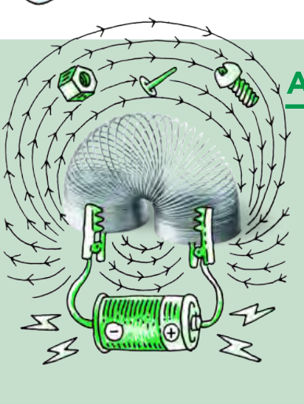
> **[Diagram Context - Textbook_NaturalScience_Gr7_Historical-development-of-astronomy.pdf-0013-07.png]**
> This diagram illustrates an electromagnet, featuring a coiled wire (solenoid) connected to a battery with positive (+) and negative (-) terminals, surrounded by magnetic field lines indicated by arrows. It demonstrates how an electric current flowing through a coil creates a magnetic field capable of attracting ferromagnetic objects like a nut, nail, and bolt, which is a core concept in Grade 9 and 11 Physical Sciences regarding electromagnetism.

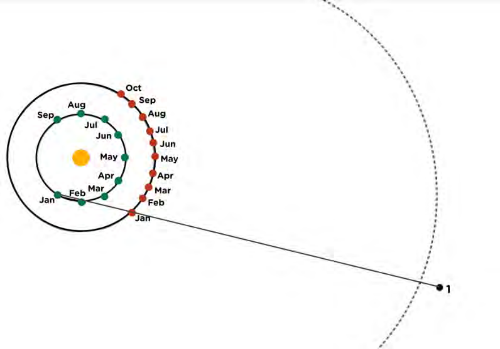
> **[Diagram Context - Textbook_NaturalScience_Gr7_Historical-development-of-astronomy.pdf-0013-12.png]**
> This diagram illustrates the orbital mechanics of two celestial bodies, represented by green and red dots, orbiting a central Sun, with a line connecting the inner body to an outer object labeled "1." The labels indicate months of the year (Jan–Oct) along the orbital paths, demonstrating the relative positions and orbital periods of the bodies over time. It conceptually models planetary motion and alignment, helping learners understand how different orbital velocities result in changing configurations between planets and other solar system objects.

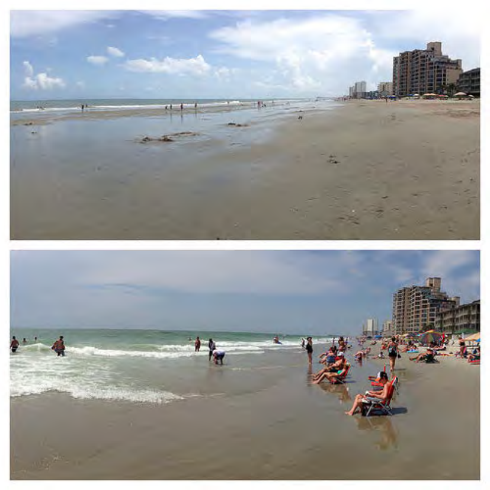
> **[Diagram Context - Textbook_NaturalScience_Gr7_Relationship-of-the-moon-to-the-earth.pdf-0013-01.png]**
> This comparative photographic sequence illustrates the phenomenon of tidal cycles at a coastal environment. By contrasting the exposed intertidal zone during low tide (top) with the inundated shoreline during high tide (bottom), the images demonstrate the periodic rise and fall of sea levels caused by gravitational forces. This visual aid helps learners understand the dynamic nature of coastal ecosystems and the physical impact of tides on the littoral zone.

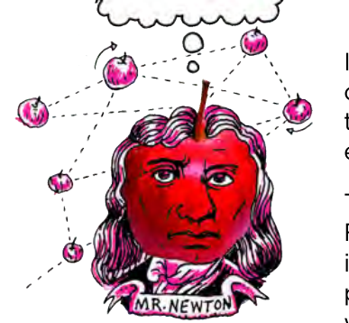
> **[Diagram Context - Textbook_NaturalScience_Gr7_Relationship-of-the-moon-to-the-earth.pdf-0013-06.png]**
> This illustration depicts a caricature of Isaac Newton with an apple-shaped head, surrounded by a network of smaller apples connected by dashed lines and directional arrows. It conceptually links the historical narrative of Newton’s discovery of gravity to the physical principles of force and motion, using the apple as a mnemonic device to represent the universal nature of gravitational attraction.

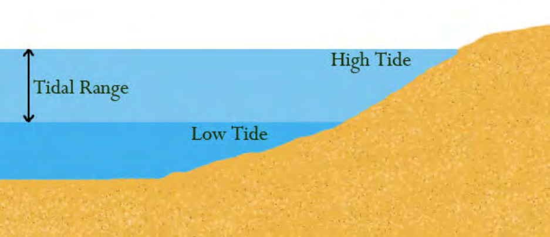
> **[Diagram Context - Textbook_NaturalScience_Gr7_Relationship-of-the-moon-to-the-earth.pdf-0013-09.png]**
> This diagram is a cross-sectional illustration of a coastline showing the vertical difference between water levels, labeled with the terms "High Tide," "Low Tide," and a double-headed arrow indicating the "Tidal Range." It conceptually demonstrates the periodic rise and fall of sea levels, helping learners visualize the vertical distance between the maximum and minimum water marks caused by gravitational forces.

> **[Diagram Context - Textbook_NaturalScience_Gr7_Relationship-of-the-sun-to-the-Earth.pdf-0013-00.png]**
> This illustration depicts a caterpillar-like organism with a helical spring body segment, feeding on green leaves. By using a mechanical spring to represent the segmented body of an insect, the graphic conceptually illustrates the principles of longitudinal body structure and rhythmic movement found in arthropod anatomy.

> **[Diagram Context - Textbook_NaturalScience_Gr7_Relationship-of-the-sun-to-the-Earth.pdf-0013-23.png]**
> This graphic illustrates a schematic representation of a DNA double helix, featuring two antiparallel sugar-phosphate backbones connected by internal rungs representing base pairs. It conceptually demonstrates the molecular structure of DNA, highlighting the characteristic twisted ladder configuration essential for understanding genetic replication and protein synthesis in the Life Sciences curriculum.

---

5. What is the height in metres of the highest low tide during the week?
6. When does the lowest high tide occur? (date and time)
7. What height is the lowest high tide?
8. The following photo is of a small harbour in Cape Town with a boat moored. These photos were taken on Monday 29 April.

* Boulders Beach in Cape Town at low tide.
* The same view of Boulders Beach at high tide.

a) What time of day was the photo taken of low tide?  
b) What time of day was the photo taken of high tide?  

This picture shows a small harbour at low tide. The tide is out and the boats are stuck on the sand banks. Once the tide comes back in the boats will float on the water again.

> **VISIT**  
> Timelapse of a shore from low to high tide.  
> `bit.ly/1fHZYoi`

So you now know that all seas have tides, why do you think this is? Let's do an activity to find out.

---

202  
Planet Earth and Beyond

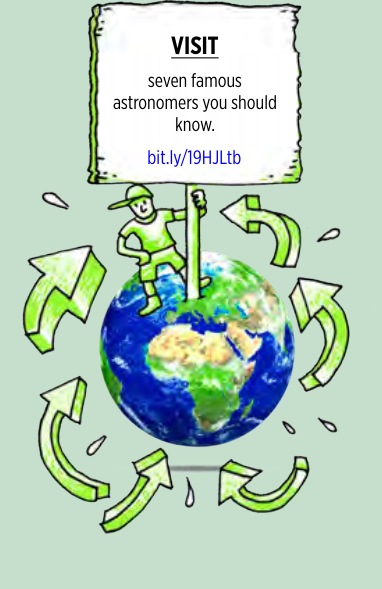
> **[Diagram Context - Textbook_NaturalScience_Gr7_Historical-development-of-astronomy.pdf-0014-10.png]**
> This graphic features a cartoon illustration of a person standing on a globe, surrounded by circular arrows and a signpost labeled "VISIT seven famous astronomers you should know" with a shortened URL. It serves as an introductory educational prompt designed to encourage Grade 10 Physical Sciences learners to research the historical development of astronomical models and the contributions of key scientists to our understanding of the solar system.

> **[Diagram Context - Textbook_NaturalScience_Gr7_Historical-development-of-astronomy.pdf-0014-12.png]**
> This graphic illustrates the double-helix structure of a DNA molecule, characterized by two antiparallel sugar-phosphate backbones represented by the repeating green ribbon-like strands. It conceptually demonstrates the complementary base pairing and the twisted ladder configuration essential for understanding genetic information storage and replication in Life Sciences.

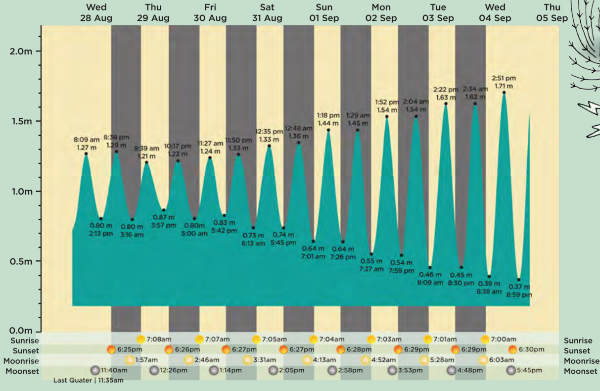
> **[Diagram Context - Textbook_NaturalScience_Gr7_Relationship-of-the-moon-to-the-earth.pdf-0014-01.png]**
> This tide table graph plots sea level height (in metres) against time over a nine-day period, incorporating labels for dates, specific high/low tide times, sunrise/sunset, and moonrise/moonset. It illustrates the periodic nature of tidal fluctuations, helping students understand how gravitational forces from the sun and moon influence daily sea level changes.

> **[Diagram Context - Textbook_NaturalScience_Gr7_Relationship-of-the-sun-to-the-Earth.pdf-0014-08.png]**
> This illustration uses a metaphorical roller coaster track and a slinky to represent the physical principles of mechanical energy and wave motion. By overlaying a coiled spring onto the crest of the track, the graphic visually demonstrates the relationship between potential energy, kinetic energy, and the propagation of longitudinal waves in a dynamic, real-world context.

> **[Diagram Context - Textbook_NaturalScience_Gr7_Relationship-of-the-sun-to-the-Earth.pdf-0014-21.png]**
> This graphic depicts a stylized, repeating pattern of interlocking, arrow-shaped links forming a continuous chain or strand. It serves as a conceptual representation of a polymer or a biological macromolecule, such as a DNA strand or a polypeptide chain, illustrating the principle of repeating monomeric subunits joined together to form a larger structure.

---

Chapter 2. Relationship of the Moon to the Earth

---

### ACTIVITY: Dance of the tides

#### MATERIALS:
* Four (ideally blue) scarves or strips of fabric per group, each one needs to be about a metre in length.

#### INSTRUCTIONS:
1. Work in groups of six, one learner represents the Earth, four learners represent the Earth's oceans and one learner represents the Moon.
2. The learner representing the Earth: stand in an open space.
3. The four learners representing the oceans: take one scarf each and stand in a circle around the learner representing Earth. (One behind, one in front and one on either side).
4. The four learners representing the oceans: link scarves with your neighbours.
5. Learner representing the Moon: stand outside the circle of "ocean" about 5 steps away from the "Earth" directly in front of one of the learners representing the ocean.
6. All learners apart from the Moon: turn to face the "Moon". You are now going to be "pulled" towards the Moon by the Moon's gravitational attraction! Remember that the gravitational pull exerted on an object by the Moon decreases with increasing distance to the Moon.
7. Which part of the Earth and ocean is being pulled the most by the Moon?
8. Which part of the Earth and oceans is being pulled least by the Moon?
9. Ocean learner closest to the Moon: take three large steps towards the Moon.
10. Two ocean learners standing beside the Earth and the Earth learner: take two large steps toward the Moon.
11. Ocean learner farthest from the Moon: take one large step towards the Moon. Why have you moved towards the Moon by varying amounts?
12. Note what happens to the shape the "oceans" now make, are you still in a circle or forming an oval shape?

---

203

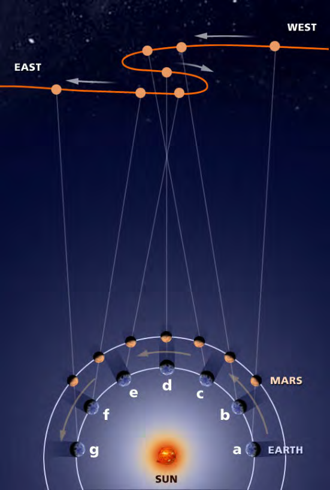
> **[Diagram Context - Textbook_NaturalScience_Gr7_Historical-development-of-astronomy.pdf-0015-00.png]**
> This diagram illustrates the orbital mechanics of Earth and Mars, featuring labels for the Sun, Earth, Mars, and directional markers for East and West. It demonstrates the phenomenon of retrograde motion, showing how Earth’s faster orbital speed causes Mars to appear to move backward against the background stars as Earth overtakes it.

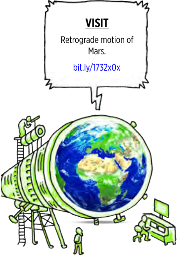
> **[Diagram Context - Textbook_NaturalScience_Gr7_Historical-development-of-astronomy.pdf-0015-01.png]**
> This illustration depicts a large telescope focused on Earth, accompanied by a speech bubble containing the text "VISIT," "Retrograde motion of Mars," and a URL. It serves as an introductory visual hook to engage learners in the Grade 10 Physical Sciences topic of the Solar System, specifically illustrating the apparent backward motion of planets as observed from Earth due to differences in orbital speeds.

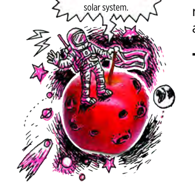
> **[Diagram Context - Textbook_NaturalScience_Gr7_Historical-development-of-astronomy.pdf-0015-06.png]**
> This illustrative graphic depicts an astronaut standing on a cratered, apple-like celestial body, surrounded by stars, planets, and a comet within a space-themed setting. The image includes the text fragment "solar system" and a South African flag, using a surreal juxtaposition to represent space exploration. It serves as a creative visual hook to introduce learners to the components of the solar system and the context of human space travel.

> **[Diagram Context - Textbook_NaturalScience_Gr7_Historical-development-of-astronomy.pdf-0015-08.png]**
> This image is a historical portrait of the astronomer Johannes Kepler, featuring the visible label "Aetatis suae 39" and "1610" in the upper right corner. It serves as a visual representation of the historical context for Grade 10-12 Physical Sciences, illustrating the scientist responsible for the laws of planetary motion that underpin our understanding of gravitational forces and orbital mechanics.

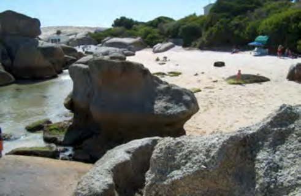
> **[Diagram Context - Textbook_NaturalScience_Gr7_Relationship-of-the-moon-to-the-earth.pdf-0015-05.png]**
> This image is a photograph of a coastal ecosystem featuring large granite boulders, sandy beach, and intertidal zones. It illustrates key environmental components such as the lithosphere (rocks), hydrosphere (ocean water), and biosphere (vegetation and human presence), which are essential for studying biomes and environmental interactions in the CAPS Life Sciences curriculum.

> **[Diagram Context - Textbook_NaturalScience_Gr7_Relationship-of-the-moon-to-the-earth.pdf-0015-06.png]**
> This photograph depicts a coastal ecosystem featuring large granite boulders, a sheltered marine bay, and surrounding coastal vegetation. It serves as a visual case study for Geography and Life Sciences learners to identify abiotic components like rock formations and water, as well as biotic elements such as coastal flora and human interaction within a specific biome.

> **[Diagram Context - Textbook_NaturalScience_Gr7_Relationship-of-the-moon-to-the-earth.pdf-0015-10.png]**
> This graphic depicts a stylized, repeating wave-like pattern composed of interconnected, arrow-headed segments. It serves as a visual representation of continuous directional flow or a repeating cyclical process, often used in Life Sciences to illustrate metabolic pathways or the sequential stages of a biological cycle.

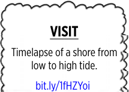
> **[Diagram Context - Textbook_NaturalScience_Gr7_Relationship-of-the-moon-to-the-earth.pdf-0015-11.png]**
> This graphic is a text-based instructional prompt containing the heading "VISIT," the descriptive text "Timelapse of a shore from low to high tide," and a shortened URL link. It serves as a digital resource signpost designed to direct students to external media that illustrates the dynamic physical process of tidal changes in a coastal environment.

> **[Diagram Context - Textbook_NaturalScience_Gr7_Relationship-of-the-moon-to-the-earth.pdf-0015-12.png]**
> This photograph depicts a coastal harbour scene during low tide, showing exposed sandy seabed, anchored fishing vessels, a stone pier, and surrounding coastal buildings. It serves as a visual aid for Geography learners to identify coastal landforms and the impact of tidal cycles on human economic activities like maritime transport and fishing.

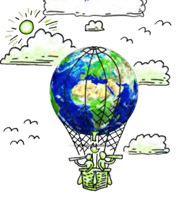
> **[Diagram Context - Textbook_NaturalScience_Gr7_Relationship-of-the-moon-to-the-earth.pdf-0015-13.png]**
> This conceptual illustration depicts the Earth as a hot air balloon, featuring a globe suspended by a net above a basket containing two figures using telescopes, set against a backdrop of clouds, a sun, and birds. It serves as a metaphorical representation of global observation, environmental monitoring, or the "global village" concept, encouraging students to consider the importance of perspective and collective responsibility in studying Earth's systems.

> **[Diagram Context - Textbook_NaturalScience_Gr7_Relationship-of-the-sun-to-the-Earth.pdf-0015-01.png]**
> This illustration depicts an airport control tower viewed through a magnifying glass, surrounded by icons representing aircraft, ground vehicles, cargo containers, and communication antennas. It conceptually illustrates the role of air traffic control and logistics management in coordinating complex transport systems, highlighting the importance of monitoring and communication in maintaining operational safety and efficiency.

---

13. Note which sides of "Earth's" body is experiencing high tide. (Front and back or left and right arms).

14. Earth: spin around on the spot a few times stopping in a random position not directly facing the Moon. Remember that the Earth is continually spinning on its axis!

15. Note which sides of the "Earth's" body is experiencing high tide.

16. Now imagine that there is no Moon, but only the Sun to exert a gravitational pull on the Earth. Because the Sun is much farther than the Moon, its gravitational pull is only one third of the Moon's pull. The team member representing the Moon must now represent the Sun instead.

17. Sun learner: take an additional 10 steps away from the Earth so that you are 15 steps away in total.

18. Ocean learners return to your starting circle positions.

19. All learners apart from the Sun: turn to face the "Sun". You are now ready to be pulled towards the Sun.

20. Ocean learner closest to the Sun: take one large step towards the Sun.

21. Two oceans learners standing beside the Earth and the Earth learner: take one normal step toward the Sun.

22. Ocean learner farthest from the Sun: take one small step towards the Sun.

23. Note what happens to the shape the "oceans" now make, are you still in a circle or forming an oval shape? How does the shape compare with that made when you were pulled by the Moon?

## QUESTIONS

1. How many sides of the Earth experience high tide at the same time?
2. Where are they positioned in relation to the Moon?
3. As the Earth spins what happens to the position of high tides in relation to the Moon?
4. As the Earth spins what happens to the position of high and low tides on the surface of Earth?

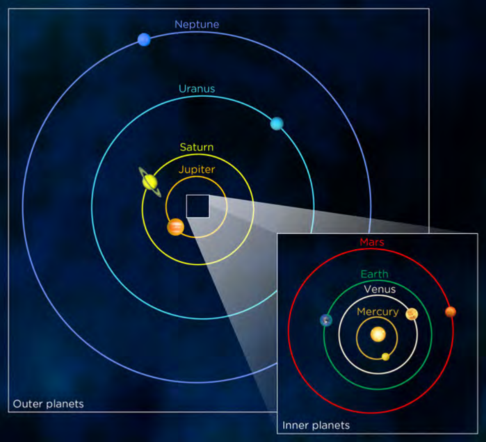
> **[Diagram Context - Textbook_NaturalScience_Gr7_Historical-development-of-astronomy.pdf-0016-00.png]**
> This diagram illustrates the solar system using a nested orbital model, labeling the outer planets (Jupiter, Saturn, Uranus, Neptune) and providing an inset view of the inner planets (Mercury, Venus, Earth, Mars) orbiting the Sun. It conceptually demonstrates the spatial arrangement and relative positioning of the planets within the solar system, helping learners distinguish between the terrestrial inner planets and the gas giant outer planets.

> **[Diagram Context - Textbook_NaturalScience_Gr7_Historical-development-of-astronomy.pdf-0016-04.png]**
> This historical painting depicts Galileo Galilei demonstrating his telescope and celestial observations to members of the clergy and academic elite. The scene features a telescope, an armillary sphere, and a scroll, serving as a visual representation of the conflict between empirical scientific evidence and traditional geocentric worldviews. For high school learners, this illustrates the paradigm shift during the Scientific Revolution, highlighting how technological advancements in observation challenged established authority and transformed our understanding of the solar system.

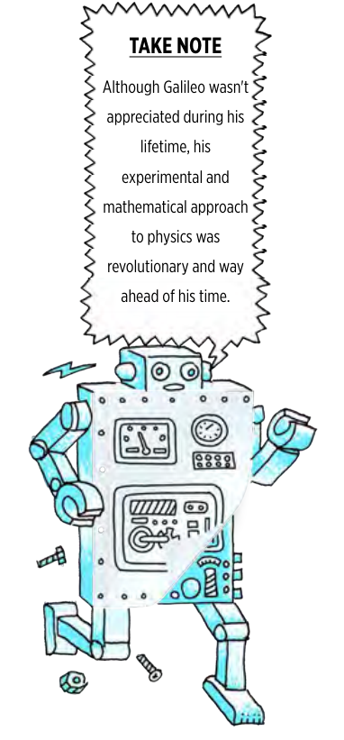
> **[Diagram Context - Textbook_NaturalScience_Gr7_Historical-development-of-astronomy.pdf-0016-06.png]**
> This graphic features a cartoon robot with a speech bubble containing a "TAKE NOTE" text box. The text highlights the historical significance of Galileo’s experimental and mathematical contributions to the field of physics. It serves as a contextual enrichment tool to help learners appreciate the historical development of scientific methodology and the foundational role of early physicists in modern science.

> **[Diagram Context - Textbook_NaturalScience_Gr7_Relationship-of-the-moon-to-the-earth.pdf-0016-07.png]**
> This illustration depicts a stylized caterpillar feeding on a plant, featuring a metallic slinky-like body segment and cartoonish facial features. It serves as a visual metaphor for herbivory, illustrating the interaction between a primary consumer and a producer within a food web.

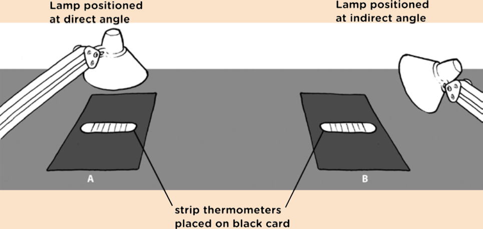
> **[Diagram Context - Textbook_NaturalScience_Gr7_Relationship-of-the-sun-to-the-Earth.pdf-0016-11.png]**
> This experimental apparatus diagram compares two setups, labeled A and B, featuring lamps positioned at direct and indirect angles relative to strip thermometers placed on black cards. It illustrates how the angle of incidence of light affects the intensity of solar radiation absorbed by a surface, demonstrating the physical principle behind latitudinal temperature variations on Earth.

---

5. Besides the Moon, what pulls on the Earth?
6. If there were no Moon, would we still have tides?

Look at the image below. It shows how the Moon's gravity distorts the shape of the Earth's oceans into an oval shape. Do you remember how the gravitational force depends on distance? The ocean on the side of the Earth closest to the Moon experiences a greater gravitational pull towards the Moon relative to the ocean on the far side of the Earth.

This difference in gravitational pulls stretches the Earth's oceans into an oval shape. Along the Earth-Moon direction the oceans form two tidal bulges. At places in line with the Moon, where the oceans are experiencing a tidal bulge we have high tide. At locations which are at right angles to the Moon we have low tide.

> **DID YOU KNOW?**
> As well as distorting the shape of the Earth's oceans, the Moon's gravitational pull also distorts the shape of the solid Earth. The solid Earth's bulge is about one hundred times smaller than the ocean bulge, but the Earth's crust closest to the Moon actually rises a few centimetres!

This picture shows the Earth and the Moon looking down from above. The gravitational pull experienced by different parts of the Earth towards the Moon are shown as arrows. The longer the arrow, the greater the pull. The ocean closest to the Moon experiences the greatest pull from the Moon and the ocean farthest from the Moon experiences the smallest pull towards the Moon. The differences result in the Earth's oceans being stretched to an oval shape.

> **DID YOU KNOW?**
> The highest tides in the world are at the Bay of Fundy in Canada. The bay is very narrow, so water rushing in from the ocean can rise and fall by up to 20 metres a day!

Why do you think there are two low tides and two high tides at a given beach per day? Look at the diagram above again. When the Moon is directly overhead...

---

205

Chapter 2. Relationship of the Moon to the Earth

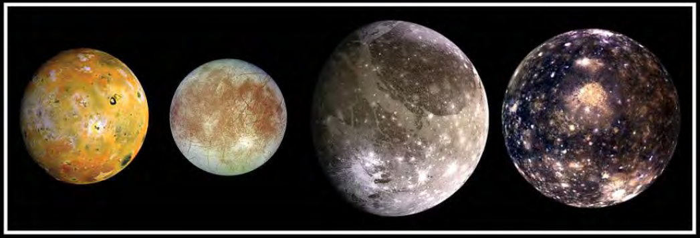
> **[Diagram Context - Textbook_NaturalScience_Gr7_Historical-development-of-astronomy.pdf-0017-00.png]**
> This image displays the four Galilean moons of Jupiter—Io, Europa, Ganymede, and Callisto—arranged in order of their distance from the planet. The graphic provides a comparative visual representation of these celestial bodies, highlighting their distinct surface features, geological textures, and relative sizes. It serves as an introductory resource for learners to identify the diverse characteristics of planetary satellites within our solar system, supporting the study of space science and planetary geology.

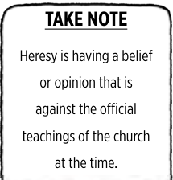
> **[Diagram Context - Textbook_NaturalScience_Gr7_Historical-development-of-astronomy.pdf-0017-01.png]**
> This educational graphic is a text-based "Take Note" box commonly used in History textbooks to highlight key terminology. It defines the term "heresy" as a belief or opinion that contradicts the official teachings of the church during a specific historical period. This provides students with essential conceptual vocabulary for understanding religious conflicts and institutional power dynamics in historical contexts.

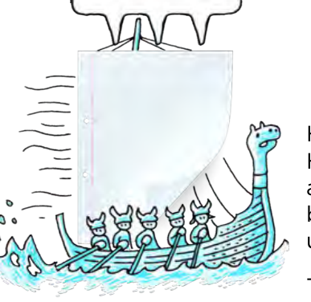
> **[Diagram Context - Textbook_NaturalScience_Gr7_Historical-development-of-astronomy.pdf-0017-02.png]**
> This cartoon depicts a Viking longship where the sail is replaced by a sheet of lined notebook paper, with wind lines indicating movement and a speech bubble above. It serves as a metaphorical visual aid to introduce the concept of "writing across the curriculum" or the importance of literacy and documentation within historical and social science studies. By substituting a traditional sail with paper, the image illustrates how recording information and narrative is the driving force that propels historical inquiry and academic exploration forward.

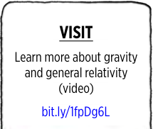
> **[Diagram Context - Textbook_NaturalScience_Gr7_Historical-development-of-astronomy.pdf-0017-06.png]**
> This graphic is a text-based instructional prompt containing the labels "VISIT," "Learn more about gravity and general relativity (video)," and a shortened URL link. It serves as a digital signpost designed to direct learners to external multimedia resources that supplement the CAPS Physical Sciences curriculum regarding gravitational theory.

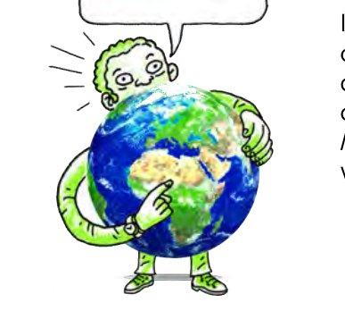
> **[Diagram Context - Textbook_NaturalScience_Gr7_Historical-development-of-astronomy.pdf-0017-08.png]**
> This graphic is a cartoon illustration featuring a personified human figure holding and pointing at a globe of the Earth. The image uses the visual metaphor of a person interacting with the planet to represent themes of environmental stewardship, global citizenship, or human impact on the biosphere. It serves as a conceptual prompt for Life Sciences learners to discuss human-environment interactions, sustainability, and the responsibility of individuals within the global ecosystem.

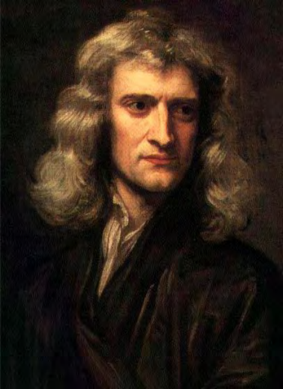
> **[Diagram Context - Textbook_NaturalScience_Gr7_Historical-development-of-astronomy.pdf-0017-10.png]**
> This image is a portrait of the physicist and mathematician Sir Isaac Newton, containing no labels, variables, or technical symbols. In the context of the CAPS Physical Sciences curriculum, this visual serves as a historical reference for the scientist who formulated the fundamental laws of motion and universal gravitation, which form the cornerstone of the Grade 10-12 Mechanics modules.

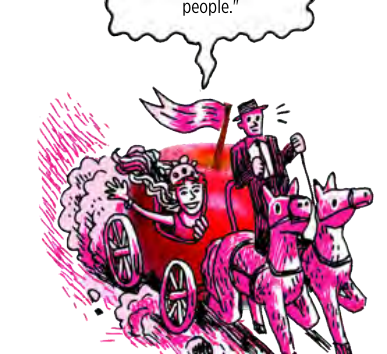
> **[Diagram Context - Textbook_NaturalScience_Gr7_Historical-development-of-astronomy.pdf-0017-15.png]**
> This visual is a metaphorical cartoon depicting a person driving a carriage shaped like a large apple, accompanied by a speech bubble fragment referencing "people." It serves as a creative stimulus for Life Orientation or English Home Language learners to explore themes of symbolism, cultural representation, or the personification of concepts in media studies.

> **[Diagram Context - Textbook_NaturalScience_Gr7_Relationship-of-the-sun-to-the-Earth.pdf-0017-09.png]**
> This graphic depicts a stylized zipper mechanism, featuring interlocking teeth and a central slider component. In a Life Sciences context, this serves as a common analogy for the unwinding and unzipping of the DNA double helix by the enzyme helicase during DNA replication.

---

# Lesson Revision Notes: Tides, Spring Tides, and Neap Tides

## 1. Core Concepts: Daily Tide Cycles

* **High Tides and Low Tides:** At any given coastal location, you experience **two high tides** and **two low tides** per day.
* **Timing of Tides:** 
  * One high tide occurs when the Moon is directly above your location.
  * The second high tide occurs roughly **twelve hours later** when the Moon is directly opposite your location on Earth.
* **Cause of Daily Tides:** This predictable cycle happens because the Earth spins on its axis once every $24$ hours.

---

## 2. Factors Affecting Tide Heights

* **Constant Mass of the Moon:** The Moon has the same amount of mass throughout its orbit, meaning it exerts the **same gravitational pull** during all phases. Therefore, changes in tidal heights are *not* caused by a changing gravitational pull from the Moon itself.
* **Relative Alignment:** Variations in tidal heights (such as very high or moderate tides) are caused by the **combined gravitational effects and relative alignment of the Sun, the Earth, and the Moon**.

---

## 3. Activity: Spring and Neap Tides

### Instructions
1. Examine the relative positions of the Sun, Earth, and Moon in the provided diagrams.
2. Observe how the size and bulge of the tides change during specific lunar phases (specifically New Moon, Full Moon, and the quarter phases).

### Visual Reference Analysis
* **Spring Tides:** Occur during the **New Moon** and **Full Moon** phases. When the Sun, Earth, and Moon align, their gravitational forces combine to produce larger bulges, resulting in higher high tides and lower low tides.

> **[Diagram Context - Textbook_NaturalScience_Gr7_Historical-development-of-astronomy.pdf-0018-07.png]**
> This illustration depicts a stylized caterpillar with a metallic slinky-like body feeding on green leaves. The image uses a metaphorical representation of an insect's segmented body to visually link biological anatomy with mechanical flexibility. It serves as a creative mnemonic for students to identify the segmented body plan and herbivorous feeding habits characteristic of the class Insecta in the Life Sciences curriculum.

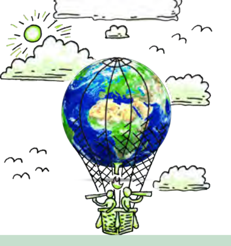
> **[Diagram Context - Textbook_NaturalScience_Gr7_Historical-development-of-astronomy.pdf-0018-17.png]**
> This illustrative graphic depicts the Earth as a hot air balloon, featuring a globe suspended by a net above a basket containing two figures using telescopes. The image serves as a conceptual metaphor for global observation, environmental monitoring, or the study of Earth systems within the context of Geography or Life Sciences.

> **[Diagram Context - Textbook_NaturalScience_Gr7_Historical-development-of-astronomy.pdf-0018-18.png]**
> This illustration depicts a roller coaster track featuring a slinky-like coil structure and a small cart navigating a loop. It uses visual metaphors of motion, such as motion lines and excited passengers, to represent the dynamics of a roller coaster ride. Conceptually, this graphic serves as an engaging introduction to Grade 10-12 Physical Sciences, illustrating the principles of mechanical energy conservation, gravitational potential energy, and kinetic energy as an object moves through varying heights and paths.

> **[Diagram Context - Textbook_NaturalScience_Gr7_Relationship-of-the-moon-to-the-earth.pdf-0018-07.png]**
> This illustrative graphic depicts an astronaut standing on a red apple, which is stylized to resemble a cratered planet or moon, accompanied by the text "few centimetres!". The image uses symbolic elements like stars, a comet, and a flag to represent space exploration, contrasting the vast scale of the cosmos with the small, tangible size of the fruit. Conceptually, this serves as a visual analogy to help learners grasp the relative scale of celestial bodies or the concept of perspective in physical science.

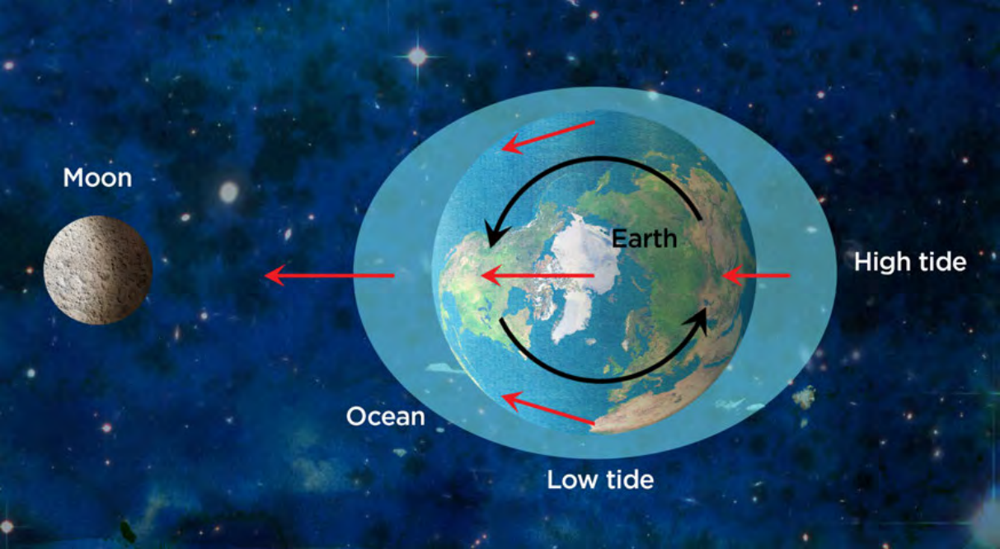
> **[Diagram Context - Textbook_NaturalScience_Gr7_Relationship-of-the-moon-to-the-earth.pdf-0018-08.png]**
> This diagram illustrates the gravitational relationship between the Earth, the Moon, and the resulting tidal bulges, featuring labels for "Moon," "Earth," "Ocean," "High tide," and "Low tide" alongside directional arrows indicating gravitational pull and water movement. It conceptually demonstrates how the Moon’s gravitational force creates an elliptical tidal bulge in the Earth's oceans, resulting in high tides on the sides facing toward and away from the Moon while causing low tides in the perpendicular regions.

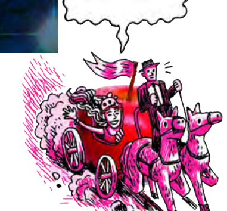
> **[Diagram Context - Textbook_NaturalScience_Gr7_Relationship-of-the-moon-to-the-earth.pdf-0018-11.png]**
> This illustration is a metaphorical cartoon depicting a person driving a chariot fashioned from a large red apple, accompanied by a blank speech bubble. It serves as a creative visual prompt designed to stimulate creative writing or narrative development, encouraging students to invent a backstory or dialogue for the characters.

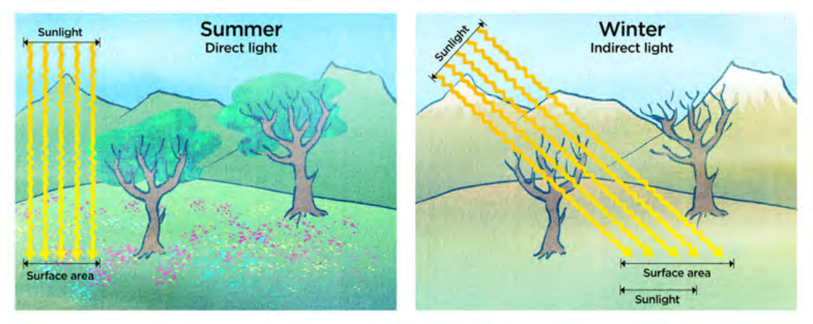
> **[Diagram Context - Textbook_NaturalScience_Gr7_Relationship-of-the-sun-to-the-Earth.pdf-0018-00.png]**
> This comparative diagram illustrates the seasonal differences in solar radiation using labels for "Summer/Direct light" and "Winter/Indirect light," alongside arrows representing "Sunlight" and "Surface area." It conceptually demonstrates how the angle of incidence affects the concentration of solar energy, explaining why the same amount of sunlight covers a larger surface area in winter, resulting in lower intensity and cooler temperatures.

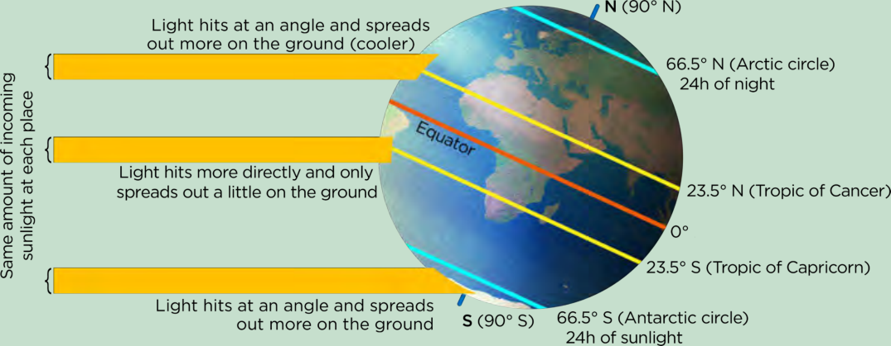
> **[Diagram Context - Textbook_NaturalScience_Gr7_Relationship-of-the-sun-to-the-Earth.pdf-0018-07.png]**
> This diagram illustrates the relationship between the angle of incoming solar radiation and latitude, featuring labels for the Equator, Tropics of Cancer and Capricorn, and the Arctic and Antarctic circles. It conceptually demonstrates how the curvature of the Earth causes sunlight to be more concentrated at the equator and more dispersed at higher latitudes, explaining the resulting temperature variations across different climatic zones.

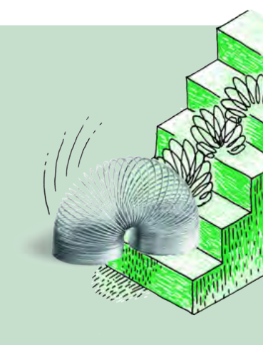
> **[Diagram Context - Textbook_NaturalScience_Gr7_Relationship-of-the-sun-to-the-Earth.pdf-0018-08.png]**
> This illustration depicts a slinky spring moving down a staircase, utilizing motion lines to indicate its trajectory. It serves as a conceptual model for Grade 10-12 Physical Sciences to demonstrate the propagation of longitudinal and transverse waves, illustrating how energy is transferred through a medium via periodic motion.

---

# Chapter 2. Relationship of the Moon to the Earth

## Lesson Revision Notes: Tides, Moon Phases, and Gravitational Pull

---

### Core Concepts

* **Spring Tides:** When the Sun, Moon, and Earth are lined up in a straight line (occurring at the time of a **New Moon** or **Full Moon**), the gravitational pull of the Sun adds to the gravitational pull of the Moon. This creates extra-high high tides and very low low tides, resulting in the maximum difference in height between low and high tide.
* **Neap Tides:** When the Sun and Moon are positioned at right angles to each other (occurring during the **first quarter** and **third quarter** moon phases), the Sun's gravitational pull partially cancels out the Moon's gravitational pull, resulting in smaller tides.

---

### Did You Know?

* Earth's only natural satellite is simply called **the Moon** because people did not know other moons existed until Galileo Galilei discovered four moons orbiting Jupiter in 1610. 
* Other moons in our solar system are given names so they won't be confused with each other.

---

### Questions & Activities

| Question Number | Question Statement | Educational Answer / Explanation |
| :---: | :--- | :--- |
| **1** | When the Sun, Moon and Earth are in a straight line the Sun's gravitational pull adds to the Moon's gravitational pull. What Moon phases does this correspond to? | This corresponds to the **New Moon** and **Full Moon** phases. |
| **2** | During what phases of the Moon do the Moon's and Sun's gravitational pulls partly cancel each other out? | This occurs during the **first quarter** and **third quarter** moon phases (when they are at right angles to each other, resulting in neap tides). |
| **3** | During what Moon phases would you expect the highest high tides and the lowest low tides? | You would expect the highest high tides and lowest low tides during the **New Moon** and **Full Moon** phases (spring tides). |

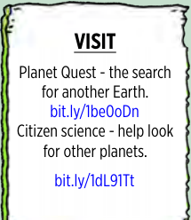
> **[Diagram Context - Textbook_NaturalScience_Gr7_Historical-development-of-astronomy.pdf-0019-01.png]**
> This graphic is an informational text snippet providing external links for "Planet Quest" and "Citizen science" initiatives. It contains the headings "VISIT," descriptive text regarding the search for exoplanets, and two specific URL shorteners (bit.ly/1be0oDn and bit.ly/1dL91Tt). Conceptually, it serves as a resource signpost to encourage high school learners to engage with real-world astronomical data and participate in scientific research beyond the classroom curriculum.

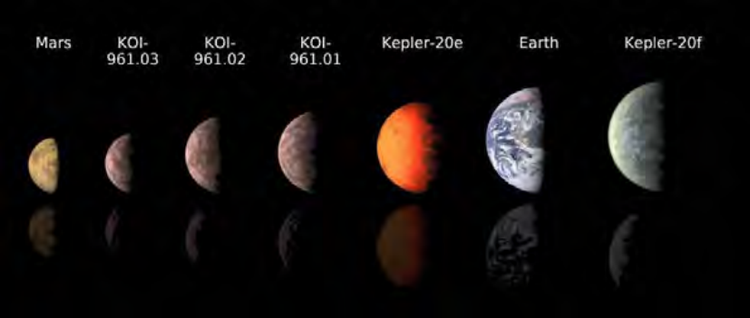
> **[Diagram Context - Textbook_NaturalScience_Gr7_Historical-development-of-astronomy.pdf-0019-02.png]**
> This comparative graphic illustrates the relative sizes of various exoplanets and Mars, labeled as Mars, KOI-961.03, KOI-961.02, KOI-961.01, Kepler-20e, Earth, and Kepler-20f. It provides a visual scale model to help learners conceptualize the physical dimensions of planets discovered beyond our solar system in relation to familiar terrestrial bodies.

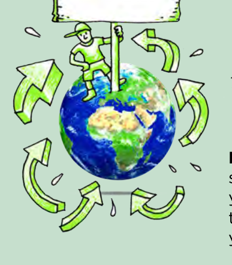
> **[Diagram Context - Textbook_NaturalScience_Gr7_Historical-development-of-astronomy.pdf-0019-03.png]**
> This illustration depicts a conceptual diagram of a global cycle, featuring a central globe of the Earth, a human figure holding a blank signpost, and a series of circular green arrows surrounding the planet. It visually represents the concept of environmental stewardship and sustainability, illustrating how human actions and cycles of resource management impact the Earth's systems.

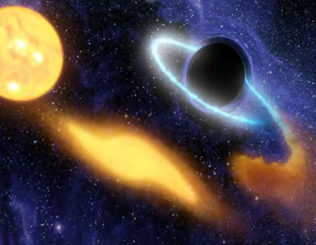
> **[Diagram Context - Textbook_NaturalScience_Gr7_Historical-development-of-astronomy.pdf-0019-06.png]**
> This astronomical illustration depicts a binary star system featuring a luminous main-sequence star and a black hole surrounded by an accretion disk. It visually demonstrates the process of stellar mass transfer, where the intense gravitational pull of the black hole strips matter from the companion star, forming a glowing stream of gas that spirals into the event horizon.

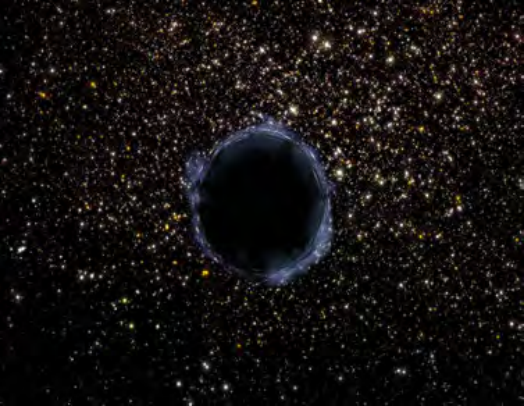
> **[Diagram Context - Textbook_NaturalScience_Gr7_Historical-development-of-astronomy.pdf-0019-07.png]**
> This image is a digital simulation of a black hole, featuring a central dark singularity surrounded by a distorted, glowing accretion disk against a dense star field. It illustrates the concept of gravitational lensing, where the intense gravity of the black hole bends light from background stars, creating a visual representation of spacetime curvature relevant to Grade 12 Physical Sciences and Geography astronomy topics.

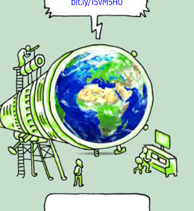
> **[Diagram Context - Textbook_NaturalScience_Gr7_Historical-development-of-astronomy.pdf-0019-10.png]**
> This cartoon depicts a large telescope focused on the Earth, with human figures observing and monitoring the planet. It illustrates the concept of global monitoring and environmental observation, highlighting how scientific tools are used to gather data on Earth's systems and human impact within the context of Life Sciences and Geography.

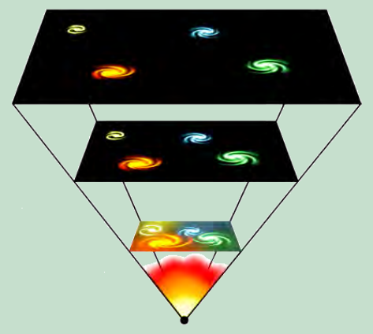
> **[Diagram Context - Textbook_NaturalScience_Gr7_Historical-development-of-astronomy.pdf-0019-13.png]**
> This diagram illustrates the expansion of the universe, featuring a series of stacked planes containing spiral galaxies that grow further apart as they move toward the top. It conceptually demonstrates the Big Bang theory by showing how space itself expands over time, originating from a single, dense point at the base and leading to the increasing distance between galaxies in the observable universe.

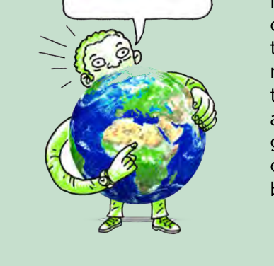
> **[Diagram Context - Textbook_NaturalScience_Gr7_Historical-development-of-astronomy.pdf-0019-17.png]**
> This cartoon depicts a human figure whose torso is replaced by a globe of the Earth, with a speech bubble above the head. The visual elements include a stylized person, a satellite-view image of the Earth centered on Africa, and a blank speech bubble. Conceptually, this image serves as a visual metaphor for human impact on the environment, prompting learners to consider the interconnectedness of human activity and global ecological sustainability within the CAPS Life Sciences and Geography curricula.

> **[Diagram Context - Textbook_NaturalScience_Gr7_Historical-development-of-astronomy.pdf-0019-19.png]**
> This graphic depicts a stylized, repeating wave-like pattern composed of interconnected, arrow-headed segments. It serves as a visual representation of continuous directional flow or a repeating cycle, often used in Life Sciences to illustrate processes like the unidirectional movement of energy through a food chain or the sequential steps of a biological pathway.

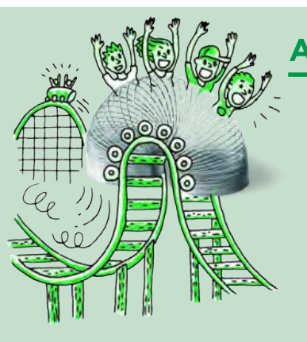
> **[Diagram Context - Textbook_NaturalScience_Gr7_Relationship-of-the-moon-to-the-earth.pdf-0019-02.png]**
> This graphic illustrates a roller coaster track featuring a loop and a drop, with a superimposed image of a Slinky spring. The visual elements include a cartoon roller coaster car, passengers with raised arms, and a metallic coil spring positioned over the track's crest. Conceptually, this diagram serves as an analogy for Grade 10-12 Physical Sciences, using the motion of a Slinky to demonstrate the transformation between gravitational potential energy and kinetic energy, as well as the propagation of longitudinal and transverse waves along a path.

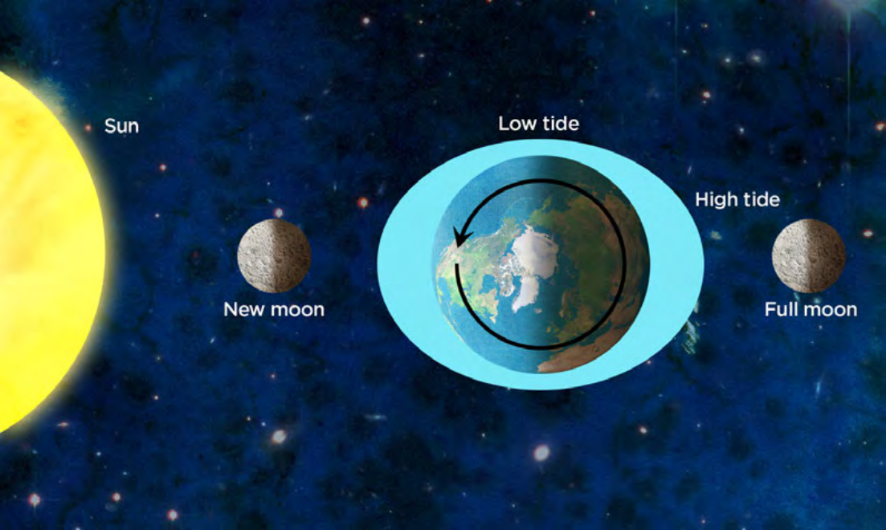
> **[Diagram Context - Textbook_NaturalScience_Gr7_Relationship-of-the-moon-to-the-earth.pdf-0019-07.png]**
> This diagram illustrates the celestial alignment of the Sun, Earth, and Moon, featuring labels for the "Sun," "New moon," "Full moon," "Low tide," and "High tide," alongside a directional arrow indicating Earth's rotation. It conceptually demonstrates the gravitational influence of the Sun and Moon on Earth's oceans, specifically showing how the syzygy alignment during new and full moon phases results in spring tides.

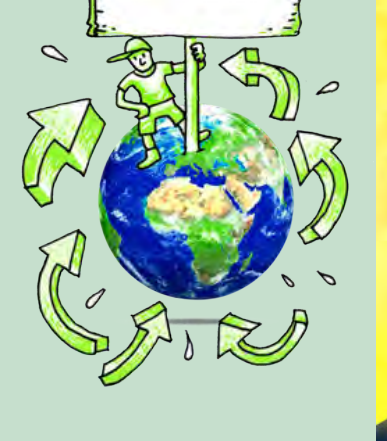
> **[Diagram Context - Textbook_NaturalScience_Gr7_Relationship-of-the-moon-to-the-earth.pdf-0019-09.png]**
> This graphic is a conceptual illustration featuring a human figure holding a blank signpost atop a globe, surrounded by a circular arrangement of green arrows. The imagery uses the globe and cyclic arrows to represent global environmental processes, sustainability, or the interconnected nature of Earth's systems. It serves as a visual prompt for students to discuss human responsibility in environmental management and the cyclical nature of natural resources within the CAPS Life Sciences and Geography curricula.

> **[Diagram Context - Textbook_NaturalScience_Gr7_Relationship-of-the-sun-to-the-Earth.pdf-0019-06.png]**
> This graphic depicts a stylized, repeating wave pattern composed of interconnected, arrow-headed segments. The image uses a continuous green line to represent a rhythmic, directional flow or periodic oscillation. Conceptually, this serves as a visual metaphor for wave motion, energy transfer, or the propagation of signals in physics and life sciences, illustrating the repetitive nature of cycles or longitudinal/transverse wave propagation.

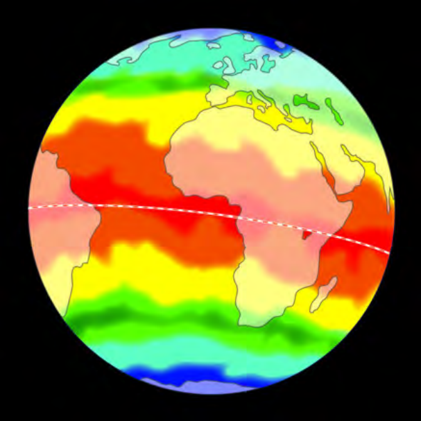
> **[Diagram Context - Textbook_NaturalScience_Gr7_Relationship-of-the-sun-to-the-Earth.pdf-0019-09.png]**
> This graphic is a thematic world map featuring a dashed line representing the equator and a color-coded gradient overlay. The color spectrum, ranging from red at the equator to blue at the poles, illustrates the latitudinal distribution of solar radiation and global temperature patterns. It helps learners visualize how the Earth's curvature results in uneven heating, which is a fundamental concept in understanding global climate zones and atmospheric circulation.

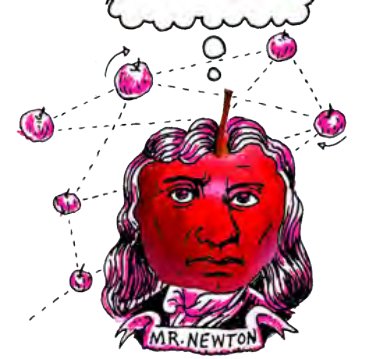
> **[Diagram Context - Textbook_NaturalScience_Gr7_Relationship-of-the-sun-to-the-Earth.pdf-0019-11.png]**
> This illustration depicts a caricature of Isaac Newton as an apple, surrounded by a network of smaller apples connected by dashed lines and directional arrows. It conceptually represents Newton’s Law of Universal Gravitation, illustrating how mass exerts an attractive force on other masses within a system.

---

# Lesson Revision Notes: Tides and Shoreline Ecosystems

## Core Concepts

### Tides and the Moon
* The Moon's gravitational pull creates oceanic tides.
* **Neap Tides:** Occur when the difference in height between the low and high tide is at its minimum.
* The Moon contributes more to the Earth's tides than the Sun because it is much closer to Earth. If there were no Moon, Earth's tides would be about one-third of their current height.
* *Note on Orbit:* The Moon's orbit is gradually increasing, meaning the Moon is slowly moving away from Earth. Consequently, ancient tides were much higher than they are today, and they will continue to decrease in the future.

---

### The Effects of Tides on Shoreline Ecosystems

* **Intertidal Zone:** The region of the beach located between the high tide and low tide levels. It represents a harsh environment for marine plants and animals.
* **Environmental Challenges in the Intertidal Zone:**
  * **Wave Action:** During storms, heavy surf can batter organisms and wash them away unless they can withstand the force.
  * **Exposure to Air and Temperature Extremes:** Organisms are submerged underwater during high tide but exposed to air during low tide. They face hot summer temperatures and cold winter temperatures, requiring adaptations to survive wide thermal ranges (though some stay underwater in small rock pools that do not empty when the tide goes out).
  * **Salinity Fluctuations:** Animals exposed to air at low tide may be soaked in fresh rainwater, yet they are submerged in salty seawater at high tide. They must tolerate rapidly changing salt concentrations.

---

### Adaptations of Intertidal Organisms

Different organisms have developed unique adaptations to survive this tough environment:
* **Crabs:** Burrow into the damp sand to hide during low tide.
* **Kelp and other seaweeds:** Covered with a thick layer of slime to prevent them from drying out when exposed to the air.

---

## Vocabulary / New Words

* **Ecosystem:** A biological community of interacting organisms and their physical environment.
* **Intertidal zone:** The area of the shoreline that is above water at low tide and submerged under water at high tide.

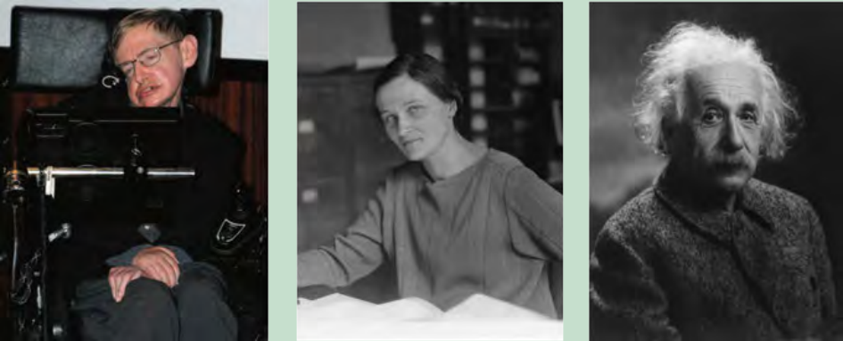
> **[Diagram Context - Textbook_NaturalScience_Gr7_Historical-development-of-astronomy.pdf-0020-03.png]**
> This graphic features photographic portraits of three influential scientists: Stephen Hawking, Rosalind Franklin, and Albert Einstein. It serves as a visual representation of key figures in the history of science, highlighting their contributions to fields such as theoretical physics, cosmology, and molecular biology. For high school learners, this image contextualises the human element of scientific discovery, encouraging an appreciation for the diverse individuals whose work forms the foundation of the current CAPS Physical and Life Sciences curricula.

> **[Diagram Context - Textbook_NaturalScience_Gr7_Historical-development-of-astronomy.pdf-0020-04.png]**
> This diagram illustrates a slinky toy moving down a set of stairs, depicted through a series of overlapping sketches that show the spring's sequential positions and motion arcs. It serves as a visual model for Grade 10-12 Physical Sciences to demonstrate the transfer of energy and the mechanics of longitudinal and transverse wave motion as the spring undergoes periodic displacement.

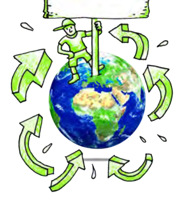
> **[Diagram Context - Textbook_NaturalScience_Gr7_Historical-development-of-astronomy.pdf-0020-12.png]**
> This illustration depicts a conceptual diagram of the Earth surrounded by a circular arrangement of green arrows and a central figure holding a blank sign. The visual elements include a globe, a human figure, and multiple directional arrows representing a continuous cycle or process. It serves as a pedagogical tool to introduce environmental sustainability or global ecological cycles, prompting students to identify and label the specific processes—such as the water or carbon cycle—that maintain planetary balance.

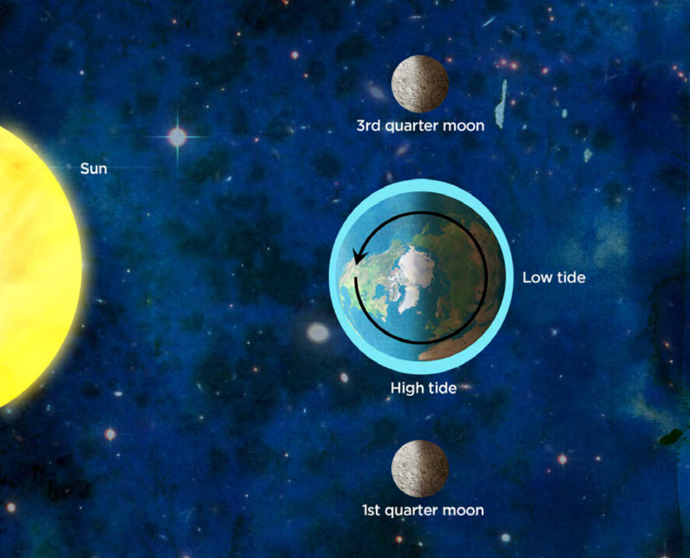
> **[Diagram Context - Textbook_NaturalScience_Gr7_Relationship-of-the-moon-to-the-earth.pdf-0020-01.png]**
> This diagram illustrates the celestial alignment of the Sun, Earth, and Moon during neap tide phases, featuring labels for the "Sun," "3rd quarter moon," "1st quarter moon," "High tide," and "Low tide," along with a directional rotation arrow. It conceptually demonstrates how the perpendicular gravitational pull of the Moon during its quarter phases results in a smaller tidal range, helping learners understand the relationship between lunar phases and Earth's tidal cycles.

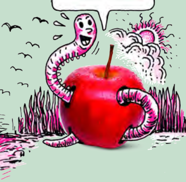
> **[Diagram Context - Textbook_NaturalScience_Gr7_Relationship-of-the-moon-to-the-earth.pdf-0020-08.png]**
> This cartoon illustration depicts a worm interacting with an apple within a natural environment featuring grass, a sun, and birds. It serves as a visual metaphor for ecological relationships, specifically illustrating the role of a consumer or decomposer interacting with organic matter in a food chain or ecosystem.

> **[Diagram Context - Textbook_NaturalScience_Gr7_Relationship-of-the-moon-to-the-earth.pdf-0020-10.png]**
> This graphic depicts a stylized, repeating pattern of interlocking, arrow-shaped segments forming a continuous horizontal chain. The image lacks specific biological or chemical labels, but conceptually represents the linear, sequential nature of molecular polymers such as DNA or protein chains, illustrating how individual monomeric units link together to form a larger, repeating macromolecular structure.

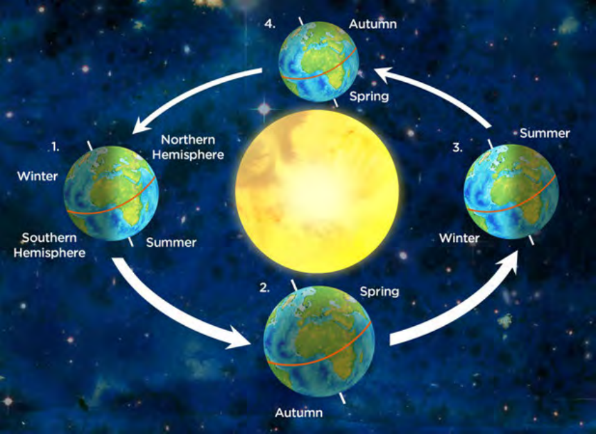
> **[Diagram Context - Textbook_NaturalScience_Gr7_Relationship-of-the-sun-to-the-Earth.pdf-0020-03.png]**
> This diagram illustrates the Earth's orbital revolution around the Sun, featuring labels for the four seasons, the Northern and Southern Hemispheres, and numbered positions 1 through 4. It conceptually demonstrates how the Earth's axial tilt causes the seasonal cycle, showing how the hemisphere tilted toward the Sun experiences summer while the opposite hemisphere experiences winter.

> **[Diagram Context - Textbook_NaturalScience_Gr7_Relationship-of-the-sun-to-the-Earth.pdf-0020-06.png]**
> This illustration depicts a pair of hands interacting with a tablet interface featuring various abstract icons and a blank speech bubble above. It serves as a visual metaphor for digital literacy, e-learning, or the integration of Information and Communication Technology (ICT) within the classroom environment.

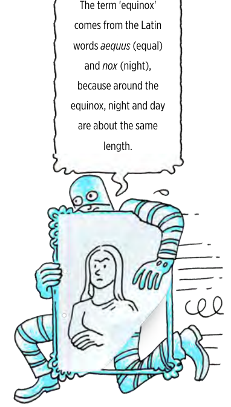
> **[Diagram Context - Textbook_NaturalScience_Gr7_Relationship-of-the-sun-to-the-Earth.pdf-0020-12.png]**
> This educational graphic uses a cartoon illustration and a speech bubble to explain the etymology and definition of the term "equinox." It highlights the Latin roots *aequus* (equal) and *nox* (night) to clarify the concept that during an equinox, day and night are approximately equal in length.

---

## ACTIVITY: The Effects of Tides on Shoreline Ecosystems

### Materials:
* Pictures and texts about shoreline animals. (Can be textbooks, library books, or online materials as directed by your teacher).

### Observations & Context:
* **Mussels and barnacles:** Close their shells tightly to avoid drying out.
* **Oystercatchers:** Take advantage of low tide to feed.
* **Seaweed, starfish, and mussels:** Found together in a rock pool.
* **Birds:** Feeding on the rocks.
* **Marine reproduction:** Eggs found on some seaweed.
* **Green anemones:** Thriving in a rock pool environment.

> **[Diagram Context - Textbook_NaturalScience_Gr7_Historical-development-of-astronomy.pdf-0021-00.png]**
> This diagram illustrates a cross-section of a biological membrane, specifically representing the phospholipid bilayer model with repeating hook-shaped structures embedded in a solid horizontal base. It conceptually demonstrates the fluid mosaic model, highlighting the arrangement of amphipathic phospholipid molecules that form the structural foundation of cell membranes.

> **[Diagram Context - Textbook_NaturalScience_Gr7_Historical-development-of-astronomy.pdf-0021-01.png]**
> This visual metaphor depicts a person playing a large key as if it were a stringed musical instrument, accompanied by floating musical notes. It serves as a conceptual illustration of the "lock and key" model, commonly used in Life Sciences to explain enzyme-substrate specificity where a specific enzyme (the musician) interacts with a specific substrate (the key) to produce a reaction (the music).

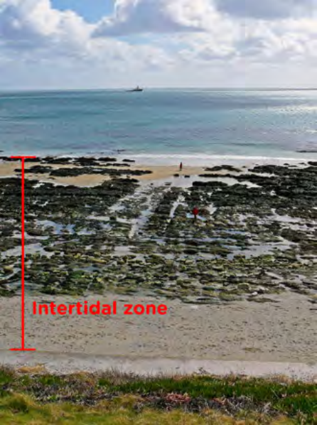
> **[Diagram Context - Textbook_NaturalScience_Gr7_Relationship-of-the-moon-to-the-earth.pdf-0021-05.png]**
> This image is a photograph of a rocky shoreline featuring a red vertical dimension line and the label "Intertidal zone." It illustrates the geographical area between the high-tide and low-tide marks, which is a critical habitat for studying zonation and environmental adaptations in Grade 10 Life Sciences.

> **[Diagram Context - Textbook_NaturalScience_Gr7_Relationship-of-the-moon-to-the-earth.pdf-0021-09.png]**
> This illustration depicts a caricature of Isaac Newton with an apple-shaped head, surrounded by a network of floating apples connected by dashed lines and directional arrows. It serves as a metaphorical representation of Newton’s Law of Universal Gravitation, visually linking the iconic apple anecdote to the complex, interconnected gravitational forces acting between masses in space.

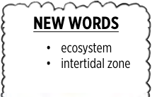
> **[Diagram Context - Textbook_NaturalScience_Gr7_Relationship-of-the-moon-to-the-earth.pdf-0021-10.png]**
> This graphic is a vocabulary list presented in a text box, featuring the terms "ecosystem" and "intertidal zone." It serves as a foundational pedagogical tool for Life Sciences learners to identify and define key ecological terminology required for understanding biodiversity and environmental interactions within the CAPS curriculum.

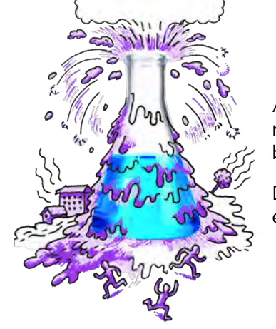
> **[Diagram Context - Textbook_NaturalScience_Gr7_Relationship-of-the-moon-to-the-earth.pdf-0021-11.png]**
> This illustration depicts a conical flask undergoing a violent, uncontrolled chemical reaction that is overflowing and emitting fumes. The visual elements include the laboratory glassware, the erupting purple substance, and fleeing human figures, which collectively symbolize the hazards of an exothermic or runaway reaction. It serves as a cautionary pedagogical tool to emphasize the importance of safety protocols, proper handling of reagents, and the necessity of risk assessment in a CAPS Physical Sciences laboratory environment.

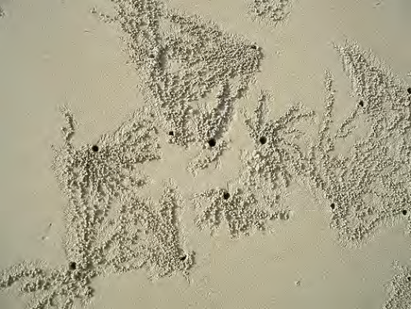
> **[Diagram Context - Textbook_NaturalScience_Gr7_Relationship-of-the-moon-to-the-earth.pdf-0021-15.png]**
> This image displays a top-down view of sand patterns created by sand bubbler crabs, featuring distinct circular burrow entrances surrounded by radiating, pellet-like feeding trails. It illustrates the concept of animal behaviour and foraging strategies within an intertidal ecosystem, demonstrating how organisms modify their environment to maximize resource extraction.

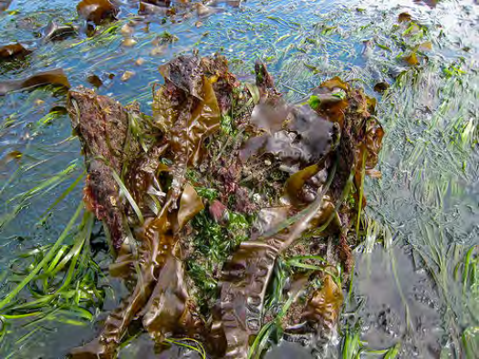
> **[Diagram Context - Textbook_NaturalScience_Gr7_Relationship-of-the-moon-to-the-earth.pdf-0021-16.png]**
> This photograph displays a marine ecosystem featuring diverse macroalgae, specifically brown kelp and green seagrasses, floating in shallow water. The image illustrates the biodiversity of coastal habitats, highlighting the structural complexity and primary productivity provided by these aquatic plant and protist communities. It serves as a visual reference for studying marine biomes, ecological niches, and the interaction between producers and their aquatic environment.

> **[Diagram Context - Textbook_NaturalScience_Gr7_Relationship-of-the-sun-to-the-Earth.pdf-0021-00.png]**
> This diagram illustrates an electromagnet created by connecting a coiled wire (solenoid) to a battery, surrounded by iron objects like a nut, nail, and bolt. It uses magnetic field lines with directional arrows and electrical symbols (+/-) to demonstrate how an electric current generates a magnetic field capable of attracting ferromagnetic materials. This visualises the fundamental CAPS concept of electromagnetism, showing the relationship between current flow and the resulting magnetic effect.

---

# Revision Notes: Organisms in the Intertidal Zone

## Core Concepts & Observations

The intertidal zone is the area that is above water at low tide and underwater at high tide. Organisms living in this environment face harsh conditions, including extreme temperature fluctuations, wave action, and changing salinity levels.

*   **Mussels:** Grow in dense clusters on rocks to withstand strong wave action.
*   **Crabs:** Often hide in the sand or under rocks to protect themselves from predators and harsh sunlight during low tide.
*   **Seals:** Use the intertidal zone to rest, breed, and raise pups while navigating dynamic water conditions.
*   **Mudskippers:** Unique fish adapted to walk or skip on land using modified pectoral fins.

---

## Did You Know?

Sea anemones look like plants with flowers, but they are actually animals. Their tentacles contain a poison that paralyses their food (small fish and shrimps) when touched.

---

## Activity Instructions

Study the pictures and texts provided on this page and write a summary about how two different organisms are adapted to living in the intertidal zone. You can use the internet or other resources to do some more research.

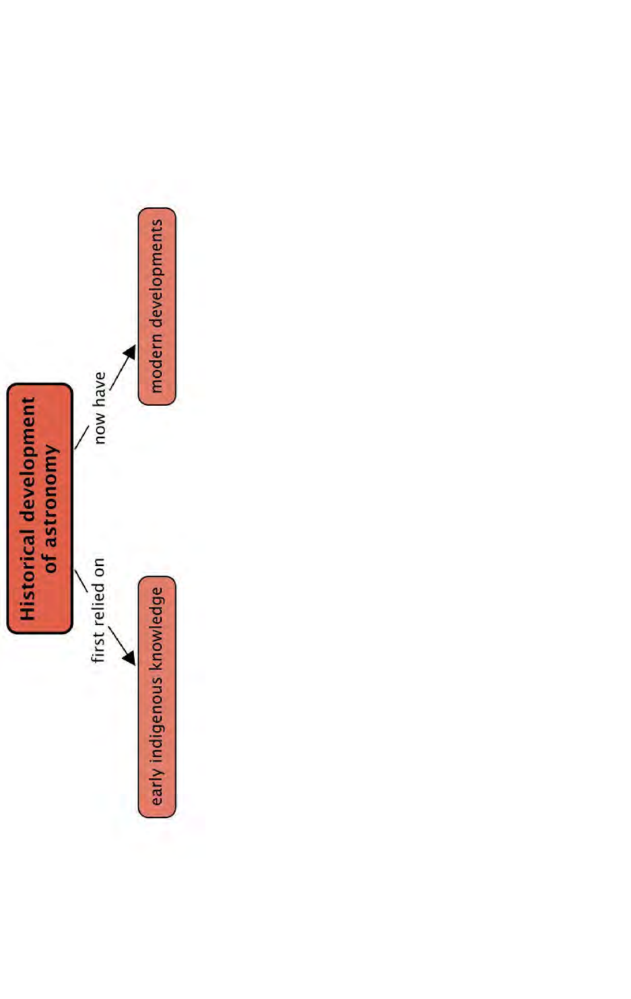
> **[Diagram Context - Textbook_NaturalScience_Gr7_Historical-development-of-astronomy.pdf-0022-00.png]**
> This flow chart illustrates the historical development of astronomy, featuring the central concept connected to "early indigenous knowledge" and "modern developments" via directional arrows labeled "first relied on" and "now have." It conceptually frames the evolution of astronomical science as a progression from foundational indigenous observations to contemporary technological advancements, highlighting the continuity of human inquiry.

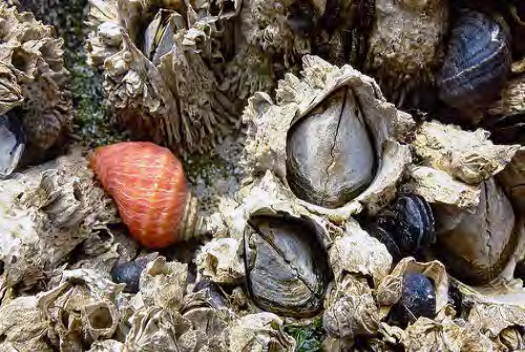
> **[Diagram Context - Textbook_NaturalScience_Gr7_Relationship-of-the-moon-to-the-earth.pdf-0022-00.png]**
> This image displays a rocky shore intertidal community featuring sessile organisms such as barnacles and mussels alongside a predatory gastropod. It illustrates the ecological concepts of interspecific competition for space and predator-prey relationships within a marine ecosystem. For Life Sciences learners, this serves as a visual example of biotic interactions and niche partitioning in a high-density habitat.

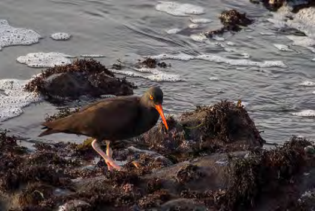
> **[Diagram Context - Textbook_NaturalScience_Gr7_Relationship-of-the-moon-to-the-earth.pdf-0022-02.png]**
> This photograph depicts an African Black Oystercatcher (*Haematopus moquini*) in its natural rocky intertidal habitat. The image illustrates key biological concepts related to environmental adaptation, specifically the bird's specialized beak morphology for foraging on coastal molluscs and its camouflage within a marine ecosystem.

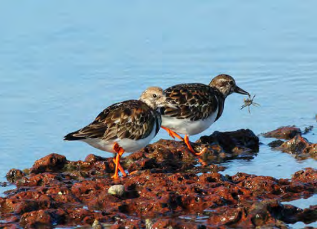
> **[Diagram Context - Textbook_NaturalScience_Gr7_Relationship-of-the-moon-to-the-earth.pdf-0022-07.png]**
> This photograph depicts two Ruddy Turnstone birds foraging on a rocky shoreline, with one bird holding a small crab in its beak. The image illustrates a predator-prey interaction within a coastal ecosystem, highlighting the feeding habits and trophic relationships of shorebirds. It serves as a practical example for Life Sciences learners to identify consumers and understand energy flow within a food web.

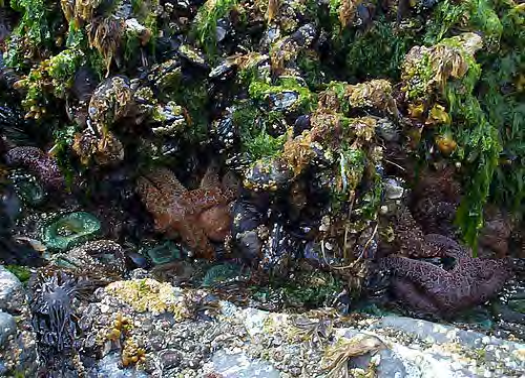
> **[Diagram Context - Textbook_NaturalScience_Gr7_Relationship-of-the-moon-to-the-earth.pdf-0022-08.png]**
> This photograph depicts a rocky intertidal zone ecosystem containing biological structures such as mussels, sea stars (starfish), sea anemones, and various macroalgae. It illustrates the concept of community structure and biotic interactions, such as predation and competition for space, within a coastal biome.

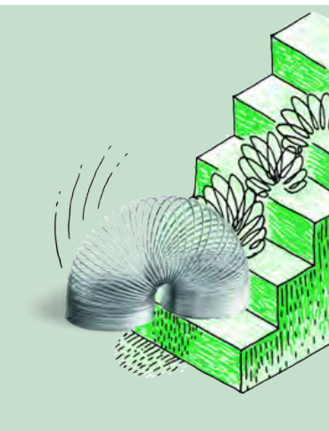
> **[Diagram Context - Textbook_NaturalScience_Gr7_Relationship-of-the-moon-to-the-earth.pdf-0022-11.png]**
> This illustration depicts a coiled spring (slinky) moving down a set of stairs, indicated by motion lines. It serves as a physical model to help learners visualize the propagation of longitudinal waves, where the compression and rarefaction of the coils demonstrate how energy is transferred through a medium.

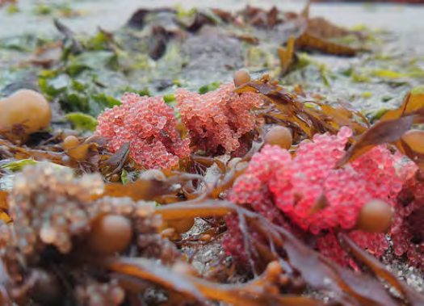
> **[Diagram Context - Textbook_NaturalScience_Gr7_Relationship-of-the-moon-to-the-earth.pdf-0022-12.png]**
> This photograph depicts a natural marine environment featuring brown macroalgae (seaweed) interspersed with clusters of pink, spherical egg masses, likely from a marine invertebrate such as a nudibranch or mollusc. The image illustrates the concept of reproductive strategies in marine ecosystems, highlighting how organisms utilize substrate like algae for the protection and attachment of their offspring.

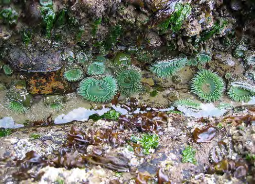
> **[Diagram Context - Textbook_NaturalScience_Gr7_Relationship-of-the-moon-to-the-earth.pdf-0022-14.png]**
> This photograph depicts a rocky intertidal zone ecosystem, featuring sea anemones (Cnidaria) attached to rock surfaces alongside various macroalgae (seaweeds). It illustrates the concept of biodiversity and environmental adaptation within a marine biome, highlighting how organisms occupy specific niches in a high-energy, fluctuating habitat.

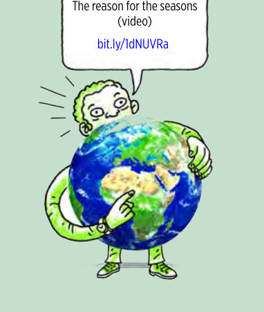
> **[Diagram Context - Textbook_NaturalScience_Gr7_Relationship-of-the-sun-to-the-Earth.pdf-0022-05.png]**
> This graphic features a cartoon illustration of a person holding a globe of the Earth, accompanied by a speech bubble containing the text "The reason for the seasons (video)" and a shortened URL. It serves as an introductory visual hook for Grade 7-9 Natural Sciences learners to explore the astronomical causes of seasonal changes, specifically the Earth's axial tilt and its orbit around the Sun.

> **[Diagram Context - Textbook_NaturalScience_Gr7_Relationship-of-the-sun-to-the-Earth.pdf-0022-06.png]**
> This graphic illustrates a schematic representation of a double-stranded DNA molecule, characterized by its iconic double helix structure. The diagram uses two intertwined, repeating green ribbons to represent the sugar-phosphate backbones, visually demonstrating the antiparallel nature and complementary base pairing essential for genetic replication and protein synthesis in the Life Sciences curriculum.

---

High up in the intertidal zone water splashes only during high tide and the rest of the time it is dry. As you go lower down the intertidal zone, down the beach towards the sea, it gets progressively wetter for longer periods of time.

Marine life in the intertidal zone have to adapt to the rise and fall of sea levels at the beach. But marine life is not the only kind of life that has to take note of the tides. Many people also use the low tide to collect seaweed. Seaweed has many uses, including being a food source for people. In some cultures seaweed is used for medicinal purposes and to make various woven products, such as rope, baskets and mats.

Fishermen looking for big catches time their fishing activities according to the tides too. Lets investigate this further.

---

### ACTIVITY: How good a fisherman are you?

#### BACKGROUND:
Fish are easier to catch at times when they are feeding. The tides determine when most fish feed. When the tide is coming in or going out the moving water stimulates feeding. The fastest part of the tide is normally around two hours before and after low and high tides. These times are the best times to go fishing.

#### INSTRUCTIONS:
1. Look at the example tide table data for one day below and answer the following questions.

**Durban — Thursday 29th August 2013**

| Time | Tide Height (m) | Comment |
| :--- | :--- | :--- |
| 00:56 | | Moonrise |
| 02:29 | 0.85 | Low tide |
| 06:14 | | Sunrise |
| 08:41 | 1.26 | High tide |
| 11:42 | | Moonset |
| 14:52 | 0.93 | Low tide |
| 17:39 | | Sunset |
| 21:34 | 1.27 | High tide |

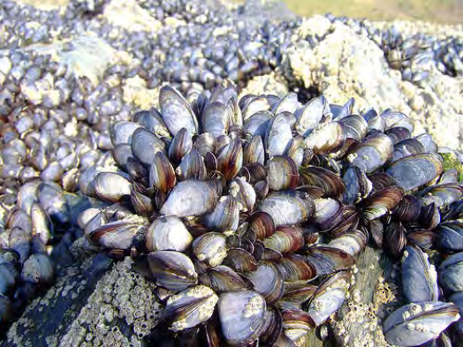
> **[Diagram Context - Textbook_NaturalScience_Gr7_Relationship-of-the-moon-to-the-earth.pdf-0023-01.png]**
> This photograph depicts a dense intertidal mussel bed, illustrating a biological community characterized by high population density and substrate attachment. It serves as a visual example of intraspecific competition for space and resources, which is a key concept in the Life Sciences curriculum regarding population dynamics and ecosystem interactions.

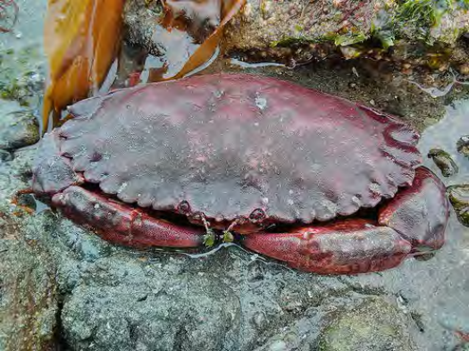
> **[Diagram Context - Textbook_NaturalScience_Gr7_Relationship-of-the-moon-to-the-earth.pdf-0023-03.png]**
> This image is a biological photograph of a crab, an arthropod belonging to the phylum Arthropoda and class Crustacea. The visual highlights key external features such as the hard, protective exoskeleton (carapace) and specialized appendages (chelipeds or claws) used for defense and feeding. For Life Sciences learners, this serves as an example of structural adaptation to a rocky shore habitat, demonstrating how the organism's morphology facilitates survival in an intertidal environment.

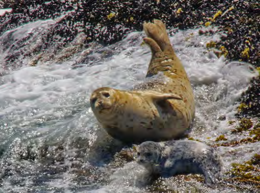
> **[Diagram Context - Textbook_NaturalScience_Gr7_Relationship-of-the-moon-to-the-earth.pdf-0023-05.png]**
> This photograph depicts a mother seal and her pup in their natural coastal habitat, illustrating the biological concept of parental care in mammals. The image provides a visual example of reproductive strategies and the relationship between adult and juvenile organisms within an ecosystem, which is relevant to the Life Sciences curriculum regarding animal behavior and survival.

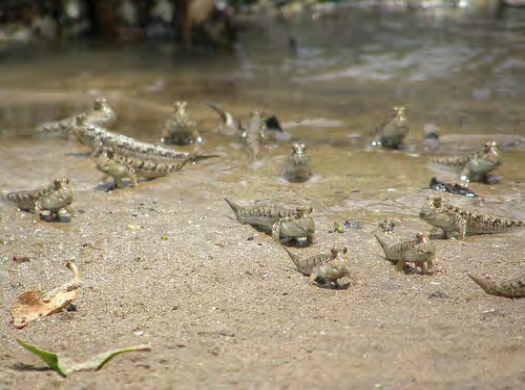
> **[Diagram Context - Textbook_NaturalScience_Gr7_Relationship-of-the-moon-to-the-earth.pdf-0023-07.png]**
> This image displays a group of mudskippers, which are amphibious fish, in their natural intertidal habitat. There are no labels or symbols present, as the image serves as a visual observation of organisms in an ecosystem. It illustrates the concept of biological adaptation, demonstrating how these fish have evolved to survive in both aquatic and terrestrial environments, a key topic in the Life Sciences curriculum regarding evolution and environmental interaction.

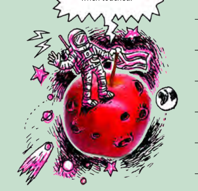
> **[Diagram Context - Textbook_NaturalScience_Gr7_Relationship-of-the-moon-to-the-earth.pdf-0023-13.png]**
> This illustration depicts an astronaut standing on a cratered, apple-shaped celestial body, surrounded by space elements including stars, a comet, and a planet. It serves as a metaphorical visual aid to introduce Newton’s Law of Universal Gravitation, contrasting the terrestrial observation of a falling apple with the gravitational forces governing objects in space.

> **[Diagram Context - Textbook_NaturalScience_Gr7_Relationship-of-the-moon-to-the-earth.pdf-0023-14.png]**
> This graphic depicts a repeating, wave-like pattern of interconnected, arrow-shaped segments. It illustrates the concept of continuous, directional flow or a sequential process, often used in Life Sciences to represent metabolic pathways, energy transfer, or the cyclical nature of biological systems.

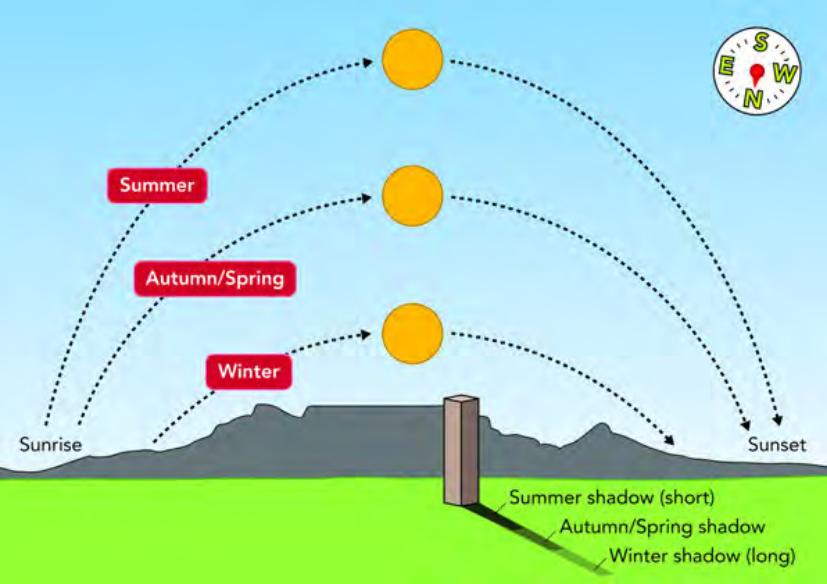
> **[Diagram Context - Textbook_NaturalScience_Gr7_Relationship-of-the-sun-to-the-Earth.pdf-0023-00.png]**
> This diagram illustrates the seasonal variation in the sun's path across the sky and the resulting changes in shadow length, featuring labels for "Summer," "Autumn/Spring," "Winter," "Sunrise," "Sunset," and their corresponding shadow lengths. It conceptually demonstrates how the sun's varying altitude throughout the year affects the angle of insolation, helping students understand the relationship between the Earth's axial tilt, seasonal solar paths, and shadow casting.

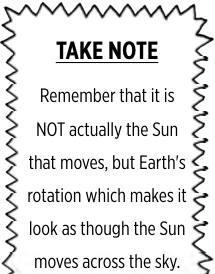
> **[Diagram Context - Textbook_NaturalScience_Gr7_Relationship-of-the-sun-to-the-Earth.pdf-0023-01.png]**
> This educational graphic is a text-based "Take Note" box containing the heading "TAKE NOTE" and a statement regarding the apparent motion of the Sun. It explicitly clarifies the distinction between the Sun's perceived movement and the reality of Earth's rotation. This serves as a conceptual reminder for learners to correct the common misconception that the Sun orbits the Earth, reinforcing the geocentric versus heliocentric understanding of planetary motion.

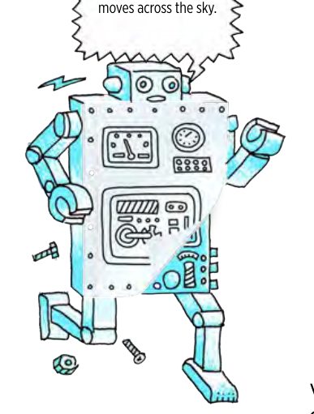
> **[Diagram Context - Textbook_NaturalScience_Gr7_Relationship-of-the-sun-to-the-Earth.pdf-0023-02.png]**
> This illustration depicts a cartoon robot with exposed mechanical control panels, gauges, and loose hardware like nuts and bolts. It serves as a metaphorical visual aid to help students conceptualize complex systems, such as the internal mechanisms of a machine or the intricate, interconnected processes within a biological organism.

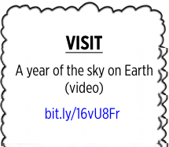
> **[Diagram Context - Textbook_NaturalScience_Gr7_Relationship-of-the-sun-to-the-Earth.pdf-0023-05.png]**
> This graphic is a text-based instructional prompt featuring the heading "VISIT," the descriptive text "A year of the sky on Earth (video)," and a shortened URL. It serves as a digital resource signpost to support Grade 10 Earth and Beyond studies by directing students to a visual demonstration of celestial phenomena over an annual cycle.

> **[Diagram Context - Textbook_NaturalScience_Gr7_Relationship-of-the-sun-to-the-Earth.pdf-0023-06.png]**
> This illustration depicts the Earth as a hot air balloon, featuring a globe suspended by a net above a basket containing two figures using telescopes. The image serves as a metaphorical representation of global observation, environmental monitoring, or the "big picture" perspective required to study Earth systems and human impact within the CAPS Life Sciences and Geography curricula.

---

### QUESTIONS

1. Thembela wants to go fishing at the best time around the first low tide of the day. What times could she go fishing?
2. Josh wants to go fishing while the Sun has set. What would be the best possible times for him to choose from?
3. Faried wants to go fishing while the Sun is up. What would be the best possible times for him to choose from?

---

### SUMMARY

#### Key Concepts
* The Moon orbits the Earth once every $27.3$ days. The Moon also spins on its own axis once every $27.3$ days. Due to both these time periods being the same, we only ever see one side of the Moon from Earth.
* Gravity is a force that acts between all objects with mass. The size of the force acting on the objects is proportional to their masses and inversely proportional to their distance from each other.
* The Earth's gravity is responsible for holding the Moon in orbit around the Earth.
* The Moon's gravitational pull is mainly responsible for the tides on Earth.
* Neap tides occur when the Sun and Moon are at $90^\circ$ to each other.
* Spring tides occur when the Sun and Moon are in line with each other.
* The rise and fall of the tides affects marine life living along shorelines. They have adapted to this harsh environment in many ways to prevent themselves from drying out and from being washed away by strong waves.

#### Concept Map
Complete the concept map by filling in the blank spaces. You can do this by reading the sentence that is made in the concept map.

For example, 
"Gravity depends on mass of objects. If objects same distance apart, then \_\_\_\_\_\_\_\_\_\_, exerts a stronger pull." What would the answer be? A 'bigger object' or a 'smaller object'? Fill the answer in. Also do this for the distance between objects. Would 'closer objects', or 'further away objects' exert a stronger pull? Then give a description of tides.

---

### VISIT
Watch the original footage of Apollo 11 landing on the Moon in 1969.  
`bit.ly/185mzXG`

> **[Diagram Context - Textbook_NaturalScience_Gr7_Historical-development-of-astronomy.pdf-0024-04.png]**
> This graphic depicts a biological illustration of an ant leading a linear trail of smaller ants across a horizontal, shaded pathway. It visually represents the concept of pheromone-based trail following and collective social behavior in insects, illustrating how individual organisms contribute to organized group movement within an ecosystem.

> **[Diagram Context - Textbook_NaturalScience_Gr7_Relationship-of-the-moon-to-the-earth.pdf-0024-01.png]**
> This image depicts a rocky shore ecosystem, specifically a tide pool environment, featuring individuals engaged in field observation or data collection. The visual elements include exposed rocks covered in algae, shallow pools of seawater, and the open ocean horizon. For a Life Sciences student, this scene illustrates the intertidal zone, highlighting the habitat where organisms must adapt to fluctuating environmental conditions such as varying water levels, salinity, and exposure to air.

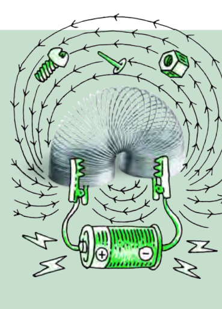
> **[Diagram Context - Textbook_NaturalScience_Gr7_Relationship-of-the-moon-to-the-earth.pdf-0024-10.png]**
> This diagram illustrates an electromagnet created by connecting a coiled wire (solenoid) to a battery, with magnetic field lines indicated by arrows and surrounding metallic objects (screw, nail, nut). It visually demonstrates the principle of electromagnetism, showing how an electric current flowing through a coil generates a magnetic field capable of exerting force on ferromagnetic materials.

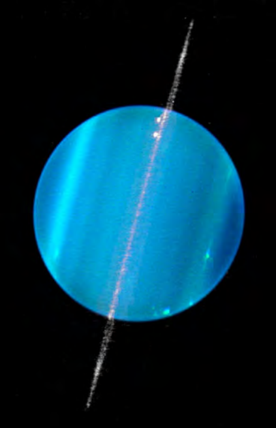
> **[Diagram Context - Textbook_NaturalScience_Gr7_Relationship-of-the-sun-to-the-Earth.pdf-0024-02.png]**
> This image is an astronomical photograph of the planet Uranus, featuring its distinct blue-green sphere and a faint, diagonal ring system. It illustrates the physical characteristics of a gas giant within our solar system, highlighting the planet's unique axial tilt and orbital ring structure as studied in Grade 10 Physical Sciences (Earth and Beyond).

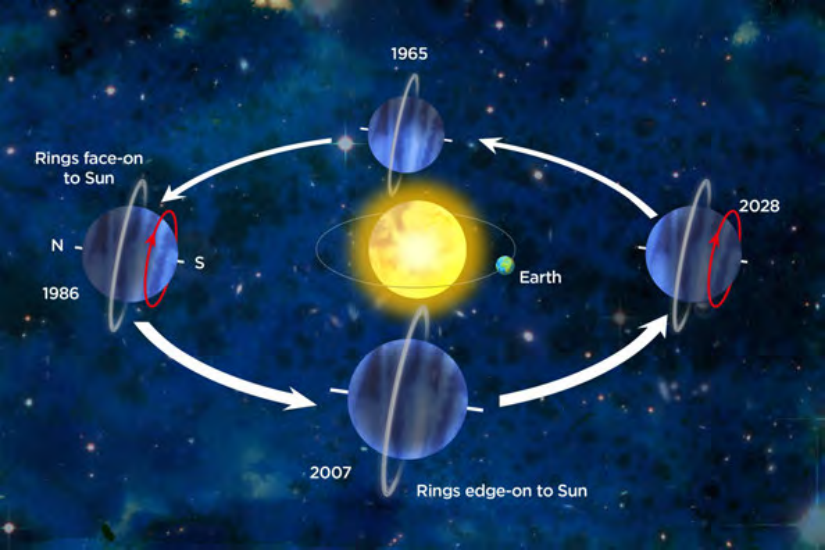
> **[Diagram Context - Textbook_NaturalScience_Gr7_Relationship-of-the-sun-to-the-Earth.pdf-0024-05.png]**
> This diagram illustrates the orbital motion of Uranus around the Sun, featuring labels for the Sun, Earth, specific years (1965, 1986, 2007, 2028), cardinal directions (N, S), and descriptive text regarding ring orientation. It conceptually demonstrates how Uranus’s extreme axial tilt causes its rings and poles to appear at varying angles relative to the Sun throughout its long orbital period, a key aspect of planetary motion in the Earth and Beyond strand.

---

# Relationship of the Moon to the Earth

## 1. Orbital Relationships
* **Moon is Earth's Natural Satellite:** The Moon revolves around the Earth, and is held in an orbit around the Earth.
* **Earth revolves around the Sun:** The Earth revolves around the Sun, and is held in an orbit around the Sun.

## 2. Gravity and Attraction
* **Gravity:** Gravity is an attraction (pull) between all objects.
* **Factors affecting gravitational force:**
  * **Mass of objects:** If objects are the same distance apart, then an increase in mass results in a stronger pull.
  * **Distance between objects:** If objects have the same mass, the distance between them affects how strongly they attract one another.

## 3. The Moon, Earth, and Tides
* **Gravity by the Sun and Earth:** Gravity is exerted by the Sun on the Earth, and by the Earth on the Sun.
* **Moon's gravitational pull on Earth:** The Moon pulls on water on Earth.
* **Result:** This gravitational pull results in **tides**.

> **[Diagram Context - Textbook_NaturalScience_Gr7_Relationship-of-the-moon-to-the-earth.pdf-0025-05.png]**
> This graphic depicts a repeating, wave-like pattern of interconnected, arrow-shaped segments. It serves as a visual representation of a continuous process or directional flow, often used in Life Sciences to illustrate metabolic pathways, the sequence of DNA replication, or the cyclical nature of biological systems.

> **[Diagram Context - Textbook_NaturalScience_Gr7_Relationship-of-the-moon-to-the-earth.pdf-0025-06.png]**
> This diagram illustrates a cross-section of a biological membrane, specifically representing the hydrophilic heads of a phospholipid monolayer or the surface of a cell membrane. The visual features consist of a series of repeating, hook-shaped blue icons embedded along the upper edge of a solid, light-blue horizontal base. Conceptually, this helps learners visualize the orientation of phospholipids in a membrane structure, highlighting the arrangement of polar head groups at the interface between the membrane and the surrounding aqueous environment.

> **[Diagram Context - Textbook_NaturalScience_Gr7_Relationship-of-the-moon-to-the-earth.pdf-0025-07.png]**
> This illustration depicts a worker operating a jackhammer, represented by a large key, with motion lines indicating vibration and debris. It serves as a visual metaphor for mechanical energy transfer and the physical impact of high-frequency vibrations on the human body, relevant to Occupational Health and Safety in the Physical Sciences curriculum.

> **[Diagram Context - Textbook_NaturalScience_Gr7_Relationship-of-the-moon-to-the-earth.pdf-0025-14.png]**
> This graphic is a simple text-based call-to-action contained within a hand-drawn, jagged-edged border. It features the single word "VISIT" in bold, uppercase lettering. Conceptually, this serves as a navigational prompt or signpost intended to direct a student toward further educational resources or external learning materials.

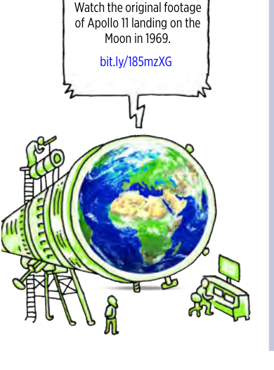
> **[Diagram Context - Textbook_NaturalScience_Gr7_Relationship-of-the-moon-to-the-earth.pdf-0025-15.png]**
> This editorial cartoon depicts a large telescope focused on the Earth, accompanied by a speech bubble referencing the 1969 Apollo 11 Moon landing. The image uses the visual metaphor of a telescope to contrast the historical focus on space exploration with a modern, Earth-centric perspective. It serves as a prompt for students to critically reflect on the shift in scientific priorities and the historical significance of human spaceflight in the context of global awareness.

> **[Diagram Context - Textbook_NaturalScience_Gr7_Relationship-of-the-sun-to-the-Earth.pdf-0025-00.png]**
> This graphic serves as a section heading for a Life Sciences curriculum unit, featuring the text "1.2 Solar energy and life on Earth" and a partial "WORDS" label. It introduces the fundamental concept of solar radiation as the primary energy source that drives biological processes and sustains life within the biosphere.

> **[Diagram Context - Textbook_NaturalScience_Gr7_Relationship-of-the-sun-to-the-Earth.pdf-0025-01.png]**
> This graphic is a text-based instructional heading featuring the label "NEW WORDS" enclosed within a cloud-like border. It serves as a pedagogical signpost in CAPS-aligned textbooks to signal the introduction of key terminology and vocabulary essential for mastering a specific topic.

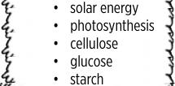
> **[Diagram Context - Textbook_NaturalScience_Gr7_Relationship-of-the-sun-to-the-Earth.pdf-0025-02.png]**
> This graphic is a bulleted list containing the key biological terms: solar energy, photosynthesis, cellulose, glucose, and starch. It serves as a conceptual summary for Life Sciences learners, highlighting the flow of energy from the sun through the process of photosynthesis to the production of glucose and its subsequent conversion into structural (cellulose) or storage (starch) carbohydrates.

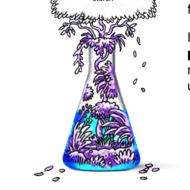
> **[Diagram Context - Textbook_NaturalScience_Gr7_Relationship-of-the-sun-to-the-Earth.pdf-0025-04.png]**
> This conceptual illustration depicts a conical flask containing a stylized plant ecosystem, with the label "starch" positioned above the foliage. It uses the metaphor of a laboratory vessel to represent the biological process of photosynthesis, where plants synthesize organic compounds like starch from inorganic raw materials.

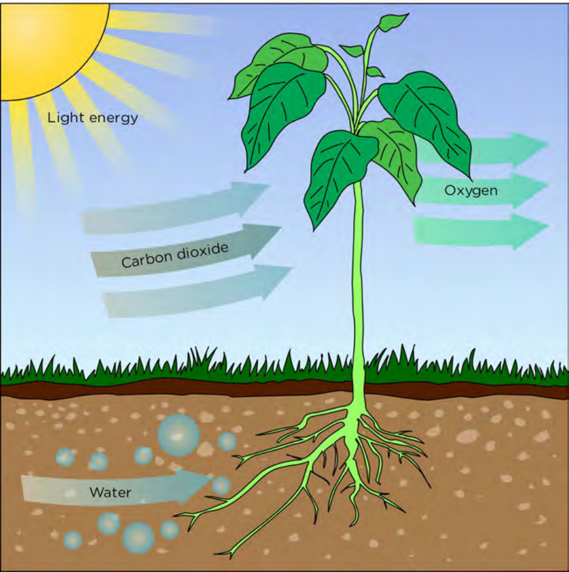
> **[Diagram Context - Textbook_NaturalScience_Gr7_Relationship-of-the-sun-to-the-Earth.pdf-0025-06.png]**
> This diagram illustrates the process of photosynthesis in a green plant, featuring labels for light energy, carbon dioxide, oxygen, and water. It visually demonstrates the conversion of inorganic raw materials into chemical energy by showing the uptake of water and carbon dioxide alongside the release of oxygen, providing a foundational conceptual model for the photosynthetic equation.

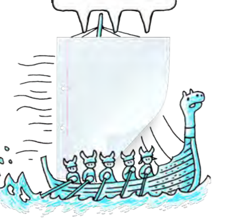
> **[Diagram Context - Textbook_NaturalScience_Gr7_Relationship-of-the-sun-to-the-Earth.pdf-0025-09.png]**
> This graphic is a cartoon illustration depicting a Viking longship with rowers and a blank sail, accompanied by a speech bubble at the top. The image contains no text labels, variables, or scientific symbols, serving instead as a visual template or placeholder. Conceptually, it acts as a creative prompt or graphic organizer that students can use to insert their own subject-specific content, such as historical facts, literary analysis, or scientific processes, into the sail or speech bubble.

---

## REVISION

1. Why do we only see one side of the Moon from Earth? [2 marks]

2. What is gravity? [1 mark]

3. What holds the Moon in orbit around the Earth? [1 mark]

4. How does the gravitational force of attraction between two objects depend on their masses? [2 marks]

5. How does the gravitational force of attraction between two objects depend upon their distance? [2 marks]

6. If you were to stand on the surface of the Moon you would experience only $\frac{1}{6}\text{th}$ the strength of gravity that you experience standing on the surface of the Earth. Why is this? [2 marks]

7. What causes tides? [2 marks]

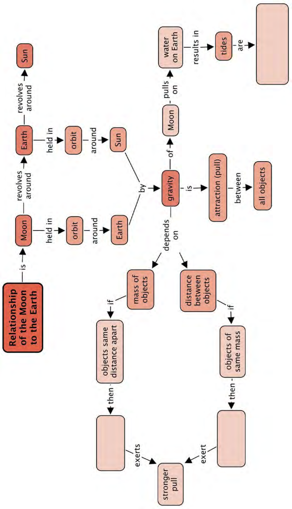
> **[Diagram Context - Textbook_NaturalScience_Gr7_Relationship-of-the-moon-to-the-earth.pdf-0026-00.png]**
> This concept map illustrates the gravitational relationship between the Earth, Moon, and Sun, using nodes labeled with celestial bodies, physical concepts like "gravity," "mass," and "distance," and connecting arrows defining their interactions. It helps learners visualize how gravitational forces dictate orbital mechanics and tidal phenomena, while providing a framework to analyze how variations in mass and distance influence the strength of gravitational attraction.

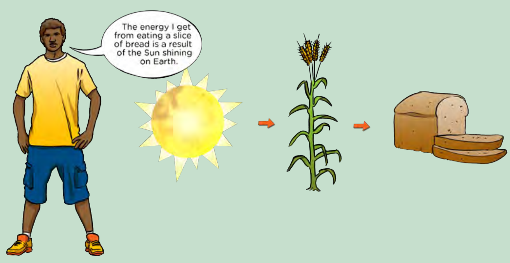
> **[Diagram Context - Textbook_NaturalScience_Gr7_Relationship-of-the-sun-to-the-Earth.pdf-0026-02.png]**
> This diagram illustrates a linear food chain using icons of a human, the Sun, a wheat plant, and a loaf of bread, connected by directional arrows and a speech bubble. It conceptually demonstrates the flow of energy through an ecosystem, showing how solar energy is captured by producers via photosynthesis and subsequently transferred to consumers through food consumption.

> **[Diagram Context - Textbook_NaturalScience_Gr7_Relationship-of-the-sun-to-the-Earth.pdf-0026-03.png]**
> This illustration depicts a stylized caterpillar with a metallic slinky-like body feeding on green leaves. The image uses a metaphorical representation of an insect's segmented anatomy and feeding behavior to engage students in the study of invertebrate biology and herbivory.

> **[Diagram Context - Textbook_NaturalScience_Gr7_Relationship-of-the-sun-to-the-Earth.pdf-0026-15.png]**
> This graphic depicts a schematic representation of a DNA molecule, characterized by its iconic double-helix structure with two antiparallel sugar-phosphate backbones. It illustrates the fundamental molecular architecture of genetic material, highlighting the twisted ladder configuration essential for understanding DNA replication and the storage of hereditary information in Life Sciences.

---

## Chapter 2: Relationship of the Moon to the Earth — Revision Notes

### Tides Assessment & Practice Questions

8. **Look at the following photo of boats on the sand. Do you think it is a problem that they are stuck on the sand? How will people get them into the sea?**
   * *Concept:* Tidal changes regularly submerge and expose coastal areas. Boats grounded during low tide will naturally float again when the incoming (rising) tide brings the water level back up.

9. **What kind of tides occur when the Moon is inline with the Sun?** [1 mark]
   * *Answer:* Spring tides.

10. **What kind of tides occur when the Sun, Earth and Moon are at right angles to each other?** [1 mark]
    * *Answer:* Neap tides.

11. **At what phases of the Moon do spring tides occur?** [2 marks]
    * *Answer:* New Moon and Full Moon phases.

12. **At what phases of the Moon do neap tides occur?** [2 marks]
    * *Answer:* First Quarter and Third (Last) Quarter phases.

13. **What would happen to the height of the tides if there were no Moon?** [1 mark]
    * *Answer:* Without the Moon's gravitational pull, ocean tides would be significantly smaller, driven solely by the weaker gravitational effect of the Sun (solar tides only).

14. **Draw a diagram to show the alignment of the Sun, Earth and Moon during neap and spring tides.** [4 marks]
    * *Guidance for drawing:*
      * **Spring Tides Alignment:** Sun, Earth, and Moon lie approximately along a straight line ($0^\circ$ or $180^\circ$ alignment during New Moon and Full Moon).
      * **Neap Tides Alignment:** Sun, Earth, and Moon form a $90^\circ$ right angle (with the Earth at the vertex, occurring during the Quarter Moon phases).

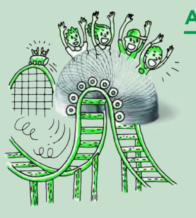
> **[Diagram Context - Textbook_NaturalScience_Gr7_Relationship-of-the-sun-to-the-Earth.pdf-0027-01.png]**
> This illustration depicts a roller coaster track featuring a slinky toy superimposed over the crest of a hill. It uses the visual metaphor of a slinky to represent the continuous, wave-like motion of a roller coaster car as it transitions between gravitational potential energy and kinetic energy. This serves as an intuitive model for Grade 10-12 Physical Sciences learners to visualize the conservation of mechanical energy and the periodic nature of motion along a track.

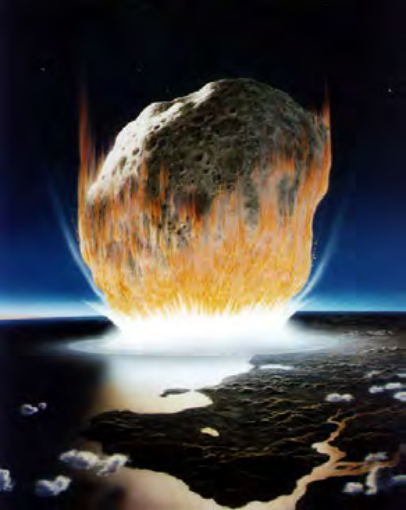
> **[Diagram Context - Textbook_NaturalScience_Gr7_Relationship-of-the-sun-to-the-Earth.pdf-0027-05.png]**
> This illustration depicts an artist's impression of a large asteroid or bolide entering Earth's atmosphere, characterized by a cratered, rocky surface and intense frictional heating (incandescence) as it approaches the planet's surface. In the context of the CAPS Life Sciences curriculum, this visual serves to illustrate the catastrophic environmental changes associated with mass extinction events, such as the K-Pg extinction, which resulted from a massive asteroid impact.

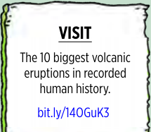
> **[Diagram Context - Textbook_NaturalScience_Gr7_Relationship-of-the-sun-to-the-Earth.pdf-0027-06.png]**
> This graphic is a text-based informational sign containing the heading "VISIT," the descriptive phrase "The 10 biggest volcanic eruptions in recorded human history," and a shortened URL link. It serves as a digital signpost to direct Geography students toward external research resources regarding significant geological events and their impacts on the Earth's surface and atmosphere.

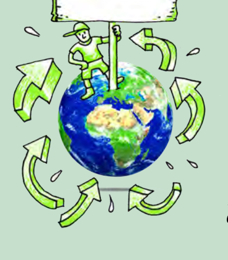
> **[Diagram Context - Textbook_NaturalScience_Gr7_Relationship-of-the-sun-to-the-Earth.pdf-0027-07.png]**
> This graphic is an illustrative diagram featuring a central image of the Earth, a human figure holding a blank sign, and a circular arrangement of green arrows. The visual elements represent the concept of environmental stewardship and global sustainability, using the arrows to symbolize the cyclical nature of recycling and resource conservation. For CAPS Life Sciences learners, this serves as a conceptual prompt for discussing human impact on the biosphere and the importance of sustainable development in maintaining ecological balance.

---

15. Explain why spring tides are more extreme than neap tides. [2 marks]

16. Look at the following photo and answer the questions. 
*(A rocky shore)*

a) Do you think it is low or high tide? Give a reason for your answer. [2 marks]

b) What is the name given to this zone on the shoreline where the tides move back and forth? [1 mark]

c) What are the main risks to marine life living in this region? [2 marks]

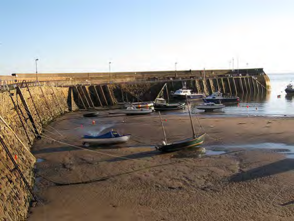
> **[Diagram Context - Textbook_NaturalScience_Gr7_Relationship-of-the-moon-to-the-earth.pdf-0028-02.png]**
> This photograph depicts a coastal harbour scene during low tide, featuring a stone sea wall, exposed sandy seabed, and several grounded small boats. The image illustrates the physical impact of tidal cycles on coastal environments, demonstrating how the periodic rise and fall of sea levels necessitates specific infrastructure and vessel management in maritime settings.

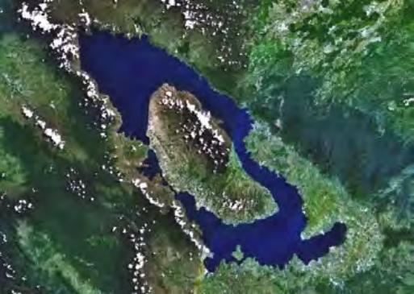
> **[Diagram Context - Textbook_NaturalScience_Gr7_Relationship-of-the-sun-to-the-Earth.pdf-0028-01.png]**
> This satellite imagery depicts a geographical landform, specifically an island situated within a large body of water, characterized by distinct terrestrial and aquatic boundaries. In the context of Geography, this visual serves as a primary source for analyzing physical landscapes, drainage patterns, and the interaction between land and water bodies within a specific ecosystem.

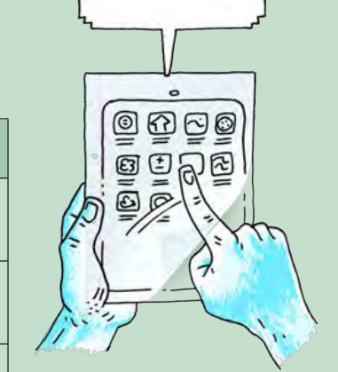
> **[Diagram Context - Textbook_NaturalScience_Gr7_Relationship-of-the-sun-to-the-Earth.pdf-0028-07.png]**
> This illustration depicts a pair of hands interacting with a digital tablet interface featuring various icons, including symbols for addition, subtraction, and wave patterns. It serves as a conceptual metaphor for the integration of Information and Communication Technology (ICT) in the classroom, illustrating how digital tools facilitate interactive learning and the navigation of complex subject matter.

> **[Diagram Context - Textbook_NaturalScience_Gr7_Relationship-of-the-sun-to-the-Earth.pdf-0028-08.png]**
> This graphic depicts a schematic representation of a DNA molecule, characterized by its iconic double-stranded, helical structure. The diagram illustrates the two antiparallel sugar-phosphate backbones intertwined to form the double helix, providing a visual foundation for understanding the molecular basis of heredity and genetic information storage in Life Sciences.

---

d) How is the seaweed adapted to not dry out? [1 mark]

e) What other types of animals do you think you would find in this region? Give 4 examples. [2 marks]

Total [33 marks]

---

Curious? Unlock more possibilities with this key.

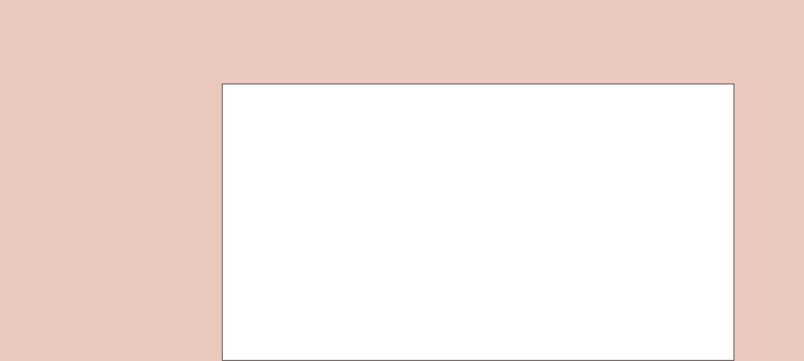
> **[Diagram Context - Textbook_NaturalScience_Gr7_Relationship-of-the-moon-to-the-earth.pdf-0029-00.png]**
> This image is a blank placeholder frame with no visible content, labels, or pedagogical information. Consequently, it cannot be used to illustrate any specific concept within the South African CAPS curriculum.

Chapter 2. Relationship of the Moon to the Earth
217

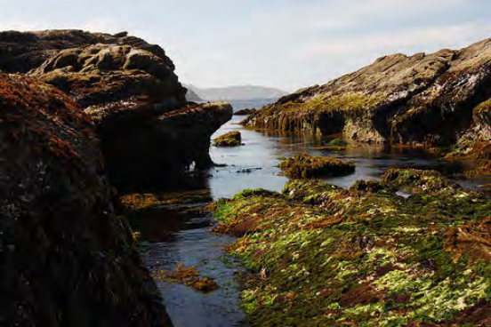
> **[Diagram Context - Textbook_NaturalScience_Gr7_Relationship-of-the-moon-to-the-earth.pdf-0029-03.png]**
> This image depicts a rocky intertidal zone ecosystem, characterized by exposed rock formations, shallow pools of water, and visible patches of algae and seaweed. It serves as a visual representation of a marine biome, illustrating the environmental conditions and substrate types necessary for studying zonation, biodiversity, and the adaptations of organisms living in the littoral zone.

---

# 16 Relationship of the Moon to the Earth

## Chapter Overview
* **Duration:** 2 weeks
* **Prior Knowledge:** In Grade 4, learners covered basic facts about the Moon (lack of air and water, size relative to the Earth, position relative to the Sun, and moon phases). In Grade 6, learners studied the Moon's motion in space (revolving around the Earth while rotating on its spin axis).
* **Core Concepts:** 
  * Phases of the Moon related to the relative positions of the Earth, Moon, and Sun.
  * The concept of gravity and the influence of the Moon's and Sun's gravitational pulls on the Earth's oceans resulting in tides.

### Main Aims
* The Moon is smaller than the Earth and orbits around the Earth in $27.3$ days as the Earth revolves around the Sun.
* The Moon is held in orbit around the Earth by the force of gravity. Similarly, the Earth and all other planets in the solar system are held in orbit around the Sun by the force of gravity.
* All masses experience the force of gravity, and the size of the force exerted depends upon the mass of the objects and their distance from each other.
* The combined gravitational pull of the Moon and the Sun on the Earth's oceans causes ocean tides.

---

## 16.1 Relative Positions (1.5 hours)

| Tasks | Skills | Recommendation |
| :--- | :--- | :--- |
| Activity: Moon revision quiz | Recalling, stating | Optional revision |
| Activity: Observe the Moon | Observing | CAPS Suggested |
| Activity: Total Solar Eclipse | Observing, analysing | CAPS Suggested |

*Note: There are three additional activities included only in the Teacher's Guide in this section:*
* Activity: Google the Moon (Replacement activity for "Observe the Moon" if computers and the Internet are available.)
* Activity: Hands-on Moon Phases (Optional extension activity, revision of Grade 6 material.)
* Activity: Month Long Moon Observation (Optional extension activity, repetition of an activity done in Grade 6 to remind learners of moon phases without yet linking them to the relative positions of the Sun/Earth/Moon.)

---

## 16.2 Gravity (2 hours)

| Tasks | Skills | Recommendation |
| :--- | :--- | :--- |
| Activity: Demonstrating the Moon's orbit around the Earth | Investigating, observing | CAPS suggested |
| Activity: How heavy would you be on other planets? | Calculating, measuring | CAPS Suggested |

> **[Diagram Context - Textbook_NaturalScience_Gr7_Relationship-of-the-moon-to-the-earth.pdf-0030-05.png]**
> This graphic illustrates a biological trail-following behavior, featuring an ant positioned at the head of two parallel, dotted pheromone paths. It conceptually demonstrates chemical communication in social insects, where ants deposit pheromones to create a chemical trail that guides other colony members to food sources or nesting sites.

> **[Diagram Context - Textbook_NaturalScience_Gr7_Relationship-of-the-moon-to-the-earth.pdf-0030-07.png]**
> This image depicts a physical metal key, which serves as a classic visual analogy for the "lock-and-key" model of enzyme action. In the context of Grade 12 Life Sciences, the specific shape of the key's bitting represents the unique active site of an enzyme, illustrating how it must be perfectly complementary to a specific substrate to form an enzyme-substrate complex.

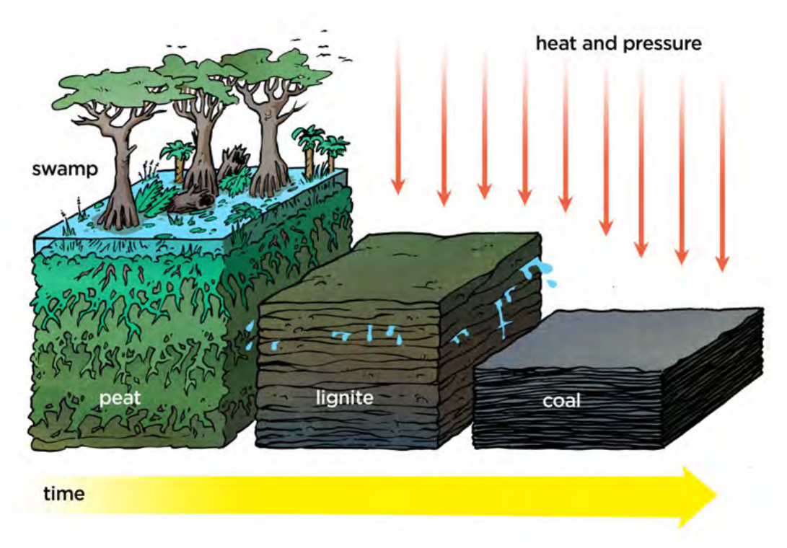
> **[Diagram Context - Textbook_NaturalScience_Gr7_Relationship-of-the-sun-to-the-Earth.pdf-0030-02.png]**
> This diagram is a geological process illustration depicting the formation of coal from organic matter. It uses labels for "swamp," "peat," "lignite," "coal," "heat and pressure," and a "time" arrow to show the progressive transformation of plant material under sedimentary conditions. Conceptually, it demonstrates how geological time, combined with increasing heat and pressure, compacts organic matter into fossil fuels, a core concept in the Natural Sciences and Geography curricula.

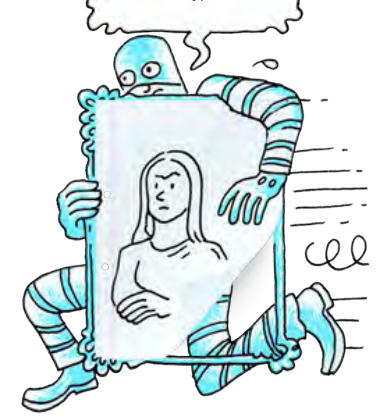
> **[Diagram Context - Textbook_NaturalScience_Gr7_Relationship-of-the-sun-to-the-Earth.pdf-0030-05.png]**
> This cartoon depicts a personified figure holding a framed portrait of a woman, with an empty speech bubble above the figure. The visual elements include a stylized character, a decorative picture frame, and a sketch of a person, representing the concept of an "observer" or "subject" in a meta-cognitive or psychological context. It serves as a metaphorical tool to prompt students to reflect on perspective, self-awareness, or the nature of representation in subjects like Life Sciences or Life Orientation.

> **[Diagram Context - Textbook_NaturalScience_Gr7_Relationship-of-the-sun-to-the-Earth.pdf-0030-14.png]**
> This diagram illustrates an electromagnet created by connecting a coiled wire (solenoid) to a battery, marked with positive (+) and negative (-) terminals. The surrounding field lines with directional arrows demonstrate the generation of a magnetic field, which is shown attracting nearby metallic objects like a screw, nail, and nut. This visualises the fundamental CAPS physics concept that an electric current flowing through a conductor produces a magnetic field, effectively turning the coil into a temporary magnet.

---

**Note:** There is an additional investigation included only in the Teacher's Guide in this section. It is:
* Investigation: Dropping objects (Optional extension activity)

## 16.3 Tides (2.5 hours)

| Tasks | Skills | Recommendation |
| :--- | :--- | :--- |
| Activity: Reading a tide chart | Reading graphs | CAPS Suggested |
| Activity: Dance of the tides | Working in groups, investigating, analysing | CAPS Suggested |
| Activity: Spring and neap tides | Observing, analysing | CAPS suggested |
| Activity: The effect of tides on shoreline ecosystems | Researching, analysing, writing | CAPS suggested |
| Activity: How good a fisherman are you? | Analysing data | CAPS Suggested |

**Note:** There are two additional activities included only in the Teacher's Guide in this section. They are:
* Activity: Tides poster (Optional, fun activity)
* Activity: Make a tide wheel (Optional activity)

### Key questions
* How long does it take for the Moon to orbit the Earth?
* What keeps the Moon in orbit around the Earth?
* What causes tides on Earth?

---

## 16.1 Relative positions

### ACTIVITY: Moon revision quiz LB page 287

This is an activity to review material covered in Grades 4 and 6. It is a short, optional activity.

---

### ACTIVITY: Observe the Moon! LB page 288

In this activity learners look in detail at the surface features of the Moon. The photographs show images of both the near side and far side of the Moon which look quite different and learners should be encouraged to compare the two.

1. No, the surface is all solid rock and lunar soil (regolith).
2. Craters.
3. The near side has more maria.

---

150

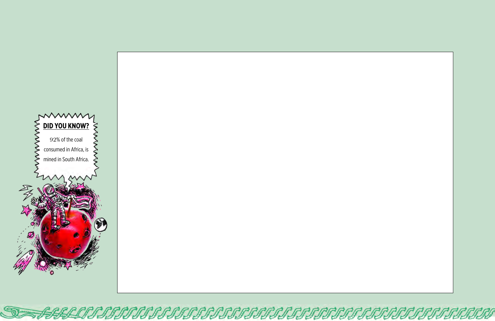
> **[Diagram Context - Textbook_NaturalScience_Gr7_Relationship-of-the-sun-to-the-Earth.pdf-0031-00.png]**
> This graphic features a "Did You Know?" text box accompanied by an illustration of an astronaut standing on a cratered planet. The text states, "92% of the coal consumed in Africa, is mined in South Africa." This element serves as a contextual sidebar to introduce learners to South Africa's significant role in the energy sector and the economic importance of coal mining within the continent.

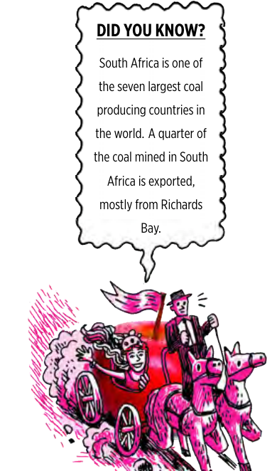
> **[Diagram Context - Textbook_NaturalScience_Gr7_Relationship-of-the-sun-to-the-Earth.pdf-0031-02.png]**
> This graphic features an illustrative cartoon of a carriage pulled by horses, paired with a text box labeled "DID YOU KNOW?". The text provides factual information regarding South Africa's status as a major global coal producer and identifies Richards Bay as the primary export hub. This content serves as a contextual enrichment piece for Geography or Economic and Management Sciences, highlighting the significance of South Africa's mineral resources and international trade infrastructure.

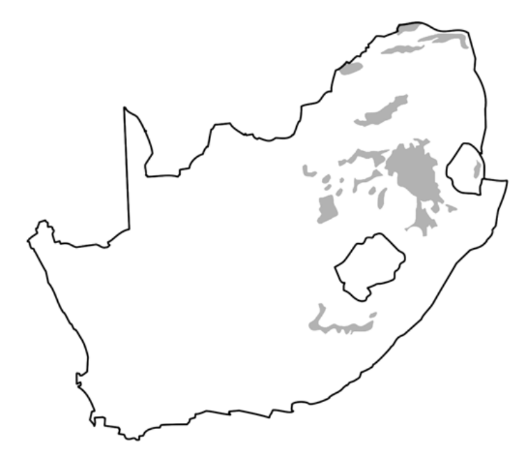
> **[Diagram Context - Textbook_NaturalScience_Gr7_Relationship-of-the-sun-to-the-Earth.pdf-0031-03.png]**
> This map of South Africa features shaded regions representing the spatial distribution of the Bushveld Igneous Complex, a significant geological feature in the northern interior. It serves as a visual aid for Geography and Earth Sciences learners to identify the location of major mineral-rich geological formations and understand their influence on the country's economic geography.

---

# ACTIVITY: Total solar eclipse (LB page 290)

In this activity, the idea that the apparent size of an object depends upon its distance from an observer is reinforced. Learners will find that although the Sun is much larger than the Moon, it appears about the same size in the sky because it is much more distant than the Moon.

1. The Sun is larger.
2. The Sun is further away.
3. They are almost the same.
4. Although the Sun is much larger than the Moon, it is much more distant. As objects appear to look smaller and smaller the further away they are, the Sun appears smaller than it is in reality. The Moon also appears smaller than it is in reality, however it is much closer to the Earth than the Sun is and so its apparent size isn't reduced as much as the Sun's is. Just by chance, the Sun and moon are currently at distances where they have the same angular size viewed from the Earth's surface.

## A note about lunar phases

Learners will most likely be familiar with the change in the Moon's appearance over the course of a month, the lunar phases. Each lunar phase cycle from New Moon to New Moon takes $29.5$ days, which is slightly longer than the Moon takes to complete one revolution around the Earth ($27.3$ days). This is because during the $27.3$ days it takes for the Moon to revolve around the Earth, the Earth is moving along in its orbit. In order for the Moon to appear at the same phase as viewed by an observer on Earth it needs to travel slightly further than $360$ degrees around the Earth and in order for it to be aligned such that there is a New Moon it takes about an extra $2$ days.

`bit.ly/16C8LQB` shows a nice animation demonstrating the difference between the orbital period of the Moon which defines the sidereal month ($27.3$ days) and the lunar phase cycle which defines the synodic month ($29.5$ days).

Observers on Earth see the same phase wherever they are positioned on Earth. However, the phases (apart from New Moon and Full Moon) look different to an observer in the Northern and Southern hemispheres. We in the Southern Hemisphere view the Moon "upside down". This is important to note because $99\%$ of all textbooks and online references include the Northern Hemisphere view of the phases and this is not what learners will see when they view the Moon for themselves. An awareness of this is crucial to reduce learner confusion when looking online and in generic textbooks.

The activity below is an optional extension activity which links the relative positions of the Earth, Sun and Moon to the phases of the Moon observed.

## Activity: Hands-on Moon Phases

As the Moon revolves around the Earth, the side facing the Sun is always illuminated, just as Earth's daylight side is illuminated by the Sun. However, from the Earth's surface we do not see a half Moon lit up all the time. Instead, we see a change in the amount of the Moon which is lit up by the Sun.

In this activity learners will learn that the relative position of the Earth, Moon and Sun determine what phase of the Moon is observed. Learners will use a lamp to represent the Sun. The learners will represent the Earth and a styrofoam ball stuck on a pencil will represent the Moon. If you cannot get hold of a styrofoam ball, you can use an orange instead. They will vary the location of

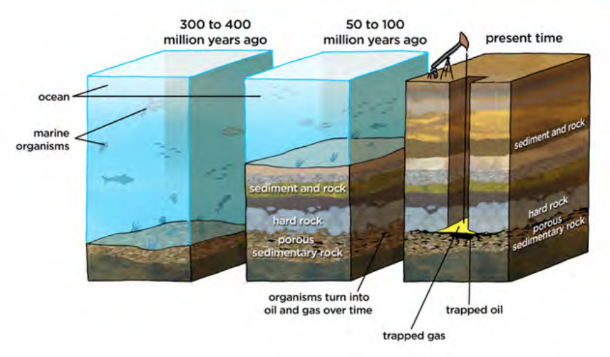
> **[Diagram Context - Textbook_NaturalScience_Gr7_Relationship-of-the-sun-to-the-Earth.pdf-0032-03.png]**
> This geological cross-section illustrates the formation of fossil fuels over three distinct time periods, featuring labels for "ocean," "marine organisms," "sediment and rock," "hard rock," "porous sedimentary rock," "trapped oil," and "trapped gas." It conceptually demonstrates the process of sedimentation, burial, and pressure that transforms ancient organic matter into extractable hydrocarbon deposits within the Earth's crust.

---

# Investigating the Phases of the Moon

## Overview & Background
In this activity, you will model the Moon in its orbit around the Earth and observe the changing phases of the Moon. 

* **The Sun:** Represented by an unshaded lamp placed in the centre of the room.
* **The Earth:** Represented by the person holding the pencil and paper.
* **The Moon:** Represented by the styrofoam ball on a stick.

> **Note on Southern Hemisphere Observations:** The first and third quarter appearances listed below are specific to the Southern Hemisphere.

### Key Moon Phases
* **New Moon:** Entirely dark
* **Full Moon:** Entirely lit
* **Crescent Moon:** Mostly dark (less than half lit)
* **Gibbous Moon:** Mostly lit
* **First Quarter Moon:** Left half lit
* **Third Quarter Moon:** Right half lit

---

## Materials Needed
* Pencil ($2$ per pair)
* One lamp that can shine in all directions (a lamp base with a bare $100$ to $150\text{ Watt}$ bulb and no lampshade)
* Styrofoam balls ($1$ per pair)
* Black plastic bags (and tape) or curtains to darken the classroom
* Sheet of paper ($1$ per pair)

---

## Instructions

1. **Work in pairs:** One learner holds the ball in place while the other draws observations. 
2. **Set up the Sun:** Place the lamp in the centre of the room. Use only one bright lamp to avoid unwanted shadowing effects.
3. **Darken the room:** Use dark plastic bags taped to the windows or close the curtains.
4. **Prepare the Moon:** Stick one of the pencils into your styrofoam ball so you can hold it up by the pencil end.
5. **Form a circle:** Learners must stand in a circle around the central light, with partners next to each other.
6. **Position yourselves:** Directly face the light. One partner holds the ball at arm's length, slightly above their head (representing the Earth). Ensure the ball is held high enough so it does not cast shadows over the ball. *Note: We assume the Earth remains in the same spot while the Moon orbits around it.*
7. **Observe illumination:** If you are holding the ball, move it slowly from left to right (keeping your body still) and observe how much of it is lit by the light. Swap roles with your partner to try it as well.
8. **Reference the board:** Look at the different phases of the Moon drawn on the blackboard (New Moon, Full Moon, First Quarter, Third Quarter).
9. **Model New Moon:** Position the ball until, from your point of view, it looks completely in shadow. This represents a **New Moon**.
10. **Record observations:** The partner not holding the ball should draw the relative positions of the Sun, Moon, and Earth, and write down the corresponding Moon phase.
11. **Model Full Moon:** Swap roles and position the ball such that it is fully lit, looking like a **Full Moon**. Record the relative positions.
12. **Repeat for all phases:** Complete the activity for all the phases listed in step 8.
13. **Find the Crescent:** Look at the crescent moon on the blackboard and determine what positions you can place the ball to see it lit up like a crescent.

> **[Diagram Context - Textbook_NaturalScience_Gr7_Relationship-of-the-sun-to-the-Earth.pdf-0033-00.png]**
> This illustration depicts a caterpillar-like organism with a metallic slinky-coil body and a cartoonish head, feeding on green leaves. The visual elements include the segmented coil body, leaf structures, and a smiling face, which serve as a metaphorical representation of an organism interacting with its environment. Conceptually, this graphic is used to introduce the biological concept of herbivory and the physical movement patterns of invertebrates in a Life Sciences context.

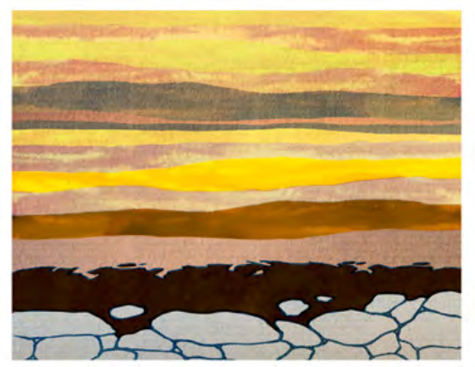
> **[Diagram Context - Textbook_NaturalScience_Gr7_Relationship-of-the-sun-to-the-Earth.pdf-0033-06.png]**
> This image is a geological cross-section illustrating sedimentary rock strata, characterized by distinct horizontal layers of varying colors and textures. It depicts the principle of superposition, where older rock layers are deposited at the bottom and younger layers accumulate sequentially above them, providing a visual representation of Earth's stratigraphic history.

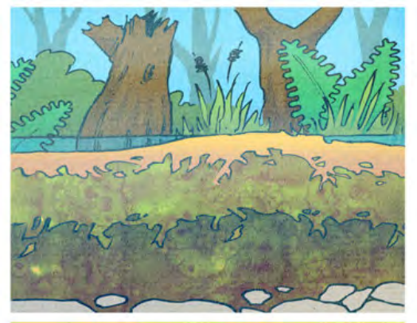
> **[Diagram Context - Textbook_NaturalScience_Gr7_Relationship-of-the-sun-to-the-Earth.pdf-0033-07.png]**
> This diagram is a cross-sectional illustration of a soil profile showing distinct layers of topsoil, subsoil, and parent material beneath a vegetated surface. It visually represents the vertical stratification of earth, highlighting the transition from organic-rich surface layers to the rocky substrate below. This helps learners understand soil composition, horizon formation, and the relationship between surface vegetation and the underlying geological structure.

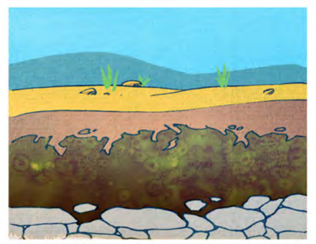
> **[Diagram Context - Textbook_NaturalScience_Gr7_Relationship-of-the-sun-to-the-Earth.pdf-0033-10.png]**
> This diagram is a cross-sectional illustration of a soil profile, depicting distinct layers including the topsoil, subsoil, and underlying parent rock or bedrock. It visually represents the vertical stratification of earth materials, helping students understand the composition and structure of soil horizons as they develop from the surface down to the solid rock base.

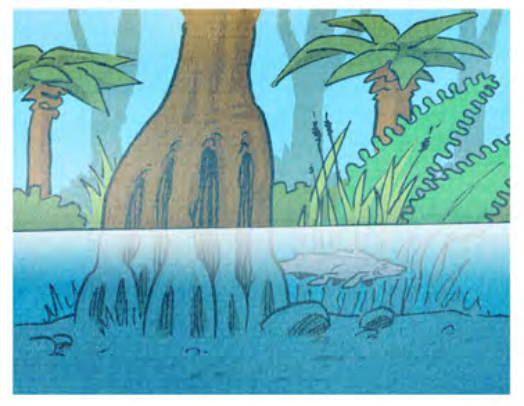
> **[Diagram Context - Textbook_NaturalScience_Gr7_Relationship-of-the-sun-to-the-Earth.pdf-0033-12.png]**
> This illustration depicts a prehistoric swamp ecosystem featuring terrestrial flora, such as ferns and large trees with prop roots, alongside an aquatic environment containing a lobe-finned fish. It serves as a visual representation of the Devonian period, illustrating the habitat where transitional organisms like *Tiktaalik* or early tetrapods evolved to navigate shallow, oxygen-poor waters and muddy shorelines.

> **[Diagram Context - Textbook_NaturalScience_Gr7_Relationship-of-the-sun-to-the-Earth.pdf-0033-14.png]**
> This graphic depicts a schematic representation of a DNA double helix, featuring two antiparallel sugar-phosphate backbones connected by repeating horizontal rungs representing nitrogenous base pairs. It conceptually illustrates the molecular structure of DNA, highlighting the characteristic helical twist and the complementary pairing essential for genetic information storage and replication in Life Sciences.

---

14. Swap positions again and this time find out what positions you can place the ball in to see it lit up in a gibbous phase (more than half lit).

### Questions

1. In what position do you need to place the Moon in order to see a New Moon?
   * **Answer:** The Moon needs to be placed directly in between the Sun and the Earth.
2. In what position do you need to place the Moon in order to see a full Moon?
   * **Answer:** The ball needs to be placed directly away from the Sun, with the Earth in between the two.
3. In what positions can you place the Moon in order to see a crescent?
   * **Answer:** Any position as far as $90^\circ$ either side of the New Moon position (to the left or right).

An optional activity that learners may complete in their own time is a month-long Moon observation. They may have already completed this activity in Gr. 6, but it is added here in case you wish to conduct a Moon observation as an additional activity.

---

## ACTIVITY: Demonstrating the Moon's orbit around the Earth (LB page 293)

In this activity learners will demonstrate the orbit of the Moon around the Earth using a ball tied to a rope swung around their heads. They will demonstrate what would happen to the Moon if there were no gravity by letting go of the rope.

**Safety tip:** Do this activity outside or in the school hall if possible so that learners can spread out. This will help them avoid hitting each other when the balls are released. If this is not possible take it in turns to do this demonstration or have only a few learners do this demonstration so that no one is hit by a flying ball!

1. The ball moves around in a complete circle.
2. The gravitational attraction between the Earth and the Moon.
3. If the rope is released the ball flies off in the direction it was travelling in just as the rope was released.
4. This represents that the gravity keeps the Moon in its path around the Earth. Without it, the Moon would move away from its path.

The content here on weight is not specified for Gr. 7 level in CAPS, and only appears in Gr. 9 in CAPS. However, as learners confuse mass and weight very easily, this has been included as enrichment material at this level. You can decide whether you want to cover this content with your learners or not. It is not to be assessed in Gr. 7.

1. $50\text{ kg}$, as the mass of an object is independent of position.
2. $600\text{ N}$ ($60 \times 10$)
3. $100\text{ N}$ ($60 \times 10 / 6$)
4. She would feel lighter on the Moon, even though her mass is the same on the Moon.

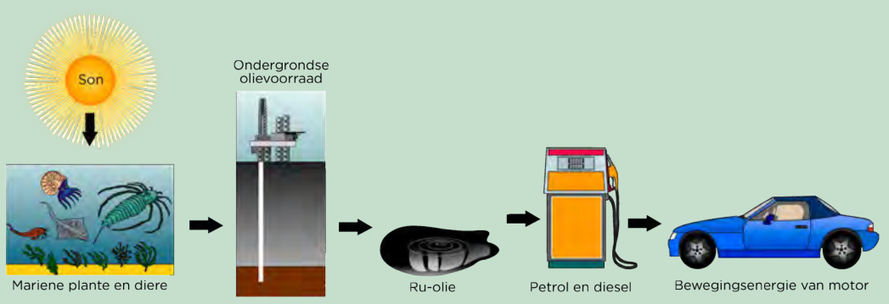
> **[Diagram Context - Textbook_NaturalScience_Gr7_Relationship-of-the-sun-to-the-Earth.pdf-0034-06.png]**
> This flow diagram illustrates the energy transformation process from solar energy to the kinetic energy of a vehicle, featuring labels for "Son," "Mariene plante en diere," "Ondergrondse olievoorraad," "Ru-olie," "Petrol en diesel," and "Bewegingsenergie van motor." It conceptually demonstrates how ancient solar energy is stored in fossil fuels through geological processes and subsequently converted into mechanical work to power modern transport.

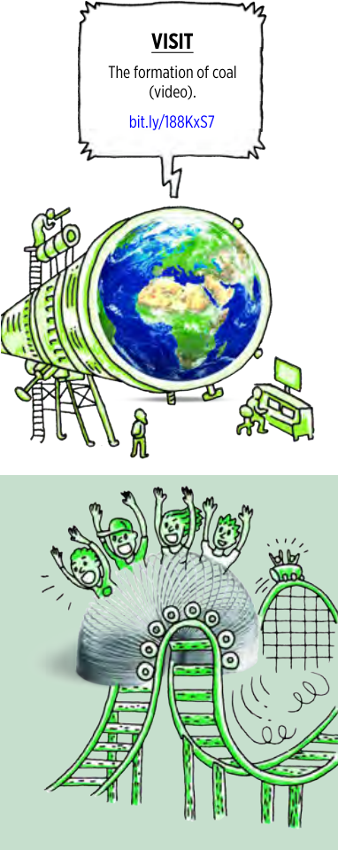
> **[Diagram Context - Textbook_NaturalScience_Gr7_Relationship-of-the-sun-to-the-Earth.pdf-0034-07.png]**
> This graphic features a call-to-action speech bubble directing students to an external video resource regarding the formation of coal, accompanied by illustrations of a telescope observing Earth and a roller coaster. It serves as an introductory engagement tool to pique student interest in the geological processes of fossil fuel formation and the energy transformations associated with physical systems.

---

# ACTIVITY: How much would you weigh on other planets? (LB page 295)

In this activity, learners calculate what their weight would be on the seven other planets in our solar system. Although their mass remains the same, they will "feel" lighter or heavier because of the differences in the gravitational field strength on the surfaces of the other planets. You should emphasise that their mass always remains the same, but only their weight varies. If you do not have access to weighing scales, you can either ask learners to estimate their mass or provide them with an example number.

## Sample answers for a $50\text{kg}$ learner

| Planet | Your mass (kilograms) | Strength of gravity relative to Earth | Your weight (Newtons) |
| :--- | :--- | :--- | :--- |
| Earth | 50 | 1 | 500 |
| Mercury | 50 | 0.378 | 189 |
| Venus | 50 | 0.907 | 453.5 |
| Mars | 50 | 0.377 | 188.5 |
| Jupiter | 50 | 2.36 | 1180 |
| Saturn | 50 | 0.916 | 458 |
| Uranus | 50 | 0.889 | 444.5 |
| Neptune | 50 | 1.12 | 560 |

1. You would feel heavier on Jupiter and Neptune.
2. You would feel lighter on Mercury, Venus, Mars, Saturn and Uranus.

## A note on falling objects

A useful way to demonstrate the Earth's gravity is to look at falling objects. An optional extension activity is included below in which learners drop a variety of objects. You can take a vote from the class to see whether learners think that an apple or bag of sugar would hit the ground first. (Answer: they would hit the ground at the same time as long as air resistance is negligible.) It is very likely that learners will have the preconception that heavier items fall faster. It is not important at the moment that the learners answers are correct and do not try to lead them to the correct answer. They will hopefully discover it for themselves in the following experiment.

---

# ACTIVITY: Reading a tide chart (LB page 298)

This activity provides a chart showing tidal data for one week in Cape Town. This activity gives learners the opportunity to read and interpret data from the chart.

1. Two
2. High tide
3. Two
4. Low tide
5. $0.7\text{ m}$
6. Friday 3 May at $10.17\text{ am}$
7. $1.35\text{ m}$

> **[Diagram Context - Textbook_NaturalScience_Gr7_Relationship-of-the-sun-to-the-Earth.pdf-0035-08.png]**
> This graphic depicts a repeating, wave-like pattern of interconnected, arrow-shaped segments. It serves as a visual representation of a continuous process or directional flow, often used in Life Sciences to illustrate metabolic pathways, the sequence of DNA replication, or the cyclical nature of biological systems.

---

8. 
* a) At 11:47 am
* b) At 6:05 pm

Ask learners to give you their answer as to what causes the tides. You can write down all the answers. At this point, it does not matter if the learners do not know what causes the tides; they will find out in the "Dance with the tides" activity. Once they have completed the activity, ask the learners again to see if they have changed their minds. At this point, they should be aware that the gravitational pulls of the Moon and the Sun cause the tides.

---

## ACTIVITY: Dance of the tides (LB page 300)

This activity requires learners to work in groups of six:
* One learner will represent the **Earth**.
* Four learners will represent the **Earth's oceans**.
* One learner will represent the **Moon**.

You could ask learners to wear coloured T-shirts (green for the Earth, blue for the oceans, grey for the Moon) or to pin drawings or photos of the object they are representing to their school shirts with safety pins to make it clear what they are representing.

### Background Information & Concepts

In this activity, learners will model how the Moon's gravitational pull causes tides on Earth. Be sure to explain to them that the scale of the model is not correct (for example, the Moon and Earth sizes are not correct in relation to each other). 

You can ask learners how they think the Moon can influence the Earth. Explain that moons and planets can influence each other's spins and tilts from a distance via their gravitational pull. All objects that have mass have their own gravity, but only large objects, like planets, have enough gravity to influence each other from very large distances. 

Explain that you are going to model what effect the Moon's gravitational pull has on the Earth. Remember that **the gravitational force exerted by an object diminishes as you go further from it**. Therefore, objects that are closer to the Moon experience a greater gravitational pull towards the Moon than objects that are further away.

### Discussion and Questions

Explain that the water from the oceans has "piled up" under the Moon and directly opposite the Moon. The two children standing beside "Earth" represent parts of the ocean where there is less water. 

You could ask the learners the following questions:

* **Where are the oceans at the highest levels?**
  * *At the oceans nearest and farthest from the "Moon".*
* **Are the coastal areas next to those "oceans" seeing a high or low tide?**
  * *High.*
* **How many sides of the Earth experience high tide at the same time?**
  * *Two (in general).*
* **Which parts of the Earth are experiencing high tide right now?**
  * *The part that is under the piled-up oceans.*
* **Where is low tide?**
  * *Near the oceans closest to Earth on either side.*

*Note: The formation of the second ocean bulge is simplified in this model and ignores subtle motions of the Earth.*

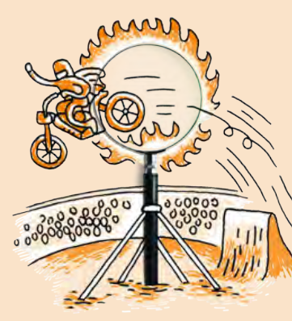
> **[Diagram Context - Textbook_NaturalScience_Gr7_Relationship-of-the-sun-to-the-Earth.pdf-0036-04.png]**
> This illustration depicts a stunt motorcyclist jumping through a flaming hoop supported by a tripod stand. It serves as a visual metaphor for projectile motion, illustrating the parabolic trajectory of an object launched into the air under the influence of gravity.

> **[Diagram Context - Textbook_NaturalScience_Gr7_Relationship-of-the-sun-to-the-Earth.pdf-0036-12.png]**
> This graphic illustrates a zipper mechanism, featuring interlocking teeth and a central slider component. In a Life Sciences context, this serves as a common analogy for the unwinding and unzipping of the DNA double helix by the enzyme helicase during DNA replication.

---

## Tides and Shoreline Ecosystems

### Understanding Tides: Key Concepts and Observations

Ensure that learners can still find the sides of low and high tides even though they are less extreme.

1. Two
2. Under the Moon and on the side of the Earth directly opposite the Moon.
3. They remain under the Moon and directly opposite the Moon.
4. The high and low tide are on different parts of the surface of Earth now.
5. The Sun.
6. Yes, but the difference between high and low tide would not be as extreme. Since the Sun is so far away, the Sun's gravitational pull would give the tides only a third of their height.

In this activity, we have ignored the motion of the Moon revolving around the Earth. The time of high tide changes each day because the Moon is moving around the Earth. If we had no Moon, the tide due to the Sun alone would occur at essentially the same time every day. This activity also ignores the friction between the water and solid Earth as it spins, which causes the tidal bulges (piled up ocean bulges) to lie ahead of the Earth-Moon line in the direction of the Earth's rotation.

The actual times of low and high tides at a particular place on Earth are influenced not only by the Earth's spin but also by the Moon's motion around the Earth in its orbit. As the Earth spins, the Moon also travels around the Earth. The Moon rises about an hour later each day, and high (and low) tides also occur roughly an hour later each day.

---

### ACTIVITY: Spring and neap tides (LB page 302)

1. New and Full Moon.
2. First and third quarter.
3. New and full Moon.

Some additional activities are explained below.

---

### ACTIVITY: The effects of tides on shoreline ecosystems (LB page 305)

This is an activity in which learners investigate what adaptations different shoreline animals have made in order to survive in the intertidal zone and write a summary of their findings. You can ask learners to look online for images and examples if they have access to the Internet. Alternatively, they can consult the school or local library, or you can provide them with specific examples. Some images have been provided here as a starting point. This can also be used as a research task.

Learners can use any of the examples given in this activity or those that they have read about. Answers could include:
* Animals that avoid drying out by burrowing.
* Animals that avoid drying out by closing their shells.
* Plants that are covered in mucus.
* Animals and plants that avoid being washed away by having strong "feet" that attach tightly to rocks.

Here is some extra information about the different animals found in different areas in the intertidal zone:

> **[Diagram Context - Textbook_NaturalScience_Gr7_Relationship-of-the-sun-to-the-Earth.pdf-0037-00.png]**
> This diagram illustrates a cross-section of a biological membrane, specifically representing the phospholipid bilayer structure with its hydrophilic heads oriented outward. The repeating blue, hook-like symbols represent the polar phosphate heads anchored to the surface of the membrane, which is depicted as a solid, light-blue horizontal band. This visual aids learners in understanding the fluid mosaic model by highlighting the arrangement of phospholipids that form the selective barrier of the cell.

> **[Diagram Context - Textbook_NaturalScience_Gr7_Relationship-of-the-sun-to-the-Earth.pdf-0037-01.png]**
> This metaphorical illustration depicts a tree with an owl, a swing, a treasure chest, and skeletal remains, all superimposed by a large metallic key. The image serves as a visual allegory for the concept of "unlocking" knowledge or history, suggesting that nature and the physical remnants of the past hold secrets waiting to be discovered through inquiry.

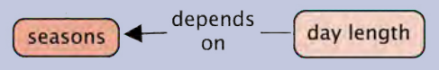
> **[Diagram Context - Textbook_NaturalScience_Gr7_Relationship-of-the-sun-to-the-Earth.pdf-0037-17.png]**
> This concept map uses two rectangular nodes labeled "seasons" and "day length," connected by a directional arrow and the linking phrase "depends on." It illustrates the causal relationship between the duration of daylight and the occurrence of seasonal changes, helping students understand how variations in solar exposure influence environmental cycles.

