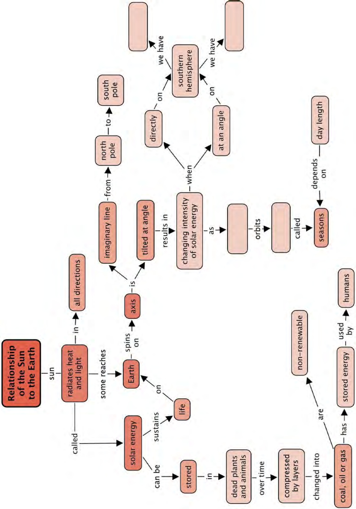

**Relationship of the Sun to the Earth** 


> **[Diagram Context - Textbook_NaturalScience_Gr7_Relationship-of-the-sun-to-the-Earth.pdf-0001-02.png]**
> This diagram represents a cross-section of a biological membrane, specifically illustrating the hydrophilic heads of a phospholipid monolayer oriented towards an aqueous environment. The image features a series of repeating, hook-shaped blue symbols embedded along the surface of a light-blue rectangular base, representing the polar phosphate heads. Conceptually, this helps Grade 10-12 Life Sciences learners visualize the structural arrangement of the phospholipid bilayer's surface, emphasizing the amphipathic nature of cell membranes.


> **[Diagram Context - Textbook_NaturalScience_Gr7_Relationship-of-the-sun-to-the-Earth.pdf-0001-03.png]**
> This graphic features a cartoon character with a key for a head, depicted in a confused or pensive pose alongside a question mark. It serves as a metaphorical visual aid to represent the "lock and key" model of enzyme action, illustrating the concept of substrate specificity where an enzyme's active site must match the shape of a specific substrate.


### **KEY .** . **. QUESTIONS:** 

### . **.** . **.** 

- Why do we have night and day? 

- Why do we experience seasons on Earth? 

- Do other planets have seasons too? 

- How does the Sun influence life on Earth? 

The Sun is our closest star. It is a huge ball of very hot gas in space which radiates heat and light in all directions. All the planets, including our home, the Earth, travel around the Sun in orbits. As we will see in this chapter, the Sun is incredibly important: it provides us with light and warmth and its apparent motion across our sky causes day and night and the passage of the seasons. 


> **[Diagram Context - Textbook_NaturalScience_Gr7_Relationship-of-the-sun-to-the-Earth.pdf-0001-11.png]**
> This graphic is a vocabulary list containing the terms "sphere," "axis," "rotation," "revolution," "day," and "orbit." It serves as a foundational glossary for Natural Sciences, introducing key concepts required to understand planetary motion and the Earth-Sun relationship.


> **[Diagram Context - Textbook_NaturalScience_Gr7_Relationship-of-the-sun-to-the-Earth.pdf-0001-12.png]**
> This image is a high-resolution astronomical photograph of the Sun, displaying its photosphere and active solar features such as prominences and granulation without any textual labels or variables. For a high school learner, it serves as a visual representation of a star, illustrating the dynamic nature of solar activity and the intense thermal energy generated by nuclear fusion within the stellar core.


> **[Diagram Context - Textbook_NaturalScience_Gr7_Relationship-of-the-sun-to-the-Earth.pdf-0001-14.png]**
> This graphic is a text-based heading labeled "1.1 Solar energy and the Earth's seasons." It serves as an introductory title for a Geography or Natural Sciences unit, signaling that the subsequent content will explain how the Earth's axial tilt and orbital position relative to the sun dictate seasonal variations in solar radiation.


###### **Earth's rotation** 

Let's start off with seeing what you can remember learning about **day** and night in Grade 6. 

##### **ACTIVITY:** Day and night revision exercise 

###### **INSTRUCTIONS:** 

1. Answer the questions in the table below. 

###### **QUESTIONS:** 

|In which direction would you have<br>to look to see the Sun rising?|
|---|
|In which direction would you look<br>to see the Sun setting?|
|At what time is the Sun at its<br>highest point in the sky?|
|At midnight, where is the Sun in<br>relation to your position on the<br>Earth?|
|How long does it take the Earth to<br>complete one rotation on its axis?|


> **[Diagram Context - Textbook_NaturalScience_Gr7_Relationship-of-the-sun-to-the-Earth.pdf-0002-05.png]**
> This diagram illustrates a slinky toy moving down a staircase, using motion lines to indicate its trajectory. It serves as a physical model to help Grade 10-12 Physical Sciences students visualize the transfer of energy and the propagation of longitudinal and transverse waves through a medium.


> **[Diagram Context - Textbook_NaturalScience_Gr7_Relationship-of-the-sun-to-the-Earth.pdf-0002-06.png]**
> This diagram illustrates a simplified representation of a DNA molecule, featuring the characteristic double-helix structure composed of two antiparallel sugar-phosphate backbones. It visually demonstrates the complementary base pairing between the strands, helping learners understand how the genetic code is structured and stabilized within the double-stranded helix.


###### **<u>DID YOU KNOW?</u>** 

If you follow the path of the Sun during the day you will see that it rises in the east and sets in the west. The Sun reaches its highest point at noon (midday). Why do you think it looks as though the Sun moves across the sky during the day? 


> **[Diagram Context - Textbook_NaturalScience_Gr7_Relationship-of-the-sun-to-the-Earth.pdf-0002-09.png]**
> This diagram illustrates the apparent daily path of the Sun across the sky, featuring an observer, a semi-circular arc representing the celestial path, and time markers from 6am to 6pm. It visually demonstrates the Earth's rotation by showing the Sun rising in the east and setting in the west, helping learners understand how the observer's perspective relates to the Sun's position throughout the day.


_The Sun is at different positions in the sky during the day. But is it the Sun that is moving?_ 

Let's do an activity to find out! 

Different planets take different amounts of time to make one complete rotation on their axis and so they have different lengths of days. Venus is the most sluggish rotator of all the planets in our solar system and takes 243 Earth days to complete one rotation. A Venus day lasts longer than 200 days on Earth! 


> **[Diagram Context - Textbook_NaturalScience_Gr7_Relationship-of-the-sun-to-the-Earth.pdf-0002-13.png]**
> This caricature depicts Sir Isaac Newton with an apple-shaped head, surrounded by a network of floating apples connected by dashed lines and directional arrows. The graphic serves as a mnemonic device to illustrate Newton’s Law of Universal Gravitation, visually representing the concept of mutual gravitational attraction between masses in space.


> **[Diagram Context - Textbook_NaturalScience_Gr7_Relationship-of-the-sun-to-the-Earth.pdf-0003-00.png]**
> This diagram illustrates an electromagnet, featuring a coiled wire (solenoid) connected to a battery with positive (+) and negative (-) terminals, surrounded by magnetic field lines indicated by directional arrows. It demonstrates the principle of electromagnetism, showing how an electric current flowing through a coil generates a magnetic field capable of attracting metallic objects like the depicted nut, nail, and screw.


##### **ACTIVITY:** Movement of a classroom Sun 

###### **MATERIALS:** 

- yellow round balloon or ball which can be hung from the ceiling 

- string for hanging the ball or balloon 

###### **INSTRUCTIONS:** 

1. Hang up the balloon or ball from the ceiling using the string close to one of the corners in your classroom. Make sure that the balloon/ball is high up and visible from the back of the classroom. The balloon/ball represents the Sun. 

2. Stand up in your classroom and face the balloon/ball. 

3. Now slowly turn on the spot in a clockwise direction keeping your head still, completing two or three turns. 

**<u>VISIT</u>** The story of our planet (video) bit.ly/1bLAXbE 

4. Repeat the activity but this time turn in an anti-clockwise direction. 

###### **QUESTIONS:** 


> **[Diagram Context - Textbook_NaturalScience_Gr7_Relationship-of-the-sun-to-the-Earth.pdf-0003-12.png]**
> This conceptual illustration depicts the Earth as a hot air balloon, featuring a globe, a burner flame, and two figures in a basket using telescopes to observe the environment. It serves as a visual metaphor for global environmental monitoring and the human responsibility to observe and manage the Earth's delicate atmospheric and ecological systems.


1. As you turned clockwise what direction did the hanging balloon/ball appear to move? 

2. As you turned anti-clockwise what direction did the hanging balloon/ball appear to move? 

3. Did the hanging Sun actually move? 

4. Why do you think we see the Sun move across the sky? 


> **[Diagram Context - Textbook_NaturalScience_Gr7_Relationship-of-the-sun-to-the-Earth.pdf-0003-17.png]**
> This graphic depicts a repeating, stylized wave pattern composed of interconnected, arrow-headed segments. The image lacks specific labels or biological markers, but conceptually illustrates the principle of continuous, directional flow or periodic motion often used in Life Sciences to represent the propagation of nerve impulses or the rhythmic movement of cilia and flagella.


As you can see the hanging Sun is not really moving, it just appears to move because you are turning. This is also true for the real Sun in the sky. The Sun does not really move, it just appears to move because the Earth is turning on its **axis** . So, it is the Earth's **rotation** that causes the apparent movement of the Sun across the sky during the day. 

**148** Planet Earth and Beyond 

##### **ACTIVITY:** Daytime and nighttime 

###### **MATERIALS:** 

- a globe (or a ball/balloon with the shapes of the continents drawn on it) which can be hung from the ceiling 

- string for hanging the globe 

- non-permanent marker or sticker 

- desk lamp or torch 

- black bin bags or curtains to darken the room 

###### **INSTRUCTIONS:** 

1. If you do not have a globe, you can make a model of the Earth yourself in class. Use any ball. Draw the Equator and mark the North and South Poles. 

2. Mark with a dot/sticker your position on the globe. 

3. Hang the globe from the ceiling near the middle of the class. It should be at about eye level height. The globe represents the Earth. 

4. Darken the room. 

5. Shine a desk lamp or torch on the globe facing Africa and keep the lamp/torch steady in this position. The torch represents the Sun. 

6. Walk around the globe so that you can see all of it. Is it all lit up by the torch? How much of it is lit and how much is dark? 

7. The lit area represents daytime and the dark area represents nighttime. Is your dot/sticker in daytime or nighttime? 

8. Now turn the globe anti-clockwise, half a turn. Is your dot/sticker in daytime or nighttime? 


> **[Diagram Context - Textbook_NaturalScience_Gr7_Relationship-of-the-sun-to-the-Earth.pdf-0004-16.png]**
> This illustration depicts a metaphorical representation of a caterpillar feeding on a plant, using a metallic slinky to represent the segmented body of the larva. The image features a stylized green caterpillar head, a coiled spring body with circular markings, and surrounding green leaves. It serves as a visual mnemonic to help learners identify the physical characteristics of insect larvae, specifically their segmented bodies and herbivorous feeding habits within an ecosystem.


###### **<u>TAKE NOTE</u>** 

It is incorrect to talk about the Sun 'burning'. The Sun is not 'burning' in the way a fire does. Remember, a fire burning on Earth requires oxygen and there is no oxygen in space. Rather, the gas is very hot and glowing as a result. 


> **[Diagram Context - Textbook_NaturalScience_Gr7_Relationship-of-the-sun-to-the-Earth.pdf-0004-19.png]**
> This illustration depicts a tablet interface featuring various scientific and mathematical icons, including symbols for electricity, chemistry, and geometry, with a finger selecting an app. The graphic serves as a conceptual metaphor for the integration of digital technology and ICT (Information and Communication Technology) tools in modern scientific inquiry and data processing. It highlights how learners can use digital platforms to access, calculate, and simulate scientific information as part of the CAPS curriculum's focus on technological literacy.


9. Where is it now daytime? 

10. Keep turning the globe anti-clockwise until your dot/sticker is back in its original position and lit again. How long would it take on the real Earth for the dot to complete one rotation like this? 


> **[Diagram Context - Textbook_NaturalScience_Gr7_Relationship-of-the-sun-to-the-Earth.pdf-0004-22.png]**
> This graphic illustrates a schematic representation of a double-stranded DNA molecule, characterized by its iconic double helix structure. The diagram uses two intertwined, repeating green ribbons to represent the sugar-phosphate backbones, visually demonstrating the antiparallel nature and complementary base pairing essential for genetic replication and protein synthesis in the Life Sciences curriculum.


So, now you can see how the Earth's rotation about its axis causes day and night. When one half of the Earth is lit up by the Sun, the other half is in darkness. It is daytime in the lit half and nighttime in the dark half. As the Earth spins you move from light to shadow and back to light again over the course of one day (24 hours). 


> **[Diagram Context - Textbook_NaturalScience_Gr7_Relationship-of-the-sun-to-the-Earth.pdf-0005-01.png]**
> This graphic is an educational illustration featuring a cartoon figure holding a sign above a globe, surrounded by circular arrows indicating rotation. The labels include the text "VISIT," "Video of the Earth spinning on its axis causing day and night," and a shortened URL. Conceptually, this diagram serves as a visual prompt to help learners understand the Earth's rotation on its axis as the primary mechanism responsible for the cycle of day and night.


> **[Diagram Context - Textbook_NaturalScience_Gr7_Relationship-of-the-sun-to-the-Earth.pdf-0005-02.png]**
> This diagram illustrates the Earth's rotation relative to the Sun, featuring labels for the "Sun," "Earth," "Light rays," "Day," and "Night," along with an axis line. It conceptually demonstrates how the Earth's rotation causes the cycle of day and night by showing how solar radiation illuminates only one hemisphere at a time.


During the night you cannot see the Sun move across the sky, but if you look carefully you will notice that the stars move across the sky, just like the Sun does. It takes the Earth 24 hours to make one complete turn (called a rotation) on its axis, so an Earth day is 24 hours long. 


> **[Diagram Context - Textbook_NaturalScience_Gr7_Relationship-of-the-sun-to-the-Earth.pdf-0005-04.png]**
> This long-exposure photograph captures star trails circling a celestial pole above an astronomical observatory. The image visually demonstrates the Earth's rotation on its axis, showing how stars appear to move in concentric arcs relative to a stationary point in the night sky.


> **[Diagram Context - Textbook_NaturalScience_Gr7_Relationship-of-the-sun-to-the-Earth.pdf-0005-05.png]**
> This graphic is a text-based educational sign containing the heading "VISIT," the inquiry question "Why does the Earth spin? (video)," and a shortened URL link. It serves as a digital resource signpost designed to direct learners to supplementary multimedia content regarding planetary rotation and the formation of the solar system, which are key concepts in the Grade 10 Geography CAPS curriculum.


> **[Diagram Context - Textbook_NaturalScience_Gr7_Relationship-of-the-sun-to-the-Earth.pdf-0005-06.png]**
> This illustration depicts a large telescope focused on a globe of the Earth, with human figures observing and monitoring data on a computer screen. It visually represents the concept of Earth observation and remote sensing, highlighting how scientific instruments are used to collect and analyze planetary data.


_This picture of the SALT telescope near Sutherland was taken at night with the camera shutter left open. You can see the star trails due to the Earth's rotation._ 

You now know that the Earth rotates on its axis completing one turn every 24 hours. But which way does it turn? Let's see if you can figure it out. 

Planet Earth and Beyond 

##### **ACTIVITY:** Which way does the Earth rotate? 

###### **MATERIALS:** 

- a ball or balloon 

- string for hanging the ball 

###### **INSTRUCTIONS:** 

1. Hang up the balloon or ball from the ceiling using the string close to one of the corners in your classroom. Make sure that the balloon/ball is high up and visible from the back of the classroom. The ball represents the Sun. 


> **[Diagram Context - Textbook_NaturalScience_Gr7_Relationship-of-the-sun-to-the-Earth.pdf-0006-06.png]**
> This illustration depicts a roller coaster track integrated with a slinky spring, featuring passengers, a grid-like structure, and motion lines. It serves as a conceptual analogy for Grade 10-12 Physical Sciences, illustrating the transformation between gravitational potential energy and kinetic energy, as well as the propagation of mechanical waves along a medium.


2. Stand up in your classroom and face the balloon/ball. 

3. Now slowly turn on the spot in a clockwise direction keeping your head still, completing two or three turns. Are you turning to your left or right? Note what happens to the hanging balloon or ball. 

4. Now repeat the activity but this time turn in an anti-clockwise direction. Are you turning to your left or right? Note what happens to the hanging balloon or ball. **.** 

5. What do you notice about the direction that you turn (left or right) and the direction that the hanging Sun appears to move? 

6. Which direction does the Sun appear to move across the sky, east to west or west to east? Given your answer to question 5 which way do you think the Earth is really turning? 

7. Look at the following picture showing the Earth from space. Using your answer to question 6, is the Earth spinning in a clockwise or anti-clockwise direction? Draw the direction on the picture below. 


> **[Diagram Context - Textbook_NaturalScience_Gr7_Relationship-of-the-sun-to-the-Earth.pdf-0007-01.png]**
> This graphic is a space-based perspective of Earth featuring the Moon in the background and cardinal direction labels (N, S, E, W) positioned around the planet. It illustrates the Earth's orientation in space, providing a visual reference for understanding planetary positioning and the relative scale of the Earth-Moon system within the context of Earth and Space Sciences.


> **[Diagram Context - Textbook_NaturalScience_Gr7_Relationship-of-the-sun-to-the-Earth.pdf-0007-02.png]**
> This educational graphic is an informational text box containing the heading "DID YOU KNOW?" and text referencing the planets Uranus and Venus. It highlights the unique axial tilt of Uranus, which rotates on its side, and the retrograde rotation of Venus compared to other planets in our solar system. This serves as a supplementary fact to support Grade 9 Natural Sciences learners in understanding the diverse rotational characteristics of celestial bodies within the Earth and Beyond strand.


> **[Diagram Context - Textbook_NaturalScience_Gr7_Relationship-of-the-sun-to-the-Earth.pdf-0007-03.png]**
> This illustration is a creative composite featuring an astronaut standing on a cratered red apple, surrounded by celestial elements like stars, planets, a comet, and a speech bubble. It serves as a metaphorical visual aid to introduce concepts of gravity, planetary motion, or the history of scientific discovery, such as Newton’s law of universal gravitation. By juxtaposing a fruit with space exploration, it encourages students to bridge the gap between everyday physical phenomena and the broader principles of physics governing the universe.


_This colour image shows North and South America (green and brown continents) as they would appear from space._ 

###### **Earth's revolution** 

The Earth revolves around the Sun in an almost perfect circle, completing one **revolution** ( **orbit** ) around the Sun per year (or 365 4<sup><u>1</u>days to be precise).As the</sup> Earth revolves around the Sun it also rotates (spins) on its axis at the same time. Having two words both beginning with "r" relating to movement can be confusing! Let's check now that you know what they mean before we continue. 

In your own words explain what is meant by the Earth's **rotation** . 

In your own words explain what is meant by the Earth **revolving** . 

Different planets take different amounts of time to make one complete revolution around the Sun and so their years have different lengths. The planets further from the Sun will have bigger orbits, as shown in the diagram, and therefore take longer to revolve around the Sun. 

Planet Earth and Beyond 


> **[Diagram Context - Textbook_NaturalScience_Gr7_Relationship-of-the-sun-to-the-Earth.pdf-0008-00.png]**
> This diagram is a schematic representation of the solar system, illustrating the Sun at the centre with the eight planets orbiting along elliptical paths. It explicitly labels the Sun, the asteroid belt, and the planets Mercury, Venus, Earth, Mars, Jupiter, Saturn, Uranus, and Neptune. Conceptually, this model helps learners visualise the relative positioning of celestial bodies and the structural organisation of our solar system within the context of Natural Sciences.


_Our solar system._ 

###### **Why do we have seasons?** 

As the Earth travels around the Sun it receives **solar energy** in the form of light and heat, emitted from the Sun. Do you remember that in Energy and Change last term, we spoke about how heat is transferred from the Sun through space, to Earth? What is this called? 

We are very lucky to have our Sun! if the Earth did not receive any energy from the Sun the Earth would be cold and lifeless. Have you noticed that the average temperature is not the same all year round? We experience the **seasons** : winter, spring, summer and autumn. It is generally much warmer in summer and cooler in winter, why do you think that is? 

Let's first make sure that we know some of the terminology about Earth before continuing. 

###### **<u>NEW WORDS</u>** 


> **[Diagram Context - Textbook_NaturalScience_Gr7_Relationship-of-the-sun-to-the-Earth.pdf-0008-07.png]**
> This graphic features an Erlenmeyer flask containing an underwater scene with a diver and a treasure chest, topped by a thought bubble containing a list of geographical terms: solar energy, intensity, oblique, direct, indirect, equator, equinox, hemisphere, tilt, season, and solstice. It conceptually links the physical processes of Earth's axial tilt and solar radiation intensity to the formation of seasons, serving as a mnemonic or thematic prompt for Geography learners to explore how these variables influence global climate patterns.


###### **<u>DID YOU KNOW?</u>** 


> **[Diagram Context - Textbook_NaturalScience_Gr7_Relationship-of-the-sun-to-the-Earth.pdf-0008-09.png]**
> This illustration uses a whimsical cartoon of a chariot pulled by horses to represent the concept of orbital periods in the solar system. The text labels "Mercury," "88 Earth days," "Neptune," and "164 Earth years" to contrast the vast differences in the time taken for planets at varying distances from the Sun to complete one revolution. It serves as a conceptual aid for Natural Sciences learners to understand how orbital velocity and distance from the Sun influence the length of a planet's year.


> **[Diagram Context - Textbook_NaturalScience_Gr7_Relationship-of-the-sun-to-the-Earth.pdf-0009-00.png]**
> This diagram illustrates a longitudinal spring (slinky) moving down a flight of stairs, with motion lines indicating its dynamic displacement. It serves as a physical model to help Grade 10-12 Physical Sciences learners visualize the propagation of longitudinal waves, where the medium oscillates parallel to the direction of wave travel.


##### **ACTIVITY:** Label the Earth 

###### **INSTRUCTIONS:** 

Using the word bank, label the diagram of the Earth below. 

###### **Word bank:** 

- Northern Hemisphere 

- Southern Hemisphere 

- Equator 

- North Pole 

- South Pole 

###### **<u>TAKE NOTE</u>** 

The amount of solar energy the Earth receives is called **insolation** which comes from the words: **in** coming **solar radiation** 


> **[Diagram Context - Textbook_NaturalScience_Gr7_Relationship-of-the-sun-to-the-Earth.pdf-0009-12.png]**
> This cartoon depicts a thief in a striped outfit stealing a framed portrait, with a blank speech bubble above him. It serves as a visual metaphor for the concept of plagiarism or intellectual property theft, illustrating the act of misappropriating someone else's creative work. In a Life Orientation or English context, this image prompts students to discuss the ethical implications of academic integrity and the consequences of presenting others' ideas as one's own.


> **[Diagram Context - Textbook_NaturalScience_Gr7_Relationship-of-the-sun-to-the-Earth.pdf-0009-13.png]**
> This diagram is a satellite-view illustration of the Earth featuring three horizontal lines pointing to the North Pole, the Equator (represented by a dashed line), and the South Pole. It serves as a foundational visual aid for Geography learners to identify key latitudinal reference points and understand the Earth's orientation in relation to its axis.


> **[Diagram Context - Textbook_NaturalScience_Gr7_Relationship-of-the-sun-to-the-Earth.pdf-0009-14.png]**
> This graphic depicts a repeating, wave-like pattern of interconnected, arrow-shaped segments. It serves as a visual representation of a continuous process or directional flow, often used in Life Sciences to illustrate metabolic pathways, the sequence of DNA replication, or the cyclical nature of biological systems.


You might already have some thoughts about why we get different seasons throughout the year. 

Planet Earth and Beyond 

##### **ACTIVITY:** What causes the seasons? Guesses! 

###### **INSTRUCTIONS:** 

1. Which of the statements in the table do you think are true and which do you think are false? Put your answers in the right hand column. 

|**Statement**|**True or False**|
|---|---|
|We experience winter because the<br>Sun emits less energy in winter.|**.**|
|We experience summer because<br>we are closer to the Sun during<br>summer.||
|If it is winter in the Northern<br>Hemisphere it is winter in the<br>Southern Hemisphere too.||
|Daytime is longer in the summer<br>because the Earth spins more<br>slowlyin the summer months.||


ALL the statements in the "What causes the seasons?" activity are false! The amount of energy emitted by the Sun is the same all year round. Also the Earth spins on its axis at the same rate all year. When it is summer in Cape Town it is winter in Paris and when it is spring in London it is autumn in South Africa. The seasons are reversed in the Northern and Southern **Hemispheres** . If it can both be winter and summer on different parts of the Earth at the same time, the seasons cannot be caused by our distance to the Sun. If that were the case, then the whole of the Earth would experience summer and winter at the same time. 


_Springtime in the Northern Cape, the flowers are out in bloom._ 


_Winter time in the Northern Cape. In Sutherland, temperatures can go below 0_^{_o_} _C and it often snows._ 

Let us now find out what causes the seasons. The seasons don't just divide up the year into quarters, they tell us where the Earth is in its path around the Sun. Have a look at the following diagram which shows how the Earth revolves (orbits) around the Sun and the different seasons experienced by the Southern Hemisphere. 

###### **<u>TAKE NOTE</u>** 

The relative position of the Earth around the Sun is not drawn to scale. If it was drawn to scale, the Earth would not fit on this page! 


> **[Diagram Context - Textbook_NaturalScience_Gr7_Relationship-of-the-sun-to-the-Earth.pdf-0011-03.png]**
> This diagram illustrates the Earth's orbital revolution around the Sun, featuring labels for the four seasons in the Southern Hemisphere (Southern Spring, Summer, Autumn, and Winter) and directional arrows indicating the orbital path. It conceptually demonstrates how the Earth's axial tilt and position in its orbit relative to the Sun result in the seasonal variations experienced in the Southern Hemisphere throughout the year.


_The relative positions of the Earth and Sun during the course of a year. It takes one complete year for the Earth to revolve (orbit) around the Sun. It takes six months for the Earth to travel halfway around the Sun._ 

###### **<u>TAKE NOTE</u> .** 

The Earth's orbit is actually very slightly elongated but very close to a circle, called an ellipse. 

Look at the picture showing the position of the Earth as it orbits the Sun during a year. The Earth travels around the Sun in an almost perfect circle. If you look closely, you can see that the Earth's axis is not pointing straight up, but is slanted, or tilted in the picture. This is because the Earth is actually tipped over slightly relative to the plane of its orbit. The Earth's axis always tilts in the same direction in space: the North Pole points towards the star Polaris. 


> **[Diagram Context - Textbook_NaturalScience_Gr7_Relationship-of-the-sun-to-the-Earth.pdf-0011-08.png]**
> This graphic is a metaphorical illustration depicting a Viking longship with a blank sail and a speech bubble above it. It uses the visual elements of oarsmen, water, wind lines, and a sail to represent a blank canvas for creative writing or historical narrative tasks. Conceptually, it serves as a prompt for students to fill in the empty space with descriptive text or historical context, encouraging engagement with themes of exploration or storytelling.


What do we mean when we say that the Earth's axis is tilted relative to the **plane** of its orbit? A plane is a flat surface, for example a flat piece of card or the surface of still water. The plane of the Earth's orbit is an imaginary flat surface that contains the Earth as it revolves around the Sun. 

Imagine that the Earth is a beach ball floating on the surface of water in a swimming pool with half the ball submerged so that you can only see the top half of the ball poking out of the water. Now imagine that the ball is moving around in a circle on the surface of the water but it is not moving up or down. This is what we mean when we say that the Earth travels in a circle in a plane. In this example the Earth's orbital plane is the surface of the water. In space there is no surface of water, the plane is just an imaginary flat surface! 

Now imagine that the valve where you blow up the beach ball is pointing straight up towards the sky. This valve represents the Earth's North Pole. In this case the valve and the plane are **perpendicular** to each other and the angle between them is 90 degrees. 

Planet Earth and Beyond 


> **[Diagram Context - Textbook_NaturalScience_Gr7_Relationship-of-the-sun-to-the-Earth.pdf-0012-00.png]**
> This diagram illustrates a physical science scenario showing a beach ball floating in a container of water, labeled with a 90° angle indicator at the water's surface. It conceptually demonstrates Archimedes' Principle and the concept of buoyancy, helping students visualize how an object's density relative to a fluid determines its equilibrium position and displacement.


However, if you push the ball over slightly so that the valve no longer points straight up, then the valve (representing the Earth's North Pole) and the water surface will not be perpendicular to each other. 


> **[Diagram Context - Textbook_NaturalScience_Gr7_Relationship-of-the-sun-to-the-Earth.pdf-0012-02.png]**
> This diagram illustrates a physical science scenario featuring a beach ball floating in a container of water, with labels identifying the "beach ball tilted over" and the "water." It conceptually demonstrates the principles of buoyancy and Archimedes' Principle, showing how an object with a lower density than the fluid it displaces remains in a state of equilibrium at the surface.


The Earth's rotation axis is tilted over by an angle of 23.5 degrees (23.5°) from the vertical. As the Earth travels around the Sun its North and South Poles constantly point in the same direction in space. 

###### **<u>DID YOU KNOW?</u>** 

By pure luck, in the Northern Hemisphere the North Pole points to the star Polaris, which allows astronomers to find north easily! Unfortunately, there is no "south star" in the Southern Hemisphere. 


> **[Diagram Context - Textbook_NaturalScience_Gr7_Relationship-of-the-sun-to-the-Earth.pdf-0012-06.png]**
> This cartoon illustration depicts a worm interacting with an apple in a natural environment, featuring a speech bubble, a sun, grass, and birds. It serves as a visual metaphor to introduce the concept of heterotrophic nutrition and the role of decomposers or consumers within a food chain or ecosystem.


> **[Diagram Context - Textbook_NaturalScience_Gr7_Relationship-of-the-sun-to-the-Earth.pdf-0012-07.png]**
> This diagram illustrates the Earth's axial tilt relative to its orbital plane, featuring labels for the "orbital plane," "axis of rotation," and "perpendicular to the orbital plane," along with a 23.5° angle measurement. It conceptually demonstrates why Earth experiences seasons by showing that the planet's axis is tilted at an angle of 23.5° from the vertical relative to its path around the Sun.


_The Earth's rotation axis is tilted by 23. 5_^{_o_} _from the vertical as it orbits the Sun._ 

Let's model the Earth's tilt. 


> **[Diagram Context - Textbook_NaturalScience_Gr7_Relationship-of-the-sun-to-the-Earth.pdf-0013-00.png]**
> This illustration depicts a caterpillar-like organism with a helical spring body segment, feeding on green leaves. By using a mechanical spring to represent the segmented body of an insect, the graphic conceptually illustrates the principles of longitudinal body structure and rhythmic movement found in arthropod anatomy.


##### **ACTIVITY:** The Earth's tilt 

###### **MATERIALS:** 

- globe or ball/balloon 

- non-permanent marker or stickers 

- card and tin foil to make a star 

- string 

- scissors 

- glue 

###### **INSTRUCTIONS:** 

1. Mark on the globe the position of the North and South Pole with a marker or stickers. If using a ball or balloon mark the positions of two points directly opposite each other on the surface of the ball/balloon which will be used to represent the North and South Poles of the ball/balloon. 

2. Using the scissors, cut the card into the shape of a star. 

3. Cover the star in foil, using the glue if necessary to stick it to the card. 

4. Hang the star up from the ceiling using the string. Make sure it is high up and clearly visible from the whole of the class. 

5. Sit in a circle with the rest of your class, your class teacher should sit or stand in the middle of the circle representing the Sun. 

6. Select one member of your class in the circle to start the activity and pass the globe to them. 

7. Tilt the globe away from the vertical, pointing the North Pole towards the **.** hanging star. 

8. Pass the globe around the circle keeping the North Pole pointed in the same direction towards the hanging star. _Remember to keep the globe spinning on its axis as it is passed around!_ 

9. Note how as the globe moves around the circle, sometimes the Northern Hemisphere is tilted more towards the Sun, sometimes the Southern Hemisphere is pointed more towards the Sun and sometimes neither hemispheres are tilted towards the Sun. 

###### **QUESTIONS:** 

1. For roughly what fraction of the orbit did the Southern Hemisphere point towards the Sun? 

2. For roughly what fraction of the orbit did the Northern Hemisphere point towards the Sun? 

3. What length of time do these fractions correspond to for the real Earth's orbit around the Sun? 


> **[Diagram Context - Textbook_NaturalScience_Gr7_Relationship-of-the-sun-to-the-Earth.pdf-0013-23.png]**
> This graphic illustrates a schematic representation of a DNA double helix, featuring two antiparallel sugar-phosphate backbones connected by internal rungs representing base pairs. It conceptually demonstrates the molecular structure of DNA, highlighting the characteristic twisted ladder configuration essential for understanding genetic replication and protein synthesis in the Life Sciences curriculum.


**158** Planet Earth and Beyond 

Let's see now what effect this tilt has on the Earth. 

##### **ACTIVITY:** Direct and indirect light 

###### **MATERIALS:** 

- A4 sized or larger piece of black card, one per pair 

- torch, one per pair 

- bin bags to darken the room if necessary 

- pencil or pen, one per pair 

###### **INSTRUCTIONS:** 


> **[Diagram Context - Textbook_NaturalScience_Gr7_Relationship-of-the-sun-to-the-Earth.pdf-0014-08.png]**
> This illustration uses a metaphorical roller coaster track and a slinky to represent the physical principles of mechanical energy and wave motion. By overlaying a coiled spring onto the crest of the track, the graphic visually demonstrates the relationship between potential energy, kinetic energy, and the propagation of longitudinal waves in a dynamic, real-world context.


1. You will need to work in a pair for this activity. 

2. Place the card flat on a desktop or table. 

3. Darken the room using curtains or bin bags. 

4. One person should hold the torch about 25 cm above the card pointing straight down onto the card. Shine the light onto the card. 

5. Look at the beam shining on the black card and note its size. The person in the pair not holding the torch should draw around the edge of the beam with a pen or pencil. 

6. Swap places and point the torch towards the card at an angle of 45^{o} , keeping it at the same distance from the card as before. Shine the light onto the card. 

7. Look at the beam shining on to the card, draw around the edge of the beam with a pen or pencil. **.** 

###### **QUESTIONS:** 

1. In which case is the light more concentrated? (direct or indirect) 

2. In which case is the light more spread out? (direct or indirect) 

3. If the light is more concentrated, does this mean that the energy from the torch is more concentrated or spread out? 

4. In which case did the light look brighter? Why is this? 


> **[Diagram Context - Textbook_NaturalScience_Gr7_Relationship-of-the-sun-to-the-Earth.pdf-0014-21.png]**
> This graphic depicts a stylized, repeating pattern of interlocking, arrow-shaped links forming a continuous chain or strand. It serves as a conceptual representation of a polymer or a biological macromolecule, such as a DNA strand or a polypeptide chain, illustrating the principle of repeating monomeric subunits joined together to form a larger structure.


The energy is spread out over a larger surface area when the light is shone at a slanting ( **oblique** ) angle relative to the card than when it is shone **directly** onto the card. Similarly, when light from the Sun hits the Earth directly, the solar energy is spread over a smaller surface area and is more **intense** (concentrated) than when light hits the Earth **indirectly** . Do you think this has an effect on the temperature? Let's investigate. 


> **[Diagram Context - Textbook_NaturalScience_Gr7_Relationship-of-the-sun-to-the-Earth.pdf-0015-01.png]**
> This illustration depicts an airport control tower viewed through a magnifying glass, surrounded by icons representing aircraft, ground vehicles, cargo containers, and communication antennas. It conceptually illustrates the role of air traffic control and logistics management in coordinating complex transport systems, highlighting the importance of monitoring and communication in maintaining operational safety and efficiency.


##### **INVESTIGATION:** Direct and indirect light and its effects on temperature 

Scientists often use models to recreate the real world in a laboratory. In this investigation, you will use a model to simulate how sunlight strikes the surface of the Earth. You will use a torch to represent the Sun. You will change the angle at which light strikes a flat surface and see what effect this has on the heating of the surface. This will model how sunlight strikes the surface of the Earth at different angles. 

###### **INVESTIGATIVE QUESTION:** 

Does direct light heat an area more quickly or slowly than indirect light? 

###### **HYPOTHESIS:** 

What do you think will happen? 

###### **IDENTIFY VARIABLES:** 

1. What are you keeping constant in this experiment? 

2. What are you changing in this experiment? 

3. What are you going to be measuring in this investigation? 

###### **MATERIALS AND APPARATUS:** 

- two desk lamps 

- two pieces of black card/paper 

- two strip thermometers 

- watch or clock 

- marker pen and/or sticker to label the cards 


**160** Planet Earth and Beyond 


###### **METHOD:** 

1. Place the two desk lamps on a table or desk about 1 metre apart from each other. 

2. Point one of the desk lamps directly downwards towards the table, at a height of about 30 cm. 

3. Place the black card under the light and label it "A". 

4. Place the thermometer strip in the centre of the black card. The light bulb should be directly above the thermometer strip. 

5. Adjust the second desk lamp so that it is at the same height as the first one, but instead of pointing it directly down at the table, tilt it slightly to one side (left-right direction). 

6. Place the second piece of black card under this lamp and label it "B". 

7. Place the second thermometer strip in the centre of the black paper. This light should shine indirectly over the thermometer. 

8. Record the temperature of both thermometers in the table below. 

9. Turn on both lights at the same time. Wait for about 30 seconds and then record the temperatures of the thermometers in the table below. 


> **[Diagram Context - Textbook_NaturalScience_Gr7_Relationship-of-the-sun-to-the-Earth.pdf-0016-11.png]**
> This experimental apparatus diagram compares two setups, labeled A and B, featuring lamps positioned at direct and indirect angles relative to strip thermometers placed on black cards. It illustrates how the angle of incidence of light affects the intensity of solar radiation absorbed by a surface, demonstrating the physical principle behind latitudinal temperature variations on Earth.


###### **RESULTS AND OBSERVATIONS:** 

|**Card**|**Initial**<br>**temperature(**^{**o**}**C)**|**Final temperature**<br>**(**^{**o**}**C)**|**Temperature**<br>**difference (**^{**o**}**C)**|
|---|---|---|---|
|Card A (direct<br>light)||||
|Card B (indirect<br>light)||||

1. Is light hitting the card from lamp A direct or indirect light? 

2. Is light hitting the card from lamp B direct or indirect light? 

3. Which card has the hottest final temperature? Why is this? 


###### **EVALUATION:** 

How could you have improved this experiment? 

###### **CONCLUSION:** 

What do you conclude about the heating effects of direct and indirect light? Why do you think this is the case? 

###### **QUESTIONS:** 

Imagine that the lamps represent sunlight and the cards represent the surface of the Earth. 

1. What season on Earth do you think corresponds to case A, and why do you think this? 

2. What season on Earth do you think corresponds to case B, and why do you think this? 


> **[Diagram Context - Textbook_NaturalScience_Gr7_Relationship-of-the-sun-to-the-Earth.pdf-0017-09.png]**
> This graphic depicts a stylized zipper mechanism, featuring interlocking teeth and a central slider component. In a Life Sciences context, this serves as a common analogy for the unwinding and unzipping of the DNA double helix by the enzyme helicase during DNA replication.


Areas of the Earth that are hit by direct sunlight are therefore warmer than areas that are hit by indirect sunlight. In the summer, the Sun is high in the sky and we receive more direct sunlight than in winter when the Sun is lower in the sky and we receive more indirect sunlight. This explains why summer is warmer than winter. 

Planet Earth and Beyond 


> **[Diagram Context - Textbook_NaturalScience_Gr7_Relationship-of-the-sun-to-the-Earth.pdf-0018-00.png]**
> This comparative diagram illustrates the seasonal differences in solar radiation using labels for "Summer/Direct light" and "Winter/Indirect light," alongside arrows representing "Sunlight" and "Surface area." It conceptually demonstrates how the angle of incidence affects the concentration of solar energy, explaining why the same amount of sunlight covers a larger surface area in winter, resulting in lower intensity and cooler temperatures.


But why do we receive more direct light in summer? And why is it always warmer at the equator than at the North and South Poles? Let's do an activity to find out. 

##### **ACTIVITY:** Looking at sunlight hitting the Earth 

###### **INSTRUCTIONS:** 

1. Look at the example picture below. It shows sunlight hitting the Earth. 

2. Look at the Sun's rays and see how the angle at which they hit the Earth's surface changes at different points along the surface of the Earth because of its curved shape. 

3. Answer the questions below. 


> **[Diagram Context - Textbook_NaturalScience_Gr7_Relationship-of-the-sun-to-the-Earth.pdf-0018-07.png]**
> This diagram illustrates the relationship between the angle of incoming solar radiation and latitude, featuring labels for the Equator, Tropics of Cancer and Capricorn, and the Arctic and Antarctic circles. It conceptually demonstrates how the curvature of the Earth causes sunlight to be more concentrated at the equator and more dispersed at higher latitudes, explaining the resulting temperature variations across different climatic zones.


> **[Diagram Context - Textbook_NaturalScience_Gr7_Relationship-of-the-sun-to-the-Earth.pdf-0018-08.png]**
> This illustration depicts a slinky spring moving down a staircase, utilizing motion lines to indicate its trajectory. It serves as a conceptual model for Grade 10-12 Physical Sciences to demonstrate the propagation of longitudinal and transverse waves, illustrating how energy is transferred through a medium via periodic motion.


###### **QUESTIONS:** 

1. Does the equator receive more or less direct light than the poles? 

2. Which hemisphere receives more direct light in the picture? Why is this? 


3. Which hemisphere in this diagram receives more indirect light? Why is this? 

4. Why do you think it is warmer at the equator than at the poles? 

5. Is it summer or winter in the Southern Hemisphere in this example? 

6. Is it summer or winter in the Northern Hemisphere in this example? 

7. What would happen to the seasons if the Earth was tilted in the opposite direction, with the Northern Hemisphere tilted towards the Sun instead? 


> **[Diagram Context - Textbook_NaturalScience_Gr7_Relationship-of-the-sun-to-the-Earth.pdf-0019-06.png]**
> This graphic depicts a stylized, repeating wave pattern composed of interconnected, arrow-headed segments. The image uses a continuous green line to represent a rhythmic, directional flow or periodic oscillation. Conceptually, this serves as a visual metaphor for wave motion, energy transfer, or the propagation of signals in physics and life sciences, illustrating the repetitive nature of cycles or longitudinal/transverse wave propagation.


The light falling on the Equator always hits at angles very close to 90^{o} (almost direct), so it stays almost the same temperature all year round. 

###### **<u>DID YOU KNOW?</u>** 


> **[Diagram Context - Textbook_NaturalScience_Gr7_Relationship-of-the-sun-to-the-Earth.pdf-0019-09.png]**
> This graphic is a thematic world map featuring a dashed line representing the equator and a color-coded gradient overlay. The color spectrum, ranging from red at the equator to blue at the poles, illustrates the latitudinal distribution of solar radiation and global temperature patterns. It helps learners visualize how the Earth's curvature results in uneven heating, which is a fundamental concept in understanding global climate zones and atmospheric circulation.


Different cultures around the world have various celebrations and holidays around the winter and summer solstices, the equinoxes, and the midpoints between them. 


> **[Diagram Context - Textbook_NaturalScience_Gr7_Relationship-of-the-sun-to-the-Earth.pdf-0019-11.png]**
> This illustration depicts a caricature of Isaac Newton as an apple, surrounded by a network of smaller apples connected by dashed lines and directional arrows. It conceptually represents Newton’s Law of Universal Gravitation, illustrating how mass exerts an attractive force on other masses within a system.


_The areas around the Equator are warmer than at the poles throughout the year, as light falls almost directly on the Earth's surface between the Tropic of Cancer and Tropic of Capricorn._ 

**164** Planet Earth and Beyond 

Areas that are hit by indirect sunlight are cooler because the Sun's energy is spread out over a larger area than at the equator. The poles are always hit by indirect sunlight which explains why it is cold at the North and South Poles. 

We experience the different seasons because of the varying amount of direct and indirect sunlight we receive. When the Southern Hemisphere is tilted towards the Sun it receives more direct sunlight (more radiant energy) and temperatures increase: it is summer in the Southern Hemisphere. 

The opposite hemisphere is tilted away from the Sun and receives less direct sunlight, it receives less energy and temperatures decrease, so it is winter in the Northern Hemisphere. When the Northern Hemisphere is tilted towards the Sun we have the opposite case and it is summer in the Northern Hemisphere and winter in the Southern Hemisphere. 


> **[Diagram Context - Textbook_NaturalScience_Gr7_Relationship-of-the-sun-to-the-Earth.pdf-0020-03.png]**
> This diagram illustrates the Earth's orbital revolution around the Sun, featuring labels for the four seasons, the Northern and Southern Hemispheres, and numbered positions 1 through 4. It conceptually demonstrates how the Earth's axial tilt causes the seasonal cycle, showing how the hemisphere tilted toward the Sun experiences summer while the opposite hemisphere experiences winter.


###### **<u>TAKE NOTE</u>** 

Another way to say that the light falls indirectly is to say **obliquely.** Oblique means it is not at a right angle (90^{o} ), but slanted. 


> **[Diagram Context - Textbook_NaturalScience_Gr7_Relationship-of-the-sun-to-the-Earth.pdf-0020-06.png]**
> This illustration depicts a pair of hands interacting with a tablet interface featuring various abstract icons and a blank speech bubble above. It serves as a visual metaphor for digital literacy, e-learning, or the integration of Information and Communication Technology (ICT) within the classroom environment.


###### **<u>TAKE NOTE</u>** 

_The seasons as the Earth revolves around the Sun._ 

In the picture above you can see the Earth travelling around the Sun in its orbit. The Earth's axis always points in the same direction in space. Because of this, sometimes the Southern Hemisphere is tilted towards the Sun and sometimes it is tilted away from the Sun. Let's follow the path of the Earth around the Sun as it completes one revolution from points 1 to 4. 

At position 1 the light falls directly on the Tropic of Capricorn (23.5^{o} S). This occurs when we, in the Southern Hemisphere, are having summer, and is called a **solstice** . The day of the summer solstice is the longest day in the year. In the Southern Hemisphere, this is usually around 21 December. At position 3, the light falls directly on the Tropic of Cancer (23.5^{o} N). This occurs during our winter, whilst the Northern Hemisphere is having summer. This is called the winter solstice in the Southern Hemisphere and occurs around the 21 June. The winter solstice is the shortest day of the year. 

At position 2 and 4, the equator receives direct sunlight. This is called an **equinox** . An equinox occurs twice a year, around 20 March (when our autumn equinox occurs at position 2) and 22 September (when our spring equinox occurs at position 4). 


> **[Diagram Context - Textbook_NaturalScience_Gr7_Relationship-of-the-sun-to-the-Earth.pdf-0020-12.png]**
> This educational graphic uses a cartoon illustration and a speech bubble to explain the etymology and definition of the term "equinox." It highlights the Latin roots *aequus* (equal) and *nox* (night) to clarify the concept that during an equinox, day and night are approximately equal in length.


> **[Diagram Context - Textbook_NaturalScience_Gr7_Relationship-of-the-sun-to-the-Earth.pdf-0021-00.png]**
> This diagram illustrates an electromagnet created by connecting a coiled wire (solenoid) to a battery, surrounded by iron objects like a nut, nail, and bolt. It uses magnetic field lines with directional arrows and electrical symbols (+/-) to demonstrate how an electric current generates a magnetic field capable of attracting ferromagnetic materials. This visualises the fundamental CAPS concept of electromagnetism, showing the relationship between current flow and the resulting magnetic effect.


##### **ACTIVITY:** Earth's seasons summary 

###### **INSTRUCTIONS:** 

1. Refer to the previous diagram showing the Earth's seasons. 

2. Fill in the blanks in the sentences below. 

3. Write out the paragraph in full and underline your answers. 

###### **QUESTIONS:** 

1. At position 1, the Southern Hemisphere is tilted towards the Sun and experiences summer. This is called the summer in the Southern Hemisphere and occurs around the date, <u>.</u> The Northern Hemisphere is tilted from the Sun and experiences winter. This is called the winter in the Northern Hemisphere. 

2. At position 2, months later, neither hemisphere is tilted more toward the Sun. Direct sunlight only hits the Earth near the and indirect sunlight hits nearly everywhere else. **.** This is called an . This causes mild temperatures in the north and south away from the equator. 

3. Six months later, the Southern Hemisphere is tilted from the Sun and experiences <u>.</u> This is called the winter in the Southern Hemisphere and occurs around the date, <u>.</u> The Northern Hemisphere is tilted the Sun and experiences <u>.</u> This is called the summer in the Northern 

Hemisphere. 

4. Nine months later, neither hemisphere is tilted more toward the Sun. Direct 


**166** Planet Earth and Beyond 


light only hits the Earth near the and indirect light hits nearly everywhere else. This causes mild temperatures in the north and south away from the equator. 

5. The Earth is now back to its starting point again, having completed one revolution of the Sun in months. 

6. Why do you think it is important to know about the seasons? Think about how people used the knowledge of the seasons to organise their lives and mark the passage of time. Discuss this with your class and take some notes below. 

###### **<u>VISIT</u>** 


> **[Diagram Context - Textbook_NaturalScience_Gr7_Relationship-of-the-sun-to-the-Earth.pdf-0022-05.png]**
> This graphic features a cartoon illustration of a person holding a globe of the Earth, accompanied by a speech bubble containing the text "The reason for the seasons (video)" and a shortened URL. It serves as an introductory visual hook for Grade 7-9 Natural Sciences learners to explore the astronomical causes of seasonal changes, specifically the Earth's axial tilt and its orbit around the Sun.


> **[Diagram Context - Textbook_NaturalScience_Gr7_Relationship-of-the-sun-to-the-Earth.pdf-0022-06.png]**
> This graphic illustrates a schematic representation of a double-stranded DNA molecule, characterized by its iconic double helix structure. The diagram uses two intertwined, repeating green ribbons to represent the sugar-phosphate backbones, visually demonstrating the antiparallel nature and complementary base pairing essential for genetic replication and protein synthesis in the Life Sciences curriculum.


So you now know that temperatures (and therefore the seasons) on Earth are determined by the angle at which sunlight hits the Earth. In summer, the Sun is high in the sky and sunlight hits the Earth directly. In winter, the Sun is low in the sky and the Sun's rays strike the Earth indirectly at an oblique (shallow) angle. The seasons occur because _the Earth's axis is tilted relative to the path of its orbit around the Sun_ and not because the distance between the Earth and the Sun vary as the Earth revolves around the Sun. 

Viewed from the Earth's surface, the Sun appears higher in the sky in summer. As the 

Sun travels higher in the sky it takes more time to travel across the sky from sunrise to sunset. Therefore, daytime is longer in summer than in winter. The change in the length of daytime during the year also occurs because of the tilt of the Earth's rotation axis in space. 


> **[Diagram Context - Textbook_NaturalScience_Gr7_Relationship-of-the-sun-to-the-Earth.pdf-0023-00.png]**
> This diagram illustrates the seasonal variation in the sun's path across the sky and the resulting changes in shadow length, featuring labels for "Summer," "Autumn/Spring," "Winter," "Sunrise," "Sunset," and their corresponding shadow lengths. It conceptually demonstrates how the sun's varying altitude throughout the year affects the angle of insolation, helping students understand the relationship between the Earth's axial tilt, seasonal solar paths, and shadow casting.


> **[Diagram Context - Textbook_NaturalScience_Gr7_Relationship-of-the-sun-to-the-Earth.pdf-0023-01.png]**
> This educational graphic is a text-based "Take Note" box containing the heading "TAKE NOTE" and a statement regarding the apparent motion of the Sun. It explicitly clarifies the distinction between the Sun's perceived movement and the reality of Earth's rotation. This serves as a conceptual reminder for learners to correct the common misconception that the Sun orbits the Earth, reinforcing the geocentric versus heliocentric understanding of planetary motion.


> **[Diagram Context - Textbook_NaturalScience_Gr7_Relationship-of-the-sun-to-the-Earth.pdf-0023-02.png]**
> This illustration depicts a cartoon robot with exposed mechanical control panels, gauges, and loose hardware like nuts and bolts. It serves as a metaphorical visual aid to help students conceptualize complex systems, such as the internal mechanisms of a machine or the intricate, interconnected processes within a biological organism.


_The apparent path of the Sun across the sky in winter and summer. The Sun travels higher and further across the sky in summer, and so days are longer._ 

What do you think would happen to the seasons if the Earth were not tilted by 23.5^{o} , but instead were pointed straight up relative to the path of its orbit? 


> **[Diagram Context - Textbook_NaturalScience_Gr7_Relationship-of-the-sun-to-the-Earth.pdf-0023-05.png]**
> This graphic is a text-based instructional prompt featuring the heading "VISIT," the descriptive text "A year of the sky on Earth (video)," and a shortened URL. It serves as a digital resource signpost to support Grade 10 Earth and Beyond studies by directing students to a visual demonstration of celestial phenomena over an annual cycle.


> **[Diagram Context - Textbook_NaturalScience_Gr7_Relationship-of-the-sun-to-the-Earth.pdf-0023-06.png]**
> This illustration depicts the Earth as a hot air balloon, featuring a globe suspended by a net above a basket containing two figures using telescopes. The image serves as a metaphorical representation of global observation, environmental monitoring, or the "big picture" perspective required to study Earth systems and human impact within the CAPS Life Sciences and Geography curricula.


The Southern Hemisphere receives the greatest amount of solar energy around the 21st of December each year. However, the hottest days of the year are generally a month or so afterwards. Why do you think this is? 

###### **Seasons on other planets** 

Do you think that other planets experience seasons too? 

Yes they do! Every planet in the solar system has seasons, but they are nothing like the seasons we experience on Earth. Seasons pass very quickly on some planets like Venus, yet last decades on others like Uranus. Unlike the Earth's seasons, which are caused _only_ by the tilt of the Earth's axis in space, seasons on other planets can be caused by: 

1. The tilt of the planet's rotation axis. 

2. The variable distance of the planet from the Sun during its orbit. This is because some planets have extremely oval shaped orbits around the Sun unlike Earth. 

The planets Venus and Jupiter have very small tilts compared with Earth. Their rotation axes are only tilted by 3^{o} compared with the Earth's 23.5^{o} tilt and so Venus' and Jupiter's seasons are hardly noticeable. Venus does have interesting weather however! Venus's surface is a whopping 460^{o} C all year round because 

**168** Planet Earth and Beyond 

Venus has an atmosphere made of dense acidic clouds which trap sunlight leading to a runaway greenhouse effect. 

Mars' tilt is 25^{o} , very close to the Earth's 23.5^{o} . Because of this tilt, Mars has seasons, just like the Earth. As Mars takes two Earth years to orbit the Sun, the seasons on Mars are twice as long. The rotation axis of Mars does not point toward Polaris, our North Star, but points towards the star Alpha Cygni. Because of this, Martian seasons are out of step with the seasons on Earth. Mars also has a distinctly oval-shaped orbit. When Mars is further away from the Sun in its orbit it is cooler, which leads to long, extreme southern winters. The northern winters are not so long and extreme because they occur when the planet is closer to the Sun. 


> **[Diagram Context - Textbook_NaturalScience_Gr7_Relationship-of-the-sun-to-the-Earth.pdf-0024-02.png]**
> This image is an astronomical photograph of the planet Uranus, featuring its distinct blue-green sphere and a faint, diagonal ring system. It illustrates the physical characteristics of a gas giant within our solar system, highlighting the planet's unique axial tilt and orbital ring structure as studied in Grade 10 Physical Sciences (Earth and Beyond).


The planet with the most extreme seasons in the solar system is Uranus. Like Earth, the orbit of Uranus is nearly circular, however, Uranus's rotation axis is tilted by a massive 98^{o} . Uranus is on its side! Uranus completes one revolution around the Sun every 84 Earth years, giving rise to seasons which last 21 years each! For two of the seasons, one pole is pointed directly at the Sun and the opposite hemisphere does not see the Sun because Uranus spins on its side. The hemisphere facing away from the Sun experiences a long (around 21 years!) dark, bitterly cold winter and doesn't see the Sun until the planet has travelled on in its orbit, to a point in its orbit where Uranus's rotation axis no longer points directly at the Sun. 

_Uranus._ 


> **[Diagram Context - Textbook_NaturalScience_Gr7_Relationship-of-the-sun-to-the-Earth.pdf-0024-05.png]**
> This diagram illustrates the orbital motion of Uranus around the Sun, featuring labels for the Sun, Earth, specific years (1965, 1986, 2007, 2028), cardinal directions (N, S), and descriptive text regarding ring orientation. It conceptually demonstrates how Uranus’s extreme axial tilt causes its rings and poles to appear at varying angles relative to the Sun throughout its long orbital period, a key aspect of planetary motion in the Earth and Beyond strand.


_The seasons on Uranus: In 1986 the south pole was facing the Sun and so its Northern Hemisphere was in total darkness. In 2028 the North Pole of Uranus will face the Sun and the Southern Hemisphere will be in total darkness. Presently, neither pole is facing the Sun directly._ 


> **[Diagram Context - Textbook_NaturalScience_Gr7_Relationship-of-the-sun-to-the-Earth.pdf-0025-00.png]**
> This graphic serves as a section heading for a Life Sciences curriculum unit, featuring the text "1.2 Solar energy and life on Earth" and a partial "WORDS" label. It introduces the fundamental concept of solar radiation as the primary energy source that drives biological processes and sustains life within the biosphere.


> **[Diagram Context - Textbook_NaturalScience_Gr7_Relationship-of-the-sun-to-the-Earth.pdf-0025-01.png]**
> This graphic is a text-based instructional heading featuring the label "NEW WORDS" enclosed within a cloud-like border. It serves as a pedagogical signpost in CAPS-aligned textbooks to signal the introduction of key terminology and vocabulary essential for mastering a specific topic.


> **[Diagram Context - Textbook_NaturalScience_Gr7_Relationship-of-the-sun-to-the-Earth.pdf-0025-02.png]**
> This graphic is a bulleted list containing the key biological terms: solar energy, photosynthesis, cellulose, glucose, and starch. It serves as a conceptual summary for Life Sciences learners, highlighting the flow of energy from the sun through the process of photosynthesis to the production of glucose and its subsequent conversion into structural (cellulose) or storage (starch) carbohydrates.


So far this term you learnt about how the Sun and Earth interact to form day and night, and the seasons. In this section we are going to look further at how important the Sun is for us on Earth, and more specifically at how the energy from the Sun is essential for life on Earth. 


> **[Diagram Context - Textbook_NaturalScience_Gr7_Relationship-of-the-sun-to-the-Earth.pdf-0025-04.png]**
> This conceptual illustration depicts a conical flask containing a stylized plant ecosystem, with the label "starch" positioned above the foliage. It uses the metaphor of a laboratory vessel to represent the biological process of photosynthesis, where plants synthesize organic compounds like starch from inorganic raw materials.


In Grade 6 you learnt how plants produce food through the process of **photosynthesis** . Plants absorb light energy from the Sun and use the energy to make food. In this way the Sun's energy is captured and stored so that it can be used later on. 


> **[Diagram Context - Textbook_NaturalScience_Gr7_Relationship-of-the-sun-to-the-Earth.pdf-0025-06.png]**
> This diagram illustrates the process of photosynthesis in a green plant, featuring labels for light energy, carbon dioxide, oxygen, and water. It visually demonstrates the conversion of inorganic raw materials into chemical energy by showing the uptake of water and carbon dioxide alongside the release of oxygen, providing a foundational conceptual model for the photosynthetic equation.


Plants also take up minerals from the soil, which are necessary for their functioning. 


> **[Diagram Context - Textbook_NaturalScience_Gr7_Relationship-of-the-sun-to-the-Earth.pdf-0025-09.png]**
> This graphic is a cartoon illustration depicting a Viking longship with rowers and a blank sail, accompanied by a speech bubble at the top. The image contains no text labels, variables, or scientific symbols, serving instead as a visual template or placeholder. Conceptually, it acts as a creative prompt or graphic organizer that students can use to insert their own subject-specific content, such as historical facts, literary analysis, or scientific processes, into the sail or speech bubble.


_The process of photosynthesis to produce carbohydrates which are stored in the plant._ 

In photosynthesis the energy from the Sun is to used to change carbon dioxide and water into **carbohydrates** (for example **cellulose** , **starch** or **glucose** ). The carbohydrates are stored in fruits, leaves, wood or bark. When we eat the plant, for example an apple, our bodies are able to release the energy stored in carbohydrates. In the same way animals, for example cows, use the Sun's energy when they eat the grass. 

Planet Earth and Beyond 

##### **ACTIVITY:** Capturing the Sun's energy 

Study the following flow diagram and answer the question below. 


> **[Diagram Context - Textbook_NaturalScience_Gr7_Relationship-of-the-sun-to-the-Earth.pdf-0026-02.png]**
> This diagram illustrates a linear food chain using icons of a human, the Sun, a wheat plant, and a loaf of bread, connected by directional arrows and a speech bubble. It conceptually demonstrates the flow of energy through an ecosystem, showing how solar energy is captured by producers via photosynthesis and subsequently transferred to consumers through food consumption.


> **[Diagram Context - Textbook_NaturalScience_Gr7_Relationship-of-the-sun-to-the-Earth.pdf-0026-03.png]**
> This illustration depicts a stylized caterpillar with a metallic slinky-like body feeding on green leaves. The image uses a metaphorical representation of an insect's segmented anatomy and feeding behavior to engage students in the study of invertebrate biology and herbivory.


###### **QUESTION:** 

A boy says: 'The energy I get from eating a slice of bread is a result of the Sun **.** shining on Earth.' Do you agree with this statement? Use the flow diagram provided, and write a paragraph to explain why you agree or disagree with the statement. Use the words in the word bank in your explanation. 


- capture 

- release 

- store 

- energy 

- photosynthesis 

- Sun 

- wheat 

- bread 


> **[Diagram Context - Textbook_NaturalScience_Gr7_Relationship-of-the-sun-to-the-Earth.pdf-0026-15.png]**
> This graphic depicts a schematic representation of a DNA molecule, characterized by its iconic double-helix structure with two antiparallel sugar-phosphate backbones. It illustrates the fundamental molecular architecture of genetic material, highlighting the twisted ladder configuration essential for understanding DNA replication and the storage of hereditary information in Life Sciences.


All plants and animals depend on photosynthesis for their energy. In previous grades, you learnt about energy transfer between producers, for example grass, and consumers, for example a buck or lion. You used food chains and food webs to show how energy is transferred. Plants play a vital role in life on Earth as they form the basis of food chains. Without plants, life on Earth would not survive. Plants are completely dependant upon the Sun for survival and would die out without its energy which allows them to photosynthesise. Let's investigate this in the following activity: 


> **[Diagram Context - Textbook_NaturalScience_Gr7_Relationship-of-the-sun-to-the-Earth.pdf-0027-01.png]**
> This illustration depicts a roller coaster track featuring a slinky toy superimposed over the crest of a hill. It uses the visual metaphor of a slinky to represent the continuous, wave-like motion of a roller coaster car as it transitions between gravitational potential energy and kinetic energy. This serves as an intuitive model for Grade 10-12 Physical Sciences learners to visualize the conservation of mechanical energy and the periodic nature of motion along a track.


##### **ACTIVITY:** What would happen if the Sun's rays are blocked from reaching Earth? 

Imagine a world without the Sun. How can this happen? It has happened before in Earth's history. 

Dinosaurs lived on Earth millions of years ago. They were the dominant terrestrial vertebrates until about 65 million years ago, when there was a massive extinction. There are several theories about what caused this mass extinction. The most supported theory is that a massive asteroid hit Earth. It entered Earth's atmosphere with a brilliant flash of light and crashed into a shallow sea. Huge pieces of red-hot rock and steam exploded into the sky, causing raging fires which destroyed everything in their path. The asteroid's impact also caused giant waves, called tsunamis which swept across the coastal lands. Scientists think that the impact could have started a series of volcanic eruptions. This sent huge clouds of ash and dust into the atmosphere, blocking the sunlight. These huge clouds of ash, dust and steam quickly spread all over Earth and blocked the warm rays of the Sun. Scientists hypothesise that this cold, dark environment could have lasted for months, or even years. 


> **[Diagram Context - Textbook_NaturalScience_Gr7_Relationship-of-the-sun-to-the-Earth.pdf-0027-05.png]**
> This illustration depicts an artist's impression of a large asteroid or bolide entering Earth's atmosphere, characterized by a cratered, rocky surface and intense frictional heating (incandescence) as it approaches the planet's surface. In the context of the CAPS Life Sciences curriculum, this visual serves to illustrate the catastrophic environmental changes associated with mass extinction events, such as the K-Pg extinction, which resulted from a massive asteroid impact.


> **[Diagram Context - Textbook_NaturalScience_Gr7_Relationship-of-the-sun-to-the-Earth.pdf-0027-06.png]**
> This graphic is a text-based informational sign containing the heading "VISIT," the descriptive phrase "The 10 biggest volcanic eruptions in recorded human history," and a shortened URL link. It serves as a digital signpost to direct Geography students toward external research resources regarding significant geological events and their impacts on the Earth's surface and atmosphere.


> **[Diagram Context - Textbook_NaturalScience_Gr7_Relationship-of-the-sun-to-the-Earth.pdf-0027-07.png]**
> This graphic is an illustrative diagram featuring a central image of the Earth, a human figure holding a blank sign, and a circular arrangement of green arrows. The visual elements represent the concept of environmental stewardship and global sustainability, using the arrows to symbolize the cyclical nature of recycling and resource conservation. For CAPS Life Sciences learners, this serves as a conceptual prompt for discussing human impact on the biosphere and the importance of sustainable development in maintaining ecological balance.


_An artist's depiction of the asteroid impact 65 millions years ago, which scientists think is the most direct cause of the dinosaur's sudden, mass extinction._ 

Much more recently in Earth's history, there was a supervolcanic eruption at the present site of Lake Toba in Indonesia. This occurred about 70 000 years ago when Mount Toba erupted and sent a huge volcanic ash cloud into the atmosphere. The eruption was followed by a six year long volcanic winter as the ash blocked out the sun's rays, and a 1000-year-long Ice Age. Following the eruption, mount Toba collapsed inwards and today the site can be seen at Lake Toba. 


**172** Planet Earth and Beyond 


> **[Diagram Context - Textbook_NaturalScience_Gr7_Relationship-of-the-sun-to-the-Earth.pdf-0028-01.png]**
> This satellite imagery depicts a geographical landform, specifically an island situated within a large body of water, characterized by distinct terrestrial and aquatic boundaries. In the context of Geography, this visual serves as a primary source for analyzing physical landscapes, drainage patterns, and the interaction between land and water bodies within a specific ecosystem.


Let's now pretend that another event occurs in present day, blocking the Sun's rays from reaching Earth. What would happen to the people, animals and plants on Earth? Discuss this with a friend and then complete the table by writing down the things that you think would happen if the Sun's rays are blocked from reaching Earth for an extended period. 

_A satellite image of Earth's largest caldera (30 x 100 km), partially filled by Lake Toba, formed during the super volcano eruption about 70 000 years ago._ 

||**What do you think would happen?**|
|---|---|
|On the first day||
|One week later||
|One month later||
|One year later||

|**TAKE NOTE**|
|---|

A caldera, meaning _cooking pot_ in Latin, is a large volcanic feature usually formed by the collapse of land after a volcanic eruption. 


> **[Diagram Context - Textbook_NaturalScience_Gr7_Relationship-of-the-sun-to-the-Earth.pdf-0028-07.png]**
> This illustration depicts a pair of hands interacting with a digital tablet interface featuring various icons, including symbols for addition, subtraction, and wave patterns. It serves as a conceptual metaphor for the integration of Information and Communication Technology (ICT) in the classroom, illustrating how digital tools facilitate interactive learning and the navigation of complex subject matter.


> **[Diagram Context - Textbook_NaturalScience_Gr7_Relationship-of-the-sun-to-the-Earth.pdf-0028-08.png]**
> This graphic depicts a schematic representation of a DNA molecule, characterized by its iconic double-stranded, helical structure. The diagram illustrates the two antiparallel sugar-phosphate backbones intertwined to form the double helix, providing a visual foundation for understanding the molecular basis of heredity and genetic information storage in Life Sciences.


##### **. 1.3 Stored solar energy** 

Earlier this year you learnt about **renewable** and **non-renewable** energy sources. **Fossil fuels** are examples of non-renewable energy sources. In this section we are looking at the relationship between the Earth and the Sun and how solar energy is stored on Earth. We have learnt that plants store the Sun's energy and we are able to use that energy later on. But what happens to the stored energy when plants die? To answer this question we need to go back in time. Millions of years back in time... 

##### **ACTIVITY:** Going back in time 

The following video tells the story of how **.** fossil fuels were formed millions of years ago and how we are able today to use the energy captured at the time: `bit.ly/19FdvrQ` . 

Watch the video and answer the questions below. 


###### **QUESTIONS:** 

1. What are fossil fuels? 

2. Are fossil fuels renewable or non-renewable? Give a reason for your answer. 

3. What conditions are needed for fossil fuels to form? 

4. How were each of these conditions met at the time when fossil fuels were **.** formed? 

5. Why are fossil fuels important? 

6. Why can't we make fossil fuels today? 

###### **<u>NEW WORDS</u>** 

- fossil fuels 

- coal 

- crude oil 

- natural gas 

- renewable 

- non-renewable 

• vegetation 

Fossil fuels were formed millions of years ago. **Coal, crude oil** and **natural gas** are examples of fossil fuels. The different fossil fuels were all formed in slightly different ways. Let's look at how they were formed. 

###### **Formation of coal** 

Millions of years ago the Earth was covered with fern-like plants. The plants captured the Sun's energy and manufactured carbohydrates through the process of photosynthesis, just like plants do today. Through changes in the conditions on Earth, the land was increasingly covered by water, forming swamps. Over time the plants died, forming a thick layer of dead **vegetation** on swamp bottoms. 

Planet Earth and Beyond 

As more water covered the land, sand and silt were washed in and covered the dead vegetation, enabling more and more plants to grow. These plants eventually died as well and more layers of plant material formed. Again they were was covered with water, sand and soil. This process repeated itself for millions of years building up massive layers of dead plant material, called **peat** . The peat layers eventually became buried and compressed by further layers of sediment forming above them. 

Deep in the Earth the peat was subjected to pressure and heat, and turned into **lignite** , a porous type of coal. Upon further pressurisation and heating, more moisture was squeezed out of the lignite until it became soft, bituminous coal and eventually anthracite, the hardest type of coal available. 


> **[Diagram Context - Textbook_NaturalScience_Gr7_Relationship-of-the-sun-to-the-Earth.pdf-0030-02.png]**
> This diagram is a geological process illustration depicting the formation of coal from organic matter. It uses labels for "swamp," "peat," "lignite," "coal," "heat and pressure," and a "time" arrow to show the progressive transformation of plant material under sedimentary conditions. Conceptually, it demonstrates how geological time, combined with increasing heat and pressure, compacts organic matter into fossil fuels, a core concept in the Natural Sciences and Geography curricula.


###### **<u>TAKE NOTE</u>** 

**Bituminous** coal is a soft coal, containing bitumen, a sticky, black tar-like substance. Bituminous coal is of a lower quality than **anthracite** coal, which is a hard, compact coal with the highest carbon content out of all the coal types. 


> **[Diagram Context - Textbook_NaturalScience_Gr7_Relationship-of-the-sun-to-the-Earth.pdf-0030-05.png]**
> This cartoon depicts a personified figure holding a framed portrait of a woman, with an empty speech bubble above the figure. The visual elements include a stylized character, a decorative picture frame, and a sketch of a person, representing the concept of an "observer" or "subject" in a meta-cognitive or psychological context. It serves as a metaphorical tool to prompt students to reflect on perspective, self-awareness, or the nature of representation in subjects like Life Sciences or Life Orientation.


_Coal was formed from the remains of ancient plants over millions of years._ 

##### **ACTIVITY:** Coal formation flow diagram 

###### **INSTRUCTIONS:** 

1. Read the above section on the formation of coal and summarise it in a flowdiagram. **.** 

2. The following tips will help you draw your flow diagram: a) Underline the most important key words. 

   - b) Write a short sentence on each event. 

   - c) Identify the order in which events took place. 

   - d) Link the sentences using arrows. 


> **[Diagram Context - Textbook_NaturalScience_Gr7_Relationship-of-the-sun-to-the-Earth.pdf-0030-14.png]**
> This diagram illustrates an electromagnet created by connecting a coiled wire (solenoid) to a battery, marked with positive (+) and negative (-) terminals. The surrounding field lines with directional arrows demonstrate the generation of a magnetic field, which is shown attracting nearby metallic objects like a screw, nail, and nut. This visualises the fundamental CAPS physics concept that an electric current flowing through a conductor produces a magnetic field, effectively turning the coil into a temporary magnet.


> **[Diagram Context - Textbook_NaturalScience_Gr7_Relationship-of-the-sun-to-the-Earth.pdf-0031-00.png]**
> This graphic features a "Did You Know?" text box accompanied by an illustration of an astronaut standing on a cratered planet. The text states, "92% of the coal consumed in Africa, is mined in South Africa." This element serves as a contextual sidebar to introduce learners to South Africa's significant role in the energy sector and the economic importance of coal mining within the continent.


Coal is found in a number of different areas in South Africa. Study the map to see where the coal deposits are located in South Africa. Millions of years ago the interior of South Africa was a large swamp where many plants grew and died, eventually forming coal. 


> **[Diagram Context - Textbook_NaturalScience_Gr7_Relationship-of-the-sun-to-the-Earth.pdf-0031-02.png]**
> This graphic features an illustrative cartoon of a carriage pulled by horses, paired with a text box labeled "DID YOU KNOW?". The text provides factual information regarding South Africa's status as a major global coal producer and identifies Richards Bay as the primary export hub. This content serves as a contextual enrichment piece for Geography or Economic and Management Sciences, highlighting the significance of South Africa's mineral resources and international trade infrastructure.


> **[Diagram Context - Textbook_NaturalScience_Gr7_Relationship-of-the-sun-to-the-Earth.pdf-0031-03.png]**
> This map of South Africa features shaded regions representing the spatial distribution of the Bushveld Igneous Complex, a significant geological feature in the northern interior. It serves as a visual aid for Geography and Earth Sciences learners to identify the location of major mineral-rich geological formations and understand their influence on the country's economic geography.


Planet Earth and Beyond 

###### **Formation of crude oil and natural gas** 

Oil, also known as crude oil, and natural gas were also formed millions of years ago by processes similar to those leading to the formation of coal. Sea animals and plants died in the oceans and were deposited on the ocean floor. Over millions of years, layer upon layer of marine deposits formed and were covered by sand and silt. 

Through the actions of temperature and pressure, the deposits were changed into crude oil and natural gas. Today, oil and gas are trapped under layers of rocks and sediment and have to be drilled and pumped out of the Earth. South Africa has some gas fields off the coast of Mossel Bay, but we do not have any oil reserves. 


> **[Diagram Context - Textbook_NaturalScience_Gr7_Relationship-of-the-sun-to-the-Earth.pdf-0032-03.png]**
> This geological cross-section illustrates the formation of fossil fuels over three distinct time periods, featuring labels for "ocean," "marine organisms," "sediment and rock," "hard rock," "porous sedimentary rock," "trapped oil," and "trapped gas." It conceptually demonstrates the process of sedimentation, burial, and pressure that transforms ancient organic matter into extractable hydrocarbon deposits within the Earth's crust.


_Crude oil and gas were formed millions of years ago._ 

Crude oil is a thick, dark, sticky substance when it comes out of the ground. Crude oil has many uses, but has to be refined first to obtain different a number of different products. These different products have different boiling points, which is how they can be separated from each other. Do you remember that we learnt about this in Matter and Materials when looking at how to separate mixtures? What is the name of this technique where different components, which have different boiling points, are separated by evaporating and collecting them? 

Crude oil is refined to make a number of different products such as motor oil, petrol, lighter fuel, aeroplane fuel, diesel and tar, Vaseline and other waxes. The components of crude oil are evaporated at different temperatures, starting with lighter fuel (which has the lowest boiling point), then jet fuel, then petroleum, then motor car oil, until only tar is left. When crude oil is refined, some of the raw materials extracted from this process are then used to make plastics and various chemicals. 


> **[Diagram Context - Textbook_NaturalScience_Gr7_Relationship-of-the-sun-to-the-Earth.pdf-0033-00.png]**
> This illustration depicts a caterpillar-like organism with a metallic slinky-coil body and a cartoonish head, feeding on green leaves. The visual elements include the segmented coil body, leaf structures, and a smiling face, which serve as a metaphorical representation of an organism interacting with its environment. Conceptually, this graphic is used to introduce the biological concept of herbivory and the physical movement patterns of invertebrates in a Life Sciences context.


##### **ACTIVITY:** Forming coal 

###### **INSTRUCTIONS:** 

1. The following pictures explain the formation of coal. The pictures are not in the correct order. 

2. Study the pictures and order them in the correct order to show how coal is formed. 

3. Write a paragraph explaining the formation of coal. 


> **[Diagram Context - Textbook_NaturalScience_Gr7_Relationship-of-the-sun-to-the-Earth.pdf-0033-06.png]**
> This image is a geological cross-section illustrating sedimentary rock strata, characterized by distinct horizontal layers of varying colors and textures. It depicts the principle of superposition, where older rock layers are deposited at the bottom and younger layers accumulate sequentially above them, providing a visual representation of Earth's stratigraphic history.


> **[Diagram Context - Textbook_NaturalScience_Gr7_Relationship-of-the-sun-to-the-Earth.pdf-0033-07.png]**
> This diagram is a cross-sectional illustration of a soil profile showing distinct layers of topsoil, subsoil, and parent material beneath a vegetated surface. It visually represents the vertical stratification of earth, highlighting the transition from organic-rich surface layers to the rocky substrate below. This helps learners understand soil composition, horizon formation, and the relationship between surface vegetation and the underlying geological structure.


_Picture 1._ 

_Picture 2._ 


> **[Diagram Context - Textbook_NaturalScience_Gr7_Relationship-of-the-sun-to-the-Earth.pdf-0033-10.png]**
> This diagram is a cross-sectional illustration of a soil profile, depicting distinct layers including the topsoil, subsoil, and underlying parent rock or bedrock. It visually represents the vertical stratification of earth materials, helping students understand the composition and structure of soil horizons as they develop from the surface down to the solid rock base.


_Picture 3._ 


> **[Diagram Context - Textbook_NaturalScience_Gr7_Relationship-of-the-sun-to-the-Earth.pdf-0033-12.png]**
> This illustration depicts a prehistoric swamp ecosystem featuring terrestrial flora, such as ferns and large trees with prop roots, alongside an aquatic environment containing a lobe-finned fish. It serves as a visual representation of the Devonian period, illustrating the habitat where transitional organisms like *Tiktaalik* or early tetrapods evolved to navigate shallow, oxygen-poor waters and muddy shorelines.


_Picture 4._ 


> **[Diagram Context - Textbook_NaturalScience_Gr7_Relationship-of-the-sun-to-the-Earth.pdf-0033-14.png]**
> This graphic depicts a schematic representation of a DNA double helix, featuring two antiparallel sugar-phosphate backbones connected by repeating horizontal rungs representing nitrogenous base pairs. It conceptually illustrates the molecular structure of DNA, highlighting the characteristic helical twist and the complementary pairing essential for genetic information storage and replication in Life Sciences.


Planet Earth and Beyond 

###### **Fossil fuels store and transfer solar energy** 

What type of energy is stored in fossil fuels? 

When we use fossil fuels, the stored energy is transferred to another part in the system, for example as kinetic energy. We already saw this in Energy and Change last term when looking at how a coal-powered power station works to generate electricity. In a coal-powered station, coal is burned and used to boil water. The steam produced then turns the turbine, which in turn causes the generator to turn to produce electricity. In the next activity we will investigate how the Sun's energy is transferred through fossil fuels. 

##### **ACTIVITY:** Explaining the flow of energy 

###### **INSTRUCTIONS:** 

Petrol is made from crude oil, a fossil fuel. Use the diagram below to answer the questions about how the Sun's energy is captured in petrol and how this helps life on Earth. 


> **[Diagram Context - Textbook_NaturalScience_Gr7_Relationship-of-the-sun-to-the-Earth.pdf-0034-06.png]**
> This flow diagram illustrates the energy transformation process from solar energy to the kinetic energy of a vehicle, featuring labels for "Son," "Mariene plante en diere," "Ondergrondse olievoorraad," "Ru-olie," "Petrol en diesel," and "Bewegingsenergie van motor." It conceptually demonstrates how ancient solar energy is stored in fossil fuels through geological processes and subsequently converted into mechanical work to power modern transport.


> **[Diagram Context - Textbook_NaturalScience_Gr7_Relationship-of-the-sun-to-the-Earth.pdf-0034-07.png]**
> This graphic features a call-to-action speech bubble directing students to an external video resource regarding the formation of coal, accompanied by illustrations of a telescope observing Earth and a roller coaster. It serves as an introductory engagement tool to pique student interest in the geological processes of fossil fuel formation and the energy transformations associated with physical systems.


###### **QUESTIONS:** 

1. Using the diagram, explain how the Sun's energy is captured in petrol and used in cars. 


2. What transfer of energy takes place within the system? 

3. Why is petrol important in our lives? 

4. Draw a labelled flow diagram to show the transfer of energy from the Sun to a fire made from burning anthracite, a type of coal. 

###### **<u>TAKE NOTE</u>** 

We also rely on crude oil for many products besides as a source of energy, such as producing plastics, lubricating waxes and oils and other materials and chemicals. 


5. For each label write a sentence explaining how the energy is transferred. Also give an example of how this energy can be used in human activity. 


> **[Diagram Context - Textbook_NaturalScience_Gr7_Relationship-of-the-sun-to-the-Earth.pdf-0035-08.png]**
> This graphic depicts a repeating, wave-like pattern of interconnected, arrow-shaped segments. It serves as a visual representation of a continuous process or directional flow, often used in Life Sciences to illustrate metabolic pathways, the sequence of DNA replication, or the cyclical nature of biological systems.


This stored energy is not in limitless supply. It will run out at some point so we need to be very careful how we use it, and we need to find alternatives to using fossil fuels for our energy supply. Do you think that people on Earth are using our fossil fuels wisely? Let's investigate how fossil fuels are used in our homes. 

**180** Planet Earth and Beyond 

**INVESTIGATION:** The use of fossil fuels in your home 

For this task, you need to find out how much your household makes use of fossil fuels in one month. 

###### **INSTRUCTIONS:** 

1. Make up a question that you would like to answer. You teacher will help you formulate this. Write your question below. 


> **[Diagram Context - Textbook_NaturalScience_Gr7_Relationship-of-the-sun-to-the-Earth.pdf-0036-04.png]**
> This illustration depicts a stunt motorcyclist jumping through a flaming hoop supported by a tripod stand. It serves as a visual metaphor for projectile motion, illustrating the parabolic trajectory of an object launched into the air under the influence of gravity.


2. Think about what information you need and design a table where you will gather this information. 

3. Research information about fossil fuels and their uses. 

4. Report the information in the format that your teacher specified (either a written report, a poster or a project): 

   - a) Do a write-up which clearly shows how your findings are linked to fossil fuels, and how you collected your data. 

   - b) What have you found? Write a paragraph on your findings. 

   - c) Write a conclusion. Answer the question you posed in step 1. 

   - d) Make some recommendations on what you have found. Does your family use a lot of fossil fuels? Is this good or bad? Why do you think so? Give your own opinion here. 


> **[Diagram Context - Textbook_NaturalScience_Gr7_Relationship-of-the-sun-to-the-Earth.pdf-0036-12.png]**
> This graphic illustrates a zipper mechanism, featuring interlocking teeth and a central slider component. In a Life Sciences context, this serves as a common analogy for the unwinding and unzipping of the DNA double helix by the enzyme helicase during DNA replication.


> **[Diagram Context - Textbook_NaturalScience_Gr7_Relationship-of-the-sun-to-the-Earth.pdf-0037-00.png]**
> This diagram illustrates a cross-section of a biological membrane, specifically representing the phospholipid bilayer structure with its hydrophilic heads oriented outward. The repeating blue, hook-like symbols represent the polar phosphate heads anchored to the surface of the membrane, which is depicted as a solid, light-blue horizontal band. This visual aids learners in understanding the fluid mosaic model by highlighting the arrangement of phospholipids that form the selective barrier of the cell.


> **[Diagram Context - Textbook_NaturalScience_Gr7_Relationship-of-the-sun-to-the-Earth.pdf-0037-01.png]**
> This metaphorical illustration depicts a tree with an owl, a swing, a treasure chest, and skeletal remains, all superimposed by a large metallic key. The image serves as a visual allegory for the concept of "unlocking" knowledge or history, suggesting that nature and the physical remnants of the past hold secrets waiting to be discovered through inquiry.


##### **SUMMARY:** 

- **.** 

- **<u>Key Concepts</u>** 

   - The Earth revolves around the Sun completing one orbit every 365^{1} 4 

   - days. As the Earth revolves around the Sun it also spins on its axis completing one rotation in 24 hours. 

   - The Earth's rotation axis is tilted in space. The North Pole points towards the star Polaris and the axis is offset from the vertical by 23.5^{o} . 

   - The tilt of the Earth's rotation axis is responsible for the seasons on Earth. 

   - Areas near the equator are warmer than areas near the poles because they receive more direct sunlight. 

   - The Sun's energy is captured and used by plants to produce carbohydrates, which the plant uses and stores. Plants form the basis of food chains. 

   - The energy stored by plants millions of years ago is available to us today in fossil fuels. The energy however is non-renewable. 

   - Coal, crude oil and natural gas was formed millions of years ago from the remains of dead animals and plants. 

   - Life on Earth depends on the Sun's stored energy in fossil fuels. 

###### **.** **<u>Concept Map</u>** 

Look at the concept map below which shows what we have learnt in this chapter about the relationship between the Sun and the Earth. 

Fill in the blank spaces to complete the concept map. You need to fill in two of the seasons. To do this, read the concept map and complete the sentence. For example 'when **solar energy** falls **directly** on the **Southern Hemisphere** , we have '. 

There are also two blank spaces to fill in about what orbits what in terms of the Sun and the Earth. 

It is important to take note of which direction the arrows are pointing in a concept map so that you know which way to read it. For example, below where we have: 


> **[Diagram Context - Textbook_NaturalScience_Gr7_Relationship-of-the-sun-to-the-Earth.pdf-0037-17.png]**
> This concept map uses two rectangular nodes labeled "seasons" and "day length," connected by a directional arrow and the linking phrase "depends on." It illustrates the causal relationship between the duration of daylight and the occurrence of seasonal changes, helping students understand how variations in solar exposure influence environmental cycles.


The arrow is pointing to the left so this reads, 'Day length depends on seasons' and NOT the other way around 'seasons depends on day length'. 

**182** Planet Earth and Beyond 



> **[Diagram Context - Textbook_NaturalScience_Gr7_Relationship-of-the-sun-to-the-Earth.pdf-0038-00.png]**
> This concept map illustrates the relationship between the Sun and Earth, featuring labels such as "solar energy," "axis," "seasons," "southern hemisphere," and "fossil fuels" connected by directional arrows. It helps learners visualize how Earth's axial tilt and orbital movement influence solar energy intensity and seasonal changes, while also linking solar energy to the formation of non-renewable energy resources.


##### **REVISION:** 

1. What causes day and night? [2 marks] 

2. The Sun appears to move across the sky during the day moving from east to west. What is really happening? [2 marks] 

3. What is the difference between rotation and revolution? [2 marks] 

4. How long does it take the Earth to complete one rotation? [1 mark] 

5. How many days does it take for the Earth to complete one revolution around the Sun? [1 mark] 

6. Why do you think we have leap years every 4 years, when there is an 'extra day', 29 February? [1 mark] 

7. What does sunlight do for the Earth? [2 marks] 

8. Why is it hotter at the equator than at the poles? [4 marks] 


Planet Earth and Beyond 

9. What causes the seasons on Earth? [5 marks] 


10. Explain why the seasons cannot be caused by the change in the Earth's distance from the Sun as it travels along its slightly oval (elliptical) orbit. [2 marks] 

11. Where does crude oil come from? [2 marks] 

12. Why are the coal deposits found mostly in the same area in South Africa? [1 mark] 

13. Compare the formation of natural gas, crude oil and coal by completing the following table. [5 marks] 

||**When was**<br>**it formed?**|**What was**<br>**it formed**<br>**from?**|**What**<br>**conditions**<br>**were need**<br>**for its**<br>**formation?**|**Does**<br>**South**<br>**Africa**<br>**have this**<br>**natural**<br>**resource?**|**Renewable**<br>**or non-**<br>**renewable**<br>**resource?**|
|---|---|---|---|---|---|
|Coal||||||
|Oil||||||
|Natural<br>Gas||||||


14. Explain how fossil fuels are able to store the Sun's energy. [4 marks] 

15. The Sun's energy is essential for life on Earth. Draw a flow diagram to show how the Sun's energy is transferred through natural gas and used in gas cooker in a household. Use appropriate labels to explain the diagram. [4 marks] 


> **[Diagram Context - Textbook_NaturalScience_Gr7_Relationship-of-the-sun-to-the-Earth.pdf-0041-03.png]**
> The provided image is blank and contains no visual content, labels, or structures to analyze. Consequently, it is impossible to provide a pedagogical description or explain any conceptual topic related to the CAPS curriculum.


Total [38 marks] 


> **[Diagram Context - Textbook_NaturalScience_Gr7_Relationship-of-the-sun-to-the-Earth.pdf-0041-05.png]**
> This graphic illustrates an ant colony's foraging behavior, featuring a lead ant followed by a dense, linear trail of numerous smaller ants moving across a horizontal plane. It conceptually demonstrates the biological principle of chemical communication through pheromone trails, showing how social insects coordinate collective movement and resource gathering within an ecosystem.


Planet Earth and Beyond 

Just a plain flask from an experiment? What are the possibilities? Be curious here. 


> **[Diagram Context - Textbook_NaturalScience_Gr7_Relationship-of-the-sun-to-the-Earth.pdf-0042-01.png]**
> This image depicts an Erlenmeyer flask containing a blue liquid, featuring graduated volume markings of 50, 75, and 100 ml. In the context of the CAPS Physical and Natural Sciences curriculum, this apparatus is used to measure, mix, or heat chemical solutions during practical investigations. It serves as a fundamental tool for students to practice accurate volume measurement and safe laboratory technique.


# **15 Relationship of the Sun to the Earth** 

###### **<mark>Chapter overview</mark>** 

###### **4 weeks** 

In Grade 6 learners covered material explaining how the spin of the Earth on its axis causes day and night. They also learnt that the Earth revolves around the Sun, completing one orbit every year. In this chapter we begin by reviewing this material before moving on to look at solar energy and the Earth's seasons. The main aims of this chapter are to ensure that learners understand the following: 

- l The Earth revolves (orbits) around the Sun in one year. 

- l The Earth's rotation axis is tilted relative to the plane of its orbit around the Sun. 

- l This tilt of the Earth is responsible for the seasons as the Earth orbits the Sun. 

- l The Sun provides energy that sustains all life on Earth. 

Learners often battle with distinguishing between revolves and rotates as they confuse the words. If you find learners are battling with this, sometimes it helps to replace the word 'revolves' with 'orbits' so that the concept is clear and the learners are not confused by semantics. We have used the rotate and revolve here, as required by CAPS, but you can introduce this more slowly if you feel the wording is hindering your learners grasp of the concept. 

It is important to address any misconceptions that learners may have regarding the cause of the seasons. Some common misconceptions are identified in section 1.1 and explanations are given. 

At the end of section 1.1 there is a sub-section that covers the **Seasons on other planets.** It is included as an interesting and challenging extension. However, this section could cause confusion if the learners have not fully grasped why seasons occur on Earth, so do not attempt to include it if you have doubts about learner's comprehension of the previous material. This section is useful however as it helps learners to apply the knowledge they've gained about Earth to the other planets and gives learners a sense of the Earth's place within our solar system. 

**Concept maps:** The concept maps in these workbooks were created using an open source programme called CMapTools. You can download it from this link if you would like to use it to create your own concept maps. bit.ly/1fMyJsQ 

Do you think it is important to teach astronomy to learners at school? Read this interesting and informative article detailing the benefits and applications of astronomy. bit.ly/17iVgpw 

###### **15.1 Solar energy and the Earth's seasons** (7 hours) 

|**Tasks**|**Skills**|**Recommendation**|
|---|---|---|
|Activity: Day and night revision|Stating, remembering|Optional revision|
|exercise|||
|Activity: Movement of a|Investigating, observing,|CAPS Suggested|
|classroom Sun|analysing||
|Activity: Daytime and nighttime|Investigating, observing,|CAPS suggested|
||analysing||
|Activity: Which way does the|Observing, analysing|Extension|

|Earth rotate?|||
|---|---|---|
|Activity: Label the Earth|Identifying|CAPS suggested|
|Activity: What causes the<br>seasons? Guesses.|Listing|Optional|
|Activity: The Earth's tilt|Investigating, observing,<br>analysing|CAPS Suggested|
|Activity: Direct and indirect light|Working in pairs, investigating,<br>observing, analysing, evaluating|<br>CAPS suggested|
|Investigation: Direct and<br>indirect light and its effect on<br>temperature|Investigating, observing, taking<br>measurements, recording,<br>analysing|CAPS Suggested|
|Activity: Looking at sunlight<br>hitting the Earth|Observing, analysing|CAPS suggested|
|Activity: Earth's seasons<br>summary|Recalling, summarising|Optional|

###### **15.2 Solar energy and life on Earth** (1 hour) 

|**Tasks**|**Skills**|**Recommendation**|
|---|---|---|
|Activity: Capturing the Sun's|Writing, interpreting, giving|CAPS Suggested|
|energy|opinions||
|Activity: What happens if the|Application, synthesis|Optional extension|
|Sun stops shining?|||

###### **15.3 Stored solar energy** (4 hours) 

|**Tasks**|**Skills**|**Recommendation**|
|---|---|---|
|Activity: Going back in time|Recall, listening skills,<br>comprehension|Optional|
|Activity: Coal formation flow<br>diagram|Writing, ordering information,<br>translating information|CAPS suggested|
|Activity: Forming coal|Translating information,<br>comprehension|CAPS suggested|
|Activity: Explaining the flow of<br>energy|Application, synthesis,<br>comprehension|CAPS suggested|
|Investigation: The use of fossil<br>fuels in my home|Gathering data, collecting data,<br>reporting findings|CAPS Suggested<br>(This can be used as a possible<br>project)|

###### **Key questions** 

- l Why do we have night and day? 

- l Why do we experience seasons on Earth? 

- l Do other planets have seasons too? 

- l How does the Sun influence life on Earth? 

#### 15.1 Solar energy and. the Earth's seasons 

##### **ACTIVITY: Day and night revision exercise** LB page 258 

1. To the East 

2. To the West 

3. At midday 

4. Directly opposite your position on the other side of the globe 

5. 24 hours (1 day) 

##### **ACTIVITY: Movement of a classroom Sun** LB page 259 

This is an active group activity for the whole class. Ensure that the balloon or ball you use can be seen clearly by all learners. The learners will be standing up and turning around on the spot so ensure that they have enough room to turn without hitting each other or falling over their chairs. If space is cramped it might be a good idea to stack all the chairs away for the activity, or else ten or so children can stand up at a time and move and after that they sit down and the next ten take a turn. 

Ensure that the learners know the difference between turning in a clockwise and anti-clockwise direction before they complete the activity. 

1. From right to left. 

2. From left to right. 

3. No, it was hanging in place. 

4. The Sun appears to move from our perspective, but actually we are moving. The Earth is spinning on its axis and the Sun appears to move in the opposite direction from our spin. 

##### **ACTIVITY: Daytime and night-time** LB page 260 

This is an active group activity for the whole class. Ensure that the balloon or ball you use can be seen clearly by all learners. They will have to walk around the globe so ensure that there is space to do this. Ensure that the lamp or torch you use fully illuminates one half of the globe. If only a small portion of the globe is lit up, move the lamp further away and if necessary use a stronger light source. 

##### **ACTIVITY: Which way does the Earth rotate?** LB page 261 

This is a slightly more difficult activity. Ensure that the balloon or ball you use can be seen clearly by all learners. The learners will be standing up and turning around on the spot, ensure that they have enough room to turn without hitting each other or falling over their chairs. If space is cramped it might be a good idea to stack all the chairs away for the activity. Ensure that the learners know the difference between turning in a clockwise and anti-clockwise direction before they complete the activity. 

It is the spinning of the Earth on its own axis. This axis is called the rotation axis. 

This refers to the Earth travelling around the Sun in its orbit. One complete orbit is called a revolution. 

A good way to introduce the concept of seasons is to have learners identify the traditional four seasons (spring, summer, autumn and winter). Ask them to describe the differences in weather and environment during the four seasons and ask them about the different activities they like to do in the different seasons (for example going to the beach in summer). You could then ask them roughly how long each of the seasons lasts and at what time of the year the different seasons occur. In a country as large as South Africa the climate varies considerably from place to place and while it may for example be spring-like in Pretoria, it could still be frosty in the Eastern Cape. Therefore, keep in mind that the four seasons (each lasting 3 months) have been defined mainly for temperate regions and the weather expected for "spring" (mild!) might not correspond exactly to the weather experienced in a given place in South Africa at a given time. Discussions in the chapter are therefore kept as general as possible focusing on average temperatures in summer and winter for the northern and southern hemispheres. 

Before investigating what causes the seasons on Earth you could ask learners what they think causes the seasons and list all the answers on a blackboard, perhaps taking a class vote for each reason. After doing the activities listed in section 1.1 you should ask the learners to recast their votes. It is important that any misconceptions that learners may have regarding the cause of the seasons be addressed and some common misconceptions are explained in the teachers notes in section 1.1. 

###### Radiation. 

Learners will most probably have lots of different answers, accept all the answers and then carry out the activities in the chapter to investigate the true cause of the seasons. 

##### **ACTIVITY: Label the Earth** LB page 263 

If possible, bring some oranges to class and get learners to draw the different lines of latitude onto the oranges using a permanent marker and marking the North and South Pole and the Northern and Southern Hemisphere. 

See Take Note: Insolation is not to be confused with insulation 

##### **ACTIVITY: What causes the seasons? Guesses!** LB page 263 

Two common misconceptions about the seasons to be aware of while going through this content with learners: 

**1. Seasons are caused by the Earth being closer to the Sun in the summer and farther in the winter due to the Earth's oval orbit.** 

NO: In fact, the Earth's orbit around the Sun is elliptical but it is nearly a perfect circle; it is off by only 4%. Astronomers have calculated the resulting difference in incoming solar energy: it is only 7% which is very small and not sufficient to cause the variations in the temperatures 

associated with the seasons. If this change in distance were responsible for the seasons, then the Southern and Northern Hemispheres would experience summer and winter at the same time, which is not the case. 

**2. The Earth's tilt brings the Earth significantly nearer to the Sun during the hotter times of the year.** 

NO: In fact, the tilt of the Earth is the cause of our seasons, but this tilt does not bring us significantly closer to the Sun. The distance from the Sun to the Earth is on average 149 000 000 km and any difference caused by the Earth's tilt is tiny (the change in distance is only about 0.003% of the distance between the Sun and the Earth). This is not sufficient to cause any differences in temperature. 

##### **ACTIVITY: The Earth's tilt** LB page 266 

This activity is designed to reinforce the idea that the Earth's axis always points in the same direction in space. The North Pole points towards the star Polaris (North Pole Star) and you can mention this to learners. Unfortunately, there is no southern equivalent of the North Pole Star. 

1. ¼ of the orbit. 

2. ¼ of the orbit. 

3. Both represent 3 months. 

##### **ACTIVITY: Direct and indirect light** LB page 267 

Before starting this activity, explain what is meant by direct and indirect. The aim of this activity is to see how the energy from a torch is spread out when the light is shone directly and indirectly onto card. In this activity students will need to shine a torch onto black card. Learners will need to work in pairs so that one person can hold the torch and the other one can draw an outline of the beam of light. 

This activity works best when the room is darkened, as it is easier to see the torch light. Some torches produce concentric rings rather than a smooth light distribution. If this is the case the learners should pick a given ring (say the outside one, or the one immediately inside this, whichever is easier to see) and stick to observing this ring in both cases. Learners should find that the direct light is more concentrated (spread over a smaller area) than indirect light. 

1. Direct. 

2. Indirect. 

3. If the light is more concentrated, energy from the torch is more concentrated, and spread over a smaller area. 

4. Direct. Because the energy from the light is spread over a smaller area, so each unit area receives more energy compared with the indirect case. As the brightness is proportional to the amount of energy received, so areas which receive more energy per unit area are brighter. 

**INVESTIGATION:** Direct and indirect light and its effects on temperature^{LB page} 

The aim of this investigation is to demonstrate that direct light heats up an area more quickly than indirect light. It is assumed that this experiment will be a teacher led demonstration but with measurements taken by the learners, however, if you have enough equipment there is no reason why the learners cannot set up the experiment themselves. Strip thermometers are often used for taking children's temperatures and are available in most chemists. You can extend this activity if you wish by changing the angle at which the "indirect light" lamp points at the card in steps. Learners should find that shallower angles with respect to the surface produce lower temperature readings. 

Ensure that the two lamps have bulbs of the same power installed in them. During the experiment the strip thermometers may become too hot. If this happens turn both the lamps off for about 5 minutes and let them cool down, then start the observation again. 

Learner-dependent answer. Learners could state 'The direct light will heat the area more quickly.' 

1. The distance of the lamp from the thermometer is kept constant. The power of the light bulbs used in the lamps is also kept constant. The amount of time that light is shone on each thermometer is also kept constant. 

These are called control variables. 

2. The angle at which the light hits the card is changing, in the first case, A, the light is direct. In the second case, B, the light is indirect. This is the changing independent variable. 

3. The temperature. This is the dependent variable. 

The temperatures recorded are learner dependent. However, all learners should agree on the initial temperature of the thermometers. The thermometers should indicate the same initial temperature if they are calibrated correctly. The final temperature should be higher than the initial temperature, and the temperature of A should be higher than B. They should then work out the temperature difference by subtracting the initial temperature from the final temperature. 

1. Direct light. 

2. Indirect light. 

3. Card A, this is because the light is shining directly onto it and so the energy is more concentrated. 

Learner-dependent answer. Learners should clearly explain the reasoning behind their answers. Examples could include using more sensitive thermometers, repeating the observations and taking an average value for the temperatures. 

Direct light heats the card more quickly as light is more concentrated and so more energy per unit area falls onto the card. This energy is what causes the heating and so if there is more energy per unit area falling on a surface then there will be more heating of that surface. 

1. Summer because it is warmer. 

2. Winter because it is cooler. 

**ACTIVITY: Looking at sunlight hitting the Earth** 

LB page 270 

The aim of this exercise is to introduce learners to the concept that sunlight hits the Earth at varying angles across the Earth's surface because it is curved. At the equator you can see that sunlight hits the Earth almost straight on, this is called direct light. Areas close to the equator are warm as the Sun's energy is concentrated in these regions. As the Earth is curved, not all of the Sun's rays hit it directly. Areas that are hit by indirect sunlight are cooler because the Sun's energy is spread out over a large area. The poles are always hit by indirect light which explains why it is cold at the North and South Poles. 

In this example, the Southern Hemisphere is tilted towards the Sun. In the Northern Hemisphere most of the sunlight hits the surface of the Earth at a shallow slanted (oblique) angle relative to the Earth's surface, and so it receives more indirect light. The Southern Hemisphere receives lots of sunlight straight on (directly) and a little also hits at an oblique angle (indirectly) close to the South Pole. As the Southern Hemisphere receives more direct light it is summer there. 

This exercise may prove a little harder for the learners as they have to visualise the angle at which the Sun's rays strike the Earth along a curved surface. 

Encourage them to rotate the book around if needed so that the surface of the Earth is always horizontal. 

1. More direct light. 

2. The Southern Hemisphere receives more direct light as it is tilted towards the Sun. 

3. The Northern Hemisphere receives more indirect light as it is tilted away from the Sun. 

4. Because the equator receives more direct light where the solar energy is more concentrated and the poles receive only indirect light where solar energy is more spread out. 

5. Summer. 

6. Winter 

7. The seasons would be reversed, it would be summer in the Northern Hemisphere and winter in the Southern Hemisphere. 

Having discovered that the Earth is warmer close to the equator and cooler towards the poles you could start discussions related to this. For example, why is the world's population distributed the way it is? How long is the growing season for each region of the world? Tundra, Desert, Deciduous versus Coniferous versus Rain Forest. Why? 

A nice arts and craft activity to reinforce the idea that the tilt of the Earth's rotation axis is responsible for the seasons is to have learners make a poster of the above figure, labelling the Earth and Sun, the equator, hemispheres, poles, tilt (towards, away, neither) and resulting seasons for each hemisphere at each position. 

##### **ACTIVITY: Earth's seasons summary** LB page 272 

1. At position 1, the Southern Hemisphere is tilted towards the Sun and experiences summer. This is called the summer solstice in the Southern Hemisphere and occurs around the date, 21 December. The Northern Hemisphere is tilted away from the Sun and experiences winter. This is called the winter solstice in the Northern Hemisphere. 

2. At position 2, three months later, neither hemisphere is tilted more toward the Sun. Direct light only hits the Earth near the equator and indirect light hits nearly everywhere else. This is called an equinox. This causes mild temperatures in the north and south away from the equator. 

3. Six months later, the Southern Hemisphere is tilted away from the Sun and experiences winter. This is called the winter solstice in the Southern Hemisphere and occurs around the date, 21 June. The Northern Hemisphere is tilted towards the Sun and experiences summer. This is called the  summer solstice in the Northern Hemisphere. 

4. Nine months later, either hemisphere is tilted more toward the Sun. Direct light only hits the Earth near the equator and indirect light hits nearly everywhere else. This causes mild temperatures in the north and south away from the equator. 

5. The Earth is now back to its starting point again, having completed one revolution of the Sun in twelve months 

6. Learner-dependent answer 

It is important that we relate the learning in class to learners' everyday lives so that it is applicable to them. You can have a class discussion on this topic, but learners must also write down their own thoughts. Start off by asking learners what do they think we can learn from learning about the seasons? 

Some of the benefits of learning about the seasons relate to indigenous knowledge, such as knowing when to plant crops, when to harvest and when to store food for the winter months. Before people had calendars, they used the seasons to mark the passage of time and know when a year had gone by and the cycle repeated again. 

The following questions are challenging and can be used to test the most able learners and extend their thinking. 

You can discuss this with your class. The Sun's path across the sky would be the same all year round and there would no longer be seasons as we know them. It would still be warm at the equator and cold at the poles however. The biggest impact on temperatures would be at the poles. Presently they have dark winters with extremely low temperatures followed by warmer temperatures and constant light in the summer. If there were no tilt, the polar regions would have much more uniform temperatures all year round and the Sun would always be low on the horizon. Across the Earth it would be like it is in the middle of autumn or spring all year. 

There would still be some slight changes during the year. This is because the Earth-Sun distance varies during the year as the Earth's orbit around the Sun is not a perfect circle (it is slightly elliptical). Currently, the Earth is closest to the Sun in January and furthest away in July. With no tilt, this change in Earth-Sun distance during the year would produce a slight impact on the weather pattern. It must be emphasised that the effect would be tiny as the Earth-Sun distance does not vary significantly different during the year (147 million km in January 2013 compared to 152 million km in July 2013). 

This is because it takes time for the land and sea to heat up or cool down. This is also explains why the seasons change gradually. 

The video showing a year of the sky is very interesting. Each panel shows one day so there are 360 movie panels playing at once to show the sky over almost a whole year, as recorded in San Francisco. 28 July is shown in the upper left and January 1 is about half way down. The camera recorded an image every 10 seconds from sunrise to sunset. You can see the time going by in the bottom right. This video is useful to show learners how although each day lasts 24 hours, the 

amount of sunlight changes depending on the season. Although this video is for the Northern Hemisphere and we are in the Southern Hemisphere, it is still very interesting and can be used to demonstrate the difference in daylight hours very eloquently. You can ask the learners why they think the bottom videos (and soon the top videos) are the first to light. This is because it is dawn and the Sun rises earlier in the summer months of June, July and August in the Northern Hemisphere, so these panels light up earlier than the others for the winter months. The initial darkness in the middle depicts the delayed dawn and fewer daylight hours of winter. 

This section is an extension which is not required by CAPS, but offers an opportunity to extend your learner's thinking, if you feel you have time in class and you need to assess the capabilities of your learners. Alternatively, learners can read it themselves in their own time. 

#### 15.2 Solar energy .and life on Earth 

This section builds on what was done in Grades 4-6 on energy and photosynthesis to expand learners' understanding of these concepts and include the concept that the Sun's energy can be captured through photosynthesis and stored as carbohydrates to sustain life on Earth. 

Earlier in Grade 7, in the Energy and Change section, the concept of fossil fuels was discussed with a focus on renewable versus non-renewable energy sources. This is extended here by looking into how fossil fuels were formed and how they captured the Sun's energy for use millions of years later. Learners need to realise how crucially important the Sun is for life on Earth. 

In earlier grades energy transfer from producers to consumers, in food chains and food webs, were discussed. Here we look at capturing the energy from its source, the Sun, and storing it for later use. The overarching concept that energy cannot be created or destroyed, it can only be transferred from one form to another, should come through strongly in this section and the next one. **Misconception: The carbon in plants comes from the soil.** 

This could be used as an introduction to the section. Ask learners what wood is made of (mainly carbon) and where the carbon comes from that a tree is made of. Learners might say the soil (which is incorrect). This could then lead into a discussion of photosynthesis (revision) and how energy is captured by plants. Learners could be lead to discover that plants take up atmospheric carbon from the carbon dioxide air and not from the soil – wood is composed mainly of carbon atoms which come from atmospheric carbon dioxide. This is how plants capture carbon and store it so that human and animals are able to use it. The take-up of carbon by plants is also important as it controls the amount of greenhouse gases in the atmosphere (CO^{2} is a problematic greenhouse gas when in excess). When plants die and decompose to eventually form coal, the carbon remains in the fossil fuel which we harness later on. The same applies for oil and natural gas. 

##### **ACTIVITY: Capturing the Sun's energy** LB page 276 

Learner-dependent answer. It is not important whether the learner agrees with the statement or not, but rather what they write in their explanation. A possible explanation could be: 

The Sun's energy is captured through a process called photosynthesis. Wheat plants use the energy to make carbohydrates which they store in their wheat kernels. The wheat kernels are ground to make flour for bread. The Sun's energy is therefore captured in the carbohydrates found in bread, so when the boy eats the bread, the energy from the carbohydrates is released. 

##### **ACTIVITY: What would happen if the Sun's rays were blocked from reaching Earth?** LB page 277 

For this activity let the learners first discuss what they think would happen in pairs. Then give them time to write their answers down. Afterwards a class discussion could follow. Another suggestion is to have the learner discussion at the end of a lesson and then give them the exercise for homework. The class discussion could follow in the next lesson when the homework is checked. The answers to this activity will be learner-dependent, however, some suggestions are provided. The purpose of the activity is to generate discussion and not to have right and wrong answers. The suggestions provided here are based on what scientists believe happened after the major volcanic eruptions (for example, Mount Toba), in the past. 

Something else to discuss, which links back to what learners covered briefly in Matter and Materials, is that the atmospheric dust and ash forms poisonous acid rain, which contaminates rivers, lakes and oceans, causing many plants and animals to die. 

###### **What do you think would happen?** 

|On the first day|It would be overcast as the ash and dust would<br>block out the Sun's rays. It would be much<br>cooler.|
|---|---|
|One week later|It would still be dark, where people have<br>electricity they would have light. Fossil fuels will<br>provide heat and light. Animals might die<br>because of the cold. Plants would be affected as<br>they would not be able to photosynthesise which<br>would start to affect the quality of food higher up<br>the food chain.|
|One month later|Most food crops will fail and plants that manage<br>to fruit and seed will have lower abundance. All<br>stored foods will be used until they run out.<br>Animals will die when there are no more plants<br>available. Weather patterns will have changed.<br>Rainfall will change drastically and will be hugely<br>reduced.|
|One year later|Many animal and plant species in the land and<br>sea would have decreased in number, severely so<br>in the case of animals or plants reliant on heat<br>and rainfall for reproducing. People and animals<br>will be struggling to find food and will have to<br>expand their diet to include foods not usually<br>eaten. There will be great competition for food at<br>levels in the food chain where similar food types<br>are eaten.|

15.3 Stored solar energy 

##### **ACTIVITY: Going back in time** LB page 278 

This is an optional activity. This video is only 9 minutes long and gives a useful link between the Sun's energy and how it was captured long ago. It gives the conditions for the formation of fossil fuels and explains how coal was formed. Play this video to your learners and let them answer the questions afterwards. If video facilities are not available in your classroom, try to watch this video yourself and then use it to talk to the learners about the formation of fossil fuels. Alternatively, the text provides the information as well and can be used to facilitate a discussion before the activity is done. 

1. A source of fuel/energy made from the fossilised remains of ancient plants and sea animals. 

2. Non-renewable, it cannot be replaced once used up. 

3. Saturated environment (lots of water), anaerobic conditions (lack of oxygen), increased/high pressure, increased/high temperature. 

4. Swamps created areas of saturation and lack of oxygen (anaerobic conditions). As the plants died and layers upon layers were formed, the pressure on the lower layers increased. As the layers moved deeper in the Earth, they were subjected to increasingly high temperatures (it gets hotter the further down in the Earth's crust that you go). 

5. Fossil fuels are important as they form a vital part of the economies and lifestyles of all people on Earth. They have stored energy which we now use to drive many machines, vehicles and processes in our lives. 

6. Fossil fuels need millions of years to form. 

##### **ACTIVITY: Coal formation flow diagram** LB page 279 

The purpose of this activity is to practise the skill of identifying the most important facts from text and translating the information into a flow diagram. Learners also need to be able to extract the order of events from a paragraph. 

- l Fernlike plants lived on Earth millions of years ago 

- l Plants captured the Sun's energy through photosynthesis Earth became wetter and swamps formed 

- l Plants died forming thick layers of peat Water washed in silt and sand 

- l More plants grew and died More layers formed 

- l Layers were compressed and heated, squeezing out more and more moisture Peat turned into lignite 

- l Lignite turned into bituminous coal Bituminous coal turned into anthracite coal 

- l We call the separated components fractions, and the process, fractional distillation. 

##### **ACTIVITY: Forming coal** LB page 281 

The purpose of this activity is to support learners in making sense of information. Here they need to put information in order by applying what they know about the process of coal formation. If there are learners struggling to find the correct order, guide them by telling them to look at number of layers of coal formed. The learners should use the pictures to guide their discussion in the paragraph. 

The correct order is: 4, 1, 3, 2 

Millions of years ago ferns and trees grew in swamps. As they died, they formed thick layers of vegetation in the swamps. Rain and rivers washed in sand and soil, which covered the dead plant material. More plants grew, died and formed layers of dead plant material called peat. Over millions of years the peat layers got buried deeper within the Earth's crust, subjecting the layers to high temperatures and pressure. Over time, the peat turned into lignite. High temperatures and pressure squeezed and squeezed more water from the lignite and layers of bituminous coal and later anthracite was formed. 

The video resource on the formation of fossil fuels from the activity done earlier in this section (bit.ly/1h8ncSi) can also be used here to help learners by providing them with a visual picture of how coal was formed. As an extension of this activity, learners could be asked to make up their own drawings for the formation of oil or gas. 

The energy is stored in the form of potential energy in fossil fuels 

##### **ACTIVITY: Explaining the flow of energy** LB page 282 

This activity can be used to link what was done in the previous term on energy transfers within a system, with the content from this term. This will also give the learners the opportunity to revise what was done earlier in the year. 

1. The energy from the Sun (or solar energy) was captured through the process of photosynthesis by sea plants. The marine animals obtained energy by eating the plants. Millions of years ago the sea animals and plants died in the oceans and were deposited on the ocean floor. They were covered with sand and silt and formed layers and layers of dead matter. Over time, and through the working of temperature and pressure, the remains were changed into crude oil and natural gas. Crude oil was extracted from the ground by mining and refined to make petrol, which is then used to fuel cars. 

2. The Sun's radiant energy is transferred to chemical potential energy in the marine organisms and then stored within the oil. The potential energy in the oil/petrol is transferred to kinetic energy when the car moves. 

3. We use petrol for transport, for example, to transport food from farms to cities (or any other link between transport and food can be supplied). Any appropriate answer of how we use petrol to sustain life can also be accepted. 

4. Possible answer could be: The Sun is the source of solar energy. Plants capture the energy through photosynthesis. Ancient plants formed coal which stored the energy from the Sun. When the coal is burned, the energy which was stored millions of years ago, is released. This energy can be used for human activities, for example cooking. In this way the Sun's energy was transferred through plants and coal to be released from the coal by burning. 

1. How did people react immediately, one year later, and 40 years after all the oil had disappeared? 

2. How would this affect you? 

3. How would this affect South Africa? How is South Africa different from the United States of America? 

4. How would you and your family survive? 

5. What jobs would be important in a world without oil? 

6. Do you think countries should grow crops for fuel or food? 

7. What is the effect on the animal populations? 

8. What effect would this have on disease and combating diseases in hospitals? 

9. How important is fuel for life on Earth? 

- l What would the effect be on recycling? Do you think we should recycle? What should we recycle and why? 

**INVESTIGATION:** The use of fossil fuels in your home 

LB page 283 

Learners should not focus only on the use of fossil fuels as an energy source, but they should also look at the many other ways that we use fossil fuels in our daily lives, such as our use and reliance on plastics, various chemicals, lubricating substances, etc. This has an impact when talking about our reliance on fossil fuels. 

Provide some guidelines on the format of the reporting required. You can decide whether it must be a written report, a project to complete over the course of this chapter or term, a poster, an oral presentation, or a combination. You can use the various Assessment Rubrics at the back of your Teacher's Guide to assess learners' reports, projects or posters. 

If time permits, a general class feedback discussion could follow when the learners hand in their reports. This would close the chapter reinforcing our responsibility to use fossil fuels wisely. 

Discuss the formulation of an investigative question in class. Examples are: How much electricity does my household use in a month? How much petrol does my household use in a month? (In this case, public transport should also be included.) What other products do we use at home that are derived from fossil fuels? If learners choose to use electricity as a measure of the fossil fuel use, then they need to clearly state how this is related to fossil fuels, for example the burning of coal to generate electricity. 

Below are some exemplar tables. These are not complete and should only be used to help learners think about what information they need. It might be necessary to discuss this in class before learners start working on it on their own. 

|**Appliance**|**Power (Watts)**|**Time used**|**Consumption**|**Price per unit**|
|---|---|---|---|---|
||||**(kWh)**||
|Geyser|||||
|Stove|||||
|Kettle|||||
|Light bulbs|||||
|etc.|||||

|**Mode of**|**Distance**|**Fuel**|**Litres of petrol**|**Price per litre of**|
|---|---|---|---|---|
|**transport**||**consumption***|**used**|**petrol**|
|Car|||||
|Bus|||||
|Taxi|||||

* Take note that the average fuel consumption can be calculated as litres per 100 km. You can also then discuss with learners that the more you accelerate, the more fuel is used. 

|**Household product**|**Fossil fuel source**|**Method of manufacture**|
|---|---|---|

Learners will need about a week to plan this investigation and gather the information. The activity can be handed out in the beginning of the section to allow enough time for learners to complete this investigation. 

## Revision 

1. We have day and night because the Earth rotates on its axis. The side of the Earth facing the Sun is lit up it is daytime for this side. The side not facing the Sun is dark. It is night time for this side. Because the Earth is continually rotating each point on the Earth experiences successive daytime and night-time. 

2. The Earth is spinning on its axis west to east (anti-clockwise). The Sun does not move, but it is rather due to the Earth's rotation. 

3. Rotation is when an object spins around on its own axis. Revolution is when an object moves around (orbits/revolves) another object, such as the planets around the Sun. 

4. 24 hours (actually 23 hours and 56 minutes!) 

5. 365 ¼ 

6. Because of the extra ¼ days, which every 4 years adds up to a whole day. 

7. It provides radiant energy to the Earth in the form of heat and light. 

8. As the equator is always hit by direct rays from the Sun it is always warm as the solar energy is spread over a small surface area (intense). Areas that are hit by indirect light are cooler because the Sun's energy is spread out over a large area. The poles are always hit by indirect rays which explains why it is cold at the North and South Poles. 

9. The seasons are caused by the tilt of the Earth's rotation axis relative to the Earth's orbital plane as it travels around the Sun. If the Northern Hemisphere is tilted towards the Sun at a particular point during the Earth's orbit, it receives more direct sunlight. In this case the solar energy is spread over a smaller area, is more intense and thus temperatures are warmer and it is summer. Meanwhile the Southern Hemisphere is tilted away from the Sun and receives indirect sunlight. In this case the solar energy is spread out over a larger area, it is less intense and thus temperatures are lower and it is winter in this hemisphere. Because the Earth's axis always tilts in the same direction in space, six months later the opposite hemisphere is tilted towards the Sun and the seasons are reversed in the two hemispheres. 

10. If the change in distance were responsible for the seasons, then the Southern and Northern Hemispheres would experience summer and winter at the same time, which is not the case. The Earth's orbit around the Sun is elliptical but it is nearly a perfect circle; it is off by only 4% and the resulting difference in incoming solar radiation is only 7% which is very small and not sufficient to cause the variations in the temperatures associated with the seasons. 

11. Crude oil was formed millions of years ago from the remains of sea animals and plants through the action of high temperature and pressure. 

12. Millions of years ago interior areas of South Africa used to be a large inland lake which became a swamp. 

13. 

||**When was it**<br>**formed?**|**What was it**<br>**formed**<br>**from?**|**What**<br>**conditions**<br>**were need**<br>**for its**<br>**formation?**|**Does South**<br>**Africa have**<br>**this natural**<br>**resource?**|**Renewable or**<br>**non-renewable**<br>**resource?**|
|---|---|---|---|---|---|
|Coal|Millions of<br>years ago|Remains of<br>dead plants|High<br>temperature<br>andpressure|Yes|Non-renewable|
|Oil|Millions of<br>years ago|Remains of<br>dead sea<br>animals|High<br>temperature<br>and pressures|No|Non-renewable|
|Natural gas|Millions of<br>years ago|Remains of<br>dead sea<br>animals|High<br>temperature<br>and pressures|Yes|Non-renewable|

14. Millions of years ago ancient plants used the Sun's energy, carbon dioxide and water to produce energy-rich glucose through photosynthesis. The glucose was stored in the plants. As the plants died their energy was transferred to the coal, natural gas or crude oil that was formed. 

15. Learners should draw a flow diagram from the Sun to sea plants and sea creatures to natural gas (drawing can be an underground gas chamber) to a gas cooker showing the flame. Labels that should be included are: Sun (solar energy); Sea plants (capture the Sun's energy through photosynthesis); natural gas (formed over millions of years, stores the Sun's energy); gas cooker (releases the energy when the gas is burned). 

## 5. Authentic Exam Question Archetypes & Mark Allocations
*(Extracted from official CAPS examination papers to guide marking, pacing, and rubric design)*

### Archetype 1: QUESTION 1- MULTIPLE CHOICE
- **Source Paper:** `Gr7_NS_Exam1.pdf`
- **Total Mark Allocation:** **[10 Marks]** (Sub-questions: 5, 1, 1, 1, 1 marks)
- **Recommended Time:** **10 Minutes** (Pacing: ~1.0 min/mark | *Calibrated to Official CAPS Paper Pace (1.0 min/mark)*)
- **Assessment Mode Calibration:** Timed Exam Simulation: 10 min countdown (Pacing Checkpoint: 8 min)
- **Cognitive / Marking Strategy:** NSC Standard (Method Marks [M], Accuracy Marks [A], Carry-Over [CA])

#### Question Prompt & Working:
```text
QUESTION 1- MULTIPLE CHOICE 
Read each statement or question carefully, choose the correct answer form the options 
provided and fill in the correct alphabet letter in the column provided. 
(5) 
 
1. Which of the following is an example of a renewable source of energy? 
(1) 
a) Uranium 
b) Hydropower 
c) Coal 
d) Petrol 
 
2. The energy processed by a moving ten pin bowling ball is… 
(1) 
a) potential energy 
b) chemical energy 
c) heat energy 
d) kinetic energy 
Subject 
Natural Science 
Examiner 
 
Date 
 
Total marks 
60 
Grade 
7 
Duration 
1 ½ Hours 
Moderator 
 
Special 
instructions/ 
Equipment 
1. Answer all the questions on the answer 
sheet provided. 
2. Read and answer ALL questions thoroughly. 
3. Write neatly and legibly in blue pen. 
4. Use a pencil for any drawings. 
5. Good...
```

### Archetype 2: QUESTION 3 – MATCH THE COLUMNS
- **Source Paper:** `Gr7_NS_Exam1.pdf`
- **Total Mark Allocation:** **[5 Marks]** (Sub-questions: 5 marks)
- **Recommended Time:** **5 Minutes** (Pacing: ~1.0 min/mark | *Calibrated to Official CAPS Paper Pace (1.0 min/mark)*)
- **Assessment Mode Calibration:** Timed Exam Simulation: 5 min countdown (Pacing Checkpoint: 4 min)
- **Cognitive / Marking Strategy:** NSC Standard (Method Marks [M], Accuracy Marks [A], Carry-Over [CA])

#### Question Prompt & Working:
```text
QUESTION 3 – MATCH THE COLUMNS 
Match the terms in Column A with the correct descriptions in Column B and write down the 
correct letter in Column C. 
. 
(5) 
COLUMN A 
COLUMN B 
COLUMN C 
1.Biofuels 
A. The line dividing the lit half of the 
Earth from the dark half. 
2. Joule 
B. Obtained by burning natural matter, 
e.g. cow dung. 
. Insulator 
C. All energy is measured in this unit. 
. Circle of illumination 
D. Substances that contain particles 
that moves quite freely. 
5. Fluids 
E. Substances that do not transfer heat 
energy.
```

### Archetype 3: QUESTION 4 – DIAGRAMS AND SHORT QUESTIONS
- **Source Paper:** `Gr7_NS_Exam1.pdf`
- **Total Mark Allocation:** **[18 Marks]** (Sub-questions: 10, 3, 1, 1, 1 marks)
- **Recommended Time:** **18 Minutes** (Pacing: ~1.0 min/mark | *Calibrated to Official CAPS Paper Pace (1.0 min/mark)*)
- **Assessment Mode Calibration:** Timed Exam Simulation: 18 min countdown (Pacing Checkpoint: 14 min)
- **Cognitive / Marking Strategy:** NSC Standard (Method Marks [M], Accuracy Marks [A], Carry-Over [CA])

#### Question Prompt & Working:
```text
QUESTION 4 – DIAGRAMS AND SHORT QUESTIONS 
 
(10) 
1. Draw a diagram to show the alignment of the Moon, Earth and Sun at New Moon 
phase. Label each object clearly. Remember to shade the unlit part of the Earth and the 
Moon in your diagram. 
(3) 
 
 
2. What is the phase of the moon, after New Moon called? 
(1) 
 
 
4 
3. Discuss how a solar water heating system would work, after analysing the above image. 
 
 
 
 
 
4. How many phases of the moon are there? 
 
(1) 
5. Name any other phase not mentioned in question 2 and 3, already. 
(1) 
 
 
6. Give an explanation of what a moon is and say in which direction the Moon revolves 
around Earth. 
(2)
```
