# 1. Photosynthesis and respiration

**KEY QUESTIONS:**
* What drives life on Earth and in ecosystems?
* How do green plants photosynthesise when no other organism can make its own food?
* What do plants do with the food that they produce?
* Why do we need to eat food? What does it provide us with?
* We know respiration is one of the seven life processes, but what happens during respiration in organisms?

Energy is needed to sustain life and without it nothing would be able to live on Earth. Our most important source of energy is the Sun. In this chapter we are going to investigate the processes involved in transferring the Sun's energy to our bodies to allow us to read this text! These two important processes are photosynthesis and respiration.

## 1.1 Photosynthesis

### Energy sustains life
All life on Earth depends on energy to sustain the seven life processes.

#### ACTIVITY: The seven life processes

**INSTRUCTIONS:**
1. Do you remember what the seven life processes are? Do you remember using the letters from MRS GREN to help you remember these?
2. Write down the seven life processes below.

* M: 
* R: 
* S: 
* G: 
* R: 
* E: 
* N:

---

# Chapter 1. Photosynthesis and Respiration

## Introduction

The form of energy that the Sun produces is called **radiant energy**. Although the Sun provides us with both light and warmth, plants only use the light energy from the Sun to photosynthesise.

> **[Diagram Context - Textbook_NaturalScience_Gr8_Glossary1.pdf-0001-00.png]**
> 1. A line of pink and purple swirls.

*The Sun provides us with energy in the form of light and heat.*

Most organisms cannot directly use the energy from the sun to perform the seven life processes. For example, a reptile can lie in the Sun to warm up from the heat energy, but this does not provide the necessary energy for that animal to move, reproduce or excrete waste.

Except for a few sea slugs, plants are the only organisms on Earth that can absorb the Sun's radiant energy and convert it into food for themselves and for other living organisms.

---

## Radiant Energy to Chemical Potential Energy

What is potential energy? Do you remember that we spoke about energy for movement (kinetic energy) and energy that is stored (potential energy) in Energy and Change in Gr. 6 and 7? What are some things that have kinetic energy and some that have potential energy? Remember to take down some notes in the margins of your workbook as you discuss things in class.

All living organisms can use energy in the form of **chemical potential energy** for the life processes. This is the energy that is stored in the food that organisms eat. Plants are able to capture the radiant energy from the Sun and transfer it to chemical potential (stored) energy for other organisms to use. They do this through the process of **photosynthesis**. All organisms release the stored potential energy from the food that they eat to support their life processes. This process is called **respiration**.

Photosynthesis takes place in small structures called **chloroplasts**, which are inside the cells of the leaves and stems of green plants. Inside the chloroplasts are green **pigments** called **chlorophyll**. This is what gives plants their green colour. Photosynthesis is the process in which chlorophyll molecules absorb the radiant energy from the sun and transfers it into chemical potential energy. The only function of chlorophyll is to trap the sunlight energy; chlorophyll is not produced or used up during photosynthesis.

---

## New Words

* chemical potential energy
* chlorophyll
* chloroplast
* glucose
* photosynthesis
* radiant energy
* respiration
* starch
* soluble
* insoluble
* pigment

> **[Diagram Context - Textbook_NaturalScience_Gr8_Glossary2.pdf-0001-00.png]**
> 1. A line of pink and purple swirls.

> **[Diagram Context - Textbook_NaturalScience_Gr8_Glossary3.pdf-0001-00.png]**
> The image shows a line of pink and purple swirls arranged in a zigzag pattern. The swirls are positioned in a diagonal line, creating a sense of movement and dynamism. The background is a solid gray color, providing a stark contrast to the vibrant swirls. The image does not contain any text or additional objects, making it a simple and uncluttered visual representation of the

> **[Diagram Context - Textbook_NaturalScience_Gr8_Glossary4.pdf-0001-00.png]**
> 1. A line of pink and purple curves.

> **[Diagram Context - Textbook_NaturalScience_Gr8_Interactions-and-interdependence-within-the-environment.pdf-0001-02.png]**
> 1. A diagram of a cell with blue and white lines.

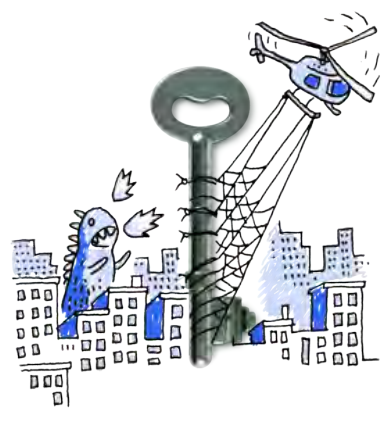
> **[Diagram Context - Textbook_NaturalScience_Gr8_Interactions-and-interdependence-within-the-environment.pdf-0001-03.png]**
> 1. A cartoon illustration of a key and a dinosaur.

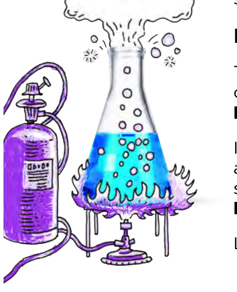
> **[Diagram Context - Textbook_NaturalScience_Gr8_Interactions-and-interdependence-within-the-environment.pdf-0001-23.png]**
> 1. A purple and blue gas cylinder with a purple nozzle.

> **[Diagram Context - Textbook_NaturalScience_Gr8_Photosynthesis-and-respiration.pdf-0001-02.png]**
> The image features a gray background with a series of blue and white circles arranged in a zigzag pattern. The circles are evenly spaced, and the zigzag pattern creates a sense of movement and energy. The image does not contain any text or additional objects, and the arrangement of the circles and the zigzag pattern suggests a visual representation of a Lewis diagram or a similar diagram used to

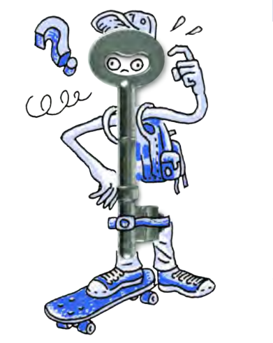
> **[Diagram Context - Textbook_NaturalScience_Gr8_Photosynthesis-and-respiration.pdf-0001-03.png]**
> 1. A cartoon character with a backpack and a skateboard.

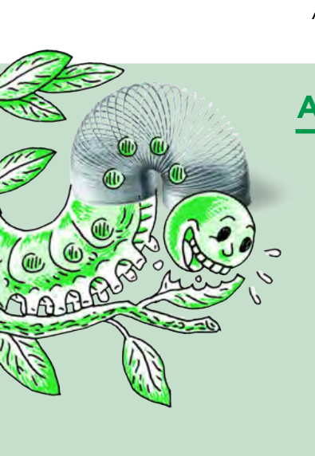
> **[Diagram Context - Textbook_NaturalScience_Gr8_Photosynthesis-and-respiration.pdf-0001-14.png]**
> The image shows a cartoon depiction of a caterpillar with a smiley face, surrounded by green leaves. The caterpillar is shown in a dynamic pose, with its head tilted to the side and its body coiled up. The caterpillar is connected to a wire, which is attached to a spring. The spring is coiled up, and the caterpillar is holding onto it. The image

> **[Diagram Context - Textbook_NaturalScience_Gr8_Photosynthesis-and-respiration.pdf-0001-27.png]**
> This graphic depicts a repeating, wave-like pattern of interconnected, arrow-shaped segments. It serves as a visual representation of a continuous process or directional flow, often used in Life Sciences to illustrate metabolic pathways, the sequence of DNA replication, or the cyclical nature of biological systems.

---

## Concepts & Structure

### Take Note
* **Chloroplasts:** Chloroplasts are a type of organelle found only in plant cells. 
* **Cells:** A cell is the basic unit of all living things. We will learn more about the structure and functioning of cells next year in Gr. 9.

---

### Biological Adaptation Example
* **Organism:** *Elysia chlorotica* (a sea slug).
* **Adaptation:** This sea slug has evolved to absorb the chloroplasts from the green algae it eats and use them to photosynthesise! This animal can produce its own food and is green.

---

### Did You Know?
Chloroplasts are only present in plants. However, some sea slugs have learnt to absorb the chloroplasts from the green algae that they eat into their bodies and can actually photosynthesise themselves!

---

### The Process of Photosynthesis

Photosynthesis has other requirements besides light energy from the Sun. 

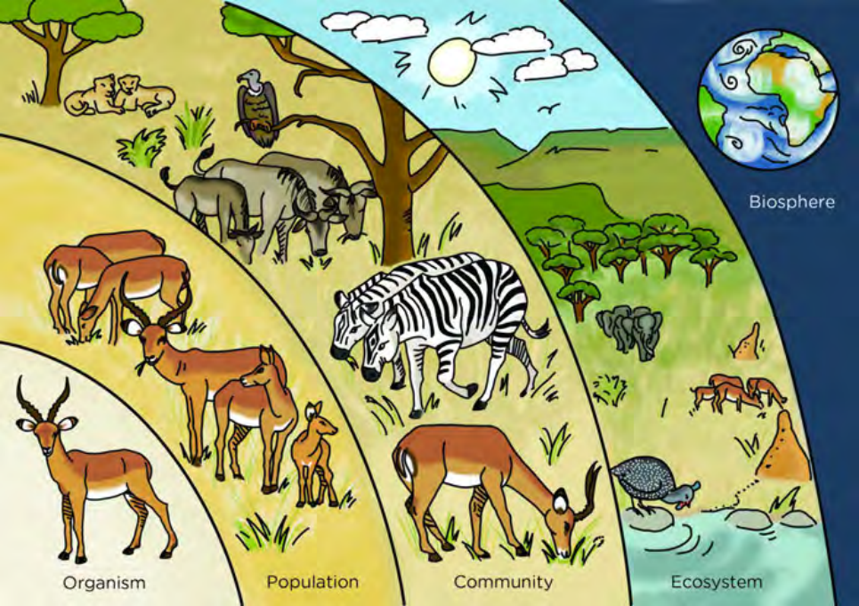
> **[Diagram Context - Textbook_NaturalScience_Gr8_Interactions-and-interdependence-within-the-environment.pdf-0002-00.png]**
> A diagram of a zebra, antelope, and gazelle in a savannah setting, with arrows pointing to the different stages of the ecosystem.

Plants use radiant energy from the Sun in a series of chemical reactions to change carbon dioxide from the air and water from the soil into **glucose**. The process releases oxygen.

> **[Diagram Context - Textbook_NaturalScience_Gr8_Interactions-and-interdependence-within-the-environment.pdf-0002-06.png]**
> 1. A diagram of a cell with arrows pointing to different parts of the cell.

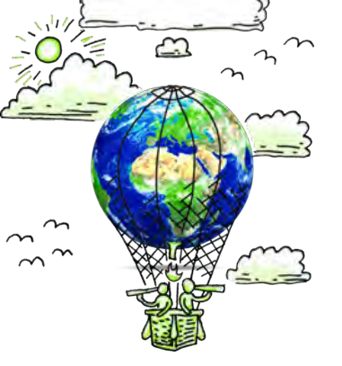
> **[Diagram Context - Textbook_NaturalScience_Gr8_Interactions-and-interdependence-within-the-environment.pdf-0002-08.png]**
> The image shows a cartoon illustration of a hot air balloon filled with a green substance, possibly a gas or a liquid. The balloon is floating in the sky, with two people inside it. One person is holding a map, while the other is holding a compass. The map appears to be a Lewis diagram, which is a diagram used to represent chemical compounds. The diagram is filled with various chemical

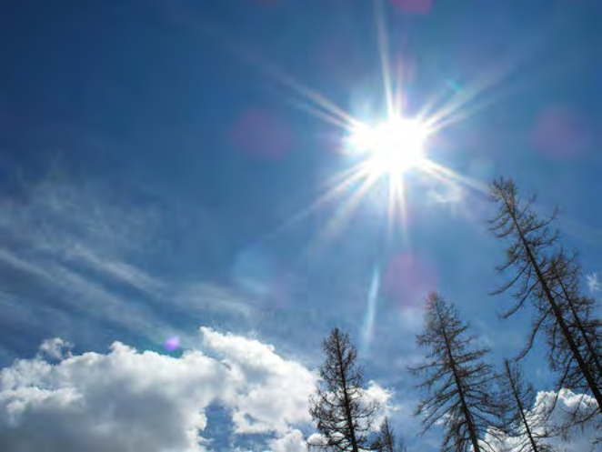
> **[Diagram Context - Textbook_NaturalScience_Gr8_Photosynthesis-and-respiration.pdf-0002-01.png]**
> 1. A diagram of a cell with a sunburst radiating from the center.

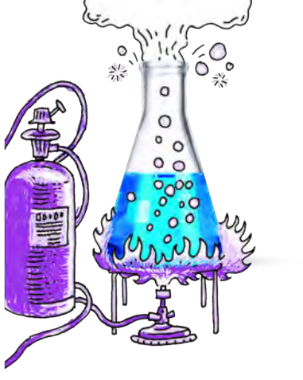
> **[Diagram Context - Textbook_NaturalScience_Gr8_Photosynthesis-and-respiration.pdf-0002-06.png]**
> 1. A purple and blue gas cylinder with a purple nozzle.

> **[Diagram Context - Textbook_NaturalScience_Gr8_Photosynthesis-and-respiration.pdf-0002-13.png]**
> The image features a cartoon depiction of a man's head, with a red apple placed on top of it. The man's face is outlined in black, and the apple is outlined in pink. The man's head is connected to a network of lines, and there are several apples scattered around the image. The man's face is accompanied by a thought bubble containing a thought bubble with a cloud and

> **[Diagram Context - Textbook_NaturalScience_Gr8_Photosynthesis-and-respiration.pdf-0002-14.png]**
> The image shows a cartoon-like representation of a cell, with a large white cloud in the center. The word "visit" is written in black text below the cloud.

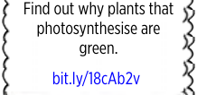
> **[Diagram Context - Textbook_NaturalScience_Gr8_Photosynthesis-and-respiration.pdf-0002-15.png]**
> The image shows a white label with black text that reads "Find out why plants that photosynthesise are green." The label also contains a blue link to a website, which is labeled "bit.ly/18cAb2v." The website is a Google search engine, and it is labeled "www.google.com." The website's URL is displayed in the bottom right corner

---

# Chapter 1. Photosynthesis and Respiration

## ACTIVITY: Requirements and products of photosynthesis

### INSTRUCTIONS:
1. Summarise what you have learnt about photosynthesis in the diagram below.
2. Fill in the requirements of photosynthesis in the block on the left and fill in what type of energy is needed and the name of the pigment that absorbs the energy.
3. Fill in the products of photosynthesis in the block on the right.

> **[Diagram Context - Textbook_NaturalScience_Gr8_Interactions-and-interdependence-within-the-environment.pdf-0003-00.png]**
> The image features a cartoon depiction of a caterpillar with a smiley face and a green ball. The caterpillar is shown in a cartoon style, with a green leaf attached to its back. The caterpillar is surrounded by a green leaf, and a green ball is attached to its back. The image also includes a text that reads "A" and "A" and a green arrow pointing

---

The process of photosynthesis can be presented in the form of an equation:

$$\text{carbon dioxide} + \text{water} \xrightarrow{\text{chlorophyll and sunlight}} \text{glucose} + \text{oxygen}$$

What happens to the glucose that plants produce during photosynthesis?

## Glucose storage and use

The glucose that a plant produces when it photosynthesises is the food for the plant. The plant can use this glucose directly, and release the energy during its own respiration or it can store the glucose or convert it into other chemical compounds.

Glucose is **soluble** in water. As we learnt in Matter and Materials in Gr. 6, this means that glucose can dissolve in water. This is useful to the plant as it means it can transport the glucose in water to where it is needed elsewhere in the plant. However, in order to store large amounts of glucose, plants need to convert it into compounds which are **insoluble** in water. Therefore the plant converts glucose into **starch**, which is insoluble in water. Why do you think the plant might need to store some glucose?

---

> **TAKE NOTE**
> 
> Plants use sugars (glucose) as a basic molecule from which to make hundreds of other compounds, such as proteins, oils, vitamins, colourful pigments in flowers, strong tasting chemicals (hot chilli plant), sweet tasting nectar and sweet smelling fragrances.

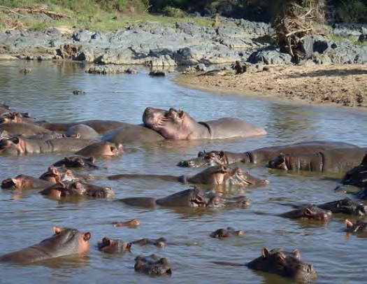
> **[Diagram Context - Textbook_NaturalScience_Gr8_Interactions-and-interdependence-within-the-environment.pdf-0003-05.png]**
> The image shows a group of hippos in a river, with some of them laying in the water and others standing. The hippos are of various sizes and are spread out across the river, with some closer to the foreground and others further away. The scene is set against a backdrop of rocks and trees, creating a natural and serene environment. The image does not contain any text or other

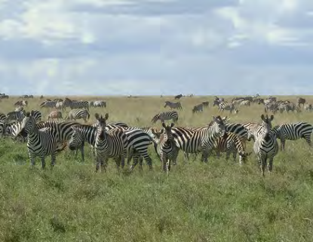
> **[Diagram Context - Textbook_NaturalScience_Gr8_Interactions-and-interdependence-within-the-environment.pdf-0003-06.png]**
> The image shows a herd of zebras standing in a grassy field. There are at least 14 zebras visible, with some of them facing the camera and others facing away. The zebras are spread out across the field, with some standing closer to the foreground and others further in the background. The scene conveys a sense of tranquility and natural beauty, with the ze

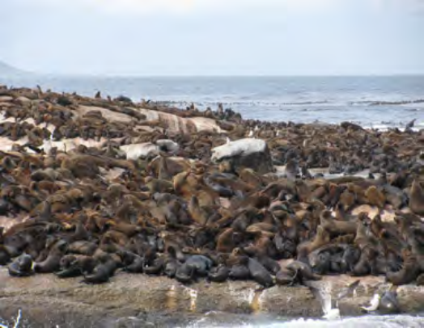
> **[Diagram Context - Textbook_NaturalScience_Gr8_Interactions-and-interdependence-within-the-environment.pdf-0003-09.png]**
> The image shows a large group of sea lions gathered on a rocky shore. The sea lions are of various sizes and are spread out across the rocky terrain. Some sea lions are standing, while others are lying down, possibly resting or socializing. The sea lions are facing different directions, indicating their individual orientations. The scene captures the natural habitat of these sea lions, showcasing their behavior and interactions

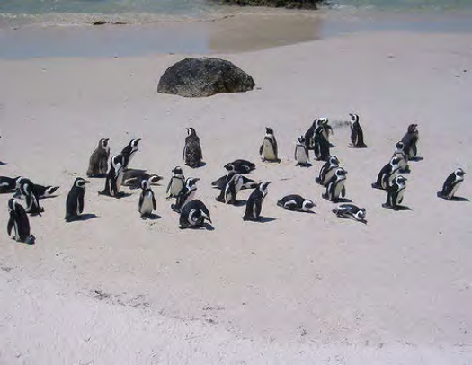
> **[Diagram Context - Textbook_NaturalScience_Gr8_Interactions-and-interdependence-within-the-environment.pdf-0003-11.png]**
> The image shows a group of penguins on a sandy beach. There are at least 14 penguins in the scene, some standing and others sitting or lying down. The penguins are scattered across the beach, with some closer to the water and others further inland. The beach itself is sandy, and there is a large rock in the background. The image does not contain any text or other objects

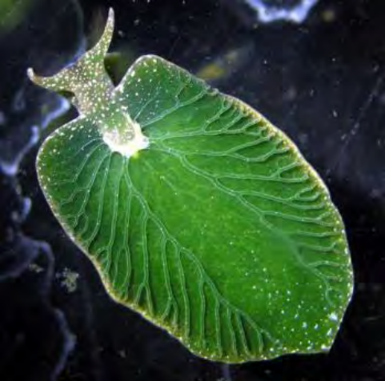
> **[Diagram Context - Textbook_NaturalScience_Gr8_Photosynthesis-and-respiration.pdf-0003-00.png]**
> 1. A diagram of a leaf with a green stem and a white tip.

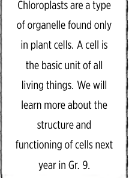
> **[Diagram Context - Textbook_NaturalScience_Gr8_Photosynthesis-and-respiration.pdf-0003-02.png]**
> 1. A diagram of a cell with arrows pointing to different parts of the cell.

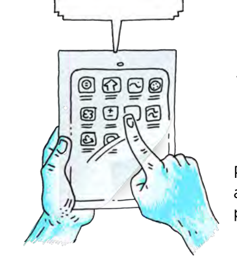
> **[Diagram Context - Textbook_NaturalScience_Gr8_Photosynthesis-and-respiration.pdf-0003-03.png]**
> 1. A diagram of a cell with arrows pointing to different parts of the cell.

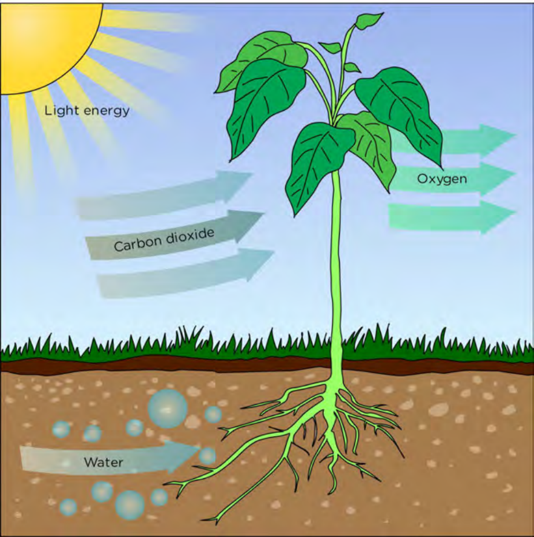
> **[Diagram Context - Textbook_NaturalScience_Gr8_Photosynthesis-and-respiration.pdf-0003-06.png]**
> A diagram of a plant's root system, showing the water and carbon dioxide cycles.

> **[Diagram Context - Textbook_NaturalScience_Gr8_Photosynthesis-and-respiration.pdf-0003-07.png]**
> The image shows a diagram of a cell, which is a fundamental unit of life. The diagram is a Lewis structure, a visual representation of the chemical bonds within a molecule. The diagram is black and white, with a large, bold, and clear depiction of the cell's components. The diagram includes a cell's organelles, such as the nucleus, mitochondria, and endoplasm

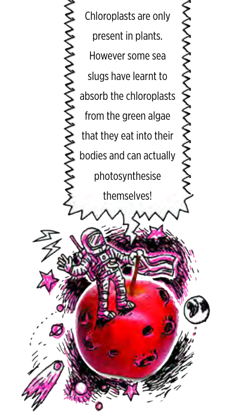
> **[Diagram Context - Textbook_NaturalScience_Gr8_Photosynthesis-and-respiration.pdf-0003-08.png]**
> The image shows a cartoon depiction of an astronaut on a red planet. The astronaut is wearing a white helmet and is holding a pole. The planet is covered in pink and purple clouds, and there is a red apple on the planet. The astronaut is positioned in the center of the image, with the planet and the apple surrounding him. The image also includes text that provides information about algae and photos

---

# Life and Living

## Plant Support and Chemical Compounds

In addition to starch, plants also convert glucose into **cellulose**. 

* **Cellulose:** Used to support and strengthen plants.
* **Animal Support:** Animals do not have cellulose for support; instead, they have other structures to provide support and protect the body.

Glucose is also converted into other chemical compounds that enable processes in the plant such as reproduction and growth.

---

## Testing for Photosynthesis (Starch Test)

We have learned about how plants produce glucose and store it as starch, but how do we know for sure? As young scientists, we need to question whether this explanation of photosynthesis is accurate. Is there an investigation we can do to test for the presence of these compounds? Let's find out!

To see if a plant photosynthesises and produces starch, we can study the properties of starch and glucose:

1. **Taste:** Glucose tastes sweet, but starch does not taste sweet at all.
2. **Solubility:** Glucose will dissolve in water, while starch will not dissolve in water.
3. **Iodine Test:** Iodine changes from brownish-orange to dark blue-black when it comes into contact with starch.

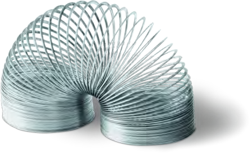
> **[Diagram Context - Textbook_NaturalScience_Gr8_Glossary1.pdf-0004-02.png]**
> 1. A silver spring toy with a curved shape.

*The left tube contains only diluted iodine solution and the right tube contains diluted iodine solution with starch.*

---

## Investigating Starch in Leaves

Now that we know that plants produce glucose and change this into starch, we can find out if all leaves produce the same amount of starch through photosynthesis.

> **[Diagram Context - Textbook_NaturalScience_Gr8_Interactions-and-interdependence-within-the-environment.pdf-0004-05.png]**
> 1. A diagram of a snake's body.
 2. The snake's body is green and gray.
 3. The snake's head is green.
 4. The snake's body is green.

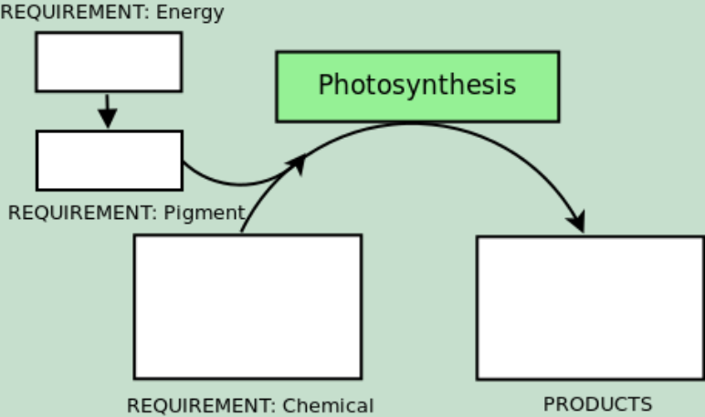
> **[Diagram Context - Textbook_NaturalScience_Gr8_Photosynthesis-and-respiration.pdf-0004-05.png]**
> The diagram is a visual representation of the process of photosynthesis. It shows the different stages of photosynthesis, including the absorption of light energy, the conversion of carbon dioxide and water into glucose and oxygen, and the release of oxygen as a byproduct. The diagram is labeled with the terms "energy", "photosynthesis", "require", "chemicals", "products", and "organism

> **[Diagram Context - Textbook_NaturalScience_Gr8_Photosynthesis-and-respiration.pdf-0004-12.png]**
> 1. A cartoon depiction of a roller coaster with a spring coiled up on top.

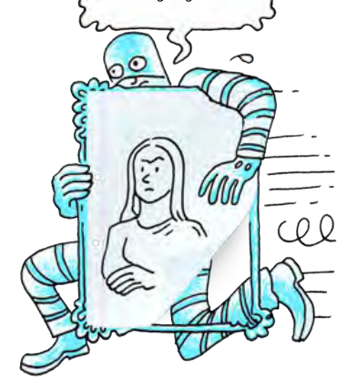
> **[Diagram Context - Textbook_NaturalScience_Gr8_Photosynthesis-and-respiration.pdf-0004-15.png]**
> 1. A cartoon drawing of a woman with a blue face and long blonde hair.
 2. A cartoon drawing of a man with a blue face and long beard.
 3. The woman is holding a picture of the man.
 4. The man is holding a picture of the woman.

---

# INVESTIGATION: Which leaves photosynthesise?

There are two parts to this investigation. First, we want to find out which leaves are able to photosynthesise. We will place some pot plants in the light for a day, and some other pot plants in a dark cupboard for a day, and then perform the investigation on the leaves of plants from both groups.

In the second part of the investigation, we will use what we have learnt to investigate which parts of variegated leaves photosynthesise.

## Part 1: Leaves in light and dark

### AIM:
1. What do you wish to establish by conducting this investigation?

### HYPOTHESIS:
1. What do you think or predict will happen when you conduct this investigation?

### MATERIALS AND APPARATUS:
* gloves
* a range of pot plants that can be easily moved around
* 100 ml beaker or glass jar in a saucepan with water
* bunsen burner, spirit lamp or a stove
* tweezers
* ethyl alcohol (or methylated spirits)
* glass petri dishes, white saucer or white tile
* stopwatch or timer
* glass pipette or dropper
* iodine solution

### METHOD:
1. Work in groups of three or four.
2. Place half of the plants in the dark for at least 24-48 hours and the others in a well-lit area of the class that is exposed to lots of natural sunlight.
3. After 24 hours, pour 50 ml of the ethyl alcohol into the beaker and place it in the saucepan with water. Heat the saucepan over the bunsen burner or the stove. The water in the saucepan will distribute the heat evenly to warm the ethyl alcohol evenly.
4. Remove one healthy looking leaf from the pot plants that were in the well-lit area exposed to direct sunlight.
5. Using the tweezers, dip a leaf into the boiling water for 1-2 minutes. This helps to remove the waxy cuticle that covers the leaf and breaks down the cell walls.

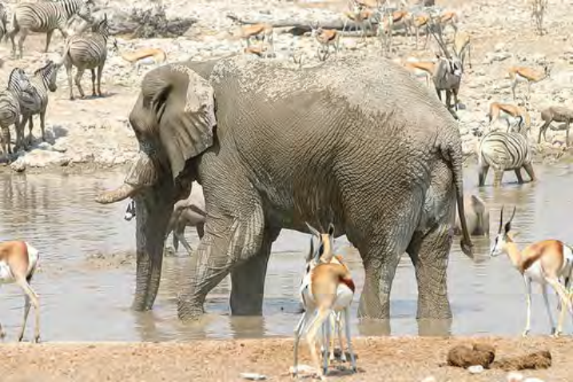
> **[Diagram Context - Textbook_NaturalScience_Gr8_Interactions-and-interdependence-within-the-environment.pdf-0005-00.png]**
> The image shows a group of animals, including an elephant and a gazelle, in a body of water. The elephant is partially submerged in the water, while the gazelle is standing on the bank of the water. The animals are surrounded by other animals, such as zebras, which are also present in the scene. The image conveys the idea of a diverse ecosystem where

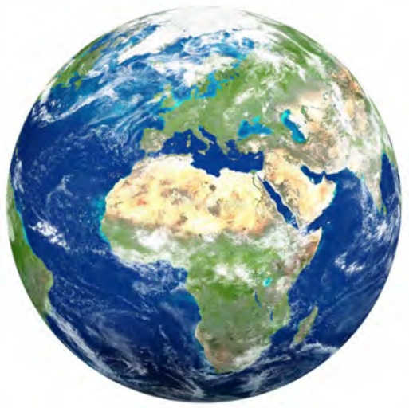
> **[Diagram Context - Textbook_NaturalScience_Gr8_Interactions-and-interdependence-within-the-environment.pdf-0005-04.png]**
> 1. A 3D rendering of the earth with the continents and oceans labeled.

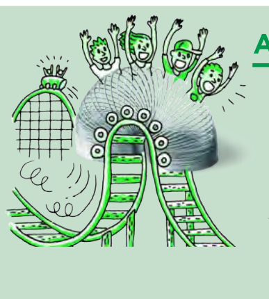
> **[Diagram Context - Textbook_NaturalScience_Gr8_Interactions-and-interdependence-within-the-environment.pdf-0005-06.png]**
> The image is a cartoon drawing of a roller coaster with a group of people on it. The roller coaster is made of green and white lines and has a large spring on top of it. The people on the roller coaster are holding onto the spring, and they are smiling. The image also includes a letter "A" and a number "3" in the top right corner.

> **[Diagram Context - Textbook_NaturalScience_Gr8_Photosynthesis-and-respiration.pdf-0005-01.png]**
> 1. A diagram of a cell.

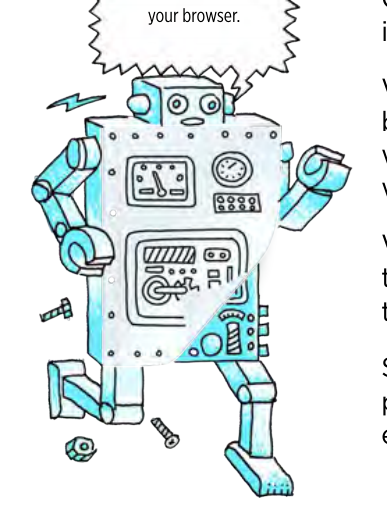
> **[Diagram Context - Textbook_NaturalScience_Gr8_Photosynthesis-and-respiration.pdf-0005-03.png]**
> 1. A robot with a blue body and a white head.

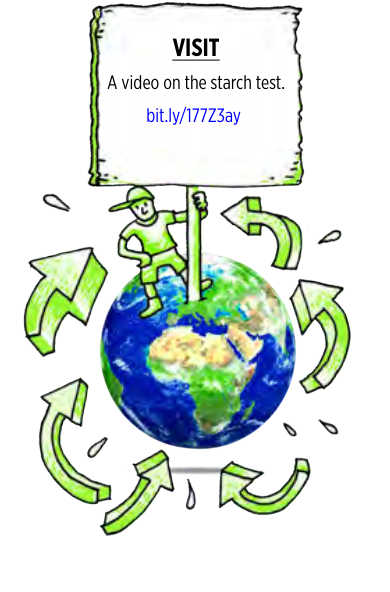
> **[Diagram Context - Textbook_NaturalScience_Gr8_Photosynthesis-and-respiration.pdf-0005-10.png]**
> A diagram of a cartoon character on a stick holding a sign that says "visit" and a picture of the earth with arrows pointing to different continents.

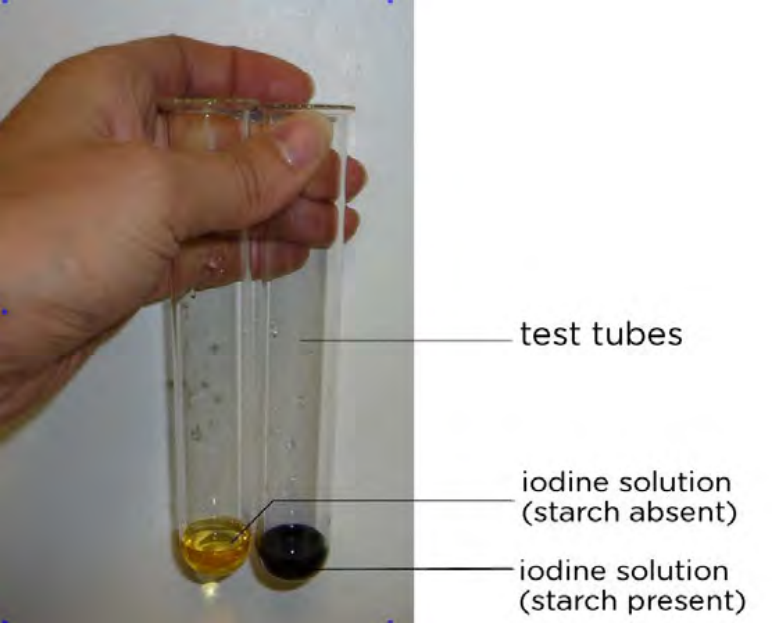
> **[Diagram Context - Textbook_NaturalScience_Gr8_Photosynthesis-and-respiration.pdf-0005-11.png]**
> 1. A diagram of a test tube filled with a yellow liquid and a black substance. The diagram also includes labels for the test tube, the yellow liquid, and the black substance.

---

.
6. After this, place the leaf into the beaker with the ethyl alcohol.
7. Leave the leaf in the alcohol until all the chlorophyll has been removed
from the leaf and the alcohol turns green.
8. Place the leaf into warm water to soften it.
9. Remove the leaf from the warm water and place it on a white tile or a petri
dish on top of a white surface.
10. Use the pipette or dropper to carefully drop 2 or 3 drops of iodine solution
on the leaf in the petri dish and record your observations.
11. Repeat this process for two more leaves that were in the well-lit area.
12. Remove the plants that were in the dark for at least 24 hours. Use the test
above to test whether there is starch present in the leaves from the plants
that were kept in the dark.
13. Record your observations.
RESULTS AND OBSERVATIONS:
Keep a record of your observations. Draw a table to record and compare your
results.
.
CONCLUSION:
1. What did you learn from doing this investigation?
..
10
.
Life and living

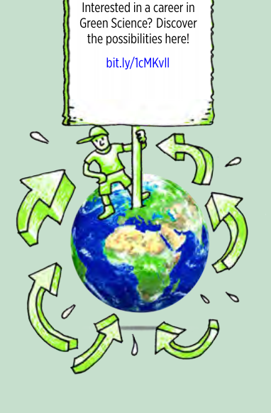
> **[Diagram Context - Textbook_NaturalScience_Gr8_Interactions-and-interdependence-within-the-environment.pdf-0006-08.png]**
> The image is a cartoon depiction of a man standing on a globe, holding a pole. The globe is surrounded by various arrows, each pointing in a different direction. The man is wearing a hat and is positioned on the globe, with his arms outstretched. The arrows on the globe are labeled with different words, such as "green science," "circuit," "geography," and "

> **[Diagram Context - Textbook_NaturalScience_Gr8_Interactions-and-interdependence-within-the-environment.pdf-0006-09.png]**
> This graphic illustrates a stylized representation of a double-stranded DNA molecule, characterized by its iconic double helix structure formed by two antiparallel sugar-phosphate backbones. The diagram visually conveys the fundamental molecular architecture of genetic material, emphasizing the helical twisting and the complementary pairing essential for DNA replication and information storage in Life Sciences.

> **[Diagram Context - Textbook_NaturalScience_Gr8_Photosynthesis-and-respiration.pdf-0006-03.png]**
> 1. A magnifying glass is being used to look at a diagram of a cell.

---

# Chapter 1. Photosynthesis and respiration

### QUESTIONS:
1. Why were some plants placed in a well-lit area with direct sunlight and others in the dark?
2. Explain what the results of the iodine test indicates.

---

## Part 2: Which parts of variegated leaves photosynthesise?

Have a look at the following photos of different plants. What do you notice about the leaves?

* Ivy leaves.
* Geranium leaves.

We call these leaves variegated as they have green and white sections. We want to find out which parts of these leaves photosynthesise in this part of the investigation.

### INSTRUCTIONS:
1. You need to design this investigation yourself.
2. First decide what question you are trying to answer and the aim of your investigation.
3. Make a hypothesis for your investigation.
4. You then need to think back to part 1 and design the method for your investigation.
5. After conducting the investigation, you need to write up an experimental report of your findings.
6. In your report, you must have the following headings:
   * a) Aim
   * b) Hypothesis
   * c) Materials and apparatus
   * d) Method
   * e) Results
   * f) Discussion
   * g) Conclusion

> **[Diagram Context - Textbook_NaturalScience_Gr8_Interactions-and-interdependence-within-the-environment.pdf-0007-00.png]**
> This diagram illustrates a slinky toy descending a staircase, using motion lines to indicate its movement. It serves as a physical model to help Grade 10-12 Physical Sciences learners visualize the propagation of longitudinal and transverse waves, demonstrating how energy is transferred through a medium.

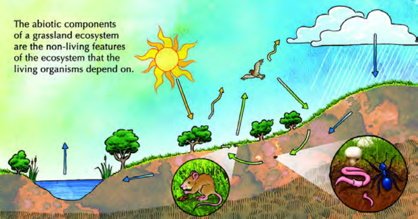
> **[Diagram Context - Textbook_NaturalScience_Gr8_Interactions-and-interdependence-within-the-environment.pdf-0007-05.png]**
> A diagram of a grassland ecosystem, showing the abiotic components and the living organisms that depend on them. The diagram includes a sun, a cloud, a river, a tree, a grassland, a pond, and a mouse. The diagram also includes arrows that show the flow of energy and matter between the abiotic and biotic components.

> **[Diagram Context - Textbook_NaturalScience_Gr8_Photosynthesis-and-respiration.pdf-0007-11.png]**
> 1. A white rectangle with a gray border.

---

7. In your results section you need to record your observations in a scientific way. You can do this using a table, diagrams or a combination of both. Think carefully about what information you need to record in order to come to conclusions at the end of your experiment.

8. In your discussion, you need to explain your results and what they mean. You also need to evaluate your investigation and explain if there were any unusual results and suggest ways that you could have improved your investigation for future researchers who might want to repeat what you have done.

9. Present your report on separate paper.

Leaves are not the only parts of plants that store starch. Starch is also stored in the stems, roots and fruit. Have you ever wondered why fruit becomes sweeter as it ripens? Think of an unripe green banana and a ripe yellow banana. Which one is sweeter? Let's find out why.

---

### INVESTIGATION: Why do bananas become sweeter as they ripen?

In this investigation we will taste the bananas to determine if they have more glucose or more starch. We will also conduct a starch test on the ripe and unripe bananas to see which contain more starch.

**Materials:**
* Ripe yellow bananas
* Unripe green bananas

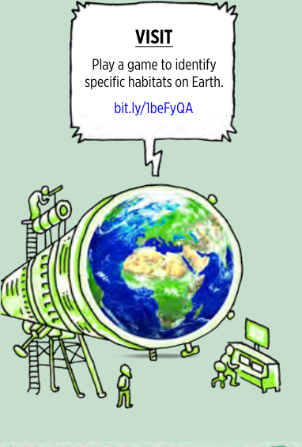
> **[Diagram Context - Textbook_NaturalScience_Gr8_Interactions-and-interdependence-within-the-environment.pdf-0008-02.png]**
> The image is a cartoon that depicts a group of people playing a game. The game involves identifying specific habitats on Earth. The cartoon is filled with various elements, including a globe, a telescope, and a television. The text on the image provides information about the game and its objectives.

> **[Diagram Context - Textbook_NaturalScience_Gr8_Interactions-and-interdependence-within-the-environment.pdf-0008-04.png]**
> The image shows a line of green and white beads arranged in a straight line. The beads are evenly spaced, and the line is drawn in a darker shade of gray. The beads are positioned in a horizontal line, with the green beads being slightly larger than the white ones. The line is drawn in a darker shade of gray, and the beads are evenly spaced, creating a sense of order and

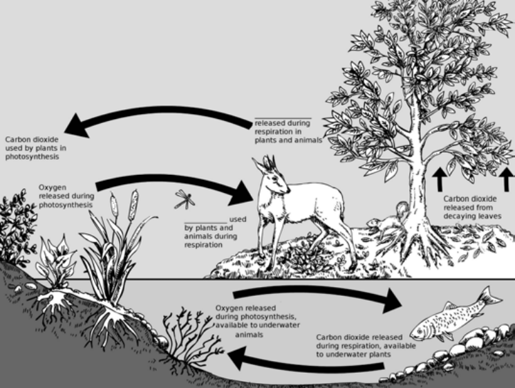
> **[Diagram Context - Textbook_NaturalScience_Gr8_Interactions-and-interdependence-within-the-environment.pdf-0008-06.png]**
> 1. A black and white diagram of a deer and a tree, with arrows pointing to the different stages of the carbon dioxide cycle.

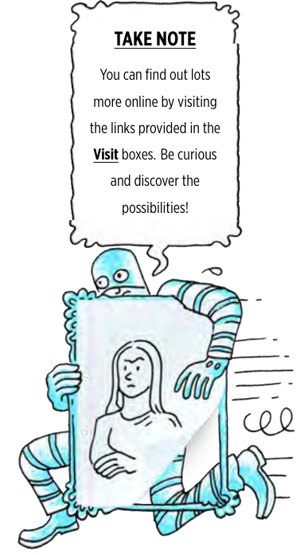
> **[Diagram Context - Textbook_NaturalScience_Gr8_Interactions-and-interdependence-within-the-environment.pdf-0008-07.png]**
> 1. A cartoon illustration of a man holding a picture of a woman. 
 2. The man is holding a picture of a woman. 
 3. The picture is of a woman.

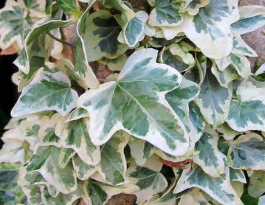
> **[Diagram Context - Textbook_NaturalScience_Gr8_Photosynthesis-and-respiration.pdf-0008-06.png]**
> 1. A close-up view of a plant with white and green leaves.

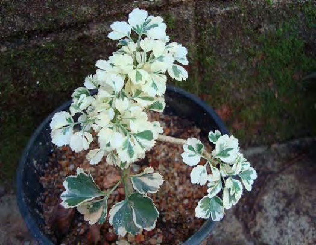
> **[Diagram Context - Textbook_NaturalScience_Gr8_Photosynthesis-and-respiration.pdf-0008-08.png]**
> 1. A plant in a pot with white and green leaves.

---

# Chapter 1. Photosynthesis and respiration

## AIM:
1. What do you wish to establish by conducting this investigation?

## HYPOTHESIS:
1. What do you think or predict will happen when you conduct this investigation?

## MATERIALS AND APPARATUS:
* ripe and unripe bananas cut into discs
* petri dish or saucer
* iodine solution
* dropper

## METHOD:
1. Work in groups of three or four. Take a piece of the ripe banana and a piece of the unripe banana and compare the tastes and textures of each. Record your observations in a table. Which banana do you think contains the most starch and the least glucose (a sugar) based on the taste test?
2. Use the iodine starch test identify which banana, the ripe or the unripe one, contains the most starch. Record your observations in the table.
3. Compare this test to the results from your taste and texture test to identify which banana contained the most starch.

## OBSERVATIONS:
1. Draw a table to record your observations from the taste and iodine test for starch.

> **[Diagram Context - Textbook_NaturalScience_Gr8_Interactions-and-interdependence-within-the-environment.pdf-0009-00.png]**
> 1. A green and white diagram of a battery and a spring.

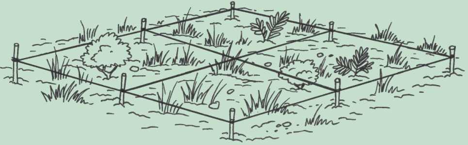
> **[Diagram Context - Textbook_NaturalScience_Gr8_Interactions-and-interdependence-within-the-environment.pdf-0009-22.png]**
> The image is a black and white line drawing of a garden bed with a grid pattern. The garden bed is divided into squares, and there are plants growing in each square. The drawing also includes a diagram of a plant cell, a Lewis diagram, and a circuit diagram. The diagram of a plant cell shows the different parts of the cell, such as the nucleus, cell wall, and chlor

> **[Diagram Context - Textbook_NaturalScience_Gr8_Photosynthesis-and-respiration.pdf-0009-04.png]**
> 1. A diagram of a zipper with a zipper pull.

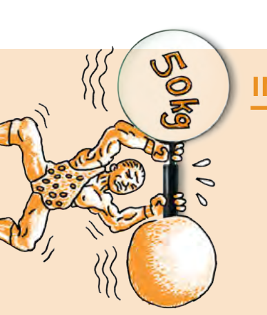
> **[Diagram Context - Textbook_NaturalScience_Gr8_Photosynthesis-and-respiration.pdf-0009-06.png]**
> The image features a cartoon depiction of a man lifting a ball that is 50 kg in weight. The man is depicted in a dynamic pose, with his arms and legs spread out, as if he is in the middle of a workout or lifting a heavy object. The image is a simple, cartoon-like illustration that focuses on the concept of weight and the effort required to lift it. The man

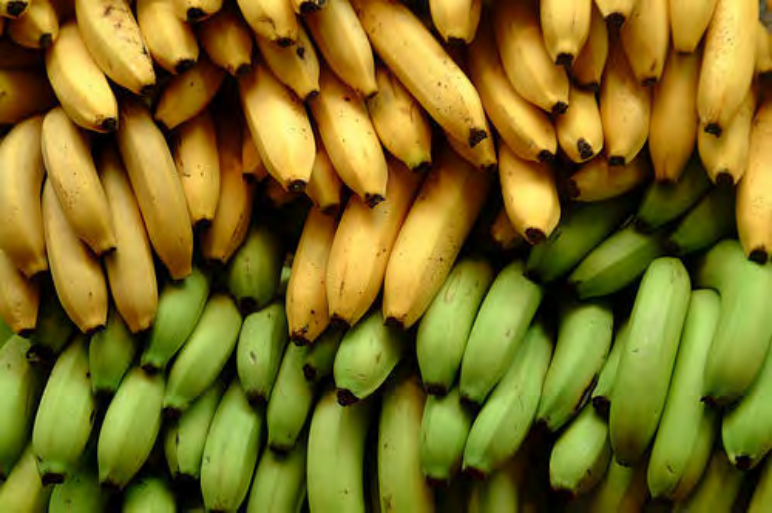
> **[Diagram Context - Textbook_NaturalScience_Gr8_Photosynthesis-and-respiration.pdf-0009-09.png]**
> The image shows a close-up view of a bunch of bananas, with some of them being yellow and others green. The bananas are arranged in a way that they are stacked on top of each other, creating a visually appealing display. The image does not contain any text, and the focus is solely on the bananas and their arrangement.

---

## Questions

1. Compare your observations of ripe and unripe bananas with those of the other learners in the class. Did you all make the same observations?

2. What do you conclude from these results? Which method of testing is better to use and why do you say so?

3. Explain what you think happens to the starch as the bananas ripen.

---

Now that we have looked at how green plants produce their own food, let's find out how all living things release the energy stored in food in order to perform the life processes.

---

# 1.2 Respiration

## Core Concepts

* **Respiration:** The process by which energy is released from glucose in a series of chemical reactions within living organisms.
* **Chemical Potential Energy:** Energy stored within the chemical bonds of fuels (such as wood, coal, oil) and food (such as glucose).
* **By-product:** A secondary product derived from a manufacturing process or chemical reaction, sometimes referred to as a waste product.

---

## Energy from Food

* All organisms need to break down food to release stored chemical potential energy for vital life processes, movement, and work.
* Although plants make their own food through photosynthesis, respiration takes place in **all** organisms, including plants.
* When glucose from food is combined with oxygen in a series of chemical reactions, the bonds are broken down and energy is released.

---

## Products of Respiration

Respiration can be represented by the following word equation:

$$\text{glucose} + \text{oxygen} \rightarrow \text{carbon dioxide} + \text{water} + \text{energy}$$

### Key Components:
1. **Inputs (Reactants):** Glucose and Oxygen.
2. **Outputs (Products):** Carbon dioxide, water, and energy.
3. **By-products:** Carbon dioxide and water are produced as by-products (waste products) during the release of energy.

---

## Review & Activity Questions

1. **Define Respiration:**
   * *Answer:* The process by which energy is released from glucose in a series of chemical reactions in all living organisms.

2. **List the two primary ingredients required for respiration to take place:**
   * *Answer:* Glucose and oxygen.

3. **What are the by-products produced during respiration?**
   * *Answer:* Carbon dioxide and water.

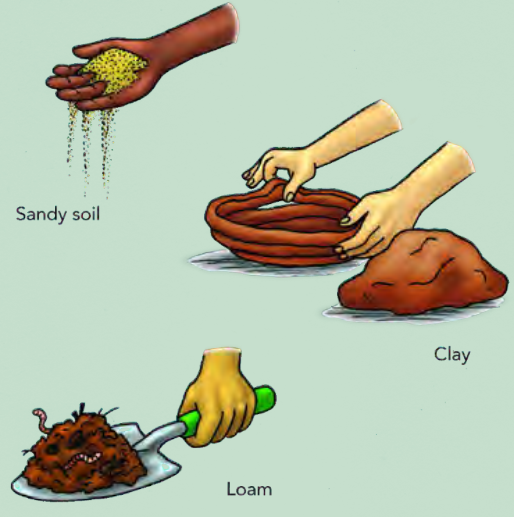
> **[Diagram Context - Textbook_NaturalScience_Gr8_Interactions-and-interdependence-within-the-environment.pdf-0011-01.png]**
> 1. A diagram of a hand holding a shovel and a bowl of sand.

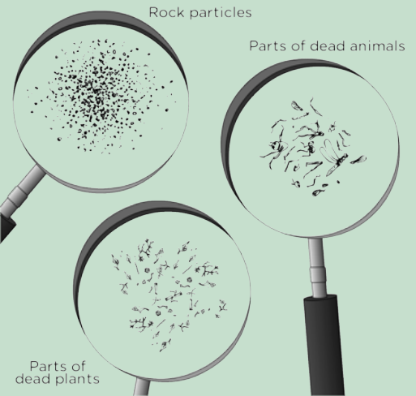
> **[Diagram Context - Textbook_NaturalScience_Gr8_Interactions-and-interdependence-within-the-environment.pdf-0011-02.png]**
> 1. A 3D rendering of a magnifying glass with a magnified view of a leaf and a magnified view of a bacteria.

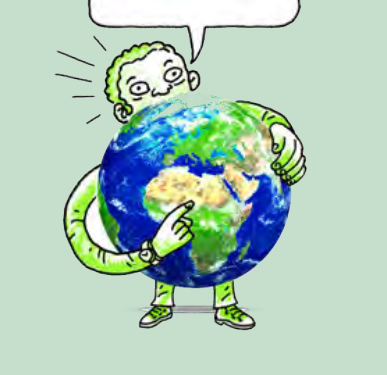
> **[Diagram Context - Textbook_NaturalScience_Gr8_Interactions-and-interdependence-within-the-environment.pdf-0011-07.png]**
> 1. A cartoon man holding a globe.

> **[Diagram Context - Textbook_NaturalScience_Gr8_Interactions-and-interdependence-within-the-environment.pdf-0011-09.png]**
> 1. A white square with a gray border.

> **[Diagram Context - Textbook_NaturalScience_Gr8_Photosynthesis-and-respiration.pdf-0011-00.png]**
> 1. A diagram of a cell with a white square in the center.

> **[Diagram Context - Textbook_NaturalScience_Gr8_Photosynthesis-and-respiration.pdf-0011-05.png]**
> The image shows a gray line with an orange arrow pointing to the right. The line is labeled "Zipper" and "Zipper" is written in white. The arrow is pointing to the right, indicating movement or direction. The image does not contain any text or additional objects.

---

## Core Concept: The Test for Carbon Dioxide

* **Test Principle:** To test if a gas contains carbon dioxide, bubble the gas through **limewater**.
* **Positive Result:** If the clear limewater turns milky (cloudy), the gas contains carbon dioxide.

---

## ACTIVITY: Does our breath contain carbon dioxide?

### Materials
* Small beakers (or test tubes)
* Rubber tubes or drinking straws
* Limewater
* $20\text{ ml}$ syringe (or larger if available)

### Instructions

1. Work in groups of three.
2. Mark one beaker **AIR** and the other **BREATH**.
3. Pour clear limewater into each beaker until they are half full.
4. Blow bubbles through the rubber tube into the beaker marked **BREATH** for at least $1$ minute. Notice what happens to the clear limewater.
5. Attach a rubber tube to the front of a syringe. Draw air into the syringe from the atmosphere.
6. Place this rubber tube into the beaker marked **AIR** and push out the air inside the syringe slowly and carefully into the limewater. Notice what happens to the clear limewater.

> **[Diagram Context - Textbook_NaturalScience_Gr8_Interactions-and-interdependence-within-the-environment.pdf-0012-07.png]**
> 1. A diagram of a snake's body.

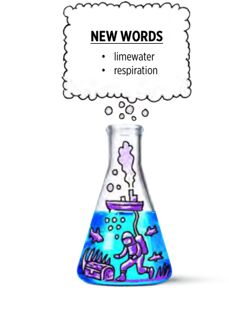
> **[Diagram Context - Textbook_NaturalScience_Gr8_Photosynthesis-and-respiration.pdf-0012-14.png]**
> The image features a science experiment in a beaker, with a cartoon depiction of a person wearing a spacesuit and holding a rocket ship. The beaker contains a blue liquid, and there is a thought bubble above the beaker that reads "New words limewater respiration". The image is labeled with the text "New words" and "limewater respiration" in the top left corner

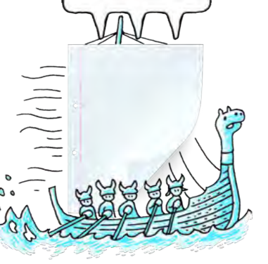
> **[Diagram Context - Textbook_NaturalScience_Gr8_Photosynthesis-and-respiration.pdf-0012-17.png]**
> 1. A diagram of a ship with a group of people on it.

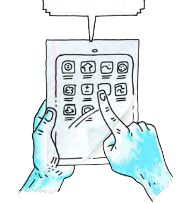
> **[Diagram Context - Textbook_NaturalScience_Gr8_Photosynthesis-and-respiration.pdf-0012-20.png]**
> 1. A diagram of a cell with arrows pointing to different parts of the cell.

---

# Chapter 1. Photosynthesis and Respiration

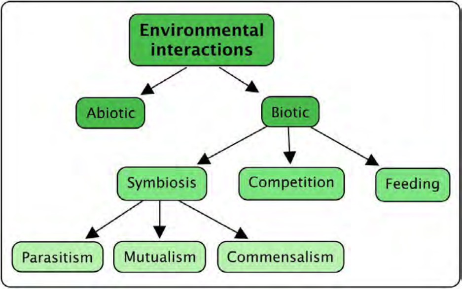
> **[Diagram Context - Textbook_NaturalScience_Gr8_Interactions-and-interdependence-within-the-environment.pdf-0013-02.png]**
> The image is a diagram that illustrates the concept of environmental interactions. It is a visual representation of the relationships between different aspects of the environment, such as symbiosis, competition, mutualism, commensalism, and parasitism. The diagram is color-coded, with each color representing a different type of interaction. The diagram is labeled with the names of the different types of interactions, such

## Take Note

> **Do not confuse breathing with respiration!** 
> * **Breathing** is the act of inhaling and exhaling air into and out of the lungs. 
> * **Respiration** is the metabolic process that uses oxygen to release energy and releases carbon dioxide as a by-product.

---

## Questions

1. Describe what you observed when you blew air from your lungs through the limewater. What does this mean?

2. Describe what you observed when you used the syringe to bubble air from the atmosphere through clear limewater.

3. A very small percentage of atmospheric air is carbon dioxide gas ($0.03\%$). Why do you think you observed the result you did when you pushed air from the atmosphere through the limewater?

4. Think about respiration.
   * a) What are the requirements for respiration?
   * b) What are the products of respiration?

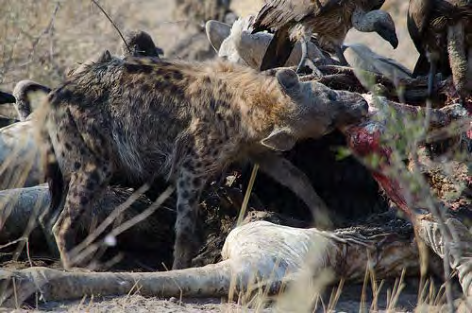
> **[Diagram Context - Textbook_NaturalScience_Gr8_Interactions-and-interdependence-within-the-environment.pdf-0013-05.png]**
> The image shows a hyena eating a dead animal. The hyena is standing on all fours and is facing the camera. The dead animal is lying on the ground next to the hyena. The hyena appears to be eating the animal with its mouth open. The hyena is in the foreground, and the dead animal is in the background. The hyena is the main subject of

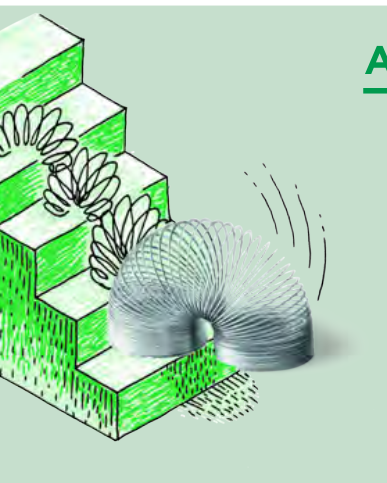
> **[Diagram Context - Textbook_NaturalScience_Gr8_Photosynthesis-and-respiration.pdf-0013-01.png]**
> 1. A diagram of a spring with a green background and a step ladder.

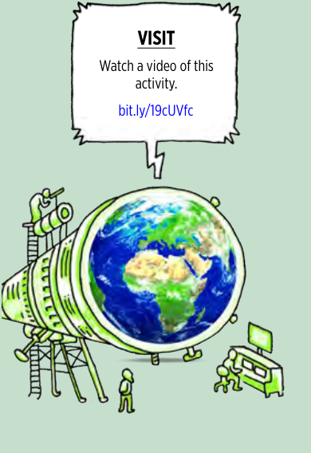
> **[Diagram Context - Textbook_NaturalScience_Gr8_Photosynthesis-and-respiration.pdf-0013-13.png]**
> The image features a cartoon depiction of a man and a woman standing in front of a large telescope. The man is holding a telescope, and the woman is standing next to him. The scene is set against a green background, and there is a speech bubble above the image that reads "Visit this video of this activity. Watch a video of this activity. Bit/UVC/VFC".

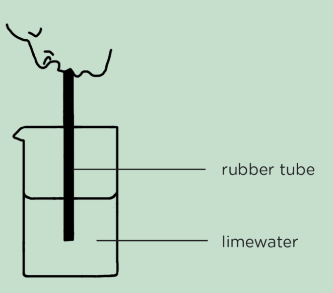
> **[Diagram Context - Textbook_NaturalScience_Gr8_Photosynthesis-and-respiration.pdf-0013-14.png]**
> 1. A diagram of a rubber tube and a lime water container.

---

# ACTIVITY: Requirements and products of respiration

## INSTRUCTIONS:
1. Summarise what you have learnt about respiration in the summary diagram below.
2. Fill in the requirements of respiration in the block on the right.
3. Fill in the products of respiration in the block on the left.

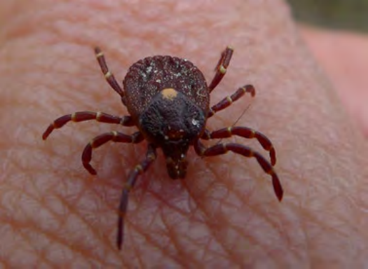
> **[Diagram Context - Textbook_NaturalScience_Gr8_Interactions-and-interdependence-within-the-environment.pdf-0014-03.png]**
> The image shows a close-up view of a tick on a person's arm. The tick is brown and black in color, with a white spot on its back. It is positioned on the person's arm, with its legs spread out. The tick appears to be crawling on the person's skin.

---

# SUMMARY:

## Key Concepts

* The need for energy drives the interactions and interdependence in an ecosystem.
* The Sun provides energy to the Earth in the form of radiant (light) energy and heat energy.
* Photosynthesis is the process whereby green plants use carbon dioxide from the air, water from the soil and radiant energy from the Sun in a series of chemical reactions to produce glucose (food) and oxygen.
* Plants are able to photosynthesise because they contain chlorophyll, a green pigment that can capture light energy from the Sun.
* Plants change the glucose that they produce into starch that can be stored more easily.
* Plants also produce cellulose fibres that give plants strength and support and are important to our digestive systems as roughage.
* The food that a plant produces is used by animals when they eat the plant and by other animals that eat them.
* This food contains chemical potential energy that needs to be released from the food.
* Respiration is the process in all living organisms by which energy is released from glucose in a series of chemical reactions.
* Respiration uses oxygen while carbon dioxide and water are given off as by-products.

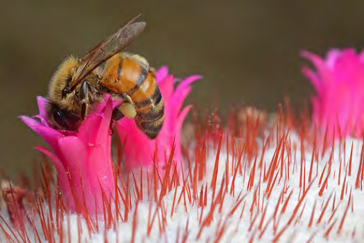
> **[Diagram Context - Textbook_NaturalScience_Gr8_Interactions-and-interdependence-within-the-environment.pdf-0014-05.png]**
> 1. A bee on a flower.

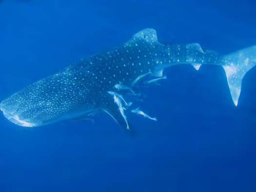
> **[Diagram Context - Textbook_NaturalScience_Gr8_Interactions-and-interdependence-within-the-environment.pdf-0014-07.png]**
> The image shows a large blue whale swimming in the ocean. The whale is the main focus of the image, with its body prominently displayed against the backdrop of the deep blue water. The whale's tail is visible, indicating that it is moving through the water. The image does not contain any text or additional objects, and the whale is the sole subject of the image.

> **[Diagram Context - Textbook_NaturalScience_Gr8_Interactions-and-interdependence-within-the-environment.pdf-0014-11.png]**
> The image features a cartoon depiction of a man's head, with a large red apple placed on top of it. The man's face is drawn in a cartoon style, and he has a large thought bubble above his head, with a line of pink dots representing the connections between his thoughts. The man's name is written in the bottom right corner of the image.

> **[Diagram Context - Textbook_NaturalScience_Gr8_Interactions-and-interdependence-within-the-environment.pdf-0014-14.png]**
> The image features a cartoon illustration of a hot air balloon with a globe on top. The globe is depicted in a cartoon style with a blue and green color scheme. The balloon is filled with air and is being pulled by two people. The people are wearing white shirts and are holding onto a rope attached to the balloon. The balloon is floating in the sky, and there are clouds in the background

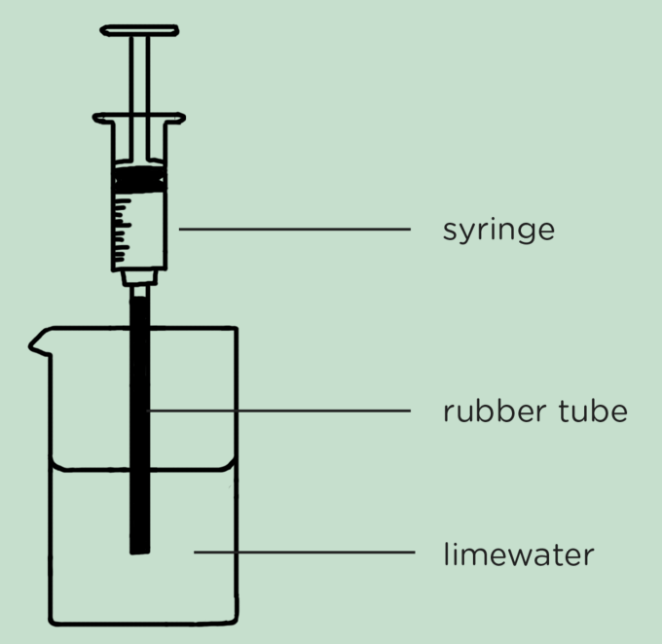
> **[Diagram Context - Textbook_NaturalScience_Gr8_Photosynthesis-and-respiration.pdf-0014-01.png]**
> 1. A diagram of a syringe and rubber tube in a glass beaker.
 2. The syringe is filled with a liquid.
 3. The rubber tube is connected to the syringe.
 4. The rubber tube is filled with a liquid.
 5. The rubber tube is filled with a liquid.

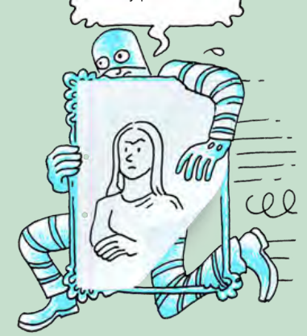
> **[Diagram Context - Textbook_NaturalScience_Gr8_Photosynthesis-and-respiration.pdf-0014-08.png]**
> 1. A cartoon illustration of a man holding a picture of a woman.
 2. The man is holding a picture of a woman in a frame.
 3. The woman is depicted in a cartoon style.

> **[Diagram Context - Textbook_NaturalScience_Gr8_Photosynthesis-and-respiration.pdf-0014-12.png]**
> 1. A diagram of a snake's body.
 2. The snake's body is composed of many small lines.
 3. The snake's body is green and gray.

---

# Concept Map: Photosynthesis and Respiration

## 1. Core Concepts & Summarization Methods

Different learners benefit from different study techniques:
* **Written Summaries:** Summarizing chapter information using words and key concepts.
* **Concept Maps:** Visual diagrams illustrating how different ideas, topics, and concepts relate to and link with one another.

---

## 2. Activity: Photosynthesis and Respiration Concept Map

### Instructions
1. Review the conceptual flow from top to bottom.
2. Fill in the missing spaces based on your understanding of biological energy processes.

### Guiding Questions & Prompts
* *"Respiration takes place in all organisms. All organisms release energy from food, called ..........."* 
  * **Question:** What type of energy does food contain? (Remember that food acts as fuel for living bodies).
* **Plant Photosynthesis Requirements:** Identify the three key components that plants use to carry out photosynthesis, and trace how concepts link together.
* **By-products:** What substance does photosynthesis release as a by-product? Fill in this missing component in the map.

---

## 3. Online Resources & Digital Extension

Look for **VISIT** boxes in the course margins to access digital learning tools:
* Type the provided web link (e.g., `bit.ly/...`) directly into your internet browser's address bar on a PC, tablet, or smartphone.
* Press **Enter** to access online educational videos and interactive webpages to deepen your understanding of the chapter.

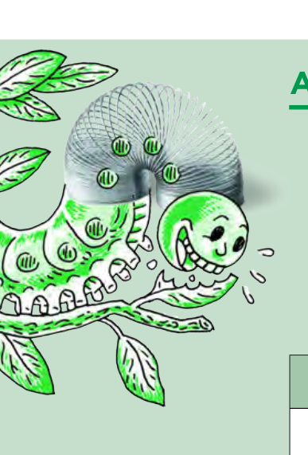
> **[Diagram Context - Textbook_NaturalScience_Gr8_Interactions-and-interdependence-within-the-environment.pdf-0015-01.png]**
> The image features a cartoon depiction of a caterpillar with a smiley face and a green ball on its back. The caterpillar is surrounded by green leaves, and there is a wire coil on its back. The image also includes a diagram of a Lewis structure and a graph of the caterpillar's transformation. The caption at the bottom of the image reads "A caterpillar with a smiley

> **[Diagram Context - Textbook_NaturalScience_Gr8_Photosynthesis-and-respiration.pdf-0015-00.png]**
> 1. A green spring with a wire attached to it.

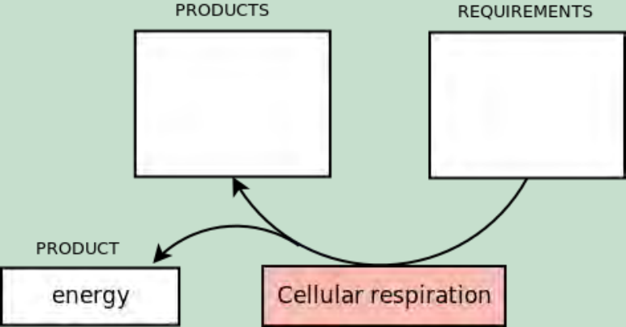
> **[Diagram Context - Textbook_NaturalScience_Gr8_Photosynthesis-and-respiration.pdf-0015-06.png]**
> The image is a diagram that illustrates the process of cellular respiration. It shows the energy flow from the cell to the environment, with the cell as the starting point. The diagram is divided into three sections, each representing a different stage of cellular respiration. The first section shows the energy input from the environment, the second section depicts the energy production within the cell, and the third section represents

> **[Diagram Context - Textbook_NaturalScience_Gr8_Photosynthesis-and-respiration.pdf-0015-07.png]**
> The image shows a line of text that reads "The diagram shows a Lewis structure of a molecule". The text is in a grey color, and it is positioned on a grey background. The text is in a serif font, and it is written in a clear, legible style. The text is centered in the image, and it is the main focus of the image.

> **[Diagram Context - Textbook_NaturalScience_Gr8_Photosynthesis-and-respiration.pdf-0015-08.png]**
> 1. A diagram of a cell with blue and white lines representing the cell's organelles.

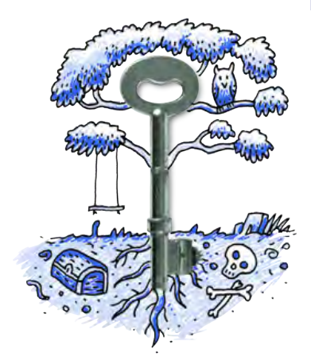
> **[Diagram Context - Textbook_NaturalScience_Gr8_Photosynthesis-and-respiration.pdf-0015-09.png]**
> 1. A key is shown with a tree and a swing.

---

> **[Diagram Context - Textbook_NaturalScience_Gr8_Interactions-and-interdependence-within-the-environment.pdf-0016-02.png]**
> 1. A diagram of a snake with a green head and body.

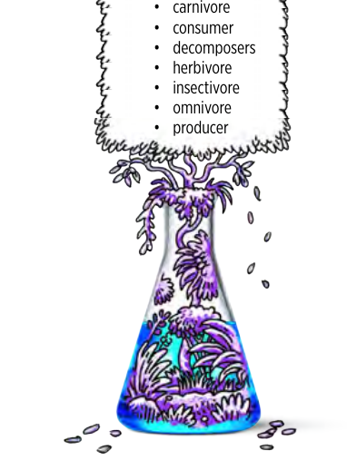
> **[Diagram Context - Textbook_NaturalScience_Gr8_Interactions-and-interdependence-within-the-environment.pdf-0016-10.png]**
> 1. A diagram of a plant cell with purple and blue flowers.

> **[Diagram Context - Textbook_NaturalScience_Gr8_Photosynthesis-and-respiration.pdf-0016-06.png]**
> 1. Google is the main focus of the image.

---

# Chapter 1. Photosynthesis and respiration

## REVISION

1. A Gr. 4 learner wanted to grow some beans and carefully planted them in a yoghurt tub and watered them. He was scared that his little brother would knock his tub over, so he hid the tub in his cupboard.
   
   a) Explain what he would have noticed a few days after planting the beans. [2 marks]
   
   b) Predict what would have happened after another few days with the beans hidden in his cupboard. [2 marks]
   
   c) Explain why you predicted this outcome for his beans. [2 marks]
   
   d) What should he have done to make his bean plants grow tall and strong? [2 marks]

2. What are the requirements for photosynthesis to occur? [3 marks]

3. A farmer is growing some tomatoes. He heard from his daughter that plants produce glucose during photosynthesis, so he decided to see for himself. However, when he tested the leaves, he did not find much glucose, but he did find a lot of starch present.
   
   a) Why did the farmer see this result? [2 marks]
   
   b) Describe the test that the farmer conducted to show that the leaf contained starch. [5 marks]

***

21

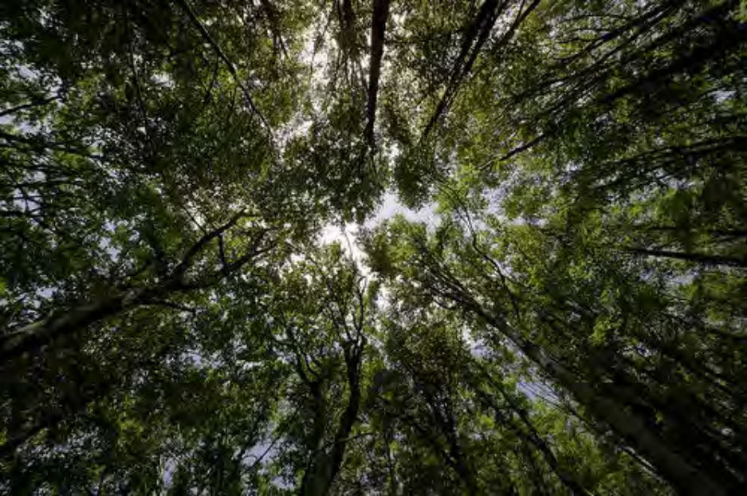
> **[Diagram Context - Textbook_NaturalScience_Gr8_Interactions-and-interdependence-within-the-environment.pdf-0017-03.png]**
> 1. A diagram of a tree with a sun shining through it.

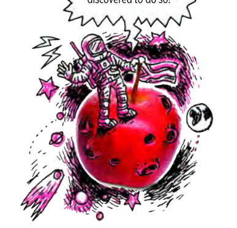
> **[Diagram Context - Textbook_NaturalScience_Gr8_Interactions-and-interdependence-within-the-environment.pdf-0017-04.png]**
> 1. A cartoon drawing of an astronaut on a red planet.
 2. The astronaut is holding a walking stick.
 3. The planet is covered in stars.
 4. The planet has a large crater.
 5. The planet has a large black dot.

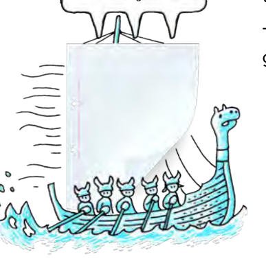
> **[Diagram Context - Textbook_NaturalScience_Gr8_Interactions-and-interdependence-within-the-environment.pdf-0017-10.png]**
> 1. A cartoon boat with a group of people on it.

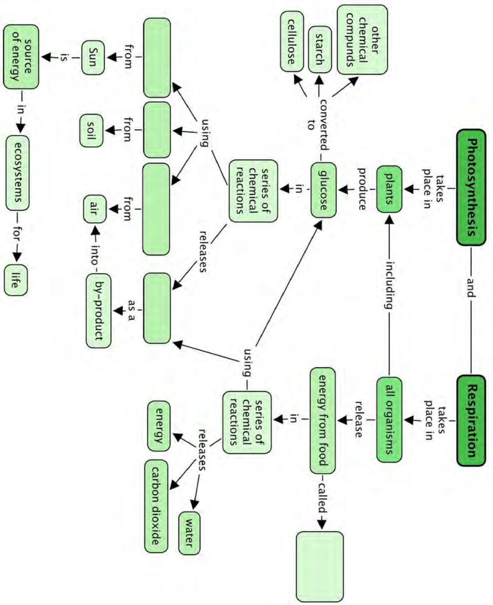
> **[Diagram Context - Textbook_NaturalScience_Gr8_Photosynthesis-and-respiration.pdf-0017-00.png]**
> The image is a diagram that illustrates the process of photosynthesis. It shows the different stages of photosynthesis, including the absorption of light energy, the conversion of carbon dioxide and water into glucose and oxygen, and the release of oxygen. The diagram is color-coded, with green representing the process of photosynthesis and red representing the products of photosynthesis. The diagram also includes labels for the react

---

4. Do plants undergo photosynthesis and respiration all day and all night? Give reasons for your answer. [4 marks]

5. A group of Gr. 7 learners wanted to show that carbon dioxide is used to make bread rise because the yeast and sugar that is added to the bread mix produces the carbon dioxide. They set up the following two experiments. The gas that they collected from each test tube was run through limewater.

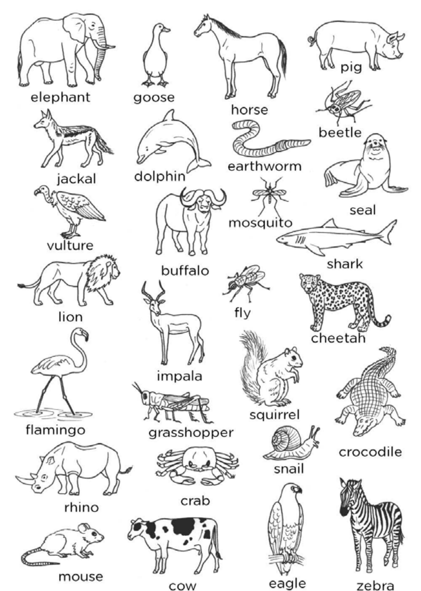
> **[Diagram Context - Textbook_NaturalScience_Gr8_Interactions-and-interdependence-within-the-environment.pdf-0018-04.png]**
> 1. A diagram of various animals, including a giraffe, zebra, elephant, lion, rhinoceros, crocodile, alligator, and a gazelle.

> **[Diagram Context - Textbook_NaturalScience_Gr8_Interactions-and-interdependence-within-the-environment.pdf-0018-05.png]**
> 1. A diagram of a roller coaster with a spring coiled up on top.

> **[Diagram Context - Textbook_NaturalScience_Gr8_Photosynthesis-and-respiration.pdf-0018-03.png]**
> 1. A cartoon depiction of a man and a machine. 
 2. The man is holding a machine that has a wheel and a gear. 
 3. The machine is made of metal.

---

a) Why did they run the rubber tube from Test Tube A to Test Tube B? [3 marks]

b) Explain why they added a stopper into the top of Test Tube A. [1 mark]

c) The following photo shows one of the test tubes after the experiment. Which test tube do you think it is and from which set-up. Give reasons for your answer. [2 marks]

*Which test tube is this?*

d) Why do you think the yeast solution in Setup 1 did not produce carbon dioxide. [2 marks]

6. Study the following diagram and fill in the missing information. [6 marks]

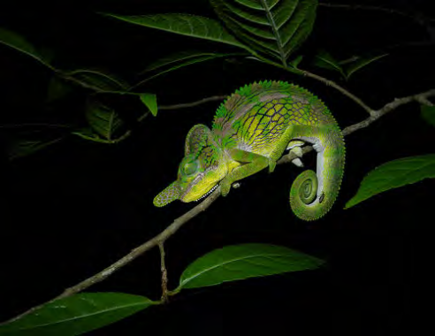
> **[Diagram Context - Textbook_NaturalScience_Gr8_Interactions-and-interdependence-within-the-environment.pdf-0019-05.png]**
> The image shows a chameleon resting on a branch. The chameleon is green and brown in color and is sitting on a branch with its body curled up. The branch is covered in leaves, and the background is dark, providing a stark contrast to the chameleon's vibrant colors. The chameleon is positioned in the center of the image, with the leaves surrounding it on

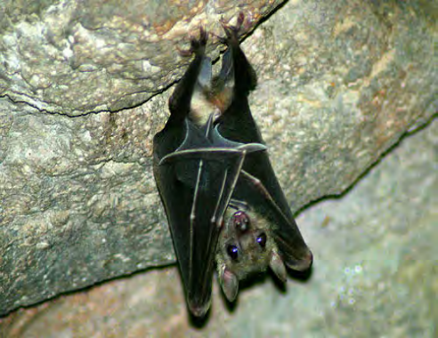
> **[Diagram Context - Textbook_NaturalScience_Gr8_Interactions-and-interdependence-within-the-environment.pdf-0019-07.png]**
> 1. A bat hanging upside down on a rock.

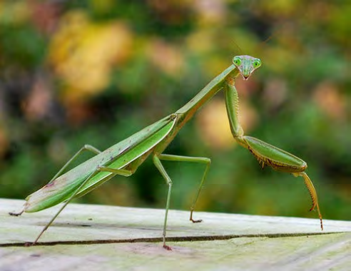
> **[Diagram Context - Textbook_NaturalScience_Gr8_Interactions-and-interdependence-within-the-environment.pdf-0019-09.png]**
> 1. A green insect with a long antennae and a long body.

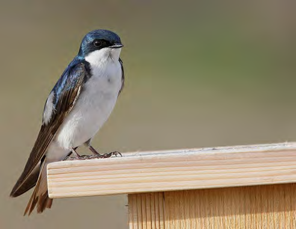
> **[Diagram Context - Textbook_NaturalScience_Gr8_Interactions-and-interdependence-within-the-environment.pdf-0019-10.png]**
> 1. A bird sitting on a wooden platform.

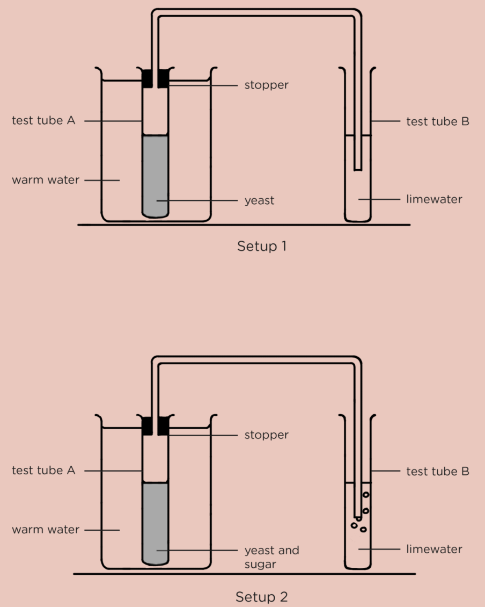
> **[Diagram Context - Textbook_NaturalScience_Gr8_Photosynthesis-and-respiration.pdf-0019-03.png]**
> 1. A diagram of a setup for a yeast and sugar experiment.

---

7. Draw a table in the following space to show the differences between the two processes, photosynthesis and respiration. Your table should highlight the differences in requirements, the differences in the products, which organisms the processes takes place in, and when. [8 marks]

Total [44 marks]

> **[Diagram Context - Textbook_NaturalScience_Gr8_Interactions-and-interdependence-within-the-environment.pdf-0020-09.png]**
> The image shows a line of green and white beads arranged in a zigzag pattern. The beads are the main focus of the image, and they are the only objects present. The beads are positioned in a straight line, with no other objects or text in the image. The image does not contain any text or other objects, and the beads are the only elements that stand out.

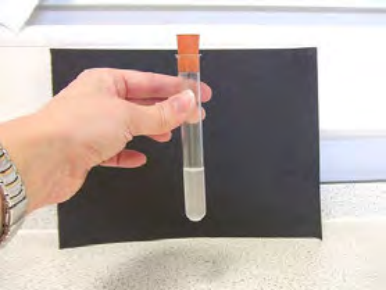
> **[Diagram Context - Textbook_NaturalScience_Gr8_Photosynthesis-and-respiration.pdf-0020-04.png]**
> 1. A hand holding a test tube.

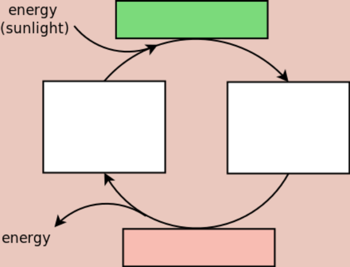
> **[Diagram Context - Textbook_NaturalScience_Gr8_Photosynthesis-and-respiration.pdf-0020-08.png]**
> 1. A diagram of a solar system with two planets and a sun.
 2. The sun is at the center of the diagram.
 3. The planets are shown in a circular arrangement.
 4. The diagram is labeled with the words "energy" and "unlight".

---

# Chapter 1. Photosynthesis and respiration

Here is your chance to discover the possibilities. What can this apple become?

> **[Diagram Context - Textbook_NaturalScience_Gr8_Interactions-and-interdependence-within-the-environment.pdf-0021-00.png]**
> 1. A diagram of a spring with a green background.

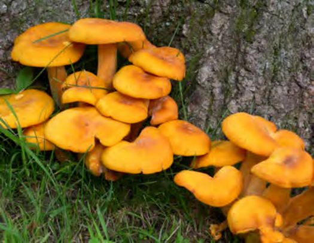
> **[Diagram Context - Textbook_NaturalScience_Gr8_Interactions-and-interdependence-within-the-environment.pdf-0021-04.png]**
> The image shows a close-up view of a group of orange mushrooms growing on the ground. The mushrooms are arranged in a cluster, with some overlapping each other. The mushrooms are of varying sizes, indicating that they are in different stages of growth. The image does not contain any text, and the focus is solely on the mushrooms and their arrangement.

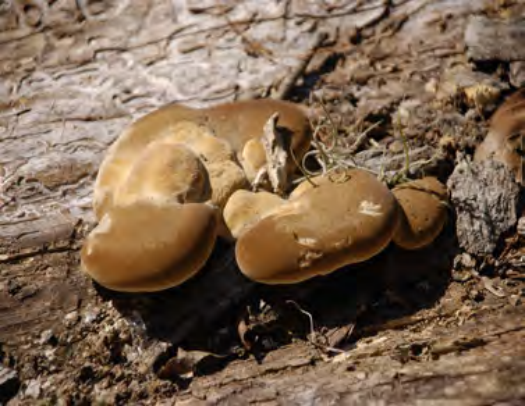
> **[Diagram Context - Textbook_NaturalScience_Gr8_Interactions-and-interdependence-within-the-environment.pdf-0021-05.png]**
> 1. A diagram of a mushroom with brown and white spots.

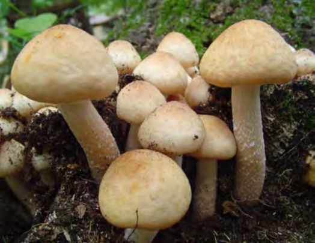
> **[Diagram Context - Textbook_NaturalScience_Gr8_Interactions-and-interdependence-within-the-environment.pdf-0021-06.png]**
> 1. A diagram of a mushroom with a brown cap and white body.

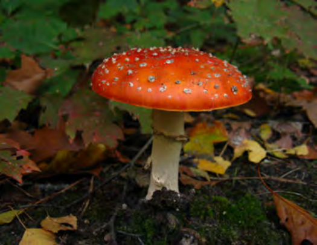
> **[Diagram Context - Textbook_NaturalScience_Gr8_Interactions-and-interdependence-within-the-environment.pdf-0021-07.png]**
> 1. A red mushroom with white spots on a brown stem.

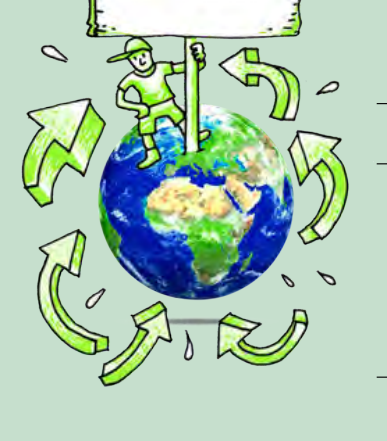
> **[Diagram Context - Textbook_NaturalScience_Gr8_Interactions-and-interdependence-within-the-environment.pdf-0021-11.png]**
> This illustration depicts a conceptual diagram of the Earth surrounded by a circular arrangement of green arrows and a human figure holding a blank sign. The visual elements include a globe, a person, and multiple directional arrows representing a continuous cycle or global process. For a high school learner, this graphic serves as a foundational visual aid for topics like environmental sustainability, the water cycle, or carbon cycling, emphasizing the human responsibility to manage and protect global ecological systems.

> **[Diagram Context - Textbook_NaturalScience_Gr8_Photosynthesis-and-respiration.pdf-0021-02.png]**
> 1. A white square with a brown border.

> **[Diagram Context - Textbook_NaturalScience_Gr8_Photosynthesis-and-respiration.pdf-0021-04.png]**
> 1. A diagram of a cell with a red ant on the left side.

---

# 1 Photosynthesis and Respiration

## Chapter Overview
* **Duration:** 2 weeks

This chapter provides learners with an introduction to, and revision of, the concepts in photosynthesis and respiration in preparation for a study of the ecosystem. Learners have already looked at photosynthesis and respiration in previous grades. They know that respiration is one of the seven life processes of living things. They have also been introduced to photosynthesis in the context of green plants and food chains in Gr. 5 and 6. The emphasis in this chapter is on the use of energy and on how radiant (light) energy is transferred to chemical potential energy and later released during respiration. This concept is developed within the scope of the CAPS prescriptions and will be used as a scaffold to explain the transfer of energy in the ecosystem in the subsequent chapter. 

---

## 1.1 Photosynthesis (3.5 hours)

| Tasks | Skills | Recommendation |
| :--- | :--- | :--- |
| Activity: The seven life processes | Remembering, describing, writing | Optional (Revision) |
| Activity: Requirements and products of photosynthesis | Summarising, describing, writing | CAPS suggested |
| Investigation: Which leaves photosynthesise? (Test for the presence of starch) | Hypothesising, investigating, observing, measuring, analysing, writing, group work | CAPS suggested |
| Investigation: Why do bananas become sweeter as they ripen? | Hypothesising, investigating, observing, measuring, recording, analysing, writing, group work | Optional |

---

## 1.2 Respiration (2.5 hours)

| Tasks | Skills | Recommendation |
| :--- | :--- | :--- |
| Activity: Does our breath contain carbon dioxide? (Test for the presence of carbon dioxide using limewater) | Investigating, observing, measuring, recording, analysing, writing, group work | CAPS suggested |
| Activity: Requirements and products of respiration | Describing, writing | CAPS suggested |

> **[Diagram Context - Textbook_NaturalScience_Gr8_Interactions-and-interdependence-within-the-environment.pdf-0022-02.png]**
> The image shows a line of green and white beads arranged in a straight line. The beads are evenly spaced, and the line extends from the left to the right side of the image. The beads are not touching each other, and there are no other objects or text present in the image. The image does not contain any text or other objects, and the beads are the only objects in the image

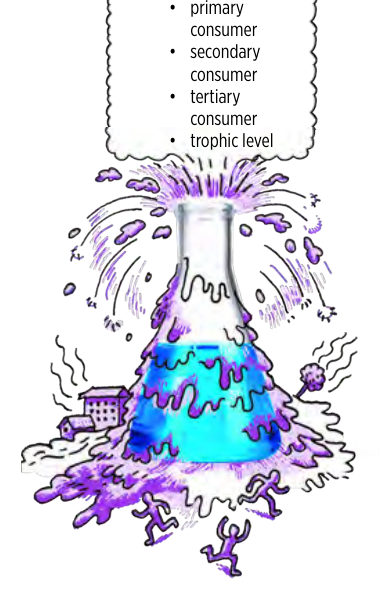
> **[Diagram Context - Textbook_NaturalScience_Gr8_Interactions-and-interdependence-within-the-environment.pdf-0022-11.png]**
> A cartoon depiction of a volcano with purple and blue lava flowing out of a blue glass container. The container is labeled with the words "Volcanic" and "Volcanic lava". The diagram also includes a label for "Volcanic lava" and a label for "Volcanic eruption".

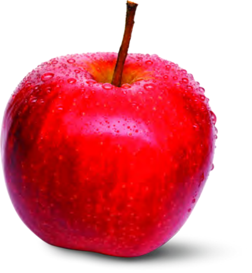
> **[Diagram Context - Textbook_NaturalScience_Gr8_Photosynthesis-and-respiration.pdf-0022-01.png]**
> 1. A red apple with water droplets on it.

---

## Key questions

* What drives life on Earth and in ecosystems?
* How do green plants photosynthesise when no other organism can make its own food?
* What do plants do with the food that they produce?
* Why do we need to eat food? What does it provide us with?
* We know respiration is one of the seven life processes, but what happens during respiration in organisms?

---

## 1.1 Photosynthesis

This website has many interesting articles about science and science related jobs. They have been classified according to topics and also provide tips on how to incorporate the articles into your classroom. If you are interested in incorporating real world science into your classroom, this is one website to start looking at: `bit.ly/16zEuUf`

### ACTIVITY: The seven life processes (LB page 2)

The seven life processes are:
* **Movement** (moving)
* **Reproduction** (reproducing)
* **Sense the environment** (sensing)
* **Growth** (growing)
* **Respiration**
* **Excretion** (excreting)
* **Nutrition** (feeding)

Ask your learners this as a revision of what they did in previous grades. Some objects with kinetic energy are a moving car, a bouncing ball, a leaf blowing, a fan blowing, etc. Some objects with potential energy are a book on the table (it has gravitational potential energy as it can fall down to the ground), a bouncing ball when it is at the top of its bounce as it can also fall back down, batteries, fossil fuels and food have potential energy.

---

### ACTIVITY: Requirements and products of photosynthesis (LB page 4)

The learner's diagram should look as follows:

Discuss this with your learners. The glucose is produced continuously during the day when the Sun is out and is not all used at once by the plant. The plant cannot have large amounts of glucose accumulating as this affects the water potential within the leaves, and so some is converted to starch to be stored until it is needed.

Discuss this as a class in the lead up to the investigation

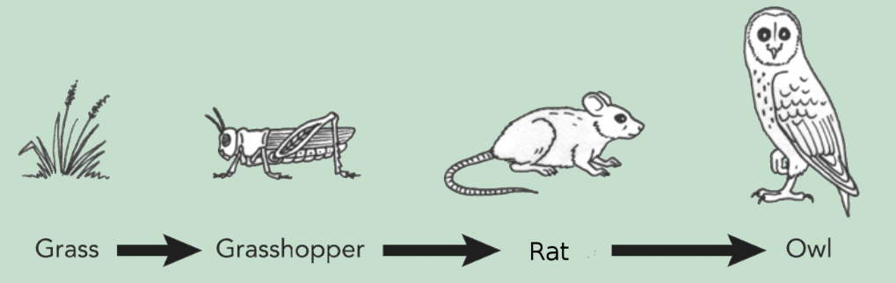
> **[Diagram Context - Textbook_NaturalScience_Gr8_Interactions-and-interdependence-within-the-environment.pdf-0023-01.png]**
> A diagram illustrating the life cycle of a grasshopper, a rat, and an owl.

---

## Safety Rules for Testing Substances

* **Rule against taste-testing:** Learners must be made aware that we do **not** taste-test unknown substances due to the potential for poisoning. 
* **Edibility condition:** Only perform a taste test if you are entirely sure that a substance is edible.

---

## Physical Tests and Limitations

* **Accuracy of physical tests:** Simple physical tests (such as observing how a substance dissolves) can give a fairly good indication, but they are not very accurate.
* **Influencing factors:** The temperature of the water and the quantities used will affect the rate at which a substance dissolves.
* **Scientific concepts:** This provides a good opportunity to discuss **kinetic energy** and the **temperature of a solution**.

---

## Chemical Reagents Note

* **Correct terminology:** Emphasize to learners that they should refer to **iodine solution**, and not just *iodine* (which is a bluish-black solid).

---

## INVESTIGATION: Which leaves photosynthesise? (LB page 6)

### Requirements and Preparation
* **Materials needed:** Variegated leaves and normal leaves. 
* **Variegated leaves definition:** Leaves that have white patterns (areas lacking chlorophyll) on them.
* **Examples of South African plants:** Certain geraniums, African violets, ivy, etc.
* **Duration:** This investigation can be done over 2 lessons.
* **Pre-investigation step:** Place one set of pot plants in a dark cupboard for up to 48 hours prior to starting the investigation. This ensures that the plants do not have starch in the leaves before the process begins.

---

### Alternative Time-Saving Options
* **If time is limited:** Get learners to read through **Part 1**, and then conduct **Part 2** where they write up their own report.

---

### Possible Answers for Investigation Aim
* "To determine whether leaves photosynthesise in the dark or the light"
* "To investigate whether Light is necessary for Photosynthesis"

---

### Expected Results
* **Leaves kept in the light:** Will test **positive** for starch because they photosynthesised.
* **Leaves kept in the dark:** Will test **negative** for starch because they did not photosynthesise.

---

### Experimental Setup and Safety

* **Alternative equipment:** Instead of a saucepan with water and a beaker with alcohol, teachers may use a beaker with water and a test tube containing meths or alcohol.
* **Water bath safety:** The container holding the alcohol must be safely contained within the water to prevent it from being directly heated or coming into contact with the flame.
* **Warning:** The alcohol needs to be heated, but it **cannot be heated directly** because it is extremely flammable. It must therefore be heated in a water bath.

---

### Testing Procedure
* **Applying iodine:** The amount of iodine solution required to observe a result depends on the leaf tested. Some leaves may need to be flooded with iodine solution.
* **Procedure:** Place the leaf in a petri dish and cover the leaf with iodine.

> **[Diagram Context - Textbook_NaturalScience_Gr8_Interactions-and-interdependence-within-the-environment.pdf-0024-02.png]**
> The image shows a white square with a gray border. The square is filled with a gray background, and the edges of the square are white. The image does not contain any text or additional objects. The square is the sole focus of the image, and it is centrally positioned.

> **[Diagram Context - Textbook_NaturalScience_Gr8_Interactions-and-interdependence-within-the-environment.pdf-0024-04.png]**
> 1. A diagram of a snake's body.
 2. The snake's head is green.
 3. The snake's body is green.

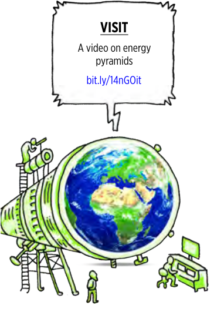
> **[Diagram Context - Textbook_NaturalScience_Gr8_Interactions-and-interdependence-within-the-environment.pdf-0024-11.png]**
> The image is a cartoon depicting a group of people standing around a large telescope. The telescope is positioned in the center of the image, with a globe on top of it. The people are scattered around the telescope, with some standing closer to the globe and others further away. The image also includes a speech bubble that reads "Visit" and a website address "www.4ngoit.

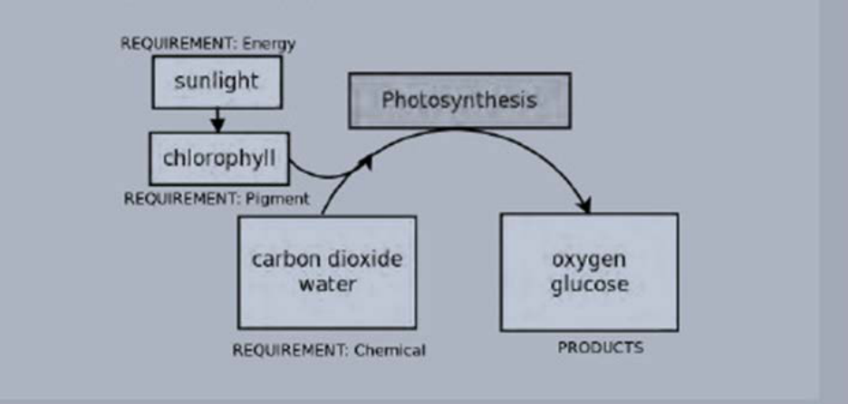
> **[Diagram Context - Textbook_NaturalScience_Gr8_Photosynthesis-and-respiration.pdf-0024-13.png]**
> 1. A diagram of a molecule of oxygen gas.

---

# Photosynthesis Investigation: Starch Test

## Investigation Overview
* **Carbon Dioxide Test:** Begins with carbon dioxide testing using limewater, followed by demonstrating the starch test.
* **Learner Skills:** Learners must draw their own tables to record observations. This serves as an initial high school investigation to gauge student proficiency and recording abilities.

---

## Scientific Principles & Key Concepts

### Role of Reagents and Heat
* **Hot Water:** Removes the waxy cuticle of the leaf.
* **Ethyl Alcohol:** Dissolves the chlorophyll, releasing the green pigment so that it does not mask the color change expected with the iodine solution. The leaves should appear white after this step.
* **Iodine Solution:** Acts as an indicator for starch.
  * **Positive Result:** Turns **blue-black** (or dark blue-black) in the presence of starch, indicating that photosynthesis occurred and glucose was produced and stored as starch.
  * **Negative Result:** Remains **brownish-orange**, indicating that starch is absent and photosynthesis did not take place.

---

## Experimental Guidelines for Learners

1. **Comparative Controls:** This investigation allows comparison between plants allowed to photosynthesize and those denied the conditions to do so. Plants with access to light/CO₂ produce starch, while those without produce little to no starch.
2. **Plant Selection:** 
   * **Geranium leaves** and **variegated mint-leaves** (common in KwaZulu-Natal) are excellent options because they are thin and easy to penetrate.
   * **Ivy leaves** are less suitable due to a very thick cuticle that prevents iodine penetration.
3. **Independent Report Writing:** Unlike guided practicals, learners must compile their own reports individually or in groups.

---

## Structure of the Experimental Report

### Aim
To find out which parts of variegated leaves photosynthesize and store starch.

### Hypothesis
The green parts of variegated leaves will turn blue-black in iodine solution, indicating that they photosynthesize and store starch, whereas the white parts will not turn blue-black (will stay brown).

### Materials and Apparatus
* Must be recorded in a bulleted list.
* Must include specific measurements where applicable.

### Method
* Numbered steps written in full sentences.
* Must accurately reflect the measurements and procedures used.

### Results
* Learners must draw and format their own data tables with appropriate column and row headings, plus a descriptive table title.
* Learners should make drawings of their leaves at the start of the experiment, indicating the different colored regions (since boiling in alcohol removes the color, initial drawings help map out where pigments were located).

### Discussion
* Explain the results and reference the scientific reasoning: the white parts of the leaves lack chlorophyll and therefore cannot photosynthesize, proving that **chlorophyll is crucial for photosynthesis**.
* Include a self-assessment or reflection on what could be improved in the experimental procedure.

### Conclusion
A short statement directly answering the aim or investigative question.

> **[Diagram Context - Textbook_NaturalScience_Gr8_Interactions-and-interdependence-within-the-environment.pdf-0025-00.png]**
> The image features a cartoon depiction of a caterpillar with a smiley face, surrounded by green leaves. The caterpillar is shown in a curled-up position, with a green ball attached to its head. The image also includes a text box that reads "A" and "A+", which may be part of a math problem or a question related to the caterpillar's characteristics.

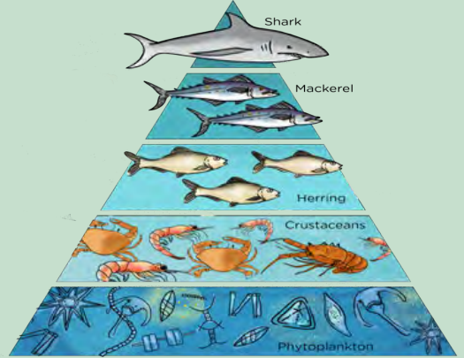
> **[Diagram Context - Textbook_NaturalScience_Gr8_Interactions-and-interdependence-within-the-environment.pdf-0025-10.png]**
> The image is a diagram that illustrates the hierarchy of marine animals, including sharks, herring, crustaceans, and other marine life. The diagram is color-coded, with each species represented by a different color. The diagram is labeled with the names of the animals, such as "shark", "shark herring", "crustaceans", and "crustaceans

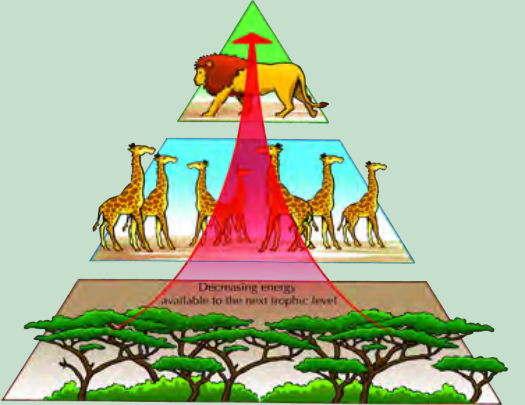
> **[Diagram Context - Textbook_NaturalScience_Gr8_Interactions-and-interdependence-within-the-environment.pdf-0025-11.png]**
> 1. A diagram of a giraffe walking up a red triangle. 
 2. A diagram of a lion walking up a yellow triangle. 
 3. A diagram of a giraffe walking up a green triangle. 
 4. A diagram of a giraffe walking up a brown triangle.

---

# INVESTIGATION: Why do bananas become sweeter as they ripen? (LB page 8)

*Note: It is not crucial to do this investigation if you do not have time. This is an **optional extension** of the starch test.*

### Investigation Guidance and Expected Responses

1. **Aim / Objective (Learner-dependent answer)**
   * Example of a possible answer: To investigate the presence of starch in ripe and unripe bananas; to investigate why bananas become sweeter as they ripen; etc.
   * If the unripe banana does not taste as sweet compared to the very sweet-tasting ripe banana, then perhaps it contains more starch and less glucose. The starch test might show that the unripe banana contains more starch.

2. **Observations (Learner-dependent answer)**
   * Learners should be able to describe the taste and texture of each banana: the ripe one being soft and sweet, and the unripe one being firm and not too sweet. 
   * Learners might deduce that the unripe banana contains more starch and less glucose as it is not as sweet as the ripe banana. However, this is not a very accurate test on its own, and different learners might experience tastes differently, making subjective taste results unreliable.
   * Learners should be able to quite easily observe differences based on the speed with which iodine changes colour in the unripe banana compared to the ripe one.

3. **Data Presentation (Learner-dependent answer)**
   * Allow learners the freedom to tabulate their results in any way they choose, as long as it is easy to interpret and understand. 
   * Use this as a teaching opportunity to help those who struggle with tabulation, and when everyone is done, compare the different methods used in the class.
   * Use this comparison to help learners understand that the **reliability** of an experiment rests on the fact that although different people perform the same test, they should all reach very similar results.

4. **Conclusions**
   * **Conclusion:** Unripe bananas contain more starch than ripe bananas. This question was specifically included to introduce learners to the concept of **validity**, and teachers are encouraged to allow learners to debate this issue in the class.
   * **Scientific Fact:** As bananas ripen, the starch is converted into glucose.

---

## 1.2 Respiration

The term **respiration** can refer to two distinct processes:

* **Physiology:** Refers to the transport of oxygen from the outside air to the cells, and the transport of carbon dioxide out of the tissues and into the air. This is often confused with **breathing**, which is the physical movement of air in and out of the breathing organs (such as lungs or gills) and does not take place in all organisms, whereas respiration does.
* **Biochemical Level (Cellular Respiration):** Refers to cellular respiration. This is the metabolic process in all organisms where oxygen is combined with glucose to release water, carbon dioxide, and energy in the form of **ATP** (adenosine triphosphate). Cellular respiration takes place in individual cells within the organism, whereas physiological respiration involves the bulk transport of gases and other compounds between the organism and the outside air.

In this section, we will look specifically at **cellular respiration**, focusing on the chemical reactions which release the energy stored in food. However, learners may not yet have fully learnt about cells, so...

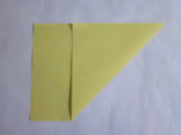
> **[Diagram Context - Textbook_NaturalScience_Gr8_Interactions-and-interdependence-within-the-environment.pdf-0026-08.png]**
> The image shows a yellow paper folded into an X shape, with the folded edge pointing towards the top right corner. The folded paper is placed on a white surface, and the background is a plain white wall. The folded paper appears to be a Lewis diagram, which is a diagram used to represent chemical structures and their valence electrons. The diagram is labeled with the chemical symbol "C6H

> **[Diagram Context - Textbook_NaturalScience_Gr8_Interactions-and-interdependence-within-the-environment.pdf-0026-10.png]**
> The image shows a yellow origami paper folded into a square shape. The square is folded in half diagonally, creating a diamond-like structure. The paper is neatly folded, with the edges aligned and the corners pointing inwards. The image does not contain any text or additional objects, and the focus is solely on the origami paper and its final form.

---

# Concepts & Structure

## Respiration

* **Definition & Timing:** Respiration is a continuous process that occurs constantly, both during the day and during the night. It must not be confused with photosynthesis, which requires sunlight and only takes place during daylight hours.
* **Key Terms & Ingredients:** The primary ingredients involved are glucose (food) and oxygen. In future chemical reactions, these ingredients will be formally defined as **reactants**.
* **Energy Release & Storage:** 
  * Respiration releases energy, which is stored in the chemical bonds of **ATP** (Adenosine Triphosphate) molecules as chemical potential energy.
  * ATP is not energy itself, but rather stores energy. When ATP molecules are broken down, they release this energy to drive other biological processes.
* **Energy in Equations:** 
  * In photosynthesis, sunlight energy is placed above the reaction arrow.
  * In respiration, energy is placed as a **product** because it is contained within the molecules produced (ATP).
* **By-products:** The resulting by-products of respiration are carbon dioxide and water.

---

## ACTIVITY: Does our breath contain carbon dioxide? (LB page 11)

### Preparation of Limewater

To perform this activity, limewater must be prepared beforehand using the following steps:

1. Place a few tablespoons of calcium hydroxide, $\text{Ca(OH)}_2$, into a clear $500\text{ ml}$ reagent bottle and fill it with water. Shake or stir to create a cloudy suspension.
2. Leave the suspension to settle for a few days. The clear liquid above the solid $\text{Ca(OH)}_2$ sludge is a saturated solution of $\text{Ca(OH)}_2$, commonly known as **clear limewater**.
3. Carefully decant as much of the clear liquid as needed without disturbing the solid $\text{Ca(OH)}_2$ sludge at the bottom.
4. To make more limewater, add more water, shake, and let it settle again. If the sludge dissolves completely, add more solid $\text{Ca(OH)}_2$.

### Apparatus & Safety Notes

* For health and hygiene reasons, ensure there is **one straw or rubber tube per learner**.
* **Safety Warning:** Always remove any needles from syringes before handing them out in class. Alternative options include using a bicycle pump or a balloon blower if syringes are unavailable.

> **[Diagram Context - Textbook_NaturalScience_Gr8_Interactions-and-interdependence-within-the-environment.pdf-0027-02.png]**
> The image shows a person's hand holding a pair of scissors, cutting a piece of yellow paper. The scissors are positioned over a square piece of paper, which is being cut by the person's hand. The paper is being cut in half, revealing the person's fingers. The image does not contain any text.

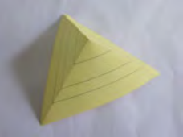
> **[Diagram Context - Textbook_NaturalScience_Gr8_Interactions-and-interdependence-within-the-environment.pdf-0027-04.png]**
> The image shows a yellow triangular pyramid made from paper. The pyramid is outlined in black, and the edges are folded to create the triangular shape. The pyramid is placed against a white background, which makes it stand out. The pyramid appears to be a simple geometric figure, and it is not accompanied by any text or additional objects. The pyramid is the main focus of the image, and it is

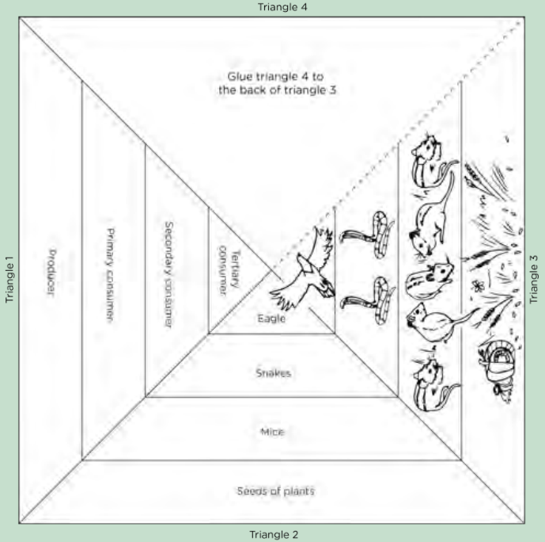
> **[Diagram Context - Textbook_NaturalScience_Gr8_Interactions-and-interdependence-within-the-environment.pdf-0027-12.png]**
> 1. A diagram of a triangle with the words "Triangle 4" at the top.

> **[Diagram Context - Textbook_NaturalScience_Gr8_Interactions-and-interdependence-within-the-environment.pdf-0027-13.png]**
> 1. A diagram of a cell with a green line representing a cell wall.

---

1. The clear limewater turned cloudy white. This means our breath contains carbon dioxide from respiration.
2. The clear limewater did not change and remained clear. Some might notice a very slight change, which indicates that there is a small amount of carbon dioxide present in atmospheric air.
3. As air contains such a small percentage of carbon dioxide, there is not enough to cause a noticeable difference in the limewater. Discuss with your learners why they think that the limewater turned cloudy with your breath but not with the air, even though air does contain carbon dioxide. Point out that air from your lungs contains a much higher percentage of carbon dioxide from respiration and this can turn the limewater cloudy in a shorter time than atmospheric air will.
4. a) Glucose and oxygen.
   b) Energy, carbon dioxide and water.

## ACTIVITY: Requirements and products of Respiration (LB page 12)

| Cellular Respiration Process Component | Classification |
| :--- | :--- |
| Oxygen, Glucose | Requirements |
| Carbon Dioxide, Water, Energy | Products |

This is what the learner's diagrams should look like.

Throughout this year, we are going to develop the skill of designing and making **concept maps** in Natural Sciences. The "Key concepts" listed above is a summary written out in full sentences. A concept map provides another way of representing information (ideas and concepts) in a more visual way. The benefits of a concept map are that it allows one to show the links between different concepts. Often a concept map has a "focus question" from which the other concepts radiate. In these books, the focus question will be the main topic for the chapter. The relationships between different concepts are shown using arrows with linking phrases, such as "results in", "includes", "can be", "used to", "depends on", etc.

As this year progresses, learners will have to start filling in more parts of the concept maps themselves, and then hopefully draw their own ones by the end of the year. This teacher's guide contains the full version of each concept map. Encourage your learners to study the concept maps and make sense of them at the end of each chapter before doing the revision questions. Help your learners to understand and "read" the concept maps by constructing sentences from them. For example in this case you could read: "Respiration takes place in all organisms, releases energy from food".

**Learners need to learn how to learn!** This is one skill which might help them later in their school career where they have a lot more information to ingest and learn and make sense of. Concept mapping is one tool for summarising information and understanding how different concepts link together. Real understanding and knowledge comes from grappling with the subject matter, and not just memorizing facts.

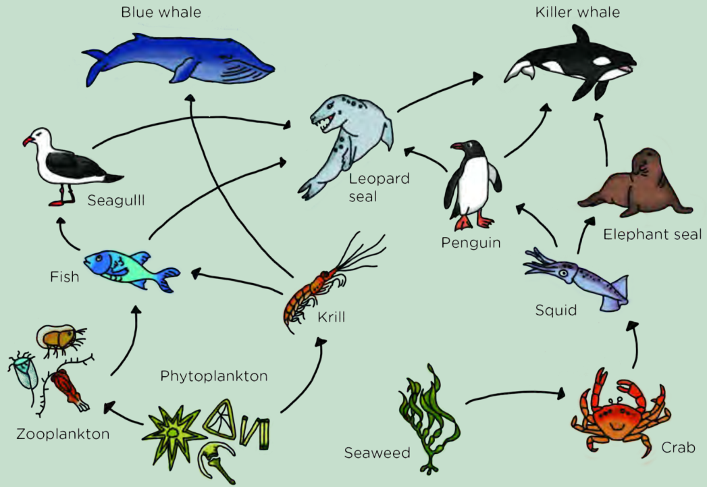
> **[Diagram Context - Textbook_NaturalScience_Gr8_Interactions-and-interdependence-within-the-environment.pdf-0028-06.png]**
> A diagram illustrating the relationships between different types of animals, including mammals, birds, fish, and invertebrates. The diagram is color-coded to show the relationships between the different types of animals. The diagram also includes labels for each type of animal, such as mammals, birds, fish, and invertebrates. The diagram is labeled with arrows to show the relationships between the different types of

> **[Diagram Context - Textbook_NaturalScience_Gr8_Interactions-and-interdependence-within-the-environment.pdf-0028-07.png]**
> 1. A diagram of a roller coaster with a group of people on it.

---

# Revision Notes: Photosynthesis, Respiration, and Plant Growth

## 1. Seed Germination and Early Plant Growth
* **a)** Depending on the growing conditions, observers may notice a root and first leaves forming during early germination.
* **b)** Young bean plants might form small initial leaves, but without proper conditions, they will slowly start to die.
* **c)** Plants will die if leaves lack sufficient radiant energy (sunlight) to allow them to photosynthesise and produce glucose for growth and development.
* **d)** To ensure survival, plants must be placed in a location where they receive adequate radiant energy (sunlight) to photosynthesise.

## 2. Requirements for Photosynthesis
The essential raw materials required for photosynthesis are:
* Carbon dioxide ($\text{CO}_2$)
* Sunlight (Radiant energy)
* Water ($\text{H}_2\text{O}$)

## 3. Storage of Food and Starch Testing Procedures
* **a)** Plants convert produced glucose into starch because starch is easier to store. Consequently, leaves will indicate a high starch content.
* **b)** **Starch Test Procedure:**
  1. Remove chlorophyll by dipping the leaf into boiling water for $1\text{--}2$ minutes to soften and remove the waxy top layer.
  2. Place the leaf in alcohol and heat it over water to extract the chlorophyll.
  3. Remove the leaf and dip it back into hot water to soften it (as ethanol makes the leaf brittle).
  4. Add iodine solution onto the leaf. 
  5. **Observation:** Iodine changes color from orange-brown to dark blue-black in the presence of starch, indicating that starch is present.

## 4. Comparison of Photosynthesis and Respiration
* **Photosynthesis:** Occurs only during the day (requires sunlight energy).
* **Respiration:** Occurs all day and all night. All living organisms must undergo respiration to release energy from chemical potential energy to perform the seven life processes.

## 5. Experimental Analysis: Gas Production and Limewater Tests
* **a)** **Testing for Carbon Dioxide:** Collecting gas formed from a solution and bubbling it through limewater. If the limewater changes from clear to cloudy white, it indicates the presence of carbon dioxide.
* **b)** **Experimental Control:** Ensuring that no gas escapes before bubbling through the limewater guarantees that only the experimental gas affects the limewater, rather than atmospheric carbon dioxide.
* **c)** **Identifying Results:** Test tube B contains clear limewater that turns milky. This occurs because yeast and sugar in test tube A (Setup 2) ferment, releasing carbon dioxide that turns the limewater milky.
* **d)** **Role of Reactants:** Yeast requires sugar to react and form carbon dioxide. When sugar is unavailable, the reaction cannot occur, and carbon dioxide is not produced.

> **[Diagram Context - Textbook_NaturalScience_Gr8_Interactions-and-interdependence-within-the-environment.pdf-0029-00.png]**
> The image shows a diagram of a cell with a white square and a green rectangle. The diagram is labeled with the text "Lewis diagram" and "cellular structure". The diagram is labeled with the text "South Africa" and "circuit". The diagram is labeled with the text "evolutionary tree". The diagram is labeled with the text "axes". The diagram is labeled with

> **[Diagram Context - Textbook_NaturalScience_Gr8_Interactions-and-interdependence-within-the-environment.pdf-0029-06.png]**
> 1. A white rectangle with a gray border.

> **[Diagram Context - Textbook_NaturalScience_Gr8_Interactions-and-interdependence-within-the-environment.pdf-0029-07.png]**
> 1. A diagram of a cell with a green line representing the cell membrane.

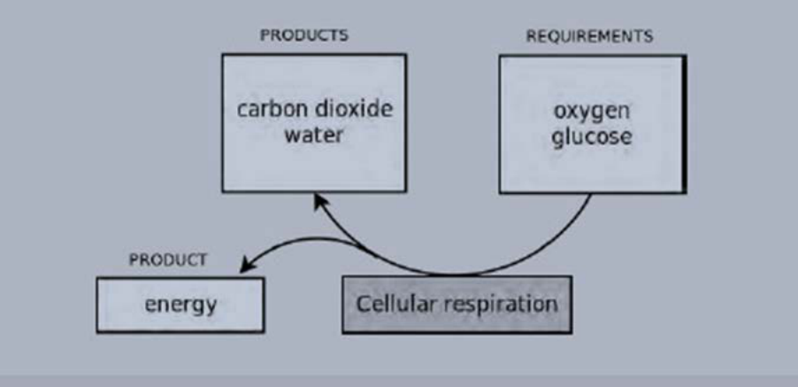
> **[Diagram Context - Textbook_NaturalScience_Gr8_Photosynthesis-and-respiration.pdf-0029-06.png]**
> 1. A diagram of a cell and its components.
 2. A diagram of a cell and its components.
 3. A diagram of a cell and its components.

---

## Revision Notes: Photosynthesis and Cellular Respiration

### 6. Relationship Between Photosynthesis and Cellular Respiration

Photosynthesis and cellular respiration are complementary biological processes that cycle matter and energy in living systems.

* **Photosynthesis** captures light energy to convert carbon dioxide and water into glucose and oxygen.
* **Cellular Respiration** breaks down glucose in the presence of oxygen to release usable energy, producing carbon dioxide and water as byproducts.

---

### 7. Comparison Table: Photosynthesis vs. Respiration

| Characteristic | Photosynthesis | Respiration |
| :--- | :--- | :--- |
| **Starting ingredients/ requirements (reactants)** | Carbon dioxide, sunlight energy and water | Glucose and oxygen |
| **End products/what the process produces** | Glucose and oxygen | Energy, carbon dioxide and water |
| **Organisms in which this process takes place** | Green plants | All living organisms |
| **When this process takes place** | During the daytime/when there is sunlight | All the time as organisms continuously respire |

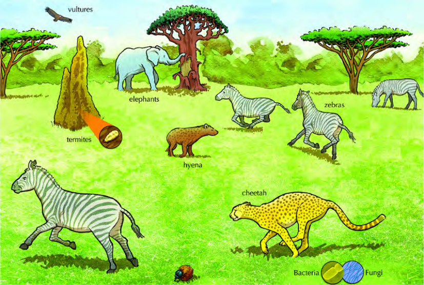
> **[Diagram Context - Textbook_NaturalScience_Gr8_Interactions-and-interdependence-within-the-environment.pdf-0030-04.png]**
> A diagram of a zebra, an elephant, and a cheetah in a grassy field.

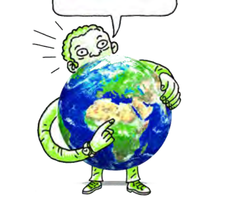
> **[Diagram Context - Textbook_NaturalScience_Gr8_Interactions-and-interdependence-within-the-environment.pdf-0030-09.png]**
> 1. A cartoon illustration of a man holding a globe.

