# 2 Interactions and interdependence within the environment

## KEY QUESTIONS:
* What is ecology?
* We talk about the population of people in South Africa, but do other animals live in populations?
* What makes up an ecosystem? Are we part of an ecosystem?
* How are organisms linked by their feeding relationship to make food webs?
* Why do we need many more producers and fewer carnivores in a food web?
* How does an ecosystem remain balanced so that it can support all of the organisms that live there?
* We know that natural disasters can have a huge impact on ecosystems, but what are we as humans doing that upsets the fine balance in ecosystems?
* What does it mean if an organism is adapted to its environment?
* Why have some organisms become extinct?
* During the course of Earth's history, many organisms have become extinct, so what is different and worrying about the decreasing numbers of rhinos and elephants?
* How can we make a difference to conserve our own environments?

---

## NEW WORDS
* biosphere
* community
* ecologist
* ecology
* ecosystem
* interact
* population
* population ecology
* species

---

## 2.1 What is ecology?

Every living organism on earth depends on and interacts with other living and non-living things to stay alive. Organisms depend on other organisms for food for example, and also depend on their environment for protection and a place to stay. The particular branch of Science that studies how organisms interact with other organisms and their environment is called **ecology**. Someone who studies these relationships and interactions is called an **ecologist**.

### Ecological interactions

The ecological interactions that take place within a specific area are generally classified into four levels: **populations**, **communities**, **ecosystems** and the **biosphere**.

* **Individuals** live together in **populations**. 
* Different populations together make up a **community**. 
* Communities together with the non-living things in their surroundings make up an **ecosystem**. 
* All the ecosystems on Earth make up the **biosphere**.

Look at the following illustration which shows the levels of organisation.

<!-- DIAGRAM_PLACEHOLDER: diagram -->

---

# Chapter 2. Interactions and interdependence within the environment

You may have heard of terms such as the biosphere and ecosystems in previous grades. What about populations and communities? You may have also heard about the population of people in South Africa, or when someone talks about your local community at home. What do we mean when we use these terms in ecology? Let's take a closer look.

> **[Diagram Context - Textbook_NaturalScience_Gr8_Glossary1.pdf-0001-00.png]**
> 1. A line of pink and purple swirls.

---

## Population

In the previous illustration, we can see that the individual impala make up a population in the game reserve. On a large scale, we can also say that the 50 million people in South Africa make up our country's population.

**Definition:** A **population** is a group of organisms of the same species that live in the same area at a specific point in time and they can interbreed with each other. 

When a scientist studies a population they might study how the population grows and the factors that affect how the population increases or decreases. They will also look at how the population interacts with the environment.

---

## Community

**Definition:** In ecology, a **community** refers to all the populations of organisms that **interact** in a certain area. 

Community ecology is the study of how they interact. For example, what feeding relationships occur in the area? What types of grasses do specific herbivores eat and what eats the herbivores? Turn back to the illustration of the wildlife in the game reserve. Which animals make up the community?

---

> **TAKE NOTE**
> If you want to check the definitions of a **New word**, check the glossary at the back of this strand.

---

> **VISIT**
> A simulation of different real-time changes in Earth's human populations: `bit.ly/178rZ2x`

> **[Diagram Context - Textbook_NaturalScience_Gr8_Glossary2.pdf-0001-00.png]**
> 1. A line of pink and purple swirls.

> **[Diagram Context - Textbook_NaturalScience_Gr8_Glossary3.pdf-0001-00.png]**
> The image shows a line of pink and purple swirls arranged in a zigzag pattern. The swirls are positioned in a diagonal line, creating a sense of movement and dynamism. The background is a solid gray color, providing a stark contrast to the vibrant swirls. The image does not contain any text or additional objects, making it a simple and uncluttered visual representation of the

> **[Diagram Context - Textbook_NaturalScience_Gr8_Glossary4.pdf-0001-00.png]**
> 1. A line of pink and purple curves.

> **[Diagram Context - Textbook_NaturalScience_Gr8_Interactions-and-interdependence-within-the-environment.pdf-0001-02.png]**
> 1. A diagram of a cell with blue and white lines.

> **[Diagram Context - Textbook_NaturalScience_Gr8_Interactions-and-interdependence-within-the-environment.pdf-0001-03.png]**
> 1. A cartoon illustration of a key and a dinosaur.

> **[Diagram Context - Textbook_NaturalScience_Gr8_Interactions-and-interdependence-within-the-environment.pdf-0001-23.png]**
> 1. A purple and blue gas cylinder with a purple nozzle.

> **[Diagram Context - Textbook_NaturalScience_Gr8_Photosynthesis-and-respiration.pdf-0001-02.png]**
> The image features a gray background with a series of blue and white circles arranged in a zigzag pattern. The circles are evenly spaced, and the zigzag pattern creates a sense of movement and energy. The image does not contain any text or additional objects, and the arrangement of the circles and the zigzag pattern suggests a visual representation of a Lewis diagram or a similar diagram used to

> **[Diagram Context - Textbook_NaturalScience_Gr8_Photosynthesis-and-respiration.pdf-0001-03.png]**
> 1. A cartoon character with a backpack and a skateboard.

> **[Diagram Context - Textbook_NaturalScience_Gr8_Photosynthesis-and-respiration.pdf-0001-14.png]**
> The image shows a cartoon depiction of a caterpillar with a smiley face, surrounded by green leaves. The caterpillar is shown in a dynamic pose, with its head tilted to the side and its body coiled up. The caterpillar is connected to a wire, which is attached to a spring. The spring is coiled up, and the caterpillar is holding onto it. The image

> **[Diagram Context - Textbook_NaturalScience_Gr8_Photosynthesis-and-respiration.pdf-0001-27.png]**
> This graphic depicts a repeating, wave-like pattern of interconnected, arrow-shaped segments. It serves as a visual representation of a continuous process or directional flow, often used in Life Sciences to illustrate metabolic pathways, the sequence of DNA replication, or the cyclical nature of biological systems.

---

# ACTIVITY: What is a population?

## INSTRUCTIONS:

1. Look at the following examples of populations.
2. Answer the questions which follow.

> **[Diagram Context - Textbook_NaturalScience_Gr8_Interactions-and-interdependence-within-the-environment.pdf-0002-00.png]**
> A diagram of a zebra, antelope, and gazelle in a savannah setting, with arrows pointing to the different stages of the ecosystem.

*A population of hippos in the St Lucia estuary (river mouth) in Kwa-Zulu Natal.*

> **[Diagram Context - Textbook_NaturalScience_Gr8_Interactions-and-interdependence-within-the-environment.pdf-0002-06.png]**
> 1. A diagram of a cell with arrows pointing to different parts of the cell.

*A population of zebra in Kruger National Park.*

> **[Diagram Context - Textbook_NaturalScience_Gr8_Interactions-and-interdependence-within-the-environment.pdf-0002-08.png]**
> The image shows a cartoon illustration of a hot air balloon filled with a green substance, possibly a gas or a liquid. The balloon is floating in the sky, with two people inside it. One person is holding a map, while the other is holding a compass. The map appears to be a Lewis diagram, which is a diagram used to represent chemical compounds. The diagram is filled with various chemical

*A population of seals on Seal Island in False Bay.*

> **[Diagram Context - Textbook_NaturalScience_Gr8_Photosynthesis-and-respiration.pdf-0002-01.png]**
> 1. A diagram of a cell with a sunburst radiating from the center.

*A population of penguins at Boulders Beach.*

## QUESTIONS:

1. What do you notice about all the animals that make up a population?
__________________________________________________________________________________
__________________________________________________________________________________

2. In each of the photos, the populations of animals are found in a specific area. Do you think the zebra in Kruger National Park and the zebra in Hluhluwe-Umfolozi game reserve in Zululand are from the same population? Why do you say so?
__________________________________________________________________________________
__________________________________________________________________________________

> **[Diagram Context - Textbook_NaturalScience_Gr8_Photosynthesis-and-respiration.pdf-0002-06.png]**
> 1. A purple and blue gas cylinder with a purple nozzle.

> **[Diagram Context - Textbook_NaturalScience_Gr8_Photosynthesis-and-respiration.pdf-0002-13.png]**
> The image features a cartoon depiction of a man's head, with a red apple placed on top of it. The man's face is outlined in black, and the apple is outlined in pink. The man's head is connected to a network of lines, and there are several apples scattered around the image. The man's face is accompanied by a thought bubble containing a thought bubble with a cloud and

> **[Diagram Context - Textbook_NaturalScience_Gr8_Photosynthesis-and-respiration.pdf-0002-14.png]**
> The image shows a cartoon-like representation of a cell, with a large white cloud in the center. The word "visit" is written in black text below the cloud.

> **[Diagram Context - Textbook_NaturalScience_Gr8_Photosynthesis-and-respiration.pdf-0002-15.png]**
> The image shows a white label with black text that reads "Find out why plants that photosynthesise are green." The label also contains a blue link to a website, which is labeled "bit.ly/18cAb2v." The website is a Google search engine, and it is labeled "www.google.com." The website's URL is displayed in the bottom right corner

---

# Chapter 2. Interactions and interdependence within the environment

## Revision Notes: Populations and Ecosystems

### 3. Population Size
* **Core Concept:** Understanding how to determine and measure the size of a population within a given habitat.

### 4. Historical Populations
* **Core Concept:** Temporal changes in populations.
* **Discussion Question:** Do you think the seals that lived on Seal Island $100$ years ago are part of the same population as the seals that live there now? Why do you say so?

### 5. Environmental Impacts on Populations
* **Core Concept:** The effect of abiotic factors (such as water availability) on living organisms.
* **Discussion Question:** What do you think would happen to the population of hippos in the estuary at St Lucia if the river dried up? Explain your answer.

### 6. Population Growth Dynamics
* **Core Concept:** Factors influencing rapid population growth over time.
* **Activity:** A group of scientists is studying a population of zebra in the Kruger National Park. They notice that over the last $4$ years, the population has grown quite rapidly. Why do you think this might be the case? What are some possible reasons for this? Discuss this with your class.

---

## Ecosystems

### Core Concepts and Definitions
* **Community:** Different populations interacting with each other in a shared habitat.
* **Ecosystem:** The level of ecology examined when studying how communities of living organisms interact with non-living (abiotic) things in their environment.

### Example: Kruger National Park
* **Populations involved:** Zebra, elephant, lions, springbok, trees, and grasses.
* **Interactions with the environment (Abiotic factors):** 
  * Zebra and springbok drinking water.
  * Elephants splashing mud over themselves to cool down.

> **[Diagram Context - Textbook_NaturalScience_Gr8_Interactions-and-interdependence-within-the-environment.pdf-0003-00.png]**
> The image features a cartoon depiction of a caterpillar with a smiley face and a green ball. The caterpillar is shown in a cartoon style, with a green leaf attached to its back. The caterpillar is surrounded by a green leaf, and a green ball is attached to its back. The image also includes a text that reads "A" and "A" and a green arrow pointing

> **[Diagram Context - Textbook_NaturalScience_Gr8_Interactions-and-interdependence-within-the-environment.pdf-0003-05.png]**
> The image shows a group of hippos in a river, with some of them laying in the water and others standing. The hippos are of various sizes and are spread out across the river, with some closer to the foreground and others further away. The scene is set against a backdrop of rocks and trees, creating a natural and serene environment. The image does not contain any text or other

> **[Diagram Context - Textbook_NaturalScience_Gr8_Interactions-and-interdependence-within-the-environment.pdf-0003-06.png]**
> The image shows a herd of zebras standing in a grassy field. There are at least 14 zebras visible, with some of them facing the camera and others facing away. The zebras are spread out across the field, with some standing closer to the foreground and others further in the background. The scene conveys a sense of tranquility and natural beauty, with the ze

> **[Diagram Context - Textbook_NaturalScience_Gr8_Interactions-and-interdependence-within-the-environment.pdf-0003-09.png]**
> The image shows a large group of sea lions gathered on a rocky shore. The sea lions are of various sizes and are spread out across the rocky terrain. Some sea lions are standing, while others are lying down, possibly resting or socializing. The sea lions are facing different directions, indicating their individual orientations. The scene captures the natural habitat of these sea lions, showcasing their behavior and interactions

> **[Diagram Context - Textbook_NaturalScience_Gr8_Interactions-and-interdependence-within-the-environment.pdf-0003-11.png]**
> The image shows a group of penguins on a sandy beach. There are at least 14 penguins in the scene, some standing and others sitting or lying down. The penguins are scattered across the beach, with some closer to the water and others further inland. The beach itself is sandy, and there is a large rock in the background. The image does not contain any text or other objects

> **[Diagram Context - Textbook_NaturalScience_Gr8_Photosynthesis-and-respiration.pdf-0003-00.png]**
> 1. A diagram of a leaf with a green stem and a white tip.

> **[Diagram Context - Textbook_NaturalScience_Gr8_Photosynthesis-and-respiration.pdf-0003-02.png]**
> 1. A diagram of a cell with arrows pointing to different parts of the cell.

> **[Diagram Context - Textbook_NaturalScience_Gr8_Photosynthesis-and-respiration.pdf-0003-03.png]**
> 1. A diagram of a cell with arrows pointing to different parts of the cell.

> **[Diagram Context - Textbook_NaturalScience_Gr8_Photosynthesis-and-respiration.pdf-0003-06.png]**
> A diagram of a plant's root system, showing the water and carbon dioxide cycles.

> **[Diagram Context - Textbook_NaturalScience_Gr8_Photosynthesis-and-respiration.pdf-0003-07.png]**
> The image shows a diagram of a cell, which is a fundamental unit of life. The diagram is a Lewis structure, a visual representation of the chemical bonds within a molecule. The diagram is black and white, with a large, bold, and clear depiction of the cell's components. The diagram includes a cell's organelles, such as the nucleus, mitochondria, and endoplasm

> **[Diagram Context - Textbook_NaturalScience_Gr8_Photosynthesis-and-respiration.pdf-0003-08.png]**
> The image shows a cartoon depiction of an astronaut on a red planet. The astronaut is wearing a white helmet and is holding a pole. The planet is covered in pink and purple clouds, and there is a red apple on the planet. The astronaut is positioned in the center of the image, with the planet and the apple surrounding him. The image also includes text that provides information about algae and photos

---

# Biosphere

> **[Diagram Context - Textbook_NaturalScience_Gr8_Glossary1.pdf-0004-02.png]**
> 1. A silver spring toy with a curved shape.

*An ecosystem in the game reserve consist of the living and non-living things interacting with each other.*

## Biosphere

All the ecosystems on Earth combined make up the biosphere. At the biosphere level, we can study how the living and non-living things interact on a much larger scale. This includes climate changes, how the Earth has changed over history and even how the movement of planet Earth affects different ecosystems, wind patterns as well as rock and soil formation.

*All the ecosystems on Earth make up the biosphere.*

---

## ACTIVITY: Check your understanding

Write your own definitions and explanations for the following terms:

1. Ecology: __________________________________________________________________

> **[Diagram Context - Textbook_NaturalScience_Gr8_Interactions-and-interdependence-within-the-environment.pdf-0004-05.png]**
> 1. A diagram of a snake's body.
 2. The snake's body is green and gray.
 3. The snake's head is green.
 4. The snake's body is green.

> **[Diagram Context - Textbook_NaturalScience_Gr8_Photosynthesis-and-respiration.pdf-0004-05.png]**
> The diagram is a visual representation of the process of photosynthesis. It shows the different stages of photosynthesis, including the absorption of light energy, the conversion of carbon dioxide and water into glucose and oxygen, and the release of oxygen as a byproduct. The diagram is labeled with the terms "energy", "photosynthesis", "require", "chemicals", "products", and "organism

> **[Diagram Context - Textbook_NaturalScience_Gr8_Photosynthesis-and-respiration.pdf-0004-12.png]**
> 1. A cartoon depiction of a roller coaster with a spring coiled up on top.

> **[Diagram Context - Textbook_NaturalScience_Gr8_Photosynthesis-and-respiration.pdf-0004-15.png]**
> 1. A cartoon drawing of a woman with a blue face and long blonde hair.
 2. A cartoon drawing of a man with a blue face and long beard.
 3. The woman is holding a picture of the man.
 4. The man is holding a picture of the woman.

---

2. Interaction:

3. Organism:

4. Population:

5. Community:

6. Ecosystem:

7. Biosphere:

> **[Diagram Context - Textbook_NaturalScience_Gr8_Interactions-and-interdependence-within-the-environment.pdf-0005-00.png]**
> The image shows a group of animals, including an elephant and a gazelle, in a body of water. The elephant is partially submerged in the water, while the gazelle is standing on the bank of the water. The animals are surrounded by other animals, such as zebras, which are also present in the scene. The image conveys the idea of a diverse ecosystem where

Let's now take a closer look at ecosystems.

## 2. Ecosystems

The living organisms on Earth live and interact in different ecosystems around the planet. Together all these ecosystems make up the Earth's biosphere. An ecosystem consists of the **abiotic** (non-living) environment and the **biotic** (living) organisms.

### Biotic and abiotic components in an ecosystem

We have looked a lot at the living organisms in different ecosystems in the last section, but what are some of the abiotic things in ecosystems? And how do the biotic things interact with the abiotic environment in a system?

> **[Diagram Context - Textbook_NaturalScience_Gr8_Interactions-and-interdependence-within-the-environment.pdf-0005-04.png]**
> 1. A 3D rendering of the earth with the continents and oceans labeled.

---
*Chapter 2. Interactions and interdependence within the environment* **31**

> **[Diagram Context - Textbook_NaturalScience_Gr8_Interactions-and-interdependence-within-the-environment.pdf-0005-06.png]**
> The image is a cartoon drawing of a roller coaster with a group of people on it. The roller coaster is made of green and white lines and has a large spring on top of it. The people on the roller coaster are holding onto the spring, and they are smiling. The image also includes a letter "A" and a number "3" in the top right corner.

> **[Diagram Context - Textbook_NaturalScience_Gr8_Photosynthesis-and-respiration.pdf-0005-01.png]**
> 1. A diagram of a cell.

> **[Diagram Context - Textbook_NaturalScience_Gr8_Photosynthesis-and-respiration.pdf-0005-03.png]**
> 1. A robot with a blue body and a white head.

> **[Diagram Context - Textbook_NaturalScience_Gr8_Photosynthesis-and-respiration.pdf-0005-10.png]**
> A diagram of a cartoon character on a stick holding a sign that says "visit" and a picture of the earth with arrows pointing to different continents.

> **[Diagram Context - Textbook_NaturalScience_Gr8_Photosynthesis-and-respiration.pdf-0005-11.png]**
> 1. A diagram of a test tube filled with a yellow liquid and a black substance. The diagram also includes labels for the test tube, the yellow liquid, and the black substance.

---

## ACTIVITY: Abiotic components in a grassland ecosystem

### INSTRUCTIONS:
1. Look at the following image of a grassland ecosystem.
2. Answer the questions that follow.

---

### QUESTIONS:

1. List some of the abiotic things in the grassland ecosystem shown in the image.

2. For each of the animals, discuss how you think the organisms below are interacting with the abiotic environment:
   a) The eagle
   
   b) The trees and grass
   
   c) The mouse
   
   d) The worm and insect

3. In the picture, the blue arrows show the movement of water through the ecosystem. What do we call this movement of water?

> **[Diagram Context - Textbook_NaturalScience_Gr8_Interactions-and-interdependence-within-the-environment.pdf-0006-08.png]**
> The image is a cartoon depiction of a man standing on a globe, holding a pole. The globe is surrounded by various arrows, each pointing in a different direction. The man is wearing a hat and is positioned on the globe, with his arms outstretched. The arrows on the globe are labeled with different words, such as "green science," "circuit," "geography," and "

> **[Diagram Context - Textbook_NaturalScience_Gr8_Interactions-and-interdependence-within-the-environment.pdf-0006-09.png]**
> This graphic illustrates a stylized representation of a double-stranded DNA molecule, characterized by its iconic double helix structure formed by two antiparallel sugar-phosphate backbones. The diagram visually conveys the fundamental molecular architecture of genetic material, emphasizing the helical twisting and the complementary pairing essential for DNA replication and information storage in Life Sciences.

> **[Diagram Context - Textbook_NaturalScience_Gr8_Photosynthesis-and-respiration.pdf-0006-03.png]**
> 1. A magnifying glass is being used to look at a diagram of a cell.

---

4. Temperature is an abiotic factor in an ecosystem. What can affect the temperature in the grassland ecosystem?

5. Another abiotic factor which affects ecosystems is the slope of the land. For example, is it flat or are there hills or mountains. How would you describe the land in the grassland ecosystem? How do you think this contour affects the ecosystem?

> **[Diagram Context - Textbook_NaturalScience_Gr8_Interactions-and-interdependence-within-the-environment.pdf-0007-00.png]**
> This diagram illustrates a slinky toy descending a staircase, using motion lines to indicate its movement. It serves as a physical model to help Grade 10-12 Physical Sciences learners visualize the propagation of longitudinal and transverse waves, demonstrating how energy is transferred through a medium.

***

Apart from the recycling water, biotic and abiotic factors also interact to recycle carbon dioxide and oxygen in ecosystems. Photosynthesis in plants uses carbon dioxide to produce glucose. The plants and animals then break down the sugars and release carbon dioxide again during respiration. Photosynthesis releases oxygen, while plants and animals take it in for respiration. Look at the following illustration which shows how the gases are cycled through a pond ecosystem.

> **[Diagram Context - Textbook_NaturalScience_Gr8_Interactions-and-interdependence-within-the-environment.pdf-0007-05.png]**
> A diagram of a grassland ecosystem, showing the abiotic components and the living organisms that depend on them. The diagram includes a sun, a cloud, a river, a tree, a grassland, a pond, and a mouse. The diagram also includes arrows that show the flow of energy and matter between the abiotic and biotic components.

There are two labels missing, but lines have been provided for you to fill them in on the diagram. Discuss this with your class and write them in.

Now that we know a bit more about the different biotic and abiotic factors in an ecosystem and how they interact, let's study an ecosystem!

---
Chapter 2. Interactions and interdependence within the environment **33**

> **[Diagram Context - Textbook_NaturalScience_Gr8_Photosynthesis-and-respiration.pdf-0007-11.png]**
> 1. A white rectangle with a gray border.

---

# ACTIVITY: Studying an ecosystem

## MATERIALS:

* $60\text{ m}$ long string
* pegs or stakes
* measuring tape ($10\text{ m}$ long)
* old material for flags on pegs
* thermometer
* rulers
* trowel
* sieve
* insect nets
* large plastic ziploc bags
* marking pens
* forceps
* gloves
* hand lens
* clipboard, paper and pens or pencils
* camera (if possible)

## INSTRUCTIONS:

1. Work in groups of five. Your teachers will help you to select a site to study.
2. Stake out a square measuring $10\text{ m} \times 10\text{ m}$. Use the $10\text{ m}$ measuring rope and knock the stakes or pegs into the ground to mark the corners of the square. Tie a flag to the stake to make it more visible. (You will use this square to study different things in the next few weeks so make sure that you choose an appropriate site that does not overlap with another group's site.)

> **[Diagram Context - Textbook_NaturalScience_Gr8_Interactions-and-interdependence-within-the-environment.pdf-0008-02.png]**
> The image is a cartoon that depicts a group of people playing a game. The game involves identifying specific habitats on Earth. The cartoon is filled with various elements, including a globe, a telescope, and a television. The text on the image provides information about the game and its objectives.

*An example of a square with four quadrants.*

3. Try to identify as many plants as possible. Use the following space to record your findings about the plants. You can even draw some illustrations.

> **[Diagram Context - Textbook_NaturalScience_Gr8_Interactions-and-interdependence-within-the-environment.pdf-0008-04.png]**
> The image shows a line of green and white beads arranged in a straight line. The beads are evenly spaced, and the line is drawn in a darker shade of gray. The beads are positioned in a horizontal line, with the green beads being slightly larger than the white ones. The line is drawn in a darker shade of gray, and the beads are evenly spaced, creating a sense of order and

> **[Diagram Context - Textbook_NaturalScience_Gr8_Interactions-and-interdependence-within-the-environment.pdf-0008-06.png]**
> 1. A black and white diagram of a deer and a tree, with arrows pointing to the different stages of the carbon dioxide cycle.

> **[Diagram Context - Textbook_NaturalScience_Gr8_Interactions-and-interdependence-within-the-environment.pdf-0008-07.png]**
> 1. A cartoon illustration of a man holding a picture of a woman. 
 2. The man is holding a picture of a woman. 
 3. The picture is of a woman.

> **[Diagram Context - Textbook_NaturalScience_Gr8_Photosynthesis-and-respiration.pdf-0008-06.png]**
> 1. A close-up view of a plant with white and green leaves.

> **[Diagram Context - Textbook_NaturalScience_Gr8_Photosynthesis-and-respiration.pdf-0008-08.png]**
> 1. A plant in a pot with white and green leaves.

---

> **[Diagram Context - Textbook_NaturalScience_Gr8_Interactions-and-interdependence-within-the-environment.pdf-0009-00.png]**
> 1. A green and white diagram of a battery and a spring.

4. Use the net to capture a few small invertebrates. Try to identify them (ask for help if you need it), then release them unharmed. Use the following space to record your observations. You can use illustrations.

<!-- DIAG_PLACEHOLDER: observation space for small invertebrates -->

5. Look for evidence of bigger animals. Are there any dropping, tracks, or birds in the trees? Record what you find.

<!-- DIAG_PLACEHOLDER: observation space for bigger animals evidence -->

6. Measure the temperature.
   a) Measure the air temperature in your square.
   b) Measure the temperature of the soil about $5\text{ cm}$ below the surface.

7. Take a soil sample by putting one scoop of soil into a plastic bag. Determine whether it is sand, loam or clay soil. Compare your sample with those of other groups. The following illustrations give an idea of the different types of soil.

---

Chapter 2. Interactions and interdependence within the environment **35**

> **[Diagram Context - Textbook_NaturalScience_Gr8_Interactions-and-interdependence-within-the-environment.pdf-0009-22.png]**
> The image is a black and white line drawing of a garden bed with a grid pattern. The garden bed is divided into squares, and there are plants growing in each square. The drawing also includes a diagram of a plant cell, a Lewis diagram, and a circuit diagram. The diagram of a plant cell shows the different parts of the cell, such as the nucleus, cell wall, and chlor

> **[Diagram Context - Textbook_NaturalScience_Gr8_Photosynthesis-and-respiration.pdf-0009-04.png]**
> 1. A diagram of a zipper with a zipper pull.

> **[Diagram Context - Textbook_NaturalScience_Gr8_Photosynthesis-and-respiration.pdf-0009-06.png]**
> The image features a cartoon depiction of a man lifting a ball that is 50 kg in weight. The man is depicted in a dynamic pose, with his arms and legs spread out, as if he is in the middle of a workout or lifting a heavy object. The image is a simple, cartoon-like illustration that focuses on the concept of weight and the effort required to lift it. The man

> **[Diagram Context - Textbook_NaturalScience_Gr8_Photosynthesis-and-respiration.pdf-0009-09.png]**
> The image shows a close-up view of a bunch of bananas, with some of them being yellow and others green. The bananas are arranged in a way that they are stacked on top of each other, creating a visually appealing display. The image does not contain any text, and the focus is solely on the bananas and their arrangement.

---

# Life and Living: Different Soil Types

## Investigation & Observation Activity

Use a hand lens to examine soil samples and determine if you can find any plant or animal remains in the soil.

8. Use the space below to write about your observations and draw images. *(Optional: Measure the rainfall and wind speed. Measure the rainfall over the next few weeks.)*

---
*Visit: Build your own wind meter. (bit.ly/1cxl4FP)*

---

# Chapter 2. Interactions and interdependence within the environment

## QUESTIONS:

1. Describe the different habitats in your ecosystem.
2. Explain how you think the abiotic factors of the ecosystem you studied affect the plants and animals in your ecosystem.
3. What relationships did you notice between the plants and animals in the area you studied?
4. In the area that you studied, was there any evidence of human interference? For example, rubbish or a pathway? How did this impact on the living organisms and also the abiotic factors in your square? What suggestions can you make to prevent this kind of interference.
5. Do you think that your presence while you made your observations had an influence on the animals or plants in the quadrant that you observed?

---

We studied relatively small ecosystems. How big can an ecosystem be? Does size in an ecosystem matter?

## Ecosystem size

The size of a real ecosystem is not defined in terms of area, but rather by the interactions that occur inside it. It can be as small as a river bank or as large as the Kruger National Park.

> **[Diagram Context - Textbook_NaturalScience_Gr8_Interactions-and-interdependence-within-the-environment.pdf-0011-01.png]**
> 1. A diagram of a hand holding a shovel and a bowl of sand.

> **[Diagram Context - Textbook_NaturalScience_Gr8_Interactions-and-interdependence-within-the-environment.pdf-0011-02.png]**
> 1. A 3D rendering of a magnifying glass with a magnified view of a leaf and a magnified view of a bacteria.

> **[Diagram Context - Textbook_NaturalScience_Gr8_Interactions-and-interdependence-within-the-environment.pdf-0011-07.png]**
> 1. A cartoon man holding a globe.

> **[Diagram Context - Textbook_NaturalScience_Gr8_Interactions-and-interdependence-within-the-environment.pdf-0011-09.png]**
> 1. A white square with a gray border.

> **[Diagram Context - Textbook_NaturalScience_Gr8_Photosynthesis-and-respiration.pdf-0011-00.png]**
> 1. A diagram of a cell with a white square in the center.

> **[Diagram Context - Textbook_NaturalScience_Gr8_Photosynthesis-and-respiration.pdf-0011-05.png]**
> The image shows a gray line with an orange arrow pointing to the right. The line is labeled "Zipper" and "Zipper" is written in white. The arrow is pointing to the right, indicating movement or direction. The image does not contain any text or additional objects.

---

## Types of interactions

Within an ecosystem, the species living in a particular area can interact in different ways with each other. We can classify the interactions between organisms as follows:

### 1. Competition

When two species in an ecosystem need to share a valuable and often limited resource, such as food or water, they are in competition with each other. The two different species compete with each other for the same resources, especially food.

> **[Diagram Context - Textbook_NaturalScience_Gr8_Interactions-and-interdependence-within-the-environment.pdf-0012-07.png]**
> 1. A diagram of a snake's body.

*Hyenas and vultures are both scavengers and compete for the same food.*

### 2. Symbiosis

Symbiosis describes the way in which two different species living together in the same community interact with each other over a long time period. This can occur in the form of parasitism, mutualism, or commensalism.

> **[Diagram Context - Textbook_NaturalScience_Gr8_Photosynthesis-and-respiration.pdf-0012-14.png]**
> The image features a science experiment in a beaker, with a cartoon depiction of a person wearing a spacesuit and holding a rocket ship. The beaker contains a blue liquid, and there is a thought bubble above the beaker that reads "New words limewater respiration". The image is labeled with the text "New words" and "limewater respiration" in the top left corner

> **[Diagram Context - Textbook_NaturalScience_Gr8_Photosynthesis-and-respiration.pdf-0012-17.png]**
> 1. A diagram of a ship with a group of people on it.

> **[Diagram Context - Textbook_NaturalScience_Gr8_Photosynthesis-and-respiration.pdf-0012-20.png]**
> 1. A diagram of a cell with arrows pointing to different parts of the cell.

---

# Chapter 2: Interactions and interdependence within the environment

## Types of Ecological Interactions

### a) Parasitism
* **Definition:** Parasitism is when one species benefits or gains something from the relationship and the other species is harmed in some way. The host may die in some interactions.
* **Example:** 

> **[Diagram Context - Textbook_NaturalScience_Gr8_Interactions-and-interdependence-within-the-environment.pdf-0013-02.png]**
> The image is a diagram that illustrates the concept of environmental interactions. It is a visual representation of the relationships between different aspects of the environment, such as symbiosis, competition, mutualism, commensalism, and parasitism. The diagram is color-coded, with each color representing a different type of interaction. The diagram is labeled with the names of the different types of interactions, such

 Ticks are parasites and feed off the blood of many animals, for example dogs, cows, buck and humans.

### b) Mutualism
* **Definition:** Mutualism occurs between two species where both of the individuals benefit from the interaction. Both species gain something from the other, so we can say it is mutually beneficial.
* **Example:** 

> **[Diagram Context - Textbook_NaturalScience_Gr8_Interactions-and-interdependence-within-the-environment.pdf-0013-05.png]**
> The image shows a hyena eating a dead animal. The hyena is standing on all fours and is facing the camera. The dead animal is lying on the ground next to the hyena. The hyena appears to be eating the animal with its mouth open. The hyena is in the foreground, and the dead animal is in the background. The hyena is the main subject of

 Pollination is an example of mutualism as the bee gets food (nectar) from the flower and the flower is pollinated by the bee so that it can reproduce.

### c) Commensalism
* **Definition:** In some interactions between individuals from different species, the one species benefits, while the other one is unaffected by the relationship. Unlike parasitism, in commensalism the other species is not harmed or benefited in any way.
* **Example:** 

> **[Diagram Context - Textbook_NaturalScience_Gr8_Photosynthesis-and-respiration.pdf-0013-01.png]**
> 1. A diagram of a spring with a green background and a step ladder.

 A whale shark with remora fish. The remora fish get scraps of food that fall out of the shark's mouth. The whale shark is unaffected.

---

## Additional Information & Resources

* **DID YOU KNOW?** 

> **[Diagram Context - Textbook_NaturalScience_Gr8_Photosynthesis-and-respiration.pdf-0013-13.png]**
> The image features a cartoon depiction of a man and a woman standing in front of a large telescope. The man is holding a telescope, and the woman is standing next to him. The scene is set against a green background, and there is a speech bubble above the image that reads "Visit this video of this activity. Watch a video of this activity. Bit/UVC/VFC".

 Some ants have fungi farms that they carefully look after and protect, providing the fungi with organic matter to fertilise it, while the fungi provides the ants with nutrients.
* **VISIT:** 

> **[Diagram Context - Textbook_NaturalScience_Gr8_Photosynthesis-and-respiration.pdf-0013-14.png]**
> 1. A diagram of a rubber tube and a lime water container.

 A video of leaf cutter ants tending to their fungi farm: `bit.ly/1cxI6xq`

---

3. **Feeding**: Different species in an ecosystem are related and interact when one species can use the other species as a food source. For example, in predator-prey relationships, the one species (**predator**) will hunt another species (**prey**).

> **[Diagram Context - Textbook_NaturalScience_Gr8_Interactions-and-interdependence-within-the-environment.pdf-0014-03.png]**
> The image shows a close-up view of a tick on a person's arm. The tick is brown and black in color, with a white spot on its back. It is positioned on the person's arm, with its legs spread out. The tick appears to be crawling on the person's skin.

*Lions and zebras have a predator-prey relationship.*

---

## ACTIVITY: Identify the type of interaction between organisms

### INSTRUCTIONS:
1. Study the photos and information in the following table.
2. Identify the interdependence in each case and give a reason for your choice.

| Organism / Scenario | Type of interaction | Explain this kind of interaction |
| :--- | :--- | :--- |
| 

> **[Diagram Context - Textbook_NaturalScience_Gr8_Interactions-and-interdependence-within-the-environment.pdf-0014-05.png]**
> 1. A bee on a flower.

 A hummingbird feeding. | | |
| 

> **[Diagram Context - Textbook_NaturalScience_Gr8_Interactions-and-interdependence-within-the-environment.pdf-0014-07.png]**
> The image shows a large blue whale swimming in the ocean. The whale is the main focus of the image, with its body prominently displayed against the backdrop of the deep blue water. The whale's tail is visible, indicating that it is moving through the water. The image does not contain any text or additional objects, and the whale is the sole subject of the image.

 Plants on a forest floor. | | |
| 

> **[Diagram Context - Textbook_NaturalScience_Gr8_Interactions-and-interdependence-within-the-environment.pdf-0014-11.png]**
> The image features a cartoon depiction of a man's head, with a large red apple placed on top of it. The man's face is drawn in a cartoon style, and he has a large thought bubble above his head, with a line of pink dots representing the connections between his thoughts. The man's name is written in the bottom right corner of the image.

 Flea bites on a human. | | |

> **[Diagram Context - Textbook_NaturalScience_Gr8_Interactions-and-interdependence-within-the-environment.pdf-0014-14.png]**
> The image features a cartoon illustration of a hot air balloon with a globe on top. The globe is depicted in a cartoon style with a blue and green color scheme. The balloon is filled with air and is being pulled by two people. The people are wearing white shirts and are holding onto a rope attached to the balloon. The balloon is floating in the sky, and there are clouds in the background

> **[Diagram Context - Textbook_NaturalScience_Gr8_Photosynthesis-and-respiration.pdf-0014-01.png]**
> 1. A diagram of a syringe and rubber tube in a glass beaker.
 2. The syringe is filled with a liquid.
 3. The rubber tube is connected to the syringe.
 4. The rubber tube is filled with a liquid.
 5. The rubber tube is filled with a liquid.

> **[Diagram Context - Textbook_NaturalScience_Gr8_Photosynthesis-and-respiration.pdf-0014-08.png]**
> 1. A cartoon illustration of a man holding a picture of a woman.
 2. The man is holding a picture of a woman in a frame.
 3. The woman is depicted in a cartoon style.

> **[Diagram Context - Textbook_NaturalScience_Gr8_Photosynthesis-and-respiration.pdf-0014-12.png]**
> 1. A diagram of a snake's body.
 2. The snake's body is composed of many small lines.
 3. The snake's body is green and gray.

---

## Interaction Table

| Image & Description | Type of interaction | Explain this kind of interaction |
| :--- | :--- | :--- |
| 

> **[Diagram Context - Textbook_NaturalScience_Gr8_Interactions-and-interdependence-within-the-environment.pdf-0015-01.png]**
> The image features a cartoon depiction of a caterpillar with a smiley face and a green ball on its back. The caterpillar is surrounded by green leaves, and there is a wire coil on its back. The image also includes a diagram of a Lewis structure and a graph of the caterpillar's transformation. The caption at the bottom of the image reads "A caterpillar with a smiley

   Clownfish in an anemone. | | |
| 

> **[Diagram Context - Textbook_NaturalScience_Gr8_Photosynthesis-and-respiration.pdf-0015-00.png]**
> 1. A green spring with a wire attached to it.

   An egret waiting for the rhino to disturb insects to eat. | | |

---

## Take Note
> The term **autotroph** comes from the Greek words *autos* meaning 'self' and *trophe* meaning 'nourishing'. So autotroph means 'self-feeding'.

---

Now that we know how organisms interact with each other, we will take a closer look at the feeding relationships between different organisms.

# 2.3 Feeding relationships

In the last section we saw how organisms from different species interact within an ecosystem. Let's now take a closer look at how organisms interact through their feeding relationships.

## Feeding types

Living organisms need to feed to be able to perform the other life processes. Some organisms can produce their own food, such as plants, while other organisms cannot do this and need to feed on other organisms to obtain their energy.

We can therefore identify different feeding types in an ecosystem, based on how the organism obtains (gets) its food. There are **producers** and **consumers**.

### Producers

Producers are organisms that are able to produce their own organic food. They do not need to eat other organisms to do this. Producers are also called **autotrophs**. Which organisms have you come across that can make their own food?

---

## New Words
* carnivore
* consumer
* decomposers
* herbivore
* insectivore
* omnivore
* producer

> **[Diagram Context - Textbook_NaturalScience_Gr8_Photosynthesis-and-respiration.pdf-0015-06.png]**
> The image is a diagram that illustrates the process of cellular respiration. It shows the energy flow from the cell to the environment, with the cell as the starting point. The diagram is divided into three sections, each representing a different stage of cellular respiration. The first section shows the energy input from the environment, the second section depicts the energy production within the cell, and the third section represents

> **[Diagram Context - Textbook_NaturalScience_Gr8_Photosynthesis-and-respiration.pdf-0015-07.png]**
> The image shows a line of text that reads "The diagram shows a Lewis structure of a molecule". The text is in a grey color, and it is positioned on a grey background. The text is in a serif font, and it is written in a clear, legible style. The text is centered in the image, and it is the main focus of the image.

> **[Diagram Context - Textbook_NaturalScience_Gr8_Photosynthesis-and-respiration.pdf-0015-08.png]**
> 1. A diagram of a cell with blue and white lines representing the cell's organelles.

> **[Diagram Context - Textbook_NaturalScience_Gr8_Photosynthesis-and-respiration.pdf-0015-09.png]**
> 1. A key is shown with a tree and a swing.

---

Plants are producers because they make their own food during photosynthesis. 

What do plants need in order to photosynthesise?

---

*Plants produce food through photosynthesis.*

---

### DID YOU KNOW?

In 2011, deep sea researchers discovered mussels living in symbiosis with bacteria that use hydrogen as a fuel source in chemosynthesis. These are the first organisms discovered to do so!

---

## Consumers

Organisms which cannot produce their own food need to eat other organisms to get food. These organisms are called **consumers**. All animals are consumers as they cannot produce their own food. Consumers are also called **heterotrophs**.

There are many types of consumers and we can classify them into specific groups depending on the food that they consume. These are:

* **herbivores**
* **carnivores**
* **omnivores**
* **decomposers**

---

### TAKE NOTE

The term heterotroph comes from the Greek words *heteros* meaning 'different' and *trophe* meaning 'nourishing'. So heterotroph means 'different-feeding' or feeding on different things.

> **[Diagram Context - Textbook_NaturalScience_Gr8_Interactions-and-interdependence-within-the-environment.pdf-0016-02.png]**
> 1. A diagram of a snake with a green head and body.

> **[Diagram Context - Textbook_NaturalScience_Gr8_Interactions-and-interdependence-within-the-environment.pdf-0016-10.png]**
> 1. A diagram of a plant cell with purple and blue flowers.

> **[Diagram Context - Textbook_NaturalScience_Gr8_Photosynthesis-and-respiration.pdf-0016-06.png]**
> 1. Google is the main focus of the image.

---

## ACTIVITY: Different types of consumers

### INSTRUCTIONS:
1. The following image shows a variety of different animals found in South Africa.
2. Study the illustration and then answer the questions that follow.

> **[Diagram Context - Textbook_NaturalScience_Gr8_Interactions-and-interdependence-within-the-environment.pdf-0017-03.png]**
> 1. A diagram of a tree with a sun shining through it.

---

### QUESTIONS:

1. What is a herbivore? Write a definition below and then give four examples of animals from the images which are herbivores.

> **[Diagram Context - Textbook_NaturalScience_Gr8_Interactions-and-interdependence-within-the-environment.pdf-0017-04.png]**
> 1. A cartoon drawing of an astronaut on a red planet.
 2. The astronaut is holding a walking stick.
 3. The planet is covered in stars.
 4. The planet has a large crater.
 5. The planet has a large black dot.

> **[Diagram Context - Textbook_NaturalScience_Gr8_Interactions-and-interdependence-within-the-environment.pdf-0017-10.png]**
> 1. A cartoon boat with a group of people on it.

> **[Diagram Context - Textbook_NaturalScience_Gr8_Photosynthesis-and-respiration.pdf-0017-00.png]**
> The image is a diagram that illustrates the process of photosynthesis. It shows the different stages of photosynthesis, including the absorption of light energy, the conversion of carbon dioxide and water into glucose and oxygen, and the release of oxygen. The diagram is color-coded, with green representing the process of photosynthesis and red representing the products of photosynthesis. The diagram also includes labels for the react

---

2. What is a carnivore? Write a definition below and then give four examples of animals from the images which are carnivores.

3. There are different types of carnivores. Some carnivores hunt other animals. They are called **predators**. The animals that they hunt are called **prey**. A lion is an example of a predator. Give three examples from the images of animals which are prey of the lion.

4. Other types of carnivores are called **scavengers** as they eat dead meat, for example a hyena. There are three other scavengers in the images. Identify them and write the names below.

5. The following animals are also all carnivores. They all have a similar diet. Do you know what they all eat? Find out what these animals eat. Discuss this with your class.

> **[Diagram Context - Textbook_NaturalScience_Gr8_Interactions-and-interdependence-within-the-environment.pdf-0018-04.png]**
> 1. A diagram of various animals, including a giraffe, zebra, elephant, lion, rhinoceros, crocodile, alligator, and a gazelle.

6. Write down below what these animals all eat and what we call this type of carnivore.

> **[Diagram Context - Textbook_NaturalScience_Gr8_Interactions-and-interdependence-within-the-environment.pdf-0018-05.png]**
> 1. A diagram of a roller coaster with a spring coiled up on top.

> **[Diagram Context - Textbook_NaturalScience_Gr8_Photosynthesis-and-respiration.pdf-0018-03.png]**
> 1. A cartoon depiction of a man and a machine. 
 2. The man is holding a machine that has a wheel and a gear. 
 3. The machine is made of metal.

---

# Chapter 2. Interactions and interdependence within the environment

## Revision Notes & Activities

### Core Concepts: Ecosystems and Trophic Roles

#### 7. Omnivores
* **Definition:** Animals that eat both plants and other animals.
* **Activity:** Identify one example from the provided pictures.

#### 8. Human Classification
* **Question:** What would you classify humans as? 
* *Hint:* Consider whether humans consume both plant and animal matter.

#### 9. Decomposers
* **Definition:** Organisms that break down the remains of dead plants and animals.
* **Activity:** Give an example of a decomposer from the image.

---

### Field Activity: Studying a Local Ecosystem

Refer to the study of an ecosystem in or near your school that you are currently investigating:

* **a) Producers:**
  * List the producers in your ecosystem.
  * Explain how you know they are producers.

* **b) Herbivores:**
  * List the herbivores that you found in your ecosystem.
  * Explain how you know they are herbivores.

* **c) Carnivores:**
  * Did you find evidence of or find examples of carnivores in your ecosystem?
  * List them below:
    _________________________________________________________________

* **d) Soil Study:**
  * Study the soil again. Use a hand lens to see if there are any decomposers that you can see, or evidence of them, in your ecosystem.
  * Describe any decomposers that you found below:
    _________________________________________________________________

---

### Beyond Animals: Fungi and Nutrition

In the previous activities, we looked at different consumers, which were all different types of animals. But what about organisms in other kingdoms, such as fungi?

* **Characteristics of Fungi:**
  * Fungi are not plants.
  * Fungi cannot photosynthesise because they do not have chlorophyll.
  * **Question:** Where do fungi get their food from?

> **[Diagram Context - Textbook_NaturalScience_Gr8_Interactions-and-interdependence-within-the-environment.pdf-0019-05.png]**
> The image shows a chameleon resting on a branch. The chameleon is green and brown in color and is sitting on a branch with its body curled up. The branch is covered in leaves, and the background is dark, providing a stark contrast to the chameleon's vibrant colors. The chameleon is positioned in the center of the image, with the leaves surrounding it on

> **[Diagram Context - Textbook_NaturalScience_Gr8_Interactions-and-interdependence-within-the-environment.pdf-0019-07.png]**
> 1. A bat hanging upside down on a rock.

> **[Diagram Context - Textbook_NaturalScience_Gr8_Interactions-and-interdependence-within-the-environment.pdf-0019-09.png]**
> 1. A green insect with a long antennae and a long body.

> **[Diagram Context - Textbook_NaturalScience_Gr8_Interactions-and-interdependence-within-the-environment.pdf-0019-10.png]**
> 1. A bird sitting on a wooden platform.

> **[Diagram Context - Textbook_NaturalScience_Gr8_Photosynthesis-and-respiration.pdf-0019-03.png]**
> 1. A diagram of a setup for a yeast and sugar experiment.

---

# ACTIVITY: Different decomposers

## INSTRUCTIONS:
1. Look at the following photographs of different fungi.
2. Answer the questions that follow.

## QUESTIONS:
1. What kingdom do the above organisms belong to?
2. What do you notice about where these mushrooms are growing? What are they mostly growing on? Is it dead or alive?
3. The mushrooms get their nutrients from what they are growing on. At the same time, they are breaking down this dead matter. What can we therefore call fungi?

> **[Diagram Context - Textbook_NaturalScience_Gr8_Interactions-and-interdependence-within-the-environment.pdf-0020-09.png]**
> The image shows a line of green and white beads arranged in a zigzag pattern. The beads are the main focus of the image, and they are the only objects present. The beads are positioned in a straight line, with no other objects or text in the image. The image does not contain any text or other objects, and the beads are the only elements that stand out.

> **[Diagram Context - Textbook_NaturalScience_Gr8_Photosynthesis-and-respiration.pdf-0020-04.png]**
> 1. A hand holding a test tube.

> **[Diagram Context - Textbook_NaturalScience_Gr8_Photosynthesis-and-respiration.pdf-0020-08.png]**
> 1. A diagram of a solar system with two planets and a sun.
 2. The sun is at the center of the diagram.
 3. The planets are shown in a circular arrangement.
 4. The diagram is labeled with the words "energy" and "unlight".

---

4. When fungi, and other decomposers, break down dead material, they help to return nutrients to the soil. Write a few sentences where you explain why you think decomposers are important in an ecosystem and how they help an ecosystem to function.

---

We now know that the different organisms in an ecosystem are related by how they feed. There are producers and consumers. We have seen that organisms from one species eat other organisms from another species. How can we link these feeding relationships together to describe how the energy is transferred in an ecosystem from the producers to the consumers?

## 2.4 Energy flow: Food chains and food webs

The flow of energy from the sun to different organisms in an ecosystem is very important as it supports all the life process of living organisms. In this section we will look more closely at the way in which energy flows from the sun to different organisms in order to support and sustain life on Earth.

### Energy transfer

Energy is vital for organisms to carry out their life processes. All energy in **food webs** comes from the sun. Plants trap sunlight energy during photosynthesis and convert it to chemical potential energy in food compounds, which are available to animals. Herbivores get energy directly from plants, but carnivores and omnivores eat animals for energy. This energy transfer is shown by **food chains**.

---

## ACTIVITY: Energy transfer in an ecosystem

**INSTRUCTIONS:**

1. Study the following diagram which describes the feeding relationships between different organisms in an ecosystem.
2. Answer the questions which follow.

> **[Diagram Context - Textbook_NaturalScience_Gr8_Interactions-and-interdependence-within-the-environment.pdf-0021-00.png]**
> 1. A diagram of a spring with a green background.

---

*Chapter 2. Interactions and interdependence within the environment* **47**

> **[Diagram Context - Textbook_NaturalScience_Gr8_Interactions-and-interdependence-within-the-environment.pdf-0021-04.png]**
> The image shows a close-up view of a group of orange mushrooms growing on the ground. The mushrooms are arranged in a cluster, with some overlapping each other. The mushrooms are of varying sizes, indicating that they are in different stages of growth. The image does not contain any text, and the focus is solely on the mushrooms and their arrangement.

> **[Diagram Context - Textbook_NaturalScience_Gr8_Interactions-and-interdependence-within-the-environment.pdf-0021-05.png]**
> 1. A diagram of a mushroom with brown and white spots.

> **[Diagram Context - Textbook_NaturalScience_Gr8_Interactions-and-interdependence-within-the-environment.pdf-0021-06.png]**
> 1. A diagram of a mushroom with a brown cap and white body.

> **[Diagram Context - Textbook_NaturalScience_Gr8_Interactions-and-interdependence-within-the-environment.pdf-0021-07.png]**
> 1. A red mushroom with white spots on a brown stem.

> **[Diagram Context - Textbook_NaturalScience_Gr8_Interactions-and-interdependence-within-the-environment.pdf-0021-11.png]**
> This illustration depicts a conceptual diagram of the Earth surrounded by a circular arrangement of green arrows and a human figure holding a blank sign. The visual elements include a globe, a person, and multiple directional arrows representing a continuous cycle or global process. For a high school learner, this graphic serves as a foundational visual aid for topics like environmental sustainability, the water cycle, or carbon cycling, emphasizing the human responsibility to manage and protect global ecological systems.

> **[Diagram Context - Textbook_NaturalScience_Gr8_Photosynthesis-and-respiration.pdf-0021-02.png]**
> 1. A white square with a brown border.

> **[Diagram Context - Textbook_NaturalScience_Gr8_Photosynthesis-and-respiration.pdf-0021-04.png]**
> 1. A diagram of a cell with a red ant on the left side.

---

## QUESTIONS:

1. What can we call this diagram?

2. Which organism is the producer?

3. Which organisms are the consumers?

4. Out of the consumers, identify the herbivore and the carnivores.

5. The rat also actually eats seeds and other plants. Therefore, what do we call the rat? Give a reason for your answer.

6. What do the arrows show us?

7. Do you think it makes a difference which way the arrows are pointing? Explain your answer.

> **[Diagram Context - Textbook_NaturalScience_Gr8_Interactions-and-interdependence-within-the-environment.pdf-0022-02.png]**
> The image shows a line of green and white beads arranged in a straight line. The beads are evenly spaced, and the line extends from the left to the right side of the image. The beads are not touching each other, and there are no other objects or text present in the image. The image does not contain any text or other objects, and the beads are the only objects in the image

> **[Diagram Context - Textbook_NaturalScience_Gr8_Interactions-and-interdependence-within-the-environment.pdf-0022-11.png]**
> A cartoon depiction of a volcano with purple and blue lava flowing out of a blue glass container. The container is labeled with the words "Volcanic" and "Volcanic lava". The diagram also includes a label for "Volcanic lava" and a label for "Volcanic eruption".

> **[Diagram Context - Textbook_NaturalScience_Gr8_Photosynthesis-and-respiration.pdf-0022-01.png]**
> 1. A red apple with water droplets on it.

---

## Chapter 2. Interactions and interdependence within the environment

8. Use the following space to draw three more food chains. Use organisms from the ecosystem that you are studying at or near your school in at least two of the food chains you draw.

9. Where would you place decomposers in a food chain? Why do you say so?

---

Can you see how the above food chain describes how the energy is passed along from the producer to the consumers? But, there are three different consumers in this food chain. How can we distinguish between the different consumers?

* Animals that eat plants are **primary consumers**. (Primary means *first*.)
* Animals that eat primary consumers are called **secondary consumers**.
* Animals that eat the secondary consumers (mostly predators) are the **tertiary consumers**.

Identify the different levels of consumers in the food chain in the activity.

Each of these levels in the food chain is called a **trophic level**. The organism uses up to $90\%$ of its food energy itself for its life processes. Only about $10\%$ of the energy goes into new body cells and is available to the next animal when it gets eaten. This loss of energy at each trophic level can be shown by an **energy pyramid**. But, why do we show it in the shape of a pyramid? Let's find out.

> **[Diagram Context - Textbook_NaturalScience_Gr8_Interactions-and-interdependence-within-the-environment.pdf-0023-01.png]**
> A diagram illustrating the life cycle of a grasshopper, a rat, and an owl.

---

# ACTIVITY: Studying energy pyramids

## MATERIALS:
* cardboard
* scissors
* glue
* coloured pens and pencils

## INSTRUCTIONS:
1. Have a look at the following energy pyramid for a marine and a savanna ecosystem. Pay careful attention to the number of organisms in each level.
2. Answer the questions that follow.
3. At the end, you can make your own energy pyramid.

## QUESTIONS:
1. Which organisms are the producers in the marine ecosystem and in the savanna ecosystem?
--------------------------------------------------------------------------------
2. Which organisms are the primary consumers in the marine ecosystem and in the savanna ecosystem?
--------------------------------------------------------------------------------
3. $90\%$ of the energy is lost and only $10\%$ is made available to the next trophic level. Why do you think this happens? Discuss this in your class and write your answer down below.
--------------------------------------------------------------------------------
4. Give possible reasons why you think there needs to be so many producers in these ecosystems.
--------------------------------------------------------------------------------

> **[Diagram Context - Textbook_NaturalScience_Gr8_Interactions-and-interdependence-within-the-environment.pdf-0024-02.png]**
> The image shows a white square with a gray border. The square is filled with a gray background, and the edges of the square are white. The image does not contain any text or additional objects. The square is the sole focus of the image, and it is centrally positioned.

> **[Diagram Context - Textbook_NaturalScience_Gr8_Interactions-and-interdependence-within-the-environment.pdf-0024-04.png]**
> 1. A diagram of a snake's body.
 2. The snake's head is green.
 3. The snake's body is green.

> **[Diagram Context - Textbook_NaturalScience_Gr8_Interactions-and-interdependence-within-the-environment.pdf-0024-11.png]**
> The image is a cartoon depicting a group of people standing around a large telescope. The telescope is positioned in the center of the image, with a globe on top of it. The people are scattered around the telescope, with some standing closer to the globe and others further away. The image also includes a speech bubble that reads "Visit" and a website address "www.4ngoit.

> **[Diagram Context - Textbook_NaturalScience_Gr8_Photosynthesis-and-respiration.pdf-0024-13.png]**
> 1. A diagram of a molecule of oxygen gas.

---

5. How many trophic levels are there in each of the ecosystems?

6. Compare the amount of producers with the amount of secondary consumers. Why does there seem to be such a large difference in numbers?

7. Read the following quote and draw an energy pyramid with five trophic levels in the space provided:
> *"Three hundred fish are needed to support one man for a year. The trout, in turn, must consume $90\ 000$ frogs, that must consume $27$ million grasshoppers that live off $1000$ tons of grass."*

> **[Diagram Context - Textbook_NaturalScience_Gr8_Interactions-and-interdependence-within-the-environment.pdf-0025-00.png]**
> The image features a cartoon depiction of a caterpillar with a smiley face, surrounded by green leaves. The caterpillar is shown in a curled-up position, with a green ball attached to its head. The image also includes a text box that reads "A" and "A+", which may be part of a math problem or a question related to the caterpillar's characteristics.

Now let's make our own energy pyramids. Follow the steps:
1. Use an A4 sheet of cardboard and cut out a square. Do this by folding one corner to the opposite side and cutting off the rectangle sticking out.

> **[Diagram Context - Textbook_NaturalScience_Gr8_Interactions-and-interdependence-within-the-environment.pdf-0025-10.png]**
> The image is a diagram that illustrates the hierarchy of marine animals, including sharks, herring, crustaceans, and other marine life. The diagram is color-coded, with each species represented by a different color. The diagram is labeled with the names of the animals, such as "shark", "shark herring", "crustaceans", and "crustaceans

2. Next, fold the square in half the other way so that you have two folds diagonally across the square.

> **[Diagram Context - Textbook_NaturalScience_Gr8_Interactions-and-interdependence-within-the-environment.pdf-0025-11.png]**
> 1. A diagram of a giraffe walking up a red triangle. 
 2. A diagram of a lion walking up a yellow triangle. 
 3. A diagram of a giraffe walking up a green triangle. 
 4. A diagram of a giraffe walking up a brown triangle.

---
Chapter 2. Interactions and interdependence within the environment | **51**

---

3. Cut along one fold to the centre.

4. Fold one of the triangle sides underneath the other one to make a pyramid.

5. Before gluing the two sides together, draw three lines to divide the sides into 4 layers.
6. Now you need to design your energy pyramid. Decide on the organisms that will go into each level. You will need producers, primary consumers, secondary consumers, and a tertiary consumer.
7. In one of the triangles, draw images of each of the organisms in the different levels.
8. In another triangle, write the names of the organisms.
9. In the last triangle, write whether the organism is the producer or which type of consumer.
10. Now glue the triangle together.
11. Have a look at the following example. You must come up with different organisms!

> **[Diagram Context - Textbook_NaturalScience_Gr8_Interactions-and-interdependence-within-the-environment.pdf-0026-08.png]**
> The image shows a yellow paper folded into an X shape, with the folded edge pointing towards the top right corner. The folded paper is placed on a white surface, and the background is a plain white wall. The folded paper appears to be a Lewis diagram, which is a diagram used to represent chemical structures and their valence electrons. The diagram is labeled with the chemical symbol "C6H

> **[Diagram Context - Textbook_NaturalScience_Gr8_Interactions-and-interdependence-within-the-environment.pdf-0026-10.png]**
> The image shows a yellow origami paper folded into a square shape. The square is folded in half diagonally, creating a diamond-like structure. The paper is neatly folded, with the edges aligned and the corners pointing inwards. The image does not contain any text or additional objects, and the focus is solely on the origami paper and its final form.

---

# Food Webs

Consumers have different sources of food in an ecosystem and do not only rely on only one species for their food. If we put all the food chains within an ecosystem together, then we end up with many interconnected food chains. This is called a **food web**. A food web is very useful to show the many different feeding relationships between different species within an ecosystem.

---

## ACTIVITY: Identifying food chains and food webs

### INSTRUCTIONS:
1. Study the food web below.
2. Answer the questions that follow.

### QUESTIONS:

1. What sort of ecosystem does this food web describe?

2. Use the following space to write down 4 different food chains from this food web.

> **[Diagram Context - Textbook_NaturalScience_Gr8_Interactions-and-interdependence-within-the-environment.pdf-0027-02.png]**
> The image shows a person's hand holding a pair of scissors, cutting a piece of yellow paper. The scissors are positioned over a square piece of paper, which is being cut by the person's hand. The paper is being cut in half, revealing the person's fingers. The image does not contain any text.

> **[Diagram Context - Textbook_NaturalScience_Gr8_Interactions-and-interdependence-within-the-environment.pdf-0027-04.png]**
> The image shows a yellow triangular pyramid made from paper. The pyramid is outlined in black, and the edges are folded to create the triangular shape. The pyramid is placed against a white background, which makes it stand out. The pyramid appears to be a simple geometric figure, and it is not accompanied by any text or additional objects. The pyramid is the main focus of the image, and it is

> **[Diagram Context - Textbook_NaturalScience_Gr8_Interactions-and-interdependence-within-the-environment.pdf-0027-12.png]**
> 1. A diagram of a triangle with the words "Triangle 4" at the top.

> **[Diagram Context - Textbook_NaturalScience_Gr8_Interactions-and-interdependence-within-the-environment.pdf-0027-13.png]**
> 1. A diagram of a cell with a green line representing a cell wall.

---

> **[Diagram Context - Textbook_NaturalScience_Gr8_Interactions-and-interdependence-within-the-environment.pdf-0028-06.png]**
> A diagram illustrating the relationships between different types of animals, including mammals, birds, fish, and invertebrates. The diagram is color-coded to show the relationships between the different types of animals. The diagram also includes labels for each type of animal, such as mammals, birds, fish, and invertebrates. The diagram is labeled with arrows to show the relationships between the different types of

3. What does a food web show?

4. Name the producer in this food web.

5. List the herbivores in this food web.

6. Name two species in this food web that are top carnivores.

Refer to the ecosystem that you are currently studying. See if you can identify the food web that is applicable in your marked off ecosystem. Draw it below.

> **[Diagram Context - Textbook_NaturalScience_Gr8_Interactions-and-interdependence-within-the-environment.pdf-0028-07.png]**
> 1. A diagram of a roller coaster with a group of people on it.

---

# Chapter 2. Interactions and interdependence within the environment

## 2.5 Balance in an ecosystem

In this section, we will examine the balance between the different trophic levels in ecosystems, since all organisms in the ecosystem have to rely on the resources the area can supply. Any area can only support a **limited** number of animals. Look at the ecosystem below and decide which resources the organisms depend on. Remember to take some notes.

> **[Diagram Context - Textbook_NaturalScience_Gr8_Interactions-and-interdependence-within-the-environment.pdf-0029-00.png]**
> The image shows a diagram of a cell with a white square and a green rectangle. The diagram is labeled with the text "Lewis diagram" and "cellular structure". The diagram is labeled with the text "South Africa" and "circuit". The diagram is labeled with the text "evolutionary tree". The diagram is labeled with the text "axes". The diagram is labeled with

*Figure: A balanced savanna ecosystem.*

### New Words
* **endangered**
* **extinct**
* **limit**

If all the grass and trees die, what would happen to the zebra and elephants? What would later happen to the cheetah and hyena? Why is this? The balance in an ecosystem refers to how many animals it can support for long periods. If the balance is upset, the whole system could fail.

One of the factors that we can look at within an ecosystem to see if it is balanced is the population growth of different species over time.

### Population growth

Over time, ecological populations interact and change within a community. All populations change over time and grow. The population growth of a species in the wild is kept in balance by a number of different factors.

Human intervention can sometimes cause serious damage to an animal population, such as the critically **endangered** Riverine Rabbit. There are fewer than 200 individuals left in South Africa. It only eats from a few plant types, so its **habitat** is restricted to where these plants are found, like small areas of the Karroo. During the day, it hides under bushes on the river banks, but many of its home areas have been invaded by humans or destroyed.

---
*Chapter 2. Interactions and interdependence within the environment | 55*

> **[Diagram Context - Textbook_NaturalScience_Gr8_Interactions-and-interdependence-within-the-environment.pdf-0029-06.png]**
> 1. A white rectangle with a gray border.

> **[Diagram Context - Textbook_NaturalScience_Gr8_Interactions-and-interdependence-within-the-environment.pdf-0029-07.png]**
> 1. A diagram of a cell with a green line representing the cell membrane.

> **[Diagram Context - Textbook_NaturalScience_Gr8_Photosynthesis-and-respiration.pdf-0029-06.png]**
> 1. A diagram of a cell and its components.
 2. A diagram of a cell and its components.
 3. A diagram of a cell and its components.

---

# ACTIVITY: The critically endangered Riverine Rabbit

**INSTRUCTIONS:**

1. Study the diagram that shows the threats to the Riverine Rabbit.

> **[Diagram Context - Textbook_NaturalScience_Gr8_Interactions-and-interdependence-within-the-environment.pdf-0030-04.png]**
> A diagram of a zebra, an elephant, and a cheetah in a grassy field.

1. Explain the different limiting factors on the population growth of the Riverine Rabbit using the information in the diagram.

> **[Diagram Context - Textbook_NaturalScience_Gr8_Interactions-and-interdependence-within-the-environment.pdf-0030-09.png]**
> 1. A cartoon illustration of a man holding a globe.

---

# Chapter 2. Interactions and interdependence within the environment

The main goal of any species is to reproduce and ensure the survival of the species. Factors beyond the control of the species often influence this and limit the growth of the population, as with the Riverine Rabbit. These disruptions cause an imbalance in the ecosystem and can affect the organisms that live there as well as the ecosystem as a whole.

## Factors that disrupt a balanced ecosystem

We can group these factors as:

1. Natural factors; and
2. Human factors.

We have already discussed this in some detail, but let's take a closer look.

## Natural factors

Natural disasters like floods or hurricanes can cause severe disruptions to ecosystems, but the ecosystems recover eventually. If the change occurs over long periods, like climate change and global warming, the damage may not be reversible. For example, there are many different theories about why the dinosaurs become **extinct**. One of the main theories is a sudden change in climate. This sudden change, whether it was due to a meteor striking earth or not, disrupted the balance in the ecosystems. It was to such an extent that all the dinosaurs died out.

> **[Diagram Context - Textbook_NaturalScience_Gr8_Interactions-and-interdependence-within-the-environment.pdf-0031-00.png]**
> 1. A diagram of a spring with a green background.

_A sudden natural disaster, such as flooding, can disrupt an ecosystem._

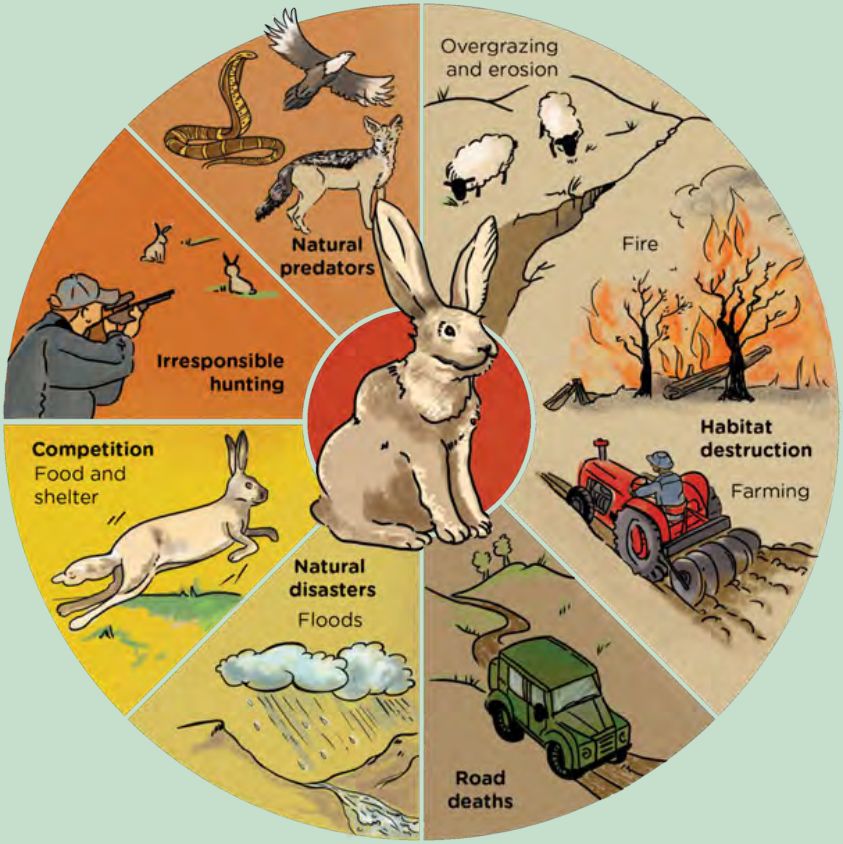
> **[Diagram Context - Textbook_NaturalScience_Gr8_Interactions-and-interdependence-within-the-environment.pdf-0031-04.png]**
> 1. A diagram of a rabbit and other animals in a habitat.
 2. A diagram of a rabbit and other animals in a habitat.
 3. A diagram of a rabbit and other animals in a habitat.
 4. A diagram of a rabbit and other animals in a habitat.
 5. A diagram of a rabbit and other animals in a habitat.
 6. A diagram

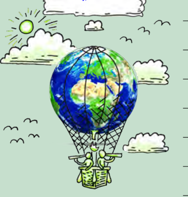
> **[Diagram Context - Textbook_NaturalScience_Gr8_Interactions-and-interdependence-within-the-environment.pdf-0031-06.png]**
> The image shows a cartoon illustration of a hot air balloon filled with people. The balloon is floating in the sky, and the people inside are wearing hats. The balloon is positioned in the center of the image, and the people are spread out around it. The sky is filled with clouds, and the sun is shining brightly in the background. The image is labeled as a "scale diagram" and

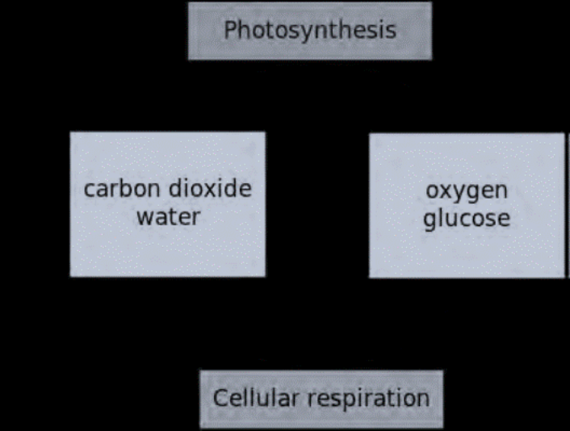
> **[Diagram Context - Textbook_NaturalScience_Gr8_Photosynthesis-and-respiration.pdf-0031-01.png]**
> 1. A diagram of a cell with a diagram of a cell and a diagram of a cell with a diagram of a cell and a diagram of a cell with a diagram of a cell and a diagram of a cell with a diagram of a cell and a diagram of a cell with a diagram of a cell and a diagram of a cell with a diagram of a cell and a diagram of a cell

---

# ACTIVITY: Assessing the impacts of a natural disaster

In the 1980s a devastating drought and famine raged in Ethiopia and caused the death of $400\,000$ people. Many animals, plants and microorganisms also died and species that depend on water for their reproductive cycle, like amphibians, were particularly badly affected.

> **[Diagram Context - Textbook_NaturalScience_Gr8_Interactions-and-interdependence-within-the-environment.pdf-0032-00.png]**
> 1. A diagram of a cell with a green line running down the middle.

*The dry landscape in Ethiopia.*

> **[Diagram Context - Textbook_NaturalScience_Gr8_Interactions-and-interdependence-within-the-environment.pdf-0032-01.png]**
> This graphic illustrates the double-helix structure of a DNA molecule, characterized by two antiparallel sugar-phosphate backbones represented by the repeating green ribbon-like strands. It conceptually demonstrates the molecular architecture of genetic material, highlighting the complementary base pairing and the helical twist essential for DNA replication and protein synthesis in Life Sciences.

*People trying to collect water.*

## QUESTIONS:

1. What is a drought?
2. What is a famine?
3. How do you think a drought and famine in a particular area, such as in Ethiopia are linked?
4. A famine is often accompanied by the spread of diseases amongst animals and humans. Why do you think this is so?
5. Do you think the effects of a drought and famine on an ecosystem are reversible or irreversible? Give a reason for your answer.

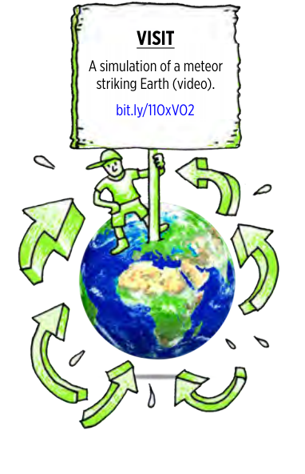
> **[Diagram Context - Textbook_NaturalScience_Gr8_Interactions-and-interdependence-within-the-environment.pdf-0032-10.png]**
> The image is a cartoon depiction of a planet and a boy on a pole. The boy is holding a sign that says "visit" and is pointing towards the planet. The planet is depicted in a cartoon style with a blue and green color scheme. The boy is wearing a green hat and is standing on a pole. The boy is also holding a green arrow. The boy is wearing a

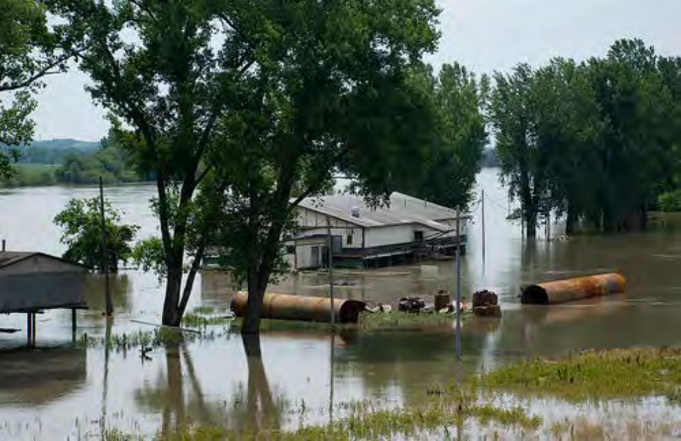
> **[Diagram Context - Textbook_NaturalScience_Gr8_Interactions-and-interdependence-within-the-environment.pdf-0032-11.png]**
> The image shows a flooded area with a house and a pipe in the water. The house is partially submerged, and the pipe is also in the water. The scene is set in a river, and the water level is high enough to submerge the house and the pipe. The image does not contain any text, and the focus is on the natural elements and the water damage.

---

## Human Factors

Many years ago, people like the San had little impact on their environment, as they lived in harmony with the land and only took what food they could carry. Modern man has, however, had a huge effect on nature. We clear land to build cities, roads and farms, we pollute the environment and produce waste and litter. Humans also poach endangered animals and over-harvest marine animals, causing lasting damage to ecosystems.

---

## ACTIVITY: Poaching in Southern Africa

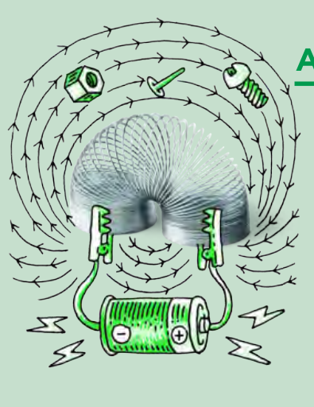
> **[Diagram Context - Textbook_NaturalScience_Gr8_Interactions-and-interdependence-within-the-environment.pdf-0033-00.png]**
> 1. A green spring with a silver spring inside.

### INSTRUCTIONS:
1. Read the following newspaper article.
2. Answer the questions that follow.

### Hunting and bushmeat - the road to extinction
*19 October 2012*

Illegal hunting (poaching) of animals and the killing of wild animals for 'bush meat' in many parts of Southern Africa is of serious concern to environmentalists and is driving some species close to extinction. Poor communities often rely on small wild animals they can trap for food, but removing too many of the smaller animals could force the carnivores (like lions, leopards and wild dogs) that eat them to turn to domestic animals like sheep or cattle for food. For this reason, farmers may go out and shoot even more of them. The carnivores themselves sometimes get caught in the traps. Although hunting and finding bushmeat have been traditional ways of getting food for many generations, the current 'over-hunting' is causing concern. Dr Rene Czudec of FAO commented: *"There is an urgent need to look for solutions to ensure the sustainable use of SA's wildlife, while still helping to develop poor communities"*

### QUESTIONS:

1. After reading this article, explain what you think bushmeat is.
2. How did the hunting of the San differ from today's removal of bush meat?
3. Why do you think there is a market for bushmeat (people who buy the bushmeat)?
4. Some people from local communities that live on the edge of protected reserves, sneak into the reserves and illegally kill wildlife for food. Do you think this is justified? Discuss this with your class. What do you think some solutions to the problem could be?

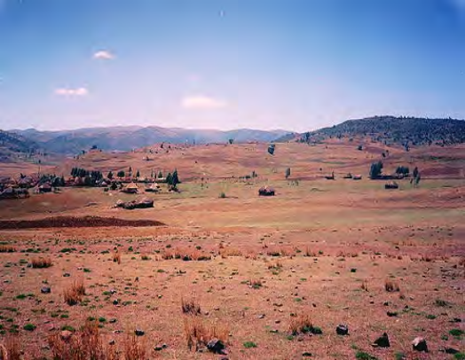
> **[Diagram Context - Textbook_NaturalScience_Gr8_Interactions-and-interdependence-within-the-environment.pdf-0033-03.png]**
> 1. A diagram of a cell with a diagram of a cell on the left side.

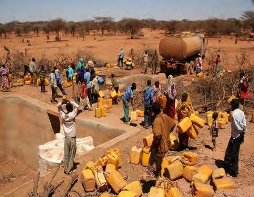
> **[Diagram Context - Textbook_NaturalScience_Gr8_Interactions-and-interdependence-within-the-environment.pdf-0033-04.png]**
> The image shows a group of people gathered around a large number of yellow water jugs. The jugs are scattered across the scene, with some people standing around them and others carrying them. The people are wearing colorful clothing, and the setting appears to be a desert-like environment. The image does not contain any text, and the focus is on the people and the water jugs.

> **[Diagram Context - Textbook_NaturalScience_Gr8_Interactions-and-interdependence-within-the-environment.pdf-0033-13.png]**
> 1. A diagram of a cell with a green line representing the cell wall.

---

5. What is poaching?

6. Why do you think poaching causes an imbalance in an ecosystem?

7. In the article, wildlife is poached for the meat to be sold as food. What two other animals that are poached in southern African game reserves and why are they poached?

8. Abalone (Perlemoen) are edible sea snails sold as a delicacy in Asia. Although they are farmed, many are removed illegally by divers, causing a serious decrease in their numbers.

> **[Diagram Context - Textbook_NaturalScience_Gr8_Interactions-and-interdependence-within-the-environment.pdf-0034-14.png]**
> The image features a cartoon depiction of a spring coiled up in the shape of a caterpillar. The caterpillar is surrounded by a green leaf and a green ball. The caterpillar is positioned on the left side of the image, while the leaf and ball are on the right side. The image is a simple, cartoon-like illustration that conveys the concept of a spring coiled up

*A perlemoen in its natural environment.*
*Perlemoen served as a delicacy.*

How do you think the illegal poaching of perlemoen is affecting our marine ecosystems?

9. In the northern provinces in South Africa, Mopani worms are a traditional source of high protein seasonal food found in the area. But, they have also become a favourite of tourists and visitors of the area. Each year, more and more are being eaten so that they are now hard to find. We say they are becoming locally extinct.

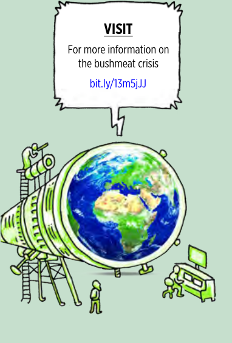
> **[Diagram Context - Textbook_NaturalScience_Gr8_Interactions-and-interdependence-within-the-environment.pdf-0034-15.png]**
> The image shows a cartoon depiction of a group of people standing around a telescope. The telescope is positioned in the center of the image, with the people surrounding it. The people are of various sizes, and they are all facing the telescope. The image also includes a caption that reads "Visit" and "For more information on the bushmeat crisis, click on the link below".

---

Describe the impact that this could have on the rest of the food chain or food web.

---

Another way in which humans have a huge impact on the environment and cause disruption to ecosystems is through pollution. There are many different types of pollution. Are you aware of the ways in which you are contributing to pollution?

# ACTIVITY: Assess your impact on the environment

## QUESTIONS:

1. There are different types of pollution, as listed below. For each one, discuss it with your partner and write a short description of the pollution, where it can come from.
   
   a) Water pollution.

   b) Air pollution.

---
Chapter 2. Interactions and interdependence within the environment **61**

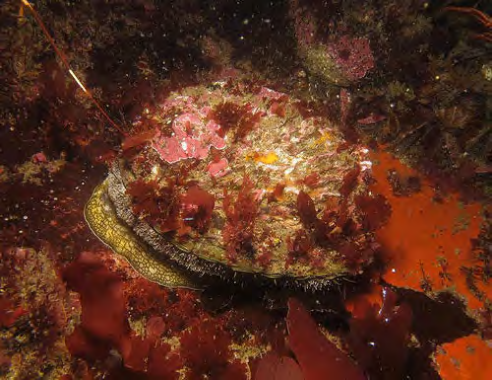
> **[Diagram Context - Textbook_NaturalScience_Gr8_Interactions-and-interdependence-within-the-environment.pdf-0035-05.png]**
> The image shows a diagram of a cell, with a large red object in the center surrounded by smaller red objects. The diagram is labeled with the text "Lewis diagram" and "cellular structure". The diagram also includes a Lewis diagram, a Lewis diagram, and a Lewis diagram. The diagram is labeled with the text "Lewis diagram", "cellular structure", and "Lewis diagram".

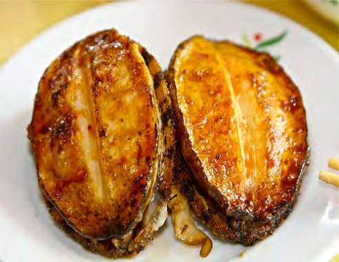
> **[Diagram Context - Textbook_NaturalScience_Gr8_Interactions-and-interdependence-within-the-environment.pdf-0035-07.png]**
> 1. A diagram of a cell with a diagram of a cell on the left side.

---

c) Land pollution and refills.
_________________________________________________________________________________
_________________________________________________________________________________
_________________________________________________________________________________

2. Assess your own life. Where have you perhaps contributed to the types of pollution mentioned above?
_________________________________________________________________________________
_________________________________________________________________________________
_________________________________________________________________________________

3. Brainstorm ways in which you can reduce each of these types of pollution.
_________________________________________________________________________________
_________________________________________________________________________________
_________________________________________________________________________________

4. Study the following posters made by a Gr. 8 class.

What do you think they are trying to encourage us to do? What is the message of the posters?
_________________________________________________________________________________
_________________________________________________________________________________
_________________________________________________________________________________
_________________________________________________________________________________
_________________________________________________________________________________
_________________________________________________________________________________

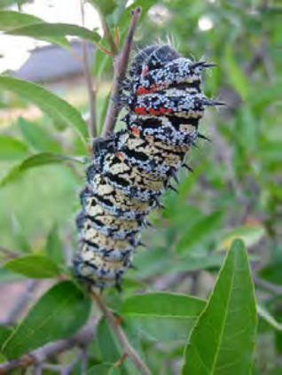
> **[Diagram Context - Textbook_NaturalScience_Gr8_Interactions-and-interdependence-within-the-environment.pdf-0036-01.png]**
> 1. A caterpillar with a black and white striped body and red spots on its back.

> **[Diagram Context - Textbook_NaturalScience_Gr8_Interactions-and-interdependence-within-the-environment.pdf-0036-03.png]**
> 1. A diagram of a snake's body.
 2. The snake's body is composed of green and white lines.
 3. The snake's head is green and its body is white.

> **[Diagram Context - Textbook_NaturalScience_Gr8_Interactions-and-interdependence-within-the-environment.pdf-0036-09.png]**
> The image is a cartoon depiction of a roller coaster ride. The roller coaster is made of green metal and has a silver spring coiled at the top. The coaster is designed to resemble a Lewis diagram, which is a diagram used to represent the connections between atoms or molecules. The diagram is composed of lines and arrows, which indicate the bonds between the atoms or molecules. The roller coaster is shown

---

# 2.6 Adaptations

Organisms in ecosystems face competition, predation, parasitism, and human influence, all of which could affect them negatively, forcing them to **adapt**, move away, or die. It is well known that South Africa has undergone big climatic changes in the past. For example, the dry Karoo was once swampy and the Cango Caves in Oudtshoorn were once under water.

*Rock formations inside the Cango Caves show that they were once under water.*

---

## What is adaptation?

When Southern Africa rose out of the sea millions of years ago, organisms that could not adapt to the new, drier **terrestrial environment** became extinct, but individuals that could adapt, survived and formed new populations. These adaptations could be changes in the organism's structure, function, or behaviour over very long time periods. Only populations of organisms that happen to have suitable characteristics are able to survive in changing conditions within an environment. They are 'selected by nature' to survive. Those species that do not adapt will die out and become extinct.

As we have said, adaptation in species can occur in three main ways:

1. **Structural:** The physical characteristics of a species, such as having long legs and strong muscles.
2. **Functional:** A species may have a special way of carrying out its life processes, such as being able to produce eggs with a hard shell, so that the embryos can grow and hatch even if the climate changes.
3. **Behavioural:** The species can have special behaviours that are instinctive (which they know by **instinct**) or can be learned, such as making safe nests for protecting their babies.

These changes take place over a long time period within a species and must be passed on from generation to generation. Over time and over many generations, these adaptations in the individual organisms will allow the species to evolve and adapt to its changing environment. Let's have a look at some of the adaptations of plants and animals.

---

## Adaptations in animals

Animals have different adaptations which have enabled different species to live and function in different areas. Let's look at some of the animals that live in our country and how they have adapted to live in their environments.

---

## New Words & Did You Know?

* **adapt**
* **camouflage**
* **hibernation**
* **instinct**
* **migration**
* **mimicry**
* **terrestrial environment**

> **DID YOU KNOW?**  
> Cango is a KhoiSan word and means 'Place of deep water'.

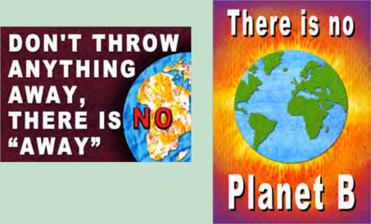
> **[Diagram Context - Textbook_NaturalScience_Gr8_Interactions-and-interdependence-within-the-environment.pdf-0037-05.png]**
> 1. A poster with a cartoon earth and the words "There is no planet B" written on it.

> **[Diagram Context - Textbook_NaturalScience_Gr8_Interactions-and-interdependence-within-the-environment.pdf-0037-07.png]**
> 1. A diagram of a cell with a green line representing a DNA strand.

---

## ACTIVITY: Distinguish between types of adaptations

### INSTRUCTIONS:
1. We will work through different adaptations in South African animals that have enabled them to survive in the environment they live in.
2. In each of the examples, say whether you think it is a structural, functional or behavioural adaptation and give a reason for your choice.

### QUESTIONS:
Record your work in the table below each set of animals.

---

### 1. Aardvark
It has a flexible, tubular tongue up to $30\text{ cm}$ long as well as thick skin and short, powerful legs with strong claws for digging into termite mounds, its favourite food. These ants are then collected by the tongue - up to $50\text{ }000$ in one night! It hides underground in daytime to escape heat and predators.

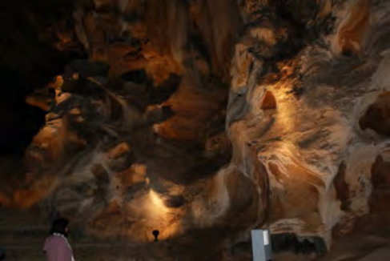
> **[Diagram Context - Textbook_NaturalScience_Gr8_Interactions-and-interdependence-within-the-environment.pdf-0038-03.png]**
> 1. A diagram of a cell with a diagram of a cell on the side.

*(Two aardvarks in an enclosure)*

| How is the species adapted to life in its habitat? | |
| :--- | :--- |
| What type(s) of adaptation is this? | |

---

### 2. Desert beetles
They have ridges on their backs for collecting mist in the Namib Desert at night. Long back legs tilt the body, so mist is collected, condenses and runs via channels and grooves into their mouths.

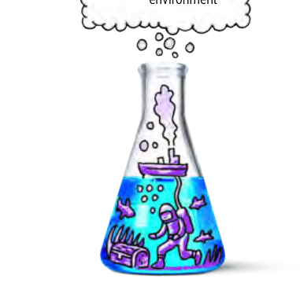
> **[Diagram Context - Textbook_NaturalScience_Gr8_Interactions-and-interdependence-within-the-environment.pdf-0038-09.png]**
> The image features a cartoon depiction of a person wearing a spacesuit and holding a submarine, with a submarine filled with water and bubbles. The submarine is depicted in a blue and purple color scheme. The person is shown in a purple and blue color scheme, wearing a spacesuit. The submarine is depicted in a blue and purple color scheme. The person is shown in a purple and blue color scheme

*(A desert beetle)*

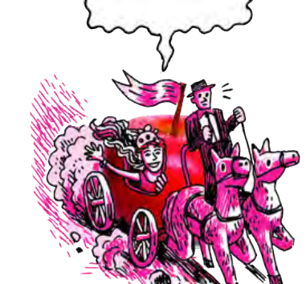
> **[Diagram Context - Textbook_NaturalScience_Gr8_Interactions-and-interdependence-within-the-environment.pdf-0038-17.png]**
> 1. A cartoon drawing of a man and a woman riding a pink carriage.
 2. A pink flag on the carriage.
 3. A pink apple on the carriage.
 4. A pink horse.
 5. A pink carriage.

---

Chapter 2. Interactions and interdependence within the environment

---

### 3. Gemsbok

**Description:**
This striking antelope from the Kalahari Desert prefers grass and shrubs, but will dig for roots and tubers if it needs water. They save water by not sweating and sleep in the shade during the day. If they can not find shade, they turn the body's lightest side to the sun.

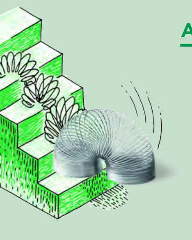
> **[Diagram Context - Textbook_NaturalScience_Gr8_Interactions-and-interdependence-within-the-environment.pdf-0039-00.png]**
> This illustration depicts a helical spring (slinky) moving down a set of stairs, indicated by motion lines. It serves as a physical model to help Grade 10-12 Physical Sciences learners visualize the propagation of longitudinal waves, demonstrating how energy transfers through a medium via compression and rarefaction.

*Gemsbok in the Kalahari*

| Question | Answer Space |
| :--- | :--- |
| How is the species adapted to life in its habitat? | |
| What type(s) of adaptation is this? | |

---

### 4. Ostrich

**Description:**
These are the biggest and heaviest birds, but they can't fly. To avoid predators, they fight with strong clawed toes or run away, up to $70\text{ km/hr}$! Ostriches swallow small stones to help digest any food they find. Male ostriches get red beaks in the mating season. The female lays eggs and she sits on them during the day, while the male incubates them at night - examine their colour differences to see why.

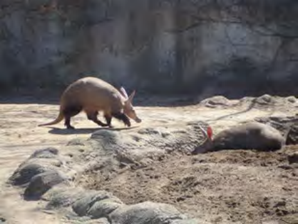
> **[Diagram Context - Textbook_NaturalScience_Gr8_Interactions-and-interdependence-within-the-environment.pdf-0039-08.png]**
> The image shows a brown armadillo walking across a dirt field, with a second armadillo lying on the ground in the background. The armadillo on the left appears to be walking towards the second armadillo, which is lying down. The scene is set against a rocky wall, and the armadillos are positioned in a way that suggests they are interacting with each other

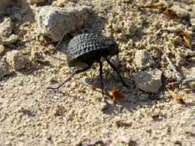
> **[Diagram Context - Textbook_NaturalScience_Gr8_Interactions-and-interdependence-within-the-environment.pdf-0039-13.png]**
> The image shows a black beetle walking on a dirt road. The beetle is positioned in the center of the image, with its legs spread out as it moves. The background of the image is a dirt road, with rocks scattered around. The image does not contain any text or other objects, and the beetle is the main focus of the image.

---

# Life and Living

## Visit
A video on wildebeest migration.  
`bit.ly/1cfsE90`

---

## Stick and leaf insect

These insects look like leaves or sticks to avoid predators - this is called **mimicry**. They feed on plant materials at night and move very slowly to avoid being seen. Female stick insects can reproduce without mating.

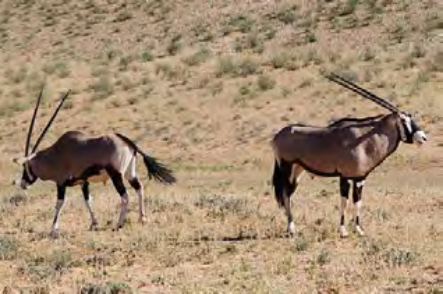
> **[Diagram Context - Textbook_NaturalScience_Gr8_Interactions-and-interdependence-within-the-environment.pdf-0040-03.png]**
> The image shows two antelopes standing in a field. The antelope on the left is facing the camera, while the one on the right is facing away. The field they are standing in appears to be a mix of grass and dirt. The antelope on the right has its back to the camera, while the one on the left is facing the camera. The background of the image is

*A stick insect*

| Question | Answer |
| :--- | :--- |
| How is it adapted to life in its habitat? | |
| What type(s) of adaptation is this? | |

---

## Other behavioural adaptations

Many species of animals display an interesting behavioural adaptation called **migration**. This occurs when an animal or a group of animals move between different areas at different times or periods.

---

## ACTIVITY: Why do animals migrate?

### INSTRUCTIONS:
1. Have a look at the following animals.
2. Think of reasons why they would want to **migrate** from their present habitat.

| Animals | Description | Reason to migrate |
| :--- | :--- | :--- |
| 

   Wildebeest migrating in the Masai Mara. | Wildebeest migrate long distances each year which coincides with the pattern of rainfall and grass growth. | |
| 

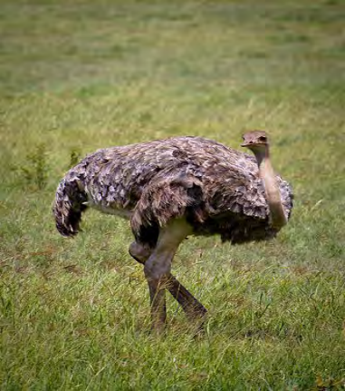
> **[Diagram Context - Textbook_NaturalScience_Gr8_Interactions-and-interdependence-within-the-environment.pdf-0041-01.png]**
> The image shows a large ostrich walking across a grassy field. The ostrich is facing to the right side of the image. The background is a green field, and the ostrich is the main subject of the image. There are no other objects or people visible in the image. The ostrich appears to be walking on all fours, with its legs spread out in front of it

   The sardine run as sardines migrate along the South African coastline. | The sardine run occurs along the African coast during May to July each year when billions of sardines migrate to the north east coast of South Africa. | |

---

Animals that don't migrate sometimes go into an inactive state called **hibernation** in winter. Some of them sleep through a whole winter, while some frogs hibernate by burrowing into the mud when the pond dries up, until the rains return.

---

> ### VISIT
> Watch underwater footage of the amazing sardine run that occurs each year from May to July.
> `bit.ly/1cMMUMX`

> ### DID YOU KNOW?
> Frogs have a special chemical in their bodies that prevents their blood from freezing completely – a kind of natural antifreeze!

---

*Chapter 2. Interactions and interdependence within the environment* **67**

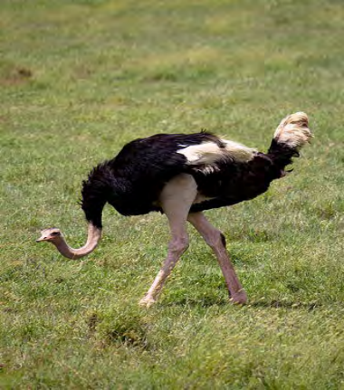
> **[Diagram Context - Textbook_NaturalScience_Gr8_Interactions-and-interdependence-within-the-environment.pdf-0041-03.png]**
> The image shows a black and white ostrich walking across a grassy field. The ostrich has its wings spread wide and its tail feathers ruffled, giving the impression of a bird in motion. The ostrich is the main subject of the image, with the background being a grassy field.

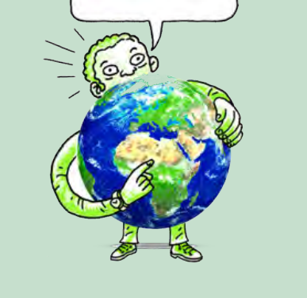
> **[Diagram Context - Textbook_NaturalScience_Gr8_Interactions-and-interdependence-within-the-environment.pdf-0041-07.png]**
> 1. A cartoon illustration of a man holding a globe.
 2. The globe is green and blue.
 3. The man is wearing a green shirt and white pants.

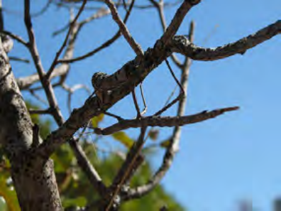
> **[Diagram Context - Textbook_NaturalScience_Gr8_Interactions-and-interdependence-within-the-environment.pdf-0041-11.png]**
> 1. A diagram of a cell with a Lewis structure.

> **[Diagram Context - Textbook_NaturalScience_Gr8_Interactions-and-interdependence-within-the-environment.pdf-0041-15.png]**
> 1. A diagram of a cell with a green line representing the cell wall.

---

# Adaptations in plants

Several local plants are also adapted to their environment. 

## The Umbrella Thorn Acacia

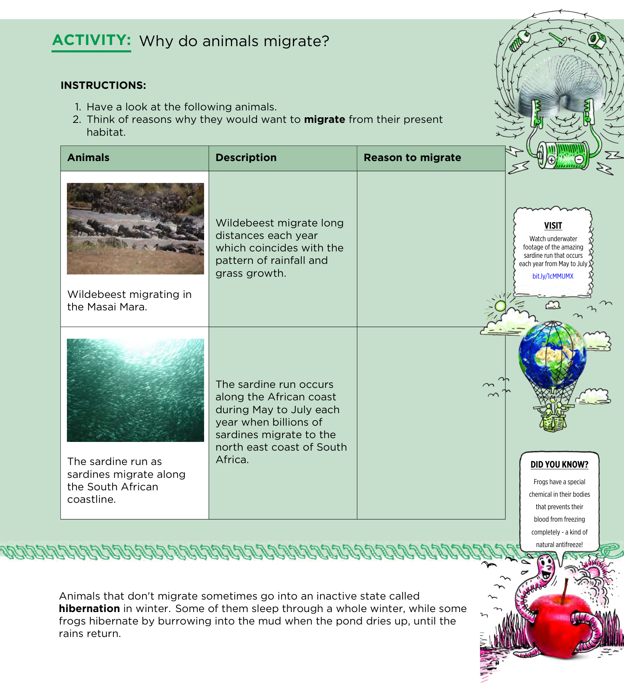
> **[Diagram Context - Textbook_NaturalScience_Gr8_Interactions-and-interdependence-within-the-environment.pdf-0042-02.png]**
> Activity: Why do animals migrate? 
 Purpose: To find a suitable habitat and climate for survival.

*An umbrella thorn acacia.*

The umbrella thorn in the African savannah can survive temperatures ranging from $50^\circ\text{C}$ to below freezing. 

### Key Adaptations:
* **Deep roots:** Reach groundwater easily.
* **Small leaves:** Prevent dehydration while still being well exposed to light due to the umbrella shape of the tree. 

> **Critical Thinking Question:** Why does it need light?

---

## The Baobab Tree

The Baobab tree survives in dry areas, since it stores water in the thick trunk and spongy wood. The smooth bark reflects heat, making it cooler, but also helps protect the fruits from monkeys. 

<!-- DIAGRAM_PLACEHOLDER: diagram -->
*The sun setting behind a baobab tree.*

<!-- DIAGRAM_PLACEHOLDER: diagram -->
*This baobab is over $3000$ years old! Take note of its width and the reflective bark.*

> **Critical Thinking Question:** How can it do this?

### Flower Adaptations

<!-- DIAGRAM_PLACEHOLDER: diagram -->
*A baobab flower which smells like rotting meat.*

The flowers smell like rotting meat to attract bats, flies, and moths at night. 

> **Critical Thinking Question:** Why do you think the baobab tree needs to attract these animals to its flowers?

---

We are now going to look at some very unique plants, which are only found in South Africa.

---

## ACTIVITY: Living stones

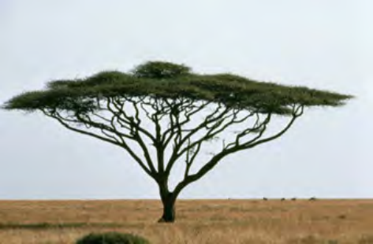
> **[Diagram Context - Textbook_NaturalScience_Gr8_Interactions-and-interdependence-within-the-environment.pdf-0043-02.png]**
> 1. A tree with a large canopy and a thick trunk.

### INSTRUCTIONS:

1. Study the following photographs. They show different types of plants. These plants actually look like pebbles. They are from the genus *Lithops* and they are succulent plants, meaning they have parts that can store water.
2. Answer the questions which follow.

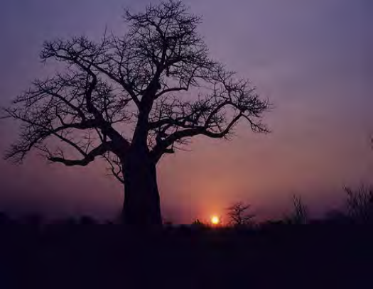
> **[Diagram Context - Textbook_NaturalScience_Gr8_Interactions-and-interdependence-within-the-environment.pdf-0043-05.png]**
> The image shows a tree silhouetted against a sunset. The tree is tall and bare, with no leaves, and the sun is setting behind it, casting a warm glow on the scene. The sky is a deep purple color, indicating that the sun is low in the sky. The image is a still life, capturing a moment of tranquility and beauty in nature.

### TAKE NOTE

The name *Lithops* comes from two Ancient Greek words: *lithos* meaning 'stone' and *ops* meaning 'face'. So, *Lithops* means 'stone-faced'!

---

### QUESTIONS:

1. Why do you think these plants are commonly referred to as 'living stones' or 'pebble plants'?

__________________________________________________________________________________________________

__________________________________________________________________________________________________

2. Why do you think the plants have such different patterns on their surfaces? How does this help them to survive in their environment?

__________________________________________________________________________________________________

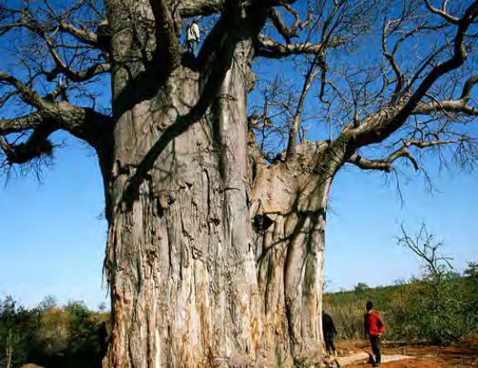
> **[Diagram Context - Textbook_NaturalScience_Gr8_Interactions-and-interdependence-within-the-environment.pdf-0043-07.png]**
> The image shows a large tree with a thick trunk and a thick trunk with a large trunk. The tree is surrounded by a field, and there are two people standing near the tree. The tree has a lot of branches, and it appears to be a baobab tree. The tree is located in a rural setting, and the people are standing in the field.

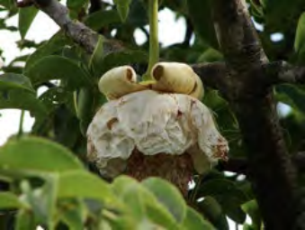
> **[Diagram Context - Textbook_NaturalScience_Gr8_Interactions-and-interdependence-within-the-environment.pdf-0043-10.png]**
> 1. A diagram of a plant cell with a large white flower.

---

3. *Lithops* plants are classified as succulents. What does this mean? What type of environment are succulents adapted to live in?

4. *Lithops* leaves are fleshy and mainly underground, and the stem is short. Flowers grow between the leaves, which shrink to below ground level during drought. How does this help the plant survive?

5. If the leaves are reddish-brown and mainly underground, where is the chlorophyll? Examine these dug-up stone plants.

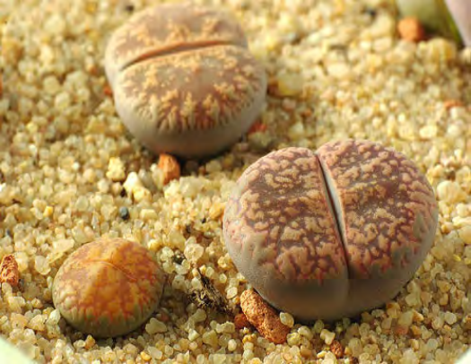
> **[Diagram Context - Textbook_NaturalScience_Gr8_Interactions-and-interdependence-within-the-environment.pdf-0044-04.png]**
> 1. A diagram of a cell with a Lewis structure.

*The upper surfaces of Lithops plants.*  
*The underneath surfaces of the Lithops plants.*

Where is most of the green part of the plant located?

6. This is a thin section of a stone plant under a hand lens. Draw a diagram of it and label the top of the leaves, the split between the leaves and the stem. Indicate where the soil level would be. What is stored in the clear area of the leaves?

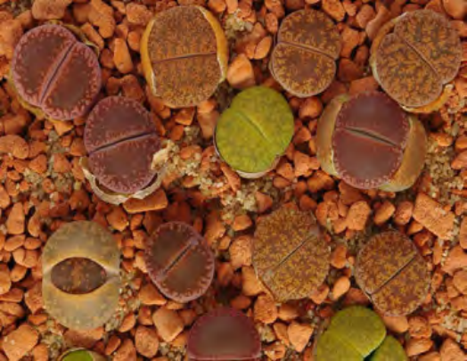
> **[Diagram Context - Textbook_NaturalScience_Gr8_Interactions-and-interdependence-within-the-environment.pdf-0044-05.png]**
> 1. A diagram of a cell with a Lewis structure.

*A cross section of a Lithops plant viewed under a microscope.*

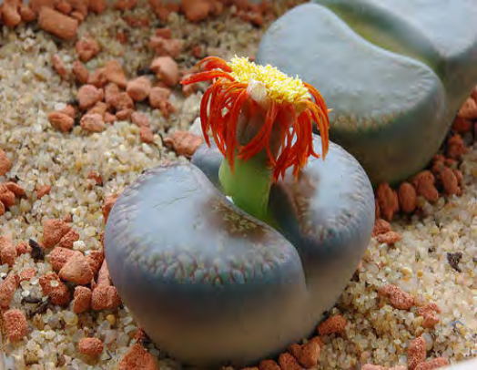
> **[Diagram Context - Textbook_NaturalScience_Gr8_Interactions-and-interdependence-within-the-environment.pdf-0044-08.png]**
> 1. A diagram of a plant cell with a yellow flower on the top.

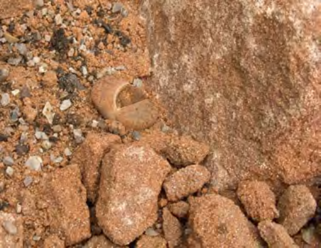
> **[Diagram Context - Textbook_NaturalScience_Gr8_Interactions-and-interdependence-within-the-environment.pdf-0044-09.png]**
> 1. A diagram of a cell with a diagram of a cell on it.

> **[Diagram Context - Textbook_NaturalScience_Gr8_Interactions-and-interdependence-within-the-environment.pdf-0044-12.png]**
> The image features a cartoon depiction of a green spring coiled up and ready to spring. The spring is surrounded by a leafy green branch, and a green ball is positioned on the branch. The diagram is labeled with the text "Lewis diagram", "anatomical/cellular structure", "circuit", "graph", "evolutionary tree", "apparatus", and "

> **[Diagram Context - Textbook_NaturalScience_Gr8_Interactions-and-interdependence-within-the-environment.pdf-0044-15.png]**
> 1. A diagram of a cell with arrows pointing to different parts of the cell.

---

7. The upper patterned surface acts as a window. Can you see the clear, fleshy middle parts of the leaves? Do you think light can travel through this? How does this allow the plant to photosynthesise?

## 2.7 Conservation of the ecosystem

Our country is one of the most naturally diverse in the world. This means that we have many different species and habitats and ecosystems here, more than most other places in the world.

Our country's natural beauty and diversity attract thousands of tourists each year, but it is under severe threat from poaching, pollution and other human influence. Ecosystems are able to naturally recycle materials like water, carbon dioxide and other gases and the remains of organisms, if they are left alone. But ecosystems cannot do this effectively if we interfere. These human interferences include:

* Habitat destruction like deforestation and burning
* Pollution causing global warming
* Alien invasive plants taking over ecosystems
* Hunting, poaching and other killing of wildlife

These pressures have caused great loss in biodiversity. Some ecosystems are under strain and others have already collapsed. There are many reasons why it is important for humans to care about the environment. As we have learnt, everything in an ecosystem is connected. Therefore harming one component of the ecosystem will have a ripple effect that can damage all the other systems.

---

**VISIT**
Video on rhino poaching in South Africa.
`bit.ly/1eUld4R`

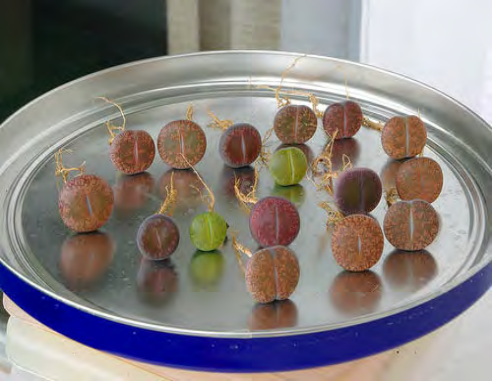
> **[Diagram Context - Textbook_NaturalScience_Gr8_Interactions-and-interdependence-within-the-environment.pdf-0045-04.png]**
> 1. A diagram of a Lewis structure of a molecule.

---
*Chapter 2. Interactions and interdependence within the environment* **71**

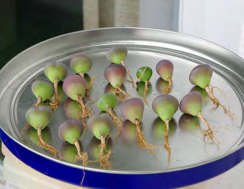
> **[Diagram Context - Textbook_NaturalScience_Gr8_Interactions-and-interdependence-within-the-environment.pdf-0045-06.png]**
> The image shows a round metal tray with a blue rim, containing a group of small green plants with brown roots. The plants are arranged in a circular pattern, with some overlapping each other. The tray is placed on a white surface, and the background is blurred, drawing attention to the plants and their arrangement. The image does not contain any text, and the focus is solely on the plants and

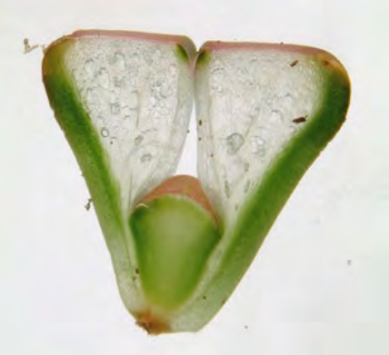
> **[Diagram Context - Textbook_NaturalScience_Gr8_Interactions-and-interdependence-within-the-environment.pdf-0045-10.png]**
> The image shows a close-up view of a plant cell, specifically a green leafy plant cell. The cell is divided into two parts, with the top part being green and the bottom part being white. The cell is surrounded by a thin layer of water droplets, giving it a wet appearance. The cell is the main focus of the image, with the background being a plain white surface

---

# ACTIVITY: Finding solutions to environmental problems

> **[Diagram Context - Textbook_NaturalScience_Gr8_Interactions-and-interdependence-within-the-environment.pdf-0046-00.png]**
> 1. A diagram of a cell with a white square in the center.

## INSTRUCTIONS:
1. The following table is a list of environmental issues.
2. Do some research on air pollution, water pollution, landfills and climate change.

## INSTRUCTIONS:
1. Write down the effect (consequence) of this issue on the ecosystem (or on humans). Write down a possible solution or a simple action that you can take to help.

| Environmental Issue | Consequence | Action |
| :--- | :--- | :--- |
| Inappropriate waste disposal: **Air pollution** | | |
| Inappropriate waste disposal: **Water pollution** | | |
| Inappropriate waste disposal: **Landfills and littering** | | |
| Carbon emissions and **climate change** | | |

Some people and organisations like Greenpeace, fight for environmental conservation. There may be groups in your local area that also promote environmental conservation - do not think that you can not make a difference if you are just one person!

> **[Diagram Context - Textbook_NaturalScience_Gr8_Interactions-and-interdependence-within-the-environment.pdf-0046-02.png]**
> This graphic depicts a schematic representation of a DNA molecule, characterized by its iconic double-stranded, helical structure. The diagram illustrates the two antiparallel sugar-phosphate backbones intertwined to form the double helix, providing a visual foundation for understanding the molecular basis of heredity and genetic information storage in Life Sciences.

*The Greenpeace ship, Arctic Sunrise, which is used for environmental awareness campaigns and research.*

> **[Diagram Context - Textbook_NaturalScience_Gr8_Interactions-and-interdependence-within-the-environment.pdf-0046-11.png]**
> The image features a cartoon depiction of a rhino with a sign on its back that reads "Visit". The rhino is standing on a globe, and there are arrows pointing in various directions, possibly representing different places or directions. The image also includes a caption that reads "Video on rhino poaching in South Africa".

---

## Chapter 2. Interactions and interdependence within the environment

---

### ACTIVITY: Why should we care?

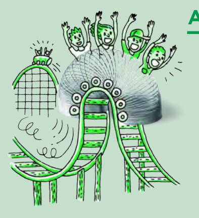
> **[Diagram Context - Textbook_NaturalScience_Gr8_Interactions-and-interdependence-within-the-environment.pdf-0047-00.png]**
> 1. A cartoon depiction of a roller coaster.

#### INSTRUCTIONS:
1. Divide the class into two teams. One group supports environmental conservation and the other believes we should use all earth's resources as we like.
2. Both groups must research their topics beforehand and gather relevant points.
3. The teacher can lead the debate and ensure it proceeds in an orderly way.

#### QUESTIONS:
1. After the debate, write down 3 points about each viewpoint that you can remember.

---

There are all ordinary people who feel passionate about saving the only world we have. It takes the combined work of many concerned people to maintain healthy ecosystems - you can also make a difference!

---

### ACTIVITY: Individuals who make a difference

> **[Diagram Context - Textbook_NaturalScience_Gr8_Interactions-and-interdependence-within-the-environment.pdf-0047-08.png]**
> This graphic depicts a schematic representation of a DNA double helix, characterized by its iconic twisted ladder structure with visible base-pair rungs. It illustrates the complementary base pairing and the antiparallel orientation of the sugar-phosphate backbones, providing a foundational visual model for understanding the molecular structure of genetic material in Life Sciences.

#### INSTRUCTIONS:
1. Below are some photos of various individuals who have contributed to environmental conservation and awareness in some way.
2. Research what each individual has done.
3. Then, choose one who you find most inspiring and write about them, identifying what is is you admire.
4. You do not have to stick to the people who have been identified here. You can write about someone else too who you have identified with.
5. Lastly, reflect on how you can make a difference in your own life and what you could do to conserve your own local environment. Write about this too.

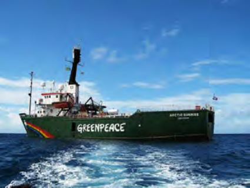
> **[Diagram Context - Textbook_NaturalScience_Gr8_Interactions-and-interdependence-within-the-environment.pdf-0047-10.png]**
> This image depicts the Greenpeace vessel "Arctic Sunrise" navigating open ocean waters. The visual includes the ship's name, the organization's logo, and a distinct rainbow-colored hull design, serving as a real-world example of environmental activism and marine conservation efforts. For high school learners, this image illustrates the role of non-governmental organizations (NGOs) in monitoring global environmental issues and advocating for sustainable practices within the context of Life Sciences and Geography.

---

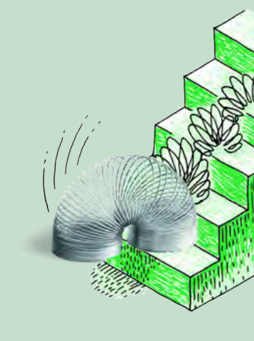
> **[Diagram Context - Textbook_NaturalScience_Gr8_Interactions-and-interdependence-within-the-environment.pdf-0048-06.png]**
> 1. A diagram of a spring coiled up.

## Some other people to research include:

* Wangari Mathai
* Lawrence Anthony
* Steve Irwin
* Diane Wilson
* Dian Fossey
* Ian Player

---

*Life and living* | **74**

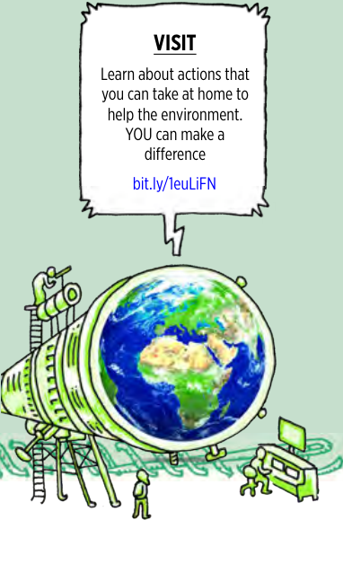
> **[Diagram Context - Textbook_NaturalScience_Gr8_Interactions-and-interdependence-within-the-environment.pdf-0048-16.png]**
> The image is a cartoon depiction of a globe with a small figure of a man and a woman standing on it. The globe is surrounded by a green machine, and there are arrows pointing towards the globe and the machine. The text at the top of the image reads "Visit" and "Learn about actions that you can take at home to help the environment. You can make a difference."

> **[Diagram Context - Textbook_NaturalScience_Gr8_Interactions-and-interdependence-within-the-environment.pdf-0048-17.png]**
> 1. A green spring with a silver spring coiled around it.
2. A green battery with a silver wire attached to it.
3. A green wire with a silver spring attached to it.
4. A green spring with a silver wire attached to it.

---

# SUMMARY: Ecosystems and Feeding Relationships

## Key Concepts

### Ecosystems

* **Ecology** is the study of interactions of organisms with one another and with the physical and chemical environment.
* The study of ecological interactions is conducted at four levels:
  * Populations
  * Communities
  * Ecosystems
  * Biosphere(s)
* All ecosystems combined make up the **biosphere**.
* An **ecosystem** consists of a community that includes all living organisms (**biotic**) such as plants and animals, together with the non-living (**abiotic**) environment and climatic conditions such as temperature, air and wind, water, interacting as a system.
* An ecosystem can refer to a specific area on Earth or the entire biosphere can be regarded as one large ecosystem.
* The survival of populations and species depends on whether enough individuals are suited to the environmental conditions at the time. As conditions do change over time only those better suited to the changed environment will be able to continue the species. And so over time species adapt.

---

### Feeding Relationships

* Plants are **producers**. They make their own food.
* Animals are **consumers**. They obtain food from plants either directly (such as herbivores) or indirectly (such as carnivores).
* **Herbivores** feed on plants.
* **Carnivores** feed on other animals (living or dead). This group includes:
  * **Predators** hunt other animals, their *prey*, for example lions and leopards.
  * **Scavengers** that eat dead animals, for example hyenas and vultures.
  * **Insectivores** that eat insects and other small invertebrates such as worms.
* **Omnivores** feed on plants and animals. Humans are generally omnivores.

---

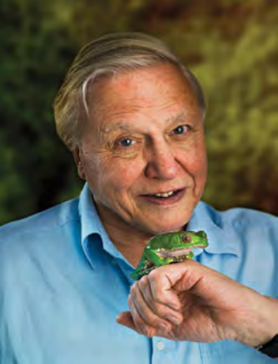
> **[Diagram Context - Textbook_NaturalScience_Gr8_Interactions-and-interdependence-within-the-environment.pdf-0049-01.png]**
> 1. A man holding a frog in his hand.

> **[Diagram Context - Textbook_NaturalScience_Gr8_Interactions-and-interdependence-within-the-environment.pdf-0049-03.png]**
> 1. A woman holding a stuffed monkey.

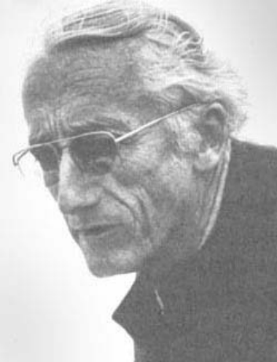
> **[Diagram Context - Textbook_NaturalScience_Gr8_Interactions-and-interdependence-within-the-environment.pdf-0049-05.png]**
> 1. A black and white image of a man wearing glasses.

> **[Diagram Context - Textbook_NaturalScience_Gr8_Interactions-and-interdependence-within-the-environment.pdf-0049-07.png]**
> 1. A man wearing a suit and tie.

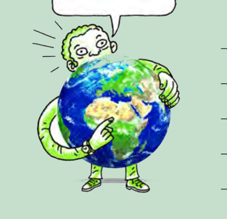
> **[Diagram Context - Textbook_NaturalScience_Gr8_Interactions-and-interdependence-within-the-environment.pdf-0049-12.png]**
> 1. A cartoon illustration of a man holding a globe.
2. The globe is green and blue.
3. The man is wearing a green shirt and white pants.

---

* **Decomposers**: Organisms that break down (decompose) the remains of dead plants and animals. They recycle important nutrients in the environment.

## Energy flow: food chains and food webs

* **Producers**: Plants and some algae play a very important role in the ecosystem because they capture the radiant energy from the Sun and use it in the process of photosynthesis to produce glucose that the plant and other animals can use to gain energy.
* **Energy transfer**: This energy is passed along a food chain from producers to consumers; decomposers are the last link in this transfer of energy. They release energy as heat to the environment.
* **Trophic level**: Each stage of a food chain is called a trophic level. Energy transfer and energy loss occur at each trophic level.
* **Food webs**: Interlinked food chains together form food webs.

## Balance in an ecosystem

* An ecosystem can only accommodate as many organisms as its resources (food, water and shelter) can carry.
* The balance can be disturbed by natural or human factors:
  * **Natural factors**: include extreme changes in patterns of weather and climate, such as floods, drought, extreme and sudden changes in temperature.
  * **Human factors**: include removing organisms from the ecosystem (such as poaching), human-induced pollution.
* These factors can contribute to an imbalance in an ecosystem, seriously impacting on its components and altering its nature.

## Adaptations

* **Adaptation**: The change in the structural, functional or behavioural characteristics of a species over many generations.
* Adaptation allows the species to survive as it adapts to changing conditions within the environment.
* **Extinction**: Species and populations of organisms that are unable to adapt to changes in the environment will die out and become extinct.

## Conservations of ecosystems

* People can work towards managing and sustaining natural ecosystems.
* Individuals can contribute to conservation in various ways such as appropriate waste disposal (including recycling and reusing).

## Concept Map

This concept map shows how the concepts in this chapter on the 'Interactions and interdependence within the environment' link together. Complete the concept map by filling in the 2 levels which are missing for the study of ecology. Also, fill in the 4 types of consumers that you have learned about in this chapter.

Can you see how the arrows show the direction in which you must 'read' the concept map?

> **[Diagram Context - Textbook_NaturalScience_Gr8_Interactions-and-interdependence-within-the-environment.pdf-0050-02.png]**
> 1. A diagram of a cell with blue and white lines.

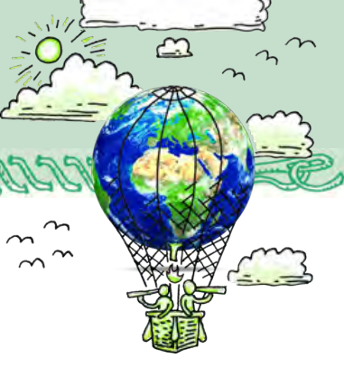
> **[Diagram Context - Textbook_NaturalScience_Gr8_Interactions-and-interdependence-within-the-environment.pdf-0050-13.png]**
> The image features a cartoon illustration of a hot air balloon with a globe on top. The globe is depicted in a cartoon style with a blue and green color scheme. The balloon is filled with air and is being pulled by a string. The illustration also includes a pair of people on the balloon, one on each side, and a bird flying behind them. The illustration is labeled with the words "

> **[Diagram Context - Textbook_NaturalScience_Gr8_Interactions-and-interdependence-within-the-environment.pdf-0050-14.png]**
> 1. A cartoon drawing of a man in a hard hat and safety glasses holding a key.

---

# Interactions and Interdependence Within the Environment

<!-- DIAGRAM_PLACEHOLDER: diagram -->

## Core Concepts & Structure

### 1. Ecology
* **Definition:** The study of interactions and interdependence within the environment.
* **Studied in:** At 4 levels, making up the **biosphere**.

### 2. Ecosystems
* **Definition:** A biological system consisting of all living organisms in a particular area in interaction with the non-living elements of that environment.
* **Components:**
  * **Biotic Factors:** 
    * Are living organisms.
    * Adapt in order to survive.
    * Structure and functioning include changes in behaviour.
    * Interact as a system.
  * **Abiotic Factors:**
    * Are non-living things.
    * Do not have specific size.

### 3. Biosphere & Sustainability
* Ecosystems make up the **biosphere**.
* The biosphere must be **balanced** and **conserved** by **humans** to support organisms across the whole planet.

### 4. Feeding Relationships & Trophic Levels
* **Feeding Relationships:** Occur between **plants** (producers) and **animals** (consumers).
* **Food Chains:** 
    * Defined by feeding relationships.
    * Have **trophic levels**.
* **Food Webs:** Formed by linked food chains.

---

# REVISION: Life and Living

## Activity 1: Matching Ecological Terms

Match the terms in Column A to the correct descriptions in Column B.

| Column A | Column B |
| :--- | :--- |
| 1. Producer | A. Organisms that eat other organisms to obtain food |
| 2. Carnivore | B. Feeds on plants and animals |
| 3. Consumer | C. Organisms that make their own food |
| 4. Omnivore | D. Organisms that eat only plant material |
| 5. Predator | E. A carnivore that eats dead animals |
| 6. Decomposer | F. An organism which feeds on other animals (living or dead) |
| 7. Insectivore | G. An organism that breaks down the remains of dead plants and animals |
| 8. Scavenger | H. A carnivore that hunts other animals |
| 9. Herbivore | I. A carnivore that eats mainly insects and other small invertebrates |

---

## Activity 2: Short-Answer Questions

Distinguish between abiotic and biotic factors in the environment.

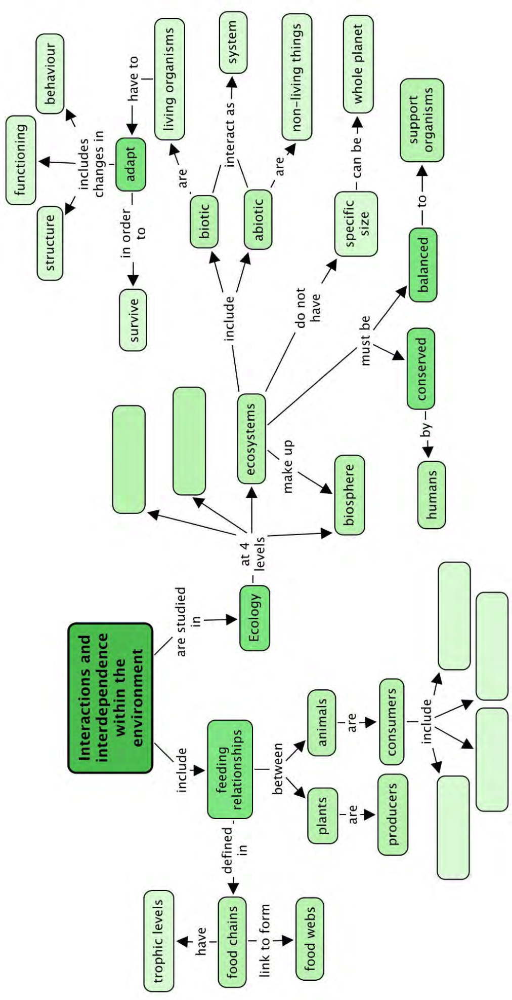
> **[Diagram Context - Textbook_NaturalScience_Gr8_Interactions-and-interdependence-within-the-environment.pdf-0052-00.png]**
> The image is a mind map that illustrates the concept of ecosystems. It is a visual representation of the relationships between different components of an ecosystem, such as producers, consumers, decomposers, and abiotic factors. The mind map is color-coded, with each color representing a different type of organism or component. The diagram is organized in a way that allows for easy understanding and interpretation of the

---

# Chapter 2. Interactions and interdependence within the environment

3. There are different levels of ecological organisation between an individual organism and the biosphere of the Earth. List and describe the levels in between the two mentioned here. [6 marks]

4. Discuss the different types of interaction that exists between species. [9 marks]

5. Explain what the different trophic levels represent in an ecosystem and why we can represent the levels as a pyramid with the bottom layer being the largest. [8 marks]

---

6. Evaluate this statement: *An insectivore is a carnivore.* [2 marks]

7. Identify the following in this food web. [7 marks]

---

## Chapter 2. Interactions and interdependence within the environment

a) Producers: _________________________________________________________________

b) Primary consumers: ________________________________________________________

c) Secondary consumers: ______________________________________________________

d) Scavengers: ______________________________________________________________

e) Decomposers: ____________________________________________________________

---

### Exercises

**8.** There are more zebra than cheetah in this balanced ecosystem. Explain why this is so. [3 marks]

______________________________________________________________________________

______________________________________________________________________________

______________________________________________________________________________

**9.** Describe the work of the producers in this ecosystem. [2 marks]

______________________________________________________________________________

______________________________________________________________________________

**10.** Based on this picture, evaluate how active the decomposers are in this environment. [2 marks]

______________________________________________________________________________

______________________________________________________________________________

**11.** What do you think would happen to this ecosystem if all the zebra got a disease and died? [2 marks]

______________________________________________________________________________

---
*Chapter 2. Interactions and interdependence within the environment* **81**

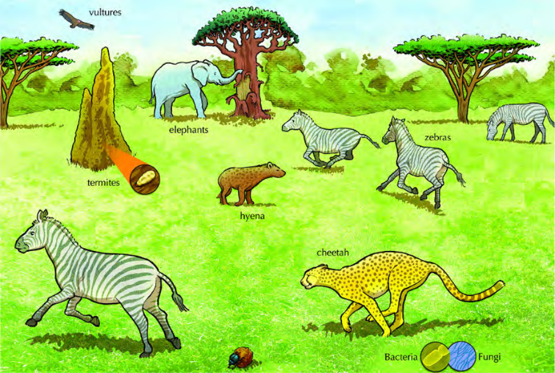
> **[Diagram Context - Textbook_NaturalScience_Gr8_Interactions-and-interdependence-within-the-environment.pdf-0055-03.png]**
> A colorful illustration of a zebra, elephant, cheetah, and leopard in a grassy field with a tree and a bird in the background. The diagram also includes labels for bacteria, fungi, and viruses.

---

12. What do you think would happen to this ecosystem in the short term and in the long term if a big fire came through and burned most of the grass and some of the trees? [2 marks]

13. The following food web shows the feeding relationships between organisms in another savanna ecosystem.

Use this food web to write down three food chains. [6 marks]

14. Describe how the different organisms in the table below are adapted to live in their specific environments. [$4 \times 3 \text{ marks} = 12 \text{ marks}$]

| Organism | Adaptations |
| :--- | :--- |
| <!-- DIAGRAM_PLACEHOLDER: diagram --> A leopard | |

---

# Chapter 2. Interactions and interdependence within the environment

## Organism Adaptations

| Organism | Adaptations |
| :--- | :--- |
| 

   A whale | |
| <!-- DIAG_PLACEHOLDER: diagram -->   A Venus Flytrap | |
| 

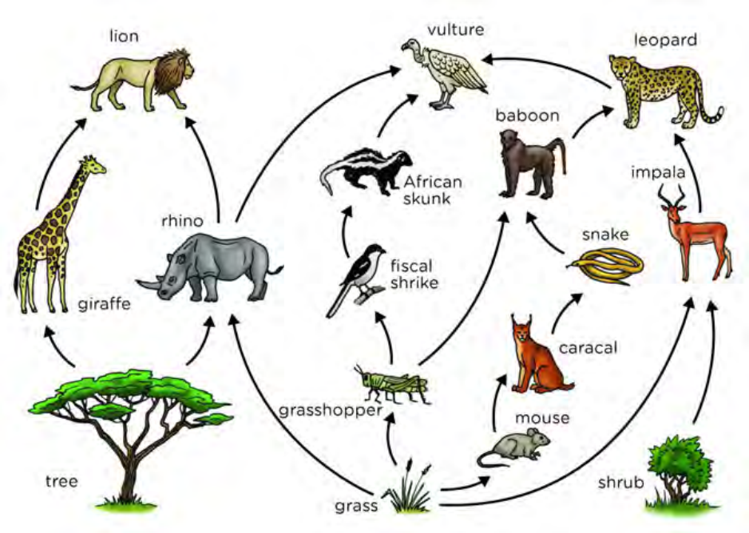
> **[Diagram Context - Textbook_NaturalScience_Gr8_Interactions-and-interdependence-within-the-environment.pdf-0057-03.png]**
> A diagram illustrating the relationships between different types of animals, including a giraffe, rhino, lion, leopard, vulture, African skunk, snake, mouse, grasshopper, and hedgehog.

   A dung beetle | |

---

15. Read this paragraph about the Quiver tree of the Kalahari and Namib desert.

*The Quiver tree lives in the Namib and Kalahari deserts, where the heat and lack of water makes it extremely difficult for plants to grow and survive. It stores its water inside green succulent leaves and bloated branches. The San used to hollow out the branches and use them for their quivers, which is where the tree gets its name from. The branches are covered with a white powder that reflects the heat and the leaves have very few pores to minimise water loss through evaporation. During extremely harsh weather conditions, the tree can amputate (remove) its own branches and reduce the leaves to minimise water loss even further, then when the conditions improve, it sends out new shoots and grows a rich leafy top again.*

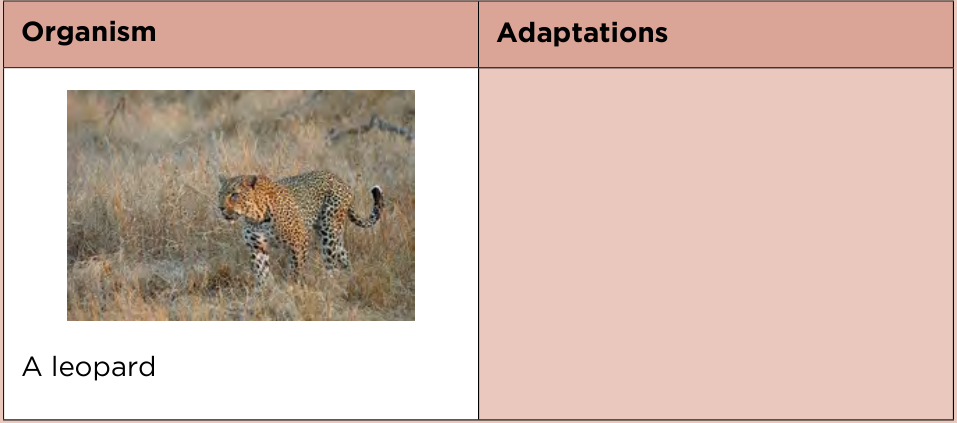
> **[Diagram Context - Textbook_NaturalScience_Gr8_Interactions-and-interdependence-within-the-environment.pdf-0057-06.png]**
> 1. A leopard is shown in the center of the image.
 2. The leopard is depicted in a pink and white color scheme.
 3. The leopard is shown in a standing position.

---

<!-- DIAGRAM_PLACEHolder: diagram -->

How is this species adapted to life in its habitat? [4 marks]

16. A group of poachers recently made the following statement when they were arrested: *"Why is it so important to conserve the biodiversity and the environment? Surely there are enough wild animals and plants that it doesn't matter if some of them die and become extinct?"* Write $3 - 4$ sentences to explain to them why we need to care about the biodiversity in our country. [6 marks]

Total [84 marks]

---

**Life and living** | **84**

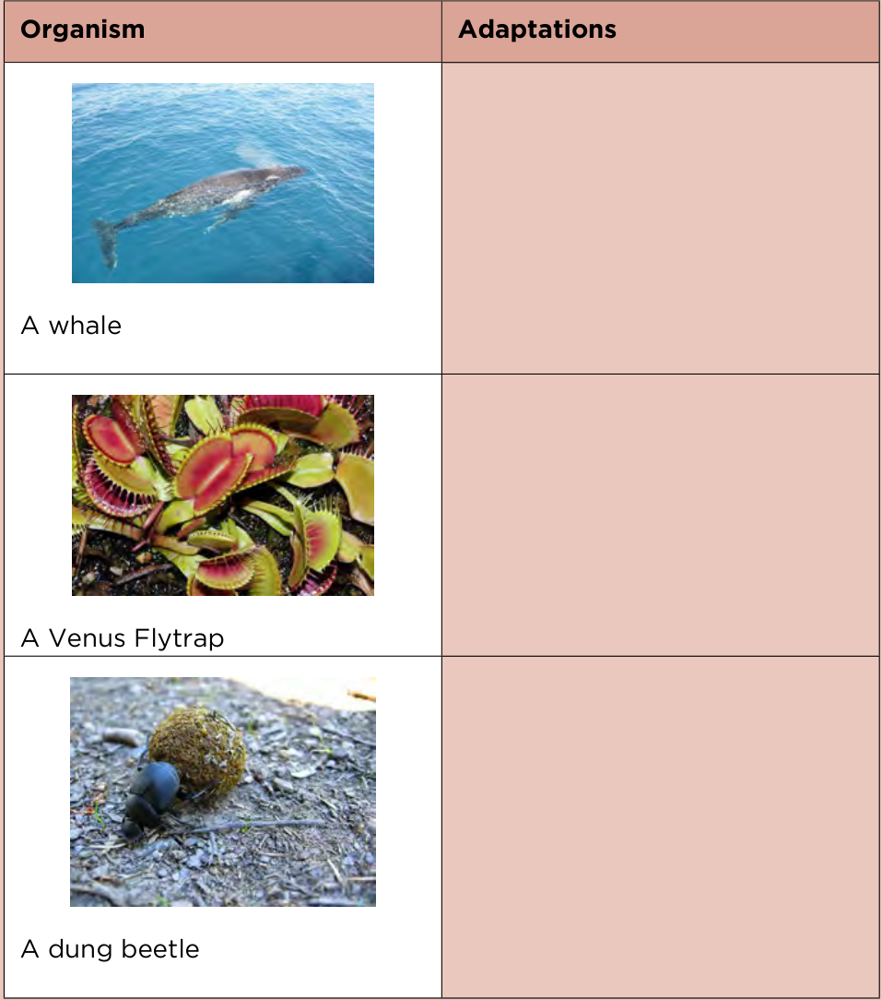
> **[Diagram Context - Textbook_NaturalScience_Gr8_Interactions-and-interdependence-within-the-environment.pdf-0058-01.png]**
> 1. A diagram of a venus flytrap.

---

# Chapter 2. Interactions and interdependence within the environment

## Think and Reflect

Curious? Use your imagination and show what this key can be.

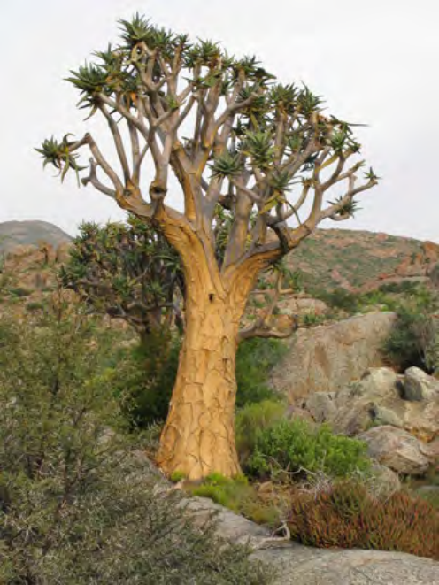
> **[Diagram Context - Textbook_NaturalScience_Gr8_Interactions-and-interdependence-within-the-environment.pdf-0059-01.png]**
> 1. A tree with a thick trunk and a large canopy of leaves.

> **[Diagram Context - Textbook_NaturalScience_Gr8_Interactions-and-interdependence-within-the-environment.pdf-0059-05.png]**
> The image shows a close-up view of a gray line with a red and white striped pattern. The line is composed of two distinct sections, with the top section being a darker shade of gray and the bottom section being a lighter shade of gray. The line is adorned with a red and white striped pattern, which is a visual representation of a zippered pocket. The image also contains a

---

# 10

## 2 Interactions and interdependence

### Chapter overview
**5 weeks**

Learners are introduced to the basic concepts of ecology and the four levels in which ecological interactions are grouped for research and studying purposes. This is made explicit in the text in this introductory section and learners are given short activities to allow for meaningful engagement with these concepts. Visit `slidesha.re/19dpf9k`. The slides contain an overview of the concepts introduced in this section.

### 2.1 What is ecology? (0.5 hours)

| Tasks | Skills | Recommendation |
| :--- | :--- | :--- |
| Activity: What is a population? | Identifying, observing, analysing, describing, writing | Optional |
| Activity: Check your understanding | Describing, writing, recalling | CAPS suggested |

### 2.2 Ecosystems (4 hours)

| Tasks | Skills | Recommendation |
| :--- | :--- | :--- |
| Activity: Abiotic components in a grassland ecosystem | Identifying, listing, describing, writing | CAPS suggested |
| Activity: Studying an ecosystem | Investigating, observing, taking measurements, describing, analysing, writing, working in groups | CAPS suggested |
| Activity: Identify the type of interaction between organisms | Identifying, writing | Optional |

### 2.3 Feeding relationships (2 hours)

| Tasks | Skills | Recommendation |
| :--- | :--- | :--- |
| Activity: Different types of consumers | Identifying, describing, writing | CAPS suggested |
| Activity: Different decomposers | Identifying, describing, writing | CAPS suggested |

### 2.4 Energy flow: food chains and food webs (3 hours)

| Tasks | Skills | Recommendation |
| :--- | :--- | :--- |
| Activity: Energy transfer in an ecosystem | Classifying, identifying, evaluating, describing, writing | CAPS suggested |
| Activity: Studying energy pyramids | Constructing, describing, writing | CAPS suggested |
| Activity: Identifying food chains and food webs | Identifying, describing, writing | CAPS suggested |

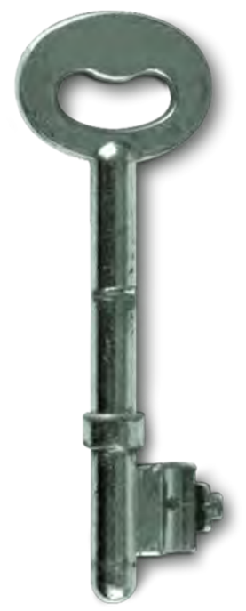
> **[Diagram Context - Textbook_NaturalScience_Gr8_Interactions-and-interdependence-within-the-environment.pdf-0060-01.png]**
> The image shows a close-up view of a key, which is a metallic object with a hole in the center. The key is silver in color and is positioned vertically, with the handle pointing downwards. The key is the main focus of the image, and there are no other objects or texts present. The key appears to be a standard key, designed for use in locks.

---

## 2.5 Balance in an ecosystem (2 hours)

| Tasks | Skills | Recommendation |
| :--- | :--- | :--- |
| Activity: The critically endangered Riverine Rabbit | Identifying, describing, writing | CAPS suggested |
| Activity: Assessing the impacts of a natural disaster | Describing, writing | CAPS suggested |
| Activity: Poaching in Southern Africa | Reading, interpreting, writing | CAPS suggested |
| Activity: Assess your impact on the environment | Identifying, interpreting, writing | Optional |

## 2.6 Adaptations (2 hours)

| Tasks | Skills | Recommendation |
| :--- | :--- | :--- |
| Activity: Distinguish between types of adaptations | Reading, identifying, describing, writing | Optional (CAPS suggested) |
| Activity: Why do animals migrate? | Identifying, describing, writing | Optional (CAPS suggested) |
| Activity: Living stones | Describing, writing, drawing, labelling | CAPS Suggested |

## 2.7 Conservation of the ecosystem (1.5 hours)

| Tasks | Skills | Recommendation |
| :--- | :--- | :--- |
| Activity: Why should we care? | Group work, research, public speaking, debating | CAPS suggested |
| Activity: Finding solutions to environmental problems | Writing, reflecting | CAPS suggested |
| Activity: Individuals who make a difference | Research, describing, writing | Optional (Extension) |

---

## Key questions

* What is ecology?
* We talk about the population of people in South Africa, but do other animals live in populations?
* What makes up an ecosystem? Are we part of an ecosystem?
* How are organisms linked by their feeding relationship to make food webs?
* Why do we need many more producers and fewer carnivores in a food web?
* How does an ecosystem remain balanced so that it can support all of the organisms that live there?
* We know that natural disasters can have a huge impact on ecosystems, but what are we as humans doing that upsets the fine balance in ecosystems?
* What does it mean if an organism is adapted to its environment?
* Why have some organisms become extinct?
* During the course of Earth's history, many organisms have become extinct, so what is different and worrying about the decreasing numbers of rhinos and elephants?
* How can we make a difference to conserve our own environments?

---

## 2.1 What is ecology?

Learners have already studied the biosphere in detail in Grade 7 and looked at the concept of an ecosystem in younger grades. We now put these different levels together in a hierarchical organisation representing the study of **ecology**.

The website link provided in the visit box for our 'Breathing Earth' provides a very interesting simulation of how the population of the Earth, and also individual countries, changes every second. If you have Internet access in your classroom and a projector, you could put this website up when you first introduce population and then leave it running during the lesson. At the end of the lesson, bring it up again to see how much the Earth's population has increased in just a short time such as your lesson.

---

### ACTIVITY: What is a population? (LB page 18 and 19)

Discuss this with your class first and get their opinions. They should note that all the animals in a population are the same species and they can interact as they live in a specific area.

<!-- DIAGRAM_PLACEHOLDER: diagram -->

**Figure Captions:**
* **Figure 2.1:** A population of hippos in the St Lucia estuary (river mouth) in KwaZulu-Natal.
* **Figure 2.2:** A population of zebra in Kruger National Park.
* **Figure 2.3:** A population of seals on Seal Island in False Bay.
* **Figure 2.4:** A population of penguins at Boulders Beach.

Learners may not know the answers to these questions as we have not yet given the definition of a population, but this is meant as a discussion and for them to come to the conclusion of what defines a population without stating the definition up front.

1. All the animals are of the same species in a population. They are of different ages, and there are males and females.
2. No, they are not from the same population. Individuals in a population all live in a specific area and they can interact and breed with each other. They are not able to interbreed if they live in different areas.
3. A population does not have a specific size. Rather, it is defined by the area that you are talking about and whether the individuals can interact.

---

4. A population consists of organisms that live in the same space and at the same time. Individuals in a population interact with each other and are able to interbreed. Since the seals lived at different times, they cannot be part of the same population.

5. The number of hippos in the population would decrease. They might not necessarily all die, but the numbers would decline. The decline may be due to some individuals of the population migrating to other areas. The population would decrease because the environment cannot support the hippos anymore as there is not enough water in their habitat. (We will look more at balance in an ecosystem later in the chapter.)

6. Some possible reasons include: there are perhaps fewer predators and so fewer of the zebras are being eaten. There might perhaps be an increase in the number of females that are born and so more are reproducing. There might be an increase in the amount of food available, perhaps other populations of herbivores have decreased or there might have been particularly rainy seasons so there is lots of food (green grass). Disease may have decreased so fewer animals are dying, or the amount of hunting or poaching by humans may have decreased.

Discuss this with your learners and see what they come up with. They have looked at feeding relationships and ecosystems in previous grades and so this also links back to what they have studied before and requires them to apply what they already know to new situations.

---

### Extension Question

**Question:** Another group of scientists wants to compare the population of penguins at Boulders Beach in Cape Town with another population in Antarctica. What are some aspects of each population that they could compare?

Discuss this with your learners. You can help them come to the answers by asking leading questions, such as, how would the scientists compare the habitats of the two populations? How would they compare how well the penguins are doing in each population?

**Answer:** Some aspects that they could compare between the populations are:
* Growth rate of the population
* The number of deaths and births in a given time frame
* What the penguins in each population eat
* What the natural enemies/predators of each population are
* Which other species do the populations of penguins interact with in their environment
* How many times per year do they reproduce
* Do they build shelters
* Is there any human impact on the penguins, etc.

*Note: This is a possible extension activity if you would like to do it with your learners. This has only been included in the Teachers Guide as many learners might not be familiar with an underwater environment.*

---

### Additional Notes & Examples

1. Different fish populations, turtles, seaweed, corals, sponges, plankton.
2. Some other examples include: crustaceans such as crabs or crayfish, jellyfish, octopus, other fish species, perhaps a reef shark.
3. It is a coral reef.
4. Some types of fish could eat other types of fish, the fish can eat the seaweed, the turtles eat the seaweed, the sponges filter the water for plankton.

---

## ACTIVITY: Check your understanding (LB page 20)

This can be done as a short revision task in class or as homework to check what learners understand so far, or you can ask learners the questions orally in class.

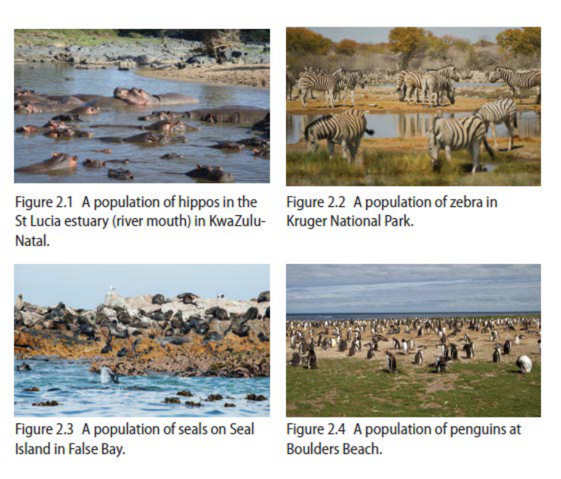
> **[Diagram Context - Textbook_NaturalScience_Gr8_Interactions-and-interdependence-within-the-environment.pdf-0063-05.png]**
> 1. Figure 2.1: A population of hippos in the St Lucia estuary.

---

## Revision Notes: Ecosystems and Environmental Science

---

### Core Concepts & Definitions

1. **Ecology:** The particular branch of science that studies how organisms interact with other organisms and their environment.
2. **Interaction:** The process of interacting or influencing each other within an environment.
3. **Organism:** An individual life form, either a plant, animal, fungus, protist, or bacterium.
4. **Population:** A group of organisms of the same species that live in the same area at a specific point in time and can interbreed with each other.
5. **Community:** All the populations of organisms that interact in a certain area.
6. **Ecosystem:** A system formed by the interactions between living things and the non-living things in their environment.
7. **Biosphere:** All the ecosystems on Earth combined.

---

### 2.2 Ecosystems

Scientists working in 'Green science' study the interactions between plants and their environment. 

---

### ACTIVITY: Abiotic Components in a Grassland Ecosystem

#### 1. Identification of Abiotic Factors
* Soil
* Rocks
* Water
* Wind / Air
* Sunlight / Temperature
* Clouds

#### Examples of Organism-Abiotic Interactions:
* **a)** The eagle uses the wind and air to soar and glide while hunting.
* **b)** Trees and grass are rooted in the soil so they remain stable and can absorb water, utilizing sunlight and carbon dioxide to make food.
* **c)** The mouse creates its home in the ground/dead sticks/grass, using the soil to store seeds, food, and hide from predators.
* **d)** Worms and insects live directly in the soil.

---

### Key Natural Cycles and Processes

#### 3. The Water Cycle
The water cycle operates through the following continuous phases:
1. **Evaporation:** Water in a pond or dam changes from a liquid to a gas (water vapour) due to heat energy.
2. **Condensation:** Water vapour cools and condenses to form clouds composed of fine water droplets.
3. **Precipitation:** Water droplets become heavy enough to fall back to the Earth as rain.
4. **Collection:** Runoff water flows down slopes and collects in lower regions such as ponds and dams.

#### 4. Factors Affecting Temperature in an Ecosystem
* **Time of Day:** Affects the angle and duration of sunlight, altering the heat energy received from the Sun.
* **Time of Year:** Seasonal changes affect the Earth's distance and tilt relative to the Sun.
* **Weather Conditions:** Presence of clouds, wind, or rain modifies temperature.
* **Topography / Direction:** The direction an area faces (aspect) and whether it is on a slope affects sunlight exposure and temperature.

#### 5. Influence of Topography on Water Flow
In a sloped grassland ecosystem (such as a hill sloping down toward a pond):
* Gravity causes precipitation to run down the slope.
* Water collects in the pond, providing a vital water reservoir to sustain the ecosystem.

---

### Gas Exchange in Ecosystems

* **Carbon Dioxide:** Released during respiration in plants and animals.
* **Oxygen:** Used by plants and animals during respiration.

---

# ACTIVITY: Studying an ecosystem (LB page 22)

## Overview & Project Guidelines
This activity may be given to learners as a project. Learners will mark off parts of an ecosystem and must ideally be able to return to it regularly. 

### Teacher Preparation
* **Site Selection:** Pre-visit the area and find a suitable area for marking off and studying, preferably near a stream or shore. Ensure that there is enough space for several classes to study the same area without damaging it.
* **Identification:** Identify organisms and find possible relationships between them.
* **Equipment Training:** Show learners before the visit how to use equipment correctly and how to keep records. If you have microscopes, teach them how to use these to study soil samples and small organisms.
* **Supervision:** During the visit, circulate and check on the groups of learners.

## Investigation & Measurements
* Explain the reasons for measuring different environmental conditions in the ecosystem, as many of the measurements will be new concepts and practices.
* Walk between groups during investigations to ensure they are applying newly learnt skills appropriately and taking accurate measurements.
* **Leaf Litter and Soil Samples:** May be studied in the field or in the class. If teachers have taught learners to use basic light microscopes, encourage them to study these with the use of a microscope too.
* **Optional Materials:** 
  * Rain gauge
  * Wire ring
  * Binoculars
  * Field guides

---

## Observations & Interactions (Learner-Dependent Answers)

* **Biotic and Abiotic Interactions:** 
  * If you can find moss or lichen, point out this interaction to learners, which shows how a plant grows on a rock (interaction between biotic and abiotic). 
  * Plants (biotic) interact with the soil (abiotic) when they draw mineral salts and water from the soil.
* **Animal Behaviour:** 
  * Perhaps there are ants building a nest – point out these interactions to learners.
  * Look out for any interactions between animals and with their abiotic environment and point these out to learners.
* **Temperature Tracking:** 
  * If you are able to take the temperature several times over the course of a day, use this information to plot a graph to show how the temperature changes over the course of the day.
* **Soil Types:** 
  * Learners might have learned about soil types in previous grades in *Earth and Beyond*. This acts as a revision of what they have learned.
* **Making a Rain Gauge:** 
  * You can easily make your own rain gauges by cutting the top off a $2$-litre plastic bottle and inverting the top half into the bottom half to form a funnel. 
  * Use a marker pen to write measurements on the side of the plastic bottle. 
  * Reference link: $\text{bit.ly/1cfqC8Q}$

---

## Activity Questions & Guidelines

1. **Habitat Description:** 
   Learners may describe the habitats/ecosystem as aquatic, terrestrial, or even a pond, grass, forest, etc.
2. **Water and Land Features:** 
   Learners should take note of the water resources in their square, the slope of the land, and the type of soil and how this affects the organisms.
3. **Feeding Relationships:** 
   Learners should take note of any feeding relationships that may exist. (This will be studied in more detail next).
4. **Human Impact:** 
   Perhaps there is litter which is blocking a stream, or animals can eat and choke on it. Perhaps there is a path that humans walk on, resulting in them trampling the plants so that nothing grows there. Learners could suggest putting some rubbish bins nearby, or perhaps mark off the area so that people have to walk around, etc.

---

5. Learner-dependent answer. Learners may observe that insects or other small animals scurried away from them when they approached their quadrant, or perhaps insects were drawn to the stakes and rope that was used to demarcate their area.

You may choose to use this practical activity for learners to submit a written account/report of their work and to present their findings to the class in the form of a powerpoint presentation. Possible areas to evaluate might include:
* Title and purpose
* Procedures followed by the group (as awarded from observations by the teacher)
* Comparative data similarities to other groups in the class that measured in similar areas
* Answer to the questions above
* Oral presentation of their research as presented in their powerpoint slideshow to the class. They could include the different activities that will be conducted throughout this chapter, such as their work on the different food chains and the food web that exists in their marked off ecosystem and work on conservation of their marked off ecosystem.

---

## 2.3 Feeding relationships

Learners should have learned about food chains and food webs in previous grades. Therefore, some of this content is revision, but the concepts have also been extended to make it more engaging at this level.

Plants need water from the soil, carbon dioxide from the air, and sunlight energy from the sun.

### ACTIVITY: Different types of consumers (LB page 26)

This activity is intended to build on previous knowledge of herbivores, omnivores and carnivores, and introduces concepts of insectivores and scavengers, which learners might have incidental knowledge of but might not have defined themselves. The activity requires that they engage with their existing knowledge and use this to define the terms. Teachers should walk between groups and ensure that they use scientific vocabulary as taught in this and previous sections as well as the New Word List, in their definitions.

1. **Herbivore:** An animal which feeds on plant material. Examples of herbivores are: elephant, duck, horse, buffalo, squirrel, grasshopper, rhino, zebra, cow, mouse, etc.
2. **Carnivore:** An animal which eats other animals (living or dead). Examples of carnivores are: lion, jackal, dolphin, crocodile, shark, leopard, mosquito, vulture, crab, seal, etc.
3. Buck, zebra, buffalo.
4. Vulture, jackal, crab.
5. The learners can research the eating habits of the chameleon, bat, praying mantis and swallow in groups, and report their findings to the rest of the class.
6. These animals all eat insects and other small invertebrates. They are called **insectivores**.
7. **Omnivore:** An animal which eats both plants and other animals. Examples are: pig, flamingo, mouse/rat.
8. Humans are omnivores.
9. An earthworm is a decomposer.
10. 
    * a) Learner-dependent answer.
    * b) Learner-dependent answer.
    * c) Learner-dependent answer.
    * d) Learner-dependent answer. They might have seen earthworms or fungi.

---

<!-- DIAGRAM_PLACEHOLDER: diagram -->

## ACTIVITY: Different decomposers (LB page 29)

1. They are mushrooms, so they are part of the Fungi kingdom.
2. The mushrooms are mostly growing on dead plant matter, such as dead tree logs and humus.
3. We can call them decomposers.
4. Decomposers break down the matter in dead organisms to release the nutrients, such as water and carbon, back into the ecosystem. These nutrients are therefore recycled and made available for other organisms to use. They also help to keep an ecosystem 'clean' as they make sure that dead and decaying material is not left lying around in an ecosystem for an extended period.

---

## 2.4 Energy flow: Food chains and food webs

## ACTIVITY: Energy transfer in an ecosystem (LB page 30)

1. It is called a food chain.
2. The grass.
3. Consumers are the grasshopper, the mouse and the owl.
4. The grasshopper is the herbivore, and the mouse and the owl are the carnivores.
5. The rat is an omnivore as it eats both plants and animals.
6. The arrows show the transfer of energy from one organism to the next. Yes, it does make a difference. The arrows show the direction in which the energy is transferred as one organism eats the other one, always from the producers to the consumers.
7. Learner-dependent answer. Learner's food chains must start with a green plant (producer), or part of a green plant, such as a fruit or wheat. Make sure they have used the arrows in the correct direction, and that they have three levels of consumers.
8. Learner-dependent answer. They could say that decomposers would come at the end of the food chain as they break down the bodies of the dead organisms. Or they are often put at the side, with many arrows from all levels of the food chain as they break down all the dead organisms at every level.

---

Encourage learners to write the levels into the diagram. The grasshopper is the primary consumer, the rat is the secondary consumer and the owl is the tertiary consumer.

---

## ACTIVITY: Studying energy pyramids (LB page 31)

1. The phytoplankton in the marine ecosystem and the trees in the savanna ecosystem.
2. The crustaceans in the marine ecosystem and the giraffe in the savanna ecosystem.
3. The organisms in each level use most of the energy ($90\%$) to sustain their own life processes (such as breathing, moving, reproducing etc). 

   *Note:* Therefore, only $10\%$ is available to the next level which feeds on them. Learners might need help with this question, so ask them leading questions such as, what do the organisms in each level need energy for?
4. Energy flow in an ecosystem is very inefficient and only $10\%$ of the energy from a trophic level is passed on to the next level. Therefore, to provide enough energy for the subsequent trophic levels, there needs to be many plants as primary producers.
5. There are $5$ in the marine and $3$ in the savanna ecosystem.
6. Since only $10\%$ of the energy produced by the consumers is passed on to the next level, the primary consumers need to eat a large amount of producers to get enough energy to live. In the same way, each level needs to be supported by a larger population that it feeds on as only $10\%$ of energy is passed on to each level.
7. Learner-dependent answer

---

## ACTIVITY: Identifying food chains and food webs (LB page 34)

1. A marine ecosystem.
2. There are several answers. Some examples include: 
   * phytoplankton $\rightarrow$ krill $\rightarrow$ fish $\rightarrow$ penguin $\rightarrow$ leopard seal
   * phytoplankton $\rightarrow$ zooplankton $\rightarrow$ fish $\rightarrow$ sea gull $\rightarrow$ leopard seal 
   * phytoplankton $\rightarrow$ krill $\rightarrow$ blue whale 
   * seaweed $\rightarrow$ crab $\rightarrow$ squid $\rightarrow$ penguin $\rightarrow$ leopard seal 
   * seaweed $\rightarrow$ crab $\rightarrow$ squid $\rightarrow$ elephant seal $\rightarrow$ killer whale. 
   
   *Note:* It shows how the different food chains are connected.
3. Phytoplankton and seaweed.
4. Krill, zooplankton and crab.
5. Killer whale and blue whale.

---

## 2.5 Balance in an ecosystem

Use this as an entry point into this section. The resources that organisms depend on are food, shelter and water. Ask learners questions such as, what would happen if there was a drought and all the grass died, or there was a fire that swept through and burned all the plants, or what happened if all the zebra got a disease and died? The ecosystem would become imbalanced in some way.

In Gr. 7 Life and Living, learners studied Biodiversity and Sexual Reproduction in Angiosperms, (including sections on pollination). If there is time, show learners this brief video about the mysterious disappearance of honeybees that has many people worried and alarmed! `bit.ly/147WFgZ` Afterwards, lead a class discussion in which you ask the learners what effect the loss of honey bees would have on the ecosystem.

---

*18*

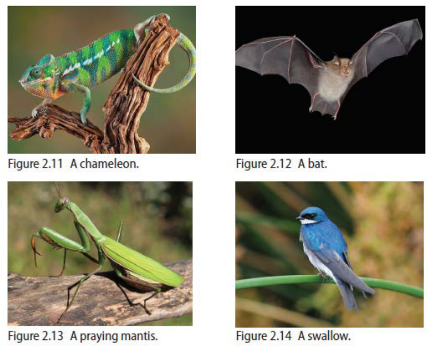
> **[Diagram Context - Textbook_NaturalScience_Gr8_Interactions-and-interdependence-within-the-environment.pdf-0068-00.png]**
> Figure 2.1: A praying mantse.

---

## ACTIVITY: The critically endangered Riverine Rabbit (LB page 35)

Teachers should if possible download the poster about the Riverine Rabbits and the information leaflet at bit.ly/16CawB4 to discuss in class.

* Habitat destruction is one of the main reasons, due to farming, fire and livestock (which may also cause erosion)
* Other animal species compete for their food.
* Floods kill their young and destroy their habitat.
* Natural predators kill them.
* They are killed in the road and by $4 \times 4$ vehicles in river beds.
* Hunters accidentally kill them, thinking they are eating crops.

---

## ACTIVITY: Assessing the impacts of a natural disaster (LB page 36)

1. Drought is water shortage, when there is no rain for a long time.
2. A famine is a scarcity of food when there is starvation.
3. Drought makes plants die, so animals that eat them also die. This decreases food for humans, as crops and farm animals die as well.
4. Hungry and malnourished animals and humans are too weak to fight off disease.
5. It is usually reversible, but ecosystems can take a very long time to recover from severe droughts.

*Note:* Perhaps discuss this with your learners before they write their answer down. Ecosystems are fairly robust and can cope with fluctuations in climate over the year. However, an imbalance results if the climate changes very suddenly or else changes and remains like that for a long period of time.

---

## ACTIVITY: Poaching in Southern Africa (LB page 37)

1. Any meat obtained from wild animals that were trapped / snared / poached, often illegally.
2. The San only took what they needed, their traps were well set and their numbers were small. Today's people set traps badly, so the wrong animals are killed and then often not eaten. There are also a lot more people doing it now.
3. Many people are poor and cannot afford to buy the more expensive meat in stores so rather buy much cheaper meat from illegal traders.
4. Learner-dependent answer. *Note:* Encourage learners to express their opinion about this and have a debate in class. Some will feel it's wrong to exclude people from traditional food sources, others feel it's more important to protect the animals and find other ways of helping people. Ask for suggestions to solve the problem: quotas / education programmes / help people to grow food or keep animals etc.
5. The illegal hunting of wild animals in areas for food or money.
6. When animals are poached, they are killed at a faster rate than their population can grow. They may become extinct.
7. The rhino is poached for its horn, elephants are poached for their tusks.
8. The natural predators of abalone have too little food so other species are eaten instead. This affects other populations too. *Note:* Local people who use Perlemoen as food for their families are also stopped from removing.

---

9. The secondary consumers that eat them will have less food, so they eat more of other animals, which also become endangered. Secondary consumers that eat only these worms may become extinct directly.

### ACTIVITY: Assess your impact on the environment (LB page 39)

1. You can also start this first part of the activity as a class discussion. Ask learners what types of water resources are polluted and how. What pollutes the air? Where does our waste from our homes go? Below are some points for the discussion.
   * **Land pollution:** In spite of recycling, much rubbish still goes to landfill sites, where chemicals seep into soil water and poison food chains.
   * **Water pollution:** Can be caused by car oil, people washing in rivers or using rivers as toilets. Some municipalities allow raw sewage into rivers / sea, others treat sewage first but still spill chemicals into rivers. Farmers spray crops to kill pests, but this also washes into rivers and damages ecosystems.
   * **Air pollution:** Comes from chemicals burnt by factories, coal stoves, car exhausts, insecticide sprays and burning old tyres, etc.
2. Learner-dependent answer.
3. Learner-dependent answer.
4. This links to the last section on conservation of ecosystems. Note: Some answers include that the first poster is trying to convince us to think twice before throwing something away. We should rather recycle it or think of how it can be reused. We can also buy things with the minimum packaging and reduce the number of plastic bags we use. The second poster is playing on the words of having a 'plan B'. In this case however, we have no plan B for planet Earth – there is no second Earth or any other planet that we can live on. We only have this planet and we need to look after it.

## 2.6 Adaptations

A very important note about this section is to point out the misconception that organisms adapt. This is incorrect as individual organisms do not adapt, it is the populations or species which adapt over time. Individual organisms have adaptations which make them better suited to their environment. The points in CAPS are a misconception and should be reworded as follows:

* Adaptation is the change in structural, functional and behavioural characteristics of organisms in a species. Adaptation usually takes place over many generations.
* Adaptation, over time, allows a species to survive in response to changing conditions in the environment.
* Species that are unable to adapt to changes within the environment die out (become extinct).

Be sure to make it clear that it is species or populations of organisms that adapt, and not individual organisms.

---

# ACTIVITY: Distinguish between types of adaptations (LB page 41)

1. 

| Question | Answer |
| :--- | :--- |
| How is the species adapted to life in its habitat? | Body adapted to dig and reach into nests to get prey; little hair as lives in hot climate; has shovel-like claws and powerful short limbs, long sticky tongue to pick up and eat the ants. |
| What type(s) of adaptation is this? | **Structural:** longer snout and tongue; thick skin to protect it from termite and ant bites; powerful limbs to dig in any soil **Behavioural:** nocturnal – hunts at night when cool; hides in tunnels from predators |

2. 

| Question | Answer |
| :--- | :--- |
| How is the species adapted to life in its habitat? | Body adapted with grooves and ridges to channel tiny droplets to the mouth; the hind legs are longer and stronger to keep the beetle in this position for a long time. |
| What type(s) of adaptation is this? | **Structural:** grooves on body form channels to mouth; strong hind legs **Behavioural:** nocturnal habits, it stands in the specific position all night while water droplets condense on its body |

3. 

| Question | Answer |
| :--- | :--- |
| How is the species adapted to life in its habitat? | Body colour pattern helps it to blend into surroundings; also lighter colouring can face the fiercest angles from the sun if no shade; can extract water from plants that it eats |
| What type(s) of adaptation is this? | **Structural:** body colouring **Functional:** extract all available water from plants it eats; does not lose much water or energy as it does not sweat **Behavioural:** seeks shade during hottest hours of the day; turns the lightest part of its body to the sun if no shade is available; can change eating patterns if normal diet of grass is not available |

4. 

| Question | Answer |
| :--- | :--- |
| How is the species adapted to life in its habitat? | Ostriches have a long toe and claw to fight predators and escape; eggs remain dormant until heat of breeding male and female's bodies starts their development. Male and female share nesting duties. Their bodies are specially camouflaged: male has black feathers to be camouflaged at night when it is on the nest; female has speckled dusty coloured feathers to be camouflaged during the day when she is on the nest. |

---

| What type(s) of adaptation is this? | **Structural:** strong toe and leg muscles help it to run fast; male beak turns red to signal female that it is ready to breed. **Behavioural:** male sits on nest at night and female on nest during day as they take turns to nest; ostriches eat pebbles to help digestion as they do not have teeth; female lays just enough eggs to cover with body |

5.

| How is it adapted to life in its habitat? | Body adapted to mimic leaf or stick; moves very slowly to seem like a branch or leaf moving; nocturnal to avoid being seen in daylight by predators; stick insects can reproduce without male insects |
| :--- | :--- |
| What type(s) of adaptation is this? | **Structural:** body structured to resemble leaf or stick **Behavioural:** nocturnal as it feeds under cover of darkness; moves slowly to not attract predators |

---

## ACTIVITY: Why do animals migrate? (LB page 43)

<!-- DIAGRAM_PLACEHOLDER: diagram -->

| Animals | Description | Reason to migrate |
| :--- | :--- | :--- |
| Wildebeest migrating in the Masai Mara. | Wildebeest migrate long distances each year which coincides with the pattern of rainfall and grass growth. | Find where the grass is growing and there are water sources |
| The sardine run as sardines migrate along the South African coastline. | The sardine run occurs along the African coast during May to July each year when billions of sardines migrate to the north east coast of South Africa. | There are actually many theories about why the sardine run occurs, and it is still poorly understood. The most likely reason is that it is a seasonal reproductive migration. |

The more exposure to sunlight, the higher the rate of photosynthesis. Encourage your learners to take notes when you discuss topics in class.

---

The slippery surface also helps prevent monkeys and other small animals from climbing up and eating its leaves and fruit!

The fruit bats come to feed on the flowers and the nectar and in turn they pollinate the baobab flowers.

## ACTIVITY: Living stones (LB page 44)

1. This is because they are plants, but they are camouflaged to look like stones or pebbles.
2. The Lithops plants are camouflaged to look like stones and blend in with their rocky soil that they grow in. The patterns look like different rocks/pebbles. They are therefore not usually seen by herbivores which might eat them. This adaptation protects them from being eaten.
3. Succulents are plants which are adapted to live in hot, arid environments and they have thickened, fleshy leaves and stems to store water.
4. The fact that the leaves are mostly underground helps the plant to conserve water because as little as possible is exposed to the hot environment so this reduces water loss. During drought, the leaves shrink even further underground to try to conserve water even more.
5. Most of the leaf and hence the green chlorophyll is located on the underneath side of the plant underground.
6. Learner-dependent answer
7. The upper part of the leaves acts as window and lets light through. As the interior of the leaves is transparent, the sunlight can travel through to the bottom parts of the leaves which are underground and contain the chlorophyll in order to photosynthesise. This allows the plant to have a coloured, patterned upper surface to camouflage it from herbivores, but still allows that sunlight to travel through for photosynthesis.

## 2.7 Conservation of the ecosystem

### ACTIVITY: Why should we care? (LB page 47)

This is an optional, extension activity.

Learner-dependent answer.

Below is some extra information on the types of individuals who are actively involved in conservation, if you wish to discuss this further with your learners:

* **Park rangers and conservationists** work to save the environment. Research scientists inform park managers about conservation and investigate how climate change affects populations.
* **Economists and scientists** are trying to work out the 'costs' of big cities on the environment and how to sustain healthy ecosystems so that we and all living things can enjoy the benefits of healthy food, clean water and air.
* **Other groups** remove alien plants or track down poachers, especially regarding cycad and rhino poaching, which is escalating. You can help!
* **Some people** run campaigns to raise awareness about different environmental concerns, for example the poaching of endangered animals, or the drive to recycle cans, paper, bottles and plastic. Get involved!
* **Climate change activists** inform the public about global warming and the damages we are causing to our world by deforestation and pollution.

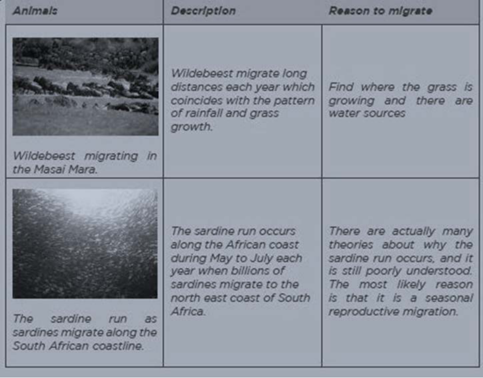
> **[Diagram Context - Textbook_NaturalScience_Gr8_Interactions-and-interdependence-within-the-environment.pdf-0073-02.png]**
> 1. A diagram of a cell with arrows pointing to different parts of the cell.

---

# Revision Notes

## ACTIVITY: Individuals who make a difference (LB page 47)

* **Activity Type:** Optional, extension activity or homework exercise.
* **Objective:** Create awareness about what other individuals have done.

### Teacher's Guide: Concept Maps vs. Mind Maps

| Feature | Concept Maps | Mind Maps |
| :--- | :--- | :--- |
| **Structure** | Hierarchical structure | Central topic with radiating branches |
| **Linkages** | Shows how concepts link together using arrows and linking words | Individual branches do not necessarily link together |
| **Purpose** | Ideal for showing directional progress and complex scientific relationships | Useful for summarizing general information and studying |

#### Key Ecological Levels
When studying ecology, learners should be guided through the 4 hierarchical levels:
1. Populations
2. Communities
3. Ecosystems
4. Biosphere

---

## Revision Questions & Answers

### Question 1: Matching Exercise
* $1 - C$
* $2 - F$
* $3 - A$
* $4 - B$
* $5 - H$
* $6 - G$
* $7 - I$
* $8 - E$
* $9 - D$

### Question 2: Abiotic vs. Biotic Factors
* **Abiotic factors:** Non-living elements in the environment that have never lived and will never live (e.g., gases, rocks, soil, water, temperature, and weather conditions).
* **Biotic factors:** Factors that have once lived or are living today (e.g., past and present plants and plant materials, animals, and microorganisms).

### Question 3: Population and Community
* **Population:** Individuals of the same species that live in the same space and time and breed with each other.
* **Community:** Different populations of different species within the same area at the same time.

### Question 4: Ecological Interactions
* **Competition:** When organisms from different species compete for the same limited resource.
* **Feeding relationships:** Different types of interactions between organisms in an ecosystem, including:
  * Herbivory
  * Predation
  * Scavenging
* **Symbiosis:** When two (or more) organisms' actions have a positive, negative, or neutral effect on other organisms from a different species. Key types of symbiotic relationships include:
  * Mutualism
  * Parasitism
  * Commensalism

### Question 5: Producers
* **Producers:** Organisms or plants that are able to produce their own energy from sunlight, water, and carbon dioxide, eliminating the need to consume other organisms for energy.

---

# Ecosystems and Trophic Levels

## Concepts & Definitions

* **Primary Consumers:** Organisms that need to consume plants in order to get energy.
* **Secondary Consumers:** Organisms that need to consume primary consumers to get energy.
* **Tertiary Consumers:** Organisms that consume secondary consumers to get energy.
* **Trophical Pyramid:** Trophic levels can be represented as a pyramid because there need to be more organisms in the bottom layer than in the layer above it. This is because only about $10\%$ of the energy in each trophic level is available to the next level, while the rest is used by the organisms for their own life processes.
* **Producers:** Organisms that capture energy from the sunlight and convert it to chemical potential energy in the form of glucose through the process of photosynthesis, placing energy into the ecosystem which animals cannot do.
* **Insectivores:** Animals that eat insects and small invertebrates, functioning as carnivores because they get their energy from eating other animals rather than plants.

---

## Review Questions and Answers

### 6. Insectivores as Carnivores
An insectivore eats insects and small invertebrates and is therefore a carnivore, as it eats other animals. The statement is correct because carnivores get their energy from eating other animals and not plants.

### 7. Categorization of Organisms
* a) **Producers:** trees, shrubs, grasses
* b) **Primary consumers:** zebra, elephant, termites
* c) **Secondary consumers:** cheetah, hyena
* d) **Scavengers:** vultures, hyenas
* e) **Decomposers:** bacteria, fungi

### 8. Energy Transfer and Population Balance
The zebra are primary consumers and use about $90\%$ of the energy that they get from the grass, transferring only about $10\%$ to the cheetah to consume. Therefore, there need to be more zebras than cheetahs to ensure that the cheetahs are supported in terms of food supply, and that they do not eat all the zebras, which would cause the zebra population to die out.

### 9. Role of Producers
The producers capture the energy from the sunlight and convert it to chemical potential energy in the form of glucose through the process of photosynthesis. In this way, they introduce energy into the ecosystem, a function animals cannot perform.

### 10. Efficiency of Decomposers
Learners should be able to identify the lack of dead animal carcasses and manure, which indicates that the decomposers are working efficiently.

### 11. Consequences of Ecosystem Disruption (Zebra Extinction)
If all the zebras died, the ecosystem would become unbalanced:
* **Carnivore Impact:** The cheetah would lose its food source and starve. The hyena would also face a depleted food source.
* **Scavengers and Insects:** There might be less dung available for the dung beetle to use to lay its eggs.
* **Plant Growth:** The grazing of the zebra affects the plants; if all zebras die out, grass growth will increase.

### 12. Short-Term vs. Long-Term Effects
* **Short Term:** Many animals would struggle as zebras and elephants experience a reduced food source (especially grass-eating zebras), leading to potential mortalities and affecting other predators and smaller organisms.
* **Long Term:** The imbalance is normally restored as the landscape recovers and plants start to grow again after the first rains.

### 13. Food Chains
Multiple food chains operate within this ecosystem.

---

## Organism Adaptations

| Organism | Adaptations |
| :--- | :--- |
| A leopard. | The leopard is camouflaged due to its colouring and spots. This helps it to hide away from prey so that it can get as close as possible before chasing. The leopard is adapted to run fast over short periods in order to catch its prey. It has a light, streamlined body with strong legs. It has a tail for balance to |

---

| Organism | Adaptation Details |
| :--- | :--- |
| **A whale.** | The whale is a mammal, so it does not have gills, but it can hold its breath for a long time underwater so that it can dive down and also catch prey/filter feed. It has a blowhole on top of its head for breathing. The blubber keeps it warm as it insulates it and also provides energy when diving and swimming in very cold seas. It has a strong tail, streamlined body and its forelimbs are flippers for swimming. |
| **A Venus Flytrap.** | This plant has adapted as it is carnivorous. It catches flies and has adapted to digest them. The red coloring inside the 'catchers' attracts the flies as it looks like meat. As soon as the flies land on the surface, the plant is triggered and the catchers clamp shut, catching the fly. The catchers are adapted with the spikes on the end to form a cage around the fly and keep it there while it is digested. The plant can also photosynthesize as it is green and contains chlorophyll. |
| **A dung beetle.** | A dung beetle has adapted to its environment by using the dung from other big herbivores as a food source and to lay their eggs. They have adapted by being able to collect the dung and roll it into balls so that they can transport it to where it is needed. This also creates a warm, safe chamber in which to lay their eggs, feed the young and protect them. The dung beetles have strong front legs so that they can do the rolling. Their back legs have fine control of the dung ball. |

15. The quiver tree has thick bloated branches and succulent leaves so that it can store water for the dry months. Its branches are covered in white powder to reflect heat away from the plant which helps to reduce water loss. The leaves have few pores to also minimise loss of water. The tree can amputate leaves and branches if water is scarce.

16. Learners need to display the following:
* Recognition of the importance of valuing each species and their specific niche in their ecosystem.
* Recognition that each species fills a specific place in the food chain and if one is removed it affects all the other species in that food chain / web / pyramid.
* Each organism needs to be protected in order to preserve the entire ecosystem.
* The importance of preserving our diversity to ecotourism and for future generations to enjoy (we have not INHERITED the earth from our parents, we are CUSTODIANS of the earth for our children!).