# Chapter 2: Particle Model of Matter

## Key Questions

As you work through this chapter, use these key questions to guide your learning and understanding:

* **What is the particle model of matter?**
* **How small are atoms and molecules?**
* **How does the particle model of matter describe solids, liquids, and gases?**
* **How does the particle model of matter help us understand the process of diffusion?**
* **How can materials be made to change their state?**
* **How does the particle model of matter help us to understand changes of state in materials, such as melting, evaporation, condensation, and freezing?**
* **How are density, mass, and volume related to each other?**
* **How do the densities of solids, liquids, and gases compare?**
* **Which aspects of the particles in a given material influence the density of that material?**
* **Why does oil float on water? Is this related to density?**
* **How can the particle model of matter help us to understand expansion and contraction?**
* **How does a gas exert pressure?**
* **Is the pressure a gas exerts related to the number of gas particles? If so, how?**
* **What happens to pressure when we change its volume and temperature?**

---

## Core Concepts & Introduction

### The Relationship Between Density, Mass, and Volume
One of the fundamental physical relationships in this chapter is how density, mass, and volume relate to one another. 

The density of a substance is defined as its mass per unit volume. Mathematically, this is expressed as:

$$\rho = \frac{m}{V}$$

Where:
* $\rho$ (rho) is the density of the material (typically measured in $\text{g/cm}^3$ or $\text{kg/m}^3$)
* $m$ is the mass of the material (measured in $\text{g}$ or $\text{kg}$)
* $V$ is the volume occupied by the material (measured in $\text{cm}^3$ or $\text{m}^3$)

---

## Class Activities & Revision Exercises

### Activity 1: Recalling the States of Matter
Can you remember learning that matter can exist in three different states? 

**Question:** What are the three states called?
* **Answer:** 
  1. \_\_\_\_\_\_\_\_\_\_\_\_\_\_\_\_\_\_\_\_\_\_\_\_\_\_\_\_\_\_\_\_\_\_\_\_\_\_\_\_\_\_\_\_\_\_\_
  2. \_\_\_\_\_\_\_\_\_\_\_\_\_\_\_\_\_\_\_\_\_\_\_\_\_\_\_\_\_\_\_\_\_\_\_\_\_\_\_\_\_\_\_\_\_\_\_
  3. \_\_\_\_\_\_\_\_\_\_\_\_\_\_\_\_\_\_\_\_\_\_\_\_\_\_\_\_\_\_\_\_\_\_\_\_\_\_\_\_\_\_\_\_\_\_\_

---

### Activity 2: Properties of the States of Matter
Can you remember the properties of the different states of matter? Discuss this in your class. Use your knowledge of the particle model to help you describe how particles behave in each state.

**Discussion Notes:**
Use the space below to write down key points and observations from your class discussion:

* \_\_\_\_\_\_\_\_\_\_\_\_\_\_\_\_\_\_\_\_\_\_\_\_\_\_\_\_\_\_\_\_\_\_\_\_\_\_\_\_\_\_\_\_\_\_\_\_\_\_\_\_\_\_\_\_\_\_\_\_\_\_\_\_\_\_\_\_\_\_\_\_\_
* \_\_\_\_\_\_\_\_\_\_\_\_\_\_\_\_\_\_\_\_\_\_\_\_\_\_\_\_\_\_\_\_\_\_\_\_\_\_\_\_\_\_\_\_\_\_\_\_\_\_\_\_\_\_\_\_\_\_\_\_\_\_\_\_\_\_\_\_\_\_\_\_\_
* \_\_\_\_\_\_\_\_\_\_\_\_\_\_\_\_\_\_\_\_\_\_\_\_\_\_\_\_\_\_\_\_\_\_\_\_\_\_\_\_\_\_\_\_\_\_\_\_\_\_\_\_\_\_\_\_\_\_\_\_\_\_\_\_\_\_\_\_\_\_\_\_\_
* \_\_\_\_\_\_\_\_\_\_\_\_\_\_\_\_\_\_\_\_\_\_\_\_\_\_\_\_\_\_\_\_\_\_\_\_\_\_\_\_\_\_\_\_\_\_\_\_\_\_\_\_\_\_\_\_\_\_\_\_\_\_\_\_\_\_\_\_\_\_\_\_\_
* \_\_\_\_\_\_\_\_\_\_\_\_\_\_\_\_\_\_\_\_\_\_\_\_\_\_\_\_\_\_\_\_\_\_\_\_\_\_\_\_\_\_\_\_\_\_\_\_\_\_\_\_\_\_\_\_\_\_\_\_\_\_\_\_\_\_\_\_\_\_\_\_\_

---

# Chapter 2: Particle model of matter


> **[Diagram Context - Textbook_NaturalScience_Gr8_Atoms.pdf-0001-01.png]**
> 1. A diagram of a cell with blue and white lines.


*Each state of matter behaves differently and the particles in each state behave differently. This diagram compares the particles in a gas, a liquid and a solid.*

---

### New Words
* **scientific theory**
* **phenomenon**
* **disordered**
* **uniform**
* **random**
* **reverse**
* **controlled experiment**


> **[Diagram Context - Textbook_NaturalScience_Gr8_Atoms.pdf-0001-02.png]**
> 1. A cartoon character with a backpack and a skateboard.


---

In this chapter we are going to review what we know about solids, liquids and gases. We are going to learn about a scientific model that can be used to describe how the particles in all three states behave. This model is called the particle model of matter and it will help us understand much more about the properties of solids, liquids and gases. Let's get started!

---

## 2.1 What is the particle model of matter?

In the previous chapter we learnt that scientists use models when they want to describe things that are difficult to understand. We discussed a model of the atom that helped us to imagine what atoms look like.


> **[Diagram Context - Textbook_NaturalScience_Gr8_Microorganisms.pdf-0001-02.png]**
> 1. A diagram of a cell with blue and white lines.


*This model of the atom shows us where the different sub-atomic particles can be found. The sub-atomic particles shown here are the proton, neutron and electron.*

Theories are similar to models. They explain scientific **phenomena** (things and events that can be described and explained in scientific terms) using pictures and words.

---
**Page 153**


> **[Diagram Context - Textbook_NaturalScience_Gr8_Microorganisms.pdf-0001-20.png]**
> The image shows a purple and blue gas cylinder with a blue flame inside, and a purple and blue glass flask with a blue bubble inside. The image also includes a cartoon depiction of a cell with a purple and blue flame inside. The image is labeled with the words "Lewis diagram", "anatomical/cellular structure", "circuit", "graph", "evolutionary tree",


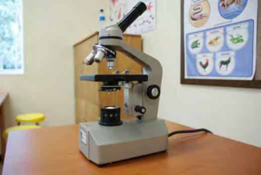
> **[Diagram Context - Textbook_NaturalScience_Gr8_Microorganisms.pdf-0001-21.png]**
> 1. A silver microscope with a black lens and a black light.


> **[Diagram Context - Textbook_NaturalScience_Gr8_Microorganisms.pdf-0001-28.png]**
> 1. A diagram of a cell with arrows pointing to different parts of the cell.


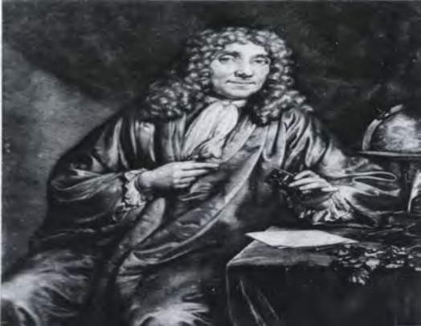
> **[Diagram Context - Textbook_NaturalScience_Gr8_Microorganisms.pdf-0001-29.png]**
> 1. A black and white image of a man sitting at a table.
2. The man is wearing a robe and a white collar.
3. The man is holding a book and a globe.


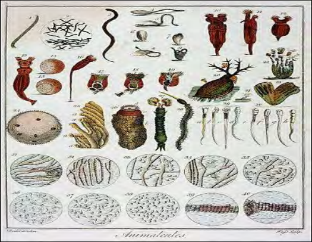
> **[Diagram Context - Textbook_NaturalScience_Gr8_Microorganisms.pdf-0001-31.png]**
> 1. An illustration of a cell with a diagram of a cell and a diagram of a cell with a diagram of a cell and a diagram of a cell with a diagram of a cell and a diagram of a cell with a diagram of a cell and a diagram of a cell with a diagram of a cell and a diagram of a cell with a diagram of a cell and a diagram of a cell


> **[Diagram Context - Textbook_NaturalScience_Gr8_Particle-model-of-matter.pdf-0001-02.png]**
> The image shows a line drawing of a cell with blue and white lines. The drawing is set against a gray background, and the lines are arranged in a zigzag pattern. The diagram is labeled with the word "cell" and "biology" at the top, and the word "biology" is also present in the bottom right corner. The diagram is accompanied by a caption that reads "


> **[Diagram Context - Textbook_NaturalScience_Gr8_Particle-model-of-matter.pdf-0001-03.png]**
> 1. A cartoon illustration of a key and a dinosaur.


---

# Matter and Materials

## What does the particle model of matter teach us?

The particle model describes matter in a very specific way. It describes four important aspects of matter:

* **All matter is made up of particles** that are incredibly small - much too small to see with the naked eye. The particles can be atoms or combinations of atoms that are bonded.
* **There are forces** between the particles.
* **The particles in matter are always moving.** The more energy they have, the faster they move.
* **The spaces between the particles in matter are empty.** You might assume that the spaces between particles are filled with air, but this is not the case. They contain nothing at all (a vacuum).

---

### 💡 TAKE NOTE
If you need to, turn back to chapter 1 to revise the terms **atom**, **element**, **compound** and **molecule** and how they relate.

---

## Why is the particle model of matter so useful?

The particle model of matter is one of the most useful scientific models because it describes matter in all three states (solid, liquid, and gas). Understanding how the particles of matter behave is vital if we hope to understand science!

The model also helps us to understand what happens to the particles when matter changes from one state to another.

The following diagram shows different changes of state, as well as which processes are the **reverse** of each other. Melting and freezing are the reverse processes of each other and so are evaporation (boiling) and condensation.


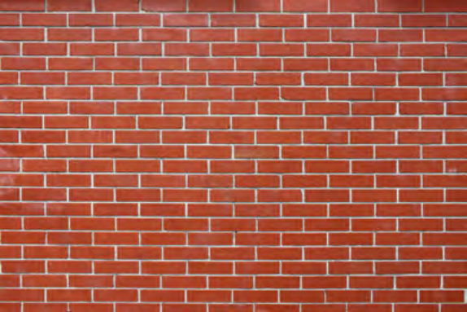
> **[Diagram Context - Textbook_NaturalScience_Gr8_Atoms.pdf-0002-00.png]**
> 1. A red brick wall with white bricks.


*Figure: The change of states*

---

### 🔍 DID YOU KNOW?
Under special circumstances, a solid can change directly into a gas without melting first. This process is known as **sublimation** and its reverse (when a gas changes directly into a solid without condensing first) is called **deposition**.

---

_Page 154_

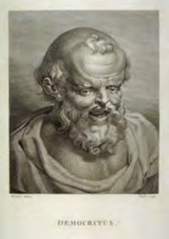
> **[Diagram Context - Textbook_NaturalScience_Gr8_Atoms.pdf-0002-05.png]**
> The image is a black and white portrait of a man, possibly a Greek, with a beard and mustache. The man is wearing a robe and has a bald head. The portrait is in a black and white style, which gives it a classic and timeless appearance. The man's facial features are clearly visible, and the portrait is labeled "Democritus" at the bottom.


> **[Diagram Context - Textbook_NaturalScience_Gr8_Atoms.pdf-0002-15.png]**
> The image features a cartoon depiction of a man's head, with a large red apple placed on top of it. The man's face is drawn in a cartoon style, and he has a large thought bubble above his head, with a line of pink dots representing the connections between his thoughts. The man's name is written in the bottom right corner of the image, and the text "Mr.


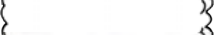


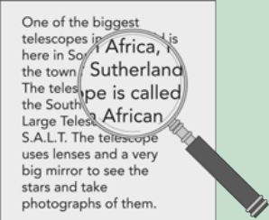
> **[Diagram Context - Textbook_NaturalScience_Gr8_Microorganisms.pdf-0002-01.png]**
> 1. Africa, Southland, S.A.T.T.A.T.E.N.A.T.E.N.A.T.E.N.A.T.E.N.A.T.E.N.A.T.E.N.A.T.E.N.A.T.E.N.


> **[Diagram Context - Textbook_NaturalScience_Gr8_Microorganisms.pdf-0002-08.png]**
> The image is a cartoon drawing of a green caterpillar with a wire spring on its head. The caterpillar is surrounded by green leaves and a wire spring. The drawing is labeled with the word "Caterpillar" and "Spring" in the top left corner and "Caterpillar" and "Leaf" in the bottom right corner. The drawing also includes a Lewis diagram and a


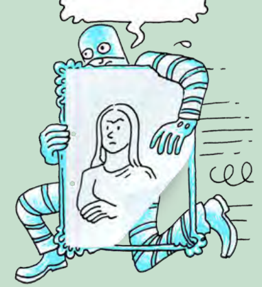
> **[Diagram Context - Textbook_NaturalScience_Gr8_Microorganisms.pdf-0002-20.png]**
> 1. A cartoon drawing of a man holding a picture of a woman.


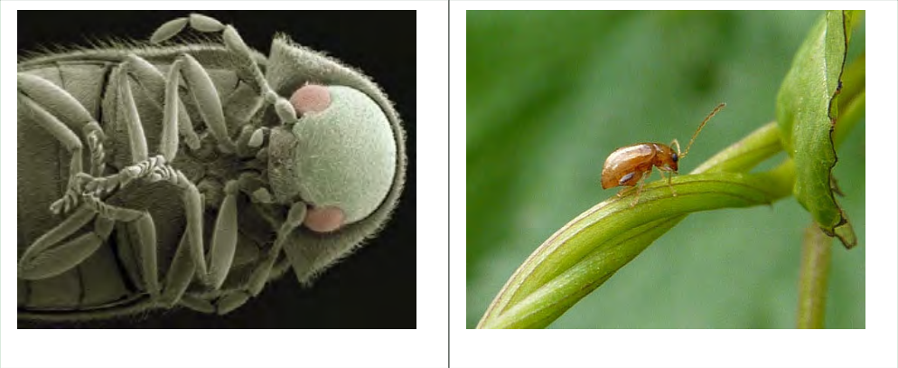
> **[Diagram Context - Textbook_NaturalScience_Gr8_Microorganisms.pdf-0002-21.png]**
> 1. A close-up of a beetle on a leaf.


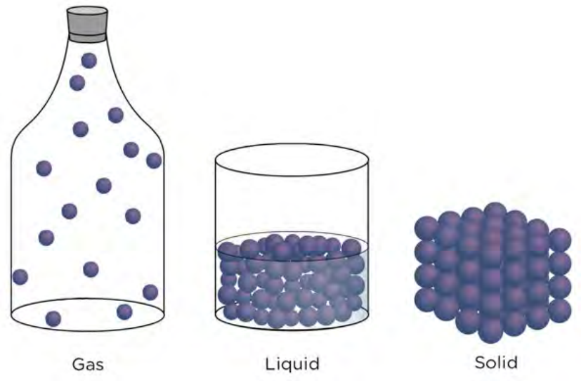
> **[Diagram Context - Textbook_NaturalScience_Gr8_Particle-model-of-matter.pdf-0002-00.png]**
> The image presents a diagram illustrating the different states of matter, specifically the states of liquids and solids. The diagram is divided into three sections, each representing a different state of matter. The first section shows a small glass jar filled with blue balls, representing a liquid. The second section depicts a small glass jar filled with purple balls, representing a solid. The third section shows a large glass jar


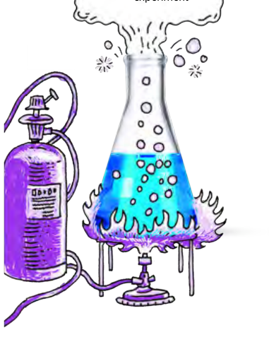
> **[Diagram Context - Textbook_NaturalScience_Gr8_Particle-model-of-matter.pdf-0002-06.png]**
> 1. A purple and blue gas cylinder with a purple nozzle.


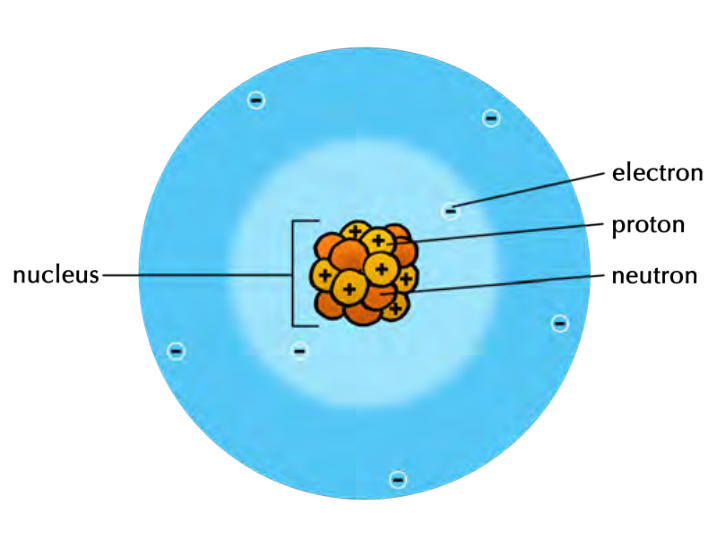
> **[Diagram Context - Textbook_NaturalScience_Gr8_Particle-model-of-matter.pdf-0002-08.png]**
> 1. A diagram of an atom with a blue background and orange protons and neutrons.


---

# ACTIVITY: Changes of state revision


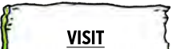
> **[Diagram Context - Textbook_NaturalScience_Gr8_Atoms.pdf-0003-00.png]**
> The image shows a cartoon-like illustration of a white square with the word "VISIT" written in black at the bottom. The square is set against a gray background, and the word "VISIT" is positioned at the bottom right corner. The image does not contain any text or additional objects.


### INSTRUCTIONS:

1. Refer to the previous diagram.
2. Check that you remember some of the concepts you learnt about in previous grades by going through these quick questions.

### QUESTIONS:

1. What is the name of the process when a solid turns into a liquid?
   
   $$\text{\_\_\_\_\_\_\_\_\_\_\_\_\_\_\_\_\_\_\_\_\_\_\_\_\_\_\_\_\_\_\_\_\_\_\_\_\_\_\_\_\_\_\_\_\_\_\_\_\_\_\_\_\_\_\_\_\_\_\_\_\_\_\_\_\_\_\_\_\_\_\_\_\_\_\_\_\_\_\_\_}$$

2. What is the reverse process to melting?
   
   $$\text{\_\_\_\_\_\_\_\_\_\_\_\_\_\_\_\_\_\_\_\_\_\_\_\_\_\_\_\_\_\_\_\_\_\_\_\_\_\_\_\_\_\_\_\_\_\_\_\_\_\_\_\_\_\_\_\_\_\_\_\_\_\_\_\_\_\_\_\_\_\_\_\_\_\_\_\_\_\_\_\_}$$

3. What can we do to make ice melt quickly?
   
   $$\text{\_\_\_\_\_\_\_\_\_\_\_\_\_\_\_\_\_\_\_\_\_\_\_\_\_\_\_\_\_\_\_\_\_\_\_\_\_\_\_\_\_\_\_\_\_\_\_\_\_\_\_\_\_\_\_\_\_\_\_\_\_\_\_\_\_\_\_\_\_\_\_\_\_\_\_\_\_\_\_\_}$$

4. Explain the steps that a solid must go through to become a gas.
   
   $$\text{\_\_\_\_\_\_\_\_\_\_\_\_\_\_\_\_\_\_\_\_\_\_\_\_\_\_\_\_\_\_\_\_\_\_\_\_\_\_\_\_\_\_\_\_\_\_\_\_\_\_\_\_\_\_\_\_\_\_\_\_\_\_\_\_\_\_\_\_\_\_\_\_\_\_\_\_\_\_\_\_}$$

5. What is the reverse process of evaporation?
   
   $$\text{\_\_\_\_\_\_\_\_\_\_\_\_\_\_\_\_\_\_\_\_\_\_\_\_\_\_\_\_\_\_\_\_\_\_\_\_\_\_\_\_\_\_\_\_\_\_\_\_\_\_\_\_\_\_\_\_\_\_\_\_\_\_\_\_\_\_\_\_\_\_\_\_\_\_\_\_\_\_\_\_}$$

6. When we heat something, are we adding energy to it, or taking energy away?
   
   $$\text{\_\_\_\_\_\_\_\_\_\_\_\_\_\_\_\_\_\_\_\_\_\_\_\_\_\_\_\_\_\_\_\_\_\_\_\_\_\_\_\_\_\_\_\_\_\_\_\_\_\_\_\_\_\_\_\_\_\_\_\_\_\_\_\_\_\_\_\_\_\_\_\_\_\_\_\_\_\_\_\_}$$

7. How do you think the particles in a substance behave when we give them more energy?
   
   $$\text{\_\_\_\_\_\_\_\_\_\_\_\_\_\_\_\_\_\_\_\_\_\_\_\_\_\_\_\_\_\_\_\_\_\_\_\_\_\_\_\_\_\_\_\_\_\_\_\_\_\_\_\_\_\_\_\_\_\_\_\_\_\_\_\_\_\_\_\_\_\_\_\_\_\_\_\_\_\_\_\_}$$

---

We will use the model to look at each of these changes more closely. But first, we will look at how the model describes each state of matter.

---
**Chapter 2. Particle model of matter** | **155**

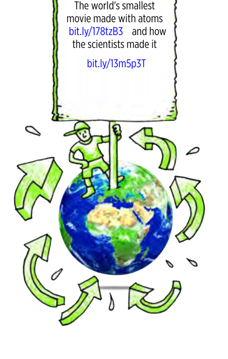
> **[Diagram Context - Textbook_NaturalScience_Gr8_Atoms.pdf-0003-01.png]**
> The image is a cartoon depiction of a boy standing on a pole, holding a sign that says "The world's smallest movie made with atoms". The boy is wearing a hat and is surrounded by various arrows and symbols, including a globe, a Lewis structure, and a periodic table. The cartoon is accompanied by a caption that provides information about the content.


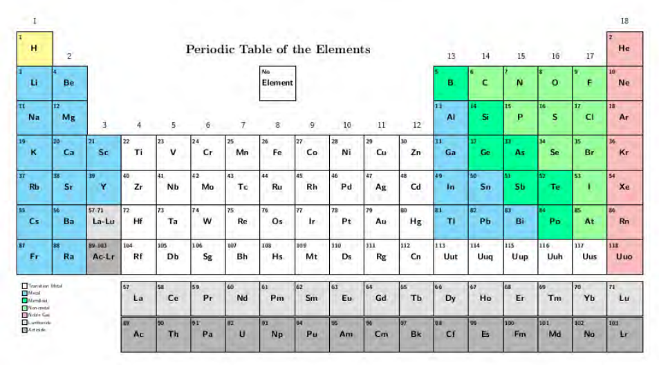
> **[Diagram Context - Textbook_NaturalScience_Gr8_Atoms.pdf-0003-05.png]**
> The image presents a Periodic Table of the Elements, a fundamental tool in the study of chemistry. The table is divided into rows and columns, each representing an element. The elements are organized in a way that allows for easy identification and comparison of their properties. The table is color-coded, with each element having a distinct color, making it visually appealing and easy to understand. The table is


> **[Diagram Context - Textbook_NaturalScience_Gr8_Atoms.pdf-0003-07.png]**
> 1. A diagram of a spring with a green background and a green staircase.


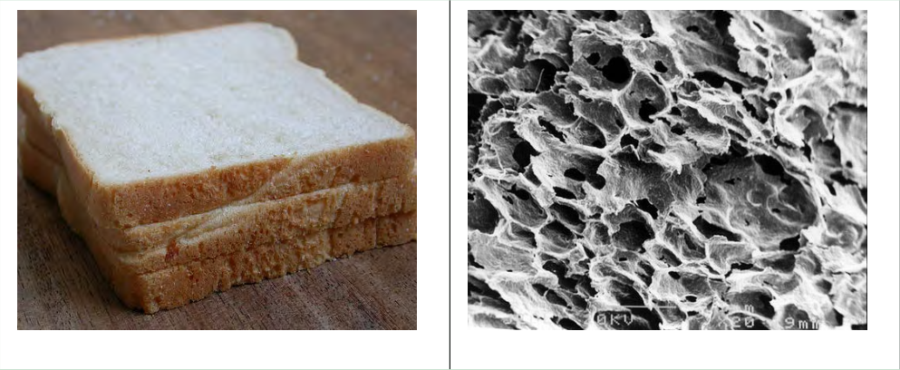
> **[Diagram Context - Textbook_NaturalScience_Gr8_Microorganisms.pdf-0003-02.png]**
> 1. A close up of a piece of bread with a slice cut out of it.


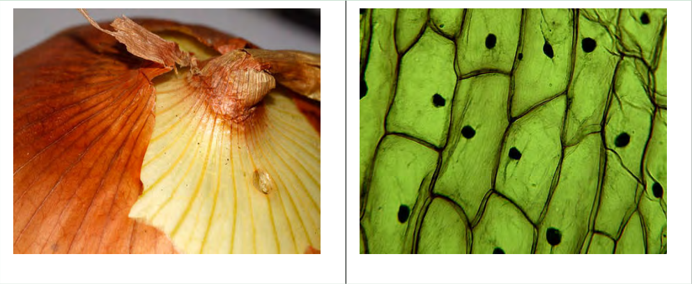
> **[Diagram Context - Textbook_NaturalScience_Gr8_Microorganisms.pdf-0003-04.png]**
> 1. A close-up of an onion with a yellow center and brown stem.


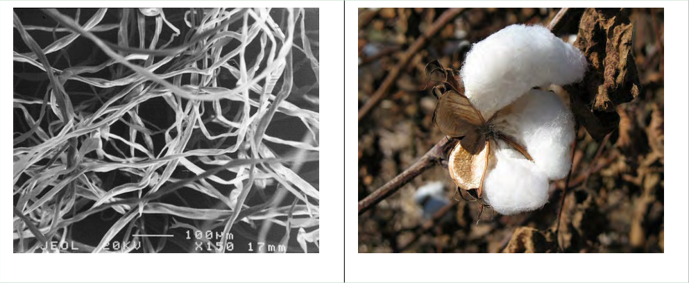
> **[Diagram Context - Textbook_NaturalScience_Gr8_Microorganisms.pdf-0003-06.png]**
> 1. A black and white image of a cotton plant with a white flower and a brown stem.


> **[Diagram Context - Textbook_NaturalScience_Gr8_Microorganisms.pdf-0003-07.png]**
> 1. A diagram of a cell with a green line representing the cell wall.


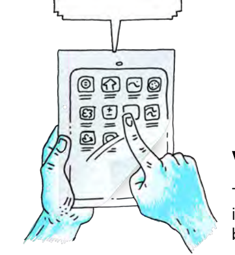
> **[Diagram Context - Textbook_NaturalScience_Gr8_Particle-model-of-matter.pdf-0003-07.png]**
> 1. A hand holding a tablet computer.
 2. The tablet is open to a screen with a menu.
 3. The hand is holding the tablet in a horizontal position.


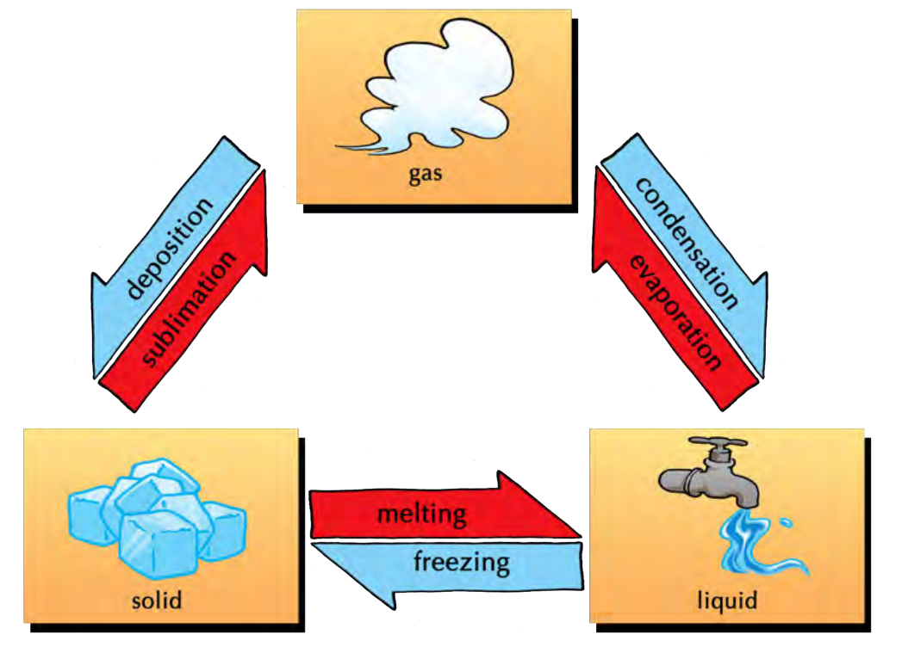
> **[Diagram Context - Textbook_NaturalScience_Gr8_Particle-model-of-matter.pdf-0003-15.png]**
> 1. A diagram of a water cycle with arrows pointing to the different stages of the cycle.


> **[Diagram Context - Textbook_NaturalScience_Gr8_Particle-model-of-matter.pdf-0003-16.png]**
> The image features a cartoon illustration of a man's head, with a red apple placed on top of it. The man's face is drawn in a cartoon style, and the apple is positioned on his forehead. The man is wearing a tie, and there are several apples scattered around him, suggesting a connection to the theme of apples. The image also includes a thought bubble with a cloud and a


---

# 2.2 Solids, liquids and gases

We can use the particle model to help us understand the behaviour of each of the states of matter. We are going to look at each state in turn.

There is one very important thing to remember when we consider the different states of matter. For any matter, the individual particles of that matter are exactly the same in all three states, solid, liquid and gas. It is the *behaviour* of the particles that changes in each state.

---

### New Words
* **compress**: to squeeze or press together into a smaller space.
* **collide**: to crash into each other.
* **diffuse**: to spread out or intermingle.
* **rate**: the speed at which something happens.
* **constant motion**: continuous movement without stopping.
* **observation**: the act of watching or noting something carefully to gain information.
* **forces of attraction**: the forces that pull particles together.
* **regular arrangement**: a systematic, repeating pattern of particles.
* **vibrate**: to move back and forth rapidly in a fixed position.

---

> ### Visit
> This video shows us the different ways that particles behave in the solid, liquid and gaseous states:
> [bit.ly/13mAd4o](http://bit.ly/13mAd4o)

---

## The solid state

Solids keep their shape and cannot be **compressed**. Let us see if the particle model can help us understand why solids behave in this way.

In a solid, the particles are packed close to each other in fixed positions. They are locked into place, and this explains why solids have a fixed shape. Look at the following images of sodium chloride (table salt). Do you remember the formula for sodium chloride? *(Hint: The chemical formula is $\text{NaCl}$)*.

| Macroscopic view of sodium chloride | Submicroscopic view of sodium chloride |
| :--- | :--- |
| 


 | 

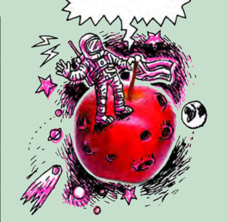
> **[Diagram Context - Textbook_NaturalScience_Gr8_Atoms.pdf-0004-06.png]**
> 1. A cartoon drawing of an astronaut on a red planet.
2. A red apple with a stick sticking out of it.
3. A planet with a white moon.

 |
| Table salt crystals are hard and have a fixed shape. | Can you see how the chloride atoms (purple) alternate with the sodium atoms (yellow) in a fixed arrangement? |

Take a good look at the picture of the particles in a solid (table salt) above. You will see that they are packed in a **regular arrangement**. There are very small spaces between the particles in a solid.

Particles are held together by **forces of attraction**. In solids, these forces are strong enough to hold the particles firmly in position.

Does that mean the particles in a solid do not move at all? No. The particles in a solid move a little bit. They **vibrate** in their fixed positions. The more energy the particles have, the faster and more strongly they vibrate.

Do you see how we have used the particle model of matter to explain the properties of solids that we can **observe**? For example, the fact that the particles in solids are closely packed and have strong forces between them explains why solids have a fixed shape and why you cannot compress them.


> **[Diagram Context - Textbook_NaturalScience_Gr8_Atoms.pdf-0004-07.png]**
> The image shows a line drawing of a snake, which is green and white. The snake is positioned on the left side of the image, stretching from the top to the bottom of the frame. The snake is depicted in a realistic style, with a clear outline and distinct details. The image does not contain any text or additional objects, and the snake is the sole focus of the image.


> **[Diagram Context - Textbook_NaturalScience_Gr8_Atoms.pdf-0004-14.png]**
> 1. A cartoon drawing of a man holding a picture of a woman.


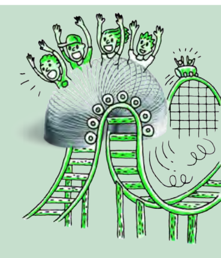
> **[Diagram Context - Textbook_NaturalScience_Gr8_Microorganisms.pdf-0004-06.png]**
> The image is a cartoon depiction of a roller coaster, with a group of people riding the roller coaster. The roller coaster is made of green metal and has a large loop at the top. The people on the roller coaster are holding onto a spring, which is coiled up and ready to launch them into the air. The diagram also includes a Lewis diagram and an anatomical/cellular structure,


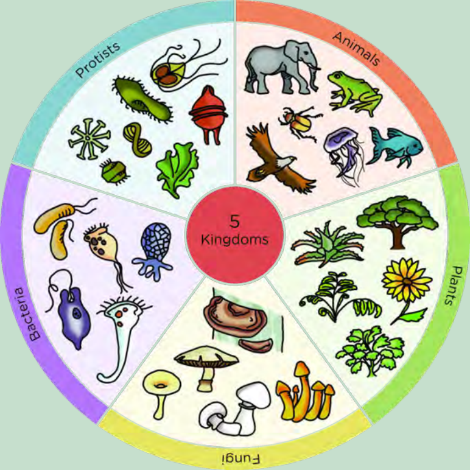
> **[Diagram Context - Textbook_NaturalScience_Gr8_Microorganisms.pdf-0004-07.png]**
> A colorful, illustrated diagram of five different types of organisms, including bacteria, viruses, plants, animals, and fungi, arranged in a circular fashion. The diagram is labeled with the names of the organisms and their respective categories, such as protists, bacteria, viruses, plants, animals, and fungi. The diagram also includes arrows pointing to the different types of organisms, indicating their relationships and connections


> **[Diagram Context - Textbook_NaturalScience_Gr8_Particle-model-of-matter.pdf-0004-06.png]**
> 1. A diagram of a roller coaster with a spring coiled on top.


> **[Diagram Context - Textbook_NaturalScience_Gr8_Particle-model-of-matter.pdf-0004-13.png]**
> This graphic illustrates the molecular structure of a double-stranded DNA molecule, represented by two intertwined, helical ribbons. It visually demonstrates the complementary base-pairing and antiparallel nature of the sugar-phosphate backbones that form the characteristic double helix structure essential for genetic information storage.


---

# The liquid state

An important characteristic of liquids is that they flow. They fill containers they are poured into. Liquids are also not very compressible. How can these properties be explained? 

In the liquid state, particles do not have fixed positions. They move about freely, but they stay close together because the forces of attraction between them are quite strong, but not as strong as in solids.

Have you noticed how a liquid always takes the shape of the container it is in? Within the liquid, the particles slip and slide past each other. This is why liquid flows. Their particles are free to move around, filling the spaces left by other particles. Look at the image of the juice being poured. Let's zoom in and have a look at what the particles are doing as the juice is poured.


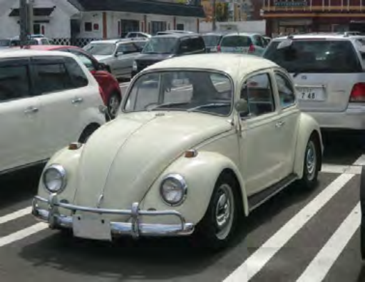
> **[Diagram Context - Textbook_NaturalScience_Gr8_Atoms.pdf-0005-00.png]**
> 1. A white car is parked in a parking lot.


The particles in a liquid have small spaces between them, but not as small as in solids. The particles in a liquid are loosely arranged which means they do not have a fixed shape like solids, but they rather take the shape of the container they are in.


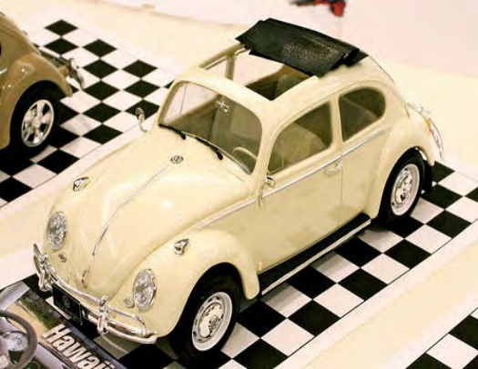
> **[Diagram Context - Textbook_NaturalScience_Gr8_Atoms.pdf-0005-01.png]**
> 1. A toy car with a checkered roof and a black roof rack.


### Particle Movement During Flow:
1. **This particle falls down due to gravity.**
2. **An opening is left.**
3. **The next particle can move into the opening leaving a new opening behind it.**

---

The speed at which the particles move around inside the liquid depends on the energy of the particles. When we heat a liquid, we are giving the particles more energy and speeding them up.

In gases, the particles move at even greater speeds.

---
**Chapter 2. Particle model of matter** | **157**

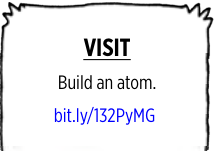
> **[Diagram Context - Textbook_NaturalScience_Gr8_Atoms.pdf-0005-02.png]**
> 1. A cartoon image of a cartoon character with a speech bubble that reads "Visit".


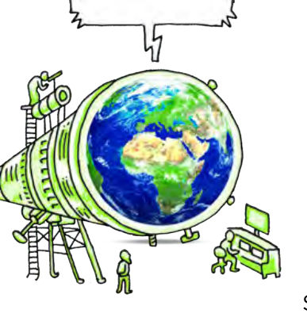
> **[Diagram Context - Textbook_NaturalScience_Gr8_Atoms.pdf-0005-03.png]**
> The image features a cartoon depiction of a group of people working on a telescope. The telescope is a large, green cylinder with a globe on its front. The globe is surrounded by a number of people, some of whom are standing and others are sitting. The people are engaged in various tasks, such as adjusting the telescope, looking at the globe, and observing the sky. The image also includes


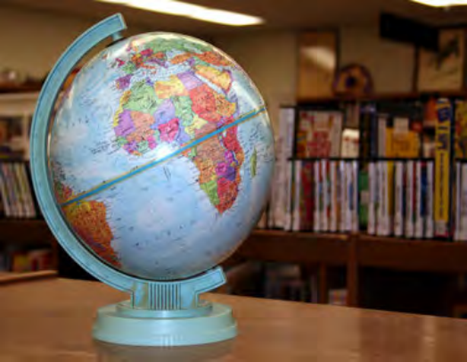
> **[Diagram Context - Textbook_NaturalScience_Gr8_Atoms.pdf-0005-09.png]**
> 1. A globe with a map of the world on it.


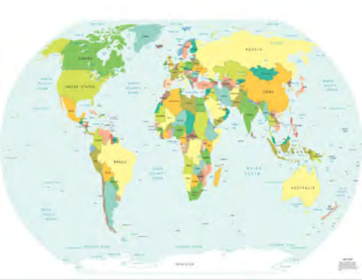
> **[Diagram Context - Textbook_NaturalScience_Gr8_Atoms.pdf-0005-10.png]**
> The image is a detailed world map that is colorfully labeled with the names of countries and regions. The map is presented in a clear and easy-to-read manner, making it a valuable educational resource for high school students. The map is designed to help students understand the geographical layout of the world and the relationships between different countries and regions. The map is not only visually appealing but also informative


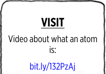
> **[Diagram Context - Textbook_NaturalScience_Gr8_Atoms.pdf-0005-11.png]**
> 1. A diagram of an atom.


> **[Diagram Context - Textbook_NaturalScience_Gr8_Atoms.pdf-0005-15.png]**
> The image features a cartoon depiction of a man holding a globe in his arms. The man is wearing a green shirt and has a green hat on his head. He is pointing to a specific area on the globe, which appears to be Africa. The man is standing against a white background, and there is a speech bubble above him that reads "You are a South African CAPS curriculum expert tutor


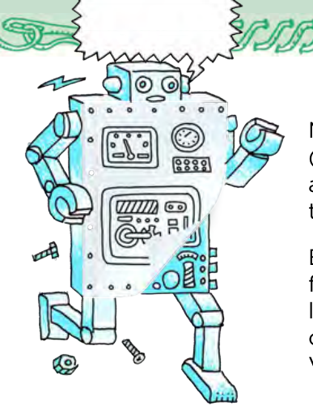
> **[Diagram Context - Textbook_NaturalScience_Gr8_Microorganisms.pdf-0005-04.png]**
> The image features a cartoon robot with a speech bubble above its head, suggesting that it is thinking or speaking. The robot is depicted in a blue and white color scheme, with a clock on its chest and a lightning bolt on its head. The robot is shown in a dynamic pose, running on its hind legs, and it is surrounded by various tools and equipment, including a wrench and a screw


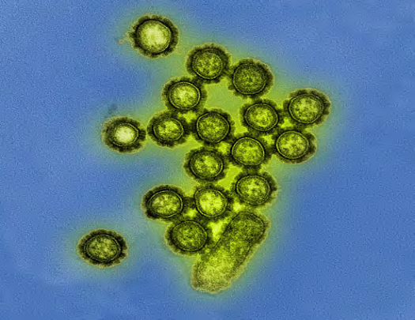
> **[Diagram Context - Textbook_NaturalScience_Gr8_Microorganisms.pdf-0005-07.png]**
> The image is a close-up of a Lewis diagram, which is a diagram used to represent the valence electrons of an atom. The diagram is filled with green spheres, each representing an electron, and the spheres are arranged in a way that shows the valence electrons of the atoms. The diagram is set against a blue background, which contrasts with the green spheres and makes them stand out.


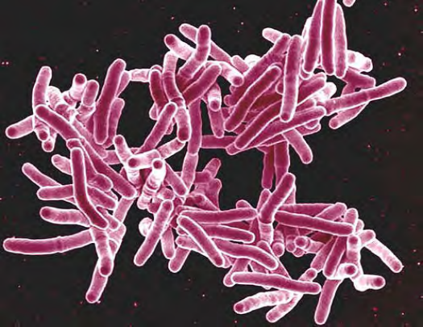
> **[Diagram Context - Textbook_NaturalScience_Gr8_Microorganisms.pdf-0005-08.png]**
> The image is a close-up of a Lewis diagram of a virus, which is pink in color. The diagram shows the virus's structure and the chemical bonds between its components. The diagram is labeled with the virus's name, "Poliovirus", and the chemical bonds between its components, such as "hydrophobic" and "hydrophilic". The diagram also includes arrows pointing to


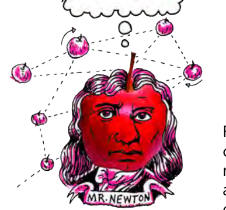
> **[Diagram Context - Textbook_NaturalScience_Gr8_Microorganisms.pdf-0005-11.png]**
> The image features a cartoon depiction of a man's head with a red apple on his forehead. The man's face is outlined in black, and the apple is outlined in pink. The man is wearing a black and white striped shirt, and there is a banner that reads "Mr. Newton" above his head. The image also includes a diagram of a Lewis structure, a cellular structure, and


> **[Diagram Context - Textbook_NaturalScience_Gr8_Microorganisms.pdf-0005-17.png]**
> The image features a cartoon illustration of a hot air balloon with a globe on top. The globe is depicted in a cartoon style with a green and blue color scheme. The balloon is filled with air and is being pulled by a string. The balloon is positioned in the center of the image, with the globe on top. The balloon is surrounded by clouds, and there are two people inside the balloon


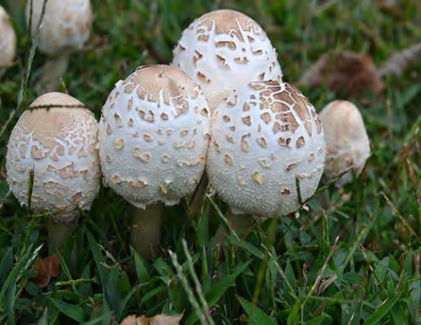
> **[Diagram Context - Textbook_NaturalScience_Gr8_Microorganisms.pdf-0005-18.png]**
> 1. A diagram of a mushroom with a brown cap and white spots.


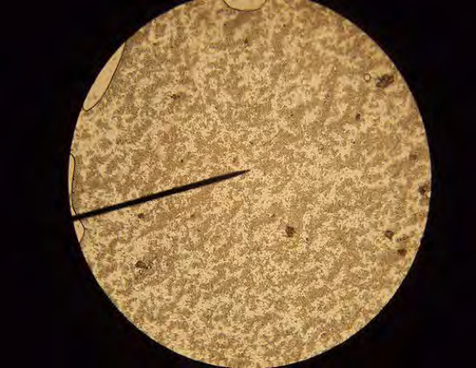
> **[Diagram Context - Textbook_NaturalScience_Gr8_Microorganisms.pdf-0005-20.png]**
> The image shows a close-up of a microscope slide with a thin, black, pointed needle on it. The slide is covered in a brown, speckled surface, and the needle is pointing towards the center of the slide. The slide appears to be a part of a larger microscope slide, as there is a larger, blurred image of a cell or tissue in the background. The image


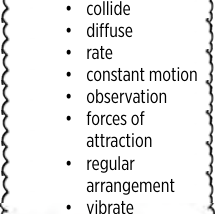
> **[Diagram Context - Textbook_NaturalScience_Gr8_Particle-model-of-matter.pdf-0005-03.png]**
> 1. A diagram of a cell with arrows pointing to different parts of the cell.


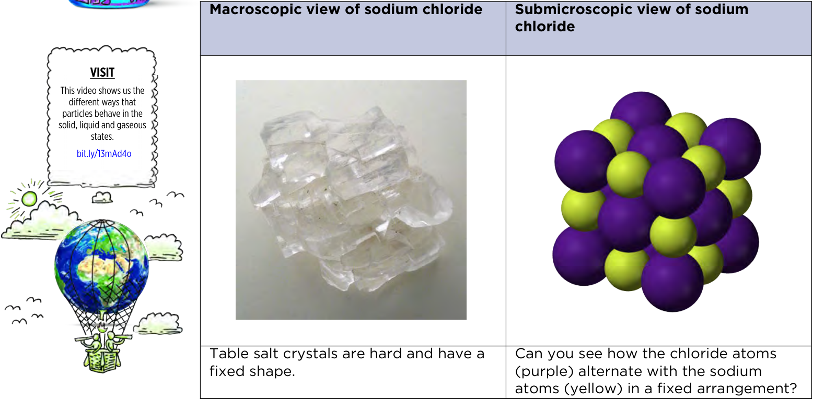
> **[Diagram Context - Textbook_NaturalScience_Gr8_Particle-model-of-matter.pdf-0005-09.png]**
> 1. A diagram of a crystal structure.


---

# Matter and Materials

## The gaseous state

Gases spread out quickly to fill all the space available to them. Think of when you blow up a balloon. The air that you blow into the balloon fills up the whole balloon. A gas will fill the entire space that is available to it. This is because the particles in a gas have no particular arrangement.

Gases do not have a fixed shape. Think about the balloon again: the gas fills the entire space inside the balloon. You can squeeze the balloon, changing the shape.


*Gases fill the space available to them.*


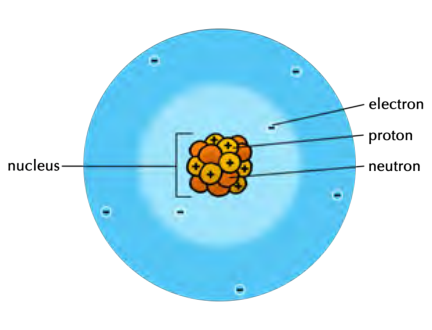
> **[Diagram Context - Textbook_NaturalScience_Gr8_Atoms.pdf-0006-12.png]**
> 1. A diagram of an atom with the nucleus labeled "proton" and "neutron" and the electrons labeled "electron" and "proton".


*Gases do not have a fixed shape.*

Gas particles move very fast, much faster than in solids and liquids. The particles in a gas possess a lot of energy.

### Investigation Question
Have you ever tried to compress the gas in a syringe or in a bicycle pump? Why do you think you can compress the gas?


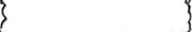


In gases, the forces between particles are very weak. This explains why the particles in gases are not neatly arranged. They are not held together tightly and there are large spaces between them. These spaces are much larger than in the solid and liquid state.

Gases can be compressed, because their particles can be forced closer together. Look at the photo of a scuba diver underwater. Do you see the tank on his back? He uses this tank to breathe underwater. A scuba diver can stay underwater for almost an hour. How do you think he can get enough air to breathe for a whole hour from a small tank like that? Discuss this with your class.

---
**Notes / Discussion Answers:**

*   
*

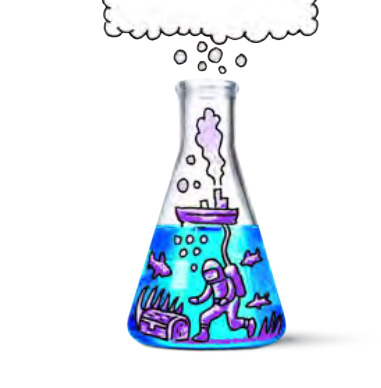
> **[Diagram Context - Textbook_NaturalScience_Gr8_Atoms.pdf-0006-16.png]**
> The image features a cartoon depiction of a South African student learning about the human body. The illustration is a detailed and colorful representation of the human circulatory system, with a purple and blue color scheme. The circulatory system is shown in a cartoon style, with a purple tube representing the heart and a blue tube representing the blood vessels. The image also includes a cartoon depiction of a person wearing a


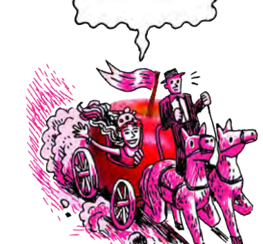
> **[Diagram Context - Textbook_NaturalScience_Gr8_Atoms.pdf-0006-32.png]**
> 1. A cartoon drawing of a man and a woman riding on a pink horse.
 2. A pink banner with a white speech bubble above the man's head.
 3. A pink banner with a white speech bubble above the woman's head.


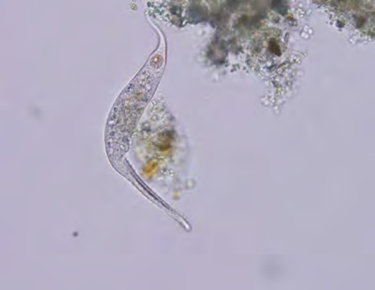
> **[Diagram Context - Textbook_NaturalScience_Gr8_Microorganisms.pdf-0006-01.png]**
> 1. A diagram of a virus with a long tail.


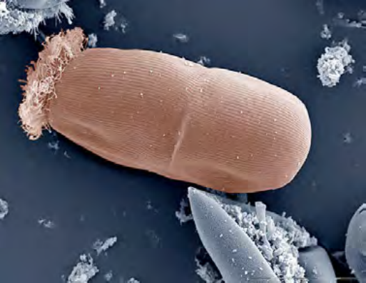
> **[Diagram Context - Textbook_NaturalScience_Gr8_Microorganisms.pdf-0006-03.png]**
> 1. A diagram of a cell with a brown object in the center.


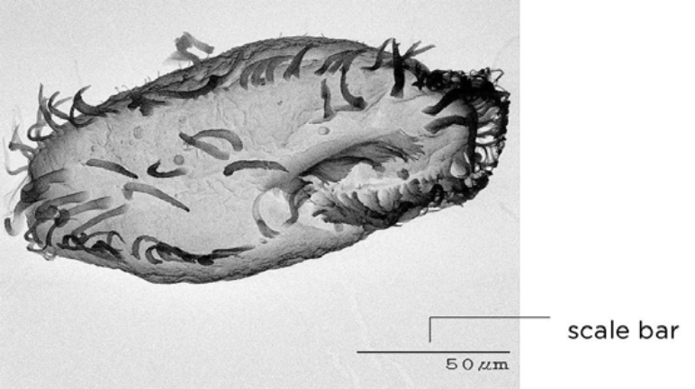
> **[Diagram Context - Textbook_NaturalScience_Gr8_Microorganisms.pdf-0006-08.png]**
> The image is a black and white diagram that shows a scale bar. The scale bar is used to measure the size of an object, and it is labeled with the word "scale" and the number "50". The object in the image is a diagram of a cell, which is labeled with the word "cell" and the number "5". The diagram also includes a label for the x


> **[Diagram Context - Textbook_NaturalScience_Gr8_Microorganisms.pdf-0006-09.png]**
> 1. A diagram of a spring coiled up and attached to a green block.


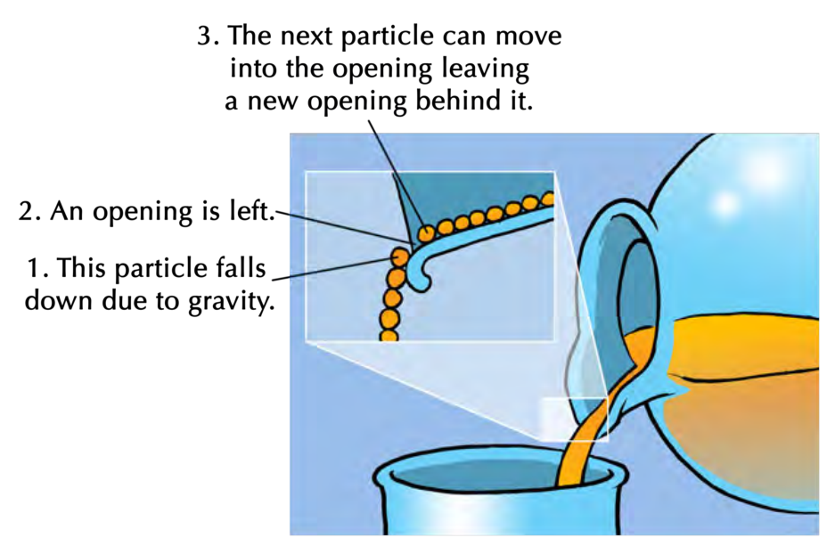
> **[Diagram Context - Textbook_NaturalScience_Gr8_Particle-model-of-matter.pdf-0006-05.png]**
> 1. An opening is left. This particle falls down due to gravity.


---


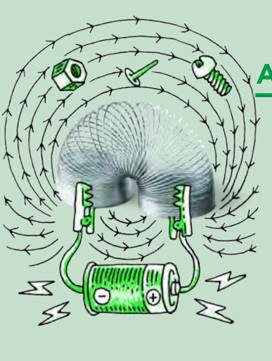
> **[Diagram Context - Textbook_NaturalScience_Gr8_Atoms.pdf-0007-00.png]**
> 1. A green and white diagram of a battery and a spring.


*Figure: A scuba diver underwater with a tank of air.*

---

# ACTIVITY: Comparing solids, liquids and gases

Let's summarise what we have learnt about what the particle model of matter tells us about solids, liquids and gases.

### INSTRUCTIONS:
1. Use the images of the different states to help you, and go back over the text in your workbook.
2. Complete the comparison table below by describing the arrangement, movement, forces, and spaces between particles for each state of matter.


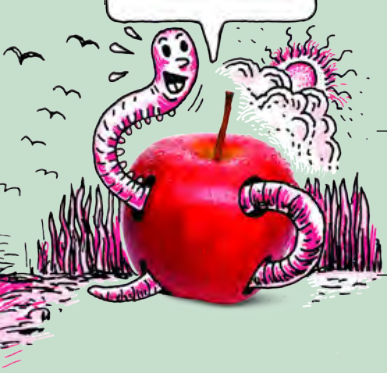
> **[Diagram Context - Textbook_NaturalScience_Gr8_Atoms.pdf-0007-18.png]**
> 1. A cartoon apple with a worm inside.


| Property | Solid | Liquid | Gas |
| :--- | :--- | :--- | :--- |
| **Particle Diagram** | 


 | 

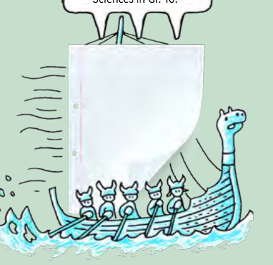
> **[Diagram Context - Textbook_NaturalScience_Gr8_Microorganisms.pdf-0007-07.png]**
> The image shows a cartoon boat with six people on it, each holding a paddle. The boat is sailing on a body of water, and the people are wearing helmets. The boat is depicted in a cartoon style, with a white background and a blue sky. The people are wearing blue helmets, and the boat has a blue body. The boat is sailing towards the right side of the image.

 | 

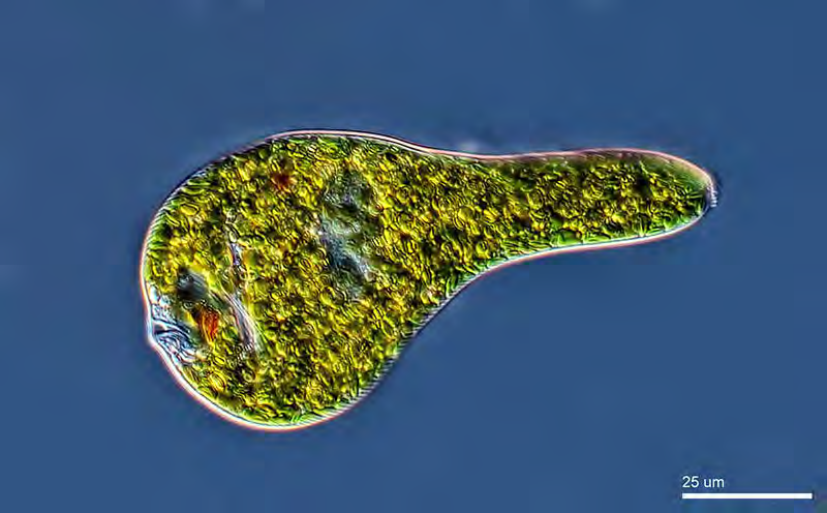
> **[Diagram Context - Textbook_NaturalScience_Gr8_Microorganisms.pdf-0007-10.png]**
> 1. A diagram of a cell with a green and yellow surface.

 |
| **Arrangement of particles** | | | |
| **Movement of particles** | | | |
| **Forces between particles** | | | |
| **Spaces between particles** | | | |

---

## Study Summary: The Particle Model of Matter

To help you complete the activity, review these key concepts of the CAPS curriculum:

### 1. Solids
* **Arrangement:** Particles are packed closely together in a regular, fixed pattern (lattice).
* **Movement:** Particles cannot move from their positions; they only vibrate in fixed positions.
* **Forces:** Extremely strong forces of attraction hold the particles together.
* **Spaces:** Very small spaces between the particles.

### 2. Liquids
* **Arrangement:** Particles are close together but arranged randomly (no fixed pattern).
* **Movement:** Particles can move and slide past one another, allowing liquids to flow and take the shape of their container.
* **Forces:** Strong forces of attraction, but weaker than those in solids.
* **Spaces:** Small spaces between the particles, slightly larger than in solids.

### 3. Gases
* **Arrangement:** Particles are very far apart and have a completely random arrangement.
* **Movement:** Particles move rapidly, randomly, and constantly in all directions, colliding with each other and the walls of the container.
* **Forces:** Very weak forces of attraction between particles.
* **Spaces:** Very large spaces between the particles compared to the size of the particles themselves.

---
*Chapter 2. Particle model of matter | Page 159*

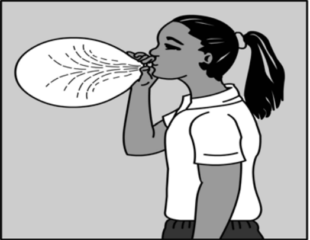
> **[Diagram Context - Textbook_NaturalScience_Gr8_Particle-model-of-matter.pdf-0007-03.png]**
> 1. A cartoon girl blowing up a balloon.


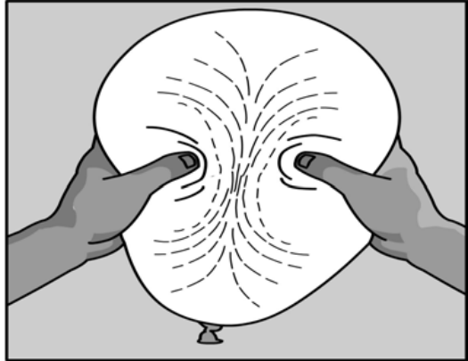
> **[Diagram Context - Textbook_NaturalScience_Gr8_Particle-model-of-matter.pdf-0007-05.png]**
> 1. A cartoon depiction of a balloon with a hand pressing down on it.


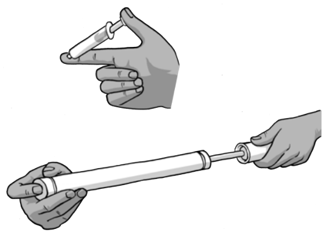
> **[Diagram Context - Textbook_NaturalScience_Gr8_Particle-model-of-matter.pdf-0007-09.png]**
> 1. A black and white illustration of a hand holding a syringe and a tube.


---

# Matter and Materials

## Questions

::: info
### Visit
A video explaining the difference between the solid, liquid and gaseous states of matter:
[bit.ly/15frMav](https://bit.ly/15frMav)


:::

1. Use the particle model of matter to explain why solids have a fixed shape, but gases fill the shape of the container they are in.
   
   $$\text{\_\_\_\_\_\_\_\_\_\_\_\_\_\_\_\_\_\_\_\_\_\_\_\_\_\_\_\_\_\_\_\_\_\_\_\_\_\_\_\_\_\_\_\_\_\_\_\_\_\_\_\_\_\_\_\_\_\_\_\_\_\_\_\_\_\_\_\_\_\_\_\_\_\_\_\_\_\_\_\_\_\_\_\_\_\_\_\_\_\_\_\_\_\_\_\_\_\_\_\_\_\_\_\_\_\_\_\_\_\_\_\_\_\_\_\_\_\_\_\_\_\_\_\_\_\_\_\_\_\_\_\_\_\_\_\_\_\_\_\_\_\_\_\_\_\_\_\_\_\_\_\_\_\_\_\_\_\_\_\_\_\_\_\_\_\_\_\_\_\_\_\_\_\_\_\_\_\_\_\_\_\_\_\_\_\_\_\_\_\_\_\_\_\_\_\_\_\_\_\_\_\_\_\_\_\_\_\_\_\_\_\_\_\_\_\_\_\_\_\_\_\_\_\_\_\_\_\_\_\_\_\_\_\_\_\_\_\_\_\_\_\_\_\_\_\_\_\_\_\_\_\_\_\_\_\_\_\_\_\_\_\_\_\_\_\_\_\_\_\_\_\_\_\_\_\_\_\_\_\_\_\_\_\_\_\_\_\_\_\_\_\_\_\_\_\_\_\_\_\_\_\_\_\_\_\_\_\_\_\_\_\_\_\_\_\_\_\_\_\_\_\_\_\_\_\_\_\_\_\_\_\_\_\_\_\_\_\_\_\_\_\_\_\_\_\_\_\_\_\_\_\_\_\_\_\_\_\_\_\_\_\_\_\_\_\_\_\_\_\_\_\_\_\_\_\_\_\_\_\_\_\_\_\_\_\_\_\_\_\_\_\_\_\_\_\_\_\_\_\_\_\_\_\_\_\_\_\_\_\_\_\_\_\_\_\_\_\_\_\_\_\_\_\_\_\_\_\_\_\_\_\_\_\_\_\_\_\_\_\_\_\_\_\_\_\_\_\_\_\_\_\_\_\_\_\_\_\_\_\_\_\_\_\_\_\_\_\_\_\_\_\_\_\_\_\_\_\_\_\_\_\_\_\_\_\_\_\_\_\_\_\_\_\_\_\_\_\_\_\_\_\_\_\_\_\_\_\_\_\_\_\_\_\_\_\_\_\_\_\_\_\_\_\_\_\_\_\_\_\_\_\_\_\_\_\_\_\_\_\_\_\_\_\_\_\_\_\_\_\_\_\_\_\_\_\_\_\_\_\_\_\_\_\_\_\_\_\_\_\_\_\_\_\_\_\_\_\_\_\_\_\_\_\_\_\_\_\_\_\_\_\_\_\_\_\_\_\_\_\_\_\_\_\_\_\_\_\_\_\_\_\_\_\_\_\_\_\_\_\_\_\_\_\_\_\_\_\_\_\_\_\_\_\_\_\_\_\_\_\_\_\_\_\_\_\_\_\_\_\_\_\_\_\_\_\_\_\_\_\_\_\_\_\_\_\_\_\_\_\_\_\_\_\_\_\_\_\_\_\_\_\_\_\_\_\_\_\_\_\_\_\_\_\_\_\_\_\_\_\_\_\_\_\_\_\_\_\_\_\_\_\_\_\_\_\_\_\_\_\_\_\_\_\_\_\_\_\_\_\_\_\_\_\_\_\_\_\_\_\_\_\_\_\_\_\_\_\_\_\_\_\_\_\_\_\_\_\_\_\_\_\_\_\_\_\_\_\_\_\_\_\_\_\_\_\_\_\_\_\_\_\_\_\_\_\_\_\_\_\_\_\_\_\_\_\_\_\_\_\_\_\_\_\_\_\_\_\_\_\_\_\_\_\_\_\_\_\_\_\_\_\_\_\_\_\_\_\_\_\_\_\_\_\_\_\_\_\_\_\_\_\_\_\_\_\_\_\_\_\_\_\_\_\_\_\_\_\_\_\_\_\_\_\_\_\_\_\_\_\_\_\_\_\_\_\_\_\_\_\_\_\_\_\_\_\_\_\_\_\_\_\_\_\_\_\_\_\_\_\_\_\_\_\_\_\_\_\_\_\_\_\_\_\_\_\_\_\_\_\_\_\_\_\_\_\_\_\_\_\_\_\_\_\_\_\_\_\_\_\_\_\_\_\_\_\_\_\_\_\_\_\_\_\_\_\_\_\_\_\_\_\_\_\_\_\_\_\_\_\_\_\_\_\_\_\_\_\_\_\_\_\_\_\_\_\_\_\_\_\_\_\_\_\_\_\_\_\_\_\_\_\_\_\_\_\_\_\_\_\_\_\_\_\_\_\_\_\_\_\_\_\_\_\_\_\_\_\_\_\_\_\_\_\_\_\_\_\_\_\_\_\_\_\_\_\_\_\_\_\_\_\_\_\_\_\_\_\_\_\_\_\_\_\_\_\_\_\_\_\_\_\_\_\_\_\_\_\_\_\_\_\_\_\_\_\_\_\_\_\_\_\_\_\_\_\_\_\_\_\_\_\_\_\_\_\_\_\_\_\_\_\_\_\_\_\_\_\_\_\_\_\_\_\_\_\_\_\_\_\_\_\_\_\_\_\_\_\_\_\_\_\_\_\_\_\_\_\_\_\_\_\_\_\_\_\_\_\_\_\_\_\_\_\_\_\_\_\_\_\_\_\_\_\_\_\_\_\_\_\_\_\_\_\_\_\_\_\_\_\_\_\_\_\_\_\_\_\_\_\_\_\_\_\_\_\_\_\_\_\_\_\_\_\_\_\_\_\_\_\_\_\_\_\_\_\_\_\_\_\_\_\_\_\_\_\_\_\_\_\_\_\_\_\_\_\_\_\_\_\_\_\_\_\_\_\_\_\_\_\_\_\_\_\_\_\_\_\_\_\_\_\_\_\_\_\_\_\_\_\_\_\_\_\_\_\_\_\_\_\_\_\_\_\_\_\_\_\_\_\_\_\_\_\_\_\_\_\_\_\_\_\_\_\_\_\_\_\_\_\_\_\_\_\_\_\_\_\_\_\_\_\_\_\_\_\_\_\_\_\_\_\_\_\_\_\_\_\_\_\_\_\_\_\_\_\_\_\_\_\_\_\_\_\_\_\_\_\_\_\_\_\_\_\_\_\_\_\_\_\_\_\_\_\_\_\_\_\_\_\_\_\_\_\_\_\_\_\_\_\_\_\_\_\_\_\_\_\_\_\_\_\_\_\_\_\_\_\_\_\_\_\_\_\_\_\_\_\_\_\_\_\_\_\_\_\_\_\_\_\_\_\_\_\_\_\_\_\_\_\_\_\_\_\_\_\_\_\_\_\_\_\_\_\_\_\_\_\_\_\_\_\_\_\_\_\_\_\_\_\_\_\_\_\_\_\_\_\_\_\_\_\_\_\_\_\_\_\_\_\_\_\_\_\_\_\_\_\_\_\_\_\_\_\_\_\_\_\_\_\_\_\_\_\_\_\_\_\_\_\_\_\_\_\_\_\_\_\_\_\_\_\_\_\_\_\_\_\_\_\_\_\_\_\_\_\_\_\_\_\_\_\_\_\_\_\_\_\_\_\_\_\_\_\_\_\_\_\_\_\_\_\_\_\_\_\_\_\_\_\_\_\_\_\_\_\_\_\_\_\_\_\_\_\_\_\_\_\_\_\_\_\_\_\_\_\_\_\_\_\_\_\_\_\_\_\_\_\_\_\_\_\_\_\_\_\_\_\_\_\_\_\_\_\_\_\_\_\_\_\_\_\_\_\_\_\_\_\_\_\_\_\_\_\_\_\_\_\_\_\_\_\_\_\_\_\_\_\_\_\_\_\_\_\_\_\_\_\_\_\_\_\_\_\_\_\_\_\_\_\_\_\_\_\_\_\_\_\_\_\_\_\_\_\_\_\_\_\_\_\_\_\_\_\_\_\_\_\_\_\_\_\_\_\_\_\_\_\_\_\_\_\_\_\_\_\_\_\_\_\_\_\_\_\_\_\_\_\_\_\_\_\_\_\_\_\_\_\_\_\_\_\_\_\_\_\_\_\_\_\_\_\_\_\_\_\_\_\_\_\_\_\_\_\_\_\_\_\_\_\_\_\_\_\_\_\_\_\_\_\_\_\_\_\_\_\_\_\_\_\_\_\_\_\_\_\_\_\_\_\_\_\_\_\_\_\_\_\_\_\_\_\_\_\_\_\_\_\_\_\_\_\_\_\_\_\_\_\_\_\_\_\_\_\_\_\_\_\_\_\_\_\_\_\_\_\_\_\_\_\_\_\_\_\_\_\_\_\_\_\_\_\_\_\_\_\_\_\_\_\_\_\_\_\_\_\_\_\_\_\_\_\_\_\_\_\_\_\_\_\_\_\_\_\_\_\_\_\_\_\_\_\_\_\_\_\_\_\_\_\_\_\_\_\_\_\_\_\_\_\_\_\_\_\_\_\_\_\_\_\_\_\_\_\_\_\_\_\_\_\_\_\_\_\_\_\_\_\_\_\_\_\_\_\_\_\_\_\_\_\_\_\_\_\_\_\_\_\_\_\_\_\_\_\_\_\_\_\_\_\_\_\_\_\_\_\_\_\_\_\_\_\_\_\_\_\_\_\_\_\_\_\_\_\_\_\_\_\_\_\_\_\_\_\_\_\_\_\_\_\_\_\_\_\_\_\_\_\_\_\_\_\_\_\_\_\_\_\_\_\_\_\_\_\_\_\_\_\_\_\_\_\_\_\_\_\_\_\_\_\_\_\_\_\_\_\_\_\_\_\_\_\_\_\_\_\_\_\_\_\_\_\_\_\_\_\_\_\_\_\_\_\_\_\_\_\_\_\_\_\_\_\_\_\_\_\_\_\_\_\_\_\_\_\_\_\_\_\_\_\_\_\_\_\_\_\_\_\_\_\_\_\_\_\_\_\_\_\_\_\_\_\_\_\_\_\_\_\_\_\_\_\_\_\_\_\_\_\_\_\_\_\_\_\_\_\_\_\_\_\_\_\_\_\_\_\_\_\_\_\_\_\_\_\_\_\_\_\_\_\_\_\_\_\_\_\_\_\_\_\_\_\_\_\_\_\_\_\_\_\_\_\_\_\_\_\_\_\_\_\_\_\_\_\_\_\_\_\_\_\_\_\_\_\_\_\_\_\_\_\_\_\_\_\_\_\_\_\_\_\_\_\_\_\_\_\_\_\_\_\_\_\_\_\_\_\_\_\_\_\_\_\_\_\_\_\_\_\_\_\_\_\_\_\_\_\_\_\_\_\_\_\_\_\_\_\_\_\_\_\_\_\_\_\_\_\_\_\_\_\_\_\_\_\_\_\_\_\_\_\_\_\_\_\_\_\_\_\_\_\_\_\_\_\_\_\_\_\_\_\_\_\_\_\_\_\_\_\_\_\_\_\_\_\_\_\_\_\_\_\_\_\_\_\_\_\_\_\_\_\_\_\_\_\_\_\_\_\_\_\_\_\_\_\_\_\_\_\_\_\_\_\_\_\_\_\_\_\_\_\_\_\_\_\_\_\_\_\_\_\_\_\_\_\_\_\_\_\_\_\_\_\_\_\_\_\_\_\_\_\_\_\_\_\_\_\_\_\_\_\_\_\_\_\_\_\_\_\_\_\_\_\_\_\_\_\_\_\_\_\_\_\_\_\_\_\_\_\_\_\_\_\_\_\_\_\_\_\_\_\_\_\_\_\_\_\_\_\_\_\_\_\_\_\_\_\_\_\_\_\_\_\_\_\_\_\_\_\_\_\_\_\_\_\_\_\_\_\_\_\_\_\_\_\_\_\_\_\_\_\_\_\_\_\_\_\_\_\_\_\_\_\_\_\_\_\_\_\_\_\_\_\_\_\_\_\_\_\_\_\_\_\_\_\_\_\_\_\_\_\_\_\_\_\_\_\_\_\_\_\_\_\_\_\_\_\_\_\_\_\_\_\_\_\_\_\_\_\_\_\_\_\_\_\_\_\_\_\_\_\_\_\_\_\_\_\_\_\_\_\_\_\_\_\_\_\_\_\_\_\_\_\_\_\_\_\_\_\_\_\_\_\_\_\_\_\_\_\_\_\_\_\_\_\_\_\_\_\_\_\_\_\_\_\_\_\_\_\_\_\_\_\_\_\_\_\_\_\_\_\_\_\_\_\_\_\_\_\_\_\_\_\_\_\_\_\_\_\_\_\_\_\_\_\_\_\_\_\_\_\_\_\_\_\_\_\_\_\_\_\_\_\_\_\_\_\_\_\_\_\_\_\_\_\_\_\_\_\_\_\_\_\_\_\_\_\_\_\_\_\_\_\_\_\_\_\_\_\_\_\_\_\_\_\_\_\_\_\_\_\_\_\_\_\_\_\_\_\_\_\_\_\_\_\_\_\_\_\_\_\_\_\_\_\_\_\_\_\_\_\_\_\_\_\_\_\_\_\_\_\_\_\_\_\_\_\_\_\_\_\_\_\_\_\_\_\_\_\_\_\_\_\_\_\_\_\_\_\_\_\_\_\_\_\_\_\_\_\_\_\_\_\_\_\_\_\_\_\_\_\_\_\_\_\_\_\_\_\_\_\_\_\_\_\_\_\_\_\_\_\_\_\_\_\_\_\_\_\_\_\_\_\_\_\_\_\_\_\_\_\_\_\_\_\_\_\_\_\_\_\_\_\_\_\_\_\_\_\_\_\_\_\_\_\_\_\_\_\_\_\_\_\_\_\_\_\_\_\_\_\_\_\_\_\_\_\_\_\_\_\_\_\_\_\_\_\_\_\_\_\_\_\_\_\_\_\_\_\_\_\_\_\_\_\_\_\_\_\_\_\_\_\_\_\_\_\_\_\_\_\_\_\_\_\_\_\_\_\_\_\_\_\_\_\_\_\_\_\_\_\_\_\_\_\_\_\_\_\_\_\_\_\_\_\_\_\_\_\_\_\_\_\_\_\_\_\_\_\_\_\_\_\_\_\_\_\_\_\_\_\_\_\_\_\_\_\_\_\_\_\_\_\_\_\_\_\_\_\_\_\_\_\_\_\_\_\_\_\_\_\_\_\_\_\_\_\_\_\_\_\_\_\_\_\_\_\_\_\_\_\_\_\_\_\_\_\_\_\_\_\_\_\_\_\_\_\_\_\_\_\_\_\_\_\_\_\_\_\_\_\_\_\_\_\_\_\_\_\_\_\_\_\_\_\_\_\_\_\_\_\_\_\_\_\_\_\_\_\_\_\_\_\_\_\_\_\_\_\_\_\_\_\_\_\_\_\_\_\_\_\_\_\_\_\_\_\_\_\_\_\_\_\_\_\_\_\_\_\_\_\_\_\_\_\_\_\_\_\_\_\_\_\_\_\_\_\_\_\_\_\_\_\_\_\_\_\_\_\_\_\_\_\_\_\_\_\_\_\_\_\_\_\_\_\_\_\_\_\_\_\_\_\_\_\_\_\_\_\_\_\_\_\_\_\_\_\_\_\_\_\_\_\_\_\_\_\_\_\_\_\_\_\_\_\_\_\_\_\_\_\_\_\_\_\_\_\_\_\_\_\_\_\_\_\_\_\_\_\_\_\_\_\_\_\_\_\_\_\_\_\_\_\_\_\_\_\_\_\_\_\_\_\_\_\_\_\_\_\_\_\_\_\_\_\_\_\_\_\


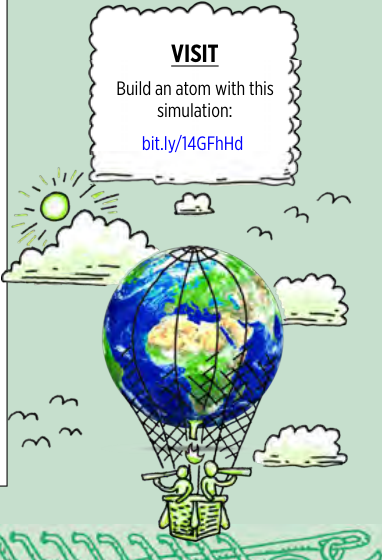
> **[Diagram Context - Textbook_NaturalScience_Gr8_Atoms.pdf-0008-04.png]**
> The image shows a cartoon depiction of a hot air balloon carrying a man and a woman. The balloon is filled with a blue and green substance, and the two passengers are holding onto a basket attached to the balloon. The scene is set against a backdrop of a blue sky with white clouds. The image is labeled with the text "Visit" and "Build an atom with this simulation: bit.


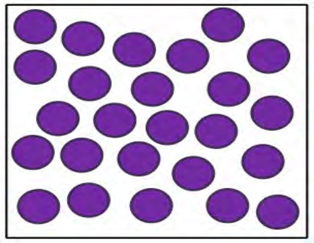
> **[Diagram Context - Textbook_NaturalScience_Gr8_Atoms.pdf-0008-08.png]**
> The image shows a white square divided into 24 smaller squares, each containing a purple circle. The circles are evenly distributed across the square, with no overlap or gaps. The arrangement of the circles suggests a geometric pattern, possibly a Lewis diagram or a diagram of a cellular structure. The diagram is labeled with the word "circle" and "circle" in the center, indicating the presence of circles in


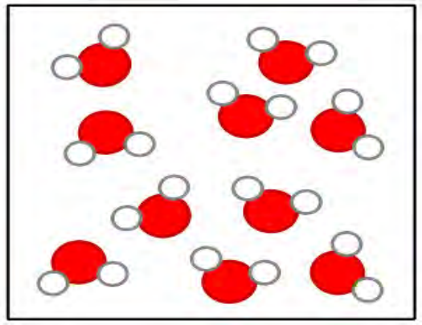
> **[Diagram Context - Textbook_NaturalScience_Gr8_Atoms.pdf-0008-09.png]**
> The image is a diagram of a water molecule, which is composed of two hydrogen atoms and one oxygen atom. The diagram is a Lewis structure, which is a visual representation of the chemical bonding between the atoms in a molecule. The diagram is colored in red and white, with the red representing the hydrogen atoms and the white representing the oxygen atom. The diagram is labeled with the chemical symbols H2


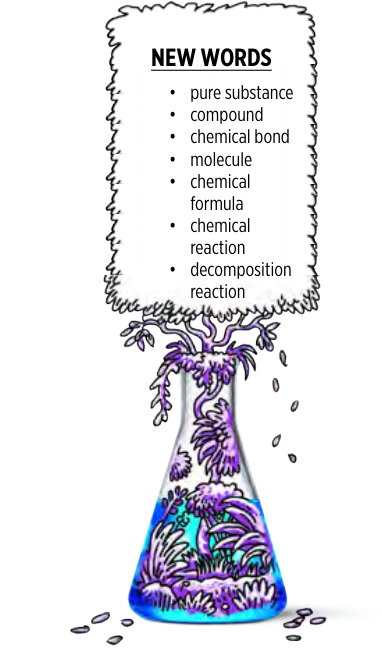
> **[Diagram Context - Textbook_NaturalScience_Gr8_Atoms.pdf-0008-12.png]**
> 1. A purple and blue vase with a plant inside.


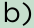


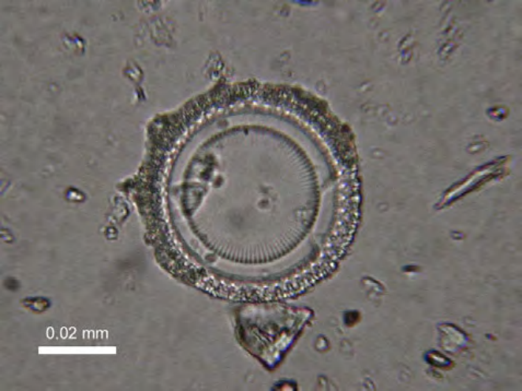
> **[Diagram Context - Textbook_NaturalScience_Gr8_Microorganisms.pdf-0008-02.png]**
> The image shows a close-up view of a water droplet, which is the main focus of the image. The droplet is surrounded by a black and white background, making it stand out. The droplet is depicted in a circular shape, with a white center and a black outer edge. The image also contains a small white number, which is not relevant to the main subject. The


> **[Diagram Context - Textbook_NaturalScience_Gr8_Microorganisms.pdf-0008-04.png]**
> 1. A diagram of a snake's body.


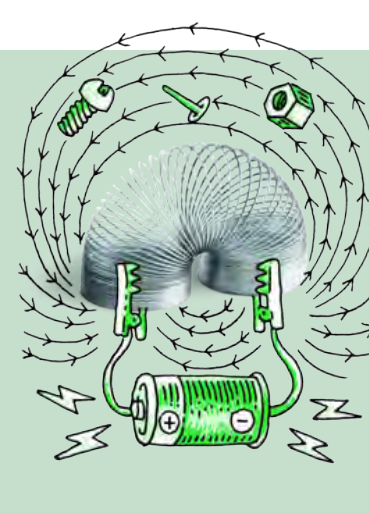
> **[Diagram Context - Textbook_NaturalScience_Gr8_Microorganisms.pdf-0008-11.png]**
> 1. A green spring with a silver spring inside of it.
2. A green battery with a silver battery inside of it.
3. A green spring with a silver spring inside of it.


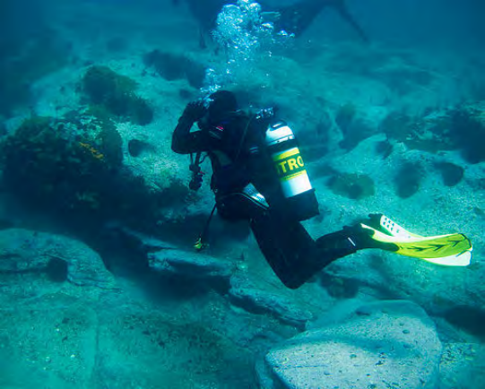
> **[Diagram Context - Textbook_NaturalScience_Gr8_Particle-model-of-matter.pdf-0008-00.png]**
> The image shows a person wearing scuba gear swimming in the ocean. The person is holding a yellow flipper and has a yellow and black wetsuit on. The ocean is blue and has rocks and coral in the background. The person is holding a yellow flipper and a black and yellow wetsuit.


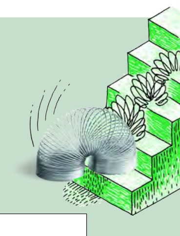
> **[Diagram Context - Textbook_NaturalScience_Gr8_Particle-model-of-matter.pdf-0008-02.png]**
> 1. A diagram of a spring coiled up and attached to a green block.


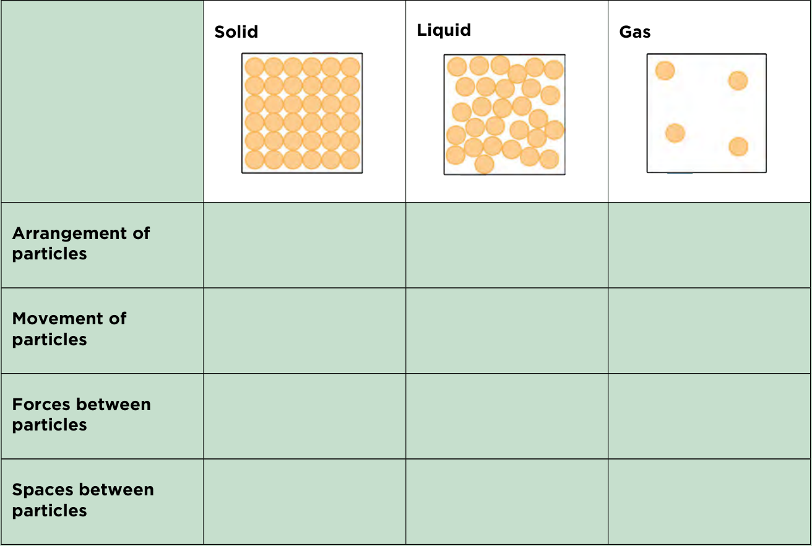
> **[Diagram Context - Textbook_NaturalScience_Gr8_Particle-model-of-matter.pdf-0008-07.png]**
> The image presents a table with three columns and three rows, each representing a different state of matter: solid, liquid, and gas. The table is divided into four sections, each representing a different state of matter. The table is color-coded, with solid represented by green, liquid by orange, and gas by yellow. The table also includes a list of terms and a diagram of a Lewis


---

...noses when we breathe. We say that the particles diffuse through the air.

In Grade 7, we learnt about different kinds of mixtures. In the next investigation, we are going to explore whether particles mix faster when they are in the liquid state or in the gas state. This is called the **rate of diffusion**. What would your prediction be?

---

# Chapter 2: Particle Model of Matter

## Investigation: Comparing the diffusion of particles in a gas and in a liquid

> ### TAKE NOTE
> When we talk about a **rate**, we are measuring how something changes in relation to another factor, such as time. Another example is speed measured in $\text{km/h}$ (or $\frac{\text{km}}{\text{h}}$) — this is a rate of how distance in kilometres changes over a period of time (hours).

### Investigative Questions
1. Do particles diffuse (mix) faster when they are in the liquid state or in the gaseous state? Which particles will mix more quickly: gases or liquids?
2. Do particles diffuse faster with or without mixing?

### Hypothesis
What are your predictions? Do you expect liquids to mix more quickly than gases, or the other way around? Will stirring influence the speed at which gases mix? Write down your hypothesis below:

$$\text{Hypothesis: } \underline{\hspace{12cm}}$$

---

### Identify Variables
This is not a controlled experiment as we are not measuring the rates of mixing of the liquids and gases under exactly the same conditions. We will make a simple comparison of the mixing rates, by seeing how long it takes each to mix under two different sets of conditions.

### Materials and Apparatus
* Large glass beaker or other large clear glass container
* Dropper
* Food colouring or ink
* Tap water
* Vanilla essence
* Shallow dish or saucer

---

### Method

#### Part 1: How fast do liquids mix?
1. Fill a large, clear container with tap water and place it where everyone can see it.
2. Use a dropper to place one or two drops of the food colouring in the water.
3. Record the time at which the colouring is added to the water.
4. Look carefully at the two liquids mixing, and write your observations below. Allow the liquids to mix without any stirring.
5. Record the time when the liquids are fully mixed, in other words, when the colour is uniformly spread throughout the water.

---

### Observations and Results

Use the table below to record the start time, end time, and total time taken ($\Delta t$) for the diffusion process:

| Substance / State | Start Time ($t_{\text{start}}$) | End Time ($t_{\text{end}}$) | Total Diffusion Time ($\Delta t = t_{\text{end}} - t_{\text{start}}$) | Observations |
| :--- | :--- | :--- | :--- | :--- |
| **Liquid State**<br>(Food colouring in water) | | | | |
| **Gaseous State**<br>(Vanilla essence in air) | | | | |

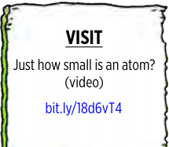
> **[Diagram Context - Textbook_NaturalScience_Gr8_Atoms.pdf-0009-01.png]**
> 1. A diagram of an atom.


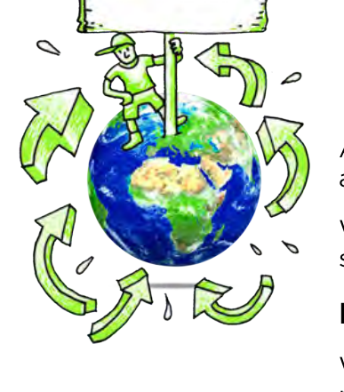
> **[Diagram Context - Textbook_NaturalScience_Gr8_Atoms.pdf-0009-03.png]**
> The image features a cartoon depiction of a boy holding a pole, with a globe and arrows surrounding him. The globe is colored green and blue, and the arrows are pointing in various directions. The boy is wearing a green shirt and a hat. The diagram is labeled with the words "Lewis diagram", "anatomical/cellular structure", "circuit", "graph", "evolution


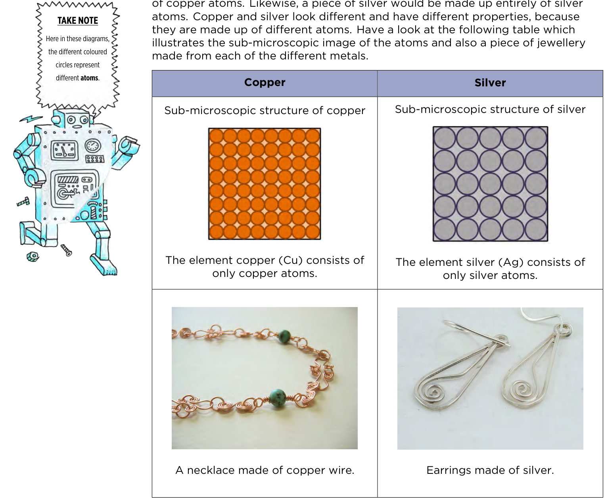
> **[Diagram Context - Textbook_NaturalScience_Gr8_Atoms.pdf-0009-10.png]**
> 1. A necklace made of copper wire.


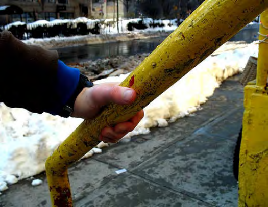
> **[Diagram Context - Textbook_NaturalScience_Gr8_Microorganisms.pdf-0009-01.png]**
> 1. A yellow pole with a red mark on it.


> **[Diagram Context - Textbook_NaturalScience_Gr8_Microorganisms.pdf-0009-03.png]**
> 1. A blue and white phone booth with a keypad.


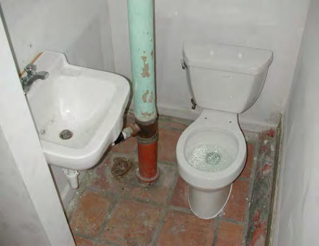
> **[Diagram Context - Textbook_NaturalScience_Gr8_Microorganisms.pdf-0009-05.png]**
> 1. A bathroom with a toilet and sink.


> **[Diagram Context - Textbook_NaturalScience_Gr8_Microorganisms.pdf-0009-07.png]**
> 1. A silver ATM keypad with numbers and letters.


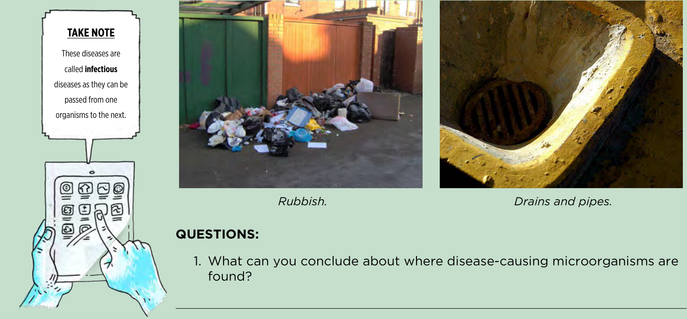
> **[Diagram Context - Textbook_NaturalScience_Gr8_Microorganisms.pdf-0009-09.png]**
> 1. A diagram of a cell with arrows pointing to different parts of the cell.


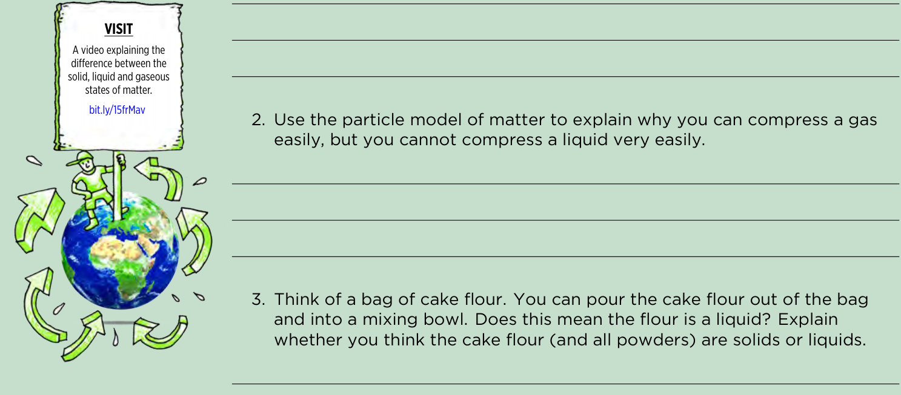
> **[Diagram Context - Textbook_NaturalScience_Gr8_Particle-model-of-matter.pdf-0009-03.png]**
> 1. A diagram of a planet and a globe with arrows pointing to the planet.
 2. The planet is labeled Earth.
 3. The globe is labeled with the continents of North America, South America, Europe, Africa, Asia, and Australia.
 4. The arrows point to the continents of North America and South America.


> **[Diagram Context - Textbook_NaturalScience_Gr8_Particle-model-of-matter.pdf-0009-04.png]**
> 1. A diagram of a cell with a green line representing the cell wall.


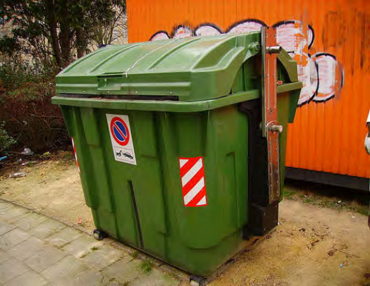
> **[Diagram Context - Textbook_NaturalScience_Gr8_Particle-model-of-matter.pdf-0009-07.png]**
> 1. A green dumpster with a red and white striped sticker on the side.


> **[Diagram Context - Textbook_NaturalScience_Gr8_Particle-model-of-matter.pdf-0009-08.png]**
> 1. A red box with white text that says "STINK BOMBS" and a picture of a cat.


---

# Matter and Materials: Diffusion

## Core Concepts: Diffusion in Liquids and Gases

**Diffusion** is the spontaneous movement of particles from an area of high concentration to an area of low concentration. This process continues until the particles are uniformly distributed throughout the space.

*   **Diffusion in Liquids:** Occurs relatively slowly because liquid particles are close together and experience frequent collisions, which limits their speed of movement.
*   **Diffusion in Gases:** Occurs much faster than in liquids. Gas particles have high kinetic energy, move at high speeds, and have large empty spaces between them, allowing them to mix rapidly.
*   **Factors Influencing Diffusion Rate:**
    *   **Temperature:** Higher temperatures increase the kinetic energy of particles, increasing the rate of diffusion.
    *   **State of Matter:** Gases diffuse faster than liquids.
    *   **Air Currents/Agitation:** Physical movement (such as stirring a liquid or waving arms to move air) introduces convection currents, which speeds up the mixing process.

---

## Experiment: How Fast Do Gases Mix?

This practical activity investigates the rate of diffusion of gas molecules (vanilla essence vapor) through air under different conditions.

### Safety and Environmental Control
*   This experiment must be performed with the **windows closed** to prevent external drafts from affecting the natural rate of diffusion.

### Step-by-Step Procedure

1.  **Prepare the Class:** Learners should raise their hands as soon as they can smell the vanilla essence.
2.  **Begin the Experiment:** Pour some vanilla essence into a saucer.
3.  **Record Start Time:** Note the exact time when the vanilla essence is poured.
4.  **First Detection:** Record the time when the first learner puts up their hand to indicate they can smell the vanilla essence.
5.  **Halfway Mark:** Record the time when approximately half ($\frac{1}{2}$) of the learners in the class have their hands raised.
6.  **Full Diffusion:** Record the time when the learners sitting at the very back of the class first smell the vanilla essence.
7.  **Introduce Agitation (Variable Test):** Repeat steps 1–5 under the same conditions, but this time, have a designated person wave their arms to 'wave' and push the air towards the back of the class.

---

## Results and Observations

Answer the following questions based on your observations during the experiments.

### Part A: Liquid Mixing Observations
*(Based on the introductory liquid diffusion demonstration)*

1.  **What did you observe in the container immediately after the liquids were mixed?**
    $$\text{Answer: } \underline{\hspace{15cm}}$$
    $$\underline{\hspace{15cm}}$$

2.  **How long did it take for the liquids to be fully mixed, until the colour was uniformly spread throughout the water?**
    $$\text{Answer: } \underline{\hspace{15cm}}$$
    $$\underline{\hspace{15cm}}$$

---

### Part B: Gas Diffusion Observations (Vanilla Essence)

3.  **When you did NOT wave your arms during the experiment (Still Air):**
    *   **a)** How long did it take until the first learners smelled the vanilla essence molecules?
        $$\text{Answer: } \underline{\hspace{12cm}} \text{ seconds}$$
    *   **b)** How long did it take until the last learners smelled the vanilla essence?
        $$\text{Answer: } \underline{\hspace{12cm}} \text{ seconds}$$

4.  **When you DID wave your arms during the experiment (Moving Air):**
    *   **a)** How long did it take until the first learners smelled the vanilla essence molecules?
        $$\text{Answer: } \underline{\hspace{12cm}} \text{ seconds}$$
    *   **b)** How long did it take until the last learners smelled the vanilla essence?
        $$\text{Answer: } \underline{\hspace{12cm}} \text{ seconds}$$

---

### 5. Results Table

Below is a structured table to record and compare the results of the vanilla essence experiment under both experimental conditions.

| Experimental Condition | Time to First Smell ($t_{\text{first}}$) | Time to Half of Class ($t_{\text{half}}$) | Time to Back of Class ($t_{\text{back}}$) |
| :--- | :---: | :---: | :---: |
| **Trial 1: Without Waving Arms** (Still Air) | | | |
| **Trial 2: With Waving Arms** (Moving Air) | | | |


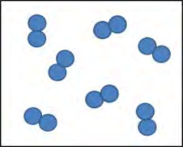


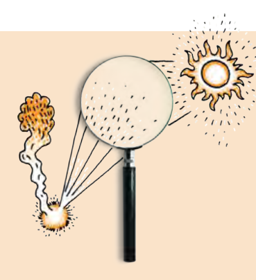


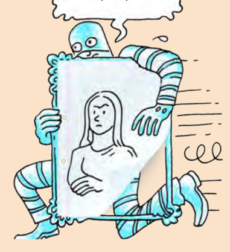


---


### ANALYSIS AND EVALUATION

1. Did anything go wrong during the experiment?
   
   $$\text{\_\_\_\_\_\_\_\_\_\_\_\_\_\_\_\_\_\_\_\_\_\_\_\_\_\_\_\_\_\_\_\_\_\_\_\_\_\_\_\_\_\_\_\_\_\_\_\_\_\_\_\_\_\_\_\_\_\_\_\_\_\_\_\_\_\_\_\_\_\_\_\_\_\_\_\_\_\_\_\_\_\_\_\_\_\_\_\_\_\_\_\_\_\_\_\_\_\_\_\_\_\_\_\_\_\_\_\_\_\_\_\_\_\_\_\_\_\_\_\_\_\_\_\_\_\_\_\_\_\_\_\_\_\_\_\_\_\_\_\_\_\_\_\_\_\_\_\_\_\_\_\_\_\_\_\_\_\_\_\_\_\_\_\_\_\_\_\_\_\_\_\_\_\_\_\_\_\_\_\_\_\_\_\_\_\_\_\_\_\_\_\_\_\_\_\_\_\_\_\_\_\_\_\_\_\_\_\_\_\_\_\_\_\_\_\_\_\_\_\_\_\_\_\_\_\_\_\_\_\_\_\_\_\_\_\_\_\_\_\_\_\_\_\_\_\_\_\_\_\_\_\_\_\_\_\_\_\_\_\_\_\_\_\_\_\_\_\_\_\_\_\_\_\_\_\_\_\_\_\_\_\_\_\_\_\_\_\_\_\_\_\_\_\_\_\_\_\_\_\_\_\_\_\_\_\_\_\_\_\_\_\_\_\_\_\_\_\_\_\_\_\_\_\_\_\_\_\_\_\_\_\_\_\_\_\_\_\_\_\_\_\_\_\_\_\_\_\_\_\_\_\_\_\_\_\_\_\_\_\_\_\_\_\_\_\_\_\_\_\_\_\_\_\_\_\_\_\_\_\_\_\_\_\_\_\_\_\_\_\_\_\_\_\_\_\_\_\_\_\_\_\_\_\_\_\_\_\_\_\_\_\_\_\_\_\_\_\_\_\_\_\_\_\_\_\_\_\_\_\_\_\_\_\_\_\_\_\_\_\_\_\_\_\_\_\_\_\_\_\_\_\_\_\_\_\_\_\_\_\_\_\_\_\_\_\_\_\_\_\_\_\_\_\_\_\_\_\_\_\_\_\_\_\_\_\_\_\_\_\_\_\_\_\_\_\_\_\_\_\_\_\_\_\_\_\_\_\_\_\_\_\_\_\_\_\_\_\_\_\_\_\_\_\_\_\_\_\_\_\_\_\_\_\_\_\_\_\_\_\_\_\_\_\_\_\_\_\_\_\_\_\_\_\_\_\_\_\_\_\_\_\_\_\_\_\_\_\_\_\_\_\_\_\_\_\_\_\_\_\_\_\_\_\_\_\_\_\_\_\_\_\_\_\_\_\_\_\_\_\_\_\_\_\_\_\_\_\_\_\_\_\_\_\_\_\_\_\_\_\_\_\_\_\_\_\_\_\_\_\_\_\_\_\_\_\_\_\_\_\_\_\_\_\_\_\_\_\_\_\_\_\_\_\_\_\_\_\_\_\_\_\_\_\_\_\_\_\_\_\_\_\_\_\_\_\_\_\_\_\_\_\_\_\_\_\_\_\_\_\_\_\_\_\_\_\_\_\_\_\_\_\_\_\_\_\_\_\_\_\_\_\_\_\_\_\_\_\_\_\_\_\_\_\_\_\_\_\_\_\_\_\_\_\_\_\_\_\_\_\_\_\_\_\_\_\_\_\_\_\_\_\_\_\_\_\_\_\_\_\_\_\_\_\_\_\_\_\_\_\_\_\_\_\_\_\_\_\_\_\_\_\_\_\_\_\_\_\_\_\_\_\_\_\_\_\_\_\_\_\_\_\_\_\_\_\_\_\_\_\_\_\_\_\_\_\_\_\_\_\_\_\_\_\_\_\_\_\_\_\_\_\_\_\_\_\_\_\_\_\_\_\_\_\_\_\_\_\_\_\_\_\_\_\_\_\_\_\_\_\_\_\_\_\_\_\_\_\_\_\_\_\_\_\_\_\_\_\_\_\_\_\_\_\_\_\_\_\_\_\_\_\_\_\_\_\_\_\_\_\_\_\_\_\_\_\_\_\_\_\_\_\_\_\_\_\_\_\_\_\_\_\_\_\_\_\_\_\_\_\_\_\_\_\_\_\_\_\_\_\_\_\_\_\_\_\_\_\_\_\_\_\_\_\_\_\_\_\_\_\_\_\_\_\_\_\_\_\_\_\_\_\_\_\_\_\_\_\_\_\_\_\_\_\_\_\_\_\_\_\_\_\_\_\_\_\_\_\_\_\_\_\_\_\_\_\_\_\_\_\_\_\_\_\_\_\_\_\_\_\_\_\_\_\_\_\_\_\_\_\_\_\_\_\_\_\_\_\_\_\_\_\_\_\_\_\_\_\_\_\_\_\_\_\_\_\_\_\_\_\_\_\_\_\_\_\_\_\_\_\_\_\_\_\_\_\_\_\_\_\_\_\_\_\_\_\_\_\_\_\_\_\_\_\_\_\_\_\_\_\_\_\_\_\_\_\_\_\_\_\_\_\_\_\_\_\_\_\_\_\_\_\_\_\_\_\_\_\_\_\_\_\_\_\_\_\_\_\_\_\_\_\_\_\_\_\_\_\_\_\_\_\_\_\_\_\_\_\_\_\_\_\_\_\_\_\_\_\_\_\_\_\_\_\_\_\_\_\_\_\_\_\_\_\_\_\_\_\_\_\_\_\_\_\_\_\_\_\_\_\_\_\_\_\_\_\_\_\_\_\_\_\_\_\_\_\_\_\_\_\_\_\_\_\_\_\_\_\_\_\_\_\_\_\_\_\_\_\_\_\_\_\_\_\_\_\_\_\_\_\_\_\_\_\_\_\_\_\_\_\_\_\_\_\_\_\_\_\_\_\_\_\_\_\_\_\_\_\_\_\_\_\_\_\_\_\_\_\_\_\_\_\_\_\_\_\_\_\_\_\_\_\_\_\_\_\_\_\_\_\_\_\_\_\_\_\_\_\_\_\_\_\_\_\_\_\_\_\_\_\_\_\_\_\_\_\_\_\_\_\_\_\_\_\_\_\_\_\_\_\_\_\_\_\_\_\_\_\_\_\_\_\_\_\_\_\_\_\_\_\_\_\_\_\_\_\_\_\_\_\_\_\_\_\_\_\_\_\_\_\_\_\_\_\_\_\_\_\_\_\_\_\_\_\_\_\_\_\_\_\_\_\_\_\_\_\_\_\_\_\_\_\_\_\_\_\_\_\_\_\_\_\_\_\_\_\_\_\_\_\_\_\_\_\_\_\_\_\_\_\_\_\_\_\_\_\_\_\_\_\_\_\_\_\_\_\_\_\_\_\_\_\_\_\_\_\_\_\_\_\_\_\_\_\_\_\_\_\_\_\_\_\_\_\_\_\_\_\_\_\_\_\_\_\_\_\_\_\_\_\_\_\_\_\_\_\_\_\_\_\_\_\_\_\_\_\_\_\_\_\_\_\_\_\_\_\_\_\_\_\_\_\_\_\_\_\_\_\_\_\_\_\_\_\_\_\_\_\_\_\_\_\_\_\_\_\_\_\_\_\_\_\_\_\_\_\_\_\_\_\_\_\_\_\_\_\_\_\_\_\_\_\_\_\_\_\_\_\_\_\_\_\_\_\_\_\_\_\_\_\_\_\_\_\_\_\_\_\_\_\_\_\_\_\_\_\_\_\_\_\_\_\_\_\_\_\_\_\_\_\_\_\_\_\_\_\_\_\_\_\_\_\_\_\_\_\_\_\_\_\_\_\_\_\_\_\_\_\_\_\_\_\_\_\_\_\_\_\_\_\_\_\_\_\_\_\_\_\_\_\_\_\_\_\_\_\_\_\_\_\_\_\_\_\_\_\_\_\_\_\_\_\_\_\_\_\_\_\_\_\_\_\_\_\_\_\_\_\_\_\_\_\_\_\_\_\_\_\_\_\_\_\_\_\_\_\_\_\_\_\_\_\_\_\_\_\_\_\_\_\_\_\_\_\_\_\_\_\_\_\_\_\_\_\_\_\_\_\_\_\_\_\_\_\_\_\_\_\_\_\_\_\_\_\_\_\_\_\_\_\_\_\_\_\_\_\_\_\_\_\_\_\_\_\_\_\_\_\_\_\_\_\_\_\_\_\_\_\_\_\_\_\_\_\_\_\_\_\_\_\_\_\_\_\_\_\_\_\_\_\_\_\_\_\_\_\_\_\_\_\_\_\_\_\_\_\_\_\_\_\_\_\_\_\_\_\_\_\_\_\_\_\_\_\_\_\_\_\_\_\_\_\_\_\_\_\_\_\_\_\_\_\_\_\_\_\_\_\_\_\_\_\_\_\_\_\_\_\_\_\_\_\_\_\_\_\_\_\_\_\_\_\_\_\_\_\_\_\_\_\_\_\_\_\_\_\_\_\_\_\_\_\_\_\_\_\_\_\_\_\_\_\_\_\_\_\_\_\_\_\_\_\_\_\_\_\_\_\_\_\_\_\_\_\_\_\_\_\_\_\_\_\_\_\_\_\_\_\_\_\_\_\_\_\_\_\_\_\_\_\_\_\_\_\_\_\_\_\_\_\_\_\_\_\_\_\_\_\_\_\_\_\_\_\_\_\_\_\_\_\_\_\_\_\_\_\_\_\_\_\_\_\_\_\_\_\_\_\_\_\_\_\_\_\_\_\_\_\_\_\_\_\_\_\_\_\_\_\_\_\_\_\_\_\_\_\_\_\_\_\_\_\_\_\_\_\_\_\_\_\_\_\_\_\_\_\_\_\_\_\_\_\_\_\_\_\_\_\_\_\_\_\_\_\_\_\_\_\_\_\_\_\_\_\_\_\_\_\_\_\_\_\_\_\_\_\_\_\_\_\_\_\_\_\_\_\_\_\_\_\_\_\_\_\_\_\_\_\_\_\_\_\_\_\_\_\_\_\_\_\_\_\_\_\_\_\_\_\_\_\_\_\_\_\_\_\_\_\_\_\_\_\_\_\_\_\_\_\_\_\_\_\_\_\_\_\_\_\_\_\_\_\_\_\_\_\_\_\_\_\_\_\_\_\_\_\_\_\_\_\_\_\_\_\_\_\_\_\_\_\_\_\_\_\_\_\_\_\_\_\_\_\_\_\_\_\_\_\_\_\_\_\_\_\_\_\_\_\_\_\_\_\_\_\_\_\_\_\_\_\_\_\_\_\_\_\_\_\_\_\_\_\_\_\_\_\_\_\_\_\_\_\_\_\_\_\_\_\_\_\_\_\_\_\_\_\_\_\_\_\_\_\_\_\_\_\_\_\_\_\_\_\_\_\_\_\_\_\_\_\_\_\_\_\_\_\_\_\_\_\_\_\_\_\_\_\_\_\_\_\_\_\_\_\_\_\_\_\_\_\_\_\_\_\_\_\_\_\_\_\_\_\_\_\_\_\_\_\_\_\_\_\_\_\_\_\_\_\_\_\_\_\_\_\_\_\_\_\_\_\_\_\_\_\_\_\_\_\_\_\_\_\_\_\_\_\_\_\_\_\_\_\_\_\_\_\_\_\_\_\_\_\_\_\_\_\_\_\_\_\_\_\_\_\_\_\_\_\_\_\_\_\_\_\_\_\_\_\_\_\_\_\_\_\_\_\_\_\_\_\_\_\_\_\_\_\_\_\_\_\_\_\_\_\_\_\_\_\_\_\_\_\_\_\_\_\_\_\_\_\_\_\_\_\_\_\_\_\_\_\_\_\_\_\_\_\_\_\_\_\_\_\_\_\_\_\_\_\_\_\_\_\_\_\_\_\_\_\_\_\_\_\_\_\_\_\_\_\_\_\_\_\_\_\_\_\_\_\_\_\_\_\_\_\_\_\_\_\_\_\_\_\_\_\_\_\_\_\_\_\_\_\_\_\_\_\_\_\_\_\_\_\_\_\_\_\_\_\_\_\_\_\_\_\_\_\_\_\_\_\_\_\_\_\_\_\_\_\_\_\_\_\_\_\_\_\_\_\_\_\_\_\_\_\_\_\_\_\_\_\_\_\_\_\_\_\_\_\_\_\_\_\_\_\_\_\_\_\_\_\_\_\_\_\_\_\_\_\_\_\_\_\_\_\_\_\_\_\_\_\_\_\_\_\_\_\_\_\_\_\_\_\_\_\_\_\_\_\_\_\_\_\_\_\_\_\_\_\_\_\_\_\_\_\_\_\_\_\_\_\_\_\_\_\_\_\_\_\_\_\_\_\_\_\_\_\_\_\_\_\_\_\_\_\_\_\_\_\_\_\_\_\_\_\_\_\_\_\_\_\_\_\_\_\_\_\_\_\_\_\_\_\_\_\_\_\_\_\_\_\_\_\_\_\_\_\_\_\_\_\_\_\_\_\_\_\_\_\_\_\_\_\_\_\_\_\_\_\_\_\_\_\_\_\_\_\_\_\_\_\_\_\_\_\_\_\_\_\_\_\_\_\_\_\_\_\_\_\_\_\_\_\_\_\_\_\_\_\_\_\_\_\_\_\_\_\_\_\_\_\_\_\_\_\_\_\_\_\_\_\_\_\_\_\_\_\_\_\_\_\_\_\_\_\_\_\_\_\_\_\_\_\_\_\_\_\_\_\_\_\_\_\_\_\_\_\_\_\_\_\_\_\_\_\_\_\_\_\_\_\_\_\_\_\_\_\_\_\_\_\_\_\_\_\_\_\_\_\_\_\_\_\_\_\_\_\_\_\_\_\_\_\_\_\_\_\_\_\_\_\_\_\_\_\_\_\_\_\_\_\_\_\_\_\_\_\_\_\_\_\_\_\_\_\_\_\_\_\_\_\_\_\_\_\_\_\_\_\_\_\_\_\_\_\_\_\_\_\_\_\_\_\_\_\_\_\_\_\_\_\_\_\_\_\_\_\_\_\_\_\_\_\_\_\_\_\_\_\_\_\_\_\_\_\_\_\_\_\_\_\_\_\_\_\_\_\_\_\_\_\_\_\_\_\_\_\_\_\_\_\_\_\_\_\_\_\_\_\_\_\_\_\_\_\_\_\_\_\_\_\_\_\_\_\_\_\_\_\_\_\_\_\_\_\_\_\_\_\_\_\_\_\_\_\_\_\_\_\_\_\_\_\_\_\_\_\_\_\_\_\_\_\_\_\_\_\_\


> **[Diagram Context - Textbook_NaturalScience_Gr8_Atoms.pdf-0011-04.png]**
> 1. A diagram of a cell with a green line representing a DNA strand.


> **[Diagram Context - Textbook_NaturalScience_Gr8_Atoms.pdf-0011-09.png]**
> 1. A cartoon boat with six people on it.


> **[Diagram Context - Textbook_NaturalScience_Gr8_Microorganisms.pdf-0011-08.png]**
> 1. A diagram of a cell with a green line representing the cell wall.


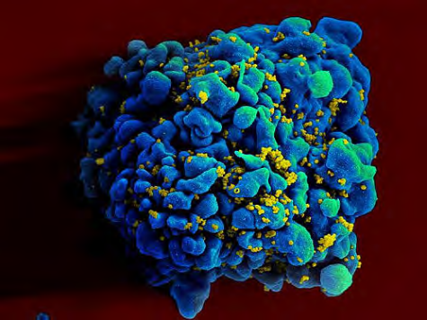
> **[Diagram Context - Textbook_NaturalScience_Gr8_Microorganisms.pdf-0011-10.png]**
> The image is a close-up of a cell, showing the cell's organelles and their structures. The cell is covered in a blue substance, which appears to be a mixture of yellow and blue particles. The cell is surrounded by a red background, which contrasts with the blue substance. The image is labeled with the text "South Africa CAPS" and "South Africa Biology".


---

# Matter and Materials


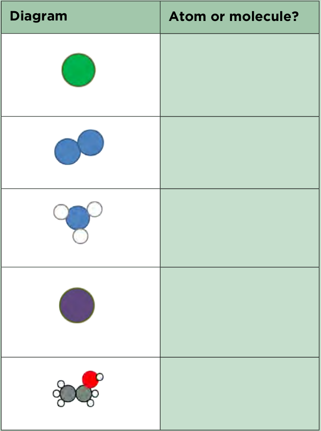
> **[Diagram Context - Textbook_NaturalScience_Gr8_Atoms.pdf-0012-04.png]**
> 1. A diagram of a molecule with a red arrow pointing to the center.


> ### VISIT
> An interesting video that explains what diffusion is and how it occurs:
> [bit.ly/13mAMvi](https://bit.ly/13mAMvi)

---

## Macroscopic Observation of Mixing

When we observe substances mixing in our daily lives, we are making a **macroscopic observation**—this is an observation of phenomena that we can see with the naked eye.

In the demonstration below, a yellow liquid is added to a colourless liquid:


> **[Diagram Context - Textbook_NaturalScience_Gr8_Atoms.pdf-0012-05.png]**
> 1. A cartoon depiction of a roller coaster with a spring coiled up on top.


As you observe the process:
* Notice how the yellow liquid swirls and spreads out.
* The yellow particles mix with the colourless particles. 
* Although we cannot see the individual particles, we can clearly see the macroscopic result of this mixing process.

### Questions for Discussion
1. What will the mixture look like when the coloured particles are uniformly spread out amongst the water molecules?

---

## The Particle Level (Microscopic View)

To understand how substances mix, we must look at what happens at the microscopic or particle level. 

The diagram below represents one of the glasses shown above:
* **Colourless liquid:** Represented by the blue circles.
* **Yellow liquid:** Represented by the yellow circles.

The glass on the left shows the particles in the mixture directly after the yellow liquid is added to the colourless liquid. 


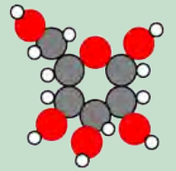
> **[Diagram Context - Textbook_NaturalScience_Gr8_Atoms.pdf-0012-07.png]**
> 1. A diagram of a molecule with eight red spheres and eight gray spheres.


### Exercise
Draw the particles in the empty glass on the right to represent the mixture after the yellow liquid has spread **uniformly** throughout the colourless liquid. 

> **Hint:** When drawing your particles, make sure that:
> 1. The yellow particles are evenly distributed (spread out) amongst the blue particles.
> 2. The total number of blue and yellow particles remains the same as in the left glass.


> **[Diagram Context - Textbook_NaturalScience_Gr8_Microorganisms.pdf-0012-05.png]**
> 1. A diagram of a roller coaster with a spring coiled up in the middle.


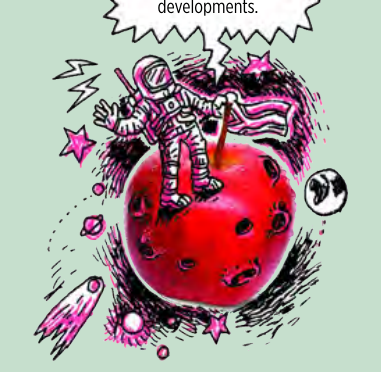
> **[Diagram Context - Textbook_NaturalScience_Gr8_Microorganisms.pdf-0012-16.png]**
> 1. A cartoon drawing of an astronaut on a red planet.
2. A red apple with a flag on it.
3. A planet with a white moon.


> **[Diagram Context - Textbook_NaturalScience_Gr8_Microorganisms.pdf-0012-17.png]**
> 1. A diagram of a snake with a green head and body.


> **[Diagram Context - Textbook_NaturalScience_Gr8_Particle-model-of-matter.pdf-0012-00.png]**
> 1. A diagram of a cell with a white square and a beige square.


> **[Diagram Context - Textbook_NaturalScience_Gr8_Particle-model-of-matter.pdf-0012-06.png]**
> The image shows a close-up view of a zipper, which is a type of zipper pull. The zipper is made up of two rows of teeth, with the teeth on the left side being slightly larger than the ones on the right side. The zipper is set against a gray background, which contrasts with the white and orange lines that make up the zipper. The image also contains a few other


---

# Particle Model of Matter: Random Movement and Diffusion

---

## 1. Introduction: The Behavior of Fluids
When observing a colored liquid mixing with water, it is impossible to predict the exact direction in which the color will swirl. This unpredictable mixing is driven by the constant, invisible motion of the individual particles making up the liquids.

---

## 2. Random Movement of Particles

Particles in both **liquids** and **gases** are in a state of constant, continuous motion. 

### Key Characteristics of Particle Movement:
* **Unpredictability:** The movements of individual particles are completely unpredictable. Because of this, we say that particles move **randomly**.
* **Collisions:** As particles travel, they constantly bump into one another. 
  * For example, a single gas particle traveling from point $A$ to point $B$ does not move in a straight line. Instead, it undergoes up to $8 \times 10^9$ (eight billion) collisions every single second!
  * Each collision forces the particle to change its direction, resulting in a highly irregular, zigzag path.
* **Distance Travelled:** Because of these constant collisions and changes in direction, the **actual distance** travelled by a particle is significantly longer than the **direct straight-line distance** between its starting point $A$ and ending point $B$.

```
       [Zigzag Path of a Particle]
       
          (Collision)
   A *-------> o
              \
               \
                o-------> o (Collision)
               (Collision) \
                            \---> B
```

---

## 3. Diffusion

The random movement of particles is the fundamental cause of a process known as **diffusion**.

### Definition of Diffusion
> **Diffusion** is the process by which particles in a liquid or a gas spread out from an area of **high concentration** to an area of **low concentration** until they are evenly distributed.

### How Diffusion Works (Step-by-Step):

1. **Initial State (High Concentration):** 
   When particles are first introduced into a container, they are packed closely together in one localized area. This is an area of **high concentration**.
   
2. **Random Motion & Spreading:** 
   Due to their inherent kinetic energy, the particles move randomly in all directions, colliding with each other and the walls of the container.
   
3. **Final State (Even Distribution):** 
   Over time, this continuous random movement causes the particles to spread out and fill all the available space in the container evenly, reaching a state of equilibrium (low concentration throughout).

```
   [Initial State]                 [Final State]
+-----------------+             +-----------------+
|  o o o          |             |  o    o    o    |
|  o o o          |    ====>    |    o    o    o  |
|  o o o          |  Over Time  |  o    o    o    |
+-----------------+             +-----------------+
 High Concentration              Evenly Distributed
   in one corner                   (Diffusion)
```

---

## Summary for Revision

* **Liquids and Gases:** Particles are always moving randomly.
* **Collisions:** Occur billions of times per second ($8 \times 10^9 \text{ collisions/s}$), causing constant changes in direction.
* **Diffusion Direction:** Particles always move down a concentration gradient, from **high concentration** $\rightarrow$ **low concentration**.
* **Goal of Diffusion:** To distribute particles evenly across the entire available volume.


> **[Diagram Context - Textbook_NaturalScience_Gr8_Atoms.pdf-0013-02.png]**
> 1. A diagram of a cell with a green line representing a cell wall.


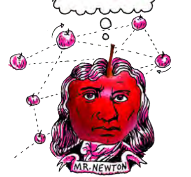
> **[Diagram Context - Textbook_NaturalScience_Gr8_Atoms.pdf-0013-09.png]**
> The image features a cartoon depiction of a man's head with a red apple on his forehead. The man is wearing a white shirt and a black bowtie. The image also includes a thought bubble above the man's head, which contains a pink line connecting several apples. The text "Mr. Newton" is written above the man's head, and the text "Mr. Newton" is also


> **[Diagram Context - Textbook_NaturalScience_Gr8_Atoms.pdf-0013-10.png]**
> The image shows a red circle with a white outline, which is a Lewis diagram. The diagram depicts a molecule with two hydrogen atoms and one oxygen atom. The diagram is labeled with the chemical symbols H2O and H2O2. The diagram is set against a white background, and the text "Water" is written in black at the bottom of the image.


> **[Diagram Context - Textbook_NaturalScience_Gr8_Microorganisms.pdf-0013-00.png]**
> 1. A diagram of a spring with a green background and a step ladder with a green background.


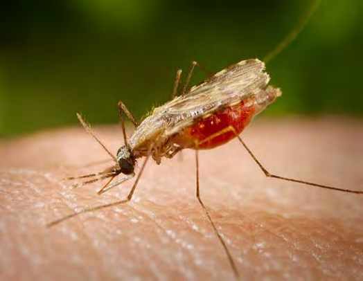
> **[Diagram Context - Textbook_NaturalScience_Gr8_Microorganisms.pdf-0013-03.png]**
> 1. A mosquito with a red spot on its leg.


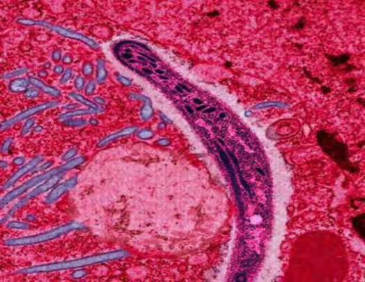
> **[Diagram Context - Textbook_NaturalScience_Gr8_Microorganisms.pdf-0013-04.png]**
> The image is a close-up view of a cell, with a purple and pink color scheme. The cell is surrounded by a pink and black coloration, and there are small blue dots scattered throughout the image. The cell appears to be a part of a larger structure, possibly a tissue or an organ. The image is labeled with the text "South African CAPS" and "Exam


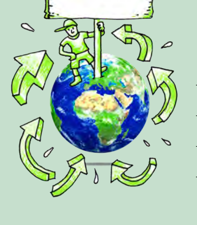
> **[Diagram Context - Textbook_NaturalScience_Gr8_Microorganisms.pdf-0013-14.png]**
> The image features a cartoon depiction of a boy standing on a globe, holding a pole. The globe is divided into sections, each representing a different country. The boy is positioned in the center of the globe, with a green arrow pointing towards him. The boy is wearing a green shirt and a green hat. The boy is holding a pole in his hand, which is connected to the globe by


> **[Diagram Context - Textbook_NaturalScience_Gr8_Microorganisms.pdf-0013-16.png]**
> 1. A diagram of a cell with a green line representing the cell wall.


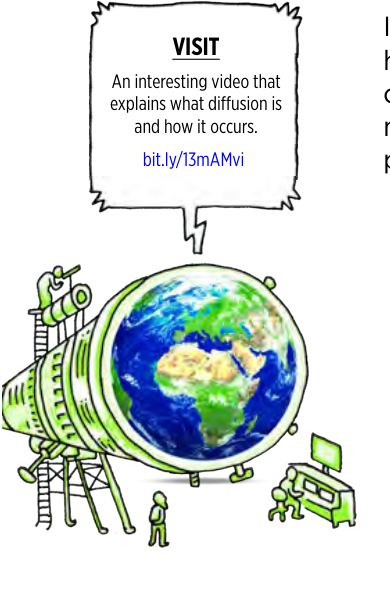
> **[Diagram Context - Textbook_NaturalScience_Gr8_Particle-model-of-matter.pdf-0013-00.png]**
> 1. A cartoon depiction of a telescope and a globe.
2. A caption that reads "Visit".
3. A caption that reads "An interesting video that explains what diffusion is and how it occurs".


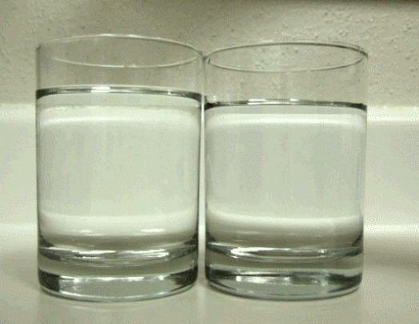
> **[Diagram Context - Textbook_NaturalScience_Gr8_Particle-model-of-matter.pdf-0013-02.png]**
> 1. A glass of water with a white line down the middle.


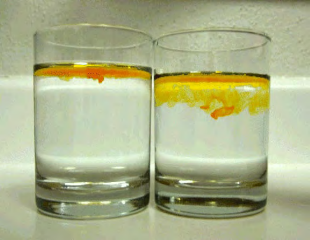
> **[Diagram Context - Textbook_NaturalScience_Gr8_Particle-model-of-matter.pdf-0013-03.png]**
> 1. A glass of water with a yellow substance floating in it.


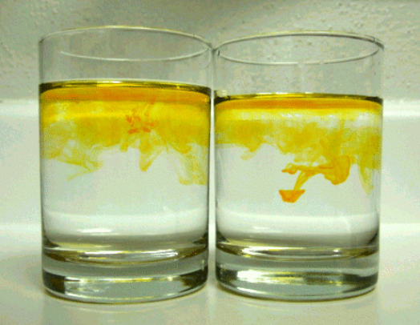
> **[Diagram Context - Textbook_NaturalScience_Gr8_Particle-model-of-matter.pdf-0013-04.png]**
> 1. A yellow liquid in a glass.


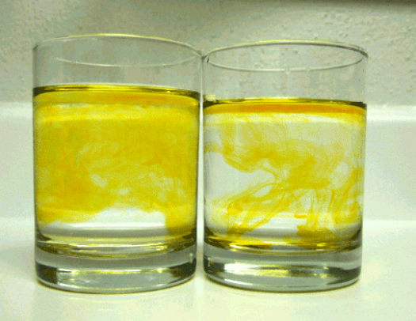
> **[Diagram Context - Textbook_NaturalScience_Gr8_Particle-model-of-matter.pdf-0013-05.png]**
> 1. Yellow liquid in a glass.


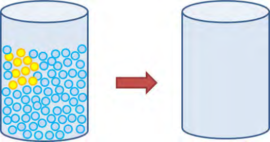
> **[Diagram Context - Textbook_NaturalScience_Gr8_Particle-model-of-matter.pdf-0013-08.png]**
> 1. A diagram of two blue cylinders with yellow spheres inside. One cylinder is filled with blue spheres, while the other is filled with yellow spheres. An arrow points from the blue cylinder to the yellow cylinder.


---

# Factors Affecting the Rate of Diffusion

Diffusion is the movement of particles from an area of higher concentration to an area of lower concentration. Particles diffuse because they are in **constant motion**. The rate at which this process occurs depends on several key physical factors.

---

## 1. Key Factors Influencing Diffusion Rate

### The Mass of the Particles
* **Concept:** Lighter particles diffuse faster than heavier particles.
* **Explanation:** At any given temperature, lighter particles have a higher average speed than heavier particles, allowing them to spread out more rapidly.

### The State of the Particles
* **Concept:** The physical state (gas vs. liquid) determines the baseline speed of the particles.
* **Explanation:** Particles in a gas are always moving very fast (high average speed), whereas particles in a liquid travel much more slowly.

### The Temperature of the Particles
* **Concept:** Temperature is a direct measure of the average kinetic energy ($E_k$) of the particles:
  $$E_k \propto T$$
* **Explanation:** The higher the temperature ($T$), the more kinetic energy the particles possess. This causes them to move faster, thereby increasing the rate of diffusion.

### The Size of the Spaces Between Particles
* **Concept:** The availability of empty space determines how easily foreign particles can move through a substance.
* **Explanation:** If there are large spaces between the particles of one substance, the particles of another substance can slip into those spaces with minimal resistance.

---

## 2. Understanding Diffusion: The Crowd Analogy

To understand why particles diffuse at different rates in different states of matter, imagine trying to walk through a densely packed crowd of people:

* **High Density (Liquid-like):** The closer people are to one another, the more often you will bump into someone and be forced to change your direction. It takes a long time to travel from point $A$ to point $B$.
* **Low Density (Gas-like):** If the crowd is sparse and spread out, you can walk long distances in a straight line without colliding with anyone, reaching your destination much faster.

---

## 3. Comparison: Diffusion in Liquids vs. Gases

The table below summarizes the differences in particle behavior and diffusion rates between liquids and gases:

| Property | Liquids | Gases |
| :--- | :--- | :--- |
| **Particle Spacing** | Particles are very close together. | Particles are far apart with large empty spaces. |
| **Collision Frequency** | High; particles collide constantly. | Low; collisions occur much less frequently. |
| **Path of Movement** | Short, zigzag paths due to immediate collisions. | Longer straight-line paths before a collision occurs. |
| **Rate of Diffusion** | **Slower** (takes longer for a particle to travel from $A$ to $B$). | **Faster** (particles travel quickly across distances). |


> **[Diagram Context - Textbook_NaturalScience_Gr8_Atoms.pdf-0014-06.png]**
> The image shows a diagram of a spring coiled up and attached to a green staircase. The diagram is a Lewis diagram, which is a visual representation of a chemical reaction. The diagram is accompanied by a line drawing of a cell, which is a fundamental unit of life. The diagram also includes a graph of a chemical reaction, which is a visual representation of the reaction mechanism. The diagram is


> **[Diagram Context - Textbook_NaturalScience_Gr8_Atoms.pdf-0014-14.png]**
> The image shows a close-up view of a diagram that appears to be a Lewis diagram. The diagram is divided into two sections, with the top section being a light brown color and the bottom section being a darker brown color. The diagram contains various elements, including a cell, a molecule, and a circuit. The diagram also includes a few arrows pointing in different directions. The diagram is accompanied


> **[Diagram Context - Textbook_NaturalScience_Gr8_Microorganisms.pdf-0014-04.png]**
> 1. A green spring with a silver spring inside of it.
 2. A green battery with a silver battery inside of it.
 3. A green wire with a silver wire inside of it.
 4. A green wire with a silver wire inside of it.


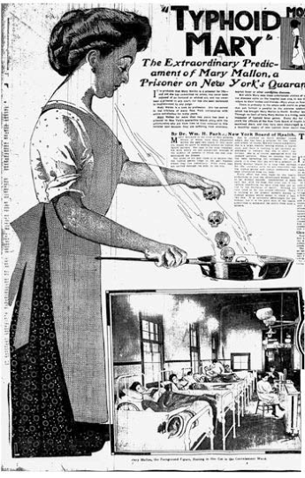
> **[Diagram Context - Textbook_NaturalScience_Gr8_Microorganisms.pdf-0014-11.png]**
> 1. A black and white image of a woman cooking in a kitchen. 
 2. A black and white image of a woman cooking in a kitchen. 
 3. A black and white image of a woman cooking in a kitchen. 
 4. A black and white image of a woman cooking in a kitchen. 
 5. A black and white image of a woman cooking


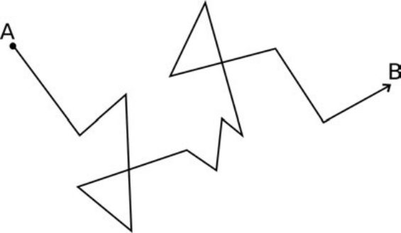
> **[Diagram Context - Textbook_NaturalScience_Gr8_Particle-model-of-matter.pdf-0014-04.png]**
> 1. A diagram of a triangle with a line going through it.


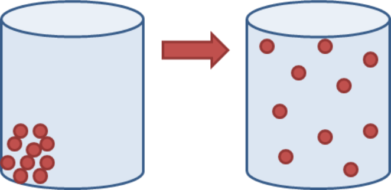
> **[Diagram Context - Textbook_NaturalScience_Gr8_Particle-model-of-matter.pdf-0014-06.png]**
> 1. A diagram of two containers with red balls in them. One container is empty and the other is filled with red balls.


---

# Particle Model of Matter

## 1. Particle Behaviour in Liquids and Gases

The diagrams below illustrate the paths of individual particles moving from point A to point B in both a liquid and a gas. This demonstrates how the density and spacing of particles affect their motion.

| Liquid | Gas |
| :--- | :--- |
|  |  |
| **Characteristics:**<br>- Particles are close together.<br>- Frequent collisions occur.<br>- The path from A to B is highly tortuous and zigzagged due to constant interactions with neighbouring particles. | **Characteristics:**<br>- Particles are far apart.<br>- Fewer collisions occur.<br>- The path from A to B consists of longer, straight-line segments because particles travel further before colliding. |

---

## 2. Key Vocabulary

Understanding these core terms is essential for studying phase changes and the particle model of matter:

*   **Vapour:** The gaseous state of a substance that is normally a liquid or solid at room temperature (e.g., water vapour).
*   **Vigorous:** Characterised by great energy, speed, or force (e.g., the rapid movement of particles at high temperatures).
*   **Energetic:** Possessing high kinetic energy. Particles become more energetic as heat is added.
*   **Transformation:** A change in form, state, or appearance (such as a phase change from solid to liquid).
*   **Condensation:** The physical process where a gas cools down and changes state into a liquid.
*   **Evaporation:** The process where liquid particles at the surface gain enough energy to escape into the gas state.

---

## 2.3 Changes of State

In science, a **change of state** refers to a physical transformation from one state of matter (solid, liquid, or gas) to another. This is a physical change because the chemical identity of the particles remains the same, even though their arrangement and energy change.

### Quick Check
> **Question:** When a liquid changes to a solid, what is this process called?
> 
> **Answer:** **Freezing** (or **solidification**).

---

## Activity: Changes of State

### Instructions:
1. Complete the crossword puzzle by following the clues provided by your teacher.
2. **Down** clues correspond to the vertical words in the puzzle.
3. **Across** clues correspond to the horizontal words in the puzzle.
4. All clues relate to the changes of state of materials. The first letter of each word has been filled in on your worksheet to assist you.


> **[Diagram Context - Textbook_NaturalScience_Gr8_Microorganisms.pdf-0015-09.png]**
> This graphic depicts a stylized, repeating wave pattern composed of interconnected, arrow-headed segments. The image uses a continuous, rhythmic flow of green, chevron-like shapes to represent directional movement or a cyclical process. Conceptually, this visual serves as a pedagogical tool to illustrate concepts such as wave propagation, energy transfer, or the sequential flow of biological and physical cycles within the CAPS curriculum.


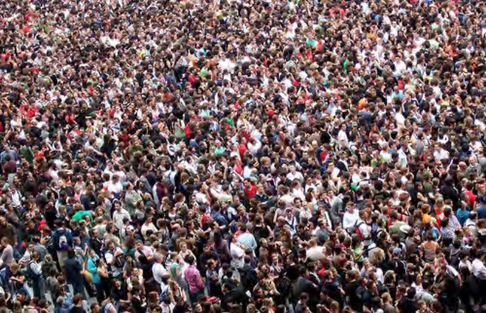
> **[Diagram Context - Textbook_NaturalScience_Gr8_Particle-model-of-matter.pdf-0015-08.png]**
> The image shows a large crowd of people gathered in a public space. The crowd is composed of individuals of varying heights and ages, all standing close together. The people are scattered throughout the image, with some standing closer to the foreground and others further back in the scene. The crowd appears to be engaged in a shared activity or event, as they are all facing the same direction. The image does


---

# Matter and Materials: States of Matter and Phase Changes

## Core Concepts: The Three States of Matter

Matter exists in three primary physical states: **solids**, **liquids**, and **gases**. The state
 of a substance depends on the arrangement, spacing, and movement of its constituent particles, as well as the strength of the forces holding them together.

```
   [ Solid ]  ---(Heat/Melting)--->  [ Liquid ]  ---(Heat/Evaporation)--->  [ Gas ]
             <---(Cool/Freezing)---              <---(Cool/Condensation)---
```

### 1. Solids
* **Particle Arrangement:** Particles are closely packed together in a fixed, regular lattice structure.
* **Forces:** Held together by very strong intermolecular forces.
* **Movement:** Particles cannot move from their positions; they can only vibrate about fixed positions.
* **Shape and Volume:** Fixed shape and fixed volume.

### 2. Liquids
* **Particle Arrangement:** Particles are close together but randomly arranged.
* **Forces:** Held by weaker intermolecular forces than solids, allowing movement.
* **Movement:** Particles can slide, roll, and flow past one another.
* **Shape and Volume:** No fixed shape (takes the shape of the container), but has a fixed volume.

### 3. Gases
* **Particle Arrangement:** Particles are very far apart with large empty spaces between them.
* **Forces:** Extremely weak intermolecular forces.
* **Movement:** Particles move rapidly, randomly, and in all directions, colliding with each other and the walls of the container.
* **Shape and Volume:** No fixed shape and no fixed volume (fills the entire container).

---

## Phase Changes and Thermal Energy

Phase changes are physical transitions between states of matter. These changes occur when thermal energy (heat) is either added to or removed from a system.

Let $\Delta Q$ represent the change in thermal energy:
* **Heating ($\Delta Q > 0$):** Adding heat increases the kinetic energy of the particles, causing them to move faster and overcome the intermolecular forces holding them together.
* **Cooling ($\Delta Q < 0$):** Removing heat decreases the kinetic energy of the particles, causing them to slow down and allowing intermolecular forces to pull them back together.

### Summary of Phase Transitions

| Initial State | Final State | Process | Thermal Action Required | Example (Water) |
| :--- | :--- | :--- | :--- | :--- |
| **Solid** | **Liquid** | Melting | Heat ($\Delta Q > 0$) | Ice turning into liquid water |
| **Liquid** | **Gas** | Evaporation / Boiling | Heat ($\Delta Q > 0$) | Water turning into steam |
| **Gas** | **Liquid** | Condensation | Cool ($\Delta Q < 0$) | Steam turning into liquid water |
| **Liquid** | **Solid** | Freezing / Solidification | Cool ($\Delta Q < 0$) | Liquid water turning into ice |

---

## Revision Activity: States of Matter Crossword

Test your understanding of states of matter, particle behavior, and phase changes by completing the crossword puzzle clues below.

### Crossword Clues and Solutions

| Clue Number & Direction | Clue Description | Answer | Scientific Explanation |
| :--- | :--- | :--- | :--- |
| **1 Down** | If we want to turn steam into water we have to ________ it. (4 letters) | **COOL** | Condensation requires the removal of thermal energy to slow down gas particles. |
| **2 Down** | The process of turning a liquid into a gas is called ________. (11 letters) | **EVAPORATION** | Liquid particles gain kinetic energy and escape from the surface as a gas. |
| **3 Down** | The particles of a ________ have large spaces between them. (3 letters) | **GAS** | Gas particles have high kinetic energy and weak attractive forces, spreading far apart. |
| **4 Down** | The particles of a ________ are locked in position by strong forces. (5 letters) | **SOLID** | Strong intermolecular forces keep solid particles in a fixed lattice structure. |
| **5 Down** | A solid will change into the liquid state at its ________ point. (7 letters) | **MELTING** | The specific temperature at which a solid overcomes its rigid structure to become a liquid. |
| **7 Down** | The liquid state of ice is called ________. (5 letters) | **WATER** | Water ($H_2O$) exists in the liquid state at standard room temperature. |
| **9 Down** | The gaseous state of ice is called ________. (5 letters) | **STEAM** | Steam (or water vapor) is the gaseous phase of water. |
| **11 Down** | If we want to turn water into steam we have to ________ it. (4 letters) | **HEAT** | Adding thermal energy increases particle movement to transition from liquid to gas. |
| **1 Across** | The process of turning a gas into a liquid is called ________. (12 letters) | **CONDENSATION** | Gas particles lose kinetic energy upon cooling and transition back into a liquid. |
| **6 Across** | The particles of a ________ are close together but they can flow and slide over each other. (6 letters) | **LIQUID** | Liquid particles have enough energy to break fixed bonds but remain close due to residual attraction. |
| **8 Across** | The boiling point of a liquid is the temperature at which that liquid will start to ________. (4 letters) | **BOIL** | Boiling occurs when the vapor pressure of the liquid equals the external atmospheric pressure. |
| **10 Across** | The solid state of water is called ________. (3 letters) | **ICE** | Ice is the crystalline solid phase of water formed below $0^\circ\text{C}$. |
| **12 Across** | Freezing and melting are the ________ of each other. (7 letters) | **REVERSE** | Freezing (liquid to solid) and melting (solid to liquid) are opposite thermodynamic processes. |
| **13 Across** | ________ water turns it into ice. (8 letters) | **FREEZING** | The process of removing heat from liquid water until it solidifies. |


> **[Diagram Context - Textbook_NaturalScience_Gr8_Atoms.pdf-0016-04.png]**
> 1. A diagram of a snake's body.
 2. The snake's body is made up of green and white lines.
 3. The snake's head is green and the body is white.


> **[Diagram Context - Textbook_NaturalScience_Gr8_Microorganisms.pdf-0016-07.png]**
> The image features a cartoon depiction of a caterpillar with a green head and body, surrounded by green leaves. The caterpillar is holding a green ball in its mouth, and there is a wire spring attached to the caterpillar's head. The image is labeled as a Lewis diagram, which is a diagram used to represent chemical structures and their valence electrons. The diagram shows the valence electrons


> **[Diagram Context - Textbook_NaturalScience_Gr8_Microorganisms.pdf-0016-13.png]**
> 1. A diagram of a snake with a green head and body.


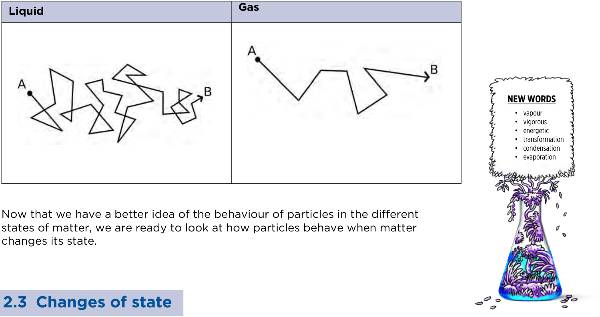
> **[Diagram Context - Textbook_NaturalScience_Gr8_Particle-model-of-matter.pdf-0016-00.png]**
> 1. A diagram of a gas and a new words.


> **[Diagram Context - Textbook_NaturalScience_Gr8_Particle-model-of-matter.pdf-0016-03.png]**
> 1. A green spring with a silver spring inside of it.
 2. A green battery with a silver battery inside of it.
 3. A green wire with a silver wire inside of it.
 4. A green wire with a silver wire inside of it.


---

How can we change matter from one state to another?
.
VISIT
Misconceptions about
temperature (video).
bit.ly/19Q7VGZ
Changes of state involve energy
For matter to change from one state to another, its particles must gain or lose
energy. The following diagram shows us that to change the state of a
substance, it must either be heated or cooled.
Melting and evaporation are processes that require heating; condensation and freezing
are processes that require cooling.
First, let us look at what happens to particles when they are heated.
Melting and evaporation
.
NEW WORDS
• boiling
• melting
• evaporation
• melting point
• boiling point
When a solid is heated to reach its melting point, it will change into a liquid. This
is a process that we are all familiar with, because we have seen how ice melts.
A melting ice cube.
For a solid to change into a liquid
state, the particles in the solid need to
be freed from their fixed positions in
the solid state. How could that occur?
Imagine you are holding hands with a
group of other learners. Everyone is
jumping in place, much like a solid
particle vibrating in a fixed position.
The more energetically and randomly
everyone jumps, the more difficult it
will be for everyone to keep holding
hands.
When a substance is heated, the particles are given more energy. By giving the
vibrating particles in a solid more energy, their vibrations will become more and
more vigorous, until the solid particles are able to shake themselves loose from
their fixed positions. The forces between the particles are no longer able to hold
them together tightly, and the solid melts.
.
.
169
.

### Chapter 2.

Particle model of matter

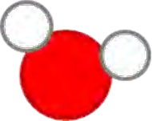
> **[Diagram Context - Textbook_NaturalScience_Gr8_Atoms.pdf-0017-05.png]**
> 1. A red circle with a white dot in the center.


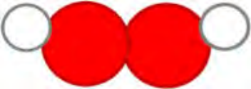
> **[Diagram Context - Textbook_NaturalScience_Gr8_Atoms.pdf-0017-06.png]**
> The image shows a diagram of two red circles connected by a line, with a gray line running through the center of the circles. The diagram is labeled with the words "Lewis diagram" and "cellular structure", and it appears to be a visual representation of a Lewis structure or a diagram of a cell. The diagram is set against a gray background, and the text "South Africa" is


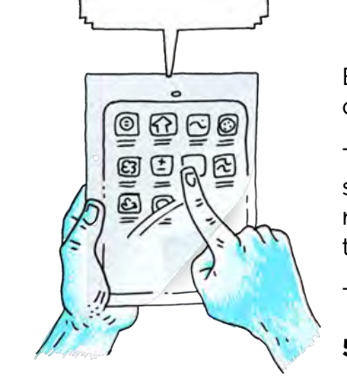
> **[Diagram Context - Textbook_NaturalScience_Gr8_Atoms.pdf-0017-07.png]**
> 1. A diagram of a cell with arrows pointing to different parts of the cell.


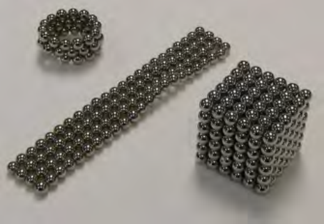
> **[Diagram Context - Textbook_NaturalScience_Gr8_Atoms.pdf-0017-18.png]**
> The image shows three different types of metallic balls, each with a unique shape and size, arranged in a row. The balls are made of silver metal and are arranged in a way that they are stacked on top of each other. The balls are positioned in a way that they are facing different directions, creating a sense of depth and dimension. The balls are not touching each other, which adds to


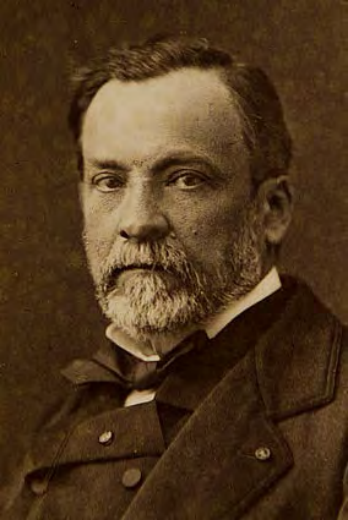
> **[Diagram Context - Textbook_NaturalScience_Gr8_Microorganisms.pdf-0017-01.png]**
> 1. A man with a beard and mustache wearing a black suit and tie.


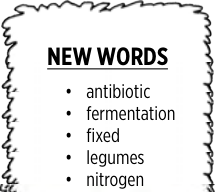
> **[Diagram Context - Textbook_NaturalScience_Gr8_Microorganisms.pdf-0017-02.png]**
> 1. A diagram of a cell with a leukogram.


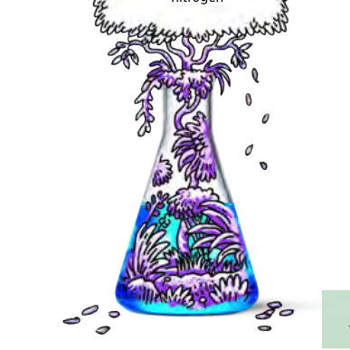
> **[Diagram Context - Textbook_NaturalScience_Gr8_Microorganisms.pdf-0017-04.png]**
> The image features a cartoon depiction of a plant growing out of a vase. The plant is depicted in a variety of colors, including purple and blue, and is growing upwards, filling the vase. The vase is placed on a table, and there are several small purple flowers scattered around the vase. The image also includes a watermark that reads "mitroger".


> **[Diagram Context - Textbook_NaturalScience_Gr8_Microorganisms.pdf-0017-06.png]**
> The image shows a horizontal line of text that reads "3.3 Useful Microorganisms". The text is green and stands out against a gray background. The text is in a serif font and is centered on the image.


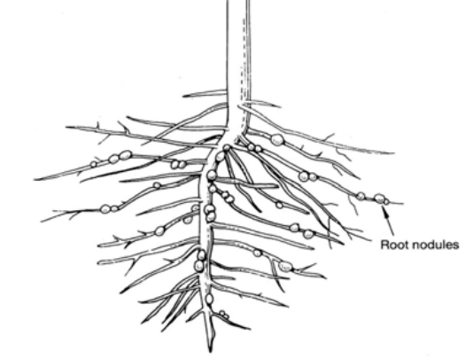
> **[Diagram Context - Textbook_NaturalScience_Gr8_Microorganisms.pdf-0017-09.png]**
> 1. A black and white diagram of a plant's root system.
2. The root nodules are labeled with the letters "ROOT".
3. The diagram shows the root system of a plant, with the root nodules visible.


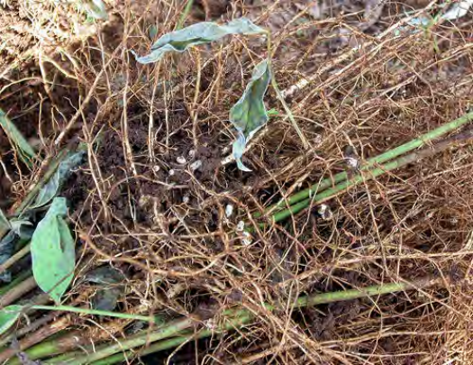
> **[Diagram Context - Textbook_NaturalScience_Gr8_Microorganisms.pdf-0017-11.png]**
> The image shows a close-up view of a plant root system. The roots are brown and appear to be in poor condition, with some of them being broken and others appearing to be dead. The roots are surrounded by a mix of green and brown leaves, and the soil is brown and dirty. The image is a close-up of the roots and leaves, providing a detailed view of the


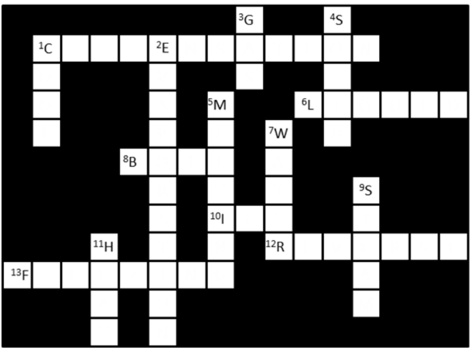
> **[Diagram Context - Textbook_NaturalScience_Gr8_Particle-model-of-matter.pdf-0017-01.png]**
> 1. A diagram of a cell with the number 1 on the top and 2 on the bottom.


> **[Diagram Context - Textbook_NaturalScience_Gr8_Particle-model-of-matter.pdf-0017-14.png]**
> 1. A diagram of a cell with arrows pointing to different parts of the cell.


---

# Matter and Materials: Changes of State

---

## 1. Evaporation and the Vapour Phase

When thermal energy is added to a liquid, the particles gain kinetic energy and move faster. 

* **The Process of Evaporation:** Particles near the surface of the liquid acquire enough energy to overcome the intermolecular forces holding them together in the liquid state. Once free, they escape into the gas (or gaseous) state.
* **Vapour:** The gaseous state of a substance that is normally a liquid or solid at room temperature is called **vapour** (e.g., water vapour).
* **Factors Affecting Evaporation:** The rate of evaporation increases as the temperature of the liquid increases. 

### Revision Activity 1
**Question:** Why do we hang wet washing outside in the sunshine to dry?
**Explanation/Answer:** The thermal energy from the sun increases the temperature of the water in the clothes. This increases the kinetic energy of the water particles, allowing them to escape as water vapour much faster than they would at lower temperatures.

---

## 2. Evaporation vs. Boiling

While both evaporation and boiling involve a phase change from liquid to gas, they occur under different conditions:

| Feature | Evaporation | Boiling |
| :--- | :--- | :--- |
| **Temperature** | Occurs at any temperature. | Occurs only at a specific temperature called the **boiling point**. |
| **Location** | Occurs only at the surface of the liquid. | Occurs throughout the entire volume of the liquid. |
| **Visual Evidence** | No bubbles are formed. | Bubbles of vapour form throughout the liquid and rise to the surface. |

### Revision Activity 2
1. **Question:** What is the boiling point of water at sea level?
   **Answer:** $100^\circ\text{C}$

2. **Question:** Look carefully at the picture of boiling water. What is inside the bubbles?
   **Answer:** Water vapour (water in its gaseous state), not air.

---

## 3. Condensation and Solidifying

When we cool a substance, we remove thermal energy from its particles.

### Condensation
* **Definition:** **Condensation** is the phase change from a gas to a liquid. It is the exact opposite of evaporation.
* **Mechanism:** As the temperature of a gas decreases, energy is removed from the gas particles. Their movement slows down, and as their kinetic energy decreases, the attractive intermolecular forces pull them closer together to form a liquid.
* **Real-world Example:** Droplets of water forming on the cold outer surface of a glass of ice water. The water vapour in the surrounding air cools down when it contacts the cold glass, losing energy and condensing into liquid water.

---

## Key Vocabulary

* **Condensation:** The process by which a gas cools and changes into a liquid.
* **Solidifying (Freezing):** The process by which a liquid loses energy and changes into a solid.
* **Boiling Point:** The specific temperature at which a liquid changes into a gas throughout the entire volume of the liquid.


> **[Diagram Context - Textbook_NaturalScience_Gr8_Atoms.pdf-0018-01.png]**
> 1. A red circle with a white dot in the center.


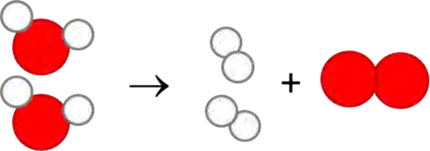
> **[Diagram Context - Textbook_NaturalScience_Gr8_Atoms.pdf-0018-03.png]**
> 1. A diagram of a water molecule with two hydrogen atoms and one oxygen atom.


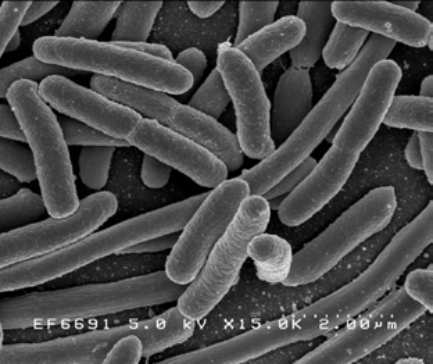
> **[Diagram Context - Textbook_NaturalScience_Gr8_Microorganisms.pdf-0018-00.png]**
> The image is a black and white photograph of a large number of bacteria, possibly a strain of strep throat, arranged in a grid-like pattern. The bacteria are clearly visible, and the image is labeled with the text "S6151 S. 6.0 KV X 15.8.8 K 2.8 mm". The bacteria appear to be in various stages of growth,


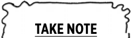
> **[Diagram Context - Textbook_NaturalScience_Gr8_Microorganisms.pdf-0018-14.png]**
> The image shows a diagram of a cell, with the word "Take Note" written above it. The diagram is a Lewis diagram, which is a type of diagram used to represent the chemical structure of organic compounds. The diagram is a black and white image, with the cell being the main focus. The diagram is labeled with the name of the cell, "Mitochondria", and the word


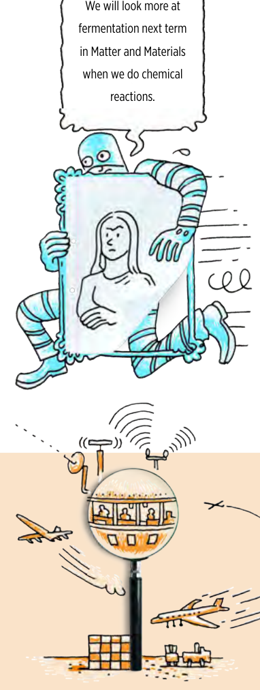
> **[Diagram Context - Textbook_NaturalScience_Gr8_Microorganisms.pdf-0018-15.png]**
> 1. A cartoon drawing of a man holding a picture of a woman. 
 2. A diagram of a cell with arrows pointing to different parts of the cell. 
 3. A diagram of a Lewis structure with arrows pointing to different parts of the molecule. 
 4. A diagram of a molecule with arrows pointing to different parts of the molecule.


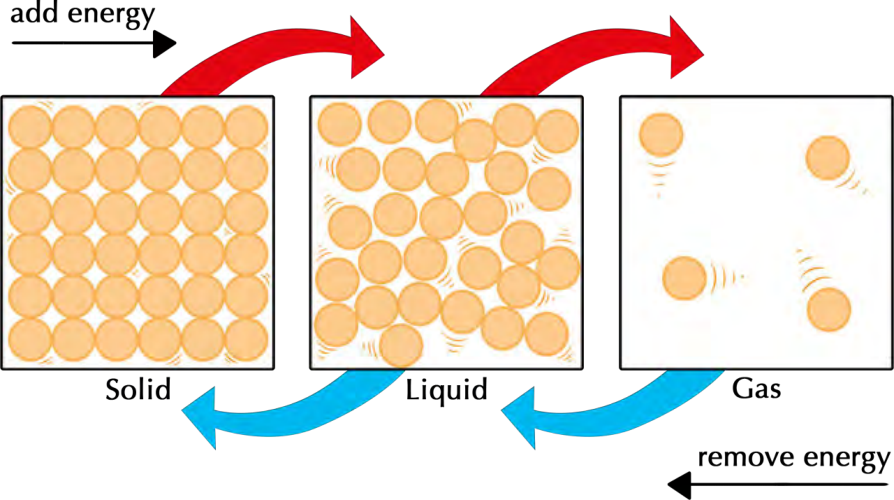
> **[Diagram Context - Textbook_NaturalScience_Gr8_Particle-model-of-matter.pdf-0018-03.png]**
> 1. Solid: Solid state of matter.
2. Liquid: Liquid state of matter.
3. Gas: Gas state of matter.
4. Remove energy: Remove energy.


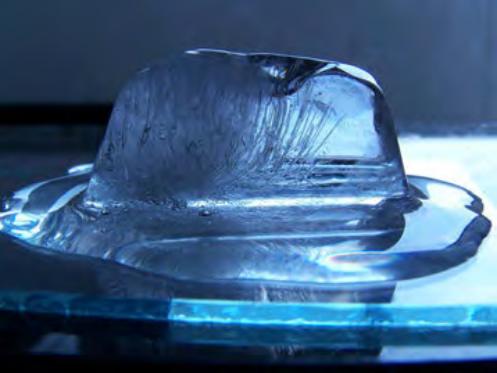
> **[Diagram Context - Textbook_NaturalScience_Gr8_Particle-model-of-matter.pdf-0018-08.png]**
> 1. A diagram of a cell with a water droplet on top.


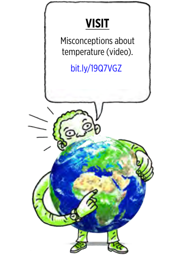
> **[Diagram Context - Textbook_NaturalScience_Gr8_Particle-model-of-matter.pdf-0018-12.png]**
> This graphic features a cartoon illustration of a person holding a globe, accompanied by a speech bubble containing the text "VISIT Misconceptions about temperature (video)" and a shortened URL. It serves as a pedagogical signpost designed to direct learners to external digital resources that address common scientific misunderstandings regarding thermal energy and global temperature.


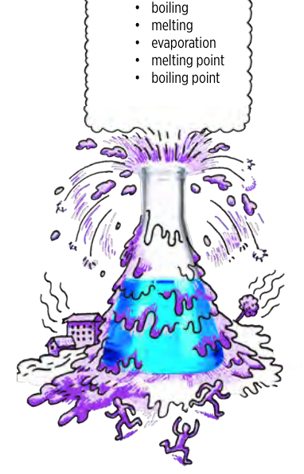
> **[Diagram Context - Textbook_NaturalScience_Gr8_Particle-model-of-matter.pdf-0018-14.png]**
> The image shows a cartoon depiction of a boiling pot of water. The pot is filled with water and is surrounded by a variety of objects, including a house, a car, and a person. The pot is also surrounded by a number of other objects, including a house, a car, and a person. The pot is depicted in a cartoon style, with a purple background and a white base


---

# Chapter 2: Particle Model of Matter

## Phase Changes: Condensation and Solidification

When substances lose thermal energy (cool down), their particles undergo phase changes. Two key processes in this cooling cycle are **condensation** and **solidification**.

---

### 1. Condensation (Gas to Liquid)

When a gas is cooled, thermal energy is removed from its particles. 

* **The Process:** As gas particles lose energy, their movement slows down. As they slow down, the attractive forces between them start to take effect, pulling the particles closer together. Eventually, they return to the liquid state.
* **Analogy:** Just like birds, animals, or people huddle together to keep warm when they get cold, gas particles come together and "huddle" into droplets when cooled.
* **Real-World Example:** Water vapour in the air condenses into liquid water droplets when it comes into contact with a cold surface, such as a glass window pane.

---

### 2. Solidification / Freezing (Liquid to Solid)

What happens if we cool a liquid even further?

* **The Process:** By cooling a liquid, we continue to remove thermal energy. As the liquid particles lose energy:
  1. Their movement slows down even more.
  2. The attractive forces between the particles become stronger.
  3. The particles eventually "lock" into fixed positions in a regular lattice structure.
  4. They can no longer move freely and are only able to vibrate in their fixed positions.
* **Result:** The liquid has **solidified** (frozen) into a solid.

> ### Did You Know?
> While most substances contract (shrink in volume) when they solidify, water is a unique exception. The volume of water expands by approximately $9\%$ when it freezes into ice.

---

### Summary of Cooling Phase Changes

| Phase Change | Initial State | Final State | Energy Change | Particle Movement | Particle Spacing & Forces |
| :--- | :--- | :--- | :--- | :--- | :--- |
| **Condensation** | Gas | Liquid | Energy is removed (cooling) | Particles slow down | Particles move closer together as attractive forces take effect. |
| **Solidification** | Liquid | Solid | Energy is removed (further cooling) | Particles slow down further until they only vibrate | Particles lock into fixed positions; attractive forces become very strong. |

---

## Investigation: What happens when we heat and then cool candle wax?

Use this practical activity template to guide your scientific inquiry.

### Aim
What is your aim for this investigation?
* *Hint: Your aim should state what you intend to investigate (e.g., "To observe and describe the phase changes that occur when candle wax is heated and then cooled").*

$$\text{Aim: } \underline{\hspace{15cm}}$$

### Hypothesis
What do you propose will happen in this investigation? This is your hypothesis.
* *Hint: A hypothesis is a testable prediction (e.g., "If candle wax is heated, it will melt into a liquid, and if it is cooled, it will solidify back into a solid").*

$$\text{Hypothesis: } \underline{\hspace{15cm}}$$

### Materials and Apparatus
* Empty tin can or foil pie dish
* Bunsen burner or spirit lamp
* Tripod stand
* Wire gauze
* Candle wax
* Matches


> **[Diagram Context - Textbook_NaturalScience_Gr8_Atoms.pdf-0019-00.png]**
> 1. A green spring with a silver wire attached to it.


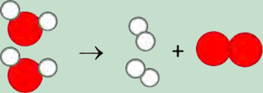
> **[Diagram Context - Textbook_NaturalScience_Gr8_Atoms.pdf-0019-15.png]**
> 1. A diagram of a water molecule with two oxygen atoms and two hydrogen atoms.


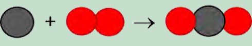
> **[Diagram Context - Textbook_NaturalScience_Gr8_Atoms.pdf-0019-17.png]**
> 1. A diagram of a chemical reaction involving two red spheres and a black one.
 2. The reaction is represented by an arrow pointing from the left to the right.
 3. The reaction is represented by two red spheres and a black one.


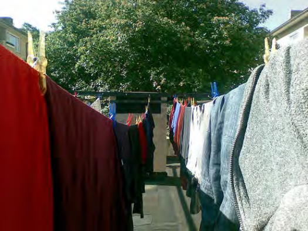
> **[Diagram Context - Textbook_NaturalScience_Gr8_Particle-model-of-matter.pdf-0019-01.png]**
> 1. A diagram of a cell with a diagram of a cell on the left side.


> **[Diagram Context - Textbook_NaturalScience_Gr8_Particle-model-of-matter.pdf-0019-07.png]**
> The image shows a diagram of a condensation process. The diagram is labeled with the words "condensation" and "solidifying" written in black text. The diagram is set against a gray background. The diagram is a Lewis diagram, which is a diagram used to represent chemical reactions. The diagram shows a molecule of water with two hydrogen atoms and one oxygen atom. The water molecule is shown


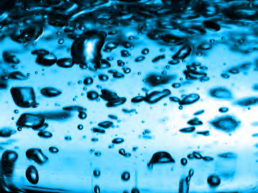
> **[Diagram Context - Textbook_NaturalScience_Gr8_Particle-model-of-matter.pdf-0019-08.png]**
> 1. A close-up view of a blue water droplet.


---

# Matter and Materials: Practical Investigation

This lesson focuses on planning, executing, and recording observations for a scientific investigation on the heating of candle wax and its physical changes of state.

---

## 1. Method

A scientific method is a clear, step-by-step set of instructions that details how to conduct an experiment. It must be written in a logical sequence so that another researcher can repeat the investigation exactly and obtain similar results.

### Activity 1: Writing Your Method
Write down the steps for your investigation. You will either plan this in a group or write down the steps demonstrated by your teacher.

*   **Step 1:** \_\_\_\_\_\_\_\_\_\_\_\_\_\_\_\_\_\_\_\_\_\_\_\_\_\_\_\_\_\_\_\_\_\_\_\_\_\_\_\_\_\_\_\_\_\_\_\_\_\_\_\_\_\_\_\_\_\_\_\_
*   **Step 2:** \_\_\_\_\_\_\_\_\_\_\_\_\_\_\_\_\_\_\_\_\_\_\_\_\_\_\_\_\_\_\_\_\_\_\_\_\_\_\_\_\_\_\_\_\_\_\_\_\_\_\_\_\_\_\_\_\_\_\_\_
*   **Step 3:** \_\_\_\_\_\_\_\_\_\_\_\_\_\_\_\_\_\_\_\_\_\_\_\_\_\_\_\_\_\_\_\_\_\_\_\_\_\_\_\_\_\_\_\_\_\_\_\_\_\_\_\_\_\_\_\_\_\_\_\_
*   **Step 4:** \_\_\_\_\_\_\_\_\_\_\_\_\_\_\_\_\_\_\_\_\_\_\_\_\_\_\_\_\_\_\_\_\_\_\_\_\_\_\_\_\_\_\_\_\_\_\_\_\_\_\_\_\_\_\_\_\_\_\_\_
*   **Step 5:** \_\_\_\_\_\_\_\_\_\_\_\_\_\_\_\_\_\_\_\_\_\_\_\_\_\_\_\_\_\_\_\_\_\_\_\_\_\_\_\_\_\_\_\_\_\_\_\_\_\_\_\_\_\_\_\_\_\_\_\_

---

## 2. Experimental Setup

A scientific diagram visually represents the apparatus used in the experiment. 

### Guidelines for Drawing Scientific Diagrams:
1. **Heading:** Always give your diagram a clear, descriptive heading.
2. **Labels:** Use straight, horizontal ruler lines to point to the components. Do not cross label lines.
3. **Clarity:** Draw simple, two-dimensional line diagrams rather than realistic artistic drawings.

### Activity 2: Diagram of Your Setup
Draw a labeled diagram of your experimental setup in the space below:

```
+-------------------------------------------------------------------------+
|                                                                         |
|  [Heading]                                                              |
|                                                                         |
|                                                                         |
|                                                                         |
|                                                                         |
|                                                                         |
|                                                                         |
|                                                                         |
|                                                                         |
|                                                                         |
|                                                                         |
+-------------------------------------------------------------------------+
```

---

## 3. Results and Observations

Observations are what you see, hear, feel, or measure during an experiment. Recording accurate observations is vital for drawing correct scientific conclusions.

### Question 1
What state of matter is the candle wax in at room temperature (at the start of the investigation)?

$$\text{Answer: } \_\_\_\_\_\_\_\_\_\_\_\_\_\_\_\_\_\_\_\_\_\_\_\_\_\_\_\_\_\_\_\_\_\_\_\_\_\_\_\_\_\_\_\_\_\_\_\_\_\_\_\_\_\_\_\_\_\_\_\_$$

### Question 2
What happened when you heated the candle wax?

$$\text{Answer: } \_\_\_\_\_\_\_\_\_\_\_\_\_\_\_\_\_\_\_\_\_\_\_\_\_\_\_\_\_\_\_\_\_\_\_\_\_\_\_\_\_\_\_\_\_\_\_\_\_\_\_\_\_\_\_\_\_\_\_\_$$


> **[Diagram Context - Textbook_NaturalScience_Gr8_Atoms.pdf-0020-04.png]**
> The image shows a line of green and white beads arranged in a straight line. The beads are evenly spaced, and the line is drawn on a gray background. The beads are positioned in a horizontal line, with the green beads being slightly larger than the white ones. The beads are arranged in a straight line, with the green beads being slightly larger than the white ones.


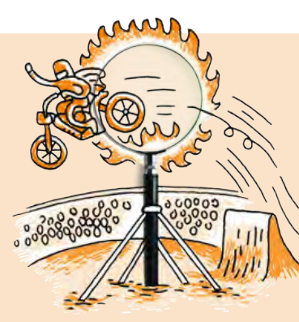
> **[Diagram Context - Textbook_NaturalScience_Gr8_Atoms.pdf-0020-10.png]**
> The image is a cartoon drawing of a person riding a motorcycle and a bicycle, with a large sun in the center. The sun is depicted as a flame, and the person is shown in mid-air, with the motorcycle and bicycle below them. The drawing also includes a Lewis diagram, a diagram of a cell, and a graph, suggesting that the image is meant to convey a scientific concept


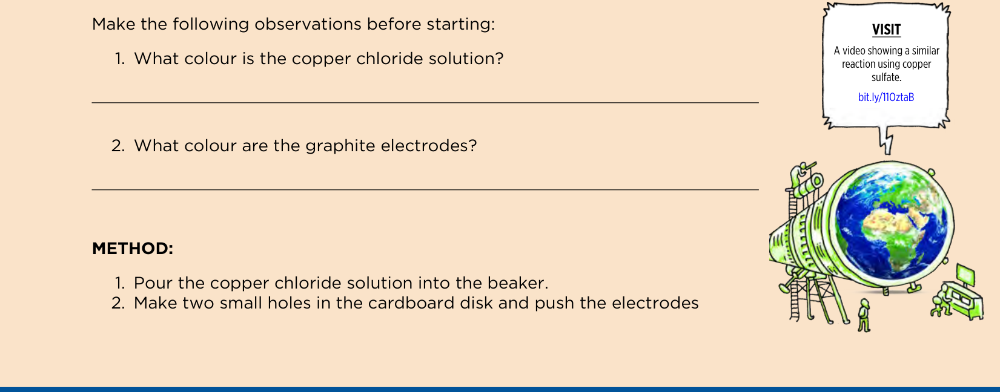
> **[Diagram Context - Textbook_NaturalScience_Gr8_Atoms.pdf-0020-16.png]**
> 1. A diagram of a cell and a circuit.
 2. A diagram of a circuit.
 3. A diagram of a circuit.


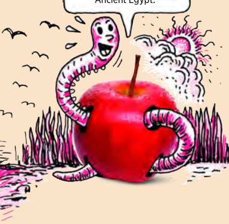
> **[Diagram Context - Textbook_NaturalScience_Gr8_Microorganisms.pdf-0020-25.png]**
> 1. A cartoon of a red apple with a worm on it.


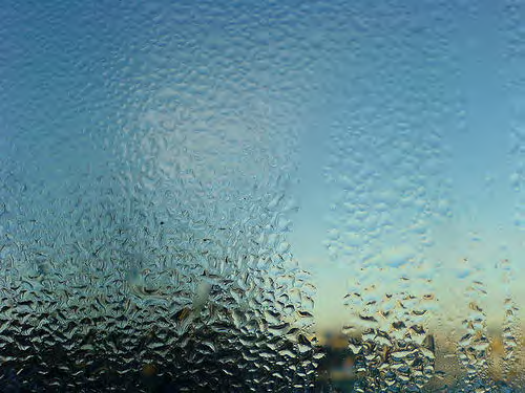
> **[Diagram Context - Textbook_NaturalScience_Gr8_Particle-model-of-matter.pdf-0020-01.png]**
> The image shows a close-up view of a window with dew drops on the glass. The dew drops are small and scattered across the window, creating a pattern. The background of the image is a clear blue sky, which contrasts with the dew drops on the window. The window appears to be located in a city, as suggested by the presence of buildings in the background. The


> **[Diagram Context - Textbook_NaturalScience_Gr8_Particle-model-of-matter.pdf-0020-02.png]**
> The image shows a group of birds sitting on a tree branch. There are nine birds in total, with some of them resting on the branch and others perched on the tree. The birds are of various colors, including blue, gray, and white. The branch they are sitting on is located in the center of the image, with the birds spread out evenly across it. The background of the image


> **[Diagram Context - Textbook_NaturalScience_Gr8_Particle-model-of-matter.pdf-0020-11.png]**
> 1. A cartoon drawing of an astronaut on a red apple.
2. The astronaut is wearing a white spacesuit.
3. The astronaut has a pole in his hand.
4. The apple is red.
5. The apple has a hole in it.
6. The apple is floating in space.
7. The astronaut is holding a flag.


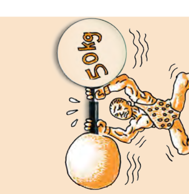
> **[Diagram Context - Textbook_NaturalScience_Gr8_Particle-model-of-matter.pdf-0020-12.png]**
> 1. A cartoon of a man lifting a ball with a rope.


---

# Chapter 2: Particle Model of Matter

---

## Part 1: Investigation Review — Heating and Cooling Candle Wax

This section reviews the observations and conclusions from the investigation on heating and cooling candle wax. Use these questions and explanations to consolidate your understanding of phase changes and the particle model of matter.

### Revision Questions & Explanations

#### 1. What happened when you cooled the candle wax?
* **Observation:** As the liquid candle wax cooled down, it gradually became more viscous (thicker) until it solidified back into a hard, solid state.
* **Particle Model Explanation:** When the liquid wax cools, the particles lose kinetic energy and move more slowly. As their thermal energy decreases, the attractive forces between the particles pull them closer together, locking them back into a fixed, orderly arrangement characteristic of a solid.

#### 2. Would you say the melting point of candle wax is higher or lower than room temperature?
* **Answer:** The melting point of candle wax is **higher** than room temperature.
* **Explanation:** At room temperature (approximately $20^\circ\text{C}$ to $25^\circ\text{C}$), candle wax exists as a solid. For a substance to melt, it must reach its melting point. Since we have to heat the wax significantly above room temperature to make it melt, its melting point must be higher than room temperature.

---

### Conclusion: Particle Model of Matter in Phase Changes

When writing a scientific conclusion for this investigation, you must explain how changes of state occur by referring to the behavior of particles:

$$
\text{Solid (Wax)} \xrightarrow{+\text{ Heat Energy }} \text{Liquid (Wax)} \xrightarrow{-\text{ Heat Energy }} \text{Solid (Wax)}
$$

* **Heating (Melting):** Adding heat energy increases the kinetic energy of the particles in the solid wax. The particles vibrate more vigorously until they overcome the strong attractive forces holding them in fixed positions. They begin to slide past one another, transitioning into a liquid state.
* **Cooling (Solidification/Freezing):** Removing heat energy (cooling) decreases the kinetic energy of the liquid particles. As they slow down, the attractive forces pull them back into a tightly packed, fixed structure, transitioning back into a solid state.

---

## Part 2: Activity — Hot Water Balloon

In this activity, we explore how heat affects liquid water inside a closed system (a balloon) and how phase changes can be observed through expansion and condensation.

### Materials
* Large party balloon (plus spares)
* $2\text{ teaspoons}$ of tap water
* Microwave oven
* Oven gloves (for safety when handling hot objects)
* Safety goggles
* Large bowl of ice-cold water

---

### Instructions

1. **Safety First:** Before you begin, put on your safety goggles.
2. **Preparation:** Pour $2\text{ teaspoons}$ of tap water into the balloon. Carefully squeeze out all the excess air from the balloon before tying a secure knot in its neck.
3. **Heating:** Place the balloon in the microwave oven. Heat it on full power only until you see the balloon starting to expand. 
   * *Note:* This should only take a few seconds. Do not heat it for too long, or the balloon might pop!
4. **Observation:** Carefully observe what happens to the balloon during heating and immediately after it is removed.

---

### Scientific Explanation of the Activity

#### What do you observe?
* **During Heating:** The balloon rapidly expands and inflates, even though no air was blown into it.
* **After Heating (Cooling):** If you place the heated balloon into a bowl of ice-cold water, it quickly deflates back to its original size, and droplets of liquid water form on the inside walls of the balloon ("raining" inside the balloon).

#### How does this happen? (The Science)
1. **Phase Change (Liquid to Gas):** The microwave heats the liquid water inside the balloon, causing it to boil and turn into water vapor (steam). 
2. **Gas Expansion:** According to the particle model, gas particles have high kinetic energy and are spaced far apart. The water vapor exerts pressure on the inside walls of the balloon, causing it to expand.
3. **Condensation (Gas to Liquid):** When cooled in ice water, the water vapor particles lose kinetic energy, slow down, and come back together to form liquid water droplets along the inner surface of the balloon.


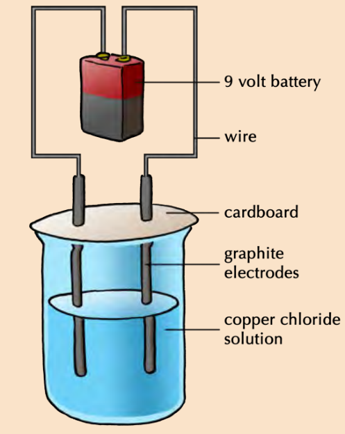
> **[Diagram Context - Textbook_NaturalScience_Gr8_Atoms.pdf-0021-06.png]**
> 1. A diagram of a battery and wires.
 2. A diagram of a battery and wires.
 3. A diagram of a battery and wires.
 4. A diagram of a battery and wires.
 5. A diagram of a battery and wires.
 6. A diagram of a battery and wires.
 7. A diagram of a battery and wires.
 8.


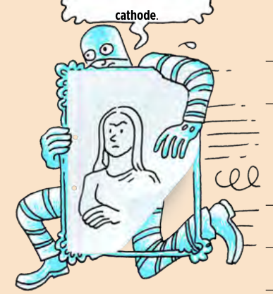
> **[Diagram Context - Textbook_NaturalScience_Gr8_Atoms.pdf-0021-12.png]**
> 1. A cartoon drawing of a man holding a picture of a woman.


> **[Diagram Context - Textbook_NaturalScience_Gr8_Microorganisms.pdf-0021-06.png]**
> 1. A white rectangle with a gray border.


---

## Activity: Investigating Changes of State (Continued)

### Experimental Steps

4. **Remove the heated balloon** with the oven glove. Shake it gently. If you are very quiet, you will hear something happening inside the balloon. 
   * *What does it sound like?*
   
   $$\text{\_\_\_\_\_\_\_\_\_\_\_\_\_\_\_\_\_\_\_\_\_\_\_\_\_\_\_\_\_\_\_\_\_\_\_\_\_\_\_\_\_\_\_\_\_\_\_\_\_\_\_\_\_\_\_\_\_\_\_\_\_\_\_\_\_\_\_\_\_\_\_\_\_\_\_\_\_\_\_\_}$$

5. **Place the balloon** in the bowl of cold water. 
   * *What do you observe?*
   
   $$\text{\_\_\_\_\_\_\_\_\_\_\_\_\_\_\_\_\_\_\_\_\_\_\_\_\_\_\_\_\_\_\_\_\_\_\_\_\_\_\_\_\_\_\_\_\_\_\_\_\_\_\_\_\_\_\_\_\_\_\_\_\_\_\_\_\_\_\_\_\_\_\_\_\_\_\_\_\_\_\_\_}$$

---

### Questions

1. Did the balloon have any air inside it at the start of the experiment?
   $$\text{\_\_\_\_\_\_\_\_\_\_\_\_\_\_\_\_\_\_\_\_\_\_\_\_\_\_\_\_\_\_\_\_\_\_\_\_\_\_\_\_\_\_\_\_\_\_\_\_\_\_\_\_\_\_\_\_\_\_\_\_\_\_\_\_\_\_\_\_\_\_\_\_\_\_\_\_\_\_\_\_}$$

2. What made the balloon expand?
   $$\text{\_\_\_\_\_\_\_\_\_\_\_\_\_\_\_\_\_\_\_\_\_\_\_\_\_\_\_\_\_\_\_\_\_\_\_\_\_\_\_\_\_\_\_\_\_\_\_\_\_\_\_\_\_\_\_\_\_\_\_\_\_\_\_\_\_\_\_\_\_\_\_\_\_\_\_\_\_\_\_\_}$$

3. What is the name of the gas that made the balloon expand?
   $$\text{\_\_\_\_\_\_\_\_\_\_\_\_\_\_\_\_\_\_\_\_\_\_\_\_\_\_\_\_\_\_\_\_\_\_\_\_\_\_\_\_\_\_\_\_\_\_\_\_\_\_\_\_\_\_\_\_\_\_\_\_\_\_\_\_\_\_\_\_\_\_\_\_\_\_\_\_\_\_\_\_}$$

4. What did you hear inside the balloon when it started to cool down?
   $$\text{\_\_\_\_\_\_\_\_\_\_\_\_\_\_\_\_\_\_\_\_\_\_\_\_\_\_\_\_\_\_\_\_\_\_\_\_\_\_\_\_\_\_\_\_\_\_\_\_\_\_\_\_\_\_\_\_\_\_\_\_\_\_\_\_\_\_\_\_\_\_\_\_\_\_\_\_\_\_\_\_}$$

5. What caused the sound?
   $$\text{\_\_\_\_\_\_\_\_\_\_\_\_\_\_\_\_\_\_\_\_\_\_\_\_\_\_\_\_\_\_\_\_\_\_\_\_\_\_\_\_\_\_\_\_\_\_\_\_\_\_\_\_\_\_\_\_\_\_\_\_\_\_\_\_\_\_\_\_\_\_\_\_\_\_\_\_\_\_\_\_}$$

6. Where did the water droplets inside the balloon come from?
   $$\text{\_\_\_\_\_\_\_\_\_\_\_\_\_\_\_\_\_\_\_\_\_\_\_\_\_\_\_\_\_\_\_\_\_\_\_\_\_\_\_\_\_\_\_\_\_\_\_\_\_\_\_\_\_\_\_\_\_\_\_\_\_\_\_\_\_\_\_\_\_\_\_\_\_\_\_\_\_\_\_\_}$$

7. What happened to the balloon when it was cooled down in the cold water?
   $$\text{\_\_\_\_\_\_\_\_\_\_\_\_\_\_\_\_\_\_\_\_\_\_\_\_\_\_\_\_\_\_\_\_\_\_\_\_\_\_\_\_\_\_\_\_\_\_\_\_\_\_\_\_\_\_\_\_\_\_\_\_\_\_\_\_\_\_\_\_\_\_\_\_\_\_\_\_\_\_\_\_}$$

8. Which changes of state did the water undergo in this experiment?
   $$\text{\_\_\_\_\_\_\_\_\_\_\_\_\_\_\_\_\_\_\_\_\_\_\_\_\_\_\_\_\_\_\_\_\_\_\_\_\_\_\_\_\_\_\_\_\_\_\_\_\_\_\_\_\_\_\_\_\_\_\_\_\_\_\_\_\_\_\_\_\_\_\_\_\_\_\_\_\_\_\_\_}$$

---


### Looking Ahead: Properties of Matter

Next, we are going to look at three important properties of matter that are useful to scientists, namely:
* **Density**
* **Mass**
* **Volume**

These three properties are all related to each other.


> **[Diagram Context - Textbook_NaturalScience_Gr8_Atoms.pdf-0022-11.png]**
> The image shows a close-up view of a zipper, with the zipper's teeth visible. The zipper is colored in shades of orange and white, and it is set against a gray background. The image is a detailed illustration of the zipper, with the teeth clearly visible. The zipper appears to be in good condition, with no signs of wear or damage. The image does not contain any text


> **[Diagram Context - Textbook_NaturalScience_Gr8_Particle-model-of-matter.pdf-0022-05.png]**
> The image shows a gray line with a zipper running down the middle. The zipper is white with an orange line running down the middle. The line is drawn in a straight line, and the zipper is positioned on the right side of the image. The image does not contain any text or additional objects.


> **[Diagram Context - Textbook_NaturalScience_Gr8_Particle-model-of-matter.pdf-0022-08.png]**
> 1. A diagram of a cell with a purple balloon on the left side and a green balloon on the right side.


> **[Diagram Context - Textbook_NaturalScience_Gr8_Particle-model-of-matter.pdf-0022-17.png]**
> The image is a cartoon drawing of a green caterpillar with a wire spring coiled around it. The caterpillar is surrounded by green leaves and a wire spring, which is coiled around the caterpillar. The drawing is set against a light green background.


---

# 2.4 Density, Mass, and Volume

In Natural Sciences and Mathematics, we frequently work with the physical properties of matter. Three fundamental properties of matter are **mass**, **volume**, and **density**. 

---

### Key Vocabulary

*   **Mass:** A measure of the amount of matter that an object or substance contains.
*   **Volume:** The amount of physical space that an object or substance occupies.
*   **Density:** A measure of how much mass is contained within a given volume.
*   **Physical Quantity:** A property of a material or system that can be quantified by measurement.

---

## 1. Mass: 'How Much' Matter We Have

The **mass** of an object or a substance tells us how much matter it consists of. The greater the mass of an object, the more matter it contains. 

### Key Properties of Mass
*   **Mass is constant:** The mass of an object stays the same no matter where it is in the universe (unless a piece of it is physically removed). For example, a gold bar will have the exact same mass—and the same number of gold atoms—whether it is in Gauteng, Bloemfontein, London, or on the Moon.

### Units of Mass and Conversions
Mass is measured using standard metric units:
*   **Kilograms ($\text{kg}$)** is the standard SI unit for mass.
*   **Grams ($\text{g}$)** are used for smaller objects.
*   **Milligrams ($\text{mg}$)** are used for very small amounts of matter.

#### Conversion Factors:
*   $1\text{ kg} = 1000\text{ g}$
*   $1\text{ g} = 1000\text{ mg}$

---

### Worked Examples & Activities

#### Activity 1: Reading Product Labels
Look at a standard bag of rice (such as the Tastic rice bag shown in the lesson). 
*   **Question:** How much rice is in the bag?
*   **Answer:** The label indicates a mass of $1\text{ kg}$.

---

#### Activity 2: Unit Conversion (Kilograms to Milligrams)
*   **Question:** How many milligrams ($\text{mg}$) are in one kilogram ($\text{kg}$)?
*   **Step-by-Step Solution:**
    1. Convert kilograms to grams:
       $$1\text{ kg} = 1000\text{ g}$$
    2. Convert those grams to milligrams:
       $$1000\text{ g} \times 1000\text{ mg/g} = 1\,000\,000\text{ mg}$$
    3. State final answer:
       $$1\text{ kg} = 10^6\text{ mg} = 1\,000\,000\text{ mg}$$

---

#### Activity 3: Unit Conversion (Grams to Kilograms)
*   **Question:** A gold bar has a mass of $250\text{ g}$. How much is this in kilograms ($\text{kg}$)?
*   **Step-by-Step Solution:**
    1. Identify the conversion factor: $1\text{ kg} = 1000\text{ g}$.
    2. To convert from a smaller unit ($\text{g}$) to a larger unit ($\text{kg}$), divide by $1000$:
       $$\text{Mass in kg} = \frac{250\text{ g}}{1000}$$
       $$\text{Mass in kg} = 0.25\text{ kg}$$

---

## 2. Volume: 'How Much Space' Matter Takes Up

The amount of three-dimensional space that an object occupies is called its **volume**. 

### Calculating and Measuring Volume
*   **Liquids** are typically measured in **litres ($\text{L}$)** or **millilitres ($\text{mL}$)**.
*   **Regular Solids** have their volume calculated by multiplying their three dimensions:
    $$\text{Volume} = \text{length} \times \text{width} \times \text{height}$$

### Defining a Litre ($\text{L}$)
A litre is defined as the volume of space inside a cube that is $10\text{ cm}$ wide, $10\text{ cm}$ long, and $10\text{ cm}$ deep.

$$\text{Volume of Cube} = 10\text{ cm} \times 10\text{ cm} \times 10\text{ cm} = 1000\text{ cm}^3$$

Therefore:
$$1\text{ Litre (L)} = 1000\text{ cm}^3 = 1000\text{ mL}$$
$$1\text{ cm}^3 = 1\text{ mL}$$


> **[Diagram Context - Textbook_NaturalScience_Gr8_Atoms.pdf-0023-03.png]**
> The image shows a diagram of a cell with a large white cloud in the center. The diagram is labeled with the words "New Words" in black text. The diagram is accompanied by a line of text that reads "New Words" and "New Words" is written in a smaller font size. The text is in black, which contrasts with the white background of the diagram. The diagram is


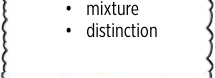
> **[Diagram Context - Textbook_NaturalScience_Gr8_Atoms.pdf-0023-04.png]**
> The image shows a white piece of paper with black text that reads "Mixure Distinction". The text is written in a serif font and is centered on the paper. The paper is placed on a gray background.


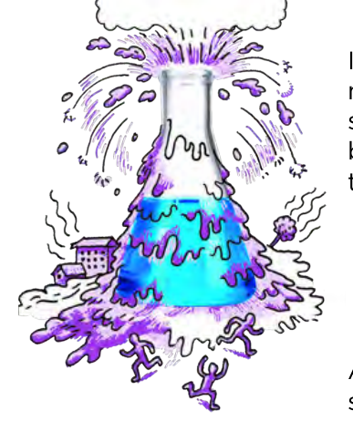
> **[Diagram Context - Textbook_NaturalScience_Gr8_Atoms.pdf-0023-06.png]**
> The image is a cartoon depiction of a science experiment. The experiment is a volcano made of a glass beaker filled with a blue liquid. The beaker is surrounded by purple and white splatters, which are the result of the experiment. There are several people in the scene, including a person holding a stick and another person holding a balloon. The people are positioned around the beaker, suggesting


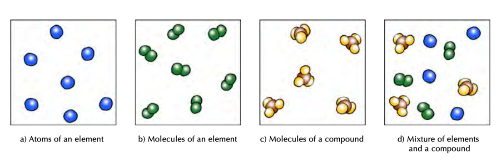
> **[Diagram Context - Textbook_NaturalScience_Gr8_Atoms.pdf-0023-11.png]**
> 1. An element of an atom of an element of a molecule of a compound of a molecule of a compound of a compound of a compound of a compound of a compound of a compound of a compound of a compound of a compound of a compound of a compound of a compound of a compound of a compound of a compound of a compound of a compound of a compound of a compound of a compound


> **[Diagram Context - Textbook_NaturalScience_Gr8_Microorganisms.pdf-0023-05.png]**
> 1. A gray background with a zipper running down the center.


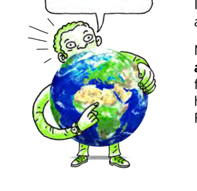
> **[Diagram Context - Textbook_NaturalScience_Gr8_Microorganisms.pdf-0023-09.png]**
> 1. A cartoon illustration of a man holding a globe.


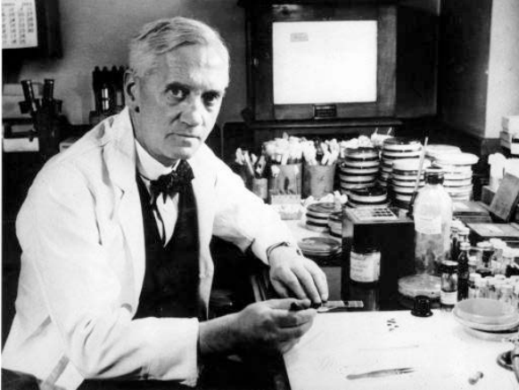
> **[Diagram Context - Textbook_NaturalScience_Gr8_Microorganisms.pdf-0023-11.png]**
> 1. A man wearing a white coat and a bow tie sitting at a desk.
 2. A television screen behind him.
 3. A table with a microscope and other scientific equipment.


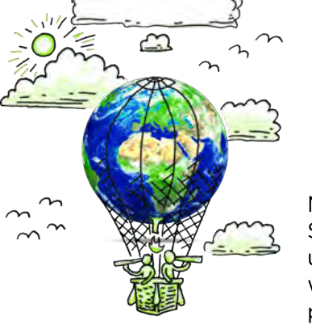
> **[Diagram Context - Textbook_NaturalScience_Gr8_Microorganisms.pdf-0023-14.png]**
> The image features a cartoon illustration of a hot air balloon filled with a globe. The globe is depicted in a cartoon style, with a cartoon-like depiction of the Earth. The balloon is filled with a cartoon-like depiction of air, and the globe is depicted in a cartoon-like style. The illustration also includes a cartoon-like depiction of a person holding a telescope. The image is


> **[Diagram Context - Textbook_NaturalScience_Gr8_Particle-model-of-matter.pdf-0023-12.png]**
> 1. A diagram of a cell with a green line representing the cell wall.


---

# Matter and Materials: Volume and Density

---

## 1. Understanding Volume

**Volume** is the amount of three-dimensional space that an object or substance occupies. 

### Key Volume Conversions and Relationships
* When calculating the volume of a cube with side lengths of $1\text{ cm}$:
  $$1\text{ cm} \times 1\text{ cm} \times 1\text{ cm} = 1\text{ cm}^3$$
* $1\text{ cm}^3$ is exactly equal to $1\text{ ml}$ (millilitre).
* For a larger cube with side lengths of $10\text{ cm}$:
  $$10\text{ cm} \times 10\text{ cm} \times 10\text{ cm} = 1000\text{ cm}^3$$
* Since $1\text{ cm}^3 = 1\text{ ml}$, then:
  $$1000\text{ cm}^3 = 1000\text{ ml} = 1\text{ litre (L)}$$

```
       ┌────────────────────────┐
      ╱                        ╱│
     ╱                        ╱ │
    ╱                        ╱  │
   ┌────────────────────────┐   │ 10 cm
   │                        │   │
   │                        │   │
   │                        │   ╱
   │                        │  ╱ 10 cm
   │                        │ ╱
   └────────────────────────┘/
             10 cm
   
   Volume = 10 cm × 10 cm × 10 cm = 1000 cm³ = 1 Litre
```

### Measuring Units
* **Millilitres ($\text{ml}$):** Used to measure smaller volumes of liquids.
* **Litres ($\text{L}$):** Used for larger volumes. 
  $$1000\text{ ml} = 1\text{ L}$$

---

### Quick Check
Look at the packaging of common household liquids (such as a carton of milk and a bottle of juice):
1. What is the volume of milk in a standard school-sized or family-sized carton (e.g., $1\text{ L}$)?
2. What is the volume of juice in a standard large plastic beverage bottle (e.g., $1.5\text{ L}$ or $2\text{ L}$)?

---

## 2. Density: How "Tightly Packed" a Material Is

**Density** is a measure of how much mass of a material fits into a given volume. It describes the ratio of an object's mass to its volume.

### The Density Formula
We can express density mathematically using the following word equation:

$$\text{Density} = \frac{\text{Mass}}{\text{Volume}}$$

Using standard scientific symbols:
* Let $D$ = Density
* Let $m$ = Mass
* Let $V$ = Volume

$$D = \frac{m}{V}$$

---

### Understanding Density Conceptually

* **Comparing Equal Volumes:** If you have two objects of the exact same size (volume), the one with the **higher mass** (the heavier one) is **more dense**.
* **Everyday Language:** In daily life, we often describe dense objects as feeling "heavy" for their size, while less dense objects feel "light" or "fluffy".
  * *Example:* A dense piece of chocolate cake feels heavy and compact, whereas a sponge cake of the same size feels light because it contains more air pockets (less mass in the same volume).

### Summary of Relationships
* **High Density:** Particles are tightly packed together. High mass per unit volume.
* **Low Density:** Particles are loosely packed or have space between them. Low mass per unit volume.


> **[Diagram Context - Textbook_NaturalScience_Gr8_Atoms.pdf-0024-12.png]**
> The image is a cartoon drawing of a spring coiled up and holding a green ball in its mouth. The drawing is set against a light green background with a tree branch and leaves. The drawing includes a Lewis diagram, an anatomical/cellular structure, a circuit, a graph, and an evolutionary tree. The diagram shows the spring coiled up and holding a green ball in its mouth.


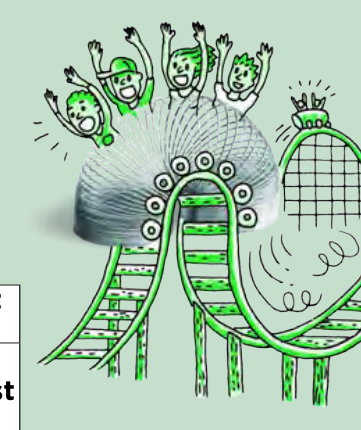
> **[Diagram Context - Textbook_NaturalScience_Gr8_Microorganisms.pdf-0024-00.png]**
> 1. A cartoon depiction of a roller coaster with a spring coiled on top.


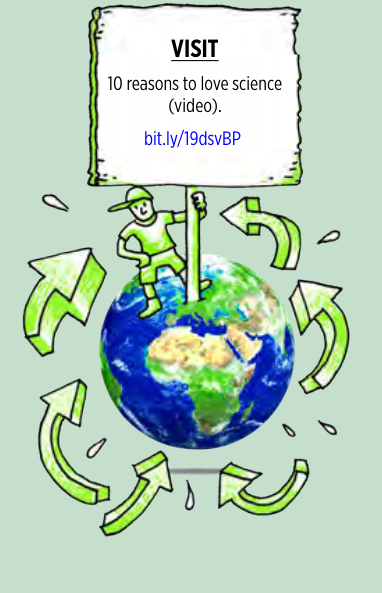
> **[Diagram Context - Textbook_NaturalScience_Gr8_Microorganisms.pdf-0024-15.png]**
> The image shows a cartoon depiction of a boy standing on a globe, with a sign above him that reads "VISIT 10 Reasons to Love Science". The boy is wearing a hat and holding a pole. The globe is surrounded by various arrows, which are labeled with different scientific terms such as "biology", "chemistry", and "geology". The sign also includes a website address, "


> **[Diagram Context - Textbook_NaturalScience_Gr8_Microorganisms.pdf-0024-17.png]**
> 1. A diagram of a snake's body.
 2. The snake's body is green and white.
 3. The snake's head is green.


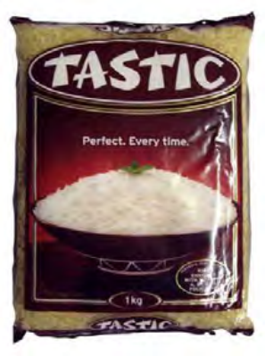
> **[Diagram Context - Textbook_NaturalScience_Gr8_Particle-model-of-matter.pdf-0024-04.png]**
> 1. A bag of Tasty rice.


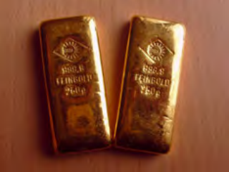
> **[Diagram Context - Textbook_NaturalScience_Gr8_Particle-model-of-matter.pdf-0024-11.png]**
> The image shows two gold bars, each with a unique design on the top. The bars are placed side by side, with the one on the left slightly larger than the one on the right. The bars are made of a shiny gold material and are positioned against a pink background. The bars have a rectangular shape and are oriented horizontally. The top of the bars features a design that includes a sun


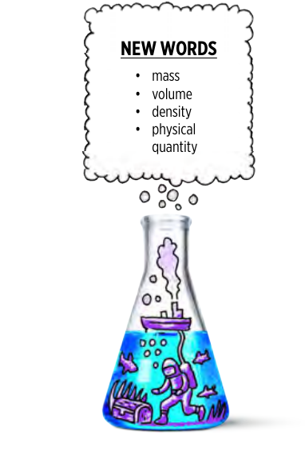
> **[Diagram Context - Textbook_NaturalScience_Gr8_Particle-model-of-matter.pdf-0024-14.png]**
> The image shows a science classroom with a science experiment set up in a beaker. The beaker contains a blue liquid and a purple submarine. The beaker is labeled with the word "New Words" and has a thought bubble above it containing the text "mass, volume, density, physical quantity". The image also includes a cartoon depiction of a submarine and a person on the submarine, as


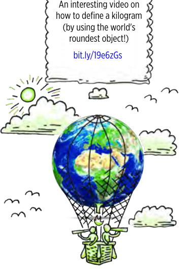
> **[Diagram Context - Textbook_NaturalScience_Gr8_Particle-model-of-matter.pdf-0024-16.png]**
> The image is a cartoon depiction of a hot air balloon carrying two people. The balloon is filled with a green substance and is floating in the sky. The two people inside the balloon are wearing white shirts and are holding onto a rope. The balloon is positioned in the center of the image, and the sky is filled with clouds. The image also includes a text box that provides information about the balloon


---

# Chapter 2: Particle Model of Matter

## Core Concepts: Understanding Density, Mass, and Volume

To understand why different materials feel heavier or lighter even when they are the same size, we must look at the relationship between **mass**, **volume**, and **density**.

### 1. Volume ($V$)
Volume is the amount of three-dimensional space an object occupies. It is typically measured in cubic centimeters ($\text{cm}^3$) or cubic meters ($\text{m}^3$).

### 2. Mass ($m$)
Mass is a measure of the amount of matter in an object. It is typically measured in grams ($\text{g}$) or kilograms ($\text{kg}$).

### 3. Density ($\rho$)
Density is defined as the mass per unit volume of a substance. It describes how tightly packed the particles are within a given space. 

The mathematical formula for density is:

$$\text{Density} = \frac{\text{Mass}}{\text{Volume}}$$

Or in symbols:

$$\rho = \frac{m}{V}$$

Where:
*   $\rho$ (Greek letter rho) = Density (measured in $\text{g/cm}^3$ or $\text{kg/m}^3$)
*   $m$ = Mass (measured in $\text{g}$ or $\text{kg}$)
*   $V$ = Volume (measured in $\text{cm}^3$ or $\text{m}^3$)

---

## Activity: Which material is more dense?

### Materials
A variety of objects that have the same size (volume) but different densities:
*   Sponge
*   Polystyrene
*   Wood
*   Metal
*   Brick or stone

### Instructions
1.  **Compare Masses:** Handle all the different materials and compare their masses. You do not have to measure their masses on a scale; you can estimate by feeling how heavy they are in your hand.
2.  **Order by Density:** Arrange the objects in order of increasing density (from least dense to most dense). Discuss as a group why some materials are denser than others.
3.  **Measure (Optional):** If you have access to a triple beam balance or digital scale, measure and record the actual masses of each object to confirm your ordering.

---

## Questions & Explanations

### Question 1
Imagine a brick and a loaf of bread that are the same size. Would the brick or the bread have a greater volume?

#### **Answer & Explanation:**
Both the brick and the loaf of bread have the **same volume**. 
*   **Reasoning:** Since the problem states they are the "same size," they occupy the exact same amount of physical space ($V_{\text{brick}} = V_{\text{bread}}$).

---

### Question 2
Which one, the brick or the bread, has more mass?

#### **Answer & Explanation:**
The **brick** has more mass.
*   **Reasoning:** The brick contains a much higher quantity of matter (more closely packed atoms and molecules) compared to the airy, porous structure of the bread. If placed on a scale, the brick will register a much higher mass ($m_{\text{brick}} > m_{\text{bread}}$).

---

### Question 3
Which one, the brick or the bread, would have the greater density? Explain your answer.

#### **Answer & Explanation:**
The **brick** has the greater density.
*   **Reasoning:** Density is the ratio of mass to volume ($\rho = \frac{m}{V}$). Since both objects have the same volume ($V$), the object with the greater mass ($m$) must have the greater density ($\rho$). 
*   **Particle Model Explanation:** In the brick, the particles are packed very closely together with strong intermolecular forces. In the bread, there are large pockets of air, meaning there are fewer particles packed into the same amount of space.

---

> ### 🌐 Online Simulation
> To visualize how different materials behave based on their mass, volume, and density, explore this interactive simulation:
> [bit.ly/142ixv5](http://bit.ly/142ixv5)

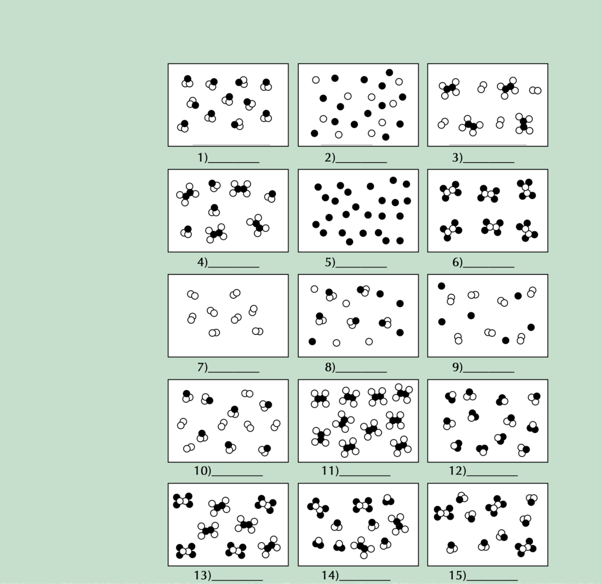
> **[Diagram Context - Textbook_NaturalScience_Gr8_Atoms.pdf-0025-00.png]**
> 1. A diagram of a cell with a water molecule.


> **[Diagram Context - Textbook_NaturalScience_Gr8_Atoms.pdf-0025-01.png]**
> 1. A diagram of a cell with a green line running through it.


> **[Diagram Context - Textbook_NaturalScience_Gr8_Microorganisms.pdf-0025-00.png]**
> 1. A diagram of a cell with blue and white lines.


> **[Diagram Context - Textbook_NaturalScience_Gr8_Microorganisms.pdf-0025-01.png]**
> 1. A diagram of a man playing a guitar.


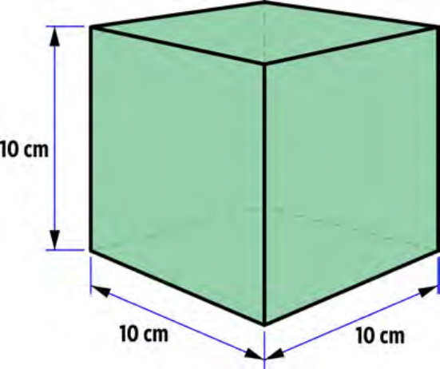
> **[Diagram Context - Textbook_NaturalScience_Gr8_Particle-model-of-matter.pdf-0025-02.png]**
> 1. A geometric figure of a cube with dimensions of 10 cm x 10 cm x 10 cm.


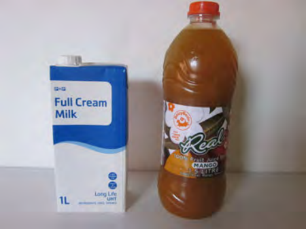
> **[Diagram Context - Textbook_NaturalScience_Gr8_Particle-model-of-matter.pdf-0025-04.png]**
> 1. A carton of milk and a bottle of mango juice.


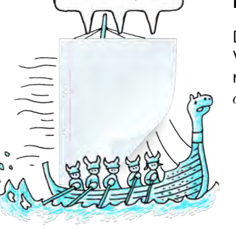
> **[Diagram Context - Textbook_NaturalScience_Gr8_Particle-model-of-matter.pdf-0025-11.png]**
> 1. A white boat with a blue dragon on top.


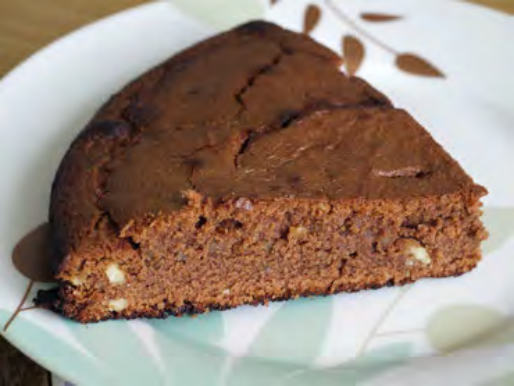
> **[Diagram Context - Textbook_NaturalScience_Gr8_Particle-model-of-matter.pdf-0025-13.png]**
> 1. A diagram of a cell with a Lewis structure.


---

# 2.5 Density and States of Matter

We have learnt about the three states of matter (solids, liquids, and gases) and the properties of each. One of the key differences between these states is the distance between the particles:

*   **Solids:** Particles are tightly packed together in a fixed, regular pattern.
*   **Liquids:** Particles are close together but can move past one another in a random arrangement.
*   **Gases:** Particles are much further apart with large spaces of empty volume between them.

To understand how these arrangements affect the physical properties of matter, we must look at the concept of **density**.

---

## Core Concepts: Density, Mass, and Volume

**Density** is defined as the amount of mass per unit volume of a substance. It describes how closely packed the particles are within a given space.

The mathematical formula for density is:

$$\rho = \frac{m}{V}$$

Where:
*   $\rho$ (rho) = Density (measured in $\text{g/cm}^3$ or $\text{kg/m}^3$)
*   $m$ = Mass (measured in $\text{g}$ or $\text{kg}$)
*   $V$ = Volume (measured in $\text{cm}^3$ or $\text{m}^3$)

### Key Relationships:
1.  **Constant Volume ($V$):** If the volume of different containers is kept constant, the container with more particles will have a greater mass ($m$), and therefore a higher density ($\rho$).
2.  **Particle Spacing:** Because particles in a solid are packed closest together, solids generally have the highest density. Gases, with particles spread far apart, have the lowest density.

---

## Activity: Which has the highest density: a solid, a liquid, or a gas?

### Instructions:
1. Compare the three identical containers below.
2. They all have the **same volume** ($V$) and contain the **same material**.
3. **Container A** contains a solid material, **Container B** contains the liquid state of that material, and **Container C** contains the gaseous state of the same material.

```
   [ Container A ]          [ Container B ]          [ Container C ]
   +-----------+            +-----------+            +-----------+
   | O O O O O |            |  O  O  O  |            |     O     |
   | O O O O O |            | O  O  O  O|            |           |
   | O O O O O |            |  O  O  O  |            |  O     O  |
   +-----------+            +-----------+            +-----------+
      (Solid)                  (Liquid)                  (Gas)
```

---

### Questions and Explanations

#### Question 1
*   **Which container (A, B or C) contains the greatest number of particles?**
*   **Which container contains the smallest number of particles?**

**Answer & Explanation:**
*   **Greatest number of particles:** **Container A** (Solid). The particles in a solid are tightly packed in a fixed, orderly arrangement, allowing more particles to fit into the same volume.
*   **Smallest number of particles:** **Container C** (Gas). The particles in a gas are widely spaced with large empty gaps between them, meaning very few particles fit into the same volume.

---

#### Question 2
*   **Which container (A, B or C) contains the material with the greatest mass?**
*   **Which container has the smallest mass? Why do you say so?**

**Answer & Explanation:**
*   **Greatest mass:** **Container A**. 
*   **Smallest mass:** **Container C**.
*   **Reasoning:** 
    Mass is determined by the total quantity of matter (the number of particles) in an object. Since all three containers contain the same material, each individual particle has the exact same mass. 
    
    *   **Container A** has the highest number of particles, so it has the greatest total mass ($m$).
    *   **Container C** has the fewest particles, so it has the smallest total mass ($m$).

Since the volume ($V$) of all three containers is identical, we can use the density formula:

$$\rho = \frac{m}{V}$$

This demonstrates that:

$$\rho_{\text{solid}} > \rho_{\text{liquid}} > \rho_{\text{gas}}$$

Therefore, the solid state (Container A) has the highest density, and the gaseous state (Container C) has the lowest density.

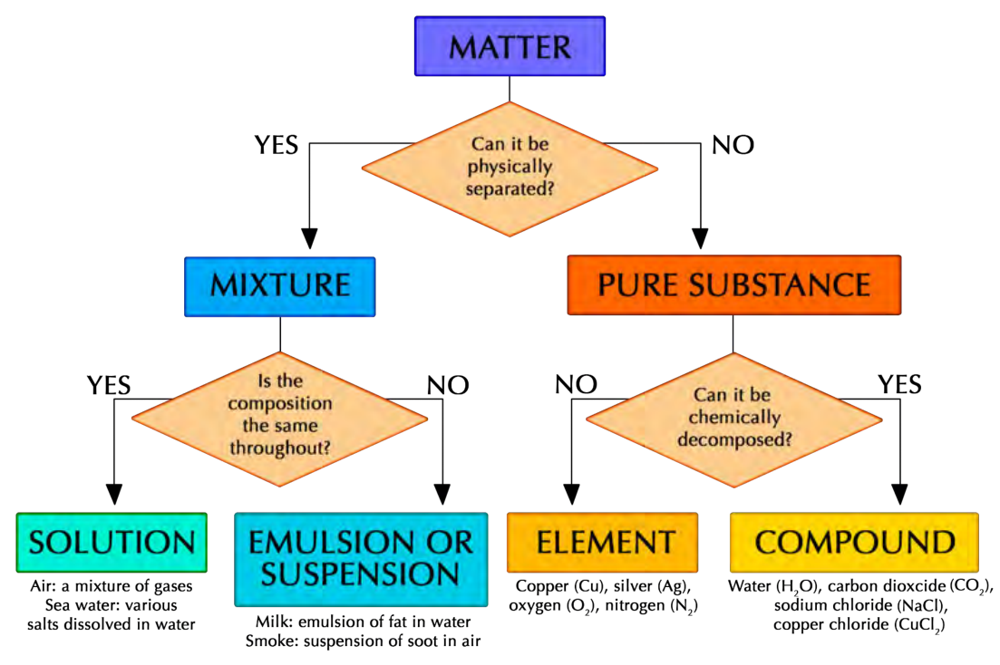
> **[Diagram Context - Textbook_NaturalScience_Gr8_Atoms.pdf-0026-00.png]**
> 1. A diagram of a solution process.
 2. The process of separating a mixture of substances.
 3. The process of separating a mixture of substances.


> **[Diagram Context - Textbook_NaturalScience_Gr8_Atoms.pdf-0026-02.png]**
> 1. A diagram of a cell with blue and white lines.


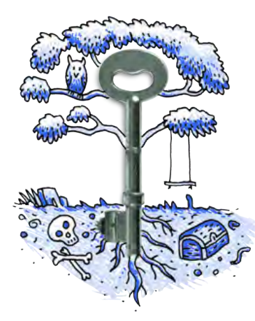
> **[Diagram Context - Textbook_NaturalScience_Gr8_Atoms.pdf-0026-11.png]**
> 1. A key is shown with a tree and a skull on it.


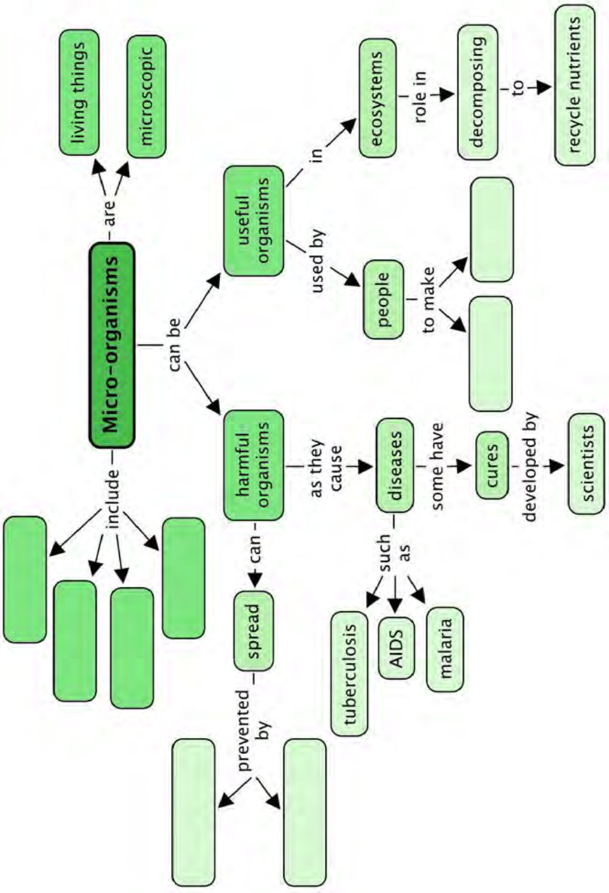
> **[Diagram Context - Textbook_NaturalScience_Gr8_Microorganisms.pdf-0026-00.png]**
> The image is a diagram that illustrates the structure of a cell, which is a fundamental unit of life. The diagram is divided into different sections, each representing a specific part of the cell. The diagram includes labels for the cell's organelles, such as the nucleus, mitochondria, and endoplasmic reticulum. The diagram also includes labels for the cell's organelles


> **[Diagram Context - Textbook_NaturalScience_Gr8_Particle-model-of-matter.pdf-0026-05.png]**
> 1. A cartoon depiction of a roller coaster ride.
 2. A cartoon depiction of a roller coaster ride.
 3. A cartoon depiction of a roller coaster ride.


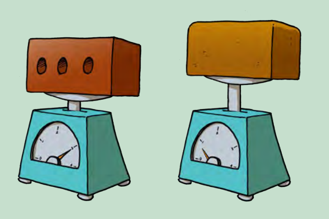
> **[Diagram Context - Textbook_NaturalScience_Gr8_Particle-model-of-matter.pdf-0026-09.png]**
> 1. A blue and white scale with a brick on top.


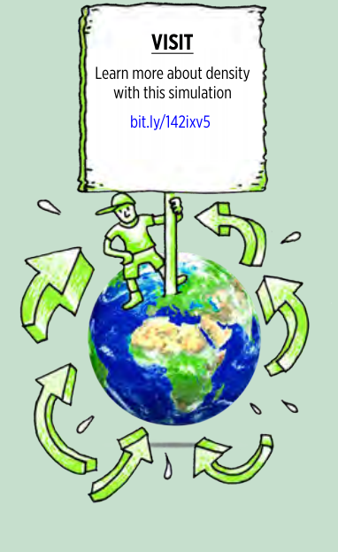
> **[Diagram Context - Textbook_NaturalScience_Gr8_Particle-model-of-matter.pdf-0026-13.png]**
> The image is a cartoon depiction of a boy standing on a globe with arrows pointing to different parts of the world. The boy is wearing a hat and holding a pole. The globe is divided into sections, each representing a different country. The arrows on the globe indicate the direction of travel or the flow of information. The boy is positioned at the center of the globe, surrounded by the various countries


> **[Diagram Context - Textbook_NaturalScience_Gr8_Particle-model-of-matter.pdf-0026-14.png]**
> 1. A diagram of a snake's body.
 2. The snake's body is made up of green and white lines.
 3. The snake's head is green and the body is white.


---

### Activity Question

3. Which state has the highest density: solid (in container A), liquid (in container B) or gas (in container C)? Which state has the lowest density? Why do you say so?

$$\text{_________________________________________________________________________________}$$
$$\text{_________________________________________________________________________________}$$
$$\text{_________________________________________________________________________________}$$

---

## Density and the States of Matter

We have just performed a conceptual activity (a 'thinking' activity) in which we compared the densities of the three states of the same material.

The high density of a solid material explains why it cannot be compressed. The particles in a solid are tightly packed and cannot be squeezed closer together into a smaller volume.

Liquids are also very dense. The density of a liquid is roughly the same as the density of the solid state of the same substance. This is because their particles are close together, even though they are not locked into fixed positions. Most liquids cannot be compressed into smaller volumes.

---

### The Curious Case of Water

Liquids are usually slightly less dense than their solid states, but water is an important exception. Have you ever wondered why your ice cubes float on top of the water in your glass?


> **[Diagram Context - Textbook_NaturalScience_Gr8_Microorganisms.pdf-0027-06.png]**
> 1. A white rectangle with a gray border.


> ### VISIT
> **Light ice, heavy water! (video)**  
> [bit.ly/14AyKxP](https://bit.ly/14AyKxP)
>
> 


The solid state of water (ice) is less dense than the liquid, because in ice the water molecules are packed in a unique way. The image below on the left shows that water molecules in ice are packed in such a way that there are open spaces between them. On the right, the same water molecules are shown in the liquid state.

| Solid State (Ice) | Liquid State |
| :---: | :---: |
| 

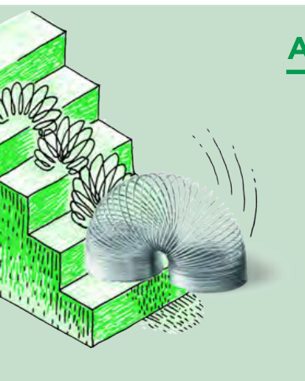
> **[Diagram Context - Textbook_NaturalScience_Gr8_Particle-model-of-matter.pdf-0027-03.png]**
> 1. A diagram of a spring with a green background and a green staircase.

 | 

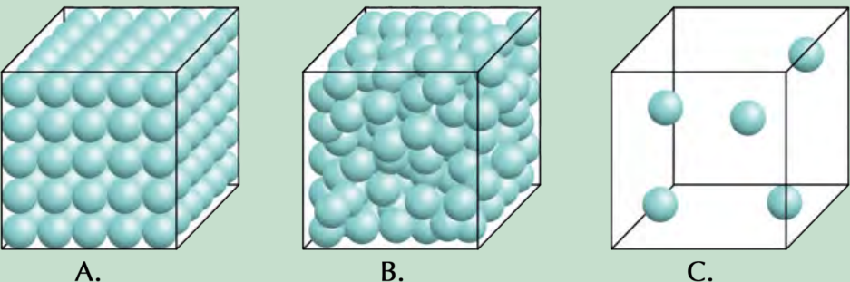
> **[Diagram Context - Textbook_NaturalScience_Gr8_Particle-model-of-matter.pdf-0027-10.png]**
> 1. A diagram of a 3D geometric shape with spheres inside.

 |
| Water molecules in the solid state (ice). | Water molecules in the liquid state. |


---

\_ \_ \_ \_ \_ \_ \_ \_ \_ \_ \_ \_ \_ \_ \_ \_ \_ \_ \_ \_ \_ \_ \_ \_ \_ \_ \_ \_ \_ \_ \_ \_ \_ \_ \_ \_ \_ \_ \_ \_ \_ \_ \_ \_ \_ \_ \_ \_ \_ \_ \_ \_ \_ \_ \_ \_ \_ \_ \_ \_ \_ \_ \_ \_ \_ \_ \_ \_ \_ \_ \_ \_ \_ \_ \_ \_ \_ \_ \_ \_ \_ \_

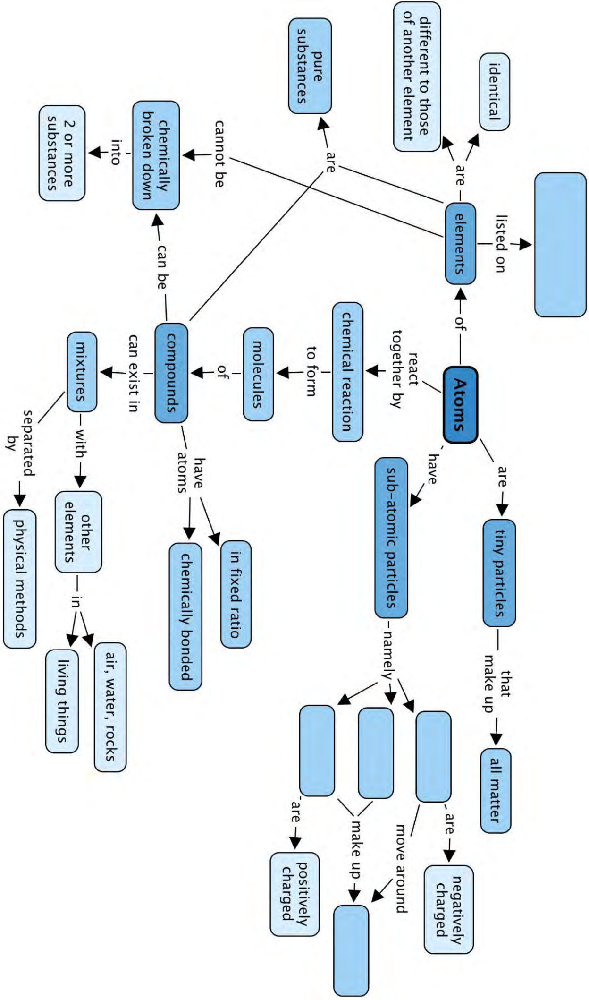
> **[Diagram Context - Textbook_NaturalScience_Gr8_Atoms.pdf-0028-00.png]**
> A diagram of a cell and its organelles, including a nucleus, mitochondria, and ribosomes.


> **[Diagram Context - Textbook_NaturalScience_Gr8_Microorganisms.pdf-0028-07.png]**
> The image shows a close-up view of a diagram of a cell, with a red ant positioned on the right side of the cell. The cell is depicted in shades of gray, and the background is a light brown color. The diagram includes various labels and arrows, such as "cell", "organelles", "mitochondria", "lysosome", "lysosomal",


> **[Diagram Context - Textbook_NaturalScience_Gr8_Particle-model-of-matter.pdf-0028-02.png]**
> 1. A diagram of a snake's body.
 2. The snake's body is composed of many small lines.
 3. The snake's body is green and gray.


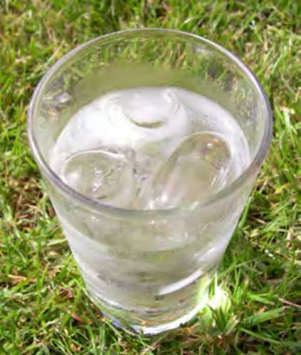
> **[Diagram Context - Textbook_NaturalScience_Gr8_Particle-model-of-matter.pdf-0028-06.png]**
> 1. A glass of water with ice cubes in it.


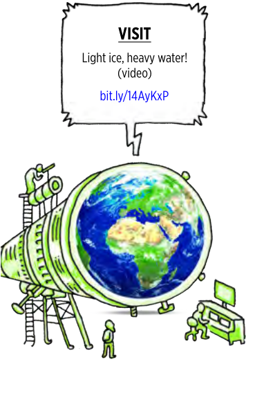
> **[Diagram Context - Textbook_NaturalScience_Gr8_Particle-model-of-matter.pdf-0028-10.png]**
> The image is a cartoon that depicts a group of people standing around a large telescope. The telescope is positioned in the center of the image, with the Earth and a satellite visible through it. The people are standing around the telescope, with one person standing directly in front of it and the others positioned around it. The image also includes a speech bubble that reads "Visit" and a caption that


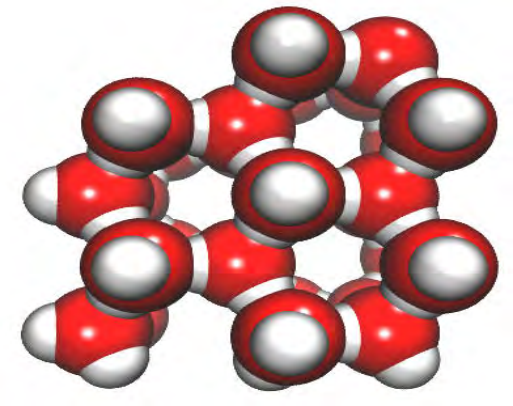
> **[Diagram Context - Textbook_NaturalScience_Gr8_Particle-model-of-matter.pdf-0028-11.png]**
> The image is a 3D rendering of a water molecule composed of two hydrogen atoms and one oxygen atom. The molecule is composed of red spheres, each containing a white center, arranged in a hexagonal pattern. The spheres are connected by white lines, creating a network of bonds that form the structure of the water molecule. The molecule is set against a white background, making the red spheres and lines


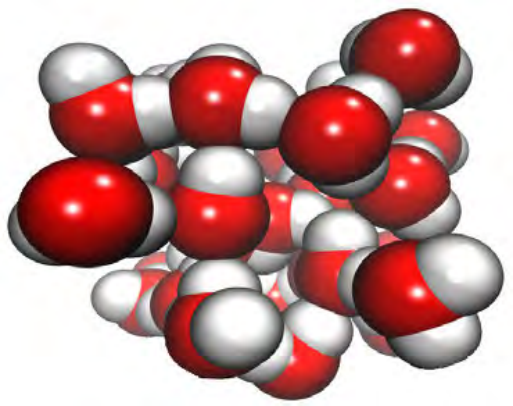
> **[Diagram Context - Textbook_NaturalScience_Gr8_Particle-model-of-matter.pdf-0028-13.png]**
> 1. A 3D rendering of a molecule composed of red spheres and white spheres.


---

# Chapter 2: Particle Model of Matter — Practical Investigation Planning

In scientific investigations, particularly when exploring the physical properties of matter (such as mass, volume, and density of different substances), it is crucial to design a fair and structured experiment. This guide helps you plan your investigation by identifying variables, listing apparatus, and drafting a step-by-step method.

---

## 1. Identifying Variables

To ensure that your scientific investigation yields reliable and valid results, you must identify and control the variables involved.

### Core Concepts:
* **Independent Variable:** The variable that you deliberately change or manipulate in the investigation.
* **Dependent Variable:** The variable that you measure or observe. Its value depends on the changes made to the independent variable.
* **Controlled Variables (Constants):** All other factors that must be kept constant throughout the experiment to ensure a fair test. If these are not controlled, they may influence the dependent variable and invalidate your results.

---

### Activity: Variable Identification

#### Question 1
Which variables must be kept constant to make this a fair test?
* **Answer:** 
  $$\text{\underline{\hspace{15cm}}}$$
  $$\text{\underline{\hspace{15cm}}}$$

#### Question 2
What is the independent variable? *(What is it that you have control over to change in this investigation?)*
* **Answer:** 
  $$\text{\underline{\hspace{15cm}}}$$
  $$\text{\underline{\hspace{15cm}}}$$

#### Question 3
What are the dependent variables? *(Which variables will you be measuring?)*
* **Answer:** 
  $$\text{\underline{\hspace{15cm}}}$$
  $$\text{\underline{\hspace{15cm}}}$$

---

## 2. Materials and Apparatus

Before beginning your experiment, gather all necessary equipment and materials. For this investigation, you will require:

* Four identical cups (paper or plastic)
* Sand
* Flour
* Tap water
* Triple beam balance or electronic scale

---

## 3. Designing the Method

### Guidelines for Writing a Scientific Method:
1. **Be Clear and Precise:** Write your instructions so that anyone else could repeat your experiment exactly and get the same results.
2. **Use Sequential Numbering:** List your steps in the chronological order in which they must be performed.
3. **Be Concise:** Use simple, direct language.

### Instructions:
You will be designing this investigation yourself. If you are working in groups, first discuss how you are going to conduct (carry out) this investigation. 

1. **Planning Phase:** Write down your proposed method in your notebook or on scrap paper. Discuss this plan with your teacher. Remember to also think about how you are going to record your results (e.g., creating a data table).
2. **Execution Phase:** After you have conducted the investigation, write down your final, refined method on the lines provided below. Summarise each step in sequence and number the steps.

---

### My Investigation Method:

1. $$\text{\underline{\hspace{15cm}}}$$
2. $$\text{\underline{\hspace{15cm}}}$$
3. $$\text{\underline{\hspace{15cm}}}$$
4. $$\text{\underline{\hspace{15cm}}}$$
5. $$\text{\underline{\hspace{15cm}}}$$
6. $$\text{\underline{\hspace{15cm}}}$$
7. $$\text{\underline{\hspace{15cm}}}$$
8. $$\text{\underline{\hspace{15cm}}}$$
9. $$\text{\underline{\hspace{15cm}}}$$
10. $$\text{\underline{\hspace{15cm}}}$$


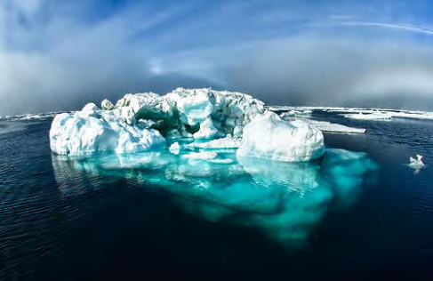
> **[Diagram Context - Textbook_NaturalScience_Gr8_Particle-model-of-matter.pdf-0029-02.png]**
> 1. A diagram of a cell with a diagram of a cell on the left.


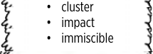
> **[Diagram Context - Textbook_NaturalScience_Gr8_Particle-model-of-matter.pdf-0029-06.png]**
> The image shows a diagram of a cluster of cells, with arrows pointing to the different parts of the cell. The diagram is labeled with the words "cluster", "impact", and "immiscible", indicating that the cluster of cells is a part of a larger system, and that the impact of the cluster on the system is either positive or negative. The diagram is presented in a simple


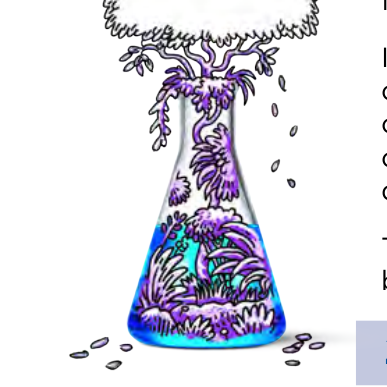
> **[Diagram Context - Textbook_NaturalScience_Gr8_Particle-model-of-matter.pdf-0029-07.png]**
> 1. A cartoon drawing of a plant growing out of a beaker.


> **[Diagram Context - Textbook_NaturalScience_Gr8_Particle-model-of-matter.pdf-0029-12.png]**
> 1. A diagram of a cell with a diagram of a cell and a diagram of a cell with a diagram of a cell and a diagram of a cell with a diagram of a cell and a diagram of a cell with a diagram of a cell and a diagram of a cell with a diagram of a cell and a diagram of a cell with a diagram of a cell and a diagram of a cell


---

Wait, standard markdown lines like `\_\_\_\_\_\_\_\_\_\_\_\_\_\_\_\_\_\_\_\_` or just standard text lines are better. Let's use simple text lines:
           `_________________________________________________________________________________`
           `_________________________________________________________________________________`
        2. Can you think of anything that could have improved this experiment?
           `_________________________________________________________________________________`
    *   *Footer:* `182 | Matter and Materials`

5.  **Refining the Output:**
    *   Ensure no conversational filler.
    *   Ensure KaTeX is used correctly.
    *   Ensure the placeholder is exactly `


` or similar.


> **[Diagram Context - Textbook_NaturalScience_Gr8_Atoms.pdf-0030-02.png]**
> 1. A white rectangle with a gray border.


> **[Diagram Context - Textbook_NaturalScience_Gr8_Atoms.pdf-0030-04.png]**
> 1. A white rectangle with a gray border.


---

.
3. What steps did you include to ensure fair testing?
CONCLUSION:
What is your conclusion? (What is your answer to the investigative question?)
.
In the last investigation we saw that two solids, namely sand and flour have
different densities as they are different materials. But what about liquids? Do all
liquids have the same density or does the type of material of the liquid affect
the density?
Have you ever noticed that oil floats on water?
Oil floats on water.
This homemade salad dressing contains oil
that floats on top.
.
VISIT
Create your own fluid
simulation of oil and
water.
bit.ly/15Ry2LR
When you mix oil and water, as in the picture of the salad dressing the two
materials will eventually separate because they do not mix well. They are
immiscible. When they separate, the oil will always float on top. The two
separate layers of water and oil are referred to as 'phases', the oil phase and the
water phase.
Oil floats on water for two reasons:
.
.
183
.

### Chapter 2.

Particle model of matter


> **[Diagram Context - Textbook_NaturalScience_Gr8_Atoms.pdf-0031-02.png]**
> 1. A white square with a gray border.


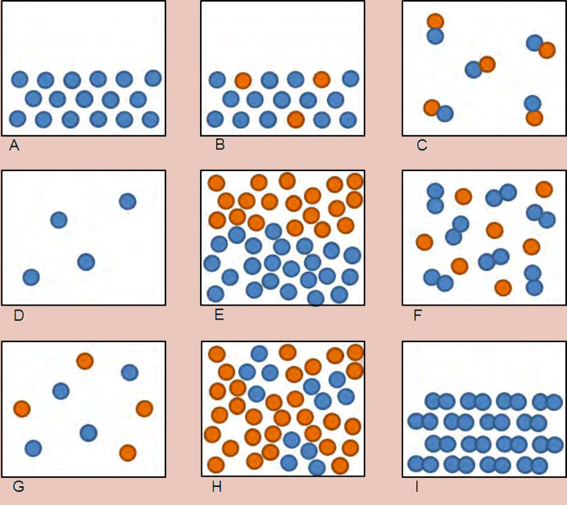
> **[Diagram Context - Textbook_NaturalScience_Gr8_Atoms.pdf-0031-04.png]**
> 1. A diagram of a Lewis structure of a molecule.


> **[Diagram Context - Textbook_NaturalScience_Gr8_Particle-model-of-matter.pdf-0031-03.png]**
> 1. A white square with a brown border.


---

• A cup of oil has less mass than a cup of water. The oil is less dense than
water. This makes oil float on water, like a cork or an air-filled rubber duck
floats on the surface of the water.
• Oil does not dissolve in water. The oil molecules cluster together and float
on the surface. If a large amount of oil is poured into water, the oil will
spread out and form a layer on the surface of the water. Oil that is spilled
into the ocean or a lake spreads over a huge area. It poisons many animals,
birds, fish and plants and is very expensive to clean up. That is why oil
pollution has an extremely negative impact on our environment.
Oil pollution forms a thin layer on the
surface of the sea water. The oil can spread
out over a huge area as the layer is thin and
it floats on top of the water.
A sea bird trapped in the oil from a spill.
The oil gets in between the bird's feathers,
sticking them together and preventing the
bird from flying.
When two substances are in the same container, but not mixed (like oil and
water for instance), they will form two layers. In a certain sense, water and ice
also form two 'layers'. Which layer will be on top: the one which is more dense
or the one which is less dense?
In the next activity we look at how we can layer different liquids on top of each
other depending on the densities!
..
184
.
Matter and Materials


> **[Diagram Context - Textbook_NaturalScience_Gr8_Atoms.pdf-0032-03.png]**
> The image shows a close-up view of a diagram of a cell, with a red ant positioned on the right side of the cell. The cell is depicted in shades of gray, and the ant is shown in a red color. The diagram is labeled with the text "Lewis diagram" and "cellular structure".


> **[Diagram Context - Textbook_NaturalScience_Gr8_Particle-model-of-matter.pdf-0032-04.png]**
> The image shows a gray line with a zipper running down the middle. The zipper is white with an orange outline, and the line is drawn in a straight line. The background is a solid gray color.


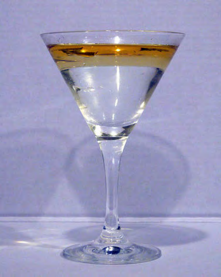
> **[Diagram Context - Textbook_NaturalScience_Gr8_Particle-model-of-matter.pdf-0032-07.png]**
> 1. A glass of water with a gold rim.


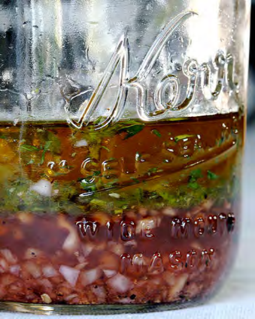
> **[Diagram Context - Textbook_NaturalScience_Gr8_Particle-model-of-matter.pdf-0032-09.png]**
> 1. A jar of food with a label that says "Korn".


> **[Diagram Context - Textbook_NaturalScience_Gr8_Particle-model-of-matter.pdf-0032-11.png]**
> The image features a cartoon depiction of a man holding a globe. The globe is green and blue, and the man is wearing a green shirt and a white hat. The man is pointing to the globe, and there is a speech bubble above him that reads "Visit". The speech bubble also contains a link to a website, which is a bit.ly/R2R2R2.


---

.
.

### ACTIVITY: Rainbow density column

.
MATERIALS:
• large glass vase or one litre glass measuring cylinder
• plastic cups
• honey
• golden syrup
• whole milk
• dish washing liquid
• water (can be coloured with food colouring, blue for example)
• vegetable oil
• rubbing alcohol (can be coloured with food colouring, red for example)
• a bolt
• a popcorn kernel
• a cherry tomato
• some plastic beads
• a ping pong ball/polystyrene ball
INSTRUCTIONS:
.
VISIT
A video showing how to
make a rainbow density
column.
bit.ly/14oGnEu
1. Use the same amount of each liquid. The amount will be determined by the
height of the vase or measuring cylinder. Pour equal volumes of each liquid
into the cups.
2. If you have access to a scale, measure the mass of each cup with a
different liquid. Arrange them in order from heaviest to lightest.
3. Start with the heaviest liquid (honey) and pour it into the container first.
Be careful not to let any of it touch the sides of the container.
4. Next pour in the next heaviest until you have poured all the liquids into the
container. If you have a pipette, use it to carefully layer the liquids.
5. Stand the column on a desk and carefully drop in the bolt, popcorn kernel,
cherry tomato and beads. Take note of where each object settles in the
density column.
6. Finally, drop the ping pong/polystyrene ball on top.
QUESTIONS:
1. Use the space provided to make a drawing of the density column that you
made in class. Use coloured pencils if you have them. Label each layer. If
you measured the mass of each liquid, write the mass in brackets after
each label. Draw in the different objects to show where they dropped to in
the density column.
.
.
185
.

### Chapter 2.

Particle model of matter

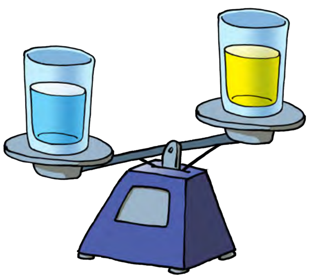
> **[Diagram Context - Textbook_NaturalScience_Gr8_Particle-model-of-matter.pdf-0033-01.png]**
> The image shows a blue and gray scale with two glasses on either side of it. The left side of the scale has a clear glass filled with water, while the right side has a yellow glass filled with a yellow liquid. The scale is labeled with the words "Water" and "Yellow Liquid" on the left and "Water" and "Yellow Liquid" on the right. The scale is


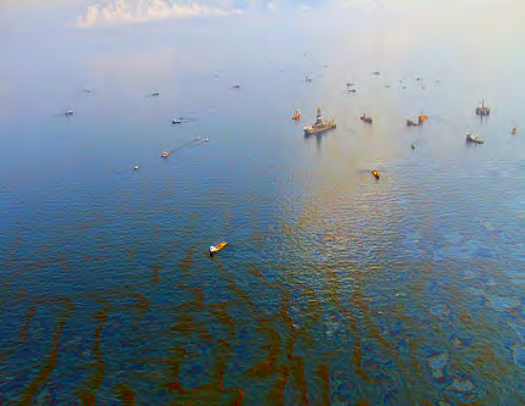
> **[Diagram Context - Textbook_NaturalScience_Gr8_Particle-model-of-matter.pdf-0033-03.png]**
> The image shows an aerial view of a body of water with a large number of boats and ships scattered throughout the scene. The boats vary in size and are positioned at different angles, creating a sense of depth and perspective. The water appears to be murky, which could be due to the presence of algae or other organic matter. The sky above the water is cloudy, adding to the overall atmosphere of


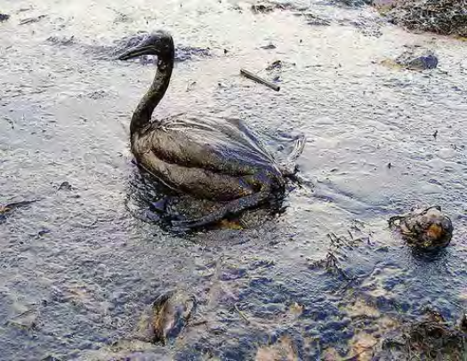
> **[Diagram Context - Textbook_NaturalScience_Gr8_Particle-model-of-matter.pdf-0033-05.png]**
> The image shows a bird, possibly a duck, swimming in a body of water that appears to be contaminated with oil. The bird is surrounded by the oil, which is visible on its feathers and the water. The bird is positioned in the center of the image, with the oil covering most of the water around it. The bird's position and the presence of oil suggest that the water has been


---

.
.
2. Which liquid is the most dense and which is the least dense? Explain your
answer.
3. Do you notice any relationship between the mass and density of the
different liquids?
4. Arrange the objects from most dense to least dense. Explain how you did
this.
..
186
.
Matter and Materials


> **[Diagram Context - Textbook_NaturalScience_Gr8_Particle-model-of-matter.pdf-0034-10.png]**
> 1. A green spring with a silver spring inside of it.
 2. A green battery with a silver battery inside of it.
 3. A green wire with a silver wire inside of it.
 4. A green wire with a silver wire inside of it.


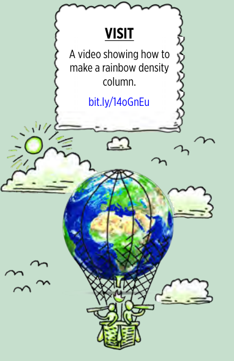
> **[Diagram Context - Textbook_NaturalScience_Gr8_Particle-model-of-matter.pdf-0034-22.png]**
> A video showing how to make a rainbow density column.


---

### Density and Particle Model of Matter

#### Conceptual Questions
5. Why do you think the objects dropped to different levels in the liquid?
6. Which objects are more dense than water? Which objects are less dense than water?

---

### ACTIVITY: Some density calculations

**Instructions:**
1. Use the table below to perform the required calculations.
2. Show all working steps and include the correct units in your final answer.

#### Table of Densities

| Material | Density ($g/mL$) |
| :--- | :--- |
| Water (liquid) | $1$ |
| Ice | $0.917$ |
| Glass | $2.6$ |
| Salt | $2.2$ |
| Chalk | $2.36$ |
| Coal | $1.5$ |
| Cork | $0.25$ |


> **[Diagram Context - Textbook_NaturalScience_Gr8_Particle-model-of-matter.pdf-0035-00.png]**
> 1. A white square with a blank space in the center.


#### Questions
1. You have a $500g$ block of butter at home. You found out that its volume is $555mL$. What is the density of the butter?

**Formula for Density:**
$$\text{Density} (\rho) = \frac{\text{Mass} (m)}{\text{Volume} (V)}$$

**Worked Example (Calculation for Question 1):**
*   **Given:**
    *   Mass ($m$) = $500g$
    *   Volume ($V$) = $555mL$
*   **Calculation:**
    $$\rho = \frac{500g}{555mL}$$
    $$\rho \approx 0.90g/mL$$

---

### Exercises: Density, Mass, and Volume

#### Question 2
Which is more dense, salt or chalk?


---

#### Question 3
You have a large glass marble and you want to find out what its volume is. You measure the mass and find it to be $50\text{ g}$. What is its volume?

*Note: To solve this, you must use the density formula:*
$$\text{Density} (\rho) = \frac{\text{Mass} (m)}{\text{Volume} (V)}$$

*Rearranged to solve for Volume:*
$$V = \frac{m}{\rho}$$


> **[Diagram Context - Textbook_NaturalScience_Gr8_Particle-model-of-matter.pdf-0036-03.png]**
> 1. A diagram of a snake's body.


---

#### Question 4
You have a piece of coal and a piece of cork which are exactly the same size. They have the same volume of $100\text{ mL}$. Which one will have the greater mass? Calculate the exact mass of each piece.

*Use the following relationship to calculate mass:*
$$\text{Mass} (m) = \text{Density} (\rho) \times \text{Volume} (V)$$


> **[Diagram Context - Textbook_NaturalScience_Gr8_Particle-model-of-matter.pdf-0036-09.png]**
> The image is a cartoon drawing of a spring coiled up in the shape of a caterpillar. The caterpillar is made up of green leaves and has a face with a big smile. The drawing is set against a light green background with a white border. The drawing includes a Lewis diagram, a cellular structure, and a graph. The drawing also includes a diagram of a plant cell and a


---
**Page 188 | Matter and Materials**


---

### Density and the Particle Model

#### Key Concepts
*   **Density:** A measure of how tightly packed the particles are within a material.
*   **Gas Behavior:** Gases expand to fill the entire volume of any container they are placed in.
*   **Density Change:** If the same mass of gas is moved into a larger container, the particles are spread further apart, resulting in a **lower density**.
*   **Solids and Liquids:** Unlike gases, solids and liquids have relatively fixed densities because their particles are held close together by strong forces.


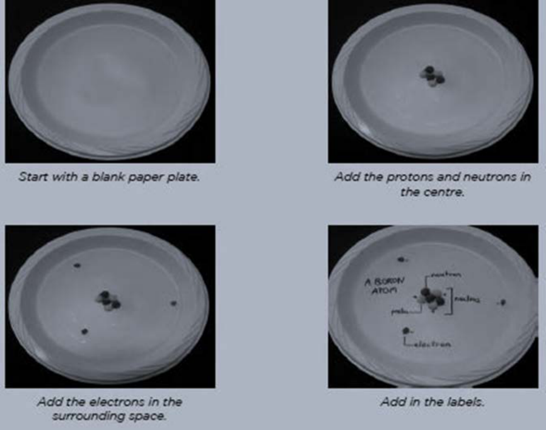
> **[Diagram Context - Textbook_NaturalScience_Gr8_Atoms.pdf-0037-10.png]**
> 1. A diagram of a protons and neutrons in the center of a white plate.


---

### 2.7 Expansion and Contraction of Materials

#### New Words
*   **Expand:** To become larger in size.
*   **Contract:** To become smaller in size (shrink).
*   **Reinforce:** To strengthen or support.

#### Understanding Expansion and Contraction
Materials react to changes in temperature by changing their physical size:

1.  **Expansion:** When materials are heated, they gain energy and become slightly larger.
2.  **Contraction:** When materials are cooled, they lose energy and shrink slightly.

**Real-world Example:**
In a tin-roofed house on a hot day, the metal roof panels may "groan and creak." This occurs because the metal panels expand as they heat up during the day, causing them to shift and rub against their fastenings.


> **[Diagram Context - Textbook_NaturalScience_Gr8_Particle-model-of-matter.pdf-0037-00.png]**
> 1. A diagram of a cell with a white square and a green square.


> **[Diagram Context - Textbook_NaturalScience_Gr8_Particle-model-of-matter.pdf-0037-06.png]**
> The image shows a line drawing of a chain with a green border. The chain is composed of multiple links, and the drawing is set against a gray background. The chain is positioned horizontally, with the links extending from the left to the right side of the image. The chain is not a typical representation of a chain, as it is a line drawing rather than a physical object. The drawing is


---

# Thermal Expansion and Contraction

## Introduction to Expansion
Materials change size based on temperature fluctuations. When materials are heated, they expand; when they are cooled, they contract. 

*   **Example:** Metal roof panels expand and contract as the outside temperature changes. As they move, they scrape against each other and the nails holding them in place, which creates creaky, groaning noises.

## Engineering for Expansion
Because different solids expand at different rates, engineers must account for these changes when designing structures to prevent damage. If materials are not given space to expand, the internal forces generated can be strong enough to crack or buckle the material.

### Case Study: Concrete Roads
Engineers leave gaps between concrete blocks in roads and paths. 
*   **With gaps:** The concrete has space to expand safely when it gets hot.
*   **Without gaps:** The concrete blocks push against each other, creating immense pressure that causes the road surface to crack.


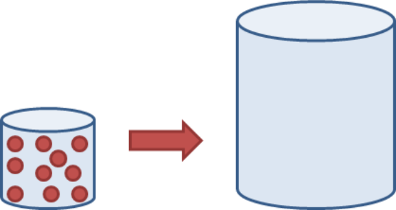
> **[Diagram Context - Textbook_NaturalScience_Gr8_Particle-model-of-matter.pdf-0038-02.png]**
> The image shows a diagram of a small red circle and a larger blue cylinder. The diagram is labeled with the text "A" and "B", and the text "A" is positioned to the left of the "B" in the diagram. The diagram is a Lewis diagram, which is a diagram used to represent the valence electrons of an atom. The diagram is labeled with the text


### Case Study: Bridges
Bridges are large structures that undergo significant expansion and contraction. To manage this, engineers use **expansion joints**.

*   **Mechanism:** These joints often feature interlocking "teeth" that fit together like a comb.
*   **Function:** As the bridge material expands or contracts, these teeth slide past each other, allowing the bridge to change size without structural damage.


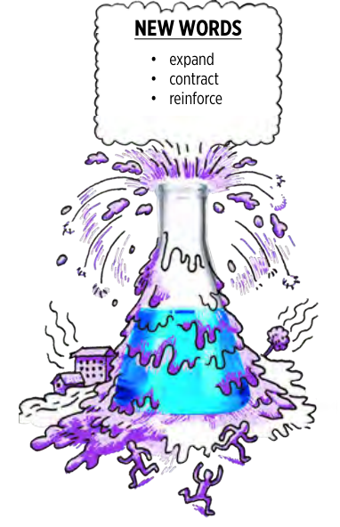
> **[Diagram Context - Textbook_NaturalScience_Gr8_Particle-model-of-matter.pdf-0038-08.png]**
> The image is a cartoon depiction of a volcano with a blue liquid inside, surrounded by purple and white elements. The volcano is depicted in a cartoon style, with a label that reads "New Words" and a caption that says "Expand Contract Reinforce". The image also includes a list of words, such as "New Words", "Expand Contract Reinforce", and "New Words",


---
**Key Principle:** When building large structures, engineers must always allow for the expansion and contraction of materials to ensure safety and structural integrity.

---

# ACTIVITY: How much longer?

In this activity, you will compare the thermal expansion of different solid materials by creating a bar graph. Thermal expansion occurs when particles in a solid gain energy and move further apart, causing the material to increase in length.

### Data: Expansion of Materials
The table below shows how much a $100\text{ m}$ length of various materials expands when the temperature increases by $10^\circ\text{C}$.

| Material | Expansion ($100\text{ m}$ length at $10^\circ\text{C}$ increase) |
| :--- | :--- |
| Brass | $19\text{ mm}$ |
| Iron | $12\text{ mm}$ |
| Steel | $11\text{ mm}$ |
| Platinum alloy | $10\text{ mm}$ |
| Concrete | $11\text{ mm}$ |
| Ordinary glass | $11\text{ mm}$ |
| Ovenproof glass | $3,5\text{ mm}$ |

### Instructions for Graphing
1. **Graph Type:** Draw a bar graph.
2. **Y-axis:** Label this axis 'Expansion' (measured in $\text{mm}$).
3. **X-axis:** Label this axis 'Materials' and list the categories provided in the table.
4. **Title:** Choose an appropriate descriptive title for your graph (e.g., "Comparison of Thermal Expansion in Different Solid Materials").


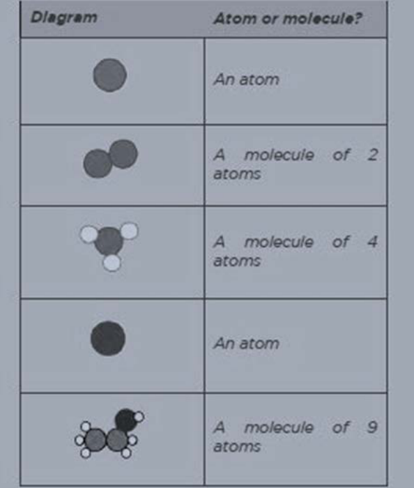
> **[Diagram Context - Textbook_NaturalScience_Gr8_Atoms.pdf-0039-01.png]**
> 1. An atom or molecule of 2 atoms.


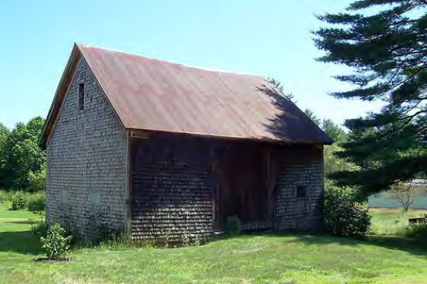
> **[Diagram Context - Textbook_NaturalScience_Gr8_Particle-model-of-matter.pdf-0039-00.png]**
> The image shows a small, old wooden building with a red roof. The building is surrounded by a grassy area, and there are trees in the background. The building appears to be in a rural setting, possibly a farm or a small house. The image does not contain any text or other objects, and the building is the main focus of the image.


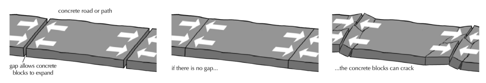
> **[Diagram Context - Textbook_NaturalScience_Gr8_Particle-model-of-matter.pdf-0039-07.png]**
> 1. A diagram of a road with arrows pointing to different parts of the road.


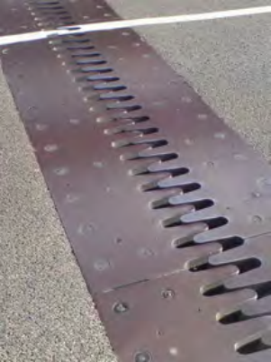
> **[Diagram Context - Textbook_NaturalScience_Gr8_Particle-model-of-matter.pdf-0039-10.png]**
> The image shows a diagram of a metal plate with a series of holes arranged in a zigzag pattern. The diagram is labeled with the words "Lewis diagram" and "circuit", indicating that it is a visual representation of a Lewis diagram or circuit. The diagram is set against a gray background, and the text "South African CAPS" is also present, suggesting that the diagram is


---

### Questions: Thermal Expansion of Materials

**1. Material Expansion**
Which material expands the most upon heating?

**2. Material Contraction/Stability**
Which material expands the least?

**3. Reinforcing Concrete**
Which solid would be the best material to reinforce concrete? 
*Hint: The reinforcing material should expand at the same rate as the concrete; otherwise, it will damage the concrete during expansion.*

**4. Practical Application: Brass Window Frames**
A man builds a house with large windows set in brass frames. During hot summer months, the windows keep falling out of the frames.
*   As a scientist, explain why this is happening.
*   Should the frames be replaced? If so, with what material?
*   What other solutions can you suggest?

**5. Metal Ball and Ring Apparatus**
The diagram below shows a metal ball and ring apparatus. Both are made of brass. At room temperature, the ball is just the right size to pass through the ring.


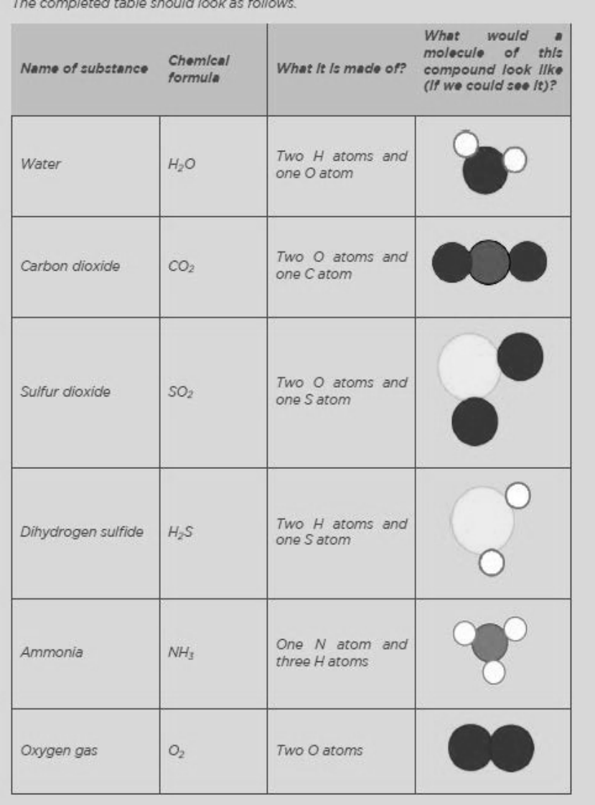
> **[Diagram Context - Textbook_NaturalScience_Gr8_Atoms.pdf-0040-02.png]**
> 1. A table with chemical formulas and Lewis diagrams for water, carbon dioxide, sulfur dioxide, sulfuric acid, and oxygen.


*   Do you think the ball will still fit through the ring when the ball has been heated? Explain your reasoning.

**6. Mass and Expansion**
Do you think the brass ball will have more mass when it has expanded? Explain your answer.

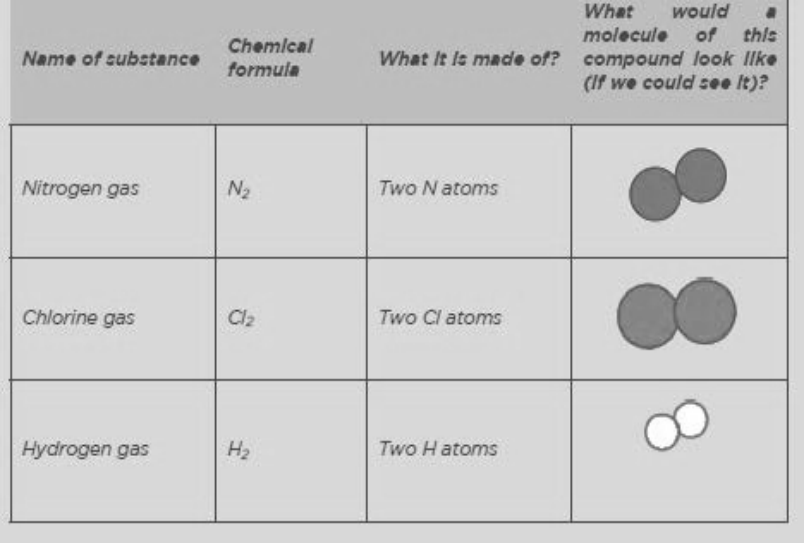
> **[Diagram Context - Textbook_NaturalScience_Gr8_Atoms.pdf-0040-03.png]**
> 1. A table with chemical formulas and two chemical compounds.


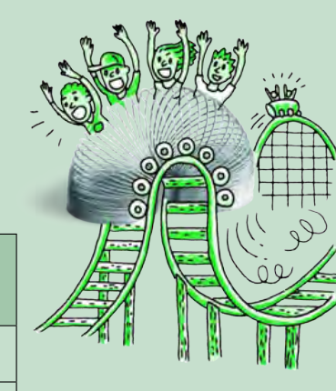
> **[Diagram Context - Textbook_NaturalScience_Gr8_Particle-model-of-matter.pdf-0040-03.png]**
> 1. A diagram of a roller coaster with a spring coiled up on top.


> **[Diagram Context - Textbook_NaturalScience_Gr8_Particle-model-of-matter.pdf-0040-05.png]**
> 1. A diagram of a cell with a white square in the center.


---

### 7. Review Question
**Question:** What will happen to the brass ball when its temperature drops back to room temperature? Will it be larger than, smaller than, or the same size as before it was heated? Explain your answer.

---

### Particle Model of Matter: Expansion and Contraction

#### Explaining Expansion
Materials expand when heated because the particles within the material gain energy, move faster, and push further apart from each other.

#### Explaining Contraction
When a substance cools (energy is removed), the particles in that substance slow down and move closer together. This causes most materials to **contract** (shrink) when they are cooled.

---

### Expansion and Contraction in a Thermometer

A common glass thermometer is known as a **bulb thermometer**. It consists of:
*   A fairly large bulb.
*   A long, thin tube connected to the bulb.
*   A brightly coloured liquid inside (some thermometers use mercury).

The liquid inside the thermometer expands when heated and contracts when cooled, allowing us to measure temperature changes.


#### ACTIVITY: How does a thermometer work?
*Observe the provided diagrams representing the same thermometer at two different temperatures to identify how the liquid level changes in response to heat.*

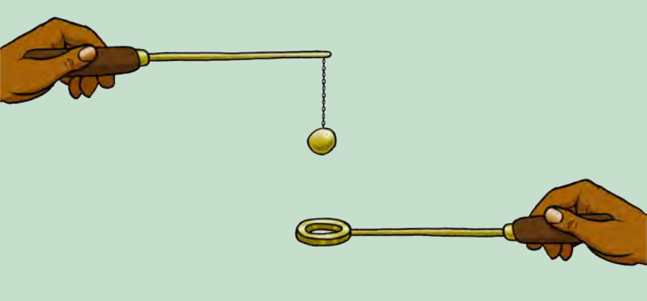
> **[Diagram Context - Textbook_NaturalScience_Gr8_Particle-model-of-matter.pdf-0041-07.png]**
> 1. A cartoon illustration of two hands holding a gold ball and a gold rod.


---

### Matter and Materials: Particle Theory and Temperature


#### Did You Know?
Mercury is the only metal that is a liquid at room temperature.

---

#### Questions

**1. The drawings represent the particles in the liquid inside a thermometer. What is the temperature measured on the thermometer on the left?**
*   Observe the level of the liquid on the scale of the left thermometer.

**2. The drawing on the right is of the same thermometer, but slightly different. Can you tell the difference?**
*   Compare the liquid level on the right thermometer to the left thermometer.
*   Observe the spacing between the particles in the magnified circle.

**3. Which of the circles (A, B, C, or D) is the best representation of the liquid in the thermometer on the right? Why did you choose this one?**
*   Analyze the particle arrangement in options A, B, C, and D.
*   Consider how particles behave when a substance is cooled (contraction) versus heated (expansion).

**4. Does a material have less mass when it has contracted? Explain.**
*   Recall the definition of mass: the amount of matter in an object.
*   Consider if the number of particles changes during the process of contraction.

**5. If the temperature was raised and the thermometer read $30^\circ\text{C}$, which circle would now best represent the particles in the liquid of the thermometer? Why?**
*   Relate the increase in temperature to the kinetic energy of the particles.
*   Explain how increased kinetic energy affects the volume and the spacing between particles.

**6. How does the volume change when a material is heated? Why?**
*   Describe the relationship between heat, particle movement, and the space occupied by the substance.


> **[Diagram Context - Textbook_NaturalScience_Gr8_Particle-model-of-matter.pdf-0042-02.png]**
> 1. A diagram of a snake's body, with a green snake and a brown body.


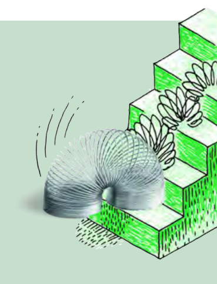
> **[Diagram Context - Textbook_NaturalScience_Gr8_Particle-model-of-matter.pdf-0042-08.png]**
> 1. A diagram of a spring coiled up and attached to a green block.


---

### Chapter 2: Particle Model of Matter

#### 1. Concept Review: Particle Theory
Understanding matter through the particle model helps explain physical properties such as:
*   States of matter
*   Changes of state
*   Density
*   Expansion and contraction

#### 2. Take Note: Thermal Effects on Matter
*   **Heating:** When a material is heated, its particles move further apart.
*   **Cooling:** When a material cools down, its particles move closer together.
*   **Volume Change:** Heating and cooling cause the volume of a material to change.

#### 3. Measuring Mass
To determine the quantity of a solid or liquid, we measure its **mass**.
*   **Instrument:** A scale is used to measure the mass of objects (e.g., a person or an object placed on a scale).


#### 4. Exercises and Critical Thinking

**Question 7:**
How does the density change when a material is heated? Why?
___________________________________________________________________________
___________________________________________________________________________
___________________________________________________________________________

**Investigation Reflection:**
Think back to the investigation comparing the densities of sand, water, flour, and air. How did you measure the mass of the air in a cup?
___________________________________________________________________________
___________________________________________________________________________

#### 5. Density of Gases
*   **Comparison:** Gases have much lower densities compared to solids and liquids.
*   **Challenge:** A large volume of gas has a very small mass.
*   **Measurement:** Because the mass of a gas is so small, it is difficult to measure using standard scales. Scientists use specialized, super-sensitive equipment to measure the quantity of gases.

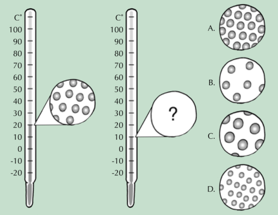
> **[Diagram Context - Textbook_NaturalScience_Gr8_Particle-model-of-matter.pdf-0043-01.png]**
> 1. A diagram of a thermometer with a temperature scale from -50 to +50 degrees.


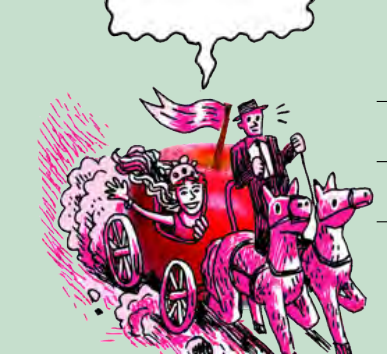
> **[Diagram Context - Textbook_NaturalScience_Gr8_Particle-model-of-matter.pdf-0043-07.png]**
> 1. A cartoon drawing of a man and a woman riding a pink horse.
 2. A pink flag flying from the horse.
 3. A pink apple on the horse.
 4. A pink flag on the horse.


---

# 2.8 Pressure

### New Words
*   **Pressure gauge:** A device used to measure the amount of pressure exerted by a gas or liquid.
*   **Air valve:** A mechanism that allows air to enter or leave a container (like a tyre) and controls the flow.

---

### What is gas pressure?
Gases consist of millions of fast-moving particles. These particles are in constant motion, colliding with each other and with the inner walls of their container.


*   **Definition:** Gas pressure is the force exerted by gas particles as they bump (collide) against the sides of their container.
*   **Relationship:** The pressure is directly related to the number of collisions. 
    *   More particles in a container = More collisions.
    *   More collisions = Higher pressure.

> **DID YOU KNOW?**
> Wind is simply moving air. The movement of air is caused by differences in pressure between areas of the Earth's atmosphere. Wind blows as the atmosphere attempts to equalise uneven pressures by moving air from a high-pressure area to a low-pressure area.

---

### How can gas pressure be measured?
Gas pressure can be measured using a device called a **pressure gauge**. A common example is the tyre pressure gauge used to check the air pressure inside a vehicle's tyre.


> **[Diagram Context - Textbook_NaturalScience_Gr8_Particle-model-of-matter.pdf-0044-02.png]**
> 1. A diagram of a snake's body.
 2. The snake's body is made up of many small lines.
 3. The snake's body is green and gray.


#### How a tyre pressure gauge works:
1.  **Connection:** The round end of the gauge is pressed against the **air valve** of the tyre.
2.  **Mechanism:** This action opens the valve, allowing a small amount of air to escape from the tyre into the gauge.
3.  **Collision:** The escaping air particles collide with a disc inside the gauge.
4.  **Measurement:** The force generated by these collisions pushes a bar out of the back of the gauge. The distance the bar is pushed out corresponds to the pressure inside the tyre, which is read using the numbers marked along the bar.

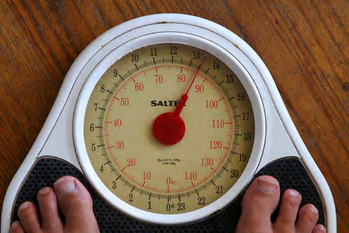
> **[Diagram Context - Textbook_NaturalScience_Gr8_Particle-model-of-matter.pdf-0044-05.png]**
> The image shows a white and red scale with a red knob on the front. The scale is set against a wooden background, and it is positioned on a wooden table. The scale is labeled with the word "SALT" and has a red knob on the front. The scale is set to zero, and it is currently at the bottom of the image. The scale is accompanied by a person


> **[Diagram Context - Textbook_NaturalScience_Gr8_Particle-model-of-matter.pdf-0044-09.png]**
> 1. A diagram of a cell with arrows pointing to different parts of the cell.


---

# Chapter 2: Particle Model of Matter

## Measuring Gas Pressure
Pressure gauges are used to measure the amount of gas inside a container, such as a car tyre. While different types of gauges exist (including digital and manual gauges), they all function based on the same underlying principles of gas pressure.


## Understanding Gas Pressure
Gas pressure is directly related to the amount of gas particles present in a container. When you blow air into a balloon, you are physically forcing more air particles into the space. As the number of particles increases, they collide more frequently with the walls of the container, resulting in increased pressure.

---

## ACTIVITY: Understanding Gas Pressure

### Materials Needed
*   Brown paper bags (medium size)
*   Balloons
*   Empty plastic cold drink or water bottles (2-litre bottles are preferred)
*   Bicycle pump and tyre

### Instructions
1.  **Brown Paper Bag Experiment:**
    *   a) Blow up a brown paper bag until it is fully inflated.
    *   b) Attempt to blow more air into the bag to see if you can make it pop.


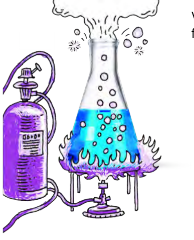
> **[Diagram Context - Textbook_NaturalScience_Gr8_Particle-model-of-matter.pdf-0045-05.png]**
> 1. A purple and blue gas cylinder with a purple nozzle.


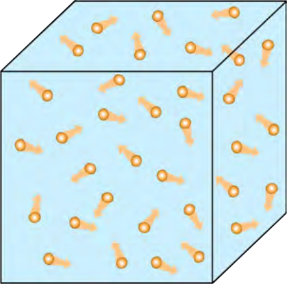
> **[Diagram Context - Textbook_NaturalScience_Gr8_Particle-model-of-matter.pdf-0045-07.png]**
> 1. A 3D rendering of a cube filled with small orange spheres.


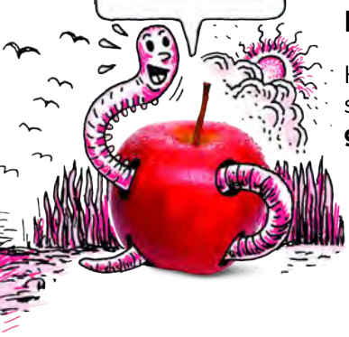
> **[Diagram Context - Textbook_NaturalScience_Gr8_Particle-model-of-matter.pdf-0045-13.png]**
> 1. A cartoon apple with a speech bubble that says "I'm a caterpillar".


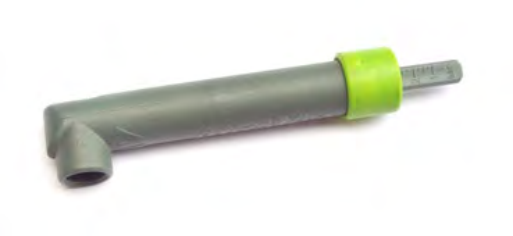
> **[Diagram Context - Textbook_NaturalScience_Gr8_Particle-model-of-matter.pdf-0045-16.png]**
> 1. A diagram of a cell with a green cap on the side.


---

### Activity: Investigating the Properties of Gases

#### 1. Observations on Air Pressure (Continued)
c) Write two or three sentences to describe what it feels like to blow into the bag when it is 'empty', compared to when it is 'full' of air. Does it feel different? Is it more difficult to blow into the bag when it is already full?

---

#### 2. Balloon Experiment
**Instructions:**
a) Blow up the balloon until it is the size of an orange. Pinch it closed but do not tie a knot in the top.
b) Now blow up the balloon as large as you can.
c) Try blowing it up even more. See if you can make it pop by blowing into it.
d) Write two or three sentences to describe what it feels like to blow into the balloon when it is 'empty', compared to when it is 'full' of air. Does it feel different? Is it more difficult to blow into the balloon when it is already full?
e) Tie a knot in the top of an inflated balloon. Leave the balloon in the classroom and examine it again after one week. Does it look the same as when you inflated it a week ago?


> **[Diagram Context - Textbook_NaturalScience_Gr8_Particle-model-of-matter.pdf-0046-01.png]**
> 1. A man is working on a car.


*Figure: A deflated birthday balloon.*

f) Write your observations below:

---

#### 3. Balloon and Plastic Bottle Experiment
**Instructions:**
a) Stretch the balloon over the top of the bottle, with the balloon hanging down into the bottle.
b) Blow into the balloon. What do you observe? Can you blow up the balloon?
c) Now make a small hole in the bottom of the bottle. Blow into the balloon again. What do you observe now?

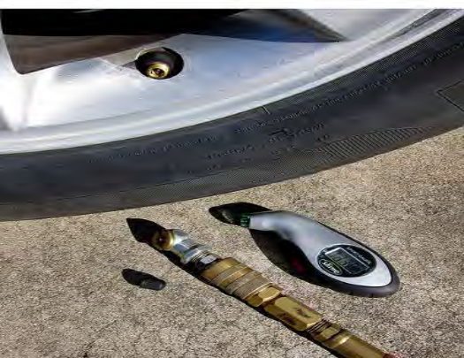
> **[Diagram Context - Textbook_NaturalScience_Gr8_Particle-model-of-matter.pdf-0046-02.png]**
> 1. A diagram of a cell with a Lewis structure.


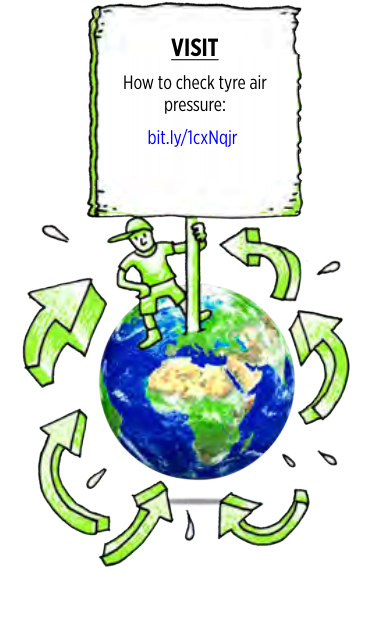
> **[Diagram Context - Textbook_NaturalScience_Gr8_Particle-model-of-matter.pdf-0046-05.png]**
> The image shows a cartoon depiction of a boy on a stick, with a globe and arrows surrounding him. The boy is holding a sign that says "Visit". The boy is standing on a stick, which is positioned in the center of the image. The globe is located in the bottom right corner of the image. The arrows are scattered around the globe, with some pointing towards the boy and others


> **[Diagram Context - Textbook_NaturalScience_Gr8_Particle-model-of-matter.pdf-0046-07.png]**
> The image shows a young girl blowing up a red balloon. The girl is wearing a red and white striped shirt and is holding the balloon in her mouth. The balloon is round and red in color. The girl is standing in front of a group of other people who are also present in the scene. The image does not contain any text.


> **[Diagram Context - Textbook_NaturalScience_Gr8_Particle-model-of-matter.pdf-0046-17.png]**
> 1. A green spring with a silver spring inside of it.
 2. A green battery with a silver battery inside of it.
 3. A green wire with a silver wire inside of it.
 4. A green wire with a silver wire inside of it.


---

### Practical Activity: Bicycle Tyre and Pump

**Instructions:**
1. Use a bicycle pump to force air into a tyre.
2. Continue pumping until it becomes physically difficult to force more air into the tyre.
3. Record your observations in 1 or 2 sentences.

---

### Questions: Particle Model of Matter

Explain the following scenarios using the concepts of **particles**, **collisions**, and **pressure**.

**1. What happens when you blow up a paper bag, a balloon, or pump air into a tyre?**
*   *Guidance:* Consider how adding more particles to a fixed or flexible space affects the frequency of collisions against the container walls.

**2. When you blow into a paper bag, why does the bag pop or start to leak air after a while?**
*   *Guidance:* Think about the structural limits of the material when internal pressure increases.

**3. When you blow into a balloon that is fully inflated, why does the balloon pop?**
*   *Guidance:* Relate the force exerted by particle collisions to the tension of the balloon's surface.

**4. Why do you think the balloon became smaller when it was left for a week?**
*   *Hint:* Refer to the diagram below showing particles moving through the material of the balloon.


---
*Chapter 2: Particle model of matter | Page 199*


> **[Diagram Context - Textbook_NaturalScience_Gr8_Particle-model-of-matter.pdf-0047-08.png]**
> The image features a red balloon with the words "Happy 18th Birthday" written on it. The balloon is tied to a black string, and it is placed on a white surface. The balloon appears to be deflated, and there is a small amount of black string visible around it. The balloon is the main focus of the image, with the text and the deflated state of the balloon


---

### Exercises: Gas Pressure

**5. Explain why you think it was impossible to blow up the balloon inside the bottle? Why was it possible to blow up the balloon when there was a hole in the bottle?**
*(Space provided for learner response)*

**6. Why does it become more and more difficult to pump air into the bicycle tyre?**
*(Space provided for learner response)*

---

### How does heating or cooling a gas change its pressure?

*   **Heating a gas:** When gas is heated, the particles gain energy and move faster. Consequently, they collide with the inside of the container more frequently and with greater force, resulting in an **increase in pressure**.
*   **Cooling a gas:** When gas is cooled, the particles lose energy and move more slowly. They collide with the inside of the container less frequently and with less force, resulting in a **decrease in pressure**.

#### Comparison of Gas States

| Cool gas | Hot gas |
| :--- | :--- |
| 


 | 

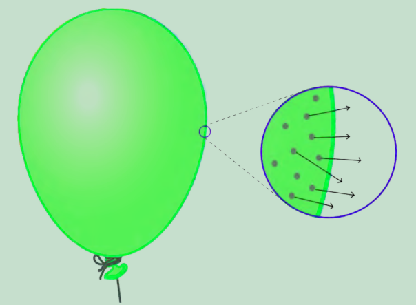
> **[Diagram Context - Textbook_NaturalScience_Gr8_Particle-model-of-matter.pdf-0048-10.png]**
> 1. A green balloon with a black string attached to it.

 |
| Fewer and less energetic collisions. | More and more energetic collisions. |

---
**Matter and Materials | 200**

---

# The Relationship Between Gas Volume and Pressure

## How Changing Volume Affects Pressure
When a gas is compressed into a smaller volume, the gas particles have less space to move. This results in the particles colliding more frequently with each other and with the inner walls of the container. 

**Key Principle:** Increased frequency of collisions against the container walls results in **increased gas pressure**.


---

## Expanding Gas into a Larger Volume
If a fixed amount of gas is moved from one container into another container that is twice as large:

1. **Particle Count:** The number of gas particles remains the same.
2. **Space:** The particles now occupy a much larger volume.
3. **Spacing:** There is twice as much space between the molecules compared to the smaller container.

### Concept Check: Density
When gas is moved into a larger container, the density of the gas **decreases**. 

Density is defined by the relationship between mass and volume:
$$\rho = \frac{m}{V}$$

Where:
*   $\rho$ (rho) = density
*   $m$ = mass of the gas particles (which remains constant)
*   $V$ = volume of the container (which has increased)

Since the volume ($V$) in the denominator increases while the mass ($m$) stays the same, the overall density ($\rho$) must decrease.

---

## Summary
The physical properties of matter, such as pressure and density, are best understood by observing the behaviour and movement of the particles that make up that matter.


> **[Diagram Context - Textbook_NaturalScience_Gr8_Particle-model-of-matter.pdf-0049-03.png]**
> 1. A diagram of a cell with a green line.


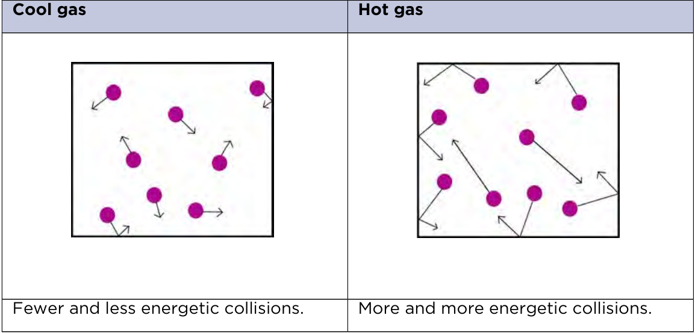
> **[Diagram Context - Textbook_NaturalScience_Gr8_Particle-model-of-matter.pdf-0049-07.png]**
> 1. Cool gas diagram with arrows and purple dots.
 2. Hot gas diagram with arrows and purple dots.


---

# Summary: Matter and Materials


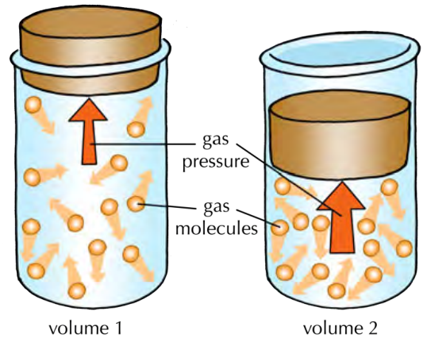
> **[Diagram Context - Textbook_NaturalScience_Gr8_Particle-model-of-matter.pdf-0050-02.png]**
> The image presents a diagram illustrating the relationship between gas pressure and volume. There are two glass jars, each filled with a different amount of gas particles. The jar on the left contains a larger number of particles, while the jar on the right has fewer particles. The diagram also includes arrows pointing to the gas particles and labels for gas pressure and volume. The diagram is labeled Volume 1 and Volume 2


## Key Concepts

### The Particle Model of Matter
All matter consists of extremely small particles called **atoms** or **molecules**. The **particle model of matter** describes how these particles are arranged and behave, helping us understand the macroscopic properties of materials.

#### States of Matter
*   **Solids:**
    *   Closely and regularly packed; locked into position.
    *   Movement is restricted to vibration only.
    *   Held together by strong forces.
    *   Very small spaces between particles.
*   **Liquids:**
    *   Close together but not locked in position.
    *   In constant motion, sliding past each other.
    *   Held together by moderately strong forces.
    *   Small spaces between particles (slightly larger than in solids).
*   **Gases:**
    *   In constant, fast motion.
    *   Not arranged; free to move.
    *   Weak forces between particles.
    *   Far apart with large empty spaces between them.

### Diffusion
Because particles in liquids and gases are in constant motion, they can **diffuse**. Diffusion is the process where particles spread out from an area of high concentration to an area of low concentration until they are evenly distributed. This process occurs faster in gases than in liquids because gas particles are further apart.

### Changes of State
Changes of state are typically caused by heating or cooling:
*   **Heating:** Solid $\rightarrow$ Liquid (**Melting**) $\rightarrow$ Gas (**Evaporation**).
*   **Cooling:** Gas $\rightarrow$ Liquid (**Condensation**) $\rightarrow$ Solid (**Freezing**).

### Density
Density is a measure of a material's "relative heaviness." It depends on:
1.  The mass of the individual particles (larger mass = denser).
2.  The size of the spaces between particles (larger spaces = less dense).

#### Density Formula
The relationship between mass and volume is expressed as:
$$\text{Density} = \frac{\text{mass}}{\text{volume}}$$

*   **Note on Texture:** Materials with a loose texture (e.g., bread or sponge) contain empty spaces, meaning they have less mass relative to their volume and are therefore less dense.
*   **Floating:** Materials that are less dense will always float on materials that are more dense.

---

# Chapter 2: Particle Model of Matter

## Key Concepts: The Particle Model

*   **Particle Motion:** All particles of matter are in a state of constant motion.
    *   **Solids:** Particle movement is restricted to vibrations.
    *   **Liquids and Gases:** Particles possess greater freedom of movement.
*   **Thermal Expansion and Contraction:**
    *   **Heating:** Causes particles to move further apart, resulting in expansion.
    *   **Cooling:** Causes particles to move closer together, resulting in contraction.
*   **Gas Pressure:**
    *   **Definition:** The pressure of a gas is caused by the collisions of gas particles with the inside walls of a container and with each other.
    *   **Measurement:** Pressure is used as a method to determine the quantity of gas present.
    *   **Relationship:** An increase in the number of gas particles within a container leads to a higher frequency of collisions, which results in increased pressure.

---

## Concept Map

The following concept map illustrates how the various components of the particle model of matter are interconnected.


> **[Diagram Context - Textbook_NaturalScience_Gr8_Particle-model-of-matter.pdf-0051-00.png]**
> 1. A diagram of a cell with blue and white lines.


*Note: There are 4 empty blocks in the concept map that require completion based on the principles outlined above.*


> **[Diagram Context - Textbook_NaturalScience_Gr8_Particle-model-of-matter.pdf-0051-01.png]**
> 1. A cartoon drawing of a man in a blue and white uniform with a key in his hand.


---

# The Particle Model of Matter

## 1. Fundamental Concepts
*   **Matter:** All matter is made up of tiny particles (atoms and molecules) that are too small to see.
*   **Empty Space:** There are empty spaces between these particles.
*   **Density:** Defined as the amount of mass per given volume.

## 2. The Three States of Matter
Matter exists in three states, which differ based on the arrangement and movement of their particles:

| State | Particle Arrangement | Movement | Forces | Spaces |
| :--- | :--- | :--- | :--- | :--- |
| **Solid** | Closely packed | Do not move around | Strong | Small |
| **Liquid** | Loosely arranged | Slide past each other | Weaker | Small |
| **Gas** | No arrangement | Move very fast | Very weak | Very big |

## 3. Changes of State
Changes in state are driven by thermal energy:
*   **Heating:** Causes particles to move faster and increases the spaces between them.
*   **Cooling:** Causes particles to move slower and decreases the spaces between them.
*   **Phase Transitions:**
    *   **Solid to Liquid:** Melting (implied by the transition from solid to liquid).
    *   **Liquid to Gas:** Evaporation.
    *   **Liquid to Solid:** Solidification (freezing).

## 4. Gas Properties
*   **Pressure:** Gases exert pressure due to the collisions of particles.
*   **Diffusion:** Particles move from an area of high concentration to an area of low concentration.

<!-- DIAGRAM_PLACEHOLDER: diagram -->

## 5. Mathematical Representation of Density
Density ($\rho$) is calculated using the relationship between mass ($m$) and volume ($V$):

$$\rho = \frac{m}{V}$$

Where:
*   $\rho$ = Density (measured in $kg/m^3$ or $g/cm^3$)
*   $m$ = Mass (measured in $kg$ or $g$)
*   $V$ = Volume (measured in $m^3$ or $cm^3$)

---

# Revision: The Particle Model of Matter

## 1. The Particle Model of Matter
The particle model of matter states that all matter is composed of tiny, discrete particles (atoms or molecules) that are in constant motion. The state of matter (solid, liquid, or gas) is determined by the amount of kinetic energy these particles possess and the strength of the forces of attraction between them.

## 2. The Anomaly of Water
Water is unusual because, unlike most substances, its solid form (ice) is less dense than its liquid form. 
*   **Explanation:** As water cools toward its freezing point, the molecules arrange themselves into a rigid, hexagonal crystalline lattice structure due to hydrogen bonding. This structure holds the molecules further apart than they are in the liquid state, causing the substance to expand as it freezes.

## 3. Changes of State
The following table outlines the processes involved when matter transitions between states:

| Change of State | Explanation |
| :--- | :--- |
| **Melting** | When heat is added and a solid changes to a liquid |
| **Condensing** | When heat is removed from a gas, causing it to change into a liquid |
| **Evaporation / Boiling** | When heat is added and the particles at the surface of a liquid change to the gas state |
| **Solidifying (Freezing)** | When heat is removed from a liquid, causing it to change into a solid |

## 4. Particle Behavior During Melting
When heat is added to a solid, the following process occurs at the particle level:
1.  **Increased Kinetic Energy:** The heat energy is transferred to the particles, causing them to vibrate more vigorously in their fixed positions.
2.  **Overcoming Forces:** As the temperature reaches the melting point, the particles gain enough kinetic energy to overcome the strong forces of attraction holding them in a rigid, fixed structure.
3.  **Transition to Liquid:** The particles break free from their fixed positions and begin to slide past one another, allowing the substance to flow and take the shape of its container.

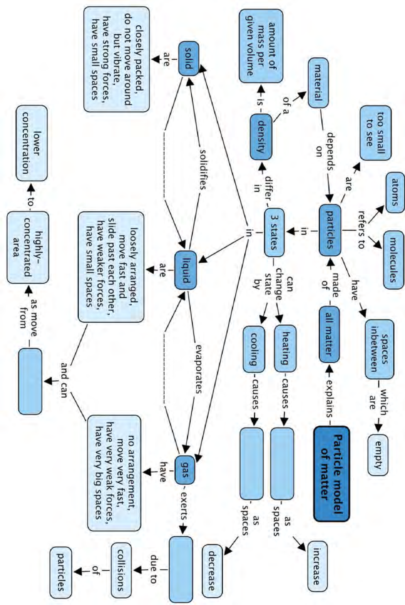
> **[Diagram Context - Textbook_NaturalScience_Gr8_Particle-model-of-matter.pdf-0053-00.png]**
> The image is a detailed diagram of a scientific concept, likely related to the study of physics or chemistry. The diagram is color-coded, with blue representing the particles and green representing the energy levels. The diagram is organized into several sections, each representing a different aspect of the concept. The diagram includes labels for the particles, energy levels, and the concept itself. The diagram also includes arrows to


---

### Revision Exercises: Matter and Materials

**5. Thermal Expansion and Contraction**
Complete the following sentence:
During expansion, the spaces between the particles get **larger**, and during contraction, the spaces between the particles get **smaller**.

**6. Expansion and Mass**
*   **Question:** How can a piece of metal get bigger (expand) and still have the same mass? Explain this in terms of the behaviour of the particles.
*   **Explanation:** When a metal is heated, the particles gain kinetic energy and vibrate more vigorously. This causes them to push each other further apart, increasing the volume of the metal. Because the number of particles remains constant, the mass of the metal does not change, even though the object occupies more space.

**7. Density and Buoyancy**
*   **Question:** Why does oil float on top of water?
*   **Explanation:** Oil is less dense than water. Density is defined by the formula:
    $$\rho = \frac{m}{V}$$
    Where $\rho$ is density, $m$ is mass, and $V$ is volume. Because the particles in oil are less tightly packed or have a lower mass-to-volume ratio than water particles, the oil experiences a buoyant force that keeps it on the surface.

**8. Particle Diffusion**
*   **Task:** Draw a picture to show the path of a perfume particle from a flower on one side of a room to your nose on the other.
*   **Concept:** The path should be drawn as a **random, zig-zag motion** (Brownian motion). Perfume particles collide with air molecules, causing them to move in random directions until they eventually spread throughout the room (diffusion).

**9. Safety at Petrol Stations**
*   **Question:** Why is it dangerous to light a match or use a cell phone near a petrol station?
*   **Explanation:** Petrol is highly volatile and evaporates easily, creating a mixture of fuel vapour and air. This mixture is highly flammable. A spark from a match or an electrical discharge from a cell phone provides enough activation energy to ignite the vapour, potentially causing an explosion.

**10. Compressibility of Matter**
*   **Question:** Why can air be compressed in a bicycle pump, but water cannot? Use the words 'particles', 'spaces', and 'compress'.
*   **Explanation:** 
    *   **Air:** There are large **spaces** between the gas **particles**. When you push the plunger, you are simply forcing the particles closer together into a smaller volume. Therefore, air is easy to **compress**.
    *   **Water:** In a liquid, the **particles** are already packed closely together with very little **space** between them. Because there is no room to push the particles closer, water is virtually impossible to **compress**.


> **[Diagram Context - Textbook_NaturalScience_Gr8_Particle-model-of-matter.pdf-0054-02.png]**
> The image features a cartoon depiction of a man and a machine. The man is holding a large gear, and the machine is a pulley system. The man is holding the gear with both hands, while the pulley is attached to the gear with a rope. The pulley is connected to a wheel, which is attached to a chain. The wheel is connected to a gear, which is


---

### Chapter 2: Particle Model of Matter

#### Exercise: Summary of States of Matter
Complete the following table to demonstrate your understanding of the particle model of matter.

| State of matter | Solid | Liquid | Gas |
| :--- | :--- | :--- | :--- |
| **Diagram showing how the particles are arranged** | 


 | 


 | <!-- DIAGRAM_PLACEHOLDER: diagram --> |
| **Arrangement of the particles** | Very closely packed. Regular arrangement | | |
| **Spaces between particles** | | | Very large |
| **Forces of attraction between particles** | | Strong, but weaker than in solids | |
| **Movement of particles** | | | Fast and random movement |
| **Shape** | | No fixed shape. Depends on the container | |
| **Volume** | | | No fixed volume. Depends on the container |
| **Compressibility** | Cannot be compressed | | |
| **Diffusion** | | Diffuses slowly | |
| **Density compared to the other states** | Highest density (except in the case of ice) | Almost as dense as the solid | |

***

**Instructions for completion:**
*   Use your own words or diagrams to fill in the empty blocks.
*   Ensure your descriptions align with the kinetic molecular theory of matter.
*   Total marks for this activity: [18 marks]

---

# Chapter 5: Particle Model of Matter

**Duration:** 5 Weeks

## Chapter Overview
This chapter builds upon the Grade 6 curriculum regarding the arrangement of particles in materials. While Grade 6 introduced the generic term "particle" to describe the building blocks of matter, this chapter expands on these ideas to explain the macroscopic properties of solids, liquids, and gases. Key concepts include diffusion, changes of state, density, expansion, contraction, and gas pressure.

---

## 5.1 What is the particle model of matter? (1 hour)

| Tasks | Skills | Recommendation |
| :--- | :--- | :--- |
| Activity: Changes of state revision | Accessing and recalling information, revising | CAPS suggested (revision) |

---

## 5.2 Solids, liquids and gases (3 hours)

| Tasks | Skills | Recommendation |
| :--- | :--- | :--- |
| Activity: Comparing solids, liquids and gases | Accessing and recalling information, comparing | CAPS suggested |
| Investigation: Comparing the diffusion of particles in a gas and in a liquid | Hypothesising, observing, identifying variables, recording information, comparing, interpreting information | CAPS suggested |

---

## 5.3 Change of state (2 hours)

| Tasks | Skills | Recommendation |
| :--- | :--- | :--- |
| Activity: Changes of state | Crossword puzzle, reading and writing, sorting and classifying | Optional revision |
| Investigation: What happens when we heat and then cool candle wax? | Predicting, hypothesising, planning investigation, drawing and labelling, observing, recording, analysing information | CAPS suggested |
| Activity: Hot water balloon | Observing, recording information | Optional extension |

---

## 5.4 Density, mass and volume (1 hour)

| Tasks | Skills | Recommendation |
| :--- | :--- | :--- |
| Activity: Which material is more dense? | Doing investigation, observing, comparing, communicating and group discussion | CAPS suggested |


> **[Diagram Context - Textbook_NaturalScience_Gr8_Particle-model-of-matter.pdf-0056-04.png]**
> The image shows a close-up view of a diagram of a cell. The diagram is colored in shades of pink and brown, with a red ant positioned on the right side. The diagram is labeled with the word "cell" and features various parts of the cell, including the cell wall, cell membrane, and organelles. The diagram also includes a Lewis diagram, which is a diagram


---

### 5.5 Density and States of Matter (1 hour)

| Tasks | Skills | Recommendation |
| :--- | :--- | :--- |
| Activity: Which has the highest density: a solid, a liquid or a gas? | Comparing, interpreting | CAPS suggested |

---

### 5.6 Density of Different Materials (3 hours)

| Tasks | Skills | Recommendation |
| :--- | :--- | :--- |
| Investigation: Comparing the densities of sand, flour, water and air | Hypothesising, identifying variables, planning investigation, doing investigation, observing, recording information, interpreting information | CAPS suggested |
| Activity: Rainbow density column | Demonstrating densities, comparing, observing, drawing, comparing | CAPS suggested |
| Activity: Some density calculations | Problem-solving, calculations | Optional extension |

---

### 5.7 Expansion and Contraction of Materials (2 hours)

| Tasks | Skills | Recommendation |
| :--- | :--- | :--- |
| Activity: How much longer? | Drawing graphs, interpreting information, predicting, demonstrating | CAPS suggested |
| Activity: How does a thermometer work? | Revision, comparing, identifying | CAPS suggested |

---

### 5.8 Pressure (2 hours)

| Tasks | Skills | Recommendation |
| :--- | :--- | :--- |
| Activity: Understanding gas pressure | Following instructions, observing, interpreting information | CAPS suggested |

---

### Key Questions for Review

*   What is the particle model of matter?
*   How small are atoms and molecules?
*   How does the particle model of matter describe solids, liquids and gases?
*   How does the particle model of matter help us understand the process of diffusion?
*   How can materials be made to change their state?
*   How does the particle model of matter help us to understand changes of state in materials, such as melting, evaporation, condensation and freezing?
*   How are density, mass and volume related to each other?
*   How do the densities of solids, liquids and gases compare?
*   Which aspects of the particles in a given material influence the density of that material?
*   Why does oil float on water? Is this related to density?
*   How can the particle model of matter help us to understand expansion and contraction?

---

### Inquiry Questions
* How does a gas exert pressure?
* Is the pressure a gas exerts related to the number of gas particles? If so, how?
* What happens to pressure when we change its volume and temperature?

---

### Properties of Matter: Solids, Liquids, and Gases

Matter exists in three primary states. The following table summarizes their key physical properties:

| Feature | Gases | Liquids | Solids |
| :--- | :--- | :--- | :--- |
| **Shape/Flow** | Spread out and escape if not in a closed container. | Can flow to fill the container. | Keep their shape. |
| **Compressibility** | Can be compressed. | Cannot be compressed easily. | Cannot be compressed. |
| **Particle Arrangement** | Particles are far apart and move freely. | Particles are close together but can move around. | Particles are closely packed and cannot move from their positions. |

---

### 5.1 What is the Particle Model of Matter?

This topic builds upon previous knowledge of stored energy and movement energy, now formally defined as:
* **Kinetic Energy:** Movement energy.
* **Potential Energy:** Stored energy.

**Important Note on Misconceptions:**
There is **no 'air'** between particles. The spaces between particles are empty, which is referred to as a **vacuum**.

---

### Activity: Changes of State Revision

1. The process of changing from solid to liquid is called **melting**.
2. The process of changing from liquid to solid is called **freezing**.
3. To melt a solid, one can place it in a warm spot or apply heat.
4. To change from a liquid to a gas, the substance must first melt (if solid) and then **evaporate**.
5. The process of changing from a gas to a liquid is called **condensation**.
6. **Heating** is the process of adding energy to a substance.
7. When heated, particles vibrate or move faster because they possess more **kinetic energy**.

---

### 5.2 Solids, Liquids, and Gases: Atomic Structure

When observing the submicroscopic view of Sodium Chloride ($NaCl$):
* Chloride atoms are represented as larger atoms.
* Sodium atoms are represented as smaller atoms.
* The relative sizes of these atoms correspond to their arrangement and properties found on the Periodic Table.

<!-- DIAGRAM_PLACEHOLDER: diagram -->

---

### Practical Demonstration: Compressibility of Matter

To understand the properties of different states of matter, learners can perform the following experiment:

1.  **Apparatus:** Three syringes per learner.
2.  **Procedure:**
    *   Fill one syringe with sand, one with water, and one with air.
    *   Seal the nozzle of each syringe tightly (using a finger or rubber).
    *   Attempt to squeeze the plunger.
3.  **Observation:** Air is easily compressed, allowing more air to fit into a smaller volume. This is why scuba tanks can hold enough air to last for an hour.

---

### ACTIVITY: Comparing Solids, Liquids, and Gases

<!-- DIAGRAM_PLACEHOLDER: diagram -->

| Feature | Solid | Liquid | Gas |
| :--- | :--- | :--- | :--- |
| **Arrangement of particles** | Closely packed in a regular arrangement | Loosely arranged, but still close together | No particular arrangement |
| **Movement of particles** | Do not move; only vibrate | Can move quite fast and slide past each other | Move very fast |
| **Forces between particles** | Very strong forces between them | Strong forces, but weaker than in the solid state | Very, very weak forces between the particles |
| **Spaces between particles** | Very small spaces | Small spaces | Very big spaces |

---

### Key Concepts and Explanations

#### 1. Why solids have a fixed shape
Solids maintain a fixed shape because their particles are held in a regular, fixed arrangement by strong intermolecular forces. In contrast, gas particles have no fixed arrangement and very weak forces between them, allowing them to move freely and fill the shape of any container.

#### 2. Compressibility
*   **Gases:** Have very large spaces between particles, allowing them to be "squashed" (compressed) into a smaller volume.
*   **Liquids:** Have very small spaces between particles, making them extremely difficult to compress.

#### 3. The Nature of Powders (e.g., Cake Flour)
A common misconception is that powders are liquids because they can "pour" and take the shape of a container. 
*   **Fact:** Powders are solids made of very fine grains. 
*   **Evidence:** You cannot evaporate a powder, and touching a powder does not make your fingers wet, which distinguishes it from a liquid.

---

### INVESTIGATION: Comparing the Diffusion of Particles in a Gas and in a Liquid

#### 1. Concept Overview
Diffusion is the process by which particles move from an area of higher concentration to an area of lower concentration. At this level, we compare the rates of diffusion in liquids and gases qualitatively.

#### 2. Experimental Considerations
To conduct a controlled experiment, the following factors must be considered:
*   **Containers:** Use identical containers for both the gas and liquid samples.
*   **Particle Size:** Compare substances with particles of similar size.
*   **Visibility:** Use coloured substances (e.g., bromine gas) to track the diffusion process visually.

#### 3. Safety and Alternative Substances
*   **Bromine Gas:** Highly hazardous; only use if specific facilities and training are available.
*   **Hydrogen Sulphide ($H_2S$):** An alternative to demonstrate gas diffusion.
    *   **Production:** Add a few drops of hydrochloric acid to iron sulphide or sodium sulphide in a conical flask.
    *   **Properties:** Has a strong, pungent "rotten egg" odour.
    *   **Safety Note:** Ensure the room is well-ventilated and windows are open. Do not use in small or crowded classrooms.
*   **Smoke Bombs:** Can be used as an analogy for gas mixing (though smoke contains solid soot particles).

#### 4. Practical Procedures
*   **Gas Diffusion:** Use vanilla essence in a saucer. Observe how the scent travels through the air.
    *   *Controlled Variable:* Learners should not move or wave their arms, as this acts like "stirring" the mixture, which would invalidate the test.
    *   *Data Collection:* Assign one learner to record the time taken for the smell to reach different parts of the room.
*   **Liquid Diffusion:** Observe how food colouring mixes with water without stirring.
    *   *Observation:* Liquids mix relatively slowly. If not fully mixed by the end of the lesson, check the results the following day.

#### 5. Expected Observations
When observing the diffusion of liquids (e.g., food colouring in water), learners should note the following:
1.  The mixing process takes a significant amount of time.
2.  The food colouring appears to swirl through the water.
3.  Initially, the concentration of colour is non-uniform, with some areas appearing more intensely coloured than others.

#### 6. Discussion Points
*   **Active Mixing:** Discuss how physically moving the air (waving arms) influences the speed at which the scent travels compared to natural diffusion.
*   **Fair Testing:** Explain why movement must be restricted to ensure the experiment measures natural diffusion rates rather than forced mixing.


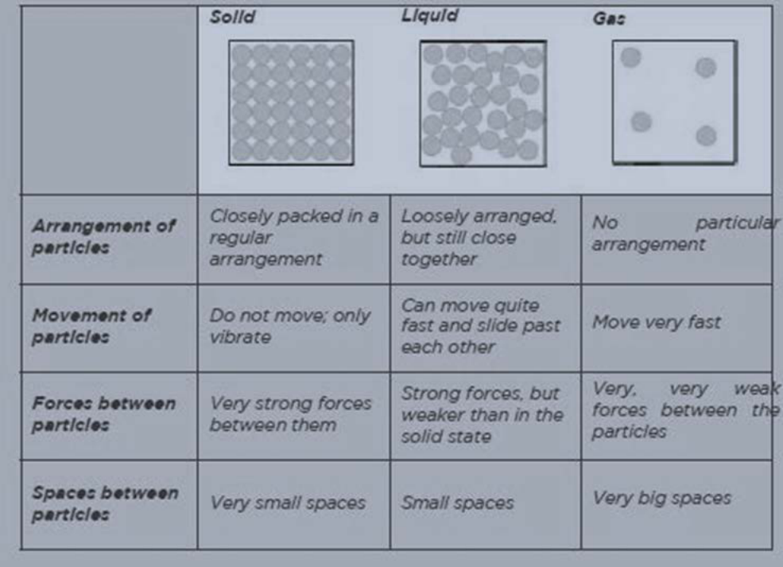
> **[Diagram Context - Textbook_NaturalScience_Gr8_Particle-model-of-matter.pdf-0060-04.png]**
> 1. Solid liquid gas diagram.


---

### 5. Diffusion Observations

Learners should conduct an experiment to observe the rate of diffusion of vanilla essence in the air. Use the following table to record observations:

| Event | Time measured without mixing (minutes) | Time measured with mixing (minutes) |
| :--- | :--- | :--- |
| The first learner smelled the vanilla | | |
| Approximately half the class smelled the vanilla | | |
| Learners at the back of the class smelled the vanilla | | |

#### Key Conclusions
*   Gases diffuse more quickly than liquids.
*   Mixing or stirring the air or liquid increases the rate of diffusion.

---

### Understanding Particle Movement
When substances mix, their particles intermingle. This process is not instantaneous; it takes time because particles must travel from one point to another.

*   **Random Motion:** Particles do not move with "purpose" or in straight lines. They move randomly in all directions.
*   **Collisions:** Particles frequently collide with other particles (e.g., a gas particle colliding with an air particle).
*   **Distribution:** Over time, particles spread out evenly throughout the available space.

#### Classroom Simulation Activity
To visualize particle behavior, perform the following demonstration:
1.  **Liquid Simulation:** Have a group of learners stand close together in the middle of an open space, moving around slowly. Have other learners attempt to move through this crowd.
2.  **Gas Simulation:** Have the learners spread much further apart and move around more vigorously. Have the other learners move through this group again.
3.  **Observation:** Learners will find it much easier and quicker to move through the "gas" simulation than the "liquid" simulation.

---

### 5.3 Changes of State

**ACTIVITY: Changes of state (LB page 109)**

This is an optional revision activity covering concepts from previous grades.

---

### Changes of State and Energy

#### Key Concepts
*   **Energy and State Changes:** All changes of state involve a change in energy.
*   **Kinetic Energy:** The movement of particles. As energy is added, kinetic energy increases; as energy is removed, kinetic energy decreases.
*   **Particle Representation:** In diagrams, lines around particles represent the amount of movement. Larger lines indicate greater movement and higher energy.

#### Instructional Demonstrations

**1. Melting and Evaporation Observation**
*   Place ice in a dish and allow it to melt (Solid to Liquid).
*   Place the dish in a warm area to observe evaporation (Liquid to Gas).

**2. Interactive Particle Simulation (Roleplay)**
*   **Solid State:** Learners stand in a group, holding hands, swaying, and moving their feet slightly.
*   **Liquid State:** Learners let go of hands and move around each other while staying in the general area.
*   **Gaseous State:** Learners run faster and break away from the central group, moving independently.

#### Real-World Application: Evaporation
*   **Scenario:** Drying laundry in the sun.
*   **Explanation:** Heat from the Sun warms the water molecules in the wet clothing. The molecules gain enough kinetic energy to escape their liquid state and transition into a gas (evaporation). This process occurs faster in direct sunlight than indoors.

#### Important Data
*   **Boiling Point of Water:** $100^{\circ}\text{C}$
*   **Bubbles in Boiling Water:** Bubbles formed during boiling are filled with water vapor (gas).

<!-- DIAGRAM_PLACEHOLDER: diagram -->

#### Crossword Summary (Completed)

| Across | Down |
| :--- | :--- |
| 1. CONDENSATION | 1. COOL |
| 6. LIQUID | 2. EVAPORATION |
| 8. BOIL | 3. GAS |
| 10. ICE | 4. STEAM |
| 12. REVERSE | 5. SOLID |
| 13. FREEZING | 7. WATER |
| | 9. HEAT |

---

### Understanding Changes of State

#### Key Concept: Physical vs. Chemical Change
A common misconception is that when water boils, water molecules break apart into hydrogen and oxygen gas. This is incorrect. 
*   **Physical Change:** Changes of state (e.g., melting, boiling, freezing) are physical changes. The composition of the molecules (particles) remains exactly the same before and after the change.
*   **Chemical Change:** This would involve the actual breaking of bonds and the creation of new substances.

---

### Investigation: What happens when we heat and then cool candle wax?

**Objective:** To observe and record the changes of state when candle wax is heated and cooled.

**Hypothesis:** The candle wax will melt when it is heated and solidify when it is cooled again.

#### Experimental Method
1. Place a piece of candle wax in the tin/foil dish.
2. Place the wire gauze on the tripod stand with the tin/foil dish on top of the gauze.
3. Place the Bunsen burner or spirit lamp underneath the tripod stand.
4. Light the burner and allow the tin to heat up.
5. Observe the change in state as the candle wax heats up.
6. Turn off the burner and allow the wax to cool down again.
7. Record the change of state.


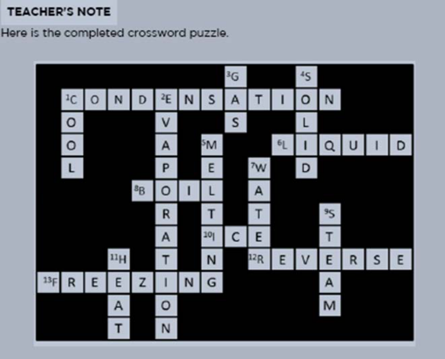
> **[Diagram Context - Textbook_NaturalScience_Gr8_Particle-model-of-matter.pdf-0063-00.png]**
> The image is a black and white puzzle with a grid of letters and numbers. The letters are arranged in a crossword puzzle format, with some of the letters being filled in with numbers. The numbers are used to fill in the blanks of the crossword puzzle. The image also includes a caption that reads "Teacher's Note Here is the completed crossword puzzle."


#### Observations and Analysis
*   **Initial State:** The wax is a solid at room temperature.
*   **Heating:** The wax melts as energy is added.
*   **Cooling:** The wax solidifies as energy is removed.
*   **Melting Point:** The melting point of wax is higher than room temperature, which is why it remains solid until heat is applied.

#### Scientific Conclusion
*   **Heating:** When energy is added, particles vibrate faster until they break free from their fixed positions in the solid state and enter the liquid state (melting).
*   **Cooling:** When energy is removed, particles move slower until the forces between them are strong enough to fix the particles back into fixed positions in the solid state (solidification).

---

### ACTIVITY: Hot-water balloon (LB page 113)

**Safety Note:** This activity involves hot, boiling materials. Ensure proper supervision. If a microwave is unavailable at school, this can be done as a home assignment or by placing the balloon in a pot of boiling water for a few minutes.

#### Observations
1. The balloon expands.
2. It sounds as if it is raining inside the balloon.
3. The balloon shrinks.

#### Explanations
1. The balloon did not have air inside initially because the air was squeezed out before heating.
2. The balloon expanded because the water inside evaporated, filling it with water vapour (gas).
3. **Important Concept:** Water does not decompose into hydrogen and oxygen gas when it boils; it simply changes state from liquid to gas.
4. The "raining" sound is caused by water droplets falling inside the balloon.
5. The water vapour condensed inside the balloon to form liquid water droplets.
6. The balloon shrank back to its original size as it cooled.
7. The process demonstrates **evaporation** and **condensation**.

---

### 5.4 Density, mass, and volume

#### Unit Conversions
Learners must be able to convert between units of mass:
*   $1 \text{ kg} = 1\,000 \text{ g}$
*   $1 \text{ g} = 1\,000 \text{ mg}$
*   $1 \text{ kg} = 1\,000 \times 1\,000 = 1\,000\,000 \text{ mg}$

**Examples:**
*   $1.25 \text{ kg} = 1\,250 \text{ g}$
*   $12.5 \text{ g} = 12\,500 \text{ mg}$
*   $250 \text{ g} = 0.25 \text{ kg}$

#### Mass vs. Weight
*   **Mass:** The amount of matter in an object.
*   **Weight:** Dependent on gravity. An object's weight changes depending on whether it is on Earth or the Moon, whereas its mass remains constant.

---

### ACTIVITY: Which material is more dense? (LB page 114)

This activity introduces the concept of density and prepares learners to design their own investigations regarding the densities of different materials.

**Investigation Tip:**
To compare densities, use containers of equal volume (e.g., matchboxes). Fill them with different substances to see how the mass changes for the same volume.

**Suggested substances:**
*   Sand
*   Flour
*   Sugar
*   Cotton wool

<!-- DIAGRAM_PLACEHOLDER: diagram -->

---

### Understanding Density: Practical Applications and States of Matter

#### 1. Investigating Density through Physical Objects
To understand the relationship between mass and density, compare objects of the same size (volume).

*   **Concept:** If two objects have the same volume, the object with the greater mass has the greater density.
*   **Example:** Comparing a brick and a loaf of bread.
    *   Both objects have the same volume (size).
    *   The brick has more mass than the loaf of bread.
    *   Therefore, the brick has a higher density.
*   **Observation:** Substances like bread and sponges contain air pockets (holes). These holes mean there is less solid material per unit volume, resulting in a lower overall density compared to solid materials without holes.

---

#### 2. Density and States of Matter
Generally, the density of matter changes according to its state. In most substances, the solid phase is the most dense, followed by the liquid phase, with the gas phase being the least dense.

**Activity: Comparing Densities of States**
*   **Objective:** To determine which state (solid, liquid, or gas) has the highest density.
*   **Key Principles:**
    1.  **Particle Count:** In a fixed volume, a solid container holds the most particles, while a gas container holds the fewest.
    2.  **Mass Relationship:** The container with the most particles has the greatest mass.
    3.  **Density Conclusion:** 
        *   **Solid:** Highest density (greatest mass in a fixed volume).
        *   **Gas:** Lowest density (smallest mass in a fixed volume).

<!-- DIAGRAM_PLACEHOLDER: diagram -->

---

#### 3. The Exception: Water and Ice
Water is a unique substance that does not follow the general rule that solids are more dense than liquids.

*   **The Phenomenon:** Ice (solid water) floats in liquid water.
*   **Scientific Explanation:**
    *   When water freezes, the particles arrange themselves with larger spaces between them compared to liquid water.
    *   Because the particles are further apart in the solid state, the same mass of water occupies a larger volume when frozen.
    *   **Conclusion:** Liquid water is more dense than ice because its particles are packed closer together.

**Teacher Note:** When teaching this, emphasize that this is a unique property of water and does not apply to most other substances.

---

# 5.6 Density of Different Materials

### Key Concepts
*   **Density:** Defined as mass divided by volume.
*   **SI Unit:** The standard SI unit for density is $\text{kg/m}^3$.
*   **Practical Units:** In classroom settings, $\text{g/mL}$ and $\text{kg/L}$ are commonly used as they align with standard laboratory measuring equipment.

---

### Investigation: Comparing the Densities of Sand, Flour, Water, and Air
**Objective:** To demonstrate that equal volumes of different materials have different masses, resulting in different densities.

#### Experimental Variables
1.  **Constant Variable:** The volume (use the same size cup for all materials).
2.  **Independent Variable:** The type of material being tested.
3.  **Dependent Variable:** The mass of the material (used to calculate density).

#### Procedure Guidelines
*   **Preparation:** Use identical cups to ensure the mass of the container remains constant.
*   **Measuring Volume:** If the volume of the cup is unknown, fill the cup with water and pour it into a graduated cylinder or beaker to measure the exact volume in $\text{mL}$.
*   **Measuring Mass:** Use a scale or triple beam balance to find the mass of the cup filled with the material.
*   **Documentation:** Record all steps in a numbered sequence in your notebook.

---

### Worked Example: Calculating Density
To calculate density ($D$), use the following formula:
$$D = \frac{m}{V}$$

**Scenario:**
*   Mass of cup of flour ($m$) = $150\text{ g}$
*   Volume of cup ($V$) = $250\text{ mL}$

**Calculation:**
$$D = \frac{m}{V}$$
$$D = \frac{150}{250}$$
$$D = 0,6\text{ g/mL}$$

---

### Summary of Findings
*   **States of Matter:** This investigation allows for the comparison of materials in different states (solids like sand and flour, liquids like water, and gases like air).
*   **Conclusion:** Even when the volume is kept constant, different materials will yield different masses, proving that density is a property unique to the material itself.

<!-- DIAGRAM_PLACEHOLDER: diagram -->

---

### Concept: Density and Immiscible Liquids

When liquids with different densities are mixed, they do not blend permanently. Instead, they separate into layers. The liquid that is **less dense** will float on top of the liquid that is **more dense**.

---

### Activity: Rainbow Density Column

This activity demonstrates how different liquids and objects arrange themselves based on their relative densities.

#### 1. The Relationship Between Mass, Volume, and Density
Density is defined by the following mathematical relationship:

$$\text{Density} (\rho) = \frac{\text{Mass} (m)}{\text{Volume} (V)}$$

*   **Key Principle:** If the volume of two liquids is equal, the liquid with the greater mass will have a higher density.
*   **Observation:** Heavier liquids (higher mass for the same volume) will sink to the bottom, while lighter liquids will float on top.

#### 2. Suggested Layering Order (Bottom to Top)
When creating a density column, pour the liquids in the following order to ensure they layer correctly:

1.  Honey (Most dense)
2.  Golden syrup
3.  Milk
4.  Dishwashing liquid
5.  Water
6.  Vegetable oil
7.  Rubbing alcohol (Least dense)

<!-- DIAGRAM_PLACEHOLDER: diagram -->

#### 3. Behavior of Objects in the Column
When solid objects are dropped into the density column, they will sink until they reach a layer where their density is equal to the density of the surrounding liquid.

*   **High-density objects:** Sink to the bottom (e.g., a metal bolt).
*   **Low-density objects:** Float on top or settle in upper layers (e.g., ping pong ball, plastic beads).

**Example of Object Placement:**
*   **Metal bolt:** More dense than all liquids; sinks to the bottom.
*   **Plastic beads:** Less dense than water, but more dense than vegetable oil; they will float on top of the water layer.

---

### Summary Table: Density Observations

| Object/Liquid | Relative Density | Expected Position |
| :--- | :--- | :--- |
| Honey | Highest | Bottom of column |
| Metal Bolt | Very High | Bottom of column |
| Rubbing Alcohol | Lowest | Top of column |
| Ping Pong Ball | Very Low | Top of column |

---

### Activity: Density Calculations

Density calculations are a foundational skill for Physical Sciences (Grades 10–12). Use the following formula to determine density:

$$D = \frac{m}{V}$$

Where:
*   $D$ = Density
*   $m$ = Mass
*   $V$ = Volume

#### Worked Examples

**1. Calculating Density**
Given a mass of $500\text{ g}$ and a volume of $555\text{ mL}$:
$$D = \frac{500}{555} \approx 0.9\text{ g/mL}$$

**2. Calculating Volume**
Given a density of $2.6\text{ g/mL}$ and a mass of $50\text{ g}$:
$$V = \frac{m}{D}$$
$$V = \frac{50}{2.6} \approx 19.2\text{ mL}$$

---

### Particle Theory and Density

<!-- DIAGRAM_PLACEHOLDER: diagram -->

*   **Particle Distribution:** When representing density changes, particles should remain the same size. To show a decrease in density, particles should be spread out evenly to fill a larger container.
*   **Temperature Effects:** Particles move faster at higher temperatures, which increases the space between them. Consequently, most solids and liquids become less dense as they warm up.

---

### 5.7 Expansion and Contraction of Materials

#### Key Concepts
*   **Conservation of Mass:** Matter cannot be created or destroyed. 
*   **Mechanism of Change:** Materials expand and contract because particles move further apart or closer together. The number of particles remains constant; new atoms are not created during expansion.

#### Real-world Application
*   **Expansion Gaps:** Roads are constructed in segments with small gaps between them. These gaps provide space for the material to expand during hot weather without causing the road surface to buckle or crack.

---

# ACTIVITY: How much longer? (LB page 126)

## Concept: Thermal Expansion of Materials
Different materials expand by different amounts when subjected to the same increase in temperature. The graph below illustrates the expansion (in mm) of various materials when the temperature is increased by $10^{\circ}\text{C}$ (per $100$ meters of material).


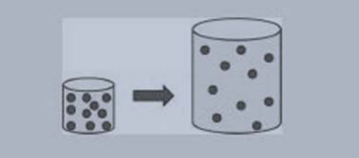
> **[Diagram Context - Textbook_NaturalScience_Gr8_Particle-model-of-matter.pdf-0069-13.png]**
> The image presents a diagram of two spheres, one larger and one smaller, with arrows pointing from the larger sphere to the smaller one. The arrows indicate a transformation from the larger sphere to the smaller one, possibly representing a change in size or shape. The diagram is set against a gray background, and the text "You are a South African CAPS curriculum expert tutoring" is written in the


### Key Observations from Data
1. **Brass:** Shows the highest level of expansion among the materials tested.
2. **Ovenproof glass:** Shows the lowest level of expansion.
3. **Comparison:** Steel and concrete expand by the same amount.
4. **Practical Application:** Because brass expands significantly more than ordinary glass, using brass frames for windows in hot weather can cause the glass to become loose and fall out. 

**Recommended solutions for window frames:**
* Replace brass frames with steel, as steel expands at a similar rate to glass.
* Use smaller windows, as smaller items have less total matter to expand.

---

### Important Notes on Expansion
* **Material Dependency:** Expansion is dependent on the type of material.
* **Quantity Dependency:** The total amount of expansion depends on the amount of material present. This is why expansion is often unnoticeable in small items like keys or cooking pots.
* **Contraction:** When a heated object cools down, it undergoes contraction, returning to its original size, provided no mass was gained or lost during the heating process.

---

### Practical Demonstrations
* **Ball and Ring Experiment:** A metal ball that fits through a ring when cold will not fit when heated. This demonstrates thermal expansion. Conversely, as the ball cools, it undergoes contraction and will fit through the ring again.
* **Mass Conservation:** Heating or cooling an object does not change its mass. The ball does not gain or lose mass during the heating/cooling process; it only changes in volume.

**Teacher's Tip:** When performing these demonstrations, always ask learners to make a prediction regarding the outcome and the time required for the object to cool down before proceeding.

---

### Particle Model: Heating and Cooling

#### Discussion Points
*   **Heating Matter:** When matter is heated, energy is added. Particles gain kinetic energy and move faster. As they move faster and bump into each other with more force, the spaces between the particles increase, causing the material to expand.
*   **Cooling Matter:** When matter is cooled, energy is removed. Particles lose kinetic energy and move more slowly. As they move more slowly, the spaces between them decrease, causing the material to contract.

---

### Activity: How does a thermometer work?

This activity revisits the concept of expansion and contraction using the particle model. It is important to remember that the size and number of individual particles remain constant; only the spaces between them change.

#### Key Concepts and Misconceptions
*   **Expansion:** Particles move further apart, increasing the volume of the material.
*   **Contraction:** Particles move closer together, decreasing the volume of the material.
*   **Conservation of Mass:** Matter cannot be created or destroyed. Particles do not grow larger or smaller; they only change their relative positions.

#### Mathematical Relationship: Density
The relationship between mass, volume, and density is defined by the following formula:

$$\text{Density} = \frac{\text{Mass}}{\text{Volume}}$$

*   **Note on Density:** If the mass of a substance remains constant but the volume increases (due to expansion), the density of the substance must decrease.

---

### Summary of Observations

| Process | Particle Behavior | Volume Change | Density Change |
| :--- | :--- | :--- | :--- |
| **Heating** | Particles move faster and further apart | Increases | Decreases |
| **Cooling** | Particles move slower and closer together | Decreases | Increases |


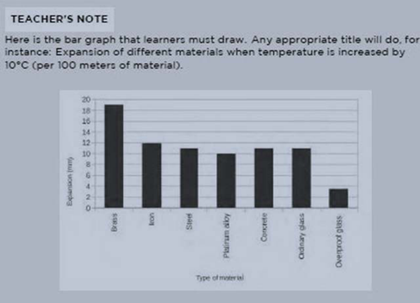
> **[Diagram Context - Textbook_NaturalScience_Gr8_Particle-model-of-matter.pdf-0070-01.png]**
> Teacher's Note: There is the bar graph that learners must draw. Any appropriate title will do. For instance, expansion of different materials when temperature is increased by 10 degrees per 100 meters of material.


---

### Important Reminders for Learners
1.  **Mass is Constant:** The number of atoms/particles in a substance does not change during heating or cooling. Therefore, the total mass remains constant.
2.  **Particle Size:** Individual particles do not expand or contract. Only the empty space between them changes.
3.  **Misconceptions:** 
    *   Do not confuse expansion with particles "growing" in size.
    *   Do not confuse contraction with particles "shrinking" in size.
    *   Always refer back to the particle model to explain changes in volume.

---

# 5.8 Pressure

## Activity: Understanding Gas Pressure
This activity explores how gas particles behave within confined spaces such as bags, balloons, and tyres.

### Observations and Demonstrations
1. **Blowing into a bag:** It is initially easy to blow into an empty bag, but it becomes increasingly difficult as the bag fills with air.
   * **Note:** If a bag is strong, it may not pop. A 'weak' bag may leak at the seams when forced beyond its capacity.
2. **Blowing into a balloon:** It is difficult to start, then becomes easier, and finally becomes difficult again as the balloon reaches its capacity.
   * **Note:** The initial difficulty is due to the tight rubber material. Stretching the balloon beforehand can make it easier to start.
   * **Note:** After one week, a balloon will appear wrinkled and smaller than its original size.
3. **Bottle experiment:**
   * It is impossible to blow up a balloon inside a sealed bottle.
   * The balloon swells up and fills the inside of the bottle (if the setup allows for air displacement).
4. **Tyre pump:** At first, it is easy to pump air into a tyre, but it becomes progressively more difficult as the tyre fills.

---

### Scientific Explanations

#### Why does pressure increase?
* **Particle Density:** When you blow into a container, you are forcing more air particles into that space.
* **Collisions:** As the number of particles increases, the frequency of collisions between the particles and the container walls increases. This increase in collisions results in higher pressure.

#### Why do containers break or pop?
* **Bags:** When a bag reaches its maximum capacity, the force of the particle collisions against the material exceeds the strength of the material, causing it to break.
* **Balloons:** When a balloon is stretched to its maximum size, the force of the particles colliding against the inside surface becomes too great for the polymer strands of the rubber to hold, causing the balloon to pop.
   * **Note:** The polymer strands actually tear apart due to the applied force.

#### Why do balloons shrink over time?
* **Particle Escape:** Air particles can slowly escape through tiny, microscopic holes in the balloon material.
* **Result:** As particles escape, there are fewer particles inside to collide with the walls. This reduction in collisions results in lower internal pressure, causing the balloon to shrink.
   * **Note:** While the air inside may contract slightly, the primary reason for shrinkage is the escape of air molecules through the porous polymer material.

---

### Particle Model of Matter: Explanations and Revision

#### Key Concepts in Gas Behavior
*   **Balloon in a Bottle:** A balloon inside a bottle does not inflate easily because the bottle is already filled with air. The air particles inside the bottle push back against the balloon. If a hole is made in the bottle, the air inside can escape, allowing the balloon to expand into the space.
*   **Tyre Pressure:** Pumping a tyre increases the number of air particles inside. More particles lead to more frequent collisions, resulting in higher pressure. As the tyre stretches to accommodate more particles, it requires more force to stretch the material further.
*   **Enrichment Concepts:** 
    *   Gases expand to fill the volume of their container.
    *   Density decreases as volume increases (assuming mass remains constant).

---

#### Revision: Particle Theory
1.  **The Particle Model:** This is a scientific theory explaining that all matter (solids, liquids, and gases) consists of particles. Key aspects include:
    *   Particles have specific sizes.
    *   There are empty spaces between particles.
    *   Particles behave differently depending on their state of matter.
2.  **Density of Water:** Water is unique because its solid state (ice) is less dense than its liquid state. This is due to the large spaces between particles in the solid structure of ice.

#### Changes of State
| Change of State | Explanation |
| :--- | :--- |
| Melting | When heat is added and a solid changes to a liquid |
| Condensing | When heat is removed and a gas changes to a liquid |
| Evaporating | When heat is added and the particles at the surface of a liquid change to the gas state |
| Solidifying | When heat is removed and a liquid changes to a solid |

---

#### Summary of Physical Processes
*   **Melting:** When heat is added, particles gain kinetic energy and vibrate faster. Eventually, they move fast enough to overcome the forces holding them in fixed positions, allowing them to slide past each other (transitioning from solid to liquid).
*   **Expansion and Contraction:** 
    *   **Expansion:** The spaces between particles increase.
    *   **Contraction:** The spaces between particles decrease.
*   **Thermal Expansion of Metal:** When metal is heated, particles move further apart. The object increases in size (volume), but the number of particles and the total mass remain the same. Consequently, the density of the metal decreases.
*   **Density and Buoyancy:** Oil is less dense than water, which is why it floats on the surface.
*   **Diffusion:** Particles (such as perfume) exhibit random movement, constantly changing direction as they collide with other particles.
*   **States of Matter:** Petrol fumes found at a petrol station exist in a gaseous (vapour) state.

---

### Particle Theory and States of Matter

#### Safety Note: Petrol Fumes
Petrol fumes can diffuse into the air. If ignited by a spark or flame, they can cause a fire or explosion. While underground fuel tanks are designed to be safe, caution is always advised around fuel pumps.

#### Compressibility of Matter
*   **Gases:** Particles have large spaces between them, making them easy to compress.
*   **Liquids:** Particles are packed closely together with very small spaces between them, making them virtually incompressible.
*   **Example:** A bicycle pump plunger moves easily when filled with air (gas) because the gas is compressed. It does not move much when filled with water (liquid) because the liquid cannot be compressed.

---

#### Comparison of States of Matter

<!-- DIAGRAM_PLACEHOLDER: diagram -->

| Feature | Solid | Liquid | Gas |
| :--- | :--- | :--- | :--- |
| **Arrangement of particles** | Very closely packed. Regular arrangement | Close together, but disordered. | Far apart and disordered. |
| **Spaces between particles** | Very small spaces | Small spaces. | Very large |
| **Forces of attraction** | Strong | Strong but weaker than in solids | Very weak |
| **Movement of particles** | Vibration only | Sliding movement, random. | Fast and random movement |
| **Shape** | Fixed shape | No fixed shape. Depends on the container | No fixed shape |
| **Volume** | Fixed volume | Fixed volume | No fixed volume. Depends on the container |
| **Compressibility** | Cannot be compressed | Slight compression is sometimes possible | Very compressible |
| **Diffusion** | Does not diffuse | Diffuses slowly | Diffuses quickly |
| **Density** | Highest density (except ice) | Almost as dense as the solid | Lowest density |