**Static electricity** 


> **[Diagram Context - Textbook_NaturalScience_Gr8_Static-electricity.pdf-0001-02.png]**
> 1. A diagram of a cell with blue and white lines.


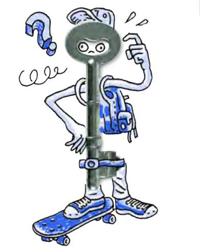
> **[Diagram Context - Textbook_NaturalScience_Gr8_Static-electricity.pdf-0001-03.png]**
> The image features a cartoon character, a blue and white skateboarder, who is holding a key. The character is wearing a hat and a backpack, and is standing on a skateboard. The character is also holding a question mark, which could be a symbol for curiosity or confusion. The image is a simple, cartoon-like illustration that conveys the concept of a key as a tool


## **KEY .** . **. QUESTIONS:** 

## . **.** . **.** 

- What is static electricity? 

- What is friction? 

- Why does my hair stand on end and crackle when I pull a jersey off? 

- What is lightning? 

- What does it mean to 'earth' an object? 

- What does it mean when we say 'opposites attract'? 

Have you ever pushed a trolley through the shops and suddenly felt a shock? Or pulled your school jersey over your head and heard it crackling? What causes those shocks and noises? Let's investigate. 

##### **. 1.1 Friction and static electricity** 

The effects of **static electricity** are all around us, but we do not always recognise it when we see or feel them. Or perhaps you have, but you never realised what was causing it. For example, have you ever felt a slight shock when you put a jersey over your head on a cold day, or perhaps you have observed your hair stand on end when you touch certain objects? Let's do a quick activity to demonstrate static electricity. 


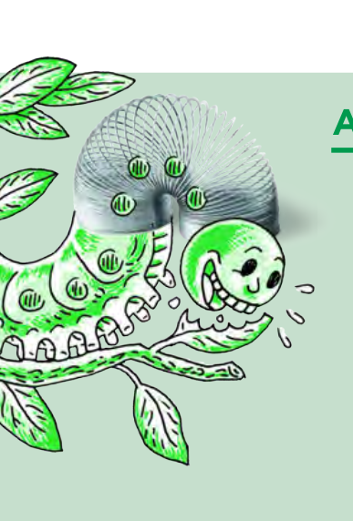
> **[Diagram Context - Textbook_NaturalScience_Gr8_Static-electricity.pdf-0001-15.png]**
> The image features a cartoon depiction of a caterpillar with a green body and a white head, holding a green ball in its mouth. The caterpillar is surrounded by green leaves, and there is a green wire with a silver ball on it. The image also includes a text box that reads "A" and "A+", and a green arrow pointing to the right.


##### **ACTIVITY:** Sticky balloons 

###### **MATERIALS:** 

- balloons (or a plastic comb) 

- small pieces of paper 

###### **INSTRUCTIONS:** 

1. Work in pairs. 

2. Blow up a balloon and tie it closed so that the air does not escape. 

3. Hold the balloon a short distance away from your hair or pieces of paper. What do you notice? 

4. Rub your hair with the balloon. 


5. Now hold the balloon a short distance away from your hair or pieces of paper. What do you see? 

###### **QUESTION:** 


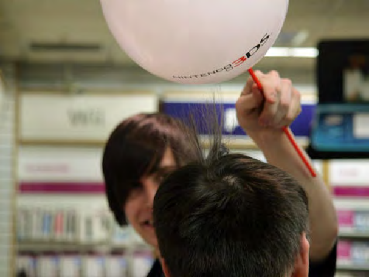
> **[Diagram Context - Textbook_NaturalScience_Gr8_Static-electricity.pdf-0002-03.png]**
> 1. A diagram of a cell with a Lewis structure.


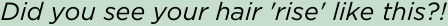


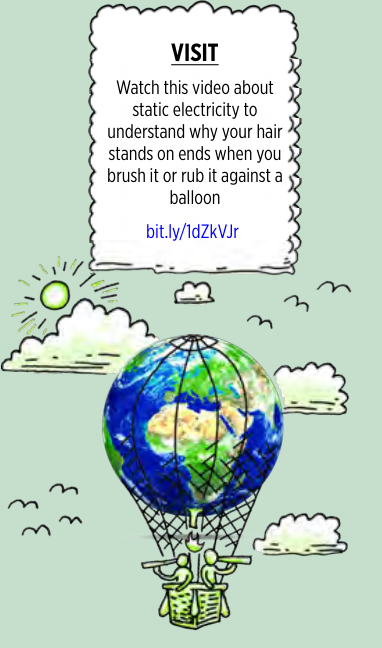
> **[Diagram Context - Textbook_NaturalScience_Gr8_Static-electricity.pdf-0002-05.png]**
> The image shows a cartoon depiction of a hot air balloon with a globe on top, floating in the sky. The globe is surrounded by a wire mesh, and there are two people inside the balloon. The balloon is being used as a teaching aid to explain the concept of static electricity to a high school student. The diagram is accompanied by a caption that reads "Visit this video about static electricity to


1. What did you do to make your hair or the pieces of paper stick to the balloon? 


> **[Diagram Context - Textbook_NaturalScience_Gr8_Static-electricity.pdf-0002-07.png]**
> This graphic illustrates a schematic representation of a double-stranded DNA molecule, characterized by its iconic double helix structure. The diagram uses two intertwined, repeating green ribbons to represent the sugar-phosphate backbones, visually demonstrating the antiparallel nature and complementary base pairing essential for genetic replication and protein synthesis in the Life Sciences curriculum.


Let's look at an everyday example of static electricity. Sometimes when you comb your hair with a plastic comb your hair stands on end and makes crackling sounds. How does this happen? 

You have dragged the surface of the plastic comb against the surfaces of your hair. When two surfaces are rubbed together there is **friction** between them. Friction is a resistance against the movement of an object as a result of its contact with another object. This means that when you rubbed the plastic comb along your hair, your hair resisted the movement of the comb and slowed it down. 

The friction between two surfaces can cause electrons to be transferred from one surface to the other. 

In order to understand how electrons can be transferred, we need to remember what we learnt about the structure of an atom last term in Matter and Materials. 


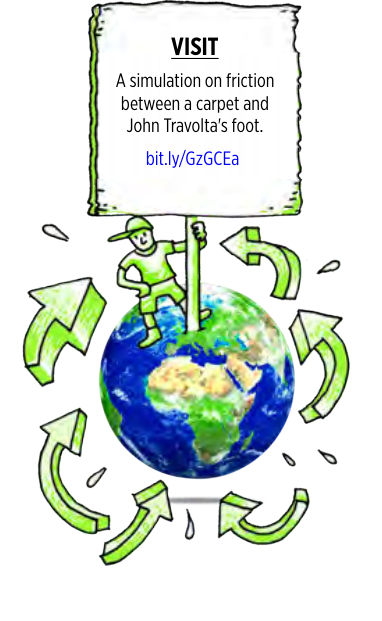
> **[Diagram Context - Textbook_NaturalScience_Gr8_Static-electricity.pdf-0002-12.png]**
> A diagram of a cartoon character on a stick holding a sign that says "visit" and a picture of the earth with arrows pointing to different continents.


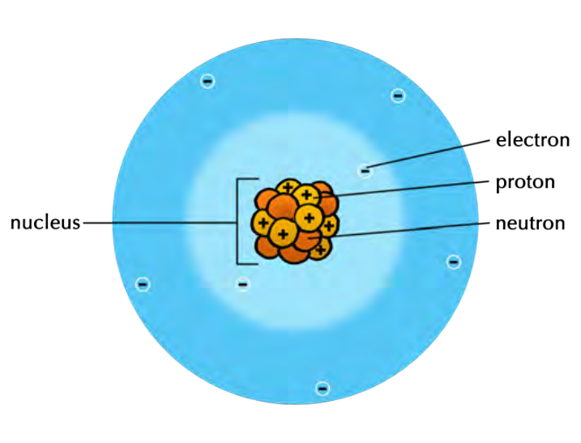
> **[Diagram Context - Textbook_NaturalScience_Gr8_Static-electricity.pdf-0003-00.png]**
> 1. A diagram of an atom with the nucleus labeled "proton" and the neutrons labeled "neutron".


###### **<u>NEW WORDS</u>** 


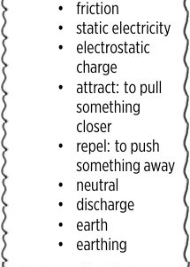
> **[Diagram Context - Textbook_NaturalScience_Gr8_Static-electricity.pdf-0003-02.png]**
> 1. A diagram of a cell with a diagram of a cell on it.


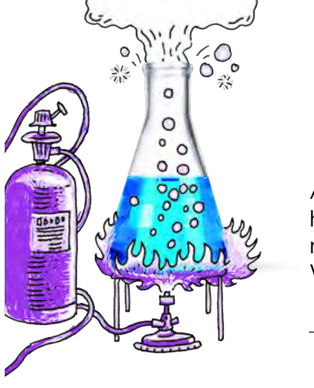
> **[Diagram Context - Textbook_NaturalScience_Gr8_Static-electricity.pdf-0003-03.png]**
> The image shows a purple and blue gas cylinder with a blue flame, which is being used to heat a blue liquid in a glass flask. The flask is filled with the blue liquid, and the flask is placed on a table. The image also contains a text that reads "Happy Birthday" and "Happy Birthday" in the bottom right corner.


All atoms have a nucleus which contains protons and neutrons. The nucleus is held together by a very strong force, which means that the protons within a nucleus can be considered to be fixed there. The atom also contains electrons. Where are the electrons arranged in the atom? 

What is the charge on a proton? 


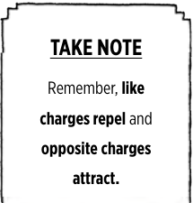
> **[Diagram Context - Textbook_NaturalScience_Gr8_Static-electricity.pdf-0003-06.png]**
> The image shows a black and white flyer with a quote from a biology teacher. The quote reads, "Take Note. Remember, like charges repeel and opposite charges attract." The flyer also includes a diagram of a cell, which is labeled with the names of its organelles. The text is written in a clear, legible font, and the layout is simple and straightforward.


What is the charge on an electron? 

What is the charge on a neutron? 


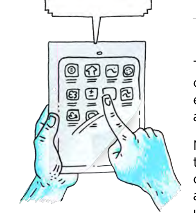
> **[Diagram Context - Textbook_NaturalScience_Gr8_Static-electricity.pdf-0003-09.png]**
> 1. A diagram of a cell with arrows pointing to different parts of the cell.


The atom is held together by the **electrostatic attraction** between the positively charged nucleus and the negatively charged electrons. Within an atom, the electrons closest to the nucleus are the most strongly held, whilst those further away experience a weaker attraction. 

Normally, atoms contain the same number of protons and electrons. This means that atoms are normally **neutral** because they have the same number of positive charges as negative charges, so the charges balance each other out. All objects are made up of atoms and since atoms are normally neutral, objects are also usually neutral. 

However, when we rub two surfaces together, like when you comb your hair or rub a balloon against your hair, the friction can cause electrons to be transferred from one object to another. Remember, the protons are fixed in place in the nucleus and so they cannot be transferred between atoms, it is only electrons that are able to be transferred to another surface. Some objects give up electrons more easily than other objects. Look at the following diagram which explains how this happens. 

Energy and Change 


> **[Diagram Context - Textbook_NaturalScience_Gr8_Static-electricity.pdf-0004-00.png]**
> 1. A blue comb with a white comb on top.


Which object gave up some of its electrons in the diagram? 

Does this object now have more positive or more negative charges? 

Which object gained electrons in the diagram? 

Does this object now have more positive or more negative charges? 

- When an object has more electrons than protons overall, then we say that the object is **negatively charged** . 

- When an object has fewer electrons than protons overall, then we say that the object is **positively charged** . 

Have a look at the following diagram which illustrates this. 


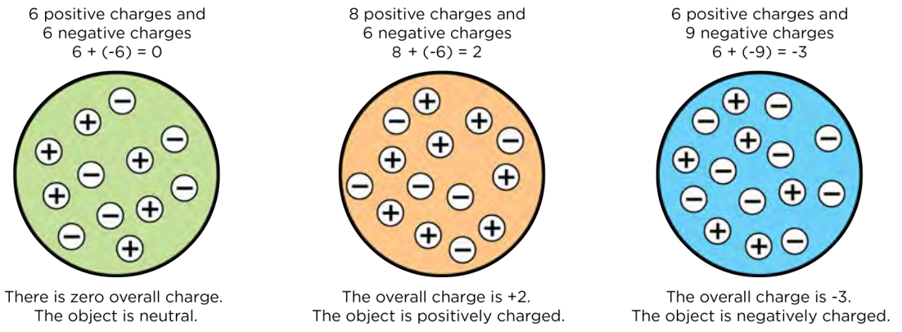
> **[Diagram Context - Textbook_NaturalScience_Gr8_Static-electricity.pdf-0004-08.png]**
> 1. A diagram of a positive charge and a negative charge.


So, we now understand the transfer of electrons that takes place as a result of 

friction between objects. But, how did that result in your hair rising when you brought the charged balloon close to your hair in the last activity? Let's look at what happens when oppositely charged objects are brought together. 


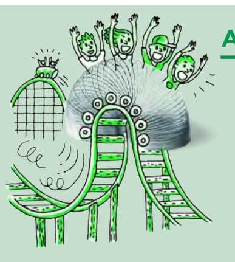
> **[Diagram Context - Textbook_NaturalScience_Gr8_Static-electricity.pdf-0005-01.png]**
> 1. A cartoon depiction of a roller coaster with a green roller coaster track and a green spring.


##### **ACTIVITY:** Turning the wheel 

###### **MATERIALS:** 

- 2 curved watch glasses 

- 2 perspex rods 

- cloth: wool or nylon 

- plastic rod 

- small pieces of torn paper 

###### **INSTRUCTIONS:** 

1. Place a watch glass upside down on the table. 

2. Balance the second watch glass upright on the first watch glass. 

3. Rub one of the perspex rods vigorously with the cloth. 

4. Balance the perspex rod across the top of the watch glass. 

5. Rub the second perspex rod vigorously with the same cloth. 

6. Bring the second perspex rod close to the first perspex rod. What do you see happening? 


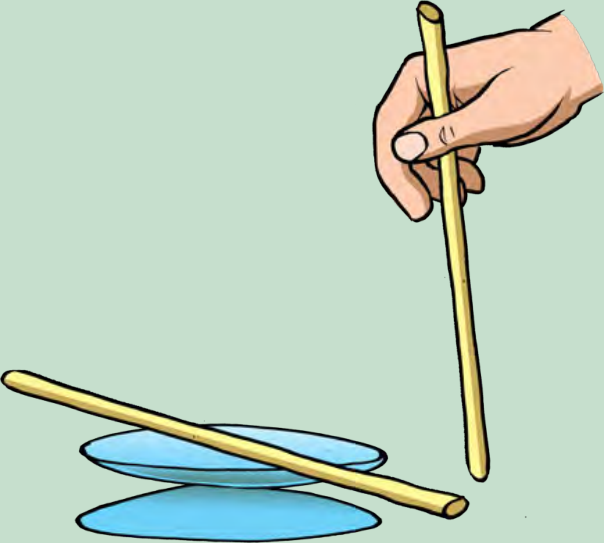
> **[Diagram Context - Textbook_NaturalScience_Gr8_Static-electricity.pdf-0005-16.png]**
> A cartoon illustration of a hand holding a stick and a stack of blue plates.


7. Repeat the activity but instead of the second perspex rod, use the plastic rod. What do you see happening? 

8. Next, bring a rod that you have rubbed close to small pieces of torn paper lying on the table. What do you observe? 

###### **QUESTIONS:** 

1. What happened when you brought the second perspex rod close to the first perspex rod? 

Energy and Change 


2. What happened when you brought the plastic rod close to the first perspex rod? 

3. What happened when you brought the plastic rod close to the pieces of paper? 


> **[Diagram Context - Textbook_NaturalScience_Gr8_Static-electricity.pdf-0006-03.png]**
> 1. A diagram of a snake's body.


When we rubbed the perspex rods with the cloth, electrons were transferred from the perspex to the cloth. What charge do the perspex rods now have? 

Both the perspex rods now have the **same** charge. Did you notice that objects with the same charge tend to push each other away? We say that they are **repelling** each other. 

When we rubbed the plastic rod with the cloth, electrons were transferred from the cloth to the plastic rod. What charge does the plastic rod now have? 

The perspex rod and the plastic rod now have **opposite** charges. Did you notice that objects with different charge tend to pull each other together? We say that they are **attracting** each other. 

In the example of the pieces of paper being attracted to the ruler, the paper starts off neutral. However, as the negatively charged plastic rod is brought closer, the electrons in the paper that are nearest to the rod will begin to move away, leaving behind a positive charge on the surfaces of the paper that are nearest to the rod. The paper is therefore attracted to the rod because opposite charges attract. Another example is dust that is attracted to newly polished glasses. 

We have now observed the fundamental behaviour of charges. 

In summary, we can say: 

- If two negatively charged objects are brought close together, then they will repel each other. 

- If two positively charged objects are brought close together, then they will repel each other. 

- If a positively charged object is brought near to a negatively charged object, they will attract each other. 


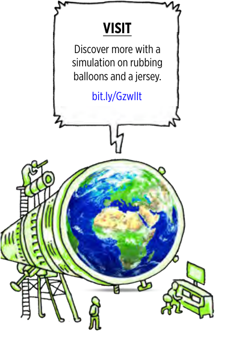
> **[Diagram Context - Textbook_NaturalScience_Gr8_Static-electricity.pdf-0006-14.png]**
> The image shows a cartoon depiction of a globe and a telescope. The globe is green and blue, and the telescope is green. The globe is positioned in the center of the image, with a person standing next to it. The telescope is located to the left of the globe. The caption below the image reads "Visit" and "Discover more with a simulation rubbing balloons and a jersey."


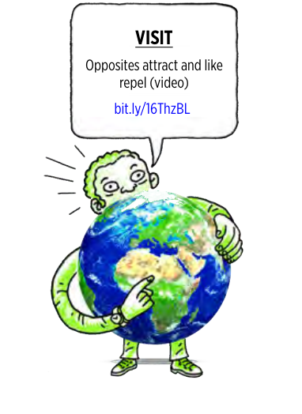
> **[Diagram Context - Textbook_NaturalScience_Gr8_Static-electricity.pdf-0006-15.png]**
> The image features a cartoon depiction of a man holding a globe in his hands. The globe is green and white, and the man is wearing a green shirt and green pants. The man is pointing to the globe, and there is a speech bubble above him that reads "Visit".


Do you now understand why your hair rises and is attracted to the balloon after you rub the balloon on your hair? Write a short description to explain what is happening using the words: electrons, transfer, negative charge, positive charge, opposite, attract, repel. 


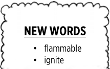
> **[Diagram Context - Textbook_NaturalScience_Gr8_Static-electricity.pdf-0007-01.png]**
> The image shows a white sign with black text that reads "New Words - Flammable - Ignite". The sign also includes a diagram of a flame and a diagram of a cell. The text is written in a clear, easy-to-read font, and the diagrams are simple and straightforward. The sign is designed to help students understand the concept of flammability and how it relates


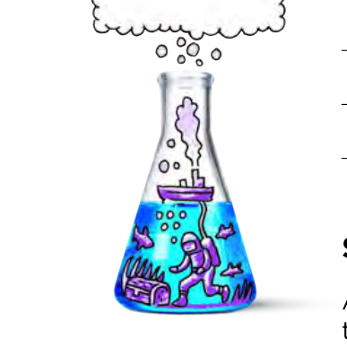
> **[Diagram Context - Textbook_NaturalScience_Gr8_Static-electricity.pdf-0007-02.png]**
> The image shows a cartoon depiction of a South African CAPS student learning about the human body. The scene is set in a laboratory, with a large glass beaker containing a blue liquid and a purple fish swimming inside. The fish is depicted as a person wearing a white and blue striped shirt, holding a blue and white striped pole. The beaker is labeled with the word "S" and


###### **Sparks, shocks and earthing** 

A large build-up of charge on an object can be dangerous. When electrons transfer from a charged object to a neutral object we say that the charged object has discharged. 


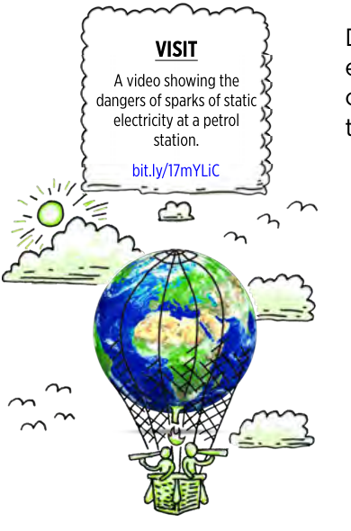
> **[Diagram Context - Textbook_NaturalScience_Gr8_Static-electricity.pdf-0007-05.png]**
> A video showing the dangers of static electricity at a petrol station.


Discharging can take place when the objects touch each other. But the electrons can also transfer from one object to another when they are brought close, but not touching. When electrons move across an air gap they can heat the air enough to make it glow. The glow is called a **spark** . 


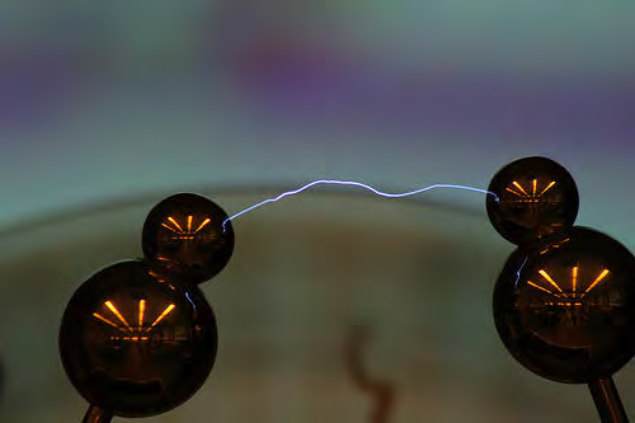
> **[Diagram Context - Textbook_NaturalScience_Gr8_Static-electricity.pdf-0007-07.png]**
> 1. A diagram of a circuit with three spheres and a lightning bolt.


_An electrostatic spark between two objects._ 

Sparks can be harmless, but they can also be very dangerous. Sparks can cause **flammable** materials to **ignite** . You will probably have noticed that you may not smoke cigarettes or have open flames near petrol tanks at petrol stations. This is because petrol fumes are very explosive and only need a small amount of heat to start them burning. A small electrostatic spark is enough to ignite flammable petrol fumes. 

Electrostatic discharge can also cause **electric shocks** . Have you ever been shocked by a shopping trolley while you are pushing it around a shop? Or have you walked across a carpeted room and then shocked yourself when you touch the door handle to leave the room? You have experienced an electric discharge. Electrons move from the door handle onto your skin and the movement of the electrons causes a small electric shock. Small electric shocks can be uncomfortable but mostly harmless. Large electric shocks are extremely dangerous and can cause injury and death. 

Do you know where else we can see sparks due to static electricity? Look at the photo for a clue! 

Energy and Change 


> **[Diagram Context - Textbook_NaturalScience_Gr8_Static-electricity.pdf-0008-00.png]**
> The image shows a dark sky with three bright lightning bolts. The first lightning bolt is located in the top left corner, the second one is in the top right corner, and the third one is in the bottom right corner. The lightning bolts are accompanied by a dark cloud in the background, creating a dramatic and intense scene.


_Lightning is a huge electrostatic discharge._ 

During a thunderstorm, there is friction in the atmosphere between the particles that make up clouds, causing the build-up of regions of charge. Once the difference in charge between two regions becomes great enough, electrostatic discharge becomes possible. A lightning flash is a massive discharge between charged regions within clouds, or between clouds and the Earth. 

In order to discharge extra electrons safely from an object we must earth it. **Earthing** means that we connect the charged object to the ground (the Earth) with an electrical conductor. The extra electrons travel along the conductor and enter the ground without causing any harm. The Earth is so large that the extra charge does not have any overall effect. 

For example, think of the metal trolleys in shopping centres. Have you ever noticed that they normally have a metal chain hanging at the bottom which drags along the floor? This is to earth the trolley if it gets a charge so that charge cannot build up on the trolley. This protects the person pushing the trolley from getting a shock. 

##### **ACTIVITY:** Research the practical applications of static electricity 

###### **INSTRUCTIONS:** 

1. Use the internet or your school or community library to find information about the practical applications of static electricity. 

2. Research one useful effect of static electricity and one problem caused by static electricity. **.** 

3. Write a short paragraph explaining your research. 


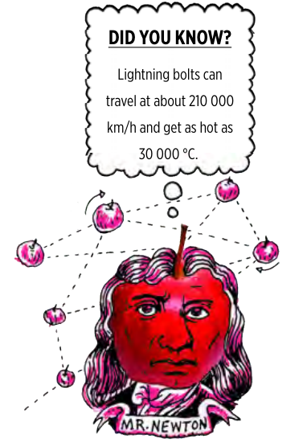
> **[Diagram Context - Textbook_NaturalScience_Gr8_Static-electricity.pdf-0008-10.png]**
> 1. A cartoon depiction of a man's head with a red apple on top.


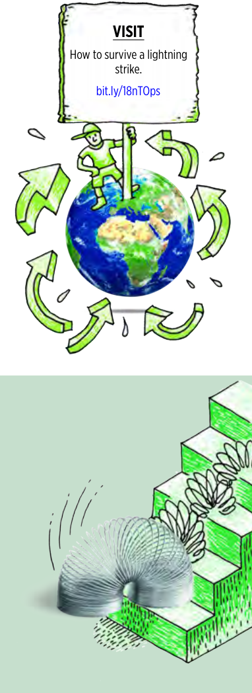
> **[Diagram Context - Textbook_NaturalScience_Gr8_Static-electricity.pdf-0008-11.png]**
> 1. A diagram of a spring coiled around a wire.


**<u>VISIT</u>** Should a person touch 20 000 Volts? Visit this link to find out! bit.ly/19mUtun 


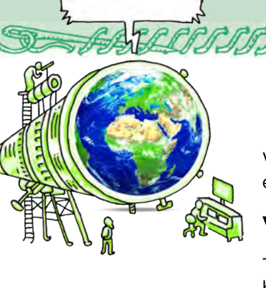
> **[Diagram Context - Textbook_NaturalScience_Gr8_Static-electricity.pdf-0009-02.png]**
> The image is a cartoon drawing of a group of people standing around a large telescope. The people are positioned in front of a globe, which is the main focus of the drawing. The drawing also includes a diagram of a cell, a Lewis diagram, and a circuit. The text "Vega" is also present in the image.


We are now going to look at two instruments which demonstrate static electricity. 

###### **Van de Graaff generator** 

The Van de Graaff generator is a machine which uses friction to generate a large build-up of electric charge on a metal dome. 

The Van de Graaff generator can be used to demonstrate the effects of an electrostatic charge. The big metal dome at the top becomes positively charged when the generator is turned on. When the dome is charged it can be discharged by bringing another insulated metal sphere close to the dome. The electrons will jump to the dome from the metal sphere and cause a spark. 

###### **<u>DID YOU KNOW?</u>** 

The fundamental idea of using friction in a machine to generate a charge dates back to the 17th century, but the generator was only invented by Robert Van de Graaff in 1929 at Princeton University. 


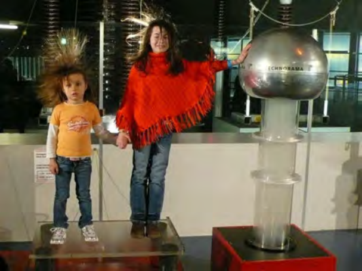
> **[Diagram Context - Textbook_NaturalScience_Gr8_Static-electricity.pdf-0009-09.png]**
> 1. A diagram of a circuit with a lightning rod and a lightning bolt.


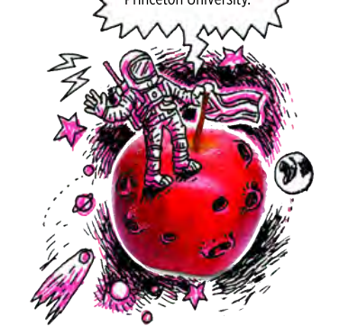
> **[Diagram Context - Textbook_NaturalScience_Gr8_Static-electricity.pdf-0009-10.png]**
> 1. A cartoon drawing of an astronaut on a red planet.
 2. A speech bubble with the text "Princeton University."
 3. A red apple with a stem.


_These girls are touching the large dome of a Van de Graaff generator._ 

###### **<u>VISIT</u>** 

You can also touch the dome and your hair will rise. Why do you think this happens? 

Watch this video so see how a Van de Graaff generator works bit.ly/1a5YNKE 


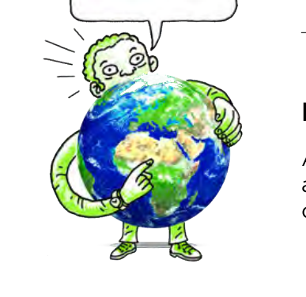
> **[Diagram Context - Textbook_NaturalScience_Gr8_Static-electricity.pdf-0009-15.png]**
> The image features a cartoon depiction of a man holding a globe in his arms. The man is wearing a green shirt and white pants, and he is pointing to the globe with his left hand. The globe is green and blue, and it is the central focus of the image. The man's actions and the globe's colors convey a sense of exploration and discovery.


###### **Electroscope** 

An electroscope is an early scientific instrument used to identify the presence of a charged object or it can be used to identify the type of charge on a charged object. 

Energy and Change 


_An electroscope used in a laboratory._ 

The following images show some drawings of different types of electroscopes. 


_An early example of an electroscope with one gold strip at the bottom and a ball at the top._ 


_Another example of an electroscope with a disc at the top and two gold foil strips at the bottom._ 

The electroscope is made up of an earthed metal box with glass windows. There is a metal rod hanging down and at the end are two strips of thin gold foil attached to it. A disc or ball is attached to the top of the metal rod, as seen in the illustrations above. When the metal ball or disc at the top is touched with a charged object, or a charged object is brought near to it, the gold foil strips spread apart, indicating that the object has a charge. 

Look at the next illustration which shows how this works. 


The positively charged rod attracts electrons to the disc from the gold foil strips. The disc at the top becomes negatively charged and the gold foil strips at the bottom become positively charged. Why do the gold foil strips move apart? 

You can make a simple electroscope with everyday items. Let's try. 


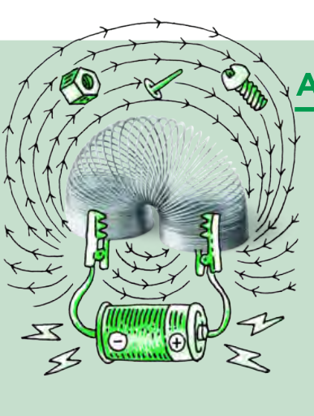
> **[Diagram Context - Textbook_NaturalScience_Gr8_Static-electricity.pdf-0011-02.png]**
> 1. A green spring with a silver wire attached to it.


**ACTIVITY:** Making a simple electroscope 

###### **MATERIALS:** 

- glass jar, with lid 

- 14 gauge copper wire, about 12 cm in length 

- plastic straw or plastic tubing 

- 2 small pieces of aluminium foil 

- piece of wool cloth 

- plastic ruler 

- glass rod 

###### **INSTRUCTIONS:** 


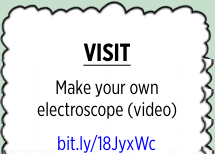
> **[Diagram Context - Textbook_NaturalScience_Gr8_Static-electricity.pdf-0011-13.png]**
> 1. A diagram of an electric microscope.


1. Twist one end of the copper wire into a spiral shape. This will increase its surface area. 

2. Make a hole in the jar lid and push a small piece of the plastic tubing through the hole. 

3. Put the other end of the copper wire through the straw so that the spiral end is on the outside of the lid. 


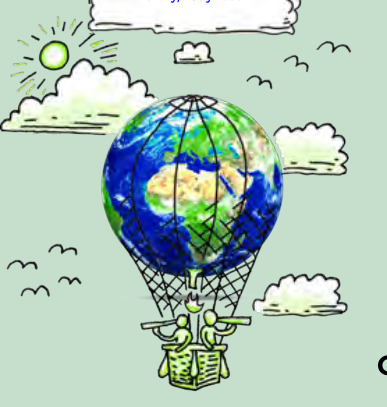
> **[Diagram Context - Textbook_NaturalScience_Gr8_Static-electricity.pdf-0011-17.png]**
> The image features a cartoon depiction of a hot air balloon filled with people. The balloon is floating in the sky, and the people inside are holding onto a basket. The balloon is positioned in the center of the image, with the people on the basket towards the bottom. The background of the image is a light blue color, with white clouds scattered throughout. The image also includes a sun and a


4. Make a hook out of the pointed end of the copper wire. 

5. Cut two rectangular strips of aluminium foil. **.** 

6. Put each piece of aluminium foil onto the hook. Make a small hole in the aluminium foil to allow it to hang from the hook. 

7. Carefully put the hook end of the copper wire into the glass jar and close the jar. 

8. Rub the ruler with the wool cloth for a minute. 

9. Bring the ruler close to the spiral end of the copper wire. 

###### **QUESTIONS:** 

1. What did you observe when you brought the ruler close to the copper wire? 

2. What happens if you move the ruler away from the copper wire? 

Why do the pieces of aluminium foil move apart? When you rubbed the plastic ruler with the wool cloth, the ruler became negatively charged. When the negatively charged ruler is brought close to the copper wire, the electrons on 

Energy and Change 


the wire are repelled downwards towards the aluminium foil. The pieces of aluminium foil then have extra electrons on them and they both become negatively charged. Two objects which are negatively charged will repel each other and so the pieces of aluminium foil move away from each other. 

3. Write a short paragraph to explain what would happen if you brought a positively charged object close to your electroscope. 


> **[Diagram Context - Textbook_NaturalScience_Gr8_Static-electricity.pdf-0012-03.png]**
> 1. A diagram of a snake's body.
 2. The snake's body is made up of many small lines.
 3. The snake's head is green and the body is brown.


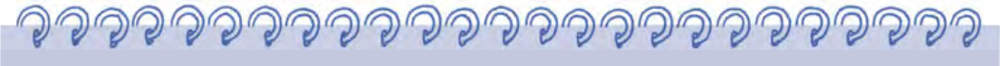
> **[Diagram Context - Textbook_NaturalScience_Gr8_Static-electricity.pdf-0012-04.png]**
> 1. A diagram of a cell with blue and white lines.


##### **SUMMARY:** 

- **.** 

- **<u>Key Concepts</u>** 

   - Objects are usually neutral because they have the same number of positive and negative charges. 

   - Objects can become negatively or positively charged when friction (rubbing) results in the transfer of electrons between objects. 

   - Protons and neutrons cannot be transferred, only electrons can be transferred by friction. 

   - If an object has more electrons than protons, then it is negatively charged. 

   - If an object has fewer electrons than protons, then it is positively charged. 


> **[Diagram Context - Textbook_NaturalScience_Gr8_Static-electricity.pdf-0012-12.png]**
> The image features a key that is part of a tree, with a skull and a treasure chest below it. The key is depicted in a cartoon style, with a tree and a skull on either side of it. The tree has a blue background and a brown trunk, while the skull is depicted in a black and white style. The key is located in the center of the image, surrounded by


- Like charges repel each other, i.e. negative repels negative; positive repels positive. 

- Opposite charges attract each other, i.e. negative attracts positive; positive attracts negative. 

- A discharge of the electrons from a charged object can cause sparks or shocks of static electricity, especially when the air is dry. 

###### **.** **<u>Concept Map</u>** 

Complete the following concept map to summarise what you have learnt in this chapter about charge and static electricity. 


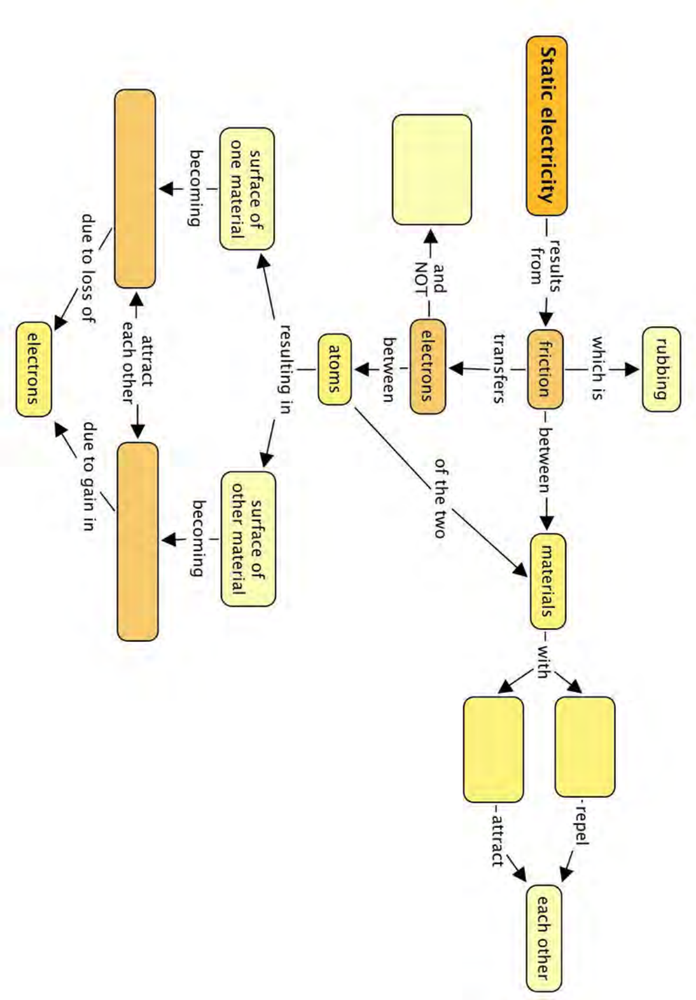
> **[Diagram Context - Textbook_NaturalScience_Gr8_Static-electricity.pdf-0013-00.png]**
> 1. A diagram of a circuit with a battery, wires, and a light bulb.


##### **REVISION:** 

1. Complete the following sentences. Just write the missing word on the line below. 

   - a) An object which has a **negative** charge is said to have electrons than protons. [1 mark] 

2. An object which has a **positive** charge is said to have electrons than protons. [1 mark] 


> **[Diagram Context - Textbook_NaturalScience_Gr8_Static-electricity.pdf-0014-04.png]**
> The image features a cartoon illustration of a man holding a gear and a pulley, with a wheel and axle in the background. The man is wearing a white shirt and blue pants. The illustration is a simple, cartoon-like depiction of a mechanical device, with the man and the gear as the main elements. The gear is depicted in a black color, while the pulley is shown in


3. Sarah uses a plastic comb to comb her hair. The comb becomes negatively charged. The comb is negatively charged because the comb has: [1 mark] 

   - a) gained electrons 

   - b) gained protons 

   - c) lost electrons 

   - d) lost protons 

4. A perspex strip was rubbed with a cloth and became positively charged. The correct explanation for why the perspex rod becomes positively charged is that: [1 mark] 

   - a) the perspex rod got extra protons from the cloth. 

   - b) the perspex rod got extra protons due to friction. 

   - c) protons were created as the result of friction. 

   - d) the perspex rod lost electrons to the cloth due to friction. 

5. Look at the following images in the table. Redraw the images in the second column to show how the spheres will move because of the nature of the charges. Write an explanation in the last column. [6 marks] 


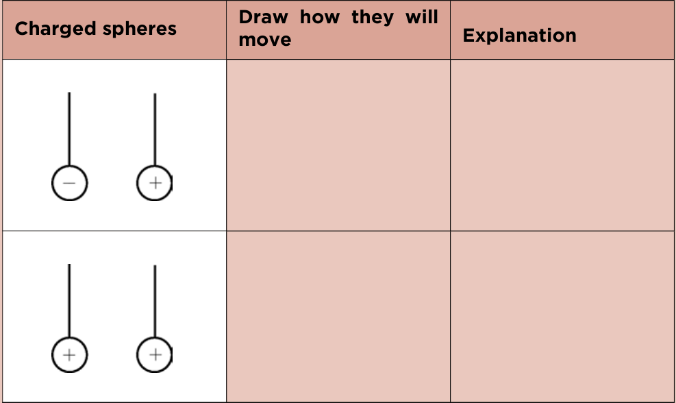
> **[Diagram Context - Textbook_NaturalScience_Gr8_Static-electricity.pdf-0014-16.png]**
> The image shows a diagram of a charged sphere, which is a three-dimensional representation of a charged object. The sphere is divided into four quadrants, each representing a different charge state: positive, negative, and neutral. The diagram also includes text that explains the concept of charged spheres and how they move. The diagram is accompanied by a list of labels and arrows, which provide additional information about


6. Complete the table by working out the overall charge on each object. Show your calculations. State whether the object is positively charged, negatively charged or neutral and why. [9 marks] 


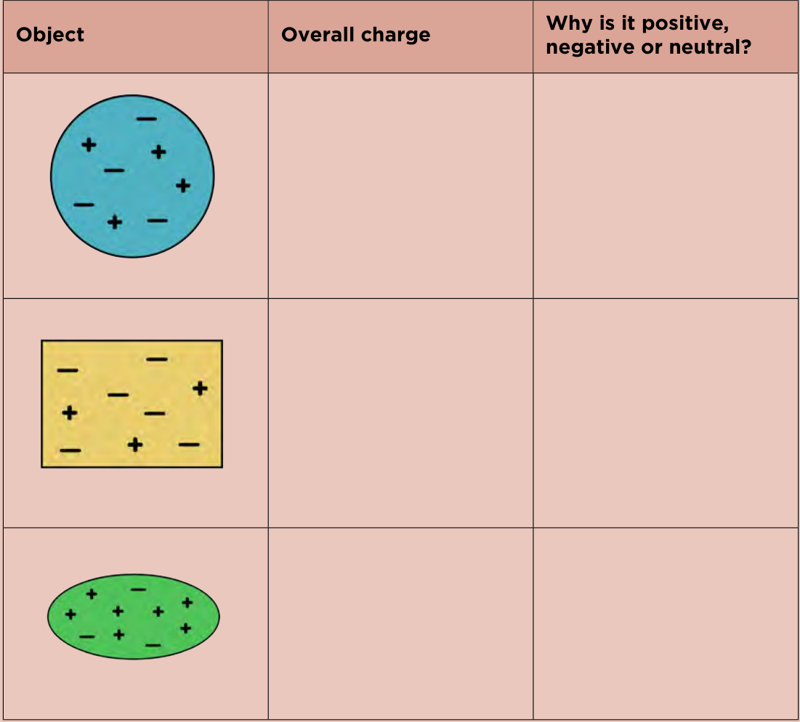
> **[Diagram Context - Textbook_NaturalScience_Gr8_Static-electricity.pdf-0015-02.png]**
> The image shows a pink grid with three different shapes on it. The shapes are a circle, a triangle, and a square. The grid is labeled with the words "Object", "Overall Charge", and "Why is it positive, neutral or negative?". The objects are depicted in a cartoon-like style, with the circle being blue, the triangle being green, and the square being yellow.


7. The ruler in this photo has been rubbed with a cloth. Describe what is happening in this photo and why. [4 marks] 


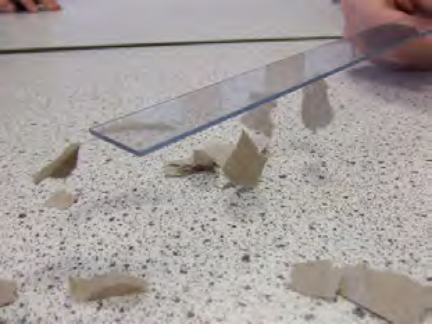
> **[Diagram Context - Textbook_NaturalScience_Gr8_Static-electricity.pdf-0015-04.png]**
> 1. A diagram of a cell with arrows pointing to different parts of the cell.


Energy and Change 


8. Sometimes, when you are pushing a trolley, you can get a small shock. Explain why this would happen. [2 mark] 

9. Why does your jersey make a crackling sound when you pull it over your head? [2 mark] 

10. Why do trucks transporting petrol drag a short length of metal chain on the road as they drive? [2 mark] 

11. What do you think these two girls are touching on the left of the photo? **.** Explain your answer and what is happening to them. [3 marks] 


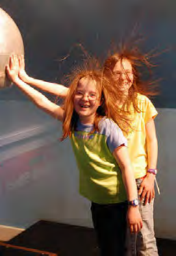
> **[Diagram Context - Textbook_NaturalScience_Gr8_Static-electricity.pdf-0016-05.png]**
> The image shows two young girls posing for a picture with their hair flying around them. One girl is wearing a yellow shirt, while the other is wearing a green shirt. The girls are standing in front of a large ball, which is a globe. The girls are positioned in front of a window, and there is a clock visible in the background. The image conveys a sense of fun and


_What is happening in this photo?_ 

Total [32 marks] 


> **[Diagram Context - Textbook_NaturalScience_Gr8_Static-electricity.pdf-0016-08.png]**
> The image shows a close-up view of a diagram of a cell, with a red ant positioned in the center. The diagram is set against a gray background, and the ant is the main focus of the image. The ant is surrounded by various labels and arrows, which provide information about the cell's structure and function. The image is educational in nature, as it is likely intended to teach


# **7 Static electricity** 

###### **<mark>Chapter overview</mark>** 

###### **1 week** 

In previous grades the learners investigated circuits and current electricity. In this chapter they are introduced to static electricity. It explains how static electricity is caused by friction between objects and that charged objects are either positively or negatively charged. There are several activities in this chapter which illustrate the effects of static electricity. 

An interesting article on how to encourage learners to pursue STEM (Science, Technology, Engineering and Mathematics) careers:^{1} spectrum.ieee.org/at-work/education/the-stem-crisis-is-a-myth^{2} bit.ly/19Bpoip 

###### **7.1 Friction and static electricity (3 hours)** 

|**Tasks**|**Skills**|**Recommendation**|
|---|---|---|
|Activity: Sticky balloons|Observing, working in pairs|CAPS suggested|
|Activity: Turning the wheel|Observing, recording|CAPS suggested|
|Activity: Research the practical<br>applications of static electricity|<br>Researching, writing,<br>summarising|Optional|
|Activity: Making a simple<br>electroscope|Carrying out instructions,<br>observing, predicting,<br>explaining Optional||

###### **Key questions** 

- l What is static electricity? 

- l What is friction? 

- l Why does my hair stand on end and crackle when I pull a jersey off over my head? 

   - What is lightning? 

- l What does it mean to 'earth' an object? 

- l What does it mean when we say 'opposites attract'? 

### 7.1 Friction and static electricity 

#### ACTIVITY: **Sticky balloons (LB page 151)** 

You can also do this activity using a plastic comb rather than balloons. Or else you can use pieces of paper instead of a learner's hair as not all hair will behave in the following way if it has product in it. You can then rather rub the balloon on a jersey and pick up pieces of paper. 

1. – 3. Nothing happens 

4. – 5. The hair should "rise" and stick to the balloon, or the pieces of paper will stick to the balloon 

6. Rubbed it vigorously with the balloon. 

7. The electrons are arranged in the space around the nucleus. 

8. Positive charge. 

9. Negative charge.. 

10. Neutrons are not charged. They are neutral. 

11. The hair. 

12. It has more positive charges. 

13. The comb. 

14. It has more negative charges. 

#### ACTIVITY: **Turning the wheel (LB page 154)** 

This is a fun demonstration of how like charges repel each other and unlike charges attract each other. If you have enough materials, allow the learners to try this themselves. If you don't have enough materials, do this as a demonstration but give the learners a chance to play a bit. 

Practise this activity a few times first to make sure that you have the method right. Remember that it is quite easy to accidentally earth the rods so work with care. This will work best on a dry day. This will be dependent on the area which you live in. 

At a brainstorming workshop with volunteer teachers and academics at the beginning of 2013, we filmed a quick demonstration of this task when the group was discussing it. You can view this short clip here:^{3} bit.ly/1fFbbbJ 

1. The rods now have opposite charges and so the second rod should be seen to 'pull' the other rod around in a circle 

2. The learners should be able to pick up the pieces of paper with the charged rod. 

3. When the rods are the same (i.e. both perspex) then the first rod should move away from the second and the top watch glass will turn in a circle. 

4. When the two different materials are used then the first rod should move towards the plastic rod and the watch glass will turn in a circle towards the plastic rod 

5. The pieces of paper were attracted to the plastic rod. 

6. A positive charge. 

7. A negative charge 

8. When rubbing hair with the balloon, electrons are transferred from the hair to the balloon. The balloon now has a negative charge and the hair has a positive charge. They have opposite charges and so when the balloon is brought close to the hair again, they attract each other. Since the hair strands each have positive charges, like charges repel and the hair strands repel each other, also causing them to rise up. 

The video in the Visit box shows how static electricity from the flowing petrol causes a spark which ignites the petrol fumes and leads to a large fire. It is an illustration of one of the dangers of static electricity. 

The discharge of electrons from charged objects happens much more easily when the air is dry, which is why you are more likely to experience electrostatic sparks or shocks in dry weather. This is because when the weather is humid, the moisture in the air can collect on the surface of objects, and prevent the build-up of electrical charge. The charge dissipates through the moisture, which is a better conductor than air. 

#### ACTIVITY: **Research the practical applications of static electricity (LB page 156)** 

There are many different useful and damaging effects of static electricity. Here are some examples. 

- l useful: air filters remove smoke particles; spray painting; photocopying 

- l problems: dust on TV and computer screens; damage to electronic Equipment 

If you do not have a Van de Graaff generator then you can use some of the videos provided here which show and explain how the generator works. If you do have a generator then allowing the learners to "play" 

with it will give them a good insight into the effects of static electricity. Allow learners to perform different activities, such as having their hair stand on end. 

Let the learners hold onto the dome and then run the generator until their hair stands on end. 

Tear up small pieces of paper and place them on the top of the uncharged dome, run the generator and the pieces will become charged and then fly off the generator. This is a good example of the pieces of paper becoming charged and then, because they all have the same charge, repelling each other. 

When you touch the positively charged dome, electrons are transferred from you to the dome to discharge it. This causes you and your hair to become positively charged. The individual hair strands are then positively charged so they repel each other and stand on end. 

They move apart as they now both have a positive charge and positive charges repel. 

#### ACTIVITY: **Making a simple electroscope (LB page 157)** 

If you cannot find glass jars with lids, it is possible to make lids. Use old plastic tub lids and cut out a circle the same size as the opening of the glass jar. Then use electrical tape (or even masking tape) to hold the plastic lid in place over the jar opening. 

The copper does not have to be 14-gauge, but the thicker the piece, the better it holds its shape. 

Detailed instructions and videos can be found on the Internet. Try video in the Visit box for an excellent description of the method 

1. The two pieces of aluminium foil moved apart. 

2. The aluminium foil pieces move back together. 

This next question is a test of the learners' understanding of the fact that positive charges do not move to cause charging, only electrons can move. But, a positively charged object can move. Learners often get confused with this. 

Give them a chance to reason out the answer themselves. Allow them to bring a positively charged object close to the electroscope to observe what happens and then try to figure out why the effect is seemingly the same. Rubbing a glass rod with the wool cloth will cause a positive charge to develop on the glass rod. 

3. When a positively charged object is brought close to the electroscope the negative electrons are attracted towards the positively charged object and move up through the copper wire. This means that the pieces of aluminium have lost some electrons and so have an overall positive charge. Both pieces of aluminium foil are then positively charged. Like charges repel each other and so the pieces of aluminium foil move apart from each other. 

# **Revision** 

1. An object which has a **negative** charge is said to have more electrons than protons. 

2. An object which has a **positive** charge is said to have fewer electrons than protons. 

3. Answer a. 

4. Answer d. 

5. 3 marks for each of the scenarios, 1 mark is awarded to the drawing and 2 marks to the explanation. 

|**Charged spheres**|**Draw how they will move**|**Explanation**|
|---|---|---|

Learners must draw the spheres moving towards each other. The spheres have opposite charges, which attract, so they move towards each other. 

Learners must then draw the spheres moving away from each other. The spheres have the same positive charge and like charges repel, so they move away from each other. 

6. 3 marks for each of the objects, 1 mark is awarded to the calculation and 2 marks to the explanation. 

|**Object**|**Overall charge**|**Why is it positive, negative or**<br>**neutral?**|
|---|---|---|

Charge = 4 + (–4) = 0 

It is neutral as there are equal numbers of positive and negative charges. 

Charge = 3 + (–6) = -3 

It is negatively charged as there are 3 more negative than positive charges. 

Charge = 7 + (–3) = 4 

It is positively charged as there are 4 more positive charges than negative charges. 

7. Rubbing the ruler with a cloth transfers electrons from the cloth to the ruler so the ruler now has an excess of electrons and it is negatively charged. 

The pieces of paper are neutral. When the negatively charged ruler is brought near to the paper pieces, they are attracted to the ruler as the the electrons move around on the paper because of the large charge on the ruler. Electrons will move away from the ruler leaving a positive charge on the paper near the ruler, so they are attracted. 

8. Friction between the floor and the trolley wheels causes a build-up of charge on the trolley. The charge is earthed by your body, causing the shock. 

9. When you pull the jersey over your head the friction causes the jersey and your hair to become charged. The movement of electrons from your hair to the jersey releases energy in the form of light and sound. 

10. When the truck is driving the movement of the petrol in the tank causes a build-up of charge which could cause a dangerous spark when the fuel is off-loaded. The chain earths the tank. The excess charge on the tank is allowed to dissipate to the road. 

11. The girls are touching the hollow dome of a Van de Graaff generator. The dome is positively charged so electrons are transferred from their bodies to the dome to discharge it. This causes their bodies and hair to become positively charged. Their hair strands now repel each other as they are all positive (like charges repel) and they rise up. 

## 5. Authentic Exam Question Archetypes & Mark Allocations
*(Extracted from official CAPS examination papers to guide marking, pacing, and rubric design)*

### Archetype 1: QUESTION 1
- **Source Paper:** `Gr8_NS_Exam13.pdf`
- **Total Mark Allocation:** **[15 Marks]** (Sub-questions: 1, 1, 1, 1, 1 marks)
- **Recommended Time:** **15 Minutes** (Pacing: ~1.0 min/mark | *Calibrated to Official CAPS Paper Pace (1.0 min/mark)*)
- **Assessment Mode Calibration:** Timed Exam Simulation: 15 min countdown (Pacing Checkpoint: 11 min)
- **Cognitive / Marking Strategy:** NSC Standard (Method Marks [M], Accuracy Marks [A], Carry-Over [CA])

#### Question Prompt & Working:
```text
QUESTION 1  
 
1.1 
Various options are provided as possible answers to the following questions. 
Choose the correct answer and write only the letter (A – D) next to the question 
number (1.1.1 to 1.1.10) in the answer book e.g., 1.1.12 D.  
 
1.1.1 What causes the build-up of charge when a balloon is rubbed against a 
woollen jersey? 
 
 
 
A 
Friction 
 
 
B 
Current 
 
 
C 
Resistance 
 
 
D 
Static energy  
 
 
 
 
 
 
(1) 
 
 
1.1.2 The spark between the finger and the doorknob is caused by ... 
 
 
 
 
 
 
 
 
 
A 
friction. 
 
 
 
 
 
 
 
 
 
 
B 
electricity. 
 
 
C 
electrostatic forces. 
 
 
D 
a discharge of electrons. 
 
 
 
 
 
(1) 
 
1.1.3 Study the connections in each of the diagrams below. In which ONE of 
the diagrams will the bulb light up? 
  
 
 
 
 
 
 
 
 
 
 
 
 
 
 ...
```

### Archetype 2: QUESTION 1
- **Source Paper:** `Gr8_NS_Exam11.pdf`
- **Total Mark Allocation:** **[3 Marks]** (Sub-questions: 1, 1, 1 marks)
- **Recommended Time:** **3 Minutes** (Pacing: ~1.0 min/mark | *Calibrated to Official CAPS Paper Pace (1.0 min/mark)*)
- **Assessment Mode Calibration:** Timed Exam Simulation: 3 min countdown (Pacing Checkpoint: 2 min)
- **Cognitive / Marking Strategy:** NSC Standard (Method Marks [M], Accuracy Marks [A], Carry-Over [CA])

#### Question Prompt & Working:
```text
QUESTION 1  
  
Four options are provided as possible answers to the following questions. Each question has 
only ONE correct answer. Write ONLY the letter (A–D) next to the question number in your 
ANSWER sheet.   
 
1.1.  One of the examples of electric spark.    
  
 
A 
Current electricity  
 
B 
Friction  
 
C 
Lightning   
 
D 
Flow of electrons in a conductor  
 
 
 
 
 
(1) 
 
1.2.  Which instrument is used to measure the flow of charge in an electric circuit?   
  
 
A 
Voltmeter  
 
B 
Ammeter  
 
C 
Telescope  
 
D 
Ohmmeter   
 
 
 
 
 
 
 
 
(1) 
 
1.3.  Why is it better to wear white clothes instead of black cloths on a hot day?  
  
 
A 
White clothes radiate light and absorb more heat.  
 
B 
White clothes refract light and heat.  
 
C 
White clothes reflect light and absor...
```

### Archetype 3: QUESTION 2
- **Source Paper:** `Gr8_NS_Exam13.pdf`
- **Total Mark Allocation:** **[8 Marks]** (Sub-questions: 1, 1, 1, 1, 1 marks)
- **Recommended Time:** **8 Minutes** (Pacing: ~1.0 min/mark | *Calibrated to Official CAPS Paper Pace (1.0 min/mark)*)
- **Assessment Mode Calibration:** Timed Exam Simulation: 8 min countdown (Pacing Checkpoint: 6 min)
- **Cognitive / Marking Strategy:** NSC Standard (Method Marks [M], Accuracy Marks [A], Carry-Over [CA])

#### Question Prompt & Working:
```text
QUESTION 2 
 
2.1 
Spheres A, B, C and D shown below, all carry electrostatic charges. 
 
 
 
 
 
 
 
 
 
2.1.1 Which two spheres have like charges?  
 
 
 
(1) 
 
 
 
2.1.2 Which two spheres attract each other?  
 
 
 
(1) 
 
2.1.3 Redraw spheres C and D in your answer book and indicate the  
possible charge on each sphere.   
 
 
 
 
(1) 
 
2.2 
A learner rubs a plastic rod with a cloth as shown below.  
 
 
 
 
 
 
 
 
 
Use the DIAGRAM to answer the questions. 
 
 
2.2.1 What is the charge on the plastic rod BEFORE it is rubbed with the  
 
 
cloth?  
 
 
 
 
 
 
 
 
(1) 
 
2.2.2 Give a reason for your answer in question 2.2.1. 
 
 
(1) 
 
2.2.3 What is the charge on the rod AFTER rubbing?  
 
 
(1) 
 
2.2.4 The INCORRECT explanation for the charge on the rod AFTER  
 
 
rubbing is giv...
```
