# Chapter 4: Visible Light

## Key Questions
*   Where does light come from?
*   How does light travel?
*   How do we see?
*   Why do leaves look green?
*   How do mirrors work?
*   Why do my legs look crooked underwater?

---

## Introduction
**Visible light** is the form of light that we can perceive with our own eyes. While there are other forms of light (such as ultraviolet light) that are invisible to the naked eye, this chapter focuses on the visible light spectrum, how we see colours, and how light behaves.

### New Words
*   **Luminous:** Objects that emit their own light.
*   **Radiation:** The emission or transmission of energy in the form of waves or particles.
*   **Rectilinear:** Moving or arranged in a straight line.
*   **Propagation:** The way in which light travels or spreads.

---

## 4.1 Radiation of Light
Light originates from **luminous objects**. These are objects that produce and emit their own light.

*   **Natural Light:** The Sun is the primary source of natural light on Earth.
*   **Artificial Light:** Man-made objects, such as light bulbs, are also luminous because they emit light.

<!-- DIAGRAM_PLACEHOLDER: diagram -->

---

## Additional Resources
*   **Video:** To learn more about the speed of light, visit: [bit.ly/GAMgFW](http://bit.ly/GAMgFW)

---

# Chapter 4: Visible Light

## 1. The Nature of Light
Light is a form of energy that is transferred through space by **radiation**. This energy travels in the form of **electromagnetic waves** that move in straight lines.

### Key Facts about Light Speed and Travel
*   **Speed of Light:** Light travels through space at a speed of $300\,000\text{ km/s}$.
*   **Travel Time:** It takes approximately $8$ minutes for light to travel from the Sun to the Earth.
*   **Distance Comparison:** If you could travel at the speed of light, you could circle the Earth's equator $7,5$ times in just $1$ second.

> **[Diagram Context - Textbook_NaturalScience_Gr8_Energy-transfer-in-electrical-systems.pdf-0001-02.png]**
> 1. A diagram of a cell with blue and white lines.

## 2. Luminous vs. Non-luminous Objects
*   **Luminous Objects:** Objects that emit their own light (e.g., the Sun).
*   **Non-luminous Objects:** Objects that do not emit their own light. They are only visible because they reflect light from a luminous source.
    *   *Example:* The Moon is a non-luminous object; it does not produce its own light but reflects light from the Sun.

> **[Diagram Context - Textbook_NaturalScience_Gr8_Energy-transfer-in-electrical-systems.pdf-0001-03.png]**
> 1. A cartoon illustration of a key and a dinosaur.

## 3. Investigation: How Light Travels
To understand the properties of light, we can investigate how it travels by constructing a simple camera (pinhole camera).

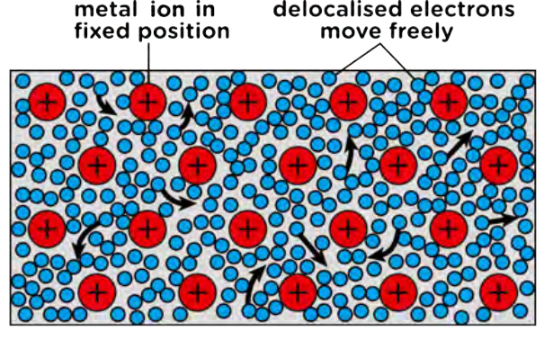
> **[Diagram Context - Textbook_NaturalScience_Gr8_Energy-transfer-in-electrical-systems.pdf-0001-25.png]**
> 1. A diagram of a metal ion in a fixed position.

> **[Diagram Context - Textbook_NaturalScience_Gr8_Energy-transfer-in-electrical-systems.pdf-0001-29.png]**
> The image shows a purple gas cylinder connected to a blue glass flask, which is filled with a blue liquid. The flask is on a burner, and there is a fire burning underneath it. The diagram also includes a Lewis structure of a molecule, a cell, and a graph. The image is labeled with the text "Lewis diagram, anatomical/cellular structure, circuit, graph, evolutionary tree

> **[Diagram Context - Textbook_NaturalScience_Gr8_Series-and-parallel-circuits.pdf-0001-02.png]**
> This diagram illustrates a cross-section of a biological membrane surface, featuring a linear arrangement of repeating, hook-like protein structures embedded within a shaded substrate. It conceptually represents the structural organization of surface receptors or microvilli, helping students visualize the high-density distribution of functional proteins or cellular projections essential for absorption or cell-to-cell interaction.

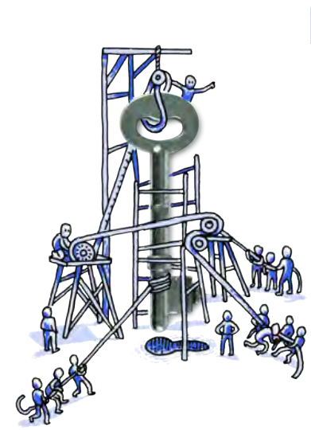
> **[Diagram Context - Textbook_NaturalScience_Gr8_Series-and-parallel-circuits.pdf-0001-03.png]**
> The image shows a group of people working on a key, which is depicted as a large metal key with a keyhole. The key is being attached to a metal frame, and the people are using various tools to manipulate the key. The people are standing around the key, with some holding the key and others working on it. The image also includes a diagram of a cell, a circuit,

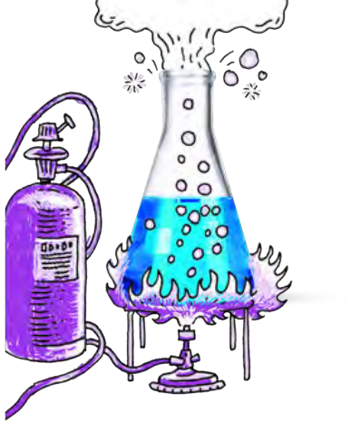
> **[Diagram Context - Textbook_NaturalScience_Gr8_Series-and-parallel-circuits.pdf-0001-18.png]**
> 1. A purple and blue gas cylinder with a purple nozzle.
 2. A blue and white flask with a blue flame.

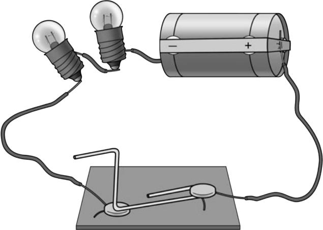
> **[Diagram Context - Textbook_NaturalScience_Gr8_Series-and-parallel-circuits.pdf-0001-19.png]**
> 1. A circuit diagram with a battery, two bulbs, and a switch.

> **[Diagram Context - Textbook_NaturalScience_Gr8_Static-electricity.pdf-0001-02.png]**
> 1. A diagram of a cell with blue and white lines.

> **[Diagram Context - Textbook_NaturalScience_Gr8_Static-electricity.pdf-0001-03.png]**
> The image features a cartoon character, a blue and white skateboarder, who is holding a key. The character is wearing a hat and a backpack, and is standing on a skateboard. The character is also holding a question mark, which could be a symbol for curiosity or confusion. The image is a simple, cartoon-like illustration that conveys the concept of a key as a tool

> **[Diagram Context - Textbook_NaturalScience_Gr8_Static-electricity.pdf-0001-15.png]**
> The image features a cartoon depiction of a caterpillar with a green body and a white head, holding a green ball in its mouth. The caterpillar is surrounded by green leaves, and there is a green wire with a silver ball on it. The image also includes a text box that reads "A" and "A+", and a green arrow pointing to the right.

> **[Diagram Context - Textbook_NaturalScience_Gr8_Visible-light.pdf-0001-02.png]**
> This diagram illustrates a cross-section of a cell membrane, specifically highlighting the hydrophilic heads of the phospholipid bilayer oriented toward the aqueous extracellular or intracellular environment. The visual features include a series of repeating, hook-shaped blue structures embedded along the surface of a light-blue horizontal plane, representing the polar phosphate heads. Conceptually, this helps learners visualize the fluid mosaic model, emphasizing the arrangement of phospholipids that maintain membrane integrity and regulate the movement of substances into and out of the cell.

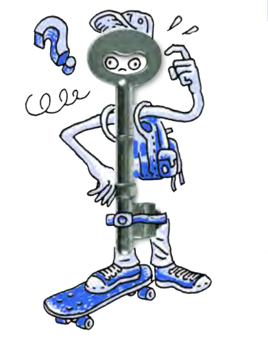
> **[Diagram Context - Textbook_NaturalScience_Gr8_Visible-light.pdf-0001-03.png]**
> This graphic is a metaphorical illustration featuring a cartoon character with a key for a head, accompanied by a question mark and scribbled lines. It visually represents the concept of "unlocking" knowledge or finding the "key" to solving a problem, serving as a mnemonic device to encourage critical thinking and inquiry in a learning context.

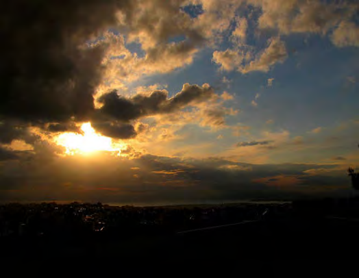
> **[Diagram Context - Textbook_NaturalScience_Gr8_Visible-light.pdf-0001-22.png]**
> This image is a photograph of a sunset featuring a horizon line, clouds, and a light source, with no visible labels, variables, or scientific annotations. In a CAPS Geography or Physical Sciences context, this visual serves as a real-world observation of atmospheric phenomena, illustrating concepts such as light scattering, the Earth's rotation relative to the sun, or cloud formation.

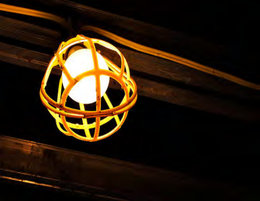
> **[Diagram Context - Textbook_NaturalScience_Gr8_Visible-light.pdf-0001-24.png]**
> This image depicts a physical apparatus consisting of an incandescent light bulb enclosed within a protective yellow wire cage, suspended from a ceiling structure. It serves as a practical example of an electrical circuit component, illustrating the conversion of electrical energy into light and thermal energy. For Physical Sciences learners, this visualises the practical application of a resistor in a circuit, demonstrating how electrical potential energy is dissipated as light and heat.

---

# Activity: Make a Pinhole Camera

## Materials Needed
*   Pringles chip can
*   Craft knife
*   Aluminium foil
*   Tape
*   Ruler
*   Drawing pin

---

## Instructions

1.  **Measure:** Measure $5\text{ cm}$ from the bottom of the can (the end opposite to the plastic lid) and make a mark all around the can.
2.  **Cut:** Carefully cut through the can along the line so that you have cut the can into two separate pieces.
    

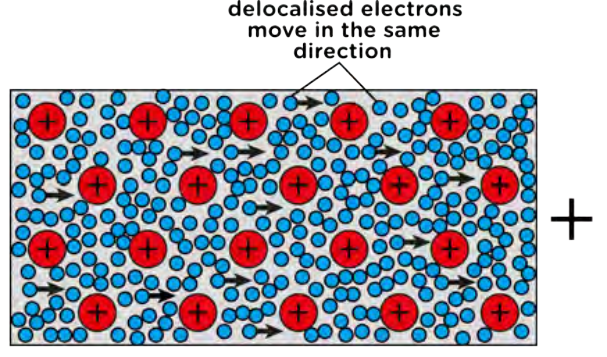
> **[Diagram Context - Textbook_NaturalScience_Gr8_Energy-transfer-in-electrical-systems.pdf-0002-00.png]**
> 1. A diagram of a red and blue surface with red circles and arrows.

3.  **Prepare the Screen:** If you have a clear lid, place a piece of wax paper on top of the lid before sticking everything together.
    

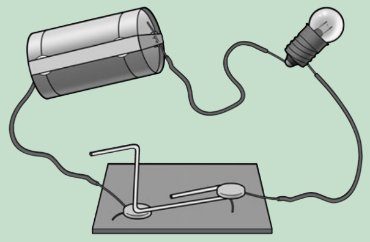
> **[Diagram Context - Textbook_NaturalScience_Gr8_Energy-transfer-in-electrical-systems.pdf-0002-12.png]**
> This diagram illustrates a simple electrical circuit consisting of a cell (battery), a light bulb, and a manual switch connected by conducting wires. It demonstrates the fundamental requirement of a closed circuit for current to flow and power the light bulb, serving as a foundational model for understanding energy transfer in electric circuits within the Natural Sciences curriculum.

---

## Take Note
The Sun emits radiation in **all directions**, but in the context of light and optics, we only focus on the radiation that reaches Earth.

> **[Diagram Context - Textbook_NaturalScience_Gr8_Energy-transfer-in-electrical-systems.pdf-0002-15.png]**
> 1. A diagram of a cell with arrows pointing to different parts of the cell.
 2. A diagram of a circuit with arrows pointing to different parts of the circuit.
 3. A diagram of a Lewis structure with arrows pointing to different parts of the Lewis structure.

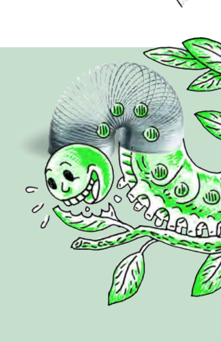
> **[Diagram Context - Textbook_NaturalScience_Gr8_Energy-transfer-in-electrical-systems.pdf-0002-16.png]**
> The image is a cartoon drawing of a green caterpillar with a spring coiled around it. The caterpillar is depicted in a cartoon style with a face and a mouth, and it is surrounded by green leaves. The drawing is a simple yet effective way to explain the concept of a spring coiled around an object, such as a spring-loaded spring or a spring-loaded spring-loaded

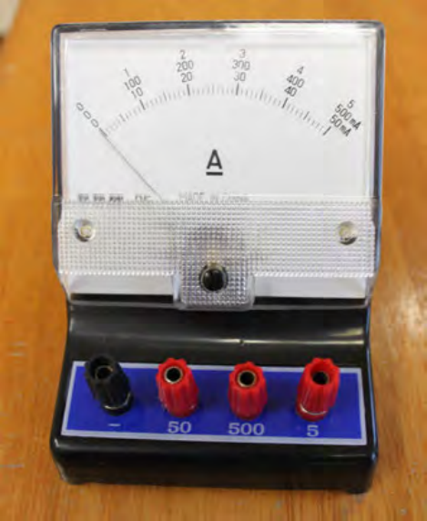
> **[Diagram Context - Textbook_NaturalScience_Gr8_Series-and-parallel-circuits.pdf-0002-00.png]**
> 1. A black and blue device with a clear glass front displaying a pie chart with the words "A" and "500" on it.

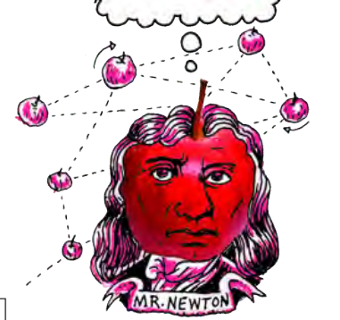
> **[Diagram Context - Textbook_NaturalScience_Gr8_Series-and-parallel-circuits.pdf-0002-03.png]**
> The image features a cartoon depiction of a man's head with a large, red apple on top of it. The man's face is outlined in red, and he is wearing a white shirt. The image also includes a thought bubble above the man's head, which contains a pink apple and a thought bubble with a line connecting the apple to the man's head. The image is labeled "Mr

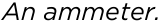

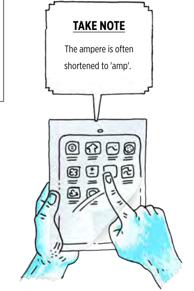
> **[Diagram Context - Textbook_NaturalScience_Gr8_Series-and-parallel-circuits.pdf-0002-07.png]**
> 1. A diagram of a cell with arrows pointing to different parts of the cell.

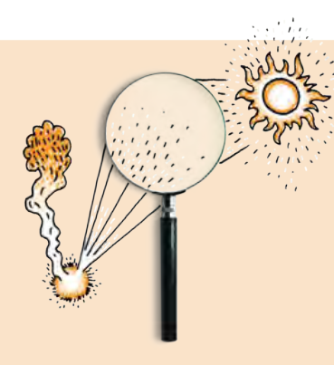
> **[Diagram Context - Textbook_NaturalScience_Gr8_Series-and-parallel-circuits.pdf-0002-10.png]**
> 1. A magnifying glass is being used to look at a diagram of a cell.

> **[Diagram Context - Textbook_NaturalScience_Gr8_Static-electricity.pdf-0002-03.png]**
> 1. A diagram of a cell with a Lewis structure.

> **[Diagram Context - Textbook_NaturalScience_Gr8_Static-electricity.pdf-0002-05.png]**
> The image shows a cartoon depiction of a hot air balloon with a globe on top, floating in the sky. The globe is surrounded by a wire mesh, and there are two people inside the balloon. The balloon is being used as a teaching aid to explain the concept of static electricity to a high school student. The diagram is accompanied by a caption that reads "Visit this video about static electricity to

> **[Diagram Context - Textbook_NaturalScience_Gr8_Static-electricity.pdf-0002-07.png]**
> This graphic illustrates a schematic representation of a double-stranded DNA molecule, characterized by its iconic double helix structure. The diagram uses two intertwined, repeating green ribbons to represent the sugar-phosphate backbones, visually demonstrating the antiparallel nature and complementary base pairing essential for genetic replication and protein synthesis in the Life Sciences curriculum.

> **[Diagram Context - Textbook_NaturalScience_Gr8_Static-electricity.pdf-0002-12.png]**
> A diagram of a cartoon character on a stick holding a sign that says "visit" and a picture of the earth with arrows pointing to different continents.

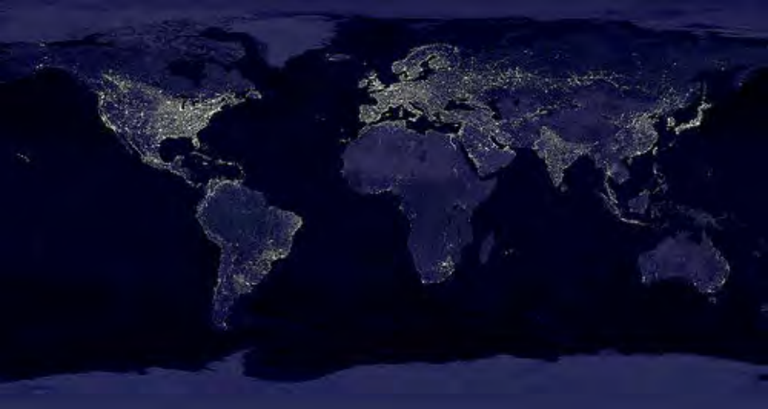
> **[Diagram Context - Textbook_NaturalScience_Gr8_Visible-light.pdf-0002-00.png]**
> This satellite-derived map of the world at night displays global light emissions against a dark background, with no text labels or variables present. It serves as a visual proxy for human population density, urbanisation, and economic development, allowing learners to analyse spatial patterns of human settlement and resource consumption across different continents.

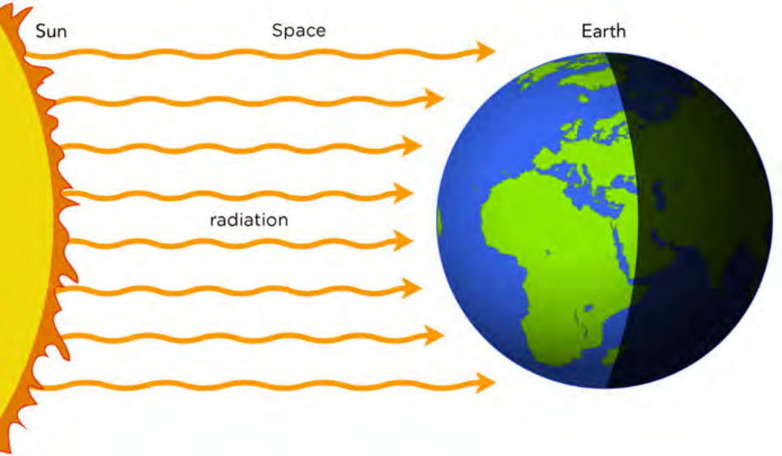
> **[Diagram Context - Textbook_NaturalScience_Gr8_Visible-light.pdf-0002-03.png]**
> This diagram illustrates solar radiation traveling through space to Earth, labeled with the components "Sun," "Space," "Earth," and "radiation." It conceptually demonstrates the transfer of energy from the Sun to the planet, highlighting how incoming solar radiation illuminates one hemisphere while leaving the other in darkness to explain the day-night cycle.

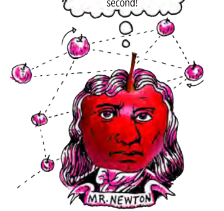
> **[Diagram Context - Textbook_NaturalScience_Gr8_Visible-light.pdf-0002-08.png]**
> This caricature features a portrait of Isaac Newton with an apple-shaped head, surrounded by a network of floating apples connected by dashed lines and directional arrows. It conceptually illustrates the universal law of gravitation by linking the historical figure to the interconnected forces acting between celestial or terrestrial bodies.

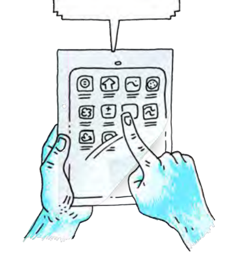
> **[Diagram Context - Textbook_NaturalScience_Gr8_Visible-light.pdf-0002-11.png]**
> This illustration depicts a pair of hands interacting with a tablet interface featuring various icons, including mathematical and scientific symbols like a plus-minus sign and wave functions. It serves as a visual metaphor for digital learning, illustrating how students use ICT (Information and Communication Technology) tools to access, manipulate, and engage with abstract curriculum content in a modern classroom environment.

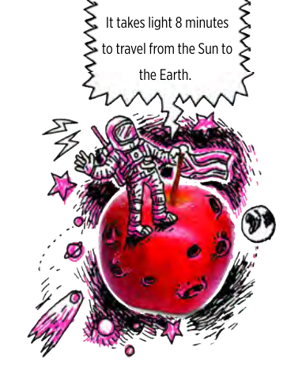
> **[Diagram Context - Textbook_NaturalScience_Gr8_Visible-light.pdf-0002-13.png]**
> This illustrative graphic features an astronaut standing on a cratered, apple-like sphere, surrounded by celestial elements like stars, planets, and a comet. The text bubble explicitly states, "It takes light 8 minutes to travel from the Sun to the Earth." This visual serves as an introductory conceptual aid for Natural Sciences or Physical Sciences, highlighting the finite speed of light and the vast distances within our solar system.

---

### Activity: Constructing and Using a Pinhole Camera

#### Instructions for Assembly
1. **Step 4:** Place the lid between the two pieces and secure them together using tape.
   

2. **Step 5:** Wrap the aluminium foil around the can to ensure no light enters from the sides.
   

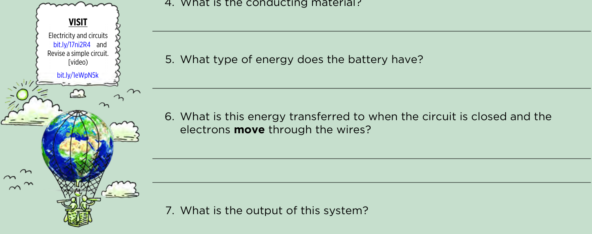
> **[Diagram Context - Textbook_NaturalScience_Gr8_Energy-transfer-in-electrical-systems.pdf-0003-04.png]**
> 1. A cartoon depiction of a hot air balloon.
2. A cartoon depiction of a circuit.
3. A cartoon depiction of a battery.

3. **Step 6:** Use a drawing pin to create a small hole in the exact centre of the metal base of the can.
4. **Step 7:** Take your completed pinhole camera outside.
5. **Step 8:** Point the metal end (with the pinhole) toward an object located in bright sunlight.
6. **Step 9:** Cup your hands around the open end of the tube and look through it.

---

#### Questions
1. What did you see when you looked through the open end of the tube?
2. What happens to the image when you move closer to or further away from an object?

---

#### Scientific Explanation: Why is the image upside down?
When you look through the pinhole camera, you will observe an **inverted (upside down) image**. 

This occurs because light travels in a straight line. Light reflecting off the bottom of an object travels in a straight line through the pinhole and reaches the top of the screen inside the camera. Conversely, light from the top of the object travels in a straight line through the pinhole and reaches the bottom of the screen. 

> **[Diagram Context - Textbook_NaturalScience_Gr8_Energy-transfer-in-electrical-systems.pdf-0003-06.png]**
> 1. A diagram of a cell with a green line representing the cell wall.

---

#### Additional Resources
* **Topic:** Light travels in a straight line.
* **Video Links:** [bit.ly/19n4T7g](http://bit.ly/19n4T7g) and [bit.ly/174q6mx](http://bit.ly/174q6mx)

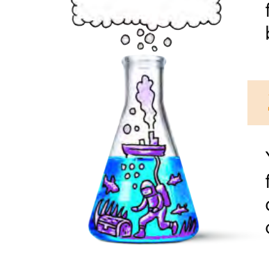
> **[Diagram Context - Textbook_NaturalScience_Gr8_Energy-transfer-in-electrical-systems.pdf-0003-10.png]**
> The image features a cartoon depiction of a person wearing a spacesuit and holding a submarine, with a fish swimming in the submarine. The submarine is filled with water, and there is a cloud of steam coming out of the top of the submarine. The image also includes a text box that reads "Lewis diagram, anatomical/cellular structure, circuit, graph, evolutionary tree, apparatus, geometry figure

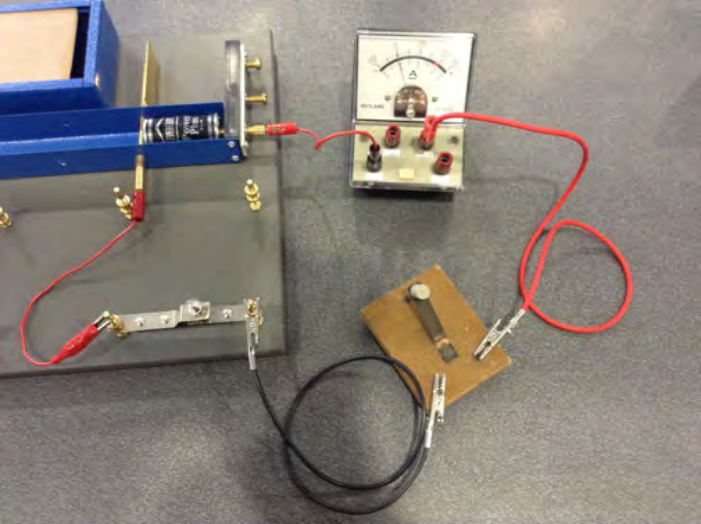
> **[Diagram Context - Textbook_NaturalScience_Gr8_Series-and-parallel-circuits.pdf-0003-09.png]**
> 1. A circuit diagram with a battery, wires, and a multimeter.

> **[Diagram Context - Textbook_NaturalScience_Gr8_Static-electricity.pdf-0003-00.png]**
> 1. A diagram of an atom with the nucleus labeled "proton" and the neutrons labeled "neutron".

> **[Diagram Context - Textbook_NaturalScience_Gr8_Static-electricity.pdf-0003-02.png]**
> 1. A diagram of a cell with a diagram of a cell on it.

> **[Diagram Context - Textbook_NaturalScience_Gr8_Static-electricity.pdf-0003-03.png]**
> The image shows a purple and blue gas cylinder with a blue flame, which is being used to heat a blue liquid in a glass flask. The flask is filled with the blue liquid, and the flask is placed on a table. The image also contains a text that reads "Happy Birthday" and "Happy Birthday" in the bottom right corner.

> **[Diagram Context - Textbook_NaturalScience_Gr8_Static-electricity.pdf-0003-06.png]**
> The image shows a black and white flyer with a quote from a biology teacher. The quote reads, "Take Note. Remember, like charges repeel and opposite charges attract." The flyer also includes a diagram of a cell, which is labeled with the names of its organelles. The text is written in a clear, legible font, and the layout is simple and straightforward.

> **[Diagram Context - Textbook_NaturalScience_Gr8_Static-electricity.pdf-0003-09.png]**
> 1. A diagram of a cell with arrows pointing to different parts of the cell.

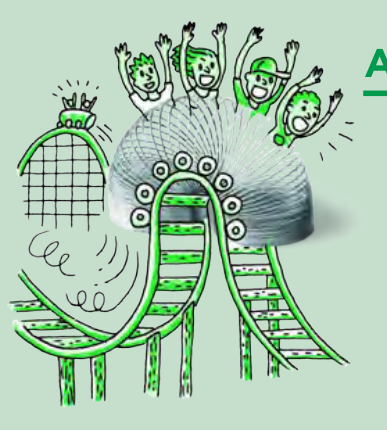
> **[Diagram Context - Textbook_NaturalScience_Gr8_Visible-light.pdf-0003-00.png]**
> This graphic uses a cartoon illustration of a roller coaster to represent the physical principles of mechanical energy. It features a track structure, a coaster car, and passengers, with a superimposed image of a Slinky spring to visually suggest wave-like motion or energy transfer. Conceptually, this diagram serves as an analogy for the conversion between gravitational potential energy and kinetic energy as an object moves along a curved path, a core topic in Grade 10-12 Physical Sciences.

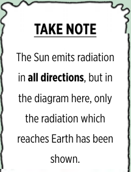
> **[Diagram Context - Textbook_NaturalScience_Gr8_Visible-light.pdf-0003-10.png]**
> This text-based instructional graphic serves as a conceptual note for a diagram illustrating solar radiation. It explicitly references the Sun, Earth, and the concept of radiation, clarifying that the visual representation is a simplified model showing only the portion of energy reaching our planet rather than the Sun's total omnidirectional output.

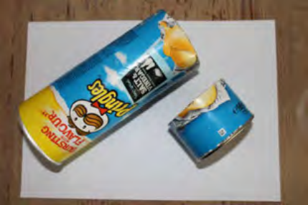
> **[Diagram Context - Textbook_NaturalScience_Gr8_Visible-light.pdf-0003-12.png]**
> This image features two cylindrical Pringles containers of different heights, displaying the brand logo and "Salt & Vinegar" text. In a Mathematics context, this visual serves as a concrete model for exploring the geometry of cylinders, specifically comparing surface area and volume ratios between two objects of the same radius but different heights.

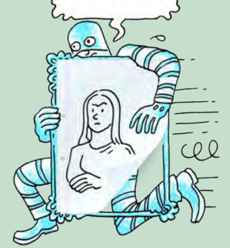
> **[Diagram Context - Textbook_NaturalScience_Gr8_Visible-light.pdf-0003-14.png]**
> This cartoon depicts a burglar in a striped outfit fleeing with a framed portrait of a woman. The image serves as a metaphorical representation of plagiarism or intellectual property theft, illustrating the act of "stealing" someone else's creative work or identity. For high school learners, it conceptually highlights the importance of academic integrity and the ethical consequences of presenting another person's intellectual output as one's own.

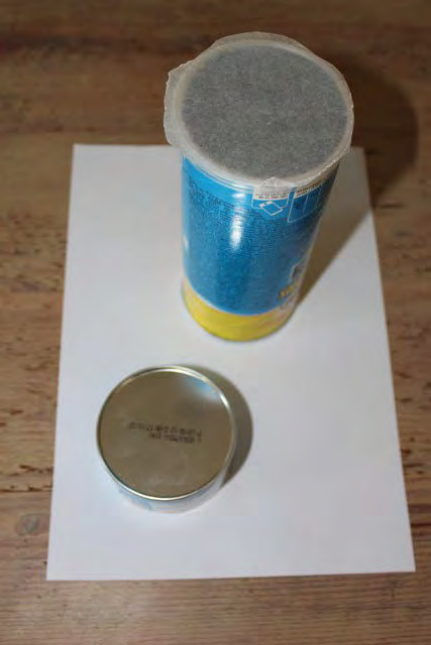
> **[Diagram Context - Textbook_NaturalScience_Gr8_Visible-light.pdf-0003-15.png]**
> This image depicts a physical apparatus consisting of a cylindrical container with a translucent membrane stretched over its opening and a separate metal lid placed on a white surface. It serves as a practical model for demonstrating concepts such as sound wave propagation, resonance, or the function of a tympanic membrane in the human ear. By observing the membrane's response to vibrations, students can visualize how sound energy is transmitted through a medium.

---

### Rectilinear Propagation of Light

#### Pinhole Camera Observations
The pinhole camera demonstrates how light travels. When light from a real object passes through a small pinhole, it forms an image on the opposite screen.

*   **Observation 1:** The image formed is inverted (upside down).
*   **Observation 2:** As the object moves closer to the pinhole, the size of the image on the screen increases.

> **[Diagram Context - Textbook_NaturalScience_Gr8_Energy-transfer-in-electrical-systems.pdf-0004-03.png]**
> 1. A diagram of a roller coaster with a spring coiled up on top.

#### Key Concept: Rectilinear Propagation
The fact that light forms a clear, inverted image through a pinhole proves that light travels in straight lines. This phenomenon is known as the **rectilinear propagation of light**.

#### Ray Diagrams
A ray diagram is a scientific drawing used to represent the path of light. 

*   **Representation:** Light rays are represented by straight lines.
*   **Direction:** Arrowheads are placed on the lines to indicate the direction in which the light is travelling.

***

**Note:** You can explore further applications of these principles by visiting the resource provided: `bit.ly/156mx1y`

> **[Diagram Context - Textbook_NaturalScience_Gr8_Static-electricity.pdf-0004-00.png]**
> 1. A blue comb with a white comb on top.

> **[Diagram Context - Textbook_NaturalScience_Gr8_Static-electricity.pdf-0004-08.png]**
> 1. A diagram of a positive charge and a negative charge.

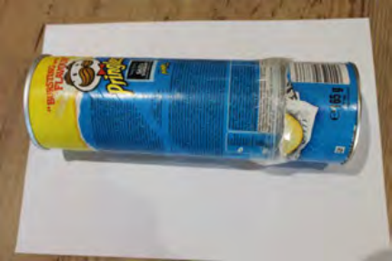
> **[Diagram Context - Textbook_NaturalScience_Gr8_Visible-light.pdf-0004-02.png]**
> This image depicts a Pringles potato chip canister, which serves as a real-world model of a cylinder. The visible labels include the brand name "Pringles," the slogan "Bursting with Flavour," and a barcode, representing the geometric properties of a right circular cylinder. For a high school student, this object provides a tangible example for calculating surface area and volume, helping to bridge the gap between abstract mathematical formulas and physical three-dimensional shapes.

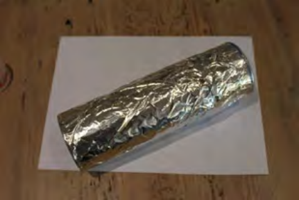
> **[Diagram Context - Textbook_NaturalScience_Gr8_Visible-light.pdf-0004-04.png]**
> This image depicts a cylindrical object wrapped in reflective aluminium foil, placed on a white surface. In the context of the CAPS Physical Sciences curriculum, this apparatus is typically used to demonstrate the principles of thermal radiation, specifically how shiny, metallic surfaces act as poor emitters and good reflectors of infrared radiation compared to dull, black surfaces.

> **[Diagram Context - Textbook_NaturalScience_Gr8_Visible-light.pdf-0004-14.png]**
> This graphic depicts a schematic representation of a DNA molecule, characterized by its iconic double-helix structure with two antiparallel sugar-phosphate backbones. It illustrates the fundamental molecular architecture of genetic material, highlighting the twisted ladder configuration essential for understanding DNA replication and the storage of hereditary information in the CAPS Life Sciences curriculum.

---

### New Vocabulary
*   **Composition:** The nature of something's ingredients or constituents; the way in which a whole or mixture is made up.
*   **Visible spectrum:** The portion of the electromagnetic spectrum that is visible to the human eye.
*   **Dispersion:** The separation of white light into its constituent colours (the visible spectrum).

---

### 4.2 Spectrum of Visible Light

The visible light spectrum consists of the light that the human eye can perceive. While we see the world in colour, white light is actually composed of a range of different colours. These colours are what we observe in a rainbow.

---

### ACTIVITY: Splitting White Light

#### Materials
*   Triangular perspex prism
*   Ray box and power source

#### Instructions
1.  Connect the ray box to the power source. (If a ray box is unavailable, use a piece of cardboard with a thin slit cut into it to create a narrow beam of light).
2.  Place the triangular prism on a white background.
3.  Shine a beam of white light through the side of the prism.

#### Questions
1.  Draw a picture showing what you observe when the light passes through the prism. 

*(Note: You should observe the white light splitting into a band of colours, known as dispersion.)*

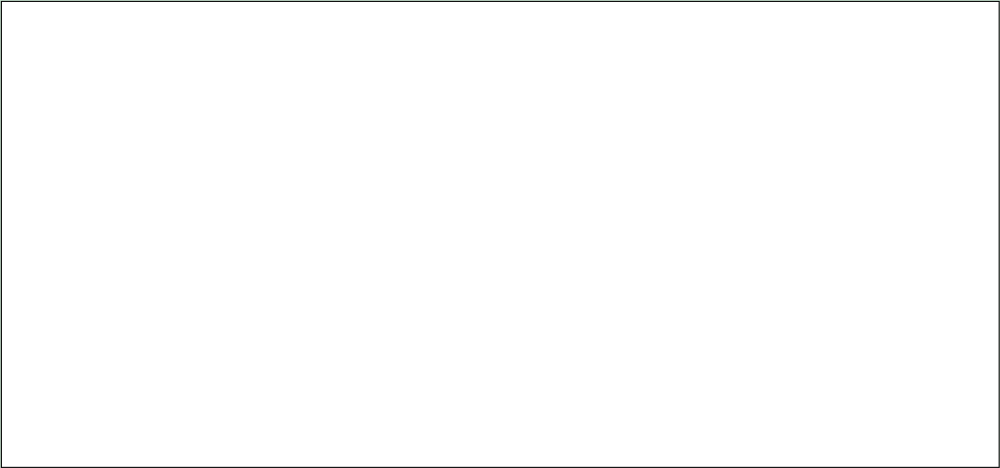

> **[Diagram Context - Textbook_NaturalScience_Gr8_Series-and-parallel-circuits.pdf-0005-05.png]**
> 1. A white rectangle with a gray border.

> **[Diagram Context - Textbook_NaturalScience_Gr8_Static-electricity.pdf-0005-01.png]**
> 1. A cartoon depiction of a roller coaster with a green roller coaster track and a green spring.

> **[Diagram Context - Textbook_NaturalScience_Gr8_Static-electricity.pdf-0005-16.png]**
> A cartoon illustration of a hand holding a stick and a stack of blue plates.

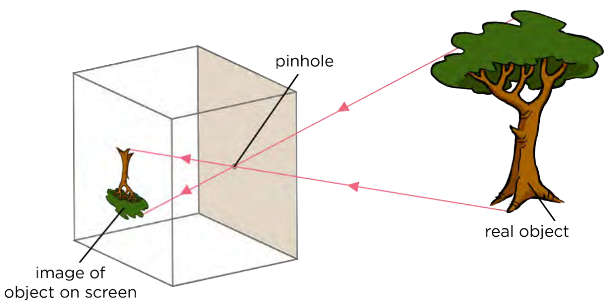
> **[Diagram Context - Textbook_NaturalScience_Gr8_Visible-light.pdf-0005-00.png]**
> This diagram illustrates a pinhole camera apparatus, featuring labels for the "pinhole," "real object" (a tree), and the "image of object on screen," with red arrows indicating the rectilinear propagation of light rays. It conceptually demonstrates how light traveling in straight lines through a small aperture creates an inverted, real image on the opposite side of the box, a fundamental principle in Grade 10 Physical Sciences optics.

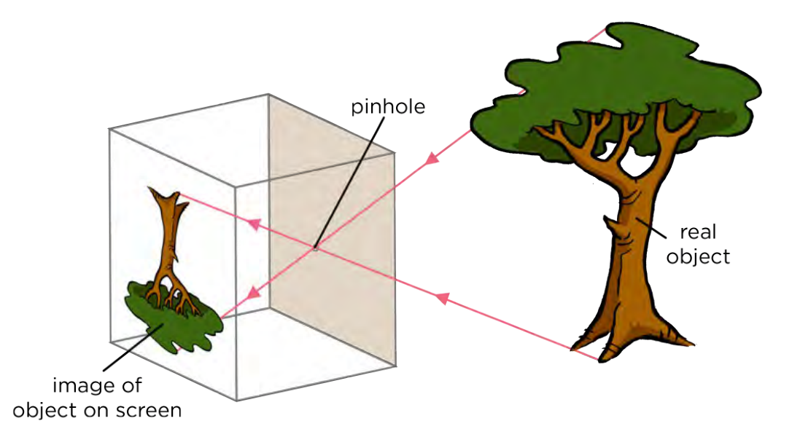
> **[Diagram Context - Textbook_NaturalScience_Gr8_Visible-light.pdf-0005-02.png]**
> This diagram illustrates the principle of a pinhole camera, featuring a real object (a tree), a pinhole, and the resulting image on a screen. Through the use of light rays indicated by arrows, it demonstrates the rectilinear propagation of light, showing how light traveling in straight lines through a small aperture creates an inverted, real image of the object.

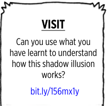
> **[Diagram Context - Textbook_NaturalScience_Gr8_Visible-light.pdf-0005-03.png]**
> This graphic is a text-based prompt containing the heading "VISIT," a question regarding the mechanics of a shadow illusion, and a shortened URL link. It serves as an external pedagogical signpost designed to direct learners toward digital resources that apply theoretical knowledge of light and optics to real-world visual phenomena.

> **[Diagram Context - Textbook_NaturalScience_Gr8_Visible-light.pdf-0005-04.png]**
> This cartoon depicts a large telescope focused on the Earth, featuring human figures operating the equipment and a blank speech bubble above. It serves as a visual metaphor for scientific observation, remote sensing, and the study of Earth systems, encouraging students to consider how technology allows us to monitor and analyze global environmental data.

---

# Energy and Change: Investigation of Light

### Observation and Analysis Exercises

Complete the following questions based on your experimental observations:

**2. Write a description of what you observed.**
*(Space provided for learner response)*

**3. Write down the order in which the colours appear.**
*(Space provided for learner response)*

**4. If you repeat the experiment, does the order of the colours change?**
*(Space provided for learner response)*

**5. What do the different colours we see tell us about the composition of white light?**
*(Space provided for learner response)*

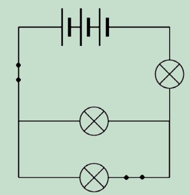
> **[Diagram Context - Textbook_NaturalScience_Gr8_Energy-transfer-in-electrical-systems.pdf-0006-02.png]**
> 1. A black and white diagram of a circuit with three circles and two lines.

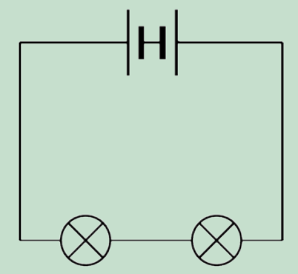
> **[Diagram Context - Textbook_NaturalScience_Gr8_Energy-transfer-in-electrical-systems.pdf-0006-04.png]**
> 1. A Lewis diagram with two black circles and an arrow pointing from one circle to the other.

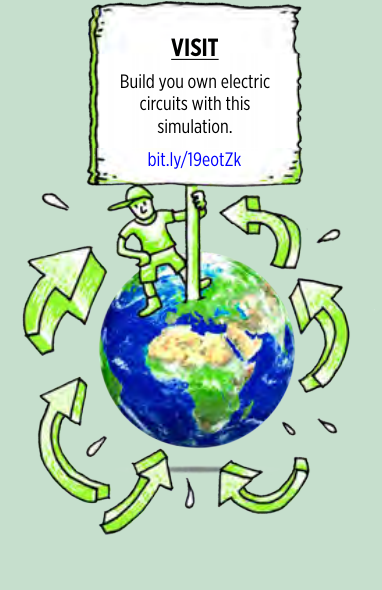
> **[Diagram Context - Textbook_NaturalScience_Gr8_Energy-transfer-in-electrical-systems.pdf-0006-06.png]**
> The image features a cartoon depiction of a boy standing on a pole, holding a sign that reads "visit". The boy is wearing a hat and is surrounded by various arrows and arrows pointing in different directions. The boy is positioned in the center of the image, with the sign placed on the right side. The background of the image is a light green color, and the boy is standing on

> **[Diagram Context - Textbook_NaturalScience_Gr8_Energy-transfer-in-electrical-systems.pdf-0006-08.png]**
> This graphic depicts a schematic representation of a DNA molecule, illustrating its characteristic double-helix structure formed by two antiparallel sugar-phosphate backbones. It visually reinforces the concept of complementary base pairing and the helical coiling essential for understanding DNA replication and protein synthesis within the Life Sciences curriculum.

> **[Diagram Context - Textbook_NaturalScience_Gr8_Series-and-parallel-circuits.pdf-0006-07.png]**
> The image shows a gray line with a zipper running down the middle. The zipper is white on the left side and orange on the right side. The line is drawn in a straight line, and there are no other objects or text in the image. The line is the only object in the image, and it is the main focus.

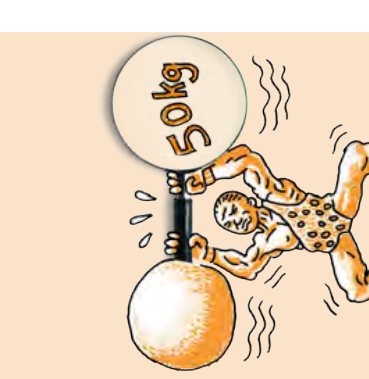
> **[Diagram Context - Textbook_NaturalScience_Gr8_Series-and-parallel-circuits.pdf-0006-12.png]**
> The image features a cartoon illustration of a man lifting a ball with a weight. The man is depicted in a dynamic pose, with his arms and legs extended, as if he is lifting the ball. The weight is a large orange ball, and the man is holding it with a black handle. The image also includes a text that reads "5 kg", which is a unit of weight.

> **[Diagram Context - Textbook_NaturalScience_Gr8_Static-electricity.pdf-0006-03.png]**
> 1. A diagram of a snake's body.

> **[Diagram Context - Textbook_NaturalScience_Gr8_Static-electricity.pdf-0006-14.png]**
> The image shows a cartoon depiction of a globe and a telescope. The globe is green and blue, and the telescope is green. The globe is positioned in the center of the image, with a person standing next to it. The telescope is located to the left of the globe. The caption below the image reads "Visit" and "Discover more with a simulation rubbing balloons and a jersey."

> **[Diagram Context - Textbook_NaturalScience_Gr8_Static-electricity.pdf-0006-15.png]**
> The image features a cartoon depiction of a man holding a globe in his hands. The globe is green and white, and the man is wearing a green shirt and green pants. The man is pointing to the globe, and there is a speech bubble above him that reads "Visit".

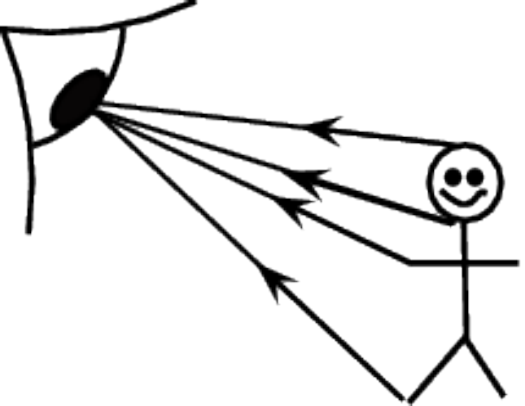
> **[Diagram Context - Textbook_NaturalScience_Gr8_Visible-light.pdf-0006-00.png]**
> This diagram illustrates the physics of vision, showing a human eye observing a person through light rays represented by straight lines with directional arrows. It demonstrates the concept that we see objects because light reflects off them and travels toward the eye, serving as a foundational model for understanding the rectilinear propagation of light in the Natural Sciences curriculum.

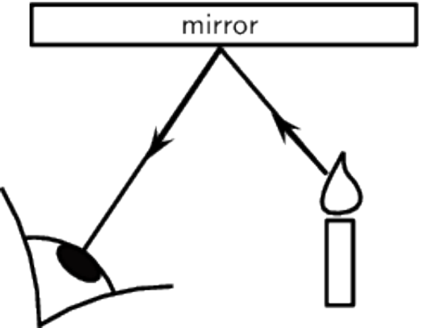
> **[Diagram Context - Textbook_NaturalScience_Gr8_Visible-light.pdf-0006-01.png]**
> This ray diagram illustrates the reflection of light from a plane mirror, featuring a candle as the object, a mirror, and an eye observing the reflected light. Arrows on the light rays indicate the direction of travel from the candle to the mirror and then to the observer's eye. This visual demonstrates the law of reflection, showing how light rays originating from an object bounce off a surface to allow for human vision.

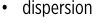

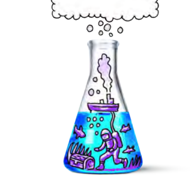
> **[Diagram Context - Textbook_NaturalScience_Gr8_Visible-light.pdf-0006-08.png]**
> This illustration depicts an Erlenmeyer flask containing a miniature underwater scene, featuring a diver, a treasure chest, fish, a surface ship, and rising bubbles leading to an empty thought bubble. The image serves as a creative metaphor for scientific inquiry and the "depths" of discovery, encouraging students to explore the hidden complexities within chemical systems or biological environments.

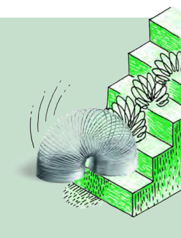
> **[Diagram Context - Textbook_NaturalScience_Gr8_Visible-light.pdf-0006-16.png]**
> This diagram illustrates a slinky toy moving down a set of stairs, depicted through a series of overlapping sketches and motion lines. It conceptually demonstrates the physics of wave propagation and periodic motion, helping learners visualize how energy is transferred through a medium as the coil undergoes successive compressions and extensions.

---

### Properties of Visible Light

Light radiates from luminous objects and travels in straight lines. White light is composed of seven distinct colours that make up the visible spectrum. When these seven colours travel together, our eyes perceive them as white light.

#### The Visible Spectrum
The seven colours of the visible spectrum are:
1. Red
2. Orange
3. Yellow
4. Green
5. Blue
6. Indigo
7. Violet

> **TAKE NOTE:** You can use the abbreviation **ROYGBIV** to remember the order of the colours.

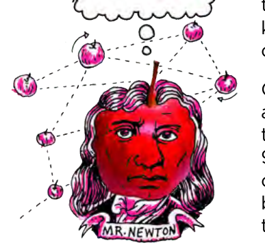
> **[Diagram Context - Textbook_NaturalScience_Gr8_Energy-transfer-in-electrical-systems.pdf-0007-05.png]**
> The image features a cartoon illustration of a man's head with a large red apple on his forehead. The man is wearing a top hat and a bow tie, and the apple is connected to a network of lines and arrows, suggesting a complex system or network. The image also includes a thought bubble with a cloud and a thought bubble with a line of thought bubbles, indicating a brainstorming session or

Each colour in the spectrum has a unique wavelength and frequency.

#### Primary Colours of Light
When light colours combine, they can form white light. 

> **TAKE NOTE:** The primary colours of light are **red**, **green**, and **blue**.

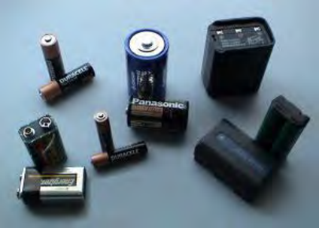
> **[Diagram Context - Textbook_NaturalScience_Gr8_Energy-transfer-in-electrical-systems.pdf-0007-07.png]**
> 1. A panasonic battery.

---

### ACTIVITY: Colour Spinning Wheels

**Materials Needed:**
* White cardboard
* Coloured pens or pencils (red, orange, yellow, green, blue, indigo, violet)
* String
* Scissors
* A round object (to use as a template)

**Instructions:**
1. Use the round object to trace a circle onto the white cardboard.
2. Cut out the circle using the scissors.

> **[Diagram Context - Textbook_NaturalScience_Gr8_Energy-transfer-in-electrical-systems.pdf-0007-10.png]**
> 1. A diagram of a spring is shown with a green staircase.

> **[Diagram Context - Textbook_NaturalScience_Gr8_Static-electricity.pdf-0007-01.png]**
> The image shows a white sign with black text that reads "New Words - Flammable - Ignite". The sign also includes a diagram of a flame and a diagram of a cell. The text is written in a clear, easy-to-read font, and the diagrams are simple and straightforward. The sign is designed to help students understand the concept of flammability and how it relates

> **[Diagram Context - Textbook_NaturalScience_Gr8_Static-electricity.pdf-0007-02.png]**
> The image shows a cartoon depiction of a South African CAPS student learning about the human body. The scene is set in a laboratory, with a large glass beaker containing a blue liquid and a purple fish swimming inside. The fish is depicted as a person wearing a white and blue striped shirt, holding a blue and white striped pole. The beaker is labeled with the word "S" and

> **[Diagram Context - Textbook_NaturalScience_Gr8_Static-electricity.pdf-0007-05.png]**
> A video showing the dangers of static electricity at a petrol station.

> **[Diagram Context - Textbook_NaturalScience_Gr8_Static-electricity.pdf-0007-07.png]**
> 1. A diagram of a circuit with three spheres and a lightning bolt.

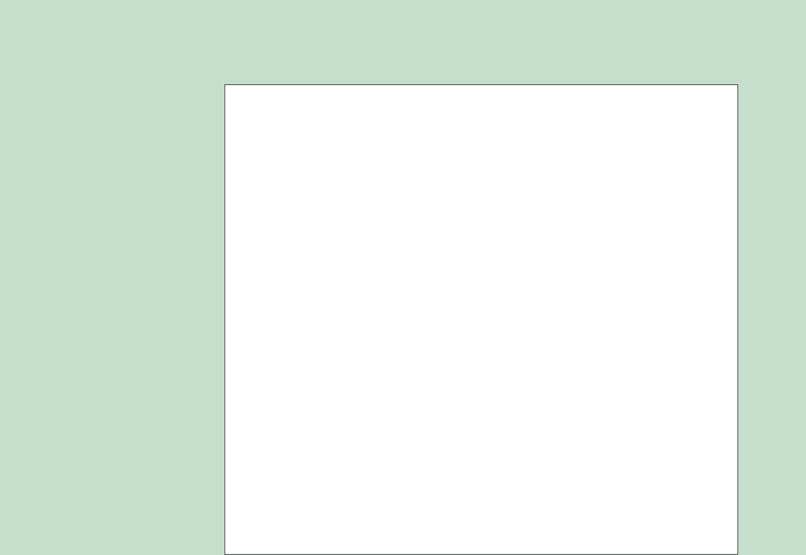
> **[Diagram Context - Textbook_NaturalScience_Gr8_Visible-light.pdf-0007-00.png]**
> The provided image is a blank white square set against a light green background, containing no visual content, labels, variables, or structures. Consequently, it conveys no conceptual information and cannot be used to support any learning objectives within the CAPS curriculum.

> **[Diagram Context - Textbook_NaturalScience_Gr8_Visible-light.pdf-0007-05.png]**
> This graphic depicts a stylized, repeating biological structure resembling a double-stranded DNA molecule or a similar helical polymer chain. The image consists of two intertwined, ribbon-like strands marked with small, repeating dots that represent nucleotide bases or subunits. It conceptually illustrates the fundamental helical architecture of genetic material, helping learners visualize the double-helix structure essential for understanding DNA replication and protein synthesis.

---

### Activity: Creating a Colour Spinner

This activity demonstrates how the human eye perceives the combination of colours when they are spun rapidly.

#### Instructions

1.  **Divide the Circle:** Divide your circle into 7 equal segments. If you do not have indigo and violet colours, you may use one purple pen or crayon to represent both.
2.  **Colouring:** Shade each segment a different colour in the following order:
    *   Red
    *   Orange
    *   Yellow
    *   Green
    *   Blue
    *   Indigo
    *   Violet (or Purple)

3.  **Prepare the Spinner:** Make two holes in the circle, one on either side of the centre point.
4.  **Threading:** Thread a piece of string through the two holes and tie the ends together to form a loop.

> **[Diagram Context - Textbook_NaturalScience_Gr8_Energy-transfer-in-electrical-systems.pdf-0008-02.png]**
> 1. A diagram of a snake's body.
 2. The snake's body is made up of many small lines.
 3. The snake's body is green and gray.

5.  **Operation:** 
    *   Hold the ends of the loop in each hand.
    *   Twirl the string over, similar to the motion of a skipping rope, so that the string begins to twist.
    *   Once the string is tightly twisted, pull your hands apart, then bring them back together.
    *   Repeat this motion to keep the circle spinning.

6.  **Observation:** What do you observe about the colour of the wheel as it spins faster?
    ___________________________________________________________________________
    ___________________________________________________________________________

***

### Did You Know?
*   **Primary Colours of Paint:** Artists use red, yellow, and blue as primary colours because these pigments cannot be created by mixing other pigments.
*   **Primary Colours of Light:** In printing and light physics, the primary colours are magenta, yellow, and cyan.
*   **Pink Light:** There is no such thing as "pink light" in the visible spectrum. Pink is a result of how our brains interpret a mixture of red and violet light.

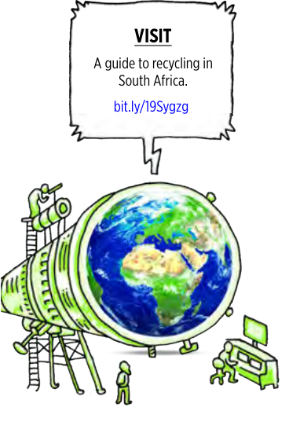
> **[Diagram Context - Textbook_NaturalScience_Gr8_Energy-transfer-in-electrical-systems.pdf-0008-07.png]**
> The image is a cartoon that depicts a man and a woman standing in front of a large telescope. The man is holding a telescope, and the woman is holding a globe. The globe is a representation of the Earth, and the man is holding a telescope that is pointing towards the Earth. The image also includes text that reads "Visit" and "A guide to recycling in South Africa."

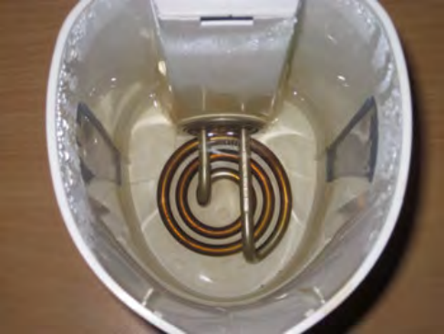
> **[Diagram Context - Textbook_NaturalScience_Gr8_Energy-transfer-in-electrical-systems.pdf-0008-11.png]**
> 1. A diagram of a water heater with a heating element inside.

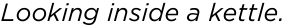

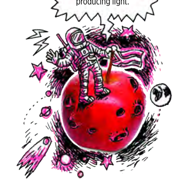
> **[Diagram Context - Textbook_NaturalScience_Gr8_Energy-transfer-in-electrical-systems.pdf-0008-17.png]**
> 1. A cartoon drawing of an astronaut on a red apple.
 2. A speech bubble with the text "producing light".
 3. A space scene with planets and stars.

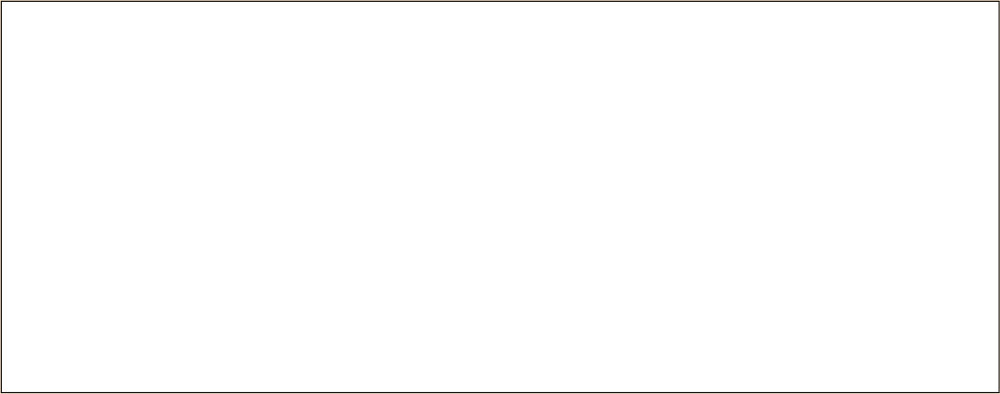

> **[Diagram Context - Textbook_NaturalScience_Gr8_Series-and-parallel-circuits.pdf-0008-09.png]**
> The image shows a gray line with a zipper running down the middle. The zipper is white with a yellow stripe running down the middle. The line is drawn in a straight line, and there is no text present. The image does not contain any other objects or elements.

> **[Diagram Context - Textbook_NaturalScience_Gr8_Static-electricity.pdf-0008-00.png]**
> The image shows a dark sky with three bright lightning bolts. The first lightning bolt is located in the top left corner, the second one is in the top right corner, and the third one is in the bottom right corner. The lightning bolts are accompanied by a dark cloud in the background, creating a dramatic and intense scene.

> **[Diagram Context - Textbook_NaturalScience_Gr8_Static-electricity.pdf-0008-10.png]**
> 1. A cartoon depiction of a man's head with a red apple on top.

> **[Diagram Context - Textbook_NaturalScience_Gr8_Static-electricity.pdf-0008-11.png]**
> 1. A diagram of a spring coiled around a wire.

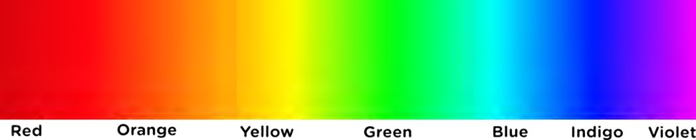
> **[Diagram Context - Textbook_NaturalScience_Gr8_Visible-light.pdf-0008-02.png]**
> This graphic displays the visible light spectrum, labeled with the sequence of colours: Red, Orange, Yellow, Green, Blue, Indigo, and Violet. It conceptually illustrates the continuous range of wavelengths that make up white light, serving as a foundational reference for understanding dispersion, refraction, and the electromagnetic spectrum in Physical Sciences.

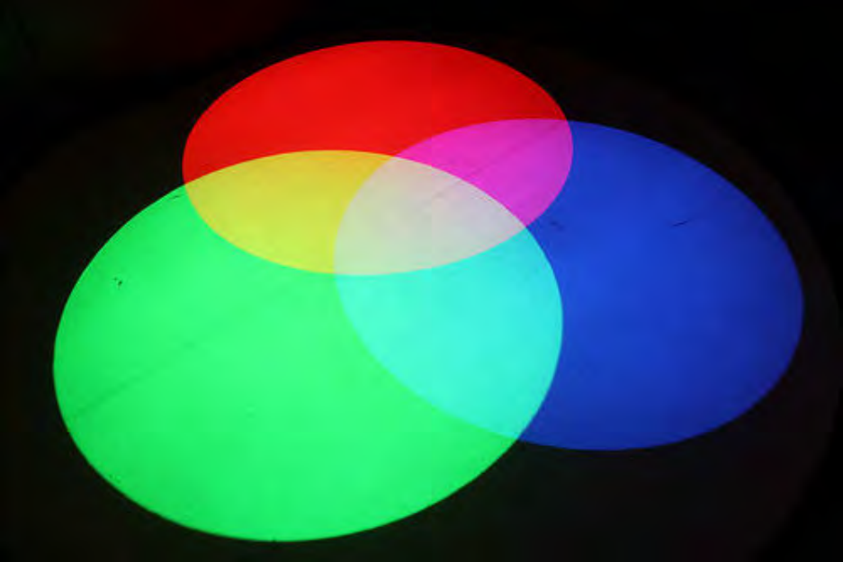
> **[Diagram Context - Textbook_NaturalScience_Gr8_Visible-light.pdf-0008-03.png]**
> This image is a Venn diagram illustrating the additive primary colours of light: red, green, and blue. It demonstrates how these primary colours overlap to produce secondary colours (yellow, magenta, and cyan) and white light at the central intersection. This visual serves as a fundamental model for understanding light physics and colour synthesis in the Physical Sciences curriculum.

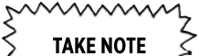
> **[Diagram Context - Textbook_NaturalScience_Gr8_Visible-light.pdf-0008-12.png]**
> This graphic is a text-based pedagogical signifier featuring the bolded words "TAKE NOTE" enclosed within a jagged, starburst-shaped border. In the context of CAPS curriculum materials, this visual cue serves as a high-priority alert to draw the learner's attention to essential concepts, critical definitions, or common misconceptions that require focused study.

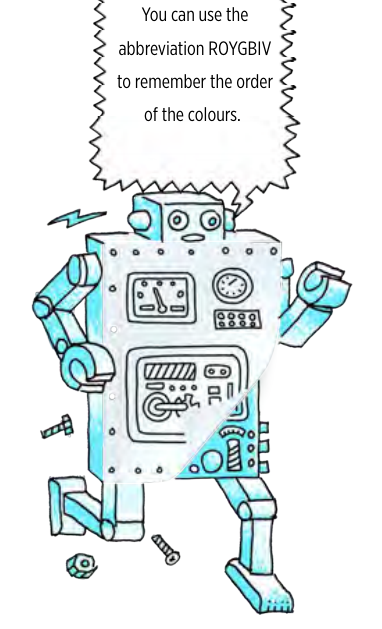
> **[Diagram Context - Textbook_NaturalScience_Gr8_Visible-light.pdf-0008-13.png]**
> This graphic features a cartoon robot illustration accompanied by a speech bubble containing the mnemonic "ROYGBIV." It serves as a pedagogical memory aid for Grade 10 Physical Sciences learners to recall the sequence of colours in the visible light spectrum: Red, Orange, Yellow, Green, Blue, Indigo, and Violet.

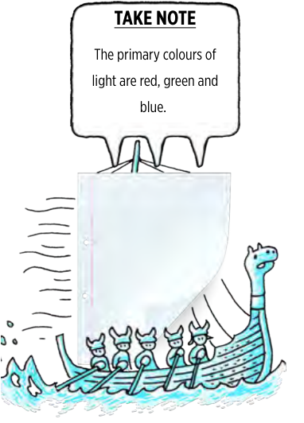
> **[Diagram Context - Textbook_NaturalScience_Gr8_Visible-light.pdf-0008-14.png]**
> This graphic uses a cartoon illustration of a Viking ship to present a "TAKE NOTE" text box containing the statement: "The primary colours of light are red, green and blue." It serves as a mnemonic or visual anchor to help learners memorise the fundamental additive primary colours of light as defined in the Natural Sciences curriculum.

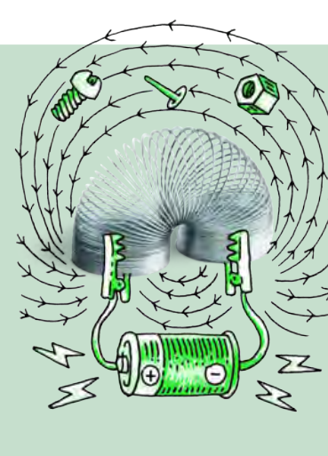
> **[Diagram Context - Textbook_NaturalScience_Gr8_Visible-light.pdf-0008-15.png]**
> This diagram illustrates an electromagnet consisting of a coiled wire (solenoid) connected to a battery with positive (+) and negative (-) terminals, surrounded by magnetic field lines indicated by directional arrows. It demonstrates the principle of electromagnetism, showing how an electric current flowing through a coil generates a magnetic field capable of attracting ferromagnetic objects like the depicted screw, nail, and nut.

---

# The Visible Light Spectrum and Wave Properties

## 1. Electromagnetic Waves
Light travels in the form of **electromagnetic waves**. Humans can only perceive light within a specific range of wavelengths, known as the **visible light spectrum**.

## 2. Defining Wavelength
A **wavelength** is the physical distance between two corresponding points on two consecutive waves. 
*   **Measurement:** It is typically measured from one **peak** (crest) to the next peak, or from one **trough** to the next trough.

> **[Diagram Context - Textbook_NaturalScience_Gr8_Energy-transfer-in-electrical-systems.pdf-0009-00.png]**
> 1. A green spring with a white cord attached to it.
 2. A green battery with a white cord attached to it.
 3. A green spring with a white cord attached to it.

## 3. Comparing Wavelengths
Different colours of visible light possess different wavelengths:
*   **Long wavelengths:** Associated with colours like red and orange.
*   **Short wavelengths:** Associated with colours like blue, indigo, and violet.

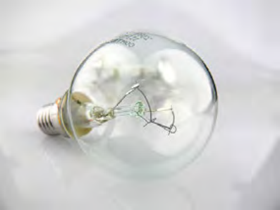
> **[Diagram Context - Textbook_NaturalScience_Gr8_Energy-transfer-in-electrical-systems.pdf-0009-02.png]**
> 1. A lightbulb with a green light inside.

## 4. Frequency
Frequency refers to how often a wave cycle repeats. There is an inverse relationship between wavelength and frequency:
*   **Long wavelength** = **Low frequency**
*   **Short wavelength** = **High frequency**

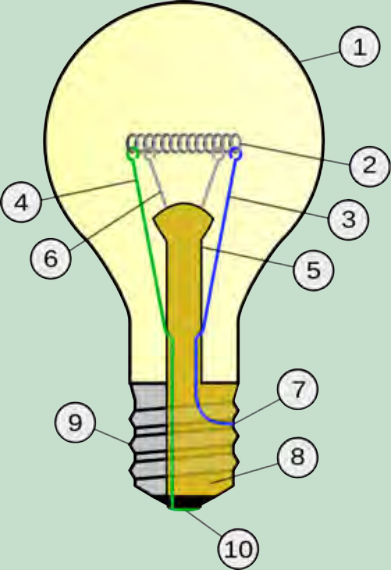
> **[Diagram Context - Textbook_NaturalScience_Gr8_Energy-transfer-in-electrical-systems.pdf-0009-13.png]**
> 1. A diagram of a light bulb with the following labels: 1, 2, 3, 4, 5, 6, 7, 8, 9, 10.

### Summary Table: Visible Light Characteristics

| Colour Range | Wavelength | Frequency |
| :--- | :--- | :--- |
| Red / Orange | Longest | Lowest |
| Blue / Indigo / Violet | Shortest | Highest |

***

### Did You Know?
*   **Scale of Wavelengths:** Wavelengths can be as small as one billionth of a meter (gamma rays) or as long as several meters (radio waves).
*   **Practical Application:** In police forensics, ultraviolet (UV) light is used in conjunction with special powders to detect fingerprints and shoe prints to assist in solving crimes.

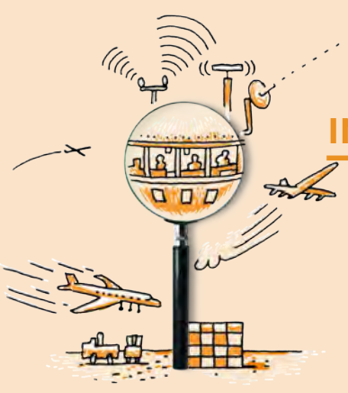
> **[Diagram Context - Textbook_NaturalScience_Gr8_Series-and-parallel-circuits.pdf-0009-00.png]**
> 1. A diagram of a cell with a diagram of a cell and a diagram of a cell with a diagram of a cell and a diagram of a cell with a diagram of a cell and a diagram of a cell with a diagram of a cell and a diagram of a cell with a diagram of a cell and a diagram of a cell with a diagram of a cell and a diagram of a cell

> **[Diagram Context - Textbook_NaturalScience_Gr8_Static-electricity.pdf-0009-02.png]**
> The image is a cartoon drawing of a group of people standing around a large telescope. The people are positioned in front of a globe, which is the main focus of the drawing. The drawing also includes a diagram of a cell, a Lewis diagram, and a circuit. The text "Vega" is also present in the image.

> **[Diagram Context - Textbook_NaturalScience_Gr8_Static-electricity.pdf-0009-09.png]**
> 1. A diagram of a circuit with a lightning rod and a lightning bolt.

> **[Diagram Context - Textbook_NaturalScience_Gr8_Static-electricity.pdf-0009-10.png]**
> 1. A cartoon drawing of an astronaut on a red planet.
 2. A speech bubble with the text "Princeton University."
 3. A red apple with a stem.

> **[Diagram Context - Textbook_NaturalScience_Gr8_Static-electricity.pdf-0009-15.png]**
> The image features a cartoon depiction of a man holding a globe in his arms. The man is wearing a green shirt and white pants, and he is pointing to the globe with his left hand. The globe is green and blue, and it is the central focus of the image. The man's actions and the globe's colors convey a sense of exploration and discovery.

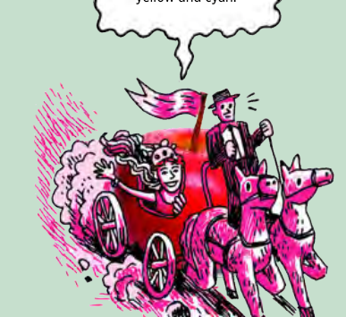
> **[Diagram Context - Textbook_NaturalScience_Gr8_Visible-light.pdf-0009-05.png]**
> This illustration is a metaphorical cartoon depicting a person driving a carriage shaped like a red apple, accompanied by a speech bubble referencing "yellow and cyan." It serves as a visual mnemonic or conceptual aid for understanding the subtractive primary colours (magenta, yellow, and cyan) used in pigment-based colour mixing. By associating these specific hues with the vibrant, stylized imagery, the graphic helps learners memorise the components of the CMY colour model relevant to the Natural Sciences curriculum.

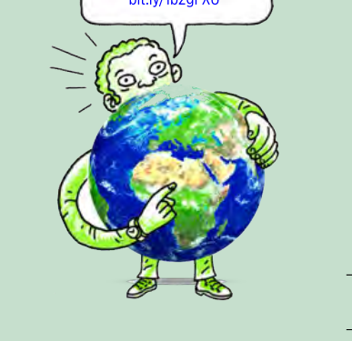
> **[Diagram Context - Textbook_NaturalScience_Gr8_Visible-light.pdf-0009-07.png]**
> This cartoon depicts a human figure interacting with a globe, featuring a speech bubble containing a URL. It serves as a visual metaphor for global citizenship, environmental awareness, or geographical study, encouraging students to engage with the interconnected nature of Earth's systems and human impact on the planet.

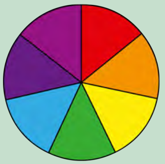
> **[Diagram Context - Textbook_NaturalScience_Gr8_Visible-light.pdf-0009-08.png]**
> This graphic is a colour wheel divided into seven distinct sectors representing the visible spectrum of light: red, orange, yellow, green, blue, indigo, and violet. It serves as a foundational visual aid for learners to understand the dispersion of white light into its constituent colours, illustrating the sequential order of wavelengths within the electromagnetic spectrum.

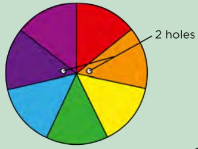
> **[Diagram Context - Textbook_NaturalScience_Gr8_Visible-light.pdf-0009-10.png]**
> This diagram depicts a Newton’s colour disc divided into seven sectors representing the visible spectrum, featuring two central holes used for mounting the disc to a spinning apparatus. It illustrates the principle of additive colour mixing, demonstrating how rapid rotation causes the human eye to perceive the combined spectral colours as white light.

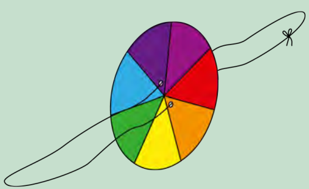
> **[Diagram Context - Textbook_NaturalScience_Gr8_Visible-light.pdf-0009-12.png]**
> This diagram illustrates a Newton’s colour disc, featuring a circular wheel divided into seven segments representing the spectral colours (red, orange, yellow, green, blue, indigo, and violet) with a string mechanism attached for spinning. It demonstrates the principle of additive colour mixing, showing how rapid rotation causes the human eye to perceive the combined spectral colours as white light, thereby proving that white light is composed of the visible spectrum.

> **[Diagram Context - Textbook_NaturalScience_Gr8_Visible-light.pdf-0009-15.png]**
> This graphic illustrates a schematic representation of a double-stranded DNA molecule, featuring the characteristic double helix structure with repeating sugar-phosphate backbones and internal base-pairing rungs. It conceptually demonstrates the antiparallel nature and helical geometry of the DNA molecule, serving as a foundational visual for understanding genetic material in Life Sciences.

---

### The Visible Spectrum
Visible light consists of wavelengths between $400$ and $700$ billionths of a meter. This range is known as the **visible spectrum**. Light waves exist outside this range as well, such as ultraviolet light (shorter wavelengths) and infrared light (longer wavelengths).

---

### 4.3 Opaque and Transparent Substances

When light strikes a surface, one of three things happens:
1. **Reflected:** The light bounces off the surface.
2. **Absorbed:** The light is taken in by the material.
3. **Transmitted:** The light passes through the material.

#### Key Definitions
*   **Transparent:** A material that allows most light to be transmitted through it (e.g., glass).
*   **Opaque:** A material that is not transparent; it does not allow light to pass through.
*   **Translucent:** A material that allows some light to pass through but scatters it.
*   **Transmit:** To allow light to pass through a medium.

---

### ACTIVITY: Shadow Play

**Materials:**
*   Cardboard
*   Clear plastic
*   Plastic shopping bag
*   Scissors
*   Light source (ray box or light bulb)

**Instructions:**
1.  Cut out three shapes from your cardboard. The shapes should be similar in design but in three different sizes: small, medium, and large.
2.  Switch on the light source.
3.  Hold your first shape a short distance in front of the light source.
4.  Observe the shadow that forms and record your observations.
5.  Repeat the process for the second shape, keeping it at the same distance from the light source. Record your observations.
6.  Repeat the process for the third shape, keeping it at the same distance from the light source. Record your observations.

**Observation Note:**
The shadow is always formed on the side furthest from the light source and appears dark.

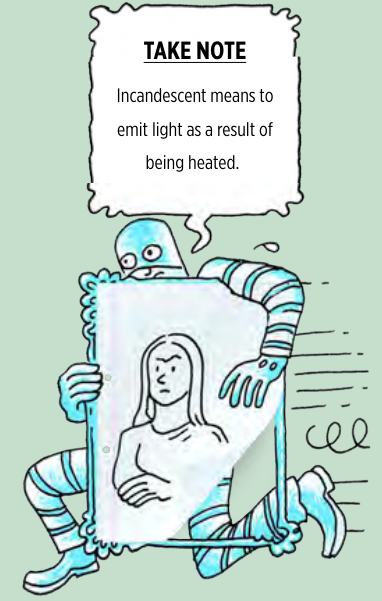

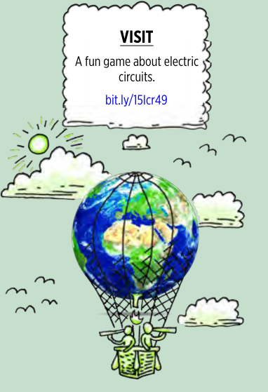

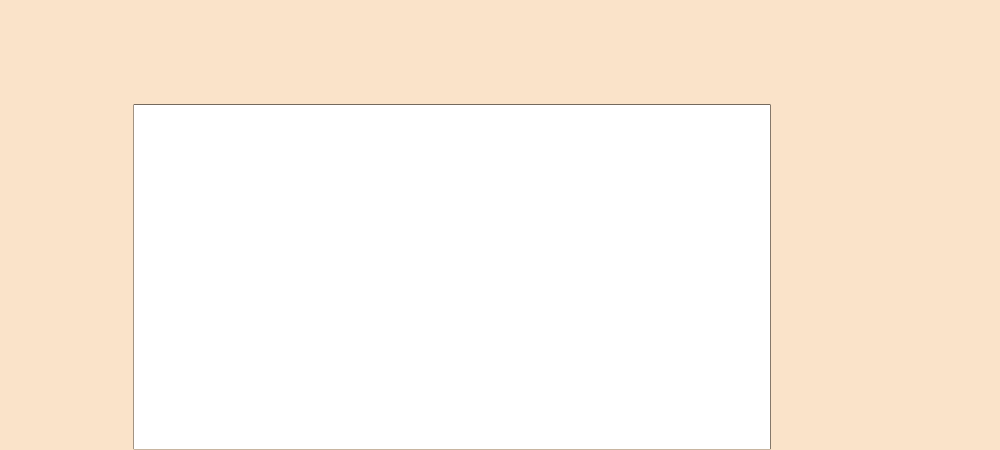

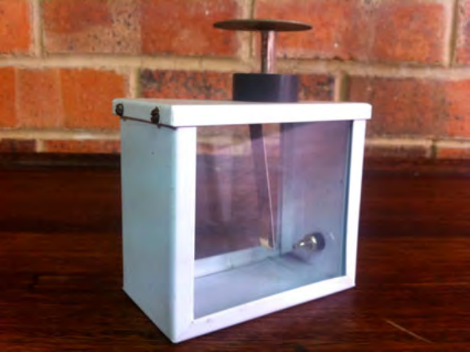

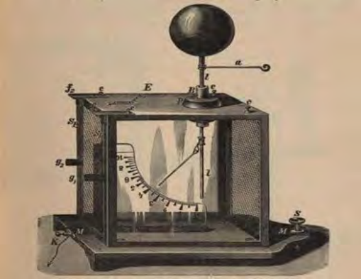

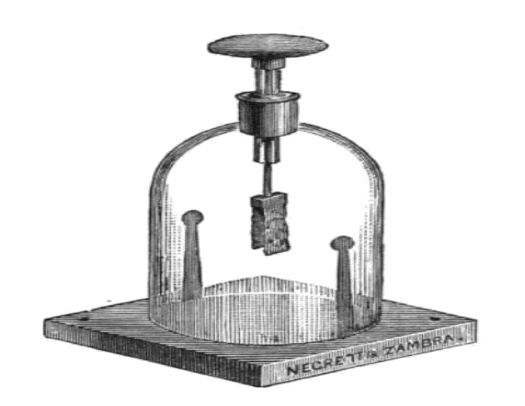

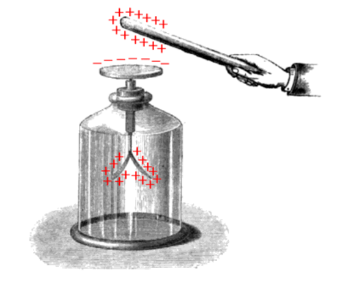

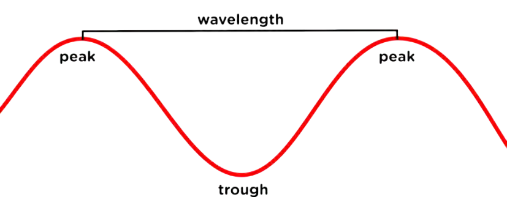

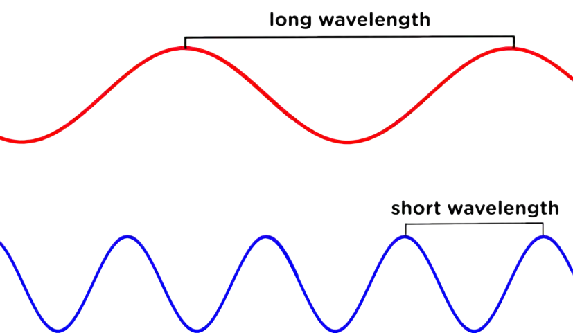

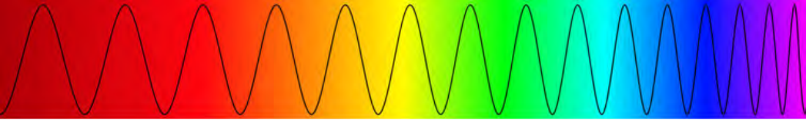

---

### Investigation: Light and Materials

#### Instructions
10. Use your first cardboard shape as a template and cut the same shape from the clear plastic and the plastic shopping bag.
11. Hold the clear plastic shape the same distance from the light source. Write down your observations.
12. Hold the plastic shopping bag shape the same distance from the light source. Write down your observations.

---

### Questions

**1. When you held the cardboard up to the light, did it allow light to pass through it? How do you know this?**
*Space for learner response:* _________________________________________________

**2. Is the cardboard shape opaque or transparent?**
*Space for learner response:* _________________________________________________

**3. What did you notice about the shadows formed by the different size cardboard shapes?**
*Space for learner response:* _________________________________________________

**4. Draw a diagram to show how the shadow is formed behind the opaque shape. Use straight lines with arrowheads to represent the rays of light.**

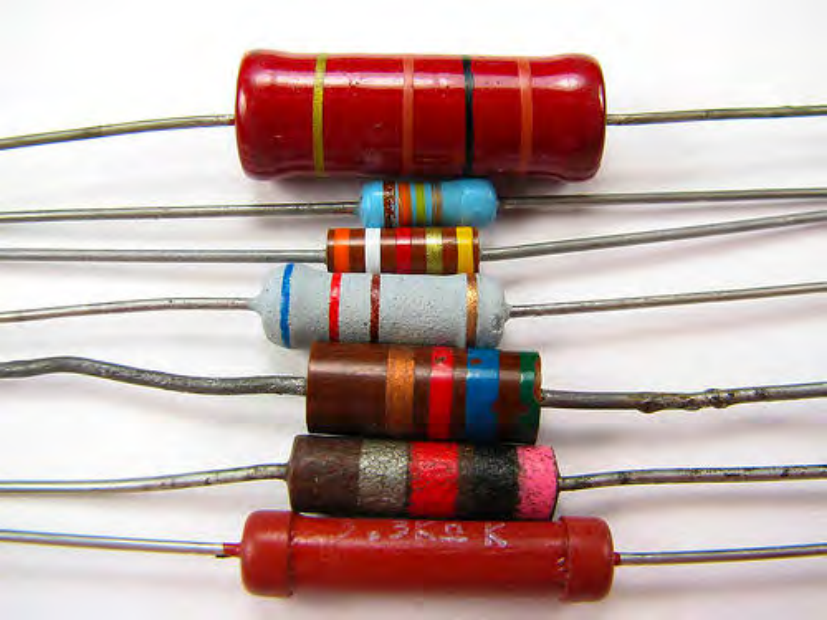
> **[Diagram Context - Textbook_NaturalScience_Gr8_Energy-transfer-in-electrical-systems.pdf-0011-01.png]**
> 1. A red and white circuit board with a variety of colored resistors on it.

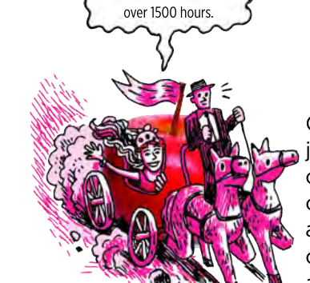
> **[Diagram Context - Textbook_NaturalScience_Gr8_Energy-transfer-in-electrical-systems.pdf-0011-04.png]**
> The image features a cartoon illustration of a man and a woman riding in a carriage pulled by two horses. The carriage is designed to resemble a red apple, and the man is holding a flag. The woman is wearing a hat and a scarf. The image also includes text that reads "Over 1500 hours. Go!".

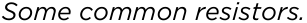

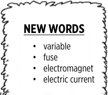
> **[Diagram Context - Textbook_NaturalScience_Gr8_Energy-transfer-in-electrical-systems.pdf-0011-08.png]**
> 1. A diagram of a cell with a variable fusion.

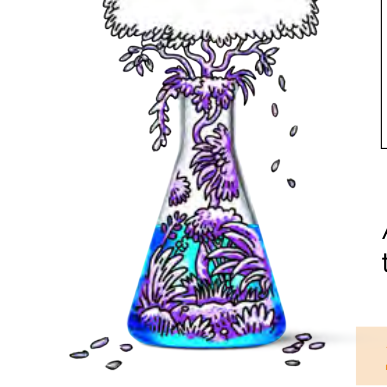
> **[Diagram Context - Textbook_NaturalScience_Gr8_Energy-transfer-in-electrical-systems.pdf-0011-09.png]**
> 1. A cartoon drawing of a plant growing out of a vase.
 2. The plant is purple and green.
 3. The vase is blue.
 4. The plant is growing out of the vase.

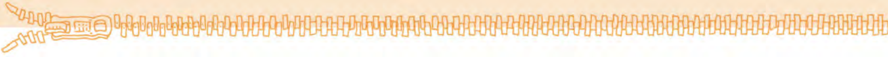
> **[Diagram Context - Textbook_NaturalScience_Gr8_Series-and-parallel-circuits.pdf-0011-04.png]**
> The image shows a gray line with a zipper running down the middle. The zipper is made up of small squares and is colored in shades of orange and white. The line is drawn in a straight line, and there are no other objects or text present in the image. The image does not provide any additional information about the content or context of the diagram.

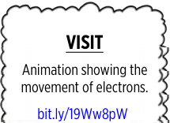
> **[Diagram Context - Textbook_NaturalScience_Gr8_Series-and-parallel-circuits.pdf-0011-05.png]**
> The image shows a white sign with black text that reads "Visit Animation showing the movement of electrons. bit.ly/19W8PWW". The sign also includes a blue link to a webpage.

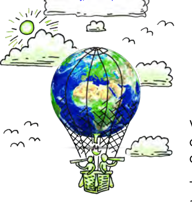
> **[Diagram Context - Textbook_NaturalScience_Gr8_Series-and-parallel-circuits.pdf-0011-08.png]**
> The image features a cartoon illustration of a hot air balloon carrying a globe. The globe is depicted in a cartoon style with a blue and green color scheme, and the balloon is depicted in a cartoon style with a black and white color scheme. The illustration also includes a small cartoon person on the balloon and a small cartoon person on the ground, suggesting a sense of adventure or exploration. The image is

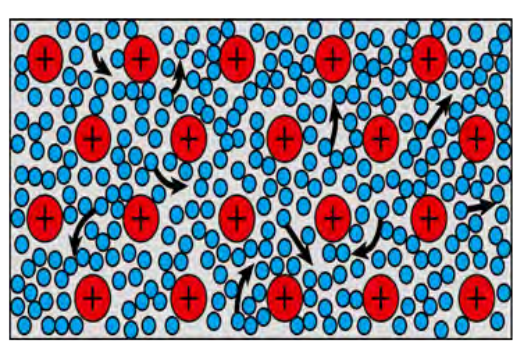
> **[Diagram Context - Textbook_NaturalScience_Gr8_Series-and-parallel-circuits.pdf-0011-14.png]**
> 1. A diagram of a red and blue circle with a black arrow pointing to the right.

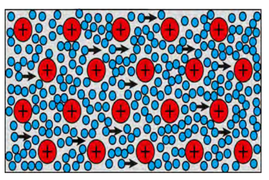
> **[Diagram Context - Textbook_NaturalScience_Gr8_Series-and-parallel-circuits.pdf-0011-15.png]**
> 1. A diagram of a red and blue electric circuit with arrows pointing to the positive and negative terminals.

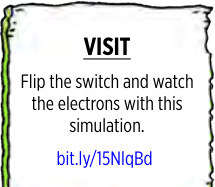
> **[Diagram Context - Textbook_NaturalScience_Gr8_Series-and-parallel-circuits.pdf-0011-16.png]**
> 1. A diagram of a circuit with a switch and a battery.

> **[Diagram Context - Textbook_NaturalScience_Gr8_Series-and-parallel-circuits.pdf-0011-17.png]**
> The image features a cartoon depiction of a boy holding a sign that says "I want to be a scientist" and pointing to a globe. The boy is wearing a green shirt and a hat. The globe is green and blue, and it is surrounded by arrows pointing in different directions. The boy is standing on a stick, which is positioned above the globe. The boy is also holding a sign

> **[Diagram Context - Textbook_NaturalScience_Gr8_Static-electricity.pdf-0011-02.png]**
> 1. A green spring with a silver wire attached to it.

> **[Diagram Context - Textbook_NaturalScience_Gr8_Static-electricity.pdf-0011-13.png]**
> 1. A diagram of an electric microscope.

> **[Diagram Context - Textbook_NaturalScience_Gr8_Static-electricity.pdf-0011-17.png]**
> The image features a cartoon depiction of a hot air balloon filled with people. The balloon is floating in the sky, and the people inside are holding onto a basket. The balloon is positioned in the center of the image, with the people on the basket towards the bottom. The background of the image is a light blue color, with white clouds scattered throughout. The image also includes a sun and a

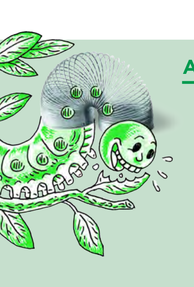
> **[Diagram Context - Textbook_NaturalScience_Gr8_Visible-light.pdf-0011-09.png]**
> This illustration uses a metaphorical cartoon of a caterpillar with a slinky-like body to represent the physical properties of a longitudinal wave. The image features a segmented, spring-like body structure and leaf elements to visually demonstrate the compression and rarefaction patterns characteristic of wave propagation. It serves as a conceptual model to help learners visualize how particles in a medium oscillate parallel to the direction of energy transfer in a longitudinal wave.

---

### Investigation: Properties of Light and Shadows

**5. Distance and Shadow Size**
The distance between the shape and the light source was kept the same. What do you think would have happened to the shadow if the distance was increased?
__________________________________________________________________
__________________________________________________________________

**6. Practical Testing**
Test your idea from question 5 by moving your cardboard shapes closer to and further away from the light source. What do you see? Were you correct in your prediction?
__________________________________________________________________
__________________________________________________________________
__________________________________________________________________

**7. Material Properties: Clear Plastic**
Is the clear plastic shape opaque or transparent?
__________________________________________________________________

**8. Shadow Formation: Clear Plastic**
Did the clear plastic cast a shadow?
__________________________________________________________________

**9. Scientific Explanation: Cardboard vs. Plastic**
Explain why the cardboard casts a shadow but the clear plastic does not.
__________________________________________________________________
__________________________________________________________________
__________________________________________________________________

**10. Material Properties: Shopping Bag**
Is the plastic shopping bag shape opaque or transparent?
__________________________________________________________________

**11. Scientific Explanation: Lighter Shadows**
Explain why the shopping bag casts a lighter shadow.
__________________________________________________________________
__________________________________________________________________
__________________________________________________________________

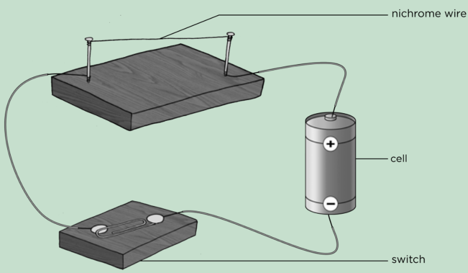
> **[Diagram Context - Textbook_NaturalScience_Gr8_Energy-transfer-in-electrical-systems.pdf-0012-15.png]**
> 1. A diagram of a circuit with a battery, wires, and a switch.

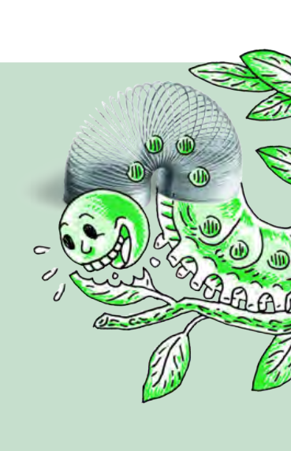
> **[Diagram Context - Textbook_NaturalScience_Gr8_Energy-transfer-in-electrical-systems.pdf-0012-16.png]**
> The image features a cartoon depiction of a spring coiled up and ready to spring into action. The spring is shown in a cartoon style, with a green ball and a leaf attached to it. The leaf is green and has a white center. The spring is coiled up in the center of the image, with the ball attached to it. The background of the image is a light green color

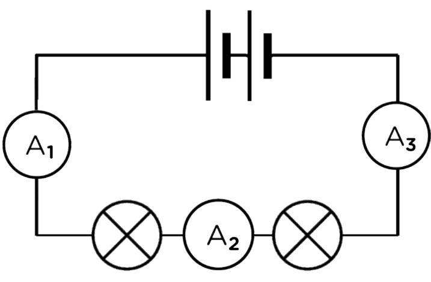
> **[Diagram Context - Textbook_NaturalScience_Gr8_Series-and-parallel-circuits.pdf-0012-02.png]**
> 1. A circuit diagram with three circles and arrows.

> **[Diagram Context - Textbook_NaturalScience_Gr8_Series-and-parallel-circuits.pdf-0012-03.png]**
> The image shows a gray background with the words "3.2 Parallel circuits" written in orange text. The text is positioned at the top of the image, and the words are written in a bold, large font. The text is centered and occupies the entire width of the image.

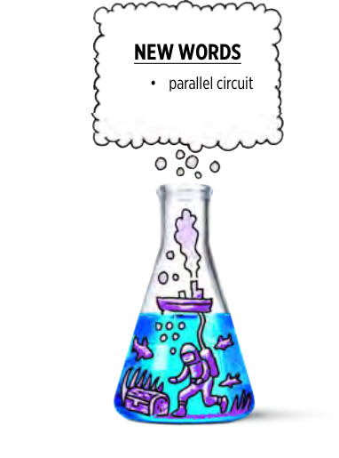
> **[Diagram Context - Textbook_NaturalScience_Gr8_Series-and-parallel-circuits.pdf-0012-04.png]**
> The image features a science experiment in a beaker, with a cartoon depiction of a person wearing a spacesuit and holding a rocket ship. The beaker contains a blue liquid, and there is a thought bubble above it that reads "New Words - Parallel Circuit". The image is labeled with the title "New Words" and the caption "Parallel Circuit".

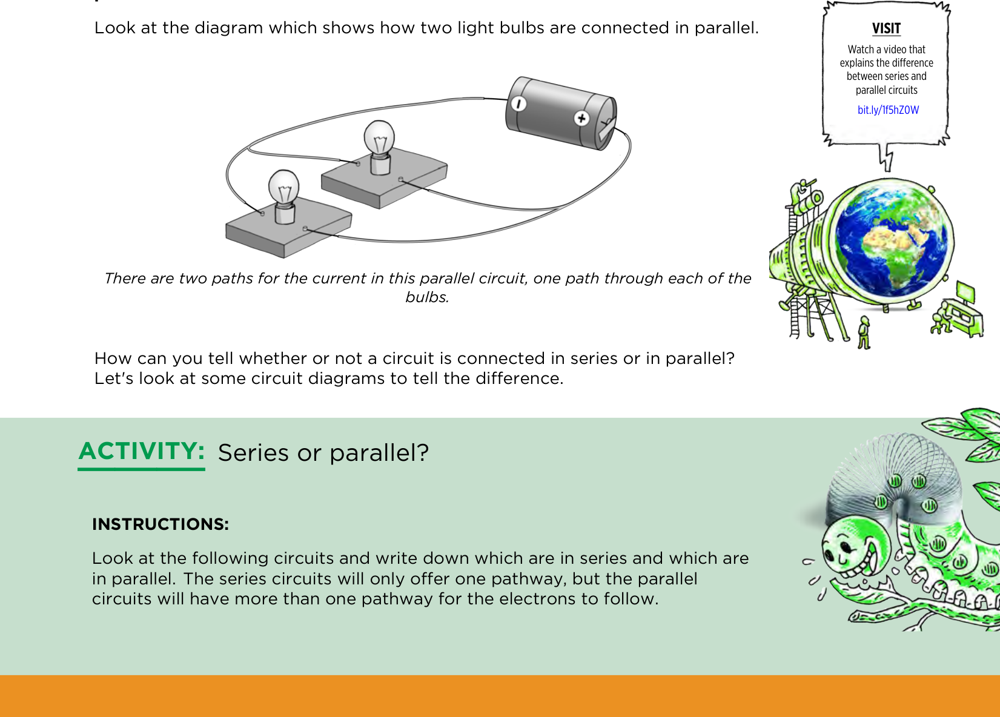
> **[Diagram Context - Textbook_NaturalScience_Gr8_Series-and-parallel-circuits.pdf-0012-06.png]**
> 1. A diagram of a circuit with two bulbs connected in parallel.
2. A diagram of a circuit with two bulbs connected in series.
3. A diagram of a circuit with two bulbs connected in parallel.

> **[Diagram Context - Textbook_NaturalScience_Gr8_Static-electricity.pdf-0012-03.png]**
> 1. A diagram of a snake's body.
 2. The snake's body is made up of many small lines.
 3. The snake's head is green and the body is brown.

> **[Diagram Context - Textbook_NaturalScience_Gr8_Static-electricity.pdf-0012-04.png]**
> 1. A diagram of a cell with blue and white lines.

> **[Diagram Context - Textbook_NaturalScience_Gr8_Static-electricity.pdf-0012-12.png]**
> The image features a key that is part of a tree, with a skull and a treasure chest below it. The key is depicted in a cartoon style, with a tree and a skull on either side of it. The tree has a blue background and a brown trunk, while the skull is depicted in a black and white style. The key is located in the center of the image, surrounded by

---

# Chapter 4: Visible Light

## 1. Interaction of Light with Matter
Light travels in straight lines. When light encounters an object, it interacts with the material in different ways depending on the substance's properties.

### Key Definitions

| Term | Definition |
| :--- | :--- |
| **Transparent** | Substances that transmit most light and only absorb or reflect a small amount. |
| **Opaque** | Substances that completely reflect or absorb light, allowing no light to pass through. |
| **Translucent** | Also known as **semi-transparent**; substances that allow some, but not all, light to pass through (e.g., a plastic shopping bag). |

---

## 2. Shadows
Shadows are formed because light travels in straight lines and cannot pass through opaque objects.

### Application: The Sundial

*   **Function:** Sundials have been used since ancient times as a time-keeping device.
*   **Mechanism:** As the position of the Sun changes in the sky, the shadow cast by the *style* (the vertical part of the sundial) moves across the surface.
*   **Measurement:** The surface is marked with numbers, allowing the shadow to indicate the time of day.

---

## 3. Light Filters
Transparent objects can be used to create filters. A filter works by allowing only specific colours of light to transmit through it, while absorbing the other colours.

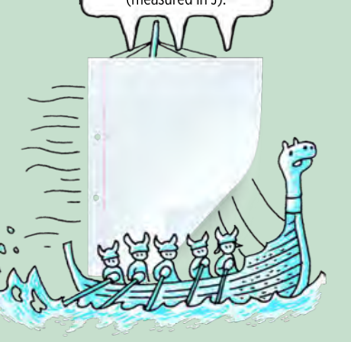
> **[Diagram Context - Textbook_NaturalScience_Gr8_Energy-transfer-in-electrical-systems.pdf-0013-06.png]**
> 1. A cartoon boat with a group of people on it.

*   **Example:** If you use a red glass bulb or a red plastic film, only red light is transmitted. All other colours are absorbed by the filter.
*   **Practical Use:** Photographers use coloured filters on camera lenses to apply specific colour effects to their photographs by blocking unwanted wavelengths of light.

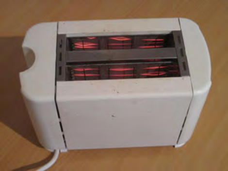
> **[Diagram Context - Textbook_NaturalScience_Gr8_Energy-transfer-in-electrical-systems.pdf-0013-09.png]**
> 1. A white toaster with red heating elements.
 2. The toaster is on a wooden table.
 3. The toaster has a white base and a white top.

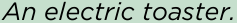

> **[Diagram Context - Textbook_NaturalScience_Gr8_Energy-transfer-in-electrical-systems.pdf-0013-12.png]**
> This graphic depicts a repeating, wave-like pattern of interconnected, arrow-shaped segments. It serves as a visual representation of a continuous process or directional flow, often used in Life Sciences to illustrate metabolic pathways, the sequence of DNA replication, or the cyclical nature of biological feedback loops.

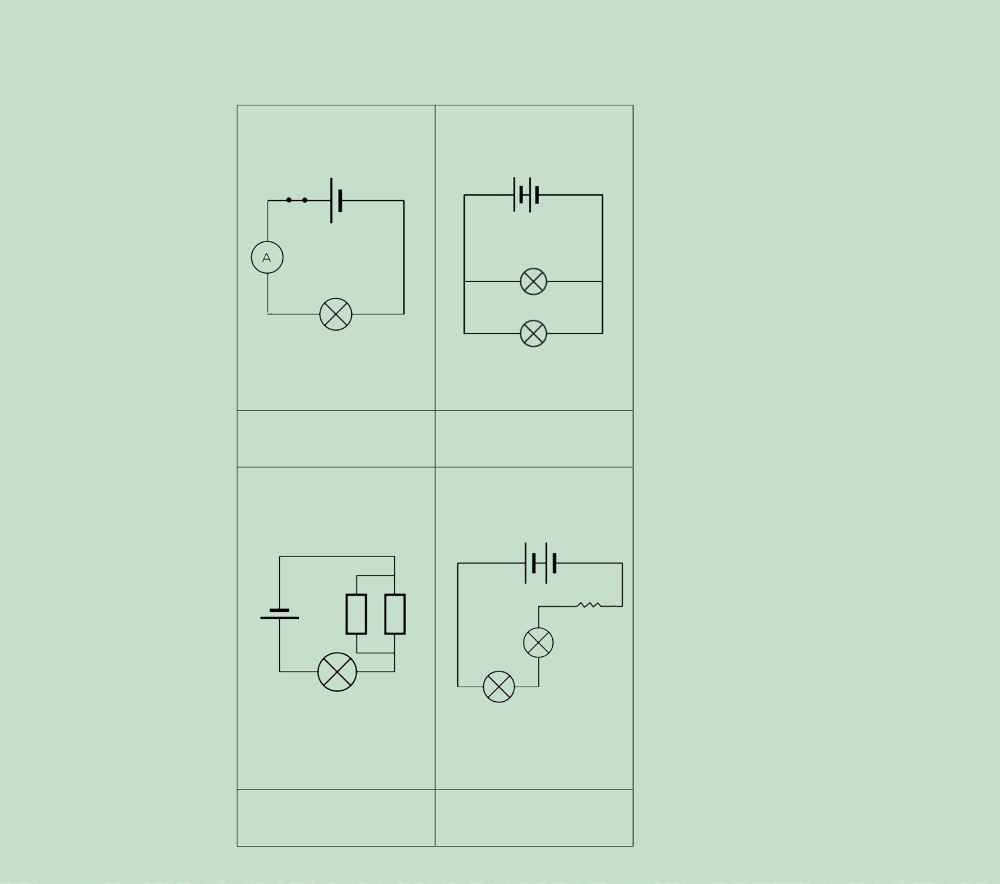
> **[Diagram Context - Textbook_NaturalScience_Gr8_Series-and-parallel-circuits.pdf-0013-00.png]**
> 1. A diagram of a circuit with four wires and four components.

> **[Diagram Context - Textbook_NaturalScience_Gr8_Series-and-parallel-circuits.pdf-0013-01.png]**
> 1. A diagram of a cell with a green line representing a DNA strand.

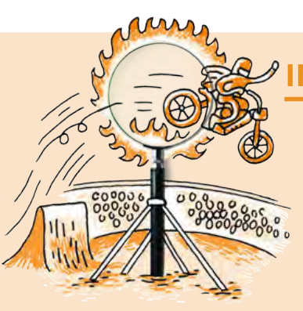
> **[Diagram Context - Textbook_NaturalScience_Gr8_Series-and-parallel-circuits.pdf-0013-03.png]**
> 1. A diagram of a person on a motorcycle.
 2. A diagram of a sun.
 3. A diagram of a magnifying glass.
 4. A diagram of a ramp.

> **[Diagram Context - Textbook_NaturalScience_Gr8_Static-electricity.pdf-0013-00.png]**
> 1. A diagram of a circuit with a battery, wires, and a light bulb.

> **[Diagram Context - Textbook_NaturalScience_Gr8_Visible-light.pdf-0013-08.png]**
> This graphic depicts a stylized, repeating wave-like pattern composed of interconnected, arrow-headed segments. It serves as a conceptual representation of continuous directional flow or a periodic process, often used in Life Sciences to illustrate cyclical pathways or the sequential movement of energy and matter through biological systems.

---

# 4.4 Absorption of Light

## Understanding Colour
The colours we perceive in objects around us are determined by how those objects interact with light. When light strikes a surface, two main processes occur:
1. **Absorption:** The surface takes in some of the light energy.
2. **Reflection:** The surface bounces some of the light back.

The light that is reflected from an object is the light that reaches our eyes, allowing us to see the object and its specific colour.

## How We See Colour
White light (such as sunlight) is a mixture of all the colours of the visible spectrum. When white light hits an object, the object absorbs most of the colours and reflects only the colour that we perceive.

### Example: The Ladybird
*   **The Scenario:** A ladybird has a red shell and sits on a green leaf.
*   **The Process:** When white light hits the red shell of the ladybird, the shell absorbs all the other colours in the white light spectrum.
*   **The Result:** Only the red light is reflected back to our eyes. Because red light reaches our eyes, we see the ladybird as red.

> **[Diagram Context - Textbook_NaturalScience_Gr8_Energy-transfer-in-electrical-systems.pdf-0014-08.png]**
> This graphic uses a metaphorical illustration of a roller coaster track integrated with a Slinky spring to represent mechanical energy transformations. It visually depicts the interplay between gravitational potential energy at the peak and kinetic energy during the descent, helping students conceptualize the Law of Conservation of Mechanical Energy in a physical sciences context.

### Example: The Green Leaf
Similarly, when white light hits a green leaf:
*   The leaf absorbs all the colours of the white light except for green.
*   The green light is reflected back into our eyes, which is why the leaf appears green to us.

---
**Summary Note:** An object appears to be a certain colour because it reflects that specific colour of light to our eyes while absorbing the other colours.

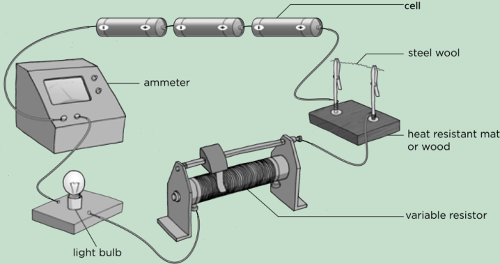
> **[Diagram Context - Textbook_NaturalScience_Gr8_Energy-transfer-in-electrical-systems.pdf-0014-12.png]**
> 1. A diagram of a circuit with a light bulb, an ammeter, and a variable resistor.

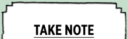
> **[Diagram Context - Textbook_NaturalScience_Gr8_Energy-transfer-in-electrical-systems.pdf-0014-17.png]**
> 1. A diagram of a cell with the word "Take Note" written in black at the top.

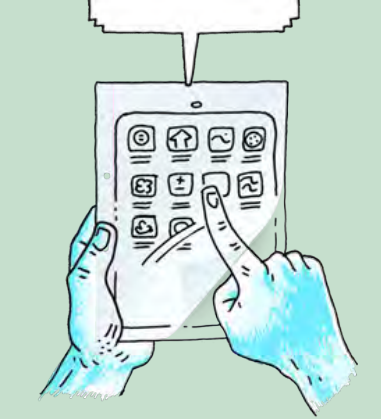
> **[Diagram Context - Textbook_NaturalScience_Gr8_Energy-transfer-in-electrical-systems.pdf-0014-25.png]**
> 1. A hand holding a tablet computer. 
 2. The tablet is open to a screen with a menu. 
 3. The hand is holding the tablet with both hands.

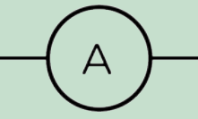
> **[Diagram Context - Textbook_NaturalScience_Gr8_Energy-transfer-in-electrical-systems.pdf-0014-26.png]**
> The image shows a Lewis diagram with a circle containing the letter "A" and a black line extending from the center of the circle to the edge. The diagram is set against a light green background. The diagram conveys the concept of an electrical circuit, with the "A" symbolizing a component or element in the circuit. The diagram also includes labels for the positive terminal and negative terminal of

> **[Diagram Context - Textbook_NaturalScience_Gr8_Static-electricity.pdf-0014-04.png]**
> The image features a cartoon illustration of a man holding a gear and a pulley, with a wheel and axle in the background. The man is wearing a white shirt and blue pants. The illustration is a simple, cartoon-like depiction of a mechanical device, with the man and the gear as the main elements. The gear is depicted in a black color, while the pulley is shown in

> **[Diagram Context - Textbook_NaturalScience_Gr8_Static-electricity.pdf-0014-16.png]**
> The image shows a diagram of a charged sphere, which is a three-dimensional representation of a charged object. The sphere is divided into four quadrants, each representing a different charge state: positive, negative, and neutral. The diagram also includes text that explains the concept of charged spheres and how they move. The diagram is accompanied by a list of labels and arrows, which provide additional information about

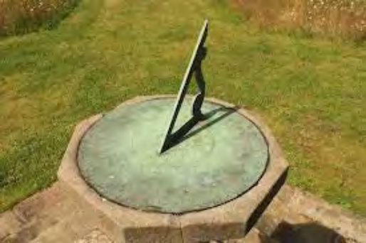
> **[Diagram Context - Textbook_NaturalScience_Gr8_Visible-light.pdf-0014-04.png]**
> This image depicts a sundial, an ancient astronomical instrument consisting of a circular plate and a triangular gnomon that casts a shadow. It illustrates the fundamental relationship between the Earth's rotation, the apparent movement of the Sun across the sky, and the measurement of time based on the changing position and length of the shadow.

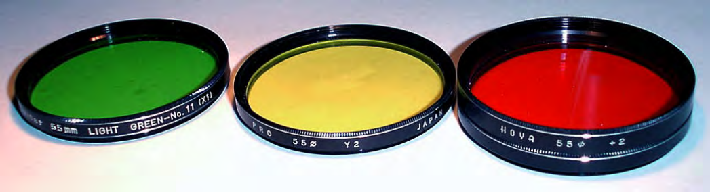
> **[Diagram Context - Textbook_NaturalScience_Gr8_Visible-light.pdf-0014-07.png]**
> This image displays three circular optical colour filters labeled with specifications such as "55mm," "LIGHT GREEN-No. 11," "Y2," and "HOVA." These apparatuses demonstrate the principle of subtractive colour mixing, illustrating how specific filters selectively transmit certain wavelengths of light while absorbing others. For Physical Sciences learners, this serves as a practical example of how light interacts with matter to produce perceived colour through the absorption and transmission of the visible spectrum.

---

### Visible Light: Reflection and Absorption

#### 1. How We See Colour
Objects appear to have specific colours based on which wavelengths of light they reflect and which they absorb.

*   **Green Objects:** When white light (which contains all colours) hits a green leaf, the leaf absorbs most of the colours but reflects green light. Our eyes detect this reflected green light, so we perceive the leaf as green.
    

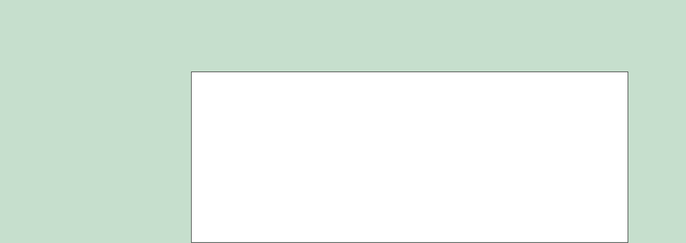
> **[Diagram Context - Textbook_NaturalScience_Gr8_Energy-transfer-in-electrical-systems.pdf-0015-00.png]**
> 1. A diagram of a cell with a white square and a green square.

*   **Black Objects:** Black is not a colour of light; it is the result of the complete absorption of light. When light hits a black object (like the spots on a ladybird), all colours are absorbed and no light is reflected. Because no light reaches our eyes from these surfaces, they appear black.

> **TAKE NOTE:** Although we can use black paint as a pigment, black is not a colour of light. Black is the result of the complete absorption of light.

#### 2. Heat and Light Absorption
In Grade 7, we learned that energy transfer occurs through the absorption of heat. This is closely related to how objects interact with light:
*   **Black, matt (not shiny) objects:** Absorb all light energy and reflect none. This makes them appear black and causes them to heat up more quickly in sunlight.
*   **White objects:** Reflect all colours of light. Because no light is absorbed, the object appears white to our eyes.

> **[Diagram Context - Textbook_NaturalScience_Gr8_Energy-transfer-in-electrical-systems.pdf-0015-04.png]**
> 1. A diagram of a cell with a green line representing the cell wall.

#### 3. Summary of Reflection
*   **White Surface:** Reflects all colours of light back to the eye.
*   **Coloured Surface:** Absorbs most colours and reflects only the colour that we see.
*   **Black Surface:** Absorbs all colours and reflects none.

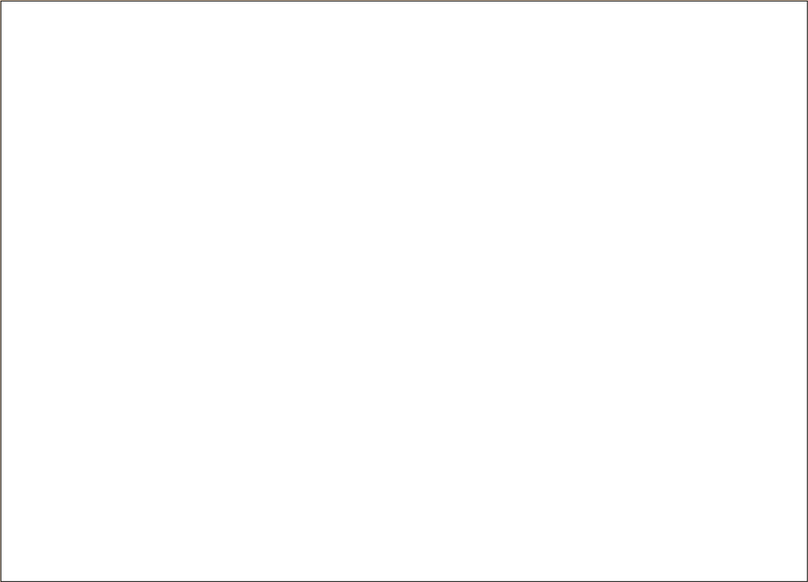
> **[Diagram Context - Textbook_NaturalScience_Gr8_Series-and-parallel-circuits.pdf-0015-02.png]**
> 1. A white rectangle with a gray border.

> **[Diagram Context - Textbook_NaturalScience_Gr8_Static-electricity.pdf-0015-02.png]**
> The image shows a pink grid with three different shapes on it. The shapes are a circle, a triangle, and a square. The grid is labeled with the words "Object", "Overall Charge", and "Why is it positive, neutral or negative?". The objects are depicted in a cartoon-like style, with the circle being blue, the triangle being green, and the square being yellow.

> **[Diagram Context - Textbook_NaturalScience_Gr8_Static-electricity.pdf-0015-04.png]**
> 1. A diagram of a cell with arrows pointing to different parts of the cell.

> **[Diagram Context - Textbook_NaturalScience_Gr8_Visible-light.pdf-0015-02.png]**
> This image is a biological photograph of a ladybird (Coccinellidae) resting on a green leaf, displaying no text, labels, or symbols. It serves as a visual example of an insect within an ecosystem, illustrating concepts such as biodiversity, animal-plant interactions, and the external morphology of an arthropod.

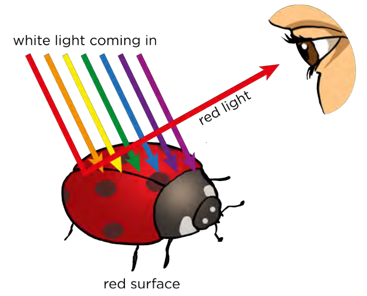
> **[Diagram Context - Textbook_NaturalScience_Gr8_Visible-light.pdf-0015-05.png]**
> This diagram illustrates the physics of light reflection using a ladybug as a subject, featuring labels for "white light coming in," "red light," and "red surface." It demonstrates the concept of selective reflection, showing how an object appears red because it absorbs all other colours of the visible spectrum while reflecting only red light to the observer's eye.

---

# Lesson: Understanding Light and Colour

## Core Concept: How We See Colour
The colour of an object is determined by the light it reflects. White light is composed of all the colours of the visible spectrum. When white light hits an object, the object absorbs some colours and reflects others. Our eyes perceive the colour that is reflected back to them.

### The Role of Filters
A coloured filter (like a piece of red plastic) works by absorbing all colours of the spectrum except for the colour of the filter itself. When white light passes through a red filter, only red light is transmitted.

---

## Activity: Why do objects look red under red light?

### Materials Required
*   A piece of red plastic (to act as a light filter)
*   A light source (e.g., a torch or light bulb)
*   A white object (e.g., a piece of white paper)

### Instructions
1.  Place the white object on a flat surface.
2.  Switch on your light source.
3.  Position the red plastic filter directly in front of the light source.
4.  Shine the filtered red light onto the white object and observe the result.

### Analysis Questions
| Question Number | Focus Area |
| :--- | :--- |
| 1 | What colour was the page under normal light? |
| 2 | Why does the page appear white in normal light? |
| 3 | What did you see when the red plastic filter shone on the white page? |
| 4 | Explain why the paper changed colour. |

---

## Scientific Explanation

### 1. Reflection of Light
When white light hits a white object, the object reflects all wavelengths of visible light equally. Because all colours are reflected back to our eyes, our brain interprets the object as **white**.

### 2. The Effect of the Filter
When you place a red filter in front of the light source:
*   The filter absorbs all colours except for red.
*   Only red light reaches the white paper.
*   Since the paper is white, it is capable of reflecting all colours, including red.
*   Therefore, the paper reflects the red light back to your eyes, making the paper appear **red**.

### Mathematical Representation of Light
If we represent white light ($W$) as the sum of all visible colours ($C_1, C_2, ... C_n$):
$$W = \sum_{i=1}^{n} C_i$$

When a red filter ($F_{red}$) is applied, the transmitted light ($L_t$) is:
$$L_t = W \times F_{red} = \text{Red Light}$$

When this light hits a white surface ($S_{white}$), the reflected light ($L_r$) is:
$$L_r = L_t \times S_{white} = \text{Red Light}$$

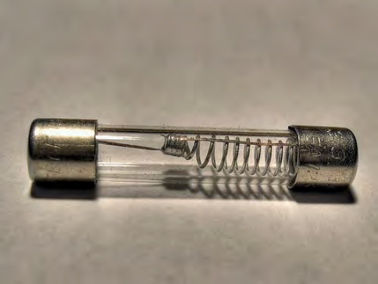
> **[Diagram Context - Textbook_NaturalScience_Gr8_Energy-transfer-in-electrical-systems.pdf-0016-00.png]**
> The image shows a small glass tube with a spring inside. The tube is silver and has a clear glass body. The spring is coiled and attached to the tube. The tube is placed on a white surface, and the background is blurred. The tube is the main focus of the image, and it is the only object in the frame. The tube and the spring are the only two objects

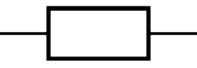

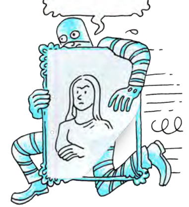
> **[Diagram Context - Textbook_NaturalScience_Gr8_Energy-transfer-in-electrical-systems.pdf-0016-12.png]**
> 1. A cartoon drawing of a man holding a picture of a woman.

> **[Diagram Context - Textbook_NaturalScience_Gr8_Series-and-parallel-circuits.pdf-0016-04.png]**
> This graphic depicts a stylized illustration of a zipper mechanism with no visible labels or text. In a Life Sciences context, this serves as a structural analogy for the unwinding and re-zipping of the DNA double helix during processes like replication and transcription, where the slider represents the action of enzymes such as helicase.

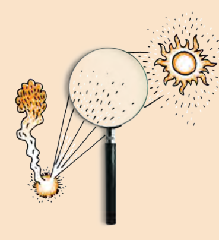
> **[Diagram Context - Textbook_NaturalScience_Gr8_Series-and-parallel-circuits.pdf-0016-10.png]**
> This conceptual illustration depicts a magnifying glass focusing solar energy onto a point, represented by a sun, a lens, and a concentrated beam of light. It visually demonstrates the principle of light convergence, where parallel rays from the sun are refracted through a convex lens to a single focal point, generating intense heat. For learners, this illustrates the relationship between light energy, lens optics, and the conversion of radiant energy into thermal energy.

> **[Diagram Context - Textbook_NaturalScience_Gr8_Static-electricity.pdf-0016-05.png]**
> The image shows two young girls posing for a picture with their hair flying around them. One girl is wearing a yellow shirt, while the other is wearing a green shirt. The girls are standing in front of a large ball, which is a globe. The girls are positioned in front of a window, and there is a clock visible in the background. The image conveys a sense of fun and

> **[Diagram Context - Textbook_NaturalScience_Gr8_Static-electricity.pdf-0016-08.png]**
> The image shows a close-up view of a diagram of a cell, with a red ant positioned in the center. The diagram is set against a gray background, and the ant is the main focus of the image. The ant is surrounded by various labels and arrows, which provide information about the cell's structure and function. The image is educational in nature, as it is likely intended to teach

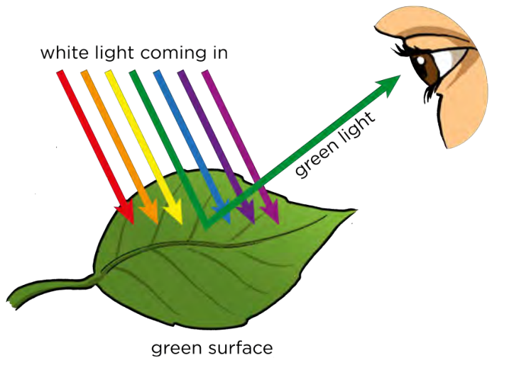
> **[Diagram Context - Textbook_NaturalScience_Gr8_Visible-light.pdf-0016-00.png]**
> This diagram illustrates the physics of light reflection using a leaf, a human eye, and a spectrum of coloured arrows labeled "white light coming in" and "green light." It demonstrates the principle of selective reflection, showing that an object appears green because it absorbs all other wavelengths of the visible spectrum while reflecting only green light to the observer's eye.

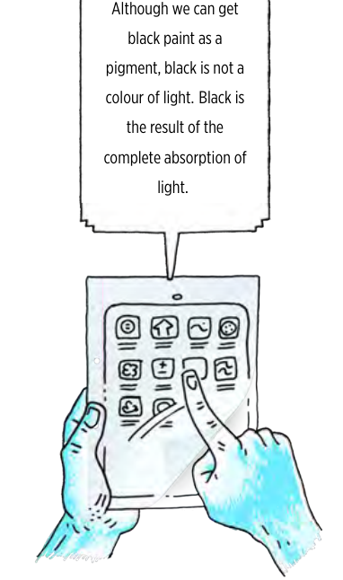
> **[Diagram Context - Textbook_NaturalScience_Gr8_Visible-light.pdf-0016-04.png]**
> This graphic features a cartoon illustration of a person using a tablet, accompanied by a speech bubble containing text. The text explains the physics of light, specifically distinguishing between pigments and the nature of black as the complete absorption of light rather than a colour of light itself. This serves to clarify the distinction between additive and subtractive colour theory, a key concept in the Natural Sciences curriculum regarding the properties of light.

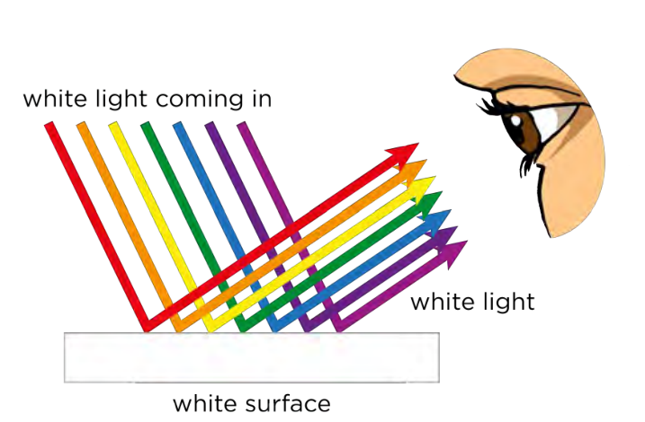
> **[Diagram Context - Textbook_NaturalScience_Gr8_Visible-light.pdf-0016-07.png]**
> This diagram illustrates the reflection of light using coloured arrows to represent the visible spectrum, a white surface, and a human eye. It demonstrates that a white surface reflects all wavelengths of visible light equally, allowing the eye to perceive the reflected light as white.

---

# 4.5 Reflection of Light

When light hits a surface, it is often reflected off that surface. A still, flat surface (like a calm lake) can act as a mirror, creating a mirror image of objects.

## New Words
*   **Reflect:** To bounce off a surface.
*   **Incident ray:** The ray of light that hits a surface.
*   **Reflected ray:** The ray of light that bounces off a surface.
*   **Normal line:** An imaginary line drawn perpendicular ($90^\circ$) to the surface at the point of incidence.
*   **Angle of incidence:** The angle between the incident ray and the normal line.
*   **Angle of reflection:** The angle between the reflected ray and the normal line.
*   **Perpendicular:** At an angle of $90^\circ$ to a surface.

## Understanding Reflection
When light strikes a reflective surface, it changes direction. To study this scientifically, we use a diagrammatic approach:

1.  **Incident Ray:** The incoming light beam.
2.  **Reflected Ray:** The outgoing light beam.
3.  **Normal:** An imaginary line used as a reference point for measurements. It is always drawn **perpendicular** to the surface.

### Key Angles
The two primary angles measured in reflection are:
*   **Angle of incidence ($i$):** Measured between the incident ray and the normal.
*   **Angle of reflection ($r$):** Measured between the reflected ray and the normal.

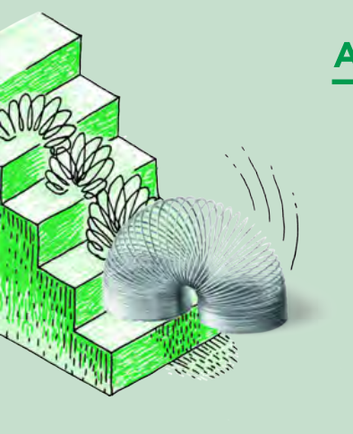
> **[Diagram Context - Textbook_NaturalScience_Gr8_Energy-transfer-in-electrical-systems.pdf-0017-00.png]**
> 1. A diagram of a spring with a green background.

---
*Note: The study of these angles is fundamental to understanding the Law of Reflection, which states that the angle of incidence is equal to the angle of reflection ($i = r$).*

> **[Diagram Context - Textbook_NaturalScience_Gr8_Energy-transfer-in-electrical-systems.pdf-0017-05.png]**
> 1. A diagram of a cell with a green line representing the cell wall.

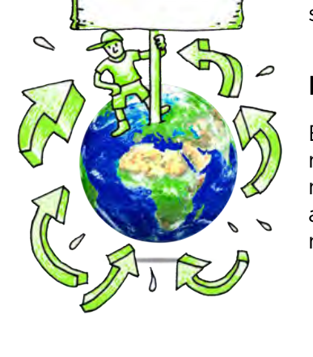
> **[Diagram Context - Textbook_NaturalScience_Gr8_Energy-transfer-in-electrical-systems.pdf-0017-09.png]**
> The image features a cartoon illustration of a cartoon character holding a pole with a globe on it. The globe is colored green and blue, and the cartoon character is wearing a green shirt and a hat. The cartoon character is standing on a green platform, and there are arrows pointing in different directions, possibly representing the circulatory system or the nervous system. The cartoon character is also holding a sign that

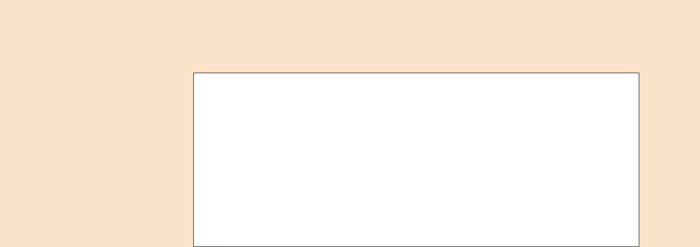
> **[Diagram Context - Textbook_NaturalScience_Gr8_Series-and-parallel-circuits.pdf-0017-00.png]**
> 1. A diagram of a cell with a white square in the center.

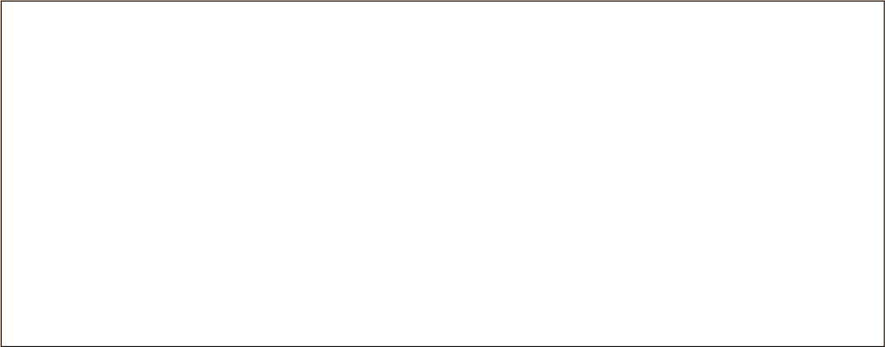

> **[Diagram Context - Textbook_NaturalScience_Gr8_Visible-light.pdf-0017-00.png]**
> This graphic uses a composite illustration of a roller coaster and a Slinky toy to represent the concept of mechanical energy. It visually depicts the transformation between gravitational potential energy at the peak of the track and kinetic energy as the object descends. For a Grade 10-12 Physical Sciences learner, this serves as an analogy for the Law of Conservation of Mechanical Energy, illustrating how energy is exchanged within a closed system.

> **[Diagram Context - Textbook_NaturalScience_Gr8_Visible-light.pdf-0017-15.png]**
> This graphic depicts a schematic representation of a DNA molecule, featuring the characteristic double helix structure with two antiparallel sugar-phosphate backbones and internal nitrogenous base pairs. It illustrates the fundamental molecular architecture of genetic material, helping learners visualize the helical coiling and the complementary pairing essential for DNA replication and protein synthesis.

---

# Reflection of Light

## Key Concepts and Definitions

To understand how light reflects off a surface, we use the following terminology:

*   **Reflecting surface:** The boundary or material from which light bounces off.
*   **Incidence ray:** A ray of light that travels toward the reflecting surface.
*   **Reflected ray:** A ray of light that bounces off a reflective surface.
*   **Normal:** An imaginary line drawn perpendicular ($90^\circ$) to the reflecting surface at the point of incidence.
*   **Point of incidence:** The specific spot where the incidence ray strikes the reflecting surface.
*   **Angle of incidence ($i$):** The angle measured between the incident ray and the normal.
*   **Angle of reflection ($r$):** The angle measured between the reflected ray and the normal.

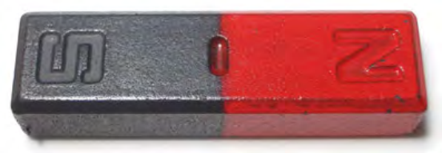
> **[Diagram Context - Textbook_NaturalScience_Gr8_Energy-transfer-in-electrical-systems.pdf-0018-00.png]**
> 1. A magnet with a red and black border.

---

## Investigation: Relationship Between Angles of Incidence and Reflection

### Aim
To investigate the reflection of light from a surface.

### Investigative Question
Based on the diagram provided, formulate a question to guide this investigation.
*(Example: Is the angle of incidence equal to the angle of reflection when light hits a mirror?)*

### Hypothesis
The angle of incidence is equal to the angle of reflection ($i = r$).

### Materials and Apparatus
*   Mirror
*   White paper
*   Pencil
*   Protractor
*   Ruler
*   Ray box

### Method
1.  Place a white piece of paper on the desk.
2.  Use your ruler to draw a straight line near the top of the white paper to represent the mirror's position.

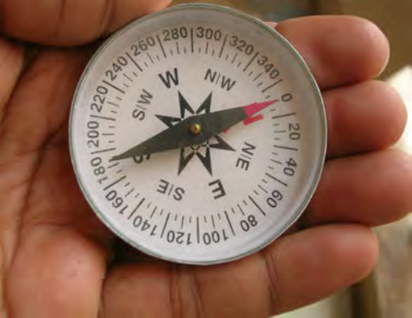
> **[Diagram Context - Textbook_NaturalScience_Gr8_Energy-transfer-in-electrical-systems.pdf-0018-04.png]**
> 1. A compass with a star on it.

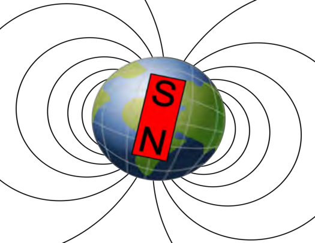
> **[Diagram Context - Textbook_NaturalScience_Gr8_Energy-transfer-in-electrical-systems.pdf-0018-05.png]**
> The image features a globe with the letters "N" and "S" written on it. The globe is surrounded by a black and white pattern of concentric circles, creating a sense of depth and dimension. The letters "N" and "S" are positioned at the center of the globe, with the "N" being larger than the "S". The circles surrounding the globe are evenly

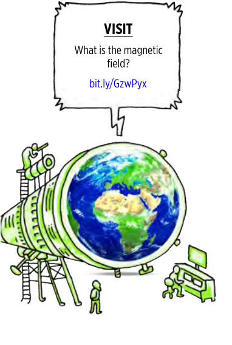
> **[Diagram Context - Textbook_NaturalScience_Gr8_Energy-transfer-in-electrical-systems.pdf-0018-06.png]**
> The image is a cartoon-style educational poster that explains the concept of a magnetic field. The poster features a large globe with a green border, and a speech bubble containing text that reads "Visit what is the magnetic field?". The poster also includes a diagram of a telescope and a diagram of a circuit, which are used to illustrate the concept of a magnetic field.

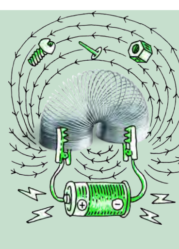
> **[Diagram Context - Textbook_NaturalScience_Gr8_Energy-transfer-in-electrical-systems.pdf-0018-16.png]**
> 1. A green spring with a silver spring inside of it.
 2. A green battery with a silver battery inside of it.
 3. A green wire with a silver wire inside of it.

> **[Diagram Context - Textbook_NaturalScience_Gr8_Series-and-parallel-circuits.pdf-0018-08.png]**
> The image shows a gray line with a zipper running down the middle. The zipper is white on the left side and orange on the right side. The line is drawn in a straight line, and there is a small orange dot on the right side of the line. The line is not broken, and there are no other objects or text in the image. The line is the only object in the

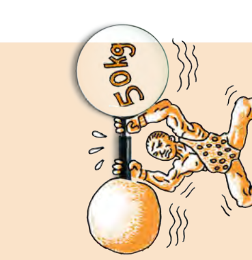
> **[Diagram Context - Textbook_NaturalScience_Gr8_Series-and-parallel-circuits.pdf-0018-15.png]**
> 1. A cartoon of a man lifting a ball with a magnifying glass.

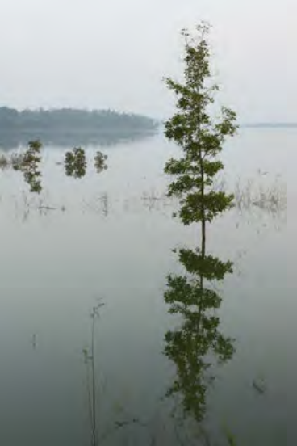
> **[Diagram Context - Textbook_NaturalScience_Gr8_Visible-light.pdf-0018-02.png]**
> This image is a photograph depicting a tree standing in a body of water, showing no visible labels, symbols, or variables. It serves as a visual aid for Life Sciences learners to discuss environmental factors, such as waterlogging or flooding, and how these abiotic conditions influence plant survival and ecosystem dynamics.

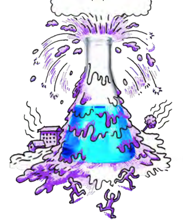
> **[Diagram Context - Textbook_NaturalScience_Gr8_Visible-light.pdf-0018-06.png]**
> This illustration depicts a conical flask acting as a metaphor for a volcanic eruption or a hazardous chemical spill, featuring visual elements of an overflowing liquid, steam, and fleeing human figures. It conceptually represents the dangers of uncontrolled chemical reactions or environmental disasters, serving as a visual prompt to discuss chemical safety, reaction rates, and the potential impact of industrial accidents on human populations.

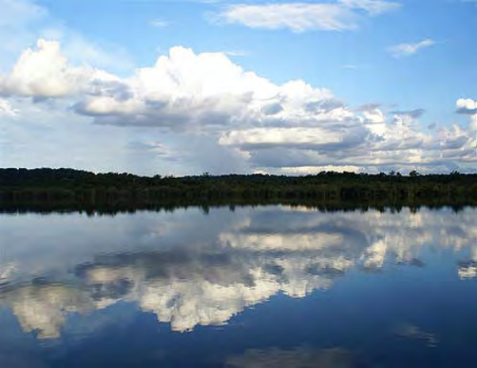
> **[Diagram Context - Textbook_NaturalScience_Gr8_Visible-light.pdf-0018-08.png]**
> This image is a landscape photograph depicting a calm body of water reflecting the sky and distant treeline. It contains no labels, symbols, or variables, serving instead as a visual representation of a natural ecosystem. For a high school learner, this image illustrates the concept of a mirror-like surface reflection and can be used to discuss the abiotic components of a freshwater biome or the physical properties of light reflection in the Natural Sciences curriculum.

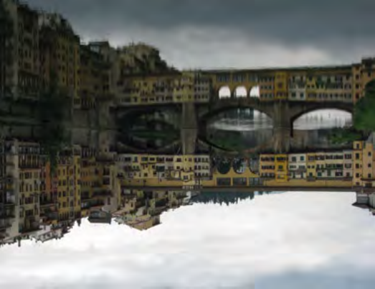
> **[Diagram Context - Textbook_NaturalScience_Gr8_Visible-light.pdf-0018-10.png]**
> This image is an inverted photograph of the Ponte Vecchio bridge in Florence, Italy, which serves as a visual representation of a plane mirror reflection. It demonstrates the optical principles of lateral inversion and vertical reflection, where the water surface acts as a reflective plane to create a symmetrical virtual image. For a Physical Sciences student, this illustrates how light rays reflect off a smooth surface to produce an image that is equidistant from the mirror plane and inverted relative to the object.

---

# Experiment: Investigating Reflection of Light

This practical activity guides you through the process of mapping the reflection of a light ray off a mirror.

### Key Concepts
*   **Normal Line:** An imaginary line drawn at a right angle ($90^\circ$) to the surface of the mirror at the point where the light ray strikes.
*   **Incident Ray:** The incoming light ray that travels towards the mirror.
*   **Reflected Ray:** The light ray that bounces off the mirror surface.

---

### Step-by-Step Procedure

1.  **Construct the Normal Line:** Use a protractor to draw a line at a right angle ($90^\circ$) to your base pencil line. This is your **normal line**.
    

2.  **Position the Mirror:** Place your mirror upright along the base pencil line.
    

3.  **Direct the Light:** Shine a light from the ray box along the paper so that it strikes the mirror exactly where the normal line and the mirror meet.
    

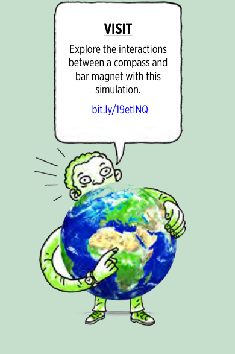
> **[Diagram Context - Textbook_NaturalScience_Gr8_Energy-transfer-in-electrical-systems.pdf-0019-03.png]**
> The image shows a cartoon depiction of a man holding a globe in his hands. The globe is green and blue, and the man is wearing a green shirt and white pants. The text on the image reads "Visit" and "Explore the interactions between a compass and a bar magnet with this bar simulation."

4.  **Mark the Incident Ray:** Use a pencil to carefully mark the path of the incoming (incident) light ray.
    

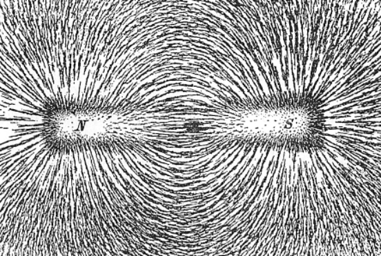
> **[Diagram Context - Textbook_NaturalScience_Gr8_Energy-transfer-in-electrical-systems.pdf-0019-05.png]**
> 1. A black and white illustration of a Lewis structure of an atom.

5.  **Mark the Reflected Ray:** Use a pencil to mark the path of the light ray bouncing away from the mirror (reflected ray).
    

> **[Diagram Context - Textbook_NaturalScience_Gr8_Energy-transfer-in-electrical-systems.pdf-0019-07.png]**
> 1. A diagram of a cell with a green line representing a DNA strand.

6.  **Finalize the Diagram:** Remove the mirror and switch off the ray box. Use a ruler and pencil to draw straight lines connecting your marked points to the point of incidence on the normal line.
    

---

### Note for Learners
When you complete step 9, you will have a geometric representation of the Law of Reflection. You can now use your protractor to measure the **angle of incidence** ($i$) and the **angle of reflection** ($r$). According to the laws of physics, you should find that:
$$\angle i = \angle r$$

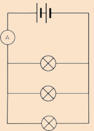
> **[Diagram Context - Textbook_NaturalScience_Gr8_Series-and-parallel-circuits.pdf-0019-04.png]**
> 1. A diagram of a circuit with three wires and three circles.

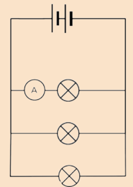
> **[Diagram Context - Textbook_NaturalScience_Gr8_Series-and-parallel-circuits.pdf-0019-08.png]**
> 1. A circuit diagram with three wires and three lights.

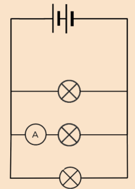
> **[Diagram Context - Textbook_NaturalScience_Gr8_Series-and-parallel-circuits.pdf-0019-12.png]**
> 1. A circuit diagram with three wires and three x's.

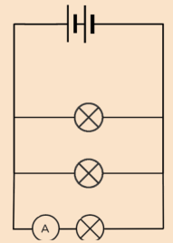
> **[Diagram Context - Textbook_NaturalScience_Gr8_Series-and-parallel-circuits.pdf-0019-15.png]**
> 1. A diagram of a circuit with three x-pieces and two y-pieces.

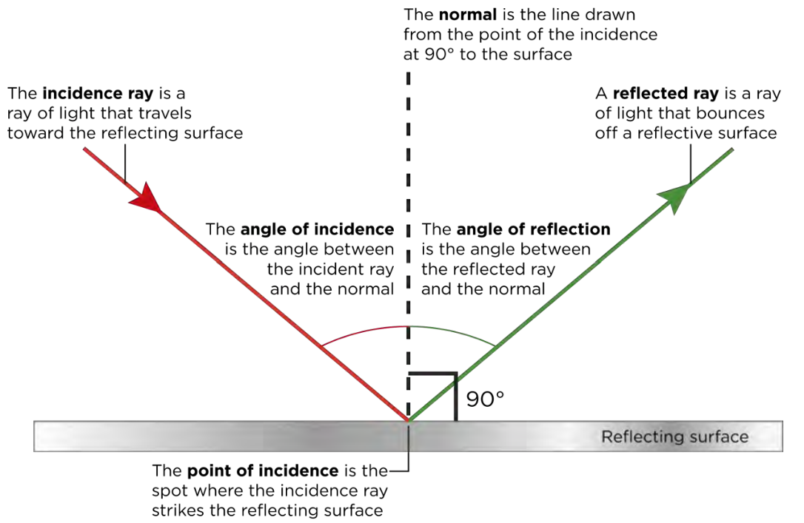
> **[Diagram Context - Textbook_NaturalScience_Gr8_Visible-light.pdf-0019-00.png]**
> This ray diagram illustrates the law of reflection, featuring a reflecting surface, an incident ray, a reflected ray, and a normal line drawn at a 90° angle. It labels the point of incidence, the angle of incidence, and the angle of reflection to define the geometric relationship between light rays striking and bouncing off a surface. This visual aid helps learners identify the fundamental components required to apply the law of reflection in physical sciences.

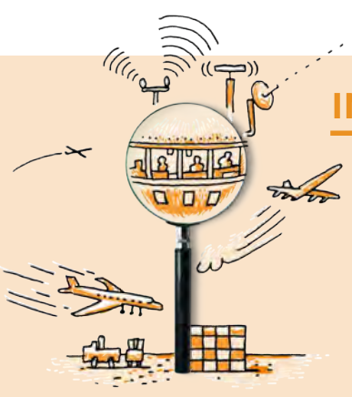
> **[Diagram Context - Textbook_NaturalScience_Gr8_Visible-light.pdf-0019-02.png]**
> This illustration uses a magnifying glass to focus on an air traffic control tower, surrounded by symbols of aviation and logistics including airplanes, radio transmission waves, antennas, and cargo containers. It conceptually represents the role of monitoring, communication, and coordination systems in managing complex transport and global supply chain operations.

---

### Investigation: Reflection of Light

#### Procedure
10. **Marking Angles:** Identify and mark the angle of incidence ($i$) and the angle of reflection ($r$) on your ray diagram.
    

> **[Diagram Context - Textbook_NaturalScience_Gr8_Energy-transfer-in-electrical-systems.pdf-0020-08.png]**
> The image shows a cartoon depiction of a caterpillar with a green head and body, surrounded by green leaves. The caterpillar is holding a green ball in its mouth, and there is a wire coil attached to the ball. The image also includes a Lewis diagram and an anatomical/cellular structure of a caterpillar. The caption reads, "A cartoon caterpillar with a green head and body

11. **Verification:** Turn the ray box on to confirm that your drawn pencil lines accurately follow the path of the light rays.
    

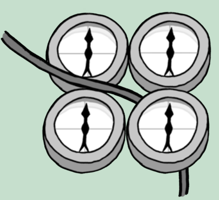
> **[Diagram Context - Textbook_NaturalScience_Gr8_Energy-transfer-in-electrical-systems.pdf-0020-10.png]**
> 1. Four circular objects with arrows pointing to the center.

12. **Measurement:** Use a protractor to measure the angle of incidence ($i$) and the angle of reflection ($r$). Record these values in the results table.
13. **Repetition:** Repeat the measurement process 3 more times, ensuring that you use a different angle of incidence for each trial.
    

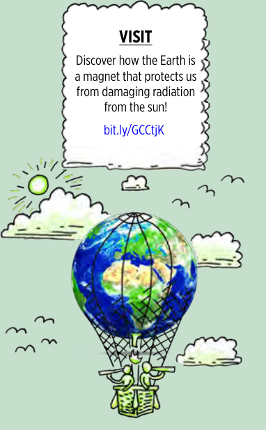
> **[Diagram Context - Textbook_NaturalScience_Gr8_Energy-transfer-in-electrical-systems.pdf-0020-13.png]**
> 1. A cartoon depiction of a hot air balloon with a globe on top.
 2. The globe is surrounded by a wire mesh.
 3. The globe is depicted in a cartoon style.

> **TAKE NOTE:** Keep one of the sheets with your drawn ray diagram for the next activity.

---

#### Results
Fill your measured values into the table below:

| Repeat | Angle of Incidence ($i$) | Angle of Reflection ($r$) |
| :--- | :--- | :--- |
| 1 | | |
| 2 | | |
| 3 | | |
| 4 | | |

---

#### Analysis
1. Has your investigation provided sufficient data to answer your investigative question?

> **[Diagram Context - Textbook_NaturalScience_Gr8_Energy-transfer-in-electrical-systems.pdf-0020-17.png]**
> 1. A diagram of a snake with a green head and body.

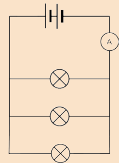
> **[Diagram Context - Textbook_NaturalScience_Gr8_Series-and-parallel-circuits.pdf-0020-04.png]**
> 1. A diagram of a circuit with three wires and three circles.

> **[Diagram Context - Textbook_NaturalScience_Gr8_Series-and-parallel-circuits.pdf-0020-11.png]**
> The image is a gray and white diagram that shows a zipper with two arms and a zipper pull. The zipper is positioned on the right side of the image. The diagram is labeled with the word "Zipper" at the top and "Zipper pull" at the bottom. The diagram also includes a Lewis diagram and an anatomical/cellular structure labeled "cell".

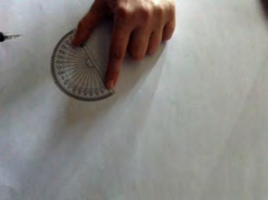
> **[Diagram Context - Textbook_NaturalScience_Gr8_Visible-light.pdf-0020-02.png]**
> This image features a semi-circular protractor, a standard geometric instrument marked with degree increments from 0° to 180°, being held by a human hand on a plain surface. It serves as a practical demonstration of the tool used in Mathematics and Technical Sciences to measure or construct angles between two intersecting lines.

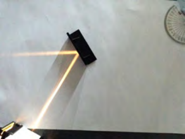
> **[Diagram Context - Textbook_NaturalScience_Gr8_Visible-light.pdf-0020-06.png]**
> This physical science apparatus demonstrates the reflection of a light ray using a light source, a rectangular mirror, and a protractor for angle measurement. It illustrates the law of reflection, where the angle of incidence equals the angle of reflection, providing a practical visual aid for students to investigate the behaviour of light at a plane surface.

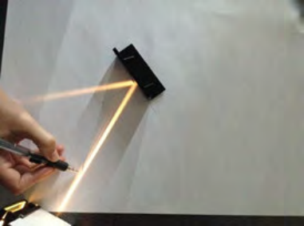
> **[Diagram Context - Textbook_NaturalScience_Gr8_Visible-light.pdf-0020-09.png]**
> This photograph demonstrates the reflection of a light ray using a laser pointer and a plane mirror. It visually illustrates the law of reflection, where the incident ray strikes the reflective surface and bounces off as a reflected ray at an equal angle.

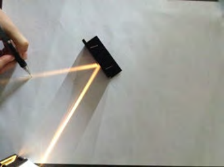
> **[Diagram Context - Textbook_NaturalScience_Gr8_Visible-light.pdf-0020-12.png]**
> This image depicts a physical science optics experiment using a light source and a rectangular mirror to demonstrate the reflection of light. The setup shows an incident light ray striking the reflective surface and bouncing off as a reflected ray, with a hand using a pen to trace the path of the light on paper. This practical demonstration helps learners visualize the law of reflection, where the angle of incidence is equal to the angle of reflection relative to the normal.

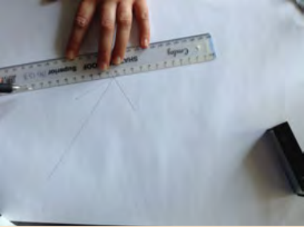
> **[Diagram Context - Textbook_NaturalScience_Gr8_Visible-light.pdf-0020-16.png]**
> This image depicts a physical science ray optics experiment where a student uses a ruler to draw light rays on paper. The visible elements include a clear plastic ruler, a hand, and two intersecting pencil lines representing an incident and reflected ray. Conceptually, this demonstrates the practical construction of a ray diagram to verify the law of reflection, where the angle of incidence equals the angle of reflection relative to a normal line.

---

### Investigation Follow-up
2. How could you improve this investigation to get more accurate results?
__________________________________________________________________
__________________________________________________________________

### Conclusion
What can you conclude based on your results?
__________________________________________________________________

---

### Reflection of Light

#### Key Concepts
*   **Law of Reflection:** Whenever light is reflected from a surface, the angle of incidence is equal to the angle of reflection.
*   **Smooth Surfaces:** When light hits a smooth surface, all light rays are reflected in the same way, resulting in a clear and focused image. A mirror is a primary example of a smooth surface.
*   **Plane of Reflection:** In reflection, the incident ray and the reflection ray are always in the same plane.

> **[Diagram Context - Textbook_NaturalScience_Gr8_Energy-transfer-in-electrical-systems.pdf-0021-00.png]**
> 1. A cartoon depiction of a roller coaster ride with a spring coiled up on top.

#### Take Note
In reflection, not only is the angle of incidence equal to the angle of reflection, but the incident ray and reflection ray are also in the same plane.

#### Visit
To learn more about the colour of a mirror, visit: [bit.ly/GABdNZ](http://bit.ly/GABdNZ)

#### Discussion Point
What happens when we do not have a smooth surface? Observe the provided photograph of the mirror segment to compare how light behaves on different surfaces.

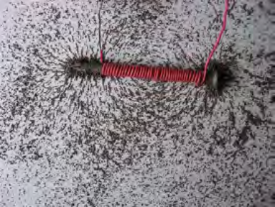
> **[Diagram Context - Textbook_NaturalScience_Gr8_Energy-transfer-in-electrical-systems.pdf-0021-16.png]**
> 1. A diagram of a wire with a red spring on it.

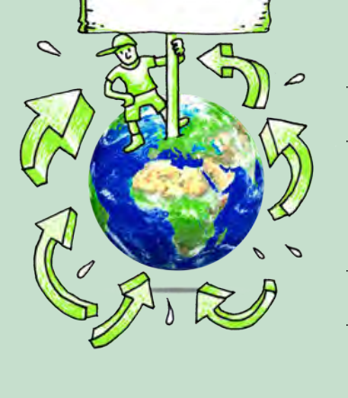
> **[Diagram Context - Textbook_NaturalScience_Gr8_Energy-transfer-in-electrical-systems.pdf-0021-20.png]**
> The image features a cartoon depiction of a boy holding a pole, with arrows pointing to the earth and other objects. The boy is wearing a green shirt and a hat. The boy is standing on a globe, which is tilted to the right. The globe is surrounded by arrows, indicating the direction of the boy's movement. The boy is holding a pole, which is pointing towards the earth.

> **[Diagram Context - Textbook_NaturalScience_Gr8_Energy-transfer-in-electrical-systems.pdf-0021-24.png]**
> 1. A diagram of a cell with a green line representing the cell wall.

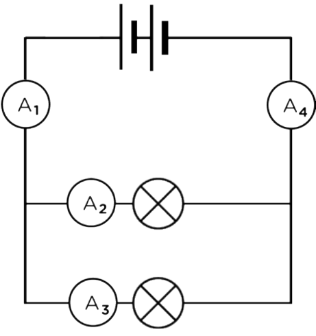
> **[Diagram Context - Textbook_NaturalScience_Gr8_Series-and-parallel-circuits.pdf-0021-09.png]**
> 1. A circuit diagram with three wires and three lights.

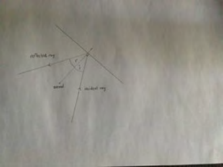
> **[Diagram Context - Textbook_NaturalScience_Gr8_Visible-light.pdf-0021-02.png]**
> This ray diagram illustrates the law of reflection, featuring a plane surface, an incident ray, a reflected ray, and a normal line. It labels the angle of incidence ($i$) and the angle of reflection ($r$) to demonstrate that these angles are equal relative to the normal. This visual aid helps learners understand the geometric principles governing how light reflects off smooth surfaces.

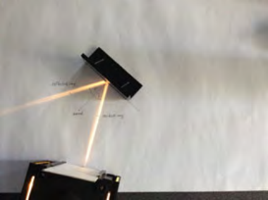
> **[Diagram Context - Textbook_NaturalScience_Gr8_Visible-light.pdf-0021-05.png]**
> This experimental apparatus demonstrates the reflection of light using a ray box and a plane mirror, with labels identifying the "incident ray," "reflected ray," and "normal." It illustrates the law of reflection, visually confirming for learners that the angle of incidence is equal to the angle of reflection relative to the normal.

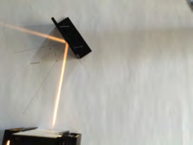
> **[Diagram Context - Textbook_NaturalScience_Gr8_Visible-light.pdf-0021-07.png]**
> This image depicts a physical optics experiment using a light source and a plane mirror to demonstrate the reflection of light. The setup includes a ray box producing a narrow beam of light that strikes the surface of a mirror, resulting in a clearly visible incident ray and reflected ray. This visual serves as a practical application of the Law of Reflection, allowing learners to observe that the angle of incidence is equal to the angle of reflection relative to the normal.

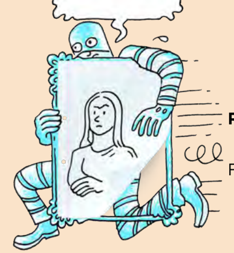
> **[Diagram Context - Textbook_NaturalScience_Gr8_Visible-light.pdf-0021-12.png]**
> This cartoon depicts a thief in a striped outfit running away while holding a framed portrait of a woman. The visual elements include the thief, the ornate frame, the portrait, and motion lines indicating rapid movement. Conceptually, this image serves as a metaphor for the concept of "frame of reference" in Physics, illustrating how an object's motion is perceived differently depending on the observer's position relative to the moving frame.

---

# Reflection of Light

## Concept: Diffuse vs. Specular Reflection
The image of the grass and reeds reflected in the water appears blurred rather than sharp. This occurs because the surface of the water is not perfectly smooth (due to ripples or movement), causing light rays to scatter in different directions. This is known as **diffuse reflection**. In contrast, a smooth, polished surface (like a mirror) produces a clear image through **specular reflection**.

---

## Activity: Light reflection off aluminium foil

### Materials
*   Aluminium foil
*   White paper
*   Ray box

### Instructions
1.  Prepare your workspace using the white sheets of paper from your previous investigation.
2.  Set up the ray box and direct a light ray along the line of incidence you previously established.
3.  Crumple a piece of aluminium foil and place it in the position where the mirror was previously located.
4.  Observe the behavior of the reflected ray.

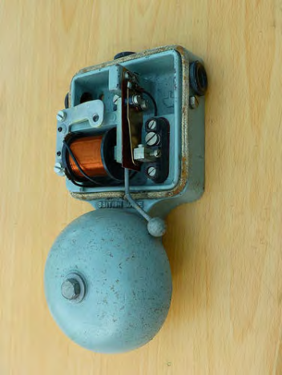
> **[Diagram Context - Textbook_NaturalScience_Gr8_Energy-transfer-in-electrical-systems.pdf-0022-00.png]**
> 1. A blue bell with a silver base and a silver ball.

### Questions
1.  Describe the reflected ray off the aluminium foil and how this compares to the reflected ray off the mirror.
2.  Why do you think you observed these differences?

---

## Digital Resource
For further exploration on how scientists have investigated the nature of light, visit: [bit.ly/GAMvAL](http://bit.ly/GAMvAL)

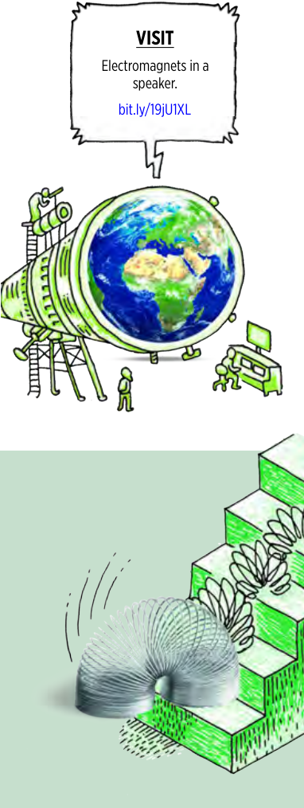
> **[Diagram Context - Textbook_NaturalScience_Gr8_Energy-transfer-in-electrical-systems.pdf-0022-11.png]**
> The image is a collage of two images. The top image shows a cartoon depiction of a man and a globe, with the man standing next to the globe. The bottom image shows a green staircase with a spring coiled on the bottom step. The collage includes text that reads "Visit Electromagnetics in a speech in a foreign language. B99UXL".

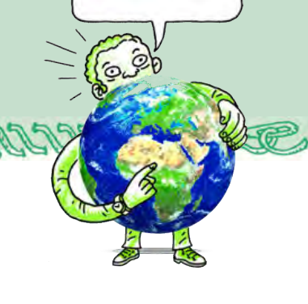
> **[Diagram Context - Textbook_NaturalScience_Gr8_Energy-transfer-in-electrical-systems.pdf-0022-20.png]**
> The image features a cartoon illustration of a man holding a globe in his arms. The man is wearing a green shirt and has a green hat on his head. He is pointing at the globe, which is green and blue in color. The man is standing on a platform, and there is a chain visible in the background. The text "You are a South African CAPS curriculum expert tutoring

> **[Diagram Context - Textbook_NaturalScience_Gr8_Series-and-parallel-circuits.pdf-0022-08.png]**
> 1. A diagram of a roller coaster with a spring coiled up on top.

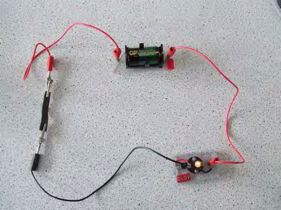
> **[Diagram Context - Textbook_NaturalScience_Gr8_Series-and-parallel-circuits.pdf-0022-11.png]**
> 1. A diagram of a circuit with a battery, wires, and a light bulb.

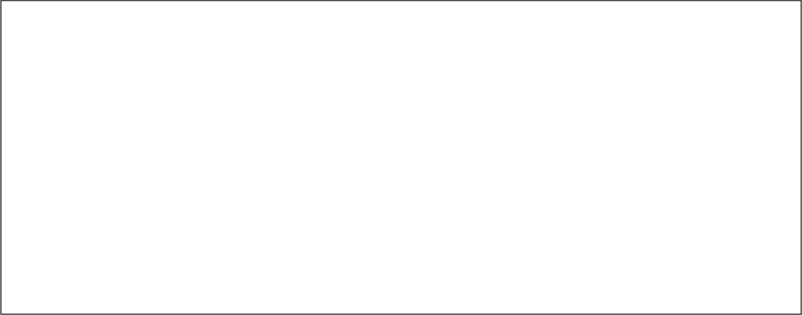

> **[Diagram Context - Textbook_NaturalScience_Gr8_Visible-light.pdf-0022-04.png]**
> This graphic is a schematic representation of a zipper, featuring interlocking teeth and a central slider mechanism. In the context of the Life Sciences curriculum, this serves as a common analogy for the unwinding and unzipping of the DNA double helix by the enzyme helicase during DNA replication.

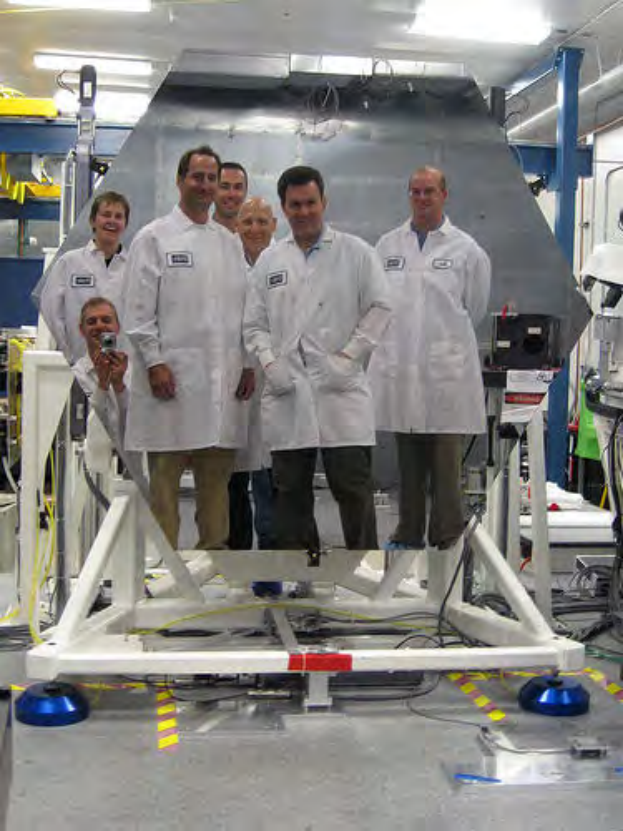
> **[Diagram Context - Textbook_NaturalScience_Gr8_Visible-light.pdf-0022-07.png]**
> This image depicts a group of scientists and engineers standing in a laboratory setting alongside a large, specialized piece of experimental apparatus mounted on a white metal frame. The visual elements include the researchers wearing white lab coats, the complex mechanical structure, and the industrial floor environment, which collectively illustrate the practical application of scientific research and engineering design. This scene provides students with a real-world context for the scientific method, demonstrating how collaborative teams utilize sophisticated technology and controlled environments to conduct empirical investigations.

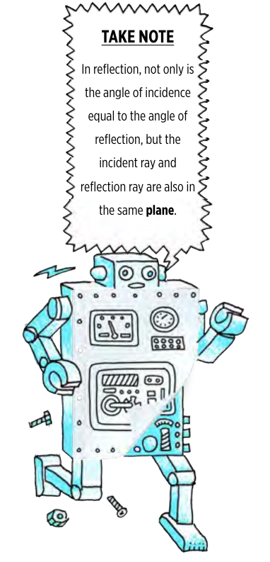
> **[Diagram Context - Textbook_NaturalScience_Gr8_Visible-light.pdf-0022-10.png]**
> This graphic features a cartoon robot holding a speech bubble containing a "TAKE NOTE" text box. The text explicitly defines the two fundamental laws of reflection: the equality of the angle of incidence and the angle of reflection, and the requirement that the incident ray, reflected ray, and normal all lie in the same plane. This serves as a mnemonic aid for Grade 10 Physical Sciences learners to reinforce the theoretical principles governing light reflection.

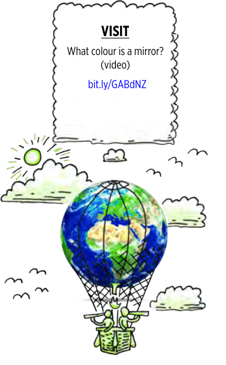
> **[Diagram Context - Textbook_NaturalScience_Gr8_Visible-light.pdf-0022-11.png]**
> This graphic features an illustrative depiction of a hot air balloon shaped like the Earth, carrying two figures observing the horizon with telescopes, accompanied by a thought bubble containing a link to a video titled "What colour is a mirror?". The image serves as an engaging hook to introduce concepts of light reflection, the electromagnetic spectrum, and the physics of colour perception within the Physical Sciences curriculum.

---

### Reflection of Light

Reflections off rippled water appear blurred because light rays are not reflected parallel to each other as they are on a smooth surface. Instead, they are scattered in different directions.

#### Comparison of Reflection Types

| Specular reflection from a smooth surface | Diffuse reflection from a rough surface |
| :--- | :--- |
| 

> **[Diagram Context - Textbook_NaturalScience_Gr8_Energy-transfer-in-electrical-systems.pdf-0023-00.png]**
> This diagram illustrates an electromagnet created by connecting a coiled wire (solenoid) to a battery, surrounded by iron objects like a nut, nail, and bolt. It depicts the magnetic field lines generated by the current flowing through the coil, indicated by directional arrows and the attraction of nearby ferromagnetic materials. This visualises the CAPS Physical Sciences concept of electromagnetism, demonstrating how an electric current produces a magnetic field capable of exerting force on magnetic objects.

 | 

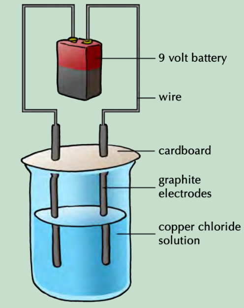
> **[Diagram Context - Textbook_NaturalScience_Gr8_Energy-transfer-in-electrical-systems.pdf-0023-18.png]**
> This diagram illustrates an electrolytic cell apparatus, featuring a 9-volt battery, connecting wires, cardboard support, two graphite electrodes, and a copper chloride solution. It demonstrates the process of electrolysis, where electrical energy from the battery drives a non-spontaneous chemical reaction by decomposing the copper chloride electrolyte into its constituent elements.

 |

*   **Take Note:** "Diffuse" can mean unclear as well as spread out. In this context, the reflection is unclear because the rays are spread out or diffuse.

---

### 4.6 How do we see light?

Visible light is the range of frequencies of light that are visible to the human eye and is responsible for the sense of sight.

*   **New Words:**
    *   **Retina:** The light-sensitive inner surface of the eye.
    *   **Stimulate:** To encourage or provoke a response.

#### The Process of Seeing
We are able to see light because light that is reflected from objects or emitted directly from luminous objects enters the eye to be interpreted. Light that is absorbed by objects does not enter the eye.

#### Structure of the Eye

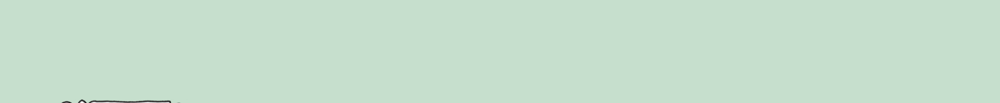

The outer structure of the eye consists of three main visible parts:

1.  **Sclera:** The tough, white, outer part of the eye which acts as protection.
2.  **Iris:** The coloured part of the eye which differs from person to person. It is circular and surrounds the pupil.
3.  **Pupil:** The opening in the centre of the iris through which light enters the eye.

---
*Visit: 2012 Nobel Prize: How do we see light? bit.ly/1a4zs2D*

> **[Diagram Context - Textbook_NaturalScience_Gr8_Series-and-parallel-circuits.pdf-0023-05.png]**
> 1. A cartoon drawing of a man holding a picture of a woman.

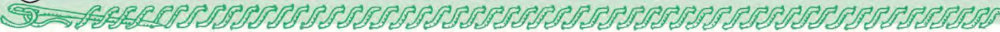
> **[Diagram Context - Textbook_NaturalScience_Gr8_Series-and-parallel-circuits.pdf-0023-07.png]**
> 1. A diagram of a cell with a green line representing a cell wall.

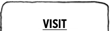
> **[Diagram Context - Textbook_NaturalScience_Gr8_Series-and-parallel-circuits.pdf-0023-10.png]**
> The image shows a black and white diagram of a cell. The diagram includes a cell's organelles, such as the nucleus, mitochondria, and endoplasmic reticulum. The diagram also includes a Lewis structure of the cell, which is a diagram used to represent the bonding between atoms in a molecule. The diagram is labeled with the words "Visit" and "Vit

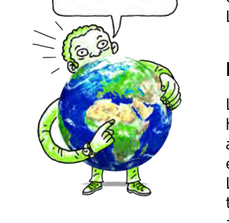
> **[Diagram Context - Textbook_NaturalScience_Gr8_Series-and-parallel-circuits.pdf-0023-13.png]**
> 1. A cartoon illustration of a globe with a person holding it.

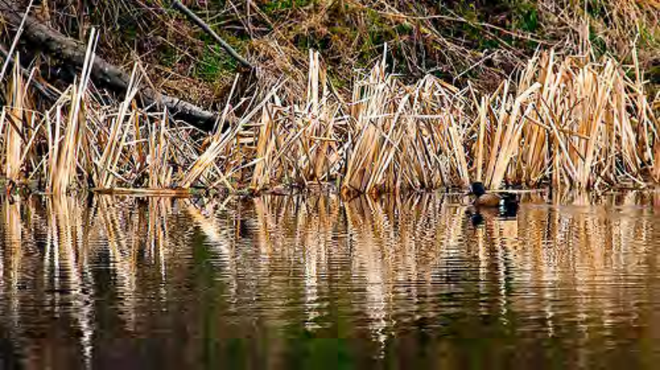
> **[Diagram Context - Textbook_NaturalScience_Gr8_Visible-light.pdf-0023-00.png]**
> This image is a photograph of a wetland ecosystem featuring emergent vegetation (reeds) and a duck on the water surface. It illustrates the biotic and abiotic components of a freshwater habitat, highlighting the interaction between organisms and their environment. For Life Sciences learners, this serves as a visual representation of a habitat or niche, demonstrating how organisms are adapted to and integrated within their specific ecological surroundings.

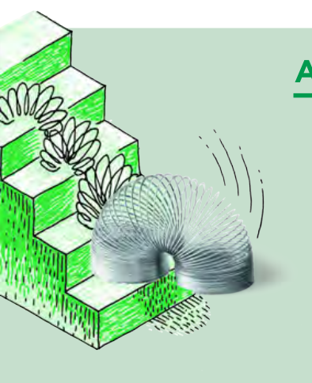
> **[Diagram Context - Textbook_NaturalScience_Gr8_Visible-light.pdf-0023-02.png]**
> This diagram illustrates a slinky toy moving down a set of stairs, with motion lines indicating its flipping action. It serves as a physical model to help learners visualize the transfer of energy and the propagation of longitudinal and transverse waves through a medium.

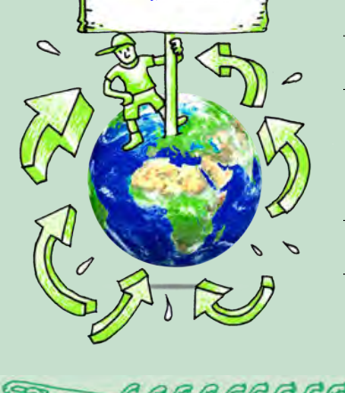
> **[Diagram Context - Textbook_NaturalScience_Gr8_Visible-light.pdf-0023-17.png]**
> This illustration depicts a conceptual diagram of a global cycle, featuring a human figure holding a blank signpost atop a globe surrounded by a circular arrangement of green arrows. The graphic serves as a visual metaphor for environmental stewardship and sustainability, illustrating the cyclical nature of Earth's systems and the human responsibility to manage natural resources within the biosphere.

> **[Diagram Context - Textbook_NaturalScience_Gr8_Visible-light.pdf-0023-19.png]**
> This graphic depicts a stylized representation of a DNA double helix, featuring the characteristic sugar-phosphate backbones and internal base-pairing rungs. It conceptually illustrates the molecular structure of deoxyribonucleic acid, helping students visualize the helical nature of the genetic material that carries hereditary information.

---

### The Human Eye: Structure and Function

#### Pupil Regulation
The size of the pupil changes based on light intensity to regulate the amount of light entering the eye:
*   **Bright light:** The pupil contracts (gets smaller) to limit the amount of light entering.
*   **Low light:** The pupil dilates (gets bigger) to allow more light to enter.

#### Internal Structure of the Eye
The eye is a large ball, with only a small portion visible externally. Key components include:
*   **Cornea:** A tough, transparent outer layer that covers the iris.
*   **Iris:** The coloured part of the eye that controls the size of the pupil.
*   **Pupil:** The opening that allows light to enter the eye.
*   **Lens:** Located behind the iris; it works with the cornea to focus light.
*   **Sclera:** The tough outer wall of the eyeball.
*   **Retina:** A layer of tissue lining the back of the eyeball (indicated in yellow in the diagram).
*   **Fovea:** Located in the centre of the retina; this is where the clearest image is formed.
*   **Optic Nerve:** The pathway that carries electrical impulses from the retina to the brain.

> **[Diagram Context - Textbook_NaturalScience_Gr8_Energy-transfer-in-electrical-systems.pdf-0024-09.png]**
> The image features a cartoon illustration of a hot air balloon filled with a cartoon depiction of the earth. The balloon is being carried by two cartoon people who are holding onto a basket. The illustration also includes a sun and clouds, which are part of the earth's atmosphere. The image is labeled as an educational graphic, and it is designed to help a high school student learn about the earth and its

#### How We See
1.  **Light Entry:** Light enters the eye and is focused by the cornea and lens.
2.  **Image Formation:** The light hits the retina at the back of the eyeball, forming an image similar to a pinhole camera.
3.  **Conversion:** Receptor cells in the retina, which are sensitive to light, convert light energy into electrical nerve impulses.
4.  **Transmission:** These impulses travel through the optic nerve to the brain.
5.  **Interpretation:** The brain interprets these impulses as sight.

***

#### Key Notes
*   **Fovea:** The part of the eye located in the centre of the retina where the clearest image is formed.
*   **Cell:** The basic structural and functional unit of all living things. (Note: Further study on cells will occur in Grade 9 Life and Living).

> **[Diagram Context - Textbook_NaturalScience_Gr8_Energy-transfer-in-electrical-systems.pdf-0024-19.png]**
> The image is a cartoon illustration of a science experiment. The experiment is set up in a laboratory with a volcano, which is filled with a blue liquid. The volcano is surrounded by a group of people, who are depicted as cartoon characters. The people are running around the volcano, and the scene is filled with purple and blue colors. The image is labeled as a "conceptual diagram" and

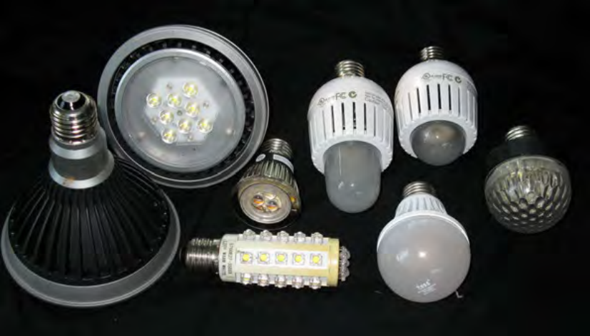
> **[Diagram Context - Textbook_NaturalScience_Gr8_Series-and-parallel-circuits.pdf-0024-00.png]**
> 1. A collection of different types of light bulbs.

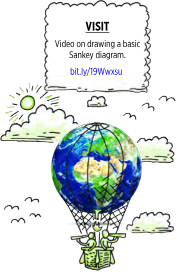
> **[Diagram Context - Textbook_NaturalScience_Gr8_Series-and-parallel-circuits.pdf-0024-07.png]**
> The image shows a cartoon depiction of a hot air balloon with two people inside. The balloon is filled with a green substance, and the people are wearing white shirts. The balloon is floating in the sky, and the people are positioned on the balloon, with one person on the left side and the other person on the right side. The image also includes a caption that reads "Visit" and a

> **[Diagram Context - Textbook_NaturalScience_Gr8_Series-and-parallel-circuits.pdf-0024-08.png]**
> 1. A diagram of a spring coiled up and attached to a green block.

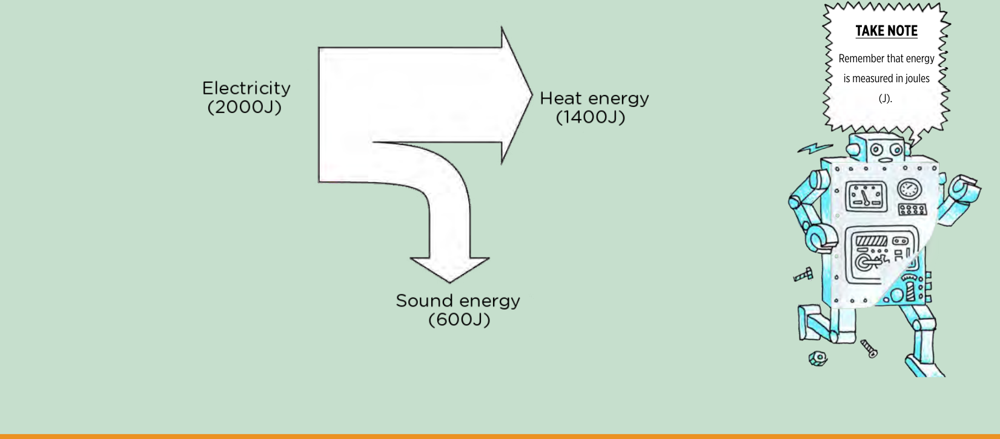
> **[Diagram Context - Textbook_NaturalScience_Gr8_Series-and-parallel-circuits.pdf-0024-09.png]**
> The image is a diagram that illustrates the relationship between electricity, heat energy, and sound energy. The diagram is divided into three sections, each representing a different aspect of the topic. The left section shows a Lewis diagram, which is a diagram used to represent the valence electrons of an atom. The middle section depicts a graph of heat energy, which is the amount of heat energy required to raise

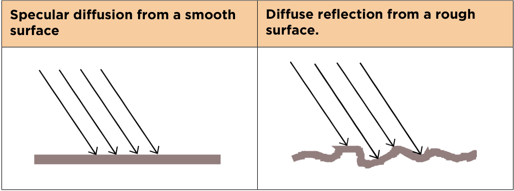
> **[Diagram Context - Textbook_NaturalScience_Gr8_Visible-light.pdf-0024-02.png]**
> This diagram illustrates the physics of light reflection using two comparative ray diagrams labeled "Specular reflection from a smooth surface" and "Diffuse reflection from a rough surface," featuring parallel incident light rays represented by arrows. It conceptually demonstrates how the texture of a surface dictates the direction of reflected light, distinguishing between the orderly, parallel reflection of smooth surfaces and the scattered, multi-directional reflection caused by irregular surfaces.

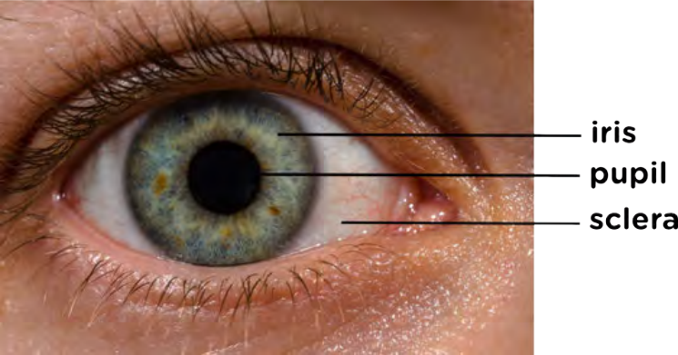
> **[Diagram Context - Textbook_NaturalScience_Gr8_Visible-light.pdf-0024-06.png]**
> This image is an anatomical photograph of the human eye with labels identifying the iris, pupil, and sclera. It serves as a foundational visual aid for Life Sciences learners to identify the external structures of the eye and understand their relative positions within the organ.

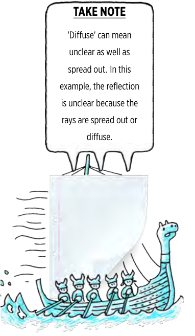
> **[Diagram Context - Textbook_NaturalScience_Gr8_Visible-light.pdf-0024-08.png]**
> This graphic uses a cartoon illustration of a Viking ship to provide a linguistic clarification for the term "diffuse" within the context of optics. It features a text box labeled "TAKE NOTE" that explains how the word describes both the physical scattering of light rays and the resulting lack of clarity in a reflection. This serves as a mnemonic aid to help learners distinguish between regular and diffuse reflection in Physical Sciences.

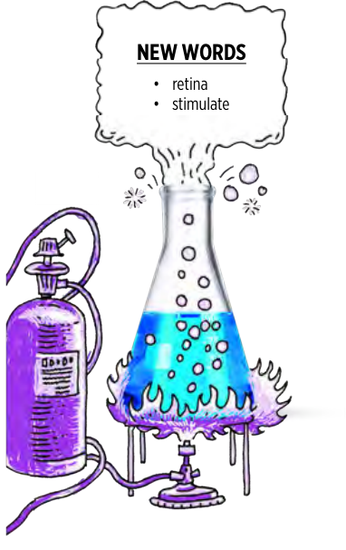
> **[Diagram Context - Textbook_NaturalScience_Gr8_Visible-light.pdf-0024-09.png]**
> This graphic depicts a laboratory apparatus consisting of a gas cylinder connected to a Bunsen burner heating a conical flask, accompanied by a text box labeled "NEW WORDS" containing the terms "retina" and "stimulate." While the illustration represents a standard chemical heating procedure, the inclusion of biological terminology suggests a metaphorical or contextual link between the concept of sensory stimulation and the activation of a chemical reaction.

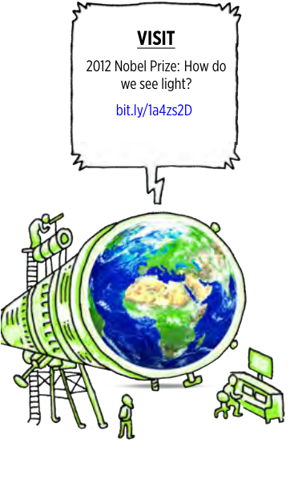
> **[Diagram Context - Textbook_NaturalScience_Gr8_Visible-light.pdf-0024-10.png]**
> This graphic features a cartoon illustration of a large telescope pointed at the Earth, accompanied by a speech bubble containing the text "VISIT 2012 Nobel Prize: How do we see light?" and a shortened URL. It serves as an engaging hook to introduce Life Sciences students to the complex physiological and biochemical mechanisms of vision, specifically the Nobel-winning research on G-protein-coupled receptors.

---

### How We See Colours

#### The Physics of Colour Reflection
When white light (which contains all colours of the visible spectrum) strikes an object, the object interacts with that light. 

*   **Reflection:** If an object appears a specific colour, it is because that object absorbs all other colours of light and **reflects** only the colour that we see.
*   **Example:** When white light hits a red ladybird, the surface absorbs all colours except red. The red light is reflected into our eyes. This reflected light hits the retina, where it is converted into electrical impulses and sent to the brain, allowing us to perceive the colour red.

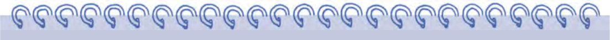
> **[Diagram Context - Textbook_NaturalScience_Gr8_Energy-transfer-in-electrical-systems.pdf-0025-03.png]**
> 1. A diagram of a cell with blue and white lines.

---

### Did You Know? (Eye Anatomy)

*   **The Blind Spot:** Each eye has a small "blind spot" at the back of the retina where the optic nerve attaches. We do not normally notice this hole in our vision because our eyes work together to fill in the missing information for each other.
*   **Retinal Cells:** The cells in your eye come in different shapes:
    *   **Rod-shaped cells:** Allow you to see shapes.
    *   **Cone-shaped cells:** Allow you to see colour.

---

### Activity: Seeing Colours

**Materials:**
*   Coloured pens or pencils

**Instructions:**
1. Answer the following questions about how we see objects.
2. Draw a ray diagram to accompany your written answer.
3. Use the provided image of a sunflower as your example.

> **[Diagram Context - Textbook_NaturalScience_Gr8_Energy-transfer-in-electrical-systems.pdf-0025-04.png]**
> 1. A cartoon drawing of a man in a hard hat and boots digging a hole with a key in his mouth.

*Note: To complete this activity, explain why the sunflower petals appear yellow and the centre appears black based on the principles of light absorption and reflection.*

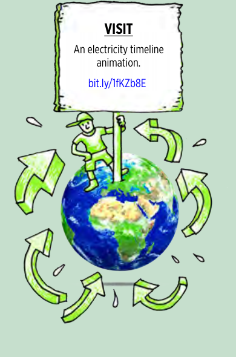
> **[Diagram Context - Textbook_NaturalScience_Gr8_Series-and-parallel-circuits.pdf-0025-05.png]**
> The image shows a cartoon depiction of a boy standing on a pole, holding a sign that reads "visit" and pointing to a diagram of the human body. The boy is wearing a hat and holding a cane. The diagram features a globe and arrows, possibly representing the circulatory system. The boy is positioned in the center of the image, with the globe and arrows surrounding him.

> **[Diagram Context - Textbook_NaturalScience_Gr8_Series-and-parallel-circuits.pdf-0025-09.png]**
> This graphic depicts a repeating, wave-like pattern of interconnected, arrow-shaped segments. It serves as a visual representation of a continuous process or directional flow, often used in Life Sciences to illustrate metabolic pathways, the sequence of DNA replication, or the cyclical nature of biological systems.

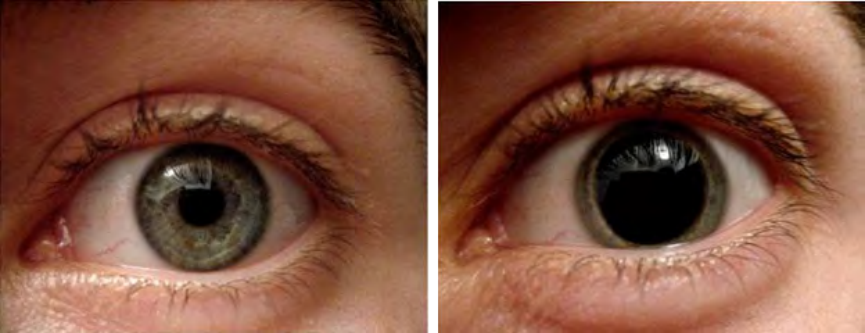
> **[Diagram Context - Textbook_NaturalScience_Gr8_Visible-light.pdf-0025-00.png]**
> This comparative photograph displays the human eye, specifically focusing on the iris and the pupil. It illustrates the pupillary mechanism, where the size of the pupil changes in response to varying light intensities to regulate the amount of light entering the eye. This visual serves as a practical example of a reflex action, demonstrating how the autonomic nervous system controls the circular and radial muscles of the iris to maintain homeostasis.

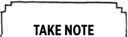
> **[Diagram Context - Textbook_NaturalScience_Gr8_Visible-light.pdf-0025-01.png]**
> This graphic is a text-based instructional icon featuring the words "TAKE NOTE" enclosed within a stylized, stepped-edge rectangular border. It serves as a pedagogical signpost in CAPS textbooks to alert learners to critical information, key definitions, or essential concepts that require focused attention for examination preparation.

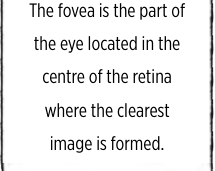
> **[Diagram Context - Textbook_NaturalScience_Gr8_Visible-light.pdf-0025-02.png]**
> This text-based educational graphic defines the anatomical location and functional significance of the fovea within the human eye. It explicitly labels the "fovea," "eye," and "retina" to explain that this specific region is responsible for the formation of the clearest visual images, a key concept in the Grade 12 Life Sciences curriculum regarding the human eye.

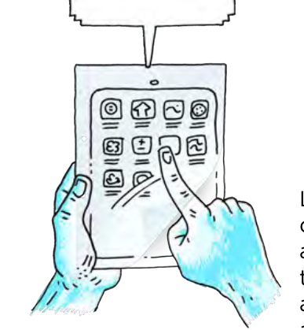
> **[Diagram Context - Textbook_NaturalScience_Gr8_Visible-light.pdf-0025-03.png]**
> This illustration depicts a pair of hands interacting with a tablet interface featuring various abstract icons, including mathematical and scientific symbols like a plus-minus sign and a wave function. It serves as a visual metaphor for digital literacy and the integration of Information and Communication Technology (ICT) into the classroom, highlighting how learners use mobile devices to access and navigate educational content.

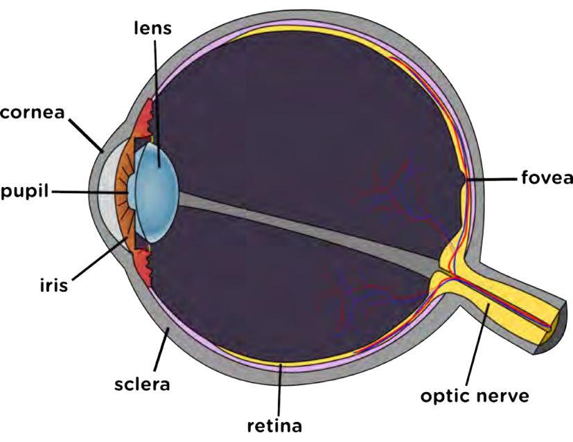
> **[Diagram Context - Textbook_NaturalScience_Gr8_Visible-light.pdf-0025-06.png]**
> This diagram is a cross-sectional anatomical illustration of the human eye, featuring labels for the cornea, pupil, iris, lens, sclera, retina, fovea, and optic nerve. It serves as a foundational visual aid for Life Sciences learners to identify the key structures involved in the refraction of light and the transduction of visual stimuli into nerve impulses.

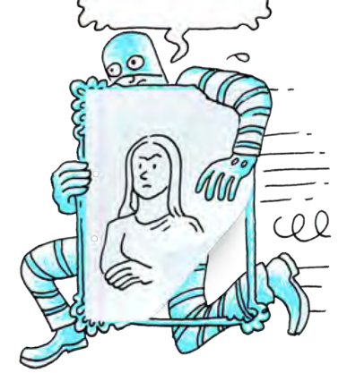
> **[Diagram Context - Textbook_NaturalScience_Gr8_Visible-light.pdf-0025-09.png]**
> This cartoon depicts a thief in a striped outfit running away while clutching a framed portrait of a woman. The image uses visual metaphors of motion lines and a speech bubble to represent the act of theft or the removal of an object from its original context. Conceptually, this graphic serves as a visual analogy for plagiarism or intellectual property theft, illustrating the unauthorized appropriation of someone else's creative work.

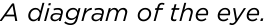

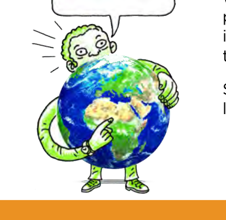
> **[Diagram Context - Textbook_NaturalScience_Gr8_Visible-light.pdf-0025-14.png]**
> This graphic is a metaphorical illustration featuring a person with green skin holding and pointing at a globe centered on the African continent. It serves as a visual prompt to introduce topics related to environmental science, global sustainability, or human impact on the biosphere within the Life Sciences curriculum.

---

### Understanding Colour: Absorption and Reflection

#### Key Concept: How we see colour
We perceive the colour of an object based on which wavelengths of light are **reflected** into our eyes and which are **absorbed** by the object's surface.

*   **White light:** Contains all the colours of the visible spectrum.
*   **Reflection:** When an object appears a specific colour, it is because that object reflects that specific colour of light while absorbing all other colours.
*   **Absorption:** When an object appears black, it absorbs all colours of light and reflects none.

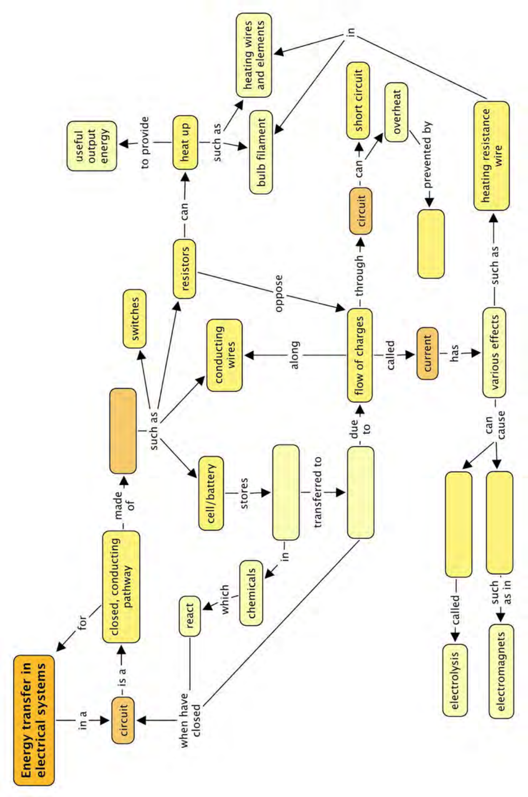
> **[Diagram Context - Textbook_NaturalScience_Gr8_Energy-transfer-in-electrical-systems.pdf-0026-00.png]**
> The image is a detailed diagram of a cell, which is a fundamental unit of life. The diagram is color-coded, with yellow representing the nucleus, orange representing the cytoplasm, and green representing the cell membrane. The diagram also includes arrows pointing to different parts of the cell, such as the mitochondria, ribosomes, and Golgi apparatus. The diagram is labeled with

---

### Exercises

#### 1. The Flower
**Question:** Explain why the petals of a flower appear yellow and the centre appears black. Use the concepts of absorption and reflection in your explanation. Draw a diagram to support your answer.

*   **Explanation for Yellow Petals:** The petals absorb all colours of white light except for yellow light, which is reflected into our eyes.
*   **Explanation for Black Centre:** The centre of the flower absorbs all colours of white light. Because no light is reflected into our eyes, the centre appears black.

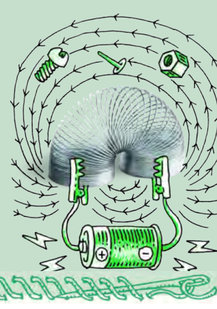
> **[Diagram Context - Textbook_NaturalScience_Gr8_Series-and-parallel-circuits.pdf-0026-05.png]**
> 1. A green spring with a silver spring inside of it. 
 2. A green spring with a silver spring inside of it. 
 3. A green spring with a silver spring inside of it. 
 4. A green spring with a silver spring inside of it. 
 5. A green spring with a silver spring inside of it.

#### 2. The Blue Car
**Question:** Heath has bought himself a blue car. Explain why we see the car as blue by using the concepts of absorption and reflection of light. Draw a diagram to support your answer.

*   **Explanation:** When white light hits the surface of the car, the paint absorbs all the colours of the spectrum except for blue. The blue light is reflected off the surface of the car and travels to our eyes, allowing us to see the car as blue.

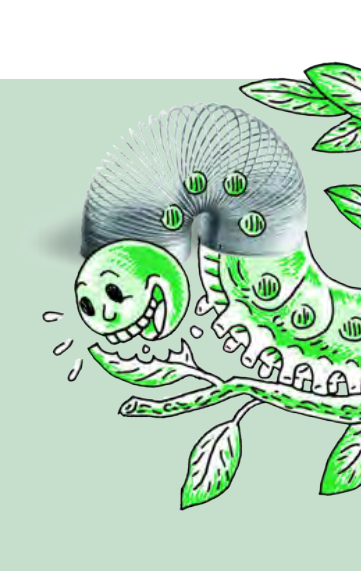
> **[Diagram Context - Textbook_NaturalScience_Gr8_Series-and-parallel-circuits.pdf-0026-10.png]**
> The image features a cartoon depiction of a caterpillar with a face and a body made of green leaves. The caterpillar is holding a green ball in its mouth. The background of the image is a light green color, and there is a white line running across the image. The caterpillar is positioned in the center of the image, with the green leaves surrounding it. The image does not contain

> **[Diagram Context - Textbook_NaturalScience_Gr8_Series-and-parallel-circuits.pdf-0026-11.png]**
> The image shows a close-up view of a diagram that appears to be a Lewis diagram. The diagram is set against a gray background, and it features a snake-like shape with green lines. The diagram is labeled with the word "Lewis" and includes various labels such as "cellular structure", "anatomical", "circuit", "graph", "evolutionary tree",

> **[Diagram Context - Textbook_NaturalScience_Gr8_Visible-light.pdf-0026-00.png]**
> This diagram illustrates the physics of light reflection using a ladybug as the subject, featuring labels for "white light coming in," "red light," and "red surface," along with arrows representing the visible spectrum. It demonstrates the concept of selective reflection, showing how an object appears red because it absorbs all other wavelengths of white light while reflecting only the red component to the observer's eye.

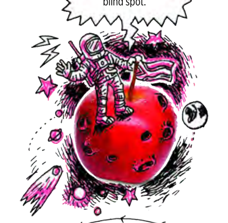
> **[Diagram Context - Textbook_NaturalScience_Gr8_Visible-light.pdf-0026-12.png]**
> This illustration depicts an astronaut standing on a cratered, red, apple-like sphere, surrounded by celestial elements like stars, planets, and a comet. The visual includes a speech bubble fragment referencing a "blind spot" and a South African flag held by the astronaut. Conceptually, this graphic serves as a metaphorical or humorous prompt to introduce the biological concept of the optic disc (blind spot) in the human eye, contrasting the anatomical structure with the vast, external "space" theme.

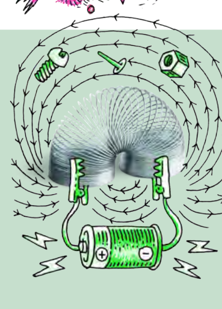
> **[Diagram Context - Textbook_NaturalScience_Gr8_Visible-light.pdf-0026-13.png]**
> This diagram illustrates an electromagnet created by connecting a coiled wire (solenoid) to a battery, marked with positive (+) and negative (-) terminals. The surrounding field lines with directional arrows demonstrate the magnetic field generated by the electric current, which is shown attracting various metallic objects like a screw, nail, and nut. This visualises the CAPS Physical Sciences concept of electromagnetism, showing how an electric current flowing through a conductor produces a magnetic field capable of exerting force on ferromagnetic materials.

> **[Diagram Context - Textbook_NaturalScience_Gr8_Visible-light.pdf-0026-14.png]**
> This image is a high-resolution photograph of a sunflower (*Helianthus annuus*) displaying its characteristic composite flower structure, including the central disc florets and surrounding yellow ray florets. In the context of the CAPS Life Sciences curriculum, this visual serves as a primary example of an angiosperm, illustrating plant morphology and reproductive structures used to study plant diversity and pollination strategies.

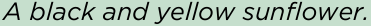

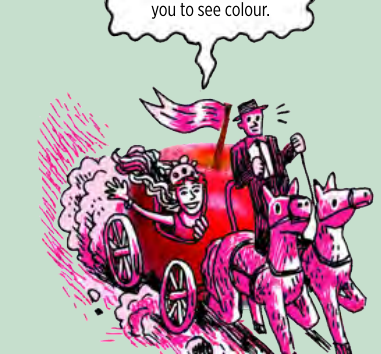
> **[Diagram Context - Textbook_NaturalScience_Gr8_Visible-light.pdf-0026-18.png]**
> This educational cartoon depicts a metaphorical illustration of human sensory perception, featuring a person riding in an apple-shaped carriage pulled by horses. The image uses the text "you to see colour" and a monochromatic pink colour scheme to visually represent the physiological process of light reflection and the role of photoreceptors in the human eye. It serves as a conceptual aid for Life Sciences learners to understand how the brain interprets reflected light wavelengths as specific colours.

---

### 4.7 Refraction of Light

#### Introduction
Previously, we explored opaque and transparent substances, the absorption of light, and the reflection of light. We now focus on how light interacts with transparent materials.

#### New Words
*   **Refraction:** The bending of light as it passes from one transparent medium into another.
*   **Medium:** A substance (such as air, water, or glass) through which light travels.
*   **Optical density:** A measure of how much a medium slows down the speed of light.

#### Observation: The Bent Pencil Effect
When you place a straw or a pencil into a glass of water, it appears to be bent at the point where it enters the water. This phenomenon occurs because light travels at different speeds through different materials.

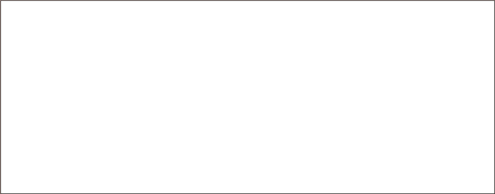

#### Investigation
To understand why the pencil appears bent, we must examine how light behaves when it passes through a transparent object, such as a glass block. 

*Note: Light changes direction when it moves from a medium of one optical density to a medium of a different optical density.*

> **[Diagram Context - Textbook_NaturalScience_Gr8_Series-and-parallel-circuits.pdf-0027-00.png]**
> 1. A diagram of a cell with blue and white lines.

> **[Diagram Context - Textbook_NaturalScience_Gr8_Series-and-parallel-circuits.pdf-0027-01.png]**
> 1. A diagram of a man playing a guitar.

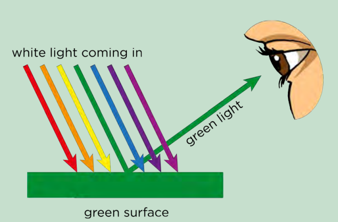
> **[Diagram Context - Textbook_NaturalScience_Gr8_Visible-light.pdf-0027-02.png]**
> This diagram illustrates the physics of light reflection and colour perception, featuring a spectrum of incident white light rays (red, orange, yellow, green, blue, indigo, violet) striking a green surface. It demonstrates the concept of selective reflection, where the surface absorbs all colours except green, which is reflected toward the human eye, explaining why objects appear to have specific colours.

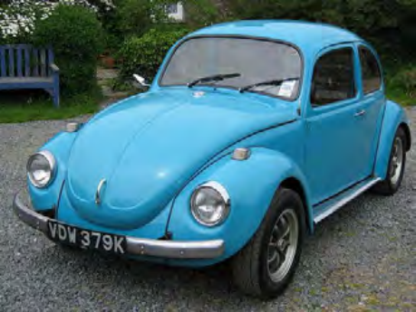
> **[Diagram Context - Textbook_NaturalScience_Gr8_Visible-light.pdf-0027-06.png]**
> This image is a photograph of a classic Volkswagen Beetle, featuring visible components such as headlights, a bumper, a windscreen with wipers, and a license plate reading "VDW 379K." In a CAPS Physical Sciences context, this image serves as a real-world object to illustrate concepts related to mechanics, such as calculating velocity, acceleration, or the forces acting upon a vehicle in motion.

---

# Investigation: Light Passing Through a Glass Block

## Objective
To investigate the behavior of a light ray as it travels from air into a glass block and back out into the air.

---

## Key Concepts

### 1. Refraction
Refraction is the change in direction of a light ray when it passes from one transparent medium into another (e.g., from air into glass).

### 2. Measuring Angles
To analyze the path of light, we use a **normal line**, which is an imaginary line drawn at a $90^{\circ}$ angle to the surface where the two media meet.

*   **Angle of Incidence ($i$):** The angle measured between the incident light ray and the normal line.
*   **Angle of Refraction ($r$):** The angle measured between the refracted light ray and the normal line.

---

## Analysis of Light Behavior

When light passes through a transparent substance, it changes direction. By comparing the angle of incidence ($i$) and the angle of refraction ($r$), we can determine how the light bends:

*   **Bending towards the normal:** If the angle of refraction ($r$) is smaller than the angle of incidence ($i$), the light ray has bent towards the normal line.
*   **Bending away from the normal:** If the angle of refraction ($r$) is larger than the angle of incidence ($i$), the light ray has bent away from the normal line.

---

## Critical Thinking Questions
1. Based on the provided diagram, is the angle of refraction ($r$) smaller or larger than the angle of incidence ($i$)?
2. Did the light ray bend towards or away from the normal line in this specific instance?

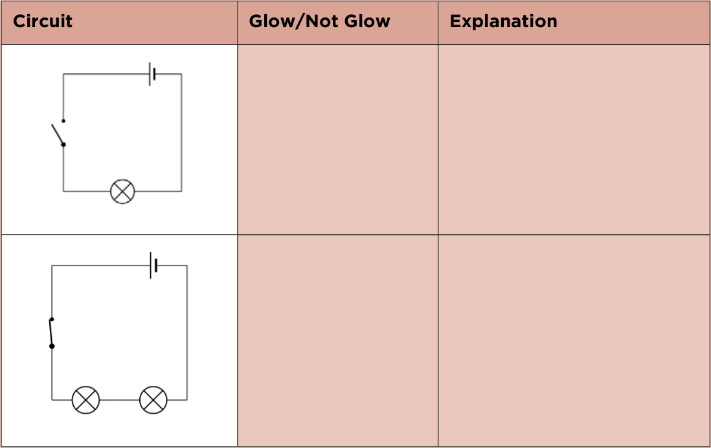
> **[Diagram Context - Textbook_NaturalScience_Gr8_Energy-transfer-in-electrical-systems.pdf-0028-04.png]**
> 1. A pink table with a white background and a black outline.
2. A pink table with a white background and a black outline.

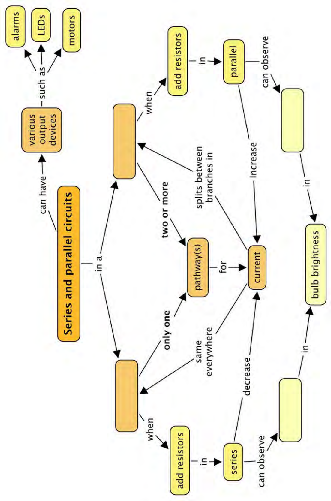
> **[Diagram Context - Textbook_NaturalScience_Gr8_Series-and-parallel-circuits.pdf-0028-00.png]**
> The image is a diagram that illustrates the concept of parallel circuits. It is a visual representation of the relationship between series and parallel circuits, which is a fundamental concept in electrical engineering. The diagram is color-coded, with yellow representing series circuits and orange representing parallel circuits. The diagram also includes labels for various components, such as resistors, capacitors, and batteries, as well as arrows to

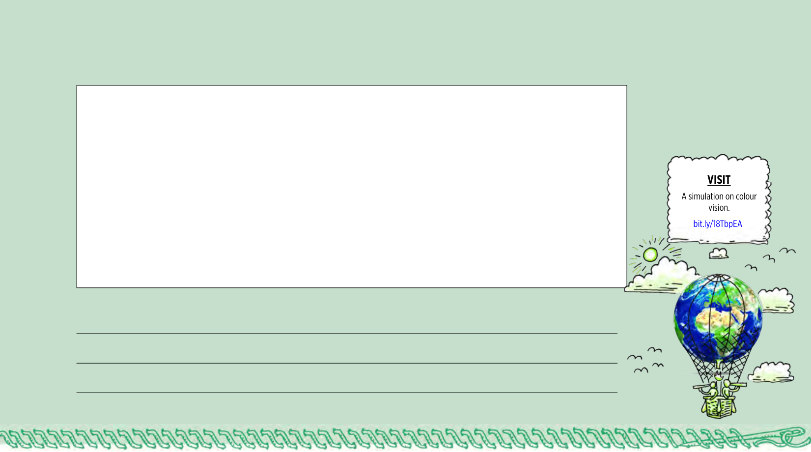
> **[Diagram Context - Textbook_NaturalScience_Gr8_Visible-light.pdf-0028-00.png]**
> This graphic serves as a template for educational notes, featuring a large central text box, lined writing space, and a decorative illustration of a globe-shaped hot air balloon. It includes a call-to-action label directing students to an online simulation on colour vision via a shortened URL. This layout is designed to help learners structure their study notes while providing a digital resource link to support the conceptual understanding of light and human vision.

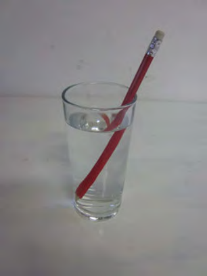
> **[Diagram Context - Textbook_NaturalScience_Gr8_Visible-light.pdf-0028-04.png]**
> This image is a photograph of a pencil partially submerged in a glass of water, demonstrating the physical phenomenon of refraction. It illustrates how light rays change direction when passing between media of different optical densities, causing the pencil to appear "broken" or displaced at the air-water interface.

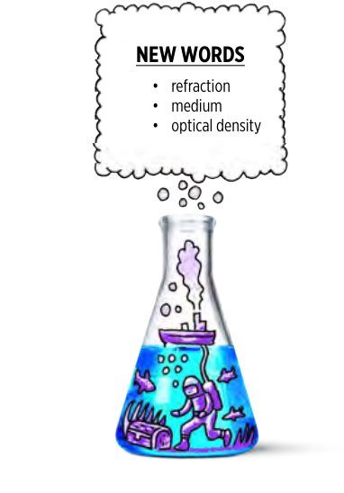
> **[Diagram Context - Textbook_NaturalScience_Gr8_Visible-light.pdf-0028-05.png]**
> This graphic features an Erlenmeyer flask containing an underwater scene with a diver and a ship, accompanied by a thought bubble listing the key terminology: "refraction," "medium," and "optical density." It serves as an introductory visual aid for Grade 10 Physical Sciences, contextualizing how light travels through different media to explain the fundamental principles of optical phenomena.

---

# Chapter 4: Visible Light - Refraction

### Concept: Refraction of Light
Refraction is the change in direction of a light ray as it passes from one transparent medium into another. This occurs because light travels at different speeds in different materials.

*   **Incident Ray ($i$):** The ray of light entering the new medium.
*   **Refracted Ray ($r$):** The ray of light after it has changed direction in the new medium.

---

### Investigation: Light through a Parallel-Sided Glass Block

**AIM:** To determine whether light changes direction when it passes through a parallel-sided glass block.

**HYPOTHESIS:** 
*(Learner to complete: Predict whether the light will bend and if it will exit in the same direction it entered.)*

**MATERIALS AND APPARATUS:**
*   Glass block
*   Ray box, laser pointer, or other light source
*   Protractor

**METHOD:**
1.  Place the glass block in the centre of a piece of white paper and trace around it.
2.  Shine a ray of light into the glass block at an angle to the surface of the block.

---

### Critical Thinking Exercises

1.  **Observation:** In the provided diagram, does the refracted ray change direction when it enters the transparent medium? Give a reason for your answer.
2.  **Directionality:** In which direction did the refracted ray change?

---

### TAKE NOTE
The emergent ray (the ray that exits the block) from a parallel-sided glass block is parallel to the incident ray (the ray that entered the block).

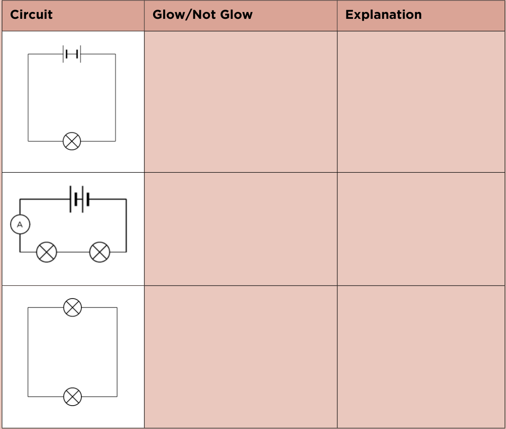
> **[Diagram Context - Textbook_NaturalScience_Gr8_Energy-transfer-in-electrical-systems.pdf-0029-01.png]**
> 1. A diagram of a circuit with three different types of circuits.
2. A diagram of a circuit with three different types of circuits.
3. A diagram of a circuit with three different types of circuits.

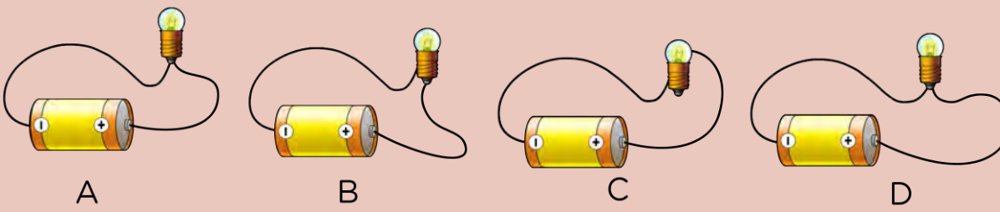
> **[Diagram Context - Textbook_NaturalScience_Gr8_Energy-transfer-in-electrical-systems.pdf-0029-03.png]**
> 1. A yellow battery with a light bulb connected to it.

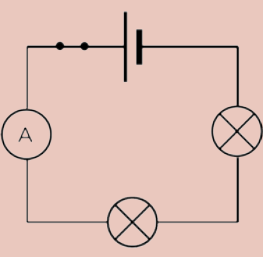
> **[Diagram Context - Textbook_NaturalScience_Gr8_Series-and-parallel-circuits.pdf-0029-02.png]**
> 1. A circuit diagram with three circles and an x in the middle.

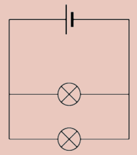
> **[Diagram Context - Textbook_NaturalScience_Gr8_Series-and-parallel-circuits.pdf-0029-03.png]**
> 1. A black and white diagram of two electrical components connected by a wire.

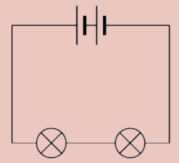
> **[Diagram Context - Textbook_NaturalScience_Gr8_Series-and-parallel-circuits.pdf-0029-04.png]**
> 1. A Lewis diagram of two double-layered capacitors connected by a wire.

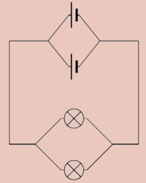
> **[Diagram Context - Textbook_NaturalScience_Gr8_Series-and-parallel-circuits.pdf-0029-05.png]**
> 1. A diagram of a circuit with two parallel wires and two light bulbs.

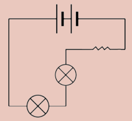
> **[Diagram Context - Textbook_NaturalScience_Gr8_Series-and-parallel-circuits.pdf-0029-06.png]**
> 1. A black and white diagram of a circuit with two X's and two H's.

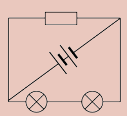
> **[Diagram Context - Textbook_NaturalScience_Gr8_Series-and-parallel-circuits.pdf-0029-07.png]**
> 1. A diagram of a circuit with a battery and a wire.

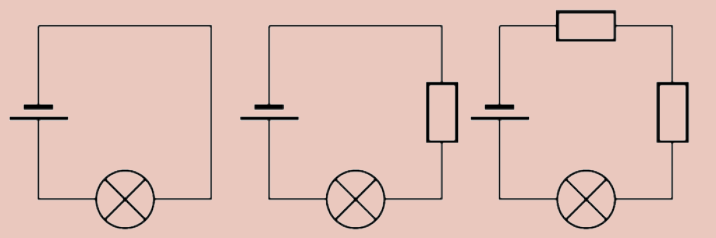
> **[Diagram Context - Textbook_NaturalScience_Gr8_Series-and-parallel-circuits.pdf-0029-09.png]**
> 1. A diagram of three circuits with three wires and three components.

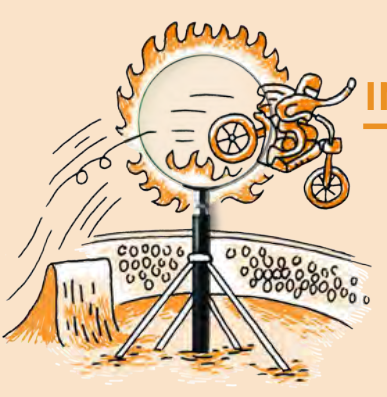
> **[Diagram Context - Textbook_NaturalScience_Gr8_Visible-light.pdf-0029-00.png]**
> This illustration depicts a stunt motorcyclist performing a jump through a flaming hoop, representing a projectile motion scenario. It visually captures the trajectory of an object moving through the air under the influence of gravity, which is a core concept in Grade 10-12 Physical Sciences regarding kinematics and vertical projectile motion.

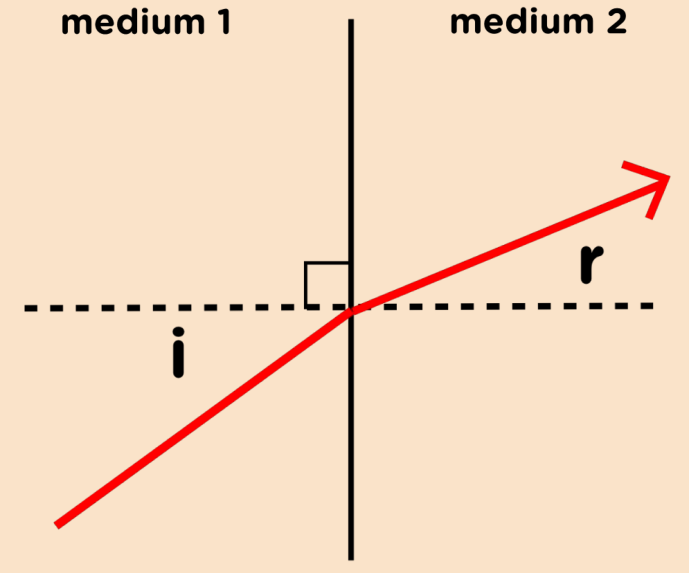
> **[Diagram Context - Textbook_NaturalScience_Gr8_Visible-light.pdf-0029-06.png]**
> This ray diagram illustrates the refraction of light as it passes between two different optical media, featuring labels for "medium 1," "medium 2," the angle of incidence (i), and the angle of refraction (r) relative to a normal line. It conceptually demonstrates how a light ray changes direction at an interface due to a change in optical density, providing a foundational visual for applying Snell’s Law in Physical Sciences.

---

### Experiment: Refraction of Light through a Glass Block

This experiment demonstrates how light changes direction when passing from one medium (air) into another (glass) and back again.

#### Procedure

1.  **Initial Entry:** Place the glass block on a sheet of paper. Trace the incident ray and mark the point where it enters the glass block.
2.  **Emergence:** Observe where the light ray emerges on the opposite side of the glass block. Mark this point and trace the emergent ray.
3.  **Refraction Path:** Remove the glass block. Draw a straight line connecting the point of entry and the point of emergence. This line represents the path of the refracted ray inside the glass block.
4.  **Normal Lines:** Draw the normal lines (perpendicular to the surface) at the point where the incident ray meets the block and where the emergent ray leaves the block.
5.  **Measurement:** Use a protractor to measure the angles labeled 1, 2, 3, and 4 as indicated in the diagram.
6.  **Data Collection:** Record your measurements in the table below.
7.  **Repetition:** Repeat the entire process three times using different angles of incidence (angle 1) to observe how the refraction changes.

#### Data Recording Table

| Trial | Angle of Incidence (1) | Angle of Refraction (2) | Angle of Incidence (3) | Angle of Emergence (4) |
| :--- | :--- | :--- | :--- | :--- |
| 1 | | | | |
| 2 | | | | |
| 3 | | | | |

#### Key Concepts
*   **Incident Ray:** The ray of light traveling from the air towards the glass block.
*   **Refracted Ray:** The ray of light that travels through the glass block after bending.
*   **Emergent Ray:** The ray of light that exits the glass block back into the air.
*   **Normal:** An imaginary line drawn at $90^{\circ}$ to the surface of the glass block at the point of incidence.
*   **Angle of Incidence ($i$):** The angle between the incident ray and the normal.
*   **Angle of Refraction ($r$):** The angle between the refracted ray and the normal.

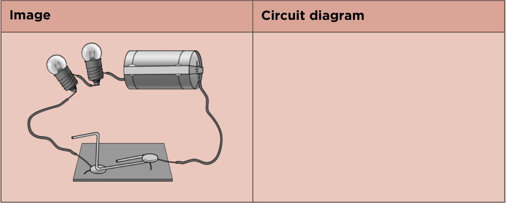
> **[Diagram Context - Textbook_NaturalScience_Gr8_Energy-transfer-in-electrical-systems.pdf-0030-02.png]**
> 1. A circuit diagram of a battery and a light bulb connected by a wire.

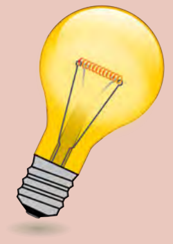
> **[Diagram Context - Textbook_NaturalScience_Gr8_Energy-transfer-in-electrical-systems.pdf-0030-07.png]**
> 1. A cartoon depiction of a light bulb.

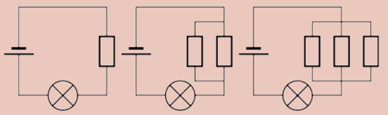
> **[Diagram Context - Textbook_NaturalScience_Gr8_Series-and-parallel-circuits.pdf-0030-03.png]**
> 1. A diagram of a circuit with three resistors connected to a battery.

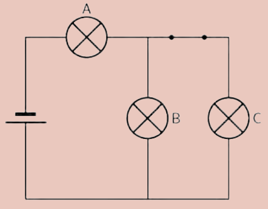
> **[Diagram Context - Textbook_NaturalScience_Gr8_Series-and-parallel-circuits.pdf-0030-06.png]**
> 1. A black and white diagram of a circuit with three lights and two wires.

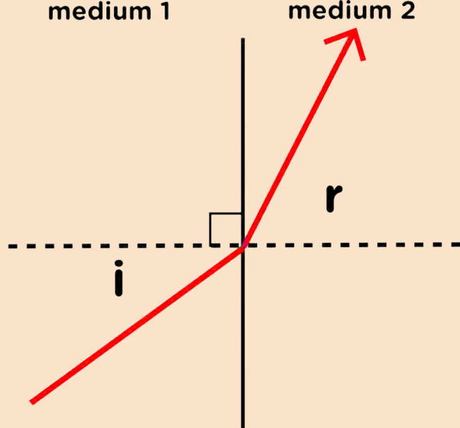
> **[Diagram Context - Textbook_NaturalScience_Gr8_Visible-light.pdf-0030-01.png]**
> This ray diagram illustrates the refraction of light as it passes between two different media, featuring labels for "medium 1," "medium 2," the angle of incidence (i), and the angle of refraction (r) relative to the normal line. It conceptually demonstrates how light changes direction when crossing an interface between materials of different optical densities, a fundamental principle in Grade 10-12 Physical Sciences.

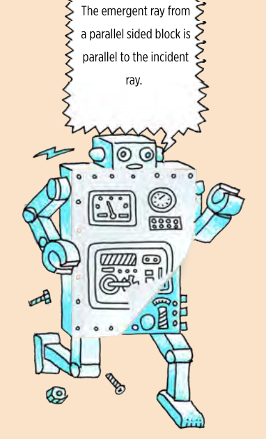
> **[Diagram Context - Textbook_NaturalScience_Gr8_Visible-light.pdf-0030-15.png]**
> This graphic features a cartoon robot with a speech bubble containing the text: "The emergent ray from a parallel sided block is parallel to the incident ray." It serves as a mnemonic aid for Grade 10 Physical Sciences learners to recall the optical principle of lateral displacement, where light entering and exiting a rectangular glass block maintains its original direction despite being shifted.

---

### Experiment: Investigating the Refraction of Light

#### Objective
To observe and record the behavior of light as it passes from one medium (air) into another (glass), and to understand the phenomenon of refraction.

#### Results and Observations
Record your experimental measurements in the table below. Perform the experiment four times to ensure accuracy.

| Experimental repeat | Angle 1 | Angle 2 | Angle 3 | Angle 4 |
| :--- | :--- | :--- | :--- | :--- |
| 1 | | | | |
| 2 | | | | |
| 3 | | | | |
| 4 | | | | |

---

#### Analysis Questions

1. **Equality of Angles:** Which pairs of angles are equal in the measurements you have taken?
2. **Identification:** Which of the measured angles represent the **angle of incidence** ($i$) and which represent the **angle of refraction** ($r$)?
3. **Observation:** What is the relationship between the angle of incidence and the angle of refraction for each set of measurements?
4. **Direction of Bending:** Did the light entering the glass block bend towards or away from the normal line?
5. **Special Case:** If the angle of incidence is $0^\circ$ (the light ray enters the block perpendicular to the surface), what is the angle of refraction?

---

#### Core Concept: Refraction

**Refraction** is the change in direction of a light ray as it passes from one transparent medium to another of different optical density.

*   **The Normal:** An imaginary line drawn perpendicular to the surface at the point where the light ray strikes.
*   **Angle of Incidence ($i$):** The angle between the incident ray and the normal.
*   **Angle of Refraction ($r$):** The angle between the refracted ray and the normal.

**Key Findings:**
*   When light travels from a less dense medium (air) to a more dense medium (glass), it bends **towards** the normal.
*   When the angle of incidence is $0^\circ$, the light ray enters along the normal line and does not bend; therefore, the angle of refraction is also $0^\circ$.
*   The angle of incidence is generally not equal to the angle of refraction because the speed of light changes as it enters the new medium, causing the ray to change direction.

#### Conclusion
Based on your results, you can conclude that light does not travel in a straight line when passing between different media. The bending of light, known as **refraction**, occurs because light changes speed when moving between materials of different optical densities.

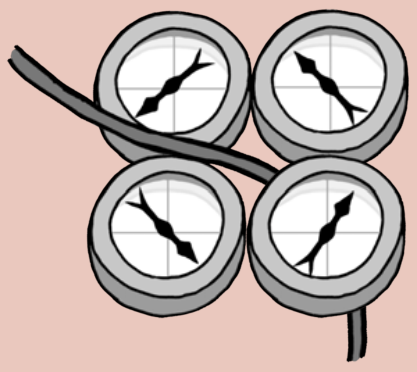
> **[Diagram Context - Textbook_NaturalScience_Gr8_Energy-transfer-in-electrical-systems.pdf-0031-02.png]**
> The image features four clocks, each with a different color and size, arranged in a line on a pink background. The clocks are labeled with the words "clock" and "clock face" in black text. The clocks are arranged in a straight line, with the largest clock on the left and the smallest clock on the right. The clocks are all facing the same direction, and they are all

> **[Diagram Context - Textbook_NaturalScience_Gr8_Energy-transfer-in-electrical-systems.pdf-0031-07.png]**
> The image shows a close-up view of a gray line with a red and white line running down the middle. The red line is a zippered pattern, and the white line is a thin line. The image is labeled as an educational graphic, and it is designed to help a high school student learn about the concept of a zippered apparatus.

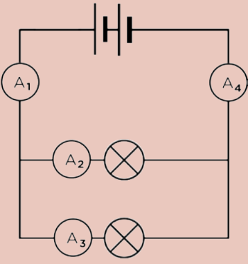
> **[Diagram Context - Textbook_NaturalScience_Gr8_Series-and-parallel-circuits.pdf-0031-03.png]**
> 1. A circuit diagram with three wires and three lights.

> **[Diagram Context - Textbook_NaturalScience_Gr8_Series-and-parallel-circuits.pdf-0031-07.png]**
> The image shows a close-up view of a gray background with a red and white line running down the center. The line is adorned with a red ant, which is the main focus of the image. The ant is positioned on the right side of the line, and it appears to be in motion, as if it's walking across the line. The background is plain and unadorned,

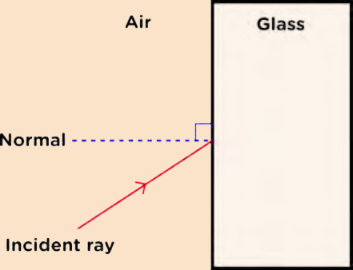
> **[Diagram Context - Textbook_NaturalScience_Gr8_Visible-light.pdf-0031-01.png]**
> This ray diagram illustrates the refraction of light at an interface between two optical media, labeled "Air" and "Glass." It features an incident ray approaching the boundary, a dashed line representing the "Normal" perpendicular to the surface, and a right-angle symbol indicating their orientation. The diagram serves as a foundational visual for Grade 10-12 Physical Sciences, demonstrating how light rays interact with a boundary before undergoing refraction as they transition into a denser medium.

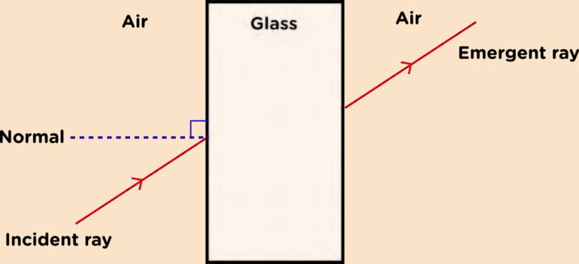
> **[Diagram Context - Textbook_NaturalScience_Gr8_Visible-light.pdf-0031-04.png]**
> This ray diagram illustrates the refraction of light through a rectangular glass block, featuring labels for "Air," "Glass," "Normal," "Incident ray," and "Emergent ray." It demonstrates the principle of refraction as light travels between media of different optical densities, showing how the light ray bends toward the normal upon entering the glass and away from it upon exiting.

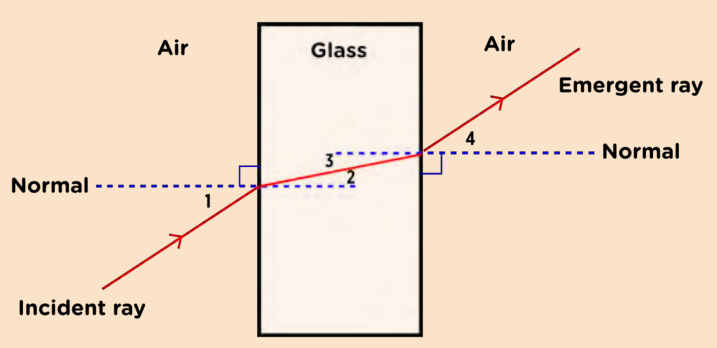
> **[Diagram Context - Textbook_NaturalScience_Gr8_Visible-light.pdf-0031-08.png]**
> This ray diagram illustrates the refraction of light as it passes through a rectangular glass block, featuring labels for the incident ray, emergent ray, normals, and angles 1 through 4. It demonstrates how light bends towards the normal when entering a denser medium and away from the normal when exiting, highlighting the principle that the emergent ray remains parallel to the incident ray.

---

### Refraction of Light

#### Key Concepts
*   **Refraction:** The change in direction of a light wave when it passes from one medium to another.
*   **Medium:** The material through which light travels (e.g., air, water, glass).
*   **Density:** The measure of how compact the particles in a substance are. Light travels at different speeds depending on the density of the medium.

#### Principles of Light Propagation
1.  **Right Angles:** When light enters a different medium at an angle of $90^{\circ}$ (perpendicular to the surface), it does not change direction.
2.  **Change in Speed:** Light behaves as a wave. It travels faster in less dense media (like air) and slower in more dense media (like water or glass).
3.  **Change in Direction:** When light enters a medium at an angle other than $90^{\circ}$, it changes speed and consequently changes direction (refracts).

---

#### Rules of Refraction

**1. From Less Dense to More Dense Medium**
*   When light moves from a less dense medium (e.g., air) into a more dense medium (e.g., glass), the light slows down.
*   The light ray bends **towards** the normal line.

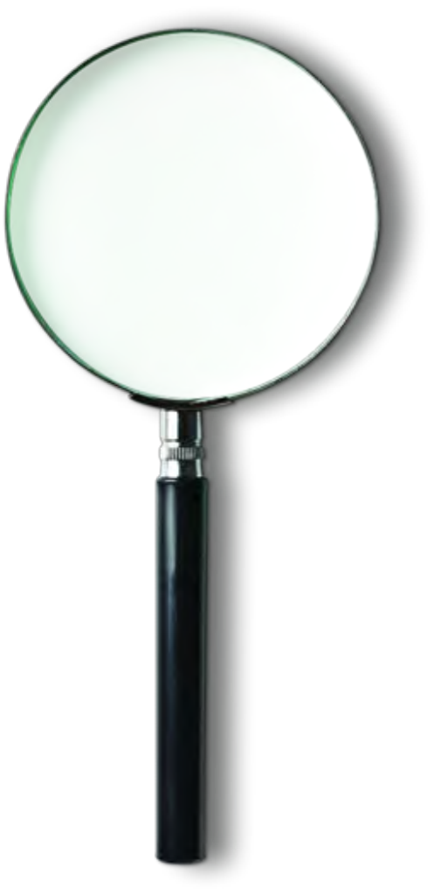
> **[Diagram Context - Textbook_NaturalScience_Gr8_Energy-transfer-in-electrical-systems.pdf-0032-01.png]**
> 1. A magnifying glass with a black handle and a white lens.

**2. From More Dense to Less Dense Medium**
*   When light moves from a more dense medium to a less dense medium, the light speeds up.
*   The light ray bends **away** from the normal line.

> **[Diagram Context - Textbook_NaturalScience_Gr8_Series-and-parallel-circuits.pdf-0032-01.png]**
> 1. A silver spring coiled into a spiral shape.

---

#### Real-World Observations
*   **The Bent Straw Effect:** When a straw is placed in a glass of water, it appears bent. This is because light travels from the air into the glass and then into the water, changing speed and direction at each boundary. This refraction distorts our perception of the object's position.
*   **Apparent Depth:** When looking down into a pool of water, objects (like your legs) appear shorter or at a different depth than they actually are due to the refraction of light as it exits the water into the air.

---

#### Activity: Defining Density
*Recall your previous work in "Matter and Materials". Write your own definition for density below:*

___________________________________________________________________________
___________________________________________________________________________
___________________________________________________________________________

---

#### Take Note
*   **Interconnectedness:** Natural Sciences concepts are linked across the four strands of the curriculum.
*   **Further Research:** To learn more about the speed of light in glass, visit: [bit.ly/1fcfJVZ](http://bit.ly/1fcfJVZ)

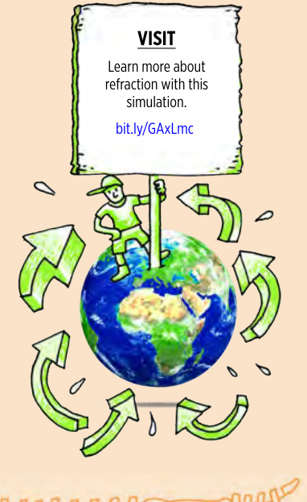
> **[Diagram Context - Textbook_NaturalScience_Gr8_Visible-light.pdf-0032-08.png]**
> This graphic is an educational signpost featuring a cartoon figure standing on a globe surrounded by circular arrows, accompanied by a text box labeled "VISIT" that provides a URL for a refraction simulation. It serves as a digital resource link designed to direct Grade 10-12 Physical Sciences learners to interactive online tools for exploring the principles of light refraction.

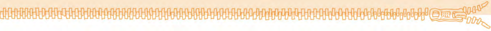
> **[Diagram Context - Textbook_NaturalScience_Gr8_Visible-light.pdf-0032-12.png]**
> This graphic depicts a stylized illustration of a zipper mechanism, featuring interlocking teeth and a central slider. In a Life Sciences context, this serves as a common analogy for the unwinding and unzipping of the DNA double helix by the enzyme helicase during DNA replication.

---

# Activity: The Magic Coin Trick

### Objective
To observe the phenomenon of light refraction by making an invisible object appear visible through the addition of water.

### Materials Required
*   A coin
*   Prestik (adhesive putty)
*   An opaque bowl or cup
*   Water

### Instructions
1.  Work in pairs.
2.  Place a small amount of prestik on the bottom of the bowl.
3.  Stick the coin firmly to the bottom of the bowl using the prestik.
4.  Step back from the table until the coin is just hidden from your line of sight by the rim (lip) of the bowl.
5.  Have your partner slowly pour water into the bowl while you keep your head in the same position. Observe the changes.

---

### Analysis and Questions

| Question | Expected Observation / Explanation |
| :--- | :--- |
| **1. What happened when your partner poured the water into the bowl?** | The coin, which was previously hidden, becomes visible to the observer. |
| **2. Where does the coin appear to be?** | The coin appears to be raised higher than its actual position at the bottom of the bowl. |
| **3. Explain why the coin can be seen when the water is added.** | Light rays reflecting off the coin travel from the water into the air. Because water is optically denser than air, the light rays **refract** (bend) away from the normal as they exit the water. Our eyes trace these bent rays back in a straight line, making the coin appear to be at a shallower depth than it actually is. |

---

### Core Concept: Refraction
Refraction is the bending of light as it passes from one transparent medium to another of a different optical density. 

*   **When light enters a denser medium (e.g., air to water):** It bends *towards* the normal.
*   **When light enters a less dense medium (e.g., water to air):** It bends *away* from the normal.

In this experiment, the light rays originating from the coin bend as they move from the water into the air. This change in direction allows the light to travel over the lip of the bowl and reach the observer's eye, creating the illusion that the coin has moved.

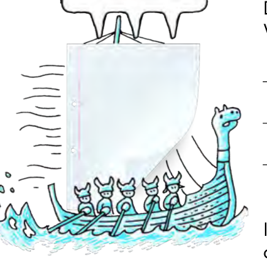
> **[Diagram Context - Textbook_NaturalScience_Gr8_Visible-light.pdf-0033-03.png]**
> This graphic is a metaphorical illustration depicting a Viking longship with rowers and a sail, accompanied by horizontal wind lines and water splashes. It serves as a visual mnemonic or conceptual bridge to help students associate historical navigation and teamwork with the specific academic content or definitions intended to be written within the blank speech bubble and sail.

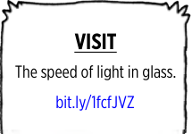
> **[Diagram Context - Textbook_NaturalScience_Gr8_Visible-light.pdf-0033-06.png]**
> This graphic is a text-based instructional prompt containing the labels "VISIT," "The speed of light in glass," and a shortened URL. It serves as a digital signpost directing Physical Sciences learners to external resources for studying the refractive index and the propagation of electromagnetic waves through optical media.

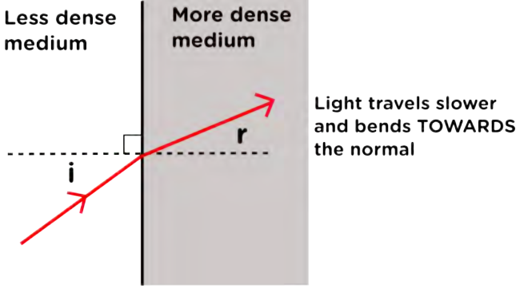
> **[Diagram Context - Textbook_NaturalScience_Gr8_Visible-light.pdf-0033-07.png]**
> This ray diagram illustrates the refraction of light as it passes from a less dense to a more dense medium. It labels the incident ray (i), the refracted ray (r), the normal line, and the boundary, demonstrating that light slows down and bends towards the normal when entering a denser medium. This visualises the fundamental principle of Snell's Law, helping learners understand how changes in optical density alter the path of light.

> **[Diagram Context - Textbook_NaturalScience_Gr8_Visible-light.pdf-0033-08.png]**
> This cartoon depicts a large telescope focused on the Earth, with human figures observing and monitoring data via a computer console and a speech bubble. It illustrates the concept of remote sensing and global monitoring, highlighting how scientific technology is used to observe, collect, and analyse environmental data on a planetary scale.

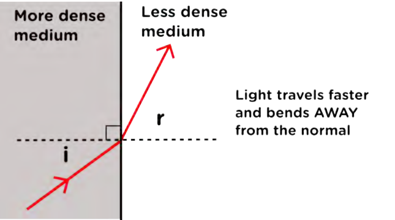
> **[Diagram Context - Textbook_NaturalScience_Gr8_Visible-light.pdf-0033-10.png]**
> This ray diagram illustrates the refraction of light as it passes from a more dense to a less dense medium, featuring labels for the "more dense medium," "less dense medium," angle of incidence (i), angle of refraction (r), and the normal line. It conceptually demonstrates Snell's Law by showing that when light enters a less dense medium, it increases in speed and bends away from the normal.

---

# Refraction and the Visible Spectrum

## Understanding Refraction
Refraction is the phenomenon that explains why objects appear distorted when viewed through transparent mediums (such as water or glass). When light travels from one medium into another, it changes speed, which causes the light rays to bend. This bending of light is what creates the visual distortion we observe.

> **[Diagram Context - Textbook_NaturalScience_Gr8_Series-and-parallel-circuits.pdf-0034-11.png]**
> 1. A circle with a letter "a" in the center.

*Figure 1: Light refraction through glass and water.*

---

## Dispersion of White Light
White light is composed of the visible spectrum (the different colours of light). We can split white light into these individual colours using a triangular prism.

### Why Light Splits
The splitting of light occurs because different colours of light travel at different speeds when they enter a new medium (like glass). Because they travel at different speeds, they bend (refract) by different amounts.

*   **Red light:** Refracts the least.
*   **Violet light:** Refracts the most.

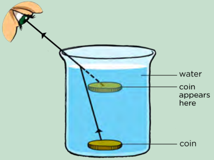
> **[Diagram Context - Textbook_NaturalScience_Gr8_Visible-light.pdf-0034-16.png]**
> This ray diagram illustrates the phenomenon of light refraction using a beaker, a coin, and an observer's eye, with labels for "water," "coin," and "coin appears here." It demonstrates how light rays bending at the interface between water and air cause an object to appear at a shallower depth than its actual position, a fundamental concept in Grade 10 Physical Sciences regarding the optical properties of light.

*Figure 2: Refraction through a triangular prism.*

### Key Concept Summary
*   **Refraction:** The bending of light as it passes from one medium to another due to a change in speed.
*   **Dispersion:** The process of separating white light into its component colours.
*   **Relationship:** Different colours have different wavelengths and travel at different speeds in a medium, leading to varying degrees of refraction.

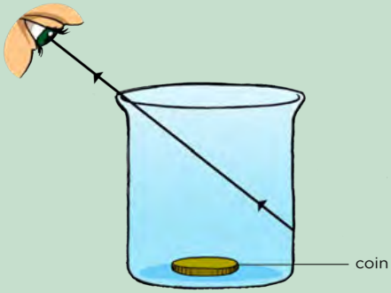
> **[Diagram Context - Textbook_NaturalScience_Gr8_Visible-light.pdf-0034-17.png]**
> This ray diagram illustrates the refraction of light using a beaker, a coin, and an observer's eye. By showing a light ray traveling from the coin through the water-air interface to the eye, the graphic demonstrates how light bends when moving between media of different optical densities. This visualizes the concept of apparent depth, explaining why an object submerged in water appears to be in a different position than its actual location.

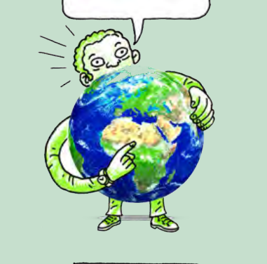
> **[Diagram Context - Textbook_NaturalScience_Gr8_Visible-light.pdf-0034-22.png]**
> This cartoon depicts a human figure whose torso is replaced by a globe of the Earth, featuring a prominent view of the African continent and a blank speech bubble. It serves as a visual metaphor for human-environment interaction, illustrating the concept of global citizenship and the impact of human activity on planetary systems. In a CAPS Life Sciences or Geography context, this image prompts learners to discuss environmental sustainability, the "Anthropocene," and the responsibility of humans to manage Earth's resources.

> **[Diagram Context - Textbook_NaturalScience_Gr8_Visible-light.pdf-0034-25.png]**
> This illustration depicts a pair of hands interacting with a tablet interface featuring various abstract icons, including symbols for addition, subtraction, and wave patterns, topped by an empty speech bubble. It serves as a visual prompt for students to engage with digital learning tools, encouraging them to articulate, define, or label the functions of specific technological applications within a classroom context.

> **[Diagram Context - Textbook_NaturalScience_Gr8_Visible-light.pdf-0034-26.png]**
> This graphic illustrates a stylized representation of a double-stranded DNA molecule, characterized by its iconic double helix structure formed by two antiparallel sugar-phosphate backbones. The diagram visually conveys the fundamental molecular architecture of genetic material, emphasizing the complementary base pairing and the helical twist essential for DNA replication and information storage in Life Sciences.

---

# Chapter 4: Visible Light

## Dispersion of Light
Dispersion is the process by which white light is separated into its component colours. While a glass prism is a common tool used to demonstrate this, it is not the only object capable of splitting white light.

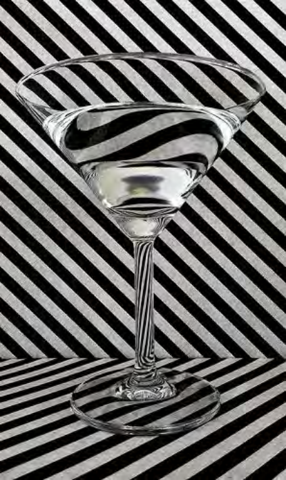
> **[Diagram Context - Textbook_NaturalScience_Gr8_Visible-light.pdf-0035-01.png]**
> This image depicts a clear glass vessel containing a liquid, positioned against a high-contrast, diagonally striped background. The visual elements demonstrate the principles of refraction and magnification as light passes through the curved glass and liquid medium, causing the background patterns to appear distorted and inverted. This serves as a practical demonstration of optical physics, illustrating how light rays bend when transitioning between media of different refractive indices.

## Natural Dispersion: The Rainbow
A rainbow is a natural example of white light splitting into the visible spectrum. This occurs through the interaction of sunlight with raindrops in the atmosphere.

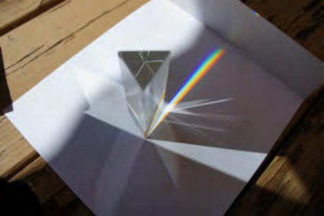
> **[Diagram Context - Textbook_NaturalScience_Gr8_Visible-light.pdf-0035-05.png]**
> This image depicts a physical apparatus consisting of a triangular glass prism placed on a white surface, demonstrating the dispersion of white light. It illustrates the refraction of light as it passes through the prism, causing the separation of white light into its constituent spectral colours (ROYGBIV). This visual serves as a practical application of the wave nature of light, showing how different wavelengths refract at varying angles to form a visible spectrum.

### The Process of Rainbow Formation
The formation of a rainbow involves a sequence of optical phenomena as light interacts with a raindrop:

1.  **Refraction:** As light from the Sun enters a raindrop, it slows down and bends (refracts).
2.  **Reflection:** The light hits the back surface of the raindrop and is reflected internally.
3.  **Refraction and Dispersion:** As the light exits the raindrop, it refracts again. Because different colours of light bend at slightly different angles, the white light is dispersed into the individual colours of the visible spectrum.

<!-- DIAGRAM_PLACEHOLDER: diagram -->

### The Visible Spectrum
When white light is dispersed, it reveals the following sequence of colours:
*   Red
*   Orange
*   Yellow
*   Green
*   Blue
*   Indigo
*   Violet

---

### Rainbows and the Refraction of Light

#### Understanding Rainbows
A rainbow is formed by the refraction and reflection of light within millions of raindrops. While each individual raindrop refracts and reflects all seven colours of the visible spectrum, our eyes only perceive one specific colour from each raindrop based on the angle of the raindrop relative to our position.

*   **Red light:** Reflected to our eyes from raindrops higher up in the sky.
*   **Violet light:** Reflected to our eyes from raindrops lower down in the sky.

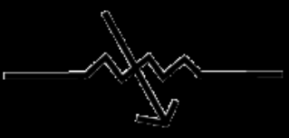
> **[Diagram Context - Textbook_NaturalScience_Gr8_Energy-transfer-in-electrical-systems.pdf-0036-01.png]**
> 1. A Lewis diagram with an arrow pointing down.

#### New Vocabulary
*   **Diverge:** To spread out or move in different directions from a common point.
*   **Converge:** To come together or meet at a single point.
*   **Focus:** The point at which rays of light meet or appear to meet.

---

### Lenses
Lenses are an application of the refraction of light. They are used in various optical instruments and tools to manipulate how we see objects.

#### Examples of Lenses in Daily Life
1.  **The Human Eye:** There is a lens located just behind the iris that helps focus light onto the retina.
2.  **Reading Glasses:** Used to correct vision by adjusting how light enters the eye.
3.  **Magnifying Glasses:** Used to make objects appear larger by refracting light to change the perceived size of an image.

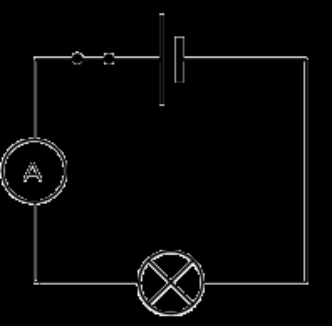
> **[Diagram Context - Textbook_NaturalScience_Gr8_Series-and-parallel-circuits.pdf-0036-08.png]**
> 1. A circuit diagram with a battery, wires, and a light bulb.

#### Discussion Questions
*   What colour is at the top of a rainbow and which colour is at the bottom?
*   Does the order of colours you see in a rainbow match the order shown in the refraction/reflection diagram?

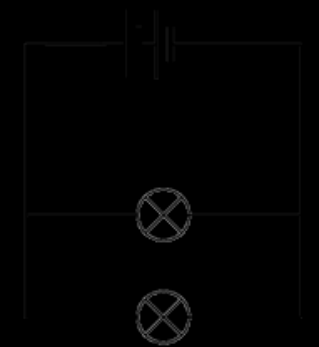
> **[Diagram Context - Textbook_NaturalScience_Gr8_Series-and-parallel-circuits.pdf-0036-09.png]**
> 1. A diagram of a cell with two organelles labeled X and Y.

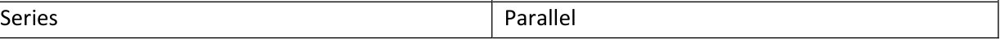

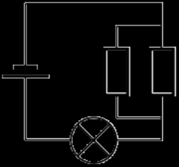
> **[Diagram Context - Textbook_NaturalScience_Gr8_Series-and-parallel-circuits.pdf-0036-11.png]**
> 1. A diagram of a circuit with a circle and an x in the center.

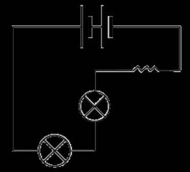
> **[Diagram Context - Textbook_NaturalScience_Gr8_Series-and-parallel-circuits.pdf-0036-12.png]**
> 1. A diagram of a circuit with two x's and a h.

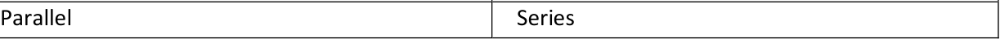

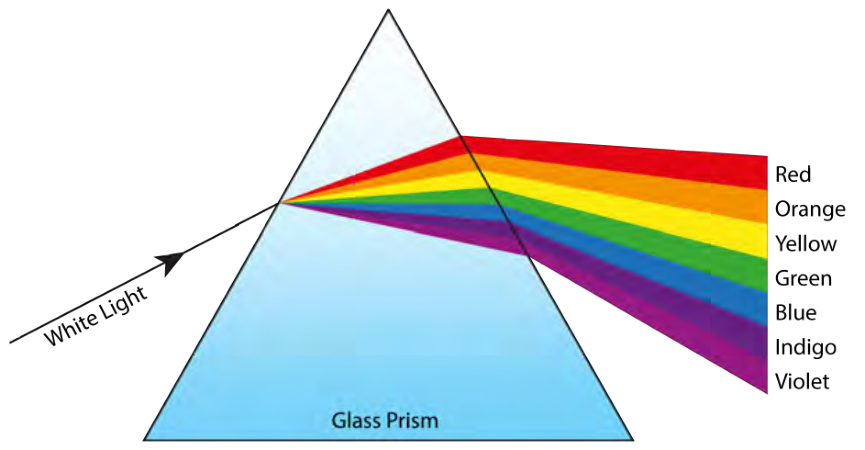
> **[Diagram Context - Textbook_NaturalScience_Gr8_Visible-light.pdf-0036-00.png]**
> This diagram illustrates the dispersion of light through a triangular glass prism, labeled with the incident "White Light" and the resulting spectrum of colors: Red, Orange, Yellow, Green, Blue, Indigo, and Violet. It demonstrates how refraction causes different wavelengths of light to bend at varying angles, conceptually explaining how a prism separates white light into its constituent visible spectrum.

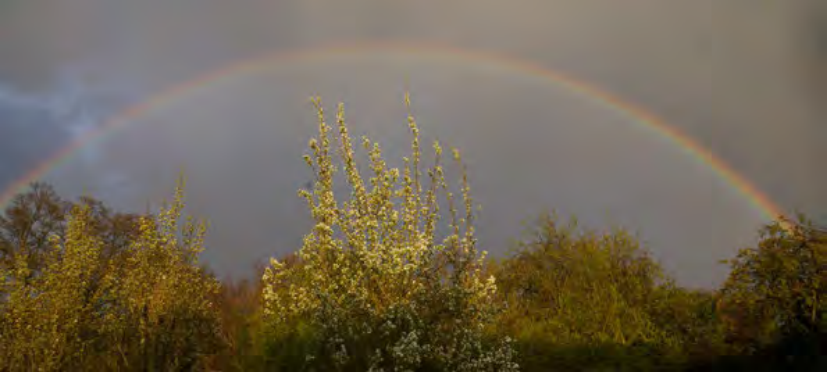
> **[Diagram Context - Textbook_NaturalScience_Gr8_Visible-light.pdf-0036-02.png]**
> This image is a natural photograph depicting a rainbow arching across a cloudy sky above a landscape of trees. It serves as a real-world visual representation of the dispersion of white light, illustrating the separation of the visible spectrum into its constituent colours. For a Physical Sciences learner, this demonstrates the optical phenomenon where water droplets in the atmosphere act as prisms, refracting and reflecting sunlight to produce a continuous spectrum.

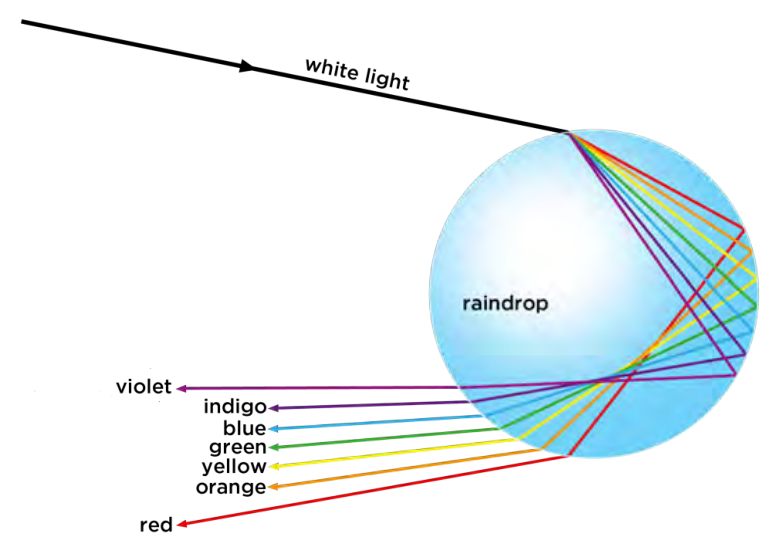
> **[Diagram Context - Textbook_NaturalScience_Gr8_Visible-light.pdf-0036-05.png]**
> This diagram illustrates the physical optics of a raindrop, featuring labels for "white light" and the visible spectrum colors (red, orange, yellow, green, blue, indigo, violet). It demonstrates how white light undergoes refraction, internal reflection, and dispersion within a spherical raindrop to separate into its constituent spectral colors, explaining the formation of a rainbow.

---

# Introduction to Lenses

A lens is a transparent object that focuses or refracts light. 

*   **Diverged:** When light is spread out.
*   **Converged:** When light rays are brought together.
*   **Focused:** When light rays are brought to the same point.

---

## Activity: Diverging and Converging Light with Lenses

### Materials
*   Ray box or light source
*   Concave lens
*   Convex lens
*   Piece of paper
*   Pencil

---

## Comparison of Lenses

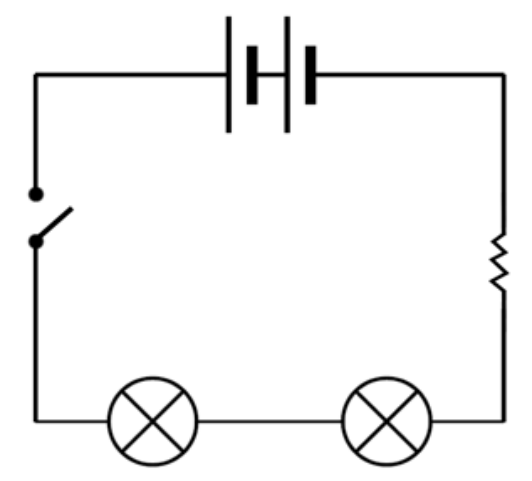
> **[Diagram Context - Textbook_NaturalScience_Gr8_Energy-transfer-in-electrical-systems.pdf-0037-12.png]**
> 1. A black and white diagram of a circuit with two inputs and two outputs.

| Feature | Convex Lens | Concave Lens |
| :--- | :--- | :--- |
| **Shape** | Has one side which curves or bulges **outwards**. | Has one side which curves or is hollowed **inwards**. |
| **Effect on Light** | **Converges** light. | **Diverges** light. |

---

## Take Note
*   A lens with two sides that are concave is called a **biconcave lens**.
*   A lens with two sides that are convex is called a **biconvex lens**.

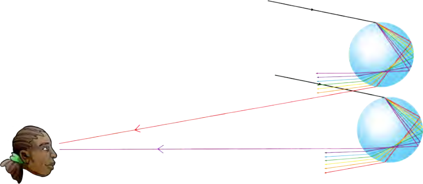
> **[Diagram Context - Textbook_NaturalScience_Gr8_Visible-light.pdf-0037-03.png]**
> This ray diagram illustrates the formation of a rainbow through the refraction, internal reflection, and dispersion of white light within two spherical water droplets. It depicts incident light rays entering the droplets and separating into a spectrum of colours, which are then reflected and refracted toward an observer's eye. This visualises the physical principles of atmospheric optics, demonstrating how different wavelengths of light exit at specific angles to create the perceived colour bands of a rainbow.

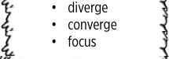
> **[Diagram Context - Textbook_NaturalScience_Gr8_Visible-light.pdf-0037-05.png]**
> This graphic is a bulleted list of key terminology related to the physics of light and optics. It features the terms "diverge," "converge," and "focus," which are fundamental concepts for understanding how lenses and mirrors manipulate light rays in the Grade 10-12 Physical Sciences curriculum.

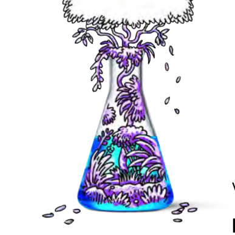
> **[Diagram Context - Textbook_NaturalScience_Gr8_Visible-light.pdf-0037-06.png]**
> This conceptual illustration depicts a laboratory Erlenmeyer flask containing a miniature, flourishing ecosystem of purple flora submerged in a blue liquid medium. By merging scientific apparatus with organic growth, the image metaphorically represents the study of biotechnology, plant tissue culture, or the controlled cultivation of organisms within a laboratory environment.

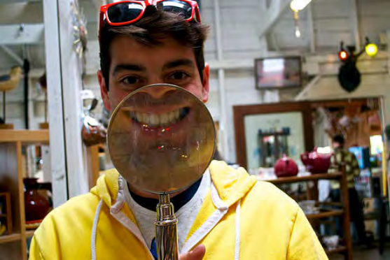
> **[Diagram Context - Textbook_NaturalScience_Gr8_Visible-light.pdf-0037-11.png]**
> This image features a convex lens being held in front of a person's face, demonstrating the principles of geometric optics. The lens acts as a magnifying glass, creating a virtual, upright, and magnified image of the subject's mouth. This visual serves as a practical application for Grade 10-12 Physical Sciences learners to observe how light rays converge through a convex lens to alter the perceived size and orientation of an object.

---

### Practical Investigation: Observing Light Rays through Lenses

#### Objective
To observe and record the behavior of light rays when they pass through convex and concave lenses.

---

#### Part 1: Convex Lens Investigation

**Instructions:**
1. Place a ray box or light source on one side of a piece of paper and turn it on. Observe the light rays.
   

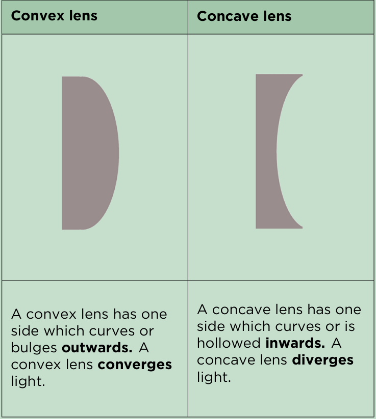
> **[Diagram Context - Textbook_NaturalScience_Gr8_Visible-light.pdf-0038-09.png]**
> This comparative diagram illustrates the physical geometry of convex and concave lenses, labeled with the terms "Convex lens" and "Concave lens." It conceptually distinguishes these optical components by highlighting how their outward-bulging or inward-hollowed shapes determine whether they converge or diverge light, a foundational concept in Grade 10 Physical Sciences optics.

2. Turn the ray box off.
3. Place the convex lens (with the rounded surface) on the piece of paper where the light rays will pass through it. Trace around the lens.
4. Turn on the ray box or light source and observe what happens to the rays when they pass through the lens.
   

> **[Diagram Context - Textbook_NaturalScience_Gr8_Visible-light.pdf-0038-10.png]**
> This graphic uses a metaphorical illustration of a roller coaster track integrated with a Slinky spring to represent physical motion. It visually depicts the transition between potential and kinetic energy as a cart traverses a peak, illustrating the conservation of mechanical energy in a dynamic system.

5. Trace the path of the light rays on your piece of paper.
6. Describe what has happened to the light rays.
7. Mark the point where the light rays cross. This is called the **focal point** of a convex lens.

---

#### Part 2: Concave Lens Investigation

**Instructions:**
8. Turn off the ray box or light source and place a new piece of paper in front of it.
9. Place the concave lens in the path of the light rays and trace around the lens.
10. Turn on the light source and observe what happens to the rays.

---

#### Key Concepts

*   **Convex Lens:** A lens that is thicker in the middle than at the edges. It causes parallel light rays to converge (come together) at a single point.
*   **Focal Point:** The specific point where light rays that were originally parallel to the axis of a convex lens meet after passing through the lens.
*   **Concave Lens:** A lens that is thinner in the middle than at the edges. It causes parallel light rays to diverge (spread out).

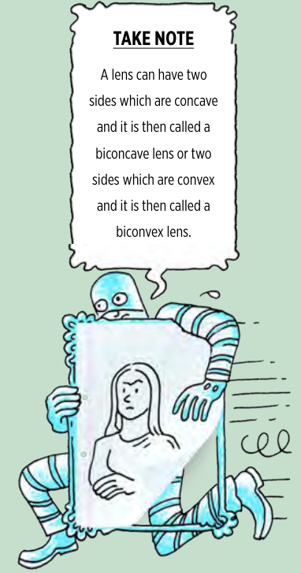
> **[Diagram Context - Textbook_NaturalScience_Gr8_Visible-light.pdf-0038-11.png]**
> This educational graphic features a cartoon character holding a text box that defines the terminology for lens geometry. The text explicitly labels and distinguishes between "biconcave" and "biconvex" lenses based on the curvature of their two sides. This serves as a foundational conceptual aid for Physical Sciences learners to correctly identify and classify lens types before studying light refraction and image formation.

---

### Investigation: The Effect of Lenses on Light

#### Part 1: Concave Lenses
**11. Trace the path of the rays on the piece of paper.**

*A concave lens in front of the rays of light.*

**12. Describe what has happened to the light rays.**
Observe how the light rays behave after passing through the concave lens. Note whether they converge (come together) or diverge (spread apart).

**13. Focal Point of a Concave Lens**
Turn off the light rays and extend the rays you have drawn backwards until they meet at a point in front of the lens. This point is known as the **focal point** of a concave lens.

---

#### Part 2: Lenses and Pinhole Cameras
**14. Observation with Lenses**
Place a convex lens and a concave lens in front of your pinhole camera and observe the image that forms.

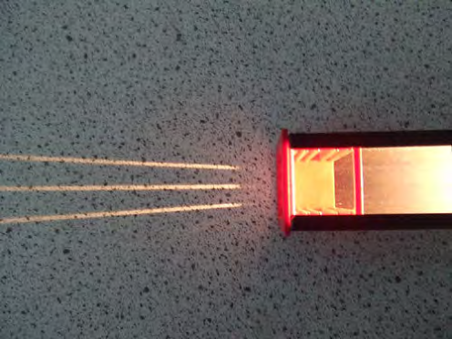
> **[Diagram Context - Textbook_NaturalScience_Gr8_Visible-light.pdf-0039-03.png]**
> This image displays a physics apparatus consisting of a light source with a slit mask, which produces three distinct, parallel light rays. It demonstrates the rectilinear propagation of light, providing a visual model for ray optics where light travels in straight lines.

*Viewing a light source through a pinhole camera with different lenses.*

**15. Concave Lens Observation**
Is the image larger or smaller when you observe through a concave lens?

**16. Convex Lens Observation**
Is the image larger or smaller when you observe through a convex lens?

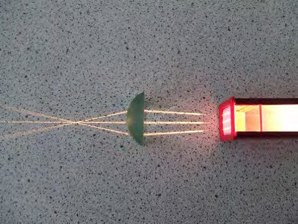
> **[Diagram Context - Textbook_NaturalScience_Gr8_Visible-light.pdf-0039-08.png]**
> This physical science apparatus demonstrates the refraction of light through a convex lens using a ray box to project three parallel light beams. The image illustrates the converging property of a convex lens, where parallel incident rays are refracted to pass through a single focal point on the opposite side.

---

### Lenses and Light

Lenses are optical devices that manipulate light rays. Depending on their shape, they can either bring light rays together (converge) or spread them apart (diverge).

#### 1. Biconvex Lenses
A biconvex lens is thicker in the middle than at the edges. It causes parallel light rays to bend towards each other, meeting at a single point. This is known as **converging** light.

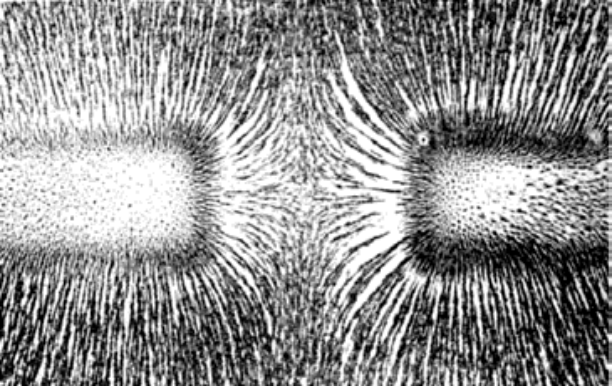
> **[Diagram Context - Textbook_NaturalScience_Gr8_Energy-transfer-in-electrical-systems.pdf-0040-00.png]**
> 1. A black and white illustration of a Lewis structure of an atom.

#### 2. Biconcave Lenses
A biconcave lens is thinner in the middle than at the edges. It causes parallel light rays to spread out as they pass through the lens. This is known as **diverging** light.

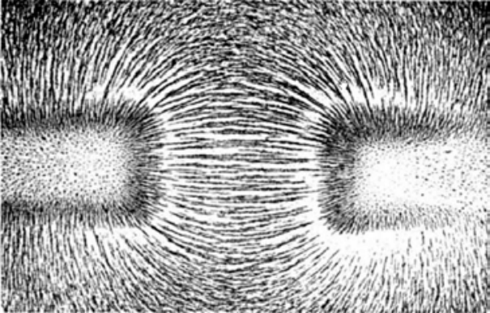
> **[Diagram Context - Textbook_NaturalScience_Gr8_Energy-transfer-in-electrical-systems.pdf-0040-03.png]**
> 1. A black and white image of a Lewis structure.

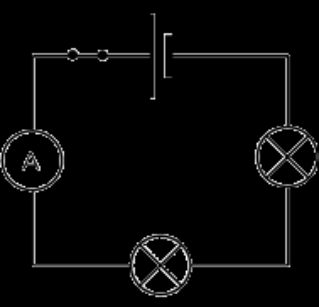
> **[Diagram Context - Textbook_NaturalScience_Gr8_Series-and-parallel-circuits.pdf-0040-02.png]**
> 1. A diagram of a circuit with three wires and three circles.

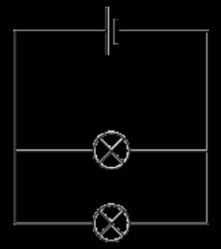
> **[Diagram Context - Textbook_NaturalScience_Gr8_Series-and-parallel-circuits.pdf-0040-03.png]**
> 1. A black and white diagram of a circuit with two x's and two y's.

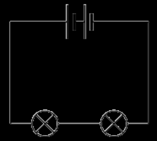
> **[Diagram Context - Textbook_NaturalScience_Gr8_Series-and-parallel-circuits.pdf-0040-04.png]**
> 1. A black and white diagram of a circuit with a battery, a wire, and a light bulb.

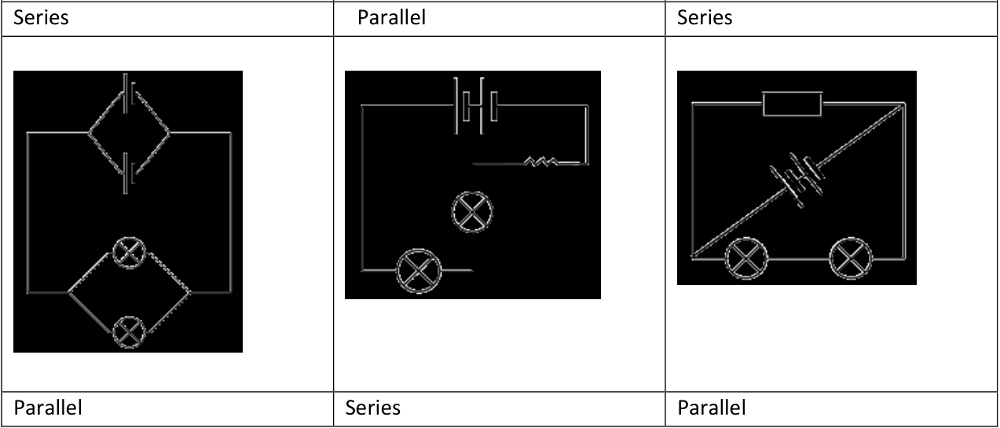
> **[Diagram Context - Textbook_NaturalScience_Gr8_Series-and-parallel-circuits.pdf-0040-05.png]**
> 1. A diagram of a circuit with three different types of circuits.
2. A diagram of a Lewis structure.
3. A diagram of a Lewis structure.

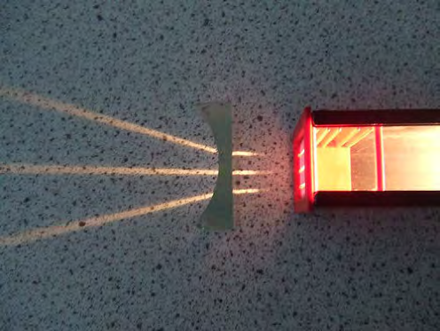
> **[Diagram Context - Textbook_NaturalScience_Gr8_Visible-light.pdf-0040-02.png]**
> This physical science demonstration features a ray box emitting parallel light beams directed toward a concave (diverging) lens. The image illustrates the refraction of light as the parallel rays pass through the lens and spread outwards, demonstrating the diverging property of concave lenses. This visual provides a practical application of geometric optics, helping learners understand how light paths are altered by different lens shapes in accordance with the CAPS curriculum.

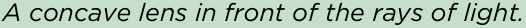

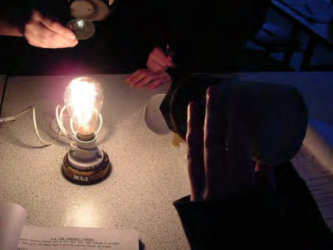
> **[Diagram Context - Textbook_NaturalScience_Gr8_Visible-light.pdf-0040-07.png]**
> This photograph depicts a practical physics demonstration involving a light bulb as a point source and a pinhole camera apparatus held by a student. The setup illustrates the principle of rectilinear propagation of light, where the pinhole camera captures an inverted image of the illuminated filament on its screen. This experiment helps learners visualize how light travels in straight lines to form images, a foundational concept in the Grade 10 Physical Sciences optics curriculum.

> **[Diagram Context - Textbook_NaturalScience_Gr8_Visible-light.pdf-0040-11.png]**
> This graphic illustrates a schematic representation of a DNA molecule, featuring the characteristic double-helix structure formed by two antiparallel sugar-phosphate backbones. It visually demonstrates the twisted ladder configuration, which is essential for students to understand the molecular basis of heredity and the structural stability required for DNA replication and protein synthesis.

---

### Types of Lenses

Lenses are optical devices that refract light. They are categorized into two main types based on how they affect light rays.

| Feature | Converging Lens | Diverging Lens |
| :--- | :--- | :--- |
| **Lens Type** | Convex lens | Concave lens |
| **Behavior of Light** | Refracts light and bends rays toward a single point. | Refracts light and bends rays away from each other. |
| **Focal Point** | Located on the other side of the lens. | Traced back to a point in front of the lens. |

<!-- DIAGRAM_PLACEHOLDER: diagram -->

---

### Applications: The Magnifying Glass

A magnifying glass is a practical application of a lens. When used to view an object, it enlarges the image.

#### How a Magnifying Glass Works
*   **Positioning:** When an object (such as a ladybird) is placed **closer** to the lens than the focal point, the lens creates a **virtual image**.
*   **Result:** The virtual image appears **larger** than the actual object.
*   **Process:** Light rays reflected from the object are refracted by the magnifying glass before entering the observer's eye.

#### Critical Thinking Exercise
*   **Question:** Is a magnifying glass an example of a diverging or a converging lens?
*   **Hint:** Consider the behavior of the lens in enlarging an image when the object is placed within the focal length.

---

### Magnifying Glasses and Human Vision

#### How Magnifying Glasses Work
A magnifying glass uses a convex lens to change how we perceive objects based on their distance from the lens.

*   **Distant Objects:** When you view a distant object through a magnifying glass, the object appears smaller and upside down. This occurs when the object is placed **beyond the focal point** of the lens.
*   **Close-up Objects:** When the object is placed between the lens and the focal point, the magnifying glass creates a **virtual image** that is larger than the actual object.
*   **Curvature:** The magnification power of a convex lens is directly related to its curvature; the more curved the lens, the greater its ability to magnify objects.

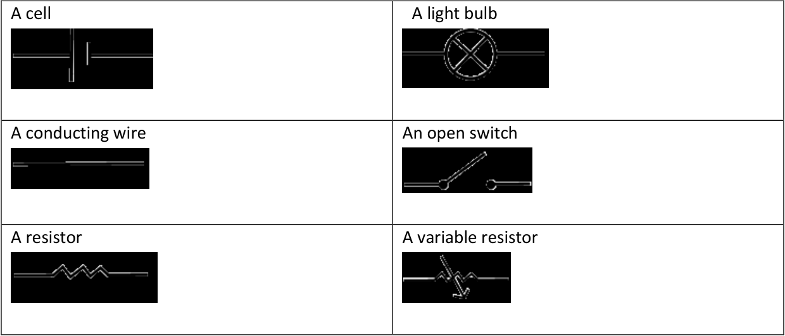
> **[Diagram Context - Textbook_NaturalScience_Gr8_Energy-transfer-in-electrical-systems.pdf-0042-20.png]**
> 1. A cell diagram with a light bulb and a resistor.

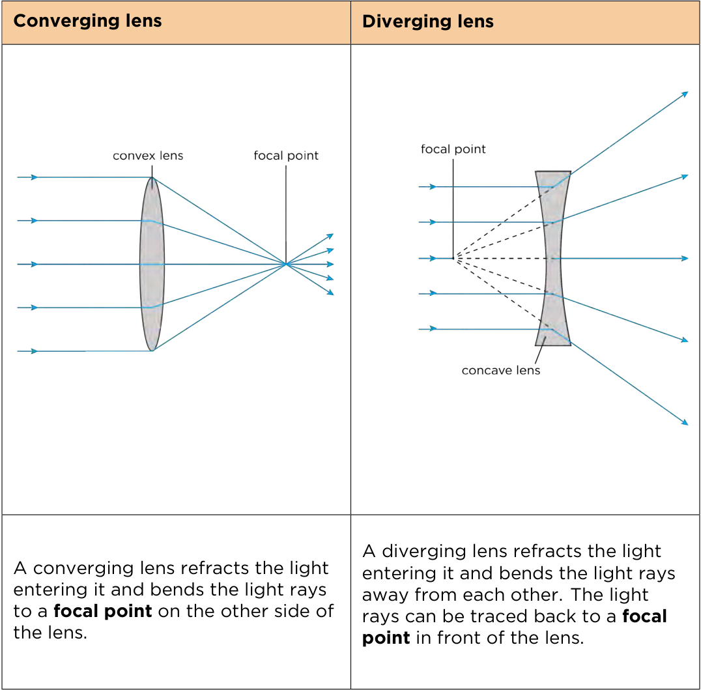
> **[Diagram Context - Textbook_NaturalScience_Gr8_Visible-light.pdf-0042-00.png]**
> This ray diagram illustrates the refraction of parallel light rays through convex (converging) and concave (diverging) lenses, featuring labels for the lens types and their respective focal points. It conceptually demonstrates how these lenses manipulate light paths, showing how a convex lens focuses rays to a real focal point while a concave lens spreads rays to create a virtual focal point.

---

#### The Human Eye
The human eye contains a natural lens that allows us to see by focusing light onto the retina at the back of the eye.

**Exercise:**
1. What type of lens do we have in our eyes? 
2. Provide a reason for your answer.

*(Space for learner response)*
__________________________________________________________________________________________
__________________________________________________________________________________________

---

#### Focusing Light
For a clear image to form, the lens in the eye must focus light rays so that the focal point falls exactly on the retina. 

*   **Normal Vision:** The lens focuses light perfectly on the retina.
*   **Near-sightedness:** The lens focuses light *before* it reaches the retina.
*   **Far-sightedness:** The lens focuses light *behind* the retina.

<!-- DIAGRAM_PLACEHOLDER: diagram -->

---

# Chapter 4: Visible Light - Vision Correction

## 1. Understanding Vision Defects
The human eye functions by focusing light onto the retina. Vision defects occur when light is not focused correctly on the retina.

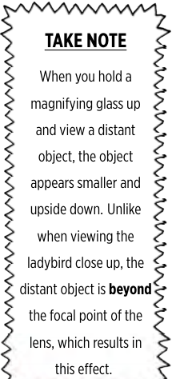
> **[Diagram Context - Textbook_NaturalScience_Gr8_Visible-light.pdf-0043-00.png]**
> This text-based educational graphic serves as a conceptual note on the principles of geometric optics, specifically regarding convex lenses. It highlights the relationship between object distance and image orientation, contrasting the real, inverted, and diminished image formed when an object is placed beyond the focal point with the virtual, magnified image formed when an object is within the focal point.

### Key Concepts
*   **Normal Eye:** Light rays focus exactly on the retina.
*   **Near-sightedness (Myopia):** Light rays focus **in front** of the retina.
*   **Far-sightedness (Hyperopia):** Light rays focus **behind** the retina.

---

## 2. Correcting Vision with Lenses
Optical glasses (spectacles) use specific lens shapes to adjust the path of light so that it focuses correctly on the retina.

### Lens Types for Correction
*   **Near-sightedness:** Requires a **diverging lens**. This is a **biconcave** lens.
*   **Far-sightedness:** Requires a **converging lens**. This is a **biconvex** lens.

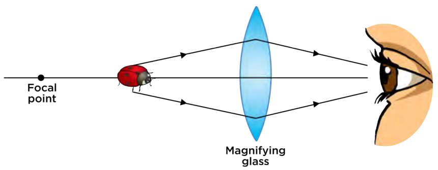
> **[Diagram Context - Textbook_NaturalScience_Gr8_Visible-light.pdf-0043-01.png]**
> This ray diagram illustrates the optical principles of a convex lens acting as a magnifying glass, featuring a ladybug, a focal point, a lens, and an observer's eye. By showing light rays diverging from the object through the lens toward the eye, the diagram demonstrates how a convex lens refracts light to create a magnified virtual image for the viewer.

*An optometrist uses specialized equipment to test a patient's vision and determine the correct lens prescription.*

---

## 3. Did You Know?

### Contact Lenses
*   Contact lenses are designed to rest directly on the cornea of the eye to correct vision.
*   **Historical Fact:** Leonardo da Vinci was the first to propose the idea of contact lenses in the 16th century as a method to help prevent eye infections.

### Optical Instruments
*   **Microscope:** Makes tiny, nearby objects appear much larger.
*   **Telescope:** Makes large, distant objects appear much closer and brighter.
*   **How they work:** In both instruments, light passes through two or more lenses to form an image. The specific shapes of the lenses and the distances between them determine how the final image is produced.

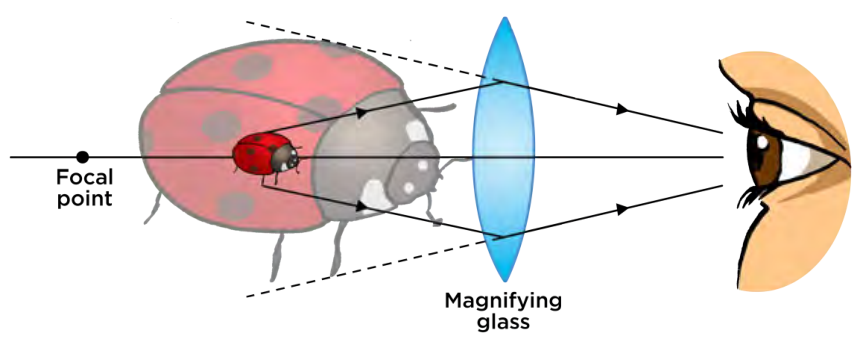
> **[Diagram Context - Textbook_NaturalScience_Gr8_Visible-light.pdf-0043-03.png]**
> This ray diagram illustrates the optical principles of a convex lens acting as a magnifying glass, featuring labels for the "Focal point," "Magnifying glass," and an observer's eye. It demonstrates how placing an object within the focal length of a convex lens causes light rays to diverge, creating a virtual, magnified image that allows the human eye to perceive greater detail.

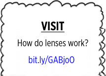
> **[Diagram Context - Textbook_NaturalScience_Gr8_Visible-light.pdf-0043-05.png]**
> This graphic is a text-based signpost containing the labels "VISIT," "How do lenses work?," and a shortened URL link. It serves as a digital resource prompt to direct Physical Sciences learners toward supplementary interactive content regarding the principles of geometric optics and light refraction through lenses.

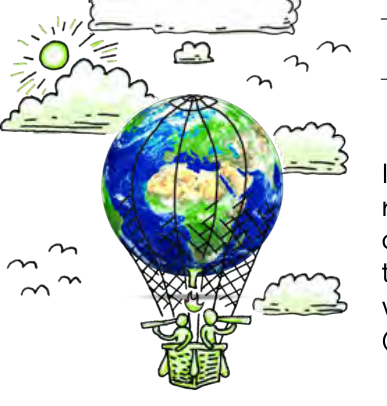
> **[Diagram Context - Textbook_NaturalScience_Gr8_Visible-light.pdf-0043-06.png]**
> This conceptual illustration depicts the Earth as a hot air balloon, featuring a globe suspended by a net above a basket containing two figures using telescopes. It serves as a visual metaphor for global observation, environmental monitoring, or the study of Earth systems within the context of Life Sciences or Geography.

---

### Vision Correction and Geometric Optics

#### 1. Understanding Vision Defects
The human eye relies on the lens to focus light onto the retina. When this process is disrupted, vision defects occur.

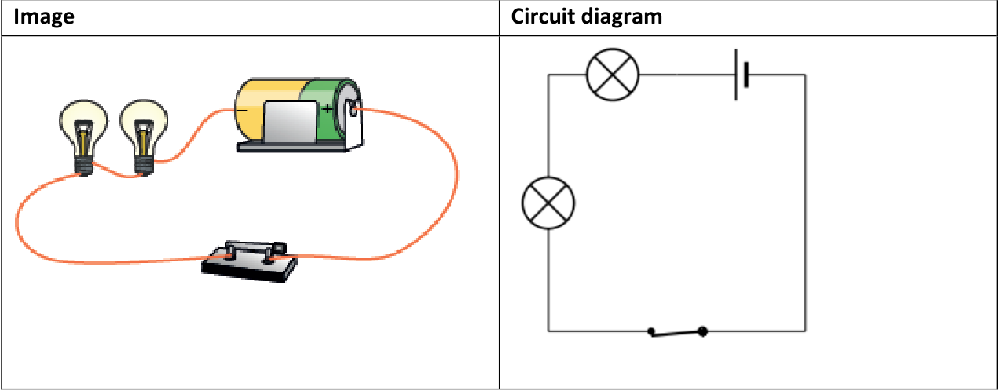
> **[Diagram Context - Textbook_NaturalScience_Gr8_Energy-transfer-in-electrical-systems.pdf-0044-02.png]**
> 1. A circuit diagram with a battery, wires, and a light bulb.

| Condition | Description | Correction Method |
| :--- | :--- | :--- |
| **Near-sighted** | Light focuses in front of the retina. | Use a **concave lens** to diverge light before it enters the eye. |
| **Far-sighted** | Light focuses behind the retina. | Use a **convex lens** to converge light before it enters the eye. |

---

#### 2. Take Note
In the upcoming section on *Planet Earth and Beyond*, we will explore how lenses are applied in the construction of optical telescopes used to view objects in space.

---

#### 3. Activity: Research Careers in Optics
Geometric optics is a vast field with many professional applications.

**Instructions:**
1. Form a group of 3 learners.
2. Conduct an interview with a professional working in the field of geometric optics. Inquire about their career path, their motivation for choosing this field, and their educational background.
3. Write a summary paragraph detailing the career and the specific study requirements needed to qualify.

**Examples of careers in geometric optics:**
*   **Optometry:** The practice of examining eyes for defects and prescribing corrective lenses.
*   **Ophthalmology:** A branch of medicine dealing with the diagnosis and treatment of eye disorders.
*   **Optoelectronics:** The study and application of electronic devices that source, detect, and control light.
*   **Illumination engineering:** The application of lighting design to interior and exterior spaces.

---

#### 4. Additional Resources
For further insight, you may visit the following resource regarding an interview conducted with an optometrist:
[bit.ly/19WxYYa](http://bit.ly/19WxYYa)

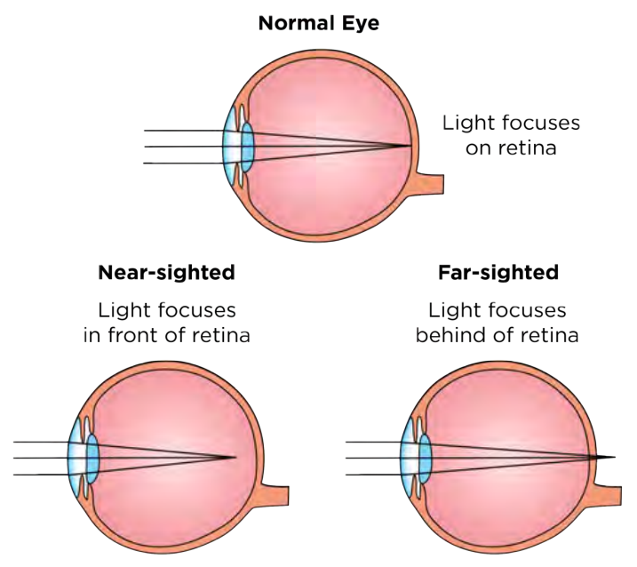
> **[Diagram Context - Textbook_NaturalScience_Gr8_Visible-light.pdf-0044-00.png]**
> This diagram illustrates the anatomical structure of the human eye, specifically comparing the refraction of light in a normal eye versus eyes with near-sighted (myopia) and far-sighted (hyperopia) vision. It uses light rays, lenses, and the retina to demonstrate how focal points shift relative to the retina in different visual conditions. This visual aid helps learners understand the physics of light refraction and the physiological basis for common refractive errors in human vision.

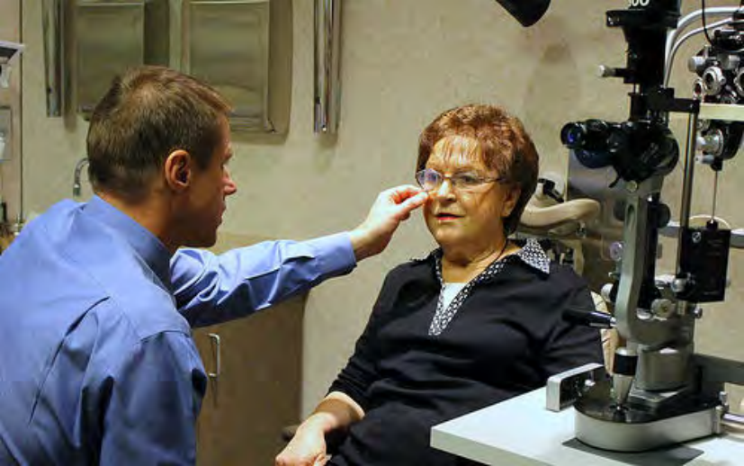
> **[Diagram Context - Textbook_NaturalScience_Gr8_Visible-light.pdf-0044-04.png]**
> This photograph depicts a clinical examination setting featuring an optometrist using a slit-lamp biomicroscope to assess a patient's eye health. The image illustrates the practical application of optical technology in diagnosing visual defects and eye conditions, which relates to the Life Sciences curriculum topic of the human eye and its associated disorders.

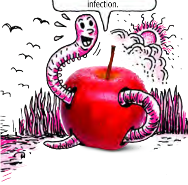
> **[Diagram Context - Textbook_NaturalScience_Gr8_Visible-light.pdf-0044-09.png]**
> This cartoon illustration depicts a worm burrowing through an apple, accompanied by a speech bubble containing the word "infection." It serves as a metaphorical representation of a pathogen invading a host organism, illustrating the concept of biological infestation or parasitic infection within a Life Sciences context.

> **[Diagram Context - Textbook_NaturalScience_Gr8_Visible-light.pdf-0044-12.png]**
> This cartoon depicts a caricature of Isaac Newton with an apple-shaped head, surrounded by a network of floating apples connected by dashed lines and directional arrows. The visual elements include the label "MR. NEWTON" and a thought bubble, illustrating the conceptual link between Newton’s classical mechanics and the universal law of gravitation. It serves as a mnemonic device to help learners associate the historical figure with the gravitational forces acting between masses in a system.

---

# Revision Notes: Visible Light

## Core Concepts of Light

### 1. Nature and Propagation
*   **Rectilinear Propagation:** Light travels in straight lines.
*   **Composition:** White light is composed of all the colours of the visible spectrum.
*   **Dispersion:** White light can be separated into its constituent colours when passed through a prism or a raindrop (creating a rainbow).
*   **Interaction with Matter:**
    *   **Opaque objects:** Light cannot pass through them.
    *   **Transparent objects:** Light can pass through them.
    *   **Absorption:** Some materials absorb specific wavelengths of light.
*   **Colour Perception:** A material appears to be a specific colour because it reflects that part of the colour spectrum while absorbing the other wavelengths.

### 2. Reflection
Reflection occurs when light bounces off a surface. The fundamental law of reflection is:
$$\theta_i = \theta_r$$
Where:
*   $\theta_i$ is the angle of incidence.
*   $\theta_r$ is the angle of reflection.

| Surface Type | Reflection Characteristics |
| :--- | :--- |
| **Smooth Surface** | Parallel rays are reflected at the same angle (Specular reflection). |
| **Rough Surface** | Light is scattered in many directions (Diffuse reflection), resulting in an unclear image. |

### 3. Refraction
Refraction is the bending of light as it passes from one medium to another at an angle, caused by changes in the speed of light.

*   **Slowing down:** If light enters a denser medium and slows down, it bends **towards** the normal line.
*   **Speeding up:** If light enters a less dense medium and speeds up, it bends **away** from the normal line.

### 4. Lenses and Prisms
*   **Converging Lenses:** Refract and focus light rays to a point.
*   **Diverging Lenses:** Spread light rays apart.
*   **Triangular Prisms:** Refract and disperse white light into the visible spectrum.
*   **Applications:** These optical components are essential in the construction of glasses, microscopes, telescopes, and magnifying glasses.

### 5. Human Vision
The human eye functions as a biological optical system:
1.  Light enters the eye.
2.  Specialised cells in the **retina** convert light energy into electrical nerve impulses.
3.  These impulses are transmitted via the **optic nerve** to the brain.
4.  The brain interprets these impulses as visual images.

---

## Summary Table: Light Behaviour

| Phenomenon | Description |
| :--- | :--- |
| **Reflection** | Light bouncing off a surface ($\theta_i = \theta_r$). |
| **Refraction** | Bending of light due to a change in speed between media. |
| **Dispersion** | Separation of white light into its component colours. |
| **Absorption** | Taking in of light energy by a material (determines perceived colour). |

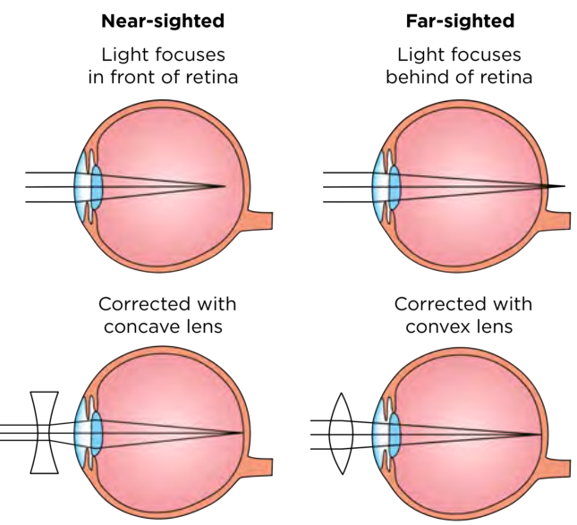
> **[Diagram Context - Textbook_NaturalScience_Gr8_Visible-light.pdf-0045-00.png]**
> This diagram illustrates the anatomical defects of myopia (near-sightedness) and hyperopia (far-sightedness) alongside their respective optical corrections using concave and convex lenses. It uses ray diagrams to show how light focuses relative to the retina and how corrective lenses shift the focal point onto the retina to restore clear vision.

> **[Diagram Context - Textbook_NaturalScience_Gr8_Visible-light.pdf-0045-03.png]**
> This graphic is a cartoon illustration depicting a Viking longship with rowers and a blank sail, accompanied by a speech bubble above. It features visual elements such as waves, wind lines, oars, and figures wearing horned helmets, but lacks any specific academic labels, variables, or scientific symbols. Conceptually, this image serves as a blank template or visual metaphor that can be used to introduce historical topics or creative writing prompts within a classroom setting.

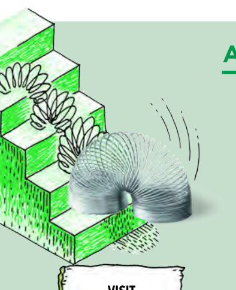
> **[Diagram Context - Textbook_NaturalScience_Gr8_Visible-light.pdf-0045-04.png]**
> This illustration depicts a slinky spring moving down a staircase, accompanied by motion lines indicating its path. It serves as a visual analogy for Grade 10-12 Physics to demonstrate the propagation of longitudinal waves, where the compression and rarefaction of the spring coils model the transfer of energy through a medium.

> **[Diagram Context - Textbook_NaturalScience_Gr8_Visible-light.pdf-0045-16.png]**
> This graphic is a conceptual illustration featuring a globe, a human figure, and a blank signpost surrounded by a circular arrangement of green arrows. It serves as a visual metaphor for environmental stewardship and sustainability, emphasizing the cyclical nature of ecological processes and human responsibility in maintaining the Earth's systems.

> **[Diagram Context - Textbook_NaturalScience_Gr8_Visible-light.pdf-0045-18.png]**
> This graphic depicts a stylized, repeating wave pattern composed of interconnected, arrow-headed segments. The image uses a continuous, rhythmic flow of green, chevron-like shapes to represent directional movement or a cyclical process. Conceptually, this serves as a visual metaphor for continuous energy flow, signal propagation, or a repeating sequence in biological or physical systems.

---

# Study Guide: Properties of Visible Light

## 1. The Nature of Visible Light
Visible light is a form of energy that is emitted from sources such as the **Sun** and **light bulbs**. 

*   **Spectrum:** Visible light consists of a spectrum of colours.
*   **Composition:** This spectrum is made up of different **wavelengths** and **frequencies**.
*   **Range of Colours:** The range of colours is determined by these specific wavelengths and frequencies.

## 2. Interaction with Objects
When light encounters an object, it behaves in different ways depending on the nature of the material:

*   **Transparent/Translucent Objects:** Light can pass through these materials.
*   **Opaque Objects:** Light cannot pass through these materials, which results in the casting of **shadows**.
*   **Colour Perception:**
    *   **White objects:** Reflect all colours of the visible spectrum.
    *   **Black objects:** Absorb all colours of the visible spectrum.

## 3. Reflection
Reflection occurs when light bounces off a surface. The nature of the reflection depends on the surface texture:

*   **Smooth surfaces:** Cause regular reflection where the light is reflected in one specific direction.
*   **Rough surfaces:** Cause diffuse reflection where the light is scattered in many directions.
*   **Law of Reflection:** The angle of reflection is equal to the angle of incidence, both measured from the **normal** (a line perpendicular to the surface).

## 4. Refraction
Refraction is the change in the direction of light when it passes from one medium into another.

*   **Change in Direction:**
    *   When light enters a denser medium, it changes direction towards the normal.
    *   When light leaves a medium, it changes direction away from the normal.
*   **Applications:**
    *   **Lenses:** Refract and focus light.
    *   **Prisms:** Refract and disperse light into its component colours.
    *   **Rainbows:** Formed when light is refracted due to water droplets in the atmosphere.

## 5. Human Vision
The human eye detects light and processes it into visual information:

1.  Light enters the eye and stimulates **receptor cells**.
2.  These cells send an **impulse** to the brain.
3.  The brain interprets these impulses, allowing us to "see" the world around us.

> **[Diagram Context - Textbook_NaturalScience_Gr8_Visible-light.pdf-0046-01.png]**
> This image displays a web browser interface featuring a URL address bar containing the shortened link "bit.ly/17yWSLj" and the Google search engine homepage. It illustrates the fundamental digital literacy skill of navigating the internet using a browser to access specific web resources or search engines.

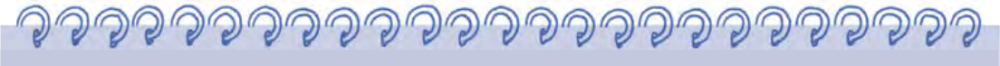
> **[Diagram Context - Textbook_NaturalScience_Gr8_Visible-light.pdf-0046-03.png]**
> This diagram represents a cross-section of a biological membrane, specifically illustrating the arrangement of phospholipid molecules in a monolayer at an interface. It features a series of uniform, hook-shaped icons representing the hydrophilic heads of phospholipids oriented towards the surface of a light-blue substrate. Conceptually, this model helps learners visualize the amphipathic nature of lipids and how they organize themselves at boundaries to interact with aqueous environments.

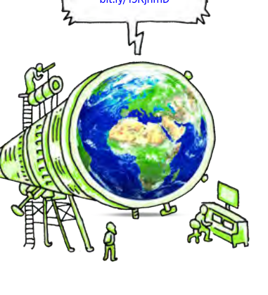
> **[Diagram Context - Textbook_NaturalScience_Gr8_Visible-light.pdf-0046-15.png]**
> This cartoon depicts a large telescope focused on the Earth, with human figures observing and monitoring data via a computer console. It illustrates the concept of Earth Observation and remote sensing, highlighting how scientific technology is used to monitor, collect, and analyse global environmental data.

> **[Diagram Context - Textbook_NaturalScience_Gr8_Visible-light.pdf-0046-16.png]**
> This metaphorical illustration features a central metal key superimposed over a landscape containing a tree, an owl, a swing, a skull, bones, and a treasure chest. It serves as a conceptual visual aid for Life Sciences, representing the "key" to unlocking biological secrets, such as the use of fossil evidence (skull and bones) to reconstruct past environments and evolutionary history.

---

# REVISION: Visible Light

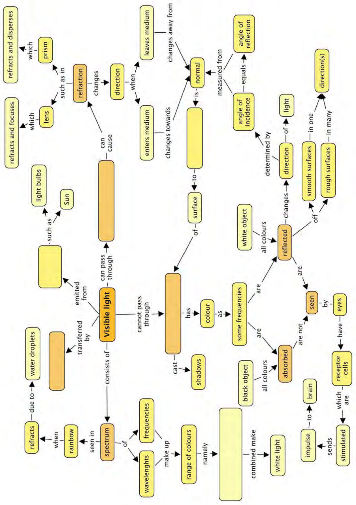
> **[Diagram Context - Textbook_NaturalScience_Gr8_Visible-light.pdf-0047-00.png]**
> This concept map illustrates the properties and interactions of visible light, featuring nodes and directional arrows for terms such as refraction, reflection, spectrum, wavelengths, frequencies, and biological perception. It provides a comprehensive overview of how light behaves when interacting with different media and surfaces, and how it is processed by the human eye, serving as a structured revision tool for the Grade 10 Physical Sciences optics curriculum.

### Exercise: Matching Terms and Definitions
Match the correct definitions to the terms in the following table. Write the letter of the definition next to the correct number. [12 marks]

| Term | Definition |
| :--- | :--- |
| 1. Radiation | A. Light cannot pass through. |
| 2. Visible light | B. The angle of incidence equals the angle of reflection when a ray is reflected off a smooth surface. |
| 3. Opaque | C. One of the ways in which energy is transferred, specifically through a vacuum |
| 4. Transparent | D. When light enters a transparent medium it can change direction. |
| 5. Absorption | E. Curved inwards. |
| 6. Reflection | F. The spectrum of light which we are able to see. |
| 7. Retina | G. Bulging outwards. |
| 8. Refraction | H. A transparent object able to refract and focus light. |

***

*Note: The provided table contains 8 terms but only 8 definitions (A-H). Please ensure you match each term to its scientifically accurate definition based on your CAPS curriculum notes.*

---

### Energy and Change: Optical Concepts

This section provides a matching exercise for key optical terms and their definitions.

#### Terminology Matching Table

| Term | Definition |
| :--- | :--- |
| 9. Diverging | J. When light rays are spread out from a point. |
| 10. Lens | I. Light can pass through. |
| 11. Concave | L. When the surface of a substance absorbs certain colours of light. |
| 12. Convex | K. A layer of tissue at the back of the eye which is sensitive to light. |

***

#### Answer Key Template

Use the following space to record your answers for the matching exercise:

| Question Number | Answer |
| :--- | :--- |
| 1: | |
| 2: | |
| 3: | |
| 4: | |
| 5: | |
| 6: | |
| 7: | |
| 8: | |
| 9: | |
| 10: | |
| 11: | |
| 12: | |

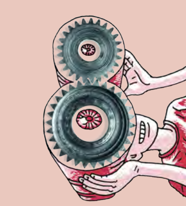
> **[Diagram Context - Textbook_NaturalScience_Gr8_Visible-light.pdf-0048-03.png]**
> This conceptual illustration depicts two interlocking gears positioned over human eyes, with hands adjusting the mechanism. It serves as a visual metaphor for the mechanical principles of gear systems, specifically illustrating how interlocking teeth transmit motion and change the direction of rotation between two connected components.

---

### Dispersion of White Light

When a beam of white light passes through a glass prism, it undergoes **dispersion**. This is the process where white light is separated into its constituent colours (the visible spectrum).

#### Exercise 2: Analysis of Light Dispersion

**a) What does this tell us about white light?**
White light is not a single colour, but is composed of a spectrum of different colours (polychromatic light).

**b) Why does the light do this when it passes through the prism?**
*   Different colours of light have different wavelengths.
*   When light enters the glass prism, it slows down and refracts (bends).
*   Because each colour has a different wavelength, each colour bends by a different amount (refractive index varies with wavelength). Violet light bends the most, and red light bends the least.

**c) What colour is at label 1 and what colour is at label 7? Explain your answer.**
*   **Label 1:** Red
*   **Label 7:** Violet
*   **Explanation:** Red light has the longest wavelength and the lowest frequency, causing it to deviate the least from its original path. Violet light has the shortest wavelength and the highest frequency, causing it to deviate the most.

**d) What label corresponds to the colour of grass?**
*   **Label 4** (Green).

**e) Can you see there are two other lighter, white rays emerging from the prism? What do you think this is the result of?**
This is the result of **reflection**. When light hits the surface of the glass prism, not all of it enters the glass; some of it reflects off the surface of the prism.

---

### Shadows

**3. Why does an opaque object cast a shadow?**
An opaque object does not allow light to pass through it. Because light travels in straight lines (rectilinear propagation), the object blocks the path of the light rays, creating a region of darkness behind the object where the light cannot reach.

---

### Exercise: Light and Reflection

#### 4. Reflection in a Pond

*Study the photograph of the water in the pond and answer the following questions:*

**a) How are we able to see the image of the wooden poles sticking up on the edge of the pond? [2 marks]**
*   **Concept:** Reflection.
*   **Explanation:** Light rays from the wooden poles strike the surface of the water and reflect (bounce off) the surface into our eyes. Because the water surface acts like a mirror, it creates a reflection of the objects above it.

**b) Why is the image not clear, but blurred? [2 marks]**
*   **Concept:** Diffuse vs. Specular Reflection.
*   **Explanation:** The surface of the water is not perfectly still; it has small ripples or waves. These ripples cause the light to reflect in many different directions rather than a single, uniform direction, resulting in a distorted or blurred image.

---

#### 5. The Nature of White and Black
**Two learners are discussing the colours of light. They decide that white and black are not really colours of light. If they are not colours, then how can we see them? [5 marks]**

*   **White:** White is not a single colour, but the combination of all the visible colours of the spectrum (red, orange, yellow, green, blue, indigo, violet). We see an object as white when it reflects all wavelengths of visible light equally.
*   **Black:** Black is the absence of visible light. We see an object as black when it absorbs all wavelengths of visible light and reflects none back to our eyes.

---

#### 6. Seeing Colours on the South African Flag

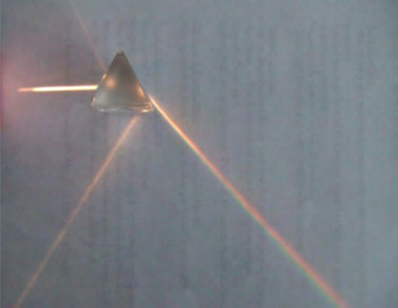
> **[Diagram Context - Textbook_NaturalScience_Gr8_Visible-light.pdf-0050-02.png]**
> This image shows a physical demonstration of light refraction and dispersion using a glass triangular prism. It illustrates a beam of white light entering the prism and emerging as a visible spectrum of colours, demonstrating how different wavelengths of light refract at varying angles.

**Explain how we are able to see the different colours on the South African flag. [6 marks]**

*   **Step 1:** White light from a source (like the Sun or a lamp) shines onto the flag.
*   **Step 2:** The different coloured sections of the flag (red, green, black, yellow, white, and blue) have pigments that absorb specific wavelengths of light.
*   **Step 3:** Each section reflects only the light corresponding to its specific colour. For example, the red section absorbs all other colours and reflects only red light.
*   **Step 4:** These reflected light rays travel from the flag to our eyes.
*   **Step 5:** The light enters the eye and hits the retina.
*   **Step 6:** The brain interprets the specific wavelengths of the reflected light as the distinct colours we perceive on the flag.

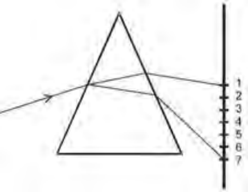
> **[Diagram Context - Textbook_NaturalScience_Gr8_Visible-light.pdf-0050-04.png]**
> This diagram illustrates the dispersion of white light through a triangular glass prism, showing an incident ray entering the prism and emerging as a spectrum labeled with numbers 1 through 7. It demonstrates the principle of refraction, where different wavelengths of light bend by varying amounts, allowing students to visualize the separation of white light into its constituent colours.

---

### Chapter 4: Visible Light

#### Exercise Questions

**7. Ray Diagram: Seeing Colour**
Draw a ray diagram in the space provided to show how we see the green part of a flag. [5 marks]

**8. Refraction through a Prism**
Which diagram shown below correctly shows the path of a ray of light through a triangular piece of glass? [2 marks]

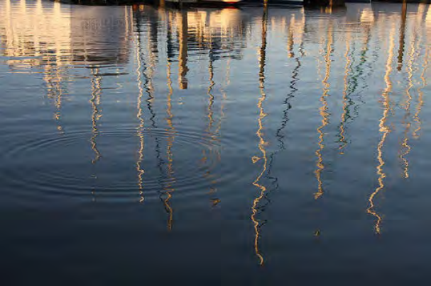
> **[Diagram Context - Textbook_NaturalScience_Gr8_Visible-light.pdf-0051-02.png]**
> This image captures a physical phenomenon demonstrating circular water waves propagating outward from a central point source, superimposed against the reflected images of boat masts. There are no formal labels or variables present, as this is a naturalistic representation of wave motion. For a Physical Sciences learner, this illustrates the concept of two-dimensional transverse waves, highlighting how a disturbance creates concentric wavefronts that travel across a medium while maintaining their circular geometry.

*   **A**
*   **B**
*   **C**
*   **D**

---
*Note: When light enters a denser medium (like glass) from a less dense medium (like air), it bends towards the normal. When it exits back into the air, it bends away from the normal.*

> **[Diagram Context - Textbook_NaturalScience_Gr8_Visible-light.pdf-0051-08.png]**
> This image is the national flag of South Africa, featuring a geometric design composed of a black triangle, a gold chevron, white fimbriations, and horizontal bands of red, green, and blue. Within the CAPS curriculum, this symbol is used in Life Orientation and Social Sciences to represent national identity, unity, and the historical transition to a democratic state. It serves as a foundational visual for understanding South African citizenship, constitutional values, and the symbolic significance of national emblems.

---

### Refraction of Light: Exercises

#### 9. Principles of Refraction
Complete the following sentences regarding the behavior of light as it changes medium:

*   When light travels from a less dense into a more dense transparent medium, it refracts and bends **towards** the normal line.
*   When light travels from a more dense to a less dense medium, it refracts and bends **away from** the normal line.

---

#### 10. Diagrammatic Representation of Refraction
Draw a diagram to illustrate the concept of a refracted ray bending towards the normal. Ensure your diagram includes the following labels:
*   Angle of incidence ($i$)
*   Angle of refraction ($r$)
*   Identification of the denser medium

---

#### 11. Analysis of Refraction Investigation
Study the provided diagram showing light passing through a rectangular glass block.

**a)** What does the red line represent in this diagram? 
*Answer:* The red line represents the path of the light ray as it travels through the air and the glass block.

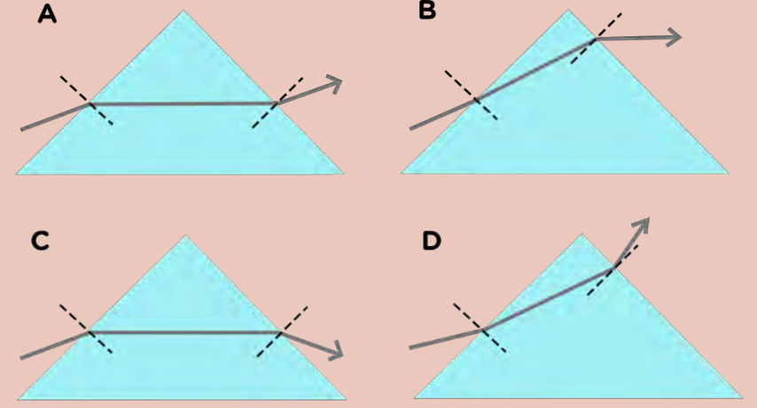
> **[Diagram Context - Textbook_NaturalScience_Gr8_Visible-light.pdf-0052-04.png]**
> This diagram illustrates the refraction of light rays as they pass through a triangular glass prism, labeled A through D. It depicts light rays (grey arrows) entering and exiting the prism boundaries, with dashed lines representing the normals at each point of incidence. The graphic helps learners visualize how the angle of incidence and the refractive index cause light to bend towards or away from the normal, demonstrating the principles of Snell's Law and optical deviation.

---

### Refraction of Light: Core Concepts

Refraction is the bending of light as it passes from one transparent medium into another of a different optical density. This occurs because light travels at different speeds in different materials.

#### Key Principles
1.  **Optical Density:** When light enters a **more dense** medium (e.g., air to glass), it slows down and bends **towards the normal**.
2.  **Optical Density:** When light enters a **less dense** medium (e.g., glass to air), it speeds up and bends **away from the normal**.
3.  **Normal:** An imaginary line drawn perpendicular ($90^\circ$) to the surface at the point where the light ray strikes.
4.  **Incident Ray:** The incoming ray of light.
5.  **Emergent Ray:** The ray that exits the medium.
6.  **Angle of Incidence ($i$):** The angle between the incident ray and the normal.
7.  **Angle of Refraction ($r$):** The angle between the refracted ray and the normal.

---

### Worked Example: Light through a Rectangular Prism

When light passes through a rectangular glass block, it undergoes refraction twice: once when entering and once when exiting.

| Feature | Description |
| :--- | :--- |
| **Path** | The light bends towards the normal upon entry and away from the normal upon exit. |
| **Result** | The emergent ray is parallel to the incident ray but laterally displaced (shifted). |

**Correct Path Identification:**
*   **Diagram A:** Incorrect (no refraction).
*   **Diagram B:** **Correct.** Shows the light bending towards the normal upon entry and away from the normal upon exit.
*   **Diagram C:** Incorrect (incorrect bending direction).
*   **Diagram D:** Incorrect (incorrect bending direction).

---

### Activity: Understanding Refraction in Daily Life

**Question:** Why does the tree trunk appear "skew" or shifted when viewed through a glass block?

**Explanation:**
The light rays reflecting from the tree trunk pass through the glass block. Because the glass is more optically dense than air, the light rays refract (bend) as they enter the glass and refract again as they exit back into the air. This change in the path of the light rays causes the image of the tree trunk to appear shifted or "skewed" relative to the part of the trunk seen directly through the air.

---

### Summary Table: Refraction Rules

| Scenario | Speed Change | Direction of Bending |
| :--- | :--- | :--- |
| Air to Glass | Slows down | Towards the normal |
| Glass to Air | Speeds up | Away from the normal |

**Mathematical Note:** The relationship between the angles and the refractive index ($n$) of the materials is governed by Snell's Law:
$$n_1 \sin(i) = n_2 \sin(r)$$
Where:
*   $n_1, n_2$ are the refractive indices of the two media.
*   $i$ is the angle of incidence.
*   $r$ is the angle of refraction.

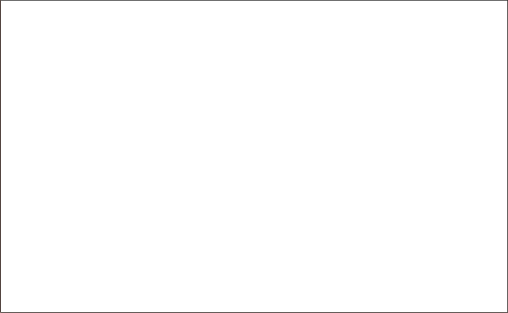

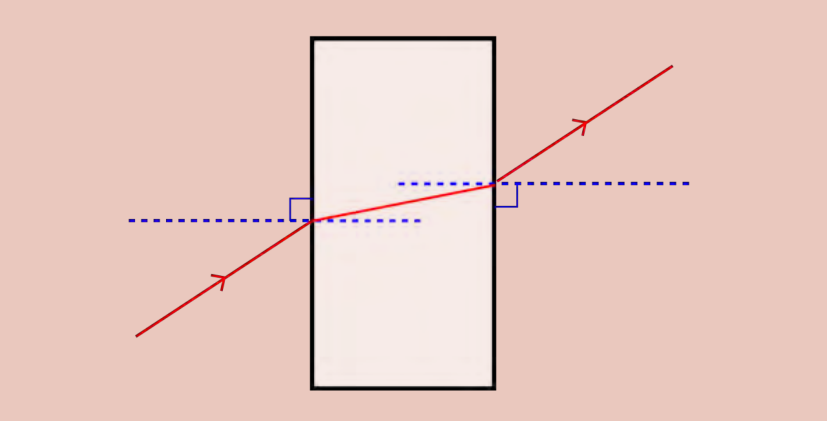
> **[Diagram Context - Textbook_NaturalScience_Gr8_Visible-light.pdf-0053-05.png]**
> This ray diagram illustrates the refraction of a light ray passing through a rectangular glass block, featuring a solid red line representing the light path with directional arrows and dashed blue lines indicating the normals at the points of incidence. It demonstrates the principle of refraction where light bends towards the normal when entering a denser medium and away from the normal when exiting, resulting in a lateral displacement of the emergent ray.

---

### Physics: Lenses and Optics

#### Exercise Questions

**14. Lens Shape**
What shape does a lens have to have in order to focus the light? [1 mark]

**15. Ray Diagram**
Draw a ray diagram to show how a converging lens focuses light to a point. [4 marks]

**16. Eyesight Defects**
Which eyesight defect can be fixed by using a converging lens? Explain what this defect is and why it can be corrected. [4 marks]

***

#### Instructional Notes

*   **Converging Lens (Convex Lens):** A lens that is thicker in the middle than at the edges. It causes parallel light rays to refract and meet (converge) at a single focal point.
*   **Farsightedness (Hyperopia):** This is the eyesight defect corrected by a converging lens. In this condition, the image of nearby objects is focused behind the retina because the eyeball is too short or the lens is too weak. A converging lens adds the necessary refractive power to move the focal point forward onto the retina.

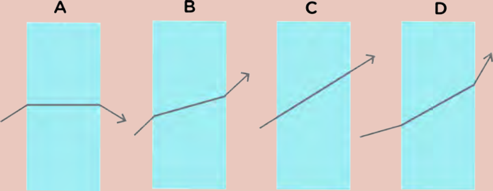
> **[Diagram Context - Textbook_NaturalScience_Gr8_Visible-light.pdf-0054-05.png]**
> This diagram illustrates four scenarios of light refraction through a rectangular glass block, labeled A through D, using arrows to represent light rays changing direction at the boundaries. It demonstrates the conceptual relationship between the angle of incidence and the resulting refraction, helping learners visualize how light bends when transitioning between media of different optical densities.

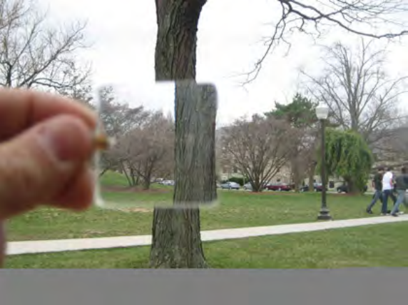
> **[Diagram Context - Textbook_NaturalScience_Gr8_Visible-light.pdf-0054-07.png]**
> This image depicts a physical demonstration of light refraction using a transparent rectangular glass or plastic block held in front of a tree. The visual elements include a hand holding the transparent medium, which causes a lateral displacement of the tree trunk's image due to the change in the speed of light as it passes through different optical densities. This illustrates the concept of refraction, showing how light rays bend when transitioning between air and a denser medium, a core principle in the Grade 10-12 Physical Sciences curriculum regarding geometric optics.

---

# Chapter 10: Visible Light

**Duration:** 3 weeks

This chapter explores the visible light spectrum, how we perceive light, and how we interpret it. Key concepts include the absorption, reflection, and refraction of light. This content builds upon Grade 7 concepts regarding heat transfer and solar energy.

---

## Curriculum Overview and Schedule

| Section | Topic | Duration | Tasks | Skills | Recommendation |
| :--- | :--- | :--- | :--- | :--- | :--- |
| 10.1 | Radiation of light | 1 hour | Activity: Making a pinhole camera | Following instructions, observing, describing | CAPS suggested |
| 10.2 | Spectrum of visible light | 1 hour | Activity: Splitting white light | Following instructions, observing, describing, explaining | CAPS suggested |
| 10.2 | Spectrum of visible light | 1 hour | Activity: Colour spinning wheels | Follow instructions, measuring, observing, describing | Optional |
| 10.3 | Opaque and transparent objects | 1 hour | Activity: Shadow play | Following instructions, observing, describing, comparing, explaining | CAPS suggested |
| 10.4 | Absorption of light | 1 hour | Activity: Why do objects look red under red light? | Observing, explaining | CAPS suggested |
| 10.5 | Reflection of light | 2 hours | Investigation: Relationship between angles of incidence and reflection | Investigating, comparing, measuring, observing, describing, explaining | CAPS suggested (Aluminium foil) |
| 10.6 | Seeing light | 1 hour | Activity: Seeing colours | Interpreting, drawing | CAPS suggested |
| 10.7 | Refraction of light | 2 hours | Investigation: Does light change | Investigating, comparing | CAPS suggested |

---

## Key Concepts

### 10.1 Radiation of Light
Focuses on the propagation of light and the construction of simple optical devices like the pinhole camera.

### 10.2 Spectrum of Visible Light
Explores the composition of white light and how it can be dispersed into its constituent colours.

### 10.3 Opaque and Transparent Objects
Examines how different materials interact with light, specifically the formation of shadows.

### 10.4 Absorption of Light
Investigates how objects absorb specific wavelengths of light, which determines the colour we perceive.

### 10.5 Reflection of Light
Studies the law of reflection, focusing on the relationship between the angle of incidence ($i$) and the angle of reflection ($r$).
*   **Principle:** The angle of incidence is equal to the angle of reflection ($i = r$).

### 10.6 Seeing Light
Focuses on the biological and cognitive processes of interpreting light and colour.

### 10.7 Refraction of Light
Investigates the bending of light as it passes from one medium to another.

> **[Diagram Context - Textbook_NaturalScience_Gr8_Visible-light.pdf-0055-06.png]**
> This graphic illustrates an ant colony's foraging behavior, featuring a lead ant followed by a dense, linear trail of numerous smaller ants moving across a two-toned background. It conceptually demonstrates the biological principle of pheromone-based communication and social cooperation, where individual organisms follow chemical signals to maintain efficient collective movement toward a resource.

---

### Curriculum Overview: Optics and Light

| Activity/Topic | Skills Developed | Status |
| :--- | :--- | :--- |
| Direction of light through a glass block | Measuring, analysing, describing, explaining | - |
| Magic coin trick | Observing, describing, explaining | CAPS suggested |
| Diverging and converging light with lenses | Observing, describing, comparing, explaining | CAPS suggested |
| Research careers in optics | Researching, working in groups, writing | Optional |

**Note:** An additional investigation, *The refraction of light as it enters water (PhET simulation)*, is available in the Teacher's Guide as an alternative for classrooms with internet access.

---

### Key Questions for Inquiry
* Where does light come from?
* How does light travel?
* How do we see?
* Why do leaves look green?
* How do mirrors work?
* Why do my legs look crooked underwater?

---

### 10.1 Radiation of Light
The study of light begins with the concept of **rectilinear propagation of light** (light travelling in straight lines).

**Classroom Demonstration: Camera Obscura**
* **Method:** Cover all windows with black paper and tape gaps to block all external light. Leave one small area of a window uncovered.
* **Setup:** Hang a white sheet in the centre of the room opposite the exposed window.
* **Observation:** The view from outside is projected onto the sheet, appearing upside down.

---

### Activity: Make a Pinhole Camera
This activity demonstrates that light travels in straight lines by producing images on a screen.

**Materials and Construction:**
* Use a cardboard tube (e.g., a Pringles chip can).
* Use a piece of wax paper as the screen.
* Use aluminium foil to cover the aperture; it molds to the tube shape and prevents ambient light from entering. If foil is unavailable, black paper may be used.

**Instructional Note:** If time is limited, the teacher may construct one camera to demonstrate to the class rather than having each learner build an individual unit.

<!-- DIAGRAM_PLACEHOLDER: diagram -->

**Observation:**
1. Learners should observe an inverted image on the "screen" (the lid or wax paper).

---

## 10.2 Spectrum of Visible Light

### Activity: Splitting White Light (LB page 195)

This activity demonstrates that white light is a mixture of the seven colours of the visible spectrum.

**Instructions:**
1. Darken the room as much as possible to ensure clear results.
2. If a ray box is unavailable, create a simple one by cutting a small slit into a piece of cardboard. Hold this in front of a light bulb to produce a coherent beam of light.
3. Use a prism to refract the light. Rotate the prism until the colours become visible.

**Observations:**
*   White light enters the prism, refracts, and emerges as a spectrum of seven colours.
*   The order of colours is always: Red, orange, yellow, green, blue, indigo, violet.
*   **Conclusion:** White light is a combination of these seven colours.
*   Note the relative bending of red light versus violet light as they pass through the prism.

<!-- DIAGRAM_PLACEHOLDER: diagram -->

---

### Activity: Colour Spinning Wheels (LB page 196)

This activity demonstrates that the seven colours of the spectrum can combine to form white light.

**Construction Instructions:**
1. Find the centre of a circle and mark it with a dot.
2. Draw a straight line from the centre to the edge of the circle.
3. Use a protractor to measure and mark segments. Since a full circle is $360^\circ$, each of the 7 segments should ideally be:
   $$\frac{360^\circ}{7} \approx 51.4^\circ$$
4. For practical purposes, you may draw each segment at approximately $52^\circ$. (Note: If drawing only 6 segments, the angle would be $60^\circ$).
5. Colour each segment with one of the colours of the spectrum.

**Observations:**
*   When the wheel is spun rapidly, the colours appear to "mix."
*   The goal is to observe a white colour; however, depending on the quality of the pens or pencils used, you may observe a light grey.

---

# 10.3 Opaque and Transparent Substances

## Activity: Shadow Play
This activity demonstrates how different materials interact with light to form shadows.

### Key Observations
*   **Opaque Objects:** These objects do not allow light to pass through them. Consequently, they cast a dark shadow on the side furthest from the light source.
*   **Shadow Size:** The size of a shadow is determined by the size of the object and its distance from the light source.
    *   Larger objects cast larger shadows.
    *   As an object moves closer to the light source, the shadow becomes larger.
    *   As an object moves further from the light source, the shadow becomes smaller.
*   **Transparent Objects:** These materials allow light to pass through them. Therefore, they do not form a distinct shadow. If a faint outline appears, it is usually due to the thickness of the edges or imperfections in the material.
*   **Translucent (Semi-transparent) Objects:** These materials allow some light to pass through but not all of it. They cast a lighter, less defined shadow compared to opaque objects.

### Scientific Principles
*   **Rectilinear Propagation:** Light travels in straight lines and cannot bend around objects. When an opaque object blocks these straight paths, a shadow is formed on the surface behind it.
*   **Light Interaction:**
    *   **Opaque:** Blocks light completely.
    *   **Transparent:** Allows light to pass through.
    *   **Translucent:** Allows partial light transmission.

<!-- DIAGRAM_PLACEHOLDER: diagram -->

---

# 10.4 Absorption of Light

## Concepts
The absorption and reflection of light are linked to the energy of photons.

*   **Reflection:** When light hits a surface, some of it is reflected. The colour we perceive is determined by the frequency of the reflected light, which corresponds to the energy of the photons.
*   **Absorption:** Surfaces absorb light energy. 
    *   **Matt Black Surfaces:** Absorb most of the light and heat energy falling on them.
    *   **White and Silver Surfaces:** Reflect most of the light and heat energy.
*   **White Objects:** These objects do not absorb the colours of the visible spectrum; instead, they reflect all colours together, which our eyes perceive as white.

---

### ACTIVITY: Why do objects look red under red light? (LB page 201)

**Instructions:** Use a dimly lit classroom so that the main source of light is the torch or light bulb.

1. **Observation of White:** Normal light contains all 7 colours of the visible spectrum mixed together. All colours are reflected from a white page and enter our eyes, which is why we perceive the page as white.
2. **Observation of Red:** When viewed through red plastic, the page appears red. This is because the red plastic only allows red light to pass through it. The red light is reflected off the paper, and since it is the only colour that reaches the eye, the paper appears to be red.

---

### 10.5 Reflection of light

Reflection occurs when light bounces off a surface. A common example is the reflection of an object (such as a bridge) in water, which often appears upside down.

<!-- DIAGRAM_PLACEHOLDER: diagram -->

---

### INVESTIGATION: Is there a relationship between the angles of incidence and reflections? (LB page 203)

**Objective:** To determine the relationship between the angle of incidence and the angle of reflection.

**Key Principle:** The angle of reflection is always equal to the angle of incidence.

**Methodology Notes:**
*   **Materials:** A mirror, a ray box (or laser pointer), and paper.
*   **Alternative Materials:** You may use a piece of crumpled aluminium foil instead of a mirror, or a sheet of corrugated cardboard instead of paper. If using cardboard, you can stick pins into the board along the light ray to trace the lines.
*   **Scientific Inquiry:** When conducting this investigation, formulate a clear question, such as: *"How is the angle of reflection related to the angle of incidence of the incident ray?"*
*   **Accuracy:** To improve the accuracy of your measurements, use a protractor printed directly on the page.

---

### ACTIVITY: Light reflection off aluminium foil (LB page 206)

**Observations:**
1.  The reflected ray off aluminium foil is scattered and does not provide one clear ray, unlike a mirror.
2.  **Reasoning:** This occurs because aluminium foil has a crinkled, rough surface, whereas a mirror has a smooth, polished surface.

---

### Reflection of Light

#### Types of Reflection
Reflection occurs when light bounces off a surface. The nature of the reflection depends on the texture of the surface:

| Specular Reflection (Smooth Surface) | Diffuse Reflection (Rough Surface) |
| :--- | :--- |
| <!-- DIAGRAM_PLACEHOLDER: diagram --> | <!-- DIAGRAM_PLACEHOLDER: diagram --> |

---

### 10.6 How do we see light?

#### Activity: Seeing Colours
We perceive the colour of an object based on which wavelengths of light are reflected into our eyes and which are absorbed by the object.

**Example: A Sunflower**
*   **Yellow Petals:** When white light (which contains all colours of the spectrum) strikes the yellow petals, the petals absorb all colours except yellow. The yellow light is reflected into our eyes, so we perceive the petals as yellow.
*   **Black Centre:** When white light strikes the black centre, the centre absorbs all the colours of the spectrum. Because no light is reflected into our eyes, our brain interprets this absence of light as the colour black.

<!-- DIAGRAM_PLACEHOLDER: diagram -->
*Light striking the yellow petals.*

<!-- DIAGRAM_PLACEHOLDER: diagram -->
*Light striking the black centre.*

---

### Colour Perception
When white light from the Sun strikes an object, the surface of that object absorbs most colours of the light spectrum. Only specific colours are reflected back to our eyes. 

*   **Example:** When looking at a blue car, the surface absorbs all colours except blue. The blue light is reflected into our eyes, which our brain interprets as the colour blue.

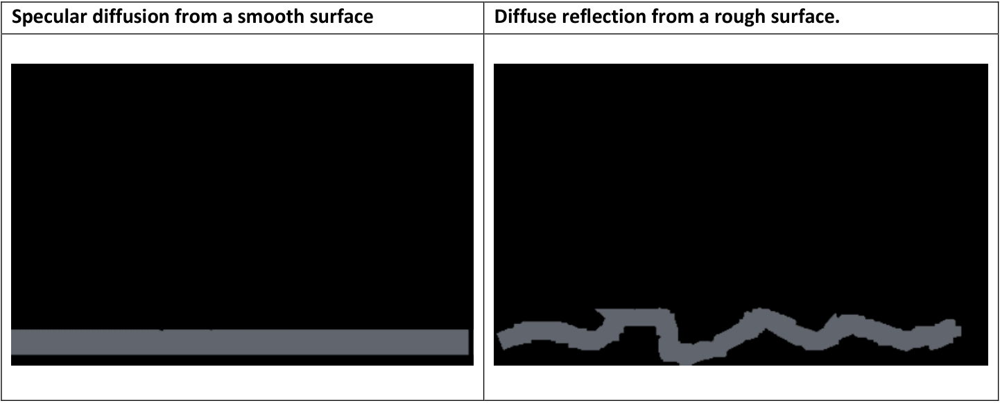
> **[Diagram Context - Textbook_NaturalScience_Gr8_Visible-light.pdf-0061-01.png]**
> This diagram illustrates the physical principles of light reflection, contrasting a straight, smooth surface labeled "Specular diffusion" with an irregular, rough surface labeled "Diffuse reflection." It demonstrates how surface texture dictates the direction of reflected light rays, helping learners distinguish between the formation of clear images on polished surfaces and the scattered light characteristic of matte or uneven surfaces.

---

### 10.7 Refraction of Light

Refraction is the change in direction of a light ray as it passes from one medium to another (e.g., from air into glass).

#### Investigation: What happens to light when it passes through a glass block?

**Materials needed:**
*   A light source (a laser pointer or a light bulb with a cardboard screen featuring a thin slit).
*   A glass block with parallel sides.

**Procedure and Observations:**
1.  **Setup:** Create a thin ray of light using your chosen light source.
2.  **Observation:** Observe the path of the light ray as it travels from air into the glass block, and subsequently from the glass block back into the air.
3.  **Key Principle:** Light changes direction when passing between media of different densities because the angle of incidence is not equal to the angle of refraction.

**Key Definitions:**
*   **Medium 1 (Air):** A less dense medium.
*   **Medium 2 (Glass):** A more dense medium.
*   **Refraction behavior:** When light enters a more dense medium (glass) from a less dense medium (air), the refracted ray bends **towards** the normal line.

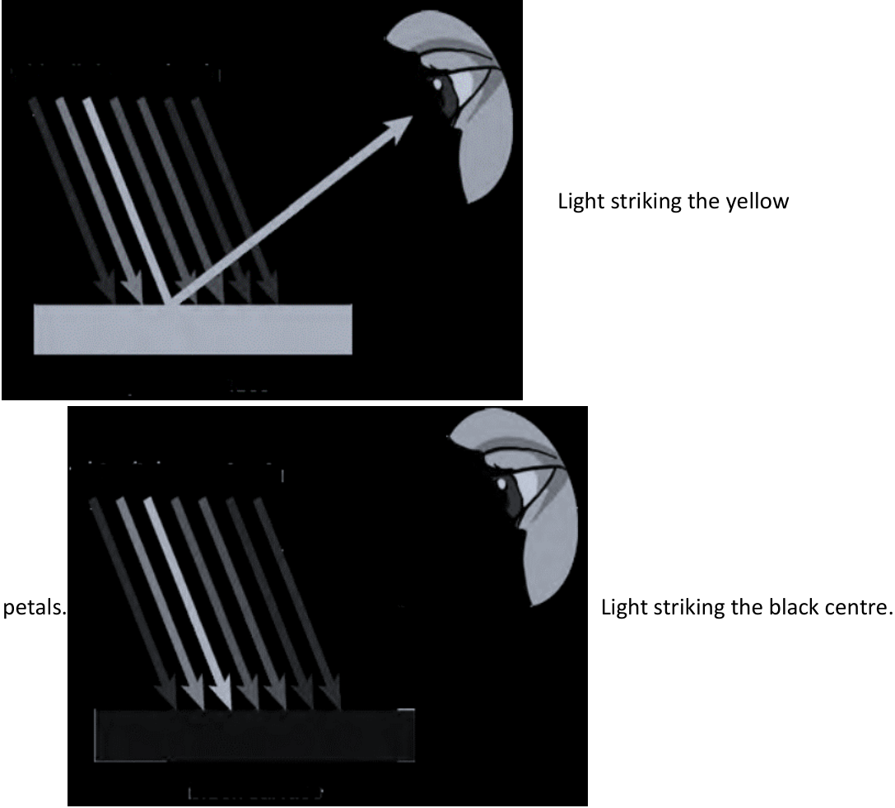
> **[Diagram Context - Textbook_NaturalScience_Gr8_Visible-light.pdf-0061-04.png]**
> This diagram illustrates the physics of light reflection and absorption using arrows representing light rays, a surface, and an observer's eye, with labels "Light striking the yellow petals" and "Light striking the black centre." It conceptually demonstrates that we perceive color because yellow surfaces reflect specific light wavelengths to the eye, whereas black surfaces absorb incident light, preventing it from reaching the observer.

---

### Refraction of Light: Key Concepts

#### 1. Observations on Light Direction
*   **Refraction:** When light passes from one medium to another (e.g., air to glass), it changes direction.
*   **Bending Away:** When light moves from a more dense medium to a less dense medium, the refracted ray bends **away** from the normal line.
*   **Bending Towards:** When light moves from a less dense medium to a more dense medium, the light bends **towards** the normal line.

#### 2. Geometric Relationships in Refraction
When observing light passing through a glass block:
*   **Angle Equality:** Angle 1 is equal to angle 4, and angle 2 is equal to angle 3.
*   **Mathematical Basis:** The equality of angles 2 and 3 is explained by the geometry of parallel lines and alternate angles. Since the normal lines are parallel, the alternate angles between them are equal.
*   **Definitions:**
    *   Angles 1 and 4: Angles of incidence.
    *   Angles 2 and 3: Angles of refraction.
*   **Conclusion:** The angle of incidence is not equal to the angle of refraction. This confirms that light changes direction when entering and exiting the glass block.

---

### ACTIVITY: Magic Coin Trick (LB page 214)

**Objective:** To demonstrate how the refraction of light affects visual perception.

**Procedure Notes:**
*   Secure the coin to the bottom of the bowl to prevent movement when water is added.
*   Pour water gently into the bowl to ensure the coin remains in its original position.

**Observations and Explanations:**
1.  **Visibility:** The coin becomes visible only after water is added to the bowl.
2.  **Apparent Position:** The coin appears to be higher in the bowl than it actually is.
3.  **The Science of Perception:**
    *   Without water, there is no direct line of sight to the coin.
    *   When water is added, light rays from the coin are refracted as they leave the water.
    *   Because the human brain interprets light as traveling in straight lines, it projects the light rays backward, making the coin appear higher than its true position.

---

### Dispersion of Light
*   **Apparatus:** Triangular prism.
*   **Concept:** White light is composed of 7 different colours.
*   **Refraction Effect:** The prism separates white light into its component colours through refraction.
*   **Spectrum Order:**
    *   **Top:** Red
    *   **Bottom:** Violet

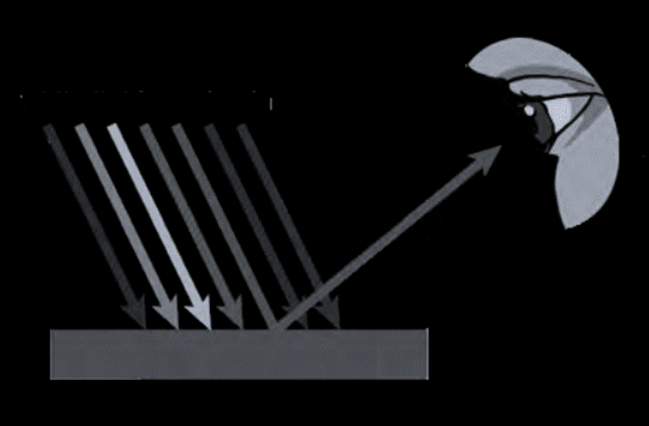
> **[Diagram Context - Textbook_NaturalScience_Gr8_Visible-light.pdf-0062-01.png]**
> This diagram illustrates the physics of specular reflection, showing parallel incident light rays striking a smooth, reflective surface and reflecting at a uniform angle toward an observer's eye. It visually demonstrates the law of reflection, where the angle of incidence equals the angle of reflection, helping learners understand how light interacts with polished surfaces to form clear images.

---

### ACTIVITY: Research Careers in Optics

This section provides an overview of two primary career paths in the field of optics: Optometry and Ophthalmology.

---

#### 1. Optometry
Optometrists are healthcare professionals who measure the efficiency of a patient's eyes. They examine eyes for vision problems, diseases, and other abnormal conditions. They test for proper depth and colour perception, as well as the ability to focus and coordinate the eyes. They specialize in visual defects and are qualified to prescribe spectacles or contact lenses to rectify or alleviate conditions such as far-sightedness, short-sightedness, astigmatism (image distortion), and presbyopia (age-related far-sightedness).

**Educational Requirements:**
*   **School Subjects:** National Senior Certificate (NSC) meeting degree or diploma requirements.
*   **Compulsory Subjects:** Mathematics, Physical Sciences.
*   **Recommended Subjects:** Life Sciences.
*   **Note:** Each institution sets its own minimum entry requirements.

**Training Paths:**
*   **Degree:** BOptometry (4 years full-time study) at UJ, UFS, or UL. Requires a one-year internship post-degree before registration as a professional optometrist.
*   **Diploma:** N.Dip: Optical Dispensing and B.Tech at CPUT (3 years). A fourth year culminates in B.Tech Optometry. Students have patient contact during the third and fourth years and must complete a one-year internship.
*   **Professional Registration:** Must register with the Interim National Medical and Dental Council (INMDC) of SA to practice.

---

#### 2. Ophthalmology
Ophthalmologists are medical doctors who diagnose and treat diseases of the eye, including glaucoma, cataracts, and eye injuries. They also treat vision problems like near-sightedness. Their practice combines medicine and surgery, ranging from lens prescriptions to delicate surgical procedures.

**Educational Requirements:**
*   **School Subjects:** National Senior Certificate (NSC) meeting degree requirements.
*   **Compulsory Subjects:** Mathematics, Physical Sciences.
*   **Recommended Subjects:** Life Sciences.
*   **Note:** Competition for medical studies is high; applicants with excellent grades are given preference.

**Training Path (MBChB Degree):**
*   **Institutions:** UP, UCT, UFS, Wits, US, UL, UKZN.
*   **Theoretical Training:** 6 years.
*   **Student Internship:** 1 year.
*   **Practical Work:** 1 year (House doctor year).
*   **Specialisation:** Post-graduate study for 3 – 5 years to qualify as an ophthalmologist.

---

### Career Paths in Science and Technology

#### Optoelectronics
*   **Definition:** The study and application of electronic devices that source, detect, and control light. It is generally considered a sub-field of photonics.
*   **Career Requirements:** Requires a degree in Electrical Engineering, which can be obtained at any South African university. Entry requirements vary by institution.

#### Illumination Engineering
*   **Definition:** The study and use of lighting in various environments, including:
    *   Sports and recreational lighting.
    *   Industrial facility lighting.
    *   Roadway lighting.
    *   Museum lighting.
*   **Career Requirements:** Can be studied at university by pursuing a degree in Electrical Engineering. Additional courses are offered by the *Illumination Engineering Society of South Africa*.

---

### Citizen Science
*   **Definition:** Scientific research conducted in whole or in part by non-professional scientists (the general public).
*   **Purpose:** Engaging in citizen science projects allows learners to apply classroom knowledge to real-world scenarios.
*   **Examples of Projects:**
    *   Identifying possible planets around stars.
    *   Analysing real-life cancer data.
    *   Looking at tropical cyclone data.
    *   Listening to whale or bat calls.
*   **Resource:** [Zooniverse](http://bit.ly/14JxLsw)

---

### Revision: Light and Optics

#### 1. Matching Exercise
| Question | Answer |
| :--- | :--- |
| 1 | C |
| 2 | F |
| 3 | A |
| 4 | I |
| 5 | L |
| 6 | B |
| 7 | K |
| 8 | D |
| 9 | J |
| 10 | H |
| 11 | E |
| 12 | G |

#### 2. Conceptual Questions on Light Dispersion
*   **a) Composition of White Light:** White light is composed of a spectrum of 7 distinct colours.
*   **b) Dispersion through a Prism:** When light passes from air into glass at an angle, it refracts (bends). Because different colours in the spectrum bend by different amounts, the light disperses. Upon exiting the prism, the light refracts again, causing the colours to spread further and become visible as a spectrum.
*   **c) Colour Bending:** Red light bends the least (Colour 1), while violet light bends the most (Colour 7).
*   **d) Identification:** Label 4 corresponds to the colour green.
*   **e) Internal Reflection:** Some rays are the result of reflection off the inner surfaces of the prism, as not all light passes directly through the material.

<!-- DIAGRAM_PLACEHOLDER: diagram -->

---

### Shadows and Light
*   **Definition:** An opaque object casts a shadow because it prevents light from passing through it.
*   **Mechanism:** Light is either reflected or absorbed by the object. A shadow forms on the side opposite to the light source because light cannot reach that area.

### Reflection and Colour
*   **Reflection off uneven surfaces:** When light hits an uneven surface (like water ripples), the light rays are scattered rather than reflected off a smooth surface.
*   **The Nature of Colour:**
    *   **White:** A combination of all colours in the visible spectrum. White objects reflect all colours equally.
    *   **Black:** An absence of colour. Black objects absorb all colours and reflect none.
*   **Colour Absorption and Reflection Table:**

| Colour of Object | Absorption | Reflection |
| :--- | :--- | :--- |
| **Black** | All colours | None |
| **Yellow** | All colours except yellow | Yellow |
| **Green** | All colours except green | Green |
| **Blue** | All colours except blue | Blue |
| **Red** | All colours except red | Red |
| **White** | None | All colours |

<!-- DIAGRAM_PLACEHOLDER: diagram -->

### Refraction of Light
*   **Definition:** Refraction is the bending of light as it passes from one transparent medium to another.
*   **Rules of Refraction:**
    1.  **Less dense to more dense:** Light refracts and bends **towards** the normal line.
    2.  **More dense to less dense:** Light refracts and bends **away** from the normal line.
*   **Observations in a dense medium (e.g., a glass block):**
    *   When light enters a denser medium, it slows down, causing the ray to bend towards the normal.
    *   When light exits into a less dense medium (like air), it speeds up, causing the ray to bend away from the normal.
    *   Refraction causes images to appear distorted (e.g., a tree trunk appearing "skew" through a glass block).

### Vision and Lenses
*   **Far-sightedness (Hyperopia):**
    *   Occurs when light focuses on a point behind the retina, resulting in a blurred image.
    *   **Correction:** Can be corrected using a **convex lens**.
    *   **Function:** The convex lens bends the light rays before they enter the eye to ensure they focus correctly on the retina.

---

### The Human Eye: Focusing Mechanism

The provided text describes the final stage of the visual process within the human eye.

#### Key Concept: Image Formation
For clear vision to occur, light rays entering the eye must be refracted (bent) by the lens so that they converge precisely on the **retina**.

*   **The Lens:** Acts as a converging lens that adjusts its shape to focus light from objects at varying distances.
*   **The Retina:** The light-sensitive inner lining at the back of the eye where the image is formed.

#### Summary of the Process
1.  Light enters the eye through the pupil.
2.  The light passes through the crystalline lens.
3.  The lens focuses the light rays.
4.  **Result:** The rays are focused clearly on the retina, allowing the brain to interpret the image.

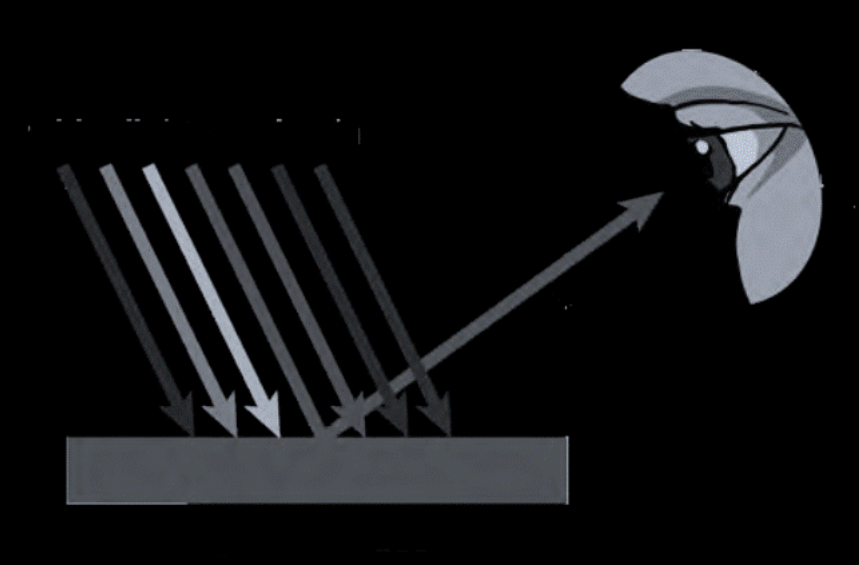
> **[Diagram Context - Textbook_NaturalScience_Gr8_Visible-light.pdf-0066-08.png]**
> This diagram illustrates the physical optics concept of specular reflection, featuring parallel incident light rays striking a smooth, reflective surface and reflecting at a consistent angle toward an observer's eye. It visually demonstrates the law of reflection, where the angle of incidence equals the angle of reflection, explaining how light rays from an object reach the eye to form a clear image.

***
*Page 108*