# Chapter 2: Beyond the Solar System

## Key Questions
* How far is our second closest star, Proxima Centauri?
* What is a galaxy and how many different types of galaxy are there?
* Where is our Sun located within our own Milky Way Galaxy?
* How do galaxies arrange themselves on the largest scales in the Universe?
* How large is the observable Universe and how many galaxies does it contain?

---

## 2.1 The Milky Way Galaxy

### Introduction
At the darkest places on Earth, far away from city lights, you can see thousands of stars at night using nothing but your eyes. In fact, there are many more stars in the sky which are too faint for us to see.

### Definitions
* **Galaxy:** A massive collection of stars, gas, and dust all held together by gravity.
* **Galaxy Disk:** The flattened, rotating part of a spiral galaxy that contains most of the stars and interstellar matter.
* **Galaxy Bulge:** The tightly packed group of stars found in the center of most spiral galaxies.
* **Spiral Arm:** The curved regions of stars and gas that extend from the center of a spiral galaxy.

### The Milky Way
* All of the individual stars that you can see are members of our **Milky Way Galaxy**.
* The Milky Way contains approximately $200 \times 10^{9}$ (200 billion) stars.
* Our Sun is just one of these stars.
* From Earth, the Milky Way appears as a bright, hazy band of light across the sky, interspersed with dark, dusty patches.

### Historical Naming
* **Greek origin:** Called *Galaxies Kuklos*, meaning "Milky Circle," because they thought it looked like milk spilled across the sky.
* **Roman origin:** Changed the name to *Via Lactea*, meaning "Milky Road" or "Milky Way."

<!-- DIAGRAM_PLACEHOLDER: diagram -->

### Visualizing the Galaxy
If you could travel outside the Milky Way and look down on it from above, the galaxy would look like a giant spiral in space.

<!-- DIAGRAM_PLACEHOLDER: diagram -->

---

### Additional Resources
* **Visit:** Watch a time-lapse video of the Milky Way at: `bit.ly/19YIkal`

---

# Chapter 2: Beyond the Solar System

> **[Diagram Context - Textbook_NaturalScience_Gr8_Beyond-the-solar-system.pdf-0001-02.png]**
> This diagram represents a cross-section of a biological membrane surface, featuring a linear arrangement of repeating, hook-like structures embedded in a solid base layer. It illustrates the concept of surface area amplification, such as the microvilli found on the epithelial lining of the small intestine, which are essential for maximizing the efficiency of nutrient absorption in the digestive system.

## The Milky Way Galaxy

The Milky Way is the galaxy that contains our Solar System. Because we are located inside it, we cannot take a photograph of the entire galaxy from the outside. The images we have are reconstructions based on scientific observations and data.

### Structure and Composition
*   **Spiral Arms:** The galaxy features spiral arms, which appear bluish due to the presence of hot, young stars, as well as gas and dust.
*   **Dust Lanes:** Dark wisps visible in the galaxy are regions filled with dense dust.
*   **The Centre:** The central region appears orangey in colour. This is because the stars located at the centre are older and cooler than the young, blue stars found in the spiral arms.

### Major Spiral Arms
Scientists have identified five major spiral arms in the Milky Way:
1.  Norma Arm
2.  Scutum-Crux Arm
3.  Sagittarius Arm
4.  Perseus Arm
5.  Cygnus Arm

### Location of the Sun
Our Sun is situated in a smaller spiral arm known as the **Orion (or Local) Arm**. This arm is positioned between the Sagittarius Arm and the Perseus Arm, placing our Sun approximately halfway out from the centre of the galaxy.

---

## Key Facts and Figures

*   **Orbital Motion:** All stars in the galaxy revolve around the galactic centre.
*   **Orbital Speed:** The Sun travels around the centre of the Milky Way at a speed of $250 \text{ km/s}$.
*   **Orbital Period:** It takes the Sun approximately $225 \text{ million years}$ to complete one full orbit around the centre of the galaxy.
*   **Size:** The Milky Way is massive, measuring approximately $950\,000\,000\,000\,000\,000 \text{ km}$ across.

---

## Did You Know?
Even though our Solar System orbits the centre of the Milky Way at thousands of kilometres per hour, the scale of the galaxy is so vast that it takes over $200 \text{ million years}$ to complete a single orbit.

---

## Further Exploration
To learn more about missions exploring beyond our solar system, visit: [bit.ly/1iaQrog](http://bit.ly/1iaQrog)

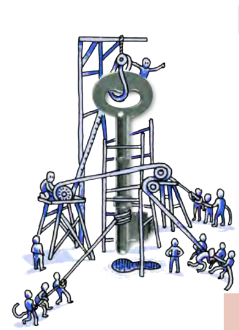
> **[Diagram Context - Textbook_NaturalScience_Gr8_Beyond-the-solar-system.pdf-0001-03.png]**
> This conceptual illustration depicts a complex mechanical system of pulleys, scaffolding, and human figures working in unison to hoist a large, central key. By visualizing the coordinated application of force through simple machines, the diagram serves as a metaphor for collaborative effort and the mechanical advantage required to manipulate heavy objects.

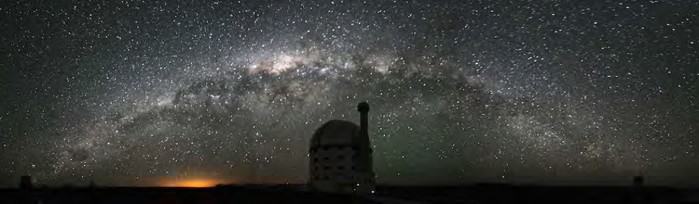
> **[Diagram Context - Textbook_NaturalScience_Gr8_Beyond-the-solar-system.pdf-0001-19.png]**
> This panoramic photograph depicts the Southern African Large Telescope (SALT) situated beneath the expansive, star-filled arc of the Milky Way galaxy. The image features the observatory dome and the night sky, illustrating the vast scale of our galaxy and the role of ground-based astronomical facilities in observing celestial phenomena. It serves as a visual context for Grade 10-12 Physical Sciences and Geography learners to explore the structure of the universe, light pollution, and the importance of South Africa's clear, dark skies for astronomical research.

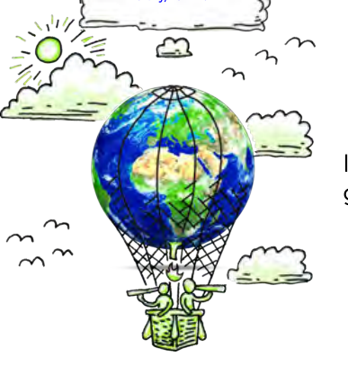
> **[Diagram Context - Textbook_NaturalScience_Gr8_Beyond-the-solar-system.pdf-0001-22.png]**
> This conceptual illustration depicts the Earth as a hot air balloon, featuring a globe, a basket with two figures using telescopes, a sun, clouds, and birds. It serves as a visual metaphor for global observation and environmental monitoring, helping students conceptualize the study of Earth systems, climate change, and the human role in monitoring planetary health within the Life Sciences and Geography curricula.

> **[Diagram Context - Textbook_NaturalScience_Gr8_Looking-into-space.pdf-0001-02.png]**
> This educational graphic is a simplified structural diagram representing a biological membrane with embedded proteins or receptors. It shows a continuous horizontal purple-blue band representing a phospholipid bilayer studded with a repeating series of blue, curved, hook-like receptor or protein structures along its upper surface. Conceptually, this diagram helps learners visualize how specialised proteins, enzymes, or carrier molecules are arranged along or embedded within cellular membranes to facilitate transport, signalling, or binding functions.

> **[Diagram Context - Textbook_NaturalScience_Gr8_Looking-into-space.pdf-0001-03.png]**
> The graphic is a cartoon character illustration featuring a metallic door key serving as the character's head, accompanied by a large question mark and a puzzled facial expression. The visual elements include a sketched blue-and-white character wearing a cap and backpack while standing on a skateboard, with a photographic metal key superimposed as the head featuring drawn-on eyes and a frowning mouth, plus a blue question mark and squiggly motion/thought lines. Conceptually, this whimsical figure represents confusion, problem-solving, or the search for answers, serving as an engaging visual prompt to introduce inquiry-based learning, critical thinking, or assessment tasks in a CAPS-aligned lesson.

> **[Diagram Context - Textbook_NaturalScience_Gr8_Looking-into-space.pdf-0001-14.png]**
> This educational graphic illustrates a laboratory apparatus setup for investigating chemical reactions, featuring an Erlenmeyer flask containing a blue liquid heated by a Bunsen burner, alongside a pressurized gas cylinder connected via rubber tubing. Visible elements include flames beneath a wire gauze stand, rising gas bubbles inside the flask, and steam or vapor escaping from the top with sparkle and bubble accents. Conceptually, this diagram visually communicates the practical setup used in high school Physical Sciences to study reaction rates, energy changes, or gas production involving heating and controlled gas supply.

> **[Diagram Context - Textbook_NaturalScience_Gr8_Looking-into-space.pdf-0001-17.png]**
> This educational graphic depicts a conceptual illustration comparing a rollercoaster track with a stretched metal slinky toy, featuring an outlined letter 'A' in the upper right. The illustration includes visible elements such as a green rollercoaster track with supporting pillars, a small rollercoaster cart with motion lines, cheering passengers with raised arms, and a coiled metallic spring overlaying the track's crest. Conceptually, this diagram helps high school learners visualize the transformation of mechanical energy, specifically the conversion between gravitational potential energy at the peak and kinetic energy, as well as serving as a mechanical model for wave motion or longitudinal compression along a track.

> **[Diagram Context - Textbook_NaturalScience_Gr8_The-Solar-System.pdf-0001-02.png]**
> This diagram illustrates a cross-section of a biological membrane surface, featuring a linear array of uniform, hook-like structures embedded in a solid substrate. These repetitive, stylized shapes represent specialized cellular projections, such as microvilli or cilia, which function to increase surface area for absorption or facilitate movement.

> **[Diagram Context - Textbook_NaturalScience_Gr8_The-Solar-System.pdf-0001-03.png]**
> This metaphorical illustration depicts a cityscape featuring a fire-breathing monster and a helicopter attempting to capture the central object, which is a large, realistic metal key. The image uses the visual symbols of a city, a monster, a helicopter, and a key to represent the concept of a "key solution" or a critical intervention required to resolve a complex problem or crisis. It serves as a visual analogy for identifying the essential factor or "key" necessary to unlock or control a chaotic situation.

> **[Diagram Context - Textbook_NaturalScience_Gr8_The-Solar-System.pdf-0001-24.png]**
> This diagram illustrates a laboratory apparatus setup featuring a Bunsen burner heating a conical flask containing a liquid, which is connected to a gas cylinder. The visual elements include a gas canister, tubing, a Bunsen burner, a tripod stand, and a conical flask showing signs of boiling, such as bubbles and steam. Conceptually, this setup demonstrates the application of thermal energy to induce a physical or chemical change, serving as a foundational model for understanding heating processes and reaction conditions in Physical Sciences.

> **[Diagram Context - Textbook_NaturalScience_Gr8_The-Solar-System.pdf-0001-29.png]**
> This graphic is a simple text-based call-to-action enclosed within a cloud-shaped speech bubble. It contains the single underlined word "VISIT," serving as a navigational prompt or instructional signpost. In an educational context, this visual element functions as a signifier to direct students toward external resources, digital platforms, or specific learning sites relevant to their CAPS curriculum studies.

> **[Diagram Context - Textbook_NaturalScience_Gr8_The-Solar-System.pdf-0001-32.png]**
> This illustration depicts a metaphorical hot air balloon where the envelope is replaced by a globe of the Earth, suspended above a basket containing two figures using telescopes. The visual elements include the Earth, clouds, a sun, birds, and human figures observing the world from an elevated perspective. Conceptually, this diagram represents the importance of global monitoring, environmental awareness, and the scientific study of Earth systems, encouraging students to consider their role as observers and stewards of the planet.

---

# The Milky Way Galaxy

## Structure of the Milky Way
The Milky Way Galaxy is a spiral galaxy with a distinct shape that can be compared to a giant fried egg. Its structure consists of two main parts:

*   **The Bulge:** The central, thicker lump of the galaxy.
*   **The Disk:** The flatter, thinner region that extends outward from the bulge.

The galaxy is approximately 100 times wider than it is thick.

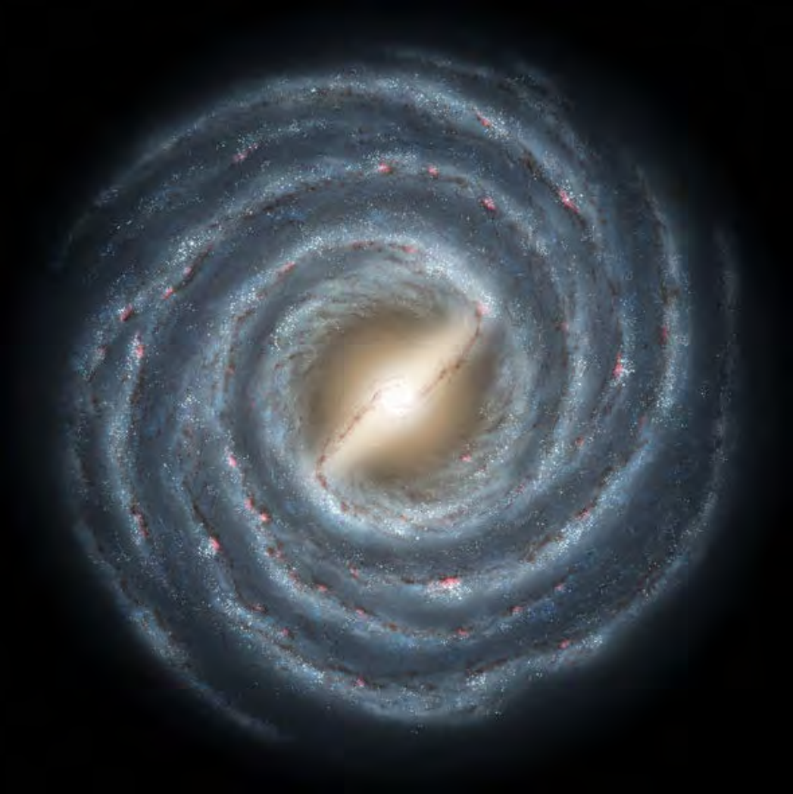
> **[Diagram Context - Textbook_NaturalScience_Gr8_Beyond-the-solar-system.pdf-0002-00.png]**
> This image is an artist's impression of a barred spiral galaxy, specifically representing the structure of the Milky Way. It displays a bright central galactic bulge, a distinct central bar, and multiple luminous spiral arms populated by stars, gas, and dust clouds. For Grade 10 Physical Sciences learners, this visualizes the vast scale of our galaxy, illustrating the distribution of matter within a spiral structure as part of the study of the universe and solar system.

## The Sun's Position
Our Solar System is located within the Milky Way Galaxy. When viewed from above, the Sun is situated within one of the spiral arms. When viewed from the side, the Sun is located within the disk, away from the central bulge.

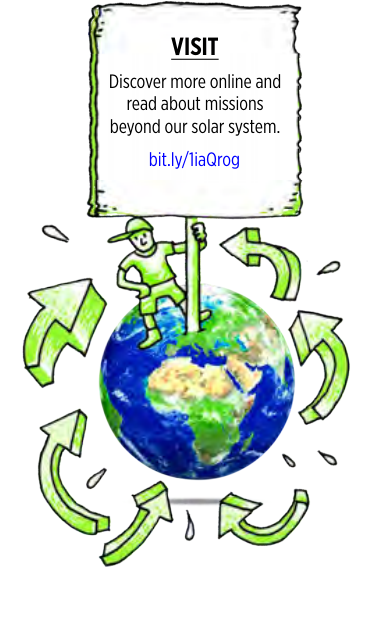
> **[Diagram Context - Textbook_NaturalScience_Gr8_Beyond-the-solar-system.pdf-0002-06.png]**
> This graphic features an illustration of a person standing on a globe, surrounded by circular arrows and a signpost labeled "VISIT" with a URL. It serves as an educational call-to-action, encouraging students to explore space science and missions beyond our solar system.

---

### DID YOU KNOW?
If you could shrink the solar system so that the distance from the Sun to Pluto is $2.5\text{ cm}$, the Milky Way would have a diameter of $2\,000\text{ km}$. This is roughly the distance from Durban to Windhoek!

### TAKE NOTE
To us, the Earth seems big, but it is only a very small part of the Solar System. Furthermore, our Solar System is a very small part of the Milky Way Galaxy, and our galaxy is only a very small part of the whole Universe.

---

### Critical Thinking Question
We are inside the Milky Way Galaxy. When you look at the thin, milky-looking band stretching across the sky at night, what do you think you are actually looking at?

> **[Diagram Context - Textbook_NaturalScience_Gr8_Beyond-the-solar-system.pdf-0002-09.png]**
> This illustration depicts a caricature of Isaac Newton with an apple-shaped head, surrounded by a network of smaller apples connected by dashed lines and directional arrows. It serves as a conceptual metaphor for Newton’s Law of Universal Gravitation, illustrating how mass exerts gravitational influence across a system of objects.

> **[Diagram Context - Textbook_NaturalScience_Gr8_Looking-into-space.pdf-0002-02.png]**
> This educational graphic is an astronomical star chart mapping celestial bodies, constellations, and directional angles across the night sky, featuring cardinal points (NE, NW, SE, SW), degrees along the circular perimeter, constellation names (such as Phoenix, Pavo, and Crux), celestial objects including the Moon, Venus, Saturn, and Mercury, red constellation connection lines, and green arrows pointing to specific southern constellations. For high school Physical Sciences and Earth and Space Sciences learners, this diagram visually conveys how observers map the night sky from Earth, demonstrating the relative positions of planets, the Moon, and prominent southern constellations within the celestial sphere.

> **[Diagram Context - Textbook_NaturalScience_Gr8_Looking-into-space.pdf-0002-09.png]**
> This educational graphic features an illustrated cartoon scene with a globe styled as a hot air balloon carrying observers in a basket beneath a sun, clouds, and birds, accompanied by a text box reading "VISIT Create your own star map for your area. bit.ly/1a4N1nU". Visible labels include the headline "VISIT" and the web link URL "bit.ly/1a4N1nU". The diagram conceptually encourages students studying earth and space sciences to explore practical stargazing and celestial mapping tools by creating localized star maps.

> **[Diagram Context - Textbook_NaturalScience_Gr8_Looking-into-space.pdf-0002-10.png]**
> This educational cartoon features an illustration of a character labeled "MR. NEWTON" with a face resembling an apple, accompanied by a thought bubble headed "DID YOU KNOW?" that contains historical trivia about early telescopes, trade ships, pirates, and high-speed telecommunications networks. Surrounding the central figure are smaller pink apples connected by dotted lines with directional arrows. Conceptually, this graphic provides a fun, engaging historical context about optical technology and communication networks to spark learner interest in physical sciences and technological development.

> **[Diagram Context - Textbook_NaturalScience_Gr8_The-Solar-System.pdf-0002-00.png]**
> This image is a telescopic photograph of the Sun, featuring a timestamp in the bottom left corner. It visually demonstrates the Sun's dynamic photosphere and solar activity, such as sunspots and flares, which are key components of the Grade 10 Physical Sciences curriculum regarding the solar system and stellar evolution.

> **[Diagram Context - Textbook_NaturalScience_Gr8_The-Solar-System.pdf-0002-05.png]**
> This graphic is an educational safety warning featuring a speech bubble above an illustration of a person using a tablet. It explicitly cautions students against the permanent eye damage caused by looking directly at the Sun, serving as a critical safety protocol for observational astronomy activities within the Natural Sciences curriculum.

> **[Diagram Context - Textbook_NaturalScience_Gr8_The-Solar-System.pdf-0002-06.png]**
> This graphic features two illustrations depicting Earth, one surrounded by circular arrows and the other viewed through a large telescope, accompanied by text boxes labeled "VISIT" with URLs for digital resources. It serves as an interactive signpost for Grade 9 Natural Sciences learners, directing them to supplementary online content regarding the formation of the solar system and the mechanics of the Sun.

---

### The Milky Way Galaxy

#### Key Concepts
*   **The Sagittarius Arm:** The thin band of light visible in the night sky is composed of stars located in the Sagittarius arm of the Milky Way.
*   **Globular Clusters:** These are vast, spherical collections of hundreds of thousands of ancient stars, held together by gravity.
    *   The Milky Way contains approximately 160 globular clusters.
    *   The stars within these clusters are among the oldest in the galaxy, some dating back nearly to the age of the Universe itself (approx. 12.5 billion years old).
    *   In comparison, our Sun is approximately 4.5 billion years old.

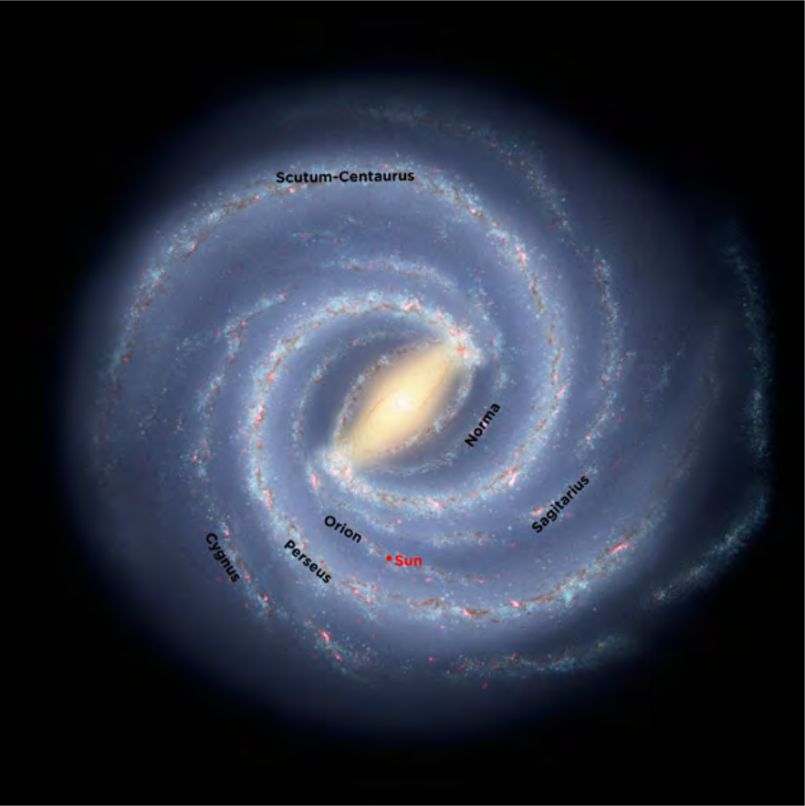
> **[Diagram Context - Textbook_NaturalScience_Gr8_Beyond-the-solar-system.pdf-0003-00.png]**
> This graphic is a top-down artistic representation of the Milky Way galaxy, featuring labels for the major spiral arms: Scutum-Centaurus, Norma, Sagittarius, Orion, Perseus, and Cygnus, along with a specific marker for the Sun. It illustrates the barred spiral structure of our galaxy, helping learners contextualize the Sun's peripheral position within the Orion Arm relative to the galactic centre.

---

### Activity: Draw the Milky Way

#### Materials Needed
*   Black paper
*   White crayon, pencil, or paint
*   Glue (optional)
*   Glitter or sand (optional)
*   Newspaper (to protect your workspace)
*   White or silver pencil/pen (for labelling)
*   Sticker (optional)

#### Instructions
1.  **Sketch:** Draw or paint the Milky Way on the black paper. Use the provided reference image as a guide. Ensure you include the five major spiral arms, the smaller arms (including the Orion Arm), and the central bulge.
2.  **Add Texture:** If using glitter or sand, apply glue along the spiral arms and the central bulge.
3.  **Represent Stars:** Scatter the glitter or sand over the glued areas. Each grain represents a star within our galaxy.
4.  **Clean Up:** Tilt the paper over the newspaper to remove any excess glitter or sand.
5.  **Label:** Use a white or silver pen to label each of the major spiral arms of the Milky Way.
6.  **Locate the Sun:** Place a sticker or mark a point on the Orion Arm, approximately halfway out from the central bulge, to represent the position of the Sun.

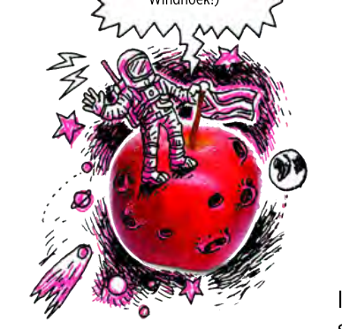
> **[Diagram Context - Textbook_NaturalScience_Gr8_Beyond-the-solar-system.pdf-0003-03.png]**
> This illustration depicts a surrealist scene featuring an astronaut standing on a cratered red apple, surrounded by celestial elements like stars, planets, and a comet. The image incorporates a speech bubble containing the text "Windhoek:)" and a South African flag held by the astronaut, set against a dark, textured background. Conceptually, this visual serves as a creative prompt or metaphor, likely intended to stimulate lateral thinking or narrative writing exercises regarding space exploration, perspective, or the juxtaposition of the mundane and the cosmic.

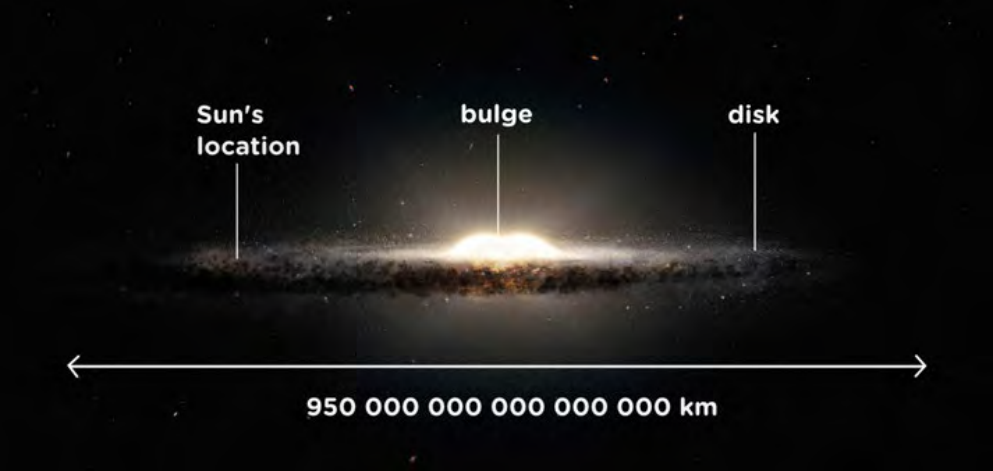
> **[Diagram Context - Textbook_NaturalScience_Gr8_Beyond-the-solar-system.pdf-0003-06.png]**
> This diagram provides an edge-on view of the Milky Way galaxy, featuring labels for the "bulge," "disk," and the "Sun's location," along with a scale bar indicating a diameter of 950 quintillion kilometres. It conceptually illustrates the structural morphology of a spiral galaxy, helping learners contextualise the Sun's peripheral position within the vast galactic disk.

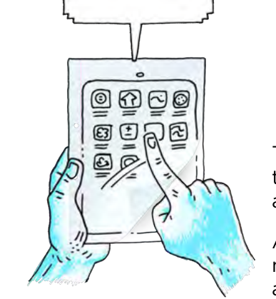
> **[Diagram Context - Textbook_NaturalScience_Gr8_Beyond-the-solar-system.pdf-0003-09.png]**
> This illustration depicts a pair of hands interacting with a tablet device featuring a grid of abstract icons, including symbols for a wave, a plus-minus sign, and various geometric shapes. It serves as a visual metaphor for digital literacy and the integration of Information and Communication Technology (ICT) in the classroom, encouraging students to engage with interactive learning tools.

> **[Diagram Context - Textbook_NaturalScience_Gr8_Looking-into-space.pdf-0003-04.png]**
> The educational graphic features a student activity page with decorative illustrations related to astronomy, including a tablet displaying app icons, text boxes with facts about constellations and a Google Earth visit link, and a globe surrounded by recycling-style green arrows. Visible text includes "Today professional astronomers formally recognise 88 constellations, 23 of which are in the southern hemisphere," "VISIT: Learn how to view the night sky with Google Earth," and "stick your pictures in here." Conceptually, this graphic serves as an interactive worksheet prompt for high school Natural Sciences learners to research and display information about constellations and stargazing technology.

> **[Diagram Context - Textbook_NaturalScience_Gr8_Looking-into-space.pdf-0003-05.png]**
> This educational graphic features marginal illustrations including hands holding a digital tablet with app icons, text boxes detailing the recognition of 88 constellations with 23 in the southern hemisphere, a "VISIT" instruction box with a URL, and a globe of the Earth surrounded by green circular arrows. Visible text labels include "recognise 88 constellations, 23 of which are in the southern hemisphere", "VISIT", "Learn how to view the night sky with Google Earth.", and "bit.ly/16pYL3u". Conceptually, this graphic introduces CAPS learners to astronomy and stargazing by connecting the formal study of southern hemisphere constellations with modern digital tools like interactive apps and Google Earth.

> **[Diagram Context - Textbook_NaturalScience_Gr8_Looking-into-space.pdf-0003-06.png]**
> This educational graphic is an illustration depicting a coiled spring toy (Slinky) tumbling down a flight of green stairs, accompanied by curved motion lines indicating its path. The visible elements include a multi-step staircase shown in perspective, the sequential positions of the spring as it flips downward, and motion arc lines. Conceptually, this diagram visually demonstrates mechanical wave motion, specifically illustrating the interplay of potential and kinetic energy transformations or longitudinal/transverse wave propagation as an object moves through a gravitational field.

> **[Diagram Context - Textbook_NaturalScience_Gr8_The-Solar-System.pdf-0003-00.png]**
> This diagram illustrates an electromagnet created by connecting a coiled wire (solenoid) to a battery, surrounded by metallic objects like a nut, nail, and bolt. It depicts the magnetic field lines generated by the current, indicated by directional arrows, which demonstrate how an electric current induces a magnetic field capable of attracting ferromagnetic materials.

> **[Diagram Context - Textbook_NaturalScience_Gr8_The-Solar-System.pdf-0003-09.png]**
> This diagram illustrates an experimental apparatus for the safe indirect observation of the Sun, featuring a telescope or binoculars mounted on a tripod, a cardboard collar, and a white card acting as a projection screen. It demonstrates the principle of solar projection, showing how light is directed onto a surface to create a magnified image, thereby protecting the observer's eyes from direct solar radiation.

> **[Diagram Context - Textbook_NaturalScience_Gr8_The-Solar-System.pdf-0003-12.png]**
> This editorial cartoon depicts a personified human figure whose torso is replaced by a globe of the Earth, with the figure pointing specifically toward the African continent. It serves as a visual metaphor for global citizenship and environmental responsibility, prompting learners to consider the interconnectedness of human activity and planetary health within the context of Geography and Life Sciences.

> **[Diagram Context - Textbook_NaturalScience_Gr8_The-Solar-System.pdf-0003-18.png]**
> This cartoon depicts a thief in a striped outfit stealing a framed portrait, with a blank speech bubble above his head and motion lines indicating movement. It serves as a visual metaphor for the concept of plagiarism or intellectual property theft, illustrating the act of taking original creative work and presenting it as one's own.

---

### Mapping the Milky Way

#### Concept: Understanding Galactic Structure
Astronomers determine the shape of the Milky Way from within by:
1. Observing the sky in all directions.
2. Counting the number of stars visible.
3. Measuring the distance to each star.
4. Constructing a three-dimensional map of the galaxy.

**Challenge:** Astronomers must account for interstellar dust, which dims the optical light emitted by stars, making it difficult to see through the galaxy.

---

### Activity: Make the Milky Way

#### Materials Needed
*   A thick piece of black cardboard (at least $30\text{ cm}$ across).
*   Various craft materials (collected by learners or supplied by the teacher).

#### Instructions
1.  **Preparation:** Gather materials to build a 3D model of the Milky Way Galaxy.
2.  **Base Construction:** Cut a circle with a radius of $r = 15\text{ cm}$ from the black cardboard to serve as the base.
3.  **Modeling:** Construct the model to include:
    *   The central bulge.
    *   The spiral arms.
    *   Different coloured stars.
4.  **Placement:** Mark the specific position of our Sun on the model.
5.  **Analysis:** View the model from different angles and compare it to images of the Milky Way provided in your textbook.

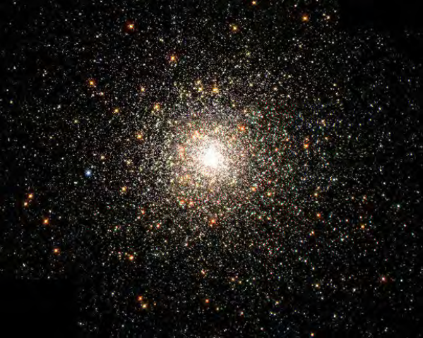
> **[Diagram Context - Textbook_NaturalScience_Gr8_Beyond-the-solar-system.pdf-0004-01.png]**
> This image is an astronomical photograph of a globular cluster, a dense, spherical collection of thousands to millions of stars held together by gravity. It contains no text labels or variables, but visually demonstrates the high stellar density and gravitational concentration characteristic of these ancient celestial structures. For Grade 10 Physical Sciences, this serves as a concrete example of the large-scale structures found in the universe and the role of gravity in stellar formation and organization.

---

### Take Note: Star Characteristics
*   **Younger stars:** These are hotter and appear bright white or blue in colour.
*   **Older stars:** These are cooler and appear yellow or red in colour.

---

### Questions

1.  What are the two main parts that make up our Milky Way Galaxy?
2.  Where are the spiral arms located; in the disk or the bulge of our galaxy?
3.  Is our Sun found in the central bulge or in a spiral arm in the disk?

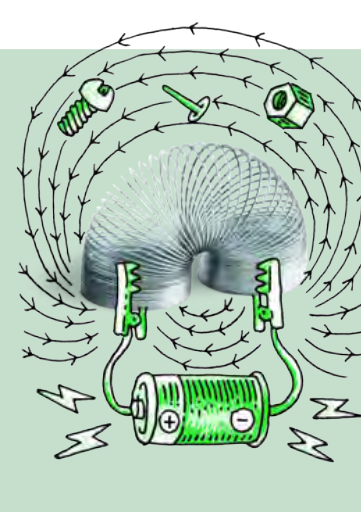
> **[Diagram Context - Textbook_NaturalScience_Gr8_Beyond-the-solar-system.pdf-0004-14.png]**
> This diagram illustrates an electromagnet, featuring a coiled wire (solenoid) connected to a battery, surrounded by magnetic field lines indicated by directional arrows. It visually demonstrates the principle of electromagnetism, where an electric current flowing through a coil generates a magnetic field capable of attracting nearby metallic objects like a bolt, nail, and nut.

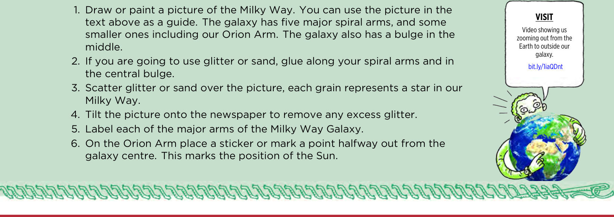
> **[Diagram Context - Textbook_NaturalScience_Gr8_Beyond-the-solar-system.pdf-0004-16.png]**
> This instructional graphic provides a step-by-step creative activity for modeling the Milky Way galaxy, featuring text labels such as "Milky Way," "spiral arms," "Orion Arm," "central bulge," and "Sun." By using glitter to represent stars and physically mapping the Sun's position, the exercise helps learners conceptualize the structural components of our galaxy and the relative location of our solar system within it.

> **[Diagram Context - Textbook_NaturalScience_Gr8_Looking-into-space.pdf-0004-01.png]**
> This photograph of the night sky displays the Southern Cross constellation (Crux) connected by white intersecting overlay lines, alongside the two circled pointers Alpha and Beta Centauri. The visible elements include the four main stars forming the cross and two prominent pointer stars circled at the bottom left against a dense starfield background. For Grade 10 Physical Sciences learners studying Earth and Beyond, this visual conveys how to locate and identify constellations in the southern hemisphere sky using pointer stars for navigation and astronomical observation.

> **[Diagram Context - Textbook_NaturalScience_Gr8_Looking-into-space.pdf-0004-06.png]**
> This educational graphic is an observational worksheet template featuring instructional text for tracking astronomical patterns alongside a blank space labeled "DRAWINGS". Visible text elements include instructions for observing the Southern Cross constellation and Pointers, noting dates, times, and cardinal directions (north, south, east, west), as well as Siyavula publisher attributions. Conceptually, it guides learners through practical, observational science inquiry by asking them to record empirical data of night sky phenomena over multiple weeks to understand apparent stellar motion.

> **[Diagram Context - Textbook_NaturalScience_Gr8_The-Solar-System.pdf-0004-06.png]**
> This graphic is a simple geometric figure consisting of a single, empty circle set against a light green background. It contains no labels, variables, or internal structures. In a CAPS Life Sciences or Physical Sciences context, this serves as a blank template for students to draw and annotate fundamental concepts, such as a cross-section of a cell, a planetary orbit, or a representation of a spherical object.

> **[Diagram Context - Textbook_NaturalScience_Gr8_The-Solar-System.pdf-0004-09.png]**
> This graphic depicts a stylized, repeating pattern of interlocking, arrow-shaped biological structures resembling a continuous chain or molecular sequence. The image uses a uniform green, linear motif to represent a repetitive biological polymer or a simplified schematic of a genetic sequence. It conceptually illustrates the principle of modularity and continuity in biological macromolecules, helping students visualize the repetitive nature of subunits within a larger chain.

> **[Diagram Context - Textbook_NaturalScience_Gr8_The-Solar-System.pdf-0004-11.png]**
> This illustration depicts a stylized caterpillar with a slinky-like body feeding on green leaves. It visually represents the biological concept of primary consumption in a food chain, illustrating how herbivores interact with producers to obtain energy within an ecosystem.

---

### 2.2 Our nearest star

#### Key Concepts
*   **The Sun:** Our closest star, located approximately $150\ 000\ 000$ km from Earth.
*   **Constellation:** A group of stars that, when viewed from Earth, form a recognizable pattern in the sky.
*   **Southern Cross (Crux):** A famous constellation visible from South Africa.
*   **The Pointers:** Two bright stars located near the Southern Cross that point towards it.

#### The Alpha Centauri System
Alpha Centauri is the closest easily visible star system to Earth after the Sun. It is a **triple star system**, meaning three stars orbit around each other.

*   **Alpha Centauri A and B:** The two main stars of the system. They orbit close together, at an average distance of approximately $11$ times the Earth-Sun distance from each other.
*   **Proxima Centauri:** A smaller, fainter star that orbits much farther out from the other two stars. Due to its distance and faintness, it cannot be seen with the naked eye alongside Alpha Centauri A and B.

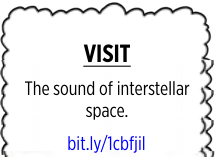
> **[Diagram Context - Textbook_NaturalScience_Gr8_Beyond-the-solar-system.pdf-0005-01.png]**
> This graphic is a text-based call-to-action formatted as a speech bubble containing the heading "VISIT," the descriptive phrase "The sound of interstellar space," and a shortened URL. It serves as a digital signpost directing students to external multimedia resources regarding the physics of sound waves and the vacuum of space. Conceptually, it encourages learners to explore the scientific paradox of how sound propagates, reinforcing the CAPS Physical Sciences requirement to understand wave mechanics and the necessity of a medium for sound transmission.

---

#### New Words
*   **Proxima Centauri:** The star orbiting farthest out in the Alpha Centauri triple star system.
*   **Alpha Centauri:** The closest star system to our solar system.
*   **Constellation:** A pattern of stars in the night sky.

#### Did You Know?
You can find South using the Southern Cross Constellation:
1.  Identify the long axis of the cross.
2.  Extend this line $4$ times its length.
3.  Look straight down to the horizon to find South.

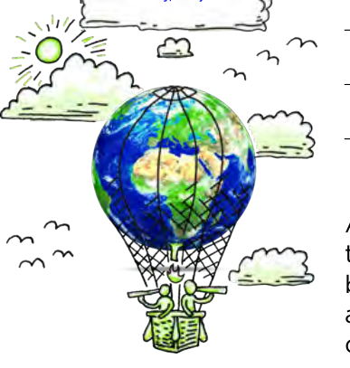
> **[Diagram Context - Textbook_NaturalScience_Gr8_Beyond-the-solar-system.pdf-0005-02.png]**
> This conceptual illustration depicts the Earth as a hot air balloon, featuring a globe, clouds, a sun, and two figures in a basket using telescopes. It serves as a visual metaphor for environmental science and geography, representing the human perspective of observing, monitoring, and managing the Earth's systems and climate from within the atmosphere.

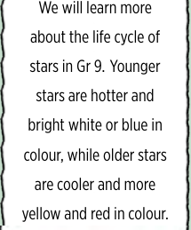
> **[Diagram Context - Textbook_NaturalScience_Gr8_Beyond-the-solar-system.pdf-0005-11.png]**
> This text-based educational graphic introduces the relationship between stellar age, temperature, and colour. It explicitly links younger, hotter stars to white or blue hues and older, cooler stars to yellow or red hues, providing foundational knowledge for the Grade 9 Natural Sciences curriculum regarding the life cycle of stars.

> **[Diagram Context - Textbook_NaturalScience_Gr8_Beyond-the-solar-system.pdf-0005-16.png]**
> This cartoon depicts a thief in a striped outfit running away with a framed portrait. The visual elements include a stylized character, a speech bubble, and a framed painting, using motion lines to suggest rapid movement. Conceptually, this serves as a metaphorical illustration for the process of "stealing" or "copying" information, often used in Life Sciences to introduce the concept of DNA replication or the transcription of genetic material.

> **[Diagram Context - Textbook_NaturalScience_Gr8_Looking-into-space.pdf-0005-07.png]**
> This educational graphic depicts a conceptual illustration of a large telescope observing the planet Earth, with smaller human figures interacting with the apparatus and a computer console. The visible elements include a massive green-framed optical instrument, a detailed depiction of the Earth's continents (centered on Africa and Europe) within the lens, a speech bubble, and human figures operating equipment and viewing from a ladder. Conceptually, this diagram illustrates the scientific study of Earth systems, planetary observation, and the scale of environmental or geographical monitoring for high school learners.

> **[Diagram Context - Textbook_NaturalScience_Gr8_The-Solar-System.pdf-0005-02.png]**
> This graphic is a text-based informational prompt containing the heading "VISIT," the descriptive text "Three years of the Sun in three minutes," and a shortened URL. It serves as a digital signpost directing students to a time-lapse resource that illustrates the dynamic, long-term solar activity relevant to the Earth and Beyond strand of the Natural Sciences curriculum.

> **[Diagram Context - Textbook_NaturalScience_Gr8_The-Solar-System.pdf-0005-04.png]**
> This conceptual illustration depicts the Earth as a hot air balloon, featuring a globe, a basket, two figures using telescopes, and a flame burner. It serves as a visual metaphor for global environmental monitoring and human stewardship, encouraging learners to consider the role of scientific observation in understanding and protecting our planet's atmosphere and biosphere.

> **[Diagram Context - Textbook_NaturalScience_Gr8_The-Solar-System.pdf-0005-05.png]**
> This diagram illustrates the reflection of light using a mirror, featuring labels for the "sun," "darkened room," "mirror facing towards the sun," and "sheet of paper." It demonstrates the principle of specular reflection, showing how light rays travel from a source, strike a reflective surface, and are redirected to form a bright spot on a target surface.

> **[Diagram Context - Textbook_NaturalScience_Gr8_The-Solar-System.pdf-0005-06.png]**
> This graphic is a text-based educational prompt featuring the heading "VISIT," the inquiry question "Where does the Sun get its energy?", and a shortened URL link. It serves as a digital signpost designed to direct high school Physical Sciences learners to external resources explaining the process of nuclear fusion in stars.

> **[Diagram Context - Textbook_NaturalScience_Gr8_The-Solar-System.pdf-0005-07.png]**
> This illustration depicts a conceptual model of global environmental stewardship, featuring a human figure holding a blank sign atop a globe surrounded by a circular arrangement of green arrows. The arrows symbolize the cyclical nature of sustainable practices, such as recycling or resource management, and the human figure represents the role of human agency in protecting the Earth. This graphic serves as an introductory visual for Life Sciences or Geography learners to discuss human impact on the environment and the importance of sustainable development.

> **[Diagram Context - Textbook_NaturalScience_Gr8_The-Solar-System.pdf-0005-14.png]**
> This graphic features a cartoon illustration of scientists using a large telescope to observe the Earth, accompanied by a speech bubble containing the text "VISIT E = mc² explained (video)" and a shortened URL. It serves as an introductory visual hook to bridge the gap between observational science and theoretical physics, encouraging students to explore the relationship between mass and energy as defined by Einstein's mass-energy equivalence principle.

---

### Astronomical Distances and Units of Measurement

#### The Alpha Centauri Star System
Proxima Centauri is the closest star to our Sun. It is located approximately $40\text{ trillion km}$ away from Earth. Alpha Centauri A and B are located approximately $42\text{ trillion km}$ away. Because these distances are astronomically large, astronomers use larger units of measurement based on the speed of light rather than kilometres.

#### Understanding Large Numbers
To comprehend the scale of astronomical distances, it is helpful to understand the structure of large numbers:

| In words | In number format |
| :--- | :--- |
| one thousand | $1\ 000$ |
| one million | $1\ 000\ 000$ |
| one billion | $1\ 000\ 000\ 000$ |
| one trillion | $1\ 000\ 000\ 000\ 000$ |

---

### 2.3 Light years, light hours and light minutes

#### The Need for New Units
Distances within our solar system and beyond are vast. For example:
*   **The Moon:** Average distance of $384\ 400\text{ km}$.
*   **Venus:** Closest distance of approximately $42\text{ million km}$.
*   **The Sun:** Approximately $150\text{ million km}$ away.
*   **Pluto:** Closest distance of $4.3\text{ billion km}$.

Using kilometres to describe these distances results in numbers that are impractical to work with. Just as we use metres instead of centimetres to measure the distance to school (e.g., $7.5\text{ km}$ instead of $7\ 500\ 000\text{ cm}$), astronomers use units based on the speed of light to make calculations smaller and easier to manage.

#### New Vocabulary
*   **Light minute:** The distance light travels in one minute.
*   **Light hour:** The distance light travels in one hour.
*   **Light year:** The distance light travels in one year.

***

**DID YOU KNOW?**
*   Proxima Centauri was discovered in 1915 by the Scottish astronomer Robert Innes, who was the director of what was then the Union Observatory in South Africa.
*   Astronomers have recently discovered a planet similar in size to the Earth orbiting around Alpha Centauri B, though it is considered too close to the star to support life.

> **[Diagram Context - Textbook_NaturalScience_Gr8_Beyond-the-solar-system.pdf-0006-02.png]**
> This graphic depicts a stylized, repeating pattern of interlocking, arrow-shaped biological structures resembling a continuous chain or molecular sequence. The image uses a uniform green, linear motif to represent a repetitive biological polymer or sequence, such as a strand of DNA or a polypeptide chain. It conceptually illustrates the principle of modularity and sequential connectivity inherent in biological macromolecules, helping students visualize the repetitive nature of monomers within a larger biological structure.

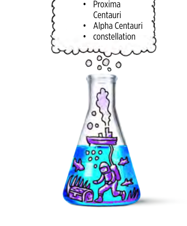
> **[Diagram Context - Textbook_NaturalScience_Gr8_Beyond-the-solar-system.pdf-0006-07.png]**
> This graphic features an Erlenmeyer flask containing an underwater scene with a diver, a ship, and a treasure chest, topped with a thought bubble containing the labels "Proxima Centauri," "Alpha Centauri," and "constellation." It conceptually contrasts the immediate, contained environment of the flask with the vast, abstract scale of astronomical objects, serving as a visual metaphor for the disconnect between terrestrial scientific observation and the distant nature of space science.

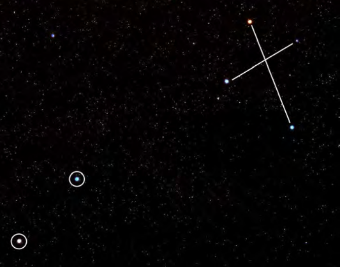
> **[Diagram Context - Textbook_NaturalScience_Gr8_Beyond-the-solar-system.pdf-0006-08.png]**
> This image depicts the Southern Cross (Crux) constellation against a star field, featuring white lines connecting the four main stars and two additional stars highlighted by white circles. It serves as an astronomical aid for Grade 10 Physical Sciences learners to identify key celestial markers used for navigation and orientation in the Southern Hemisphere.

> **[Diagram Context - Textbook_NaturalScience_Gr8_Beyond-the-solar-system.pdf-0006-13.png]**
> This illustrative graphic depicts a metaphorical scene featuring a person driving a horse-drawn carriage shaped like an apple, accompanied by a speech bubble containing the text "find south." The image serves as a visual mnemonic or creative prompt designed to engage students in lateral thinking or directional orientation exercises. It conceptually encourages learners to interpret abstract instructions within a narrative context, bridging the gap between imaginative storytelling and spatial reasoning.

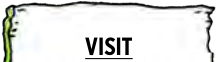
> **[Diagram Context - Textbook_NaturalScience_Gr8_Beyond-the-solar-system.pdf-0006-14.png]**
> This graphic is a simple text-based instructional element featuring the underlined word "VISIT" set against a textured, paper-like background. It serves as a navigational prompt or call-to-action button, directing students to external digital resources or supplementary learning materials.

> **[Diagram Context - Textbook_NaturalScience_Gr8_Looking-into-space.pdf-0006-00.png]**
> This astronomical photograph displays a wide-field view of a dense star field against the night sky, capturing numerous point sources of light with varying magnitudes and distinct colors, notably blue and orange stars. No explicit text labels, axes, or arrows are present in the image. Conceptually, it illustrates the composition of the universe for Grade 10-12 Physical Sciences and Geography learners, demonstrating how stars of different temperatures and brightnesses are distributed within constellations and galaxies.

> **[Diagram Context - Textbook_NaturalScience_Gr8_Looking-into-space.pdf-0006-04.png]**
> This educational graphic features a cartoon character hugging a globe and pointing at the African continent, accompanied by a speech bubble containing the text "VISIT Read more about traditional African starlore. bit.ly/H022dZ". The visual prominently displays a globe and a speech bubble with an external web link. Conceptually, this resource encourages students exploring Indigenous Knowledge Systems (IKS) in geography or science to connect global perspectives with traditional African astronomy and cultural heritage.

> **[Diagram Context - Textbook_NaturalScience_Gr8_Looking-into-space.pdf-0006-10.png]**
> This educational graphic illustrates an electromagnet apparatus consisting of a coiled wire connected to a battery with visible positive (+) and negative (-) terminals. Concentric loops with directional arrowheads surround the coil, accompanied by nearby magnetic metal objects including a screw, nail, and nut. Conceptually, this diagram demonstrates how an electric current flowing through a solenoid creates a magnetic field, illustrating the principles of electromagnetism for Grade 10-12 Physical Sciences learners.

> **[Diagram Context - Textbook_NaturalScience_Gr8_The-Solar-System.pdf-0006-05.png]**
> This image is a blank, white circular template set against a light green background. It contains no labels, symbols, or structural details. In a CAPS curriculum context, this serves as a foundational scaffold for learners to draw and annotate biological cells, chemical structures, or geometric figures during formative assessment tasks.

> **[Diagram Context - Textbook_NaturalScience_Gr8_The-Solar-System.pdf-0006-07.png]**
> This graphic is a text-based "Did you know?" callout box, which serves as a pedagogical feature to highlight supplementary or interesting facts within educational material. It uses a cloud-shaped border to visually distinguish this additional information from the core curriculum content, encouraging learners to engage with enrichment topics.

> **[Diagram Context - Textbook_NaturalScience_Gr8_The-Solar-System.pdf-0006-10.png]**
> This caricature depicts Isaac Newton with an apple-shaped head, surrounded by a network of floating apples connected by dashed lines and directional arrows, all linked to a thought bubble. It serves as a metaphorical illustration of Newton’s Law of Universal Gravitation, visually representing the concept of gravitational attraction between masses in a system.

> **[Diagram Context - Textbook_NaturalScience_Gr8_The-Solar-System.pdf-0006-13.png]**
> This cartoon depicts a human figure integrated with a globe of the Earth, featuring a speech bubble and a hand pointing specifically toward the African continent. It serves as a visual metaphor for global citizenship or environmental responsibility, encouraging students to consider their personal role in addressing planetary issues within the context of Geography or Life Sciences.

> **[Diagram Context - Textbook_NaturalScience_Gr8_The-Solar-System.pdf-0006-14.png]**
> This graphic depicts a stylized, repeating double-helix structure representing a DNA molecule. It illustrates the characteristic twisted ladder configuration of the sugar-phosphate backbones and internal base pairing, serving as a foundational visual aid for understanding the molecular structure of genetic material in the Life Sciences curriculum.

---

# ACTIVITY: Travelling Fast

This activity explores the concept of speed by comparing the velocities of various living organisms and human-made technologies.

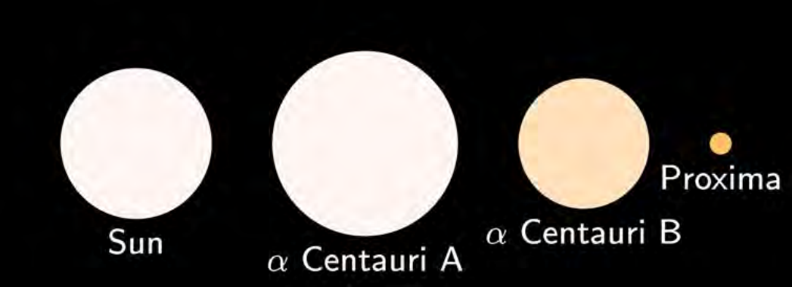
> **[Diagram Context - Textbook_NaturalScience_Gr8_Beyond-the-solar-system.pdf-0007-00.png]**
> This comparative diagram illustrates the relative sizes of four stars: the Sun, Alpha Centauri A, Alpha Centauri B, and Proxima Centauri. By visually contrasting these celestial bodies, the graphic helps Grade 10 Physical Sciences learners understand stellar classification and the variation in size among stars within our local galactic neighbourhood.

## Speed Comparison Table

The following table summarizes the speeds of various objects and living things as presented in the curriculum:

| Object / Organism | Speed (km/h) |
| :--- | :--- |
| Cheetah | $120\text{ km/h}$ |
| Peregrine Falcon | $389\text{ km/h}$ |
| JR-Maglev MLX01 Train | $581\text{ km/h}$ |
| NASA X-43 Scramjet | $7\,000\text{ km/h}$ |
| International Space Station (ISS) | $27\,744\text{ km/h}$ |

## The Speed of Light

Light travels at an extremely high velocity, significantly faster than any of the objects listed above.

*   **Speed in km/h:** $\approx 1\,080\,000\,000\text{ km/h}$ (1 080 million km/h)
*   **Speed in m/s:** $299\,792\,458\text{ m/s}$

### Conversion Note
To convert speed from $\text{km/h}$ to $\text{m/s}$, use the following conversion factor:
$$1\text{ km/h} = \frac{1\,000\text{ m}}{3\,600\text{ s}} = \frac{1}{3.6}\text{ m/s}$$

Therefore, to convert $\text{km/h}$ to $\text{m/s}$, divide by $3.6$:
$$\text{Speed in m/s} = \frac{\text{Speed in km/h}}{3.6}$$

---
*Chapter 2: Beyond the solar system | Page 195*

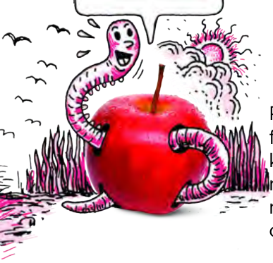
> **[Diagram Context - Textbook_NaturalScience_Gr8_Beyond-the-solar-system.pdf-0007-03.png]**
> This cartoon illustrates a biological interaction within an ecosystem, featuring a worm consuming an apple in a natural environment with birds, grass, and a sun. It conceptually introduces learners to the roles of organisms in a food web, specifically highlighting the worm as a primary consumer or decomposer that obtains energy by feeding on plant matter.

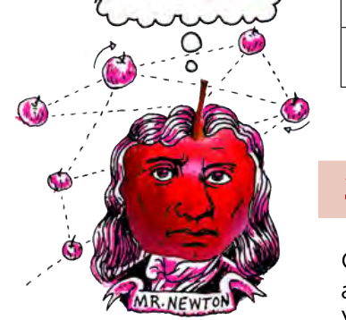
> **[Diagram Context - Textbook_NaturalScience_Gr8_Beyond-the-solar-system.pdf-0007-10.png]**
> This illustration depicts a caricature of Isaac Newton with an apple-shaped head, surrounded by a network of floating apples connected by dashed lines and directional arrows. It serves as a conceptual metaphor for Newton’s Law of Universal Gravitation, visually representing the gravitational interaction between masses in a system.

> **[Diagram Context - Textbook_NaturalScience_Gr8_Beyond-the-solar-system.pdf-0007-16.png]**
> This conceptual illustration depicts a laboratory Erlenmeyer flask containing a miniature, flourishing ecosystem of purple flora submerged in a blue liquid medium. The image metaphorically represents the study of plant biology, biotechnology, or tissue culture, illustrating how controlled laboratory environments are used to cultivate and observe plant growth and development.

> **[Diagram Context - Textbook_NaturalScience_Gr8_Looking-into-space.pdf-0007-07.png]**
> The graphic is an environmental illustration depicting planet Earth as a hot air balloon carrying figures with binoculars in its basket, set against a backdrop of the sun, clouds, birds, and wave-like green decorative patterns. There are no explicit text labels, chemical symbols, or numerical variables visible in the image. Conceptually, this visual metaphor introduces Grade 10-12 Life Sciences and Geography learners to global environmental awareness, sustainability, and human responsibility toward monitoring and protecting Earth's biosphere and atmospheric systems.

> **[Diagram Context - Textbook_NaturalScience_Gr8_Looking-into-space.pdf-0007-14.png]**
> The educational graphic displays a text list with bullet points containing the terms "chromatic aberration" and "primary mirror" enclosed by a wavy border. It highlights key optical and telescope concepts related to lens limitations and reflecting telescope design. Conceptually, it serves as a study prompt or glossary item for high school learners studying physics and optics, helping them distinguish between lens defects and reflecting components.

> **[Diagram Context - Textbook_NaturalScience_Gr8_Looking-into-space.pdf-0007-16.png]**
> This graphic is an illustrative conceptual drawing centered on a glass Erlenmeyer flask filled with blue liquid containing a submerged underwater scene with a scuba diver, a treasure chest, fish, and a boat on the surface emitting exhaust bubbles. Visible elements include the glassware apparatus, blue liquid representing water, sketched outlines of marine life, a diver, a boat, and a thought bubble above the flask. Conceptually, this whimsical representation is often used in science communication or introductory lessons to spark curiosity about chemical reactions, solutions, and scientific inquiry by blending macroscopic laboratory equipment with imaginative underwater environments.

> **[Diagram Context - Textbook_NaturalScience_Gr8_Looking-into-space.pdf-0007-17.png]**
> This astrophotography image displays the Andromeda Galaxy against a vast starfield, featuring the label "Andromeda Galaxy — NASA, Hubble Telescope" at the bottom. The visual elements include a large spiral galaxy with a bright central galactic bulge, distinct spiral arms, dust lanes, and numerous surrounding stars. Conceptually, this graphic supports CAPS Earth and Space Sciences by illustrating the structure of a typical spiral galaxy, helping learners understand galactic morphology, stellar systems, and the scale of the universe beyond our solar system.

> **[Diagram Context - Textbook_NaturalScience_Gr8_Looking-into-space.pdf-0007-20.png]**
> This environmental graphic depicts an educational illustration featuring a globe surrounded by circular green recycling arrows and a human figure holding a sign. Visible elements include a planet Earth model, a blank signpost, a character holding the pole, and a ring of directional green arrows indicating a continuous loop. Conceptually, this diagram conveys the importance of recycling, waste management, and sustainability for high school learners studying environmental studies and ecological responsibility within the CAPS curriculum.

> **[Diagram Context - Textbook_NaturalScience_Gr8_The-Solar-System.pdf-0007-00.png]**
> This illustration depicts a roller coaster track featuring a carriage and passengers, with a superimposed slinky spring representing a wave-like motion. The graphic uses the visual metaphor of a roller coaster to illustrate the relationship between mechanical energy transformations and wave characteristics. It helps students visualize the conversion between gravitational potential energy and kinetic energy, while the slinky serves as a model for longitudinal or transverse wave propagation along the path of motion.

> **[Diagram Context - Textbook_NaturalScience_Gr8_The-Solar-System.pdf-0007-05.png]**
> This image is a telescopic photograph of the Sun’s photosphere, featuring visible dark patches known as sunspots. These sunspots appear as cooler, darker regions on the solar surface caused by intense magnetic activity that inhibits convection. For Grade 10 Physical Sciences learners, this visual serves as an introduction to solar phenomena and the Sun's role as the primary energy source for Earth's systems.

> **[Diagram Context - Textbook_NaturalScience_Gr8_The-Solar-System.pdf-0007-07.png]**
> This graphic features a stylized illustration of the Earth suspended as a hot air balloon, with figures using telescopes to observe the Sun, accompanied by a text box referencing NASA’s Solar and Heliospheric Observatory (SOHO). The image includes labels for "VISIT," "NASA," and "Solar and Heliospheric Observatory (SOHO)," along with a shortened URL. Conceptually, it serves as an introductory hook to engage learners in the study of Earth and Space Science, specifically highlighting the role of satellite technology in monitoring solar activity and its influence on our planet.

> **[Diagram Context - Textbook_NaturalScience_Gr8_The-Solar-System.pdf-0007-08.png]**
> This image is a telescopic photograph of the Sun, displaying its photosphere and visible dark patches known as sunspots. It illustrates the concept of solar activity, where localized regions of intense magnetic fields inhibit convection, resulting in cooler, darker areas on the solar surface.

---

### Calculating Travel Time

To calculate the time taken for a journey, use the following formula:

$$\text{time} = \frac{\text{distance}}{\text{speed}}$$

#### Instructions
1. The distance from Cape Town to Durban is $1753\text{ km}$.
2. Calculate the time taken for each mode of transport to cover this distance.
3. Fill in the results in the table below.

| Mode of transport | Speed (km/h) | Distance (km) | Time taken for the journey |
| :--- | :--- | :--- | :--- |
| Cheetah | $120$ | $1753$ | $14.6\text{ hours}$ |
| Peregrine falcon | | $1753$ | $\text{hours}$ |
| High speed train | | $1753$ | $\text{hours}$ |
| NASA's scramjet | | $1753$ | $\text{minutes}$ |
| International space station | | $1753$ | $\text{seconds}$ |
| Light | | $1753$ | $\text{seconds}$ |

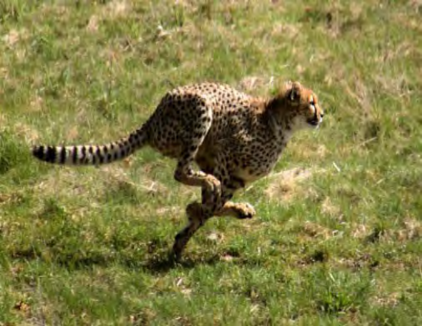
> **[Diagram Context - Textbook_NaturalScience_Gr8_Beyond-the-solar-system.pdf-0008-01.png]**
> This photograph depicts a cheetah in a high-speed sprint across a grassy savanna, serving as a visual representation of an organism in its natural habitat. The image illustrates key biological concepts such as structural adaptations for predation, energy expenditure, and the interaction between a predator and its environment within an ecosystem.

---

### The Speed of Light
Light travels at an incredible speed. Consider the following examples of how fast light moves:

| In one second light can travel... | Light takes... |
| :--- | :--- |
| Between Cape Town and Johannesburg $214$ times. | $0.0000003\text{ seconds}$ to travel $100\text{ m}$. |
| Between Cape Town and London, England, $31$ times. | $1.3\text{ seconds}$ to travel from the Earth to the Moon. |
| Around the Earth $7.5$ times. | $8\text{ minutes}$ to travel from the Sun to the Earth. |

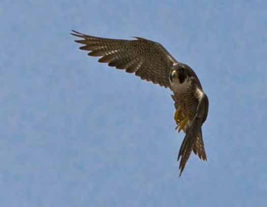
> **[Diagram Context - Textbook_NaturalScience_Gr8_Beyond-the-solar-system.pdf-0008-03.png]**
> This image is a biological photograph of a peregrine falcon in flight, displaying visible anatomical structures including wings, feathers, talons, and a beak. It serves as a visual example for Life Sciences learners to identify the external morphological adaptations of an avian predator, such as its streamlined body shape and wing structure, which facilitate efficient movement and hunting in its environment.

> **[Diagram Context - Textbook_NaturalScience_Gr8_Beyond-the-solar-system.pdf-0008-05.png]**
> This graphic uses a metaphorical illustration of a roller coaster track integrated with a Slinky spring to represent mechanical energy transformations. It visually depicts the interplay between gravitational potential energy at the peak of the track and kinetic energy as the coaster descends, helping students conceptualize the Law of Conservation of Mechanical Energy in a real-world context.

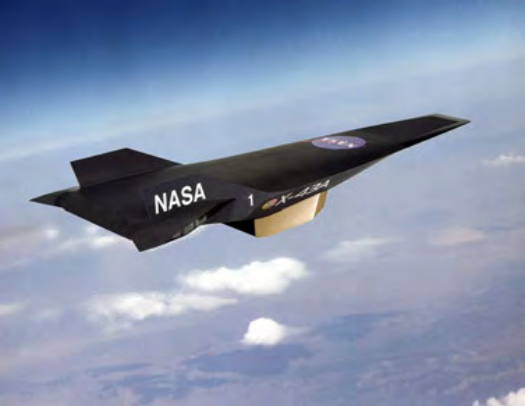
> **[Diagram Context - Textbook_NaturalScience_Gr8_Beyond-the-solar-system.pdf-0008-06.png]**
> This image depicts the NASA X-43A hypersonic experimental aircraft in flight, featuring visible labels "NASA" and "X-43A." It serves as a real-world application for Physical Sciences learners to discuss aerodynamics, fluid dynamics, and the principles of propulsion systems at extreme velocities.

> **[Diagram Context - Textbook_NaturalScience_Gr8_Beyond-the-solar-system.pdf-0008-07.png]**
> This image depicts a maglev (magnetic levitation) train system, featuring the train vehicle, specialized guideway tracks, and a tunnel entrance. It serves as a real-world application of electromagnetism, illustrating the principles of magnetic repulsion and attraction used to levitate, guide, and propel the train without physical contact with the rails.

> **[Diagram Context - Textbook_NaturalScience_Gr8_Beyond-the-solar-system.pdf-0008-08.png]**
> This text-based graphic provides comparative data on high-speed transport, specifically referencing the "JR-Maglev MLX01" train and "NASA's X-43" scramjet. It presents quantitative values for speed in km/h to illustrate the concept of motion and velocity in real-world engineering contexts, serving as a practical application for Grade 10-12 Physical Sciences learners studying kinematics.

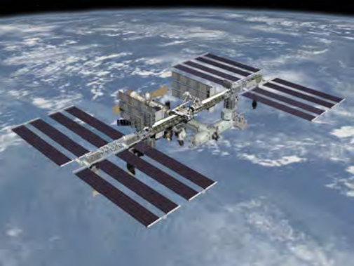
> **[Diagram Context - Textbook_NaturalScience_Gr8_Beyond-the-solar-system.pdf-0008-09.png]**
> This image depicts the International Space Station (ISS) in low Earth orbit, featuring its modular structural components and large, prominent solar array wings. It serves as a real-world application of physics and technology, illustrating the use of solar energy conversion in space and the principles of satellite motion within a gravitational field.

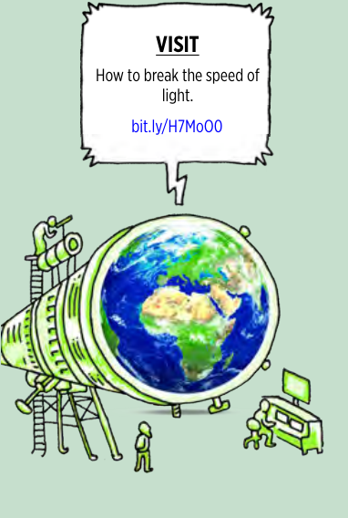
> **[Diagram Context - Textbook_NaturalScience_Gr8_Beyond-the-solar-system.pdf-0008-10.png]**
> This cartoon depicts a large telescope focused on the Earth, accompanied by a speech bubble containing the text "VISIT" and "How to break the speed of light" with a shortened URL. It uses satirical imagery to engage students with the fundamental physical principle that the speed of light is a universal constant, serving as a hook to discuss the limitations of classical mechanics and the nature of relativistic physics.

> **[Diagram Context - Textbook_NaturalScience_Gr8_Looking-into-space.pdf-0008-01.png]**
> This educational diagram illustrates a pinhole camera apparatus demonstrating the rectilinear propagation of light. Visible labels include "pinhole", "real object" (depicted as a tree), and "image of object on screen", with pink ray lines and directional arrows tracing the path of light from the object through the pinhole to form the inverted image. Conceptually, it conveys how light travels in straight lines to project a real, inverted, and diminished image onto a screen.

> **[Diagram Context - Textbook_NaturalScience_Gr8_Looking-into-space.pdf-0008-04.png]**
> This educational graphic illustrates the process of vision through ray tracing, featuring a luminous sun, a tree as an object, and a human eye with an inverted image formed on the retina. Visible elements include directional arrows showing light rays traveling from the sun to the tree and reflecting from the tree into the eye's lens. This diagram helps CAPS Physical Sciences and Life Sciences learners understand how light reflection enables sight by demonstrating how light travels from a luminous source to an object, reflects off it, and enters the eye to form an image.

> **[Diagram Context - Textbook_NaturalScience_Gr8_Looking-into-space.pdf-0008-07.png]**
> The graphic is a cartoon educational illustration featuring a character holding a framed drawing and an accompanying text box with the heading "TAKE NOTE". Visible labels and text include "TAKE NOTE", "Luminous objects, such as the Sun and other stars, emit light", "The tree is NOT a luminous object as it does not emit its own light", and "It reflects the light from the Sun". Conceptually, this diagram introduces learners to the fundamental distinction in optics between luminous objects that generate their own light and non-luminous objects that are only visible because they reflect light from another source.

> **[Diagram Context - Textbook_NaturalScience_Gr8_Looking-into-space.pdf-0008-08.png]**
> This educational graphic is a cartoon illustration depicting a massive green telescope pointed at Earth, with a speech bubble above reading "VISIT The beauty of the night sky." and a URL link ("bit.ly/1h5dy5M"). Visible elements include tiny human figures operating the telescope and control consoles, alongside the large eyepiece showing continents such as Africa and Europe. Conceptually, this diagram serves as an engaging digital resource prompt that links Earth-bound observation with space science, encouraging high school learners to explore astronomical concepts beyond the classroom.

> **[Diagram Context - Textbook_NaturalScience_Gr8_Looking-into-space.pdf-0008-09.png]**
> This educational graphic is an optical physics ray diagram illustrating light rays traveling from two distinct trees into a human eye. The diagram displays two green trees on the left, an eye structure on the right, and intersecting red and green straight directional arrows representing light rays passing through the cornea and lens to form an inverted image on the retina. Conceptually, it demonstrates how light reflection from objects forms real, inverted images on the retina of the eye, reinforcing principles of geometrical optics and vision for high school learners.

> **[Diagram Context - Textbook_NaturalScience_Gr8_The-Solar-System.pdf-0008-01.png]**
> This image is a telescopic photograph of the Sun’s photosphere, featuring visible dark patches known as sunspots. These sunspots appear as cooler, magnetically active regions on the solar surface, providing students with a visual representation of solar activity and the Sun's dynamic nature as a star.

> **[Diagram Context - Textbook_NaturalScience_Gr8_The-Solar-System.pdf-0008-10.png]**
> This cartoon depicts a Viking longship with a blank sheet of paper serving as its sail, propelled by rowers and wind. The visual elements include a stylized boat, oars, water, wind lines, and a prominent empty speech bubble above the mast. Conceptually, this image serves as a creative prompt for students to practice historical narrative writing or to illustrate the concept of "blank slate" exploration, encouraging them to fill the empty space with relevant historical context or creative storytelling.

> **[Diagram Context - Textbook_NaturalScience_Gr8_The-Solar-System.pdf-0008-11.png]**
> This graphic illustrates a schematic representation of a DNA double helix, featuring two antiparallel sugar-phosphate backbones intertwined in a helical structure. It conceptually demonstrates the complementary base pairing and the characteristic twisted-ladder configuration essential for understanding DNA replication and the storage of genetic information in Life Sciences.

---

# Measuring Distances in Space

## Key Concepts
In astronomy, we use units based on the speed of light to measure vast distances. Although these units contain the words "hour," "minute," or "year," they are **units of distance**, not time.

### 1. Light Hours and Light Minutes
*   **Definition:** A **light hour** is the distance that light travels in one hour.
*   **Definition:** A **light minute** is the distance that light travels in one minute.
*   **Application:** These units are primarily used to measure distances within our solar system.

### 2. Light Years
*   **Definition:** A **light year** is the distance that light travels in one year.
*   **Scale:** One light year is approximately $10 \times 10^{12}$ kilometres (10 trillion kilometres).
*   **Application:** These units are used to measure the immense distances between stars and galaxies.

---

## The Relationship Between Distance and Time
Because these units are based on the speed of light, they provide a direct link between distance and the time it takes for light to travel from a source to an observer.

*   If an object is $1$ light year away, it takes light $1$ year to reach your eyes.
*   If an object is $1$ light hour away, it takes light $1$ hour to reach your eyes.
*   If an object is $1$ light minute away, it takes light $1$ minute to reach your eyes.

---

## Why We Don't Notice the Delay
Light travels at an incredible speed. In everyday life, we perceive light from local sources (like a lamp) as being instantaneous.

*   **Example:** If you are standing $1$ metre away from a lamp, it takes approximately $3 \times 10^{-9}$ seconds (three billionths of a second) for the light to reach your eyes. Because this duration is so small, the human brain cannot perceive the delay.

---

## Diagrams

> **[Diagram Context - Textbook_NaturalScience_Gr8_Beyond-the-solar-system.pdf-0009-08.png]**
> This graphic illustrates a schematic representation of a DNA double helix, featuring two antiparallel sugar-phosphate backbones connected by repeating horizontal rungs representing nitrogenous base pairs. It conceptually demonstrates the characteristic twisted ladder structure of the DNA molecule, highlighting the complementary base pairing essential for genetic information storage and replication in Life Sciences.

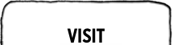
> **[Diagram Context - Textbook_NaturalScience_Gr8_Beyond-the-solar-system.pdf-0009-09.png]**
> This graphic is a simple text-based call-to-action button containing the word "VISIT" enclosed within a rectangular border. It serves as a navigational element or hyperlink prompt rather than an educational diagram representing scientific or mathematical concepts within the CAPS curriculum.

---

## Exercises

1.  **Conceptual Understanding:** Based on the definition of a light hour, what do you think a light minute corresponds to?
2.  **Comparison:** Which is a smaller distance, a light hour or a light minute? Explain your reasoning.
3.  **Application:** If an object is located one light minute away, how long does it take for the light emitted from that object to reach your eyes?

> **[Diagram Context - Textbook_NaturalScience_Gr8_Looking-into-space.pdf-0009-01.png]**
> This educational graphic illustrates the process of vision in a human eye viewing a distant object, featuring a tree on the left and a cross-section of an eye on the right. Visible labels and annotations include the title "Viewing a distant object" and a descriptive pointer indicating a "small, dim image made from little light" formed on the retina. Conceptually, this diagram helps high school learners understand how light rays from a distant source enter the eye to form a diminished, inverted image on the light-sensitive retina.

> **[Diagram Context - Textbook_NaturalScience_Gr8_Looking-into-space.pdf-0009-02.png]**
> This optical diagram illustrates the function of a refracting telescope using lenses and light rays to view a distant object. The graphic includes visible labels and pointers for a "large lens gathering extra light," a "focused image," a "small lens magnifying image," and a "larger, brighter image made from more light" projected onto an eye. Conceptually, it demonstrates to CAPS Physical Sciences learners how optical instruments collect and focus light from distant objects to form magnified, clear images that can be observed by the human eye.

> **[Diagram Context - Textbook_NaturalScience_Gr8_Looking-into-space.pdf-0009-06.png]**
> This educational graphic is an ecological illustration featuring a cartoon earthworm burrowing through a red apple in a natural setting containing grass, birds, clouds, and a sun. Visible elements include the segmented pink worm, the whole red apple with a stem, and a blank speech bubble above the worm. Conceptually, this illustration depicts heterotrophic nutrition and detritivore activity within an ecosystem, helping high school learners visualize how organisms interact and obtain energy from organic matter.

> **[Diagram Context - Textbook_NaturalScience_Gr8_Looking-into-space.pdf-0009-09.png]**
> This educational graphic is an anatomical and mechanical illustration depicting a green caterpillar feeding on leaves, with its body superimposed by a metal spring toy (slinky). Visible features include green leaves, striped circular patterns along the caterpillar's body and the spring, a smiling cartoonish head with teeth eating foliage, and droplet shapes nearby. Conceptually, this diagram uses an analogy to help high school students understand longitudinal wave mechanics—specifically compressions and rarefactions—by relating them to the stretching and contracting motion of a caterpillar's body.

> **[Diagram Context - Textbook_NaturalScience_Gr8_The-Solar-System.pdf-0009-00.png]**
> This image is a telescopic observation of the Sun’s photosphere, featuring a prominent sunspot group, a full-disk solar inset, and a scale reference labeled "Size of Earth (approx.)." It illustrates the immense scale of solar surface phenomena, helping learners visualize the relative size of Earth compared to the complex, cooler magnetic regions known as sunspots.

> **[Diagram Context - Textbook_NaturalScience_Gr8_The-Solar-System.pdf-0009-01.png]**
> This graphic features an illustration of a person standing on a globe surrounded by circular arrows, accompanied by a sign containing the text "VISIT," "View real time images of the Sun and track sunspots," and a URL. It serves as an educational prompt to encourage students to engage with real-time astronomical data, specifically linking the Earth's rotation and solar observation to the study of solar activity and space science within the CAPS curriculum.

> **[Diagram Context - Textbook_NaturalScience_Gr8_The-Solar-System.pdf-0009-07.png]**
> This illustration depicts an astronaut standing on a red apple, which is surrounded by celestial elements like stars, planets, and a comet, with the text label "Earth." It serves as a metaphorical or humorous visual aid to introduce concepts of planetary scale, gravity, or the Earth's position within the solar system, encouraging students to think critically about scientific representation versus reality.

---

# ACTIVITY: Scale of the Solar System

## Concept: Astronomical Distances
In space, distances are so vast that measuring them in kilometres (km) can be difficult. Scientists often use the time it takes for light to travel from one point to another to describe these distances.

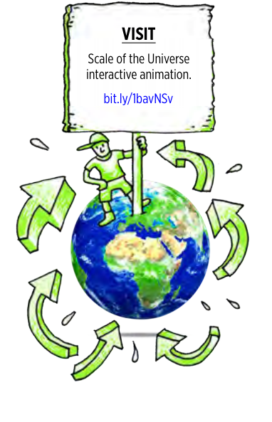

### Distances of each planet from the Sun

| Planet | Distance from the Sun (million km) | Distance from the Sun in light hours or minutes |
| :--- | :--- | :--- |
| Mercury | 57.9 | 3.2 light minutes |
| Venus | 108.2 | 6.0 light minutes |
| Earth | 149.6 | 8.3 light minutes |
| Mars | 227.9 | 12.7 light minutes |
| Jupiter | 778.6 | 43.3 light minutes |
| Saturn | 1433.5 | 1.3 light hours |
| Uranus | 2872.5 | 2.7 light hours |
| Neptune | 4495.1 | 4.2 light hours |

---

## DID YOU KNOW?
The speed of light is constant. Nothing in the universe can move faster than the speed of light; it is considered the "cosmic speed limit."

---

## QUESTIONS

1. **How far away from the Sun is Earth?**
   *Refer to the table: The distance is $149.6$ million km.*

2. **How long does light take to travel from the Sun to the Earth?**
   *Refer to the table: It takes $8.3$ light minutes.*

3. **What does the answer to (2) imply about our view of the Sun?**
   *Because light takes $8.3$ minutes to travel to Earth, we are always seeing the Sun as it appeared $8.3$ minutes ago, not as it is at this exact moment.*

4. **How many times further away from the Sun than the Earth is Neptune?**
   *Calculation:*
   $$\text{Ratio} = \frac{\text{Distance of Neptune}}{\text{Distance of Earth}}$$
   $$\text{Ratio} = \frac{4495.1}{149.6} \approx 30.05$$
   *Neptune is approximately $30$ times further away from the Sun than the Earth.*

5. **How far away from the Sun is Neptune in light hours?**
   *Refer to the table: It is $4.2$ light hours away.*

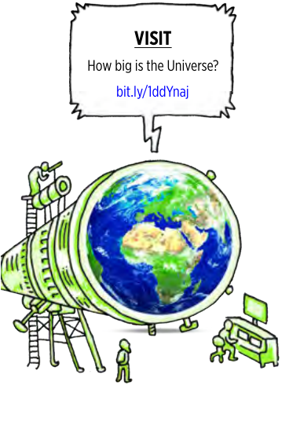

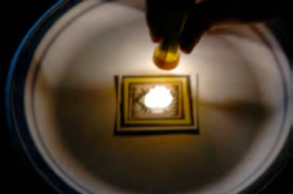

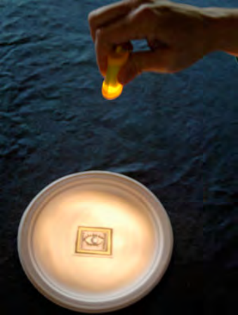

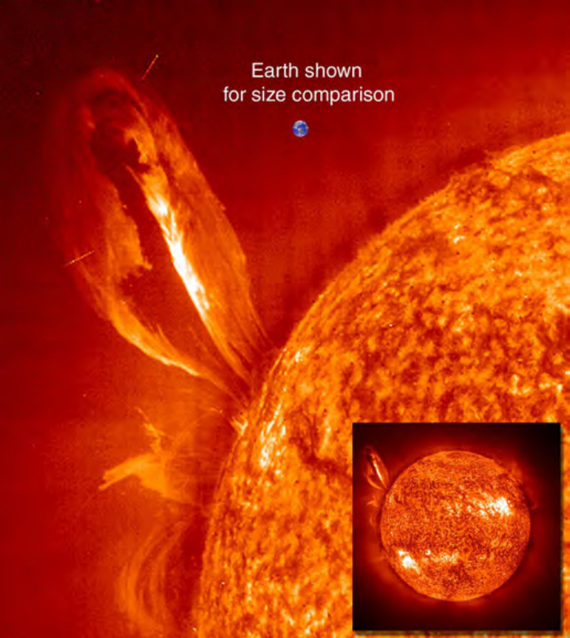

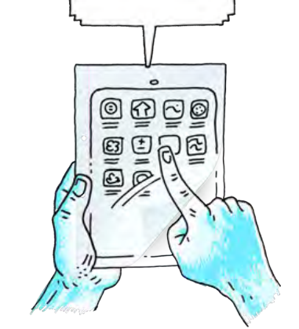

---

### Exercises: Solar System Distances

6. How long does light from the Sun take to reach Neptune?

7. Imagine you have a cousin living on Neptune. You and your cousin both decide to look at the Sun, each of you using a telescope with a special solar filter so as not to damage your eyes. As you are watching the Sun you suddenly notice a big blob of gas thrown off in a massive solar flare. Your cousin says she cannot see it. Why is that?

---

### Key Concepts: Beyond the Solar System

*   **Scale of the Solar System:** The solar system is vast. The orbit of Neptune is over $4$ light hours from the Sun. Beyond Neptune, the Kuiper Belt and Oort Cloud extend even further.
*   **Interstellar Distances:** The distance to the next closest star, Proxima Centauri, is approximately $40$ trillion km. This is equivalent to $4.24$ light years.
*   **Light Year:** A unit of astronomical distance equivalent to the distance that light travels in one year.

> **[Diagram Context - Textbook_NaturalScience_Gr8_Beyond-the-solar-system.pdf-0011-00.png]**
> This diagram illustrates a slinky toy moving down a set of stairs, using motion lines to indicate its dynamic, rolling displacement. It serves as a physical model to help Grade 10-12 Physical Sciences learners visualize the transfer of energy and the propagation of longitudinal and transverse waves through a medium.

---

### ACTIVITY: Our Closest Stars

**Instructions:**
1. Study the table below showing our closest stars.
2. Use the data to answer questions regarding stellar distances.

| Star | Distance (light years) |
| :--- | :--- |
| Proxima Centauri | $4.24$ |
| Alpha Centauri | $4.37$ |
| Barnard's Star | $5.96$ |
| WISE 1049-5319 | $6.52$ |
| Wolf 359 | $7.78$ |
| Lalande 21185 | $8.29$ |
| Sirius | $8.58$ |

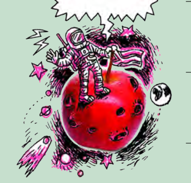
> **[Diagram Context - Textbook_NaturalScience_Gr8_Beyond-the-solar-system.pdf-0011-10.png]**
> This graphic is a metaphorical illustration featuring an astronaut standing on a red apple, surrounded by hand-drawn celestial elements including stars, a comet, a planet, and a speech bubble. It serves as a creative visual prompt to stimulate inquiry or narrative writing, often used in Life Sciences or Physical Sciences to introduce concepts like gravity, space exploration, or the historical anecdote of Newton’s apple.

> **[Diagram Context - Textbook_NaturalScience_Gr8_Looking-into-space.pdf-0011-03.png]**
> This educational graphic shows a hands-on ecological apparatus featuring a small container held by a hand, scattering small particles (representing organisms) onto a marked white plate or grid surface below. Visible components include the hand, dispensing container, and scattered granular items distributed across the circular target plate. Conceptually, this diagram demonstrates the capture-recapture method or quadrat sampling technique used in Life Sciences to estimate population size and density in a given habitat.

> **[Diagram Context - Textbook_NaturalScience_Gr8_Looking-into-space.pdf-0011-07.png]**
> This image shows an experimental apparatus featuring a white plate filled with small objects or seeds, a small central card with an eye drawing, and a grey cardboard strip holding six vertical wooden skewers, manipulated by a pair of hands. This physical model demonstrates wave fronts and ray propagation or diffraction phenomena in Physical Sciences. Conceptually, it helps learners visualise how waves interact with barriers and apertures, supporting understanding of wave mechanics and interference patterns.

> **[Diagram Context - Textbook_NaturalScience_Gr8_Looking-into-space.pdf-0011-09.png]**
> This educational graphic shows a classroom demonstration apparatus used to model star tracking or celestial movement, featuring a curved bar, five radiating skewers converging at a marked base, and a plate with granular material. Visible components include a curved alignment strip, five straight support rods representing angle lines, a central anchor tile, and a surrounding tray or plate filled with particulate matter. This physical model helps high school Geography and Earth Sciences learners visualize how apparent stellar motion, celestial coordinates, or angle measurements function in observational astronomy.

> **[Diagram Context - Textbook_NaturalScience_Gr8_Looking-into-space.pdf-0011-13.png]**
> This educational graphic depicts a conceptual illustration of Planet Earth shaped as a hot air balloon floating in a green sky with a sun, clouds, birds, and a burner flame heating the globe above a basket containing two figures with binoculars. Visible elements include a terrestrial globe envelope, a woven net with suspension cords, a burner flame at the base of the globe, a basket containing two human figures holding binoculars, a sun, and surrounding clouds and birds. Conceptually, this diagram illustrates human exploration, global observation, or environmental monitoring of Earth, supporting CAPS geography and environmental studies topics regarding Earth systems and human interaction with the planet.

> **[Diagram Context - Textbook_NaturalScience_Gr8_The-Solar-System.pdf-0011-00.png]**
> This diagram illustrates a slinky toy moving down a staircase, using motion lines to indicate its dynamic displacement. It serves as a physical model to help learners visualize the propagation of longitudinal and transverse waves, demonstrating how energy transfers through a medium via periodic motion.

> **[Diagram Context - Textbook_NaturalScience_Gr8_The-Solar-System.pdf-0011-02.png]**
> This diagram is a schematic representation of the solar system, using an inset to distinguish between the inner terrestrial planets (Mercury, Venus, Earth, Mars) and the outer gas giants (Jupiter, Saturn, Uranus, Neptune). It illustrates the orbital arrangement of the eight planets around the Sun, highlighting the relative spatial distribution and grouping of these celestial bodies within our solar system.

> **[Diagram Context - Textbook_NaturalScience_Gr8_The-Solar-System.pdf-0011-20.png]**
> This graphic illustrates a schematic representation of a DNA double helix, featuring two antiparallel sugar-phosphate backbones connected by repeating horizontal rungs representing nitrogenous base pairs. It conceptually demonstrates the characteristic twisted ladder structure of DNA, highlighting the complementary base pairing and the helical orientation essential for understanding genetic replication and protein synthesis in the Life Sciences curriculum.

---

# Mapping Our Stellar Neighbourhood

## Understanding the Star Map
The provided map illustrates the Sun at the centre of our local stellar neighbourhood. 

*   **Solid Rings:** Represent distances from the Sun in light years ($2, 4, 6,$ and $8$ light years).
*   **Dotted Circle:** Represents the Oort Cloud.

### Take Note
The star map is shown in two dimensions on a flat plane. It is important to remember that in reality, stars are located in three-dimensional space.

### Did You Know?
The Milky Way galaxy is so vast that it takes light $100\,000$ years to travel from one side to the other.

---

## Questions

**1. Which star is our closest neighbour, excluding the Sun?**
*Refer to the map to identify the star located closest to the centre.*

**2. How far is Sirius?**
*Observe the position of Sirius relative to the solid rings representing light years.*

**3. How long does light from Barnard's Star take to reach us?**
*Determine the distance of Barnard's Star from the Sun using the ring scale. Since light travels at a speed of $1$ light year per year, the distance in light years equals the time in years.*

**4. Explain in your own words what the statement "Sirius is $8.58$ light years away from Earth" means.**
*Consider the definition of a light year: the distance light travels in one year.*

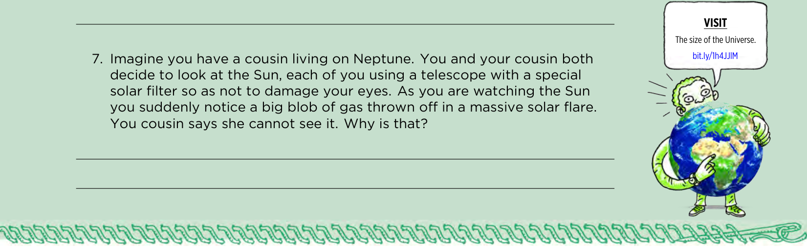
> **[Diagram Context - Textbook_NaturalScience_Gr8_Beyond-the-solar-system.pdf-0012-02.png]**
> This educational graphic presents a conceptual physics problem involving a cartoon character holding a globe and a text prompt referencing the Sun, Neptune, telescopes, and solar flares. It challenges students to apply their understanding of the finite speed of light and the vast distances within the solar system to explain why an observer on a distant planet cannot simultaneously witness a transient solar event.

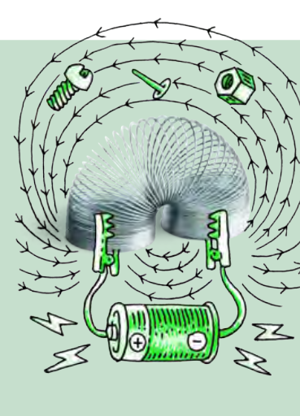
> **[Diagram Context - Textbook_NaturalScience_Gr8_Beyond-the-solar-system.pdf-0012-10.png]**
> This diagram illustrates an electromagnet created by connecting a coiled wire (solenoid) to a battery, marked with positive (+) and negative (-) terminals. It depicts the resulting magnetic field lines, indicated by arrows, and demonstrates the magnetic effect by showing metallic objects like a screw, nail, and nut being attracted to the coil. This visualizes the CAPS Physical Sciences concept of electromagnetism, showing how an electric current flowing through a conductor generates a magnetic field capable of exerting force on ferromagnetic materials.

> **[Diagram Context - Textbook_NaturalScience_Gr8_Looking-into-space.pdf-0012-03.png]**
> The graphic displays a repeating decorative border pattern consisting of stylized green curly arrow shapes arranged in a horizontal line. It features identical repeating green chevron or wave-like arrow symbols flowing uniformly from left to right. This design serves as a page separator or aesthetic divider for educational worksheets or textbooks, providing a visual break between sections without conveying specific scientific concepts.

> **[Diagram Context - Textbook_NaturalScience_Gr8_Looking-into-space.pdf-0012-07.png]**
> This educational graphic features an illustrated model overlaying a roller coaster track with cheering passengers, alongside a smaller schematic sketch of a roller coaster on a grid. The visual elements include a metallic Slinky spring draped over the crest of the green roller coaster track, multiple figures with raised hands, wheels along the tracks, and motion lines denoting movement. Conceptually, this diagram visually demonstrates the conservation of mechanical energy and the interplay between gravitational potential energy and kinetic energy as an object moves along a frictionless track, aligning with the Grade 11 Physical Sciences CAPS curriculum on Work, Energy, and Power.

> **[Diagram Context - Textbook_NaturalScience_Gr8_The-Solar-System.pdf-0012-21.png]**
> This diagram illustrates an electromagnet created by connecting a coiled wire (solenoid) to a battery, marked with positive (+) and negative (-) terminals. The surrounding field lines with directional arrows represent the magnetic field generated by the current, demonstrating how electricity induces magnetism to attract metallic objects like the depicted bolt, nail, and nut.

> **[Diagram Context - Textbook_NaturalScience_Gr8_The-Solar-System.pdf-0012-22.png]**
> This graphic features a whimsical illustration of a hot air balloon where the balloon is represented by a globe of the Earth, with two figures in the basket using telescopes to observe the surroundings. The text provides a call to action to "VISIT" and "Compare the planets" using a provided NASA URL. This resource serves as an engaging digital bridge to help Grade 10 learners explore the characteristics and comparative properties of planets within our solar system.

> **[Diagram Context - Textbook_NaturalScience_Gr8_The-Solar-System.pdf-0012-24.png]**
> This graphic is a cartoon illustration featuring a character holding a framed portrait and a speech bubble containing explanatory text. The text highlights the distinction between the scale of planetary orbits and the physical size of celestial bodies, noting that if both were represented accurately to scale, the Sun and planets would appear significantly smaller. This serves as a conceptual warning for learners to critically evaluate scientific models, emphasizing that diagrams often sacrifice proportional accuracy for visual clarity.

---

# 2.4 What is beyond the Milky Way Galaxy?

## Key Concepts and Definitions

*   **Galaxy:** A massive system consisting of stars, gas, and dust held together by gravity.
*   **Galaxy Group:** A small collection of galaxies bound together by gravity.
*   **Galaxy Cluster:** A large structure consisting of hundreds to thousands of galaxies.
*   **Filament:** A massive, thread-like structure that forms the boundaries of large voids in the universe.
*   **Void:** A vast, empty space between filaments that contains very few or no galaxies.
*   **Universe:** The totality of all space, time, matter, and energy.

---

## The Milky Way Galaxy
Our galaxy, the Milky Way, is an average-sized spiral galaxy.
*   **Size:** Approximately $100\,000$ light years across.
*   **Composition:** Contains around $200$ billion stars, along with vast amounts of gas and dust.
*   **Context:** It is one of approximately $100$ to $200$ billion galaxies in the Universe.

---

## Andromeda: Our Neighbour
*   **Distance:** Andromeda is $2.5$ million light years away from the Milky Way.
*   **Implication:** Because light takes $2.5$ million years to travel from Andromeda to Earth, the light we see today was emitted before humans existed on Earth.

---

## Take Note
The distances between galaxies are significantly larger than the sizes of the galaxies themselves. These distances are measured in millions or even billions of light years.

---

## Did You Know?
The Milky Way and Andromeda galaxies are on a collision course. Astronomers estimate that the two galaxies will collide in approximately $4$ billion years.

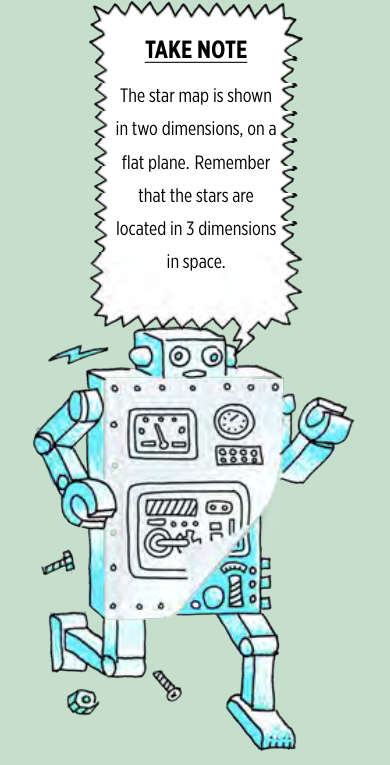
> **[Diagram Context - Textbook_NaturalScience_Gr8_Beyond-the-solar-system.pdf-0013-02.png]**
> This educational graphic features a cartoon robot with a speech bubble containing the text "TAKE NOTE" and a reminder about the dimensionality of star maps. It conceptually highlights the limitation of representing celestial objects on a two-dimensional plane, reminding learners that stars exist within a three-dimensional spatial context.

---

## Summary of Galactic Scales
| Feature | Description |
| :--- | :--- |
| **Milky Way Diameter** | $100\,000$ light years |
| **Distance to Andromeda** | $2.5$ million light years |
| **Estimated Galaxies in Universe** | $100 - 200$ billion |
| **Predicted Collision Time** | $\approx 4$ billion years |

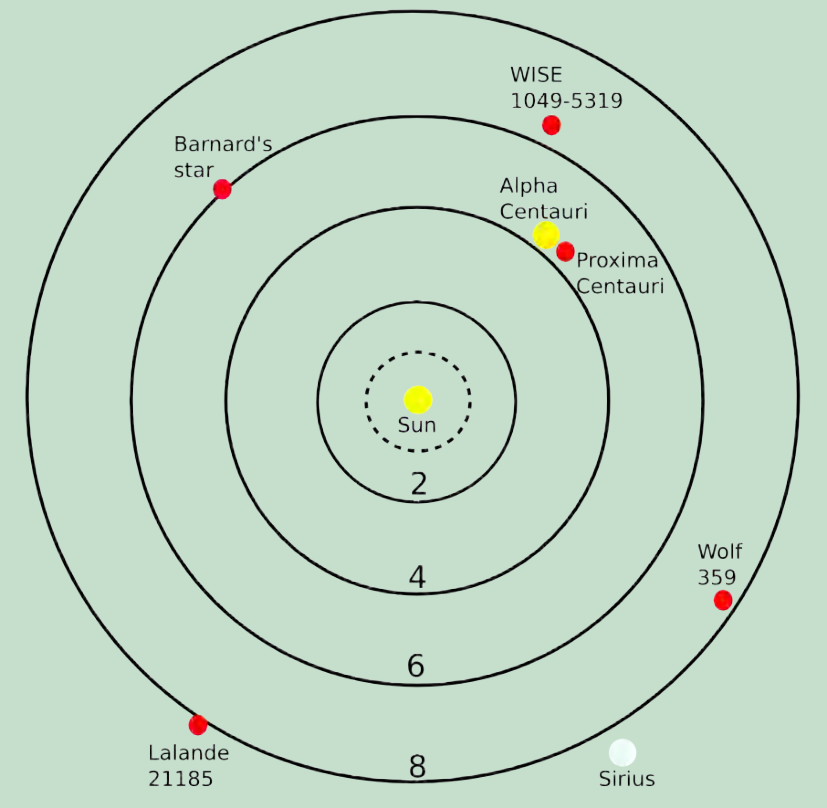
> **[Diagram Context - Textbook_NaturalScience_Gr8_Beyond-the-solar-system.pdf-0013-03.png]**
> This diagram is a polar coordinate map representing the relative distances of nearby stars from the Sun, which is positioned at the centre. It uses concentric circles labeled with numerical values (2, 4, 6, 8) to denote distance in light-years and plots specific stellar objects including Barnard's star, Alpha Centauri, Proxima Centauri, WISE 1049-5319, Wolf 359, Lalande 21185, and Sirius. For Grade 10 Physical Sciences learners, this visualises the vast scale of the universe and the concept of light-years as a unit of measurement for interstellar distances.

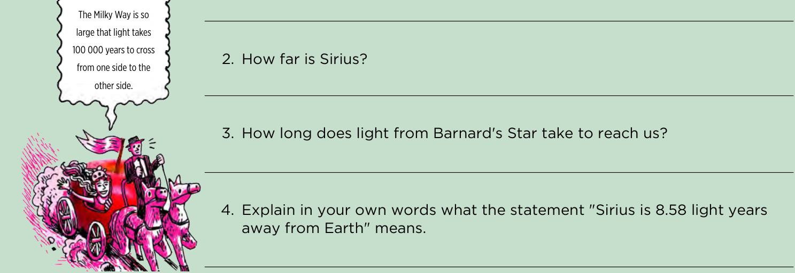
> **[Diagram Context - Textbook_NaturalScience_Gr8_Beyond-the-solar-system.pdf-0013-07.png]**
> This educational graphic features a cartoon illustration of a chariot and a speech bubble containing a fact about the Milky Way, accompanied by three assessment questions. The text references the Milky Way, Sirius, Barnard’s Star, Earth, and the concept of light years. It is designed to help Grade 9 Natural Sciences learners grasp the vast scale of the universe by calculating and interpreting astronomical distances in terms of the time light takes to travel.

> **[Diagram Context - Textbook_NaturalScience_Gr8_Beyond-the-solar-system.pdf-0013-08.png]**
> This graphic depicts a stylized, repeating wave pattern composed of interconnected green arrow-like segments. The image uses a continuous, rhythmic flow of directional arrows to conceptually represent processes such as cyclic movement, continuous energy flow, or the sequential stages of a biological or physical cycle.

> **[Diagram Context - Textbook_NaturalScience_Gr8_Looking-into-space.pdf-0013-14.png]**
> This graphic is a repeating decorative green border featuring a stylized, wave-like serpentine pattern. The visible elements consist entirely of a continuous linear motif composed of curved shapes resembling overlapping waves or stylized ribbons. Conceptually, this functions purely as a page separator or aesthetic boundary marker for educational documents, rather than conveying specific scientific or mathematical content.

> **[Diagram Context - Textbook_NaturalScience_Gr8_The-Solar-System.pdf-0013-01.png]**
> This graphic is a text-based informational prompt directing students to an external digital resource. It contains the heading "VISIT," descriptive text regarding "NASA's Mars Science Laboratory," and a shortened URL link. It serves as an enrichment tool to encourage independent research and contextualize space science topics within the broader CAPS curriculum.

> **[Diagram Context - Textbook_NaturalScience_Gr8_The-Solar-System.pdf-0013-04.png]**
> This editorial cartoon depicts a large telescope focused on the Earth, with human figures observing and monitoring the planet from a control station. The visual elements include a stylized telescope, a globe showing the African continent, and human observers, all framed by an empty speech bubble. Conceptually, this image serves as a metaphor for environmental monitoring and global stewardship, illustrating how scientific observation and data analysis are essential for understanding and managing the Earth's systems within the context of Geography and Life Sciences.

> **[Diagram Context - Textbook_NaturalScience_Gr8_The-Solar-System.pdf-0013-12.png]**
> This graphic depicts a stylized, repeating wave-like pattern composed of interconnected, arrow-headed segments. It serves as a visual representation of continuous directional flow or a periodic sequence, commonly used in Life Sciences to illustrate processes like DNA replication, the movement of substances through a transport system, or the cyclical nature of biological pathways.

> **[Diagram Context - Textbook_NaturalScience_Gr8_The-Solar-System.pdf-0013-13.png]**
> This graphic is an instructional text box containing the labels "VISIT," "Build your own solar system with this orbit simulator," and a shortened URL. It serves as a digital signpost directing learners to an interactive simulation tool for exploring planetary motion and gravitational systems within the Natural Sciences curriculum.

> **[Diagram Context - Textbook_NaturalScience_Gr8_The-Solar-System.pdf-0013-15.png]**
> This graphic is a visual representation of the solar system, displaying the Sun followed by the eight planets in order of their distance from the Sun: Mercury, Venus, Earth, Mars, Jupiter, Saturn, Uranus, and Neptune. It illustrates the relative sizes and distinct physical characteristics of the terrestrial planets compared to the gas and ice giants, providing a foundational overview of planetary classification and solar system structure for Natural Sciences.

---

# Types of Galaxies

There are five main types of galaxies. While you do not need to memorize these names for assessment purposes, they are provided for your interest.

### The Five Main Types
*   **Spiral:** Galaxies with a rotating disk of stars and interstellar medium, often with a central bulge.
*   **Barred spiral:** Similar to a spiral galaxy, but with a central "bar" structure composed of stars.
*   **Elliptical:** Galaxies that have an approximately ellipsoidal shape and a smooth, nearly featureless brightness profile.
*   **Lenticular:** A lens-shaped galaxy that is an intermediate type between an elliptical and a spiral galaxy.
*   **Irregular:** A galaxy that does not have a distinct regular shape, unlike a spiral or an elliptical galaxy.

---

### Visual Examples

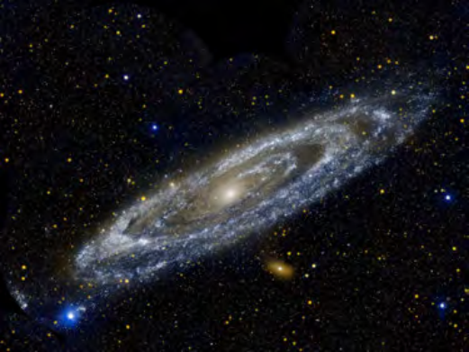
> **[Diagram Context - Textbook_NaturalScience_Gr8_Beyond-the-solar-system.pdf-0014-04.png]**
> This image is an astronomical photograph of a spiral galaxy, characterized by a central bright bulge, distinct spiral arms, and a surrounding field of individual stars. It serves as a visual representation of the large-scale structures of the universe, illustrating the concept of galaxies as massive, gravitationally bound systems of stars, gas, and dust as studied in Grade 10 Physical Sciences.

| Galaxy Type | Example |
| :--- | :--- |
| **Spiral** | NGC 4414 |
| **Barred spiral** | NGC 1300 |
| **Elliptical** | NGC 1132 |
| **Lenticular** | NGC 5866 |
| **Irregular** | NGC 1427A |

---

### Enrichment Resources
To further your understanding of the Universe, you may visit the following links:

*   **Largest known galaxy:** [bit.ly/1ddXJcR](http://bit.ly/1ddXJcR)
*   **What is the Universe? / How big is the Universe?:** [bit.ly/1eFW3XI](http://bit.ly/1eFW3XI) and [bit.ly/16sqdlB](http://bit.ly/16sqdlB)
*   **Galaxy Zoo Activity:** [bit.ly/177itzq](http://bit.ly/177itzq)

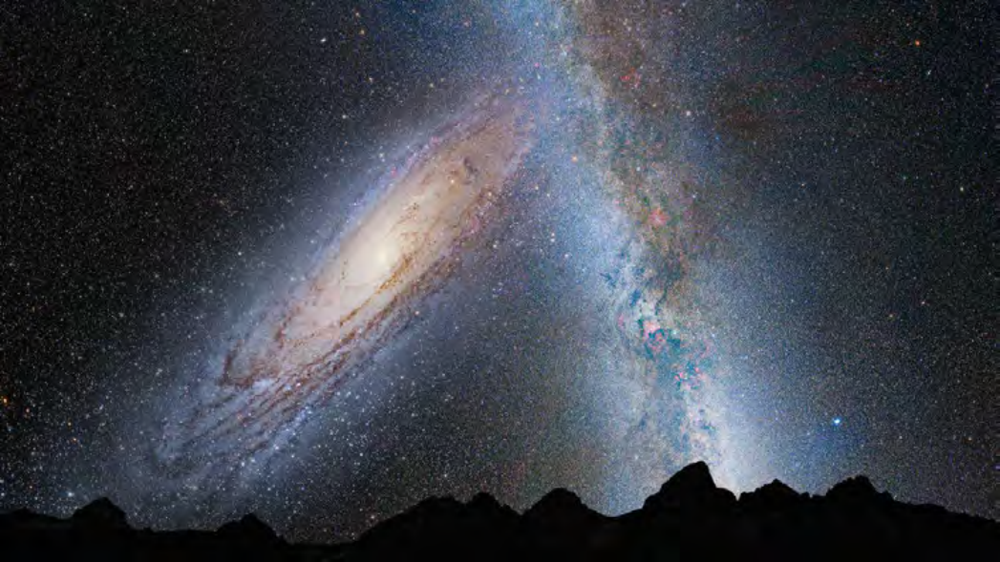
> **[Diagram Context - Textbook_NaturalScience_Gr8_Beyond-the-solar-system.pdf-0014-08.png]**
> This image is an astronomical photograph depicting the Andromeda Galaxy and the Milky Way galaxy as viewed from Earth's surface, framed by a dark mountain silhouette. It illustrates the vast scale of the universe and the structure of galaxies, serving as a visual aid for Grade 10 Physical Sciences and Geography topics regarding the solar system and the universe. The composition helps students conceptualize the relative positioning of galaxies within the cosmos and the nature of deep-space observation from a terrestrial perspective.

> **[Diagram Context - Textbook_NaturalScience_Gr8_Beyond-the-solar-system.pdf-0014-12.png]**
> This illustration depicts a laboratory conical flask erupting like a volcano, with purple liquid overflowing and splashing onto human figures and buildings below. The image uses the visual metaphor of a chemical reaction or spill to represent the uncontrolled release of hazardous substances into the environment. It serves as a conceptual warning for learners regarding the importance of laboratory safety protocols and the potential catastrophic impact of chemical accidents on human health and infrastructure.

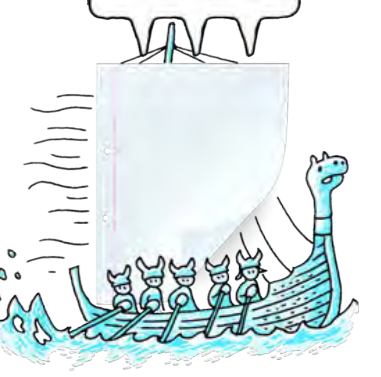
> **[Diagram Context - Textbook_NaturalScience_Gr8_Beyond-the-solar-system.pdf-0014-15.png]**
> This graphic is a metaphorical illustration depicting a Viking longship with a blank sheet of paper serving as its sail, accompanied by wind lines and a speech bubble. It serves as a creative visual prompt or template for students to brainstorm, draft, or present ideas, encouraging them to "set sail" with their own written content or creative expression.

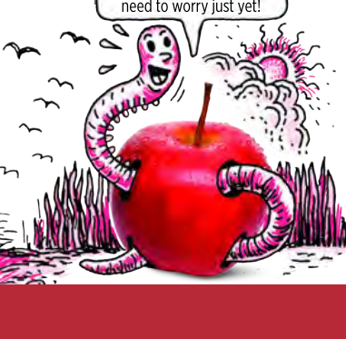
> **[Diagram Context - Textbook_NaturalScience_Gr8_Beyond-the-solar-system.pdf-0014-18.png]**
> This educational cartoon depicts an anthropomorphized worm emerging from an apple, accompanied by a speech bubble fragment reading "need to worry just yet!". It uses a humorous, illustrative style to represent the biological relationship between a primary consumer and its food source within an ecosystem. The image serves as a visual metaphor for ecological interactions, helping students conceptualize the role of decomposers or consumers in nutrient cycling and food webs.

> **[Diagram Context - Textbook_NaturalScience_Gr8_Looking-into-space.pdf-0014-02.png]**
> This optical ray diagram illustrates the working principle of a convex lens used as a magnifying glass. The visible labels include "Focal point," "Magnifying glass," light rays with directional arrows, and dashed projection lines representing an enlarged virtual image of a ladybug as viewed by an eye. Conceptually, it demonstrates how placing an object within the focal length of a convex lens produces a larger, upright virtual image that appears magnified to an observer.

> **[Diagram Context - Textbook_NaturalScience_Gr8_Looking-into-space.pdf-0014-05.png]**
> This educational graphic is an instructional prompt featuring an illustration of the planet Earth surrounded by circular green arrows and a figure holding a sign. The sign is clearly labelled with the text "VISIT", "The atmosphere and optical telescopes.", and a shortened URL link ("bit.ly/1bSTS1d"). Conceptually, this diagram serves as an external resource signpost for high school learners studying Earth and Space Sciences, directing them to online digital content regarding how Earth's atmosphere impacts optical telescope observations.

> **[Diagram Context - Textbook_NaturalScience_Gr8_The-Solar-System.pdf-0014-02.png]**
> This diagram displays cross-sectional models of the four terrestrial planets (Mercury, Venus, Earth, and Mars), using a legend to identify their internal layers: Crust, Mantle, and Core. It illustrates the comparative internal composition of these planets, specifically highlighting Earth’s distinct differentiation into a solid inner core and a liquid outer core.

> **[Diagram Context - Textbook_NaturalScience_Gr8_The-Solar-System.pdf-0014-05.png]**
> This diagram provides a comparative cross-sectional analysis of the four gas giants—Jupiter, Saturn, Uranus, and Neptune—relative to Earth. It uses a colour-coded legend to label internal structures including molecular and metallic hydrogen, gas atmospheres, icy mantles, and rocky cores. Conceptually, this illustrates the planetary composition and internal stratification of the outer planets, highlighting the structural differences between the gas giants and the ice giants within the solar system.

> **[Diagram Context - Textbook_NaturalScience_Gr8_The-Solar-System.pdf-0014-09.png]**
> This illustrative cartoon depicts a metaphorical chariot scene featuring a personified apple acting as a carriage, pulled by two horses and driven by a figure in a suit. The image includes a speech bubble fragment referencing "from Mars atmosphere" and uses motion lines to suggest rapid travel. Conceptually, this visual serves as a creative mnemonic or engagement tool to help students visualize the hypothetical or scientific narrative of transporting materials or life forms through space.

> **[Diagram Context - Textbook_NaturalScience_Gr8_The-Solar-System.pdf-0014-12.png]**
> This cartoon illustration depicts a worm interacting with an apple in a natural environment featuring grass, a sun, and birds. It serves as a visual metaphor for the role of decomposers and detritivores in an ecosystem, illustrating how organisms break down organic matter to facilitate nutrient cycling within a food web.

---

# ACTIVITY: Comparing Galaxies

### Materials
*   Images of the six galaxies to be compared.

### Instructions
1.  Examine the images of the six galaxies provided in this activity.
2.  Using the information from your textbook chapter, identify the type of galaxy for our own Milky Way Galaxy.
3.  Complete the table below by identifying the type of galaxy (spiral, barred spiral, elliptical, or irregular) for each image provided.

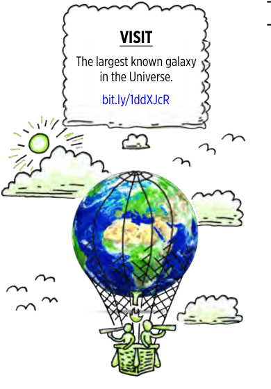
> **[Diagram Context - Textbook_NaturalScience_Gr8_Beyond-the-solar-system.pdf-0015-01.png]**
> This graphic features a cartoon illustration of two figures in a hot air balloon shaped like the Earth, using telescopes to observe the sky. It includes a text box with the heading "VISIT," the prompt "The largest known galaxy in the Universe," and a shortened URL link. The image serves as an engaging hook to encourage learners to explore astronomical concepts and the vast scale of the universe beyond our planet.

### Galaxy Classification Table

| Galaxy Name | Galaxy Type |
| :--- | :--- |
| The Milky Way Galaxy | |
| Galaxy M 89 (60 million light years away) | |
| Galaxy NGC 4622 (111 million light years away) | |

***

### Enrichment: Citizen Science
**VISIT:** Galaxy Zoo
Take part in real astronomical research by classifying the shapes of different galaxies in this citizen science project.
**Link:** [bit.ly/1ddXQVQ](http://bit.ly/1ddXQVQ)

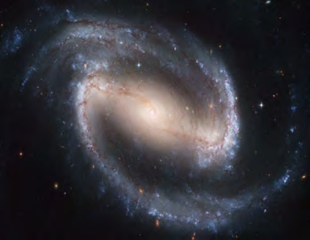
> **[Diagram Context - Textbook_NaturalScience_Gr8_Beyond-the-solar-system.pdf-0015-07.png]**
> This image is an astronomical photograph of a barred spiral galaxy, characterized by a central bright galactic bulge and distinct spiral arms extending from a linear bar structure. In the context of the Grade 10 Physical Sciences curriculum, this visual serves as an example of the large-scale structures that make up the universe, illustrating the distribution of stars, gas, and dust within a gravitationally bound system.

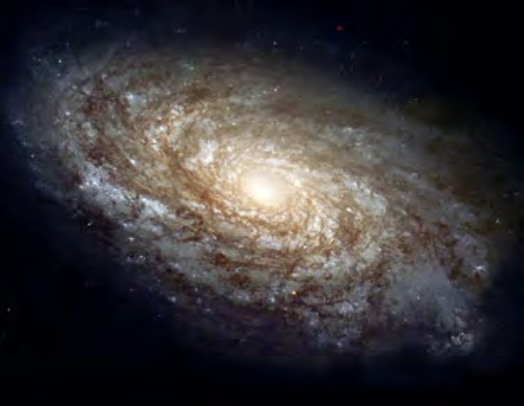
> **[Diagram Context - Textbook_NaturalScience_Gr8_Beyond-the-solar-system.pdf-0015-08.png]**
> This image is an astronomical photograph of a spiral galaxy, characterized by a bright central galactic bulge and distinct, swirling spiral arms containing stars, gas, and dust. In the context of the Grade 10 Physical Sciences curriculum, this visual serves to illustrate the structure and composition of the universe, demonstrating how gravity organizes matter into large-scale galactic systems.

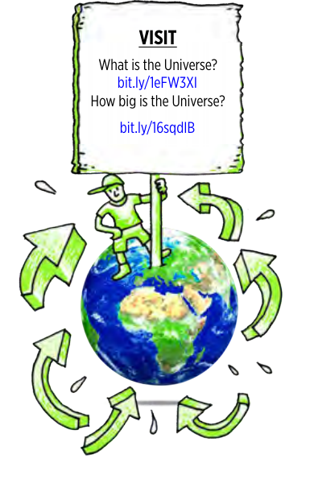
> **[Diagram Context - Textbook_NaturalScience_Gr8_Beyond-the-solar-system.pdf-0015-09.png]**
> This graphic features a cartoon illustration of a person holding a sign above a globe, surrounded by circular arrows and text links labeled "VISIT," "What is the Universe?", and "How big is the Universe?". It serves as an introductory educational prompt designed to encourage Grade 10 Physical Sciences learners to explore the scale and nature of the universe as part of the Earth and Beyond curriculum strand.

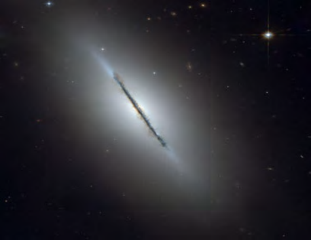
> **[Diagram Context - Textbook_NaturalScience_Gr8_Beyond-the-solar-system.pdf-0015-12.png]**
> This image is an astronomical photograph of an edge-on spiral galaxy, characterized by a central galactic bulge and a prominent, dark dust lane bisecting its luminous stellar disk. There are no labels or variables present, as the image serves as a visual representation of galactic morphology. For Grade 10-12 Physical Sciences and Geography learners, this illustrates the structure of galaxies within the universe, demonstrating how orientation relative to an observer affects the classification and appearance of celestial objects.

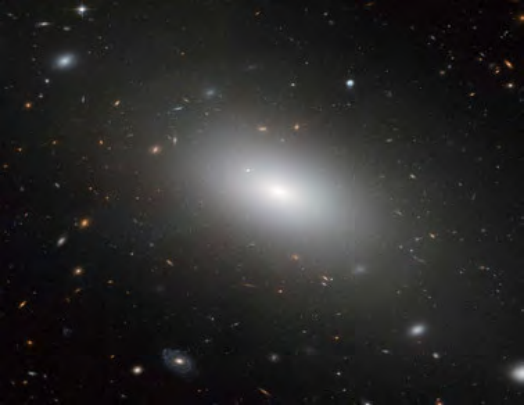
> **[Diagram Context - Textbook_NaturalScience_Gr8_Beyond-the-solar-system.pdf-0015-13.png]**
> This image is an astronomical deep-field photograph showcasing a central elliptical galaxy surrounded by a vast, diverse collection of distant background galaxies and stars. Lacking explicit labels or variables, the visual serves as a primary source for observing the large-scale structure of the universe, illustrating the immense scale of space and the variety of galactic morphologies. It supports the Physical Sciences (Earth and Space) curriculum by providing a tangible example of the observable universe, helping learners conceptualize the distribution of matter and the vast distances involved in cosmology.

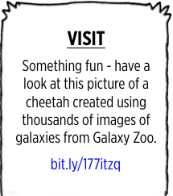
> **[Diagram Context - Textbook_NaturalScience_Gr8_Beyond-the-solar-system.pdf-0015-16.png]**
> This graphic is a text-based informational notice containing the labels "VISIT," "cheetah," "galaxies," "Galaxy Zoo," and a shortened URL. It serves as an external resource prompt to engage students with citizen science projects, illustrating how large datasets of astronomical images can be organized or visualized in creative ways.

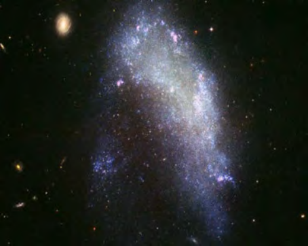
> **[Diagram Context - Textbook_NaturalScience_Gr8_Beyond-the-solar-system.pdf-0015-17.png]**
> This image is an astronomical photograph of an irregular galaxy, characterized by its lack of a distinct spiral or elliptical structure and a high density of young, blue stars. There are no labels or variables present, as the image serves as a visual representation of deep-space objects. For Grade 10 Physical Sciences learners, this illustrates the vast scale of the universe and the diverse morphologies of galaxies beyond our own Milky Way.

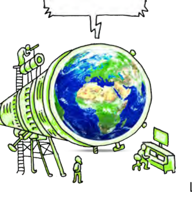
> **[Diagram Context - Textbook_NaturalScience_Gr8_Beyond-the-solar-system.pdf-0015-18.png]**
> This illustration depicts a large telescope focused on the Earth, featuring human figures observing the planet and interacting with a computer workstation. The graphic uses the visual metaphor of scientific observation and data analysis to represent the study of Earth systems, environmental monitoring, or global geography. It conceptually introduces learners to the importance of remote sensing, data collection, and the scientific study of our planet's physical and environmental processes.

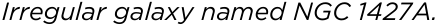

> **[Diagram Context - Textbook_NaturalScience_Gr8_Looking-into-space.pdf-0015-01.png]**
> This educational graphic features an illustrated cartoon robot character accompanied by a jagged speech bubble titled "TAKE NOTE" with the explanatory text: "As astronomical objects are so far away, their light rays are considered to be parallel to each other." It conceptually introduces learners to optical physics principles in physical sciences, specifically explaining how extreme distances allow light from stars and distant celestial bodies to be treated as parallel rays when analyzing reflection and refraction.

> **[Diagram Context - Textbook_NaturalScience_Gr8_Looking-into-space.pdf-0015-03.png]**
> This optical ray diagram illustrates the refraction of light through a convex lens. Visible labels include "converging lens", "focal point (F)", and "parallel light rays from a distant object", accompanied by directional blue arrows indicating the path of light. Conceptually, it demonstrates how incoming parallel rays refract and converge at a single point (the principal focus) after passing through the lens, which is fundamental to understanding Geometrical Optics in the CAPS Physical Sciences curriculum.

> **[Diagram Context - Textbook_NaturalScience_Gr8_Looking-into-space.pdf-0015-05.png]**
> This text box graphic contains educational definitions distinguishing between real and virtual images. Visible text labels include the headings "TAKE NOTE" and key concepts such as "real image" and "virtual image." Conceptually, this helps high school Physical Sciences learners understand the fundamental optical distinction: real images are formed where light rays actually converge and pass through a point, whereas virtual images are formed where light rays only appear to diverge from a point.

> **[Diagram Context - Textbook_NaturalScience_Gr8_Looking-into-space.pdf-0015-06.png]**
> This optical ray diagram illustrates the working principle of a refracting telescope, featuring an objective lens, an eyepiece lens, a distant tree object, a real inverted intermediate image, and an observer's eye receiving refracted light rays. Visible elements include a horizontal dashed principal axis, vertical double-convex lenses shown in blue, solid lines with directional arrows representing light rays, and dashed extension lines indicating virtual image formation. Conceptually, it demonstrates how a compound optical instrument uses two lenses in tandem to magnify distant objects by first forming a real, inverted image that is subsequently viewed as an enlarged virtual image by the eye.

> **[Diagram Context - Textbook_NaturalScience_Gr8_Looking-into-space.pdf-0015-08.png]**
> The graphic illustrates a cartoon diagram of a Viking ship with rowers navigating rough, wavy water while wind blows from the left against a large rectangular sail. Visible elements include wavy horizontal lines representing wind on the left, splashing water at the bow and stern, five cartoon figures rowing with oars, and rigging holding the mast and sail. Conceptually, this illustration helps students visualise physical forces and vector components in mechanics, demonstrating how wind force interacts with a sail and how applied forces from oars drive a vessel through water.

> **[Diagram Context - Textbook_NaturalScience_Gr8_The-Solar-System.pdf-0015-00.png]**
> This graphic is a text-based pedagogical feature formatted as a "Did you know?" callout box. It contains the heading "DID YOU KNOW?" underlined within a cloud-shaped border. In a CAPS curriculum context, this visual element serves to introduce supplementary, interesting, or contextual facts that enrich a learner's understanding of a specific scientific or mathematical concept.

> **[Diagram Context - Textbook_NaturalScience_Gr8_The-Solar-System.pdf-0015-02.png]**
> This illustration depicts a caricature of Isaac Newton with an apple-shaped head, surrounded by a network of floating apples connected by dashed lines and directional arrows. It serves as a conceptual metaphor for Newton’s Law of Universal Gravitation, visually representing the interconnectedness of gravitational forces between masses in a system.

> **[Diagram Context - Textbook_NaturalScience_Gr8_The-Solar-System.pdf-0015-03.png]**
> This astronomical image depicts the planet Saturn, clearly displaying its prominent ring system and several of its moons, including a visible transit shadow on the planet's surface. As a visual aid for the Grade 10 Physical Sciences Earth and Beyond curriculum, it illustrates the composition of the solar system, specifically highlighting the characteristics of gas giants and the gravitational relationship between a planet and its natural satellites.

> **[Diagram Context - Textbook_NaturalScience_Gr8_The-Solar-System.pdf-0015-04.png]**
> This image is a ray diagram illustrating the reflection of light by a concave mirror, featuring a principal axis, a curved reflective surface, and incident/reflected light rays. It demonstrates the fundamental principles of geometric optics, specifically how parallel light rays converge or reflect relative to the mirror's curvature to help students understand focal points and image formation.

> **[Diagram Context - Textbook_NaturalScience_Gr8_The-Solar-System.pdf-0015-07.png]**
> This image is an astronomical photograph of the planet Uranus, clearly displaying its distinct ring system and atmospheric features against a dark background of distant stars. For Grade 10 Physical Sciences learners, this visual serves as a concrete example of a gas giant within our solar system, illustrating the composition and orbital structures that define planetary bodies in the Earth and Beyond strand.

> **[Diagram Context - Textbook_NaturalScience_Gr8_The-Solar-System.pdf-0015-09.png]**
> This graphic features a cartoon illustration of a person holding a globe, accompanied by a speech bubble containing the text "VISIT," "Discover more online at NASA's Solar System Exploration site," and the URL "bit.ly/1azHL6M." It serves as an educational call-to-action, encouraging learners to engage with digital resources to deepen their understanding of Earth and space sciences within the CAPS curriculum.

> **[Diagram Context - Textbook_NaturalScience_Gr8_The-Solar-System.pdf-0015-10.png]**
> This image is an astronomical photograph showing the planet Saturn and its prominent ring system against a star-filled background. There are no explicit labels or variables present in the visual. It serves as a concrete visual aid for Grade 10 Physical Sciences, illustrating the concept of gravitational orbits and the structure of our solar system within the context of the Earth and Beyond strand.

---

### Galaxies and Distances

#### Galaxy Classification Table

| Galaxy Name | Galaxy type |
| :--- | :--- |
| 

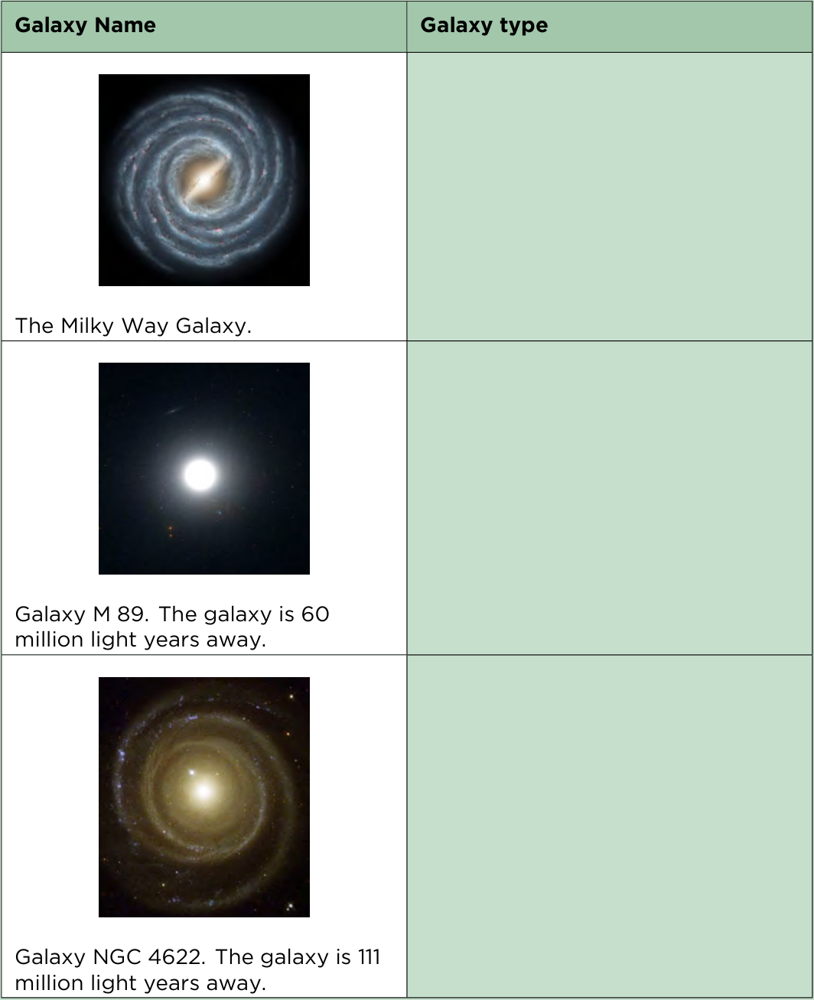
> **[Diagram Context - Textbook_NaturalScience_Gr8_Beyond-the-solar-system.pdf-0016-07.png]**
> This table presents a classification exercise featuring photographic images of three distinct galaxies: The Milky Way, Galaxy M 89, and Galaxy NGC 4622. By identifying the visual characteristics of these celestial bodies, students apply their knowledge of the CAPS Natural Sciences curriculum to categorize galaxies into their respective morphological types, such as spiral or elliptical.

   The Large Magellanic Cloud galaxy. This satellite galaxy of our own Milky Way is only $163\,000$ light years away. | |
| 

> **[Diagram Context - Textbook_NaturalScience_Gr8_Beyond-the-solar-system.pdf-0016-08.png]**
> This illustration depicts a stylized caterpillar feeding on a plant, featuring a metallic slinky-like body segment and a cartoonish face. The image uses visual metaphors to represent herbivory, illustrating the interaction between a primary consumer and a producer within an ecosystem. It serves as a creative conceptual aid for understanding trophic levels and the feeding habits of insects in a Life Sciences context.

   The Spindle Galaxy, $44$ million light years away. | |

***

#### Question
List the galaxies in the table above in increasing order of distance from our Milky Way Galaxy.

1. __________________________________________________________________
2. __________________________________________________________________

***

#### Additional Information
*   **Visit:** To learn more about dark matter, visit: `bit.ly/1ab5oF0`
*   **Note:** The diagram below (provided for interest only) shows the location of Earth in the Universe. You do not need to know this specific classification for your curriculum.

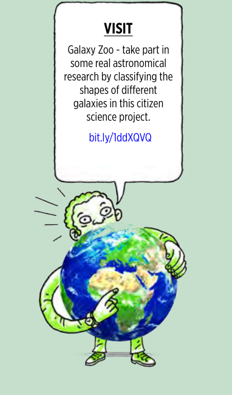
> **[Diagram Context - Textbook_NaturalScience_Gr8_Beyond-the-solar-system.pdf-0016-09.png]**
> This graphic is an educational cartoon featuring a person holding a globe and a speech bubble containing the text "VISIT Galaxy Zoo," a brief description of the citizen science project, and a shortened URL. It serves as an outreach tool to encourage high school learners to engage with authentic astronomical research by classifying galaxy morphologies, thereby supporting the Earth and Beyond strand of the Natural Sciences and Physical Sciences curricula.

> **[Diagram Context - Textbook_NaturalScience_Gr8_Looking-into-space.pdf-0016-00.png]**
> This educational apparatus diagram illustrates the dispersion of light through a triangular glass prism. Visible labels include "White Light", "Glass Prism", and the constituent spectral colors arranged in order from top to bottom: "Red", "Orange", "Yellow", "Green", "Blue", "Indigo", and "Violet", with an arrow indicating the direction of the incident beam. Conceptually, it conveys how white light refracts and separates into its component wavelengths due to differing degrees of bending, demonstrating the visible light spectrum in accordance with CAPS physical sciences requirements.

> **[Diagram Context - Textbook_NaturalScience_Gr8_Looking-into-space.pdf-0016-04.png]**
> This optical ray diagram illustrates the phenomenon of chromatic aberration through a convex lens. It displays a horizontal principal axis, a symmetrical biconvex lens, and incoming parallel light rays split into constituent red, green, and blue colored rays that refract at different focal points. For a Grade 12 Physical Sciences learner, this demonstrates how different wavelengths of light refract by varying amounts due to dispersion, resulting in a failure of the lens to focus all colors to a single point.

> **[Diagram Context - Textbook_NaturalScience_Gr8_The-Solar-System.pdf-0016-05.png]**
> This graphic features a cartoon robot holding a speech bubble containing the heading "TAKE NOTE" and text regarding the classification of Pluto. It serves as a pedagogical reminder for learners to critically evaluate the currency of their information sources, specifically highlighting that scientific classifications can evolve and that older educational materials may contain outdated planetary definitions.

> **[Diagram Context - Textbook_NaturalScience_Gr8_The-Solar-System.pdf-0016-06.png]**
> This graphic features a cartoon illustration of a Viking ship with a speech bubble containing the text "TAKE NOTE: New moons are discovered all the time, so these numbers may change over time." It serves as a pedagogical disclaimer for Natural Sciences or Earth and Space Science learners, emphasizing that scientific data regarding planetary moons is dynamic and subject to revision as new astronomical discoveries are made.

---

# Chapter 2: Beyond the Solar System

## The Structure of the Universe
The universe is organized in a hierarchical structure, ranging from our home planet to the vast observable universe.

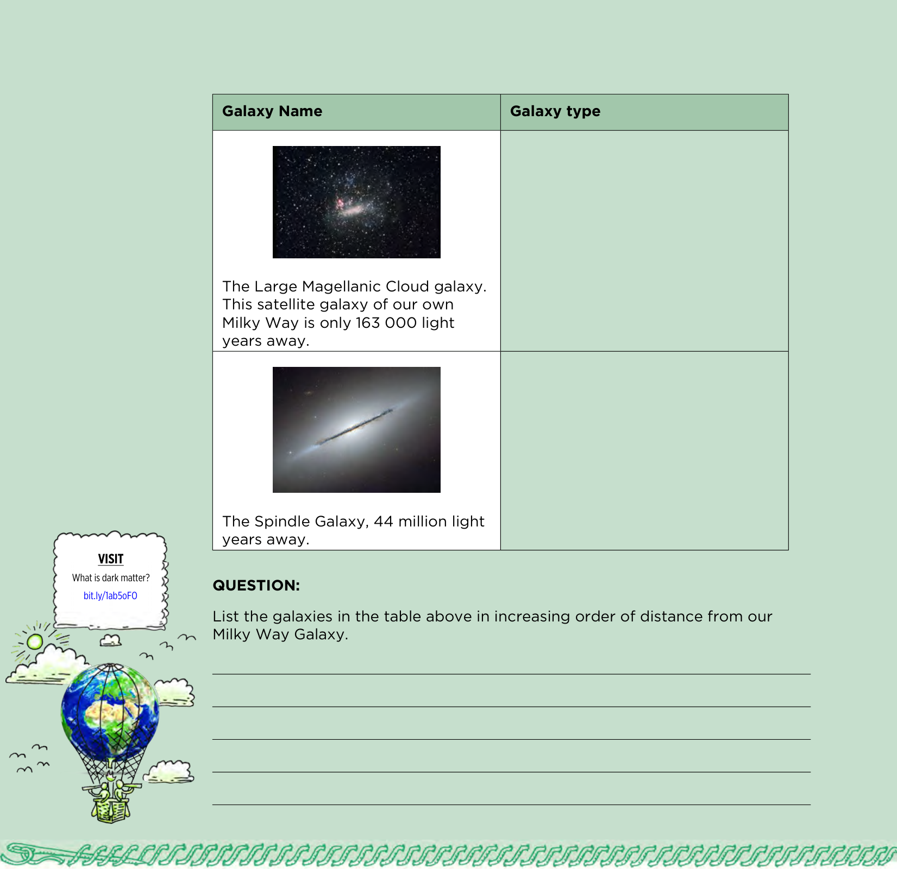
> **[Diagram Context - Textbook_NaturalScience_Gr8_Beyond-the-solar-system.pdf-0017-00.png]**
> This educational graphic is a worksheet table featuring photographic images of "The Large Magellanic Cloud" and "The Spindle Galaxy," alongside their respective distances in light years. It requires students to classify these galaxies by type and order them by distance, reinforcing the CAPS Earth and Beyond curriculum concepts regarding the scale of the universe and the classification of celestial structures.

### Key Concepts and Definitions

*   **Galaxy Groups:** Most galaxies are not isolated; they are found gathered together in "neighbourhoods" known as galaxy groups.
*   **The Local Group:** This is the specific galaxy group that contains our own galaxy, the Milky Way.
*   **Galaxy Clusters:** These are larger structures than groups, spanning tens of millions of light years. They can contain hundreds or even thousands of individual galaxies.
*   **Superclusters:** These are massive structures formed when multiple galaxy clusters come together. 
    *   *Note:* Our own Local Group is part of the **Virgo supercluster**.
*   **Gravity:** This is the fundamental force that holds galaxies together within groups, clusters, and superclusters.

---

## The Observable Universe
The observable universe represents the portion of the universe that we can see from Earth. Astronomers use powerful tools like the Hubble Space Telescope to peer into deep space.

> **[Diagram Context - Textbook_NaturalScience_Gr8_Looking-into-space.pdf-0017-06.png]**
> This conceptual illustration features a caricature portrait of Sir Isaac Newton with his head depicted as a red apple labeled "MR. NEWTON," surrounded by a network of interconnected floating apples connected by dashed lines and directional arrows. The graphic illustrates Newton's Law of Universal Gravitation, visually connecting the iconic falling apple to the gravitational forces acting between masses in a system. For FET Physical Sciences learners, this diagram provides an engaging, memorable metaphor for understanding gravitational fields and how every particle attracts every other particle in the universe with a force proportional to their masses.

### Did You Know?
The **Hubble Extreme Deep Field** is currently the most distant picture of the universe ever taken. By focusing the Hubble Telescope on a tiny, seemingly empty patch of sky, astronomers discovered approximately **5500 galaxies** of various shapes, sizes, and colours.

---

## Further Exploration
To learn more about how scientists estimate the number of galaxies in the universe, you can visit the following resource:
*   **Link:** [bit.ly/HfeA00](http://bit.ly/HfeA00)

> **[Diagram Context - Textbook_NaturalScience_Gr8_Looking-into-space.pdf-0017-09.png]**
> This ray diagram illustrates the reflection of light off a curved mirror. Visible labels and elements include a "curved mirror", directional arrows on incident and reflected blue rays, and a "focal point". Conceptually, it conveys how parallel incoming light rays converge at a single focal point after reflecting off a concave mirror, which is a fundamental principle in Physical Sciences when studying geometric optics.

> **[Diagram Context - Textbook_NaturalScience_Gr8_Looking-into-space.pdf-0017-12.png]**
> This educational graphic is an illustration of a handheld digital tablet showing an interface with various app icons, being touched and operated by two hands. Visible elements include a tablet screen with a grid of icon symbols, a finger tapping the screen, and a speech bubble extending from the top. Conceptually, this diagram visually represents digital interaction, e-learning, or the use of mobile technology as a tool for accessing information and educational applications.

> **[Diagram Context - Textbook_NaturalScience_Gr8_Looking-into-space.pdf-0017-14.png]**
> This graphic is a ray diagram illustrating optical reflection using a concave mirror mounted inside a tubular casing. It features parallel incoming blue light rays with directional arrowheads, a curved reflecting surface highlighted in red, a cyan mirror block, and a red cross marking the focal point where the reflected rays converge. Conceptually, this demonstrates how a concave mirror converges parallel incident light rays to a single focal point, supporting Grade 10-12 Physical Sciences optics concepts relating to wave and geometrical optics.

> **[Diagram Context - Textbook_NaturalScience_Gr8_The-Solar-System.pdf-0017-00.png]**
> This illustration depicts a metaphorical hybrid of a caterpillar and a metal slinky toy, featuring visible green leaf structures and a segmented, coiled body. It serves as a visual analogy for the concept of elasticity or mechanical wave motion, helping students conceptualize how longitudinal waves propagate through a medium by comparing the compression and extension of a spring to the movement of a living organism.

> **[Diagram Context - Textbook_NaturalScience_Gr8_The-Solar-System.pdf-0017-05.png]**
> This infographic uses a thermometer scale to compare the average surface temperatures of the planets in our solar system, with labels indicating values in degrees Celsius (°C). It illustrates the vast temperature gradient across the solar system, highlighting how proximity to the Sun and atmospheric composition influence the extreme thermal conditions found on different planetary bodies.

> **[Diagram Context - Textbook_NaturalScience_Gr8_The-Solar-System.pdf-0017-08.png]**
> This illustration depicts a pair of hands interacting with a tablet interface featuring various abstract icons representing different digital functions or applications. The graphic serves as a visual metaphor for user-interface navigation, digital literacy, or the integration of ICT (Information and Communication Technology) tools within the classroom environment.

---

# The Observable Universe

## Structure of the Universe
On the largest scales, the Universe resembles a giant bath sponge. Its structure is defined by two main features:
*   **Filaments:** Thin walls where galaxy clusters are arranged.
*   **Voids:** Huge gaps between filaments that contain very few galaxies.

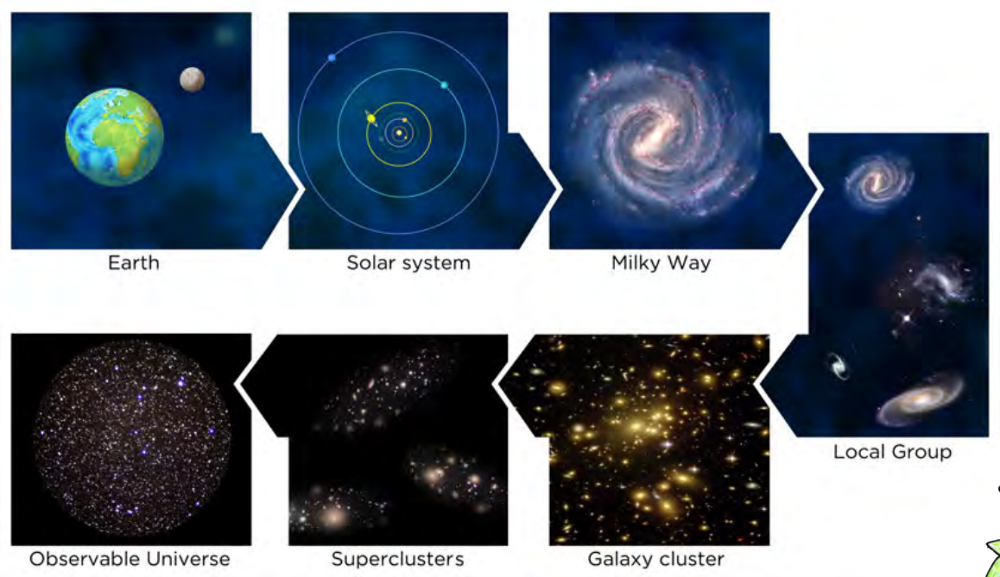
> **[Diagram Context - Textbook_NaturalScience_Gr8_Beyond-the-solar-system.pdf-0018-00.png]**
> This infographic uses a sequential flow diagram to illustrate the hierarchical structure of the cosmos, featuring labels for Earth, Solar system, Milky Way, Local Group, Galaxy cluster, Superclusters, and the Observable Universe. It conceptually demonstrates the vast scale of space by showing how smaller celestial bodies are nested within increasingly larger structures, helping learners visualize their position within the universe.

## The Observable Universe
The *observable Universe* is the portion of the Universe from which light has had enough time to reach Earth since the beginning of the Universe.

### Key Concepts
*   **Age of the Universe:** Astronomers estimate the Universe is approximately $13.7$ billion years old.
*   **Light Travel Time:** Because the Universe is $13.7$ billion years old, we can theoretically see objects up to $13.7$ billion light years away in any direction.
*   **The Expansion Factor:** While one might assume the diameter of the observable Universe is $2 \times 13.7 = 27.4$ billion light years, this is incorrect. 
*   **Actual Size:** The observable Universe is estimated to be $93$ billion light years in diameter.

### Why is it larger than expected?
The size is much larger than the age of the Universe suggests because the Universe is **expanding**. 
1. Galaxies are moving further away from Earth as space itself expands.
2. We are able to see galaxies that are now very far away because, at the time they emitted the light we see today, they were much closer to Earth.
3. The size of the *whole* Universe remains unknown, as it includes regions too far away for their light to have reached us yet.

***

### Quick Links for Further Study
*   **Expansion of the Universe:** [bit.ly/1ddYyTd](http://bit.ly/1ddYyTd)
*   **Space Scoop (Astronomy News):** [bit.ly/1fsXJ84](http://bit.ly/1fsXJ84)

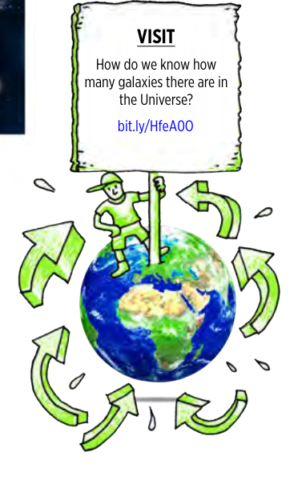
> **[Diagram Context - Textbook_NaturalScience_Gr8_Beyond-the-solar-system.pdf-0018-01.png]**
> This graphic features an illustration of a person standing on a globe surrounded by circular arrows, topped with a sign containing the text "VISIT," the question "How do we know how many galaxies there are in the Universe?", and a shortened URL. It serves as an introductory prompt for Grade 10 Physical Sciences learners, encouraging them to engage with cosmological concepts and the methods astronomers use to estimate the scale of the universe beyond Earth.

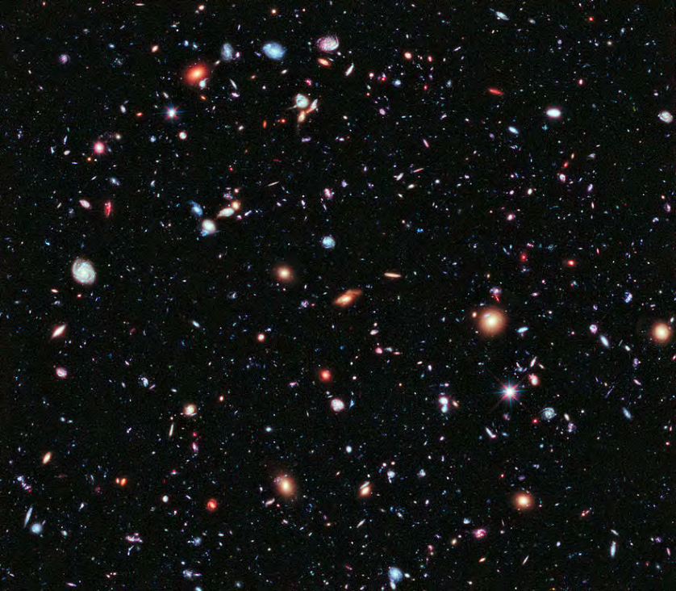
> **[Diagram Context - Textbook_NaturalScience_Gr8_Beyond-the-solar-system.pdf-0018-06.png]**
> This image is a deep-field astronomical photograph containing no text labels, variables, or symbols, but displaying a vast collection of diverse galaxies at varying distances and evolutionary stages. For Physical Sciences learners, it serves as a visual representation of the expanding universe, illustrating the immense scale of space and the look-back time required to observe light from distant celestial objects.

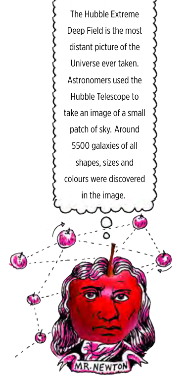
> **[Diagram Context - Textbook_NaturalScience_Gr8_Beyond-the-solar-system.pdf-0018-09.png]**
> This graphic features a caricature of Isaac Newton depicted as an apple, connected to a network of smaller apples and a thought bubble containing text about the Hubble Extreme Deep Field. The text describes the Hubble Telescope's discovery of 5,500 galaxies within a small patch of the sky. Conceptually, this juxtaposition uses a historical figure associated with classical mechanics to introduce learners to the vast scale of the universe and the technological advancements in observational astronomy.

> **[Diagram Context - Textbook_NaturalScience_Gr8_Looking-into-space.pdf-0018-03.png]**
> The image shows a collection of optical telescopes set up on stands outdoors on a lawn near a brick building. The visual features four distinct telescope assemblies of varying sizes, tube colors, and mount types, without any text labels or arrows. Conceptually, this real-world apparatus demonstrates the equipment used in observational astronomy, illustrating how different optical designs (such as refracting and reflecting telescopes) are mounted and aligned to study celestial objects in physical science and geography curricula.

> **[Diagram Context - Textbook_NaturalScience_Gr8_Looking-into-space.pdf-0018-06.png]**
> This graphic is an illustrative artwork depicting an astronaut standing on a red, cratered sphere that resembles a planet or a stylized apple, holding a flag with a blank speech bubble overhead. Visible surrounding elements include stars, lightning bolts, smaller planets, a comet, and a distant planet or moon set against a textured, dark background. Conceptually, it serves as a creative prompt or visual stimulus to engage high school learners in imaginative writing or discussions related to space exploration, physics, and planetary science.

> **[Diagram Context - Textbook_NaturalScience_Gr8_Looking-into-space.pdf-0018-09.png]**
> This ray diagram compares two types of reflecting telescopes, the Newtonian reflector and the Cassegrain reflector. The labels identify the "primary mirror", "secondary mirror", and "eyepiece", with blue lines and directional arrows tracking the path of incoming light rays. Conceptually, it demonstrates how optical systems use concave primary mirrors combined with secondary mirrors to gather light and form magnified images, illustrating the differences in light path configuration between the two designs for high school physical sciences learners.

> **[Diagram Context - Textbook_NaturalScience_Gr8_The-Solar-System.pdf-0018-06.png]**
> This graphic illustrates a schematic representation of a DNA double helix, featuring two antiparallel sugar-phosphate backbones represented by continuous, intertwined green ribbons. It conceptually demonstrates the structural arrangement of the DNA molecule, highlighting the helical twist and the complementary, antiparallel orientation of the two strands essential for genetic replication and transcription.

> **[Diagram Context - Textbook_NaturalScience_Gr8_The-Solar-System.pdf-0018-12.png]**
> This illustration depicts a roller coaster track overlaid with a metallic spring-like Slinky toy and cartoon passengers experiencing the ride. Visible elements include a green rollercoaster track structure with a loop, a large superimposed coiled spring, and four cheering people riding the crest. Conceptually, this visual serves as an engaging physics analogy to demonstrate mechanical energy conservation and transformation between gravitational potential energy and kinetic energy as objects move along a vertical path.

---

# Summary: Beyond the Solar System

## Key Concepts

*   **Galaxy:** A collection of millions or billions of stars, together with gas and dust, held together by gravity.
*   **Galaxy Diversity:** Galaxies exist in a wide variety of shapes and sizes.
*   **The Milky Way:** Our home galaxy is a spiral galaxy containing approximately $200$ billion stars. Our Sun is one of these stars.
*   **Nearest Star:** After the Sun, the nearest star to Earth is Alpha Centauri, which is the brighter of the two "pointer stars" in the Southern Cross constellation.
*   **Measuring Cosmic Distances:** Because distances in space are immense, astronomers use units based on the speed of light:
    *   **Light minute:** The distance light travels in one minute.
    *   **Light hour:** The distance light travels in one hour.
    *   **Light year:** The distance light travels in one year.
*   **The Universe:** There are many galaxies beyond the Milky Way. Astronomers estimate the diameter of the observable Universe to be $93$ billion light years.

## Concept Map

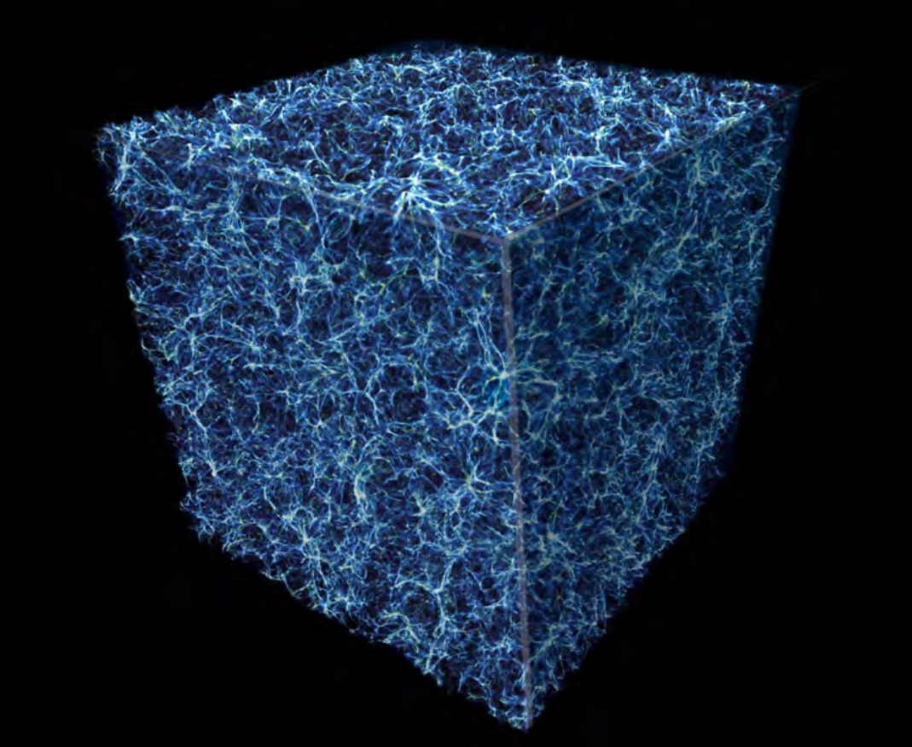
> **[Diagram Context - Textbook_NaturalScience_Gr8_Beyond-the-solar-system.pdf-0019-02.png]**
> This image is a three-dimensional computer simulation of the cosmic web, representing the large-scale structure of the universe. It features a cubic volume containing a complex, interconnected network of luminous filaments and dense nodes against a black background, with no text labels or axes present. For Physical Sciences learners, this visualises how gravity acts on dark matter and baryonic matter to form the vast, web-like distribution of galaxies and clusters across the observable universe.

*Note: You are encouraged to add your own notes to concept maps to expand and personalise your study material.*

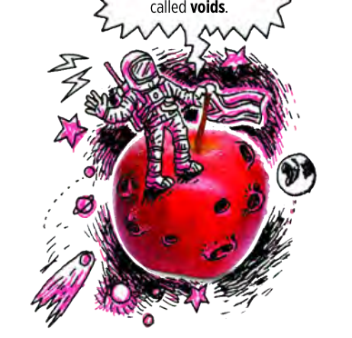
> **[Diagram Context - Textbook_NaturalScience_Gr8_Beyond-the-solar-system.pdf-0019-04.png]**
> This illustration depicts an astronaut standing on a cratered, apple-like celestial body, surrounded by stars, planets, and a comet within a dark, textured space background. The graphic includes the text label "called voids" and uses the imagery of craters to metaphorically represent the concept of cosmic voids in space. It serves as a visual analogy to help learners conceptualize the vast, empty regions of the universe that exist between large-scale structures like galaxy filaments.

> **[Diagram Context - Textbook_NaturalScience_Gr8_Beyond-the-solar-system.pdf-0019-06.png]**
> This cartoon depicts a large telescope focused on the Earth, featuring human figures observing the planet through the lens and via computer monitors. It illustrates the concept of remote sensing and Earth observation, highlighting how scientific technology and data analysis are used to monitor, study, and gather information about our planet's systems from a distance.

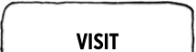
> **[Diagram Context - Textbook_NaturalScience_Gr8_Beyond-the-solar-system.pdf-0019-09.png]**
> This image is a simple text-based graphic containing the single word "VISIT" enclosed within a rounded rectangular border. It functions as a navigational call-to-action button rather than an educational diagram representing scientific concepts or curriculum-based content. Consequently, it provides no pedagogical value for high school learners regarding CAPS-aligned subject matter.

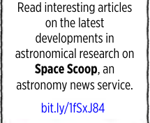
> **[Diagram Context - Textbook_NaturalScience_Gr8_Beyond-the-solar-system.pdf-0019-11.png]**
> This graphic is an informational text box containing the text "Space Scoop" and a shortened URL. It serves as a signpost to direct students toward an external astronomy news service for supplementary reading on current scientific developments. This resource supports the CAPS Physical Sciences curriculum by encouraging learners to engage with real-world applications and recent discoveries in the field of space science.

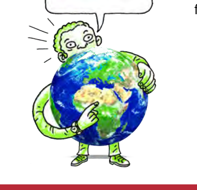
> **[Diagram Context - Textbook_NaturalScience_Gr8_Beyond-the-solar-system.pdf-0019-12.png]**
> This cartoon depicts a stylized human figure interacting with a globe, which serves as a visual metaphor for human impact on the environment. The image features a person pointing at the African continent, framed by an empty speech bubble that invites students to discuss human-environment interactions. Conceptually, this graphic introduces the CAPS Life Sciences and Geography themes of sustainability, human footprint, and the responsibility of individuals in managing global environmental resources.

> **[Diagram Context - Textbook_NaturalScience_Gr8_Looking-into-space.pdf-0019-00.png]**
> This photograph depicts a large optical telescope apparatus housed inside a dome observatory. The visible structures include a cylindrical steel truss framework, a prominent yellow mounting base with electronic instrument boxes, and angled support arms. Conceptually, this visual resource supports Grade 10-12 Physical Sciences and Geography learners studying optical instruments and astronomy by illustrating how professional-grade telescopes collect and focus light from celestial bodies to study the universe.

> **[Diagram Context - Textbook_NaturalScience_Gr8_Looking-into-space.pdf-0019-05.png]**
> This educational graphic is an illustrated concept diagram featuring a large telescope housing the planet Earth, viewed by scientists operating equipment and looking through an eyepiece. Visible elements include a massive green-toned optical telescope structure, a detailed representation of the Earth (showing Africa and Europe) filling the main lens aperture, human figures acting as scientists on ladders and at computer monitor workstations, and a speech bubble floating above. Conceptually, this diagram visually illustrates the sheer scale of planetary observation and scientific inquiry, helping learners contextualize Earth and space sciences by portraying the planet as an object of study examined through advanced instruments.

> **[Diagram Context - Textbook_NaturalScience_Gr8_Looking-into-space.pdf-0019-12.png]**
> This whimsical educational illustration depicts a carriage fashioned from a red apple, being pulled by two pink horses and driven by a man while a waving figure rides inside, with a blank speech bubble emerging from the top. The visual elements include a carriage body shaped like an apple, wheels, a driver holding reins, a passenger waving, a flag, motion lines indicating speed, and an empty thought or speech bubble. Conceptually, this creative cartoon is used to engage learners in imaginative writing, storytelling, or metaphor creation, encouraging them to construct a narrative or dialogue around the surreal scene.

> **[Diagram Context - Textbook_NaturalScience_Gr8_The-Solar-System.pdf-0019-01.png]**
> This graphic is a comparative table designed as a fill-in-the-blank exercise for learners studying astronomy. The table contains two main column headers, "Terrestrial Planets" and "Gas Giants," with rows contrasting properties such as composition ("mainly rocky" versus blank space for "gaseous"), surface nature, density, rotation speed, presence of moons and rings, atmosphere thickness, and temperature. Conceptually, this activity helps learners contrast the two distinct categories of planets in our solar system by systematically comparing their physical characteristics and planetary features.

> **[Diagram Context - Textbook_NaturalScience_Gr8_The-Solar-System.pdf-0019-03.png]**
> This graphic is a decorative border featuring repeating green curved shapes and arrows. There are no specific text labels, chemical symbols, or scientific variables visible. Conceptually, it serves purely as a page separator or aesthetic divider within educational materials rather than conveying specific curriculum content.

---

# The Universe: Stars, Galaxies, and Distances

> **[Diagram Context - Textbook_NaturalScience_Gr8_Beyond-the-solar-system.pdf-0020-00.png]**
> This diagram illustrates a cross-section of a biological membrane, specifically representing the arrangement of phospholipid molecules in a monolayer or the surface of a lipid bilayer. It features a series of repeating, hook-shaped symbols representing the hydrophilic phosphate heads oriented towards the aqueous environment above a shaded region representing the hydrophobic fatty acid tails. This visual serves to introduce the fluid mosaic model, helping learners understand the amphipathic nature of phospholipids and their structural role in forming the selective barrier of the cell membrane.

## 1. Measuring Cosmic Distances
In space, distances are so vast that standard units like kilometers are impractical. We use **light years** to measure these distances.

*   **Definition:** A light year is the distance that light travels in one year.
*   **Conversion:** $1 \text{ light year} \approx 10 \text{ trillion km}$ ($10 \times 10^{12} \text{ km}$).
*   **Example:** Our nearest star, Alpha Centauri, is located at a vast distance from Earth.

## 2. The Milky Way Galaxy
Our Solar System is located within the **Milky Way Galaxy**.

*   **Structure:** It is a **spiral-shaped** galaxy.
*   **Composition:** It contains billions of stars of various shapes and sizes.
*   **Appearance:** From Earth, it is seen as a hazy path across the night sky.
*   **Scale:** The observable universe is estimated to be $93 \text{ billion light years}$ across.

## 3. Stars and Our Sun
*   **The Sun:** Our Sun is just one star among billions in the Milky Way.
*   **Location:** The Sun is situated on the edge of the galaxy.

## Summary Table: Key Astronomical Concepts

| Concept | Description |
| :--- | :--- |
| **Light Year** | The distance light travels in one year ($\approx 10 \text{ trillion km}$). |
| **Solar System** | Located within the Milky Way galaxy. |
| **Milky Way** | A spiral-shaped galaxy containing billions of stars. |
| **Alpha Centauri** | The nearest star to our Solar System. |
| **Observable Universe** | Estimated to be $93 \times 10^9 \text{ light years}$ across. |

> **[Diagram Context - Textbook_NaturalScience_Gr8_Beyond-the-solar-system.pdf-0020-08.png]**
> This metaphorical illustration depicts a person playing a large key as if it were a musical instrument, accompanied by floating musical notes. The image serves as a visual analogy for the "lock and key" model of enzyme action, where the specific shape of an enzyme (the key) interacts with a substrate to produce a reaction or "output" (the music). It helps learners conceptualize the high specificity and functional interaction required for biological catalysts to facilitate biochemical processes.

> **[Diagram Context - Textbook_NaturalScience_Gr8_Looking-into-space.pdf-0020-02.png]**
> This photograph shows an astronomical observatory building with a domed roof and a tall vertical tower under a clear blue sky. There are no visible labels, text, or arrows present on the image. Conceptually, this visual supports CAPS Physical Sciences and Geography learners studying optical telescopes, space science, and South Africa's role in global astronomical research infrastructure.

> **[Diagram Context - Textbook_NaturalScience_Gr8_Looking-into-space.pdf-0020-06.png]**
> This photograph depicts a large optical telescope apparatus housed inside a dome, showcasing structural components with labels pointing to "giant mirror" and "supporting struts". Conceptually, it illustrates how large reflective telescopes use curved mirrors and rigid frameworks to gather and focus light from distant celestial objects for astronomical observation.

> **[Diagram Context - Textbook_NaturalScience_Gr8_Looking-into-space.pdf-0020-08.png]**
> This educational graphic features an illustrative cartoon of an Erlenmeyer flask containing a blue liquid and purple aquatic plant-like growth, topped with a cloud-like text box. The visible text labels are the heading "NEW WORDS" and the bullet point "SALT". Conceptually, this visual introduces foundational chemical vocabulary to learners by framing the scientific concept within an engaging, imaginative context.

> **[Diagram Context - Textbook_NaturalScience_Gr8_Looking-into-space.pdf-0020-09.png]**
> This educational graphic is an illustrated cartoon figure holding and pointing at a globe of the Earth, accompanied by a speech bubble. The visible text reads "VISIT The SALT website." and includes a shortened URL link "bit.ly/1fSW6CH". Conceptually, this graphic serves as an engaging prompt to direct CAPS learners toward external online resources, specifically the Southern African Large Telescope (SALT) digital platform, to supplement astronomy or earth science topics.

> **[Diagram Context - Textbook_NaturalScience_Gr8_Looking-into-space.pdf-0020-10.png]**
> This educational graphic features an illustrated cartoon scene depicting a hot-air balloon shaped like planet Earth carrying observers with telescopes, accompanied by a text box reading "VISIT The Southern African Large Telescope (video). bit.ly/17e0xFy". The visible elements include a globe balloon, clouds, the sun, birds, a basket with two figures using telescopes, and a URL link directing learners to external multimedia content. Conceptually, this resource engages CAPS learners by contextualising astronomy and optical observation tools within real-world South African scientific landmarks, connecting classroom theory to institutions like SALT.

> **[Diagram Context - Textbook_NaturalScience_Gr8_The-Solar-System.pdf-0020-04.png]**
> This illustrative graphic depicts a metal Slinky toy moving end-over-end down a flight of green stairs, with motion lines indicating its tumbling trajectory. There are no explicit text labels, chemical symbols, or numerical variables present in the visual. Conceptually, it provides a physical model demonstrating the continuous conversion and conservation of mechanical energy (potential and kinetic energy) and elastic potential energy as an object moves through a gravitational field.

---

# REVISION: Beyond the Solar System

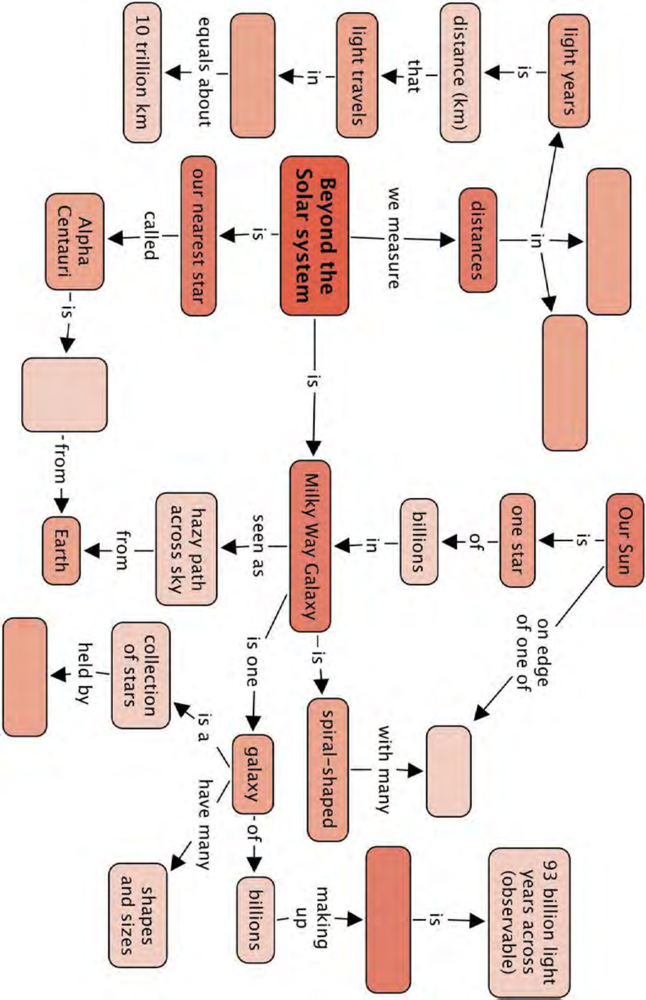
> **[Diagram Context - Textbook_NaturalScience_Gr8_Beyond-the-solar-system.pdf-0021-00.png]**
> This concept map illustrates the scale and structure of the universe, featuring nodes labeled with terms such as "light years," "Milky Way Galaxy," "Our Sun," "Alpha Centauri," and "Earth," connected by directional arrows and descriptive linking phrases. It provides a structural framework for Grade 9 Natural Sciences students to understand astronomical distances, the composition of our galaxy, and the relative positioning of celestial bodies within the cosmos.

### Exercises

1. **What is the name of our second closest star? How far away is it?** [2 marks]
   __________________________________________________________________
   __________________________________________________________________

2. **What is the name of our second closest easily visible star? Is it really a single star?** [2 marks]
   __________________________________________________________________
   __________________________________________________________________

3. **What is the definition of a light year?** [2 marks]
   __________________________________________________________________
   __________________________________________________________________

4. **What is a galaxy?** [3 marks]
   __________________________________________________________________
   __________________________________________________________________
   __________________________________________________________________

5. **Where is the Sun located within the Milky Way?** [2 marks]
   __________________________________________________________________
   __________________________________________________________________

6. **How many stars are in our Milky Way Galaxy?** [1 mark]
   __________________________________________________________________

7. **Name the 4 main types of galaxies.** [4 marks]
   __________________________________________________________________
   __________________________________________________________________
   __________________________________________________________________
   __________________________________________________________________

8. **What kind of galaxy is the Milky Way?** [2 marks]
   __________________________________________________________________
   __________________________________________________________________

> **[Diagram Context - Textbook_NaturalScience_Gr8_Looking-into-space.pdf-0021-00.png]**
> The graphic displays a piece of torn, parchment-style paper featuring the underlined uppercase text "VISIT" in black sans-serif font, alongside a faint vertical green border on the left edge. This is a text-based promotional or navigational element rather than a scientific diagram or curricular illustration. It does not convey specific CAPS subject concepts such as biological structures, chemical symbols, or physical laws.

> **[Diagram Context - Textbook_NaturalScience_Gr8_Looking-into-space.pdf-0021-01.png]**
> The image is a text prompt featuring the question "What is a radio telescope?" alongside a shortened URL link ("bit.ly/1a4LbTW"). This text-based prompt serves as a digital learning resource cue, directing learners to online educational content about radio astronomy and technological instruments used to detect radio waves from space. For a high school student studying Earth and Space Sciences within the curriculum, it introduces foundational concepts regarding how astronomers observe the universe beyond the visible light spectrum.

> **[Diagram Context - Textbook_NaturalScience_Gr8_Looking-into-space.pdf-0021-02.png]**
> This graphic features a cloud-shaped text box enclosing the underlined heading "NEW WORDS". The visual marker clearly indicates a vocabulary section or glossary feature within a CAPS-aligned textbook. Conceptually, it serves to highlight and introduce subject-specific terminology to help learners master scientific or academic vocabulary essential for the curriculum.

> **[Diagram Context - Textbook_NaturalScience_Gr8_Looking-into-space.pdf-0021-03.png]**
> This educational graphic is a bulleted list of key technological and astronomical terms enclosed in a bordered box. The visible text labels include "antenna", "receiver", "amplifier", and "SKA". Conceptually, this diagram introduces essential vocabulary related to radio astronomy and telecommunication systems, specifically highlighting components like the Square Kilometre Array (SKA) relevant to South African science curricula.

> **[Diagram Context - Textbook_NaturalScience_Gr8_Looking-into-space.pdf-0021-04.png]**
> The visual content is an apparatus diagram of a radio telescope or optical telescope design. Visible labels, indicated by red arrows, include "tracker", "payload", "structure", and "mirror". This diagram conveys conceptually how modern scientific instruments are engineered with specific supporting frameworks, optical reflecting surfaces, and tracking components to capture astronomical data for high school Physical Sciences and Earth and Space Sciences.

> **[Diagram Context - Textbook_NaturalScience_Gr8_Looking-into-space.pdf-0021-15.png]**
> The graphic is a cartoon illustration depicting a thief in a striped uniform sneaking away while carrying a framed portrait resembling the Mona Lisa. Motion lines surround the fleeing figure, who holds a large ornate picture frame containing a sketch of a woman with crossed arms. Conceptually, this visual serves as an engaging metaphor for processes involving theft, transfer, or plagiarism, helping students contextualize concepts of intellectual property or energy/matter conservation in physical sciences.

> **[Diagram Context - Textbook_NaturalScience_Gr8_Looking-into-space.pdf-0021-16.png]**
> This astronomical graphic displays a composite false-color image of a radio galaxy exhibiting prominent, symmetrical lobes of plasma extending outward from a central host galaxy against a star-filled background. The image features no explicit text labels or arrows, capturing only the high-energy emission and large-scale structure of active galactic nuclei. For FET Physical Sciences learners, it conceptually illustrates the powerful astrophysical phenomena associated with supermassive black holes, particle acceleration, and synchrotron radiation in the universe.

> **[Diagram Context - Textbook_NaturalScience_Gr8_The-Solar-System.pdf-0021-04.png]**
> This educational graphic features an illustrated cartoon scene depicting a hot air balloon shaped like planet Earth, carrying two tiny figures looking through telescopes into the sky, accompanied by clouds, birds, and a sun. Visible text includes the heading "VISIT", the instructional prompt "Solar System 101: NASA's 'Homework helper' can show you where to look to find out more.", and a web link "bit.ly/H6nbDD". Conceptually, the graphic serves as an engaging, introductory resource to encourage high school learners studying Earth and Space Sciences to explore planetary systems and astronomical concepts beyond the classroom.

> **[Diagram Context - Textbook_NaturalScience_Gr8_The-Solar-System.pdf-0021-05.png]**
> The provided graphic is entirely blank and contains no visual content, labels, or structures. As a result, no specific CAPS curriculum concepts, variables, or educational relationships can be identified or interpreted from this image.

> **[Diagram Context - Textbook_NaturalScience_Gr8_The-Solar-System.pdf-0021-06.png]**
> The graphic is a horizontal decorative border featuring a repeating pattern of green curved, ribbon-like shapes resembling abstract waves or scrolls against a pale green background. There are no explicit text labels, variables, biological structures, chemical symbols, or axis names present within the image. Conceptually, this visual element serves purely as a formatting divider or page accent rather than conveying specific curriculum content for high school learners.

---

### Planet Earth and Beyond: Galaxies and the Milky Way

#### Exercises

**9. Milky Way Galaxy Structure**
Draw an image of the Milky Way Galaxy as viewed from the top and as viewed from the side. Note the position of the Sun in both images. Include the labels: **spiral arm**, **bulge**, **disk**. [8 marks]

> **[Diagram Context - Textbook_NaturalScience_Gr8_Beyond-the-solar-system.pdf-0022-03.png]**
> This graphic depicts a system of interconnected gears of varying sizes, accompanied by a student figure and directional arrows indicating rotational movement. It illustrates the mechanical principles of gear trains, where the interaction between meshed gears determines the direction and speed of rotation within a mechanical system.

**10. Appearance of the Milky Way**
Why does it look as though the Milky Way is a splash of milk or a starry road across the sky? [2 marks]

**11. Groups of Galaxies**
What is a group of galaxies? [2 marks]

**12. The Local Group**
What is the name of the group of galaxies that the Milky Way is a member of? [1 mark]

**13. Clusters and Superclusters**
What are clusters of galaxies and superclusters of galaxies? [2 marks]

> **[Diagram Context - Textbook_NaturalScience_Gr8_Looking-into-space.pdf-0022-02.png]**
> This educational diagram illustrates a radio telescope system consisting of a large parabolic dish, a receiver, an amplifier, and a computer recorder. Red directional arrows show incoming parallel electromagnetic wave signals reflecting off the curved dish surface and converging onto the central focal receiver. Conceptually, it demonstrates how radio waves from space are collected, focused, amplified, and processed into data to help learners understand the application of wave reflection and astronomy instrumentation in the CAPS Physical Sciences curriculum.

> **[Diagram Context - Textbook_NaturalScience_Gr8_Looking-into-space.pdf-0022-04.png]**
> The image shows a photograph of radio telescope dishes, specifically representing elements of an array like the MeerKAT telescope situated in the Karoo region of South Africa. The visible structures include large parabolic white satellite dishes mounted on support bases with central feed horns held by tripods against a blue sky. Conceptually, this visual supports the Physical Sciences curriculum by demonstrating practical applications of electromagnetic waves, wave reflection, and radio astronomy in modern scientific research.

> **[Diagram Context - Textbook_NaturalScience_Gr8_Looking-into-space.pdf-0022-06.png]**
> This educational graphic depicts a conceptual illustration of a large telescope observing the planet Earth, featuring tiny human figures operating equipment and viewing monitors nearby alongside a blank speech bubble. The visual elements include a massive green-toned optical telescope mounted on a scaffold, a detailed rendering of the African and European continents on the Earth's surface, and computer monitoring stations. Conceptually, this illustration introduces high school learners to planetary observation, geographic mapping, and the scale of Earth science or astronomy investigations within the CAPS curriculum.

> **[Diagram Context - Textbook_NaturalScience_Gr8_Looking-into-space.pdf-0022-09.png]**
> This educational illustration depicts an animated earthworm emerging from and tunneling through a bright red apple, set against an outdoor landscape with grass, a sun, and birds in the sky, accompanied by an empty speech bubble. The graphic prominently features the segmented pink body of the earthworm and a whole apple, with no explicit text labels or mathematical symbols present. Conceptually, this illustration introduces CAPS Life Sciences learners to animal-plant interactions and the ecological role of soil organisms like earthworms in ecosystems, demonstrating feeding habits and decomposition processes.

> **[Diagram Context - Textbook_NaturalScience_Gr8_The-Solar-System.pdf-0022-02.png]**
> This educational graphic is an astronomical photograph of the planet Mercury showing its heavily cratered, rocky surface against the dark void of space. The image displays no visible text labels, axes, or arrows, capturing only the natural terrain and crescent illumination of the terrestrial body. Conceptually, this visual supports CAPS Earth and Space Sciences by illustrating the geological features and appearance of the innermost rocky planet in our solar system.

> **[Diagram Context - Textbook_NaturalScience_Gr8_The-Solar-System.pdf-0022-07.png]**
> This cartoon illustration depicts a stylized thief wearing striped clothing crouching down while stealthily carrying away a framed artwork resembling the Mona Lisa. The visible elements include a costumed figure in motion lines, an ornate frame holding a portrait of a person with crossed arms, and an empty speech bubble above the figure. Conceptually, this visual serves as an engaging prompt for Creative Arts or Life Orientation lessons to discuss themes of copyright, intellectual property theft, or the legal and ethical implications of art forgery and plagiarism.

> **[Diagram Context - Textbook_NaturalScience_Gr8_The-Solar-System.pdf-0022-10.png]**
> This composite astronomical graphic features two views of the planet Venus, showing its thick, swirling cloud cover in the upper sphere and its heavily cratered, solid surface topography in the foreground sphere. There are no visible labels, text, or arrows present in this image. Conceptually, this visual aids high school learners in understanding planetary structure by contrasting the obscured, reflective atmosphere of Venus with its actual rocky surface revealed through radar imaging.

---

### Chapter 2: Beyond the Solar System

#### Assessment Questions

**14. Size of the Observable Universe**
*   **Question:** What is the size of the observable Universe? [1 mark]

**15. Bonus Question: Large-Scale Structure**
*   **Question:** On the largest scales, what does the Universe look like? Name the two types of structure which make up the Universe on the largest scales. [2 marks]

***

**Assessment Totals**
*   **Total:** [34 marks]
*   **Total with extension:** [36 marks]

> **[Diagram Context - Textbook_NaturalScience_Gr8_Beyond-the-solar-system.pdf-0023-02.png]**
> The provided image is a blank white frame containing no visual content, labels, or educational data. Consequently, it cannot be used to illustrate any concepts within the South African CAPS curriculum.

> **[Diagram Context - Textbook_NaturalScience_Gr8_Looking-into-space.pdf-0023-02.png]**
> This aerial photograph shows an array of multiple white radio telescope dishes, specifically the MeerKAT telescope array located in the Karoo region of South Africa. The image displays several parabolic reflector dishes positioned across an arid landscape connected by access roads, with no explicit text labels or arrows visible. Conceptually, it illustrates a large radio interferometer used in astronomy to detect and study celestial radio waves, highlighting South Africa's prominent role in global scientific research and technological advancement under the CAPS Physical Sciences curriculum.

> **[Diagram Context - Textbook_NaturalScience_Gr8_Looking-into-space.pdf-0023-05.png]**
> This conceptual illustration features a stylized portrait labeled "MR. NEWTON" with an apple-shaped head, beneath a thought bubble and a network of interconnected pink apples linked by dashed lines and directional arrows. The graphic visually conveys Newton's Universal Law of Gravitation, demonstrating to Physical Sciences learners how every particle or mass in the universe exerts an attractive gravitational force on every other mass, governed by the inverse-square relationship.

> **[Diagram Context - Textbook_NaturalScience_Gr8_Looking-into-space.pdf-0023-10.png]**
> This geographic distribution map of the African continent displays multiple white circular markers indicating fossil or archaeological sites, with a highlighted yellow region in the southern tip representing South Africa. The map visually conveys the geographic distribution and concentration of significant fossil discoveries across Africa, highlighting the rich paleontological heritage of Southern Africa for high school history and geography learners studying human origins and evolution.

> **[Diagram Context - Textbook_NaturalScience_Gr8_Looking-into-space.pdf-0023-11.png]**
> This educational cartoon graphic depicts a green-skinned human figure embracing and pointing directly at the continent of Africa on a globe of the Earth. The visual elements include an illustrated character, a detailed terrestrial globe focusing on the African continent, a pointing index finger, a watch on the wrist, motion lines, and an empty speech bubble above. Conceptually, this diagram visually engages CAPS Geography students in locational studies and spatial awareness, prompting discussion about Africa's position, scale, and geographic features within the global context.

> **[Diagram Context - Textbook_NaturalScience_Gr8_Looking-into-space.pdf-0023-14.png]**
> This illustration depicts a whimsical outer space scene featuring an astronaut standing on a cratered, red sphere resembling a planet, holding a flag, with stars, lightning bolts, comets, and a planetoid in the background and a blank speech bubble above. The graphic humorously juxtaposes a terrestrial fruit (an apple modified to look like a planet) with cosmic elements. Conceptually, it serves as a creative prompt to stimulate imagination and creative writing in high school English or Life Orientation learners by combining familiar objects with surreal interstellar themes.

> **[Diagram Context - Textbook_NaturalScience_Gr8_The-Solar-System.pdf-0023-02.png]**
> This photograph, famously known as the "Pale Blue Dot," is a deep-space photograph of Earth taken by the Voyager 1 space probe from a record distance of about 6 billion kilometers. The image displays a vast, dark field of space crossed by faint bands of scattered sunlight, within which Earth appears as a tiny, barely discernible speck of light (a pale blue pixel) caught in a sunbeam. For high school Physical Sciences and Geography learners studying the solar system and astronomy, this visual powerfully conveys the immense scale of the universe, putting Earth's planetary scale and the vast distances between celestial bodies into perspective.

> **[Diagram Context - Textbook_NaturalScience_Gr8_The-Solar-System.pdf-0023-04.png]**
> This conceptual illustration depicts an astronaut standing on a cratered red apple treated as a planet within a stylized space setting containing stars, planets, lightning bolts, and a speech bubble. The visual elements include an astronaut in a spacesuit planting a flag into the surface of the red apple, surrounded by cosmic iconography. Conceptually, this whimsical graphic serves as a creative prompt to engage learners in physics or space science by contrasting everyday objects with cosmic scales, prompting discussions about gravity, planetary exploration, or creative scientific writing.

> **[Diagram Context - Textbook_NaturalScience_Gr8_The-Solar-System.pdf-0023-08.png]**
> The graphic depicts an educational illustration centered around a globe showing Africa and the Atlantic Ocean, with a figure standing on top holding a blank wooden signpost. Surrounding the Earth are several large, curved green arrows forming a continuous circular flow, accompanied by small droplet shapes and motion marks. Conceptually, this diagram visually conveys the cyclical nature of environmental management, recycling, and global sustainability for CAPS environmental geography and science learners.

> **[Diagram Context - Textbook_NaturalScience_Gr8_The-Solar-System.pdf-0023-09.png]**
> This educational graphic is a full-disk photographic image of the planet Mars. It displays the characteristic rusty-orange, iron oxide-rich surface terrain, darker volcanic regions, and white polar ice caps and atmospheric clouds against a black background. For a CAPS Grade 7 or 10 Natural Sciences learner, this visual conveys the appearance and key surface features of a terrestrial planet within our solar system, supporting studies on planetary geology and space science.

> **[Diagram Context - Textbook_NaturalScience_Gr8_The-Solar-System.pdf-0023-13.png]**
> This educational illustration depicts an apple-shaped carriage speeding downhill, pulled by two pink horses and driven by a man, with a woman waving from inside and a speech bubble referencing Mount Everest. Visible elements include motion lines, smoke trails, wheels, a flag, and a thought bubble containing text. Conceptually, this whimsical cartoon illustrates physical motion and acceleration down a slope, often used in introductory physics to engage learners with concepts of speed, gravity, and reference frames.

---

# Chapter 12: Beyond the Solar System

## Chapter Overview
**Duration:** 3 weeks

This chapter introduces astronomy beyond our solar system, focusing on galaxies and the structure of the Universe.

### Core Concepts
*   **Stars:** The Sun is our closest star. If it were further away, it would appear as a point of light in the night sky, similar to other stars.
*   **Galaxies:** Stars are arranged in galaxies, held together by the force of gravity. Our own galaxy is the **Milky Way Galaxy**.
*   **The Universe:** Contains billions of galaxies in various shapes and sizes.
*   **Scale and Measurement:** Distances between stars and galaxies are so vast that standard units like kilometres are insufficient.
*   **Large-scale Structure:** On the largest scale, matter in the Universe is arranged like a bath sponge, consisting of thin filamentary structures with large voids in between.

---

## 12.1 The Milky Way Galaxy (2.5 hours)

| Tasks | Skills | Recommendation |
| :--- | :--- | :--- |
| Activity: Draw the Milky Way | observing, identifying, drawing | CAPS suggested |
| Activity: Make the Milky Way | observing, identifying, (modelling) | CAPS suggested |

---

## 12.3 Light years, light hours and light minutes (3 hours)

| Tasks | Skills | Recommendation |
| :--- | :--- | :--- |
| Activity: Travelling fast | calculating | CAPS suggested |
| Activity: Scale of the solar system | calculating, reading tables, analysing | CAPS suggested |
| Activity: Our closest stars | reading tables, analysing | CAPS suggested |

---

## 12.4 What is beyond the Milky Way Galaxy? (2.5 hours)

| Tasks | Skills | Recommendation |
| :--- | :--- | :--- |
| Activity: Comparing galaxies | observing, identifying, describing, ranking | Optional |

### Extension Activities
*   Activity: Wine glass gravitational lens
*   Activity: The expanding Universe

---

## Key Questions
*   How far is our second closest star, Proxima Centauri?

---

## Instructional Resources
*   **Interactive Tool:** 'Scale of the Universe' (available at: `bit.ly/1iaQkZV`). This tool allows learners to zoom from the human-sized scale out to the edge of the Universe and in to the microscopic level.

> **[Diagram Context - Textbook_NaturalScience_Gr8_Beyond-the-solar-system.pdf-0024-05.png]**
> This graphic depicts a biological illustration of an ant leading a trail of smaller ants along a defined path. It visually represents the concept of pheromone-based communication and collective foraging behavior, illustrating how social insects use chemical signals to maintain organized movement and resource exploitation within an ecosystem.

> **[Diagram Context - Textbook_NaturalScience_Gr8_Looking-into-space.pdf-0024-03.png]**
> This educational graphic shows a photograph of a large radio telescope dish, specifically representing a MeerKAT antenna located in the arid Karoo region of South Africa. The image features a white parabolic reflector dish mounted on a robust structural pedestal against a dramatic sky with clouds and flat-topped hills. Conceptually, it introduces learners to advanced scientific infrastructure and radio astronomy in South Africa, illustrating how electromagnetic waves from deep space are collected for astrophysical research.

> **[Diagram Context - Textbook_NaturalScience_Gr8_Looking-into-space.pdf-0024-04.png]**
> This educational graphic is a cartoon illustration depicting a carriage shaped like a red apple being pulled at high speed by two pink horses, driven by a man in a suit with a woman waving from inside and a blank thought bubble overhead. The visible elements include a red apple-car, two pink horses with reins, a driver holding reins, a waving passenger, motion lines indicating speed, a flag on a pole, and an empty thought bubble. Conceptually, this whimsical cartoon metaphorically introduces Grade 10-12 CAPS Physics concepts relating to motion, such as speed, acceleration, and force, or serves as a creative prompt to explore Newton's laws of motion regarding applied forces and friction.

> **[Diagram Context - Textbook_NaturalScience_Gr8_Looking-into-space.pdf-0024-12.png]**
> This educational graphic illustrates a mechanical wave apparatus, specifically a flexible coil (slinky) interacting with a set of green stairs. Visible elements include the coiled spring in various states of compression and extension, motion lines indicating movement, and a flight of green steps. Conceptually, this diagram helps high school learners visualize wave motion, specifically demonstrating how longitudinal and transverse pulses or waves propagate through a medium via continuous transformations between potential and kinetic energy.

> **[Diagram Context - Textbook_NaturalScience_Gr8_The-Solar-System.pdf-0024-02.png]**
> This image is a digital illustration depicting a robotic rover exploring a rocky, barren, reddish-orange planetary landscape. Visible features include a robotic arm equipped with sampling tools, high-mounted camera masts, and rugged wheels designed for traversing uneven terrain. For a CAPS-aligned curriculum, this graphic serves as a contextual stimulus for Physical Sciences and Natural Sciences, illustrating the application of mechanics, energy systems, remote sensing, and space science in extraterrestrial exploration.

> **[Diagram Context - Textbook_NaturalScience_Gr8_The-Solar-System.pdf-0024-03.png]**
> The image is a colour photograph taken by the Curiosity rover showing a panoramic view of the rocky Martian surface with part of the rover visible in the foreground. Visible elements include a rocky landscape under a reddish sky, scattered boulders, and components of the rover's deck and mast. This visual conveys the real-world application of space exploration and planetary science, demonstrating how technological probes gather empirical data about extraterrestrial environments.

> **[Diagram Context - Textbook_NaturalScience_Gr8_The-Solar-System.pdf-0024-04.png]**
> This educational cartoon graphic depicts a large telescope focused on Earth, accompanied by a speech bubble containing the text "VISIT: Watch the first 12 month's of Curiosity's explorations in 2 minutes. bit.ly/1b7mAKH". Visible labels include the heading "VISIT" and a shortened URL link, alongside human figures operating scientific equipment. Conceptually, this resource engages CAPS learners by linking Earth science and space exploration with digital multimedia resources to demonstrate real-world planetary observation.

> **[Diagram Context - Textbook_NaturalScience_Gr8_The-Solar-System.pdf-0024-05.png]**
> This educational cartoon features a green-skinned humanoid character hugging the planet Earth while pointing towards it with one hand, accompanied by a speech bubble. The visible text reads "VISIT", "NASA's curiosity finds water in Martian soil in 2013.", and a web link "bit.ly/HasUIX". Conceptually, this graphic serves as an engaging stimulus to spark learner interest in space science, planetary exploration, and the search for extraterrestrial water as part of CAPS curriculum discussions on the solar system and Earth's place in the universe.

---

### Inquiry Questions
* What is a galaxy and how many different types of galaxy are there?
* Where is our Sun located within our own Milky Way Galaxy?
* How do galaxies arrange themselves on the largest scales in the Universe?
* How large is the observable Universe and how many galaxies does it contain?

---

### 12.1 The Milky Way Galaxy

The Milky Way is our home galaxy, containing approximately 200 billion stars. 

#### Key Features of the Milky Way
* **Central Bulge:** The dense, spherical center of the galaxy.
* **Flat Disk:** The main body of the galaxy where most stars reside.
* **Spiral Arms:** The curved structures extending from the center.

#### The Sun's Location
The Sun is not located at the center of the galaxy. It is positioned on the edge of the galaxy, approximately halfway out from the center, situated on a minor arm known as the **Orion Arm**.

#### Understanding the Milky Way in the Night Sky
* Every individual star visible to the naked eye at night is part of our Milky Way.
* Because the Milky Way is flat, looking at the "band" of light across the sky is equivalent to looking along the plane of the disk toward the center.
* The high density of stars in this direction makes them indistinguishable to the naked eye, appearing as a continuous white band of light.

#### Milky Way Spiral Arms Reference Table

| Common name | Alternative name |
| :--- | :--- |
| Norma Arm | 3 kiloparsec Arm |
| Scutum-Crux Arm | Centaurus Arm |
| Sagittarius Arm | Sagittarius-Carina Arm |
| Orion Arm | Local Arm |
| Perseus Arm | – |
| Cygnus Arm | Outer Arm |

#### Mathematical Note
The diameter of the Milky Way can be expressed using scientific notation as:
$$9.5 \times 10^{17} \text{ km}$$

---

### Activities

#### ACTIVITY: Draw the Milky Way (LB page 258)
* **Aim:** To reinforce the structure of the Milky Way as a spiral galaxy with five major spiral arms and several smaller arms.
* **Instruction:** Learners should illustrate the galaxy, ensuring the Sun is placed halfway out along the Orion Arm.

#### ACTIVITY: Make the Milky Way (LB page 258)
* **Aim:** To construct a physical model of the Milky Way.
* **Instruction:** Learners are encouraged to source creative materials (such as cardboard or cotton wool balls) to represent the structural components of the galaxy.

> **[Diagram Context - Textbook_NaturalScience_Gr8_Looking-into-space.pdf-0025-09.png]**
> This image is entirely blank and contains no visual content, labels, or educational diagrams to analyze.

> **[Diagram Context - Textbook_NaturalScience_Gr8_Looking-into-space.pdf-0025-12.png]**
> This educational graphic is an illustration depicting a Viking longship moving through water, powered by rowers and a sail shaped like a piece of lined notebook paper. Visible elements include wavy horizontal lines representing wind blowing from the left, a crew of horned figures rowing with oars, turbulent water at the bow and stern, and speech bubble outlines above. Conceptually, this diagram serves as an engaging visual metaphor to introduce concepts of forces, vector addition, or wind resistance in physical sciences by combining traditional propulsion with a writing surface.

> **[Diagram Context - Textbook_NaturalScience_Gr8_Looking-into-space.pdf-0025-13.png]**
> This decorative graphic consists of a continuous green border pattern featuring stylized interlocking ribbon-like shapes or arrows. It does not contain specific scientific labels, variables, or text elements. Functionally, it serves as a thematic page divider or border for educational materials related to life sciences or other CAPS subjects.

> **[Diagram Context - Textbook_NaturalScience_Gr8_The-Solar-System.pdf-0025-01.png]**
> This astronomical image displays the planet Jupiter, featuring its characteristic banded cloud structure of belts and zones alongside vibrant auroral displays glowing in blue at the polar regions. Visible features include atmospheric swirling patterns, storm systems like the Great Red Spot, and ultraviolet auroral rings produced by charged particles interacting with the planet's magnetic field. Conceptually, this visual supports Grade 10-12 Physical Sciences and Geography learners studying the solar system, planetary atmospheres, and magnetospheres by demonstrating how multi-spectral imaging reveals planetary magnetic and meteorological phenomena.

> **[Diagram Context - Textbook_NaturalScience_Gr8_The-Solar-System.pdf-0025-02.png]**
> This educational resource is a text box graphic featuring a call to action with the underlined heading "VISIT", followed by the text "Saturn close-up (video)." and a short URL link "bit.ly/15XvvyG". It serves as a digital reference guide directing students to multimedia content about the planet Saturn. Conceptually, this resource supports CAPS Physical Sciences and Geography learners by extending textbook learning through visual exploration of our solar system's gas giants.

> **[Diagram Context - Textbook_NaturalScience_Gr8_The-Solar-System.pdf-0025-03.png]**
> This environmental geography graphic depicts an illustrative conceptual diagram featuring a hot air balloon whose envelope is shaped like planet Earth. The visual elements include a globe envelope, a basket carrying two figures with telescopes looking outward, a burner flame beneath the globe, a radiant sun, clouds, birds, and an empty text banner above. Conceptually, this diagram illustrates environmental awareness, global observation, or planetary stewardship, prompting learners to consider Earth systems, sustainability, and human responsibility toward the environment in CAPS Geography and Natural Sciences.

> **[Diagram Context - Textbook_NaturalScience_Gr8_The-Solar-System.pdf-0025-06.png]**
> This close-up astronomical image displays the complex ring system of the planet Saturn against the backdrop of space, showing numerous concentric icy ringlets and distinct gaps. There are no visible text labels, arrows, or coordinates on this image. Conceptually, it illustrates the composition and structure of planetary rings in our solar system, supporting FET Physical Sciences (Earth and Space Sciences) learning objectives regarding planetary systems and gravitational forces.

---

### Activity: Modeling the Milky Way Galaxy

This activity provides a three-dimensional representation of the Milky Way, focusing on its structure: the central bulge and the disk containing the spiral arms.

#### Required Materials
*   Cotton balls or pillow stuffing
*   Glue
*   String
*   Pencil
*   Glitter (Red, Blue, Gold, and Silver)
*   Star stickers

#### Construction Steps
1.  **Create the Bulge:** Build a dome of cotton balls (approximately $8\text{ cm}$ across and $4\text{ cm}$ high) in the centre of a piece of cardboard. Repeat this on the opposite side of the board.
2.  **Form the Spiral Arms:** Pull outer cotton balls into six distinct spirals extending from the central bulge. These represent the five major spiral arms and the minor spiral arm where our Sun is located.
3.  **Represent Star Distribution:**
    *   **Hot, newly forming stars:** Apply glue to the spiral arms and sprinkle with blue and silver glitter.
    *   **Cooler, older stars:** Apply glue to the central cotton ball domes and sprinkle with gold and red glitter.
4.  **Locate the Sun:** Mark a position $8\text{ cm}$ from the centre of one spiral arm and place a star sticker there.
5.  **Display:** Make a hole in the centre of the model and thread it with string to hang it.

> **[Diagram Context - Textbook_NaturalScience_Gr8_Looking-into-space.pdf-0026-03.png]**
> This educational graphic depicts a space satellite orbiting above Earth, featuring prominent solar panels and mounted scientific instruments such as telescope tubes and satellite dishes. The visual elements include solar panels catching sunlight and multiple cylindrical optical sensor arrays against the backdrop of the Earth's atmosphere and curvature. Conceptually, this diagram illustrates how satellite technology utilizes space-based platforms for Earth observation, communication, and astronomical research within the Grade 10-12 Physical Sciences and Geography curricula.

---

### 12.2 Our Nearest Star

This section introduces the concept of vast distances between stars. 

#### Scientific Notation
Because astronomical distances involve extremely large numbers, scientific notation is used to simplify calculations and representation. While this is a Grade 9 Mathematics concept, it is essential for understanding the scale of the universe in this module.

**Key Concept:**
Scientific notation expresses a number in the form:
$$a \times 10^n$$
Where:
*   $1 \le a < 10$
*   $n$ is an integer representing the power of $10$.

*Note: When using calculators for astronomical calculations, results are frequently displayed in this format.*

> **[Diagram Context - Textbook_NaturalScience_Gr8_Looking-into-space.pdf-0026-06.png]**
> This educational graphic is a photograph of the Hubble Space Telescope in orbit above Earth. The image shows the cylindrical optical telescope assembly wrapped in reflective foil insulation, fitted with extended solar panels and protruding antennae against the dark void of space with the Earth's horizon visible below. Conceptually, it illustrates the application of physics and optical technology in space science, demonstrating how space-based telescopes avoid atmospheric distortion to observe distant celestial bodies.

> **[Diagram Context - Textbook_NaturalScience_Gr8_Looking-into-space.pdf-0026-07.png]**
> This educational graphic features an illustrative cartoon showing a hot-air balloon shaped like the planet Earth floating above clouds with a basket containing figures using telescopes. Visible text includes the heading "VISIT" followed by online resource links: "bit.ly/1873WQd", "bit.ly/1abWliG", and "bit.ly/1deIJLS" referring to the Hubble Space Telescope and its images. The diagram conceptually directs senior phase or FET learners to external digital resources and videos to explore space science and astronomical imaging beyond the Earth's atmosphere.

> **[Diagram Context - Textbook_NaturalScience_Gr8_Looking-into-space.pdf-0026-08.png]**
> This educational infographic features a cartoon portrait labeled "MR. NEWTON" depicted as a red apple personified with historical hair and clothing, surrounded by a constellation of smaller apples connected by dashed lines and directional arrows, beneath a thought bubble containing the text "DID YOU KNOW? The Hubble Space Telescope is named after Edward Hubble...". Visible labels and text include "DID YOU KNOW?" and "MR. NEWTON", alongside visual elements like dashed interconnecting lines and rotational arrows around the surrounding apples. Conceptually, the graphic uses a humorous historical metaphor linking Sir Isaac Newton to modern cosmology to introduce high school learners to the expansion of the universe and the discoveries of Edward Hubble.

> **[Diagram Context - Textbook_NaturalScience_Gr8_The-Solar-System.pdf-0026-01.png]**
> This space-based image shows the planet Uranus with its faint, concentric ring system clearly visible against a dark background. The graphic displays the solid cyan-blue disc of the gas giant along with its arched ring arcs passing above and below the planetary body. For CAPS Grade 10 Physical Sciences learners studying the Earth and Beyond, this conveys the appearance and structure of the outer planets in our solar system, illustrating that ring systems are not exclusive to Saturn.

> **[Diagram Context - Textbook_NaturalScience_Gr8_The-Solar-System.pdf-0026-04.png]**
> This educational graphic features an illustrative cartoon graphic depicting planet Earth with a smiling figure standing on top holding a sign and surrounded by a ring of directional green arrows. Visible text on the banner includes "VISIT", "Take a virtual ride with Voyager 1 and 2 past Jupiter, Saturn, Uranus, and Neptune.", and a URL link "bit.ly/1azPLVm". Conceptually, this graphic serves as an interactive enrichment activity that encourages learners to explore space science and planetary systems by engaging with a virtual simulation of the Voyager missions.

> **[Diagram Context - Textbook_NaturalScience_Gr8_The-Solar-System.pdf-0026-07.png]**
> This graphic is a full-color astronomical photograph of the planet Neptune against a dark space background, showing no visible labels, arrows, or text. It displays Neptune's characteristic vibrant blue coloration and faint atmospheric banding with bright cloud features. For a high school student studying Earth and Space Sciences within the CAPS curriculum, this visual conveys the appearance and atmospheric features of the outermost gas giant in our solar system.

---

# 12.3 Light Years, Light Hours, and Light Minutes

## Core Concepts
In astronomy, distances between stars (interstellar) and planets (interplanetary) are so vast that standard units like metres ($m$) or kilometres ($km$) are impractical. To measure these, we use units based on the distance light travels in a specific amount of time.

**Important Misconception:** Although these units contain words like "year," "hour," or "minute," they are **units of distance**, not time.

### The Fundamental Formula
To calculate these distances, we use the relationship between speed, distance, and time:

$$\text{Speed} = \frac{\text{Distance}}{\text{Time}}$$

Rearranging this to solve for distance:

$$\text{Distance} = \text{Speed} \times \text{Time}$$

*   **Speed of light:** Approximately $300\,000$ kilometres per second ($km/s$).
*   **Light minute:** The distance light travels in one minute. Because a minute is shorter than an hour, a light minute is a shorter distance than a light hour.

---

## Activity: Travelling Fast
The following table compares the time taken to travel the distance between Cape Town and Durban ($1\,753\ km$) using various modes of transport.

| Mode of transport | Speed ($km/h$) | Distance ($km$) | Time taken |
| :--- | :--- | :--- | :--- |
| Cheetah | $120$ | $1753$ | $14.6$ hours |
| Peregrine falcon | $389$ | $1753$ | $4.5$ hours |
| High speed train | $581$ | $1753$ | $3.0$ hours |
| NASA's scramjet | $7000$ | $1753$ | $15$ minutes |
| International space station | $27744$ | $1753$ | $3.8$ minutes |
| Light | $1\,079\,252\,850$ | $1753$ | $0.006$ seconds |

---

## Activity: Scale of the Solar System
When working with astronomical scales, learners may encounter advanced questions regarding light-time.

**Example:**
1. $8.32$ light minutes (A measure of distance).
2. $8.32$ minutes (A measure of time).

> **[Diagram Context - Textbook_NaturalScience_Gr8_Looking-into-space.pdf-0027-00.png]**
> This anatomical and behavioural illustration depicts a green caterpillar feeding on a leafy plant, with a metal coiled spring superimposed over its body. Visible elements include green leaves, the caterpillar's segmented body with circular markings, legs, and a smiling head, alongside the overlapping spring and a partial green capital letter "A" on the right. For a CAPS Life Sciences student, this analogy visually demonstrates invertebrate locomotion and hydrostatic skeletons, linking how the muscular contractions and skeletal support of segmented worms or insect larvae enable crawling and interaction with their environment.

> **[Diagram Context - Textbook_NaturalScience_Gr8_Looking-into-space.pdf-0027-11.png]**
> The graphic is a decorative border featuring a repeating green wave pattern. It consists of stylized, undulating lines forming a continuous horizontal band. Conceptually, it serves as a visual divider or aesthetic page element rather than an instructional diagram of a CAPS curriculum topic.

> **[Diagram Context - Textbook_NaturalScience_Gr8_Looking-into-space.pdf-0027-12.png]**
> This educational graphic consists of a text label styled like a torn piece of paper with the underlined word "VISIT" printed centrally in bold sans-serif capital letters. It features no additional chemical symbols, axes, or biological structures, serving purely as a heading or directional signpost. Conceptually, it functions as a pedagogical cueing device in learning materials to direct students toward supplementary online resources, interactive simulations, or external content related to the CAPS curriculum topic.

> **[Diagram Context - Textbook_NaturalScience_Gr8_Looking-into-space.pdf-0027-14.png]**
> The image is a corporate logo displaying the text "SIYAVULA" in bold, uppercase letters alongside the tagline "TECHNOLOGY-POWERED LEARNING" in smaller uppercase text, positioned beneath a stylized circular graphic containing concentric segmented rings. There are no variable names, chemical symbols, biological structures, or instructional labels present in the graphic. It serves as an institutional brand identifier for the open-access educational textbook provider commonly used in the South African CAPS curriculum.

> **[Diagram Context - Textbook_NaturalScience_Gr8_Looking-into-space.pdf-0027-20.png]**
> This illustrative conceptual graphic shows a large telescope observing the planet Earth, with human figures operating the instrument and monitoring data at a console. Visible elements include a massive optical telescope apparatus, a detailed spherical projection of the Earth centered on Africa and Europe, observation ladders, and a computer console with a display screen. Conceptually, this diagram visually introduces high school learners to planetary observation, scale, and the tools used in Earth and space sciences to study our planet from a macro perspective.

> **[Diagram Context - Textbook_NaturalScience_Gr8_The-Solar-System.pdf-0027-00.png]**
> The graphic illustrates an electromagnetic apparatus featuring a coiled wire connected to a DC power source. Visible elements include a cylindrical battery labeled with positive (+) and negative (-) terminals, a coiled spring-like conductor attached via clips, curved magnetic field lines with directional arrows, and scattered metal fasteners like a nut, pin, and bolt near the top. Conceptually, this demonstrates how an electric current flowing through a solenoid creates a surrounding magnetic field capable of exerting magnetic force on ferromagnetic objects.

> **[Diagram Context - Textbook_NaturalScience_Gr8_The-Solar-System.pdf-0027-09.png]**
> This graphic is a decorative border featuring a repeating pattern of stylized green arrows or ribbon-like shapes on a light background. There are no explicit scientific labels, variables, or biological structures present. Functionally, it serves purely as a visual divider or aesthetic element rather than conveying core CAPS curriculum subject matter.

> **[Diagram Context - Textbook_NaturalScience_Gr8_The-Solar-System.pdf-0027-10.png]**
> This educational graphic is an anatomical and mechanical analogy featuring a caterpillar feeding on a leaf, with its segmented body metaphorically represented by a coiled spring toy. The illustration includes visible features such as green leaves, segmented caterpillar body sections, legs, a smiling cartoon head biting a leaf, and a metallic Slinky-style spring overlaying the body. Conceptually, this diagram helps Grade 10-12 Life Sciences learners visualize animal locomotion and muscular-skeletal coordination by comparing the rhythmic contraction and extension of an invertebrate's segmented hydrostatic or muscular body to the compression and relaxation of a mechanical spring.

> **[Diagram Context - Textbook_NaturalScience_Gr8_The-Solar-System.pdf-0027-18.png]**
> The graphic is a decorative border featuring a repeating pattern of stylized green arrows on a pale background. The visual consists solely of multiple curved arrow shapes aligned horizontally across the image. Conceptually, this border element is purely decorative and does not convey specific biological, chemical, or physical curriculum content.

---

### Activity: Our Closest Stars
This activity helps learners understand the scale of stellar distances. While distances within our solar system are measured in light minutes or hours, distances to stars are measured in **light years**.

**Key Concepts:**
1. **Proxima Centauri:** The closest star to our Sun.
2. **Sirius:** Located $8.58$ light years away.
3. **Barnard's Star:** Light takes $5.96$ years to reach Earth from this star.
4. **Definition of a Light Year:** If a star is $8.58$ light years away, it means that light takes $8.58$ years to travel from that star to reach us on Earth.

---

### 12.4 What is beyond the Milky Way Galaxy?
Our Universe contains billions of galaxies of various shapes and sizes. Galaxies are not randomly scattered; they are arranged into groups and clusters, which are further organized into large-scale structures known as **voids** and **filaments**.

#### Types of Galaxies
While learners are not required to memorize the names of all shapes, they must understand that galaxies have different structures.

| Galaxy Type | Characteristics |
| :--- | :--- |
| **Spiral** | Features a central bulge and a flat disk with spiral arms. |
| **Barred Spiral** | Spiral arms start at the ends of a bright straight bar that crosses the centre. |
| **Elliptical** | Smooth, shaped like giant rugby balls; no spiral arms; contain mostly old stars with little gas and dust. |
| **Lenticular** | A transition shape between spiral and elliptical; disk-shaped but lacks defined arms. |
| **Irregular** | Do not fit into spiral or elliptical categories; often the result of two or more galaxies colliding. |

---

### Classroom Enrichment: Galaxy Zoo
The **Galaxy Zoo** project is a citizen science initiative that allows learners to participate in real scientific research. 

*   **Objective:** Classify galaxies based on their shapes.
*   **Implementation:** If internet access and a projector are available, teachers can guide learners through the website to classify actual galaxy images, bridging the gap between classroom theory and real-world astronomy.
*   **Resource:** Explore further via [Zooniverse](https://www.zooniverse.org) citizen science projects.

> **[Diagram Context - Textbook_NaturalScience_Gr8_Looking-into-space.pdf-0028-00.png]**
> This educational graphic illustrates a cellular or tissue structure, specifically showing a uniform arrangement of microscopic, hook- or ear-shaped structures embedded along a continuous layer. The visual features a repetitive series of blue, curved structures aligned in a single row atop a solid, pale blue-purple horizontal base. Conceptually, this diagram helps high school students visualize specialized surface adaptations, such as microvilli, cilia, or the anchoring mechanisms of epithelial layers in biological tissues.

> **[Diagram Context - Textbook_NaturalScience_Gr8_Looking-into-space.pdf-0028-08.png]**
> This graphic is an illustrative conceptual diagram depicting a biological identification tool, commonly known as a dichotomous key. It features a large metallic key superimposed over a stylized blue-and-white scene containing biological and non-biological elements such as an owl in a tree, a skull, bones, a treasure chest, and a swing. Conceptually, it serves as a visual metaphor for CAPS Life Sciences learners to understand how a dichotomous key acts as a systematic tool to unlock the identification of unknown organisms or specimens based on observable contrasting characteristics.

> **[Diagram Context - Textbook_NaturalScience_Gr8_Looking-into-space.pdf-0028-15.png]**
> This educational cartoon illustration depicts a green-skinned human character hugging and pointing at a globe centered on the African continent, featuring an empty speech bubble above. The graphic visually represents the concept of global positioning, planetary scale, or environmental geography. For high school learners, it serves as an engaging conceptual prompt to discuss Earth's systems, South Africa's geographic location within the global context, and human interaction with the planet.

> **[Diagram Context - Textbook_NaturalScience_Gr8_Looking-into-space.pdf-0028-17.png]**
> This educational illustration depicts a globe styled as a hot air balloon floating in a sky filled with clouds, the sun, and birds, with two human figures holding binoculars in the basket below. The visual elements include a globe mapped inside a netting structure, a flame heating the balloon from the basket, a radiant sun, and clouds. Conceptually, this graphic illustrates the themes of global exploration, geography, and environmental awareness within the CAPS curriculum.

> **[Diagram Context - Textbook_NaturalScience_Gr8_The-Solar-System.pdf-0028-02.png]**
> This diagram is an educational model of the inner solar system, illustrating the Sun at the center with concentric circular orbits. Visible labels include Mercury, Venus, Earth, Mars, Jupiter, and the "Asteroid belt," along with the Sun. Conceptually, it conveys the relative positions of the inner terrestrial planets, the outer gas giant Jupiter, and the distinct spatial region of the asteroid belt located between the orbits of Mars and Jupiter.

> **[Diagram Context - Textbook_NaturalScience_Gr8_The-Solar-System.pdf-0028-03.png]**
> The graphic displays an astronomical photograph of an asteroid, showing its irregular shape, rocky surface texture, and impact craters against a dark background, with no visible text labels or arrows. In the context of the CAPS Senior Phase Natural Sciences curriculum (Earth and Beyond strand), this visual helps learners understand the characteristics of minor bodies in our solar system, distinguishing them from spherical planets and moons.

> **[Diagram Context - Textbook_NaturalScience_Gr8_The-Solar-System.pdf-0028-06.png]**
> The graphic is an educational illustration featuring a laboratory flask containing purple aquatic or alien-like vegetation and blue liquid, topped with a cloudy text box. The visible text labels read "NEW WORDS", "asteroid", and "asteroid belt". Conceptually, this visual introduces key vocabulary for an astronomy topic, using whimsical imagery to engage learners with planetary science concepts such as space debris and solar system formation.

> **[Diagram Context - Textbook_NaturalScience_Gr8_The-Solar-System.pdf-0028-09.png]**
> This educational graphic is an illustrated cartoon depicting an earthworm burrowing through and eating a red apple in an outdoor ecosystem with a sun, clouds, grass, and birds. Visible elements include a smiling anthropomorphic pink segmented worm with sweat drops, a speech bubble containing partial text referencing "asteroids", a bright red apple with a stem, and environmental background features such as flying birds, grass, and a sun. Conceptually, this diagram visually communicates the ecological role of organisms within a food web, specifically demonstrating how heterotrophs (consumers and decomposers) interact with producers and their physical environment in Life Sciences.

> **[Diagram Context - Textbook_NaturalScience_Gr8_The-Solar-System.pdf-0028-10.png]**
> The graphic is a cartoon illustration depicting an astronomical observational setup with a large telescope framing Earth and a speech bubble containing the text "VISIT", "A record close asteroid fly-by past Earth.", and a URL ("bit.ly/180Pmte"). Visible elements include human figures operating equipment, a telescope structure, a globe representing Earth, and an explanatory speech bubble with an arrow pointing to the telescope. Conceptually, this visual supports earth and space science topics by engaging students with real-world astronomical events, specifically the monitoring and close proximity of near-Earth asteroids relative to our planet.

---

### Citizen Science and Astronomy

Citizen science provides an opportunity to engage with real-world scientific research. Resources such as **ZooTeach** offer lesson plans and materials that complement the **Zooniverse** citizen science projects.

---

### ACTIVITY: Comparing Galaxies

This extension activity focuses on identifying and classifying different types of galaxies based on their visual appearance and their distance from Earth.

#### Galaxy Classification Table

| Galaxy Name | Image | Galaxy Type |
| :--- | :--- | :--- |
| Milky Way Galaxy | 

> **[Diagram Context - Textbook_NaturalScience_Gr8_Looking-into-space.pdf-0029-00.png]**
> This educational graphic is a concept map detailing the topic "Looking into space," with connected nodes and directional arrows showing relationships between concepts. Visible labels include "telescopes," "optical telescopes," "radio telescopes," "SALT," "SKA," "stars," "planets," "cloudless skies," "different cultures," and "names and stories," linked by connecting phrases such as "using," "such as," "receive," and "arranged into." The diagram conveys conceptually how telescopes are used to observe celestial objects like stars and planets in greater detail, highlights optimal viewing conditions, and connects astronomy to cultural interpretations and South African telescope facilities like SALT and the SKA.

 | Barred spiral galaxy (has spiral arms with a bright, central bar) |
| Galaxy M 89 | 

> **[Diagram Context - Textbook_NaturalScience_Gr8_The-Solar-System.pdf-0029-00.png]**
> This educational graphic illustrates a physics ray diagram showing a convex converging lens functioning as a magnifying glass. The visual elements include a radiating sun on the left, a centrally placed magnifying glass lens concentrating incoming rays, and convergent light rays focusing to a bright focal point on a combustible object on the right that ignites into smoke. Conceptually, this demonstrates to high school learners how convex lenses refract and converge parallel light rays to a single focal point, concentrating thermal energy to produce high temperatures.

 | Elliptical galaxy (round and smooth with no spiral arms) |
| Galaxy NGC 4622 | 

> **[Diagram Context - Textbook_NaturalScience_Gr8_The-Solar-System.pdf-0029-09.png]**
> This educational graphic features an illustrated, cartoon-style figure interacting with a globe representing the Earth, with Africa prominently visible as the figure points towards it. The image includes a blank speech bubble above the figure, motion lines near the head, and a wristwatch on the green-sleeved arm. Conceptually, this visual introduces learners to global environmental perspectives and geography, serving as a stimulus for discussions around human impact on the planet, earth systems, or resource management within the CAPS curriculum.

 | Spiral galaxy (has spiral arms) |
| Large Magellanic Cloud | <!-- DIAGRAM_PLACEHOLDER: diagram --> | Irregular galaxy (no spiral arms, not a smooth oval shape; irregular appearance) |

#### Key Concepts for Classification
*   **Barred Spiral Galaxy:** Characterized by a central bar-shaped structure composed of stars, with spiral arms extending from the ends of the bar.
*   **Elliptical Galaxy:** Characterized by a smooth, featureless light distribution, appearing as an ellipse or a circle.
*   **Spiral Galaxy:** Characterized by a rotating disk with spiral arms that extend from a central bulge.
*   **Irregular Galaxy:** A galaxy that does not have a distinct regular shape (neither spiral nor elliptical).

#### Distance Measurement
In astronomy, distances are often measured in **light years**. A light year is the distance light travels in one year, approximately $9.46 \times 10^{12}$ km. 

*   **Galaxy M 89:** $60,000,000$ light years away.
*   **Galaxy NGC 4622:** $111,000,000$ light years away.
*   **Large Magellanic Cloud:** $163,000$ light years away.

---

### Lenticular Galaxies
Lenticular galaxies are characterized by a disc shape with a central bulge, but they lack the distinct spiral arms found in spiral galaxies.

> **[Diagram Context - Textbook_NaturalScience_Gr8_Looking-into-space.pdf-0030-03.png]**
> This illustration depicts a person riding a unicycle while juggling objects, rendered in a hand-drawn cartoon style with motion lines. The visual elements include a unicycle with a toothed outer wheel, a rider wearing a cap and striped shirt, and three flying bottles accompanied by curved motion arrows. Conceptually, this diagram visually represents principles of dynamic equilibrium, rotational motion, and the centre of gravity in physics, helping learners understand how balancing forces and momentum operate in real-world motion scenarios.

---

### Extension Content: Dark Matter and Gravitational Lensing

#### Dark Matter
*   **Definition:** A mysterious, unseen type of matter that has not yet been identified.
*   **Characteristics:** It cannot be seen directly, but its presence is inferred from its gravitational effects on gas and galaxies within a cluster.
*   **Mass:** Astronomers estimate that dark matter could be approximately $5$ times more massive than all the visible galaxies and hot gas in a cluster combined.
*   **Distribution:** It is not limited to galaxy clusters but is spread throughout space.

#### Gravitational Lensing
*   **Observation:** In images of galaxy clusters (such as Abell 2218), thin, distorted arcs can be seen. These are images of distant galaxies located behind the cluster.
*   **Mechanism:** The cluster of galaxies acts as a **gravitational lens**. Because the cluster is so massive, it bends and distorts the light coming from more distant galaxies.
*   **Cause of Distortion:** While the distant galaxies are typically elliptical or spiral in shape, they appear distorted due to the bending of light by the matter (primarily dark matter) within the foreground cluster.

---

### Revision Summary

1.  **Proxima Centauri:** Located $4.24$ light years away.
2.  **Alpha Centauri System:** A multiple star system consisting of stars Alpha Centauri A and B, which orbit each other closely. To the naked eye, they appear as a single star. Proxima Centauri is considered part of this system but is located at a greater distance from the other two stars.
3.  **Light Year:** Defined as the distance that light travels in one year.

---

### Galaxies and the Structure of the Universe

#### 1. Definition of a Galaxy
A galaxy is a massive collection of stars, dust, and gas held together by gravity. A typical galaxy contains hundreds of billions of stars (approximately $200 \times 10^{9}$ stars).

#### 2. Types of Galaxies
Galaxies are classified into four main types:
*   Elliptical galaxies
*   Spiral galaxies
*   Barred spiral galaxies
*   Irregular galaxies

#### 3. The Milky Way Galaxy
*   **Classification:** The Milky Way is a **barred spiral galaxy**.
*   **Location of the Sun:** The Sun is located in the Orion spiral arm, halfway out from the centre of the galaxy.
*   **Appearance from Earth:** The Milky Way appears as a band across the night sky. When we look at this band, we are looking along the plane of the disk towards the centre, where there is a high density of stars.

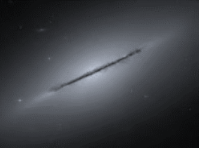
> **[Diagram Context - Textbook_NaturalScience_Gr8_Beyond-the-solar-system.pdf-0031-01.png]**
> This image is an astronomical photograph of an edge-on spiral galaxy, characterized by a central galactic bulge and a thin, dark, obscuring dust lane running along its equatorial plane. There are no labels or variables present in this visual. For Grade 10 Physical Sciences learners, this serves as a real-world example of the vast structures within the universe, illustrating how interstellar dust and gas are distributed within galaxies and providing context for the study of the solar system and the universe.

**Learner Activity: Drawing the Milky Way**
*   **Top View:** Draw the spiral shape of the galaxy. Position the Sun towards the edge of one of the arms (the Orion arm).
*   **Edge-on View:** Draw a flat disk with a central bulge. Locate the position of the Sun towards one side of the disk.

#### 4. Galactic Structures
*   **Galaxy Cluster:** A collection of 50 or more galaxies held together by gravity.
*   **Superclusters:** Clusters of galaxies often group together to form larger structures known as superclusters.
*   **The Local Group:** The specific cluster of galaxies to which the Milky Way belongs.

#### 5. The Observable Universe
*   **Size:** The observable universe is approximately $93 \times 10^{9}$ light years in diameter.
*   **Large-Scale Structure:** The Universe is composed of thin walls called **filaments**, which contain galaxies, gas, and dust.
*   **Voids:** The empty spaces located between the filaments are called voids.

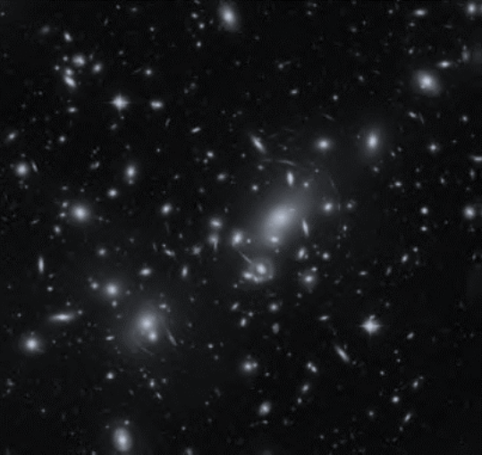
> **[Diagram Context - Textbook_NaturalScience_Gr8_Beyond-the-solar-system.pdf-0031-06.png]**
> This image is an astronomical deep-field photograph showing a dense cluster of galaxies, characterized by various elliptical and spiral structures scattered across a dark background. It contains no explicit labels or variables, serving as a visual representation of the vast scale and distribution of matter in the universe. For Grade 10-12 Physical Sciences learners, this illustrates the concept of the universe as a collection of galaxies, providing context for the study of cosmology, the Big Bang theory, and the distribution of celestial objects.

> **[Diagram Context - Textbook_NaturalScience_Gr8_Looking-into-space.pdf-0031-09.png]**
> This biological illustration shows two distinct horizontal trails of ants on a two-toned red and white background, originating from a single ant on the left. The graphic displays no explicit text labels, variables, or directional arrows, focusing purely on the visual paths formed by the tiny red insect silhouettes. Conceptually, this diagram visually conveys animal communication and behavior, specifically how social insects use pheromone trails to navigate and communicate information about food sources to the rest of the colony.

> **[Diagram Context - Textbook_NaturalScience_Gr8_The-Solar-System.pdf-0031-07.png]**
> This cartoon illustration depicts a whimsical physics concept graphic centered around a portrait of "MR. NEWTON" with an apple-shaped head and a thought bubble above. Surrounding the central figure are multiple pink apples connected by dashed lines, with directional arrows indicating mutual gravitational interactions between masses. For a Grade 11 Physical Sciences learner, the diagram conceptually illustrates Newton's Law of Universal Gravitation, showing how every particle of matter attracts every other particle in the universe.

> **[Diagram Context - Textbook_NaturalScience_Gr8_The-Solar-System.pdf-0031-09.png]**
> The graphic is an illustrative analogy of a zipper with interlocking teeth and a slider. The diagram features a continuous, horizontal metal-style zipper with alternating teeth merging together. Conceptually, it serves as a visual metaphor for molecular processes involving complementary base pairing and strand joining, such as DNA replication and transcription in Life Sciences.

> **[Diagram Context - Textbook_NaturalScience_Gr8_The-Solar-System.pdf-0031-15.png]**
> The graphic is an illustrative chemical apparatus showing an Erlenmeyer flask undergoing a violent, overflowing chemical reaction with purple liquid cascading down its sides, surrounded by stylized buildings, small human figures fleeing, and rising vapor clouds. Visible elements include a blue liquid level inside the flask, purple froth and droplets erupting from the neck, motion lines, and running stick figures at the base. Conceptually, this diagram visually represents a rapid or uncontrolled chemical reaction that releases gas and liquid, helping students understand the hazards of chemical experiments and the importance of safety protocols in the laboratory.

