**The solar system** 


> **[Diagram Context - Textbook_NaturalScience_Gr8_The-Solar-System.pdf-0001-02.png]**
> This diagram illustrates a cross-section of a biological membrane surface, featuring a linear array of uniform, hook-like structures embedded in a solid substrate. These repetitive, stylized shapes represent specialized cellular projections, such as microvilli or cilia, which function to increase surface area for absorption or facilitate movement.


> **[Diagram Context - Textbook_NaturalScience_Gr8_The-Solar-System.pdf-0001-03.png]**
> This metaphorical illustration depicts a cityscape featuring a fire-breathing monster and a helicopter attempting to capture the central object, which is a large, realistic metal key. The image uses the visual symbols of a city, a monster, a helicopter, and a key to represent the concept of a "key solution" or a critical intervention required to resolve a complex problem or crisis. It serves as a visual analogy for identifying the essential factor or "key" necessary to unlock or control a chaotic situation.


## **KEY .** . **. QUESTIONS:** 

## . **.** . **.** 

- How does the Sun produce its energy? 

- How can we observe the Sun without damaging our eyes? 

- What objects are in orbit around the Sun in our solar system? 

- Why are there two types of planets? 

- How do the planets in our solar system differ? 

- What are asteroids and comets? 

- What is the difference between a planet and a dwarf planet? 

- Why is life possible on Earth? 

Our solar system includes the Sun and all the objects that orbit around the Sun. As you will find out, a variety of objects are in orbit around the Sun: eight planets, many dwarf planets, asteroids, Kuiper Belt objects and comets. 

###### **<u>NEW WORDS</u>** 

- solar system 

##### **.** **<mark>1.1 The Sun</mark>** 

- star 

- nuclear fusion 

- convection 

- sunspot 

Before we look at the Sun close up, let's summarise what you learned about the Sun in Grades 6 and 7: 

- solar wind 


> **[Diagram Context - Textbook_NaturalScience_Gr8_The-Solar-System.pdf-0001-24.png]**
> This diagram illustrates a laboratory apparatus setup featuring a Bunsen burner heating a conical flask containing a liquid, which is connected to a gas cylinder. The visual elements include a gas canister, tubing, a Bunsen burner, a tripod stand, and a conical flask showing signs of boiling, such as bubbles and steam. Conceptually, this setup demonstrates the application of thermal energy to induce a physical or chemical change, serving as a foundational model for understanding heating processes and reaction conditions in Physical Sciences.


1. The Sun is our closest star and is very important for life on Earth as it provides us with light and heat. 

2. The Sun is located at the very centre of our solar system. 

3. The Earth and other planets all orbit around the Sun, held in orbit by the force of gravity. 

What do you think the Sun would look like if it was further away, like the other stars we see at night? 


> **[Diagram Context - Textbook_NaturalScience_Gr8_The-Solar-System.pdf-0001-29.png]**
> This graphic is a simple text-based call-to-action enclosed within a cloud-shaped speech bubble. It contains the single underlined word "VISIT," serving as a navigational prompt or instructional signpost. In an educational context, this visual element functions as a signifier to direct students toward external resources, digital platforms, or specific learning sites relevant to their CAPS curriculum studies.


Secrets of a dynamic Sun (video) bit.ly/1h0io4b 

Let's look at the Sun in more detail. 


> **[Diagram Context - Textbook_NaturalScience_Gr8_The-Solar-System.pdf-0001-32.png]**
> This illustration depicts a metaphorical hot air balloon where the envelope is replaced by a globe of the Earth, suspended above a basket containing two figures using telescopes. The visual elements include the Earth, clouds, a sun, birds, and human figures observing the world from an elevated perspective. Conceptually, this diagram represents the importance of global monitoring, environmental awareness, and the scientific study of Earth systems, encouraging students to consider their role as observers and stewards of the planet.


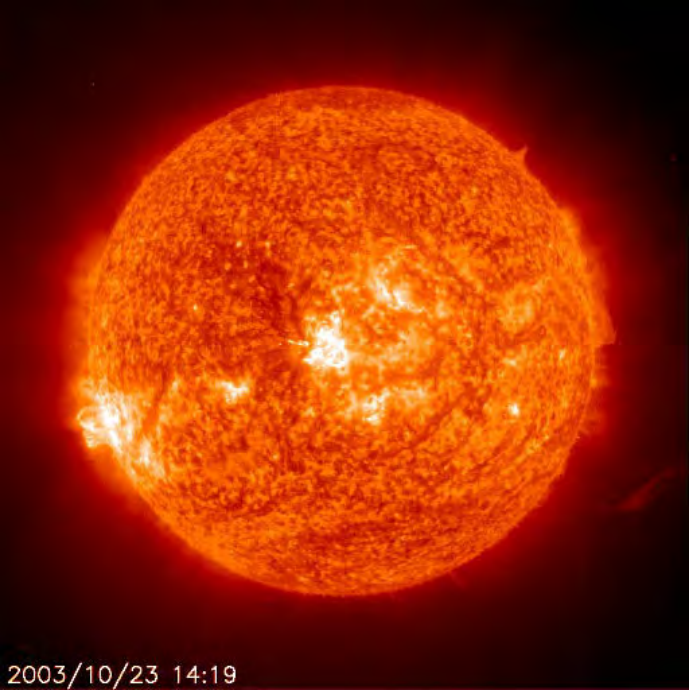
> **[Diagram Context - Textbook_NaturalScience_Gr8_The-Solar-System.pdf-0002-00.png]**
> This image is a telescopic photograph of the Sun, featuring a timestamp in the bottom left corner. It visually demonstrates the Sun's dynamic photosphere and solar activity, such as sunspots and flares, which are key components of the Grade 10 Physical Sciences curriculum regarding the solar system and stellar evolution.


_An image of the Sun taken with the SOHO space satellite._ 

Do you know what the Sun is made of? The Sun is mostly made up of hydrogen gas (about 71%), and also helium gas (about 27%) with a tiny amount of other gases. The temperature at the Sun's surface is very high, around 5500^{o} C. However, that is nothing compared to deep inside the Sun. At the Sun's centre, or core, it is about 15 million^{o} C. It is so hot at the Sun's centre that **nuclear reactions** can occur, which change atoms from one element to another. In the Sun's case, four hydrogen nuclei are squeezed or fused together to form a new helium nucleus. This process is called **nuclear fusion** . 

This nuclear fusion reaction releases energy because the new helium nuclei produced have very slightly less mass than the four hydrogen nuclei used to make them. How can this be? Well, according to the famous scientist Albert Einstein, energy and mass are equivalent. Some of the mass in the hydrogen nuclei is converted and released as energy when the nuclei fuse to make helium. A very large amount of energy is released. This energy travels outwards from the Sun's core towards its surface. The energy eventually reaches the Sun's surface somewhere between 17,000 and 100,000 years later! The Sun's energy then spreads out into the solar system in the form of heat and light. 

You are now going to observe the Sun to look at its surface features. **Remember, you should never look directly at the Sun as it can permanently damage your eyes** **_._** You can use either a telescope with a filter on it or a pinhole to project an image of the Sun onto a screen to safely view the Sun's image. 


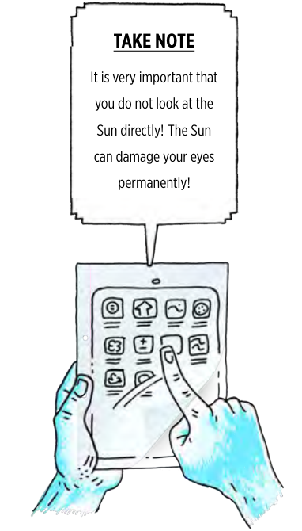
> **[Diagram Context - Textbook_NaturalScience_Gr8_The-Solar-System.pdf-0002-05.png]**
> This graphic is an educational safety warning featuring a speech bubble above an illustration of a person using a tablet. It explicitly cautions students against the permanent eye damage caused by looking directly at the Sun, serving as a critical safety protocol for observational astronomy activities within the Natural Sciences curriculum.


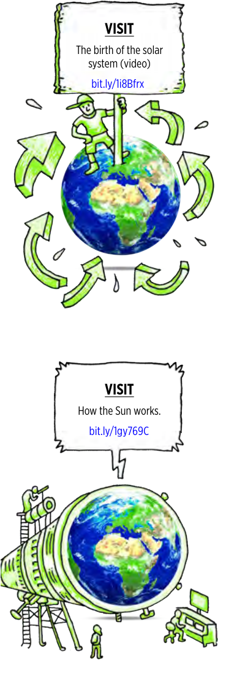
> **[Diagram Context - Textbook_NaturalScience_Gr8_The-Solar-System.pdf-0002-06.png]**
> This graphic features two illustrations depicting Earth, one surrounded by circular arrows and the other viewed through a large telescope, accompanied by text boxes labeled "VISIT" with URLs for digital resources. It serves as an interactive signpost for Grade 9 Natural Sciences learners, directing them to supplementary online content regarding the formation of the solar system and the mechanics of the Sun.


> **[Diagram Context - Textbook_NaturalScience_Gr8_The-Solar-System.pdf-0003-00.png]**
> This diagram illustrates an electromagnet created by connecting a coiled wire (solenoid) to a battery, surrounded by metallic objects like a nut, nail, and bolt. It depicts the magnetic field lines generated by the current, indicated by directional arrows, which demonstrate how an electric current induces a magnetic field capable of attracting ferromagnetic materials.


##### **ACTIVITY:** Observing the Sun using a telescope 

###### **MATERIALS:** 

- telescope 

- white card 

- chair to rest the card on 

- cardboard to make a shade collar 

- pair of scissors 

- pencil 


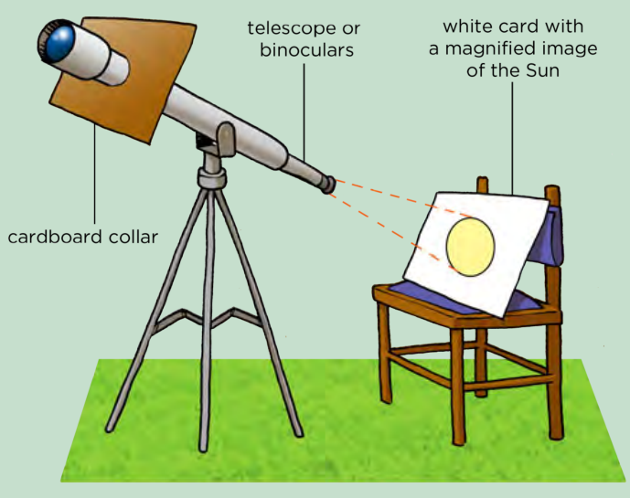
> **[Diagram Context - Textbook_NaturalScience_Gr8_The-Solar-System.pdf-0003-09.png]**
> This diagram illustrates an experimental apparatus for the safe indirect observation of the Sun, featuring a telescope or binoculars mounted on a tripod, a cardboard collar, and a white card acting as a projection screen. It demonstrates the principle of solar projection, showing how light is directed onto a surface to create a magnified image, thereby protecting the observer's eyes from direct solar radiation.


###### **<u>VISIT</u>** 

Interact with this simulation to visualize the effects of gravity on orbital paths of the Sun, Earth and Moon. bit.ly/1a2mJCL 


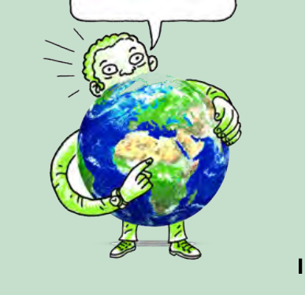
> **[Diagram Context - Textbook_NaturalScience_Gr8_The-Solar-System.pdf-0003-12.png]**
> This editorial cartoon depicts a personified human figure whose torso is replaced by a globe of the Earth, with the figure pointing specifically toward the African continent. It serves as a visual metaphor for global citizenship and environmental responsibility, prompting learners to consider the interconnectedness of human activity and planetary health within the context of Geography and Life Sciences.


###### **INSTRUCTIONS:** 

1. Take a piece of cardboard and place it up against the narrowest end of the telescope. 

2. Draw an outline around the edge of the telescope on the card to use as a guide for cutting to make the collar. 

###### **<u>TAKE NOTE</u>** 

NEVER look directly at the Sun, even with sunglasses on as you can permanently damage your eyes. 


> **[Diagram Context - Textbook_NaturalScience_Gr8_The-Solar-System.pdf-0003-18.png]**
> This cartoon depicts a thief in a striped outfit stealing a framed portrait, with a blank speech bubble above his head and motion lines indicating movement. It serves as a visual metaphor for the concept of plagiarism or intellectual property theft, illustrating the act of taking original creative work and presenting it as one's own.


3. Cut out inside the circle you just drew so that the cardboard can fit over the telescope as shown in the figure above. You can cut a single slit into the circle from the edge of the card as shown in the diagram 

4. Place the collar on the telescope. Adjust the size of the cut out circle if necessary (for example if your telescope is slightly wider in the middle than at the end, you may want to make your circle slightly larger). This collar shades the area, where the image will fall, from stray light. 

5. Select the lowest magnification eyepiece lens you have and insert it into the telescope's eyepiece. 

6. Focus the telescope by looking at a distant object (NOT the Sun). 

7. Point the telescope at the Sun (do NOT look through the telescope to do this). 

8. Place a chair behind the telescope and rest a white piece of card on it. The card should be tilted towards the telescope. 

9. Adjust the direction in which the telescope is pointing until the image of the Sun appears on the white paper card. This may take some time. 

10. Keeping the telescope still, move the white card toward or away from the eyepiece until the image of the Sun fits neatly in the middle of the card. 

**146** Planet Earth and Beyond 


Adjust the chair's position as needed. 

11. Adjust the tilt of the white card until the Sun's image is circular. 

###### **QUESTIONS:** 

1. Looking carefully you should see that the Sun's image moves slowly across the white card. What causes this motion? 

2. Draw a picture of what the surface of the Sun looks like on the white card in the circle below. 


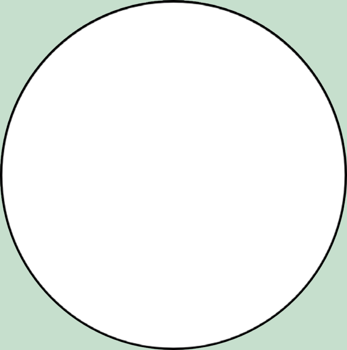
> **[Diagram Context - Textbook_NaturalScience_Gr8_The-Solar-System.pdf-0004-06.png]**
> This graphic is a simple geometric figure consisting of a single, empty circle set against a light green background. It contains no labels, variables, or internal structures. In a CAPS Life Sciences or Physical Sciences context, this serves as a blank template for students to draw and annotate fundamental concepts, such as a cross-section of a cell, a planetary orbit, or a representation of a spherical object.


###### **<u>TAKE NOTE</u>** 

Revise the model of the atom that you learned about in Matter and Materials if you are unsure of some of the terms used here, such as nucleus, which is at the centre of an atom, and consists of protons and neutrons. 


> **[Diagram Context - Textbook_NaturalScience_Gr8_The-Solar-System.pdf-0004-09.png]**
> This graphic depicts a stylized, repeating pattern of interlocking, arrow-shaped biological structures resembling a continuous chain or molecular sequence. The image uses a uniform green, linear motif to represent a repetitive biological polymer or a simplified schematic of a genetic sequence. It conceptually illustrates the principle of modularity and continuity in biological macromolecules, helping students visualize the repetitive nature of subunits within a larger chain.


Alternatively, if you do not have access to a telescope or binoculars, you can perform the following activity to view the Sun. 


> **[Diagram Context - Textbook_NaturalScience_Gr8_The-Solar-System.pdf-0004-11.png]**
> This illustration depicts a stylized caterpillar with a slinky-like body feeding on green leaves. It visually represents the biological concept of primary consumption in a food chain, illustrating how herbivores interact with producers to obtain energy within an ecosystem.


##### **ACTIVITY:** Observing the Sun with a pinhole camera 

In this activity you will reflect an image of the Sun onto a white card or screen for your learners to observe. This method has the advantage of not needing a telescope or binoculars, however, the solar image produced will be a bit fuzzy. **.** However, it should be good enough to show large sunspots. This activity is designed as a teacher-led demonstration. If you have a sunlit window or door to your class you can do this activity in the classroom. If you do not have a classroom with a sunlit window, or if your class is very small, you can do the activity outdoors, reflecting the Sun's image onto a shaded wall or back into a darkened classroom. 


As a rough guide, begin with a distance of around 8 m between the white card and the mirror. The further away you place the mirror from the white screen the fainter and larger the image will appear. At closer distances the image will be brighter but it may not be in very good focus. 


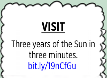
> **[Diagram Context - Textbook_NaturalScience_Gr8_The-Solar-System.pdf-0005-02.png]**
> This graphic is a text-based informational prompt containing the heading "VISIT," the descriptive text "Three years of the Sun in three minutes," and a shortened URL. It serves as a digital signpost directing students to a time-lapse resource that illustrates the dynamic, long-term solar activity relevant to the Earth and Beyond strand of the Natural Sciences curriculum.


As mentioned in the previous activity, sunspots are sometimes (not always) visible on the Sun's surface. Therefore, you could repeat this activity over the course of several days to see if any sunspots or sunspot groups change shape, size, or position over time. 


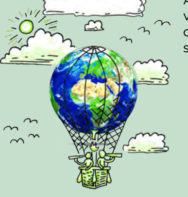
> **[Diagram Context - Textbook_NaturalScience_Gr8_The-Solar-System.pdf-0005-04.png]**
> This conceptual illustration depicts the Earth as a hot air balloon, featuring a globe, a basket, two figures using telescopes, and a flame burner. It serves as a visual metaphor for global environmental monitoring and human stewardship, encouraging learners to consider the role of scientific observation in understanding and protecting our planet's atmosphere and biosphere.


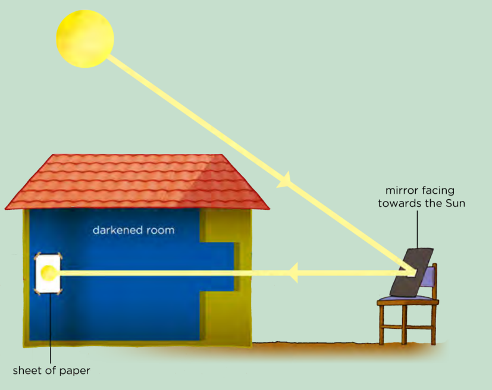
> **[Diagram Context - Textbook_NaturalScience_Gr8_The-Solar-System.pdf-0005-05.png]**
> This diagram illustrates the reflection of light using a mirror, featuring labels for the "sun," "darkened room," "mirror facing towards the sun," and "sheet of paper." It demonstrates the principle of specular reflection, showing how light rays travel from a source, strike a reflective surface, and are redirected to form a bright spot on a target surface.


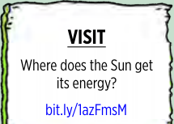
> **[Diagram Context - Textbook_NaturalScience_Gr8_The-Solar-System.pdf-0005-06.png]**
> This graphic is a text-based educational prompt featuring the heading "VISIT," the inquiry question "Where does the Sun get its energy?", and a shortened URL link. It serves as a digital signpost designed to direct high school Physical Sciences learners to external resources explaining the process of nuclear fusion in stars.


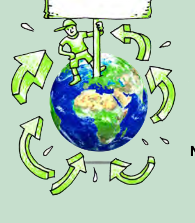
> **[Diagram Context - Textbook_NaturalScience_Gr8_The-Solar-System.pdf-0005-07.png]**
> This illustration depicts a conceptual model of global environmental stewardship, featuring a human figure holding a blank sign atop a globe surrounded by a circular arrangement of green arrows. The arrows symbolize the cyclical nature of sustainable practices, such as recycling or resource management, and the human figure represents the role of human agency in protecting the Earth. This graphic serves as an introductory visual for Life Sciences or Geography learners to discuss human impact on the environment and the importance of sustainable development.


###### **MATERIALS:** 

- small pocket mirror or hand mirror 

- piece of plain cardboard (or paper) to fit over the mirror (or alternatively tape) 

- white cardboard screen 

- bin bags or curtains for darkening the classroom 

###### **METHOD:** 


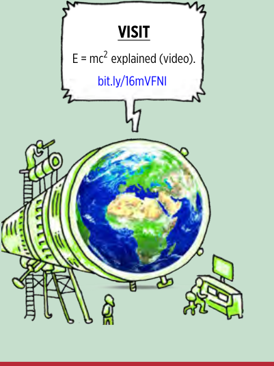
> **[Diagram Context - Textbook_NaturalScience_Gr8_The-Solar-System.pdf-0005-14.png]**
> This graphic features a cartoon illustration of scientists using a large telescope to observe the Earth, accompanied by a speech bubble containing the text "VISIT E = mc² explained (video)" and a shortened URL. It serves as an introductory visual hook to bridge the gap between observational science and theoretical physics, encouraging students to explore the relationship between mass and energy as defined by Einstein's mass-energy equivalence principle.


1. Cut the plain cardboard or paper so it fits over the mirror. 

2. Cut or punch a very small hole, about 5 mm, in the middle of the plain cardboard. 

3. If you do not have cardboard, you can use tape to cover all but a small portion of the surface of the mirror. 

4. Place the mirror on a window sill in the Sun and tilt it so that it catches the sunlight and reflects it into the classroom. If your classroom is very small, placing the mirror outside on a chair may be a better option in order to get a larger image. 

5. Darken the classroom using curtains or bin bags, excluding where the mirror is. 

6. Reflect the sunlight from the mirror onto a wall of the darkened room. 

7. Put the white cardboard or paper on the wall where the reflected light showing the Sun's image falls. 

8. Observe the image of the Sun. 

**148** Planet Earth and Beyond 


9. Remove the white cardboard from the wall and take three steps towards the mirror with the cardboard still facing the mirror. Note what happens to the image of the Sun on the cardboard. 

###### **QUESTIONS:** 

1. As you moved the white cardboard screen closer towards the mirror, what did you notice happened to the image of the Sun? 

2. Draw a picture of what the surface of the Sun looks like on the white card in the circle below. 


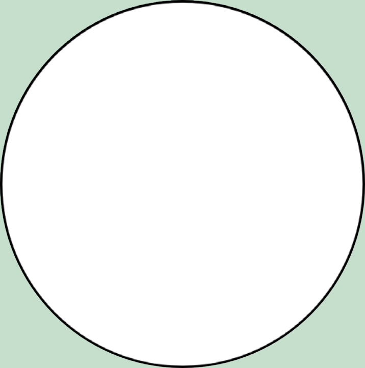
> **[Diagram Context - Textbook_NaturalScience_Gr8_The-Solar-System.pdf-0006-05.png]**
> This image is a blank, white circular template set against a light green background. It contains no labels, symbols, or structural details. In a CAPS curriculum context, this serves as a foundational scaffold for learners to draw and annotate biological cells, chemical structures, or geometric figures during formative assessment tasks.


3. When the Sun reflects off the surface of the mirror, what can you say about the angle of incidence and the angle of reflection of the ray? 


> **[Diagram Context - Textbook_NaturalScience_Gr8_The-Solar-System.pdf-0006-07.png]**
> This graphic is a text-based "Did you know?" callout box, which serves as a pedagogical feature to highlight supplementary or interesting facts within educational material. It uses a cloud-shaped border to visually distinguish this additional information from the core curriculum content, encouraging learners to engage with enrichment topics.


**<u>DID YOU KNOW?</u>** Albert Einstein explained the mass-energy equivalence with the famous equation E = mc^{2} . 


> **[Diagram Context - Textbook_NaturalScience_Gr8_The-Solar-System.pdf-0006-10.png]**
> This caricature depicts Isaac Newton with an apple-shaped head, surrounded by a network of floating apples connected by dashed lines and directional arrows, all linked to a thought bubble. It serves as a metaphorical illustration of Newton’s Law of Universal Gravitation, visually representing the concept of gravitational attraction between masses in a system.


###### **<u>VISIT</u>** 

Fiery looping rain on the Sun (video) bit.ly/16qmriQ 


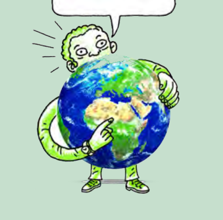
> **[Diagram Context - Textbook_NaturalScience_Gr8_The-Solar-System.pdf-0006-13.png]**
> This cartoon depicts a human figure integrated with a globe of the Earth, featuring a speech bubble and a hand pointing specifically toward the African continent. It serves as a visual metaphor for global citizenship or environmental responsibility, encouraging students to consider their personal role in addressing planetary issues within the context of Geography or Life Sciences.


> **[Diagram Context - Textbook_NaturalScience_Gr8_The-Solar-System.pdf-0006-14.png]**
> This graphic depicts a stylized, repeating double-helix structure representing a DNA molecule. It illustrates the characteristic twisted ladder configuration of the sugar-phosphate backbones and internal base pairing, serving as a foundational visual aid for understanding the molecular structure of genetic material in the Life Sciences curriculum.


Did you notice any features on the Sun's surface when you viewed it in class? Let's find out what some of these surface features could have been in the next activity. 


> **[Diagram Context - Textbook_NaturalScience_Gr8_The-Solar-System.pdf-0007-00.png]**
> This illustration depicts a roller coaster track featuring a carriage and passengers, with a superimposed slinky spring representing a wave-like motion. The graphic uses the visual metaphor of a roller coaster to illustrate the relationship between mechanical energy transformations and wave characteristics. It helps students visualize the conversion between gravitational potential energy and kinetic energy, while the slinky serves as a model for longitudinal or transverse wave propagation along the path of motion.


##### **ACTIVITY:** Observing sunspots on the Sun's surface 

###### **INSTRUCTIONS:** 

1. Look at the images of the Sun which were taken in June 2013. 

2. Answer the questions that follow. 


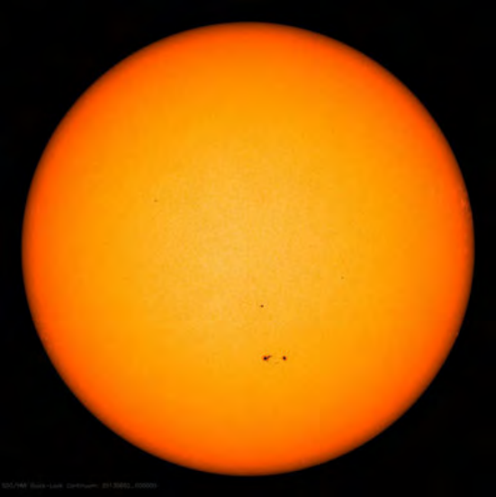
> **[Diagram Context - Textbook_NaturalScience_Gr8_The-Solar-System.pdf-0007-05.png]**
> This image is a telescopic photograph of the Sun’s photosphere, featuring visible dark patches known as sunspots. These sunspots appear as cooler, darker regions on the solar surface caused by intense magnetic activity that inhibits convection. For Grade 10 Physical Sciences learners, this visual serves as an introduction to solar phenomena and the Sun's role as the primary energy source for Earth's systems.


_A: DATE: 02.06.2013_ 


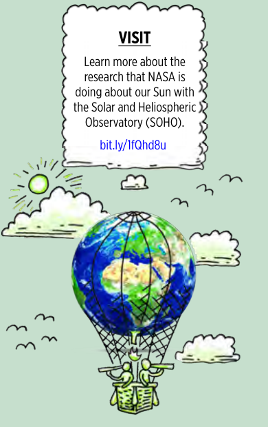
> **[Diagram Context - Textbook_NaturalScience_Gr8_The-Solar-System.pdf-0007-07.png]**
> This graphic features a stylized illustration of the Earth suspended as a hot air balloon, with figures using telescopes to observe the Sun, accompanied by a text box referencing NASA’s Solar and Heliospheric Observatory (SOHO). The image includes labels for "VISIT," "NASA," and "Solar and Heliospheric Observatory (SOHO)," along with a shortened URL. Conceptually, it serves as an introductory hook to engage learners in the study of Earth and Space Science, specifically highlighting the role of satellite technology in monitoring solar activity and its influence on our planet.


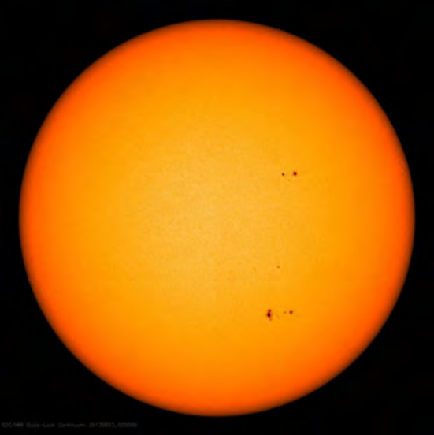
> **[Diagram Context - Textbook_NaturalScience_Gr8_The-Solar-System.pdf-0007-08.png]**
> This image is a telescopic photograph of the Sun, displaying its photosphere and visible dark patches known as sunspots. It illustrates the concept of solar activity, where localized regions of intense magnetic fields inhibit convection, resulting in cooler, darker areas on the solar surface.


_B: DATE: 03.06.2013_ 


Planet Earth and Beyond 


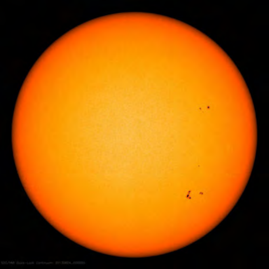
> **[Diagram Context - Textbook_NaturalScience_Gr8_The-Solar-System.pdf-0008-01.png]**
> This image is a telescopic photograph of the Sun’s photosphere, featuring visible dark patches known as sunspots. These sunspots appear as cooler, magnetically active regions on the solar surface, providing students with a visual representation of solar activity and the Sun's dynamic nature as a star.


_C: DATE: 04.06.2013_ 

###### **QUESTIONS:** 

1. How many groups of dark spots do you see in each image? 

2. What do you notice about the positions of the spots in each image? 

3. Why do you think the spots have moved? 

4. What do you think these spots are? 


This information about the Sun's surface and sunspots is additional information for your interest. Be curious and discover more! 


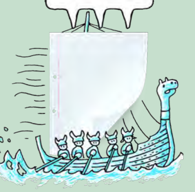
> **[Diagram Context - Textbook_NaturalScience_Gr8_The-Solar-System.pdf-0008-10.png]**
> This cartoon depicts a Viking longship with a blank sheet of paper serving as its sail, propelled by rowers and wind. The visual elements include a stylized boat, oars, water, wind lines, and a prominent empty speech bubble above the mast. Conceptually, this image serves as a creative prompt for students to practice historical narrative writing or to illustrate the concept of "blank slate" exploration, encouraging them to fill the empty space with relevant historical context or creative storytelling.


> **[Diagram Context - Textbook_NaturalScience_Gr8_The-Solar-System.pdf-0008-11.png]**
> This graphic illustrates a schematic representation of a DNA double helix, featuring two antiparallel sugar-phosphate backbones intertwined in a helical structure. It conceptually demonstrates the complementary base pairing and the characteristic twisted-ladder configuration essential for understanding DNA replication and the storage of genetic information in Life Sciences.


###### **Sunspots and the Sun's surface** 

The Sun's surface often has little blemishes on it. These dark spots on the Sun are called sunspots. They are areas that are slightly cooler than the rest of the Sun's surface. The Sun's surface is typically about 5500^{o} C and a typical sunspot has a temperature about 3900^{o} C. 


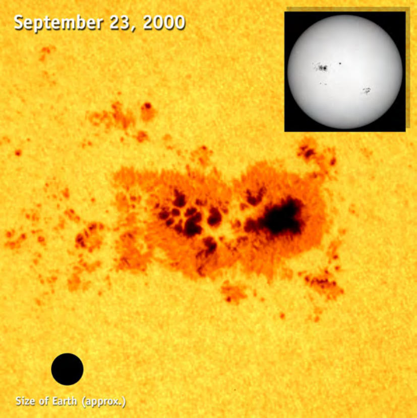
> **[Diagram Context - Textbook_NaturalScience_Gr8_The-Solar-System.pdf-0009-00.png]**
> This image is a telescopic observation of the Sun’s photosphere, featuring a prominent sunspot group, a full-disk solar inset, and a scale reference labeled "Size of Earth (approx.)." It illustrates the immense scale of solar surface phenomena, helping learners visualize the relative size of Earth compared to the complex, cooler magnetic regions known as sunspots.


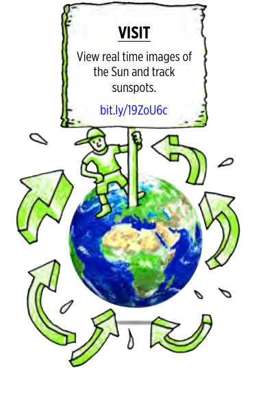
> **[Diagram Context - Textbook_NaturalScience_Gr8_The-Solar-System.pdf-0009-01.png]**
> This graphic features an illustration of a person standing on a globe surrounded by circular arrows, accompanied by a sign containing the text "VISIT," "View real time images of the Sun and track sunspots," and a URL. It serves as an educational prompt to encourage students to engage with real-time astronomical data, specifically linking the Earth's rotation and solar observation to the study of solar activity and space science within the CAPS curriculum.


_Image of a sunspot. For perspective, take note of the size of the Earth in the lower left._ 

As the Sun is made up of gas, there is no solid surface like on Earth. So when one says that you are looking at the Sun's surface what are you actually looking at? Imagine that you are standing in thick fog (mist) with a friend. You can see things close to you, like your hand in front of you and your friend standing next to you. However, because the fog is so thick you cannot see far into the distance. Similarly, when we look at the Sun, we cannot see right into the centre of the Sun. As you go deeper and deeper in towards the centre of the Sun the gas begins to get thicker and thicker so that we cannot see through it. The deepest depth that we can see into the Sun's gas is what we call the Sun's surface. 

###### **<u>DID YOU KNOW?</u>** 

The number of sunspots on the Sun increases and decreases in a regular pattern which repeats every 11 years. When there are more sunspots the Sun is more active and there are more solar storms and more of the Sun's energy reaches the Earth. 

Sunspots are areas that are slightly cooler, and therefore darker, than the rest of the Sun's surface. A typical sunspot only lasts a few days. When a sunspot lasts for several days you can observe it move across the Sun's disc. The sunspot appears to move across the Sun because the Sun is spinning slowly on its own axis. 


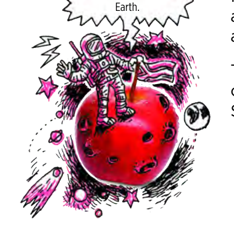
> **[Diagram Context - Textbook_NaturalScience_Gr8_The-Solar-System.pdf-0009-07.png]**
> This illustration depicts an astronaut standing on a red apple, which is surrounded by celestial elements like stars, planets, and a comet, with the text label "Earth." It serves as a metaphorical or humorous visual aid to introduce concepts of planetary scale, gravity, or the Earth's position within the solar system, encouraging students to think critically about scientific representation versus reality.


The outer atmosphere of the Sun is called the **corona** . Gas particles from the corona are constantly escaping into space, forming the **solar wind** . When the Sun is very active, violent eruptions called solar flares occur on its surface. 

Planet Earth and Beyond 


_A large loop of gas extending over 35 Earth diameters out from the Sun's surface._ 

##### **. 1.2 Objects around the Sun** 

The Sun is by far the largest and most massive object in our solar system making up 98% of the total mass of the solar system. Due to the Sun's massive size, its large gravitational pull causes the planets and other objects in the solar system to orbit around it. 

In orbit around the Sun are the eight planets along with their moons, dwarf planets and many much smaller objects like asteroids, Kuiper belt objects and comets. You will learn all about these objects later on in this chapter. 

The four planets closest to the Sun are Mercury, Venus, Earth and Mars. These are called **terrestrial planets** because they have solid rocky surfaces. Further out, lie the **gas giants** Jupiter, Saturn, Uranus, and Neptune. These are much larger than the terrestrial planets and are mainly made of gas with small cores of rocky materials. In between the terrestrial planets and the gas giants lies the asteroid belt and out beyond the orbit of Neptune lies the Kuiper belt. 

As you can see, there are lots of different types of objects orbiting the Sun, and not all of them are planets! To be classed as a planet, an object must: 

1. orbit around the Sun 

2. be large enough that its own gravity pulls it into a spherical shape 

3. clear out smaller objects in its orbit, by either flinging them into another orbit or by attracting and then sticking them to itself (this means that there are no other similar sized objects orbiting in their vicinity) 

You will learn about planets and the other objects orbiting the Sun in more detail later on in this chapter. Let's begin by learning more about the size and scale of the solar system. 

**<u>VISIT</u>** Explore the solar system from your computer with this 3D environment bit.ly/1c9rpbM and view any objects in the solar system with this interactive simulator bit.ly/1gyasJR 


###### **<u>NEW WORDS</u>** 

- terrestrialplanet 

- • gas giant • dwarf planet 


**<u>TAKE NOTE</u>** 'terra' is the Latin word for land or earth. 


> **[Diagram Context - Textbook_NaturalScience_Gr8_The-Solar-System.pdf-0011-00.png]**
> This diagram illustrates a slinky toy moving down a staircase, using motion lines to indicate its dynamic displacement. It serves as a physical model to help learners visualize the propagation of longitudinal and transverse waves, demonstrating how energy transfers through a medium via periodic motion.


##### **ACTIVITY:** The scale of the solar system 


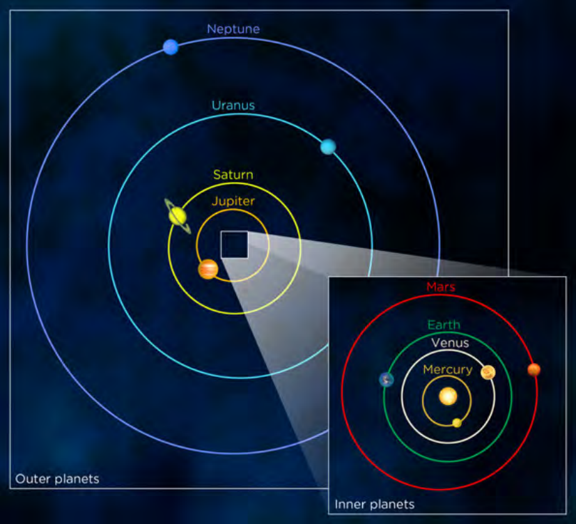
> **[Diagram Context - Textbook_NaturalScience_Gr8_The-Solar-System.pdf-0011-02.png]**
> This diagram is a schematic representation of the solar system, using an inset to distinguish between the inner terrestrial planets (Mercury, Venus, Earth, Mars) and the outer gas giants (Jupiter, Saturn, Uranus, Neptune). It illustrates the orbital arrangement of the eight planets around the Sun, highlighting the relative spatial distribution and grouping of these celestial bodies within our solar system.


###### **<u>VISIT</u>** 

Is there gravity in space? bit.ly/180O2Xl 

_The orbits and planets in the solar system which we are going to model._ 

###### **MATERIALS:** 

- grapefruit 

- peppercorns 

- salt grains 

- poppy seeds 

- pea 

- grape 

- measuring tape 

###### **INSTRUCTIONS:** 

1. Go outside to a large field for this activity. Start at one end of the field. 

2. Put the grapefruit on the ground, this represents the Sun. 

3. Measure 4.2 m away from the grapefruit and put a grain of salt on the ground. This represents Mercury. If you do not have a measuring tape then count four big strides away from the Sun instead. 

4. Repeat this for each of the planets in the solar system. Your teacher will tell you the distance each planet lies from the Sun and will give you the appropriate object to represent your planet. 

5. Guess how far away you think the next closest star after the Sun is. 


> **[Diagram Context - Textbook_NaturalScience_Gr8_The-Solar-System.pdf-0011-20.png]**
> This graphic illustrates a schematic representation of a DNA double helix, featuring two antiparallel sugar-phosphate backbones connected by repeating horizontal rungs representing nitrogenous base pairs. It conceptually demonstrates the characteristic twisted ladder structure of DNA, highlighting the complementary base pairing and the helical orientation essential for understanding genetic replication and protein synthesis in the Life Sciences curriculum.


Planet Earth and Beyond 

Let's now make a smaller model of the solar system. 

##### **ACTIVITY:** Make a hanging solar system 

###### **MATERIALS:** 

- cardboard about 30 cm across 

- paper 

- string or thread 

- pair of scissors 

- tape 

- string 

- pencil, crayons, or markers 

- compass (for drawing circles) 

- nail (for making a hole in the cardboard) 

###### **INFORMATION TABLE:** 

|**Object**|**Orbit radius (cm)**|**Object radius (cm)**|
|---|---|---|
|Sun|-|5.0* - this is NOT to<br>scale|
|Mercury|0.4|0.2|
|Venus|0.7|0.8|
|Earth|**.**<br>1.0|0.8|
|Mars|1.5|0.4|
|Jupiter|5.0|5.1|
|Saturn|9.2|4.1|
|Uranus|18.6|1.6|
|Neptune|29.1|1.6|

* Note that if the Sun were drawn at the same scale as the rest of the planets, its radius should be 50 cm rather than 5 cm! 

###### **INSTRUCTIONS:** 

1. Cut out the cardboard into a circle of radius 15 cm. Use a compass and pencil to mark out the circle for cutting. 

2. Mark the centre of the circle. This will be the position of the Sun. 

3. Using a compass, draw the orbits of the 8 planets on the card. The first four planets orbit relatively close to the Sun, then there is a gap (the asteroid belt), then the last five planets orbit very far from the Sun. The radius of each circle, representing each planet's orbit, is shown in the table above. 

4. Using the sharp point of the scissors' blade, or a large nail, punch a hole in the centre of the card (this is where the Sun will hang). 

5. Punch one hole on each circle (orbit); a planet will hang from each hole. 


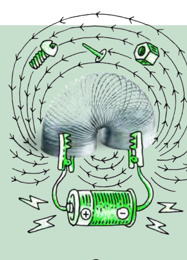
> **[Diagram Context - Textbook_NaturalScience_Gr8_The-Solar-System.pdf-0012-21.png]**
> This diagram illustrates an electromagnet created by connecting a coiled wire (solenoid) to a battery, marked with positive (+) and negative (-) terminals. The surrounding field lines with directional arrows represent the magnetic field generated by the current, demonstrating how electricity induces magnetism to attract metallic objects like the depicted bolt, nail, and nut.


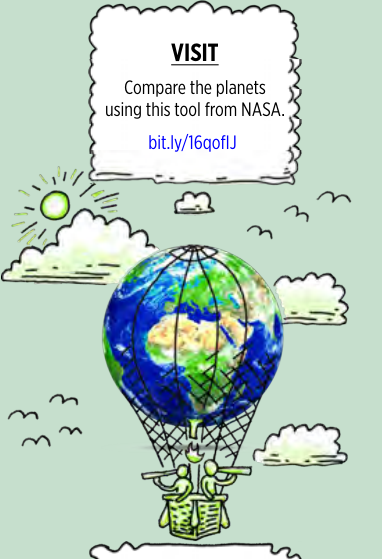
> **[Diagram Context - Textbook_NaturalScience_Gr8_The-Solar-System.pdf-0012-22.png]**
> This graphic features a whimsical illustration of a hot air balloon where the balloon is represented by a globe of the Earth, with two figures in the basket using telescopes to observe the surroundings. The text provides a call to action to "VISIT" and "Compare the planets" using a provided NASA URL. This resource serves as an engaging digital bridge to help Grade 10 learners explore the characteristics and comparative properties of planets within our solar system.


###### **<u>TAKE NOTE</u>** 


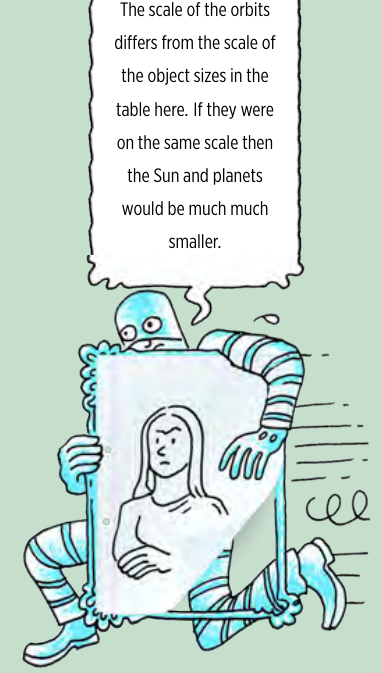
> **[Diagram Context - Textbook_NaturalScience_Gr8_The-Solar-System.pdf-0012-24.png]**
> This graphic is a cartoon illustration featuring a character holding a framed portrait and a speech bubble containing explanatory text. The text highlights the distinction between the scale of planetary orbits and the physical size of celestial bodies, noting that if both were represented accurately to scale, the Sun and planets would appear significantly smaller. This serves as a conceptual warning for learners to critically evaluate scientific models, emphasizing that diagrams often sacrifice proportional accuracy for visual clarity.


6. Cut out one circle from the paper to represent the Sun. 


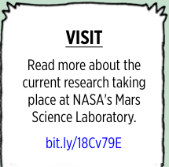
> **[Diagram Context - Textbook_NaturalScience_Gr8_The-Solar-System.pdf-0013-01.png]**
> This graphic is a text-based informational prompt directing students to an external digital resource. It contains the heading "VISIT," descriptive text regarding "NASA's Mars Science Laboratory," and a shortened URL link. It serves as an enrichment tool to encourage independent research and contextualize space science topics within the broader CAPS curriculum.


7. Repeat this for each of the planets. The range in size of the Sun and the planets is far too large to represent accurately, so as a rough representation use the radii listed in the table to make your circles. The sizes of Mercury and Mars are very small in relation to the other planets. If you are battling to cut circles this size, then make them slightly bigger. 

8. Colour in each planet and the Sun according to the pictures later in this chapter. 


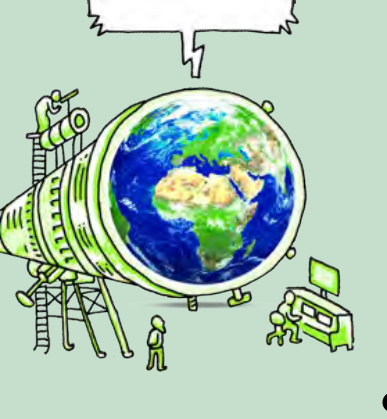
> **[Diagram Context - Textbook_NaturalScience_Gr8_The-Solar-System.pdf-0013-04.png]**
> This editorial cartoon depicts a large telescope focused on the Earth, with human figures observing and monitoring the planet from a control station. The visual elements include a stylized telescope, a globe showing the African continent, and human observers, all framed by an empty speech bubble. Conceptually, this image serves as a metaphor for environmental monitoring and global stewardship, illustrating how scientific observation and data analysis are essential for understanding and managing the Earth's systems within the context of Geography and Life Sciences.


9. Tape a length of string or thread to the Sun and each planet. 

10. Lace the other end of each string or thread through the correct hole in the large cardboard circle. 

11. Tape the end of the string to the top side of the cardboard. 

12. After all the planets and the Sun are attached, adjust the length of the strings so that the planets and Sun all fall to the same depth when the **.** circle is held up in the air. 

13. To hang your model, tie three pieces of string to the top of the cardboard around the edge. Then tie these three together and tie them to a longer string (from which you'll hang your model). 

###### **QUESTION:** 

Why did you adjust the string lengths so that the Sun and all the planets hang at the same height? 


> **[Diagram Context - Textbook_NaturalScience_Gr8_The-Solar-System.pdf-0013-12.png]**
> This graphic depicts a stylized, repeating wave-like pattern composed of interconnected, arrow-headed segments. It serves as a visual representation of continuous directional flow or a periodic sequence, commonly used in Life Sciences to illustrate processes like DNA replication, the movement of substances through a transport system, or the cyclical nature of biological pathways.


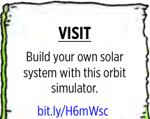
> **[Diagram Context - Textbook_NaturalScience_Gr8_The-Solar-System.pdf-0013-13.png]**
> This graphic is an instructional text box containing the labels "VISIT," "Build your own solar system with this orbit simulator," and a shortened URL. It serves as a digital signpost directing learners to an interactive simulation tool for exploring planetary motion and gravitational systems within the Natural Sciences curriculum.


Now that you have an idea of the size and scale of the planets in our solar system, let's compare the two groups of planets, the inner worlds, Mercury, Venus, Earth and Mars with outer worlds, Jupiter, Saturn, Uranus and Neptune, in more detail. Look at the following pictures which compare the features of the two groups of planets. 


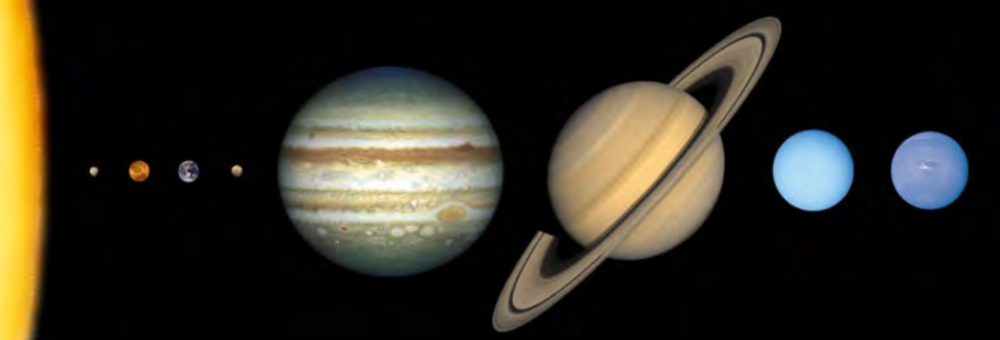
> **[Diagram Context - Textbook_NaturalScience_Gr8_The-Solar-System.pdf-0013-15.png]**
> This graphic is a visual representation of the solar system, displaying the Sun followed by the eight planets in order of their distance from the Sun: Mercury, Venus, Earth, Mars, Jupiter, Saturn, Uranus, and Neptune. It illustrates the relative sizes and distinct physical characteristics of the terrestrial planets compared to the gas and ice giants, providing a foundational overview of planetary classification and solar system structure for Natural Sciences.


_The relative sizes of the terrestrial planets and gas giants, from left to right: Mercury, Venus, Earth, Mars, Jupiter, Saturn, Uranus and Neptune. Note that the planets are not spaced at equal separations from each other, but are shown in this way to fit on the page._ 

How do the sizes of the terrestrial planets and gas giants compare with each other? 

**156** Planet Earth and Beyond 

Let's now look at the compositions of the two types of planets. 

###### **<u>DID YOU KNOW?</u>** 


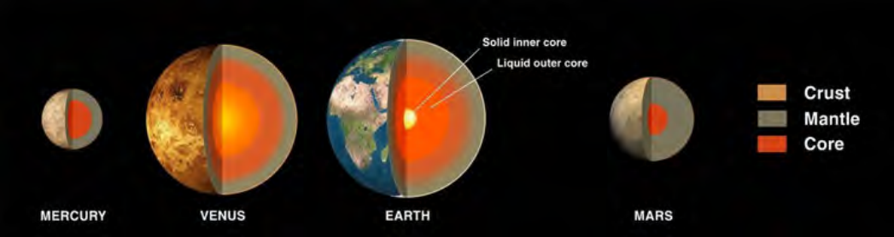
> **[Diagram Context - Textbook_NaturalScience_Gr8_The-Solar-System.pdf-0014-02.png]**
> This diagram displays cross-sectional models of the four terrestrial planets (Mercury, Venus, Earth, and Mars), using a legend to identify their internal layers: Crust, Mantle, and Core. It illustrates the comparative internal composition of these planets, specifically highlighting Earth’s distinct differentiation into a solid inner core and a liquid outer core.


The above image shows the internal structure of the terrestrial planets. They all have a metal core, a rocky mantle and a thin outer crust. They also have a thin atmosphere (Mercury has an extremely thin atmosphere). The Earth's atmosphere is unique in the solar system in that it contains abundant oxygen, which is necessary to sustain life on Earth. 

The image below shows the structure of the gas giants. They are mostly made of hydrogen and helium gases and are much less dense than the rocky terrestrial planets. 


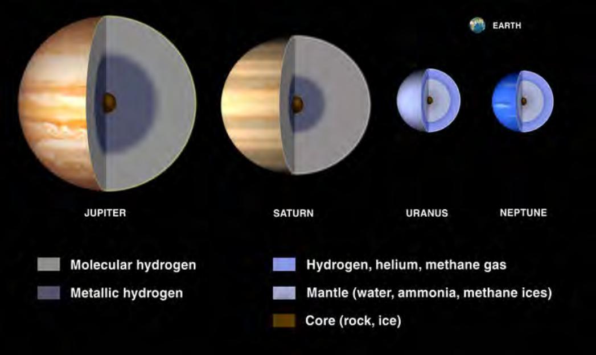
> **[Diagram Context - Textbook_NaturalScience_Gr8_The-Solar-System.pdf-0014-05.png]**
> This diagram provides a comparative cross-sectional analysis of the four gas giants—Jupiter, Saturn, Uranus, and Neptune—relative to Earth. It uses a colour-coded legend to label internal structures including molecular and metallic hydrogen, gas atmospheres, icy mantles, and rocky cores. Conceptually, this illustrates the planetary composition and internal stratification of the outer planets, highlighting the structural differences between the gas giants and the ice giants within the solar system.


As you go deeper into the atmospheres of Saturn and Jupiter their atmospheres get denser and denser until they gradually become a liquid. This liquid hydrogen is called metallic hydrogen. Deeper down they have a solid core made of rocky materials. 

Uranus and Neptune have thick atmospheres which have methane in addition to hydrogen and helium. The methane gives them their blue colour. Scientists think that below their atmospheres they have a slushy mantle made of water, ammonia and methane ices. At their centres they have a rocky-icy core. 

When it is winter on Mars you can see polar ice caps forming on the planet, like on Earth. However, unlike the Earth's polar ice caps which are made of frozen water, the ice caps on Mars are made of frozen carbon dioxide. This frozen carbon dioxide comes from Mars' atmosphere. 


> **[Diagram Context - Textbook_NaturalScience_Gr8_The-Solar-System.pdf-0014-09.png]**
> This illustrative cartoon depicts a metaphorical chariot scene featuring a personified apple acting as a carriage, pulled by two horses and driven by a figure in a suit. The image includes a speech bubble fragment referencing "from Mars atmosphere" and uses motion lines to suggest rapid travel. Conceptually, this visual serves as a creative mnemonic or engagement tool to help students visualize the hypothetical or scientific narrative of transporting materials or life forms through space.


###### **<u>DID YOU KNOW?</u>** 

Pluto was reclassified from planet to dwarf planet in 2006. Although Pluto orbits the Sun and is almost round, it has not cleared out other objects in its orbit, and so it cannot be classified as a planet. There are many more dwarf planets at similar distances from the Sun as Pluto. 


> **[Diagram Context - Textbook_NaturalScience_Gr8_The-Solar-System.pdf-0014-12.png]**
> This cartoon illustration depicts a worm interacting with an apple in a natural environment featuring grass, a sun, and birds. It serves as a visual metaphor for the role of decomposers and detritivores in an ecosystem, illustrating how organisms break down organic matter to facilitate nutrient cycling within a food web.


Look at the pictures below. They show images of the gas giants. What features do you see that the gas giants all have in common? 


> **[Diagram Context - Textbook_NaturalScience_Gr8_The-Solar-System.pdf-0015-00.png]**
> This graphic is a text-based pedagogical feature formatted as a "Did you know?" callout box. It contains the heading "DID YOU KNOW?" underlined within a cloud-shaped border. In a CAPS curriculum context, this visual element serves to introduce supplementary, interesting, or contextual facts that enrich a learner's understanding of a specific scientific or mathematical concept.


Hydrogen is a liquid deep inside Jupiter and Saturn because the hydrogen molecules have been squeezed together due to the enormous pressure at those depths caused by the weight of the planet's atmosphere above. 


> **[Diagram Context - Textbook_NaturalScience_Gr8_The-Solar-System.pdf-0015-02.png]**
> This illustration depicts a caricature of Isaac Newton with an apple-shaped head, surrounded by a network of floating apples connected by dashed lines and directional arrows. It serves as a conceptual metaphor for Newton’s Law of Universal Gravitation, visually representing the interconnectedness of gravitational forces between masses in a system.


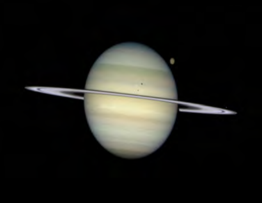
> **[Diagram Context - Textbook_NaturalScience_Gr8_The-Solar-System.pdf-0015-03.png]**
> This astronomical image depicts the planet Saturn, clearly displaying its prominent ring system and several of its moons, including a visible transit shadow on the planet's surface. As a visual aid for the Grade 10 Physical Sciences Earth and Beyond curriculum, it illustrates the composition of the solar system, specifically highlighting the characteristics of gas giants and the gravitational relationship between a planet and its natural satellites.


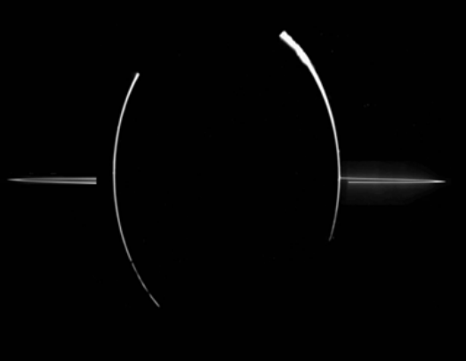
> **[Diagram Context - Textbook_NaturalScience_Gr8_The-Solar-System.pdf-0015-04.png]**
> This image is a ray diagram illustrating the reflection of light by a concave mirror, featuring a principal axis, a curved reflective surface, and incident/reflected light rays. It demonstrates the fundamental principles of geometric optics, specifically how parallel light rays converge or reflect relative to the mirror's curvature to help students understand focal points and image formation.


_This image of Jupiter in shadow was taken by the space probe Galileo as it studied Jupiter in 1998._ 

_This image of Saturn was taken with the Hubble Space Telescope. Can you see some of its moons?_ 


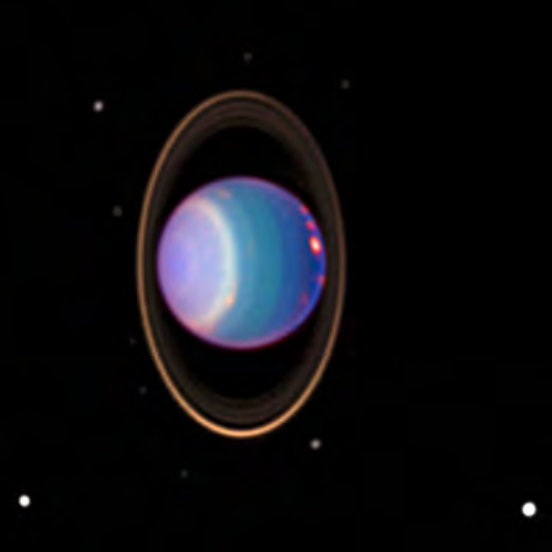
> **[Diagram Context - Textbook_NaturalScience_Gr8_The-Solar-System.pdf-0015-07.png]**
> This image is an astronomical photograph of the planet Uranus, clearly displaying its distinct ring system and atmospheric features against a dark background of distant stars. For Grade 10 Physical Sciences learners, this visual serves as a concrete example of a gas giant within our solar system, illustrating the composition and orbital structures that define planetary bodies in the Earth and Beyond strand.


_Uranus, taken with the Hubble Space Telescope. What do you notice that is strange about Uranus?_ 


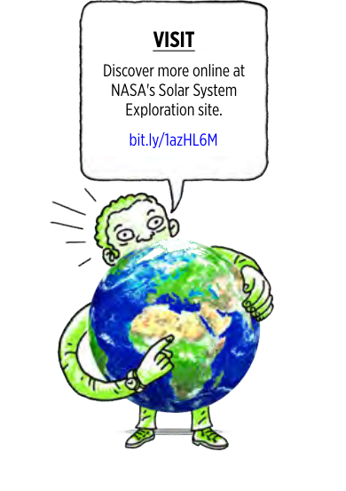
> **[Diagram Context - Textbook_NaturalScience_Gr8_The-Solar-System.pdf-0015-09.png]**
> This graphic features a cartoon illustration of a person holding a globe, accompanied by a speech bubble containing the text "VISIT," "Discover more online at NASA's Solar System Exploration site," and the URL "bit.ly/1azHL6M." It serves as an educational call-to-action, encouraging learners to engage with digital resources to deepen their understanding of Earth and space sciences within the CAPS curriculum.


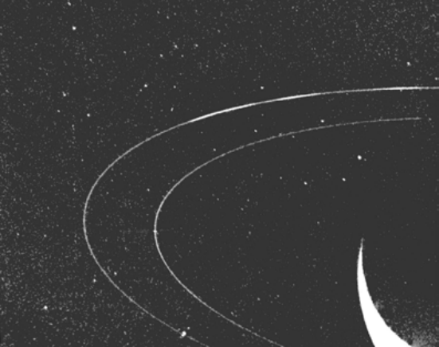
> **[Diagram Context - Textbook_NaturalScience_Gr8_The-Solar-System.pdf-0015-10.png]**
> This image is an astronomical photograph showing the planet Saturn and its prominent ring system against a star-filled background. There are no explicit labels or variables present in the visual. It serves as a concrete visual aid for Grade 10 Physical Sciences, illustrating the concept of gravitational orbits and the structure of our solar system within the context of the Earth and Beyond strand.


_Neptune is to the bottom right of this picture, just out of view. This image was taken by the space probe Voyager 2 as it flew past Neptune in 1989._ 

You can see that _all_ the gas giants have rings. None of the terrestrial planets have rings. 

Planet Earth and Beyond 

Another difference between the inner rocky and outer gas giant planets, are the number of moons orbiting each planet. Look at the table below which shows the number of moons each planet in our solar system has. 

|**Planet**|**Number of Moons**|
|---|---|
|Mercury|0|
|Venus|0|
|Earth|1|
|Mars|2|
|Jupiter|67|
|Saturn|62|
|Uranus|27|
|Neptune|13|

What can you say in general about the number of moons that the two types of planet have? 

The terrestrial planets are much closer to the Sun than the gas giants. Because of this, the terrestrial planets orbit the Sun in less time than the gas giants, because they have a shorter distance to cover. 

Lets see how the distance from the Sun affects the planets' temperatures. 


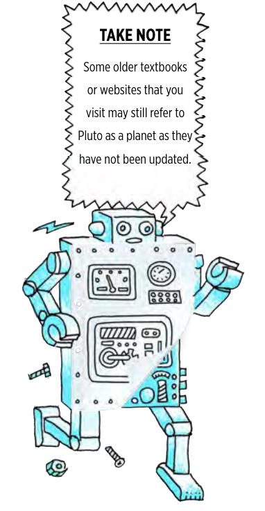
> **[Diagram Context - Textbook_NaturalScience_Gr8_The-Solar-System.pdf-0016-05.png]**
> This graphic features a cartoon robot holding a speech bubble containing the heading "TAKE NOTE" and text regarding the classification of Pluto. It serves as a pedagogical reminder for learners to critically evaluate the currency of their information sources, specifically highlighting that scientific classifications can evolve and that older educational materials may contain outdated planetary definitions.


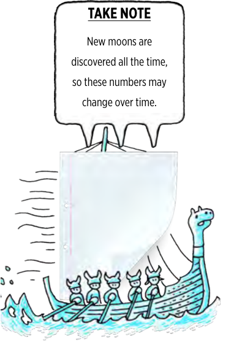
> **[Diagram Context - Textbook_NaturalScience_Gr8_The-Solar-System.pdf-0016-06.png]**
> This graphic features a cartoon illustration of a Viking ship with a speech bubble containing the text "TAKE NOTE: New moons are discovered all the time, so these numbers may change over time." It serves as a pedagogical disclaimer for Natural Sciences or Earth and Space Science learners, emphasizing that scientific data regarding planetary moons is dynamic and subject to revision as new astronomical discoveries are made.


> **[Diagram Context - Textbook_NaturalScience_Gr8_The-Solar-System.pdf-0017-00.png]**
> This illustration depicts a metaphorical hybrid of a caterpillar and a metal slinky toy, featuring visible green leaf structures and a segmented, coiled body. It serves as a visual analogy for the concept of elasticity or mechanical wave motion, helping students conceptualize how longitudinal waves propagate through a medium by comparing the compression and extension of a spring to the movement of a living organism.


##### **ACTIVITY:** Planetary Temperatures 

###### **INSTRUCTIONS:** 

1. Look at the table, it shows the surface temperatures of each of the planets. 

2. Correctly label each of the planets on the thermometer using the temperature information provided in the table. 


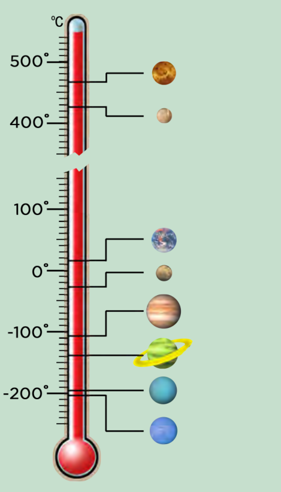
> **[Diagram Context - Textbook_NaturalScience_Gr8_The-Solar-System.pdf-0017-05.png]**
> This infographic uses a thermometer scale to compare the average surface temperatures of the planets in our solar system, with labels indicating values in degrees Celsius (°C). It illustrates the vast temperature gradient across the solar system, highlighting how proximity to the Sun and atmospheric composition influence the extreme thermal conditions found on different planetary bodies.


###### **<u>TAKE NOTE</u>** 

Ice does not just refer to water ice, but other frozen elements and compounds too. Also, the rocky-ice materials do not resemble any rock or ice you would see on Earth, since the temperatures and pressures on these planets and gas giants are much, much higher. 


> **[Diagram Context - Textbook_NaturalScience_Gr8_The-Solar-System.pdf-0017-08.png]**
> This illustration depicts a pair of hands interacting with a tablet interface featuring various abstract icons representing different digital functions or applications. The graphic serves as a visual metaphor for user-interface navigation, digital literacy, or the integration of ICT (Information and Communication Technology) tools within the classroom environment.


|**Planet**|**Temperature (**^{**o**}**C)**|
|---|---|
|Mercury|167|
|Venus|464|
|Earth|15|
|Mars|-65|
|Jupiter|-110|
|Saturn|-140|
|Uranus|-195|
|Neptune|-200|


**160** Planet Earth and Beyond 


###### **QUESTIONS:** 

1. Which planet has the lowest average temperature? 

2. Why do you think this is? 

3. What do you notice about the average temperatures of the terrestrial planets compared with the gas giants? **.** 

4. If you exclude Venus, how does the ordering of the planets from the Sun compare with their average temperature? 


> **[Diagram Context - Textbook_NaturalScience_Gr8_The-Solar-System.pdf-0018-06.png]**
> This graphic illustrates a schematic representation of a DNA double helix, featuring two antiparallel sugar-phosphate backbones represented by continuous, intertwined green ribbons. It conceptually demonstrates the structural arrangement of the DNA molecule, highlighting the helical twist and the complementary, antiparallel orientation of the two strands essential for genetic replication and transcription.


Clearly the terrestrial planets and gas giants have very different properties. Let's compare them. 

##### **ACTIVITY:** Comparing terrestrial planets and gas giants 

###### **INSTRUCTIONS:** 

1. The table below compares the two types of planet. Fill in the missing gaps. 

|**Terrestrial Planets**|**.**<br>**Gas Giants**|
|---|---|
|close to the Sun|from the Sun|
|closely spaced orbits|widely spaced orbits|
|small masses|large masses|
|small radii|radii|


> **[Diagram Context - Textbook_NaturalScience_Gr8_The-Solar-System.pdf-0018-12.png]**
> This illustration depicts a roller coaster track overlaid with a metallic spring-like Slinky toy and cartoon passengers experiencing the ride. Visible elements include a green rollercoaster track structure with a loop, a large superimposed coiled spring, and four cheering people riding the crest. Conceptually, this visual serves as an engaging physics analogy to demonstrate mechanical energy conservation and transformation between gravitational potential energy and kinetic energy as objects move along a vertical path.


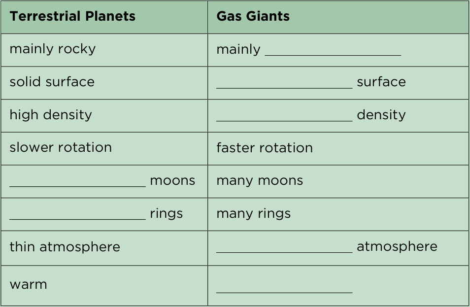
> **[Diagram Context - Textbook_NaturalScience_Gr8_The-Solar-System.pdf-0019-01.png]**
> This graphic is a comparative table designed as a fill-in-the-blank exercise for learners studying astronomy. The table contains two main column headers, "Terrestrial Planets" and "Gas Giants," with rows contrasting properties such as composition ("mainly rocky" versus blank space for "gaseous"), surface nature, density, rotation speed, presence of moons and rings, atmosphere thickness, and temperature. Conceptually, this activity helps learners contrast the two distinct categories of planets in our solar system by systematically comparing their physical characteristics and planetary features.


Why do you think the two types of planets are so different? 


> **[Diagram Context - Textbook_NaturalScience_Gr8_The-Solar-System.pdf-0019-03.png]**
> This graphic is a decorative border featuring repeating green curved shapes and arrows. There are no specific text labels, chemical symbols, or scientific variables visible. Conceptually, it serves purely as a page separator or aesthetic divider within educational materials rather than conveying specific curriculum content.


When the solar system was forming, the difference in temperature across the early solar system caused the inner planets to be rocky and the outer ones to be gaseous. Close to the Sun it was hot and only materials with very high melting points, such as metals, could remain solid and form planets. Further away from the Sun, where it was cold, compounds like water and methane were frozen. Astronomers call these frozen compounds _ices_ . Therefore the cores of the gas giants contain rocky and icy compounds. As the abundance of metals in the universe is very small, the inner planets are much smaller than the gas giants. The gas giants could also attract large amounts of hydrogen and helium to their atmospheres due to their size. 

Let's continue to compare the rocky planets and the gas giants. 

**162** Planet Earth and Beyond 

##### **ACTIVITY:** Comparing the inner and outer planets 

###### **INSTRUCTIONS:** 

Use the information in the table below to answer the questions that follow. 

|**Planet**|**Density**<br>**(kg/m**^{**3**}**)**|**Diameter**<br>**(km)**|**Distance**<br>**from the**<br>**Sun**<br>**(million**<br>**km)**|**Day length**<br>**(hours)**|**Year length**<br>**(Earth**<br>**days)**|
|---|---|---|---|---|---|
|Mercury|5427|4879|57.9|4222.6|88|
|Venus|5243|12104|108.2|2802.0|224.7|
|Earth|5514|12756|149.6|24.0|365.25|
|Mars|3933|6792|206.6|24.7|687.0|
|Jupiter|1326|142984|740.5|9.9|4331|
|Saturn|687|120536|1352.6|10.7|10747|
|Uranus|1271|51118|2741.3|17.2|30589|
|Neptune|1638|49528|4444.5|16.1|59800|


> **[Diagram Context - Textbook_NaturalScience_Gr8_The-Solar-System.pdf-0020-04.png]**
> This illustrative graphic depicts a metal Slinky toy moving end-over-end down a flight of green stairs, with motion lines indicating its tumbling trajectory. There are no explicit text labels, chemical symbols, or numerical variables present in the visual. Conceptually, it provides a physical model demonstrating the continuous conversion and conservation of mechanical energy (potential and kinetic energy) and elastic potential energy as an object moves through a gravitational field.


###### **QUESTIONS:** 

1. Given that the density of water is 1000 kg/m^{3} , which of the planets would float on water? Explain your answer. 

2. Compare the densities of the rocky planets and the gas giants. Which type of planet tends to be more dense? Explain why. 

3. Which planet has the shortest day? 

4. Compare the day length for the rocky planets and the gas giants. Which type of planet tends to have the shortest day? What does this tell you about how fast the two types of planet rotate on their axis? 


5. Which planet orbits around the Sun the fastest? Why is this? 

6. Which planet's year is shorter than its day? 

7. Plot a bar graph to show the distance each planet is from the Sun. Use the following space for your graph. 


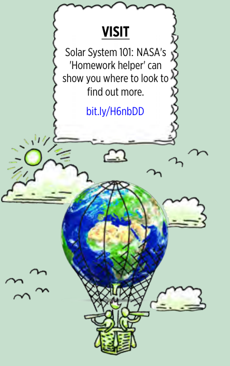
> **[Diagram Context - Textbook_NaturalScience_Gr8_The-Solar-System.pdf-0021-04.png]**
> This educational graphic features an illustrated cartoon scene depicting a hot air balloon shaped like planet Earth, carrying two tiny figures looking through telescopes into the sky, accompanied by clouds, birds, and a sun. Visible text includes the heading "VISIT", the instructional prompt "Solar System 101: NASA's 'Homework helper' can show you where to look to find out more.", and a web link "bit.ly/H6nbDD". Conceptually, the graphic serves as an engaging, introductory resource to encourage high school learners studying Earth and Space Sciences to explore planetary systems and astronomical concepts beyond the classroom.


> **[Diagram Context - Textbook_NaturalScience_Gr8_The-Solar-System.pdf-0021-05.png]**
> The provided graphic is entirely blank and contains no visual content, labels, or structures. As a result, no specific CAPS curriculum concepts, variables, or educational relationships can be identified or interpreted from this image.


> **[Diagram Context - Textbook_NaturalScience_Gr8_The-Solar-System.pdf-0021-06.png]**
> The graphic is a horizontal decorative border featuring a repeating pattern of green curved, ribbon-like shapes resembling abstract waves or scrolls against a pale green background. There are no explicit text labels, variables, biological structures, chemical symbols, or axis names present within the image. Conceptually, this visual element serves purely as a formatting divider or page accent rather than conveying specific curriculum content for high school learners.


Planet Earth and Beyond 

###### **Mercury** 

###### **<u>TAKE NOTE</u>** 


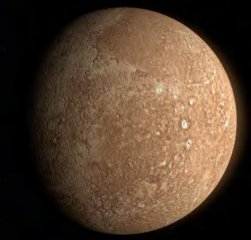
> **[Diagram Context - Textbook_NaturalScience_Gr8_The-Solar-System.pdf-0022-02.png]**
> This educational graphic is an astronomical photograph of the planet Mercury showing its heavily cratered, rocky surface against the dark void of space. The image displays no visible text labels, axes, or arrows, capturing only the natural terrain and crescent illumination of the terrestrial body. Conceptually, this visual supports CAPS Earth and Space Sciences by illustrating the geological features and appearance of the innermost rocky planet in our solar system.


_Mercury, imaged by the Messenger spacecraft, is covered with craters like our Moon._ 

- Mercury's atmosphere is very thin and constantly being lost into space because the planet's gravity is too small to hold onto it. 

- Mercury has the most extreme temperatures in the solar system, reaching 426^{o} C during the day and -173^{o} C during the night. 

The following pages provide some interesting, extra information about the planets in our solar system. 


> **[Diagram Context - Textbook_NaturalScience_Gr8_The-Solar-System.pdf-0022-07.png]**
> This cartoon illustration depicts a stylized thief wearing striped clothing crouching down while stealthily carrying away a framed artwork resembling the Mona Lisa. The visible elements include a costumed figure in motion lines, an ornate frame holding a portrait of a person with crossed arms, and an empty speech bubble above the figure. Conceptually, this visual serves as an engaging prompt for Creative Arts or Life Orientation lessons to discuss themes of copyright, intellectual property theft, or the legal and ethical implications of art forgery and plagiarism.


###### **Venus** 

###### **<u>TAKE NOTE</u>** 


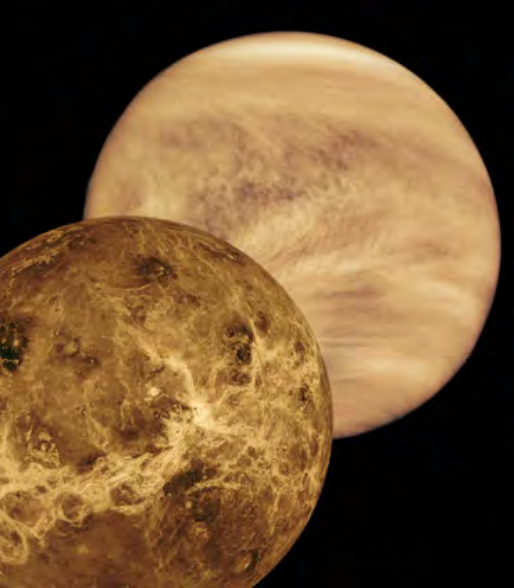
> **[Diagram Context - Textbook_NaturalScience_Gr8_The-Solar-System.pdf-0022-10.png]**
> This composite astronomical graphic features two views of the planet Venus, showing its thick, swirling cloud cover in the upper sphere and its heavily cratered, solid surface topography in the foreground sphere. There are no visible labels, text, or arrows present in this image. Conceptually, this visual aids high school learners in understanding planetary structure by contrasting the obscured, reflective atmosphere of Venus with its actual rocky surface revealed through radar imaging.


- Venus is the hottest planet in the solar system, the temperature is hot enough to melt lead! 

- Venus has clouds of sulphuric acid. 

- Venus rotates in the opposite direction to all the other planets. 

Venus has a thick dense atmosphere mostly made up of carbon dioxide which is an effective greenhouse gas. This is why Venus has the highest surface temperature, as you saw in the activity of Planetary Temperatures. 

_The surface of Venus in false colour (bottom left) and the top of the atmosphere (top left) as seen with the Magellan spacecraft._ 

###### **Earth** 

###### **<u>DID YOU KNOW?</u>** 


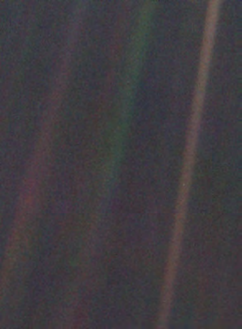
> **[Diagram Context - Textbook_NaturalScience_Gr8_The-Solar-System.pdf-0023-02.png]**
> This photograph, famously known as the "Pale Blue Dot," is a deep-space photograph of Earth taken by the Voyager 1 space probe from a record distance of about 6 billion kilometers. The image displays a vast, dark field of space crossed by faint bands of scattered sunlight, within which Earth appears as a tiny, barely discernible speck of light (a pale blue pixel) caught in a sunbeam. For high school Physical Sciences and Geography learners studying the solar system and astronomy, this visual powerfully conveys the immense scale of the universe, putting Earth's planetary scale and the vast distances between celestial bodies into perspective.


As Voyager 1 was leaving the solar system, Carl Sagan, a famous astronomer, requested that they turn the camera around to take a photograph of Earth across a great expanse of space. 


> **[Diagram Context - Textbook_NaturalScience_Gr8_The-Solar-System.pdf-0023-04.png]**
> This conceptual illustration depicts an astronaut standing on a cratered red apple treated as a planet within a stylized space setting containing stars, planets, lightning bolts, and a speech bubble. The visual elements include an astronaut in a spacesuit planting a flag into the surface of the red apple, surrounded by cosmic iconography. Conceptually, this whimsical graphic serves as a creative prompt to engage learners in physics or space science by contrasting everyday objects with cosmic scales, prompting discussions about gravity, planetary exploration, or creative scientific writing.


_This famous image is a photograph taken of Earth in 1990 by Voyager 1 from 6 billion kilometers away. Earth appears as a tiny dot (the blueish-white speck approximately halfway down the brown band to the right). The coloured bands are scattered light rays from the Sun._ 

**<u>VISIT</u>** Carl Sagan - Pale Blue Dot (video) bit.ly/1h0msBx 

###### **Mars** 


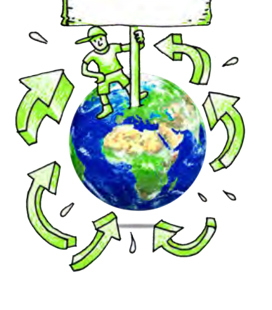
> **[Diagram Context - Textbook_NaturalScience_Gr8_The-Solar-System.pdf-0023-08.png]**
> The graphic depicts an educational illustration centered around a globe showing Africa and the Atlantic Ocean, with a figure standing on top holding a blank wooden signpost. Surrounding the Earth are several large, curved green arrows forming a continuous circular flow, accompanied by small droplet shapes and motion marks. Conceptually, this diagram visually conveys the cyclical nature of environmental management, recycling, and global sustainability for CAPS environmental geography and science learners.


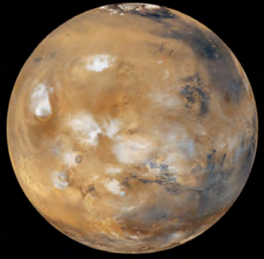
> **[Diagram Context - Textbook_NaturalScience_Gr8_The-Solar-System.pdf-0023-09.png]**
> This educational graphic is a full-disk photographic image of the planet Mars. It displays the characteristic rusty-orange, iron oxide-rich surface terrain, darker volcanic regions, and white polar ice caps and atmospheric clouds against a black background. For a CAPS Grade 7 or 10 Natural Sciences learner, this visual conveys the appearance and key surface features of a terrestrial planet within our solar system, supporting studies on planetary geology and space science.


###### **<u>DID YOU KNOW?</u>** 

The largest volcano in the solar system, Olympus Mons, is on Mars and is three times taller than Mount Everest. 

_Mars is nicknamed the Red Planet because of its red surface, as the rocks on are rich in iron. The white smudges in the middle are water-ice clouds._ 


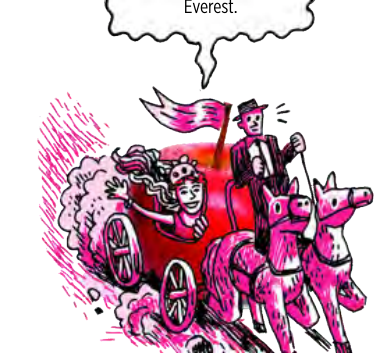
> **[Diagram Context - Textbook_NaturalScience_Gr8_The-Solar-System.pdf-0023-13.png]**
> This educational illustration depicts an apple-shaped carriage speeding downhill, pulled by two pink horses and driven by a man, with a woman waving from inside and a speech bubble referencing Mount Everest. Visible elements include motion lines, smoke trails, wheels, a flag, and a thought bubble containing text. Conceptually, this whimsical cartoon illustrates physical motion and acceleration down a slope, often used in introductory physics to engage learners with concepts of speed, gravity, and reference frames.


- To date, Earth is the only planet in the universe known to harbour life. 

- The average distance between the Sun and Earth is called an _astronomical unit_ (AU) and is equivalent to 150 million kilometres. 

- Mars' surface is like a dry red desert. Mars has mountains, volcanoes and valleys just like Earth. 

- Mars is home to the deepest and longest valley in the solar system, _Valles Marineris_ , which is almost as wide as Australia! 

**166** Planet Earth and Beyond 

###### **Mars and the Search for Life** 

Scientists are interested in Mars because they think that Mars might have once had liquid water on its surface, and perhaps life. Channels, valleys, and gullies are found all over Mars, suggesting that liquid water might have once flowed through them. Although there is no liquid water on the planet's surface now, scientists think that there may still be some water in cracks and tiny holes in underground rock. Mars has been visited many times by robotic landers. The first lander, NASA's Viking 1, landed on Mars in 1976, a long time before you were born! It took the first close-up pictures of the Martian surface but found no evidence of life. Water ice has been discovered below the planet's surface, and minerals indicating that liquid water was once present have also been found by Mars landers. The latest lander currently exploring Mars is NASA's Mars Science Laboratory mission, with its rover named Curiosity. Curiosity landed on Mars in August 2012 and is busy investigating the planet's rocks near a giant crater called the Gale crater. One of the main aims of the Mars Science Laboratory is to determine whether Mars ever had an environment capable of supporting life. 


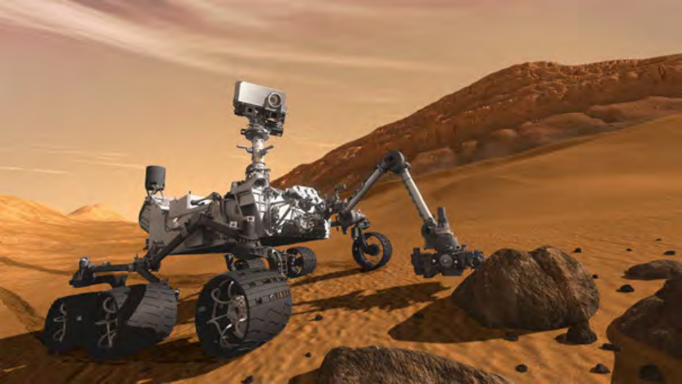
> **[Diagram Context - Textbook_NaturalScience_Gr8_The-Solar-System.pdf-0024-02.png]**
> This image is a digital illustration depicting a robotic rover exploring a rocky, barren, reddish-orange planetary landscape. Visible features include a robotic arm equipped with sampling tools, high-mounted camera masts, and rugged wheels designed for traversing uneven terrain. For a CAPS-aligned curriculum, this graphic serves as a contextual stimulus for Physical Sciences and Natural Sciences, illustrating the application of mechanics, energy systems, remote sensing, and space science in extraterrestrial exploration.


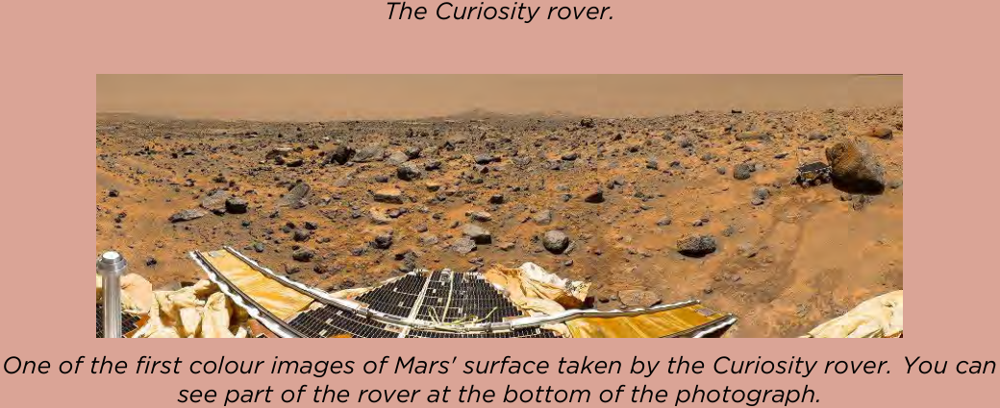
> **[Diagram Context - Textbook_NaturalScience_Gr8_The-Solar-System.pdf-0024-03.png]**
> The image is a colour photograph taken by the Curiosity rover showing a panoramic view of the rocky Martian surface with part of the rover visible in the foreground. Visible elements include a rocky landscape under a reddish sky, scattered boulders, and components of the rover's deck and mast. This visual conveys the real-world application of space exploration and planetary science, demonstrating how technological probes gather empirical data about extraterrestrial environments.


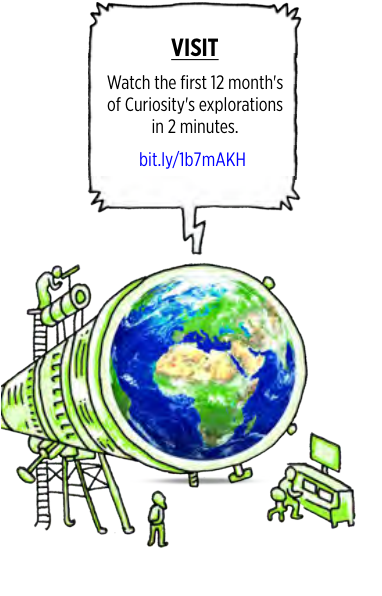
> **[Diagram Context - Textbook_NaturalScience_Gr8_The-Solar-System.pdf-0024-04.png]**
> This educational cartoon graphic depicts a large telescope focused on Earth, accompanied by a speech bubble containing the text "VISIT: Watch the first 12 month's of Curiosity's explorations in 2 minutes. bit.ly/1b7mAKH". Visible labels include the heading "VISIT" and a shortened URL link, alongside human figures operating scientific equipment. Conceptually, this resource engages CAPS learners by linking Earth science and space exploration with digital multimedia resources to demonstrate real-world planetary observation.


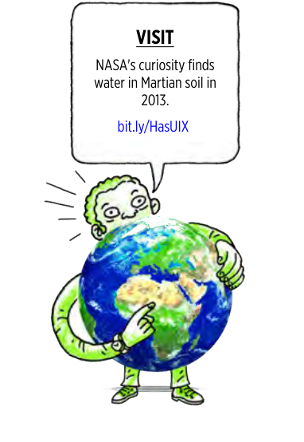
> **[Diagram Context - Textbook_NaturalScience_Gr8_The-Solar-System.pdf-0024-05.png]**
> This educational cartoon features a green-skinned humanoid character hugging the planet Earth while pointing towards it with one hand, accompanied by a speech bubble. The visible text reads "VISIT", "NASA's curiosity finds water in Martian soil in 2013.", and a web link "bit.ly/HasUIX". Conceptually, this graphic serves as an engaging stimulus to spark learner interest in space science, planetary exploration, and the search for extraterrestrial water as part of CAPS curriculum discussions on the solar system and Earth's place in the universe.


###### **Jupiter** 


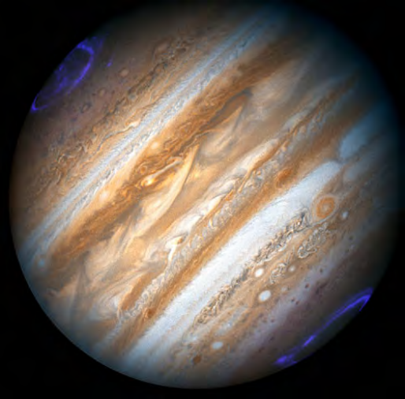
> **[Diagram Context - Textbook_NaturalScience_Gr8_The-Solar-System.pdf-0025-01.png]**
> This astronomical image displays the planet Jupiter, featuring its characteristic banded cloud structure of belts and zones alongside vibrant auroral displays glowing in blue at the polar regions. Visible features include atmospheric swirling patterns, storm systems like the Great Red Spot, and ultraviolet auroral rings produced by charged particles interacting with the planet's magnetic field. Conceptually, this visual supports Grade 10-12 Physical Sciences and Geography learners studying the solar system, planetary atmospheres, and magnetospheres by demonstrating how multi-spectral imaging reveals planetary magnetic and meteorological phenomena.


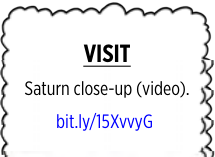
> **[Diagram Context - Textbook_NaturalScience_Gr8_The-Solar-System.pdf-0025-02.png]**
> This educational resource is a text box graphic featuring a call to action with the underlined heading "VISIT", followed by the text "Saturn close-up (video)." and a short URL link "bit.ly/15XvvyG". It serves as a digital reference guide directing students to multimedia content about the planet Saturn. Conceptually, this resource supports CAPS Physical Sciences and Geography learners by extending textbook learning through visual exploration of our solar system's gas giants.


> **[Diagram Context - Textbook_NaturalScience_Gr8_The-Solar-System.pdf-0025-03.png]**
> This environmental geography graphic depicts an illustrative conceptual diagram featuring a hot air balloon whose envelope is shaped like planet Earth. The visual elements include a globe envelope, a basket carrying two figures with telescopes looking outward, a burner flame beneath the globe, a radiant sun, clouds, birds, and an empty text banner above. Conceptually, this diagram illustrates environmental awareness, global observation, or planetary stewardship, prompting learners to consider Earth systems, sustainability, and human responsibility toward the environment in CAPS Geography and Natural Sciences.


_Magnetic storms cause the aurorae seen on Jupiter near its poles._ 

###### **Saturn** 


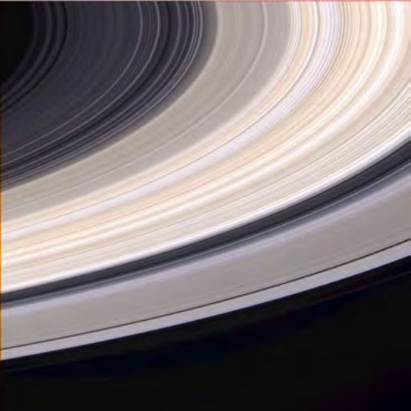
> **[Diagram Context - Textbook_NaturalScience_Gr8_The-Solar-System.pdf-0025-06.png]**
> This close-up astronomical image displays the complex ring system of the planet Saturn against the backdrop of space, showing numerous concentric icy ringlets and distinct gaps. There are no visible text labels, arrows, or coordinates on this image. Conceptually, it illustrates the composition and structure of planetary rings in our solar system, supporting FET Physical Sciences (Earth and Space Sciences) learning objectives regarding planetary systems and gravitational forces.


- Jupiter's diameter is over ten times the Earth's diameter. 

- Jupiter rotates slightly faster at the equator (remember it is not a solid object, but a large ball of gas). 

- Jupiter's famous great red spot, is a giant hurricane that has been raging for at least 300 years. This storm's area is larger than the Earth. 

- Saturn would float on water if you had an ocean large enough. 

- Saturn is famous for its rings. The rings are over 200 000 km wide and only a few tens of metres thick. 

_Saturn's beautiful rings, imaged with the Cassini spacecraft._ 

Planet Earth and Beyond 

###### **Uranus** 


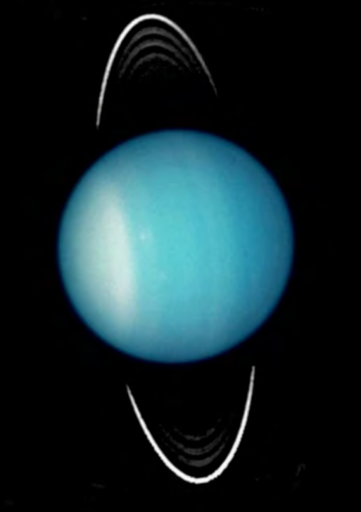
> **[Diagram Context - Textbook_NaturalScience_Gr8_The-Solar-System.pdf-0026-01.png]**
> This space-based image shows the planet Uranus with its faint, concentric ring system clearly visible against a dark background. The graphic displays the solid cyan-blue disc of the gas giant along with its arched ring arcs passing above and below the planetary body. For CAPS Grade 10 Physical Sciences learners studying the Earth and Beyond, this conveys the appearance and structure of the outer planets in our solar system, illustrating that ring systems are not exclusive to Saturn.


- Uranus is believed to have an ocean of liquid water, ammonia, and methane above a rocky core. 

- Uranus was the first planet discovered using a telescope. 


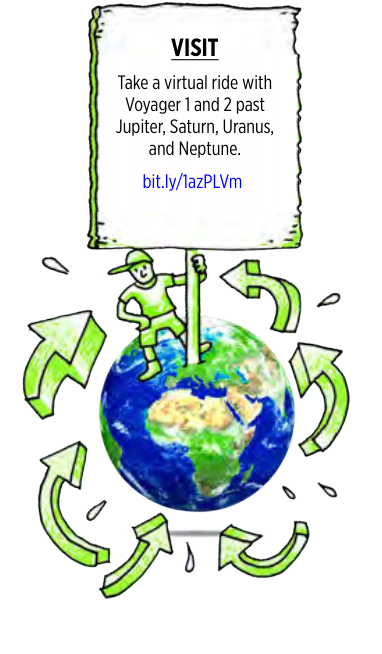
> **[Diagram Context - Textbook_NaturalScience_Gr8_The-Solar-System.pdf-0026-04.png]**
> This educational graphic features an illustrative cartoon graphic depicting planet Earth with a smiling figure standing on top holding a sign and surrounded by a ring of directional green arrows. Visible text on the banner includes "VISIT", "Take a virtual ride with Voyager 1 and 2 past Jupiter, Saturn, Uranus, and Neptune.", and a URL link "bit.ly/1azPLVm". Conceptually, this graphic serves as an interactive enrichment activity that encourages learners to explore space science and planetary systems by engaging with a virtual simulation of the Voyager missions.


_Uranus spins on its side. Scientists think Uranus may have been knocked on its side by a collision with a large object early in its history._ 

###### **Neptune** 


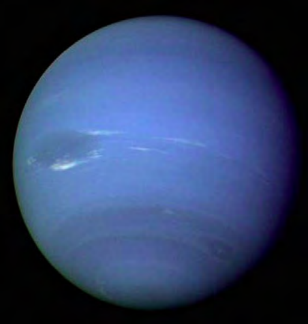
> **[Diagram Context - Textbook_NaturalScience_Gr8_The-Solar-System.pdf-0026-07.png]**
> This graphic is a full-color astronomical photograph of the planet Neptune against a dark space background, showing no visible labels, arrows, or text. It displays Neptune's characteristic vibrant blue coloration and faint atmospheric banding with bright cloud features. For a high school student studying Earth and Space Sciences within the CAPS curriculum, this visual conveys the appearance and atmospheric features of the outermost gas giant in our solar system.


- Neptune has the strongest winds in the solar system. With storm winds recorded at over 10 times that of hurricanes on Earth. 

- Neptune has the most methane in its atmosphere out of all the gas giants, which gives it its blue colour. 

_Neptune and its "Great Dark Spot" (middle left). This is a giant storm that was raging on the planet until very recently. The winds reached nearly 1931 km/hour._ 


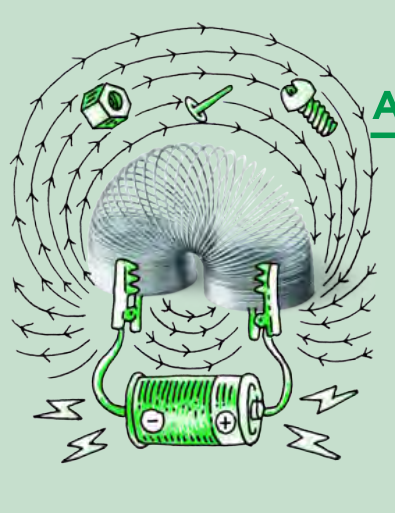
> **[Diagram Context - Textbook_NaturalScience_Gr8_The-Solar-System.pdf-0027-00.png]**
> The graphic illustrates an electromagnetic apparatus featuring a coiled wire connected to a DC power source. Visible elements include a cylindrical battery labeled with positive (+) and negative (-) terminals, a coiled spring-like conductor attached via clips, curved magnetic field lines with directional arrows, and scattered metal fasteners like a nut, pin, and bolt near the top. Conceptually, this demonstrates how an electric current flowing through a solenoid creates a surrounding magnetic field capable of exerting magnetic force on ferromagnetic objects.


##### **ACTIVITY:** Planetary holidays 

In this activity you will write a travel brochure for a trip to your favourite planet. **MATERIALS:** 

- information about the planets 

- pictures of the planets 

- example travel brochures 

###### **INSTRUCTIONS:** 

1. Research information about your chosen planet. 

2. Write a travel brochure for a trip to your chosen planet. Include real facts about the planet and think about what unusual things you could see and do on the planet. 


> **[Diagram Context - Textbook_NaturalScience_Gr8_The-Solar-System.pdf-0027-09.png]**
> This graphic is a decorative border featuring a repeating pattern of stylized green arrows or ribbon-like shapes on a light background. There are no explicit scientific labels, variables, or biological structures present. Functionally, it serves purely as a visual divider or aesthetic element rather than conveying core CAPS curriculum subject matter.


> **[Diagram Context - Textbook_NaturalScience_Gr8_The-Solar-System.pdf-0027-10.png]**
> This educational graphic is an anatomical and mechanical analogy featuring a caterpillar feeding on a leaf, with its segmented body metaphorically represented by a coiled spring toy. The illustration includes visible features such as green leaves, segmented caterpillar body sections, legs, a smiling cartoon head biting a leaf, and a metallic Slinky-style spring overlaying the body. Conceptually, this diagram helps Grade 10-12 Life Sciences learners visualize animal locomotion and muscular-skeletal coordination by comparing the rhythmic contraction and extension of an invertebrate's segmented hydrostatic or muscular body to the compression and relaxation of a mechanical spring.


##### **ACTIVITY:** Planet fact sheet 

In this activity you will make a one page fact sheet about your chosen planet. **MATERIALS:** 

- information about the planets 

- pictures of the planets 

###### **INSTRUCTIONS:** 

1. Research information about your chosen planet. 

2. Write a one page fact sheet about your chosen planet. 


> **[Diagram Context - Textbook_NaturalScience_Gr8_The-Solar-System.pdf-0027-18.png]**
> The graphic is a decorative border featuring a repeating pattern of stylized green arrows on a pale background. The visual consists solely of multiple curved arrow shapes aligned horizontally across the image. Conceptually, this border element is purely decorative and does not convey specific biological, chemical, or physical curriculum content.


Let's now look at some of the other objects that we find in our solar system. 

Planet Earth and Beyond 

###### **Asteroids** 

Asteroids are small rocky objects that are believed to be left over from the formation of our solar system 4.6 billion years ago. They range in size from tens of metres across to several hundred kilometres across and come in a variety of shapes. Most asteroids are found in the **asteroid belt** , which lies between the orbits of Mars and Jupiter. More than 100,000 asteroids lie in the asteroid belt and several thousand of the largest ones have been named. 


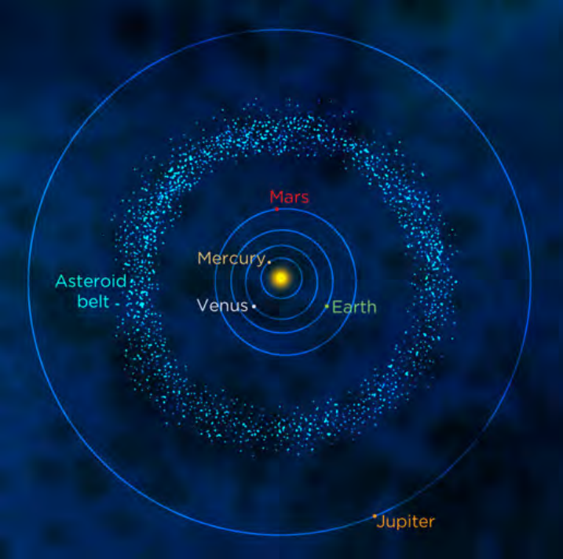
> **[Diagram Context - Textbook_NaturalScience_Gr8_The-Solar-System.pdf-0028-02.png]**
> This diagram is an educational model of the inner solar system, illustrating the Sun at the center with concentric circular orbits. Visible labels include Mercury, Venus, Earth, Mars, Jupiter, and the "Asteroid belt," along with the Sun. Conceptually, it conveys the relative positions of the inner terrestrial planets, the outer gas giant Jupiter, and the distinct spatial region of the asteroid belt located between the orbits of Mars and Jupiter.


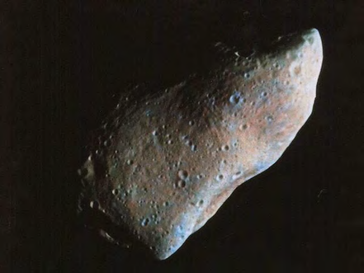
> **[Diagram Context - Textbook_NaturalScience_Gr8_The-Solar-System.pdf-0028-03.png]**
> The graphic displays an astronomical photograph of an asteroid, showing its irregular shape, rocky surface texture, and impact craters against a dark background, with no visible text labels or arrows. In the context of the CAPS Senior Phase Natural Sciences curriculum (Earth and Beyond strand), this visual helps learners understand the characteristics of minor bodies in our solar system, distinguishing them from spherical planets and moons.


_An image of asteroid 951 Gaspra taken with the Galileo spacecraft 5300 kilometres away. Gaspra is 19 x 12 x 11 km. Notice how the asteroid's surface has many craters._ 

Although science fiction movies give the impression that the asteroid belt is a tightly packed region of dangerous rocks, in reality the asteroids are separated from each other by millions of kilometres. However, very rarely, collisions between asteroids do occur which is why asteroids are covered with impact craters. We will look at impact craters more closely in the following activity. 


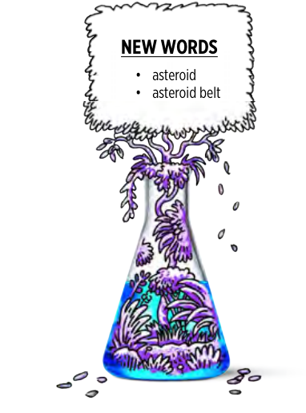
> **[Diagram Context - Textbook_NaturalScience_Gr8_The-Solar-System.pdf-0028-06.png]**
> The graphic is an educational illustration featuring a laboratory flask containing purple aquatic or alien-like vegetation and blue liquid, topped with a cloudy text box. The visible text labels read "NEW WORDS", "asteroid", and "asteroid belt". Conceptually, this visual introduces key vocabulary for an astronomy topic, using whimsical imagery to engage learners with planetary science concepts such as space debris and solar system formation.


###### **<u>DID YOU KNOW?</u>** 

In the region of the asteroid belt closest to the Sun, the asteroids are mainly metallic objects. Those further away are rocky objects. Rocky asteroids appear darker than metallic 


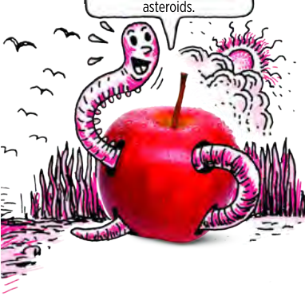
> **[Diagram Context - Textbook_NaturalScience_Gr8_The-Solar-System.pdf-0028-09.png]**
> This educational graphic is an illustrated cartoon depicting an earthworm burrowing through and eating a red apple in an outdoor ecosystem with a sun, clouds, grass, and birds. Visible elements include a smiling anthropomorphic pink segmented worm with sweat drops, a speech bubble containing partial text referencing "asteroids", a bright red apple with a stem, and environmental background features such as flying birds, grass, and a sun. Conceptually, this diagram visually communicates the ecological role of organisms within a food web, specifically demonstrating how heterotrophs (consumers and decomposers) interact with producers and their physical environment in Life Sciences.


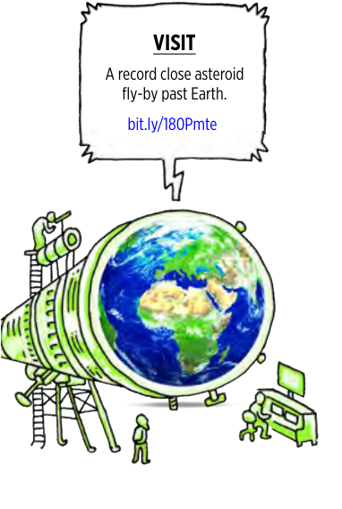
> **[Diagram Context - Textbook_NaturalScience_Gr8_The-Solar-System.pdf-0028-10.png]**
> The graphic is a cartoon illustration depicting an astronomical observational setup with a large telescope framing Earth and a speech bubble containing the text "VISIT", "A record close asteroid fly-by past Earth.", and a URL ("bit.ly/180Pmte"). Visible elements include human figures operating equipment, a telescope structure, a globe representing Earth, and an explanatory speech bubble with an arrow pointing to the telescope. Conceptually, this visual supports earth and space science topics by engaging students with real-world astronomical events, specifically the monitoring and close proximity of near-Earth asteroids relative to our planet.


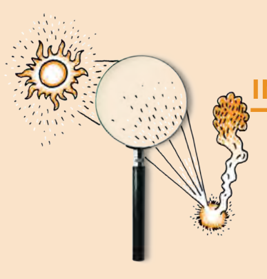
> **[Diagram Context - Textbook_NaturalScience_Gr8_The-Solar-System.pdf-0029-00.png]**
> This educational graphic illustrates a physics ray diagram showing a convex converging lens functioning as a magnifying glass. The visual elements include a radiating sun on the left, a centrally placed magnifying glass lens concentrating incoming rays, and convergent light rays focusing to a bright focal point on a combustible object on the right that ignites into smoke. Conceptually, this demonstrates to high school learners how convex lenses refract and converge parallel light rays to a single focal point, concentrating thermal energy to produce high temperatures.


##### **INVESTIGATION:** Impact craters 

**INVESTIGATIVE QUESTIONS:** How does the mass of an object affect the size of the crater it leaves? How does the height at which an object is dropped affect the size of the crater it leaves? 

###### **HYPOTHESIS:** 

What do you think will happen? 

###### **IDENTIFY VARIABLES:** 

###### **<u>VISIT</u>** 

1. What are you keeping constant in this experiment? 

Join NASA on an underwater mission, called NEEMO, which is actually about practicing exploration to an asteroid. Help the crew prepare by classifying the underwater images. bit.ly/15XvI4P 


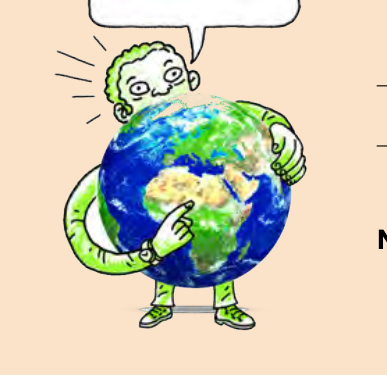
> **[Diagram Context - Textbook_NaturalScience_Gr8_The-Solar-System.pdf-0029-09.png]**
> This educational graphic features an illustrated, cartoon-style figure interacting with a globe representing the Earth, with Africa prominently visible as the figure points towards it. The image includes a blank speech bubble above the figure, motion lines near the head, and a wristwatch on the green-sleeved arm. Conceptually, this visual introduces learners to global environmental perspectives and geography, serving as a stimulus for discussions around human impact on the planet, earth systems, or resource management within the CAPS curriculum.


2. What are you changing in this experiment? 

###### **MATERIALS:** 

- deep tray or large plastic container 

- measuring scales 

- ruler 

- sand 

- a marble 

- a ball bearing 

- chair or step ladder 

- measuring tape (at least 2 m long) 

###### **METHOD:** 

1. Fill the tray or plastic container with sand to a depth of 10 cm. 

2. Smooth the surface of the sand using the long edge of a ruler. 

3. Measure the mass of the marble and record it in the table below. 

4. Drop the marble from a height of 1 m into the tray of sand and observe the crater that forms. 

5. Carefully remove the marble, without disturbing the shape of the crater and measure the diameter of the crater using the ruler. 

6. Record the diameter of the crater in the table below. 

7. Smooth the sand. 

8. Repeat steps 3-7 

**172** Planet Earth and Beyond 


9. Measure the mass of the ball bearing and record it in the table below. 

10. Drop the ball bearing from a height of 1 m into the tray of sand and observe the crater that forms. 

11. Carefully remove the ball bearing and measure the diameter of the crater using the ruler. 

12. Record the diameter of the crater in the table below. 

13. Smooth the sand. 

14. Repeat steps 9 -13. 

15. Drop the ball bearing into the sand from a height of 2 m. You may need to stand on a chair or step ladder to do this. 

16. Record the size of the crater formed in the table below. 

17. Smooth the sand. 

18. Repeat steps 15-17, dropping the ball bearing from heights of 1.5m, 0.5m and 0.25m. Record all your measurements in the table below. 

19. If you have time you can make repeated measurements. 

###### **RESULTS AND OBSERVATIONS:** 

Record your results and observations in the following table. 

|**Object**|**Mass (kg)**|**Drop**<br>**Height (m)**|**Crater**<br>**diameter -**<br>**reading 1**<br>**(cm)**|**Crater**<br>**diameter -**<br>**reading 2**<br>**(cm)**|**Average**<br>**crater**<br>**diameter**<br>**(cm)**|
|---|---|---|---|---|---|
|marble||1||||
|ball bearing||**~~.~~**<br>1||||
|ball bearing||2||||
|ball bearing||1.5||||
|ball bearing||0.5||||
|ball bearing||0.25||||

###### **EVALUATION:** 

How reliable was your experiment? How could it be improved? 

###### **CONCLUSIONS:** 

Write a conclusion for this investigation based on your results. 


###### **QUESTIONS:** 

1. How did the mass of the object affect the size of the crater? 

###### **<u>DID YOU KNOW?</u>** 

2. How did the height at which the object was dropped affect the size of the crater? 

As Jupiter is more massive than all the other planets in the solar system, its large gravity attracts many asteroids and comets travelling in towards the inner solar system that would otherwise potentially crash into the Earth. 

3. Why do you think the drop height affected the size of the crater? **.** 


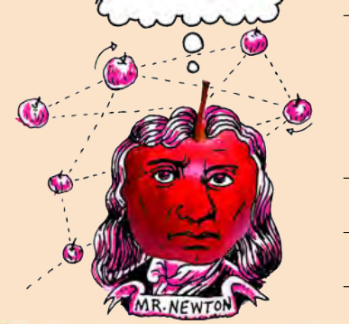
> **[Diagram Context - Textbook_NaturalScience_Gr8_The-Solar-System.pdf-0031-07.png]**
> This cartoon illustration depicts a whimsical physics concept graphic centered around a portrait of "MR. NEWTON" with an apple-shaped head and a thought bubble above. Surrounding the central figure are multiple pink apples connected by dashed lines, with directional arrows indicating mutual gravitational interactions between masses. For a Grade 11 Physical Sciences learner, the diagram conceptually illustrates Newton's Law of Universal Gravitation, showing how every particle of matter attracts every other particle in the universe.


4. What does this investigation tell us about craters on the surfaces of planets? 


> **[Diagram Context - Textbook_NaturalScience_Gr8_The-Solar-System.pdf-0031-09.png]**
> The graphic is an illustrative analogy of a zipper with interlocking teeth and a slider. The diagram features a continuous, horizontal metal-style zipper with alternating teeth merging together. Conceptually, it serves as a visual metaphor for molecular processes involving complementary base pairing and strand joining, such as DNA replication and transcription in Life Sciences.


###### **<u>NEW WORDS</u>** 

- Kuiper Belt 

- • Kuiper Belt object 

###### **Kuiper Belt objects** 

- dwarf planet 

- • comet • Oort Cloud 

The Kuiper belt is a region of space filled with trillions of small objects that lies in the outer reaches of the solar system, past the orbit of Neptune. The Kuiper belt is a region between 30 and 50 times the Earth's distance from the Sun. This belt is similar to the closer asteroid belt, except that the objects are not made of rock, but rather of frozen ices. These icy objects can range in size from a fraction of a kilometre to more than a 1000 km across and are called Kuiper belt objects. The two largest known members of the Kuiper Belt are Eris and Pluto, both dwarf planets. 


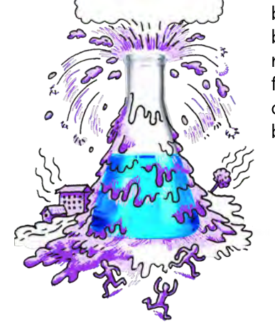
> **[Diagram Context - Textbook_NaturalScience_Gr8_The-Solar-System.pdf-0031-15.png]**
> The graphic is an illustrative chemical apparatus showing an Erlenmeyer flask undergoing a violent, overflowing chemical reaction with purple liquid cascading down its sides, surrounded by stylized buildings, small human figures fleeing, and rising vapor clouds. Visible elements include a blue liquid level inside the flask, purple froth and droplets erupting from the neck, motion lines, and running stick figures at the base. Conceptually, this diagram visually represents a rapid or uncontrolled chemical reaction that releases gas and liquid, helping students understand the hazards of chemical experiments and the importance of safety protocols in the laboratory.


Planet Earth and Beyond 


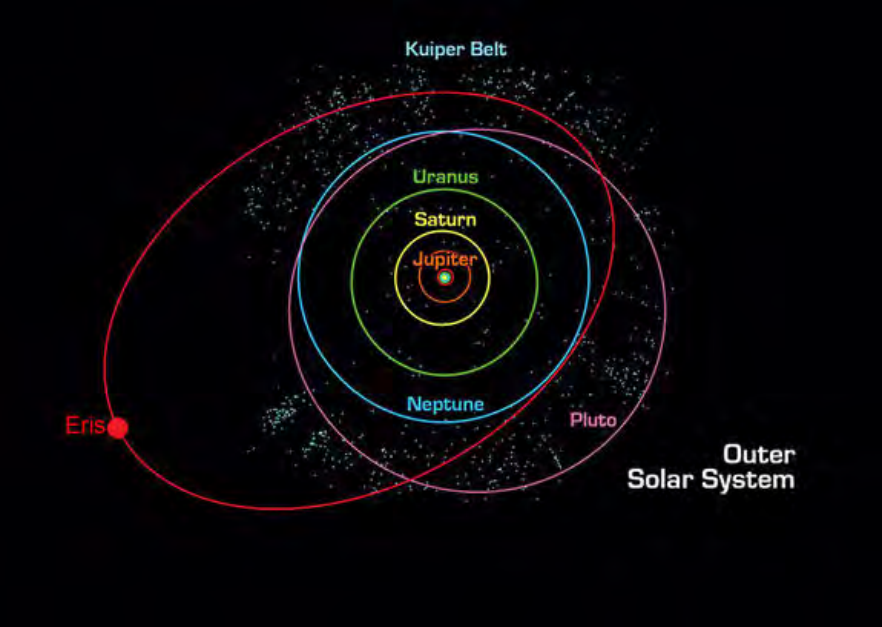
> **[Diagram Context - Textbook_NaturalScience_Gr8_The-Solar-System.pdf-0032-00.png]**
> This educational graphic is an astronomical diagram illustrating the outer solar system. It features concentric and elliptical orbital paths labeled with the planets Jupiter, Saturn, Uranus, Neptune, Pluto, and the dwarf planet Eris, alongside outer regions marked as the Kuiper Belt. Conceptually, this diagram conveys the relative positions, orbital eccentricities, and spatial arrangement of the outer planets and trans-Neptunian objects relative to the inner solar system.


_The Kuiper belt (the pale blue dot dots) is shown beyond the orbit of Neptune. Its members include the dwarf planets Pluto and Eris._ 


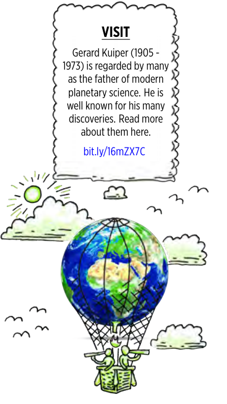
> **[Diagram Context - Textbook_NaturalScience_Gr8_The-Solar-System.pdf-0032-02.png]**
> This educational graphic features an informational text box and an illustration of a hot air balloon designed like planet Earth, with observers looking through telescopes from its basket. The text box includes the heading "VISIT", text about "Gerard Kuiper (1905 - 1973)", and a shortened URL link "bit.ly/16mZX7C". Conceptually, it serves as an engaging enrichment resource within Earth and Space Sciences to introduce students to the contributions of modern planetary science pioneers.


###### **<u>DID YOU KNOW?</u>** 

What keeps the objects in the Kuiper Belt in orbit around the Sun? 

###### **Dwarf planets** 

Dwarf planets are objects that orbit the Sun, just like the planets. However, they are smaller than planets. Due to their small size, they are unable to meet the official definition of a planet. Can you remember what the three criteria are to be classed as a planet? List them below. 

To be classed as a planet an object must: 

Asteroids are clearly not planets as they have irregular shapes and they are not spherical. Some dwarf planets are spherical, but they do not meet the third criterion. With their weak gravities they are unable to clear out other objects from their orbits. Which famous ex-planet is now considered a dwarf planet because it failed to meet the third criterion? 

For many years the object Pluto was considered to be a planet. However, since the 1990s many more objects very similar to Pluto have been discovered orbiting the Sun out past Neptune's orbit. This resulted in new criteria to be drawn up to be considered a planet and Pluto was demoted to dwarf planet status 


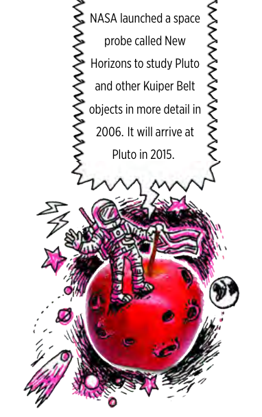
> **[Diagram Context - Textbook_NaturalScience_Gr8_The-Solar-System.pdf-0032-10.png]**
> An informational graphic depicting an astronaut standing on a cratered red sphere resembling a planet, surrounded by space elements including stars, comets, and a speech bubble with jagged borders. The visible text in the speech bubble reads: "NASA launched a space probe called New Horizons to study Pluto and other Kuiper Belt objects in more detail in 2006. It will arrive at Pluto in 2015." This diagram illustrates real-world space exploration milestones, specifically introducing learners to the New Horizons mission to Pluto and the outer Solar System.


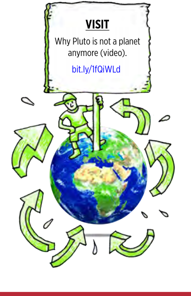
> **[Diagram Context - Textbook_NaturalScience_Gr8_The-Solar-System.pdf-0032-11.png]**
> This graphic features an illustrative cartoon showing a figure standing atop a globe of Earth, surrounded by a circular arrangement of green curved arrows and holding a banner. Visible text includes "VISIT", "Why Pluto is not a planet anymore (video).", and the URL "bit.ly/1fQiWLd". Conceptually, it serves as an online resource prompt directing learners to explore the scientific criteria for planet classification and the historical decision by the International Astronomical Union regarding Pluto's reclassification.


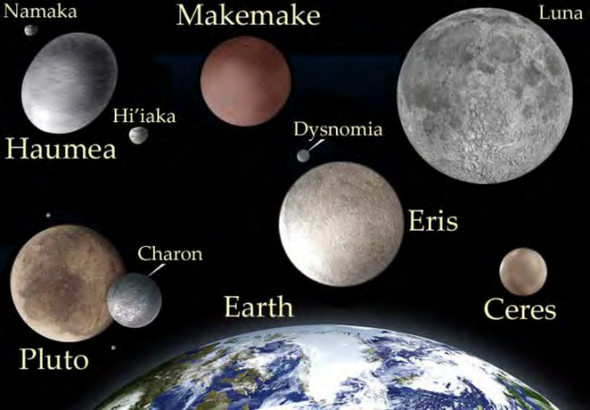
> **[Diagram Context - Textbook_NaturalScience_Gr8_The-Solar-System.pdf-0033-00.png]**
> This educational graphic is an astronomical comparison diagram showing Earth, our Moon (Luna), and several dwarf planets alongside their respective moons. Visible labels identify Earth, Ceres, Pluto with moon Charon, Eris with moon Dysnomia, Makemake, and Haumea with moons Hiʻiaka and Namaka. Conceptually, this visual supports CAPS Earth and Beyond content by demonstrating the relative scale and diversity of planetary bodies and dwarf planets within our solar system.


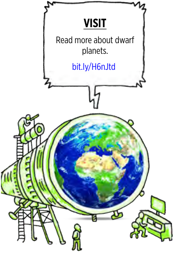
> **[Diagram Context - Textbook_NaturalScience_Gr8_The-Solar-System.pdf-0033-01.png]**
> This educational graphic is an illustrative diagram depicting an observational apparatus, specifically a large green telescope focusing on Earth, accompanied by stick figures representing astronomers and a speech bubble at the top. Visible text includes the headings "VISIT", "Read more about dwarf planets.", and a URL link "bit.ly/H6nJtd". Conceptually, it serves as an engaging textbook sidebar prompt designed to encourage learners to extend their knowledge of our solar system and celestial bodies beyond the core CAPS curriculum.


_This image shows the five dwarf planets that have been discovered to date, Pluto, Haumea, Makemake, Eris and Ceres in relation to the size of the Earth. Some even have their own moons, which are shown. Ceres is in the asteroid belt and the other four are in the Kuiper Belt._ 

###### **<u>DID YOU KNOW?</u>** 

Scientists estimate that there might be 200 or more dwarf planets in the Kuiper Belt, and thousands more beyond the Kuiper Belt. 

###### **Comets and the Oort Cloud** 

**Comets** are icy, dusty objects, orbiting around the Sun at great distances. Comets are found in the Kuiper Belt and in the predicted **Oort Cloud** . The Oort Cloud is thought to be a huge cloud of icy objects surrounding the Sun at the very edge of our solar system at a distance between 5,000 and 100,000 times the Earth's distance from the Sun! 


> **[Diagram Context - Textbook_NaturalScience_Gr8_The-Solar-System.pdf-0033-07.png]**
> This educational graphic is an illustrated cartoon depicting a fantasy carriage shaped like a giant apple, being driven by two pink horses with a coachman and passenger waving a flag. Visible features include a pink-toned color scheme, wheels, a flag, reins, a coachman in a hat, a waving passenger, and a blank thought bubble above. Conceptually, this whimsical imagery is often used in CAPS foundation or intermediate phase learning materials to engage young learners in creative storytelling, visual literacy, or imaginative writing prompts.


A comet will remain in the Kuiper Belt or Oort Cloud unless it is disturbed by another comet. If this happens, then the comet's orbit changes and occasionally the comet will come into the inner solar system for us to see. 


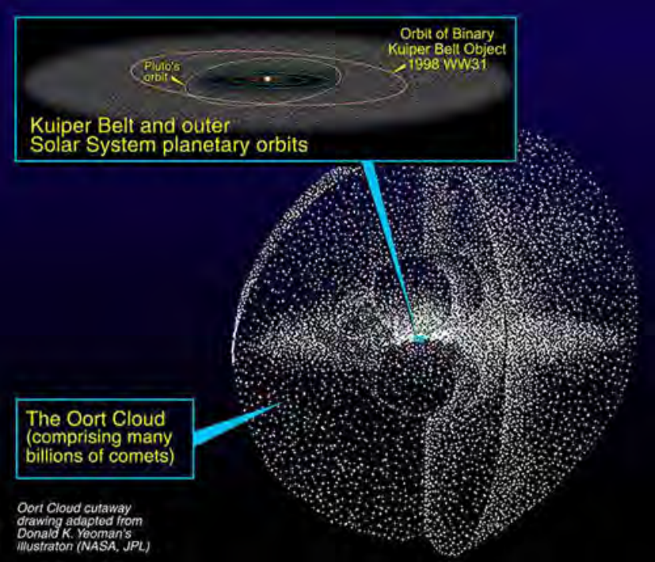
> **[Diagram Context - Textbook_NaturalScience_Gr8_The-Solar-System.pdf-0033-09.png]**
> This educational graphic illustrates the outer regions of the Solar System, contrasting the disk-like Kuiper Belt with the vast, spherical Oort Cloud. The diagram includes inset labels such as "Kuiper Belt and outer Solar System planetary orbits," "Pluto's orbit," "Orbit of Binary Kuiper Belt Object 1998 WW31," and "The Oort Cloud (comprising many billions of comets)," connected by pointers to their respective celestial structures. Conceptually, it helps Grades 10-12 learners visualize the spatial scale and structural differences between the flat ecliptic plane of planetary orbits and the distant, spherical reservoir of icy bodies surrounding the Sun.


###### **<u>DID YOU KNOW?</u>** 

Pluto was named by Venetia Burney, an 11 year old from Oxford, England, in 1930. She suggested that the planet be named after the Roman god of the underworld, Pluto. 


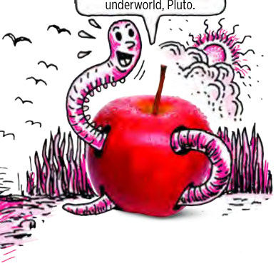
> **[Diagram Context - Textbook_NaturalScience_Gr8_The-Solar-System.pdf-0033-12.png]**
> This educational illustration depicts an anthropomorphized earthworm emerging from a red apple, featuring a speech bubble mentioning "Pluto," along with background elements including birds, grass, and a sun. Visible features include a segmented earthworm body burrowing through the fruit, a stem, and text referencing mythological context. Conceptually, this graphic engages learners in Life Sciences by illustrating organism habitat, decomposer roles, and ecological interactions within a food web.


_The hypothetical Oort Cloud is a huge cloud of icy objects or comets surrounding the outer reaches of our solar system._ 

Planet Earth and Beyond 

We can only see comets directly when they come into the inner solar system because they are small and only visible by reflected sunlight. As a comet approaches the Sun, the Sun's heat evaporates the dust and ices it consists of, forming a bright dust tail which is visible from Earth. Some comet dust tails can be millions of kilometres long. The dust tail usually points back along the path of the comet. 

Comets often have a second tail called an ion tail. The ion tail is made of ions that are pushed away from the comet's head by particles emitted from the Sun's atmosphere, called the solar wind. Let's find out more about this type of tail. 

##### **ACTIVITY:** A comet's ion tail 

In this activity you will make your own comet and explore how a comet's ion tail moves. 

###### **MATERIALS:** 

- table tennis ball 

- sellotape 

- tissue paper or crepe paper 

- scissors 


> **[Diagram Context - Textbook_NaturalScience_Gr8_The-Solar-System.pdf-0034-09.png]**
> This graphic is a conceptual illustration showing a Slinky toy superimposed over a green rollercoaster track with excited passengers and a small cart navigating a loop. There are no explicit text labels or symbols, but the visual features a coiled spring, a raised track structure with support pillars, and riders with raised arms. For a Grade 10-12 Physical Sciences learner studying mechanics, this analogy conveys the conservation of mechanical energy and the interchange between gravitational potential energy and kinetic energy as a system moves through different heights on a conservative track.


###### **INSTRUCTIONS:** 

1. Cut the tissue paper or crepe papers into several strips (at least 4) about 1 cm wide by about 15 cm long. 

2. Attach the paper strips to the ping pong ball, evenly spread around the equator of the ball using the sellotape. Wrap the sellotape around the ball a few times if needed to secure the paper in place. You have now made your comet and ion tail. 

3. Hold out your comet in front of you and blow on the ball hard so that the **.** ion tail is blown away from you. You are representing the Sun and your breath represents the solar wind, blowing on the comet's ion tail. 

4. Continuing to blow fairly hard on the ball, move the ball from left to right and observe which way the paper moves. 

###### **QUESTIONS:** 

1. Which direction did the ion tail move when you held up the comet in front of you and blew on the comet? 

2. Which direction did the ion tail move when you moved the ball left and right while still blowing? 


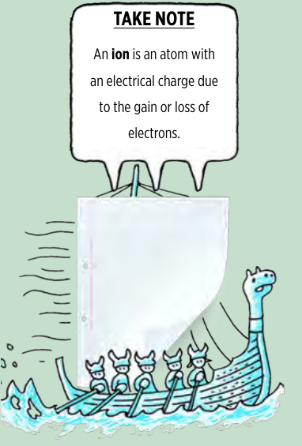
> **[Diagram Context - Textbook_NaturalScience_Gr8_The-Solar-System.pdf-0034-18.png]**
> This educational graphic features an illustrated cartoon diagram of a Viking ship with rowers and a sail shaped like a lined notebook page, topped with a speech bubble. The visible text labels read "TAKE NOTE" and "An ion is an atom with an electrical charge due to the gain or loss of electrons." Conceptually, this visual aid introduces Grade 10 Physical Sciences learners to the definition of an ion, emphasizing that electrical charge results from the transfer of electrons.


In a similar way, a comet's ion tail always points away from the Sun. 


> **[Diagram Context - Textbook_NaturalScience_Gr8_The-Solar-System.pdf-0034-20.png]**
> This graphical element features a repeating decorative border pattern composed of stylized green, wavy, arrow-like shapes linked horizontally. It functions purely as a page divider or margin decoration without any specific scientific labels, variables, or text. Conceptually, it serves as a visual separator for layout and design purposes within CAPS educational materials rather than conveying curriculum content.


###### **<u>VISIT</u>** 


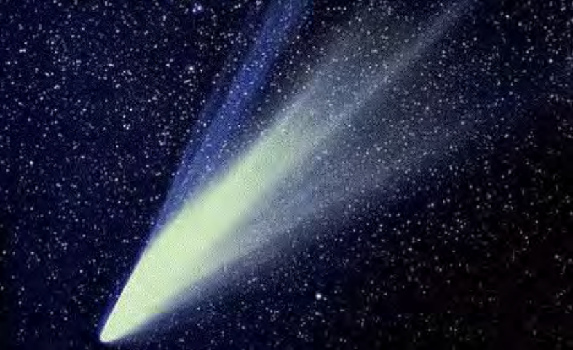
> **[Diagram Context - Textbook_NaturalScience_Gr8_The-Solar-System.pdf-0035-01.png]**
> This astronomical photograph depicts a comet moving through space, showing its bright coma and distinct dust and ion tails stretching against a dense background of stars. The image displays no visible text labels, arrows, or coordinate axes, focusing entirely on the visual features of the celestial body. Conceptually, this visual aids Grade 10 Natural Sciences learners in understanding the composition and characteristics of objects within our solar system, specifically illustrating how solar wind shapes the tails of comets as they approach the Sun.


Learn more about comets with this interactive website. bit.ly/GXWfFL 


> **[Diagram Context - Textbook_NaturalScience_Gr8_The-Solar-System.pdf-0035-03.png]**
> This illustration features a cartoon figure embracing and pointing specifically at the African continent on a detailed model of planet Earth. The graphic includes motion lines around the figure's head and an empty speech bubble above. Conceptually, it conveys a sense of geographic focus, identity, and global positioning, often used in CAPS Geography or Life Sciences to introduce spatial awareness and local environmental context.


_Comet West, photographed in 1995. Here you can see that the comet actually has two tails. The white tail is the dust tail and the blue tail is the ion tail made of charged particles evaporated from the comet's surface._ 

###### **<u>VISIT</u>** 

Halley's comet is visible from Earth every 75 to 76 years. bit.ly/16n0y9k 

Comets that come into the inner solar system do not live forever. The Sun's heat melts comets, just like a snowman melts out in the Sun. After several thousand years the remains are so small that they no longer form a tail. Some comets completely melt away. 


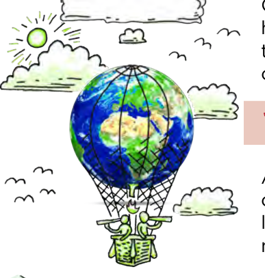
> **[Diagram Context - Textbook_NaturalScience_Gr8_The-Solar-System.pdf-0035-08.png]**
> This educational graphic illustrates Planet Earth depicted as a hot air balloon, floating amidst hand-drawn clouds, a sun, and birds. Visible elements include a grid-patterned globe serving as the balloon envelope, a burner flame at the base, and a basket carrying two figures holding telescopes. Conceptually, this metaphor helps high school learners explore environmental science topics such as global climate change, atmospheric systems, and human stewardship of the Earth.


##### **. 1.3 Earth's position in the solar system** 

As you discovered in the last section, the Earth, along with the other planets, orbits around the Sun. The Earth is the third most distant planet from the Sun, lying in between Venus and Mars. Let's compare the Earth and its two neighbours in more detail. 

**<u>NEW WORDS</u>** 

##### **ACTIVITY:** The Sun's Habitable Zone 

• astronomical unit (AU) 

• habitable zone • photosynthesis 

|**Property**|**Venus**|**Earth**|**Mars**|
|---|---|---|---|
|**Distance from Sun (AU)**|0.7|1.0|1.5|
|**Average Temperature (**^{**o**}**C)**|464|15|-63|


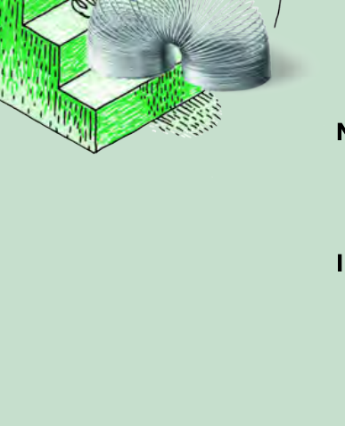
> **[Diagram Context - Textbook_NaturalScience_Gr8_The-Solar-System.pdf-0035-16.png]**
> This physical science graphic illustrates wave motion using a coiled spring (Slinky) descending a flight of green stairs. Visible elements include the metallic slinky demonstrating sequential loops moving downwards, a staircase with green steps, and partial text markers labelled "M" and "I". Conceptually, this demonstrates the transmission of mechanical waves, helping learners visualize how longitudinal or transverse pulses propagate through a medium.


###### **MATERIALS:** 

- pencil 

- ruler 

###### **INSTRUCTIONS:** 

1. Look at the data provided in the table. It shows the distance from the Sun for three planets (in units of one Earth-Sun distance or Astronomical Unit). It also shows the average temperature on each planet in degrees Celsius. 

2. Plot a graph to show the data in the table. Mark each point with an X. 

Planet Earth and Beyond 


3. The Sun's habitable zone extends from 0.8 to 1.4 AU and is shaded in red in the graph paper. This is the region where scientists think a planet has to lie in order for there to be life on the planet. 

Graph showing the average temperature and the distance from the Sun of Venus, Earth and Mars. 


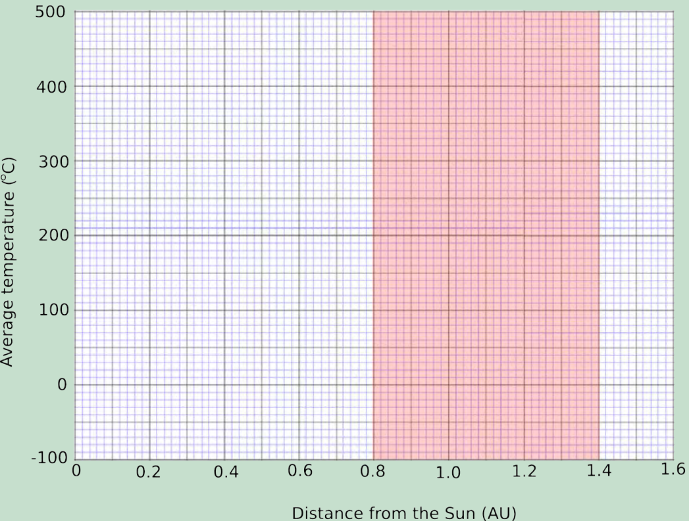
> **[Diagram Context - Textbook_NaturalScience_Gr8_The-Solar-System.pdf-0036-03.png]**
> This graphic is a grid-based scientific graph with axes labeled "Distance from the Sun (AU)" ranging from 0 to 1.6 and "Average temperature (°C)" ranging from -100 to 500, featuring a vertically shaded pink band between approximately 0.8 AU and 1.4 AU. Conceptually, this diagram illustrates the habitable zone (or Goldilocks zone) around a star, helping high school learners understand the critical distance range where planetary temperatures can support liquid water.


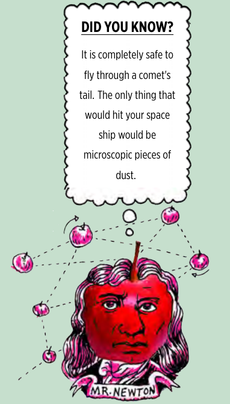
> **[Diagram Context - Textbook_NaturalScience_Gr8_The-Solar-System.pdf-0036-04.png]**
> The educational graphic features a cartoon caricature labeled "MR. NEWTON" depicted as a red apple, positioned below a thought bubble containing the heading "DID YOU KNOW?" and text explaining the composition of a comet's tail. Surrounding the central apple figure are smaller floating pink apples connected by dotted lines, representing a conceptual gravitational network or thought web. This graphic visually engages students with Newtonian mechanics and gravity by humorously linking Isaac Newton's famous apple discovery to space science concepts like comets and cosmic dust.


###### **QUESTIONS:** 

1. What is the average temperature on Venus? 

2. Can liquid water exist on Venus? Why? 

3. What is the average temperature on Mars? 

4. Is liquid water likely to be found on Mars? Why? 

5. What is the average temperature on Earth? 


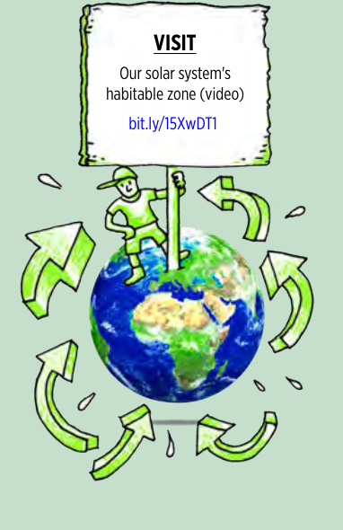
> **[Diagram Context - Textbook_NaturalScience_Gr8_The-Solar-System.pdf-0036-11.png]**
> This educational graphic features an illustrative cartoon of Earth surrounded by circular, directional green arrows and a stick figure holding a sign with the text "VISIT Our solar system's habitable zone (video) bit.ly/15XwDT1". The diagram visually integrates our planet with a digital multimedia resource link prompting learners to explore planetary systems and the conditions necessary for life. Conceptually, it serves as an introductory multimedia prompt aligned with CAPS Earth and Beyond topics, encouraging learners to investigate the concept of a habitable zone and Earth's specific position within the solar system.


6. Can liquid water exist on Earth? Why? 

7. Which planet/s lie within the Sun's habitable zone (the red shaded region in the graph)? 


> **[Diagram Context - Textbook_NaturalScience_Gr8_The-Solar-System.pdf-0037-03.png]**
> This decorative graphic features a repetitive linear pattern of green curved shapes and arrows on a pale green background. There are no explicit scientific labels, variables, or chemical symbols present in the image. Conceptually, it serves as a purely ornamental design border rather than conveying curriculum-specific scientific content.


###### **<u>TAKE NOTE</u>** 

The average temperature on Earth is a moderate 15^{o} C. Because of this, water can exist in liquid form on Earth. _This is important because scientists think that liquid water is one of the key things needed for life._ Venus has an average temperature of 464^{o} C and no liquid water exists on Venus because it is too hot. On Mars, the opposite is true. The average temperature on Mars is -63^{o} C and any water on Mars would be frozen. Earth is unique in our solar system as it is the only planet known to have liquid water on its surface and to harbour life. 

An astronomical unit corresponds to the average distance between the Earth and the Sun. 


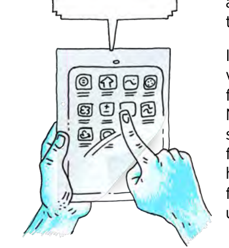
> **[Diagram Context - Textbook_NaturalScience_Gr8_The-Solar-System.pdf-0037-07.png]**
> The graphic is a hand-drawn illustration depicting a person holding a tablet device with a grid of various application icons displayed on the screen. Visible elements include two hands holding the tablet, a finger pointing to and interacting with a specific blank app icon, and a speech bubble extending from the top of the device. Conceptually, this illustration conveys the integration of digital technology and interactive mobile applications into learning environments, supporting CAPS curriculum goals of e-learning, digital literacy, and modern pedagogical tools.


If the Earth were too close to the Sun it would be too hot and all the water would evaporate from the oceans, like it has on Venus. If the Earth were too far from the Sun it would be too cold, and all the water would be frozen, like on Mars. Earth is at just the right distance from the Sun to have liquid water on its surface. The other planets in the solar system are either too close or too far from the Sun. The range of distances that a planet can lie from the Sun and still have liquid water on the planet's surface is called the **habitable zone** _._ Estimates for the habitable zone in our solar system range from 0.8 - 1.4 astronomical units (AU). 


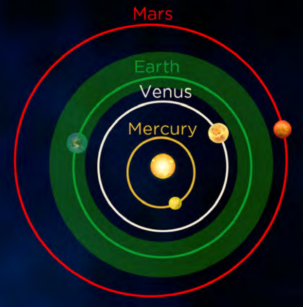
> **[Diagram Context - Textbook_NaturalScience_Gr8_The-Solar-System.pdf-0037-09.png]**
> This educational graphic illustrates an inner solar system orbital diagram, showing the Sun at the center and the concentric orbits of the four terrestrial planets. Visible labels include the Sun and planet names: Mercury (innermost yellow orbit), Venus (white orbit), Earth (green orbit), and Mars (outermost red orbit), alongside the corresponding planetary bodies positioned along their paths. For a CAPS curriculum student, this diagram conceptually conveys the relative positions, orbital hierarchy, and proximity of the inner rocky planets to the Sun in our solar system.


###### **<u>DID YOU KNOW?</u>** 

The habitable zone is sometimes called the Goldilocks zone after the famous children's story where Goldilocks eats the porridge that is neither too hot nor too cold. 


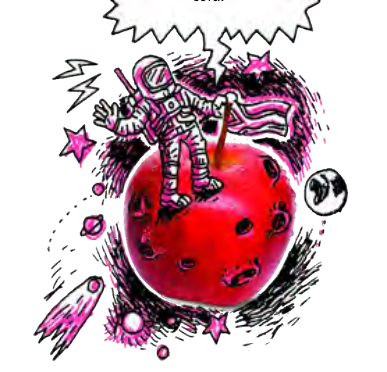
> **[Diagram Context - Textbook_NaturalScience_Gr8_The-Solar-System.pdf-0037-12.png]**
> This educational illustration depicts a whimsical outer space scene featuring an astronaut standing on a red apple modified to resemble a cratered planet. Visible elements include a speech bubble at the top, lightning bolts, stars, a comet, and a small celestial body, all set against a stylized pink and black cosmos background. Conceptually, this creative graphic engages high school learners by playfully juxtaposing everyday objects with astronomical themes, often used in physics or natural sciences to stimulate imagination regarding gravity, space exploration, and scale.


_Our Sun's habitable zone (light green). The Earth is the only planet in our solar system which lies within our Sun's habitable zone. It is just the right distance from the Sun for liquid water to remain on the planet, something which scientists think is essential for life._ 

**180** Planet Earth and Beyond 

What other conditions do you think are necessary for life on Earth or other planets? List your answers in the space below. 

Scientists think that in order for life to arise and survive on a planet: 

- there must be sunlight for plants to grow. 

- the planet must be located in the habitable zone of a star so that there are moderate temperatures and liquid water. 

- there must be oxygen for respiration. 

Which of the planets in the solar system receive light from the Sun? 

Which of the planets in the solar system have moderate temperatures and liquid water on their surface? 

###### **<u>TAKE NOTE</u>** 

Other stars also have habitable zones. Scientists believe that planets orbiting other stars within the habitable zone could support life forms. 


> **[Diagram Context - Textbook_NaturalScience_Gr8_The-Solar-System.pdf-0038-09.png]**
> This educational cartoon illustrates an Earth and Life Sciences concept where a blue-striped figure holds up a framed portrait of a human figure with a speech bubble reading "support life forms." The visual elements include motion lines, a picture frame, a character with striped clothing, and text referencing life support. Conceptually, this graphic engages learners in understanding the conditions or planetary characteristics necessary to sustain life forms.


###### **<u>VISIT</u>** 

Kepler Mission: A search for habitable planets. bit.ly/HdBXYI 

Which of the planets in the solar system have significant amounts of oxygen in their atmosphere or oceans? 

As you can see the Earth is very fortunate, because it lies at just the right distance from the Sun to have moderate temperatures and abundant liquid water. The Sun provides the energy for plants to grow. There is plenty of oxygen in Earth's present day atmosphere and oceans, which means that life can survive on land and in the Earth's oceans. The Earth is unique in that it is the only planet we know of that has life. 

###### **The greenhouse effect** 

During the day, the Sun shines through the atmosphere heating the Earth's surface. At night, the Earth's surface cools, releasing the heat back into space. Some of the heat is trapped by greenhouse gases in the air like carbon dioxide, which causes the Earth to remain warmer than it would have otherwise. This is called the **greenhouse effect** . 

###### **<u>TAKE NOTE</u>** 

You may have heard a lot about global warming and the greenhouse effect in the news and in our studies in Energy and Change. 

Scientists think that due to human activities, like cutting down forests and burning fossil fuels, the greenhouse effect is now too strong. Scientists are more than 90 % certain that the increase in greenhouse gases has caused the average temperature on Earth to rise. This is known as global warming. 

Venus provides us with a clue as to what might happen to the Earth if global warming continues. Venus' thick atmosphere has led to a runaway greenhouse effect on the planet, heating it to 462^{o} C. Venus's oceans have boiled away leaving behind a hot, inhospitable planet. We should therefore try our best to look after our precious planet! 

###### **The beginnings of life** 

###### **<u>DID YOU KNOW?</u>** 

Scientists do not know how life began on Earth, but they estimate that the early ancestor of modern bacteria was alive on Earth 3.5 billion years ago. The early Earth's atmosphere had almost no oxygen. Instead, it was composed mainly of carbon dioxide, nitrogen and water vapour with some methane and ammonia. Carbon dioxide and water vapour were pumped into the atmosphere during volcanic eruptions, which caused the atmosphere to change over time. Eventually the water vapour in the atmosphere condensed to form rain, forming the first oceans. Eventually living organisms (bacteria) appeared in the oceans. These simple organisms used sunlight, water and carbon dioxide in the oceans to produce sugars and oxygen. What is this process called? 

The moons Europa (orbiting Jupiter) and Titan (orbiting Saturn) are considered to be places where life may exist. Europa's surface is covered in smooth water ice and scientists think that there might be a water ocean beneath the icy surface. Titan has liquid lakes and seas on its surface, although they are not made of water, but rather liquid methane and ethane. Some scientists think that life may be able to survive in these lakes. 

This is where the first oxygen in the ocean and atmosphere came from. That oxygen made it possible for other organisms to develop and flourish and is the reason that you are here today. 


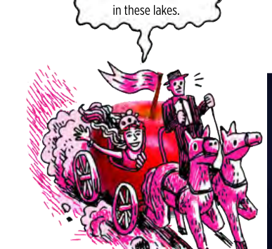
> **[Diagram Context - Textbook_NaturalScience_Gr8_The-Solar-System.pdf-0039-05.png]**
> This educational illustration depicts an imaginative, whimsical scene of a carriage fashioned from a giant red apple, being driven by a person and pulled by two pink horses with a passenger waving from inside. Visible elements include a speech bubble fragment reading "in these lakes.", an apple-shaped carriage body, wheels, a flag, horses, a driver, and a passenger waving. Conceptually, this whimsical cartoon serves as a visual prompt or stimulus in CAPS Life Sciences or English textbooks to encourage creative thinking, descriptive writing, or ecological discussions regarding fictional habitats.


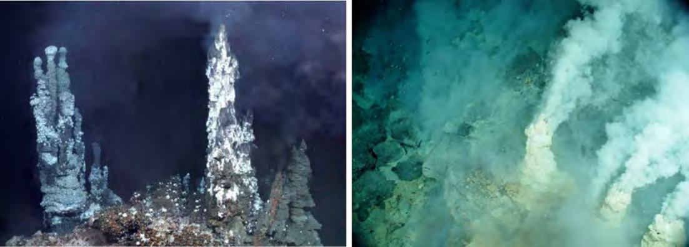
> **[Diagram Context - Textbook_NaturalScience_Gr8_The-Solar-System.pdf-0039-06.png]**
> The graphic shows two photographic underwater geological structures representing hydrothermal vents (deep-sea vents), commonly known as black smokers and white smokers on the ocean floor. The images display rocky, chimney-like mineral deposits emitting plumes of superheated, mineral-rich hydrothermal fluids into the deep ocean water. Conceptually, this visual supports CAPS Life Sciences topics on the origin of life and biodiversity by illustrating extreme habitats where chemoautotrophic organisms thrive independently of sunlight.


###### **<u>VISIT</u>** 

Do you enjoy English and Science? Read more about a career as a science writer. bit.ly/18CxYiZ 

_Scientists are busy exploring the possible locations for the origin of life, including hot springs and tidal pools. Recently, some scientists have started to support the hypothesis that life originated in deep sea hydrothermal vents, as shown in the image. These vents are like underwater volcanoes. The investigation continues to try to understand how life originated on Earth._ 


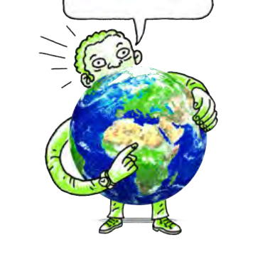
> **[Diagram Context - Textbook_NaturalScience_Gr8_The-Solar-System.pdf-0039-10.png]**
> The graphic is an illustrated cartoon figure holding and pointing at a globe centered on the African continent, featuring a blank speech bubble above the character's head and motion lines near its hair. The visual elements include a stylized green human figure, a globe showing Earth's landmasses and oceans, a pointing finger, a wristwatch, and an empty speech bubble. Conceptually, this engages CAPS learners in geography by introducing discussions around global locations, spatial orientation, or environmental stewardship centered on the African continent.


Planet Earth and Beyond 


> **[Diagram Context - Textbook_NaturalScience_Gr8_The-Solar-System.pdf-0040-00.png]**
> This diagram illustrates a molecular-level model of a micelle monolayer or surfactant structure, showing polar hydrophilic heads oriented outward in a uniform row along a surface layer. The visual features include multiple repeating blue spiral-like or looped hydrophilic head groups embedded along a light purple sub-surface medium. Conceptually, it demonstrates how amphiphilic molecules arrange themselves at interfaces in aqueous solutions, helping learners understand surface tension, emulsification, and membrane structures aligned with CAPS physical sciences and life sciences requirements.


##### **SUMMARY:** 

**.** **<u>Key Concepts</u>** 

- The Sun produces its energy at its centre via nuclear fusion reactions, where hydrogen nuclei are squeezed together to form helium nuclei. 

- The Sun's energy is transported to the surface and radiates equally in all directions. 

- Our solar system consists of the Sun and all the objects that are held in orbit around the Sun by gravity. 

- Objects such as planets, dwarf planets, asteroids, comets and Kuiper Belt objects orbit around the Sun. 

- The 8 planets in our solar system have their own properties and characteristics. 

- The planets can be split into two groups, the inner small rocky terrestrial planets and the outer large gas giants. 

- The asteroid belt is the area where most asteroids are found in our solar system, lying between the orbits of Mars and Jupiter 

- The Oort Cloud is a hypothetical huge cloud of icy objects (comets) surrounding the Sun at the very edge of our solar system. 

- Sometimes, comets from the Oort Cloud come close to the sun. We can only see them when they come into the inner solar system because they are small and only visible by reflected sunlight. 

- Scientists think that some of the conditions necessary for sustained life include moderate temperatures, liquid water, sunlight (energy) and oxygen. 

- The Earth is the third planet from the Sun and the only planet in the solar system known to harbour life. 

- The Earth lies within the Sun's habitable zone; the range of distances that a planet can lie from a star and still have liquid water on the planet's surface. 

###### **.** **<u>Concept Map</u>** 

Complete the concept map which summarises the key concepts from this chapter about our solar system. 


> **[Diagram Context - Textbook_NaturalScience_Gr8_The-Solar-System.pdf-0040-17.png]**
> The graphic is a metaphorical illustration depicting a person wearing protective gear operating a pneumatic drill, represented by a metal key chiseling into the ground with surrounding motion lines and flying debris. There are no visible textual labels, variables, or chemical symbols in the image. Conceptually, this visual aids learners in understanding activation energy in chemical reactions or physical processes by demonstrating how a specific mechanism (the key) is required to overcome an energy barrier and initiate a change.


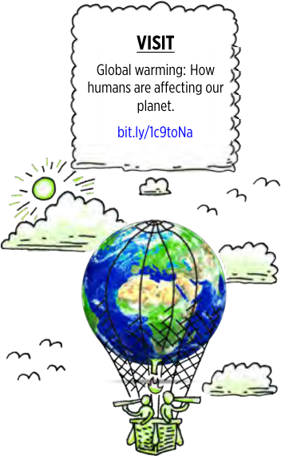
> **[Diagram Context - Textbook_NaturalScience_Gr8_The-Solar-System.pdf-0040-18.png]**
> This educational graphic features an illustrated cartoon showing planet Earth shaped like a hot air balloon, accompanied by a cloud-shaped callout box with the text "VISIT", "Global warming: How humans are affecting our planet.", and a web link ("bit.ly/1c9toNa"). The visible elements include an illustrated sun, clouds, birds, a globe with a net pattern, a burner flame, and a basket containing two figures holding telescopes. Conceptually, the diagram serves as an introductory resource to engage learners on the topic of global warming and human impacts on the environment, linking visual metaphors of exploration and atmospheric trapping to climate change studies in the CAPS curriculum.


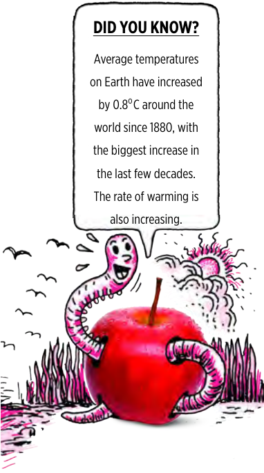
> **[Diagram Context - Textbook_NaturalScience_Gr8_The-Solar-System.pdf-0040-19.png]**
> This educational cartoon graphic features an informational speech bubble labeled "DID YOU KNOW?" with accompanying illustrations of a sweating cartoon worm wrapped around a red apple, a sun partially obscured by clouds, birds, and grass. The text explicitly states that average global temperatures have increased by $0.8^{\circ}\text{C}$ since 1880, emphasizing that the rate of warming is accelerating. For high school learners studying environmental sciences, this graphic introduces the concept of global climate change and historical temperature trends related to human-induced environmental impacts.


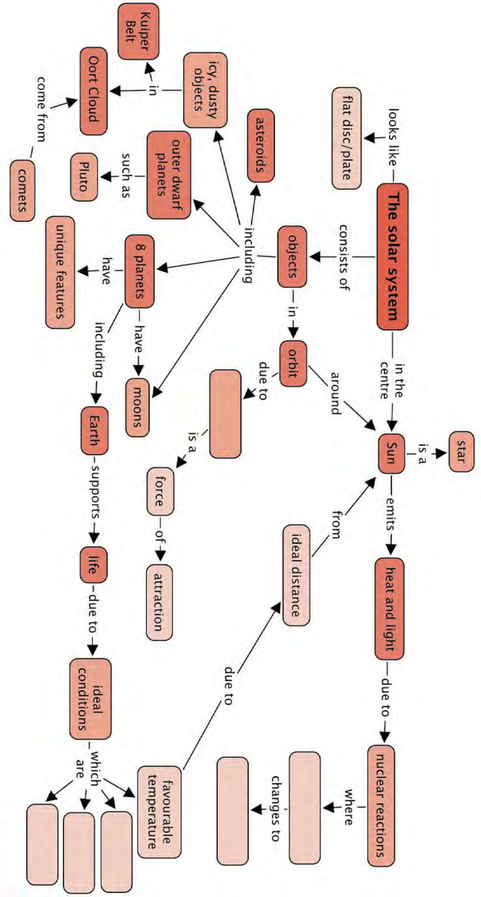
> **[Diagram Context - Textbook_NaturalScience_Gr8_The-Solar-System.pdf-0041-00.png]**
> This educational graphic is a conceptual mind map detailing the structure and components of the solar system. It features labelled nodes and connecting arrows with terms such as "The solar system," "Sun," "star," "8 planets," "moons," "asteroids," "outer dwarf planets," "Pluto," "Kuiper Belt," "Oort Cloud," "comets," "orbit," "force of attraction," "heat and light," "nuclear reactions," "ideal distance," "favourable temperature," "Earth," "life," and "ideal conditions," alongside several blank boxes for learner completion. Conceptually, it conveys how the Sun forms the central, energy-emitting star of a flat disc-shaped solar system, holding orbiting bodies in place via gravitational attraction while highlighting the specific conditions on Earth that sustain life.


##### **REVISION:** 

1. How does the Sun produce its energy? [2 marks] 

2. Why do sunspots look darker than the rest of the surface of the sun? [2 marks] 


> **[Diagram Context - Textbook_NaturalScience_Gr8_The-Solar-System.pdf-0042-03.png]**
> This educational illustration depicts a complex mechanical system featuring interlocking gears, multiple pulleys, ropes, a hanging basket, and a human figure pulling a rope. The graphic displays motion lines around the meshed gears and pulleys to indicate rotational and linear movement within the apparatus. For a high school Technology or Physics learner, this diagram conveys how different mechanical advantage systems—specifically wheels, axles, gears, and pulley systems—can be combined to multiply force and lift heavy loads with reduced effort input.


3. What keeps the planets and other bodies in our solar system in orbit? [1 mark] 

4. Name the terrestrial planets. [4 marks] 

5. Name the gas giants. [4 marks] 

6. Where is the asteroid belt located? [1 mark] 

7. Where is the Kuiper belt located? [1 mark] 

8. Why are the gas giants so much larger than the terrestrial planets? [2 marks] 

9. List the planets in increasing distance from the Sun. [4 marks] 


10. Which planets have rings? [4 marks] 


11. Why is Venus so hot? [2 marks] 

12. On which planet have landers found frozen water in the rocks under the planet's surface? [1 mark] 

13. The following diagram shows the solar system at the centre. 


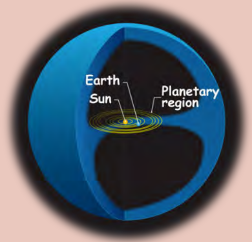
> **[Diagram Context - Textbook_NaturalScience_Gr8_The-Solar-System.pdf-0043-05.png]**
> This educational graphic illustrates a three-dimensional cutaway model of a star system and its surrounding planetary region. Visible labels include "Earth," "Sun," and "Planetary region," alongside pointer lines identifying the central star, a planet orbiting within concentric yellow rings, and the broader spherical circumstellar envelope. Conceptually, this diagram helps learners visualize the spatial arrangement of a solar system within its birth nebula or dust envelope during planetary formation and stellar evolution studies.


   - a) What does the blue space represent? [1 mark] 

   - b) What is mostly found in this space? [1 mark] 

14. Why can we only see comets as they come close to the Sun? [3 marks] 

15. What is the official definition of a planet and why was Pluto downgraded to a dwarf planet? [4 marks] 

**186** Planet Earth and Beyond 

16. Why can the Earth support life? [4 marks] 


17. What would happen to the Earth if it warmed significantly, like Venus has in the past? [2 marks] 

18. The following diagram shows the system of planets around the star Gliese 667C. 


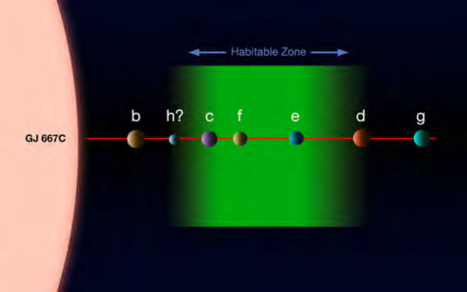
> **[Diagram Context - Textbook_NaturalScience_Gr8_The-Solar-System.pdf-0044-04.png]**
> This astronomical graphic illustrates an exoplanetary system featuring a host star and its orbiting planets. Visible labels include the star "GJ 667C", planetary designation letters ("b", "h?", "c", "f", "e", "d", "g"), a horizontal red orbital line, and a highlighted green region marked with double-ended arrows labeled "Habitable Zone". Conceptually, the diagram helps students understand the concept of the circumstellar habitable zone (or Goldilocks zone), demonstrating how distance from a star determines whether a planet can maintain liquid water and potentially support life.


_The planets around another star._ 

- a) Which of these planets are possible candidates for life? [1 mark] 

- b) Explain your answer above. [2 marks] 

Total [46 marks] 


> **[Diagram Context - Textbook_NaturalScience_Gr8_The-Solar-System.pdf-0044-09.png]**
> This biological graphic illustrates an ant trailing behavior driven by chemical communication. It shows an enlarged ant alongside parallel lines of numerous smaller ants moving in an organized path across a shaded red background. Conceptually, this diagram conveys the mechanism of pheromone signaling in social insects, demonstrating how chemical cues facilitate coordinated group behavior and collective foraging in Life Sciences.


# **11 The solar system** 

###### **<mark>Chapter overview</mark>** 

###### **3 weeks** 

The ordering of the chapter in Grade 8 Planet Earth and Beyond in CAPS is as follows: 

1. The solar system 

2. Beyond the solar system 

3. Looking into space 

Although this is the order in CAPS and it is the way in which the content has been ordered here in these workbooks, we suggest starting with Chapter 3 on 'Looking into space' first, and then going on to the other two chapters. This makes more sense conceptually to first learn about how we see into space, and then go on to look at the objects that have been observed in our solar system and beyond, making use of a variety of telescopes. 

In Grade 6 learners covered material regarding the solar system, and in Grade 7, they focused on the Sun, Earth, Moon system. Learners should be familiar with the fact that the Sun is a star located at the centre of the solar system and they should understand that the planets orbit around the Sun. They should also be aware that there are two types of planets: smaller rocky planets and larger gas giants. In this chapter, the solar system is introduced in more detail, and the physical explanation for the two types of planets is summarised. They will compare the properties of the different planets, information that they will then use to explain why the Earth is presently the only planet suitable for life in our solar system. The main aims of this chapter are to ensure that learners understand the following: 

- l The Sun is a star and produces heat and light (energy) via nuclear reactions. 

- l The planets, dwarf planets and asteroids all orbit around the Sun, held in their orbits by the force of gravity. 

- l Different planets have different observed properties and characteristics. 

- l The Earth is located in a special zone around the Sun, where life is possible. Section 1.1 covers the properties of the Sun, section 1.2 introduces all the other objects in the solar system and section 1.3 covers our special place in the solar system. 

**Concept maps:** The concept maps in these workbooks were created at Siyavula using an open source programme called CMapTools. You can download the programme from this link if you would like to use it to create your own concept maps.bit.ly/1fMyJsQ 

Do you think it is important to teach astronomy to learners at school? Read this interesting and informative article detailing the benefits and applications of astronomy. bit.ly/17iVgpw 

**Citizen science** offers you a free, easily accessible and inspiring opportunity to bring real science into the classroom. Find out more about incorporating real science into your classroom with Zooniverse citizen science projects at ZooTeach: bit.ly/H6krWT. ZooTeach is a website where teachers and educators can share high quality lesson plans and resources that complement the Zooniverse citizen science projects. 

Did you know that these workbooks were created at Siyavula with the input from many contributors and volunteers? Just turn to the front to see the long list. Read more about Siyavula at our website: www.siyavula.com 

###### **11.1 The Sun** (1.5 hours) 

|**Tasks**|**Skills**|**Recommendation**|
|---|---|---|
|Activity: Observing the Sun|observing, describing|CAPS suggested|
|with a telescope|||

Activity: Observing the Sun observing Alternative to above activity with a pinhole camera Activity: Sunspots observing, identifying, Optional, extension analysing 

###### **11.2 Objects around the Sun** (6 hours) 

|**Tasks**|**Skills**|**Recommendation**|
|---|---|---|
|Activity: The scale of the solar<br>system|simulating, visualising, taking<br>measurements|CAPS suggested|
|Activity: Make a hanging solar<br>system|simulating, visualising, taking<br>measurements|CAPS suggested (also<br>alternative to above activity)|
|Activity: Planetary<br>temperatures|reading tables, labelling graphs|CAPS suggested|
|Activity: Comparing terrestrial<br>planets and gas giants|comparing, recalling|Optional|
|Activity: Comparing the inner<br>and outer planets|comparing, reading tables,<br>analysing|CAPS suggested|
|Activity: Planetary holidays|writing, researching|CAPS suggested|
|Activity: Planet factsheet|writing, researching|CAPS suggested (also<br>alternative to above activity)|
|Investigation: Impact craters|investigating, observing, taking<br>measurements, analysing|CAPS suggested|
|Activity: A comet's ion tail|observing|CAPS suggested|

###### **11.3 Earth's position in the solar system** (1.5 hours) 

|**Tasks**|**Skills**|**Recommendation**|
|---|---|---|
|Activity: The Sun's habitable|plotting graphs, interpreting|CAPS suggested|
|zone|graphs, analysing||

###### **Key questions** 

- l How does the Sun produce its energy? 

- l How can we observe the Sun without damaging our eyes? 

- l What objects are in orbit around the Sun in our solar system? 

- l Why are there two types of planets? 

- l How do the planets in our solar system differ? 

- l What are asteroids and comets? 

- l What is the difference between a planet and a dwarf planet? 

- l Why is life possible on Earth? 

### 11.1 The Sun 

In this section students learn how the Sun produces its energy in its core and how this energy is transported to the surface and then into space. The effect that the Sun has on the Earth is also briefly mentioned. This section focuses on conducting observations of the Sun and looking at images of the Sun to study the surface features, including sunspots. 

There are two activities in this section which involve observations of the Sun. It is very important that learners DO NOT LOOK DIRECTLY AT THE SUN, even with sunglasses on, as they may permanently damage their eyes. 

Although the Sun is the brightest object in our sky, this is only because it is so close to us. The Sun is actually a medium-sized star of average brightness compared with other stars. If the sun were further away, it would look like a small point of light like the other stars in the sky. 

At the temperatures encountered at the centre of the Sun the atoms are ionized and so nuclear fusion involves the merging of atomic nuclei rather than atoms. 

Different studies of the transport of photons within the Sun estimate different travel times to reach the surface. Much older studies reported times of order of millions of years, but these have now all been revised downwards to either tens or hundreds of thousands of years. 

Although we often say that the Sun "burns" its hydrogen fuel into helium, the Sun does not burn in the same way that a fire does, because it is not on fire. The energy generated from the Sun comes from fusing atomic nuclei together to form a new atomic nucleus. As a result of the extreme temperatures throughout the Sun, its gas glows, giving off light. Our usual experience of burning (or fire) is actually a chemical reaction where atoms combine to form molecules, e.g. when oxygen combines with carbon to form carbon dioxide. 

#### ACTIVITY: **Observing the Sun using a telescope (LB page 227)** 

This is an outdoors activity. You will need a telescope or binoculars for this activity. **An alternative activity is included after this,which does not need a telescope or binoculars.** You will be projecting an image of the Sun onto a white card or screen for your learners to observe. 

If you do not have access to a telescope or binoculars it could be worth contacting a local amateur astronomy club as they are often keen to get involved in educational activities. It is vital that learners do not look directly at the Sun, with or without sunglasses. The projection method used in this activity is safe and also has the bonus that any sunspots on the Sun's surface can also be seen. Sunspots are regions of slightly lower temperature on the Sun's surface, and therefore appear darker. If you do not have access to a telescope, but do have Internet access, then an image of the Sun is posted daily at^{1} 1.usa.gov/1a2n1cE 

It is assumed that this will be a teacher-led demonstration, however, there is no reason why learners cannot contribute by building the shade collar and setting up the white card. If you are using binoculars instead of a telescope, be sure to cover one of the lenses so that only one side of the binoculars is used. When trying to point the telescope at the Sun, a useful trick is to watch the shadow of the telescope tube: if pointed directly toward the Sun, then the sides of the tube will cast no shadows. Preparing for the activity can sometimes take a bit of fiddling, so it is a good idea for you to set your learners a short task to do while you set up if you have not had the opportunity to set up ahead of time. 

Sunspots are sometimes (not always) visible on the Sun's surface. You are more likely to see sunspots when the Sun is most active during solar maximum. The Sun's activity varies over an 11 year cycle. Solar maximum is currently predicted to be in 2013. Solar minimum is currently predicted to be in 2019. As an extension you could repeat this activity over the course of several days to see if any sunspots or sunspot groups change shape, size, or position over time. 

Ask the learners to point out any interesting features they notice about the image. There may be sunspots (dark spots) visible. Also you should see that the image is brighter in the middle of the Sun's disc than at the edges. This is because when we look at the middle of the Sun's disc we can see deeper into the Sun than when we look towards the edge. The temperature of the Sun increases with increasing depth. At the centre of the Sun's disc we are seeing a hotter region. As the intensity of light is proportional to the temperature, the Sun looks brighter in the centre. 

The spin of the Earth on its axis 

#### ACTIVITY: **Observing the Sun with a pinhole camera (LB page 228)** 

1. The image should get smaller and brighter. 

3. The angles are equal. This links back to what learners covered last term in Energy and Change. 

#### ACTIVITY: **Observing sunspots on the Sun's surface (LB page 230)** 

This is an **additional, extension** activity. In this activity learners will look at images taken over three consecutive days in 2013. The images were taken using the Helioseismic and Magnetic Imager instrument on board the Solar Dynamics Observatory space satellite. In the images two major sunspot groups are visible, one in the Sun's northern hemisphere and one in the Sun's southern hemisphere. Learners should identify the two groups and observe that they move across the Sun from left to right in each successive image. The sunspots move like this because the Sun is rotating on its axis. You could begin this activity by asking learners if they noticed any features on the Sun's surface when they observed it in class, before asking them to look at the pictures below. 

1. There are two main groups, one in the top half of the Sun and the other group in the bottom half. 

2. They are moving across the Sun's disc from left to right. 

3. The Sun is rotating on its own axis (once roughly every 25 days). 

4. They are called Sunspots and they are regions where the temperature is cooler than the rest of the Sun's surface. 

This is enrichment material to extend learners' knowledge beyond what they have covered in previous grades about the Sun. Here is a link to a pdf download for an activity to track sunspots in real time, using data from SOHO: 1.usa.gov/16mW96j 

### 11.2 Objects around the Sun 

This section covers all the objects in orbit around the Sun including the eight planets, dwarf planets, asteroids, Kuiper Belt and Oort Cloud and comets. Learners should be familiar with the eight planets in the solar system, which were covered in Gr 6, however it is very likely that they are unfamiliar with the remaining components of the solar system. The first half of this section is intended as revision, to remind learners about the properties of the eight planets. The two types of planets, the terrestrial (rocky) planets and gas giants are compared and contrasted in detail. The second half of this section covers the smaller bodies in the solar system such as dwarf planets, comets and asteroids. It should be stressed to learners that new discoveries are made all the time and so the numbers of moons discovered around planets and the number of dwarf planets in the solar system will change over time. 

#### ACTIVITY: **The scale of the solar system (LB page 232)** 

In this activity learners will get a sense of the scale of the solar system. Using a model where the Sun is scaled to the size of a grapefruit, the other planets areal so scaled down and are placed in orbit around the grapefruit Sun at the correctly scaled distance. This activity needs a lot of space. The distance you need from the Sun to Neptune is 321 m. The scaling used in this activity is 14 billion to one. You can change the scaling to suit the space you have available. A summary table is included here with the scaled sizes and distances for the planets for your reference. Learners can use a measuring tape to measure out the 

distances. If no measuring tape is available, the approximate distance in strides is also given. 

|**Object**|**Actual diameter (D) or**<br>**distance from the Sun**<br>**(d) (km)**|**Measurements scaled**<br>**to in model**|**Model suggestion**|
|---|---|---|---|
|Sun|D = 1.4 x 10^{6}|10 cm|Grapefruit|
|Mercury|D = 4.9 x 10^{3}d = 58 x<br>10^{6}|0.35 mm 4.2 m|Salt grain, 4 big strides|
|Venus|D = 12 x 10^{3}d = 108 x<br>10^{6}|0.86 mm 7.7 m|Poppy seed, 8 big<br>strides|
|Earth|D = 13 x 110^{33}d = 150 x<br>10^{6}|0.91 mm 10.7 m|Poppy seed, 11 big<br>strides|
|Mars|D = 6.8 x 110^{3}d = 228 x<br>10^{6}|0.48 mm 16.3 m|Salt grain, 16 big strides|
|Jupiter|D = 143 x 10^{3}d = 778 x<br>10^{6}|10.0 mm 55.6 m|Small grape, 55 big<br>strides|
|Saturn|D = 128 x 10^{3}d = 1426 x<br>10^{6}|8.57 mm 102 m|Pea, 100 big strides|
|Uranus|D = 51 x 10^{3}d = 2868 x<br>10^{6}|3.65 mm 205 m|Peppercorn, 200 big<br>strides. About twice the<br>length of a football<br>pitch.|
|Neptune|D = 45 x 110^{3}d= 4500 x<br>10^{6}|3.55 mm 321 m|Peppercorn, 320 big<br>strides. About three<br>times the length of a<br>football pitch.|
|Alpha Centauri (nearest<br>star)|D = 4.0 x 10^{13}|2900 km|Cape Town to Lusaka!|

See the table provided. 

#### ACTIVITY: **Make a hanging solar system (LB page 233)** 

In this activity learners will work individually to make a hanging model of the solar system. 

The planets orbit the Sun in a flat plane that includes the Sun. 

The aim of this section is to remind learners about the two types of planets. They were introduced to the two planetary types, the inner rocky terrestrial planets and the outer gas giants in Grade 6. This section covers this information again and goes on to explain why there are two types of planets. For a summary of each planet's properties see^{3} 1.usa.gov/1cO92WC 

The gas giants are much larger than the terrestrial planets. 

They all have rings. 

Uranus is on its side. 

The terrestrial planets have no or few moons whereas the gas giants have lots of moons. 

ACTIVITY: **Planetary temperatures (LB page 237)** 

In this activity learners will compare the temperatures of the different planets. Using the table provided they must label each planet on the thermometer drawn below. This activity therefore requires that learners can read information from a table and also from a graph. 

The labelled image: 


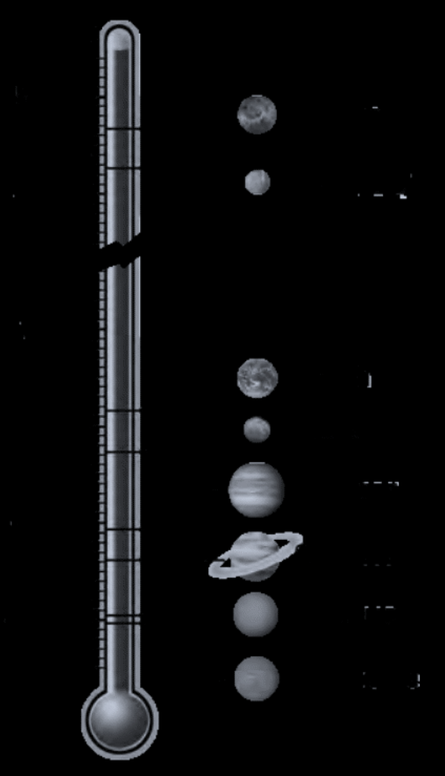
> **[Diagram Context - Textbook_NaturalScience_Gr8_The-Solar-System.pdf-0050-03.png]**
> This graphic is an educational comparative diagram featuring a vertical thermometer on the left aligned with the planets of the solar system on the right. Visible labels correspond to planetary bodies including Mercury, Venus, Earth, Mars, Jupiter, Saturn, Uranus, and Neptune, ordered vertically alongside temperature gradient markers. Conceptually, this diagram visually conveys the relative surface temperatures of the planets in our solar system, helping students understand how planetary distance from the Sun influences thermal conditions.


1. Neptune. 

2. It is the furthest planet from the Sun. 

3. The average temperatures of the terrestrial planets are much higher than the average temperatures of the gas giants. 

4. In general, the further away from the Sun a planet is, the lower its temperature. 

**Note:** Venus is the exception because it has a very thick atmosphere and is undergoing a runaway greenhouse effect which learners will discover later on in this chapter. 

#### ACTIVITY: **Comparing terrestrial planets and gas giants (LB page 238)** 

In this activity learners must compare and contrast the two types of planet using the information already provided in this section. 

|**Terrestrial Planets**|**Gas Giants**|
|---|---|
|close to the Sun|far from the Sun|

|closely spaced orbits|widely spaced orbits|
|---|---|
|small masses|large masses|
|small radii|large radii|
|mainly rocky|mainly gaseous|
|solid surface|no solid surface|
|high density|low density|
|slower rotation|faster rotation|
|few or no moons|many moons|
|no rings|many rings|
|thin atmosphere|thick and dense atmosphere|
|warm|cold|

Learner-dependent answer. Answer in text below. 

#### ACTIVITY: **Comparing the inner and outer planets (LB page 238)** 

In this activity learners will use the information provided in the table below to answer questions which compare the properties of the rocky planets and the gas giants. This is a good exercise to get learners to read information from tables and to look for patterns in data. 

The day length given here is the average time in hours for the Sun to move from the noon position in the sky at a point on the equator back to the same position. This is not the same as the time for the planet to complete one revolution on its axis with respect to the stars. For example, the Earth completes one revolution on its axis with respect to the stars in 23.9 hours, however, because the Earth moves along in its orbit as it rotates, it actually takes 24 hours for the Sun to return to the same position in the sky again (which is how we conventionally define a day on Earth – from noon to noon). 

1. Saturn would float on water as its density is less than that of water. 

   - **Note:** This links back to what learners covered in Term 2 in Matter and Materials on the Particle Model of Matter. 

2. The inner rocky (terrestrial) planets are more dense than the outer gas giants, as the inner planets are made of solid rock, which is denser than gas. 

3. Jupiter. 

4. The gas giants tend to have the shortest days which means that these planets must spin on their axes faster than the terrestrial planets. 

5. Mercury, because it is the closest planet to the Sun and has the least distance to cover. 

6. Mercury. 

7. An example graph is given below. You can use Assessment Rubric 3 at the back of your teachers guide if you would like to assess this translation task. 

#### ACTIVITY: **Planetary holidays (LB page 243)** 

This is a creative writing activity for learners to explore the solar system in an imaginative way. Learners will play the role of cosmic travel agents and will write a travel brochure for one of the planets in the solar system (not Earth!). This activity can be done as a team or individually. Encourage learners to research information about their chosen planet at the school or local library or on the Internet. Alternatively, they 

can use the information provided in this chapter. You could also provide some examples of travel brochures for them to look at as a guide. These are available free at travel agents. You could also ask the learners to present their work in class. 

#### ACTIVITY: **Planet fact sheet (LB page 243)** 

In this activity learners must summarise all the information they know about a particular planet on a one page fact sheet. This activity is easier than the Planetary holidays activity as it requires less imagination, and can therefore be done as an alternative activity. 

#### INVESTIGATION: **Impact craters (LB page 244)** 

In this activity, learners will investigate how craters are formed by dropping balls into a tray of sand. Although you can do this activity with flour, it works best with sand. There are two parts to this experiment. In the first part learners will investigate how the mass of an object affects the crater size formed. In the second part, learners will investigate how the height at which an object is dropped affects the size of the crater it leaves. You can use more objects in the investigation if you have time, and as an extension you can examine the effect of impact angle on the shape of the crater formed. You will need to experiment beforehand with the type of sand that you are using. Before your class performs this investigation, drop marbles into the sand that you have, to observe what kinds of craters the marbles leave. Experiment with the best possible option, for example, you might need to add some moisture to the sand so that you are able to see the craters. 

Learner-dependent answer. Learners should give reasons for their answers. 

1. While investigating the effect of object mass, the height that the objects are dropped from should remain constant. While investigating the effect of dropping height, the mass of the object being dropped should be kept constant. 

2. In the first case – the mass of the object being dropped. In the second case – the height from which the object is dropped. 

Learner-dependent answer. Answers might include conducting more measurements. 

Learner dependent answer. Learners should summarise their results and provide a reason why they think they got the results they did. 

1. The larger the mass of the impacting object, the larger the diameter of the crater. 

2. The greater the height at which the object was dropped, the larger the size of the crater. 

3. Objects dropped from greater heights hit the sand with a higher speed and therefore have greater energy (kinetic energy). As they have more energy they make a larger impact crater. 

It tells us that craters on the surfaces of other planets are formed due to impacts. The impacting objects must have been travelling very fast or have been very massive, because the craters we observe on other planets are much larger than the craters made in this experiment. 

Gravity (the gravitational pull of the Sun). 

1. orbit around the Sun. 

2. be large enough that its own gravity pulls it into a spherical shape. 

3. clear out smaller objects in its orbit, by either flinging them into another orbit or by attracting and then sticking them to itself. 

The Oort Cloud has not been observed. At this point, it is purely hypothetical although very likely. Its existence cannot be stated as fact since it has not yet been confirmed to exist. We therefore refer to the Oort Cloud as hypothetical or predicted. 

#### ACTIVITY: **A comet's ion tail (LB page 248)** 

In this activity learners will discover that a comet's ion tail always points away from the Sun, no matter which way the comet is travelling! You can either get learners to make their own comet tails or if you do not have many materials you can make one comet yourself and pass it around for the learners to see. 

1. Directly away from you (as it is blown away by your breath). 

2. It still moves directly away from you as it is blown away by your breath. It does not follow the direction of movement of the comet. 

At the time of producing these workbooks, comet ISON was approaching very near to the Sun. Astronomers did not know if it would break up or not. Read more about it here^{4} 1.usa.gov/15Xwsa1 and here^{5} 1.usa.gov/174cdbK See if you can find out what happened to comet ISON in the beginning of 2014, and tell your learners about this, or set it as a fun, small homework task. 

### 11.3 Earth's position^{.} in the solar system 

In this section learners will discover just how fortunate they are to be on Earth, which is currently the only planet known to harbour life. They will consider the conditions thought necessary for life and compare those with the conditions found on Earth and on Earth's neighbours. A nice way to introduce this topic is to have a class discussion about whether learners think aliens exist on other planets and, if so, what they might be like. This could then lead into a discussion about what conditions learners think are necessary for life. Talking about aliens usually excites learners! 

#### ACTIVITY: **The Sun's habitable zone (LB page 249)** 

In this activity learners will plot a graph of distance versus temperature for the planets Venus, Earth and Mars. They will also be provided with information regarding the habitable zone around the Sun. Using this information learners will have to decide which of the three planets lie within the Sun's habitable zone. 

Learners should plot the following points: 


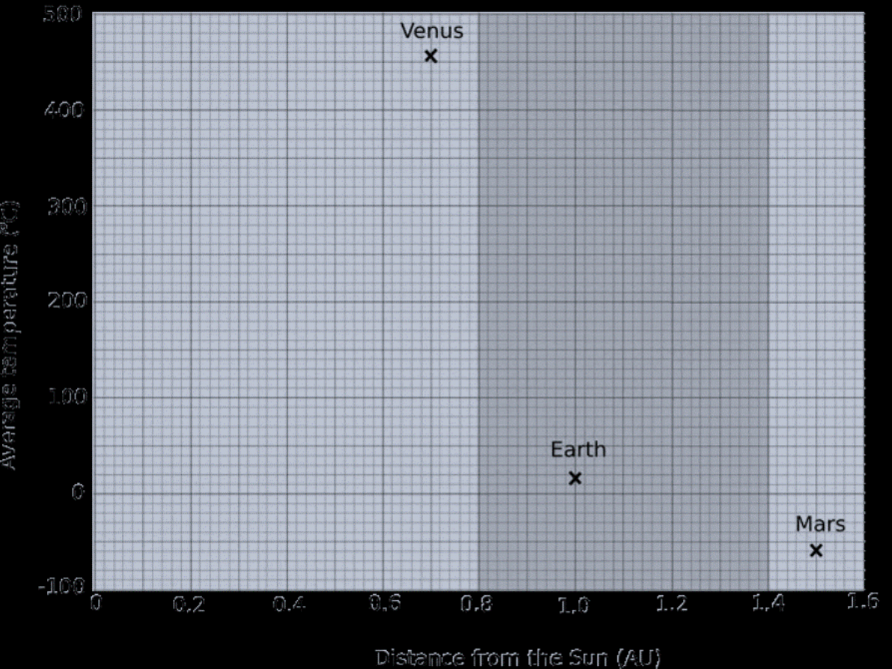
> **[Diagram Context - Textbook_NaturalScience_Gr8_The-Solar-System.pdf-0054-00.png]**
> This educational graphic is a scatter plot graph illustrating planetary conditions. The visible labels include the planetary data points marked with 'x' for "Venus", "Earth", and "Mars", along with the axis variables "Distance from the Sun (AU)" on the x-axis and "Average temperature (°C)" on the y-axis, highlighting a shaded habitable zone. Conceptually, this diagram helps high school learners understand the Goldilocks zone by showing how a planet's distance from the Sun relates to its surface temperature and ability to sustain liquid water.


1. 464 °C. 

2. No, it is too hot. Water boils at 100 °C. 

3. -63 °C. 

4. No, it is too cold. Water freezes at 0 °C. 

5. 15 °C. 

6. Yes, because the temperature on Earth is between water's melting and boiling points. 

7. Only Earth. 

You will probably find different quoted ranges for the habitable zone from different sources. This is because different scientists have used slightly different criteria to define what "habitable" means. Many studies focus on how life on Earth would be affected if the Earth were closer to or farther from the Sun. 

However, the point at which life can no longer exist on Earth is uncertain. 

Learner-dependent answer. This is also an ideal opportunity for a class discussion. Answers could include, sunlight for energy, oxygen, carbon (we are carbon based), liquid water. Note that other life forms might not be carbon based and that life comes in many forms like bacteria, animals and plants. Scientists are looking for more than just human-like beings and other forms of life that we find on Earth. Also, we are likely to be biased in what we think the conditions are that are needed for life, because we only know about life on Earth. 

# **Revision** 

1. By nuclear fusion reactions, where hydrogen is converted to helium. 

2. They are much cooler than the rest of the surface. A typical sunspot temperature is around 3 900 °C whereas the rest of the surface is around 5 500 °C. (Intensity is proportional to temperature). 

3. The gravity between these objects and the Sun. 

4. Mercury, Venus, Earth and Mars. 

5. Jupiter, Saturn, Uranus, Neptune. 

6. In between the orbits of Mars and Jupiter. 

7. Out beyond the orbit of Neptune. 

8. They are mostly made of hydrogen and helium which are the most abundant elements in the universe. 

9. Mercury, Venus, Earth, Mars, Jupiter, Saturn, Uranus, Neptune. 

10. Jupiter, Saturn, Uranus, Neptune. 

11. Its atmosphere is so thick, there is a runaway greenhouse effect on the planet heating the planet to high temperatures. 

12. Mars. 

13. a) The hypothetical Oort Cloud. 

   - b) Comets and icy objects. 

14. As comets come close to the Sun, the Sun's heat evaporates their surface, resulting in long bright tails which we can see. Far from the Sun it is too cold for the tails to form, so we have to wait until the comet is close enough to the Sun for it to form a tail before we can see it. 

15. The official definition of a planet states that a planet must orbit the Sun, be large enough so that its own gravity squashes it into a spherical shape and that it has cleared out other objects from its orbital path. Pluto has not swept out other objects from its orbit and so it was downgraded from planet to dwarf planet status. 

16. Earth has a moderate temperature, with liquid water on its surface. There is also abundant oxygen for respiration and plenty of sunlight (energy) for plants to grow. 

17. It would eventually lose all its liquid water and therefore would not be able to sustain life. 

18. a) Planets c, f and e. 

   - b) The orbits of these three planets lie within the habitable zone around the star. This is the zone which is the right distance from the star for water to exist as a liquid, making these planets possible candidates to support life. 

## 5. Authentic Exam Question Archetypes & Mark Allocations
*(Extracted from official CAPS examination papers to guide marking, pacing, and rubric design)*

### Archetype 1: QUESTION 7
- **Source Paper:** `Gr8_NS_Exam11.pdf`
- **Total Mark Allocation:** **[10 Marks]** (Sub-questions: 1, 1, 1, 4, 1 marks)
- **Recommended Time:** **10 Minutes** (Pacing: ~1.0 min/mark | *Calibrated to Official CAPS Paper Pace (1.0 min/mark)*)
- **Assessment Mode Calibration:** Timed Exam Simulation: 10 min countdown (Pacing Checkpoint: 8 min)
- **Cognitive / Marking Strategy:** NSC Standard (Method Marks [M], Accuracy Marks [A], Carry-Over [CA])

#### Question Prompt & Working:
```text
QUESTION 7  
Study the graph below. 
 
 
 
7.1. 
What is the general shape of the Solar System?  
 
 
 
 
(1) 
7.2. 
Which planet has 68 moons? 
 
 
 
 
 
 
 
(1) 
7.3. 
What happens inside our Sun that creates vast amounts of energy?  
 
(1) 
7.4. 
List and describe TWO factors that makes life possible on Earth. 
 
 
(4) 
7.5.  
Name of  
Planet 
 
Diameter 
Distance 
from Sun  
(Millions of  
km) 
Number of  
Moons 
Surface 
temperature 
Day length 
(Rotation 
on its own 
axis) 
Year length 
(Revolution 
around the  
Sun) 
Mercury 
4 800 km 
58 
0 
-180 ̊C to  
427 ̊C 
59 days 
88 days 
Venus 
12 100 km 108 
0 
471̊C 
243 days 
225 days 
Earth 
12 756 km 150 
1 
-88̊C to 58̊C 
23h56min 
365 days 
Mars 
6 794 km 
228 
2 
-87̊C to 0̊C 
24h31min 
687 days 
 
7.5.1. What do all the planets i...
```

### Archetype 2: QUESTION 8
- **Source Paper:** `Gr8_NS_Exam13.pdf`
- **Total Mark Allocation:** **[8 Marks]** (Sub-questions: 1, 1, 1, 1, 1 marks)
- **Recommended Time:** **8 Minutes** (Pacing: ~1.0 min/mark | *Calibrated to Official CAPS Paper Pace (1.0 min/mark)*)
- **Assessment Mode Calibration:** Timed Exam Simulation: 8 min countdown (Pacing Checkpoint: 6 min)
- **Cognitive / Marking Strategy:** NSC Standard (Method Marks [M], Accuracy Marks [A], Carry-Over [CA])

#### Question Prompt & Working:
```text
QUESTION 8 
 
Study the diagram of the solar system below and answer the questions that follow. 
 
 
 
 
 
 
 
 
 
 
 
 
 
 
 
 
 
 
 
8.1 
Why is the Sun called a star? 
 
 
 
 
 
 
(1) 
 
8.2 
Give the NAME of the biggest planet in the solar system. 
 
 
(1) 
 
8.3 
Which body in the diagram above is regarded as a dwarf-planet? 
 
(1) 
 
8.4 
Name Planet Z. 
 
 
 
 
 
 
 
 
(1) 
 
8.5 
Where in the solar system is the Asteroid Belt located? 
 
 
(1) 
 
8.6 
Give THREE reasons why Earth can sustain life. 
 
 
 
(3) 
 
 
 
 
 
 
 
 
 
 
 
 
[8] 
Natural Sciences Grade 8                                            15                                                    FS/November 2022 
 
Copyright reserved
```

### Archetype 3: QUESTION 9
- **Source Paper:** `Gr8_NS_Exam13.pdf`
- **Total Mark Allocation:** **[8 Marks]** (Sub-questions: 2, 2, 1, 1, 1 marks)
- **Recommended Time:** **8 Minutes** (Pacing: ~1.0 min/mark | *Calibrated to Official CAPS Paper Pace (1.0 min/mark)*)
- **Assessment Mode Calibration:** Timed Exam Simulation: 8 min countdown (Pacing Checkpoint: 6 min)
- **Cognitive / Marking Strategy:** NSC Standard (Method Marks [M], Accuracy Marks [A], Carry-Over [CA])

#### Question Prompt & Working:
```text
QUESTION 9 
 
9.1 
The diagram below shows a comet orbiting the Sun.  
 
 
 
 
 
 
 
 
 
 
 
 
 
 
 
 
 
9.1.1 What do comets consist of? (What are comets made of?) 
 
(2) 
 
 
9.1.2 When the comet is far away from the Sun, no tail is visible but as 
the comet comes closer to the Sun, a white tail becomes clearly  
visible. Explain this observation.  
 
 
 
 
(2) 
 
9.2 
Galaxies come in many different shapes and sizes. Our galaxy has a spiral 
shape as shown below. The arrow shows where our solar system is located. 
 
 
 
 
 
 
 
 
 
 
 
 
 
 
 
 
 
 
9.2.1 What is the name of our galaxy?  
 
 
 
 
(1) 
 
 
9.2.2 What force keeps all the billions of stars together in a galaxy? 
(1) 
 
 
 
Natural Sciences Grade 8                                            16                               ...
```
