## **Looking into space** 


> **[Diagram Context - Textbook_NaturalScience_Gr8_Looking-into-space.pdf-0001-02.png]**
> This educational graphic is a simplified structural diagram representing a biological membrane with embedded proteins or receptors. It shows a continuous horizontal purple-blue band representing a phospholipid bilayer studded with a repeating series of blue, curved, hook-like receptor or protein structures along its upper surface. Conceptually, this diagram helps learners visualize how specialised proteins, enzymes, or carrier molecules are arranged along or embedded within cellular membranes to facilitate transport, signalling, or binding functions.


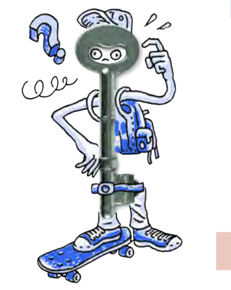
> **[Diagram Context - Textbook_NaturalScience_Gr8_Looking-into-space.pdf-0001-03.png]**
> The graphic is a cartoon character illustration featuring a metallic door key serving as the character's head, accompanied by a large question mark and a puzzled facial expression. The visual elements include a sketched blue-and-white character wearing a cap and backpack while standing on a skateboard, with a photographic metal key superimposed as the head featuring drawn-on eyes and a frowning mouth, plus a blue question mark and squiggly motion/thought lines. Conceptually, this whimsical figure represents confusion, problem-solving, or the search for answers, serving as an engaging visual prompt to introduce inquiry-based learning, critical thinking, or assessment tasks in a CAPS-aligned lesson.


## **KEY .** . **. QUESTIONS:** 

## . **.** . **.** 

- How did early cultures observe and interpret the night sky? 

- How does a telescope help us to see more objects in the sky and in greater detail? 

- What kind of telescopes are there? 

- Why is South Africa a good place for locating telescopes? 

##### **. 3.1 Early viewing of space** 

In dark conditions away from city lights, thousands of stars are visible in the night sky. Early cultures around the world gazed at the stars in wonder. They noted the movement of the stars and planets across the sky and used this to mark the passage of time. People often grouped the stars they saw into patterns called **constellations** . Early cultures tended to associate the stars and planets they saw in the night sky with animals or gods and told stories, which were passed on from generation to generation, about the patterns in the sky which were passed down from generation to generation. 

###### **<u>NEW WORDS</u>** 

• constellation • starlore 


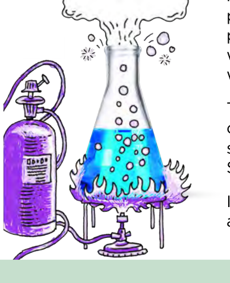
> **[Diagram Context - Textbook_NaturalScience_Gr8_Looking-into-space.pdf-0001-14.png]**
> This educational graphic illustrates a laboratory apparatus setup for investigating chemical reactions, featuring an Erlenmeyer flask containing a blue liquid heated by a Bunsen burner, alongside a pressurized gas cylinder connected via rubber tubing. Visible elements include flames beneath a wire gauze stand, rising gas bubbles inside the flask, and steam or vapor escaping from the top with sparkle and bubble accents. Conceptually, this diagram visually communicates the practical setup used in high school Physical Sciences to study reaction rates, energy changes, or gas production involving heating and controlled gas supply.


The stars that are visible depend upon your location on Earth and also the time of year. The southern sky, which we see from South Africa, is full of beautiful stars and several prominent constellations are visible in the sky including the Southern Cross or Crux, Orion and Pavo the Peacock. 

In the following activities you will have the opportunity to observe the night sky and familiarise yourself with some of the most famous southern constellations. 


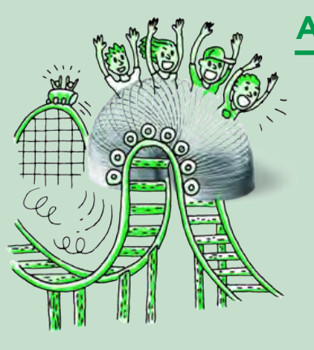
> **[Diagram Context - Textbook_NaturalScience_Gr8_Looking-into-space.pdf-0001-17.png]**
> This educational graphic depicts a conceptual illustration comparing a rollercoaster track with a stretched metal slinky toy, featuring an outlined letter 'A' in the upper right. The illustration includes visible elements such as a green rollercoaster track with supporting pillars, a small rollercoaster cart with motion lines, cheering passengers with raised arms, and a coiled metallic spring overlaying the track's crest. Conceptually, this diagram helps high school learners visualize the transformation of mechanical energy, specifically the conversion between gravitational potential energy at the peak and kinetic energy, as well as serving as a mechanical model for wave motion or longitudinal compression along a track.


**ACTIVITY:** Using star maps to observe the night sky 

###### **MATERIALS:** 

- star map 

- clear skies 

- pencil 

- paper or this workbook 

- torch - optional 


Below is an example star map of the Southern Hemisphere. Ignore the positions of the Moon and the planets. You can generate your own, customised star map for your exact location using the link in the **Visit** margin box. 


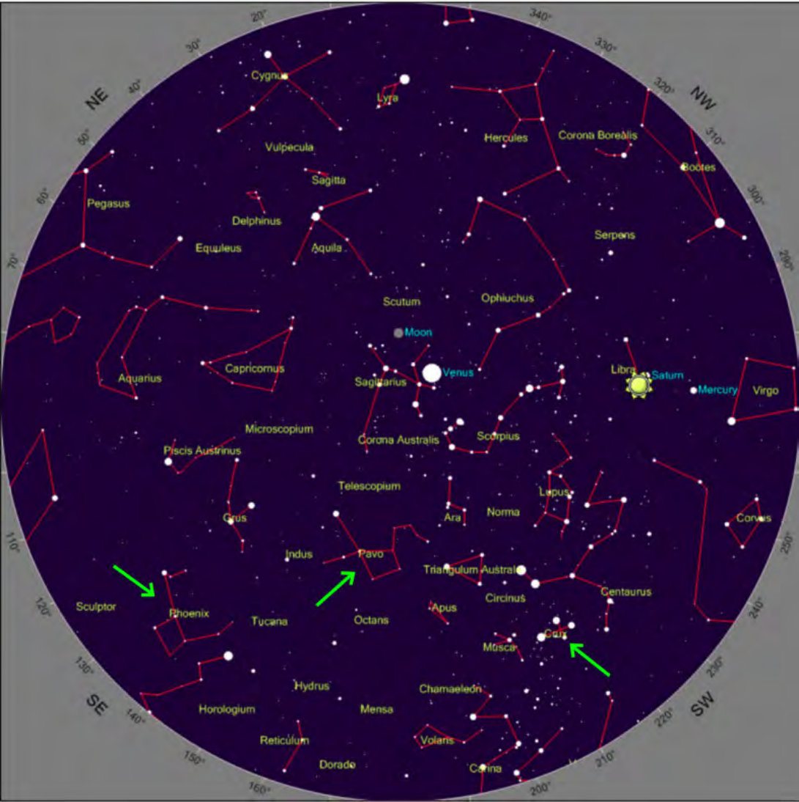
> **[Diagram Context - Textbook_NaturalScience_Gr8_Looking-into-space.pdf-0002-02.png]**
> This educational graphic is an astronomical star chart mapping celestial bodies, constellations, and directional angles across the night sky, featuring cardinal points (NE, NW, SE, SW), degrees along the circular perimeter, constellation names (such as Phoenix, Pavo, and Crux), celestial objects including the Moon, Venus, Saturn, and Mercury, red constellation connection lines, and green arrows pointing to specific southern constellations. For high school Physical Sciences and Earth and Space Sciences learners, this diagram visually conveys how observers map the night sky from Earth, demonstrating the relative positions of planets, the Moon, and prominent southern constellations within the celestial sphere.


###### **INSTRUCTIONS:** 

1. Go outside at night with your star map. 

2. Wait a few minutes to let your eyes adjust to the dark. 

3. Try to identify the following constellations in the sky: Pavo, Phoenix and Crux (indicated with green arrows on the star map). 

4. Draw a picture of each of the constellations as you see them. 

5. See if you can spot any of the planets, these will not twinkle like the stars do. 


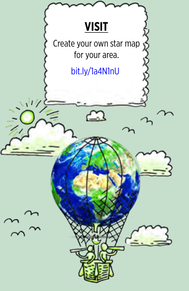
> **[Diagram Context - Textbook_NaturalScience_Gr8_Looking-into-space.pdf-0002-09.png]**
> This educational graphic features an illustrated cartoon scene with a globe styled as a hot air balloon carrying observers in a basket beneath a sun, clouds, and birds, accompanied by a text box reading "VISIT Create your own star map for your area. bit.ly/1a4N1nU". Visible labels include the headline "VISIT" and the web link URL "bit.ly/1a4N1nU". The diagram conceptually encourages students studying earth and space sciences to explore practical stargazing and celestial mapping tools by creating localized star maps.


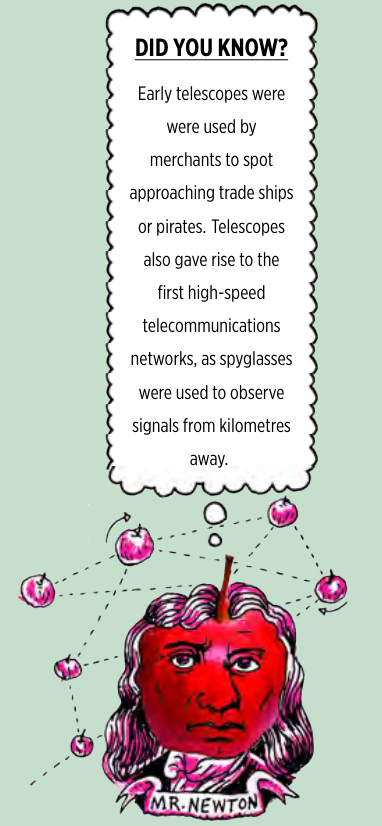
> **[Diagram Context - Textbook_NaturalScience_Gr8_Looking-into-space.pdf-0002-10.png]**
> This educational cartoon features an illustration of a character labeled "MR. NEWTON" with a face resembling an apple, accompanied by a thought bubble headed "DID YOU KNOW?" that contains historical trivia about early telescopes, trade ships, pirates, and high-speed telecommunications networks. Surrounding the central figure are smaller pink apples connected by dotted lines with directional arrows. Conceptually, this graphic provides a fun, engaging historical context about optical technology and communication networks to spark learner interest in physical sciences and technological development.


###### **DRAWINGS:** 

Draw your pictures in the space below. If you have used separate paper you can stick your pictures in here. 

###### **<u>TAKE NOTE</u>** 


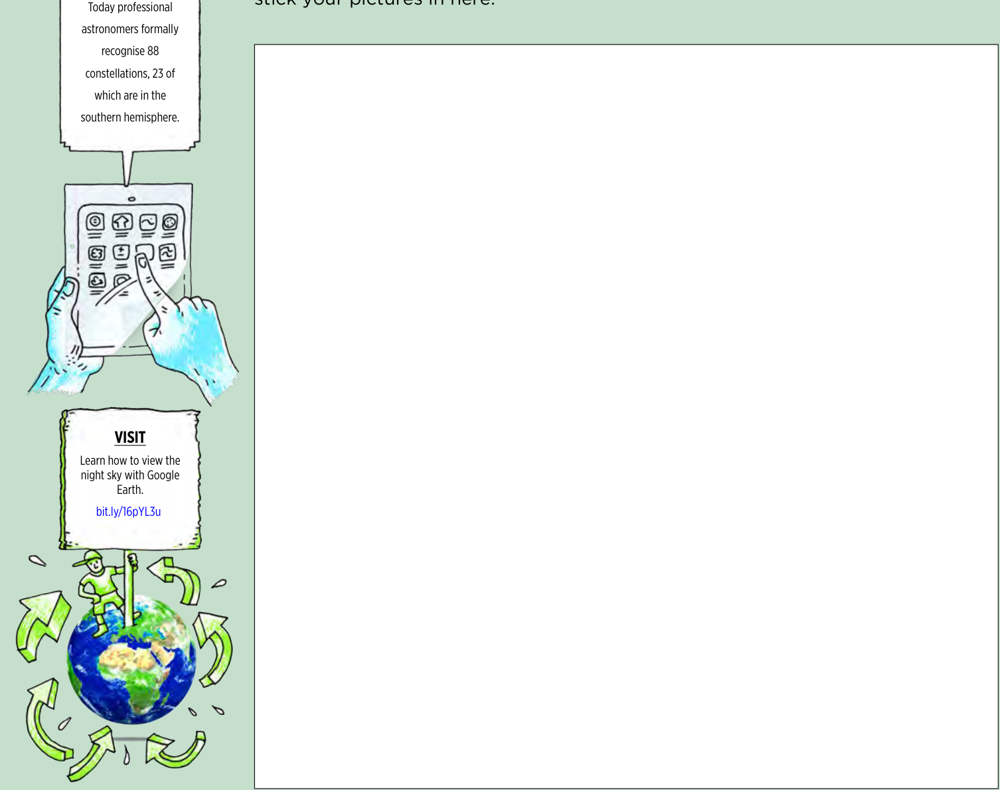
> **[Diagram Context - Textbook_NaturalScience_Gr8_Looking-into-space.pdf-0003-04.png]**
> The educational graphic features a student activity page with decorative illustrations related to astronomy, including a tablet displaying app icons, text boxes with facts about constellations and a Google Earth visit link, and a globe surrounded by recycling-style green arrows. Visible text includes "Today professional astronomers formally recognise 88 constellations, 23 of which are in the southern hemisphere," "VISIT: Learn how to view the night sky with Google Earth," and "stick your pictures in here." Conceptually, this graphic serves as an interactive worksheet prompt for high school Natural Sciences learners to research and display information about constellations and stargazing technology.


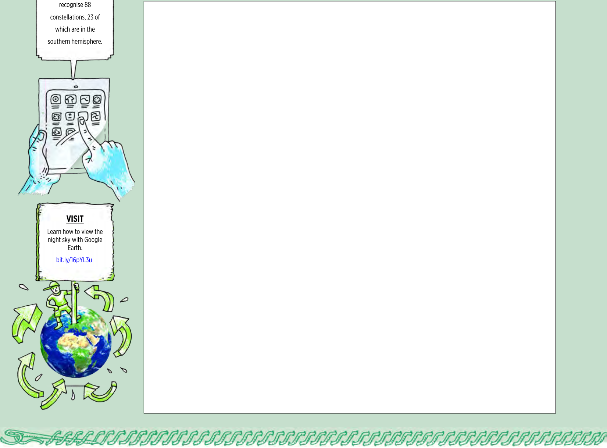
> **[Diagram Context - Textbook_NaturalScience_Gr8_Looking-into-space.pdf-0003-05.png]**
> This educational graphic features marginal illustrations including hands holding a digital tablet with app icons, text boxes detailing the recognition of 88 constellations with 23 in the southern hemisphere, a "VISIT" instruction box with a URL, and a globe of the Earth surrounded by green circular arrows. Visible text labels include "recognise 88 constellations, 23 of which are in the southern hemisphere", "VISIT", "Learn how to view the night sky with Google Earth.", and "bit.ly/16pYL3u". Conceptually, this graphic introduces CAPS learners to astronomy and stargazing by connecting the formal study of southern hemisphere constellations with modern digital tools like interactive apps and Google Earth.


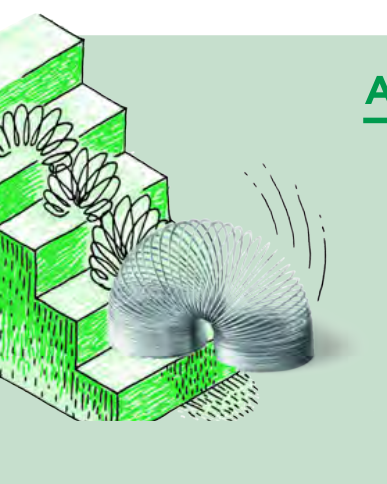
> **[Diagram Context - Textbook_NaturalScience_Gr8_Looking-into-space.pdf-0003-06.png]**
> This educational graphic is an illustration depicting a coiled spring toy (Slinky) tumbling down a flight of green stairs, accompanied by curved motion lines indicating its path. The visible elements include a multi-step staircase shown in perspective, the sequential positions of the spring as it flips downward, and motion arc lines. Conceptually, this diagram visually demonstrates mechanical wave motion, specifically illustrating the interplay of potential and kinetic energy transformations or longitudinal/transverse wave propagation as an object moves through a gravitational field.


##### **ACTIVITY:** Observing the Southern Cross (Crux) 

###### **MATERIALS:** 

- picture of the Southern Cross constellation and star map 

- clear skies 

- pencil 

- paper or this workbook 

**214** Planet Earth and Beyond 


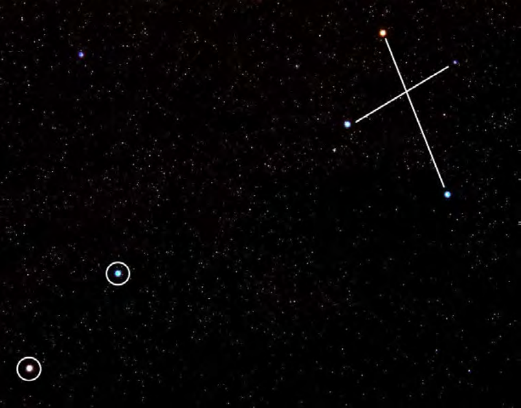
> **[Diagram Context - Textbook_NaturalScience_Gr8_Looking-into-space.pdf-0004-01.png]**
> This photograph of the night sky displays the Southern Cross constellation (Crux) connected by white intersecting overlay lines, alongside the two circled pointers Alpha and Beta Centauri. The visible elements include the four main stars forming the cross and two prominent pointer stars circled at the bottom left against a dense starfield background. For Grade 10 Physical Sciences learners studying Earth and Beyond, this visual conveys how to locate and identify constellations in the southern hemisphere sky using pointer stars for navigation and astronomical observation.


_The Southern Cross or Crux (top right) and the Pointers (bottom left)._ 

###### **INSTRUCTIONS:** 

###### **<u>DID YOU KNOW?</u>** 

1. Go outside around $8\text{ pm}$ with your star map (if in the Western half of the country, closer to Cape Town), or if you live in the Eastern half of the country, (closer to Johannesburg or Durban) go out an hour earlier around $7\text{ pm}$.Wait a few minutes 


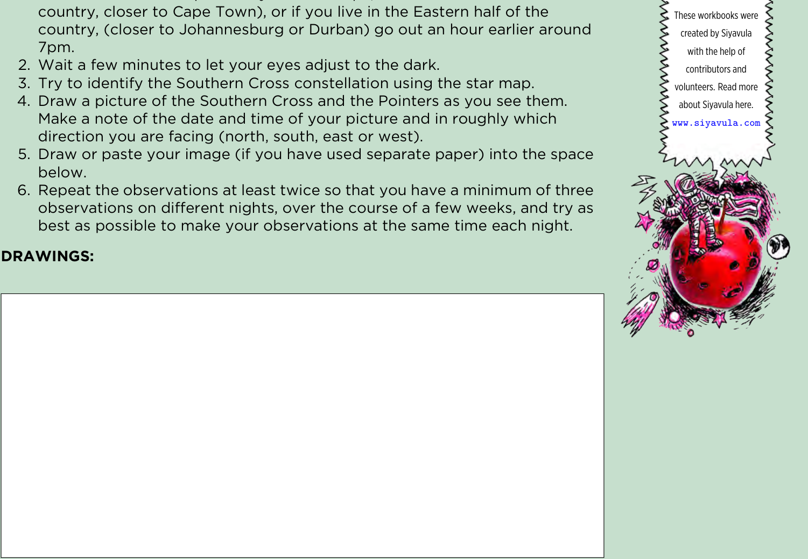
> **[Diagram Context - Textbook_NaturalScience_Gr8_Looking-into-space.pdf-0004-06.png]**
> This educational graphic is an observational worksheet template featuring instructional text for tracking astronomical patterns alongside a blank space labeled "DRAWINGS". Visible text elements include instructions for observing the Southern Cross constellation and Pointers, noting dates, times, and cardinal directions (north, south, east, west), as well as Siyavula publisher attributions. Conceptually, it guides learners through practical, observational science inquiry by asking them to record empirical data of night sky phenomena over multiple weeks to understand apparent stellar motion.


###### **<u>DID YOU KNOW?</u>** 

Some people believe that the builders of the ancient pyramids of Giza in Egypt placed them specifically to look the same from above as the three "belt stars" of the constellation Orion look from Earth. 

###### **QUESTION:** 

###### **<u>VISIT</u>** 

What did you notice about the orientation of the Southern Cross as you made your observations? 

Stellarium - a free, open source programme for your computer to to generate a realistic, real-time 3D simulation of the night sky. bit.ly/1aE2lmj 


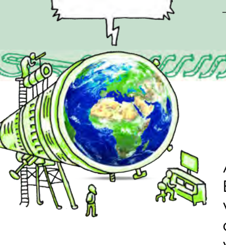
> **[Diagram Context - Textbook_NaturalScience_Gr8_Looking-into-space.pdf-0005-07.png]**
> This educational graphic depicts a conceptual illustration of a large telescope observing the planet Earth, with smaller human figures interacting with the apparatus and a computer console. The visible elements include a massive green-framed optical instrument, a detailed depiction of the Earth's continents (centered on Africa and Europe) within the lens, a speech bubble, and human figures operating equipment and viewing from a ladder. Conceptually, this diagram illustrates the scientific study of Earth systems, planetary observation, and the scale of environmental or geographical monitoring for high school learners.


Although the stars appear to lie in patterns when viewed from the surface of the Earth, in reality the stars within a constellation are unrelated, and they can lie at vastly different distances from Earth. When we look at the stars at night, we only see a two dimensional projection on the sky of three dimensional space, as you can see in this photograph showing the constellation, Orion. 

Planet Earth and Beyond 


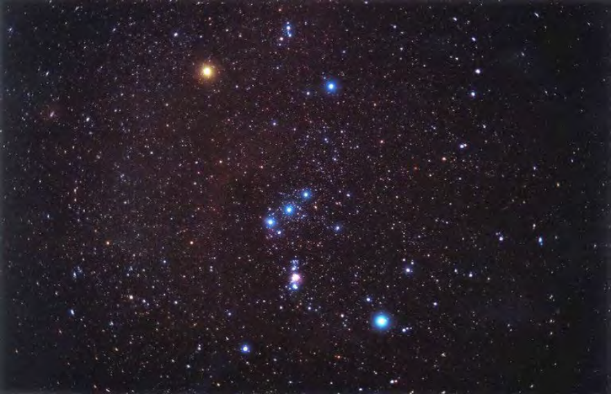
> **[Diagram Context - Textbook_NaturalScience_Gr8_Looking-into-space.pdf-0006-00.png]**
> This astronomical photograph displays a wide-field view of a dense star field against the night sky, capturing numerous point sources of light with varying magnitudes and distinct colors, notably blue and orange stars. No explicit text labels, axes, or arrows are present in the image. Conceptually, it illustrates the composition of the universe for Grade 10-12 Physical Sciences and Geography learners, demonstrating how stars of different temperatures and brightnesses are distributed within constellations and galaxies.


_The Orion Constellation, seen here as the three bright stars in the middle making up Orion's belt and the 4 stars in each corner._ 

You might imagine that all the stars lie at the same distance from Earth. This isn't true, the stars lie at different distances. The closest star in Orion is called Bellatrix and is around 250 light years away. The furthest star Meissa is around 1100 light years away, roughly the same distance as the Orion nebula (1300 light years). But, when viewed from Earth, we see them making up a pattern in relation to each other. 

Now that you are familiar with some of the constellations in the Southern sky, including the Southern Cross you can learn what some of the early cultures in Southern Africa thought about them. 


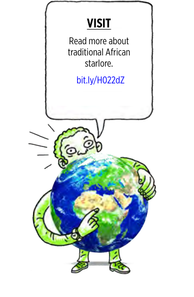
> **[Diagram Context - Textbook_NaturalScience_Gr8_Looking-into-space.pdf-0006-04.png]**
> This educational graphic features a cartoon character hugging a globe and pointing at the African continent, accompanied by a speech bubble containing the text "VISIT Read more about traditional African starlore. bit.ly/H022dZ". The visual prominently displays a globe and a speech bubble with an external web link. Conceptually, this resource encourages students exploring Indigenous Knowledge Systems (IKS) in geography or science to connect global perspectives with traditional African astronomy and cultural heritage.


As you can imagine there are many stories associated with the constellations in the sky. In the following activity you will carry out research to find an example story to tell to your class. 

##### **ACTIVITY:** Constellation starlore 

The /Xam Bushman imaged that the two pointer stars of the Southern Cross were two male lions who had once been men before they were thrown up into the sky to be stars by a magical girl. The three brightest stars in the Southern Cross were seen as female lions, perhaps women also changed into stars by the magical girl. 

The Khoikhoi thought that the Pointers were the eyes of some great beast and **.** they were called _Mura_ which means _the eyes_ . 

In Sotho, Tswana and Venda cultures, these stars are called _Dithutlwa_ which means _the Giraffes_ . The bright stars of the Southern Cross are male giraffes, and the two Pointer stars are female giraffes. The Venda named the fainter stars of the Southern Cross _Thudana_ , which means _the Little Giraffe_ . The Sotho used these stars to indicate the beginning of the cultivating season which began when the giraffe stars were seen close to the south-western horizon just after sunset. 


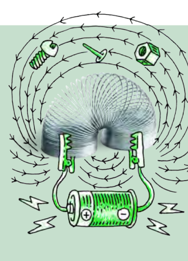
> **[Diagram Context - Textbook_NaturalScience_Gr8_Looking-into-space.pdf-0006-10.png]**
> This educational graphic illustrates an electromagnet apparatus consisting of a coiled wire connected to a battery with visible positive (+) and negative (-) terminals. Concentric loops with directional arrowheads surround the coil, accompanied by nearby magnetic metal objects including a screw, nail, and nut. Conceptually, this diagram demonstrates how an electric current flowing through a solenoid creates a magnetic field, illustrating the principles of electromagnetism for Grade 10-12 Physical Sciences learners.


###### **INSTRUCTIONS:** 

###### **<u>VISIT</u>** 

1. Search for a story about a constellation found in the South African sky. 

Read more about some South African starlore: bit.ly/1cbF7uu and bit.ly/1abUL5z 

2. Use a South African starmap as a guide to the constellations found in South Africa. 

3. Researchwith it. information on the origin of the story and any beliefs associated **.** 


> **[Diagram Context - Textbook_NaturalScience_Gr8_Looking-into-space.pdf-0007-07.png]**
> The graphic is an environmental illustration depicting planet Earth as a hot air balloon carrying figures with binoculars in its basket, set against a backdrop of the sun, clouds, birds, and wave-like green decorative patterns. There are no explicit text labels, chemical symbols, or numerical variables visible in the image. Conceptually, this visual metaphor introduces Grade 10-12 Life Sciences and Geography learners to global environmental awareness, sustainability, and human responsibility toward monitoring and protecting Earth's biosphere and atmospheric systems.


4. Tell your classmates about the constellation and story you have found out about. 

5. Your teacher will decide on the format of this presentation which might be a poster or oral presentation. 

In their quest to find out more about planets, stars and galaxies, people invented instruments to observe them in more detail. In the next section we will learn about the telescope: an invention used to study the stars. 

###### **<u>NEW WORDS</u>** 

##### **. 3.2 Telescopes** 

- celestial 

- • telescope 


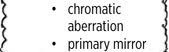
> **[Diagram Context - Textbook_NaturalScience_Gr8_Looking-into-space.pdf-0007-14.png]**
> The educational graphic displays a text list with bullet points containing the terms "chromatic aberration" and "primary mirror" enclosed by a wavy border. It highlights key optical and telescope concepts related to lens limitations and reflecting telescope design. Conceptually, it serves as a study prompt or glossary item for high school learners studying physics and optics, helping them distinguish between lens defects and reflecting components.


Unfortunately, we cannot visit distant stars or galaxies to study them directly as they are so far away. Instead astronomers study stars and galaxies by analysing the visible light, radio waves and electromagnetic radiation that they receive from them. 


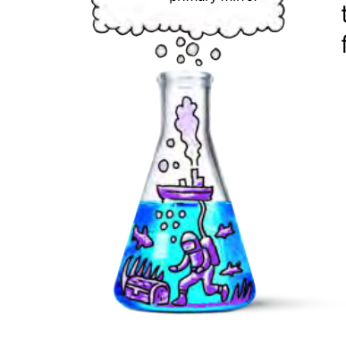
> **[Diagram Context - Textbook_NaturalScience_Gr8_Looking-into-space.pdf-0007-16.png]**
> This graphic is an illustrative conceptual drawing centered on a glass Erlenmeyer flask filled with blue liquid containing a submerged underwater scene with a scuba diver, a treasure chest, fish, and a boat on the surface emitting exhaust bubbles. Visible elements include the glassware apparatus, blue liquid representing water, sketched outlines of marine life, a diver, a boat, and a thought bubble above the flask. Conceptually, this whimsical representation is often used in science communication or introductory lessons to spark curiosity about chemical reactions, solutions, and scientific inquiry by blending macroscopic laboratory equipment with imaginative underwater environments.


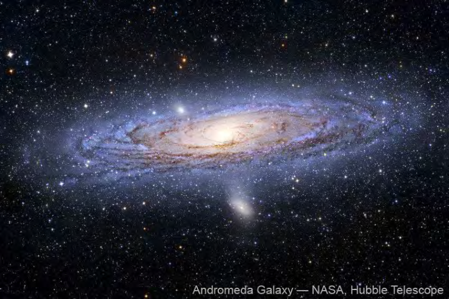
> **[Diagram Context - Textbook_NaturalScience_Gr8_Looking-into-space.pdf-0007-17.png]**
> This astrophotography image displays the Andromeda Galaxy against a vast starfield, featuring the label "Andromeda Galaxy — NASA, Hubble Telescope" at the bottom. The visual elements include a large spiral galaxy with a bright central galactic bulge, distinct spiral arms, dust lanes, and numerous surrounding stars. Conceptually, this graphic supports CAPS Earth and Space Sciences by illustrating the structure of a typical spiral galaxy, helping learners understand galactic morphology, stellar systems, and the scale of the universe beyond our solar system.


Human eyes can see very far. Andromeda Galaxy which is 2.5 million light-years away is visible to the naked eye. However, we cannot make out any detail as it appears as only a tiny smudge on the sky to our eyes even though in reality it is 220 000 light years across. 

**<u>VISIT</u>** History of the telescope. bit.ly/1ibkZ9o 


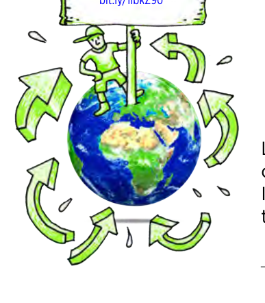
> **[Diagram Context - Textbook_NaturalScience_Gr8_Looking-into-space.pdf-0007-20.png]**
> This environmental graphic depicts an educational illustration featuring a globe surrounded by circular green recycling arrows and a human figure holding a sign. Visible elements include a planet Earth model, a blank signpost, a character holding the pole, and a ring of directional green arrows indicating a continuous loop. Conceptually, this diagram conveys the importance of recycling, waste management, and sustainability for high school learners studying environmental studies and ecological responsibility within the CAPS curriculum.


_The Andromeda galaxy, viewed with the Hubble Space Telescope. Humans can only see it as a tiny faint smudge in the sky with the naked eye._ 

Light is emitted from stars and galaxies and travels in a straight line in all directions. When you look at a star, you only see the light rays that hit your eye. In Energy and Change, we learnt about visible light. How is the energy of light transferred through space? 

The further away a star is, the more the starlight is spread out and so less of the total light from the star reaches your eye. This makes distant objects faint and difficult to see clearly. If we had huge eyes we would be able to see distant objects more clearly because our eyes would gather more of their light. 

Planet Earth and Beyond 

Do you remember making a pinhole camera in Energy and Change? Have a look at the following diagram which illustrates this again. 


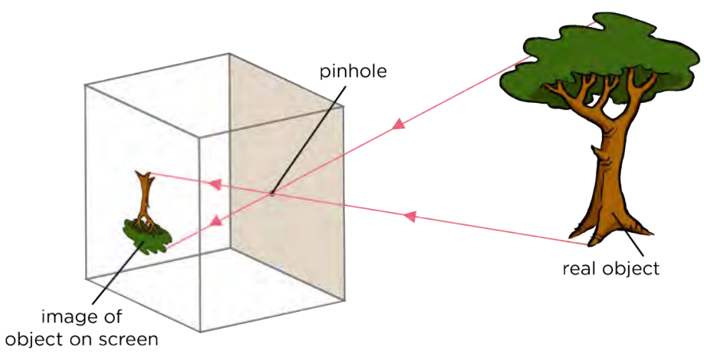
> **[Diagram Context - Textbook_NaturalScience_Gr8_Looking-into-space.pdf-0008-01.png]**
> This educational diagram illustrates a pinhole camera apparatus demonstrating the rectilinear propagation of light. Visible labels include "pinhole", "real object" (depicted as a tree), and "image of object on screen", with pink ray lines and directional arrows tracing the path of light from the object through the pinhole to form the inverted image. Conceptually, it conveys how light travels in straight lines to project a real, inverted, and diminished image onto a screen.


Which way is the image projected onto the screen? 

This is the same way in which images are formed on your retina when you view an object, as shown in the following image. 


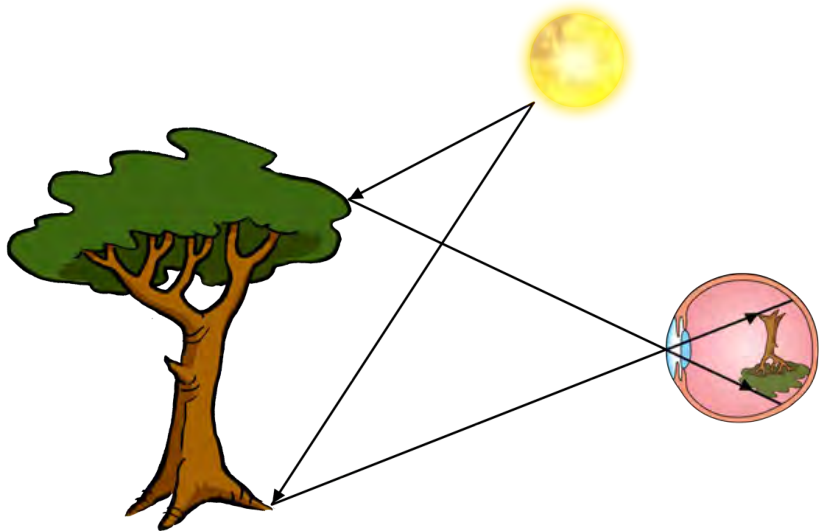
> **[Diagram Context - Textbook_NaturalScience_Gr8_Looking-into-space.pdf-0008-04.png]**
> This educational graphic illustrates the process of vision through ray tracing, featuring a luminous sun, a tree as an object, and a human eye with an inverted image formed on the retina. Visible elements include directional arrows showing light rays traveling from the sun to the tree and reflecting from the tree into the eye's lens. This diagram helps CAPS Physical Sciences and Life Sciences learners understand how light reflection enables sight by demonstrating how light travels from a luminous source to an object, reflects off it, and enters the eye to form an image.


_Images formed on the light-detecting retina at the back of your eye are upside down._ 

An object that is far away projects a small image of the object onto the retina at the back of your eye making it difficult to see fine details in the image. 


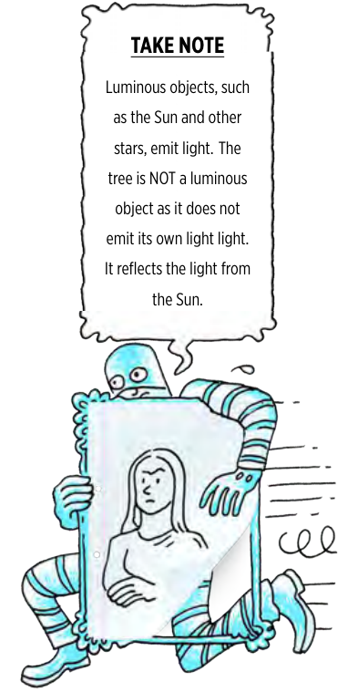
> **[Diagram Context - Textbook_NaturalScience_Gr8_Looking-into-space.pdf-0008-07.png]**
> The graphic is a cartoon educational illustration featuring a character holding a framed drawing and an accompanying text box with the heading "TAKE NOTE". Visible labels and text include "TAKE NOTE", "Luminous objects, such as the Sun and other stars, emit light", "The tree is NOT a luminous object as it does not emit its own light", and "It reflects the light from the Sun". Conceptually, this diagram introduces learners to the fundamental distinction in optics between luminous objects that generate their own light and non-luminous objects that are only visible because they reflect light from another source.


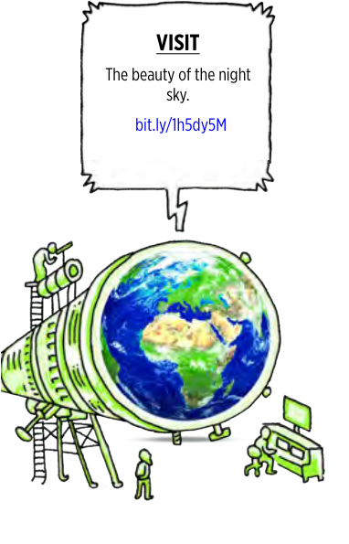
> **[Diagram Context - Textbook_NaturalScience_Gr8_Looking-into-space.pdf-0008-08.png]**
> This educational graphic is a cartoon illustration depicting a massive green telescope pointed at Earth, with a speech bubble above reading "VISIT The beauty of the night sky." and a URL link ("bit.ly/1h5dy5M"). Visible elements include tiny human figures operating the telescope and control consoles, alongside the large eyepiece showing continents such as Africa and Europe. Conceptually, this diagram serves as an engaging digital resource prompt that links Earth-bound observation with space science, encouraging high school learners to explore astronomical concepts beyond the classroom.


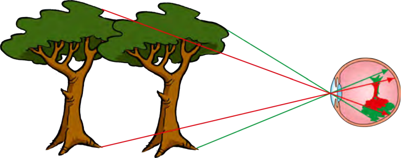
> **[Diagram Context - Textbook_NaturalScience_Gr8_Looking-into-space.pdf-0008-09.png]**
> This educational graphic is an optical physics ray diagram illustrating light rays traveling from two distinct trees into a human eye. The diagram displays two green trees on the left, an eye structure on the right, and intersecting red and green straight directional arrows representing light rays passing through the cornea and lens to form an inverted image on the retina. Conceptually, it demonstrates how light reflection from objects forms real, inverted images on the retina of the eye, reinforcing principles of geometrical optics and vision for high school learners.


_More distant objects appear smaller on our retina._ 

Telescopes help us see faint, distant objects more clearly because they collect more light from the objects than our eyes do. They also magnify the image. 


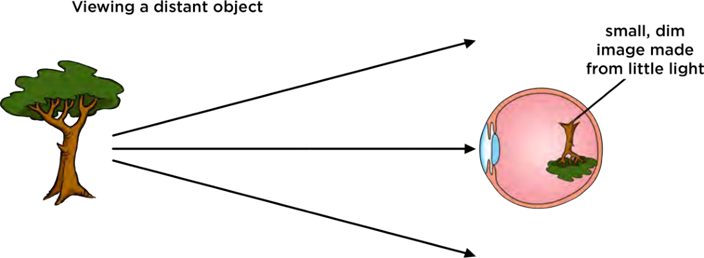
> **[Diagram Context - Textbook_NaturalScience_Gr8_Looking-into-space.pdf-0009-01.png]**
> This educational graphic illustrates the process of vision in a human eye viewing a distant object, featuring a tree on the left and a cross-section of an eye on the right. Visible labels and annotations include the title "Viewing a distant object" and a descriptive pointer indicating a "small, dim image made from little light" formed on the retina. Conceptually, this diagram helps high school learners understand how light rays from a distant source enter the eye to form a diminished, inverted image on the light-sensitive retina.


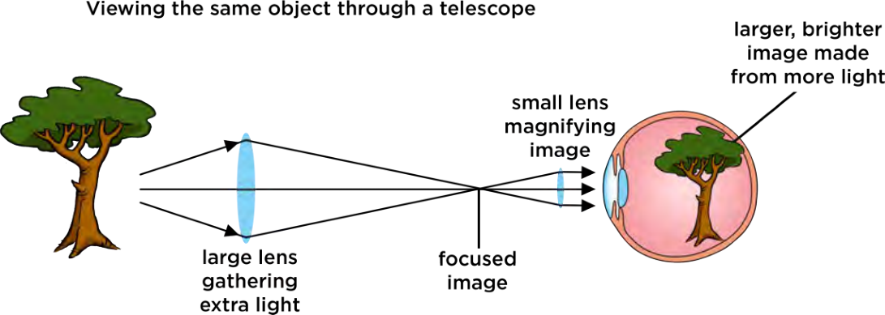
> **[Diagram Context - Textbook_NaturalScience_Gr8_Looking-into-space.pdf-0009-02.png]**
> This optical diagram illustrates the function of a refracting telescope using lenses and light rays to view a distant object. The graphic includes visible labels and pointers for a "large lens gathering extra light," a "focused image," a "small lens magnifying image," and a "larger, brighter image made from more light" projected onto an eye. Conceptually, it demonstrates to CAPS Physical Sciences learners how optical instruments collect and focus light from distant objects to form magnified, clear images that can be observed by the human eye.


###### **<u>DID YOU KNOW?</u>** 

Images formed on your retina are actually upside down. Your brain "corrects" the image, so that you do not notice. 

As revision of what we learned in Energy and Change last term, answer the following questions. 


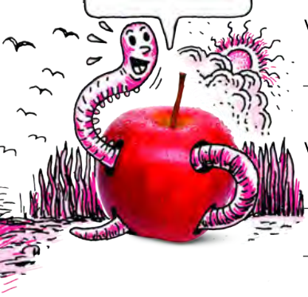
> **[Diagram Context - Textbook_NaturalScience_Gr8_Looking-into-space.pdf-0009-06.png]**
> This educational graphic is an ecological illustration featuring a cartoon earthworm burrowing through a red apple in a natural setting containing grass, birds, clouds, and a sun. Visible elements include the segmented pink worm, the whole red apple with a stem, and a blank speech bubble above the worm. Conceptually, this illustration depicts heterotrophic nutrition and detritivore activity within an ecosystem, helping high school learners visualize how organisms interact and obtain energy from organic matter.


What type of lens is shown in the above image? 

What happens to the light when it passes through the lens? 


> **[Diagram Context - Textbook_NaturalScience_Gr8_Looking-into-space.pdf-0009-09.png]**
> This educational graphic is an anatomical and mechanical illustration depicting a green caterpillar feeding on leaves, with its body superimposed by a metal spring toy (slinky). Visible features include green leaves, striped circular patterns along the caterpillar's body and the spring, a smiling cartoonish head with teeth eating foliage, and droplet shapes nearby. Conceptually, this diagram uses an analogy to help high school students understand longitudinal wave mechanics—specifically compressions and rarefactions—by relating them to the stretching and contracting motion of a caterpillar's body.


Let's take a closer look at how a telescope works. 

##### **ACTIVITY:** Telescopes as light buckets 

There is only so much light emitted from an object each second. **.** Little packets of light are called **photons** . Our eye needs at least 500 photons, or packets of light, coming into it every second for our brains to sense that something is there. In this activity you are going to represent photons from a distant galaxy using pepper grains or hundreds and thousands. 

Planet Earth and Beyond 


###### **MATERIALS:** 

- paper plate 

- piece of paper 3cm by 3cm 

- pencil or pen 

- torch 

- pepper grains or hundreds and thousands 

- wooden skewers 

- foam (bath sponge will do, ideally as wide as the paper plate in one direction) 

- tape - optional 

- scissors 

###### **INSTRUCTIONS:** 

1. On the piece of paper draw an image of your eye including the pupil and iris. 

###### **<u>VISIT</u>** 

How telescopes work. bit.ly/1abV9B9 

2. Tape or place the image of your eye onto the middle of a paper plate. The paper plate represents a telescope mirror or lens. 

3. Take the foam and cut it into a thin strip about 3 cm wide and as long as the paper plate across. 

4. Stick six skewers into the foam equally spaced along the strip. Trim the pointed edges off that are sticking out for safety. **.** You will use this foam strip later in this activity. 

5. Shine a torch light just above the picture of the eye on the plate. 


_When an object is closer, more light reaches your eye._ 

6. Slowly move the torch further away from the plate and watch how the light spreads out and dims. 

7. Note how much of the torch light the eye's pupil receives compared to the paper plate. 

8. Now remove the torch and get ready to use the pepper grains or hundreds and thousands. These will represent _photons_ or _packets of light._ 


_The further away an object, the less light that reaches your eye._ 


9. Sprinkle these photons for one second over the plate. 

10. Note roughly how many photons get into the eye compared with how many hit the paper plate representing the telescope mirror or lens. 


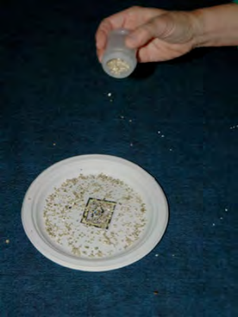
> **[Diagram Context - Textbook_NaturalScience_Gr8_Looking-into-space.pdf-0011-03.png]**
> This educational graphic shows a hands-on ecological apparatus featuring a small container held by a hand, scattering small particles (representing organisms) onto a marked white plate or grid surface below. Visible components include the hand, dispensing container, and scattered granular items distributed across the circular target plate. Conceptually, this diagram demonstrates the capture-recapture method or quadrat sampling technique used in Life Sciences to estimate population size and density in a given habitat.


_Sprinkle the pepper grains or hundreds of thousands._ 

11. Now place the foam across the centre of the paper plate. The skewers should be pointing straight up. This represents a strip of the telescope mirror with the skewers representing light rays from distant objects. 

12. The telescope mirror is actually curved. Bend the foam upwards at either end so that the skewers begin to come together in the middle. 


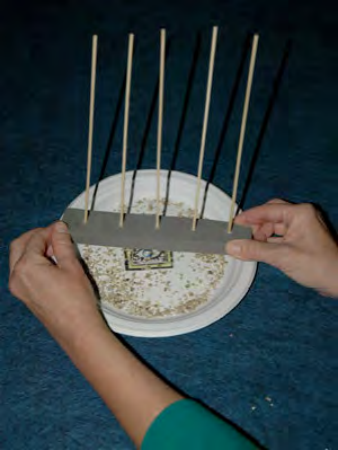
> **[Diagram Context - Textbook_NaturalScience_Gr8_Looking-into-space.pdf-0011-07.png]**
> This image shows an experimental apparatus featuring a white plate filled with small objects or seeds, a small central card with an eye drawing, and a grey cardboard strip holding six vertical wooden skewers, manipulated by a pair of hands. This physical model demonstrates wave fronts and ray propagation or diffraction phenomena in Physical Sciences. Conceptually, it helps learners visualise how waves interact with barriers and apertures, supporting understanding of wave mechanics and interference patterns.


_The skewers represent the light rays hitting the mirror of the telescope._ 


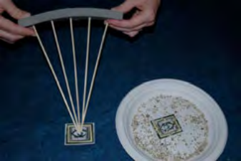
> **[Diagram Context - Textbook_NaturalScience_Gr8_Looking-into-space.pdf-0011-09.png]**
> This educational graphic shows a classroom demonstration apparatus used to model star tracking or celestial movement, featuring a curved bar, five radiating skewers converging at a marked base, and a plate with granular material. Visible components include a curved alignment strip, five straight support rods representing angle lines, a central anchor tile, and a surrounding tray or plate filled with particulate matter. This physical model helps high school Geography and Earth Sciences learners visualize how apparent stellar motion, celestial coordinates, or angle measurements function in observational astronomy.


13. Turn the foam over and direct the skewers into the picture of the eye. The light rays from a large strip of the mirror are now entering the small pupil of the eye. 

**<u>VISIT</u>** How to make a small, easy telescope. bit.ly/19YIAVH 


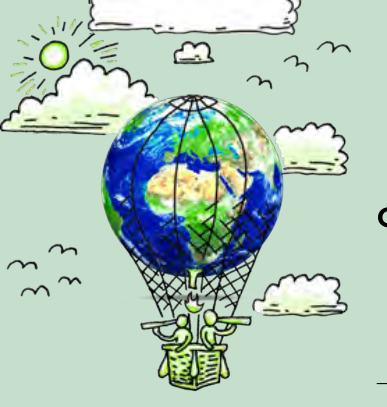
> **[Diagram Context - Textbook_NaturalScience_Gr8_Looking-into-space.pdf-0011-13.png]**
> This educational graphic depicts a conceptual illustration of Planet Earth shaped as a hot air balloon floating in a green sky with a sun, clouds, birds, and a burner flame heating the globe above a basket containing two figures with binoculars. Visible elements include a terrestrial globe envelope, a woven net with suspension cords, a burner flame at the base of the globe, a basket containing two human figures holding binoculars, a sun, and surrounding clouds and birds. Conceptually, this diagram illustrates human exploration, global observation, or environmental monitoring of Earth, supporting CAPS geography and environmental studies topics regarding Earth systems and human interaction with the planet.


_Now you can see how a telescope's mirror can collect lots of light and direct it into a small detector, like your eye._ 

###### **QUESTIONS:** 

1. Which collects more of the torch light as the torch moves further away: the eye's pupil or the paper plate? 

2. Did the eye collect enough photons in one second to detect the light? 

**222** Planet Earth and Beyond 


3. Did the telescope mirror (paper plate) collect enough photons for the eye to detect the light? 

4. How do you think all the light that hits the telescope mirror is concentratedso that it can enter our eyes or a small telescope detector? **.** 


> **[Diagram Context - Textbook_NaturalScience_Gr8_Looking-into-space.pdf-0012-03.png]**
> The graphic displays a repeating decorative border pattern consisting of stylized green curly arrow shapes arranged in a horizontal line. It features identical repeating green chevron or wave-like arrow symbols flowing uniformly from left to right. This design serves as a page separator or aesthetic divider for educational worksheets or textbooks, providing a visual break between sections without conveying specific scientific concepts.


Telescopes have big lenses or mirrors to collect as much light as possible. This is how they are able to see faint objects. Telescopes also concentrate or focus the light and redirect it into our small eye so that we can see the dim object. Alternatively, telescopes can redirect the light into special detectors that record images, similar to a cell phone camera. 

##### **ACTIVITY:** Compare your eye with SALT 

The Southern African Large Telescope (SALT) takes pictures of some of the most distant and faintest objects in the Universe. SALT's camera takes images with exposure times typically of twenty minutes, after which the camera shutter closes and the resulting image is displayed on a computer. The longer the exposure, the more light that the telescope can gather to make the image. The human eye does not have a shutter. We seem to see continuously, rather than as a succession of still images. However, the eye does have a kind of exposure time. In this activity you will estimate the exposure time of your eye by estimating your reaction time and then compare it with SALT's typical exposure time. 


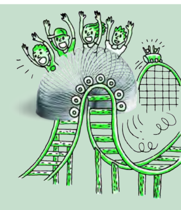
> **[Diagram Context - Textbook_NaturalScience_Gr8_Looking-into-space.pdf-0012-07.png]**
> This educational graphic features an illustrated model overlaying a roller coaster track with cheering passengers, alongside a smaller schematic sketch of a roller coaster on a grid. The visual elements include a metallic Slinky spring draped over the crest of the green roller coaster track, multiple figures with raised hands, wheels along the tracks, and motion lines denoting movement. Conceptually, this diagram visually demonstrates the conservation of mechanical energy and the interplay between gravitational potential energy and kinetic energy as an object moves along a frictionless track, aligning with the Grade 11 Physical Sciences CAPS curriculum on Work, Energy, and Power.


###### **MATERIALS:** 

- ruler 

- calculator 

- pencil or pen 

###### **INSTRUCTIONS:** 

1. Work in pairs for this activity. 

2. Look at your partner's eyes. Estimate the diameter of their pupils using a ruler held close to their eye. Be careful not to actually touch your partner's eyes. 

3. Write down the diameter of pupil in the table below. 4. Compare the diameter of the pupil with that of the Southern African Large Telescope (SALT) which is roughly 10 m in diameter. 

5. Calculate how many times larger than an eye SALT is. (Remember to compare the areas rather than the diameters). 

6. One of the pair: hold a pen or pencil directly in front of you, while the other person stands opposite you and prepares to catch it. 


7. Drop the pen or pencil and see if you partner can catch it. 

8. Estimate the reaction time of your partner. Is it a second? Is it a tenth of a second? Is it a thousandth of a second? 

9. Repeat steps 6 - 8 swapping places. 

10. Fill in your reaction times in the table below, these represent the exposure time of your eye. 

11. Complete the questions. 

Table to record your results: 

||**Eye**|**SALT**|**SALT / Eye**|
|---|---|---|---|
|**Diameter of**<br>**collecting lens /**|cm|cm||
|**mirror**||||
|**Area of**<br>**collecting lens /**|cm^{2}|cm^{2}||
|**mirror**||||
|**Exposure time**|seconds|seconds||

Hint: Convert the diameter of SALT to cm. Convert the exposure time of SALT to seconds. To simplify the calculation of the area of the SALT mirror assume it is a circle with a radius of 5 m. The area of a circle is given by the formula A = _π_ r^{2} . 

###### **QUESTIONS:** 

1. Why should you compare the area of the telescope and eye's pupil rather than their diameters? 

2. How many times more light does the SALT telescope collect compared with your eye? 

3. What would happen to your reaction time if your eye had to accumulate light over a longer interval before sending an image to the brain? 

4. How many times longer can SALT expose for than your eye? 


> **[Diagram Context - Textbook_NaturalScience_Gr8_Looking-into-space.pdf-0013-14.png]**
> This graphic is a repeating decorative green border featuring a stylized, wave-like serpentine pattern. The visible elements consist entirely of a continuous linear motif composed of curved shapes resembling overlapping waves or stylized ribbons. Conceptually, this functions purely as a page separator or aesthetic boundary marker for educational documents, rather than conveying specific scientific or mathematical content.


**224** Planet Earth and Beyond 

Telescopes can collect more light from faint and distant objects because they have larger collecting areas _and_ because they can accumulate light over longer periods of time to make an image. This means that you can see fainter objects with telescopes that you would be able to see using just your eye. 

Telescopes also **magnify** (enlarge) the image that you see, so it takes up more room on your retina allowing you to see the object more clearly. 


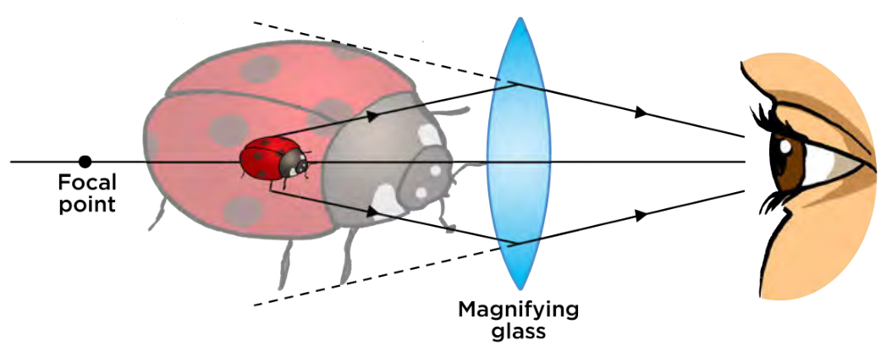
> **[Diagram Context - Textbook_NaturalScience_Gr8_Looking-into-space.pdf-0014-02.png]**
> This optical ray diagram illustrates the working principle of a convex lens used as a magnifying glass. The visible labels include "Focal point," "Magnifying glass," light rays with directional arrows, and dashed projection lines representing an enlarged virtual image of a ladybug as viewed by an eye. Conceptually, it demonstrates how placing an object within the focal length of a convex lens produces a larger, upright virtual image that appears magnified to an observer.


- _A convex (converging) lens used as a magnifying glass. The resulting image is larger than the object. Telescopes magnify images from distant stars and galaxies._ 

Magnification comes at a price however. A fixed amount of light is received from any object, so if you make the image larger, its gets fainter as the light is spread out within the image. This is why it is so important to collect as much light as possible. 


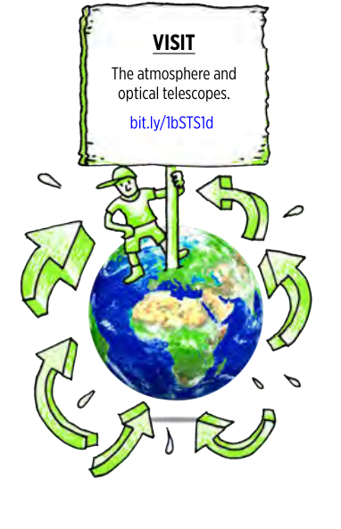
> **[Diagram Context - Textbook_NaturalScience_Gr8_Looking-into-space.pdf-0014-05.png]**
> This educational graphic is an instructional prompt featuring an illustration of the planet Earth surrounded by circular green arrows and a figure holding a sign. The sign is clearly labelled with the text "VISIT", "The atmosphere and optical telescopes.", and a shortened URL link ("bit.ly/1bSTS1d"). Conceptually, this diagram serves as an external resource signpost for high school learners studying Earth and Space Sciences, directing them to online digital content regarding how Earth's atmosphere impacts optical telescope observations.


The larger a telescope's mirror or lens, the better it is at seeing narrowly separated objects as individual objects and the sharper the images look. 

The most important feature of a telescope is how much light it can collect, which depends upon the area of the lens or mirror. The larger the light collecting area, the more light a telescope gathers and the higher resolution (ability to see fine detail) it has. So the size of a telescope is far more important than its magnification. 

Now that we have briefly looked at how telescopes work, we are going to look at the different types of telescopes, namely: 

- optical telescopes 

- radio telescopes 

- space telescopes 

###### **Optical telescopes** 

Optical telescopes collect visible light from celestial objects. There are two types of optical telescopes. 

1. Refracting telescopes use **lenses** to collect and focus the light from distant objects. 

2. Reflecting telescopes use **mirrors** to collect and focus the light from distant objects. 

###### **1. Refracting telescopes** 


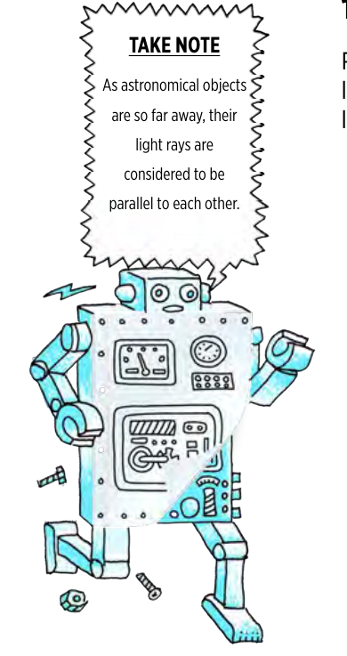
> **[Diagram Context - Textbook_NaturalScience_Gr8_Looking-into-space.pdf-0015-01.png]**
> This educational graphic features an illustrated cartoon robot character accompanied by a jagged speech bubble titled "TAKE NOTE" with the explanatory text: "As astronomical objects are so far away, their light rays are considered to be parallel to each other." It conceptually introduces learners to optical physics principles in physical sciences, specifically explaining how extreme distances allow light from stars and distant celestial bodies to be treated as parallel rays when analyzing reflection and refraction.


Refracting telescopes use a converging (convex) lens to collect and bend the light rays inwards to the focal point (also called the focus) of the telescope. The light collecting lens is called the objective lens. 


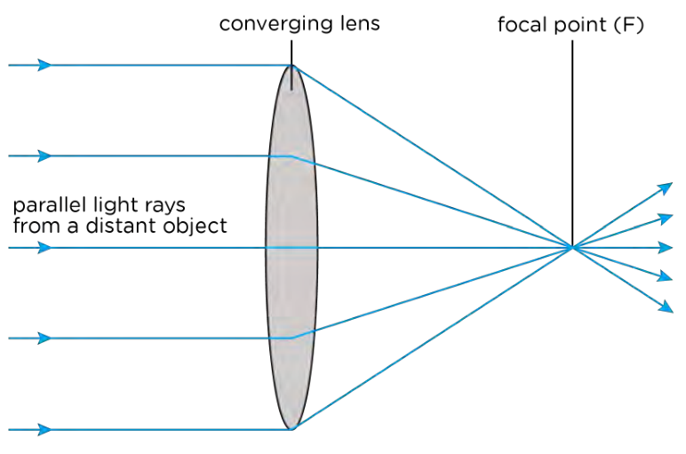
> **[Diagram Context - Textbook_NaturalScience_Gr8_Looking-into-space.pdf-0015-03.png]**
> This optical ray diagram illustrates the refraction of light through a convex lens. Visible labels include "converging lens", "focal point (F)", and "parallel light rays from a distant object", accompanied by directional blue arrows indicating the path of light. Conceptually, it demonstrates how incoming parallel rays refract and converge at a single point (the principal focus) after passing through the lens, which is fundamental to understanding Geometrical Optics in the CAPS Physical Sciences curriculum.


Once light is brought to a focus, it is then magnified by another lens called the eyepiece lens. Look at the optical ray diagram below showing a simple refracting telescope. 


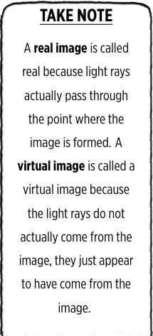
> **[Diagram Context - Textbook_NaturalScience_Gr8_Looking-into-space.pdf-0015-05.png]**
> This text box graphic contains educational definitions distinguishing between real and virtual images. Visible text labels include the headings "TAKE NOTE" and key concepts such as "real image" and "virtual image." Conceptually, this helps high school Physical Sciences learners understand the fundamental optical distinction: real images are formed where light rays actually converge and pass through a point, whereas virtual images are formed where light rays only appear to diverge from a point.


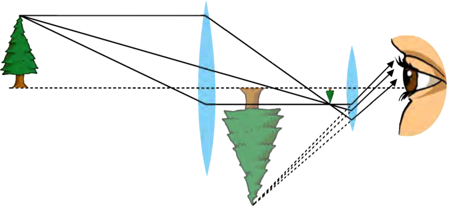
> **[Diagram Context - Textbook_NaturalScience_Gr8_Looking-into-space.pdf-0015-06.png]**
> This optical ray diagram illustrates the working principle of a refracting telescope, featuring an objective lens, an eyepiece lens, a distant tree object, a real inverted intermediate image, and an observer's eye receiving refracted light rays. Visible elements include a horizontal dashed principal axis, vertical double-convex lenses shown in blue, solid lines with directional arrows representing light rays, and dashed extension lines indicating virtual image formation. Conceptually, it demonstrates how a compound optical instrument uses two lenses in tandem to magnify distant objects by first forming a real, inverted image that is subsequently viewed as an enlarged virtual image by the eye.


The telescope objective lens collects and focuses the light from a distant tree forming a real inverted image of the tree. The eyepiece lens, like a magnifying glass, then enlarges the image collected by the objective lens, producing a larger, virtual image. This images is what we see when we look through the telescope. 


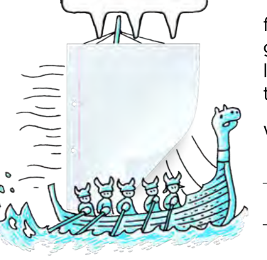
> **[Diagram Context - Textbook_NaturalScience_Gr8_Looking-into-space.pdf-0015-08.png]**
> The graphic illustrates a cartoon diagram of a Viking ship with rowers navigating rough, wavy water while wind blows from the left against a large rectangular sail. Visible elements include wavy horizontal lines representing wind on the left, splashing water at the bow and stern, five cartoon figures rowing with oars, and rigging holding the mast and sail. Conceptually, this illustration helps students visualise physical forces and vector components in mechanics, demonstrating how wind force interacts with a sail and how applied forces from oars drive a vessel through water.


What kind of lenses are the objective lens and the eyepiece lens? 

Look at the following picture which shows how white light is refracted (bent) as it travels through a prism. As we learnt in Energy and Change, when light travels through glass it slows down and so it bends or refracts. 

Planet Earth and Beyond 


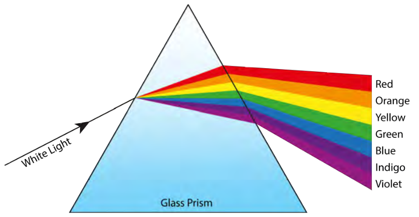
> **[Diagram Context - Textbook_NaturalScience_Gr8_Looking-into-space.pdf-0016-00.png]**
> This educational apparatus diagram illustrates the dispersion of light through a triangular glass prism. Visible labels include "White Light", "Glass Prism", and the constituent spectral colors arranged in order from top to bottom: "Red", "Orange", "Yellow", "Green", "Blue", "Indigo", and "Violet", with an arrow indicating the direction of the incident beam. Conceptually, it conveys how white light refracts and separates into its component wavelengths due to differing degrees of bending, demonstrating the visible light spectrum in accordance with CAPS physical sciences requirements.


Do all the colours undergo the same amount of refraction? Which colour is bent the most? 

White light is a mixture of all the colours of the rainbow. Different colours are refracted by different amounts as they travel through the prism so the white light is split into its different colours. How do you think this affects the images produced by refracting telescopes? 

Lenses are shaped to bend light by a certain desired amount. However, the different colours that make up white light bend by slightly different amounts. This means that different colours come to a focus at slightly different distances from the objective lens. Each colour will produce its own image and they will be slightly misaligned with each other resulting in a slightly blurry image. This effect is called **chromatic aberration** and all lenses suffer from this effect. 


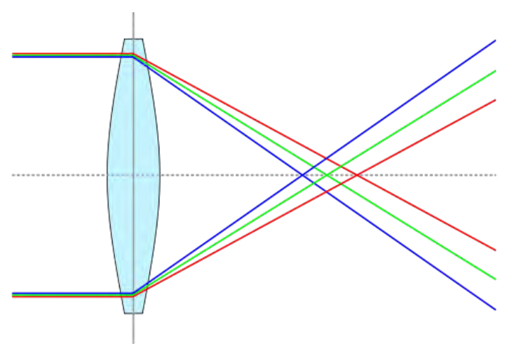
> **[Diagram Context - Textbook_NaturalScience_Gr8_Looking-into-space.pdf-0016-04.png]**
> This optical ray diagram illustrates the phenomenon of chromatic aberration through a convex lens. It displays a horizontal principal axis, a symmetrical biconvex lens, and incoming parallel light rays split into constituent red, green, and blue colored rays that refract at different focal points. For a Grade 12 Physical Sciences learner, this demonstrates how different wavelengths of light refract by varying amounts due to dispersion, resulting in a failure of the lens to focus all colors to a single point.


_Blue light is bent more than red light and so different colours are focused at different distances from the lens. The different coloured images are overlaid upon each other and, because they are misaligned, the resulting image is blurry._ 

The main disadvantages of refracting telescopes are: 

###### **<u>DID YOU KNOW?</u>** 

1. Light travels through the lenses in the telescope and so the lenses have to be perfect. There must be no bubbles of air in the glass which would distort the image. It is difficult to and expensive to make large perfect lenses. 

The first successful reflecting telescope built was the Newtonian Telescope, by Isaac Newton, which is where the design gets its name. 

2. The light travels through the lenses and so they can only be supported around their edges, where they are thinnest and weakest. This limits the size of refracting telescopes because if a lens is too large it will sag under its own weight and distort the image. 

3. Lenses suffer from chromatic aberration which blurs the image. 


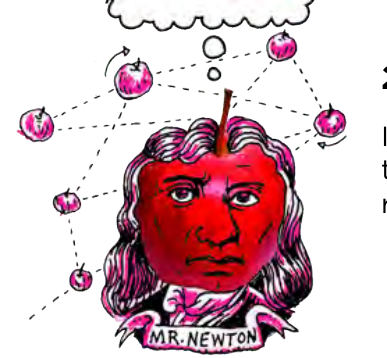
> **[Diagram Context - Textbook_NaturalScience_Gr8_Looking-into-space.pdf-0017-06.png]**
> This conceptual illustration features a caricature portrait of Sir Isaac Newton with his head depicted as a red apple labeled "MR. NEWTON," surrounded by a network of interconnected floating apples connected by dashed lines and directional arrows. The graphic illustrates Newton's Law of Universal Gravitation, visually connecting the iconic falling apple to the gravitational forces acting between masses in a system. For FET Physical Sciences learners, this diagram provides an engaging, memorable metaphor for understanding gravitational fields and how every particle attracts every other particle in the universe with a force proportional to their masses.


###### **2. Reflecting telescopes** 

In the 1680s, Isaac Newton invented the reflecting telescope. Reflecting telescopes use a curved primary mirror to collect light from distant objects and reflect it to a focus. 


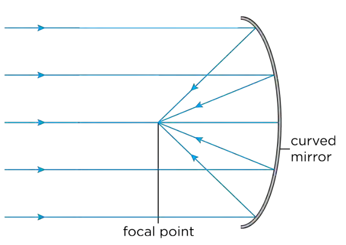
> **[Diagram Context - Textbook_NaturalScience_Gr8_Looking-into-space.pdf-0017-09.png]**
> This ray diagram illustrates the reflection of light off a curved mirror. Visible labels and elements include a "curved mirror", directional arrows on incident and reflected blue rays, and a "focal point". Conceptually, it conveys how parallel incoming light rays converge at a single focal point after reflecting off a concave mirror, which is a fundamental principle in Physical Sciences when studying geometric optics.


###### **<u>TAKE NOTE</u>** 

Remember that for each ray, the angle of incidence is equal to the angle of reflection, as you learned in Energy and Change. 


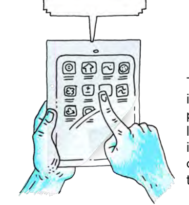
> **[Diagram Context - Textbook_NaturalScience_Gr8_Looking-into-space.pdf-0017-12.png]**
> This educational graphic is an illustration of a handheld digital tablet showing an interface with various app icons, being touched and operated by two hands. Visible elements include a tablet screen with a grid of icon symbols, a finger tapping the screen, and a speech bubble extending from the top. Conceptually, this diagram visually represents digital interaction, e-learning, or the use of mobile technology as a tool for accessing information and educational applications.


There are many different types of reflecting telescopes. A **prime focus reflector** is the simplest type of reflector telescope. In this design, a recording structure is placed at the focal point to obtain the focused image. In the old days, in very large telescopes, a person would actually sit in an "observing cage" to view the image directly or operate a camera. However, now a detector is used and is operated from outside of the telescope. The position of the detector is shown in the following diagram with a red cross. 


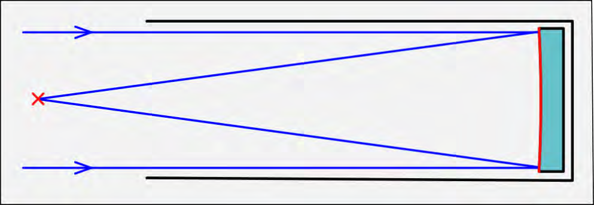
> **[Diagram Context - Textbook_NaturalScience_Gr8_Looking-into-space.pdf-0017-14.png]**
> This graphic is a ray diagram illustrating optical reflection using a concave mirror mounted inside a tubular casing. It features parallel incoming blue light rays with directional arrowheads, a curved reflecting surface highlighted in red, a cyan mirror block, and a red cross marking the focal point where the reflected rays converge. Conceptually, this demonstrates how a concave mirror converges parallel incident light rays to a single focal point, supporting Grade 10-12 Physical Sciences optics concepts relating to wave and geometrical optics.


_A prime focus reflector with a detector at the focal point, marked with an X._ 

**228** Planet Earth and Beyond 

More complex designs of reflecting telescopes use a secondary small mirror to reflect the light towards the eyepiece lens. 

- A **Newtonian reflector** reflects the light to an eyepiece on the side of the telescope tube. This design is often used for amateur telescopes because having the eyepiece on the side of the tube makes the telescope easy to use. 

- A **Cassegrain reflector** reflects light through a small hole in the primary mirror. This kind of telescope is often used for large professional telescopes as it allows heavy detectors to be placed at the bottom of the telescope. This makes them easy to reach for repairs and also means that the weight of the detectors does not affect the telescope tube. 


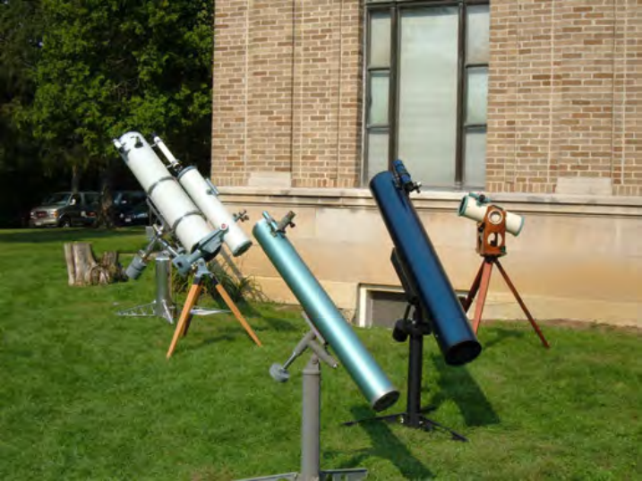
> **[Diagram Context - Textbook_NaturalScience_Gr8_Looking-into-space.pdf-0018-03.png]**
> The image shows a collection of optical telescopes set up on stands outdoors on a lawn near a brick building. The visual features four distinct telescope assemblies of varying sizes, tube colors, and mount types, without any text labels or arrows. Conceptually, this real-world apparatus demonstrates the equipment used in observational astronomy, illustrating how different optical designs (such as refracting and reflecting telescopes) are mounted and aligned to study celestial objects in physical science and geography curricula.


###### **<u>DID YOU KNOW?</u>** 

The Cassegrain reflector is named after a reflecting telescope design that was published in 1672 and has been attributed to Laurent Cassegrain. 


> **[Diagram Context - Textbook_NaturalScience_Gr8_Looking-into-space.pdf-0018-06.png]**
> This graphic is an illustrative artwork depicting an astronaut standing on a red, cratered sphere that resembles a planet or a stylized apple, holding a flag with a blank speech bubble overhead. Visible surrounding elements include stars, lightning bolts, smaller planets, a comet, and a distant planet or moon set against a textured, dark background. Conceptually, it serves as a creative prompt or visual stimulus to engage high school learners in imaginative writing or discussions related to space exploration, physics, and planetary science.


_A group of Newtonian telescopes._ 

The following ray diagrams show the difference between a Newtonian and Cassegrain reflector. 


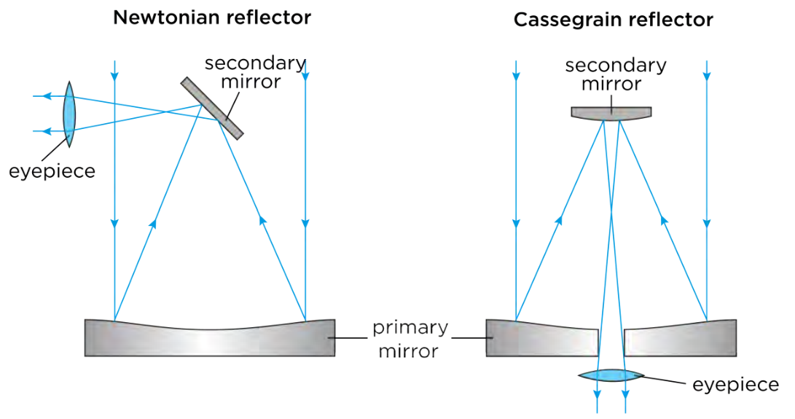
> **[Diagram Context - Textbook_NaturalScience_Gr8_Looking-into-space.pdf-0018-09.png]**
> This ray diagram compares two types of reflecting telescopes, the Newtonian reflector and the Cassegrain reflector. The labels identify the "primary mirror", "secondary mirror", and "eyepiece", with blue lines and directional arrows tracking the path of incoming light rays. Conceptually, it demonstrates how optical systems use concave primary mirrors combined with secondary mirrors to gather light and form magnified images, illustrating the differences in light path configuration between the two designs for high school physical sciences learners.


_Ray diagrams for some example reflecting telescopes. The Newtonian reflector is often used in amateur telescopes. The Cassegrain telescope is often used at large observatories._ 


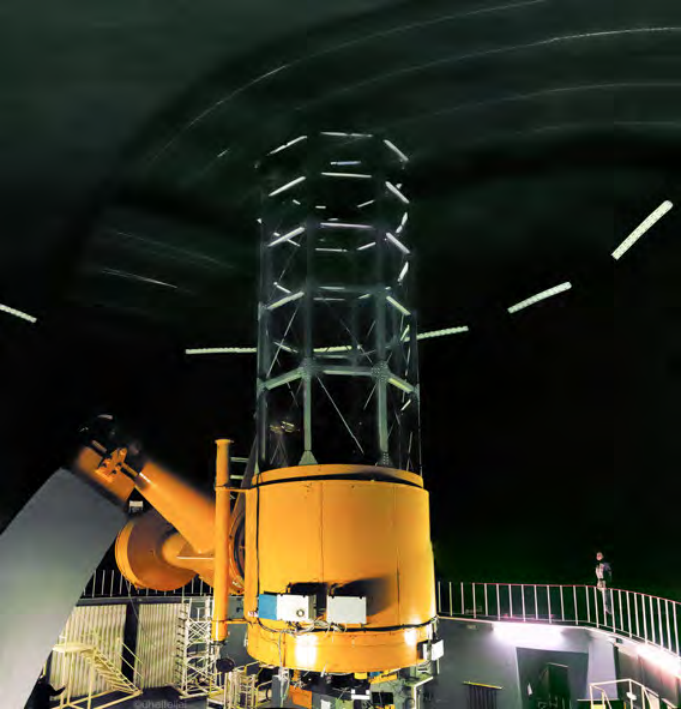
> **[Diagram Context - Textbook_NaturalScience_Gr8_Looking-into-space.pdf-0019-00.png]**
> This photograph depicts a large optical telescope apparatus housed inside a dome observatory. The visible structures include a cylindrical steel truss framework, a prominent yellow mounting base with electronic instrument boxes, and angled support arms. Conceptually, this visual resource supports Grade 10-12 Physical Sciences and Geography learners studying optical instruments and astronomy by illustrating how professional-grade telescopes collect and focus light from celestial bodies to study the universe.


_The SAAO 1.9 m reflecting telescope. Detectors are bolted onto the Cassegrain focus at the bottom of the telescope (metal boxes under the orange tubing). (Credit: SAAO)._ 

###### **<u>VISIT</u>** 

Curious about the Universe, but don't know where to start? Have a look at this step-by-step guide to becoming an awesome amateur astronomer. bit.ly/1gBwrQ8 

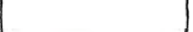


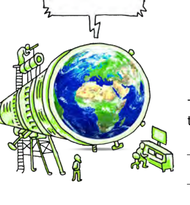
> **[Diagram Context - Textbook_NaturalScience_Gr8_Looking-into-space.pdf-0019-05.png]**
> This educational graphic is an illustrated concept diagram featuring a large telescope housing the planet Earth, viewed by scientists operating equipment and looking through an eyepiece. Visible elements include a massive green-toned optical telescope structure, a detailed representation of the Earth (showing Africa and Europe) filling the main lens aperture, human figures acting as scientists on ladders and at computer monitor workstations, and a speech bubble floating above. Conceptually, this diagram visually illustrates the sheer scale of planetary observation and scientific inquiry, helping learners contextualize Earth and space sciences by portraying the planet as an object of study examined through advanced instruments.


The secondary mirror in a reflecting telescope must be very small. Why do you think this is so? 

Do you think that reflecting telescopes suffer from chromatic aberration? Why? 

###### **<u>DID YOU KNOW?</u>** 

NASA is currently planning the successor for the Hubble Space Telescope, called the James Webb Space Telescope (JWST). It will be launched into space in 2018. 

The advantages of a reflecting telescope include: 

1. The glass of the mirror does not have to be perfect throughout, only the surface has to be perfect. 


> **[Diagram Context - Textbook_NaturalScience_Gr8_Looking-into-space.pdf-0019-12.png]**
> This whimsical educational illustration depicts a carriage fashioned from a red apple, being pulled by two pink horses and driven by a man while a waving figure rides inside, with a blank speech bubble emerging from the top. The visual elements include a carriage body shaped like an apple, wheels, a driver holding reins, a passenger waving, a flag, motion lines indicating speed, and an empty thought or speech bubble. Conceptually, this creative cartoon is used to engage learners in imaginative writing, storytelling, or metaphor creation, encouraging them to construct a narrative or dialogue around the surreal scene.


2. The mirror can be supported across the whole of its back so it won't sag. 

3. Making large mirrors is easier and cheaper than making big lenses. 

4. They do not suffer from chromatic aberration. 

Optical telescopes on the ground do however have some disadvantages: 

1. They can only be used at night. 

2. They cannot be used in bad weather (rain, cloud, snow etc). 

Optical telescopes are best placed on the tops of remote mountains. Discuss within your class why you think this is. Take some notes in the space below. 

**230** Planet Earth and Beyond 

The largest telescopes in the world today are reflecting telescopes. In the next section you will learn about one of the largest reflecting telescopes in the world which is located right here in South Africa. 

###### **SALT** 


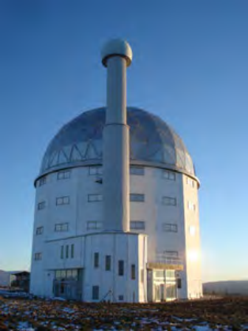
> **[Diagram Context - Textbook_NaturalScience_Gr8_Looking-into-space.pdf-0020-02.png]**
> This photograph shows an astronomical observatory building with a domed roof and a tall vertical tower under a clear blue sky. There are no visible labels, text, or arrows present on the image. Conceptually, this visual supports CAPS Physical Sciences and Geography learners studying optical telescopes, space science, and South Africa's role in global astronomical research infrastructure.


The Southern African Large Telescope (SALT) is the largest optical telescope in the southern hemisphere and among the largest in the world. SALT was completed in 2005 and is located in the Karoo in the Northern Cape, near the town, Sutherland. Astronomers use telescopes like SALT to study planets, stars and galaxies. SALT can detect the light from faint or distant objects in the Universe a billion times too faint to be seen with the naked eye. 

The SALT telescope has a large mirror which collects light. SALT's primary mirror is a hexagonal shape measuring 11.1 m by 9.8 m across and is made up of 91 individual 1.2 m hexagonal mirrors. SALT is a prime focus reflector. What does this mean? 

_The SALT telescope just outside Sutherland._ 


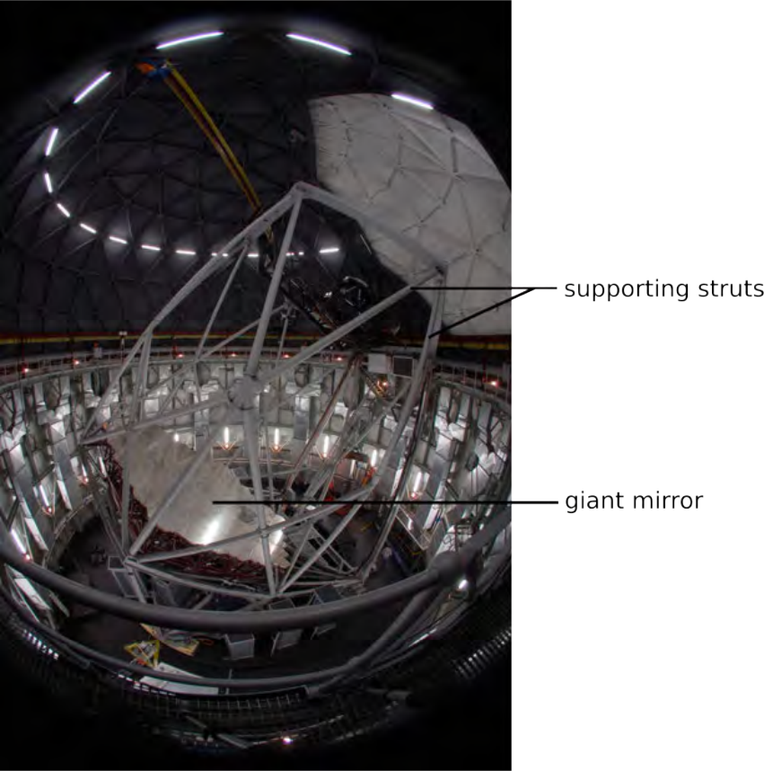
> **[Diagram Context - Textbook_NaturalScience_Gr8_Looking-into-space.pdf-0020-06.png]**
> This photograph depicts a large optical telescope apparatus housed inside a dome, showcasing structural components with labels pointing to "giant mirror" and "supporting struts". Conceptually, it illustrates how large reflective telescopes use curved mirrors and rigid frameworks to gather and focus light from distant celestial objects for astronomical observation.


SALT does not have a telescope tube. Instead there is a network of metal struts which support the tracker and payload at the top of the telescope. The whole telescope structure weighs 85 tons. The payload contains detectors which take pictures of the night sky. 


> **[Diagram Context - Textbook_NaturalScience_Gr8_Looking-into-space.pdf-0020-08.png]**
> This educational graphic features an illustrative cartoon of an Erlenmeyer flask containing a blue liquid and purple aquatic plant-like growth, topped with a cloud-like text box. The visible text labels are the heading "NEW WORDS" and the bullet point "SALT". Conceptually, this visual introduces foundational chemical vocabulary to learners by framing the scientific concept within an engaging, imaginative context.


> **[Diagram Context - Textbook_NaturalScience_Gr8_Looking-into-space.pdf-0020-09.png]**
> This educational graphic is an illustrated cartoon figure holding and pointing at a globe of the Earth, accompanied by a speech bubble. The visible text reads "VISIT The SALT website." and includes a shortened URL link "bit.ly/1fSW6CH". Conceptually, this graphic serves as an engaging prompt to direct CAPS learners toward external online resources, specifically the Southern African Large Telescope (SALT) digital platform, to supplement astronomy or earth science topics.


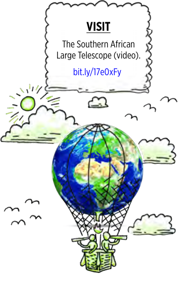
> **[Diagram Context - Textbook_NaturalScience_Gr8_Looking-into-space.pdf-0020-10.png]**
> This educational graphic features an illustrated cartoon scene depicting a hot-air balloon shaped like planet Earth carrying observers with telescopes, accompanied by a text box reading "VISIT The Southern African Large Telescope (video). bit.ly/17e0xFy". The visible elements include a globe balloon, clouds, the sun, birds, a basket with two figures using telescopes, and a URL link directing learners to external multimedia content. Conceptually, this resource engages CAPS learners by contextualising astronomy and optical observation tools within real-world South African scientific landmarks, connecting classroom theory to institutions like SALT.


_SALT's giant mirror, made up of 91 individual mirrors._ 


> **[Diagram Context - Textbook_NaturalScience_Gr8_Looking-into-space.pdf-0021-00.png]**
> The graphic displays a piece of torn, parchment-style paper featuring the underlined uppercase text "VISIT" in black sans-serif font, alongside a faint vertical green border on the left edge. This is a text-based promotional or navigational element rather than a scientific diagram or curricular illustration. It does not convey specific CAPS subject concepts such as biological structures, chemical symbols, or physical laws.


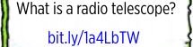
> **[Diagram Context - Textbook_NaturalScience_Gr8_Looking-into-space.pdf-0021-01.png]**
> The image is a text prompt featuring the question "What is a radio telescope?" alongside a shortened URL link ("bit.ly/1a4LbTW"). This text-based prompt serves as a digital learning resource cue, directing learners to online educational content about radio astronomy and technological instruments used to detect radio waves from space. For a high school student studying Earth and Space Sciences within the curriculum, it introduces foundational concepts regarding how astronomers observe the universe beyond the visible light spectrum.


> **[Diagram Context - Textbook_NaturalScience_Gr8_Looking-into-space.pdf-0021-02.png]**
> This graphic features a cloud-shaped text box enclosing the underlined heading "NEW WORDS". The visual marker clearly indicates a vocabulary section or glossary feature within a CAPS-aligned textbook. Conceptually, it serves to highlight and introduce subject-specific terminology to help learners master scientific or academic vocabulary essential for the curriculum.


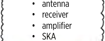
> **[Diagram Context - Textbook_NaturalScience_Gr8_Looking-into-space.pdf-0021-03.png]**
> This educational graphic is a bulleted list of key technological and astronomical terms enclosed in a bordered box. The visible text labels include "antenna", "receiver", "amplifier", and "SKA". Conceptually, this diagram introduces essential vocabulary related to radio astronomy and telecommunication systems, specifically highlighting components like the Square Kilometre Array (SKA) relevant to South African science curricula.


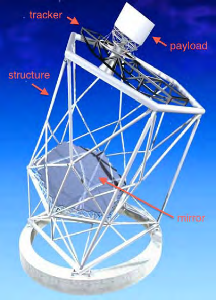
> **[Diagram Context - Textbook_NaturalScience_Gr8_Looking-into-space.pdf-0021-04.png]**
> The visual content is an apparatus diagram of a radio telescope or optical telescope design. Visible labels, indicated by red arrows, include "tracker", "payload", "structure", and "mirror". This diagram conveys conceptually how modern scientific instruments are engineered with specific supporting frameworks, optical reflecting surfaces, and tracking components to capture astronomical data for high school Physical Sciences and Earth and Space Sciences.


Stars move during the night just as the Sun moves across the sky in the day. The telescope must follow the stars as they move. The tracker at the top of SALT is used to follow the drifting stars carrying the detectors along with it as it tracks the stars. 

SALT is currently being used to study stars, in particular binary star systems where two stars orbit around each other. Astronomers also use the telescope to study galaxies and some of the most violent explosions in the Universe called supernovae and Gamma Ray Bursts which occur when massive stars explode at the end of their lives. SALT is also looking at the Universe on the largest of scales, in order to answer the questions how did the Universe begin, and what will happen to it in the future? 

_The SALT telescope structure. (Credit: SALT)_ 

The Karoo is an ideal place to host SALT because it is far away from towns and cities so there is very little light pollution. The area is also at a high elevation, dry and there are no extreme weather conditions, such as flooding or storms. Despite it being so remote at the observatory site there is good infrastructure, including roads and electricity, in the surrounding area of Sutherland. 

###### **Radio telescopes** 

Radio waves are a type of electromagnetic radiation (or light) that humans cannot see with their eyes. They have very long wavelengths compared to optical light. Purple light, for example, has a wavelength of 400 nm whereas red light has a wavelength of 700 nm. Radio wavelengths are much longer; radio waves have wavelengths from approximately one millimeter to hundreds of metres. 

Radio telescopes detect radio waves coming from distant objects. Radio telescopes have several advantages over optical telescopes. They can be used in bad weather, as radio waves are not blocked by clouds. They can also be used during the day and at night. 

###### **<u>TAKE NOTE</u>** 

Do you remember learning about wavelength in Energy and Change? A wavelength is the distance between two corresponding points on two consecutive waves. 

Many objects in space emit radio waves, for example some galaxies, stars and nebulae which are giant clouds of dust and gas where stars are born. Some objects emit radio waves but do not emit optical light, therefore looking at the sky at radio wavelengths reveals a completely different picture of our Universe. 


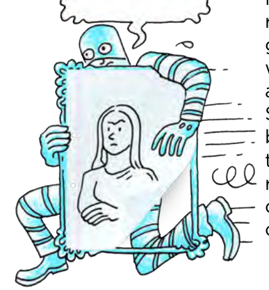
> **[Diagram Context - Textbook_NaturalScience_Gr8_Looking-into-space.pdf-0021-15.png]**
> The graphic is a cartoon illustration depicting a thief in a striped uniform sneaking away while carrying a framed portrait resembling the Mona Lisa. Motion lines surround the fleeing figure, who holds a large ornate picture frame containing a sketch of a woman with crossed arms. Conceptually, this visual serves as an engaging metaphor for processes involving theft, transfer, or plagiarism, helping students contextualize concepts of intellectual property or energy/matter conservation in physical sciences.


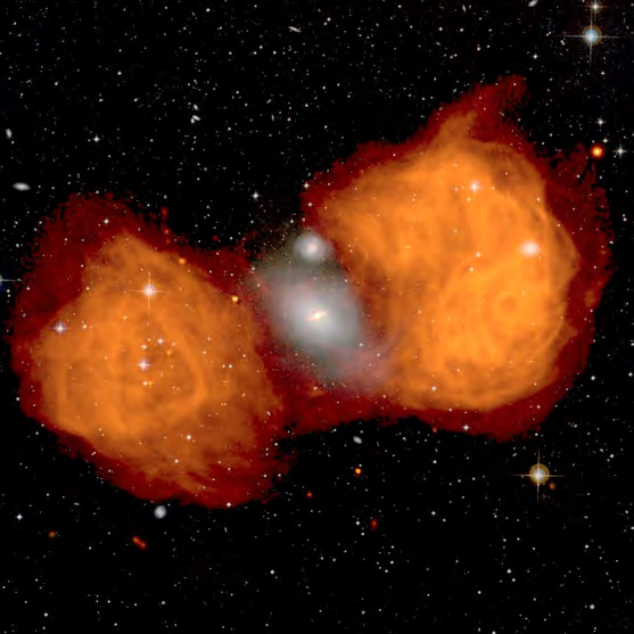
> **[Diagram Context - Textbook_NaturalScience_Gr8_Looking-into-space.pdf-0021-16.png]**
> This astronomical graphic displays a composite false-color image of a radio galaxy exhibiting prominent, symmetrical lobes of plasma extending outward from a central host galaxy against a star-filled background. The image features no explicit text labels or arrows, capturing only the high-energy emission and large-scale structure of active galactic nuclei. For FET Physical Sciences learners, it conceptually illustrates the powerful astrophysical phenomena associated with supermassive black holes, particle acceleration, and synchrotron radiation in the universe.


_An optical (white) and radio (orange) image of the galaxy NGC 1316. The radio emission spans over one million light years and engulfs the optical light at the centre._ 

Planet Earth and Beyond 

If your eyes could see radio waves at night, rather than white light, instead of seeing pointlike stars, you would see distant star-forming regions, bright galaxies and beautiful giant clouds around old exploded stars. 

Radio telescopes typically look like large dishes. The **dish** or **antenna** , acts like the primary mirror in a reflecting telescope, collecting the radio waves and reflecting them up to a smaller mirror which then reflects the radio waves to a radio wave detector. Radio wave detectors are called **receivers** . An **amplifier** amplifies the signal and sends it to a computer which processes the information from the receiver to create colour images which we can see. 


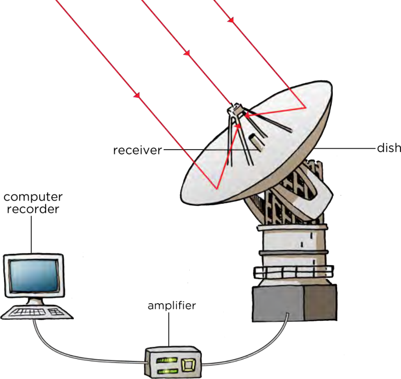
> **[Diagram Context - Textbook_NaturalScience_Gr8_Looking-into-space.pdf-0022-02.png]**
> This educational diagram illustrates a radio telescope system consisting of a large parabolic dish, a receiver, an amplifier, and a computer recorder. Red directional arrows show incoming parallel electromagnetic wave signals reflecting off the curved dish surface and converging onto the central focal receiver. Conceptually, it demonstrates how radio waves from space are collected, focused, amplified, and processed into data to help learners understand the application of wave reflection and astronomy instrumentation in the CAPS Physical Sciences curriculum.


Radio telescopes need to be placed far away from cities and towns as man-made radio interference can interfere with the telescope's observations. 


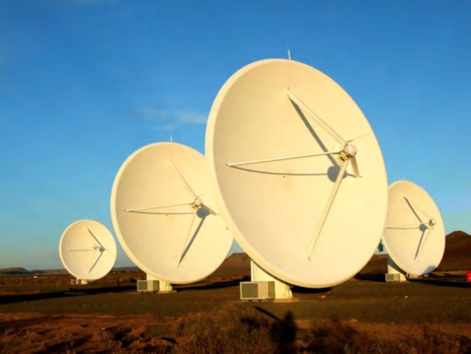
> **[Diagram Context - Textbook_NaturalScience_Gr8_Looking-into-space.pdf-0022-04.png]**
> The image shows a photograph of radio telescope dishes, specifically representing elements of an array like the MeerKAT telescope situated in the Karoo region of South Africa. The visible structures include large parabolic white satellite dishes mounted on support bases with central feed horns held by tripods against a blue sky. Conceptually, this visual supports the Physical Sciences curriculum by demonstrating practical applications of electromagnetic waves, wave reflection, and radio astronomy in modern scientific research.


**<u>VISIT</u>** Atacama Large Millimeter/sub-millimeter Array (ALMA) is a new radio telescope in Chile's Atacama desert. It will open an entirely new 'window' into the Universe, allowing scientists to search for our cosmic origins. Watch a video on some of the latest research and images released from ALMA. bit.ly/17GzMnB 


> **[Diagram Context - Textbook_NaturalScience_Gr8_Looking-into-space.pdf-0022-06.png]**
> This educational graphic depicts a conceptual illustration of a large telescope observing the planet Earth, featuring tiny human figures operating equipment and viewing monitors nearby alongside a blank speech bubble. The visual elements include a massive green-toned optical telescope mounted on a scaffold, a detailed rendering of the African and European continents on the Earth's surface, and computer monitoring stations. Conceptually, this illustration introduces high school learners to planetary observation, geographic mapping, and the scale of Earth science or astronomy investigations within the CAPS curriculum.


###### **<u>DID YOU KNOW?</u>** 

Rapidly rotating star remnants, called pulsars, were first discovered using a radio telescope in 1967. Astronomers initially considered the possibility that the regular pulses of radio waves were signals from an alien civilisation but quickly realised that this was not the case. 


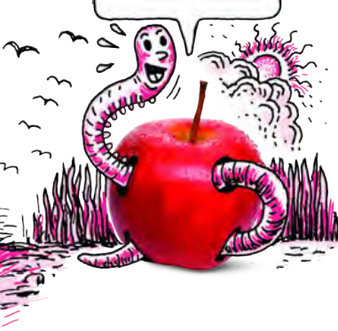
> **[Diagram Context - Textbook_NaturalScience_Gr8_Looking-into-space.pdf-0022-09.png]**
> This educational illustration depicts an animated earthworm emerging from and tunneling through a bright red apple, set against an outdoor landscape with grass, a sun, and birds in the sky, accompanied by an empty speech bubble. The graphic prominently features the segmented pink body of the earthworm and a whole apple, with no explicit text labels or mathematical symbols present. Conceptually, this illustration introduces CAPS Life Sciences learners to animal-plant interactions and the ecological role of soil organisms like earthworms in ecosystems, demonstrating feeding habits and decomposition processes.


_Part of the KAT-7 radio telescope array in the Northern Cape._ 

###### **MeerKAT and the SKA** 

###### **<u>DID YOU KNOW?</u>** 


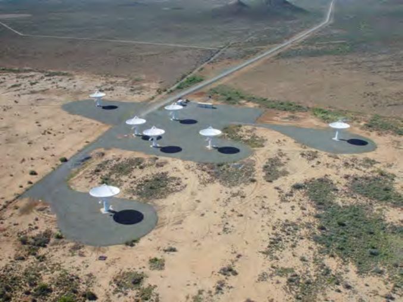
> **[Diagram Context - Textbook_NaturalScience_Gr8_Looking-into-space.pdf-0023-02.png]**
> This aerial photograph shows an array of multiple white radio telescope dishes, specifically the MeerKAT telescope array located in the Karoo region of South Africa. The image displays several parabolic reflector dishes positioned across an arid landscape connected by access roads, with no explicit text labels or arrows visible. Conceptually, it illustrates a large radio interferometer used in astronomy to detect and study celestial radio waves, highlighting South Africa's prominent role in global scientific research and technological advancement under the CAPS Physical Sciences curriculum.


The MeerKAT radio telescope array is currently under construction in the Northern Cape. MeerKAT is scheduled to be complete in 2016 and when it is finished it will have 64 radio dishes each 13.5 m in diameter. The MeerKAT array will be the largest and most sensitive radio telescope in the southern hemisphere until the Square Kilometre Array (SKA) is completed around 2024. 

The SKA central computer will have the processing power of about one hundred million computers. The dishes of the SKA will produce 10 times the global internet traffic. 


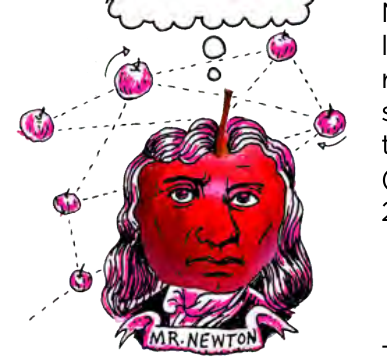
> **[Diagram Context - Textbook_NaturalScience_Gr8_Looking-into-space.pdf-0023-05.png]**
> This conceptual illustration features a stylized portrait labeled "MR. NEWTON" with an apple-shaped head, beneath a thought bubble and a network of interconnected pink apples linked by dashed lines and directional arrows. The graphic visually conveys Newton's Universal Law of Gravitation, demonstrating to Physical Sciences learners how every particle or mass in the universe exerts an attractive gravitational force on every other mass, governed by the inverse-square relationship.


_The KAT-7 test array in the Northern Cape is a test array for the larger MeerKAT array._ 

The Square Kilometre Array (SKA) will be the most powerful telescope ever. It will have a total collecting area of one square kilometer. It will have 3000 radio dishes each about 15 m wide which will act together as one large telescope. As well as the 3000 radio dishes there will be two other types of radio wave detectors. 

###### **<u>VISIT</u>** 

A video on the SKA. bit.ly/1aE3b2A Read more about the SKA online. bit.ly/H02OHY 


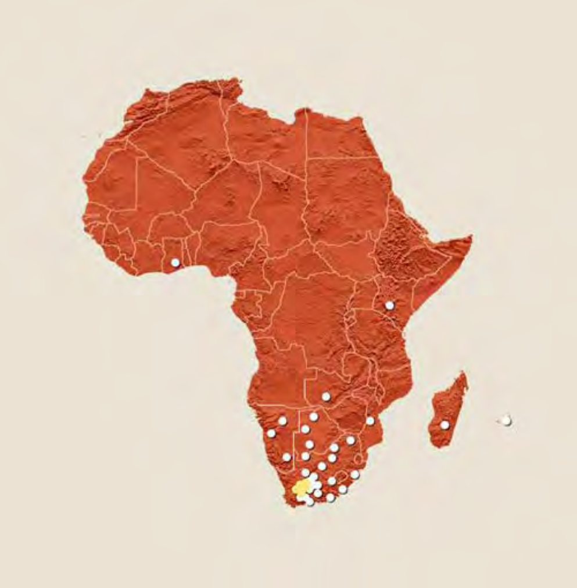
> **[Diagram Context - Textbook_NaturalScience_Gr8_Looking-into-space.pdf-0023-10.png]**
> This geographic distribution map of the African continent displays multiple white circular markers indicating fossil or archaeological sites, with a highlighted yellow region in the southern tip representing South Africa. The map visually conveys the geographic distribution and concentration of significant fossil discoveries across Africa, highlighting the rich paleontological heritage of Southern Africa for high school history and geography learners studying human origins and evolution.


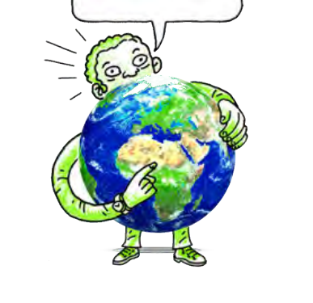
> **[Diagram Context - Textbook_NaturalScience_Gr8_Looking-into-space.pdf-0023-11.png]**
> This educational cartoon graphic depicts a green-skinned human figure embracing and pointing directly at the continent of Africa on a globe of the Earth. The visual elements include an illustrated character, a detailed terrestrial globe focusing on the African continent, a pointing index finger, a watch on the wrist, motion lines, and an empty speech bubble above. Conceptually, this diagram visually engages CAPS Geography students in locational studies and spatial awareness, prompting discussion about Africa's position, scale, and geographic features within the global context.


###### **<u>DID YOU KNOW?</u>** 

The data collected by the SKA in a single day would take nearly two million years to playback on an ipod. 


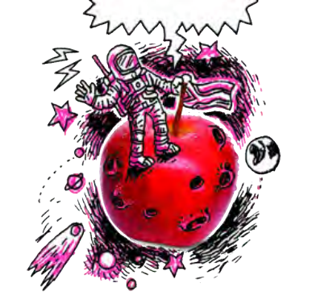
> **[Diagram Context - Textbook_NaturalScience_Gr8_Looking-into-space.pdf-0023-14.png]**
> This illustration depicts a whimsical outer space scene featuring an astronaut standing on a cratered, red sphere resembling a planet, holding a flag, with stars, lightning bolts, comets, and a planetoid in the background and a blank speech bubble above. The graphic humorously juxtaposes a terrestrial fruit (an apple modified to look like a planet) with cosmic elements. Conceptually, it serves as a creative prompt to stimulate imagination and creative writing in high school English or Life Orientation learners by combining familiar objects with surreal interstellar themes.


_The location of SKA in South Africa, and other African countries._ 

Planet Earth and Beyond 

Many different countries are working together to build, and pay for, the SKA. At least 13 countries and close to 100 organisations are already involved, and more are joining the project. Most of the SKA will be located in South Africa. There will also be locations in Australia and some stations in eight African partner countries namely, Botswana, Ghana, Kenya, Madagascar, Mauritius, Mozambique, Namibia, and Zambia. 

###### **<u>DID YOU KNOW?</u>** 

Radio astronomy observatories use diesel cars around the telescopes because the ignition of the spark plugs in petrol cars can interfere with radio observations. 


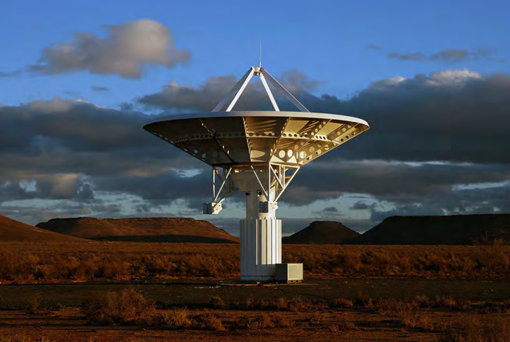
> **[Diagram Context - Textbook_NaturalScience_Gr8_Looking-into-space.pdf-0024-03.png]**
> This educational graphic shows a photograph of a large radio telescope dish, specifically representing a MeerKAT antenna located in the arid Karoo region of South Africa. The image features a white parabolic reflector dish mounted on a robust structural pedestal against a dramatic sky with clouds and flat-topped hills. Conceptually, it introduces learners to advanced scientific infrastructure and radio astronomy in South Africa, illustrating how electromagnetic waves from deep space are collected for astrophysical research.


> **[Diagram Context - Textbook_NaturalScience_Gr8_Looking-into-space.pdf-0024-04.png]**
> This educational graphic is a cartoon illustration depicting a carriage shaped like a red apple being pulled at high speed by two pink horses, driven by a man in a suit with a woman waving from inside and a blank thought bubble overhead. The visible elements include a red apple-car, two pink horses with reins, a driver holding reins, a waving passenger, motion lines indicating speed, a flag on a pole, and an empty thought bubble. Conceptually, this whimsical cartoon metaphorically introduces Grade 10-12 CAPS Physics concepts relating to motion, such as speed, acceleration, and force, or serves as a creative prompt to explore Newton's laws of motion regarding applied forces and friction.


###### **<u>TAKE NOTE</u>** 

Jobs are not just limited to astronomers: engineers, computer scientists and administrative staff are needed to run the telescopes. 

_One of the SKA dishes._ 

MeerKAT and the SKA will be used to investigate how galaxies change over time, our understanding of gravity, the origin of cosmic magnetism, how the very first stars formed, other planets around other stars, and whether we are alone in the Universe. 

##### **ACTIVITY:** Careers in Astronomy 

###### **INSTRUCTIONS:** 

Discuss in class with your teacher and classmates what sorts of careers you think are now available in astronomy in South Africa because of the construction of SALT and MeerKAT / SKA. Think about and discuss the skills needed in each of the roles you discuss. 


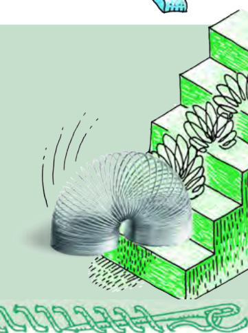
> **[Diagram Context - Textbook_NaturalScience_Gr8_Looking-into-space.pdf-0024-12.png]**
> This educational graphic illustrates a mechanical wave apparatus, specifically a flexible coil (slinky) interacting with a set of green stairs. Visible elements include the coiled spring in various states of compression and extension, motion lines indicating movement, and a flight of green steps. Conceptually, this diagram helps high school learners visualize wave motion, specifically demonstrating how longitudinal and transverse pulses or waves propagate through a medium via continuous transformations between potential and kinetic energy.


##### **ACTIVITY:** Draw a telescope 

###### **MATERIALS:** 

- paper 

- pencils or crayons 

###### **INSTRUCTIONS:** 

1. Pick either an optical telescope or radio telescope and draw a picture of the telescope. 

2. Label the different parts of the telescope and describe what they do. 

###### **<u>DID YOU KNOW?</u>** 

The SKA will be so sensitive it could detect TV signals from planets orbiting other stars. 


> **[Diagram Context - Textbook_NaturalScience_Gr8_Looking-into-space.pdf-0025-09.png]**
> This image is entirely blank and contains no visual content, labels, or educational diagrams to analyze.


**<u>TAKE NOTE</u> .** 

The sensitivity of a radio telescope depends upon the area of the collecting dish and the sensitivity of the radio receiver. In order to produce sharp radio images comparable to images from optical telescopes a radio telescope must be much larger than an optical telescope. 


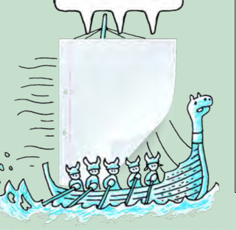
> **[Diagram Context - Textbook_NaturalScience_Gr8_Looking-into-space.pdf-0025-12.png]**
> This educational graphic is an illustration depicting a Viking longship moving through water, powered by rowers and a sail shaped like a piece of lined notebook paper. Visible elements include wavy horizontal lines representing wind blowing from the left, a crew of horned figures rowing with oars, turbulent water at the bow and stern, and speech bubble outlines above. Conceptually, this diagram serves as an engaging visual metaphor to introduce concepts of forces, vector addition, or wind resistance in physical sciences by combining traditional propulsion with a writing surface.


> **[Diagram Context - Textbook_NaturalScience_Gr8_Looking-into-space.pdf-0025-13.png]**
> This decorative graphic consists of a continuous green border pattern featuring stylized interlocking ribbon-like shapes or arrows. It does not contain specific scientific labels, variables, or text elements. Functionally, it serves as a thematic page divider or border for educational materials related to life sciences or other CAPS subjects.


Planet Earth and Beyond 

###### **Space telescopes** 

Radio waves and visible light form part of what is called the electromagnetic spectrum of light. There are other types of light at different wavelengths that we cannot see with our eyes including X-rays, ultraviolet and infrared light. 

The Earth's atmosphere blocks X-rays, ultraviolet and infrared light and stops them from reaching the ground. So if we want to observe this kind of light from stars and galaxies, we need to put telescopes in space. This is why X-ray telescopes and infrared telescopes are placed in space. 


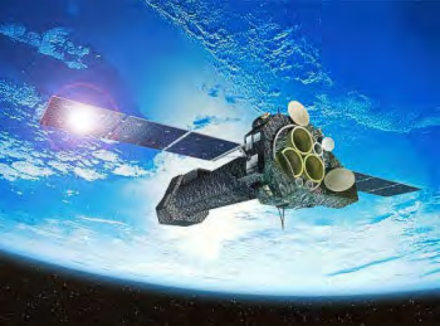
> **[Diagram Context - Textbook_NaturalScience_Gr8_Looking-into-space.pdf-0026-03.png]**
> This educational graphic depicts a space satellite orbiting above Earth, featuring prominent solar panels and mounted scientific instruments such as telescope tubes and satellite dishes. The visual elements include solar panels catching sunlight and multiple cylindrical optical sensor arrays against the backdrop of the Earth's atmosphere and curvature. Conceptually, this diagram illustrates how satellite technology utilizes space-based platforms for Earth observation, communication, and astronomical research within the Grade 10-12 Physical Sciences and Geography curricula.


_A picture of an X-ray telescope called XMM-Newton._ 

The advantages of space telescopes are that they can observe the whole sky and operate during both night and day. Images taken with space telescopes are far sharper than images taken with telescopes on the ground, because images are not smeared or blurred by turbulence in the Earth's atmosphere, as with images take from ground telescopes. This is why the Hubble Space Telescope images are so detailed even though it is a relatively small reflective telescope. The major disadvantages of space telescopes are their costs and the fact that if something goes wrong they are extremely difficult to fix. 


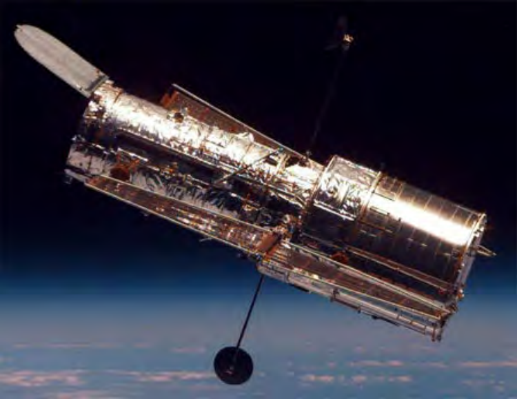
> **[Diagram Context - Textbook_NaturalScience_Gr8_Looking-into-space.pdf-0026-06.png]**
> This educational graphic is a photograph of the Hubble Space Telescope in orbit above Earth. The image shows the cylindrical optical telescope assembly wrapped in reflective foil insulation, fitted with extended solar panels and protruding antennae against the dark void of space with the Earth's horizon visible below. Conceptually, it illustrates the application of physics and optical technology in space science, demonstrating how space-based telescopes avoid atmospheric distortion to observe distant celestial bodies.


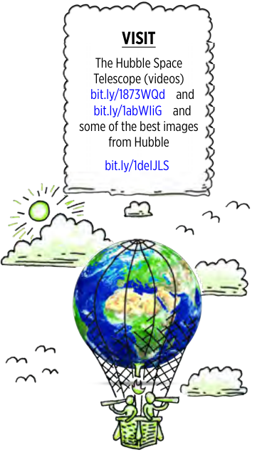
> **[Diagram Context - Textbook_NaturalScience_Gr8_Looking-into-space.pdf-0026-07.png]**
> This educational graphic features an illustrative cartoon showing a hot-air balloon shaped like the planet Earth floating above clouds with a basket containing figures using telescopes. Visible text includes the heading "VISIT" followed by online resource links: "bit.ly/1873WQd", "bit.ly/1abWliG", and "bit.ly/1deIJLS" referring to the Hubble Space Telescope and its images. The diagram conceptually directs senior phase or FET learners to external digital resources and videos to explore space science and astronomical imaging beyond the Earth's atmosphere.


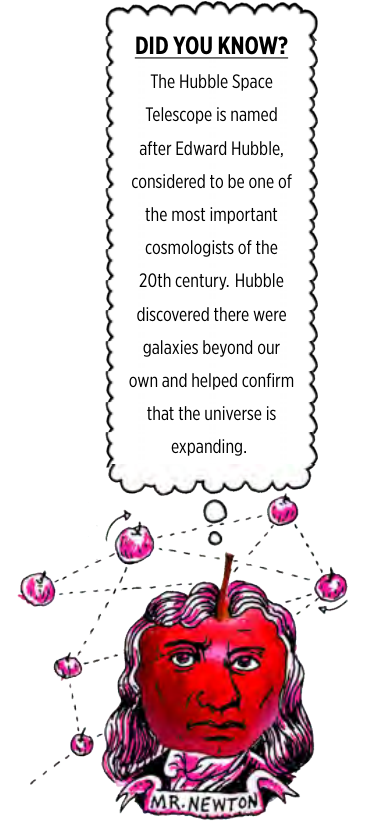
> **[Diagram Context - Textbook_NaturalScience_Gr8_Looking-into-space.pdf-0026-08.png]**
> This educational infographic features a cartoon portrait labeled "MR. NEWTON" depicted as a red apple personified with historical hair and clothing, surrounded by a constellation of smaller apples connected by dashed lines and directional arrows, beneath a thought bubble containing the text "DID YOU KNOW? The Hubble Space Telescope is named after Edward Hubble...". Visible labels and text include "DID YOU KNOW?" and "MR. NEWTON", alongside visual elements like dashed interconnecting lines and rotational arrows around the surrounding apples. Conceptually, the graphic uses a humorous historical metaphor linking Sir Isaac Newton to modern cosmology to introduce high school learners to the expansion of the universe and the discoveries of Edward Hubble.


_The Hubble Space Telescope has a 2.4m diameter collecting mirror._ 


> **[Diagram Context - Textbook_NaturalScience_Gr8_Looking-into-space.pdf-0027-00.png]**
> This anatomical and behavioural illustration depicts a green caterpillar feeding on a leafy plant, with a metal coiled spring superimposed over its body. Visible elements include green leaves, the caterpillar's segmented body with circular markings, legs, and a smiling head, alongside the overlapping spring and a partial green capital letter "A" on the right. For a CAPS Life Sciences student, this analogy visually demonstrates invertebrate locomotion and hydrostatic skeletons, linking how the muscular contractions and skeletal support of segmented worms or insect larvae enable crawling and interaction with their environment.


##### **ACTIVITY:** Telescope information poster 

###### **MATERIALS:** 

- paper 

- pencils or crayons 

- pictures downloaded from the internet or copied from books - optional 

###### **INSTRUCTIONS:** 

1. Pick a telescope that you want to make a poster about. It can be a ground-based or space-based telescope. 

2. Describe the telescope and explain how it works. Include a diagram or picture of the telescope and label its main parts in your poster. 

3. List some of the science that the telescope is used for in your poster. 

4. List some of the advantages and disadvantages of the type of telescope you have chosen in your poster. 


> **[Diagram Context - Textbook_NaturalScience_Gr8_Looking-into-space.pdf-0027-11.png]**
> The graphic is a decorative border featuring a repeating green wave pattern. It consists of stylized, undulating lines forming a continuous horizontal band. Conceptually, it serves as a visual divider or aesthetic page element rather than an instructional diagram of a CAPS curriculum topic.


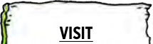
> **[Diagram Context - Textbook_NaturalScience_Gr8_Looking-into-space.pdf-0027-12.png]**
> This educational graphic consists of a text label styled like a torn piece of paper with the underlined word "VISIT" printed centrally in bold sans-serif capital letters. It features no additional chemical symbols, axes, or biological structures, serving purely as a heading or directional signpost. Conceptually, it functions as a pedagogical cueing device in learning materials to direct students toward supplementary online resources, interactive simulations, or external content related to the CAPS curriculum topic.


How many people are in space right now? Find out here. bit.ly/18Gzr83 


> **[Diagram Context - Textbook_NaturalScience_Gr8_Looking-into-space.pdf-0027-14.png]**
> The image is a corporate logo displaying the text "SIYAVULA" in bold, uppercase letters alongside the tagline "TECHNOLOGY-POWERED LEARNING" in smaller uppercase text, positioned beneath a stylized circular graphic containing concentric segmented rings. There are no variable names, chemical symbols, biological structures, or instructional labels present in the graphic. It serves as an institutional brand identifier for the open-access educational textbook provider commonly used in the South African CAPS curriculum.


Did you know that these workbooks were created at **Siyavula** with the input from many contributors and volunteers? Just turn to the front of your workbook to see the long list! 

Read more about Siyavula at our website: `www.siyavula.com` and like our Facebook page. 

###### **<u>VISIT</u>** 

Siyavula has also created a **range of textbooks** for other grades and subjects, and we are going to be producing more. These textbooks and workbooks are **openly-licensed and freely available** for you to use and download. 

Learn more about the James Webb Space Telescope (video). bit.ly/1h5hUd9 


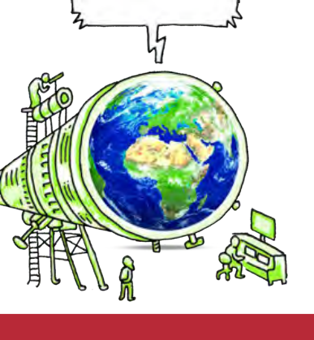
> **[Diagram Context - Textbook_NaturalScience_Gr8_Looking-into-space.pdf-0027-20.png]**
> This illustrative conceptual graphic shows a large telescope observing the planet Earth, with human figures operating the instrument and monitoring data at a console. Visible elements include a massive optical telescope apparatus, a detailed spherical projection of the Earth centered on Africa and Europe, observation ladders, and a computer console with a display screen. Conceptually, this diagram visually introduces high school learners to planetary observation, scale, and the tools used in Earth and space sciences to study our planet from a macro perspective.


Planet Earth and Beyond 


> **[Diagram Context - Textbook_NaturalScience_Gr8_Looking-into-space.pdf-0028-00.png]**
> This educational graphic illustrates a cellular or tissue structure, specifically showing a uniform arrangement of microscopic, hook- or ear-shaped structures embedded along a continuous layer. The visual features a repetitive series of blue, curved structures aligned in a single row atop a solid, pale blue-purple horizontal base. Conceptually, this diagram helps high school students visualize specialized surface adaptations, such as microvilli, cilia, or the anchoring mechanisms of epithelial layers in biological tissues.


##### **SUMMARY:** 

**.** **<u>Key Concepts</u>** 

- Early cultures observed the stars and grouped them together in patterns or constellations. 

- Telescopes allow astronomers to see distant, faint objects in more detail. 

- The performance of a telescope is measured by how much light it can collect. Larger telescopes can collect more light and see finer details than smaller telescopes. 

- Optical telescopes detect optical light from distant objects. 

- Most modern day optical telescopes use mirrors to collect and focus the light from distant objects. 


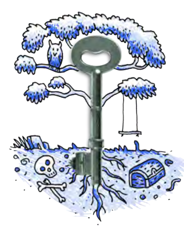
> **[Diagram Context - Textbook_NaturalScience_Gr8_Looking-into-space.pdf-0028-08.png]**
> This graphic is an illustrative conceptual diagram depicting a biological identification tool, commonly known as a dichotomous key. It features a large metallic key superimposed over a stylized blue-and-white scene containing biological and non-biological elements such as an owl in a tree, a skull, bones, a treasure chest, and a swing. Conceptually, it serves as a visual metaphor for CAPS Life Sciences learners to understand how a dichotomous key acts as a systematic tool to unlock the identification of unknown organisms or specimens based on observable contrasting characteristics.


- Radio telescopes collect and focus radio waves, emitted from distant objects in space. 

- South Africa is host to one of the the most advanced optical telescopes in the world, the Southern African Large Telescope (SALT). 

- South Africa will also host a large part of the soon to be constructed SKA radio telescope which will be the largest radio telescope in the world once complete. 

###### **.** **<u>Concept Map</u>** 

The concept maps in this workbook we made using an open source, free programme. If you would like to make your own concept maps for your other subjects, you can download the programme from the link in the visit box. 

**<u>VISIT</u>** The concept maps in your workbooks were created at Siyavula using an open source programme. You can download it from this link if you want to use it to create your own concept maps for your other subjects. bit.ly/1fSWS2s 


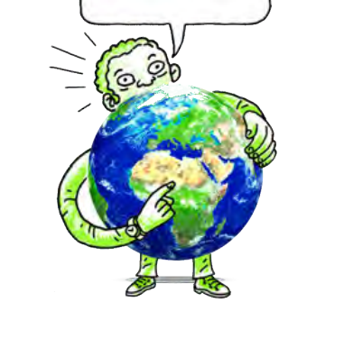
> **[Diagram Context - Textbook_NaturalScience_Gr8_Looking-into-space.pdf-0028-15.png]**
> This educational cartoon illustration depicts a green-skinned human character hugging and pointing at a globe centered on the African continent, featuring an empty speech bubble above. The graphic visually represents the concept of global positioning, planetary scale, or environmental geography. For high school learners, it serves as an engaging conceptual prompt to discuss Earth's systems, South Africa's geographic location within the global context, and human interaction with the planet.


**<u>VISIT</u>** Science is about curiosity, discovery and innovation! bit.ly/18GzSyZ 


> **[Diagram Context - Textbook_NaturalScience_Gr8_Looking-into-space.pdf-0028-17.png]**
> This educational illustration depicts a globe styled as a hot air balloon floating in a sky filled with clouds, the sun, and birds, with two human figures holding binoculars in the basket below. The visual elements include a globe mapped inside a netting structure, a flame heating the balloon from the basket, a radiant sun, and clouds. Conceptually, this graphic illustrates the themes of global exploration, geography, and environmental awareness within the CAPS curriculum.


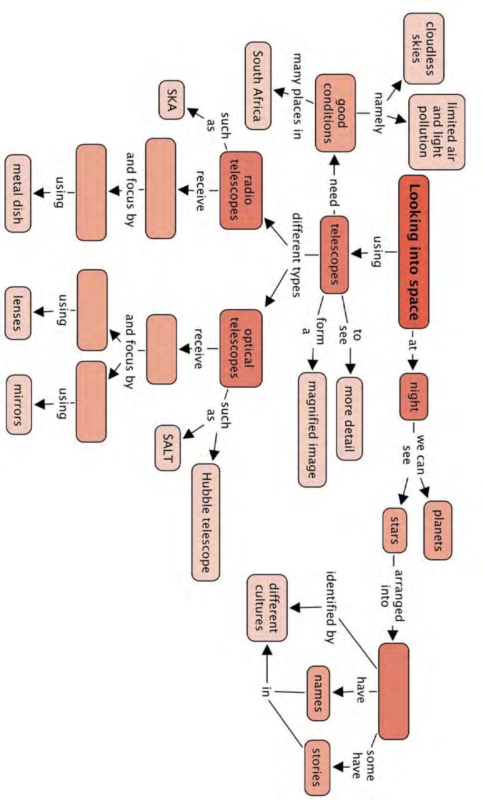
> **[Diagram Context - Textbook_NaturalScience_Gr8_Looking-into-space.pdf-0029-00.png]**
> This educational graphic is a concept map detailing the topic "Looking into space," with connected nodes and directional arrows showing relationships between concepts. Visible labels include "telescopes," "optical telescopes," "radio telescopes," "SALT," "SKA," "stars," "planets," "cloudless skies," "different cultures," and "names and stories," linked by connecting phrases such as "using," "such as," "receive," and "arranged into." The diagram conveys conceptually how telescopes are used to observe celestial objects like stars and planets in greater detail, highlights optimal viewing conditions, and connects astronomy to cultural interpretations and South African telescope facilities like SALT and the SKA.


##### **REVISION:** 

1. What do astronomers call patterns of stars in the sky? [1 mark] 

2. Name three famous southern constellations. [3 marks] 


> **[Diagram Context - Textbook_NaturalScience_Gr8_Looking-into-space.pdf-0030-03.png]**
> This illustration depicts a person riding a unicycle while juggling objects, rendered in a hand-drawn cartoon style with motion lines. The visual elements include a unicycle with a toothed outer wheel, a rider wearing a cap and striped shirt, and three flying bottles accompanied by curved motion arrows. Conceptually, this diagram visually represents principles of dynamic equilibrium, rotational motion, and the centre of gravity in physics, helping learners understand how balancing forces and momentum operate in real-world motion scenarios.


3. What do optical refracting telescopes use to collect and focus light from distant objects? [1 mark] 

4. What do optical reflecting telescopes use to collect and focus light from distant objects? [1 mark] 

5. List two advantages that reflecting telescopes have over refracting telescopes. [2 marks] 

6. What sort of light do radio telescopes detect? [1 mark] 

7. List two advantages that radio telescopes have over optical telescopes. [2 marks] 

8. Why are X-ray telescopes located in space? [1 mark] 


9. Why does the Hubble Space Telescope produce such sharp images even though it is much smaller than most professional ground based telescopes? [1 mark] 

10. Why should astronomers look at objects at different wavelengths? [1 mark] 

11. What is the name of the largest optical telescope located in the Northern Cape? [1 mark] 

12. List three reasons why the SALT telescope is located near Sutherland in the Northern Cape. [3 marks] 

13. How many dishes will the MeerKAT array have? [1 mark] 

14. How many dishes will the SKA array have? [1 mark] 

15. List two areas of astronomy that will be studied using the SKA telescope. [2 marks] 

Total [22 marks] 


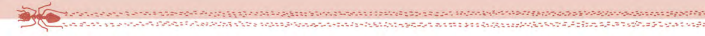
> **[Diagram Context - Textbook_NaturalScience_Gr8_Looking-into-space.pdf-0031-09.png]**
> This biological illustration shows two distinct horizontal trails of ants on a two-toned red and white background, originating from a single ant on the left. The graphic displays no explicit text labels, variables, or directional arrows, focusing purely on the visual paths formed by the tiny red insect silhouettes. Conceptually, this diagram visually conveys animal communication and behavior, specifically how social insects use pheromone trails to navigate and communicate information about food sources to the rest of the colony.


**242** Planet Earth and Beyond 

What can you transform our Earth into? Be curious! 


> **[Diagram Context - Textbook_NaturalScience_Gr8_Looking-into-space.pdf-0032-01.png]**
> This visual content is a satellite-based planetary globe showing the Earth centered on Africa, Europe, and the Atlantic Ocean. It displays visible geographic landmasses, arid desert regions, lush green vegetation, blue oceans, and white cloud patterns without text labels or coordinate axes. Conceptually, for CAPS Geography and Life Sciences learners, this diagram illustrates the Earth's biosphere and global surface features, highlighting the interconnected biomes, oceans, and atmospheric cloud cover that sustain life on the planet.


# **13 Looking into space** 

###### **<mark>Chapter overview</mark>** 

###### **2 weeks** 

In Grades 6 and 7 learners covered material regarding the viewing of space and telescopes. 

In Grade 6 they were introduced to telescopes including SALT and the SKA. In Grade 7, they focused on the historical development of modern astronomy including ancient observations and indigenous starlore all the way up to modern scientific developments. In this chapter the focus is on how we observe objects in space using telescopes. Some history showing how early astronomers viewed and interpreted the stars and planets in the sky is also included. Learners will have the opportunity to conduct their own observations of the Southern Cross as well as learn about the latest telescopes being developed in South Africa. 

The main aims of this chapter are to ensure that learners understand the following: 

- l Early cultures studied the stars and planets using the naked eye. They often grouped stars together in patterns called constellations. 

- l Astronomers now use telescopes to study galaxies, stars and planets. 

- l Telescopes help astronomers see fainter objects, because they act as light collecting buckets. 

- l South Africa is host to the largest optical telescope in the southern hemisphere and will be hosting the majority of the largest radio telescope ever, the Square Kilometre Array (SKA). Section 3.1 covers the early observations of space and section 3.2 covers modern day telescopes. 

###### **13.1 Early viewing of space (2 hours)** 

|**Tasks**|**Skills**|**Recommendation**|
|---|---|---|
|Activity: Using star maps to|observing, comparing|CAPS suggested|
|observe the night sky|||
|Activity: Observing the|observing, comparing|CAPS suggested|
|Southern Cross (Crux)|||
|Activity: Constellation starlore|researching, oral<br>communication|CAPS suggested|

###### **13.2 Telescopes (4 hours)** 

|**Tasks**|**Skills**|**Recommendation**|
|---|---|---|
|Activity: Telescopes as light|observing, analysing, comparing|CAPS suggested|
|buckets|||
|Activity: Comparing your eye<br>with SALT|comparing, observing,<br>calculating, estimating|Optional|
|Activity: Draw a telescope|drawing, labelling, describing|CAPS suggested|
|Activity: Telescope information|listing, researching,describing,|CAPS suggested|
|poster|writing||
|Activity: Careers in astronomy|discussing, analysing|CAPS suggested|

###### **Key questions** 

- l How did early cultures observe and interpret the night sky? 

- l How does a telescope help us to see more objects in the sky and in greater detail? 

   - What kind of telescopes are there? 

- l Why is South Africa a good place for locating telescopes? 

### 13.1 Early viewing of space 

In Gr. 7 learners were introduced to indigenous knowledge about the stars and planets under the historical development of astronomy. This section focused primarily on the practical uses of star observations, such as timekeeping and navigation, along with an introduction to starlore associated with the Moon, Milky Way and other celestial bodies. In this section the focus will lie in the observations of constellations (and the planets) and starlore associated with one example constellation. A good way to introduce the topic of the early viewing of space, is to ask learners if they know of any stories about famous constellations or the planets. This facilitates discussions about constellations visible in the sky and how the stars are actually related in space. 

#### ACTIVITY: **Using star maps to observe the night sky** (LB page 272) 

In this activity learners will use the star map provided to identify three constellations in the night sky visible during September/October/November. If you want to generate a star map specific to your location and date you can freely download a sky map from^{1} bit.ly/17e1jm3 . All you need to do is select the area from which you want to view, by clicking on 'select from map' or 'from database' and selecting your location. Your location will then be saved. You can then click on the 'Sky chart' link further down to view a map of the night's sky from your location at the current time. You can save and print this for learners. For example, here are the links to the sky maps for several places in South Africa. A suggestion is to also organise this activity as a field trip at night. Go beyond the city lights to an area where you are able to view the stars more clearly without light interference. Also take note of when the full Moon occurs, as reflected light from the Moon can also interfere with star gazing. 

|**Location**|**Link**|
|---|---|
|Bloemfontein|bit.ly/17GyAAH|
|Cape Town|bit.ly/1bSSCeq|
|Durban|bit.ly/17dZZ2m|

##### **ACTIVITY: Observing the Southern Cross (Crux)** (LB page 273) 

In this activity learners will observe the Southern Cross constellation at least three times during the months of September and October. Learners should make sure that they try to observe the constellation at the same time each night. 

The constellation should appear to rotate in a clockwise direction over time. Inearly September its long axis is fairly horizontal in the sky but the constellation gradually rotates so that by early November its long axis is almost pointing downwards. 

#### ACTIVITY: **Constellation starlore** (LB page 274) 

This is a research activity for learners to complete. They will study ancient stories about a constellation of their choice. You can either provide them with books or printed resources or if they have access to the Internet you could ask them to conduct an online search. You may ask learners to pick South African stories, or if you want, you could extend their research to other countries for comparisons with South African starlore. You can ask learners to present their story to the class either as an oral presentation or a poster, or if you wish you can turn this into a writing task. 

### 13.2 Telescopes 

In Gr 6 learners were introduced to telescopes including the Southern African Large Telescope (SALT) and the Square Kilometre Array (SKA). In this section learners explore how telescopes work in more detail. There is a particular focus on comparing the telescope with our eye. Simple ray diagrams are shown which link to material covered in Gr 8 Energy and Change, Chapter 4 on Visible Light. Two case studies are explored in more detail: SALT and the SKA, and learners will find out why South Africa is an ideal location for professional telescopes. 

By radiation, as electromagnetic waves travel in straight lines. 

The image is inverted, it is upside down. 

In the image above the tree is upside down in the top eye because images on the retina are upside down. In the bottom eye the tree is the right way up because the telescope inverts the image of the tree. 

A biconvex lens. 

The light is refracted and the light rays converge as the light passes from one medium to another. 

#### ACTIVITY: **Telescopes as light buckets** (LB page 277) 

In this activity learners will discover how a telescope collects more light than our eyes can and as a consequence can help us to see fainter and more distant objects. As well as demonstrating how telescopes collect light, this activity also shows learners how telescopes focus light from distant objects to a point. This activity introduces the concept of photons, or packets of light. This is not a formal part of the curriculum in Gr 8, and is not explained in detail. The idea that a finite amount of light hits a telescope mirror or eye per second is crucial to this activity and the understanding of why telescopes are useful. If you feel that you would rather omit the concept of photons, you could instead talk about the rice grains representing rays of light. 

The wooden skewers used for making kebabs or sosaties are ideal for this activity. 

1. The paper plate. 

2. No. 

3. Yes. 

4. The telescope mirror has a curved surface and reflects the light hitting it, therefore causing the light to focus at a point. 

#### ACTIVITY: **Compare your eye with SALT** (LB page 278) 

This is an **optional** activity. In this activity learners work in pairs. Learners should estimate that their reaction time is of the order of 1/10th of a second. But as long as they estimate 1s or less this is perfectly fine. They will use this value as their eye's exposure time. In fact roughly every 1/15th of a second, the eye sends the brain another image. So the eye has about one-fifteenth of a second to collect light when making an image. 

1. Light is collected over the area of your pupil and over the whole area of the telescope. 

2. Learner-dependent answer. Assuming a pupil diameter of 0.5 cm and a SALT mirror diameter of 10 m the answer is 4 000 000 ((1000 cm x 1000 cm) / (0.5 cm x 0.5 cm)) 

3. It would increase. Note that this experiment shows us that we do not see or react instantaneously. It 

takes time for the image of the moving pencil to be recorded and for us to react, so we do have a kind of exposure time. 

4. Learner-dependent answer. Assuming a reaction time of 1/10th second and a SALT exposure time of 20 minutes the answer is 12,000 (20 x 60s / 0.1s). 

###### **Extension content on another advantage of telescopes, namely angular resolution** 

Telescopes also have another advantage over the eye. Telescopes can better distinguish between objects that are close together on the sky. The ability to see things that are close together as separate objects rather than seeing one smeared or fuzzy object results in a sharper image. In astronomy, "close together" means "separated by a small angle on the sky," so astronomers refer to the **angular resolution** of a telescope. The higher the angular resolution of a telescope, the better it is at seeing narrowly separated objects as individual objects and the sharper the images look. 

The images below show what photographs of the same galaxy look like with different angular resolutions. 


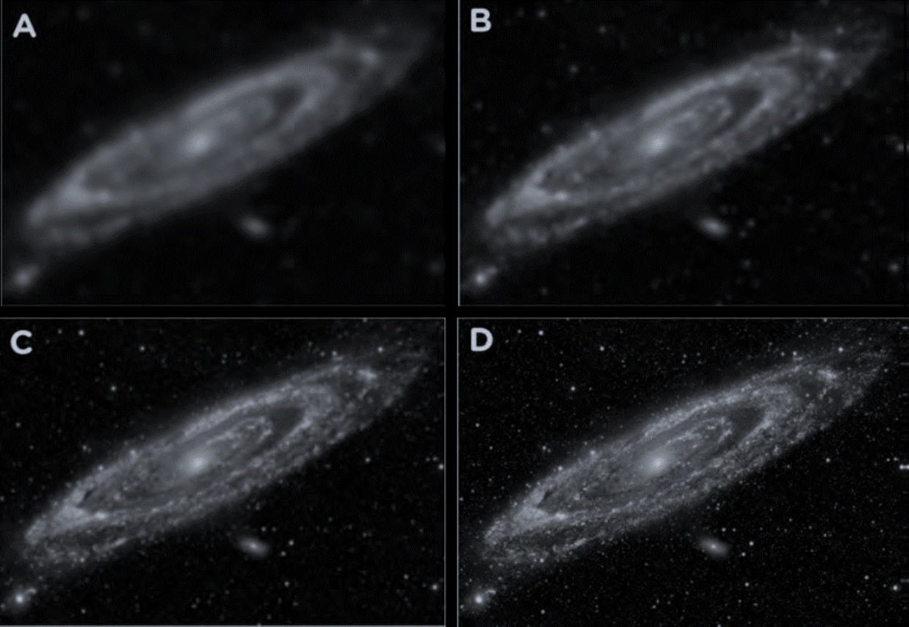
> **[Diagram Context - Textbook_NaturalScience_Gr8_Looking-into-space.pdf-0036-05.png]**
> This image shows a four-panel comparative photograph labelled A, B, C, and D, displaying a spiral galaxy captured with progressively sharper resolution and increasing detail of distant stars. Visible labels include the uppercase letters A, B, C, and D in the top-left corners of each panel. For a high school Physical Sciences student studying astronomy and optical instruments, this graphic conceptually demonstrates how improved telescope resolution and clarity reveal finer structural details of celestial objects like galaxies.


The same galaxy viewed with increasing angular resolution from (A) to (D). The image gets sharper with increasing angular resolution. In (A) the telescope is able to distinguish between objects separated by an angle of only 1/6 of a degree or more. In (D) the telescope can see objects separated by an angle of only 1/3600 of a degree or more. 

In the following activity learners will measure the angular resolution of your eye and then compare it with that of the SALT telescope. 

###### **Misconceptions about magnification** 

Many students want to know how much a telescope "magnifies" an image as they think this is the most important characteristic of a telescope. Telescopes do magnify images, but this is not the main reason why they are so useful. After all, a magnified dim image would still be dim and difficult to make out and a magnified blurry image would still be blurry and wouldn't help you see anything. Astronomers care more about how much light the telescope can collect and also its angular resolution: how bright, sharp and clear its images are. These properties both depend upon the size of the collecting mirror or lens rather than the 

magnification. With telescopes, bigger really is better. 

Both of the lenses are convex lenses which means that they cause light rays to converge or come together. 

No, Violet is bent the most. Bluer colours are slowed more than redder colours and so they are bent or refracted more. 

Learner-dependent answer. Answers could include that the images could look colour-separated and blurry. 

So that it does not block much light from the distant object as it travels to the primary mirror. 

No, they do not, because they do not use a lens to collect and focus the light, but rather use mirrors which reflect light. 

This is a good opportunity to get learners to think about the conditions needed to make good observations of very faint objects. You may need to lead the discussion. They should understand that ideally they should collect as much light from the object with minimal stray light from other sources. You can lead the discussion by first asking them what the air is like on the top of mountains and also what the weather is like and asking them about how bright they think the sky is up a mountain compared to in a city. Possible answers include: 

1. They are far away from the light pollution from large cities and towns 

2. They are above dust and other types of atmospheric pollution. 

3. They are above low cloud. 

4. The air is thinner and so there is less absorption of the starlight by the Earth's atmosphere. 

5. There is less air turbulence resulting in sharper images. 

It does not have a secondary mirror to reflect the light to an eyepiece, but rather a detector located at the focal point. 

###### **Background information** 

This is because the angular resolution depends not only on the diameter of the collecting mirror but also upon the wavelength of the light. The minimum angle at which two objects can be distinguished on the sky is proportional to the wavelength of light used and inversely proportional to the diameter of the collecting mirror. As radio waves are much longer than visible light, the diameter of the collecting mirror must increase to compensate if you require the same angular resolution. 

#### ACTIVITY: **Careers in Astronomy** (LB page 289) 

In this activity learners will discuss the sorts of jobs that are available in astronomy. As well as astronomers, facilities like SALT and the SKA need engineers, technicians, computer scientists, project managers, HR professionals, accountants and administrative staff. This is a creative and challenging activity for learners to imagine what contribution they could make to astronomy in South Africa. 

#### ACTIVITY: **Draw a telescope** (LB page 289) 

In this activity learners choose a telescope they want to focus on and a draw a picture of the telescope labelling the parts and describing what each part does. They can use the examples in this chapter or they can search online for examples of optical and radio telescopes. 

ACTIVITY: **Telescope information poster** (LB page 290) 

In this activity learners will make a poster about a specific telescope they have conducted research on. They can choose any type of telescope including ground-based and space telescopes. They should describe how the telescope works and provide some examples of the sorts of astronomy that the telescope is used for. 

# **Revision** 

1. Constellations. 

2. Learner-dependent answer. Answers could include, Orion, the Southern Cross, Pavo the Peacock, the Phoenix. 

3. Refracting telescopes use lenses to collect and focus light. 

4. Reflecting telescopes use mirrors to collect and focus light. 

5. Examples include: the glass of the mirror does not have to be perfect throughout, only the surface has to be perfect. The mirror can be supported across the whole of its back so it won't sag. Making large mirrors is easier and cheaper than making big lenses. They do not suffer from chromatic aberration. 

6. They collect radio waves. 

7. Radio telescopes can be used when it is cloudy and they can be used both during the day and during the night whereas optical telescopes need clear skies and can only be used at night. 

8. X-rays are absorbed by the Earth's atmosphere and so do not make it to the ground. So telescopes to detect X-rays must be placed above the Earth's atmosphere in space. 

9. Because the images are not smeared out by the turbulence in the Earth's atmosphere. 

10. To get a complete picture of the object they want to study. 

11. The Southern African Large Telescope, SALT. 

12. It is far from any cities and their associated light pollution, it is dry there, it is at high altitude. 

13. 64 dishes. 

14. 3000 dishes. 

15. Answers could include: exoplanets, magnetism in space, pulsars and gravity, galaxy evolution and star formation. 

## 5. Authentic Exam Question Archetypes & Mark Allocations
*(Extracted from official CAPS examination papers to guide marking, pacing, and rubric design)*

### Archetype 1: 1. Learner dependent answer (The size, mass, and arrangement
- **Source Paper:** `Gr8_NS_Exam12.pdf`
- **Total Mark Allocation:** **[15 Marks]**
- **Recommended Time:** **15 Minutes** (Pacing: ~1.0 min/mark | *Calibrated to Official CAPS Paper Pace (1.0 min/mark)*)
- **Assessment Mode Calibration:** Timed Exam Simulation: 15 min countdown (Pacing Checkpoint: 11 min)
- **Cognitive / Marking Strategy:** NSC Standard (Method Marks [M], Accuracy Marks [A], Carry-Over [CA])

#### Question Prompt & Working:
```text
1. Learner dependent answer (The size, mass, and arrangement of atoms affect the density of a 
substance✓. Materials with more matter, or stuff packed into a given space, has a higher 
density✓ than materials with less matter packed into the same space. ✓)
```

### Archetype 2: QUESTION 1
- **Source Paper:** `Gr8_NS_Exam1.pdf`
- **Total Mark Allocation:** **[10 Marks]** (Sub-questions: 1, 1, 1, 1, 1 marks)
- **Recommended Time:** **10 Minutes** (Pacing: ~1.0 min/mark | *Calibrated to Official CAPS Paper Pace (1.0 min/mark)*)
- **Assessment Mode Calibration:** Timed Exam Simulation: 10 min countdown (Pacing Checkpoint: 8 min)
- **Cognitive / Marking Strategy:** NSC Standard (Method Marks [M], Accuracy Marks [A], Carry-Over [CA])

#### Question Prompt & Working:
```text
QUESTION 1 
1.1 Various options are provided as possible answers to the following questions. 
Choose the answer and write only the letter (A – D) next to the question number 
(1.1.1 – 1.1.5).  
1.1.1 What are the horizontal rows on the Periodic Table called? 
A 
Groups 
B 
Columns 
C 
Families 
D 
Periods 
 (1) 
 
1.1.2 If an atom has 12 protons in the nucleus, then it must also have ... to be 
neutral. 
A 
12 protons around the nucleus 
B 
12 neutrons in the nucleus 
C 
12 electrons around the nucleus 
D 
12 electrons in the nucleus 
 (1) 
 
1.1.3 Which of the following is a property of a solid? 
A 
It flows. 
B 
The particles slide past each other. 
C 
It undergoes a phase change. 
D 
It has a defined shape. 
 (1) 
 
1.1.4 Melting is the change in state of a… 
A 
liquid to a solid. 
B 
l...
```

### Archetype 3: QUESTION 3
- **Source Paper:** `Gr8_NS_Exam1.pdf`
- **Total Mark Allocation:** **[15 Marks]** (Sub-questions: 2, 3, 1, 2, 2 marks)
- **Recommended Time:** **15 Minutes** (Pacing: ~1.0 min/mark | *Calibrated to Official CAPS Paper Pace (1.0 min/mark)*)
- **Assessment Mode Calibration:** Timed Exam Simulation: 15 min countdown (Pacing Checkpoint: 11 min)
- **Cognitive / Marking Strategy:** NSC Standard (Method Marks [M], Accuracy Marks [A], Carry-Over [CA])

#### Question Prompt & Working:
```text
QUESTION 3 
3.1 The particle model of matter can be used to represent different substances. 
 
 
A   
  
  
  
  
B   
  
  
   
  
C     
  
 
3.1.1 Which diagram, A, B or C, represents a diatomic molecule? Give a reason 
for your answer. 
(2) 
 
Natural Sciences Grade 8 
4 
Revision Booklet Term 1 and 2 
 
3.1.2 Compare the three phases of matter in terms of the forces between the 
particles. 
(3) 
3.1.3 How many types of molecules are found in diagram C? 
(1) 
3.1.4 Which diagram represents particles with the highest average kinetic 
energy? Explain your answer in terms of the particle model of matter. 
(2) 
3.1.5 Why does diffusion not take place in B?  
(2) 
 
3.2 
A learner sets up the apparatus shown below to measure the volume of          
a steel ball. Study the diagrams and answe...
```
