# 4. Circulatory and Respiratory Systems

## Key Questions
*   Why do we have to breathe?
*   Are our lungs like big balloons in our chest, or what do they look like?
*   How does the oxygen in the air that we breathe in pass from our lungs into our blood?
*   How does blood move around our bodies and get to each cell to deliver oxygen?
*   We know that carbon dioxide is produced as a waste product in cellular respiration, so how is it removed from our bodies?
*   How are the circulatory and respiratory systems linked?

## Introduction
If we do not get oxygen for a few minutes, humans get permanent brain damage and may die. Cell respiration needs a constant oxygen supply to provide us with enough energy, so we constantly need to breathe and keep blood circulation going to deliver this oxygen and remove the carbon dioxide.

The respiratory and circulatory systems need to work together.

<!-- DIAGRAM_PLACEHOLDER: diagram -->

---

## Activity: Main components in the circulatory and respiratory systems

### Instructions:
1. Study the diagrams below.
2. Label the different components that form part of the respiratory and circulatory system.

<!-- DIAGRAM_PLACEHOLDER: diagram -->

---

# Chapter 4: Circulatory and Respiratory Systems

## 1. The Respiratory System
The respiratory system is responsible for the exchange of gases (oxygen and carbon dioxide) between the body and the environment. It involves the intake of oxygen, which is necessary for cellular respiration, and the removal of waste carbon dioxide.

> **[Diagram Context - Textbook_NaturalScience_Gr9_Cells-as-the-basic-units-of-life.pdf-0001-02.png]**
> This diagram represents a cross-section of a biological membrane surface, featuring a linear arrangement of repeating, hook-like structures embedded into a solid base. These structures illustrate the concept of surface area amplification, such as microvilli found on the epithelial lining of the small intestine, which are essential for maximizing the efficiency of nutrient absorption.

## 2. The Circulatory System
The circulatory system (or cardiovascular system) is responsible for the transport of substances throughout the body. It uses the heart as a pump to move blood through a network of vessels (arteries, veins, and capillaries) to deliver oxygen and nutrients to cells and remove waste products.

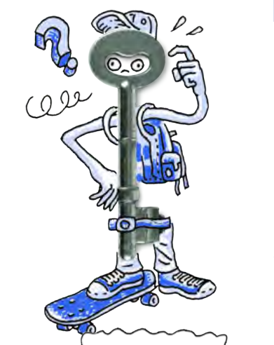
> **[Diagram Context - Textbook_NaturalScience_Gr9_Cells-as-the-basic-units-of-life.pdf-0001-03.png]**
> This graphic features a cartoon character with a metal key as its head, accompanied by a question mark and a scribbled line. It serves as a metaphorical illustration of the "lock and key" model, a fundamental concept in Life Sciences used to explain enzyme-substrate specificity. The image visually represents the idea that an enzyme (the lock) and its specific substrate (the key) must have complementary shapes to interact, facilitating the biochemical reactions essential for cellular metabolism.

---

### Key Concepts Summary

| System | Primary Function | Key Components |
| :--- | :--- | :--- |
| **Respiratory** | Gas exchange (Oxygen in, Carbon Dioxide out) | Lungs, Trachea, Bronchi, Diaphragm |
| **Circulatory** | Transport of nutrients, gases, and waste | Heart, Blood vessels (Arteries, Veins, Capillaries) |

*Note: These two systems work in close coordination. The respiratory system provides the oxygen that the circulatory system then transports to all tissues in the body.*

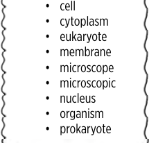
> **[Diagram Context - Textbook_NaturalScience_Gr9_Cells-as-the-basic-units-of-life.pdf-0001-14.png]**
> This graphic presents a bulleted list of key biological terminology, including "cell," "cytoplasm," "eukaryote," "membrane," "microscope," "microscopic," "nucleus," "organism," and "prokaryote." It serves as a foundational vocabulary bank for Grade 10 Life Sciences, helping learners categorize cellular structures and distinguish between prokaryotic and eukaryotic organisms.

> **[Diagram Context - Textbook_NaturalScience_Gr9_Cells-as-the-basic-units-of-life.pdf-0001-17.png]**
> This diagram illustrates a laboratory apparatus setup featuring a conical flask containing a blue liquid being heated by a Bunsen burner, connected to a gas cylinder. The visual elements include the flask, burner, gas canister, and rising gas bubbles, representing a chemical reaction or physical change involving heating and gas evolution. It conceptually demonstrates the application of thermal energy to a system to induce a reaction or phase change, a fundamental process in Physical Sciences experiments.

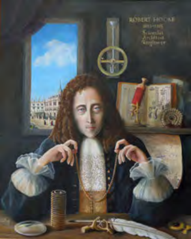
> **[Diagram Context - Textbook_NaturalScience_Gr9_Cells-as-the-basic-units-of-life.pdf-0001-20.png]**
> This portrait depicts the 17th-century polymath Robert Hooke, featuring labels identifying him as a "Scientist, Architect, Engineer" alongside historical scientific apparatus such as a microscope, a spring, and his seminal work, *Micrographia*. For Life Sciences learners, this image provides historical context for the discovery of the cell, illustrating the tools and intellectual environment that enabled Hooke to first observe and name the biological structures he identified in cork tissue.

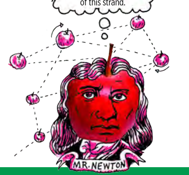
> **[Diagram Context - Textbook_NaturalScience_Gr9_Cells-as-the-basic-units-of-life.pdf-0001-24.png]**
> This graphic is a conceptual illustration featuring a caricature of Isaac Newton with an apple-shaped head, surrounded by a network of smaller apples connected by dashed lines and directional arrows. It uses the historical association between Newton and gravity to visually represent a complex system or "strand" of interconnected physical concepts. For a high school learner, this serves as a mnemonic device to link Newtonian mechanics to broader, interrelated scientific principles within the Physical Sciences curriculum.

> **[Diagram Context - Textbook_NaturalScience_Gr9_Circulatory-and-respiratory-systems.pdf-0001-02.png]**
> This diagram illustrates a cross-section of a biological membrane, specifically highlighting the arrangement of phospholipid molecules with their hydrophilic heads oriented towards the aqueous environment. It conceptually demonstrates the structural basis of the fluid mosaic model, showing how the polar heads of the phospholipid bilayer align to form the boundary of a cell or organelle.

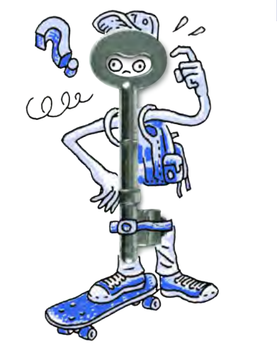
> **[Diagram Context - Textbook_NaturalScience_Gr9_Circulatory-and-respiratory-systems.pdf-0001-03.png]**
> This graphic is a metaphorical illustration featuring a cartoon character with a key for a head, accompanied by a question mark and a scribbled line. It uses visual symbolism to represent the concept of "unlocking" knowledge or finding the "key" to solving a problem, serving as an engaging visual aid for critical thinking or inquiry-based learning.

> **[Diagram Context - Textbook_NaturalScience_Gr9_Human-reproduction.pdf-0001-02.png]**
> This diagram illustrates a cross-section of a biological membrane surface, featuring a linear arrangement of repeating, hook-like structures embedded in a solid base. It conceptually represents the microvilli or cilia lining an epithelial surface, demonstrating how these specialized cellular projections increase surface area to facilitate efficient absorption or movement of substances in biological systems.

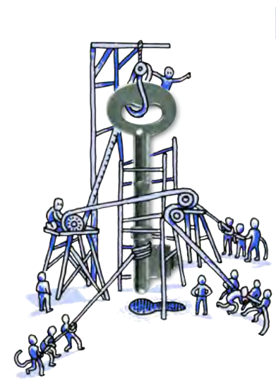
> **[Diagram Context - Textbook_NaturalScience_Gr9_Human-reproduction.pdf-0001-03.png]**
> This metaphorical illustration depicts a large central key being manipulated by a complex system of scaffolding, pulleys, ropes, and multiple human figures. It conceptually represents the collaborative effort, mechanical advantage, and systematic approach required to unlock or solve a complex problem, illustrating how collective human agency and tools are necessary to manage significant tasks.

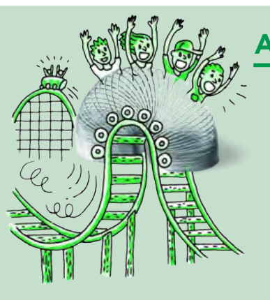
> **[Diagram Context - Textbook_NaturalScience_Gr9_Human-reproduction.pdf-0001-18.png]**
> This graphic uses a roller coaster illustration to represent the physical principles of mechanical energy, featuring a coaster car, track, and a superimposed slinky spring. It conceptually illustrates the transformation between gravitational potential energy at the peak of the track and kinetic energy during the descent, serving as a visual analogy for energy conservation in Grade 10-12 Physical Sciences.

> **[Diagram Context - Textbook_NaturalScience_Gr9_Systems-in-the-human-body.pdf-0001-02.png]**
> This diagram illustrates a cross-section of a biological membrane, specifically representing the hydrophilic heads of a phospholipid monolayer or the outer leaflet of a lipid bilayer. The image features a series of repeating, hook-shaped blue symbols embedded along the surface of a light-blue rectangular base, representing the polar phosphate heads oriented toward an aqueous environment. Conceptually, this helps learners visualize the structural arrangement of phospholipids in the fluid mosaic model of the cell membrane, emphasizing the orientation of hydrophilic components at the interface.

> **[Diagram Context - Textbook_NaturalScience_Gr9_Systems-in-the-human-body.pdf-0001-03.png]**
> This metaphorical illustration depicts a city skyline featuring a fire-breathing monster on one side and a helicopter capturing a large key with a net on the other. By using the central key as a symbolic barrier or "lock" between the chaotic monster and the organized rescue effort, the image conceptually represents the idea of a "key solution" or a critical intervention required to resolve a complex problem.

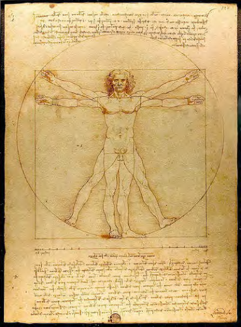
> **[Diagram Context - Textbook_NaturalScience_Gr9_Systems-in-the-human-body.pdf-0001-11.png]**
> This image is Leonardo da Vinci’s "Vitruvian Man," a geometric figure depicting a male human body superimposed within a circle and a square, accompanied by extensive mirror-script annotations. It illustrates the mathematical proportions of the human form, demonstrating how the body fits perfectly within these two fundamental geometric shapes to represent the harmony between human anatomy and universal mathematical principles.

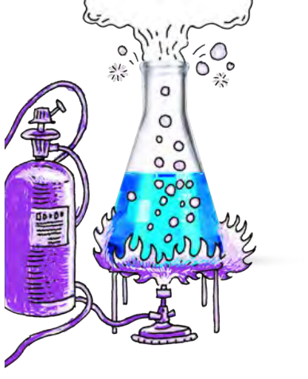
> **[Diagram Context - Textbook_NaturalScience_Gr9_Systems-in-the-human-body.pdf-0001-13.png]**
> This illustration depicts a laboratory apparatus setup consisting of a Bunsen burner connected to a gas cylinder, heating a conical flask containing a liquid that is bubbling and releasing vapour. The visual elements include a gas canister, tubing, a Bunsen burner, a tripod stand, and an Erlenmeyer flask with visible bubbles and steam. This diagram conceptually illustrates the process of heating a substance to induce a physical or chemical change, such as boiling or a reaction, which is a fundamental practical skill in the Physical Sciences curriculum.

> **[Diagram Context - Textbook_NaturalScience_Gr9_Systems-in-the-human-body.pdf-0001-20.png]**
> This illustration depicts a pair of hands interacting with a tablet interface featuring various icons, including mathematical and scientific symbols like addition, subtraction, and wave patterns. It serves as a visual metaphor for digital learning or the use of educational technology to access and manipulate scientific and mathematical concepts.

---

### Systems of the Human Body: Breathing, Gaseous Exchange, and Circulation

This section explores the physiological processes of the respiratory and circulatory systems.

#### Key Vocabulary
*   **Blood:** The fluid that transports oxygen and nutrients.
*   **Blood vessels:** Tubes (arteries, veins, capillaries) that carry blood.
*   **Bronchi:** The main air passages into the lungs.
*   **Bronchioles:** Smaller branches of the bronchi.
*   **Diaphragm:** The muscle below the lungs that aids breathing.
*   **Diffuse:** The movement of particles from high to low concentration.
*   **Exhale:** Breathing out.
*   **Heart:** The organ that pumps blood.
*   **Heart chamber:** The internal compartments of the heart.
*   **Inhale:** Breathing in.
*   **Lungs:** The primary organs of respiration.
*   **Pharynx:** The throat area.
*   **Pulse:** The rhythmic throbbing of arteries.
*   **Respiration:** The process of producing energy from oxygen and glucose.
*   **Trachea:** The windpipe.

---

### 4.1 Breathing

Breathing is a continuous cycle consisting of two main processes:
1.  **Inhalation:** Taking in air with a high concentration of oxygen.
2.  **Exhalation:** Breathing out air that has a higher concentration of carbon dioxide.

> **[Diagram Context - Textbook_NaturalScience_Gr9_Cells-as-the-basic-units-of-life.pdf-0002-06.png]**
> This illustration depicts a tablet interface featuring various scientific and mathematical icons, including symbols for chemical structures, mathematical operators, and wave patterns, accompanied by a speech bubble for student input. It serves as a digital learning tool designed to engage learners in interactive exercises, allowing them to select and manipulate specific scientific concepts or variables within a CAPS-aligned curriculum context.

#### The Mechanics of Breathing

| Process | Rib Cage Movement | Diaphragm Action | Chest Volume | Pressure | Result |
| :--- | :--- | :--- | :--- | :--- | :--- |
| **Inhalation** | Upwards and outwards | Contracts and flattens (moves down) | Increases | Decreases | Air is pulled into the lungs |
| **Exhalation** | Downwards and inwards | Relaxes (becomes dome-shaped) | Decreases | Increases | Air is forced out of the lungs |

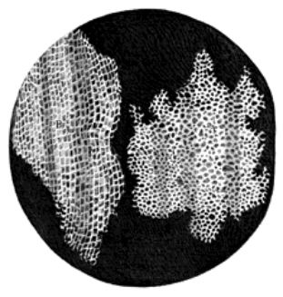
> **[Diagram Context - Textbook_NaturalScience_Gr9_Cells-as-the-basic-units-of-life.pdf-0002-08.png]**
> This microscopic image displays two distinct types of plant tissue, labeled "a" and "b," characterized by their cellular arrangement and structure. It illustrates the morphological differences between tissues, such as the regular, grid-like pattern of xylem or phloem vessels compared to the more irregular, porous structure of parenchyma or spongy mesophyll. This visual comparison helps learners identify and differentiate between specialized plant tissues based on their cellular organization and structural adaptations.

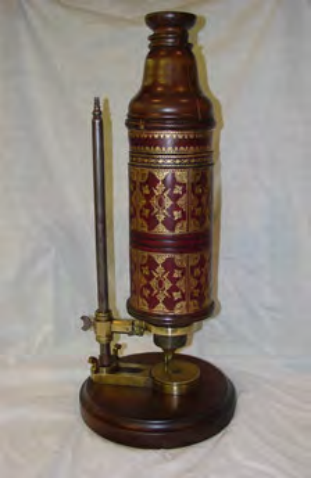
> **[Diagram Context - Textbook_NaturalScience_Gr9_Cells-as-the-basic-units-of-life.pdf-0002-10.png]**
> This image depicts a historical compound light microscope, featuring a decorative cylindrical body, a vertical adjustment rod, and a circular base. It serves as a visual aid to illustrate the evolution of microscopy, helping Life Sciences learners contextualize the development of cell theory and the technological advancements required to observe microscopic biological structures.

> **[Diagram Context - Textbook_NaturalScience_Gr9_Cells-as-the-basic-units-of-life.pdf-0002-13.png]**
> This cartoon depicts a character holding a framed portrait of a person, with a blank speech bubble above the character's head. The visual elements include a stylized figure, a picture frame, a portrait, and a speech bubble, all rendered in a simple line-art style. Conceptually, this graphic serves as a prompt for creative writing or language exercises, encouraging students to infer the character's thoughts or dialogue to develop narrative skills and character analysis.

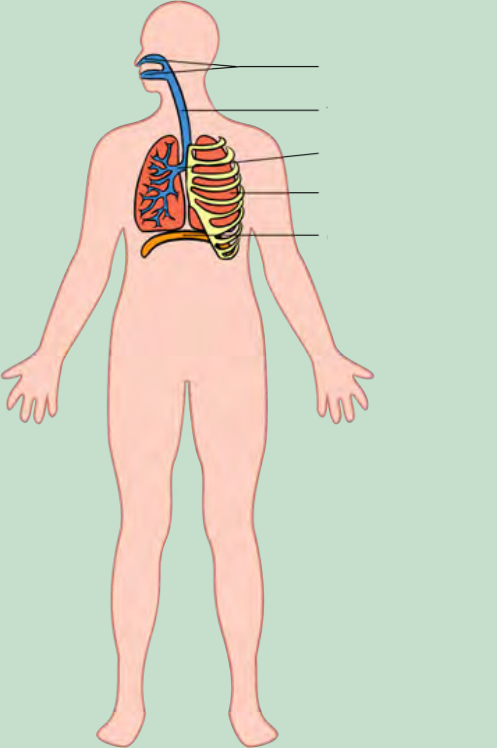
> **[Diagram Context - Textbook_NaturalScience_Gr9_Circulatory-and-respiratory-systems.pdf-0002-01.png]**
> This diagram is an anatomical illustration of the human respiratory system, featuring unlabeled leader lines pointing to the nasal/oral cavities, trachea, bronchi, lungs, rib cage, and diaphragm. It serves as a foundational visual aid for Life Sciences learners to identify the key structures involved in the mechanics of breathing and gas exchange.

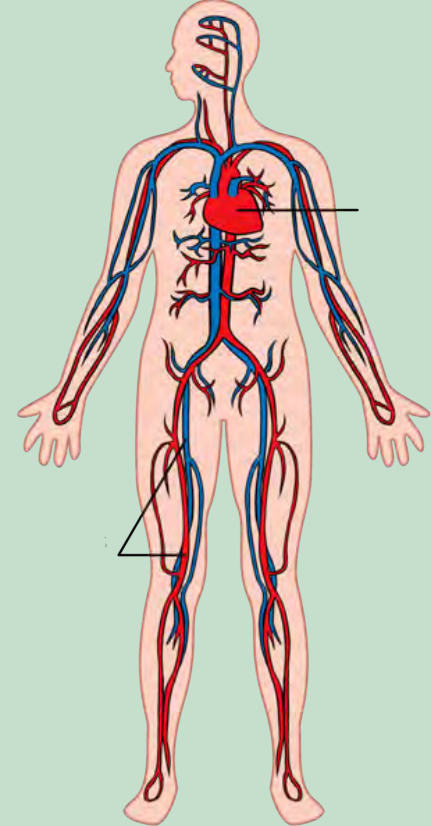
> **[Diagram Context - Textbook_NaturalScience_Gr9_Circulatory-and-respiratory-systems.pdf-0002-03.png]**
> This diagram illustrates the human systemic circulatory system, featuring the heart, major arteries (red), and veins (blue) distributed throughout the body. It highlights the central role of the heart as a pump and the extensive network of blood vessels required to transport oxygenated and deoxygenated blood to and from all tissues. This visual aids learners in understanding the double circulatory system and the anatomical pathways of blood flow in the human body.

> **[Diagram Context - Textbook_NaturalScience_Gr9_Circulatory-and-respiratory-systems.pdf-0002-05.png]**
> This graphic illustrates a schematic representation of a DNA molecule, featuring the characteristic double-helix structure formed by two antiparallel sugar-phosphate backbones. It visually demonstrates the twisted ladder configuration, which allows students to conceptualize the molecular architecture required for stable genetic information storage and replication.

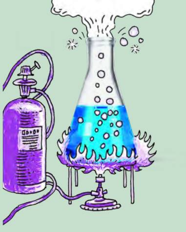
> **[Diagram Context - Textbook_NaturalScience_Gr9_Human-reproduction.pdf-0002-07.png]**
> This illustration depicts a laboratory apparatus consisting of a conical flask containing a blue liquid being heated by a Bunsen burner connected to a gas cylinder. The visual elements include the flask, burner, gas supply, and escaping gas bubbles/vapour, representing a physical or chemical change involving heat energy. It conceptually demonstrates the process of heating a substance to its boiling point or inducing a reaction, illustrating the transfer of thermal energy in a controlled laboratory setting.

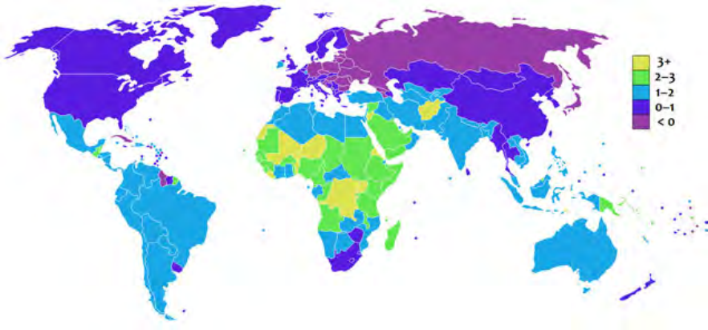
> **[Diagram Context - Textbook_NaturalScience_Gr9_Human-reproduction.pdf-0002-09.png]**
> This choropleth map displays global population growth rates, using a colour-coded legend ranging from purple (less than 0%) to yellow (3% or more). It illustrates the demographic transition model by highlighting the disparity in natural increase rates between more developed, low-growth nations and less developed, high-growth regions.

> **[Diagram Context - Textbook_NaturalScience_Gr9_Human-reproduction.pdf-0002-12.png]**
> This illustrative graphic depicts the Earth as a hot air balloon, featuring a globe suspended by a net above a basket containing two figures using telescopes, set against a backdrop of the sun, clouds, and birds. It serves as a metaphorical representation of global observation and environmental monitoring, encouraging students to consider the importance of studying Earth's systems and human impact on a planetary scale.

> **[Diagram Context - Textbook_NaturalScience_Gr9_Systems-in-the-human-body.pdf-0002-08.png]**
> This illustration depicts a stylized caterpillar with a metallic slinky-like body feeding on green leaves. The image uses the metaphor of a spring to represent the segmented, flexible anatomy of an insect larva, visually reinforcing the concept of body segmentation in arthropods.

> **[Diagram Context - Textbook_NaturalScience_Gr9_Systems-in-the-human-body.pdf-0002-09.png]**
> This graphic depicts a stylized, repeating DNA double helix structure featuring a sugar-phosphate backbone and nitrogenous base pairs. The visual elements include a continuous, intertwined ribbon-like representation of the DNA molecule, which serves to illustrate the characteristic helical geometry and the concept of complementary base pairing essential for genetic information storage and replication in Life Sciences.

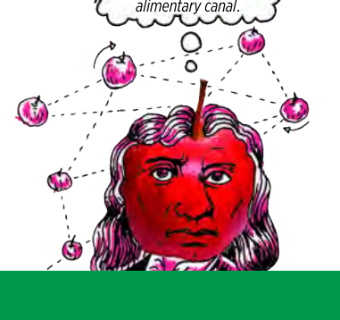
> **[Diagram Context - Textbook_NaturalScience_Gr9_Systems-in-the-human-body.pdf-0002-34.png]**
> This visual metaphor depicts a caricature of Isaac Newton with an apple-shaped head, surrounded by a network of floating apples connected by dashed lines and directional arrows, with a thought bubble referencing the "alimentary canal." The diagram uses this humorous juxtaposition to illustrate the biological process of digestion, contrasting the physical laws of gravity associated with Newton with the physiological movement of food through the human digestive system.

---

### Activity: Summarise Breathing Using a Flow Chart

A flow chart is a visual tool used to create short summaries of processes. Visualising these charts helps with memory retention during study and exam preparation.

**Task:** Create a flow chart illustrating the cycle of breathing (inhalation and exhalation). Your design must clearly show that these two processes occur in a continuous cycle.

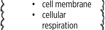
> **[Diagram Context - Textbook_NaturalScience_Gr9_Cells-as-the-basic-units-of-life.pdf-0003-04.png]**
> This text-based graphic lists two fundamental biological concepts: "cell membrane" and "cellular respiration." It serves as a concise summary or checklist for Grade 10-12 Life Sciences learners, highlighting key topics related to cellular structure and the metabolic processes required for energy production.

---

### Key Concepts: The Respiratory Pathway

*   **Inhalation:** The process of taking air into the lungs. During this process, air travels through the trachea into the two **bronchi**.
*   **Bronchi:** The two main tubes that branch off from the trachea, leading into each lung.
    *   *Note:* The plural is **bronchi**, and the singular is **bronchus**.
*   **Bronchioles:** The tiny branches that the bronchi divide into within the lungs.
*   **Exhalation:** The process of air leaving the lungs and the body. This follows the reverse pathway of inhalation.

---

### Take Note
The two tubes that branch from the trachea are called **bronchi** (plural) or a **bronchus** (singular).

---

*Chapter 4: Circulatory and respiratory systems | Page 87*

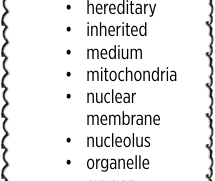
> **[Diagram Context - Textbook_NaturalScience_Gr9_Cells-as-the-basic-units-of-life.pdf-0003-06.png]**
> This graphic is a bulleted list of key biological terminology, including "hereditary," "inherited," "medium," "mitochondria," "nuclear membrane," "nucleolus," and "organelle." It serves as a vocabulary bank for Grade 10-12 Life Sciences, helping learners identify and define essential structures and concepts related to cell biology and genetics.

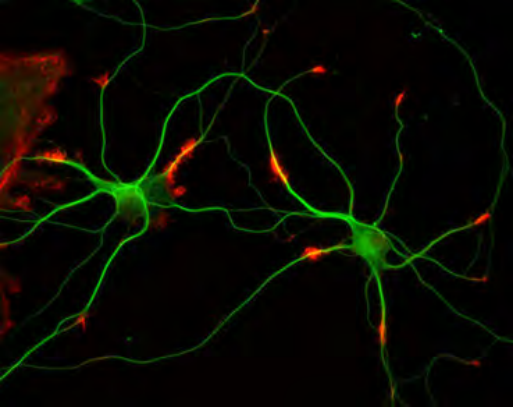
> **[Diagram Context - Textbook_NaturalScience_Gr9_Cells-as-the-basic-units-of-life.pdf-0003-07.png]**
> This fluorescence micrograph displays a network of neurons, highlighting the cell bodies (soma) and their branching extensions, specifically axons and dendrites, in green, with synaptic terminals or specific protein markers highlighted in red. This visual aids Grade 12 Life Sciences learners in understanding the structural complexity of the nervous system and the physical connections between neurons that facilitate the transmission of nerve impulses.

> **[Diagram Context - Textbook_NaturalScience_Gr9_Cells-as-the-basic-units-of-life.pdf-0003-10.png]**
> This graphic is a bulleted list containing the key biological terms "selectively permeable," "specialised," and "species." These terms represent fundamental concepts in the Grade 10 Life Sciences curriculum, specifically relating to cell membrane function, cellular differentiation, and the classification of living organisms.

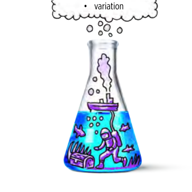
> **[Diagram Context - Textbook_NaturalScience_Gr9_Cells-as-the-basic-units-of-life.pdf-0003-12.png]**
> This graphic features an Erlenmeyer flask containing an underwater scene with a diver, a treasure chest, fish, and a surface ship, topped with a thought bubble labeled "variation." It serves as a metaphorical representation of biological diversity, illustrating how different life forms and environmental elements coexist within a single ecosystem or "vessel" of life. For Grade 12 Life Sciences learners, this visualises the concept of genetic and phenotypic variation as the fundamental raw material upon which natural selection acts within a population.

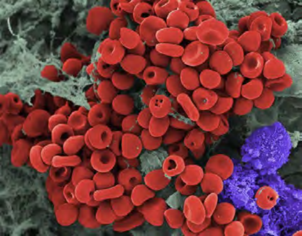
> **[Diagram Context - Textbook_NaturalScience_Gr9_Cells-as-the-basic-units-of-life.pdf-0003-14.png]**
> This scanning electron micrograph displays a cluster of biconcave red blood cells (erythrocytes) in red alongside a single, textured white blood cell (leukocyte) in purple. The image illustrates the distinct morphological differences between these blood components, highlighting the biconcave shape of erythrocytes that optimizes surface area for gas exchange and the irregular, granular surface of the leukocyte involved in immune response.

> **[Diagram Context - Textbook_NaturalScience_Gr9_Circulatory-and-respiratory-systems.pdf-0003-16.png]**
> This illustration depicts a laboratory apparatus consisting of a Bunsen burner heating a conical flask containing a blue liquid, which is connected to a gas cylinder. The visual elements include the gas canister, tubing, Bunsen burner, tripod stand, conical flask, and visible signs of a chemical reaction, such as bubbling and vapor emission. Conceptually, this diagram illustrates an endothermic process or a chemical reaction requiring thermal energy input, serving as a foundational model for understanding energy changes and reaction conditions in Physical Sciences.

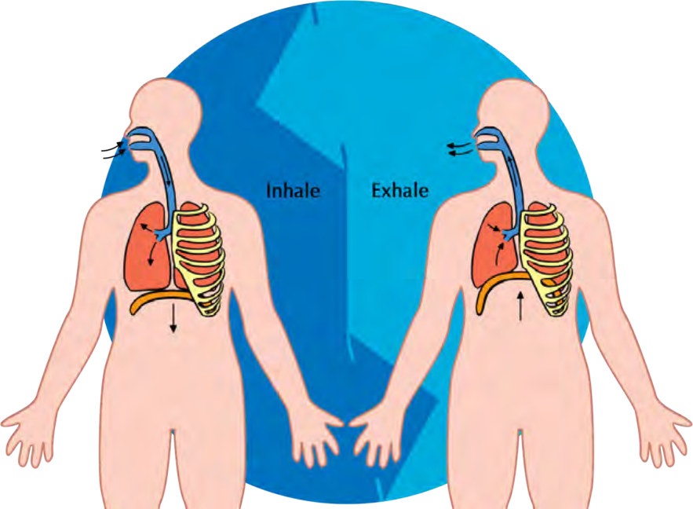
> **[Diagram Context - Textbook_NaturalScience_Gr9_Circulatory-and-respiratory-systems.pdf-0003-19.png]**
> This diagram illustrates the human respiratory system, specifically contrasting the mechanics of inhalation and exhalation through anatomical structures including the lungs, rib cage, diaphragm, and airways. By using directional arrows to show airflow and the movement of the diaphragm, the graphic demonstrates the physical changes in thoracic volume that facilitate breathing. This helps learners understand the relationship between diaphragm contraction/relaxation and the resulting pressure changes that drive the ventilation process.

> **[Diagram Context - Textbook_NaturalScience_Gr9_Human-reproduction.pdf-0003-03.png]**
> This graphic is a conceptual illustration featuring a human figure standing atop a globe, surrounded by a circular arrangement of green arrows and scattered water droplets. It serves as a visual metaphor for environmental stewardship and the cyclical nature of Earth's systems, such as the water cycle or sustainability initiatives, commonly taught in Life Sciences and Geography to emphasize human impact on global processes.

> **[Diagram Context - Textbook_NaturalScience_Gr9_Human-reproduction.pdf-0003-06.png]**
> This graphic depicts a schematic representation of a DNA double helix, characterized by two antiparallel sugar-phosphate backbones connected by repeating base pairs. It illustrates the fundamental molecular structure of DNA, helping students visualize the helical geometry and the complementary pairing essential for genetic replication and protein synthesis.

> **[Diagram Context - Textbook_NaturalScience_Gr9_Human-reproduction.pdf-0003-14.png]**
> This illustration depicts an Erlenmeyer flask containing a surreal underwater scene featuring a diver, a treasure chest, fish, and a surface ship emitting smoke. The visual elements include a thought bubble above the flask, blue liquid, and various hand-drawn aquatic and mechanical motifs. Conceptually, this graphic serves as a creative metaphor for scientific inquiry and imagination, encouraging students to visualize the hidden processes or "worlds" within chemical reactions and laboratory apparatus.

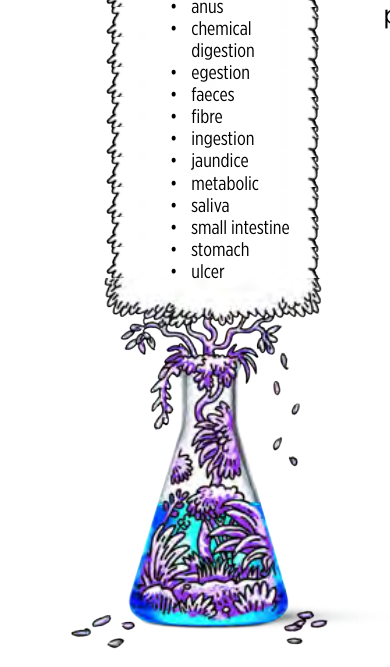
> **[Diagram Context - Textbook_NaturalScience_Gr9_Systems-in-the-human-body.pdf-0003-03.png]**
> This graphic is a conceptual word cloud presented as a laboratory flask containing biological illustrations, accompanied by a list of key terms including anus, chemical digestion, egestion, faeces, fibre, ingestion, jaundice, metabolic, saliva, small intestine, stomach, and ulcer. It serves as a study aid for the Grade 10 Life Sciences curriculum, helping learners categorize and recall essential terminology related to the human digestive system and associated health conditions.

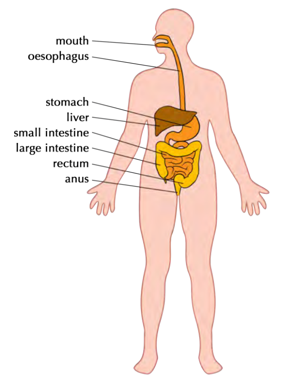
> **[Diagram Context - Textbook_NaturalScience_Gr9_Systems-in-the-human-body.pdf-0003-04.png]**
> This diagram illustrates the human digestive system, featuring labels for the mouth, oesophagus, stomach, liver, small intestine, large intestine, rectum, and anus. It provides a foundational anatomical overview, helping learners visualize the sequential pathway of the alimentary canal and the relative positioning of associated organs within the human body.

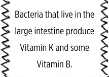
> **[Diagram Context - Textbook_NaturalScience_Gr9_Systems-in-the-human-body.pdf-0003-08.png]**
> This text-based graphic highlights the symbiotic relationship between human gut microbiota and the host. It explicitly identifies "bacteria," the "large intestine," "Vitamin K," and "Vitamin B" to illustrate how intestinal flora contribute to human nutrition through the synthesis of essential vitamins.

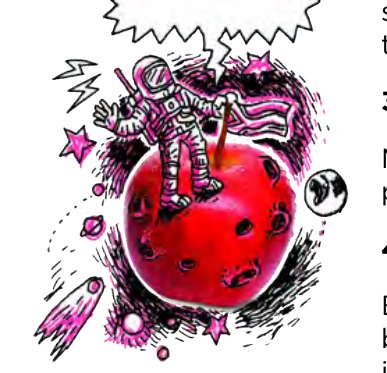
> **[Diagram Context - Textbook_NaturalScience_Gr9_Systems-in-the-human-body.pdf-0003-11.png]**
> This illustration depicts an astronaut standing on a cratered red apple, surrounded by celestial elements like stars, planets, and a comet, with an empty speech bubble above. The imagery uses a surreal juxtaposition of space exploration and a common fruit to metaphorically represent the concept of gravity or the discovery of physical laws. It serves as a creative visual prompt to engage learners in discussing Newtonian physics, specifically the relationship between mass, gravitational force, and the history of scientific inquiry.

---

### 4.2 Gaseous Exchange in the Lungs

**Gaseous exchange** is the process that takes place in the lungs and the cells of the body. The structure of the lung is specifically adapted to perform this function.

#### New Words
*   **Alveoli:** Tiny air sacs in the lungs where gas exchange occurs.
*   **Capillaries:** Tiny blood vessels that surround the alveoli.
*   **Cartilage:** Firm, flexible connective tissue found in the respiratory tract.
*   **Diffusion:** The movement of particles from an area of high concentration to an area of low concentration.
*   **Haemoglobin:** A protein in red blood cells that carries oxygen.
*   **Red blood cells:** Cells that transport oxygen throughout the body.

---

#### Structure of the Lung
Although the lungs inflate during inhalation and deflate during exhalation, they are not hollow. In a healthy individual, the lungs are soft, pink, and spongy.

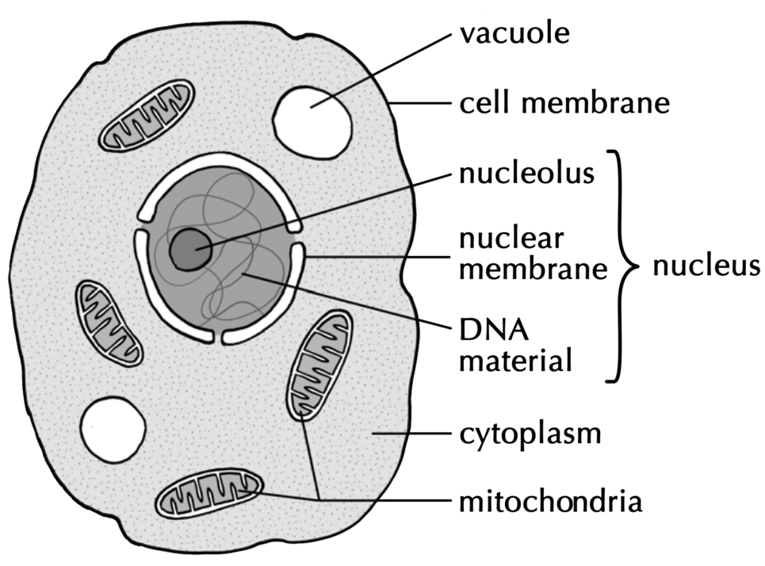
> **[Diagram Context - Textbook_NaturalScience_Gr9_Cells-as-the-basic-units-of-life.pdf-0004-00.png]**
> This diagram illustrates the ultrastructure of an animal cell, featuring labels for the cell membrane, cytoplasm, mitochondria, vacuole, and the components of the nucleus (nucleolus, nuclear membrane, and DNA material). It serves as a foundational visual aid for Grade 10 Life Sciences, helping learners identify key organelles and understand the compartmentalized organization of eukaryotic cells.

The respiratory system consists of a branching structure:
1.  **Larynx:** The upper part of the airway.
2.  **Trachea:** The windpipe that connects the larynx to the lungs.
3.  **Bronchi:** The two main branches that lead into the lungs.
4.  **Bronchioles:** Smaller branches that extend from the bronchi.

| External structure of the lungs | Internal structure of the lungs |
| :--- | :--- |
| 

 | 

> **[Diagram Context - Textbook_NaturalScience_Gr9_Cells-as-the-basic-units-of-life.pdf-0004-10.png]**
> This graphic features a whimsical illustration of a hot air balloon shaped like the Earth, accompanied by a text box containing the heading "VISIT" and two shortened URLs (bit.ly/14k3Q5S and bit.ly/19bsCKt). It serves as a supplementary educational resource signpost, directing Life Sciences learners to digital video content focused on the structure and function of cells and their organelles as prescribed by the CAPS curriculum.

 |

*   **Note:** The colours of the different bronchioles in the diagram indicate air travelling to different parts of the lungs.

---

#### The Alveoli
The alveoli resemble small, grape-like structures made up of many individual air sacs. A large network of capillaries surrounds each alveolus to facilitate the exchange of gases between the air and the blood.

*   **Take Note:** Gaseous exchange relies on the process of **diffusion**. Oxygen moves from the air in the alveoli into the blood, while carbon dioxide moves from the blood into the alveoli to be exhaled.

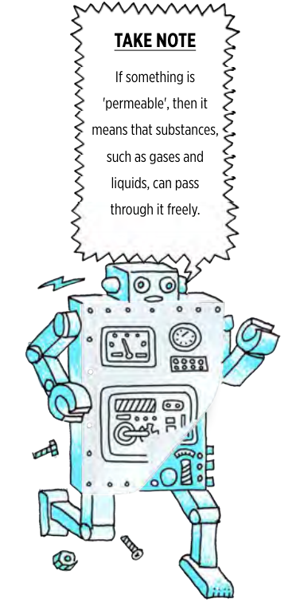
> **[Diagram Context - Textbook_NaturalScience_Gr9_Cells-as-the-basic-units-of-life.pdf-0004-11.png]**
> This graphic features a cartoon robot with a speech bubble containing the text "TAKE NOTE" and a definition of the term "permeable." It conceptually illustrates the scientific property of permeability, helping students understand that a permeable material allows substances like gases and liquids to pass through it freely.

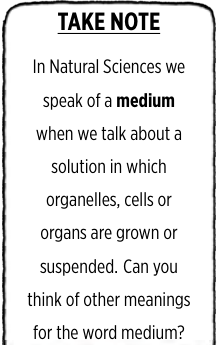
> **[Diagram Context - Textbook_NaturalScience_Gr9_Cells-as-the-basic-units-of-life.pdf-0004-12.png]**
> This educational text box defines the scientific term "medium" within the context of Natural Sciences, specifically referencing biological components like organelles, cells, and organs. It prompts students to distinguish between this technical definition and the common usage of the word, encouraging critical thinking about scientific terminology.

> **[Diagram Context - Textbook_NaturalScience_Gr9_Circulatory-and-respiratory-systems.pdf-0004-00.png]**
> This diagram illustrates an electromagnet created by connecting a coiled wire (solenoid) to a battery, indicated by positive (+) and negative (-) terminals. The surrounding field lines with directional arrows represent the magnetic field generated by the current, which is shown attracting nearby metallic objects like a screw, nail, and nut. This visualises the CAPS Physical Sciences concept of electromagnetism, demonstrating how an electric current flowing through a conductor produces a magnetic field capable of exerting force on ferromagnetic materials.

> **[Diagram Context - Textbook_NaturalScience_Gr9_Circulatory-and-respiratory-systems.pdf-0004-04.png]**
> The provided image is blank and contains no visual content, labels, or pedagogical information to analyze. Please upload an image containing educational material so that I can provide a description aligned with the CAPS curriculum.

> **[Diagram Context - Textbook_NaturalScience_Gr9_Circulatory-and-respiratory-systems.pdf-0004-07.png]**
> This illustration depicts a pair of hands interacting with a tablet interface featuring various scientific and mathematical icons, including symbols for electricity, chemistry, and geometry. It serves as a visual metaphor for digital learning, encouraging students to engage with interactive technology to explore and manipulate complex concepts across the CAPS Physical Sciences and Mathematics curricula.

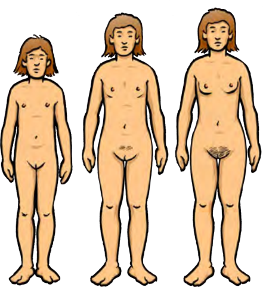
> **[Diagram Context - Textbook_NaturalScience_Gr9_Human-reproduction.pdf-0004-10.png]**
> This diagram illustrates the physical development of a female human body through three progressive stages of puberty. It visually highlights secondary sexual characteristics, specifically the development of breast tissue and the appearance of pubic hair, to demonstrate the maturation process. This serves as a foundational visual aid for Life Sciences learners to identify the biological changes driven by hormonal shifts during adolescence.

> **[Diagram Context - Textbook_NaturalScience_Gr9_Human-reproduction.pdf-0004-17.png]**
> This image is a simple text-based graphic containing the single word "VISIT" underlined within a rectangular border. It does not represent a scientific or mathematical concept relevant to the CAPS curriculum, but rather serves as a navigational prompt or call-to-action button.

> **[Diagram Context - Textbook_NaturalScience_Gr9_Human-reproduction.pdf-0004-18.png]**
> This graphic features a cartoon illustration of a large telescope pointed at the Earth, accompanied by a speech bubble containing the text "Visit this interactive site to explore the changes that occur during puberty" and a shortened URL. It serves as a digital signpost to direct Life Sciences learners toward online resources that provide interactive, visual explanations of the physiological and hormonal changes associated with human puberty.

> **[Diagram Context - Textbook_NaturalScience_Gr9_Human-reproduction.pdf-0004-19.png]**
> This graphic is a simple text-based instructional prompt featuring the underlined word "VISIT" enclosed within a hand-drawn rectangular border. It serves as a navigational call-to-action, directing students to access external digital resources or supplementary learning materials relevant to their CAPS curriculum studies.

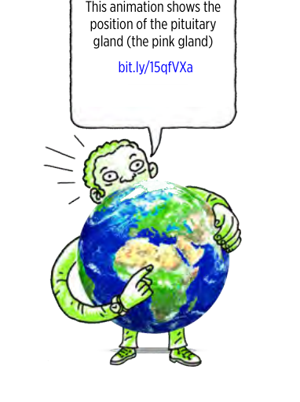
> **[Diagram Context - Textbook_NaturalScience_Gr9_Human-reproduction.pdf-0004-20.png]**
> This graphic is a cartoon illustration featuring a speech bubble that references the "pituitary gland" and a URL link. While the text identifies the pituitary gland as a "pink gland," the visual content itself is a caricature of a person holding a globe and does not contain any anatomical structures or biological diagrams. Consequently, the image fails to provide the necessary anatomical context required for a Life Sciences student to understand the location or function of the pituitary gland within the human endocrine system.

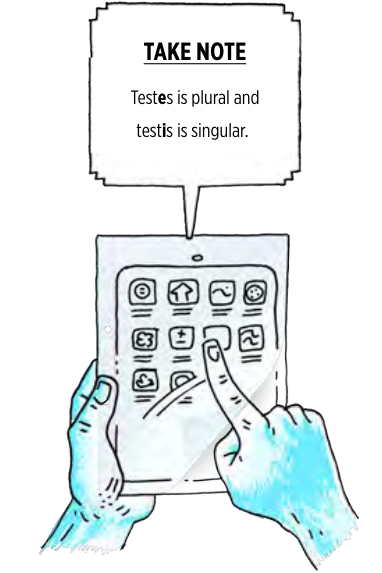
> **[Diagram Context - Textbook_NaturalScience_Gr9_Human-reproduction.pdf-0004-21.png]**
> This graphic is an educational illustration featuring a speech bubble above a pair of hands interacting with a tablet device. The text explicitly clarifies the linguistic distinction between the plural term "testes" and the singular term "testis." This serves as a mnemonic aid for Life Sciences learners to ensure accurate terminology usage when describing the male reproductive system in accordance with CAPS assessment requirements.

> **[Diagram Context - Textbook_NaturalScience_Gr9_Systems-in-the-human-body.pdf-0004-04.png]**
> This graphic depicts a conceptual illustration of a roller coaster track integrated with a slinky spring. It uses visual metaphors of motion and height to represent the principles of mechanical energy, specifically the transformation between gravitational potential energy at the peak and kinetic energy during the descent.

> **[Diagram Context - Textbook_NaturalScience_Gr9_Systems-in-the-human-body.pdf-0004-08.png]**
> The provided image is blank and contains no visual content, labels, or pedagogical information to analyze. Please provide an image containing educational material so that I may assist you with a CAPS-aligned description.

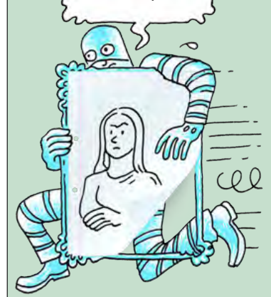
> **[Diagram Context - Textbook_NaturalScience_Gr9_Systems-in-the-human-body.pdf-0004-09.png]**
> This cartoon depicts a character holding a framed portrait of a person, utilizing a speech bubble and motion lines to suggest rapid movement or theft. The visual elements focus on the act of concealing or carrying away a representation of an individual, serving as a metaphorical illustration for concepts related to identity, representation, or the displacement of subjects.

> **[Diagram Context - Textbook_NaturalScience_Gr9_Systems-in-the-human-body.pdf-0004-10.png]**
> This graphic depicts a stylized, repeating pattern of interlocking, helical-shaped arrows oriented in a horizontal sequence. The image lacks specific biological labels or chemical symbols, serving as a decorative or conceptual representation of directional flow or continuous movement. For a high school learner, this visual suggests the cyclical or sequential nature of processes such as DNA replication or metabolic pathways, emphasizing the continuity and directionality inherent in biological systems.

---

# The Respiratory System: Alveoli and Practical Investigation

## Key Concepts
*   **Alveolus:** A single tiny air sac within the lungs where gas exchange occurs.
*   **Alveoli:** The plural form of alveolus (a group of air sacs).
*   **Bronchiole:** Small airway branches that lead to the alveoli.
*   **Capillary:** Tiny blood vessels that surround the alveoli to facilitate the exchange of oxygen and carbon dioxide.

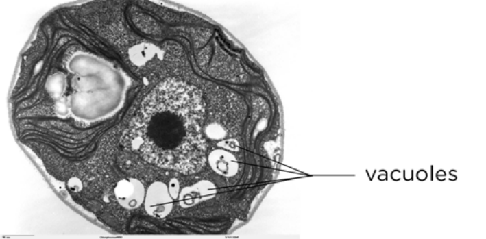
> **[Diagram Context - Textbook_NaturalScience_Gr9_Cells-as-the-basic-units-of-life.pdf-0005-00.png]**
> This transmission electron micrograph displays the internal ultrastructure of a eukaryotic cell, specifically highlighting the presence of multiple vacuoles. The image provides a high-magnification view of cellular organelles, including the nucleus and membrane-bound vacuoles, to help learners identify and distinguish these structures within the cytoplasm.

---

## Activity: Lung Dissection

This practical activity allows for the observation of lung structure. If a physical dissection is not possible, educational videos are recommended to observe the process.

### Materials Required
*   Lung specimen
*   Dissection tray
*   Scalpel
*   Dissecting scissors
*   Rubber tubing (e.g., Bunsen burner tubing or hose pipe)
*   Ruler
*   Beaker of water
*   Water and soap (for hand washing)
*   Disinfectant

### Health and Safety Guidelines
1.  **Hygiene:** Lungs may carry bacteria. While gloves are not strictly required (similar to preparing meat in a kitchen), you must wash your hands thoroughly after the activity.
2.  **Sanitation:** Clean all equipment and work surfaces with disinfectant immediately after the dissection.
3.  **Sharp Objects:** Exercise extreme caution when handling sharp instruments like the scalpel.
4.  **Disposal:** Plan the safe and hygienic disposal of the lung specimen before beginning.

### Instructions: Part 1 (Preparation)
1.  Place the lung specimen onto the dissection tray on your workbench.
2.  Ensure all dissecting instruments are disinfected and sharp. Arrange them neatly next to the tray.
3.  Verify that a first aid kit is accessible in the laboratory.

---

## Digital Resources
*   **Gas Exchange:** Watch a video on how gases are exchanged at the alveoli: [bit.ly/14Fdil2](http://bit.ly/14Fdil2) or [bit.ly/11WcfzA](http://bit.ly/11WcfzA)
*   **Lung Structure:** Watch a video showing the structure of the lungs: [bit.ly/17gByw6](http://bit.ly/17gByw6)

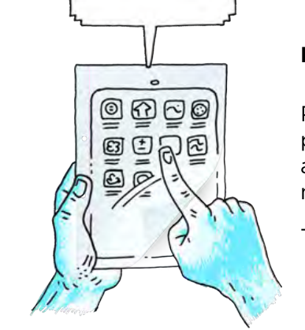
> **[Diagram Context - Textbook_NaturalScience_Gr9_Cells-as-the-basic-units-of-life.pdf-0005-04.png]**
> This illustration depicts a pair of hands interacting with a tablet interface featuring various abstract icons, including symbols for addition, subtraction, and wave patterns. It serves as a conceptual metaphor for digital literacy and the use of information and communication technology (ICT) tools to access, manipulate, and engage with educational content in a modern learning environment.

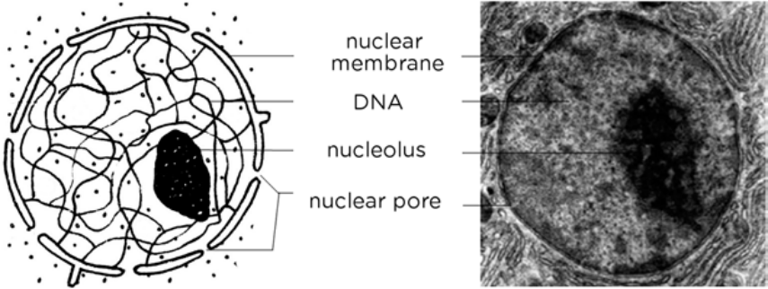
> **[Diagram Context - Textbook_NaturalScience_Gr9_Cells-as-the-basic-units-of-life.pdf-0005-14.png]**
> This graphic presents a comparative view of a cell nucleus, featuring a schematic line drawing alongside an electron micrograph. The labels identify key structural components including the nuclear membrane, DNA (chromatin), nucleolus, and nuclear pores. This comparison helps students bridge the gap between abstract biological diagrams and the complex, granular reality of cellular ultrastructure as required in the Life Sciences curriculum.

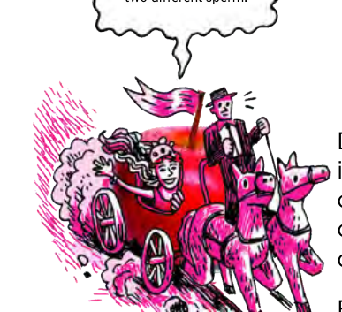
> **[Diagram Context - Textbook_NaturalScience_Gr9_Cells-as-the-basic-units-of-life.pdf-0005-15.png]**
> This cartoon illustrates the concept of non-identical (fraternal) twins through the metaphor of a carriage carrying two distinct passengers. The visual elements include a carriage shaped like an apple, a driver, and a speech bubble referencing "two different sperm," which serves to explain the biological process of dizygotic twinning where two separate ova are fertilized by two separate sperm cells.

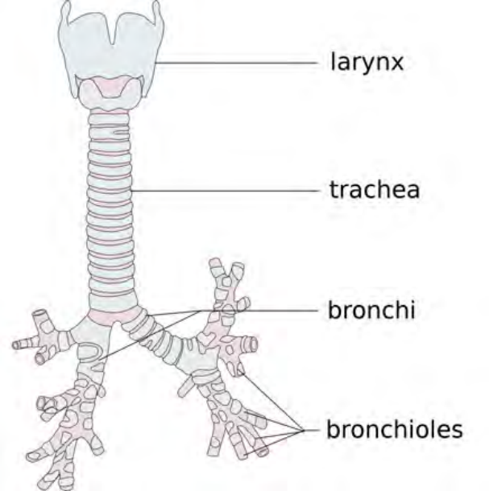
> **[Diagram Context - Textbook_NaturalScience_Gr9_Circulatory-and-respiratory-systems.pdf-0005-00.png]**
> This anatomical diagram illustrates the human respiratory tract, specifically labeling the larynx, trachea, bronchi, and bronchioles. It provides a clear visual representation of the branching airway system, helping Life Sciences learners understand the structural pathway air follows as it travels from the upper respiratory tract into the lungs.

> **[Diagram Context - Textbook_NaturalScience_Gr9_Circulatory-and-respiratory-systems.pdf-0005-01.png]**
> This graphic is a text-based instructional element featuring the heading "NEW WORDS" enclosed within a cloud-shaped border. It serves as a visual scaffold to signal the introduction of key terminology or vocabulary relevant to a specific CAPS curriculum topic. By isolating these terms, the graphic helps learners focus on essential subject-specific language required for conceptual mastery and examination success.

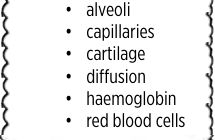
> **[Diagram Context - Textbook_NaturalScience_Gr9_Circulatory-and-respiratory-systems.pdf-0005-02.png]**
> This graphic presents a bulleted list of key terminology including "alveoli," "capillaries," "cartilage," "diffusion," "haemoglobin," and "red blood cells." These terms represent essential components and processes of the human respiratory and circulatory systems, specifically focusing on the structural adaptations and gas exchange mechanisms required for efficient oxygen transport in Grade 11 Life Sciences.

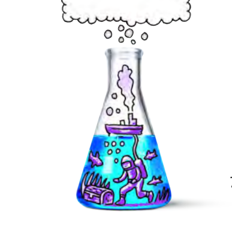
> **[Diagram Context - Textbook_NaturalScience_Gr9_Circulatory-and-respiratory-systems.pdf-0005-03.png]**
> This illustration depicts an Erlenmeyer flask containing a submerged underwater scene featuring a diver, a treasure chest, fish, and a surface boat connected by an air hose, with bubbles rising toward an empty thought bubble above. It serves as a metaphorical representation of scientific inquiry and exploration, encouraging students to visualize the "hidden" processes or underlying concepts within a chemical system.

> **[Diagram Context - Textbook_NaturalScience_Gr9_Circulatory-and-respiratory-systems.pdf-0005-05.png]**
> This graphic is a simple text-based call-to-action contained within a cloud-shaped callout bubble. It features the single word "VISIT" in bold, sans-serif capital letters. Conceptually, this serves as a navigational prompt or instructional signpost intended to direct students toward an external resource, website, or physical location for further learning.

> **[Diagram Context - Textbook_NaturalScience_Gr9_Circulatory-and-respiratory-systems.pdf-0005-08.png]**
> This graphic is a text-based educational sign featuring the heading "A video on gaseous exchange" and a corresponding shortened URL. It serves as a digital signpost to direct Life Sciences learners to supplementary multimedia content regarding the respiratory processes of oxygen and carbon dioxide diffusion.

> **[Diagram Context - Textbook_NaturalScience_Gr9_Circulatory-and-respiratory-systems.pdf-0005-10.png]**
> This conceptual illustration depicts the Earth as a hot air balloon, featuring a globe, a basket, and two figures using telescopes to observe the surroundings. It serves as a visual metaphor for global environmental monitoring, representing the human responsibility to observe, study, and manage the Earth's systems within the context of Life Sciences and Geography.

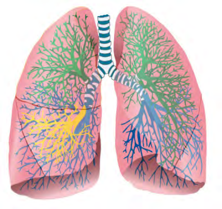
> **[Diagram Context - Textbook_NaturalScience_Gr9_Circulatory-and-respiratory-systems.pdf-0005-15.png]**
> This anatomical diagram illustrates the human respiratory system, specifically highlighting the trachea branching into the bronchial tree within the left and right lungs. The image uses color-coded branching patterns to represent the complex, hierarchical structure of the bronchi and bronchioles that facilitate gas exchange. It serves as a visual aid for Life Sciences learners to understand the internal architecture of the lungs and the pathway air follows to reach the alveoli.

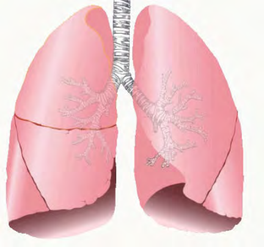
> **[Diagram Context - Textbook_NaturalScience_Gr9_Circulatory-and-respiratory-systems.pdf-0005-16.png]**
> This anatomical diagram illustrates the human respiratory system, specifically highlighting the trachea, the branching bronchial tree, and the lobes of the left and right lungs. It serves as a foundational visual aid for Grade 11 Life Sciences, helping learners identify the structural components of the gas exchange system and understand the anatomical arrangement of the lungs within the thoracic cavity.

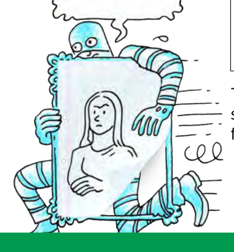
> **[Diagram Context - Textbook_NaturalScience_Gr9_Circulatory-and-respiratory-systems.pdf-0005-19.png]**
> This cartoon depicts a masked figure in striped clothing running away while holding a framed portrait of a woman. The visual elements include a speech bubble, motion lines, and a portrait within a decorative frame, serving as a metaphorical representation of theft or the act of "stealing" an identity or image. In a CAPS Life Sciences or English context, this image is used to illustrate the concept of plagiarism or intellectual property theft, prompting students to critically analyze the ethics of copying original work.

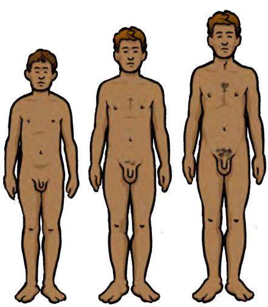
> **[Diagram Context - Textbook_NaturalScience_Gr9_Human-reproduction.pdf-0005-00.png]**
> This illustration depicts the physical development of the male human body through three progressive stages of puberty. It visually highlights secondary sexual characteristics, specifically the increase in body size, muscle mass, and the development of pubic and chest hair. For a Life Sciences student, this serves as a model for understanding the hormonal changes and physical maturation processes that occur during adolescence.

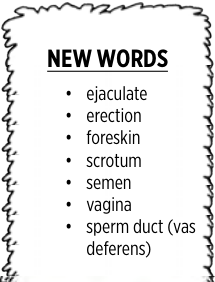
> **[Diagram Context - Textbook_NaturalScience_Gr9_Human-reproduction.pdf-0005-01.png]**
> This graphic is a vocabulary list related to human reproductive anatomy and physiology. It includes the terms: ejaculate, erection, foreskin, scrotum, semen, vagina, and sperm duct (vas deferens). These terms provide essential terminology for Life Sciences learners to describe the structures and processes involved in human reproduction and sexual health.

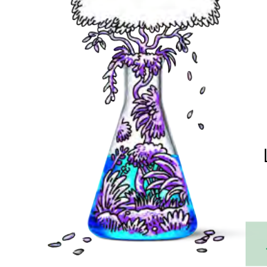
> **[Diagram Context - Textbook_NaturalScience_Gr9_Human-reproduction.pdf-0005-02.png]**
> This conceptual illustration depicts a conical flask containing a miniature, purple-toned ecosystem of aquatic plants and submerged vegetation. By visualizing a self-contained biological environment within laboratory glassware, the image serves as a metaphor for an artificial biosphere or a controlled experimental microcosm used to study plant growth and ecological interactions.

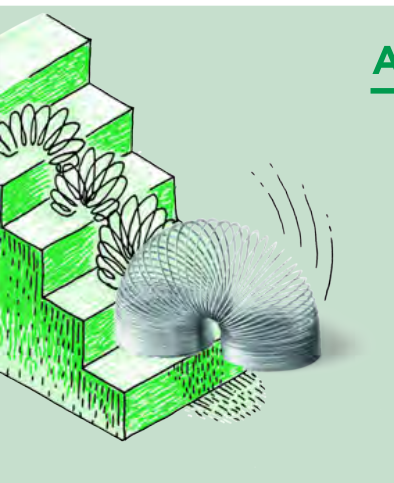
> **[Diagram Context - Textbook_NaturalScience_Gr9_Human-reproduction.pdf-0005-06.png]**
> This diagram illustrates a slinky toy moving down a flight of stairs, depicted through a series of overlapping sketches showing the spring's position and motion lines. It conceptually demonstrates the transformation of gravitational potential energy into kinetic energy as the object undergoes periodic motion, serving as a practical model for understanding energy conservation and mechanical waves in a Grade 10-12 Physical Sciences context.

> **[Diagram Context - Textbook_NaturalScience_Gr9_Human-reproduction.pdf-0005-11.png]**
> This graphic depicts a stylized, repeating wave-like pattern composed of interconnected green arrow-shaped segments. It serves as a visual representation of continuous flow, cyclical processes, or a repeating sequence, often used in Life Sciences to illustrate metabolic pathways or the directional movement of energy and matter through a system.

> **[Diagram Context - Textbook_NaturalScience_Gr9_Systems-in-the-human-body.pdf-0005-03.png]**
> This image depicts a practical, low-cost handwashing station featuring a wall-mounted basin and a gravity-fed water container. It serves as a real-world application of Life Sciences and Health Education, illustrating the importance of hygiene infrastructure in preventing the spread of pathogens and promoting community health.

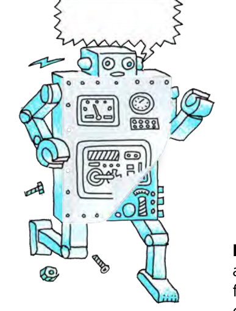
> **[Diagram Context - Textbook_NaturalScience_Gr9_Systems-in-the-human-body.pdf-0005-04.png]**
> This illustration depicts a cartoon robot with a speech bubble, featuring various mechanical control panels, gauges, and loose hardware like screws and nuts falling from its frame. It serves as a metaphorical visual aid to help students conceptualize complex systems, such as the breakdown of biological homeostasis or the mechanical failure of technological components.

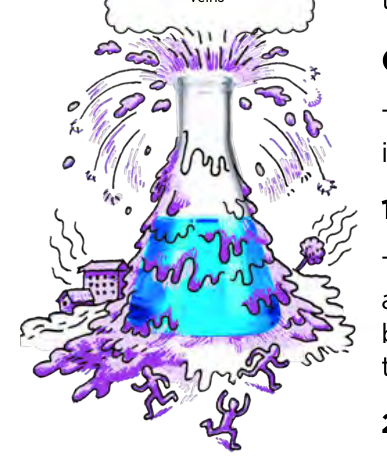
> **[Diagram Context - Textbook_NaturalScience_Gr9_Systems-in-the-human-body.pdf-0005-14.png]**
> This illustration depicts a conical flask acting as a metaphor for a volcanic eruption, with purple liquid overflowing and spraying from the neck. The image features a stylized flask, a cloud, a small building, and human figures fleeing the "eruption," symbolizing the hazardous nature of chemical reactions or industrial accidents. It serves as a visual analogy to help learners understand the concept of rapid, uncontrolled chemical reactions and the potential environmental or safety risks associated with laboratory or industrial processes.

---

# Practical Investigation: The Structure of the Lungs

## Part 2: External Structure
Follow these steps to examine the external anatomy of the lung:

1. **Observation:** Note the general shape, colour, and texture of the lung.
2. **Mass:** If a scale is available, measure the mass of the lung.
3. **Dimensions:** Use a ruler to measure the length of the lung.
4. **Identification:** Locate the following parts:
    *   **Trachea:** The main "windpipe" tube that transports air into and out of the lungs.
    *   **Hard Rings:** Observe the rings within the trachea. Consider their function in keeping the airway open.
5. **Bronchi:** Identify the two bronchi that branch off from the trachea, leading into each lung.
6. **Bronchioles:** Identify the smaller tubes branching off from the bronchi.
7. **Blood Vessels:** Check for attached blood vessels and describe their texture.
8. **Inflation Test:** Insert a piece of rubber tubing, straw, or hose pipe into the trachea. Hold it tightly and blow into the tube to inflate the lung. 
    *   *Safety Note: Do not inhale the air back into your own lungs.*

> **[Diagram Context - Textbook_NaturalScience_Gr9_Cells-as-the-basic-units-of-life.pdf-0006-00.png]**
> This comparative photograph displays two lions with distinct phenotypic variations, specifically a tawny-colored lion and a white lion. By contrasting these two individuals, the image illustrates the concept of genetic variation within a species, serving as a visual aid for discussing alleles, mutations, and the role of inheritance in determining physical traits.

## Part 3: Internal Structure
Follow these steps to examine the internal anatomy of the lung:

1. **Dissection:** Use a scalpel and dissecting scissors to cut into the lung tissue.
2. **Observation:** Examine the inner tissue and discuss your observations with your group.
3. **Density Test:** Cut a small piece of lung tissue. Feel for the tiny, hard lumps (bronchioles) within the soft tissue. Place the piece in a beaker of water and observe whether it floats or sinks.

---

## Questions

1. **Observation Report:** Write a description of the look, feel, and colour of the lung you observed. Include the mass (if measured) and the length in centimeters ($cm$).
2. **Structural Function:** What structures allow the trachea to stay open while remaining flexible enough to bend?
3. **Internal Texture:** When you cut the lung open, did it resemble a hollow balloon or was it spongy? What other observations did you make regarding the internal structure?

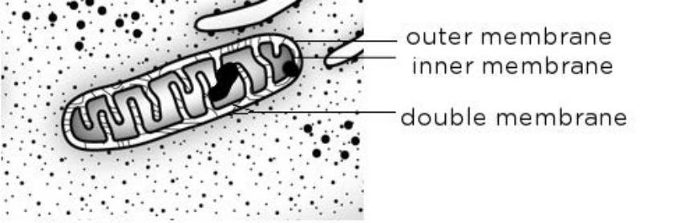
> **[Diagram Context - Textbook_NaturalScience_Gr9_Cells-as-the-basic-units-of-life.pdf-0006-04.png]**
> This diagram illustrates the ultrastructure of a mitochondrion, specifically highlighting its double-membrane system with labels for the outer membrane, inner membrane, and the collective double membrane. It conceptually demonstrates the organelle's compartmentalized structure, which is essential for high school learners to understand how the folded inner membrane (cristae) increases surface area for efficient cellular respiration.

> **[Diagram Context - Textbook_NaturalScience_Gr9_Cells-as-the-basic-units-of-life.pdf-0006-07.png]**
> This transmission electron micrograph displays the ultrastructure of muscle tissue, featuring numerous organelles labeled as "mitochondria" alongside blood capillaries. The image illustrates the high density of mitochondria within metabolically active cells, highlighting their role in providing the ATP required for muscle contraction.

> **[Diagram Context - Textbook_NaturalScience_Gr9_Cells-as-the-basic-units-of-life.pdf-0006-10.png]**
> This graphic features a cartoon illustration of a person holding a sign above a globe, surrounded by circular arrows and the text "VISIT" and "Learn more about genes." It serves as a digital signpost or call-to-action link designed to direct Life Sciences students to external resources for supplementary study on genetics.

> **[Diagram Context - Textbook_NaturalScience_Gr9_Cells-as-the-basic-units-of-life.pdf-0006-11.png]**
> This educational graphic uses a cartoon illustration to present a linguistic "Take Note" box regarding biological terminology. It explicitly defines the singular term "mitochondrion" and its plural form "mitochondria." This serves to clarify common grammatical misconceptions in Life Sciences, ensuring learners use precise scientific terminology when describing cellular structures.

> **[Diagram Context - Textbook_NaturalScience_Gr9_Cells-as-the-basic-units-of-life.pdf-0006-12.png]**
> This graphic features a cartoon illustration accompanied by a speech bubble containing the text "DID YOU KNOW?" and a prompt regarding "mitochondrial DNA" and "nucleus." It serves as an inquiry-based pedagogical tool to introduce Grade 10-12 Life Sciences students to the endosymbiotic theory, prompting them to critically analyze the evolutionary origins of eukaryotic organelles.

> **[Diagram Context - Textbook_NaturalScience_Gr9_Circulatory-and-respiratory-systems.pdf-0006-00.png]**
> This diagram illustrates the anatomical structure of the human respiratory system at the microscopic level, specifically highlighting the alveoli, bronchioles, and the surrounding capillary network. Labeled structures include the alveoli, bronchiole, and capillary, with red and blue arrows indicating the direction of blood flow. It conceptually demonstrates the close association between the respiratory and circulatory systems, facilitating the process of gaseous exchange between the air in the alveoli and the blood in the capillaries.

> **[Diagram Context - Textbook_NaturalScience_Gr9_Circulatory-and-respiratory-systems.pdf-0006-11.png]**
> This graphic combines an instructional sign featuring a globe and directional arrows with an illustration of a slinky-like structure and a stylized character. The labels include the heading "VISIT" and two shortened URLs directing students to external video resources regarding gas exchange at the alveoli. Conceptually, this serves as a multimedia signpost to supplement the CAPS Life Sciences curriculum by linking abstract physiological processes, such as pulmonary gas exchange, to digital visual aids.

> **[Diagram Context - Textbook_NaturalScience_Gr9_Circulatory-and-respiratory-systems.pdf-0006-16.png]**
> This instructional graphic outlines health, safety, and preparation protocols for a Life Sciences lung dissection practical, accompanied by a decorative illustration of a telescope viewing the Earth. It provides essential laboratory guidelines, including hygiene practices, equipment handling, and waste disposal, to ensure students conduct the dissection safely and effectively in accordance with CAPS requirements.

> **[Diagram Context - Textbook_NaturalScience_Gr9_Human-reproduction.pdf-0006-02.png]**
> This diagram provides a sagittal view of the human male reproductive system, featuring labels for the vas deferens, penis, urethra, testis, and scrotum. It illustrates the anatomical positioning and connectivity of these structures, helping learners understand the pathway of sperm transport from the testis through the vas deferens to the urethra for ejaculation.

> **[Diagram Context - Textbook_NaturalScience_Gr9_Human-reproduction.pdf-0006-14.png]**
> This illustration depicts a caricature of Isaac Newton with an apple-shaped head, surrounded by a network of floating apples connected by dashed lines and directional arrows, all linked to a thought bubble. It serves as a metaphorical representation of Newton’s Law of Universal Gravitation, visually connecting the iconic apple anecdote to the complex, interconnected nature of gravitational forces acting between masses in space.

> **[Diagram Context - Textbook_NaturalScience_Gr9_Human-reproduction.pdf-0006-17.png]**
> This cartoon depicts a masked figure holding a framed portrait of a person, serving as a metaphorical illustration of the concept of "identity" or "self-representation." By using a visual mask and a framed image, the graphic conceptually explores the distinction between an individual's true self and the persona or social identity they present to the world, a key theme in Life Orientation and Psychology.

> **[Diagram Context - Textbook_NaturalScience_Gr9_Systems-in-the-human-body.pdf-0006-00.png]**
> This diagram illustrates the human circulatory system, featuring a schematic representation of the heart and a network of blood vessels throughout the body. Labels identify the "heart" and "blood vessels containing blood," with red and blue vessels indicating the distribution of oxygenated and deoxygenated blood. It serves as a foundational visual for Grade 10 Life Sciences to demonstrate how the heart acts as a central pump to transport substances via a closed double-circulatory system.

> **[Diagram Context - Textbook_NaturalScience_Gr9_Systems-in-the-human-body.pdf-0006-07.png]**
> This graphic is an illustrative cartoon featuring a speech bubble containing the text: "The first heart transplant in the world was done by Dr Chris Barnard in South Africa in 1967!" It serves as a historical contextualisation tool for Life Sciences learners, highlighting a significant milestone in South African medical history and cardiovascular research.

> **[Diagram Context - Textbook_NaturalScience_Gr9_Systems-in-the-human-body.pdf-0006-10.png]**
> This illustration depicts an anthropomorphized earthworm emerging from an apple within a natural environment featuring grass, birds, and a sun. The visual elements include a segmented worm, a fruit, and a speech bubble containing the partial text "times!". Conceptually, this graphic serves as a mnemonic or introductory visual aid to help learners identify the earthworm as a primary consumer or decomposer within a food chain or ecosystem.

> **[Diagram Context - Textbook_NaturalScience_Gr9_Systems-in-the-human-body.pdf-0006-20.png]**
> This conceptual illustration depicts the Earth suspended as a hot air balloon, featuring a globe, a net, a burner flame, and two figures using telescopes to observe the horizon. It serves as a metaphor for global environmental stewardship, encouraging learners to consider the interconnectedness of the planet and the human responsibility to monitor and protect our atmosphere and biosphere.

---

### Respiratory System Investigation

#### Questions for Reflection
4. When you placed a piece of the lung tissue into water, why do you think it floated?
5. When you blew air into the lung, what did it look and feel like? Did you have to squeeze the lung to force the air out again?
6. In a human, what is responsible for pushing the air out of the lungs?

---

### Concept: Diffusion in the Respiratory System

**Definition: Diffusion**
Diffusion is the process by which particles move from an area of high concentration to an area of low concentration. This is the fundamental process by which gaseous exchange occurs in the body.

**How Diffusion Works in the Lungs:**
Each alveolus is surrounded by a network of capillaries. Gaseous exchange occurs between the alveoli and the blood in the capillaries:
*   **Oxygen:** Diffuses from the alveoli into the blood in the capillaries.
*   **Carbon Dioxide:** Diffuses from the blood in the capillaries into the alveoli to be exhaled.

> **[Diagram Context - Textbook_NaturalScience_Gr9_Cells-as-the-basic-units-of-life.pdf-0007-01.png]**
> This graphic is an informational text box providing a digital resource link for further study. It contains the labels "mitochondrial DNA (mtDNA)", "old age", "Dr Barry Starr", "Stanford University", and a shortened URL. It serves to extend the CAPS Life Sciences curriculum by directing students to supplementary reading on the role of mitochondrial genetics in the biological process of aging.

---

### Activity: Drawing Gaseous Exchange in the Alveoli

**Instructions:**
1. Draw a diagram to show alveoli surrounded by a capillary.
2. On this diagram, name the gases and indicate the direction in which the gases diffuse.
3. Indicate whether the blood is oxygenated or deoxygenated in the capillaries that travel towards and away from the alveolus.

> **[Diagram Context - Textbook_NaturalScience_Gr9_Cells-as-the-basic-units-of-life.pdf-0007-02.png]**
> This transmission electron micrograph displays the ultrastructure of a mitochondrion, specifically highlighting the outer membrane, inner membrane, and the collective double membrane. It illustrates the organelle's complex internal folding, which is essential for Grade 10-12 Life Sciences students to understand how the increased surface area of the cristae facilitates efficient cellular respiration.

---

**Additional Resource:**
*   **Topic:** Haemoglobin and Oxygen Transport
*   **Link:** [bit.ly/160vSHr](http://bit.ly/160vSHr)

> **[Diagram Context - Textbook_NaturalScience_Gr9_Cells-as-the-basic-units-of-life.pdf-0007-03.png]**
> This illustration depicts a large telescope focused on the Earth, featuring human figures, a ladder, and a computer workstation. It serves as a conceptual metaphor for the scientific study of Earth systems, emphasizing the use of observational technology and data analysis to monitor global phenomena.

> **[Diagram Context - Textbook_NaturalScience_Gr9_Cells-as-the-basic-units-of-life.pdf-0007-06.png]**
> This graphic depicts a roller coaster track integrated with a slinky spring, featuring illustrations of passengers and motion lines. It serves as a conceptual model to help high school learners visualize the transformation between gravitational potential energy and kinetic energy, as well as the propagation of longitudinal waves along a medium.

> **[Diagram Context - Textbook_NaturalScience_Gr9_Cells-as-the-basic-units-of-life.pdf-0007-10.png]**
> This graphic depicts a stylized, repeating wave-like pattern composed of interconnected, arrow-headed segments. It serves as a visual representation of continuous directional flow or a periodic sequence, commonly used in Life Sciences to illustrate processes like the unidirectional movement of energy through a food chain or the sequential stages of a biological cycle.

> **[Diagram Context - Textbook_NaturalScience_Gr9_Circulatory-and-respiratory-systems.pdf-0007-15.png]**
> This text-based graphic serves as a digital signpost for a Life Sciences resource, specifically referencing the human respiratory system. It directs students to an external animation that illustrates the mechanics of ventilation and the process of gaseous exchange at the alveoli, which are core concepts in the CAPS curriculum for Grade 11.

> **[Diagram Context - Textbook_NaturalScience_Gr9_Circulatory-and-respiratory-systems.pdf-0007-17.png]**
> This editorial cartoon depicts a human figure interacting with a globe of the Earth, featuring a speech bubble and a pointing gesture toward the African continent. It serves as a visual metaphor for human impact on the environment, illustrating the CAPS Geography concept of human-environment interaction and the responsibility of global stewardship regarding sustainable development.

> **[Diagram Context - Textbook_NaturalScience_Gr9_Human-reproduction.pdf-0007-01.png]**
> This diagram illustrates the human male reproductive and urinary systems, featuring the testes, vas deferens, bladder, and urethra. It conceptually demonstrates the anatomical integration of these two systems, specifically showing how the vas deferens loops over the ureters to transport sperm from the testes to the urethra for ejaculation.

> **[Diagram Context - Textbook_NaturalScience_Gr9_Human-reproduction.pdf-0007-02.png]**
> This graphic is a structured table designed for Life Sciences learners to categorize the male reproductive system, featuring column headers for "Reproductive Organ," "Function," and "Adaptation," and row labels for "Penis" and "Testes and scrotum." It serves as a scaffold for students to synthesize their knowledge of human reproduction by linking specific anatomical structures to their physiological roles and evolutionary specializations.

> **[Diagram Context - Textbook_NaturalScience_Gr9_Human-reproduction.pdf-0007-03.png]**
> This text-based educational graphic provides a vocabulary list of key anatomical structures and physiological processes related to the female reproductive system, specifically listing "cervix," "Fallopian tube (oviduct)," "ovary," "ovulation," and "womb." It serves as a foundational glossary for Life Sciences learners to identify and define the essential components and functions of the human reproductive system as required by the CAPS curriculum.

> **[Diagram Context - Textbook_NaturalScience_Gr9_Human-reproduction.pdf-0007-04.png]**
> This illustration depicts a conical flask erupting like a volcano, with purple liquid overflowing and splashing onto surrounding human figures, buildings, and trees. It serves as a metaphorical representation of a hazardous chemical reaction or industrial spill, emphasizing the potential for environmental and human harm when safety protocols are neglected in a laboratory or industrial setting.

> **[Diagram Context - Textbook_NaturalScience_Gr9_Human-reproduction.pdf-0007-08.png]**
> This text-based graphic outlines a fundamental biological concept regarding the female reproductive system. It explicitly states that females are born with a finite pool of immature egg cells (oocytes) in the ovaries, only a small fraction of which will undergo maturation during a woman's reproductive lifespan. This serves as an introductory note for Grade 12 Life Sciences learners studying human reproduction and gametogenesis.

> **[Diagram Context - Textbook_NaturalScience_Gr9_Human-reproduction.pdf-0007-09.png]**
> This diagram illustrates the human female reproductive system, featuring labels for the oviduct, uterus, ovary, cervix, and vagina. It serves as a foundational anatomical reference for Grade 10-12 Life Sciences, helping students identify the structures involved in oogenesis, fertilisation, and gestation.

> **[Diagram Context - Textbook_NaturalScience_Gr9_Human-reproduction.pdf-0007-10.png]**
> This illustrative graphic depicts an astronaut standing on a cratered, red, apple-like planetoid, holding a South African flag amidst a stylized space background featuring stars, planets, and a comet. The image serves as a creative visual metaphor for space exploration and discovery, often used in CAPS Life Sciences or Physical Sciences to stimulate creative writing or discussions regarding the challenges of extraterrestrial environments and the history of human spaceflight.

> **[Diagram Context - Textbook_NaturalScience_Gr9_Systems-in-the-human-body.pdf-0007-00.png]**
> This diagram illustrates a slinky toy descending a staircase, featuring a coiled spring and motion lines indicating its downward movement. It serves as a physical model to help Grade 10-12 Physical Sciences learners visualize the propagation of longitudinal and transverse waves, demonstrating how energy transfers through a medium via periodic motion.

> **[Diagram Context - Textbook_NaturalScience_Gr9_Systems-in-the-human-body.pdf-0007-04.png]**
> This diagram illustrates the human double circulatory system, featuring labels for the heart, lungs, head and arms, lower body, and capillary networks. By using red and blue color-coding to represent oxygenated and deoxygenated blood flow, it conceptually demonstrates the pulmonary and systemic circuits, highlighting how blood is oxygenated in the lungs and distributed to the rest of the body.

> **[Diagram Context - Textbook_NaturalScience_Gr9_Systems-in-the-human-body.pdf-0007-06.png]**
> This cartoon depicts a Viking longship with a blank sheet of paper serving as its sail, accompanied by wind-effect lines and a speech bubble. It serves as a metaphorical prompt for creative writing or scientific communication, encouraging students to fill the empty space with their own ideas, hypotheses, or structured arguments.

---

### 4.3 Circulation and Respiration

Blood is continually circulated throughout the body to support cell respiration.

#### New Words
*   **Arteries:** Blood vessels that carry blood away from the heart.
*   **Atrium:** One of the two upper chambers of the heart that receives blood.
*   **Blood pressure:** The force exerted by circulating blood upon the walls of blood vessels.
*   **Veins:** Blood vessels that carry blood toward the heart.
*   **Ventricles:** The two lower chambers of the heart that pump blood out to the body or lungs.

---

#### Blood Circulation from the Lungs to the Heart

The heart acts as a pump, moving blood around the body through rhythmic, repeated contractions. These contractions are felt as your **heart beat**.

**The Process:**
1.  **Oxygenation:** Oxygenated blood flows from the lungs into the left side of the heart.
2.  **Contraction:** The left side of the heart contracts to pump the oxygenated blood out of the heart.
3.  **Distribution:** The blood enters the **aorta**, which is the main artery responsible for carrying blood away from the heart to the rest of the body.

> **[Diagram Context - Textbook_NaturalScience_Gr9_Cells-as-the-basic-units-of-life.pdf-0008-09.png]**
> This graphic presents a comparative light micrograph of plant cells (left), characterized by rigid cell walls and green chloroplasts, and animal cells (right), which lack cell walls and appear as irregular, stained structures. These images illustrate the fundamental structural differences between plant and animal cells, specifically highlighting the presence of chloroplasts and cell walls in plants as key diagnostic features for Life Sciences learners.

#### Key to Circulation Diagram
The circulation system uses different vessels to transport blood based on its oxygen content:

| Vessel Type | Function |
| :--- | :--- |
| Red Vessels | Transporting oxygenated blood |
| Blue Vessels | Transporting deoxygenated blood |
| Purple/Networked Vessels | Vessels involved in gas exchange (Capillaries) |

> **[Diagram Context - Textbook_NaturalScience_Gr9_Cells-as-the-basic-units-of-life.pdf-0008-10.png]**
> This illustration depicts a slinky spring moving down a set of stairs, utilizing motion lines to indicate its trajectory. It serves as a conceptual model for Grade 10-12 Physical Sciences to demonstrate longitudinal and transverse wave propagation, illustrating how energy transfers through a medium via periodic motion.

---

#### Activity
1. Give your diagram a heading.

> **[Diagram Context - Textbook_NaturalScience_Gr9_Cells-as-the-basic-units-of-life.pdf-0008-12.png]**
> This graphic features a stylized illustration of plant-like structures contained within a laboratory flask, accompanied by a list of key biological terms: cell wall, cellulose, chloroplast, turgid, and flaccid. It serves as a conceptual prompt for Grade 10 Life Sciences learners to relate the structural components of plant cells, such as the rigid cellulose cell wall and chloroplasts, to the physiological states of turgidity and flaccidity resulting from osmosis.

> **[Diagram Context - Textbook_NaturalScience_Gr9_Cells-as-the-basic-units-of-life.pdf-0008-13.png]**
> This graphic depicts a schematic representation of a DNA molecule, characterized by its iconic double-helix structure with two antiparallel sugar-phosphate backbones. It illustrates the fundamental molecular architecture of genetic material, highlighting the twisted ladder configuration that allows for stable storage and precise replication of hereditary information.

> **[Diagram Context - Textbook_NaturalScience_Gr9_Circulatory-and-respiratory-systems.pdf-0008-12.png]**
> This conceptual illustration depicts the Earth as a hot air balloon, featuring a globe, a basket with two figures using telescopes, a sun, and clouds. It serves as a visual metaphor for global observation and environmental monitoring, encouraging learners to consider the importance of studying Earth's systems and human impact on the biosphere within the context of Life Sciences and Geography.

> **[Diagram Context - Textbook_NaturalScience_Gr9_Circulatory-and-respiratory-systems.pdf-0008-13.png]**
> This graphic uses a metaphorical illustration of a roller coaster track integrated with a Slinky spring to represent mechanical energy transformations. It visually depicts the interplay between gravitational potential energy at the peak of the track and kinetic energy as the coaster descends, illustrating the principle of conservation of mechanical energy in a physical science context.

> **[Diagram Context - Textbook_NaturalScience_Gr9_Human-reproduction.pdf-0008-08.png]**
> This graphic features a cartoon robot and a stylized caterpillar-like creature accompanied by a text box labeled "TAKE NOTE." The text explicitly clarifies the linguistic distinction that the plural of "ovum" is "ova." This serves as a mnemonic or corrective pedagogical tool to ensure students use correct biological terminology when discussing human reproduction and gametes.

> **[Diagram Context - Textbook_NaturalScience_Gr9_Human-reproduction.pdf-0008-10.png]**
> This graphic serves as a template for educational notes, featuring a decorative illustration of a globe in a hot air balloon and a text box directing students to an external resource. The visual elements include a link to information regarding the human female reproductive system, which is a core topic in the Life Sciences CAPS curriculum. It provides a structured space for learners to record key biological concepts, anatomical structures, and processes related to human reproduction.

> **[Diagram Context - Textbook_NaturalScience_Gr9_Systems-in-the-human-body.pdf-0008-03.png]**
> This illustration depicts a digital tablet interface featuring various icons representing scientific and mathematical concepts, such as chemical structures, mathematical operators, and wave patterns, with a finger interacting with the screen. It serves as a conceptual metaphor for the integration of Information and Communication Technology (ICT) in the classroom, highlighting how digital tools can be used to explore and manipulate complex scientific and mathematical models.

> **[Diagram Context - Textbook_NaturalScience_Gr9_Systems-in-the-human-body.pdf-0008-04.png]**
> This educational graphic features a text-based explanation of circulatory system health issues, accompanied by a "NEW WORDS" vocabulary box and a decorative illustration of a laboratory flask being heated over a Bunsen burner. The content defines high blood pressure and heart attacks, providing learners with a conceptual understanding of how vascular damage and blockages disrupt vital cardiac function.

---

# Activity: Heart Dissection

This activity focuses on the structure of the heart, a vital organ in the circulatory system.

## Materials Required
*   Heart (sheep or pig)
*   Tray
*   Scalpel
*   Dissecting scissors
*   Rubber tubing (e.g., Bunsen burner tubing) or a straw
*   Ruler
*   Beaker of water
*   Water and soap (for hand washing)
*   Disinfectant

## Health and Safety Tips
*   Ensure all dissecting instruments are disinfected and sharp before beginning.
*   Maintain a clean workspace.
*   Have a first aid kit accessible.
*   Wash hands thoroughly with soap and water after the activity.

---

## Instructions

### Part 1: Preparation
1.  Place the heart specimen on the tray on your workbench.
2.  Ensure all instruments are laid out neatly next to the tray.
3.  Verify that a first aid kit is nearby.

### Part 2: External Structure
1.  Observe the external structure of the heart, noting its general shape, colour, and texture.

*Figure: Two animal hearts on a tray.*

2.  **Measurement:** If a scale is available, measure the mass of the heart.
3.  **Measurement:** Use a ruler to measure the length of the heart.
4.  **Identification:** Identify the blood vessels entering and leaving the heart.
    *   **Arteries:** Characterized by thick, rubbery walls.
    *   **Veins:** Characterized by thin walls.
    *   *Task:* Compare the vessels to identify these structural differences.

---

## Additional Resources
*   **Video:** Watch a video showing the structure of the heart at: [bit.ly/160w3T4](http://bit.ly/160w3T4)

> **[Diagram Context - Textbook_NaturalScience_Gr9_Cells-as-the-basic-units-of-life.pdf-0009-08.png]**
> This graphic is a conceptual illustration depicting Sir Isaac Newton as an apple, surrounded by a network of floating apples connected by dashed lines and directional arrows. It uses the historical anecdote of the falling apple to represent the development of the Law of Universal Gravitation, visually linking the scientist to the interconnected nature of gravitational forces acting between masses.

> **[Diagram Context - Textbook_NaturalScience_Gr9_Cells-as-the-basic-units-of-life.pdf-0009-09.png]**
> This transmission electron micrograph displays the ultrastructure of a plant cell, specifically highlighting a chloroplast with its internal thylakoid membrane system. The image includes a label for the "chloroplast" and a 1µm scale bar, providing a realistic view of the organelle responsible for photosynthesis within the cellular environment. It helps learners bridge the gap between abstract textbook diagrams and the actual microscopic appearance of organelles, reinforcing the relationship between structure and function in plant biology.

> **[Diagram Context - Textbook_NaturalScience_Gr9_Cells-as-the-basic-units-of-life.pdf-0009-13.png]**
> This illustrative graphic depicts an astronaut standing on a cratered apple, set against a stylized space background featuring stars, planets, and a comet. The image serves as a metaphorical prompt to stimulate critical thinking regarding biological processes, specifically challenging students to conceptualize how life functions within a plant system.

> **[Diagram Context - Textbook_NaturalScience_Gr9_Circulatory-and-respiratory-systems.pdf-0009-15.png]**
> This diagram illustrates the human double circulatory system, featuring the heart, lungs, and systemic capillary beds labeled as "Head and arms," "Lung," and "Lower body." Using a color-coded legend, it employs red, blue, and purple vessels with directional arrows to distinguish between oxygenated, deoxygenated, and gas-exchanging blood flow. Conceptually, it demonstrates the integration of pulmonary and systemic circulation, helping learners visualize how the heart pumps blood through distinct circuits to facilitate efficient gas exchange throughout the body.

> **[Diagram Context - Textbook_NaturalScience_Gr9_Human-reproduction.pdf-0009-05.png]**
> This illustration depicts a laboratory apparatus setup consisting of a Bunsen burner heating an Erlenmeyer flask containing a blue liquid, connected to a gas cylinder. The visual elements include flames, bubbling liquid, and escaping vapor, representing a chemical reaction or physical change involving heating and gas evolution. Conceptually, this diagram illustrates the process of thermal energy transfer to a system, which is a fundamental requirement for initiating endothermic reactions or inducing phase changes in Physical Sciences.

> **[Diagram Context - Textbook_NaturalScience_Gr9_Human-reproduction.pdf-0009-09.png]**
> This text-based educational resource provides two shortened URLs directing students to external digital content regarding the menstrual cycle and the creation of an ovulation calendar. It serves as a supplementary signpost for Life Sciences learners to explore the practical application of tracking reproductive health and to deepen their theoretical understanding of the menstrual cycle.

> **[Diagram Context - Textbook_NaturalScience_Gr9_Human-reproduction.pdf-0009-12.png]**
> This graphic is a conceptual illustration featuring a human figure holding a blank sign atop a globe, surrounded by a circular arrangement of green arrows. It visually represents the cyclical nature of environmental sustainability and the human responsibility to protect global resources. For high school learners, this serves as an introductory metaphor for environmental stewardship and the importance of sustainable practices within the biosphere.

> **[Diagram Context - Textbook_NaturalScience_Gr9_Systems-in-the-human-body.pdf-0009-06.png]**
> This anatomical diagram illustrates the human respiratory system, featuring labels for the mouth and nose, trachea, bronchus, lung, and diaphragm. It provides a foundational overview of the pathway of air into the body, helping learners identify the key structures involved in the process of breathing and gas exchange.

> **[Diagram Context - Textbook_NaturalScience_Gr9_Systems-in-the-human-body.pdf-0009-16.png]**
> This illustration depicts a caricature of Isaac Newton with an apple-shaped head, surrounded by a network of floating apples connected by dashed lines and directional arrows. It serves as a metaphorical representation of Newton’s Law of Universal Gravitation, illustrating the concept of gravitational force acting as an attractive, interconnected field between masses.

> **[Diagram Context - Textbook_NaturalScience_Gr9_Systems-in-the-human-body.pdf-0009-26.png]**
> This illustrative graphic depicts an astronaut standing on a cratered red apple, surrounded by celestial elements including stars, a comet, and a planet, with an empty speech bubble above the astronaut. The image uses a surreal juxtaposition to conceptually introduce the topic of gravity, inviting students to explore the relationship between mass, force, and the physical laws governing objects in space versus those on Earth.

---

### Practical Investigation: Heart Anatomy

#### Part 2: External Examination (Continued)

**b) Texture and Structure Analysis**
*   **Procedure:** Place your fingers inside the blood vessels to feel their texture and strength. Examine the main arteries and veins.
*   **Observation:** Describe the physical characteristics of these vessels to your group.
*   **Aorta Identification:** Insert a finger down the aorta to feel for internal structures.
*   

    *Caption: Can you see the large opening of the aorta?*

**5. Surface Blood Vessels**
*   **Task:** Examine the surface of the heart.
*   **Question:** Why do you think the surface of the heart also has blood vessels attached to it?
*   

    *Caption: Take note of the surface of the heart and the blood vessels attached to it.*

**6. Locating Chambers**
*   Locate the **atria** (upper chambers) and **ventricles** (lower chambers).

**7. Orientation**
*   Identify which side is the right side of the heart and which is the left side of the heart.

---

#### Part 3: Internal Structure

**1. Preparation**
*   We are now going to cut into the heart to view the internal structure. Use the provided diagrams to orientate the heart correctly before making any incisions.

**2. Dissection Procedure**
*   Make a cut down the aorta and then through the left ventricle to the tip of the heart.
*   **Tip:** Use scissors to first cut through the aorta, then use a scalpel to cut through the left ventricle.

---

#### Did You Know?
The average human heart, beating at $72$ beats per minute, will beat approximately $2.5 \times 10^9$ times during an average $66$ year lifespan.

*   **Calculation of total heartbeats:**
    $$\text{Beats per year} = 72 \times 60 \text{ (min)} \times 24 \text{ (hours)} \times 365 \text{ (days)} \approx 37,843,200$$
    $$\text{Total beats in 66 years} = 37,843,200 \times 66 \approx 2,497,651,200 \approx 2.5 \text{ billion}$$

---

#### Digital Resource
**VISIT:** Watch the video to see how blood is pumped through the four chambers of the heart: [bit.ly/16DEtyM](http://bit.ly/16DEtyM)

---

### Heart Dissection: Internal Structure Analysis

#### Step-by-Step Dissection Instructions

1.  **Examine the Ventricle Interior:**
    *   Pull the ventricle walls apart to view the internal structures.
    *   Locate the structures at the base of the aorta.
    *   **Observation Task:** Identify these structures and hypothesize their function.

2.  **Second Incision:**
    *   Perform a second cut upwards into the left atrium as indicated in the diagram below.

> **[Diagram Context - Textbook_NaturalScience_Gr9_Cells-as-the-basic-units-of-life.pdf-0011-00.png]**
> This image is a blank white rectangular frame set against a pale green background, containing no visible labels, variables, or educational content. As it lacks any instructional information, it cannot be used to convey specific CAPS curriculum concepts to a high school student.

3.  **Measurement Task:**
    *   Use a ruler to measure the thickness of the **left atrium wall** and the **left ventricle wall**.
    *   Record these measurements for comparison.

4.  **Right Side Dissection:**
    *   Cut open the right side of the heart using the same method as the left.
    *   Measure the thickness of the **right ventricle wall**.

5.  **Anatomical Identification:**
    *   Use the reference diagram below to identify the internal structures of the heart.
    *   **Activity:** If you can locate a structure in your dissected specimen, draw a ring around the corresponding label in the diagram.

> **[Diagram Context - Textbook_NaturalScience_Gr9_Cells-as-the-basic-units-of-life.pdf-0011-01.png]**
> This graphic is a schematic representation of a DNA molecule, featuring a double-stranded, helical structure composed of two antiparallel sugar-phosphate backbones connected by internal base pairs. It illustrates the fundamental molecular architecture of genetic material, helping students visualize the double helix configuration and the complementary nature of the nucleotide strands.

#### Key Anatomical Structures for Identification

| Structure | Function/Context |
| :--- | :--- |
| **Superior/Inferior Vena Cava** | Major veins returning deoxygenated blood to the heart. |
| **Aorta** | Main artery carrying oxygenated blood to the body. |
| **Pulmonary Arteries/Veins** | Vessels connecting the heart to the lungs. |
| **Atria (Left/Right)** | Upper receiving chambers of the heart. |
| **Ventricles (Left/Right)** | Lower pumping chambers of the heart. |
| **Valves (Tricuspid, Bicuspid, Aortic, Semi-lunar)** | Ensure one-way blood flow through the heart. |
| **Interventricular Septum** | The wall separating the left and right ventricles. |
| **Papillary Muscles & Tendinous Chords** | Structures that anchor the heart valves. |

> **[Diagram Context - Textbook_NaturalScience_Gr9_Cells-as-the-basic-units-of-life.pdf-0011-02.png]**
> This illustration depicts a metaphorical representation of a caterpillar feeding on a leaf, with its body stylized as a metallic slinky. The image uses the visual analogy of a spring to demonstrate the characteristic peristaltic, undulating movement patterns of insect larvae.

> **[Diagram Context - Textbook_NaturalScience_Gr9_Circulatory-and-respiratory-systems.pdf-0011-04.png]**
> This cartoon depicts a caricature of Isaac Newton with an apple-shaped head, surrounded by floating apples connected by dashed lines and directional arrows, with a thought bubble above. It serves as a mnemonic device to illustrate Newton’s Law of Universal Gravitation, visually representing the gravitational force of attraction between masses. The diagram helps learners conceptualize how gravity acts as a field force connecting objects in space, reinforcing the historical association between Newton and the discovery of gravitational theory.

> **[Diagram Context - Textbook_NaturalScience_Gr9_Circulatory-and-respiratory-systems.pdf-0011-05.png]**
> This image shows a practical dissection of a mammalian heart, held by a gloved hand to reveal the internal chambers and muscular walls. It serves as a concrete visual aid for Grade 10 Life Sciences learners to identify the macroscopic structures of the heart, such as the atria, ventricles, and valves, while reinforcing the relationship between cardiac anatomy and its function in the circulatory system.

> **[Diagram Context - Textbook_NaturalScience_Gr9_Circulatory-and-respiratory-systems.pdf-0011-08.png]**
> This image shows a practical dissection of a mammalian heart, featuring the external anatomy of the organ alongside surgical scissors and a probe on a cutting board. It serves as a visual aid for Life Sciences learners to identify external structures like the coronary arteries and ventricles, facilitating a hands-on understanding of the heart's morphology and its role in the circulatory system.

> **[Diagram Context - Textbook_NaturalScience_Gr9_Circulatory-and-respiratory-systems.pdf-0011-16.png]**
> This cartoon depicts a large telescope focused on the Earth, featuring human figures operating the instrument and monitoring data at a console. It illustrates the concept of Earth observation and remote sensing, highlighting how scientists use technology to monitor, study, and gather data about our planet's systems from a global perspective.

> **[Diagram Context - Textbook_NaturalScience_Gr9_Circulatory-and-respiratory-systems.pdf-0011-18.png]**
> This diagram is an anatomical line drawing of the human heart, labeled with the aorta, right and left atria, right and left ventricles, and a dashed line indicating the "first cut" for dissection. It serves as a practical guide for Life Sciences learners to identify key cardiac structures and understand the correct orientation for a longitudinal dissection to expose the internal chambers.

> **[Diagram Context - Textbook_NaturalScience_Gr9_Human-reproduction.pdf-0011-04.png]**
> This cartoon depicts a large telescope focused on the Earth, with human figures observing and monitoring the planet via a computer console and a speech bubble. It illustrates the concept of Earth observation and remote sensing, highlighting how scientific technology is used to gather data, monitor environmental changes, and study global systems from a distance.

> **[Diagram Context - Textbook_NaturalScience_Gr9_Human-reproduction.pdf-0011-05.png]**
> This diagram illustrates the human female reproductive system, featuring labels for "Fertilisation" and "No fertilisation" on either side of a central axis. It conceptually contrasts the physiological outcomes of the menstrual cycle, highlighting the difference between the implantation of a zygote and the shedding of the uterine lining during menstruation.

> **[Diagram Context - Textbook_NaturalScience_Gr9_Human-reproduction.pdf-0011-06.png]**
> This graphic depicts a stylized, repeating wave-like pattern composed of interconnected, arrow-headed segments. It serves as a conceptual representation of continuous directional flow or a cyclical process, often used in Life Sciences to illustrate the unidirectional movement of energy through a food chain or the sequential stages of a biological pathway.

> **[Diagram Context - Textbook_NaturalScience_Gr9_Human-reproduction.pdf-0011-07.png]**
> This diagram illustrates a slinky toy moving down a staircase, featuring a coiled spring and motion lines indicating its path. It conceptually demonstrates the physics of longitudinal and transverse wave propagation, helping learners visualize how energy transfers through a medium as the spring undergoes periodic compression and expansion.

> **[Diagram Context - Textbook_NaturalScience_Gr9_Systems-in-the-human-body.pdf-0011-17.png]**
> This illustration depicts a large telescope focused on the Earth, featuring human figures observing the planet through the lens, via a computer workstation, and from a ladder. It conceptually represents the scientific study of Earth systems, remote sensing, and the use of technology to monitor global environmental or geographical data in the context of Earth Sciences.

> **[Diagram Context - Textbook_NaturalScience_Gr9_Systems-in-the-human-body.pdf-0011-18.png]**
> This anatomical diagram illustrates the human musculoskeletal system by contrasting the muscular system on the left with the skeletal system on the right. Labeled structures include muscles, bones, cartilage, tendons, and ligaments, highlighting their specific roles in structural support and movement. It conceptually demonstrates how these tissues integrate to form the functional framework of the human body, a core requirement for Life Sciences learners.

> **[Diagram Context - Textbook_NaturalScience_Gr9_Systems-in-the-human-body.pdf-0011-25.png]**
> This illustration is a metaphorical cartoon depicting a person driving a horse-drawn carriage shaped like an apple, featuring a blank speech bubble above the scene. The image uses visual symbolism to represent a narrative or conceptual idea, serving as a creative prompt for students to articulate a specific theme or scientific process through descriptive writing or analysis.

---

### Heart Anatomy and Circulation

#### Questions: Heart Dissection Observations
1. Describe the appearance (look, feel, and colour) of the heart specimen. Record the mass (if measured) and the length of the heart in centimeters ($cm$).
2. Record the measured thickness of the left ventricle and the atrium walls. Explain the difference in thickness by considering the distance and resistance the blood must overcome when pumped by these chambers.
3. Record the measured thickness of the right ventricle wall. Explain the difference in thickness between the left and right ventricle walls based on their specific destinations for blood circulation.

---

#### Take Note: Blood Vessels
*   **Arteries:** Carry blood **AWAY** from the heart.
*   **Veins:** Carry blood **TOWARDS** the heart.

---

#### Blood Circulation
Once blood is pumped out of the heart, it enters the circulatory system. Upon leaving the heart via the **aorta** (the main artery), the blood travels through a branching network of smaller arteries that distribute blood throughout the entire body.

---

#### Activity: Feel your blood rushing through your body!

**Instructions:**
1. Place your index and middle fingers against your neck in the hollow space located between your trachea (windpipe) and the large neck muscles.
2. Use your fingertips, as they are the most sensitive area, to detect the rhythmic throbbing of your blood.

> **[Diagram Context - Textbook_NaturalScience_Gr9_Cells-as-the-basic-units-of-life.pdf-0012-04.png]**
> This graphic depicts a schematic representation of a DNA double helix, characterized by its iconic twisted ladder structure. It illustrates the complementary base pairing and the antiparallel orientation of the two sugar-phosphate backbones, which are essential for understanding DNA replication and protein synthesis in the Life Sciences curriculum.

> **[Diagram Context - Textbook_NaturalScience_Gr9_Cells-as-the-basic-units-of-life.pdf-0012-08.png]**
> This image displays a Transmission Electron Microscope (TEM), a sophisticated piece of laboratory apparatus featuring a vertical column, vacuum housing, and control interfaces. In the Life Sciences curriculum, this instrument illustrates the advanced technology used to achieve high-resolution magnification of cellular ultrastructure, allowing students to observe organelles beyond the capabilities of a standard light microscope.

> **[Diagram Context - Textbook_NaturalScience_Gr9_Cells-as-the-basic-units-of-life.pdf-0012-11.png]**
> This image features a standard light microscope, a fundamental piece of laboratory apparatus used in Life Sciences. It displays key components such as the eyepiece, revolving nosepiece with objective lenses, stage, coarse and fine adjustment knobs, and the light source. This equipment is essential for learners to observe microscopic biological structures, such as plant and animal cells, as required by the CAPS curriculum.

> **[Diagram Context - Textbook_NaturalScience_Gr9_Cells-as-the-basic-units-of-life.pdf-0012-14.png]**
> This graphic uses a metaphorical illustration of an erupting conical flask to introduce key Life Sciences terminology, including "multicellular organisms," "cover slip," "slide," "specimen," "unicellular," and "wet mount." It serves as a visual hook to engage learners in the foundational concepts of microscopy and biological organization, framing these technical terms as essential knowledge for exploring the microscopic world.

> **[Diagram Context - Textbook_NaturalScience_Gr9_Cells-as-the-basic-units-of-life.pdf-0012-15.png]**
> This graphic is an illustrative call-to-action featuring a hot air balloon shaped like the Earth, with figures using telescopes to observe the world. It includes the text "VISIT," "Citizen science: Help out in cancer research from your own home!", and a shortened URL link. The image conceptually introduces Life Sciences students to the role of citizen science in modern medical research, demonstrating how global collaboration and public participation contribute to advancements in oncology.

> **[Diagram Context - Textbook_NaturalScience_Gr9_Circulatory-and-respiratory-systems.pdf-0012-03.png]**
> This diagram illustrates a longitudinal dissection of a mammalian heart, specifically highlighting the internal anatomy of the left ventricle and the base of the aorta. It includes labels for the "opened aorta," "second cut," and "outer wall of left ventricle" to guide students through the practical procedure of heart dissection. Conceptually, it helps learners visualize the thick muscular wall of the left ventricle and the structural connection to the aorta, reinforcing the relationship between cardiac anatomy and systemic blood circulation.

> **[Diagram Context - Textbook_NaturalScience_Gr9_Circulatory-and-respiratory-systems.pdf-0012-06.png]**
> This diagram provides a cross-sectional anatomical view of the human heart, clearly labeling the four chambers (right and left atria and ventricles), major blood vessels (aorta, vena cava, pulmonary arteries and veins), and internal structures such as the valves (tricuspid, bicuspid, semi-lunar, and aortic), tendinous chords, papillary muscles, and the interventricular septum. It serves as a foundational visual aid for Life Sciences learners to understand the structural complexity of the heart and the specific components that facilitate unidirectional blood flow through the cardiac cycle.

> **[Diagram Context - Textbook_NaturalScience_Gr9_Human-reproduction.pdf-0012-00.png]**
> The provided image is a blank white rectangular frame set against a pale green background, containing no visible labels, symbols, or educational content. As there is no information to interpret, it cannot be used to convey any specific concepts within the CAPS curriculum.

> **[Diagram Context - Textbook_NaturalScience_Gr9_Human-reproduction.pdf-0012-01.png]**
> This graphic depicts a stylized, repeating pattern of interlocking, arrow-shaped biological structures resembling a continuous chain or molecular sequence. The image uses a uniform green color scheme to represent a repetitive, directional flow or linkage, commonly used in Life Sciences textbooks to illustrate concepts like DNA replication, protein synthesis, or the polymerization of monomers. It serves as a visual metaphor for the sequential and directional nature of biological processes involving long-chain macromolecules.

> **[Diagram Context - Textbook_NaturalScience_Gr9_Human-reproduction.pdf-0012-04.png]**
> This micrograph displays an early-stage human embryo undergoing cleavage, showing distinct blastomeres contained within the zona pellucida. It illustrates the rapid mitotic cell division that occurs following fertilization, representing the transition from a single-celled zygote toward the morula stage of embryonic development.

> **[Diagram Context - Textbook_NaturalScience_Gr9_Human-reproduction.pdf-0012-07.png]**
> This graphic features a cartoon character holding a globe and a speech bubble containing the text "VISIT," "This video shows the development of a baby from fertilisation to birth," and a URL. It serves as a signpost to direct Life Sciences learners to digital multimedia resources that visually demonstrate the complex biological processes of human gestation from conception to parturition.

> **[Diagram Context - Textbook_NaturalScience_Gr9_Systems-in-the-human-body.pdf-0012-07.png]**
> This illustration depicts a laboratory flask undergoing a vigorous chemical eruption, accompanied by a vocabulary box containing the terms "bowing," "locomotion," and "self-propulsion." The graphic uses the metaphor of an explosive reaction to introduce key terminology related to movement and physical displacement, helping students visualize the dynamic nature of these concepts in a scientific context.

> **[Diagram Context - Textbook_NaturalScience_Gr9_Systems-in-the-human-body.pdf-0012-12.png]**
> This comparative anatomical diagram illustrates the skeletal structure of the human pelvis and femur, labeled as "Normal" and "Rickets." It highlights the physical manifestation of rickets through the bowing of the femurs and the increased porosity of the bone tissue compared to the healthy control. This visual serves to demonstrate how nutritional deficiencies, specifically Vitamin D, impact bone mineral density and structural integrity in the human skeletal system.

> **[Diagram Context - Textbook_NaturalScience_Gr9_Systems-in-the-human-body.pdf-0012-17.png]**
> This cartoon depicts an earthworm interacting with an apple in a natural environment, featuring labels such as the speech bubble text "mean very fast!". It serves as a mnemonic or visual aid to help learners associate the word "apple" with the concept of speed, likely to assist in memorizing specific terminology or biological processes related to movement or metabolic rates.

> **[Diagram Context - Textbook_NaturalScience_Gr9_Systems-in-the-human-body.pdf-0012-20.png]**
> This cartoon depicts a person interacting with a globe, specifically pointing toward the African continent. It serves as a visual metaphor for Geography or Life Sciences topics related to global positioning, environmental awareness, or human impact on the Earth's systems.

---

### Measuring Heart Rate

> **[Diagram Context - Textbook_NaturalScience_Gr9_Cells-as-the-basic-units-of-life.pdf-0013-01.png]**
> This graphic features a cartoon illustration of a person holding a sign above a globe, surrounded by circular arrows and small droplet icons. The sign provides a digital link to a video tutorial on "making a wet mount slide," a fundamental practical skill in Life Sciences. It serves as a pedagogical signpost to bridge theoretical classroom learning with the essential laboratory techniques required for microscopic observation in the CAPS curriculum.

#### Understanding Pulse
A pulse is the rhythmic throbbing of the arteries caused by the heart pumping blood. Each throb occurs when the heart pushes blood from the left side of the heart into the arteries, causing the pressure in the arteries to rise.

**How to locate your pulse:**
*   **Wrist:** Place your middle and index fingers just below the creases in the skin of your wrist, on the side of your thumb. Press lightly until you feel the pulse.
*   **Other locations:** You can also find your pulse behind your knee, on the inside of your elbow, or near the ankle joint.

> **TAKE NOTE**
> A rate always measures something over time. In this activity, we are calculating heart rate as **beats per minute (bpm)**, which is the standard measurement for heart rate.

---

#### Activity: Calculating Heart Rate

**Instructions:**
1. Count how many times your heart beats in one minute. Alternatively, count your heart beats for 30 seconds while a friend or teacher times you.
2. Calculate your heart rate in beats per minute.

**Mathematical Calculation:**
If you counted your heart beats for 30 seconds, use the following formula to find your rate per minute:

$$\text{Heart Rate (bpm)} = \text{Number of beats in 30 seconds} \times 2$$

---

#### The Circulatory System: Vessels

*   **Arteries:** Large vessels that carry blood away from the heart. They subdivide to form smaller vessels.
*   **Capillaries:** A fine network of very small vessels that are in close contact with body cells. They ensure that all cells receive a supply of blood and oxygen.
*   **Veins:** Formed when capillaries leaving the cells combine. Veins carry deoxygenated blood back to the heart.

> **[Diagram Context - Textbook_NaturalScience_Gr9_Cells-as-the-basic-units-of-life.pdf-0013-02.png]**
> This diagram illustrates the structural components of a light microscope, featuring labels for the ocular lens, revolving nosepiece, objectives (4x, 10x, 40x), coarse and fine adjustment screws, frame, stage, light source/mirror, and diaphragm/condenser. It serves as a foundational reference for Life Sciences learners to understand the function and operation of essential laboratory equipment used to observe biological specimens at a microscopic level.

> **[Diagram Context - Textbook_NaturalScience_Gr9_Circulatory-and-respiratory-systems.pdf-0013-07.png]**
> This illustration depicts a mechanical robot with exposed internal control panels, gauges, and loose hardware like nuts and bolts. It serves as a metaphorical analogy for biological systems, helping students visualize the complex, integrated machinery of the human body—such as the cardiovascular system—by comparing physiological regulation to mechanical control mechanisms.

> **[Diagram Context - Textbook_NaturalScience_Gr9_Circulatory-and-respiratory-systems.pdf-0013-11.png]**
> This diagram illustrates an electromagnet, featuring a coiled wire (solenoid) connected to a battery with positive (+) and negative (-) terminals, surrounded by magnetic field lines indicated by directional arrows. It demonstrates the principle of electromagnetism, showing how an electric current flowing through a coil generates a magnetic field capable of attracting metallic objects like a nut, nail, and screw.

> **[Diagram Context - Textbook_NaturalScience_Gr9_Human-reproduction.pdf-0013-00.png]**
> This diagram illustrates the anatomical positioning of a human fetus within the uterus, specifically highlighting the placenta and the umbilical cord. It visually demonstrates the connection between the developing fetus and the maternal system, emphasizing the role of the placenta as the vital organ for nutrient, gas, and waste exchange during gestation.

> **[Diagram Context - Textbook_NaturalScience_Gr9_Human-reproduction.pdf-0013-01.png]**
> This graphic serves as a digital signpost featuring a hot air balloon illustration, a text box labeled "VISIT," and a shortened URL link. It directs Life Sciences students to external multimedia resources regarding the biological processes of fertilisation and early pregnancy as outlined in the CAPS curriculum.

> **[Diagram Context - Textbook_NaturalScience_Gr9_Human-reproduction.pdf-0013-03.png]**
> This photograph depicts a clinical childbirth scene, showing a newborn infant being delivered by medical personnel. There are no labels or variables present in this image. Conceptually, this visual illustrates the final stage of human reproduction, providing a real-world context for Life Sciences learners to discuss the process of parturition and the transition of the neonate from the intrauterine environment to the external world.

> **[Diagram Context - Textbook_NaturalScience_Gr9_Human-reproduction.pdf-0013-06.png]**
> This diagram illustrates an electromagnet, featuring a coiled wire (solenoid) connected to a battery with positive (+) and negative (-) terminals, surrounded by magnetic field lines indicated by directional arrows. It demonstrates the principle of electromagnetism, showing how an electric current flowing through a coil generates a magnetic field capable of attracting nearby metallic objects like a nut, nail, and screw.

> **[Diagram Context - Textbook_NaturalScience_Gr9_Systems-in-the-human-body.pdf-0013-02.png]**
> This illustration depicts a caricature of Isaac Newton with an apple-shaped head, surrounded by a network of floating apples connected by dashed lines and directional arrows. It conceptually represents the historical narrative of Newton’s discovery of universal gravitation, using the apple as a mnemonic device to introduce learners to the concept of gravitational force acting between objects.

> **[Diagram Context - Textbook_NaturalScience_Gr9_Systems-in-the-human-body.pdf-0013-03.png]**
> This anatomical illustration compares a healthy, upright human posture with a hunched posture caused by the "deterioration of vertebral support." It highlights the skeletal structure of the vertebral column and uses a ghosted overlay to demonstrate how structural degradation leads to a forward-curving spine (kyphosis). This visual aids students in understanding the relationship between bone health, spinal alignment, and the physical consequences of conditions like osteoporosis.

> **[Diagram Context - Textbook_NaturalScience_Gr9_Systems-in-the-human-body.pdf-0013-07.png]**
> This diagram illustrates an electromagnet, featuring a coiled wire (solenoid) connected to a battery with positive and negative terminals, surrounded by magnetic field lines indicated by directional arrows. It demonstrates the principle of electromagnetism, showing how an electric current flowing through a coil generates a magnetic field capable of attracting nearby metallic objects like a nut, nail, and bolt.

> **[Diagram Context - Textbook_NaturalScience_Gr9_Systems-in-the-human-body.pdf-0013-11.png]**
> This graphic depicts a schematic representation of a DNA double helix, characterized by two antiparallel sugar-phosphate backbones connected by repeating base pairs. It illustrates the fundamental molecular structure of DNA, helping learners visualize the helical geometry and the complementary pairing essential for genetic replication and protein synthesis.

---

### Blood Vessels: Arteries, Veins, and Capillaries

> **[Diagram Context - Textbook_NaturalScience_Gr9_Cells-as-the-basic-units-of-life.pdf-0014-07.png]**
> This educational graphic uses a whimsical illustration of a carriage to introduce the concept of mounting media used in microscopy. The text explicitly lists "water," "brine (salt water)," "glycerine," and "immersion oil" as appropriate substances for preparing wet mount slides. It serves as a mnemonic aid to help Life Sciences learners recall the various liquids used to support and preserve specimens during microscopic observation.

#### 1. Arteries
*   **Function:** Transport blood **away** from the heart.
*   **Blood Type:** Generally transport oxygenated blood.
*   **Structure:** They possess strong, muscular walls to withstand the high pressure of blood being pumped away from the heart.

> **TAKE NOTE:** An exception to the rule of arteries carrying oxygenated blood is the **pulmonary arteries**, which carry deoxygenated blood away from the heart to the lungs to become oxygenated.

---

#### 2. Veins
*   **Function:** Transport blood **towards** the heart.
*   **Blood Type:** Generally transport deoxygenated blood.
*   **Structure:** Because the blood is flowing back to the heart, the blood pressure in the veins is much lower than in the arteries.

> **NOTE:** The **pulmonary veins** are the exception, as they carry oxygenated blood from the lungs back to the heart.

---

#### 3. Capillaries
*   **Function:** Form extensive webs or networks around each cell to ensure that all cells receive necessary nutrients and oxygen.
*   **Structure:** Capillaries are significantly smaller than veins and arteries.

> **DID YOU KNOW?** If you place TEN capillaries next to each other, their combined thickness would only be equal to the thickness of ONE human hair!

> **[Diagram Context - Textbook_NaturalScience_Gr9_Cells-as-the-basic-units-of-life.pdf-0014-14.png]**
> This light micrograph displays stained plant cells, specifically showing distinct cell walls, cytoplasm, and prominent, blue-stained nuclei. It illustrates the fundamental structure of eukaryotic plant tissue, allowing learners to identify key organelles such as the cell wall and nucleus under magnification.

*This transmission electron micrograph shows a cross-section through a capillary. The semicircular black structure within the capillary is a red blood cell. This demonstrates how small capillaries are; they are only just wider than a single red blood cell.*

> **[Diagram Context - Textbook_NaturalScience_Gr9_Cells-as-the-basic-units-of-life.pdf-0014-15.png]**
> This illustration depicts a roller coaster track featuring a loop and a hill, with a slinky toy superimposed over the peak and a small coaster car navigating the structure. It visually represents the principles of mechanical energy, illustrating the conversion between gravitational potential energy at the peak and kinetic energy during the descent.

> **[Diagram Context - Textbook_NaturalScience_Gr9_Circulatory-and-respiratory-systems.pdf-0014-01.png]**
> This image depicts a clinical procedure where a practitioner manually measures a patient's radial pulse while a digital monitor displays vital signs in the background. It illustrates the practical application of cardiovascular assessment, demonstrating how the rhythmic expansion of an artery can be used to determine heart rate as a key indicator of circulatory health in Life Sciences.

> **[Diagram Context - Textbook_NaturalScience_Gr9_Circulatory-and-respiratory-systems.pdf-0014-06.png]**
> This cartoon depicts a Viking ship with rowers and a sail, featuring a speech bubble fragment that references "which indicate a rate." The visual elements include stylized figures rowing, wind lines, and a sail, serving as a mnemonic device to help learners associate the concept of "rate" with motion and speed. Conceptually, it illustrates the physical science principle of rate—the change in a quantity over time—by using the metaphor of a ship's velocity to represent how quickly a process occurs.

> **[Diagram Context - Textbook_NaturalScience_Gr9_Circulatory-and-respiratory-systems.pdf-0014-11.png]**
> This graphic depicts a stylized, repeating pattern of interlocking, arrow-shaped segments forming a continuous horizontal chain. The image lacks specific biological or chemical labels, but conceptually represents the linear, sequential nature of molecular polymers or the repetitive structural units found in biological macromolecules like DNA or protein chains.

> **[Diagram Context - Textbook_NaturalScience_Gr9_Human-reproduction.pdf-0014-13.png]**
> This illustration is a metaphorical cartoon depicting a person driving a chariot pulled by two horses, with a large apple serving as the chariot's body and an empty speech bubble above. The image uses visual symbolism to represent a narrative or conceptual idea, often used in educational materials to prompt creative writing or to illustrate abstract themes like "the fruit of one's labour" or historical allegories. It serves as a visual stimulus to encourage learners to infer meaning, construct a story, or identify the underlying message behind the metaphorical imagery.

> **[Diagram Context - Textbook_NaturalScience_Gr9_Human-reproduction.pdf-0014-14.png]**
> This graphic features a cartoon illustration of a person standing on a globe surrounded by circular arrows, supporting a sign labeled "VISIT," "The University of Stellenbosch has a website on FAS," and a URL. It serves as an educational call-to-action, directing Life Sciences students to external resources for further research on Fetal Alcohol Syndrome (FAS).

> **[Diagram Context - Textbook_NaturalScience_Gr9_Systems-in-the-human-body.pdf-0014-06.png]**
> This anatomical diagram illustrates the human urinary system, featuring labels for the kidneys, ureters, bladder, and urethra. It provides a foundational overview of the excretory system, showing the spatial relationship and pathway through which metabolic waste is filtered from the blood and transported out of the body.

> **[Diagram Context - Textbook_NaturalScience_Gr9_Systems-in-the-human-body.pdf-0014-15.png]**
> This graphic uses a metaphorical illustration of a laboratory apparatus heating a chemical solution to represent the biological process of excretion. The image includes a list of key terminology: bladder, excretion, kidney, metabolic waste products, metabolise, toxic, urea, ureter, urethra, and urinate. It conceptually links the chemical concept of "metabolism" and the removal of "toxic" waste products to the physiological function of the human urinary system in maintaining homeostasis.

> **[Diagram Context - Textbook_NaturalScience_Gr9_Systems-in-the-human-body.pdf-0014-16.png]**
> This graphic features a whimsical illustration of an astronaut standing on a cratered, planet-like apple, accompanied by a speech bubble containing the text "DID YOU KNOW? The first kidney transplant occurred in 1954." It serves as a contextual "fun fact" sidebar intended to spark interest in the history of medical science and organ transplantation within the Life Sciences curriculum.

> **[Diagram Context - Textbook_NaturalScience_Gr9_Systems-in-the-human-body.pdf-0014-17.png]**
> This graphic features a whimsical illustration of a horse-drawn carriage paired with a speech bubble containing the text "DID YOU KNOW? On average, your kidneys produce 1.5 liters of urine each day." It serves as an engaging mnemonic or "fun fact" hook to introduce the human excretory system, specifically highlighting the homeostatic role of the kidneys in regulating water balance and waste removal.

---

### ACTIVITY: Tabulating differences between the blood vessels

**Instructions:**
1. Compare arteries, veins, and capillaries.
2. Use the following table to complete the comparison.

| Blood vessel type | Artery | Vein | Capillary |
| :--- | :--- | :--- | :--- |
| **Image** | 

 | 

> **[Diagram Context - Textbook_NaturalScience_Gr9_Cells-as-the-basic-units-of-life.pdf-0015-02.png]**
> This table presents a series of photomicrographs of plant cells alongside columns for identifying image quality issues and the corresponding microscope adjustments required. The labels include "Image," "What is wrong with the image?", and "How could the image have been adjusted and corrected, using what part of the microscope?". This exercise tests a learner's practical understanding of light microscopy, specifically how to manipulate components like the diaphragm or light source to correct for overexposure, underexposure, or poor contrast.

 | 

> **[Diagram Context - Textbook_NaturalScience_Gr9_Cells-as-the-basic-units-of-life.pdf-0015-03.png]**
> This graphic depicts a repeating, wave-like pattern of interconnected green arrows, which lack specific biological or chemical labels. Conceptually, this visual represents a continuous, cyclical process or a directional flow, often used in Life Sciences to illustrate metabolic pathways, feedback loops, or the sequential stages of a biological cycle.

 |
| **Function** | | | |
| **Type of blood** | | | |
| **Exceptions** | | | |

---

### Respiration within the cells

Within the cells, the **mitochondria** use oxygen to respire. This process is called **cellular respiration**.

*   **Process:** The mitochondria combine oxygen with food particles, such as glucose.
*   **Energy Release:** Energy from the food particles is released and can be used by the cell to perform various processes.
*   **By-product:** During cellular respiration, carbon dioxide is released as a by-product.

The carbon dioxide diffuses from the cells back into the blood in the capillaries. This blood becomes **deoxygenated** as oxygen has been removed and carbon dioxide is added.

---

### Blood circulation from the body back to the heart and lungs

1.  **Return to Heart:** The deoxygenated blood in the body returns to the right side of the heart through the veins in the circulatory system.
2.  **Transport to Lungs:** The right side of the heart pumps the deoxygenated blood to the lungs through the pulmonary arteries.

---

### TAKE NOTE
*   Refer back to Chapter 1 (Life and Living) to refresh your memory about the structure of mitochondria.

### VISIT
*   For a summary video on respiration, visit: [bit.ly/1bmhKdF](http://bit.ly/1bmhKdF)

> **[Diagram Context - Textbook_NaturalScience_Gr9_Cells-as-the-basic-units-of-life.pdf-0015-04.png]**
> This diagram illustrates a slinky toy moving down a set of stairs, using motion lines to indicate the arc of its travel. It serves as a physical model to help learners visualize the propagation of longitudinal and transverse waves, demonstrating how energy is transferred through a medium as the coil compresses and expands.

> **[Diagram Context - Textbook_NaturalScience_Gr9_Circulatory-and-respiratory-systems.pdf-0015-00.png]**
> This anatomical diagram illustrates the microcirculation within the human cardiovascular system, labeling the artery, arteriole, capillary network, venule, and vein. It conceptually demonstrates the transition from oxygenated (red) to deoxygenated (blue) blood as it flows through the capillary bed, highlighting the structural continuity of blood vessels essential for gas and nutrient exchange in Grade 10-12 Life Sciences.

> **[Diagram Context - Textbook_NaturalScience_Gr9_Circulatory-and-respiratory-systems.pdf-0015-03.png]**
> This illustration depicts a tablet interface featuring various icons representing scientific and mathematical concepts, such as a sine wave, a plus-minus sign, and chemical structures. It serves as a visual metaphor for digital learning, illustrating how students can access and interact with diverse curriculum content through educational technology.

> **[Diagram Context - Textbook_NaturalScience_Gr9_Circulatory-and-respiratory-systems.pdf-0015-14.png]**
> This illustration depicts a surrealist scene featuring an astronaut standing on a cratered red apple, holding a South African flag, surrounded by celestial elements like stars, planets, and a comet. The image serves as a creative, metaphorical prompt for learners to explore themes of space exploration, national identity, or scientific discovery through a narrative lens.

> **[Diagram Context - Textbook_NaturalScience_Gr9_Circulatory-and-respiratory-systems.pdf-0015-18.png]**
> This transmission electron micrograph displays a cross-section of a capillary containing a red blood cell (erythrocyte) surrounded by endothelial cells and surrounding tissue structures. The image highlights the cellular components of the circulatory system, specifically the biconcave shape of the erythrocyte and the thin endothelial lining of the capillary wall. It serves as a visual aid for understanding the relationship between cellular structure and function in gas exchange, demonstrating how the capillary diameter is optimized for the passage of red blood cells.

> **[Diagram Context - Textbook_NaturalScience_Gr9_Human-reproduction.pdf-0015-00.png]**
> This illustration depicts a metaphorical hybrid of a caterpillar and a metal slinky spring, positioned on a leafy branch. The image uses the visual labels of green leaves, a segmented caterpillar body, and a coiled spring structure to represent the concept of elasticity or mechanical movement within a biological context. It serves as a creative visual aid to help students conceptualize the relationship between physical properties, such as tension and flexibility, and organic life forms.

> **[Diagram Context - Textbook_NaturalScience_Gr9_Human-reproduction.pdf-0015-09.png]**
> This educational graphic uses a digital tablet illustration to provide a linguistic mnemonic for the term "contraception." It features a text box with the heading "TAKE NOTE" and the etymological breakdown of the prefix "contra-" as meaning "against," applied to the concept of "conception." This serves to help Life Sciences learners conceptually define contraception as the deliberate prevention of fertilisation or pregnancy.

> **[Diagram Context - Textbook_NaturalScience_Gr9_Systems-in-the-human-body.pdf-0015-07.png]**
> This cartoon illustration depicts a worm interacting with an apple within a natural environment featuring grass, a sun, and birds. It serves as a visual metaphor for a consumer-resource relationship, illustrating the concept of a heterotroph feeding on plant matter as part of a food chain or ecosystem.

> **[Diagram Context - Textbook_NaturalScience_Gr9_Systems-in-the-human-body.pdf-0015-15.png]**
> This graphic is an illustrative metaphor featuring an Erlenmeyer flask containing a submerged underwater scene with a diver, a ship, fish, and a treasure chest. It uses visual symbolism to represent the concept of "thinking" or "imagining" scientific processes, where the flask acts as a container for creative or theoretical exploration. For a high school learner, this serves as a creative prompt to encourage scientific inquiry and the visualization of abstract concepts within a laboratory context.

> **[Diagram Context - Textbook_NaturalScience_Gr9_Systems-in-the-human-body.pdf-0015-18.png]**
> This photograph depicts a patient undergoing haemodialysis, featuring the dialysis machine, tubing, and vascular access site on the patient's arm. It illustrates the clinical application of the excretory system, demonstrating how an artificial kidney machine performs extracorporeal blood filtration to remove metabolic wastes when a patient's kidneys are in failure.

> **[Diagram Context - Textbook_NaturalScience_Gr9_Systems-in-the-human-body.pdf-0015-24.png]**
> This conceptual illustration depicts the Earth as a hot air balloon, featuring a globe suspended by a net above a basket containing two figures using telescopes. The image serves as a metaphor for global observation and environmental monitoring, illustrating the human responsibility to study and manage the planet's systems within the context of Life Sciences and Geography.

> **[Diagram Context - Textbook_NaturalScience_Gr9_Systems-in-the-human-body.pdf-0015-26.png]**
> This image displays a macroscopic photograph of a kidney stone (renal calculus) positioned next to a metric ruler for scale. The visual includes the irregular, crystalline structure of the stone and the numerical label "1" on the ruler, indicating a measurement in centimeters. For Life Sciences learners, this illustrates the physical manifestation of homeostatic imbalance within the urinary system, demonstrating how mineral precipitates can obstruct the renal tract.

---

# ACTIVITY: A Circulation Simulation

This activity is designed to help you understand how blood circulates through the human body by simulating the journey of a red blood cell.

## Instructions

1. **Roleplay:** Imagine you are a red blood cell responsible for transporting oxygen throughout the body.
2. **Setup:** Your teacher will arrange the classroom or an open space to represent the human body using A4 sheets (labels) and hula hoops to represent organs and the heart.
3. **Materials:** Use two colours of paper blocks at each organ/body part and the lungs:
    * **Red blocks:** Represent Oxygen ($O_2$).
    * **Blue blocks:** Represent Carbon Dioxide ($CO_2$).
4. **Starting Point:** Begin at the **Lungs** and pick up an oxygen block. You now represent **oxygenated blood**.
5. **Movement:** Walk to the **Left heart** hula hoop.
6. **Distribution:** The heart "pumps" you out to the body. Leave the left heart and walk to a specific organ or body part.
7. **Exchange:** At the body part, drop off your oxygen block into the container and pick up a carbon dioxide block. You now represent **deoxygenated blood**.
8. **Return:** Walk to the **Right heart** hula hoop.
9. **To the Lungs:** From the right heart, walk to the **Lungs**.
10. **Gaseous Exchange:** At the lungs, drop off the carbon dioxide block and pick up a new oxygen block.
11. **Repeat:** You may now repeat the cycle, walking to a different body part to continue the simulation.

## Key Concepts

* **Oxygenated Blood:** Blood that is rich in oxygen ($O_2$), typically represented by red blocks in this simulation.
* **Deoxygenated Blood:** Blood that has delivered its oxygen and picked up waste carbon dioxide ($CO_2$), typically represented by blue blocks.
* **Gaseous Exchange:** The process occurring in the lungs where blood drops off $CO_2$ and picks up fresh $O_2$.
* **Circulatory System:** The continuous loop where the heart pumps blood to the body (via the left side) and to the lungs (via the right side).

> **[Diagram Context - Textbook_NaturalScience_Gr9_Cells-as-the-basic-units-of-life.pdf-0016-10.png]**
> This image depicts a practical laboratory procedure involving the manual sectioning of a small onion bulb using a scalpel on a white tile. It illustrates the initial preparation stage for a Life Sciences microscopy investigation, where thin sections are required to observe plant cell structures such as the cell wall, cytoplasm, and nucleus under a light microscope.

> **[Diagram Context - Textbook_NaturalScience_Gr9_Cells-as-the-basic-units-of-life.pdf-0016-12.png]**
> This image depicts a practical laboratory technique using tweezers to peel a thin, transparent layer of onion epidermis from a fleshy scale leaf. It demonstrates the essential preparation step for creating a wet-mount slide to observe plant cell structures, such as cell walls and nuclei, under a light microscope.

> **[Diagram Context - Textbook_NaturalScience_Gr9_Cells-as-the-basic-units-of-life.pdf-0016-15.png]**
> This illustration depicts a cartoon robot with a partially detached chest panel, revealing internal mechanical components such as gauges, dials, and switches, accompanied by loose bolts and a speech bubble. It serves as a visual metaphor for systems thinking or troubleshooting, encouraging learners to look beyond surface-level appearances to understand the internal mechanisms and functional parts that drive a complex system.

> **[Diagram Context - Textbook_NaturalScience_Gr9_Cells-as-the-basic-units-of-life.pdf-0016-18.png]**
> This image depicts a laboratory apparatus setup showing a dropper bottle applying a chemical stain, such as iodine or methylene blue, onto a specimen on a glass microscope slide. It illustrates the essential technique of staining biological samples to increase contrast and visibility of cellular structures like nuclei or cell walls under a light microscope.

> **[Diagram Context - Textbook_NaturalScience_Gr9_Cells-as-the-basic-units-of-life.pdf-0016-21.png]**
> This image depicts a prepared microscope slide featuring a biological specimen mounted under a coverslip, with a needle visible at the bottom edge. The slide includes a frosted end for labeling and a central stained sample, representing the standard laboratory technique used in Life Sciences to prepare wet mounts for microscopic observation. This setup demonstrates the practical application of microscopy skills, where staining is used to enhance the contrast and visibility of cellular structures for identification under a light microscope.

> **[Diagram Context - Textbook_NaturalScience_Gr9_Circulatory-and-respiratory-systems.pdf-0016-14.png]**
> This illustration depicts a stylized caterpillar with a metallic slinky-like body feeding on green leaves. The image uses the metaphor of a spring to represent the segmented, flexible body structure of an insect larva, visually reinforcing the concept of biological segmentation and herbivorous feeding habits in an accessible, cartoon-like format.

> **[Diagram Context - Textbook_NaturalScience_Gr9_Circulatory-and-respiratory-systems.pdf-0016-15.png]**
> This graphic is a pedagogical scaffold featuring a cartoon character holding a framed text box labeled "TAKE NOTE." The text prompts students to revisit the "structure of mitochondria" from the "Life and Living" chapter, serving as a conceptual bridge to ensure foundational knowledge is active before tackling advanced cellular processes.

> **[Diagram Context - Textbook_NaturalScience_Gr9_Circulatory-and-respiratory-systems.pdf-0016-17.png]**
> This cartoon depicts a stylized human figure interacting with a globe of the Earth, specifically pointing toward the African continent. It serves as a visual metaphor for global geography or environmental studies, prompting students to consider their position and impact within the context of the Earth's systems.

> **[Diagram Context - Textbook_NaturalScience_Gr9_Human-reproduction.pdf-0016-02.png]**
> This graphic illustrates a schematic representation of a DNA molecule, featuring the characteristic double-helix structure formed by two antiparallel sugar-phosphate backbones. It visually demonstrates the complementary base pairing between the strands, which is essential for students to understand the molecular basis of genetic information storage and replication in Life Sciences.

> **[Diagram Context - Textbook_NaturalScience_Gr9_Systems-in-the-human-body.pdf-0016-06.png]**
> This anatomical diagram illustrates the human nervous system, featuring labels for the brain, spinal cord, and a network of nerves extending throughout the body. It conceptually distinguishes between the Central Nervous System (CNS), represented by the brain and spinal cord, and the Peripheral Nervous System (PNS), represented by the branching blue nerve pathways, to help learners understand how the body coordinates sensory and motor signals.

> **[Diagram Context - Textbook_NaturalScience_Gr9_Systems-in-the-human-body.pdf-0016-11.png]**
> This graphic is a vocabulary-building tool featuring a list of key terms related to the human nervous system, including "auditory," "brain," "impulse," "nerve," "neuron," "optic," "stimulus," and "transmit." It uses a metaphorical illustration of a plant growing out of a laboratory flask to represent the cultivation of scientific knowledge. The diagram serves as a foundational glossary for Life Sciences learners to master the terminology required to understand how the body receives, processes, and responds to environmental stimuli.

> **[Diagram Context - Textbook_NaturalScience_Gr9_Systems-in-the-human-body.pdf-0016-12.png]**
> This graphic features a cartoon illustration of a person holding a sign above a globe, surrounded by circular arrows, with text directing students to an external digital resource. The labels include the heading "VISIT," the descriptive text "A song about the nervous system," and a shortened URL (bit.ly/13ZsGIR). It serves as a supplementary multimedia signpost designed to engage Life Sciences learners through auditory reinforcement of the human nervous system curriculum.

> **[Diagram Context - Textbook_NaturalScience_Gr9_Systems-in-the-human-body.pdf-0016-13.png]**
> This graphic features a cartoon robot with a speech bubble containing the text "TAKE NOTE: Stimuli is the plural form of the word stimulus." It serves as a linguistic mnemonic aid to ensure learners correctly use biological terminology when describing how organisms detect and respond to environmental changes.

---

# Heart Rate

Your resting heart rate is a key indicator of your physical fitness and overall health.

---

## Activity: Measuring Your Resting Heart Rate

**Instructions:**
1. Measure your heart rate immediately upon waking in the morning.
2. Count the number of beats per minute (bpm).
3. Repeat this process for 3 consecutive days to calculate an average, which provides a more reliable result than a single reading.
4. Record your data in the table below.

| Day | Heart rate (beats per minute) |
| :--- | :--- |
| Day 1 | |
| Day 2 | |
| Day 3 | |
| **Average** | |

---

## Investigation: Measuring and Comparing Heart Rates Before and After Exercise

Physical activity causes changes in your heart rate. This investigation helps you determine how exercise affects the cardiovascular system and how heart rate can be used as a measure of fitness.

**Instructions:**
1. Select at least 10 learners in your class.
2. Measure their resting heart rate.
3. Have the learners perform 2 minutes of skipping or running on the spot.
4. Measure their heart rate immediately after the exercise.
5. Record your findings and display them using a graph.
6. Discuss your findings within your group to make deductions about the class's fitness levels.
7. Analyze the benefits of exercise for the circulatory and respiratory systems (the cardiovascular system).

> **[Diagram Context - Textbook_NaturalScience_Gr9_Cells-as-the-basic-units-of-life.pdf-0017-06.png]**
> This cartoon depicts a Viking ship featuring a sail made of lined paper and a speech bubble containing the text "the coverup!". It uses a visual pun to illustrate the concept of a "cover-up" in a historical or investigative context, serving as a metaphorical prompt for students to discuss the concealment of information or historical events.

---

### Mathematical Calculation for Average
To calculate your average resting heart rate, use the following formula:

$$\text{Average} = \frac{\text{Day 1} + \text{Day 2} + \text{Day 3}}{3}$$

> **[Diagram Context - Textbook_NaturalScience_Gr9_Cells-as-the-basic-units-of-life.pdf-0017-08.png]**
> This image displays the stage of a light microscope, featuring a glass slide secured by metal stage clips directly beneath the objective lens. The visible components include the stage, clips, objective lens, and a light source control knob labeled "LAMP MAX 25W." This setup demonstrates the practical application of microscopy in Life Sciences, illustrating how a specimen is correctly positioned and illuminated for observation at the cellular level.

> **[Diagram Context - Textbook_NaturalScience_Gr9_Cells-as-the-basic-units-of-life.pdf-0017-10.png]**
> This micrograph displays stained onion epidermal cells, clearly showing distinct cell walls, cytoplasm, and nuclei. It serves as a foundational visual for Grade 10 Life Sciences, illustrating the characteristic rectangular, brick-like arrangement of plant cells and the presence of organelles visible under a light microscope.

> **[Diagram Context - Textbook_NaturalScience_Gr9_Circulatory-and-respiratory-systems.pdf-0017-00.png]**
> This graphic depicts a roller coaster track integrated with a slinky spring and cartoon passengers. It uses the visual metaphor of a roller coaster to illustrate the concepts of mechanical energy transformation, specifically the conversion between gravitational potential energy and kinetic energy as the coaster moves along the track.

> **[Diagram Context - Textbook_NaturalScience_Gr9_Circulatory-and-respiratory-systems.pdf-0017-07.png]**
> This schematic diagram illustrates the human double circulatory system, featuring labels for major organs (Brain, Face, Lungs, Right/Left heart, Arms/hands, Stomach, Kidneys, Legs/feet) and placeholders for oxygen and carbon dioxide gas exchange. By using blue and red pathways to represent deoxygenated and oxygenated blood flow respectively, the graphic helps learners visualize the pulmonary and systemic circuits and the functional integration of the heart with the rest of the body.

> **[Diagram Context - Textbook_NaturalScience_Gr9_Circulatory-and-respiratory-systems.pdf-0017-16.png]**
> This graphic depicts a schematic representation of a DNA molecule, featuring the characteristic double helix structure with visible base pairs represented as internal rungs. It illustrates the complementary nature of the nitrogenous base pairing and the antiparallel orientation of the sugar-phosphate backbones, which is fundamental for understanding DNA replication and protein synthesis in the Life Sciences curriculum.

> **[Diagram Context - Textbook_NaturalScience_Gr9_Human-reproduction.pdf-0017-01.png]**
> This graphic is an informational text box containing the heading "VISIT," the question "Need to know more about STDs?", and two shortened URL links. It serves as a signposting resource to direct Life Sciences learners toward external digital platforms for further research on Sexually Transmitted Diseases (STDs) as part of the CAPS curriculum on human reproduction and health.

> **[Diagram Context - Textbook_NaturalScience_Gr9_Human-reproduction.pdf-0017-03.png]**
> This illustration depicts a large telescope focused on the Earth, accompanied by human figures, a computer workstation, and an empty speech bubble. It serves as a conceptual metaphor for Earth Science and Geography, illustrating the scientific process of observing, monitoring, and collecting data about our planet's systems from a global perspective.

> **[Diagram Context - Textbook_NaturalScience_Gr9_Human-reproduction.pdf-0017-11.png]**
> This graphic depicts a roller coaster track featuring a loop and a hill, with a superimposed image of a Slinky toy. The visual elements include the roller coaster structure, a small coaster car, and a coiled spring, all serving as metaphors for mechanical energy transformations. It illustrates the conversion between gravitational potential energy and kinetic energy, helping learners visualize how energy is conserved and transferred as an object moves through varying heights and paths.

> **[Diagram Context - Textbook_NaturalScience_Gr9_Systems-in-the-human-body.pdf-0017-00.png]**
> This fluorescence micrograph displays a network of interconnected neurons, highlighting their cell bodies (soma) and branching extensions (axons and dendrites). The image illustrates the complex, web-like structural organization of the nervous system, providing a visual representation of how neurons form the physical pathways necessary for signal transmission in the human body.

> **[Diagram Context - Textbook_NaturalScience_Gr9_Systems-in-the-human-body.pdf-0017-01.png]**
> This image is a sagittal Magnetic Resonance Imaging (MRI) scan of the human head, featuring a yellow scale bar on the right side labeled "cm". It provides a detailed cross-sectional view of the brain, skull, and upper cervical vertebrae, allowing students to identify key anatomical structures such as the cerebrum, cerebellum, and brain stem. This visual serves as a practical application of medical imaging technology, helping learners understand how non-invasive diagnostic tools map the central nervous system in a clinical context.

> **[Diagram Context - Textbook_NaturalScience_Gr9_Systems-in-the-human-body.pdf-0017-03.png]**
> This illustration depicts a large telescope focused on Earth, featuring human figures operating the equipment and monitoring data on a computer console. It conceptually represents the use of remote sensing and satellite technology in Earth Sciences to observe, monitor, and collect data about our planet's systems from an external perspective.

> **[Diagram Context - Textbook_NaturalScience_Gr9_Systems-in-the-human-body.pdf-0017-12.png]**
> This illustration depicts a Viking longship with a blank sail and a crew of rowers, accompanied by horizontal motion lines indicating movement through water. It serves as a visual metaphor for a "blank slate" or a starting point for creative writing, encouraging students to fill the empty space with their own narrative or historical analysis.

> **[Diagram Context - Textbook_NaturalScience_Gr9_Systems-in-the-human-body.pdf-0017-25.png]**
> This graphic is a conceptual cartoon depicting a caricature of Isaac Newton with an apple-shaped head, surrounded by a network of smaller apples connected by dashed lines and directional arrows. It uses the visual metaphor of a molecular or lattice structure to illustrate the concept of gravity or force interactions, humorously linking Newton’s historical association with apples to the scientific study of physical systems.

---

### Scientific Investigation Framework

#### 1. Aim
The aim defines the purpose of your investigation. It clearly states what you intend to find out or prove through your experiment.

#### 2. Hypothesis
A hypothesis is a testable prediction or an educated guess about the outcome of your investigation. It is usually phrased as a statement that can be supported or refuted by your results.

#### 3. Variables
In any scientific investigation, it is essential to identify the variables before you begin. Variables are the factors that can change or be controlled during an experiment.

*   **Independent Variable:** The factor that you intentionally change or vary to see how it affects the outcome.
*   **Dependent Variable:** The factor that you measure or observe in response to the changes made to the independent variable.
*   **Control Variable:** The factors that you keep constant (unvaried) throughout the investigation to ensure that they do not influence your results.

#### 4. Materials
This section requires a comprehensive list of all equipment and resources needed to conduct the investigation.

**Example of materials for a physical activity investigation:**
*   Stopwatch
*   Skipping rope (or space to run on the spot)
*   Recording sheet and pen

---

### Investigation Planning Worksheet

| Section | Task |
| :--- | :--- |
| **Aim** | State the purpose of your investigation. |
| **Hypothesis** | State your prediction for the investigation. |
| **Variables** | Identify the independent, dependent, and control variables. |
| **Materials** | List all items required to perform the experiment. |

> **[Diagram Context - Textbook_NaturalScience_Gr9_Cells-as-the-basic-units-of-life.pdf-0018-02.png]**
> The provided image is blank and contains no visual content, labels, or structures to analyze. Consequently, it does not convey any conceptual information relevant to the CAPS curriculum.

> **[Diagram Context - Textbook_NaturalScience_Gr9_Cells-as-the-basic-units-of-life.pdf-0018-04.png]**
> This micrograph displays stained human cheek epithelial cells, which are animal cells characterized by a visible cell membrane, cytoplasm, and a central nucleus. It serves as a foundational visual aid for Grade 10 Life Sciences to demonstrate the basic structure of eukaryotic animal cells and the use of methylene blue stain to enhance the visibility of cellular components under a light microscope.

> **[Diagram Context - Textbook_NaturalScience_Gr9_Circulatory-and-respiratory-systems.pdf-0018-07.png]**
> This graphic is a blank data collection table featuring labels for "Day 1," "Day 2," "Day 3," and "Average" in the first column, with a header for "Heart rate (beats per minute)" in the second column. It serves as a template for learners to record and calculate physiological data, reinforcing the scientific method by encouraging the systematic gathering of repeated measurements to determine a mean value.

> **[Diagram Context - Textbook_NaturalScience_Gr9_Circulatory-and-respiratory-systems.pdf-0018-08.png]**
> This illustration depicts a Slinky spring undergoing a series of sequential movements as it "walks" down a set of stairs. The visual elements include the coiled spring in various positions on the steps and motion lines indicating the arc of its travel. Conceptually, this demonstrates the transfer of potential and kinetic energy as the spring undergoes longitudinal wave-like motion and gravitational displacement, illustrating fundamental principles of mechanics and energy transformation.

> **[Diagram Context - Textbook_NaturalScience_Gr9_Circulatory-and-respiratory-systems.pdf-0018-09.png]**
> This graphic illustrates a schematic representation of a DNA double helix, featuring two antiparallel sugar-phosphate backbones intertwined in a helical structure. It conceptually demonstrates the molecular architecture of DNA, highlighting the complementary base pairing and the characteristic twisted ladder configuration essential for genetic information storage and replication in Life Sciences.

> **[Diagram Context - Textbook_NaturalScience_Gr9_Circulatory-and-respiratory-systems.pdf-0018-14.png]**
> This conceptual illustration features a magnifying glass positioned between a sun and a textured, cloud-like biological or physical structure. By using lines of perspective to focus light rays from the sun onto the object, the diagram visually demonstrates the principle of concentrated solar energy and its potential to initiate a reaction or change in the target material.

> **[Diagram Context - Textbook_NaturalScience_Gr9_Human-reproduction.pdf-0018-07.png]**
> This graphic illustrates a schematic representation of a DNA double helix, featuring two antiparallel sugar-phosphate backbones represented by continuous, intertwined green ribbons. It conceptually demonstrates the structural arrangement of the DNA molecule, highlighting the helical twist and the complementary, antiparallel orientation of the two strands essential for genetic replication and transcription.

> **[Diagram Context - Textbook_NaturalScience_Gr9_Systems-in-the-human-body.pdf-0018-08.png]**
> This anatomical diagram illustrates the mechanism of an ischemic stroke, featuring labels for the "Area of brain deprived of blood," "Blood clot," and "Blood vessel." It conceptually demonstrates how a thrombus obstructs blood flow within a cerebral artery, preventing oxygenated blood from reaching brain tissue and highlighting the physiological cause of localized tissue damage.

> **[Diagram Context - Textbook_NaturalScience_Gr9_Systems-in-the-human-body.pdf-0018-10.png]**
> This graphic is an illustrative cartoon featuring a character holding a globe, accompanied by a speech bubble containing the text "VISIT," "Want to learn more about the eye and sight?", and a URL. It serves as a promotional signpost directing students to external digital resources for studying the anatomy and physiology of the human eye within the Life Sciences curriculum.

> **[Diagram Context - Textbook_NaturalScience_Gr9_Systems-in-the-human-body.pdf-0018-11.png]**
> This educational graphic features a whimsical illustration of an astronaut standing on a cratered, apple-like planet, accompanied by a speech bubble containing the text "DID YOU KNOW? Nerve impulses travel to and from the brain at 274 km per hour." It serves as an engaging mnemonic or "fun fact" hook to introduce Life Sciences learners to the high-speed nature of electrochemical transmission within the human nervous system.

> **[Diagram Context - Textbook_NaturalScience_Gr9_Systems-in-the-human-body.pdf-0018-12.png]**
> This educational graphic features an illustrative cartoon of a chariot pulled by horses, accompanied by a speech bubble containing the text "DID YOU KNOW? Your brain makes up less than 2% of your total body weight, yet it uses 20% of your body's energy!" It serves as a conceptual hook for Life Sciences learners to highlight the high metabolic demand of the human brain relative to its small physical mass.

---

### Investigation: The Effect of Physical Activity on Heart Rate

#### METHOD
Write down the steps of your investigation in a numbered list. Ensure your steps are clear, logical, and repeatable.

1. 
2. 
3. 
4. 
5. 
6. 
7. 
8. 
9. 
10. 

---

#### RESULTS
Design a table to record the heart rate of 10 learners. You must measure the heart rate at two stages:
1. **At rest:** Before any physical activity.
2. **After activity:** After 2 minutes of physical activity (e.g., skipping or jogging on the spot).

**Table Heading:** __________________________________________________________

| Learner Number | Heart Rate at Rest (beats per minute) | Heart Rate After Activity (beats per minute) |
| :--- | :--- | :--- |
| 1 | | |
| 2 | | |
| 3 | | |
| 4 | | |
| 5 | | |
| 6 | | |
| 7 | | |
| 8 | | |
| 9 | | |
| 10 | | |

> **[Diagram Context - Textbook_NaturalScience_Gr9_Cells-as-the-basic-units-of-life.pdf-0019-02.png]**
> This graphic depicts a stylized, repeating wave-like pattern composed of interconnected, arrow-headed segments. It serves as a visual representation of continuous directional flow or a periodic sequence, often used in Life Sciences to illustrate processes like DNA replication, the movement of energy through a food chain, or the cyclical nature of biological pathways.

> **[Diagram Context - Textbook_NaturalScience_Gr9_Cells-as-the-basic-units-of-life.pdf-0019-03.png]**
> This diagram illustrates an electromagnet created by connecting a coiled wire (solenoid) to a battery, with visible components including a battery with positive and negative terminals, a coiled spring, and surrounding magnetic field lines indicated by arrows. It demonstrates the principle of electromagnetism, showing how an electric current flowing through a coil generates a magnetic field capable of attracting nearby metallic objects like a nut, nail, and bolt.

> **[Diagram Context - Textbook_NaturalScience_Gr9_Cells-as-the-basic-units-of-life.pdf-0019-12.png]**
> This graphic illustrates a schematic representation of a DNA molecule, featuring the characteristic double-helix structure formed by two antiparallel sugar-phosphate backbones. The diagram visually represents the twisted ladder configuration, emphasizing the complementary base pairing and the helical geometry essential for understanding DNA replication and protein synthesis in the Life Sciences curriculum.

> **[Diagram Context - Textbook_NaturalScience_Gr9_Cells-as-the-basic-units-of-life.pdf-0019-16.png]**
> This illustration depicts a laboratory apparatus setup featuring a gas cylinder connected to a conical flask containing a blue liquid, which is being heated by a Bunsen burner. The visual elements include the gas canister, tubing, a tripod stand, a Bunsen flame, and rising gas bubbles, illustrating a chemical reaction or physical change involving heating and gas evolution. This diagram serves to help learners visualize the practical application of heating substances in a controlled environment to observe reaction kinetics or phase changes.

> **[Diagram Context - Textbook_NaturalScience_Gr9_Circulatory-and-respiratory-systems.pdf-0019-04.png]**
> This graphic is a text-based instructional prompt featuring the labels "VISIT," "A video on the scientific method," and a shortened URL. It serves as a digital signpost directing learners to external multimedia resources to reinforce their understanding of the scientific method, a foundational skill required across all CAPS Natural and Physical Sciences curricula.

> **[Diagram Context - Textbook_NaturalScience_Gr9_Circulatory-and-respiratory-systems.pdf-0019-06.png]**
> This conceptual illustration depicts the Earth as a hot air balloon, featuring a globe, a burner flame, and two figures in a basket using telescopes to observe the surroundings. It serves as a visual metaphor for global environmental monitoring and human stewardship, encouraging students to consider the Earth as a fragile, singular system that requires active observation and management to maintain its stability.

> **[Diagram Context - Textbook_NaturalScience_Gr9_Human-reproduction.pdf-0019-00.png]**
> This diagram illustrates a cross-section of a biological membrane surface, featuring a series of repeating, hook-like blue structures anchored into a solid, light-blue base. It conceptually represents the arrangement of integral membrane proteins or specialized surface receptors embedded within a lipid bilayer, helping students visualize the structural organization of the cell membrane in Life Sciences.

> **[Diagram Context - Textbook_NaturalScience_Gr9_Human-reproduction.pdf-0019-01.png]**
> This visual metaphor depicts a person playing a large key as if it were a stringed musical instrument, accompanied by floating musical notes. It serves as a conceptual illustration of the "lock and key" model, commonly used in Life Sciences to explain enzyme-substrate specificity where a specific enzyme (the musician) interacts with a specific substrate (the key) to produce a reaction (the music).

> **[Diagram Context - Textbook_NaturalScience_Gr9_Systems-in-the-human-body.pdf-0019-01.png]**
> This graphic is an informational text box containing the heading "VISIT," the descriptive text "The effects of drug and alcohol on the adolescent brain," and a shortened URL link. It serves as a signpost to direct Life Sciences learners toward supplementary digital resources regarding the impact of substance abuse on the developing human nervous system, a key component of the Grade 12 CAPS curriculum.

> **[Diagram Context - Textbook_NaturalScience_Gr9_Systems-in-the-human-body.pdf-0019-03.png]**
> This illustration depicts the Earth as a hot air balloon, featuring a globe suspended by a net above a basket containing two figures using telescopes. It serves as a metaphorical representation of global observation, environmental monitoring, or the study of Earth systems within the context of Life Sciences or Geography. The image conceptually encourages students to consider the importance of scientific inquiry and perspective when studying the planet's interconnected systems and environmental health.

> **[Diagram Context - Textbook_NaturalScience_Gr9_Systems-in-the-human-body.pdf-0019-17.png]**
> This graphic is a bulleted list of key terminology related to human reproductive biology. It includes the terms: penis, puberty, reproduction, scrotum, sperm, testes, uterus, vagina, and womb. These concepts serve as foundational vocabulary for understanding the male and female reproductive systems and the biological processes of human development within the Life Sciences curriculum.

> **[Diagram Context - Textbook_NaturalScience_Gr9_Systems-in-the-human-body.pdf-0019-20.png]**
> This visual metaphor depicts a laboratory Erlenmeyer flask erupting like a volcano, labeled with the term "womb" to represent the site of human development. The illustration uses the imagery of a volatile chemical reaction to conceptually represent the intense biological processes and potential risks associated with fetal development within the maternal environment.

> **[Diagram Context - Textbook_NaturalScience_Gr9_Systems-in-the-human-body.pdf-0019-22.png]**
> This diagram illustrates the human female and male reproductive systems, highlighting the primary sex organs with labels for the ovary, uterus, and testis. It serves as a foundational visual aid for Grade 10 Life Sciences, helping learners identify the anatomical structures responsible for gamete production and the development of offspring.

---

### ANALYSIS: Data Representation

To analyze experimental results, it is essential to plot a graph. Graphs help visualize the relationship between dependent and independent variables and facilitate comparisons.

#### Types of Graphs

*   **Line graph:** Used for numerical data that changes continuously, typically over time. It is ideal for visualizing trends.
*   **Bar graph:** Used to compare different categories or groups, usually when categories are represented by words. Bars are separated by spaces.
*   **Double bar graph:** Used to compare two sets of data. Two bars touch each other (differentiated by color), with a space separating them from the next pair of bars.
*   **Histogram:** Used when the independent variable is numerical and can be grouped into continuous categories. Unlike bar graphs, the bars in a histogram touch each other.
*   **Pie graphs (Sector diagrams):** Used to show relative proportions or percentages of categories that make up a whole.

---

#### Exercises

1. Which type of graph will you use to represent the data in this investigation? Give a reason for your answer.
   ___________________________________________________________________________
   ___________________________________________________________________________
   ___________________________________________________________________________

2. How will you differentiate on your graph between the two sets of measurements for each learner (i.e., heart rate before and after exercise)?
   ___________________________________________________________________________
   ___________________________________________________________________________
   ___________________________________________________________________________

---

#### Tips for Drawing Graphs

*   **Title:** Provide a clear title that indicates the dependent and independent variables being studied.
*   **Axes:** 
    *   **x-axis:** Independent variable (plotted along the bottom).
    *   **y-axis:** Dependent variable (plotted along the side).
*   **Labels:** Always label both the x-axis and y-axis.
*   **Scale:** Use an appropriate scale and utilize the provided space effectively.

> **[Diagram Context - Textbook_NaturalScience_Gr9_Cells-as-the-basic-units-of-life.pdf-0020-00.png]**
> This micrograph displays the cellular structure of a *Hydrilla* leaf, featuring clearly visible cell walls and numerous green, disc-shaped chloroplasts distributed within the cytoplasm. The image includes a 50 µm scale bar, providing a reference for the microscopic size of these plant cells. It serves as a practical demonstration for Grade 10 Life Sciences learners to observe the site of photosynthesis and the compartmentalization of organelles within eukaryotic plant cells.

> **[Diagram Context - Textbook_NaturalScience_Gr9_Cells-as-the-basic-units-of-life.pdf-0020-01.png]**
> This micrograph displays plant cells, specifically highlighting the distinct cell walls and the red-pigmented contents within the vacuoles. The image illustrates the structural integrity provided by the cell wall and the presence of anthocyanin pigments, which are key features for students studying plant cell anatomy and the function of organelles under the CAPS Life Sciences curriculum.

> **[Diagram Context - Textbook_NaturalScience_Gr9_Cells-as-the-basic-units-of-life.pdf-0020-08.png]**
> This educational graphic features a cartoon illustration of a worm emerging from an apple, accompanied by a speech bubble containing text about stem cell harvesting and ethical concerns. The text explicitly references the umbilical cord as a source for stem cells and prompts the learner to reflect on the moral implications of such research. This serves as a stimulus to encourage critical thinking and debate regarding the bioethical considerations of biotechnology within the Life Sciences curriculum.

> **[Diagram Context - Textbook_NaturalScience_Gr9_Circulatory-and-respiratory-systems.pdf-0020-05.png]**
> The provided image is blank and contains no visual content, labels, or pedagogical information to analyze. Please upload an image containing educational material so that I can provide a description aligned with the CAPS curriculum.

> **[Diagram Context - Textbook_NaturalScience_Gr9_Human-reproduction.pdf-0020-00.png]**
> This concept map outlines the biological processes of human reproduction, featuring labels such as sexual organs, puberty, fertilisation, menstruation, pregnancy, and secondary sexual characteristics. It provides a structured overview of the reproductive system, illustrating the functional relationships between hormonal regulation, gamete production, and the developmental stages from fertilisation to birth.

> **[Diagram Context - Textbook_NaturalScience_Gr9_Systems-in-the-human-body.pdf-0020-12.png]**
> This illustration depicts a metaphorical representation of a caterpillar feeding on a plant, featuring a slinky-like coil integrated into its body structure. The image uses visual elements such as a stylized insect head, segmented body, and foliage to represent the biological process of herbivory. Conceptually, this serves as a creative visual aid to help students identify the feeding habits of primary consumers within a food web or ecosystem.

> **[Diagram Context - Textbook_NaturalScience_Gr9_Systems-in-the-human-body.pdf-0020-21.png]**
> This caricature depicts Isaac Newton with an apple-shaped head, surrounded by a network of floating apples connected by dashed lines and directional arrows, all linked to a thought bubble. It serves as a metaphorical illustration of Newton’s Law of Universal Gravitation, visually representing the concept of gravitational attraction between masses in a system.

---

### Activity: Analyzing Heart Rate Data

#### Graphing Task
Use the provided grid to plot the heart rate data collected from your group members. Ensure you label your axes clearly (e.g., "Learner Name" on the x-axis and "Heart Rate (beats per minute)" on the y-axis).

> **[Diagram Context - Textbook_NaturalScience_Gr9_Cells-as-the-basic-units-of-life.pdf-0021-05.png]**
> This illustration depicts a pair of hands interacting with a tablet interface featuring various abstract icons, including symbols for home, waves, and mathematical operations. It serves as a visual metaphor for digital literacy and the use of educational technology, representing the active engagement required to navigate modern, interactive learning platforms in a CAPS-aligned classroom.

---

#### Data Analysis Questions

After completing your graph, answer the following questions based on your group's results:

1. **Smallest Increase:** Which learner in your group had the smallest increase in heart rate from before to after physical activity?
   * Calculation: $\text{Increase} = \text{Heart Rate}_{\text{after}} - \text{Heart Rate}_{\text{before}}$

2. **Largest Increase:** Which learner in your group had the largest increase in heart rate from before to after physical activity?

3. **Ranking:** Rank the learners in your group from the smallest increase to the largest increase in heart rate.

4. **Fitness Deductions:** What deductions can you make about the fitness level of the learners in your group based on their heart rates before and after the physical activity? 

   When making your deductions, consider the following guiding questions:
   * **a)** What do you see is happening?
   * **b)** What do you notice that is different between the learners?
   * **c)** What does this imply about their cardiovascular health or fitness?

> **[Diagram Context - Textbook_NaturalScience_Gr9_Cells-as-the-basic-units-of-life.pdf-0021-11.png]**
> This scanning electron micrograph displays a population of rod-shaped *Escherichia coli* bacteria, with technical metadata visible at the bottom including the accelerating voltage (5.0 kV), magnification (X15.0K), and a 2.00 µm scale bar. It illustrates the prokaryotic cellular morphology and binary fission process, helping learners visualize the simple, unicellular structure of bacteria and their rapid asexual reproduction.

> **[Diagram Context - Textbook_NaturalScience_Gr9_Cells-as-the-basic-units-of-life.pdf-0021-13.png]**
> This micrograph displays a light microscopy view of a *Fasciola hepatica* (liver fluke) egg, characterized by its distinct oval shape, smooth shell, and visible operculum. This visual aids Life Sciences learners in identifying parasitic helminth eggs, highlighting key diagnostic features such as the operculum and internal germ cells necessary for understanding the life cycle and transmission of trematode parasites.

> **[Diagram Context - Textbook_NaturalScience_Gr9_Systems-in-the-human-body.pdf-0021-06.png]**
> This illustration depicts a conceptual graphic of a human figure standing atop a globe, surrounded by a circular arrangement of green arrows. The visual elements include a stylized Earth, a person holding a blank signpost, and multiple curved arrows indicating a continuous, cyclical process. Conceptually, this diagram serves as a metaphor for environmental stewardship and sustainability, illustrating the interconnectedness of human activity and global ecological systems within the context of Life Sciences and Geography.

> **[Diagram Context - Textbook_NaturalScience_Gr9_Systems-in-the-human-body.pdf-0021-11.png]**
> This diagram illustrates a cross-section of a biological membrane, specifically representing the phospholipid bilayer model with a series of uniform, hook-shaped hydrophilic heads aligned along the surface. It conceptually demonstrates the structural arrangement of the cell membrane, highlighting the orientation of polar heads that interact with the aqueous environment to maintain cellular integrity and selective permeability.

> **[Diagram Context - Textbook_NaturalScience_Gr9_Systems-in-the-human-body.pdf-0021-12.png]**
> This illustration depicts a worker operating a jackhammer, represented by a large key, with motion lines indicating vibration and debris. It serves as a conceptual metaphor for the physical hazards of occupational noise and vibration, illustrating the mechanical energy transfer that necessitates the use of personal protective equipment (PPE) like ear defenders.

---

### DISCUSSION AND EVALUATION

An important part of any scientific investigation is to discuss your results and observations and evaluate them. This is the stage where you interpret your findings and explain their significance.

#### Key Components of a Discussion:
*   **Interpretation:** Explain what your results mean in the context of your investigation.
*   **Critical Reflection:** Identify any shortcomings or limitations in your investigation.
*   **Improvements:** Suggest what could have been done differently to improve the accuracy or reliability of the investigation.
*   **Unexpected Results:** Point out any data that did not follow the expected trend and attempt to explain why this happened using your scientific background knowledge.
*   **Scientific Context:** Incorporate background research. For example, research the benefits of exercise for the cardiovascular system and relate these facts to your findings.

> **[Diagram Context - Textbook_NaturalScience_Gr9_Cells-as-the-basic-units-of-life.pdf-0022-00.png]**
> This light micrograph displays a unicellular green alga, specifically a desmid such as *Closterium*, characterized by its elongated, crescent-shaped cell body and prominent central chloroplasts. The image provides a visual reference for studying eukaryotic cell structure, photosynthetic organelles, and the diversity of Protista within the Life Sciences curriculum.

---

### CONCLUSION

The conclusion is the final summary of your investigation. When writing your conclusion, you must:

1.  **Refer back to your hypothesis:** State clearly whether your results support or reject your original hypothesis.
2.  **Summarize findings:** Briefly restate the main outcome of your investigation.
3.  **Finality:** Ensure the conclusion directly answers the aim of the investigation.

> **[Diagram Context - Textbook_NaturalScience_Gr9_Cells-as-the-basic-units-of-life.pdf-0022-01.png]**
> This micrograph displays a human blood smear containing numerous biconcave erythrocytes, some of which are infected with *Plasmodium* parasites, visible as distinct blue-stained inclusions within the cells. For Life Sciences learners, this image illustrates the pathology of malaria, demonstrating how the parasite invades red blood cells to reproduce, which disrupts normal oxygen transport and causes clinical symptoms.

> **[Diagram Context - Textbook_NaturalScience_Gr9_Cells-as-the-basic-units-of-life.pdf-0022-11.png]**
> This graphic is a cartoon illustration featuring a large telescope pointed at the Earth, accompanied by a speech bubble containing the text "VISIT: Take a virtual tour of the human body" and a shortened URL. It serves as a digital signpost or call-to-action, metaphorically using the concept of scientific observation to encourage learners to engage with interactive, technology-based resources for studying human anatomy and physiology.

> **[Diagram Context - Textbook_NaturalScience_Gr9_Cells-as-the-basic-units-of-life.pdf-0022-12.png]**
> This graphic features a cartoon character holding a globe and a speech bubble containing the text "VISIT Fresh water amoebae" along with two shortened URLs. It serves as a digital signpost directing Life Sciences learners to external online resources for studying the microscopic structure and characteristics of freshwater amoebae.

> **[Diagram Context - Textbook_NaturalScience_Gr9_Cells-as-the-basic-units-of-life.pdf-0022-13.png]**
> This graphic features a cartoon illustration of a hot air balloon shaped like the Earth, carrying two figures who are observing the world through telescopes. It includes the text "VISIT," "Learn more about your body at this interactive website," and the URL "bit.ly/14k53tH." The image serves as a promotional signpost designed to encourage students to explore human anatomy and physiology through external digital resources.

> **[Diagram Context - Textbook_NaturalScience_Gr9_Circulatory-and-respiratory-systems.pdf-0022-02.png]**
> This image is a blank Cartesian grid paper containing no labels, variables, or symbols. It serves as a foundational mathematical tool for learners to plot coordinates, draw geometric figures, or represent functional relationships between variables in subjects like Mathematics and Physical Sciences.

> **[Diagram Context - Textbook_NaturalScience_Gr9_Systems-in-the-human-body.pdf-0022-00.png]**
> This concept map illustrates the major systems in the human body, categorizing each system by its specific components, physiological processes, and associated health issues. By mapping the reproductive, nervous, excretory, musculoskeletal, respiratory, circulatory, and digestive systems, it provides learners with a structured overview of human anatomy and physiology as required by the Life Sciences curriculum.

---

### References: How to Cite Your Sources

When conducting research to support your work, you must provide proper references. Use the following formats:

*   **Books:** Surname of author, Name of book, Year published, Name of publisher, Page numbers used.
*   **Internet:** Provide the full URL for the website.
*   **Person:** Personal communication with "Name, Surname, Occupation."

> **TAKE NOTE:** Simply listing "Google" or "Wikipedia" as your source is not recognised as a valid reference for your academic work.

---

### SUMMARY: Circulatory and Respiratory Systems

#### Key Concepts
*   **Breathing:** The process by which oxygen is inhaled.
*   **Gaseous Exchange:** Occurs in the lungs via the process of **diffusion**.
*   **Oxygenated Blood Flow:** Transported in pulmonary veins from the lungs to the left side of the heart.
*   **Systemic Circulation:** Oxygenated blood is pumped through the aorta and arteries to the different parts of the body.
*   **Capillary Exchange:** Arteries divide into capillary networks between cells, where oxygen and food diffuse from the blood into the cells.
*   **Cellular Respiration:** Cells carry out respiration, producing carbon dioxide, which diffuses back into the capillaries.
*   **Deoxygenated Blood Flow:** Capillaries flow into veins that carry deoxygenated blood to the right side of the heart.
*   **Pulmonary Circulation:** At the heart, deoxygenated blood is transported to the lungs via the pulmonary artery where gaseous exchange occurs again.
*   **Exhalation:** Carbon dioxide from cellular respiration diffuses out of the blood into the lungs and is exhaled.

#### Concept Map
The circulatory and respiratory systems function through a cycle of 4 processes. 

> **[Diagram Context - Textbook_NaturalScience_Gr9_Cells-as-the-basic-units-of-life.pdf-0023-00.png]**
> This diagram illustrates the biological levels of organization, featuring labels for "cells," "tissues," "organs," and "organisms" (specifically the "digestive system" and "stomach"). It conceptually demonstrates the hierarchical complexity of life by showing how specialized muscle cells aggregate to form stomach tissue, which then functions as an organ within the human digestive system.

**Review Questions:**
1. During breathing, what gas is inhaled for respiration?
2. What gas is exhaled as a byproduct of respiration?
3. What is the name of the process by which these gases move across cell membranes?

> **[Diagram Context - Textbook_NaturalScience_Gr9_Cells-as-the-basic-units-of-life.pdf-0023-01.png]**
> This graphic is a digital signpost containing the text "VISIT," "Learn more about the different systems in your body," and a shortened URL link. It serves as an external resource prompt to support the Life Sciences curriculum regarding human biological systems and organ function.

> **[Diagram Context - Textbook_NaturalScience_Gr9_Cells-as-the-basic-units-of-life.pdf-0023-02.png]**
> This conceptual graphic features a globe centered beneath a blank sign held by a human figure, surrounded by a circular arrangement of green arrows and scattered water droplets. It illustrates the cyclical nature of environmental processes, such as the water cycle or global sustainability, emphasizing human stewardship of Earth's natural resources.

> **[Diagram Context - Textbook_NaturalScience_Gr9_Cells-as-the-basic-units-of-life.pdf-0023-05.png]**
> This image displays a web browser interface featuring a URL address bar containing the link "bit.ly/17yw5L" and a Google search engine homepage. It illustrates the fundamental digital literacy skill of navigating the internet by entering a specific Uniform Resource Locator (URL) into the address bar to access a web page.

> **[Diagram Context - Textbook_NaturalScience_Gr9_Circulatory-and-respiratory-systems.pdf-0023-04.png]**
> This graphic features an illustrative icon of a person holding a sign above a globe, surrounded by circular arrows, alongside a section of lined paper for note-taking. The sign contains the text "VISIT" and a URL link directing students to a video summary of the respiratory and circulatory systems. This resource serves as a digital-to-print bridge, encouraging learners to supplement their Life Sciences study notes with multimedia content to reinforce their understanding of human physiological systems.

> **[Diagram Context - Textbook_NaturalScience_Gr9_Human-reproduction.pdf-0023-02.png]**
> This graphic illustrates an ant colony's foraging behavior, featuring a lead ant followed by a long, linear trail of numerous smaller ants moving across a two-toned background. It conceptually demonstrates the biological principle of chemical communication through pheromone trails, showing how social insects coordinate collective movement and resource gathering within an ecosystem.

---

# The Circulatory and Respiratory Systems

The circulatory and respiratory systems work together in a continuous cycle to sustain life. This process involves four main stages.

> **[Diagram Context - Textbook_NaturalScience_Gr9_Cells-as-the-basic-units-of-life.pdf-0024-00.png]**
> This diagram illustrates a cross-section of a biological membrane, specifically representing the phospholipid monolayer or the surface of a lipid bilayer. It features a series of repeating, hook-shaped structures (representing hydrophilic phosphate heads) aligned along the edge of a solid, shaded rectangular base (representing the hydrophobic fatty acid tails). This model helps learners visualize the amphipathic nature of phospholipids and their organized arrangement at the interface of cellular environments.

## 1. The Four Processes
The cycle consists of four primary processes:
*   **Inhaled:** Taking air into the body.
*   **Respiration:** The cellular process of producing energy.
*   **Breathing:** The mechanical process of moving air in and out of the lungs.
*   **Exhaled:** Releasing air from the body.

## 2. The Respiratory Cycle
1.  **Breathing:** Air is inhaled into the lungs.
2.  **Gas Exchange:** Oxygen enters the blood, and carbon dioxide leaves the blood to be exhaled into the air.
3.  **Circulation:** 
    *   Oxygenated blood travels from the lungs to the heart.
    *   The heart pumps oxygenated blood through **arteries** to the rest of the body's cells.
    *   Deoxygenated blood travels through **veins** back to the heart and then to the lungs.

## 3. Cellular Respiration
At the cellular level, the following reaction occurs within the **mitochondria**:

$$\text{Food} + \text{Oxygen} \rightarrow \text{Energy} + \text{Carbon Dioxide}$$

### Key Components of Respiration:
*   **Food and Oxygen:** These combine within the mitochondria.
*   **Energy:** This is released and used for essential body processes.
*   **Carbon Dioxide:** This is produced as a by-product of the reaction and must be removed from the body via the circulatory and respiratory systems.

## Summary Table: System Functions

| Process | Location | Function |
| :--- | :--- | :--- |
| **Breathing** | Lungs | Intake of $O_2$ and removal of $CO_2$ |
| **Circulation** | Heart/Blood Vessels | Transport of gases to and from cells |
| **Respiration** | Mitochondria | Energy production for body processes |

> **[Diagram Context - Textbook_NaturalScience_Gr9_Cells-as-the-basic-units-of-life.pdf-0024-09.png]**
> This metaphorical illustration depicts a landscape containing a tree, an owl, a swing, a skull, bones, and a treasure chest, all overlaid by a large central key. It serves as a visual mnemonic for the concept of a "dichotomous key," a scientific tool used in biological classification to identify organisms or objects by following a series of paired, contrasting choices.

> **[Diagram Context - Textbook_NaturalScience_Gr9_Circulatory-and-respiratory-systems.pdf-0024-07.png]**
> This diagram illustrates a cross-section of a biological membrane, specifically representing a phospholipid monolayer or the surface of a lipid bilayer. It features a series of repeating, stylized blue "head" structures (representing hydrophilic phosphate heads) aligned along the top edge of a solid, light-blue rectangular base (representing the hydrophobic fatty acid tail region). Conceptually, this model helps Grade 10-12 Life Sciences students visualize the fluid mosaic arrangement of phospholipids that form the structural foundation of cellular and organelle membranes.

> **[Diagram Context - Textbook_NaturalScience_Gr9_Circulatory-and-respiratory-systems.pdf-0024-17.png]**
> This graphic is a cartoon illustration featuring a robot with a speech bubble containing the text: "Simply listing Google or Wikipedia as your source is not recognised as a reference for your work." It serves as a pedagogical reminder regarding academic integrity and research skills, emphasizing that high school learners must use credible, primary, or scholarly sources rather than general search engines or open-collaboration encyclopedias when compiling research projects.

> **[Diagram Context - Textbook_NaturalScience_Gr9_Circulatory-and-respiratory-systems.pdf-0024-18.png]**
> This metaphorical illustration features a central metal key superimposed over a sketch containing an owl, a tree with a swing, a human skull, bones, and a treasure chest. By juxtaposing symbols of life, death, and hidden discovery, the image serves as a visual prompt to explore themes of mystery, historical investigation, or the "unlocking" of knowledge within a narrative or scientific context.

> **[Diagram Context - Textbook_NaturalScience_Gr9_Human-reproduction.pdf-0024-01.png]**
> This image depicts a coiled metal spring, commonly known as a Slinky, which serves as a physical model for demonstrating wave motion. It contains no labels or variables, but its structure allows for the visual representation of longitudinal and transverse waves, illustrating concepts such as compression, rarefaction, and pulse propagation in Grade 10-12 Physical Sciences.

> **[Diagram Context - Textbook_NaturalScience_Gr9_Systems-in-the-human-body.pdf-0024-04.png]**
> The provided image is blank and contains no visual content, labels, or pedagogical information to analyze. Please upload an image containing educational content to receive a description based on the CAPS curriculum.

---

# Revision: Circulatory and Respiratory Systems

## 1. Flow Diagram Exercise
Draw a flow diagram to illustrate how the components of the respiratory and circulatory systems function together in a cycle. 
[6 marks]

> **[Diagram Context - Textbook_NaturalScience_Gr9_Circulatory-and-respiratory-systems.pdf-0025-00.png]**
> This concept map illustrates the integrated relationship between the circulatory and respiratory systems, using nodes labeled with terms like "oxygen," "carbon dioxide," "blood," "heart," "lungs," "mitochondria," and "breathing" connected by directional arrows. It conceptually maps the physiological cycle of gas exchange and cellular respiration, helping learners visualize how oxygen is transported to cells for energy production and how metabolic waste is removed from the body.

---

## 2. Sentence Completion
Complete the following sentences by providing the missing term. [13 marks]

a) Oxygen diffuses into the blood from the air in the \_\_\_\_\_\_\_\_\_\_.

b) The blood vessels that carry blood away from the heart are called \_\_\_\_\_\_\_\_\_\_.

c) Tiny blood vessels called \_\_\_\_\_\_\_\_\_\_ come into close contact with \_\_\_\_\_\_\_\_\_\_.

d) Carbon dioxide \_\_\_\_\_\_\_\_\_\_ out of the cells into the \_\_\_\_\_\_\_\_\_\_.

e) \_\_\_\_\_\_\_\_\_\_ carry the \_\_\_\_\_\_\_\_\_\_ blood to the heart from where it is sent to the \_\_\_\_\_\_\_\_\_\_ to be oxygenated.

f) The chemical reaction that takes place in the \_\_\_\_\_\_\_\_\_\_ of the cell when oxygen and glucose combine to release \_\_\_\_\_\_\_\_\_\_ is called \_\_\_\_\_\_\_\_\_\_.

> **[Diagram Context - Textbook_NaturalScience_Gr9_Systems-in-the-human-body.pdf-0025-05.png]**
> This graphic illustrates a biological behavioral pattern featuring a single ant leading a long, linear trail of numerous smaller ants. It visually represents the concept of pheromone-based communication and collective foraging behavior, demonstrating how social insects maintain organized movement and resource exploitation through chemical signaling.

---

### 3. Breathing Mechanics
Complete the table below to describe the physiological changes that occur in the chest cavity during the process of breathing.

| | Inhaling | Exhaling |
| :--- | :--- | :--- |
| **Chest volume** | Increases | Decreases |
| **Pressure on lungs** | Decreases | Increases |
| **Air movement** | Into the lungs | Out of the lungs |

---

### 4. Terminology Matching Exercise
Match the term in the left column to its correct definition in the right column. Write the corresponding letter next to the term.

| Term | Letter | Definition |
| :--- | :---: | :--- |
| **breathing** | | a. arteries, veins and capillaries |
| **diaphragm** | | b. the type of tissue that keeps the trachea open |
| **alveoli** | | c. small grape-like bunches at the ends of the bronchiole |
| **trachea** | | d. the movement of particles through a permeable membrane from a high to a low concentration |
| **heart** | | e. the tube that carries air to and from the mouth to the bronchi |
| **veins** | | f. blood vessels that transport blood away from the heart |
| **respiration** | | h. blood vessels that carry blood towards the heart |
| **cartilage** | | i. tubes leading from the trachea into the lungs |
| **bronchi** | | j. the process takes place in mitochondria to release energy for the cell to use |

> **[Diagram Context - Textbook_NaturalScience_Gr9_Cells-as-the-basic-units-of-life.pdf-0026-00.png]**
> This concept map illustrates the fundamental biological principles of cell theory, structure, and function, using nodes and directional arrows to link concepts like "Cells," "organelles," "DNA," "specialised functions," and the distinctions between plant and animal cells. It provides a hierarchical overview of how cells serve as the basic units of life, detailing their structural components, genetic material, and the specific adaptations that differentiate plant cells through features like cell walls and chloroplasts. This visual tool helps learners synthesize complex Life Sciences content by categorizing cellular organization, from microscopic structures to the formation of specialized tissues and organisms.

> **[Diagram Context - Textbook_NaturalScience_Gr9_Circulatory-and-respiratory-systems.pdf-0026-01.png]**
> This assessment task consists of a blank space for a flow diagram and a series of fill-in-the-blank questions related to human physiology. The text includes key biological terms such as oxygen, carbon dioxide, blood vessels, heart, cells, glucose, and cellular respiration. It tests a student's conceptual understanding of the integrated functioning of the respiratory and circulatory systems, specifically focusing on gas exchange, transport mechanisms, and the metabolic processes occurring within cells.

> **[Diagram Context - Textbook_NaturalScience_Gr9_Circulatory-and-respiratory-systems.pdf-0026-02.png]**
> This illustration depicts two interlocking gears positioned over human eyes, with hands adjusting the mechanism. It serves as a metaphorical representation of mechanical systems, illustrating the principles of gear ratios, rotational motion, and the transmission of force between connected components in a mechanical system.

> **[Diagram Context - Textbook_NaturalScience_Gr9_Systems-in-the-human-body.pdf-0026-01.png]**
> This image is a photographic representation of a traditional metal skeleton key, featuring a bow, a cylindrical shank, and a bit with distinct notches. In a Life Sciences or Biology context, this visual is frequently used as an analogy to illustrate the "lock-and-key" model of enzyme-substrate specificity, where the unique shape of the key represents the active site of an enzyme and its corresponding substrate.

---

### Matching Exercise: Circulatory and Respiratory Systems

Match the biological terms in the left column with the correct descriptions in the right column by identifying the corresponding letter.

| Term | Letter | Description |
| :--- | :--- | :--- |
| **Capillaries** | k | The organ responsible for pumping blood throughout the body |
| **Types of blood vessels** | l | Inhaling and exhaling |
| **Diffusion** | m | These blood vessels surround alveoli to allow for gaseous exchange |
| **Arteries** | n | A large dome-shaped muscle across the bottom of the rib cage |

***

### Analysis of Biological Structures

**Question 5:** The following image is an artist's drawing of a structure from the respiratory system. Identify the structure and provide three reasons for your answer. [3 marks]

**Expected Answer Guidance:**

*   **Identification:** The image represents **alveoli** (air sacs) within the lungs.
*   **Reasoning (choose three):**
    1.  The structure shows clusters of small, sac-like spheres which are characteristic of the alveolar sacs where gas exchange occurs.
    2.  The presence of a dense network of capillaries surrounding the sacs indicates the site of oxygen and carbon dioxide exchange between the blood and the lungs.
    3.  The branching structure resembles the terminal ends of the bronchioles leading into the alveolar ducts.
    4.  The thin-walled nature of the sacs is visible, which is a biological adaptation to facilitate the process of diffusion.

---

### Life and Living: Assessment Task

#### Question 6
**Task:** Describe how capillaries are suited to their function of allowing gaseous exchange within the lungs and at the cellular level in the body. [3 marks]

---

#### Educational Guidance: Structural Adaptations of Capillaries
To answer this question, consider the following biological adaptations that allow capillaries to function efficiently:

1.  **Wall Thickness:** Capillary walls are only one cell thick (composed of a single layer of squamous epithelium). This creates a very short diffusion distance, allowing gases like $O_2$ and $CO_2$ to move rapidly between the blood and the surrounding tissues or alveoli.
2.  **Lumen Size:** The lumen (internal diameter) of a capillary is extremely narrow, often just wide enough for red blood cells to pass through in single file. This slows down the flow of blood, providing more time for the exchange of gases to occur.
3.  **Surface Area:** Capillaries form extensive, branching networks throughout the body and the lungs. This creates a massive total surface area, which maximizes the rate of diffusion.

---

**Total Marks for Section:** [44 marks]

> **[Diagram Context - Textbook_NaturalScience_Gr9_Cells-as-the-basic-units-of-life.pdf-0028-02.png]**
> The provided image is blank and contains no visual content, labels, or pedagogical information to analyze. Please upload the intended educational graphic so that I may provide the requested description.

> **[Diagram Context - Textbook_NaturalScience_Gr9_Circulatory-and-respiratory-systems.pdf-0028-03.png]**
> This anatomical illustration depicts the human respiratory system at the microscopic level, specifically showing clusters of alveoli surrounded by a dense network of pulmonary capillaries, arterioles, and venules. The diagram illustrates the structural interface between the respiratory and circulatory systems, highlighting the large surface area and proximity of blood vessels required for efficient gaseous exchange in the lungs.

---

# Chapter 4: Circulatory and Respiratory Systems

## Introduction: Thinking Beyond the Surface

**Inquiry Question:** Are these just cogs? What else could they be?

### Conceptual Context
In the study of biological systems, we often use mechanical analogies to understand complex processes. While the image displays mechanical gears (cogs), in the context of this chapter, these represent the interconnected, interdependent nature of the human body's internal systems. 

Just as one gear relies on the movement of the other to function, the **circulatory system** and the **respiratory system** work in perfect synchronization to maintain life:

*   **The Respiratory System:** Responsible for the intake of oxygen ($O_2$) and the removal of carbon dioxide ($CO_2$).
*   **The Circulatory System:** Responsible for the transport of these gases, nutrients, and waste products throughout the body via the blood.

When one system "turns," it drives the other, ensuring that cells receive the necessary components for cellular respiration:

$$Glucose + Oxygen \rightarrow Carbon\ Dioxide + Water + Energy$$

> **[Diagram Context - Textbook_NaturalScience_Gr9_Cells-as-the-basic-units-of-life.pdf-0029-03.png]**
> This graphic illustrates an ant colony's foraging behavior, featuring a single ant leading a long, linear trail of numerous smaller ants across a split-background field. It conceptually demonstrates the biological principle of chemical communication through pheromone trails, showing how social insects coordinate group movement and resource exploitation in their environment.

> **[Diagram Context - Textbook_NaturalScience_Gr9_Circulatory-and-respiratory-systems.pdf-0029-03.png]**
> This graphic illustrates a biological behavioral model showing an ant leading a trail of numerous smaller ants across a horizontal plane. It visually represents the concept of pheromone-based communication and collective social behavior in insects, demonstrating how individual organisms coordinate to form organized foraging or migration paths.

> **[Diagram Context - Textbook_NaturalScience_Gr9_Human-reproduction.pdf-0029-00.png]**
> This diagram illustrates the human female reproductive system, contrasting the pathways of an ovum under conditions of "Fertilisation" versus "No fertilisation." It labels key anatomical structures including the ovary, oviduct, uterus, and vagina, while using directional arrows to track the movement of the egg. Conceptually, it helps learners distinguish between the processes of implantation and pregnancy versus the shedding of the uterine lining during menstruation.

> **[Diagram Context - Textbook_NaturalScience_Gr9_Human-reproduction.pdf-0029-03.png]**
> This flowchart illustrates the pathway of sperm from production to fertilization, using labeled boxes for the Testes, Vas deferens, Urethra, Cervix, Uterus, and Oviducts connected by directional arrows. It conceptually maps the journey of male gametes through the male and female reproductive systems, highlighting the specific anatomical structures involved in the process of human reproduction.

> **[Diagram Context - Textbook_NaturalScience_Gr9_Systems-in-the-human-body.pdf-0029-00.png]**
> This graphic is a blank anatomical template featuring a central human silhouette surrounded by three text boxes labeled "Main purpose," "Main processes," and "Health issues." It serves as a structured worksheet designed for Life Sciences learners to synthesize and organize their knowledge regarding specific human body systems or homeostatic mechanisms. By completing these sections, students demonstrate their understanding of the functional, physiological, and clinical aspects of a system within the CAPS curriculum.

---

# 4 Circulatory and Respiratory Systems

**Unit Overview**
*   **Duration:** 1.5 weeks
*   **Focus:** This unit explores the integrated nature of the circulatory and respiratory systems. While previously introduced in isolation, this unit examines these processes, their associated organs, and their functional links in greater detail.

---

## 4.1 Breathing (1 hour)

| Tasks | Skills | Recommendation |
| :--- | :--- | :--- |
| Activity: Main components in the circulatory and respiratory systems | Identifying | CAPS suggested |
| Activity: Summarise breathing using a flow chart | Summarising, explaining | CAPS suggested |

---

## 4.2 Gaseous exchange in the lungs (1.5 hours)

| Tasks | Skills | Recommendation |
| :--- | :--- | :--- |
| Activity: Lung dissection | Dissecting, observing, describing, interpreting, explaining | CAPS suggested |
| Activity: Drawing gaseous exchange in the alveoli | Drawing, summarising | CAPS suggested |

---

## 4.3 Circulation and respiration (2 hours)

| Tasks | Skills | Recommendation |
| :--- | :--- | :--- |
| Activity: Heart dissection | Dissecting, observing, describing, interpreting, explaining | CAPS suggested |
| Activity: Feel your blood rushing through your body! | Measuring, calculating | CAPS suggested |
| Activity: Tabulating differences between the blood vessels | Comparing, describing, summarising, interpreting | CAPS suggested |
| Activity: A circulation simulation! | Working in groups | Optional |
| Activity: Homework activity to measure your resting heart rate | Measuring, calculating | CAPS suggested |
| Investigation: Measuring and comparing heart rates before and after exercise | Planning, investigating, predicting, measuring, comparing, tabulating, constructing graphs, summarising, interpreting, writing | CAPS suggested |

> **[Diagram Context - Textbook_NaturalScience_Gr9_Cells-as-the-basic-units-of-life.pdf-0030-01.png]**
> This image is a high-resolution photograph of a single, red apple with visible water droplets on its skin and a central stem. There are no labels, variables, or annotations present in the graphic. In a Life Sciences context, this serves as a visual representation of a fruit, which can be used to discuss plant reproduction, the development of the ovary into a fruit following fertilisation, or as a specimen for studying plant anatomy and nutrition.

> **[Diagram Context - Textbook_NaturalScience_Gr9_Circulatory-and-respiratory-systems.pdf-0030-01.png]**
> This image displays a gear train consisting of two meshed spur gears of unequal size, featuring visible teeth and central circular bores. In the context of the CAPS Technology curriculum, this diagram illustrates the mechanical principle of gear ratios, demonstrating how the difference in the number of teeth between the driver and driven gear affects rotational speed and torque output.

> **[Diagram Context - Textbook_NaturalScience_Gr9_Systems-in-the-human-body.pdf-0030-10.png]**
> This flow diagram illustrates the human digestive system, using labeled boxes and directional arrows to represent the sequential path of food through the alimentary canal. It identifies key organs—Mouth, Oesophagus, Stomach, Small intestine, Large intestine, and Rectum/anus—while summarizing the specific physiological processes, such as ingestion, mechanical and chemical digestion, absorption, and egestion, occurring at each stage.

---

### Key Questions
* Why do we have to breathe?
* Are our lungs like big balloons in our chest, or what do they look like?
* How does the oxygen in the air that we breathe in pass from our lungs into our blood?
* How does blood move around our bodies and get to each cell to deliver oxygen?
* We know that carbon dioxide is produced as a waste product in cellular respiration, so how is it removed from our bodies?
* How are the circulatory and respiratory systems linked?

---

### ACTIVITY: Main components in the circulatory and respiratory systems

> **[Diagram Context - Textbook_NaturalScience_Gr9_Systems-in-the-human-body.pdf-0031-08.png]**
> This flow diagram illustrates the continuous double circulatory system of the human body using directional arrows to connect six elliptical stages. The labels describe the exchange of gases ($O_2$ and $CO_2$), nutrients, and waste products between the heart, lungs, and body cells. It conceptually reinforces the CAPS Life Sciences requirement to understand how the heart acts as a double pump to facilitate systemic and pulmonary circulation.

The respiratory system includes the mouth, nose, trachea, bronchus, lungs, and diaphragm. The circulatory system includes the heart and blood vessels.

---

### 4.1 Breathing

Breathing is driven by changes in the volume of the chest cavity, which alters the air pressure within the lungs.

#### The Mechanism of Breathing
*   **Inhalation:** The chest cavity expands (gets bigger). This increases the volume, which causes the air pressure inside the lungs to decrease. Because the pressure inside is now lower than the pressure outside, air rushes into the lungs to equalise the pressure.
*   **Exhalation:** The chest cavity contracts (becomes smaller). This decreases the volume, which causes the air pressure inside the lungs to increase. The air is then pushed out to equalise with the atmosphere.

#### Teaching Analogy: The Syringe Model
To help understand how volume changes affect pressure, consider a syringe (with the needle removed):
*   **Increasing Volume:** When you pull back on the plunger, you increase the volume inside the syringe, drawing air (or liquid) in.
*   **Decreasing Volume:** When you push the plunger in, you decrease the volume, pushing the air (or liquid) out.

This demonstrates how air is "sucked in" and "pushed out" of the lungs through changes in chest cavity volume.

---

### ACTIVITY: Summarise breathing using a flow chart

---

### The Breathing Cycle
The process of breathing involves a continuous cycle of muscle movement and pressure changes:

1.  **Inhalation:**
    *   Rib muscles contract.
    *   Rib cage moves up and out.
    *   Diaphragm contracts and moves downwards (flattens).
    *   Rib cage volume increases.
    *   Lungs expand and take in more oxygen.
2.  **Exhalation:**
    *   Rib muscles relax.
    *   Rib cage moves downwards and inwards.
    *   Diaphragm relaxes.
    *   Rib cage volume decreases.
    *   Air is pushed out of the lungs.

---

### 4.2 Gaseous Exchange in the Lungs
While diagrams and videos are useful, dissecting a real organ provides a deeper understanding of lung structure and function.

#### Activity: Lung Dissection
*   **Preparation:** Obtain lungs from a butcher (often referred to as the "pluck," which includes the lungs and part of the heart).
*   **Ethical Considerations:** Always be sensitive to learners who may have religious, cultural, or personal objections to handling animal products.
*   **Observation Notes:**
    *   The trachea contains hard rings of cartilage that keep the airway open for air movement.
    *   Lung tissue is spongy and contains blood vessels.
    *   Lung tissue floats in water because it retains air within the alveoli even after the animal has died.
    *   Inflated lungs are soft to the touch and appear paler/cream-coloured as blood is pushed out of surface vessels.
    *   Deflating the lungs may require manual squeezing to remove trapped air.

> **[Diagram Context - Textbook_NaturalScience_Gr9_Circulatory-and-respiratory-systems.pdf-0032-08.png]**
> This graphic displays two anatomical diagrams of the human body, illustrating the respiratory system (labeled with mouth and nose, trachea, bronchus, lung, and diaphragm) and the circulatory system (labeled with heart and blood vessels containing blood). It conceptually demonstrates the integration of these two systems, highlighting how the body coordinates gas exchange and transport to maintain life processes.

#### Summary of Observations
| Feature | Observation |
| :--- | :--- |
| **Trachea** | Contains semicircular rings of cartilage to keep it open. |
| **Lung Texture** | Spongy and soft. |
| **Buoyancy** | Floats in water due to air trapped in alveoli. |
| **Colour (Inflated)** | Paler/cream-coloured due to blood displacement. |

---

### Scientific Principle: Exhalation in Humans
In humans, the process of exhaling is driven by the relaxation of the diaphragm and the inward/downward movement of the rib cage. This physical action reduces the volume of the chest cavity, which increases the pressure on the lungs, forcing air out.

> **[Diagram Context - Textbook_NaturalScience_Gr9_Systems-in-the-human-body.pdf-0032-02.png]**
> This concept map outlines the musculoskeletal system, categorizing its components into main processes (locomotion, muscle contraction), primary purposes (movement, protection, support), associated health issues (osteoporosis, arthritis, rickets), and specific structural functions (bones, muscles, cartilage, tendons, and ligaments). It provides a holistic overview for Grade 10-12 Life Sciences learners by linking the anatomical structures of the human skeleton and muscular system to their physiological roles and clinical pathologies.

---

### ACTIVITY: Drawing Gaseous Exchange in the Alveoli

This activity focuses on visualizing the process of diffusion between the respiratory system and the circulatory system.

> **[Diagram Context - Textbook_NaturalScience_Gr9_Cells-as-the-basic-units-of-life.pdf-0033-10.png]**
> This diagram is a transmission electron micrograph (TEM) of a plant cell, specifically highlighting the nucleus, extensive rough endoplasmic reticulum, and various vacuoles or vesicles. It illustrates the complex internal ultrastructure of a eukaryotic cell, allowing students to identify key organelles and understand the compartmentalization necessary for specialized cellular functions.

#### Key Concepts
*   **Alveolus:** The tiny air sac in the lungs where gas exchange occurs.
*   **Capillary:** A microscopic blood vessel that surrounds the alveolus.
*   **Diffusion:** The movement of gases ($O_2$ and $CO_2$) from an area of high concentration to an area of low concentration.
*   **Red Blood Cells:** Cells responsible for transporting oxygen throughout the body.

#### Suggested Headings for Learner Diagrams
When documenting this process, learners may use the following titles:
*   Gaseous exchange within the lungs.
*   Diffusion of carbon dioxide and oxygen within the lungs.
*   Diffusion of $CO_2$ and $O_2$ between the alveolus and capillary.

---

### 4.3 Circulation and Respiration

*   **Integration:** Respiration and circulation are closely linked processes. The respiratory system provides the oxygen ($O_2$) required by cells, while the circulatory system transports this oxygen to the tissues and removes carbon dioxide ($CO_2$).
*   **Note on Curriculum Depth:** While learners should understand the basic flow of blood through the heart, detailed knowledge of heart valves and the electrical control system of the heart is not required at this stage.

---

### ACTIVITY: Heart Dissection

*   **Purpose:** This activity serves as an introduction to the physical structure of the heart.
*   **Curriculum Note:** This is an introductory experience. A more detailed study of the heart, including the specific function of valves and internal chambers, is reserved for the Grade 10 Life Sciences curriculum.
*   **Instructional Tip:** It is recommended that this activity be conducted as a teacher-led demonstration.

---

# Grade 10 Life Sciences: Heart Dissection Practical

## Ethical Considerations and Preparation
*   **Sensitivity:** Educators must be tolerant of learners' religious, cultural, or personal beliefs regarding animal dissections.
*   **Inclusion:** If learners are uncomfortable participating, consider:
    *   Grouping learners so only some perform the dissection.
    *   Performing the dissection as a class demonstration.
    *   Allowing uncomfortable learners to document the process via digital photography.
*   **Sourcing Specimens:** 
    *   Coordinate with a local butcher to ensure the heart is preserved with blood vessels intact.
    *   Request a "pluck" (heart and lungs together) to observe the anatomical connections between organs.

## Anatomical Orientation
To correctly identify the orientation of the heart:
1.  Hold the heart so the **coronary artery** runs diagonally across the front.
2.  The left and right ventricles will be located on either side of this artery.

## Internal Structure and Function
*   **Coronary Arteries:** Supply the heart muscle with the blood and oxygen required for function.
*   **Aortic Valve:** Prevents the backflow of blood into the heart after it has been pumped into the aorta.
*   **Atrioventricular Valves:**
    *   **Bicuspid Valve:** Located between the left atrium and left ventricle (has 2 flaps).
    *   **Tricuspid Valve:** Located between the right atrium and right ventricle (has 3 flaps).
    *   **Structure:** These valves consist of thin flaps of tissue anchored by tough cords (threads) at the base.

## Comparative Anatomy Notes
*   **Ventricles vs. Atria:** Ventricle walls are significantly thicker than atrial walls because they must pump blood with greater force.
*   **Left vs. Right Ventricle:** The left ventricle is thicker than the right because it must pump blood to the entire body (systemic circuit), whereas the right ventricle only pumps blood to the lungs (pulmonary circuit).

## Activity: Feel your blood rushing through your body!
*   **Objective:** Prepare learners for investigations into heart rate at rest and after exercise.
*   **Skill Development:** Learners must become proficient in locating their pulse and calculating their heart rate.

> **[Diagram Context - Textbook_NaturalScience_Gr9_Circulatory-and-respiratory-systems.pdf-0034-02.png]**
> This diagram illustrates the anatomical interface between an alveolus and a surrounding capillary, featuring labels for the alveolus, capillary, red blood cells, and the chemical symbols $O_2$ and $CO_2$. It conceptually demonstrates the process of external gaseous exchange, showing how oxygen diffuses into the blood while carbon dioxide diffuses out of the blood via the concentration gradients across the respiratory membrane.

---

### Measuring Heart Rate
To calculate heart rate in beats per minute (bpm), follow these steps:
1. Find your pulse.
2. Count the number of heart beats in 30 seconds.
3. Multiply the result by 2.

**Formula:**
$$\text{Heart Rate (bpm)} = \text{Beats in 30 seconds} \times 2$$

**Examples of Rates:**
*   **km/h:** Kilometers per hour
*   **m/s:** Meters per second
*   **l/s:** Litres per second

---

### ACTIVITY: Tabulating differences between the blood vessels

| Blood vessel type | Artery | Vein | Capillary |
| :--- | :--- | :--- | :--- |
| **Image** | 

> **[Diagram Context - Textbook_NaturalScience_Gr9_Cells-as-the-basic-units-of-life.pdf-0035-04.png]**
> This graphic presents comparative diagrams of a typical animal cell and a typical plant cell, labeled as Figure 1.12 and Figure 1.13 respectively. It illustrates the structural differences between these eukaryotic cells, specifically highlighting the presence of a large central vacuole, chloroplasts, and a rigid cell wall in the plant cell compared to the irregular shape and smaller vacuoles of the animal cell. This comparison helps learners identify key organelles and understand the distinct structural adaptations required for plant versus animal life functions.

 | <!-- DIAGRAM_PLACEHOLDER: diagram --> | <!-- DIAGRAM_PLACEHOLDER: diagram --> |
| **Function** | Transport blood to the rest of the body | Transport blood from the body to the lungs | Transport blood from arteries to veins |
| **Type of blood transported** | Oxygenated | Deoxygenated | Mixed |
| **Exceptions** | Pulmonary arteries transport deoxygenated blood | Pulmonary veins transport oxygenated blood | N/A |

---

### ACTIVITY: A circulation simulation!

**Materials needed:**
*   3 hula hoops (or similar)
*   White A4 sheets
*   Coloured paper (two different colours)
*   Red and blue string
*   Prestik

**Preparation for the lesson:**
1.  **Coloured paper:** Cut into blocks. One colour represents oxygen, the other represents carbon dioxide. Ensure every learner has at least one of each colour.
2.  **Signs:** Create signs on the back of recycled A4 pages for the following stations:
    *   Left side of heart
    *   Right side of heart
    *   Lungs
    *   Arms and hands

---

### Activity: Modeling the Circulatory System

This activity helps learners visualize the human circulatory system as a continuous cycle.

#### Required Body Parts List
*   6. Legs and feet
*   7. Brain
*   8. Stomach
*   9. Kidneys
*   10. Face

#### Setup Instructions
1.  **Space:** Use a large, open area (classroom, hall, or grass).
2.  **Layout:**
    *   Place 2 hula hoops to represent the left and right sides of the heart.
    *   Place one hula hoop above the heart to represent the lungs.
    *   Arrange A4 signs for the body parts listed above in relation to the heart and lungs.
3.  **Vessels:** Use red wool to represent oxygen-carrying vessels (arteries) and blue wool for carbon dioxide-carrying vessels (veins). Connect the body parts to the heart and lungs using these.
    <!-- DIAGRAM_PLACEHOLDER: diagram -->
4.  **Materials:** Place red blocks (oxygen) and blue blocks (carbon dioxide) in containers at each body part location.

#### Procedure
*   **The Flow:** Learners start at the lungs. They walk along the red lines to a body part, "deliver" oxygen (drop a red block), and "collect" carbon dioxide (pick up a blue block).
*   **The Return:** Learners then travel along the blue lines back to the lungs to drop off the carbon dioxide and collect more oxygen.
*   **Continuous Cycle:** Ensure multiple learners are moving through the system simultaneously to demonstrate that the circulatory system is a repeating, continuous cycle.

---

### Activity: Measuring Resting Heart Rate
**Homework Task (LB page 72)**
Learners must measure their resting heart rate over the 3 days leading up to the lesson on the effects of exercise.

---

### Investigation: Heart Rate and Exercise
**Classroom Investigation (LB page 72)**

#### Objective
To measure and compare heart rates before and after physical exercise.

#### Design Guidelines
*   **Group Work:** Divide the class into large groups (approximately 10 learners per group).
*   **Planning:** Groups must discuss and design their own investigation method. Each learner must document their individual method and design.
*   **Materials:** Timing devices (stopwatches or mobile phone timers).
*   **Execution:** If learners choose to run as their exercise, ensure they have a safe, designated area to do so.

---

### Investigation: The Effect of Exercise on Heart Rate

#### Overview
This investigation focuses on the relationship between physical activity and heart rate. Learners are expected to collect objective measurements and analyze data to draw conclusions about fitness levels.

*   **Note:** Fitter individuals typically have a lower resting heart rate and recover to their resting rate faster after exercise. However, learners should be assessed on their ability to analyze their specific data accurately, even if results differ from expectations.

#### The Scientific Method
The scientific method is a structured approach to investigation. It is important for learners to understand that while school-level science follows specific steps, real-world scientific discoveries often occur through chance or as side results of other experiments.

#### Investigation Variables
When conducting the experiment, learners must identify the following:

1.  **Independent Variable:** The type of activity (resting vs. exercising).
2.  **Dependent Variable:** The heart rate (beats per minute).
3.  **Controlled Variables:** To ensure a fair test, keep the following constant:
    *   Age of learners.
    *   Body mass.
    *   Gender (grouping by girls/boys).
    *   Initial fitness level.
    *   Type of exercise performed.
    *   Duration of exercise (e.g., 2 minutes).

#### Methodology Considerations
When planning the investigation, groups must address the following:
*   **Recording Method:** Will learners use skipping ropes or jogging on the spot?
*   **Measurement Location:** Will the pulse be taken at the wrist or the neck?
*   **Timing:** If measuring for a full minute, the heart rate may slow down during the measurement. It is often more accurate to measure for 10 or 15 seconds and multiply by 6 or 4 respectively to calculate the beats per minute (BPM).

#### Data Collection Table
Learners must design a table to record their findings. Below is a template for recording the heart rate of 10 learners.

| Learner Name | Resting Heart Rate (BPM) | Heart Rate After 2 min Exercise (BPM) |
| :--- | :--- | :--- |
| 1 | | |
| 2 | | |
| 3 | | |
| 4 | | |
| 5 | | |
| 6 | | |
| 7 | | |
| 8 | | |
| 9 | | |
| 10 | | |

#### Extension Activity: Recovery Rate
To gain a more comprehensive understanding of fitness, investigate how quickly a heart rate returns to its resting state.
*   **Procedure:** Measure the heart rate at 1-minute intervals immediately following the exercise.
*   **Analysis:** A faster return to the resting heart rate indicates a higher level of cardiovascular fitness.
*   **Visualization:** This data should be represented using a line graph.

<!-- DIAGRAM_PLACEHOLDER: diagram -->

---

### Data Collection and Representation: Heart Rate Investigation

#### 1. Data Collection Table
To record the heart rate of learners before and after physical activity (e.g., 2 minutes of skipping), use a structured table. You may also include an additional column to calculate the change in heart rate.

| Learner name | Heart rate before (beats/min) | Heart rate after (beats/min) |
| :--- | :--- | :--- |
| Megan | | |
| Thembile | | |
| etc. | | |

#### 2. Understanding Double Bar Graphs
A double bar graph is used when comparing two sets of data for the same categories. 

*   **Independent Variable (x-axis):** The categories (e.g., names of learners or days of the week). These are discrete categories.
*   **Dependent Variable (y-axis):** The numerical values being measured (e.g., heart rate in beats/min or temperature in $^\circ C$).

**Key Features:**
*   **Grouping:** For each category on the x-axis, two bars are placed side-by-side.
*   **Spacing:** The pairs of bars for each category should be separated by a space to distinguish them from the next category.
*   **Key/Legend:** Use different colours or patterns for the two sets of data (e.g., "Before" vs "After") and include a key to identify them.

#### 3. Graphing Guidelines
When plotting the heart rate investigation:
*   **x-axis:** Place the names of the learners.
*   **y-axis:** Place the heart rate (beats/min).
*   **Layout:** To fit 10 learners on standard graph paper, consider making each bar 2 small blocks wide, with 1 or 2 blocks of space between each learner's pair of bars.

#### 4. Scientific Deduction and Integrity
*   **Analysis:** Generally, a fitter individual will show a smaller increase in heart rate after physical activity compared to an unfit individual, assuming the same level of effort.
*   **Reporting Results:** It is essential to report actual findings truthfully. 
    *   Do not "tweak" or alter results to match a hypothesis.
    *   Scientific integrity is valued higher than "perfect" results.
    *   If results differ from expectations, investigate the reasons rather than changing the data.

<!-- DIAGRAM_PLACEHOLDER: diagram -->

---

### Discussion of Cardiovascular Results
When analyzing heart rate data, learners should observe that fitter individuals generally possess lower resting heart rates. 

**Key Scientific Principles:**
*   **Heart Strength:** Like any muscle, the heart becomes stronger with regular exercise.
*   **Efficiency:** A stronger heart pumps more blood per beat. Consequently, a fit heart does not need to beat as rapidly as an unfit heart to deliver the same volume of blood.
*   **Assessment Criteria:** Learners receive full credit for reporting their actual results, even if they differ from expected outcomes. However, they must demonstrate an understanding of the underlying theory by explaining the physiological differences between fit and unfit individuals and discussing the cardiovascular benefits of exercise (e.g., reduced risk of heart disease).

---

### Revision Exercises

#### 1. Short Answer Questions
*   **a)** Alveoli
*   **b)** Arteries
*   **c)** Capillaries, cells
*   **d)** Diffuses, capillaries/bloodstream
*   **e)** Veins, deoxygenated, lungs
*   **f)** Mitochondria, energy, respiration

#### 2. Comparison of Breathing Mechanics

| Feature | Inhaling | Exhaling |
| :--- | :--- | :--- |
| Chest volume | Expands | Becomes smaller |
| Pressure on lungs | Decreases | Increases |
| Air movement | Moves into lungs | Moves out of lungs |

#### 3. Matching Exercise

| Letter | Term | Letter | Definition |
| :--- | :--- | :--- | :--- |
| L | Breathing | a | Arteries, veins and capillaries |
| n | Diaphragm | b | The type of tissue that keeps the trachea open |
| I | Alveoli | c | Tubes leading from the trachea into the lungs |
| E | Trachea | d | The movement of particles from a high to a low concentration through a semi-permeable membrane |
| K | Heart | e | The tube that carries air to and from the mouth to the bronchi |

<!-- DIAGRAM_PLACEHOLDER: diagram -->

---

### Matching Exercise: Biological Terms and Definitions

Match the term in the left column with the correct definition in the right column.

| Label | Term | Label | Definition |
| :--- | :--- | :--- | :--- |
| h | Veins | f | Blood vessels that transport blood away from the heart |
| J | Respiration | h | Blood vessels that carry blood towards the heart |
| b | Cartilage | i | Small grape-like bunches at the ends of the bronchiole |
| C | Bronchi | j | The process that takes place in mitochondria to release energy for cells to use |
| m | Capillaries | k | The organ responsible for pumping blood throughout the body |
| a | Types of blood vessels | l | Inhaling and exhaling |
| d | Diffusion | m | Blood vessels surround cells to allow for diffusion |
| F | Arteries | n | A large dome-shaped muscle across the bottom of the rib cage |

---

### Key Biological Concepts

#### 1. Bronchioles and Alveoli
*   **Structure:** A bronchiole is a main tube that leads to several alveoli.
*   **Alveoli:** These are sac-like structures located within the lungs. In diagrams, they are often depicted as tiny sacs.
*   **Function:** A network of capillaries surrounds the alveoli. This arrangement allows deoxygenated blood to reach the lungs to become oxygenated.

#### 2. Capillaries and Diffusion
*   **Structure:** Capillaries are extremely small and thin-walled.
*   **Function:** Because of their size and structure, they can branch between tissue cells and come into close contact with them.
*   **Process:** This close contact facilitates **diffusion**, allowing the capillaries to reach all cells in the body to deliver oxygen and nutrients while simultaneously removing waste products.

<!-- DIAGRAM_PLACEHOLDER: diagram -->