# Chapter 1: Compounds

## Key Questions
*   What is a compound?
*   How is a compound different from an element?
*   How is a mixture of elements different from a compound?
*   What does the position of an element on the Periodic Table tell us about its properties?
*   Where do we find metals, non-metals, and semi-metals on the Periodic Table?
*   What are the vertical columns of the Periodic Table called?
*   What are the horizontal rows of the Periodic Table called?
*   What do elements belonging to the same 'group' of the Periodic Table have in common?
*   What additional information about an element can we find on the Periodic Table?
*   What does the formula of a compound tell us about it?

---

## 1.1 Elements and Compounds

### Vocabulary
*   **Compound:** A substance formed when two or more chemical elements are chemically bonded together.
*   **Crystal lattice:** A symmetrical three-dimensional structural arrangement of atoms, ions, or molecules inside a crystalline solid.
*   **Element:** A pure substance consisting only of atoms that all have the same numbers of protons in their atomic nuclei.
*   **Diatomic:** Consisting of two atoms.
*   **Molecule:** A group of atoms bonded together, representing the smallest fundamental unit of a chemical compound that can take part in a chemical reaction.

### The Particles that Make Up Compounds
The particles of a compound always consist of two or more atoms. These atoms combine in different ways:

1.  **Molecules:** A cluster of atoms that stick together in a specific way. For example, water ($H_2O$) consists of molecules where two hydrogen atoms are bonded to one oxygen atom.
2.  **Crystal Lattice:** A regular, repeating pattern of atoms or ions arranged in a specific structure.

**Key Concept:** The molecules of a compound always consist of two or more *different* kinds of atoms.

---

### Compounds and Crystal Lattices

#### 1. Crystal Lattices
Compounds that form crystal lattices consist of many atoms, but they always combine in a fixed ratio. 

*   **Example:** Sodium chloride (table salt).
*   **Structure:** The smallest 'unit' that is repeated in the crystal consists of one sodium (Na) atom and one chlorine (Cl) atom.
*   **Formula:** The formula $\text{NaCl}$ represents one 'formula unit' of sodium chloride.

> **[Diagram Context - Textbook_NaturalScience_Gr9_Acids-bases-and-the-pH-value.pdf-0001-02.png]**
> 1. A diagram of a cell with blue and white lines.

*(A sodium chloride crystal lattice consisting of sodium (purple) and chloride (green) atoms in a fixed ratio.)*

---

#### 2. Mixtures vs. Compounds
A compound is not simply a mixture of elements. In a mixture, elements exist independently, whereas in a compound, they are chemically bonded in specific ratios.

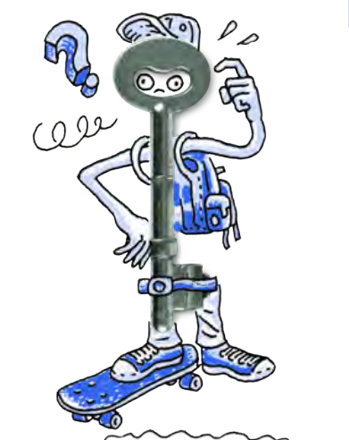
> **[Diagram Context - Textbook_NaturalScience_Gr9_Acids-bases-and-the-pH-value.pdf-0001-03.png]**
> 1. A cartoon character with a backpack and a skateboard.

*(A mixture of hydrogen and oxygen molecules.)*

---

#### 3. Diatomic Molecules
Elements are made up of only one kind of atom. Some elements exist as **diatomic molecules**.

*   **Definition:** Diatomic means 'consisting of two atoms'.
*   **Common Examples:** 
    *   Hydrogen: $\text{H}_2$
    *   Nitrogen: $\text{N}_2$
    *   Oxygen: $\text{O}_2$
    *   Fluorine: $\text{F}_2$
    *   Chlorine: $\text{Cl}_2$
    *   Bromine: $\text{Br}_2$
    *   Iodine: $\text{I}_2$

> **[Diagram Context - Textbook_NaturalScience_Gr9_Chemical-reactions.pdf-0001-02.png]**
> This diagram illustrates a cross-section of a biological membrane surface, featuring a series of repeating, hook-like structures embedded in a solid base. It conceptually represents the arrangement of microvilli or similar specialized cellular projections that increase surface area for absorption or sensory reception in high school Life Sciences.

*(Some elements exist as diatomic molecules.)*

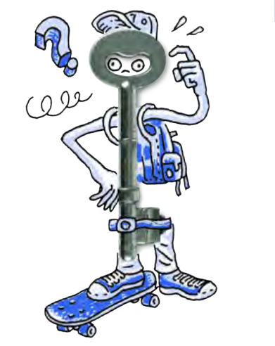
> **[Diagram Context - Textbook_NaturalScience_Gr9_Chemical-reactions.pdf-0001-03.png]**
> This graphic is a metaphorical illustration featuring a cartoon character with a key for a head, accompanied by a question mark and a scribbled line. It uses visual symbolism to represent the concept of "unlocking" knowledge or finding the solution to a problem. For a high school student, this serves as a mnemonic device to encourage critical thinking and the application of cognitive strategies when approaching complex academic challenges.

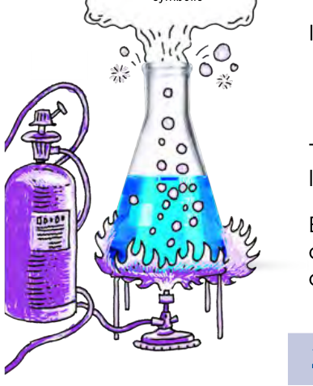
> **[Diagram Context - Textbook_NaturalScience_Gr9_Chemical-reactions.pdf-0001-22.png]**
> This diagram illustrates a laboratory apparatus setup featuring a gas cylinder connected to a Bunsen burner heating a conical flask containing a boiling liquid. The visual elements include a gas canister, tubing, a Bunsen burner with a flame, and a flask showing signs of effervescence or steam. Conceptually, this represents the application of thermal energy to a chemical system, demonstrating the process of heating substances to induce phase changes or accelerate chemical reactions in a controlled laboratory environment.

> **[Diagram Context - Textbook_NaturalScience_Gr9_Compounds.pdf-0001-02.png]**
> This diagram illustrates a cross-section of a biological membrane surface, featuring a linear arrangement of repeating, hook-like structures embedded in a solid base. It represents the structural organization of microvilli or similar cellular projections, helping students visualize how surface area is increased for efficient absorption or transport processes within the cell.

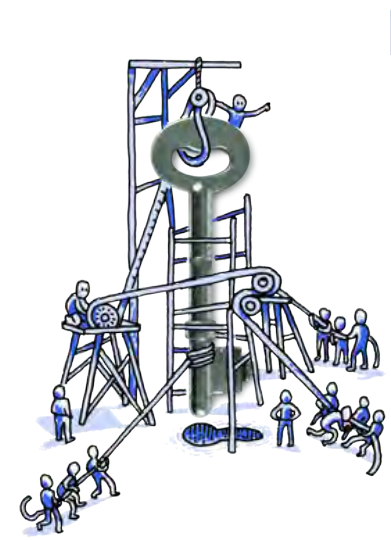
> **[Diagram Context - Textbook_NaturalScience_Gr9_Compounds.pdf-0001-03.png]**
> This conceptual illustration depicts a large key being manipulated by a complex system of pulleys, scaffolding, and multiple human figures pulling ropes. It serves as a metaphorical model for mechanical advantage and the application of force, illustrating how complex systems of simple machines allow humans to exert control over heavy or difficult-to-move objects.

> **[Diagram Context - Textbook_NaturalScience_Gr9_Compounds.pdf-0001-22.png]**
> This diagram illustrates a laboratory apparatus setup featuring a gas cylinder connected to a Bunsen burner heating an Erlenmeyer flask containing a boiling liquid. The visual elements include a gas canister, tubing, a Bunsen burner with a flame, and a flask showing effervescence and vapor release. Conceptually, this demonstrates the application of thermal energy to a chemical system, highlighting the process of heating a substance to induce a physical or chemical change, such as boiling or a gas-evolving reaction.

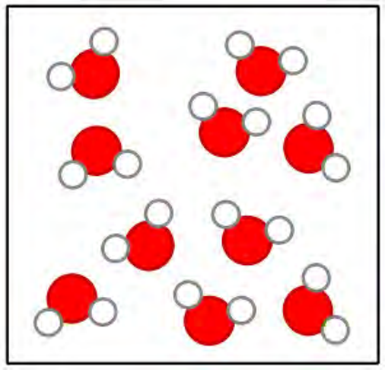
> **[Diagram Context - Textbook_NaturalScience_Gr9_Compounds.pdf-0001-25.png]**
> This particle model diagram depicts water molecules, represented by red spheres (oxygen atoms) bonded to two smaller white spheres (hydrogen atoms). It illustrates the particulate nature of matter in the liquid phase, showing molecules with sufficient kinetic energy to move past one another while remaining in close proximity.

> **[Diagram Context - Textbook_NaturalScience_Gr9_Reactions-of-acids-with-a-metal.pdf-0001-02.png]**
> This educational graphic is a biological structure diagram illustrating the ciliated epithelium lining of the human respiratory tract. It displays a continuous layer of epithelial cells embedded with numerous visible, hair-like cilia projecting uniformly upwards from the surface. Conceptually, this diagram conveys the microscopic structure of the trachea and bronchi, helping learners understand how the coordinated, wave-like beating of cilia moves trapped mucus and foreign particles upward toward the pharynx to protect the respiratory system from infection and damage.

> **[Diagram Context - Textbook_NaturalScience_Gr9_Reactions-of-acids-with-a-metal.pdf-0001-19.png]**
> 1. A green roller coaster with a green roller coaster track.

> **[Diagram Context - Textbook_NaturalScience_Gr9_Reactions-of-metals-with-oxygen.pdf-0001-02.png]**
> This diagram represents a cross-section of a biological membrane surface, featuring a series of repeating, hook-like structures embedded in a solid base layer. It illustrates the concept of surface area amplification, such as the microvilli found on the epithelial cells of the small intestine, which are essential for maximizing the efficiency of nutrient absorption.

> **[Diagram Context - Textbook_NaturalScience_Gr9_Reactions-of-metals-with-oxygen.pdf-0001-03.png]**
> This metaphorical illustration depicts a central key being captured by a net suspended from a helicopter, positioned against a backdrop of a city and a fire-breathing monster. The visual elements include a large metallic key, a helicopter, a net, a cityscape, and a monster, which collectively serve as an analogy for the "lock and key" mechanism of enzyme-substrate specificity. It conceptually illustrates how a specific biological "key" (the enzyme) is targeted or regulated within a complex system to prevent or control a reaction, such as the destructive activity of the monster.

> **[Diagram Context - Textbook_NaturalScience_Gr9_Reactions-of-metals-with-oxygen.pdf-0001-17.png]**
> This graphic is a text-based instructional callout box featuring the heading "TAKE NOTE" enclosed within a decorative border. It serves as a pedagogical signpost designed to highlight essential information, key definitions, or critical concepts that students must commit to memory for examination purposes.

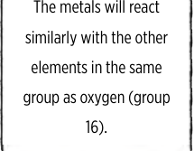
> **[Diagram Context - Textbook_NaturalScience_Gr9_Reactions-of-metals-with-oxygen.pdf-0001-19.png]**
> This text-based graphic states that metals react similarly with all elements in Group 16, referencing oxygen as the primary example. It reinforces the periodic table trend that elements within the same group exhibit similar chemical properties due to having the same number of valence electrons.

> **[Diagram Context - Textbook_NaturalScience_Gr9_Reactions-of-metals-with-oxygen.pdf-0001-20.png]**
> This illustration depicts a tablet interface being operated by a pair of hands, featuring a grid of abstract icons representing various digital applications or functions. It serves as a visual metaphor for Information and Communication Technology (ICT) integration, illustrating how digital tools facilitate interactive learning, data access, and the navigation of educational software within the modern classroom environment.

> **[Diagram Context - Textbook_NaturalScience_Gr9_Reactions-of-non-metals-with-oxygen.pdf-0001-02.png]**
> This diagram shows a series of identical curved

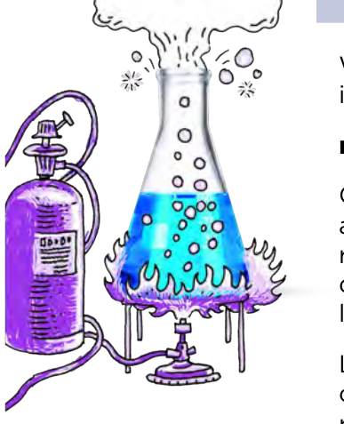
> **[Diagram Context - Textbook_NaturalScience_Gr9_Reactions-of-non-metals-with-oxygen.pdf-0001-22.png]**
> This diagram illustrates a laboratory apparatus setup featuring a Bunsen burner heating a conical flask containing a liquid, which is connected to a gas cylinder. The visual elements include a gas canister, tubing, a Bunsen burner flame, a conical flask, and rising bubbles/vapour indicating a phase change or chemical reaction. Conceptually, this demonstrates the application of thermal energy to a system to induce boiling or a reaction, serving as a foundational model for understanding energy transfer and state changes in Physical Sciences.

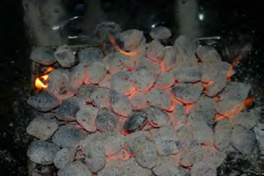
> **[Diagram Context - Textbook_NaturalScience_Gr9_Reactions-of-non-metals-with-oxygen.pdf-0001-31.png]**
> This photograph shows a bed of burning charcoal briquettes covered in grey ash with glowing red-orange embers and small flickering flames, containing no text labels or annotations. Conceptually, it illustrates an exothermic combustion reaction where chemical potential energy stored in fuel is converted into thermal and radiant (light) energy, a fundamental concept in Physical Sciences and Natural Sciences topics such as energy transfer, chemical change, and reaction rates.

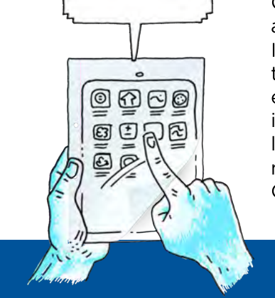
> **[Diagram Context - Textbook_NaturalScience_Gr9_Reactions-of-non-metals-with-oxygen.pdf-0001-33.png]**
> , etc.), with an index finger

> **[Diagram Context - Textbook_NaturalScience_Gr9_Resistance.pdf-0001-02.png]**
> The image presents a diagram of a Lewis structure, a diagram used to represent the valence electrons of an atom. The diagram is set against a gray background, with a blue border. The Lewis structure is a visual representation of the valence electrons, which are the electrons in the outermost energy level of an atom. The diagram is labeled with the chemical symbols of the elements involved, and arrows

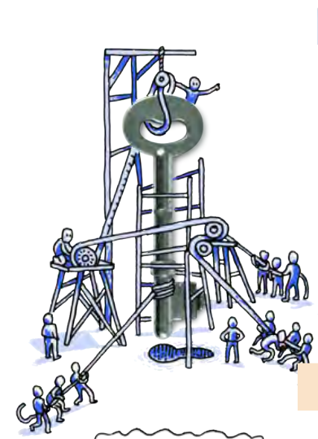
> **[Diagram Context - Textbook_NaturalScience_Gr9_Resistance.pdf-0001-03.png]**
> The image is a cartoon illustration of a group of people working on a key. The key is depicted as a large metal object with a keyhole, and the people are shown using various tools and equipment to manipulate the key. The key is being held by a person on the left side of the image, while another person is holding the key on the right side. The people are standing on a

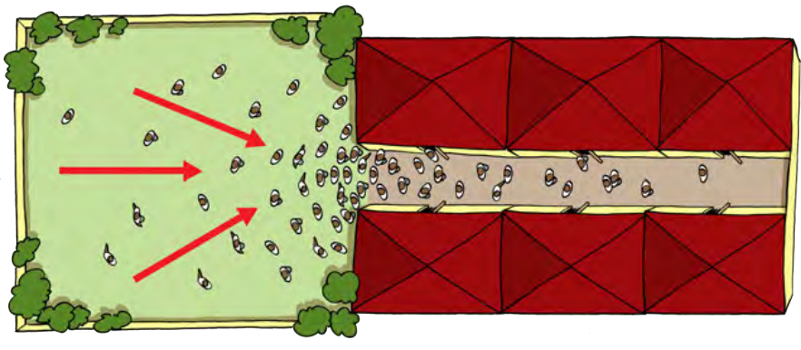
> **[Diagram Context - Textbook_NaturalScience_Gr9_Resistance.pdf-0001-21.png]**
> The image is a cartoon-style diagram that illustrates a herd of cows moving through a field. The diagram is divided into two sections, with the left section showing a herd of cows moving through a green field, and the right section showing a herd of cows moving through a red field. The diagram is labeled with arrows pointing from the left to the right, and the cows are labeled with numbers.

---

### The Atoms in Molecules and Lattices are Combined in a Fixed Ratio

Compounds are defined by the specific, fixed ratio in which their constituent atoms combine. If this ratio changes, the substance changes, resulting in different chemical and physical properties.

#### Examples of Fixed Ratios

*   **Water ($H_2O$):** Every water molecule consists of exactly one oxygen atom ($O$) combined with two hydrogen atoms ($H$).
    

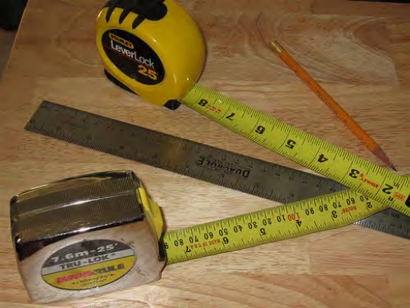
> **[Diagram Context - Textbook_NaturalScience_Gr9_Acids-bases-and-the-pH-value.pdf-0002-04.png]**
> 1. A yellow ruler with a black handle and a yellow measuring tape with a black handle.

*   **Hydrogen Peroxide ($H_2O_2$):** This compound is made of the same elements as water (hydrogen and oxygen), but the ratio is different. It consists of two oxygen atoms combined with two hydrogen atoms. Because the ratio is different, it is a completely different substance with different properties.
    

> **[Diagram Context - Textbook_NaturalScience_Gr9_Acids-bases-and-the-pH-value.pdf-0002-06.png]**
> 1. A diagram of a spring with a cord attached to it.

*   **Iron Oxide (Crystal Lattice):** In a crystal lattice, atoms are arranged in a repeating pattern. In the specific iron oxide shown, there is a one-to-one ratio: one iron ($Fe$) atom for every one oxygen ($O$) atom.
    

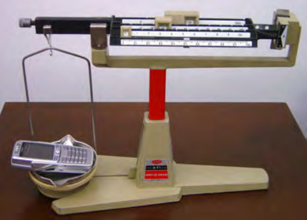
> **[Diagram Context - Textbook_NaturalScience_Gr9_Acids-bases-and-the-pH-value.pdf-0002-09.png]**
> 1. A beaker with a silver base and a silver top.

---

### Each Compound has a Unique Name and Formula

Chemical formulas provide a shorthand way to represent the composition of a compound, indicating the types of atoms present and the ratio in which they are combined.

*   **Water:** Represented by the formula $H_2O$. The subscript "2" indicates that there are two hydrogen atoms for every one oxygen atom.
*   **Carbon Dioxide:** Represented by the formula $CO_2$.

#### Exercises for Class Discussion
1. What is the chemical formula for hydrogen peroxide based on the description provided above?
2. Can you name the compound with the formula $CO_2$?
3. Based on the crystal lattice diagram provided, what formula represents one 'formula unit' of that specific type of iron oxide?

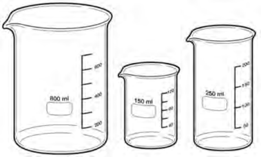
> **[Diagram Context - Textbook_NaturalScience_Gr9_Acids-bases-and-the-pH-value.pdf-0002-12.png]**
> 1. A diagram of three beakers with different capacities and a scale.

> **[Diagram Context - Textbook_NaturalScience_Gr9_Chemical-reactions.pdf-0002-04.png]**
> This graphic is a conceptual illustration of a roller coaster track featuring a superimposed slinky spring. It uses the visual metaphor of a roller coaster to represent the transformation between gravitational potential energy at the peak and kinetic energy during the descent. For high school Physical Sciences learners, this serves as an analogy for the Law of Conservation of Mechanical Energy, demonstrating how energy is exchanged as an object moves through a vertical path.

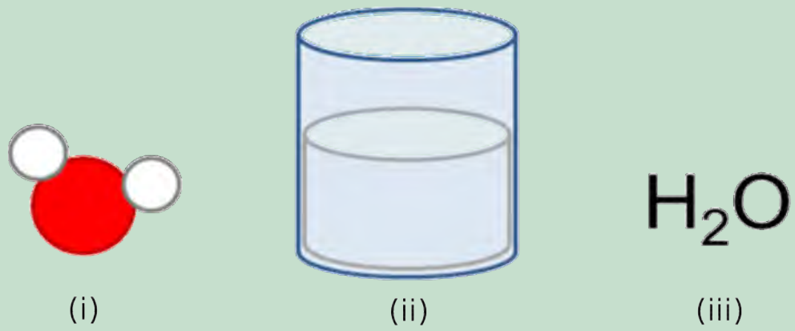
> **[Diagram Context - Textbook_NaturalScience_Gr9_Chemical-reactions.pdf-0002-06.png]**
> This graphic illustrates the three levels of representing water: (i) a space-filling molecular model, (ii) a macroscopic beaker of liquid, and (iii) the chemical formula $H_2O$. It helps learners bridge the gap between the microscopic structure of atoms and the macroscopic physical properties of matter as required in the Physical Sciences curriculum.

> **[Diagram Context - Textbook_NaturalScience_Gr9_Chemical-reactions.pdf-0002-09.png]**
> This graphic depicts a stylized, repeating pattern of interlocking, arrow-shaped biological structures resembling a continuous chain or molecular sequence. The image uses a uniform green, chevron-like motif to represent a linear, directional progression or a repeating subunit within a larger biological polymer. It conceptually illustrates the repetitive, sequential nature of biological macromolecules, such as the repeating nucleotides in a DNA strand or amino acids in a polypeptide chain.

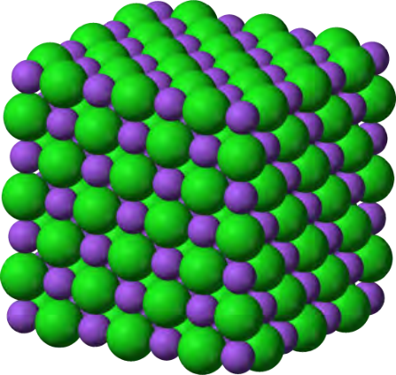
> **[Diagram Context - Textbook_NaturalScience_Gr9_Compounds.pdf-0002-00.png]**
> This diagram illustrates a space-filling model of a crystal lattice structure, specifically representing the alternating arrangement of two different-sized spheres (green and purple) in a cubic pattern. It visually demonstrates the concept of an ionic crystal lattice, such as sodium chloride (NaCl), where electrostatic forces hold oppositely charged ions in a repeating, ordered three-dimensional geometric array.

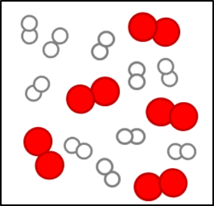
> **[Diagram Context - Textbook_NaturalScience_Gr9_Compounds.pdf-0002-04.png]**
> This particle model diagram depicts a mixture of two distinct diatomic gases, represented by grey-outlined circles and solid red circles. It illustrates the particulate nature of matter, helping learners distinguish between different molecular substances within a gaseous mixture by observing their unique atomic composition and arrangement.

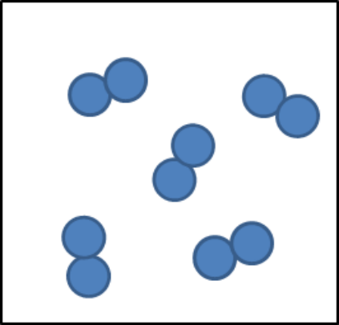
> **[Diagram Context - Textbook_NaturalScience_Gr9_Compounds.pdf-0002-08.png]**
> This particle model diagram depicts a collection of diatomic molecules represented by pairs of identical blue circles, with no labels or symbols present. It conceptually illustrates the particulate nature of matter, specifically representing a pure substance composed of diatomic molecules (such as $H_2$, $O_2$, or $N_2$) in a gaseous state.

> **[Diagram Context - Textbook_NaturalScience_Gr9_Reactions-of-acids-with-a-metal.pdf-0002-03.png]**
> 1. A person holding a large balloon.

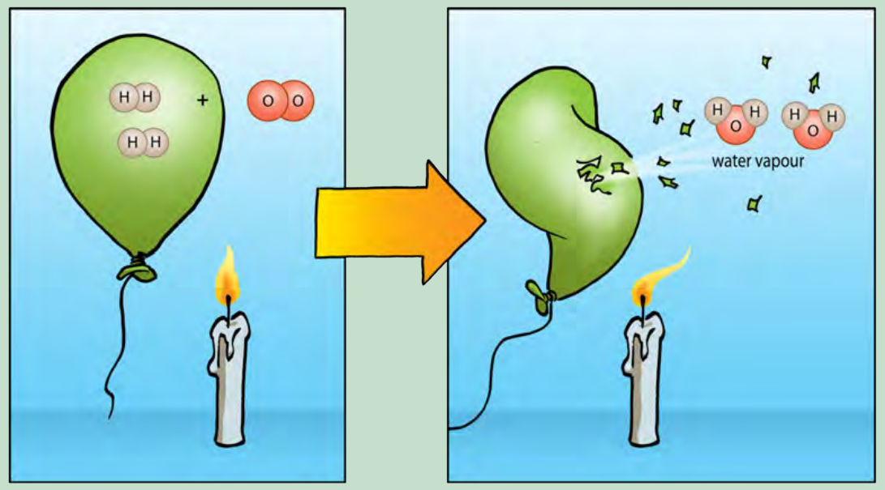
> **[Diagram Context - Textbook_NaturalScience_Gr9_Reactions-of-acids-with-a-metal.pdf-0002-06.png]**
> 1. A cartoon of a green balloon with a candle on it.
 2. A cartoon of a green balloon with a candle on it.

> **[Diagram Context - Textbook_NaturalScience_Gr9_Reactions-of-acids-with-a-metal.pdf-0002-10.png]**
> The image features a cartoon depiction of a man's head with a red apple on top of it, and the words "Mr. Newton" written below the apple. The man's head is depicted in a cartoon style, with a pink apple placed on top of it. The image also includes a thought bubble above the man's head, which contains a pink apple and a thought bubble with a line

> **[Diagram Context - Textbook_NaturalScience_Gr9_Reactions-of-metals-with-oxygen.pdf-0002-06.png]**
> This diagram illustrates an electromagnet, featuring a coiled wire (solenoid) connected to a battery with positive (+) and negative (-) terminals, surrounded by magnetic field lines indicated by directional arrows. It demonstrates the principle of electromagnetism, showing how an electric current flowing through a coil creates a magnetic field capable of attracting nearby metallic objects like a screw, nail, and nut.

> **[Diagram Context - Textbook_NaturalScience_Gr9_Reactions-of-metals-with-oxygen.pdf-0002-09.png]**
> This graphic depicts a stylized, repeating pattern of interlocking, arrow-shaped biological structures resembling a continuous molecular chain or filament. The image uses a uniform green, linear motif to represent the repetitive, directional nature of biological polymers or structural proteins. It serves as a conceptual visual aid to help learners visualize the repeating subunits and directional orientation inherent in macromolecular chains like DNA or polypeptide strands.

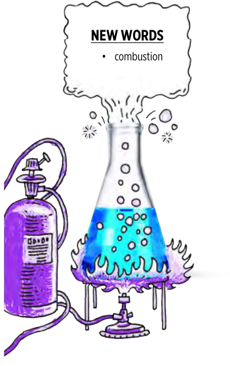
> **[Diagram Context - Textbook_NaturalScience_Gr9_Reactions-of-metals-with-oxygen.pdf-0002-13.png]**
> This educational graphic depicts a laboratory apparatus consisting of a gas cylinder connected to a Bunsen burner heating a conical flask, accompanied by a text box labeled "NEW WORDS" featuring the term "combustion." It illustrates the process of heating a substance to induce a chemical reaction, serving as a visual introduction to the concept of combustion as an exothermic process requiring a fuel source and heat.

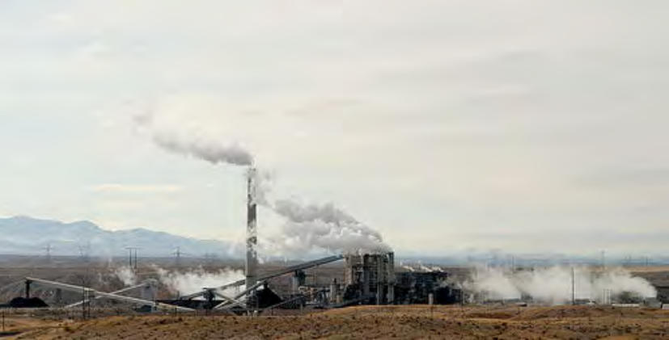
> **[Diagram Context - Textbook_NaturalScience_Gr9_Reactions-of-non-metals-with-oxygen.pdf-0002-00.png]**
> This photograph shows an industrial coal-fired power station or manufacturing plant situated in an arid landscape, releasing thick plumes of emissions into the atmosphere. The image visually highlights key industrial components including a tall smokestack, extensive conveyor belts, processing facilities, coal

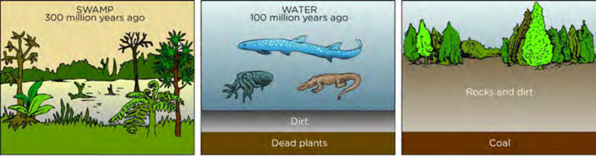
> **[Diagram Context - Textbook_NaturalScience_Gr9_Reactions-of-non-metals-with-oxygen.pdf-0002-04.png]**
> This three-panel sequential geological diagram illustrates the process of fossil fuel (coal) formation over geological time. Visible labels include the stages and timeframes "SWAMP 300 million years ago," "WATER 100 million years ago," as well as stratigraphic layers labelled "Dirt," "Dead plants," "Rocks and dirt," and "Coal," alongside illustrations of prehistoric swamp flora,

> **[Diagram Context - Textbook_NaturalScience_Gr9_Reactions-of-non-metals-with-oxygen.pdf-0002-05.png]**
> This graphic is a text-based pedagogical callout box featuring the heading "DID YOU KNOW?". It serves as a common structural element in CAPS-aligned textbooks to highlight supplementary, interesting, or contextual facts that enrich a student's understanding of a specific scientific concept.

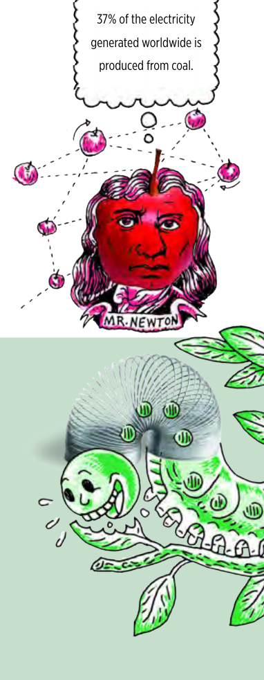
> **[Diagram Context - Textbook_NaturalScience_Gr9_Reactions-of-non-metals-with-oxygen.pdf-0002-06.png]**
> This composite graphic features a caricature of Isaac Newton associated with a thought bubble stating, "37% of the electricity generated worldwide is produced from coal," positioned above a stylized illustration of a slinky-like caterpillar consuming leaves. The image serves as a metaphorical or satirical commentary on the environmental impact of energy production, contrasting the scientific legacy of classical physics with the ecological consequences of fossil fuel dependency in the context of global sustainability.

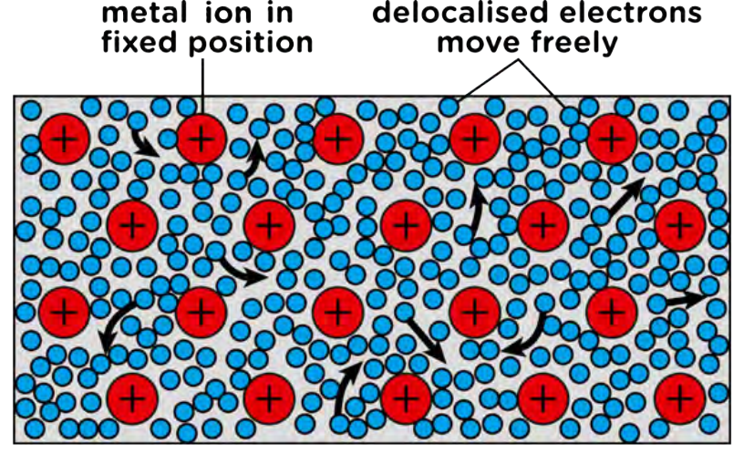
> **[Diagram Context - Textbook_NaturalScience_Gr9_Resistance.pdf-0002-01.png]**
> 1. A diagram of a metal ion in a fixed position.
 2. Delocalised electrons moving freely.

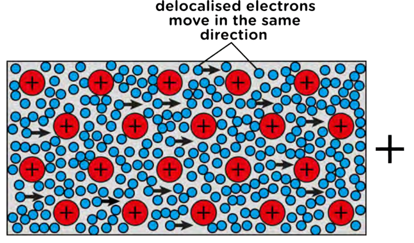
> **[Diagram Context - Textbook_NaturalScience_Gr9_Resistance.pdf-0002-03.png]**
> 1. A diagram of a red and blue surface with red circles and arrows pointing in the same direction.

> **[Diagram Context - Textbook_NaturalScience_Gr9_Resistance.pdf-0002-08.png]**
> 1. A diagram of a cell with arrows pointing to different parts of the cell.

> **[Diagram Context - Textbook_NaturalScience_Gr9_Resistance.pdf-0002-11.png]**
> 1. A cartoon drawing of a person holding a picture of another person.
 2. The person holding the picture is wearing a blue shirt and has a sad expression.
 3. The person holding the picture is wearing a white shirt and has a surprised expression.

---

### The Atoms in a Compound are Held Together by Chemical Bonds

When atoms combine to form molecules, they are held together by an attractive force known as a **chemical bond**.

---

### Compounds Form During Chemical Reactions

In a chemical reaction, atoms in molecules rearrange themselves to form new molecules. This process involves:
1. Existing bonds between atoms breaking.
2. Atoms rearranging into new groups.
3. New bonds forming.

#### Key Terminology
*   **Reactants:** The elements or compounds present to the left of the arrow in a chemical reaction (the starting materials).
*   **Product:** The new compound formed, shown to the right of the arrow.

> **Discussion Activity:** Describe what happened to the atoms and the bonds in the reaction shown above. Identify which bonds broke, which formed, and how the atoms were rearranged.

---

### A Compound has a Chemical Formula

Each compound is represented by a unique **chemical formula**. The formula uses subscripts to indicate the number of atoms of a particular element present in one molecule of that compound.

#### Example: Water ($H_2O$)
*   The subscript **2** after $H$ indicates there are two Hydrogen atoms in one molecule of water.
*   The $O$ has no subscript, which by convention means there is exactly one Oxygen atom.

#### Mathematical Representation of Ratios
The formula $H_2O$ (technically $H_2O_1$) represents a ratio of atoms:
*   **Ratio of Hydrogen to Oxygen:** $2:1$

**Note:** By scientific convention, we do not write the number $1$ as a subscript in chemical formulae. Therefore, $H_2O$ is the correct notation.

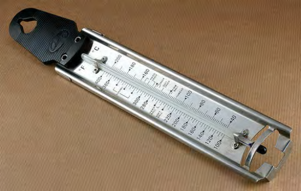
> **[Diagram Context - Textbook_NaturalScience_Gr9_Acids-bases-and-the-pH-value.pdf-0003-02.png]**
> 1. A metal thermometer with a black handle and a silver body.

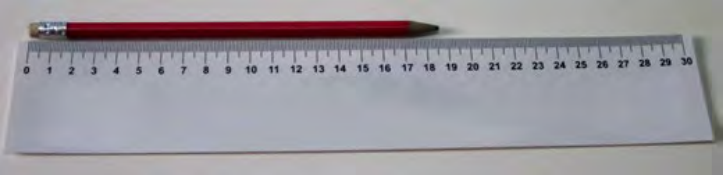
> **[Diagram Context - Textbook_NaturalScience_Gr9_Acids-bases-and-the-pH-value.pdf-0003-05.png]**
> 1. A ruler with a pencil on it.

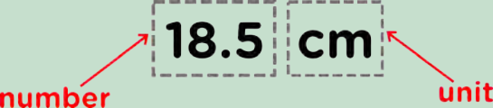
> **[Diagram Context - Textbook_NaturalScience_Gr9_Acids-bases-and-the-pH-value.pdf-0003-07.png]**
> The image shows a diagram with two squares labeled "number" and "unit" against a green background. The diagram is accompanied by a red arrow pointing to the right, indicating the direction of the number. The diagram is labeled with the units "18.5 cm" and "18.5 um", which are the units of the two squares. The diagram is designed to help a high school

> **[Diagram Context - Textbook_NaturalScience_Gr9_Acids-bases-and-the-pH-value.pdf-0003-12.png]**
> 1. A diagram of a cell with a green line representing the cell wall.

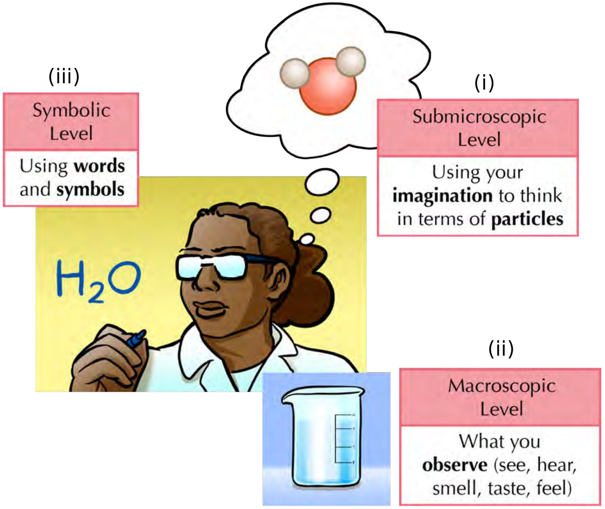
> **[Diagram Context - Textbook_NaturalScience_Gr9_Chemical-reactions.pdf-0003-01.png]**
> This educational graphic illustrates the three levels of chemical representation: the submicroscopic level (particle model of a water molecule), the macroscopic level (a beaker of liquid), and the symbolic level (the chemical formula $H_2O$). It conceptually demonstrates how chemists bridge the gap between observable physical phenomena and the abstract, particle-based models used to explain chemical behavior.

> **[Diagram Context - Textbook_NaturalScience_Gr9_Chemical-reactions.pdf-0003-04.png]**
> This illustration depicts a person using a tablet device with a grid of application icons, including symbols for a home screen, mathematical operations, and wave patterns, topped by an empty speech bubble. It serves as a visual metaphor for digital literacy and the integration of Information and Communication Technology (ICT) in the classroom, encouraging learners to engage with interactive educational tools to access and manipulate curriculum-related content.

> **[Diagram Context - Textbook_NaturalScience_Gr9_Chemical-reactions.pdf-0003-06.png]**
> This graphic is a simple text-based call-to-action contained within a cloud-shaped speech bubble. It features the single word "VISIT" in bold, sans-serif capital letters. Conceptually, this serves as a navigational prompt or instructional sign intended to direct a student toward an external resource, website, or physical location relevant to their curriculum studies.

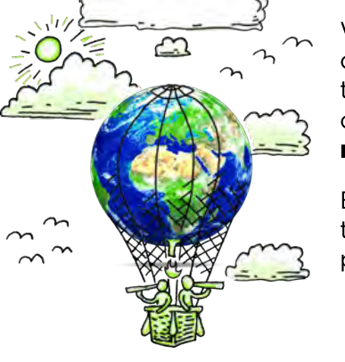
> **[Diagram Context - Textbook_NaturalScience_Gr9_Chemical-reactions.pdf-0003-10.png]**
> This illustration depicts the Earth as a hot air balloon, featuring a globe, a basket, and two figures using telescopes to observe their surroundings. It serves as a metaphorical representation of global monitoring, environmental stewardship, or the study of Earth systems within the context of geography and life sciences.

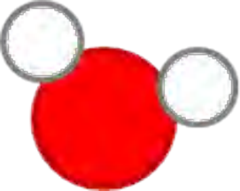
> **[Diagram Context - Textbook_NaturalScience_Gr9_Compounds.pdf-0003-03.png]**
> This space-filling model depicts a water molecule ($H_2O$) consisting of one central oxygen atom (large red sphere) bonded to two hydrogen atoms (smaller white spheres). It illustrates the bent molecular geometry and the relative atomic sizes, helping students visualize the polar nature of water essential for understanding its unique chemical and physical properties in the CAPS Physical Sciences curriculum.

> **[Diagram Context - Textbook_NaturalScience_Gr9_Compounds.pdf-0003-06.png]**
> This space-filling model depicts a diatomic molecule consisting of two red spheres representing oxygen atoms, flanked by two smaller, outlined white circles representing hydrogen atoms. It illustrates the molecular structure of hydrogen peroxide ($H_2O_2$), helping learners visualize the spatial arrangement and connectivity of atoms within a covalent molecule.

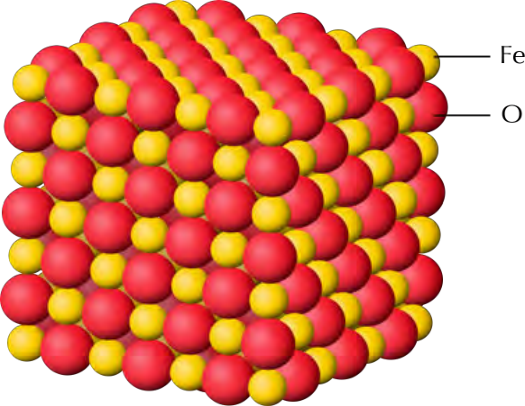
> **[Diagram Context - Textbook_NaturalScience_Gr9_Compounds.pdf-0003-08.png]**
> This diagram illustrates a three-dimensional crystal lattice structure, specifically representing an ionic compound composed of iron (Fe) and oxygen (O) atoms. It visually demonstrates the repeating, ordered arrangement of ions held together by strong electrostatic forces, which is fundamental to understanding the physical properties of ionic solids in the Grade 10-12 Physical Sciences curriculum.

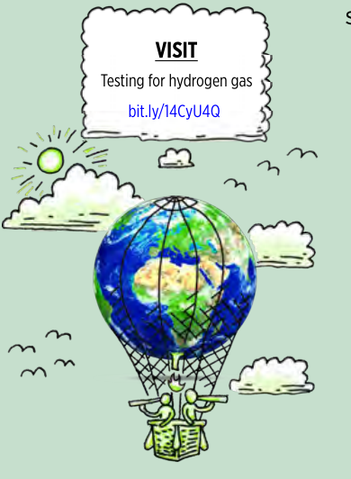
> **[Diagram Context - Textbook_NaturalScience_Gr9_Reactions-of-acids-with-a-metal.pdf-0003-02.png]**
> The image shows a cartoon depiction of a hot air balloon with two people inside. The balloon is filled with air and is floating in the sky. The people inside the balloon are depicted as cartoon characters. The image also includes a text box that reads "Visit Testing for hydrogen gas".

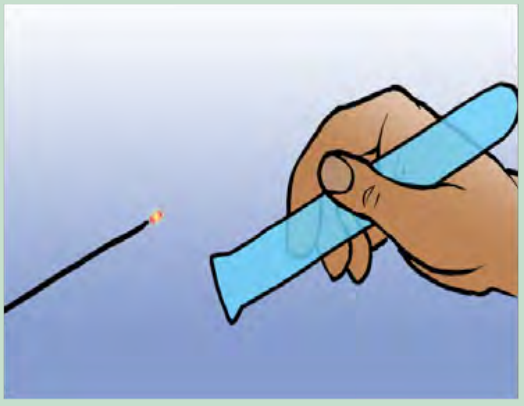
> **[Diagram Context - Textbook_NaturalScience_Gr9_Reactions-of-acids-with-a-metal.pdf-0003-03.png]**
> 1. A hand holding a blue pen. 
 2. A flame coming out of a pen. 
 3. A Lewis diagram.

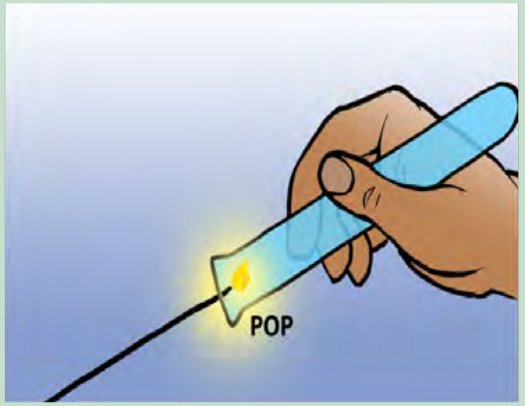
> **[Diagram Context - Textbook_NaturalScience_Gr9_Reactions-of-acids-with-a-metal.pdf-0003-04.png]**
> 1. A hand holding a blue popsicle stick with a yellow light on it.

> **[Diagram Context - Textbook_NaturalScience_Gr9_Reactions-of-acids-with-a-metal.pdf-0003-06.png]**
> 1. A diagram of a cell with a green line representing a DNA strand.

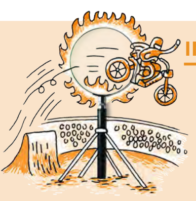
> **[Diagram Context - Textbook_NaturalScience_Gr9_Reactions-of-acids-with-a-metal.pdf-0003-08.png]**
> 1. A diagram of a person on a motorcycle.
 2. A diagram of a sun.
 3. A diagram of a magnifying glass.
 4. A diagram of a ramp.

> **[Diagram Context - Textbook_NaturalScience_Gr9_Reactions-of-metals-with-oxygen.pdf-0003-00.png]**
> This image depicts a combustion reaction, specifically showing a flame emitting sparks from a vertical source. It illustrates the rapid release of thermal and light energy characteristic of an exothermic chemical reaction, often used in Physical Sciences to demonstrate the oxidation of fuels.

> **[Diagram Context - Textbook_NaturalScience_Gr9_Reactions-of-metals-with-oxygen.pdf-0003-01.png]**
> This long-exposure photograph captures the circular motion of burning steel wool, creating a visual representation of a rotating point source. The image features a central luminous ring of fire with radiating sparks and light trails that trace the path of circular motion. Conceptually, this demonstrates the principles of centripetal force and circular motion, illustrating how an object moving in a circular path maintains a constant trajectory while shedding incandescent particles tangentially.

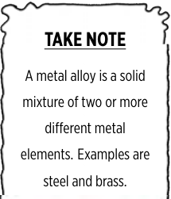
> **[Diagram Context - Textbook_NaturalScience_Gr9_Reactions-of-metals-with-oxygen.pdf-0003-02.png]**
> This educational text box provides a concise definition of a metal alloy, explicitly identifying it as a solid mixture of two or more different metal elements. By citing steel and brass as common examples, it reinforces the CAPS Physical Sciences curriculum requirement for learners to distinguish between pure metals and alloys in the study of matter and materials.

> **[Diagram Context - Textbook_NaturalScience_Gr9_Reactions-of-metals-with-oxygen.pdf-0003-03.png]**
> This cartoon depicts a masked figure in striped clothing carrying a framed portrait of a woman, with motion lines indicating rapid movement and an empty speech bubble above. The visual metaphor illustrates the concept of theft or the unauthorized removal of a valuable asset. In a Life Sciences or Social Sciences context, this graphic serves as a conceptual analogy for the illegal trafficking of cultural heritage or the misappropriation of intellectual property.

> **[Diagram Context - Textbook_NaturalScience_Gr9_Reactions-of-metals-with-oxygen.pdf-0003-07.png]**
> This illustration depicts a metaphorical representation of a caterpillar feeding on a plant, with its body replaced by a metallic slinky-like coil. The visual elements include a stylized insect head, segmented body coils, and green leaves, with the partial text "A" visible in the background. Conceptually, this graphic serves as a visual analogy for biological movement or structural flexibility, often used in Life Sciences to illustrate the mechanics of peristalsis or the segmented anatomy of an arthropod larva.

> **[Diagram Context - Textbook_NaturalScience_Gr9_Reactions-of-metals-with-oxygen.pdf-0003-21.png]**
> This conceptual illustration depicts the Earth as a hot air balloon, featuring the sun, clouds, birds, and two figures in the basket using telescopes to observe their surroundings. It serves as a visual metaphor for global environmental monitoring and the human responsibility to observe and manage the Earth's delicate atmospheric and ecological systems.

> **[Diagram Context - Textbook_NaturalScience_Gr9_Reactions-of-non-metals-with-oxygen.pdf-0003-05.png]**
> This visual is a schematic diagram representing

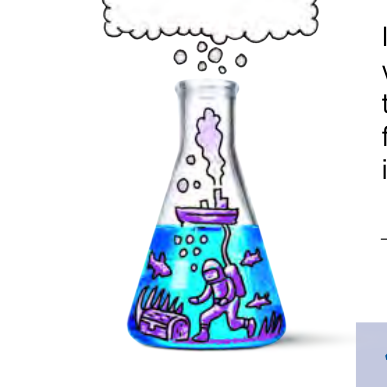
> **[Diagram Context - Textbook_NaturalScience_Gr9_Reactions-of-non-metals-with-oxygen.pdf-0003-09.png]**
> This visual is a conceptual, cartoon illustration set inside a standard laboratory conical (Erlenmeyer) flask, topped by a thought

> **[Diagram Context - Textbook_NaturalScience_Gr9_Reactions-of-non-metals-with-oxygen.pdf-0003-12.png]**
> This educational graphic consists of a cloud-shaped callout box containing the underlined uppercase text "VISIT". There are no other labels, variables, biological structures, chemical symbols, axis names, or directional arrows visible in the image. Conceptually, this simple graphic serves as a signpost or instructional prompt directing students or teachers to navigate to an external resource, website, or location related to the CAPS curriculum topic being studied.

> **[Diagram Context - Textbook_NaturalScience_Gr9_Reactions-of-non-metals-with-oxygen.pdf-0003-14.png]**
> This educational graphic is a text-based media reference frame containing a digital resource link. The visible text reads "A video on sulfur burning in oxygen" accompanied by the shortened URL "bit.ly/15tuqd1". Conceptually, it serves as a signpost to direct CAPS Physical Sciences learners toward a multimedia demonstration of a chemical reaction where a non-metal reacts with oxygen to form an acidic oxide.

> **[Diagram Context - Textbook_NaturalScience_Gr9_Reactions-of-non-metals-with-oxygen.pdf-0003-16.png]**
> The image features a cartoon illustration of a hot air balloon filled with a globe. The globe is depicted in a cartoon style with a blue and green color scheme. The balloon is filled with a green substance, and there are two people inside the balloon. One person is holding a book, while the other person is holding a telescope. The illustration conveys the concept of a globe being used as a

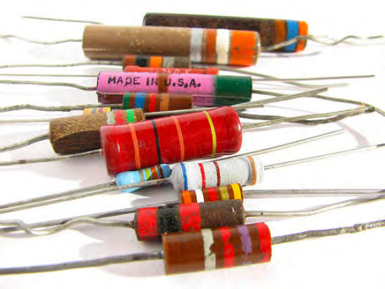
> **[Diagram Context - Textbook_NaturalScience_Gr9_Resistance.pdf-0003-03.png]**
> 1. A collection of multicolored resistors on a white background.

---

# ACTIVITY: Writing Formulae and Revision

## Instructions
Use the information provided in the table below to determine the chemical formula for each substance. A chemical formula represents the number and type of atoms present in one molecule of a compound.

| Name of substance | What it is made of? | Chemical formula |
| :--- | :--- | :--- |
| water | 2 H atoms and 1 O atom | $H_{2}O$ |
| carbon dioxide | 1 C atom and 2 O atoms | |
| ammonia | 1 N atom and 3 H atoms | |
| methane | 1 C atom and 4 H atoms | |

---

## Questions

**1. What holds the atoms together in a compound?**

**2. Reaction Analysis**

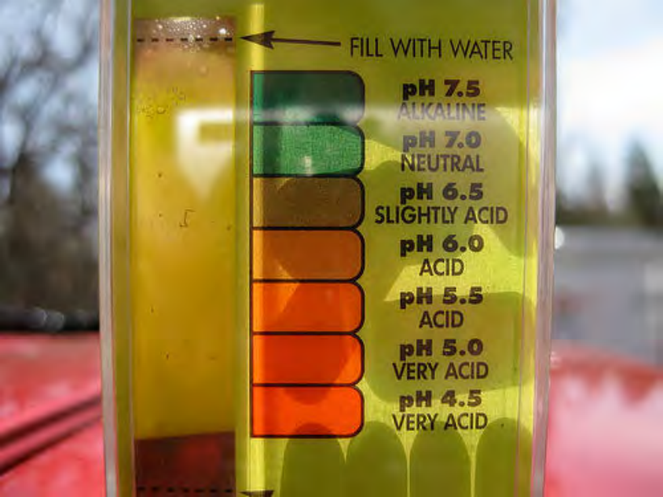
> **[Diagram Context - Textbook_NaturalScience_Gr9_Acids-bases-and-the-pH-value.pdf-0004-06.png]**
> The image shows a diagram of a pH meter, which is a device used to measure the acidity or alkalinity of a solution. The meter is divided into six sections, each representing a different pH level. The diagram also includes labels for the pH values of neutral, acidic, and alkaline, as well as the pH value of very acid. The diagram is accompanied by a scale that

The diagram above illustrates the reaction between carbon and oxygen to form carbon dioxide.
*   Identify the reactants and the product in this reaction.
*   Label these names onto the diagram.

**3. Molecular Structure**
Why is oxygen represented as two circles together in the diagram?

> **[Diagram Context - Textbook_NaturalScience_Gr9_Acids-bases-and-the-pH-value.pdf-0004-09.png]**
> This educational graphic is a conceptual cartoon illustration featuring a bust of Sir Isaac Newton ("MR. NEWTON") with an apple for a head, set against a network of interconnected pink apples and a thought bubble. Visible elements include dotted grid lines connecting multiple apple icons, directional rotational arrows next to select apples, and a central banner naming the historical figure. For a Grade 11 Physical Sciences student studying Mechanics, this diagram visually bridges the transition from historical anecdotes of gravity to Newton's Law of Universal Gravitation, representing how masses attract one another across a gravitational field.

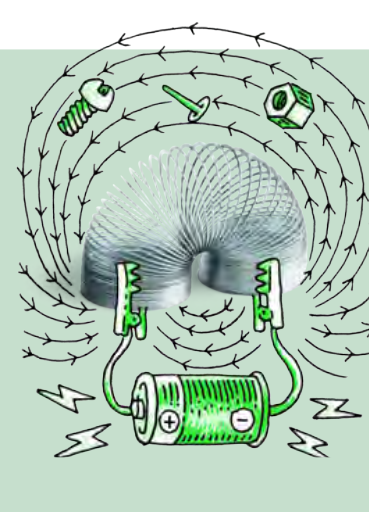
> **[Diagram Context - Textbook_NaturalScience_Gr9_Acids-bases-and-the-pH-value.pdf-0004-18.png]**
> 1. A green spring with a silver spring coiled around it.
 2. A green battery with a silver battery attached to it.
 3. A green wire with a silver wire attached to it.
 4. A green spring with a silver spring coiled around it.

> **[Diagram Context - Textbook_NaturalScience_Gr9_Chemical-reactions.pdf-0004-01.png]**
> This graphic is a text-based instructional prompt featuring the underlined word "VISIT." It serves as a navigational call-to-action, directing students to an external resource or digital platform to access further educational content.

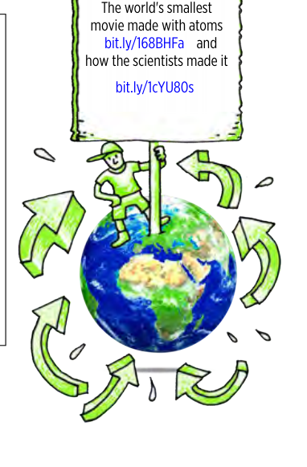
> **[Diagram Context - Textbook_NaturalScience_Gr9_Chemical-reactions.pdf-0004-02.png]**
> This graphic features a cartoon illustration of a person holding a sign above a globe, surrounded by circular arrows and text links referencing the "world's smallest movie made with atoms." It serves as an engaging hook to introduce Physical Sciences learners to the concept of nanotechnology and the ability of scientists to manipulate matter at the atomic level.

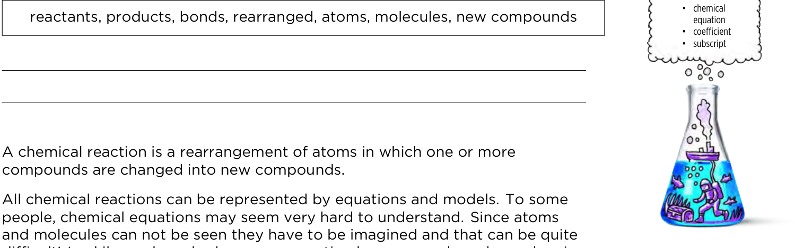
> **[Diagram Context - Textbook_NaturalScience_Gr9_Chemical-reactions.pdf-0004-07.png]**
> This educational graphic features a text-based word bank, an explanatory paragraph defining chemical reactions, and an Erlenmeyer flask illustration with a thought bubble containing key terminology: chemical equation, coefficient, and subscript. It conceptually introduces Grade 10 Physical Sciences learners to the particulate nature of matter, illustrating that chemical reactions involve the breaking and reforming of bonds to rearrange atoms into new substances.

> **[Diagram Context - Textbook_NaturalScience_Gr9_Chemical-reactions.pdf-0004-16.png]**
> This cartoon depicts a masked figure holding a framed portrait of a woman, with an empty speech bubble above the figure's head. The image serves as a metaphorical visual aid to prompt students to engage in creative writing, character analysis, or narrative construction by imagining the dialogue or backstory behind the scene.

> **[Diagram Context - Textbook_NaturalScience_Gr9_Compounds.pdf-0004-05.png]**
> This particle model represents a chemical reaction using circular icons to depict atoms, specifically showing a single grey atom reacting with a diatomic red molecule to form a triatomic product molecule. The diagram uses a plus sign and an arrow to illustrate the rearrangement of matter, helping students visualize the Law of Conservation of Mass during the synthesis of a compound like carbon dioxide.

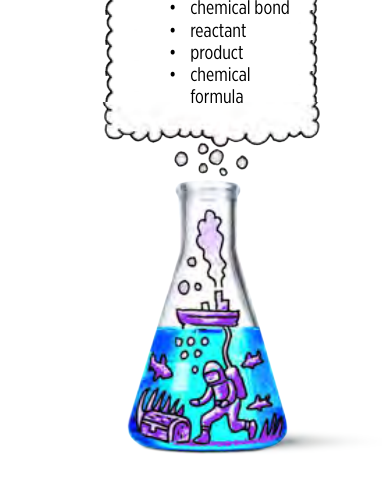
> **[Diagram Context - Textbook_NaturalScience_Gr9_Compounds.pdf-0004-07.png]**
> This graphic features an Erlenmeyer flask containing an underwater scene, accompanied by a thought bubble listing the terms "chemical bond," "reactant," "product," and "chemical formula." It serves as a conceptual metaphor to help learners bridge the gap between abstract chemical terminology and the underlying microscopic interactions occurring during a chemical reaction. By visualizing the flask as a contained environment for change, it encourages students to relate the visible evidence of a reaction to the fundamental components of matter and bonding.

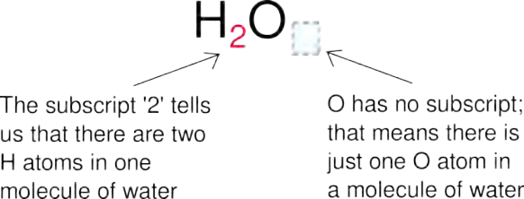
> **[Diagram Context - Textbook_NaturalScience_Gr9_Compounds.pdf-0004-14.png]**
> This educational graphic uses the chemical formula for water ($H_2O$) to explain the convention of chemical subscripts. Through annotated arrows pointing to the subscript '2' and the implied '1' after the oxygen atom, it clarifies how subscripts represent the specific number of atoms of each element present in a single molecule.

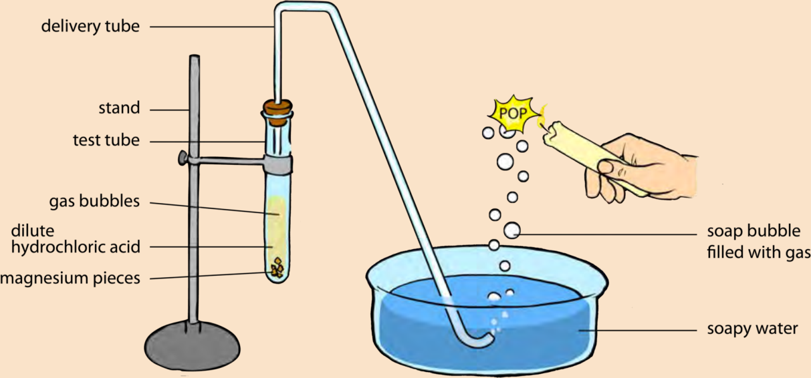
> **[Diagram Context - Textbook_NaturalScience_Gr9_Reactions-of-acids-with-a-metal.pdf-0004-12.png]**
> 1. A diagram of a soap bubble being filled with a gas bubble.

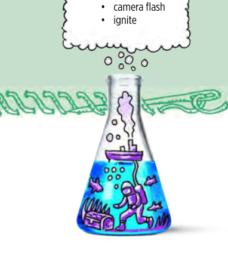
> **[Diagram Context - Textbook_NaturalScience_Gr9_Reactions-of-metals-with-oxygen.pdf-0004-07.png]**
> This graphic features an Erlenmeyer flask containing an underwater scene with a diver, treasure chest, and fish, accompanied by a thought bubble containing the labels "camera flash" and "ignite." It conceptually illustrates the activation energy required for a chemical reaction, using the metaphor of a camera flash or ignition source to trigger the "underwater" process occurring within the flask.

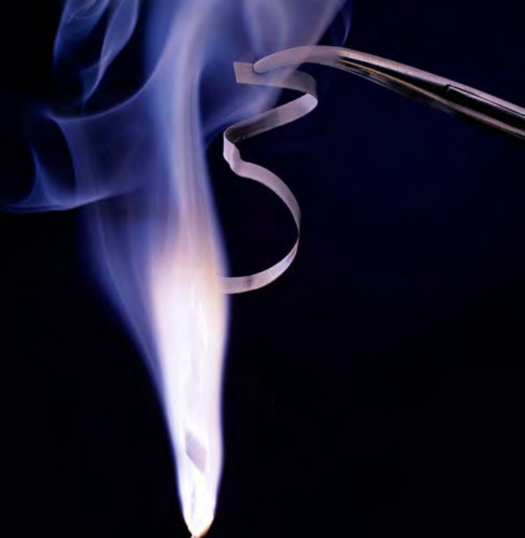
> **[Diagram Context - Textbook_NaturalScience_Gr9_Reactions-of-metals-with-oxygen.pdf-0004-09.png]**
> This image depicts the combustion of a magnesium ribbon held by metal forceps, characterized by the absence of explicit labels or symbols. It illustrates a classic chemical reaction where magnesium reacts with oxygen to produce magnesium oxide, visually demonstrating an exothermic reaction accompanied by an intense white light and smoke.

> **[Diagram Context - Textbook_NaturalScience_Gr9_Reactions-of-metals-with-oxygen.pdf-0004-11.png]**
> This graphic features an illustrative icon of a person holding a sign above a globe, surrounded by circular arrows, accompanied by text directing students to a video link. The text explicitly labels the content as "A video showing magnesium burning in oxygen" and provides a shortened URL. Conceptually, this serves as a multimedia resource to help high school learners visualize the chemical reaction of magnesium combustion, reinforcing the theoretical study of synthesis reactions in the Physical Sciences curriculum.

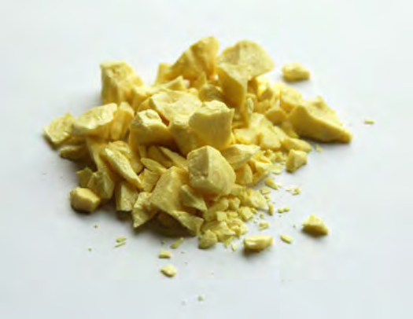
> **[Diagram Context - Textbook_NaturalScience_Gr9_Reactions-of-non-metals-with-oxygen.pdf-0004-00.png]**
> The image shows a close-up view of a pile of yellow pieces, possibly cheese, on a white background. The pieces are scattered and appear to be broken or crumbled. The image does not contain any text or additional objects, and the focus is solely on the pile of yellow cheese pieces.

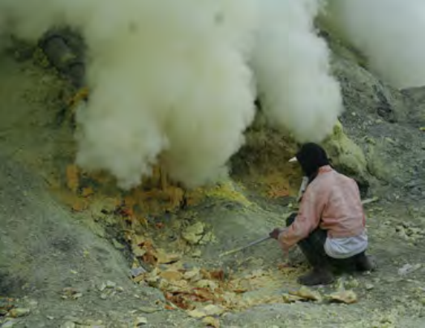
> **[Diagram Context - Textbook_NaturalScience_Gr9_Reactions-of-non-metals-with-oxygen.pdf-0004-01.png]**
> 1. A diagram of a cell with chemical symbols and arrows.

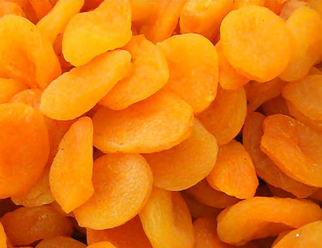
> **[Diagram Context - Textbook_NaturalScience_Gr9_Reactions-of-non-metals-with-oxygen.pdf-0004-05.png]**
> The image shows a close-up view of a pile of dried apricots. The apricots are in various stages of drying, with some still in their original form and others transformed into dried pieces. The dried apricots are scattered across the image, with some overlapping each other, creating a sense of depth and texture. The image does not contain any text or additional objects, making

> **[Diagram Context - Textbook_NaturalScience_Gr9_Reactions-of-non-metals-with-oxygen.pdf-0004-06.png]**
> 1. A diagram of a cell with arrows pointing to different parts of the cell.

> **[Diagram Context - Textbook_NaturalScience_Gr9_Reactions-of-non-metals-with-oxygen.pdf-0004-09.png]**
> 1. A cartoon depiction of a boy on a pole with a globe on his head.

> **[Diagram Context - Textbook_NaturalScience_Gr9_Reactions-of-non-metals-with-oxygen.pdf-0004-10.png]**
> 1. A diagram of a cell with arrows pointing to different parts of the cell.

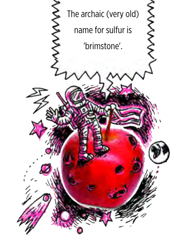
> **[Diagram Context - Textbook_NaturalScience_Gr9_Reactions-of-non-metals-with-oxygen.pdf-0004-11.png]**
> The image is a cartoon depicting an astronaut on a red planet. The astronaut is holding a flag and is surrounded by stars and planets. The text in the image reads "The archaic (very old) name for sulfur is 'brimstone'".

> **[Diagram Context - Textbook_NaturalScience_Gr9_Reactions-of-non-metals-with-oxygen.pdf-0004-16.png]**
> 1. A cartoon depiction of a roller coaster with a spring coiled around it.

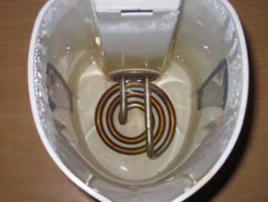
> **[Diagram Context - Textbook_NaturalScience_Gr9_Resistance.pdf-0004-02.png]**
> The image shows a white ceramic container with a black heating element inside. The heating element is surrounded by a series of concentric circles, with the outermost circle being the largest and the innermost circle being the smallest. The container is placed on a wooden surface, and the heating element is positioned at the center. The image does not contain any text, and the focus is solely on the heating

> **[Diagram Context - Textbook_NaturalScience_Gr9_Resistance.pdf-0004-03.png]**
> 1. A diagram of a roller coaster with a spring coiled up on top.

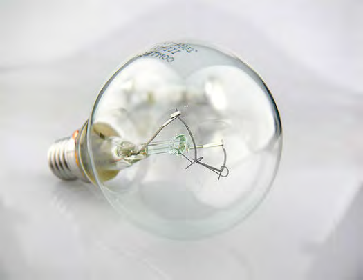
> **[Diagram Context - Textbook_NaturalScience_Gr9_Resistance.pdf-0004-09.png]**
> 1. A lightbulb with a silver base and a white glass bulb.

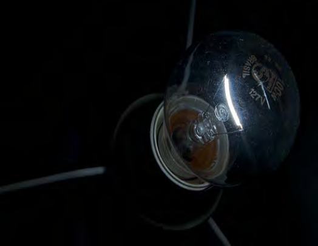
> **[Diagram Context - Textbook_NaturalScience_Gr9_Resistance.pdf-0004-10.png]**
> 1. A bulb with a light inside.

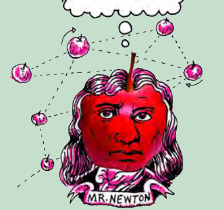
> **[Diagram Context - Textbook_NaturalScience_Gr9_Resistance.pdf-0004-15.png]**
> The image features a cartoon depiction of a man's head, with a red apple as the main object. The man's face is drawn in a cartoon style, and he is wearing a tie. The image also includes a thought bubble above the man's head, containing a network of lines and arrows. The text "Mr. Newton" is written above the man's head, and the image also

---

### Exercise
**Question 4:** Magnesium oxide has the formula $MgO$. What does this ratio tell us about the atoms in the compound?

---

### 1.2 The Periodic Table

The Periodic Table is a chart used by scientists to organize and list all known elements.

#### Key Definitions (New Words)
*   **Periodic Table:** A tabular display of all known chemical elements.
*   **Symbol (or element symbol):** A unique abbreviation used to represent an element.
*   **Atomic number:** A unique number assigned to each element based on its position in the table.
*   **Unique:** Being the only one of its kind.

#### Summary of the Periodic Table
1.  **Arrangement:** All known elements are arranged in the Periodic Table.
2.  **History:** The version used today was originally proposed by Dmitri Mendeleev in the 1800s.
3.  **Ordering:** Elements are arranged in order of increasing atomic number, starting with Hydrogen ($H$) in the top left-hand corner.
4.  **Classification:** An element's position indicates its classification:
    *   **Metals:** Found on the left-hand side.
    *   **Non-metals:** Found on the far right-hand side.
    *   **Semi-metals:** Found in the region between metals and non-metals.
5.  **Identification:** Each element is identified by:
    *   A unique name.
    *   A unique chemical symbol.
    *   A unique atomic number.

#### Properties of Elements
*   **Metals:** Usually shiny, ductile, and malleable. Most are solids at room temperature and have high melting and boiling points.
*   **Non-metals:** Can be solids, liquids, or gases at room temperature. They have a great variety of properties depending on their state.
*   **Semi-metals:** All are solids at room temperature and possess a combination of metallic and non-metallic properties.

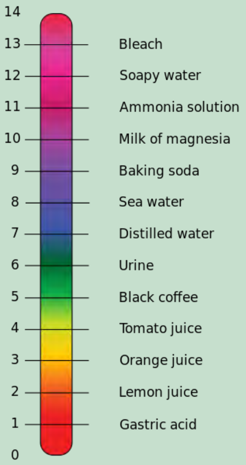
> **[Diagram Context - Textbook_NaturalScience_Gr9_Acids-bases-and-the-pH-value.pdf-0005-01.png]**
> 1. A color-coded diagram of the chemical properties of various substances.

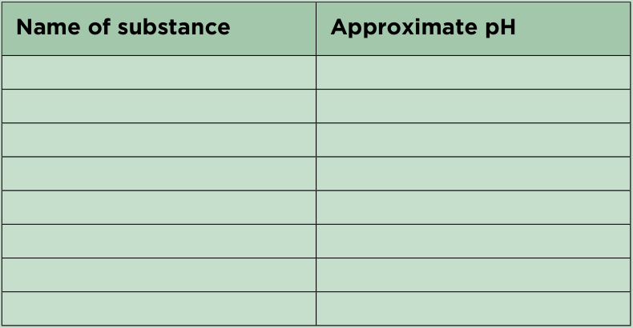
> **[Diagram Context - Textbook_NaturalScience_Gr9_Acids-bases-and-the-pH-value.pdf-0005-05.png]**
> 1. A table with the title "Name of substance" and "Approximate ph" at the top.

> **[Diagram Context - Textbook_NaturalScience_Gr9_Chemical-reactions.pdf-0005-04.png]**
> This particle model diagram illustrates the chemical reaction between hydrogen ($H_2$) and oxygen ($O_2$) to form water ($H_2O$), using white circles to represent hydrogen atoms and red circles to represent oxygen atoms. It visually demonstrates the law of conservation of mass by showing how atoms rearrange during a chemical change to form new products while maintaining the same number of each atom type.

> **[Diagram Context - Textbook_NaturalScience_Gr9_Compounds.pdf-0005-00.png]**
> This graphic is a metaphorical illustration depicting a caterpillar-like creature with a slinky-coil body, feeding on green leaves. The image features a stylized insectoid form, foliage, and a metallic spring structure, serving as a visual analogy for the physical properties of longitudinal or transverse waves in a medium. It conceptually illustrates the mechanics of wave propagation, where the compression and expansion of the spring mimic the movement of particles in a wave as it travels through a biological or physical system.

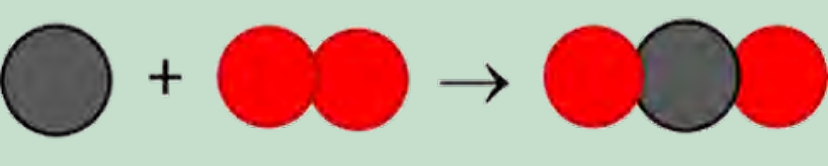
> **[Diagram Context - Textbook_NaturalScience_Gr9_Compounds.pdf-0005-13.png]**
> This particle model diagram illustrates a chemical reaction using spherical representations for atoms, specifically showing one grey atom and a diatomic red molecule reacting to form a triatomic product molecule. The visual uses a plus sign and an arrow to denote the transformation of reactants into a product, helping learners visualize the conservation of atoms and the rearrangement of chemical bonds during a synthesis reaction.

> **[Diagram Context - Textbook_NaturalScience_Gr9_Reactions-of-metals-with-oxygen.pdf-0005-00.png]**
> This graphic uses a cartoon illustration of a roller coaster track and a slinky to represent the concepts of mechanical energy and wave motion. By juxtaposing the coaster's peak with the compressed coils of the slinky, the image visually demonstrates the conversion between gravitational potential energy and kinetic energy, as well as the propagation of longitudinal waves.

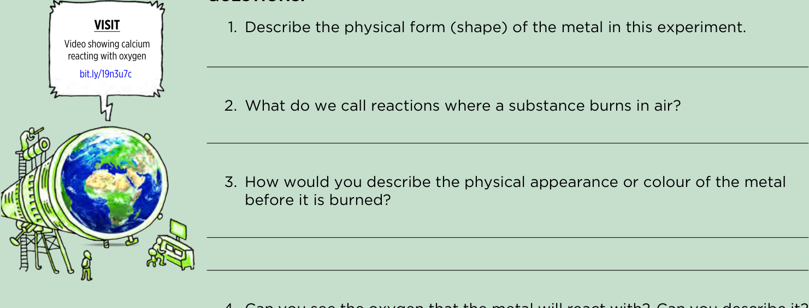
> **[Diagram Context - Textbook_NaturalScience_Gr9_Reactions-of-metals-with-oxygen.pdf-0005-13.png]**
> This educational graphic features a worksheet containing four inquiry-based questions regarding the chemical reaction between calcium and oxygen, accompanied by an illustrative icon of a telescope pointed at Earth and a "VISIT" call-to-action box with a URL. The questions prompt students to observe and describe the physical properties of reactants and identify the nature of combustion reactions. Conceptually, this resource encourages learners to bridge the gap between macroscopic observations of chemical changes and the theoretical understanding of oxidation reactions within the Physical Sciences curriculum.

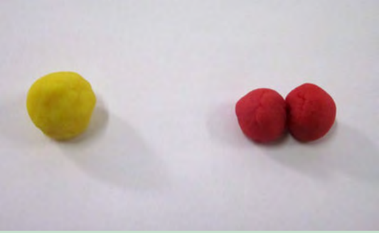
> **[Diagram Context - Textbook_NaturalScience_Gr9_Reactions-of-non-metals-with-oxygen.pdf-0005-11.png]**
> The image shows two red balls and one yellow ball on a white background. The yellow ball is positioned on the left side of the image, while the two red balls are located on the right side. The image does not contain any text or additional objects, and the arrangement of the balls is simple and straightforward.

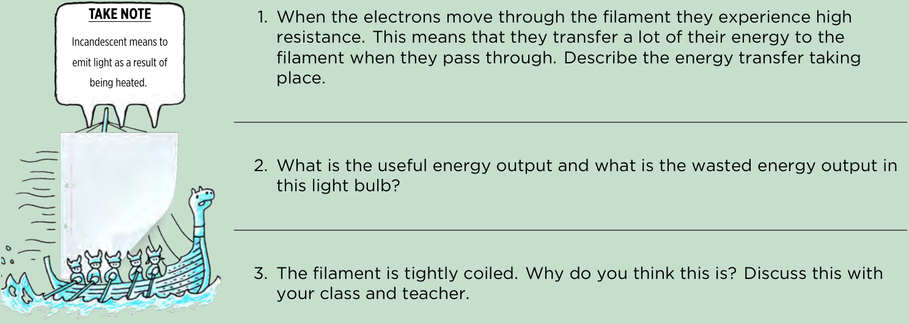
> **[Diagram Context - Textbook_NaturalScience_Gr9_Resistance.pdf-0005-01.png]**
> 1. When the electrons move through the flamethrower they experience high resistance. This means that they transfer a lot of energy to the flamethrower when they pass through it.

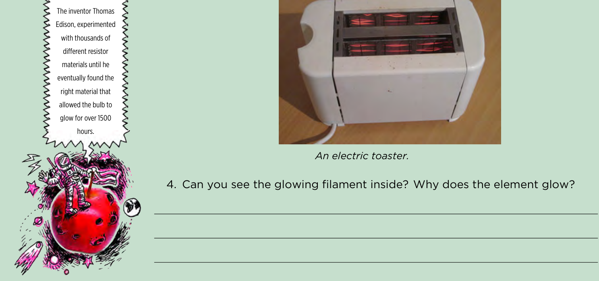
> **[Diagram Context - Textbook_NaturalScience_Gr9_Resistance.pdf-0005-04.png]**
> 1. A toaster with a red light inside.

> **[Diagram Context - Textbook_NaturalScience_Gr9_Resistance.pdf-0005-07.png]**
> 1. A diagram of a cell with a green line.

---

### Understanding the Periodic Table

#### Key Concepts
The Periodic Table is a tabular display of chemical elements. Each element is represented by a "tile" containing specific information. The two most common pieces of information found on every tile are:

1.  **The Chemical Symbol:** A unique one- or two-letter code used to identify the element (e.g., $C$ for Carbon, $Na$ for Sodium).
2.  **The Atomic Number:** A whole number that represents the number of protons found in the nucleus of an atom of that element.

#### Worked Example
**Question:** Look at the tile provided in the diagram. Can you identify the element it represents and how many protons it has?

*   **Observation:** The tile shows the symbol $C$ and the atomic number $6$.
*   **Identification:** The element with the symbol $C$ is **Carbon**.
*   **Protons:** Since the atomic number is $6$, the atom has **6 protons**.

---

#### Periodic Table Reference
The Periodic Table organizes elements based on their atomic structure. Below is a summary of the information structure provided in the standard Periodic Table:

| Feature | Description |
| :--- | :--- |
| **Atomic Number** | Located at the top of the tile; indicates the number of protons. |
| **Chemical Symbol** | Located in the center of the tile; represents the element name. |
| **Element Name** | Often written below the symbol (depending on the version of the table). |
| **Groups** | Vertical columns (numbered 1–18) representing elements with similar properties. |
| **Periods** | Horizontal rows representing the number of electron shells. |

> **[Diagram Context - Textbook_NaturalScience_Gr9_Acids-bases-and-the-pH-value.pdf-0006-09.png]**
> 1. A diagram of a snake's body.
 2. The snake's body is made up of many small lines.
 3. The snake's head is green.

#### Take Note
*   There are different versions of the Periodic Table. Some may include additional information such as atomic mass, electron configuration, or electronegativity values.
*   Always check the "Key" or "Legend" provided on your specific Periodic Table to understand what each number and symbol represents.
*   A large version of the Periodic Table is typically provided on the inside cover of your workbook for easy reference during exercises.

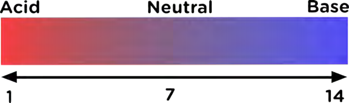
> **[Diagram Context - Textbook_NaturalScience_Gr9_Acids-bases-and-the-pH-value.pdf-0006-15.png]**
> The image shows a line graph with three distinct colors: red, blue, and white. The graph is labeled with the words "Acid", "Neutral", and "Base", indicating the three different pH levels. The x-axis of the graph is labeled with the numbers 1, 14, and 7, while the y-axis is labeled with the numbers 1, 14, and 7

> **[Diagram Context - Textbook_NaturalScience_Gr9_Chemical-reactions.pdf-0006-00.png]**
> This illustration depicts a slinky toy moving down a set of stairs, utilizing motion lines to indicate its trajectory. It serves as a physical model to help Grade 10-12 Physical Sciences learners visualize the propagation of longitudinal and transverse waves, demonstrating how energy is transferred through a medium via periodic motion.

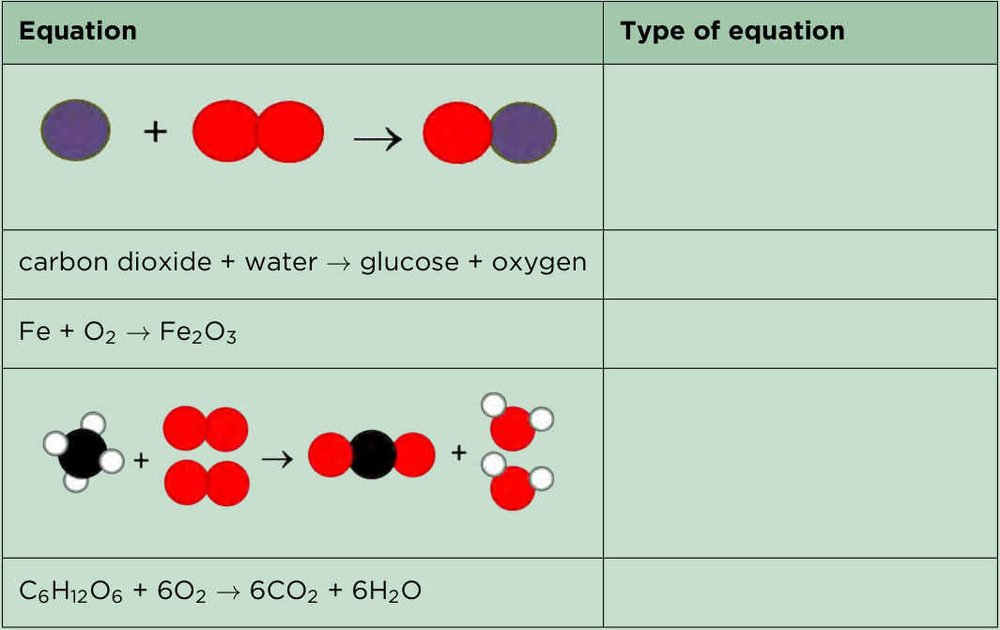
> **[Diagram Context - Textbook_NaturalScience_Gr9_Chemical-reactions.pdf-0006-04.png]**
> This table presents a series of chemical reactions represented through molecular models, word equations, and balanced chemical formulas (including Fe, O₂, Fe₂O₃, C₆H₁₂O₆, CO₂, and H₂O). It serves as a formative assessment tool to help learners classify chemical reactions—such as synthesis, combustion, or photosynthesis—by bridging the gap between visual particle representations and symbolic chemical notation.

> **[Diagram Context - Textbook_NaturalScience_Gr9_Chemical-reactions.pdf-0006-08.png]**
> This graphic depicts a stylized, repeating pattern of interlocking, arrow-shaped links forming a continuous chain. The image lacks specific biological or chemical labels, but conceptually represents the structural concept of polymerization or the formation of long-chain macromolecules, such as DNA or synthetic polymers, through the repetitive bonding of individual monomer units.

> **[Diagram Context - Textbook_NaturalScience_Gr9_Compounds.pdf-0006-02.png]**
> This graphic illustrates a stylized representation of a double-stranded DNA molecule, characterized by its iconic double helix structure formed by two intertwined, repeating strands. It visually conveys the fundamental concept of DNA's antiparallel, helical architecture, which is essential for understanding genetic storage and replication in the Life Sciences curriculum.

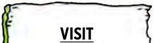
> **[Diagram Context - Textbook_NaturalScience_Gr9_Reactions-of-acids-with-a-metal.pdf-0006-03.png]**
> 1. A cartoon image of a white rectangle with the word "visit" written in black.

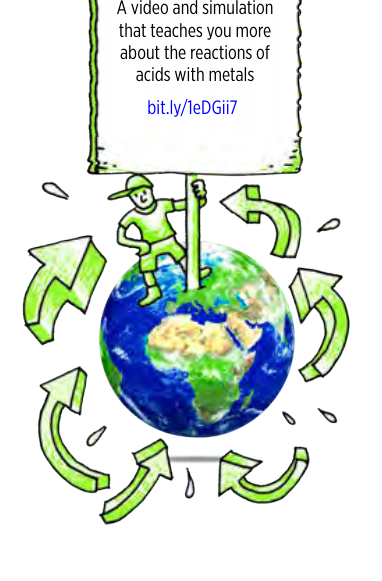
> **[Diagram Context - Textbook_NaturalScience_Gr9_Reactions-of-acids-with-a-metal.pdf-0006-10.png]**
> The image is a cartoon drawing of a cartoon boy holding a sign that says "A video and simulation that teaches you more about the reactions of acids with metals". The boy is holding the sign on a pole, and the background of the image is a cartoon depiction of the earth with arrows pointing to different parts of the earth. The boy is wearing a hat and is holding a sign that says "

> **[Diagram Context - Textbook_NaturalScience_Gr9_Reactions-of-acids-with-a-metal.pdf-0006-16.png]**
> 1. A diagram of a spring coiled up and attached to a green block.

> **[Diagram Context - Textbook_NaturalScience_Gr9_Reactions-of-metals-with-oxygen.pdf-0006-02.png]**
> This graphic depicts a stylized, repeating pattern of interlocking, arrow-shaped segments forming a continuous horizontal band. The image lacks specific biological or chemical labels, variables, or symbols, functioning instead as a decorative or structural border. Conceptually, it illustrates the principle of repetitive, modular design, which can be used in a classroom setting to introduce the structural concept of polymers or repeating subunits in biological macromolecules.

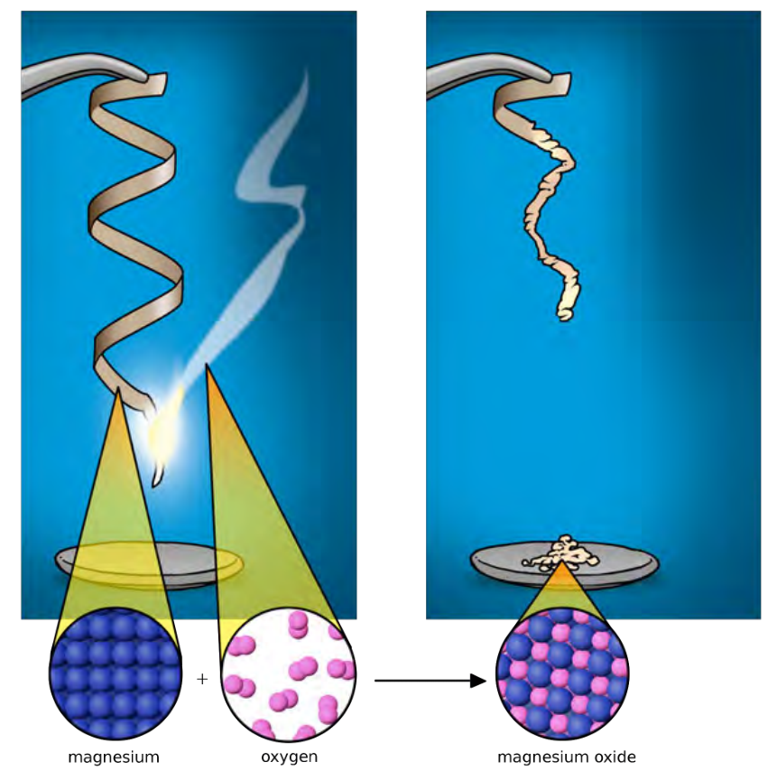
> **[Diagram Context - Textbook_NaturalScience_Gr9_Reactions-of-metals-with-oxygen.pdf-0006-04.png]**
> This diagram illustrates the chemical reaction between magnesium metal and oxygen gas, featuring labels for "magnesium," "oxygen," and "magnesium oxide" alongside molecular models of the reactants and the resulting ionic product. It visually demonstrates a synthesis reaction where the metallic ribbon burns to form a white powder, helping learners bridge the gap between observable macroscopic changes and the microscopic rearrangement of atoms into an ionic lattice.

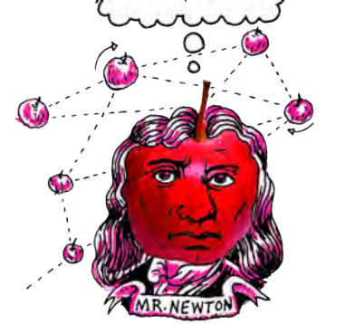
> **[Diagram Context - Textbook_NaturalScience_Gr9_Reactions-of-metals-with-oxygen.pdf-0006-07.png]**
> This illustration depicts a caricature of Isaac Newton with an apple-shaped head, surrounded by a network of floating apples connected by dashed lines and directional arrows. It conceptually represents Newton’s Law of Universal Gravitation, illustrating the interconnectedness of masses in a gravitational field and the mathematical relationships governing their mutual attraction.

> **[Diagram Context - Textbook_NaturalScience_Gr9_Reactions-of-metals-with-oxygen.pdf-0006-08.png]**
> This image depicts a chemical demonstration involving the rapid, exothermic combustion of magnesium metal, characterized by intense white light and smoke. It serves as a visual representation of a redox reaction where magnesium acts as a reducing agent, illustrating the high energy release associated with the oxidation of group 2 metals.

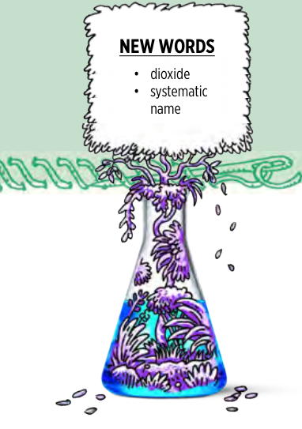
> **[Diagram Context - Textbook_NaturalScience_Gr9_Reactions-of-non-metals-with-oxygen.pdf-0006-02.png]**
> The image features a cartoon depiction of a flask filled with purple and blue liquid, with a label on the side that reads "New Words". The label also includes a list of words, such as "dioxide", "systematic name", and "new words". The flask is placed on a table, and the background is a light green color.

> **[Diagram Context - Textbook_NaturalScience_Gr9_Reactions-of-non-metals-with-oxygen.pdf-0006-13.png]**
> The image shows a cartoon illustration of a man holding a picture of a woman. The man is wearing blue pants and a blue shirt, and he is holding the picture in his hands. The picture is of a woman, and it is a line drawing. The man is holding the picture in a frame, and the picture is of a woman. The image is in black and white, and it

> **[Diagram Context - Textbook_NaturalScience_Gr9_Reactions-of-non-metals-with-oxygen.pdf-0006-22.png]**
> The image shows a cartoon depiction of a globe with a speech bubble above it, containing a thought bubble with a lightning bolt. The globe is surrounded by a group of people, including a man and a woman, who appear to be engaged in a discussion or a presentation. The globe is positioned in the center of the image, with the people surrounding it on all sides. The speech bubble above the

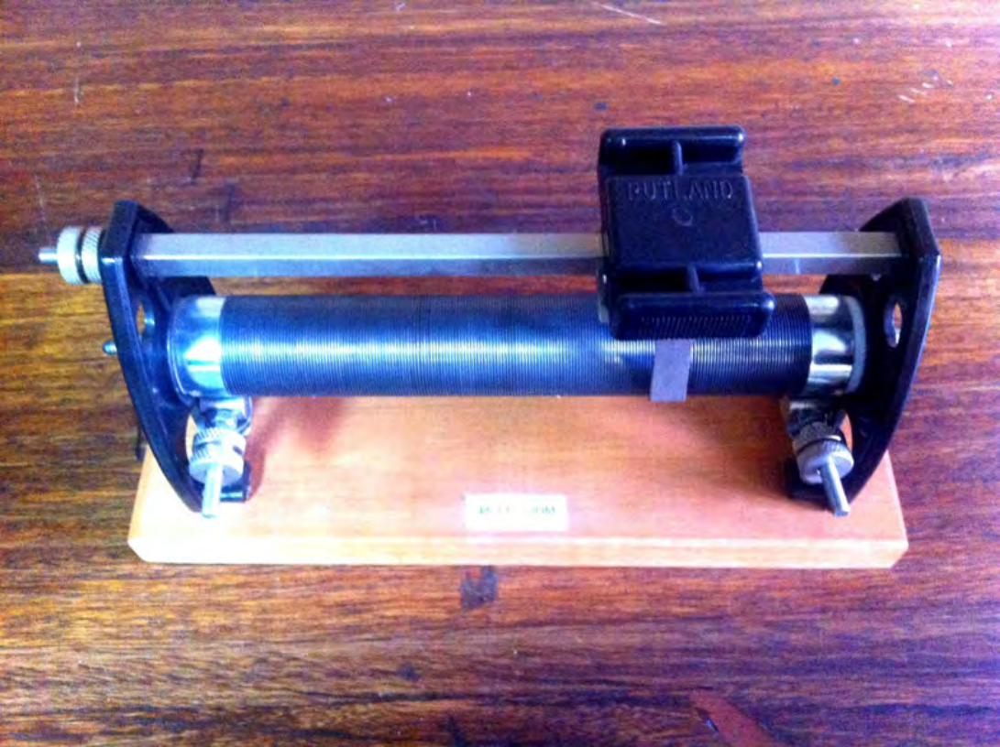
> **[Diagram Context - Textbook_NaturalScience_Gr9_Resistance.pdf-0006-01.png]**
> 1. A diagram of a circuit board with a black and silver roller and a black square on the right side.

> **[Diagram Context - Textbook_NaturalScience_Gr9_Resistance.pdf-0006-11.png]**
> The image shows a cartoon depiction of a hot air balloon carrying two people. The balloon is filled with a blue and green substance, and the two people are positioned on the balloon, with one person holding a basket. The balloon is floating in the sky, and the sky is filled with clouds. The image also includes a text box that reads "Visit".

> **[Diagram Context - Textbook_NaturalScience_Gr9_Resistance.pdf-0006-12.png]**
> 1. A diagram of a spring coiled up and attached to a green block.

---

# The Periodic Table of Elements

## Overview
The Periodic Table is a structured arrangement of all known chemical elements. Elements are organized in a specific order to help scientists understand their properties and relationships.

> **[Diagram Context - Textbook_NaturalScience_Gr9_Acids-bases-and-the-pH-value.pdf-0007-01.png]**
> The image shows a cartoon-style sign with the word "visit" written in black text. The sign is set against a gray background, and it features a large cloud-like shape with the word "visit" written in black text. The sign is positioned in the center of the image, and it is surrounded by a border of black text.

## Information Contained in Element Tiles
Each element is represented by a tile. While some versions only show the chemical symbol, others provide additional data:

1.  **Atomic Number:** The number of protons in the nucleus of an atom.
2.  **Chemical Symbol:** A unique one- or two-letter abbreviation for the element (e.g., $\text{Cu}$ for copper).
3.  **Element Name:** The full name of the element.
4.  **Atomic Mass:** The average mass of an atom of that element (e.g., $63.5$ for copper).

> **[Diagram Context - Textbook_NaturalScience_Gr9_Acids-bases-and-the-pH-value.pdf-0007-02.png]**
> The image shows a white label with black text that reads "Now that you have learned about PH, test your knowledge with this fun online game". The label also contains a URL, "bit.ly/13dHNm", which is likely a website or resource related to the topic.

## Arrangement of Elements
Elements are arranged according to a specific logic:

*   **Increasing Atomic Number:** Elements are placed in order of increasing atomic number.
    *   **Hydrogen ($\text{H}$):** Has the smallest atomic number ($1$) and is located at the top left.
    *   **Heaviest Elements:** Elements with the largest atomic numbers are found at the bottom of the table.
*   **Regional Grouping:** The table is divided into regions, often color-coded, to distinguish between different types of elements such as metals, non-metals, and semi-metals.

## Key Vocabulary
*   **Metal:** Elements that are typically shiny, conductive, and malleable.
*   **Non-metal:** Elements that lack metallic properties; often gases or brittle solids.
*   **Semi-metal (Metalloid):** Elements with properties intermediate between metals and non-metals.
*   **Group:** A vertical column in the periodic table.
*   **Period:** A horizontal row in the periodic table.
*   **Electrons:** Negatively charged subatomic particles.
*   **Neutrons:** Neutral subatomic particles found in the nucleus.
*   **Protons:** Positively charged subatomic particles found in the nucleus.

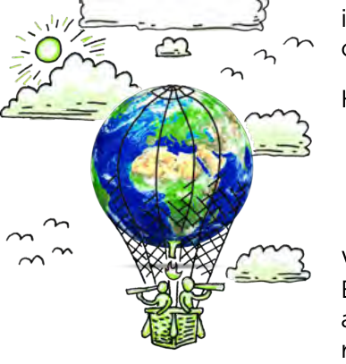
> **[Diagram Context - Textbook_NaturalScience_Gr9_Acids-bases-and-the-pH-value.pdf-0007-05.png]**
> The image features a cartoon illustration of a hot air balloon with a globe on top. The globe is depicted in a cartoon style, with a cartoon map of the world. The balloon is filled with a cartoon-style hot air, and the globe is depicted in a cartoon style with a cartoon map of the world. The balloon is also depicted with a cartoon-style sail, and the globe is

> **[Diagram Context - Textbook_NaturalScience_Gr9_Acids-bases-and-the-pH-value.pdf-0007-11.png]**
> The image shows a cartoon depiction of a cloud with the words "5.2 Indicators" written above it. Below the cloud, there is a line of text that reads "5.2 Indicators" and "5.2 Indicators" is written in blue.

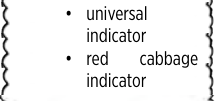
> **[Diagram Context - Textbook_NaturalScience_Gr9_Acids-bases-and-the-pH-value.pdf-0007-15.png]**
> The image shows a diagram of a cabbage with a red indicator. The diagram is labeled with the words "Universal indicator", "Red indicator", and "Cabbage indicator". The diagram also includes a Lewis diagram and an anatomical/cellular structure of a cabbage.

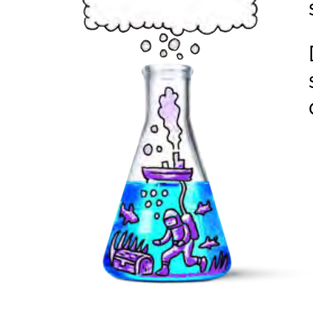
> **[Diagram Context - Textbook_NaturalScience_Gr9_Acids-bases-and-the-pH-value.pdf-0007-17.png]**
> 1. A cartoon drawing of a person in a blue and purple suit holding a fish and a submarine.

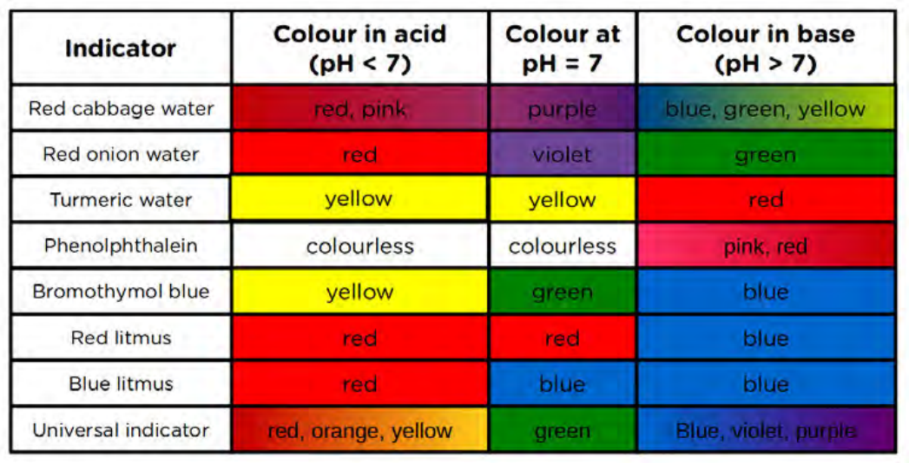
> **[Diagram Context - Textbook_NaturalScience_Gr9_Acids-bases-and-the-pH-value.pdf-0007-19.png]**
> The image is a diagram that shows the different colour bases of PH7, including red cabbage water, red onion water, turmeric water, pomegranate juice, and red cabbage juice. The diagram also includes a color chart that shows the different colors of the PH7 bases. The diagram is labeled with the names of the colour bases and the PH7 bases.

> **[Diagram Context - Textbook_NaturalScience_Gr9_Chemical-reactions.pdf-0007-04.png]**
> This graphic is a text-based heading enclosed in a cloud-shaped border containing the label "NEW WORDS." It serves as a structural signpost in educational materials to signal the introduction of key terminology or vocabulary essential for mastering a specific CAPS curriculum topic.

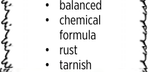
> **[Diagram Context - Textbook_NaturalScience_Gr9_Chemical-reactions.pdf-0007-05.png]**
> This text-based graphic lists key terminology related to chemical reactions, specifically featuring the terms "balanced," "chemical formula," "rust," and "tarnish." It serves as a vocabulary prompt for Grade 10 Physical Sciences learners to identify and define concepts essential for understanding the law of conservation of mass and the chemical processes of oxidation and corrosion.

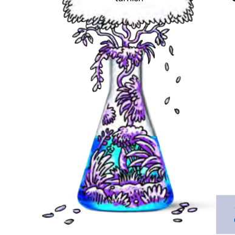
> **[Diagram Context - Textbook_NaturalScience_Gr9_Chemical-reactions.pdf-0007-07.png]**
> This illustration depicts a conical flask containing a miniature, self-contained ecosystem with purple flora submerged in a blue liquid medium. The visual elements include the glassware, aquatic vegetation, and small seed-like structures falling from the top, representing a closed biological system. Conceptually, this serves as a metaphor for "in vitro" cultivation or a closed terrarium, illustrating how controlled environments can support plant growth and life cycles outside of natural habitats.

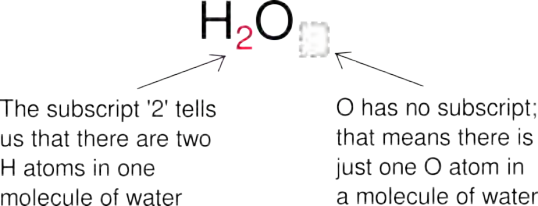
> **[Diagram Context - Textbook_NaturalScience_Gr9_Chemical-reactions.pdf-0007-08.png]**
> This graphic uses the chemical formula for water ($H_2O$) to explain the convention of subscripts in chemical notation. By highlighting the subscript '2' and the absence of a subscript for oxygen, it illustrates how these numbers indicate the specific ratio of hydrogen to oxygen atoms within a single molecule.

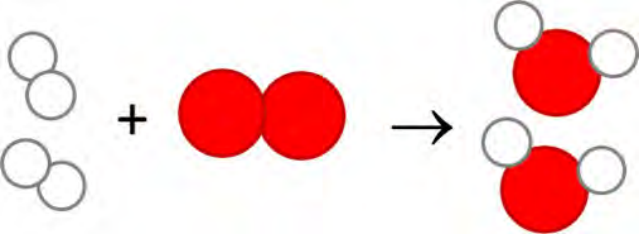
> **[Diagram Context - Textbook_NaturalScience_Gr9_Chemical-reactions.pdf-0007-11.png]**
> This particle model diagram illustrates a chemical reaction using spheres to represent atoms, with white circles denoting hydrogen and red circles denoting oxygen. It visually demonstrates the law of conservation of mass by showing how reactant molecules ($H_2$ and $O_2$) rearrange their atoms to form product molecules ($H_2O$), emphasizing the balancing of atoms on both sides of the reaction arrow.

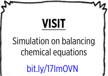
> **[Diagram Context - Textbook_NaturalScience_Gr9_Chemical-reactions.pdf-0007-12.png]**
> This graphic is a digital signpost containing the text "VISIT," "Simulation on balancing chemical equations," and a shortened URL link. It serves as a navigational tool to direct learners to an interactive online resource designed to help them master the Law of Conservation of Mass by visually balancing chemical equations.

> **[Diagram Context - Textbook_NaturalScience_Gr9_Chemical-reactions.pdf-0007-13.png]**
> This illustration depicts a large telescope focused on the Earth, featuring human figures observing the planet through the lens and via a computer workstation. It conceptually represents the scientific study of Earth systems, remote sensing, and the use of technology to monitor global environmental or geographical data in the context of Earth Sciences.

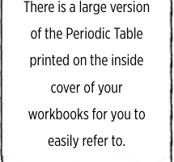
> **[Diagram Context - Textbook_NaturalScience_Gr9_Compounds.pdf-0007-03.png]**
> This text-based graphic serves as an instructional signpost directing students to the Periodic Table of Elements located on the inside cover of their workbooks. It emphasizes the importance of this essential reference tool for Physical Sciences learners when calculating molar masses, determining electron configurations, and identifying chemical properties during classwork and assessments.

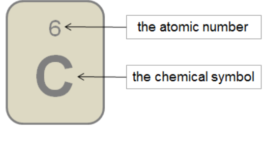
> **[Diagram Context - Textbook_NaturalScience_Gr9_Compounds.pdf-0007-05.png]**
> This diagram displays an entry from the periodic table for the element carbon, featuring the atomic number "6" and the chemical symbol "C" pointed to by explanatory labels. It serves as a foundational visual aid to help Grade 10 Physical Sciences learners identify and interpret the key components of an element's notation within the periodic table.

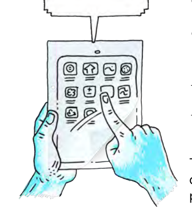
> **[Diagram Context - Textbook_NaturalScience_Gr9_Compounds.pdf-0007-08.png]**
> This illustration depicts a pair of hands interacting with a tablet device featuring a grid of abstract application icons and a blank speech bubble above. The graphic serves as a visual metaphor for digital literacy and information communication technology (ICT), representing the user interface of modern mobile computing. It encourages students to consider the role of interactive technology in accessing, navigating, and processing information within a digital learning environment.

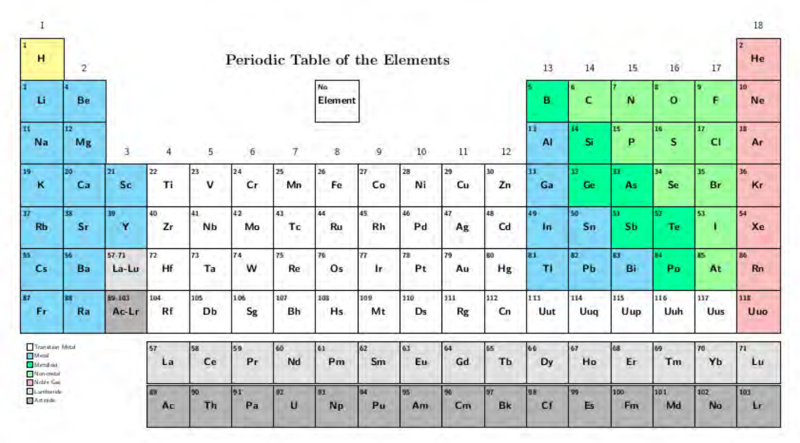
> **[Diagram Context - Textbook_NaturalScience_Gr9_Compounds.pdf-0007-11.png]**
> This graphic presents a standard Periodic Table of the Elements, color-coded to distinguish between metals, non-metals, metalloids, noble gases, and lanthanide/actinide series. It displays atomic numbers and chemical symbols for all 118 elements, organized into groups (1-18) and periods. This table serves as a fundamental reference tool for learners to identify elemental properties, trends, and classifications based on their electronic configuration and position within the periodic structure.

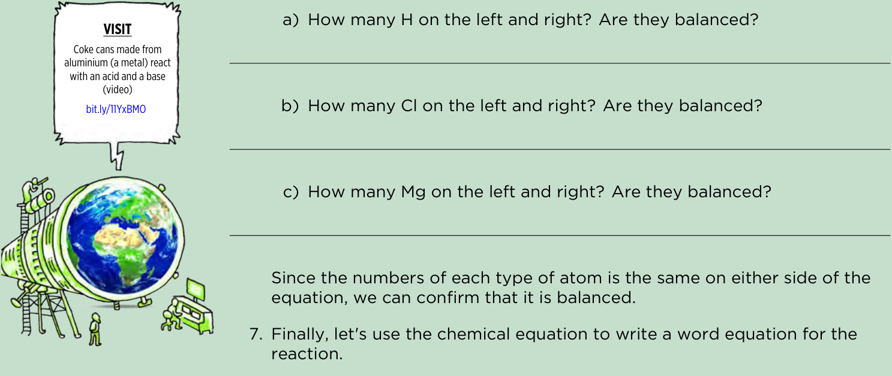
> **[Diagram Context - Textbook_NaturalScience_Gr9_Reactions-of-acids-with-a-metal.pdf-0007-06.png]**
> 1. A cartoon depiction of a globe with the words "Visit" written on it.
 2. A cartoon depiction of a person with a computer.

> **[Diagram Context - Textbook_NaturalScience_Gr9_Reactions-of-acids-with-a-metal.pdf-0007-07.png]**
> 1. A diagram of a cell with arrows pointing to different parts of the cell.

> **[Diagram Context - Textbook_NaturalScience_Gr9_Reactions-of-acids-with-a-metal.pdf-0007-09.png]**
> The image features a cartoon depiction of a man holding a globe in his arms. The man is wearing a green shirt and has a speech bubble above his head, suggesting that he is giving a speech or explanation about the globe. The globe itself is green and blue, and it is the central focus of the image. The man's position and the globe's size make it clear that the globe is

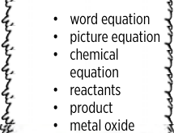
> **[Diagram Context - Textbook_NaturalScience_Gr9_Reactions-of-metals-with-oxygen.pdf-0007-02.png]**
> This graphic is a bulleted list of key terminology used in Grade 8 and 9 Natural Sciences to describe chemical reactions. It highlights essential concepts including "word equation," "picture equation," "chemical equation," "reactants," "product," and "metal oxide." These terms provide the foundational vocabulary students need to represent and interpret the transformation of substances during chemical changes.

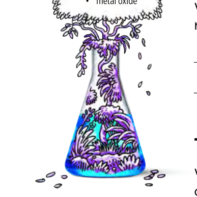
> **[Diagram Context - Textbook_NaturalScience_Gr9_Reactions-of-metals-with-oxygen.pdf-0007-04.png]**
> This conceptual illustration depicts a conical flask containing a blue liquid and purple plant-like structures, labeled with the text "metal oxide." It serves as a metaphorical representation for high school learners to visualize the chemical properties and formation of metal oxides, illustrating how these substances can be synthesized or contained within a controlled laboratory environment.

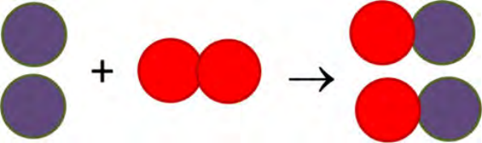
> **[Diagram Context - Textbook_NaturalScience_Gr9_Reactions-of-metals-with-oxygen.pdf-0007-12.png]**
> This particle model diagram uses purple and red spheres to represent atoms and molecules undergoing a chemical reaction. It illustrates the law of conservation of mass by showing how two separate purple atoms and one diatomic red molecule rearrange to form two new compound molecules.

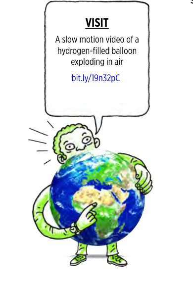
> **[Diagram Context - Textbook_NaturalScience_Gr9_Reactions-of-non-metals-with-oxygen.pdf-0007-01.png]**
> The image features a cartoon depiction of a man holding a globe, with the globe being the Earth. The man is wearing a green shirt and has a green hat on his head. The man is pointing to the globe, which is a representation of the Earth. The image also includes a text box that reads "Visit" and "A slow motion video of a hydrogen-filled balloon exploding in air

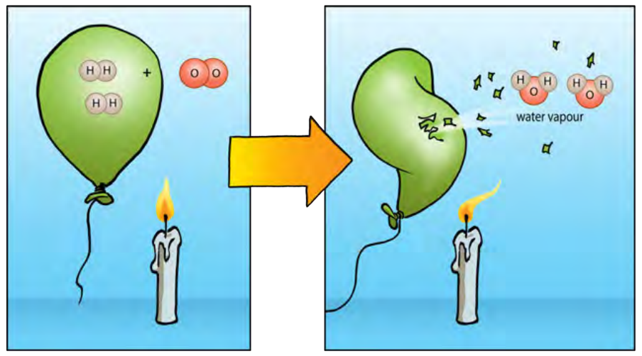
> **[Diagram Context - Textbook_NaturalScience_Gr9_Reactions-of-non-metals-with-oxygen.pdf-0007-02.png]**
> 1. A cartoon of a green balloon with a candle on it.
 2. A cartoon of a green balloon with a candle on it.

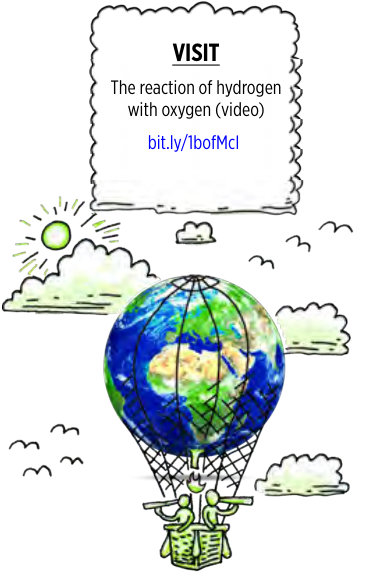
> **[Diagram Context - Textbook_NaturalScience_Gr9_Reactions-of-non-metals-with-oxygen.pdf-0007-06.png]**
> The image shows a cartoon depiction of a hot air balloon with a globe on top, floating in the sky. The globe is surrounded by a wire mesh, and there are two people inside the balloon. The balloon is filled with oxygen, and the people are holding onto the balloon's basket. The image also includes a caption that reads "Visit" and a link to a webpage that provides more information

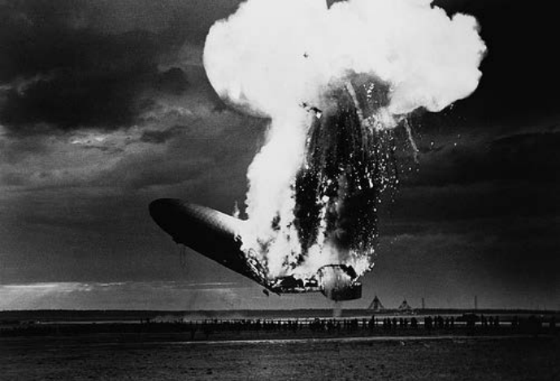
> **[Diagram Context - Textbook_NaturalScience_Gr9_Reactions-of-non-metals-with-oxygen.pdf-0007-07.png]**
> 1. A black and white image of a large explosion. 
 2. A large explosion. 
 3. A large explosion.

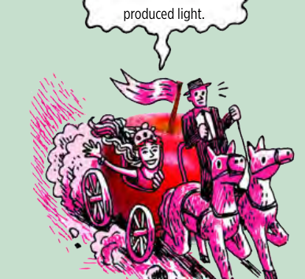
> **[Diagram Context - Textbook_NaturalScience_Gr9_Resistance.pdf-0007-03.png]**
> The image is a cartoon drawing of a man and a woman riding in a carriage. The man is holding a flag, and the woman is holding a banner. The drawing is in pink and green colors. The caption at the top of the image reads "Produced Light."

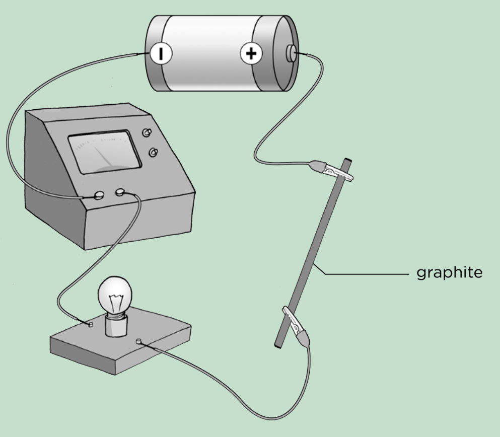
> **[Diagram Context - Textbook_NaturalScience_Gr9_Resistance.pdf-0007-04.png]**
> 1. A diagram of a circuit with a battery, a light bulb, and wires.

---

# The Periodic Table: Structure and Classification

## 1. Classification of Elements
The Periodic Table categorizes elements based on their physical and chemical properties. These are summarized as follows:

*   **Metals:** Located on the left and center of the Periodic Table. In the provided diagram, these are represented in **blue**.
*   **Non-metals:** Located in a small, triangular region at the top right-hand side of the table. In the provided diagram, these are represented in **red**.
*   **Semi-metals (Metalloids):** Elements that possess both metallic and non-metallic properties. They form a diagonal strip separating the metals from the non-metals. In the provided diagram, these are represented in **yellow**.

> **TAKE NOTE:** Semi-metals are also sometimes referred to as **metalloids**.

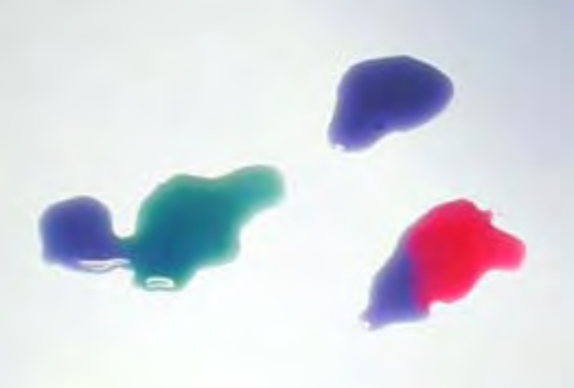
> **[Diagram Context - Textbook_NaturalScience_Gr9_Acids-bases-and-the-pH-value.pdf-0008-02.png]**
> The image shows a diagram of a cell with a purple substance inside, surrounded by three other colors: blue, green, and red. The diagram is set against a white background, making the colors stand out. The diagram is labeled with the word "cell" and "purple" in the top left corner, and the word "blue" and "green" in the top right corner.

---

## 2. Structure of the Periodic Table
Like all tables, the Periodic Table is organized into rows and columns. Understanding this orientation is essential for navigating the table.

### Definitions
*   **Vertical:** Runs in an 'up and down' direction. In a table, these are known as **columns**.
*   **Horizontal:** Runs from 'side to side'. In a table, these are known as **rows**.

### Orientation Exercise
Use the table below to distinguish between vertical and horizontal directions:

| Vertical | Horizontal |
| :--- | :--- |
| | |
| | |

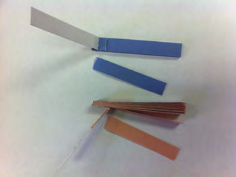
> **[Diagram Context - Textbook_NaturalScience_Gr9_Acids-bases-and-the-pH-value.pdf-0008-09.png]**
> 1. A diagram of a cell with a wire attached to it.

The Periodic Table uses specific terminology to describe these columns and rows, which will be explored in subsequent sections.

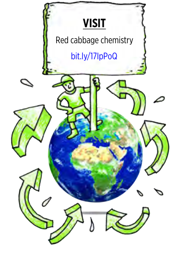
> **[Diagram Context - Textbook_NaturalScience_Gr9_Acids-bases-and-the-pH-value.pdf-0008-13.png]**
> The image features a cartoon depiction of a man standing on a pole, holding a sign that says "visit". The man is wearing a hat and is positioned in front of a globe, which is surrounded by arrows. The arrows are pointing in various directions, suggesting that the man is standing in the middle of a complex system or network. The sign is green and white, with the word "

> **[Diagram Context - Textbook_NaturalScience_Gr9_Acids-bases-and-the-pH-value.pdf-0008-14.png]**
> The image shows a cartoon depiction of a group of people working on a large telescope. The telescope is positioned in the center of the image, with the people standing around it. The people are engaged in various tasks, such as adjusting the telescope, observing the sky, and discussing their findings. The image also includes a caption that reads "Visit cabbage juice juice indicator. Cabbage juice juice indicator.

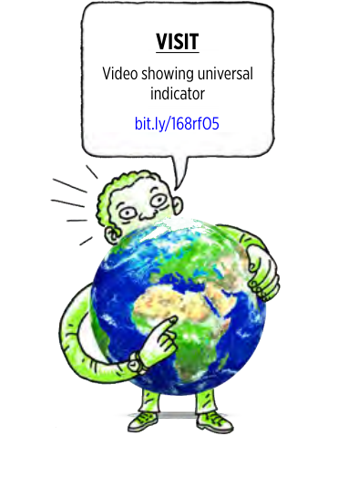
> **[Diagram Context - Textbook_NaturalScience_Gr9_Acids-bases-and-the-pH-value.pdf-0008-15.png]**
> The image features a cartoon depiction of a globe with a person holding it. The globe is green and blue, and the person is wearing a green shirt and yellow pants. The person is pointing to the globe, and there is a speech bubble above the globe that reads "Visit Video showing universal indicator".

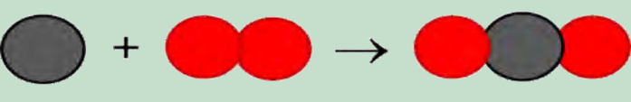
> **[Diagram Context - Textbook_NaturalScience_Gr9_Chemical-reactions.pdf-0008-04.png]**
> This particle model diagram uses spheres to represent a chemical reaction between a single atom (grey) and a diatomic molecule (two red spheres) to form a triatomic product molecule. It illustrates the law of conservation of mass by showing how atoms rearrange during a chemical change, specifically representing the synthesis of a compound like carbon dioxide from carbon and oxygen.

> **[Diagram Context - Textbook_NaturalScience_Gr9_Chemical-reactions.pdf-0008-05.png]**
> This diagram illustrates an electromagnet created by connecting a coiled wire (solenoid) to a battery, indicated by positive (+) and negative (-) terminals. The surrounding field lines with directional arrows represent the magnetic field generated by the current, demonstrating how electricity induces magnetism to attract metallic objects like a screw, nail, and nut. This visualises the fundamental relationship between electric current and magnetic fields, a core concept in Grade 10-12 Physical Sciences.

> **[Diagram Context - Textbook_NaturalScience_Gr9_Chemical-reactions.pdf-0008-14.png]**
> This graphic illustrates a schematic representation of a DNA double helix, featuring two antiparallel sugar-phosphate backbones intertwined in a helical structure. It conceptually demonstrates the molecular architecture of DNA, highlighting the complementary base pairing and the characteristic twisted-ladder configuration essential for genetic information storage and replication in Life Sciences.

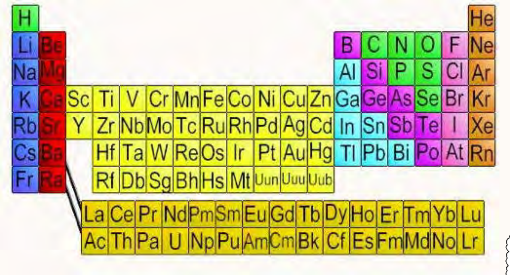
> **[Diagram Context - Textbook_NaturalScience_Gr9_Compounds.pdf-0008-01.png]**
> This graphic is a standard periodic table of the elements, displaying chemical symbols arranged in rows (periods) and columns (groups) with color-coded blocks. It serves as a fundamental reference tool for learners to identify elements, understand periodic trends, and observe the classification of metals, non-metals, and transition elements according to the CAPS Physical Sciences curriculum.

> **[Diagram Context - Textbook_NaturalScience_Gr9_Compounds.pdf-0008-06.png]**
> This illustration depicts the Earth as a hot air balloon, featuring a globe, a basket, and two figures using telescopes to observe their surroundings. It serves as a metaphorical representation of global environmental monitoring, encouraging students to consider the importance of observation, perspective, and stewardship in the context of Earth sciences and sustainability.

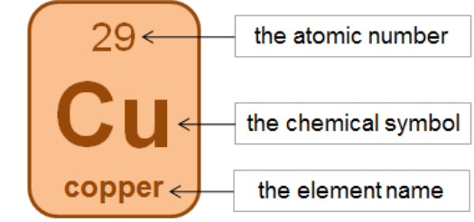
> **[Diagram Context - Textbook_NaturalScience_Gr9_Compounds.pdf-0008-09.png]**
> This diagram displays an element block from the Periodic Table, specifically for copper, featuring the atomic number (29), chemical symbol (Cu), and element name (copper). It serves as a foundational reference for learners to identify and interpret the key components of an element's entry in the Periodic Table, which is essential for understanding atomic structure and chemical notation in the CAPS Physical Sciences curriculum.

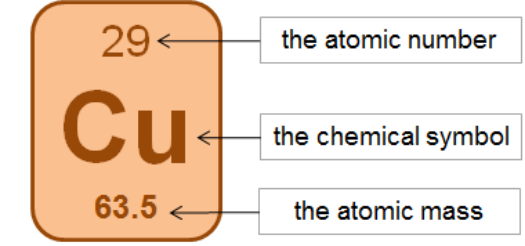
> **[Diagram Context - Textbook_NaturalScience_Gr9_Compounds.pdf-0008-10.png]**
> This diagram displays an element block from the Periodic Table, specifically for Copper (Cu), with labels identifying the atomic number (29), the chemical symbol (Cu), and the atomic mass (63.5). It serves as a foundational reference for Grade 10 Physical Sciences learners to interpret the key numerical and symbolic data used to define an element's identity and subatomic composition.

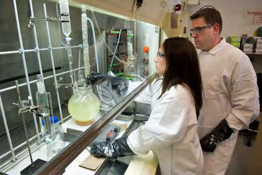
> **[Diagram Context - Textbook_NaturalScience_Gr9_Reactions-of-acids-with-a-metal.pdf-0008-00.png]**
> This educational image depicts two chemistry students conducting a chemical experiment inside a fume cupboard using specialized glassware apparatus including a round-bottom flask, condenser, and dropping funnel, while wearing safety gear like lab coats, protective gloves, and safety glasses. Visible components include a retort stand assembly, tubing, and a reaction mixture inside the glassware. Conceptually, this demonstrates proper CAPS practical laboratory techniques, safety protocols, and the setup for chemical reactions requiring ventilation such as reflux or distillation.

> **[Diagram Context - Textbook_NaturalScience_Gr9_Reactions-of-acids-with-a-metal.pdf-0008-03.png]**
> The visual content is a photograph of a shop owner standing inside a small, densely stocked pharmacy or general dealer store filled with various packaged goods, boxes, and medicines on wooden shelving units. Visible elements include packed retail shelves, a white refrigerator, product boxes, bottles, a desk area with a telephone and calculator, and the shopkeeper. This real-world setting conceptually introduces students to local commerce, small businesses, and community enterprise within economic and management sciences (EMS).

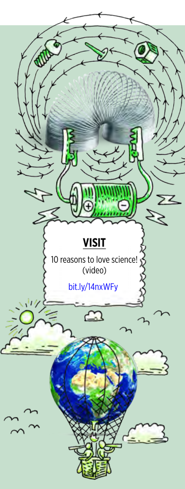
> **[Diagram Context - Textbook_NaturalScience_Gr9_Reactions-of-acids-with-a-metal.pdf-0008-20.png]**
> The image is a colorful educational graphic that illustrates the relationship between science and love. The graphic features a cartoon depiction of a globe, a hot air balloon, and a circuit, all of which are connected to the theme of science and love. The text at the bottom of the image provides a list of reasons to love science, including the ability to understand the world around us, the opportunity to explore

> **[Diagram Context - Textbook_NaturalScience_Gr9_Reactions-of-metals-with-oxygen.pdf-0008-08.png]**
> This illustration depicts a cartoon robot with a partially detached metal panel, revealing internal mechanical components like dials, gauges, and switches, accompanied by loose bolts and a speech bubble. It serves as a visual metaphor for systems analysis or structural breakdown, helping students conceptualize how complex technological or biological systems are composed of integrated, functional parts that can be examined or repaired.

> **[Diagram Context - Textbook_NaturalScience_Gr9_Reactions-of-metals-with-oxygen.pdf-0008-16.png]**
> This illustration depicts an astronaut standing on a cratered, red spherical surface resembling a planet or moon, holding a flag, surrounded by celestial elements like stars, a comet, and a speech bubble. The visual elements include an astronaut suit, a flag, a cratered sphere, stars, a comet, and a blank speech bubble. Conceptually, this graphic serves as a creative prompt for creative writing or a visual metaphor for space exploration, discovery, and the human endeavor to reach new frontiers in physical science.

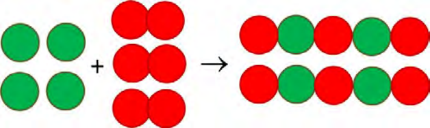
> **[Diagram Context - Textbook_NaturalScience_Gr9_Reactions-of-metals-with-oxygen.pdf-0008-18.png]**
> This particle model diagram uses red and green spheres to represent atoms and molecules, connected by addition and reaction arrow symbols. It illustrates a chemical reaction where four individual green atoms react with three diatomic red molecules to form two new compound molecules, demonstrating the law of conservation of mass through the rearrangement of atoms.

> **[Diagram Context - Textbook_NaturalScience_Gr9_Reactions-of-non-metals-with-oxygen.pdf-0008-00.png]**
> 1. A diagram of a cell with blue and white lines.

> **[Diagram Context - Textbook_NaturalScience_Gr9_Reactions-of-non-metals-with-oxygen.pdf-0008-08.png]**
> 1. A man holding a key.

> **[Diagram Context - Textbook_NaturalScience_Gr9_Reactions-of-non-metals-with-oxygen.pdf-0008-12.png]**
> 1. A cartoon drawing of a man and a woman riding on a pink horse.
 2. A pink carriage with a man and a woman on it.
 3. A pink apple on the carriage.

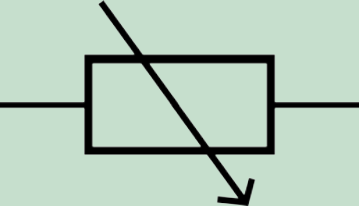
> **[Diagram Context - Textbook_NaturalScience_Gr9_Resistance.pdf-0008-02.png]**
> 1. A Lewis diagram with a square and a line.

> **[Diagram Context - Textbook_NaturalScience_Gr9_Resistance.pdf-0008-05.png]**
> 1. A diagram of a snake's body.
 2. The snake's body is composed of many small lines.
 3. The snake's body is green and white.

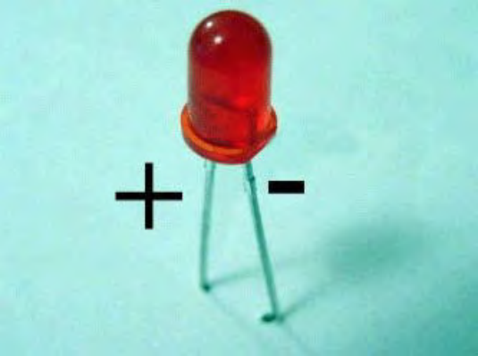
> **[Diagram Context - Textbook_NaturalScience_Gr9_Resistance.pdf-0008-09.png]**
> 1. A red lightbulb with a silver base and a red top.

> **[Diagram Context - Textbook_NaturalScience_Gr9_Resistance.pdf-0008-13.png]**
> 1. A diagram of a cell with arrows pointing to different parts of the cell.

---

# The Periodic Table: Structure and Symbols

## 1. Structure of the Periodic Table

The Periodic Table is organized into a grid system that helps scientists categorize elements based on their properties.

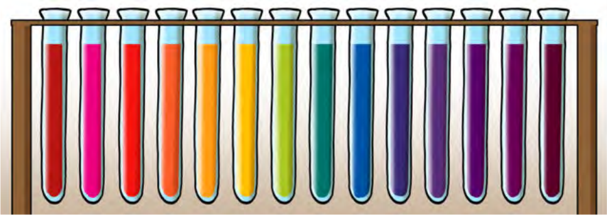
> **[Diagram Context - Textbook_NaturalScience_Gr9_Acids-bases-and-the-pH-value.pdf-0009-00.png]**
> 1. A row of colorful test tubes, each containing a different colored liquid.

### Groups
*   **Definition:** The vertical columns of the Periodic Table are called **groups**.
*   **Numbering:** Groups are numbered from 1 to 18, starting from the left.
*   **Note:** In older textbooks, you may encounter a different, more complex numbering system.

### Periods
*   **Definition:** The horizontal rows of the Periodic Table are called **periods**.
*   **Orientation:** The first period is located at the very top of the table.

---

## 2. Names and Chemical Symbols

Every element has a unique name and a unique chemical symbol. When writing or identifying these symbols, follow these five standard rules:

1.  Every element has its own, unique symbol.
2.  The symbol is usually (but not always) the first one or two letters of the element's name.
3.  The first letter of the symbol is **always** a capital letter.
4.  If the symbol has two letters, the second letter is **always** a small letter.
5.  Some elements have symbols derived from their Latin names.

### Learning Goal
As a student, you are expected to memorize the names and chemical symbols of the first 20 elements of the Periodic Table.

---

## 3. Review Exercises

**Exercise 1:** How many groups are there in the modern Periodic Table?

**Exercise 2:** Identify the first element in the third period.

**Exercise 3:** Identify the element located in Group 14 and the second period. Provide both its name and its chemical symbol.

---

*Visit [bit.ly/18olBoT](http://bit.ly/18olBoT) to listen to the Periodic Table song.*

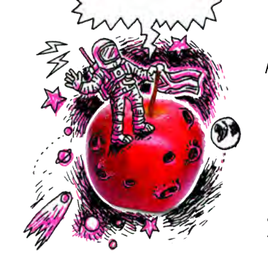
> **[Diagram Context - Textbook_NaturalScience_Gr9_Acids-bases-and-the-pH-value.pdf-0009-03.png]**
> 1. A cartoon drawing of an astronaut on a red planet.
2. A large red apple with a flag on top.
3. A rocket ship.

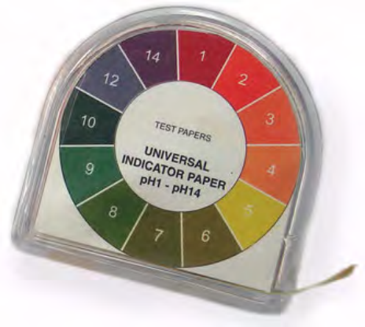
> **[Diagram Context - Textbook_NaturalScience_Gr9_Acids-bases-and-the-pH-value.pdf-0009-05.png]**
> The image shows a test paper indicator for measuring the universal indicator of a chemical. The indicator is a circle with a spectrum of colors, representing different pH values. The paper is placed in a clear plastic sleeve, and the indicator is labeled with the text "Universal indicator of a chemical" and "Test papers" at the top. The indicator is designed to be used in a laboratory setting to measure

> **[Diagram Context - Textbook_NaturalScience_Gr9_Acids-bases-and-the-pH-value.pdf-0009-08.png]**
> 1. A diagram of a cell with a diagram of a cell and a diagram of a cell with a diagram of a cell and a diagram of a cell with a diagram of a cell and a diagram of a cell with a diagram of a cell and a diagram of a cell with a diagram of a cell and a diagram of a cell with a diagram of a cell and a diagram of a cell

> **[Diagram Context - Textbook_NaturalScience_Gr9_Chemical-reactions.pdf-0009-03.png]**
> This graphic uses a metaphorical illustration of a caterpillar with a slinky-like body to represent longitudinal wave motion. It visually demonstrates the compression and rarefaction of particles within a medium, where the "slinky" segments mimic the periodic displacement of matter as a wave travels through it.

> **[Diagram Context - Textbook_NaturalScience_Gr9_Chemical-reactions.pdf-0009-07.png]**
> This image depicts a burning sparkler, a pyrotechnic device that produces intense light and sparks through rapid oxidation-reduction reactions. In the context of the Physical Sciences curriculum, this visual serves as a real-world example of an exothermic chemical reaction where stored chemical potential energy is converted into thermal and radiant energy.

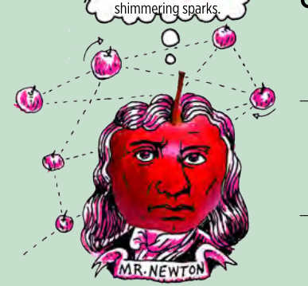
> **[Diagram Context - Textbook_NaturalScience_Gr9_Chemical-reactions.pdf-0009-12.png]**
> This illustration depicts a metaphorical portrait of Isaac Newton with an apple-shaped head, surrounded by orbiting apples connected by dashed lines and directional arrows. It serves as a visual mnemonic to introduce Newton’s Law of Universal Gravitation, representing the conceptual link between the falling apple and the orbital mechanics of celestial bodies.

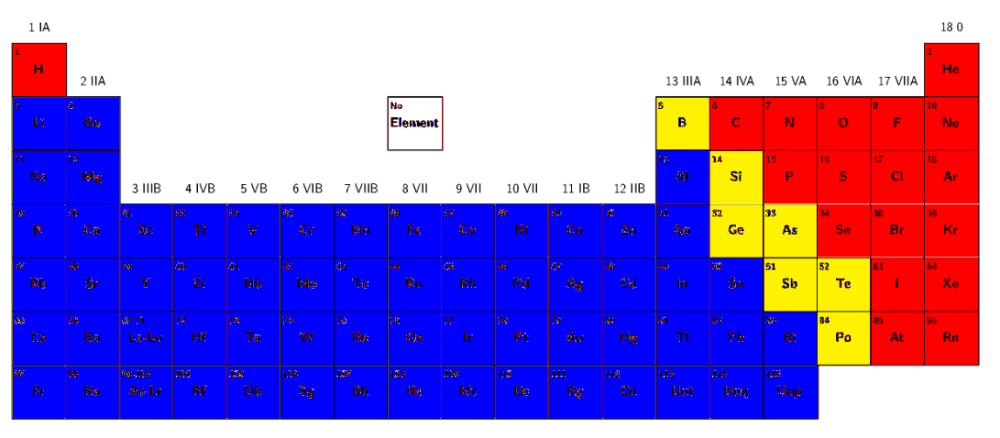
> **[Diagram Context - Textbook_NaturalScience_Gr9_Compounds.pdf-0009-02.png]**
> This diagram is a simplified periodic table that uses color-coding to categorize elements into metals (blue), non-metals (red), and metalloids (yellow). It displays chemical symbols and atomic numbers arranged in groups (1–18) and periods, providing a visual framework for understanding the classification of elements based on their physical and chemical properties.

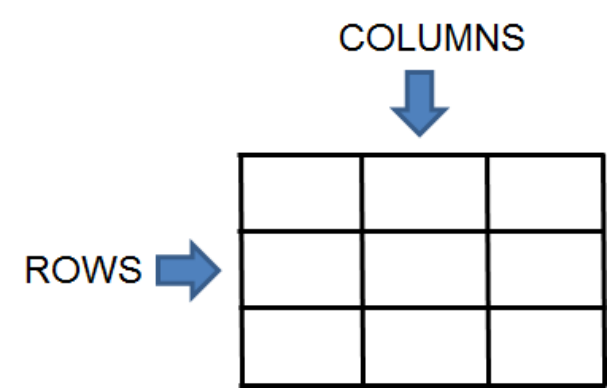
> **[Diagram Context - Textbook_NaturalScience_Gr9_Compounds.pdf-0009-11.png]**
> This graphic displays a 3x3 grid structure labeled with the terms "ROWS" and "COLUMNS," indicated by directional arrows. It serves as a foundational visual aid to help learners distinguish between horizontal rows and vertical columns, a key concept for organizing data in tables, matrices, and spreadsheets across various CAPS subjects.

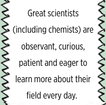
> **[Diagram Context - Textbook_NaturalScience_Gr9_Reactions-of-acids-with-a-metal.pdf-0009-07.png]**
> 1. A diagram of a cell with arrows pointing to different parts of the cell.

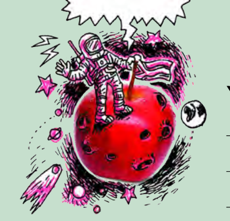
> **[Diagram Context - Textbook_NaturalScience_Gr9_Reactions-of-acids-with-a-metal.pdf-0009-14.png]**
> 1. A cartoon drawing of an astronaut on a red planet.
2. A flag on the planet.
3. A red apple on the planet.
4. A black and white line drawing of a planet.
5. A black and white line drawing of a planet.

> **[Diagram Context - Textbook_NaturalScience_Gr9_Reactions-of-acids-with-a-metal.pdf-0009-19.png]**
> This graphic is a decorative border featuring a repeating pattern of stylized green arrows configured in a continuous S-shape wave formation. The design displays no specific textual labels, variables, biological structures, or chemical symbols, consisting purely of graphical directional arrows. Conceptually, it serves a purely aesthetic purpose as a page separator or banner rather than conveying formal curriculum content for high school science learners.

> **[Diagram Context - Textbook_NaturalScience_Gr9_Reactions-of-acids-with-a-metal.pdf-0009-21.png]**
> 1. A diagram of a cell with blue and white lines.

> **[Diagram Context - Textbook_NaturalScience_Gr9_Reactions-of-acids-with-a-metal.pdf-0009-22.png]**
> 1. A diagram of a cell with a key on it.

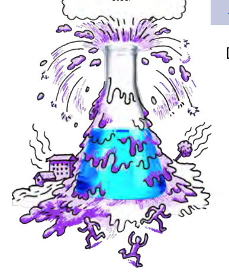
> **[Diagram Context - Textbook_NaturalScience_Gr9_Reactions-of-metals-with-oxygen.pdf-0009-04.png]**
> This illustration depicts a laboratory Erlenmeyer flask erupting like a volcano, with purple liquid overflowing onto a landscape containing buildings and fleeing figures. The graphic serves as a metaphorical representation of a chemical reaction gone wrong, illustrating the potential hazards of uncontrolled chemical spills or runaway reactions in a laboratory setting.

> **[Diagram Context - Textbook_NaturalScience_Gr9_Reactions-of-metals-with-oxygen.pdf-0009-06.png]**
> This collage displays various real-world examples of oxidation, specifically the formation of iron(III) oxide (rust) on diverse metallic objects like vehicles, tools, and structural components. It visually demonstrates the electrochemical process of corrosion, where iron reacts with oxygen and moisture to degrade metal surfaces. For high school learners, this serves as a practical application of redox reactions, illustrating the destructive impact of environmental factors on iron-based materials.

> **[Diagram Context - Textbook_NaturalScience_Gr9_Reactions-of-metals-with-oxygen.pdf-0009-08.png]**
> This diagram illustrates a slinky toy moving down a staircase, using motion lines to indicate its path and orientation. It serves as a physical model to help Grade 10-12 learners visualize the propagation of longitudinal and transverse waves, demonstrating how energy is transferred through a medium via periodic motion.

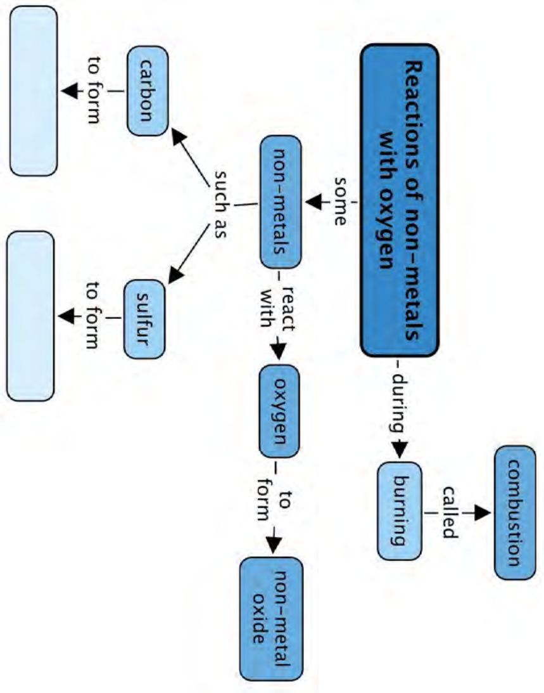
> **[Diagram Context - Textbook_NaturalScience_Gr9_Reactions-of-non-metals-with-oxygen.pdf-0009-00.png]**
> 1. A diagram of a chemical reaction involving oxygen and carbon.

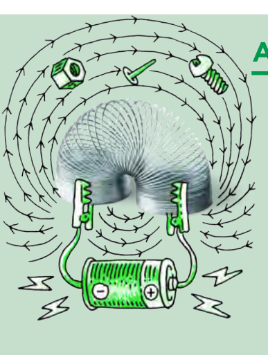
> **[Diagram Context - Textbook_NaturalScience_Gr9_Resistance.pdf-0009-02.png]**
> 1. A green and white diagram of a battery and a spring.

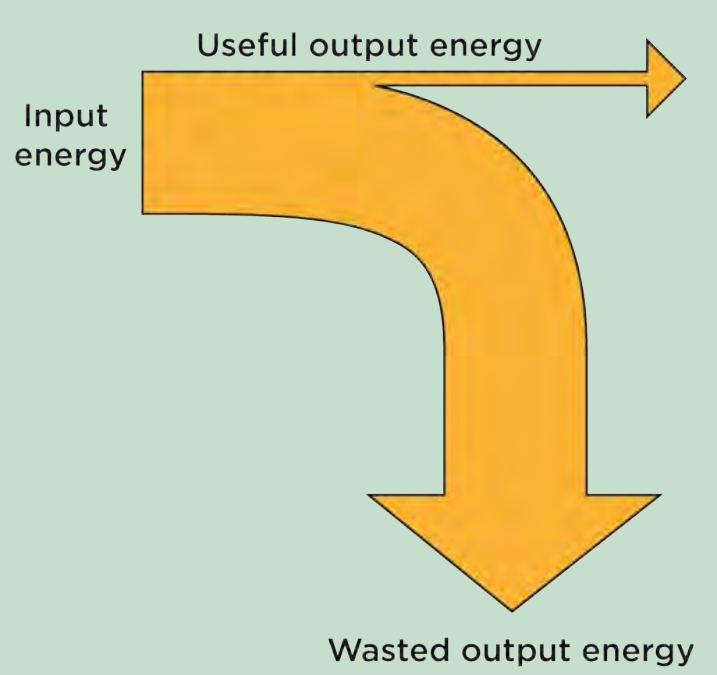
> **[Diagram Context - Textbook_NaturalScience_Gr9_Resistance.pdf-0009-05.png]**
> The image presents a diagram of a yellow arrow pointing to the right, with the text "useful output energy" above it and "wasted output energy" below it. The arrow is pointing to the right, indicating a positive direction, while the text on the right side points in the opposite direction, suggesting a negative or wasted energy flow. The diagram is labeled with various terms such as "

> **[Diagram Context - Textbook_NaturalScience_Gr9_Resistance.pdf-0009-08.png]**
> The image presents a cartoon depiction of a boy holding a pole, with arrows pointing to the earth and the continents. The boy is wearing a green shirt and a hat. The boy is standing on a globe, which is tilted to the left. The globe is divided into two halves, with the left half representing the continents and the right half representing the oceans. The boy is holding the pole with

---

# ACTIVITY: Elements on the Periodic Table

### INSTRUCTIONS
1. Use your Periodic Table to complete the table below.
2. Write the chemical symbol and element name for each of the first 20 elements, identified by their atomic numbers.

### TAKE NOTE
You need to know the names and symbols of the first 20 elements on the Periodic Table, as well as iron, copper, and zinc.

### Elements Table

| Atomic number | Chemical symbol | Element name |
| :--- | :--- | :--- |
| 1 | | |
| 2 | | |
| 3 | | |
| 4 | | |
| 5 | | |
| 6 | | |
| 7 | | |
| 8 | | |
| 9 | | |
| 10 | | |
| 11 | | |
| 12 | | |
| 13 | | |
| 14 | | |
| 15 | | |
| 16 | | |
| 17 | | |
| 18 | | |
| 19 | | |
| 20 | | |

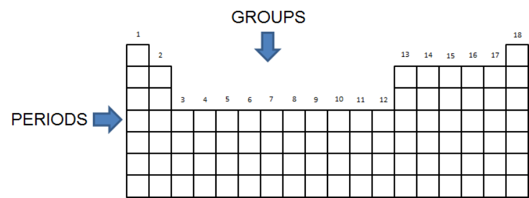

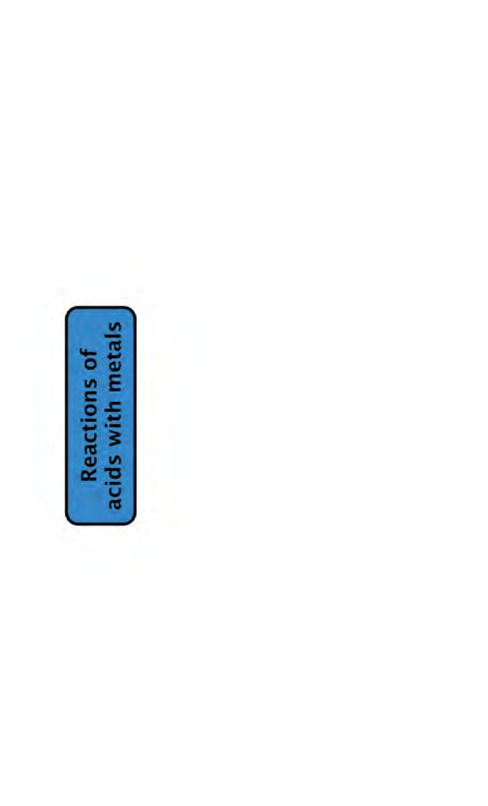

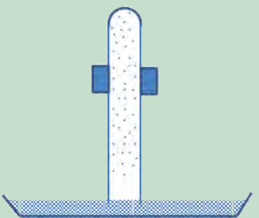

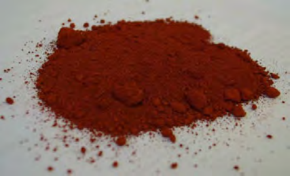

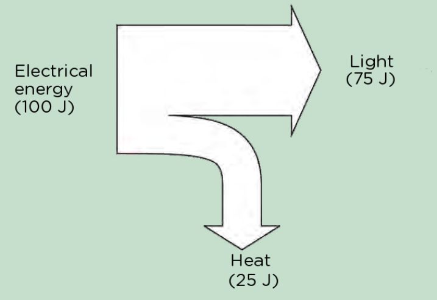

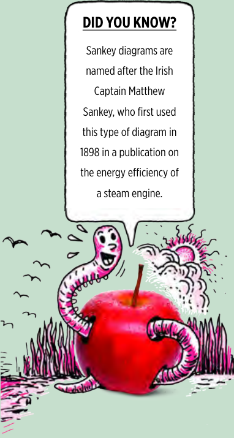

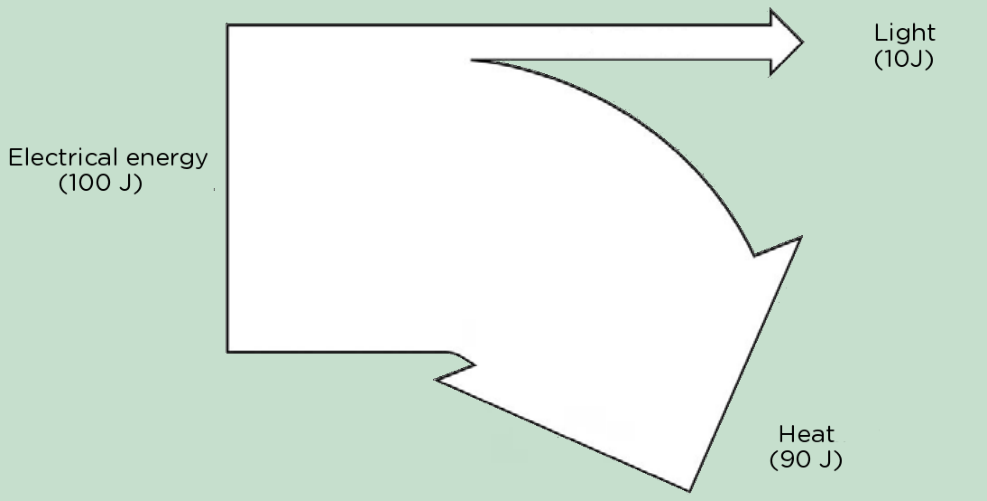

---

### Industrial Metals Table

Complete the following table by identifying the chemical symbols and names for the given atomic numbers:

| Atomic number | Chemical symbol | Element name |
| :--- | :--- | :--- |
| 26 | | |
| 29 | | |
| 30 | | |

---

### Questions

1. What does the atomic number tell us about the atoms of an element?
2. How many protons are there in oxygen atoms?
3. In most oxygen atoms, how many neutrons are there?
4. In a neutral oxygen atom, how many electrons will there be?
5. What is the charge on protons and electrons?
6. How are the protons, neutrons and electrons (the sub-atomic particles) arranged in an atom?

---

### Did You Know?

Even though the electrons in an atom move so fast that it is not possible to describe their actual 'positions', scientists have been able to figure out patterns in the arrangement of the electrons. These patterns repeat after every $18^{th}$ element.

> **[Diagram Context - Textbook_NaturalScience_Gr9_Chemical-reactions.pdf-0011-01.png]**
> This particle model diagram illustrates a chemical reaction using circular representations of atoms, specifically showing two separate purple atoms reacting with a diatomic red molecule to form two identical red-purple compound molecules. By using a plus sign and an arrow to denote the transformation of reactants into products, the graphic helps learners visualize the law of conservation of mass and the rearrangement of atoms during a chemical change.

> **[Diagram Context - Textbook_NaturalScience_Gr9_Chemical-reactions.pdf-0011-10.png]**
> This graphic uses a cartoon illustration of a roller coaster to represent the concept of mechanical energy transformation. It features a roller coaster track, a carriage, and a superimposed slinky spring, with the text "A" visible in the corner. Conceptually, this diagram helps Grade 10-12 Physical Sciences learners visualize the continuous conversion between gravitational potential energy at the peaks and kinetic energy at the troughs of a system.

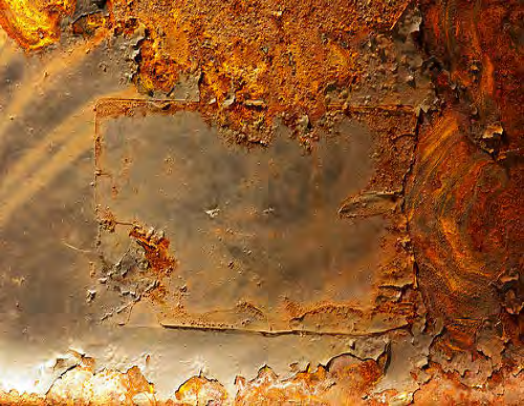
> **[Diagram Context - Textbook_NaturalScience_Gr9_Chemical-reactions.pdf-0011-13.png]**
> This image is a macro photograph depicting the advanced electrochemical corrosion of a metallic surface, characterized by flaking iron oxide (rust) and exposed, degraded substrate. It serves as a real-world visual representation of an oxidation-reduction (redox) reaction, illustrating the spontaneous formation of hydrated iron(III) oxide ($Fe_2O_3 \cdot nH_2O$) when iron is exposed to oxygen and moisture. For CAPS Physical Sciences learners, this provides a tangible example of the destructive impact of electrochemical processes on metals and the necessity of protective coatings to prevent material failure.

> **[Diagram Context - Textbook_NaturalScience_Gr9_Chemical-reactions.pdf-0011-14.png]**
> This image displays a motor vehicle with extensive surface corrosion on its bonnet and front panels. It serves as a real-world visual example of electrochemical oxidation, illustrating the chemical process where iron reacts with oxygen and moisture to form hydrated iron(III) oxide, commonly known as rust.

> **[Diagram Context - Textbook_NaturalScience_Gr9_Compounds.pdf-0011-00.png]**
> This illustration depicts a roller coaster track featuring a superimposed slinky spring, with visible elements including a coaster car, track supports, and passengers with raised arms. It serves as a conceptual analogy for Grade 10 Physical Sciences, using the roller coaster's motion to illustrate the transformation between gravitational potential energy at the peak and kinetic energy during the descent.

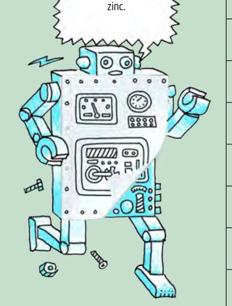
> **[Diagram Context - Textbook_NaturalScience_Gr9_Compounds.pdf-0011-07.png]**
> This cartoon depicts a robot with a peeling metal exterior, accompanied by the text label "zinc." It serves as a mnemonic device to help learners associate the chemical element zinc with its common use as a protective, corrosion-resistant coating for iron or steel, a process known as galvanisation.

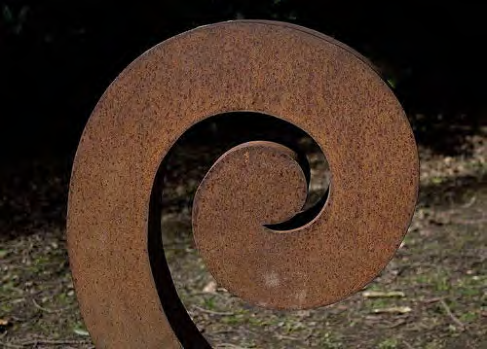
> **[Diagram Context - Textbook_NaturalScience_Gr9_Reactions-of-metals-with-oxygen.pdf-0011-02.png]**
> This image depicts a physical sculpture in the form of a logarithmic spiral, characterized by a curve that grows increasingly distant from its origin. Lacking labels or mathematical variables, the figure serves as a visual representation of geometric patterns found in nature, such as the shell of a nautilus or the arrangement of seeds in a sunflower. For a high school learner, this illustrates the application of mathematical sequences and growth patterns within the context of biomimicry and natural design.

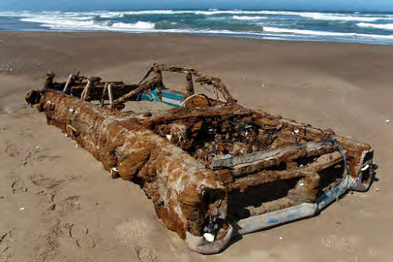
> **[Diagram Context - Textbook_NaturalScience_Gr9_Reactions-of-metals-with-oxygen.pdf-0011-03.png]**
> This image depicts a heavily corroded, rusted vehicle chassis abandoned on a sandy beach near the ocean. The visual elements include the iron-based metal frame, extensive iron oxide (rust) accumulation, and the surrounding saline, moisture-rich coastal environment. Conceptually, this serves as a real-world application of electrochemical corrosion, illustrating how the presence of oxygen, water, and electrolytes (salt) accelerates the oxidation of iron into hydrated iron(III) oxide.

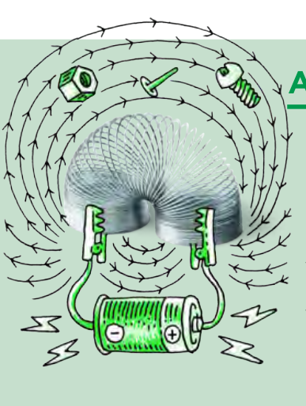
> **[Diagram Context - Textbook_NaturalScience_Gr9_Reactions-of-metals-with-oxygen.pdf-0011-08.png]**
> This diagram illustrates an electromagnet created by connecting a coiled wire (solenoid) to a battery, marked with positive (+) and negative (-) terminals. The visual includes field lines with directional arrows surrounding the coil, demonstrating the generation of a magnetic field that attracts nearby metallic objects like a nut, nail, and bolt. For a high school learner, this demonstrates the principle of electromagnetism, showing how an electric current flowing through a conductor produces a magnetic field capable of exerting force on ferromagnetic materials.

> **[Diagram Context - Textbook_NaturalScience_Gr9_Reactions-of-metals-with-oxygen.pdf-0011-12.png]**
> This photograph displays a metal chain and shackle undergoing advanced electrochemical corrosion, characterized by visible iron(III) oxide (rust) formation and surface degradation. It serves as a real-world example of the oxidation of iron, illustrating the redox reaction where iron loses electrons to oxygen in the presence of moisture. For CAPS Physical Sciences learners, this image provides a tangible context for studying electrochemical cells, the impact of environmental factors on metal durability, and the chemical processes involved in corrosion.

> **[Diagram Context - Textbook_NaturalScience_Gr9_Reactions-of-metals-with-oxygen.pdf-0011-14.png]**
> This image depicts a rusted metal strap hinge attached to weathered wooden planks, featuring visible fasteners (rivets or bolts) securing the hinge plate. In the context of Physical Sciences, this serves as a real-world example of electrochemical corrosion (oxidation of iron), illustrating the degradation of metals when exposed to oxygen and moisture.

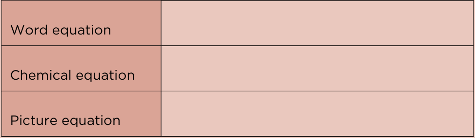
> **[Diagram Context - Textbook_NaturalScience_Gr9_Reactions-of-non-metals-with-oxygen.pdf-0011-04.png]**
> 1. A diagram of a chemical equation.

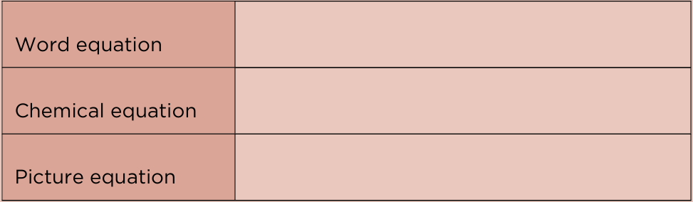
> **[Diagram Context - Textbook_NaturalScience_Gr9_Reactions-of-non-metals-with-oxygen.pdf-0011-06.png]**
> 1. A pink line drawing of a chemical equation.

> **[Diagram Context - Textbook_NaturalScience_Gr9_Reactions-of-non-metals-with-oxygen.pdf-0011-08.png]**
> The image shows a gray background with a red and white line running down the center. The line is adorned with a red ant, which is the main focus of the image. The ant is positioned in the middle of the line, and it appears to be walking along the line. The background is plain and unadorned, which makes the ant stand out even more. The ant is the only

> **[Diagram Context - Textbook_NaturalScience_Gr9_Resistance.pdf-0011-03.png]**
> 1. A diagram of a cell with a green line representing a cell wall.

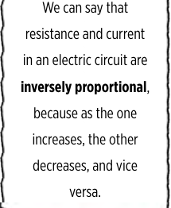
> **[Diagram Context - Textbook_NaturalScience_Gr9_Resistance.pdf-0011-06.png]**
> The image shows a text that explains the concept of inverte proportional, which is a mathematical concept. The text is written in a clear and simple manner, making it easy to understand. The text is written in a way that is easy to read and comprehend.

> **[Diagram Context - Textbook_NaturalScience_Gr9_Resistance.pdf-0011-09.png]**
> 1. A cartoon drawing of a man holding a picture of a woman.

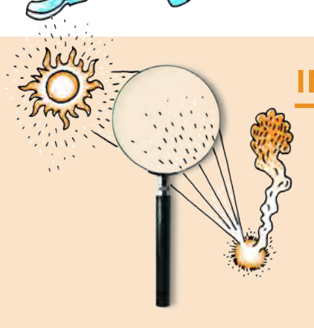
> **[Diagram Context - Textbook_NaturalScience_Gr9_Resistance.pdf-0011-16.png]**
> 1. A magnifying glass is being used to look at a diagram of a cell.

---

### Exercise: Atomic Structure
**7. Draw a model of an oxygen atom in the space provided. Label your diagram.**

---

### The Periodic Table: Groups and Properties

#### Why are there 18 groups?
The Periodic Table contains exactly 18 groups because of how electrons are distributed within an atom. These "electron patterns" repeat after every 18th element. You will study this in greater detail in Grade 10 Physical Sciences.

#### Properties of Elements in the Same Group
Elements within the same group often share similar physical and chemical properties because they possess similar "electron patterns," which dictate how they behave in chemical reactions.

#### Alkali Metals (Group 1)
*   **Definition:** The metals found in Group 1 are known as **alkali metals**.
*   **Note:** Hydrogen is placed in Group 1 due to its electron pattern, but it is classified as a non-metal.
*   **Physical Properties:** Alkali metals are soft, dull-grey metals.
*   **Chemical Properties:** They react in a very specific, vigorous way with water.

**Example: Reaction of Lithium with Water**
When a piece of lithium is placed in water, it reacts immediately. The chemical equation for this reaction is:

$$2\text{Li} + 2\text{H}_2\text{O} \rightarrow 2\text{LiOH} + \text{H}_2$$

*   **Observation:** Lithium metal is typically stored in oil to prevent it from reacting with moisture in the air. It floats in the bottle because it is less dense than the oil.

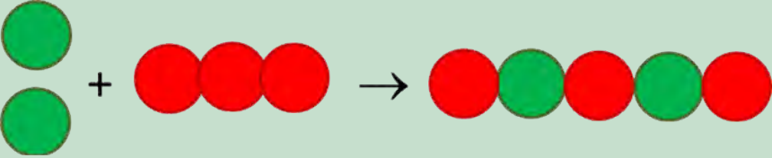
> **[Diagram Context - Textbook_NaturalScience_Gr9_Chemical-reactions.pdf-0012-12.png]**
> This particle model uses green and red spheres to represent a chemical reaction between two distinct substances. It illustrates the concept of chemical change by showing how individual reactant particles rearrange to form a new, combined product structure, demonstrating the conservation of matter.

> **[Diagram Context - Textbook_NaturalScience_Gr9_Compounds.pdf-0012-12.png]**
> This illustration depicts a caricature of Isaac Newton with an apple-shaped head, surrounded by a network of orbiting apples connected by dashed lines and directional arrows, labeled with a banner reading "MR. NEWTON." The graphic conceptually introduces the Grade 10-12 Physics topic of Newton’s Law of Universal Gravitation by using the iconic apple imagery to represent gravitational attraction between masses in a system.

> **[Diagram Context - Textbook_NaturalScience_Gr9_Reactions-of-acids-with-a-metal.pdf-0012-08.png]**
> The graphic is an illustration depicting animal behavior and social communication, specifically showing an ant leading a linear trail of ants along a shaded pathway. Visible elements include a larger individual ant at the front and two parallel, narrow streams of numerous smaller ants forming a continuous trail against a pink and white background. Conceptually, this diagram illustrates social organization and pheromone-based communication in eusocial insects, helping learners understand how cooperative behavior and chemical signaling facilitate collective foraging and navigation within an ecosystem.

> **[Diagram Context - Textbook_NaturalScience_Gr9_Reactions-of-metals-with-oxygen.pdf-0012-02.png]**
> This graphic depicts a schematic representation of a double-stranded DNA molecule, characterized by its iconic double helix structure. The visual features two intertwined, continuous strands with repeating segments that represent the sugar-phosphate backbones and internal cross-links. It conceptually illustrates the fundamental molecular architecture of genetic material, emphasizing the complementary, antiparallel nature of the DNA strands essential for replication and protein synthesis in Life Sciences.

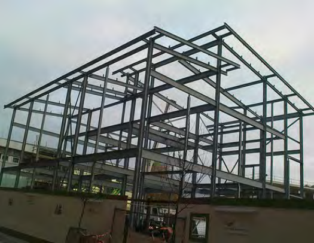
> **[Diagram Context - Textbook_NaturalScience_Gr9_Reactions-of-metals-with-oxygen.pdf-0012-05.png]**
> This image displays a steel frame structure, which serves as a real-world example of a rigid framework in civil technology and engineering graphics. It illustrates the use of structural steel members, including vertical columns, horizontal beams, and diagonal bracing, which are essential for supporting loads and ensuring structural stability. For learners, this visualizes how interconnected components distribute forces to maintain the integrity of a building's skeleton before the addition of cladding or finishes.

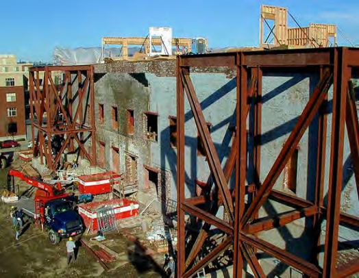
> **[Diagram Context - Textbook_NaturalScience_Gr9_Reactions-of-metals-with-oxygen.pdf-0012-06.png]**
> This image depicts a construction site featuring an existing masonry building reinforced with an external steel exoskeleton, including visible structural steel beams, cross-bracing, and construction equipment. It illustrates the engineering principles of structural retrofitting and seismic bracing, demonstrating how external steel frameworks are used to provide lateral stability and support to older masonry structures.

> **[Diagram Context - Textbook_NaturalScience_Gr9_Reactions-of-metals-with-oxygen.pdf-0012-11.png]**
> This graphic is a text-based heading enclosed in a decorative, cloud-like border featuring the underlined label "NEW WORDS." It serves as a structural signpost in educational materials to signal a section dedicated to defining key terminology and vocabulary relevant to the current topic. For a high school student, this visual cue helps organize learning by highlighting essential concepts that must be mastered to ensure a foundational understanding of the subject matter.

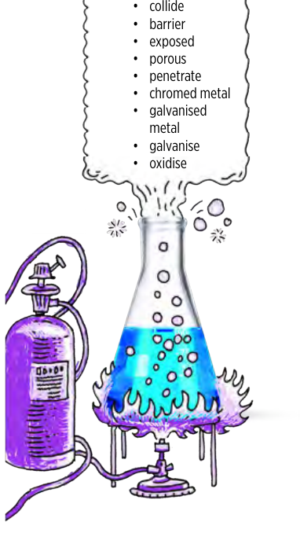
> **[Diagram Context - Textbook_NaturalScience_Gr9_Reactions-of-metals-with-oxygen.pdf-0012-12.png]**
> This diagram depicts a laboratory apparatus featuring a gas cylinder connected to a Bunsen burner heating an Erlenmeyer flask, accompanied by a word bank containing terms such as "collide," "barrier," "porous," "chromed metal," "galvanised metal," and "oxidise." It serves as a visual prompt for Grade 10-12 Physical Sciences learners to construct scientific explanations or definitions related to chemical reactions, corrosion, and the protection of metals. The graphic conceptually links the kinetic theory of matter and reaction conditions to the practical processes of metal oxidation and industrial surface treatments.

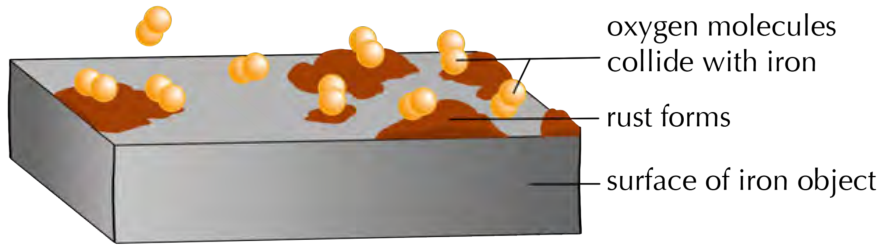
> **[Diagram Context - Textbook_NaturalScience_Gr9_Reactions-of-metals-with-oxygen.pdf-0012-14.png]**
> This diagram illustrates the chemical process of oxidation on a metal surface, featuring labels for "oxygen molecules," "iron," and "rust." It conceptually demonstrates how the collision of oxygen molecules with an iron surface initiates a chemical reaction that results in the formation of rust, providing a visual representation of corrosion for Grade 9 Natural Sciences or Grade 10 Physical Sciences.

> **[Diagram Context - Textbook_NaturalScience_Gr9_Reactions-of-non-metals-with-oxygen.pdf-0012-01.png]**
> 1. A diagram of a cell with a pink dot labeled "Mitochondria".

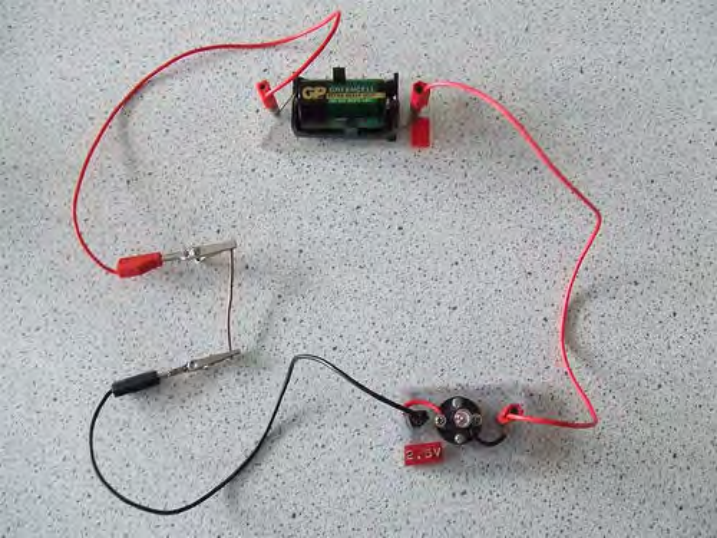
> **[Diagram Context - Textbook_NaturalScience_Gr9_Resistance.pdf-0012-14.png]**
> 1. A diagram of a circuit with a battery, wires, and a light bulb.

---

### Chemical Reactions of Alkali Metals with Water

#### 1. The Reaction of Lithium with Water
When lithium metal reacts with water, it produces hydrogen gas ($H_2$) and lithium hydroxide. The reaction releases heat, which can cause the hydrogen gas to ignite.

*   **Chemical Equation:** $2Li + 2H_2O \rightarrow 2LiOH + H_2$
*   **Word Equation:** Lithium + Water $\rightarrow$ Lithium hydroxide + Hydrogen

#### 2. Reactivity Trends in Group 1 Metals
Elements in the same group of the periodic table exhibit similar chemical properties. As you move down Group 1, the reactivity of the metals increases.

**Sodium ($Na$):**
Sodium is more reactive than lithium. It moves rapidly on the surface of water and bursts into flame immediately upon contact.
*   **Chemical Equation:** $2Na + 2H_2O \rightarrow 2NaOH + H_2$

**Potassium ($K$):**
Potassium is even more reactive than sodium. It reacts violently and explodes upon contact with water.
*   **Chemical Equation:** $2K + 2H_2O \rightarrow 2KOH + H_2$

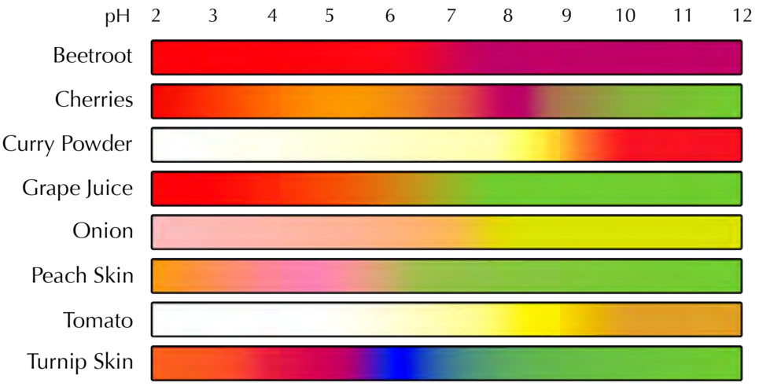
> **[Diagram Context - Textbook_NaturalScience_Gr9_Acids-bases-and-the-pH-value.pdf-0013-07.png]**
> The image is a colorful diagram that illustrates the different types of juices and their corresponding colors. The diagram is divided into six sections, each representing a different type of juice. The juices are labeled with their names, and the colors of the juices are represented by different colors. The diagram also includes the names of the juices and the colors of the juices, as well as the names of the juices and

---

### Summary Table: Reactants and Products

| Metal | Reactants | Products |
| :--- | :--- | :--- |
| Lithium | Lithium ($Li$) + Water ($H_2O$) | Lithium hydroxide ($LiOH$) + Hydrogen ($H_2$) |
| Sodium | Sodium ($Na$) + Water ($H_2O$) | Sodium hydroxide ($NaOH$) + Hydrogen ($H_2$) |
| Potassium | Potassium ($K$) + Water ($H_2O$) | Potassium hydroxide ($KOH$) + Hydrogen ($H_2$) |

---

### Key Concepts
*   **Chemical Properties:** Elements in the same group share similar chemical properties because they react in a similar way with other substances.
*   **Reactivity:** The tendency of a substance to undergo a chemical reaction. In Group 1, reactivity increases as you move down the group.
*   **Reactants:** The starting materials in a chemical reaction (found on the left side of the arrow).
*   **Products:** The substances formed as a result of a chemical reaction (found on the right side of the arrow).

> **[Diagram Context - Textbook_NaturalScience_Gr9_Acids-bases-and-the-pH-value.pdf-0013-08.png]**
> 1. A diagram of a cell with arrows pointing to different parts of the cell.

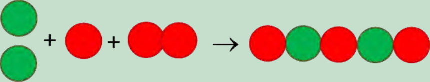
> **[Diagram Context - Textbook_NaturalScience_Gr9_Chemical-reactions.pdf-0013-07.png]**
> This diagram uses a particle model to represent a chemical reaction, featuring green and red spheres as atoms and a reaction arrow indicating the transformation of reactants into a product. It illustrates the concept of conservation of mass and chemical bonding, showing how individual atoms rearrange to form a new, larger molecule while maintaining the same total number of each atom type.

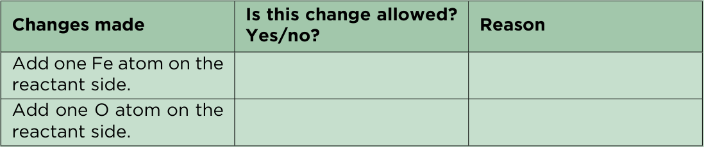
> **[Diagram Context - Textbook_NaturalScience_Gr9_Chemical-reactions.pdf-0013-08.png]**
> This table is a chemistry exercise designed to test the understanding of the Law of Conservation of Mass during the balancing of chemical equations. It uses the chemical symbols "Fe" (iron) and "O" (oxygen) to prompt students to evaluate whether arbitrarily adding atoms to the reactant side is a valid method for balancing equations. The activity reinforces the principle that atoms cannot be created or destroyed, and that balancing must only be achieved by adjusting coefficients, not by altering the chemical formulas themselves.

> **[Diagram Context - Textbook_NaturalScience_Gr9_Compounds.pdf-0013-03.png]**
> This graphic depicts a stylized, repeating wave pattern composed of interconnected, arrow-headed segments. The image uses a continuous green line to represent a rhythmic, directional flow or periodic motion. Conceptually, this serves as a visual metaphor for wave propagation, energy transfer, or the continuous movement of particles in a medium, which are fundamental concepts in Grade 10-12 Physical Sciences.

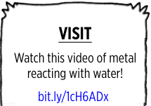
> **[Diagram Context - Textbook_NaturalScience_Gr9_Compounds.pdf-0013-05.png]**
> This graphic is a digital signpost containing the text "VISIT," "Watch this video of metal reacting with water!", and a shortened URL link. It serves as a supplementary multimedia resource to help Grade 10-12 Physical Sciences learners visualize the chemical reactivity trends of Group 1 and 2 metals with water.

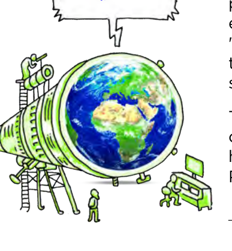
> **[Diagram Context - Textbook_NaturalScience_Gr9_Compounds.pdf-0013-08.png]**
> This cartoon depicts a large telescope focused on the Earth, featuring human figures operating the equipment and monitoring data on a computer console. It illustrates the concept of Earth observation and remote sensing, highlighting how scientists use technological instruments to collect, analyse, and interpret global environmental data.

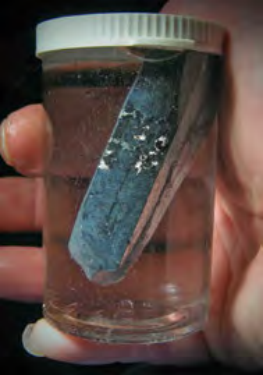
> **[Diagram Context - Textbook_NaturalScience_Gr9_Compounds.pdf-0013-10.png]**
> This image shows a piece of alkali metal, specifically lithium, stored in a sealed container of mineral oil to prevent reaction with atmospheric moisture. The visible gas bubbles on the metal surface demonstrate the chemical reactivity of Group 1 elements, illustrating the necessity of inert storage conditions to prevent oxidation and hydrolysis.

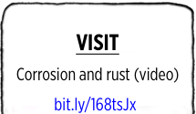
> **[Diagram Context - Textbook_NaturalScience_Gr9_Reactions-of-metals-with-oxygen.pdf-0013-02.png]**
> This graphic is a digital signpost containing the text "VISIT," "Corrosion and rust (video)," and a shortened URL link. It serves as an external resource prompt to support the Physical Sciences curriculum by directing students to visual media explaining the electrochemical processes of corrosion and rust formation.

> **[Diagram Context - Textbook_NaturalScience_Gr9_Reactions-of-metals-with-oxygen.pdf-0013-03.png]**
> This cartoon depicts a human figure interacting with a globe of the Earth, featuring a speech bubble containing a URL. It serves as a visual metaphor for human impact on the environment, illustrating the concept of anthropogenic influence on global systems within the context of Life Sciences or Geography.

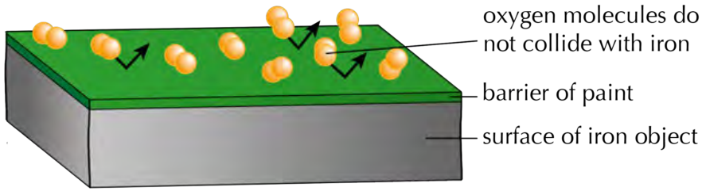
> **[Diagram Context - Textbook_NaturalScience_Gr9_Reactions-of-metals-with-oxygen.pdf-0013-04.png]**
> This diagram illustrates the prevention of corrosion using a protective coating, featuring an iron surface, a green paint barrier, and diatomic oxygen molecules represented by orange spheres. It demonstrates how a physical barrier prevents oxygen molecules from colliding with the iron surface, thereby inhibiting the oxidation reaction necessary for rust formation.

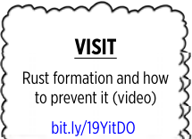
> **[Diagram Context - Textbook_NaturalScience_Gr9_Reactions-of-metals-with-oxygen.pdf-0013-06.png]**
> This graphic is a digital signpost containing the text "VISIT," "Rust formation and how to prevent it (video)," and a shortened URL link. It serves as a supplementary resource for Grade 10-12 Physical Sciences learners to explore the electrochemical processes of corrosion and the practical methods used to prevent the oxidation of iron.

> **[Diagram Context - Textbook_NaturalScience_Gr9_Reactions-of-metals-with-oxygen.pdf-0013-09.png]**
> This illustration depicts the Earth as a hot air balloon, featuring visual elements of the sun, clouds, birds, and two figures in a basket using telescopes to observe the planet. It serves as a metaphorical representation of global environmental monitoring and the human responsibility to observe, study, and manage the Earth's systems within the context of Life Sciences and Geography.

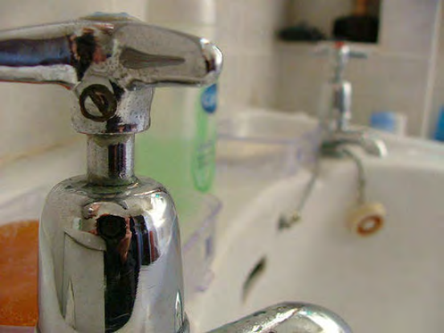
> **[Diagram Context - Textbook_NaturalScience_Gr9_Reactions-of-metals-with-oxygen.pdf-0013-10.png]**
> This image depicts a close-up of a domestic chrome bathroom tap assembly, featuring a prominent handle with a circular "no-entry" or "off" symbol. It serves as a real-world visual aid for teaching the mechanics of simple machines, specifically the wheel and axle, or for discussing water conservation and resource management within the Life Sciences and Natural Sciences curricula.

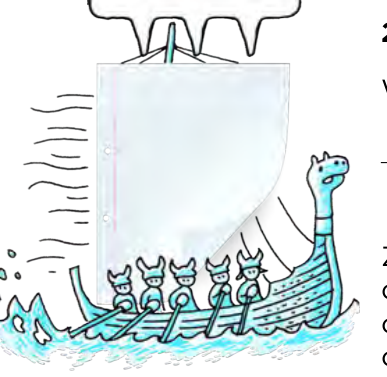
> **[Diagram Context - Textbook_NaturalScience_Gr9_Reactions-of-metals-with-oxygen.pdf-0013-15.png]**
> This graphic is a metaphorical illustration depicting a Viking ship with rowers and a sail, accompanied by wind-effect lines and a speech bubble. It serves as a visual prompt to stimulate creative writing or historical narrative exercises, encouraging students to contextualize the scene within a specific historical or literary framework.

> **[Diagram Context - Textbook_NaturalScience_Gr9_Resistance.pdf-0013-05.png]**
> 1. A white square with a brown border.

---

# 1.3 Names of Compounds

### New Words
*   **IUPAC:** International Union of Pure and Applied Chemistry.
*   **IUPAC system:** A standardized set of rules for naming chemical compounds.
*   **Systematic name:** A name assigned based on a specific set of rules.
*   **Suffix:** A letter or group of letters added to the **end** of a word.
*   **Prefix:** A letter or group of letters added to the **beginning** of a word.

---

### The Importance of Unique Names
Just as every element has a unique name to avoid confusion, every chemical compound must have a unique name. 

**Example:**

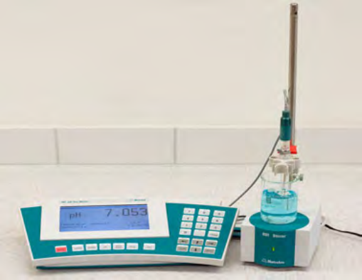
> **[Diagram Context - Textbook_NaturalScience_Gr9_Acids-bases-and-the-pH-value.pdf-0014-00.png]**
> 1. A digital thermometer with a 7.53 degrees Celsius scale.
 2. A small glass vial with a red cap.
 3. A small glass vial with a blue cap.

*   **CO (Carbon monoxide):** A poisonous gas.
*   **$CO_2$ (Carbon dioxide):** A different gas.

If both were simply called "carbon oxide," it would be dangerous because their properties (such as toxicity) differ significantly.

---

### Chemical Formulae and Naming
*   **Formulae:** Chemical formulae are combinations of element symbols (e.g., $NaCl$ consists of Sodium ($Na$) and Chlorine ($Cl$)).
*   **Naming Convention:** When naming compounds, the names of the elements are combined. Often, the name of the element listed last is slightly modified.
*   **The IUPAC System:** To prevent confusion, the **International Union of Pure and Applied Chemistry (IUPAC)** developed a systematic way to name compounds based on the elements they contain and how they are combined.

---

### Naming Compounds with Two Elements
At this level, we focus on naming compounds that consist of two elements. We categorize them into types to determine the naming rule.

#### Type 1: Compounds that contain a metal and a non-metal
The rule for naming these compounds is:
1.  The **metal** name comes first.
2.  The **non-metal** name comes second.
3.  The ending of the non-metal name is changed to the suffix **-ide**.

**Example:**
*   Sodium + Chlorine $\rightarrow$ Sodium chlor**ide**

> **TAKE NOTE**
> *   A **suffix** is something placed at the **end** of a word.
> *   A **prefix** is something placed at the **beginning** of a word.

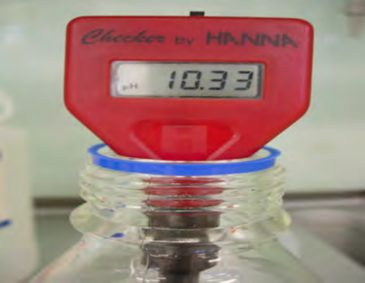
> **[Diagram Context - Textbook_NaturalScience_Gr9_Acids-bases-and-the-pH-value.pdf-0014-01.png]**
> 1. A red device with a digital screen that reads "Checkered by Hanna" and displays the number "1033".

> **[Diagram Context - Textbook_NaturalScience_Gr9_Acids-bases-and-the-pH-value.pdf-0014-05.png]**
> 1. A diagram of a cell with blue and white lines.

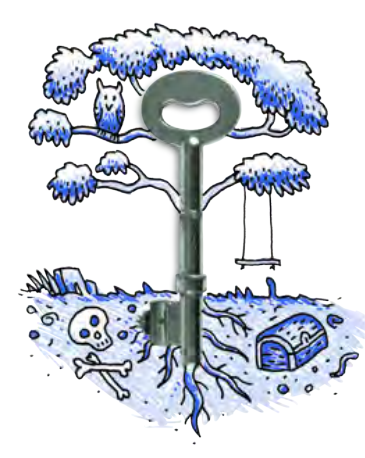
> **[Diagram Context - Textbook_NaturalScience_Gr9_Acids-bases-and-the-pH-value.pdf-0014-13.png]**
> 1. A key is shown in the center of a tree with a skull and a skeleton on the left side.

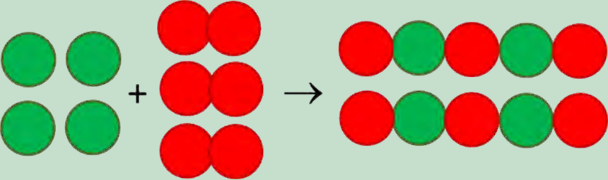
> **[Diagram Context - Textbook_NaturalScience_Gr9_Chemical-reactions.pdf-0014-03.png]**
> This particle model uses red and green spheres to represent a chemical reaction between two distinct substances. The diagram illustrates the conservation of atoms by showing how individual green particles and diatomic red molecules rearrange to form two new compound molecules.

> **[Diagram Context - Textbook_NaturalScience_Gr9_Chemical-reactions.pdf-0014-11.png]**
> This graphic depicts a schematic representation of a DNA molecule, characterized by its iconic double-helix structure with two antiparallel sugar-phosphate backbones. The diagram illustrates the twisted ladder configuration, highlighting the structural integrity and complementary base pairing essential for genetic information storage and replication in Life Sciences.

> **[Diagram Context - Textbook_NaturalScience_Gr9_Compounds.pdf-0014-05.png]**
> This image depicts a high-speed photographic recording of an explosive chemical reaction, featuring a tripod-mounted camera capturing a plume of fire, sparks, and debris. It serves as a visual representation of a rapid exothermic reaction, illustrating the release of thermal energy and the physical displacement of matter often studied in Grade 10-12 Physical Sciences to demonstrate chemical change and energy transformations.

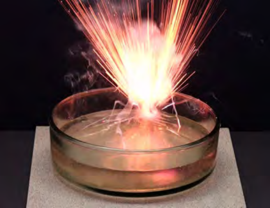
> **[Diagram Context - Textbook_NaturalScience_Gr9_Compounds.pdf-0014-11.png]**
> This image depicts the vigorous, exothermic chemical reaction between an alkali metal (such as potassium) and water, characterized by the emission of light, heat, and hydrogen gas. The visual elements include a glass crystallizing dish containing water and the resulting combustion, with no explicit labels or symbols present. Conceptually, this demonstrates the periodic trend of increasing reactivity down Group 1 of the periodic table, illustrating how alkali metals react with water to form metal hydroxides and flammable hydrogen gas.

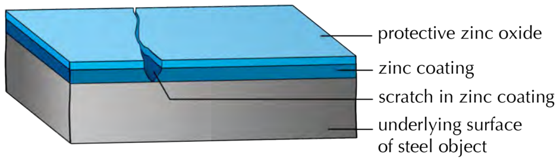
> **[Diagram Context - Textbook_NaturalScience_Gr9_Reactions-of-metals-with-oxygen.pdf-0014-01.png]**
> This diagram illustrates the cross-section of a galvanized metal surface, featuring labels for the "protective zinc oxide" layer, the "zinc coating," a "scratch in zinc coating," and the "underlying surface of steel object." It conceptually demonstrates the principle of sacrificial protection, showing how zinc acts as a barrier and galvanic anode to prevent the underlying steel from corroding even when the surface is damaged.

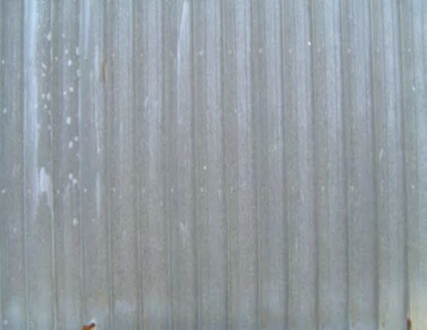
> **[Diagram Context - Textbook_NaturalScience_Gr9_Reactions-of-metals-with-oxygen.pdf-0014-04.png]**
> This image displays a photograph of corrugated metal sheeting, which lacks any educational labels, variables, or scientific annotations. In a CAPS curriculum context, this visual serves as a real-world example of industrial materials, illustrating the properties of metals and the process of galvanization used to prevent corrosion.

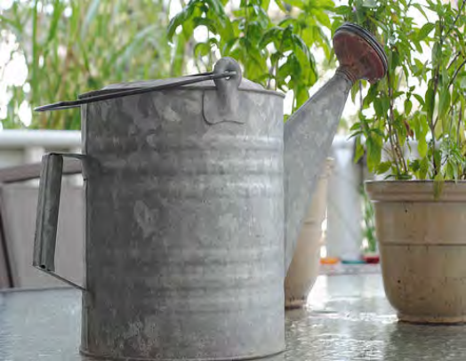
> **[Diagram Context - Textbook_NaturalScience_Gr9_Reactions-of-metals-with-oxygen.pdf-0014-05.png]**
> This image depicts a metal watering can positioned next to a potted plant, serving as a practical tool for irrigation. In a Life Sciences context, this apparatus illustrates the human intervention required to provide water, a vital abiotic factor, to support the physiological processes of photosynthesis and turgor pressure in plants.

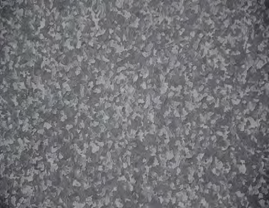
> **[Diagram Context - Textbook_NaturalScience_Gr9_Reactions-of-metals-with-oxygen.pdf-0014-08.png]**
> This image displays the characteristic crystalline surface texture of galvanized steel, showing no specific labels or symbols. In the context of the CAPS curriculum, this visual represents the macroscopic appearance of a metal coated with a protective layer of zinc to prevent corrosion, illustrating the practical application of electrochemical protection in materials science.

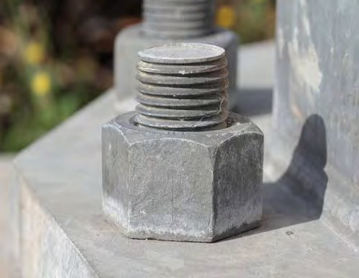
> **[Diagram Context - Textbook_NaturalScience_Gr9_Reactions-of-metals-with-oxygen.pdf-0014-09.png]**
> This image depicts a mechanical fastener assembly consisting of a hexagonal nut threaded onto a bolt. It serves as a real-world example of a helical thread system, illustrating the principles of mechanical advantage and friction used in engineering and technology to secure structural components.

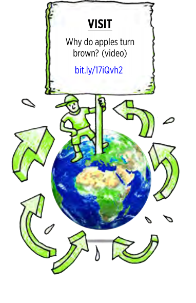
> **[Diagram Context - Textbook_NaturalScience_Gr9_Reactions-of-metals-with-oxygen.pdf-0014-12.png]**
> This graphic features a cartoon illustration of a person standing on a globe surrounded by circular arrows, supporting a sign labeled "VISIT: Why do apples turn brown? (video)" with a shortened URL. It serves as an educational signpost designed to direct students to external digital resources for exploring the chemical process of enzymatic browning in fruit.

> **[Diagram Context - Textbook_NaturalScience_Gr9_Reactions-of-metals-with-oxygen.pdf-0014-15.png]**
> This illustrative cartoon depicts a personified apple acting as a carriage, pulled by two horses and driven by a figure in a suit, with an empty speech bubble above. The graphic serves as a metaphorical or creative prompt, often used in Life Sciences or English language studies to encourage students to construct a narrative, explain a biological process, or describe a scientific concept through storytelling.

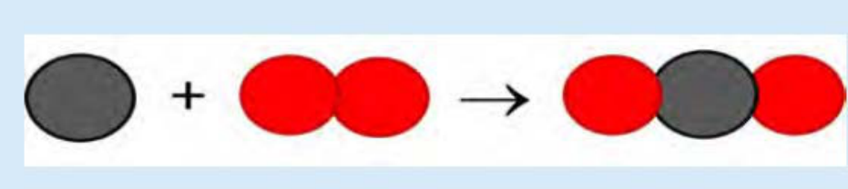
> **[Diagram Context - Textbook_NaturalScience_Gr9_Reactions-of-non-metals-with-oxygen.pdf-0014-04.png]**
> 1. A diagram of a red circle and a black circle with an arrow pointing from the red circle to the black circle.

> **[Diagram Context - Textbook_NaturalScience_Gr9_Resistance.pdf-0014-02.png]**
> 1. A white square with a brown border.

---

### Crystal Lattices and Formula Units

Compounds formed between metals and non-metals do not exist as individual molecules. Instead, they form **crystal lattices**. The repeating 'units' within these structures are called **formula units**.

#### Examples of Formula Units

| Formula | Consists of | Name | Picture of one formula unit |
| :--- | :--- | :--- | :--- |
| $NaCl$ | Sodium and chlorine | Sodium chloride | 

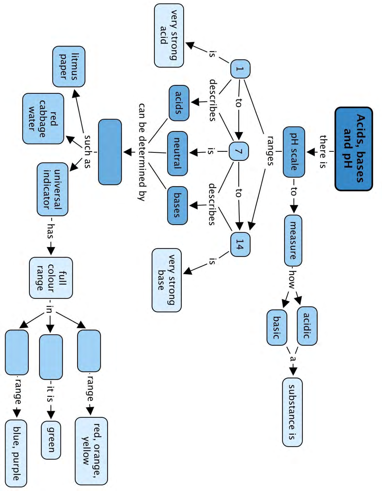
> **[Diagram Context - Textbook_NaturalScience_Gr9_Acids-bases-and-the-pH-value.pdf-0015-00.png]**
> The image is a diagram that illustrates the structure of a cell. The diagram is color-coded, with each color representing a different part of the cell. The diagram is labeled with the names of the different parts of the cell, such as the nucleus, cell membrane, and mitochondria. The diagram also includes arrows that show the connections between the different parts of the cell. The diagram is labeled

 |
| $FeS$ | Iron and sulfur | Iron sulfide | 

> **[Diagram Context - Textbook_NaturalScience_Gr9_Chemical-reactions.pdf-0015-01.png]**
> This diagram illustrates a slinky spring undergoing motion down a staircase, accompanied by motion lines indicating its trajectory. It serves as a visual model for Grade 10-12 Physical Sciences to demonstrate the propagation of longitudinal and transverse waves, as well as the transfer of potential and kinetic energy during oscillatory motion.

 |
| $MgO$ | Magnesium and oxygen | Magnesium oxide | 

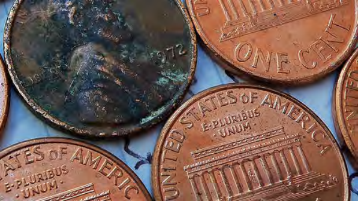
> **[Diagram Context - Textbook_NaturalScience_Gr9_Chemical-reactions.pdf-0015-03.png]**
> This image displays a collection of copper-plated United States one-cent coins, featuring visible inscriptions such as "ONE CENT," "UNITED STATES OF AMERICA," and "E PLURIBUS UNUM." For a high school Physical Sciences student, this serves as a visual representation of oxidation-reduction (redox) reactions, contrasting the shiny, metallic appearance of new coins with the dull, greenish-brown patina of an oxidized copper surface.

 |
| $LiF$ | Lithium and fluorine | Lithium fluoride | 

> **[Diagram Context - Textbook_NaturalScience_Gr9_Chemical-reactions.pdf-0015-09.png]**
> This diagram is a template for a chemical word or symbol equation, featuring three empty rectangular placeholders connected by a plus sign and a reaction arrow. It serves as a foundational scaffold for learners to identify and arrange reactants on the left and products on the right to demonstrate the conservation of matter during a chemical reaction.

 |

---

### ACTIVITY: Naming compounds of metals and non-metals

**Instructions:**
1. Refer to the Periodic Table.
2. Identify the elements that make up each compound and provide the correct chemical name.

| Formula | Which elements does it consist of? | Name |
| :--- | :--- | :--- |
| $Li_{2}O$ | Lithium and oxygen | Lithium oxide |
| $KCl$ | Potassium and chlorine | Potassium chloride |
| $CuO$ | Copper and oxygen | Copper oxide |
| $NaBr$ | Sodium and bromine | Sodium bromide |

> **[Diagram Context - Textbook_NaturalScience_Gr9_Chemical-reactions.pdf-0015-11.png]**
> This diagram is a template for a chemical equation, featuring three empty rectangular placeholders connected by a plus sign and a reaction arrow. It serves as a foundational pedagogical tool to help learners structure the relationship between reactants on the left and products on the right during chemical reactions.

> **[Diagram Context - Textbook_NaturalScience_Gr9_Compounds.pdf-0015-00.png]**
> This graphic is a text-based instructional header featuring the label "NEW WORDS" enclosed within a decorative, cloud-like border. It serves as a pedagogical signpost in CAPS-aligned textbooks to signal a vocabulary section where learners must define and master key terminology essential for understanding the specific subject matter.

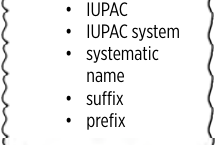
> **[Diagram Context - Textbook_NaturalScience_Gr9_Compounds.pdf-0015-02.png]**
> This graphic is a bulleted list of key terminology related to organic chemistry nomenclature. It includes the terms "IUPAC," "IUPAC system," "systematic name," "suffix," and "prefix." These concepts provide the foundational vocabulary for Grade 12 learners to systematically name organic compounds according to international standards.

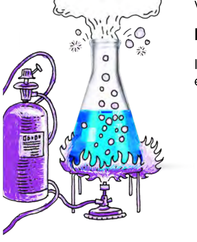
> **[Diagram Context - Textbook_NaturalScience_Gr9_Compounds.pdf-0015-05.png]**
> This diagram illustrates a laboratory apparatus setup featuring a Bunsen burner heating an Erlenmeyer flask containing a boiling liquid, connected to a gas cylinder. The visual elements include a gas canister, tubing, a Bunsen burner, a tripod stand, and a flask showing effervescence or steam release. It conceptually demonstrates the application of thermal energy to induce a physical or chemical change, such as boiling or a gas-evolving reaction, which is a fundamental process in Physical Sciences practical work.

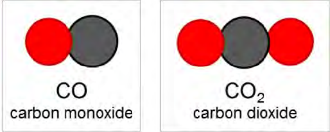
> **[Diagram Context - Textbook_NaturalScience_Gr9_Compounds.pdf-0015-08.png]**
> This ball-and-stick style molecular model illustrates the chemical structures of carbon monoxide (CO) and carbon dioxide (CO₂), using red spheres to represent oxygen atoms and grey spheres to represent carbon atoms. It conceptually demonstrates the Law of Multiple Proportions, showing how the same two elements can combine in different ratios to form distinct chemical compounds with unique properties.

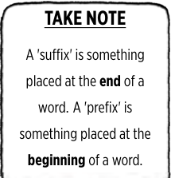
> **[Diagram Context - Textbook_NaturalScience_Gr9_Compounds.pdf-0015-13.png]**
> This educational text box defines the linguistic concepts of "suffix" and "prefix" using the key terms "end" and "beginning." It serves as a foundational reference for learners to understand word formation and morphology, which is essential for decoding complex terminology across all CAPS subjects.

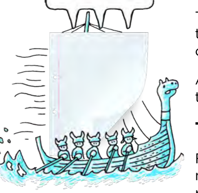
> **[Diagram Context - Textbook_NaturalScience_Gr9_Compounds.pdf-0015-15.png]**
> This cartoon depicts a Viking longship with rowers and a sail, accompanied by wind-effect lines and an empty speech bubble. It serves as a visual metaphor for historical exploration or narrative writing, providing a creative prompt for students to fill in the speech bubble with dialogue or historical context related to Viking voyages.

> **[Diagram Context - Textbook_NaturalScience_Gr9_Reactions-of-metals-with-oxygen.pdf-0015-00.png]**
> This diagram illustrates a cross-section of a biological membrane surface, featuring a series of repeating, hook-like structures extending from a solid, shaded base. It conceptually represents the arrangement of microvilli or similar cellular projections, helping learners visualize how increased surface area facilitates efficient absorption and transport processes within the cell.

> **[Diagram Context - Textbook_NaturalScience_Gr9_Reactions-of-metals-with-oxygen.pdf-0015-01.png]**
> This illustration depicts a worker operating a jackhammer, represented by a large key, with motion lines indicating vibration and debris. It serves as a visual metaphor for the concept of mechanical vibration and the transmission of energy through a medium, commonly used in Physical Sciences to introduce wave mechanics or the impact of noise pollution.

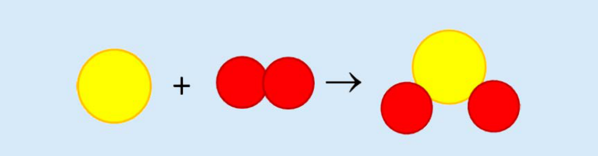
> **[Diagram Context - Textbook_NaturalScience_Gr9_Reactions-of-non-metals-with-oxygen.pdf-0015-01.png]**
> 1. A diagram of a chemical reaction involving two red spheres and three yellow spheres.

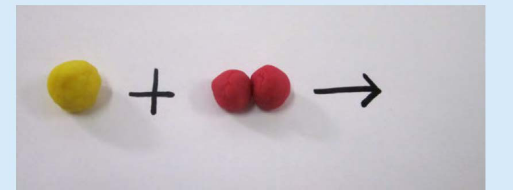
> **[Diagram Context - Textbook_NaturalScience_Gr9_Reactions-of-non-metals-with-oxygen.pdf-0015-03.png]**
> The image shows a diagram of a Lewis structure for water, which is a molecule composed of two hydrogen atoms and one oxygen atom. The diagram is drawn on a white background with black lines representing the bonds between the atoms. The diagram also includes arrows pointing to the oxygen atom, indicating the direction of the bonds. The diagram is labeled with the chemical formula "H2O" and the Lewis structure

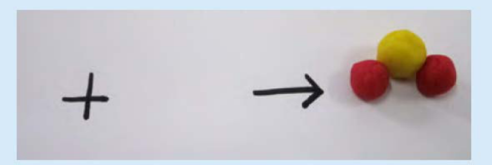
> **[Diagram Context - Textbook_NaturalScience_Gr9_Reactions-of-non-metals-with-oxygen.pdf-0015-05.png]**
> The image shows a diagram of a Lewis structure for carbon dioxide. The diagram is divided into two parts, with a red arrow pointing from the left side to the right side, and a yellow arrow pointing from the right side to the left side. The diagram also includes a Lewis structure of water, which is represented by a blue circle with a yellow dot in the center. The diagram is set against

> **[Diagram Context - Textbook_NaturalScience_Gr9_Resistance.pdf-0015-04.png]**
> The image shows a gray line with an orange arrow pointing to the right. The line is labeled "Zipper" and "Zipper" is written in white. The arrow is pointing to the right, indicating movement or direction. The image does not contain any text or additional objects.

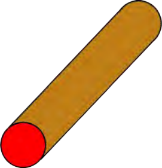
> **[Diagram Context - Textbook_NaturalScience_Gr9_Resistance.pdf-0015-07.png]**
> 1. A red circle with a line through it.

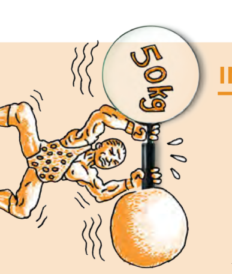
> **[Diagram Context - Textbook_NaturalScience_Gr9_Resistance.pdf-0015-10.png]**
> 1. A cartoon drawing of a man lifting a ball that says "50 kg".

---

# Type 2: Compounds that contain only non-metals

Naming compounds consisting only of non-metals requires following three specific rules.

### Rule 1: Element Order and Suffixes
1. The name of the element further to the left on the Periodic Table is written first.
2. The name of the element further to the right on the Periodic Table follows.
3. The ending of the second element is replaced with the suffix **-ide**.

**Examples of suffix changes:**
* Oxygen becomes **oxide**
* Fluorine becomes **fluoride**
* Chlorine becomes **chloride**
* Nitrogen becomes **nitride**

---

### Rule 2: Using Prefixes
When two or more compounds contain the same elements in different ratios (e.g., $CO$ and $CO_2$), prefixes are used to indicate the number of atoms present.

| Number of atoms | Prefix |
| :--- | :--- |
| 1 | mono- |
| 2 | di- |
| 3 | tri- |
| 4 | tetra- |
| 5 | penta- |

> **[Diagram Context - Textbook_NaturalScience_Gr9_Acids-bases-and-the-pH-value.pdf-0016-03.png]**
> The image is a cartoon depiction of a woman standing in front of a machine with gears and a diagram of a cell. The woman is wearing a red skirt and a white shirt, and she is looking at the gears with a thoughtful expression. The gears are depicted in red and white colors, and they are arranged in a circular pattern. The diagram of a cell is also present in the image,

> **TAKE NOTE:** The prefix *mono-* is usually omitted from the first element in the name. For example, $CO$ is named **carbon monoxide**, not *monocarbon monoxide*.

---

### Applied Examples

#### Compounds of Carbon and Oxygen
* $CO$: Carbon monoxide (Note: *mono-oxide* becomes *monoxide*)
* $CO_2$: Carbon dioxide

#### Compounds of Nitrogen and Oxygen
* $NO_2$: Nitrogen dioxide
* $N_2O_4$: Dinitrogen tetroxide (Note: *tetraoxide* becomes *tetroxide*)

#### Compounds of Sulfur and Oxygen
* $SO_2$: Sulfur dioxide
* $SO_3$: Sulfur trioxide

> **[Diagram Context - Textbook_NaturalScience_Gr9_Chemical-reactions.pdf-0016-04.png]**
> This diagram is a template for a chemical word or symbol equation, featuring three empty rectangular placeholders connected by a plus sign and a reaction arrow. It serves as a foundational scaffold for learners to practice identifying and arranging reactants on the left and products on the right of a chemical reaction.

> **[Diagram Context - Textbook_NaturalScience_Gr9_Chemical-reactions.pdf-0016-05.png]**
> This graphic depicts a schematic representation of a DNA molecule, characterized by its iconic double-stranded, helical structure. The diagram illustrates the two antiparallel sugar-phosphate backbones intertwined to form the double helix, providing a visual foundation for understanding the molecular basis of heredity and genetic information storage in Life Sciences.

> **[Diagram Context - Textbook_NaturalScience_Gr9_Chemical-reactions.pdf-0016-07.png]**
> This diagram illustrates a cross-section of a biological membrane, specifically representing the arrangement of phospholipids in a monolayer or the surface of a lipid bilayer. It features a series of repeating, stylized blue symbols representing hydrophilic phosphate heads anchored into a solid, light-blue substrate. Conceptually, this helps learners visualize the structural orientation of phospholipids at an interface, which is fundamental to understanding the fluid mosaic model of the cell membrane in Life Sciences.

> **[Diagram Context - Textbook_NaturalScience_Gr9_Chemical-reactions.pdf-0016-15.png]**
> This metaphorical illustration depicts a central metal key superimposed over a scene containing an owl, a tree with a swing, a human skull, bones, and a treasure chest. By juxtaposing symbols of life, death, and hidden discovery, the image serves as a visual prompt to explore themes of mystery, historical inquiry, or the unlocking of knowledge within a Life Sciences or Humanities context.

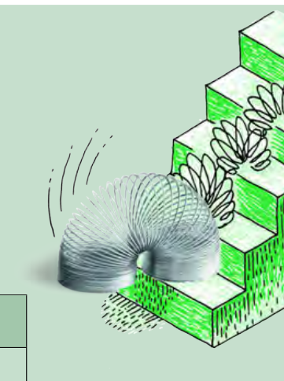
> **[Diagram Context - Textbook_NaturalScience_Gr9_Compounds.pdf-0016-07.png]**
> This illustration depicts a Slinky spring moving down a set of stairs, utilizing motion lines to indicate its trajectory. It serves as a conceptual model for Grade 10-12 Physical Sciences to demonstrate the propagation of longitudinal and transverse waves, illustrating how energy is transferred through a medium via periodic motion.

> **[Diagram Context - Textbook_NaturalScience_Gr9_Compounds.pdf-0016-08.png]**
> This graphic illustrates a schematic representation of a double-stranded DNA molecule, characterized by its iconic double helix structure. The diagram uses two intertwined, repeating green ribbons to represent the sugar-phosphate backbones, visually demonstrating the complementary and antiparallel nature of the DNA strands essential for genetic replication and protein synthesis.

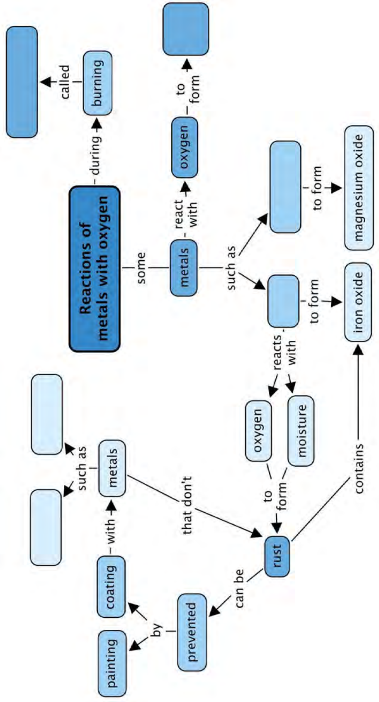
> **[Diagram Context - Textbook_NaturalScience_Gr9_Reactions-of-metals-with-oxygen.pdf-0016-00.png]**
> This concept map illustrates the chemical reactions of metals with oxygen, featuring key terms such as "burning," "metals," "oxygen," "rust," "iron oxide," "magnesium oxide," and "moisture," linked by directional arrows and relational phrases. It provides a structured overview of oxidation processes, specifically distinguishing between rapid combustion and the slower formation of rust, while also outlining methods for corrosion prevention like painting and coating.

---

# ACTIVITY: Writing names from the formulae of compounds

### Materials
* Play dough
* Beans or beads

### Instructions
1. Identify and write the name for each of the chemical compounds listed in the table below.
2. Construct a physical model of one molecule for each compound using the provided materials (play dough, beans, or beads).
    * **Tip for construction:** Place the atom that appears first in the chemical formula at the center of your model. Arrange all other atoms around this central atom. These outer atoms should be bonded to the central atom, but not directly to each other.
3. Draw a representation of your constructed molecule in the final column of the table.

### Compound Analysis Table

| Formula of the compound | Name of the compound | Picture of one molecule of the compound |
| :--- | :--- | :--- |
| $CO_{2}$ | | |
| $H_{2}O$ | | |
| $PF_{3}$ | | |

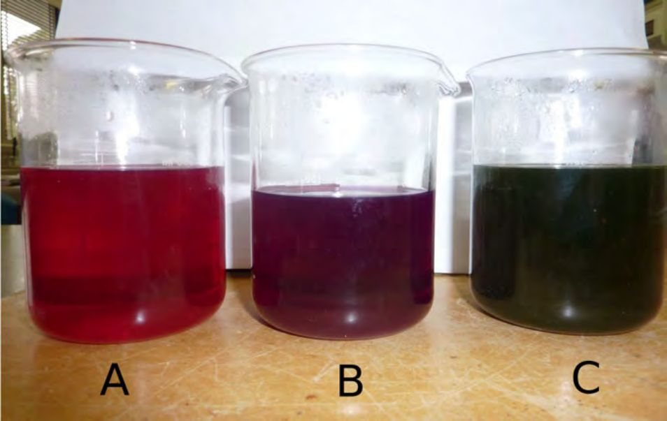
> **[Diagram Context - Textbook_NaturalScience_Gr9_Acids-bases-and-the-pH-value.pdf-0017-02.png]**
> 1. A glass of red liquid.

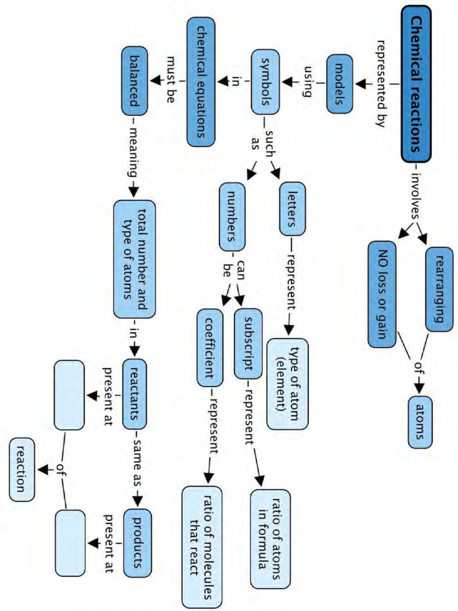
> **[Diagram Context - Textbook_NaturalScience_Gr9_Chemical-reactions.pdf-0017-00.png]**
> This concept map outlines the fundamental principles of chemical reactions, using nodes and directional arrows to connect terms such as "models," "symbols," "coefficients," "subscripts," "reactants," and "products." It illustrates the conservation of atoms during rearrangement and explains how balanced chemical equations represent the quantitative relationship between atoms and molecules. This visual aid helps learners synthesize the symbolic language of chemistry with the underlying physical laws of mass conservation required for Grade 10-12 Physical Sciences.

> **[Diagram Context - Textbook_NaturalScience_Gr9_Compounds.pdf-0017-12.png]**
> This illustration depicts a pair of hands interacting with a tablet interface featuring a grid of abstract icons and a speech bubble. The visual elements include a touch-screen display, a finger selecting an icon, and various symbolic representations within the app grid. Conceptually, this graphic serves as a visual metaphor for digital literacy and the integration of Information and Communication Technology (ICT) in modern education, highlighting the interactive nature of mobile learning tools.

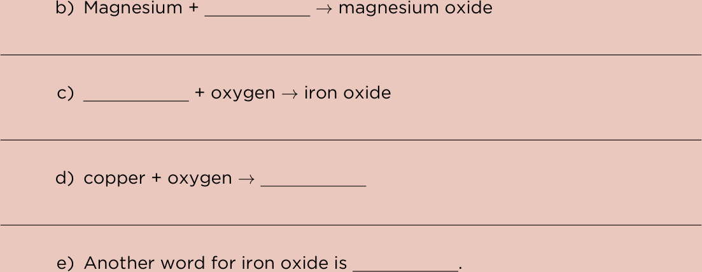
> **[Diagram Context - Textbook_NaturalScience_Gr9_Reactions-of-metals-with-oxygen.pdf-0017-03.png]**
> This image displays a

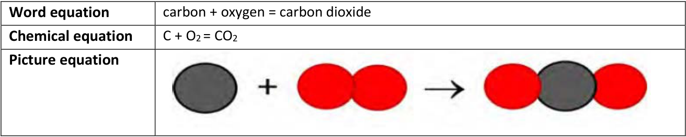
> **[Diagram Context - Textbook_NaturalScience_Gr9_Reactions-of-non-metals-with-oxygen.pdf-0017-01.png]**
> 1. A diagram of a chemical reaction between carbon dioxide and oxygen.
 2. A diagram of a red circle and a black circle.
 3. A diagram of a red circle and a black circle.

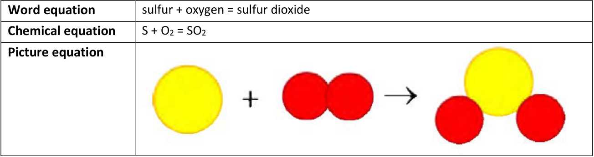
> **[Diagram Context - Textbook_NaturalScience_Gr9_Reactions-of-non-metals-with-oxygen.pdf-0017-03.png]**
> 1. A diagram of a chemical reaction between oxygen and sulfur dioxide.
2. A yellow circle with a red dot labeled "O2" and a red circle labeled "SO2".
3. A yellow circle with a red dot labeled "S+O2".

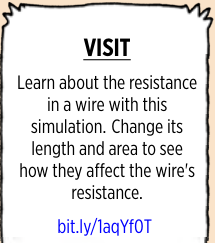
> **[Diagram Context - Textbook_NaturalScience_Gr9_Resistance.pdf-0017-04.png]**
> 1. A diagram of a wire with a wire's resistance.

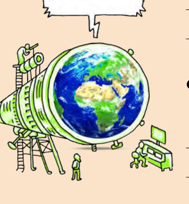
> **[Diagram Context - Textbook_NaturalScience_Gr9_Resistance.pdf-0017-06.png]**
> The image shows a cartoon depiction of a globe with a speech bubble above it, containing a thought bubble with a lightning bolt. The globe is surrounded by a group of people, including a man and a woman, who appear to be engaged in a discussion. The globe is situated in a room with a desk and a television. The image is labeled as an educational graphic, and it is designed to

> **[Diagram Context - Textbook_NaturalScience_Gr9_Resistance.pdf-0017-10.png]**
> 1. A gray background with a zipper on it.

---

### Chemical Nomenclature and Molecular Modeling

#### Exercise 1: Identifying Compounds
Complete the table below by providing the chemical name and a visual representation for the given molecular formulae.

| Formula of the compound | Name of the compound | Picture of one molecule of the compound |
| :--- | :--- | :--- |
| $SF_4$ | | 

 |
| $CCl_4$ | | 

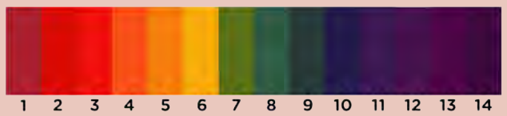
> **[Diagram Context - Textbook_NaturalScience_Gr9_Acids-bases-and-the-pH-value.pdf-0018-03.png]**
> 1. A color gradient chart with the numbers 1-14.

 |

---

#### Activity: Writing Formulae from Compound Names
**Objective:** To practice converting chemical names into molecular formulae and visualizing their structures.

**Materials:**
* Play dough

**Instructions:**
1. Determine the chemical formula for the compound provided in the table below.
2. Use play dough to build a physical model of the molecule.
3. Draw a representation of the molecule in the final column.

| Formula of the compound | Name of the compound | Picture of one molecule of the compound |
| :--- | :--- | :--- |
| | hydrogen fluoride | 

> **[Diagram Context - Textbook_NaturalScience_Gr9_Acids-bases-and-the-pH-value.pdf-0018-11.png]**
> The image shows a close-up of a diagram of a cell, with a red ant positioned on the right side of the cell. The cell is depicted in shades of gray, and the ant is shown in red. The diagram includes labels for the cell's organelles and the ant's body parts. The diagram also includes a Lewis diagram and a geometric figure, which are not visible in

 |

> **[Diagram Context - Textbook_NaturalScience_Gr9_Chemical-reactions.pdf-0018-03.png]**
> This illustration depicts a person balancing on a unicycle while juggling bottles, using motion lines to indicate rotation and movement. It serves as a visual metaphor for dynamic equilibrium, demonstrating how an object or system maintains stability through constant adjustment and the balancing of opposing forces.

> **[Diagram Context - Textbook_NaturalScience_Gr9_Compounds.pdf-0018-06.png]**
> This diagram illustrates an electromagnet consisting of a coiled wire (solenoid) connected to a battery, with surrounding magnetic field lines indicated by arrows and nearby metallic objects (a screw, nail, and nut). It visually demonstrates the principle of electromagnetism, showing how an electric current flowing through a coil generates a magnetic field capable of attracting ferromagnetic materials.

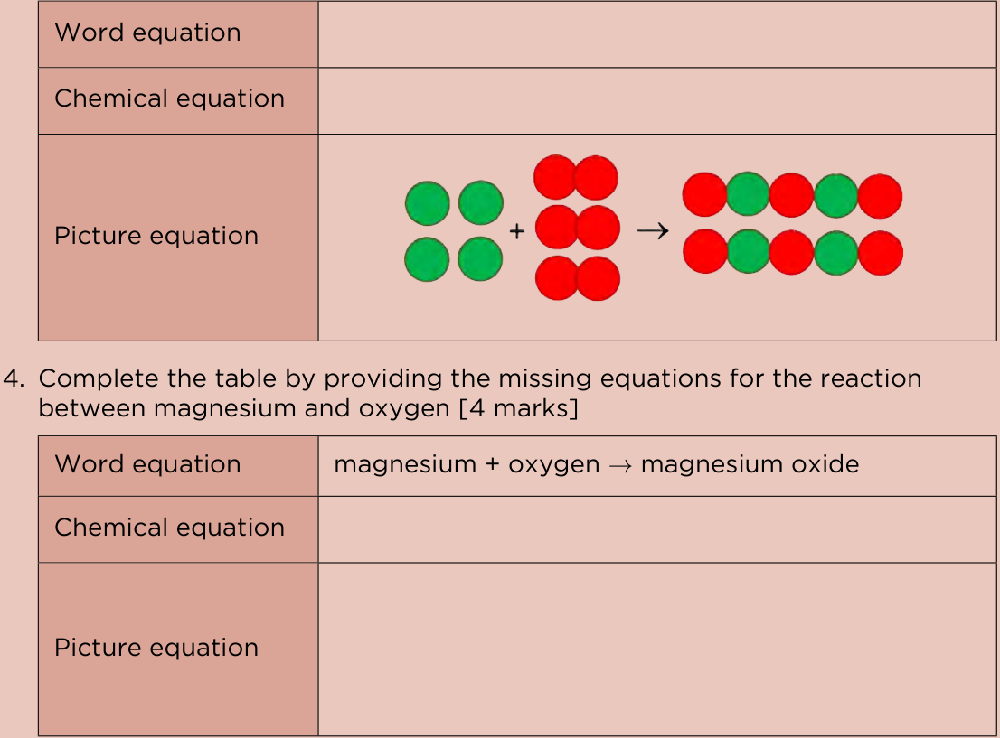
> **[Diagram Context - Textbook_NaturalScience_Gr9_Reactions-of-metals-with-oxygen.pdf-0018-02.png]**
> labels):* This educational assessment graphic

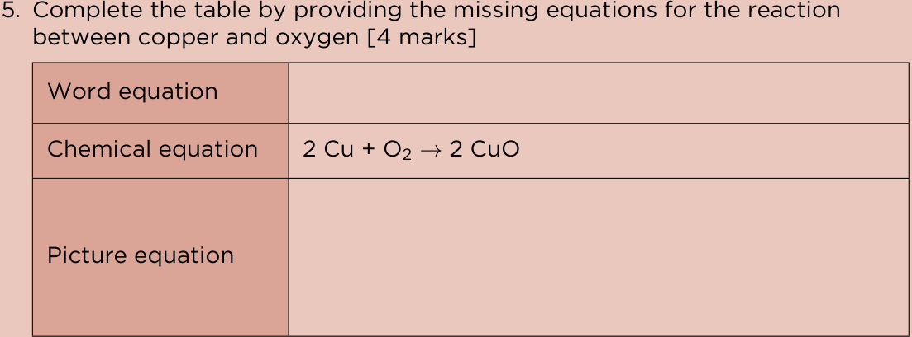
> **[Diagram Context - Textbook_NaturalScience_Gr9_Reactions-of-metals-with-oxygen.pdf-0018-03.png]**
> This graphic displays a structured chemical equation completion table assessing representations of the synthesis reaction between copper and oxygen. Visible labels include the row headers "Word equation", "Chemical equation", and "Picture equation", along with the balanced chemical reaction $\text{2 Cu + O}_2

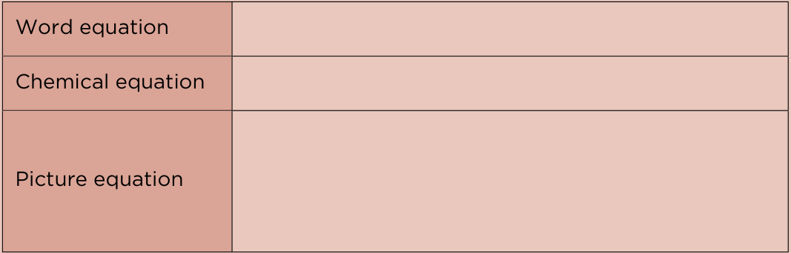
> **[Diagram Context - Textbook_NaturalScience_Gr9_Reactions-of-metals-with-oxygen.pdf-0018-05.png]**
> This graphic is a blank table template featuring the labels "Word equation," "Chemical equation," and "Picture equation." It serves as a pedagogical scaffold for Grade 10 Physical Sciences learners to demonstrate their understanding of chemical reactions by representing them through three distinct formats: nomenclature, symbolic formulas, and visual models.

> **[Diagram Context - Textbook_NaturalScience_Gr9_Reactions-of-metals-with-oxygen.pdf-0018-07.png]**
> This biological illustration depicts insect navigation

> **[Diagram Context - Textbook_NaturalScience_Gr9_Resistance.pdf-0018-03.png]**
> 1. A diagram of a cell with a magnifying glass over it.

> **[Diagram Context - Textbook_NaturalScience_Gr9_Resistance.pdf-0018-15.png]**
> The image shows a cartoon depiction of a man holding a globe. The globe is green and blue, and the man is wearing a green shirt and a white hat. The text on the image reads "Visit" and "Watch a video on this investigation on the length of a resistor."

---

### Chemical Compounds: Naming and Structure

#### Common Names vs. Systematic Names
While many compounds have systematic names based on their chemical composition, others are referred to by **common names** that are more widely recognized in everyday language.

**Examples:**
*   $H_2O$: Water
*   $NH_3$: Ammonia
*   $CH_4$: Methane

---

#### Exercise: Chemical Formulae and Molecular Representation
Complete the table below by providing the chemical formula and a visual representation for each compound.

| Formula of the compound | Name of the compound | Picture of one molecule of the compound |
| :--- | :--- | :--- |
| | dihydrogen sulfide | 

 |
| | sulfur trioxide | 

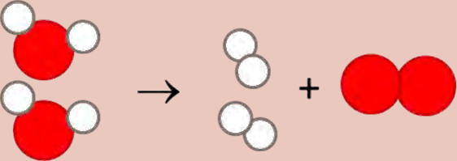
> **[Diagram Context - Textbook_NaturalScience_Gr9_Chemical-reactions.pdf-0019-14.png]**
> This particle model diagram illustrates the chemical decomposition of water molecules into hydrogen and oxygen gas using red spheres to represent oxygen atoms and white spheres to represent hydrogen atoms. It visually demonstrates the law of conservation of mass by showing how the atoms in two water molecules rearrange to form two diatomic hydrogen molecules and one diatomic oxygen molecule.

 |
| | carbon monoxide | 

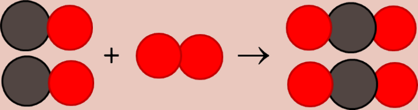
> **[Diagram Context - Textbook_NaturalScience_Gr9_Chemical-reactions.pdf-0019-15.png]**
> This particle model diagram illustrates a chemical reaction using circular representations for atoms, specifically showing two carbon monoxide molecules (black and red spheres) reacting with one oxygen molecule (two red spheres) to form two carbon dioxide molecules. The visual uses plus and arrow symbols to represent the rearrangement of atoms, helping learners understand the Law of Conservation of Mass by demonstrating that the number and type of atoms remain constant throughout the chemical change.

 |

---

### Summary: Key Concepts

#### Elements
*   **Atomic Composition:** All atoms within a specific element are of the same kind. Consequently, an element cannot be transformed into a different element through physical or chemical processes.
*   **Structure:** Elements may exist as individual atoms or as bonded pairs known as **diatomic molecules**.
*   **Formation of Compounds:** Compounds are formed when different elements chemically combine.

---

### Note
You have now developed the skill to write and interpret the names and chemical formulae of various compounds.

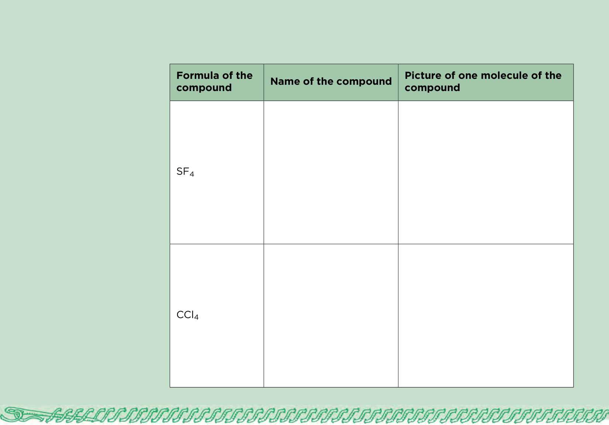
> **[Diagram Context - Textbook_NaturalScience_Gr9_Compounds.pdf-0019-00.png]**
> This educational table requires students to identify and represent covalent compounds, specifically sulfur tetrafluoride ($SF_4$) and carbon tetrachloride ($CCl_4$). The columns prompt learners to provide the chemical name and a structural representation (such as a Lewis diagram or ball-and-stick model) for each given chemical formula. This exercise reinforces IUPAC nomenclature rules and the ability to visualize molecular geometry and bonding arrangements for Grade 10-12 Physical Sciences.

> **[Diagram Context - Textbook_NaturalScience_Gr9_Compounds.pdf-0019-02.png]**
> This illustration depicts a metaphorical hybrid of a caterpillar and a metal slinky coil feeding on plant leaves. The image uses the visual elements of a segmented, crawling insect body and a spring-like structure to represent the concept of mechanical or physical movement in a biological context. It serves as a creative visual aid to help learners conceptualize the relationship between structural flexibility and locomotion in organisms.

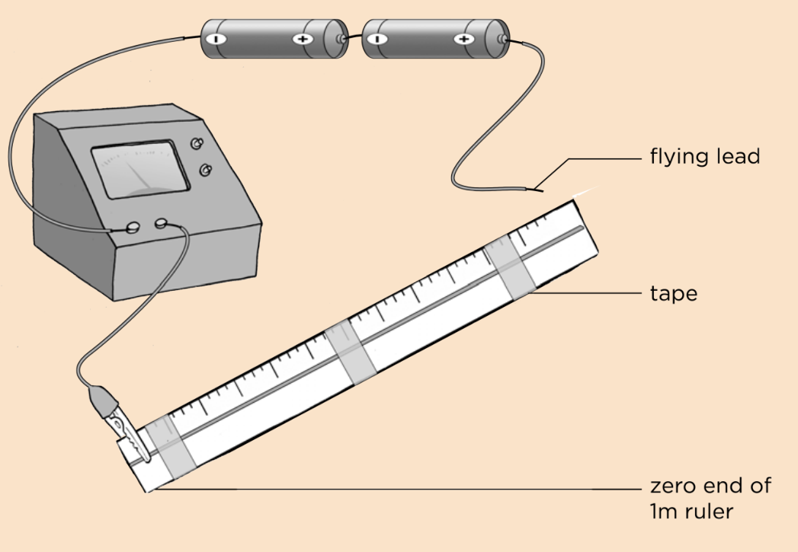
> **[Diagram Context - Textbook_NaturalScience_Gr9_Resistance.pdf-0019-01.png]**
> 1. A diagram of a circuit with two batteries connected to a ruler.
2. The ruler is connected to the circuit with wires.
3. The diagram shows the zero end of an im ruler.

> **[Diagram Context - Textbook_NaturalScience_Gr9_Resistance.pdf-0019-05.png]**
> 1. A cartoon illustration of a hot air balloon with a globe on top.
 2. A cartoon illustration of a globe with a wire basket on top.
 3. A cartoon illustration of a globe with a wire basket on top.

---

### Compounds

*   **Definition:** A compound consists of atoms of two or more different kinds that are chemically bonded in a fixed ratio.
*   **Chemical Bonds:** The atoms within a molecule are held together by special attractions known as chemical bonds.
*   **Chemical Reactions:**
    *   Compounds can be formed and broken down through chemical reactions.
    *   A **decomposition reaction** is a specific type of chemical reaction where a compound is broken down into simpler compounds or elements.
*   **Separation:** Compounds cannot be separated by physical processes. They can only be separated into their constituent elements or simpler compounds through chemical processes.

---

### The Periodic Table

*   **Arrangement:** Elements are arranged in order of increasing atomic number, starting with the lightest element (Hydrogen: $H$) in the top left-hand corner.
*   **Classification by Position:**
    *   **Metals:** Found on the left-hand side of the table.
    *   **Non-metals:** Found on the far right-hand side of the table.
    *   **Semi-metals:** Found in the region between the metals and non-metals.
*   **Identification:** Each element is uniquely identified by:
    1.  A unique name.
    2.  A unique chemical symbol.
    3.  A unique atomic number.
*   **Structure:**
    *   **Groups:** The vertical columns of the Periodic Table (there are 18 groups). Elements in the same group exhibit similar chemical behaviour and properties.
    *   **Periods:** The horizontal rows of the Periodic Table (there are 7 periods).
*   **Data Provided:** Most versions of the Periodic Table provide the element symbol, atomic number, and atomic mass for each element.

---

### Names and Formulae

*   **Uniqueness:** Every compound has a unique name and chemical formula.
*   **Formula Purpose:** The formula indicates which elements are present in the compound and the ratio in which atoms have combined to form one molecule of that compound.
*   **Naming Rules:** There are specific conventions for naming compounds that account for the number of atoms of each type present in a single molecule.

---

### Concept Map

*Study the concept map above to summarise the key learning points regarding compounds.*

> **[Diagram Context - Textbook_NaturalScience_Gr9_Chemical-reactions.pdf-0020-13.png]**
> This graphic illustrates a biological trail-following behavior, showing an ant leading a linear path of smaller, identical ant icons across a horizontal, shaded background. It conceptually demonstrates the mechanism of pheromone communication in social insects, where individuals follow chemical signals to maintain collective movement and foraging efficiency.

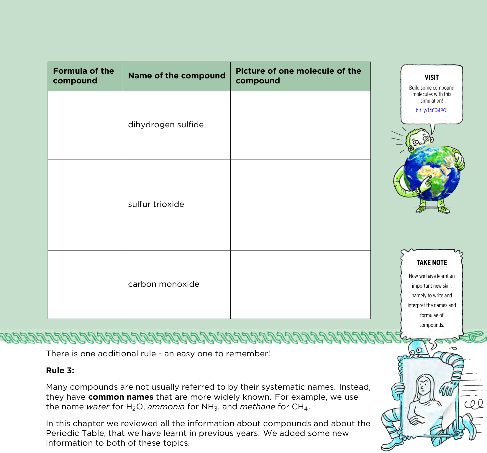
> **[Diagram Context - Textbook_NaturalScience_Gr9_Compounds.pdf-0020-00.png]**
> This educational graphic presents a table designed for students to practice chemical nomenclature by mapping the systematic names of compounds—dihydrogen sulfide, sulfur trioxide, and carbon monoxide—to their corresponding chemical formulae and molecular structures. It reinforces the CAPS Physical Sciences curriculum by bridging the gap between abstract chemical naming conventions and the visual representation of molecular composition, while also highlighting the distinction between systematic and common names.

> **[Diagram Context - Textbook_NaturalScience_Gr9_Compounds.pdf-0020-01.png]**
> This diagram represents a simplified cross-section of a cell membrane, illustrating the phospholipid bilayer structure with blue, hook-shaped symbols representing the hydrophilic phosphate heads oriented towards the aqueous environment. It conceptually demonstrates the fluid mosaic model, highlighting the uniform arrangement of phospholipids that form the semi-permeable boundary of the cell.

> **[Diagram Context - Textbook_NaturalScience_Gr9_Compounds.pdf-0020-08.png]**
> This illustration depicts a metaphorical figure playing a large key like a musical instrument, accompanied by floating musical notes. It uses visual symbolism to represent the concept of "unlocking" or "keying into" a creative or intellectual process, often used in educational contexts to signify the discovery of a solution or the mastery of a skill.

> **[Diagram Context - Textbook_NaturalScience_Gr9_Resistance.pdf-0020-02.png]**
> 1. A white square with a brown border.

> **[Diagram Context - Textbook_NaturalScience_Gr9_Resistance.pdf-0020-07.png]**
> The image shows a gray line with an orange arrow pointing to the right. The line is labeled "Zipper" and "Zipper" is written in white. The line is set against a gray background.

---

# Concept Map: Elements, Compounds, and the Periodic Table

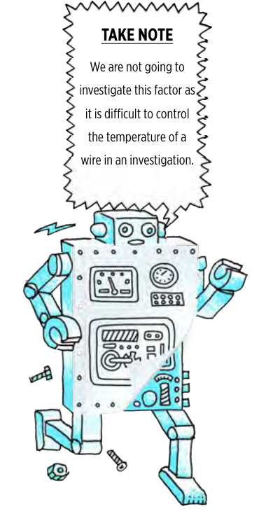
> **[Diagram Context - Textbook_NaturalScience_Gr9_Resistance.pdf-0021-02.png]**
> The image features a blue robot with a white head and arms, standing on a gray surface. The robot is holding a small white object in its left hand. The image also includes a note that reads "Take Note" and "We are not going to investigate this factor as it is difficult to control the temperature of a wire in an investigation."

## 1. Elements
Elements are the fundamental building blocks of matter. Each element is characterized by:
*   **Atomic number**
*   **Mass number**
*   **Symbol**
*   **Name**

### The Periodic Table
Elements are arranged in the **Periodic Table**, which classifies them into three main categories:
1.  **Metals**
2.  **Non-metals**
3.  **Semi-metals**

The Periodic Table is organized into **groups (columns)**. Elements within the same group share **similar chemical properties**.

---

## 2. Compounds
Compounds are substances made up of elements combined in a **fixed ratio**.

### Representation
Compounds are represented by a **chemical formula**. These formulas often indicate the number of specific atoms present in the compound.

*   **Example:** In the case of oxygen atoms, the chemical formula indicates the quantity of oxygen present.

### Naming Conventions
Compounds often have **common names** (e.g., water, ammonia). When naming compounds based on their chemical composition, prefixes are used to indicate the number of atoms:

| Prefix | Meaning |
| :--- | :--- |
| Monoxide | One oxygen atom |
| Dioxide | Two oxygen atoms |
| Trioxide | Three oxygen atoms |

### Examples of Compounds
*   **Sodium chloride:** A common compound formed from elements.
*   **Water ($H_2O$):** A compound with a common name.
*   **Ammonia ($NH_3$):** A compound with a common name.

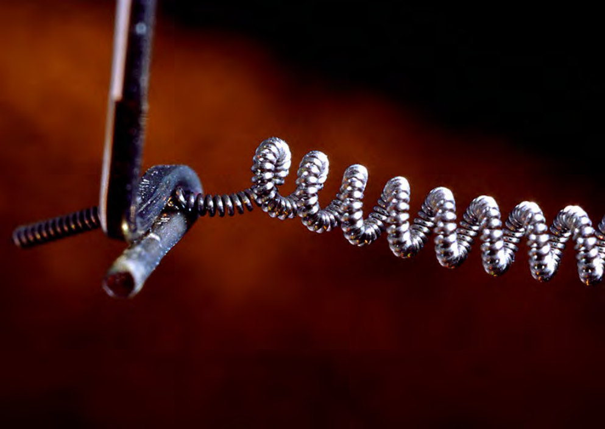
> **[Diagram Context - Textbook_NaturalScience_Gr9_Resistance.pdf-0021-03.png]**
> 1. A close-up of a metal wire with a spiral pattern.

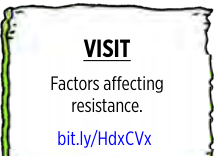
> **[Diagram Context - Textbook_NaturalScience_Gr9_Resistance.pdf-0021-04.png]**
> 1. A diagram of a cell with a green border and a white background.

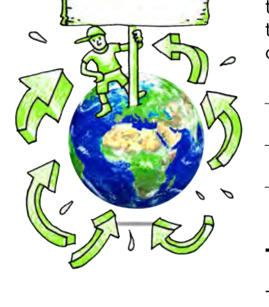
> **[Diagram Context - Textbook_NaturalScience_Gr9_Resistance.pdf-0021-07.png]**
> The image features a cartoon depiction of a boy holding a pole, which is connected to a globe. The boy is wearing a green shirt and a hat. The globe is colored in shades of blue and green, and it is surrounded by arrows pointing in various directions. The boy is standing on the globe, and the arrows are pointing towards different parts of the globe. The boy is holding the pole

---

# REVISION: Matter and Materials

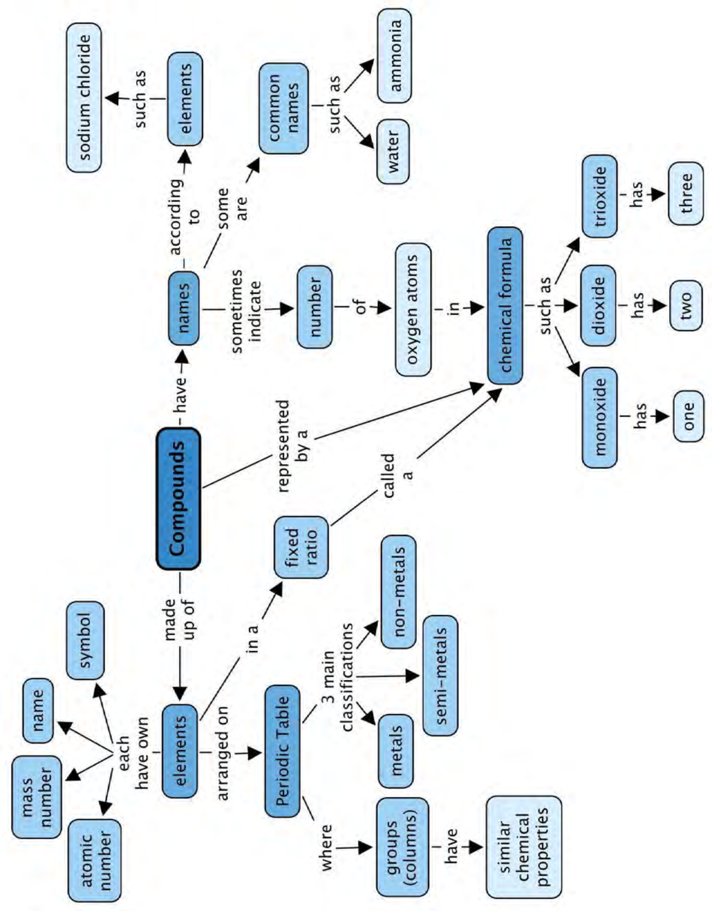
> **[Diagram Context - Textbook_NaturalScience_Gr9_Compounds.pdf-0022-00.png]**
> This concept map illustrates the relationship between compounds, elements, and the Periodic Table, using nodes and directional arrows to link terms like "chemical formula," "fixed ratio," "atomic number," "mass number," and "metals/non-metals." It serves as a foundational study tool for Grade 10 Physical Sciences, helping learners visualize how chemical nomenclature, atomic structure, and periodic trends collectively define the composition and classification of matter.

### 1. Particle Analysis Exercise
Each of the four blocks (A, B, C, and D) contains different arrangements of matter. Use the visual representations to answer the following questions:

**a) Which block represents the particles of an element?**
*   **Answer:** Blocks B, C, and D. (These contain only one type of atom).

**b) Which block represents the particles in a compound?**
*   **Answer:** Block A. (This contains molecules made of two different types of atoms bonded together).

**c) Which block represents the particles in a mixture?**
*   **Answer:** Block B. (This contains two different types of diatomic molecules mixed together).

**d) Which block represents diatomic particles?**
*   **Answer:** Block B. (The molecules consist of two atoms bonded together).

**e) If the blue atoms are N and the white atoms are H, write the formula for the molecules in block A.**
*   **Answer:** Each molecule in block A consists of one blue atom (N) and three white atoms (H). The formula is $NH_{3}$.

**f) If the blue atoms are N and the white atoms are H, write the formula for the molecules in block B.**
*   **Answer:** Block B contains two types of diatomic molecules. If we assume the blue atoms are $N$ and the white atoms are $H$, the formulas are $N_{2}$ and $H_{2}$.

**g) Which blocks contain molecules?**
*   **Answer:** Blocks A and B.

**h) Which block contains single atoms?**
*   **Answer:** Blocks C and D. (These represent monatomic elements).

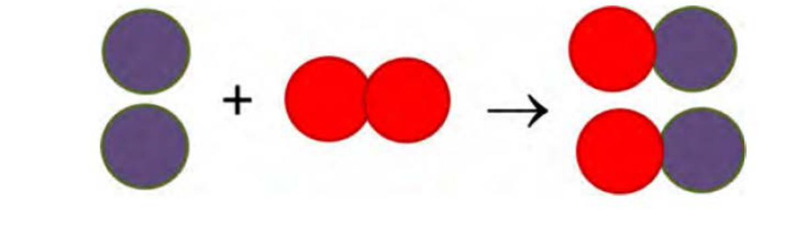
> **[Diagram Context - Textbook_NaturalScience_Gr9_Reactions-of-metals-with-oxygen.pdf-0022-02.png]**
> This sub-micro

> **[Diagram Context - Textbook_NaturalScience_Gr9_Resistance.pdf-0022-00.png]**
> The image shows a line drawing of a cell with blue and white lines. The drawing is set against a gray background, and the lines are arranged in a zigzag pattern. The diagram is labeled with the word "cell" and "biology" at the top, and "biology" is also present in the bottom right corner. The diagram is labeled with "cell" at the top and

> **[Diagram Context - Textbook_NaturalScience_Gr9_Resistance.pdf-0022-09.png]**
> 1. A man holding a key.

---

### Chemical Compounds: Naming and Formulae

#### Exercise 2: Naming Compounds
Complete the table below by providing the chemical name for each formula and drawing a representation of one molecule for each.

| Formula of the compound | Name of the compound | Picture of one molecule of the compound |
| :--- | :--- | :--- |
| $NH_3$ | | 

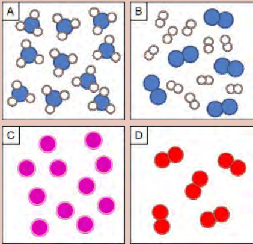
> **[Diagram Context - Textbook_NaturalScience_Gr9_Compounds.pdf-0023-02.png]**
> This particle model diagram illustrates the microscopic arrangement of matter, using labeled panels A, B, C, and D to represent different chemical substances composed of atoms and molecules. It distinguishes between elements and compounds by showing varying combinations of colored spheres, where panels A and B depict compounds and diatomic molecules, while C and D represent monatomic and diatomic elements. This visual aid helps learners differentiate between pure substances and mixtures at a particulate level, reinforcing fundamental concepts of chemical composition and molecular structure.

 |
| $CO_2$ | | 

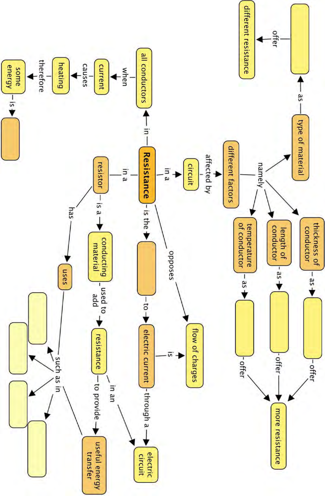
> **[Diagram Context - Textbook_NaturalScience_Gr9_Resistance.pdf-0023-00.png]**
> The image is a diagram that illustrates the concept of electricity. It is a flow chart that shows the relationship between different electrical components and their functions. The diagram is color-coded, with each color representing a different type of electrical component. The diagram is labeled with various terms related to electricity, such as "resistance", "voltage", "current", and "circuit". The diagram also

 |
| $CuCl_2$ | | <!-- DIAGRAM_PLACEHOLDER: diagram --> |
| $SO_2$ | | <!-- DIAGRAM_PLACEHOLDER: diagram --> |

---

#### Exercise 3: Determining Chemical Formulae
Provide the correct chemical formula for each of the compounds listed in the table below.

| Formula of the compound | Name of the compound |
| :--- | :--- |
| | sodium chloride |
| | dinitrogen monoxide |
| | sulfur trioxide |
| | carbon monoxide |

---

### 4. Chemical Equations Exercise

Given the balanced chemical equation:
$$\text{CO} + \text{H}_2\text{O} \rightarrow \text{CO}_2 + \text{H}_2$$

Answer the following questions:

**a) Write the formulae of the reactants of this reaction.**
*   $\text{CO}$ and $\text{H}_2\text{O}$

**b) Write the names of the reactants of this reaction.**
*   Carbon monoxide and water

**c) Write the formulae of the products of this reaction.**
*   $\text{CO}_2$ and $\text{H}_2$

**d) Write the names of the products of this reaction.**
*   Carbon dioxide and hydrogen

---

### 5. Composition of Compounds

Complete the table by identifying the number of atoms of each element present in one molecule of the given compounds.

| Chemical formula | What it is made of? |
| :--- | :--- |
| $\text{H}_2\text{O}$ | 2 hydrogen atoms and 1 oxygen atom |
| $\text{SF}_4$ | 1 sulfur atom and 4 fluorine atoms |
| $\text{NO}_2$ | 1 nitrogen atom and 2 oxygen atoms |
| $\text{Fe}_2\text{O}_3$ | 2 iron atoms and 3 oxygen atoms |
| $\text{Na}_2\text{O}$ | 2 sodium atoms and 1 oxygen atom |

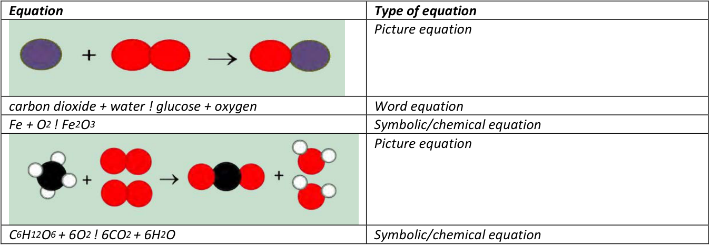
> **[Diagram Context - Textbook_NaturalScience_Gr9_Chemical-reactions.pdf-0024-08.png]**
> This table illustrates different representations of chemical reactions, including particle-based "picture equations," word equations, and symbolic chemical equations containing formulas like $Fe$, $O_2$, $Fe_2O_3$, $C_6H_{12}O_6$, $CO_2$, and $H_2O$. It conceptually bridges the gap between macroscopic observations and microscopic particle models, helping learners understand how atoms rearrange during reactions while reinforcing the transition from qualitative descriptions to quantitative chemical notation.

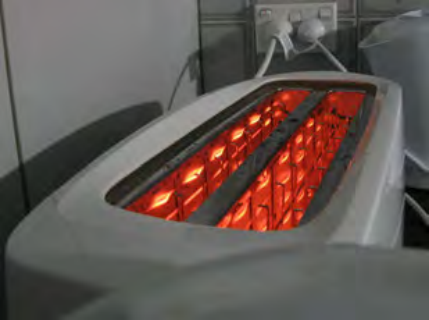
> **[Diagram Context - Textbook_NaturalScience_Gr9_Resistance.pdf-0024-03.png]**
> 1. A toaster with red heating elements.

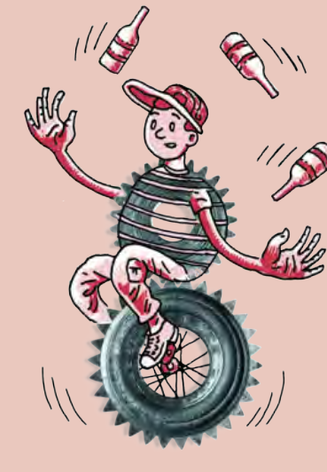
> **[Diagram Context - Textbook_NaturalScience_Gr9_Resistance.pdf-0024-04.png]**
> The image is a cartoon illustration of a boy performing a trick on a bicycle wheel. The boy is wearing a striped shirt and a baseball cap, and he is balancing on the front wheel of the bicycle. The bicycle has a gear on the front wheel, and there are several bottles in the air around the boy. The image is a creative and engaging way to teach the concept of gears and how

---

# Chapter 1: Compounds

## Introduction to Scientific Inquiry

**Concept:** Scientific Exploration and Observation

"Here is your chance to discover the possibilities. What else can this beaker be?"

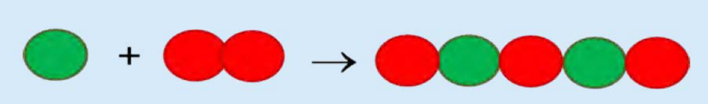
> **[Diagram Context - Textbook_NaturalScience_Gr9_Chemical-reactions.pdf-0025-14.png]**
> This particle model diagram uses green and red spheres to represent different types of atoms reacting to form a new chemical compound. The visual includes a plus sign (+) indicating reactants and an arrow (→) indicating the direction of the chemical change, resulting in a product composed of alternating spheres. It conceptually illustrates the law of conservation of mass and the rearrangement of atoms during a chemical reaction, helping learners visualize how reactants combine to form distinct molecular structures.

### Notes for Learners
*   **Observation:** In chemistry, the beaker is a fundamental piece of laboratory apparatus used for holding, mixing, and heating liquids.
*   **Critical Thinking:** Beyond its standard laboratory function, consider the beaker as a symbol of scientific inquiry. Think about how the properties of the substance inside (the blue liquid) might change through chemical reactions, phase changes, or the formation of new compounds.

---
*Page 171*

> **[Diagram Context - Textbook_NaturalScience_Gr9_Compounds.pdf-0025-10.png]**
> This graphic depicts a biological illustration of an ant leading a long, linear trail of smaller ants across a horizontal divide. It visually represents the concept of pheromone-based chemical communication and social behaviour in insects, demonstrating how ants maintain collective organisation and navigation within a colony.

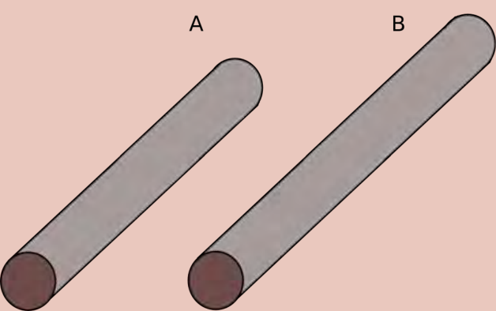
> **[Diagram Context - Textbook_NaturalScience_Gr9_Resistance.pdf-0025-02.png]**
> 1. A and B are two gray rods.

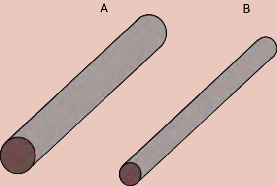
> **[Diagram Context - Textbook_NaturalScience_Gr9_Resistance.pdf-0025-05.png]**
> 1. A and B are two different lengths of a rod.

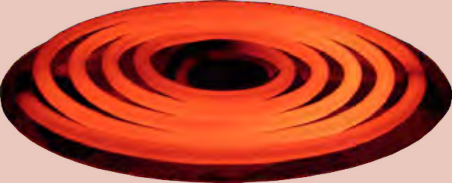
> **[Diagram Context - Textbook_NaturalScience_Gr9_Resistance.pdf-0025-08.png]**
> 1. A diagram of a heating element with a circular shape and a hole in the center.

---

# Unit 6: Compounds

## Unit Overview
*   **Duration:** 1 week
*   **Focus:** Review of Grade 8 Matter and Materials, the Periodic Table, and chemical formulae.

---

## 1. The Periodic Table
The Periodic Table serves as a classification system and an organizing framework for elements.

### Key Concepts
*   **Groups:** Vertical columns in the Periodic Table. Elements in the same group exhibit similar chemical behavior.
*   **Periods:** Horizontal rows in the Periodic Table.
*   **Structure:** While the format of the table may vary depending on its purpose, the positions of the elements remain fixed.

### Expectations for Learners
*   Learners must know the names and chemical formulae of the first 20 elements.
*   Additional required elements: Iron ($Fe$), Copper ($Cu$), and Zinc ($Zn$).
*   *Note:* Memorization of atomic numbers is not required.

---

## 2. Atomic Structure and Notation
Each element block on the Periodic Table typically contains:
1.  **Atomic Number:** The smaller number (represents the number of protons).
2.  **Atomic Mass:** The larger number (often rounded).

### Important Distinction: Mass Number vs. Average Atomic Mass
It is a common misconception to label the "larger number" on the Periodic Table as the *Mass Number*.

*   **Mass Number:** Defined as the sum of protons and neutrons in a specific atom.
*   **Isotopes:** Variants of a chemical element that have the same number of protons and electrons but a different number of neutrons.
*   **Average Atomic Mass:** Because elements exist as a mixture of isotopes in nature, the value on the Periodic Table is the weighted average of the masses of all naturally occurring isotopes. 

**Instructional Note:** Use the term **"atomic mass"** rather than "mass number" when referring to the value found on the Periodic Table to ensure scientific accuracy.

---

## 3. Chemical Formulae and Representations
The unit emphasizes the transition between two types of representations:

1.  **Symbolic Representation:** Using chemical formulae (e.g., $H_2O$, $CO_2$).
2.  **Sub-microscopic Representation:** Using molecular diagrams to visualize the arrangement of atoms.

### Practical Application
Learners are encouraged to use physical materials (such as plasticine or play dough) to construct molecular models. This reinforces the ability to switch between symbolic notation and 3D spatial understanding.

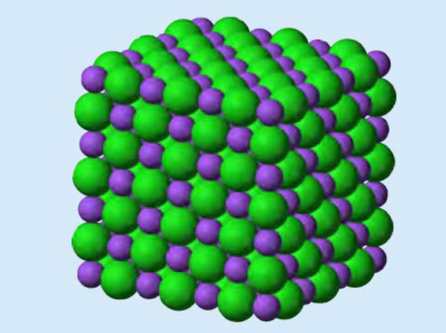
> **[Diagram Context - Textbook_NaturalScience_Gr9_Chemical-reactions.pdf-0026-01.png]**
> This graphic is a space-filling model representing the cubic crystal lattice structure of an ionic compound, such as sodium chloride. It depicts alternating large green spheres (representing anions like chloride ions) and smaller purple spheres (representing cations like sodium ions) arranged in a repeating three-dimensional pattern. This model illustrates the concept of a giant ionic lattice, helping students visualize how electrostatic forces of attraction between oppositely charged ions result in a stable, rigid crystalline structure.

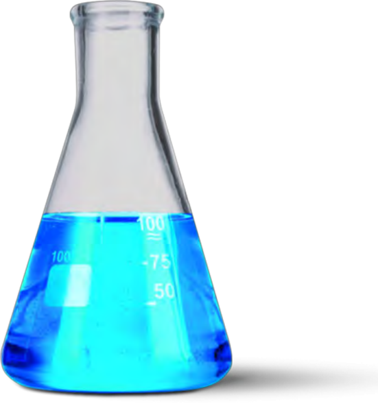
> **[Diagram Context - Textbook_NaturalScience_Gr9_Compounds.pdf-0026-01.png]**
> This image depicts a glass Erlenmeyer flask containing a blue liquid, featuring graduated volume markings labeled "50", "75", and "100" ml. In the context of the CAPS Physical Sciences curriculum, this apparatus is used to measure and contain liquid volumes during chemical experiments, such as titrations or reaction rate investigations. It serves as a fundamental tool for students to practice accurate measurement and safe handling of chemical solutions in a laboratory setting.

> **[Diagram Context - Textbook_NaturalScience_Gr9_Resistance.pdf-0026-05.png]**
> The image shows a close-up view of a diagram of a cell. The diagram is colored in shades of pink and gray, with a red ant positioned on the right side. The diagram is labeled with the name "Lewis diagram" and "cellular structure". The diagram also includes a label for the xylem and phloem, as well as a label for the cell wall.

> **[Diagram Context - Textbook_NaturalScience_Gr9_Resistance.pdf-0026-07.png]**
> 1. A red apple with a stem and a few water droplets on it.

---

### Play Dough Recipe
This recipe is provided for reference in the study of Matter and Materials.

**Ingredients:**
* 2 cups flour
* 2 cups warm water
* 1 cup salt
* 2 tablespoons vegetable oil
* 1 tablespoon cream of tartar (optional, for improved elasticity)
* Food colouring (various colours)

**Method:**
1. Combine all ingredients and stir over low heat until the mixture thickens to a consistency resembling mashed potatoes.
2. Once the dough pulls away from the sides and forms a clump in the centre, remove from heat and allow to cool. If the dough remains sticky, continue cooking for a longer duration.
3. Turn the dough onto a clean surface and knead until smooth. Divide into balls.
4. Create a small depression in the centre of each ball, add food colouring, and work the colour through the dough until the desired intensity is reached.

---

### Curriculum Overview: Elements and Compounds

| Section | Topic | Duration |
| :--- | :--- | :--- |
| 6.1 | Elements and compounds | 0.5 hours |
| 6.2 | The Periodic Table | 1 hour |
| 6.3 | Names of compounds | 1.5 hours |

#### 6.1 Elements and Compounds
* **Task:** Activity: Writing formulae and revision.
* **Skills:** Writing symbols/formulae, interpreting diagrams.
* **Recommendation:** Optional (Revision).

#### 6.2 The Periodic Table
* **Task:** Activity: Elements on the Periodic Table.
* **Skills:** Memorising names and symbols of the first 20 elements.
* **Recommendation:** CAPS suggested.

#### 6.3 Names of Compounds
| Task | Skills | Recommendation |
| :--- | :--- | :--- |
| Naming compounds of metals and non-metals | Interpreting, writing names | CAPS suggested |
| Writing names from the formulae of compounds | Interpreting, naming compounds, building models, drawing | CAPS suggested |
| Writing formulae from the names of compounds | Interpreting, writing formulae, building models, drawing | CAPS suggested |

---

### Key Questions for Revision
1. What is a compound?
2. How is a compound different from an element?
3. How is a mixture of elements different from a compound?
4. What does the position of an element on the Periodic Table tell us about its properties?
5. Where do we find metals, non-metals, and semi-metals on the Periodic Table?
6. What are the vertical columns of the Periodic Table called?

> **[Diagram Context - Textbook_NaturalScience_Gr9_Chemical-reactions.pdf-0027-13.png]**
> This diagram is a word equation representing a chemical reaction, featuring the labels "copper," "oxygen," and "copper oxide" connected by a plus sign and a reaction arrow. It conceptually illustrates the synthesis of a metal oxide, demonstrating to learners how individual reactants combine to form a new chemical product.

> **[Diagram Context - Textbook_NaturalScience_Gr9_Chemical-reactions.pdf-0027-15.png]**
> This diagram is a word equation representing the chemical reaction between copper (Cu) and oxygen (O₂) to form copper(II) oxide (CuO). It illustrates the fundamental concept of a synthesis reaction where reactants are transformed into a new product, serving as a foundational step for students to later master the balancing of chemical equations according to the Law of Conservation of Mass.

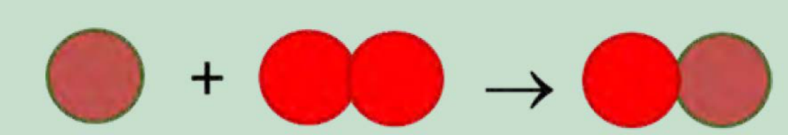
> **[Diagram Context - Textbook_NaturalScience_Gr9_Chemical-reactions.pdf-0027-17.png]**
> This particle model diagram uses circular icons to represent atoms, specifically showing a single atom reacting with a diatomic molecule to form a new compound. The visual employs a plus sign and an arrow to denote a chemical reaction, illustrating the rearrangement of matter where bonds are broken and formed. This serves as a foundational representation for Grade 10 Physical Sciences learners to understand the Law of Conservation of Mass and the basic concept of chemical synthesis.

---

### Introductory Questions
*   What are the horizontal rows of the Periodic Table called?
*   What do elements belonging to the same 'group' of the Periodic Table have in common?
*   What additional information about an element can we find on the Periodic Table?
*   What does the formula of a compound tell us about it?

---

### 6.1 The Periodic Table of Elements

The Periodic Table is a structured arrangement of elements. Each element is represented by a tile containing specific information.

#### Key Concepts
*   **Atomic Number ($Z$):** Usually written at the top of the tile. It represents the number of protons in the nucleus of an atom.
*   **Chemical Symbol:** The unique letter(s) used to represent an element (e.g., $C$ for Carbon).
*   **Atomic Mass Number ($A$):** Usually written at the bottom of the tile.
*   **Groups:** The vertical columns of the Periodic Table. There are 18 groups.
*   **Periods:** The horizontal rows of the Periodic Table.

#### Structural Organization
*   **Example:** Carbon ($C$) has an atomic number of 6, meaning it has 6 protons. It is located in Group 14 and the second period.
*   **Sodium ($Na$):** The first element in the third period.

| Vertical | Horizontal |
| :--- | :--- |
| [aw of vertical line] | [aw of horizontal line] |

---

### ACTIVITY: Elements on the Periodic Table

Use the table below to identify the relationship between atomic numbers, symbols, and element names.

| Atomic number | Chemical symbol | Element name |
| :--- | :--- | :--- |
| 1 | $H$ | Hydrogen |
| 2 | $He$ | Helium |
| 3 | $Li$ | Lithium |
| 4 | $Be$ | Beryllium |
| 5 | $B$ | Boron |
| 6 | $C$ | Carbon |

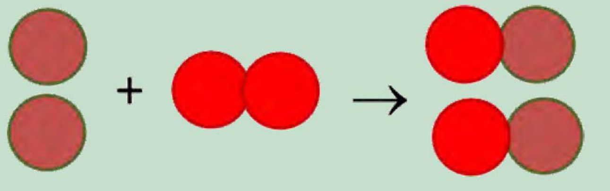
> **[Diagram Context - Textbook_NaturalScience_Gr9_Chemical-reactions.pdf-0028-01.png]**
> This particle model diagram uses red spheres to represent atoms, with a plus sign indicating a chemical reaction between two individual atoms and a diatomic molecule, resulting in two diatomic molecules. It illustrates the concept of the Law of Conservation of Mass, demonstrating how atoms are rearranged during a chemical change to form new products without being created or destroyed.

> **[Diagram Context - Textbook_NaturalScience_Gr9_Chemical-reactions.pdf-0028-03.png]**
> This graphic displays a balanced chemical equation for the synthesis of copper(II) oxide, featuring the chemical symbols Cu (copper), O₂ (oxygen gas), and CuO (copper(II) oxide) with stoichiometric coefficients of 2. It illustrates the Law of Conservation of Mass by showing how reactants are rearranged into products while maintaining an equal number of atoms on both sides of the reaction arrow.

---

### Periodic Table Elements

The following table lists elements by their atomic number, chemical symbol, and name:

| Atomic number | Chemical symbol | Element name |
| :--- | :--- | :--- |
| 7 | N | Nitrogen |
| 8 | O | Oxygen |
| 9 | F | Fluorine |
| 10 | Ne | Neon |
| 11 | Na | Sodium |
| 12 | Mg | Magnesium |
| 13 | Al | Aluminium |
| 14 | Si | Silicon |
| 15 | P | Phosphorus |
| 16 | S | Sulfur |
| 17 | Cl | Chlorine |
| 18 | Ar | Argon |
| 19 | K | Potassium |
| 20 | Ca | Calcium |
| 26 | Fe | Iron |
| 29 | Cu | Copper |
| 30 | Zn | Zinc |

---

### Understanding the Atom (Revision)

An atom is defined by its subatomic particles. For a neutral atom:
1. The **Atomic Number** indicates the number of protons.
2. **Protons** are positively charged.
3. **Electrons** are negatively charged. In a neutral atom, the number of electrons equals the number of protons.
4. **Nucleus**: Protons and neutrons are clustered in the centre.
5. **Electron Cloud**: Electrons occupy a large space or cloud around the nucleus.

#### Worked Example: Oxygen
*   **Atomic number**: 8 (Therefore, 8 protons).
*   **Atomic mass**: 15.999 (Rounded to 16).
*   **Neutron calculation**: $\text{Number of neutrons} = \text{Atomic mass} - \text{Atomic number}$
*   $\text{Number of neutrons} = 16 - 8 = 8$
*   **Electrons**: 8 (Since the atom is neutral).

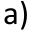

---

### Alkali Metals

The metals in Group 1 of the periodic table are known as **alkali metals**. The lightest member of this group is Lithium (Li).

#### Properties and Handling
*   **Storage**: Alkali metals are stored in oil rather than water. They react vigorously with water and slowly with oxygen in the air.
*   **Density**: Lithium is the lightest metal in the universe. Because it is less dense than oil, it floats when placed in a bottle of oil. This demonstrates the particle model of matter regarding the density of different materials.

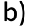

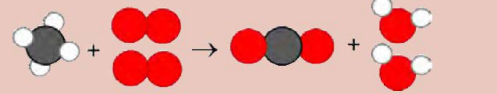
> **[Diagram Context - Textbook_NaturalScience_Gr9_Chemical-reactions.pdf-0029-24.png]**
> This diagram uses ball-and-stick molecular models to represent the combustion reaction of methane, featuring symbols for carbon, hydrogen, and oxygen atoms separated by plus signs and a reaction arrow. It illustrates the law of conservation of mass by visually demonstrating how atoms are rearranged from reactants (methane and oxygen) into products (carbon dioxide and water) while maintaining the same number and type of atoms on both sides of the equation.

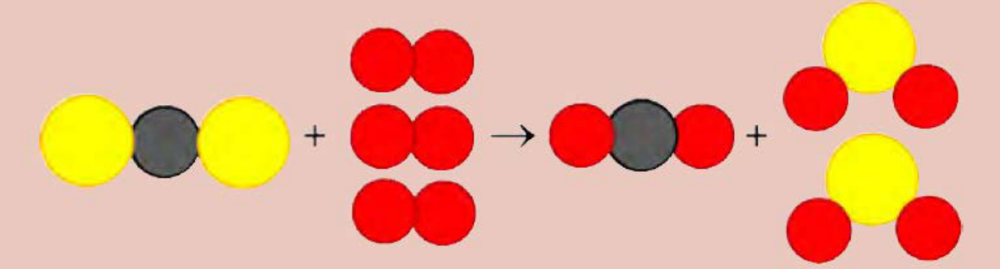
> **[Diagram Context - Textbook_NaturalScience_Gr9_Chemical-reactions.pdf-0029-25.png]**
> This particle model diagram uses coloured spheres to represent a chemical reaction involving reactants and products separated by a reaction arrow and addition signs. It illustrates the law of conservation of mass by visually demonstrating how atoms are rearranged from reactant molecules into new product molecules while maintaining the total number and type of atoms.

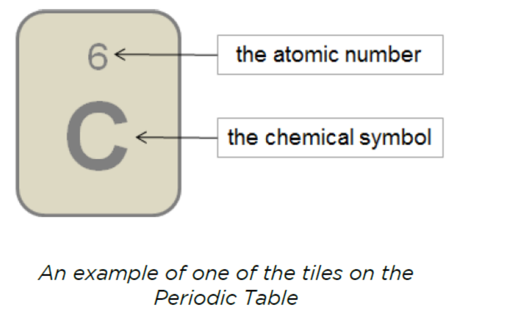
> **[Diagram Context - Textbook_NaturalScience_Gr9_Compounds.pdf-0029-08.png]**
> This diagram illustrates a single element tile from the Periodic Table, specifically for Carbon, featuring the atomic number (6) and the chemical symbol (C). It serves as a foundational reference to help learners identify and interpret the key information provided for each element within the Periodic Table.

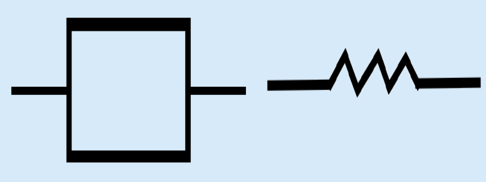
> **[Diagram Context - Textbook_NaturalScience_Gr9_Resistance.pdf-0029-00.png]**
> 1. A diagram of a circuit with a square and a line.

---

### 6.2 Elements and Compounds

This section serves as a revision of fundamental concepts regarding the structure of compounds.

#### Types of Compound Structures
Compounds are classified into two main structural types based on the elements they contain:

1.  **Molecules:** Formed when a compound consists entirely of non-metals.
    *   *Examples:* $CO_2$, $H_2O$, $NH_3$.
2.  **Lattices (Ionic Compounds):** Formed when a compound consists of a metal and a non-metal.
    *   *Process:* Metal and non-metal atoms exchange electrons to form ions. Due to electrostatic attraction between opposite charges, these ions pack together in vast, three-dimensional crystal structures.
    *   *Example:* $NaCl$ (Sodium chloride) consists of a regular arrangement of sodium and chloride ions in a $1:1$ ratio.

---

#### Revision Questions and Answers

| Question | Answer |
| :--- | :--- |
| What is the formula of hydrogen peroxide? | $H_2O_2$ |
| What is the name of the compound with the formula $CO_2$? | Carbon dioxide |
| What formula represents one 'formula unit' of iron oxide? | $FeO$ |

---

#### Discussion Points: Chemical Bonding
When discussing chemical reactions, note the following sequence of events:
*   The bond between the two red atoms breaks.
*   The black atom moves in between the two red atoms.
*   Two new bonds form: one between the black atom and each of the two red atoms.

---

#### ACTIVITY: Writing Formulae and Revision

Use the composition of the substances provided to determine their chemical formulae.

| Name of substance | What it is made of? | Chemical formula |
| :--- | :--- | :--- |
| Water | $2$ H atoms and $1$ O atom | $H_2O$ |
| Carbon dioxide | $1$ C atom and $2$ O atoms | $CO_2$ |
| Ammonia | $1$ N atom and $3$ H atoms | $NH_3$ |

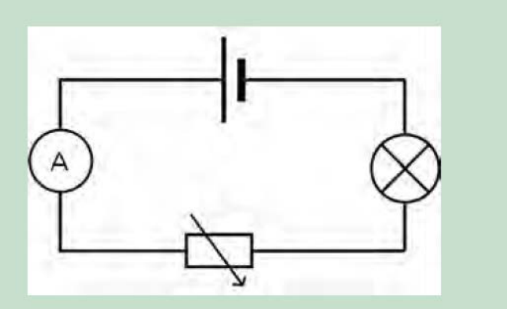
> **[Diagram Context - Textbook_NaturalScience_Gr9_Resistance.pdf-0030-07.png]**
> 1. A circuit diagram with two wires and a battery.

---

### 6.3 Names of Compounds

Chemical compounds are categorized based on the types of elements they contain. Understanding these categories helps in naming the compounds correctly.

#### Key Concepts
*   **Ionic Compounds:** Compounds formed between a metal and a non-metal. These do not form molecules, but rather structures called "formula units" (lattices).
*   **Covalent Compounds:** Compounds formed between two or more non-metals. These exist as discrete molecules.

---

#### Type 1: Compounds containing a metal and a non-metal
These are classified as ionic compounds. When naming these, the metal is typically named first, followed by the non-metal with an "-ide" suffix.

**Activity: Naming compounds of metals and non-metals**

| Formula | Which elements does it consist of? | Name |
| :--- | :--- | :--- |
| $Li_2O$ | 2 Lithium and 1 oxygen | Lithium oxide |
| $KCl$ | 1 Potassium and 1 chlorine | Potassium chloride |
| $CuO$ | 1 Copper and 1 oxygen | Copper oxide |
| $NaBr$ | 1 Sodium and 1 bromine | Sodium bromide |

---

#### Type 2: Compounds containing only non-metals
These are classified as covalent compounds. They consist of molecules.

**Activity: Writing names from the formulae of compounds**

| Formula of the compound | Name of the compound | Picture of one molecule of the compound |
| :--- | :--- | :--- |
| $CO_2$ | carbon dioxide | 

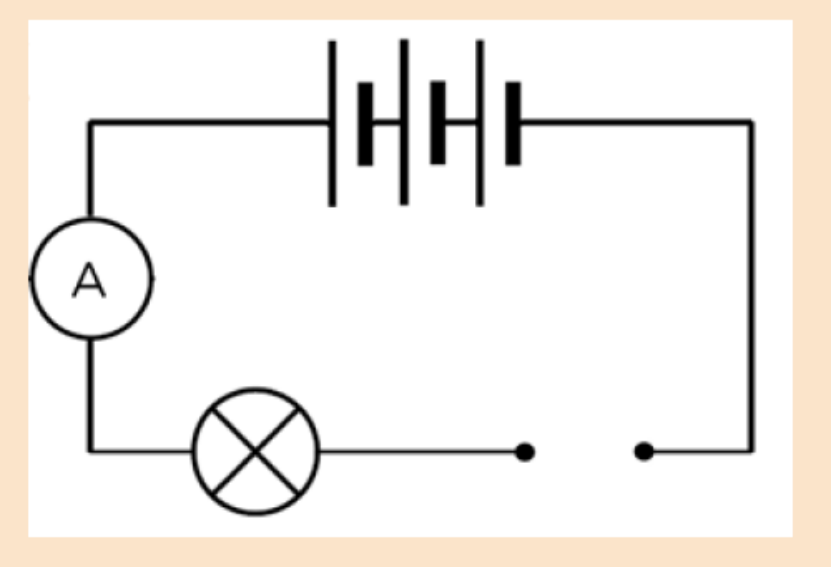
> **[Diagram Context - Textbook_NaturalScience_Gr9_Resistance.pdf-0031-12.png]**
> 1. A circuit diagram with a battery, wires, and a light bulb.

 |
| $H_2O$ | hydrogen dioxide (water) | <!-- DIAGRAM_PLACEHOLDER: diagram --> |
| $PF_3$ | phosphorous trifluoride | <!-- DIAGRAM_PLACEHOLDER: diagram --> |
| $SF_4$ | sulfur tetrafluoride | <!-- DIAGRAM_PLACEHOLDER: diagram --> |
| $CCl_4$ | carbon tetrachloride | <!-- DIAGRAM_PLACEHOLDER: diagram --> |

*Note: When drawing or modeling these, the colours of the atoms are not important, provided that atoms of the same element are represented by the same colour.*

---

#### Additional Notes
1.  **Chemical Bonds:** A chemical bond is the force that holds atoms together.
2.  **Diatomic Molecules:** Some elements, such as oxygen, exist as diatomic molecules, meaning two atoms of the same element are bonded together (e.g., $O_2$).
3.  **Modeling:** Learners are encouraged to use materials like beads, beans, plasticine, or playdough to create physical models of these compounds to better understand their structure.

---

### Guidelines for Drawing Molecular Structures

When representing molecules visually, keep the following principles in mind:

*   **Central Atom Placement:** The atom that appears first in the chemical name or formula should be placed at the centre of the molecule. All other atoms must be bonded to this central atom.
*   **Relative Sizes:** While exact sizes are not critical, atoms of elements located higher up on the Periodic Table generally have a smaller atomic radius than those located lower down.
*   **Colour Coding:** Atoms of the same element should be represented using the same colour. The specific choice of colour is not important.

---

### ACTIVITY: Writing formulae from the names of compounds

Complete the table below by drawing a representation of one molecule for each of the given compounds.

| Formula of the compound | Name of the compound | Picture of one molecule of the compound |
| :--- | :--- | :--- |
| $HF$ | hydrogen fluoride | <!-- DIAGRAM_PLACEHOLDER: diagram --> |
| $H_{2}S$ | dihydrogen sulfide | <!-- DIAGRAM_PLACEHOLDER: diagram --> |
| $SO_{3}$ | sulfur trioxide | <!-- DIAGRAM_PLACEHOLDER: diagram --> |
| $CO$ | carbon monoxide | <!-- DIAGRAM_PLACEHOLDER: diagram --> |

---

# Revision: Chemical Formulas and Compounds

## 1. Identification Exercise
Answers to identification questions:
* a) C and D
* b) A
* c) B
* d) B and D
* e) $NH_3$
* f) $N_2$ and $H_2$
* g) A, B and D
* h) C

---

## 2. Compound Formulas and Names
| Formula of the compound | Name of the compound | Picture of one molecule of the compound |
| :--- | :--- | :--- |
| $NH_3$ | ammonia | <!-- DIAGRAM_PLACEHOLDER: diagram --> |
| $CO_2$ | carbon dioxide | <!-- DIAGRAM_PLACEHOLDER: diagram --> |
| $CuCl_2$ | copper(II) chloride | <!-- DIAGRAM_PLACEHOLDER: diagram --> |
| $SO_2$ | sulfur dioxide | <!-- DIAGRAM_PLACEHOLDER: diagram --> |

---

## 3. Compound Nomenclature
| Formula of the compound | Name of the compound |
| :--- | :--- |
| $NaCl$ | sodium chloride |
| $N_2O$ | dinitrogen monoxide |
| $SO_3$ | sulfur trioxide |
| $CO$ | carbon monoxide |

---

## 4. Chemical Identification
* a) $CO$ and $H_2O$
* b) carbon monoxide and water
* c) $CO_2$ and $H_2$
* d) carbon dioxide and hydrogen

---

## 5. Composition of Chemical Formulas
| Chemical formula | What it is made of? |
| :--- | :--- |
| $H_2O$ | 2 hydrogen atoms and 1 oxygen atom |
| $SF_4$ | 1 sulfur atom and 4 fluorine atoms |
| $NO_2$ | 1 nitrogen atom and 2 oxygen atoms |
| $Fe_2O_3$ | 2 iron atoms and 3 oxygen atoms |
| $Na_2O$ | 2 sodium atoms 1 oxygen atom |