# Chapter 1: Forces

## Key Questions
* What is a force?
* What effect can a force have on an object?
* Do forces have to be between objects which are touching?

---

## 1.1 Types of Forces

### What is a force?
A force is a push or a pull on an object. When you move a heavy object, such as a desk, you must either push it or pull it to change its position. By doing this, you are exerting a force on the object.

<!-- DIAGRAM_PLACEHOLDER: diagram -->

### Key Vocabulary
* **Force:** A push or a pull exerted on an object.
* **Net force:** The sum of all forces acting on an object.
* **Contact force:** A force that acts only when objects are physically touching.
* **Non-contact force:** A force that acts over a distance without physical contact.
* **Newton (N):** The SI unit of force.

### Did You Know?
The **newton (N)** is named after Sir Isaac Newton, an English physicist and mathematician recognized for his work in mechanics and his three laws of motion.

The newton is defined as the force required to accelerate a mass of $1\text{ kg}$ at a rate of $1\text{ m/s}^2$. This relationship is expressed by the formula:

$$F = m \times a$$

Where:
* $F$ is the force in newtons ($\text{N}$)
* $m$ is the mass in kilograms ($\text{kg}$)
* $a$ is the acceleration in metres per second squared ($\text{m/s}^2$)

<!-- DIAGRAM_PLACEHOLDER: diagram -->

---

# Chapter 1: Forces

## Introduction
Forces are an integral part of our daily lives. We rely on forces for basic human movement, such as our muscles pulling on our bones to facilitate walking. We also use forces to interact with our environment, such as opening doors or picking up food.

---

## Activity: What can forces do?

### Objective
To experiment with different objects and observe the effects of pushing and pulling. You will observe how forces can cause acceleration in solid objects and how they can distort the shape of flexible materials.

### Materials Required
*   Blocks (wooden or metal)
*   Sponge or piece of foam
*   Ball
*   Blown up balloon
*   Putty or play dough

### Instructions
Work in groups of 2 or 3 to perform the following tasks and record your observations:

1.  **Pushing a stationary object:** Place the ball on the ground and push it towards your partner. Describe what happens to the ball.
2.  **Changing direction:** While the ball is moving, have a third person push the ball at an angle to its current path. Describe the change in the ball's movement.
3.  **Opposing force:** Exert a force in the opposite direction to the ball's movement while it is already moving. What happens to the ball?
4.  **Assisting force:** Exert a force in the same direction as the ball's movement while it is already moving. What happens to the ball?

> **[Diagram Context - Textbook_NaturalScience_Gr9_Birth-life-and-the-death-of-a-star.pdf-0001-02.png]**
> The educational graphic is a simplified structural diagram depicting a surface layer with evenly spaced, repeating blue curled wave-like structures protruding above a horizontal plane. There are no explicit text labels, axis names, or chemical symbols visible in the image. Conceptually, this diagram illustrates a regular, periodic boundary or interface phenomenon, often used in physical sciences or mathematics to model surface waves, oscillations, or boundary conditions for high school learners.

---

## Did You Know?
In 1687, Isaac Newton published *Philosophiæ Naturalis Principia Mathematica*. This work is considered one of the most important books in the history of science. It describes the theory of universal gravitation and the three laws of motion, which form the foundation of classical mechanics.

> **[Diagram Context - Textbook_NaturalScience_Gr9_Birth-life-and-the-death-of-a-star.pdf-0001-03.png]**
> This educational graphic depicts a mechanical apparatus featuring a large central key being lifted and manipulated by a complex system of pulleys, ropes, scaffolding frameworks, and multiple small human figures pulling and operating the gear mechanisms. Visible elements include a central hanging hook, overhead gantries, ladders, ropes held by groups of figures, and a system of pulleys redirecting applied forces. Conceptually, this diagram illustrates mechanical advantage and work in physical sciences by showing how simple machines (like pulleys and levers) combine to reduce the effort force needed to lift heavy loads.

> **[Diagram Context - Textbook_NaturalScience_Gr9_Birth-life-and-the-death-of-a-star.pdf-0001-21.png]**
> This educational graphic illustrates a laboratory apparatus setup showing a chemical reaction taking place in an Erlenmeyer flask heated by a Bunsen burner connected to a gas cylinder. Visible elements include a purple gas cylinder, tubing, a burner producing flames beneath a tripod stand, an Erlenmeyer flask containing a blue liquid with rising gas bubbles, and escaping vapor or gas at the top. For a high school Physical Sciences student, this diagram demonstrates the practical execution of a chemical reaction involving heating and gas production, highlighting energy transfer and the visual indicators of a chemical change such as effervescence.

> **[Diagram Context - Textbook_NaturalScience_Gr9_Birth-life-and-the-death-of-a-star.pdf-0001-24.png]**
> This graphic depicts an astronomical photograph of the Pillars of Creation within the Eagle Nebula, showcasing dense columns of cosmic dust and gas surrounded by glowing interstellar matter and embedded stars. The visual features large brownish-orange pillars illuminated with golden and turquoise edges, interspersed with bright pinpoint stars displaying distinct diffraction spikes against a deep space background. For Physical Sciences learners, this image exemplifies the birthplaces of stars, illustrating gravitational collapse, stellar nurseries, and the life cycle of stars as covered in Grade 12 Earth and Beyond content.

> **[Diagram Context - Textbook_NaturalScience_Gr9_Cost-of-electrical-energy.pdf-0001-02.png]**
> 1. A diagram of a cell with blue and white lines.

> **[Diagram Context - Textbook_NaturalScience_Gr9_Cost-of-electrical-energy.pdf-0001-03.png]**
> 1. A cartoon character with a backpack and skateboard.

> **[Diagram Context - Textbook_NaturalScience_Gr9_Cost-of-electrical-energy.pdf-0001-23.png]**
> 1. A diagram of a cell with arrows pointing to different parts of the cell.

> **[Diagram Context - Textbook_NaturalScience_Gr9_Cost-of-electrical-energy.pdf-0001-25.png]**
> 1. A diagram of a cell with arrows pointing to different parts of the cell.
 2. A diagram of a circuit with arrows pointing to different parts of the circuit.
 3. A diagram of a Lewis structure with arrows pointing to different parts of the Lewis structure.

> **[Diagram Context - Textbook_NaturalScience_Gr9_Energy-and-the-national-electricity-grid.pdf-0001-02.png]**
> This diagram illustrates a conceptual cross-section of a solid surface lined with a uniform layer of adsorbed molecules, represented by repeating blue curved shapes attached to a light purple substrate. There are no explicit text labels, axes, or chemical symbols present in the graphic. Conceptually, it helps students visualize surface phenomena such as heterogeneous catalysis, adsorption, or thin-film deposition at a microscopic level.

> **[Diagram Context - Textbook_NaturalScience_Gr9_Energy-and-the-national-electricity-grid.pdf-0001-03.png]**
> This conceptual diagram depicts a mechanical apparatus featuring pulleys, ropes, scaffolding frameworks, and numerous stylized blue human figures working collaboratively to lift and maneuver a large central key. The visible elements include a suspended hook, multiple interconnected ropes and pulleys, ladders, scaffolding structures, and teams of figures pulling ropes from various angles. Conceptually, for a high school Physical Sciences student studying mechanics, this graphic illustrates the principles of work, energy, force vectors, and mechanical advantage using a complex system of simple machines.

> **[Diagram Context - Textbook_NaturalScience_Gr9_Energy-and-the-national-electricity-grid.pdf-0001-13.png]**
> This photograph depicts a coal-fired thermal power station, showing multiple hyperbolic cooling towers and a tall industrial chimney releasing smoke into the sky. Visible features include the large concrete cooling towers, the central emission stack, and low-lying plant buildings surrounded by an open field with sparse vegetation. Conceptually, this visual represents the generation of electrical energy from non-renewable energy sources, illustrating the environmental impact and large-scale infrastructure associated with burning fossil fuels in South Africa's energy sector.

> **[Diagram Context - Textbook_NaturalScience_Gr9_Energy-and-the-national-electricity-grid.pdf-0001-19.png]**
> This educational graphic illustrates a laboratory apparatus setup featuring an Erlenmeyer flask containing a blue liquid heated by a Bunsen burner, connected via purple tubing to a pressurized gas cylinder. Visible elements include flames beneath the tripod-supported flask, rising gas bubbles, and a vapor plume escaping from the flask neck. Conceptually, this diagram demonstrates the practical setup for investigating chemical reactions involving heating, gas production, and the controlled delivery of reactants in high school Physical Sciences.

> **[Diagram Context - Textbook_NaturalScience_Gr9_Energy-and-the-national-electricity-grid.pdf-0001-22.png]**
> This educational diagram illustrates the sequential process of generating electricity in a coal-fired power station. The graphic features labeled components including coal, pulveriser, furnace, cooler, turbine, generator, transformer, and power lines. Conceptually, it demonstrates the energy conversions involved in thermal power generation, tracing the transformation of chemical potential energy in coal into thermal energy, mechanical energy in the turbine, and finally electrical energy distributed via the national grid.

> **[Diagram Context - Textbook_NaturalScience_Gr9_Energy-and-the-national-electricity-grid.pdf-0001-25.png]**
> This educational graphic is an environmental geography illustration depicting planet Earth shaped as a hot air balloon carrying observers in a basket beneath a sun, clouds, and flying birds. The visual elements include a globe enclosed in a net tethered to a burner flame and a basket holding two human figures using telescopes. Conceptually, this diagram conveys the theme of global observation, environmental monitoring, or geography fieldwork, helping high school learners explore human interaction with the Earth and atmospheric systems within the CAPS curriculum.

> **[Diagram Context - Textbook_NaturalScience_Gr9_Forces.pdf-0001-02.png]**
> 1. A diagram of a cell with blue and white lines.

> **[Diagram Context - Textbook_NaturalScience_Gr9_Forces.pdf-0001-03.png]**
> 1. A cartoon character with a backpack and a skateboard.

> **[Diagram Context - Textbook_NaturalScience_Gr9_Forces.pdf-0001-21.png]**
> The image features a cartoon illustration of a man's head with a red apple on his forehead. The man is wearing a white shirt and a black bow tie. The illustration also includes a thought bubble with a pink cloud and several apples, as well as a nameplate that reads "Mr. Newton". The illustration is labeled with the name "Newton" and "Mr. Newton" in the

> **[Diagram Context - Textbook_NaturalScience_Gr9_Forces.pdf-0001-22.png]**
> The image is a portrait of a man with long, curly hair, wearing a black coat. The man appears to be a student, possibly a biology student, as indicated by the presence of a Lewis diagram on the image. The diagram is a visual representation of the Lewis structure of water, which is a key concept in chemistry. The diagram shows the bonds between the atoms in the molecule, with

> **[Diagram Context - Textbook_NaturalScience_Gr9_Safety-with-electricity.pdf-0001-02.png]**
> 1. A diagram of a cell with blue and white lines.

> **[Diagram Context - Textbook_NaturalScience_Gr9_Safety-with-electricity.pdf-0001-03.png]**
> 1. A cartoon illustration of a key and a crane.

> **[Diagram Context - Textbook_NaturalScience_Gr9_Safety-with-electricity.pdf-0001-18.png]**
> 1. A purple and blue gas cylinder with a purple nozzle.

> **[Diagram Context - Textbook_NaturalScience_Gr9_Safety-with-electricity.pdf-0001-20.png]**
> 1. A black and white line drawing of a power strip with three plugs and a switch.

> **[Diagram Context - Textbook_NaturalScience_Gr9_Series-and-parallel-circuits.pdf-0001-02.png]**
> The image features a gray background with a series of blue circles arranged in a zigzag pattern. The circles are evenly spaced, and the zigzag pattern creates a sense of movement. The image does not contain any text or additional objects, and the arrangement of the circles and the zigzag pattern suggests a visual representation of a Lewis diagram or an anatomical/cellular structure. The image

> **[Diagram Context - Textbook_NaturalScience_Gr9_Series-and-parallel-circuits.pdf-0001-03.png]**
> 1. A cartoon character with a backpack and a skateboard.

> **[Diagram Context - Textbook_NaturalScience_Gr9_Series-and-parallel-circuits.pdf-0001-13.png]**
> 1. A circuit diagram with a battery, wires, and a light bulb.

> **[Diagram Context - Textbook_NaturalScience_Gr9_Series-and-parallel-circuits.pdf-0001-21.png]**
> 1. A hand holding a tablet with a stylus.
 2. A diagram of a cell with arrows pointing to different parts of the cell.
 3. A diagram of a circuit with arrows pointing to different parts of the circuit.

---

### Practical Activities: Investigating Forces

6. **Experiment with Putty and Balloons:**
   * Apply pulling or pushing forces to a piece of putty (or play dough) and a blown-up balloon.
   * **Observation:** Note how these forces change the shape of the objects.

7. **Experiment with Wooden Blocks:**
   * Apply a push or pull to wooden blocks.
   * **Observation:** Determine if you are able to change their motion and if you are able to change their shape.

8. **Experiment with a Sponge:**
   * Twist a piece of sponge. This is a type of force that changes the object's shape.
   * Press the sponge between both hands. This specific action is called **compression**.

---

### Effects of Forces

Forces can have the following effects on objects:

*   **Deformation:** Forces can change the **shape** of an object.
*   **Change in Motion:** Forces can change the **motion** of an object.
    *   If an object is stationary, a force can cause it to start moving.
    *   If an object is already moving, a force can cause it to speed up or slow down.
*   **Change in Direction:** Forces can change the **direction** in which an object is moving.

> **[Diagram Context - Textbook_NaturalScience_Gr9_Birth-life-and-the-death-of-a-star.pdf-0002-01.png]**
> This photograph shows an astronomical view of the Orion constellation region against a dense starry background. The graphic is labelled with the prominent stars "Rigel" (circled near the top) and "Betelgeuse" (circled near the bottom), along with an arrow pointing to the "Orion nebula". For CAPS Physical Sciences and Geography learners studying the universe, this visual conveys the composition of stellar systems, contrasting the distinct locations of blue supergiants like Rigel and red supergiants like Betelgeuse relative to star-forming regions such nebulae.

---

### Motion and Velocity

**Key Definitions:**
*   **Speed:** Describes how fast an object is moving.
*   **Velocity:** The rate of change of the position of an object. It describes both how fast an object is moving and the direction in which it is moving.

**Constant Velocity:**
An object moves at a constant velocity if it travels at the same speed in the same direction.
*   *Example:* A car travelling along a highway at $100\text{ km/h}$ in a straight line.

---

### Acceleration

**Definition:**
Acceleration is the rate of change of a body's velocity with time. It is a measure of how an object's speed changes every second.

*   **Note:** When a force is applied to an object, it can cause the object to speed up or slow down. This change in motion is defined as acceleration.

---

### New Words Summary
*   **Speed:** The rate at which an object covers distance.
*   **Velocity:** Speed in a given direction.
*   **Acceleration:** The rate of change of velocity.
*   **Deformation:** The action or process of changing the shape of an object.

> **[Diagram Context - Textbook_NaturalScience_Gr9_Birth-life-and-the-death-of-a-star.pdf-0002-03.png]**
> This educational graphic is an astronomical constellation diagram overlaying a mythological figure, specifically illustrating the Orion constellation. The diagram features connected white nodes representing stars, a silhouette of a hunter, and the label "Orion nebula" pointing to a cluster of small circles within the figure's torso. For a high school student, this conveys how prominent star patterns in the night sky are mapped onto recognizable mythological shapes, while also locating notable deep-sky objects like the Orion Nebula within the constellation.

> **[Diagram Context - Textbook_NaturalScience_Gr9_Birth-life-and-the-death-of-a-star.pdf-0002-07.png]**
> This graphic is a line drawing illustration of a person holding a digital tablet device with a touchscreen displaying a grid of application icons and a speech bubble above it. Visible elements include two hands interacting with the device, with one index finger touching a specific screen icon, and various abstract app symbols representing navigation, media, and tools. Conceptually, this diagram visually represents digital interaction, e-learning, or mobile technology usage, supporting lessons on Information Technology (IT) or Computer Applications Technology (CAT) regarding user interfaces and digital devices.

> **[Diagram Context - Textbook_NaturalScience_Gr9_Birth-life-and-the-death-of-a-star.pdf-0002-10.png]**
> This cartoon illustration depicts a blue-skinned thief in striped clothing hurriedly sneaking away while holding a framed portrait resembling the Mona Lisa. The visible elements include a speech bubble, horizontal motion lines indicating speed, and a decorative picture frame holding a sketched portrait of a person with long hair. Conceptually, this visual serves as an engaging prompt for creative writing or visual literacy exercises, illustrating the theme of art theft or unauthorized removal.

> **[Diagram Context - Textbook_NaturalScience_Gr9_Cost-of-electrical-energy.pdf-0002-06.png]**
> The image shows a diagram of a spring coiled up and attached to a green staircase. The diagram is a Lewis diagram, which is a visual representation of a chemical reaction. The diagram is labeled with the chemical formula for sulfuric acid, H2SO4, and the name of the acid. The diagram also includes arrows pointing to the reactants and products, as well as labels for the

> **[Diagram Context - Textbook_NaturalScience_Gr9_Cost-of-electrical-energy.pdf-0002-09.png]**
> 1. A diagram of a cell with arrows pointing to different parts of the cell.

> **[Diagram Context - Textbook_NaturalScience_Gr9_Cost-of-electrical-energy.pdf-0002-11.png]**
> 1. A diagram of a cell with arrows pointing to different parts of the cell.
 2. A diagram of a circuit with arrows pointing to different parts of the circuit.
 3. A diagram of a Lewis structure with arrows pointing to different parts of the Lewis structure.

> **[Diagram Context - Textbook_NaturalScience_Gr9_Cost-of-electrical-energy.pdf-0002-13.png]**
> 1. A Phillips brand hand mixer with a black cord.

> **[Diagram Context - Textbook_NaturalScience_Gr9_Cost-of-electrical-energy.pdf-0002-15.png]**
> The image shows a label for a product, specifically a stainless steel pot. The label includes information about the pot's features, such as its capacity, weight, and the type of material it is made of. The pot is described as "Creative Houseware" and "Stainless steel 10L Urn". The label also provides details about the pot's durability, stating that it is

> **[Diagram Context - Textbook_NaturalScience_Gr9_Cost-of-electrical-energy.pdf-0002-18.png]**
> The image features a cartoon illustration of a hot air balloon with a globe on top. The globe is depicted in a cartoon style with a blue and green color scheme. The balloon is filled with air and is being pulled by two people who are sitting on the bottom of the balloon. The illustration also includes a sun and clouds, adding to the overall visual appeal of the scene. The text "Lewis

> **[Diagram Context - Textbook_NaturalScience_Gr9_Energy-and-the-national-electricity-grid.pdf-0002-08.png]**
> The graphic depicts a photographic scene of a thermal power station featuring large cooling towers and tall overhead transmission power lines carrying electricity across the landscape. Visible elements include two prominent decorated cooling towers, steel lattice transmission pylons, high-voltage power cables, and surrounding industrial and residential infrastructure. This real-world context illustrates the macroscopic scale of electrical energy generation and transmission in South Africa, helping learners connect the physics of circuits and power systems to national energy infrastructure like Eskom.

> **[Diagram Context - Textbook_NaturalScience_Gr9_Energy-and-the-national-electricity-grid.pdf-0002-12.png]**
> The graphic is an illustrated conceptual diagram featuring a caricature of Sir Isaac Newton styled as a red apple, labeled "MR. NEWTON," connected by a dotted network of smaller floating apples and directional arrows. Above the central figure, a thought bubble contains the text: "The cooling tower on the left in the photo is covered in the largest mural painting in South Africa." Conceptually, this whimsical illustration engages high school learners by connecting historical physics figures and gravitational symbolism with real-world landmarks in South Africa.

> **[Diagram Context - Textbook_NaturalScience_Gr9_Energy-and-the-national-electricity-grid.pdf-0002-14.png]**
> This educational graphic is an environmental science illustration featuring a cartoon figure holding a sign that reads "Learn more about the greenhouse effect with this simulation" and a short URL link, positioned above a globe surrounded by circular green arrows. Visible elements include a stylized planet Earth showing continents and oceans, a person holding a signpost, and a ring of directional arrows encircling the globe representing global cycles or atmospheric processes. Conceptually, this diagram introduces high school learners to climate change and global warming, serving as an interactive prompt to explore how greenhouse gases trap thermal energy within the Earth's atmosphere.

> **[Diagram Context - Textbook_NaturalScience_Gr9_Energy-and-the-national-electricity-grid.pdf-0002-16.png]**
> The image is an educational illustration depicting a digital tablet being held and used by hands, featuring a speech bubble with instructional text. Visible text elements include the speech bubble reference to Grade 8 miniature turbines and steam, as well as the website address "www.curious.org.za". Conceptually, the graphic serves as an introductory or revision prompt for CAPS Natural Sciences learners, connecting prior knowledge of energy transfer and turbines with digital or online resources.

> **[Diagram Context - Textbook_NaturalScience_Gr9_Forces.pdf-0002-08.png]**
> The image features a cartoon depiction of a spring coiled up in the shape of a caterpillar. The caterpillar is made up of green leaves and has a smiley face drawn on it. The spring is coiled up in the shape of a caterpillar, with a total of eight green leaves attached to it. The diagram is labeled with the text "Lewis diagram" and "cellular

> **[Diagram Context - Textbook_NaturalScience_Gr9_Forces.pdf-0002-19.png]**
> Three laws of motion are depicted in a cartoon illustration. The illustration features a cartoon astronaut on a red planet, holding a flag and a stick. The astronaut is wearing a white spacesuit and has a helmet on his head. The planet is covered in stars and planets, and the illustration includes a Lewis diagram, an anatomical/cellular structure, and a circuit.

> **[Diagram Context - Textbook_NaturalScience_Gr9_Safety-with-electricity.pdf-0002-02.png]**
> 1. A diagram of a washing machine with the components labeled.
 2. The diagram shows the earth wire connected to the washing machine.
 3. The diagram shows the earth wire connected to the washing machine.

> **[Diagram Context - Textbook_NaturalScience_Gr9_Safety-with-electricity.pdf-0002-11.png]**
> The image shows a cartoon depiction of a man and a woman riding in a hot air balloon. The balloon is filled with a green gas and is floating in the sky. The man is holding onto the basket, while the woman is holding onto the basket's handle. The image also includes a text box that provides information about the safety dog and its role in providing safety tips.

> **[Diagram Context - Textbook_NaturalScience_Gr9_Safety-with-electricity.pdf-0002-14.png]**
> The image features a cartoon depiction of a man's head with a large apple on his forehead, accompanied by a thought bubble containing a thought process. The man's head is colored in a vibrant shade of red, and the apple is a bright pink. The thought process is represented by a series of arrows, suggesting a flow of ideas or concepts. The man's head is labeled "Mr. Newton

> **[Diagram Context - Textbook_NaturalScience_Gr9_Safety-with-electricity.pdf-0002-15.png]**
> 1. A diagram of a cell with arrows pointing to different parts of the cell.

> **[Diagram Context - Textbook_NaturalScience_Gr9_Series-and-parallel-circuits.pdf-0002-02.png]**
> 1. A diagram of a circuit with two inputs and two outputs labeled A and B.

> **[Diagram Context - Textbook_NaturalScience_Gr9_Series-and-parallel-circuits.pdf-0002-03.png]**
> 1. A circuit board with a multimeter on it.

> **[Diagram Context - Textbook_NaturalScience_Gr9_Series-and-parallel-circuits.pdf-0002-09.png]**
> 1. A cartoon drawing of a woman with long hair and a blue shirt.
 2. A man holding a picture of the woman.
 3. The woman's face is shown in profile.

---

# Activity: Is it a push or a pull?

## Instructions
1. Look at the pictures in the table below.
2. Describe the action in each image.
3. Decide if the force being exerted is a **push** or a **pull**.
4. Describe the **effect** of the force (e.g., does it change the shape, speed, or direction of the object?).

> **[Diagram Context - Textbook_NaturalScience_Gr9_Birth-life-and-the-death-of-a-star.pdf-0003-00.png]**
> This educational graphic is a composite astrophotography image from the Hubble Space Telescope (HST WFPC2) displaying four distinct protoplanetary disks (proplyds) within the Orion Nebula. Visible features include central luminous protostars surrounded by dark, dusty circumstellar disks silhouetted against glowing nebular gas. Conceptually, this visual supports the CAPS Earth and Space Sciences curriculum by providing empirical evidence for the nebular hypothesis, demonstrating how solar systems and planetary disks form around young stars.

| Action | Push or pull? | Effect |
| :--- | :--- | :--- |
| Kicking a ball | | |
| Moulding clay | | |
| Playing with a toy wagon | | |

***

### Key Concepts
*   **Force:** A push or a pull acting on an object.
*   **Push:** A force that moves an object away from the source of the force.
*   **Pull:** A force that moves an object towards the source of the force.
*   **Effect of Force:** Forces can cause objects to:
    *   Start moving or stop moving.
    *   Change speed (speed up or slow down).
    *   Change direction.
    *   Change shape (deform).

> **[Diagram Context - Textbook_NaturalScience_Gr9_Birth-life-and-the-death-of-a-star.pdf-0003-01.png]**
> This educational graphic is an informational illustration featuring a globe surrounded by circular green arrows and a figure holding a sign. The sign displays the text "VISIT", "Star birth (Orion Nebula).", and a shortened web link ("bit.ly/1dkERqb"). Conceptually, this diagram serves as a multimedia prompt designed to direct high school learners to external digital resources regarding stellar evolution and the formation of stars in nebulae within the Earth and Beyond strand of the curriculum.

> **[Diagram Context - Textbook_NaturalScience_Gr9_Birth-life-and-the-death-of-a-star.pdf-0003-03.png]**
> This image contains a text-based educational prompt encased in a bordered box, directing learners to an external resource. Visible text includes the headings "VISIT" and "Stellar evolution explained (full documentary).", alongside a hyperlink "bit.ly/17Vfg2H". Conceptually, it serves as an online supplementary resource for high school Physical Sciences learners studying the origin of the universe and stellar evolution within the CAPS curriculum.

> **[Diagram Context - Textbook_NaturalScience_Gr9_Birth-life-and-the-death-of-a-star.pdf-0003-04.png]**
> This conceptual illustration depicts a giant optical telescope viewing planet Earth with tiny human scientists operating it from scaffolding and a control console. The graphic features a large view of Earth showing the African continent framed inside the aperture of a massive scientific telescope. Conceptually, it introduces learners to Earth Systems Science, demonstrating how our planet is studied as an integrated, interconnected system through global observation and scientific inquiry.

> **[Diagram Context - Textbook_NaturalScience_Gr9_Birth-life-and-the-death-of-a-star.pdf-0003-06.png]**
> This is an astronomical photograph showing a dense stellar cluster embedded within a nebula, displaying vibrant blue, purple, and red interstellar gas clouds. The image captures numerous luminous stars with distinct diffraction spikes, scattered against a deep cosmic background without text labels or coordinate axes. Conceptually, it illustrates stellar nurseries and star formation processes within the Milky Way, supporting Grade 10-12 Physical Sciences and Geography outcomes regarding the life cycles of stars and electromagnetic radiation across different wavelengths.

> **[Diagram Context - Textbook_NaturalScience_Gr9_Birth-life-and-the-death-of-a-star.pdf-0003-07.png]**
> This graphic is a text-based pedagogical callout banner featuring a jagged, starburst-style rectangular border. Inside the border, the underlined text "TAKE NOTE" is displayed in bold, sans-serif uppercase letters. Conceptually, this visual cue serves as an instructional signpost in CAPS learning materials to draw learners' attention to critical definitions, exceptions, or important core concepts.

> **[Diagram Context - Textbook_NaturalScience_Gr9_Birth-life-and-the-death-of-a-star.pdf-0003-09.png]**
> This educational graphic is a text box with a jagged border that frames a prior-knowledge prompt regarding nuclear reactions and nuclear power plants. It contains the visible text: "Do you remember that we learned about nuclear reactions last term in Energy and Change when looking at nuclear power plants?". Conceptually, it serves as a transitional pedagogical tool to activate learners' prior knowledge from previous CAPS Physical Sciences units before introducing new related content.

> **[Diagram Context - Textbook_NaturalScience_Gr9_Birth-life-and-the-death-of-a-star.pdf-0003-10.png]**
> This illustration features a cartoon robot with mechanical controls, dials, and loose nuts and bolts falling from its body, accompanied by a partial speech bubble reading "nuclear power plants?". The graphic uses an engaging, anthropomorphic character to prompt inquiry into industrial energy systems and technology. Conceptually, it introduces high school learners to the societal, environmental, and technological impacts of energy generation methods like nuclear power.

> **[Diagram Context - Textbook_NaturalScience_Gr9_Cost-of-electrical-energy.pdf-0003-05.png]**
> 1. A diagram of a cell with arrows pointing to different parts of the cell.

> **[Diagram Context - Textbook_NaturalScience_Gr9_Cost-of-electrical-energy.pdf-0003-13.png]**
> 1. A cartoon drawing of a man holding a picture of a woman. 
 2. The woman in the picture is wearing a white dress. 
 3. The man holding the picture is wearing blue pants. 
 4. The picture is of a woman.

> **[Diagram Context - Textbook_NaturalScience_Gr9_Energy-and-the-national-electricity-grid.pdf-0003-00.png]**
> The graphic is a text-based informational resource frame featuring the heading "VISIT", the subtitle "How a coal power station works (video)", and a URL link "bit.ly/1a7rqJB". It directs learners to external multimedia content illustrating the generation of electricity using coal. For a high school Physical Sciences student, this resource visually demonstrates the conversion of chemical potential energy in fossil fuels into electrical energy, supporting the CAPS curriculum topic of energy resources and power generation.

> **[Diagram Context - Textbook_NaturalScience_Gr9_Energy-and-the-national-electricity-grid.pdf-0003-01.png]**
> This educational photograph depicts a massive industrial alternating current (AC) generator, illustrating the scale and practical application of electromagnetic induction in power generation. The image shows the large enclosed stator housing, rotor shaft bearings, and an industrial worker standing nearby for scale, with no text labels or arrows present. Conceptually, this visual supports CAPS Physical Sciences by bridging theoretical concepts of Faraday's Law and flux linkage with real-world energy generation systems found in South African power stations.

> **[Diagram Context - Textbook_NaturalScience_Gr9_Energy-and-the-national-electricity-grid.pdf-0003-02.png]**
> This educational graphic depicts a conceptual illustration featuring a giant green telescope or viewing apparatus focused on planet Earth, accompanied by small figures of observers operating the equipment and monitoring data at a computer workstation with an empty speech bubble above. The visible elements include a large optical instrument frame on a scaffold, a detailed photographic globe representing Earth showing Africa, Europe, and parts of the Atlantic and Indian Oceans, human figures on ladders and desks, and a speech bubble with an invisible prompt. Conceptually, this diagram visually communicates the perspective of global observation, scientific inquiry, and environmental monitoring from an external standpoint, helping students grasp how humanity studies Earth systems as a whole within Geography and Natural Sciences.

> **[Diagram Context - Textbook_NaturalScience_Gr9_Energy-and-the-national-electricity-grid.pdf-0003-05.png]**
> This educational graphic features a text-based callout box enclosed in a hand-drawn, wavy border. It contains the underlined heading text "TAKE NOTE" in bold, uppercase letters. Conceptually, this visual serves as a pedagogical signpost in CAPS textbooks to highlight important definitions, rules, or conceptual warnings for learners.

> **[Diagram Context - Textbook_NaturalScience_Gr9_Energy-and-the-national-electricity-grid.pdf-0003-06.png]**
> The graphic is an informational text box explaining the geological formation of coal. It features the text: "Do you remember how coal is formed? Coal is a fossil fuel, formed over millions of years as prehistoric swamps and vegetation were covered in layers of sediment and compressed." This content conveys the foundational concept of fossil fuel genesis for CAPS Natural Sciences and Geography learners, linking ancient organic matter, sedimentation, and high-pressure compression over millions of years to the creation of non-renewable energy resources.

> **[Diagram Context - Textbook_NaturalScience_Gr9_Energy-and-the-national-electricity-grid.pdf-0003-08.png]**
> This educational illustration depicts an electromagnetic circuit showing a coiled wire (solenoid) connected to a battery with positive (+) and negative (-) terminals, surrounded by directional magnetic field lines and small metal objects like a nut, pin, and screw. The graphic conveys the concept of electromagnetism, demonstrating how an electric current flowing through a conductor creates a magnetic field capable of exerting magnetic force on surrounding ferromagnetic materials.

> **[Diagram Context - Textbook_NaturalScience_Gr9_Forces.pdf-0003-05.png]**
> The graphic displays a repeating horizontal decorative border consisting of stylized green arrows or ribbon-like wave shapes against a light background. There are no explicit text labels, variables, biological structures, or chemical symbols present in the graphic. Conceptually, it serves as a purely ornamental divider or background element rather than a curriculum-based teaching aid for a high school CAPS topic.

> **[Diagram Context - Textbook_NaturalScience_Gr9_Forces.pdf-0003-10.png]**
> 1. A diagram of a cell with arrows pointing to different parts of the cell.

> **[Diagram Context - Textbook_NaturalScience_Gr9_Safety-with-electricity.pdf-0003-00.png]**
> 1. A diagram of a machine with a yellow wire running through it.

> **[Diagram Context - Textbook_NaturalScience_Gr9_Safety-with-electricity.pdf-0003-01.png]**
> 1. A diagram of an electrical circuit.

> **[Diagram Context - Textbook_NaturalScience_Gr9_Safety-with-electricity.pdf-0003-02.png]**
> The image features a cartoon illustration of a boy holding a pole and a globe. The boy is wearing a green shirt and a hat. The globe is green and blue, and it is tilted to the right. The boy is standing on a green platform, and there are arrows pointing in different directions. The arrows are labeled with the names of the continents, and there is a label that reads "

> **[Diagram Context - Textbook_NaturalScience_Gr9_Safety-with-electricity.pdf-0003-05.png]**
> 1. A diagram of a spring with a green background and a brown outline.

> **[Diagram Context - Textbook_NaturalScience_Gr9_Series-and-parallel-circuits.pdf-0003-01.png]**
> The image shows a cartoon depiction of a man and a woman on a hot air balloon. The balloon is filled with a green substance, and the man is holding a basket. The woman is holding a basket as well. The image is labeled with the words "Visit" and "A simple circuit video".

> **[Diagram Context - Textbook_NaturalScience_Gr9_Series-and-parallel-circuits.pdf-0003-06.png]**
> 1. A circuit diagram with two ammeters and two voltmeters connected to a battery.

> **[Diagram Context - Textbook_NaturalScience_Gr9_Series-and-parallel-circuits.pdf-0003-07.png]**
> The image features a cartoon depiction of a man's head, with a red apple placed on top of it. The man's face is drawn in a cartoon style, and he has a serious expression. The image also includes a thought bubble above the man's head, containing a network of pink dots. The text "Mr. Newton" is written below the man's head.

> **[Diagram Context - Textbook_NaturalScience_Gr9_Series-and-parallel-circuits.pdf-0003-10.png]**
> 1. A diagram of a motorcycle and a person riding it.
 2. The motorcycle is on fire.
 3. The person is wearing a helmet.

---

### Understanding Forces: Pushes and Pulls

Forces are interactions between objects that can cause a change in motion or shape. Every force involves an **agent** (the object applying the force) and an **object** (the object experiencing the force).

#### Activity: Identifying Forces

| Action | Push or Pull? | Effect |
| :--- | :--- | :--- |
| 

> **[Diagram Context - Textbook_NaturalScience_Gr9_Birth-life-and-the-death-of-a-star.pdf-0004-00.png]**
> This astronomical composite image displays a deep-space nebula with glowing red filaments arching upward against a greenish-hued galactic background and dark interstellar dust lanes. The visual features contrasting emission nebulae, glowing gas plumes, and distant pinpoint stars without any overlaid text labels, axes, or arrows. Conceptually, it supports CAPS Physical Sciences and Geography outcomes by illustrating stellar evolution, interstellar matter, emission spectra of heated gases, and the energetic processes occurring within galaxies.

 A rocket blasting off into space. | Push | The rocket moves upwards against gravity. |
| 

> **[Diagram Context - Textbook_NaturalScience_Gr9_Birth-life-and-the-death-of-a-star.pdf-0004-02.png]**
> This astronomical image displays a deep-space nebula filled with interstellar gas, cosmic dust clouds, and numerous bright stars forming clusters. There are no explicit text labels, axes, or arrows visible in the composite photograph. Conceptually, it illustrates stellar nurseries and the birth of stars within nebulae, supporting CAPS Earth and Beyond topics regarding the life cycle of stars and the origin of the universe.

 Exercising on a bar. | Pull | The person lifts their body weight upwards. |

---

#### Questions

**1. In the example of the girl kicking the ball, which is the object experiencing the force and which is the agent of the force?**
*   **Object experiencing the force:** The ball.
*   **Agent of the force:** The girl (her foot).

**2. When moulding clay, which object is experiencing the force and which object is the agent?**
*   **Object experiencing the force:** The clay.
*   **Agent of the force:** The person's hands.

---

### Pairs of Forces

In physics, forces do not exist in isolation. When one object exerts a force on a second object, the second object simultaneously exerts a force of equal magnitude and opposite direction back on the first object. This concept is fundamental to understanding how objects interact in the physical world.

> **[Diagram Context - Textbook_NaturalScience_Gr9_Birth-life-and-the-death-of-a-star.pdf-0004-04.png]**
> The graphic features a cartoon illustration of a green alien-like character hugging a globe of the Earth, pointing to the African continent, with a speech bubble above. Visible text includes the headings "VISIT", "The end stages of star formation (birth).", and a shortened web link "bit.ly/18xqZDV". This resource directs CAPS Physical Sciences or Geography learners to digital content exploring stellar evolution and cosmic origins relative to planetary systems.

> **[Diagram Context - Textbook_NaturalScience_Gr9_Birth-life-and-the-death-of-a-star.pdf-0004-05.png]**
> This educational graphic is a stylized text header shaped like a thought or speech bubble. It contains the prominent, capitalized text "DID YOU KNOW?". Conceptually, this visual cue serves as an engaging pedagogical tool designed to introduce interesting, real-world contextual facts or supplementary scientific trivia aligned with CAPS curriculum topics.

> **[Diagram Context - Textbook_NaturalScience_Gr9_Birth-life-and-the-death-of-a-star.pdf-0004-07.png]**
> This conceptual physics graphic features a caricature of Isaac Newton with a red apple for a head, labeled "MR. NEWTON", surrounded by a network of interconnected orbiting apples linked by dashed lines and directional arrows. It conveys the concept of Newton's Law of Universal Gravitation, illustrating how gravitational forces act mutually between masses across space, linking celestial mechanics to falling terrestrial objects like apples.

> **[Diagram Context - Textbook_NaturalScience_Gr9_Birth-life-and-the-death-of-a-star.pdf-0004-09.png]**
> This educational cartoon graphic depicts a Viking ship sailing on choppy water with oarsmen rowing and a large square sail catching the wind. Visible elements include horizontal motion lines representing wind blowing from the left, water splashes, a mast, rigging, and speech bubbles above the ship. Conceptually, this illustration serves as an engaging visual analogy for forces and motion in Physical Sciences, helping learners understand vector direction, wind resistance, and resultant force propelling an object forward.

> **[Diagram Context - Textbook_NaturalScience_Gr9_Cost-of-electrical-energy.pdf-0004-01.png]**
> 1. A diagram of a cell with a Lewis structure.

> **[Diagram Context - Textbook_NaturalScience_Gr9_Cost-of-electrical-energy.pdf-0004-03.png]**
> The image shows a diagram of a power station with a green line running down the center. The diagram is labeled with the text "b) 1000 000 J/kJ of energy passes through a power station every minute. What is the power rating of the power station? Show your calculations."

> **[Diagram Context - Textbook_NaturalScience_Gr9_Cost-of-electrical-energy.pdf-0004-05.png]**
> 1. A diagram of a snake's body.
 2. The snake's body is green and white.
 3. The snake's body is green and white.

> **[Diagram Context - Textbook_NaturalScience_Gr9_Cost-of-electrical-energy.pdf-0004-13.png]**
> The image shows a cartoon depiction of a cell with a large white cloud in the center, surrounded by smaller clouds. The text "NEW WORDS" is written in black at the bottom of the image.

> **[Diagram Context - Textbook_NaturalScience_Gr9_Cost-of-electrical-energy.pdf-0004-14.png]**
> 1. A diagram of a person and a boat.

> **[Diagram Context - Textbook_NaturalScience_Gr9_Energy-and-the-national-electricity-grid.pdf-0004-02.png]**
> This geometric figure is a circle divided by solid radial lines and internal dashed lines radiating from the center. It contains no explicit alphabetical labels or mathematical variables, relying purely on radial symmetry and sector divisions. Conceptually, it helps students visualize fractions, angles, or symmetry operations within circular geometry as prescribed by the CAPS mathematics curriculum.

> **[Diagram Context - Textbook_NaturalScience_Gr9_Energy-and-the-national-electricity-grid.pdf-0004-07.png]**
> This educational apparatus demonstrates a water turbine model constructed from a folded paper water wheel pierced by a pencil axle and held by two hands under a running tap, with a string and metal bolt attached to the pencil. Visible elements include flowing water from a tap, hands holding a horizontal pencil axle, a folded paper turbine wheel, a rotational yellow directional arrow, and a weighted string attached to a bolt. This diagram conveys the energy conversion concept where the kinetic energy of moving water does work to turn a turbine, which in turn can lift a load, illustrating the transfer of gravitational potential energy into kinetic and mechanical energy.

> **[Diagram Context - Textbook_NaturalScience_Gr9_Energy-and-the-national-electricity-grid.pdf-0004-09.png]**
> This educational graphic features a cartoon character hugging and pointing at a globe of the Earth, accompanied by a speech bubble containing the text "VISIT How hydroelectricity works. bit.ly/19YgYE6". Visible elements include the character, the globe showing continents, a speech bubble, and the web link. Conceptually, this resource engages CAPS learners by connecting global environmental awareness with renewable energy generation, specifically directing students to explore hydroelectric power systems as part of energy and sustainability topics.

> **[Diagram Context - Textbook_NaturalScience_Gr9_Forces.pdf-0004-06.png]**
> The image is a pedagogical graphic that illustrates the concept of action and reaction. It features a cartoon girl kicking a ball, a girl pushing a wagon, and a girl molding clay. The diagram is divided into four sections, each representing a different action or reaction. The girl in the center of the image is shown kicking a ball, which is depicted as a small ball. The girl

> **[Diagram Context - Textbook_NaturalScience_Gr9_Forces.pdf-0004-07.png]**
> 1. A diagram of a roller coaster with a spring coiled up on top.

> **[Diagram Context - Textbook_NaturalScience_Gr9_Safety-with-electricity.pdf-0004-01.png]**
> 1. A diagram of a circuit with a light bulb, an ammeter, and a variable resistor.

> **[Diagram Context - Textbook_NaturalScience_Gr9_Series-and-parallel-circuits.pdf-0004-10.png]**
> 1. A diagram of a circuit with two wires and two electrical components, one of which is a positive terminal and the other a negative terminal.

> **[Diagram Context - Textbook_NaturalScience_Gr9_Series-and-parallel-circuits.pdf-0004-13.png]**
> The image is a cartoon depiction of a boat sailing on a body of water. The boat is filled with people, and they are using oars to navigate the water. The boat is also equipped with sails, which are being used to propel the boat forward. The boat is surrounded by a blue body of water, and there are waves visible in the water. The boat is depicted in a cartoon

> **[Diagram Context - Textbook_NaturalScience_Gr9_Series-and-parallel-circuits.pdf-0004-16.png]**
> 1. A diagram of a circuit with two wires and a battery.
 2. Two wires with a battery and a light bulb.

> **[Diagram Context - Textbook_NaturalScience_Gr9_Series-and-parallel-circuits.pdf-0004-18.png]**
> 1. A diagram of a circuit with two wires and a battery.
2. Two wires with a battery and two wires with a resistor.

> **[Diagram Context - Textbook_NaturalScience_Gr9_Series-and-parallel-circuits.pdf-0004-19.png]**
> This educational graphic features an illustrative cartoon graphic showing a globe encircled by green directional arrows, with a figure standing on top holding a sign that reads "VISIT: A useful video to revise electricity and circuits." and includes a short URL link (bit.ly/15XAKOK). The visible elements include the Earth graphic, curved green cyclic arrows indicating flow or revision, a cartoon character holding a sign post, and text directing learners to online video resources. Conceptually, this graphic serves as an engaging multimedia signpost within CAPS Physical Sciences or Natural Sciences learning materials, encouraging high school students to supplement their textbook revision of electricity and circuits with digital video content.

---

# ACTIVITY: Pairs of Forces

## Instructions

1. **Wall Push:** Work in groups of three. Go to your classroom wall and push against it. Describe what you feel.
2. **Wall Reaction:** When you push on the wall, do you think the wall is pushing back on your hands? How does this force compare to the force you are exerting on the wall?
3. **Triangle Pull:** Stand in a triangle with your two partners and hold hands. Pull on each others' hands. Do you feel your partners' hands pulling back as you pull?
4. **Triangle Push:** Still standing in a triangle, place your palms up against each other and push against each others' hands. Do you feel your partners' hands pushing back as you push?
5. **Shoulder Push:** Stand shoulder-to-shoulder with your two partners. The two learners on the outside must push against the shoulders of the learner in the middle.

> **[Diagram Context - Textbook_NaturalScience_Gr9_Birth-life-and-the-death-of-a-star.pdf-0005-04.png]**
> This graphic is an illustrative conceptual drawing of a laboratory apparatus in the form of an Erlenmeyer (conical) flask containing a simulated underwater scene with a ship, diver, treasure chest, fish, and rising gas bubbles. The visible elements include a glass conical flask filled with blue liquid, a sketched purple underwater ecosystem containing aquatic life, a surface vessel with an air tube connected to a diver, and rising bubbles leading to an empty thought bubble above the flask. Conceptually, this visual encourages CAPS Physical Sciences and Natural Sciences learners to connect laboratory chemistry (chemical reactions producing gas bubbles) with macroscopic phenomena, fostering imaginative and contextualized scientific thinking.

6. **Equal Force:** What happens when you both push with the same force?
7. **Unequal Force:** What happens when one of you pushes with a harder force than the other?

> **[Diagram Context - Textbook_NaturalScience_Gr9_Birth-life-and-the-death-of-a-star.pdf-0005-09.png]**
> This comparative astronomical graphic illustrates a stellar size comparison set against a starry deep-space background. It features a sequence of seven spherical star models arranged in decreasing order of magnitude, with a single directional arrow and text label pointing to the second-smallest yellow star marked "Sun". Conceptually, this diagram visually conveys the immense scale of stellar diversity in the universe, emphasizing that our Sun is an average-sized star dwarfed by massive hypergiant and supergiant stars.

> **[Diagram Context - Textbook_NaturalScience_Gr9_Birth-life-and-the-death-of-a-star.pdf-0005-12.png]**
> This educational illustration depicts a whimsical cosmic scene featuring an astronaut standing on a cratered red apple surrounded by stars, planets, a comet, and lightning bolts against a black background, with an empty speech bubble above the astronaut and partial text on the right margin. The visual elements include an astronaut in a space suit holding a flag, a red apple modified to look like a rocky planet, and celestial objects including stars and planets. Conceptually, this creative artwork serves as an engaging prompt to stimulate learners' imagination and narrative or scientific writing about space exploration, relative scale, or anomalous planetary environments.

> **[Diagram Context - Textbook_NaturalScience_Gr9_Cost-of-electrical-energy.pdf-0005-01.png]**
> The diagram is a Lewis diagram, which is a diagram used to represent the valence electrons of an atom. The diagram shows the valence electrons of carbon, represented by a brown line, and the valence electrons of oxygen, represented by a black line. The diagram is labeled with the chemical symbols of carbon and oxygen, and the Lewis structure of carbon dioxide is also shown. The diagram is

> **[Diagram Context - Textbook_NaturalScience_Gr9_Cost-of-electrical-energy.pdf-0005-14.png]**
> 1. A diagram of a boat with a group of people on it.

> **[Diagram Context - Textbook_NaturalScience_Gr9_Energy-and-the-national-electricity-grid.pdf-0005-03.png]**
> This diagram illustrates a hydroelectric power generation system, showing the sequential stages of energy conversion from a water source to an urban area. Visible labels include "dam", "powerhouse", "generator", "turbine", "power lines", "river", and "city", accompanied by a directional arrow indicating water flow through the turbine. Conceptually, it demonstrates how gravitational potential energy in stored water is converted into kinetic energy, mechanical energy, and ultimately electrical energy for distribution to consumers.

> **[Diagram Context - Textbook_NaturalScience_Gr9_Energy-and-the-national-electricity-grid.pdf-0005-09.png]**
> This graphic is a decorative green border featuring a repeating pattern of wavy, intertwined ribbon-like shapes or arrows. It contains no scientific labels, variables, or text elements. Functionally, it serves purely as a page divider or graphical separator in a CAPS-aligned textbook to visually structure the layout.

> **[Diagram Context - Textbook_NaturalScience_Gr9_Forces.pdf-0005-01.png]**
> A diagram of a rocket launching into space with a person doing pushups on a bar.

> **[Diagram Context - Textbook_NaturalScience_Gr9_Forces.pdf-0005-05.png]**
> 1. A diagram of a cell with a green line representing the cell wall.

> **[Diagram Context - Textbook_NaturalScience_Gr9_Safety-with-electricity.pdf-0005-04.png]**
> The graphic displays a repeating horizontal decorative border consisting of stylized green curved arrows arranged in a continuous wave-like pattern. There are no specific text labels, chemical symbols, or axes visible within the image. Conceptually, this purely decorative element serves as a visual divider on a page rather than conveying a biological, physical, or chemical principle for high school CAPS curriculum topics.

> **[Diagram Context - Textbook_NaturalScience_Gr9_Safety-with-electricity.pdf-0005-06.png]**
> 1. A diagram of a car's electrical system.
 2. A diagram of a car's electrical system.
 3. A diagram of a car's electrical system.
 4. A diagram of a car's electrical system.
 5. A diagram of a car's electrical system.
 6. A diagram of a car's electrical system.
 7. A diagram of a car

> **[Diagram Context - Textbook_NaturalScience_Gr9_Safety-with-electricity.pdf-0005-08.png]**
> The image shows a small, silver-colored fuse with the words "BSA 1362 Free" written on it. The fuse is positioned on the left side of the image, with the text clearly visible. The fuse is described as a "5 A" lead-free fuse, which means it is designed to protect electrical circuits from excessive current or voltage. The fuse is a small, cyl

> **[Diagram Context - Textbook_NaturalScience_Gr9_Series-and-parallel-circuits.pdf-0005-07.png]**
> 1. A cartoon depiction of a person holding a tablet computer.
 2. A speech bubble above the tablet that says "I want to go to the moon".
 3. A speech bubble above the tablet that says "I want to go to the moon".

> **[Diagram Context - Textbook_NaturalScience_Gr9_Series-and-parallel-circuits.pdf-0005-09.png]**
> 1. A white square with a black border.

> **[Diagram Context - Textbook_NaturalScience_Gr9_Series-and-parallel-circuits.pdf-0005-12.png]**
> 1. A cartoon drawing of a man holding a picture of a woman.

---

### Activity: Investigating Forces in Pairs

**Instructions:**
8. The learner in the middle must stretch out his or her arms. The learners on the outside must pull on the middle learner's hands in opposite directions.

> **[Diagram Context - Textbook_NaturalScience_Gr9_Birth-life-and-the-death-of-a-star.pdf-0006-00.png]**
> This educational infographic displays a horizontal sequence of five glowing stellar spheres against a starry cosmic background, titled "The temperature of a star determines its colour". Below each sphere are the visible colour labels: "Blue-white", "White", "Yellow", "Orange", and "Red". Conceptually, the diagram helps high school learners understand the relationship between stellar surface temperature and emitted light, showing that hotter stars radiate shorter wavelengths appearing blue-white while cooler stars radiate longer wavelengths appearing red.

**Questions for Investigation:**
9. What happens when you both pull with equal force?
10. What happens when one of you pulls with a stronger force than the other?
11. What happens when one of you pulls and the other pushes?

---

### Key Concept: Newton's Third Law of Motion

**DID YOU KNOW?**
Newton's Third Law of Motion states that when one body exerts a force on a second body, the second body simultaneously exerts a force equal in strength and opposite in direction to that of the first body.

#### Understanding Action and Reaction
Whenever one object exerts a force on a second object, the second object exerts a force back on the first object. We say that forces act in pairs. 

*   **Action:** The initial force exerted by the first object.
*   **Reaction:** The force exerted back by the second object.

> **[Diagram Context - Textbook_NaturalScience_Gr9_Birth-life-and-the-death-of-a-star.pdf-0006-02.png]**
> This educational graphic is an astronomical scale comparison diagram depicting four spherical celestial bodies of vastly different sizes against a dark space background. It features a tiny red point source in the bottom left, a medium yellow star, a large light-blue giant star, and an immense dark-blue supergiant structure dominating the upper background. Aligned in a sequence of increasing magnitude, this visual conveys the concept of stellar size classification and relative scale, helping high school learners understand the immense diversity in the radii and volumes of stars across the universe.

**Summary of Observations:**
When you exert a force on a wall, you experience the wall exerting a force back on you. These forces always act in pairs on different objects and are:
1.  **Equal** in strength.
2.  **Opposite** in direction.

> **[Diagram Context - Textbook_NaturalScience_Gr9_Birth-life-and-the-death-of-a-star.pdf-0006-06.png]**
> The graphic is an informational illustration featuring a globe surrounded by green curved directional arrows, a figure holding a sign, and the text "VISIT: Curious about the Universe, but don't know where to start? Have a look at this step-by-step guide to becoming an awesome amateur astronomer. bit.ly/1axh441". Visible elements include a stylized planet Earth, a person climbing a post attached to the globe, and multiple looping arrows pointing in a circular direction. Conceptually, this visual serves as an engaging promotional or introductory graphic to encourage students to explore astronomy and earth sciences by following external digital resources.

> **[Diagram Context - Textbook_NaturalScience_Gr9_Birth-life-and-the-death-of-a-star.pdf-0006-07.png]**
> This educational cartoon depicts a giant telescope pointed at the Earth, featuring the text label "VISIT: The biggest stars in the Universe." along with a short URL link (bit.ly/1958N96). It visually conveys scale and perspective in astronomy by humorously scaling down observers and sizing Earth to demonstrate how humanity investigates distant, massive celestial objects within the universe.

> **[Diagram Context - Textbook_NaturalScience_Gr9_Birth-life-and-the-death-of-a-star.pdf-0006-08.png]**
> This educational graphic depicts a mechanical wave apparatus, specifically a Slinky toy interacting with a set of green stairs. There are no explicit text labels or arrows, but the visual features a continuous helical spring in various stages of compression and stretching as it moves down the steps. Conceptually, this diagram illustrates the nature of longitudinal and transverse wave propagation, demonstrating how mechanical energy travels through a medium via alternating compression and expansion.

> **[Diagram Context - Textbook_NaturalScience_Gr9_Cost-of-electrical-energy.pdf-0006-08.png]**
> 1. A diagram of a cell with arrows pointing to different parts of the cell.

> **[Diagram Context - Textbook_NaturalScience_Gr9_Energy-and-the-national-electricity-grid.pdf-0006-01.png]**
> This image shows a real-world technological apparatus, specifically a massive curved concrete gravity-arch dam built across a canyon to retain a large reservoir of water. The photograph displays the massive structural wall, vertical buttress pillars, spillway towers, and surrounding arid rock formations. Conceptually, this visual supports Physical Sciences and Geography topics related to energy conversions, illustrating how gravitational potential energy stored in the water behind the dam wall can be harnessed to generate hydroelectric power or manage water resources.

> **[Diagram Context - Textbook_NaturalScience_Gr9_Energy-and-the-national-electricity-grid.pdf-0006-03.png]**
> This photograph depicts an industrial hydroelectric power station turbine hall, showing a row of large, blue electrical generators driven by water turbines. The visible elements include massive cylindrical generator housings, access stairways, railings, industrial pillars, and an American flag hanging from the ceiling structure. For CAPS Grade 11 Physical Sciences learners, this image illustrates the practical, large-scale generation of alternating current (AC) electricity through electromagnetic induction, where mechanical energy from falling water is converted into electrical energy.

> **[Diagram Context - Textbook_NaturalScience_Gr9_Energy-and-the-national-electricity-grid.pdf-0006-04.png]**
> This photograph shows a hydroelectric power station nestled within a rocky gorge, capturing the structural integration of a dam wall, powerhouse buildings, and water reservoirs. The image displays visible features such as concrete turbine housing structures, electrical switchyards on the rooftops, and turbulent water tailraces. Conceptually, this visual supports CAPS Physical Sciences and Geography learners by illustrating the practical conversion of gravitational potential energy in stored water into kinetic energy and ultimately electrical energy.

> **[Diagram Context - Textbook_NaturalScience_Gr9_Energy-and-the-national-electricity-grid.pdf-0006-10.png]**
> An educational illustration depicting a globe shaped like a hot air balloon, carrying a green basket with two figures using telescopes, flying amidst clouds, birds, a sun, and a banner at the top. The graphic features planetary grid lines on the globe, a flame heating the balloon from below, and various hand-drawn environmental elements like clouds and birds. Conceptually, it conveys global exploration, geography, and environmental awareness, supporting CAPS themes related to earth systems and geographical inquiry.

> **[Diagram Context - Textbook_NaturalScience_Gr9_Energy-and-the-national-electricity-grid.pdf-0006-11.png]**
> This image is a text banner containing the underlined word "VISIT" printed in bold black sans-serif capital letters on a white, tattered-edged rectangular background with a thin green border on its left edge. There are no additional variables, symbols, or structural labels present in the graphic. Conceptually, it functions as a visual heading or call-to-action cue in educational materials to direct learners toward an external resource, activity, or online link related to a CAPS curriculum topic.

> **[Diagram Context - Textbook_NaturalScience_Gr9_Energy-and-the-national-electricity-grid.pdf-0006-12.png]**
> This educational graphic features an illustrative cartoon of a figure standing atop a globe of Earth, surrounded by a ring of green directional arrows and holding up a sign with instructional text and a URL link ("bit.ly/1gRKMpj"). The visible text instructs learners to generate electricity using a bar magnet and explore how magnets can light up a bulb. Conceptually, this graphic serves as an engaging introductory prompt for CAPS Physical Sciences learners to explore electromagnetic induction and the practical generation of electrical energy.

> **[Diagram Context - Textbook_NaturalScience_Gr9_Energy-and-the-national-electricity-grid.pdf-0006-13.png]**
> This educational graphic is an illustrated cartoon showing a large green telescope-like apparatus framing planet Earth, accompanied by a speech bubble with the text "VISIT: How to make your own simple generator." and a URL link. The visible text and elements include the heading "VISIT", instructional text about making a simple generator, and a shortened web address (`bit.ly/1i2iTsN`). Conceptually, this resource links geographical scale with physical science and engineering by encouraging learners to build a practical working model of an electrical generator to understand electromagnetic induction.

> **[Diagram Context - Textbook_NaturalScience_Gr9_Forces.pdf-0006-04.png]**
> 1. A diagram of a spring coiled up and attached to a green step.

> **[Diagram Context - Textbook_NaturalScience_Gr9_Forces.pdf-0006-08.png]**
> The image shows three people standing in a circle, with two of them pushing against each other and the third person standing in the middle. The people are wearing different colored shirts and pants, and the scene is set against a light blue background. The image does not contain any text, and the focus is on the people and their interaction.

> **[Diagram Context - Textbook_NaturalScience_Gr9_Safety-with-electricity.pdf-0006-05.png]**
> 1. A green spring with a silver spring inside of it.
2. A green battery with a silver battery inside of it.
3. A green wire with a silver wire inside of it.
4. A green spring with a silver spring inside of it.

> **[Diagram Context - Textbook_NaturalScience_Gr9_Series-and-parallel-circuits.pdf-0006-02.png]**
> The image shows a page from a book that has a diagram of a cell and a globe. The diagram is labeled with the words "conclusion" and "what can we conclude?". The diagram also includes a text box that asks the viewer to predict what happens to the strength of a cell when more cells are added in. The diagram is accompanied by a text box that asks the viewer to predict

> **[Diagram Context - Textbook_NaturalScience_Gr9_Series-and-parallel-circuits.pdf-0006-07.png]**
> 1. A magnifying glass is being used to look at a diagram of a cell.

> **[Diagram Context - Textbook_NaturalScience_Gr9_Series-and-parallel-circuits.pdf-0006-19.png]**
> The image features a cartoon depiction of a man holding a globe in his hands. The globe is green and blue, and the man is wearing a green shirt and a pair of white shoes. The man is pointing to the globe, which is positioned on his chest. The image also includes a speech bubble that reads "Visit this interaction with this simulation to learn more about electric circuits."

---

# Understanding Net and Resultant Forces

When multiple forces act on an object simultaneously, their combined effect determines the object's motion. This combined effect is known as the **net force** (or overall force).

## 1. Core Concepts

### Balanced Forces
When two forces are equal in magnitude but opposite in direction, they cancel each other out.
*   **Net Force:** $0\text{ N}$
*   **Result:** The object remains in its state of motion (stationary or constant velocity).

### Unbalanced Forces (Resultant Force)
When forces acting on an object are not equal, or are acting in the same direction, they do not cancel out. The remaining force is called the **resultant force**.
*   **Opposite directions:** If one force is larger than the other, the resultant force acts in the direction of the larger force.
*   **Same direction:** If forces act in the same direction, they add together to produce a larger overall net force.

## 2. Worked Example: Tug-of-War
In a tug-of-war, two groups pull on a rope in opposite directions.

| Scenario | Force A (Left) | Force B (Right) | Net Force | Result |
| :--- | :--- | :--- | :--- | :--- |
| **Balanced** | $500\text{ N}$ | $500\text{ N}$ | $0\text{ N}$ | Rope remains stationary |
| **Unbalanced** | $400\text{ N}$ | $600\text{ N}$ | $200\text{ N}$ (Right) | Rope moves to the right |

## 3. Representing Forces
To analyze forces acting on a body, we use diagrams. The standard convention for representing forces is:
1.  **Arrows:** Use arrows to represent the magnitude and direction of the force.
2.  **Point of Application:** Always draw the arrow starting from the **centre** of the object on which the force is acting.

### Summary of Force Calculations
If we define the right direction as positive ($+$) and the left direction as negative ($-$), the net force ($F_{net}$) can be calculated as:

$$F_{net} = F_1 + F_2 + ... + F_n$$

*   If $F_{net} = 0\text{ N}$, the forces are **balanced**.
*   If $F_{net} \neq 0\text{ N}$, the forces are **unbalanced**, resulting in a **resultant force**.

> **[Diagram Context - Textbook_NaturalScience_Gr9_Birth-life-and-the-death-of-a-star.pdf-0007-01.png]**
> This astronomical graphic features a direct image and a star chart showing the red supergiant star Betelgeuse (Alpha Orionis) alongside the Orion constellation. Visible labels include "Rigel," "Betelgeuse," "Size of Star," "Size of Earth's Orbit," "Size of Jupiter's Orbit," and "Atmosphere of Betelgeuse - Alpha Orionis." The diagram conceptually conveys the immense physical scale of Betelgeuse compared to planetary orbits in our solar system, supporting CAPS Physical Sciences topics on stellar evolution, star properties, and the vast scale of the universe.

> **[Diagram Context - Textbook_NaturalScience_Gr9_Birth-life-and-the-death-of-a-star.pdf-0007-04.png]**
> This educational illustration depicts a pair of hands holding and interacting with a digital tablet device displaying various application icons on its screen, with the time "20:30" shown in a speech bubble above. Visible elements include a grid of twelve abstract app icons with text lines underneath, a finger touching one of the app icons, and an outlined tablet frame. Conceptually, this graphic highlights the role of digital technology and screen time in daily routines, serving as a prompt for learners to discuss digital citizenship, screen time management, or the impact of technology on lifestyle choices within Life Orientation.

> **[Diagram Context - Textbook_NaturalScience_Gr9_Birth-life-and-the-death-of-a-star.pdf-0007-15.png]**
> This illustration depicts a whimsical cartoon drawing of a horse-drawn carriage shaped like a large red apple, with visible passengers, reins, wheels, and a speech bubble at the top. Conceptually, it uses creative visualization to engage learners' imagination, often used in introductory science or language lessons to prompt observational skills and descriptive writing about motion and objects.

> **[Diagram Context - Textbook_NaturalScience_Gr9_Birth-life-and-the-death-of-a-star.pdf-0007-17.png]**
> This graphic is a decorative border featuring repeating wave-like or ribbon-shaped arrows in a continuous green pattern. It consists of directional arrow motifs linked in a horizontal sequence without specific scientific labels, variables, or text. Conceptually, it serves as a visual separator or pedagogical frame often used in CAPS learning materials to indicate progression, cyclical processes, or simply to divide sections of a worksheet or textbook page.

> **[Diagram Context - Textbook_NaturalScience_Gr9_Cost-of-electrical-energy.pdf-0007-03.png]**
> 1. A diagram of a cell with a green line representing a cell wall.

> **[Diagram Context - Textbook_NaturalScience_Gr9_Cost-of-electrical-energy.pdf-0007-05.png]**
> The image shows a white sign with black text that reads "Visit". The sign also includes a link to a website, which is a bit.ly/GUAXS.

> **[Diagram Context - Textbook_NaturalScience_Gr9_Cost-of-electrical-energy.pdf-0007-08.png]**
> The image shows a cartoon illustration of a man holding a sign that says "God X" in green. The man is standing on a globe, which is a representation of the Earth. The globe is divided into different regions, each with a different color. The man is positioned on the globe, holding the sign, and there are arrows pointing towards the regions on the globe. The man is wearing

> **[Diagram Context - Textbook_NaturalScience_Gr9_Energy-and-the-national-electricity-grid.pdf-0007-02.png]**
> This illustration depicts a whimsical outer space scene featuring an astronaut standing on a cratered red apple surrounded by stars, a planet, a comet, and lightning bolts, with a large empty speech bubble overhead. Visible elements include an astronaut in a spacesuit, a red apple serving as a planetary body, craters, a flag pole planted in the apple, stars, a comet, a crescent moon or planet, and a blank speech bubble. Conceptually, this creative artwork serves as an engaging visual prompt for creative writing or scientific imagination, encouraging high school students to explore concepts of scale, perspective, or science fiction writing within the CAPS curriculum.

> **[Diagram Context - Textbook_NaturalScience_Gr9_Energy-and-the-national-electricity-grid.pdf-0007-05.png]**
> This historical apparatus illustration shows a Faraday disc generator, featuring a rotating metal disc (D), a hand crank, contact brushes (A and m), and electrical terminals (B and B'). Conceptually, it demonstrates electromagnetic induction, illustrating how rotating a conductor through a magnetic field generates an induced electromotive force (emf) and electric current in line with CAPS Physical Sciences requirements for Grade 11 and 12 electrodynamics.

> **[Diagram Context - Textbook_NaturalScience_Gr9_Energy-and-the-national-electricity-grid.pdf-0007-07.png]**
> This photograph depicts a portable petrol-powered electrical generator resting on a lawn. The image shows a mechanical engine connected to an alternator housed within a metal frame, with a fuel tank on top and an electrical cord extending to the right. Conceptually, for CAPS Grade 10-12 Physical Sciences and Technology learners, this apparatus demonstrates the conversion of chemical potential energy stored in fuel into mechanical energy, and subsequently into electrical energy via electromagnetic induction.

> **[Diagram Context - Textbook_NaturalScience_Gr9_Energy-and-the-national-electricity-grid.pdf-0007-12.png]**
> The image is a photograph of a bicycle dynamo (generator) mounted against a bicycle wheel. Visible elements include a metallic bottle-shaped dynamo casing with a top knurled drive roller touching the tyre sidewall, an adjustable mounting bracket attached to the bicycle frame, and insulated electrical wires connecting the unit. Conceptually, this apparatus illustrates electromagnetic induction in the CAPS Physical Sciences curriculum, showing how mechanical energy from the rotating bicycle wheel is converted into electrical energy to power a bicycle light via Faraday's Law.

> **[Diagram Context - Textbook_NaturalScience_Gr9_Forces.pdf-0007-02.png]**
> The image is a cartoon illustration of a boy and a girl in a tug of war. The boy is wearing a blue shirt and khaki pants, while the girl is wearing a purple shirt and black pants. The boy is holding onto the rope with both hands, while the girl is holding onto it with one hand. The girl is on the right side of the image, and the boy is

> **[Diagram Context - Textbook_NaturalScience_Gr9_Forces.pdf-0007-06.png]**
> The image shows a line drawing of a snake, which is green in color. The snake is depicted in a horizontal line, with a green head and a green body. The snake is positioned on the left side of the image, and it extends from the top left corner to the bottom right corner. The snake is the only object in the image, and it is the main focus of the image

> **[Diagram Context - Textbook_NaturalScience_Gr9_Forces.pdf-0007-10.png]**
> The image is a cartoon depiction of a person's hand pushing against a brick wall. The hand is depicted in red and blue colors, with the red hand pushing against the wall and the blue hand resting on the wall. The image also includes a red line labeled "action" and a blue line labeled "reaction", which are drawn on the brick wall. The image is labeled as a ped

> **[Diagram Context - Textbook_NaturalScience_Gr9_Forces.pdf-0007-12.png]**
> 1. A cartoon drawing of a man and a woman riding a horse.
2. A pink carriage with a flag on top.
3. A blank speech bubble above the carriage.

> **[Diagram Context - Textbook_NaturalScience_Gr9_Safety-with-electricity.pdf-0007-03.png]**
> 1. A diagram of a cell with a green line representing a cell wall.

> **[Diagram Context - Textbook_NaturalScience_Gr9_Safety-with-electricity.pdf-0007-05.png]**
> 1. A small glass vial with a silver top and bottom.

> **[Diagram Context - Textbook_NaturalScience_Gr9_Series-and-parallel-circuits.pdf-0007-06.png]**
> 1. A white square with a gray border.

---

### Representing Forces

Forces are represented using arrows. The characteristics of the arrow indicate the nature of the force:
*   **Direction:** The direction in which the arrow points shows the direction of the force.
*   **Magnitude (Size):** The length of the arrow indicates the size of the force. A short arrow represents a small force, while a long arrow represents a large force.

> **[Diagram Context - Textbook_NaturalScience_Gr9_Birth-life-and-the-death-of-a-star.pdf-0008-03.png]**
> This educational graphic features an illustrated cartoon figure pointing at a globe of the Earth, accompanied by a speech bubble containing the text "VISIT The colours of stars." and a shortened URL link "bit.ly/1dH5ylp". The diagram serves as an online extension prompt directing students to digital resources regarding stellar characteristics. Conceptually, it engages learners studying Earth and Beyond in CAPS Natural Sciences by connecting planetary observation on Earth to the broader astrophysical study of star temperatures and colours.

---

### Multiple Forces and Net Force

When more than one force acts on an object, the overall effect depends on the magnitude and direction of each individual force.

#### Worked Example: Calculating Net Force
In a scenario where Jabu pulls Rod with a force of $10\text{ N}$ to the left, and Viantha pulls Rod with a force of $6\text{ N}$ to the right:

> **TAKE NOTE:** When forces act in opposite directions, one direction is assigned a positive value and the other a negative value. In this example, the force exerted by Viantha is given a negative value because it is in the opposite direction to the force exerted by Jabu.

> **[Diagram Context - Textbook_NaturalScience_Gr9_Birth-life-and-the-death-of-a-star.pdf-0008-04.png]**
> This astronomical photograph displays a dense, spheroidal cluster of thousands of stars bound together by gravity, known as a globular cluster. The image features a bright, concentrated central core densely packed with luminous stars, which gradually disperses outward into a vast halo of individual stellar points against the black background of space. For CAPS Physical Sciences learners studying Earth and Beyond, this visual conveys the structure and formation of large stellar systems within our universe, demonstrating how gravitational attraction shapes galactic morphology and stellar distribution.

#### Free-Body Diagrams
A **free-body diagram** is a simplified representation where the object is represented by a dot (or circle), and the forces acting on it are represented by arrows originating from that dot.

> **[Diagram Context - Textbook_NaturalScience_Gr9_Birth-life-and-the-death-of-a-star.pdf-0008-10.png]**
> The graphic is a cartoon illustration featuring a hot-air balloon shaped like planet Earth, with two figures in the basket holding telescopes, surrounded by clouds, birds, the sun, and a thought bubble containing the text "VISIT Scientists discover star devouring nearby planet. bit.ly/1aDCvCz". Visible elements include a globe-patterned balloon envelope, a wicker basket, a burner flame, and observer figures with handheld telescopes. Conceptually, this visual serves as an engaging stimulus for high school learners exploring space science and astronomy, encouraging inquiry-based learning regarding planetary systems and stellar phenomena.

To calculate the **net force** acting on Rod:
$$\text{Net force} = 10\text{ N} + (-6\text{ N}) = 4\text{ N to the left}$$

---

### Summary Rule
If multiple forces act on an object in the **same direction**, the net force is the sum of the individual forces:
$$\text{Net force} = F_{1} + F_{2} + ... + F_{n}$$

> **[Diagram Context - Textbook_NaturalScience_Gr9_Cost-of-electrical-energy.pdf-0008-14.png]**
> 1. A cartoon drawing of a man holding a picture of a woman.

> **[Diagram Context - Textbook_NaturalScience_Gr9_Energy-and-the-national-electricity-grid.pdf-0008-00.png]**
> This photograph shows an offshore wind farm featuring several tall, white wind turbines erected in the sea, with no visible text labels or arrows. It conceptually illustrates the generation of renewable energy from wind power, supporting CAPS Life Sciences and Geography topics related to sustainable resource use and alternative energy sources.

> **[Diagram Context - Textbook_NaturalScience_Gr9_Energy-and-the-national-electricity-grid.pdf-0008-10.png]**
> The graphic consists of two cartoon illustrations: the top panel shows a green human figure holding a globe with a speech bubble reading "A list of the different power stations in South Africa. bit.ly/16gF4eg", while the bottom panel depicts a smiling green caterpillar-like creature with a coiled spring body eating green leaves. The diagram visually supports environmental and biological concepts related to energy generation and ecosystems for CAPS learners.

> **[Diagram Context - Textbook_NaturalScience_Gr9_Forces.pdf-0008-08.png]**
> 1. A diagram of a cell with arrows pointing to different parts of the cell.

> **[Diagram Context - Textbook_NaturalScience_Gr9_Forces.pdf-0008-09.png]**
> 1. A diagram of a rope with two hands holding it.

> **[Diagram Context - Textbook_NaturalScience_Gr9_Safety-with-electricity.pdf-0008-00.png]**
> 1. A diagram of a circuit board with two switches labeled B10 and B20.

> **[Diagram Context - Textbook_NaturalScience_Gr9_Safety-with-electricity.pdf-0008-06.png]**
> 1. A black and white diagram of a circuit with a spring, iron catch, and moving stationary contact.

> **[Diagram Context - Textbook_NaturalScience_Gr9_Safety-with-electricity.pdf-0008-08.png]**
> 1. A diagram of a circuit with a spring and a switch.

> **[Diagram Context - Textbook_NaturalScience_Gr9_Series-and-parallel-circuits.pdf-0008-03.png]**
> The image shows a gray and white line with a zipper running down the middle. The zipper is open, and the line is drawn in a zigzag pattern. The background is a solid gray color. The image is labeled as an educational graphic, and it is designed to help a high school student learn about the concept of a zipper.

> **[Diagram Context - Textbook_NaturalScience_Gr9_Series-and-parallel-circuits.pdf-0008-06.png]**
> The image shows a cartoon depiction of a spring coiled up in the shape of a snake. The snake is green and has a smiley face on its head. The snake is surrounded by leaves, and there are four balls on its body. The image also includes a diagram of a Lewis structure, a diagram of a cellular structure, and a diagram of a circuit. The image is labeled with

> **[Diagram Context - Textbook_NaturalScience_Gr9_Series-and-parallel-circuits.pdf-0008-15.png]**
> 1. A diagram of a circuit with a bulb and wires.
 2. A diagram of a circuit with a bulb and wires.
 3. A diagram of a circuit with a bulb and wires.

---

# Forces

## Net Force
When two or more forces act on an object in the same direction, they are added together to produce a **net force**. The net force is the sum of the individual forces.

> **[Diagram Context - Textbook_NaturalScience_Gr9_Birth-life-and-the-death-of-a-star.pdf-0009-03.png]**
> This educational graphic is a comparative scale representation illustrating stellar sizes in astronomy. It features the massive red hypergiant star labeled "VY Canis Majoris" alongside a magnified inset showing a tiny dot labeled "Sun" and a dashed curve labeled "Earth's orbit". Conceptually, this diagram helps high school learners comprehend the immense scale and diversity of stellar objects in the universe by visually contrasting our Sun with one of the largest known stars.

**Example Calculation:**
If Force 1 ($F_1$) is $7\text{ N}$ and Force 2 ($F_2$) is $10\text{ N}$ acting in the same direction:
$$\text{Net Force} = F_1 + F_2$$
$$\text{Net Force} = 7\text{ N} + 10\text{ N} = 17\text{ N}$$

---

## Measuring Force
Forces are measured using an instrument called a **spring balance**.

*   **Definition:** A spring balance is a device containing a spring that stretches when a force is applied to it. The distance the spring stretches provides a reading of the force applied.
*   **Did You Know? (Hooke's Law):** The functioning of a spring balance is based on Hooke's Law, which states that the distance a spring moves from its rest position is directly proportional to the size of the force applied.

> **[Diagram Context - Textbook_NaturalScience_Gr9_Birth-life-and-the-death-of-a-star.pdf-0009-04.png]**
> The graphic is an environmental education illustration featuring a globe surrounded by a continuous ring of green recycling arrows and a figure holding a blank sign. Visible elements include a planet Earth graphic, a cartoon human figure in green clothing holding a vertical post attached to a blank banner, and multiple curving green arrows arranged in a circular recycling flow pattern. Conceptually, the diagram conveys the interconnectedness of human action and global sustainability, introducing learners to the core CAPS concepts of environmental responsibility, resource management, and recycling within Earth's ecosystems.

---

## Types of Forces
Forces can be categorized by whether they require physical contact between objects. While some forces require contact, others can act over a distance.

---

## Activity: Can forces act over a distance?

### Materials
*   Bar magnets
*   Metal paper clips

### Instructions
1.  Place one of the bar magnets on the table.
2.  Bring the north end of another bar magnet close to the south end of the first bar magnet. Observe the interaction.
3.  Bring the north end of one bar magnet close to the north end of the other bar magnet. Observe the interaction.

> **[Diagram Context - Textbook_NaturalScience_Gr9_Birth-life-and-the-death-of-a-star.pdf-0009-11.png]**
> The graphic is a biological illustration of an enclosed aquatic and terrestrial ecosystem contained within a glass Erlenmeyer flask. Visible elements include a blue liquid medium at the base, submerged purple aquatic plants and structures, emergent vegetation growing up the neck of the flask, and a dense canopy of foliage spreading out the top with scattered falling seeds. Conceptually, this diagram visually conveys the structure and functioning of a self-contained, closed biosphere or microcosm, helping CAPS Life Sciences learners understand the interactions between biotic components and abiotic factors within an ecosystem.

> **[Diagram Context - Textbook_NaturalScience_Gr9_Birth-life-and-the-death-of-a-star.pdf-0009-15.png]**
> This astronomical photograph depicts a bipolar planetary nebula set against a backdrop of distant stars and cosmic dust. Without explicit text labels or arrows, the image showcases the luminous, glowing gas expelled from a dying central star in two opposite directions. Conceptually, it illustrates the late stages of stellar evolution and the recycling of matter in the universe for Physical Sciences learners.

> **[Diagram Context - Textbook_NaturalScience_Gr9_Birth-life-and-the-death-of-a-star.pdf-0009-16.png]**
> This astronomical graphic shows a deep-space photograph of the Ring Nebula, featuring a glowing, colorful shell of ionized gas with a central white dwarf star against a black stellar background. There are no explicit text labels, axes, or arrows present in this image. Conceptually, it illustrates the late stages of stellar evolution for low-to-intermediate-mass stars, demonstrating how a dying star expels its outer layers into space to form a planetary nebula as covered in the FET Physical Sciences curriculum.

> **[Diagram Context - Textbook_NaturalScience_Gr9_Birth-life-and-the-death-of-a-star.pdf-0009-18.png]**
> This conceptual illustration shows a massive green telescope framing the planet Earth, viewed by tiny human figures operating equipment and looking through a smaller side telescope. The graphic includes a large speech bubble extending from the top, a detailed photographic globe representing Earth, ladders, a support scaffolding structure, and a computer console station. Conceptually, it introduces learners to Earth and Space Sciences by depicting humanity's macro-scale observation and technological study of our planet.

> **[Diagram Context - Textbook_NaturalScience_Gr9_Cost-of-electrical-energy.pdf-0009-03.png]**
> The image features a cartoon depiction of a caterpillar, which is a green and white creature, with a smiley face drawn on its head. The caterpillar is surrounded by green leaves, and there is a wire spring attached to it. The caterpillar is shown in a cartoon style, with a smiley face on its head. The caterpillar is also depicted in a cartoon style, with

> **[Diagram Context - Textbook_NaturalScience_Gr9_Energy-and-the-national-electricity-grid.pdf-0009-00.png]**
> This educational graphic consists of four parallel horizontal lines on a pale green background, resembling a blank writing or note-taking area. There are no visible labels, variables, biological structures, chemical symbols, axis names, or directional arrows present. Conceptually, this template provides a structured space for students to write down answers, definitions, or notes related to a specific CAPS curriculum topic.

> **[Diagram Context - Textbook_NaturalScience_Gr9_Energy-and-the-national-electricity-grid.pdf-0009-01.png]**
> This graphic features a decorative border banner composed of repeating green interlocking shapes resembling looping chains or stylized ribbon-like arrows. The visible elements consist entirely of this continuous linear pattern rendered in a uniform light green tone against a lighter background. Conceptually, it serves as a purely ornamental divider to separate sections of text or topics rather than conveying specific scientific or mathematical content.

> **[Diagram Context - Textbook_NaturalScience_Gr9_Energy-and-the-national-electricity-grid.pdf-0009-09.png]**
> This photograph shows the Koeberg Nuclear Power Station, South Africa's only operational nuclear energy facility, situated on the coast near Cape Town. The image features the large industrial complex with its distinct containment domes, turbine halls, and proximity to a water source for cooling. For Grade 11 and 12 Physical Sciences and Geography learners, it conceptually illustrates the practical application of nuclear fission for electricity generation and prompts discussions surrounding energy supply, efficiency, and the environmental impacts of alternative energy sources in South Africa.

> **[Diagram Context - Textbook_NaturalScience_Gr9_Energy-and-the-national-electricity-grid.pdf-0009-10.png]**
> The graphic is a text-based educational banner featuring the underlined word "VISIT" enclosed within a stylized, cloud-shaped border. Visible text includes the word "VISIT" prominently displayed in bold, sans-serif capital letters. Conceptually, this graphic serves as a navigational or promotional call-to-action prompt, directing CAPS learners and educators toward an external online resource, revision portal, or additional study material.

> **[Diagram Context - Textbook_NaturalScience_Gr9_Energy-and-the-national-electricity-grid.pdf-0009-12.png]**
> This educational illustration depicts the planet Earth enclosed inside a hot air balloon floating in a cloudy sky with a sun and birds, being heated by a burner flame beneath it while two stick figures in the basket look through spyglasses. The graphic is populated with celestial and atmospheric elements including the sun, clouds, and birds surrounding a globe-patterned balloon basket. Conceptually, this diagram serves as a metaphorical introduction for CAPS geography learners to explore global atmospheric systems, climate change, or environmental monitoring by visualizing humanity's active observation and heating impact on the planet's biosphere.

> **[Diagram Context - Textbook_NaturalScience_Gr9_Energy-and-the-national-electricity-grid.pdf-0009-14.png]**
> This diagram illustrates the atomic structure of an atom using a simplified model. It displays a dense central nucleus made of tightly packed orange spheres containing positive signs (+) alongside uncharged particles, surrounded by a diffuse blue electron cloud containing smaller negative symbols (-). Conceptually, this visual helps CAPS Physical Sciences learners understand the subatomic composition of matter, contrasting the massive, positively charged nucleus with the surrounding negatively charged electrons.

> **[Diagram Context - Textbook_NaturalScience_Gr9_Forces.pdf-0009-01.png]**
> 1. A soccer ball with a red line on it.
 2. A green field.
 3. A red arrow pointing to the right.

> **[Diagram Context - Textbook_NaturalScience_Gr9_Forces.pdf-0009-02.png]**
> 1. A diagram of a cell with arrows pointing to different parts of the cell.

> **[Diagram Context - Textbook_NaturalScience_Gr9_Forces.pdf-0009-03.png]**
> The image shows a cartoon illustration of a hot air balloon filled with a green substance. The balloon is floating in the sky, and there are two people inside the balloon. One person is holding a book, while the other person is holding a telescope. The illustration conveys the concept of a hot air balloon as a means of transportation or exploration, with the people inside the balloon representing the passengers or

> **[Diagram Context - Textbook_NaturalScience_Gr9_Forces.pdf-0009-07.png]**
> The image is a cartoon illustration of a boy and a girl in a tug of war. The boy is on the left side of the image, and the girl is on the right side. They are both holding onto a rope, and there are arrows pointing to the left and right sides of the image. The image also includes a label that reads "10 N" and "6 N", which

> **[Diagram Context - Textbook_NaturalScience_Gr9_Forces.pdf-0009-08.png]**
> The diagram shows a Lewis structure of a molecule, which is a visual representation of the valence electrons of an atom. The Lewis structure is a key tool in understanding the bonding behavior of atoms and predicting their reactivity. The diagram is labeled with the name of the molecule, "JBU," and the name of the atom, "Vlanta," indicating the chemical formula of the molecule.

> **[Diagram Context - Textbook_NaturalScience_Gr9_Forces.pdf-0009-09.png]**
> 1. A cartoon drawing of a man holding a picture of a woman.

> **[Diagram Context - Textbook_NaturalScience_Gr9_Forces.pdf-0009-11.png]**
> The image shows a diagram of a line segment with a dot in the middle, labeled with the numbers 10 and 6. The line segment is oriented in both directions, with the number 10 on the left and the number 6 on the right. The diagram is set against a gray background, and the text "10 N" is present.

> **[Diagram Context - Textbook_NaturalScience_Gr9_Safety-with-electricity.pdf-0009-03.png]**
> 1. A diagram of a circuit board with a switch labeled "earth leakage".

> **[Diagram Context - Textbook_NaturalScience_Gr9_Safety-with-electricity.pdf-0009-07.png]**
> 1. A diagram of a cell with a diagram of a cell and a diagram of a cell with a diagram of a cell and a diagram of a cell with a diagram of a cell and a diagram of a cell with a diagram of a cell and a diagram of a cell with a diagram of a cell and a diagram of a cell with a diagram of a cell and a diagram of a cell

> **[Diagram Context - Textbook_NaturalScience_Gr9_Series-and-parallel-circuits.pdf-0009-00.png]**
> The image shows a diagram of a cell with a white square and a green square. The diagram is labeled with the word "cell" and "organism" in the top left corner and "organism" and "cell" in the bottom right corner. The diagram is labeled with the word "organism" in the top right corner and "organism" and "cell" in the

> **[Diagram Context - Textbook_NaturalScience_Gr9_Series-and-parallel-circuits.pdf-0009-05.png]**
> 1. A white rectangle with a gray border.

---

### Activity: Magnetic Forces

**Instructions:**
4. Place the paper clips on the table.
5. Bring a bar magnet over the paper clips. What do you observe?

**Questions:**
1. Did you have to touch the bar magnets together before they would attract each other?
2. Did the paper clips move towards the magnet?
3. What caused the movements?

---

### Types of Forces

Forces can be exerted without objects being in direct contact. There are two broad categories of forces:

*   **Contact forces:** Objects are in physical contact with each other and exert forces on each other.
*   **Non-contact (field) forces:** Objects are not in physical contact with each other but still exert forces on each other.

---

### 1.2 Contact Forces

Contact forces occur between objects that are touching each other. Examples include pushing a desk or pulling a go-cart.

#### Friction
Friction is a force that opposes motion. When an object moves across a surface, friction acts in the opposite direction to the motion of the object.

*   **Example:** When a ball is kicked across grass, it moves quickly at first but eventually slows down and stops. This happens because friction acts backwards on the ball, resisting its forward movement.

**New Words:**
*   Friction
*   Normal force
*   Tension
*   Compression

---

### Forces Acting on Objects

#### Understanding Friction
Friction is a force that acts in the opposite direction to the motion of an object. When an object moves across a surface, friction works to resist that motion.

> **[Diagram Context - Textbook_NaturalScience_Gr9_Birth-life-and-the-death-of-a-star.pdf-0011-01.png]**
> The graphic is a comparative scale representation displaying planetary and stellar objects. Visible labels include "Uranus", "Neptune", "Earth", "Sirius B", and "Venus" positioned next to their respective spherical bodies. This comparative visual conveys the vast differences in physical size between gas giants like Uranus and Neptune and terrestrial or stellar bodies such as Earth, Venus, and Sirius B.

> **TAKE NOTE**
> There are other forces acting on a system in motion, such as friction and weight.

#### Factors Affecting Force
To determine the amount of force required to move an object, we must consider all the forces acting upon it. 

Consider the example of two learners pushing a go-cart:
*   **Applied Forces:** $F_1 = 7\text{ N}$ and $F_2 = 10\text{ N}$ acting in the direction of motion.
*   **Total Applied Force:** The sum of the forces is $F_{total} = F_1 + F_2 = 7\text{ N} + 10\text{ N} = 17\text{ N}$.

> **[Diagram Context - Textbook_NaturalScience_Gr9_Birth-life-and-the-death-of-a-star.pdf-0011-04.png]**
> This educational cartoon illustration depicts an astronaut standing on a red apple modified to resemble a cratered planet, set against a stylized pink-and-black cosmic background featuring stars, lightning bolts, a comet, and a speech bubble. The visual elements include an astronaut in a spacesuit holding a South African flag planted into the apple, which is surrounded by orbiting planets and celestial bodies. Conceptually, this creative graphic engages CAPS learners by playfully contextualising space science and gravity within everyday objects, stimulating interest in astronomical concepts and planetary exploration.

#### Identifying Forces in a System
When an object like a go-cart moves, it is subject to multiple forces:
1.  **Applied Force:** The push from the learners.
2.  **Friction:** Acts in the opposite direction to the motion of the go-cart.
3.  **Weight:** The gravitational force of the Earth acting on the object.

#### Free-Body Diagrams
A free-body diagram represents all forces acting on an object as vectors originating from a single point.

> **[Diagram Context - Textbook_NaturalScience_Gr9_Birth-life-and-the-death-of-a-star.pdf-0011-06.png]**
> This physical sciences apparatus diagram illustrates an electromagnet setup, featuring a coiled spring (solenoid) connected via alligator clips to a battery labeled with negative (-) and positive (+) terminals, surrounded by iron objects like a nut, nail, and screw. Visible dashed field lines with directional arrows demonstrate the magnetic field generated around the current-carrying conductor. Conceptually, this conveys how passing an electric current through a solenoid produces a magnetic field strong enough to magnetize and attract metal objects, demonstrating the principles of electromagnetism for CAPS learners.

> **TAKE NOTE**
> You will learn more about weight and the gravitational force in the next section.

> **[Diagram Context - Textbook_NaturalScience_Gr9_Cost-of-electrical-energy.pdf-0011-02.png]**
> 1. A white rectangle with a gray border.

> **[Diagram Context - Textbook_NaturalScience_Gr9_Cost-of-electrical-energy.pdf-0011-04.png]**
> 1. A white rectangle with a gray border.

> **[Diagram Context - Textbook_NaturalScience_Gr9_Energy-and-the-national-electricity-grid.pdf-0011-01.png]**
> This educational graphic is a systems diagram illustrating the layout and functioning of a nuclear power station. It features visible labels for the containment structure, reactor core, reactor vessel, control rods, steam generator, turbine, generator, transformer, and power lines, alongside cooling loops and directional flow arrows. Conceptually, the diagram conveys the energy conversion process in nuclear power generation, showing how nuclear fission heat creates steam to turn a turbine, which then drives a generator to produce electrical energy for the national grid.

> **[Diagram Context - Textbook_NaturalScience_Gr9_Energy-and-the-national-electricity-grid.pdf-0011-03.png]**
> This educational illustration features a cartoon figure embracing and pointing specifically at the African continent on a globe of the Earth. The visual elements include a green-skinned human character wearing a watch, pointing with one hand and holding the globe, which clearly displays Africa, Europe, and parts of the Atlantic and Indian Oceans. Conceptually, this graphic engages Grade 10-12 Geography learners by personalising spatial awareness and location-based inquiry, drawing focus to Africa's geographic positioning within global studies.

> **[Diagram Context - Textbook_NaturalScience_Gr9_Energy-and-the-national-electricity-grid.pdf-0011-10.png]**
> This cartoon graphic illustrates an anatomical and ecological context featuring an anthropomorphized earthworm emerging from a red apple in an outdoor environment with grass, birds, clouds, and a sun. Visible elements include a segmented pink earthworm wrapping around the apple, a stem, and a speech bubble. Conceptually, this diagram visually introduces high school learners to the ecological role of detritivores and decomposers in nutrient cycling, as well as the basic anatomy and habitat of invertebrates like annelids.

> **[Diagram Context - Textbook_NaturalScience_Gr9_Forces.pdf-0011-03.png]**
> 1. A diagram of a cell with arrows pointing to different parts of the cell.

> **[Diagram Context - Textbook_NaturalScience_Gr9_Forces.pdf-0011-04.png]**
> The image presents a cartoon illustration of a cartoon boy holding a pole that is connected to the earth. The boy is wearing a green shirt and a hat. The boy is standing on a globe, which is colored in blue and green. The globe is surrounded by arrows, which are pointing in different directions. The arrows are labeled with various terms such as "circuit", "geometry", "

> **[Diagram Context - Textbook_NaturalScience_Gr9_Forces.pdf-0011-09.png]**
> 1. A diagram of a cell with a green line representing the cell wall.

> **[Diagram Context - Textbook_NaturalScience_Gr9_Forces.pdf-0011-11.png]**
> 1. A diagram of a cell with arrows pointing to different parts of the cell.

> **[Diagram Context - Textbook_NaturalScience_Gr9_Forces.pdf-0011-15.png]**
> 1. A cartoon illustration of a plant growing out of a flask.

> **[Diagram Context - Textbook_NaturalScience_Gr9_Safety-with-electricity.pdf-0011-02.png]**
> 1. A diagram of a washing machine and its components.
 2. A diagram of a house with a washing machine.
 3. A diagram of a washing machine.

> **[Diagram Context - Textbook_NaturalScience_Gr9_Safety-with-electricity.pdf-0011-07.png]**
> The image shows a cartoon depiction of a green frog with a smiley face and a leafy plant on its back. The frog is holding a green ball in its mouth and appears to be eating the leafy plant. The frog is positioned on the left side of the image, while the leafy plant is on the right side. The background of the image is a light green color.

> **[Diagram Context - Textbook_NaturalScience_Gr9_Safety-with-electricity.pdf-0011-14.png]**
> 1. A diagram of a red connector with a green and blue wire attached to it.

> **[Diagram Context - Textbook_NaturalScience_Gr9_Series-and-parallel-circuits.pdf-0011-13.png]**
> 1. A gray background with a zipper running down the center.

---

### The Normal Force

The **normal force** ($F_N$) is a contact force that prevents an object from penetrating the surface it is resting on. 

*   **Direction:** The normal force always acts perpendicularly (at a $90^\circ$ angle) to the surface that the object is resting on.
*   **Relationship to Weight:** In simple situations, such as an object resting on a flat, level surface, the normal force is equal in magnitude to the weight of the object ($F_w$), but acts in the opposite direction.

### Free-Body Diagram of a Go-Cart
When representing the forces acting on a go-cart on a level surface, we include the normal force acting upwards, the weight acting downwards, and the horizontal forces (friction and applied forces $F_1$ and $F_2$).

> **[Diagram Context - Textbook_NaturalScience_Gr9_Birth-life-and-the-death-of-a-star.pdf-0012-02.png]**
> This graphic is a decorative border featuring repeating green serpentine or scroll-like patterns. It contains no text, labels, chemical symbols, or specific scientific apparatus. It serves as a purely ornamental graphic divider for a page layout rather than conveying conceptual subject matter for high school curriculum topics.

---

### Investigation: The Relationship Between Normal Force and Friction

**Investigative Question:** What is the relationship between the normal force and the frictional force?

**Aim:** To determine the relationship between the normal force and the size of the frictional force.

**Methodology:**
1.  Place an object on a flat, level surface.
2.  Increase the mass of the object incrementally.
3.  Measure the resulting frictional force for each mass.
4.  Analyze how the increase in mass (which increases the weight and therefore the normal force) affects the frictional force.

**Key Principle:**
On a flat, level surface, the normal force is equal to the weight of the object. By increasing the mass, you increase the weight, which in turn increases the normal force exerted by the surface on the object.

> **[Diagram Context - Textbook_NaturalScience_Gr9_Cost-of-electrical-energy.pdf-0012-06.png]**
> 1. A diagram of a snake's body.
 2. The snake's head is green.
 3. The snake's body is green.

> **[Diagram Context - Textbook_NaturalScience_Gr9_Energy-and-the-national-electricity-grid.pdf-0012-05.png]**
> This educational illustration features a mechanical apparatus and a green roller coaster track with a coiled spring superimposed over its peak and four excited cartoon figures riding it. The graphic contains visible elements including a coiled spring, wheels running along the green track, and a smaller thumbnail roller coaster sketch with motion lines and curly loops. Conceptually, this diagram helps high school Physical Sciences learners visualize the conservation of mechanical energy by comparing the continuous interplay between kinetic and potential energy on a roller coaster track to the mechanical dynamics of a spring.

> **[Diagram Context - Textbook_NaturalScience_Gr9_Energy-and-the-national-electricity-grid.pdf-0012-09.png]**
> This educational graphic is a world map rendered in a pixelated dot matrix that visually contrasts nations with and without nuclear energy infrastructure. The graphic includes statistical text stating "30 countries with 434 nuclear reactors" alongside a legend indicator showing that dark grey dots represent countries with no nuclear reactors, while orange dots highlight nations operating nuclear facilities. Conceptually, this diagram helps high school learners analyze global energy distribution, geography, and the unequal adoption of nuclear power as an electricity generation source across different continents.

> **[Diagram Context - Textbook_NaturalScience_Gr9_Energy-and-the-national-electricity-grid.pdf-0012-11.png]**
> This conceptual graphic depicts a portrait of "MR. NEWTON" with an apple-shaped head surrounded by a network of interacting pink apples connected by dashed lines and directional arrows. The diagram conveys Newton's Law of Universal Gravitation, illustrating conceptually how every particle or body of matter attracts every other mass in the universe with a mutual gravitational force proportional to their masses and inversely proportional to the square of the distance between them.

> **[Diagram Context - Textbook_NaturalScience_Gr9_Energy-and-the-national-electricity-grid.pdf-0012-14.png]**
> This conceptual graphic depicts a cartoon astronaut standing on a red apple modified to resemble a cratered planet amidst a pink-tinted space setting with stars, planets, and a speech bubble containing the text "other illnesses.". The visual elements include an astronaut figure, a cratered red apple serving as a celestial body, a planted flag, and a text bubble referencing illnesses in outer space. Conceptually, this metaphorical illustration helps learners engage with the health impacts of space travel and environmental stressors by linking everyday nutrition and illness to the physiological challenges experienced in extraterrestrial environments.

> **[Diagram Context - Textbook_NaturalScience_Gr9_Forces.pdf-0012-01.png]**
> The image shows a soccer ball on a green field with a red arrow pointing to the right. The arrow is positioned at the center of the image, indicating the direction of the ball's movement. The soccer ball is black and white, and it is the main focus of the image. The green field is visible in the background, providing a contrast to the black and white soccer ball. The image

> **[Diagram Context - Textbook_NaturalScience_Gr9_Forces.pdf-0012-03.png]**
> The image shows a group of people playing with a toy car. There are three people in the scene, with one person pushing the car and two others sitting in it. The car is moving along a track, and there are arrows pointing in the direction of the car's motion. The image also includes a diagram of the forces acting on the car, which is labeled "F2" and "

> **[Diagram Context - Textbook_NaturalScience_Gr9_Forces.pdf-0012-04.png]**
> 1. A robot with a head and arms.

> **[Diagram Context - Textbook_NaturalScience_Gr9_Forces.pdf-0012-08.png]**
> The image shows a diagram of a Lewis structure for a molecule of water. The diagram is labeled with the chemical formula of H2O and arrows pointing to the bonds between the atoms. The diagram also includes a weight label indicating the weight of the molecule. The diagram is set against a gray background, and the text "Lewis diagram" is written in black at the top of the image.

> **[Diagram Context - Textbook_NaturalScience_Gr9_Forces.pdf-0012-09.png]**
> The image features a cartoon boat with a group of people on it, including a dragon, and a text box that reads "Take Note" and "We will learn more about weight and the gravitational force in the next section."

> **[Diagram Context - Textbook_NaturalScience_Gr9_Safety-with-electricity.pdf-0012-18.png]**
> 1. A cartoon boat with five people on it.

> **[Diagram Context - Textbook_NaturalScience_Gr9_Safety-with-electricity.pdf-0012-19.png]**
> This educational graphic is a decorative border featuring a repeating pattern of green arrows pointing to the right. The visible elements consist exclusively of stylized arrowhead shapes lined up sequentially in a continuous horizontal band. Conceptually, it serves as a visual divider or directional motif in a textbook layout, often used by CAPS curriculum materials to guide the learner's eye across sections or indicate flow and progression.

> **[Diagram Context - Textbook_NaturalScience_Gr9_Series-and-parallel-circuits.pdf-0012-03.png]**
> 1. A diagram of a circuit with three voltage sources and three resistance sources.

> **[Diagram Context - Textbook_NaturalScience_Gr9_Series-and-parallel-circuits.pdf-0012-06.png]**
> 1. A cartoon depiction of a roller coaster.

---

### Investigation: Measuring Static Friction

#### Key Concepts
*   **Weight ($W$):** Calculated using the formula $W = m \times g$, where $m$ is the mass in $\text{kg}$ and $g$ is the gravitational acceleration ($9,8 \text{ m/s}^2$).
*   **Static Friction:** The frictional force between two objects that are not moving. It is measured as the minimum force required to start the block moving.
*   **Reliability:** Taking three readings and calculating an average increases the reliability of experimental results.

#### Materials and Apparatus
*   Wooden blocks with different known masses or mass pieces.
*   Wooden block with a hook.
*   Spring balance.
*   Triple beam balance or electronic scale.

#### Method
1.  Measure the mass of the wooden block with a hook using the balance. Record the mass and calculate the normal force.
2.  Place the wooden block on the table and attach the spring balance to the hook. Mark a starting position on the desk.
3.  Pull the block sideways until it just starts to move.
4.  Record the force reading in the table. Repeat this process three times for the same block.
5.  Add a mass piece to the top of the wooden block. Calculate the new total mass and the corresponding normal force. Repeat the pulling process three times.
6.  Repeat the experiment for various larger masses and complete the results table.

> **[Diagram Context - Textbook_NaturalScience_Gr9_Birth-life-and-the-death-of-a-star.pdf-0013-01.png]**
> This educational graphic is an analogical timeline illustrating stellar evolution alongside human life stages. It features visual representations and labels for stellar phases ("Protostar", "Main sequence star", "Red giant", "White dwarf") aligned with corresponding human life stages ("foetus", "infancy through adulthood", "middle age", "old age -death"). Conceptually, it uses a familiar biological metaphor to help learners grasp the sequential lifecycle, aging, and ultimate transformation of average-mass stars in astronomy.

#### Results Table

| Mass (kg) | Normal force (N) | Reading 1 (N) | Reading 2 (N) | Reading 3 (N) | Average (N) |
| :--- | :--- | :--- | :--- | :--- | :--- |
| | | | | | |
| | | | | | |
| | | | | | |
| | | | | | |
| | | | | | |

> **[Diagram Context - Textbook_NaturalScience_Gr9_Birth-life-and-the-death-of-a-star.pdf-0013-02.png]**
> This educational graphic is a text-based informational prompt styled like a torn note, featuring the underlined heading "VISIT", the statement "How the Sun will die.", and a shortened hyperlink URL ("bit.ly/16iwJ7U"). It acts as an external resource or reference prompt directing learners to digital content about stellar evolution. Conceptually, it supports CAPS Physical Sciences and Natural Sciences topics on the life cycles of stars, encouraging students to explore the final stages of medium-mass stars like our Sun.

> **[Diagram Context - Textbook_NaturalScience_Gr9_Birth-life-and-the-death-of-a-star.pdf-0013-03.png]**
> This educational graphic illustrates an environmental conservation concept featuring a globe encircled by green recycling arrows and a figure holding a sign. Visible elements include a central globe showing Earth's continents, a character holding a blank vertical signpost at the top, and a circular sequence of large green curved arrows indicating a continuous cycle. Conceptually, this diagram visually conveys the cyclical process of recycling and environmental sustainability, reinforcing CAPS Life Sciences and Natural Sciences themes regarding human impact on the biosphere and waste management.

> **[Diagram Context - Textbook_NaturalScience_Gr9_Birth-life-and-the-death-of-a-star.pdf-0013-04.png]**
> This conceptual illustration compares the looping body of a caterpillar eating a leaf to a compressed metal spring (Slinky) resting on its back. The visual includes a green leaf-eating caterpillar with a smiling face, segmented body markings containing green striped circles, and a metallic coil superimposed on its midsection. In the CAPS curriculum, this analogy helps learners understand how the peristaltic-like locomotion and body flexibility of invertebrates relate to mechanical waves and compression forces in physics and biology.

> **[Diagram Context - Textbook_NaturalScience_Gr9_Birth-life-and-the-death-of-a-star.pdf-0013-10.png]**
> This educational graphic is an evolutionary timeline illustrating the life cycle of a star. Visible labels include "Birth," "NOW," "GRADUAL WARMING," "RED GIANT," "PLANETARY NEBULA," "WHITE DWARF," and a timeline axis marked in "BILLIONS OF YEARS (APPROX.)" from 0 to 14, accompanied by an arrow pointing to the present stage. Conceptually, it helps high school learners visualize stellar evolution by mapping out the sequential stages of a sun-like star from its formation through its main sequence, expansion into a red giant, and eventual collapse into a white dwarf over billions of years.

> **[Diagram Context - Textbook_NaturalScience_Gr9_Cost-of-electrical-energy.pdf-0013-00.png]**
> A cartoon depiction of a roller coaster with a group of people on it.

> **[Diagram Context - Textbook_NaturalScience_Gr9_Cost-of-electrical-energy.pdf-0013-07.png]**
> 1. A white square with a brown border.

> **[Diagram Context - Textbook_NaturalScience_Gr9_Energy-and-the-national-electricity-grid.pdf-0013-03.png]**
> This graphic is a decorative border consisting of a repeating green S-shaped wave pattern. It contains no text labels, variables, or specific scientific symbols. Conceptually, it serves purely as a page separator or aesthetic divider for educational worksheets or textbook layouts.

> **[Diagram Context - Textbook_NaturalScience_Gr9_Energy-and-the-national-electricity-grid.pdf-0013-05.png]**
> This educational graphic features a vocabulary list titled "NEW WORDS" emerging from a laboratory Erlenmeyer flask filled with blue liquid and purple plant-like structures. The visible labels include "national electricity grid", "transformer", "transmission lines", "pylon", and "power surge". Conceptually, this illustration introduces key terminology related to electrical systems and energy distribution for high school science learners.

> **[Diagram Context - Textbook_NaturalScience_Gr9_Energy-and-the-national-electricity-grid.pdf-0013-07.png]**
> This photograph shows a transmission line system featuring large metal pylons carrying high-voltage alternating current (AC) power cables across an open field. The image displays tall steel lattice towers supporting multiple overhead transmission cables stretching into the distance. Conceptually, this visual introduces Grade 11 and 12 Physical Sciences learners to the national electricity grid, illustrating how electrical energy generated at power stations is transmitted over long distances at high voltages and low currents to minimize energy losses through Joule heating in the transmission wires.

> **[Diagram Context - Textbook_NaturalScience_Gr9_Energy-and-the-national-electricity-grid.pdf-0013-12.png]**
> The graphic illustrates a physical science concept showing a Viking ship equipped with a large sail, oarsmen, and wind lines blowing from the left. Visible elements include wavy horizontal lines representing wind, a large rectangular sail attached to a central mast, oars being used by crew members, and choppy water beneath the hull. Conceptually, this diagram helps high school learners understand the principles of forces, vector addition, and how wind power generates thrust to overcome drag in mechanics.

> **[Diagram Context - Textbook_NaturalScience_Gr9_Forces.pdf-0013-01.png]**
> A diagram of a normal force and a weight force on a cube. The normal force is represented by a red line and the weight force is represented by a black line. The normal force is located at the top of the image and the weight force is located at the bottom. The weight force is labeled as F(w), and the normal force is labeled as F(n).

> **[Diagram Context - Textbook_NaturalScience_Gr9_Forces.pdf-0013-05.png]**
> The image presents a diagram that illustrates the relationship between forces and weight. The diagram is a Lewis diagram, which is a type of anatomical or cellular structure diagram used to represent chemical bonds. The diagram is color-coded, with red arrows pointing to the forces and green arrows pointing to the weight. The diagram also includes labels for normal force, friction, and weight. The diagram is set against a

> **[Diagram Context - Textbook_NaturalScience_Gr9_Forces.pdf-0013-06.png]**
> 1. A cartoon image of a cartoon character with a large white "V" on a gray background.

> **[Diagram Context - Textbook_NaturalScience_Gr9_Forces.pdf-0013-08.png]**
> The image features a cartoon depiction of a globe with a speech bubble above it, containing a thought bubble with a lightning bolt. The globe is surrounded by a group of people, with one person holding a telescope. The cartoon is labeled "South Africa" in the bottom right corner.

> **[Diagram Context - Textbook_NaturalScience_Gr9_Forces.pdf-0013-10.png]**
> 1. A magnifying glass is being used to look at a diagram of a cell.

> **[Diagram Context - Textbook_NaturalScience_Gr9_Safety-with-electricity.pdf-0013-00.png]**
> This educational graphic features an illustrated cartoon rollercoaster track with excited passengers, overlaid with a metallic spring (Slinky) resting on the peak of the rails. The visual elements include green tracks, supports, a small secondary rollercoaster car in the background, and the superimposed spring coil. Conceptually, this diagram serves as a familiar, real-world analogy in Physical Sciences to help Grade 10-12 learners understand the continuous conversion and conservation of mechanical energy (potential energy at the peak transforming into kinetic energy).

> **[Diagram Context - Textbook_NaturalScience_Gr9_Safety-with-electricity.pdf-0013-06.png]**
> The provided image is completely blank and contains no visual content, labels, or educational graphics to analyze. As a result, no specific CAPS curriculum concepts can be identified or explained.

> **[Diagram Context - Textbook_NaturalScience_Gr9_Series-and-parallel-circuits.pdf-0013-03.png]**
> 1. A diagram of a circuit with multiple wires and components.

---

### Scientific Investigation: Force Analysis

#### Task
Plot a graph of the average force applied to the block at rest against the normal force of the block.

#### Analysis Questions
1. **Which is the dependent variable?**
   *The dependent variable is the average force applied to the block.*

2. **Which is the independent variable?**
   *The independent variable is the normal force of the block.*

---

#### Graphing Area
Use the grid below to plot your data points. Ensure that the independent variable is plotted on the x-axis and the dependent variable is plotted on the y-axis.

---
*Energy and Change | Page 18*

> **[Diagram Context - Textbook_NaturalScience_Gr9_Birth-life-and-the-death-of-a-star.pdf-0014-06.png]**
> This educational graphic displays a repeating decorative horizontal border featuring a continuous line drawing of green, undulating ribbon-like shapes. The visual elements consist entirely of abstract, curved green patterns and arrow-like motifs repeated symmetrically across the banner. Conceptually, this graphic serves as a stylistic page divider or header element rather than a core scientific diagram, providing a visually structured boundary for educational worksheets or textbook layouts.

> **[Diagram Context - Textbook_NaturalScience_Gr9_Birth-life-and-the-death-of-a-star.pdf-0014-14.png]**
> The graphic features an illustrative physics concept map depicting a roller coaster track overlaid with a metallic spring-like coil and cartoon passengers. Visual elements include green roller coaster tracks with structural supports, a coiled spring superimposed over the peak, excited passengers with raised hands, and smaller loop sketches on the side. For a high school Physical Sciences learner, this visual metaphor conveys the conservation of mechanical energy, illustrating the continuous conversion between gravitational potential energy and kinetic energy as an object moves along a frictionless track.

> **[Diagram Context - Textbook_NaturalScience_Gr9_Cost-of-electrical-energy.pdf-0014-05.png]**
> 1. A cartoon of a globe with a caption that says "Visit".

> **[Diagram Context - Textbook_NaturalScience_Gr9_Cost-of-electrical-energy.pdf-0014-07.png]**
> The image shows a line of green and white beads arranged in a straight line, with the beads spaced evenly apart. The beads are arranged in a zigzag pattern, creating a sense of movement and energy. The image is a simple, yet effective visual representation of a Lewis diagram, which is used to illustrate the valence electrons of an atom. The beads represent the valence electrons, with

> **[Diagram Context - Textbook_NaturalScience_Gr9_Energy-and-the-national-electricity-grid.pdf-0014-01.png]**
> This educational illustration depicts the national electricity generation and distribution system, featuring visible labels for a power station, coal, transformer, national transmission lines, substation, and houses, shops and other buildings. For a Grade 10-12 Physical Sciences learner, the graphic conceptually illustrates how electrical energy is generated from primary sources like coal, stepped up for efficient long-distance transmission over national power lines, and stepped down through substations for safe domestic and commercial consumption.

> **[Diagram Context - Textbook_NaturalScience_Gr9_Energy-and-the-national-electricity-grid.pdf-0014-09.png]**
> This educational graphic depicts a conceptual illustration of Planet Earth styled as a hot air balloon floating among clouds, with two figures in the basket holding binoculars. Visible elements include a globe-shaped balloon envelope, a burner flame beneath it, a hanging basket carrying human figures with binoculars, surrounding clouds, a sun, and birds. Conceptually, this diagram visually communicates themes of global exploration, environmental observation, or geographical study for high school learners.

> **[Diagram Context - Textbook_NaturalScience_Gr9_Energy-and-the-national-electricity-grid.pdf-0014-11.png]**
> The graphic is an environmental illustration showing a globe encircled by green recycling arrows, with a figure holding a blank sign post standing atop the planet. Visible elements include a planet Earth, a human figure holding a sign post pole, and a circular sequence of green arrows surrounding the globe. This diagram conveys the concept of global sustainability, recycling, and human responsibility for planetary environmental conservation.

> **[Diagram Context - Textbook_NaturalScience_Gr9_Forces.pdf-0014-12.png]**
> 1. A diagram of a cell with arrows pointing to different parts of the cell.

> **[Diagram Context - Textbook_NaturalScience_Gr9_Forces.pdf-0014-16.png]**
> 1. A diagram of a hand holding a syringe and a vial of liquid.

> **[Diagram Context - Textbook_NaturalScience_Gr9_Forces.pdf-0014-23.png]**
> 1. A cartoon drawing of a woman with a blue face and long blonde hair.

> **[Diagram Context - Textbook_NaturalScience_Gr9_Safety-with-electricity.pdf-0014-00.png]**
> 1. A cartoon hot air balloon with a globe on top.

> **[Diagram Context - Textbook_NaturalScience_Gr9_Series-and-parallel-circuits.pdf-0014-02.png]**
> 1. A diagram of a snake's body.

> **[Diagram Context - Textbook_NaturalScience_Gr9_Series-and-parallel-circuits.pdf-0014-12.png]**
> 1. A diagram of a spring coiled up and attached to a green block.

---

### ANALYSIS: Forces and Friction

#### Take Note
The force applied to the point at which the block starts to move is equal to the frictional force acting on the block.

---

#### Exercises

**1. Free-Body Diagram**
Draw a labelled free-body diagram of all the forces acting on the block just as it is about to start moving.

**2. Relationship between Weight and Normal Force**
Why is the weight on the block being changed when the aim of the investigation is to find out how the normal force affects frictional force?

**3. Reliability of Data**
Why are three readings taken for each setup and an average calculated?

**4. Graphical Representation**
What is the shape of your graph?

**5. Interpretation of Results**
What does the shape of the graph tell us about the relationship between the normal force of the block and the friction force?

> **[Diagram Context - Textbook_NaturalScience_Gr9_Birth-life-and-the-death-of-a-star.pdf-0015-03.png]**
> This educational cartoon graphic features a running robot with a speech bubble against a light green background. The visible text inside the speech bubble reads: "Here we are not talking about bigger stars, but rather stars that are more massive. It is not the size that counts, but the mass of choir star." Conceptually, this illustration helps Grade 10-12 learners in Physical Sciences (Earth and Beyond) differentiate between physical stellar dimensions (size) and gravitational/inertial properties (mass) when studying stellar evolution and the lifecycle of massive stars.

> **[Diagram Context - Textbook_NaturalScience_Gr9_Birth-life-and-the-death-of-a-star.pdf-0015-09.png]**
> This is a decorative green border graphic featuring a repeating wave-like or ribbon pattern with small dotted details. No specific scientific labels, variables, biological structures, chemical symbols, or axes are visible within this pattern. Conceptually, it serves as a visual page divider or aesthetic header/footer element rather than conveying core curriculum content for a high school student.

> **[Diagram Context - Textbook_NaturalScience_Gr9_Cost-of-electrical-energy.pdf-0015-00.png]**
> The image features a cartoon depiction of a man holding a globe. The globe is green and blue, and the man is wearing a green shirt and a green hat. The man is pointing to the globe, and there is a speech bubble above the globe that reads "Visit more about the Joulle, an electric car designed right here in South Africa."

> **[Diagram Context - Textbook_NaturalScience_Gr9_Energy-and-the-national-electricity-grid.pdf-0015-00.png]**
> This educational graphic is a physical science diagram illustrating wave motion at a boundary or surface. It features a continuous horizontal blue medium topped by a repeating series of curved blue arc-like wave fronts or ripple patterns moving uniformly across the surface. Conceptually, it demonstrates transverse or surface wave propagation, helping learners visualise wavefronts, wavelength, and wave behavior in a medium relevant to Grade 10-12 Physical Sciences physics CAPS curricula.

> **[Diagram Context - Textbook_NaturalScience_Gr9_Energy-and-the-national-electricity-grid.pdf-0015-01.png]**
> This illustration depicts a human figure playfully interacting with a large metal key that doubles as a musical instrument, accompanied by visible musical notes and sound wave lines. The visual elements include a cartoon person wearing a hat and overalls, a realistic physical key being strummed like a string instrument, musical note symbols, and curved motion lines indicating sound propagation. Conceptually, this creative metaphor helps high school physics learners visualize sound waves, vibrations, and acoustics by bridging everyday mechanical objects with musical sound production.

> **[Diagram Context - Textbook_NaturalScience_Gr9_Forces.pdf-0015-04.png]**
> The image shows a page of a graph paper with a grid of squares. The squares are a mix of blue and white colors. The page is white with black lines, and the grid is evenly spaced. The page is titled "Graph Paper" and "Graph Paper with grid". The page is blank, and there are no other objects or texts on the page. The page is rectangular in shape

> **[Diagram Context - Textbook_NaturalScience_Gr9_Safety-with-electricity.pdf-0015-05.png]**
> 1. A cartoon drawing of a person in a blue and purple suit holding a fish and a submarine.

> **[Diagram Context - Textbook_NaturalScience_Gr9_Safety-with-electricity.pdf-0015-06.png]**
> 1. A diagram of a house with a red door and a window.

> **[Diagram Context - Textbook_NaturalScience_Gr9_Safety-with-electricity.pdf-0015-09.png]**
> 1. A diagram of a spring with a green background and a green staircase.

> **[Diagram Context - Textbook_NaturalScience_Gr9_Series-and-parallel-circuits.pdf-0015-00.png]**
> The image shows a diagram of a cell with a white square and a green square. The diagram is labeled with the text "Lewis diagram" and "cellular structure". The diagram is a visual representation of a Lewis diagram, which is a diagram used to represent the number of valence electrons in an atom. The diagram is labeled with the text "Lewis diagram" and "cellular structure".

> **[Diagram Context - Textbook_NaturalScience_Gr9_Series-and-parallel-circuits.pdf-0015-08.png]**
> 1. A diagram of a cell with a green line representing a cell wall.

---

### Investigation: Factors Affecting Friction

#### Analysis Questions
6. What do you think would happen if the block was not placed on the smooth desk, but rather on a rough surface, or a much smoother surface? Will this affect the results?

---

### Conclusion
1. Write a conclusion for this investigation.
2. Repeat the investigation and take some readings from the spring balance once the block is moving. How do the readings for the stationary block and a moving block compare? Is there a difference?

---

### Key Concepts: Friction and Net Force

*   **Definition:** The force of friction depends on the type of surface on which an object is moving and the normal force.
*   **Overcoming Friction:** To move an object, an applied force must be greater than the frictional force acting between the object and the surface.
*   **Net Force Calculation:** When multiple forces act on an object, the net force is the sum of forces in the direction of motion minus the opposing frictional force.

#### Worked Example: Go-Cart Forces
Consider a go-cart being pushed forward by two forces of $7\text{ N}$ and $10\text{ N}$, with a frictional force of $5\text{ N}$ acting in the opposite direction.

> **[Diagram Context - Textbook_NaturalScience_Gr9_Birth-life-and-the-death-of-a-star.pdf-0016-00.png]**
> This graphic is a telescopic astronomical image showing an expanding nebula with intricate filamentary gas structures and a glowing central region against a star-filled dark background, with no explicit text labels or symbols present. Aligned with the CAPS Physical Sciences curriculum, this visual illustrates the end stages of massive stellar evolution and supernova remnants, helping learners understand how heavier elements are dispersed into the interstellar medium.

**Calculation of Net Force:**
The net force ($F_{net}$) is calculated as:
$$F_{net} = (\text{Forward Forces}) - (\text{Frictional Force})$$
$$F_{net} = (7\text{ N} + 10\text{ N}) - 5\text{ N}$$
$$F_{net} = 17\text{ N} - 5\text{ N}$$
$$F_{net} = 12\text{ N}$$

---

### Did You Know?
*   **Heat Generation:** Friction between two surfaces causes objects to heat up. You can test this by rubbing your hands together vigorously.
*   **Practical Applications:** Friction is advantageous as it allows us to walk without slipping and prevents cars from skidding by providing grip between the tyres and the road.

---

### Additional Resources
*   **Visit:** For more information on how friction causes materials to heat up and melt, visit: `bit.ly/190eYdz`

> **[Diagram Context - Textbook_NaturalScience_Gr9_Birth-life-and-the-death-of-a-star.pdf-0016-04.png]**
> This astrophotography image captures the Supernova remnant SN 1987A, showing a distinct bright central ring of glowing gas surrounded by faint outer hourglass-shaped rings and background star fields against the blackness of space. The visual features concentric glowing orange-red rings of ionized gas energized by shockwaves and ultraviolet radiation from the stellar explosion. Conceptually, this supports the Grade 12 Physical Sciences Physics curriculum by illustrating the life cycle of massive stars, stellar nucleosynthesis, and the aftermath of a supernova event in our cosmic neighborhood.

> **[Diagram Context - Textbook_NaturalScience_Gr9_Birth-life-and-the-death-of-a-star.pdf-0016-06.png]**
> This satirical cartoon depicts a massive optical telescope framing the Earth as its primary viewing target, accompanied by a speech bubble containing the text "VISIT The Crab Nebula." and a short URL link. Visible elements include human figures operating ladders and control consoles around the telescope, with the continents of Africa and Europe clearly visible on the globe within the lens. Conceptually, it highlights the humorous paradox of Earth-bound astronomy and perspective, showing how humans use telescopes to observe distant deep-space objects like the Crab Nebula while physically standing on the very planet they are imaging.

> **[Diagram Context - Textbook_NaturalScience_Gr9_Birth-life-and-the-death-of-a-star.pdf-0016-07.png]**
> An informational graphic featuring a "DID YOU KNOW?" text box above a colorful illustration of people riding in a horse-drawn carriage shaped like an apple. Visible text includes "DID YOU KNOW?", "Japanese and Chinese astronomers recorded the violent supernova event that led to the Crab Nebula nearly 1,000 years ago in 1054." This graphic provides historical context for high school learners studying stellar evolution and supernovae, highlighting that ancient celestial events were documented by early astronomers centuries ago.

> **[Diagram Context - Textbook_NaturalScience_Gr9_Birth-life-and-the-death-of-a-star.pdf-0016-08.png]**
> This educational cartoon graphic depicts an illustrated green character hugging and pointing at a globe representing Earth, accompanied by a thought bubble containing external web links. The visible text reads "VISIT", "The largest black holes in the Universe", shortened URLs "bit.ly/Hq36sl" and "bit.ly/1aDGtet", and "what's inside black holes". Conceptually, it serves as an engaging media prompt to encourage high school learners studying physical sciences or geography to explore advanced cosmological concepts such as stellar evolution, gravitational collapse, and black holes beyond the standard CAPS curriculum.

> **[Diagram Context - Textbook_NaturalScience_Gr9_Cost-of-electrical-energy.pdf-0016-00.png]**
> 1. A diagram of a spring on a green surface.

> **[Diagram Context - Textbook_NaturalScience_Gr9_Energy-and-the-national-electricity-grid.pdf-0016-00.png]**
> This educational graphic is a concept map detailing energy generation and the national electricity grid in South Africa. Visible labels and connected nodes include "Energy and the national electricity grid," "power station," "coal," "powerlines," "national grid," "Koeberg Powerstation," "radioactive fuel," "energy loss," and "grid overload," linked together by directional arrows. Conceptually, it helps learners map out how electrical energy is generated from primary sources like coal and nuclear power, transmitted across the national grid at high voltages, and distributed for local use while highlighting systemic vulnerabilities like energy loss and grid overloads.

> **[Diagram Context - Textbook_NaturalScience_Gr9_Forces.pdf-0016-10.png]**
> The image features a cartoon robot with a speech bubble above its head, which reads "acting on the block." The robot is depicted in a blue and white color scheme, with a clock on its chest and a lightning bolt on its head. The robot is shown in various stages of movement, with its legs and arms visible. The robot is surrounded by scattered tools and parts, suggesting that it is

> **[Diagram Context - Textbook_NaturalScience_Gr9_Safety-with-electricity.pdf-0016-00.png]**
> 1. A diagram of a cell with a green border and white background.

> **[Diagram Context - Textbook_NaturalScience_Gr9_Safety-with-electricity.pdf-0016-01.png]**
> 1. A cartoon depiction of an astronaut on a red planet.
2. A cartoon depiction of a planet.
3. A cartoon depiction of a cell.

> **[Diagram Context - Textbook_NaturalScience_Gr9_Safety-with-electricity.pdf-0016-09.png]**
> The image is a cartoon depiction of a boy on a pole, with a sign that reads "Visit" and "Why does open education matter?". The boy is holding a sign that says "It matters". The boy is wearing a hat and a backpack. The boy is standing on a globe, which is tilted to the left. The globe is surrounded by arrows, which point to different parts of

> **[Diagram Context - Textbook_NaturalScience_Gr9_Series-and-parallel-circuits.pdf-0016-00.png]**
> 4.2 Parallel circuits: A parallel circuit is a type of electrical circuit in which the components are connected in parallel, so that the current flows through each component in turn. The components are arranged in a way that they are equidistant from the power source, and the total resistance of the circuit is the sum of the individual resistances of the components. The current flowing through the circuit is

> **[Diagram Context - Textbook_NaturalScience_Gr9_Series-and-parallel-circuits.pdf-0016-01.png]**
> The image is a cartoon-style illustration of a man standing on a pole, holding a sign that says "VISIT" and has a website address "www.ly17trp.com" written on it. The man is wearing a hat and is holding a sign with a diagram of a circuit on it. The illustration also includes arrows pointing to the Earth and a Lewis diagram.

> **[Diagram Context - Textbook_NaturalScience_Gr9_Series-and-parallel-circuits.pdf-0016-03.png]**
> 1. A diagram of a circuit with a battery, wires, and light bulbs.

> **[Diagram Context - Textbook_NaturalScience_Gr9_Series-and-parallel-circuits.pdf-0016-10.png]**
> 1. A diagram of a cell with a diagram of a cell and a diagram of a cell with a diagram of a cell and a diagram of a cell with a diagram of a cell and a diagram of a cell with a diagram of a cell and a diagram of a cell with a diagram of a cell and a diagram of a cell with a diagram of a cell and a diagram of a cell

---

# Tension and Compression

Tension and compression are types of **contact forces**. A contact force is a force that acts on an object only when it is in physical contact with another object.

> **[Diagram Context - Textbook_NaturalScience_Gr9_Birth-life-and-the-death-of-a-star.pdf-0017-01.png]**
> The graphic displays a simple, cloud-shaped text box containing the capitalized word "VISIT". No additional labels, symbols, or arrows are present within the image. Conceptually, this visual acts as a generic call-to-action banner or prompt rather than conveying a specific academic or subject-matter concept aligned with the CAPS curriculum.

## 1. Tension
Tension is a pulling force transmitted through a string, rope, cable, or wire when it is pulled tight by forces acting from opposite ends.

*   **Example:** When a person pulls a block with a rope, the person pulls the rope, and the rope pulls the block. 
*   **Mechanism:** Because the rope is pulled in opposite directions, it becomes tight. This state of being "tight" is what we define as tension. The tension in the rope is the force that allows the block to be moved across the floor.

## 2. Compression
Compression is a pushing force that acts to deform, squash, or squeeze an object.

*   **Definition:** A compression force acts to reduce the volume of an object or change its shape by pressing it inward.
*   **Examples:**
    *   **Dough:** When you crush a ball of dough with your fingers, you exert a compression force, causing the dough to deform and change shape.
    *   **Tennis Ball:** Squeezing a tennis ball between the palms of your hands.
    *   **Cooldrink Can:** Crushing a can between your palms.

> **[Diagram Context - Textbook_NaturalScience_Gr9_Birth-life-and-the-death-of-a-star.pdf-0017-02.png]**
> This illustration is an educational graphic depicting planet Earth shaped like a hot air balloon with a basket carrying observers. Visible elements include a cartoon globe with grid lines, clouds, the sun, birds, a burner flame, and a text box containing the question "How many people are in space right now? Find out here." along with a URL ("bit.ly/1g80XOv"). Conceptually, it engages learners by prompting inquiry into human spaceflight and the Earth's position within the universe, linking geography and Earth sciences.

### Concept Check
Can you think of other examples of tension and compression in your daily life?

> **[Diagram Context - Textbook_NaturalScience_Gr9_Birth-life-and-the-death-of-a-star.pdf-0017-03.png]**
> This false-color space photograph shows a supernova remnant, specifically the expanding, spherical cloud of gas and dust left behind by a stellar explosion. The image displays visible structural features rendered in distinct emission bands of red, green, blue, and yellow representing different elemental compositions and temperatures. Conceptually, this diagram illustrates stellar evolution and nucleosynthesis for Grade 12 Physical Sciences and Geography learners, demonstrating how heavy elements are forged and dispersed into the universe by supernova events.

> **[Diagram Context - Textbook_NaturalScience_Gr9_Birth-life-and-the-death-of-a-star.pdf-0017-05.png]**
> This graphic is a diagrammatic representation of a metallic crystal lattice. It features multiple positively charged atomic kernels embedded within a uniform grey band representing a sea of delocalised valence electrons. Conceptually, this model conveys the metallic bond, illustrating how the strong electrostatic attraction between the positive metal ions and the delocalised electrons holds the metallic structure together and accounts for properties like electrical and thermal conductivity.

> **[Diagram Context - Textbook_NaturalScience_Gr9_Birth-life-and-the-death-of-a-star.pdf-0017-06.png]**
> This educational graphic is an illustration depicting a person playing a musical instrument resembling a stringed instrument integrated with a physical metal key. Visible elements include the illustrated human figure, the elongated key-instrument body with strings and tuning pegs, and floating musical notes accompanied by sound wave lines. Conceptually, this creative diagram conveys the generation and propagation of sound waves from a vibrating source, supporting high school physical sciences concepts related to acoustics and wave motion.

> **[Diagram Context - Textbook_NaturalScience_Gr9_Cost-of-electrical-energy.pdf-0017-02.png]**
> The image shows a graphic that says "Do you know" in black letters. The graphic is a Lewis diagram, which is a diagram used to represent chemical compounds. The diagram is filled with various shapes and lines, including a circle, a square, and a triangle. The diagram is set against a gray background, and the text is written in black. The image is labeled with the words "

> **[Diagram Context - Textbook_NaturalScience_Gr9_Cost-of-electrical-energy.pdf-0017-04.png]**
> 1. A cartoon drawing of an astronaut on a red planet.
 2. The astronaut is holding a stick.
 3. The planet is covered in stars.
 4. The planet has a red apple on it.

> **[Diagram Context - Textbook_NaturalScience_Gr9_Cost-of-electrical-energy.pdf-0017-05.png]**
> 1. A white rectangle with a gray border.

> **[Diagram Context - Textbook_NaturalScience_Gr9_Cost-of-electrical-energy.pdf-0017-08.png]**
> 1. A diagram of a cell with a green line representing the cell wall.

> **[Diagram Context - Textbook_NaturalScience_Gr9_Energy-and-the-national-electricity-grid.pdf-0017-05.png]**
> This conceptual diagram illustrates the step-by-step process of electricity generation in a coal-fired power station. It features numbered labels for key stages: 1) Coal mine, 2) Pulveriser, 3) Container, 4) Boiler, 5) Turbine, 6) Generator, and 7) Substation, tracing the energy transformation from chemical potential energy in coal to electrical energy supplied to the grid. For CAPS Physical Sciences and Technology learners, this visual clarifies how thermal power stations operate by converting heat from burning fossil fuels into mechanical energy to drive generators, while also highlighting associated environmental considerations like carbon emissions.

> **[Diagram Context - Textbook_NaturalScience_Gr9_Forces.pdf-0017-06.png]**
> The image features a cartoon illustration of a man's head with a large red apple on his forehead. The man's face is depicted in a cartoon style, and the apple is positioned above his head, with a thought bubble above it containing a pink line connecting the apple to a network of pink lines. The man's head is also adorned with a crown, and the text "Mr. Newton"

> **[Diagram Context - Textbook_NaturalScience_Gr9_Forces.pdf-0017-08.png]**
> The image shows a gray line with an orange zipper running down the middle. The line is drawn in a straight line, and the zipper is positioned at the bottom. The line is not broken, and there are no other objects or text in the image. The image does not contain any text or other objects.

> **[Diagram Context - Textbook_NaturalScience_Gr9_Forces.pdf-0017-11.png]**
> 1. A diagram of a cell with arrows pointing to different parts of the cell.

> **[Diagram Context - Textbook_NaturalScience_Gr9_Forces.pdf-0017-13.png]**
> 1. A diagram of a red line with the number 5 on it.

> **[Diagram Context - Textbook_NaturalScience_Gr9_Forces.pdf-0017-14.png]**
> 1. A cartoon man holding a globe.

> **[Diagram Context - Textbook_NaturalScience_Gr9_Safety-with-electricity.pdf-0017-02.png]**
> This decorative graphic features a repeated horizontal pattern of stylized green intertwined ribbon-like loops against a pale green background. It contains no text labels, variables, biological structures, chemical symbols, or axis names. Conceptually, it serves as a purely ornamental page divider or border rather than an instructional diagram for CAPS curriculum content.

> **[Diagram Context - Textbook_NaturalScience_Gr9_Safety-with-electricity.pdf-0017-03.png]**
> 1. A diagram of a cell with blue and white lines.

> **[Diagram Context - Textbook_NaturalScience_Gr9_Safety-with-electricity.pdf-0017-04.png]**
> 1. A cartoon man in a hard hat and safety glasses is digging with a shovel.

> **[Diagram Context - Textbook_NaturalScience_Gr9_Series-and-parallel-circuits.pdf-0017-01.png]**
> 1. A diagram of a circuit with two conductive wires and a voltage source labeled V and a current source labeled A.

> **[Diagram Context - Textbook_NaturalScience_Gr9_Series-and-parallel-circuits.pdf-0017-04.png]**
> 1. A diagram of a circuit with two voltage sources and two resistance sources.

---

### Tension and Compression

Forces can act on objects to change their shape or state of motion. Two primary types of contact forces are tension and compression.

*   **Tension:** Two forces acting on one object in opposite directions (away from each other) to stretch the object.
*   **Compression:** Two forces acting on one object in opposite directions (towards each other) to compress or deform the object.

> **[Diagram Context - Textbook_NaturalScience_Gr9_Cost-of-electrical-energy.pdf-0018-07.png]**
> 1. A green and white diagram of a spring and battery.
 2. A green and white diagram of a spring and battery.
 3. A green and white diagram of a spring and battery.

#### Real-world Application: Bridges
Bridges are common examples of structures that experience both tension and compression simultaneously. When a load (such as a vehicle) is placed on a bridge, the weight creates a downward force. This causes the top of the bridge structure to experience **compression** (being pushed together) while the bottom of the structure experiences **tension** (being pulled apart).

> **[Diagram Context - Textbook_NaturalScience_Gr9_Cost-of-electrical-energy.pdf-0018-14.png]**
> The image features a cartoon depiction of a hot air balloon with a globe on top, floating in the sky. The globe is adorned with a map of the world, and the balloon is carrying two people on its basket. The scene is set against a backdrop of clouds and a blue sky. The diagram is a simple, yet effective illustration of the Earth's geography and the concept of a hot air

---

### 1.3 Field (Non-contact) Forces

While contact forces (like friction, normal force, tension, and compression) require physical interaction, there is another category of forces that act between bodies that do not touch.

#### Definition: Field Force
A **field** is a region in space where an object (possessing certain properties) will experience a force. Field forces are **non-contact forces** because they act over a distance without the objects needing to be in physical contact.

#### New Words
*   **Gravitational force:** A force of attraction between objects with mass.
*   **Magnetic force:** A force of attraction or repulsion between magnetic materials.
*   **Electrostatic force:** A force between charged objects.
*   **Field forces:** Forces that act over a distance.
*   **Attraction:** A force that pulls objects together.
*   **Repulsion:** A force that pushes objects apart.

> **[Diagram Context - Textbook_NaturalScience_Gr9_Cost-of-electrical-energy.pdf-0018-15.png]**
> 1. A diagram of a snake's body.
 2. The snake's body is green and gray.
 3. The snake's head is green.

> **[Diagram Context - Textbook_NaturalScience_Gr9_Cost-of-electrical-energy.pdf-0018-18.png]**
> 1. A cartoon of a man and a woman riding a carriage with a red apple on the back.

> **[Diagram Context - Textbook_NaturalScience_Gr9_Forces.pdf-0018-02.png]**
> 1. A cartoon drawing of a man pulling a large rock with a rope.

> **[Diagram Context - Textbook_NaturalScience_Gr9_Forces.pdf-0018-06.png]**
> 1. A cartoon illustration of a hand with pink clay on it.

> **[Diagram Context - Textbook_NaturalScience_Gr9_Forces.pdf-0018-08.png]**
> 1. A cartoon hand holding a green ball.

> **[Diagram Context - Textbook_NaturalScience_Gr9_Safety-with-electricity.pdf-0018-00.png]**
> A diagram of a human body, showing the circulatory system, respiratory system, digestive system, and nervous system. The diagram is color-coded to show the different systems of the body. The diagram also includes labels for each system and arrows to show the connections between them. The diagram is labeled with the names of the systems and the functions they perform.

> **[Diagram Context - Textbook_NaturalScience_Gr9_Series-and-parallel-circuits.pdf-0018-03.png]**
> The image shows a gray line with a zipper running down the middle. The zipper is white with an orange outline, and it is positioned on the right side of the image. The background is a solid gray color. The image does not contain any text or additional objects. The focus is on the zipper and its position on the gray background.

> **[Diagram Context - Textbook_NaturalScience_Gr9_Series-and-parallel-circuits.pdf-0018-16.png]**
> 1. A green spring with a silver spring coiled around it.
 2. A green battery with a silver battery attached to it.
 3. A green wire with a silver wire attached to it.
 4. A green wire with a silver wire attached to it.

---

# Chapter 1: Forces

## Types of Fields
Fields are regions in space where an object experiences a force. The most common examples of fields are:
*   **Gravitational field**
*   **Magnetic field**
*   **Electric field**

While contact forces are described as "pushes" and "pulls," field forces are better described in terms of **repulsion** and **attraction**.

---

## Gravitational Forces

### Definition
The **gravitational force** is the force that causes objects with mass to be attracted to one another. It is the force that pulls objects towards the Earth and prevents us from drifting off into space.

### Key Principles
*   **Universal Attraction:** Any object with mass exerts a gravitational force on any other object with mass.
*   **Direction:** The Earth's gravitational force pulls everything towards the centre of the Earth.
*   **Reciprocity:** Gravitational forces are mutual. If the Earth pulls on you, you exert an equal but opposite pull on the Earth.

### Critical Thinking Question
*Why do you think these forces on the Earth do not cause the Earth to move noticeably?*

---

## Did You Know?
Isaac Newton developed the **Law of Universal Gravitation** in 1687. His work on describing the force of attraction between bodies with mass was famously inspired by observing an apple falling from a tree.

---

## Take Note
*   **Measurement:** Gravity is a force and is therefore measured in **Newtons (N)**.

---

## Additional Resources
*   **Visit:** For more information on gravity, visit: [bit.ly/1gN57fo](http://bit.ly/1gN57fo)

> **[Diagram Context - Textbook_NaturalScience_Gr9_Cost-of-electrical-energy.pdf-0019-00.png]**
> The image features a logo for a company named Siyavula. The logo is black and white and is displayed against a light beige background. The company's name is written in black text at the top of the logo, and the word "Technology" is written in black text below the logo. Below the logo, the word "Powered Learning" is written in black text. The

> **[Diagram Context - Textbook_NaturalScience_Gr9_Cost-of-electrical-energy.pdf-0019-04.png]**
> 1. A diagram of a cell with blue and white lines.

> **[Diagram Context - Textbook_NaturalScience_Gr9_Cost-of-electrical-energy.pdf-0019-05.png]**
> 1. A key is shown with a tree and a swing.

> **[Diagram Context - Textbook_NaturalScience_Gr9_Energy-and-the-national-electricity-grid.pdf-0019-03.png]**
> This infographic features circular data representations showing national flags alongside concentric percentage progress rings and numerical values ranging from 75% down to 1%. Visible labels include various country names such as France, Slovakia, Belgium, Ukraine, United States, United Kingdom, South Africa, Japan, and Iran, paired with corresponding percentages. Conceptually, this visual allows learners to compare proportional data and statistical percentages across different nations, supporting mathematical literacy and data handling CAPS curriculum objectives.

> **[Diagram Context - Textbook_NaturalScience_Gr9_Forces.pdf-0019-01.png]**
> 1. A diagram of a cell with arrows pointing to different parts of the cell.

> **[Diagram Context - Textbook_NaturalScience_Gr9_Forces.pdf-0019-04.png]**
> The image is a diagram that illustrates the concept of force and tension. It shows a wooden beam being stretched across a brick wall, with a blue arrow pointing to the right, indicating the force acting on the beam. The diagram also includes labels for the force, tension, and compression, as well as arrows pointing to the left and right, representing the direction of the forces. The diagram is labeled

> **[Diagram Context - Textbook_NaturalScience_Gr9_Forces.pdf-0019-05.png]**
> New words: Gravitational force, magnetic force, electrostatic force, field forces, attraction, repulsion.

> **[Diagram Context - Textbook_NaturalScience_Gr9_Forces.pdf-0019-06.png]**
> The image is a cartoon depiction of a science experiment. The experiment is a volcano, with a blue liquid inside the volcano. The volcano is surrounded by a cloud of purple smoke, and there are people in the image. The people are depicted as cartoon characters, and they are running around the volcano. The image also includes a text that reads "Repulsion", which is a part of the science

---

# Gravity and the Solar System

## The Concept of Gravity
Gravity is a force of attraction that exists between all objects that have mass. The Earth has a very large mass, which is why it exerts a constant downward pull on us, keeping us attracted towards its centre.

## Factors Affecting Gravitational Force
The strength of the gravitational force between two objects is determined by their mass:
*   **Mass and Force:** The greater the mass of the objects, the stronger the gravitational force between them.
*   **Small Objects:** Two small objects have a very weak gravitational attraction, which often has no noticeable effect.
*   **Large Objects:** Massive objects, such as the Moon and the Earth, exert a much greater gravitational force on each other.

> **[Diagram Context - Textbook_NaturalScience_Gr9_Birth-life-and-the-death-of-a-star.pdf-0020-02.png]**
> This educational graphic illustrates the stellar evolution lifecycle of an average-sized star against a deep space background, labeled sequentially with letters A through E and connected by directional arrows. The visible stages depict a nebula (A), a main-sequence star like our Sun (B), a red giant (C), a planetary nebula with a white dwarf core (D), and a final fading white dwarf (E). Conceptually, this diagram helps high school learners understand the chronological stages of stellar life cycles, demonstrating how stars change in size, colour, and state over cosmic time.

## Gravity in the Solar System
In our solar system, gravity acts as the "glue" that keeps the system together. 

*   **Orbits:** All planets in our solar system are held in orbit around the Sun due to the gravitational force of attraction between the Sun and the planets.
*   **Interplanetary Attraction:** There is a gravitational force of attraction not only between the Sun and the planets but also between planets and their respective moons.

> **[Diagram Context - Textbook_NaturalScience_Gr9_Birth-life-and-the-death-of-a-star.pdf-0020-10.png]**
> This horizontal infographic illustrates animal behavior, specifically an ant trail consisting of numerous individual ants following a chemical path. The graphic depicts a single prominent ant alongside long, linear streams of tiny ants moving along a shaded pathway. Conceptually, it conveys the mechanism of social communication and pheromone tracking in insects, demonstrating how collective animal behaviour is coordinated in Life Sciences.

---

### Digital Learning Resources
To further explore these concepts, you may visit the following simulations:

| Topic | Link |
| :--- | :--- |
| Relationship between gravity, mass, and distance | bit.ly/16PDe2w or bit.ly/1dLLZMn |
| Gravitational forces and orbital paths | bit.ly/199wWdE |
| Build your own solar system | bit.ly/1hYfnzd |

> **[Diagram Context - Textbook_NaturalScience_Gr9_Cost-of-electrical-energy.pdf-0020-00.png]**
> 1. A yellow rectangular sign with black text that reads "Cost of electrical energy".

> **[Diagram Context - Textbook_NaturalScience_Gr9_Energy-and-the-national-electricity-grid.pdf-0020-03.png]**
> This image is completely blank and contains no visual content, labels, or educational diagrams to analyze.

> **[Diagram Context - Textbook_NaturalScience_Gr9_Forces.pdf-0020-12.png]**
> The image presents a 3D rendering of the Earth, with arrows pointing towards various regions of the planet. The arrows are labeled with the names of different countries, such as Africa, Europe, and Asia. The Earth is depicted in a realistic manner, with the continents and oceans accurately represented. The arrows are positioned at different angles, suggesting the Earth's rotation and the movement of the sun across the

> **[Diagram Context - Textbook_NaturalScience_Gr9_Forces.pdf-0020-15.png]**
> 1. A cartoon of an astronaut on a red apple. 
 2. A speech bubble with the text "fall from a tree.".

> **[Diagram Context - Textbook_NaturalScience_Gr9_Forces.pdf-0020-18.png]**
> The image shows a cartoon illustration of a boat with five people on it. The boat is depicted as a ship with a blue body and a white sail. The people on the boat are wearing white clothing and are holding oars. The boat is sailing on a body of water, and there are waves visible in the water. The illustration is labeled with the text "Lewis diagram" and "cell

> **[Diagram Context - Textbook_NaturalScience_Gr9_Safety-with-electricity.pdf-0020-06.png]**
> 1. A white square with a gray border.

> **[Diagram Context - Textbook_NaturalScience_Gr9_Series-and-parallel-circuits.pdf-0020-04.png]**
> 1. A diagram of a snake's body.
 2. The snake's body is made up of many small lines.
 3. The snake's body is green and gray.

> **[Diagram Context - Textbook_NaturalScience_Gr9_Series-and-parallel-circuits.pdf-0020-14.png]**
> The image features a cartoon depiction of a spring coiled up in the shape of a caterpillar. The caterpillar is surrounded by green leaves, and there is a green ball in the center of the caterpillar. The caterpillar is also holding a leaf in its mouth. The background of the image is a light green color.

> **[Diagram Context - Textbook_NaturalScience_Gr9_Series-and-parallel-circuits.pdf-0020-16.png]**
> 1. A circuit diagram with three x-pieces and two y-pieces.

---

### Gravitational Force: Key Concepts

The gravitational force of attraction between two objects is determined by two primary factors:

1.  **Mass:** The greater the mass of the objects, the stronger the gravitational force of attraction between them.
2.  **Distance:** The closer objects are to each other, the stronger the gravitational force of attraction between them. Conversely, the further objects are away from each other, the smaller the gravitational force.

---

### Investigation: Dropping Objects

**Investigative Question:** Do different objects fall at the same rate?

**Hypothesis:** [Record your prediction here regarding whether mass or volume affects the rate at which objects fall.]

> **[Diagram Context - Textbook_NaturalScience_Gr9_Cost-of-electrical-energy.pdf-0021-04.png]**
> 1. A diagram of a cell with arrows pointing to different parts of the cell.

#### Materials and Apparatus
*   Hammer
*   Feather
*   Two balls of the same mass, different volumes (one set per pair)
*   Two balls of the same volume, different masses (one set per pair)

#### Method
1.  Work in pairs: one person acts as the **experimenter** (drops the object) and the other as the **observer**.
2.  Complete the prediction column in the table below before performing the drops.
3.  **Experimenter:** Stand on a chair or desk. Hold the two balls of the same mass in each hand.
4.  **Experimenter:** Hold the balls at the same height and drop them at exactly the same time.
5.  **Observer:** Note which ball lands first.
6.  Swap positions and repeat the experiment using the two balls of the same volume but different masses.
7.  **Teacher Demonstration:** The teacher will drop a hammer and a feather. Record your prediction before the drop, then record the actual result.

#### Observation Table

| Object Pair | Prediction (Which lands first?) | Result (Which landed first?) |
| :--- | :--- | :--- |
| Same mass, different volume | | |
| Same volume, different mass | | |
| Hammer and feather | | |

---

### Did You Know?
There is a gravitational force of attraction between us and the Sun. We do not notice this force because we are very far apart, and our mass is very small compared to the Sun.

> **[Diagram Context - Textbook_NaturalScience_Gr9_Cost-of-electrical-energy.pdf-0021-05.png]**
> 1. A diagram of a cell with arrows pointing to different parts of the cell.

> **[Diagram Context - Textbook_NaturalScience_Gr9_Energy-and-the-national-electricity-grid.pdf-0021-05.png]**
> This educational graphic is a process diagram illustrating the national electricity grid and power generation system. The diagram includes visible labels for "coal", "power station", "transformer", "national transmission lines", "substation", and "houses, shops and other buildings". Conceptually, it conveys how electrical energy generated at a power station is stepped up by transformers, transported over long distances via national transmission lines, and stepped down through substations for safe distribution to residential and commercial consumers.

> **[Diagram Context - Textbook_NaturalScience_Gr9_Energy-and-the-national-electricity-grid.pdf-0021-10.png]**
> The graphic is an illustration depicting animal behavior, specifically showing an ant leading a linear trail of smaller ants along a horizontal pathway. Visible elements include a prominent larger ant at the front of two parallel trails of numerous tiny ant figures extending horizontally across a two-toned background. Conceptually, this diagram visually demonstrates social insect behavior and communication, such as chemical trail-following (pheromones) and cooperative colony organization, relevant to Grade 10-12 Life Sciences studies on animal interactions and populations.

> **[Diagram Context - Textbook_NaturalScience_Gr9_Forces.pdf-0021-01.png]**
> 1. A diagram of a cell with a green border and a white background.

> **[Diagram Context - Textbook_NaturalScience_Gr9_Forces.pdf-0021-02.png]**
> The image shows a group of people parachuting from an airplane. There are at least six people visible in the scene, with some of them in the process of jumping out of the plane and others still on the aircraft. The parachute is open, and the people are spread out across the plane, with some closer to the front and others further back. The parachute is located in the center of the

> **[Diagram Context - Textbook_NaturalScience_Gr9_Forces.pdf-0021-03.png]**
> The image features a cartoon depiction of a boy holding a pole up to the earth. The boy is wearing a green shirt and a hat. The boy is standing on a globe, which is tilted to the right. The globe is divided into sections, each representing a different continent. The boy is holding a sign that says "Earth" in green letters. The boy is also holding a sign that

> **[Diagram Context - Textbook_NaturalScience_Gr9_Forces.pdf-0021-06.png]**
> 1. A diagram of a cell with a diagram of a molecule.

> **[Diagram Context - Textbook_NaturalScience_Gr9_Forces.pdf-0021-07.png]**
> The image features a cartoon depiction of a group of people standing around a large telescope. The telescope is positioned in the center of the image, with the Earth and other planets visible through its lens. The people are positioned around the telescope, with one person standing directly behind it and another person standing to the left of the telescope. The group appears to be engaged in a discussion or observation of the celestial

> **[Diagram Context - Textbook_NaturalScience_Gr9_Forces.pdf-0021-09.png]**
> The image presents a detailed illustration of the solar system, with each planet represented by a distinct color. The planets are arranged in a circular fashion, with the Sun positioned at the center. The diagram includes labels for each planet, such as Mercury, Venus, Earth, Mars, Uranus, and Neptune. The diagram also includes labels for the planets' relative positions to the Sun, as well as

> **[Diagram Context - Textbook_NaturalScience_Gr9_Forces.pdf-0021-10.png]**
> The image features a cartoon depiction of a man holding a globe, with the globe being the Earth. The man is wearing a green outfit and is pointing to the globe. The image also includes a text box that reads "Visit" and "Build your own solar system with this simulation and experiment with the masses and orbits".

> **[Diagram Context - Textbook_NaturalScience_Gr9_Safety-with-electricity.pdf-0021-07.png]**
> The image shows a gray background with a red and white line running down the center. The line is adorned with a red ant, which is a common symbol for the insect species Formicidae. The ant is positioned in the middle of the line, and the background is a solid gray color. The image does not contain any text or other objects, and the ant is the only element present.

> **[Diagram Context - Textbook_NaturalScience_Gr9_Series-and-parallel-circuits.pdf-0021-02.png]**
> 1. A circuit diagram with three X's and a circle labeled A.

> **[Diagram Context - Textbook_NaturalScience_Gr9_Series-and-parallel-circuits.pdf-0021-05.png]**
> 1. A diagram of a circuit with three wires and three X's.

> **[Diagram Context - Textbook_NaturalScience_Gr9_Series-and-parallel-circuits.pdf-0021-08.png]**
> 1. A diagram of a circuit with three wires and three x's.

> **[Diagram Context - Textbook_NaturalScience_Gr9_Series-and-parallel-circuits.pdf-0021-11.png]**
> 1. A diagram of a circuit with three wires and three circles.

---

### RESULTS AND OBSERVATIONS

1. What did you keep constant in this experiment?
2. What did you change in this experiment?

In the table below, record what you think will happen in the "prediction" column before you conduct your experiment. Assuming that you drop each pair of objects from the same height at the same time, what do you think will happen? Which do you think will land first?

| Objects | Prediction | Observation |
| :--- | :--- | :--- |
| Balls: same mass, different volume | | |
| Balls: different mass, same volume | | |
| Hammer and feather | | |

---

### EVALUATION

How reliable was your experiment? How could you improve your method?

---

### CONCLUSIONS

Write a conclusion for this investigation.

---

### QUESTIONS

1. Which landed first, the apple or the half apple?

> **[Diagram Context - Textbook_NaturalScience_Gr9_Cost-of-electrical-energy.pdf-0022-04.png]**
> A pink table with four columns and six rows. The first column is labeled "Joules" and the first row is labeled "Joules (Joules)". The second column is labeled "Kilowatts" and the second row is labeled "Kilowatts (Kilowatts)". The third column is labeled "Kilowatts (Kilow

---

**VISIT:**
*   Video of feathers and coins falling in a vacuum: `bit.ly/1gpXaiB`
*   Misconceptions about falling objects (video): `bit.ly/150oKyZ`

> **[Diagram Context - Textbook_NaturalScience_Gr9_Energy-and-the-national-electricity-grid.pdf-0022-01.png]**
> This graphic depicts a laboratory apparatus, specifically an Erlenmeyer flask filled with a vibrant blue liquid. Visible markings on the glassware include volume calibration lines and numerical labels reading "50", "75", and "100" alongside a graduation block indicating "100". In the FET Physical Sciences and Natural Sciences curriculum, this visual serves to introduce learners to standard laboratory equipment used for containing, swirling, or titrating chemical solutions during practical investigations.

> **[Diagram Context - Textbook_NaturalScience_Gr9_Forces.pdf-0022-08.png]**
> 1. A cartoon drawing of a man lifting a ball with a magnifying glass.

> **[Diagram Context - Textbook_NaturalScience_Gr9_Forces.pdf-0022-24.png]**
> 1. A cartoon of a man and a woman riding a pink carriage.
 2. A thought bubble above the carriage that reads "small.".

> **[Diagram Context - Textbook_NaturalScience_Gr9_Safety-with-electricity.pdf-0022-01.png]**
> 1. A diagram of a cell with a pink dot labeled "Mitochondria" and a green dot labeled "Mitochondria's" labeled "Mitochondria's" in the center.

> **[Diagram Context - Textbook_NaturalScience_Gr9_Series-and-parallel-circuits.pdf-0022-02.png]**
> 1. A white rectangle with a gray border.

> **[Diagram Context - Textbook_NaturalScience_Gr9_Series-and-parallel-circuits.pdf-0022-07.png]**
> 1. A circuit diagram with three wires and three lights.

---

### Chapter 1: Forces

#### New Vocabulary
*   **Weight:** The gravitational force of attraction exerted on an object by a planet (e.g., Earth).
*   **Mass:** The amount of matter in an object.
*   **Free-fall:** The motion of an object falling solely under the influence of gravity.
*   **Gravitational acceleration:** The rate at which an object speeds up as it falls due to gravity.

---

#### Discussion Questions
2. Considering the balls of the same mass, which landed first, the larger one or the smaller one?
3. Considering the balls of the same volume, which landed first, the heavier one or the lighter one?
4. Why do you think the two dropped balls always landed at the same time?
5. Why do you think the hammer landed before the feather?

---

#### Concept: Mass vs. Weight

**Common Misconception:**
In everyday language, people often use the term "weight" incorrectly. For example, saying "My weight increased by 2 kg" is scientifically inaccurate because kilograms are a unit of mass, not weight.

**Definitions:**

| Concept | Definition | Unit | Dependency |
| :--- | :--- | :--- | :--- |
| **Mass** | The amount of matter in an object (number of atoms/particles). | Kilograms (kg) | Independent of location. |
| **Weight** | The gravitational force of attraction exerted on an object. | Newtons (N) | Depends on the mass of the object and the strength of gravity at that location. |

**Key Takeaways:**
*   **Mass:** A wooden block with a mass of $10\text{ kg}$ on Earth will still have a mass of $10\text{ kg}$ on the Moon.
*   **Weight:** Because weight is a force of attraction, it changes depending on where the object is weighed (e.g., Earth vs. the Moon).

> **[Diagram Context - Textbook_NaturalScience_Gr9_Birth-life-and-the-death-of-a-star.pdf-0023-03.png]**
> This educational graphic is an infographic illustrating the relationship between stellar surface temperature and colour. It features five stellar representations with corresponding text labels and temperatures: Blue-white (40 000 °C), White (10 000 °C), Yellow (6 000 °C), Orange (4 500 °C), and Red (3 000 °C), beneath the heading "The temperature of a star determines its colour". Conceptually, the diagram conveys to high school learners that hotter stars emit shorter wavelengths appearing blue-white, while cooler stars emit longer wavelengths appearing red, supporting the study of electromagnetic radiation and stellar characteristics in Earth and Space Sciences.

> **Did you know?**
> The word "mass" comes from the Greek word *maza*, which means a "lump of dough or cake."

> **[Diagram Context - Textbook_NaturalScience_Gr9_Forces.pdf-0023-04.png]**
> The image shows a white sign with black text that reads "Visit" and "Video of feathers and coins falling in a vacuum". The sign also includes a link to a webpage that provides more information about the topic.

> **[Diagram Context - Textbook_NaturalScience_Gr9_Forces.pdf-0023-05.png]**
> The image is a cartoon drawing of a hot air balloon filled with a green substance, with a globe on top of it. The globe is surrounded by a wire mesh, and there are two people inside the balloon. One person is holding a book, and the other person is holding a telescope. The drawing is labeled with the words "I love you" and "I love science", and it

> **[Diagram Context - Textbook_NaturalScience_Gr9_Forces.pdf-0023-11.png]**
> 1. A cartoon image of a white square with the word "visit" written in black.

> **[Diagram Context - Textbook_NaturalScience_Gr9_Forces.pdf-0023-13.png]**
> The image shows a white banner with black text that reads "Misconceptions about falling objects (video)". The banner also contains a link to a webpage with a blue header and a green footer. The text on the banner is in a standard font and is written in a clear, easy-to-read style. The banner is positioned on the left side of the image, with the

> **[Diagram Context - Textbook_NaturalScience_Gr9_Forces.pdf-0023-14.png]**
> The image features a cartoon depiction of a boy holding a pole, with arrows pointing to the earth and a globe. The boy is wearing a hat and is standing on a globe, which is tilted to the left. The arrows on the globe point to various locations around the world, and the boy is holding a pole that is pointing to the globe. The boy is wearing a green shirt.

> **[Diagram Context - Textbook_NaturalScience_Gr9_Series-and-parallel-circuits.pdf-0023-04.png]**
> 1. A diagram of a cell with a green line representing the cell wall.

> **[Diagram Context - Textbook_NaturalScience_Gr9_Series-and-parallel-circuits.pdf-0023-06.png]**
> 1. A diagram of a cell with arrows pointing to different parts of the cell.

> **[Diagram Context - Textbook_NaturalScience_Gr9_Series-and-parallel-circuits.pdf-0023-11.png]**
> 1. A diagram of a motorcycle and a person on it.
 2. The motorcycle is on fire.
 3. The person is wearing a helmet.

---

### Introductory Concept
The weight of a $10\text{ kg}$ block on Earth is different from its weight on the Moon. 
*   **Question:** Why is this the case? 
*   **Question:** Will the weight be more or less on the Moon?

---

### Investigation: The Relationship Between Mass and Weight

**Investigative Question:** What is the relationship between the mass of an object and its weight?

**Hypothesis:** [Space provided for learner to formulate a prediction]

#### Materials and Apparatus
*   Four mass pieces in increments of $500\text{ g}$ ($500\text{ g}$, $1\text{ kg}$, $1,5\text{ kg}$, and $2\text{ kg}$).
*   Spring balance.
*   Triple beam balance.

> **[Diagram Context - Textbook_NaturalScience_Gr9_Birth-life-and-the-death-of-a-star.pdf-0024-10.png]**
> This educational graphic is a sequential evolutionary flowchart illustrating the life cycle of a star with a mass similar to our Sun against a blue space background. The diagram features directional arrows connecting successive stages labeled as "stellar nebula", "main sequence", "yellow star same size as our Sun", "dying star", "red giant", "planetary nebula", and "white dwarf". Conceptually, it conveys the life cycle and stellar evolution of average-mass stars from initial cloud collapse to its final remnant state for Grade 10-12 Physical Sciences learners studying Earth and Beyond.

#### Method
1. Measure the mass pieces using the triple beam balance.
2. Measure the weight of each mass piece using the spring balance.
3. Record the mass and matching weight in the results table.
4. Draw a graph of your results.
5. Calculate the gradient of the graph.

#### Results Table
| Mass (kg) | Weight (N) |
| :--- | :--- |
| | |
| | |
| | |
| | |

---

### Additional Resources
*   **Visit:** For further understanding, watch the video on "Mass, weight and gravity" at: `bit.ly/1gxYTIZ`

> **[Diagram Context - Textbook_NaturalScience_Gr9_Cost-of-electrical-energy.pdf-0024-01.png]**
> The image shows a line drawing of an electric blanket, which is left on for 8 hours. The drawing is accompanied by a question about the amount of electrical energy used by the blanket. The text is in black and white, and the image is labeled with the number 10.

> **[Diagram Context - Textbook_NaturalScience_Gr9_Cost-of-electrical-energy.pdf-0024-03.png]**
> The image shows a line drawing of an electric blanket. The drawing is a simple, straight line with a pink border. The text on the image reads: "If the unit cost of electricity is 765 cents, what is the cost, in dollars, of using the electric blanket for 8 hours (3 marks)?".

> **[Diagram Context - Textbook_NaturalScience_Gr9_Cost-of-electrical-energy.pdf-0024-05.png]**
> The image shows a diagram of a school staffroom. The staffroom is used by a school staff for five minutes each day. The staffroom is used by a school staff for five minutes each day.

> **[Diagram Context - Textbook_NaturalScience_Gr9_Cost-of-electrical-energy.pdf-0024-06.png]**
> The image shows a line drawing of a kettle being switched on during each day of the school week. The kettle is depicted in pink, and the image is labeled with the text "What is the total time that the kettle is switched on during each day of the school week?".

> **[Diagram Context - Textbook_NaturalScience_Gr9_Forces.pdf-0024-13.png]**
> The image is a cartoon drawing of a science experiment. The main focus is a glass beaker filled with a blue liquid, which is being heated by a Bunsen burner. The Bunsen burner is connected to a purple gas cylinder, and the entire setup is placed on a purple platform. The drawing includes labels for the Bunsen burner, the gas cylinder, and the platform, as well as

> **[Diagram Context - Textbook_NaturalScience_Gr9_Forces.pdf-0024-16.png]**
> 1. A cartoon apple with a worm inside.
 2. The apple is red and has a stem on top.
 3. The apple is shown in a cartoon style.

> **[Diagram Context - Textbook_NaturalScience_Gr9_Safety-with-electricity.pdf-0024-09.png]**
> 1. A circuit diagram with a battery, wires, and a resistor.

> **[Diagram Context - Textbook_NaturalScience_Gr9_Series-and-parallel-circuits.pdf-0024-12.png]**
> 1. A diagram of a circuit with multiple inputs and outputs.

---

### Chapter 1: Forces - Data Analysis and Graphing

#### 1. Conceptual Definitions
*   **Independent Variable:** The variable that is changed or controlled in a scientific experiment to test the effects on the dependent variable. It is typically plotted on the $x$-axis (horizontal axis).
*   **Dependent Variable:** The variable being tested and measured in a scientific experiment. It changes based on the independent variable. It is typically plotted on the $y$-axis (vertical axis).
*   **Gradient ($m$):** The measure of the steepness and direction of a line. For a straight-line graph, it is calculated as the change in the dependent variable divided by the change in the independent variable.

#### 2. Exercises

**Question 1**
Identify the dependent variable from your experimental data.

**Question 2**
Identify the independent variable from your experimental data.

**Question 3: Graphing**
Plot your data points on the grid provided below. Ensure you label your axes and include units.

**Question 4: Gradient Calculation**
Calculate the gradient of your straight-line graph using the formula:

$$m = \frac{\Delta y}{\Delta x} = \frac{y_2 - y_1}{x_2 - x_1}$$

Use the space below for your calculation:

| Calculation Step | Formula/Value |
| :--- | :--- |
| Select two points on the line | $(x_1, y_1)$ and $(x_2, y_2)$ |
| Change in $y$ ($\Delta y$) | $y_2 - y_1$ |
| Change in $x$ ($\Delta x$) | $x_2 - x_1$ |
| Final Gradient ($m$) | $\frac{\Delta y}{\Delta x}$ |

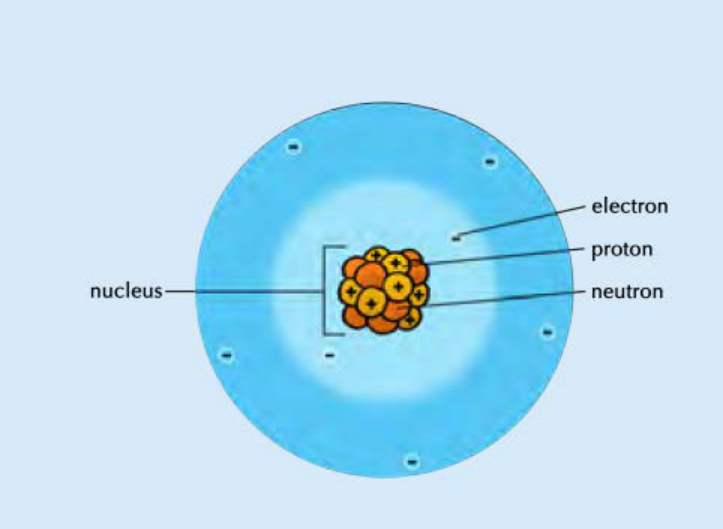
> **[Diagram Context - Textbook_NaturalScience_Gr9_Energy-and-the-national-electricity-grid.pdf-0025-04.png]**
> This educational graphic shows a structural model of an atom. Visible labels include "nucleus", "proton" (marked with a plus sign), "neutron", and "electron" (marked with a minus sign) linked with pointer lines. Conceptually, the diagram conveys the subatomic composition and spatial arrangement of an atom, illustrating that it consists of a dense central nucleus containing positively charged protons and neutral neutrons, surrounded by a diffuse cloud of negatively charged electrons.

> **[Diagram Context - Textbook_NaturalScience_Gr9_Forces.pdf-0025-01.png]**
> 1. A diagram of a cell with a diagram of a cell and a diagram of a cell with a diagram of a cell and a diagram of a cell with a diagram of a cell and a diagram of a cell with a diagram of a cell and a diagram of a cell with a diagram of a cell and a diagram of a cell with a diagram of a cell and a diagram of a cell

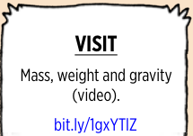
> **[Diagram Context - Textbook_NaturalScience_Gr9_Forces.pdf-0025-11.png]**
> 1. A diagram of a cell with arrows pointing to different parts of the cell.

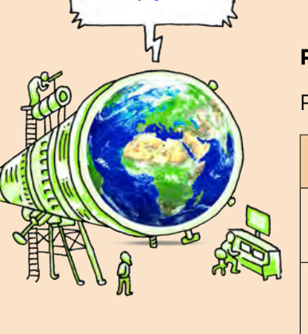
> **[Diagram Context - Textbook_NaturalScience_Gr9_Forces.pdf-0025-16.png]**
> The image is a cartoon depiction of a group of people working on a telescope. The telescope is a large, green device that is being used to observe the Earth. The people are standing around the telescope, with one person standing on the telescope's base and another person standing on the roof. The group is engaged in a discussion about the Earth, and there is a speech bubble above the telescope that

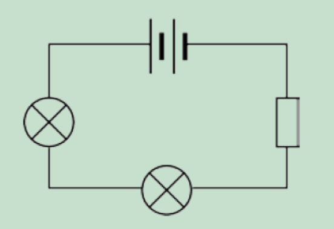
> **[Diagram Context - Textbook_NaturalScience_Gr9_Safety-with-electricity.pdf-0025-03.png]**
> 1. A black and white diagram of a circuit with three circles and two lines.

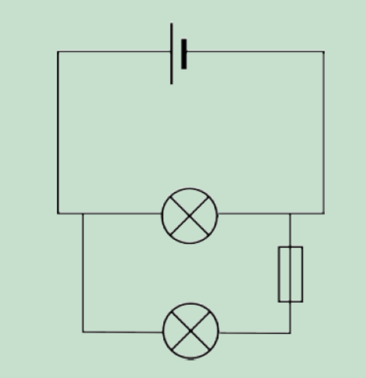
> **[Diagram Context - Textbook_NaturalScience_Gr9_Safety-with-electricity.pdf-0025-04.png]**
> 1. A black and white diagram of a circuit with two x's and a line connecting them.

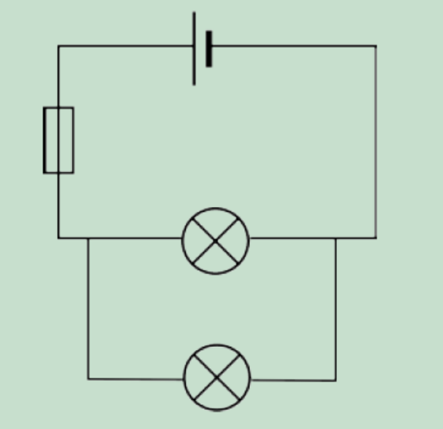
> **[Diagram Context - Textbook_NaturalScience_Gr9_Safety-with-electricity.pdf-0025-05.png]**
> 1. A black and white diagram of two circles connected by a line, with two x's in the middle.

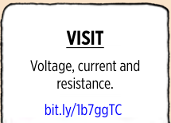
> **[Diagram Context - Textbook_NaturalScience_Gr9_Series-and-parallel-circuits.pdf-0025-08.png]**
> 1. A diagram of a circuit with a voltage source and a resistor.

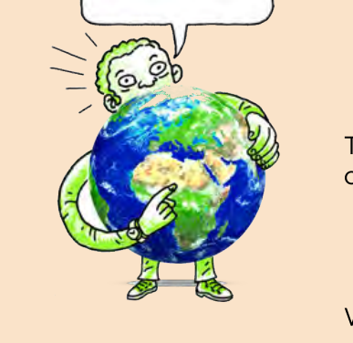
> **[Diagram Context - Textbook_NaturalScience_Gr9_Series-and-parallel-circuits.pdf-0025-09.png]**
> The image features a cartoon illustration of a man holding a globe in his arms. The man is wearing a green shirt and has a speech bubble above his head that says "The world is round". The globe is green and blue, and the man is standing on a yellow platform. The text "The world is round" is written in white above the globe.

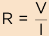

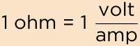

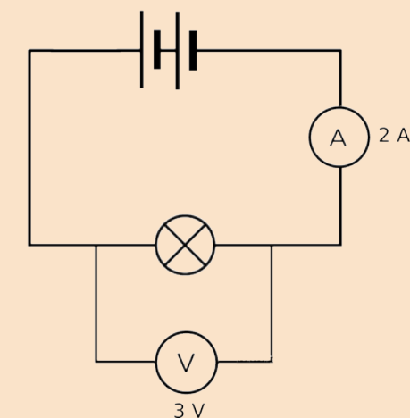
> **[Diagram Context - Textbook_NaturalScience_Gr9_Series-and-parallel-circuits.pdf-0025-14.png]**
> 1. A circuit diagram with three voltage sources and three resistance sources.

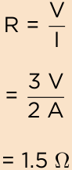

---

### Conclusion
Write a conclusion for this investigation.

---

### Key Concepts: Weight and Gravity

**Weight** is defined as the force of gravity pulling an object towards the centre of the Earth. It is measured in **newtons (N)**.

*   **Gravitational Acceleration ($g$):** On Earth, the gravitational force causes objects to accelerate towards the centre of the Earth at a rate of $9,8 \text{ m/s}^2$.
*   **Free-fall:** An object is in free-fall when the only force acting upon it is the gravitational force.
*   **Calculating Weight:** Weight ($W$) is calculated by multiplying an object's mass ($m$) by the gravitational acceleration ($g$).

$$W = m \times g$$

> **TAKE NOTE**
> The formula $W = m \times g$ is also used in calculations involving friction to determine the normal force acting on an object.

---

### Gravity on Other Celestial Bodies

The strength of gravity varies depending on the mass of the planet or moon. While your weight changes depending on where you are, your **mass remains constant**.

*   **The Moon:** The gravity on the surface of the Moon is $\frac{1}{6}$ of the gravity on Earth. You would weigh one-sixth of your Earth weight on the Moon.
*   **Jupiter:** The gravity on Jupiter is $2,5$ times that of Earth. You would weigh $2,5$ times more on Jupiter than you do on Earth.

> **DID YOU KNOW?**
> The mass of the Earth is $5,972 \times 10^{24} \text{ kg}$.

> **[Diagram Context - Textbook_NaturalScience_Gr9_Cost-of-electrical-energy.pdf-0026-07.png]**
> The image shows a close-up view of a diagram of a cell. The diagram is colored in shades of pink and gray, with a red ant positioned in the center. The diagram is labeled with the text "Lewis diagram" and "cellular structure". The diagram also includes a red arrow pointing to the right. The background of the image is a solid gray color.

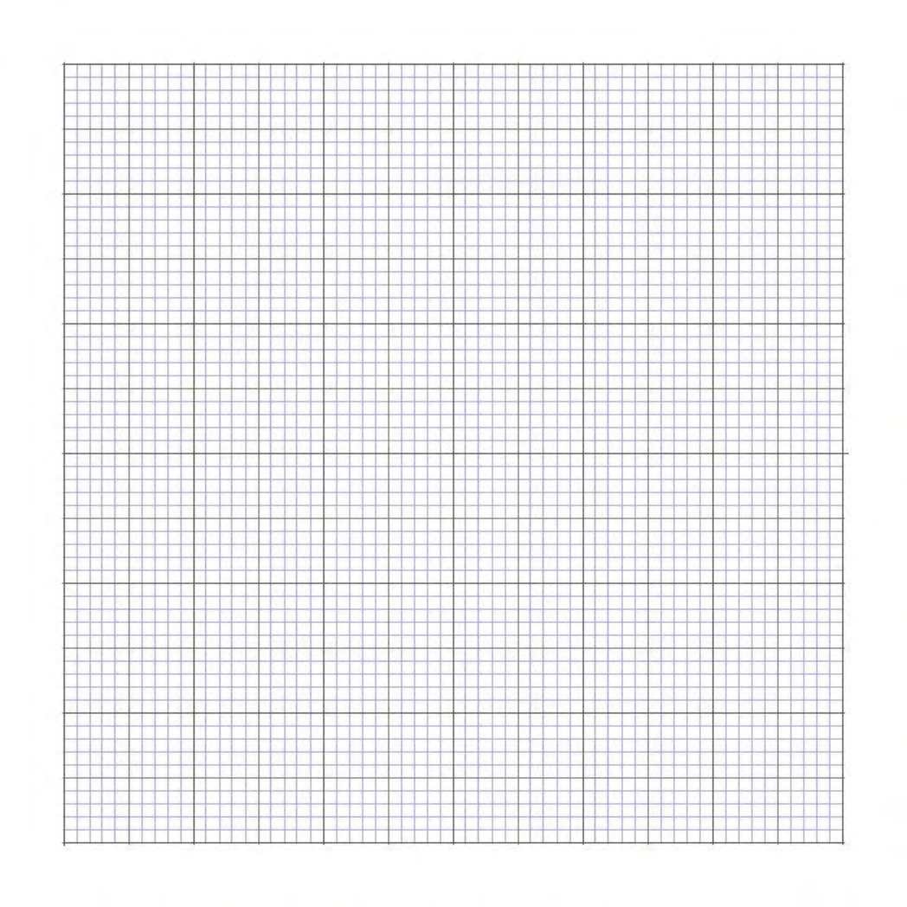
> **[Diagram Context - Textbook_NaturalScience_Gr9_Forces.pdf-0026-04.png]**
> 1. A graph of a cell with a grid of squares.

> **[Diagram Context - Textbook_NaturalScience_Gr9_Series-and-parallel-circuits.pdf-0026-05.png]**
> 1. A diagram of a cell with a red dot representing a nucleus.

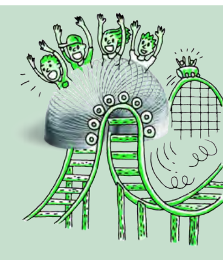
> **[Diagram Context - Textbook_NaturalScience_Gr9_Series-and-parallel-circuits.pdf-0026-16.png]**
> 1. A diagram of a roller coaster with a spring coiled up on top.

---

### Mass vs. Weight

#### Key Concepts
*   **Mass:** The amount of matter in an object. An object's mass remains constant regardless of its location in the universe.
*   **Weight:** The force exerted on an object due to gravity. Weight depends on the gravitational acceleration of the location where it is measured.

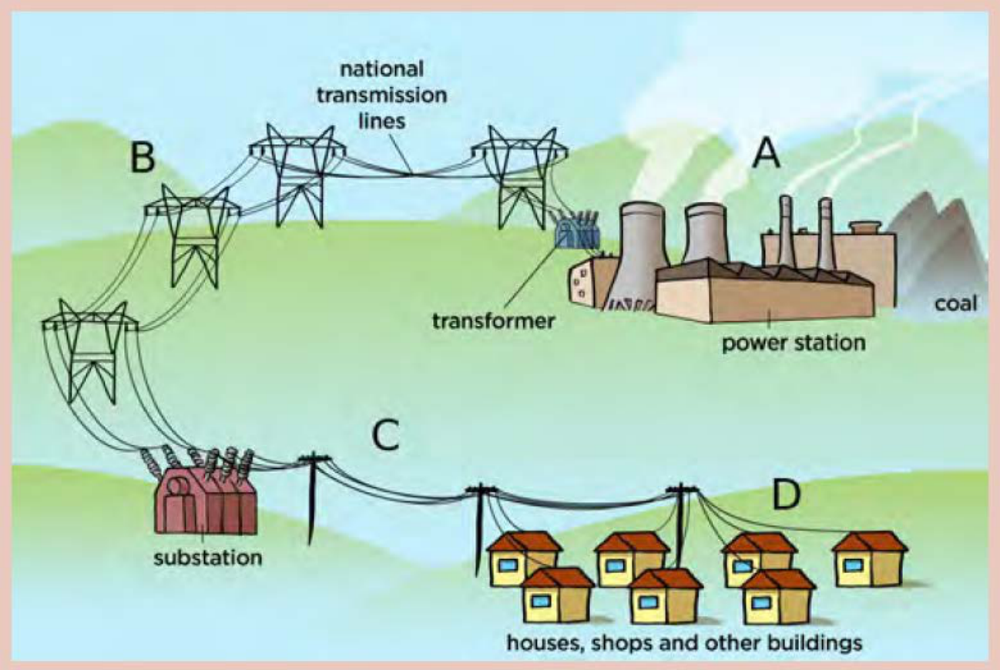
> **[Diagram Context - Textbook_NaturalScience_Gr9_Energy-and-the-national-electricity-grid.pdf-0027-01.png]**
> This educational graphic is an overview diagram illustrating the generation and transmission of electrical energy from a power station to consumers. Visible labels include "power station", "coal", "transformer", "national transmission lines", "substation", and "houses, shops and other buildings", along with sectional reference letters A, B, C, and D. For a CAPS Physical Sciences or Technology learner, this diagram conveys the macro-level path of electricity generation and distribution, emphasizing the role of step-up and step-down transformers in minimizing energy loss over long-distance transmission lines.

#### Take Note
A bathroom scale actually measures weight (the force exerted on the scale) and converts it to a mass reading.

#### Calculating Weight
Weight is calculated using the formula:
$$W = m \times g$$

Where:
*   $W$ = Weight (measured in Newtons, $N$)
*   $m$ = Mass (measured in kilograms, $kg$)
*   $g$ = Gravitational acceleration (on Earth, $g \approx 9,8 \, m/s^2$)

**Example:**
If you have a mass of $60 \, kg$:
*   **On Earth:** $60 \, kg \times 9,8 \, m/s^2 = 588 \, N$
*   **On the Moon:** $60 \, kg \times 1,6 \, m/s^2 = 96 \, N$

---

### ACTIVITY: Weight and mass calculations

**Question 1:**
A Ferrari has a mass of $1485 \, kg$. What is its weight on Earth?

**Solution:**
To calculate the weight on Earth, use the gravitational acceleration constant $g = 9,8 \, m/s^2$:

$$W = 1485 \, kg \times 9,8 \, m/s^2$$
$$W = 14553 \, N$$

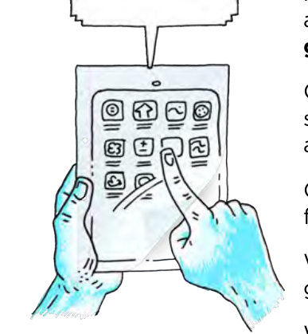
> **[Diagram Context - Textbook_NaturalScience_Gr9_Forces.pdf-0027-06.png]**
> 1. A hand holding a tablet with a stylus.
 2. The tablet is open to a page with a stylus.
 3. The stylus is pointing to the top left corner of the screen.

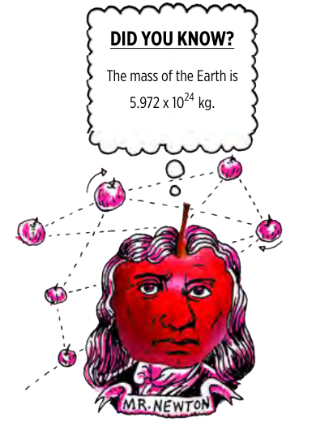
> **[Diagram Context - Textbook_NaturalScience_Gr9_Forces.pdf-0027-12.png]**
> The image shows a cartoon depiction of a man's head with a red apple on his forehead. The man is wearing a crown and has a beard. The image also includes a thought bubble with the text " Did you know? The mass of the Earth is 5.37 x 10^24 kg. The mass of an apple is approximately 1.0 x 10^3 kg. Mr. Newton

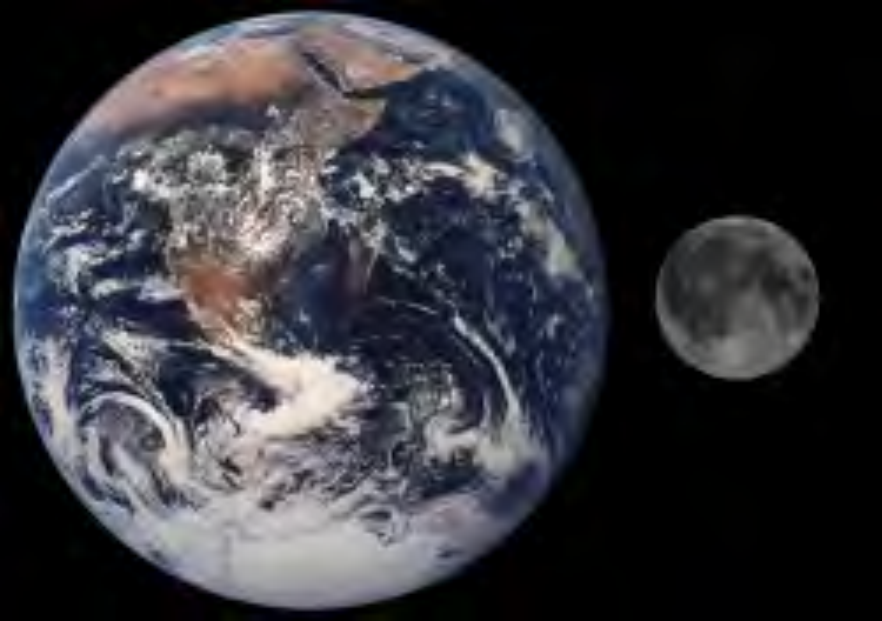
> **[Diagram Context - Textbook_NaturalScience_Gr9_Forces.pdf-0027-13.png]**
> The image shows a close-up view of the Earth and the moon, with the Earth appearing larger than the moon. The Earth is depicted in a dark blue color, while the moon is shown in a lighter shade of blue. The moon is positioned in the lower right corner of the image, while the Earth is in the upper left corner. The moon's size is relative to the Earth,

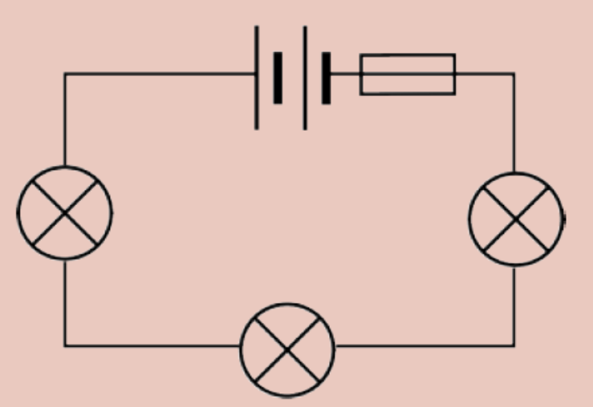
> **[Diagram Context - Textbook_NaturalScience_Gr9_Safety-with-electricity.pdf-0027-13.png]**
> 1. A black and white diagram of a circuit with three wires and three circles.

> **[Diagram Context - Textbook_NaturalScience_Gr9_Series-and-parallel-circuits.pdf-0027-06.png]**
> 1. A diagram of a cell with a green line representing a cell wall.

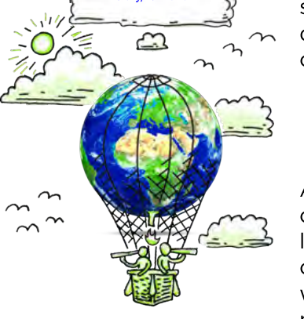
> **[Diagram Context - Textbook_NaturalScience_Gr9_Series-and-parallel-circuits.pdf-0027-09.png]**
> A cartoon drawing of a globe with a hot air balloon on top. The globe is green and white, and the hot air balloon is blue and white. The globe is surrounded by clouds, and the hot air balloon is carrying two people on it. The drawing also includes a Lewis diagram and a cell structure.

> **[Diagram Context - Textbook_NaturalScience_Gr9_Series-and-parallel-circuits.pdf-0027-10.png]**
> The image shows a brick walkway with a tree on the left side and a building on the right side. The tree is decorated with Christmas lights, and there is a bench in the middle of the walkway. The image also contains a Lewis diagram, an anatomical/cellular structure, a circuit, a graph, and a geometric figure.

---

### Exercises: Mass and Weight

**2. Lindiwe has a mass of 50 kg on Earth. What is her mass on the Moon?**

**3. Ian has a mass of 78 kg. His friend Sam says that he would weigh 24 N on the Moon. Is Sam correct? Explain by using a calculation.**

*   **Key Concept:** Weight ($W$) is calculated using the formula $W = m \times g$, where $m$ is mass in kilograms (kg) and $g$ is the gravitational acceleration.
*   **Note:** The gravitational acceleration on the Moon is approximately $g_{moon} \approx 1,6 \, \text{m/s}^2$.

**4. You have an apple with a mass of 220 g, what is its weight on Earth and on the Moon?**

*   **Conversion:** First, convert the mass to SI units: $220 \, \text{g} = 0,22 \, \text{kg}$.
*   **Earth Calculation:** Use $g_{earth} \approx 9,8 \, \text{m/s}^2$.
*   **Moon Calculation:** Use $g_{moon} \approx 1,6 \, \text{m/s}^2$.

**5. If a cow weighed 1340 N on the Moon, what is its mass?**

*   **Formula Rearrangement:** To find mass ($m$) when weight ($W$) and gravity ($g$) are known, use:
    $$m = \frac{W}{g}$$

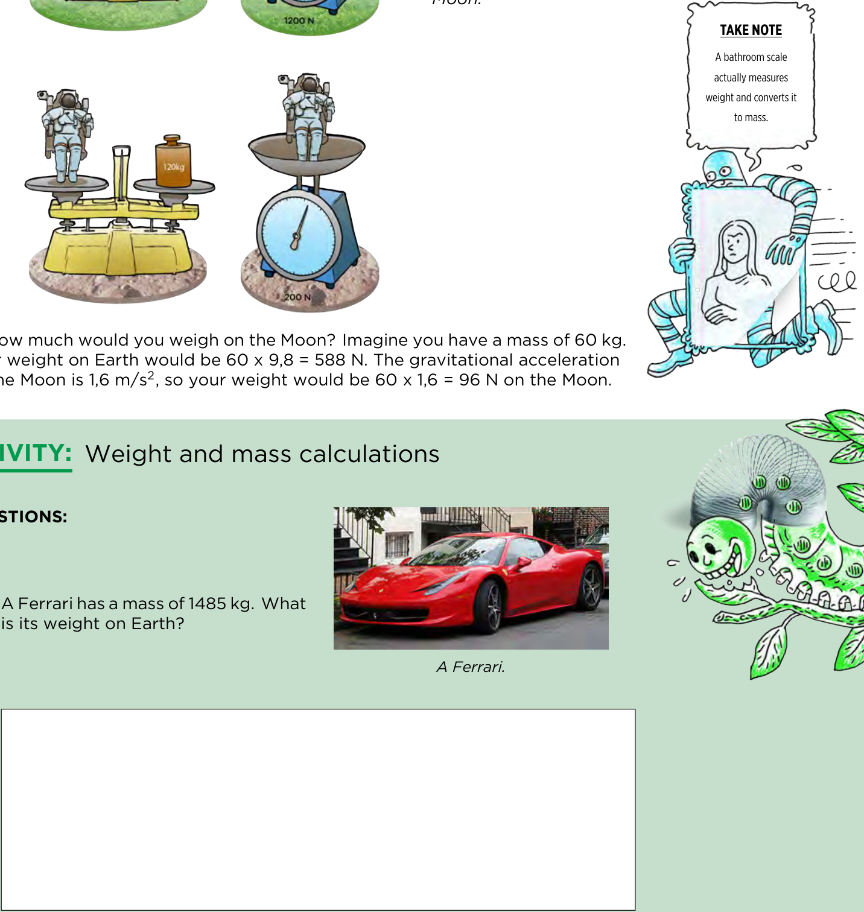
> **[Diagram Context - Textbook_NaturalScience_Gr9_Forces.pdf-0028-01.png]**
> 1. A diagram of a car and a person on a scale.
 2. A diagram of a car and a person on a scale.
 3. A diagram of a car and a person on a scale.

***

**Summary of Constants for Calculations:**
*   **Earth Gravity ($g$):** $9,8 \, \text{m/s}^2$
*   **Moon Gravity ($g$):** $1,6 \, \text{m/s}^2$

*Note: Mass is the amount of matter in an object and remains constant regardless of location. Weight is the force of gravity acting on that mass and changes depending on the gravitational field strength of the location.*

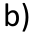

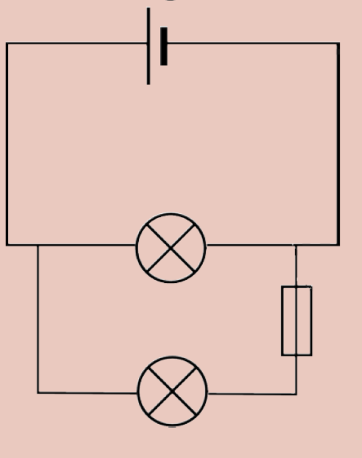
> **[Diagram Context - Textbook_NaturalScience_Gr9_Safety-with-electricity.pdf-0028-01.png]**
> 1. A black and white diagram of a circuit with two circles and an x in the middle.

> **[Diagram Context - Textbook_NaturalScience_Gr9_Series-and-parallel-circuits.pdf-0028-00.png]**
> This educational graphic illustrates a biological or cellular structure diagram showing a continuous array of repeating hook-like or coiled blue projections embedded along a horizontal surface layer. The visual features multiple identical blue, spiral-shaped structures lined up uniformly on a light purple base. Conceptually, this diagram helps high school learners visualize specialized cellular membranes, microvilli, or surface receptor arrangements in biological tissues, reinforcing the concept of increased surface area for absorption or transport.

> **[Diagram Context - Textbook_NaturalScience_Gr9_Series-and-parallel-circuits.pdf-0028-07.png]**
> This illustration features a conceptual metaphor comparing a biological classification tool to a physical key unlocking a hidden chest. Visible elements include an illustrative background scene containing a tree with an owl, a swing, a skull, bones, and a treasure chest, overlaid centrally with a realistic metal key. Conceptually, it conveys how a biological dichotomous key serves as a methodological instrument used by learners to systematically identify and classify unknown organisms or specimens in biodiversity studies.

---

# Activity: How much would you weigh on other planets?

### Materials
*   Weighing scales
*   Calculator

### Instructions
1.  Measure your mass in kilograms ($kg$). Record this value in the "Your mass (kg)" column for every planet in the table below.
2.  Use the values for the acceleration due to gravity ($g$) on various planets to calculate your weight ($W$) on that planet using the formula:
    $$W = m \times g$$
    Where:
    *   $W$ = Weight in Newtons ($N$)
    *   $m$ = Mass in kilograms ($kg$)
    *   $g$ = Acceleration due to gravity in meters per second squared ($m/s^2$)

### Data Table

| Planet | Your mass (kg) | Value of $g$ ($m/s^2$) | Your weight (N) |
| :--- | :--- | :--- | :--- |
| Earth | | $9,8$ | |
| Mercury | | $3,6$ | |
| Venus | | $8,8$ | |
| Mars | | $3,8$ | |
| Jupiter | | $26$ | |
| Saturn | | $11,2$ | |
| Uranus | | $10,5$ | |
| Neptune | | $13,3$ | |

### Questions
1. On which planets would you feel heavier than you do on Earth?
2. On which planets would you feel lighter than you do on Earth?

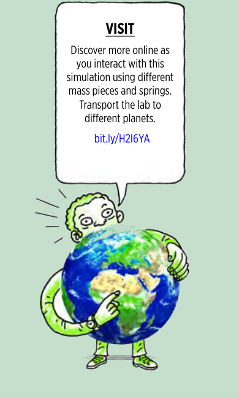
> **[Diagram Context - Textbook_NaturalScience_Gr9_Forces.pdf-0029-05.png]**
> The image shows a cartoon depiction of a man holding a globe. The globe is green and blue, and the man is wearing a green shirt and white pants. The man is holding the globe in his arms, and there is a speech bubble above him that reads "Visit" and "Discover more online as you interact with this simulation using different mass pieces and springs. Transport the lab to different planets

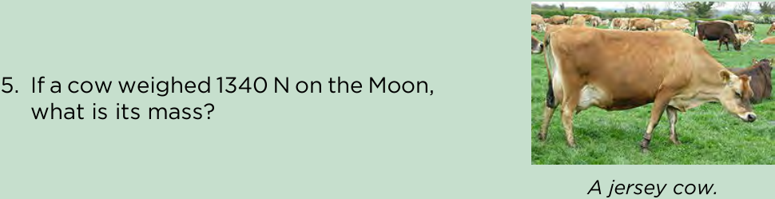
> **[Diagram Context - Textbook_NaturalScience_Gr9_Forces.pdf-0029-07.png]**
> A jersey cow is shown grazing in a field.

> **[Diagram Context - Textbook_NaturalScience_Gr9_Forces.pdf-0029-09.png]**
> 1. A diagram of a cell with a green line representing the cell wall.

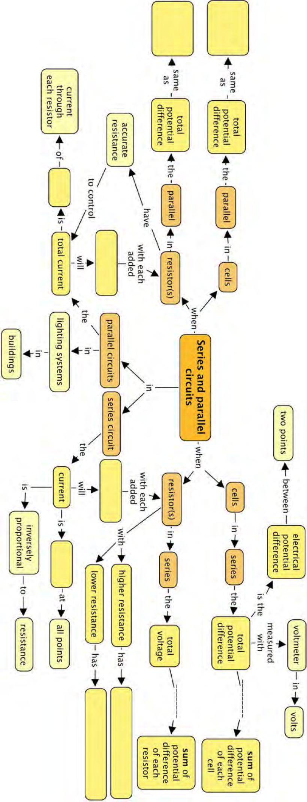
> **[Diagram Context - Textbook_NaturalScience_Gr9_Series-and-parallel-circuits.pdf-0029-00.png]**
> The image is a diagram that illustrates the human body and its systems. It is a visual representation of the human body, showing the different systems and their functions. The diagram is color-coded, with each system represented by a different color. The diagram is labeled with the names of the systems, such as the circulatory system, respiratory system, digestive system, and nervous system. The diagram also

---

### Weight and Weightlessness

*   **Definition of Weight:** The weight of a person is the force of gravitational attraction to the Earth that the person experiences.
*   **Weightlessness:** A person in free-fall feels weightless, but they have not lost their weight; they are still experiencing the Earth's gravitational attraction.
*   **Astronauts in Space:** Astronauts appear to float because both the astronauts and their spacecraft are in free-fall, falling toward the Earth at the same rate.

> **[Diagram Context - Textbook_NaturalScience_Gr9_Forces.pdf-0030-07.png]**
> 1. A diagram of a roller coaster with a spring coiled up on top.

---

### Magnetic Forces

*   **Magnets:** Certain materials have strong magnetic fields around them. These are called magnets.
*   **Poles:** All magnets have two poles: a north pole and a south pole.
*   **Magnetic Materials:** Materials that are strongly attracted to magnets are called magnetic materials. Magnets exert forces on other magnets and on magnetic materials.

**New Words:**
*   **Magnet:** An object that produces a magnetic field.
*   **Magnetic material:** A material that is attracted to a magnet.
*   **Alloy:** A metal made by combining two or more metallic elements.

> **[Diagram Context - Textbook_NaturalScience_Gr9_Forces.pdf-0030-12.png]**
> The image shows a line drawing of a snake, which is a part of a larger drawing of a snake. The snake is depicted in a green and white color scheme, with a green head and a white body. The snake is positioned on the left side of the image, and it is the main focus of the drawing. The background of the image is a solid gray color, which contrasts with

---

### Investigation: Magnetic or Non-magnetic Materials

**Investigative Question:** Which materials are magnetic and which are not?

**Hypothesis:**
*   Write a hypothesis for this investigation: ________________________________________________________________________________________________________________________________________________________________________________________________________________________________________________________________________________________________________________________________________________________________________________________________________________________________________________________________________________________________________________________________________________________________________________________________________________________________________________________________________________________________________________________________________________________________________________________________________________________________________________________________________________________________________________________________________________________________________________________________________________________________________________________________________________________________________________________________________________________________________________________________________________________________________________________________________________________________________________________________________________________________________________________________________________________________________________________________________________________________________________________________________________________________________________________________________________________________________________________________________________________________________________________________________________________________________________________________________________________________________________________________________________________________________________________________________________________________________________________________________________________________________________________________________________________________________________________________________________________________________________________________________________________________________________________________________________________________________________________________________________________________________________________________________________________________________________________________________________________________________________________________________________________________________________________________________________________________________________________________________________________________________________________________________________________________________________________________________________________________________________________________________________________________________________________________________________________________________________________________________________________________________________________________________________________________________________________________________________________________________________________________________________________________________________________________________________________________________________________________________________________________________________________________________________________________________________________________________________________________________________________________________________________________________________________________________________________________________________________________________________________________________________________________________________________________________________________________________________________________________________________________________________________________________________________________________________________________________________________________________________________________________________________________________________________________________________________________________________________________________________________________________________________________________________________________________________________________________________________________________________________________________________________________________________________________________________________________________________________________________________________________________________________________________________________________________________________________________________________________________________________________________________________________________________________________________________________________________________________________________________________________________________________________________________________________________________________________________________________________________________________________________________________________________________________________________________________________________________________________________________________________________________________________________________________________________________________________________________________________________________________________________________________________________________________________________________________________________________________________________________________________________________________________________________________________________________________________________________________________________________________________________________________________________________________________________________________________________________________________________________________________________________________________________________________________________________________________________________________________________________________________________________________________________________________________________________________________________________________________________________________________________________________________________________________________________________________________________________________________________________________________________________________________________________________________________________________________________________________________________________________________________________________________________________________________________________________________________________________________________________________________________________________________________________________________________________________________________________________________________________________________________________________________________________________________________________________________________________________________________________________________________________________________________________________________________________________________________________________________________________________________________________________________________________________________________________________________________________________________________________________________________________________________________________________________________________________________________________________________________________________________________________________________________________________________________________________________________________________________________________________________________________________________________________________________________________________________________________________________________________________________________________________________________________________________________________________________________________________________________________________________________________________________________________________________________________________________________________________________________________________________________________________________________________________________________________________________________________________________________________________________________________________________________________________________________________________________________________________________________________________________________________________________________________________________________________________________________________________________________________________________________________________________________________________________________________________________________________________________________________________________________________________________________________________________________________________________________________________________________________________________________________________________________________________________________________________________________________________________________________________________________________________________________________________________________________________________________________________________________________________________________________________________________________________________________________________________________________________________________________________________________________________________________________________________________________________________________________________________________________________________________________________________________________________________________________________________________________________________________________________________________________________________________________________________________________________________________________________________________________________________________________________________________________________________________________________________________________________________________________________________________________________________________________________________________________________________________________________________________________________________________________________________________________________________________________________________________________________________________________________________________________________________________________________________________________________________________________________________________________________________________________________________________________________________________________________________________________________________________________________________________________________________________________________________________________________________________________________________________________________________________________________________________________________________________________________________________________________________________________________________________________________________________________________________________________________________________________________________________________________________________________________________________________________________________________________________________________________________________________________________________________________________________________________________________________________________________________________________________________________________________________________________________________________________________________________________________________________________________________________________________________________________________________________________________________________________________________________________________________________________________________________________________________________________________________________________________________________________________________________________________________________________________________________________________________________________________________________________________________________________________________________________________________________________________________________________________________________________________________________________________________________________________________________________________________________________________________________________________________________________________________________________________________________________________________________________________________________________________________________________________________________________________________________________________________________________________________________________________________________________________________________________________________________________________________________________________________________________________________________________________________________________________________________________________________________________________________________________________________________________________________________________________________________________________________________________________________________________________________________________________________________________________________________________________________________________________________________________________________________________________________________________________________________________________________________________________________________________________________________________________________________________________________________________________________________________________________________________________________________________________________________________________________________________________________________________________________________________________________________________________________________________________________________________________________________________________________________________________________________________________________________________________________________________________________________________________________________________________________________________________________________________________________________________________________________________________________________________________________________________________________________________________________________________________________________________________________________________________________________________________________________________________________________________________________________________________________________________________________________________________________________________________________________________________________________________________________________________________________________________________________________________________________________________________________________________________________________________________________________________________________________________________________________________________________________________________________________________________________________________________________________________________________________________________________________________________________________________________________________________________________________________________________________________________________________________________________________________________________________________________________________________________________________________________________________________________________________________________________________________________________________________________________________________________________________________________________________________________________________________________________________________________________________________________________________________________________________________________________________________________________________________________________________________________________________________________________________________________________________________________________________________________________________________________________________________________________________________________________________________________________________________________________________________________________________________________________________________________________________________________________________________________________________________________________________________________________________________________________________________________________________________________________________________________________________________________________________________________________________________________________________________________________________________________________________________________________________________________________________________________________________________________________________________________________________________________________________________________________________________________________________________________________________________________________________________________________________________________________________________________________________________________________________________________________________________________________________________________________________________________________________________________________________________________________________________________________________________________________________________________________________________________________________________________________________________________________________________________________________________________________________________________________________________________________________________________________________________________________________________________________________________________________________________________________________________________________________________________________________________________________________________________________________________________________________________________________________________________________________________________________________________________________________________________________________________________________________________________________________________________________________________________________________________________________________________________________________________________________________________________________________________________________________________________________________________________________________________________________________________________________________________________________________________________________________________________________________________________________________________________________________________________________________________________________________________________________________________________________________________________________________________________________________________________________________________________________________________________________________________________________________________________________________________________________________________________________________________________________________________________________________________________________________________________________________________________________________________________________________________________________________________________________________________________________________________________________________________________________________________________________________________________________________________________________________________________________________________________________________________________________________________________________________________________________________________________________________________________________________________________________________________________________________________________________________________________________________________________________________________________________________________________________________________________________________________________________________________________________________________________________________________________________________________________________________________________________________________________________________________________________________________________________________________________________________________________________________________________________________________________________________________________________________________________________________________________________________________________________________________________________________________________________________________________________________________________________________________________________________________________________________________________________________________________________________________________________________________________________________________________________________________________________________________________________________________________________________________________________________________________________________________________________________________________________________________________________________________________________________________________________________________________________________________________________________________________________________________________________________________________________________________________________________________________________________________________________________________________________________________________________________________________________________________________________________________________________________________________________________________________________________________________________________________________________________________________________________________________________________________________________________________________________________________________________________________________________________________________________________________________________________________________________________________________________________________________________________________________________________________________________________________________________________________________________________________________________________________________________________________________________________________________________________________________________________________________________________________________________________________________________________________________________________________________________________________________________________________________________________________________________________________________________________________________________________________________________________________________________________________________________________________________________________________________________________________________________________________________________________________________________________________________________________________________________________________________________________________________________________________________________________________________________________________________________________________________________________________________________________________________________________________________________________________________________________________________________________________________________________________________________________________________________________________________________________________________________________________________________________________________________________________________________________________________________________________________________________________________________________________________________________________________________________________________________________________________________________________________________________________________________________________________________________________________________________________________________________________________________________________________________________________________________________________________________________________________________________________________________________________________________________________________________________________________________________________________________________________________________________________________________________________________________________________________________________________________________________________________________________________________________________________________________________________________________________________________________________________________________________________________________________________________________________________________________________________________________________________________________________________________________________________________________________________________________________________________________________________________________________________________________________________________________________________________________________________________________________________________________________________________________________________________________________________________________________________________________________________________________________________________________________________________________________________________________________________________________________________________________________________________________________________________________________________________________________________________________________________________________________________________________________________________________________________________________________________________________________________________________________________________________________________________________________________________________________________________________________________________________________________________________________________________________________________________________________________________________________________________________________________________________________________________________________________________________________________________________________________________________________________________________________________________________________________________________________________________________________________________________________________________________________________________________________________________________________________________________________________________________________________________________________________________________________________________________________________________________________________________________________________________________________________________________________________________________________________________________________________________________________________________________________________________________________________________________________________________________________________________________________________________________________________________________________________________________________________________________________________________________________________________________________________________________________________________________________________________________________________________________________________________________________________________________________________________________________________________________________________________________________________________________________________________________________________________________________________________________________________________________________________________________________________________________________________________________________________________________________________________________________________________________________________________________________________________________________________________________________________________________________________________________________________________________________________________________________________________________________________________________________________________________________________________________________________________________________________________________________________________________________________________________________________________________________________________________________________________________________________________________________________________________________________________________________________________________________________________________________________________________________________________________________________________________________________________________________________________________________________________________________________________________________________________________________________________________________________________________________________________________________________________________________________________________________________________________________________________________________________________________________________________________________________________________________________________________________________________________________________________________________________________________________________________________________________________________________________________________________________________________________________________________________________________________________________________________________________________________________________________________________________________________________________________________________________________________________________________________________________________________________________________________________________________________________________________________________________________________________________________________________________________________________________________________________________________________________________________________________________________________________________________________________________________________________________________________________________________________________________________________________________________________________________________________________________________________________________________________________________________________________________________________________________________________________________________________________________________________________________________________________________________________________________________________________________________________________________________________________________________________________________________________________________________________________________________________________________________________________________________________________________________________________________________________________________________________________________________________________________________________________________________________________________________________________________________________________________________________________________________________________________________________________________________________________________________________________________________________________________________________________________________________________________________________________________________________________________________________________________________________________________________________________________________________________________________________________________________________________________________________________________________________________________________________________________________________________________________________________________________________________________________________________________________________________________________________________________________________________________________________________________________________________________________________________________________________________________________________________________________________________________________________________________________________________________________________________________________________________________________________________________________________________________________________________________________________________________________________________________________________________________________________________________________________________________________________________________________________________________________________________________________________________________________________________________________________________________________________________________________________________________________________________________________________________________________________________________________________________________________________________________________________________________________________________________________________________________________________________________________________________________________________________________________________________________________________________________________________________________________________________________________________________________________________________________________________________________________________________________________________________________________________________________________________________________________________________________________________________________________________________________________________________________________________________________________________________________________________________________________________________________________________________________________________________________________________________________________________________________________________________________________________________________________________________________________________________________________________________________________________________________________________________________________________________________________________________________________________________________________________________________________________________________________________________________________________________________________________________________________________________________________________________________________________________________________________________________________________________________________________________________________________________________________________________________________________________________________________________________________________________________________________________________________________________________________________________________________________________________________________________________________________________________________________________________________________________________________________________________________________________________________________________________________________________________________________________________________________________________________________________________________________________________________________________________________________________________________________________________________________________________________________________________________________________________________________________________________________________________________________________________________________________________________________________________________________________________________________________________________________________________________________________________________________________________________________________________________________________________________________________________________________________________________________________________________________________________________________________________________________________________________________________________________________________________________________________________________________________________________________________________________________________________________________________________________________________________________________________________________________________________________________________________________________________________________________________________________________________________________________________________________________________________________________________________________________________________________________________________________________________________________________________________________________________________________________________________________________________________________________________________________________________________________________________________________________________________________________________________________________________________________________________________________________________________________________________________________________________________________________________________________________________________________________________________________________________________________________________________________________________________________________________________________________________________________________________________________________________________________________________________________________________________________________________________________________________________________________________________________________________________________________________________________________________________________________________________________________________________________________________________________________________________________________________________________________________________________________________________________________________________________________________________________________________________________________________________________________________________________________________________________________________________________________________________________________________________________________________________________________________________________________________________________________________________________________________________________________________________________________________________________________________________________________________________________________________________________________________________________________________________________________________________________________________________________________________________________________________________________________________________________________________________________________________________________________________________________________________________________________________________________________________________________________________________________________________________________________________________________________________________________________________________________________________________________________________________________________________________________________________________________________________________________________________________________________________________________________________________________________________________________________________________________________________________________________________________________________________________________________________________________________________________________________________________________________________________________________________________________________________________________________________________________________________________________________________________________________________________________________________________________________________________________________________________________________________________________________________________________________________________________________________________________________________________________________________________________________________________________________________________________________________________________________________________________________________________________________________________________________________________________________________________________________________________________________________________________________________________________________________________________________________________________________________________________________________________________________________________________________________________________________________________________________________________________________________________________________________________________________________________________________________________________________________________________________________________________________________________________________________________________________________________________________________________________________________________________________________________________________________________________________________________________________________________________________________________________________________________________________________________________________________________________________________________________________________________________________________________________________________________________________________________________________________________________________________________________________________________________________________________________________________________________________________________________________________________________________________________________________________________________________________________________________________________________________________________________________________________________________________________________________________________________________________________________________________________________________________________________________________________________________________________________________________________________________________________________________________________________________________________________________________________________________________________________________________________________________________________________________________________________________________________________________________________________________________________________________________________________________________________________________________________________________________________________________________________________________________________________________________________________________________________________________________________________________________________________________________________________________________________________________________________________________________________________________________________________________________________________________________________________________________________________________________________________________________________________________________________________________________________________________________________________________________________________________________________________________________________________________________________________________________________________________________________________________________________________________________________________________________________________________________________________________________________________________________________________________________________________________________________________________________________________________________________________________________________________________________________________________________________________________________________________________________________________________________________________________________________________________________________________________________________________________________________________________________________________________________________________________________________________________________________________________________________________________________________________________________________________________________________________________________________________________________________________________________________________________________________________________________________________________________________________________________________________________________________________________________________________________________________________________________________________________________________________________________________________________________________________________________________________________________________________________________________________________________________________________________________________________________________________________________________________________________________________________________________________________________________________________________________________________________________________________________________________________________________________________________________________________________________________________________________________________________________________________________________________________________________________________________________________________________________________________________________________________________________________________________________________________________________________________________________________________________________________________________________________________________________________________________________________________________________________________________________________________________________________________________________________________________________________________________________________________________________________________________________________________________________________________________________________________________________________________________________________________________________________________________________________________________________________________________________________________________________________________________________________________________________________________________________________________________________________________________________________________________________________________________________________________________________________________________________________________________________________________________________________________________________________________________________________________________________________________________________________________________________________________________________________________________________________________________________________________________________________________________________________________________________________________________________________________________________________________________________________________________________________________________________________________________________________________________________________________________________________________________________________________________________________________________________________________________________________________________________________________________________________________________________________________________________________________________________________________________________________________________________________________________________________________________________________________________________________________________________________________________________________________________________________________________________________________________________________________________________________________________________________________________________________________________________________________________________________________________________________________________________________________________________________________________________________________________________________________________________________________________________________________________________________________________________________________________________________________________________________________________________________________________________________________________________________________________________________________________________________________________________________________________________________________________________________________________________________________________________________________________________________________________________________________________________________________________________________________________________________________________________________________________________________________________________________________________________________________________________________________________________________________________________________________________________________________________________________________________________________________________________________________________________________________________________________________________________________________________________________________________________________________________________________________________________________________________________________________________________________________________________________________________________________________________________________________________________________________________________________________________________________________________________________________________________________________________________________________________________________________________________________________________________________________________________________________________________________________________________________________________________________________________________________________________________________________________________________________________________________________________________________________________________________________________________________________________________________________________________________________________________________________________________________________________________________________________________________________________________________________________________________________________________________________________________________________________________________________________________________________________________________________________________________________________________________________________________________________________________________________________________________________________________________________________________________________________________________________________________________________________________________________________________________________________________________________________________________________________________________________________________________________________________________________________________________________________________________________________________________________________________________________________________________________________________________________________________________________________________________________________________________________________________________________________________________________________________________________________________________________________________________________________________________________________________________________________________________________________________________________________________________________________________________________________________________________________________________________________________________________________________________________________________________________________________________________________________________________________________________________________________________________________________________________________________________________________________________________________________________________________________________________________________________________________________________________________________________________________________________________________________________________________________________________________________________________________________________________________________________________________________________________________________________________________________________________________________________________________________________________________________________________________________________________________________________________________________________________________________________________________________________________________________________________________________________________________________________________________________________________________________________________________________________________________________________________________________________________________________________________________________________________________________________________________________________________________________________________________________________________________________________________________________________________________________________________________________________________________________________________________________________________________________________________________________________________________________________________________________________________________________________________________________________________________________________________________________________________________________________________________________________________________________________________________________________________________________________________________________________________________________________________________________________________________________________________________________________________________________________________________________________________________________________________________________________________________________________________________________________________________________________________________________________________________________________________________________________________________________________________________________________________________________________________________________________________________________________________________________________________________________________________________________________________________________________________________________________________________________________________________________________________________________________________________________________________________________________________________________________________________________________________________________________________________________________________________________________________________________________________________________________________________________________________________________________________________________________________________________________________________________________________________________________________________________________________________________________________________________________________________________________________________________________________________________________________________________________________________________________________________________________________________________________________________________________________________________________________________________________________________________________________________________________________________________________________________________________________________________________________________________________________________________________________________________________________________________________________________________________________________________________________________________________________________________________________________________________________________________________________________________________________________________________________________________________________________________________________________________________________________________________________________________________________________________________________________________________________________________________________________________________________________________________________________________________________________________________________________________________________________________________________________________________________________________________________________________________________________________________________________________________________________________________________________________________________________________________________________________________________________________________________________________________________________________________________________________________________________________________________________________________________________________________________________________________________________________________________________________________________________________________________________________________________________________________________________________________________________________________________________________________________________________________________________________________________________________________________________________________________________________________________________________________________________________________________________________________________________________________________________________________________________________________________________________________________________________________________________________________________________________________________________________________________________________________________________________________________________________________________________________________________________________________________________________________________________________________________________________________________________________________________________________________________________________________________________________________________________________________________________________________________________________________________________________________________________________________________________________________________________________________________________________________________________________________________________________________________________________________________________________________________________________________________________________________________________________________________________________________________________________________________________________________________________________________________________________________________________________________________________________________________________________________________________________________________________________________________________________________________________________________________________________________________________________________________________________________________________________________________________________________________________________________________________________________________________________________________________________________________________________________________________________________________________________________________________________________________________________________________________________________________________________________________________________________________________________________________________________________________________________________________________________________________________________________________________________________________________________________________________________________________________________________________________________________________________________________________________________________________________________________________________________________________________________________________________________________________________________________________________________________________________________________________________________________________________________________________________________________________________________________________

> **[Diagram Context - Textbook_NaturalScience_Gr9_Series-and-parallel-circuits.pdf-0030-04.png]**
> 1. A cartoon drawing of a person holding a gear and a gear in their hands.

---

### Investigation: Magnetic and Non-Magnetic Materials

#### Materials and Apparatus
*   Bar magnets
*   Paper
*   Wood
*   Plastic
*   Iron
*   Aluminium
*   Steel
*   Copper

#### Method
1.  Hold the different items close to the bar magnet (without touching it) to observe if they are attracted to the magnet.
2.  Record your observations in the results table below.

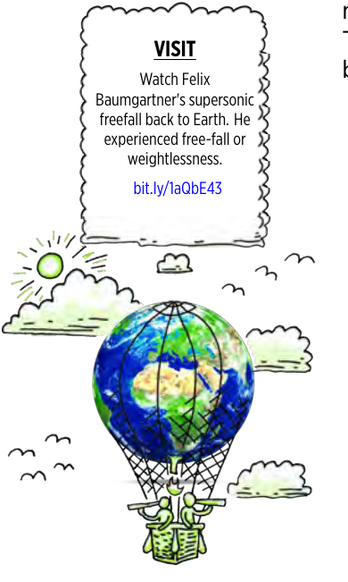
> **[Diagram Context - Textbook_NaturalScience_Gr9_Forces.pdf-0031-02.png]**
> 1. A cartoon depiction of a hot air balloon with a globe on top.
 2. The globe is being lifted by a hot air balloon.
 3. The globe is being lifted by a hot air balloon.

#### Results
Complete the following table based on your observations:

| Material | Magnetic (YES/NO) |
| :--- | :--- |
| Paper | |
| Wood | |
| Plastic | |
| Iron | |
| Aluminium | |
| Steel | |
| Copper | |

#### Conclusion
Summarize your findings regarding which materials are attracted to magnets and which are not.

---

### Key Concepts and Notes

*   **Magnetic Materials:** Not all metals are attracted to magnets. Only specific materials are classified as magnetic.
*   **Common Magnetic Materials:** The most common magnetic materials are **iron**, **nickel**, and **cobalt**.
*   **Alloys:** An alloy is a mixture of metals. 
    *   *Note:* Alloys that include magnetic materials can also be attracted to magnets.
    *   *Example:* Steel is an alloy that contains iron; therefore, steel is attracted to a magnet.
*   **Magnetic Force:** Magnetic forces are non-contact forces, meaning they can act over a distance without the objects touching.

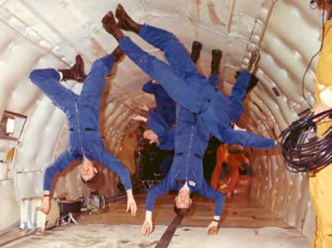
> **[Diagram Context - Textbook_NaturalScience_Gr9_Forces.pdf-0031-03.png]**
> The image shows a group of people inside a plane, with one person doing a handstand. The people are wearing blue jumpsuits and appear to be in a confined space. The plane has a gray interior, and there are wires visible in the background. The image is labeled as an educational graphic, and it is intended for a high school student learning about biology and cellular structures.

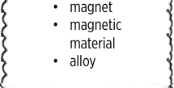
> **[Diagram Context - Textbook_NaturalScience_Gr9_Forces.pdf-0031-08.png]**
> 1. A diagram of a magnet and its properties.

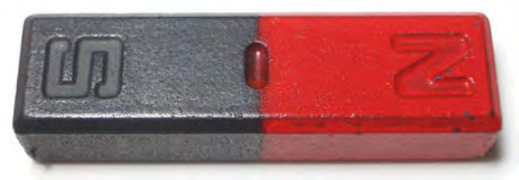
> **[Diagram Context - Textbook_NaturalScience_Gr9_Forces.pdf-0031-09.png]**
> 1. A magnet with a red and black border.

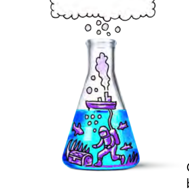
> **[Diagram Context - Textbook_NaturalScience_Gr9_Forces.pdf-0031-10.png]**
> The image features a cartoon depiction of a man in a blue suit and helmet, holding a fish, with a fish swimming in a blue glass beaker. The beaker is filled with water, and there is a cloud of bubbles rising from the top of the beaker. The image also includes a text that reads "C.K."

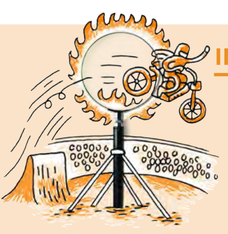
> **[Diagram Context - Textbook_NaturalScience_Gr9_Forces.pdf-0031-13.png]**
> 1. A diagram of a person on a motorcycle.
 2. A diagram of a motorcycle.
 3. A diagram of a person on a motorcycle.

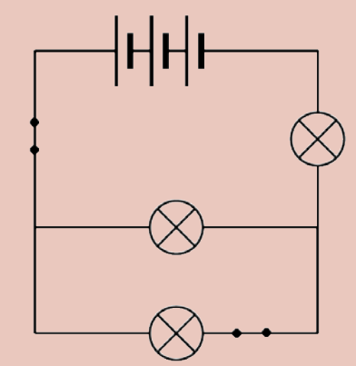
> **[Diagram Context - Textbook_NaturalScience_Gr9_Series-and-parallel-circuits.pdf-0031-06.png]**
> 1. A black and white diagram of a circuit with three wires and three circles.

---

# Lesson: Investigating Magnetic Forces

## Core Concept
Magnetic force is a non-contact force that can act through space and various materials. This activity explores how magnetic poles interact and whether magnetic fields can penetrate different substances.

---

## Activity: Can a magnetic force act through substances?

### Materials Required
*   Bar magnets
*   Paper
*   Thin piece of wood
*   Thick piece of wood
*   Foil
*   Paperclips

### Experimental Procedure

| Step | Action | Observation Goal |
| :--- | :--- | :--- |
| 1 | Hold two north poles close together. | Observe the interaction (repulsion). |
| 2 | Hold two south poles close together. | Observe the interaction (repulsion). |
| 3 | Hold a north pole and a south pole close together. | Observe the interaction (attraction). |
| 4 | Place paperclips on the desk. | Establish a baseline. |
| 5 | Attempt to pick up paperclips with a magnet, placing a material between them. | Determine if the force is blocked. |
| 6 | Repeat step 5 for all provided materials. | Compare results across different substances. |

---

## Analysis and Questions

### 1. Material Interference
Observe whether the magnetic force is obstructed by the materials tested. 
*   *Note:* Magnetic fields generally pass through non-magnetic materials (like paper, wood, and foil) without significant reduction in force, provided the distance is not too great.

### 2. Nature of Magnetic Force
Based on your observations, consider the following:
*   **Interaction:** Like poles repel, while opposite poles attract.
*   **Transmission:** Magnetic fields are not blocked by most common non-magnetic materials. The force is a field that exists in the space surrounding the magnet, allowing it to exert influence even when a physical barrier is present.

---

## Further Exploration
To deepen your understanding of the invisible region where these forces operate, investigate the concept of the **magnetic field**. 

*   **Definition:** A magnetic field is a vector field that describes the magnetic influence on moving electric charges, electric currents, and magnetic materials.
*   **Representation:** We often visualize these fields using field lines, where the density of the lines indicates the strength of the field:
    $$B = \frac{F}{qv \sin(\theta)}$$
    *(Where $B$ is the magnetic field strength, $F$ is the force, $q$ is the charge, $v$ is the velocity, and $\theta$ is the angle between velocity and the field.)*

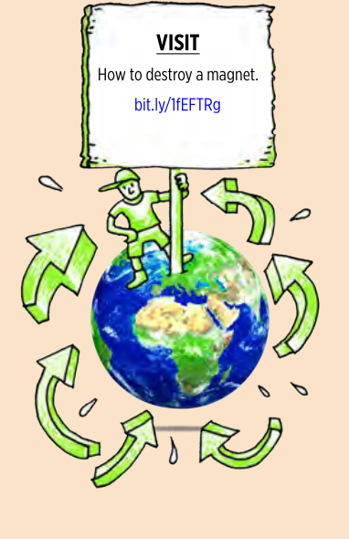
> **[Diagram Context - Textbook_NaturalScience_Gr9_Forces.pdf-0032-15.png]**
> The image is a cartoon depiction of a boy holding a sign that says "visit" and "how to destroy a magnet". The boy is standing on a globe, which is tilted to the right. The globe is surrounded by various arrows, each pointing in a different direction. The boy is wearing a hat and holding a pole. The sign is written in black text, and the boy is

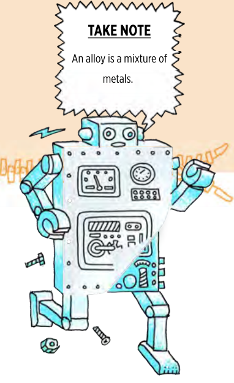
> **[Diagram Context - Textbook_NaturalScience_Gr9_Forces.pdf-0032-20.png]**
> The image features a cartoon robot with a speech bubble that reads "Take Note" and "An alloy is a mixture of metals." The robot is depicted in a blue and white color scheme, with a clock on its chest and a pair of scissors on its left arm. The robot is shown in a dynamic pose, walking and holding a pair of scissors in its left hand. The robot's speech

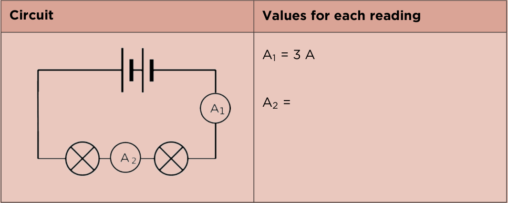
> **[Diagram Context - Textbook_NaturalScience_Gr9_Series-and-parallel-circuits.pdf-0032-04.png]**
> 1. A circuit diagram with three wires and three lights.

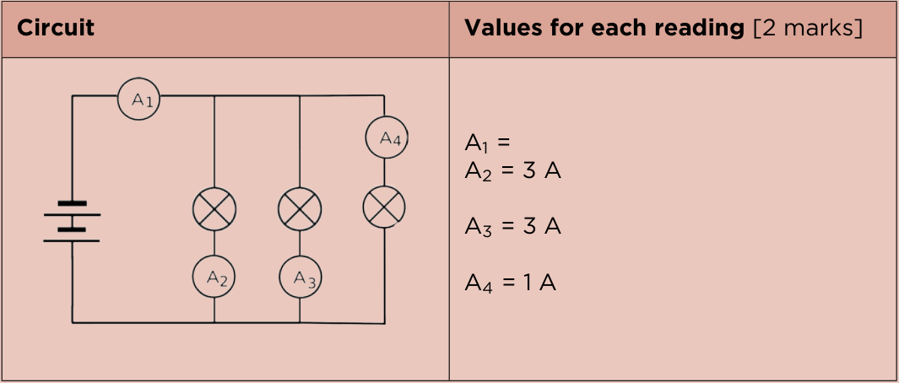
> **[Diagram Context - Textbook_NaturalScience_Gr9_Series-and-parallel-circuits.pdf-0032-08.png]**
> 1. A circuit diagram with four wires and four lights.

---

### Magnetic Forces and Fields

#### Key Concepts
*   **Magnetic Poles:** Like poles repel each other, while opposite poles attract each other.
*   **Non-contact Force:** A magnetic force acts over a distance. A magnet does not need to physically touch an object to exert a force on it.
*   **Magnetic Field:** The region of space around a magnet where a magnetic force can be detected.

---

### ACTIVITY: Visualising Magnetic Fields

#### Materials Required
*   Iron filings
*   Two bar magnets
*   A sheet of paper

#### Instructions
1.  Place the bar magnet on a flat table.
2.  Place the sheet of paper over the magnet.
3.  Gently shake the iron filings onto the surface of the paper.
4.  Use your finger to slowly tap or push the filings around the area of the magnet to reveal the field lines.
5.  Observe the pattern formed by the filings and draw your observations in the space provided below.

> **[Diagram Context - Textbook_NaturalScience_Gr9_Forces.pdf-0033-00.png]**
> 1. A diagram of a spring with a green background and a brown staircase.

6.  Carefully lift the paper away from the magnet.
7.  Place a second magnet next to the first one, ensuring that opposite (different) poles are facing each other.
8.  Place the paper back over the two magnets.
9.  Move the iron filings around the two magnets, paying close attention to the pattern formed in the space between the magnets.

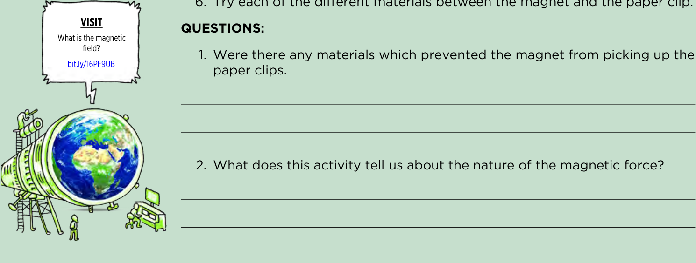
> **[Diagram Context - Textbook_NaturalScience_Gr9_Forces.pdf-0033-16.png]**
> 1. A diagram of a cell with a green ball in the center.
 2. A diagram of a circuit with a green ball in the center.
 3. A diagram of a magnetic field with a green ball in the center.

> **[Diagram Context - Textbook_NaturalScience_Gr9_Forces.pdf-0033-17.png]**
> The image shows a line of text that reads "The cell is a complex structure with many organelles, including the nucleus, mitochondria, and endoplasmic reticulum". The text is written in a serif font and is positioned on a gray background. The line of text is the main focus of the image, and there are no other objects or elements present.

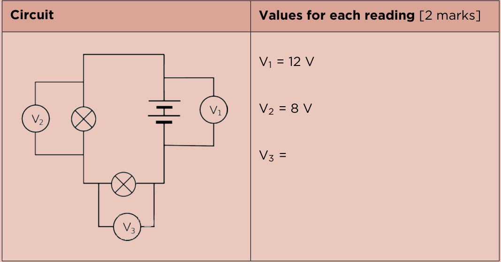
> **[Diagram Context - Textbook_NaturalScience_Gr9_Series-and-parallel-circuits.pdf-0033-02.png]**
> 1. A circuit diagram showing the relationship between voltage, current, and resistance.

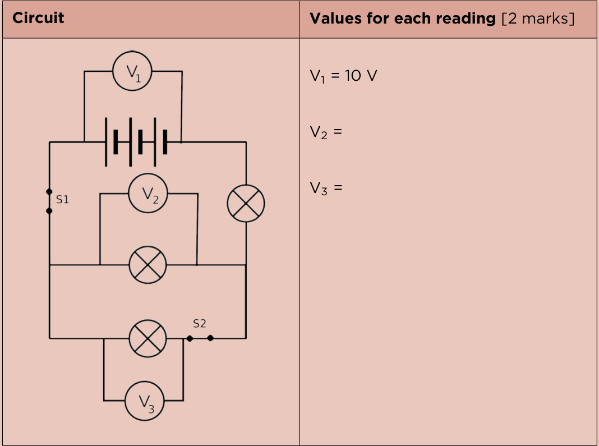
> **[Diagram Context - Textbook_NaturalScience_Gr9_Series-and-parallel-circuits.pdf-0033-06.png]**
> 1. A circuit diagram with multiple components.

---

### Activity: Observing Magnetic Field Patterns

This activity focuses on visualizing magnetic field lines using iron filings. You will observe how magnetic fields interact when magnets are placed in different configurations.

#### Instructions

**Part 1: Opposite Poles**
10. Draw the pattern formed by the iron filings in the space below.

> **[Diagram Context - Textbook_NaturalScience_Gr9_Forces.pdf-0034-10.png]**
> The image presents a cartoon depiction of a spring, a battery, and a circuit. The spring is coiled and attached to the battery, which is connected to a circuit. The circuit is depicted as a loop, with a wire running through it. The spring and battery are connected by a wire, and the circuit is connected to a wire that runs through the spring. The circuit is also connected

---

**Part 2: Like Poles**
11. Lift the paper away from the magnet.
12. Move the second magnet so that the same poles (e.g., North-North or South-South) are facing each other.
13. Put the paper back over the magnets.
14. Move the iron filings around the two magnets, especially between the magnets, to clearly see the field lines.
15. Draw the pattern formed by the iron filings in the space below.

***

**Energy and Change | Page 38**

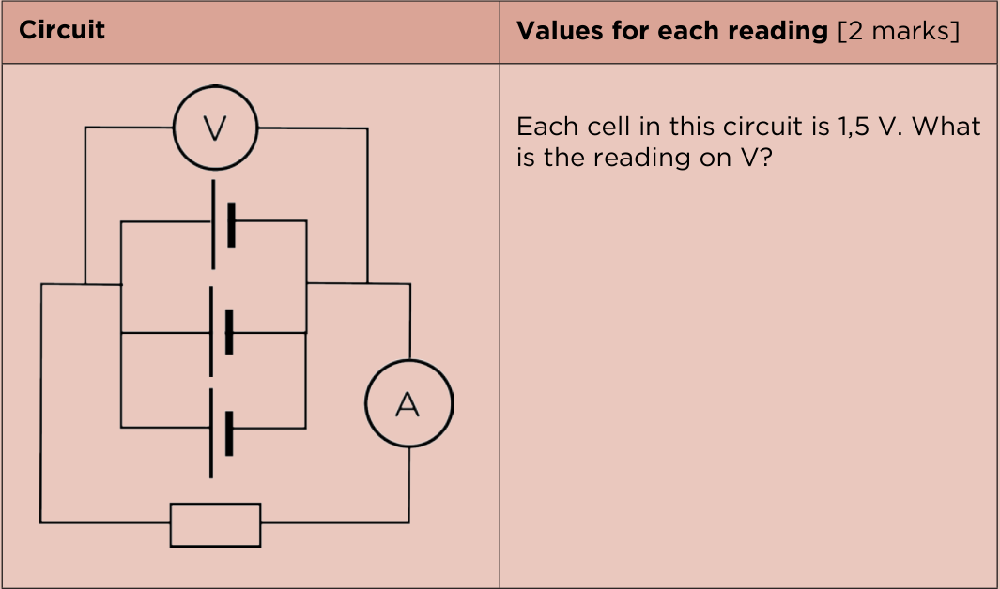
> **[Diagram Context - Textbook_NaturalScience_Gr9_Series-and-parallel-circuits.pdf-0034-04.png]**
> 1. A diagram of a circuit with three wires and a battery.

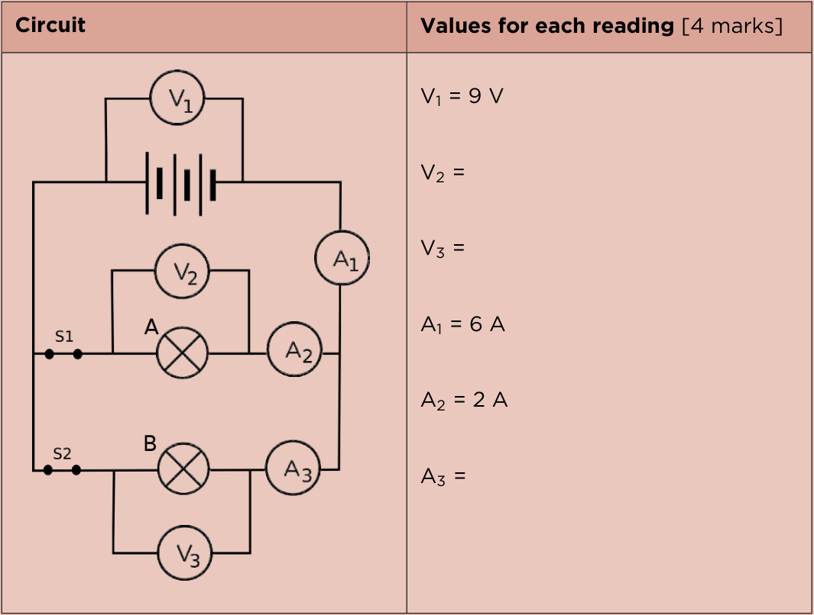
> **[Diagram Context - Textbook_NaturalScience_Gr9_Series-and-parallel-circuits.pdf-0034-06.png]**
> 1. A circuit diagram with multiple components.

---

# Magnetic Force Fields

## 1. Concept: The Magnetic Field
A magnetic field is the region of space surrounding a magnet within which the magnet can exert an attractive or repulsive force on another magnet or magnetic material. Magnetic force acts over a distance.

> **TAKE NOTE**
> While iron filings demonstrate a two-dimensional view of a magnetic field, the field actually exists in three dimensions all around the magnet.

## 2. Representing Magnetic Fields: Field Lines
Because magnetic fields are invisible, we use **field lines** to represent them visually. These lines follow specific rules:

*   **Direction:** Field lines always travel from the **North pole** to the **South pole**.
*   **Strength:** The density of the lines indicates the strength of the field.
    *   The closer the lines are drawn together, the **stronger** the magnetic field.
    *   The more field lines drawn in a specific area, the **stronger** the field.

## 3. Interaction Between Magnets
Magnetic field lines change shape depending on how magnets are positioned relative to one another.

### Opposite Poles Attracting
When opposite poles (North and South) are placed near each other, the field lines connect the two magnets, pulling them together.

***

*Chapter 1. Forces | 39*

> **[Diagram Context - Textbook_NaturalScience_Gr9_Forces.pdf-0035-09.png]**
> This graphic features a decorative border composed of a repeating green S-shaped wave pattern. It contains only the repeating curved wave shapes forming a linear border design. Conceptually, it serves as an ornamental graphic element rather than a scientific diagram conveying specific CAPS curriculum content.

> **[Diagram Context - Textbook_NaturalScience_Gr9_Series-and-parallel-circuits.pdf-0035-06.png]**
> 1. A white square with a gray border.

> **[Diagram Context - Textbook_NaturalScience_Gr9_Series-and-parallel-circuits.pdf-0035-09.png]**
> The image shows a close-up view of a gray line with a red and white insect on the left side. The insect appears to be a ladybug, and it is positioned in the center of the image. The insect is facing towards the right side of the image. The background of the image is a solid gray color.

---

# Magnetism and the Earth

## 1. Magnetic Field Properties
*   **Interaction:** Like magnetic poles repel each other.
*   **Field Strength:** A magnetic field is strongest in the immediate vicinity of the magnet and decreases in strength as the distance from the magnet increases.

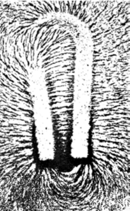
> **[Diagram Context - Textbook_NaturalScience_Gr9_Forces.pdf-0036-01.png]**
> 1. A black and white diagram of a molecule with two hydrogen atoms and one oxygen atom.

## 2. The Earth as a Magnet
The Earth acts like a giant bar magnet with its own North and South magnetic poles. 

*   **The Theory:** Scientists believe that the Earth's magnetic field is generated by the movement of superhot liquid iron within the Earth's core. This rotational movement creates weak magnetic forces around the Earth's rotational axis.
*   **Orientation:** The Earth's magnetic field is oriented such that the "South Pole" of this internal bar magnet is located under the Earth's geographic North Pole.

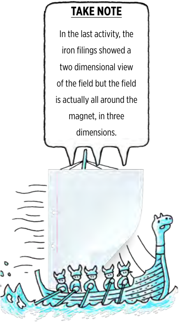
> **[Diagram Context - Textbook_NaturalScience_Gr9_Forces.pdf-0036-03.png]**
> The image shows a cartoon boat with four people on it, each holding a paddle. The boat is sailing on a body of water, and the people are paddling to move the boat forward. The boat is depicted in a cartoon style, with a blue background and white text. The text on the image provides a brief description of the scene, including the number of people on the boat, the

## 3. Compasses and Navigation
The Earth's magnetic field allows us to use compasses for navigation.

*   **How a Compass Works:** A plotting compass contains a small, magnetized needle. 
*   **Principle of Attraction:** Because the needle is a small magnet, it is attracted to the opposite magnetic pole of the Earth. The needle aligns itself with the Earth's magnetic field, pointing toward magnetic north, which allows users to determine direction.

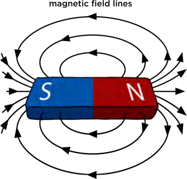
> **[Diagram Context - Textbook_NaturalScience_Gr9_Forces.pdf-0036-05.png]**
> The image presents a diagram of a magnetic field lines, which is a visual representation of the magnetic field lines in a magnetic field. The diagram is labeled with the letters "S" and "N" and includes arrows to represent the magnetic field lines. The diagram also includes a Lewis diagram, which is a diagram used to represent the magnetic field lines in a magnetic field. The diagram is labeled with

## 4. Key Terminology
*   **Aurora Australis:** The "Southern Lights," a natural light display in the Earth's sky, predominantly seen in high-latitude regions around the Arctic and Antarctic.
*   **Aurora Borealis:** The "Northern Lights," a similar natural light display occurring in the Northern Hemisphere.

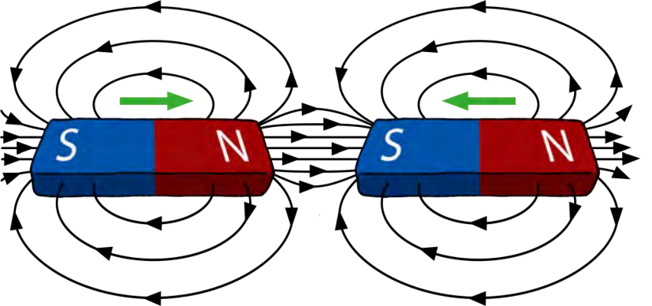
> **[Diagram Context - Textbook_NaturalScience_Gr9_Forces.pdf-0036-08.png]**
> 1. A diagram of two magnets with arrows pointing to the north and south poles.

> **[Diagram Context - Textbook_NaturalScience_Gr9_Series-and-parallel-circuits.pdf-0036-01.png]**
> The image shows a close-up view of two gears, one larger and one smaller, set against a white background. The larger gear is positioned on the left side of the image, while the smaller gear is on the right side. The gears are made of metal and appear to be in good condition. The image does not contain any text or additional objects, and the focus is solely on the

---

# Natural Sciences: Magnetic and Electrostatic Forces

## 1. Magnetic Phenomena in Nature
The Earth is surrounded by a magnetic field that interacts with charged particles from the Sun.

*   **The Aurora (Southern and Northern Lights):**
    *   Charged particles are emitted from the Sun's surface and travel through space.
    *   When these particles reach Earth, they are trapped by the Earth's magnetic field in regions known as "belts."
    *   Particles occasionally escape these belts and spiral along magnetic field lines toward the magnetic poles.
    *   As they enter the atmosphere, they interact with atmospheric gas particles, resulting in the visible light displays known as the Southern or Northern Lights.

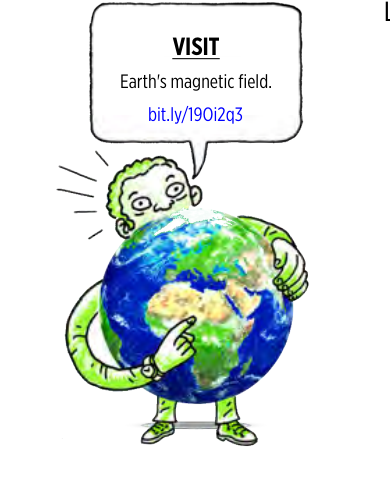
> **[Diagram Context - Textbook_NaturalScience_Gr9_Forces.pdf-0037-01.png]**
> The image features a cartoon depiction of a man holding a globe in his hands. The globe is green and blue, and the man is wearing a green shirt and white shoes. The man is pointing to the globe, which is positioned in the center of the image. The image also includes a speech bubble containing text that reads "Visit Earth's magnetic field."

*   **Ferrofluids:**
    *   **Definition:** A ferrofluid is a liquid that becomes strongly magnetised in the presence of a magnetic field.

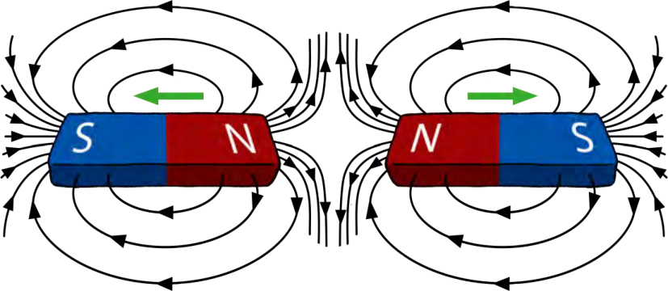
> **[Diagram Context - Textbook_NaturalScience_Gr9_Forces.pdf-0037-02.png]**
> The image shows a diagram of two magnets, each with a red and blue magnet on top and a green magnet on the bottom. The magnets are positioned in a way that they are facing each other, with the magnets on top and bottom facing each other. The magnets are surrounded by a black line, and there are arrows pointing towards the magnets. The diagram also includes a label for the magnetic field

---

## 2. Electrostatic Forces
Electrostatic forces relate to static electricity, a concept introduced in Grade 8.

### Activity: Charging Objects
This activity explores how objects can become charged through interaction.

**Materials Required:**
*   Balloons (or a plastic comb)
*   Glass rod
*   Piece of knitted fabric (wool)
*   PVC rod
*   Plastic ruler
*   Small pieces of paper
*   Water tap

**Instructions:**
1.  Work in pairs.
2.  Blow up a balloon and tie it closed so the air does not escape.
3.  Hold the balloon a short distance away from your hair. Observe the interaction.

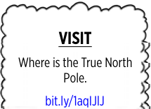
> **[Diagram Context - Textbook_NaturalScience_Gr9_Forces.pdf-0037-04.png]**
> 1. A diagram of a cell with a diagram of a cell on the left side.

---

## 3. Digital Resources
For further exploration of these concepts, refer to the following links:

| Topic | Resource Type | Link |
| :--- | :--- | :--- |
| Northern Lights | Educational Article | bit.ly/16PINOx |
| Magnetic Liquid | Video | bit.ly/19OixQY |

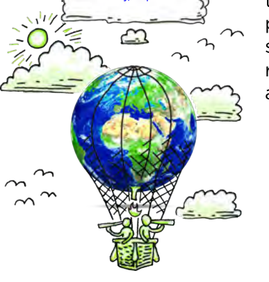
> **[Diagram Context - Textbook_NaturalScience_Gr9_Forces.pdf-0037-06.png]**
> The image features a cartoon illustration of a hot air balloon filled with a globe. The globe is depicted in a realistic manner, with the continents and oceans clearly visible. The balloon is filled with a green substance, which could be a gas or a liquid. The illustration is simple and straightforward, with no additional text or labels. The main focus is on the globe and the hot air balloon, conve

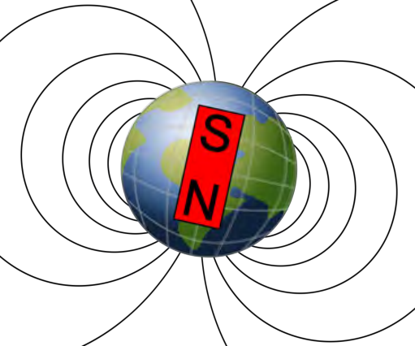
> **[Diagram Context - Textbook_NaturalScience_Gr9_Forces.pdf-0037-07.png]**
> The image features a globe with the letters "N" and "S" on it, surrounded by a black and white pattern of concentric circles. The globe is positioned in the center of the image, with the "N" and "S" letters standing out prominently. The circles surrounding the globe are evenly spaced, creating a sense of balance and symmetry in the composition. The image does not

> **[Diagram Context - Textbook_NaturalScience_Gr9_Forces.pdf-0037-08.png]**
> 1. A diagram of a cell with the words "Take Note" written above it.

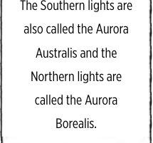
> **[Diagram Context - Textbook_NaturalScience_Gr9_Forces.pdf-0037-09.png]**
> The Southern Lights are also called the Aurora, which is a natural light display that occurs when charged particles from the sun interact with the Earth's magnetic field. The Aurora lights are most commonly seen in the polar regions, where the sun's rays are deflected by the Earth's magnetic field. The lights are often accompanied by other celestial events, such as the Northern Lights, which are also known as

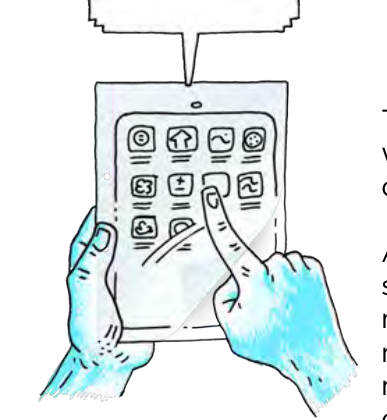
> **[Diagram Context - Textbook_NaturalScience_Gr9_Forces.pdf-0037-11.png]**
> 1. A diagram of a cell with arrows pointing to different parts of the cell.

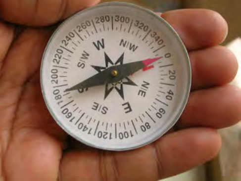
> **[Diagram Context - Textbook_NaturalScience_Gr9_Forces.pdf-0037-12.png]**
> 1. A compass with a white background and black markings.

---

### Investigation: Static Electricity

#### Experimental Procedure

1. **Balloon and Hair:**
   * Rub your hair with the balloon.
   * Hold the balloon a short distance away from your hair. Observe the interaction.

2. **Glass Rod and Paper:**
   * Hold the glass rod over small pieces of paper. Observe the interaction.
   * Rub the glass rod with the knitted fabric.
   * Hold the glass rod over the pieces of paper again. Observe the interaction.

3. **Glass Rod and Water:**
   * Rub the glass rod with the knitted fabric.
   * Open the tap to create a thin, steady stream of water.
   * Hold the glass rod close to the stream of water. Observe the interaction.

---

#### Questions

1. What action was taken to make your hair stick to the balloon?
2. What happens when you rub the glass rod with the knitted fabric?
3. Why did the glass rod attract the stream of water?

---

### Concept: Friction and Electron Transfer

When two surfaces are rubbed together, **friction** is created between them. This friction can cause electrons to be transferred from one surface to the other.

#### Understanding Atomic Structure
To understand how electrons are transferred, we must recall the structure of an atom:

*   **Protons:** Positively charged particles located in the nucleus.
*   **Neutrons:** Neutral particles located in the nucleus.
*   **Electrons:** Negatively charged particles that orbit the nucleus.

**Key Question:** Where are the electrons positioned in the atom?

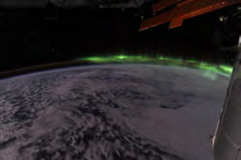
> **[Diagram Context - Textbook_NaturalScience_Gr9_Forces.pdf-0038-01.png]**
> The image shows a satellite view of the Earth with a green light coming from the horizon. The Earth is depicted in shades of blue and white, with the sky in a darker shade of blue. The satellite is positioned on the right side of the image, and the horizon line is located at the bottom right corner. The image is labeled as an educational graphic, and it is intended for a high

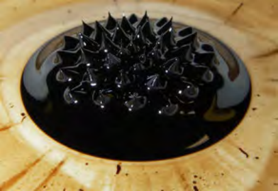
> **[Diagram Context - Textbook_NaturalScience_Gr9_Forces.pdf-0038-05.png]**
> 1. A black and brown diagram of a liquid with a black substance in the center.

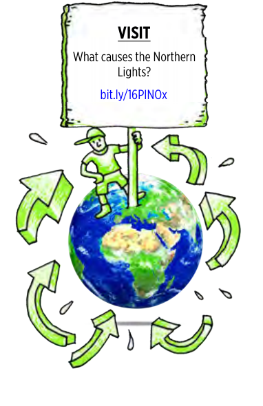
> **[Diagram Context - Textbook_NaturalScience_Gr9_Forces.pdf-0038-20.png]**
> The image features a cartoon illustration of a globe with arrows pointing to various locations, including the North Pole. A person is depicted on the globe, standing on a pole. The image also includes a sign that reads "Visit" and "What causes the Northern Lights?".

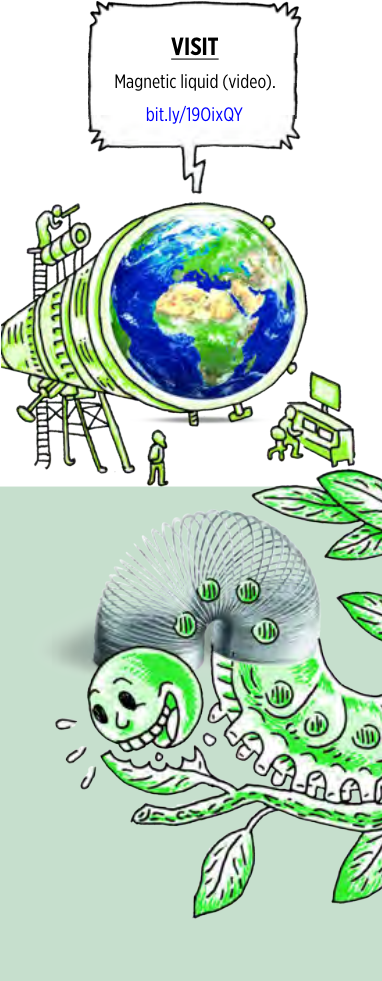
> **[Diagram Context - Textbook_NaturalScience_Gr9_Forces.pdf-0038-21.png]**
> 1. A cartoon drawing of a green frog with a smiley face.
 2. A cartoon drawing of a green frog with a smiley face.
 3. A cartoon drawing of a green frog with a smiley face.
 4. A cartoon drawing of a green frog with a smiley face.
 5. A cartoon drawing of a green frog with a smiley face.

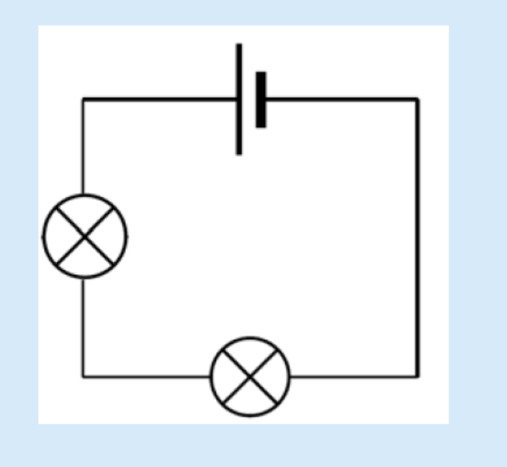
> **[Diagram Context - Textbook_NaturalScience_Gr9_Series-and-parallel-circuits.pdf-0038-10.png]**
> 1. A black and white diagram of a circuit with two x's and two y's.

---

### Atomic Structure and Electrostatics

#### Key Concepts
*   **Proton:** A subatomic particle with a positive charge.
*   **Electron:** A subatomic particle with a negative charge.
*   **Neutron:** A subatomic particle with no charge (neutral).
*   **Electrostatic Attraction:** The force that holds an atom together, acting between the positively charged nucleus and the negatively charged electrons.
*   **Neutrality:** Atoms are normally neutral because they contain an equal number of protons and electrons, balancing the positive and negative charges.

#### The Transfer of Electrons
While protons are fixed in the nucleus and cannot move between atoms, electrons can be transferred from one object to another through friction (e.g., rubbing a balloon against hair or combing hair).

*   **Rule of Transfer:** Only electrons move. Protons remain stationary within the nucleus.
*   **Result of Transfer:** When an object loses electrons, it becomes positively charged. When an object gains electrons, it becomes negatively charged.

---

#### Exercises

**1. Concept Check**
*   What is the type of charge on a proton?
*   What is the type of charge on an electron?
*   What is the charge on a neutron?

**2. Diagram Analysis**

*   Based on the provided diagram, which object gave up some of its electrons?
*   Does this object now have more positive or more negative charges?

---

#### Take Note
*   **Movement:** Only the outer electrons move.
*   **Fixed Position:** Protons are located in the nucleus and do not move between atoms.

> **[Diagram Context - Textbook_NaturalScience_Gr9_Forces.pdf-0039-13.png]**
> The graphic is a decorative border featuring a repeating pattern of stylized green arrows forming a continuous wave-like or looped line. There are no explicit text labels, variables, or biological structures present within this visual element. Conceptually, it serves purely as a horizontal divider or aesthetic frame rather than conveying specific curriculum content for high school learners.

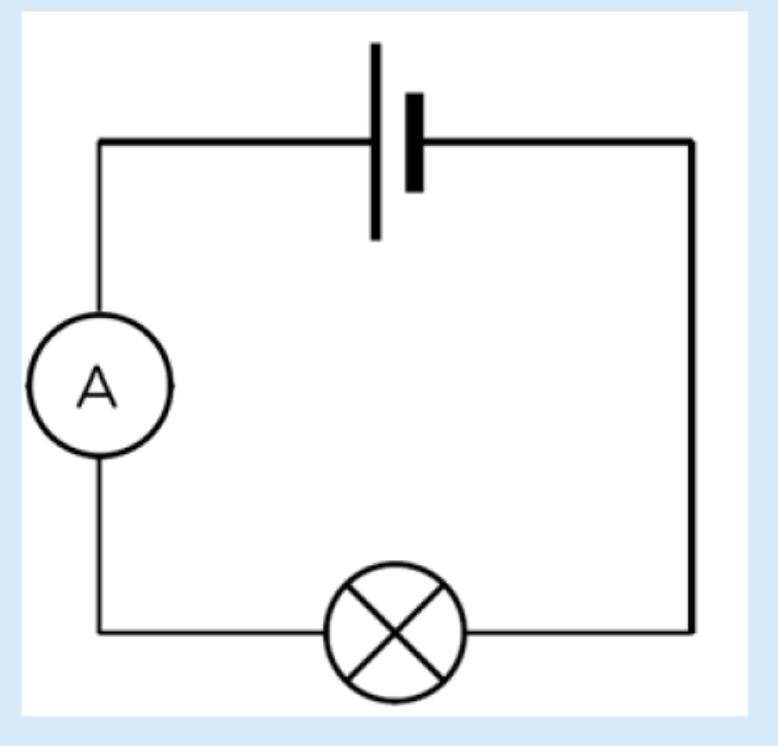
> **[Diagram Context - Textbook_NaturalScience_Gr9_Series-and-parallel-circuits.pdf-0039-05.png]**
> 1. A circuit diagram with a battery, wires, and a light bulb.

---

### Understanding Electric Charge

#### Key Concepts
*   **Negatively charged:** An object that has more electrons than protons.
*   **Positively charged:** An object that has fewer electrons than protons.
*   **Neutral:** An object where the number of positive charges equals the number of negative charges, resulting in a net charge of zero.

#### Charge Calculations
The overall charge of an object is determined by the sum of its positive and negative charges.

| Object State | Calculation | Overall Charge |
| :--- | :--- | :--- |
| Neutral | $6 + (-6) = 0$ | $0$ |
| Positively Charged | $8 + (-6) = 2$ | $+2$ |
| Negatively Charged | $6 + (-9) = -3$ | $-3$ |

> **[Diagram Context - Textbook_NaturalScience_Gr9_Forces.pdf-0040-06.png]**
> This educational graphic depicts a cartoon human figure with green skin and hair standing behind and hugging a globe of the Earth, pointing towards Africa while speaking with an empty speech bubble above. Visible elements include the cartoon character with arms wrapped around the planet, a detailed satellite-style map of the Earth showing Africa and parts of Europe and the Atlantic Ocean, and motion lines radiating from the character's head. Conceptually, this illustration introduces geography and environmental science topics in the CAPS curriculum, visually engaging learners to explore global systems, human-earth relationships, or specific geographic locations on the African continent.

---

### Activity: Turning the wheel

**Objective:** To observe the effects of static electricity generated through friction.

#### Materials
*   2 curved watch glasses
*   2 perspex rods
*   Cloth (wool or nylon)
*   Plastic rod
*   Small pieces of torn paper

#### Instructions
1.  Place one watch glass upside down on a flat table surface.
2.  Balance the second watch glass upright on top of the first watch glass.
3.  Rub one of the perspex rods vigorously with the cloth to create a static charge.
4.  Carefully balance the charged perspex rod across the top of the upright watch glass.

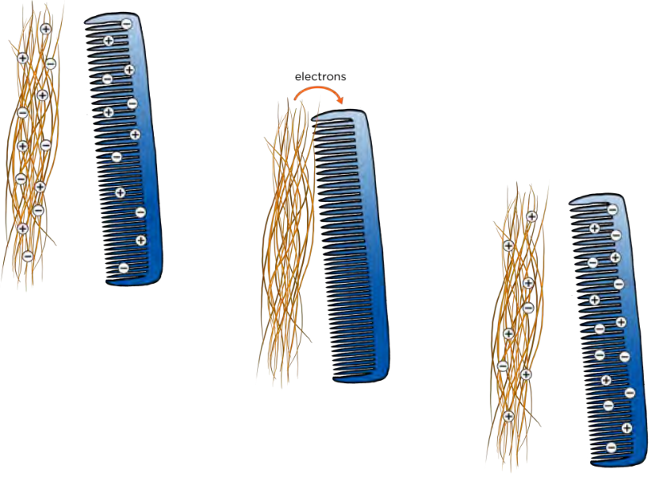
> **[Diagram Context - Textbook_NaturalScience_Gr9_Forces.pdf-0040-09.png]**
> 1. A blue comb with a white comb on top.

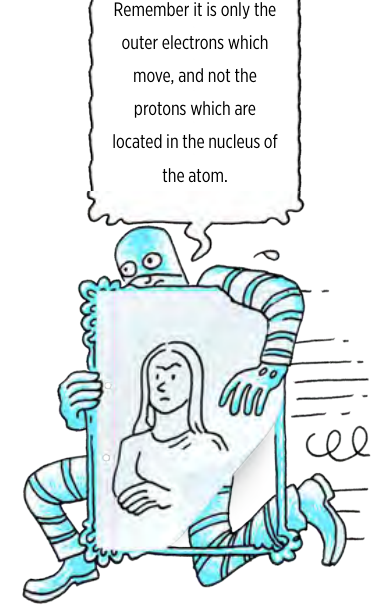
> **[Diagram Context - Textbook_NaturalScience_Gr9_Forces.pdf-0040-11.png]**
> The image shows a cartoon illustration of a man holding a picture of a woman. The man is wearing a blue suit and holding the picture with both hands. The woman is depicted in a white dress, and the man is holding the picture in front of a white background. The illustration is labeled with the text "Remember it is only the outer electrons which move, and not the protons which are

---

### Investigation: Electrostatic Forces

#### Experimental Procedure

5. Rub the second perspex rod vigorously with the same cloth.
6. Bring the second perspex rod close to the side of the first perspex rod that was charged. Observe the interaction.

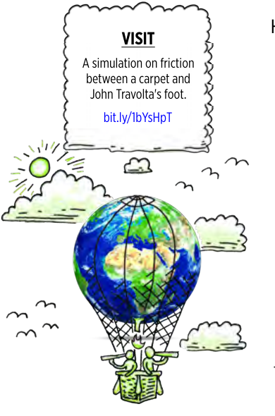
> **[Diagram Context - Textbook_NaturalScience_Gr9_Forces.pdf-0041-04.png]**
> A simulation on friction between a carpet and John Traverta's foot.

7. Repeat the activity, but instead of the second perspex rod, use a plastic rod. Observe the interaction.
8. Bring a rod that has been rubbed closer to small pieces of torn paper on the table. Observe the interaction.

---

#### Take Note
> **Remember:** Like charges repel and opposite charges attract.

---

#### Questions

1. What happened when you brought the second perspex rod close to the first perspex rod?
   ___________________________________________________________________________
   ___________________________________________________________________________

2. What happened when you brought the plastic rod close to the first perspex rod?
   ___________________________________________________________________________
   ___________________________________________________________________________

3. What happened when you brought the plastic rod close to the pieces of paper?
   ___________________________________________________________________________
   ___________________________________________________________________________

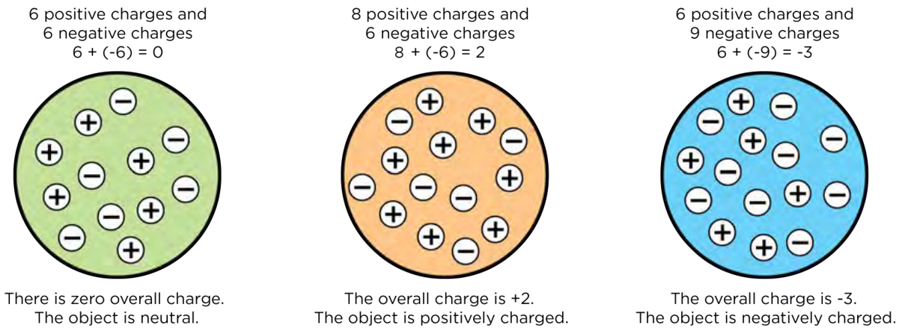
> **[Diagram Context - Textbook_NaturalScience_Gr9_Forces.pdf-0041-06.png]**
> 1. A diagram of a positive charge and a negative charge.

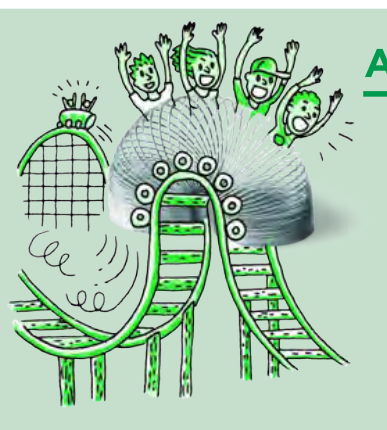
> **[Diagram Context - Textbook_NaturalScience_Gr9_Forces.pdf-0041-08.png]**
> 1. A cartoon depiction of a roller coaster with a group of people on it.

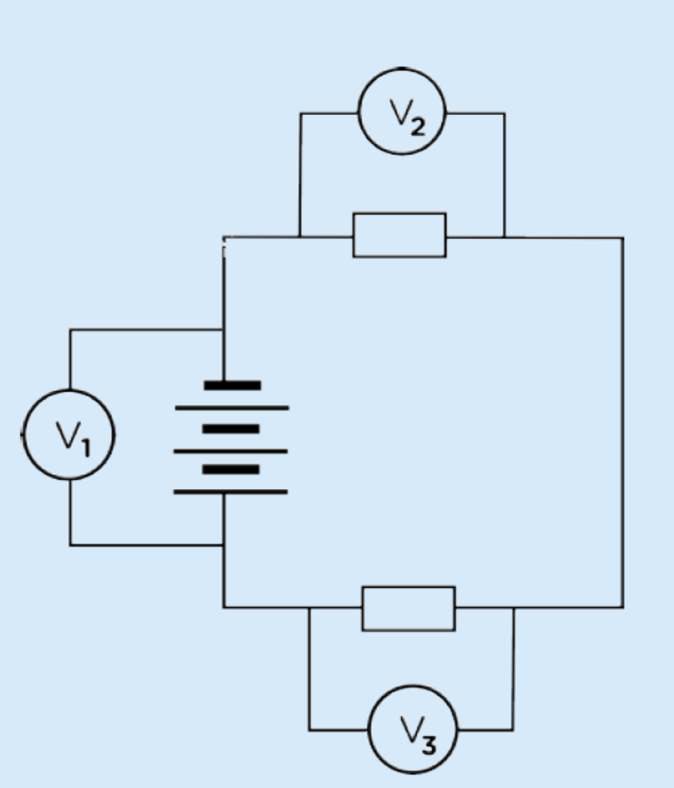
> **[Diagram Context - Textbook_NaturalScience_Gr9_Series-and-parallel-circuits.pdf-0041-05.png]**
> 1. A circuit diagram with three wires and three voltage sources labeled V1, V2, and V3.

---

### Electrostatics: The Behaviour of Charges

#### 1. Fundamental Principles of Electrostatic Force
Electrostatic forces are the forces that exist between charged objects. These forces are governed by the movement of electrons between materials.

*   **Repulsion:** When objects possess the **same charge** (both positive or both negative), they push each other away. This is known as an electrostatic force of repulsion.
*   **Attraction:** When objects possess **opposite charges** (one positive and one negative), they pull each other toward one another. This is known as an electrostatic force of attraction.

#### 2. Factors Affecting Electrostatic Force
The strength of the electrostatic force between two objects is determined by two primary factors:
1.  **Distance:** The closer the charged objects are to each other, the stronger the electrostatic force.
2.  **Magnitude of Charge:** The more highly charged the objects are, the stronger the electrostatic force between them.

#### 3. Summary of Charge Behaviour
| Interaction | Charge Type 1 | Charge Type 2 | Result |
| :--- | :--- | :--- | :--- |
| Repulsion | Negative | Negative | Objects push away |
| Repulsion | Positive | Positive | Objects push away |
| Attraction | Positive | Negative | Objects pull together |

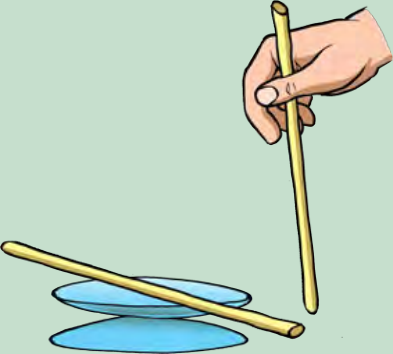
> **[Diagram Context - Textbook_NaturalScience_Gr9_Forces.pdf-0042-03.png]**
> 1. A cartoon illustration of a hand holding a stick.

---

### ACTIVITY: Van de Graaff Generator

**Objective:** To observe the creation of an electrostatic spark.

**Materials:**
*   Van de Graaff generator

**Instructions:**
1.  Turn on the generator.
2.  Bring the small metal globe close to the generator.
3.  Observe the interaction between the generator and the metal globe.

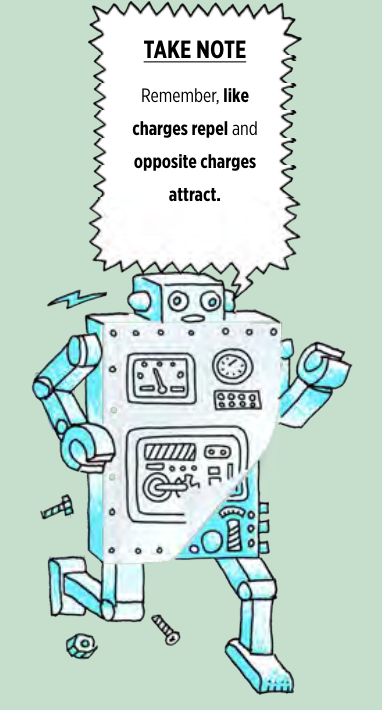
> **[Diagram Context - Textbook_NaturalScience_Gr9_Forces.pdf-0042-10.png]**
> The image features a robot with a large head and arms, standing on a green surface. The robot is holding a small device in its left hand and has a large device in its right hand. The robot is wearing a pair of glasses and has a large head with a small body. The robot is standing on a green surface, and there is a white sign with black text that reads "Take

---

### Quick Review Questions
*   **Question 1:** When perspex rods are rubbed with a cloth, electrons are transferred from the perspex to the cloth. What charge does the perspex rod now have?
*   **Question 2:** When a plastic rod is rubbed with a cloth, electrons are transferred from the cloth to the plastic rod. What charge does the plastic rod now have?

> **[Diagram Context - Textbook_NaturalScience_Gr9_Forces.pdf-0042-11.png]**
> The graphic displays a repeating decorative border featuring stylized green ribbon or coiled elements resembling overlapping 'S' shapes or springs. No text labels, variables, or biological structures are present in this purely ornamental banner. Conceptually, it functions as a visual divider rather than a scientific diagram, holding no direct curricular content for South African CAPS high school subjects.

---

# Electrostatic Discharge: From Van de Graaff to Lightning

## 1. The Van de Graaff Generator
The Van de Graaff generator is a device used to demonstrate the effects of electrostatic charge.

*   **Mechanism:** When the generator is turned on, the large metal dome at the top becomes positively charged.
*   **Discharge:** If an insulated metal sphere is brought close to the charged dome, electrons jump from the sphere to the dome, resulting in a visible spark.

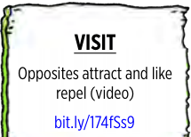
> **[Diagram Context - Textbook_NaturalScience_Gr9_Forces.pdf-0043-01.png]**
> The educational graphic is a text-based resource card with a paper background containing a hyperlink to an instructional video. The visible text reads "VISIT", "Opposites attract and like repel (video)", and includes a short URL link "bit.ly/174fSs9". It directs CAPS Physical Sciences learners to supplementary digital media demonstrating the fundamental electrostatic and magnetic rule that opposite charges or poles attract while like charges or poles repel.

> **DID YOU KNOW?**
> The fundamental idea of using friction in a machine to generate a charge dates back to the 17th century, but the generator was only invented by Robert Van de Graaff in 1929 at Princeton University.

---

## 2. Lightning as Electrostatic Discharge
Lightning is a natural, large-scale version of the electrostatic discharge seen in a Van de Graaff generator.

### The Process of Lightning Formation
1.  **Charging:** During a storm, friction between clouds and moisture causes the clouds to become electrically charged.
2.  **Charge Separation:** The bottom of the cloud (closest to the ground) becomes negatively charged, while the top of the cloud becomes positively charged.
3.  **Discharge (Earthing):** When the build-up of charge becomes too large, electrons move from the bottom of the cloud to the ground. This process is known as being "earthed."
4.  **Energy Release:** This massive transfer of energy results in:
    *   **Light:** An extremely bright flash.
    *   **Sound:** A thunder-clap, caused by the air moving rapidly as a result of the electron flow.

> **WARNING:** Lightning is extremely dangerous. If the path of the electrons to the ground passes through a person, the massive energy transfer can cause severe injury or death.

> **DID YOU KNOW?**
> South Africa has one of the highest incidences of lightning strikes in the world.

---

## 3. Further Resources
*   **VISIT:** For information on how to survive a lightning strike, visit: [bit.ly/GS5BTm](http://bit.ly/GS5BTm)

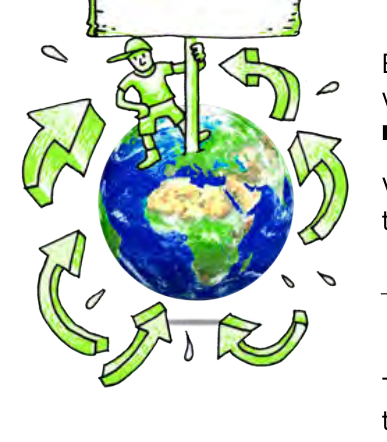
> **[Diagram Context - Textbook_NaturalScience_Gr9_Forces.pdf-0043-02.png]**
> The image features a cartoon illustration of a cartoon character, a man, holding a pole and standing on a globe. The globe is divided into sections, each representing a different country. The man is positioned in the center of the globe, holding the pole with both hands. The illustration is set against a white background, which makes the colors of the globe and the man stand out. The man is

> **[Diagram Context - Textbook_NaturalScience_Gr9_Forces.pdf-0043-06.png]**
> The image shows a black and white diagram of a cell, with a caption that reads "Big sparks, little sparks." The diagram is accompanied by a list of visible labels, including "bit," "ly," "by," and "jd." The caption is written in a simple, straightforward manner, making it easy for a high school student to understand the concept being illustrated.

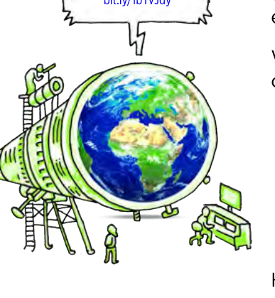
> **[Diagram Context - Textbook_NaturalScience_Gr9_Forces.pdf-0043-08.png]**
> The image shows a cartoon depiction of a globe with a speech bubble above it that says "I.B.V.J.V.J.Y". The globe is surrounded by a group of people, including a man and a woman, who appear to be engaged in a discussion or a presentation. The globe is positioned in the center of the image, with the people surrounding it on all

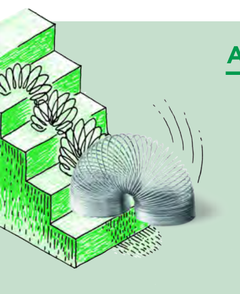
> **[Diagram Context - Textbook_NaturalScience_Gr9_Forces.pdf-0043-14.png]**
> 1. A diagram of a spring on the ground.

> **[Diagram Context - Textbook_NaturalScience_Gr9_Forces.pdf-0043-21.png]**
> 1. A diagram of a cell with a green line representing a DNA strand.

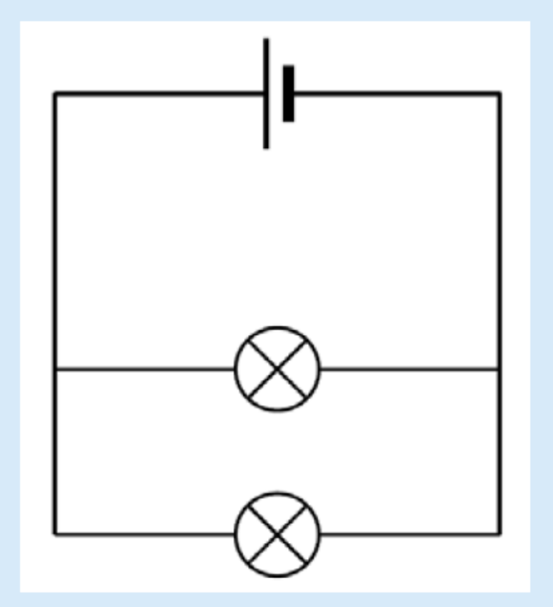
> **[Diagram Context - Textbook_NaturalScience_Gr9_Series-and-parallel-circuits.pdf-0043-00.png]**
> 1. A black and white diagram of a circuit with two x's connected to a battery.

---

### Lightning Safety Precautions
*   **Seek Shelter:** The safest place to be during a lightning storm is indoors.
*   **Avoid Hazards:** Stay away from windows and metal objects.
*   **Outdoor Safety:** If you cannot get inside, avoid standing next to tall objects or metal objects, as lightning typically strikes the tallest object in the area.
*   **Vehicle Safety:** If travelling in a car, remain inside the vehicle until the storm subsides.

---

### Summary: Key Concepts

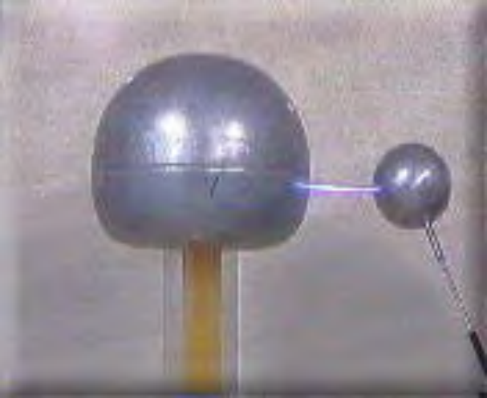
> **[Diagram Context - Textbook_NaturalScience_Gr9_Forces.pdf-0044-00.png]**
> 1. A diagram of a silver ball and a silver rod with a blue light on it.

#### 1. Definition of Force
*   **Force:** A push or a pull on an object.
*   **Measurement:** Forces are measured in newtons ($N$).
*   **Effects:** A force can change the shape, direction, and motion of an object.
*   **Action-Reaction:** Forces act in pairs. The force acting on an object is the action, and the force the object exerts back in the opposite direction and equal in magnitude is the reaction.
*   **Net Force:** When more than one force acts on an object, the net (or resultant) force is the sum of all forces acting on the object.
*   **Representation:** Forces can be represented using a free-body diagram, where arrows indicate the direction and magnitude of the different forces.

#### 2. Types of Forces
Forces are categorized into two main groups:

*   **Contact Forces:** Act when objects are in physical contact (touching).
    *   **Friction:** The force opposing motion between two surfaces as they rub against each other.
    *   **Compression:** Two forces acting on one object, moving in opposite directions (towards each other) to compress or deform the object.
    *   **Tension:** Two forces acting on one object, moving in opposite directions (away from each other) to stretch the object.
*   **Non-contact Forces (Field Forces):** Act over a distance; objects do not need to be touching. A field is a region in space where an object with certain properties experiences a force.
    *   **Examples:** Magnetic, electrostatic, and gravitational forces.

#### 3. Mass and Weight
*   **Gravitational Force:** A force of attraction between two bodies due to their mass. It increases with mass and decreases with the distance between the bodies.
*   **Weight:** The gravitational force exerted on an object by the Earth (or another planet). Weight varies depending on location.
*   **Mass:** A measure of how much matter an object contains. Mass remains constant regardless of location.
*   **Calculation:** Weight is calculated using the formula:
    $$W = m \times g$$
    *   Where $W$ is weight.
    *   Where $m$ is mass.
    *   Where $g$ is gravitational acceleration. On Earth, $g = 9,8 m/s^2$.

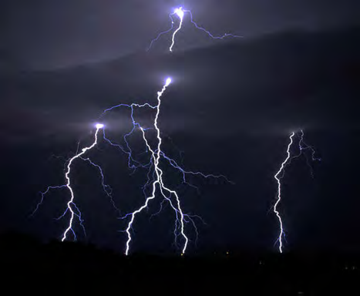
> **[Diagram Context - Textbook_NaturalScience_Gr9_Forces.pdf-0044-04.png]**
> The image shows a group of four lightning bolts in the sky, each with a different color - blue, white, and yellow. The lightning bolts are arranged in a diagonal line, with the first one on the left side and the fourth one on the right side. The background of the image is dark, which contrasts with the bright lightning bolts. The image is a close-up of the lightning

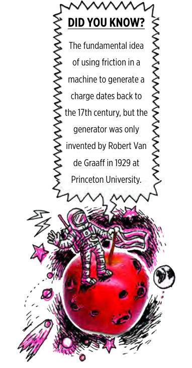
> **[Diagram Context - Textbook_NaturalScience_Gr9_Forces.pdf-0044-08.png]**
> 1. A cartoon illustration of an astronaut on a red planet.
 2. A cartoon illustration of a red apple.
 3. A cartoon illustration of a planet.
 4. A cartoon illustration of a rocket.

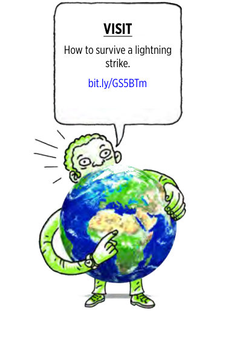
> **[Diagram Context - Textbook_NaturalScience_Gr9_Forces.pdf-0044-09.png]**
> The image features a cartoon depiction of a man holding a globe. The globe is green and blue, and the man is wearing a green shirt and a green hat. The man is pointing to the globe, which is positioned on his left side. The text "Visit" is written in black at the top of the image, and "How to survive a lightning strike" is written in black at

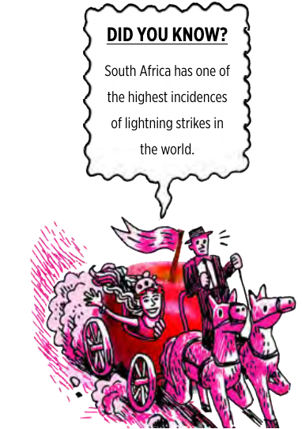
> **[Diagram Context - Textbook_NaturalScience_Gr9_Forces.pdf-0044-10.png]**
> A cartoon illustration of a man and a woman riding on a pink carriage. The man is wearing a black suit and hat, and the woman is wearing a pink dress and a crown. The carriage is being pulled by a pink horse. The illustration is accompanied by a speech bubble that reads " Did you know South Africa has one of the highest incidences of lightning strikes in the world. "

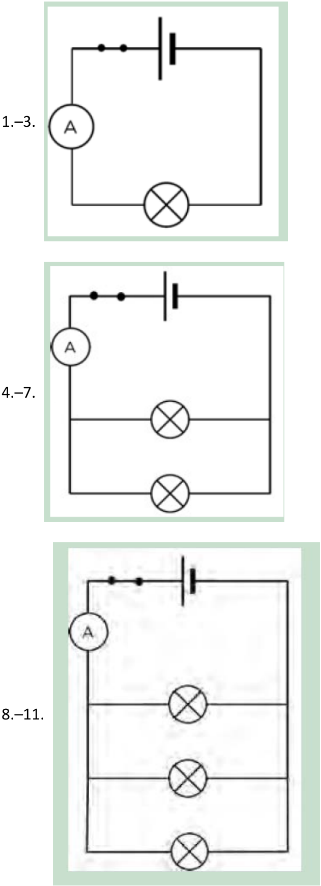
> **[Diagram Context - Textbook_NaturalScience_Gr9_Series-and-parallel-circuits.pdf-0044-02.png]**
> 1. A diagram of a circuit with three squares and three wires.

---

# Chapter 1: Forces - Summary

## 1. Magnetism
*   **Definition of a Magnet:** A material that possesses a strong magnetic field around it.
*   **Magnetic Attraction:** Magnetic forces exist between a magnet and magnetic substances (e.g., iron, steel, cobalt, and nickel).
*   **Poles:** A magnet has two poles: a North pole and a South pole.
    *   **Law of Poles:** Opposite poles attract each other; like poles repel each other.
*   **Earth's Magnetic Field:** The Earth generates its own magnetic field. Compasses function because the needle is a magnet that aligns itself with the Earth's magnetic North.

## 2. Electrostatics
*   **Origin of Charge:** When certain materials are rubbed together, friction causes electrons to transfer from one material to another. This results in an electrostatic charge due to the gain or loss of electrons.
*   **Fundamental Properties:**
    *   A charge is a fundamental property of matter.
    *   **Electrons:** Carry a negative charge.
    *   **Protons:** Carry a positive charge.
*   **Charging Objects:**
    *   **Negative Charge:** An object that has gained electrons.
    *   **Positive Charge:** An object that has lost electrons.
*   **Electrostatic Forces:**
    *   **Attraction:** Occurs between objects with opposite charges.
    *   **Repulsion:** Occurs between objects with like charges.

## 3. Lightning
*   **Formation:** Thunderclouds become charged when water and air particles rub against each other (friction).
*   **Discharge:** A lightning strike is a massive electrostatic discharge between the thunderclouds and the ground.
*   **Safety:** Lightning is dangerous; always adhere to safety precautions during lightning storms.

---

## Concept Map

> **[Diagram Context - Textbook_NaturalScience_Gr9_Forces.pdf-0045-01.png]**
> The image shows a line drawing of a cell with blue and white lines. The drawing is set against a gray background, and the lines are arranged in a zigzag pattern. The diagram is labeled with the word "cell" and "biology" in the top left corner, and the word "biology" is also present in the bottom right corner. The word "biology" is also used

**Instruction:** Complete the concept map to summarize the key concepts learned in this chapter. Use the surrounding space to add personal notes to create comprehensive summaries for exam revision.

> **[Diagram Context - Textbook_NaturalScience_Gr9_Forces.pdf-0045-02.png]**
> 1. A key is shown with a tree and a swing.

---

# Forces: Concept Map Summary

<!-- DIAGRAM_PLACEHOLDER: diagram -->

## 1. Definition and Properties of Forces
*   **Forces** act in pairs between two objects.
*   Forces can change the **speed**, **direction**, or **shape** of an object.
*   Forces are categorized into two broad groups:
    *   **Contact forces:** Forces that occur when objects are touching (e.g., friction, tension, compression).
    *   **Non-contact forces:** Forces that occur at a distance (e.g., gravitational force, magnetic force, electrostatic force).

---

## 2. Types of Forces

### A. Gravitational Force
*   **Definition:** An attractive force that exists between bodies/objects.
*   **Relationship with distance:** The force decreases as the distance between objects increases.
*   **Weight:** Gravitational force is the cause of weight.
*   **Note:** Weight is NOT constant (it depends on the gravitational pull of the body, e.g., Earth vs. Moon).

### B. Magnetic Force
*   **Definition:** A force exerted by magnets.
*   **Poles:** Magnets have two poles: **North** and **South**.
*   **Interaction:**
    *   **Attractive:** Between opposite poles.
    *   **Repulsive:** Between same poles.
*   **Magnetic Materials:** Materials that are attracted to magnets include **iron**, **steel**, **nickel**, and **cobalt**.
*   **Magnetic Field:** The region around a magnet where the magnetic force is exerted.

### C. Electrostatic Force
*   **Definition:** A force that exists between charged objects.
*   **Mechanism:** Results from the gain or loss of **electrons** during rubbing (friction).
*   **Interaction:**
    *   **Attractive:** Between opposite charges.
    *   **Repulsive:** Between like charges.
*   **Natural Example:** An electrical spark, such as **lightning** (caused by friction in thunder clouds).

---

## 3. Summary Table of Force Interactions

| Force Type | Interaction Type | Key Characteristics |
| :--- | :--- | :--- |
| **Gravitational** | Attractive | Depends on mass and distance; causes weight. |
| **Magnetic** | Attractive / Repulsive | Acts between poles; affects magnetic materials. |
| **Electrostatic** | Attractive / Repulsive | Caused by gain/loss of electrons; creates sparks. |

---

# Revision: Forces

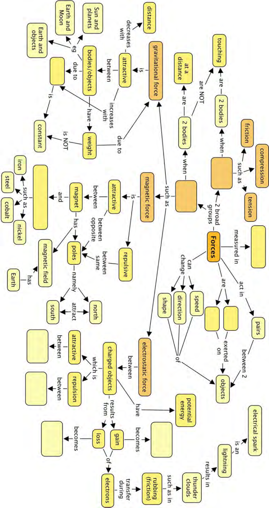
> **[Diagram Context - Textbook_NaturalScience_Gr9_Forces.pdf-0047-00.png]**
> 1. A diagram of a cell with arrows pointing to different parts of the cell.

## 1. Terminology Exercises
Provide one scientific term for each of the following descriptions:

a) An influence that can deform a flexible object or change the motion of an object with mass.
b) A region in space where an object with certain properties will experience a force.
c) When the only force acting on an object is the force due to gravity.
d) The two opposite ends of a magnet.
e) A fundamental property of matter that comes in two types and is carried by protons and electrons.

---

## 2. Multiple Choice Questions
Select the correct letter for each of the following questions:

**a) Which ONE of the following statements is FALSE?**

*   **A.** In order for a non-moving object to start moving, a net force must act on that object.
*   **B.** Contact forces are strongest when the objects experiencing the force are touching.
*   **C.** Field forces act over distances, but they can also act when objects are touching.
*   **D.** Forces always act in pairs of equal strength, but these pairs act on different objects.

**b) Which ONE of the following is NOT a field force?**

*   **A.** Gravitational force
*   **B.** Frictional force
*   **C.** Electrostatic force
*   **D.** Magnetic force

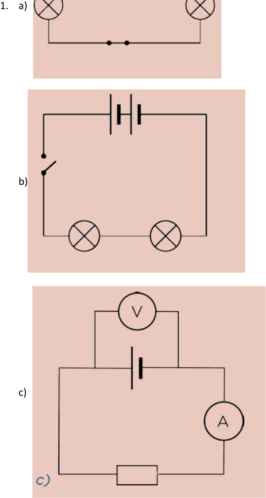
> **[Diagram Context - Textbook_NaturalScience_Gr9_Series-and-parallel-circuits.pdf-0047-01.png]**
> 1. A diagram of a circuit with three different configurations of wires and components.

---

c) The correct unit for gravitational force is:
A. the newton
B. the kilogram
C. the newton per kilogram
D. the kilogram per newton

d) Which ONE of the following substances is magnetic?
A. aluminium
B. copper
C. cobalt
D. tin

e) The electrostatic force between two charged objects is $F$. The distance between them is increased. How does the electrostatic force change?
A. It increases
B. It decreases
C. It remains the same
D. Not enough information has been provided.

f) An astronaut has a mass of $80\text{ kg}$ on Earth. Which ONE of the following regarding mass and weight of the astronaut on the Moon is correct?
A. The mass will be the same and the weight will also be the same.
B. The mass will be less and the weight will also be less.
C. The mass will be the same and the weight will be less.
D. The mass will be less and the weight will be the same.

***

**3. Decide which of the following statements are True or False. If they are False, rewrite them to make them true. [5 × 2 = 10 marks]**

| Statement | True/False | Correction (if False) |
| :--- | :--- | :--- |
| a) A force cannot make a motionless object move. | | |
| b) A force can make a moving object change direction. | | |
| c) A force can change the shape of an object. | | |

> **[Diagram Context - Textbook_NaturalScience_Gr9_Forces.pdf-0048-04.png]**
> The image is a cartoon-style illustration of a man and a machine. The man is holding a large gear, and the machine is a complex arrangement of gears and pulleys. The man is wearing a white shirt and blue pants, and the machine is made up of multiple gears and pulleys. The image is labeled with the number "8" and the words "eight" and "p

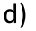

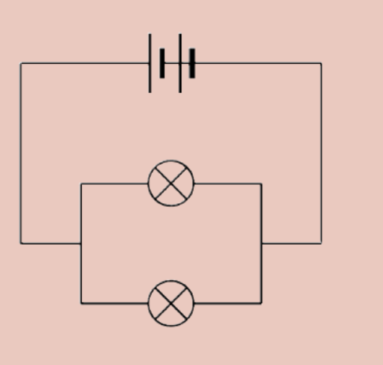
> **[Diagram Context - Textbook_NaturalScience_Gr9_Series-and-parallel-circuits.pdf-0048-01.png]**
> 1. A black and white diagram of a circuit with two x's and two h's.

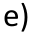

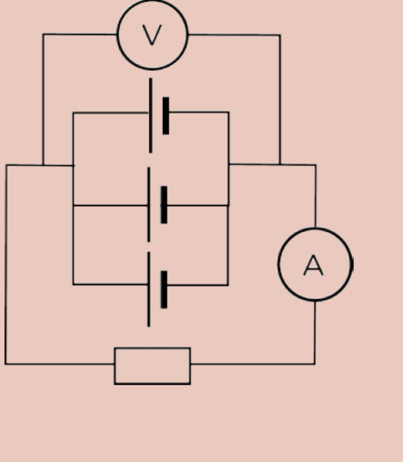
> **[Diagram Context - Textbook_NaturalScience_Gr9_Series-and-parallel-circuits.pdf-0048-03.png]**
> 1. A circuit diagram with three parallel lines and three circles.

---

### Concept Review: Forces

**True or False Statements**
*   d) A tension force slows down or stops an object because of the surfaces rubbing against each other. (Note: This statement is **False**; the description refers to *friction*, not tension).
*   e) Lightning is an application of a magnetic force. (Note: This statement is **False**; lightning is an application of *electrostatic* force).

---

### Exercise 4: Pushing and Pulling

**a) Identification**
*   Identify which situation shows a push and which shows a pull.

**b) Free Body Diagram**
*   The boy is pulling the desk with a force of $70\text{ N}$.
*   There is a frictional force of $20\text{ N}$ acting against the motion.
*   Draw a free body diagram representing these forces acting on the desk.

**c) Net Force Calculation**
*   Calculate the net force ($F_{net}$) acting on the desk.
*   Formula: $F_{net} = F_{applied} - F_{friction}$
*   Calculation: $F_{net} = 70\text{ N} - 20\text{ N} = 50\text{ N}$

---

### Exercise 5: Calculating Net Force

Given two forces: $F_1 = 50\text{ N}$ and $F_2 = 80\text{ N}$.

**a) Forces acting in the same direction**
When forces act in the same direction, we add them together:
$$F_{net} = F_1 + F_2$$
$$F_{net} = 50\text{ N} + 80\text{ N} = 130\text{ N}$$

**b) Forces acting in opposite directions**
When forces act in opposite directions, we subtract the smaller force from the larger force:
$$F_{net} = F_2 - F_1$$
$$F_{net} = 80\text{ N} - 50\text{ N} = 30\text{ N}$$

---

### 6. Effects of a Force
Write down three different effects that a force can have on an object. [3 marks]

1. 
2. 
3. 

---

### 7. Understanding Deformation
What is the following diagram illustrating? Explain your answer. [4 marks]

**Explanation:**

---

### 8. Mass vs. Weight
Tabulate the distinction between mass and weight by making use of definitions of mass and weight and comparing the units they are measured in. [5 marks]

| Feature | Mass | Weight |
| :--- | :--- | :--- |
| **Definition** | | |
| **SI Unit** | | |
| **Nature** | | |

---
*Energy and Change | Page 54*

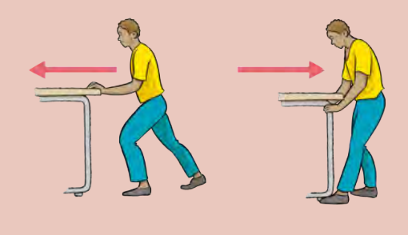
> **[Diagram Context - Textbook_NaturalScience_Gr9_Forces.pdf-0050-04.png]**
> 1. A diagram of a man doing a push-up.

---

### Exercises: Forces and Gravity

**9. Formula for Weight and Mass**
Write down the formula that relates the weight of an object to its mass and explain what each symbol represents.

*   **Formula:** $$w = m \cdot g$$
*   **Explanation of symbols:**
    *   $w$: Weight, measured in Newtons ($N$).
    *   $m$: Mass, measured in kilograms ($kg$).
    *   $g$: Gravitational acceleration, measured in meters per second squared ($m/s^2$).

**10. Factors Affecting Gravitational Force**
What two factors affect the gravitational force experienced between two objects? Explain the relationship.

*   **Factor 1: Mass.** The gravitational force is directly proportional to the product of the masses of the two objects. As mass increases, gravitational force increases.
*   **Factor 2: Distance.** The gravitational force is inversely proportional to the square of the distance between the centers of the two objects. As distance increases, gravitational force decreases.

---

**11. Experiment: Weight on Different Planets**
An astronaut performs an experiment to determine the relationship between mass and weight on different planets. The following table indicates his results:

| Planet | Weight (N) |
| :--- | :--- |
| Mercury | 287 |
| Venus | 710 |
| Earth | ? |
| Mars | 302 |
| Jupiter | 2076 |
| Saturn | 886 |
| Uranus | 854 |
| Neptune | 1126 |

**a) Calculate the astronaut's weight on Earth if his mass is $80\ kg$.**

*   **Formula:** $$w = m \cdot g$$
*   **Calculation:** Using the standard gravitational acceleration on Earth ($g \approx 9.8\ m/s^2$):
    $$w = 80\ kg \times 9.8\ m/s^2$$
    $$w = 784\ N$$

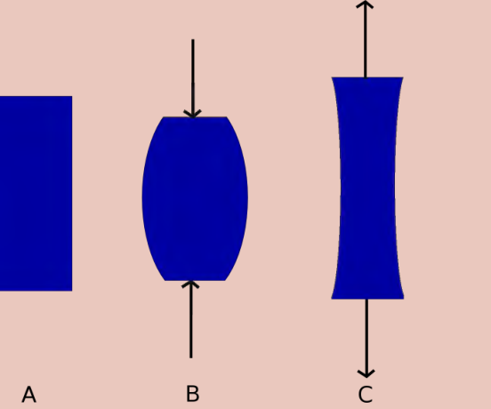
> **[Diagram Context - Textbook_NaturalScience_Gr9_Forces.pdf-0051-03.png]**
> 1. A diagram of a blue sphere with a black arrow pointing to the right.

---

### Exercise: Weight and Magnetic Fields

#### 1. Weight on Different Planets
**b) Graphing Task**
Plot an appropriate graph of the astronaut's weight on different planets of the solar system. Ensure your graph includes:
*   A suitable heading.
*   Correct labels for the axes.
[8 marks]

**c) Analysis**
On which planet is Kevin's weight the smallest? What does this tell you about the size of this planet in relation to the other planets?
[2 marks]

---

#### 2. Magnetic Fields
**12. Drawing Task**
Draw a diagram to illustrate the magnetic field around a bar magnet.
[3 marks]

---
*Energy and Change | Page 56*

---

### 13. Magnetic Field Investigation

**Experiment:** Two bar magnets are placed under a sheet of paper, and iron filings are sprinkled on top to visualize the magnetic field lines.

*   **Photo A:** Shows the magnetic field pattern between two **like poles** (e.g., North-North or South-South). The field lines push away from each other, indicating a force of **repulsion**.
*   **Photo B:** Shows the magnetic field pattern between two **opposite poles** (North-South). The field lines connect the two magnets, indicating a force of **attraction**.

---

### 14. Determining Overall Electric Charge

To determine the overall charge of an object, use the following calculation:
$$\text{Overall Charge} = (\text{Number of positive charges}) - (\text{Number of negative charges})$$

*   If the result is $> 0$, the object is **positively charged**.
*   If the result is $< 0$, the object is **negatively charged**.
*   If the result is $= 0$, the object is **neutral**.

| Object | Overall Charge | Why is it positive, negative or neutral? |
| :--- | :--- | :--- |
| Blue Circle | $3 - 5 = -2$ | Negatively charged because there are more negative charges than positive charges. |
| Yellow Square | $3 - 6 = -3$ | Negatively charged because there are more negative charges than positive charges. |

> **[Diagram Context - Textbook_NaturalScience_Gr9_Forces.pdf-0053-02.png]**
> 1. A diagram of a cell with arrows pointing to different parts of the cell.

---

### Electrostatics: Charge and Interaction

#### Activity: Identifying Charges
Analyze the object provided in the table below to determine its overall charge and the reason for that charge.

| Object | Overall charge | Why is it positive, negative or neutral? |
| :--- | :--- | :--- |
| 

 | | |

---

#### Exercise 15: Balloon and Jersey Interaction
A balloon is rubbed against a jersey, causing the balloon to pick up a negative charge.

**a)** Explain where this negative charge comes from. Make reference to both protons and electrons in your answer. [3 marks]

**b)** Name the type of force that the balloon and jersey will experience DURING rubbing. [1 mark]

**c)** Name the type of force that the balloon and jersey will experience AFTER rubbing. [1 mark]

**d)** Will the force referred to in (c) be attractive or repulsive? [1 mark]

---

#### Exercise 16: Static Electricity Demonstration

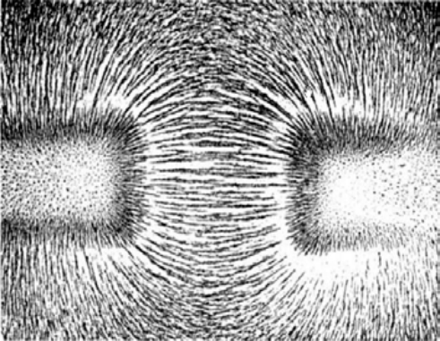
> **[Diagram Context - Textbook_NaturalScience_Gr9_Forces.pdf-0054-02.png]**
> 1. A black and white diagram of a cell with two holes in the center.

What do you think these two girls are touching on the left of the photo? Explain your answer and what is happening to them. [3 marks]

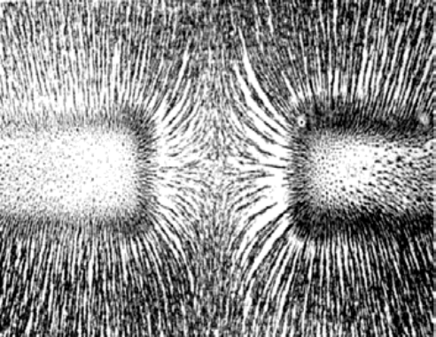
> **[Diagram Context - Textbook_NaturalScience_Gr9_Forces.pdf-0054-04.png]**
> 1. A black and white illustration of a Lewis structure.

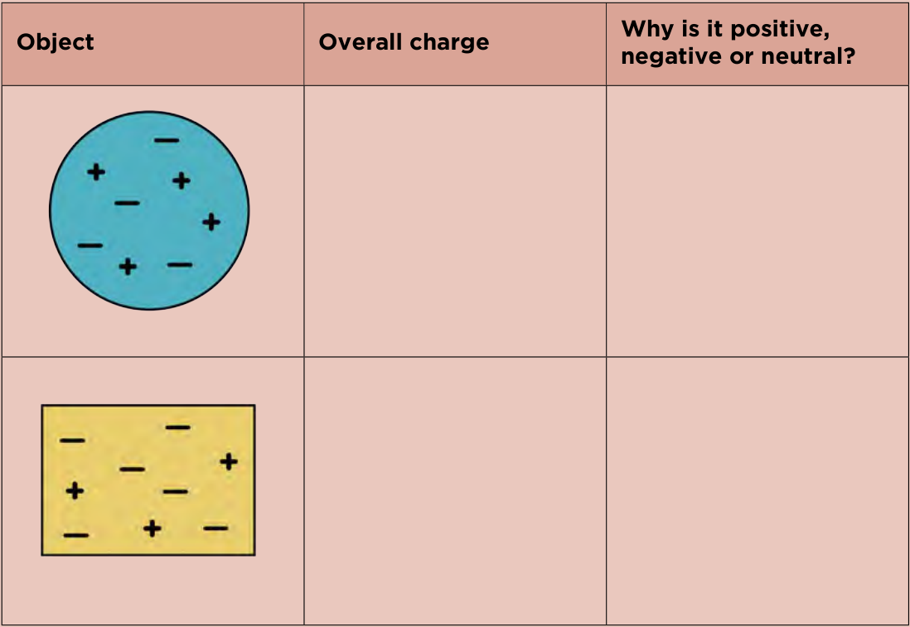
> **[Diagram Context - Textbook_NaturalScience_Gr9_Forces.pdf-0054-07.png]**
> The image shows a pink background with a table and a diagram. The table has three columns labeled "Object", "Overall Charge", and "Why is it positive, neutral or negative?". The diagram is a blue circle with a yellow line through it, and it has a few arrows pointing to different parts of the diagram. The diagram is labeled with the words "Lewis diagram", "anatomical

---

### Chapter 1: Forces - Assessment Exercises

#### Question 17
Write a short paragraph to explain how lightning forms. [4 marks]

---

#### Question 18
What is wrong with the following scene? Explain your answer. [2 marks]

---

**Total [94 marks]**

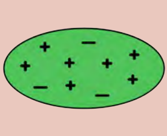
> **[Diagram Context - Textbook_NaturalScience_Gr9_Forces.pdf-0055-02.png]**
> 1. A cartoon illustration of a green oval with black lines and arrows pointing outwards.

> **[Diagram Context - Textbook_NaturalScience_Gr9_Forces.pdf-0055-09.png]**
> 1. A girl with red hair standing next to another girl with red hair.

---

# Unit 13: Forces

## Unit Overview
*   **Duration:** 2 weeks
*   **Context:** This unit builds upon Grade 8 concepts, including static electricity (friction and electrostatic force) and energy transfer in electrical systems (magnetic attraction and repulsion).
*   **Core Concepts:** Learners will explore the two main categories of forces: **contact forces** and **non-contact forces**, as well as the concept of **force fields**.
*   **Pedagogical Approach:** This unit emphasizes physical engagement. Learners should perform practical tasks such as pushing and pulling objects, pushing against buildings to experience resistance, and walking on different surfaces to experience friction.

---

## 13.1 Types of Forces (1.5 Hours)

This section focuses on identifying and classifying different types of forces through practical activities.

| Tasks | Skills | Recommendation |
| :--- | :--- | :--- |
| Activity: What can forces do? | Group work, following instructions, doing and observing | CAPS suggested |
| Activity: Is it a push or a pull? | Accessing and recalling, identifying, sorting and classifying, describing, explaining | CAPS suggested |
| Activity: Pairs of forces | Group work, interpreting (scenarios and images), describing, explaining | CAPS suggested |
| Activity: Can forces act over a distance? | Demonstrating, observing, describing, explaining | Optional |
| Activity: Tug of war | N/A | Optional extension (PhET simulations) |

---

## 13.2 Contact Forces (1 Hour)

This section investigates the interaction between surfaces and the nature of contact forces.

| Tasks | Skills | Recommendation |
| :--- | :--- | :--- |
| Investigation: What is the relationship between the normal force and friction? | Carrying out investigation, observing, recording, analysing, interpreting, drawing conclusion | CAPS suggested (extension) |
| Activity: Friction | N/A | Optional extension (PhET simulations) |

---

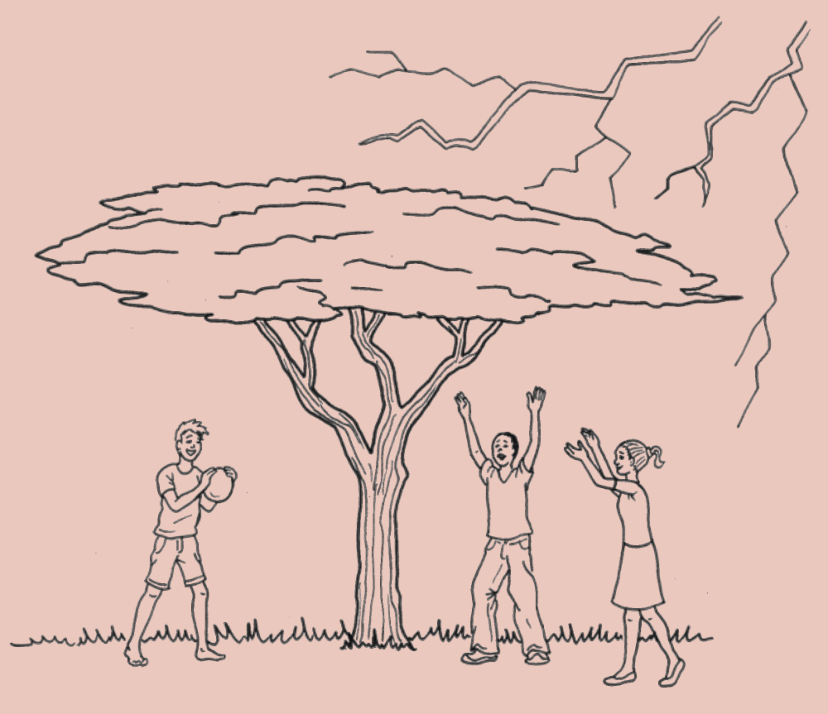
> **[Diagram Context - Textbook_NaturalScience_Gr9_Forces.pdf-0056-03.png]**
> The image is a black and white line drawing depicting three people standing under a large tree. The tree is depicted as a large acacia tree, and the people are positioned in front of it. One person is holding a ball, while the other two are looking up at the tree. The drawing is simple and straightforward, focusing on the people and the tree rather than any additional details or complex elements

> **[Diagram Context - Textbook_NaturalScience_Gr9_Forces.pdf-0056-05.png]**
> The image shows a close-up view of a diagram of a cell, with a red ant positioned on the right side of the cell. The cell is depicted in shades of brown, and the background is a light gray color. The diagram is labeled with the text "Lewis diagram" and "cellular structure", indicating that it is a visual representation of a Lewis diagram or a cellular structure.

---

# 13.3 Field (Non-contact) Forces

## Overview of Tasks and Skills
This section covers 3.5 hours of instructional time focusing on non-contact forces.

| Tasks | Skills | Recommendation |
| :--- | :--- | :--- |
| Investigation: Dropping objects | Group work, predicting, hypothesising, carrying out investigation, observing, recording, comparing, interpreting, drawing conclusion | CAPS suggested |
| Investigation: Relationship between mass and weight | Hypothesising, measuring, recording, drawing graph, interpreting, calculating, drawing conclusion | CAPS suggested |
| Activity: Weight and mass calculations | Calculating | CAPS suggested |
| Activity: How much would you weigh on other planets? | Measuring, calculating, interpreting information | - |
| Activity: Magnetic or non-magnetic materials | Hypothesising, observing, recording, drawing conclusion | CAPS suggested |
| Activity: Can a magnetic force act through substances? | Carrying out activity, observing, recording, describing, explaining | CAPS suggested |
| Activity: Visualising magnetic fields | Carrying out activity, observing, recording, drawing representations, communicating (graphically), describing, explaining | CAPS suggested |
| Activity: Charging objects | Group work, following instructions, observing, describing, explaining | CAPS suggested |
| Activity: Turning the wheel | Observing, describing | CAPS suggested |
| Activity: Van de Graaff generator | Observing, describing | Optional extension |

---

## Key Questions
*   What is a force?
*   What effect can a force have on an object?
*   Do forces have to be between objects which are touching?

---

## 13.1 Types of Forces
Forces are categorized by how they interact with objects. Non-contact forces (field forces) act over a distance without physical contact between the objects.

### Activity: What can forces do?
Forces can change the state of motion of an object in the following ways:
1.  **Initiating motion:** A force can cause a stationary object (like a ball) to move.
2.  **Changing direction:** A force (like a push) can change the direction of an object already in motion.
3.  **Changing speed:** A force can cause an object to slow down or stop completely.

<!-- DIAGRAM_PLACEHOLDER: diagram -->

---

### Effects of Forces

Forces can have various effects on objects, including changing their speed, direction, or shape.

#### Key Concepts
*   **Motion:** Forces can cause an object to start moving, stop moving, speed up, slow down, or change direction.
*   **Deformation:** Forces can change the shape of an object. Some objects remain permanently deformed (like putty), while others return to their original shape (like a balloon).

---

### ACTIVITY: Is it a push or a pull?

The table below illustrates how different actions involve either a push or a pull and the resulting effect on the object.

| Action | Push or Pull | Effect |
| :--- | :--- | :--- |
| <!-- DIAGRAM_PLACEHOLDER: diagram --> Kicking a ball. | Push | Kicking the ball causes the direction and speed of the ball to change. |
| <!-- DIAGRAM_PLACEHOLDER: diagram --> Moulding clay. | Push | The push exerted on the clay changes the shape of the clay. |
| <!-- DIAGRAM_PLACEHOLDER: diagram --> Playing with a toy wagon. | Pull | Pulling changes the motion of the wagon. |
| <!-- DIAGRAM_PLACEHOLDER: diagram --> A rocket blasting off into space. | Push | Pushing force changes the motion of the rocket (accelerates it). |
| <!-- DIAGRAM_PLACEHOLDER: diagram --> Exercising on a bar. | Pull | Pulling upwards changes the motion of the boy's body. |

---

### Important Note for Future Learning
Identifying the object experiencing the force and the agent causing the force is a foundational skill. This conceptual understanding is essential when applying **Newton's Laws of Motion** in higher grades.

---

### Understanding Forces and Interactions

#### 1. Identifying Forces and Agents
In any interaction, there is an object experiencing a force and an agent applying that force.
*   **Example 1:** A soccer ball being kicked. The ball is experiencing the force, and the girl's foot is the agent.
*   **Example 2:** Shaping clay. The clay is experiencing the force, and the hands are the agent.

---

#### 2. Activity: Pairs of Forces
This activity explores how forces interact when objects push or pull against each other.

**Key Observations:**
*   **Pushing against a wall:** When you push a wall, you feel the wall pushing back on your hands with equal magnitude and opposite direction.
*   **Balanced Forces:** When two learners push or pull a middle learner with equal force, the middle learner remains stationary.
*   **Unbalanced Forces:** When one learner pushes or pulls harder than the other, the middle learner moves in the direction of the stronger force.
*   **Directionality:** If two forces act in the same direction, the object moves in that direction.

**Practical Application:** A tug-of-war is an effective way to demonstrate how forces affect bodies. If one side pulls harder than the other, the rope moves toward the side with the greater force.

---

#### 3. Representing Forces
Teachers may use PhET simulations (if internet access is available) to visually represent how forces are applied and how they result in motion.

---

#### 4. Activity: Can Forces Act Over a Distance?
This activity demonstrates that forces do not always require physical contact to act on an object.

**Observations:**
*   **Magnets:** Bar magnets can move towards each other (attraction) or push each other away (repulsion) without touching.
*   **Paper Clips:** Paper clips are attracted to a bar magnet from a distance.

**Summary Questions:**
1.  **Do magnets always need to touch to exert a force?** No.
2.  **Can a magnet exert a force on an object from a distance?** Yes.
3.  **Conclusion:** A magnet exerts a force on another magnet or on magnetic materials (like paper clips) even when there is no physical contact.

<!-- DIAGRAM_PLACEHOLDER: diagram -->

---

# 13.2 Contact Forces: Friction

## Investigation: The Relationship Between Normal Force and Friction
**Objective:** To determine how the normal force exerted by a surface relates to the frictional force acting on an object.

### Key Concepts
*   **Normal Force ($F_N$):** The reaction force of a surface acting on an object, perpendicular to the surface.
*   **Weight ($W$):** The gravitational force acting on an object, calculated as $W = m \times g$.
    *   Standard gravitational acceleration: $g = 9,8 \text{ m/s}^2$.
*   **Static Friction:** The maximum frictional force that must be overcome to start an object moving.
*   **Kinetic Friction:** The frictional force acting on an object while it is in motion. Note that kinetic friction is generally less than static friction.

### Methodology
1.  Use a spring balance to measure the force required to move a block across a surface.
2.  Measure the force exactly as the block **starts moving** to capture the maximum static friction.
3.  Vary the mass of the blocks to observe changes in the normal force and the resulting frictional force.

<!-- DIAGRAM_PLACEHOLDER: diagram -->

### Analysis of Results
*   **Free-Body Diagram:** When an object is on a flat surface and about to move, the weight ($W$) and normal force ($F_N$) are equal in magnitude. The pulling force is equal to the static frictional force.
*   **Relationship:** As the mass ($m$) of the object increases, the weight ($W = m \times g$) increases. Consequently, the normal force ($F_N$) increases.
*   **Graphical Trend:** Plotting the frictional force against the normal force should yield a straight line passing through the origin, indicating a direct relationship.
*   **Surface Dependency:** The nature of the surface (smooth vs. rough) significantly affects the magnitude of the frictional force.

### Conclusion
1.  **Direct Proportion:** The frictional force increases as the normal force of the object increases.
2.  **Motion Dynamics:** Once the block is in motion at a constant speed, the measured friction decreases compared to the initial static friction required to start the movement.

---

### 13.3 Field (Non-contact) Forces

Field forces are forces that act over a distance without physical contact between objects.

#### Gravitational Force
Gravity is defined as the gravitational force of attraction between two objects with mass. 
*   **Planetary Gravity:** When referring to "gravity" in a general sense, we are usually discussing the gravitational attraction between a celestial body (like the Earth) and other objects.
*   **Newton's Third Law Application:** The force exerted by the Earth on an object is equal in magnitude to the force exerted by the object on the Earth, but they act in opposite directions. Because the Earth has a significantly larger mass, its acceleration is negligible, which is why the Earth does not move noticeably when objects fall toward it.

#### Key Relationships
Using simulations (such as PhET), we can observe the following qualitative relationships regarding gravitational force:
1.  **Mass:** The gravitational force between two objects **increases** as the mass of the objects increases.
2.  **Distance:** The gravitational force between two objects **decreases** as the distance between the objects increases.

---

### Investigation: Dropping Objects

#### Concept: Falling Objects
A common misconception among learners is that heavier objects fall faster than lighter objects. This investigation is designed to challenge this preconception.

**Experimental Procedure:**
1.  Work in pairs.
2.  Drop a whole apple and half an apple from the same height at the same time.
3.  Experiment with balls of different masses (but the same size).
4.  Experiment with balls of the same mass (but different volumes).

**Teacher's Note:**
*   When air resistance is negligible, objects of different masses will hit the ground at the same time.
*   Do not lead learners to the correct answer immediately; allow them to discover the results through the experimental process.

<!-- DIAGRAM_PLACEHOLDER: diagram -->

---

### Extension Activity: Friction
*   **Static Friction:** The force that resists the initiation of sliding motion between two surfaces that are in contact and at rest.
*   **Moving (Kinetic) Friction:** Once an object begins to move, the friction force typically decreases.
*   **Activity:** Use play dough to form balls and compress them in your hands to explore physical properties and forces.

---

### Investigation: Falling Objects

#### Experimental Procedure
*   **Method:** Drop objects simultaneously from the same height.
*   **Observation:** Listen for the number of sounds upon impact. If two sounds are heard, the objects did not hit the floor at the same time.
*   **Repetition:** Repeat the investigation multiple times to ensure accuracy and overcome preconceptions.
*   **Safety Tip:** If using apples, cut them in half ahead of time.

#### Demonstration: Air Resistance
*   **Experiment:** Drop a hammer and a feather simultaneously.
*   **Observation:** The hammer lands first.
*   **Explanation:** Air resistance acts on the feather, slowing its fall. In a vacuum (where there is no air resistance), both objects would fall at the same rate and hit the floor at the same time.

---

#### Results and Observations
1.  **Height:** The height from which objects are dropped.
2.  **Object Properties:** The mass and volume of the objects being dropped.

#### Evaluation
Learners should reflect on the experiment. Common challenges include:
*   Difficulty in releasing objects at the exact same time.
*   The need for a greater drop height to observe results more clearly.
*   The interference of air resistance.

#### Conclusion
*   Objects of different masses or volumes fall at the same rate if air resistance is ignored.
*   All objects accelerate at the same rate due to gravity.

---

#### Advanced Concepts: Physics Principles

**1. Newton's Second Law of Motion**
The net force ($F$) exerted on an object is defined by the equation:
$$F = m \cdot a$$
Where:
*   $F$ = Net force (Newtons)
*   $m$ = Mass of the object (kg)
*   $a$ = Acceleration produced by the net force ($m/s^2$)

**2. Universal Law of Gravitation**
The Earth's gravitational force pulls on an object with a force proportional to the mass of the object and the mass of the Earth. Because the mass of the Earth is constant, the acceleration of a falling object is independent of its own mass.

**3. Real-world Factors (Air Resistance)**
In a real-world environment, the net force acting on a falling object is:
$$F_{net} = F_{gravity} - F_{air\_resistance}$$
Because the feather is much lighter than the hammer, the force of air resistance has a significantly larger impact on the feather's acceleration compared to the hammer.

---

#### Questions and Answers

1.  **Did the objects land at the same time?** They should have landed at the same (or very close to the same) time.
2.  **What happens in an ideal situation?** In an ideal situation (a vacuum), all objects dropped from the same height will land at the same time.
3.  **Why do objects fall?** The Earth's gravitational force causes each object to accelerate at the same rate every second, regardless of its mass or volume.

<!-- DIAGRAM_PLACEHOLDER: diagram -->

---

### Air Resistance and Gravity

When an object falls, the net force acting on it determines its acceleration. If air resistance is present, the net force is reduced, causing the object to experience a smaller acceleration towards the ground and fall more slowly.

#### Advanced Teacher's Note: Air Resistance
Air resistance is a drag force that acts to slow an object down. The magnitude of this force depends on:
1. The velocity of the falling object squared ($v^2$).
2. The surface area of the falling object.
3. The density of the fluid (in this case, air) through which it is falling.

*   **Light objects:** Objects like feathers or thin sheets of paper are significantly slowed by air resistance because their gravitational force is very small compared to the drag force.
*   **Large objects:** Large surface areas (like an open parachute) experience greater air resistance, which significantly reduces the falling speed.

---

### Mass vs. Weight

It is essential to distinguish between mass and weight in scientific contexts:

*   **Mass:** A measure of the amount of matter in an object. It remains constant regardless of your position in space. It is measured in kilograms ($kg$).
*   **Weight:** A force experienced by an object due to gravity. On Earth, it is the force of attraction towards the centre of the Earth. Because it is a force, it is measured in Newtons ($N$).

**Common Misconception:** Saying "My weight increased by 2 kg" is scientifically incorrect. Kilograms measure mass. If you gain matter, your *mass* has increased by 2 kg.

**Gravitational Influence:** The gravitational force depends on the size of the planet. The Earth is much larger than the Moon; therefore, the gravitational force (weight) exerted on an object on Earth will be greater than the force exerted on the same object on the Moon.

---

### Investigation: The Relationship Between Mass and Weight

**Hypothesis:** (Learner-dependent answer)

**Materials and Apparatus:**
*   Mass meter (e.g., kitchen scales or electronic scales).
*   Various mass pieces.

<!-- DIAGRAM_PLACEHOLDER: diagram -->

**Results:**
The following table demonstrates the relationship between mass and weight:

| Mass (kg) | Weight (N) |
| :--- | :--- |
| 0.5 | 4.8 |
| 1 | 9.8 |
| 1.5 | 14.7 |
| 2 | 19.6 |

**Analysis:**
1.  **Independent Variable:** Mass (plotted on the x-axis).
2.  **Dependent Variable:** Weight (plotted on the y-axis).
3.  **Gradient:** The gradient of the graph of weight versus mass is approximately $9.8$. This represents the gravitational field strength of the Earth ($g \approx 9.8 \, m/s^2$).

---

### Calculating the Gradient of a Straight Line

To determine the gradient of a straight line from a graph, follow these steps:
1. Choose two coordinates on the line: $(x_1; y_1)$ and $(x_2; y_2)$.
2. Use the gradient formula:
   $$\text{gradient} = \frac{\text{rise}}{\text{run}} = \frac{y_2 - y_1}{x_2 - x_1}$$

**Worked Example:**
Using coordinates $(0,5; 4,8)$ and $(1; 9,8)$:
$$\text{gradient} = \frac{9,8 - 4,8}{1 - 0,5} = 9,8$$

*Note: The gradient of this graph represents the gravitational acceleration on Earth. If your results are not exactly 9,8, ensure your graph is plotted correctly and your spring balances are calibrated.*

---

### Conclusion
The weight of an object is directly proportional to the object's mass.

---

### ACTIVITY: Weight and Mass Calculations
1. $\text{Weight} = 1485 \times 9,8 = 14553\text{ N}$
2. $50\text{ kg}$ is the mass of an object and is independent of position.
3. $\text{Weight on Moon} = 78 \times 1,6 = 124,8\text{ N}$ (Sam is incorrect).
4. $\text{Mass} = 220\text{ g} = 0,22\text{ kg}$
   * $\text{Weight on Earth} = 0,22 \times 9,8 = 2,156\text{ N}$
   * $\text{Weight on Moon} = 0,22 \times 1,6 = 0,352\text{ N}$
5. $\text{Mass} = \frac{1340}{1,6} = 837,5\text{ kg}$

---

### ACTIVITY: How much would you weigh on other planets?
Mass remains constant regardless of location, but weight varies based on the gravitational field strength ($g$) of the planet.

**Example calculations for a $50\text{ kg}$ learner:**

| Planet | Your mass (kg) | Value of $g$ ($\text{m/s}^2$) | Your weight (N) |
| :--- | :--- | :--- | :--- |
| Earth | 50 | 9,8 | 490 |
| Mercury | 50 | 3,6 | 180 |
| Venus | 50 | 8,8 | 440 |
| Mars | 50 | 3,8 | 190 |
| Jupiter | 50 | 26 | 1300 |

<!-- DIAGRAM_PLACEHOLDER: diagram -->

---

### Planetary Data Table

| Planet | Mass (Relative) | Gravity ($m/s^2$) | Weight (N) |
| :--- | :--- | :--- | :--- |
| Saturn | 50 | 11,2 | 560 |
| Uranus | 50 | 10,5 | 525 |
| Neptune | 50 | 13,3 | 665 |

---

### Questions
1. You would feel heavier on Jupiter and Neptune.
2. You would feel lighter on Mercury, Venus, Mars, Saturn, and Uranus.

---

### A Note on Weightlessness

**Definition:** Weightlessness refers to the sensation of weight, or the lack thereof, rather than a change in actual weight. It is a feeling experienced when there are no external contact forces (pushes or pulls from objects touching you) acting upon a person.

**Key Concepts:**
*   **Weight:** The force of gravitational attraction experienced by an object.
*   **Free-fall:** A state where an object experiences weightlessness because it is falling at the same rate as its surroundings. Even in free-fall, the object still experiences gravitational attraction.
*   **Astronauts in Orbit:** A common misconception is that there is no gravity in space. In reality, in low Earth orbit, gravity is still at approximately $90\%$ of its surface strength. Astronauts float because they and their spacecraft are in a state of constant free-fall, moving at an orbital velocity that prevents them from hitting the Earth.

---

### Magnetic Forces

#### INVESTIGATION: Magnetic or non-magnetic materials

**Hypothesis**
Learner-dependent. Example: "Only some materials are magnetic."

**Method**
Observe which materials are attracted to a magnet. Note that non-metals are not attracted, and some metals (like copper) are also not attracted.

**Results**

| Material | Magnetic (YES/NO) |
| :--- | :--- |
| Paper | NO |
| Wood | NO |
| Plastic | NO |
| Iron | YES |
| Aluminium | NO |
| Steel | YES |

<!-- DIAGRAM_PLACEHOLDER: diagram -->

---

### Material Properties and Magnetism

| Material | Magnetic |
| :--- | :--- |
| Copper | NO |

**Conclusion:** Not all materials are magnetic. Only some metals, such as iron, are magnetic.

---

### ACTIVITY: Can a magnetic force act through substances? (LB page 212)

Magnetic forces are **non-contact forces** and can act over a distance. However, normal magnets do not have infinitely strong magnetic fields. The further an object is from the magnet, the weaker the force experienced.

If an object is placed between a magnet and a metal, and the metal is too thick, the metal may be too far away from the magnet to experience a strong enough force. This lack of attraction is due to the strength of the magnetic field decreasing with distance, rather than the material "blocking" the force.

#### Instructions
1. Two like poles repel each other (a "pushing" force).
2. Two like poles repel each other (a "pushing" force).
3. Two opposite poles attract each other (a "pulling" force).
4. Magnets can act through most substances, provided they are thin enough.
5. The distance between the magnet and the object (e.g., paper clips) is the primary factor affecting attraction. A thick piece of wood may keep the paper clips far enough away from the magnet to make the attraction too weak to pick them up.

#### Questions
1. **Which material prevented the magnet from picking up the paper clips?** The thick piece of wood.
2. **How does magnetic force behave over distance?** It acts over a distance; it is strongest closer to the magnet and becomes weaker as the distance increases.

---

### ACTIVITY: Visualising magnetic fields (LB page 213)

Iron filings can be used to map the magnetic field around a magnet.

*   **Note:** The iron filings show a two-dimensional view of the field, but the magnetic field actually exists all around the magnet in three dimensions.

<!-- DIAGRAM_PLACEHOLDER: diagram -->

#### Instructions
Observe the pattern formed by the iron filings around a bar magnet.

---

### Magnetic Field Patterns

Magnetic field lines represent the direction and strength of a magnetic field. The patterns formed by iron filings around magnets demonstrate how magnetic poles interact.

#### 1. Attraction between Opposite Poles
When a North pole ($N$) and a South pole ($S$) are placed near each other, the magnetic field lines connect the two poles, pulling them together.
<!-- DIAGRAM_PLACEHOLDER: diagram -->
*The pattern between two opposite poles attracting.*

#### 2. Repulsion between Like Poles
When two like poles (either two North poles or two South poles) are placed near each other, the magnetic field lines push away from each other, creating a region where the field strength is very low.
<!-- DIAGRAM_PLACEHOLDER: diagram -->
*The pattern between two like poles repelling.*

---

### Electrostatic Forces

Electrostatic forces are forces of attraction or repulsion between stationary electric charges. 

**Note to Learners:**
Even though experiments regarding electrostatic forces were covered in Grade 8, it is essential to revisit them. Practical engagement with these experiments is necessary to build a foundational understanding of how advanced apparatus, such as the **electroscope** and **Van de Graaff generators**, function.

<!-- DIAGRAM_PLACEHOLDER: diagram -->

---

### ACTIVITY: Charging Objects

This activity explores static electricity. You may use balloons, plastic combs, or pieces of paper. Note that results may vary depending on hair type and environmental conditions.

#### Instructions & Observations
1. **Initial State:** Nothing happens.
2. **Interaction:** Hair should "rise" and stick to the balloon.
3. **Neutral State:** Nothing happens.
4. **Interaction:** Pieces of paper stick to the glass rod.
5. **Interaction:** A stream of water bends towards the glass rod.

#### Key Concepts: Atomic Charges
*   **Protons:** Carry a positive charge ($+$).
*   **Electrons:** Carry a negative charge ($-$). They are positioned in the space around the nucleus.
*   **Neutrons:** Carry no charge; they are neutral.

#### Questions & Explanations
1. **How is the object charged?** By rubbing it vigorously (e.g., with a balloon).
2. **Transfer of Charge:** Friction causes electrons to transfer from the glass rod to the knitted fabric. The glass rod loses electrons and becomes **positively charged**, while the wool gains electrons and becomes **negatively charged**.
3. **Attraction:** Water contains both positive and negative charges. When a positively charged rod is brought near, the negative charges in the water are attracted to the rod, causing the stream to bend.

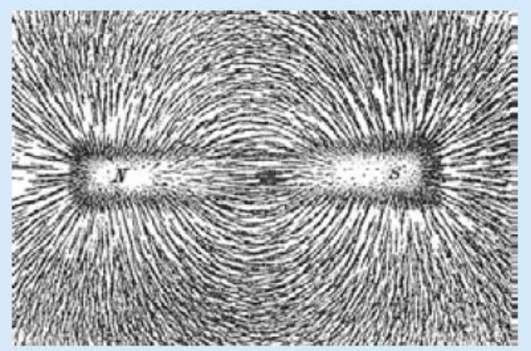
> **[Diagram Context - Textbook_NaturalScience_Gr9_Forces.pdf-0068-00.png]**
> 1. A black and white illustration of a Lewis structure of an atom.

---

### ACTIVITY: Turning the Wheel

This demonstration illustrates the fundamental laws of electrostatics:
*   **Like charges repel** each other.
*   **Unlike charges attract** each other.

#### Demonstration Notes
*   **Environmental Factors:** This activity works best on a dry day. Humidity can cause charges to dissipate (earth) quickly.
*   **Repulsion:** When two rods with like charges are brought near each other, the second rod will "push" the first rod, causing it to move in a circle.
*   **Attraction:** When rods have opposite charges, the second rod will "pull" the first rod around in a circle.
*   **Maintenance:** You may need to rub the perspex rod again between attempts, as the static charge dissipates over time.

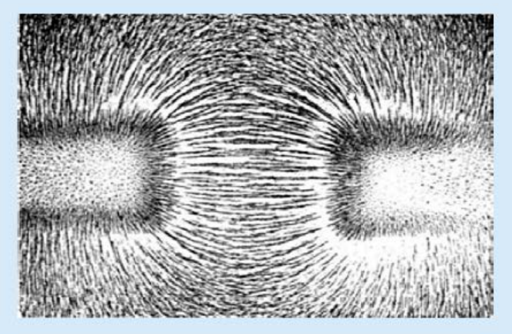
> **[Diagram Context - Textbook_NaturalScience_Gr9_Forces.pdf-0068-02.png]**
> 1. A black and white image of a black and white diagram of a circuit.

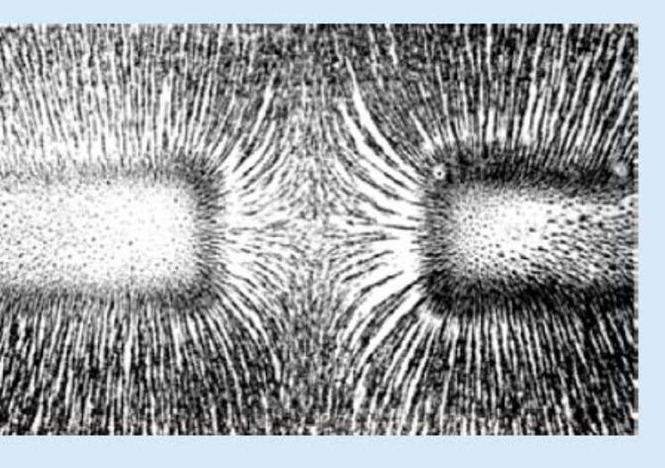
> **[Diagram Context - Textbook_NaturalScience_Gr9_Forces.pdf-0068-04.png]**
> 1. A black and white illustration of a double-headed, black and white diagram of a double-headed atom.

---

### Electrostatics: Interaction of Charged Objects

When different materials are rubbed together, electrons are transferred, resulting in static charges.

*   **Perspex Rods:** When rubbed with a cloth, electrons are transferred from the perspex to the cloth. This leaves the perspex rod with a **positive charge**.
*   **Plastic Rods:** When rubbed with a cloth, electrons are transferred from the cloth to the plastic rod. This leaves the plastic rod with a **negative charge**.

#### Observed Interactions
| Scenario | Interaction | Result |
| :--- | :--- | :--- |
| Two Perspex rods | Like charges repel | The first rod moves away from the second; the watch glass turns. |
| Perspex and Plastic rods | Opposite charges attract | The first rod moves towards the plastic rod; the watch glass turns towards the plastic rod. |
| Rod and Paper | Charged object and neutral object | The pieces of paper are attracted to the rod. |

---

### Extension Activity: Van de Graaff Generator
The Van de Graaff generator is a tool used to demonstrate static electricity and the formation of sparks. It serves as a practical model to explain the physics behind natural phenomena such as lightning.

---

### Revision Summary: Forces and Motion

#### 1. Key Terminology
*   **Force:** A push or a pull acting on an object.
*   **Field:** A region in space where an object experiences a force (e.g., gravitational or electrostatic field).
*   **Free-fall:** Motion under the influence of gravity only.
*   **Poles:** Regions of a magnet where the magnetic force is strongest.
*   **Charge:** A property of matter that causes it to experience a force when placed in an electromagnetic field.

#### 2. True or False Concepts
*   **Motion:** A force can cause a motionless object to move.
*   **Friction:** Friction is a force that opposes motion; it slows down or stops an object by the interaction of surfaces rubbing against each other.
*   **Lightning:** Lightning is a large-scale application of electrostatic force.

#### 3. Force Diagrams and Calculations
When representing forces in a diagram:
*   **Push vs. Pull:** A push acts away from the object, while a pull acts towards the source of the force.
*   **Vector Representation:** 
    *   Use a dot to represent the object.
    *   Use arrows to represent the direction of the force.
    *   The length of the arrow represents the **magnitude** of the force.

**Example Calculation:**
If a force of $50\text{ N}$ is applied to the right, the arrow must be drawn pointing to the right with a length proportional to the value of $50\text{ N}$.

---

### 6. Effects of Forces
Forces can cause the following changes to an object:
*   Change in motion (moving faster or slower).
*   Change in direction.
*   Change in shape.

### 7. Types of Forces
<!-- DIAGRAM_PLACEHOLDER: diagram -->
*   **Compression forces:** Forces applied to squeeze or compress an object (Image B).
*   **Tension forces:** Forces applied to stretch an object (Image C).

### 8. Mass vs. Weight
| Feature | Mass | Weight |
| :--- | :--- | :--- |
| **Definition** | The amount of matter an object is made of; it remains constant regardless of location. | The gravitational force exerted on an object by a planet or moon; it varies based on gravitational strength. |
| **Units** | kilograms (kg) | newtons (N) |

### 9. Calculating Weight
The formula to calculate weight is:
$$W = m \times g$$

Where:
*   $W$ = weight of the object in Newtons (N)
*   $m$ = mass of the object in kilograms (kg)
*   $g$ = gravitational acceleration in meters per second squared ($\text{m/s}^2$)

### 10. Factors Affecting Gravitational Force
*   **Distance:** The closer two objects are, the stronger the gravitational force between them.
*   **Mass:** The greater the mass of the objects, the stronger the gravitational force between them.

### 11. Worked Example: Weight Calculation
**a) Calculation:**
Given a mass of $80\text{ kg}$ and gravitational acceleration of $9,8\text{ m/s}^2$:
$$W = m \times g$$
$$W = 80 \times 9,8$$
$$W = 784\text{ N}$$

**b) Graphing Requirements:**
When drawing a bar graph, ensure the following criteria are met:
*   Gaps between bars.
*   Clear heading.
*   Labeled x-axis.
*   Labeled y-axis with units.
*   Appropriate vertical scale.
*   Accurate plotting.

**c) Planetary Weight:**
An object's weight is smallest on Mercury because Mercury has the smallest mass of the planets.

### 13. Magnetic Fields
<!-- DIAGRAM_PLACEHOLDER: diagram -->
*   **Attraction:** Magnetic fields between two opposite poles (North and South) pull towards each other.
*   **Repulsion:** Magnetic fields between two like poles (North and North, or South and South) push away from each other.

---

### 14. Calculating and Explaining Electric Charge

To determine the overall charge of an object, we sum the number of positive charges ($+$) and negative charges ($-$). 
*   **Neutral:** Equal number of positive and negative charges (Sum = $0$).
*   **Negative:** More negative charges than positive charges (Sum $< 0$).
*   **Positive:** More positive charges than negative charges (Sum $> 0$).

| Object | Overall Charge Calculation | Explanation |
| :--- | :--- | :--- |
| <!-- DIAGRAM_PLACEHOLDER: diagram --> | $4 + (-4) = 0$ | Neutral: Equal numbers of positive and negative charges. |
| <!-- DIAGRAM_PLACEHOLDER: diagram --> | $3 + (-6) = -3$ | Negatively charged: There are $3$ more negative than positive charges. |
| <!-- DIAGRAM_PLACEHOLDER: diagram --> | $7 + (-3) = 4$ | Positively charged: There are $4$ more positive charges than negative charges. |

---

### 15. Static Electricity Concepts
*   **a)** Electrons are transferred from the jersey to the balloon. Protons are not transferred. Because electrons are negatively charged, the balloon acquires a negative charge.
*   **b)** The process of transferring charge through rubbing is called **friction**.
*   **c)** The force acting between the charged objects is the **electrostatic force**.
*   **d)** The nature of the force between the oppositely charged jersey and balloon is **attractive**.

---

### 16. Van de Graaff Generator
When girls touch the hollow dome of a Van de Graaff generator:
1.  The dome is positively charged.
2.  Electrons are transferred from the girls' bodies to the dome to discharge it.
3.  This causes the girls' bodies and hair to become positively charged.
4.  Because like charges repel, the individual hair strands push away from each other, causing the hair to stand up (rise).

---

### 17. Lightning Formation
*   **Cause:** Friction between water and air particles in clouds causes a build-up of negative charge.
*   **Discharge:** When there is a large excess of charge, it moves through the air to the ground.
*   **Energy Release:** The discharge creates a bright spark, releasing energy in the form of heat, light, and sound. This phenomenon is known as **lightning**.

---

### 18. Lightning Safety
Playing outside during a lightning storm is dangerous. Specifically, standing underneath a tree is extremely hazardous because lightning tends to strike tall objects. Being near a tree puts a person at high risk of being shocked by the discharge.