# Chapter 5: Birth, Life and Death of a Star

## Key Questions
* Where are stars born?
* Can we talk about a star as 'living'?
* How long do stars like the Sun live?
* How do stars spend most of their life?
* Why are stars different colours?
* How do stars die?

---

## Introduction to Stellar Evolution
Stars are not permanent; they are born, they change (evolve) as they age, and eventually, they die. 

**Stellar evolution** is the term scientists use to describe the birth, life, and death of stars. Because the lifetime of a single star is far too long for humans to observe from start to finish, astronomers study many different stars at various stages of their lives to build a complete picture of the process.

### New Words
* **Stellar:** Relating to stars.
* **Evolution:** The process of gradual change over time.
* **Nebula:** A vast cloud of gas and dust in space.
* **Protostar:** A very young star that is still gathering mass from its parent molecular cloud.
* **Constellation:** A group of stars forming a recognizable pattern.
* **Nuclear fusion:** The process by which two light atomic nuclei combine to form a single heavier one while releasing massive amounts of energy.
* **Stellar wind:** A flow of gas ejected from the upper atmosphere of a star.

---

## 5.1 The Birth of a Star

Stars are born in vast, slowly rotating clouds of cold gas and dust known as **nebulae** (singular: **nebula**).

### Characteristics of Nebulae
* **Mass:** These clouds are enormous, with masses between $100\,000$ and $2\,000\,000$ times the mass of the Sun.
* **Size:** Their diameters range from $50$ to $300$ light years across.

<!-- DIAGRAM_PLACEHOLDER: diagram -->

*Note: The "Pillars of Creation" (shown in the diagram) are famous examples of giant, dense, dusty clouds of hydrogen gas that act as stellar nurseries where new stars are born.*

---

## Additional Resources
* **Visit:** To learn more about the distance of a light year, visit: `bit.ly/HpYF0h`

---

# Chapter 5: Birth, Life and Death of a Star

## The Orion Nebula
The Orion nebula is a famous example of a massive cloud of gas and dust. It is located within the constellation of Orion and is visible to the naked eye if the sky is sufficiently dark. These clouds are so massive that they can collapse under their own gravity if they are disturbed.

> **[Diagram Context - Textbook_NaturalScience_Gr9_Birth-life-and-the-death-of-a-star.pdf-0001-02.png]**
> The educational graphic is a simplified structural diagram depicting a surface layer with evenly spaced, repeating blue curled wave-like structures protruding above a horizontal plane. There are no explicit text labels, axis names, or chemical symbols visible in the image. Conceptually, this diagram illustrates a regular, periodic boundary or interface phenomenon, often used in physical sciences or mathematics to model surface waves, oscillations, or boundary conditions for high school learners.

### Viewing Orion from the Southern Hemisphere
When viewed from the southern hemisphere, the constellation of Orion appears "upside down." 
*   **The Belt:** The three stars in the belt are prominent.
*   **The Sword:** The sword lies above the belt.
*   **The Nebula:** The "jewel" in the sword, which appears as a white-pink smudge, is the Orion nebula.

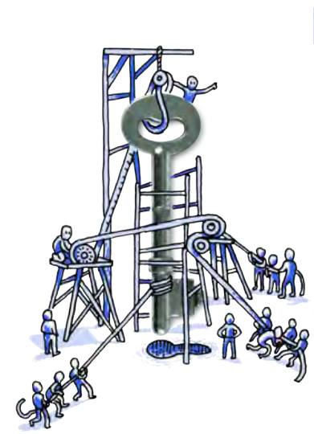
> **[Diagram Context - Textbook_NaturalScience_Gr9_Birth-life-and-the-death-of-a-star.pdf-0001-03.png]**
> This educational graphic depicts a mechanical apparatus featuring a large central key being lifted and manipulated by a complex system of pulleys, ropes, scaffolding frameworks, and multiple small human figures pulling and operating the gear mechanisms. Visible elements include a central hanging hook, overhead gantries, ladders, ropes held by groups of figures, and a system of pulleys redirecting applied forces. Conceptually, this diagram illustrates mechanical advantage and work in physical sciences by showing how simple machines (like pulleys and levers) combine to reduce the effort force needed to lift heavy loads.

---

## Star Formation Process
1.  **Contraction:** Over time, the massive clouds of gas and dust contract.
2.  **Density and Heat:** As they contract, they become denser and begin to heat up.
3.  **Fragmentation:** The clouds break up into smaller clumps.
4.  **Disk Formation:** As these clumps get smaller, they flatten out into a disk shape.
5.  **Stellar Birth:** The centre of each clump eventually forms a star, while the outer disk of gas and dust may eventually form planets around that star.

---

## Key Notes

### Triggering Star Collapse
> **TAKE NOTE:** The collapse of a star can be triggered when a cloud is squeezed. For example, if a cloud passes through a spiral arm in a galaxy, it will be slowed down and compressed. This explains why many stars are formed in the spiral arms of galaxies.

### Understanding Light Years
> **TAKE NOTE:** A light year is the **distance** that light travels in one year. Light travels at a speed of $299\,792\,458 \text{ m/s}$. One light year is equivalent to approximately $10 \text{ trillion kilometers}$.

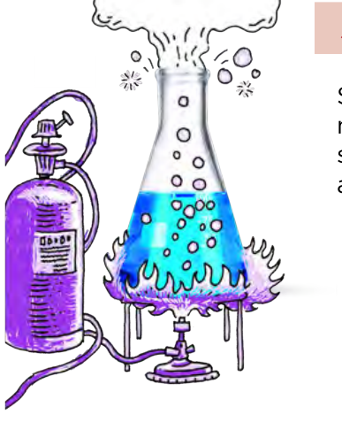
> **[Diagram Context - Textbook_NaturalScience_Gr9_Birth-life-and-the-death-of-a-star.pdf-0001-21.png]**
> This educational graphic illustrates a laboratory apparatus setup showing a chemical reaction taking place in an Erlenmeyer flask heated by a Bunsen burner connected to a gas cylinder. Visible elements include a purple gas cylinder, tubing, a burner producing flames beneath a tripod stand, an Erlenmeyer flask containing a blue liquid with rising gas bubbles, and escaping vapor or gas at the top. For a high school Physical Sciences student, this diagram demonstrates the practical execution of a chemical reaction involving heating and gas production, highlighting energy transfer and the visual indicators of a chemical change such as effervescence.

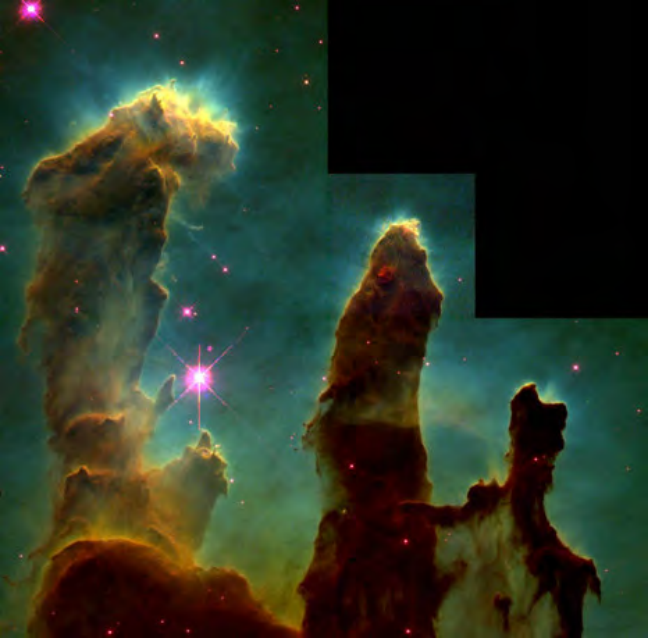
> **[Diagram Context - Textbook_NaturalScience_Gr9_Birth-life-and-the-death-of-a-star.pdf-0001-24.png]**
> This graphic depicts an astronomical photograph of the Pillars of Creation within the Eagle Nebula, showcasing dense columns of cosmic dust and gas surrounded by glowing interstellar matter and embedded stars. The visual features large brownish-orange pillars illuminated with golden and turquoise edges, interspersed with bright pinpoint stars displaying distinct diffraction spikes against a deep space background. For Physical Sciences learners, this image exemplifies the birthplaces of stars, illustrating gravitational collapse, stellar nurseries, and the life cycle of stars as covered in Grade 12 Earth and Beyond content.

> **[Diagram Context - Textbook_NaturalScience_Gr9_Cost-of-electrical-energy.pdf-0001-02.png]**
> 1. A diagram of a cell with blue and white lines.

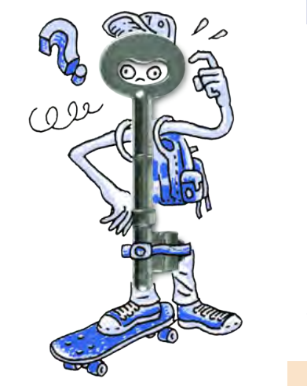
> **[Diagram Context - Textbook_NaturalScience_Gr9_Cost-of-electrical-energy.pdf-0001-03.png]**
> 1. A cartoon character with a backpack and skateboard.

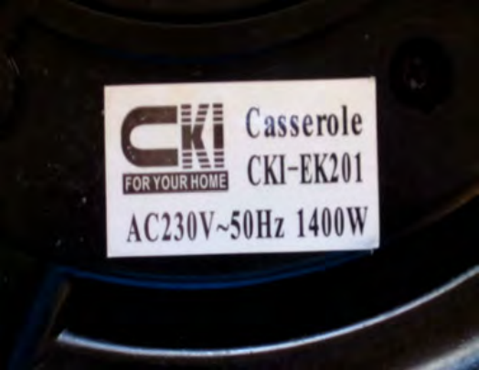
> **[Diagram Context - Textbook_NaturalScience_Gr9_Cost-of-electrical-energy.pdf-0001-23.png]**
> 1. A diagram of a cell with arrows pointing to different parts of the cell.

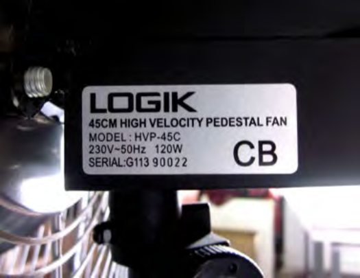
> **[Diagram Context - Textbook_NaturalScience_Gr9_Cost-of-electrical-energy.pdf-0001-25.png]**
> 1. A diagram of a cell with arrows pointing to different parts of the cell.
 2. A diagram of a circuit with arrows pointing to different parts of the circuit.
 3. A diagram of a Lewis structure with arrows pointing to different parts of the Lewis structure.

> **[Diagram Context - Textbook_NaturalScience_Gr9_Energy-and-the-national-electricity-grid.pdf-0001-02.png]**
> This diagram illustrates a conceptual cross-section of a solid surface lined with a uniform layer of adsorbed molecules, represented by repeating blue curved shapes attached to a light purple substrate. There are no explicit text labels, axes, or chemical symbols present in the graphic. Conceptually, it helps students visualize surface phenomena such as heterogeneous catalysis, adsorption, or thin-film deposition at a microscopic level.

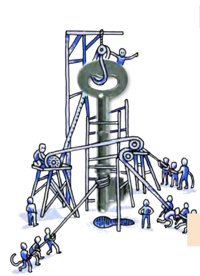
> **[Diagram Context - Textbook_NaturalScience_Gr9_Energy-and-the-national-electricity-grid.pdf-0001-03.png]**
> This conceptual diagram depicts a mechanical apparatus featuring pulleys, ropes, scaffolding frameworks, and numerous stylized blue human figures working collaboratively to lift and maneuver a large central key. The visible elements include a suspended hook, multiple interconnected ropes and pulleys, ladders, scaffolding structures, and teams of figures pulling ropes from various angles. Conceptually, for a high school Physical Sciences student studying mechanics, this graphic illustrates the principles of work, energy, force vectors, and mechanical advantage using a complex system of simple machines.

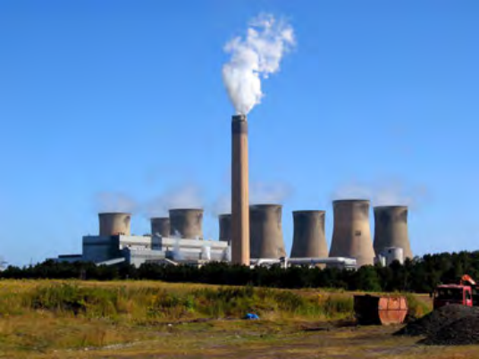
> **[Diagram Context - Textbook_NaturalScience_Gr9_Energy-and-the-national-electricity-grid.pdf-0001-13.png]**
> This photograph depicts a coal-fired thermal power station, showing multiple hyperbolic cooling towers and a tall industrial chimney releasing smoke into the sky. Visible features include the large concrete cooling towers, the central emission stack, and low-lying plant buildings surrounded by an open field with sparse vegetation. Conceptually, this visual represents the generation of electrical energy from non-renewable energy sources, illustrating the environmental impact and large-scale infrastructure associated with burning fossil fuels in South Africa's energy sector.

> **[Diagram Context - Textbook_NaturalScience_Gr9_Energy-and-the-national-electricity-grid.pdf-0001-19.png]**
> This educational graphic illustrates a laboratory apparatus setup featuring an Erlenmeyer flask containing a blue liquid heated by a Bunsen burner, connected via purple tubing to a pressurized gas cylinder. Visible elements include flames beneath the tripod-supported flask, rising gas bubbles, and a vapor plume escaping from the flask neck. Conceptually, this diagram demonstrates the practical setup for investigating chemical reactions involving heating, gas production, and the controlled delivery of reactants in high school Physical Sciences.

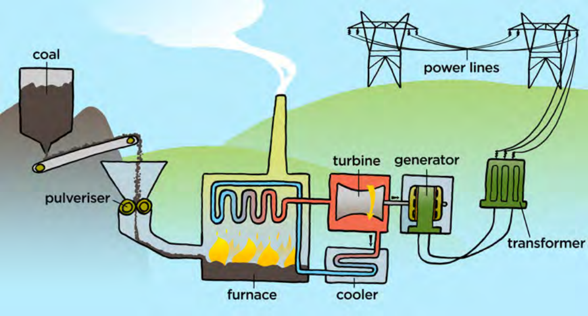
> **[Diagram Context - Textbook_NaturalScience_Gr9_Energy-and-the-national-electricity-grid.pdf-0001-22.png]**
> This educational diagram illustrates the sequential process of generating electricity in a coal-fired power station. The graphic features labeled components including coal, pulveriser, furnace, cooler, turbine, generator, transformer, and power lines. Conceptually, it demonstrates the energy conversions involved in thermal power generation, tracing the transformation of chemical potential energy in coal into thermal energy, mechanical energy in the turbine, and finally electrical energy distributed via the national grid.

> **[Diagram Context - Textbook_NaturalScience_Gr9_Energy-and-the-national-electricity-grid.pdf-0001-25.png]**
> This educational graphic is an environmental geography illustration depicting planet Earth shaped as a hot air balloon carrying observers in a basket beneath a sun, clouds, and flying birds. The visual elements include a globe enclosed in a net tethered to a burner flame and a basket holding two human figures using telescopes. Conceptually, this diagram conveys the theme of global observation, environmental monitoring, or geography fieldwork, helping high school learners explore human interaction with the Earth and atmospheric systems within the CAPS curriculum.

> **[Diagram Context - Textbook_NaturalScience_Gr9_Forces.pdf-0001-02.png]**
> 1. A diagram of a cell with blue and white lines.

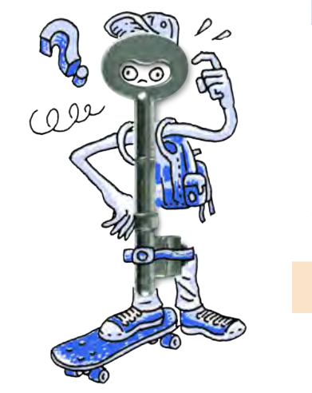
> **[Diagram Context - Textbook_NaturalScience_Gr9_Forces.pdf-0001-03.png]**
> 1. A cartoon character with a backpack and a skateboard.

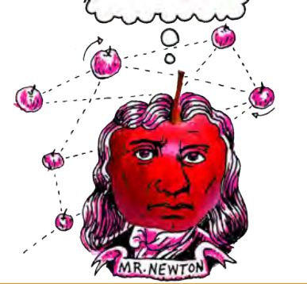
> **[Diagram Context - Textbook_NaturalScience_Gr9_Forces.pdf-0001-21.png]**
> The image features a cartoon illustration of a man's head with a red apple on his forehead. The man is wearing a white shirt and a black bow tie. The illustration also includes a thought bubble with a pink cloud and several apples, as well as a nameplate that reads "Mr. Newton". The illustration is labeled with the name "Newton" and "Mr. Newton" in the

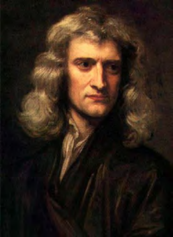
> **[Diagram Context - Textbook_NaturalScience_Gr9_Forces.pdf-0001-22.png]**
> The image is a portrait of a man with long, curly hair, wearing a black coat. The man appears to be a student, possibly a biology student, as indicated by the presence of a Lewis diagram on the image. The diagram is a visual representation of the Lewis structure of water, which is a key concept in chemistry. The diagram shows the bonds between the atoms in the molecule, with

> **[Diagram Context - Textbook_NaturalScience_Gr9_Safety-with-electricity.pdf-0001-02.png]**
> 1. A diagram of a cell with blue and white lines.

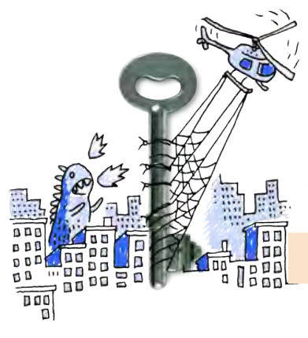
> **[Diagram Context - Textbook_NaturalScience_Gr9_Safety-with-electricity.pdf-0001-03.png]**
> 1. A cartoon illustration of a key and a crane.

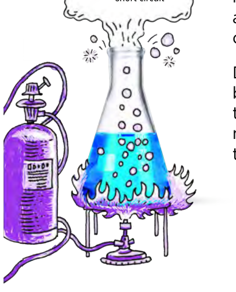
> **[Diagram Context - Textbook_NaturalScience_Gr9_Safety-with-electricity.pdf-0001-18.png]**
> 1. A purple and blue gas cylinder with a purple nozzle.

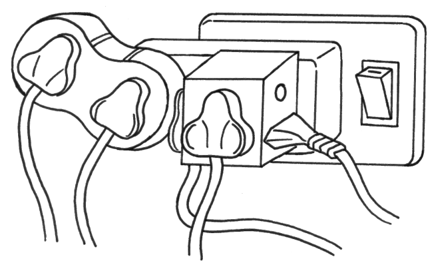
> **[Diagram Context - Textbook_NaturalScience_Gr9_Safety-with-electricity.pdf-0001-20.png]**
> 1. A black and white line drawing of a power strip with three plugs and a switch.

> **[Diagram Context - Textbook_NaturalScience_Gr9_Series-and-parallel-circuits.pdf-0001-02.png]**
> The image features a gray background with a series of blue circles arranged in a zigzag pattern. The circles are evenly spaced, and the zigzag pattern creates a sense of movement. The image does not contain any text or additional objects, and the arrangement of the circles and the zigzag pattern suggests a visual representation of a Lewis diagram or an anatomical/cellular structure. The image

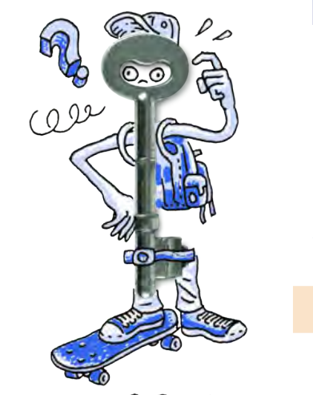
> **[Diagram Context - Textbook_NaturalScience_Gr9_Series-and-parallel-circuits.pdf-0001-03.png]**
> 1. A cartoon character with a backpack and a skateboard.

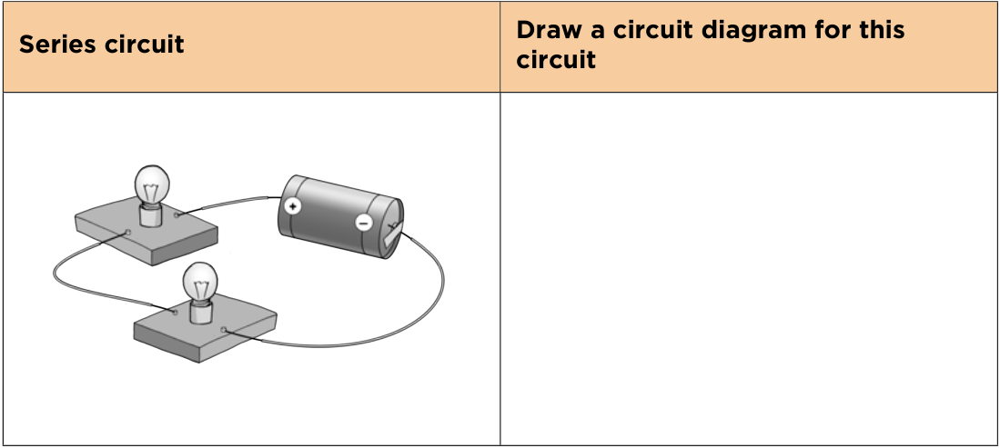
> **[Diagram Context - Textbook_NaturalScience_Gr9_Series-and-parallel-circuits.pdf-0001-13.png]**
> 1. A circuit diagram with a battery, wires, and a light bulb.

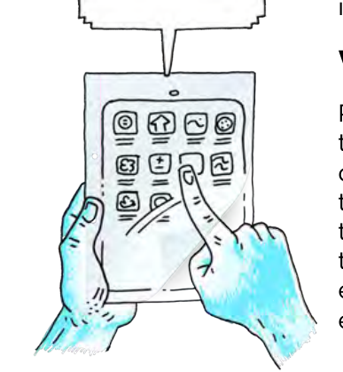
> **[Diagram Context - Textbook_NaturalScience_Gr9_Series-and-parallel-circuits.pdf-0001-21.png]**
> 1. A hand holding a tablet with a stylus.
 2. A diagram of a cell with arrows pointing to different parts of the cell.
 3. A diagram of a circuit with arrows pointing to different parts of the circuit.

---

### Star Formation and Stellar Evolution

#### 1. Protoplanetary Disks
Stars begin their formation within clouds of gas and dust. As these clouds collapse, they form a dense central clump surrounded by a rotating disk of material known as a **protoplanetary disk**. These disks are the regions where planets may eventually form around the new star.

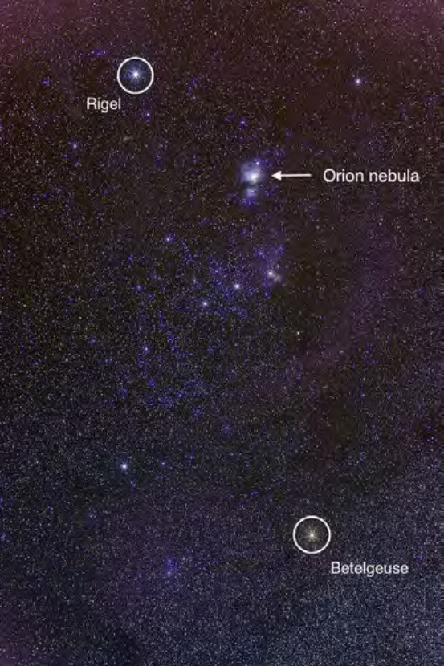
> **[Diagram Context - Textbook_NaturalScience_Gr9_Birth-life-and-the-death-of-a-star.pdf-0002-01.png]**
> This photograph shows an astronomical view of the Orion constellation region against a dense starry background. The graphic is labelled with the prominent stars "Rigel" (circled near the top) and "Betelgeuse" (circled near the bottom), along with an arrow pointing to the "Orion nebula". For CAPS Physical Sciences and Geography learners studying the universe, this visual conveys the composition of stellar systems, contrasting the distinct locations of blue supergiants like Rigel and red supergiants like Betelgeuse relative to star-forming regions such nebulae.

#### 2. The Protostar Stage
*   **Definition:** A **protostar** is a dense ball of gas that has formed at the centre of a collapsing cloud but is not yet hot enough to initiate nuclear reactions.
*   **Process:** As the clump continues to contract, its mass increases, which squeezes the core and raises the temperature.
*   **Duration:** This stage lasts for approximately 50 million years.
*   **Transition to Star:** Once the core temperature reaches $10$ million degrees Celsius, the conditions are sufficient for nuclear reactions to begin. At this point, the object is officially classified as a **star**.

#### 3. Nuclear Fusion
Once a star is formed, it begins the process of **nuclear fusion**.
*   **Mechanism:** The star converts hydrogen into helium.
*   **Energy Output:** This process releases vast amounts of energy in the form of heat and light, which is radiated into space.
*   **Equilibrium:** The energy produced by nuclear fusion creates an outward pressure that prevents the star from contracting further under its own gravity.

#### 4. Stellar Wind and Clearing
As the star shines, it produces a **stellar wind**. This wind gradually blows away the remaining gas and dust surrounding the star, leaving behind any planets that may have formed within the protoplanetary disk.

#### 5. Case Study: Corona Australis
*   **Location:** The Corona Australis region, specifically the Coronet cluster.
*   **Significance:** It is one of the nearest and most active star-forming regions to Earth.
*   **Observation:** Telescopes capture images of young stars at the centre of this cluster, surrounded by visible gas and dust emissions.

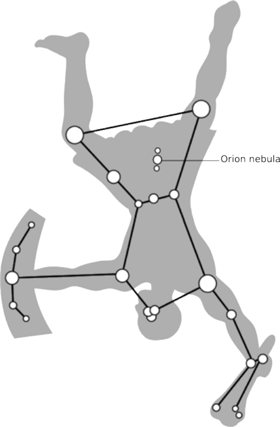
> **[Diagram Context - Textbook_NaturalScience_Gr9_Birth-life-and-the-death-of-a-star.pdf-0002-03.png]**
> This educational graphic is an astronomical constellation diagram overlaying a mythological figure, specifically illustrating the Orion constellation. The diagram features connected white nodes representing stars, a silhouette of a hunter, and the label "Orion nebula" pointing to a cluster of small circles within the figure's torso. For a high school student, this conveys how prominent star patterns in the night sky are mapped onto recognizable mythological shapes, while also locating notable deep-sky objects like the Orion Nebula within the constellation.

***

**TAKE NOTE:**
Recall the principles of nuclear reactions studied in the "Energy and Change" module, specifically regarding how nuclear power plants generate energy. The fusion occurring in stars is the natural counterpart to the fission processes often discussed in terrestrial power generation.

***

**DIGITAL RESOURCES:**
*   **Star birth (Orion Nebula):** [bit.ly/1dkERqb](http://bit.ly/1dkERqb)
*   **Stellar evolution documentary:** [bit.ly/17Vfg2H](http://bit.ly/17Vfg2H)

> **[Diagram Context - Textbook_NaturalScience_Gr9_Birth-life-and-the-death-of-a-star.pdf-0002-07.png]**
> This graphic is a line drawing illustration of a person holding a digital tablet device with a touchscreen displaying a grid of application icons and a speech bubble above it. Visible elements include two hands interacting with the device, with one index finger touching a specific screen icon, and various abstract app symbols representing navigation, media, and tools. Conceptually, this diagram visually represents digital interaction, e-learning, or mobile technology usage, supporting lessons on Information Technology (IT) or Computer Applications Technology (CAT) regarding user interfaces and digital devices.

> **[Diagram Context - Textbook_NaturalScience_Gr9_Birth-life-and-the-death-of-a-star.pdf-0002-10.png]**
> This cartoon illustration depicts a blue-skinned thief in striped clothing hurriedly sneaking away while holding a framed portrait resembling the Mona Lisa. The visible elements include a speech bubble, horizontal motion lines indicating speed, and a decorative picture frame holding a sketched portrait of a person with long hair. Conceptually, this visual serves as an engaging prompt for creative writing or visual literacy exercises, illustrating the theme of art theft or unauthorized removal.

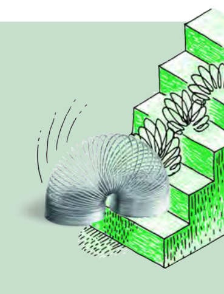
> **[Diagram Context - Textbook_NaturalScience_Gr9_Cost-of-electrical-energy.pdf-0002-06.png]**
> The image shows a diagram of a spring coiled up and attached to a green staircase. The diagram is a Lewis diagram, which is a visual representation of a chemical reaction. The diagram is labeled with the chemical formula for sulfuric acid, H2SO4, and the name of the acid. The diagram also includes arrows pointing to the reactants and products, as well as labels for the

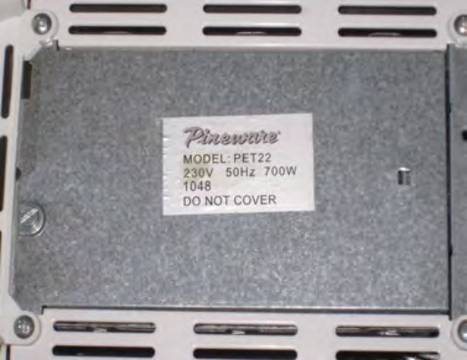
> **[Diagram Context - Textbook_NaturalScience_Gr9_Cost-of-electrical-energy.pdf-0002-09.png]**
> 1. A diagram of a cell with arrows pointing to different parts of the cell.

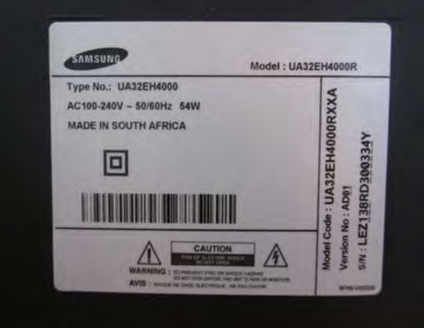
> **[Diagram Context - Textbook_NaturalScience_Gr9_Cost-of-electrical-energy.pdf-0002-11.png]**
> 1. A diagram of a cell with arrows pointing to different parts of the cell.
 2. A diagram of a circuit with arrows pointing to different parts of the circuit.
 3. A diagram of a Lewis structure with arrows pointing to different parts of the Lewis structure.

> **[Diagram Context - Textbook_NaturalScience_Gr9_Cost-of-electrical-energy.pdf-0002-13.png]**
> 1. A Phillips brand hand mixer with a black cord.

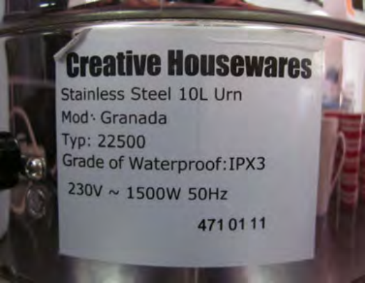
> **[Diagram Context - Textbook_NaturalScience_Gr9_Cost-of-electrical-energy.pdf-0002-15.png]**
> The image shows a label for a product, specifically a stainless steel pot. The label includes information about the pot's features, such as its capacity, weight, and the type of material it is made of. The pot is described as "Creative Houseware" and "Stainless steel 10L Urn". The label also provides details about the pot's durability, stating that it is

> **[Diagram Context - Textbook_NaturalScience_Gr9_Cost-of-electrical-energy.pdf-0002-18.png]**
> The image features a cartoon illustration of a hot air balloon with a globe on top. The globe is depicted in a cartoon style with a blue and green color scheme. The balloon is filled with air and is being pulled by two people who are sitting on the bottom of the balloon. The illustration also includes a sun and clouds, adding to the overall visual appeal of the scene. The text "Lewis

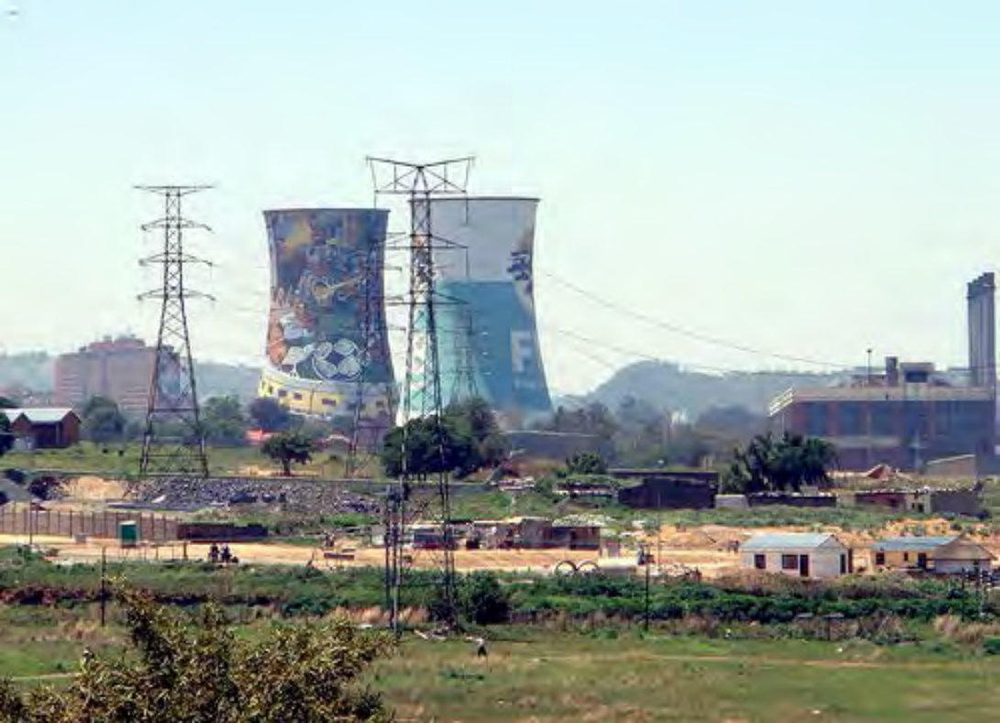
> **[Diagram Context - Textbook_NaturalScience_Gr9_Energy-and-the-national-electricity-grid.pdf-0002-08.png]**
> The graphic depicts a photographic scene of a thermal power station featuring large cooling towers and tall overhead transmission power lines carrying electricity across the landscape. Visible elements include two prominent decorated cooling towers, steel lattice transmission pylons, high-voltage power cables, and surrounding industrial and residential infrastructure. This real-world context illustrates the macroscopic scale of electrical energy generation and transmission in South Africa, helping learners connect the physics of circuits and power systems to national energy infrastructure like Eskom.

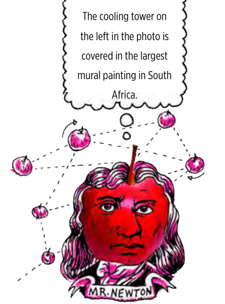
> **[Diagram Context - Textbook_NaturalScience_Gr9_Energy-and-the-national-electricity-grid.pdf-0002-12.png]**
> The graphic is an illustrated conceptual diagram featuring a caricature of Sir Isaac Newton styled as a red apple, labeled "MR. NEWTON," connected by a dotted network of smaller floating apples and directional arrows. Above the central figure, a thought bubble contains the text: "The cooling tower on the left in the photo is covered in the largest mural painting in South Africa." Conceptually, this whimsical illustration engages high school learners by connecting historical physics figures and gravitational symbolism with real-world landmarks in South Africa.

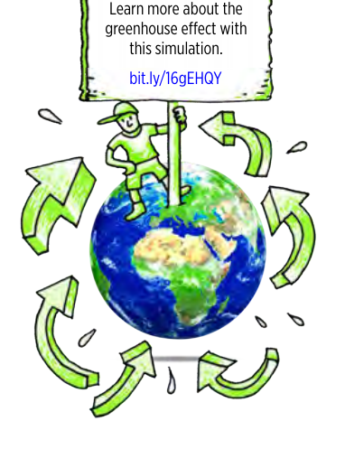
> **[Diagram Context - Textbook_NaturalScience_Gr9_Energy-and-the-national-electricity-grid.pdf-0002-14.png]**
> This educational graphic is an environmental science illustration featuring a cartoon figure holding a sign that reads "Learn more about the greenhouse effect with this simulation" and a short URL link, positioned above a globe surrounded by circular green arrows. Visible elements include a stylized planet Earth showing continents and oceans, a person holding a signpost, and a ring of directional arrows encircling the globe representing global cycles or atmospheric processes. Conceptually, this diagram introduces high school learners to climate change and global warming, serving as an interactive prompt to explore how greenhouse gases trap thermal energy within the Earth's atmosphere.

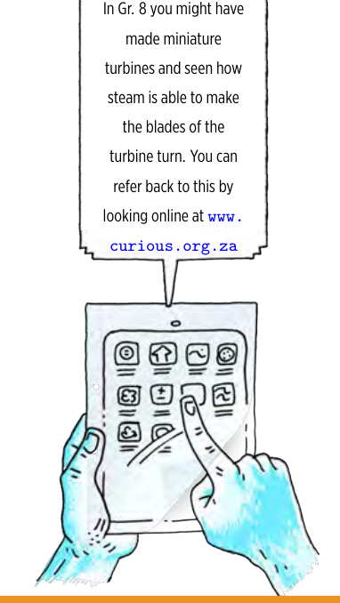
> **[Diagram Context - Textbook_NaturalScience_Gr9_Energy-and-the-national-electricity-grid.pdf-0002-16.png]**
> The image is an educational illustration depicting a digital tablet being held and used by hands, featuring a speech bubble with instructional text. Visible text elements include the speech bubble reference to Grade 8 miniature turbines and steam, as well as the website address "www.curious.org.za". Conceptually, the graphic serves as an introductory or revision prompt for CAPS Natural Sciences learners, connecting prior knowledge of energy transfer and turbines with digital or online resources.

> **[Diagram Context - Textbook_NaturalScience_Gr9_Forces.pdf-0002-08.png]**
> The image features a cartoon depiction of a spring coiled up in the shape of a caterpillar. The caterpillar is made up of green leaves and has a smiley face drawn on it. The spring is coiled up in the shape of a caterpillar, with a total of eight green leaves attached to it. The diagram is labeled with the text "Lewis diagram" and "cellular

> **[Diagram Context - Textbook_NaturalScience_Gr9_Forces.pdf-0002-19.png]**
> Three laws of motion are depicted in a cartoon illustration. The illustration features a cartoon astronaut on a red planet, holding a flag and a stick. The astronaut is wearing a white spacesuit and has a helmet on his head. The planet is covered in stars and planets, and the illustration includes a Lewis diagram, an anatomical/cellular structure, and a circuit.

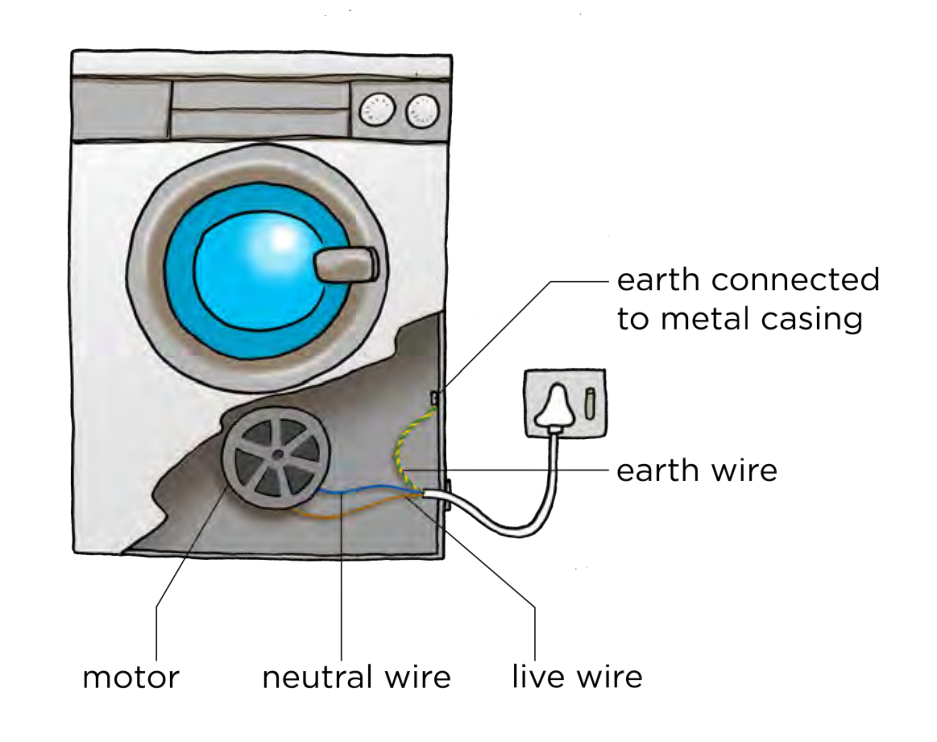
> **[Diagram Context - Textbook_NaturalScience_Gr9_Safety-with-electricity.pdf-0002-02.png]**
> 1. A diagram of a washing machine with the components labeled.
 2. The diagram shows the earth wire connected to the washing machine.
 3. The diagram shows the earth wire connected to the washing machine.

> **[Diagram Context - Textbook_NaturalScience_Gr9_Safety-with-electricity.pdf-0002-11.png]**
> The image shows a cartoon depiction of a man and a woman riding in a hot air balloon. The balloon is filled with a green gas and is floating in the sky. The man is holding onto the basket, while the woman is holding onto the basket's handle. The image also includes a text box that provides information about the safety dog and its role in providing safety tips.

> **[Diagram Context - Textbook_NaturalScience_Gr9_Safety-with-electricity.pdf-0002-14.png]**
> The image features a cartoon depiction of a man's head with a large apple on his forehead, accompanied by a thought bubble containing a thought process. The man's head is colored in a vibrant shade of red, and the apple is a bright pink. The thought process is represented by a series of arrows, suggesting a flow of ideas or concepts. The man's head is labeled "Mr. Newton

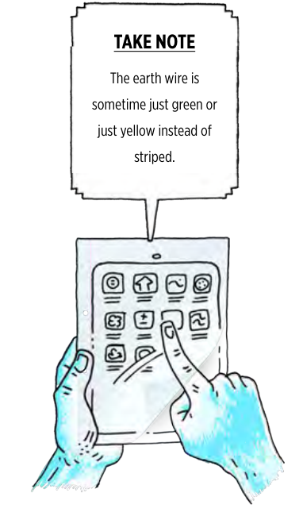
> **[Diagram Context - Textbook_NaturalScience_Gr9_Safety-with-electricity.pdf-0002-15.png]**
> 1. A diagram of a cell with arrows pointing to different parts of the cell.

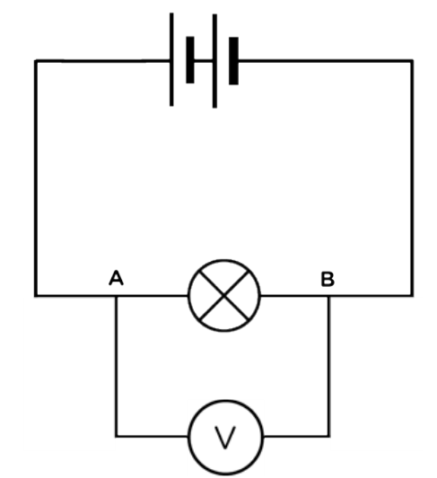
> **[Diagram Context - Textbook_NaturalScience_Gr9_Series-and-parallel-circuits.pdf-0002-02.png]**
> 1. A diagram of a circuit with two inputs and two outputs labeled A and B.

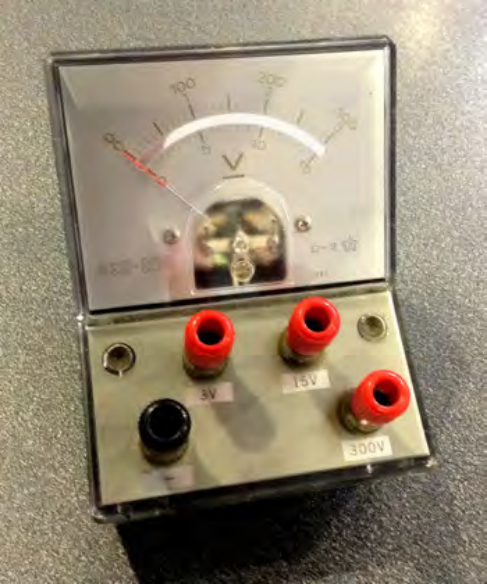
> **[Diagram Context - Textbook_NaturalScience_Gr9_Series-and-parallel-circuits.pdf-0002-03.png]**
> 1. A circuit board with a multimeter on it.

> **[Diagram Context - Textbook_NaturalScience_Gr9_Series-and-parallel-circuits.pdf-0002-09.png]**
> 1. A cartoon drawing of a woman with long hair and a blue shirt.
 2. A man holding a picture of the woman.
 3. The woman's face is shown in profile.

---

# Chapter 5: Birth, Life, and Death of a Star

## 1. Stellar Phenomena and Observations

### Observations of Star Formation
Star formation is a dynamic process that can be observed through telescopes like the Hubble Space Telescope. Key observations include:

*   **Glowing Gas:** Regions of ionized gas that emit light.
*   **Dark Dust Clouds:** Dense regions of interstellar matter that obscure light from stars behind them.
*   **Young, Hot Stars:** Newly formed stars that are often found in clusters.

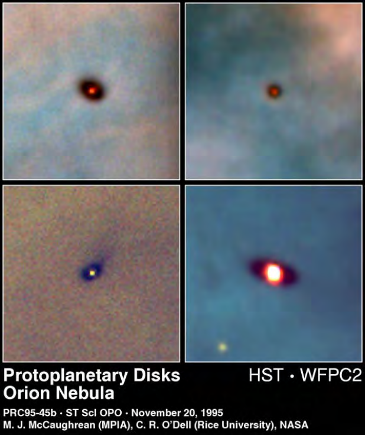
> **[Diagram Context - Textbook_NaturalScience_Gr9_Birth-life-and-the-death-of-a-star.pdf-0003-00.png]**
> This educational graphic is a composite astrophotography image from the Hubble Space Telescope (HST WFPC2) displaying four distinct protoplanetary disks (proplyds) within the Orion Nebula. Visible features include central luminous protostars surrounded by dark, dusty circumstellar disks silhouetted against glowing nebular gas. Conceptually, this visual supports the CAPS Earth and Space Sciences curriculum by providing empirical evidence for the nebular hypothesis, demonstrating how solar systems and planetary disks form around young stars.

### Case Study: The Large Magellanic Cloud (LMC)
The Large Magellanic Cloud is the nearest galaxy outside our own Milky Way. 
*   **Key Feature:** In the upper left of the LMC, there is a collection of blue and white young stars.
*   **Characteristics:** These stars are extremely hot and are among the most massive stars known in the Universe.

## 2. Stellar Winds and Galactic Activity

### Stellar Winds
Just as the Sun loses particles into space in the form of the solar wind, other stars also possess winds known as **stellar winds**.

### Galactic Bubbles
Astronomers have observed large bubbles of hot gas rising from glowing matter in galaxies. 
*   **Example:** A bubble located 50 million light-years from Earth.
*   **Cause:** Astronomers suspect these bubbles are created by stellar winds released during a burst of star formation.

---

## Summary Notes

| Concept | Description |
| :--- | :--- |
| **Stellar Wind** | A stream of charged particles released from the upper atmosphere of a star. |
| **LMC** | The Large Magellanic Cloud; the nearest galaxy to the Milky Way. |
| **Star Formation** | A process involving glowing gas, dark dust clouds, and the birth of massive, hot stars. |

> **VISIT:** For more information on the end stages of star formation, visit: [bit.ly/18xqZDV](http://bit.ly/18xqZDV)

> **[Diagram Context - Textbook_NaturalScience_Gr9_Birth-life-and-the-death-of-a-star.pdf-0003-01.png]**
> This educational graphic is an informational illustration featuring a globe surrounded by circular green arrows and a figure holding a sign. The sign displays the text "VISIT", "Star birth (Orion Nebula).", and a shortened web link ("bit.ly/1dkERqb"). Conceptually, this diagram serves as a multimedia prompt designed to direct high school learners to external digital resources regarding stellar evolution and the formation of stars in nebulae within the Earth and Beyond strand of the curriculum.

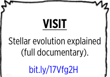
> **[Diagram Context - Textbook_NaturalScience_Gr9_Birth-life-and-the-death-of-a-star.pdf-0003-03.png]**
> This image contains a text-based educational prompt encased in a bordered box, directing learners to an external resource. Visible text includes the headings "VISIT" and "Stellar evolution explained (full documentary).", alongside a hyperlink "bit.ly/17Vfg2H". Conceptually, it serves as an online supplementary resource for high school Physical Sciences learners studying the origin of the universe and stellar evolution within the CAPS curriculum.

> **[Diagram Context - Textbook_NaturalScience_Gr9_Birth-life-and-the-death-of-a-star.pdf-0003-04.png]**
> This conceptual illustration depicts a giant optical telescope viewing planet Earth with tiny human scientists operating it from scaffolding and a control console. The graphic features a large view of Earth showing the African continent framed inside the aperture of a massive scientific telescope. Conceptually, it introduces learners to Earth Systems Science, demonstrating how our planet is studied as an integrated, interconnected system through global observation and scientific inquiry.

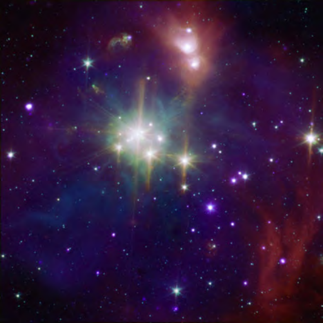
> **[Diagram Context - Textbook_NaturalScience_Gr9_Birth-life-and-the-death-of-a-star.pdf-0003-06.png]**
> This is an astronomical photograph showing a dense stellar cluster embedded within a nebula, displaying vibrant blue, purple, and red interstellar gas clouds. The image captures numerous luminous stars with distinct diffraction spikes, scattered against a deep cosmic background without text labels or coordinate axes. Conceptually, it illustrates stellar nurseries and star formation processes within the Milky Way, supporting Grade 10-12 Physical Sciences and Geography outcomes regarding the life cycles of stars and electromagnetic radiation across different wavelengths.

> **[Diagram Context - Textbook_NaturalScience_Gr9_Birth-life-and-the-death-of-a-star.pdf-0003-07.png]**
> This graphic is a text-based pedagogical callout banner featuring a jagged, starburst-style rectangular border. Inside the border, the underlined text "TAKE NOTE" is displayed in bold, sans-serif uppercase letters. Conceptually, this visual cue serves as an instructional signpost in CAPS learning materials to draw learners' attention to critical definitions, exceptions, or important core concepts.

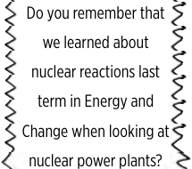
> **[Diagram Context - Textbook_NaturalScience_Gr9_Birth-life-and-the-death-of-a-star.pdf-0003-09.png]**
> This educational graphic is a text box with a jagged border that frames a prior-knowledge prompt regarding nuclear reactions and nuclear power plants. It contains the visible text: "Do you remember that we learned about nuclear reactions last term in Energy and Change when looking at nuclear power plants?". Conceptually, it serves as a transitional pedagogical tool to activate learners' prior knowledge from previous CAPS Physical Sciences units before introducing new related content.

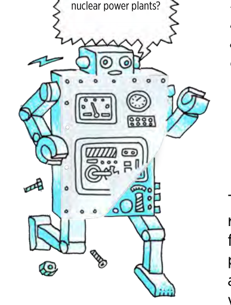
> **[Diagram Context - Textbook_NaturalScience_Gr9_Birth-life-and-the-death-of-a-star.pdf-0003-10.png]**
> This illustration features a cartoon robot with mechanical controls, dials, and loose nuts and bolts falling from its body, accompanied by a partial speech bubble reading "nuclear power plants?". The graphic uses an engaging, anthropomorphic character to prompt inquiry into industrial energy systems and technology. Conceptually, it introduces high school learners to the societal, environmental, and technological impacts of energy generation methods like nuclear power.

> **[Diagram Context - Textbook_NaturalScience_Gr9_Cost-of-electrical-energy.pdf-0003-05.png]**
> 1. A diagram of a cell with arrows pointing to different parts of the cell.

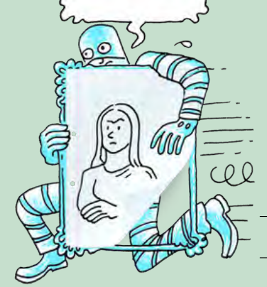
> **[Diagram Context - Textbook_NaturalScience_Gr9_Cost-of-electrical-energy.pdf-0003-13.png]**
> 1. A cartoon drawing of a man holding a picture of a woman. 
 2. The woman in the picture is wearing a white dress. 
 3. The man holding the picture is wearing blue pants. 
 4. The picture is of a woman.

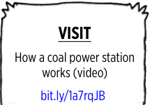
> **[Diagram Context - Textbook_NaturalScience_Gr9_Energy-and-the-national-electricity-grid.pdf-0003-00.png]**
> The graphic is a text-based informational resource frame featuring the heading "VISIT", the subtitle "How a coal power station works (video)", and a URL link "bit.ly/1a7rqJB". It directs learners to external multimedia content illustrating the generation of electricity using coal. For a high school Physical Sciences student, this resource visually demonstrates the conversion of chemical potential energy in fossil fuels into electrical energy, supporting the CAPS curriculum topic of energy resources and power generation.

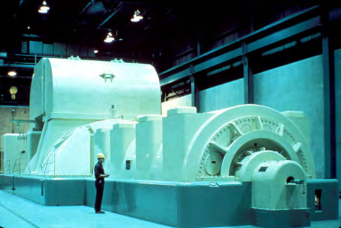
> **[Diagram Context - Textbook_NaturalScience_Gr9_Energy-and-the-national-electricity-grid.pdf-0003-01.png]**
> This educational photograph depicts a massive industrial alternating current (AC) generator, illustrating the scale and practical application of electromagnetic induction in power generation. The image shows the large enclosed stator housing, rotor shaft bearings, and an industrial worker standing nearby for scale, with no text labels or arrows present. Conceptually, this visual supports CAPS Physical Sciences by bridging theoretical concepts of Faraday's Law and flux linkage with real-world energy generation systems found in South African power stations.

> **[Diagram Context - Textbook_NaturalScience_Gr9_Energy-and-the-national-electricity-grid.pdf-0003-02.png]**
> This educational graphic depicts a conceptual illustration featuring a giant green telescope or viewing apparatus focused on planet Earth, accompanied by small figures of observers operating the equipment and monitoring data at a computer workstation with an empty speech bubble above. The visible elements include a large optical instrument frame on a scaffold, a detailed photographic globe representing Earth showing Africa, Europe, and parts of the Atlantic and Indian Oceans, human figures on ladders and desks, and a speech bubble with an invisible prompt. Conceptually, this diagram visually communicates the perspective of global observation, scientific inquiry, and environmental monitoring from an external standpoint, helping students grasp how humanity studies Earth systems as a whole within Geography and Natural Sciences.

> **[Diagram Context - Textbook_NaturalScience_Gr9_Energy-and-the-national-electricity-grid.pdf-0003-05.png]**
> This educational graphic features a text-based callout box enclosed in a hand-drawn, wavy border. It contains the underlined heading text "TAKE NOTE" in bold, uppercase letters. Conceptually, this visual serves as a pedagogical signpost in CAPS textbooks to highlight important definitions, rules, or conceptual warnings for learners.

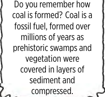
> **[Diagram Context - Textbook_NaturalScience_Gr9_Energy-and-the-national-electricity-grid.pdf-0003-06.png]**
> The graphic is an informational text box explaining the geological formation of coal. It features the text: "Do you remember how coal is formed? Coal is a fossil fuel, formed over millions of years as prehistoric swamps and vegetation were covered in layers of sediment and compressed." This content conveys the foundational concept of fossil fuel genesis for CAPS Natural Sciences and Geography learners, linking ancient organic matter, sedimentation, and high-pressure compression over millions of years to the creation of non-renewable energy resources.

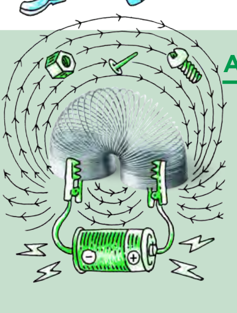
> **[Diagram Context - Textbook_NaturalScience_Gr9_Energy-and-the-national-electricity-grid.pdf-0003-08.png]**
> This educational illustration depicts an electromagnetic circuit showing a coiled wire (solenoid) connected to a battery with positive (+) and negative (-) terminals, surrounded by directional magnetic field lines and small metal objects like a nut, pin, and screw. The graphic conveys the concept of electromagnetism, demonstrating how an electric current flowing through a conductor creates a magnetic field capable of exerting magnetic force on surrounding ferromagnetic materials.

> **[Diagram Context - Textbook_NaturalScience_Gr9_Forces.pdf-0003-05.png]**
> The graphic displays a repeating horizontal decorative border consisting of stylized green arrows or ribbon-like wave shapes against a light background. There are no explicit text labels, variables, biological structures, or chemical symbols present in the graphic. Conceptually, it serves as a purely ornamental divider or background element rather than a curriculum-based teaching aid for a high school CAPS topic.

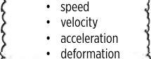
> **[Diagram Context - Textbook_NaturalScience_Gr9_Forces.pdf-0003-10.png]**
> 1. A diagram of a cell with arrows pointing to different parts of the cell.

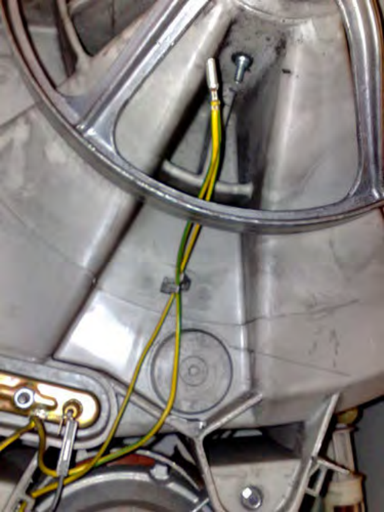
> **[Diagram Context - Textbook_NaturalScience_Gr9_Safety-with-electricity.pdf-0003-00.png]**
> 1. A diagram of a machine with a yellow wire running through it.

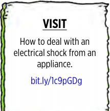
> **[Diagram Context - Textbook_NaturalScience_Gr9_Safety-with-electricity.pdf-0003-01.png]**
> 1. A diagram of an electrical circuit.

> **[Diagram Context - Textbook_NaturalScience_Gr9_Safety-with-electricity.pdf-0003-02.png]**
> The image features a cartoon illustration of a boy holding a pole and a globe. The boy is wearing a green shirt and a hat. The globe is green and blue, and it is tilted to the right. The boy is standing on a green platform, and there are arrows pointing in different directions. The arrows are labeled with the names of the continents, and there is a label that reads "

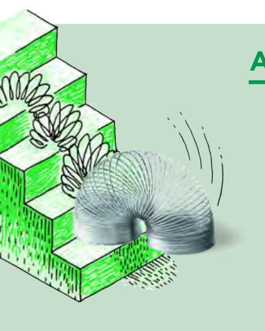
> **[Diagram Context - Textbook_NaturalScience_Gr9_Safety-with-electricity.pdf-0003-05.png]**
> 1. A diagram of a spring with a green background and a brown outline.

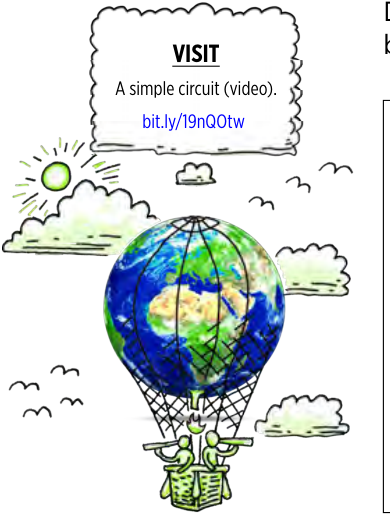
> **[Diagram Context - Textbook_NaturalScience_Gr9_Series-and-parallel-circuits.pdf-0003-01.png]**
> The image shows a cartoon depiction of a man and a woman on a hot air balloon. The balloon is filled with a green substance, and the man is holding a basket. The woman is holding a basket as well. The image is labeled with the words "Visit" and "A simple circuit video".

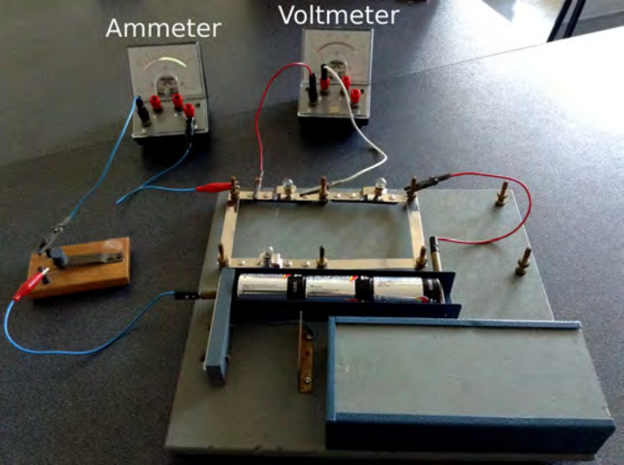
> **[Diagram Context - Textbook_NaturalScience_Gr9_Series-and-parallel-circuits.pdf-0003-06.png]**
> 1. A circuit diagram with two ammeters and two voltmeters connected to a battery.

> **[Diagram Context - Textbook_NaturalScience_Gr9_Series-and-parallel-circuits.pdf-0003-07.png]**
> The image features a cartoon depiction of a man's head, with a red apple placed on top of it. The man's face is drawn in a cartoon style, and he has a serious expression. The image also includes a thought bubble above the man's head, containing a network of pink dots. The text "Mr. Newton" is written below the man's head.

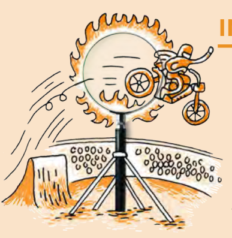
> **[Diagram Context - Textbook_NaturalScience_Gr9_Series-and-parallel-circuits.pdf-0003-10.png]**
> 1. A diagram of a motorcycle and a person riding it.
 2. The motorcycle is on fire.
 3. The person is wearing a helmet.

---

# 5.2 Life of a Star

## Overview
This section explores the life cycle of stars, from their birth to old age. A star's evolution, observable characteristics, and lifespan are primarily determined by its **mass**.

---

## Key Concepts & Definitions

*   **Main Sequence Star:** A star that is in the stage of its life where it is actively converting hydrogen into helium in its core. This is the longest stage of a star's life.
*   **Birth of a Star:** A star is considered "born" once nuclear fusion reactions begin at its centre.
*   **Mass Influence:** Stars range from approximately $0.1$ to $200$ times the mass of the Sun. The amount of matter available in the nebula during formation determines the star's mass, which in turn dictates its lifespan and properties.

---

## Observable Characteristics

Main sequence stars vary significantly in size, colour, and temperature:

1.  **Size:** Ranges from $0.1$ to $200$ times the size of the Sun.
2.  **Temperature & Colour:** Surface temperature determines the star's colour.
    *   **Cooler stars:** Appear red (under $3000\ ^\circ\text{C}$).
    *   **Hotter stars:** Appear blue (over $30\ 000\ ^\circ\text{C}$).

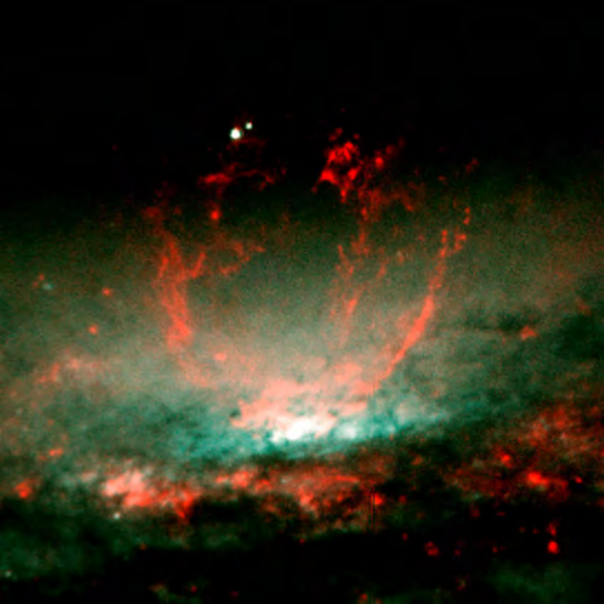
> **[Diagram Context - Textbook_NaturalScience_Gr9_Birth-life-and-the-death-of-a-star.pdf-0004-00.png]**
> This astronomical composite image displays a deep-space nebula with glowing red filaments arching upward against a greenish-hued galactic background and dark interstellar dust lanes. The visual features contrasting emission nebulae, glowing gas plumes, and distant pinpoint stars without any overlaid text labels, axes, or arrows. Conceptually, it supports CAPS Physical Sciences and Geography outcomes by illustrating stellar evolution, interstellar matter, emission spectra of heated gases, and the energetic processes occurring within galaxies.

---

## Did You Know?
*   Approximately $90\%$ of the stars in the Universe are main sequence stars.
*   Our Sun is classified as a main sequence star.

---

## Exercise: Temperature Identification
Based on the provided temperature list, match the stars to their approximate surface temperatures:

**Temperature list:** $3000\ ^\circ\text{C}$, $4500\ ^\circ\text{C}$, $6000\ ^\circ\text{C}$, $10\ 000\ ^\circ\text{C}$, $40\ 000\ ^\circ\text{C}$.

*   **Question:** Which temperature from the list above represents our Sun?

---

## Additional Resources
*   **Visit:** For more information on the life and death of stars, visit: [bit.ly/16GKrYE](http://bit.ly/16GKrYE)

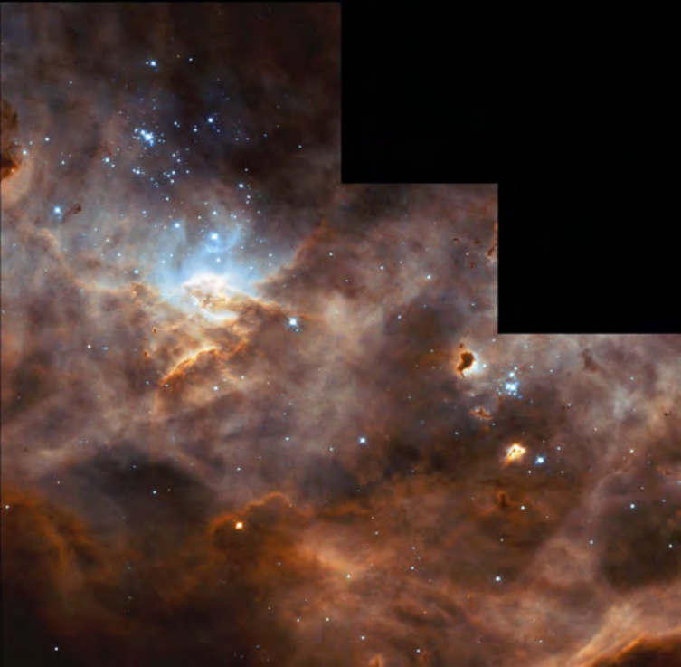
> **[Diagram Context - Textbook_NaturalScience_Gr9_Birth-life-and-the-death-of-a-star.pdf-0004-02.png]**
> This astronomical image displays a deep-space nebula filled with interstellar gas, cosmic dust clouds, and numerous bright stars forming clusters. There are no explicit text labels, axes, or arrows visible in the composite photograph. Conceptually, it illustrates stellar nurseries and the birth of stars within nebulae, supporting CAPS Earth and Beyond topics regarding the life cycle of stars and the origin of the universe.

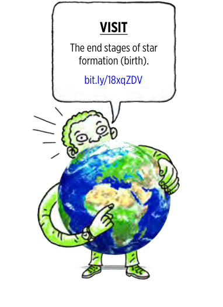
> **[Diagram Context - Textbook_NaturalScience_Gr9_Birth-life-and-the-death-of-a-star.pdf-0004-04.png]**
> The graphic features a cartoon illustration of a green alien-like character hugging a globe of the Earth, pointing to the African continent, with a speech bubble above. Visible text includes the headings "VISIT", "The end stages of star formation (birth).", and a shortened web link "bit.ly/18xqZDV". This resource directs CAPS Physical Sciences or Geography learners to digital content exploring stellar evolution and cosmic origins relative to planetary systems.

> **[Diagram Context - Textbook_NaturalScience_Gr9_Birth-life-and-the-death-of-a-star.pdf-0004-05.png]**
> This educational graphic is a stylized text header shaped like a thought or speech bubble. It contains the prominent, capitalized text "DID YOU KNOW?". Conceptually, this visual cue serves as an engaging pedagogical tool designed to introduce interesting, real-world contextual facts or supplementary scientific trivia aligned with CAPS curriculum topics.

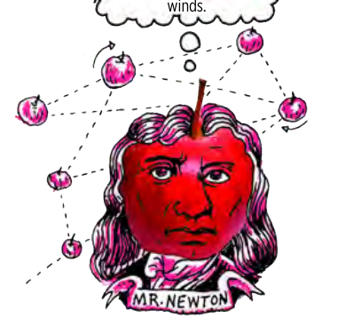
> **[Diagram Context - Textbook_NaturalScience_Gr9_Birth-life-and-the-death-of-a-star.pdf-0004-07.png]**
> This conceptual physics graphic features a caricature of Isaac Newton with a red apple for a head, labeled "MR. NEWTON", surrounded by a network of interconnected orbiting apples linked by dashed lines and directional arrows. It conveys the concept of Newton's Law of Universal Gravitation, illustrating how gravitational forces act mutually between masses across space, linking celestial mechanics to falling terrestrial objects like apples.

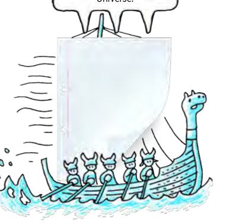
> **[Diagram Context - Textbook_NaturalScience_Gr9_Birth-life-and-the-death-of-a-star.pdf-0004-09.png]**
> This educational cartoon graphic depicts a Viking ship sailing on choppy water with oarsmen rowing and a large square sail catching the wind. Visible elements include horizontal motion lines representing wind blowing from the left, water splashes, a mast, rigging, and speech bubbles above the ship. Conceptually, this illustration serves as an engaging visual analogy for forces and motion in Physical Sciences, helping learners understand vector direction, wind resistance, and resultant force propelling an object forward.

> **[Diagram Context - Textbook_NaturalScience_Gr9_Cost-of-electrical-energy.pdf-0004-01.png]**
> 1. A diagram of a cell with a Lewis structure.

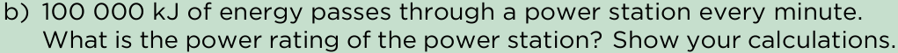
> **[Diagram Context - Textbook_NaturalScience_Gr9_Cost-of-electrical-energy.pdf-0004-03.png]**
> The image shows a diagram of a power station with a green line running down the center. The diagram is labeled with the text "b) 1000 000 J/kJ of energy passes through a power station every minute. What is the power rating of the power station? Show your calculations."

> **[Diagram Context - Textbook_NaturalScience_Gr9_Cost-of-electrical-energy.pdf-0004-05.png]**
> 1. A diagram of a snake's body.
 2. The snake's body is green and white.
 3. The snake's body is green and white.

> **[Diagram Context - Textbook_NaturalScience_Gr9_Cost-of-electrical-energy.pdf-0004-13.png]**
> The image shows a cartoon depiction of a cell with a large white cloud in the center, surrounded by smaller clouds. The text "NEW WORDS" is written in black at the bottom of the image.

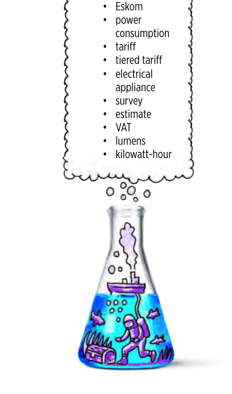
> **[Diagram Context - Textbook_NaturalScience_Gr9_Cost-of-electrical-energy.pdf-0004-14.png]**
> 1. A diagram of a person and a boat.

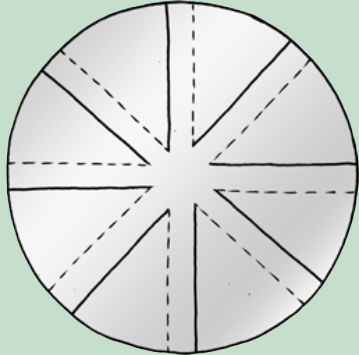
> **[Diagram Context - Textbook_NaturalScience_Gr9_Energy-and-the-national-electricity-grid.pdf-0004-02.png]**
> This geometric figure is a circle divided by solid radial lines and internal dashed lines radiating from the center. It contains no explicit alphabetical labels or mathematical variables, relying purely on radial symmetry and sector divisions. Conceptually, it helps students visualize fractions, angles, or symmetry operations within circular geometry as prescribed by the CAPS mathematics curriculum.

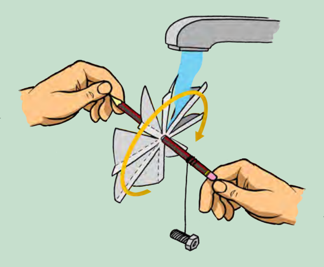
> **[Diagram Context - Textbook_NaturalScience_Gr9_Energy-and-the-national-electricity-grid.pdf-0004-07.png]**
> This educational apparatus demonstrates a water turbine model constructed from a folded paper water wheel pierced by a pencil axle and held by two hands under a running tap, with a string and metal bolt attached to the pencil. Visible elements include flowing water from a tap, hands holding a horizontal pencil axle, a folded paper turbine wheel, a rotational yellow directional arrow, and a weighted string attached to a bolt. This diagram conveys the energy conversion concept where the kinetic energy of moving water does work to turn a turbine, which in turn can lift a load, illustrating the transfer of gravitational potential energy into kinetic and mechanical energy.

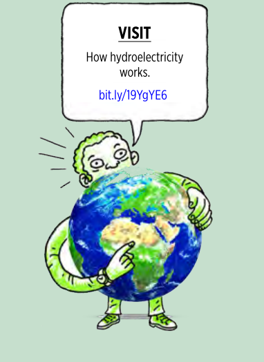
> **[Diagram Context - Textbook_NaturalScience_Gr9_Energy-and-the-national-electricity-grid.pdf-0004-09.png]**
> This educational graphic features a cartoon character hugging and pointing at a globe of the Earth, accompanied by a speech bubble containing the text "VISIT How hydroelectricity works. bit.ly/19YgYE6". Visible elements include the character, the globe showing continents, a speech bubble, and the web link. Conceptually, this resource engages CAPS learners by connecting global environmental awareness with renewable energy generation, specifically directing students to explore hydroelectric power systems as part of energy and sustainability topics.

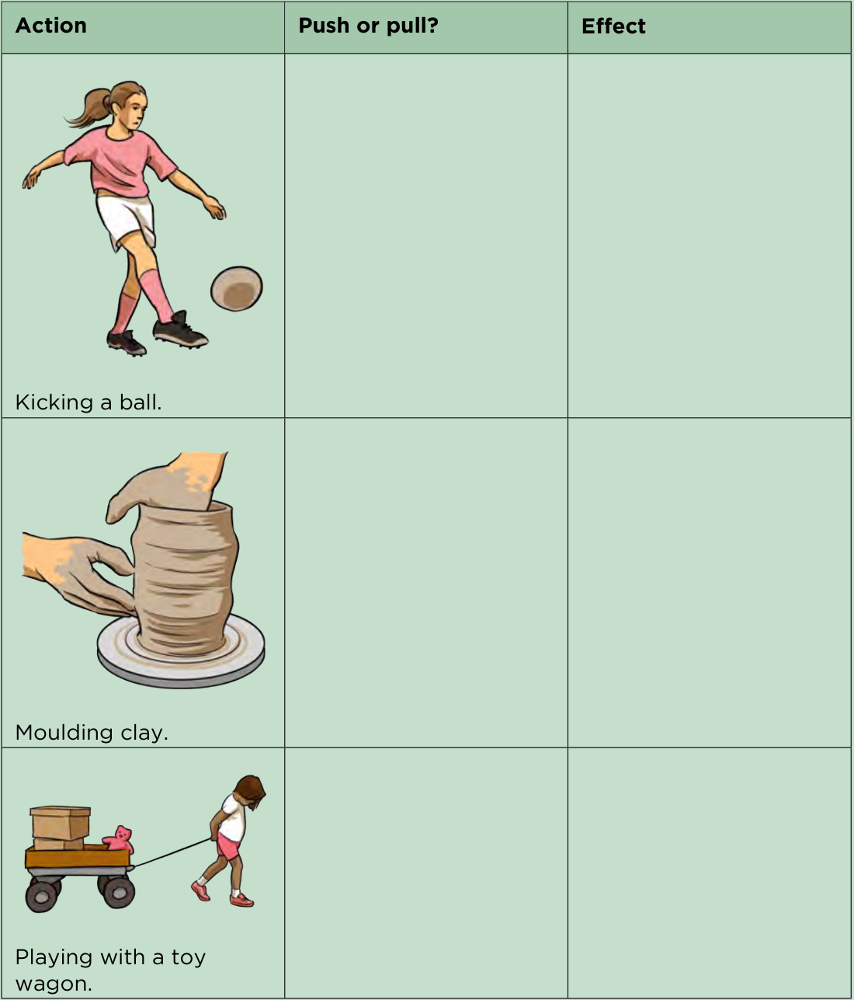
> **[Diagram Context - Textbook_NaturalScience_Gr9_Forces.pdf-0004-06.png]**
> The image is a pedagogical graphic that illustrates the concept of action and reaction. It features a cartoon girl kicking a ball, a girl pushing a wagon, and a girl molding clay. The diagram is divided into four sections, each representing a different action or reaction. The girl in the center of the image is shown kicking a ball, which is depicted as a small ball. The girl

> **[Diagram Context - Textbook_NaturalScience_Gr9_Forces.pdf-0004-07.png]**
> 1. A diagram of a roller coaster with a spring coiled up on top.

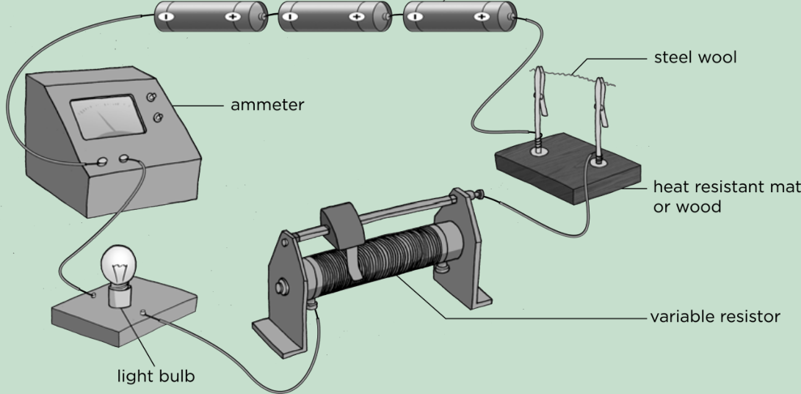
> **[Diagram Context - Textbook_NaturalScience_Gr9_Safety-with-electricity.pdf-0004-01.png]**
> 1. A diagram of a circuit with a light bulb, an ammeter, and a variable resistor.

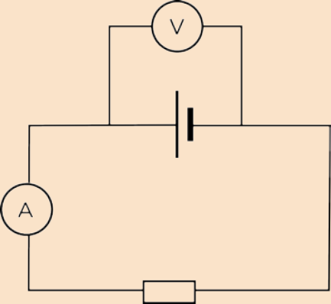
> **[Diagram Context - Textbook_NaturalScience_Gr9_Series-and-parallel-circuits.pdf-0004-10.png]**
> 1. A diagram of a circuit with two wires and two electrical components, one of which is a positive terminal and the other a negative terminal.

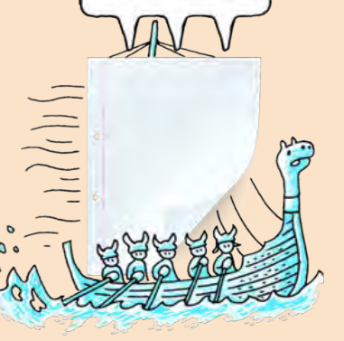
> **[Diagram Context - Textbook_NaturalScience_Gr9_Series-and-parallel-circuits.pdf-0004-13.png]**
> The image is a cartoon depiction of a boat sailing on a body of water. The boat is filled with people, and they are using oars to navigate the water. The boat is also equipped with sails, which are being used to propel the boat forward. The boat is surrounded by a blue body of water, and there are waves visible in the water. The boat is depicted in a cartoon

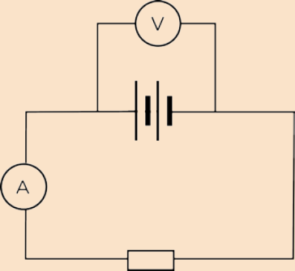
> **[Diagram Context - Textbook_NaturalScience_Gr9_Series-and-parallel-circuits.pdf-0004-16.png]**
> 1. A diagram of a circuit with two wires and a battery.
 2. Two wires with a battery and a light bulb.

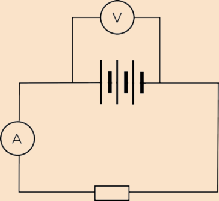
> **[Diagram Context - Textbook_NaturalScience_Gr9_Series-and-parallel-circuits.pdf-0004-18.png]**
> 1. A diagram of a circuit with two wires and a battery.
2. Two wires with a battery and two wires with a resistor.

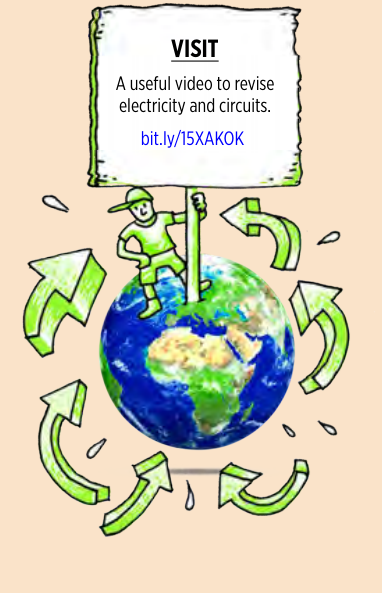
> **[Diagram Context - Textbook_NaturalScience_Gr9_Series-and-parallel-circuits.pdf-0004-19.png]**
> This educational graphic features an illustrative cartoon graphic showing a globe encircled by green directional arrows, with a figure standing on top holding a sign that reads "VISIT: A useful video to revise electricity and circuits." and includes a short URL link (bit.ly/15XAKOK). The visible elements include the Earth graphic, curved green cyclic arrows indicating flow or revision, a cartoon character holding a sign post, and text directing learners to online video resources. Conceptually, this graphic serves as an engaging multimedia signpost within CAPS Physical Sciences or Natural Sciences learning materials, encouraging high school students to supplement their textbook revision of electricity and circuits with digital video content.

---

# The Temperature and Colour of Stars

## 1. The Relationship Between Temperature and Colour
The temperature of a star is directly linked to the colour of light it emits. This relationship is based on the electromagnetic spectrum:

*   **Blue/Blue-white light:** Corresponds to shorter wavelengths and higher frequencies. These represent higher energy levels and, consequently, **hotter temperatures**.
*   **Red light:** Corresponds to longer wavelengths and lower frequencies. These represent lower energy levels and, consequently, **cooler temperatures**.

### Temperature-Colour Scale
| Star Colour | Relative Temperature |
| :--- | :--- |
| Blue-white | Hottest |
| White | Very Hot |
| Yellow | Hot |
| Orange | Cool |
| Red | Coolest |

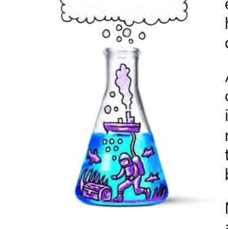
> **[Diagram Context - Textbook_NaturalScience_Gr9_Birth-life-and-the-death-of-a-star.pdf-0005-04.png]**
> This graphic is an illustrative conceptual drawing of a laboratory apparatus in the form of an Erlenmeyer (conical) flask containing a simulated underwater scene with a ship, diver, treasure chest, fish, and rising gas bubbles. The visible elements include a glass conical flask filled with blue liquid, a sketched purple underwater ecosystem containing aquatic life, a surface vessel with an air tube connected to a diver, and rising bubbles leading to an empty thought bubble above the flask. Conceptually, this visual encourages CAPS Physical Sciences and Natural Sciences learners to connect laboratory chemistry (chemical reactions producing gas bubbles) with macroscopic phenomena, fostering imaginative and contextualized scientific thinking.

*Note: This phenomenon is observable in everyday life, such as in the flames of a fire or a candle. The central region of a flame is bluer (hotter) than the outer regions, which appear orange or yellow.*

---

## 2. Stellar Mass and Size
Stars vary significantly in mass and size. Mass is often measured in relation to our Sun (solar masses).

*   **Red Dwarfs:** Small stars, approximately $0.1$ solar masses.
*   **Yellow Dwarfs:** Medium-sized stars, such as our Sun.
*   **Blue Dwarfs/Massive Stars:** Large, hot stars that can weigh $8$ times more than the Sun, or even significantly more (e.g., the star R136a1, which is $300$ solar masses).

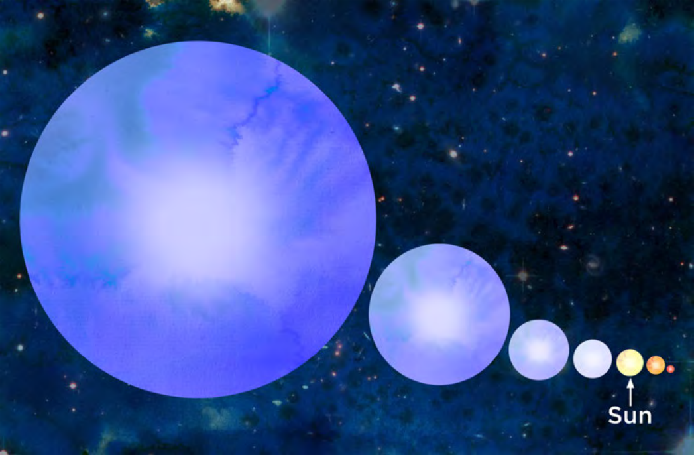
> **[Diagram Context - Textbook_NaturalScience_Gr9_Birth-life-and-the-death-of-a-star.pdf-0005-09.png]**
> This comparative astronomical graphic illustrates a stellar size comparison set against a starry deep-space background. It features a sequence of seven spherical star models arranged in decreasing order of magnitude, with a single directional arrow and text label pointing to the second-smallest yellow star marked "Sun". Conceptually, this diagram visually conveys the immense scale of stellar diversity in the universe, emphasizing that our Sun is an average-sized star dwarfed by massive hypergiant and supergiant stars.

---

## 3. Activity: Observing Orion in the Spring Sky
**Objective:** To identify specific stars within the Orion constellation and observe their colour differences.

### Instructions:
1.  Locate the constellation of Orion in the night sky.
2.  Identify the two prominent stars: **Betelgeuse** and **Rigel**.
3.  Observe the colour difference between these two stars.
4.  **Timing:**
    *   In early October, Orion rises in the east around $00:30$.
    *   By the beginning of December, Orion is visible in the east from around $20:30$.

*Note: If direct observation is not possible due to light pollution or weather, use an astronomical image of the constellation to perform the analysis.*

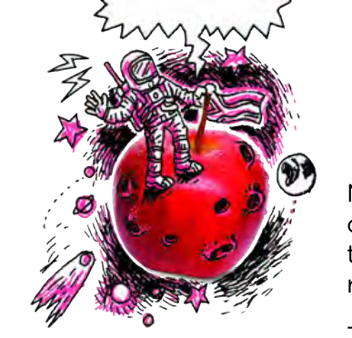
> **[Diagram Context - Textbook_NaturalScience_Gr9_Birth-life-and-the-death-of-a-star.pdf-0005-12.png]**
> This educational illustration depicts a whimsical cosmic scene featuring an astronaut standing on a cratered red apple surrounded by stars, planets, a comet, and lightning bolts against a black background, with an empty speech bubble above the astronaut and partial text on the right margin. The visual elements include an astronaut in a space suit holding a flag, a red apple modified to look like a rocky planet, and celestial objects including stars and planets. Conceptually, this creative artwork serves as an engaging prompt to stimulate learners' imagination and narrative or scientific writing about space exploration, relative scale, or anomalous planetary environments.

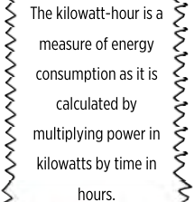
> **[Diagram Context - Textbook_NaturalScience_Gr9_Cost-of-electrical-energy.pdf-0005-01.png]**
> The diagram is a Lewis diagram, which is a diagram used to represent the valence electrons of an atom. The diagram shows the valence electrons of carbon, represented by a brown line, and the valence electrons of oxygen, represented by a black line. The diagram is labeled with the chemical symbols of carbon and oxygen, and the Lewis structure of carbon dioxide is also shown. The diagram is

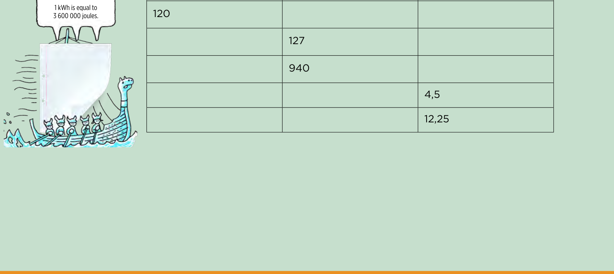
> **[Diagram Context - Textbook_NaturalScience_Gr9_Cost-of-electrical-energy.pdf-0005-14.png]**
> 1. A diagram of a boat with a group of people on it.

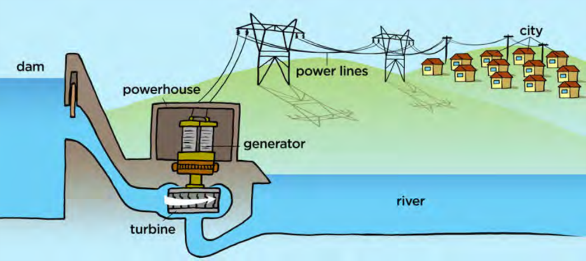
> **[Diagram Context - Textbook_NaturalScience_Gr9_Energy-and-the-national-electricity-grid.pdf-0005-03.png]**
> This diagram illustrates a hydroelectric power generation system, showing the sequential stages of energy conversion from a water source to an urban area. Visible labels include "dam", "powerhouse", "generator", "turbine", "power lines", "river", and "city", accompanied by a directional arrow indicating water flow through the turbine. Conceptually, it demonstrates how gravitational potential energy in stored water is converted into kinetic energy, mechanical energy, and ultimately electrical energy for distribution to consumers.

> **[Diagram Context - Textbook_NaturalScience_Gr9_Energy-and-the-national-electricity-grid.pdf-0005-09.png]**
> This graphic is a decorative green border featuring a repeating pattern of wavy, intertwined ribbon-like shapes or arrows. It contains no scientific labels, variables, or text elements. Functionally, it serves purely as a page divider or graphical separator in a CAPS-aligned textbook to visually structure the layout.

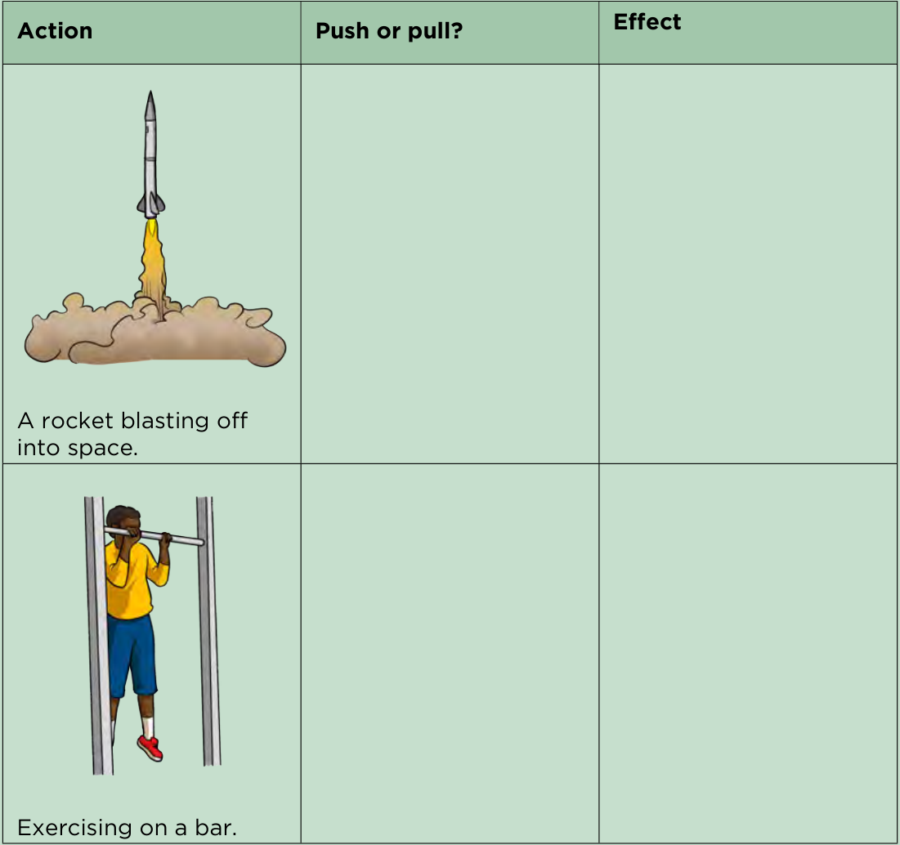
> **[Diagram Context - Textbook_NaturalScience_Gr9_Forces.pdf-0005-01.png]**
> A diagram of a rocket launching into space with a person doing pushups on a bar.

> **[Diagram Context - Textbook_NaturalScience_Gr9_Forces.pdf-0005-05.png]**
> 1. A diagram of a cell with a green line representing the cell wall.

> **[Diagram Context - Textbook_NaturalScience_Gr9_Safety-with-electricity.pdf-0005-04.png]**
> The graphic displays a repeating horizontal decorative border consisting of stylized green curved arrows arranged in a continuous wave-like pattern. There are no specific text labels, chemical symbols, or axes visible within the image. Conceptually, this purely decorative element serves as a visual divider on a page rather than conveying a biological, physical, or chemical principle for high school CAPS curriculum topics.

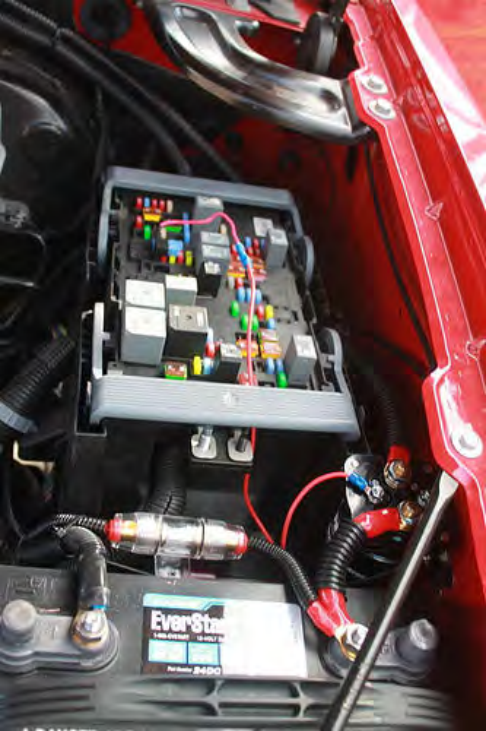
> **[Diagram Context - Textbook_NaturalScience_Gr9_Safety-with-electricity.pdf-0005-06.png]**
> 1. A diagram of a car's electrical system.
 2. A diagram of a car's electrical system.
 3. A diagram of a car's electrical system.
 4. A diagram of a car's electrical system.
 5. A diagram of a car's electrical system.
 6. A diagram of a car's electrical system.
 7. A diagram of a car

> **[Diagram Context - Textbook_NaturalScience_Gr9_Safety-with-electricity.pdf-0005-08.png]**
> The image shows a small, silver-colored fuse with the words "BSA 1362 Free" written on it. The fuse is positioned on the left side of the image, with the text clearly visible. The fuse is described as a "5 A" lead-free fuse, which means it is designed to protect electrical circuits from excessive current or voltage. The fuse is a small, cyl

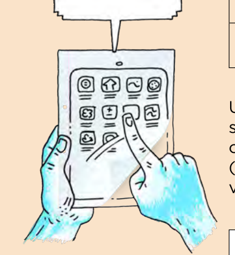
> **[Diagram Context - Textbook_NaturalScience_Gr9_Series-and-parallel-circuits.pdf-0005-07.png]**
> 1. A cartoon depiction of a person holding a tablet computer.
 2. A speech bubble above the tablet that says "I want to go to the moon".
 3. A speech bubble above the tablet that says "I want to go to the moon".

> **[Diagram Context - Textbook_NaturalScience_Gr9_Series-and-parallel-circuits.pdf-0005-09.png]**
> 1. A white square with a black border.

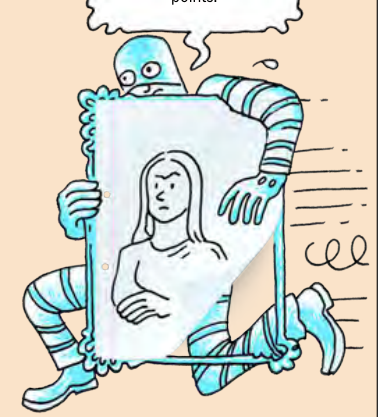
> **[Diagram Context - Textbook_NaturalScience_Gr9_Series-and-parallel-circuits.pdf-0005-12.png]**
> 1. A cartoon drawing of a man holding a picture of a woman.

---

### Activity: Observing the Constellation of Orion

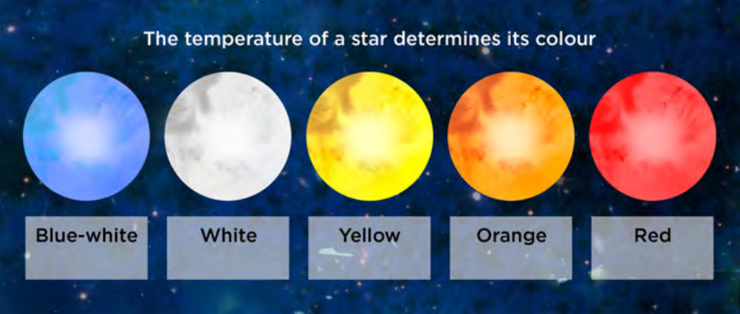
> **[Diagram Context - Textbook_NaturalScience_Gr9_Birth-life-and-the-death-of-a-star.pdf-0006-00.png]**
> This educational infographic displays a horizontal sequence of five glowing stellar spheres against a starry cosmic background, titled "The temperature of a star determines its colour". Below each sphere are the visible colour labels: "Blue-white", "White", "Yellow", "Orange", and "Red". Conceptually, the diagram helps high school learners understand the relationship between stellar surface temperature and emitted light, showing that hotter stars radiate shorter wavelengths appearing blue-white while cooler stars radiate longer wavelengths appearing red.

#### Take Note: Visibility of Orion
The visibility of the constellation Orion changes throughout the year in the southern hemisphere:
*   **Beginning of October:** Visible in the east from around 00:30.
*   **Beginning of November:** Visible in the east from around 22:30.
*   **Beginning of December:** Visible in the east from around 20:30.

#### Did You Know?
Betelgeuse is a massive star. If it were placed at the center of our solar system, its outer atmosphere would extend past the orbit of Jupiter.

---

### Materials
*   Sky map

### Instructions
1.  Ensure you have a clear sky. Look towards the east at night to identify the constellation of Orion. Use the provided photograph as a reference.
2.  Locate and identify the two prominent stars: **Betelgeuse** and **Rigel**.

### Questions
1.  What did you notice about the colour of the two stars, Betelgeuse and Rigel?
2.  Why do you think the stars look different? (Hint: Consider the relationship between the colour of a star and its temperature).

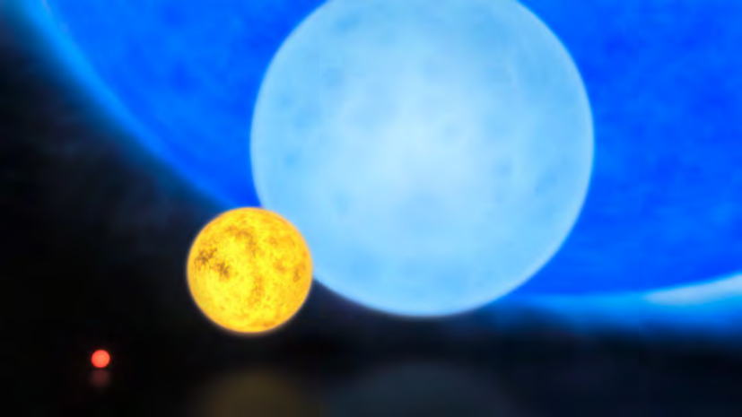
> **[Diagram Context - Textbook_NaturalScience_Gr9_Birth-life-and-the-death-of-a-star.pdf-0006-02.png]**
> This educational graphic is an astronomical scale comparison diagram depicting four spherical celestial bodies of vastly different sizes against a dark space background. It features a tiny red point source in the bottom left, a medium yellow star, a large light-blue giant star, and an immense dark-blue supergiant structure dominating the upper background. Aligned in a sequence of increasing magnitude, this visual conveys the concept of stellar size classification and relative scale, helping high school learners understand the immense diversity in the radii and volumes of stars across the universe.

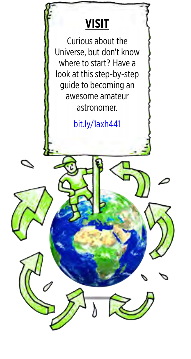
> **[Diagram Context - Textbook_NaturalScience_Gr9_Birth-life-and-the-death-of-a-star.pdf-0006-06.png]**
> The graphic is an informational illustration featuring a globe surrounded by green curved directional arrows, a figure holding a sign, and the text "VISIT: Curious about the Universe, but don't know where to start? Have a look at this step-by-step guide to becoming an awesome amateur astronomer. bit.ly/1axh441". Visible elements include a stylized planet Earth, a person climbing a post attached to the globe, and multiple looping arrows pointing in a circular direction. Conceptually, this visual serves as an engaging promotional or introductory graphic to encourage students to explore astronomy and earth sciences by following external digital resources.

> **[Diagram Context - Textbook_NaturalScience_Gr9_Birth-life-and-the-death-of-a-star.pdf-0006-07.png]**
> This educational cartoon depicts a giant telescope pointed at the Earth, featuring the text label "VISIT: The biggest stars in the Universe." along with a short URL link (bit.ly/1958N96). It visually conveys scale and perspective in astronomy by humorously scaling down observers and sizing Earth to demonstrate how humanity investigates distant, massive celestial objects within the universe.

> **[Diagram Context - Textbook_NaturalScience_Gr9_Birth-life-and-the-death-of-a-star.pdf-0006-08.png]**
> This educational graphic depicts a mechanical wave apparatus, specifically a Slinky toy interacting with a set of green stairs. There are no explicit text labels or arrows, but the visual features a continuous helical spring in various stages of compression and stretching as it moves down the steps. Conceptually, this diagram illustrates the nature of longitudinal and transverse wave propagation, demonstrating how mechanical energy travels through a medium via alternating compression and expansion.

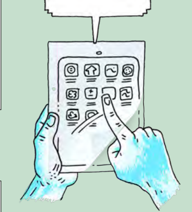
> **[Diagram Context - Textbook_NaturalScience_Gr9_Cost-of-electrical-energy.pdf-0006-08.png]**
> 1. A diagram of a cell with arrows pointing to different parts of the cell.

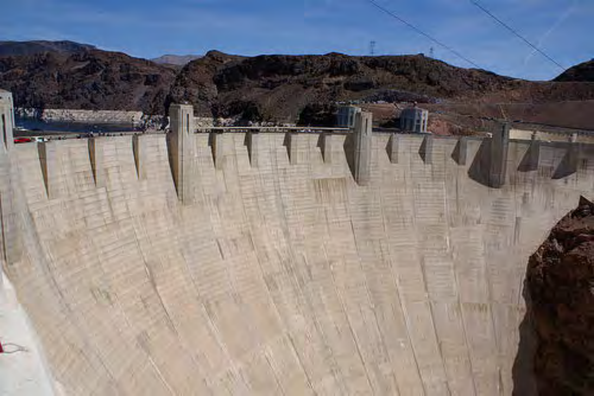
> **[Diagram Context - Textbook_NaturalScience_Gr9_Energy-and-the-national-electricity-grid.pdf-0006-01.png]**
> This image shows a real-world technological apparatus, specifically a massive curved concrete gravity-arch dam built across a canyon to retain a large reservoir of water. The photograph displays the massive structural wall, vertical buttress pillars, spillway towers, and surrounding arid rock formations. Conceptually, this visual supports Physical Sciences and Geography topics related to energy conversions, illustrating how gravitational potential energy stored in the water behind the dam wall can be harnessed to generate hydroelectric power or manage water resources.

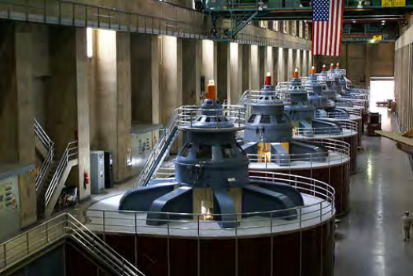
> **[Diagram Context - Textbook_NaturalScience_Gr9_Energy-and-the-national-electricity-grid.pdf-0006-03.png]**
> This photograph depicts an industrial hydroelectric power station turbine hall, showing a row of large, blue electrical generators driven by water turbines. The visible elements include massive cylindrical generator housings, access stairways, railings, industrial pillars, and an American flag hanging from the ceiling structure. For CAPS Grade 11 Physical Sciences learners, this image illustrates the practical, large-scale generation of alternating current (AC) electricity through electromagnetic induction, where mechanical energy from falling water is converted into electrical energy.

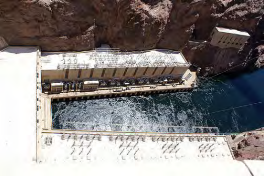
> **[Diagram Context - Textbook_NaturalScience_Gr9_Energy-and-the-national-electricity-grid.pdf-0006-04.png]**
> This photograph shows a hydroelectric power station nestled within a rocky gorge, capturing the structural integration of a dam wall, powerhouse buildings, and water reservoirs. The image displays visible features such as concrete turbine housing structures, electrical switchyards on the rooftops, and turbulent water tailraces. Conceptually, this visual supports CAPS Physical Sciences and Geography learners by illustrating the practical conversion of gravitational potential energy in stored water into kinetic energy and ultimately electrical energy.

> **[Diagram Context - Textbook_NaturalScience_Gr9_Energy-and-the-national-electricity-grid.pdf-0006-10.png]**
> An educational illustration depicting a globe shaped like a hot air balloon, carrying a green basket with two figures using telescopes, flying amidst clouds, birds, a sun, and a banner at the top. The graphic features planetary grid lines on the globe, a flame heating the balloon from below, and various hand-drawn environmental elements like clouds and birds. Conceptually, it conveys global exploration, geography, and environmental awareness, supporting CAPS themes related to earth systems and geographical inquiry.

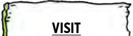
> **[Diagram Context - Textbook_NaturalScience_Gr9_Energy-and-the-national-electricity-grid.pdf-0006-11.png]**
> This image is a text banner containing the underlined word "VISIT" printed in bold black sans-serif capital letters on a white, tattered-edged rectangular background with a thin green border on its left edge. There are no additional variables, symbols, or structural labels present in the graphic. Conceptually, it functions as a visual heading or call-to-action cue in educational materials to direct learners toward an external resource, activity, or online link related to a CAPS curriculum topic.

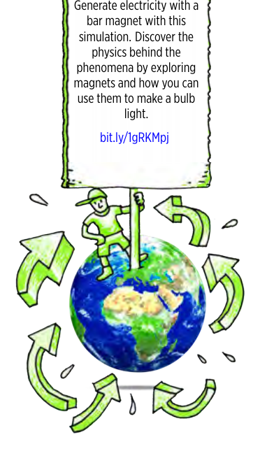
> **[Diagram Context - Textbook_NaturalScience_Gr9_Energy-and-the-national-electricity-grid.pdf-0006-12.png]**
> This educational graphic features an illustrative cartoon of a figure standing atop a globe of Earth, surrounded by a ring of green directional arrows and holding up a sign with instructional text and a URL link ("bit.ly/1gRKMpj"). The visible text instructs learners to generate electricity using a bar magnet and explore how magnets can light up a bulb. Conceptually, this graphic serves as an engaging introductory prompt for CAPS Physical Sciences learners to explore electromagnetic induction and the practical generation of electrical energy.

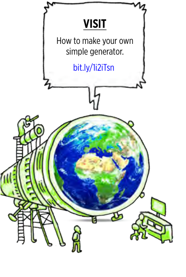
> **[Diagram Context - Textbook_NaturalScience_Gr9_Energy-and-the-national-electricity-grid.pdf-0006-13.png]**
> This educational graphic is an illustrated cartoon showing a large green telescope-like apparatus framing planet Earth, accompanied by a speech bubble with the text "VISIT: How to make your own simple generator." and a URL link. The visible text and elements include the heading "VISIT", instructional text about making a simple generator, and a shortened web address (`bit.ly/1i2iTsN`). Conceptually, this resource links geographical scale with physical science and engineering by encouraging learners to build a practical working model of an electrical generator to understand electromagnetic induction.

> **[Diagram Context - Textbook_NaturalScience_Gr9_Forces.pdf-0006-04.png]**
> 1. A diagram of a spring coiled up and attached to a green step.

> **[Diagram Context - Textbook_NaturalScience_Gr9_Forces.pdf-0006-08.png]**
> The image shows three people standing in a circle, with two of them pushing against each other and the third person standing in the middle. The people are wearing different colored shirts and pants, and the scene is set against a light blue background. The image does not contain any text, and the focus is on the people and their interaction.

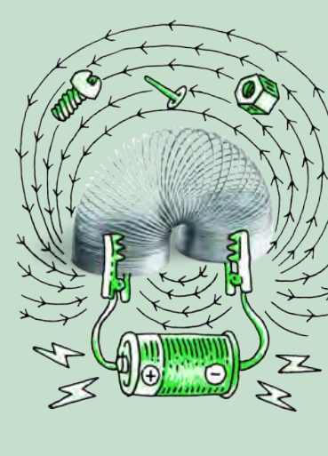
> **[Diagram Context - Textbook_NaturalScience_Gr9_Safety-with-electricity.pdf-0006-05.png]**
> 1. A green spring with a silver spring inside of it.
2. A green battery with a silver battery inside of it.
3. A green wire with a silver wire inside of it.
4. A green spring with a silver spring inside of it.

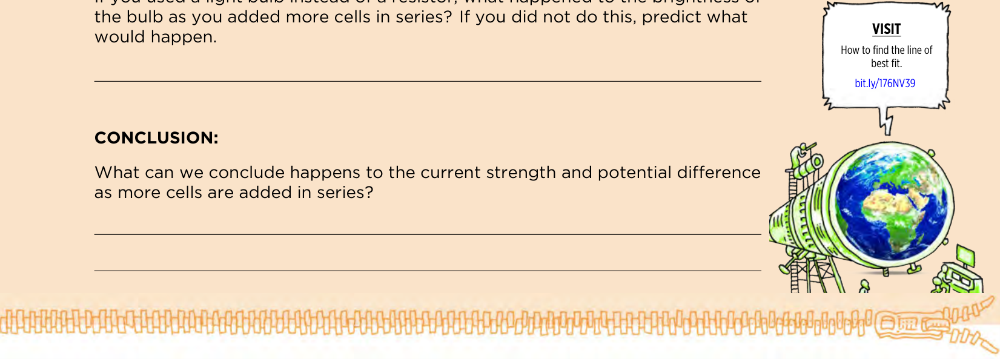
> **[Diagram Context - Textbook_NaturalScience_Gr9_Series-and-parallel-circuits.pdf-0006-02.png]**
> The image shows a page from a book that has a diagram of a cell and a globe. The diagram is labeled with the words "conclusion" and "what can we conclude?". The diagram also includes a text box that asks the viewer to predict what happens to the strength of a cell when more cells are added in. The diagram is accompanied by a text box that asks the viewer to predict

> **[Diagram Context - Textbook_NaturalScience_Gr9_Series-and-parallel-circuits.pdf-0006-07.png]**
> 1. A magnifying glass is being used to look at a diagram of a cell.

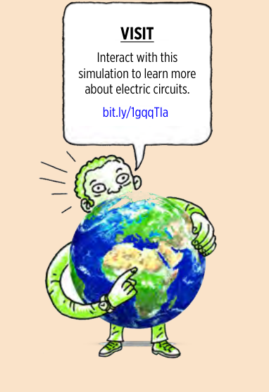
> **[Diagram Context - Textbook_NaturalScience_Gr9_Series-and-parallel-circuits.pdf-0006-19.png]**
> The image features a cartoon depiction of a man holding a globe in his hands. The globe is green and blue, and the man is wearing a green shirt and a pair of white shoes. The man is pointing to the globe, which is positioned on his chest. The image also includes a speech bubble that reads "Visit this interaction with this simulation to learn more about electric circuits."

---

# The Life Cycle of Stars: Main Sequence to Red Giant

## 1. Stellar Lifespan and Mass
The lifespan of a main sequence star is inversely proportional to its mass. 
*   **High-mass stars:** Consume their nuclear fuel rapidly. Consequently, they remain in the main sequence phase for a shorter duration.
*   **Low-mass stars:** Consume fuel slowly, allowing them to remain in the main sequence phase for significantly longer periods.

### Examples of Stellar Lifespans
| Star Type | Mass Comparison | Estimated Lifespan |
| :--- | :--- | :--- |
| The Sun | $1 \times$ Solar Mass | $\approx 10$ billion years |
| High-mass Star | $10 \times$ Solar Mass | $\approx 1$ billion years |
| Red Dwarf | $0.5 \times$ Solar Mass | $80 - 100$ billion years |

---

## 2. Evolution into a Red Giant
When a star depletes the hydrogen in its core, it undergoes a structural transformation:
1.  **Core Contraction:** The core shrinks and increases in temperature.
2.  **Expansion:** The outer atmosphere of the star expands significantly.
3.  **Cooling:** As the star expands, its surface temperature drops, causing the star to emit light in the red part of the spectrum.

**Definition:** A **red giant star** is a luminous, expanded star that has exhausted its core hydrogen supply. A well-known example is the star Betelgeuse.

---

## 3. Globular Clusters
Globular clusters, such as **NGC 6093**, are dense collections of hundreds of thousands of ancient stars.

*   **Scientific Significance:** They are vital for studying stellar evolution because all stars within a cluster are approximately the same age ($10 - 15$ billion years), but they possess a wide range of stellar masses.
*   **Observation:** Within these clusters, red giants are easily identifiable due to their size and distinct red colour.

---

## 4. Advanced Nuclear Fusion
Once the hydrogen is depleted, the core temperature may rise sufficiently to initiate the next stage of nuclear fusion:
*   **Helium Fusion:** Helium atoms collide and fuse to form heavier elements, specifically **carbon** and **oxygen**.
*   **Future Fate:** Once the helium in the core is also depleted, the star's ultimate fate is determined by its initial mass.

---

## 5. Learner Exercises
1.  **Critical Thinking:** Why does a red giant glow red?
2.  **Conceptual Understanding:** Why do you think red giants are called "giant" stars?

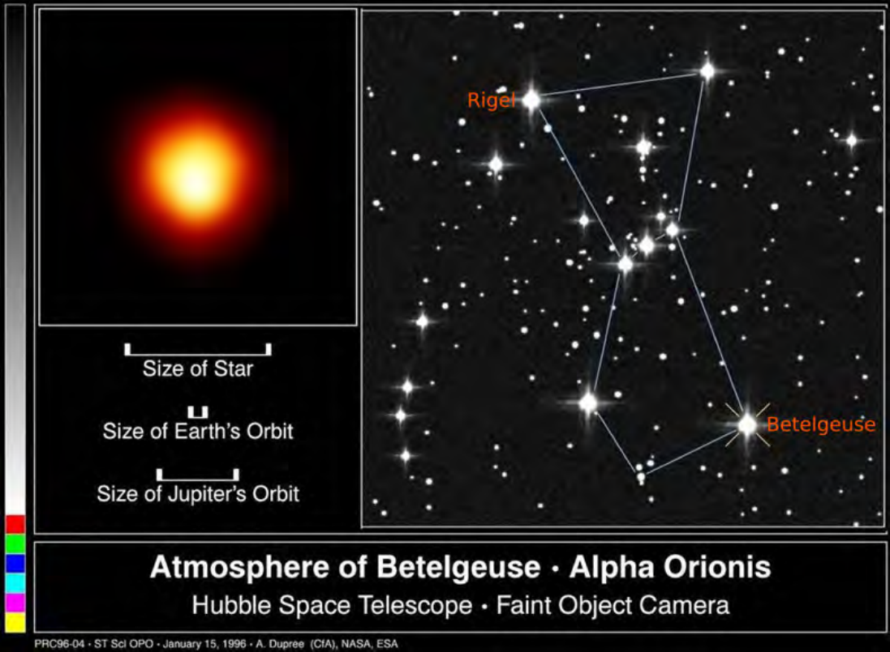
> **[Diagram Context - Textbook_NaturalScience_Gr9_Birth-life-and-the-death-of-a-star.pdf-0007-01.png]**
> This astronomical graphic features a direct image and a star chart showing the red supergiant star Betelgeuse (Alpha Orionis) alongside the Orion constellation. Visible labels include "Rigel," "Betelgeuse," "Size of Star," "Size of Earth's Orbit," "Size of Jupiter's Orbit," and "Atmosphere of Betelgeuse - Alpha Orionis." The diagram conceptually conveys the immense physical scale of Betelgeuse compared to planetary orbits in our solar system, supporting CAPS Physical Sciences topics on stellar evolution, star properties, and the vast scale of the universe.

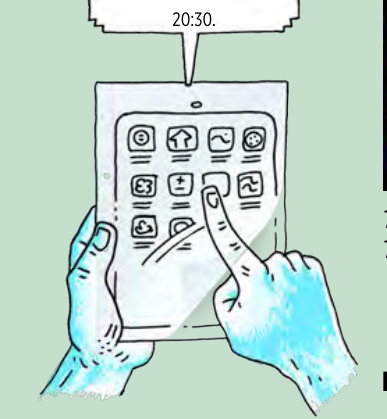
> **[Diagram Context - Textbook_NaturalScience_Gr9_Birth-life-and-the-death-of-a-star.pdf-0007-04.png]**
> This educational illustration depicts a pair of hands holding and interacting with a digital tablet device displaying various application icons on its screen, with the time "20:30" shown in a speech bubble above. Visible elements include a grid of twelve abstract app icons with text lines underneath, a finger touching one of the app icons, and an outlined tablet frame. Conceptually, this graphic highlights the role of digital technology and screen time in daily routines, serving as a prompt for learners to discuss digital citizenship, screen time management, or the impact of technology on lifestyle choices within Life Orientation.

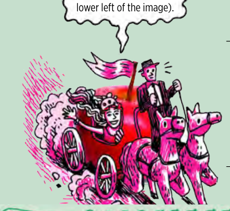
> **[Diagram Context - Textbook_NaturalScience_Gr9_Birth-life-and-the-death-of-a-star.pdf-0007-15.png]**
> This illustration depicts a whimsical cartoon drawing of a horse-drawn carriage shaped like a large red apple, with visible passengers, reins, wheels, and a speech bubble at the top. Conceptually, it uses creative visualization to engage learners' imagination, often used in introductory science or language lessons to prompt observational skills and descriptive writing about motion and objects.

> **[Diagram Context - Textbook_NaturalScience_Gr9_Birth-life-and-the-death-of-a-star.pdf-0007-17.png]**
> This graphic is a decorative border featuring repeating wave-like or ribbon-shaped arrows in a continuous green pattern. It consists of directional arrow motifs linked in a horizontal sequence without specific scientific labels, variables, or text. Conceptually, it serves as a visual separator or pedagogical frame often used in CAPS learning materials to indicate progression, cyclical processes, or simply to divide sections of a worksheet or textbook page.

> **[Diagram Context - Textbook_NaturalScience_Gr9_Cost-of-electrical-energy.pdf-0007-03.png]**
> 1. A diagram of a cell with a green line representing a cell wall.

> **[Diagram Context - Textbook_NaturalScience_Gr9_Cost-of-electrical-energy.pdf-0007-05.png]**
> The image shows a white sign with black text that reads "Visit". The sign also includes a link to a website, which is a bit.ly/GUAXS.

> **[Diagram Context - Textbook_NaturalScience_Gr9_Cost-of-electrical-energy.pdf-0007-08.png]**
> The image shows a cartoon illustration of a man holding a sign that says "God X" in green. The man is standing on a globe, which is a representation of the Earth. The globe is divided into different regions, each with a different color. The man is positioned on the globe, holding the sign, and there are arrows pointing towards the regions on the globe. The man is wearing

> **[Diagram Context - Textbook_NaturalScience_Gr9_Energy-and-the-national-electricity-grid.pdf-0007-02.png]**
> This illustration depicts a whimsical outer space scene featuring an astronaut standing on a cratered red apple surrounded by stars, a planet, a comet, and lightning bolts, with a large empty speech bubble overhead. Visible elements include an astronaut in a spacesuit, a red apple serving as a planetary body, craters, a flag pole planted in the apple, stars, a comet, a crescent moon or planet, and a blank speech bubble. Conceptually, this creative artwork serves as an engaging visual prompt for creative writing or scientific imagination, encouraging high school students to explore concepts of scale, perspective, or science fiction writing within the CAPS curriculum.

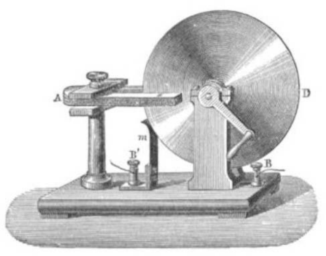
> **[Diagram Context - Textbook_NaturalScience_Gr9_Energy-and-the-national-electricity-grid.pdf-0007-05.png]**
> This historical apparatus illustration shows a Faraday disc generator, featuring a rotating metal disc (D), a hand crank, contact brushes (A and m), and electrical terminals (B and B'). Conceptually, it demonstrates electromagnetic induction, illustrating how rotating a conductor through a magnetic field generates an induced electromotive force (emf) and electric current in line with CAPS Physical Sciences requirements for Grade 11 and 12 electrodynamics.

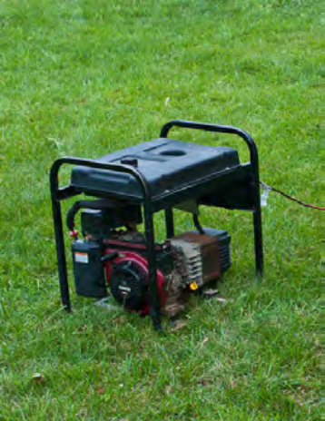
> **[Diagram Context - Textbook_NaturalScience_Gr9_Energy-and-the-national-electricity-grid.pdf-0007-07.png]**
> This photograph depicts a portable petrol-powered electrical generator resting on a lawn. The image shows a mechanical engine connected to an alternator housed within a metal frame, with a fuel tank on top and an electrical cord extending to the right. Conceptually, for CAPS Grade 10-12 Physical Sciences and Technology learners, this apparatus demonstrates the conversion of chemical potential energy stored in fuel into mechanical energy, and subsequently into electrical energy via electromagnetic induction.

> **[Diagram Context - Textbook_NaturalScience_Gr9_Energy-and-the-national-electricity-grid.pdf-0007-12.png]**
> The image is a photograph of a bicycle dynamo (generator) mounted against a bicycle wheel. Visible elements include a metallic bottle-shaped dynamo casing with a top knurled drive roller touching the tyre sidewall, an adjustable mounting bracket attached to the bicycle frame, and insulated electrical wires connecting the unit. Conceptually, this apparatus illustrates electromagnetic induction in the CAPS Physical Sciences curriculum, showing how mechanical energy from the rotating bicycle wheel is converted into electrical energy to power a bicycle light via Faraday's Law.

> **[Diagram Context - Textbook_NaturalScience_Gr9_Forces.pdf-0007-02.png]**
> The image is a cartoon illustration of a boy and a girl in a tug of war. The boy is wearing a blue shirt and khaki pants, while the girl is wearing a purple shirt and black pants. The boy is holding onto the rope with both hands, while the girl is holding onto it with one hand. The girl is on the right side of the image, and the boy is

> **[Diagram Context - Textbook_NaturalScience_Gr9_Forces.pdf-0007-06.png]**
> The image shows a line drawing of a snake, which is green in color. The snake is depicted in a horizontal line, with a green head and a green body. The snake is positioned on the left side of the image, and it extends from the top left corner to the bottom right corner. The snake is the only object in the image, and it is the main focus of the image

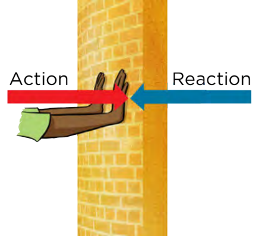
> **[Diagram Context - Textbook_NaturalScience_Gr9_Forces.pdf-0007-10.png]**
> The image is a cartoon depiction of a person's hand pushing against a brick wall. The hand is depicted in red and blue colors, with the red hand pushing against the wall and the blue hand resting on the wall. The image also includes a red line labeled "action" and a blue line labeled "reaction", which are drawn on the brick wall. The image is labeled as a ped

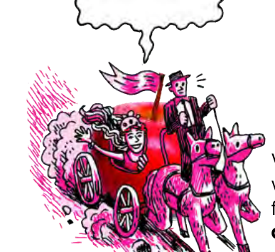
> **[Diagram Context - Textbook_NaturalScience_Gr9_Forces.pdf-0007-12.png]**
> 1. A cartoon drawing of a man and a woman riding a horse.
2. A pink carriage with a flag on top.
3. A blank speech bubble above the carriage.

> **[Diagram Context - Textbook_NaturalScience_Gr9_Safety-with-electricity.pdf-0007-03.png]**
> 1. A diagram of a cell with a green line representing a cell wall.

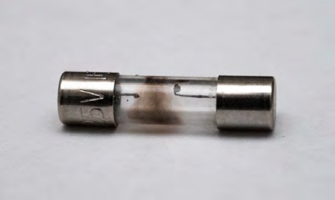
> **[Diagram Context - Textbook_NaturalScience_Gr9_Safety-with-electricity.pdf-0007-05.png]**
> 1. A small glass vial with a silver top and bottom.

> **[Diagram Context - Textbook_NaturalScience_Gr9_Series-and-parallel-circuits.pdf-0007-06.png]**
> 1. A white square with a gray border.

---

### Evolution of Medium-Sized Stars

For medium-sized stars, such as the Sun, the temperature in their centres never reaches a level high enough to fuse carbon and oxygen into heavier elements. Consequently, these stars do not evolve further after the red giant phase. The star becomes unstable and eventually dies.

> **[Diagram Context - Textbook_NaturalScience_Gr9_Birth-life-and-the-death-of-a-star.pdf-0008-03.png]**
> This educational graphic features an illustrated cartoon figure pointing at a globe of the Earth, accompanied by a speech bubble containing the text "VISIT The colours of stars." and a shortened URL link "bit.ly/1dH5ylp". The diagram serves as an online extension prompt directing students to digital resources regarding stellar characteristics. Conceptually, it engages learners studying Earth and Beyond in CAPS Natural Sciences by connecting planetary observation on Earth to the broader astrophysical study of star temperatures and colours.

*Figure: The relative sizes of the Earth, the present-day Sun, and a red supergiant star (Canis Majoris). The Sun is expected to evolve into a red giant in approximately $4.5 \times 10^{9}$ years.*

---

### 5.3 Death of a Star

As a star enters the final stages of its life following the red giant phase, it becomes unstable and undergoes cycles of expansion and contraction.

#### Key Concepts
*   **Planetary Nebula:** An expanding shell of gas formed when a star's outer layers are detached and blown away into space. These nebulae glow as they absorb energy emitted from the hot central star.
*   **White Dwarf:** The remaining core of a star after the outer layers have been shed.
*   **Black Dwarf:** The final, cold, dark state of a star after it has ceased emitting heat and light.
*   **Supernova:** A powerful and luminous stellar explosion.
*   **Neutron Star:** An extremely dense star composed almost entirely of neutrons, resulting from the gravitational collapse of a massive star after a supernova.

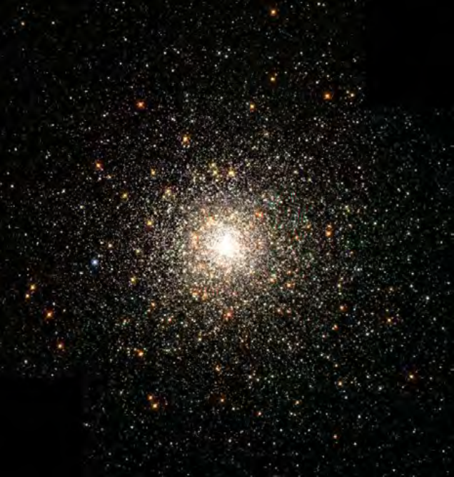
> **[Diagram Context - Textbook_NaturalScience_Gr9_Birth-life-and-the-death-of-a-star.pdf-0008-04.png]**
> This astronomical photograph displays a dense, spheroidal cluster of thousands of stars bound together by gravity, known as a globular cluster. The image features a bright, concentrated central core densely packed with luminous stars, which gradually disperses outward into a vast halo of individual stellar points against the black background of space. For CAPS Physical Sciences learners studying Earth and Beyond, this visual conveys the structure and formation of large stellar systems within our universe, demonstrating how gravitational attraction shapes galactic morphology and stellar distribution.

*Figure: The Ring Nebula (left) and the Boomerang Nebula (right). The Ring Nebula is lit by the central star, while the Boomerang Nebula is noted as the coldest object found in the Universe to date.*

> **[Diagram Context - Textbook_NaturalScience_Gr9_Birth-life-and-the-death-of-a-star.pdf-0008-10.png]**
> The graphic is a cartoon illustration featuring a hot-air balloon shaped like planet Earth, with two figures in the basket holding telescopes, surrounded by clouds, birds, the sun, and a thought bubble containing the text "VISIT Scientists discover star devouring nearby planet. bit.ly/1aDCvCz". Visible elements include a globe-patterned balloon envelope, a wicker basket, a burner flame, and observer figures with handheld telescopes. Conceptually, this visual serves as an engaging stimulus for high school learners exploring space science and astronomy, encouraging inquiry-based learning regarding planetary systems and stellar phenomena.

> **[Diagram Context - Textbook_NaturalScience_Gr9_Cost-of-electrical-energy.pdf-0008-14.png]**
> 1. A cartoon drawing of a man holding a picture of a woman.

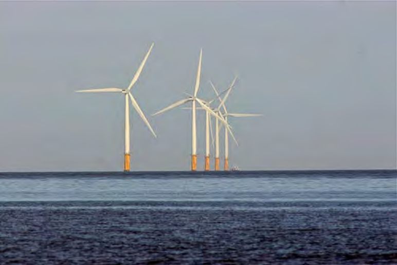
> **[Diagram Context - Textbook_NaturalScience_Gr9_Energy-and-the-national-electricity-grid.pdf-0008-00.png]**
> This photograph shows an offshore wind farm featuring several tall, white wind turbines erected in the sea, with no visible text labels or arrows. It conceptually illustrates the generation of renewable energy from wind power, supporting CAPS Life Sciences and Geography topics related to sustainable resource use and alternative energy sources.

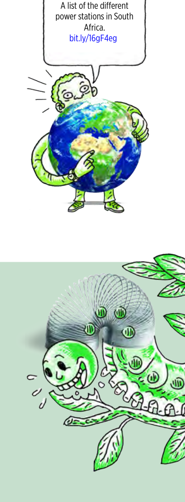
> **[Diagram Context - Textbook_NaturalScience_Gr9_Energy-and-the-national-electricity-grid.pdf-0008-10.png]**
> The graphic consists of two cartoon illustrations: the top panel shows a green human figure holding a globe with a speech bubble reading "A list of the different power stations in South Africa. bit.ly/16gF4eg", while the bottom panel depicts a smiling green caterpillar-like creature with a coiled spring body eating green leaves. The diagram visually supports environmental and biological concepts related to energy generation and ecosystems for CAPS learners.

> **[Diagram Context - Textbook_NaturalScience_Gr9_Forces.pdf-0008-08.png]**
> 1. A diagram of a cell with arrows pointing to different parts of the cell.

> **[Diagram Context - Textbook_NaturalScience_Gr9_Forces.pdf-0008-09.png]**
> 1. A diagram of a rope with two hands holding it.

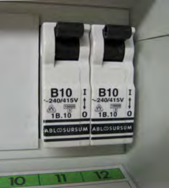
> **[Diagram Context - Textbook_NaturalScience_Gr9_Safety-with-electricity.pdf-0008-00.png]**
> 1. A diagram of a circuit board with two switches labeled B10 and B20.

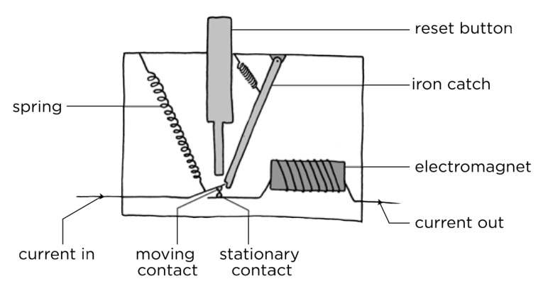
> **[Diagram Context - Textbook_NaturalScience_Gr9_Safety-with-electricity.pdf-0008-06.png]**
> 1. A black and white diagram of a circuit with a spring, iron catch, and moving stationary contact.

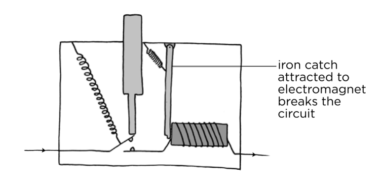
> **[Diagram Context - Textbook_NaturalScience_Gr9_Safety-with-electricity.pdf-0008-08.png]**
> 1. A diagram of a circuit with a spring and a switch.

> **[Diagram Context - Textbook_NaturalScience_Gr9_Series-and-parallel-circuits.pdf-0008-03.png]**
> The image shows a gray and white line with a zipper running down the middle. The zipper is open, and the line is drawn in a zigzag pattern. The background is a solid gray color. The image is labeled as an educational graphic, and it is designed to help a high school student learn about the concept of a zipper.

> **[Diagram Context - Textbook_NaturalScience_Gr9_Series-and-parallel-circuits.pdf-0008-06.png]**
> The image shows a cartoon depiction of a spring coiled up in the shape of a snake. The snake is green and has a smiley face on its head. The snake is surrounded by leaves, and there are four balls on its body. The image also includes a diagram of a Lewis structure, a diagram of a cellular structure, and a diagram of a circuit. The image is labeled with

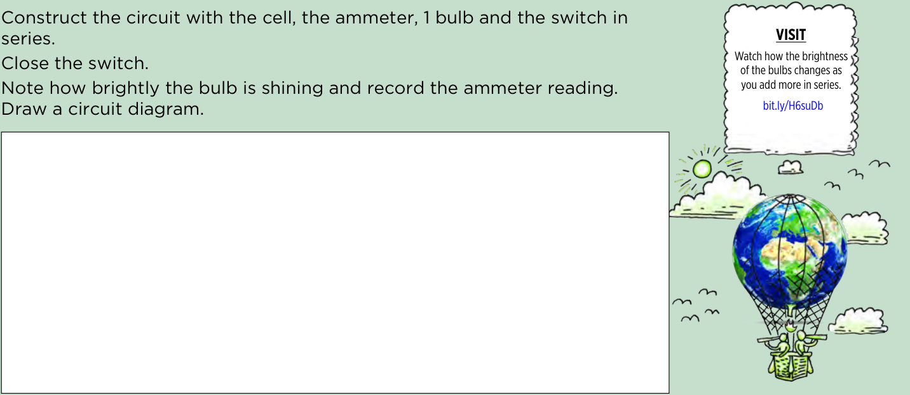
> **[Diagram Context - Textbook_NaturalScience_Gr9_Series-and-parallel-circuits.pdf-0008-15.png]**
> 1. A diagram of a circuit with a bulb and wires.
 2. A diagram of a circuit with a bulb and wires.
 3. A diagram of a circuit with a bulb and wires.

---

# Chapter 5: Birth, Life, and Death of a Star

## Planetary Nebulae
Planetary nebulae are formed during the late stages of a star's life. As a star reaches the end of its life cycle, it expels its outer layers into interstellar space.

### Examples of Nebulae
*   **Kohoutek 4-55 Nebula:** Contains the outer layers of a red giant star that were expelled into space.
*   **The Butterfly Nebula:** A dying central star is hidden within a doughnut-shaped ring of dust. The "wings" consist of hot gas tearing across space at approximately $1\ 000\ 000\ \text{km/h}$.
*   **The Dumbbell Nebula:** An example of the gaseous remnants of a star.
*   **The Helix Nebula:** A classic example of a planetary nebula.

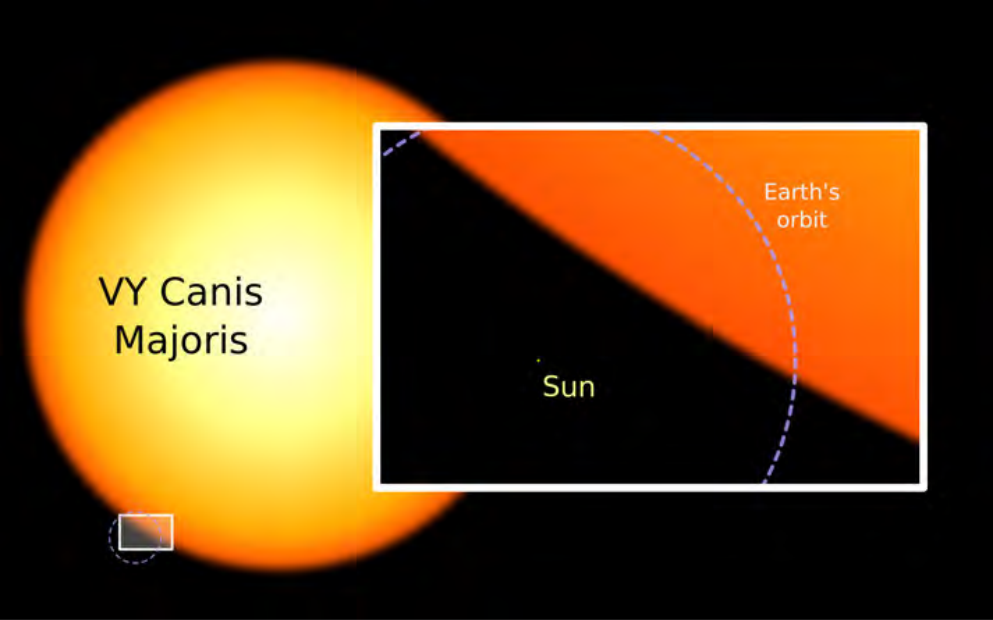
> **[Diagram Context - Textbook_NaturalScience_Gr9_Birth-life-and-the-death-of-a-star.pdf-0009-03.png]**
> This educational graphic is a comparative scale representation illustrating stellar sizes in astronomy. It features the massive red hypergiant star labeled "VY Canis Majoris" alongside a magnified inset showing a tiny dot labeled "Sun" and a dashed curve labeled "Earth's orbit". Conceptually, this diagram helps high school learners comprehend the immense scale and diversity of stellar objects in the universe by visually contrasting our Sun with one of the largest known stars.

## The Formation of a White Dwarf
After a star has "puffed off" its outer layers, the remaining central star eventually runs out of fuel. 

1.  **Collapse:** As the fuel is exhausted, gravity causes the star to collapse inwards.
2.  **Density:** The star becomes incredibly dense and compact.
3.  **Size:** The resulting object is approximately the size of the Earth.
4.  **Classification:** This remnant is known as a **white dwarf**.

### Characteristics of a White Dwarf
*   **Temperature:** They are extremely hot, which causes them to shine with a "white hot" light.
*   **Composition:** They are composed of the remaining central parts of the original star.
*   **Heat Distribution:** The central parts of stars are significantly hotter than their surfaces; because the white dwarf is the exposed core, it retains this intense heat.

---

### Did You Know?
*   The Butterfly Nebula's gas clouds travel fast enough to reach the Moon from Earth in just $24$ minutes.
*   Earth is predicted to be consumed by a red giant star in approximately $5\ 000\ 000\ 000$ (5 billion) years.

### Digital Resources
*   **Visit:** Learn more about the Earth's future at [bit.ly/1iqMpYO](http://bit.ly/1iqMpYO)
*   **Visit:** Take a virtual tour of a planetary nebula at [bit.ly/HsBYrR](http://bit.ly/HsBYrR)

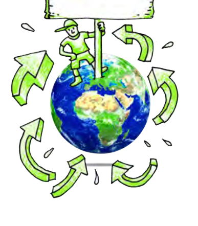
> **[Diagram Context - Textbook_NaturalScience_Gr9_Birth-life-and-the-death-of-a-star.pdf-0009-04.png]**
> The graphic is an environmental education illustration featuring a globe surrounded by a continuous ring of green recycling arrows and a figure holding a blank sign. Visible elements include a planet Earth graphic, a cartoon human figure in green clothing holding a vertical post attached to a blank banner, and multiple curving green arrows arranged in a circular recycling flow pattern. Conceptually, the diagram conveys the interconnectedness of human action and global sustainability, introducing learners to the core CAPS concepts of environmental responsibility, resource management, and recycling within Earth's ecosystems.

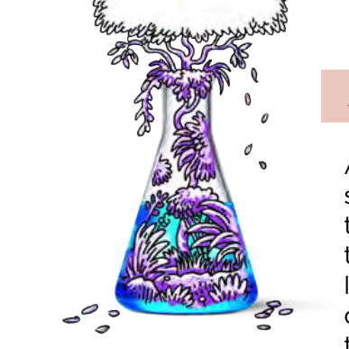
> **[Diagram Context - Textbook_NaturalScience_Gr9_Birth-life-and-the-death-of-a-star.pdf-0009-11.png]**
> The graphic is a biological illustration of an enclosed aquatic and terrestrial ecosystem contained within a glass Erlenmeyer flask. Visible elements include a blue liquid medium at the base, submerged purple aquatic plants and structures, emergent vegetation growing up the neck of the flask, and a dense canopy of foliage spreading out the top with scattered falling seeds. Conceptually, this diagram visually conveys the structure and functioning of a self-contained, closed biosphere or microcosm, helping CAPS Life Sciences learners understand the interactions between biotic components and abiotic factors within an ecosystem.

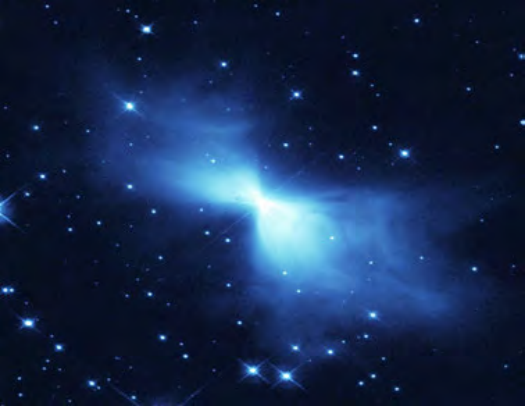
> **[Diagram Context - Textbook_NaturalScience_Gr9_Birth-life-and-the-death-of-a-star.pdf-0009-15.png]**
> This astronomical photograph depicts a bipolar planetary nebula set against a backdrop of distant stars and cosmic dust. Without explicit text labels or arrows, the image showcases the luminous, glowing gas expelled from a dying central star in two opposite directions. Conceptually, it illustrates the late stages of stellar evolution and the recycling of matter in the universe for Physical Sciences learners.

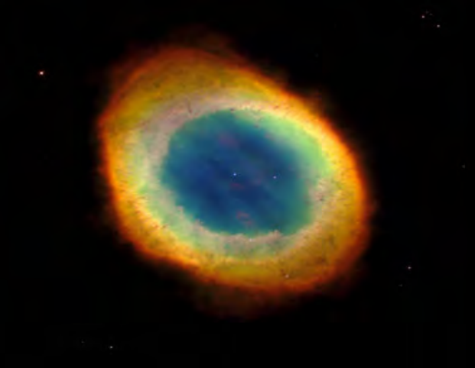
> **[Diagram Context - Textbook_NaturalScience_Gr9_Birth-life-and-the-death-of-a-star.pdf-0009-16.png]**
> This astronomical graphic shows a deep-space photograph of the Ring Nebula, featuring a glowing, colorful shell of ionized gas with a central white dwarf star against a black stellar background. There are no explicit text labels, axes, or arrows present in this image. Conceptually, it illustrates the late stages of stellar evolution for low-to-intermediate-mass stars, demonstrating how a dying star expels its outer layers into space to form a planetary nebula as covered in the FET Physical Sciences curriculum.

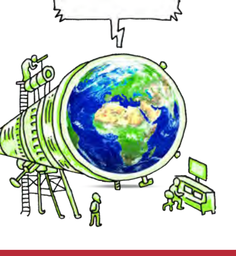
> **[Diagram Context - Textbook_NaturalScience_Gr9_Birth-life-and-the-death-of-a-star.pdf-0009-18.png]**
> This conceptual illustration shows a massive green telescope framing the planet Earth, viewed by tiny human figures operating equipment and looking through a smaller side telescope. The graphic includes a large speech bubble extending from the top, a detailed photographic globe representing Earth, ladders, a support scaffolding structure, and a computer console station. Conceptually, it introduces learners to Earth and Space Sciences by depicting humanity's macro-scale observation and technological study of our planet.

> **[Diagram Context - Textbook_NaturalScience_Gr9_Cost-of-electrical-energy.pdf-0009-03.png]**
> The image features a cartoon depiction of a caterpillar, which is a green and white creature, with a smiley face drawn on its head. The caterpillar is surrounded by green leaves, and there is a wire spring attached to it. The caterpillar is shown in a cartoon style, with a smiley face on its head. The caterpillar is also depicted in a cartoon style, with

> **[Diagram Context - Textbook_NaturalScience_Gr9_Energy-and-the-national-electricity-grid.pdf-0009-00.png]**
> This educational graphic consists of four parallel horizontal lines on a pale green background, resembling a blank writing or note-taking area. There are no visible labels, variables, biological structures, chemical symbols, axis names, or directional arrows present. Conceptually, this template provides a structured space for students to write down answers, definitions, or notes related to a specific CAPS curriculum topic.

> **[Diagram Context - Textbook_NaturalScience_Gr9_Energy-and-the-national-electricity-grid.pdf-0009-01.png]**
> This graphic features a decorative border banner composed of repeating green interlocking shapes resembling looping chains or stylized ribbon-like arrows. The visible elements consist entirely of this continuous linear pattern rendered in a uniform light green tone against a lighter background. Conceptually, it serves as a purely ornamental divider to separate sections of text or topics rather than conveying specific scientific or mathematical content.

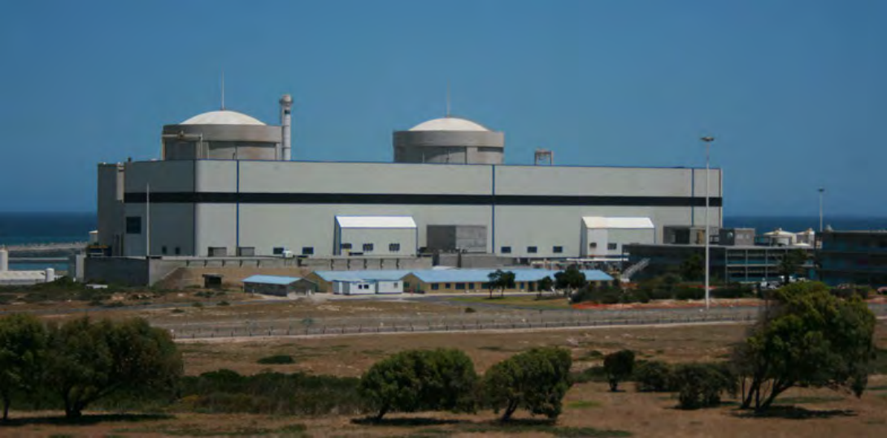
> **[Diagram Context - Textbook_NaturalScience_Gr9_Energy-and-the-national-electricity-grid.pdf-0009-09.png]**
> This photograph shows the Koeberg Nuclear Power Station, South Africa's only operational nuclear energy facility, situated on the coast near Cape Town. The image features the large industrial complex with its distinct containment domes, turbine halls, and proximity to a water source for cooling. For Grade 11 and 12 Physical Sciences and Geography learners, it conceptually illustrates the practical application of nuclear fission for electricity generation and prompts discussions surrounding energy supply, efficiency, and the environmental impacts of alternative energy sources in South Africa.

> **[Diagram Context - Textbook_NaturalScience_Gr9_Energy-and-the-national-electricity-grid.pdf-0009-10.png]**
> The graphic is a text-based educational banner featuring the underlined word "VISIT" enclosed within a stylized, cloud-shaped border. Visible text includes the word "VISIT" prominently displayed in bold, sans-serif capital letters. Conceptually, this graphic serves as a navigational or promotional call-to-action prompt, directing CAPS learners and educators toward an external online resource, revision portal, or additional study material.

> **[Diagram Context - Textbook_NaturalScience_Gr9_Energy-and-the-national-electricity-grid.pdf-0009-12.png]**
> This educational illustration depicts the planet Earth enclosed inside a hot air balloon floating in a cloudy sky with a sun and birds, being heated by a burner flame beneath it while two stick figures in the basket look through spyglasses. The graphic is populated with celestial and atmospheric elements including the sun, clouds, and birds surrounding a globe-patterned balloon basket. Conceptually, this diagram serves as a metaphorical introduction for CAPS geography learners to explore global atmospheric systems, climate change, or environmental monitoring by visualizing humanity's active observation and heating impact on the planet's biosphere.

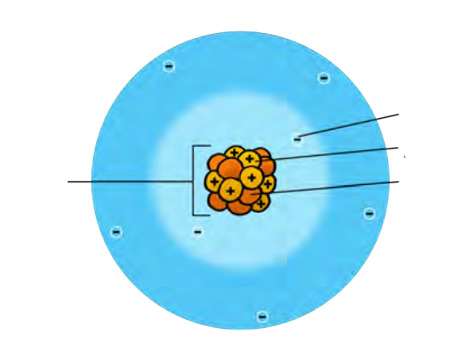
> **[Diagram Context - Textbook_NaturalScience_Gr9_Energy-and-the-national-electricity-grid.pdf-0009-14.png]**
> This diagram illustrates the atomic structure of an atom using a simplified model. It displays a dense central nucleus made of tightly packed orange spheres containing positive signs (+) alongside uncharged particles, surrounded by a diffuse blue electron cloud containing smaller negative symbols (-). Conceptually, this visual helps CAPS Physical Sciences learners understand the subatomic composition of matter, contrasting the massive, positively charged nucleus with the surrounding negatively charged electrons.

> **[Diagram Context - Textbook_NaturalScience_Gr9_Forces.pdf-0009-01.png]**
> 1. A soccer ball with a red line on it.
 2. A green field.
 3. A red arrow pointing to the right.

> **[Diagram Context - Textbook_NaturalScience_Gr9_Forces.pdf-0009-02.png]**
> 1. A diagram of a cell with arrows pointing to different parts of the cell.

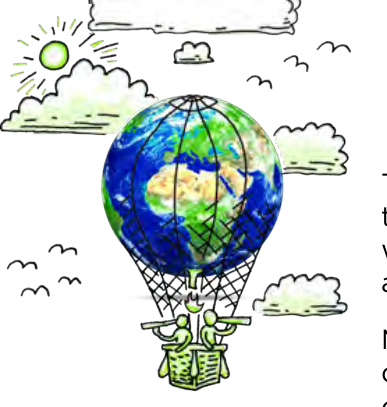
> **[Diagram Context - Textbook_NaturalScience_Gr9_Forces.pdf-0009-03.png]**
> The image shows a cartoon illustration of a hot air balloon filled with a green substance. The balloon is floating in the sky, and there are two people inside the balloon. One person is holding a book, while the other person is holding a telescope. The illustration conveys the concept of a hot air balloon as a means of transportation or exploration, with the people inside the balloon representing the passengers or

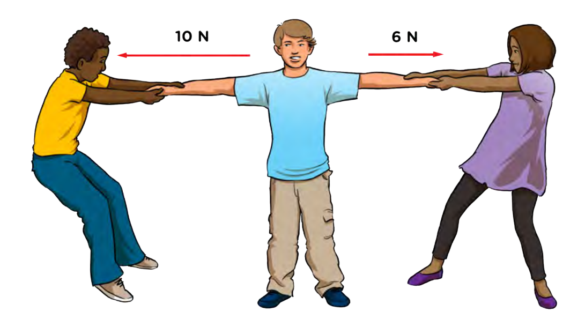
> **[Diagram Context - Textbook_NaturalScience_Gr9_Forces.pdf-0009-07.png]**
> The image is a cartoon illustration of a boy and a girl in a tug of war. The boy is on the left side of the image, and the girl is on the right side. They are both holding onto a rope, and there are arrows pointing to the left and right sides of the image. The image also includes a label that reads "10 N" and "6 N", which

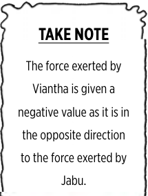
> **[Diagram Context - Textbook_NaturalScience_Gr9_Forces.pdf-0009-08.png]**
> The diagram shows a Lewis structure of a molecule, which is a visual representation of the valence electrons of an atom. The Lewis structure is a key tool in understanding the bonding behavior of atoms and predicting their reactivity. The diagram is labeled with the name of the molecule, "JBU," and the name of the atom, "Vlanta," indicating the chemical formula of the molecule.

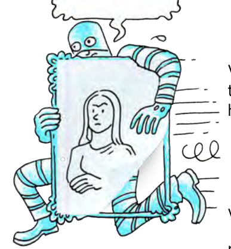
> **[Diagram Context - Textbook_NaturalScience_Gr9_Forces.pdf-0009-09.png]**
> 1. A cartoon drawing of a man holding a picture of a woman.

> **[Diagram Context - Textbook_NaturalScience_Gr9_Forces.pdf-0009-11.png]**
> The image shows a diagram of a line segment with a dot in the middle, labeled with the numbers 10 and 6. The line segment is oriented in both directions, with the number 10 on the left and the number 6 on the right. The diagram is set against a gray background, and the text "10 N" is present.

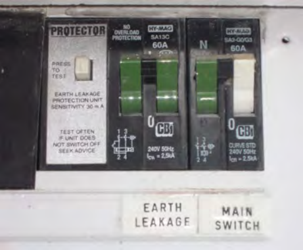
> **[Diagram Context - Textbook_NaturalScience_Gr9_Safety-with-electricity.pdf-0009-03.png]**
> 1. A diagram of a circuit board with a switch labeled "earth leakage".

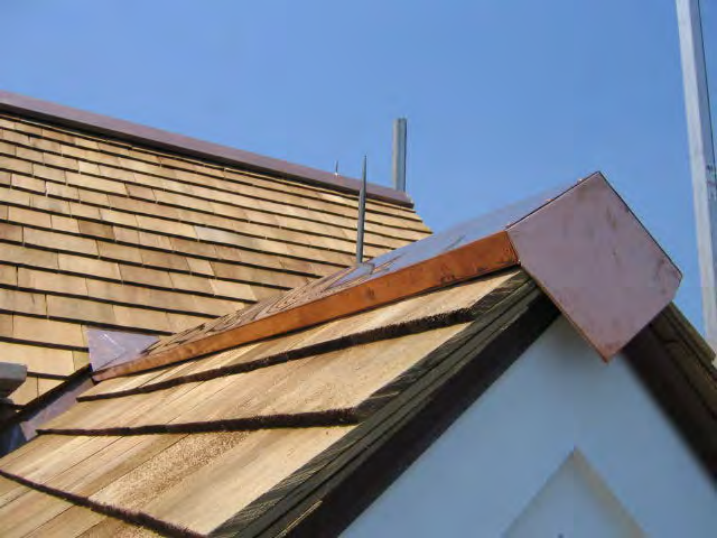
> **[Diagram Context - Textbook_NaturalScience_Gr9_Safety-with-electricity.pdf-0009-07.png]**
> 1. A diagram of a cell with a diagram of a cell and a diagram of a cell with a diagram of a cell and a diagram of a cell with a diagram of a cell and a diagram of a cell with a diagram of a cell and a diagram of a cell with a diagram of a cell and a diagram of a cell with a diagram of a cell and a diagram of a cell

> **[Diagram Context - Textbook_NaturalScience_Gr9_Series-and-parallel-circuits.pdf-0009-00.png]**
> The image shows a diagram of a cell with a white square and a green square. The diagram is labeled with the word "cell" and "organism" in the top left corner and "organism" and "cell" in the bottom right corner. The diagram is labeled with the word "organism" in the top right corner and "organism" and "cell" in the

> **[Diagram Context - Textbook_NaturalScience_Gr9_Series-and-parallel-circuits.pdf-0009-05.png]**
> 1. A white rectangle with a gray border.

---

### White Dwarf Stars

White dwarf stars are stellar remnants that demonstrate that stars can be smaller than planets. 

*   **Relative Size:** As shown in the comparison, a white dwarf like Sirius B is significantly smaller than planets such as Uranus, Neptune, Earth, and Venus.
*   **Density:** White dwarf stars are incredibly dense. One teaspoon of material from a white dwarf would weigh approximately $100\,000\text{ kg}$.
*   **Energy State:** White dwarfs no longer produce energy through nuclear reactions. They radiate stored energy into space as light and heat.
*   **Evolution:** Over time, they slowly cool down. Once all their energy is exhausted, they cease emitting light and become a dead **black dwarf** star, which remains in that state indefinitely.

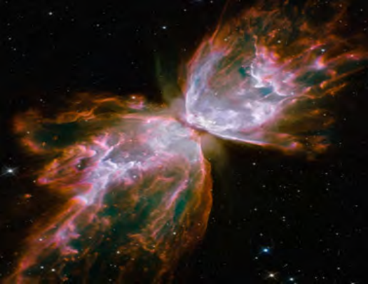

---

### ACTIVITY: Life cycle of a Sun-like star

#### Materials Needed
*   Yellow round balloon (one per pair/group)
*   Black marker
*   Red marker
*   Scissors
*   Small white styrofoam ball ($2\text{ cm}$ diameter, one per pair)

#### Instructions
1.  **Pair Work:** Work in pairs. One student acts as the **Instructor** and the other as the **Experimenter**.
2.  **Setup:** The Experimenter must insert the white styrofoam ball into the deflated balloon.
3.  **Execution:** The Instructor reads the steps from the table below in order. The Instructor must first state the time from the star's birth, then provide the specific instruction for the Experimenter to perform on the balloon.
4.  **Demonstration:** The Experimenter follows the instructions carefully to demonstrate the evolution of a Sun-like star over time.

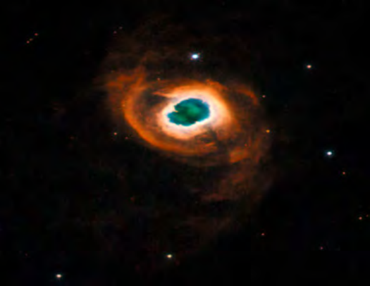

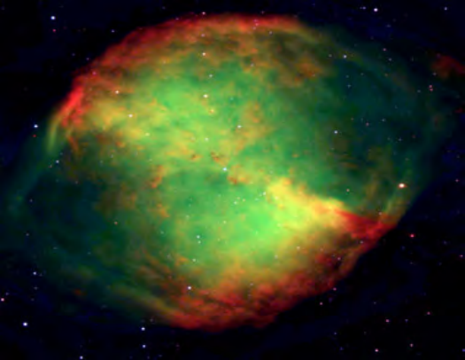

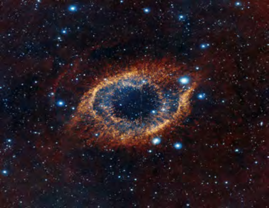

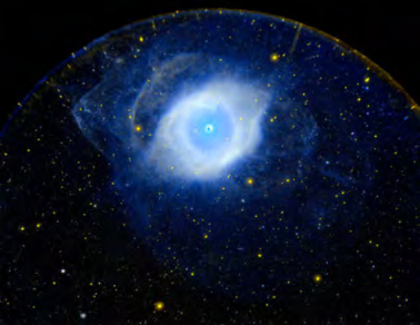

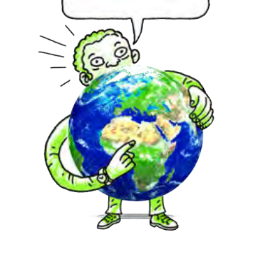

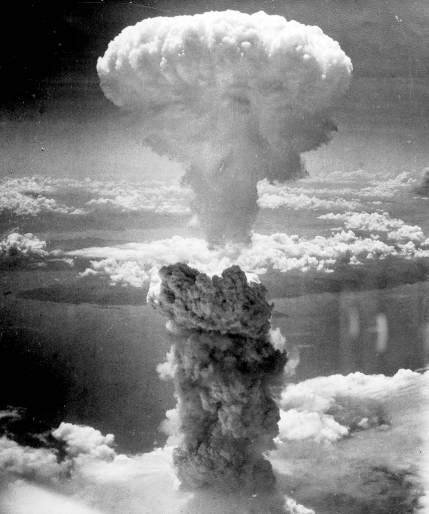

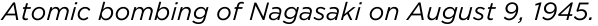

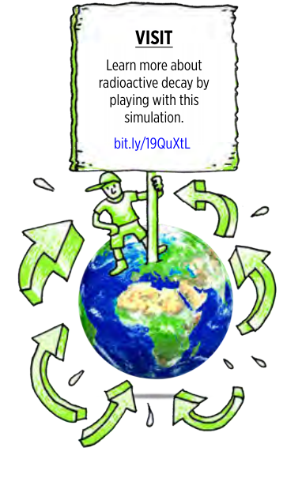

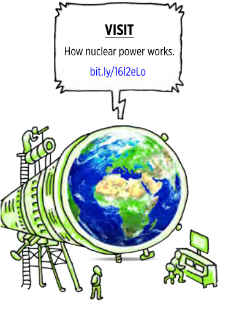

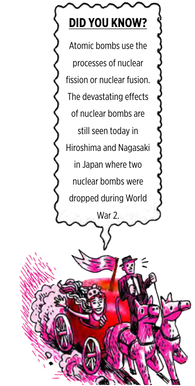

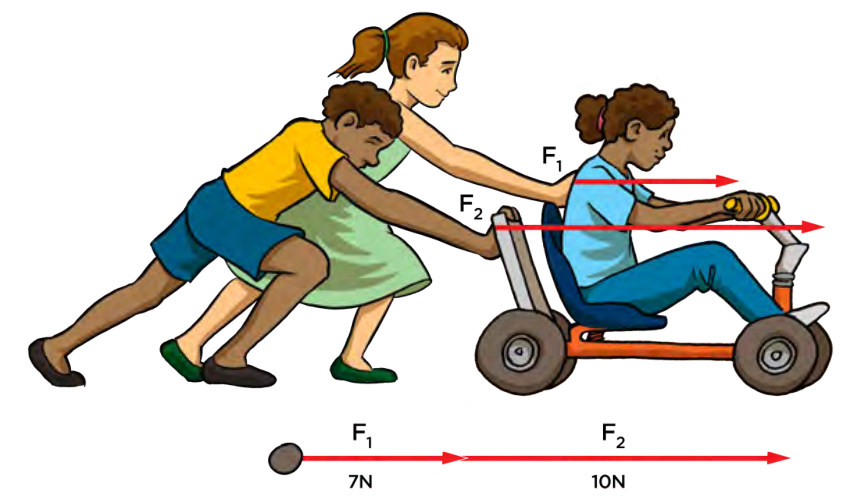

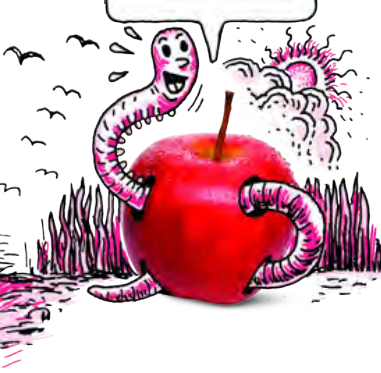

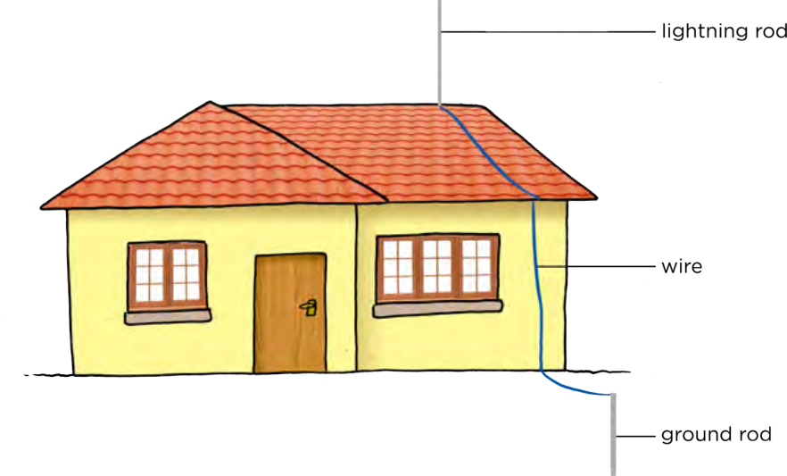

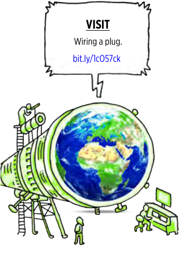

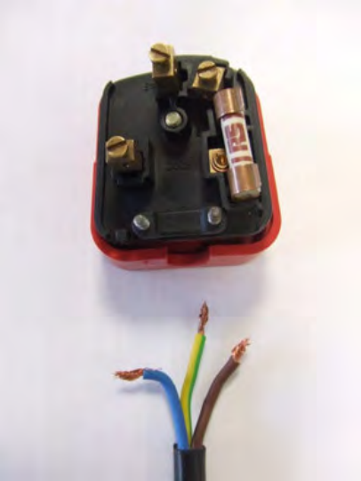

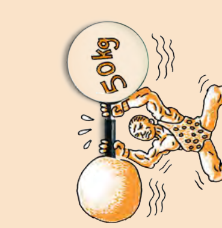

---

### Chapter 5: Birth, Life, and Death of a Star

This activity uses a balloon to simulate the life cycle of a star over billions of years.

#### Simulation Steps

| Step Number | Instructions |
| :--- | :--- |
| 1) Star is born | Blow up the balloon to about $6\text{ cm}$ in diameter |
| 2) $5$ million years | Wait |
| 3) $10$ million years | Wait |
| 4) $500$ million years | Wait - planets are being formed around the star. |
| 5) $1$ billion years | Blow the balloon up a little bit |
| 6) $9$ billion years | Blow the balloon up some more and colour it red - it is now a red giant star |
| 7) $10$ billion years | Blow the balloon up a little bit. The outer layers are now being blown off. To simulate this, slowly allow the balloon to deflate. Cut the balloon into pieces and scatter them around the white ball. The star has now become a white dwarf (the ball) surrounded by a planetary nebula (the pieces of balloon). |
| 8) $50$ billion years | Move the planetary nebula farther away from the white dwarf. |
| 9) $500$ billion years | Remove the planetary nebula and colour the ball black - the star is now a black dwarf. |

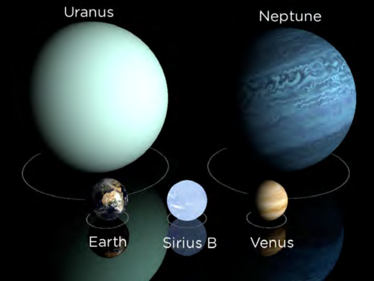
> **[Diagram Context - Textbook_NaturalScience_Gr9_Birth-life-and-the-death-of-a-star.pdf-0011-01.png]**
> The graphic is a comparative scale representation displaying planetary and stellar objects. Visible labels include "Uranus", "Neptune", "Earth", "Sirius B", and "Venus" positioned next to their respective spherical bodies. This comparative visual conveys the vast differences in physical size between gas giants like Uranus and Neptune and terrestrial or stellar bodies such as Earth, Venus, and Sirius B.

***

#### Take Note: Planetary Nebulae
The plural of nebula is **nebulae**. Planetary nebulae have nothing to do with planets but were named like this in the $1700\text{s}$ because they resembled planets when observed with the telescopes of the time.

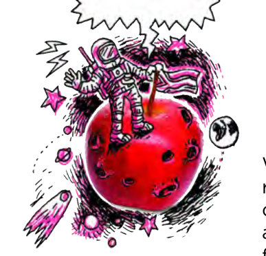
> **[Diagram Context - Textbook_NaturalScience_Gr9_Birth-life-and-the-death-of-a-star.pdf-0011-04.png]**
> This educational cartoon illustration depicts an astronaut standing on a red apple modified to resemble a cratered planet, set against a stylized pink-and-black cosmic background featuring stars, lightning bolts, a comet, and a speech bubble. The visual elements include an astronaut in a spacesuit holding a South African flag planted into the apple, which is surrounded by orbiting planets and celestial bodies. Conceptually, this creative graphic engages CAPS learners by playfully contextualising space science and gravity within everyday objects, stimulating interest in astronomical concepts and planetary exploration.

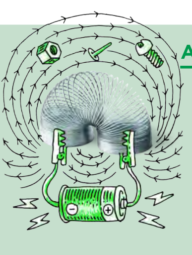
> **[Diagram Context - Textbook_NaturalScience_Gr9_Birth-life-and-the-death-of-a-star.pdf-0011-06.png]**
> This physical sciences apparatus diagram illustrates an electromagnet setup, featuring a coiled spring (solenoid) connected via alligator clips to a battery labeled with negative (-) and positive (+) terminals, surrounded by iron objects like a nut, nail, and screw. Visible dashed field lines with directional arrows demonstrate the magnetic field generated around the current-carrying conductor. Conceptually, this conveys how passing an electric current through a solenoid produces a magnetic field strong enough to magnetize and attract metal objects, demonstrating the principles of electromagnetism for CAPS learners.

> **[Diagram Context - Textbook_NaturalScience_Gr9_Cost-of-electrical-energy.pdf-0011-02.png]**
> 1. A white rectangle with a gray border.

> **[Diagram Context - Textbook_NaturalScience_Gr9_Cost-of-electrical-energy.pdf-0011-04.png]**
> 1. A white rectangle with a gray border.

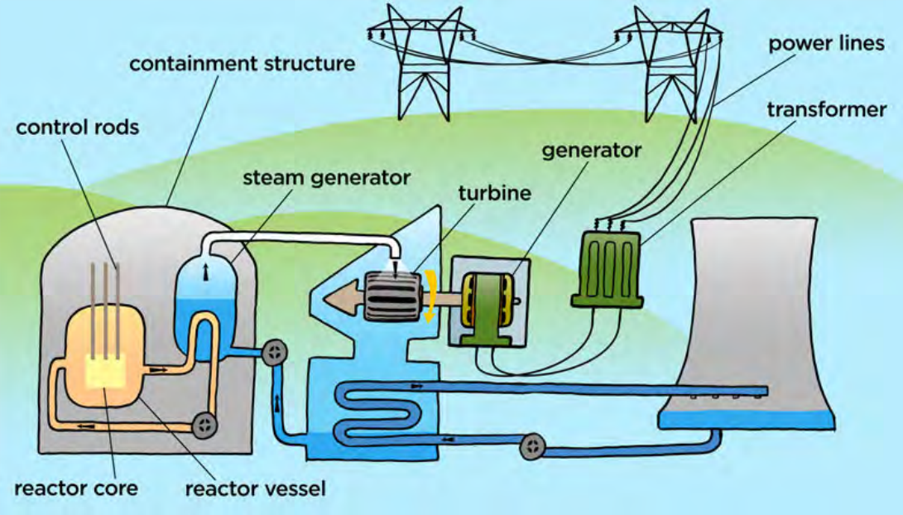
> **[Diagram Context - Textbook_NaturalScience_Gr9_Energy-and-the-national-electricity-grid.pdf-0011-01.png]**
> This educational graphic is a systems diagram illustrating the layout and functioning of a nuclear power station. It features visible labels for the containment structure, reactor core, reactor vessel, control rods, steam generator, turbine, generator, transformer, and power lines, alongside cooling loops and directional flow arrows. Conceptually, the diagram conveys the energy conversion process in nuclear power generation, showing how nuclear fission heat creates steam to turn a turbine, which then drives a generator to produce electrical energy for the national grid.

> **[Diagram Context - Textbook_NaturalScience_Gr9_Energy-and-the-national-electricity-grid.pdf-0011-03.png]**
> This educational illustration features a cartoon figure embracing and pointing specifically at the African continent on a globe of the Earth. The visual elements include a green-skinned human character wearing a watch, pointing with one hand and holding the globe, which clearly displays Africa, Europe, and parts of the Atlantic and Indian Oceans. Conceptually, this graphic engages Grade 10-12 Geography learners by personalising spatial awareness and location-based inquiry, drawing focus to Africa's geographic positioning within global studies.

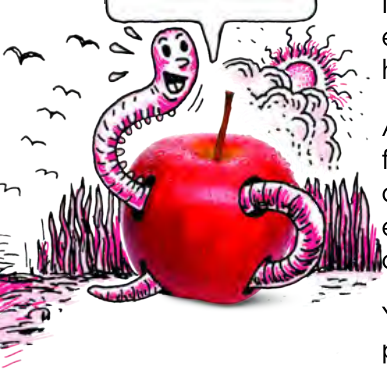
> **[Diagram Context - Textbook_NaturalScience_Gr9_Energy-and-the-national-electricity-grid.pdf-0011-10.png]**
> This cartoon graphic illustrates an anatomical and ecological context featuring an anthropomorphized earthworm emerging from a red apple in an outdoor environment with grass, birds, clouds, and a sun. Visible elements include a segmented pink earthworm wrapping around the apple, a stem, and a speech bubble. Conceptually, this diagram visually introduces high school learners to the ecological role of detritivores and decomposers in nutrient cycling, as well as the basic anatomy and habitat of invertebrates like annelids.

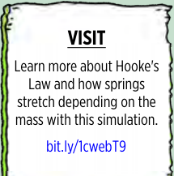
> **[Diagram Context - Textbook_NaturalScience_Gr9_Forces.pdf-0011-03.png]**
> 1. A diagram of a cell with arrows pointing to different parts of the cell.

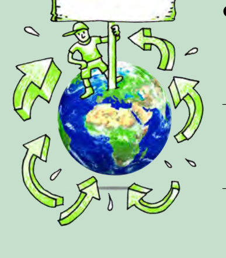
> **[Diagram Context - Textbook_NaturalScience_Gr9_Forces.pdf-0011-04.png]**
> The image presents a cartoon illustration of a cartoon boy holding a pole that is connected to the earth. The boy is wearing a green shirt and a hat. The boy is standing on a globe, which is colored in blue and green. The globe is surrounded by arrows, which are pointing in different directions. The arrows are labeled with various terms such as "circuit", "geometry", "

> **[Diagram Context - Textbook_NaturalScience_Gr9_Forces.pdf-0011-09.png]**
> 1. A diagram of a cell with a green line representing the cell wall.

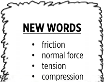
> **[Diagram Context - Textbook_NaturalScience_Gr9_Forces.pdf-0011-11.png]**
> 1. A diagram of a cell with arrows pointing to different parts of the cell.

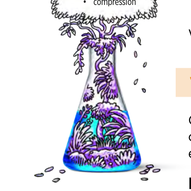
> **[Diagram Context - Textbook_NaturalScience_Gr9_Forces.pdf-0011-15.png]**
> 1. A cartoon illustration of a plant growing out of a flask.

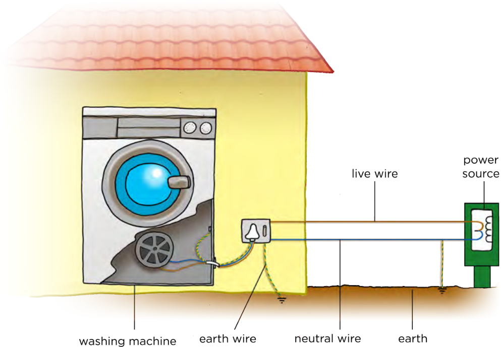
> **[Diagram Context - Textbook_NaturalScience_Gr9_Safety-with-electricity.pdf-0011-02.png]**
> 1. A diagram of a washing machine and its components.
 2. A diagram of a house with a washing machine.
 3. A diagram of a washing machine.

> **[Diagram Context - Textbook_NaturalScience_Gr9_Safety-with-electricity.pdf-0011-07.png]**
> The image shows a cartoon depiction of a green frog with a smiley face and a leafy plant on its back. The frog is holding a green ball in its mouth and appears to be eating the leafy plant. The frog is positioned on the left side of the image, while the leafy plant is on the right side. The background of the image is a light green color.

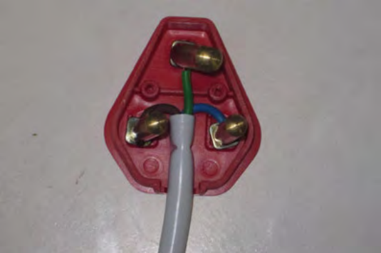
> **[Diagram Context - Textbook_NaturalScience_Gr9_Safety-with-electricity.pdf-0011-14.png]**
> 1. A diagram of a red connector with a green and blue wire attached to it.

> **[Diagram Context - Textbook_NaturalScience_Gr9_Series-and-parallel-circuits.pdf-0011-13.png]**
> 1. A gray background with a zipper running down the center.

---

# The Life Cycle of a Star

## Concept: Stellar Evolution
Stars, like the Sun, undergo a life cycle that can be compared to the stages of human life. The evolution of a star of average size and mass follows a predictable progression:

1.  **Protostar:** The initial stage of star formation.
2.  **Main Sequence Star:** The longest stage of a star's life, where it remains stable.
3.  **Red Giant:** A later stage where the star expands significantly.
4.  **White Dwarf:** The final stage for an average-sized star, representing its "old age" or death.

---

## Activity: The Life Cycle of the Sun

### Instructions
The Sun is a common type of star of average size and mass. Study the timeline below to understand its evolution over billions of years.

> **[Diagram Context - Textbook_NaturalScience_Gr9_Birth-life-and-the-death-of-a-star.pdf-0012-02.png]**
> This graphic is a decorative border featuring repeating green serpentine or scroll-like patterns. It contains no text, labels, chemical symbols, or specific scientific apparatus. It serves as a purely ornamental graphic divider for a page layout rather than conveying conceptual subject matter for high school curriculum topics.

### Questions
Complete the following sentences based on the provided timeline:

1. The Sun is currently about halfway through its lifetime as a \_\_\_\_\_\_\_\_\_\_\_\_\_\_\_\_\_\_ star. 
2. In about 4.5 billion years' time, the Sun will swell up to form a \_\_\_\_\_\_\_\_\_\_\_\_\_\_\_\_\_\_ star, eventually engulfing the Earth.

---

### Summary Table: Stellar Timeline

| Stage | Approximate Time (Billions of Years) |
| :--- | :--- |
| Birth | 0 |
| Main Sequence (Current) | ~5 |
| Red Giant Phase | ~10 |
| Planetary Nebula / White Dwarf | 11 - 14 |

> **[Diagram Context - Textbook_NaturalScience_Gr9_Cost-of-electrical-energy.pdf-0012-06.png]**
> 1. A diagram of a snake's body.
 2. The snake's head is green.
 3. The snake's body is green.

> **[Diagram Context - Textbook_NaturalScience_Gr9_Energy-and-the-national-electricity-grid.pdf-0012-05.png]**
> This educational illustration features a mechanical apparatus and a green roller coaster track with a coiled spring superimposed over its peak and four excited cartoon figures riding it. The graphic contains visible elements including a coiled spring, wheels running along the green track, and a smaller thumbnail roller coaster sketch with motion lines and curly loops. Conceptually, this diagram helps high school Physical Sciences learners visualize the conservation of mechanical energy by comparing the continuous interplay between kinetic and potential energy on a roller coaster track to the mechanical dynamics of a spring.

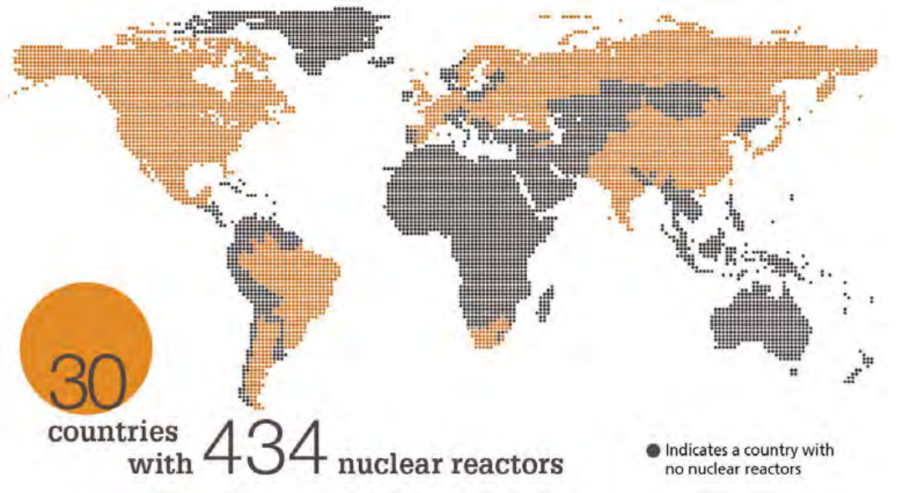
> **[Diagram Context - Textbook_NaturalScience_Gr9_Energy-and-the-national-electricity-grid.pdf-0012-09.png]**
> This educational graphic is a world map rendered in a pixelated dot matrix that visually contrasts nations with and without nuclear energy infrastructure. The graphic includes statistical text stating "30 countries with 434 nuclear reactors" alongside a legend indicator showing that dark grey dots represent countries with no nuclear reactors, while orange dots highlight nations operating nuclear facilities. Conceptually, this diagram helps high school learners analyze global energy distribution, geography, and the unequal adoption of nuclear power as an electricity generation source across different continents.

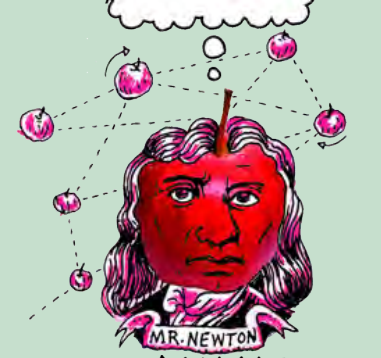
> **[Diagram Context - Textbook_NaturalScience_Gr9_Energy-and-the-national-electricity-grid.pdf-0012-11.png]**
> This conceptual graphic depicts a portrait of "MR. NEWTON" with an apple-shaped head surrounded by a network of interacting pink apples connected by dashed lines and directional arrows. The diagram conveys Newton's Law of Universal Gravitation, illustrating conceptually how every particle or body of matter attracts every other mass in the universe with a mutual gravitational force proportional to their masses and inversely proportional to the square of the distance between them.

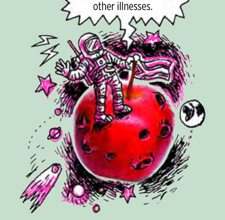
> **[Diagram Context - Textbook_NaturalScience_Gr9_Energy-and-the-national-electricity-grid.pdf-0012-14.png]**
> This conceptual graphic depicts a cartoon astronaut standing on a red apple modified to resemble a cratered planet amidst a pink-tinted space setting with stars, planets, and a speech bubble containing the text "other illnesses.". The visual elements include an astronaut figure, a cratered red apple serving as a celestial body, a planted flag, and a text bubble referencing illnesses in outer space. Conceptually, this metaphorical illustration helps learners engage with the health impacts of space travel and environmental stressors by linking everyday nutrition and illness to the physiological challenges experienced in extraterrestrial environments.

> **[Diagram Context - Textbook_NaturalScience_Gr9_Forces.pdf-0012-01.png]**
> The image shows a soccer ball on a green field with a red arrow pointing to the right. The arrow is positioned at the center of the image, indicating the direction of the ball's movement. The soccer ball is black and white, and it is the main focus of the image. The green field is visible in the background, providing a contrast to the black and white soccer ball. The image

> **[Diagram Context - Textbook_NaturalScience_Gr9_Forces.pdf-0012-03.png]**
> The image shows a group of people playing with a toy car. There are three people in the scene, with one person pushing the car and two others sitting in it. The car is moving along a track, and there are arrows pointing in the direction of the car's motion. The image also includes a diagram of the forces acting on the car, which is labeled "F2" and "

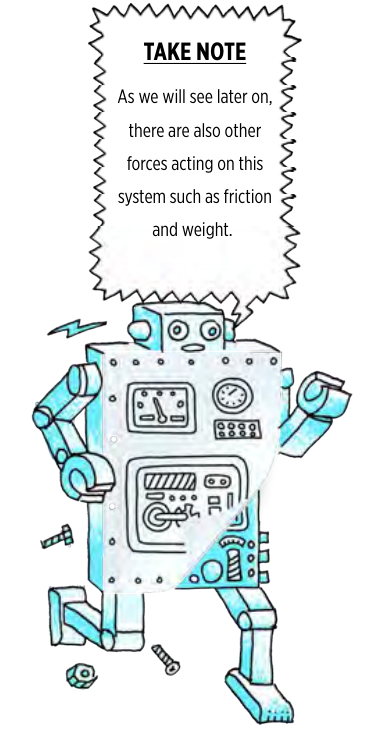
> **[Diagram Context - Textbook_NaturalScience_Gr9_Forces.pdf-0012-04.png]**
> 1. A robot with a head and arms.

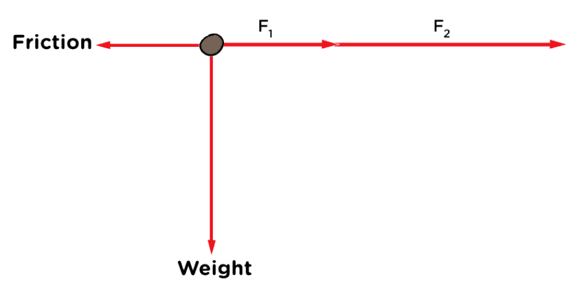
> **[Diagram Context - Textbook_NaturalScience_Gr9_Forces.pdf-0012-08.png]**
> The image shows a diagram of a Lewis structure for a molecule of water. The diagram is labeled with the chemical formula of H2O and arrows pointing to the bonds between the atoms. The diagram also includes a weight label indicating the weight of the molecule. The diagram is set against a gray background, and the text "Lewis diagram" is written in black at the top of the image.

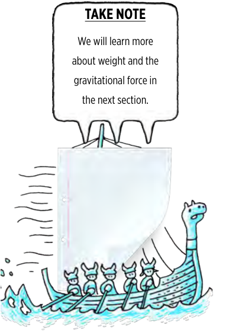
> **[Diagram Context - Textbook_NaturalScience_Gr9_Forces.pdf-0012-09.png]**
> The image features a cartoon boat with a group of people on it, including a dragon, and a text box that reads "Take Note" and "We will learn more about weight and the gravitational force in the next section."

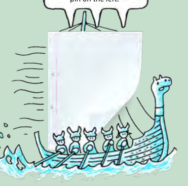
> **[Diagram Context - Textbook_NaturalScience_Gr9_Safety-with-electricity.pdf-0012-18.png]**
> 1. A cartoon boat with five people on it.

> **[Diagram Context - Textbook_NaturalScience_Gr9_Safety-with-electricity.pdf-0012-19.png]**
> This educational graphic is a decorative border featuring a repeating pattern of green arrows pointing to the right. The visible elements consist exclusively of stylized arrowhead shapes lined up sequentially in a continuous horizontal band. Conceptually, it serves as a visual divider or directional motif in a textbook layout, often used by CAPS curriculum materials to guide the learner's eye across sections or indicate flow and progression.

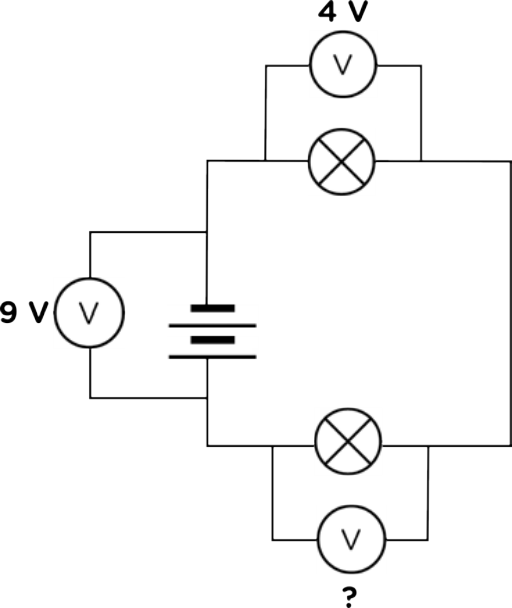
> **[Diagram Context - Textbook_NaturalScience_Gr9_Series-and-parallel-circuits.pdf-0012-03.png]**
> 1. A diagram of a circuit with three voltage sources and three resistance sources.

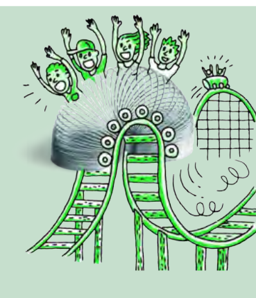
> **[Diagram Context - Textbook_NaturalScience_Gr9_Series-and-parallel-circuits.pdf-0012-06.png]**
> 1. A cartoon depiction of a roller coaster.

---

### The Life Cycle of a Sun-like Star: Exercises

**2.** After the Sun has become a red giant, it will eventually become unstable and puff off its outer layers forming a beautiful **planetary nebula**. The central core of the Sun will be left exposed in the centre of the planetary nebula.

**3.** Once the fuel runs out in the core of the Sun, nuclear reactions will **cease (or stop)**. The Sun will then have become a hot **white dwarf** star, left behind at the centre of the planetary nebula.

**4.** As there are no ongoing nuclear reactions, the white dwarf shines as it slowly cools and will eventually form a **black** dwarf.

***

### ACTIVITY: Flow diagram poster showing the life of a Sun-like star

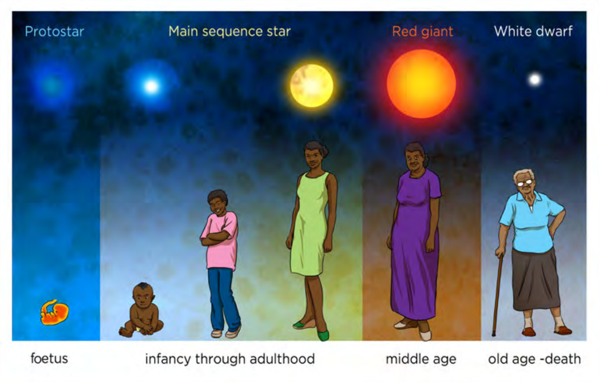
> **[Diagram Context - Textbook_NaturalScience_Gr9_Birth-life-and-the-death-of-a-star.pdf-0013-01.png]**
> This educational graphic is an analogical timeline illustrating stellar evolution alongside human life stages. It features visual representations and labels for stellar phases ("Protostar", "Main sequence star", "Red giant", "White dwarf") aligned with corresponding human life stages ("foetus", "infancy through adulthood", "middle age", "old age -death"). Conceptually, it uses a familiar biological metaphor to help learners grasp the sequential lifecycle, aging, and ultimate transformation of average-mass stars in astronomy.

#### Materials:
* Paper or card for the poster.
* Pencils, crayons, or paint for drawing.
* Printouts of photographs or pictures of the various stages in the Sun's life.

#### Instructions:
1. **Draw a flow diagram:** Show the key stages in a Sun-like star's life. You may include the birth, life, aging, and death of the star. You can paste printouts of photos or drawings of the key stages onto the poster instead of drawing them.
2. **Label and indicate flow:** Label each stage clearly and use arrows to indicate the direction of flow in the evolutionary stages.
3. **Advanced Task:** Write down approximately how long each stage lasts. Use the timeline of the Sun's evolution provided in this chapter to assist you.

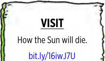
> **[Diagram Context - Textbook_NaturalScience_Gr9_Birth-life-and-the-death-of-a-star.pdf-0013-02.png]**
> This educational graphic is a text-based informational prompt styled like a torn note, featuring the underlined heading "VISIT", the statement "How the Sun will die.", and a shortened hyperlink URL ("bit.ly/16iwJ7U"). It acts as an external resource or reference prompt directing learners to digital content about stellar evolution. Conceptually, it supports CAPS Physical Sciences and Natural Sciences topics on the life cycles of stars, encouraging students to explore the final stages of medium-mass stars like our Sun.

> **[Diagram Context - Textbook_NaturalScience_Gr9_Birth-life-and-the-death-of-a-star.pdf-0013-03.png]**
> This educational graphic illustrates an environmental conservation concept featuring a globe encircled by green recycling arrows and a figure holding a sign. Visible elements include a central globe showing Earth's continents, a character holding a blank vertical signpost at the top, and a circular sequence of large green curved arrows indicating a continuous cycle. Conceptually, this diagram visually conveys the cyclical process of recycling and environmental sustainability, reinforcing CAPS Life Sciences and Natural Sciences themes regarding human impact on the biosphere and waste management.

> **[Diagram Context - Textbook_NaturalScience_Gr9_Birth-life-and-the-death-of-a-star.pdf-0013-04.png]**
> This conceptual illustration compares the looping body of a caterpillar eating a leaf to a compressed metal spring (Slinky) resting on its back. The visual includes a green leaf-eating caterpillar with a smiling face, segmented body markings containing green striped circles, and a metallic coil superimposed on its midsection. In the CAPS curriculum, this analogy helps learners understand how the peristaltic-like locomotion and body flexibility of invertebrates relate to mechanical waves and compression forces in physics and biology.

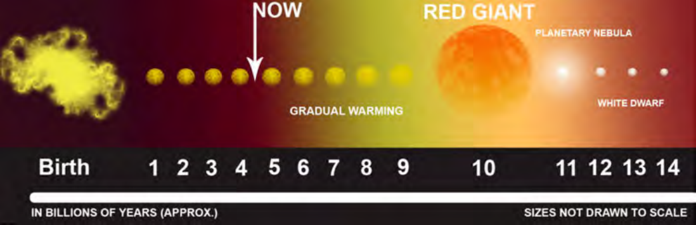
> **[Diagram Context - Textbook_NaturalScience_Gr9_Birth-life-and-the-death-of-a-star.pdf-0013-10.png]**
> This educational graphic is an evolutionary timeline illustrating the life cycle of a star. Visible labels include "Birth," "NOW," "GRADUAL WARMING," "RED GIANT," "PLANETARY NEBULA," "WHITE DWARF," and a timeline axis marked in "BILLIONS OF YEARS (APPROX.)" from 0 to 14, accompanied by an arrow pointing to the present stage. Conceptually, it helps high school learners visualize stellar evolution by mapping out the sequential stages of a sun-like star from its formation through its main sequence, expansion into a red giant, and eventual collapse into a white dwarf over billions of years.

> **[Diagram Context - Textbook_NaturalScience_Gr9_Cost-of-electrical-energy.pdf-0013-00.png]**
> A cartoon depiction of a roller coaster with a group of people on it.

> **[Diagram Context - Textbook_NaturalScience_Gr9_Cost-of-electrical-energy.pdf-0013-07.png]**
> 1. A white square with a brown border.

> **[Diagram Context - Textbook_NaturalScience_Gr9_Energy-and-the-national-electricity-grid.pdf-0013-03.png]**
> This graphic is a decorative border consisting of a repeating green S-shaped wave pattern. It contains no text labels, variables, or specific scientific symbols. Conceptually, it serves purely as a page separator or aesthetic divider for educational worksheets or textbook layouts.

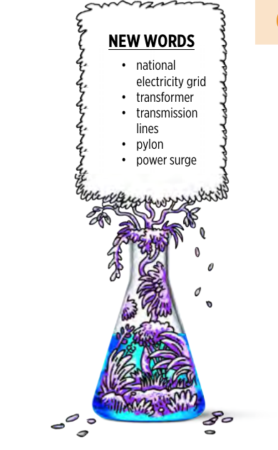
> **[Diagram Context - Textbook_NaturalScience_Gr9_Energy-and-the-national-electricity-grid.pdf-0013-05.png]**
> This educational graphic features a vocabulary list titled "NEW WORDS" emerging from a laboratory Erlenmeyer flask filled with blue liquid and purple plant-like structures. The visible labels include "national electricity grid", "transformer", "transmission lines", "pylon", and "power surge". Conceptually, this illustration introduces key terminology related to electrical systems and energy distribution for high school science learners.

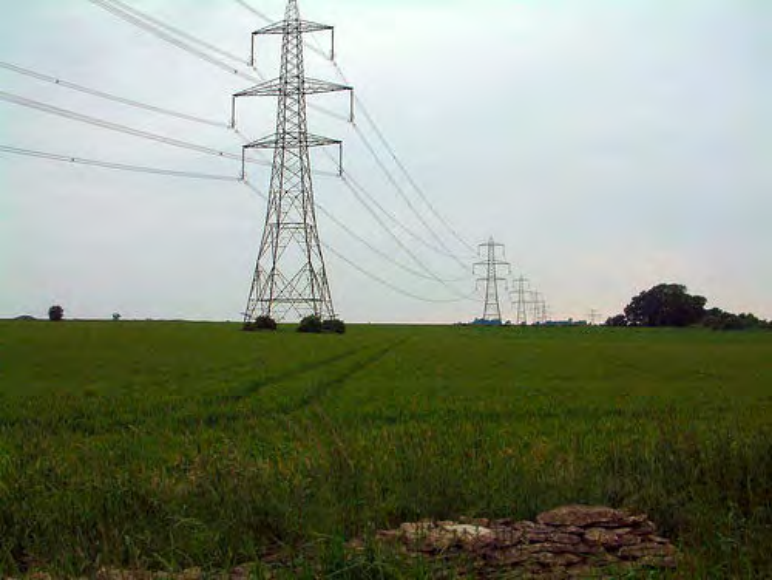
> **[Diagram Context - Textbook_NaturalScience_Gr9_Energy-and-the-national-electricity-grid.pdf-0013-07.png]**
> This photograph shows a transmission line system featuring large metal pylons carrying high-voltage alternating current (AC) power cables across an open field. The image displays tall steel lattice towers supporting multiple overhead transmission cables stretching into the distance. Conceptually, this visual introduces Grade 11 and 12 Physical Sciences learners to the national electricity grid, illustrating how electrical energy generated at power stations is transmitted over long distances at high voltages and low currents to minimize energy losses through Joule heating in the transmission wires.

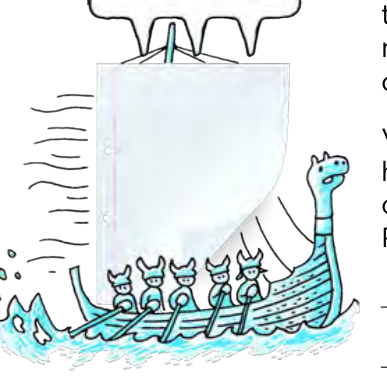
> **[Diagram Context - Textbook_NaturalScience_Gr9_Energy-and-the-national-electricity-grid.pdf-0013-12.png]**
> The graphic illustrates a physical science concept showing a Viking ship equipped with a large sail, oarsmen, and wind lines blowing from the left. Visible elements include wavy horizontal lines representing wind, a large rectangular sail attached to a central mast, oars being used by crew members, and choppy water beneath the hull. Conceptually, this diagram helps high school learners understand the principles of forces, vector addition, and how wind power generates thrust to overcome drag in mechanics.

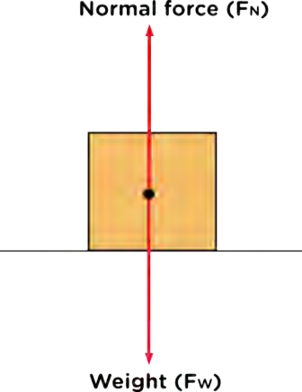
> **[Diagram Context - Textbook_NaturalScience_Gr9_Forces.pdf-0013-01.png]**
> A diagram of a normal force and a weight force on a cube. The normal force is represented by a red line and the weight force is represented by a black line. The normal force is located at the top of the image and the weight force is located at the bottom. The weight force is labeled as F(w), and the normal force is labeled as F(n).

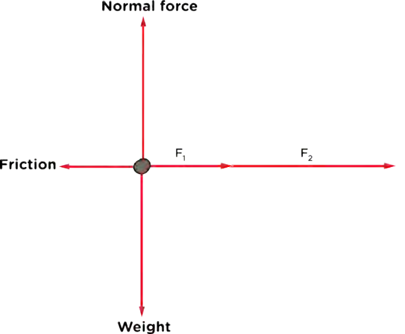
> **[Diagram Context - Textbook_NaturalScience_Gr9_Forces.pdf-0013-05.png]**
> The image presents a diagram that illustrates the relationship between forces and weight. The diagram is a Lewis diagram, which is a type of anatomical or cellular structure diagram used to represent chemical bonds. The diagram is color-coded, with red arrows pointing to the forces and green arrows pointing to the weight. The diagram also includes labels for normal force, friction, and weight. The diagram is set against a

> **[Diagram Context - Textbook_NaturalScience_Gr9_Forces.pdf-0013-06.png]**
> 1. A cartoon image of a cartoon character with a large white "V" on a gray background.

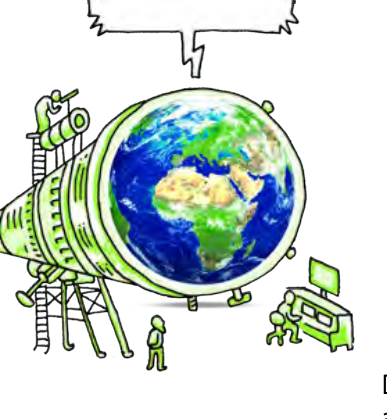
> **[Diagram Context - Textbook_NaturalScience_Gr9_Forces.pdf-0013-08.png]**
> The image features a cartoon depiction of a globe with a speech bubble above it, containing a thought bubble with a lightning bolt. The globe is surrounded by a group of people, with one person holding a telescope. The cartoon is labeled "South Africa" in the bottom right corner.

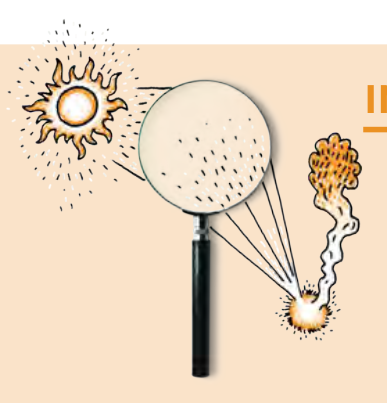
> **[Diagram Context - Textbook_NaturalScience_Gr9_Forces.pdf-0013-10.png]**
> 1. A magnifying glass is being used to look at a diagram of a cell.

> **[Diagram Context - Textbook_NaturalScience_Gr9_Safety-with-electricity.pdf-0013-00.png]**
> This educational graphic features an illustrated cartoon rollercoaster track with excited passengers, overlaid with a metallic spring (Slinky) resting on the peak of the rails. The visual elements include green tracks, supports, a small secondary rollercoaster car in the background, and the superimposed spring coil. Conceptually, this diagram serves as a familiar, real-world analogy in Physical Sciences to help Grade 10-12 learners understand the continuous conversion and conservation of mechanical energy (potential energy at the peak transforming into kinetic energy).

> **[Diagram Context - Textbook_NaturalScience_Gr9_Safety-with-electricity.pdf-0013-06.png]**
> The provided image is completely blank and contains no visual content, labels, or educational graphics to analyze. As a result, no specific CAPS curriculum concepts can be identified or explained.

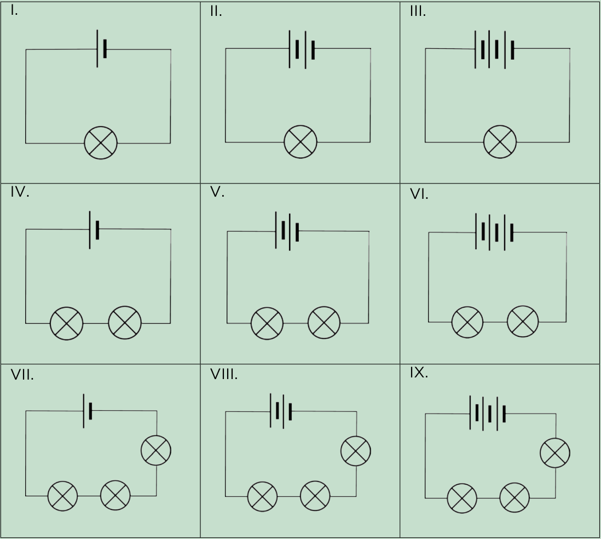
> **[Diagram Context - Textbook_NaturalScience_Gr9_Series-and-parallel-circuits.pdf-0013-03.png]**
> 1. A diagram of a circuit with multiple wires and components.

---

### Life Cycle of Massive Stars

#### Take Note
When discussing the life cycle of stars, we refer to **massive** stars rather than just "bigger" stars. In this context, it is the **mass** of the star that determines its evolution, not its physical size.

---

#### The Evolution of Massive Stars
Stars that have a mass more than eight times that of the Sun follow a different life cycle compared to average stars.

1.  **Red Supergiants:** Once the hydrogen in the core of a massive star is depleted, the star swells to become a **red supergiant**. These are significantly larger than red giants.
2.  **Nuclear Fusion:** A red supergiant continues to fuse increasingly heavier elements within its core for millions of years.
3.  **Core Collapse:** This process continues until the core is composed of iron. At this stage, nuclear reactions cease.
4.  **Supernova:** Without the outward pressure from nuclear fusion, the star collapses rapidly under its own gravity. The outer layers of the star crash into the dense central core, rebound, and are blasted into space in a massive explosion known as a **supernova**.

---

#### Questions

1. Where are stars born?
2. Why is a red giant so named?
3. What kind of stellar remnant is left behind once a star like the Sun dies?
4. What is a planetary nebula?
5. How big is a white dwarf?

> **[Diagram Context - Textbook_NaturalScience_Gr9_Birth-life-and-the-death-of-a-star.pdf-0014-06.png]**
> This educational graphic displays a repeating decorative horizontal border featuring a continuous line drawing of green, undulating ribbon-like shapes. The visual elements consist entirely of abstract, curved green patterns and arrow-like motifs repeated symmetrically across the banner. Conceptually, this graphic serves as a stylistic page divider or header element rather than a core scientific diagram, providing a visually structured boundary for educational worksheets or textbook layouts.

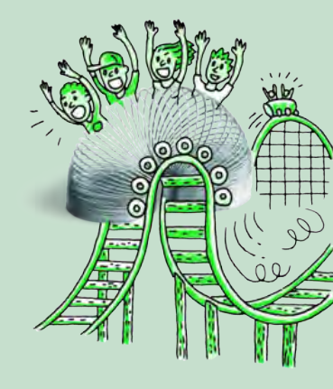
> **[Diagram Context - Textbook_NaturalScience_Gr9_Birth-life-and-the-death-of-a-star.pdf-0014-14.png]**
> The graphic features an illustrative physics concept map depicting a roller coaster track overlaid with a metallic spring-like coil and cartoon passengers. Visual elements include green roller coaster tracks with structural supports, a coiled spring superimposed over the peak, excited passengers with raised hands, and smaller loop sketches on the side. For a high school Physical Sciences learner, this visual metaphor conveys the conservation of mechanical energy, illustrating the continuous conversion between gravitational potential energy and kinetic energy as an object moves along a frictionless track.

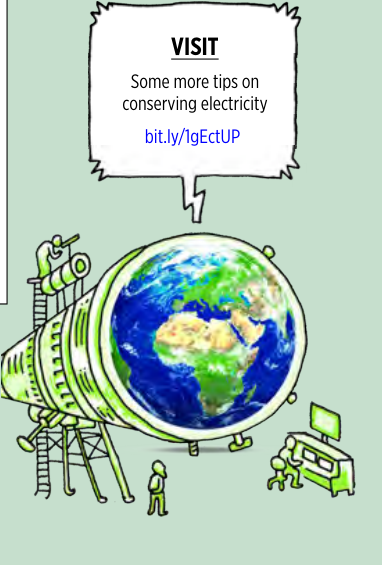
> **[Diagram Context - Textbook_NaturalScience_Gr9_Cost-of-electrical-energy.pdf-0014-05.png]**
> 1. A cartoon of a globe with a caption that says "Visit".

> **[Diagram Context - Textbook_NaturalScience_Gr9_Cost-of-electrical-energy.pdf-0014-07.png]**
> The image shows a line of green and white beads arranged in a straight line, with the beads spaced evenly apart. The beads are arranged in a zigzag pattern, creating a sense of movement and energy. The image is a simple, yet effective visual representation of a Lewis diagram, which is used to illustrate the valence electrons of an atom. The beads represent the valence electrons, with

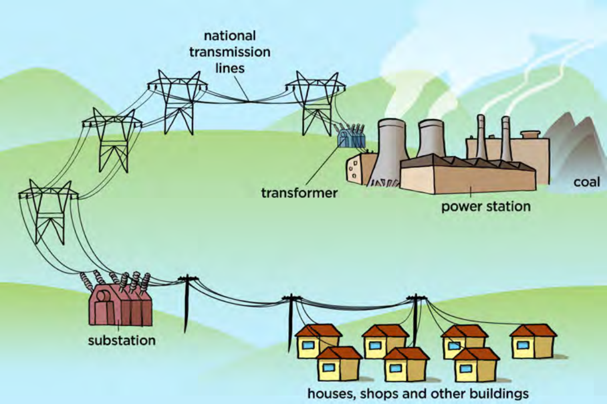
> **[Diagram Context - Textbook_NaturalScience_Gr9_Energy-and-the-national-electricity-grid.pdf-0014-01.png]**
> This educational illustration depicts the national electricity generation and distribution system, featuring visible labels for a power station, coal, transformer, national transmission lines, substation, and houses, shops and other buildings. For a Grade 10-12 Physical Sciences learner, the graphic conceptually illustrates how electrical energy is generated from primary sources like coal, stepped up for efficient long-distance transmission over national power lines, and stepped down through substations for safe domestic and commercial consumption.

> **[Diagram Context - Textbook_NaturalScience_Gr9_Energy-and-the-national-electricity-grid.pdf-0014-09.png]**
> This educational graphic depicts a conceptual illustration of Planet Earth styled as a hot air balloon floating among clouds, with two figures in the basket holding binoculars. Visible elements include a globe-shaped balloon envelope, a burner flame beneath it, a hanging basket carrying human figures with binoculars, surrounding clouds, a sun, and birds. Conceptually, this diagram visually communicates themes of global exploration, environmental observation, or geographical study for high school learners.

> **[Diagram Context - Textbook_NaturalScience_Gr9_Energy-and-the-national-electricity-grid.pdf-0014-11.png]**
> The graphic is an environmental illustration showing a globe encircled by green recycling arrows, with a figure holding a blank sign post standing atop the planet. Visible elements include a planet Earth, a human figure holding a sign post pole, and a circular sequence of green arrows surrounding the globe. This diagram conveys the concept of global sustainability, recycling, and human responsibility for planetary environmental conservation.

> **[Diagram Context - Textbook_NaturalScience_Gr9_Forces.pdf-0014-12.png]**
> 1. A diagram of a cell with arrows pointing to different parts of the cell.

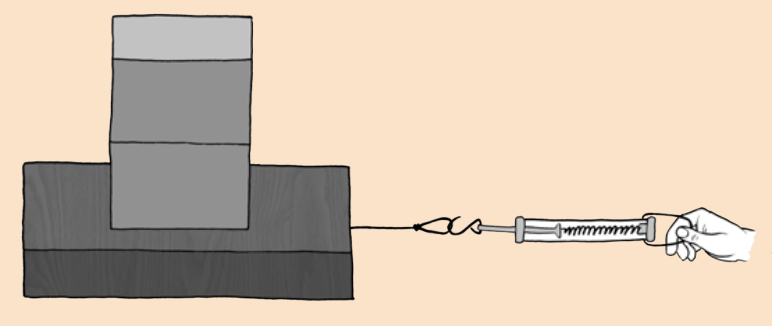
> **[Diagram Context - Textbook_NaturalScience_Gr9_Forces.pdf-0014-16.png]**
> 1. A diagram of a hand holding a syringe and a vial of liquid.

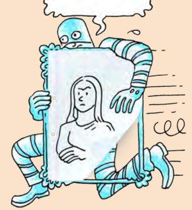
> **[Diagram Context - Textbook_NaturalScience_Gr9_Forces.pdf-0014-23.png]**
> 1. A cartoon drawing of a woman with a blue face and long blonde hair.

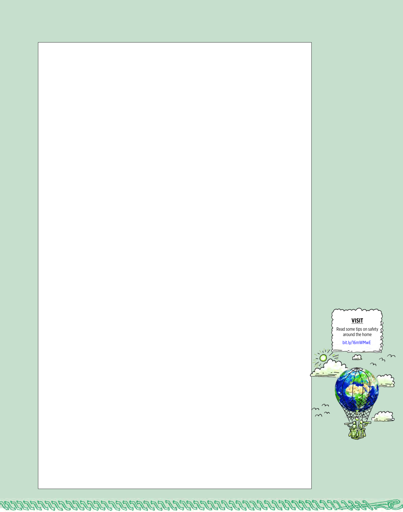
> **[Diagram Context - Textbook_NaturalScience_Gr9_Safety-with-electricity.pdf-0014-00.png]**
> 1. A cartoon hot air balloon with a globe on top.

> **[Diagram Context - Textbook_NaturalScience_Gr9_Series-and-parallel-circuits.pdf-0014-02.png]**
> 1. A diagram of a snake's body.

> **[Diagram Context - Textbook_NaturalScience_Gr9_Series-and-parallel-circuits.pdf-0014-12.png]**
> 1. A diagram of a spring coiled up and attached to a green block.

---

# Chapter 5: Birth, Life, and Death of a Star

## 1. The Crab Nebula
The Crab Nebula is a giant, glowing cloud of gas. It is the remains of the outer layers of a star that exploded in a **supernova**. In the very centre of this nebula, there is a rapidly spinning **neutron star**.

## 2. Stellar Remnants
When a star undergoes a supernova explosion, it can briefly outshine all other stars in its galaxy. After the explosion, the core that remains depends on the mass of the original star:

*   **Neutron Star:** Formed if the remaining core is composed primarily of neutrons.
*   **Black Hole:** Formed if the initial star was extremely massive.

In both cases, the remnant is surrounded by an expanding cloud of very hot gas.

## 3. Case Study: Supernova 1987A
In February 1987, astronomers observed a significant supernova explosion known as **Supernova 1987A**.

*   **Significance:** It is one of the brightest stellar explosions observed since the invention of the telescope 400 years ago.
*   **Location:** It is located in the Large Magellanic Cloud, a nearby galaxy.
*   **Distance:** Approximately $168\,000$ light-years away.
*   **Time Delay:** Although the explosion occurred around $166\,000$ BC, the light only reached Earth less than 25 years ago.

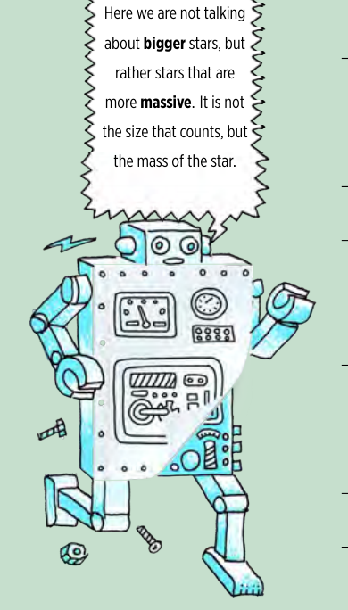
> **[Diagram Context - Textbook_NaturalScience_Gr9_Birth-life-and-the-death-of-a-star.pdf-0015-03.png]**
> This educational cartoon graphic features a running robot with a speech bubble against a light green background. The visible text inside the speech bubble reads: "Here we are not talking about bigger stars, but rather stars that are more massive. It is not the size that counts, but the mass of choir star." Conceptually, this illustration helps Grade 10-12 learners in Physical Sciences (Earth and Beyond) differentiate between physical stellar dimensions (size) and gravitational/inertial properties (mass) when studying stellar evolution and the lifecycle of massive stars.

## 4. Historical Context
*   **Did you know?** Japanese and Chinese astronomers recorded the violent supernova event that created the Crab Nebula nearly $1\,000$ years ago, in the year 1054.

## 5. Summary Table: Stellar Evolution Concepts

| Concept | Description |
| :--- | :--- |
| **Supernova** | A powerful and luminous stellar explosion. |
| **Neutron Star** | A dense core remnant left behind after a supernova. |
| **Black Hole** | A region of spacetime where gravity is so strong that nothing can escape; formed from massive stars. |
| **Light-year** | The distance light travels in one year (used to measure vast cosmic distances). |

> **[Diagram Context - Textbook_NaturalScience_Gr9_Birth-life-and-the-death-of-a-star.pdf-0015-09.png]**
> This is a decorative green border graphic featuring a repeating wave-like or ribbon pattern with small dotted details. No specific scientific labels, variables, biological structures, chemical symbols, or axes are visible within this pattern. Conceptually, it serves as a visual page divider or aesthetic header/footer element rather than conveying core curriculum content for a high school student.

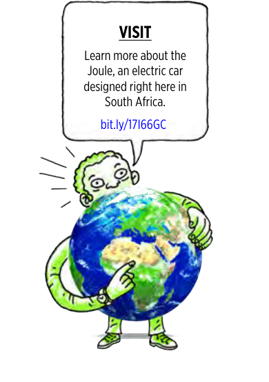
> **[Diagram Context - Textbook_NaturalScience_Gr9_Cost-of-electrical-energy.pdf-0015-00.png]**
> The image features a cartoon depiction of a man holding a globe. The globe is green and blue, and the man is wearing a green shirt and a green hat. The man is pointing to the globe, and there is a speech bubble above the globe that reads "Visit more about the Joulle, an electric car designed right here in South Africa."

> **[Diagram Context - Textbook_NaturalScience_Gr9_Energy-and-the-national-electricity-grid.pdf-0015-00.png]**
> This educational graphic is a physical science diagram illustrating wave motion at a boundary or surface. It features a continuous horizontal blue medium topped by a repeating series of curved blue arc-like wave fronts or ripple patterns moving uniformly across the surface. Conceptually, it demonstrates transverse or surface wave propagation, helping learners visualise wavefronts, wavelength, and wave behavior in a medium relevant to Grade 10-12 Physical Sciences physics CAPS curricula.

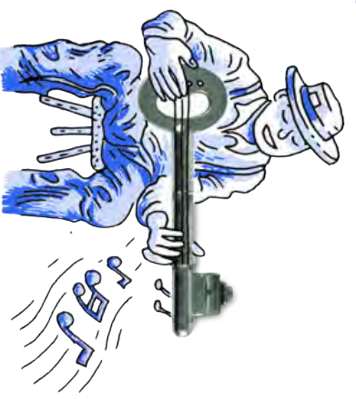
> **[Diagram Context - Textbook_NaturalScience_Gr9_Energy-and-the-national-electricity-grid.pdf-0015-01.png]**
> This illustration depicts a human figure playfully interacting with a large metal key that doubles as a musical instrument, accompanied by visible musical notes and sound wave lines. The visual elements include a cartoon person wearing a hat and overalls, a realistic physical key being strummed like a string instrument, musical note symbols, and curved motion lines indicating sound propagation. Conceptually, this creative metaphor helps high school physics learners visualize sound waves, vibrations, and acoustics by bridging everyday mechanical objects with musical sound production.

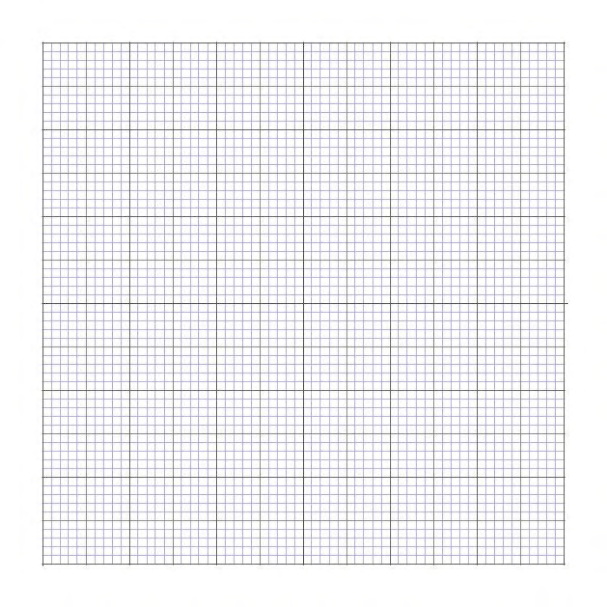
> **[Diagram Context - Textbook_NaturalScience_Gr9_Forces.pdf-0015-04.png]**
> The image shows a page of a graph paper with a grid of squares. The squares are a mix of blue and white colors. The page is white with black lines, and the grid is evenly spaced. The page is titled "Graph Paper" and "Graph Paper with grid". The page is blank, and there are no other objects or texts on the page. The page is rectangular in shape

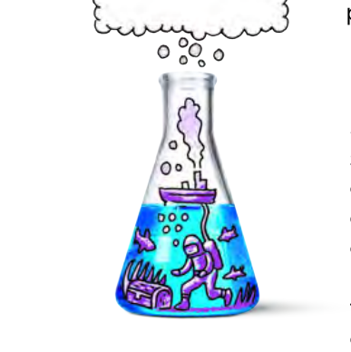
> **[Diagram Context - Textbook_NaturalScience_Gr9_Safety-with-electricity.pdf-0015-05.png]**
> 1. A cartoon drawing of a person in a blue and purple suit holding a fish and a submarine.

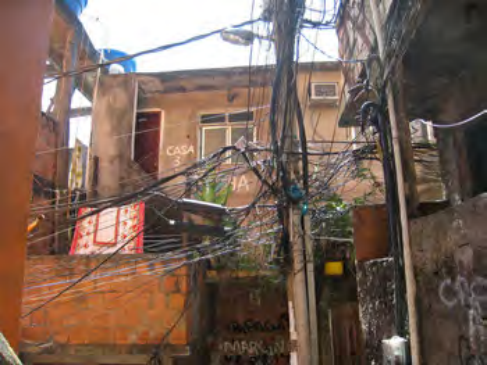
> **[Diagram Context - Textbook_NaturalScience_Gr9_Safety-with-electricity.pdf-0015-06.png]**
> 1. A diagram of a house with a red door and a window.

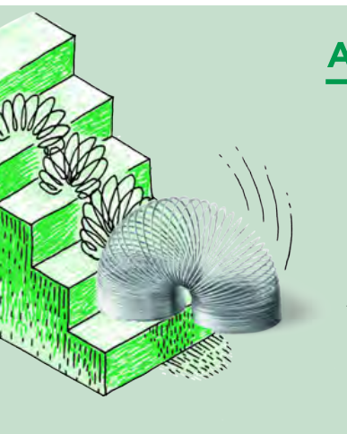
> **[Diagram Context - Textbook_NaturalScience_Gr9_Safety-with-electricity.pdf-0015-09.png]**
> 1. A diagram of a spring with a green background and a green staircase.

> **[Diagram Context - Textbook_NaturalScience_Gr9_Series-and-parallel-circuits.pdf-0015-00.png]**
> The image shows a diagram of a cell with a white square and a green square. The diagram is labeled with the text "Lewis diagram" and "cellular structure". The diagram is a visual representation of a Lewis diagram, which is a diagram used to represent the number of valence electrons in an atom. The diagram is labeled with the text "Lewis diagram" and "cellular structure".

> **[Diagram Context - Textbook_NaturalScience_Gr9_Series-and-parallel-circuits.pdf-0015-08.png]**
> 1. A diagram of a cell with a green line representing a cell wall.

---

### Historical Context: Supernovae
Supernovae have been observed by the naked eye throughout history, long before the invention of the telescope. A notable example occurred on 9 October 1604, when astronomer Johannes Kepler observed a "new star" in the sky. Modern science has revealed that this was not a new star, but rather the violent death of a massive star.

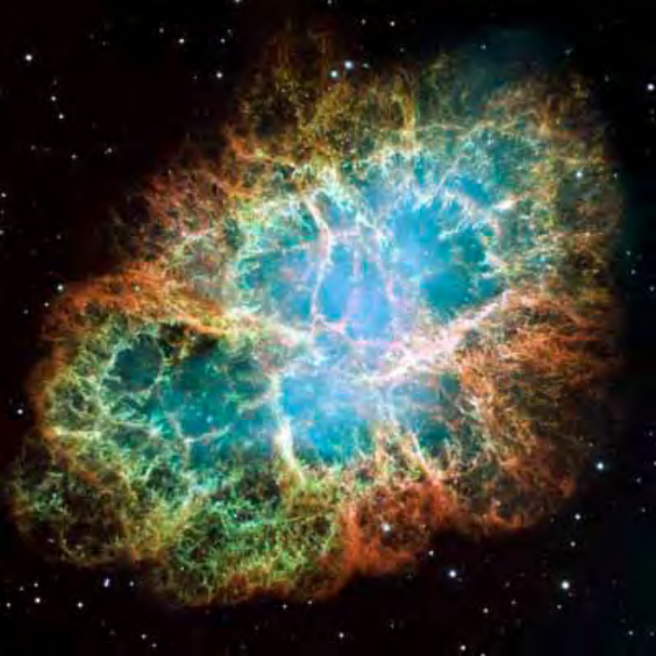
> **[Diagram Context - Textbook_NaturalScience_Gr9_Birth-life-and-the-death-of-a-star.pdf-0016-00.png]**
> This graphic is a telescopic astronomical image showing an expanding nebula with intricate filamentary gas structures and a glowing central region against a star-filled dark background, with no explicit text labels or symbols present. Aligned with the CAPS Physical Sciences curriculum, this visual illustrates the end stages of massive stellar evolution and supernova remnants, helping learners understand how heavier elements are dispersed into the interstellar medium.

---

### Summary: The Life Cycle of Stars

#### Key Concepts
*   **Birth:** Stars are born within giant, cold clouds of gas and dust known as **nebulae**.
*   **Ignition:** A star is officially born once its core becomes hot enough to sustain nuclear fusion reactions.
*   **Main Sequence:** Stars spend the majority of their existence as "main sequence" stars, where they fuse hydrogen into helium in their centres.
*   **The Sun's Future:** Our Sun is currently halfway through its life as a main sequence star. In approximately $4.5 \times 10^{9}$ years, it will swell to become a red giant star.
*   **Death:** Stars similar in mass to the Sun end their lives by forming planetary nebulae, leaving behind a small, hot, dense core known as a **white dwarf star**.

#### Concept Map Activity
To consolidate your understanding of stellar evolution, complete the concept map by summarizing the specific characteristics and processes for each of the three main stages of a star's life:
1.  **Birth**
2.  **Life (Main Sequence)**
3.  **Death**

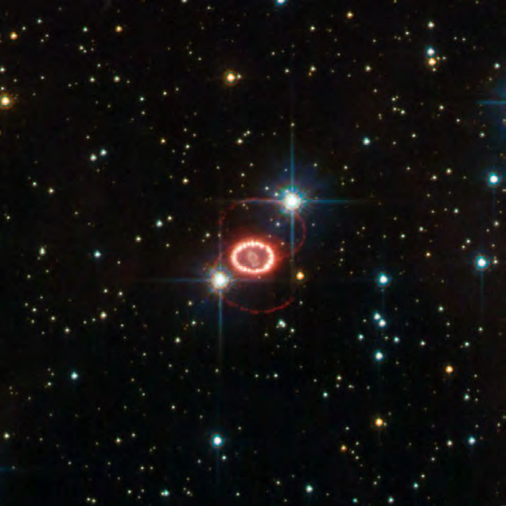
> **[Diagram Context - Textbook_NaturalScience_Gr9_Birth-life-and-the-death-of-a-star.pdf-0016-04.png]**
> This astrophotography image captures the Supernova remnant SN 1987A, showing a distinct bright central ring of glowing gas surrounded by faint outer hourglass-shaped rings and background star fields against the blackness of space. The visual features concentric glowing orange-red rings of ionized gas energized by shockwaves and ultraviolet radiation from the stellar explosion. Conceptually, this supports the Grade 12 Physical Sciences Physics curriculum by illustrating the life cycle of massive stars, stellar nucleosynthesis, and the aftermath of a supernova event in our cosmic neighborhood.

> **[Diagram Context - Textbook_NaturalScience_Gr9_Birth-life-and-the-death-of-a-star.pdf-0016-06.png]**
> This satirical cartoon depicts a massive optical telescope framing the Earth as its primary viewing target, accompanied by a speech bubble containing the text "VISIT The Crab Nebula." and a short URL link. Visible elements include human figures operating ladders and control consoles around the telescope, with the continents of Africa and Europe clearly visible on the globe within the lens. Conceptually, it highlights the humorous paradox of Earth-bound astronomy and perspective, showing how humans use telescopes to observe distant deep-space objects like the Crab Nebula while physically standing on the very planet they are imaging.

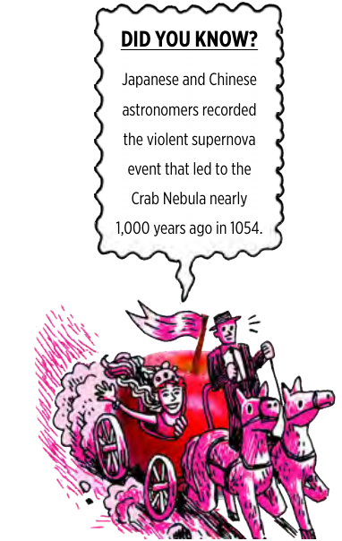
> **[Diagram Context - Textbook_NaturalScience_Gr9_Birth-life-and-the-death-of-a-star.pdf-0016-07.png]**
> An informational graphic featuring a "DID YOU KNOW?" text box above a colorful illustration of people riding in a horse-drawn carriage shaped like an apple. Visible text includes "DID YOU KNOW?", "Japanese and Chinese astronomers recorded the violent supernova event that led to the Crab Nebula nearly 1,000 years ago in 1054." This graphic provides historical context for high school learners studying stellar evolution and supernovae, highlighting that ancient celestial events were documented by early astronomers centuries ago.

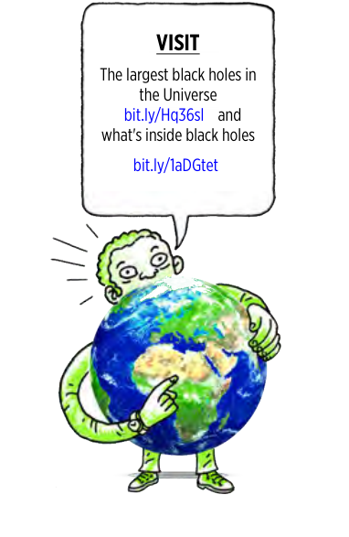
> **[Diagram Context - Textbook_NaturalScience_Gr9_Birth-life-and-the-death-of-a-star.pdf-0016-08.png]**
> This educational cartoon graphic depicts an illustrated green character hugging and pointing at a globe representing Earth, accompanied by a thought bubble containing external web links. The visible text reads "VISIT", "The largest black holes in the Universe", shortened URLs "bit.ly/Hq36sl" and "bit.ly/1aDGtet", and "what's inside black holes". Conceptually, it serves as an engaging media prompt to encourage high school learners studying physical sciences or geography to explore advanced cosmological concepts such as stellar evolution, gravitational collapse, and black holes beyond the standard CAPS curriculum.

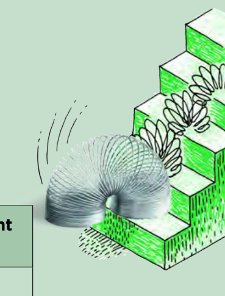
> **[Diagram Context - Textbook_NaturalScience_Gr9_Cost-of-electrical-energy.pdf-0016-00.png]**
> 1. A diagram of a spring on a green surface.

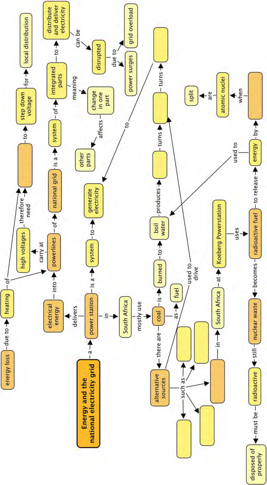
> **[Diagram Context - Textbook_NaturalScience_Gr9_Energy-and-the-national-electricity-grid.pdf-0016-00.png]**
> This educational graphic is a concept map detailing energy generation and the national electricity grid in South Africa. Visible labels and connected nodes include "Energy and the national electricity grid," "power station," "coal," "powerlines," "national grid," "Koeberg Powerstation," "radioactive fuel," "energy loss," and "grid overload," linked together by directional arrows. Conceptually, it helps learners map out how electrical energy is generated from primary sources like coal and nuclear power, transmitted across the national grid at high voltages, and distributed for local use while highlighting systemic vulnerabilities like energy loss and grid overloads.

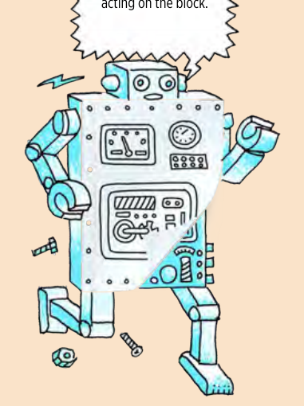
> **[Diagram Context - Textbook_NaturalScience_Gr9_Forces.pdf-0016-10.png]**
> The image features a cartoon robot with a speech bubble above its head, which reads "acting on the block." The robot is depicted in a blue and white color scheme, with a clock on its chest and a lightning bolt on its head. The robot is shown in various stages of movement, with its legs and arms visible. The robot is surrounded by scattered tools and parts, suggesting that it is

> **[Diagram Context - Textbook_NaturalScience_Gr9_Safety-with-electricity.pdf-0016-00.png]**
> 1. A diagram of a cell with a green border and white background.

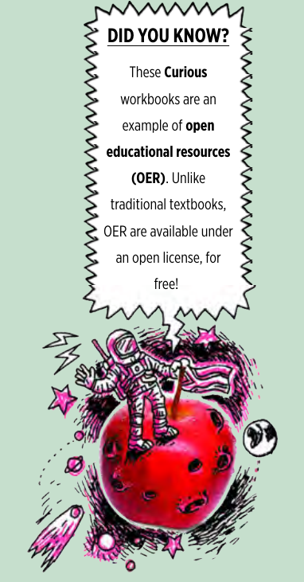
> **[Diagram Context - Textbook_NaturalScience_Gr9_Safety-with-electricity.pdf-0016-01.png]**
> 1. A cartoon depiction of an astronaut on a red planet.
2. A cartoon depiction of a planet.
3. A cartoon depiction of a cell.

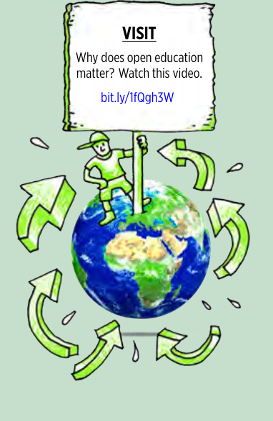
> **[Diagram Context - Textbook_NaturalScience_Gr9_Safety-with-electricity.pdf-0016-09.png]**
> The image is a cartoon depiction of a boy on a pole, with a sign that reads "Visit" and "Why does open education matter?". The boy is holding a sign that says "It matters". The boy is wearing a hat and a backpack. The boy is standing on a globe, which is tilted to the left. The globe is surrounded by arrows, which point to different parts of

> **[Diagram Context - Textbook_NaturalScience_Gr9_Series-and-parallel-circuits.pdf-0016-00.png]**
> 4.2 Parallel circuits: A parallel circuit is a type of electrical circuit in which the components are connected in parallel, so that the current flows through each component in turn. The components are arranged in a way that they are equidistant from the power source, and the total resistance of the circuit is the sum of the individual resistances of the components. The current flowing through the circuit is

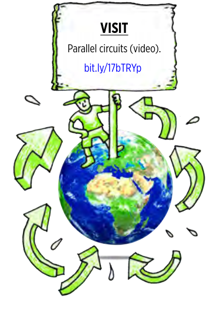
> **[Diagram Context - Textbook_NaturalScience_Gr9_Series-and-parallel-circuits.pdf-0016-01.png]**
> The image is a cartoon-style illustration of a man standing on a pole, holding a sign that says "VISIT" and has a website address "www.ly17trp.com" written on it. The man is wearing a hat and is holding a sign with a diagram of a circuit on it. The illustration also includes arrows pointing to the Earth and a Lewis diagram.

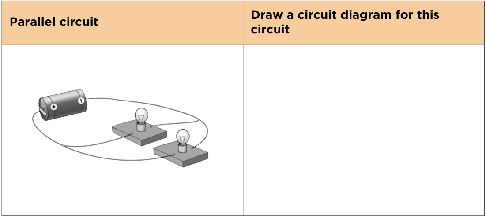
> **[Diagram Context - Textbook_NaturalScience_Gr9_Series-and-parallel-circuits.pdf-0016-03.png]**
> 1. A diagram of a circuit with a battery, wires, and light bulbs.

> **[Diagram Context - Textbook_NaturalScience_Gr9_Series-and-parallel-circuits.pdf-0016-10.png]**
> 1. A diagram of a cell with a diagram of a cell and a diagram of a cell with a diagram of a cell and a diagram of a cell with a diagram of a cell and a diagram of a cell with a diagram of a cell and a diagram of a cell with a diagram of a cell and a diagram of a cell with a diagram of a cell and a diagram of a cell

---

# The Life Cycle of Stars

> **[Diagram Context - Textbook_NaturalScience_Gr9_Birth-life-and-the-death-of-a-star.pdf-0017-01.png]**
> The graphic displays a simple, cloud-shaped text box containing the capitalized word "VISIT". No additional labels, symbols, or arrows are present within the image. Conceptually, this visual acts as a generic call-to-action banner or prompt rather than conveying a specific academic or subject-matter concept aligned with the CAPS curriculum.

## Overview
The life cycle of a star is determined by its mass. All stars exist for a finite period, progressing through stages of birth, life, and death.

## Key Concepts

### 1. General Characteristics
*   **Finite Period:** Stars do not exist forever; they have a beginning and an end.
*   **Stages:** The progression of a star is categorized into three main phases:
    *   **Birth:** The formation of the star.
    *   **Life:** The period of stability where the star exists.
    *   **Death:** The final stage of the star's existence.

### 2. Classification by Mass
The path a star takes depends on its mass:

*   **Small and Medium Stars:** These follow a standard progression of birth, life, and death.
*   **More Massive Stars:** These stars have a different evolutionary path, which concludes in a **supernova** (a powerful and luminous stellar explosion).

## Summary Table: Stellar Evolution

| Star Type | Key Evolutionary Feature | Final Stage |
| :--- | :--- | :--- |
| **Small/Medium Stars** | Follows standard life cycle | Death |
| **Massive Stars** | High mass progression | Supernova |

---
*Note: This concept map illustrates that while all stars share the commonality of a finite lifespan, the "death" mechanism is dictated by the initial mass of the star.*

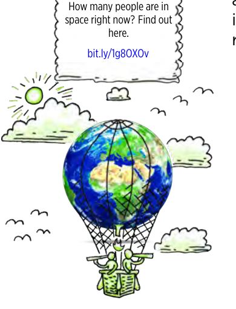
> **[Diagram Context - Textbook_NaturalScience_Gr9_Birth-life-and-the-death-of-a-star.pdf-0017-02.png]**
> This illustration is an educational graphic depicting planet Earth shaped like a hot air balloon with a basket carrying observers. Visible elements include a cartoon globe with grid lines, clouds, the sun, birds, a burner flame, and a text box containing the question "How many people are in space right now? Find out here." along with a URL ("bit.ly/1g80XOv"). Conceptually, it engages learners by prompting inquiry into human spaceflight and the Earth's position within the universe, linking geography and Earth sciences.

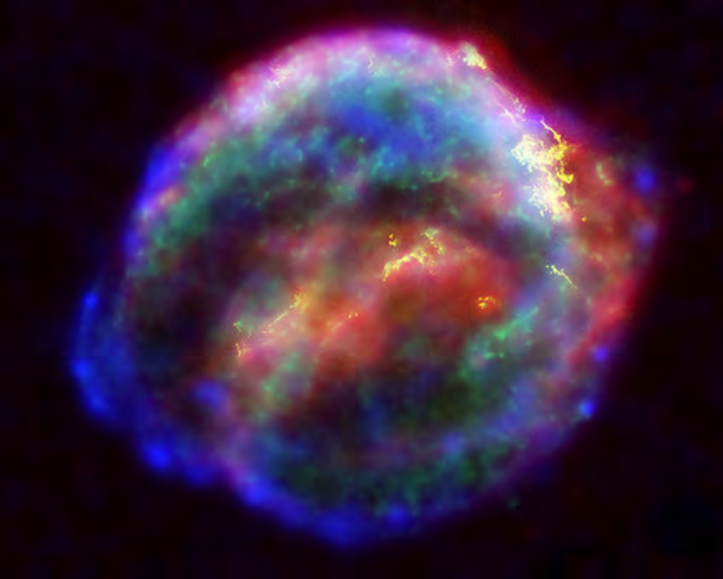
> **[Diagram Context - Textbook_NaturalScience_Gr9_Birth-life-and-the-death-of-a-star.pdf-0017-03.png]**
> This false-color space photograph shows a supernova remnant, specifically the expanding, spherical cloud of gas and dust left behind by a stellar explosion. The image displays visible structural features rendered in distinct emission bands of red, green, blue, and yellow representing different elemental compositions and temperatures. Conceptually, this diagram illustrates stellar evolution and nucleosynthesis for Grade 12 Physical Sciences and Geography learners, demonstrating how heavy elements are forged and dispersed into the universe by supernova events.

> **[Diagram Context - Textbook_NaturalScience_Gr9_Birth-life-and-the-death-of-a-star.pdf-0017-05.png]**
> This graphic is a diagrammatic representation of a metallic crystal lattice. It features multiple positively charged atomic kernels embedded within a uniform grey band representing a sea of delocalised valence electrons. Conceptually, this model conveys the metallic bond, illustrating how the strong electrostatic attraction between the positive metal ions and the delocalised electrons holds the metallic structure together and accounts for properties like electrical and thermal conductivity.

> **[Diagram Context - Textbook_NaturalScience_Gr9_Birth-life-and-the-death-of-a-star.pdf-0017-06.png]**
> This educational graphic is an illustration depicting a person playing a musical instrument resembling a stringed instrument integrated with a physical metal key. Visible elements include the illustrated human figure, the elongated key-instrument body with strings and tuning pegs, and floating musical notes accompanied by sound wave lines. Conceptually, this creative diagram conveys the generation and propagation of sound waves from a vibrating source, supporting high school physical sciences concepts related to acoustics and wave motion.

> **[Diagram Context - Textbook_NaturalScience_Gr9_Cost-of-electrical-energy.pdf-0017-02.png]**
> The image shows a graphic that says "Do you know" in black letters. The graphic is a Lewis diagram, which is a diagram used to represent chemical compounds. The diagram is filled with various shapes and lines, including a circle, a square, and a triangle. The diagram is set against a gray background, and the text is written in black. The image is labeled with the words "

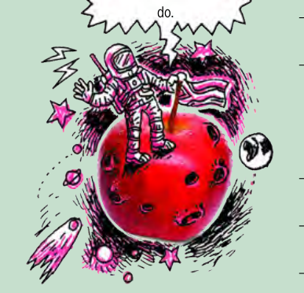
> **[Diagram Context - Textbook_NaturalScience_Gr9_Cost-of-electrical-energy.pdf-0017-04.png]**
> 1. A cartoon drawing of an astronaut on a red planet.
 2. The astronaut is holding a stick.
 3. The planet is covered in stars.
 4. The planet has a red apple on it.

> **[Diagram Context - Textbook_NaturalScience_Gr9_Cost-of-electrical-energy.pdf-0017-05.png]**
> 1. A white rectangle with a gray border.

> **[Diagram Context - Textbook_NaturalScience_Gr9_Cost-of-electrical-energy.pdf-0017-08.png]**
> 1. A diagram of a cell with a green line representing the cell wall.

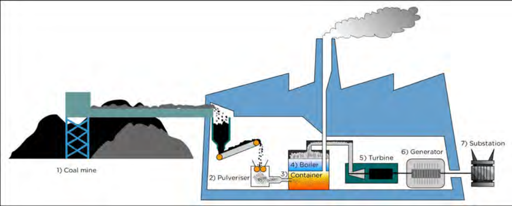
> **[Diagram Context - Textbook_NaturalScience_Gr9_Energy-and-the-national-electricity-grid.pdf-0017-05.png]**
> This conceptual diagram illustrates the step-by-step process of electricity generation in a coal-fired power station. It features numbered labels for key stages: 1) Coal mine, 2) Pulveriser, 3) Container, 4) Boiler, 5) Turbine, 6) Generator, and 7) Substation, tracing the energy transformation from chemical potential energy in coal to electrical energy supplied to the grid. For CAPS Physical Sciences and Technology learners, this visual clarifies how thermal power stations operate by converting heat from burning fossil fuels into mechanical energy to drive generators, while also highlighting associated environmental considerations like carbon emissions.

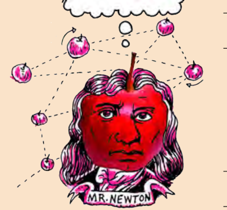
> **[Diagram Context - Textbook_NaturalScience_Gr9_Forces.pdf-0017-06.png]**
> The image features a cartoon illustration of a man's head with a large red apple on his forehead. The man's face is depicted in a cartoon style, and the apple is positioned above his head, with a thought bubble above it containing a pink line connecting the apple to a network of pink lines. The man's head is also adorned with a crown, and the text "Mr. Newton"

> **[Diagram Context - Textbook_NaturalScience_Gr9_Forces.pdf-0017-08.png]**
> The image shows a gray line with an orange zipper running down the middle. The line is drawn in a straight line, and the zipper is positioned at the bottom. The line is not broken, and there are no other objects or text in the image. The image does not contain any text or other objects.

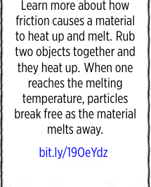
> **[Diagram Context - Textbook_NaturalScience_Gr9_Forces.pdf-0017-11.png]**
> 1. A diagram of a cell with arrows pointing to different parts of the cell.

> **[Diagram Context - Textbook_NaturalScience_Gr9_Forces.pdf-0017-13.png]**
> 1. A diagram of a red line with the number 5 on it.

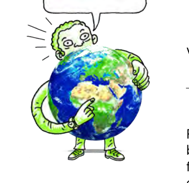
> **[Diagram Context - Textbook_NaturalScience_Gr9_Forces.pdf-0017-14.png]**
> 1. A cartoon man holding a globe.

> **[Diagram Context - Textbook_NaturalScience_Gr9_Safety-with-electricity.pdf-0017-02.png]**
> This decorative graphic features a repeated horizontal pattern of stylized green intertwined ribbon-like loops against a pale green background. It contains no text labels, variables, biological structures, chemical symbols, or axis names. Conceptually, it serves as a purely ornamental page divider or border rather than an instructional diagram for CAPS curriculum content.

> **[Diagram Context - Textbook_NaturalScience_Gr9_Safety-with-electricity.pdf-0017-03.png]**
> 1. A diagram of a cell with blue and white lines.

> **[Diagram Context - Textbook_NaturalScience_Gr9_Safety-with-electricity.pdf-0017-04.png]**
> 1. A cartoon man in a hard hat and safety glasses is digging with a shovel.

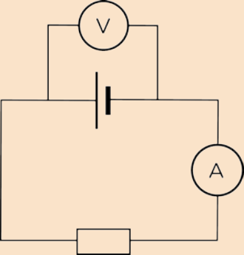
> **[Diagram Context - Textbook_NaturalScience_Gr9_Series-and-parallel-circuits.pdf-0017-01.png]**
> 1. A diagram of a circuit with two conductive wires and a voltage source labeled V and a current source labeled A.

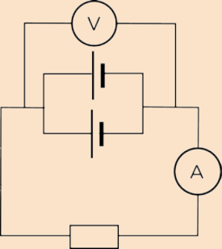
> **[Diagram Context - Textbook_NaturalScience_Gr9_Series-and-parallel-circuits.pdf-0017-04.png]**
> 1. A diagram of a circuit with two voltage sources and two resistance sources.

---

# Revision: Planet Earth and Beyond

> **[Diagram Context - Textbook_NaturalScience_Gr9_Cost-of-electrical-energy.pdf-0018-07.png]**
> 1. A green and white diagram of a spring and battery.
 2. A green and white diagram of a spring and battery.
 3. A green and white diagram of a spring and battery.

### Questions

1. What is the name of the giant clouds where stars are formed? [1 mark]
2. In the human life cycle, a foetus is the unborn baby in a mother's womb. What is the equivalent stage in a star's life called? [1 mark]
3. Under what conditions do astronomers technically say a star has been born? [1 mark]
4. Which star colour is hotter, white or yellow? [1 mark]
5. What nuclear reaction does a main sequence star undergo? [2 marks]
6. Once the Sun has exhausted its hydrogen fuel supply, it will swell up to form what type of star? [1 mark]
7. Low mass stars like the Sun eject their outer layers. What is the name of the object they form when they do this? [1 mark]
8. What kind of star is left behind after a planetary nebula? [1 mark]
9. What is the difference between a stellar nebula and a planetary nebula? [2 marks]

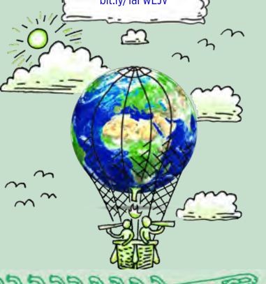
> **[Diagram Context - Textbook_NaturalScience_Gr9_Cost-of-electrical-energy.pdf-0018-14.png]**
> The image features a cartoon depiction of a hot air balloon with a globe on top, floating in the sky. The globe is adorned with a map of the world, and the balloon is carrying two people on its basket. The scene is set against a backdrop of clouds and a blue sky. The diagram is a simple, yet effective illustration of the Earth's geography and the concept of a hot air

> **[Diagram Context - Textbook_NaturalScience_Gr9_Cost-of-electrical-energy.pdf-0018-15.png]**
> 1. A diagram of a snake's body.
 2. The snake's body is green and gray.
 3. The snake's head is green.

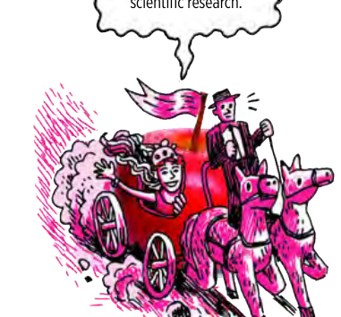
> **[Diagram Context - Textbook_NaturalScience_Gr9_Cost-of-electrical-energy.pdf-0018-18.png]**
> 1. A cartoon of a man and a woman riding a carriage with a red apple on the back.

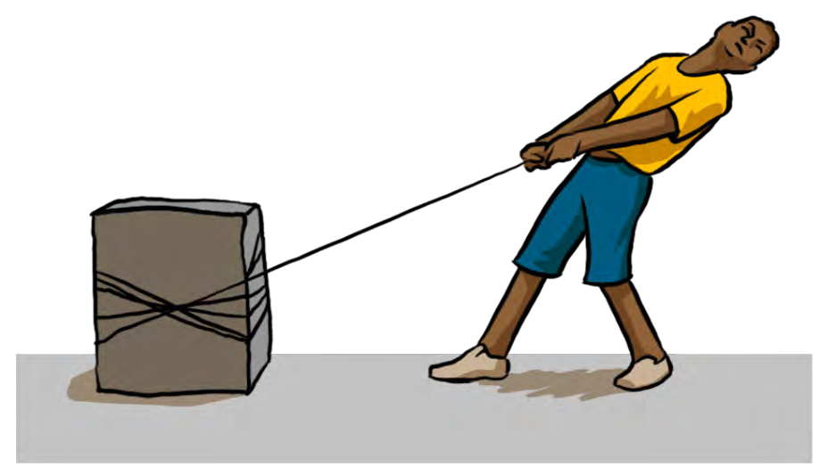
> **[Diagram Context - Textbook_NaturalScience_Gr9_Forces.pdf-0018-02.png]**
> 1. A cartoon drawing of a man pulling a large rock with a rope.

> **[Diagram Context - Textbook_NaturalScience_Gr9_Forces.pdf-0018-06.png]**
> 1. A cartoon illustration of a hand with pink clay on it.

> **[Diagram Context - Textbook_NaturalScience_Gr9_Forces.pdf-0018-08.png]**
> 1. A cartoon hand holding a green ball.

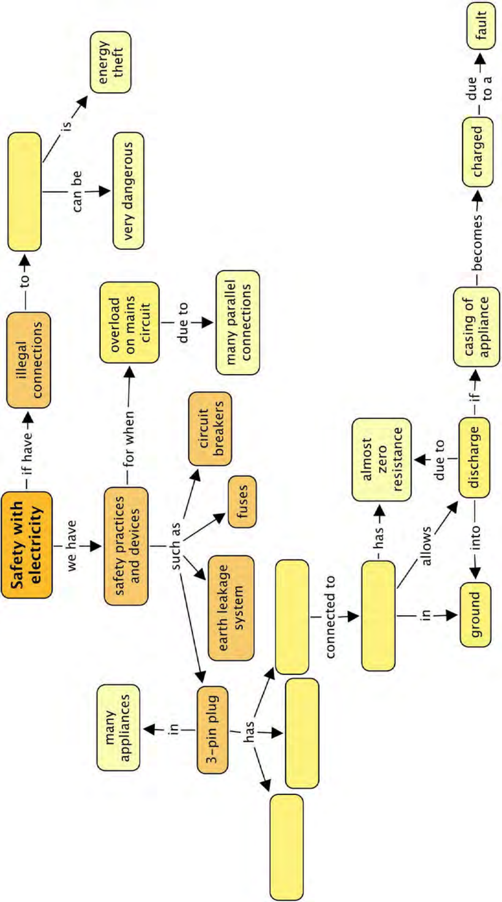
> **[Diagram Context - Textbook_NaturalScience_Gr9_Safety-with-electricity.pdf-0018-00.png]**
> A diagram of a human body, showing the circulatory system, respiratory system, digestive system, and nervous system. The diagram is color-coded to show the different systems of the body. The diagram also includes labels for each system and arrows to show the connections between them. The diagram is labeled with the names of the systems and the functions they perform.

> **[Diagram Context - Textbook_NaturalScience_Gr9_Series-and-parallel-circuits.pdf-0018-03.png]**
> The image shows a gray line with a zipper running down the middle. The zipper is white with an orange outline, and it is positioned on the right side of the image. The background is a solid gray color. The image does not contain any text or additional objects. The focus is on the zipper and its position on the gray background.

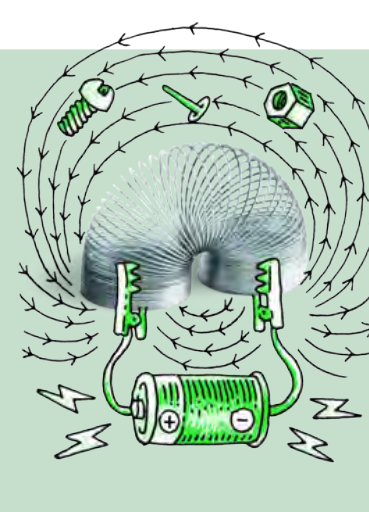
> **[Diagram Context - Textbook_NaturalScience_Gr9_Series-and-parallel-circuits.pdf-0018-16.png]**
> 1. A green spring with a silver spring coiled around it.
 2. A green battery with a silver battery attached to it.
 3. A green wire with a silver wire attached to it.
 4. A green wire with a silver wire attached to it.

---

### 10. Star Evolution Analysis

#### a) Labels for Star Evolution Stages
Identify the stages of a star's life cycle based on the provided diagram:

| Label | Stage |
| :--- | :--- |
| A | Nebula |
| B | Main Sequence Star |
| C | Red Giant |
| D | Planetary Nebula |
| E | White Dwarf |

#### b) Changes from Stage B to Stage C
Describe the physical changes that occur as a star transitions from a Main Sequence star (B) to a Red Giant (C):
*   The star exhausts its hydrogen fuel in the core.
*   The core contracts, causing the outer layers of the star to expand significantly and cool down, resulting in a larger, redder appearance.

#### c) Collapse to Stage E
Explain what causes the star to collapse inwards after the planetary nebula phase (D):
*   Once the nuclear fusion reactions cease and the outer layers are shed, there is no longer outward radiation pressure to counteract the force of gravity. Consequently, gravity causes the remaining core to collapse inwards.

#### d) Future of the Star
What eventually happens to the star after stage E?
*   The white dwarf will eventually cool down over billions of years, radiating away its remaining thermal energy until it becomes a cold, dark, and dense object known as a **Black Dwarf**.

***

### 11. Massive Star Explosions
Massive stars die in powerful explosions. What are these explosions called?
*   **Supernova**

> **[Diagram Context - Textbook_NaturalScience_Gr9_Cost-of-electrical-energy.pdf-0019-00.png]**
> The image features a logo for a company named Siyavula. The logo is black and white and is displayed against a light beige background. The company's name is written in black text at the top of the logo, and the word "Technology" is written in black text below the logo. Below the logo, the word "Powered Learning" is written in black text. The

> **[Diagram Context - Textbook_NaturalScience_Gr9_Cost-of-electrical-energy.pdf-0019-04.png]**
> 1. A diagram of a cell with blue and white lines.

> **[Diagram Context - Textbook_NaturalScience_Gr9_Cost-of-electrical-energy.pdf-0019-05.png]**
> 1. A key is shown with a tree and a swing.

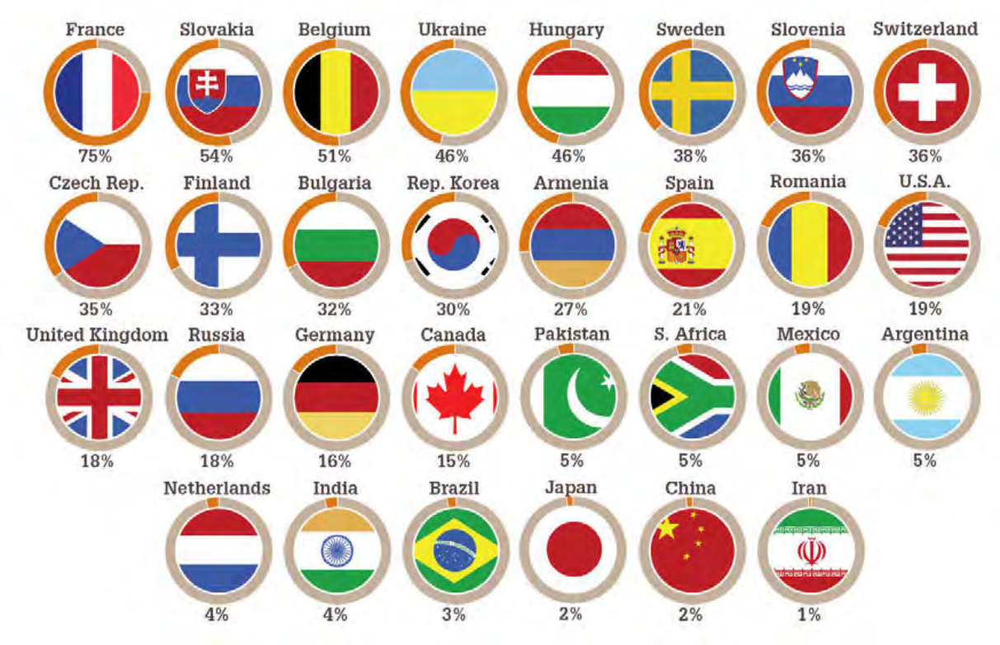
> **[Diagram Context - Textbook_NaturalScience_Gr9_Energy-and-the-national-electricity-grid.pdf-0019-03.png]**
> This infographic features circular data representations showing national flags alongside concentric percentage progress rings and numerical values ranging from 75% down to 1%. Visible labels include various country names such as France, Slovakia, Belgium, Ukraine, United States, United Kingdom, South Africa, Japan, and Iran, paired with corresponding percentages. Conceptually, this visual allows learners to compare proportional data and statistical percentages across different nations, supporting mathematical literacy and data handling CAPS curriculum objectives.

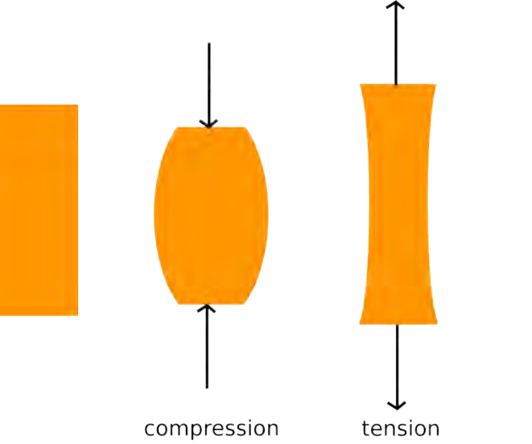
> **[Diagram Context - Textbook_NaturalScience_Gr9_Forces.pdf-0019-01.png]**
> 1. A diagram of a cell with arrows pointing to different parts of the cell.

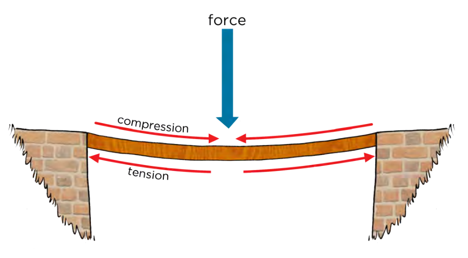
> **[Diagram Context - Textbook_NaturalScience_Gr9_Forces.pdf-0019-04.png]**
> The image is a diagram that illustrates the concept of force and tension. It shows a wooden beam being stretched across a brick wall, with a blue arrow pointing to the right, indicating the force acting on the beam. The diagram also includes labels for the force, tension, and compression, as well as arrows pointing to the left and right, representing the direction of the forces. The diagram is labeled

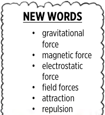
> **[Diagram Context - Textbook_NaturalScience_Gr9_Forces.pdf-0019-05.png]**
> New words: Gravitational force, magnetic force, electrostatic force, field forces, attraction, repulsion.

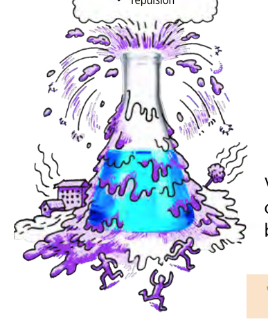
> **[Diagram Context - Textbook_NaturalScience_Gr9_Forces.pdf-0019-06.png]**
> The image is a cartoon depiction of a science experiment. The experiment is a volcano, with a blue liquid inside the volcano. The volcano is surrounded by a cloud of purple smoke, and there are people in the image. The people are depicted as cartoon characters, and they are running around the volcano. The image also includes a text that reads "Repulsion", which is a part of the science

---

# 24. Birth, Life, and Death of a Star

## Unit Overview
This unit explores the life cycle of stars. While previous grades focused on the solar system, this unit examines how stars are born, how they evolve, and how they die. The evolution of a star is primarily determined by its **initial mass**.

### Key Learning Objectives
*   Stars are born in vast clouds of gas and dust.
*   Stars spend the majority of their lives on the **main sequence**, where they fuse hydrogen gas into helium gas.
*   Stars eventually swell to form a **red giant**.
*   Stars similar to our Sun end their lives as **planetary nebulae** and **white dwarfs**.

---

## 24.1 The Birth of a Star (0.5 hours)
*Focus: Understanding the formation of stars from interstellar clouds.*

## 24.2 Life of a Star (1 hour)

| Tasks | Skills | Recommendation |
| :--- | :--- | :--- |
| Activity: Observing Orion in the spring sky | Observing | CAPS suggested |

## 24.3 Death of a Star (1.5 hours)

| Tasks | Skills | Recommendation |
| :--- | :--- | :--- |
| Activity: Life cycle of a Sun-like star | Observing, investigating | CAPS suggested |
| Activity: The life cycle of the Sun | Observing, writing | CAPS suggested |
| Activity: Flow diagram poster showing the lifecycle of a Sun-like star | Writing, drawing, sequencing | CAPS suggested |

---

## Conceptual Framework: Stellar "Life"
In astronomy, a star is considered "living" if it is undergoing **nuclear reactions** in its core. Astronomers compare stars based on the following relative concepts:

*   **Age:** Young vs. Old
*   **Temperature:** Cool vs. Hot
*   **Size:** How big they are
*   **Mass:** How massive they are (this is the critical factor in determining how a star dies)

---

## Teacher Resources
*   **Video Resource:** [bit.ly/16iqmkW](http://bit.ly/16iqmkW) (Explaining stellar evolution)
*   **Further Reading:** [bit.ly/17iVgpw](http://bit.ly/17iVgpw) (Benefits and applications of astronomy)

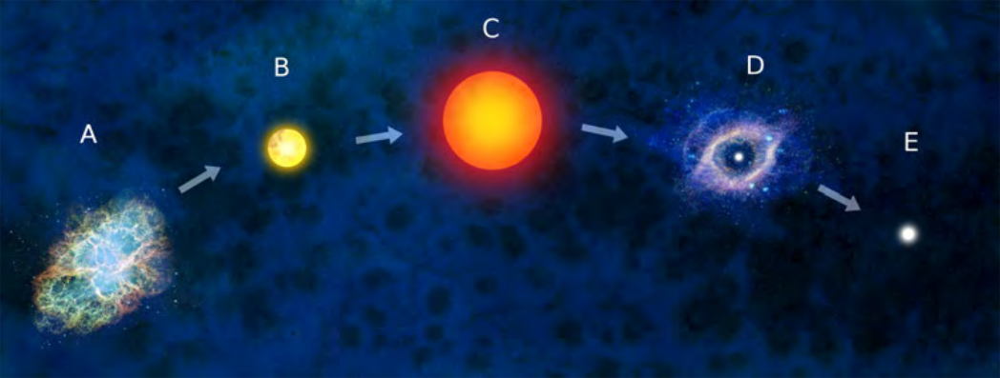
> **[Diagram Context - Textbook_NaturalScience_Gr9_Birth-life-and-the-death-of-a-star.pdf-0020-02.png]**
> This educational graphic illustrates the stellar evolution lifecycle of an average-sized star against a deep space background, labeled sequentially with letters A through E and connected by directional arrows. The visible stages depict a nebula (A), a main-sequence star like our Sun (B), a red giant (C), a planetary nebula with a white dwarf core (D), and a final fading white dwarf (E). Conceptually, this diagram helps high school learners understand the chronological stages of stellar life cycles, demonstrating how stars change in size, colour, and state over cosmic time.

> **[Diagram Context - Textbook_NaturalScience_Gr9_Birth-life-and-the-death-of-a-star.pdf-0020-10.png]**
> This horizontal infographic illustrates animal behavior, specifically an ant trail consisting of numerous individual ants following a chemical path. The graphic depicts a single prominent ant alongside long, linear streams of tiny ants moving along a shaded pathway. Conceptually, it conveys the mechanism of social communication and pheromone tracking in insects, demonstrating how collective animal behaviour is coordinated in Life Sciences.

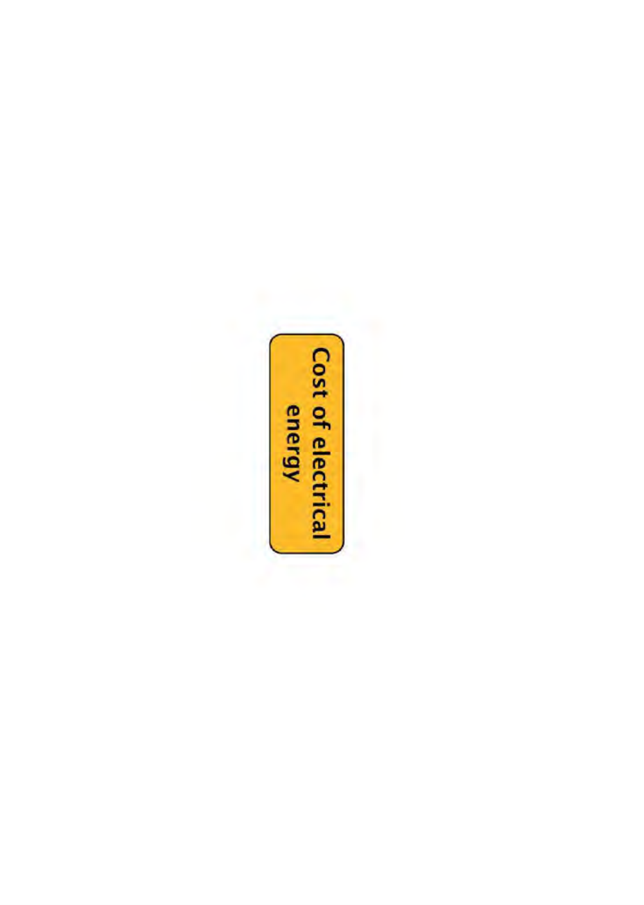
> **[Diagram Context - Textbook_NaturalScience_Gr9_Cost-of-electrical-energy.pdf-0020-00.png]**
> 1. A yellow rectangular sign with black text that reads "Cost of electrical energy".

> **[Diagram Context - Textbook_NaturalScience_Gr9_Energy-and-the-national-electricity-grid.pdf-0020-03.png]**
> This image is completely blank and contains no visual content, labels, or educational diagrams to analyze.

> **[Diagram Context - Textbook_NaturalScience_Gr9_Forces.pdf-0020-12.png]**
> The image presents a 3D rendering of the Earth, with arrows pointing towards various regions of the planet. The arrows are labeled with the names of different countries, such as Africa, Europe, and Asia. The Earth is depicted in a realistic manner, with the continents and oceans accurately represented. The arrows are positioned at different angles, suggesting the Earth's rotation and the movement of the sun across the

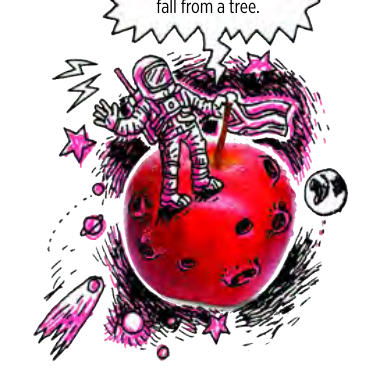
> **[Diagram Context - Textbook_NaturalScience_Gr9_Forces.pdf-0020-15.png]**
> 1. A cartoon of an astronaut on a red apple. 
 2. A speech bubble with the text "fall from a tree.".

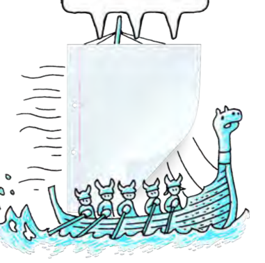
> **[Diagram Context - Textbook_NaturalScience_Gr9_Forces.pdf-0020-18.png]**
> The image shows a cartoon illustration of a boat with five people on it. The boat is depicted as a ship with a blue body and a white sail. The people on the boat are wearing white clothing and are holding oars. The boat is sailing on a body of water, and there are waves visible in the water. The illustration is labeled with the text "Lewis diagram" and "cell

> **[Diagram Context - Textbook_NaturalScience_Gr9_Safety-with-electricity.pdf-0020-06.png]**
> 1. A white square with a gray border.

> **[Diagram Context - Textbook_NaturalScience_Gr9_Series-and-parallel-circuits.pdf-0020-04.png]**
> 1. A diagram of a snake's body.
 2. The snake's body is made up of many small lines.
 3. The snake's body is green and gray.

> **[Diagram Context - Textbook_NaturalScience_Gr9_Series-and-parallel-circuits.pdf-0020-14.png]**
> The image features a cartoon depiction of a spring coiled up in the shape of a caterpillar. The caterpillar is surrounded by green leaves, and there is a green ball in the center of the caterpillar. The caterpillar is also holding a leaf in its mouth. The background of the image is a light green color.

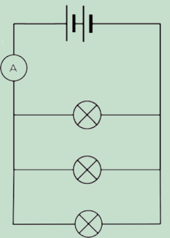
> **[Diagram Context - Textbook_NaturalScience_Gr9_Series-and-parallel-circuits.pdf-0020-16.png]**
> 1. A circuit diagram with three x-pieces and two y-pieces.

---

### Key Questions
* Where are stars born?
* Can we talk about a star as 'living'?
* How long do stars like the Sun live?
* How do stars spend most of their life?
* Why are stars different colours?
* How do stars die?

---

### 24.1 The Birth of a Star

Stars are born in giant clouds of dust and gas in space, known as **nebulae**. To understand how these clouds collapse to form stars, one must understand the relationship between gas compression, expansion, and temperature.

#### The Physics of Gas Compression and Expansion
*   **Compression:** When a gas is compressed (squeezed into a smaller volume), its temperature increases. This occurs because the kinetic energy of the molecules is concentrated into a smaller space, increasing the total thermal energy.
*   **Expansion:** When a gas is allowed to expand, its temperature decreases. As molecules spread out, the thermal energy per unit volume decreases.

**Classroom Analogy: The Bicycle Tyre**
*   **Inflating a tyre:** Forcing air into a tyre compresses the gas molecules. As more molecules are forced into the same volume, the kinetic energy increases, causing the pump and the tyre to heat up.
*   **Deflating a tyre:** Allowing the gas to escape causes it to expand rapidly. The escaping air feels colder than the ambient air because the gas is losing thermal energy as it expands.

---

### Observations of Star Formation
The Large Magellanic Cloud provides a clear example of sequential star formation. Key observations include:

1.  **Hydrogen Gas Clouds:** Areas of brightly emitting hydrogen gas are often illuminated by nearby hot stars.
2.  **Dark Dust Clouds:** These appear silhouetted against glowing gas. They may have a "bright rim" caused by radiation from neighbouring hot stars evaporating the edges of the cloud.
3.  **Stellar Winds:** Hot stars produce stellar winds and radiation that push surrounding gas away, creating relatively clear regions around star clusters.
4.  **Triggered Collapse:** When stellar winds collide with and compress surrounding dense clouds, those clouds may collapse under their own gravity, triggering the birth of new stars.

> **[Diagram Context - Textbook_NaturalScience_Gr9_Cost-of-electrical-energy.pdf-0021-04.png]**
> 1. A diagram of a cell with arrows pointing to different parts of the cell.

---

### Technical Note: The Hubble WFPC2
Learners may notice "black boxes" or missing sections in images taken by the Hubble Telescope's **Wide Field and Planetary Camera 2 (WFPC2)**. 

*   **Structure:** The WFPC2 consists of four cameras that capture different sections of a target.
*   **The "Missing" Section:** One of the four cameras (the top right) is designed to take a magnified view of a section for finer detail. 
*   **Processing:** When the four images are stitched together, the magnified section must be shrunk to match the scale of the other three images, which can result in the appearance of missing or offset data in the final composite image.

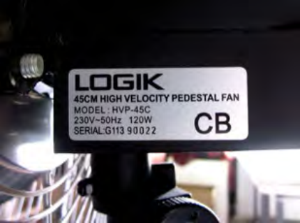
> **[Diagram Context - Textbook_NaturalScience_Gr9_Cost-of-electrical-energy.pdf-0021-05.png]**
> 1. A diagram of a cell with arrows pointing to different parts of the cell.

> **[Diagram Context - Textbook_NaturalScience_Gr9_Energy-and-the-national-electricity-grid.pdf-0021-05.png]**
> This educational graphic is a process diagram illustrating the national electricity grid and power generation system. The diagram includes visible labels for "coal", "power station", "transformer", "national transmission lines", "substation", and "houses, shops and other buildings". Conceptually, it conveys how electrical energy generated at a power station is stepped up by transformers, transported over long distances via national transmission lines, and stepped down through substations for safe distribution to residential and commercial consumers.

> **[Diagram Context - Textbook_NaturalScience_Gr9_Energy-and-the-national-electricity-grid.pdf-0021-10.png]**
> The graphic is an illustration depicting animal behavior, specifically showing an ant leading a linear trail of smaller ants along a horizontal pathway. Visible elements include a prominent larger ant at the front of two parallel trails of numerous tiny ant figures extending horizontally across a two-toned background. Conceptually, this diagram visually demonstrates social insect behavior and communication, such as chemical trail-following (pheromones) and cooperative colony organization, relevant to Grade 10-12 Life Sciences studies on animal interactions and populations.

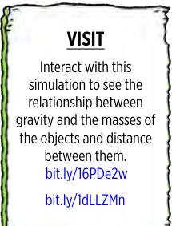
> **[Diagram Context - Textbook_NaturalScience_Gr9_Forces.pdf-0021-01.png]**
> 1. A diagram of a cell with a green border and a white background.

> **[Diagram Context - Textbook_NaturalScience_Gr9_Forces.pdf-0021-02.png]**
> The image shows a group of people parachuting from an airplane. There are at least six people visible in the scene, with some of them in the process of jumping out of the plane and others still on the aircraft. The parachute is open, and the people are spread out across the plane, with some closer to the front and others further back. The parachute is located in the center of the

> **[Diagram Context - Textbook_NaturalScience_Gr9_Forces.pdf-0021-03.png]**
> The image features a cartoon depiction of a boy holding a pole up to the earth. The boy is wearing a green shirt and a hat. The boy is standing on a globe, which is tilted to the right. The globe is divided into sections, each representing a different continent. The boy is holding a sign that says "Earth" in green letters. The boy is also holding a sign that

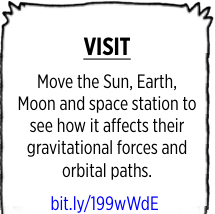
> **[Diagram Context - Textbook_NaturalScience_Gr9_Forces.pdf-0021-06.png]**
> 1. A diagram of a cell with a diagram of a molecule.

> **[Diagram Context - Textbook_NaturalScience_Gr9_Forces.pdf-0021-07.png]**
> The image features a cartoon depiction of a group of people standing around a large telescope. The telescope is positioned in the center of the image, with the Earth and other planets visible through its lens. The people are positioned around the telescope, with one person standing directly behind it and another person standing to the left of the telescope. The group appears to be engaged in a discussion or observation of the celestial

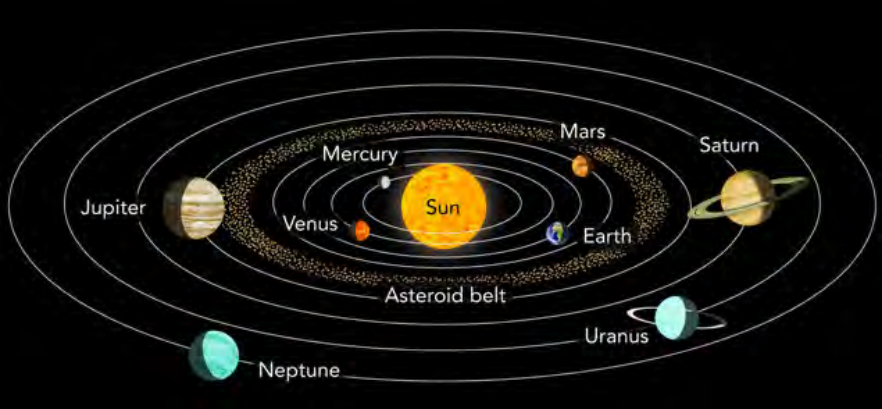
> **[Diagram Context - Textbook_NaturalScience_Gr9_Forces.pdf-0021-09.png]**
> The image presents a detailed illustration of the solar system, with each planet represented by a distinct color. The planets are arranged in a circular fashion, with the Sun positioned at the center. The diagram includes labels for each planet, such as Mercury, Venus, Earth, Mars, Uranus, and Neptune. The diagram also includes labels for the planets' relative positions to the Sun, as well as

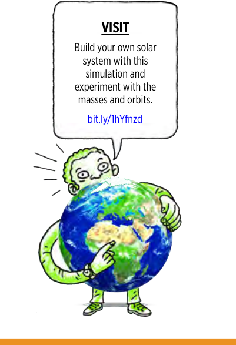
> **[Diagram Context - Textbook_NaturalScience_Gr9_Forces.pdf-0021-10.png]**
> The image features a cartoon depiction of a man holding a globe, with the globe being the Earth. The man is wearing a green outfit and is pointing to the globe. The image also includes a text box that reads "Visit" and "Build your own solar system with this simulation and experiment with the masses and orbits".

> **[Diagram Context - Textbook_NaturalScience_Gr9_Safety-with-electricity.pdf-0021-07.png]**
> The image shows a gray background with a red and white line running down the center. The line is adorned with a red ant, which is a common symbol for the insect species Formicidae. The ant is positioned in the middle of the line, and the background is a solid gray color. The image does not contain any text or other objects, and the ant is the only element present.

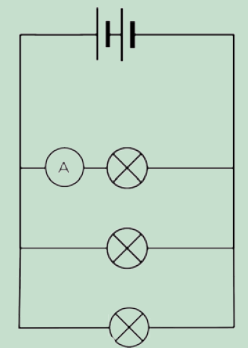
> **[Diagram Context - Textbook_NaturalScience_Gr9_Series-and-parallel-circuits.pdf-0021-02.png]**
> 1. A circuit diagram with three X's and a circle labeled A.

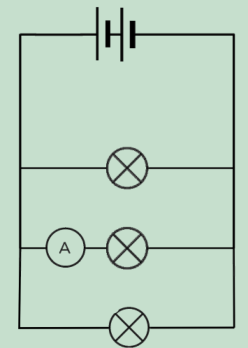
> **[Diagram Context - Textbook_NaturalScience_Gr9_Series-and-parallel-circuits.pdf-0021-05.png]**
> 1. A diagram of a circuit with three wires and three X's.

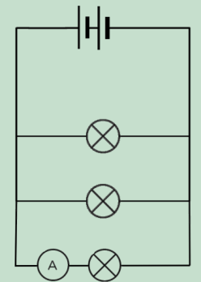
> **[Diagram Context - Textbook_NaturalScience_Gr9_Series-and-parallel-circuits.pdf-0021-08.png]**
> 1. A diagram of a circuit with three wires and three x's.

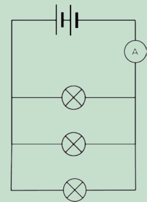
> **[Diagram Context - Textbook_NaturalScience_Gr9_Series-and-parallel-circuits.pdf-0021-11.png]**
> 1. A diagram of a circuit with three wires and three circles.

---

## 24.2 Life of a Star

The temperature of a star determines its colour. The following table illustrates the relationship between a star's colour and its surface temperature:

| Star Colour | Surface Temperature |
| :--- | :--- |
| Blue-white | $40\ 000\ ^\circ\text{C}$ |
| White | $10\ 000\ ^\circ\text{C}$ |
| Yellow | $6\ 000\ ^\circ\text{C}$ |
| Orange | $4\ 500\ ^\circ\text{C}$ |
| Red | $3\ 000\ ^\circ\text{C}$ |

*   **Note:** The yellow star represents our Sun.

### Activity: Observing Orion in the spring sky
1. Betelgeuse is red and Rigel is blue in colour.
2. Rigel is much hotter than Betelgeuse, hence it is bluer.

### Red Giants
A red giant glows red because it has cooled compared to when it was a main sequence star. It is called a "giant" because the outer layers have expanded outwards, making the star much larger than it was during its main sequence phase.

---

## 24.3 Death of a Star

This section explores the life cycle of stars, focusing primarily on the death of low-mass stars (like the Sun), while briefly mentioning the process for high-mass stars.

*   **Key Learning Objective:** Learners must understand the sequence of phases a star like the Sun undergoes during its life.
*   **Study Tip:** Stellar evolution involves complex terminology. Engaging in practical activities rather than rote reading will help clarify the different stages of a Sun-like star's evolution.

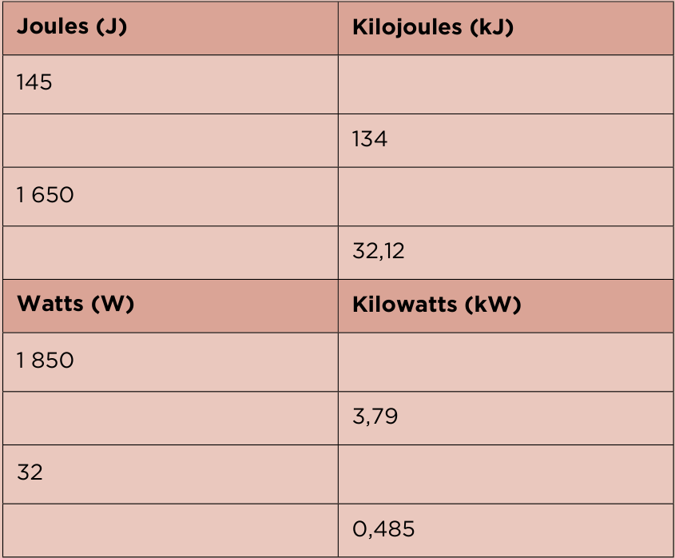
> **[Diagram Context - Textbook_NaturalScience_Gr9_Cost-of-electrical-energy.pdf-0022-04.png]**
> A pink table with four columns and six rows. The first column is labeled "Joules" and the first row is labeled "Joules (Joules)". The second column is labeled "Kilowatts" and the second row is labeled "Kilowatts (Kilowatts)". The third column is labeled "Kilowatts (Kilow

> **[Diagram Context - Textbook_NaturalScience_Gr9_Energy-and-the-national-electricity-grid.pdf-0022-01.png]**
> This graphic depicts a laboratory apparatus, specifically an Erlenmeyer flask filled with a vibrant blue liquid. Visible markings on the glassware include volume calibration lines and numerical labels reading "50", "75", and "100" alongside a graduation block indicating "100". In the FET Physical Sciences and Natural Sciences curriculum, this visual serves to introduce learners to standard laboratory equipment used for containing, swirling, or titrating chemical solutions during practical investigations.

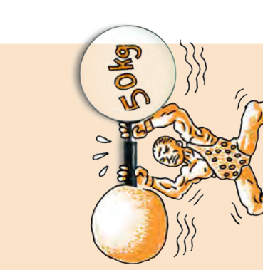
> **[Diagram Context - Textbook_NaturalScience_Gr9_Forces.pdf-0022-08.png]**
> 1. A cartoon drawing of a man lifting a ball with a magnifying glass.

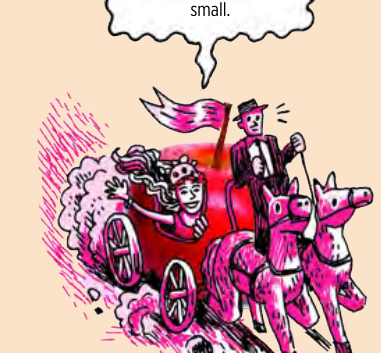
> **[Diagram Context - Textbook_NaturalScience_Gr9_Forces.pdf-0022-24.png]**
> 1. A cartoon of a man and a woman riding a pink carriage.
 2. A thought bubble above the carriage that reads "small.".

> **[Diagram Context - Textbook_NaturalScience_Gr9_Safety-with-electricity.pdf-0022-01.png]**
> 1. A diagram of a cell with a pink dot labeled "Mitochondria" and a green dot labeled "Mitochondria's" labeled "Mitochondria's" in the center.

> **[Diagram Context - Textbook_NaturalScience_Gr9_Series-and-parallel-circuits.pdf-0022-02.png]**
> 1. A white rectangle with a gray border.

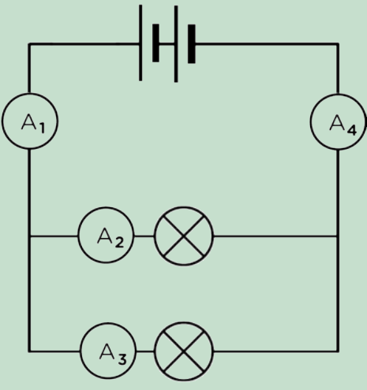
> **[Diagram Context - Textbook_NaturalScience_Gr9_Series-and-parallel-circuits.pdf-0022-07.png]**
> 1. A circuit diagram with three wires and three lights.

---

### ACTIVITY: Life cycle of a Sun-like star (LB page 405)

This activity is designed to be performed in pairs or small groups to demonstrate the life cycle of a Sun-like star.

*   **Materials:** A yellow balloon.
*   **Method:** One learner acts as the instructor ("gives the orders") while the other performs the demonstration using the balloon to represent the star's phases.
*   **Tip:** If time permits, swap roles to ensure both learners understand the process.

---

### ACTIVITY: The life cycle of the Sun (LB page 407)

The life cycle of a star like our Sun follows a specific evolutionary path:

1.  **Main Sequence:** The Sun is currently halfway through its lifetime as a main sequence star.
2.  **Red Giant:** In approximately $4.5 \times 10^{9}$ years, the Sun will swell to become a red giant, engulfing the Earth.
3.  **Planetary Nebula:** The star becomes unstable and sheds its outer layers, creating a planetary nebula with the exposed core at the center.
4.  **White Dwarf:** Nuclear reactions cease. The remaining core becomes a hot white dwarf star located at the center of the nebula.
5.  **Black Dwarf:** As the white dwarf no longer produces energy through nuclear reactions, it slowly cools over time until it eventually becomes a black dwarf.

---

### ACTIVITY: Flow diagram poster showing the life of a Sun-like star (LB page 407)

Learners are required to create a visual flow diagram illustrating the stages of stellar evolution.

*   **Instructions:** Use photographs, internet printouts, or hand-drawn illustrations to show the progression from one stage to the next.
*   **Reference Diagram:**

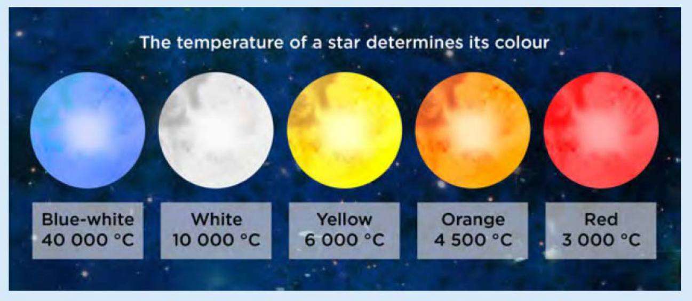
> **[Diagram Context - Textbook_NaturalScience_Gr9_Birth-life-and-the-death-of-a-star.pdf-0023-03.png]**
> This educational graphic is an infographic illustrating the relationship between stellar surface temperature and colour. It features five stellar representations with corresponding text labels and temperatures: Blue-white (40 000 °C), White (10 000 °C), Yellow (6 000 °C), Orange (4 500 °C), and Red (3 000 °C), beneath the heading "The temperature of a star determines its colour". Conceptually, the diagram conveys to high school learners that hotter stars emit shorter wavelengths appearing blue-white, while cooler stars emit longer wavelengths appearing red, supporting the study of electromagnetic radiation and stellar characteristics in Earth and Space Sciences.

**The sequence of evolution is as follows:**
Stellar Nebula $\rightarrow$ Main Sequence (Yellow Star) $\rightarrow$ Red Giant $\rightarrow$ Planetary Nebula $\rightarrow$ White Dwarf

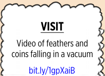
> **[Diagram Context - Textbook_NaturalScience_Gr9_Forces.pdf-0023-04.png]**
> The image shows a white sign with black text that reads "Visit" and "Video of feathers and coins falling in a vacuum". The sign also includes a link to a webpage that provides more information about the topic.

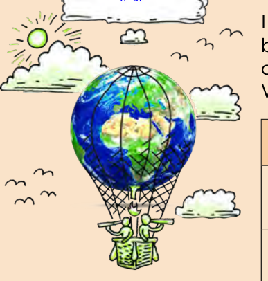
> **[Diagram Context - Textbook_NaturalScience_Gr9_Forces.pdf-0023-05.png]**
> The image is a cartoon drawing of a hot air balloon filled with a green substance, with a globe on top of it. The globe is surrounded by a wire mesh, and there are two people inside the balloon. One person is holding a book, and the other person is holding a telescope. The drawing is labeled with the words "I love you" and "I love science", and it

> **[Diagram Context - Textbook_NaturalScience_Gr9_Forces.pdf-0023-11.png]**
> 1. A cartoon image of a white square with the word "visit" written in black.

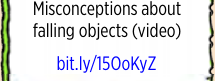
> **[Diagram Context - Textbook_NaturalScience_Gr9_Forces.pdf-0023-13.png]**
> The image shows a white banner with black text that reads "Misconceptions about falling objects (video)". The banner also contains a link to a webpage with a blue header and a green footer. The text on the banner is in a standard font and is written in a clear, easy-to-read style. The banner is positioned on the left side of the image, with the

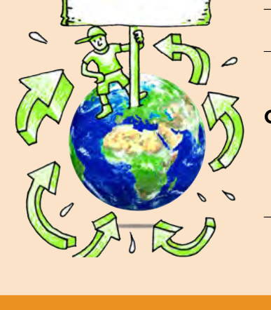
> **[Diagram Context - Textbook_NaturalScience_Gr9_Forces.pdf-0023-14.png]**
> The image features a cartoon depiction of a boy holding a pole, with arrows pointing to the earth and a globe. The boy is wearing a hat and is standing on a globe, which is tilted to the left. The arrows on the globe point to various locations around the world, and the boy is holding a pole that is pointing to the globe. The boy is wearing a green shirt.

> **[Diagram Context - Textbook_NaturalScience_Gr9_Series-and-parallel-circuits.pdf-0023-04.png]**
> 1. A diagram of a cell with a green line representing the cell wall.

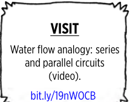
> **[Diagram Context - Textbook_NaturalScience_Gr9_Series-and-parallel-circuits.pdf-0023-06.png]**
> 1. A diagram of a cell with arrows pointing to different parts of the cell.

> **[Diagram Context - Textbook_NaturalScience_Gr9_Series-and-parallel-circuits.pdf-0023-11.png]**
> 1. A diagram of a motorcycle and a person on it.
 2. The motorcycle is on fire.
 3. The person is wearing a helmet.

---

### Stellar Evolution: Concepts and Definitions

#### 1. Black Holes
A black hole is a region of space where gravity is so intense that not even light can escape.
*   **Formation:** Occurs when a massive star dies and its matter is compressed into an extremely small space.
*   **Detection:** Because they do not emit light, they are detected by observing their gravitational effects on nearby visible objects or by the light emitted by material being pulled into them.
*   **Supermassive Black Holes:** These are significantly more massive than stellar-mass black holes and are typically found at the centres of galaxies.

---

### Revision: Life Cycle of Stars

The following table summarizes the stages of a star's life cycle:

| Label | Stage |
| :--- | :--- |
| A | Stellar nebula |
| B | Main sequence star/Yellow star |
| C | Red giant |
| D | Planetary nebula |
| E | White dwarf |

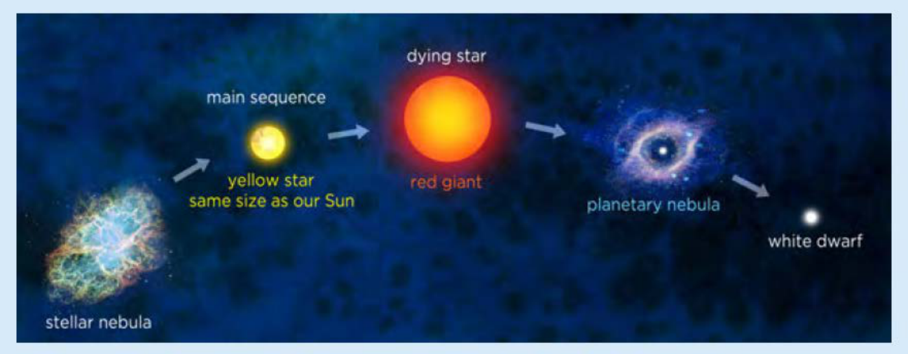
> **[Diagram Context - Textbook_NaturalScience_Gr9_Birth-life-and-the-death-of-a-star.pdf-0024-10.png]**
> This educational graphic is a sequential evolutionary flowchart illustrating the life cycle of a star with a mass similar to our Sun against a blue space background. The diagram features directional arrows connecting successive stages labeled as "stellar nebula", "main sequence", "yellow star same size as our Sun", "dying star", "red giant", "planetary nebula", and "white dwarf". Conceptually, it conveys the life cycle and stellar evolution of average-mass stars from initial cloud collapse to its final remnant state for Grade 10-12 Physical Sciences learners studying Earth and Beyond.

#### Key Processes in Stellar Evolution
*   **Protostar:** A collection of gas and dust that has not yet reached the temperature required for nuclear reactions to begin. Once the temperature is high enough for nuclear reactions, it becomes a star.
*   **Nuclear Fusion:** The process where a main sequence star burns hydrogen into helium at its core.
*   **Temperature and Colour:** A white star is hotter than a yellow star.
*   **Red Giant Formation:** When hydrogen in the core is depleted, the core shrinks and heats up. The outer layers expand and cool, causing the star to glow red and increase in size.
*   **Planetary Nebula:** Low-mass stars eject their outer layers at the end of their life cycle, forming a planetary nebula.
*   **White Dwarf:** The dense remnant left behind after a star ejects its outer layers.
*   **Black Dwarf:** The final stage where a white dwarf has depleted its energy, stops emitting light, and becomes a cold, dark object.
*   **Stellar vs. Planetary Nebula:** A stellar nebula is the birthplace of stars, whereas a planetary nebula is the structure formed at the end of a star's life.

---

### Summary of Questions and Answers

1.  **Nebulae:** Vast, cold clouds of gas and dust.
2.  **Red Giant:** Named for its red colour and large size compared to a main sequence star.
3.  **White Dwarf:** The final stage of a low-mass star, approximately the size of the Earth.
4.  **Planetary Nebula:** A glowing shell of gas formed by an expanding outer layer of an aging star.
5.  **Supernovae:** Explosive events that mark the end of the life cycle for very massive stars (Note: This content is supplementary to the standard CAPS curriculum).

> **[Diagram Context - Textbook_NaturalScience_Gr9_Cost-of-electrical-energy.pdf-0024-01.png]**
> The image shows a line drawing of an electric blanket, which is left on for 8 hours. The drawing is accompanied by a question about the amount of electrical energy used by the blanket. The text is in black and white, and the image is labeled with the number 10.

> **[Diagram Context - Textbook_NaturalScience_Gr9_Cost-of-electrical-energy.pdf-0024-03.png]**
> The image shows a line drawing of an electric blanket. The drawing is a simple, straight line with a pink border. The text on the image reads: "If the unit cost of electricity is 765 cents, what is the cost, in dollars, of using the electric blanket for 8 hours (3 marks)?".

> **[Diagram Context - Textbook_NaturalScience_Gr9_Cost-of-electrical-energy.pdf-0024-05.png]**
> The image shows a diagram of a school staffroom. The staffroom is used by a school staff for five minutes each day. The staffroom is used by a school staff for five minutes each day.

> **[Diagram Context - Textbook_NaturalScience_Gr9_Cost-of-electrical-energy.pdf-0024-06.png]**
> The image shows a line drawing of a kettle being switched on during each day of the school week. The kettle is depicted in pink, and the image is labeled with the text "What is the total time that the kettle is switched on during each day of the school week?".

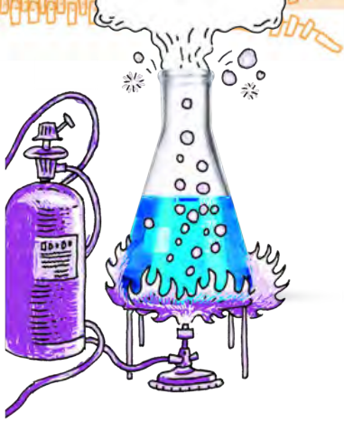
> **[Diagram Context - Textbook_NaturalScience_Gr9_Forces.pdf-0024-13.png]**
> The image is a cartoon drawing of a science experiment. The main focus is a glass beaker filled with a blue liquid, which is being heated by a Bunsen burner. The Bunsen burner is connected to a purple gas cylinder, and the entire setup is placed on a purple platform. The drawing includes labels for the Bunsen burner, the gas cylinder, and the platform, as well as

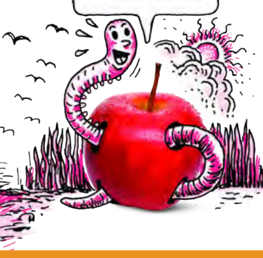
> **[Diagram Context - Textbook_NaturalScience_Gr9_Forces.pdf-0024-16.png]**
> 1. A cartoon apple with a worm inside.
 2. The apple is red and has a stem on top.
 3. The apple is shown in a cartoon style.

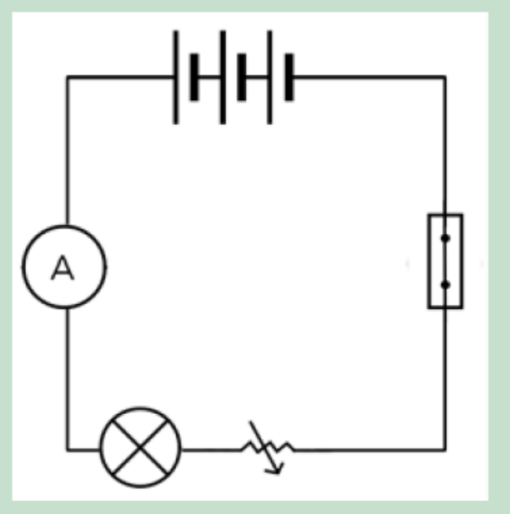
> **[Diagram Context - Textbook_NaturalScience_Gr9_Safety-with-electricity.pdf-0024-09.png]**
> 1. A circuit diagram with a battery, wires, and a resistor.

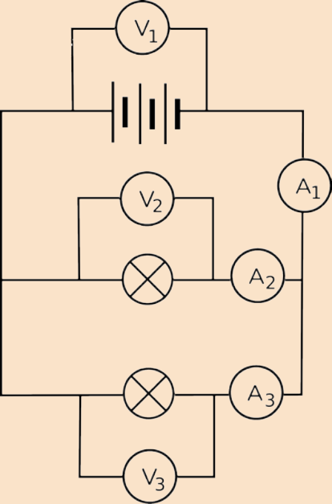
> **[Diagram Context - Textbook_NaturalScience_Gr9_Series-and-parallel-circuits.pdf-0024-12.png]**
> 1. A diagram of a circuit with multiple inputs and outputs.

