**Electric cells as energy systems** 


> **[Diagram Context - Textbook_NaturalScience_Gr9_Electric-cells-as-energy-systems.pdf-0001-02.png]**
> This educational graphic is a simplified structural diagram representing surface waves on water. The visual features a horizontal shaded plane representing the water surface, overlaid with a series of repeated blue concentric arc symbols denoting circular wavefronts. Conceptually, this diagram helps high school learners visualise wave motion, propagation, and the periodic nature of transverse or surface waves in physical sciences.


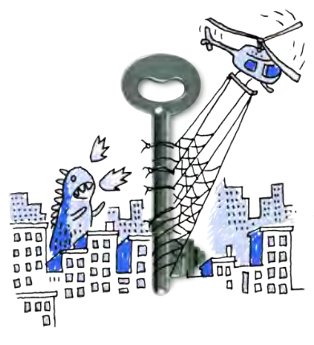
> **[Diagram Context - Textbook_NaturalScience_Gr9_Electric-cells-as-energy-systems.pdf-0001-03.png]**
> This conceptual illustration depicts a large metal key positioned centrally between a hand-drawn city skyline with a blue monster and a helicopter carrying a net. There are no explicit text labels, variables, or chemical symbols present in the graphic. Conceptually, it serves as a visual metaphor often used to demonstrate problem-solving strategies, unlocking core concepts, or distinguishing between different perspectives in a CAPS curriculum context.


## **KEY .** . **. QUESTIONS:** 

## . **.** . **.** 

- Where does an electric circuit get its energy from? 

- What is inside a battery? 

- How can we build our own electric cells? 

- How does an electric cell supply energy? 

This term we will be investigating electricity and electric circuits in more detail. We are going to pay attention to electric cells. You have already come across electric cells in previous grades when looking at electric circuits. What is the circuit symbol for an electric cell? Draw it in the space below. Indicate the positive and negative terminal. 

###### **<u>NEW WORDS</u>** 

- electric cell 

- battery 

- electrode 

- electrolyte 


- half cell 

- salt bridge 

#### **.** **<mark>2.1 Electric cells</mark>** 

What is the source of energy in an electric circuit? 

We use electric cells to supply the energy needed for electrons to move around an electric circuit. We often talk about batteries in electric circuits or appliances. A battery is a group of two or more electric cells that are connected together. Where does the energy in a cell come from? 

In Gr. 8 we spoke about the transfer of energy within electrical systems. We can also call an electric cell a system. Write your own definition of a system below. 

The electric cell system works to generate electricity. We have spoken before about how electricity is generated using moving parts, such as in a power station where the moving parts in a generator produce electricity. A cell does not have moving parts to generate electricity. An electric cell generates electricity from **chemical reactions** . 

Did you know that we can create our own cell using a fruit? Let's try this out in the next activity. 


> **[Diagram Context - Textbook_NaturalScience_Gr9_Electric-cells-as-energy-systems.pdf-0002-01.png]**
> This educational graphic illustrates an electromagnet apparatus consisting of a coiled wire connected to a battery with positive (+) and negative (-) terminals, surrounded by circular magnetic field lines with directional arrows and floating metal hardware including a screw, pin, and nut. Aligned with the CAPS curriculum for Physical Sciences, it visually conveys how an electric current flowing through a conductor generates a magnetic field, demonstrating the fundamental relationship between electricity and magnetism.


#### **ACTIVITY:** Fruit cell 

###### **MATERIALS:** 

- lemon (or potato) 

- zinc strip or galvanised nail 

- copper strip or coin 

- LED bulb 

- ammeter 

- insulated copper conducting wires 

###### **INSTRUCTIONS:** 

1. Gently squeeze the lemon to soften the fruit so that the juice is released inside. Be careful not to crush the lemon or break the peel. If you are using a potato, you do not need to squeeze it first. 

###### **<u>TAKE NOTE</u>** 

Last term in Matter and Materials we looked at many different types of chemical reactions. 

2. Next, puncture the peel of the lemon with the two different nails (or strips) of **different** metals. If you are using a copper coin, then push it carefully into the lemon so that it breaks the skin. 


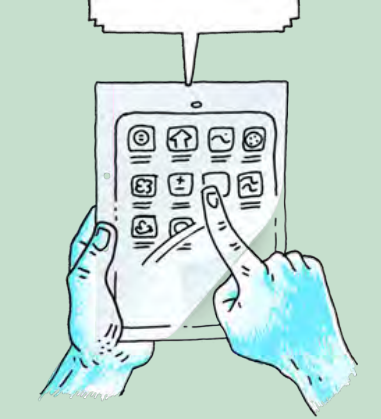
> **[Diagram Context - Textbook_NaturalScience_Gr9_Electric-cells-as-energy-systems.pdf-0002-15.png]**
> This illustration depicts an educational graphic of a hand interacting with a tablet device displaying various application icons and a blank speech bubble above it. Visible elements include human hands holding a digital tablet screen with a grid of app symbols and a pointer finger touching a specific icon, topped by a speech bubble extending upwards. Conceptually, this diagram visually represents digital learning, interactive educational technology, or the integration of e-learning tools within the CAPS curriculum.


3. Insert each nail slowly and carefully into either side of the lemon. Push the nails into the lemon so that they almost reach the centre of the lemon, but are not touching. 

4. Attach one wire to the zinc (or iron) nail and the other wire to the copper nail or copper coin. 

5. Connect the wires to the LED bulb and ammeter if you are using one as shown in the diagram. **.** 


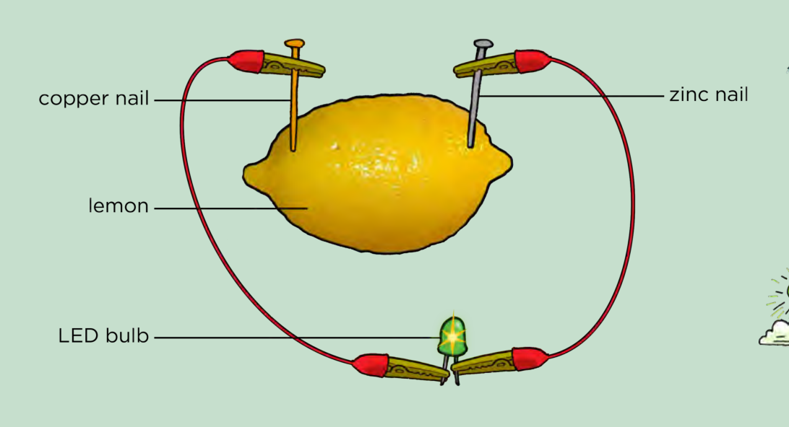
> **[Diagram Context - Textbook_NaturalScience_Gr9_Electric-cells-as-energy-systems.pdf-0002-19.png]**
> This educational graphic depicts a simple electrochemical circuit apparatus. It features a lemon as the electrolyte with visible labels pointing to a "copper nail," "zinc nail," "lemon," and an "LED bulb" connected by wires with crocodile clips. Conceptually, the diagram illustrates how chemical energy is converted into electrical energy in a galvanic cell, demonstrating the practical application of redox reactions and current flow in high school Physical Sciences.


###### **<u>VISIT</u>** 

Watch this video to understand how a lemon battery works. bit.ly/16N076B 


> **[Diagram Context - Textbook_NaturalScience_Gr9_Electric-cells-as-energy-systems.pdf-0002-22.png]**
> The educational graphic is a conceptual illustration featuring a hot air balloon whose envelope is shaped like planet Earth, with a basket carrying two figures using telescopes beneath a burner flame, surrounded by clouds, birds, and a sun. Visible elements include the spherical Earth map graphic, netting lines, a flame source, a basket, two human figures holding binoculars or telescopes, clouds, birds, and a sun in the sky. For a high school student learning Geography or Environmental Sciences within the CAPS curriculum, this diagram serves as a metaphor for global observation, environmental monitoring, or sustainable resource management on a planetary scale.


What do you notice? 


6. If your light bulb does not glow, connect your fruit cell with your partner's cell and reconnect the LED light bulb. Does it glow now? If not, connect several more fruit cells in a series until the LED bulb glows as shown in the diagram. 

###### **<u>DID YOU KNOW?</u>** 

The lemon battery is very similar to the first electrical battery invented by Alessandro Volta in 1800. He used salt water instead of lemon juice. 


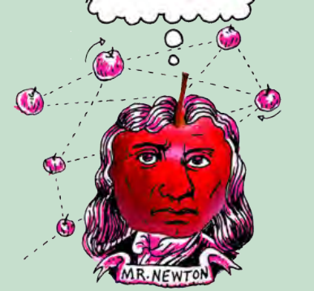
> **[Diagram Context - Textbook_NaturalScience_Gr9_Electric-cells-as-energy-systems.pdf-0003-04.png]**
> This educational graphic is a conceptual illustration featuring a caricature of Sir Isaac Newton's head shaped like a red apple with a stem, situated below a thought bubble and surrounded by a network of smaller floating apples connected by dashed lines with directional arrows. The visible labels and elements include a banner reading "MR. NEWTON", multiple red apple illustrations, a thought bubble, and dashed grid lines with directional arrows indicating gravitational attraction between masses. Conceptually, this diagram visually introduces high school learners to Newton's Law of Universal Gravitation, illustrating how masses attract one another across space as conceptualised by Newton through the famous apple metaphor.


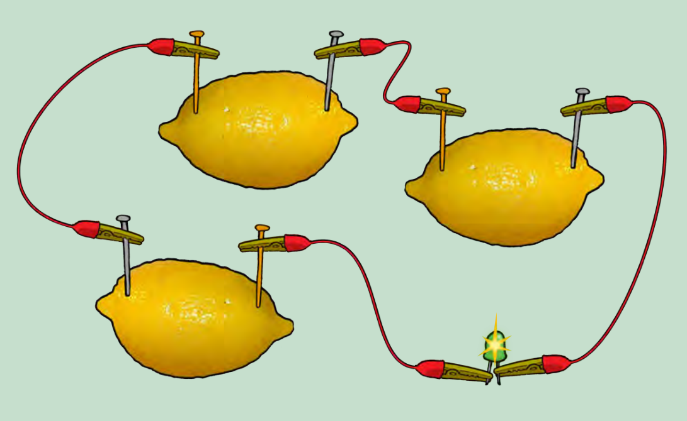
> **[Diagram Context - Textbook_NaturalScience_Gr9_Electric-cells-as-energy-systems.pdf-0003-05.png]**
> This apparatus diagram depicts a series circuit consisting of three lemons acting as electrochemical cells, connected by jumper wires with crocodile clips to illuminate a small green light-emitting diode (LED). The visible components include three whole lemons, dissimilar metal electrodes (copper/yellow and zinc/silver nails), red connecting wires with red and green crocodile clips, and an emitting green LED. For a Grade 10 Physical Sciences student, this illustrates how chemical energy is converted into electrical energy in a voltaic cell and demonstrates how combining multiple cells in series increases the total potential difference to power a load.


How many cells did you connect in series to cause the LED to emit light? 

7. What do we call the cells connected together? 

###### **<u>TAKE NOTE</u>** 

An electrolyte is a special type of solution which is able to conduct electricity. 


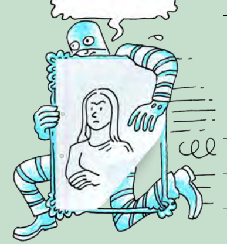
> **[Diagram Context - Textbook_NaturalScience_Gr9_Electric-cells-as-energy-systems.pdf-0003-10.png]**
> This educational cartoon graphic depicts a thief in striped clothing hurriedly making off with a framed portrait resembling the Mona Lisa. Motion lines surround the fleeing figure, who holds the framed artwork while looking backward. Conceptually, this visual serves as an engaging metaphor for concepts such as theft, plagiarism, or copyright infringement within educational contexts.


8. What happens if you replace the copper nail with another zinc nail, so that you have two electrodes of the **same** metal? Are you able to light up the LED light? 

9. Experiment further by investigating the effects of pushing the nails deeper into the lemon and placing them at different positions in the lemon (closer together and further apart). Record some of your observations here. 


> **[Diagram Context - Textbook_NaturalScience_Gr9_Electric-cells-as-energy-systems.pdf-0003-13.png]**
> The graphic is a decorative border featuring a repeating pattern of stylized green waves or interlocking loops. There are no explicit labels, variables, or text characters present in the design. Conceptually, it serves as a purely ornamental divider to structure a document or learning module visually.


Energy and Change 

In the last activity we created a simple electric battery. A chemical reaction takes place inside the lemon which produces electricity. The components in the lemon battery are very similar to those used in a normal battery. The copper and zinc nails (or stips of metal) are called **electrodes** . The lemon juice acts as the **electrolyte** . Citrus fruits, such as lemons, are acidic, which helps their juice to conduct electricity. 

When the electrodes are connected in a circuit, a chemical reaction takes place within the electrolyte in the lemon which causes electrons to move in the external circuit. This flow of charge is **electric current** . The chemical reaction causes a potential difference which causes the flow of electrons in the external circuit. This will only occur when the cell is connected in a circuit. Think of a normal battery that you might use in a torch. You can store this battery for a long time, and it will not go flat as the chemical reactions only take place when it is connected in a circuit. 

We are now going to build a more complex cell. 

#### **ACTIVITY:** Zinc-copper cell 

###### **MATERIALS:** 

- two 250 ml beakers 

- copper sulphate solution 

- zinc sulphate solution 

- concentrated sodium sulphate or sodium chloride solution 

- salt bridge made with a U tube (this can be made from a plastic tube which is bent) or filter paper soaked in the salt bridge solution 

- cotton wool 

- copper electrode 

- zinc electrode 

- insulated copper connecting wires with crocodile clips 

- LED bulb 

- ammeter 

###### **INSTRUCTIONS:** 

1. Pour about 200 ml of the zinc sulphate solution into a beaker and put the zinc electrode into the solution. 

2. Pour about 200 ml of the copper sulphate solution into the second beaker and place the copper electrode into the solution. 

3. Fill the U-tube with the sodium sulphate solution and seal the ends of the tubes with the cotton wool. This will stop the solution from flowing out when the U-tube is turned upside down. 

4. Connect the zinc and copper electrodes to the ammeter. Does the ammeter record a reading? 

5. Place the U-tube so that one end is in the copper sulphate solution and the other end is in the zinc sulphate solution, as shown in the diagram. 


> **[Diagram Context - Textbook_NaturalScience_Gr9_Electric-cells-as-energy-systems.pdf-0004-22.png]**
> This educational graphic features two distinct illustrations: the top panel shows a globe surrounded by green cyclic arrows with a character holding a sign that reads "VISIT Discover how a car battery works. bit.ly/H6ixWa," while the bottom panel depicts a metal slinky toy shaped like a caterpillar on leaves with striped body segments. The visual elements include a stylized planet Earth, a human figure, directional recycling-style arrows, a slink caterpillar with striped circle markings, and green botanical leaves. Conceptually, this graphic supports physical sciences and environmental learning by prompting students to explore electrochemical energy storage systems (car batteries) in relation to global sustainability and illustrating mechanical wave models or biological structures using everyday analogies.


**<u>TAKE NOTE</u>** If you do not have a U-tube or plastic tubing, you can use strips of filter paper or a cloth soaked in the sodium sulfate solution with the ends dipped into each beaker. 


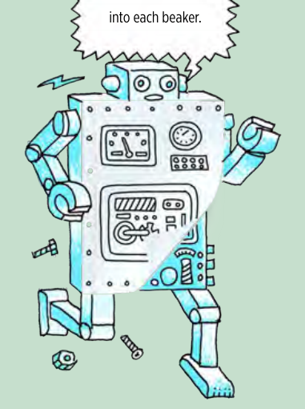
> **[Diagram Context - Textbook_NaturalScience_Gr9_Electric-cells-as-energy-systems.pdf-0004-24.png]**
> This educational graphic is an illustrated cartoon depicting a mechanical robot with control panels on its torso, loose bolts on the ground, and a speech bubble fragment reading "into each beaker." Visible features include dial gauges, control buttons, joints on the arms and legs, loose screws, and a jagged speech bubble at the top. Conceptually, this whimsical character acts as a contextual visual hook for a practical chemistry investigation or experiment instructions, engaging learners by personifying scientific procedures.


###### **<u>DID YOU KNOW?</u>** 

An **ion** is an atom or molecule in which the total number of elec-trons is not equal to the total number of protons. If there are fewer electrons than protons, this gives an atom a positive charged. If there are more electrons than protons, this this gives an atom a negative charge. 


> **[Diagram Context - Textbook_NaturalScience_Gr9_Electric-cells-as-energy-systems.pdf-0005-03.png]**
> This graphic is an illustrative conceptual drawing depicting an astronaut standing on a cratered red apple treated as a planetary body, set against a stylized outer space background with stars, a comet, and a speech bubble. Visible elements include an astronaut figure in a spacesuit holding a flag, a red apple modified with impact craters, and surrounding cosmic symbols like stars, planets, and lightning bolts. Conceptually, this whimsical metaphor helps students explore gravitational fields, scale, and the universality of physical laws by comparing everyday terrestrial objects to celestial bodies in space.


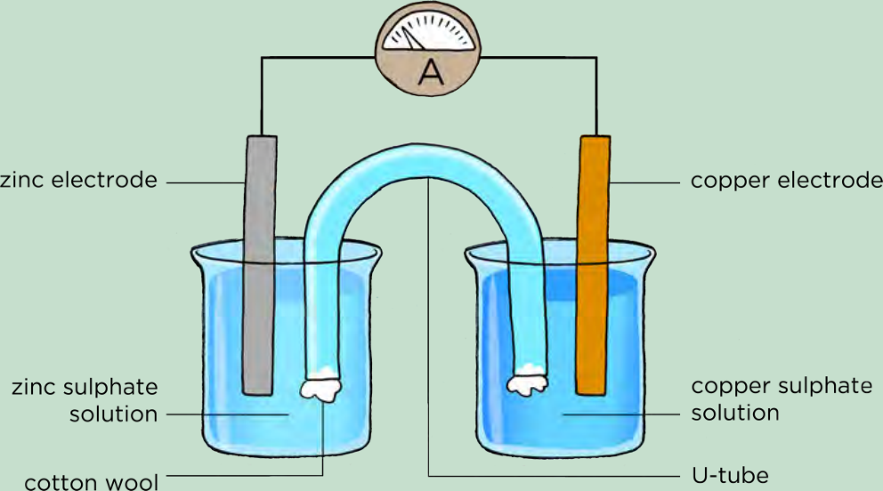
> **[Diagram Context - Textbook_NaturalScience_Gr9_Electric-cells-as-energy-systems.pdf-0005-04.png]**
> The graphic illustrates a galvanic cell apparatus consisting of two half-cells connected by an external circuit with an ammeter and a salt bridge. Visible labels include "zinc electrode," "copper electrode," "zinc sulphate solution," "copper sulphate solution," "cotton wool," "U-tube," and an ammeter symbol ("A"). This diagram conveys the essential components and setup of a standard electrochemical cell, helping learners understand how spontaneous redox reactions generate electrical energy via the flow of electrons and ions.


Is there a reading on the ammeter? 

6. Remove the ammeter and insert the LED bulb in the circuit. Does it glow? If not, try connecting a few cells in series until the LED lights up. 

7. Observe what is happening at the copper electrode and at the zinc electrode. 

###### **QUESTIONS:** 

1. What did you notice on the ammeter (or voltmeter) when you connected the circuit with the U-tube? 


2. What does the ammeter reading tell us? 

You can also use a voltmeter to measure the potential difference across the cell. The voltmeter will replace the ammeter and LED light. 


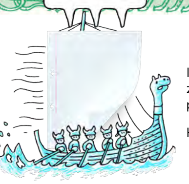
> **[Diagram Context - Textbook_NaturalScience_Gr9_Electric-cells-as-energy-systems.pdf-0005-13.png]**
> The graphic is a cartoon illustration depicting a Viking ship sailing on choppy water with rowers and a sail shaped like a binder sleeve, with horizontal wind lines blowing from the left and partial text on the right. Visible elements include waves, a Viking longship with a carved dragon head, five horned helmeted rowers holding oars, rigging lines, a large white vertical sheet with punch holes acting as a sail, and wind-stream lines. Conceptually, this whimsical diagram serves as a visual metaphor to introduce forces, motion, or wind propulsion in physical sciences, engaging learners with everyday analogies for vector forces and how moving air transfers momentum to objects.


In the last activity, we demonstrated a zinc-copper cell. This is made up of a zinc **half-cell** and a copper **half-cell** . Together, they make up the whole cell. The purpose of the U-tube is to connect the two half cells. It is called the **salt bridge** . 

How do we explain the chemical reactions taking place in the zinc-copper cell? 

Energy and Change 

When a zinc sulphate solution containing a zinc plate is connected by a U-tube to a copper sulphate solution containing a copper plate, reactions occur in both solutions. 

- At the zinc electrode, the zinc metal has gone into the zinc sulphate solution as zinc ions. 

- At the copper electrode, copper ions from the solution have deposited onto the electrode as copper metal atoms. 

In the zinc-copper cell the important thing to notice is that the chemical reactions that take place at the two electrodes cause an electric current to flow through the outer circuit. In this type of cell, **chemical energy** is converted to **electrical energy** . 

As we have said before, an electric battery used in appliances such as a torch consists of two or more electric cells connected together. There are many different battery cell types such as zinc-carbon, nickel-cadmium and nickel-zinc batteries. 


> **[Diagram Context - Textbook_NaturalScience_Gr9_Electric-cells-as-energy-systems.pdf-0006-05.png]**
> This educational graphic is a conceptual diagram illustrating a continuous layer of identical, hook-like structures embedded in a flat horizontal surface. The graphic displays a repeating pattern of blue curved hooks protruding upwards from a light grey rectangular base layer. Conceptually, this diagram visually represents surface microstructures or adhesion mechanisms, helping students understand how mechanical fastening systems or biological attachment structures function at a microscopic level.


#### **SUMMARY:** 

**.** **<u>Key Concepts</u>** 

- An electric cell is a system in which chemical reactions take place to convert chemical energy into electrical energy. 

- An acidic fruit can be used to construct a simple cell. The lemon juice acts as the electrolyte. 

- An electric cell can be made using two beakers with an electrolyte and electrode in each. The electrolyte solutions in each half-cell are connected by a salt bridge. 

- When the electrodes are connected to an external circuit, chemical reactions will take place in each of the beakers, causing a current in the external circuit. 

- A battery is a group of cells which are connected together. 

- There are many different types of batteries, such as zinc-carbon, nickel-cadmium and nickel-zinc batteries. 

###### **.** **<u>Concept Map</u>** 

This was a short chapter on electric cells, demonstrating how we can make cells. Use the following space to draw your own concept map summarising what was covered in this chapter. You can refer back to previous chapters and also concept maps from your A workbook when thinking about how to construct this concept map. 

###### **<u>DID YOU KNOW?</u>** 

Rechargeable batteries are recharged by applying an electric current which reverses the chemical reactions that take place during their use in a circuit. 


> **[Diagram Context - Textbook_NaturalScience_Gr9_Electric-cells-as-energy-systems.pdf-0006-18.png]**
> The graphic is a whimsical, hand-drawn illustration depicting a horse-drawn carriage shaped like a large red apple, carrying two figures and topped with a flag and an empty thought bubble. Visible elements include a driver holding reins, a waving passenger inside the apple carriage, two pink horses, wheels, motion lines, and a blank speech/thought bubble above. Conceptually, this illustration serves as an engaging, abstract metaphor for travel, motion, or creative expression, which educators can use to spark narrative writing or stimulate critical thinking in a CAPS-aligned language or life skills lesson.


> **[Diagram Context - Textbook_NaturalScience_Gr9_Electric-cells-as-energy-systems.pdf-0006-19.png]**
> This conceptual educational illustration depicts an operator wearing personal protective equipment—specifically a hard hat, protective goggles, and ear muffs—operating a vibrating pneumatic jackhammer that is breaking up a solid surface. The graphic features motion lines indicating vibration and flying debris fragments around the pointed bit of the jackhammer. Conceptually, for high school students studying occupational health and safety or physics, this visual demonstrates the mechanical hazards of vibration and the necessity of personal protective equipment (PPE) in construction environments.


###### **<u>VISIT</u>** 

Read about a stretchy, gooey gadget that uses simple materials to conduct electricity and amplify sound. bit.ly/17tGzAQ 


> **[Diagram Context - Textbook_NaturalScience_Gr9_Electric-cells-as-energy-systems.pdf-0006-22.png]**
> This educational graphic depicts a conceptual illustration of a large telescope observing planet Earth, featuring human figures operating the equipment alongside a blank speech bubble. Visible elements include a massive green-hued telescope mounted on scaffolding, a detailed globe of Earth showing Africa and Europe positioned at the lens, and smaller figures working near a monitoring console. Conceptually, this diagram visually engages CAPS learners in discussions regarding observation, scale, and scientific inquiry within Earth and Space sciences.


> **[Diagram Context - Textbook_NaturalScience_Gr9_Electric-cells-as-energy-systems.pdf-0007-00.png]**
> This image features a single, vertically oriented yellow text box containing the label "Electric cells as energy systems". It serves as a structural title or conceptual heading for a learning module. For a high school student studying Physical Sciences, it introduces the core concept of how electric cells function as sources of electrical energy within circuits by converting chemical potential energy into electrical potential energy.


#### **REVISION:** 

1. Write a short paragraph to describe, in your own words, what an electrical cell is and how it causes a current in an external circuit. [3 marks] 


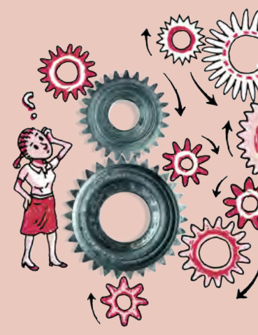
> **[Diagram Context - Textbook_NaturalScience_Gr9_Electric-cells-as-energy-systems.pdf-0008-02.png]**
> This educational graphic depicts a mechanical gear train system featuring multiple intermeshed metal and red cogs of varying sizes, accompanied by an illustrated student pondering with a question mark overhead. Curved directional arrows indicate the rotational movement of individual gears within the complex network. The diagram visually conveys the core CAPS Technology concepts of mechanical advantage, gear ratios, and how drivers and driven gears transmit force and alter speed or direction of motion.


2. What is the difference between a cell and a battery? [2 marks] 

3. You made an electrical cell from a lemon. How could you generate enough energy from lemons in order to make a light bulb glow? [2 marks] 

4. How would you test whether or not a battery or cell is producing energy? [2 marks] 


5. Draw a diagram to show how to set up a zinc-copper cell. Include an ammeter in the external circuit. You must use the following labels: zinc electrode, copper electrode, salt bridge/U-tube, zinc-sulphate solution, copper sulphate solution. [8 marks] 


> **[Diagram Context - Textbook_NaturalScience_Gr9_Electric-cells-as-energy-systems.pdf-0009-02.png]**
> This is a blank educational graphic with no visible content, labels, or structures. Consequently, it conveys no conceptual information for high school students studying the CAPS curriculum.


Total [17 marks] 


> **[Diagram Context - Textbook_NaturalScience_Gr9_Electric-cells-as-energy-systems.pdf-0009-04.png]**
> The graphic shows a biological illustration of an ant leading a linear trail of smaller ants and chemical dot markers across a two-tone pink and white background. The visible visual elements include an ant icon at the head of the trail and continuous parallel lines of tiny red dots representing chemical secretions. Conceptually, this diagram illustrates animal behavior and chemical communication, specifically how social insects like ants use pheromone trails to navigate and communicate pathways to the rest of the colony.


Energy and Change 

Imagine the possibilities of a plain piece of paper. They are endless! 


# **14 Electric cells as energy systems** 

##### **<mark>Unit overview</mark>** 

###### **0.5 weeks** 

This is a very short Unit with only 1.5 hours of teaching time allocated to it. We revisit the idea of a system and energy transfers within a system focusing on electric cells. The concept of a system, looking at potential and kinetic energy and conservation of energy within a system, was first introduced in Gr 7 Energy and Change. In Gr 8 Energy and Change, learners would have also looked at energy transfers within an electrical system. The focus of this Unit however, is on electric cells. 

We will start off by looking at a simple electric cell made using an acidic fruit to explain what happens within a cell in an electric cell, and then we will make a more complex electric cell using copper and zinc plates as electrodes. It is important to make the distinction between a cell and a battery as these words are often used interchangeably. A battery is two or more cells that are connected together. 

##### **14.1 Electric cells (1.5 hours)** 

|**Tasks**|**Skills**|**Recommendation**|
|---|---|---|
|Activity: Fruit cell|Following instructions, observing,<br>analysing, explaining|CAPS suggested|
|Activity: Zinc-copper cell|Following instructions, observing,<br>taking measurements, analysing,<br>explaining|CAPS suggested|

##### **Key questions** 

- l Where does an electric circuit get its energy from? 

- l What is inside a battery? 

- l How can we build our own electric cells? 

- l How does an electric cell supply energy? 

Remind learners that the symbol for an electric cell is: 


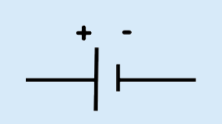
> **[Diagram Context - Textbook_NaturalScience_Gr9_Electric-cells-as-energy-systems.pdf-0011-13.png]**
> This circuit diagram represents an electrical cell or DC voltage source, featuring a long vertical line indicating the positive terminal and a shorter, thicker vertical line indicating the negative terminal, marked with plus (+) and minus (-) symbols respectively. It conveys the standard schematic symbol used in Physical Sciences to show a source of potential difference in an electric circuit. High school learners use this symbol when drawing and analyzing circuit diagrams to understand current flow and Ohm's law.


### 2.1 Electric cells 

The source of energy in an electric circuit is an electric cell. A system can be described as a set of parts working together as a whole. 

#### **ACTIVITY: Fruit cell** (LB page 226) 

The citric acid in the lemon acts as an electrolyte. When two different metal electrodes are placed into the acidic lemon solution, and the circuit is closed, electrons flow from the one electrode to the other. This flow of electrons is called electric current. 

This is a fun activity for the learners and is easily accessible if you do not have the equipment to make the zinc/copper cell in the next activity. 

The ammeter is optional. You can use the LED light instead of an ammeter to indicate that current is present. However, depending on the fruit that you use, the current might not be strong enough to make the LED light glow, and therefore an ammeter is a more sensitive measure of whether there is current. 

Connect several of the learner's fruit cells in series until the LED bulb lights up. 

Note that incandescent light bulbs from torches are not used as the lemon battery will not produce a high enough potential difference to light them up. Instead of a copper nail or copper strip, you can also use a copper coin or piece of copper wire. Instead of a zinc nail, you can also use a steel or iron nail. It is important to highlight to learners that TWO different conductors/metals must be used in the cell. If two of the same metals are used, a potential difference is not created, and the electrons will not flow. As an extension, you can also use different types of fruit to see which ones produce the best cells. What do you notice? 

- 1.–5. There should be a small reading on the ammeter and the light bulb might glow. The size of the reading will depend on the size of the lemon and the quality of the connections. Make sure that the zinc and copper are not touching each other inside the lemon. 

6. Learner-dependent answer. 

7. A battery. 

8. No you are not able to light up the LED bulb using two nails of the same type of metal. If two of the same metals are used, a potential difference is not created, and the electrons will not flow. 

9. Learners should see that the further the nails are pushed into the lemon, the greater the current. This is because the length of the electrodes exposed to the electrolyte is greater (there is increased surface area in contact with the electrolyte). 

Placing the nails in different positions also has an effect, as the closer the electrodes are to each other, the less resistance there is, and therefore a greater current. 

This is a good opportunity also to discuss a fair test as learners must change only one variable at a time. 

A further extension is to use different electrodes. For example, replace the zinc nail or strip with a magnesium strip. Learners can then observe and compare the ammeter readings and draw further conclusions about how the type of material of the conductor has an effect. 

#### **ACTIVITY: Zinc-copper cell** (LB page 228) 

###### **Materials** 

Prepare 1 M zinc sulphate and 1 M copper sulphate solutions beforehand. A 1 molar (M) solution contains 1 mole of solute dissolved in 1 litre of solution: 

- l To make a 1 M solution of copper sulphate, dissolve 250 g of hydrated copper sulphate (CuSO4.5H2O) in distilled water and then add more water until you have 1 litre. 

- l To make a 1 M solution of zinc sulphate, dissolve 288g of hydrated zinc sulphate (ZnSO4.7H2O) in distilled water and then add more water until you have 1 litre. 

The exact concentration of sodium sulphate or sodium chloride is not too important. 

If you have a sensitive measuring balance, measure the mass of the electrodes before the experiment, and then again one day later, to show the change in mass. This will highlight the fact that a chemical reaction has taken place. If your solutions are concentrated enough, the bulb should glow, otherwise you can also connect more than one cell in series, as was done with the lemons. 

If you do not have enough materials for each learner to build a cell, you can do this as a demonstration or 

else set up a couple of workstations for a group of learners to observe. 

###### **Instructions** 

If you have a sensitive measuring balance, measure the mass of the copper and zinc plates and get learners to record this. 

- 1.–3. Learners should fill the salt bridge with the sodium sulphate solution and then plug the ends with cotton wool. Inserting the salt bridge can be a difficult manoeuvre so make sure that they practise it a bit first and use enough cotton wool. If you do not have a U-bend tube then use strips of filter paper or a cloth soaked with saturated sodium sulphate solution. 

4. No, there is no reading on the ammeter. 

5. Yes, there is a reading on the ammeter. 

- 6.–7. Learners' own answers. 

If you measured the mass of the electrodes at the beginning of the experiment, take the ammeter away and connect the copper and zinc plates to each other directly using copper wire. Leave to stand for about one day. 

After a day, remove the two plates and rinse them first with distilled water, then with alcohol, and finally with ether. Dry the plates using a hair dryer. Weigh the zinc and copper plates and get learners to record their mass again. Has the mass of the plates changed from the original measurements? Yes, the mass should have changed. The mass of the zinc plate decreased, while the mass of the copper plate increased. Discuss this with your class. The changes in mass have occurred as chemical reactions have taken place in the solutions. This is discussed more in the text after the activity. 

###### **Questions** 

1. The ammeter should measure a current in the circuit. The voltmeter should register a potential difference across the two electrodes. 

2. The ammeter reading tells us that there are electrons moving through the external circuit. There is a current. 

# **Revision** 

1. The paragraph should mention that an electrical cell is a system in which chemical reactions occur. The chemical reactions set up a potential difference across the cell, which makes the electrons move around the circuit (electric current). 

2. A cell is a system in which chemical reactions occur. A battery is a number of cells connected together. 

3. If you make several lemon cells and connect them in series with a light bulb. 

4. You can connect an ammeter to measure current or use a torch light bulb. If the bulb glows then there is a current flowing. Or you can use a voltmeter to measure the potential difference. 

5. One mark is allocated to each of the correct labels, one mark to placing the salt bridge with the ends in each solution, one mark for including an ammeter in the correct position with the symbol A and one mark for placing the electrodes in the right solutions. A reference diagram is supplied here: 


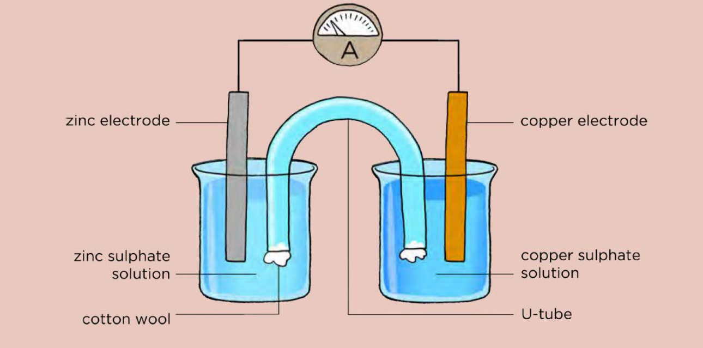
> **[Diagram Context - Textbook_NaturalScience_Gr9_Electric-cells-as-energy-systems.pdf-0014-00.png]**
> This diagram illustrates an electrochemical cell apparatus, specifically a galvanic (voltaic) cell. Visible labels include zinc electrode, copper electrode, zinc sulphate solution, copper sulphate solution, U-tube (salt bridge), cotton wool, and an ammeter (A) in the external circuit. Conceptually, it demonstrates how spontaneous redox reactions are converted into electrical energy, showing the half-cells connected by an external wire and a salt bridge to maintain electrical neutrality.


## 5. Authentic Exam Question Archetypes & Mark Allocations
*(Extracted from official CAPS examination papers to guide marking, pacing, and rubric design)*

### Archetype 1: QUESTION 9
- **Source Paper:** `Gr9_NS_Exam12.pdf`
- **Total Mark Allocation:** **[10 Marks]** (Sub-questions: 2, 2, 2, 2, 2 marks)
- **Recommended Time:** **10 Minutes** (Pacing: ~1.0 min/mark | *Calibrated to Official CAPS Paper Pace (1.0 min/mark)*)
- **Assessment Mode Calibration:** Timed Exam Simulation: 10 min countdown (Pacing Checkpoint: 8 min)
- **Cognitive / Marking Strategy:** NSC Standard (Method Marks [M], Accuracy Marks [A], Carry-Over [CA])

#### Question Prompt & Working:
```text
QUESTION 9 
 
 
 
ELECTRICAL CELLS AS ENERGY SYSTEMS 
 
 
 
Acidic fruits such as lemons can be used as a cell in electrical circuits as shown below. 
The fruit is gently squeezed to soften the fruit so that the juice is released inside while 
suring that the lemon peel does not break. 
 
 
 
 
 
 
 
 
 
 
 
 
 
 
 
 
 
 
9.1 
Define the term electrolyte. 
 
 
 
 
 
 
 
 
 
 
 
 
 
 
 
 
 
 
(2) 
 
9.2 
What is the function of the LED bulb in the circuit diagram above? 
 
 
 
 
 
 
 
 
 
 
 
 
(2) 
 
9.3 
Draw a diagram of a symbol of a cell in the electrical circuit. 
 
 
 
 
 
 
 
 
 
 
 
 
 
 
 
 
 
 
(2) 
 
Sink spyker 
copper nail 
lemon 
LED bulb 
zinc nail 
NATURAL SCIENCES   
GRADE 9 
14 
 
P.T.O. 
 
9.4 
Differentiate between a cell and a battery in an electrical cell. 
 
 
 
 
 
...
```

### Archetype 2: QUESTION 5
- **Source Paper:** `Gr9_NS_Exam11.pdf`
- **Total Mark Allocation:** **[14 Marks]** (Sub-questions: 3, 1, 1, 2, 3 marks)
- **Recommended Time:** **14 Minutes** (Pacing: ~1.0 min/mark | *Calibrated to Official CAPS Paper Pace (1.0 min/mark)*)
- **Assessment Mode Calibration:** Timed Exam Simulation: 14 min countdown (Pacing Checkpoint: 10 min)
- **Cognitive / Marking Strategy:** NSC Standard (Method Marks [M], Accuracy Marks [A], Carry-Over [CA])

#### Question Prompt & Working:
```text
QUESTION 5 
 
CURRENT ELECTRICITY    
 
5.1 
Study the circuit diagram below and answer the questions that follow. 
 
 
 
 
 
 
 
 
 
 
 
5.1.1 
Provide labels for the components X, Y and Z. 
 
 
 
 
 
 
 
 
 
 
 
 
 
 
 
 
 
 
 
 
 
 
 
 
(3) 
 
 
 
 
 
5.1.2 
What energy conversion takes place in an electrical cell? 
 
 
 
 
 
 
 
 
(1) 
 
 
 
 
 
5.1.3 
State how the bulbs are connected in the above circuit. 
 
 
 
 
 
 
 
 
(1) 
 
 
 
 
 
5.1.4 
If both cells have equal voltage, determine the voltage of each cell. 
 
 
 
 
 
 
 
 
 
 
 
 
 
 
 
 
 
 
 
 
(2) 
 
V2 
V2 
V2 
4 V 
9 V 
2 
Z 
Y 
1 
X 
Downloaded from testpapers.co.za
NATURAL SCIENCES  
GRADE 9 
10 
 
P.T.O. 
 
 
 
5.1.5 
Explain what would happen to bulb 1 if bulb 2 was removed from the 
circuit. 
 
 
 
 
 
 
 
 
 
 
 
 
 ...
```

### Archetype 3: QUESTION 7
- **Source Paper:** `Gr9_NS_Exam15.pdf`
- **Total Mark Allocation:** **[20 Marks]** (Sub-questions: 2, 2, 1, 3, 2 marks)
- **Recommended Time:** **20 Minutes** (Pacing: ~1.0 min/mark | *Calibrated to Official CAPS Paper Pace (1.0 min/mark)*)
- **Assessment Mode Calibration:** Timed Exam Simulation: 20 min countdown (Pacing Checkpoint: 15 min)
- **Cognitive / Marking Strategy:** NSC Standard (Method Marks [M], Accuracy Marks [A], Carry-Over [CA])

#### Question Prompt & Working:
```text
QUESTION 7 
 
7.1 
Batteries are called Electrochemical Cells √√ 
(2) 
 
7.2 
To show the flow of current √√ 
(2) 
 
7.3 
Oxidation reaction √ 
(1) 
 
7.4 
Batteries work through a series of oxidation√-reduction √ reactions that produce 
waste and energy √. 
 
(3) 
 
7.5 
A solution that conducts electricity √√ 
(2) 
(10) 
 
 
TOTAL SECTION B: 
[56] 
 
 
 
 
TOTAL: 
80
```
