# Chapter 2: The Lithosphere

### Key Questions
* What does the centre of the Earth look like?
* Why is it important to know about the structure of the Earth?
* Why is there so much variety in the rocks you see around you?
* How do rocks form?
* Why do we need to know about rocks?
* Why are rocks important?

---

The Earth is a system consisting of many parts. In the previous chapter, we looked at how these parts or spheres interact. In this section, we are going to look more closely at one of these spheres, namely the lithosphere.

## 2.1 What is the lithosphere?

On Earth, water, air, stone, and life interact. Let's think about the stone part of this statement. Where on Earth do we find stone? What are the different forms of stone that are found on Earth? Why is it important to know about this part of the Earth? Let's investigate these questions.

### Forms of Stone
| Form | Examples |
| :--- | :--- |
| Fine particles | Sand |
| Small fragments | Pebbles |
| Solid material | Stones |
| Large masses | Large boulders |

---

### New Words
| Term | Definition |
| :--- | :--- |
| **Geosphere** | The solid, rocky part of the Earth. |
| **Lithosphere** | The rigid outer layer of the Earth, consisting of the crust and upper mantle. |
| **Continental crust** | The relatively thick part of the Earth's crust that forms the large landmasses. |
| **Oceanic crust** | The relatively thin part of the Earth's crust which underlies the ocean basins. |
| **Crust** | The outermost layer of the Earth. |
| **Mantle** | The layer of the Earth between the crust and the core. |
| **Core** | The central part of the Earth below the mantle. |
| **Composition** | The nature of something's ingredients or constituents. |

---

# Activity: Investigating Stones

## Materials Needed
*   Magnifying glasses
*   Hammers
*   Paper towels
*   Samples collected (sand, pebbles, small stones/rocks, larger rocks)

## Instructions
1.  **Collection:** Collect sand, pebbles, a small stone/rock, and a larger rock. Bring these to school.
2.  **Selection:** Choose samples that look interesting and different from one another.
3.  **Variety:** Ensure you have at least four different items from different locations.
4.  **Observation:** Study the samples. If you have a magnifying glass, use it to observe the fine details of each sample.
5.  **Testing:** Wrap some samples in a paper towel and attempt to crush them with a hammer (perform this step outside under teacher supervision).

## Key Concepts
*   **Lithosphere:** The rigid outer part of the earth, consisting of the crust and upper mantle.
*   **Etymology:** The word 'lithos' comes from Ancient Greek, meaning 'stone'.
*   **Composition:** When we look at the composition of an object, we are examining what materials it is made of.

> **[Diagram Context - Textbook_NaturalScience_Gr9_Digestive-system.pdf-0001-01.png]**
> This educational graphic is a simplified structural representation showing a series of repeated blue helical or coiled shapes emerging from a horizontal baseline surface. There are no explicit text labels, symbols, or directional arrows visible in the image. Conceptually, this diagram can be used by CAPS life sciences or physical sciences learners to model repeating periodic structures, surface phenomena, or wave-like boundaries such as microvilli, diffraction gratings, or microscopic surface textures.

## Observation Table

| Sample | Location (Where found) | Shape and Colour (Size, shape, colour) | Texture (Texture and hardness) | Composition (Is it made of more than one material?) |
| :--- | :--- | :--- | :--- | :--- |
| **Sand** | | | | |
| **Pebble** | | | | |
| **Small stone/rock** | | | | |
| **Larger rock** | | | | |

***

*Chapter 2. The lithosphere | Page 223*

> **[Diagram Context - Textbook_NaturalScience_Gr9_Digestive-system.pdf-0001-02.png]**
> This conceptual illustration depicts a large metal key positioned vertically as a central barrier, flanked on the left by a blue cartoon monster breathing fire among city buildings, and on the right by a helicopter lowering a net over urban skyscrapers. There are no visible text labels, chemical symbols, or axis names present in the graphic. Conceptually, this metaphorical imagery can be used in Life Sciences or CAPS-aligned Life Orientation to prompt critical thinking about conflict resolution, environmental management, or containment strategies in ecosystems and urban settings.

> **[Diagram Context - Textbook_NaturalScience_Gr9_Electric-cells-as-energy-systems.pdf-0001-02.png]**
> This educational graphic is a simplified structural diagram representing surface waves on water. The visual features a horizontal shaded plane representing the water surface, overlaid with a series of repeated blue concentric arc symbols denoting circular wavefronts. Conceptually, this diagram helps high school learners visualise wave motion, propagation, and the periodic nature of transverse or surface waves in physical sciences.

> **[Diagram Context - Textbook_NaturalScience_Gr9_Electric-cells-as-energy-systems.pdf-0001-03.png]**
> This conceptual illustration depicts a large metal key positioned centrally between a hand-drawn city skyline with a blue monster and a helicopter carrying a net. There are no explicit text labels, variables, or chemical symbols present in the graphic. Conceptually, it serves as a visual metaphor often used to demonstrate problem-solving strategies, unlocking core concepts, or distinguishing between different perspectives in a CAPS curriculum context.

> **[Diagram Context - Textbook_NaturalScience_Gr9_Glossary1.pdf-0001-00.png]**
> This diagram illustrates a simplified cross-section of the endometrium (uterine lining), featuring a

> **[Diagram Context - Textbook_NaturalScience_Gr9_Glossary2.pdf-0001-00.png]**
> This diagram illustrates a simplified anatomical cross-section of the endometrium, featuring a

> **[Diagram Context - Textbook_NaturalScience_Gr9_Glossary3.pdf-0001-00.png]**
> This diagram illustrates a cross-section of the endometrium (uterine lining) during the secretory

> **[Diagram Context - Textbook_NaturalScience_Gr9_Glossary4.pdf-0001-00.png]**
> This diagram illustrates a cross-section of the endometrium (uterine lining) during

> **[Diagram Context - Textbook_NaturalScience_Gr9_Mining-of-mineral-resources.pdf-0001-02.png]**
> 1. A diagram of a cell with blue and white lines.

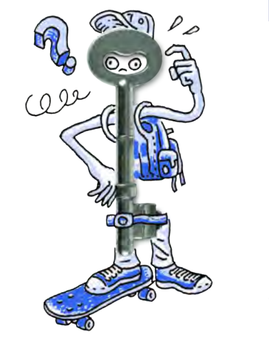
> **[Diagram Context - Textbook_NaturalScience_Gr9_Mining-of-mineral-resources.pdf-0001-03.png]**
> 1. A cartoon character with a backpack and a skateboard.

> **[Diagram Context - Textbook_NaturalScience_Gr9_Mining-of-mineral-resources.pdf-0001-16.png]**
> The image shows a diagram of a mineral, ore, and PGM (potassium gallate) labeled on a gray background. The diagram includes a Lewis structure of a mineral, a cell, and a graph of a mineral's crystal structure. The diagram also includes a Lewis structure of an ore and a graph of an ore's crystal structure.

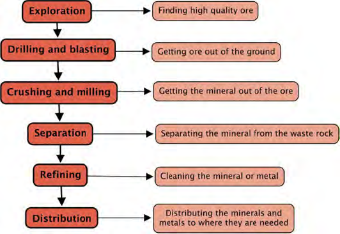
> **[Diagram Context - Textbook_NaturalScience_Gr9_Mining-of-mineral-resources.pdf-0001-21.png]**
> The image is a diagram that illustrates the process of mining and refining minerals. It shows six stages of the process, including exploration, drilling and blasting, crushing and milling, separation, refining, and distribution. The diagram is color-coded, with each stage represented by a different color, making it easy to follow the sequence of events. The diagram is labeled with text, which provides information about

> **[Diagram Context - Textbook_NaturalScience_Gr9_The-atmosphere.pdf-0001-02.png]**
> 1. A diagram of a cell with blue and white lines.

> **[Diagram Context - Textbook_NaturalScience_Gr9_The-atmosphere.pdf-0001-03.png]**
> 1. A cartoon illustration of a key and a dinosaur.

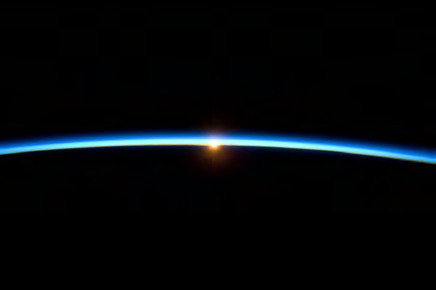
> **[Diagram Context - Textbook_NaturalScience_Gr9_The-atmosphere.pdf-0001-16.png]**
> 1. A diagram of the earth and the sun.

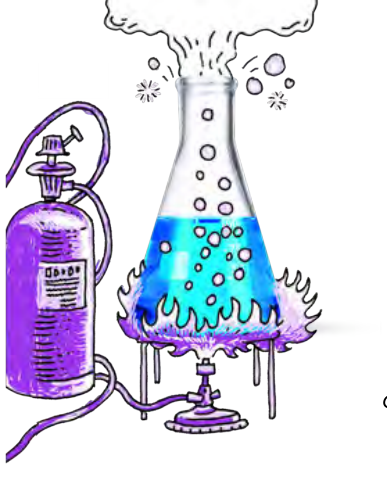
> **[Diagram Context - Textbook_NaturalScience_Gr9_The-atmosphere.pdf-0001-17.png]**
> 1. A purple and blue gas cylinder with a purple nozzle.

> **[Diagram Context - Textbook_NaturalScience_Gr9_The-earth-as-a-system.pdf-0001-02.png]**
> This graphic is a diagrammatic representation of a wave phenomenon, specifically showing wavefronts intersecting a boundary. It displays a series of parallel curved blue lines representing wavefronts approaching and reflecting off a horizontal surface. Conceptually, this helps learners visualize wave propagation, reflection, and the behavior of wavefronts as they interact with barriers in physical sciences.

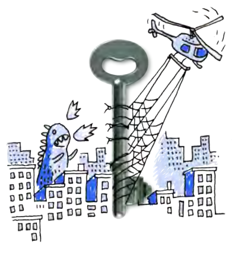
> **[Diagram Context - Textbook_NaturalScience_Gr9_The-earth-as-a-system.pdf-0001-03.png]**
> This conceptual illustration depicts a central metal key bisecting two contrasting urban scenes, with a fire-breathing monster on the left and a helicopter lifting a net over buildings on the right. There are no explicit text labels, chemical symbols, or axes visible in the graphic. Conceptually, this visual metaphor represents unlocking solutions, problem-solving, or the dual nature of critical thinking in tackling complex environmental or societal challenges.

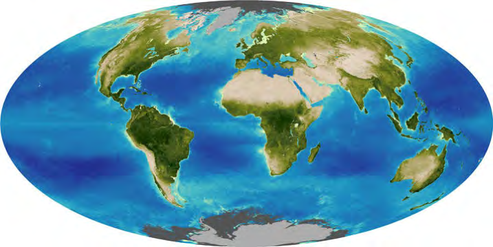
> **[Diagram Context - Textbook_NaturalScience_Gr9_The-earth-as-a-system.pdf-0001-10.png]**
> This global satellite composite map displays a Mollweide projection of Earth, illustrating the spatial distribution of terrestrial vegetation (green-to-brown land masses) and oceanic phytoplankton biomass (blue-to-turquoise coastal and marine gradients). The image features no explicit text labels or arrows, relying entirely on natural color-coding to represent biological activity. For CAPS Life Sciences learners, this conceptual graphic demonstrates the global scale of primary productivity, linking photosynthetic organisms on land and in oceans to energy flow and biogeochemical cycling within the biosphere.

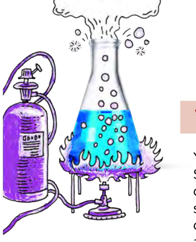
> **[Diagram Context - Textbook_NaturalScience_Gr9_The-earth-as-a-system.pdf-0001-13.png]**
> This illustration depicts a laboratory apparatus set-up consisting of a purple gas cylinder connected via tubing to a Bunsen burner, which heats a blue liquid in an Erlenmeyer flask resting on a tripod stand, producing bubbles and escaping vapor at the top. Visible elements include the gas cylinder with a regulator valve, tubing, a Bunsen burner flame, an Erlenmeyer flask containing blue liquid, rising gas bubbles, and steam or vapor escaping from the neck. Conceptually, this setup demonstrates how thermal energy from a heated chemical reaction or phase change drives vigorous bubbling and gas evolution in a liquid system, illustrating laboratory safety and heating techniques pertinent to high school physical sciences.

> **[Diagram Context - Textbook_NaturalScience_Gr9_The-earth-as-a-system.pdf-0001-14.png]**
> The graphic displays a section heading banner with bold red text reading "1.1 Spheres of the Earth" set against a pale pink background. It serves as a structural title element for a Geography curriculum module. Conceptually, it introduces learners to the core geographical topic of Earth's four interrelated subsystems—the lithosphere, hydrosphere, atmosphere, and biosphere—setting the foundation for studying how these spheres interact in natural systems.

> **[Diagram Context - Textbook_NaturalScience_Gr9_The-lithosphere.pdf-0001-02.png]**
> This diagram illustrates Huygens' Principle, depicting a primary wavefront as a horizontal plane with multiple secondary wavelets originating from points along its surface. The visual features a series of blue, semi-circular wavelets emerging from a light blue base, representing the propagation of waves through a medium without explicit text labels. Conceptually, it demonstrates that every point on a wavefront acts as a source of secondary spherical waves, which together interfere to form the next wavefront in the direction of propagation.

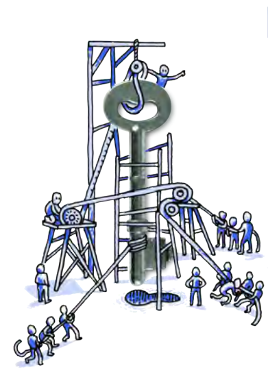
> **[Diagram Context - Textbook_NaturalScience_Gr9_The-lithosphere.pdf-0001-03.png]**
> This illustration depicts a system of simple machines, specifically pulleys and ropes

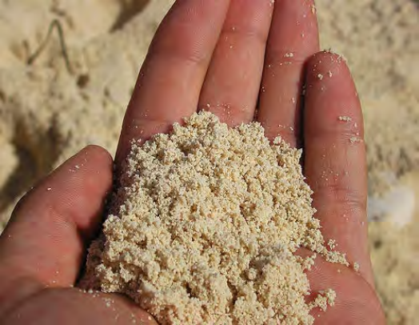
> **[Diagram Context - Textbook_NaturalScience_Gr9_The-lithosphere.pdf-0001-18.png]**
> This photograph displays a human hand holding a sample of coarse-grained sandy

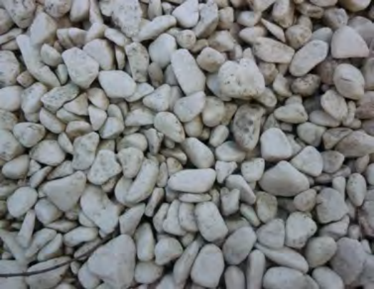
> **[Diagram Context - Textbook_NaturalScience_Gr9_The-lithosphere.pdf-0001-19.png]**
> This photograph depicts a collection of rounded, light-colored pebbles or gravel, lacking any

> **[Diagram Context - Textbook_NaturalScience_Gr9_The-lithosphere.pdf-0001-20.png]**
> This illustration shows a standard chemistry heating apparatus consisting of a gas cylinder connected via tubing to a Bunsen burner on a tripod stand, supporting an Erlenmeyer (conical) flask over an open flame. Inside the flask, a blue liquid is shown vigorously boiling with rising bubbles, producing clouds of steam or vapor that escape into the air. Conceptually, it demonstrates the process of thermal heating, phase changes (boiling/evaporation from liquid

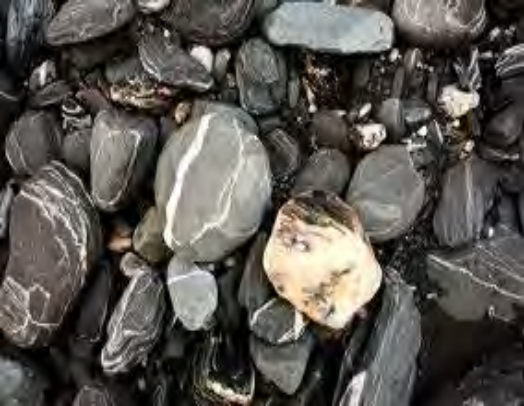
> **[Diagram Context - Textbook_NaturalScience_Gr9_The-lithosphere.pdf-0001-23.png]**
> 1. A close-up of a rock collection with a gray rock on the bottom right and a brown rock on the top left.

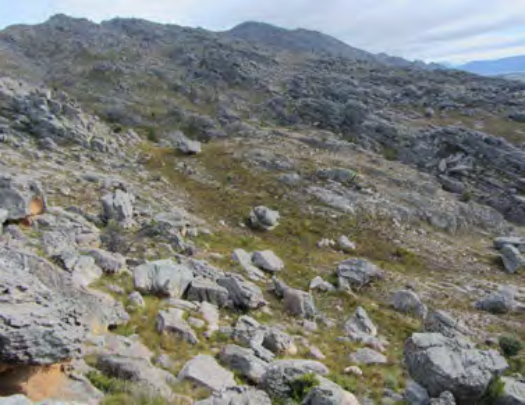
> **[Diagram Context - Textbook_NaturalScience_Gr9_The-lithosphere.pdf-0001-24.png]**
> 1. A diagram of a cell with a chemical symbol for a molecule.

---

### The Lithosphere

The lithosphere is the outer layer of the Earth. It encompasses all mountains, rocks, stones, topsoil, and sand found on the planet, including those located under the sea and beneath the Earth's surface.

---

### Inside the Earth

The Earth is composed of concentric layers. 

> **TAKE NOTE:** Concentric objects are objects that share the same point as their centre.

The Earth is divided into three primary layers:
1. **The Crust:** The outermost solid layer.
2. **The Mantle:** The layer beneath the crust.
3. **The Core:** The innermost layer of the Earth.

#### Dimensions of Earth's Layers
Based on the cross-section of the Earth, the approximate thicknesses of the internal layers are as follows:

| Layer | Approximate Thickness/Radius |
| :--- | :--- |
| Mantle | $2900\text{ km}$ |
| Core | $3500\text{ km}$ |

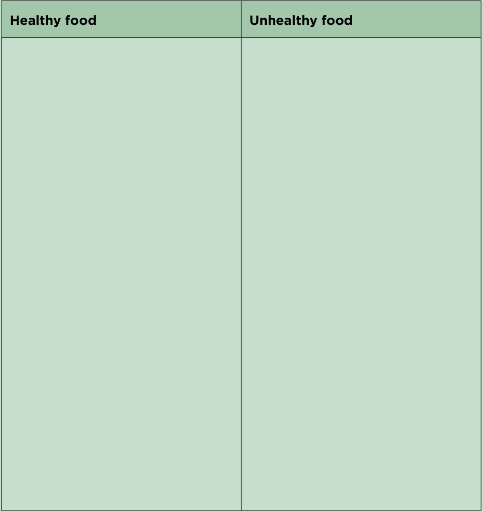
> **[Diagram Context - Textbook_NaturalScience_Gr9_Digestive-system.pdf-0002-01.png]**
> The graphic is a two-column comparative chart titled with the headings "Healthy food" and "Unhealthy food." The visible text labels are limited to these two column headers at the top of the divided light-green background. Conceptually, this graphic provides a framework for students to categorize and contrast nutritional choices, supporting life sciences and natural sciences outcomes related to balanced diets and health.

---

### Further Exploration
*   **Geological Formations:** For more information on the strangest geological formations on Earth, visit: [bit.ly/lcmrQzw](http://bit.ly/lcmrQzw)
*   **Layers of the Earth:** For more information on the internal structure of the Earth, visit: [bit.ly/HIXDT7](http://bit.ly/HIXDT7)

> **[Diagram Context - Textbook_NaturalScience_Gr9_Digestive-system.pdf-0002-06.png]**
> This graphic is a decorative border featuring repeating, stylized green zigzag arrow patterns arranged horizontally. The visible elements consist entirely of continuous green directional arrows pointing rightward along a linear path. Conceptually, it serves as a visual separator for educational texts, symbolizing direction, flow, or progression.

> **[Diagram Context - Textbook_NaturalScience_Gr9_Electric-cells-as-energy-systems.pdf-0002-01.png]**
> This educational graphic illustrates an electromagnet apparatus consisting of a coiled wire connected to a battery with positive (+) and negative (-) terminals, surrounded by circular magnetic field lines with directional arrows and floating metal hardware including a screw, pin, and nut. Aligned with the CAPS curriculum for Physical Sciences, it visually conveys how an electric current flowing through a conductor generates a magnetic field, demonstrating the fundamental relationship between electricity and magnetism.

> **[Diagram Context - Textbook_NaturalScience_Gr9_Electric-cells-as-energy-systems.pdf-0002-15.png]**
> This illustration depicts an educational graphic of a hand interacting with a tablet device displaying various application icons and a blank speech bubble above it. Visible elements include human hands holding a digital tablet screen with a grid of app symbols and a pointer finger touching a specific icon, topped by a speech bubble extending upwards. Conceptually, this diagram visually represents digital learning, interactive educational technology, or the integration of e-learning tools within the CAPS curriculum.

> **[Diagram Context - Textbook_NaturalScience_Gr9_Electric-cells-as-energy-systems.pdf-0002-19.png]**
> This educational graphic depicts a simple electrochemical circuit apparatus. It features a lemon as the electrolyte with visible labels pointing to a "copper nail," "zinc nail," "lemon," and an "LED bulb" connected by wires with crocodile clips. Conceptually, the diagram illustrates how chemical energy is converted into electrical energy in a galvanic cell, demonstrating the practical application of redox reactions and current flow in high school Physical Sciences.

> **[Diagram Context - Textbook_NaturalScience_Gr9_Electric-cells-as-energy-systems.pdf-0002-22.png]**
> The educational graphic is a conceptual illustration featuring a hot air balloon whose envelope is shaped like planet Earth, with a basket carrying two figures using telescopes beneath a burner flame, surrounded by clouds, birds, and a sun. Visible elements include the spherical Earth map graphic, netting lines, a flame source, a basket, two human figures holding binoculars or telescopes, clouds, birds, and a sun in the sky. For a high school student learning Geography or Environmental Sciences within the CAPS curriculum, this diagram serves as a metaphor for global observation, environmental monitoring, or sustainable resource management on a planetary scale.

> **[Diagram Context - Textbook_NaturalScience_Gr9_Mining-of-mineral-resources.pdf-0002-08.png]**
> 1. A cartoon depiction of a roller coaster with a spring coiled to the top.

> **[Diagram Context - Textbook_NaturalScience_Gr9_Mining-of-mineral-resources.pdf-0002-20.png]**
> This graphic illustrates a schematic representation of a DNA molecule, featuring the characteristic double-helix structure formed by two antiparallel sugar-phosphate backbones. It visually demonstrates the twisted ladder configuration, which is fundamental for high school learners to understand how DNA stores genetic information and facilitates replication through its complementary base-pairing mechanism.

> **[Diagram Context - Textbook_NaturalScience_Gr9_Mining-of-mineral-resources.pdf-0002-28.png]**
> This graphic depicts an Erlenmeyer flask containing a stylized underwater scene featuring a diver, a treasure chest, fish, and a surface vessel connected by an air hose, topped with a blank thought bubble. It serves as a creative metaphor for scientific inquiry, illustrating the concept of "thinking outside the box" or exploring the hidden depths of a subject through experimental investigation.

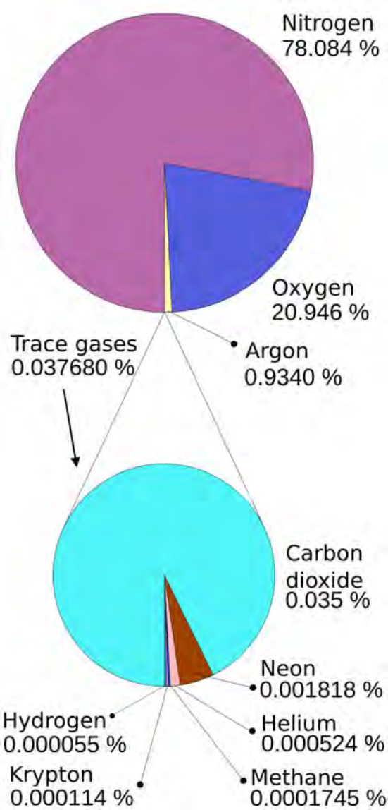
> **[Diagram Context - Textbook_NaturalScience_Gr9_The-atmosphere.pdf-0002-00.png]**
> 1. A pie chart showing the percentage of different gases in the atmosphere.

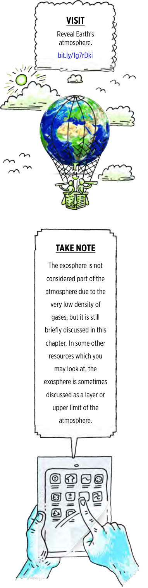
> **[Diagram Context - Textbook_NaturalScience_Gr9_The-atmosphere.pdf-0002-04.png]**
> 1. A diagram of a cell with arrows pointing to different parts of the cell.
 2. A diagram of a circuit with arrows pointing to different parts of the circuit.
 3. A diagram of a Lewis structure with arrows pointing to different parts of the Lewis structure.

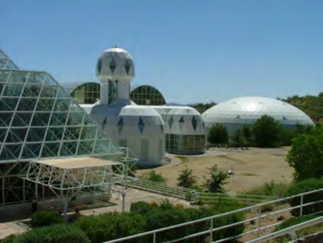
> **[Diagram Context - Textbook_NaturalScience_Gr9_The-earth-as-a-system.pdf-0002-01.png]**
> This photograph shows Biosphere 2, an enclosed, airtight ecological facility featuring distinct structural biomes under large glass and space-frame domes. There are no explicit text labels or arrows visible in this external view of the complex. Conceptually, it illustrates a large-scale closed artificial ecosystem used to study biogeochemical cycles, organism interactions, and the complex feedback loops within the biosphere.

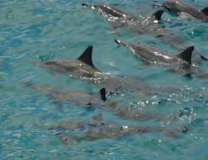
> **[Diagram Context - Textbook_NaturalScience_Gr9_The-earth-as-a-system.pdf-0002-04.png]**
> This photographic image displays a pod of dolphins swimming together in clear blue ocean water. There are no visible labels, symbols, or arrows present in the frame. Conceptually, this visual supports the CAPS Life Sciences curriculum by illustrating biological organisation at the population level, demonstrating social interactions, grouping behaviours, and cooperative relationships among members of the same species in an aquatic ecosystem.

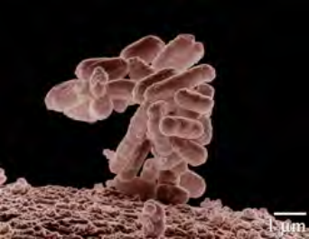
> **[Diagram Context - Textbook_NaturalScience_Gr9_The-earth-as-a-system.pdf-0002-05.png]**
> This educational graphic is a coloured scanning electron micrograph (SEM) showing a cellular structure of rod-shaped prokaryotic organisms, specifically bacteria. The image includes a scale bar labelled "1 µm" in the bottom right corner, indicating the microscopic scale of the cells. For a high school Life Sciences student, this visual conveys the microscopic size, morphology, and grouping of bacteria, reinforcing key concepts regarding prokaryotic diversity and cellular structure.

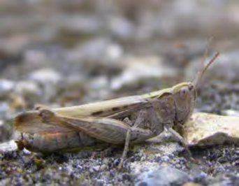
> **[Diagram Context - Textbook_NaturalScience_Gr9_The-earth-as-a-system.pdf-0002-06.png]**
> This educational graphic is a photograph of a grasshopper resting on a stony, textured surface. The image displays the insect's external anatomical features, including its segmented body, jointed legs adapted for jumping, antennae, and wings, with no text labels, symbols, or arrows present. Aligned with the CAPS curriculum, this visual serves to introduce learners to animal diversity, specifically the phylum Arthropoda, illustrating key insect characteristics such as a chitinous exoskeleton and segmented appendages.

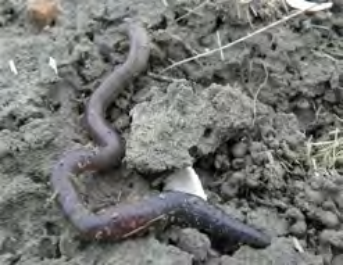
> **[Diagram Context - Textbook_NaturalScience_Gr9_The-earth-as-a-system.pdf-0002-10.png]**
> This photograph shows an earthworm on damp soil, representing an organism from the phylum Annelida. There are no visible labels, text, or arrows present in the image. Conceptually, this visual supports the CAPS Life Sciences curriculum by introducing invertebrate biodiversity, highlighting the external morphology of a segmented worm adapted to a terrestrial habitat.

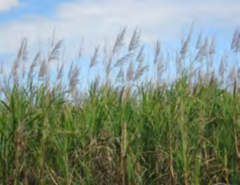
> **[Diagram Context - Textbook_NaturalScience_Gr9_The-earth-as-a-system.pdf-0002-11.png]**
> This photograph depicts a field of flowering sugarcane (*Saccharum officinarum*) or

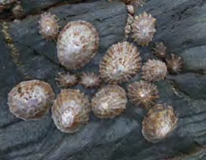
> **[Diagram Context - Textbook_NaturalScience_Gr9_The-earth-as-a-system.pdf-0002-12.png]**
> Features):* This photograph depicts a cluster of limpets (marine molluscs) of varying

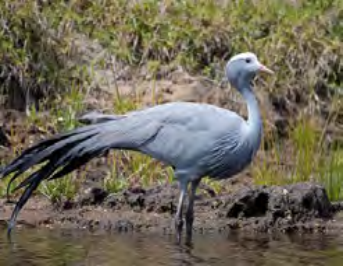
> **[Diagram Context - Textbook_NaturalScience_Gr9_The-earth-as-a-system.pdf-0002-16.png]**
> This photograph depicts a Blue Crane (*Anthropoides paradiseus*), South Africa's

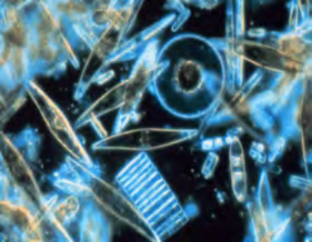
> **[Diagram Context - Textbook_NaturalScience_Gr9_The-earth-as-a-system.pdf-0002-17.png]**
> This light micrograph displays a diverse collection of diatoms, showcasing their intricate,

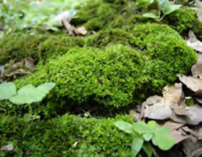
> **[Diagram Context - Textbook_NaturalScience_Gr9_The-earth-as-a-system.pdf-0002-18.png]**
> This photograph depicts a dense colony of mosses (bryophytes) growing in their natural

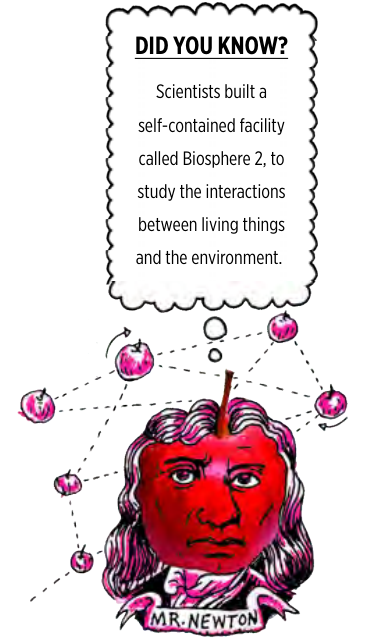
> **[Diagram Context - Textbook_NaturalScience_Gr9_The-earth-as-a-system.pdf-0002-22.png]**
> Labels):* This educational graphic features a caricature of Sir Isaac Newton depicted as an apple

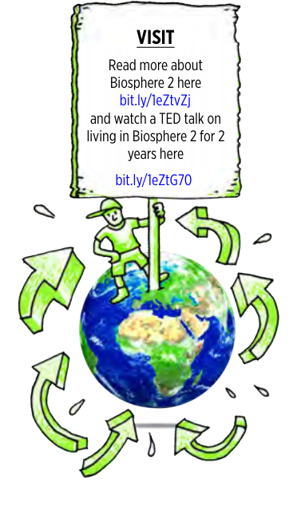
> **[Diagram Context - Textbook_NaturalScience_Gr9_The-earth-as-a-system.pdf-0002-23.png]**
> This educational illustration features a globe showing the African continent surrounded by five curved green arrows in a

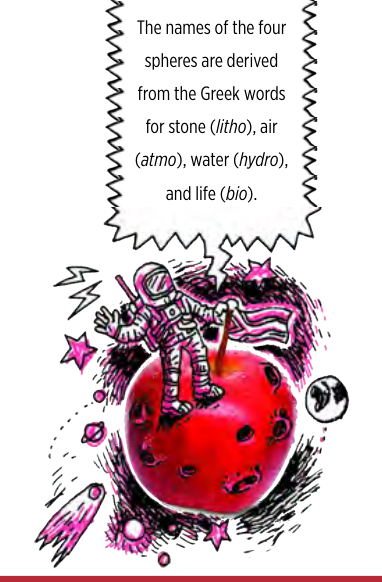
> **[Diagram Context - Textbook_NaturalScience_Gr9_The-earth-as-a-system.pdf-0002-25.png]**
> This educational graphic features a cartoon illustration of an astronaut standing on a cratered, red,

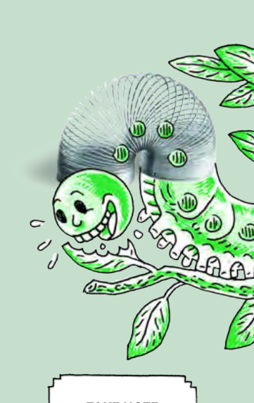
> **[Diagram Context - Textbook_NaturalScience_Gr9_The-lithosphere.pdf-0002-13.png]**
> The image is a cartoon drawing of a green spring coiled up and holding a green ball. The drawing is set against a light green background with a white border. The title of the drawing is "The spring coiled up and holding a green ball". The drawing also includes a caption that reads "The spring coiled up and holding a green ball".

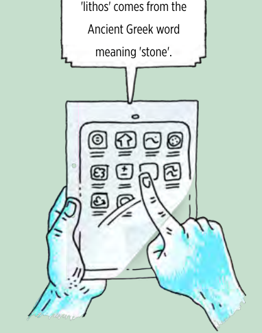
> **[Diagram Context - Textbook_NaturalScience_Gr9_The-lithosphere.pdf-0002-15.png]**
> 1. A diagram of a cell with arrows pointing to different parts of the cell.

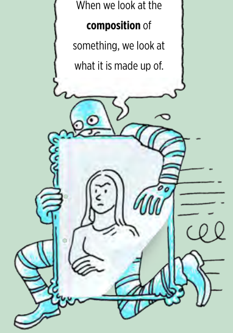
> **[Diagram Context - Textbook_NaturalScience_Gr9_The-lithosphere.pdf-0002-17.png]**
> The image shows a cartoon illustration of a man holding a picture of a woman. The man is wearing a blue shirt and white pants, and he is holding the picture in his hands. The picture is of a woman, and the man is holding it up to the viewer. The image also includes a speech bubble that reads, "When we look at the composition of something, we look at what

> **[Diagram Context - Textbook_NaturalScience_Gr9_The-lithosphere.pdf-0002-18.png]**
> 1. A diagram of a snake's body.
 2. The snake's body is green and gray.
 3. The snake's head is green.

---

# The Layers of the Earth

## Structure of the Earth
The Earth is composed of several distinct layers, each with unique physical properties:

*   **The Core:** Divided into two parts:
    *   **Inner Core:** Solid.
    *   **Outer Core:** Liquid.
*   **The Mantle:** Divided into two parts:
    *   **Lower Mantle**
    *   **Upper Mantle**
*   **The Crust:** The outermost layer, divided into:
    *   **Oceanic Crust:** Found under the oceans.
    *   **Continental Crust:** Forms the continents.

### Key Definitions
*   **Lithosphere:** The brittle upper part of the mantle and the crust combined.
*   **Geosphere:** The collective term for the lithosphere, mantle, and core. This is one of the four major parts of the Earth, alongside the **hydrosphere**, **atmosphere**, and **biosphere**.

> **DID YOU KNOW?**
> The centre of the Earth is $6371\text{ km}$ deep.

---

## Activity: Build a 3D-model of the Earth

### Instructions
1. Use recycled material and modelling clay to build a three-dimensional model of the inside of the Earth.
2. Ensure all layers of the Earth are included and accurately labelled on your model.
3. Write a one-page summary on the layers of the Earth. Use the internet, library books, or interviews with knowledgeable people to research the following for each layer:
    *   a) Thickness of each layer
    *   b) State of matter (solid/liquid/gas)
    *   c) Temperature
    *   d) Composition (what it is made up of)

---

### Summary Table: Earth's Layers (For Research)

| Layer | State of Matter | Key Characteristics |
| :--- | :--- | :--- |
| **Inner Core** | Solid | Centre of the Earth ($6371\text{ km}$ deep) |
| **Outer Core** | Liquid | Surrounds the inner core |
| **Lower Mantle** | Solid/Plastic | Part of the geosphere |
| **Upper Mantle** | Solid/Plastic | Part of the lithosphere |
| **Crust** | Solid | Oceanic and Continental |

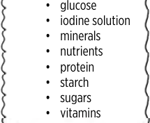
> **[Diagram Context - Textbook_NaturalScience_Gr9_Digestive-system.pdf-0003-11.png]**
> This educational graphic is a bulleted list of biological and chemical terms related to nutrition and food tests. The visible labels include "glucose", "iodine solution", "minerals", "nutrients", "protein", "starch", "sugars", and "vitamins". For a CAPS-aligned Life Sciences or Natural Sciences student, this conveys key vocabulary regarding food types, essential nutrients, and reagents used in biological testing.

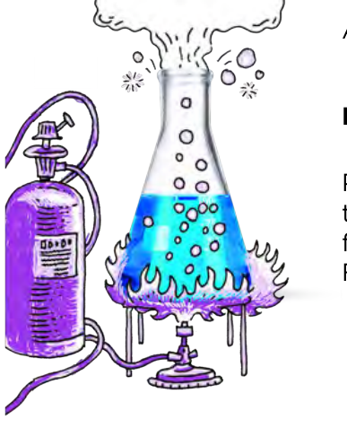
> **[Diagram Context - Textbook_NaturalScience_Gr9_Digestive-system.pdf-0003-17.png]**
> This educational graphic is an experimental laboratory apparatus setup featuring a purple gas cylinder connected to a Bunsen burner heating an Erlenmeyer flask. The setup displays a blue liquid undergoing a reaction, visible gas bubbles rising through the liquid, and steam or gas escaping from the top opening of the flask surrounded by sparkle icons. This diagram illustrates a chemical reaction involving heating and gas production, helping CAPS Physical Sciences learners visualize experimental setups for studying reaction rates, energy changes, and gas evolution.

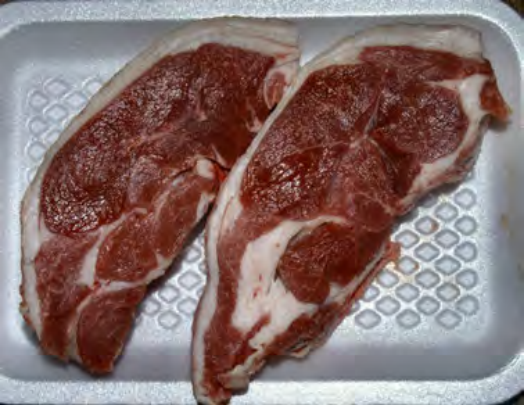
> **[Diagram Context - Textbook_NaturalScience_Gr9_Digestive-system.pdf-0003-21.png]**
> This photograph shows an anatomical structure, specifically two raw cuts of animal meat (lamb chops) displayed on a white polystyrene tray. The visual displays muscle tissue (red meat) and adipose tissue (fat layers), with no text labels, variables, or arrows present. Conceptually, this image illustrates animal tissue organization for high school Life Sciences learners, highlighting the composition of striated skeletal muscle and fat as primary animal tissue types.

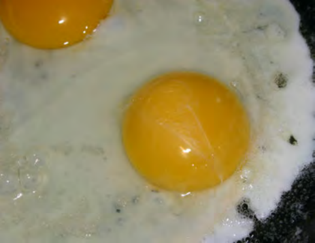
> **[Diagram Context - Textbook_NaturalScience_Gr9_Digestive-system.pdf-0003-22.png]**
> This photograph displays fried eggs cooking in a pan, featuring opaque white albumen and spherical yellow yolks. No explicit labels, text, or arrows are visible on the image. Conceptually, this visual serves to illustrate the irreversible denaturation of proteins—specifically egg albumen—when subjected to heat during Life Sciences or Physical Sciences practical investigations.

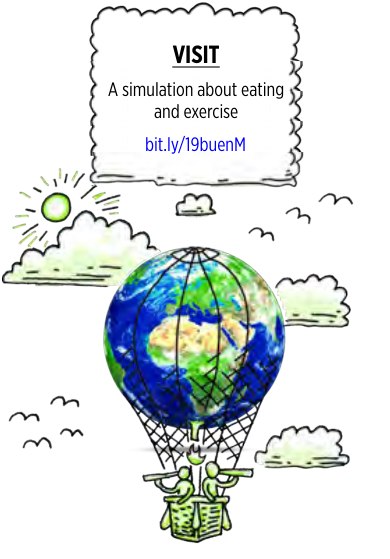
> **[Diagram Context - Textbook_NaturalScience_Gr9_Digestive-system.pdf-0003-23.png]**
> The graphic is an informational illustration featuring a hot air balloon designed as planet Earth, floating in a sky with clouds and birds, alongside a speech bubble containing text. Visible labels and text include "VISIT", "A simulation about eating and exercise", and the URL "bit.ly/19buenM". Conceptually, this visual serves as an engaging prompt directing learners to an online interactive simulation to explore the relationship between nutrition, physical activity, and metabolic health.

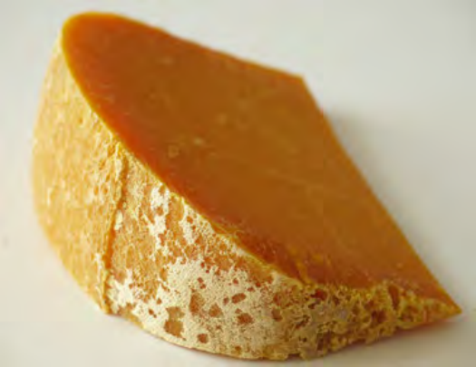
> **[Diagram Context - Textbook_NaturalScience_Gr9_Digestive-system.pdf-0003-26.png]**
> This educational graphic displays a photograph of a wedge of mature cheddar cheese on a plain background, showing no visible text, labels, or arrows. In the context of the CAPS curriculum (such as Grade 10-12 Life Sciences nutrition and food processing), it serves as a visual example of a dairy product rich in lipids, protein, and calcium. Conceptually, it helps learners connect food science and biotechnology topics—such as the fermentation action of lactic acid bacteria on milk—to the macronutrients essential for a balanced human diet.

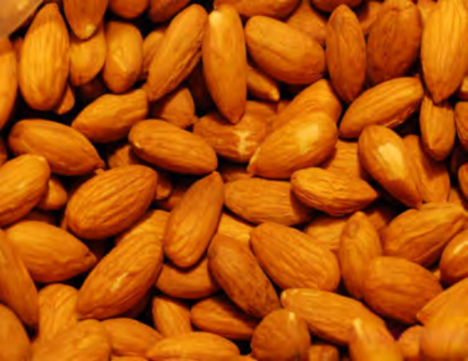
> **[Diagram Context - Textbook_NaturalScience_Gr9_Digestive-system.pdf-0003-27.png]**
> This image is a close-up photograph showing a large, dense collection of whole brown almonds spread out across the frame. There are no visible labels, text, chemical symbols, or arrows present in this visual. Conceptually, it serves as a realistic visual context often used in high school life sciences or agricultural sciences to discuss food sources, plant-based lipids, and the structural morphology of seeds.

> **[Diagram Context - Textbook_NaturalScience_Gr9_Electric-cells-as-energy-systems.pdf-0003-04.png]**
> This educational graphic is a conceptual illustration featuring a caricature of Sir Isaac Newton's head shaped like a red apple with a stem, situated below a thought bubble and surrounded by a network of smaller floating apples connected by dashed lines with directional arrows. The visible labels and elements include a banner reading "MR. NEWTON", multiple red apple illustrations, a thought bubble, and dashed grid lines with directional arrows indicating gravitational attraction between masses. Conceptually, this diagram visually introduces high school learners to Newton's Law of Universal Gravitation, illustrating how masses attract one another across space as conceptualised by Newton through the famous apple metaphor.

> **[Diagram Context - Textbook_NaturalScience_Gr9_Electric-cells-as-energy-systems.pdf-0003-05.png]**
> This apparatus diagram depicts a series circuit consisting of three lemons acting as electrochemical cells, connected by jumper wires with crocodile clips to illuminate a small green light-emitting diode (LED). The visible components include three whole lemons, dissimilar metal electrodes (copper/yellow and zinc/silver nails), red connecting wires with red and green crocodile clips, and an emitting green LED. For a Grade 10 Physical Sciences student, this illustrates how chemical energy is converted into electrical energy in a voltaic cell and demonstrates how combining multiple cells in series increases the total potential difference to power a load.

> **[Diagram Context - Textbook_NaturalScience_Gr9_Electric-cells-as-energy-systems.pdf-0003-10.png]**
> This educational cartoon graphic depicts a thief in striped clothing hurriedly making off with a framed portrait resembling the Mona Lisa. Motion lines surround the fleeing figure, who holds the framed artwork while looking backward. Conceptually, this visual serves as an engaging metaphor for concepts such as theft, plagiarism, or copyright infringement within educational contexts.

> **[Diagram Context - Textbook_NaturalScience_Gr9_Electric-cells-as-energy-systems.pdf-0003-13.png]**
> The graphic is a decorative border featuring a repeating pattern of stylized green waves or interlocking loops. There are no explicit labels, variables, or text characters present in the design. Conceptually, it serves as a purely ornamental divider to structure a document or learning module visually.

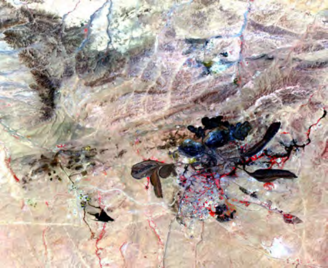
> **[Diagram Context - Textbook_NaturalScience_Gr9_Mining-of-mineral-resources.pdf-0003-03.png]**
> The image is a painting of a rock formation with a variety of colors and textures. The painting is done in a realistic style, with a focus on the details of the rock formation. The colors used in the painting are predominantly brown and black, with some red and white accents. The painting is a study of the natural world, showcasing the intricate details of the rock formation and the surrounding environment.

> **[Diagram Context - Textbook_NaturalScience_Gr9_Mining-of-mineral-resources.pdf-0003-04.png]**
> The image features a cartoon depiction of a man's head with a red apple on his forehead. The man is wearing a white shirt and a black tie, and the apple is positioned on his forehead. The man is also wearing a crown, which is a symbol of power and authority. The image includes a thought bubble above the man's head, which contains a network of lines and dots, suggesting

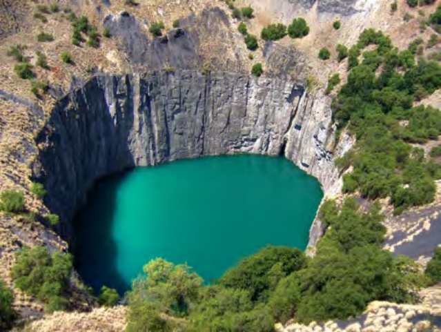
> **[Diagram Context - Textbook_NaturalScience_Gr9_Mining-of-mineral-resources.pdf-0003-09.png]**
> 1. A green lake surrounded by a rocky cliff.

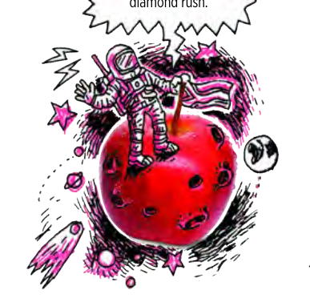
> **[Diagram Context - Textbook_NaturalScience_Gr9_Mining-of-mineral-resources.pdf-0003-10.png]**
> The image shows a cartoon depiction of an astronaut standing on a red planet. The astronaut is wearing a white spacesuit and holding a walking stick. The planet is covered in stars and has a large crater in the center. The astronaut is positioned on the planet's surface, with the planet's center being the focal point of the image. The image also includes a text that reads "diamond rush

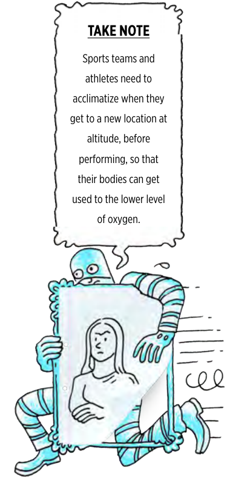
> **[Diagram Context - Textbook_NaturalScience_Gr9_The-atmosphere.pdf-0003-00.png]**
> 1. A cartoon of a man holding a picture of a woman.

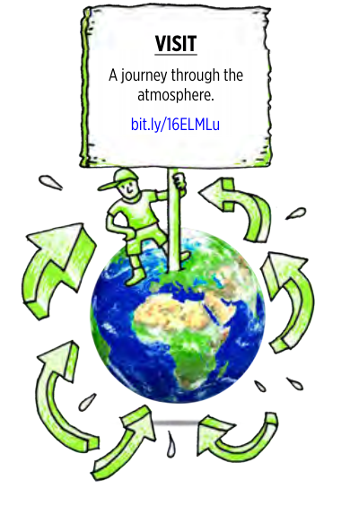
> **[Diagram Context - Textbook_NaturalScience_Gr9_The-atmosphere.pdf-0003-01.png]**
> A cartoon illustration of a boy on a pole with a sign that says " Visit" and a picture of the earth with arrows pointing to different parts of the earth.

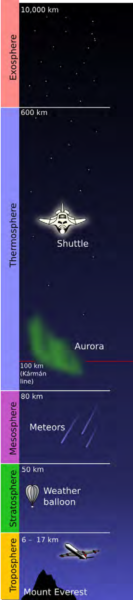
> **[Diagram Context - Textbook_NaturalScience_Gr9_The-atmosphere.pdf-0003-02.png]**
> 1. A diagram of the solar system, including planets, stars, and comets.

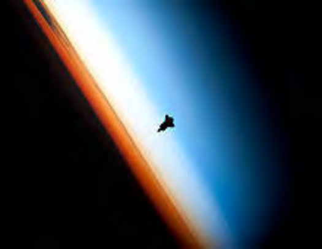
> **[Diagram Context - Textbook_NaturalScience_Gr9_The-atmosphere.pdf-0003-07.png]**
> The image shows a satellite image of the Earth taken from space. The satellite is positioned in the top right corner of the frame, with the horizon line clearly visible. The sky is a beautiful shade of blue, and the sun is setting, casting a warm glow over the scene. The satellite appears to be in the process of taking off, as it is moving away from the viewer. The image

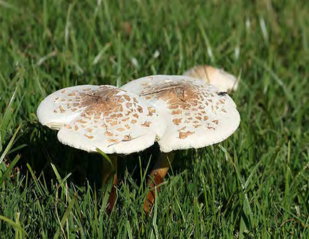
> **[Diagram Context - Textbook_NaturalScience_Gr9_The-earth-as-a-system.pdf-0003-00.png]**
> This photograph displays the macroscopic reproductive structures (fruiting bodies) of a multicellular fungus

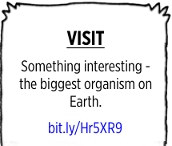
> **[Diagram Context - Textbook_NaturalScience_Gr9_The-earth-as-a-system.pdf-0003-01.png]**
> This graphic is an educational callout box featuring a hand-drawn border, containing the

> **[Diagram Context - Textbook_NaturalScience_Gr9_The-earth-as-a-system.pdf-0003-02.png]**
> (Identification & Elements):* This cartoon illustration depicts a large telescope with a detailed view

> **[Diagram Context - Textbook_NaturalScience_Gr9_The-earth-as-a-system.pdf-0003-05.png]**
> This photograph depicts a diverse group of young South African boys posing closely

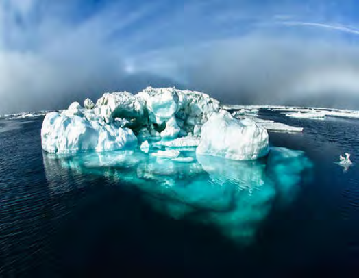
> **[Diagram Context - Textbook_NaturalScience_Gr9_The-earth-as-a-system.pdf-0003-10.png]**
> ):**
    *   *Sentence 1 (Identify visual &

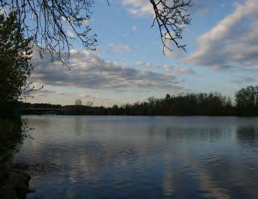
> **[Diagram Context - Textbook_NaturalScience_Gr9_The-earth-as-a-system.pdf-0003-11.png]**
> This photograph depicts a freshwater aquatic ecosystem, showing a calm body of

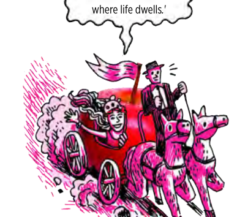
> **[Diagram Context - Textbook_NaturalScience_Gr9_The-earth-as-a-system.pdf-0003-12.png]**
> This cartoon illustration features a horse-drawn carriage shaped like a red apple, carrying a driver

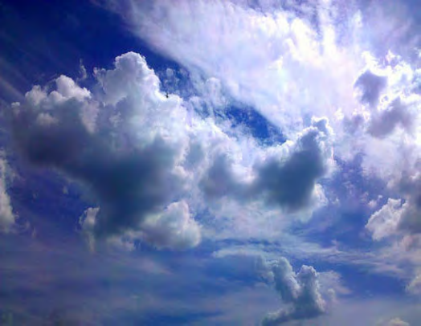
> **[Diagram Context - Textbook_NaturalScience_Gr9_The-earth-as-a-system.pdf-0003-18.png]**
> This photograph depicts atmospheric cloud formations against a blue sky, prominently featuring developing cumulus clouds

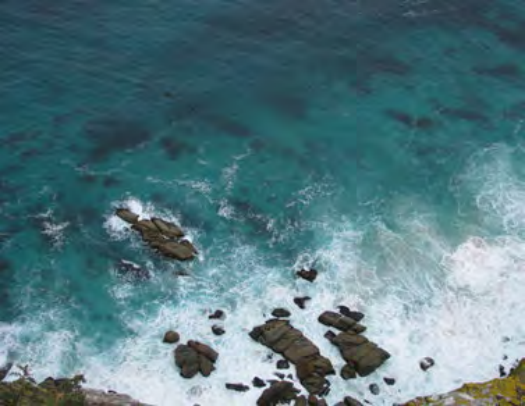
> **[Diagram Context - Textbook_NaturalScience_Gr9_The-earth-as-a-system.pdf-0003-20.png]**
> (Alternative or integrated life sciences/geography conceptual application

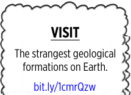
> **[Diagram Context - Textbook_NaturalScience_Gr9_The-lithosphere.pdf-0003-01.png]**
> 1. A diagram of a cell with arrows pointing to different parts of the cell.

> **[Diagram Context - Textbook_NaturalScience_Gr9_The-lithosphere.pdf-0003-03.png]**
> The image features a cartoon depiction of a hot air balloon carrying three people. The balloon is filled with a green substance, and the people are seated on the balloon, with one person holding a book. The scene is set against a backdrop of a blue sky with clouds, and the globe is positioned in the center of the image. The diagram is labeled with the words "Lewis diagram" and "

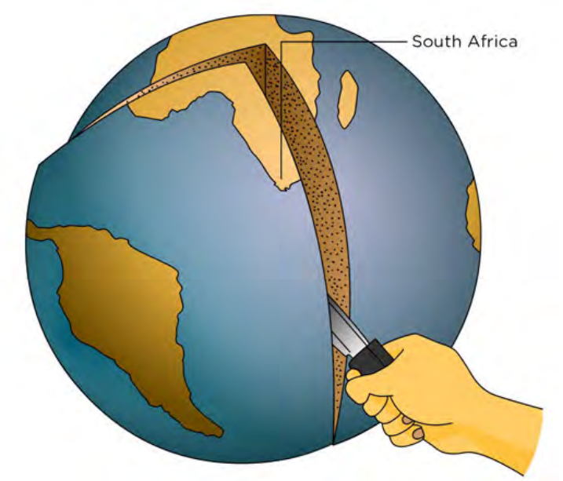
> **[Diagram Context - Textbook_NaturalScience_Gr9_The-lithosphere.pdf-0003-07.png]**
> 1. A cartoon of a hand holding a knife, cutting a globe.
 2. A cartoon of a globe with a line drawn through it.
 3. A cartoon of a globe with a line drawn through it.

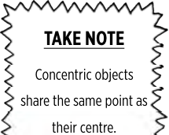
> **[Diagram Context - Textbook_NaturalScience_Gr9_The-lithosphere.pdf-0003-08.png]**
> The image shows a black and white diagram of a cell, which is the central focus of the image. The diagram is labeled with the text "Take Note" and "Concentric Objects Share the Same Point as Their Centre." The diagram is accompanied by a small arrow pointing to the center of the cell. The text is written in a simple, easy-to-read font, making it accessible

> **[Diagram Context - Textbook_NaturalScience_Gr9_The-lithosphere.pdf-0003-10.png]**
> The image is a cartoon-style poster that illustrates the layers of the Earth. A cartoon depiction of a man is holding a sign that says "Visit" above the Earth. The Earth is depicted in a cartoon style with arrows pointing to different parts of the Earth, and the title "Layers of the Earth" is written in a cartoon style font. The poster also includes a list of labels

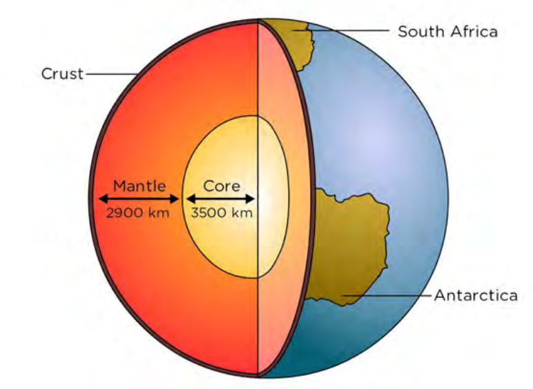
> **[Diagram Context - Textbook_NaturalScience_Gr9_The-lithosphere.pdf-0003-11.png]**
> The image is a diagram of the Earth's interior, divided into two sections. The outermost section is labeled "Antarctica" and the inner section is labeled "South Africa". The diagram also includes labels for the crust, mantle, and core. The diagram is labeled with the names of the continents and the names of the countries. The diagram also includes a legend that explains the different colors

---

# Activity: The Layers Inside the Earth

## Instructions
Use the bolded terms from your previous study section to complete the concept map provided below.

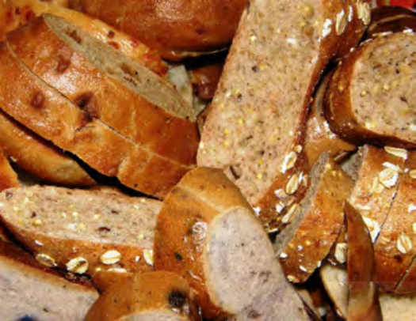
> **[Diagram Context - Textbook_NaturalScience_Gr9_Digestive-system.pdf-0004-04.png]**
> This visual content is a photographic image showing a collection of sliced brown and seed loaves of bread. There are no visible labels, variables, biological structures, chemical symbols, axis names, or arrows. Conceptually, this image serves as a real-world reference for dietary fiber and carbohydrate sources when teaching nutrition and digestion in high school life sciences.

---

## Did You Know?
*   **Core Temperature:** The temperature of the Earth's inner core is approximately the same as the surface of the Sun, which is more than $5000\ ^\circ\text{C}$.

## Research Task
*   **Visit:** To learn more about the height of mountains, visit the following link: [bit.ly/IioEgnP](http://bit.ly/IioEgnP)

---

### Concept Map Structure
The map is organized into the following hierarchical levels:

1.  **Level 1:** Planet Earth
2.  **Level 2 (Components):** 
    *   Atmosphere (represents all air on Earth)
    *   Hydrosphere (represents all water on Earth)
    *   Biosphere (represents all life on Earth)
    *   Geosphere (is made up of the layers of the Earth)
3.  **Level 3 (Geosphere Breakdown):**
    *   The Geosphere consists of three main layers:
        *   Crust
        *   Mantle
        *   Core
4.  **Level 4 (Specific Detail):**
    *   The brittle part of the crust forms the **Lithosphere**.

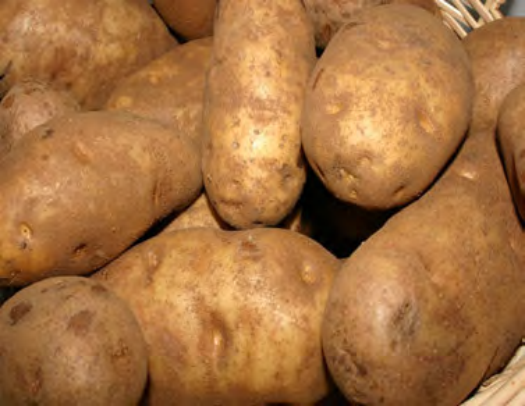
> **[Diagram Context - Textbook_NaturalScience_Gr9_Digestive-system.pdf-0004-05.png]**
> This image is a photograph showing a collection of harvested whole potatoes in a container, displaying their characteristic brown, tubers with visible eyes and skin texture. No explicit textual labels, variables, or arrows are present within the graphic. For CAPS Life Sciences learners, this visual serves as a real-world example of plant storage organs (tubers) used for asexual reproduction and starch storage, illustrating the plant structures studied in plant anatomy and food security topics.

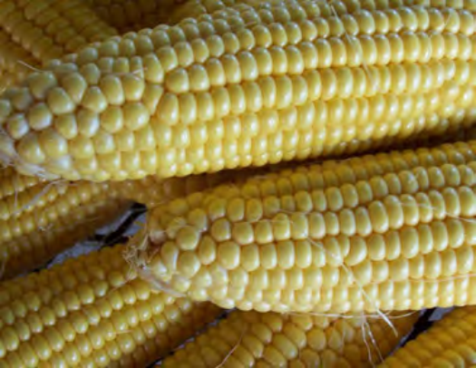
> **[Diagram Context - Textbook_NaturalScience_Gr9_Digestive-system.pdf-0004-08.png]**
> This educational graphic displays a close-up photograph of multiple harvested ears of yellow maize (corn) with tightly packed kernels arranged in regular rows. There are no visible text labels, axes, or arrows present in the image. Conceptually, it serves as a visual introduction to plant diversity, monocotyledonous crops, or agricultural food production systems in life sciences and agricultural sciences.

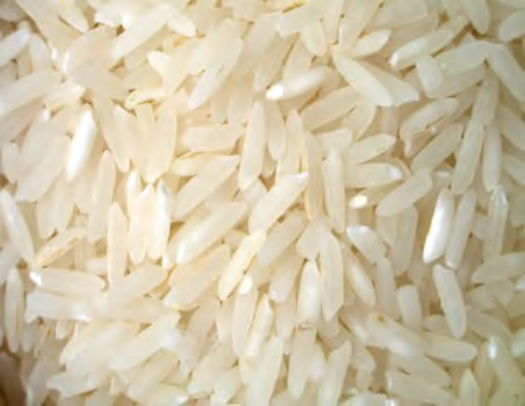
> **[Diagram Context - Textbook_NaturalScience_Gr9_Digestive-system.pdf-0004-09.png]**
> This image is a top-down photograph displaying a dense accumulation of raw white rice grains. There are no visible labels, arrows, or text overlays present in the visual. Conceptually, it introduces learners to starch-rich staple foods within the context of biological macromolecules (carbohydrates) and human nutrition under the Life Sciences curriculum.

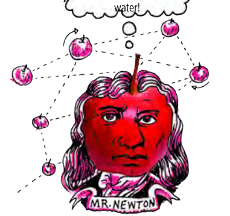
> **[Diagram Context - Textbook_NaturalScience_Gr9_Digestive-system.pdf-0004-13.png]**
> This educational illustration is a conceptual cartoon featuring a portrait of Isaac Newton (labeled "MR. NEWTON") with an apple-shaped head, surrounded by a lattice of interconnected apples linked by dashed lines and directional arrows, with a thought bubble reading "water!". The visible elements include a banner with the text "MR. NEWTON", multiple apple graphics positioned in a 3D network, directional rotation arrows, dashed connecting lines, and a thought bubble containing the text "water!". Conceptually, this whimsical graphic introduces high school learners to models of molecular structures—specifically intermolecular forces or crystal lattices—by playfully linking Newton's classical mechanics with particulate matter and intermolecular bonding.

> **[Diagram Context - Textbook_NaturalScience_Gr9_Electric-cells-as-energy-systems.pdf-0004-22.png]**
> This educational graphic features two distinct illustrations: the top panel shows a globe surrounded by green cyclic arrows with a character holding a sign that reads "VISIT Discover how a car battery works. bit.ly/H6ixWa," while the bottom panel depicts a metal slinky toy shaped like a caterpillar on leaves with striped body segments. The visual elements include a stylized planet Earth, a human figure, directional recycling-style arrows, a slink caterpillar with striped circle markings, and green botanical leaves. Conceptually, this graphic supports physical sciences and environmental learning by prompting students to explore electrochemical energy storage systems (car batteries) in relation to global sustainability and illustrating mechanical wave models or biological structures using everyday analogies.

> **[Diagram Context - Textbook_NaturalScience_Gr9_Electric-cells-as-energy-systems.pdf-0004-24.png]**
> This educational graphic is an illustrated cartoon depicting a mechanical robot with control panels on its torso, loose bolts on the ground, and a speech bubble fragment reading "into each beaker." Visible features include dial gauges, control buttons, joints on the arms and legs, loose screws, and a jagged speech bubble at the top. Conceptually, this whimsical character acts as a contextual visual hook for a practical chemistry investigation or experiment instructions, engaging learners by personifying scientific procedures.

> **[Diagram Context - Textbook_NaturalScience_Gr9_Glossary3.pdf-0004-02.png]**
> This image is a satellite view of planet Earth, specifically showing the Eastern Hemisphere with the

> **[Diagram Context - Textbook_NaturalScience_Gr9_Mining-of-mineral-resources.pdf-0004-10.png]**
> 1. A spring diagram with a spring coiled up.

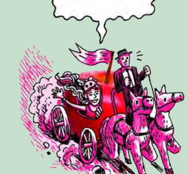
> **[Diagram Context - Textbook_NaturalScience_Gr9_Mining-of-mineral-resources.pdf-0004-13.png]**
> 1. A cartoon drawing of a man and a woman riding a carriage.
 2. The man is wearing a black suit and hat.
 3. The woman is wearing a pink dress.
 4. The carriage is being pulled by a horse.

> **[Diagram Context - Textbook_NaturalScience_Gr9_Mining-of-mineral-resources.pdf-0004-14.png]**
> 1. A diagram of a snake's body.
 2. The snake's body is made up of many small lines.
 3. The snake's body is green.

> **[Diagram Context - Textbook_NaturalScience_Gr9_The-atmosphere.pdf-0004-05.png]**
> The image is a cartoon drawing of a spring toy with a green background and a brown staircase. The spring toy is shown in a crouched position, with its spring coiled up. The stairs are depicted as a series of green lines, and the spring toy is positioned on the bottom right corner of the image. The drawing includes a Lewis diagram, an anatomical/cellular structure, and a

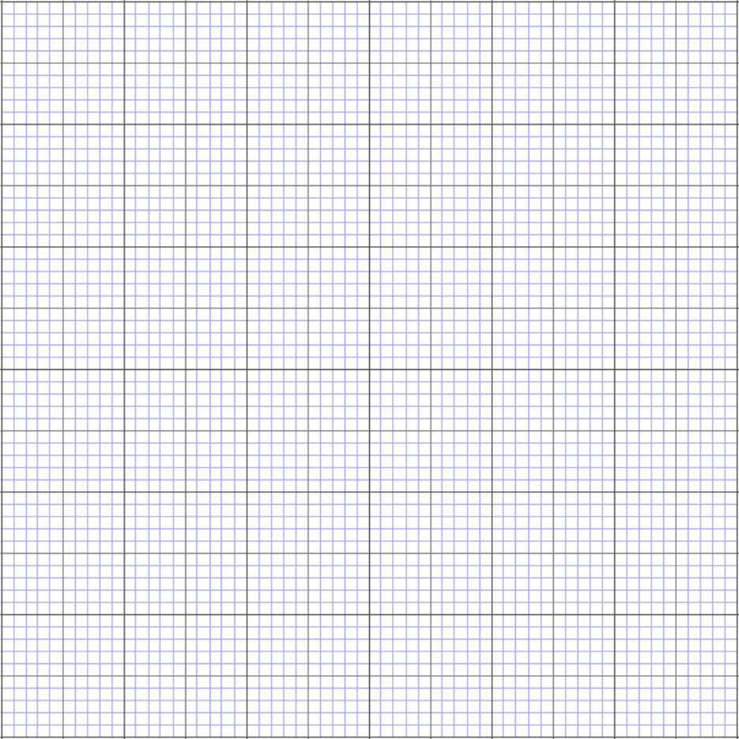
> **[Diagram Context - Textbook_NaturalScience_Gr9_The-atmosphere.pdf-0004-09.png]**
> The image shows a grid of squares, each containing a different color. The squares are arranged in a grid pattern, with the colors alternating between blue and purple. The grid is filled with squares of various sizes, creating a sense of depth and dimension. The image is a pedagogical diagram, likely used to teach students about the structure and function of cells or other biological structures. The diagram is

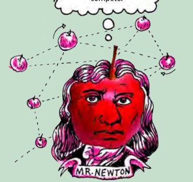
> **[Diagram Context - Textbook_NaturalScience_Gr9_The-atmosphere.pdf-0004-11.png]**
> The image features a cartoon depiction of a man's head with a large, red apple on top of it. The man's face is drawn in a cartoon style, and the apple is positioned on his forehead. The man is wearing a tie, and there are several apples scattered around him, some of which are attached to the man's head. The image also includes a thought bubble above the man

> **[Diagram Context - Textbook_NaturalScience_Gr9_The-atmosphere.pdf-0004-12.png]**
> The image shows a line of green and white beads arranged in a zigzag pattern. The beads are positioned in a straight line, with the green beads being slightly larger than the white ones. The beads are arranged in a zigzag pattern, with the green beads on top and bottom and the white beads in the middle. The image does not contain any text or additional objects.

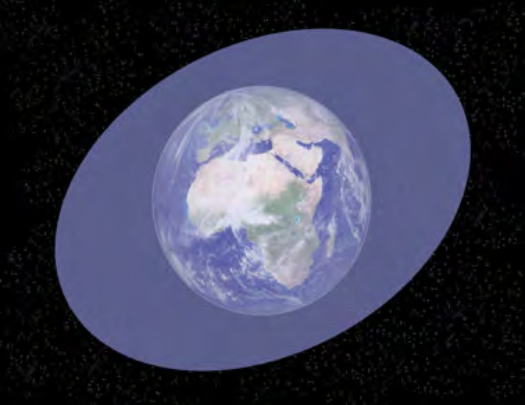
> **[Diagram Context - Textbook_NaturalScience_Gr9_The-earth-as-a-system.pdf-0004-02.png]**
> This diagram is an astronomical and geophysical model depicting a spherical Earth—centered on the African continent

> **[Diagram Context - Textbook_NaturalScience_Gr9_The-earth-as-a-system.pdf-0004-03.png]**
> This high-altitude photograph illustrates the stratification of Earth's atmosphere, transitioning from the dense cloud-filled troposphere to the thin blue horizon and the black vacuum of space with a crescent Moon visible in the upper portion. It contains no textual labels, arrows, or symbols, displaying purely physical features including cumulus and stratiform cloud decks, the atmospheric limb, and a celestial body. For high school Geography and Natural Sciences learners studying the atmosphere, this image visually demonstrates that weather phenomena are confined to the lowest layer of the atmosphere and emphasizes how remarkably thin the protective gaseous envelope of Earth is compared to the vastness of space.

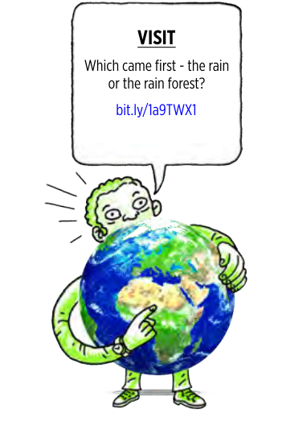
> **[Diagram Context - Textbook_NaturalScience_Gr9_The-earth-as-a-system.pdf-0004-08.png]**
> This educational cartoon graphic features an illustrated person holding a globe centered on Africa with an accompanying speech bubble containing the header "VISIT", the inquiry question "Which came first - the rain or the rain forest?", and a shortened URL ("bit.ly/1a9TWX1"). Conceptually

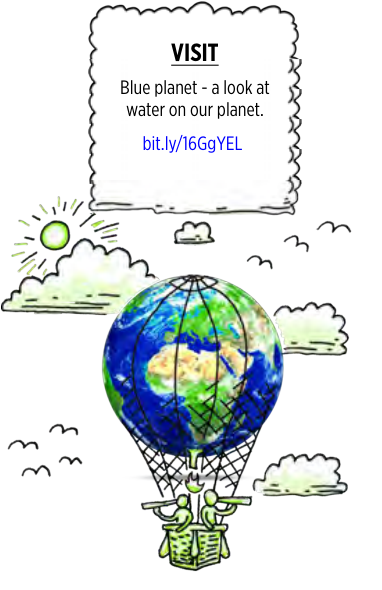
> **[Diagram Context - Textbook_NaturalScience_Gr9_The-earth-as-a-system.pdf-0004-09.png]**
> This educational graphic features a callout box with the heading "VISIT" and the prompt "Blue planet - a look at water on our planet." (with the hyperlink bit.ly/16GgYEL), set above an illustration of planet Earth depicted as a hot-air balloon carrying observers with telescopes amidst the sun, clouds, and birds. It conceptually introduces the study of Earth's hydrosphere and global water distribution, visually emphasizing why Earth is referred to as the "Blue Planet" due to the vast abundance of surface water. The visual serves as an engaging navigational aid directing learners to digital resources for exploring planetary water systems.

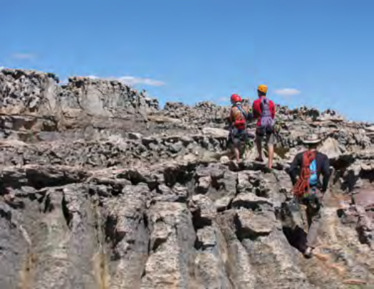
> **[Diagram Context - Textbook_NaturalScience_Gr9_The-earth-as-a-system.pdf-0004-11.png]**
> This photograph displays a rugged geomorphological landscape featuring three hikers traversing an exposed, deeply weathered

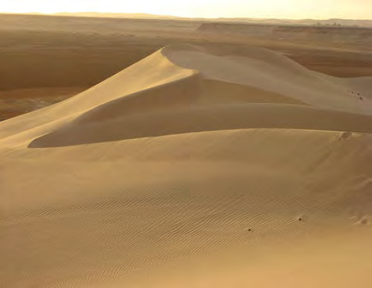
> **[Diagram Context - Textbook_NaturalScience_Gr9_The-earth-as-a-system.pdf-0004-13.png]**
> This photograph shows an aeolian depositional landform, specifically a crescent-shaped barchan sand dune set within an arid desert environment. Although there are no text labels or arrows, distinct physical features are visible, including a sharp curved crest, a gently sloping windward (stoss) side with fine sand ripples, and a steep, shadowed leeward slip face flanked by tapering horns pointing downwind. Conceptually for high school Geography, it illustrates wind transport and deposition processes, demonstrating how constant, unidirectional wind shapes desert sand accumulations into asymmetric dunes that migrate across landscapes.

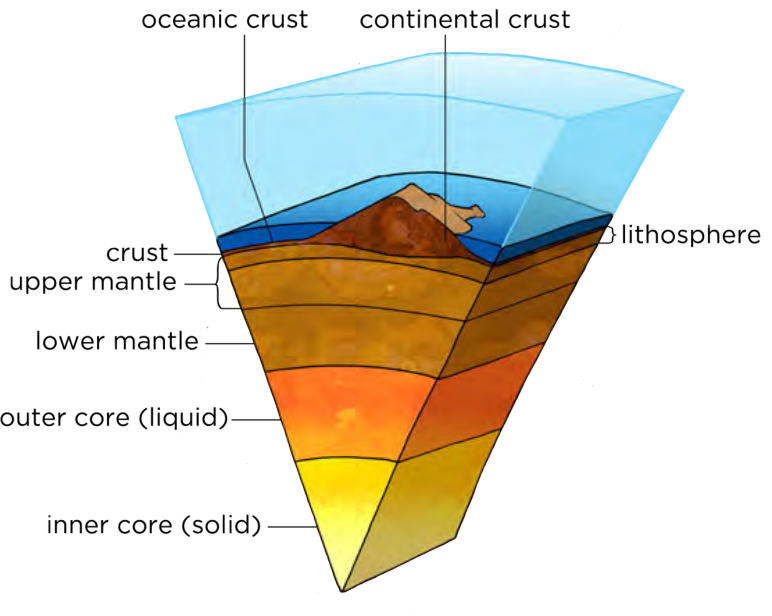
> **[Diagram Context - Textbook_NaturalScience_Gr9_The-lithosphere.pdf-0004-02.png]**
> A diagram of the Earth's crust, divided into six layers, with the outer core and mantle at the bottom and the lithosphere at the top. The diagram is labeled with the names of the layers and their respective properties.

> **[Diagram Context - Textbook_NaturalScience_Gr9_The-lithosphere.pdf-0004-11.png]**
> The image features a cartoon illustration of a man's head, with a large red apple placed on top of it. The man's face is drawn in a cartoon style, and he has a large thought bubble above his head, with a line of pink dots connected by a line. The man's name is written in the bottom right corner of the image.

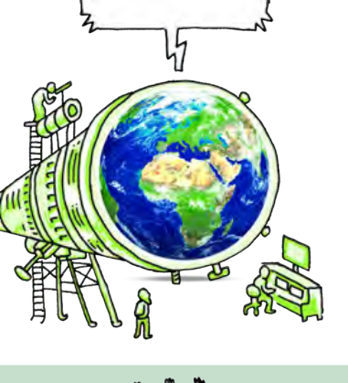
> **[Diagram Context - Textbook_NaturalScience_Gr9_The-lithosphere.pdf-0004-14.png]**
> The image features a cartoon depiction of a globe and a telescope. The globe is a large, green, three-dimensional representation of the Earth, while the telescope is a green, two-dimensional device. The globe is positioned on the right side of the image, and the telescope is on the left side. There are two people in the image, one standing on the left side and another standing

> **[Diagram Context - Textbook_NaturalScience_Gr9_The-lithosphere.pdf-0004-15.png]**
> 1. A diagram of a roller coaster with a spring coiled up on top.

> **[Diagram Context - Textbook_NaturalScience_Gr9_The-lithosphere.pdf-0004-20.png]**
> 1. A diagram of a snake's body.
 2. The snake's body is made up of many small lines.
 3. The snake's body is green and gray.

---

### 2.2 The Rock Cycle

#### Understanding Cycles
A **cycle** is a combination of processes that occur in a specific sequence and repeat continuously. Cycles do not have a definitive end point. A common example is the **water cycle**, which describes the continuous movement of water through the biosphere (forming clouds, rain, and rivers). Similarly, the **carbon cycle** describes the movement of carbon through carbon dioxide, fossil fuels, and carbohydrates.

The **rock cycle** is a process within the **lithosphere** that describes how rocks change from one form into another over time, eventually returning to their original form.

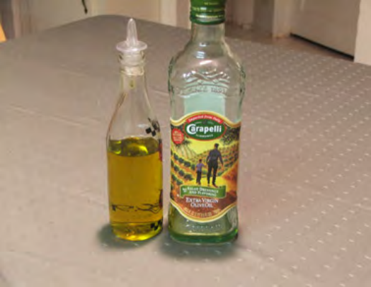
> **[Diagram Context - Textbook_NaturalScience_Gr9_Digestive-system.pdf-0005-00.png]**
> This photograph shows two glass bottles resting on a table, with the smaller bottle on the left containing a yellow liquid and the larger bottle on the right being empty. Visible labels on the larger bottle display the brand name "Carapelli" and the text "Extra Virgin Olive Oil". For a high school Physical Sciences student, this image serves as a practical, real-world context for discussing intermolecular forces, specifically comparing the physical properties, density, and polarity of organic compounds like triglycerides found in cooking oils.

#### Categories of Rocks
Rocks on Earth are classified into three broad categories based on where and how they are formed:

1.  **Sedimentary rocks**
2.  **Metamorphic rocks**
3.  **Igneous rocks**

***

#### New Words Glossary
*   **Cycle:** A repeating series of events.
*   **Weathering:** The breaking down of rocks.
*   **Compaction:** The process of pressing sediments together.
*   **Erosion:** The movement of weathered rock material.
*   **Deposition:** The settling of sediments in a new location.
*   **Melting:** Turning from solid to liquid due to heat.
*   **Cooling:** The process of losing heat.
*   **Solidify:** Turning from liquid to solid.
*   **Sedimentary rock:** Rock formed from accumulated layers of sediment.
*   **Metamorphic rock:** Rock changed by heat and pressure.
*   **Igneous rock:** Rock formed from cooling magma or lava.
*   **Sediment:** Small particles of rock or organic matter.
*   **Sedimentation:** The process of settling or being deposited as a sediment.
*   **Cementation:** The binding of particles together to form rock.

***

#### Take Note
*   Not all rock on Earth is recycled.
*   Thousands of tons of rock fall to Earth from space every year.

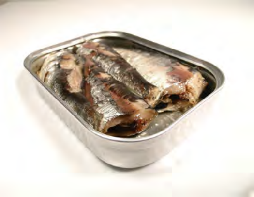
> **[Diagram Context - Textbook_NaturalScience_Gr9_Digestive-system.pdf-0005-02.png]**
> This photograph shows a rectangular open metal tin filled with preserved whole fish (sardines) resting against a plain white background. There are no explicit text labels, axes, or arrows visible in the image. Conceptually, for a CAPS Life Sciences or Agricultural Sciences student, this visual serves as a practical example of food processing, food preservation, and animal protein sources within food webs and human nutrition.

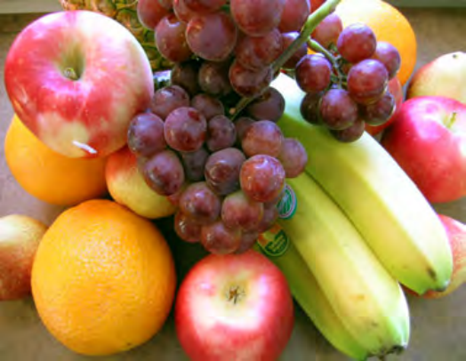
> **[Diagram Context - Textbook_NaturalScience_Gr9_Digestive-system.pdf-0005-06.png]**
> This educational graphic is a photographic display of a variety of fresh whole fruits including apples, oranges, grapes, and bananas. There are no visible text labels, variables, chemical symbols, or arrows present in the image. Conceptually, this visual introduces learners to plant organs, specifically fleshy fruits, serving as a practical resource for studying plant reproduction, biodiversity, and healthy nutrition within the CAPS Life Sciences curriculum.

> **[Diagram Context - Textbook_NaturalScience_Gr9_Digestive-system.pdf-0005-08.png]**
> This educational line drawing depicts a digital tablet device held by two hands, with an index finger actively touching and peeling back the bottom-right corner of the touchscreen display. The graphic features a grid of twelve abstract application icons with short text placeholder lines underneath them, a front-facing camera lens, and an empty speech bubble extending upwards from the top edge of the tablet. Conceptually, this diagram illustrates interactive digital learning technologies and touch-screen engagement, supporting CAPS curriculum modules that incorporate e-learning tools, digital literacy, and information communication technology (ICT) in the classroom.

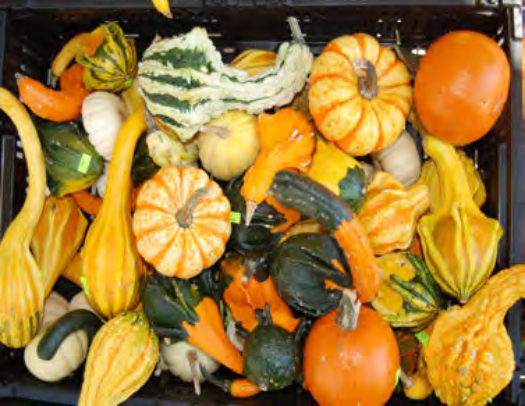
> **[Diagram Context - Textbook_NaturalScience_Gr9_Digestive-system.pdf-0005-16.png]**
> This educational photograph displays a top-down view of a black crate filled with a diverse assortment of harvested squashes, pumpkins, and gourds varying greatly in shape, size, and color. Visible specimens include smooth round pumpkins, ribbed gourds, elongated crookneck squashes, and heavily warted varieties displaying a palette of oranges, greens, yellows, and whites. Conceptually, this visual supports high school Agricultural Sciences and Life Sciences topics by illustrating phenotypic variation, biodiversity, and selective breeding traits within the Cucurbitaceae family.

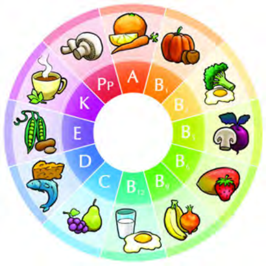
> **[Diagram Context - Textbook_NaturalScience_Gr9_Digestive-system.pdf-0005-18.png]**
> This educational graphic is a circular chart mapping various vitamins to their corresponding food sources. The visible labels include vitamin designations (A, B₁, B₂, B₃, B₆, B₉, B₁₂, C, D, E, K, PP) paired with corresponding illustrative icons of fruits, vegetables, dairy, grains, and proteins. Conceptually, this diagram helps high school Life Sciences learners understand nutrition by visually linking essential micronutrients to the specific whole foods required for a balanced diet.

> **[Diagram Context - Textbook_NaturalScience_Gr9_Electric-cells-as-energy-systems.pdf-0005-03.png]**
> This graphic is an illustrative conceptual drawing depicting an astronaut standing on a cratered red apple treated as a planetary body, set against a stylized outer space background with stars, a comet, and a speech bubble. Visible elements include an astronaut figure in a spacesuit holding a flag, a red apple modified with impact craters, and surrounding cosmic symbols like stars, planets, and lightning bolts. Conceptually, this whimsical metaphor helps students explore gravitational fields, scale, and the universality of physical laws by comparing everyday terrestrial objects to celestial bodies in space.

> **[Diagram Context - Textbook_NaturalScience_Gr9_Electric-cells-as-energy-systems.pdf-0005-04.png]**
> The graphic illustrates a galvanic cell apparatus consisting of two half-cells connected by an external circuit with an ammeter and a salt bridge. Visible labels include "zinc electrode," "copper electrode," "zinc sulphate solution," "copper sulphate solution," "cotton wool," "U-tube," and an ammeter symbol ("A"). This diagram conveys the essential components and setup of a standard electrochemical cell, helping learners understand how spontaneous redox reactions generate electrical energy via the flow of electrons and ions.

> **[Diagram Context - Textbook_NaturalScience_Gr9_Electric-cells-as-energy-systems.pdf-0005-13.png]**
> The graphic is a cartoon illustration depicting a Viking ship sailing on choppy water with rowers and a sail shaped like a binder sleeve, with horizontal wind lines blowing from the left and partial text on the right. Visible elements include waves, a Viking longship with a carved dragon head, five horned helmeted rowers holding oars, rigging lines, a large white vertical sheet with punch holes acting as a sail, and wind-stream lines. Conceptually, this whimsical diagram serves as a visual metaphor to introduce forces, motion, or wind propulsion in physical sciences, engaging learners with everyday analogies for vector forces and how moving air transfers momentum to objects.

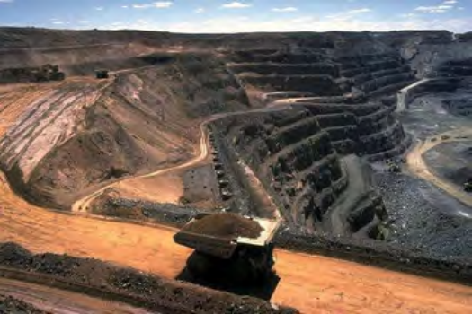
> **[Diagram Context - Textbook_NaturalScience_Gr9_Mining-of-mineral-resources.pdf-0005-00.png]**
> 1. A large truck with a large bucket on top.

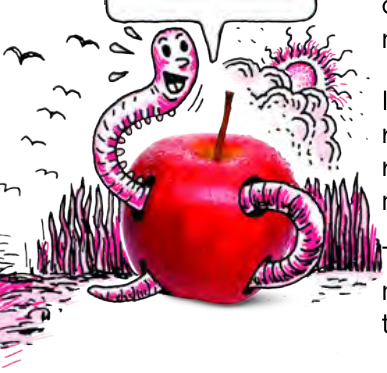
> **[Diagram Context - Textbook_NaturalScience_Gr9_Mining-of-mineral-resources.pdf-0005-04.png]**
> 1. A cartoon of a red apple with a worm on top.
 2. The worm is holding the apple.
 3. The apple is red.

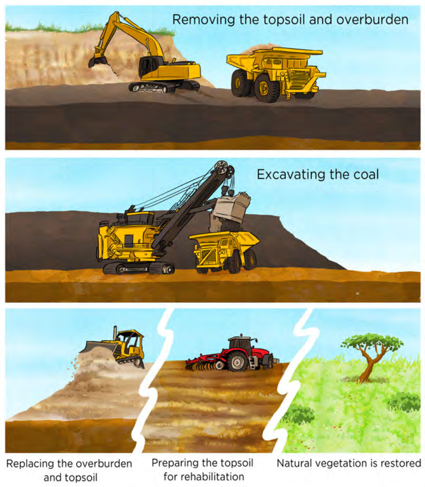
> **[Diagram Context - Textbook_NaturalScience_Gr9_Mining-of-mineral-resources.pdf-0005-08.png]**
> 1. A cartoon depicting the process of removing the topsoil and overburdening it.

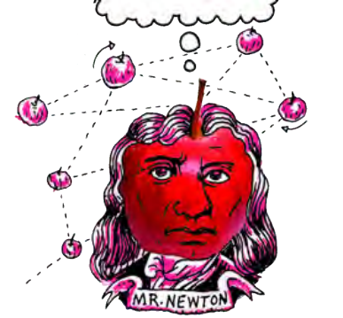
> **[Diagram Context - Textbook_NaturalScience_Gr9_Mining-of-mineral-resources.pdf-0005-11.png]**
> 1. A cartoon illustration of a man's head with a red apple on top of it.

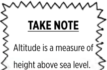
> **[Diagram Context - Textbook_NaturalScience_Gr9_The-atmosphere.pdf-0005-00.png]**
> The image shows a black and white diagram of a Lewis structure. The diagram is labeled with the text "Take Note" and "Altitude is a measure of height above sea level." The diagram is a visual representation of a molecule, with the Lewis structure showing the bonds between the atoms. The diagram is labeled with the names of the atoms and the bonds, providing a clear visual representation of the

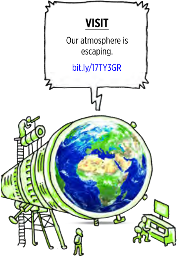
> **[Diagram Context - Textbook_NaturalScience_Gr9_The-atmosphere.pdf-0005-02.png]**
> The image shows a cartoon depiction of a man and a woman standing in front of a large telescope. The man is holding a telescope, and the woman is holding a globe. The globe is green and blue, and it appears to be a planet. The image also includes a speech bubble that reads "Visit Our Atmosphere is Escaping. Bit/17t/3gr".

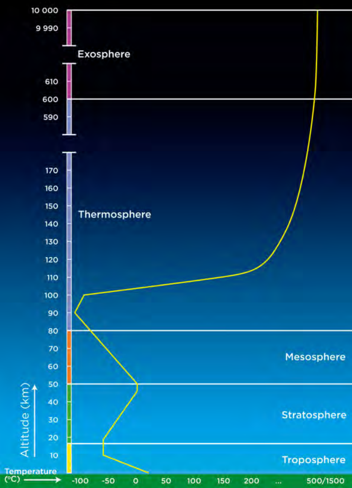
> **[Diagram Context - Textbook_NaturalScience_Gr9_The-atmosphere.pdf-0005-03.png]**
> The image is a diagram that shows the different layers of the atmosphere and the temperature of the atmosphere. The diagram is color-coded, with each layer represented by a different color. The diagram also includes labels for the different layers of the atmosphere, such as the troposphere, mesosphere, thermosphere, exosphere, and exoosphere. The diagram also includes arrows that indicate the direction

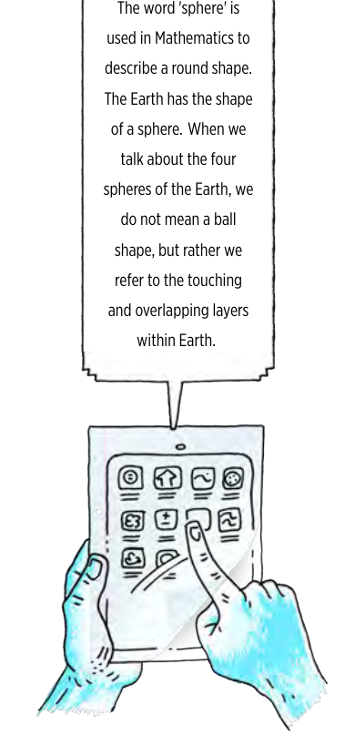
> **[Diagram Context - Textbook_NaturalScience_Gr9_The-earth-as-a-system.pdf-0005-01.png]**
> , contrasting its mathematical definition as a round three-dimensional shape with its scientific meaning concerning Earth

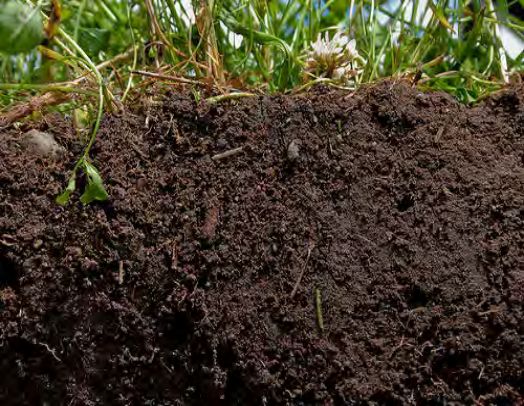
> **[Diagram Context - Textbook_NaturalScience_Gr9_The-earth-as-a-system.pdf-0005-02.png]**
> This photograph presents a cross-sectional view of an organic topsoil layer supporting

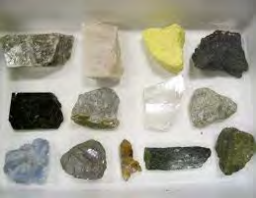
> **[Diagram Context - Textbook_NaturalScience_Gr9_The-earth-as-a-system.pdf-0005-04.png]**
> Sentence 2 (Visual attributes & CAPS alignment):* The specimens showcase a wide

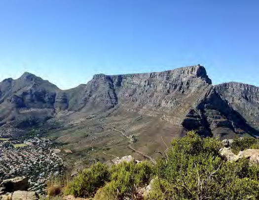
> **[Diagram Context - Textbook_NaturalScience_Gr9_The-earth-as-a-system.pdf-0005-06.png]**
> This landscape photograph displays Table Mountain in South Africa, a classic geomorphological example of

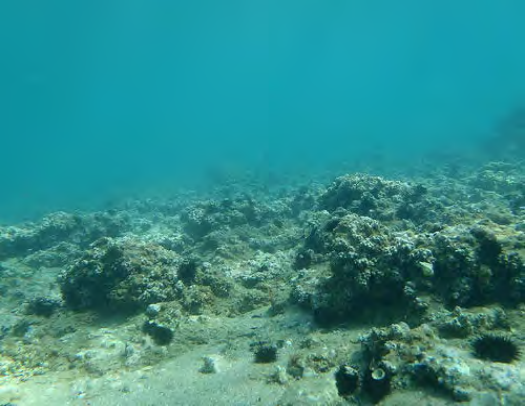
> **[Diagram Context - Textbook_NaturalScience_Gr9_The-earth-as-a-system.pdf-0005-08.png]**
> Pedagogical concept):* Conceptually, the image illustrates an aquatic biome for CAPS Life

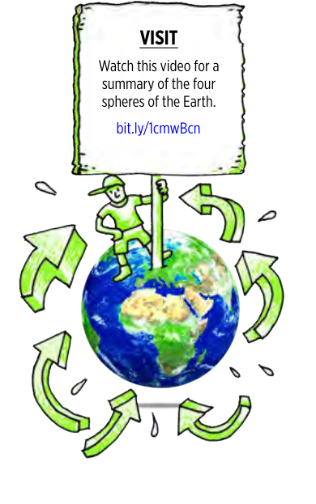
> **[Diagram Context - Textbook_NaturalScience_Gr9_The-earth-as-a-system.pdf-0005-11.png]**
> This educational illustration features a globe of Earth surrounded by green cyclic arrows, topped by a

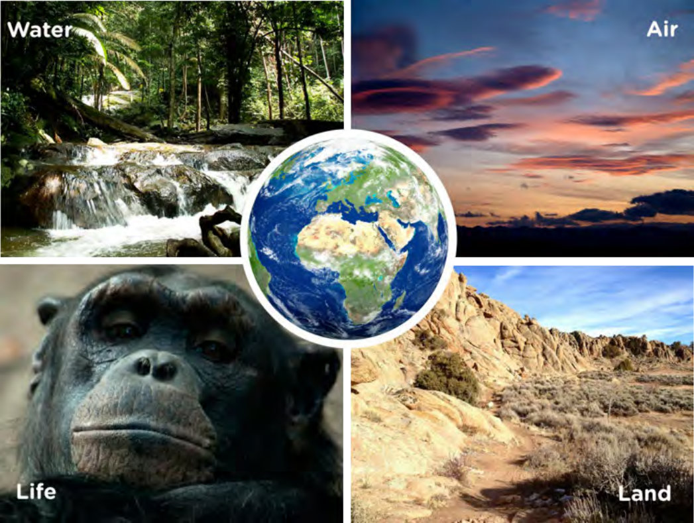
> **[Diagram Context - Textbook_NaturalScience_Gr9_The-earth-as-a-system.pdf-0005-12.png]**
> This educational graphic illustrates Earth's four interconnected spheres surrounding a central globe, featuring four labeled

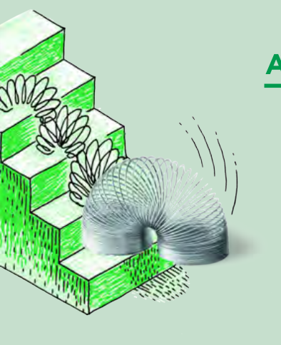
> **[Diagram Context - Textbook_NaturalScience_Gr9_The-lithosphere.pdf-0005-00.png]**
> 1. A diagram of a spring with a green background and a white cord.

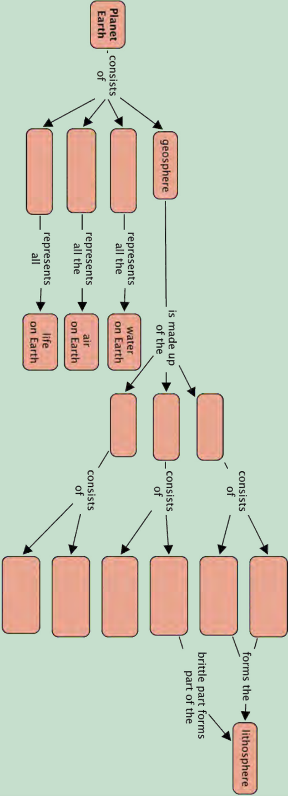
> **[Diagram Context - Textbook_NaturalScience_Gr9_The-lithosphere.pdf-0005-04.png]**
> The image is a diagram that illustrates the structure of a cell. The diagram is divided into different sections, each representing a specific part of the cell. The diagram is color-coded, with each color representing a different part of the cell. The diagram is labeled with the names of the different parts of the cell, such as the nucleus, mitochondria, and ribosomes. The diagram also

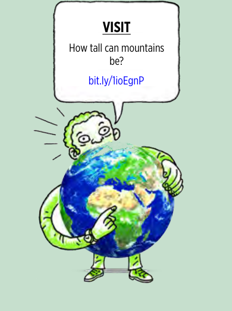
> **[Diagram Context - Textbook_NaturalScience_Gr9_The-lithosphere.pdf-0005-05.png]**
> The image features a cartoon depiction of a man holding a globe in his hands. The globe is green and blue, and the man is wearing a green shirt and white shoes. The man is pointing to the globe, and there is a speech bubble above him that reads "Visit".

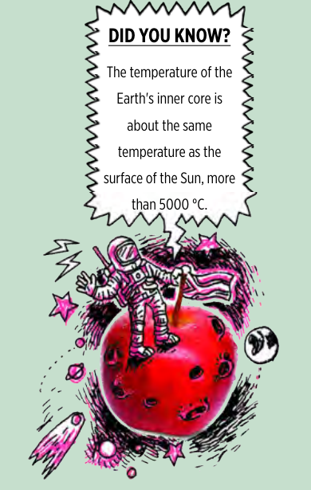
> **[Diagram Context - Textbook_NaturalScience_Gr9_The-lithosphere.pdf-0005-06.png]**
> A cartoon illustration of an astronaut on a red apple, with a speech bubble containing text about the temperature of the Earth's inner core.

> **[Diagram Context - Textbook_NaturalScience_Gr9_The-lithosphere.pdf-0005-07.png]**
> The image shows a line of text that reads "The cell is a complex structure with many organelles". The text is in a green color, and it is positioned on a gray background. The text is arranged in a horizontal line, with the first word "The" at the top and the rest of the words appearing in a vertical line. The text is written in a simple, straightforward

---

# The Rock Cycle

The rock cycle is a natural, continuous process in which rocks form, are broken down, and re-form again over long periods of time.

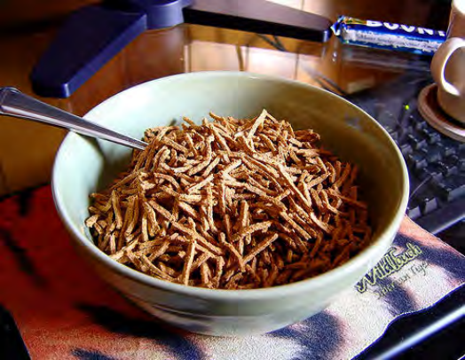
> **[Diagram Context - Textbook_NaturalScience_Gr9_Digestive-system.pdf-0006-09.png]**
> The image is a photograph of a breakfast setting featuring a ceramic bowl filled with brown, fiber-rich cereal flakes, a metal spoon resting inside the bowl, and background items like a candy bar and a coffee cup on a cluttered desk. No visible text, labels, variables, biological structures, chemical symbols, axis names, or arrows are present in the frame. This photograph does not convey a formal CAPS curriculum concept or diagram for high school study.

## Key Concepts and Definitions

*   **Weathering and Erosion:** Wind, water, heat, and cold break rocks on the Earth's surface into smaller pieces, eventually forming sand.
*   **Deposition:** Wind and water transport sand and small stones, depositing them into lakes and oceans as **sediments**.
*   **Sedimentary Rock:** Over time, layers of sediment settle at the bottom of bodies of water. The pressure from overlying layers causes the sediment to compact and solidify into sedimentary rock.
*   **Metamorphic Rock:** When sedimentary rocks are buried deep beneath the Earth's surface (often where tectonic plates meet), they are subjected to intense heat and pressure. These conditions cause chemical changes, transforming them into metamorphic rock.
*   **Magma:** If metamorphic rock is pushed even deeper into the Earth, the temperature becomes high enough to melt the rock, turning it into magma.
*   **Igneous Rock:** Magma moves toward the surface through volcanic pipes. As it cools, it solidifies to form igneous rock. If magma reaches the surface as lava, it cools quickly to form igneous rock on the surface.

---

## Important Notes

*   **Take Note:** Heat causes the expansion of rocks, while cold causes contraction.
*   **Did You Know?** A **geologist** is a scientist who studies the Earth, the rocks from which it is made, and the processes and history that have shaped it.

---

## Digital Resources
*   **Video:** The rock cycle (bit.ly/1cms6hS)
*   **Animation:** Interactive animation of the rock cycle (bit.ly/18upID6)

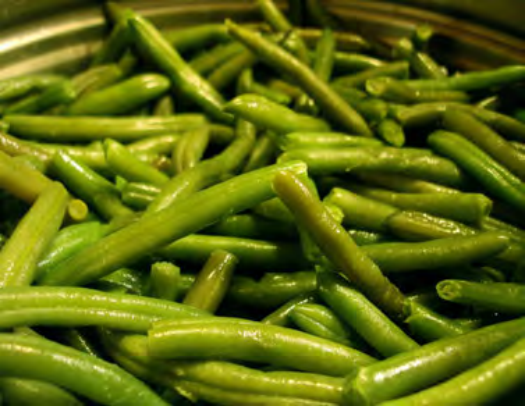
> **[Diagram Context - Textbook_NaturalScience_Gr9_Digestive-system.pdf-0006-10.png]**
> This image is a macroscopic photograph showing a pile of fresh, green bean pods. There are no visible text labels, arrows, or chemical symbols present in the frame. Conceptually, this visual serves as a real-world example of plant organs (fruits/pods) used to discuss plant anatomy, food security, or agricultural production within the CAPS life sciences and agricultural sciences curriculum.

> **[Diagram Context - Textbook_NaturalScience_Gr9_Digestive-system.pdf-0006-13.png]**
> This promotional graphic features an illustration of a globe representing Earth with a figure standing on top holding a sign, surrounded by a circle of green arrows pointing in a clockwise direction. Visible text includes "VISIT," "Find out more and get a special dietary plan worked out just for you," and a web link ("bit.ly/18IY5J2"). Conceptually, it visually conveys the integration of environmental awareness and personal lifestyle choices, linking global sustainability to individual dietary habits in a Life Sciences context.

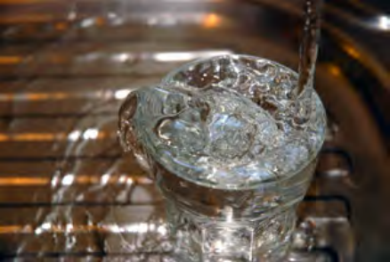
> **[Diagram Context - Textbook_NaturalScience_Gr9_Digestive-system.pdf-0006-16.png]**
> This photograph shows a glass being continuously filled with water, causing it to overflow onto a surrounding metal surface. There are no visible labels, text, or arrows in the image. Conceptually, this visual represents the physical property of capacity and volume, demonstrating the threshold at which a container can no longer hold additional liquid.

> **[Diagram Context - Textbook_NaturalScience_Gr9_Electric-cells-as-energy-systems.pdf-0006-05.png]**
> This educational graphic is a conceptual diagram illustrating a continuous layer of identical, hook-like structures embedded in a flat horizontal surface. The graphic displays a repeating pattern of blue curved hooks protruding upwards from a light grey rectangular base layer. Conceptually, this diagram visually represents surface microstructures or adhesion mechanisms, helping students understand how mechanical fastening systems or biological attachment structures function at a microscopic level.

> **[Diagram Context - Textbook_NaturalScience_Gr9_Electric-cells-as-energy-systems.pdf-0006-18.png]**
> The graphic is a whimsical, hand-drawn illustration depicting a horse-drawn carriage shaped like a large red apple, carrying two figures and topped with a flag and an empty thought bubble. Visible elements include a driver holding reins, a waving passenger inside the apple carriage, two pink horses, wheels, motion lines, and a blank speech/thought bubble above. Conceptually, this illustration serves as an engaging, abstract metaphor for travel, motion, or creative expression, which educators can use to spark narrative writing or stimulate critical thinking in a CAPS-aligned language or life skills lesson.

> **[Diagram Context - Textbook_NaturalScience_Gr9_Electric-cells-as-energy-systems.pdf-0006-19.png]**
> This conceptual educational illustration depicts an operator wearing personal protective equipment—specifically a hard hat, protective goggles, and ear muffs—operating a vibrating pneumatic jackhammer that is breaking up a solid surface. The graphic features motion lines indicating vibration and flying debris fragments around the pointed bit of the jackhammer. Conceptually, for high school students studying occupational health and safety or physics, this visual demonstrates the mechanical hazards of vibration and the necessity of personal protective equipment (PPE) in construction environments.

> **[Diagram Context - Textbook_NaturalScience_Gr9_Electric-cells-as-energy-systems.pdf-0006-22.png]**
> This educational graphic depicts a conceptual illustration of a large telescope observing planet Earth, featuring human figures operating the equipment alongside a blank speech bubble. Visible elements include a massive green-hued telescope mounted on scaffolding, a detailed globe of Earth showing Africa and Europe positioned at the lens, and smaller figures working near a monitoring console. Conceptually, this diagram visually engages CAPS learners in discussions regarding observation, scale, and scientific inquiry within Earth and Space sciences.

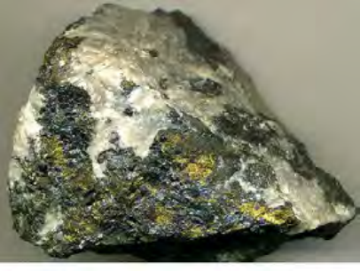
> **[Diagram Context - Textbook_NaturalScience_Gr9_Mining-of-mineral-resources.pdf-0006-00.png]**
> 1. A rock with a greenish, yellowish, and blackish hue.

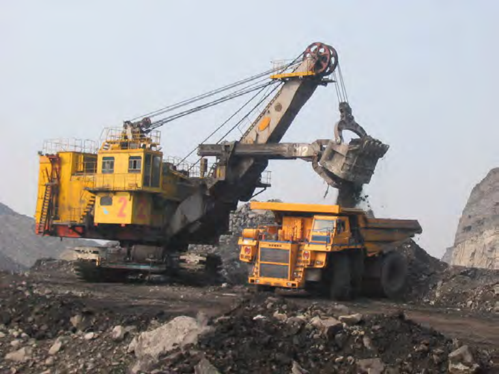
> **[Diagram Context - Textbook_NaturalScience_Gr9_Mining-of-mineral-resources.pdf-0006-06.png]**
> 1. A yellow and black piece of equipment with a crane on top.

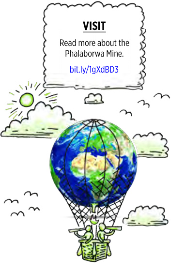
> **[Diagram Context - Textbook_NaturalScience_Gr9_Mining-of-mineral-resources.pdf-0006-11.png]**
> 1. A cartoon drawing of a globe and a hot air balloon.
 2. The globe is blue and green.
 3. The hot air balloon is green.
 4. The globe is floating in the air.
 5. The hot air balloon is flying.

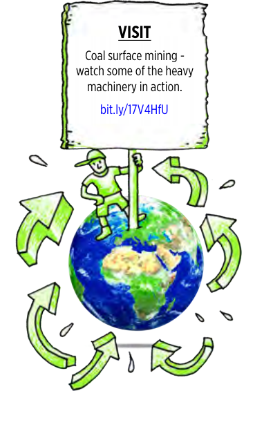
> **[Diagram Context - Textbook_NaturalScience_Gr9_Mining-of-mineral-resources.pdf-0006-12.png]**
> The image is a cartoon depiction of a cartoon character, a man, standing on a globe. The globe is divided into different regions, and the man is positioned on the equator. The man is wearing a hat and holding a stick. The cartoon character is surrounded by various arrows, which are pointing in different directions. The text on the image reads "Visit Coal surface mining. Watch some of

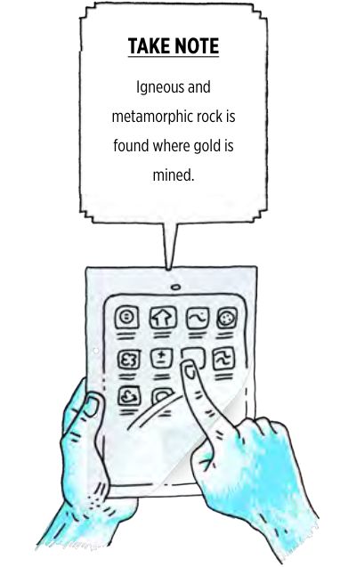
> **[Diagram Context - Textbook_NaturalScience_Gr9_Mining-of-mineral-resources.pdf-0006-13.png]**
> 1. A hand holding a tablet computer.

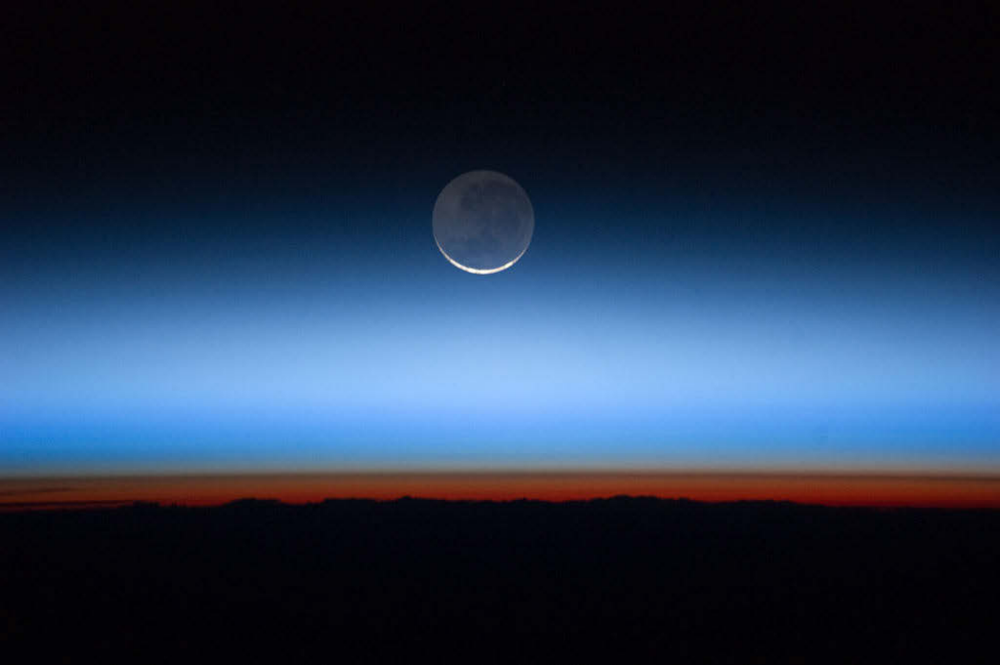
> **[Diagram Context - Textbook_NaturalScience_Gr9_The-atmosphere.pdf-0006-01.png]**
> The image shows a view of the moon from space. The moon is positioned in the top right corner of the frame, with the sky in the bottom left corner. The moon is partially obscured by the horizon line, which is a thin blue line that separates the sky from the earth. The sky is a deep blue color, with a few clouds scattered throughout. The moon is a crescent shape

> **[Diagram Context - Textbook_NaturalScience_Gr9_The-atmosphere.pdf-0006-04.png]**
> 1. A cartoon boat with five people on it.

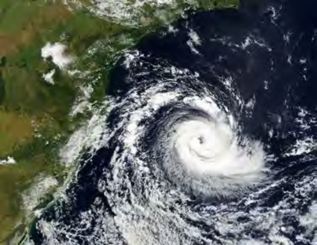
> **[Diagram Context - Textbook_NaturalScience_Gr9_The-atmosphere.pdf-0006-06.png]**
> The image shows a satellite view of the Earth, with a large, swirling mass of white clouds in the center. The satellite is positioned in the top left corner of the image, and the Earth is located in the bottom right corner. The satellite appears to be a Lewis diagram, which is a diagram used to represent the spatial distribution of atoms or particles. The diagram is composed of lines and arrows

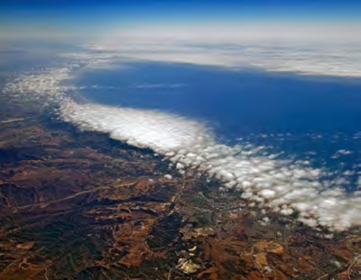
> **[Diagram Context - Textbook_NaturalScience_Gr9_The-atmosphere.pdf-0006-08.png]**
> 1. A view of the sky from an airplane.

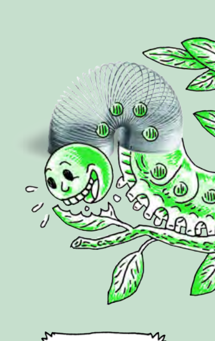
> **[Diagram Context - Textbook_NaturalScience_Gr9_The-earth-as-a-system.pdf-0006-06.png]**
> *Sentence 1 (Visual content & elements):* This creative illustration depicts a

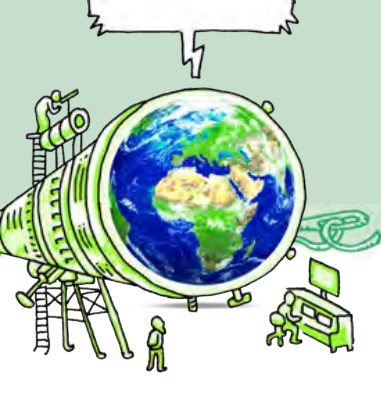
> **[Diagram Context - Textbook_NaturalScience_Gr9_The-earth-as-a-system.pdf-0006-11.png]**
> This cartoon illustration depicts a large telescope focused on planet Earth (centered on the African continent

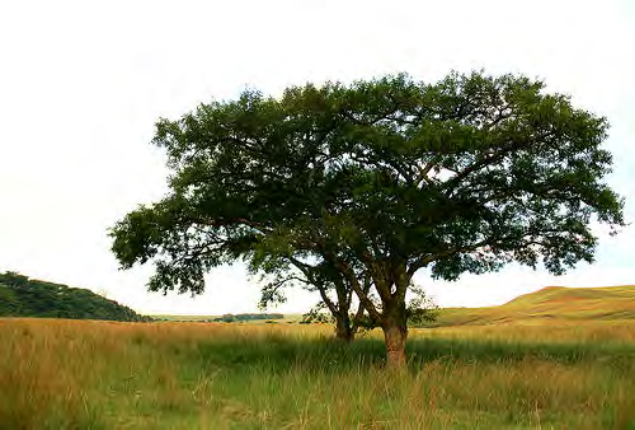
> **[Diagram Context - Textbook_NaturalScience_Gr9_The-earth-as-a-system.pdf-0006-13.png]**
> This photograph depicts a natural South African landscape featuring a dominant broad-canopied

> **[Diagram Context - Textbook_NaturalScience_Gr9_The-earth-as-a-system.pdf-0006-17.png]**
> This conceptual physics illustration combines a metallic helical spring (Slinky) with a roller

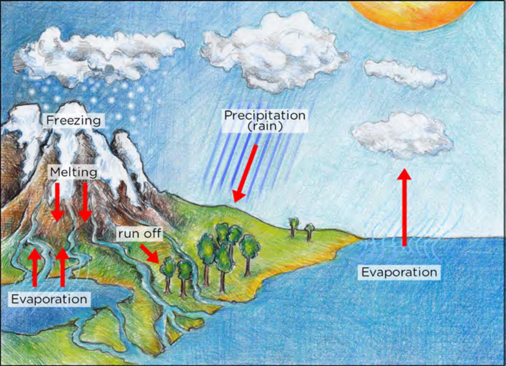
> **[Diagram Context - Textbook_NaturalScience_Gr9_The-lithosphere.pdf-0006-03.png]**
> A diagram of a mountain range with a river running through it. The mountain range has snow on it and the river has water. The diagram also includes arrows pointing to the different processes that occur in the mountain range. The diagram is labeled with the words "Freezing", "Melting", "Run off", "Evaporation", and "Precipitation".

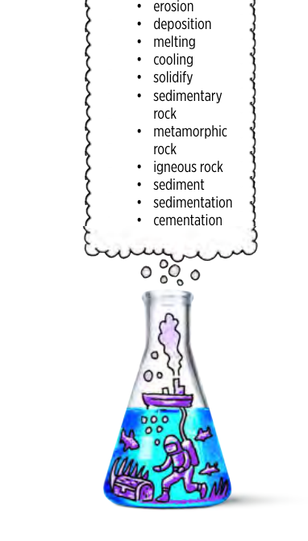
> **[Diagram Context - Textbook_NaturalScience_Gr9_The-lithosphere.pdf-0006-14.png]**
> A purple and blue glass beaker with a cartoon depiction of a person and a boat inside, accompanied by a thought bubble with the words "erosion", "cooling", "sustainability", and "sedimentation" written on it.

> **[Diagram Context - Textbook_NaturalScience_Gr9_The-lithosphere.pdf-0006-15.png]**
> The image shows a cartoon-like graphic with the words "Visit" written in black text. The text is surrounded by a cloud-like shape, which is a common visual representation of a cloud. The text is positioned in the center of the image, making it the focal point. The image does not contain any other objects or text, and the overall layout is simple and straightforward.

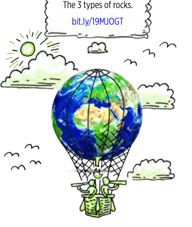
> **[Diagram Context - Textbook_NaturalScience_Gr9_The-lithosphere.pdf-0006-16.png]**
> The image shows a cartoon depiction of a hot air balloon with a globe on top. The globe is colored blue and green, and the balloon is filled with air. The balloon is positioned in the center of the image, with the globe on top. The balloon is surrounded by clouds, and there are two people inside the balloon. The people are holding a map and a compass, and they are

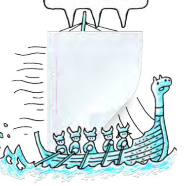
> **[Diagram Context - Textbook_NaturalScience_Gr9_The-lithosphere.pdf-0006-19.png]**
> 1. A cartoon boat with a group of people on it.

---

### The Rock Cycle

The Earth's crust is continually recycled through a process known as the **rock cycle**. Rocks of all types can move deep into the Earth, melt, and mix with magma. 

*   **Metamorphic rock:** Formed deep under the Earth's surface. It becomes exposed only when the layers of rock above it are removed by erosion.
*   **Igneous and Sedimentary rock:** These can be pushed deeper into the Earth, where they are subjected to increased pressure and temperatures, transforming them into metamorphic rock.

---

### Take Note: Magma vs. Lava
While both refer to molten rock, the terminology depends on the location:
*   **Magma:** Molten rock located beneath the Earth's surface.
*   **Lava:** Molten rock that has erupted out of a volcano onto the Earth's surface.

---

### Activity: Summarising the Rock Cycle

> **[Diagram Context - Textbook_NaturalScience_Gr9_Digestive-system.pdf-0007-00.png]**
> This educational graphic is an anatomical and mechanical analogy featuring a green caterpillar feeding on plant leaves, overlaid with a metallic spring structure on its body. Visible elements include a stylized caterpillar head eating leaves, segmented body sections containing green circular markings, and a metallic slinky-like spring arching over the middle segments. Conceptually, this diagram illustrates how the longitudinal and circular muscle interactions in invertebrate hydrostatic skeletons function analogously to a spring to facilitate peristaltic movement during locomotion.

#### Questions

1. **Complete the diagram:** Identify the correct rock type for each empty box in the cycle provided above.
2. **Name the process:** By which process is igneous rock formed?
3. **Sediment formation:** Which type(s) of rock form sediment?
4. **Metamorphic conditions:** What conditions are required for metamorphic rock to form?

---

### Summary Table of Rock Cycle Processes

| Process | Resulting Change |
| :--- | :--- |
| **Cooling** | Magma turns into Igneous rock |
| **Melting** | Rocks turn into Magma |
| **Weathering and Erosion** | Rocks break down into Sediments |
| **Compaction and Cementation** | Sediments turn into Sedimentary rock |
| **Heat and Pressure** | Rocks turn into Metamorphic rock |

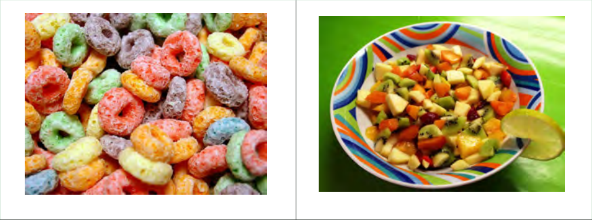
> **[Diagram Context - Textbook_NaturalScience_Gr9_Digestive-system.pdf-0007-09.png]**
> This educational graphic consists of two photographs: a pile of brightly colored, processed breakfast cereal rings on the left and a bowl of freshly chopped natural fruit salad garnished with a lime slice on the right. There are no visible text labels, arrows, or chemical symbols in the images. Conceptually, this visual contrasts processed foods containing refined carbohydrates and artificial additives with whole, unprocessed foods rich in natural nutrients, supporting high school Life Sciences topics related to nutrition, balanced diets, and healthy eating habits.

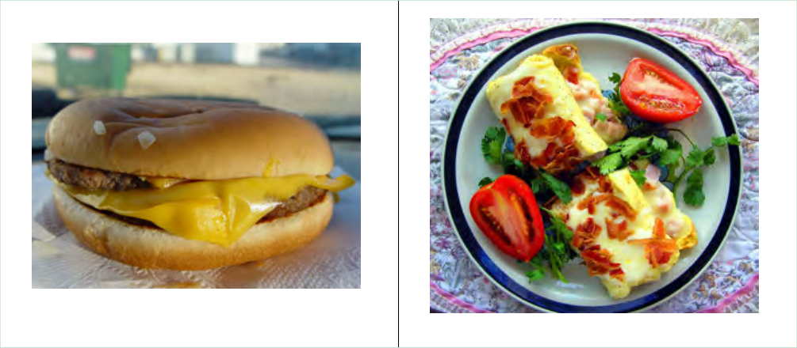
> **[Diagram Context - Textbook_NaturalScience_Gr9_Digestive-system.pdf-0007-13.png]**
> This comparative photographic educational graphic displays two distinct meal options: a processed fast-food burger on the left and a balanced, home-cooked meal consisting of protein, cheese, tomatoes, and leafy greens on a plate on the right. There are no explicit text labels, chemical symbols, or arrows present in either image. Conceptually, this visual aids high school learners in Life Sciences by contrasting unhealthy, highly processed fast food with a nutritious, balanced meal to illustrate key CAPS curriculum concepts regarding diet, nutrition, and healthy eating habits.

> **[Diagram Context - Textbook_NaturalScience_Gr9_Electric-cells-as-energy-systems.pdf-0007-00.png]**
> This image features a single, vertically oriented yellow text box containing the label "Electric cells as energy systems". It serves as a structural title or conceptual heading for a learning module. For a high school student studying Physical Sciences, it introduces the core concept of how electric cells function as sources of electrical energy within circuits by converting chemical potential energy into electrical potential energy.

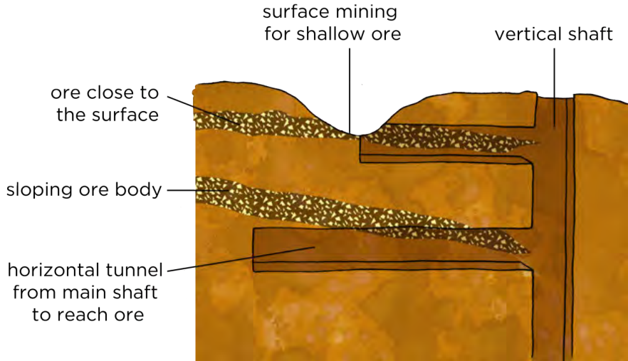
> **[Diagram Context - Textbook_NaturalScience_Gr9_Mining-of-mineral-resources.pdf-0007-00.png]**
> 1. A diagram of a geological formation.
 2. The diagram shows the layers of a geological formation, including the crust, mantle, and core.
 3. The diagram also shows the layers of a geological formation, including the crust, mantle, and core.

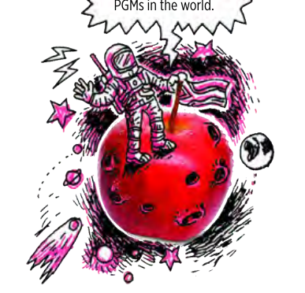
> **[Diagram Context - Textbook_NaturalScience_Gr9_Mining-of-mineral-resources.pdf-0007-03.png]**
> The image is a cartoon drawing of an astronaut on a red planet. The astronaut is holding a walking stick and is wearing a helmet. The planet is covered in stars and has a large crater in the center. The drawing is in black and white, and the text "PGMS in the world." is written above the astronaut.

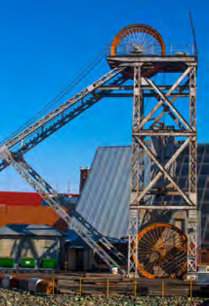
> **[Diagram Context - Textbook_NaturalScience_Gr9_Mining-of-mineral-resources.pdf-0007-05.png]**
> 1. A diagram of a cell with a Lewis structure.

> **[Diagram Context - Textbook_NaturalScience_Gr9_Mining-of-mineral-resources.pdf-0007-10.png]**
> 1. A cartoon drawing of a man and a woman riding a carriage.
2. The man is wearing a black suit and hat.
3. The woman is wearing a pink dress.
4. The carriage is being pulled by a horse.

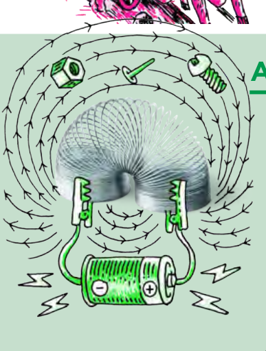
> **[Diagram Context - Textbook_NaturalScience_Gr9_Mining-of-mineral-resources.pdf-0007-13.png]**
> 1. A green spring with a silver wire attached to it.

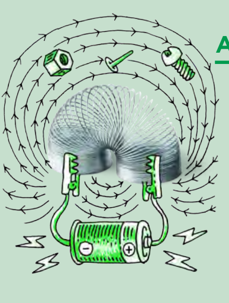
> **[Diagram Context - Textbook_NaturalScience_Gr9_The-atmosphere.pdf-0007-00.png]**
> 1. A green spring with a silver wire attached to it.

> **[Diagram Context - Textbook_NaturalScience_Gr9_The-atmosphere.pdf-0007-09.png]**
> 1. A white square with a brown border.

> **[Diagram Context - Textbook_NaturalScience_Gr9_The-earth-as-a-system.pdf-0007-09.png]**
> This diagram depicts a long, uncoiled single strand of messenger RNA (mRNA

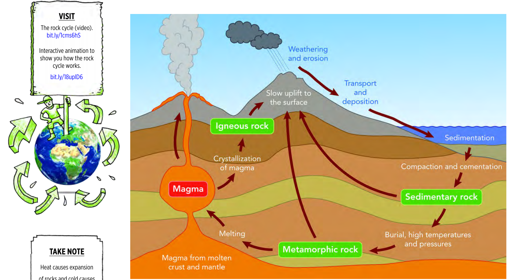
> **[Diagram Context - Textbook_NaturalScience_Gr9_The-lithosphere.pdf-0007-00.png]**
> 1. A diagram of a geological formation, including a volcano, a magma chamber, and a lava flow.

> **[Diagram Context - Textbook_NaturalScience_Gr9_The-lithosphere.pdf-0007-08.png]**
> 1. A cartoon drawing of a man and a woman riding in a carriage.
 2. The man is wearing a hat and a suit.
 3. The woman is wearing a dress.
 4. The carriage is being pulled by a horse.

---

### Geological Processes and the Rock Cycle

#### Core Concepts

**1. Weathering and Erosion**
*   **Weathering:** The physical and chemical breakdown of rocks, minerals, and soils at or near the Earth's surface by agents such as water, ice, wind, and biological organisms.
*   **Erosion:** The process by which the products of weathering (sediment) are transported from one location to another by natural forces like flowing water, wind, or glaciers.

**2. Compaction**
Compaction is a geological process where layers of sediment are squeezed together by the weight of overlying materials. As the layers accumulate, the pressure reduces the pore space between sediment grains, turning loose sediment into solid rock.

**3. Sedimentary Rock Formation**
Sedimentary rocks are formed through the processes of **deposition** (the settling of sediments), **compaction**, and **cementation**. Over long periods, these layers harden into rock.

**4. Magma and the Rock Cycle**
*   **Definition:** Magma is molten (liquid) rock located beneath the Earth's surface. When it reaches the surface, it is referred to as lava.
*   **Role in the Rock Cycle:** Magma is the primary source material for **igneous rocks**. When magma cools and solidifies (crystallizes), it forms igneous rock. If rocks are pushed deep into the Earth's crust, they may melt due to high **temperature** and **pressure**, returning to a magma state and restarting the cycle.

---

#### Activity: Explaining the Rock Cycle

**Instructions:** Write a paragraph explaining the rock cycle, beginning with the formation of igneous rock. Ensure you use the following key words:

| Key Words for Your Paragraph |
| :--- |
| melting |
| deposition |
| erosion |
| cooling |
| compact |
| temperature |
| pressure |
| metamorphic rock |
| igneous rock |
| sedimentary rock |

---

#### Did You Know?
The **Hoba Meteorite**, located in Namibia, is the largest known meteorite found in a single piece. It is composed primarily of iron and has a mass exceeding $60$ tons. It landed approximately $80\,000$ years ago.

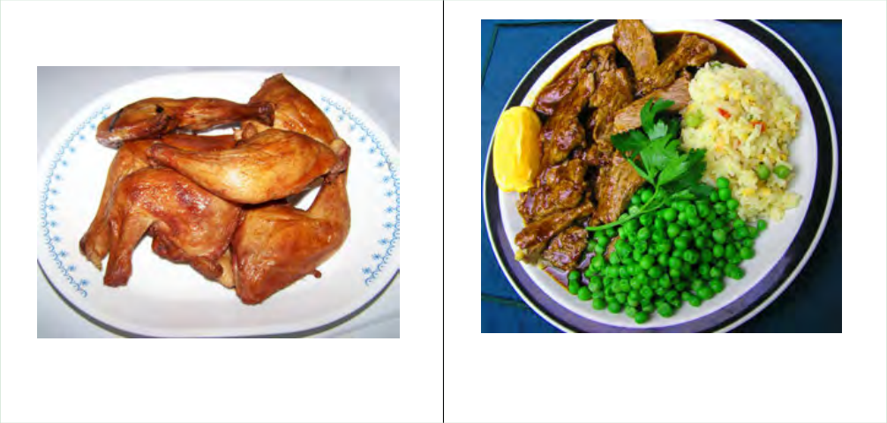
> **[Diagram Context - Textbook_NaturalScience_Gr9_Digestive-system.pdf-0008-04.png]**
> This educational graphic features two photographs of different meal plates, with the left image displaying cooked chicken pieces and the right image displaying a mixed meal containing meat, rice, peas, and a yellow food item. The visual contains no text labels, symbols, or arrows. Conceptually, this diagram is used in Grade 10 Life Sciences to introduce nutrition by comparing protein-rich foods and illustrating the components of a balanced meal.

> **[Diagram Context - Textbook_NaturalScience_Gr9_Digestive-system.pdf-0008-05.png]**
> The graphic is a horizontal decorative border featuring a repeating pattern of green arrows pointing to the right against a pale background. It contains no text labels, variables, or specific scientific symbols. Visually, it serves as a stylized separator or header commonly used in educational layouts to divide sections or highlight continuity.

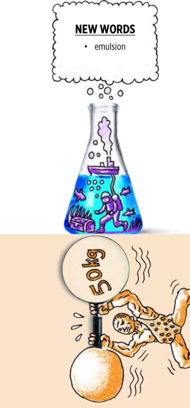
> **[Diagram Context - Textbook_NaturalScience_Gr9_Digestive-system.pdf-0008-13.png]**
> This educational graphic is an illustrated vocabulary and conceptual diagram featuring a conical laboratory flask containing an underwater scene and a speech bubble with the text "NEW WORDS" and "emulsion". Visible elements include the text label "emulsion", a flask filled with blue liquid, a diving scene with a ship, diver, fish, and treasure chest, and a cartoon illustration of a muscular figure straining under a "50 kg" weight viewed through a magnifying glass. Conceptually, this visual introduces learners to foundational terminology by contextualising the scientific concept of an emulsion alongside related visual mnemonics.

> **[Diagram Context - Textbook_NaturalScience_Gr9_Electric-cells-as-energy-systems.pdf-0008-02.png]**
> This educational graphic depicts a mechanical gear train system featuring multiple intermeshed metal and red cogs of varying sizes, accompanied by an illustrated student pondering with a question mark overhead. Curved directional arrows indicate the rotational movement of individual gears within the complex network. The diagram visually conveys the core CAPS Technology concepts of mechanical advantage, gear ratios, and how drivers and driven gears transmit force and alter speed or direction of motion.

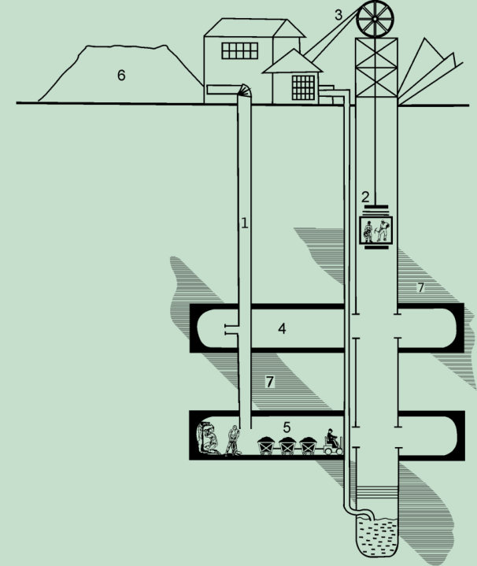
> **[Diagram Context - Textbook_NaturalScience_Gr9_Mining-of-mineral-resources.pdf-0008-06.png]**
> 1. A diagram of a house with a pipe running through it.

> **[Diagram Context - Textbook_NaturalScience_Gr9_Mining-of-mineral-resources.pdf-0008-08.png]**
> 1. A cartoon apple with a worm inside.
 2. The apple is red and has a stem on top.
 3. The worm is pink and white.

> **[Diagram Context - Textbook_NaturalScience_Gr9_Mining-of-mineral-resources.pdf-0008-09.png]**
> 1. A diagram of a snake with a green head and body.

> **[Diagram Context - Textbook_NaturalScience_Gr9_The-atmosphere.pdf-0008-02.png]**
> 1. A white square with a brown border.

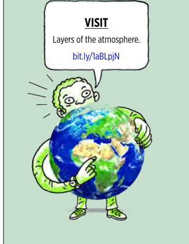
> **[Diagram Context - Textbook_NaturalScience_Gr9_The-atmosphere.pdf-0008-03.png]**
> The image features a cartoon depiction of a man holding a globe. The man is wearing a green shirt and white pants, and he is pointing to the globe. The globe is green and white, and it is the focal point of the image. The text "Visit" is written in white at the top of the image, and it is accompanied by a speech bubble containing the text "Layers

> **[Diagram Context - Textbook_NaturalScience_Gr9_The-atmosphere.pdf-0008-04.png]**
> 1. A diagram of a snake with a green head and body.

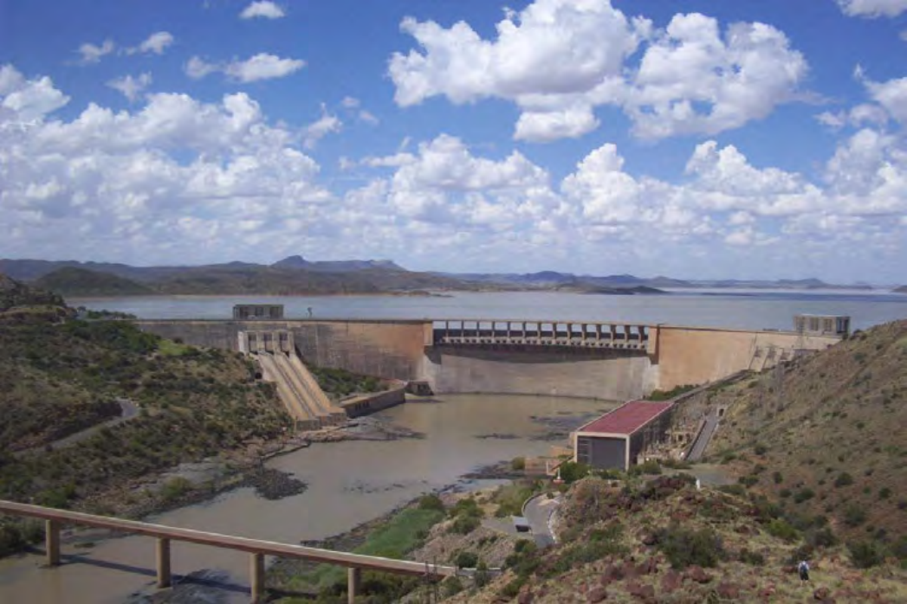
> **[Diagram Context - Textbook_NaturalScience_Gr9_The-earth-as-a-system.pdf-0008-05.png]**
> This photograph depicts a large concrete arch dam—specifically the Gariep Dam on the Orange River

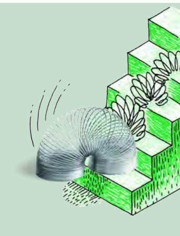
> **[Diagram Context - Textbook_NaturalScience_Gr9_The-earth-as-a-system.pdf-0008-06.png]**
> This illustration depicts a helical spring toy (Slinky) travelling down a

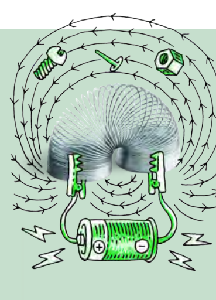
> **[Diagram Context - Textbook_NaturalScience_Gr9_The-lithosphere.pdf-0008-02.png]**
> 1. A green spring with a silver spring coiled around it.
 2. A green battery with a silver battery attached to it.
 3. A green wire with a silver wire attached to it.
 4. A green wire with a silver wire attached to it.

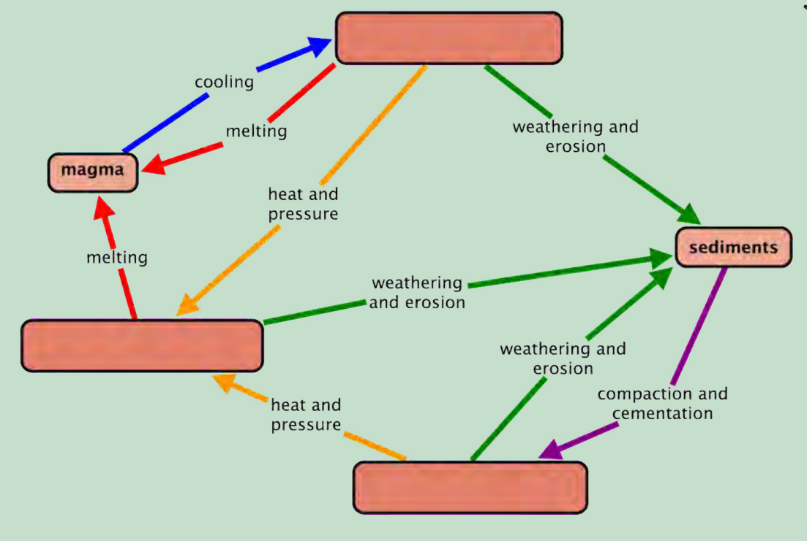
> **[Diagram Context - Textbook_NaturalScience_Gr9_The-lithosphere.pdf-0008-06.png]**
> The image is a diagram that illustrates the process of weathering and erosion. It shows the different stages of weathering and erosion, including the formation of sediments, the compaction and cementation of sediments, and the eventual formation of rocks. The diagram is color-coded, with each color representing a different stage of the process. The diagram is labeled with the names of the stages,

> **[Diagram Context - Textbook_NaturalScience_Gr9_The-lithosphere.pdf-0008-09.png]**
> 1. A cartoon illustration of a man holding a picture of a woman.

---

### Chapter 2: The Lithosphere

#### Activity: Writing Task
*   **Instructions:** Write a summary using the provided keywords. You may use the keywords more than once and are encouraged to add your own relevant keywords.
*   **Requirement:** Include a labelled diagram in your write-up.

---

#### Sedimentary Rock
Sedimentary rocks are formed when layers of sediment solidify over time. 

**Key Definitions:**
*   **Sediments:** Layers of particles derived from pre-existing rock or once-living organisms (e.g., shells).
*   **Weathering:** The process where rocks on the Earth's surface break down due to expansion and contraction caused by temperature changes, wind, and water.
*   **Erosion:** The process by which larger rocks are broken down into smaller and smaller particles.

**Factors Contributing to Erosion:**
1.  **Temperature:** Changes in temperature cause rocks to expand and contract, leading to cracks. Plants may grow in these cracks, causing the rock to break apart further.
2.  **Water (Rain):** Rain wears down rocks, causing smaller pieces to break off.
3.  **Animals:** Physical movement and activity by animals can break rocks into smaller particles.

---

#### Digital Resources
*   **Rock Types and Classifications:** [bit.ly/17nxyiC](http://bit.ly/17nxyiC)
*   **Erosion and Soil Formation:** [bit.ly/1ak9Rlb](http://bit.ly/1ak9Rlb)

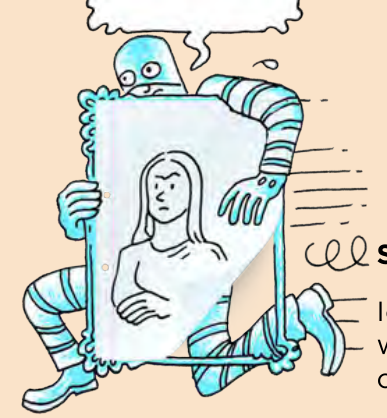
> **[Diagram Context - Textbook_NaturalScience_Gr9_Digestive-system.pdf-0009-15.png]**
> This educational graphic is a cartoon illustration depicting a thief character in striped clothing sneaking away while holding a framed portrait of a woman. Visible elements include a speech bubble above the figure, horizontal motion lines indicating movement to the right, and binder holes on the edge of the framed paper. Conceptually, this visual metaphor represents the concept of plagiarism, intellectual property theft, or copyright infringement, helping learners understand the importance of acknowledging original sources and creative work.

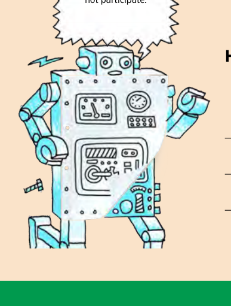
> **[Diagram Context - Textbook_NaturalScience_Gr9_Digestive-system.pdf-0009-27.png]**
> The graphic is an illustrative cartoon depicting a mechanical robot with control panels on its torso, partially covered by a perforated sheet of paper containing schematic drawings and a speech bubble at the top. Visible features include dials, gauges, buttons, a bolt falling off, and a jagged speech bubble border. Conceptually, this visual serves as an engaging metaphor for automation, engineering systems, or scientific modelling, helping learners visualize complex control mechanisms and structural design in technology-focused topics.

> **[Diagram Context - Textbook_NaturalScience_Gr9_Electric-cells-as-energy-systems.pdf-0009-02.png]**
> This is a blank educational graphic with no visible content, labels, or structures. Consequently, it conveys no conceptual information for high school students studying the CAPS curriculum.

> **[Diagram Context - Textbook_NaturalScience_Gr9_Electric-cells-as-energy-systems.pdf-0009-04.png]**
> The graphic shows a biological illustration of an ant leading a linear trail of smaller ants and chemical dot markers across a two-tone pink and white background. The visible visual elements include an ant icon at the head of the trail and continuous parallel lines of tiny red dots representing chemical secretions. Conceptually, this diagram illustrates animal behavior and chemical communication, specifically how social insects like ants use pheromone trails to navigate and communicate pathways to the rest of the colony.

> **[Diagram Context - Textbook_NaturalScience_Gr9_Mining-of-mineral-resources.pdf-0009-03.png]**
> The image is a cartoon drawing of a globe with a speech bubble above it, containing a thought bubble with a lightning bolt. The drawing also includes a group of people and a green machine, suggesting a theme related to science or technology. The text "I'm a South African CAPS" is present, which could be a title or a caption related to the content of the drawing.

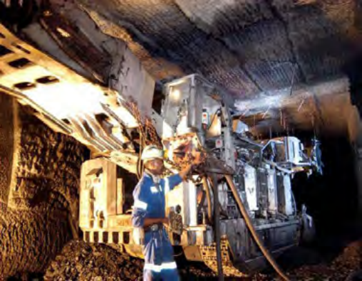
> **[Diagram Context - Textbook_NaturalScience_Gr9_Mining-of-mineral-resources.pdf-0009-04.png]**
> 1. A man in a blue uniform standing next to a machine.

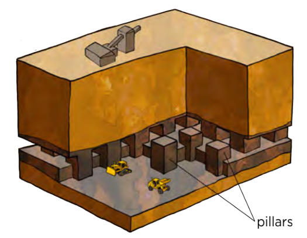
> **[Diagram Context - Textbook_NaturalScience_Gr9_Mining-of-mineral-resources.pdf-0009-05.png]**
> 1. A diagram of a cell with arrows pointing to different parts of the cell.

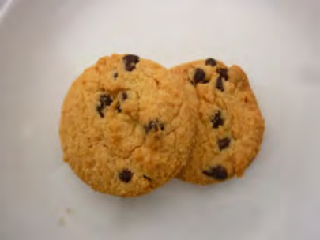
> **[Diagram Context - Textbook_NaturalScience_Gr9_Mining-of-mineral-resources.pdf-0009-11.png]**
> 1. A diagram of a cookie with chocolate chips.

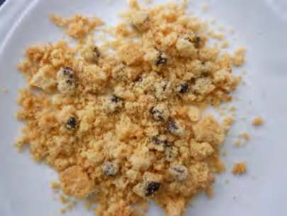
> **[Diagram Context - Textbook_NaturalScience_Gr9_Mining-of-mineral-resources.pdf-0009-14.png]**
> The image shows a close-up view of a white plate with a crumbly substance on it. The substance appears to be a mixture of crumbs and chocolate chips. The plate is placed on a white surface, and the crumbs are scattered around the plate. The image does not contain any text or additional objects, and the focus is solely on the plate and its contents.

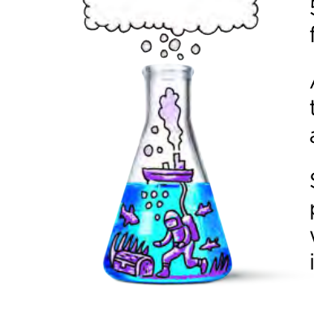
> **[Diagram Context - Textbook_NaturalScience_Gr9_The-atmosphere.pdf-0009-05.png]**
> The image features a cartoon depiction of a person wearing a spacesuit and holding a submarine, with a submarine filled with water and fish inside. The submarine is depicted in a blue and purple color scheme, and the person is wearing a purple spacesuit. The image also includes a cloud and a blue bubble, which are part of the cartoon illustration. The text "SAF/STA" is

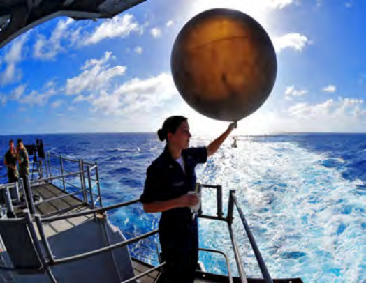
> **[Diagram Context - Textbook_NaturalScience_Gr9_The-atmosphere.pdf-0009-08.png]**
> 1. A woman holding a large ball in her hand.

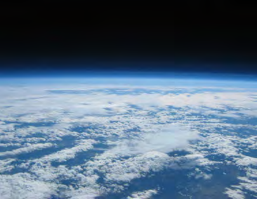
> **[Diagram Context - Textbook_NaturalScience_Gr9_The-atmosphere.pdf-0009-09.png]**
> 1. A view of the earth from space.

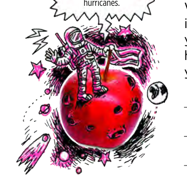
> **[Diagram Context - Textbook_NaturalScience_Gr9_The-atmosphere.pdf-0009-14.png]**
> The image features a cartoon depiction of an astronaut on a red planet. The astronaut is holding a stick and appears to be in a state of distress. The planet is covered in stars and has a large crater in the center. The background of the image is a pinkish-purple color, and there is a speech bubble above the astronaut that reads "hurricanes." The image also includes a

> **[Diagram Context - Textbook_NaturalScience_Gr9_The-atmosphere.pdf-0009-18.png]**
> The image features a cartoon illustration of a hot air balloon filled with a green substance, with a globe on top of the balloon. The globe is surrounded by a network of lines and arrows, which appear to be representing the circulatory system. The illustration also includes a small figure of a person holding a book, suggesting a connection to the circulatory system. The image is labeled as a Lewis diagram

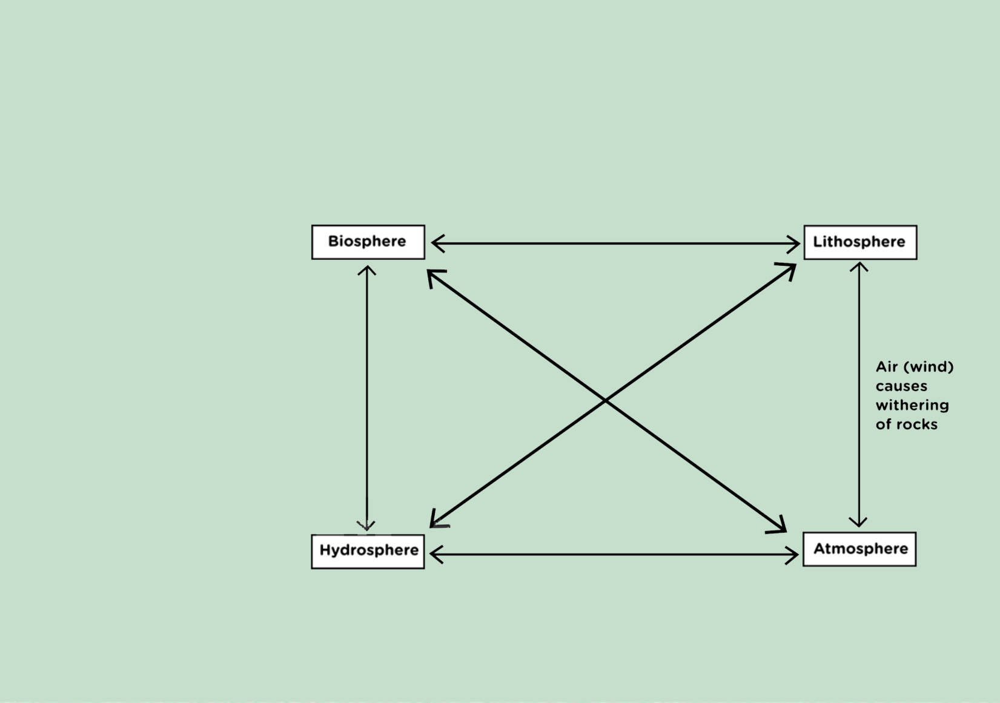
> **[Diagram Context - Textbook_NaturalScience_Gr9_The-earth-as-a-system.pdf-0009-00.png]**
> This system diagram illustrates the dynamic interactions among Earth's four major spheres, featuring rectangular

> **[Diagram Context - Textbook_NaturalScience_Gr9_The-earth-as-a-system.pdf-0009-01.png]**
> This visual content depicts a repeating molecular chain model, represented by a continuous series of green

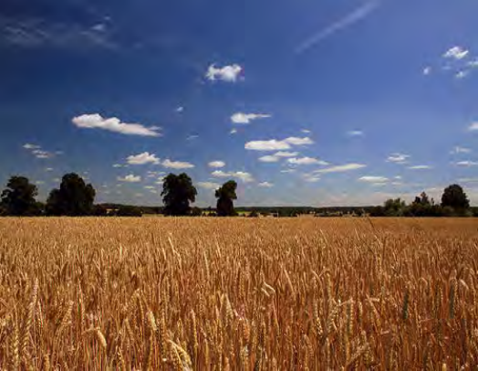
> **[Diagram Context - Textbook_NaturalScience_Gr9_The-earth-as-a-system.pdf-0009-03.png]**
> Although the image contains no formal text labels, arrows, or mathematical symbols, it clearly shows

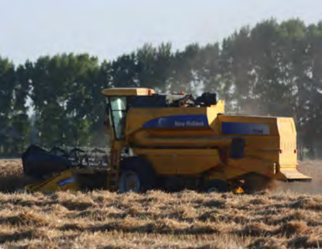
> **[Diagram Context - Textbook_NaturalScience_Gr9_The-earth-as-a-system.pdf-0009-05.png]**
> This photograph depicts a yellow combine harvester, featuring the visible "New Holland" brand logo,

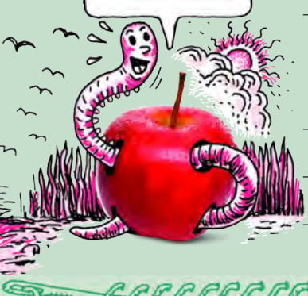
> **[Diagram Context - Textbook_NaturalScience_Gr9_The-lithosphere.pdf-0009-04.png]**
> 1. A cartoon apple with a worm inside.

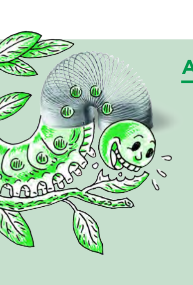
> **[Diagram Context - Textbook_NaturalScience_Gr9_The-lithosphere.pdf-0009-08.png]**
> The image features a cartoon depiction of a caterpillar with a smiley face, surrounded by green leaves. The caterpillar is shown in a curled-up position, with a green ball attached to its head. The image also includes a text box that reads "A" and "A+", and a green leaf that appears to be a part of the caterpillar's body. The image is

---

# The Formation of Sedimentary Rock

### 1. Erosion and Transportation
Wind and water act as agents of change on the Earth's surface. They transport loose, smaller particles, debris, and large stones from one location to another. 

*   **Definition:** **Erosion** is the process by which wind and water transport loose particles and debris, eventually depositing them in flood plains and in the sea.

*(Image: Soil erosion due to water)*

### 2. Deposition and Compaction
Once the transported material reaches bodies of water (oceans, rivers, lakes, and swamps), it settles at the bottom. 

*   **Accumulation:** The material, along with remains from living organisms, settles in layers.
*   **Compaction:** As these layers build up over time, the weight of the upper layers causes the lower layers to be compressed.
*   **Solidification:** Over long periods, these bottom layers solidify to form sedimentary rock.

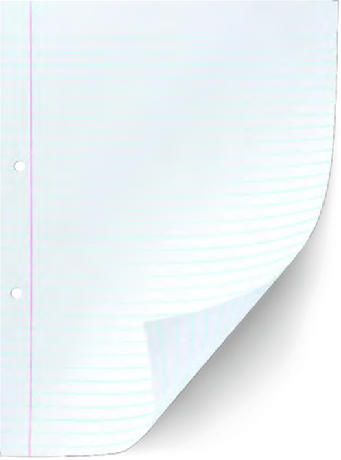

*(Image: The formation of sedimentary rock showing sediment washing into the sea, organic material dying, and layers forming and turning into rock)*

### 3. Key Facts and Observations
*   **Distribution:** Although sedimentary rock is found in most places on Earth, it makes up only $8\%$ of the Earth's crust.
*   **Visibility:** We can observe different layers of sedimentary rock in mountains and rock formations in our daily environment.
*   **Case Study:** The Grand Canyon is a prime example where layers of sediment, solidified over millions of years, are clearly visible.

> **DID YOU KNOW?**
> The oldest layers of sedimentary rock visible in the Grand Canyon are believed to be nearly $2$ billion years old.

> **VISIT**
> For more information on the formation of sedimentary rock under the sea, visit: [bit.ly/1atOi4l](http://bit.ly/1atOi4l)

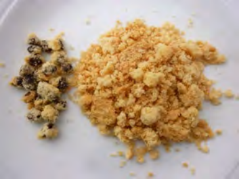

*(Image: The layers in the sedimentary rock in the Grand Canyon)*

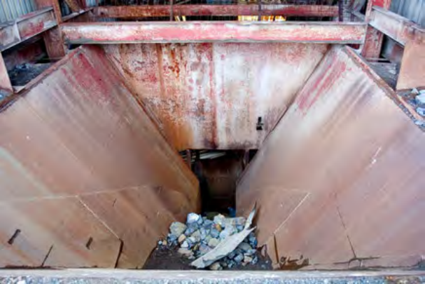

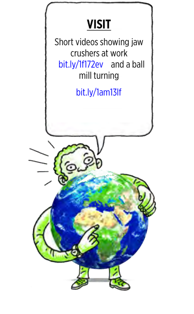

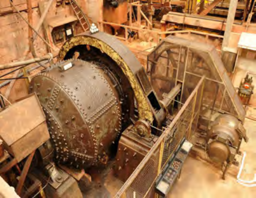

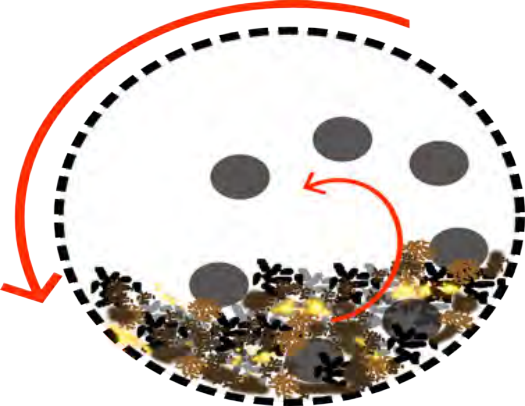

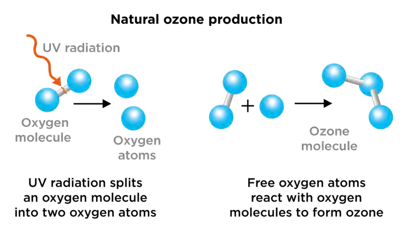

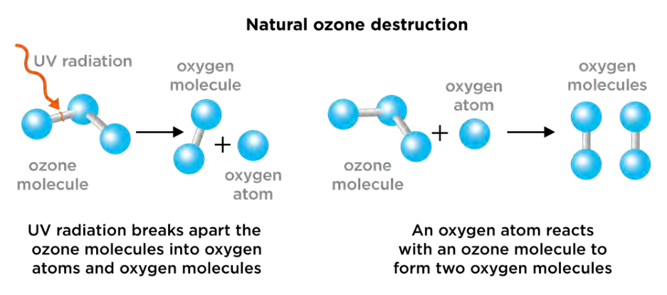

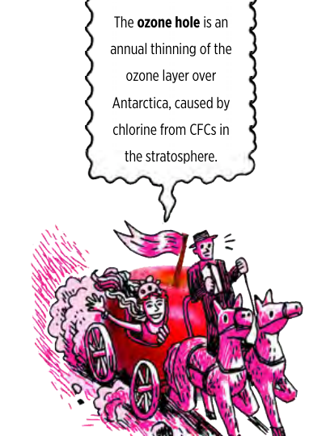

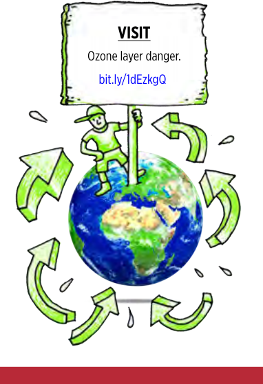

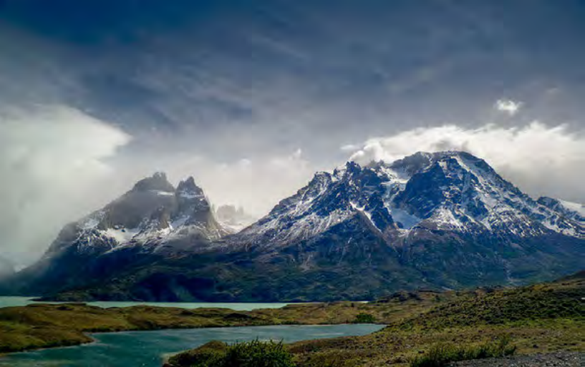

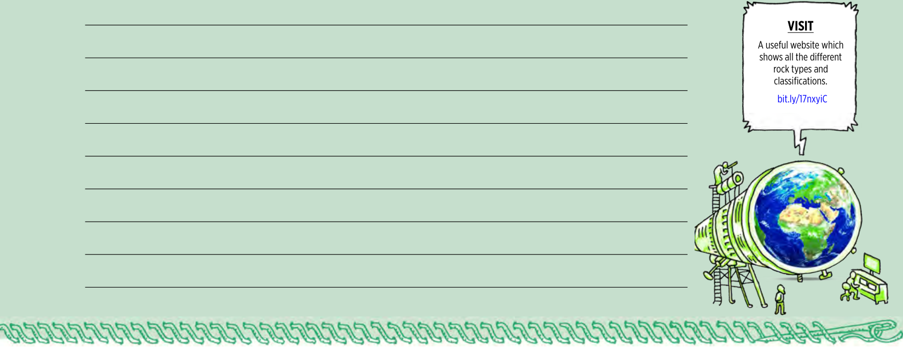

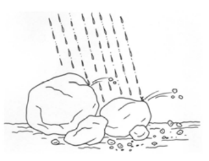

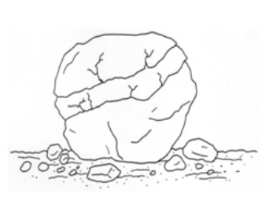

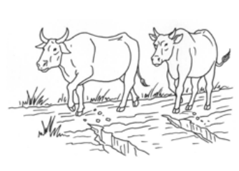

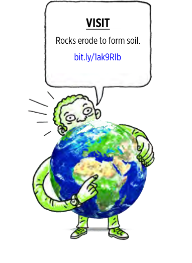

---

# Sedimentary Rocks

Sedimentary rocks are formed through the accumulation and compression of sediments over time. A prominent example of these layers can be seen in the sandstone formations of Table Mountain in Cape Town.

## Types of Sedimentary Rocks
There are several varieties of sedimentary rock, each with unique compositions and origins:

*   **Sandstone:** Composed of sand-sized mineral particles or rock fragments.
*   **Limestone:** Primarily made from the mineral calcium carbonate ($CaCO_3$). It is often formed from the remains of marine animal skeletons. It is widely used as building stone and in the manufacture of lime and cement.
*   **Dolomite:** A sedimentary rock composed of calcium magnesium carbonate ($CaMg(CO_3)_2$).
*   **Coal:** Formed from the solidified remains of ancient plants that accumulated at the bottom of swamps.
*   **Shale:** A fine-grained rock formed from the deposition and compaction of mud and silt, resulting in very thin, distinct layers.
*   **Conglomerate:** A rock composed of rounded fragments such as small stones, shells, and other sediment.

> **[Diagram Context - Textbook_NaturalScience_Gr9_Digestive-system.pdf-0011-03.png]**
> The provided image is entirely blank, containing no visual content, labels, or educational graphics to analyze. Consequently, no CAPS curriculum concepts, biological structures, or chemical symbols can be identified.

## Key Processes and Characteristics

### Cementation
**Cementation** is the geological process whereby sand, shells, pebbles, and other sediments are bound together by minerals to form solid sedimentary rock.

### Erosion and Formation
*   **Softness:** Sedimentary rocks are generally softer than other rock types.
*   **Erosion:** They are susceptible to erosion caused by wind, water, and ice (glaciers).
*   **Fossilization:** Sedimentary rocks are the primary location for finding fossils. When plants or animals die, they are often covered by layers of sand or sediment. Over time, this sediment turns into rock, effectively trapping and preserving the remains of the organism as a fossil.

***

### DID YOU KNOW?
"Lime" is the common term used for various calcium-containing compounds:
*   Calcium oxide: $CaO$
*   Calcium hydroxide: $Ca(OH)_2$
*   Calcium carbonate: $CaCO_3$

> **[Diagram Context - Textbook_NaturalScience_Gr9_Digestive-system.pdf-0011-08.png]**
> The graphic is a conceptual analogy diagram illustrating a clothing zipper being opened or closed. It shows an outline of a metallic zipper mechanism interacting with interlocking teeth along two parallel tracks against an orange-to-white gradient background. For a high school Life Sciences learner, this visual metaphor demonstrates how enzymes or specific biological proteins (such as DNA helicase) physically separate paired nucleic acid strands during processes like DNA replication and transcription.

> **[Diagram Context - Textbook_NaturalScience_Gr9_Electric-cells-as-energy-systems.pdf-0011-13.png]**
> This circuit diagram represents an electrical cell or DC voltage source, featuring a long vertical line indicating the positive terminal and a shorter, thicker vertical line indicating the negative terminal, marked with plus (+) and minus (-) symbols respectively. It conveys the standard schematic symbol used in Physical Sciences to show a source of potential difference in an electric circuit. High school learners use this symbol when drawing and analyzing circuit diagrams to understand current flow and Ohm's law.

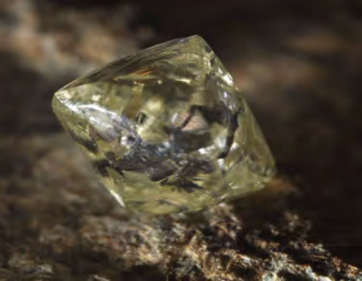
> **[Diagram Context - Textbook_NaturalScience_Gr9_Mining-of-mineral-resources.pdf-0011-02.png]**
> 1. A diamond is shown in a close-up view.
 2. The diamond is yellow in color.
 3. The diamond is a 3D object.

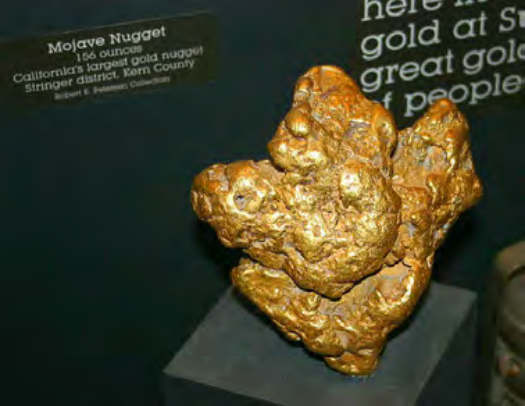
> **[Diagram Context - Textbook_NaturalScience_Gr9_Mining-of-mineral-resources.pdf-0011-04.png]**
> The image shows a gold object on display, possibly a rock or a sculpture, placed on a black base. The object is described as a "gold nugget" and "gold ore", suggesting it is a valuable mineral or rock. The background is black, which contrasts with the gold object, making it stand out. The image does not contain any text, and the focus is solely on

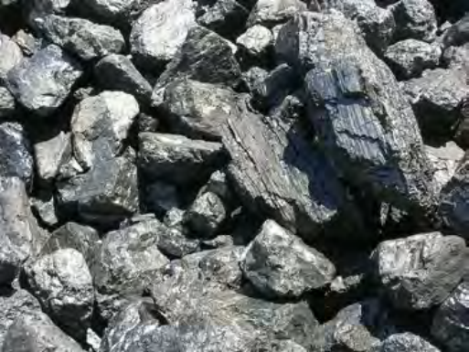
> **[Diagram Context - Textbook_NaturalScience_Gr9_Mining-of-mineral-resources.pdf-0011-06.png]**
> The image shows a close-up view of a pile of rocks and coal. The rocks are gray and black, and the coal appears to be black in color. The pile is composed of various sizes and shapes of rocks and coal, creating a sense of depth and dimension. The image does not contain any text or additional objects, and the focus is solely on the rocks and coal.

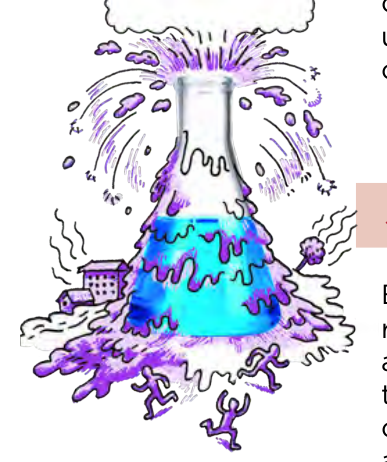
> **[Diagram Context - Textbook_NaturalScience_Gr9_Mining-of-mineral-resources.pdf-0011-12.png]**
> The image features a cartoon depiction of a volcano with a blue liquid inside, surrounded by purple and white elements. The volcano is depicted as a tall, cone-shaped structure with a spout on top, and the liquid inside is a vibrant blue color. The image also includes a few people and a house, adding to the overall scene. The text "Lewis diagram, anatomical/cellular structure

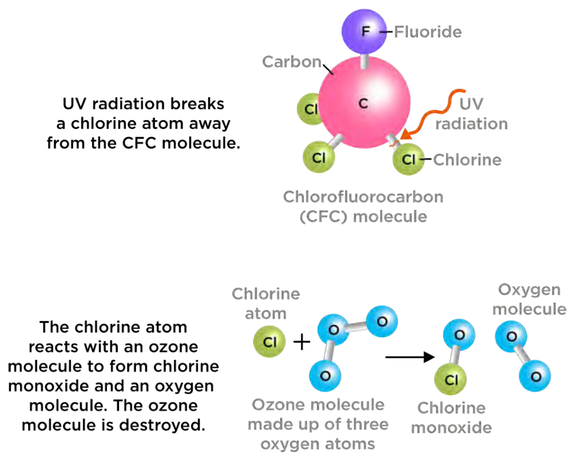
> **[Diagram Context - Textbook_NaturalScience_Gr9_The-atmosphere.pdf-0011-00.png]**
> 1. A diagram of a molecule with oxygen atoms and carbon atoms.

> **[Diagram Context - Textbook_NaturalScience_Gr9_The-atmosphere.pdf-0011-01.png]**
> The image shows a diagram of a cell, with the title "Do You Know?" written in black text above it. The diagram is a Lewis diagram, which is a visual representation of a molecule's structure. The diagram is labeled with the chemical formula of the molecule, indicating that it is a Lewis diagram of a molecule. The diagram is a simple, straightforward representation of a molecule's structure,

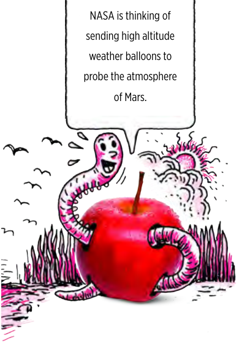
> **[Diagram Context - Textbook_NaturalScience_Gr9_The-atmosphere.pdf-0011-02.png]**
> The image features a cartoon depiction of a red apple with a caterpillar on top, surrounded by a pink and white background. The caterpillar is holding a leaf, and the apple is described as a "fruit" and a "leaf". The image also includes a speech bubble containing text about NASA and the atmosphere of Mars.

> **[Diagram Context - Textbook_NaturalScience_Gr9_The-atmosphere.pdf-0011-07.png]**
> The image features a cartoon illustration of a man's head with a red apple on his forehead. The man's face is depicted in a cartoon style, and the apple is placed on his forehead. The man is wearing a top hat and a bow tie, and the image includes a thought bubble with a pink cloud and a line of pink apples. The image also includes a label that reads "Mr

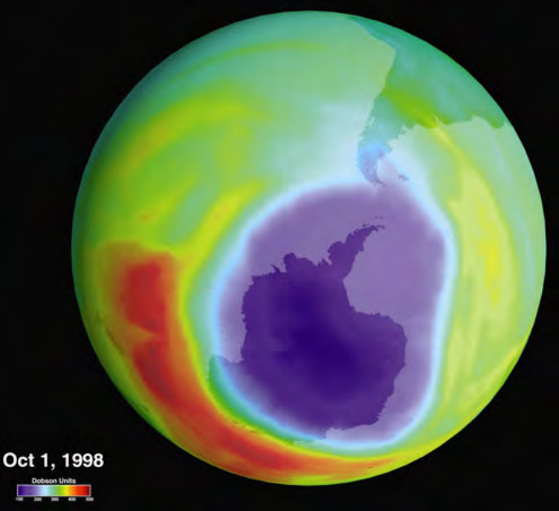
> **[Diagram Context - Textbook_NaturalScience_Gr9_The-atmosphere.pdf-0011-08.png]**
> The image is a colorful, detailed diagram of the Earth, showing the continents and the polar ice caps. The continents are depicted in various shades of green, blue, and purple, while the polar ice caps are shown in a darker shade of blue. The diagram also includes labels for the continents and the polar ice caps, as well as a scale indicating the distance between the continents.

> **[Diagram Context - Textbook_NaturalScience_Gr9_The-atmosphere.pdf-0011-09.png]**
> 1. A diagram of a cell with the word "visit" written in black at the bottom.

> **[Diagram Context - Textbook_NaturalScience_Gr9_The-atmosphere.pdf-0011-11.png]**
> The image is a cartoon drawing of a globe with a speech bubble above it, containing the text "I want to go to space". The globe is surrounded by a group of people, including a man in a lab coat and a man in a green shirt. The drawing also includes a diagram of a telescope and a diagram of a cell.

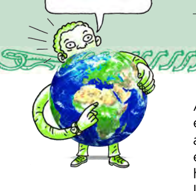
> **[Diagram Context - Textbook_NaturalScience_Gr9_The-earth-as-a-system.pdf-0011-05.png]**
> This cartoon illustration depicts a human figure consuming a globe that prominently features the African continent, set

> **[Diagram Context - Textbook_NaturalScience_Gr9_The-earth-as-a-system.pdf-0011-07.png]**
> This diagram illustrates a cross-section of ciliated epithelium, a

> **[Diagram Context - Textbook_NaturalScience_Gr9_The-earth-as-a-system.pdf-0011-08.png]**
> This metaphorical illustration depicts a construction worker in safety gear—including a hard hat

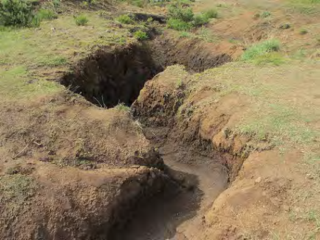
> **[Diagram Context - Textbook_NaturalScience_Gr9_The-lithosphere.pdf-0011-00.png]**
> The image shows a diagram of a cell, which is a complex structure made up of various organelles. The diagram is a Lewis diagram, which is a visual representation of the chemical bonds between atoms in a molecule. The diagram is labeled with the names of the organelles and the chemical symbols of the elements they contain. The diagram also includes arrows to show the flow of energy within the

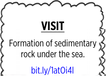
> **[Diagram Context - Textbook_NaturalScience_Gr9_The-lithosphere.pdf-0011-02.png]**
> 1. A diagram of a rock under the sea.

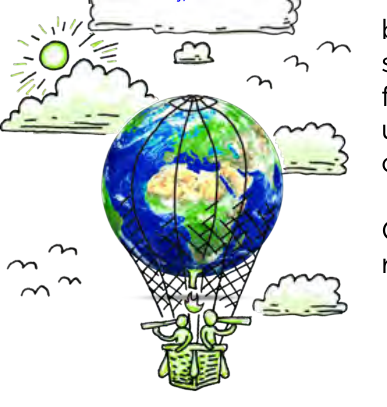
> **[Diagram Context - Textbook_NaturalScience_Gr9_The-lithosphere.pdf-0011-04.png]**
> The image features a cartoon illustration of a hot air balloon filled with a globe. The globe is depicted in a cartoon style with a blue and green color scheme. The balloon is filled with a green substance, and there are two people on the balloon. One person is holding a map, and the other person is holding a compass. The illustration conveys the concept of a globe and a hot air

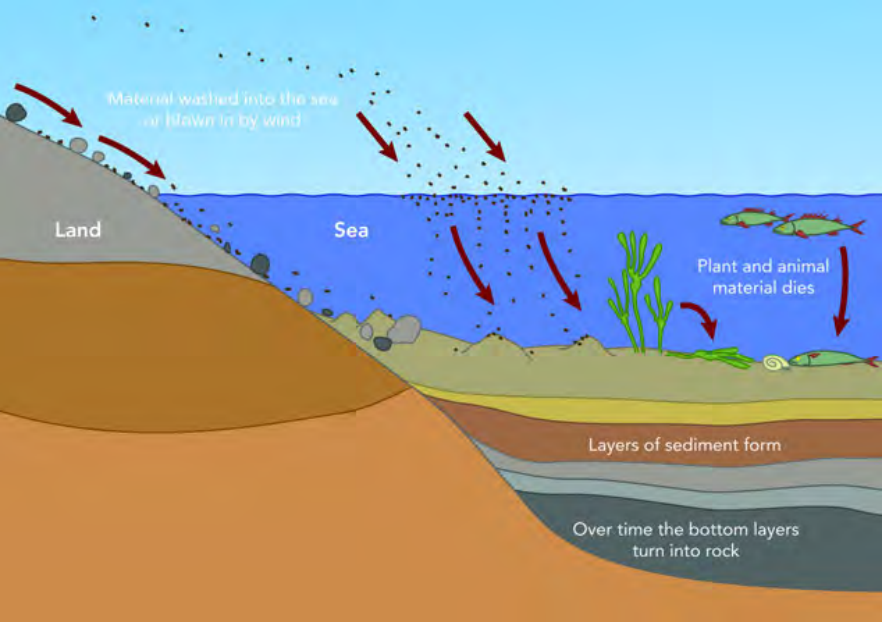
> **[Diagram Context - Textbook_NaturalScience_Gr9_The-lithosphere.pdf-0011-07.png]**
> 1. A diagram of a sedimentary rock formation.
 2. A diagram of a sedimentary rock formation.
 3. A diagram of a sedimentary rock formation.
 4. A diagram of a sedimentary rock formation.
 5. A diagram of a sedimentary rock formation.
 6. A diagram of a sedimentary rock formation.
 7. A diagram of a sediment

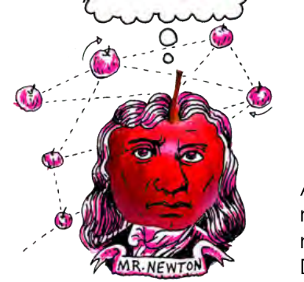
> **[Diagram Context - Textbook_NaturalScience_Gr9_The-lithosphere.pdf-0011-10.png]**
> The image features a cartoon depiction of a man's head with a large, red apple on his forehead. The man's face is outlined in black, and he is wearing a black and white striped shirt. The image also includes a thought bubble with a pink cloud and several apples, suggesting a connection between the man's head and the surrounding objects. The text "Mr. Newton" is written above

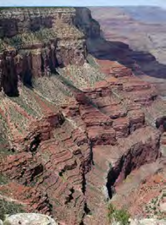
> **[Diagram Context - Textbook_NaturalScience_Gr9_The-lithosphere.pdf-0011-12.png]**
> 1. A diagram of a cell with chemical symbols and arrows.

---

### Sedimentary Rocks: Formation and Characteristics

Sedimentary rocks are formed through the accumulation and compression of sediment layers over long periods. These layers are often visible in rock formations and can contain fossils.

#### Examples of Sedimentary Rock Formations
*   **Dolomite Mountains:** Large-scale rock formations showing distinct layering.
*   **Fossils in Sedimentary Rock:** Evidence of ancient life preserved within the sediment layers.
*   **Limestone and Shale:** Different types of sedimentary rock often found in sequence, such as creamy-brown limestone resting on top of dark grey shale.
*   **Conglomerate:** A type of sedimentary rock characterized by visible pebbles embedded within the rock matrix.

> **[Diagram Context - Textbook_NaturalScience_Gr9_Digestive-system.pdf-0012-07.png]**
> This educational illustration depicts a mechanical wave model, featuring a slinky toy draped over a green roller coaster track with four cartoon figures riding inside. The graphic includes motion lines and a miniature roller coaster sketch in the background to emphasize movement and track dynamics. Conceptually, it helps high school students visualize the transmission of mechanical waves, demonstrating how wave disturbances travel through a medium.

---

### ACTIVITY: Modelling the Formation of Sedimentary Rock

This activity demonstrates how layers of sediment are compressed and become harder over time due to pressure.

#### Materials Needed
*   3 slices of white bread
*   3 slices of brown bread
*   Heavy books or a heavy object

#### Instructions
1.  **Preparation:** Cut the crust off from all sides of the bread slices.
2.  **Layering:** Stack the slices on top of each other, alternating between white and brown bread. Each slice represents a different layer of sediment.

*Note: In a natural environment, these layers would be subjected to immense pressure from overlying materials, causing them to compact and eventually lithify (turn into rock).*

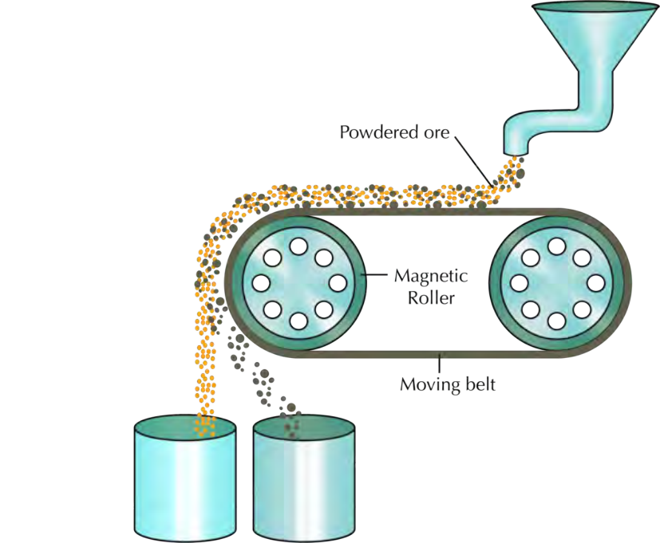
> **[Diagram Context - Textbook_NaturalScience_Gr9_Mining-of-mineral-resources.pdf-0012-02.png]**
> 1. A diagram of a machine that is powdering ore. 
 2. The ore is being ground into a fine powder. 
 3. The machine is powered by a magnetic roller. 
 4. The ore is being fed into the machine.

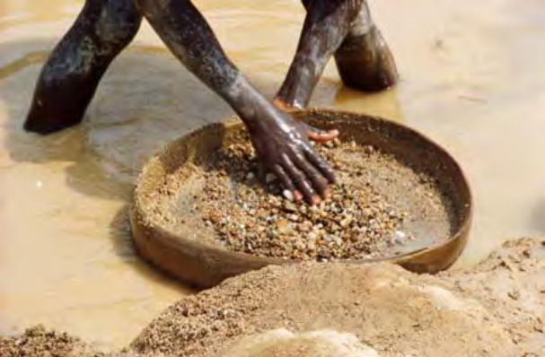
> **[Diagram Context - Textbook_NaturalScience_Gr9_Mining-of-mineral-resources.pdf-0012-06.png]**
> 1. A diagram of a cell with a Lewis structure.

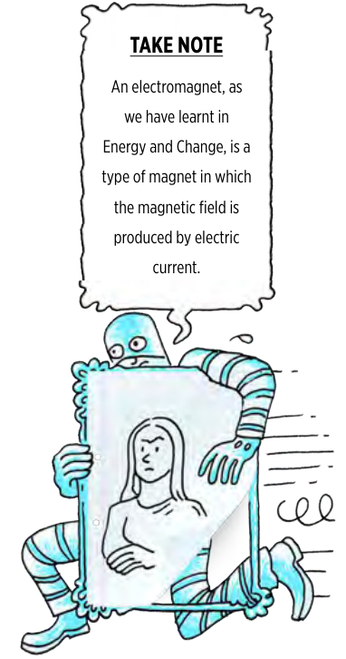
> **[Diagram Context - Textbook_NaturalScience_Gr9_Mining-of-mineral-resources.pdf-0012-07.png]**
> 1. A cartoon character holding a picture of a woman.

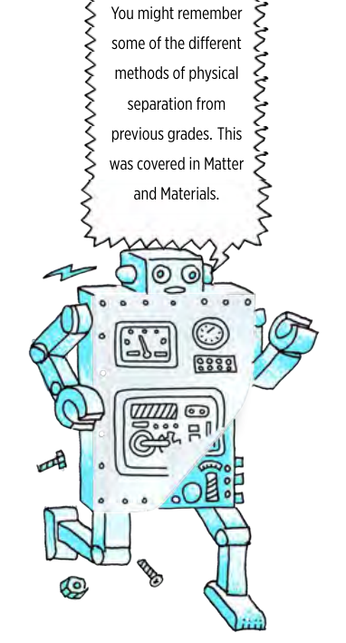
> **[Diagram Context - Textbook_NaturalScience_Gr9_Mining-of-mineral-resources.pdf-0012-09.png]**
> The image features a robot with a large head and arms, standing on a white background. The robot is depicted in a cartoon style, with a caption above it that reads "You might remember some of the different methods of physical separation from previous grades. This was covered in matter and materials."

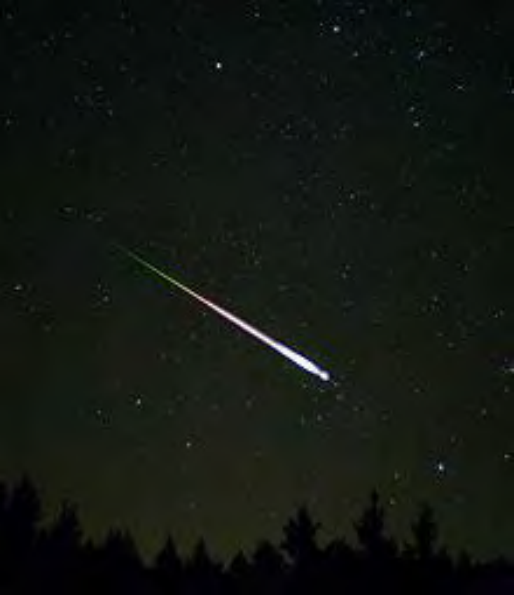
> **[Diagram Context - Textbook_NaturalScience_Gr9_The-atmosphere.pdf-0012-02.png]**
> The image shows a shooting star streaking across the night sky. The star is located in the upper right corner of the frame, and it is the main focus of the image. The sky is dark, with numerous stars visible in the background. The image is a close-up of the shooting star, providing a detailed view of its path across the sky. The star appears to be moving from

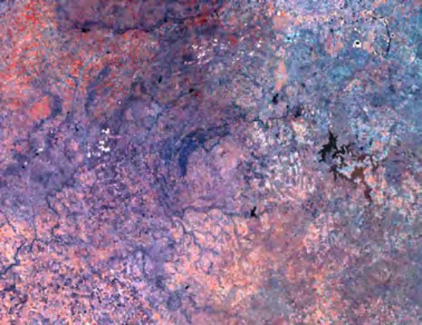
> **[Diagram Context - Textbook_NaturalScience_Gr9_The-atmosphere.pdf-0012-06.png]**
> 1. A purple and pink image of a cell.

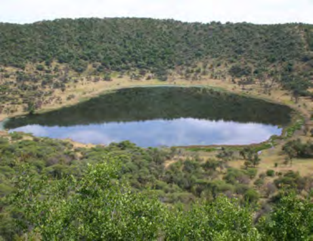
> **[Diagram Context - Textbook_NaturalScience_Gr9_The-atmosphere.pdf-0012-07.png]**
> 1. A diagram of a cell with a diagram of a cell on the left side.

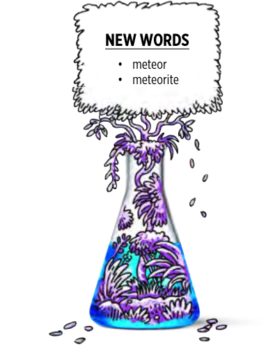
> **[Diagram Context - Textbook_NaturalScience_Gr9_The-atmosphere.pdf-0012-10.png]**
> The image features a cartoon depiction of a flask filled with purple liquid, which is the central focus of the illustration. The flask is surrounded by various objects, including a tree, a bird, and a flower, all of which are depicted in a cartoon style. The objects are arranged in a way that suggests a connection between the flask and the surrounding elements. The image also includes text that reads "

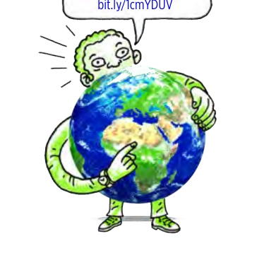
> **[Diagram Context - Textbook_NaturalScience_Gr9_The-atmosphere.pdf-0012-13.png]**
> The image features a cartoon depiction of a man holding a globe in his arms. The man is wearing a watch on his left wrist and a backpack on his right shoulder. The globe is green and blue, and the man is pointing to a specific location on the globe. The image also includes a speech bubble with the text "bit.ly/ICM/DTV".

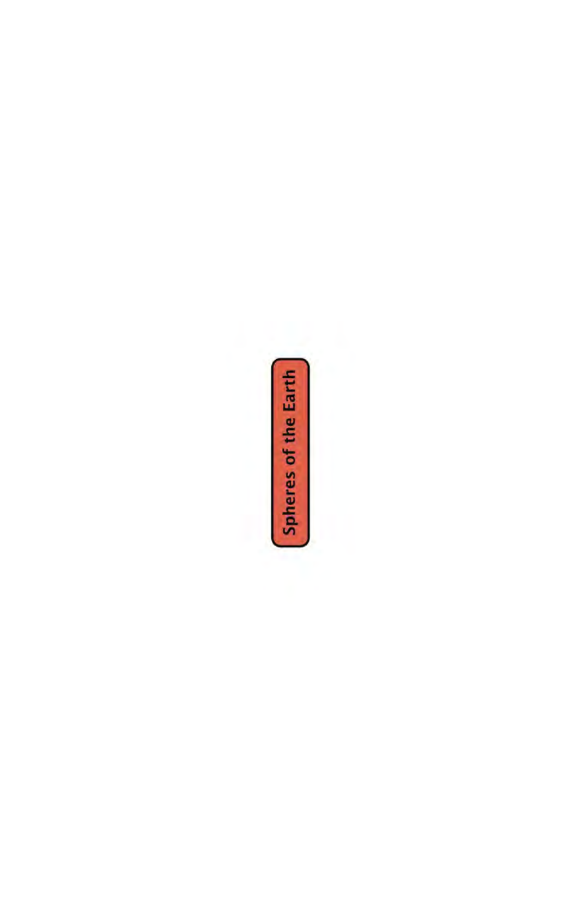
> **[Diagram Context - Textbook_NaturalScience_Gr9_The-earth-as-a-system.pdf-0012-00.png]**
> This graphic serves as a central title label for a conceptual diagram, featuring the text

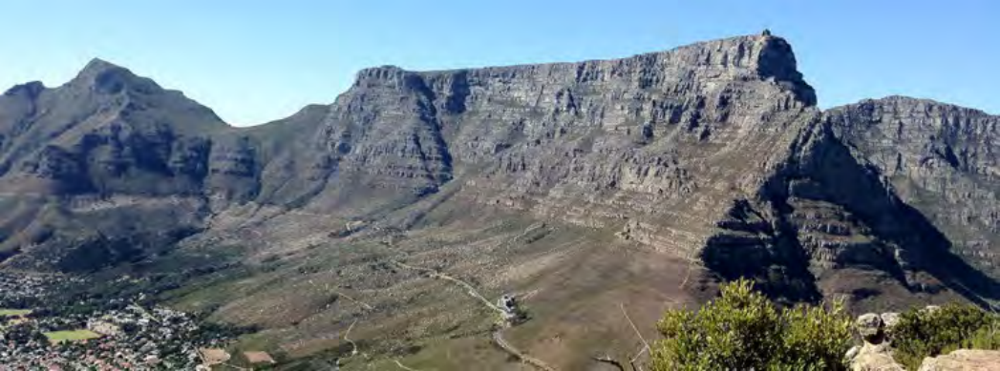
> **[Diagram Context - Textbook_NaturalScience_Gr9_The-lithosphere.pdf-0012-01.png]**
> 1. A mountain range with a valley in between.

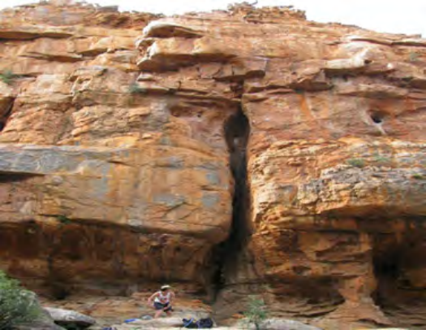
> **[Diagram Context - Textbook_NaturalScience_Gr9_The-lithosphere.pdf-0012-04.png]**
> 1. A diagram of a cell with a man and a backpack in the foreground.

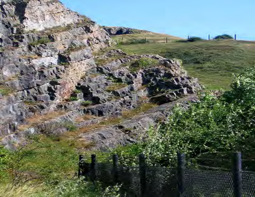
> **[Diagram Context - Textbook_NaturalScience_Gr9_The-lithosphere.pdf-0012-05.png]**
> The image shows a rock face with a fence in the foreground. The rock face is made of large, jagged rocks and has a steep incline. The fence is black and made of metal poles. The image also contains a few plants and trees, adding to the natural setting. The text "South African CAPS" is visible, which could be a description of the rock formation or the

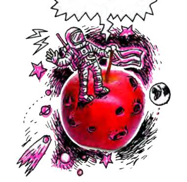
> **[Diagram Context - Textbook_NaturalScience_Gr9_The-lithosphere.pdf-0012-11.png]**
> 1. A cartoon drawing of an astronaut on a red apple.
2. A planet and a star.
3. A rocket ship.

---

### Chapter 2: The Lithosphere - Practical Investigation

#### Activity: Modelling Sedimentary Layers

**3. Diagram Task**
Draw a labelled diagram of what the bread stack looks like in the space provided below.

---

**4. Observation: Applying Pressure**
*   **Instruction:** Place a piece of plastic on top of the bread stack to protect the bottom book in your bookstack, then place a pile of books on top of the bread stack. Observe what happens to the layers.
*   **Observation Space:** __________________________________________________________________
*   **Observation Space:** __________________________________________________________________

> **[Diagram Context - Textbook_NaturalScience_Gr9_Digestive-system.pdf-0013-02.png]**
> The graphic is a decorative green border featuring a repeating pattern of stylized S-shaped ribbon or wave motifs with small dots inside them against a shaded background. No specific text labels, variables, biological structures, or chemical symbols are visible within the image. Conceptually, this graphic serves purely as a thematic page divider or border rather than an instructional diagram for CAPS curriculum topics.

---

**5. Observation: Increasing Pressure**
*   **Instruction:** Add more books to the pile and observe. What happens to the layers?
*   **Observation Space:** __________________________________________________________________
*   **Observation Space:** __________________________________________________________________

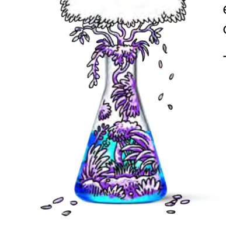
> **[Diagram Context - Textbook_NaturalScience_Gr9_Digestive-system.pdf-0013-11.png]**
> This educational graphic is an artistic illustration of laboratory apparatus, specifically an Erlenmeyer (conical) flask containing a blue liquid from which stylized purple botanical plant life and foliage grow and overflow. Visible elements include the glass Erlenmeyer flask, blue liquid, purple aquatic or rooted vegetation inside the flask, and a flowering canopy of plant structures emerging from the neck with scattered seed-like pods. Conceptually, this visual metaphor represents the synthesis of laboratory science and biological growth, illustrating themes of controlled cultivation, plant biology experiments, or ecosystem modeling within a controlled environment suitable for CAPS Life Sciences learners.

---

**6. Observation: Final State**
*   **Instruction:** Remove the books from the bread pile. Can you distinguish the different layers now?
*   **Observation Space:** __________________________________________________________________

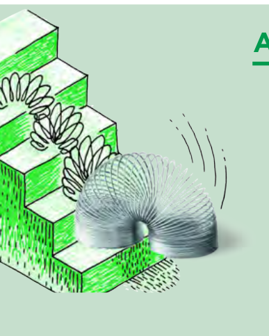
> **[Diagram Context - Textbook_NaturalScience_Gr9_Digestive-system.pdf-0013-17.png]**
> This educational graphic depicts a physical demonstration of a Slinky moving down a staircase, accompanied by curved motion lines indicating its tumbling trajectory. The visual content features a coiled metal spring interacting step-by-step with a green staircase, labeled with the letter "A" in the top right. For a high school Physical Sciences learner, this diagram conceptually illustrates longitudinal wave motion, mechanical energy conversions (gravitational potential energy converting to kinetic energy and elastic potential energy), and the continuous cyclical propagation of a wave pulse through a medium.

> **[Diagram Context - Textbook_NaturalScience_Gr9_Mining-of-mineral-resources.pdf-0013-00.png]**
> The image features a cartoon depiction of a caterpillar with a smiley face, surrounded by green leaves. The caterpillar is shown in a dynamic pose, with its head tilted to the side and its mouth open wide. The image also includes a drawing of a spring coiled around the caterpillar, as well as a text box with the letters "A" and "B" at the top

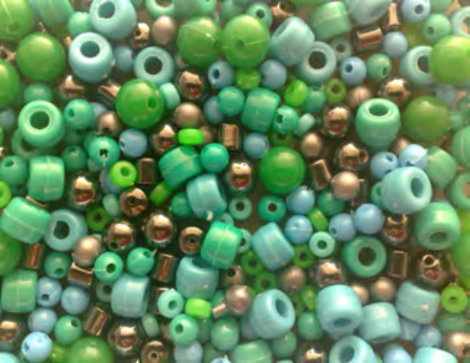
> **[Diagram Context - Textbook_NaturalScience_Gr9_Mining-of-mineral-resources.pdf-0013-10.png]**
> The image shows a close-up view of a collection of beads and beads, including a variety of colors such as green, blue, silver, and gold. The beads are scattered across the image, with some overlapping each other. The beads are of different sizes and shapes, creating a diverse and visually interesting display. The image does not contain any text or additional objects, making it a simple and

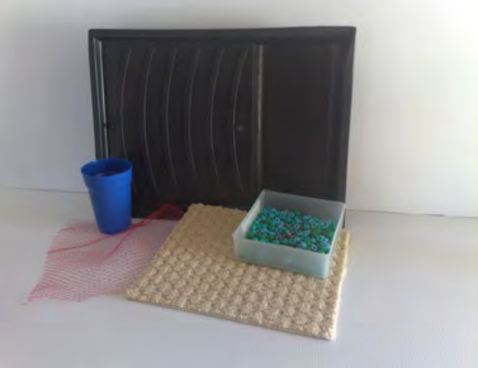
> **[Diagram Context - Textbook_NaturalScience_Gr9_Mining-of-mineral-resources.pdf-0013-11.png]**
> 1. A diagram of a cell with a Lewis structure.

> **[Diagram Context - Textbook_NaturalScience_Gr9_Mining-of-mineral-resources.pdf-0013-14.png]**
> The image features a cartoon depiction of a man's head with a large, red apple placed on top of it. The man's face is drawn in a cartoon style, and the apple is positioned on the man's forehead. The man is wearing a white shirt and a black tie. The image also includes a thought bubble above the man's head, which contains a pink line connecting the apple to

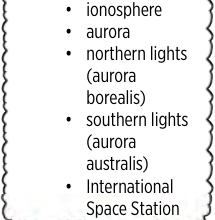
> **[Diagram Context - Textbook_NaturalScience_Gr9_The-atmosphere.pdf-0013-01.png]**
> 1. A diagram of a cell with arrows pointing to different parts of the cell.

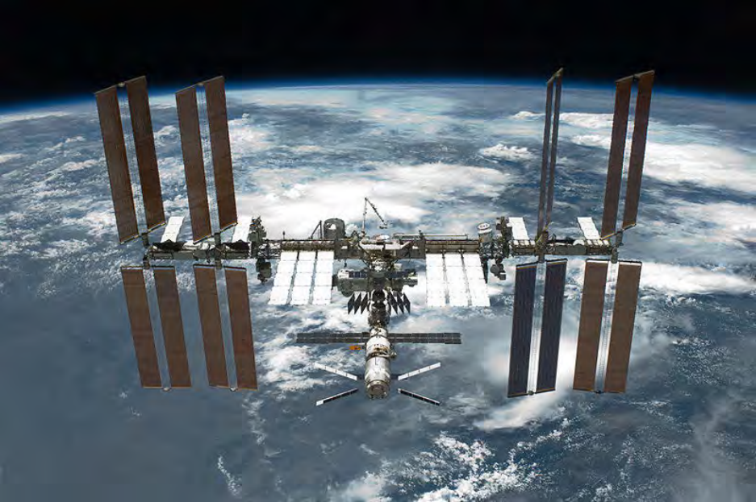
> **[Diagram Context - Textbook_NaturalScience_Gr9_The-atmosphere.pdf-0013-05.png]**
> The image shows a satellite in the sky, with a focus on the structure of the satellite. The satellite is composed of multiple poles and beams, which are connected to the Earth by cables. The satellite is positioned in the center of the image, surrounded by the Earth's atmosphere. The sky is filled with clouds, and the satellite appears to be floating in space. The image does not contain any

> **[Diagram Context - Textbook_NaturalScience_Gr9_The-atmosphere.pdf-0013-10.png]**
> The image is a black and white illustration of a cartoon depiction of an astronaut on a red planet. The astronaut is holding a walking stick and is wearing a spacesuit. The planet is covered in stars and has a large crater in the center. The illustration also includes a text box that reads "Research. The astronaut is on the moon. The moon is a rocky, barren, and desolate planet

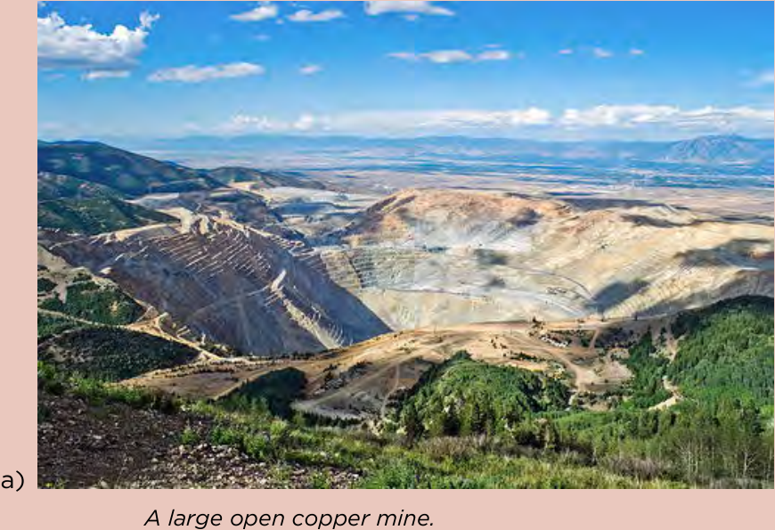
> **[Diagram Context - Textbook_NaturalScience_Gr9_The-earth-as-a-system.pdf-0013-03.png]**
> This photograph illustrates a large-scale open-cast copper mine, featuring prominent terraced benches

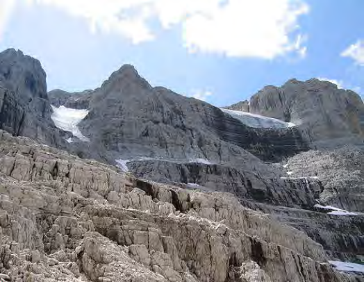
> **[Diagram Context - Textbook_NaturalScience_Gr9_The-lithosphere.pdf-0013-00.png]**
> 1. A diagram of a mountain range with a snow-capped peak.

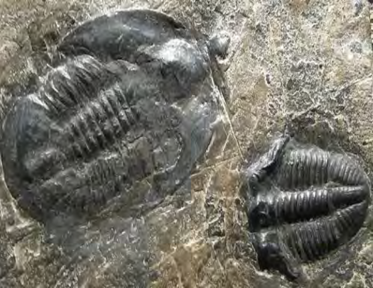
> **[Diagram Context - Textbook_NaturalScience_Gr9_The-lithosphere.pdf-0013-02.png]**
> 1. A fossil of a trilobite is shown.

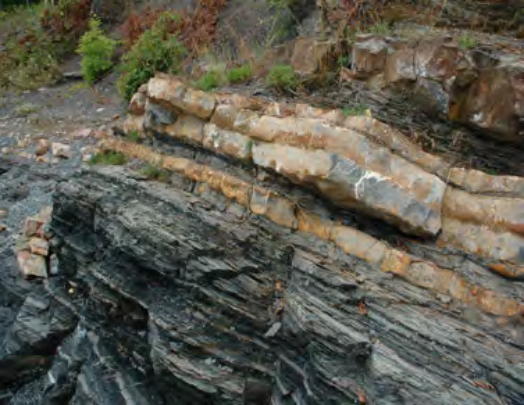
> **[Diagram Context - Textbook_NaturalScience_Gr9_The-lithosphere.pdf-0013-04.png]**
> The image shows a close-up view of a rock formation, with a large rock on the left side and smaller rocks on the right side. The rock formation appears to be composed of layers of different colors, suggesting a geological history. The image is labeled as an educational graphic, which implies that it is designed to help students understand the subject matter. The diagram is labeled with the name "Lewis

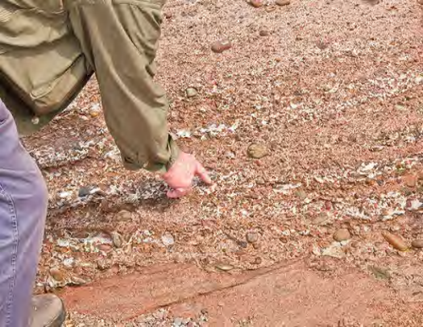
> **[Diagram Context - Textbook_NaturalScience_Gr9_The-lithosphere.pdf-0013-05.png]**
> 1. A diagram of a cell with a diagram of a cell on it.

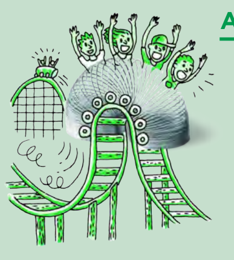
> **[Diagram Context - Textbook_NaturalScience_Gr9_The-lithosphere.pdf-0013-08.png]**
> The image is a cartoon drawing of a roller coaster with a green and white spiral. The roller coaster is depicted in a cartoon style, with a green and white spiral on the front of the roller coaster. The roller coaster is shown in a cartoon style, with a green and white spiral on the front.

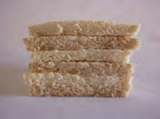
> **[Diagram Context - Textbook_NaturalScience_Gr9_The-lithosphere.pdf-0013-15.png]**
> 1. A diagram of a cell with a Lewis structure.

---

### Activity: Modelling Sedimentary Rock

**7. Draw a labelled diagram of the bread layer.**

**8. Explain how this model demonstrates the formation of sedimentary rock.**

*(Space provided for learner response)*

---

### Metamorphic Rock

**Definition:**
Metamorphic rock makes up a large part of the Earth's crust. These rocks are formed when existing sedimentary or igneous rocks are exposed to intense heat and pressure.

**Key Characteristics:**
*   **Location:** They do not form on the Earth's surface. They form deep underground where temperatures and pressures are significantly higher.
*   **Process:** When rocks are subjected to high pressure and heat, the rock crystals are "squashed" together. This causes physical and chemical changes in the crystal structure, transforming them into metamorphic rock.
*   **Cycle:** Metamorphic rock may move even deeper into the Earth, where the extreme heat causes them to melt into **magma**. This magma can later cool to form **igneous rock**.

**Examples of Metamorphic Rocks:**
*   Slate
*   Marble
*   Soapstone
*   Quartzite

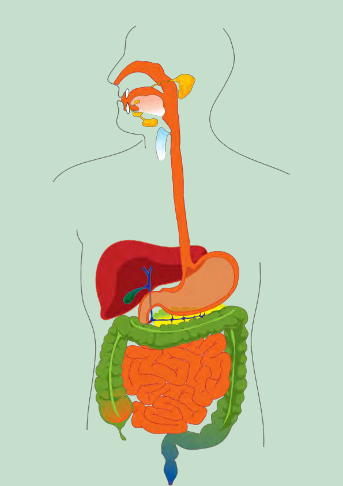
> **[Diagram Context - Textbook_NaturalScience_Gr9_Digestive-system.pdf-0014-04.png]**
> This anatomical structure illustrates the human digestive system, showing the complete alimentary canal alongside major accessory organs like the liver, gallbladder, pancreas, and salivary glands. The graphic visually maps out the sequential pathway of food processing from ingestion in the mouth through the oesophagus, stomach, small intestine, and large intestine to egestion. Conceptually, it supports Life Sciences learners in understanding the macro-anatomy of human digestion and how physical and chemical breakdown occurs across different specialized organs.

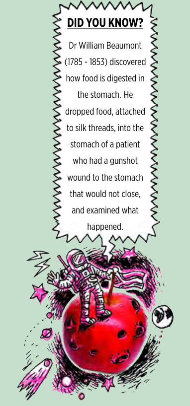
> **[Diagram Context - Textbook_NaturalScience_Gr9_Digestive-system.pdf-0014-05.png]**
> An educational graphic featuring a stylized illustration of an astronaut standing on a red planet-like sphere, accompanied by a speech bubble with the heading "DID YOU KNOW?". The visible text recounts the historical experiment of Dr William Beaumont (1785–1853) studying human stomach digestion using a patient with a permanent gunshot wound. For CAPS Life Sciences learners, this narrative provides a historical context on the study of human digestion and the scientific method of empirical observation in physiology.

> **[Diagram Context - Textbook_NaturalScience_Gr9_Digestive-system.pdf-0014-06.png]**
> The graphic displays a repeating decorative border pattern composed of stylized green curved shapes and arrows on a pale background. There are no explicit biological structures, chemical symbols, or labels visible in the image. Conceptually, it serves as a purely decorative page divider or graphical element rather than an instructional diagram for CAPS curriculum content.

> **[Diagram Context - Textbook_NaturalScience_Gr9_Electric-cells-as-energy-systems.pdf-0014-00.png]**
> This diagram illustrates an electrochemical cell apparatus, specifically a galvanic (voltaic) cell. Visible labels include zinc electrode, copper electrode, zinc sulphate solution, copper sulphate solution, U-tube (salt bridge), cotton wool, and an ammeter (A) in the external circuit. Conceptually, it demonstrates how spontaneous redox reactions are converted into electrical energy, showing the half-cells connected by an external wire and a salt bridge to maintain electrical neutrality.

> **[Diagram Context - Textbook_NaturalScience_Gr9_Mining-of-mineral-resources.pdf-0014-00.png]**
> The image shows a square white square with a green border. The square is positioned in the center of the image. The background is a light green color. The image does not contain any text or other objects. The square is the main focus of the image, and it is the only object in the image. The square is white, and the background is green.

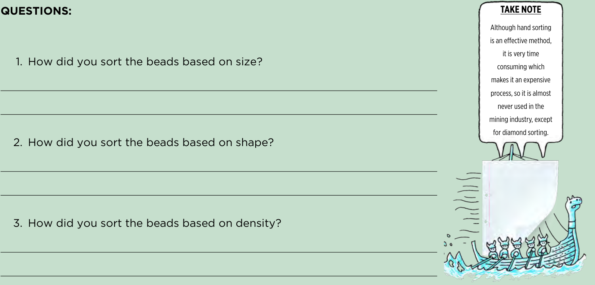
> **[Diagram Context - Textbook_NaturalScience_Gr9_Mining-of-mineral-resources.pdf-0014-01.png]**
> 1. How did you sort the beads based on size? 
 2. How did you sort the beads based on shape? 
 3. How did you sort the beads based on density?

> **[Diagram Context - Textbook_NaturalScience_Gr9_The-atmosphere.pdf-0014-00.png]**
> The image shows a view of the Earth from space, with a blue sky and a horizon line. The horizon line is curved, and the sky is a mix of blue and orange hues. The image is labeled as a pedagogical diagram, which suggests that it is designed to help students understand a particular concept or process. The diagram features a Lewis diagram, a diagram of a cell,

> **[Diagram Context - Textbook_NaturalScience_Gr9_The-atmosphere.pdf-0014-02.png]**
> The image shows a cartoon-like representation of a cell, with a large bubble containing a smaller bubble inside. The bubble contains a line of text that reads "VISIT". The cell is depicted in black and white, with a gray background. The image is labeled as an educational graphic, suggesting it is designed to teach students about cellular structures and functions.

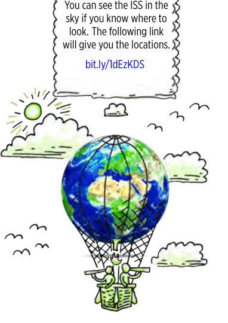
> **[Diagram Context - Textbook_NaturalScience_Gr9_The-atmosphere.pdf-0014-03.png]**
> A cartoon illustration of a hot air balloon with two people inside.

> **[Diagram Context - Textbook_NaturalScience_Gr9_The-atmosphere.pdf-0014-09.png]**
> The image is a cartoon drawing of a spring coiled up in the shape of a caterpillar. The caterpillar is made up of green leaves and has a face with a big smile. The drawing also includes a diagram of a Lewis structure and a graph of a chemical reaction. The diagram shows the Lewis structure of a molecule, and the graph shows a chemical reaction. The drawing is set against

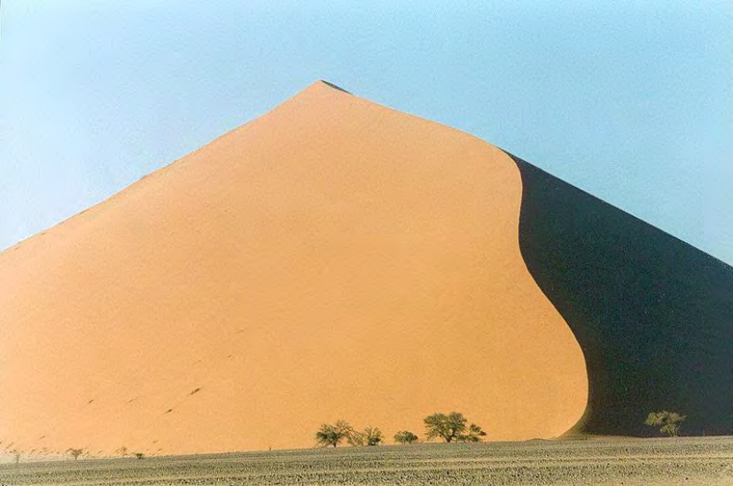
> **[Diagram Context - Textbook_NaturalScience_Gr9_The-earth-as-a-system.pdf-0014-02.png]**
> This photograph illustrates a large sand dune, a primary aeolian landform

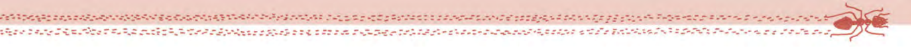
> **[Diagram Context - Textbook_NaturalScience_Gr9_The-earth-as-a-system.pdf-0014-06.png]**
> This biological illustration depicts an ant following or creating parallel pheromone trails, represented by

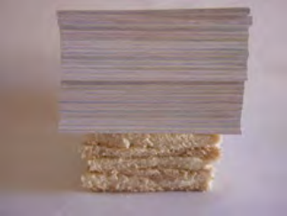
> **[Diagram Context - Textbook_NaturalScience_Gr9_The-lithosphere.pdf-0014-04.png]**
> The image shows a diagram of a house made of stacked books. The house is composed of multiple books stacked on top of each other, creating a unique and creative structure. The diagram is set against a plain white background, which allows the house to stand out prominently. The diagram is labeled with the title "House" and the variable "house" in the center. The diagram also includes a Lewis

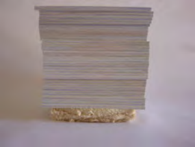
> **[Diagram Context - Textbook_NaturalScience_Gr9_The-lithosphere.pdf-0014-06.png]**
> The image shows a stack of books, with the largest book at the bottom and the smallest book at the top. The books are white and stacked on a white surface. The image also contains a diagram of a cell, which is a visual representation of a cell's structure and function. The diagram is labeled with the names of the organelles and the cell's components, such as the nucleus

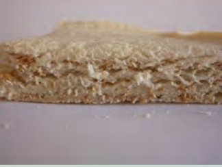
> **[Diagram Context - Textbook_NaturalScience_Gr9_The-lithosphere.pdf-0014-08.png]**
> The image shows a close-up view of a piece of bread with a crusty texture. The bread is cut into two equal slices, revealing a white interior. The crust appears to be made of wheat, and the bread is placed on a white surface. The image does not contain any text or additional objects, and the focus is solely on the bread and its crust.

---

# Metamorphic Rocks and Their Uses

## Did You Know?
The term **"metamorphosis"** refers to a process where one thing is transformed into a completely different thing, similar to a pupa becoming a butterfly.

---

## 1. Slate
*   **Origin:** A metamorphic rock formed from shale (a sedimentary rock).
*   **Properties:** It can be cut into shapes and does not absorb moisture.
*   **Uses:** Commonly used for roofing and flooring tiles.

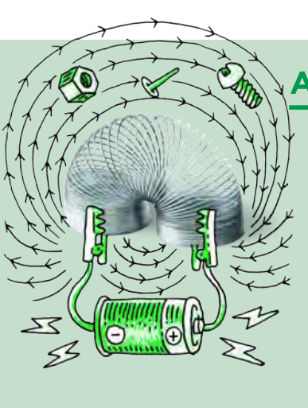
> **[Diagram Context - Textbook_NaturalScience_Gr9_Digestive-system.pdf-0015-01.png]**
> This educational graphic illustrates an electromagnet apparatus consisting of a coiled wire connected to a battery with visible positive (+) and negative (-) terminals. The diagram shows directed magnetic field lines surrounding the coil, along with small metal objects such as a nut, nail, and screw positioned near the magnetic field. Conceptually, it demonstrates how an electric current flowing through a conductor creates a magnetic field, introducing high school learners to the principles of electromagnetism and magnetic effects of electric currents.

---

## 2. Marble
*   **Origin:** A metamorphic rock produced from the metamorphosis of limestone.
*   **Properties:** It is a very durable building material.
*   **Uses:** Used for countertops, flooring, and tombstones.

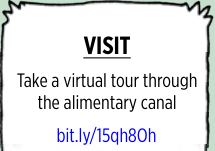
> **[Diagram Context - Textbook_NaturalScience_Gr9_Digestive-system.pdf-0015-14.png]**
> This text-based educational graphic serves as an interactive resource prompt for studying human anatomy. It features the visible headings and text "VISIT", "Take a virtual tour through the alimentary canal", and a web link "bit.ly/15qh80h". Conceptually, it directs Grade 10 Life Sciences learners to explore the structure and functioning of the human digestive system digitally to reinforce curriculum outcomes regarding nutrition and alimentary canal organs.

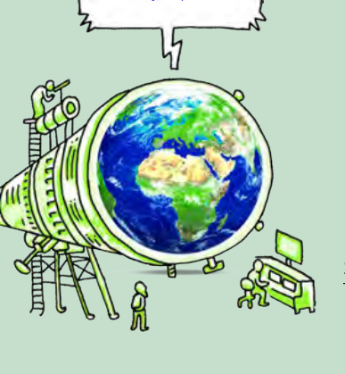
> **[Diagram Context - Textbook_NaturalScience_Gr9_Digestive-system.pdf-0015-18.png]**
> This cartoon illustration depicts a massive scientific telescope observing the planet Earth, complete with a speech bubble at the top, a figure on a ladder operating the telescope, and scientists at a control desk with monitors. Visible elements include the Earth showing Africa and Europe, scientific observation equipment, ladders, support structures, and human figures. Conceptually, this visual illustrates the scale of planetary observation and scientific inquiry, prompting learners to consider how humans study Earth systems and global phenomena in Geography and Natural Sciences.

---

## 3. Soapstone
*   **Origin:** A relatively soft metamorphic rock.
*   **Properties:** 
    *   Unaffected by heat (hotpots can be placed on it without damage).
    *   Unaffected by acids and alkalis.
    *   Resistant to staining from common food items (tomatoes, wine, vinegar, grape juice).
*   **Uses:** 
    *   Natural stone countertops in kitchens and laboratories.
    *   Statues and carvings.

---

## 4. Quartzite
*   **Origin:** Formed through the action of heat and pressure on sandstone.
*   **Texture Change:** The process of metamorphosis changes the texture from sandy (in sandstone) to more glossy (in quartzite).

---

### Summary Table of Metamorphic Rocks

| Rock Type | Original Rock | Key Characteristics | Common Uses |
| :--- | :--- | :--- | :--- |
| **Slate** | Shale | Does not absorb moisture | Roofing, flooring |
| **Marble** | Limestone | Durable | Countertops, tombstones |
| **Soapstone** | N/A | Heat/Acid resistant | Kitchen/Lab counters, carvings |
| **Quartzite** | Sandstone | Glossy texture | Building/Decorative |

> **[Diagram Context - Textbook_NaturalScience_Gr9_Mining-of-mineral-resources.pdf-0015-02.png]**
> 1. A diagram of a cell with a green line and a green arrow pointing to the right.

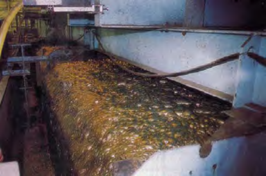
> **[Diagram Context - Textbook_NaturalScience_Gr9_Mining-of-mineral-resources.pdf-0015-09.png]**
> 1. A diagram of a cell with a Lewis structure.

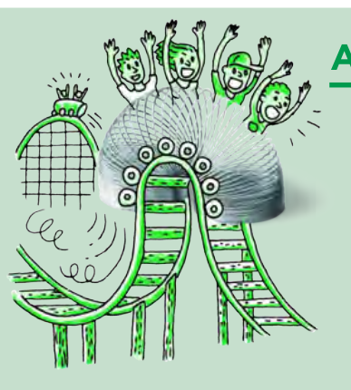
> **[Diagram Context - Textbook_NaturalScience_Gr9_Mining-of-mineral-resources.pdf-0015-11.png]**
> 1. A cartoon depiction of a roller coaster.

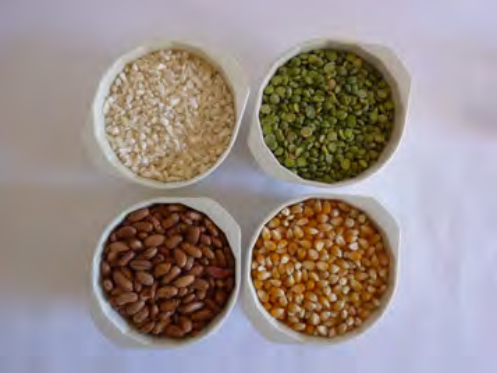
> **[Diagram Context - Textbook_NaturalScience_Gr9_The-atmosphere.pdf-0015-01.png]**
> 1. A diagram of a cell with a diagram of a cell and a diagram of a molecule.

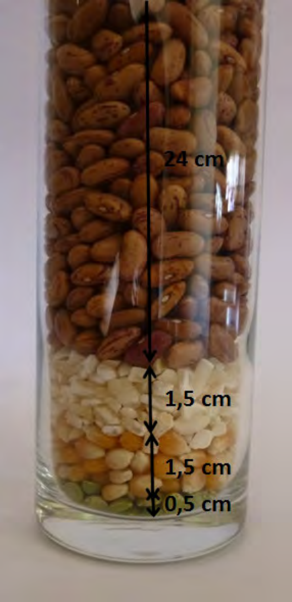
> **[Diagram Context - Textbook_NaturalScience_Gr9_The-atmosphere.pdf-0015-07.png]**
> The image shows a glass vase filled with beans and corn. The beans are brown and the corn is yellow. The vase is tall and clear, allowing a clear view of the beans and corn inside. The beans are scattered throughout the vase, with some appearing larger than others. The corn is mostly concentrated in the middle of the vase, with the beans on the sides. The

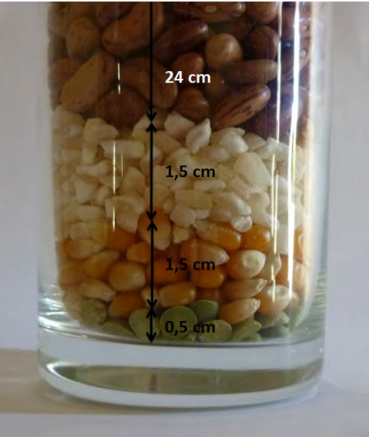
> **[Diagram Context - Textbook_NaturalScience_Gr9_The-atmosphere.pdf-0015-08.png]**
> The image shows a glass jar filled with a mixture of different colored beans and corn kernels. The jar is placed on a table, and the beans are visible at the bottom of the jar. The beans are of various colors, including brown, yellow, and green. The jar is filled to the brim, indicating a large quantity of the mixture. The beans and corn kernels are clearly visible, and

> **[Diagram Context - Textbook_NaturalScience_Gr9_The-lithosphere.pdf-0015-04.png]**
> This graphic depicts a repeating, wave-like pattern of interconnected, arrow-shaped segments. It serves as a visual representation of a continuous process or directional flow, often used in Life Sciences to illustrate metabolic pathways, the sequence of DNA replication, or the cyclical nature of biological feedback loops.

---

### Metamorphic Rocks: Quartzite
*   **Observation:** Quartzite has larger crystals than sandstone, and the original layers found in sandstone have disappeared.
*   **Property:** Quartzite is significantly harder than sandstone.

---

### Igneous Rock
Igneous rock is formed when magma cools down.

#### New Words
*   **Extrusive rock:** Igneous rock formed on the Earth's surface.
*   **Intrusive rock:** Igneous rock formed under the Earth's surface.

#### Take Note
"Molten" refers to liquids that are extremely hot, and whose usual form is solid (e.g., rock). However, something "melted" does not need to be hot, nor a complete liquid (e.g., butter).

#### Factors in Igneous Rock Formation
1.  **Where it is formed:**
    *   **Intrusive:** Formed under the surface.
    *   **Extrusive:** Formed on the surface.
2.  **How quickly it cools:**
    *   **Quick cooling:** Results in small crystals (fine-grained texture).
    *   **Slow cooling:** Results in larger crystals (coarse-grained texture, often visible to the naked eye).
3.  **How much gas is trapped:**
    *   Magma contains molten rock and gas under high pressure.
    *   When magma reaches the surface, gas is released.
    *   If magma cools very quickly, gas is trapped, resulting in cavities and openings in the rock.

---

### Volcanoes
A volcano is an opening or rupture in the surface of the Earth's crust (or another planet) which allows hot lava and volcanic ash to escape in an eruption from the magma chamber below.

---

### Further Exploration
*   **How volcanoes are formed:** [bit.ly/1ezQDf2](http://bit.ly/1ezQDf2)
*   **A volcano expedition:** [bit.ly/1hmLsDa](http://bit.ly/1hmLsDa)

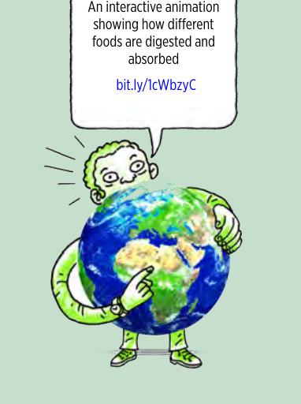
> **[Diagram Context - Textbook_NaturalScience_Gr9_Digestive-system.pdf-0016-07.png]**
> This educational graphic features a digital cartoon illustration depicting a person hugging a globe and pointing at Africa, accompanied by a speech bubble. The visible text reads "An interactive animation showing how different foods are digested and absorbed" alongside a shortened URL ("bit.ly/1cWbzyC"). Conceptually, this multimedia resource introduces Grade 10 Life Sciences learners to human nutrition and the alimentary canal by linking digital simulations of digestion and absorption to broader biological themes.

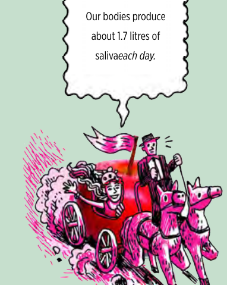
> **[Diagram Context - Textbook_NaturalScience_Gr9_Digestive-system.pdf-0016-16.png]**
> This educational illustration features an informational speech bubble above a whimsical pink drawing of a carriage shaped like an apple being pulled by horses, carrying two figures and a flag. The visible text states, "Our bodies produce about 1.7 litres of saliva each day." Conceptually, this graphic highlights a fascinating physiological fact about human digestion, helping students contextualise the continuous and significant role of accessory glands in the digestive system.

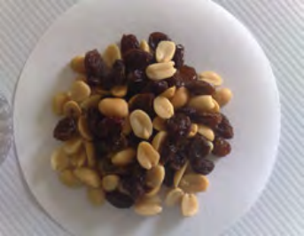
> **[Diagram Context - Textbook_NaturalScience_Gr9_Mining-of-mineral-resources.pdf-0016-08.png]**
> 1. A close-up of a plate of food containing peanuts, raisins, and cashews.

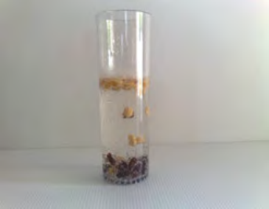
> **[Diagram Context - Textbook_NaturalScience_Gr9_Mining-of-mineral-resources.pdf-0016-09.png]**
> The image shows a tall, clear glass vase filled with water, containing small black objects floating in the water. The objects are described as "black beads" or "black seeds," which could be blackberries or other similar fruits. The vase is placed on a table, and the background is a plain white wall. The image does not contain any text or additional objects.

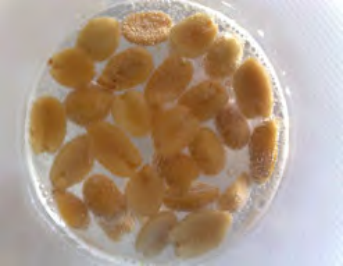
> **[Diagram Context - Textbook_NaturalScience_Gr9_Mining-of-mineral-resources.pdf-0016-10.png]**
> 1. A diagram of a cell with a water droplet in the center.

> **[Diagram Context - Textbook_NaturalScience_Gr9_Mining-of-mineral-resources.pdf-0016-11.png]**
> The image shows a diagram of a cell with a green line separating the two organelles. The diagram also includes labels for the nucleus and mitochondria. The diagram is labeled with the text "Peanuts and raisins. Separating peanuts and raisins."

> **[Diagram Context - Textbook_NaturalScience_Gr9_Mining-of-mineral-resources.pdf-0016-12.png]**
> This text-based graphic serves as a prompt for a physics optics problem, specifically focusing on the phenomenon of refraction. It establishes the observational perspective for a scenario involving light traveling from a denser medium (water) into a less dense medium (air), which is a key concept in Grade 10-12 Physical Sciences regarding the apparent depth of objects.

> **[Diagram Context - Textbook_NaturalScience_Gr9_Mining-of-mineral-resources.pdf-0016-14.png]**
> The image is a cartoon depiction of a hot air balloon carrying two people. The balloon is filled with a blue and green substance, and the people are seated on a basket attached to the balloon. The scene is set against a backdrop of a blue sky with clouds. The image also includes a caption that reads "Visit".

> **[Diagram Context - Textbook_NaturalScience_Gr9_Mining-of-mineral-resources.pdf-0016-15.png]**
> This graphic illustrates a schematic representation of a DNA double helix, featuring two antiparallel sugar-phosphate backbones intertwined in a helical structure. It conceptually demonstrates the molecular architecture of DNA, highlighting the complementary base pairing and the characteristic twisted ladder shape essential for understanding genetic replication and protein synthesis in the Life Sciences curriculum.

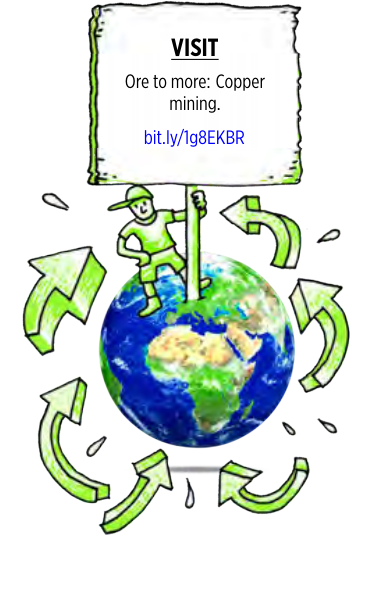
> **[Diagram Context - Textbook_NaturalScience_Gr9_Mining-of-mineral-resources.pdf-0016-19.png]**
> The image features a cartoon depiction of a boy on a pole, with a globe and arrows surrounding him. The boy is holding a sign that says "Visit" and "Ore to more Copper mining." The globe in the image is green and blue, and the arrows are green and white. The boy is wearing a hat. The text "Lewis diagram, anatomical/cellular structure, circuit

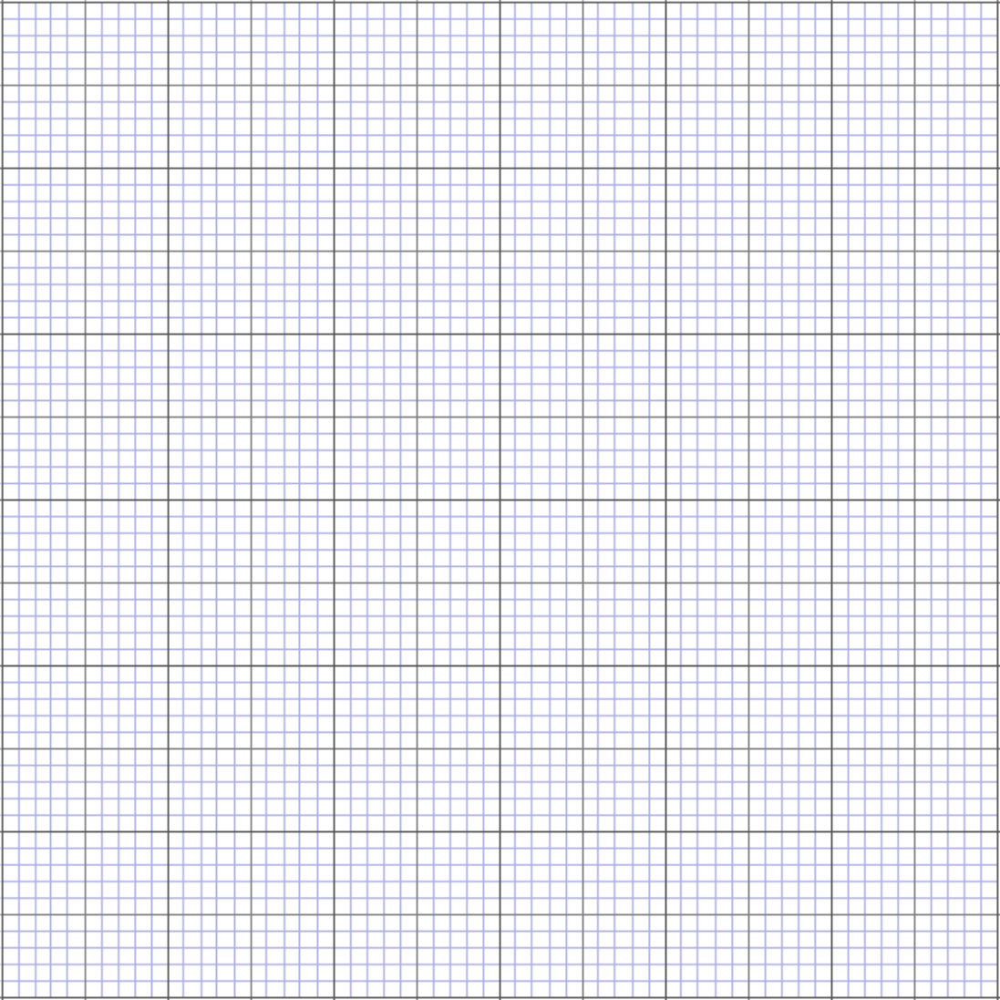
> **[Diagram Context - Textbook_NaturalScience_Gr9_The-atmosphere.pdf-0016-06.png]**
> The image is a graph paper with a grid of squares in shades of purple and white. The squares are arranged in a grid pattern, with each square having a unique color. The graph paper is a standard size, with the x and y axes labeled in a clear and legible manner. The graph paper is used to draw diagrams and charts, and it is a common tool used in various subjects

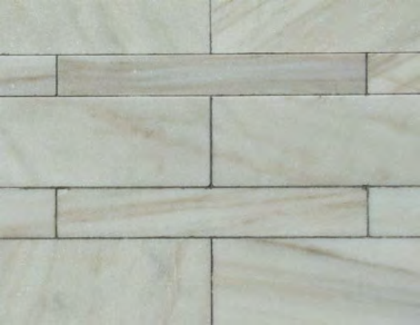
> **[Diagram Context - Textbook_NaturalScience_Gr9_The-lithosphere.pdf-0016-02.png]**
> 1. A diagram of a cell with a diagram of a circuit and a diagram of a Lewis structure.

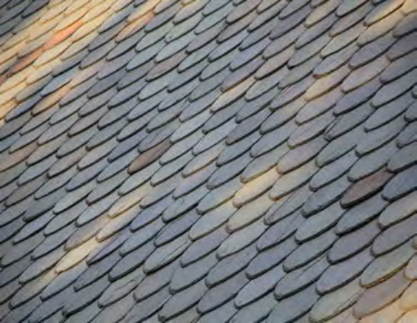
> **[Diagram Context - Textbook_NaturalScience_Gr9_The-lithosphere.pdf-0016-04.png]**
> 1. A diagram of a cell with a Lewis structure.

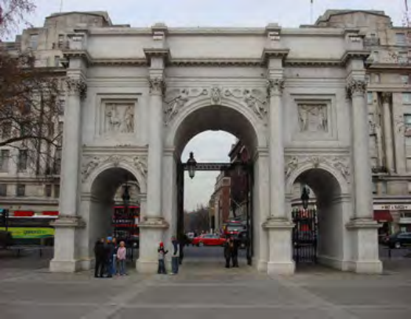
> **[Diagram Context - Textbook_NaturalScience_Gr9_The-lithosphere.pdf-0016-06.png]**
> 1. A large white archway with a black metal gate.

> **[Diagram Context - Textbook_NaturalScience_Gr9_The-lithosphere.pdf-0016-12.png]**
> 1. A collection of statues of saints and angels.

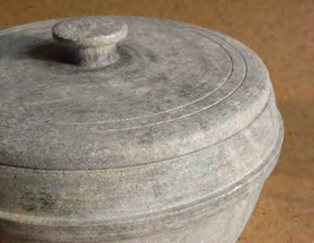
> **[Diagram Context - Textbook_NaturalScience_Gr9_The-lithosphere.pdf-0016-14.png]**
> 1. A clay pot with a lid on it.

---

# Chapter 2: The Lithosphere - Igneous Rocks

## Overview
Igneous rocks are formed through the cooling and solidification of molten rock. Common examples include basalt, granite, and pumice.

---

## 1. Basalt
Basalt is the most common type of igneous rock and constitutes a significant portion of the Earth's crust, particularly the oceanic crust.

*   **Characteristics:** It is a dark-coloured rock.
*   **Uses:** Frequently used as a building material, specifically for stone walls.
*   **Extraterrestrial Presence:** Basalt is found on the Moon and Mars.
*   **Notable Formation:** Olympus Mons, the largest known volcano in our solar system (located on Mars), was formed from basaltic lava flows.

---

## 2. Granite
Granite is an igneous rock characterized by its large grains.

*   **Formation:** It is formed from magma that cools and crystallises slowly beneath the Earth's surface.
*   **Uses:** Due to its durability and aesthetic appeal, it is commonly used for:
    *   Tabletops
    *   Floor tiles
    *   Paving stones

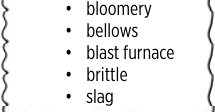
> **[Diagram Context - Textbook_NaturalScience_Gr9_Mining-of-mineral-resources.pdf-0017-03.png]**
> The image shows a diagram of a cell with the title "bloomery", "bellows", "blast furnace", and "brittle slab" written in black text. The diagram also includes a diagram of a cell with the title "bloomery" and the variable "x" in the background.

---

## Did You Know? (Historical Context)
**Pompeii:** An ancient Roman city that was completely destroyed and buried under ash and pumice during the eruption of Mount Vesuvius in 27 AD. Because the city was buried so rapidly, the town and its objects were preserved for thousands of years. Today, it is a major archaeological site visited by millions of tourists annually.

---

## Digital Resources
*   **Pompeii Documentary:** [bit.ly/HbQULb](http://bit.ly/HbQULb)
*   **Mars' Largest Volcano:** [bit.ly/IioFjEn](http://bit.ly/IioFjEn)

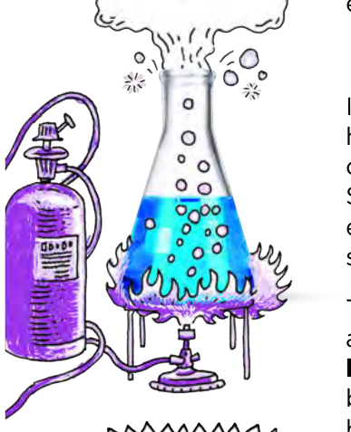
> **[Diagram Context - Textbook_NaturalScience_Gr9_Mining-of-mineral-resources.pdf-0017-04.png]**
> The image features a purple and blue gas cylinder with a blue flame, which is being used to heat a blue glass flask. The flask is filled with blue bubbles, indicating a chemical reaction is taking place. The diagram also includes a Lewis diagram and an anatomical/cellular structure, which are relevant to the study of biology and chemistry.

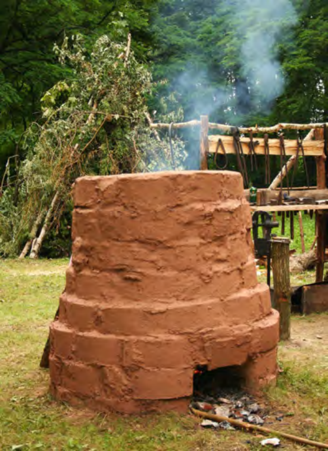
> **[Diagram Context - Textbook_NaturalScience_Gr9_Mining-of-mineral-resources.pdf-0017-11.png]**
> The image shows a clay oven in a field. The oven is made of clay and has a fire burning inside it. The oven is the main focus of the image, and there are no other objects or people visible. The oven is situated in a field, and there are trees in the background. The image does not contain any text.

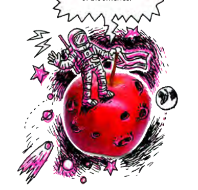
> **[Diagram Context - Textbook_NaturalScience_Gr9_Mining-of-mineral-resources.pdf-0017-12.png]**
> 1. A cartoon drawing of an astronaut on a red planet.
 2. A red apple with a flag on it.
 3. A rocket ship.

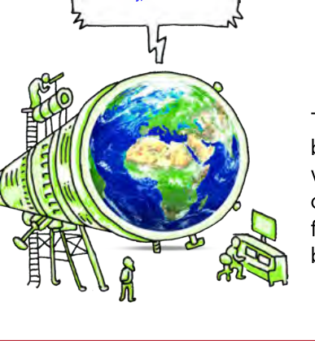
> **[Diagram Context - Textbook_NaturalScience_Gr9_Mining-of-mineral-resources.pdf-0017-15.png]**
> The image depicts a cartoon scene of a group of people working on a telescope. The telescope is a large, green cylinder with a globe on the front. The people are standing around the telescope, with one person on the left side and another on the right side. The globe on the front of the telescope is a representation of the Earth. The people are engaged in various activities, such as adjusting

> **[Diagram Context - Textbook_NaturalScience_Gr9_The-atmosphere.pdf-0017-06.png]**
> 1. A diagram of a cell with a green line representing the cell wall.

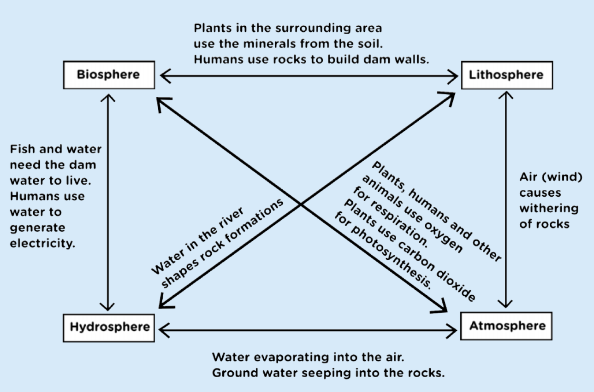
> **[Diagram Context - Textbook_NaturalScience_Gr9_The-earth-as-a-system.pdf-0017-12.png]**
> This conceptual diagram illustrates the interconnectedness of Earth’s four systems, featuring labeled

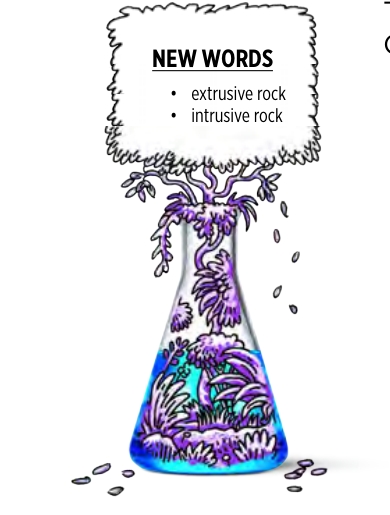
> **[Diagram Context - Textbook_NaturalScience_Gr9_The-lithosphere.pdf-0017-01.png]**
> The image shows a cartoon depiction of a flask filled with purple and blue liquid, with a plant growing out of the flask. The flask is placed on a table, and the plant is growing out of the flask, creating a sense of depth and perspective. The image is labeled with the text "New words" and "extrusive rock".

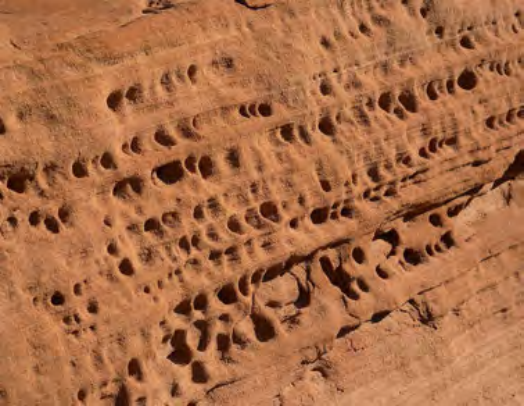
> **[Diagram Context - Textbook_NaturalScience_Gr9_The-lithosphere.pdf-0017-02.png]**
> 1. A diagram of a cell with arrows pointing to different parts of the cell.

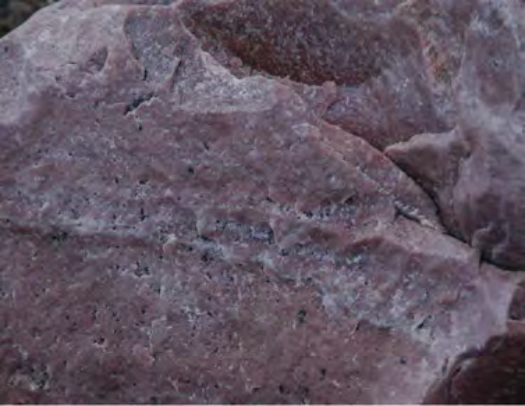
> **[Diagram Context - Textbook_NaturalScience_Gr9_The-lithosphere.pdf-0017-03.png]**
> 1. A diagram of a cell with a Lewis structure.

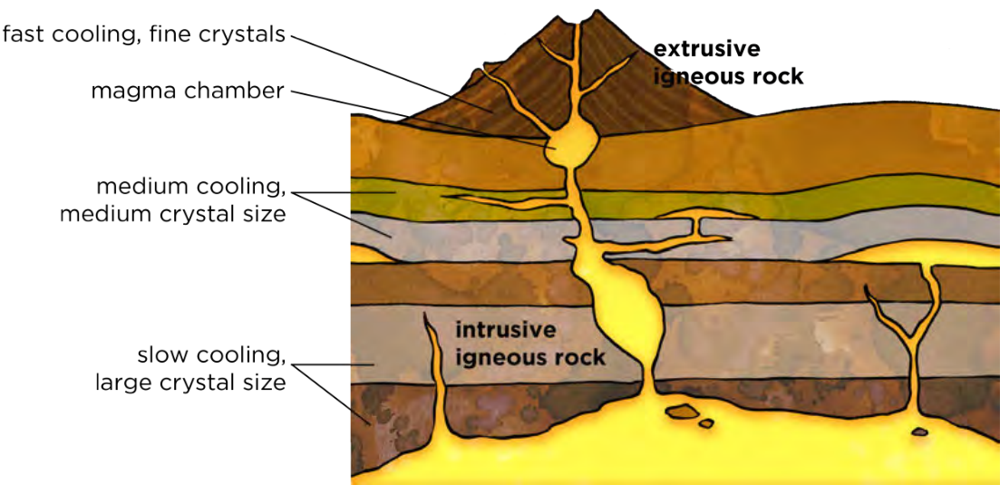
> **[Diagram Context - Textbook_NaturalScience_Gr9_The-lithosphere.pdf-0017-13.png]**
> The image is a diagram that illustrates the layers of a volcano. It shows the different layers of the volcano, including the magma chamber, the intrusive igneous rock, and the extrusive igneous rock. The diagram also includes labels for the different layers and arrows to show the flow of magma from the magma chamber to the intrusive rock and the intrusive rock to the extrusive

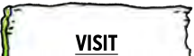
> **[Diagram Context - Textbook_NaturalScience_Gr9_The-lithosphere.pdf-0017-14.png]**
> 1. A cartoon image of a white square with the word "visit" written in black.

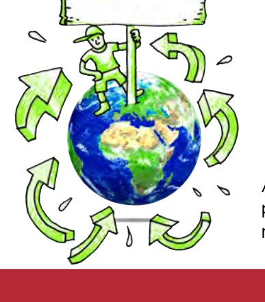
> **[Diagram Context - Textbook_NaturalScience_Gr9_The-lithosphere.pdf-0017-16.png]**
> The image is a cartoon drawing of a boy holding a sign that says "I want to be a doctor". The boy is standing on a globe, which is a representation of the Earth. The globe is divided into different regions, and there are arrows pointing to various places around the globe. The boy is wearing a green shirt and a hat. The drawing is colorful and visually appealing, making it

---

### Pumice Rock

Pumice is a specific type of **extrusive igneous rock**.

*   **Formation:** It is formed from lava emitted during volcanic explosions.
*   **Cooling Process:** The lava cools down very quickly.
*   **Structure:** Because of the rapid cooling, gas becomes trapped inside the rock. This creates a highly **porous** structure (full of holes).
*   **Unique Property:** Due to its porosity, pumice is the only rock capable of floating on water.
*   **Uses:** 
    *   Manufacturing lightweight concrete.
    *   Used as an abrasive in industrial applications and household products (e.g., as an exfoliator).

---

### ACTIVITY: Comparing the properties of igneous rocks

**Instructions:** Observe the four rock samples provided and compare their similarities and differences using the table below.

> **[Diagram Context - Textbook_NaturalScience_Gr9_Digestive-system.pdf-0018-15.png]**
> This conceptual illustration depicts the planet Earth shaped like a hot air balloon floating in the sky amidst clouds, the sun, and birds, carrying two human figures holding telescopes in a basket below a burner flame. The visual elements include the globe acting as the balloon envelope, a net of latitude and longitude lines, a flame, a basket, and sketched environmental details like clouds, the sun, and flying birds. Conceptually, this diagram visually conveys global environmental monitoring, geography, and earth systems, helping high school learners explore human observation, global stewardship, and the interconnectedness of Earth's spheres.

| Sample | Observation/Description |
| :--- | :--- |
| **Sample 1** | [Insert observation regarding texture, colour, and grain size] |
| **Sample 2** | [Insert observation regarding texture, colour, and grain size] |
| **Sample 3** | [Insert observation regarding texture, colour, and grain size] |
| **Sample 4** | [Insert observation regarding texture, colour, and grain size] |

**Comparison Summary:**
*   **Similarities:** [List common characteristics observed across samples]
*   **Differences:** [List contrasting characteristics observed across samples]

> **[Diagram Context - Textbook_NaturalScience_Gr9_Digestive-system.pdf-0018-16.png]**
> This educational graphic is a decorative or illustrative border featuring repeating green coiled ribbon or spring-like elements oriented horizontally. The visual content consists of evenly spaced, identical green curved arrow symbols linked continuously in a horizontal chain. Conceptually, it serves as a visual separator or stylistic page accent, symbolizing cyclical flow, continuity, or sequential connection relevant to biological cycles or chemical pathways.

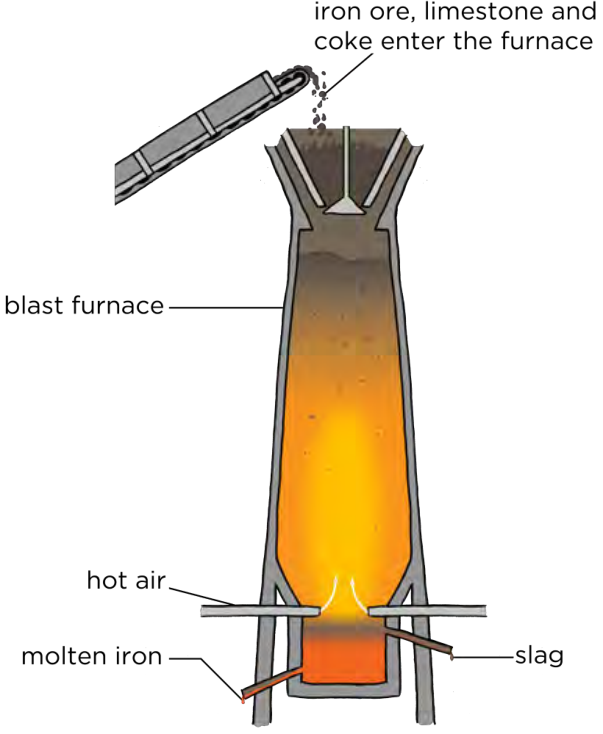
> **[Diagram Context - Textbook_NaturalScience_Gr9_Mining-of-mineral-resources.pdf-0018-01.png]**
> 1. A diagram of a hot air blower.

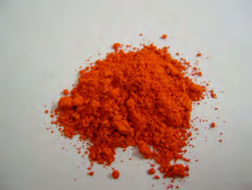
> **[Diagram Context - Textbook_NaturalScience_Gr9_Mining-of-mineral-resources.pdf-0018-05.png]**
> 1. A diagram of a cell with a red dot in the center.

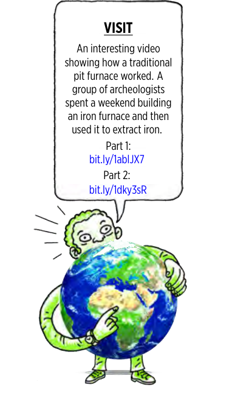
> **[Diagram Context - Textbook_NaturalScience_Gr9_Mining-of-mineral-resources.pdf-0018-06.png]**
> The image shows a cartoon depiction of a man holding a globe. The globe is green and white, and the man is wearing a green shirt and a green hat. The man is holding the globe in his arms, and there is a speech bubble above him that contains text about the Earth and the concept of time. The text explains that the Earth is a sphere and that it rotates on its

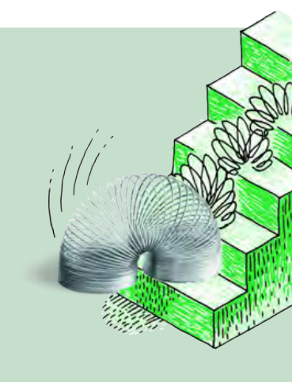
> **[Diagram Context - Textbook_NaturalScience_Gr9_Mining-of-mineral-resources.pdf-0018-07.png]**
> The image is a diagram of a spring, which is shown in motion, with a cord attached to it. The cord is attached to a cordless phone, which is placed on a green surface. The diagram also includes a Lewis diagram, a cellular structure, and a graph. The diagram is labeled with the text "A spring is shown in motion, with a cord attached to it. The

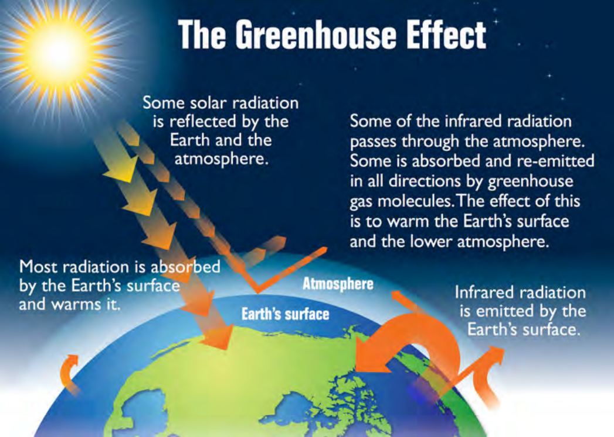
> **[Diagram Context - Textbook_NaturalScience_Gr9_The-atmosphere.pdf-0018-09.png]**
> The image is a diagram that illustrates the greenhouse effect. The diagram shows the Earth's atmosphere and the greenhouse effect. The diagram is color-coded, with the greenhouse effect represented by orange arrows and the Earth's atmosphere represented by green arrows. The diagram also includes labels for the Earth's surface and the greenhouse effect. The diagram is labeled with the title "The greenhouse effect" and the caption "

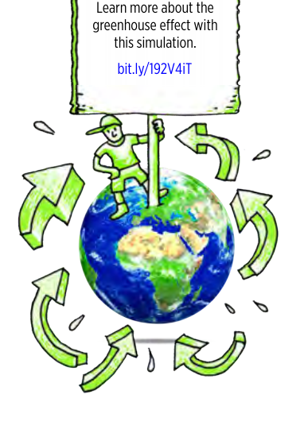
> **[Diagram Context - Textbook_NaturalScience_Gr9_The-atmosphere.pdf-0018-11.png]**
> The image is a cartoon depiction of a boy holding a pole and a globe. The boy is wearing a hat and is standing on a pole. The globe is tilted to the right, and there are arrows pointing to the globe. The boy is holding a sign that says "Learn more about the greenhouse effect with this simulation." The image is labeled with a watermark that reads "bit.ly

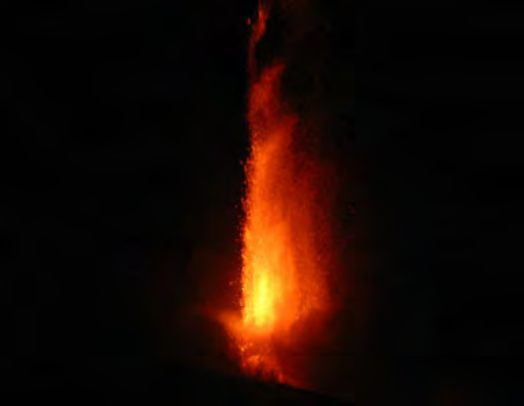
> **[Diagram Context - Textbook_NaturalScience_Gr9_The-lithosphere.pdf-0018-00.png]**
> 1. A diagram of a volcano with a fire coming out of it.

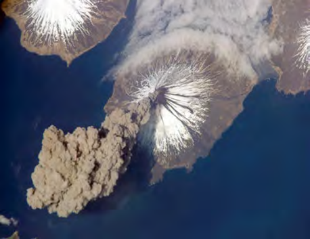
> **[Diagram Context - Textbook_NaturalScience_Gr9_The-lithosphere.pdf-0018-01.png]**
> 1. A diagram of a volcano with a cloud of smoke coming out of it.

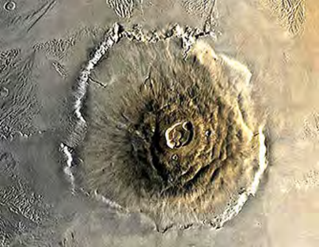
> **[Diagram Context - Textbook_NaturalScience_Gr9_The-lithosphere.pdf-0018-07.png]**
> 1. A diagram of a mountain with a hole in the center.

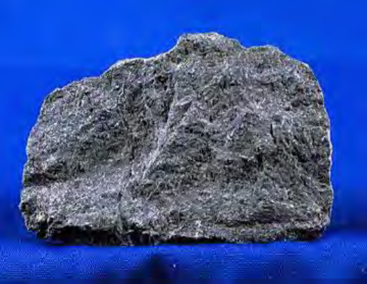
> **[Diagram Context - Textbook_NaturalScience_Gr9_The-lithosphere.pdf-0018-08.png]**
> 1. A rock on a blue background.

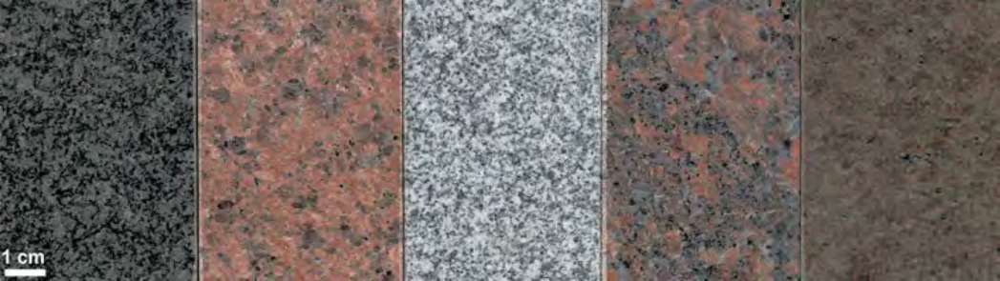
> **[Diagram Context - Textbook_NaturalScience_Gr9_The-lithosphere.pdf-0018-12.png]**
> 1. A diagram of a cell with a Lewis structure.

> **[Diagram Context - Textbook_NaturalScience_Gr9_The-lithosphere.pdf-0018-16.png]**
> 1. A cartoon apple with a worm inside.
 2. The apple is red and has a stem on top.
 3. The apple is shown in a cartoon style.

> **[Diagram Context - Textbook_NaturalScience_Gr9_The-lithosphere.pdf-0018-17.png]**
> The image shows a cartoon depiction of a globe and a telescope. The globe is green and blue, and the telescope is green. The globe is positioned in the center of the image, with the telescope on the left side. The globe is surrounded by a number of people, including a man and a woman, who are standing around the globe. The people are positioned at various distances from the globe

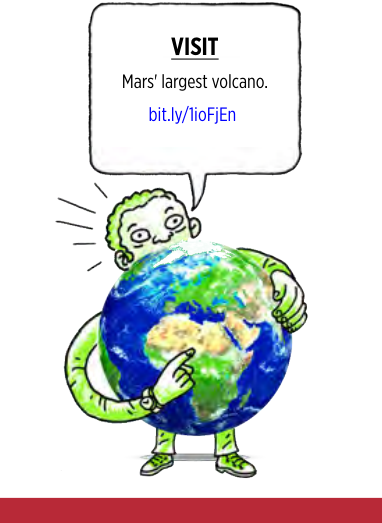
> **[Diagram Context - Textbook_NaturalScience_Gr9_The-lithosphere.pdf-0018-18.png]**
> The image features a cartoon depiction of a man holding a globe. The globe is green and white, and the man is wearing a green shirt and green pants. The man is pointing to the globe, and there is a speech bubble above the man that reads "Visit Mars' largest volcano. Bit.ly/iojen".

---

# Activity: Classifying Rocks

## Instructions

1. **Work in pairs:** You will be working in pairs for this project.
2. **Collect samples:** Collect at least 12 different samples of rock from your neighbourhood or borrow them from a collection.
3. **Ensure variety:** Aim for as much variety as possible, applying your knowledge of the three different rock types.
4. **Consult experts:** You may ask a geologist to provide you with a variety of rock samples to identify.
5. **Use digital resources:** Visit the following websites and follow the flow diagrams provided to identify your samples:
    * Identifying types of rocks: [bit.ly/16gyySK](http://bit.ly/16gyySK)
    * Classification resource: [bit.ly/17TqDYJ](http://bit.ly/17TqDYJ)
6. **Create a display:** Present your rocks in a display, detailing how you identified them using the flow diagrams and their physical properties.

---

## Data Collection Table

Use the table below to record the observations for your rock samples:

| Sample | Where was the sample formed? | Extrusively or intrusively | How quickly did it cool? | What evidence do you have for your answer? | Was air trapped when it was formed? | What evidence do you have for your answer? | Describe the colour |
| :--- | :--- | :--- | :--- | :--- | :--- | :--- | :--- |
| **Sample 1** | | | | | | | |
| **Sample 2** | | | | | | | |
| **Sample 3** | | | | | | | |
| **Sample 4** | | | | | | | |

***

*Chapter 2: The lithosphere | Page 241*

> **[Diagram Context - Textbook_NaturalScience_Gr9_Digestive-system.pdf-0019-05.png]**
> This educational graphic is a physical science diagram illustrating a surface wave or boundary wave phenomenon, showing a continuous purple horizontal medium embedded with a repeating series of blue looping crest structures along its top boundary. The visible elements consist of evenly spaced, curved wave-like loops extending upwards from a solid rectangular baseline layer without explicit text labels, axes, or directional arrows. Conceptually, this diagram helps high school learners visualize surface wave patterns and boundary interfaces, demonstrating how periodic disturbances propagate along the surface of a medium.

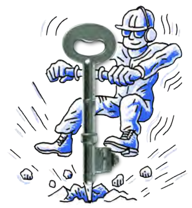
> **[Diagram Context - Textbook_NaturalScience_Gr9_Digestive-system.pdf-0019-06.png]**
> This educational illustration depicts an analogy for atomic structure, showing a worker operating a jackhammer shaped like a chemical key surrounded by motion lines and flying debris. The graphic visually represents the atomic "key" interacting with surrounding matter, characterized by the mechanical tool piercing the ground while the operator experiences heavy vibration. Conceptually, this helps CAPS physical sciences learners visualize the spatial arrangement, bonding, and dynamic interaction of particles within a molecular lattice or crystal structure.

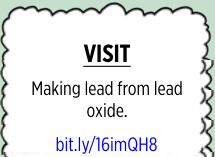
> **[Diagram Context - Textbook_NaturalScience_Gr9_Mining-of-mineral-resources.pdf-0019-02.png]**
> The image shows a white sign with black text that reads "Visit" and "Making lead from lead oxide". The sign also includes a link to a website for more information on the topic.

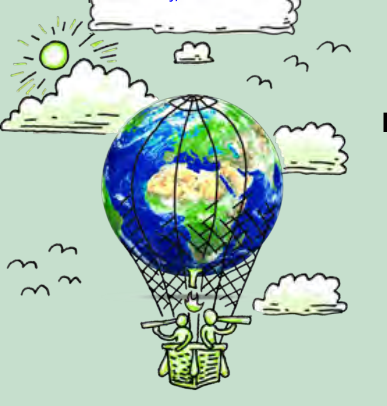
> **[Diagram Context - Textbook_NaturalScience_Gr9_Mining-of-mineral-resources.pdf-0019-07.png]**
> The image is a cartoon depiction of a hot air balloon with a globe on top. The globe is colored in blue and green, and the balloon is filled with air. There are two people on the balloon, one holding a map and the other holding a compass. The balloon is floating in the sky, surrounded by clouds. The image is labeled as a Lewis diagram, an anatomical/cellular

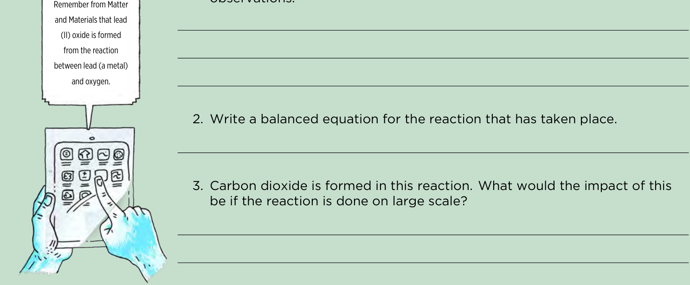
> **[Diagram Context - Textbook_NaturalScience_Gr9_Mining-of-mineral-resources.pdf-0019-21.png]**
> A diagram of a cell with arrows pointing to different parts of the cell.

> **[Diagram Context - Textbook_NaturalScience_Gr9_Mining-of-mineral-resources.pdf-0019-22.png]**
> 1. A diagram of a cell with a green line representing the cell wall.

> **[Diagram Context - Textbook_NaturalScience_Gr9_The-atmosphere.pdf-0019-01.png]**
> 1. A cartoon depiction of a roller coaster with a spring coiled up on top.

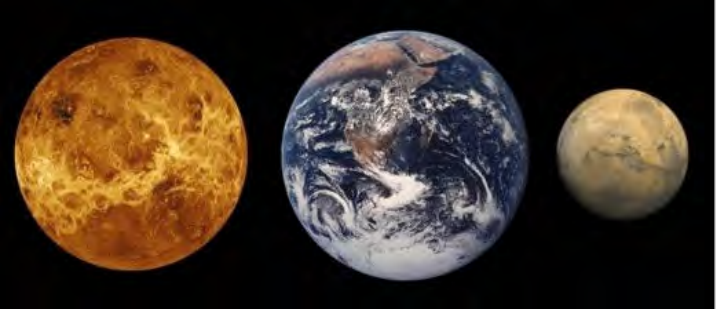
> **[Diagram Context - Textbook_NaturalScience_Gr9_The-atmosphere.pdf-0019-03.png]**
> 1. A diagram of the solar system with the sun at the top and the earth at the bottom.

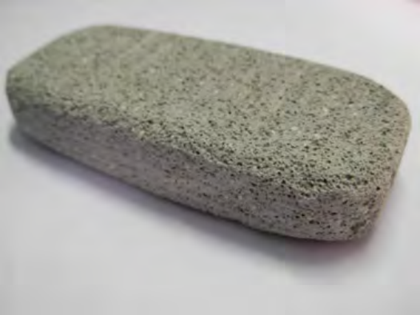
> **[Diagram Context - Textbook_NaturalScience_Gr9_The-lithosphere.pdf-0019-01.png]**
> 1. A gray rectangular object with a rough texture.

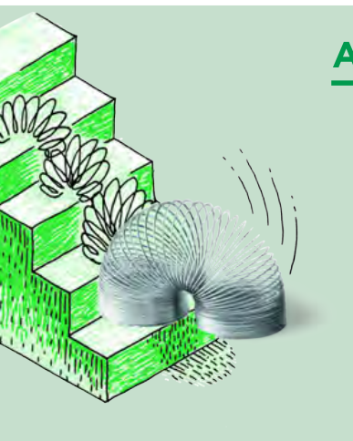
> **[Diagram Context - Textbook_NaturalScience_Gr9_The-lithosphere.pdf-0019-03.png]**
> 1. A diagram of a spring with a green background.

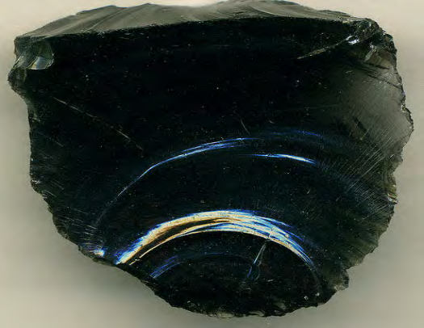
> **[Diagram Context - Textbook_NaturalScience_Gr9_The-lithosphere.pdf-0019-07.png]**
> The image shows a close-up view of a black mineral sample. The mineral appears to be a type of graphite, which is a form of carbon. The sample is black in color, indicating that it contains a high concentration of carbon. The mineral is in a rough, jagged shape, suggesting that it has not been processed or refined. The image does not contain any text, and

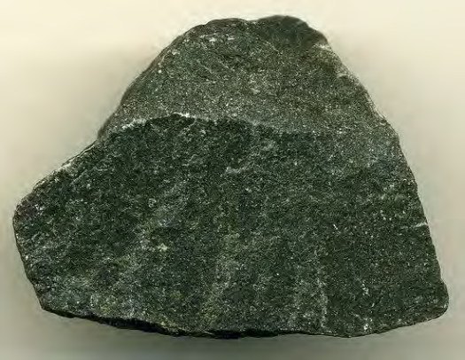
> **[Diagram Context - Textbook_NaturalScience_Gr9_The-lithosphere.pdf-0019-08.png]**
> The image shows a close-up view of a rock, which appears to be a dark green color. The rock is in a triangular shape, and it is placed on a white surface. The rock is the main focus of the image, and there are no other objects or texts present. The image does not contain any text or other objects, and the rock is the only object in the image

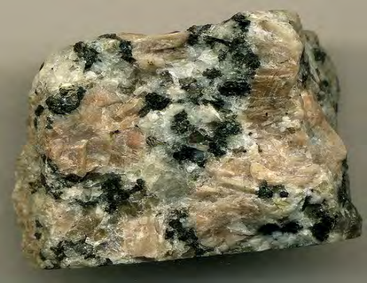
> **[Diagram Context - Textbook_NaturalScience_Gr9_The-lithosphere.pdf-0019-11.png]**
> 1. A rock with a grayish-brown color and black speckles.

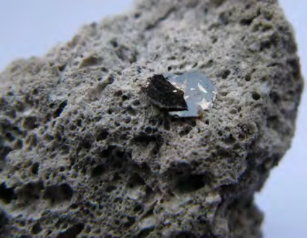
> **[Diagram Context - Textbook_NaturalScience_Gr9_The-lithosphere.pdf-0019-13.png]**
> 1. A rock with a small piece of a crystal on it.

---

# Rocks and Minerals

## Key Concept: Minerals
A **mineral** is a naturally occurring chemical compound found in rocks. Minerals consist of metal and non-metal atoms combined in specific ratios.

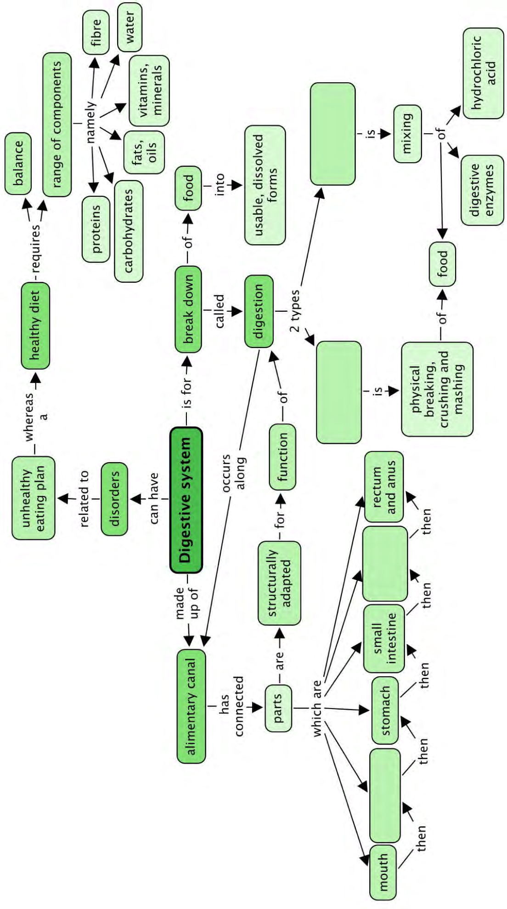
> **[Diagram Context - Textbook_NaturalScience_Gr9_Digestive-system.pdf-0020-00.png]**
> This concept map illustrates the human digestive system, featuring nodes and directional arrows connected with labels such as "Digestive system", "alimentary canal", "digestion", "healthy diet", "proteins", "carbohydrates", "stomach", "small intestine", and "rectum and anus". It visually conveys how the alimentary canal breaks down food into usable forms through physical and chemical processes while linking nutrition, structural adaptations, and digestive disorders to support CAPS Life Sciences learning objectives.

## The Importance of Minerals
Rocks are valuable because they contain minerals that we use in everyday life. For example, copper is a highly valued metal due to its properties as a good electrical conductor, making it essential for electrical cabling.

### Examples of Copper-bearing Minerals
Copper is often extracted from specific minerals found within sedimentary, metamorphic, or igneous rocks:

1.  **Chalcocite**: A mineral containing copper(I)sulfide, represented by the chemical formula $Cu_{2}S$.
2.  **Chalcopyrite**: A mineral containing copper, represented by the chemical formula $CuFeS_{2}$.

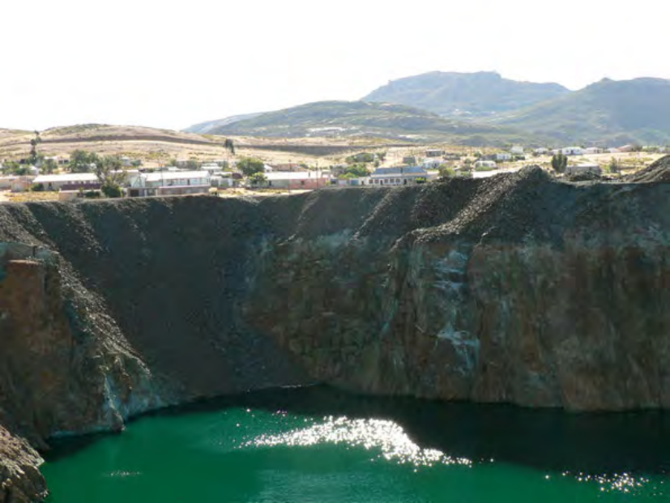
> **[Diagram Context - Textbook_NaturalScience_Gr9_Mining-of-mineral-resources.pdf-0020-07.png]**
> 1. A diagram of a cell with arrows pointing to different parts of the cell.

## Abundant Minerals in the Earth's Crust
The Earth's crust is composed of various rocks, which are in turn made of different combinations of minerals. The two most abundant minerals are:

*   **Quartz**: The mineral form of silicon dioxide, with the chemical formula $SiO_{2}$.
*   **Potassium Feldspar**: A mineral with the chemical formula $KAlSi_{3}O_{8}$.

### Note on Rock Composition
A rock may be composed almost entirely of a single mineral, or it may be a mixture of several different minerals. The specific combination of minerals present determines the type of rock formed.

> **[Diagram Context - Textbook_NaturalScience_Gr9_Mining-of-mineral-resources.pdf-0020-09.png]**
> The image features a cartoon depiction of a man standing on a globe, holding a sign that says "I want to be a scientist". The globe is surrounded by various arrows, each pointing in a different direction, symbolizing different scientific fields or branches. The man is positioned in the center of the image, with the globe and arrows surrounding him. The text "I want to be a scientist"

***

*Visit [bit.ly/lioFFLd](http://bit.ly/lioFFLd) for a brief introduction to minerals.*

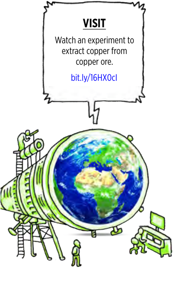
> **[Diagram Context - Textbook_NaturalScience_Gr9_Mining-of-mineral-resources.pdf-0020-10.png]**
> The image shows a cartoon depiction of a group of people standing around a large telescope. The telescope is positioned in the center of the image, with the Earth visible through its lens. The people are positioned around the telescope, with one person standing directly behind it and another person standing to the left. The text "Visit" is written in the top left corner of the image.

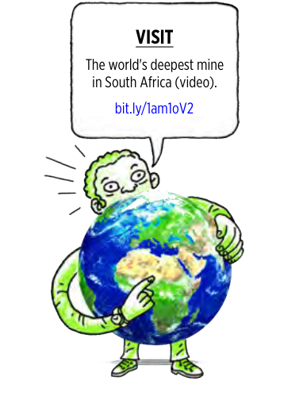
> **[Diagram Context - Textbook_NaturalScience_Gr9_Mining-of-mineral-resources.pdf-0020-11.png]**
> 1. A cartoon depiction of a globe with a man holding it.

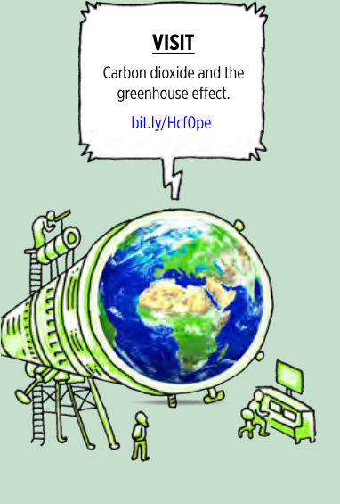
> **[Diagram Context - Textbook_NaturalScience_Gr9_The-atmosphere.pdf-0020-04.png]**
> The image features a cartoon depiction of a group of people standing around a large globe. The globe is filled with a blue substance, and the people are standing around it, possibly discussing the globe or its contents. The image also includes a speech bubble containing text about the greenhouse effect and the role of carbon dioxide in it.

> **[Diagram Context - Textbook_NaturalScience_Gr9_The-atmosphere.pdf-0020-07.png]**
> 1. A diagram of a cell with arrows pointing to different parts of the cell.

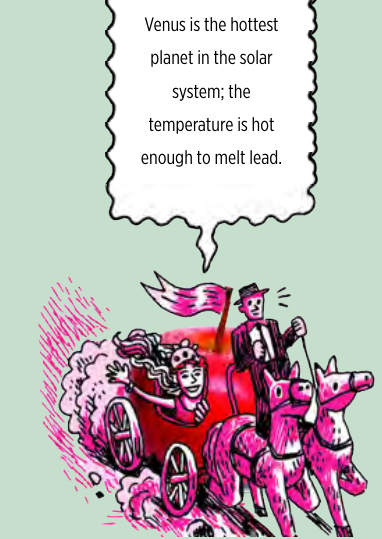
> **[Diagram Context - Textbook_NaturalScience_Gr9_The-atmosphere.pdf-0020-08.png]**
> The image features a cartoon illustration of a man and a woman riding in a carriage. The carriage is depicted in pink and white colors, and the man is wearing a black suit. The woman is wearing a white dress. The illustration is accompanied by a speech bubble containing text about Venus being the hottest planet in the solar system.

> **[Diagram Context - Textbook_NaturalScience_Gr9_The-atmosphere.pdf-0020-09.png]**
> The image shows a line of green and white beads arranged in a straight line. The beads are evenly spaced and appear to be made of a shiny material. The beads are positioned in a horizontal line, with the green beads being slightly larger than the white ones. The image does not contain any text or additional objects, and the arrangement of the beads is consistent and orderly.

> **[Diagram Context - Textbook_NaturalScience_Gr9_The-lithosphere.pdf-0020-02.png]**
> 1. A diagram of a snake's body.
 2. The snake's body is composed of many small lines.
 3. The snake's body is green and gray.

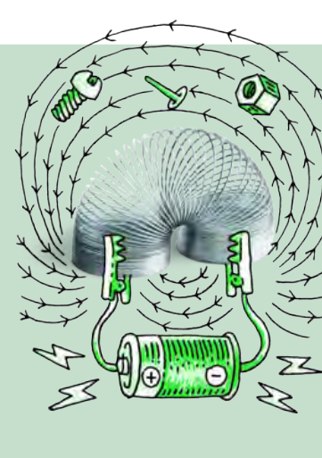
> **[Diagram Context - Textbook_NaturalScience_Gr9_The-lithosphere.pdf-0020-09.png]**
> 1. A green spring with a white cord attached to it.
 2. A green battery with a white cord attached to it.
 3. A green spring with a white cord attached to it.

> **[Diagram Context - Textbook_NaturalScience_Gr9_The-lithosphere.pdf-0020-12.png]**
> 1. A diagram of a snake's body, with the head and tail being green and the body being gray.

---

# Activity: Minerals and Elements in the Earth's Crust

## Overview
This activity focuses on the composition of the Earth's lithosphere. Understanding the distribution and importance of elements is fundamental to geology and environmental science.

## Instructions
Based on your study of the Earth's crust and the minerals found within rocks, answer the following questions:

1. **Identification:** What are the most abundant elements in the Earth's crust?
2. **Causality:** Why are these specific elements so abundant?
3. **Formation:** How did these elements originally become part of the Earth's crust?
4. **Significance:** Why are these elements considered important?
5. **Critical Thinking:** Which element(s) do you consider the most important in the Earth's crust? Provide a reasoned justification for your choice.

---

## Reference Table: Common Crustal Elements
To assist with your analysis, refer to the approximate mass percentage of the most common elements found in the Earth's crust:

| Element | Symbol | Approximate Percentage by Mass |
| :--- | :---: | :---: |
| Oxygen | $O$ | $46.6\%$ |
| Silicon | $Si$ | $27.7\%$ |
| Aluminium | $Al$ | $8.1\%$ |
| Iron | $Fe$ | $5.0\%$ |
| Calcium | $Ca$ | $3.6\%$ |
| Sodium | $Na$ | $2.8\%$ |
| Potassium | $K$ | $2.6\%$ |
| Magnesium | $Mg$ | $2.1\%$ |

---

## Mathematical Context
When analyzing the composition of the crust, we often calculate the relative abundance of elements. If you are comparing the mass of a specific element ($m_e$) to the total mass of the crust ($m_t$), the percentage abundance ($A$) is calculated as:

$$A = \left( \frac{m_e}{m_t} \right) \times 100$$

**Example Calculation:**
If a sample of crustal rock has a total mass of $500\text{ kg}$ and contains $138.5\text{ kg}$ of Silicon, the percentage of Silicon is:

$$A = \left( \frac{138.5}{500} \right) \times 100 = 27.7\%$$

> **[Diagram Context - Textbook_NaturalScience_Gr9_Digestive-system.pdf-0021-00.png]**
> The image is a partially cropped educational graphic featuring a mechanical apparatus composed of reddish rods, joints, and a gear wheel situated next to red heading text reading "REVISION:". This diagram visually introduces revision exercises related to mechanical systems and structures, specifically helping Technology and Natural Sciences learners analyze linkages, load transfer, and structural components.

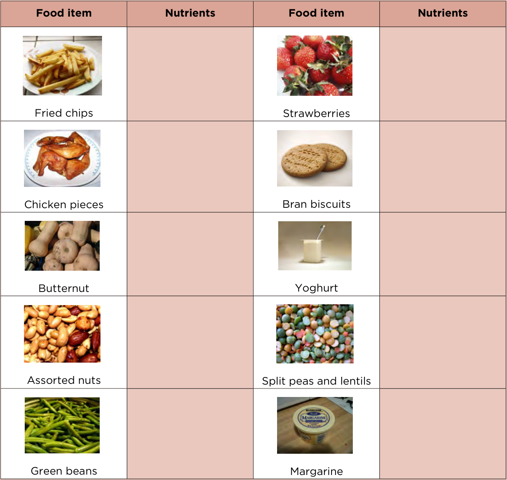
> **[Diagram Context - Textbook_NaturalScience_Gr9_Digestive-system.pdf-0021-02.png]**
> This educational table features photographs of various everyday food items paired with corresponding blank columns labeled "Food item" and "Nutrients." Visible labels include specific food names such as "Fried chips," "Chicken pieces," "Butternut," "Assorted nuts," "Green beans," "Strawberries," "Bran biscuits," "Yoghurt," "Split peas and lentils," and "Margarine." This graphic is designed for CAPS Life Sciences learners to link whole and processed foods to their primary biological macromolecules and nutrients, reinforcing the concept of a balanced diet and nutritional biochemistry.

> **[Diagram Context - Textbook_NaturalScience_Gr9_Mining-of-mineral-resources.pdf-0021-01.png]**
> The image shows a black and white diagram of a cell, with the words "Do you know?" written in black above it. The diagram is labeled with the name "Lewis diagram" and "cellular structure" in black text. The diagram is accompanied by a caption that reads "Identify the visual content (e.g. Lewis diagram, anatomical/cellular structure, circuit, graph

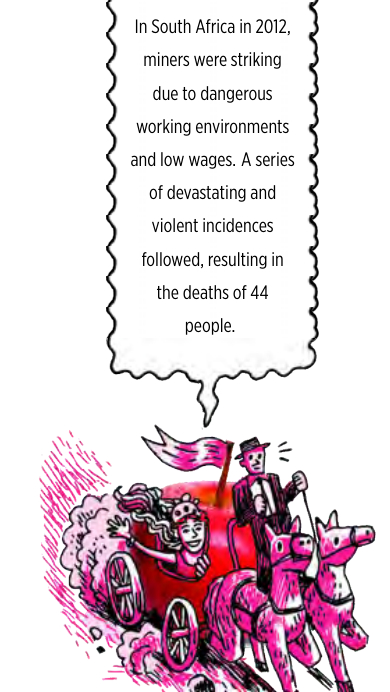
> **[Diagram Context - Textbook_NaturalScience_Gr9_Mining-of-mineral-resources.pdf-0021-02.png]**
> The image is a cartoon depicting a man and a woman riding in a carriage. The man is holding a flag, and the woman is wearing a crown. The carriage is pink and has a banner on top. The cartoon is set against a white background, and the text is written in black. The text includes a list of facts about the dangers of working environments and low wages, as well as

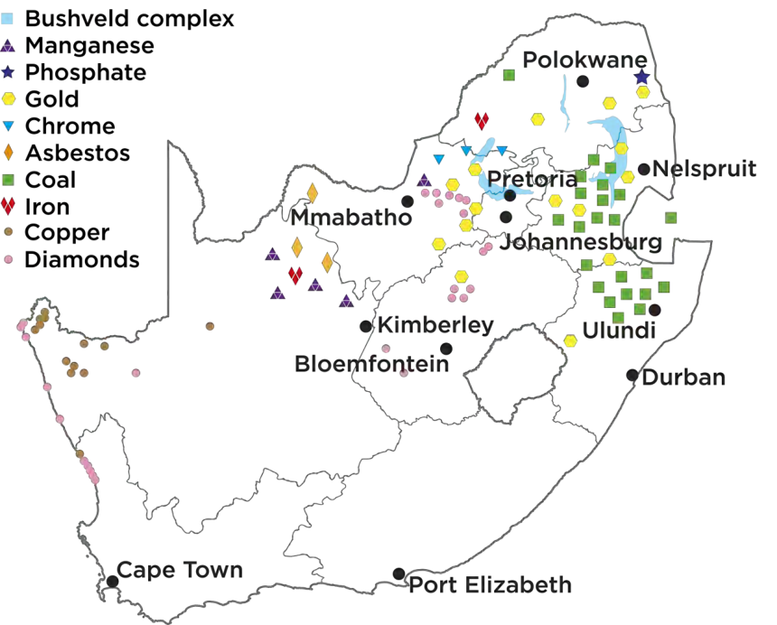
> **[Diagram Context - Textbook_NaturalScience_Gr9_Mining-of-mineral-resources.pdf-0021-03.png]**
> The image is a map of South Africa, with various locations marked and labeled. The map is color-coded, with different colors representing different types of resources or minerals. The map also includes a legend that explains the color-coding system. The map is labeled with the names of the different regions and cities, such as Bushveld complex, Manganese, Phosphate, Gold

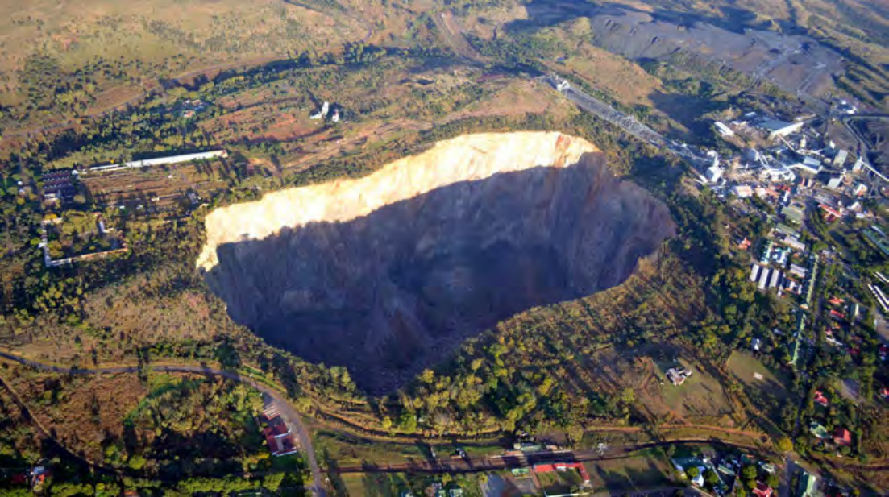
> **[Diagram Context - Textbook_NaturalScience_Gr9_Mining-of-mineral-resources.pdf-0021-06.png]**
> The image shows an aerial view of a large pit or pitfall in a rural area. The pit is surrounded by trees and appears to be a natural formation. The pit is situated in a town, which is visible in the background. The pitfall is surrounded by vegetation, indicating that it is not a man-made structure. The pitfall is located in the center of the image, with

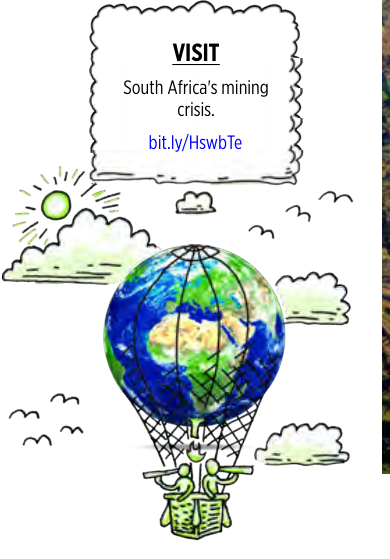
> **[Diagram Context - Textbook_NaturalScience_Gr9_Mining-of-mineral-resources.pdf-0021-07.png]**
> The image is a cartoon depiction of a hot air balloon with two people on it. The balloon is filled with a blue substance, and the two people are holding onto the sides of the balloon. The balloon is floating in the sky, and the two people are positioned on the bottom of the balloon. The image also includes a text box that reads "Visit South Africa's mining crisis. Bit.

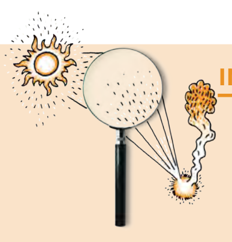
> **[Diagram Context - Textbook_NaturalScience_Gr9_The-atmosphere.pdf-0021-01.png]**
> 1. A magnifying glass is being used to look at a diagram of a cell.

> **[Diagram Context - Textbook_NaturalScience_Gr9_The-atmosphere.pdf-0021-06.png]**
> The image shows a rectangular sign with the word "Visit" written in black text. The sign is positioned on a gray background. The sign is rectangular in shape and has a white border. The text "Visit" is written in black, and the word "Visit" is capitalized. The sign is located in the upper right corner of the image.

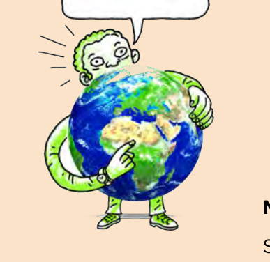
> **[Diagram Context - Textbook_NaturalScience_Gr9_The-atmosphere.pdf-0021-09.png]**
> The image features a cartoon illustration of a man holding a globe in his hands. The man is wearing a green shirt and white pants, and he is pointing to the globe with his right hand. The globe is green and blue, and it is the central focus of the image. The man's actions and the globe's coloration suggest that the image is intended to convey a lesson on the Earth

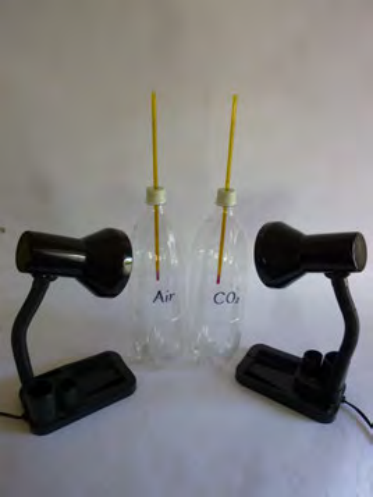
> **[Diagram Context - Textbook_NaturalScience_Gr9_The-atmosphere.pdf-0021-19.png]**
> The image shows two black lamps with clear plastic bottles attached to them. The bottles contain colored liquids, and the lamps are equipped with yellow straws. The lamps are placed on a white surface, and the bottles are positioned at the front and back of the lamps. The lamps are labeled "Air" and "CO2," and the bottles are labeled "Air" and "CO2." The

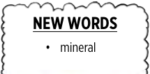
> **[Diagram Context - Textbook_NaturalScience_Gr9_The-lithosphere.pdf-0021-01.png]**
> The image shows a white rectangular sign with black text that reads "New Words". Below the text, there is a small black circle with a line through it, which is labeled "New Words". The sign is set against a gray background.

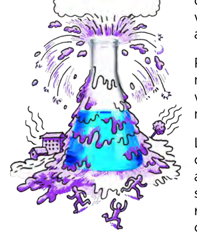
> **[Diagram Context - Textbook_NaturalScience_Gr9_The-lithosphere.pdf-0021-03.png]**
> A cartoon depiction of a volcano with a blue liquid inside, surrounded by purple and white elements, with a few people and a house in the background.

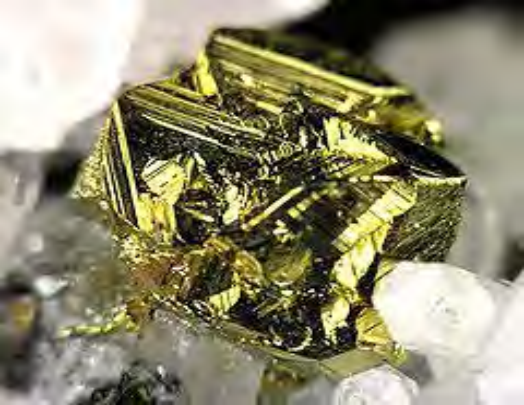
> **[Diagram Context - Textbook_NaturalScience_Gr9_The-lithosphere.pdf-0021-06.png]**
> 1. A close-up of a piece of gold with a black and yellow pattern.

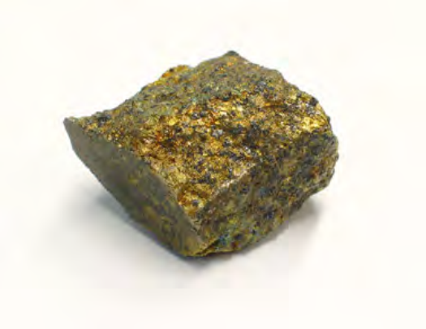
> **[Diagram Context - Textbook_NaturalScience_Gr9_The-lithosphere.pdf-0021-08.png]**
> 1. A rock with a yellowish hue and black specks.

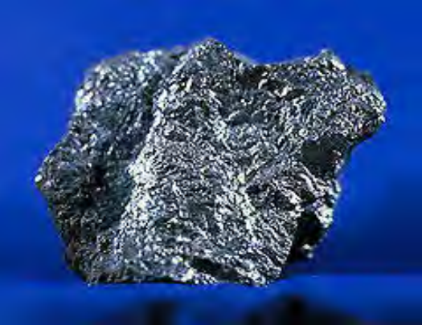
> **[Diagram Context - Textbook_NaturalScience_Gr9_The-lithosphere.pdf-0021-10.png]**
> The image shows a close-up view of a rock, possibly a piece of silver or gray rock, with a blue background. The rock has a unique texture and appears to be composed of multiple layers, suggesting it could be a mineral or a sedimentary rock. The rock is the main focus of the image, and there are no other objects or text present. The rock's texture and color

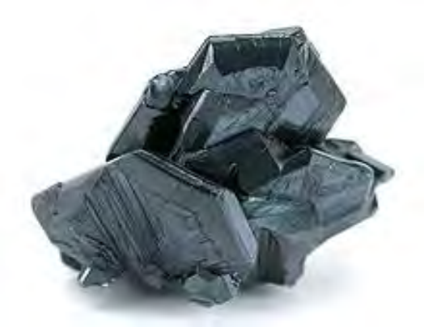
> **[Diagram Context - Textbook_NaturalScience_Gr9_The-lithosphere.pdf-0021-11.png]**
> The image shows a close-up view of a black crystal, possibly a piece of graphite, with a hexagonal shape. The crystal is composed of numerous small, sharp-edged pieces that give it a unique and intricate appearance. The crystal is set against a stark white background, which further accentuates its dark color and sharp edges. The image does not contain any text, and the crystal

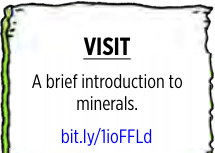
> **[Diagram Context - Textbook_NaturalScience_Gr9_The-lithosphere.pdf-0021-12.png]**
> 1. A diagram of a cell with a green border.

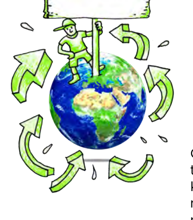
> **[Diagram Context - Textbook_NaturalScience_Gr9_The-lithosphere.pdf-0021-13.png]**
> The image features a cartoon depiction of a boy holding a pole, with arrows pointing to the earth and a globe. The boy is wearing a green shirt and a hat. The boy is standing on a globe, which is tilted to the right. The arrows on the globe are pointing to different parts of the earth. The boy is holding a pole in his hand, which is pointing towards the earth

---

# Summary: The Lithosphere and the Rock Cycle

## Key Concepts

*   **Layers of the Earth:** The Earth is composed of four concentric layers:
    *   Inner core
    *   Outer core
    *   Mantle
    *   Crust
*   **The Lithosphere:** This consists of the solid, outermost part of the mantle and the crust, including the sediments covering it.
*   **The Rock Cycle:** A natural, continuous process where rocks form, are broken down, and re-form over long periods of time.
*   **Types of Rocks:** There are three primary categories of rocks:
    1.  Igneous rock
    2.  Sedimentary rock
    3.  Metamorphic rock
*   **Formation of Sedimentary Rock:**
    *   Rocks on the surface undergo weathering.
    *   Small particles, along with plant and animal material, are deposited as sediments at the bottom of lakes, oceans, and rivers.
    *   Over time, layers of sediment accumulate.
    *   Increased pressure causes compaction, resulting in the formation of hard layers of sedimentary rock.
    *   **Fossils:** These are frequently found in sedimentary rock, as organisms become incorporated into the sediment layers upon death.
*   **Formation of Igneous Rock:**
    *   **Intrusive:** Formed when hot magma deep below the surface cools slowly.
    *   **Extrusive:** Formed when magma pushes through the crust (e.g., a volcano) and cools rapidly.
*   **Formation of Metamorphic Rock:** Hot magma can heat surrounding rock, causing changes that transform other rock types into metamorphic rock.
*   **Minerals:** These are formed by different combinations of elements and compounds found within the Earth's crust.

## Concept Map

Use the concept map provided in your textbook to summarize your learning regarding the lithosphere and the rock cycle. You are encouraged to add additional links or information to the map to deepen your understanding.

> **[Diagram Context - Textbook_NaturalScience_Gr9_Digestive-system.pdf-0022-06.png]**
> This biological illustration shows two parallel trails of ants moving in opposite directions along a path, with a single larger ant highlighted on the left against a pink shaded background. The graphic features multiple small red ant icons arranged in linear formations representing directional movement and collective insect behaviour. Conceptually, it illustrates animal communication, social organization, and pheromone trailing in insects, supporting the Life Sciences curriculum study of animal responses to the environment and social behaviour.

> **[Diagram Context - Textbook_NaturalScience_Gr9_Mining-of-mineral-resources.pdf-0022-06.png]**
> 1. A green spring with a silver spring inside of it. 
 2. A green battery with a silver battery inside of it. 
 3. A green wire with a silver wire inside of it. 
 4. A green wire with a silver wire inside of it. 
 5. A green wire with a silver wire inside of it.

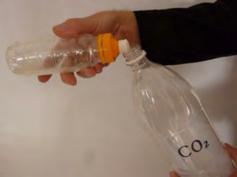
> **[Diagram Context - Textbook_NaturalScience_Gr9_The-atmosphere.pdf-0022-10.png]**
> 1. A person holding a bottle with the word "co2" on it.

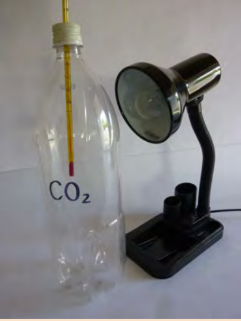
> **[Diagram Context - Textbook_NaturalScience_Gr9_The-atmosphere.pdf-0022-13.png]**
> 1. A bottle of water with the word "co2" written on it.

> **[Diagram Context - Textbook_NaturalScience_Gr9_The-lithosphere.pdf-0022-08.png]**
> The image features a cartoon depiction of a green caterpillar with a smiley face and a leafy branch. The caterpillar is holding a leaf in its mouth, and there are several leaves attached to the branch. The caterpillar is positioned in the center of the image, with the branch extending to the right side. The background is a light green color, and the caterpillar is outlined in

> **[Diagram Context - Textbook_NaturalScience_Gr9_The-lithosphere.pdf-0022-09.png]**
> 1. A diagram of a snake's body.
 2. The snake's body is composed of many small lines.
 3. The snake's body is green and gray.

---

# The Lithosphere and the Rock Cycle

## 1. The Lithosphere
The Earth is composed of 4 concentric layers. The **Lithosphere** is the solid outermost part of the Earth. It is the source of soil and contains various elements and compounds found as minerals (e.g., gold, copper, hematite).

## 2. The Rock Cycle
The rock cycle is a natural, continuous process that occurs over a long period. It involves the transformation of rocks through various geological activities.

### Magma and Volcanic Activity
*   **Magma** pushes up through the Earth's crust.
*   When it erupts through a **volcano**, it cools to form rocks.
*   **Cooling rates:**
    *   If it cools **slowly**, it forms specific rock types.
    *   If it cools **rapidly**, it forms other rock types.

### Weathering and Erosion
*   Surface rocks undergo **weathering**.
*   This process breaks rocks down into small particles.
*   These particles are transported by:
    *   Water
    *   Wind
*   Particles are eventually laid down in the sea.

### Formation of Sedimentary Layers
*   Over time, particles are compacted by pressure.
*   This creates lower layers of rock.

### Rock Types and Transformations
There are 3 main types of rocks. These rocks can be reformed through heat and pressure.
*   **Heat:** Magma heats surrounding rock, causing chemical structure changes.
*   **Transformations:**
    *   Shale can become other rock types.
    *   Limestone can become other rock types.

---

## Summary Table: Geological Processes

| Process | Agent/Cause | Result |
| :--- | :--- | :--- |
| **Volcanism** | Magma eruption | Igneous rock formation |
| **Weathering** | Exposure to elements | Breakdown into small particles |
| **Transportation** | Water and Wind | Movement of particles to the sea |
| **Compaction** | Pressure | Formation of sedimentary layers |
| **Metamorphism** | Heat | Chemical structure change |

> **[Diagram Context - Textbook_NaturalScience_Gr9_The-atmosphere.pdf-0023-05.png]**
> 1. A white square with a gray border.

> **[Diagram Context - Textbook_NaturalScience_Gr9_The-lithosphere.pdf-0023-00.png]**
> 1. A diagram of a cell with blue and white lines.

> **[Diagram Context - Textbook_NaturalScience_Gr9_The-lithosphere.pdf-0023-01.png]**
> 1. A diagram of a cell with arrows pointing to different parts of the cell.

---

# REVISION: Planet Earth and Beyond

## 1. The Earth's Layers

The Earth is composed of distinct layers, each with unique physical and chemical properties.

### a) Labeling the Diagram

Based on the provided cross-section of the Earth, identify the layers labeled A, B, C, and D:
*   **A:** Crust
*   **B:** Mantle
*   **C:** Outer Core
*   **D:** Inner Core

### b) Comparison of Parts C and D
**Question:** What is the difference between parts C (Outer Core) and D (Inner Core)?

*   **Part C (Outer Core):** This layer is composed of liquid iron and nickel.
*   **Part D (Inner Core):** This layer is composed of solid iron and nickel due to the immense pressure at the center of the Earth.

### c) Composition of Part B
**Question:** What does part B (Mantle) consist of?

*   The mantle consists of semi-solid rock (magma/molten rock) that is rich in magnesium and iron silicates.

### d) Examples of Part A (Crust)
**Question:** Give three examples of things found around your school that form part of part A (the crust).

1.  Soil
2.  Rocks/Stones
3.  Sand

---

## 2. Rock Diversity
**Question:** Why are there so many different rocks found on Earth?

*   Rocks are classified into three main types (igneous, sedimentary, and metamorphic) based on how they are formed. The diversity of rocks is a result of the **rock cycle**, which involves various geological processes such as:
    *   Cooling and solidification of magma or lava.
    *   Weathering, erosion, and deposition of sediments.
    *   Heat and pressure transforming existing rocks into new forms.

> **[Diagram Context - Textbook_NaturalScience_Gr9_Mining-of-mineral-resources.pdf-0024-04.png]**
> The image shows a line of green and white beads arranged in a straight line. The beads are evenly spaced, and the line is drawn on a gray background. The beads are positioned in a horizontal line, with the green beads being slightly larger than the white ones. The beads are arranged in a straight line, with the green beads being slightly larger than the white ones. The beads are evenly spaced

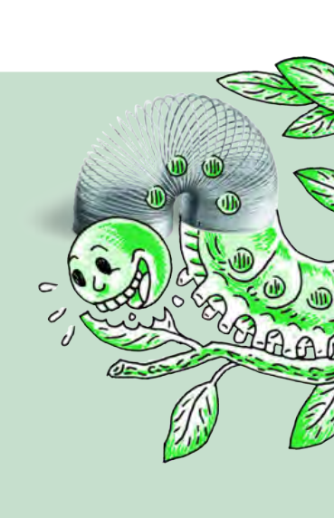
> **[Diagram Context - Textbook_NaturalScience_Gr9_Mining-of-mineral-resources.pdf-0024-10.png]**
> The image shows a cartoon depiction of a spring coiled up in the shape of a caterpillar. The caterpillar is surrounded by green leaves and a green ball. The diagram is labeled with the words "Lewis diagram", "anatomical/cellular structure", "circuit", "graph", "evolutionary tree", "apparatus", and "geometry figure". The diagram

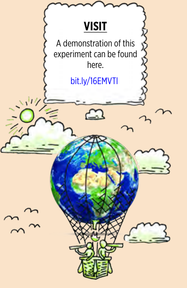
> **[Diagram Context - Textbook_NaturalScience_Gr9_The-atmosphere.pdf-0024-09.png]**
> The image shows a cartoon depiction of a man and a woman riding a hot air balloon. The balloon is filled with a blue substance, and the man is holding a basket. The woman is holding a basket as well. The image also includes a caption that reads "Visit" and a link to a webpage.

> **[Diagram Context - Textbook_NaturalScience_Gr9_The-atmosphere.pdf-0024-11.png]**
> The image shows a gray line with a zipper running down the middle. The zipper is white with an orange line running down the middle. The line is drawn in a straight line, and there is a small orange line running down the middle of the line. The line is drawn in a horizontal line, and there is a small orange line running down the middle of the line.

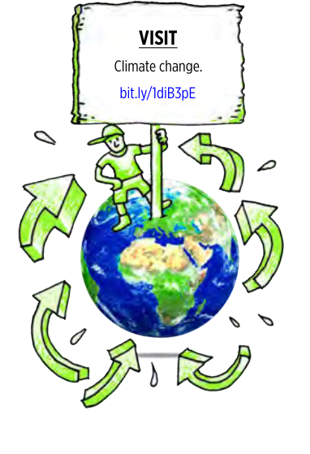
> **[Diagram Context - Textbook_NaturalScience_Gr9_The-atmosphere.pdf-0024-15.png]**
> The image is a cartoon drawing of a cartoon character, a boy, standing on a pole and holding a sign that says "visit" and "climate change". The boy is wearing a hat and is surrounded by various arrows and arrows pointing to the earth. The boy is positioned in the center of the image, with the arrows surrounding him from all directions. The image also includes a text box

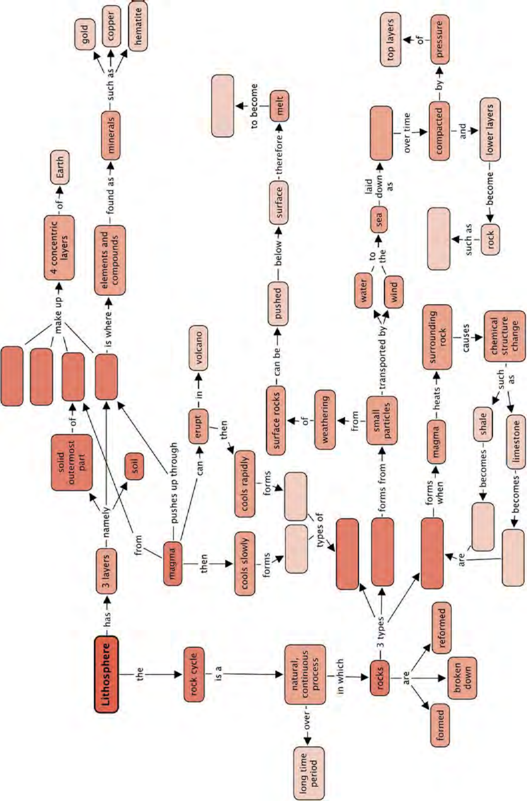
> **[Diagram Context - Textbook_NaturalScience_Gr9_The-lithosphere.pdf-0024-00.png]**
> The image is a diagram that illustrates the human body, showing the different systems and their functions. The diagram is color-coded, with each system represented by a different color. The diagram is labeled with the names of the systems, such as the circulatory system, respiratory system, digestive system, and nervous system. The diagram also includes arrows that connect the systems, indicating the flow of information or

---

### Chapter 2: The Lithosphere

#### 3. Rock Formation Analysis

**a) What type of rock formation is shown in the diagram? Give a reason for your answer. [2 marks]**
*   **Answer:** Sedimentary rock formation.
*   **Reason:** The diagram illustrates the accumulation of layers of sediment (material washed into the sea) and organic material over time, which eventually compacts and turns into rock.

**b) What processes are involved in the formation of this type of rock? [2 marks]**
*   **Processes:** 
    1.  **Weathering and Erosion:** Breaking down of land material.
    2.  **Transportation:** Material being washed or blown into the sea.
    3.  **Deposition:** Material settling in layers at the bottom of the sea.
    4.  **Compaction and Cementation:** The weight of overlying layers pressing the sediment into solid rock.

**c) What will happen if the rocks formed here move deeper into the Earth? [3 marks]**
*   **Answer:** As the rocks move deeper into the Earth, they are subjected to increasing levels of heat and pressure. This causes the rocks to undergo metamorphism, transforming them into **metamorphic rocks**. If they move deep enough to reach the mantle, they may melt completely to become magma.

---

#### 4. Fossils in Sedimentary Rocks

**Explain why fossils are often found in sedimentary rocks. [4 marks]**

*   **Explanation:**
    1.  Sedimentary rocks form at low temperatures and pressures compared to igneous or metamorphic rocks, which allows delicate structures like bones or shells to be preserved rather than destroyed.
    2.  The process of sedimentation involves the gradual layering of materials (sand, mud, silt), which can quickly cover and protect dead organisms from scavengers and decay.
    3.  As the layers build up, the pressure helps to create a mold or cast of the organism within the hardening rock.
    4.  Because sedimentary rocks are formed from surface materials, they are the primary rock type that captures evidence of life existing on the Earth's surface at the time of deposition.

> **[Diagram Context - Textbook_NaturalScience_Gr9_Mining-of-mineral-resources.pdf-0025-02.png]**
> 1. A white square with a brown border.

> **[Diagram Context - Textbook_NaturalScience_Gr9_Mining-of-mineral-resources.pdf-0025-03.png]**
> 1. A diagram of a cell with a green line representing the cell wall.

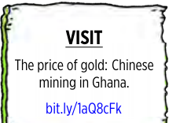
> **[Diagram Context - Textbook_NaturalScience_Gr9_Mining-of-mineral-resources.pdf-0025-04.png]**
> 1. A diagram of a cell.
 2. A diagram of a circuit.
 3. A diagram of a Lewis structure.

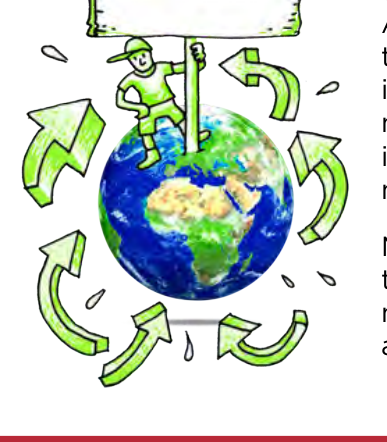
> **[Diagram Context - Textbook_NaturalScience_Gr9_Mining-of-mineral-resources.pdf-0025-07.png]**
> The image is a cartoon drawing of a globe with arrows pointing to different parts of the world. A boy is holding a sign that says "Air" above the globe, which is a symbol for the atmosphere. The boy is wearing a green shirt and a hat. The drawing also includes a label for "Air" and a label for "Earth".

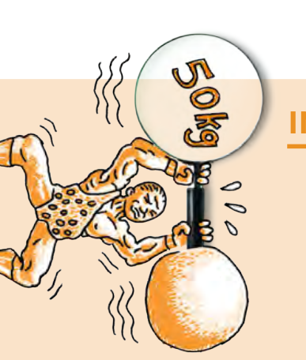
> **[Diagram Context - Textbook_NaturalScience_Gr9_The-atmosphere.pdf-0025-02.png]**
> 1. A cartoon of a man lifting a ball that says "50 kg".

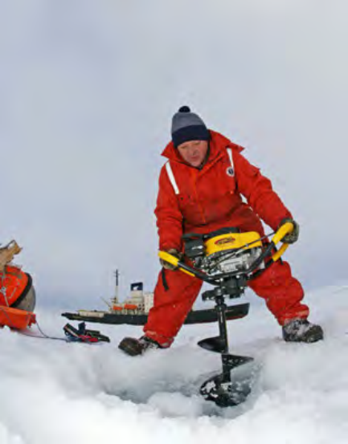
> **[Diagram Context - Textbook_NaturalScience_Gr9_The-atmosphere.pdf-0025-05.png]**
> 1. A man in a red snowsuit is using a black and yellow drill in the snow.

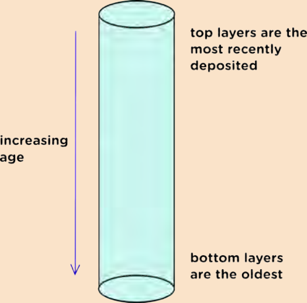
> **[Diagram Context - Textbook_NaturalScience_Gr9_The-atmosphere.pdf-0025-06.png]**
> A diagram showing the relationship between increasing size and the number of layers in a tube. The diagram is labeled with the words "top layers are the most recently deposited" and "bottom layers are the oldest".

> **[Diagram Context - Textbook_NaturalScience_Gr9_The-atmosphere.pdf-0025-09.png]**
> 1. A cartoon drawing of a man holding a picture of a woman. 
 2. The woman in the picture is wearing a white dress. 
 3. The man holding the picture is wearing blue pants. 
 4. The picture is of a woman.

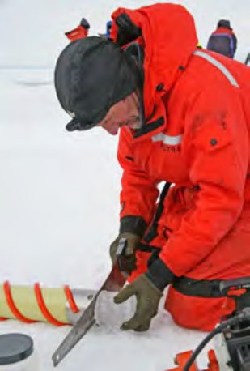
> **[Diagram Context - Textbook_NaturalScience_Gr9_The-atmosphere.pdf-0025-11.png]**
> 1. A man in a red coat and black hat is using a saw to cut a pipe.

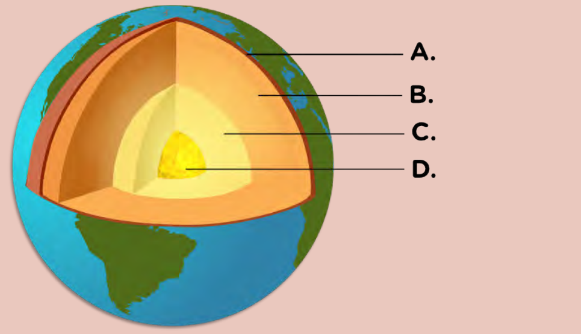
> **[Diagram Context - Textbook_NaturalScience_Gr9_The-lithosphere.pdf-0025-03.png]**
> 1. A diagram of the earth with a yellow circle representing the core.

---

### Lesson: Igneous Rocks and Mineral Formation

#### 1. Formation of Igneous Rocks
Igneous rocks are formed from the cooling and solidification of molten rock (magma or lava). The rate of cooling determines the texture and type of the rock:

*   **Intrusive Igneous Rocks (e.g., Granite):** These form when magma cools slowly beneath the Earth's surface. Because the cooling process is slow, large mineral crystals have time to grow, resulting in a coarse-grained texture.
*   **Extrusive Igneous Rocks (e.g., Pumice):** These form when lava cools rapidly on the Earth's surface. Rapid cooling prevents the formation of large crystals. Pumice, specifically, forms from frothy lava that cools so quickly that gas bubbles are trapped inside, creating a highly porous, lightweight rock.

#### 2. Iron and Hematite
Iron is a metallic element found in the Earth's core. When it reacts with oxygen, it forms iron oxides.

**a) Chemical Formula for Iron (III) Oxide**
The formula for iron (III) oxide is:
$$Fe_{2}O_{3}$$

**b) How Iron Ends Up in Sedimentary Rock**
Iron reaches sedimentary environments through the following process:
1.  **Weathering:** Iron-bearing minerals in igneous rocks are broken down by chemical and physical weathering.
2.  **Transportation:** The weathered iron particles are transported by water (rivers and streams) in the form of ions or small particles.
3.  **Deposition:** In specific environments (such as ancient marine basins), the iron precipitates out of the water or settles as sediment, eventually being compressed and cemented over millions of years to form sedimentary iron formations.

**c) Importance of Hematite**
Hematite is an economically important mineral because it is the primary **ore of iron**. It is the main source used in the industrial production of steel and iron products.

---

### Review Activity

| Question | Topic | Marks |
| :--- | :--- | :--- |
| 5 | Explain the difference between the formation of granite and pumice. | 4 |
| 6a | Provide the chemical formula for iron (III) oxide. | 1 |
| 6b | Describe the process of iron accumulation in sedimentary rock. | 3 |
| 6c | State the importance of hematite. | 1 |
| **Total** | | **9** |

> **[Diagram Context - Textbook_NaturalScience_Gr9_Mining-of-mineral-resources.pdf-0026-06.png]**
> 1. A cartoon drawing of a man holding a picture of a woman.

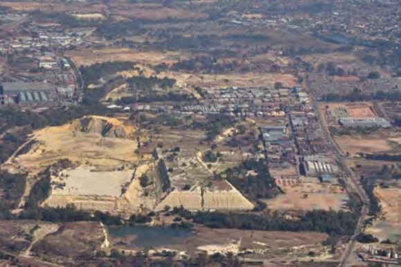
> **[Diagram Context - Textbook_NaturalScience_Gr9_Mining-of-mineral-resources.pdf-0026-07.png]**
> The image shows an aerial view of a city with a large open field in the center. The field is filled with dirt and rocks, and there are several buildings scattered around the area. The city appears to be a mix of urban and rural elements, with a large open field in the middle of the city. The image also contains a map of the city, which is labeled with the names of

> **[Diagram Context - Textbook_NaturalScience_Gr9_Mining-of-mineral-resources.pdf-0026-17.png]**
> 1. A cartoon depiction of a roller coaster with a spring coiled up on top.

> **[Diagram Context - Textbook_NaturalScience_Gr9_Mining-of-mineral-resources.pdf-0026-20.png]**
> 1. A diagram of a snake's body.
 2. The snake's body is green and white.
 3. The snake's head is green.

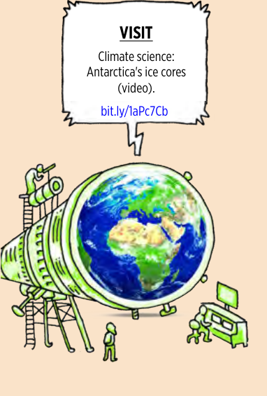
> **[Diagram Context - Textbook_NaturalScience_Gr9_The-atmosphere.pdf-0026-03.png]**
> The image features a cartoon depiction of a group of people standing around a telescope. The telescope is positioned in the center of the image, with the Earth and other planets visible through the lens. The people are positioned around the telescope, with one person standing directly behind it and another person standing to the right of the telescope. The image also includes a caption that reads "Visit Climate Science: Antarctica's

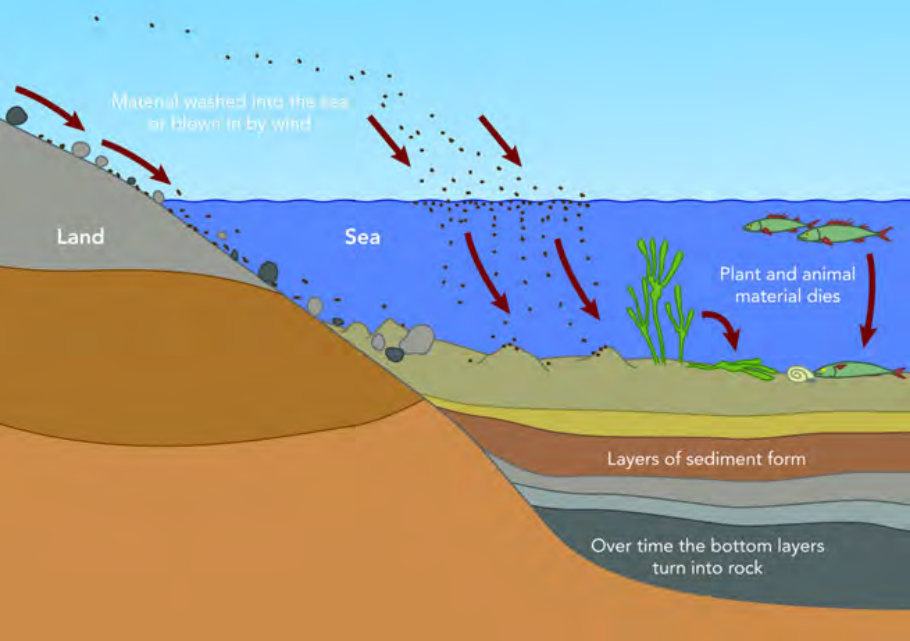
> **[Diagram Context - Textbook_NaturalScience_Gr9_The-lithosphere.pdf-0026-02.png]**
> 1. A diagram of a sedimentary rock formation.
 2. The diagram shows the layers of sedimentary rock and the different types of sedimentary rocks.
 3. The diagram also shows the different types of sedimentary rocks and the different layers of sedimentary rock.

---

# Chapter 2: The Lithosphere

## Activity: Exploring Properties of Matter
**Instruction:** Draw and discover the possibilities of what a slinky can be.

> **[Diagram Context - Textbook_NaturalScience_Gr9_Mining-of-mineral-resources.pdf-0027-00.png]**
> The image shows a line drawing of a cell with blue and white lines. The drawing is set against a gray background, and the lines are arranged in a zigzag pattern. The diagram is labeled with the word "cell" and "biology" written in white text. The diagram also includes a Lewis diagram and a diagram of a cell.

*Note: This activity encourages learners to observe the physical properties of a slinky, such as its elasticity, flexibility, and potential for demonstrating wave motion, which relates to the study of the Earth's crust and seismic waves within the lithosphere.*

> **[Diagram Context - Textbook_NaturalScience_Gr9_Mining-of-mineral-resources.pdf-0027-01.png]**
> 1. A diagram of a tree with a key in the middle.

> **[Diagram Context - Textbook_NaturalScience_Gr9_The-atmosphere.pdf-0027-04.png]**
> 1. A white square with a brown border.

> **[Diagram Context - Textbook_NaturalScience_Gr9_The-lithosphere.pdf-0027-07.png]**
> The image shows a close-up view of a gray line with a red and white insect on it. The insect is positioned on the right side of the line, and it appears to be a small, red and white ant. The background of the image is a solid gray color.

---

# Unit 21: The Lithosphere

## Overview
The lithosphere is the rigid outer layer of the Earth, consisting of the crust and the uppermost part of the mantle. It is a fundamental component of the **geosphere**, which is composed of three concentric layers: the core, the mantle, and the crust.

---

## 21.1 What is the Lithosphere?
The lithosphere is found all around us. Understanding its structure requires an investigation into the Earth's internal layers.

### Learning Activities
| Tasks | Skills | Recommendation |
| :--- | :--- | :--- |
| Activity: Investigating stones | Observation, writing, describing | CAPS suggested |
| Activity: Build a 3D model of the Earth | Design, making a model, applying knowledge | Optional |
| Activity: The layers inside the Earth | Classification, comprehension | CAPS suggested |

---

## 21.2 The Rock Cycle
The rock cycle describes the continuous process by which rocks are created, changed from one form to another, destroyed, and formed again. This cycle is driven by the Earth's internal heat and surface processes.

### Learning Activities
| Tasks | Skills | Recommendation |
| :--- | :--- | :--- |
| Activity: Summarising the rock cycle | Recall, comprehension | CAPS suggested |
| Activity: Explaining the rock cycle | Writing, comprehension | CAPS suggested |
| Activity: Building a model of sedimentary rock | Making a model, translating information | CAPS suggested |
| Activity: Comparing properties of igneous rocks | Comparing, observation, application | Optional |
| Activity: Classifying rocks | Classification, organising, deduction | Optional extension |
| Activity: What minerals are found on Earth? | Researching, reading, writing | CAPS suggested |

---

## Key Questions for Revision
1. What does the centre of the Earth look like?
2. Why is it important to understand the structure of the Earth?
3. Why is there such a wide variety of rocks found on the Earth's surface?
4. What are the specific processes by which rocks form?
5. Why is it necessary for us to study and understand rocks and minerals?

---

## Mathematical Context in Earth Science
While the study of the lithosphere is primarily geological, we often use mathematical models to represent the Earth's structure. For example, if we represent the Earth as a sphere, we use the formula for the volume of a sphere ($V$):

$$V = \frac{4}{3} \pi r^{3}$$

Where:
*   $V$ = Volume
*   $\pi \approx 3.14159$
*   $r$ = Radius of the Earth layer being measured

When calculating the density ($\rho$) of rock samples found in the lithosphere, we use the relationship between mass ($m$) and volume ($V$):

$$\rho = \frac{m}{V}$$

*   **Mass ($m$):** Measured in grams ($g$) or kilograms ($kg$).
*   **Volume ($V$):** Measured in cubic centimeters ($cm^{3}$) or cubic meters ($m^{3}$).

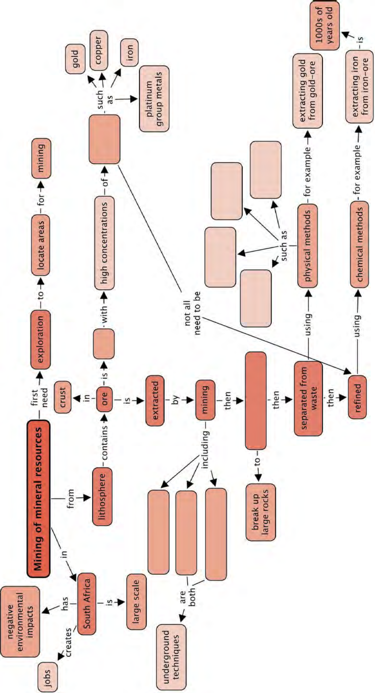
> **[Diagram Context - Textbook_NaturalScience_Gr9_Mining-of-mineral-resources.pdf-0028-00.png]**
> The image is a diagram that illustrates the structure of a cell. The diagram is divided into different sections, each representing a specific part of the cell. The diagram is color-coded, with each color representing a different part of the cell. The diagram is labeled with the names of the different parts of the cell, such as the nucleus, cytoplasm, and cell membrane. The diagram

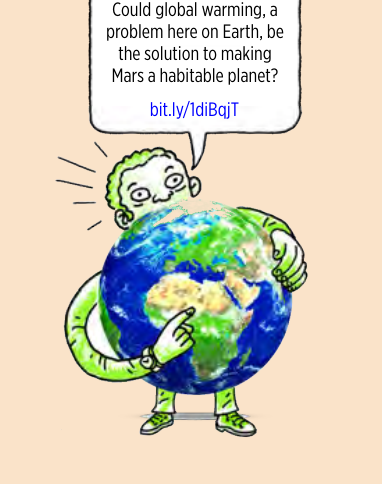
> **[Diagram Context - Textbook_NaturalScience_Gr9_The-atmosphere.pdf-0028-06.png]**
> The image features a cartoon depiction of a man holding a globe in his hands. The man is wearing a green suit and has a green hat on his head. The globe is green and white, and the man is pointing to the globe with his left hand. The image also includes a speech bubble containing text that reads, "Could global warming, a problem here on Earth, be the solution to

> **[Diagram Context - Textbook_NaturalScience_Gr9_The-atmosphere.pdf-0028-07.png]**
> The image shows a gray line with a zipper running down the middle. The zipper is white on the left side and orange on the right side. The line is drawn with a thin, straight line. The background is a solid gray color.

> **[Diagram Context - Textbook_NaturalScience_Gr9_The-atmosphere.pdf-0028-08.png]**
> 1. A diagram of a cell with blue and white lines.

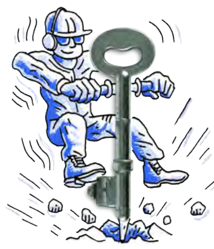
> **[Diagram Context - Textbook_NaturalScience_Gr9_The-atmosphere.pdf-0028-15.png]**
> 1. A cartoon drawing of a man digging with a key.

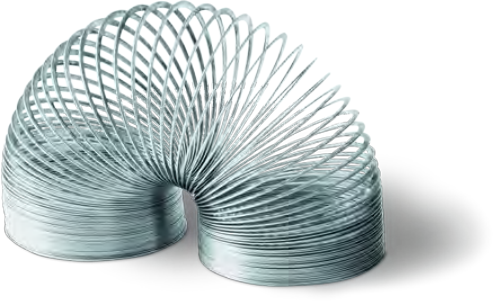
> **[Diagram Context - Textbook_NaturalScience_Gr9_The-lithosphere.pdf-0028-01.png]**
> 1. A silver spring coiled into a loop.

---

# 1. Why are rocks important?

## 21.1 What is the lithosphere?

### ACTIVITY: Investigating stones

**Objective:** To observe real artifacts (stones/rocks) and practice recording detailed scientific observations. This activity serves as an introduction to the lithosphere.

#### Instructions for Learners
1. **Collection:** Gather at least 4 different items (stones/rocks) from the school grounds or bring them from home. 
   * *Note:* Avoid man-made materials like brick or cement, as these are not natural rocks.
2. **Observation:** Examine each item carefully. If working in stations, spend 3 minutes at each station observing the samples.
3. **Testing (Optional):** With teacher supervision, you may attempt to crush a sample using a hammer. Wrap the sample in a paper towel first to prevent fragments from flying.
4. **Recording:** Use the observation table below to document your findings for each sample.

#### Observation Table Template

| Location | Shape and colour | Texture | Composition |
| :--- | :--- | :--- | :--- |
| Describe where you found your sample. | Describe the size, shape and colour. | Describe the texture and hardness. | Can you see more than one part? Describe what it is made up of. |

---

### Discussion Points
After completing the observations, consider the following questions:
1. What types of stone found on Earth were not collected in this activity? (e.g., molten rock, rock from the seafloor).
2. What do we use the lithosphere for? (e.g., minerals, fuels, plant nutrients, building materials).
3. What is rock or stone actually made of? (Consider if sand is a type of rock).

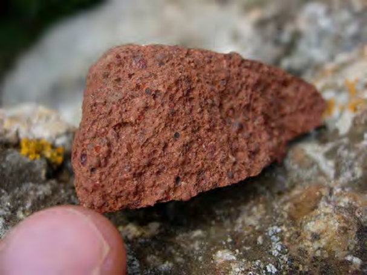
> **[Diagram Context - Textbook_NaturalScience_Gr9_Mining-of-mineral-resources.pdf-0029-02.png]**
> 1. A rock sample is shown.

### Key Concepts
* **The Lithosphere:** The rigid outer part of the Earth, consisting of the crust and upper mantle. All types of stone, including sand (which is stone worn down by wind and water), are part of the lithosphere.
* **Future Learning:** This activity introduces two major topics:
    * **The Rock Cycle:** How different types of rocks are formed (Unit 2).
    * **Minerals:** What rocks are made of and how we mine them (Unit 3).

---

### Properties of Sand

| Material | Source | Physical Characteristics | Texture and Feel | Grain Structure |
| :--- | :--- | :--- | :--- | :--- |
| Sand | Building site next door to our house. | Small round grains of about $1\text{ mm}$ in diameter on average. Cream coloured with some darker brown grains. | The grains are all more or less the same size. The sand is dry, so it feels smooth and soft. | The grains are hard but break up even further when hit with a hammer. The grains are not connected/stuck to each other and are free flowing. |

---

### Inside the Earth

#### Activity: Build a 3D-model of the Earth
*   **Objective:** Create a labelled model of the Earth to understand its internal layers.
*   **Method:** Learners work in pairs to construct the model.
*   **Materials:** Coloured paper or painted papier-mâché are recommended as cost-effective alternatives.
*   **Assessment:** Use Assessment Rubric 7 (found in the Teacher's Guide).
*   **Resources:** 
    *   Poster: `bit.ly/1a9QXOn`
    *   Papier-mâché tutorial: `bit.ly/Hr23rj`

#### Activity: The layers inside the Earth
*   **Objective:** To provide structure for new terminology and help learners understand how different terms are related.
*   **Method:** Learners create a "topic map" to organize information.
*   **Educational Goal:** This activity helps learners develop skills in summarizing information and organizing complex concepts, building on previous exposure to various types of maps in Natural Sciences.
*   **Progression:** Initially, a basic structure is provided for the map, but learners will eventually be required to create their own structures to demonstrate their understanding of the relationships between concepts.

---

# The Structure of Planet Earth

Planet Earth is composed of four primary interconnected systems. These systems interact to support life and maintain the planet's physical environment.

## 1. The Four Spheres of Earth

*   **Geosphere:** The solid, rocky part of the Earth.
*   **Hydrosphere:** Represents all the water on Earth.
*   **Atmosphere:** Represents all the air on Earth.
*   **Biosphere:** Represents all life on Earth.

---

## 2. Composition of the Geosphere

The geosphere is divided into three main structural layers:

### A. Crust
The outermost layer of the Earth. It is divided into two types:
*   **Continental Crust:** Forms the landmasses.
*   **Oceanic Crust:** Forms the ocean floors.
*   **Lithosphere:** The brittle, rigid outer part of the Earth, formed by the crust and the uppermost part of the mantle.

### B. Mantle
The layer located beneath the crust. It is divided into:
*   **Upper Mantle**
*   **Lower Mantle**

### C. Core
The central part of the Earth, divided into two distinct regions:
*   **Inner Core:** The solid, innermost center.
*   **Outer Core:** The liquid layer surrounding the inner core.

---

## Summary Table: Earth's Structural Hierarchy

| System | Component | Sub-components |
| :--- | :--- | :--- |
| **Geosphere** | Crust | Continental Crust, Oceanic Crust |
| | | Lithosphere (Crust + upper mantle) |
| | Mantle | Upper Mantle, Lower Mantle |
| | Core | Inner Core, Outer Core |
| **Hydrosphere** | Water | All water on Earth |
| **Atmosphere** | Air | All air on Earth |
| **Biosphere** | Life | All life on Earth |

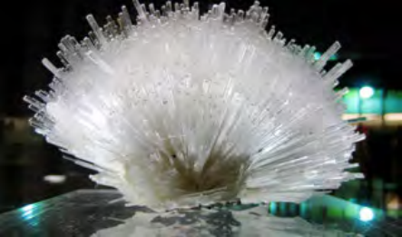
> **[Diagram Context - Textbook_NaturalScience_Gr9_Mining-of-mineral-resources.pdf-0031-05.png]**
> 1. A diagram of a crystal structure.

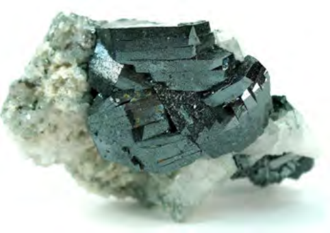
> **[Diagram Context - Textbook_NaturalScience_Gr9_Mining-of-mineral-resources.pdf-0031-07.png]**
> The image shows a close-up view of a piece of black rock or mineral. The rock is composed of small, square-shaped crystals, which are the main focus of the image. The rock is set against a white background, making the black color of the crystals stand out. The image does not contain any text or additional objects, and the rock is the sole subject of the image.

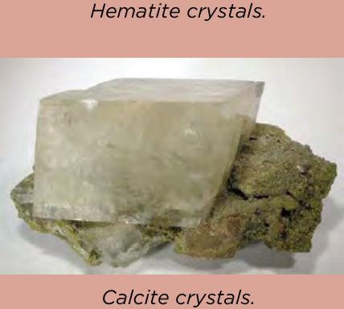
> **[Diagram Context - Textbook_NaturalScience_Gr9_Mining-of-mineral-resources.pdf-0031-08.png]**
> The image shows a diagram of a crystal structure, specifically a calcium crystal. The crystal is composed of calcium carbonate, which is a mineral composed of calcium and carbon. The diagram is labeled with the name "calcite crystals" and the chemical formula "CaCO3". The diagram also includes a Lewis structure of the calcium carbonate crystal, which is a three-dimensional representation of the

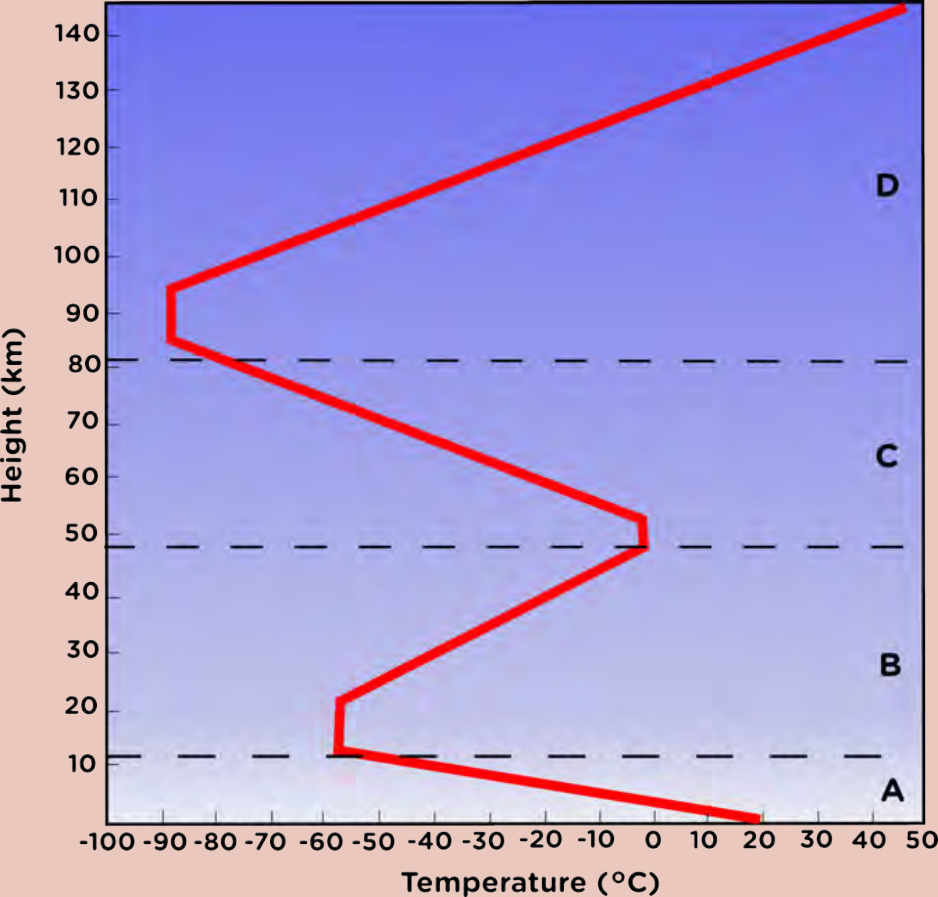
> **[Diagram Context - Textbook_NaturalScience_Gr9_The-atmosphere.pdf-0031-02.png]**
> The image is a graph that shows the relationship between the height of a person and the temperature of the air. The graph is a line graph with the x-axis labeled "height" and the y-axis labeled "temperature". The line graph shows that as the height of a person increases, the temperature of the air also increases. The graph is labeled with the variable "A" and

---

# 21.2 The Rock Cycle

## Understanding the Rock Cycle
The rock cycle is a continuous geological process that describes how rocks change from one type to another over millions of years.

### Key Processes and Definitions
Based on the rock cycle diagram, the following concepts are essential for understanding how rocks transform:

1.  **Magma:** Molten (melted) rock found beneath the Earth's surface. When it flows onto the surface, it is called **lava**.
2.  **Cooling:** The process by which magma or lava loses heat and solidifies to form **Igneous rock**.
3.  **Weathering and Erosion:** The action of wind, water, and ice that breaks down existing rocks into smaller pieces called **sediments**.
4.  **Compaction and Cementation:** The process where layers of sediment are squeezed together and hardened by minerals to form **Sedimentary rock**.
5.  **Heat and Pressure:** When rocks are buried deep underground, intense heat and pressure change their physical or chemical structure, turning them into **Metamorphic rock**.
6.  **Melting:** When rocks are subjected to extreme heat, they melt back into magma, restarting the cycle.

---

## Activity: Summarising the Rock Cycle
*Refer to the diagram above to identify the relationships between rock types:*

| Process | Resulting Rock/Material |
| :--- | :--- |
| Cooling of magma/lava | Igneous rock |
| Weathering and erosion of rocks | Sediments |
| Compaction and cementation of sediments | Sedimentary rock |
| Heat and pressure applied to rocks | Metamorphic rock |
| Melting of rocks | Magma |

---

## Activity: Explaining the Rock Cycle
This exercise is designed to test your understanding of geological processes. When explaining the cycle in your own words, ensure you cover the following:

*   **The transformation of Igneous, Metamorphic, and Sedimentary rocks:** Explain how each type can eventually become another.
*   **The role of the environment:** Describe how wind and water (weathering) contribute to the formation of sediments.
*   **The role of depth:** Explain how increased temperature and pressure deep within the Earth alter rock structures.

**Study Tip:** Use the rock cycle diagram as a guide to create your own labelled flow chart. Do not simply copy the text; write the explanations in your own words to demonstrate your grasp of the concepts.

> **[Diagram Context - Textbook_NaturalScience_Gr9_Mining-of-mineral-resources.pdf-0032-08.png]**
> The image shows a close-up of a diagram of a cell, with a red ant positioned on the right side of the cell. The cell is depicted in shades of gray, and the ant is shown in a red color. The diagram is labeled with the word "cell" and "ant" written in black text. The background of the image is a solid gray color.

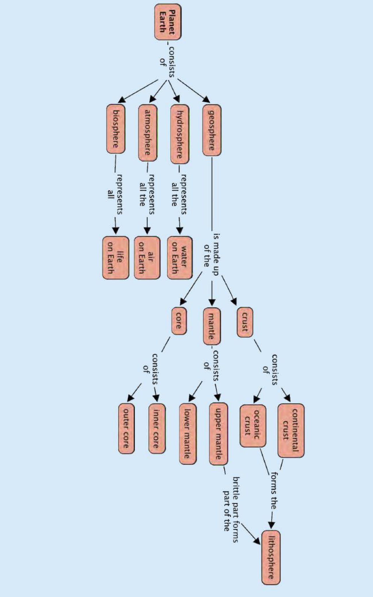
> **[Diagram Context - Textbook_NaturalScience_Gr9_The-lithosphere.pdf-0032-00.png]**
> This concept map illustrates the hierarchical structure of Earth, breaking down the planet into its four primary spheres (biosphere, atmosphere, hydrosphere, and geosphere) and further detailing the geosphere into the core, mantle, and crust. By mapping these components and their sub-layers—such as the lithosphere—the diagram helps learners visualize the interconnected physical systems of the Earth as required in the Natural Sciences curriculum.

---

# The Rock Cycle

The rock cycle is the natural, continuous process in which rocks form, are broken down, and re-form over long periods of time.

## The Three Types of Rocks
1. **Igneous rocks**
2. **Sedimentary rocks**
3. **Metamorphic rocks**

---

## The Stages of the Rock Cycle

1. **Magma Movement:** Molten rock from the mantle (magma) pushes up through the Earth's crust.
2. **Cooling:** Pools of magma cool down slowly in the crust to form igneous rocks (e.g., granite).
3. **Volcanic Activity:** Some magma escapes to the surface as lava.
4. **Igneous Formation:** Lava cools to form igneous rocks. The rate of cooling determines the properties of the rock.
5. **Weathering:** Rocks on the surface are weathered by heat (expansion), cold (contraction), wind, and water, breaking them into smaller particles.
6. **Erosion and Transport:** Wind and water transport these particles to floodplains and the sea.
7. **Deposition:** Particles are laid down as sediments.
8. **Compaction:** Sediments are covered by more layers. The pressure of these layers turns the lower layers into sedimentary rock (e.g., sandstone).
9. **Metamorphism:** Magma heats surrounding rock, changing its chemical structure to form metamorphic rock (e.g., slate from shale, or marble from limestone).
10. **Melting:** Some rock is pushed below the crust, where it melts and becomes magma again.

---

## Sedimentary Rock: Educational Notes

*   **Real-world Application:** Rocks are essential materials used in daily life. Understanding their origins helps learners appreciate stone as a natural resource.
*   **Demonstration (Deposition):** Mix soil in a glass jar of water. Allow the particles to settle over time. Adding different colours of sand or soil illustrates how distinct sedimentary layers form.

---

## Activity: Modelling the Formation of Sedimentary Rock

**Objective:** To use a model to represent how layers of sediment are deposited and compressed over time.

**Method:**
1. Use slices of brown and white bread to represent different layers of sediment.
2. Pile books on top of the bread slices.
3. Continue adding weight until the bread cannot be compressed further.

**Observations:**
*   Initially, the layers are loose and distinct.
*   Under pressure, the layers merge into a single mass, demonstrating how sedimentary rock forms from layers of sediment.

**Discussion Point:** Discuss how models are used in Science to represent and explain complex natural processes that occur over long periods.

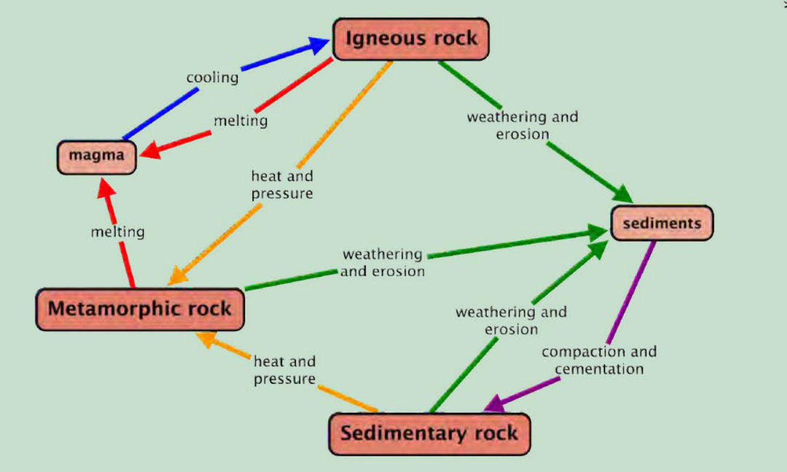
> **[Diagram Context - Textbook_NaturalScience_Gr9_The-lithosphere.pdf-0033-04.png]**
> A diagram of a rock cycle, showing the transformation of Igneous Rock to Sedimentary Rock, and the transformation of Sedimentary Rock to Metamorphic Rock.

---

### Rock Formation Processes

#### 1. Sedimentary Rock Formation (Model Analogy)
The process of sedimentary rock formation can be modeled using layers of material (such as books) to represent the accumulation of sediment over time:
*   **Compression:** As new layers are added, the bottom layers experience increased pressure.
*   **Cementation:** Over time, the pressure causes the layers to become "squashed" and compacted.
*   **Result:** The original distinct layers become difficult to distinguish as they transform into solid sedimentary rock.

#### 2. Metamorphic Rock
Metamorphic rocks are formed through the transformation of existing rock types under intense heat and pressure.
*   **Practical Activity:** Learners should examine and handle physical samples of slate, marble, sandstone, and granite to identify their unique textures and characteristics.

#### 3. Igneous Rock: The Formation of Pumice
Igneous rocks are formed from the cooling and solidification of molten rock (magma or lava). Pumice is a specific type of igneous rock formed during explosive volcanic activity.

**The Process:**
1.  **Gas Pressure:** Magma beneath the Earth's surface contains trapped gases under high pressure.
2.  **Eruption:** When the magma breaches the Earth's crust, the pressure is released rapidly.
3.  **Explosion:** The sudden expansion of gas forces the molten rock out of the volcano with great force.
4.  **Cooling:** The ejected material cools very rapidly in the air, forming rocks that range in size from small pebbles to large boulders.

**Classroom Demonstration: The Fizzy Drink Analogy**
This experiment illustrates how gas pressure drives a volcanic eruption.

*   **Materials:** A bottle of carbonated (fizzy) drink.
*   **Procedure:** 
    *   Shake the bottle to increase internal pressure.
    *   Open the cap to allow the gas to escape suddenly.
*   **Observation:** The liquid is forced out of the bottle rapidly, mimicking the eruption of lava and gas from a volcano.
*   **Analogy:** The liquid represents the magma, and the dissolved gas represents the volcanic gases. The rapid release of pressure causes the "eruption."

**WARNING:** This demonstration is messy and must be performed **outdoors**. Learners must maintain a safe distance from the demonstration area.

> **[Diagram Context - Textbook_NaturalScience_Gr9_The-atmosphere.pdf-0034-03.png]**
> The image shows a close-up view of a diagram of a cell. The diagram is colored in shades of pink and gray, with a red ant positioned in the center. The diagram is labeled with the text "Lewis diagram" and "cellular structure". The diagram also includes a Lewis structure of a molecule, which is labeled with the chemical formula "C6H12O6". The

> **[Diagram Context - Textbook_NaturalScience_Gr9_The-atmosphere.pdf-0034-05.png]**
> The image shows a single, silver key with a unique hole in the center. The key is positioned vertically, with the handle pointing downwards. The key is set against a plain white background, which allows the viewer to focus on the key and its features. The key appears to be a standard key, designed for use with standard locks.

---

### Activity: Comparing the Properties of Igneous Rocks

Igneous rocks are classified based on their formation process (extrusive vs. intrusive), cooling rate, and physical characteristics. Use the table below to analyze the properties of four common rock samples.

| Sample | Where was the sample formed? | How quickly did it cool? (Evidence) | Was air trapped when it formed? (Evidence) | Describe the colour |
| :--- | :--- | :--- | :--- | :--- |
| **Sample 1 (Basalt)** | Extrusively | Very fine crystals | No, no visible holes | Dark, green-grey |
| **Sample 2 (Obsidian)** | Extrusively | Fast, no visible crystals | No, no visible holes | Shiny black |
| **Sample 3 (Granite)** | Intrusively | Slowly, there are large interlocking crystals | No, no visible holes | Mottled with yellow-brown, white and black |
| **Sample 4 (Pumice)** | Extrusively | Fast, there are no crystals | Yes, there are holes where gas bubbles were trapped | Grey-black |

---

### Core Concepts: Rocks and Minerals

#### 1. Rocks Contain Minerals
Rocks are composed of naturally occurring solid substances known as minerals. Understanding the composition of rocks is essential for studying the Earth's structure, specifically the:
*   **Crust:** The outermost layer of the Earth.
*   **Mantle:** The layer beneath the crust.
*   **Core:** The central part of the Earth.

#### 2. Research Activity: What minerals are found on Earth?
To further your understanding of geological materials, conduct a research project on the minerals found on Earth. 

**Research Guidelines:**
*   Identify common minerals found in the Earth's crust.
*   Explain the relationship between mineral composition and rock types.
*   Prepare a written report summarizing your findings.
*   **Resource:** For detailed information and worksheets to support this research, refer to the educational resource available at: `rsc.li/17rVgrL`.

> **[Diagram Context - Textbook_NaturalScience_Gr9_The-lithosphere.pdf-0035-08.png]**
> This image depicts the "Diet Coke and Mentos" reaction, a classic demonstration of physical nucleation. The visible elements include a Diet Coke bottle and a rapid, pressurized eruption of foam caused by the sudden release of dissolved carbon dioxide gas. Conceptually, this illustrates how the porous surface of the Mentos candy provides nucleation sites that accelerate the transition of dissolved gas into bubbles, demonstrating the principles of solubility and phase change in a physical reaction.

---

# Revision: Earth Science and Rocks

## 1. Structure of the Earth

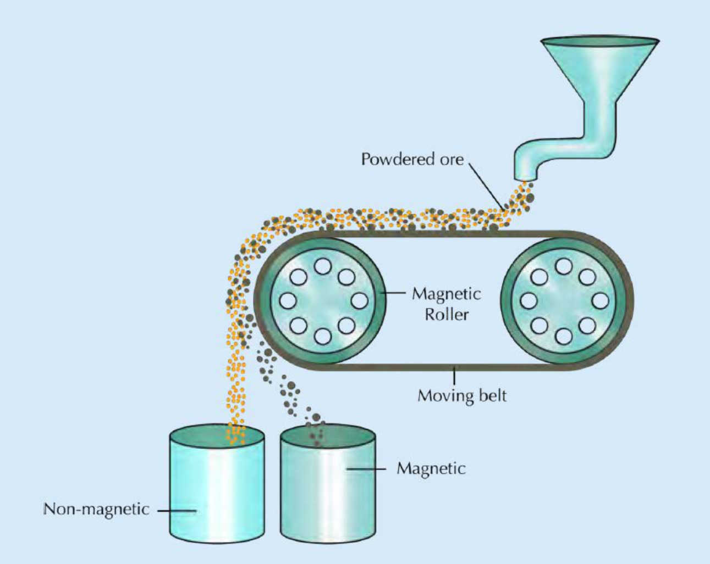
> **[Diagram Context - Textbook_NaturalScience_Gr9_Mining-of-mineral-resources.pdf-0036-03.png]**
> 1. A diagram of a machine that is used to make powdered ore. The machine has two large wheels and a conveyor belt that is filled with small balls. The machine is powered by a magnetic roller.

The Earth is composed of four distinct layers:
*   **A. Crust:** The outermost solid layer.
*   **B. Mantle:** The layer beneath the crust.
*   **C. Outer Core:** A liquid layer.
*   **D. Inner Core:** A solid central layer.

**Key Facts:**
*   The outer core (C) is liquid, while the inner core (D) is solid.
*   Magma is molten rock found beneath the Earth's surface.
*   Common sedimentary materials include sand, stone, rocks, pebbles, and clay.

---

## 2. Rock Formation
Rocks are formed through various geological processes, resulting in a wide variety of combinations of rock minerals.

---

## 3. The Rock Cycle: Sedimentary to Metamorphic
*   **a)** Sedimentary rock layers are formed at the bottom of the ocean.
*   **b)** The primary processes involved are **sedimentation** and **cementation**.
*   **c)** As rocks are buried deeper, they experience higher temperatures and increased pressure. This causes the rocks to become more compact and triggers changes in their chemical compounds, eventually forming **metamorphic rock**.

---

## 4. Fossilisation
When plants or animals die, their remains are often covered by layers of sand over time. As the sand becomes compacted, it turns into sedimentary rock, trapping the fossilised remains of the organism inside.

---

## 5. Igneous Rocks
*   **Intrusive Igneous Rock (e.g., Granite):** Forms from magma cooling slowly beneath the Earth's surface, allowing large crystals to grow.
*   **Extrusive Igneous Rock (e.g., Pumice):** Forms when magma is pushed out to the surface (lava) and cools very quickly, often trapping bubbles of gas.

---

## 6. Iron and Chemical Processes
*   **a) Chemical Formula:** The formula for iron(III) oxide is $Fe_{2}O_{3}$.
*   **b) Formation:** Sedimentary hematite crystals formed as evaporating oceans left deposits of iron in sedimentary layers. This iron combined with oxygen molecules produced by photosynthesis.
*   **c) Applications:** Iron is a vital industrial material used to manufacture steel, stainless steel, and vehicles.