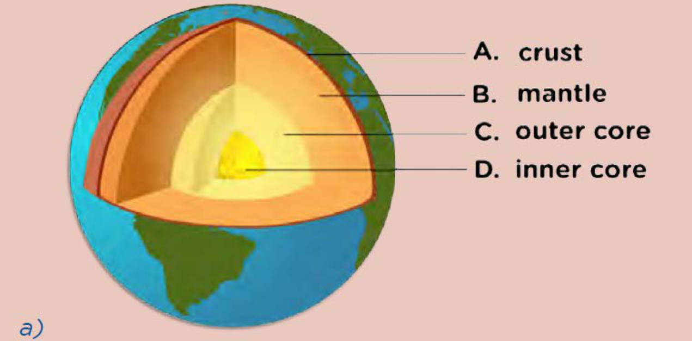

# Mining of Mineral Resources

## Core Concepts

### Definitions
*   **Mineral:** A naturally occurring chemical compound or pure element formed through geological processes.
*   **Ore:** Rocks that contain large concentrations of minerals, making them economically viable to mine.
*   **PGM:** Platinum Group Metals.

### The Mining Process
Mining is the industry responsible for extracting minerals from the lithosphere and processing them into a usable form. The process follows a systematic sequence to ensure efficiency and economic viability.

#### The Mining Flowchart
The following table outlines the standard stages of the mining industry:

| Stage | Action | Purpose |
| :--- | :--- | :--- |
| 1 | **Exploration** | Finding high-quality ore deposits. |
| 2 | **Drilling and Blasting** | Getting ore out of the ground. |
| 3 | **Crushing and Milling** | Getting the mineral out of the ore. |
| 4 | **Separation** | Separating the mineral from the waste rock. |
| 5 | **Refining** | Cleaning the mineral or metal. |
| 6 | **Distribution** | Distributing the minerals and metals to where they are needed. |

---

## Key Questions for Revision
To master this topic, ensure you can answer the following:
1.  How do we identify locations suitable for mining?
2.  What methods are used to extract ore from the ground?
3.  How are minerals extracted from the ore?
4.  What is the difference between separation and refining?
5.  What is the significance of the mining industry in the South African economy?
6.  What are the primary mineral resources mined in South Africa?
7.  What are the environmental and social impacts of mining?

---

## Mathematical Context in Mining
While mining is a geological and industrial process, it relies heavily on mathematical modeling for economic viability. 

### Economic Viability Formula
To determine if a site is worth mining, companies calculate the **Net Value ($V$)** of the ore body:

$$V = (Q \times P) - (C_{e} + C_{p} + C_{t})$$

Where:
*   $V$ = Net value of the deposit
*   $Q$ = Quantity of the mineral (tonnes)
*   $P$ = Market price per unit of the mineral
*   $C_{e}$ = Cost of exploration
*   $C_{p}$ = Cost of production (extraction and processing)
*   $C_{t}$ = Cost of transport and distribution

**Example Calculation:**
If a mining company finds an ore deposit with $10,000$ tonnes of a mineral, and the market price is $\$500$ per tonne, with total costs of $\$2,000,000$:

$$V = (10,000 \times 500) - 2,000,000$$
$$V = 5,000,000 - 2,000,000$$
$$V = \$3,000,000$$

Since $V > 0$, the mining project is considered economically viable.

---

# Chapter 3: Mining of Mineral Resources

## 3.1 Exploration: Finding Minerals

Mining exploration is the systematic process of locating valuable mineral deposits within the lithosphere. Because most minerals are dispersed in very low concentrations, mining is only economically viable when high-quality ore is concentrated in a specific, accessible area.

### Key Terminology
*   **Exploration:** The process of searching for mineral deposits.
*   **Remote Sensing:** Gathering data about the Earth's surface from a distance (e.g., via satellites or aircraft).
*   **Geophysical Methods:** Techniques that measure physical properties of the Earth (such as magnetism or gravity) to detect underground deposits.
*   **Geochemical Methods:** Techniques that analyze the chemical composition of soil, water, or rock samples to identify traces of minerals.

### The Exploration Process
1.  **Surveying:** Geologists and surveyors use advanced technology to identify potential sites.
2.  **Analysis:** Properties of minerals are used to locate them without initial digging. For example, because iron is magnetic, instruments measuring magnetic field fluctuations can indicate the presence of iron ore pockets.
3.  **Verification:** Only after surveying techniques suggest a high probability of a viable deposit do mining companies proceed to dig test shafts to confirm the findings.

---

## Activity: Mining in South Africa

### Instructions
Work in groups of three to research one specific mining industry in South Africa.

**1. Choose a Mineral:**
Select one from the following list:
*   Gold
*   Iron
*   Coal
*   Phosphate
*   Manganese
*   Diamond
*   Chromium
*   Copper
*   Platinum Group Metals (PGMs)

**2. Research Questions:**
Use the following framework to guide your investigation:

| Category | Research Focus |
| :--- | :--- |
| **Geology** | How do geologists/engineers locate the mineral? |
| **Extraction** | What mining method is used? What processes extract the rock? |
| **Processing** | How is the rock size reduced? How is the mineral removed/separated/refined? |
| **Geography** | Where in South Africa is this mineral mined? |
| **Impact** | What is the impact on the South African economy and the environment? |
| **Careers** | What specific careers are involved in this industry? |

**3. Presentation:**
Present your findings to the class using an oral presentation and a visual poster.

> **[Diagram Context - Textbook_NaturalScience_Gr9_Digestive-system.pdf-0001-01.png]**
> This educational graphic is a simplified structural representation showing a series of repeated blue helical or coiled shapes emerging from a horizontal baseline surface. There are no explicit text labels, symbols, or directional arrows visible in the image. Conceptually, this diagram can be used by CAPS life sciences or physical sciences learners to model repeating periodic structures, surface phenomena, or wave-like boundaries such as microvilli, diffraction gratings, or microscopic surface textures.

> **[Diagram Context - Textbook_NaturalScience_Gr9_Digestive-system.pdf-0001-02.png]**
> This conceptual illustration depicts a large metal key positioned vertically as a central barrier, flanked on the left by a blue cartoon monster breathing fire among city buildings, and on the right by a helicopter lowering a net over urban skyscrapers. There are no visible text labels, chemical symbols, or axis names present in the graphic. Conceptually, this metaphorical imagery can be used in Life Sciences or CAPS-aligned Life Orientation to prompt critical thinking about conflict resolution, environmental management, or containment strategies in ecosystems and urban settings.

> **[Diagram Context - Textbook_NaturalScience_Gr9_Electric-cells-as-energy-systems.pdf-0001-02.png]**
> This educational graphic is a simplified structural diagram representing surface waves on water. The visual features a horizontal shaded plane representing the water surface, overlaid with a series of repeated blue concentric arc symbols denoting circular wavefronts. Conceptually, this diagram helps high school learners visualise wave motion, propagation, and the periodic nature of transverse or surface waves in physical sciences.

> **[Diagram Context - Textbook_NaturalScience_Gr9_Electric-cells-as-energy-systems.pdf-0001-03.png]**
> This conceptual illustration depicts a large metal key positioned centrally between a hand-drawn city skyline with a blue monster and a helicopter carrying a net. There are no explicit text labels, variables, or chemical symbols present in the graphic. Conceptually, it serves as a visual metaphor often used to demonstrate problem-solving strategies, unlocking core concepts, or distinguishing between different perspectives in a CAPS curriculum context.

> **[Diagram Context - Textbook_NaturalScience_Gr9_Glossary1.pdf-0001-00.png]**
> This diagram illustrates a simplified cross-section of the endometrium (uterine lining), featuring a

> **[Diagram Context - Textbook_NaturalScience_Gr9_Glossary2.pdf-0001-00.png]**
> This diagram illustrates a simplified anatomical cross-section of the endometrium, featuring a

> **[Diagram Context - Textbook_NaturalScience_Gr9_Glossary3.pdf-0001-00.png]**
> This diagram illustrates a cross-section of the endometrium (uterine lining) during the secretory

> **[Diagram Context - Textbook_NaturalScience_Gr9_Glossary4.pdf-0001-00.png]**
> This diagram illustrates a cross-section of the endometrium (uterine lining) during

> **[Diagram Context - Textbook_NaturalScience_Gr9_Mining-of-mineral-resources.pdf-0001-02.png]**
> 1. A diagram of a cell with blue and white lines.

> **[Diagram Context - Textbook_NaturalScience_Gr9_Mining-of-mineral-resources.pdf-0001-03.png]**
> 1. A cartoon character with a backpack and a skateboard.

> **[Diagram Context - Textbook_NaturalScience_Gr9_Mining-of-mineral-resources.pdf-0001-16.png]**
> The image shows a diagram of a mineral, ore, and PGM (potassium gallate) labeled on a gray background. The diagram includes a Lewis structure of a mineral, a cell, and a graph of a mineral's crystal structure. The diagram also includes a Lewis structure of an ore and a graph of an ore's crystal structure.

> **[Diagram Context - Textbook_NaturalScience_Gr9_Mining-of-mineral-resources.pdf-0001-21.png]**
> The image is a diagram that illustrates the process of mining and refining minerals. It shows six stages of the process, including exploration, drilling and blasting, crushing and milling, separation, refining, and distribution. The diagram is color-coded, with each stage represented by a different color, making it easy to follow the sequence of events. The diagram is labeled with text, which provides information about

> **[Diagram Context - Textbook_NaturalScience_Gr9_The-atmosphere.pdf-0001-02.png]**
> 1. A diagram of a cell with blue and white lines.

> **[Diagram Context - Textbook_NaturalScience_Gr9_The-atmosphere.pdf-0001-03.png]**
> 1. A cartoon illustration of a key and a dinosaur.

> **[Diagram Context - Textbook_NaturalScience_Gr9_The-atmosphere.pdf-0001-16.png]**
> 1. A diagram of the earth and the sun.

> **[Diagram Context - Textbook_NaturalScience_Gr9_The-atmosphere.pdf-0001-17.png]**
> 1. A purple and blue gas cylinder with a purple nozzle.

> **[Diagram Context - Textbook_NaturalScience_Gr9_The-earth-as-a-system.pdf-0001-02.png]**
> This graphic is a diagrammatic representation of a wave phenomenon, specifically showing wavefronts intersecting a boundary. It displays a series of parallel curved blue lines representing wavefronts approaching and reflecting off a horizontal surface. Conceptually, this helps learners visualize wave propagation, reflection, and the behavior of wavefronts as they interact with barriers in physical sciences.

> **[Diagram Context - Textbook_NaturalScience_Gr9_The-earth-as-a-system.pdf-0001-03.png]**
> This conceptual illustration depicts a central metal key bisecting two contrasting urban scenes, with a fire-breathing monster on the left and a helicopter lifting a net over buildings on the right. There are no explicit text labels, chemical symbols, or axes visible in the graphic. Conceptually, this visual metaphor represents unlocking solutions, problem-solving, or the dual nature of critical thinking in tackling complex environmental or societal challenges.

> **[Diagram Context - Textbook_NaturalScience_Gr9_The-earth-as-a-system.pdf-0001-10.png]**
> This global satellite composite map displays a Mollweide projection of Earth, illustrating the spatial distribution of terrestrial vegetation (green-to-brown land masses) and oceanic phytoplankton biomass (blue-to-turquoise coastal and marine gradients). The image features no explicit text labels or arrows, relying entirely on natural color-coding to represent biological activity. For CAPS Life Sciences learners, this conceptual graphic demonstrates the global scale of primary productivity, linking photosynthetic organisms on land and in oceans to energy flow and biogeochemical cycling within the biosphere.

> **[Diagram Context - Textbook_NaturalScience_Gr9_The-earth-as-a-system.pdf-0001-13.png]**
> This illustration depicts a laboratory apparatus set-up consisting of a purple gas cylinder connected via tubing to a Bunsen burner, which heats a blue liquid in an Erlenmeyer flask resting on a tripod stand, producing bubbles and escaping vapor at the top. Visible elements include the gas cylinder with a regulator valve, tubing, a Bunsen burner flame, an Erlenmeyer flask containing blue liquid, rising gas bubbles, and steam or vapor escaping from the neck. Conceptually, this setup demonstrates how thermal energy from a heated chemical reaction or phase change drives vigorous bubbling and gas evolution in a liquid system, illustrating laboratory safety and heating techniques pertinent to high school physical sciences.

> **[Diagram Context - Textbook_NaturalScience_Gr9_The-earth-as-a-system.pdf-0001-14.png]**
> The graphic displays a section heading banner with bold red text reading "1.1 Spheres of the Earth" set against a pale pink background. It serves as a structural title element for a Geography curriculum module. Conceptually, it introduces learners to the core geographical topic of Earth's four interrelated subsystems—the lithosphere, hydrosphere, atmosphere, and biosphere—setting the foundation for studying how these spheres interact in natural systems.

> **[Diagram Context - Textbook_NaturalScience_Gr9_The-lithosphere.pdf-0001-02.png]**
> This diagram illustrates Huygens' Principle, depicting a primary wavefront as a horizontal plane with multiple secondary wavelets originating from points along its surface. The visual features a series of blue, semi-circular wavelets emerging from a light blue base, representing the propagation of waves through a medium without explicit text labels. Conceptually, it demonstrates that every point on a wavefront acts as a source of secondary spherical waves, which together interfere to form the next wavefront in the direction of propagation.

> **[Diagram Context - Textbook_NaturalScience_Gr9_The-lithosphere.pdf-0001-03.png]**
> This illustration depicts a system of simple machines, specifically pulleys and ropes

> **[Diagram Context - Textbook_NaturalScience_Gr9_The-lithosphere.pdf-0001-18.png]**
> This photograph displays a human hand holding a sample of coarse-grained sandy

> **[Diagram Context - Textbook_NaturalScience_Gr9_The-lithosphere.pdf-0001-19.png]**
> This photograph depicts a collection of rounded, light-colored pebbles or gravel, lacking any

> **[Diagram Context - Textbook_NaturalScience_Gr9_The-lithosphere.pdf-0001-20.png]**
> This illustration shows a standard chemistry heating apparatus consisting of a gas cylinder connected via tubing to a Bunsen burner on a tripod stand, supporting an Erlenmeyer (conical) flask over an open flame. Inside the flask, a blue liquid is shown vigorously boiling with rising bubbles, producing clouds of steam or vapor that escape into the air. Conceptually, it demonstrates the process of thermal heating, phase changes (boiling/evaporation from liquid

> **[Diagram Context - Textbook_NaturalScience_Gr9_The-lithosphere.pdf-0001-23.png]**
> 1. A close-up of a rock collection with a gray rock on the bottom right and a brown rock on the top left.

> **[Diagram Context - Textbook_NaturalScience_Gr9_The-lithosphere.pdf-0001-24.png]**
> 1. A diagram of a cell with a chemical symbol for a molecule.

---

# Methods of Mineral Exploration

## 1. Remote Sensing
Remote sensing is the process of gaining information about the Earth's surface from a distance. This is achieved using technologies such as radar, sonar, and satellite imagery.

*   **Purpose:** These images help geologists and mining companies locate potential new mining sites and study existing sites for possible expansion.
*   **Example:** Satellite imagery (such as that from the NASA research satellite *Terra*) can monitor large areas, such as the Baiyun Ebo mine in China, which is a major global source of rare earth elements.

> **DID YOU KNOW?**
> Rare earth elements are a set of 17 elements on the Periodic Table, including the fifteen lanthanides, scandium, and yttrium. Despite their name, they are found in relatively plentiful amounts in the Earth's crust.

---

## 2. Geophysical Methods
Geophysical methods involve using the physical properties of minerals and the surrounding geology to detect mineral deposits located underground.

*   **Mechanism:** These methods often look for specific geological structures.
*   **Example (Kimberlite Pipes):** Diamonds are formed deep within the Earth under extreme temperatures and pressures. They are brought to the surface in carrot-shaped igneous rock formations known as **kimberlite pipes**.
*   **Historical Context:** The first kimberlite pipe was discovered in Kimberley, South Africa. This discovery led to the creation of the "Big Hole," which was a productive diamond mine until its closure in 1914.

> **[Diagram Context - Textbook_NaturalScience_Gr9_Digestive-system.pdf-0002-01.png]**
> The graphic is a two-column comparative chart titled with the headings "Healthy food" and "Unhealthy food." The visible text labels are limited to these two column headers at the top of the divided light-green background. Conceptually, this graphic provides a framework for students to categorize and contrast nutritional choices, supporting life sciences and natural sciences outcomes related to balanced diets and health.

> **DID YOU KNOW?**
> Kimberlite pipes are the most important source of diamonds in the world. They are named after the town of Kimberley, where a $16.7\text{ g}$ diamond was found in 1871, triggering the famous diamond rush.

---

## 3. Geochemical Methods
Geochemical methods rely on the chemical properties of minerals combined with geological knowledge.

*   **Purpose:** To identify which specific chemical compounds are present in an ore body and to determine the concentration (how much) of the mineral is present.
*   **Process:** Once a potential ore body is identified, physical samples are collected and chemically analyzed to determine their mineral content.

> **[Diagram Context - Textbook_NaturalScience_Gr9_Digestive-system.pdf-0002-06.png]**
> This graphic is a decorative border featuring repeating, stylized green zigzag arrow patterns arranged horizontally. The visible elements consist entirely of continuous green directional arrows pointing rightward along a linear path. Conceptually, it serves as a visual separator for educational texts, symbolizing direction, flow, or progression.

> **[Diagram Context - Textbook_NaturalScience_Gr9_Electric-cells-as-energy-systems.pdf-0002-01.png]**
> This educational graphic illustrates an electromagnet apparatus consisting of a coiled wire connected to a battery with positive (+) and negative (-) terminals, surrounded by circular magnetic field lines with directional arrows and floating metal hardware including a screw, pin, and nut. Aligned with the CAPS curriculum for Physical Sciences, it visually conveys how an electric current flowing through a conductor generates a magnetic field, demonstrating the fundamental relationship between electricity and magnetism.

> **[Diagram Context - Textbook_NaturalScience_Gr9_Electric-cells-as-energy-systems.pdf-0002-15.png]**
> This illustration depicts an educational graphic of a hand interacting with a tablet device displaying various application icons and a blank speech bubble above it. Visible elements include human hands holding a digital tablet screen with a grid of app symbols and a pointer finger touching a specific icon, topped by a speech bubble extending upwards. Conceptually, this diagram visually represents digital learning, interactive educational technology, or the integration of e-learning tools within the CAPS curriculum.

> **[Diagram Context - Textbook_NaturalScience_Gr9_Electric-cells-as-energy-systems.pdf-0002-19.png]**
> This educational graphic depicts a simple electrochemical circuit apparatus. It features a lemon as the electrolyte with visible labels pointing to a "copper nail," "zinc nail," "lemon," and an "LED bulb" connected by wires with crocodile clips. Conceptually, the diagram illustrates how chemical energy is converted into electrical energy in a galvanic cell, demonstrating the practical application of redox reactions and current flow in high school Physical Sciences.

> **[Diagram Context - Textbook_NaturalScience_Gr9_Electric-cells-as-energy-systems.pdf-0002-22.png]**
> The educational graphic is a conceptual illustration featuring a hot air balloon whose envelope is shaped like planet Earth, with a basket carrying two figures using telescopes beneath a burner flame, surrounded by clouds, birds, and a sun. Visible elements include the spherical Earth map graphic, netting lines, a flame source, a basket, two human figures holding binoculars or telescopes, clouds, birds, and a sun in the sky. For a high school student learning Geography or Environmental Sciences within the CAPS curriculum, this diagram serves as a metaphor for global observation, environmental monitoring, or sustainable resource management on a planetary scale.

> **[Diagram Context - Textbook_NaturalScience_Gr9_Mining-of-mineral-resources.pdf-0002-08.png]**
> 1. A cartoon depiction of a roller coaster with a spring coiled to the top.

> **[Diagram Context - Textbook_NaturalScience_Gr9_Mining-of-mineral-resources.pdf-0002-20.png]**
> This graphic illustrates a schematic representation of a DNA molecule, featuring the characteristic double-helix structure formed by two antiparallel sugar-phosphate backbones. It visually demonstrates the twisted ladder configuration, which is fundamental for high school learners to understand how DNA stores genetic information and facilitates replication through its complementary base-pairing mechanism.

> **[Diagram Context - Textbook_NaturalScience_Gr9_Mining-of-mineral-resources.pdf-0002-28.png]**
> This graphic depicts an Erlenmeyer flask containing a stylized underwater scene featuring a diver, a treasure chest, fish, and a surface vessel connected by an air hose, topped with a blank thought bubble. It serves as a creative metaphor for scientific inquiry, illustrating the concept of "thinking outside the box" or exploring the hidden depths of a subject through experimental investigation.

> **[Diagram Context - Textbook_NaturalScience_Gr9_The-atmosphere.pdf-0002-00.png]**
> 1. A pie chart showing the percentage of different gases in the atmosphere.

> **[Diagram Context - Textbook_NaturalScience_Gr9_The-atmosphere.pdf-0002-04.png]**
> 1. A diagram of a cell with arrows pointing to different parts of the cell.
 2. A diagram of a circuit with arrows pointing to different parts of the circuit.
 3. A diagram of a Lewis structure with arrows pointing to different parts of the Lewis structure.

> **[Diagram Context - Textbook_NaturalScience_Gr9_The-earth-as-a-system.pdf-0002-01.png]**
> This photograph shows Biosphere 2, an enclosed, airtight ecological facility featuring distinct structural biomes under large glass and space-frame domes. There are no explicit text labels or arrows visible in this external view of the complex. Conceptually, it illustrates a large-scale closed artificial ecosystem used to study biogeochemical cycles, organism interactions, and the complex feedback loops within the biosphere.

> **[Diagram Context - Textbook_NaturalScience_Gr9_The-earth-as-a-system.pdf-0002-04.png]**
> This photographic image displays a pod of dolphins swimming together in clear blue ocean water. There are no visible labels, symbols, or arrows present in the frame. Conceptually, this visual supports the CAPS Life Sciences curriculum by illustrating biological organisation at the population level, demonstrating social interactions, grouping behaviours, and cooperative relationships among members of the same species in an aquatic ecosystem.

> **[Diagram Context - Textbook_NaturalScience_Gr9_The-earth-as-a-system.pdf-0002-05.png]**
> This educational graphic is a coloured scanning electron micrograph (SEM) showing a cellular structure of rod-shaped prokaryotic organisms, specifically bacteria. The image includes a scale bar labelled "1 µm" in the bottom right corner, indicating the microscopic scale of the cells. For a high school Life Sciences student, this visual conveys the microscopic size, morphology, and grouping of bacteria, reinforcing key concepts regarding prokaryotic diversity and cellular structure.

> **[Diagram Context - Textbook_NaturalScience_Gr9_The-earth-as-a-system.pdf-0002-06.png]**
> This educational graphic is a photograph of a grasshopper resting on a stony, textured surface. The image displays the insect's external anatomical features, including its segmented body, jointed legs adapted for jumping, antennae, and wings, with no text labels, symbols, or arrows present. Aligned with the CAPS curriculum, this visual serves to introduce learners to animal diversity, specifically the phylum Arthropoda, illustrating key insect characteristics such as a chitinous exoskeleton and segmented appendages.

> **[Diagram Context - Textbook_NaturalScience_Gr9_The-earth-as-a-system.pdf-0002-10.png]**
> This photograph shows an earthworm on damp soil, representing an organism from the phylum Annelida. There are no visible labels, text, or arrows present in the image. Conceptually, this visual supports the CAPS Life Sciences curriculum by introducing invertebrate biodiversity, highlighting the external morphology of a segmented worm adapted to a terrestrial habitat.

> **[Diagram Context - Textbook_NaturalScience_Gr9_The-earth-as-a-system.pdf-0002-11.png]**
> This photograph depicts a field of flowering sugarcane (*Saccharum officinarum*) or

> **[Diagram Context - Textbook_NaturalScience_Gr9_The-earth-as-a-system.pdf-0002-12.png]**
> Features):* This photograph depicts a cluster of limpets (marine molluscs) of varying

> **[Diagram Context - Textbook_NaturalScience_Gr9_The-earth-as-a-system.pdf-0002-16.png]**
> This photograph depicts a Blue Crane (*Anthropoides paradiseus*), South Africa's

> **[Diagram Context - Textbook_NaturalScience_Gr9_The-earth-as-a-system.pdf-0002-17.png]**
> This light micrograph displays a diverse collection of diatoms, showcasing their intricate,

> **[Diagram Context - Textbook_NaturalScience_Gr9_The-earth-as-a-system.pdf-0002-18.png]**
> This photograph depicts a dense colony of mosses (bryophytes) growing in their natural

> **[Diagram Context - Textbook_NaturalScience_Gr9_The-earth-as-a-system.pdf-0002-22.png]**
> Labels):* This educational graphic features a caricature of Sir Isaac Newton depicted as an apple

> **[Diagram Context - Textbook_NaturalScience_Gr9_The-earth-as-a-system.pdf-0002-23.png]**
> This educational illustration features a globe showing the African continent surrounded by five curved green arrows in a

> **[Diagram Context - Textbook_NaturalScience_Gr9_The-earth-as-a-system.pdf-0002-25.png]**
> This educational graphic features a cartoon illustration of an astronaut standing on a cratered, red,

> **[Diagram Context - Textbook_NaturalScience_Gr9_The-lithosphere.pdf-0002-13.png]**
> The image is a cartoon drawing of a green spring coiled up and holding a green ball. The drawing is set against a light green background with a white border. The title of the drawing is "The spring coiled up and holding a green ball". The drawing also includes a caption that reads "The spring coiled up and holding a green ball".

> **[Diagram Context - Textbook_NaturalScience_Gr9_The-lithosphere.pdf-0002-15.png]**
> 1. A diagram of a cell with arrows pointing to different parts of the cell.

> **[Diagram Context - Textbook_NaturalScience_Gr9_The-lithosphere.pdf-0002-17.png]**
> The image shows a cartoon illustration of a man holding a picture of a woman. The man is wearing a blue shirt and white pants, and he is holding the picture in his hands. The picture is of a woman, and the man is holding it up to the viewer. The image also includes a speech bubble that reads, "When we look at the composition of something, we look at what

> **[Diagram Context - Textbook_NaturalScience_Gr9_The-lithosphere.pdf-0002-18.png]**
> 1. A diagram of a snake's body.
 2. The snake's body is green and gray.
 3. The snake's head is green.

---

# Activity: Minerals and the Right to Own Them

## Contextual Background
Indigenous groups, such as the San, historically held the belief that land and its natural resources are communal assets to be shared equally. With the arrival of colonialists, the discovery of gold and diamonds led to the seizure of land and the exclusion of local populations from mineral wealth. Large corporations, such as De Beers, historically secured exclusive mining rights, criminalizing local access to these resources.

## Discussion Points
In groups or as a class, consider the following ethical and legal questions:
1. Should a few select people hold the right to the land and the minerals in it?
2. Who owns the minerals?
3. Should big corporations hold these rights?
4. What role should government play in allocating or administering mining rights?

---

# 3.2 Extracting Ores

Once an ore body is identified, the extraction process begins. There are two primary methods of mining: **surface mining** and **underground mining**. Often, a combination of both is employed.

## Surface Mining
Surface mining involves removing rocks directly from the surface, creating a large hole or pit. In South Africa, this method is commonly used to extract:
* Iron
* Copper
* Chromium
* Manganese
* Phosphate
* Coal

**Alternative names:** Open pit mining or open cast mining.

---

### Did You Know?
The **Kimberley Big Hole** is the largest hand-dug excavation on Earth. 
* **Width:** $463\text{ m}$
* **Depth:** $240\text{ m}$
* **Production:** Approximately $22\text{ million}$ tons of earth were excavated, yielding $3000\text{ kg}$ of diamonds.

---

### Vocabulary
| Term | Definition |
| :--- | :--- |
| **Topsoil** | The upper layer of soil, usually containing organic matter. |
| **Overburden** | The rock or soil overlying a mineral deposit that must be removed. |
| **Excavation** | The action of digging or the hole created by digging. |
| **Rehabilitation** | The process of returning land to a stable, productive state after mining. |
| **Slurry** | A semi-liquid mixture of water and finely ground rock particles. |

> **[Diagram Context - Textbook_NaturalScience_Gr9_Digestive-system.pdf-0003-11.png]**
> This educational graphic is a bulleted list of biological and chemical terms related to nutrition and food tests. The visible labels include "glucose", "iodine solution", "minerals", "nutrients", "protein", "starch", "sugars", and "vitamins". For a CAPS-aligned Life Sciences or Natural Sciences student, this conveys key vocabulary regarding food types, essential nutrients, and reagents used in biological testing.

> **[Diagram Context - Textbook_NaturalScience_Gr9_Digestive-system.pdf-0003-17.png]**
> This educational graphic is an experimental laboratory apparatus setup featuring a purple gas cylinder connected to a Bunsen burner heating an Erlenmeyer flask. The setup displays a blue liquid undergoing a reaction, visible gas bubbles rising through the liquid, and steam or gas escaping from the top opening of the flask surrounded by sparkle icons. This diagram illustrates a chemical reaction involving heating and gas production, helping CAPS Physical Sciences learners visualize experimental setups for studying reaction rates, energy changes, and gas evolution.

> **[Diagram Context - Textbook_NaturalScience_Gr9_Digestive-system.pdf-0003-21.png]**
> This photograph shows an anatomical structure, specifically two raw cuts of animal meat (lamb chops) displayed on a white polystyrene tray. The visual displays muscle tissue (red meat) and adipose tissue (fat layers), with no text labels, variables, or arrows present. Conceptually, this image illustrates animal tissue organization for high school Life Sciences learners, highlighting the composition of striated skeletal muscle and fat as primary animal tissue types.

> **[Diagram Context - Textbook_NaturalScience_Gr9_Digestive-system.pdf-0003-22.png]**
> This photograph displays fried eggs cooking in a pan, featuring opaque white albumen and spherical yellow yolks. No explicit labels, text, or arrows are visible on the image. Conceptually, this visual serves to illustrate the irreversible denaturation of proteins—specifically egg albumen—when subjected to heat during Life Sciences or Physical Sciences practical investigations.

> **[Diagram Context - Textbook_NaturalScience_Gr9_Digestive-system.pdf-0003-23.png]**
> The graphic is an informational illustration featuring a hot air balloon designed as planet Earth, floating in a sky with clouds and birds, alongside a speech bubble containing text. Visible labels and text include "VISIT", "A simulation about eating and exercise", and the URL "bit.ly/19buenM". Conceptually, this visual serves as an engaging prompt directing learners to an online interactive simulation to explore the relationship between nutrition, physical activity, and metabolic health.

> **[Diagram Context - Textbook_NaturalScience_Gr9_Digestive-system.pdf-0003-26.png]**
> This educational graphic displays a photograph of a wedge of mature cheddar cheese on a plain background, showing no visible text, labels, or arrows. In the context of the CAPS curriculum (such as Grade 10-12 Life Sciences nutrition and food processing), it serves as a visual example of a dairy product rich in lipids, protein, and calcium. Conceptually, it helps learners connect food science and biotechnology topics—such as the fermentation action of lactic acid bacteria on milk—to the macronutrients essential for a balanced human diet.

> **[Diagram Context - Textbook_NaturalScience_Gr9_Digestive-system.pdf-0003-27.png]**
> This image is a close-up photograph showing a large, dense collection of whole brown almonds spread out across the frame. There are no visible labels, text, chemical symbols, or arrows present in this visual. Conceptually, it serves as a realistic visual context often used in high school life sciences or agricultural sciences to discuss food sources, plant-based lipids, and the structural morphology of seeds.

> **[Diagram Context - Textbook_NaturalScience_Gr9_Electric-cells-as-energy-systems.pdf-0003-04.png]**
> This educational graphic is a conceptual illustration featuring a caricature of Sir Isaac Newton's head shaped like a red apple with a stem, situated below a thought bubble and surrounded by a network of smaller floating apples connected by dashed lines with directional arrows. The visible labels and elements include a banner reading "MR. NEWTON", multiple red apple illustrations, a thought bubble, and dashed grid lines with directional arrows indicating gravitational attraction between masses. Conceptually, this diagram visually introduces high school learners to Newton's Law of Universal Gravitation, illustrating how masses attract one another across space as conceptualised by Newton through the famous apple metaphor.

> **[Diagram Context - Textbook_NaturalScience_Gr9_Electric-cells-as-energy-systems.pdf-0003-05.png]**
> This apparatus diagram depicts a series circuit consisting of three lemons acting as electrochemical cells, connected by jumper wires with crocodile clips to illuminate a small green light-emitting diode (LED). The visible components include three whole lemons, dissimilar metal electrodes (copper/yellow and zinc/silver nails), red connecting wires with red and green crocodile clips, and an emitting green LED. For a Grade 10 Physical Sciences student, this illustrates how chemical energy is converted into electrical energy in a voltaic cell and demonstrates how combining multiple cells in series increases the total potential difference to power a load.

> **[Diagram Context - Textbook_NaturalScience_Gr9_Electric-cells-as-energy-systems.pdf-0003-10.png]**
> This educational cartoon graphic depicts a thief in striped clothing hurriedly making off with a framed portrait resembling the Mona Lisa. Motion lines surround the fleeing figure, who holds the framed artwork while looking backward. Conceptually, this visual serves as an engaging metaphor for concepts such as theft, plagiarism, or copyright infringement within educational contexts.

> **[Diagram Context - Textbook_NaturalScience_Gr9_Electric-cells-as-energy-systems.pdf-0003-13.png]**
> The graphic is a decorative border featuring a repeating pattern of stylized green waves or interlocking loops. There are no explicit labels, variables, or text characters present in the design. Conceptually, it serves as a purely ornamental divider to structure a document or learning module visually.

> **[Diagram Context - Textbook_NaturalScience_Gr9_Mining-of-mineral-resources.pdf-0003-03.png]**
> The image is a painting of a rock formation with a variety of colors and textures. The painting is done in a realistic style, with a focus on the details of the rock formation. The colors used in the painting are predominantly brown and black, with some red and white accents. The painting is a study of the natural world, showcasing the intricate details of the rock formation and the surrounding environment.

> **[Diagram Context - Textbook_NaturalScience_Gr9_Mining-of-mineral-resources.pdf-0003-04.png]**
> The image features a cartoon depiction of a man's head with a red apple on his forehead. The man is wearing a white shirt and a black tie, and the apple is positioned on his forehead. The man is also wearing a crown, which is a symbol of power and authority. The image includes a thought bubble above the man's head, which contains a network of lines and dots, suggesting

> **[Diagram Context - Textbook_NaturalScience_Gr9_Mining-of-mineral-resources.pdf-0003-09.png]**
> 1. A green lake surrounded by a rocky cliff.

> **[Diagram Context - Textbook_NaturalScience_Gr9_Mining-of-mineral-resources.pdf-0003-10.png]**
> The image shows a cartoon depiction of an astronaut standing on a red planet. The astronaut is wearing a white spacesuit and holding a walking stick. The planet is covered in stars and has a large crater in the center. The astronaut is positioned on the planet's surface, with the planet's center being the focal point of the image. The image also includes a text that reads "diamond rush

> **[Diagram Context - Textbook_NaturalScience_Gr9_The-atmosphere.pdf-0003-00.png]**
> 1. A cartoon of a man holding a picture of a woman.

> **[Diagram Context - Textbook_NaturalScience_Gr9_The-atmosphere.pdf-0003-01.png]**
> A cartoon illustration of a boy on a pole with a sign that says " Visit" and a picture of the earth with arrows pointing to different parts of the earth.

> **[Diagram Context - Textbook_NaturalScience_Gr9_The-atmosphere.pdf-0003-02.png]**
> 1. A diagram of the solar system, including planets, stars, and comets.

> **[Diagram Context - Textbook_NaturalScience_Gr9_The-atmosphere.pdf-0003-07.png]**
> The image shows a satellite image of the Earth taken from space. The satellite is positioned in the top right corner of the frame, with the horizon line clearly visible. The sky is a beautiful shade of blue, and the sun is setting, casting a warm glow over the scene. The satellite appears to be in the process of taking off, as it is moving away from the viewer. The image

> **[Diagram Context - Textbook_NaturalScience_Gr9_The-earth-as-a-system.pdf-0003-00.png]**
> This photograph displays the macroscopic reproductive structures (fruiting bodies) of a multicellular fungus

> **[Diagram Context - Textbook_NaturalScience_Gr9_The-earth-as-a-system.pdf-0003-01.png]**
> This graphic is an educational callout box featuring a hand-drawn border, containing the

> **[Diagram Context - Textbook_NaturalScience_Gr9_The-earth-as-a-system.pdf-0003-02.png]**
> (Identification & Elements):* This cartoon illustration depicts a large telescope with a detailed view

> **[Diagram Context - Textbook_NaturalScience_Gr9_The-earth-as-a-system.pdf-0003-05.png]**
> This photograph depicts a diverse group of young South African boys posing closely

> **[Diagram Context - Textbook_NaturalScience_Gr9_The-earth-as-a-system.pdf-0003-10.png]**
> ):**
    *   *Sentence 1 (Identify visual &

> **[Diagram Context - Textbook_NaturalScience_Gr9_The-earth-as-a-system.pdf-0003-11.png]**
> This photograph depicts a freshwater aquatic ecosystem, showing a calm body of

> **[Diagram Context - Textbook_NaturalScience_Gr9_The-earth-as-a-system.pdf-0003-12.png]**
> This cartoon illustration features a horse-drawn carriage shaped like a red apple, carrying a driver

> **[Diagram Context - Textbook_NaturalScience_Gr9_The-earth-as-a-system.pdf-0003-18.png]**
> This photograph depicts atmospheric cloud formations against a blue sky, prominently featuring developing cumulus clouds

> **[Diagram Context - Textbook_NaturalScience_Gr9_The-earth-as-a-system.pdf-0003-20.png]**
> (Alternative or integrated life sciences/geography conceptual application

> **[Diagram Context - Textbook_NaturalScience_Gr9_The-lithosphere.pdf-0003-01.png]**
> 1. A diagram of a cell with arrows pointing to different parts of the cell.

> **[Diagram Context - Textbook_NaturalScience_Gr9_The-lithosphere.pdf-0003-03.png]**
> The image features a cartoon depiction of a hot air balloon carrying three people. The balloon is filled with a green substance, and the people are seated on the balloon, with one person holding a book. The scene is set against a backdrop of a blue sky with clouds, and the globe is positioned in the center of the image. The diagram is labeled with the words "Lewis diagram" and "

> **[Diagram Context - Textbook_NaturalScience_Gr9_The-lithosphere.pdf-0003-07.png]**
> 1. A cartoon of a hand holding a knife, cutting a globe.
 2. A cartoon of a globe with a line drawn through it.
 3. A cartoon of a globe with a line drawn through it.

> **[Diagram Context - Textbook_NaturalScience_Gr9_The-lithosphere.pdf-0003-08.png]**
> The image shows a black and white diagram of a cell, which is the central focus of the image. The diagram is labeled with the text "Take Note" and "Concentric Objects Share the Same Point as Their Centre." The diagram is accompanied by a small arrow pointing to the center of the cell. The text is written in a simple, easy-to-read font, making it accessible

> **[Diagram Context - Textbook_NaturalScience_Gr9_The-lithosphere.pdf-0003-10.png]**
> The image is a cartoon-style poster that illustrates the layers of the Earth. A cartoon depiction of a man is holding a sign that says "Visit" above the Earth. The Earth is depicted in a cartoon style with arrows pointing to different parts of the Earth, and the title "Layers of the Earth" is written in a cartoon style font. The poster also includes a list of labels

> **[Diagram Context - Textbook_NaturalScience_Gr9_The-lithosphere.pdf-0003-11.png]**
> The image is a diagram of the Earth's interior, divided into two sections. The outermost section is labeled "Antarctica" and the inner section is labeled "South Africa". The diagram also includes labels for the crust, mantle, and core. The diagram is labeled with the names of the continents and the names of the countries. The diagram also includes a legend that explains the different colors

---

# Surface Mining and Rehabilitation

## 1. The Process of Surface Mining
Surface mining is used when minerals are located close to the Earth's surface. In South Africa, most coal is extracted using this method.

### Key Terminology
*   **Topsoil:** The layer of vegetation and soil on the surface. This is removed and kept aside so it can be re-deposited after mining is complete.
*   **Overburden:** The layer of rock located above the coal face. This must be removed before the coal can be accessed.
*   **Excavation:** The process of removing the coal once the overburden has been cleared.

> **[Diagram Context - Textbook_NaturalScience_Gr9_Digestive-system.pdf-0004-04.png]**
> This visual content is a photographic image showing a collection of sliced brown and seed loaves of bread. There are no visible labels, variables, biological structures, chemical symbols, axis names, or arrows. Conceptually, this image serves as a real-world reference for dietary fiber and carbohydrate sources when teaching nutrition and digestion in high school life sciences.

## 2. Mine Rehabilitation
Rehabilitation is the process of restoring a mine site after mining activities have ceased. 

*   **The Process:** Once all coal is removed, the overburden and topsoil are replaced to help restore the natural vegetation of the area.
*   **Land Use:** There is a growing emphasis on rehabilitating old mine sites. If it is too difficult to restore the site to its original state, a new type of land use may be decided for that area.

> **[Diagram Context - Textbook_NaturalScience_Gr9_Digestive-system.pdf-0004-05.png]**
> This image is a photograph showing a collection of harvested whole potatoes in a container, displaying their characteristic brown, tubers with visible eyes and skin texture. No explicit textual labels, variables, or arrows are present within the graphic. For CAPS Life Sciences learners, this visual serves as a real-world example of plant storage organs (tubers) used for asexual reproduction and starch storage, illustrating the plant structures studied in plant anatomy and food security topics.

## 3. Did You Know?

### South African Coal Industry
*   South Africa is one of the seven largest coal-producing countries in the world.
*   A quarter of the coal mined in South Africa is exported, primarily through the port of Richards Bay.

### Mining Technology
*   Mining trucks are enormous, standing up to $6$ meters tall (higher than most houses).
*   These trucks can carry $300$ tons of material.
*   The engines of these trucks have an output $10$ to $20$ times more powerful than a standard car engine.

> **[Diagram Context - Textbook_NaturalScience_Gr9_Digestive-system.pdf-0004-08.png]**
> This educational graphic displays a close-up photograph of multiple harvested ears of yellow maize (corn) with tightly packed kernels arranged in regular rows. There are no visible text labels, axes, or arrows present in the image. Conceptually, it serves as a visual introduction to plant diversity, monocotyledonous crops, or agricultural food production systems in life sciences and agricultural sciences.

> **[Diagram Context - Textbook_NaturalScience_Gr9_Digestive-system.pdf-0004-09.png]**
> This image is a top-down photograph displaying a dense accumulation of raw white rice grains. There are no visible labels, arrows, or text overlays present in the visual. Conceptually, it introduces learners to starch-rich staple foods within the context of biological macromolecules (carbohydrates) and human nutrition under the Life Sciences curriculum.

> **[Diagram Context - Textbook_NaturalScience_Gr9_Digestive-system.pdf-0004-13.png]**
> This educational illustration is a conceptual cartoon featuring a portrait of Isaac Newton (labeled "MR. NEWTON") with an apple-shaped head, surrounded by a lattice of interconnected apples linked by dashed lines and directional arrows, with a thought bubble reading "water!". The visible elements include a banner with the text "MR. NEWTON", multiple apple graphics positioned in a 3D network, directional rotation arrows, dashed connecting lines, and a thought bubble containing the text "water!". Conceptually, this whimsical graphic introduces high school learners to models of molecular structures—specifically intermolecular forces or crystal lattices—by playfully linking Newton's classical mechanics with particulate matter and intermolecular bonding.

> **[Diagram Context - Textbook_NaturalScience_Gr9_Electric-cells-as-energy-systems.pdf-0004-22.png]**
> This educational graphic features two distinct illustrations: the top panel shows a globe surrounded by green cyclic arrows with a character holding a sign that reads "VISIT Discover how a car battery works. bit.ly/H6ixWa," while the bottom panel depicts a metal slinky toy shaped like a caterpillar on leaves with striped body segments. The visual elements include a stylized planet Earth, a human figure, directional recycling-style arrows, a slink caterpillar with striped circle markings, and green botanical leaves. Conceptually, this graphic supports physical sciences and environmental learning by prompting students to explore electrochemical energy storage systems (car batteries) in relation to global sustainability and illustrating mechanical wave models or biological structures using everyday analogies.

> **[Diagram Context - Textbook_NaturalScience_Gr9_Electric-cells-as-energy-systems.pdf-0004-24.png]**
> This educational graphic is an illustrated cartoon depicting a mechanical robot with control panels on its torso, loose bolts on the ground, and a speech bubble fragment reading "into each beaker." Visible features include dial gauges, control buttons, joints on the arms and legs, loose screws, and a jagged speech bubble at the top. Conceptually, this whimsical character acts as a contextual visual hook for a practical chemistry investigation or experiment instructions, engaging learners by personifying scientific procedures.

> **[Diagram Context - Textbook_NaturalScience_Gr9_Glossary3.pdf-0004-02.png]**
> This image is a satellite view of planet Earth, specifically showing the Eastern Hemisphere with the

> **[Diagram Context - Textbook_NaturalScience_Gr9_Mining-of-mineral-resources.pdf-0004-10.png]**
> 1. A spring diagram with a spring coiled up.

> **[Diagram Context - Textbook_NaturalScience_Gr9_Mining-of-mineral-resources.pdf-0004-13.png]**
> 1. A cartoon drawing of a man and a woman riding a carriage.
 2. The man is wearing a black suit and hat.
 3. The woman is wearing a pink dress.
 4. The carriage is being pulled by a horse.

> **[Diagram Context - Textbook_NaturalScience_Gr9_Mining-of-mineral-resources.pdf-0004-14.png]**
> 1. A diagram of a snake's body.
 2. The snake's body is made up of many small lines.
 3. The snake's body is green.

> **[Diagram Context - Textbook_NaturalScience_Gr9_The-atmosphere.pdf-0004-05.png]**
> The image is a cartoon drawing of a spring toy with a green background and a brown staircase. The spring toy is shown in a crouched position, with its spring coiled up. The stairs are depicted as a series of green lines, and the spring toy is positioned on the bottom right corner of the image. The drawing includes a Lewis diagram, an anatomical/cellular structure, and a

> **[Diagram Context - Textbook_NaturalScience_Gr9_The-atmosphere.pdf-0004-09.png]**
> The image shows a grid of squares, each containing a different color. The squares are arranged in a grid pattern, with the colors alternating between blue and purple. The grid is filled with squares of various sizes, creating a sense of depth and dimension. The image is a pedagogical diagram, likely used to teach students about the structure and function of cells or other biological structures. The diagram is

> **[Diagram Context - Textbook_NaturalScience_Gr9_The-atmosphere.pdf-0004-11.png]**
> The image features a cartoon depiction of a man's head with a large, red apple on top of it. The man's face is drawn in a cartoon style, and the apple is positioned on his forehead. The man is wearing a tie, and there are several apples scattered around him, some of which are attached to the man's head. The image also includes a thought bubble above the man

> **[Diagram Context - Textbook_NaturalScience_Gr9_The-atmosphere.pdf-0004-12.png]**
> The image shows a line of green and white beads arranged in a zigzag pattern. The beads are positioned in a straight line, with the green beads being slightly larger than the white ones. The beads are arranged in a zigzag pattern, with the green beads on top and bottom and the white beads in the middle. The image does not contain any text or additional objects.

> **[Diagram Context - Textbook_NaturalScience_Gr9_The-earth-as-a-system.pdf-0004-02.png]**
> This diagram is an astronomical and geophysical model depicting a spherical Earth—centered on the African continent

> **[Diagram Context - Textbook_NaturalScience_Gr9_The-earth-as-a-system.pdf-0004-03.png]**
> This high-altitude photograph illustrates the stratification of Earth's atmosphere, transitioning from the dense cloud-filled troposphere to the thin blue horizon and the black vacuum of space with a crescent Moon visible in the upper portion. It contains no textual labels, arrows, or symbols, displaying purely physical features including cumulus and stratiform cloud decks, the atmospheric limb, and a celestial body. For high school Geography and Natural Sciences learners studying the atmosphere, this image visually demonstrates that weather phenomena are confined to the lowest layer of the atmosphere and emphasizes how remarkably thin the protective gaseous envelope of Earth is compared to the vastness of space.

> **[Diagram Context - Textbook_NaturalScience_Gr9_The-earth-as-a-system.pdf-0004-08.png]**
> This educational cartoon graphic features an illustrated person holding a globe centered on Africa with an accompanying speech bubble containing the header "VISIT", the inquiry question "Which came first - the rain or the rain forest?", and a shortened URL ("bit.ly/1a9TWX1"). Conceptually

> **[Diagram Context - Textbook_NaturalScience_Gr9_The-earth-as-a-system.pdf-0004-09.png]**
> This educational graphic features a callout box with the heading "VISIT" and the prompt "Blue planet - a look at water on our planet." (with the hyperlink bit.ly/16GgYEL), set above an illustration of planet Earth depicted as a hot-air balloon carrying observers with telescopes amidst the sun, clouds, and birds. It conceptually introduces the study of Earth's hydrosphere and global water distribution, visually emphasizing why Earth is referred to as the "Blue Planet" due to the vast abundance of surface water. The visual serves as an engaging navigational aid directing learners to digital resources for exploring planetary water systems.

> **[Diagram Context - Textbook_NaturalScience_Gr9_The-earth-as-a-system.pdf-0004-11.png]**
> This photograph displays a rugged geomorphological landscape featuring three hikers traversing an exposed, deeply weathered

> **[Diagram Context - Textbook_NaturalScience_Gr9_The-earth-as-a-system.pdf-0004-13.png]**
> This photograph shows an aeolian depositional landform, specifically a crescent-shaped barchan sand dune set within an arid desert environment. Although there are no text labels or arrows, distinct physical features are visible, including a sharp curved crest, a gently sloping windward (stoss) side with fine sand ripples, and a steep, shadowed leeward slip face flanked by tapering horns pointing downwind. Conceptually for high school Geography, it illustrates wind transport and deposition processes, demonstrating how constant, unidirectional wind shapes desert sand accumulations into asymmetric dunes that migrate across landscapes.

> **[Diagram Context - Textbook_NaturalScience_Gr9_The-lithosphere.pdf-0004-02.png]**
> A diagram of the Earth's crust, divided into six layers, with the outer core and mantle at the bottom and the lithosphere at the top. The diagram is labeled with the names of the layers and their respective properties.

> **[Diagram Context - Textbook_NaturalScience_Gr9_The-lithosphere.pdf-0004-11.png]**
> The image features a cartoon illustration of a man's head, with a large red apple placed on top of it. The man's face is drawn in a cartoon style, and he has a large thought bubble above his head, with a line of pink dots connected by a line. The man's name is written in the bottom right corner of the image.

> **[Diagram Context - Textbook_NaturalScience_Gr9_The-lithosphere.pdf-0004-14.png]**
> The image features a cartoon depiction of a globe and a telescope. The globe is a large, green, three-dimensional representation of the Earth, while the telescope is a green, two-dimensional device. The globe is positioned on the right side of the image, and the telescope is on the left side. There are two people in the image, one standing on the left side and another standing

> **[Diagram Context - Textbook_NaturalScience_Gr9_The-lithosphere.pdf-0004-15.png]**
> 1. A diagram of a roller coaster with a spring coiled up on top.

> **[Diagram Context - Textbook_NaturalScience_Gr9_The-lithosphere.pdf-0004-20.png]**
> 1. A diagram of a snake's body.
 2. The snake's body is made up of many small lines.
 3. The snake's body is green and gray.

---

# Chapter 3: Mining of Mineral Resources

## Open Pit Mining
Open pit mining is a surface mining technique used to extract minerals from the Earth. 

*   **Case Study:** The Phalaborwa open pit mine in Limpopo province is one of the world's largest open pit mines. It measures $2\text{ km}$ across and is the largest man-made hole in Africa.
*   **The Process:**
    1.  **Drilling:** Holes are drilled into the solid rock.
    2.  **Blasting:** Explosives (such as dynamite) are placed inside the holes to blast the rock into smaller, manageable pieces.
    3.  **Loading:** The broken rock (ore) is loaded onto very large haul trucks.
    4.  **Transport:** The ore is removed from the pit. Sometimes, the ore is crushed at the mining site to facilitate easier transport.

> **[Diagram Context - Textbook_NaturalScience_Gr9_Digestive-system.pdf-0005-00.png]**
> This photograph shows two glass bottles resting on a table, with the smaller bottle on the left containing a yellow liquid and the larger bottle on the right being empty. Visible labels on the larger bottle display the brand name "Carapelli" and the text "Extra Virgin Olive Oil". For a high school Physical Sciences student, this image serves as a practical, real-world context for discussing intermolecular forces, specifically comparing the physical properties, density, and polarity of organic compounds like triglycerides found in cooking oils.

---

## Underground Mining (Shaft Mining)
When minerals are located deep beneath the Earth's surface, underground mining is required. This method is commonly referred to as **shaft mining**.

*   **Application:** This method is used in South Africa for the extraction of:
    *   Diamonds
    *   Gold
    *   Platinum Group Metals (PGM)

---

## Key Notes for Learners

### Geological Context
*   **Igneous and Metamorphic Rock:** These rock types are typically found where gold is mined.

### Reflection Exercise
*   Do you remember how coal is formed? 
*   What is coal made from?

---

## Digital Resources
*   **Phalaborwa Mine:** Read more at [bit.ly/1gXdBd3](http://bit.ly/1gXdBd3)
*   **Surface Mining Machinery:** Watch heavy machinery in action at [bit.ly/17V4HfU](http://bit.ly/17V4HfU)

> **[Diagram Context - Textbook_NaturalScience_Gr9_Digestive-system.pdf-0005-02.png]**
> This photograph shows a rectangular open metal tin filled with preserved whole fish (sardines) resting against a plain white background. There are no explicit text labels, axes, or arrows visible in the image. Conceptually, for a CAPS Life Sciences or Agricultural Sciences student, this visual serves as a practical example of food processing, food preservation, and animal protein sources within food webs and human nutrition.

> **[Diagram Context - Textbook_NaturalScience_Gr9_Digestive-system.pdf-0005-06.png]**
> This educational graphic is a photographic display of a variety of fresh whole fruits including apples, oranges, grapes, and bananas. There are no visible text labels, variables, chemical symbols, or arrows present in the image. Conceptually, this visual introduces learners to plant organs, specifically fleshy fruits, serving as a practical resource for studying plant reproduction, biodiversity, and healthy nutrition within the CAPS Life Sciences curriculum.

> **[Diagram Context - Textbook_NaturalScience_Gr9_Digestive-system.pdf-0005-08.png]**
> This educational line drawing depicts a digital tablet device held by two hands, with an index finger actively touching and peeling back the bottom-right corner of the touchscreen display. The graphic features a grid of twelve abstract application icons with short text placeholder lines underneath them, a front-facing camera lens, and an empty speech bubble extending upwards from the top edge of the tablet. Conceptually, this diagram illustrates interactive digital learning technologies and touch-screen engagement, supporting CAPS curriculum modules that incorporate e-learning tools, digital literacy, and information communication technology (ICT) in the classroom.

> **[Diagram Context - Textbook_NaturalScience_Gr9_Digestive-system.pdf-0005-16.png]**
> This educational photograph displays a top-down view of a black crate filled with a diverse assortment of harvested squashes, pumpkins, and gourds varying greatly in shape, size, and color. Visible specimens include smooth round pumpkins, ribbed gourds, elongated crookneck squashes, and heavily warted varieties displaying a palette of oranges, greens, yellows, and whites. Conceptually, this visual supports high school Agricultural Sciences and Life Sciences topics by illustrating phenotypic variation, biodiversity, and selective breeding traits within the Cucurbitaceae family.

> **[Diagram Context - Textbook_NaturalScience_Gr9_Digestive-system.pdf-0005-18.png]**
> This educational graphic is a circular chart mapping various vitamins to their corresponding food sources. The visible labels include vitamin designations (A, B₁, B₂, B₃, B₆, B₉, B₁₂, C, D, E, K, PP) paired with corresponding illustrative icons of fruits, vegetables, dairy, grains, and proteins. Conceptually, this diagram helps high school Life Sciences learners understand nutrition by visually linking essential micronutrients to the specific whole foods required for a balanced diet.

> **[Diagram Context - Textbook_NaturalScience_Gr9_Electric-cells-as-energy-systems.pdf-0005-03.png]**
> This graphic is an illustrative conceptual drawing depicting an astronaut standing on a cratered red apple treated as a planetary body, set against a stylized outer space background with stars, a comet, and a speech bubble. Visible elements include an astronaut figure in a spacesuit holding a flag, a red apple modified with impact craters, and surrounding cosmic symbols like stars, planets, and lightning bolts. Conceptually, this whimsical metaphor helps students explore gravitational fields, scale, and the universality of physical laws by comparing everyday terrestrial objects to celestial bodies in space.

> **[Diagram Context - Textbook_NaturalScience_Gr9_Electric-cells-as-energy-systems.pdf-0005-04.png]**
> The graphic illustrates a galvanic cell apparatus consisting of two half-cells connected by an external circuit with an ammeter and a salt bridge. Visible labels include "zinc electrode," "copper electrode," "zinc sulphate solution," "copper sulphate solution," "cotton wool," "U-tube," and an ammeter symbol ("A"). This diagram conveys the essential components and setup of a standard electrochemical cell, helping learners understand how spontaneous redox reactions generate electrical energy via the flow of electrons and ions.

> **[Diagram Context - Textbook_NaturalScience_Gr9_Electric-cells-as-energy-systems.pdf-0005-13.png]**
> The graphic is a cartoon illustration depicting a Viking ship sailing on choppy water with rowers and a sail shaped like a binder sleeve, with horizontal wind lines blowing from the left and partial text on the right. Visible elements include waves, a Viking longship with a carved dragon head, five horned helmeted rowers holding oars, rigging lines, a large white vertical sheet with punch holes acting as a sail, and wind-stream lines. Conceptually, this whimsical diagram serves as a visual metaphor to introduce forces, motion, or wind propulsion in physical sciences, engaging learners with everyday analogies for vector forces and how moving air transfers momentum to objects.

> **[Diagram Context - Textbook_NaturalScience_Gr9_Mining-of-mineral-resources.pdf-0005-00.png]**
> 1. A large truck with a large bucket on top.

> **[Diagram Context - Textbook_NaturalScience_Gr9_Mining-of-mineral-resources.pdf-0005-04.png]**
> 1. A cartoon of a red apple with a worm on top.
 2. The worm is holding the apple.
 3. The apple is red.

> **[Diagram Context - Textbook_NaturalScience_Gr9_Mining-of-mineral-resources.pdf-0005-08.png]**
> 1. A cartoon depicting the process of removing the topsoil and overburdening it.

> **[Diagram Context - Textbook_NaturalScience_Gr9_Mining-of-mineral-resources.pdf-0005-11.png]**
> 1. A cartoon illustration of a man's head with a red apple on top of it.

> **[Diagram Context - Textbook_NaturalScience_Gr9_The-atmosphere.pdf-0005-00.png]**
> The image shows a black and white diagram of a Lewis structure. The diagram is labeled with the text "Take Note" and "Altitude is a measure of height above sea level." The diagram is a visual representation of a molecule, with the Lewis structure showing the bonds between the atoms. The diagram is labeled with the names of the atoms and the bonds, providing a clear visual representation of the

> **[Diagram Context - Textbook_NaturalScience_Gr9_The-atmosphere.pdf-0005-02.png]**
> The image shows a cartoon depiction of a man and a woman standing in front of a large telescope. The man is holding a telescope, and the woman is holding a globe. The globe is green and blue, and it appears to be a planet. The image also includes a speech bubble that reads "Visit Our Atmosphere is Escaping. Bit/17t/3gr".

> **[Diagram Context - Textbook_NaturalScience_Gr9_The-atmosphere.pdf-0005-03.png]**
> The image is a diagram that shows the different layers of the atmosphere and the temperature of the atmosphere. The diagram is color-coded, with each layer represented by a different color. The diagram also includes labels for the different layers of the atmosphere, such as the troposphere, mesosphere, thermosphere, exosphere, and exoosphere. The diagram also includes arrows that indicate the direction

> **[Diagram Context - Textbook_NaturalScience_Gr9_The-earth-as-a-system.pdf-0005-01.png]**
> , contrasting its mathematical definition as a round three-dimensional shape with its scientific meaning concerning Earth

> **[Diagram Context - Textbook_NaturalScience_Gr9_The-earth-as-a-system.pdf-0005-02.png]**
> This photograph presents a cross-sectional view of an organic topsoil layer supporting

> **[Diagram Context - Textbook_NaturalScience_Gr9_The-earth-as-a-system.pdf-0005-04.png]**
> Sentence 2 (Visual attributes & CAPS alignment):* The specimens showcase a wide

> **[Diagram Context - Textbook_NaturalScience_Gr9_The-earth-as-a-system.pdf-0005-06.png]**
> This landscape photograph displays Table Mountain in South Africa, a classic geomorphological example of

> **[Diagram Context - Textbook_NaturalScience_Gr9_The-earth-as-a-system.pdf-0005-08.png]**
> Pedagogical concept):* Conceptually, the image illustrates an aquatic biome for CAPS Life

> **[Diagram Context - Textbook_NaturalScience_Gr9_The-earth-as-a-system.pdf-0005-11.png]**
> This educational illustration features a globe of Earth surrounded by green cyclic arrows, topped by a

> **[Diagram Context - Textbook_NaturalScience_Gr9_The-earth-as-a-system.pdf-0005-12.png]**
> This educational graphic illustrates Earth's four interconnected spheres surrounding a central globe, featuring four labeled

> **[Diagram Context - Textbook_NaturalScience_Gr9_The-lithosphere.pdf-0005-00.png]**
> 1. A diagram of a spring with a green background and a white cord.

> **[Diagram Context - Textbook_NaturalScience_Gr9_The-lithosphere.pdf-0005-04.png]**
> The image is a diagram that illustrates the structure of a cell. The diagram is divided into different sections, each representing a specific part of the cell. The diagram is color-coded, with each color representing a different part of the cell. The diagram is labeled with the names of the different parts of the cell, such as the nucleus, mitochondria, and ribosomes. The diagram also

> **[Diagram Context - Textbook_NaturalScience_Gr9_The-lithosphere.pdf-0005-05.png]**
> The image features a cartoon depiction of a man holding a globe in his hands. The globe is green and blue, and the man is wearing a green shirt and white shoes. The man is pointing to the globe, and there is a speech bubble above him that reads "Visit".

> **[Diagram Context - Textbook_NaturalScience_Gr9_The-lithosphere.pdf-0005-06.png]**
> A cartoon illustration of an astronaut on a red apple, with a speech bubble containing text about the temperature of the Earth's inner core.

> **[Diagram Context - Textbook_NaturalScience_Gr9_The-lithosphere.pdf-0005-07.png]**
> The image shows a line of text that reads "The cell is a complex structure with many organelles". The text is in a green color, and it is positioned on a gray background. The text is arranged in a horizontal line, with the first word "The" at the top and the rest of the words appearing in a vertical line. The text is written in a simple, straightforward

---

# Mining Methods and Infrastructure

## 1. Mining Concepts
Mining involves the extraction of valuable minerals or other geological materials from the earth. The method used depends on the depth and location of the ore body.

*   **Surface Mining:** Used for ore that is located close to the surface.
*   **Deep Underground Mining:** Used for ore located deep beneath the earth's surface (e.g., gold and diamonds). This requires vertical shafts and horizontal tunnels to reach the ore.

> **[Diagram Context - Textbook_NaturalScience_Gr9_Digestive-system.pdf-0006-09.png]**
> The image is a photograph of a breakfast setting featuring a ceramic bowl filled with brown, fiber-rich cereal flakes, a metal spoon resting inside the bowl, and background items like a candy bar and a coffee cup on a cluttered desk. No visible text, labels, variables, biological structures, chemical symbols, axis names, or arrows are present in the frame. This photograph does not convey a formal CAPS curriculum concept or diagram for high school study.

## 2. Key Infrastructure
*   **Vertical Shaft:** A deep vertical opening that allows access to underground ore bodies.
*   **Headgear:** A large structure built above the shaft that houses and controls the lift system (winding gear) used to transport miners and equipment into the mine.
*   **Air-Conditioning Systems:** Essential in deep mines to lower temperatures from extreme levels (up to $55^\circ\text{C}$) to a manageable working temperature (around $28^\circ\text{C}$).

## 3. Did You Know?
### Platinum Group Metals (PGMs)
PGMs are six transition metals usually found together in ore. South Africa holds the highest known reserves of these metals in the world. The six metals are:
1. Ruthenium (Ru)
2. Rhodium (Rh)
3. Palladium (Pd)
4. Osmium (Os)
5. Iridium (Ir)
6. Platinum (Pt)

### Deep Mining Facts
*   South Africa is a global leader in deep underground mining, with several mines exceeding $3\text{ km}$ in depth.
*   **TauTona Mine:** Located in Carletonville, Gauteng, it is the world's deepest mine at $3,9\text{ km}$ deep, containing $800\text{ km}$ of tunnels.

---

## 4. Activity: Gold Mining in South Africa

**Context:** South Africa has been a leader in the gold mining industry for over a century. Gold is a lustrous, precious metal known for its high electrical conductivity.

### Questions
1. Based on the information provided regarding deep-seated deposits, what mining method is used to mine for gold?

> **[Diagram Context - Textbook_NaturalScience_Gr9_Digestive-system.pdf-0006-10.png]**
> This image is a macroscopic photograph showing a pile of fresh, green bean pods. There are no visible text labels, arrows, or chemical symbols present in the frame. Conceptually, this visual serves as a real-world example of plant organs (fruits/pods) used to discuss plant anatomy, food security, or agricultural production within the CAPS life sciences and agricultural sciences curriculum.

> **[Diagram Context - Textbook_NaturalScience_Gr9_Digestive-system.pdf-0006-13.png]**
> This promotional graphic features an illustration of a globe representing Earth with a figure standing on top holding a sign, surrounded by a circle of green arrows pointing in a clockwise direction. Visible text includes "VISIT," "Find out more and get a special dietary plan worked out just for you," and a web link ("bit.ly/18IY5J2"). Conceptually, it visually conveys the integration of environmental awareness and personal lifestyle choices, linking global sustainability to individual dietary habits in a Life Sciences context.

> **[Diagram Context - Textbook_NaturalScience_Gr9_Digestive-system.pdf-0006-16.png]**
> This photograph shows a glass being continuously filled with water, causing it to overflow onto a surrounding metal surface. There are no visible labels, text, or arrows in the image. Conceptually, this visual represents the physical property of capacity and volume, demonstrating the threshold at which a container can no longer hold additional liquid.

> **[Diagram Context - Textbook_NaturalScience_Gr9_Electric-cells-as-energy-systems.pdf-0006-05.png]**
> This educational graphic is a conceptual diagram illustrating a continuous layer of identical, hook-like structures embedded in a flat horizontal surface. The graphic displays a repeating pattern of blue curved hooks protruding upwards from a light grey rectangular base layer. Conceptually, this diagram visually represents surface microstructures or adhesion mechanisms, helping students understand how mechanical fastening systems or biological attachment structures function at a microscopic level.

> **[Diagram Context - Textbook_NaturalScience_Gr9_Electric-cells-as-energy-systems.pdf-0006-18.png]**
> The graphic is a whimsical, hand-drawn illustration depicting a horse-drawn carriage shaped like a large red apple, carrying two figures and topped with a flag and an empty thought bubble. Visible elements include a driver holding reins, a waving passenger inside the apple carriage, two pink horses, wheels, motion lines, and a blank speech/thought bubble above. Conceptually, this illustration serves as an engaging, abstract metaphor for travel, motion, or creative expression, which educators can use to spark narrative writing or stimulate critical thinking in a CAPS-aligned language or life skills lesson.

> **[Diagram Context - Textbook_NaturalScience_Gr9_Electric-cells-as-energy-systems.pdf-0006-19.png]**
> This conceptual educational illustration depicts an operator wearing personal protective equipment—specifically a hard hat, protective goggles, and ear muffs—operating a vibrating pneumatic jackhammer that is breaking up a solid surface. The graphic features motion lines indicating vibration and flying debris fragments around the pointed bit of the jackhammer. Conceptually, for high school students studying occupational health and safety or physics, this visual demonstrates the mechanical hazards of vibration and the necessity of personal protective equipment (PPE) in construction environments.

> **[Diagram Context - Textbook_NaturalScience_Gr9_Electric-cells-as-energy-systems.pdf-0006-22.png]**
> This educational graphic depicts a conceptual illustration of a large telescope observing planet Earth, featuring human figures operating the equipment alongside a blank speech bubble. Visible elements include a massive green-hued telescope mounted on scaffolding, a detailed globe of Earth showing Africa and Europe positioned at the lens, and smaller figures working near a monitoring console. Conceptually, this diagram visually engages CAPS learners in discussions regarding observation, scale, and scientific inquiry within Earth and Space sciences.

> **[Diagram Context - Textbook_NaturalScience_Gr9_Mining-of-mineral-resources.pdf-0006-00.png]**
> 1. A rock with a greenish, yellowish, and blackish hue.

> **[Diagram Context - Textbook_NaturalScience_Gr9_Mining-of-mineral-resources.pdf-0006-06.png]**
> 1. A yellow and black piece of equipment with a crane on top.

> **[Diagram Context - Textbook_NaturalScience_Gr9_Mining-of-mineral-resources.pdf-0006-11.png]**
> 1. A cartoon drawing of a globe and a hot air balloon.
 2. The globe is blue and green.
 3. The hot air balloon is green.
 4. The globe is floating in the air.
 5. The hot air balloon is flying.

> **[Diagram Context - Textbook_NaturalScience_Gr9_Mining-of-mineral-resources.pdf-0006-12.png]**
> The image is a cartoon depiction of a cartoon character, a man, standing on a globe. The globe is divided into different regions, and the man is positioned on the equator. The man is wearing a hat and holding a stick. The cartoon character is surrounded by various arrows, which are pointing in different directions. The text on the image reads "Visit Coal surface mining. Watch some of

> **[Diagram Context - Textbook_NaturalScience_Gr9_Mining-of-mineral-resources.pdf-0006-13.png]**
> 1. A hand holding a tablet computer.

> **[Diagram Context - Textbook_NaturalScience_Gr9_The-atmosphere.pdf-0006-01.png]**
> The image shows a view of the moon from space. The moon is positioned in the top right corner of the frame, with the sky in the bottom left corner. The moon is partially obscured by the horizon line, which is a thin blue line that separates the sky from the earth. The sky is a deep blue color, with a few clouds scattered throughout. The moon is a crescent shape

> **[Diagram Context - Textbook_NaturalScience_Gr9_The-atmosphere.pdf-0006-04.png]**
> 1. A cartoon boat with five people on it.

> **[Diagram Context - Textbook_NaturalScience_Gr9_The-atmosphere.pdf-0006-06.png]**
> The image shows a satellite view of the Earth, with a large, swirling mass of white clouds in the center. The satellite is positioned in the top left corner of the image, and the Earth is located in the bottom right corner. The satellite appears to be a Lewis diagram, which is a diagram used to represent the spatial distribution of atoms or particles. The diagram is composed of lines and arrows

> **[Diagram Context - Textbook_NaturalScience_Gr9_The-atmosphere.pdf-0006-08.png]**
> 1. A view of the sky from an airplane.

> **[Diagram Context - Textbook_NaturalScience_Gr9_The-earth-as-a-system.pdf-0006-06.png]**
> *Sentence 1 (Visual content & elements):* This creative illustration depicts a

> **[Diagram Context - Textbook_NaturalScience_Gr9_The-earth-as-a-system.pdf-0006-11.png]**
> This cartoon illustration depicts a large telescope focused on planet Earth (centered on the African continent

> **[Diagram Context - Textbook_NaturalScience_Gr9_The-earth-as-a-system.pdf-0006-13.png]**
> This photograph depicts a natural South African landscape featuring a dominant broad-canopied

> **[Diagram Context - Textbook_NaturalScience_Gr9_The-earth-as-a-system.pdf-0006-17.png]**
> This conceptual physics illustration combines a metallic helical spring (Slinky) with a roller

> **[Diagram Context - Textbook_NaturalScience_Gr9_The-lithosphere.pdf-0006-03.png]**
> A diagram of a mountain range with a river running through it. The mountain range has snow on it and the river has water. The diagram also includes arrows pointing to the different processes that occur in the mountain range. The diagram is labeled with the words "Freezing", "Melting", "Run off", "Evaporation", and "Precipitation".

> **[Diagram Context - Textbook_NaturalScience_Gr9_The-lithosphere.pdf-0006-14.png]**
> A purple and blue glass beaker with a cartoon depiction of a person and a boat inside, accompanied by a thought bubble with the words "erosion", "cooling", "sustainability", and "sedimentation" written on it.

> **[Diagram Context - Textbook_NaturalScience_Gr9_The-lithosphere.pdf-0006-15.png]**
> The image shows a cartoon-like graphic with the words "Visit" written in black text. The text is surrounded by a cloud-like shape, which is a common visual representation of a cloud. The text is positioned in the center of the image, making it the focal point. The image does not contain any other objects or text, and the overall layout is simple and straightforward.

> **[Diagram Context - Textbook_NaturalScience_Gr9_The-lithosphere.pdf-0006-16.png]**
> The image shows a cartoon depiction of a hot air balloon with a globe on top. The globe is colored blue and green, and the balloon is filled with air. The balloon is positioned in the center of the image, with the globe on top. The balloon is surrounded by clouds, and there are two people inside the balloon. The people are holding a map and a compass, and they are

> **[Diagram Context - Textbook_NaturalScience_Gr9_The-lithosphere.pdf-0006-19.png]**
> 1. A cartoon boat with a group of people on it.

---

### Chapter 3: Mining of Mineral Resources

#### Review Questions

**2. What type of rock is found where gold is mined?**
*(Learner note: Gold is typically found in igneous and metamorphic rock formations, often associated with quartz veins.)*

**3. What is gold used for?**
*(Learner note: Consider uses in jewellery, electronics, dentistry, and as a financial investment/reserve.)*

**4. Do you think gold mining is dangerous? Why do you say so?**
*(Learner note: Consider factors such as rockfalls, extreme heat, deep underground conditions, and potential for equipment failure.)*

---

#### 5. Mining Diagram Labels

> **[Diagram Context - Textbook_NaturalScience_Gr9_Digestive-system.pdf-0007-00.png]**
> This educational graphic is an anatomical and mechanical analogy featuring a green caterpillar feeding on plant leaves, overlaid with a metallic spring structure on its body. Visible elements include a stylized caterpillar head eating leaves, segmented body sections containing green circular markings, and a metallic slinky-like spring arching over the middle segments. Conceptually, this diagram illustrates how the longitudinal and circular muscle interactions in invertebrate hydrostatic skeletons function analogously to a spring to facilitate peristaltic movement during locomotion.

Identify the parts of the mine indicated by numbers 1–7 in the diagram above:

| Number | Label/Description |
| :--- | :--- |
| 1 | Ventilation shaft |
| 2 | Main shaft (or lift/cage) |
| 3 | Headgear (or winding tower) |
| 4 | Tunnel (or level) |
| 5 | Working face (or stope) |
| 6 | Mine dump (or tailings heap) |
| 7 | Rock strata/levels |

---

#### Did You Know?
Coal miners used to take a canary with them down the mines. If the canary died, they knew that oxygen levels were being dangerously depleted and that it was not safe to remain underground.

> **[Diagram Context - Textbook_NaturalScience_Gr9_Digestive-system.pdf-0007-09.png]**
> This educational graphic consists of two photographs: a pile of brightly colored, processed breakfast cereal rings on the left and a bowl of freshly chopped natural fruit salad garnished with a lime slice on the right. There are no visible text labels, arrows, or chemical symbols in the images. Conceptually, this visual contrasts processed foods containing refined carbohydrates and artificial additives with whole, unprocessed foods rich in natural nutrients, supporting high school Life Sciences topics related to nutrition, balanced diets, and healthy eating habits.

> **[Diagram Context - Textbook_NaturalScience_Gr9_Digestive-system.pdf-0007-13.png]**
> This comparative photographic educational graphic displays two distinct meal options: a processed fast-food burger on the left and a balanced, home-cooked meal consisting of protein, cheese, tomatoes, and leafy greens on a plate on the right. There are no explicit text labels, chemical symbols, or arrows present in either image. Conceptually, this visual aids high school learners in Life Sciences by contrasting unhealthy, highly processed fast food with a nutritious, balanced meal to illustrate key CAPS curriculum concepts regarding diet, nutrition, and healthy eating habits.

> **[Diagram Context - Textbook_NaturalScience_Gr9_Electric-cells-as-energy-systems.pdf-0007-00.png]**
> This image features a single, vertically oriented yellow text box containing the label "Electric cells as energy systems". It serves as a structural title or conceptual heading for a learning module. For a high school student studying Physical Sciences, it introduces the core concept of how electric cells function as sources of electrical energy within circuits by converting chemical potential energy into electrical potential energy.

> **[Diagram Context - Textbook_NaturalScience_Gr9_Mining-of-mineral-resources.pdf-0007-00.png]**
> 1. A diagram of a geological formation.
 2. The diagram shows the layers of a geological formation, including the crust, mantle, and core.
 3. The diagram also shows the layers of a geological formation, including the crust, mantle, and core.

> **[Diagram Context - Textbook_NaturalScience_Gr9_Mining-of-mineral-resources.pdf-0007-03.png]**
> The image is a cartoon drawing of an astronaut on a red planet. The astronaut is holding a walking stick and is wearing a helmet. The planet is covered in stars and has a large crater in the center. The drawing is in black and white, and the text "PGMS in the world." is written above the astronaut.

> **[Diagram Context - Textbook_NaturalScience_Gr9_Mining-of-mineral-resources.pdf-0007-05.png]**
> 1. A diagram of a cell with a Lewis structure.

> **[Diagram Context - Textbook_NaturalScience_Gr9_Mining-of-mineral-resources.pdf-0007-10.png]**
> 1. A cartoon drawing of a man and a woman riding a carriage.
2. The man is wearing a black suit and hat.
3. The woman is wearing a pink dress.
4. The carriage is being pulled by a horse.

> **[Diagram Context - Textbook_NaturalScience_Gr9_Mining-of-mineral-resources.pdf-0007-13.png]**
> 1. A green spring with a silver wire attached to it.

> **[Diagram Context - Textbook_NaturalScience_Gr9_The-atmosphere.pdf-0007-00.png]**
> 1. A green spring with a silver wire attached to it.

> **[Diagram Context - Textbook_NaturalScience_Gr9_The-atmosphere.pdf-0007-09.png]**
> 1. A white square with a brown border.

> **[Diagram Context - Textbook_NaturalScience_Gr9_The-earth-as-a-system.pdf-0007-09.png]**
> This diagram depicts a long, uncoiled single strand of messenger RNA (mRNA

> **[Diagram Context - Textbook_NaturalScience_Gr9_The-lithosphere.pdf-0007-00.png]**
> 1. A diagram of a geological formation, including a volcano, a magma chamber, and a lava flow.

> **[Diagram Context - Textbook_NaturalScience_Gr9_The-lithosphere.pdf-0007-08.png]**
> 1. A cartoon drawing of a man and a woman riding in a carriage.
 2. The man is wearing a hat and a suit.
 3. The woman is wearing a dress.
 4. The carriage is being pulled by a horse.

---

# Room and Pillar Mining

## Overview
The room and pillar method is a common technique used in underground mining, particularly for extracting coal.

### How it Works
1. **Excavation:** The coal face is dug out by machines known as "continuous miners."
2. **Support:** Instead of removing all the material, pillars of coal are left behind to act as structural supports for the roof of the mine.
3. **Transport:** Once the coal is removed, it is loaded onto conveyor belts and transported to the surface for further processing.

---

## 3.3 Crushing and Milling

### The Concept of Ore
Mineral crystals are distributed throughout rocks in a similar way to how chocolate chips are distributed throughout a chocolate chip biscuit. 
*   Sometimes, minerals are visible on the surface of the rock.
*   Often, minerals are hidden inside the rock, making it difficult to determine the concentration or quantity of the mineral without further processing.

### The Process of Crushing
To extract minerals from ore, the rock must be broken down into smaller pieces. This is analogous to crushing a biscuit to see how many chocolate chips it contains. By crushing and milling the rock, miners can expose the minerals trapped inside, allowing for further separation and extraction.

> **[Diagram Context - Textbook_NaturalScience_Gr9_Digestive-system.pdf-0008-04.png]**
> This educational graphic features two photographs of different meal plates, with the left image displaying cooked chicken pieces and the right image displaying a mixed meal containing meat, rice, peas, and a yellow food item. The visual contains no text labels, symbols, or arrows. Conceptually, this diagram is used in Grade 10 Life Sciences to introduce nutrition by comparing protein-rich foods and illustrating the components of a balanced meal.

---
*Planet Earth and Beyond | Page 258*

> **[Diagram Context - Textbook_NaturalScience_Gr9_Digestive-system.pdf-0008-05.png]**
> The graphic is a horizontal decorative border featuring a repeating pattern of green arrows pointing to the right against a pale background. It contains no text labels, variables, or specific scientific symbols. Visually, it serves as a stylized separator or header commonly used in educational layouts to divide sections or highlight continuity.

> **[Diagram Context - Textbook_NaturalScience_Gr9_Digestive-system.pdf-0008-13.png]**
> This educational graphic is an illustrated vocabulary and conceptual diagram featuring a conical laboratory flask containing an underwater scene and a speech bubble with the text "NEW WORDS" and "emulsion". Visible elements include the text label "emulsion", a flask filled with blue liquid, a diving scene with a ship, diver, fish, and treasure chest, and a cartoon illustration of a muscular figure straining under a "50 kg" weight viewed through a magnifying glass. Conceptually, this visual introduces learners to foundational terminology by contextualising the scientific concept of an emulsion alongside related visual mnemonics.

> **[Diagram Context - Textbook_NaturalScience_Gr9_Electric-cells-as-energy-systems.pdf-0008-02.png]**
> This educational graphic depicts a mechanical gear train system featuring multiple intermeshed metal and red cogs of varying sizes, accompanied by an illustrated student pondering with a question mark overhead. Curved directional arrows indicate the rotational movement of individual gears within the complex network. The diagram visually conveys the core CAPS Technology concepts of mechanical advantage, gear ratios, and how drivers and driven gears transmit force and alter speed or direction of motion.

> **[Diagram Context - Textbook_NaturalScience_Gr9_Mining-of-mineral-resources.pdf-0008-06.png]**
> 1. A diagram of a house with a pipe running through it.

> **[Diagram Context - Textbook_NaturalScience_Gr9_Mining-of-mineral-resources.pdf-0008-08.png]**
> 1. A cartoon apple with a worm inside.
 2. The apple is red and has a stem on top.
 3. The worm is pink and white.

> **[Diagram Context - Textbook_NaturalScience_Gr9_Mining-of-mineral-resources.pdf-0008-09.png]**
> 1. A diagram of a snake with a green head and body.

> **[Diagram Context - Textbook_NaturalScience_Gr9_The-atmosphere.pdf-0008-02.png]**
> 1. A white square with a brown border.

> **[Diagram Context - Textbook_NaturalScience_Gr9_The-atmosphere.pdf-0008-03.png]**
> The image features a cartoon depiction of a man holding a globe. The man is wearing a green shirt and white pants, and he is pointing to the globe. The globe is green and white, and it is the focal point of the image. The text "Visit" is written in white at the top of the image, and it is accompanied by a speech bubble containing the text "Layers

> **[Diagram Context - Textbook_NaturalScience_Gr9_The-atmosphere.pdf-0008-04.png]**
> 1. A diagram of a snake with a green head and body.

> **[Diagram Context - Textbook_NaturalScience_Gr9_The-earth-as-a-system.pdf-0008-05.png]**
> This photograph depicts a large concrete arch dam—specifically the Gariep Dam on the Orange River

> **[Diagram Context - Textbook_NaturalScience_Gr9_The-earth-as-a-system.pdf-0008-06.png]**
> This illustration depicts a helical spring toy (Slinky) travelling down a

> **[Diagram Context - Textbook_NaturalScience_Gr9_The-lithosphere.pdf-0008-02.png]**
> 1. A green spring with a silver spring coiled around it.
 2. A green battery with a silver battery attached to it.
 3. A green wire with a silver wire attached to it.
 4. A green wire with a silver wire attached to it.

> **[Diagram Context - Textbook_NaturalScience_Gr9_The-lithosphere.pdf-0008-06.png]**
> The image is a diagram that illustrates the process of weathering and erosion. It shows the different stages of weathering and erosion, including the formation of sediments, the compaction and cementation of sediments, and the eventual formation of rocks. The diagram is color-coded, with each color representing a different stage of the process. The diagram is labeled with the names of the stages,

> **[Diagram Context - Textbook_NaturalScience_Gr9_The-lithosphere.pdf-0008-09.png]**
> 1. A cartoon illustration of a man holding a picture of a woman.

---

### Mining and Mineral Processing

#### The Concept of Mineral Extraction
The process of extracting minerals from rock is analogous to separating chocolate chips from a crumbled biscuit. In mining, the valuable minerals are separated from the **waste rock** (the unwanted material).

#### Case Study: The Bushveld Igneous Complex
In South Africa, the Bushveld Igneous Complex—stretching across the North West and Limpopo Provinces—is a primary source of igneous rock containing high mineral content. 

**Minerals extracted include:**
*   Platinum Group Metals (PGMs)
*   Chromium
*   Iron
*   Tin
*   Titanium
*   Vanadium

---

#### The Crushing and Milling Process
Once rocks are extracted via open pit or underground mining, they undergo a multi-stage reduction process to isolate the minerals.

**1. Primary Crushing**
*   **Transport:** Rocks are moved from mines to crushers via conveyor belts.
*   **Equipment:** Jaw crushers and cone crushers are used to break large rocks into smaller, manageable pieces.
*   **Mechanism:** Rocks are fed into a funnel where two sides move back and forth to exert pressure and crush the material.

**2. Milling (Grinding)**
*   **Purpose:** To grind the smaller rocks into a fine powder to release the minerals trapped within the rock structure.
*   **Equipment:** Large rod mills and ball mills.
*   **Mechanism:** Inside a ball mill, heavy balls move in a circular motion as the mill rotates, pulverizing the ore into a fine powder.

> **[Diagram Context - Textbook_NaturalScience_Gr9_Digestive-system.pdf-0009-15.png]**
> This educational graphic is a cartoon illustration depicting a thief character in striped clothing sneaking away while holding a framed portrait of a woman. Visible elements include a speech bubble above the figure, horizontal motion lines indicating movement to the right, and binder holes on the edge of the framed paper. Conceptually, this visual metaphor represents the concept of plagiarism, intellectual property theft, or copyright infringement, helping learners understand the importance of acknowledging original sources and creative work.

---

#### Digital Resources
For further visual understanding of these industrial processes, refer to the following resources:
*   **Jaw crushers at work:** `bit.ly/1fl72ev`
*   **Ball mill operation:** `bit.ly/1am13lf`

> **[Diagram Context - Textbook_NaturalScience_Gr9_Digestive-system.pdf-0009-27.png]**
> The graphic is an illustrative cartoon depicting a mechanical robot with control panels on its torso, partially covered by a perforated sheet of paper containing schematic drawings and a speech bubble at the top. Visible features include dials, gauges, buttons, a bolt falling off, and a jagged speech bubble border. Conceptually, this visual serves as an engaging metaphor for automation, engineering systems, or scientific modelling, helping learners visualize complex control mechanisms and structural design in technology-focused topics.

> **[Diagram Context - Textbook_NaturalScience_Gr9_Electric-cells-as-energy-systems.pdf-0009-02.png]**
> This is a blank educational graphic with no visible content, labels, or structures. Consequently, it conveys no conceptual information for high school students studying the CAPS curriculum.

> **[Diagram Context - Textbook_NaturalScience_Gr9_Electric-cells-as-energy-systems.pdf-0009-04.png]**
> The graphic shows a biological illustration of an ant leading a linear trail of smaller ants and chemical dot markers across a two-tone pink and white background. The visible visual elements include an ant icon at the head of the trail and continuous parallel lines of tiny red dots representing chemical secretions. Conceptually, this diagram illustrates animal behavior and chemical communication, specifically how social insects like ants use pheromone trails to navigate and communicate pathways to the rest of the colony.

> **[Diagram Context - Textbook_NaturalScience_Gr9_Mining-of-mineral-resources.pdf-0009-03.png]**
> The image is a cartoon drawing of a globe with a speech bubble above it, containing a thought bubble with a lightning bolt. The drawing also includes a group of people and a green machine, suggesting a theme related to science or technology. The text "I'm a South African CAPS" is present, which could be a title or a caption related to the content of the drawing.

> **[Diagram Context - Textbook_NaturalScience_Gr9_Mining-of-mineral-resources.pdf-0009-04.png]**
> 1. A man in a blue uniform standing next to a machine.

> **[Diagram Context - Textbook_NaturalScience_Gr9_Mining-of-mineral-resources.pdf-0009-05.png]**
> 1. A diagram of a cell with arrows pointing to different parts of the cell.

> **[Diagram Context - Textbook_NaturalScience_Gr9_Mining-of-mineral-resources.pdf-0009-11.png]**
> 1. A diagram of a cookie with chocolate chips.

> **[Diagram Context - Textbook_NaturalScience_Gr9_Mining-of-mineral-resources.pdf-0009-14.png]**
> The image shows a close-up view of a white plate with a crumbly substance on it. The substance appears to be a mixture of crumbs and chocolate chips. The plate is placed on a white surface, and the crumbs are scattered around the plate. The image does not contain any text or additional objects, and the focus is solely on the plate and its contents.

> **[Diagram Context - Textbook_NaturalScience_Gr9_The-atmosphere.pdf-0009-05.png]**
> The image features a cartoon depiction of a person wearing a spacesuit and holding a submarine, with a submarine filled with water and fish inside. The submarine is depicted in a blue and purple color scheme, and the person is wearing a purple spacesuit. The image also includes a cloud and a blue bubble, which are part of the cartoon illustration. The text "SAF/STA" is

> **[Diagram Context - Textbook_NaturalScience_Gr9_The-atmosphere.pdf-0009-08.png]**
> 1. A woman holding a large ball in her hand.

> **[Diagram Context - Textbook_NaturalScience_Gr9_The-atmosphere.pdf-0009-09.png]**
> 1. A view of the earth from space.

> **[Diagram Context - Textbook_NaturalScience_Gr9_The-atmosphere.pdf-0009-14.png]**
> The image features a cartoon depiction of an astronaut on a red planet. The astronaut is holding a stick and appears to be in a state of distress. The planet is covered in stars and has a large crater in the center. The background of the image is a pinkish-purple color, and there is a speech bubble above the astronaut that reads "hurricanes." The image also includes a

> **[Diagram Context - Textbook_NaturalScience_Gr9_The-atmosphere.pdf-0009-18.png]**
> The image features a cartoon illustration of a hot air balloon filled with a green substance, with a globe on top of the balloon. The globe is surrounded by a network of lines and arrows, which appear to be representing the circulatory system. The illustration also includes a small figure of a person holding a book, suggesting a connection to the circulatory system. The image is labeled as a Lewis diagram

> **[Diagram Context - Textbook_NaturalScience_Gr9_The-earth-as-a-system.pdf-0009-00.png]**
> This system diagram illustrates the dynamic interactions among Earth's four major spheres, featuring rectangular

> **[Diagram Context - Textbook_NaturalScience_Gr9_The-earth-as-a-system.pdf-0009-01.png]**
> This visual content depicts a repeating molecular chain model, represented by a continuous series of green

> **[Diagram Context - Textbook_NaturalScience_Gr9_The-earth-as-a-system.pdf-0009-03.png]**
> Although the image contains no formal text labels, arrows, or mathematical symbols, it clearly shows

> **[Diagram Context - Textbook_NaturalScience_Gr9_The-earth-as-a-system.pdf-0009-05.png]**
> This photograph depicts a yellow combine harvester, featuring the visible "New Holland" brand logo,

> **[Diagram Context - Textbook_NaturalScience_Gr9_The-lithosphere.pdf-0009-04.png]**
> 1. A cartoon apple with a worm inside.

> **[Diagram Context - Textbook_NaturalScience_Gr9_The-lithosphere.pdf-0009-08.png]**
> The image features a cartoon depiction of a caterpillar with a smiley face, surrounded by green leaves. The caterpillar is shown in a curled-up position, with a green ball attached to its head. The image also includes a text box that reads "A" and "A+", and a green leaf that appears to be a part of the caterpillar's body. The image is

---

### Mining and Mineral Processing

#### Energy Requirements in Mining
Reducing the size of rocks is a critical step in the mining process. This process is highly energy-intensive and expensive, as significant power is required to crush rocks down to the size of sand.

#### Mineral Occurrence
*   **Compounds:** Most minerals are found as compounds within rocks.
*   **Pure Form:** Only a few minerals are found in their pure, uncombined form.
    *   **Examples:** Gold and diamonds (which consist of the element carbon).

#### Direct Use of Minerals
Some minerals do not require extraction or powdering and are used in their raw state:
*   **Phosphate rock:** Used directly as a fertiliser or to produce phosphoric acid.
*   **Sand (Silicon dioxide, $SiO_2$):** Used in the building industry.
*   **Coal:** Found in sedimentary rock, it is crushed to specific sizes and used as fuel for electricity generation or in iron-making processes. It may also be washed to create "high-grade coal."

---

### 3.4 Separating Minerals from Waste

Before minerals can be utilised, they must be separated from waste rock (gangue). Separation techniques rely on the specific physical and chemical properties of the minerals. Because minerals like copper, zinc, gold, silver, and Platinum Group Metals (PGMs) are often found together, a combination of techniques is required to isolate them from waste and from each other.

#### New Words
*   Electromagnets
*   Panning
*   Composition
*   Density separation
*   Size separation
*   Magnetic separation
*   Flotation

#### Hand Sorting
Hand sorting is the simplest method of separation.
*   **Effectiveness:** Not very effective for large-scale operations.
*   **Application:** Used in exceptional circumstances or by individuals.
*   **Example:** Alluvial diamond mining in rivers (e.g., in Angola).
*   **Pros/Cons:** It is cheap and easy for individuals, but it is not feasible for industrial-scale mining.

---

# Mining of Mineral Resources: Separation Techniques

## 1. Magnetic Separation
Magnetic separation is a process used to separate materials with magnetic properties (such as iron ore) from non-magnetic waste rock.

### How it works
*   **Conveyor Belts:** Ore is transported on a moving belt.
*   **Electromagnets:** The belt passes over a magnetic roller. The magnetic force attracts the iron-containing pieces, while the non-magnetic waste falls away.

> **TAKE NOTE**
> An electromagnet is a type of magnet in which the magnetic field is produced by electric current.

### Exercise: Magnetic Separation
Based on the diagram provided:
1.  Identify which container (left or right) will contain the magnetic iron ore.
2.  Identify which container will contain the non-magnetic waste.
3.  Provide a reason for your answer.

---

## 2. Density Separation
Density separation is a method used to separate materials based on their mass per unit volume.

### Panning
Panning is one of the oldest methods used for mining gold.
*   **Process:** Ore is mixed with water to form a suspension.
*   **Action:** The mixture is shaken.
*   **Principle:** Because gold is very dense, the dense particles of gold sink to the bottom of the pan, allowing the lighter waste material to be washed away.

> **[Diagram Context - Textbook_NaturalScience_Gr9_Digestive-system.pdf-0011-03.png]**
> The provided image is entirely blank, containing no visual content, labels, or educational graphics to analyze. Consequently, no CAPS curriculum concepts, biological structures, or chemical symbols can be identified.

> **TAKE NOTE**
> You might remember some of the different methods of physical separation from previous grades. This was covered in the *Matter and Materials* strand.

> **[Diagram Context - Textbook_NaturalScience_Gr9_Digestive-system.pdf-0011-08.png]**
> The graphic is a conceptual analogy diagram illustrating a clothing zipper being opened or closed. It shows an outline of a metallic zipper mechanism interacting with interlocking teeth along two parallel tracks against an orange-to-white gradient background. For a high school Life Sciences learner, this visual metaphor demonstrates how enzymes or specific biological proteins (such as DNA helicase) physically separate paired nucleic acid strands during processes like DNA replication and transcription.

> **[Diagram Context - Textbook_NaturalScience_Gr9_Electric-cells-as-energy-systems.pdf-0011-13.png]**
> This circuit diagram represents an electrical cell or DC voltage source, featuring a long vertical line indicating the positive terminal and a shorter, thicker vertical line indicating the negative terminal, marked with plus (+) and minus (-) symbols respectively. It conveys the standard schematic symbol used in Physical Sciences to show a source of potential difference in an electric circuit. High school learners use this symbol when drawing and analyzing circuit diagrams to understand current flow and Ohm's law.

> **[Diagram Context - Textbook_NaturalScience_Gr9_Mining-of-mineral-resources.pdf-0011-02.png]**
> 1. A diamond is shown in a close-up view.
 2. The diamond is yellow in color.
 3. The diamond is a 3D object.

> **[Diagram Context - Textbook_NaturalScience_Gr9_Mining-of-mineral-resources.pdf-0011-04.png]**
> The image shows a gold object on display, possibly a rock or a sculpture, placed on a black base. The object is described as a "gold nugget" and "gold ore", suggesting it is a valuable mineral or rock. The background is black, which contrasts with the gold object, making it stand out. The image does not contain any text, and the focus is solely on

> **[Diagram Context - Textbook_NaturalScience_Gr9_Mining-of-mineral-resources.pdf-0011-06.png]**
> The image shows a close-up view of a pile of rocks and coal. The rocks are gray and black, and the coal appears to be black in color. The pile is composed of various sizes and shapes of rocks and coal, creating a sense of depth and dimension. The image does not contain any text or additional objects, and the focus is solely on the rocks and coal.

> **[Diagram Context - Textbook_NaturalScience_Gr9_Mining-of-mineral-resources.pdf-0011-12.png]**
> The image features a cartoon depiction of a volcano with a blue liquid inside, surrounded by purple and white elements. The volcano is depicted as a tall, cone-shaped structure with a spout on top, and the liquid inside is a vibrant blue color. The image also includes a few people and a house, adding to the overall scene. The text "Lewis diagram, anatomical/cellular structure

> **[Diagram Context - Textbook_NaturalScience_Gr9_The-atmosphere.pdf-0011-00.png]**
> 1. A diagram of a molecule with oxygen atoms and carbon atoms.

> **[Diagram Context - Textbook_NaturalScience_Gr9_The-atmosphere.pdf-0011-01.png]**
> The image shows a diagram of a cell, with the title "Do You Know?" written in black text above it. The diagram is a Lewis diagram, which is a visual representation of a molecule's structure. The diagram is labeled with the chemical formula of the molecule, indicating that it is a Lewis diagram of a molecule. The diagram is a simple, straightforward representation of a molecule's structure,

> **[Diagram Context - Textbook_NaturalScience_Gr9_The-atmosphere.pdf-0011-02.png]**
> The image features a cartoon depiction of a red apple with a caterpillar on top, surrounded by a pink and white background. The caterpillar is holding a leaf, and the apple is described as a "fruit" and a "leaf". The image also includes a speech bubble containing text about NASA and the atmosphere of Mars.

> **[Diagram Context - Textbook_NaturalScience_Gr9_The-atmosphere.pdf-0011-07.png]**
> The image features a cartoon illustration of a man's head with a red apple on his forehead. The man's face is depicted in a cartoon style, and the apple is placed on his forehead. The man is wearing a top hat and a bow tie, and the image includes a thought bubble with a pink cloud and a line of pink apples. The image also includes a label that reads "Mr

> **[Diagram Context - Textbook_NaturalScience_Gr9_The-atmosphere.pdf-0011-08.png]**
> The image is a colorful, detailed diagram of the Earth, showing the continents and the polar ice caps. The continents are depicted in various shades of green, blue, and purple, while the polar ice caps are shown in a darker shade of blue. The diagram also includes labels for the continents and the polar ice caps, as well as a scale indicating the distance between the continents.

> **[Diagram Context - Textbook_NaturalScience_Gr9_The-atmosphere.pdf-0011-09.png]**
> 1. A diagram of a cell with the word "visit" written in black at the bottom.

> **[Diagram Context - Textbook_NaturalScience_Gr9_The-atmosphere.pdf-0011-11.png]**
> The image is a cartoon drawing of a globe with a speech bubble above it, containing the text "I want to go to space". The globe is surrounded by a group of people, including a man in a lab coat and a man in a green shirt. The drawing also includes a diagram of a telescope and a diagram of a cell.

> **[Diagram Context - Textbook_NaturalScience_Gr9_The-earth-as-a-system.pdf-0011-05.png]**
> This cartoon illustration depicts a human figure consuming a globe that prominently features the African continent, set

> **[Diagram Context - Textbook_NaturalScience_Gr9_The-earth-as-a-system.pdf-0011-07.png]**
> This diagram illustrates a cross-section of ciliated epithelium, a

> **[Diagram Context - Textbook_NaturalScience_Gr9_The-earth-as-a-system.pdf-0011-08.png]**
> This metaphorical illustration depicts a construction worker in safety gear—including a hard hat

> **[Diagram Context - Textbook_NaturalScience_Gr9_The-lithosphere.pdf-0011-00.png]**
> The image shows a diagram of a cell, which is a complex structure made up of various organelles. The diagram is a Lewis diagram, which is a visual representation of the chemical bonds between atoms in a molecule. The diagram is labeled with the names of the organelles and the chemical symbols of the elements they contain. The diagram also includes arrows to show the flow of energy within the

> **[Diagram Context - Textbook_NaturalScience_Gr9_The-lithosphere.pdf-0011-02.png]**
> 1. A diagram of a rock under the sea.

> **[Diagram Context - Textbook_NaturalScience_Gr9_The-lithosphere.pdf-0011-04.png]**
> The image features a cartoon illustration of a hot air balloon filled with a globe. The globe is depicted in a cartoon style with a blue and green color scheme. The balloon is filled with a green substance, and there are two people on the balloon. One person is holding a map, and the other person is holding a compass. The illustration conveys the concept of a globe and a hot air

> **[Diagram Context - Textbook_NaturalScience_Gr9_The-lithosphere.pdf-0011-07.png]**
> 1. A diagram of a sedimentary rock formation.
 2. A diagram of a sedimentary rock formation.
 3. A diagram of a sedimentary rock formation.
 4. A diagram of a sedimentary rock formation.
 5. A diagram of a sedimentary rock formation.
 6. A diagram of a sedimentary rock formation.
 7. A diagram of a sediment

> **[Diagram Context - Textbook_NaturalScience_Gr9_The-lithosphere.pdf-0011-10.png]**
> The image features a cartoon depiction of a man's head with a large, red apple on his forehead. The man's face is outlined in black, and he is wearing a black and white striped shirt. The image also includes a thought bubble with a pink cloud and several apples, suggesting a connection between the man's head and the surrounding objects. The text "Mr. Newton" is written above

> **[Diagram Context - Textbook_NaturalScience_Gr9_The-lithosphere.pdf-0011-12.png]**
> 1. A diagram of a cell with chemical symbols and arrows.

---

# Activity: Separating Beads

This activity uses beads as an analogy for the industrial process of separating valuable minerals from waste rock (ore).

### Did You Know?
When gold was discovered in Pilgrim's Rest, Mpumalanga in the 1840s, miners primarily used **panning** to separate gold nuggets from sand and stones in rivers.

---

### Materials Required
*   A collection of beads (varying in shape, size, density, and magnetic properties).
*   Paint tray.
*   Piece of carpet.
*   Plastic cup and mesh.
*   Magnet.
*   Water.

> **[Diagram Context - Textbook_NaturalScience_Gr9_Digestive-system.pdf-0012-07.png]**
> This educational illustration depicts a mechanical wave model, featuring a slinky toy draped over a green roller coaster track with four cartoon figures riding inside. The graphic includes motion lines and a miniature roller coaster sketch in the background to emphasize movement and track dynamics. Conceptually, it helps high school students visualize the transmission of mechanical waves, demonstrating how wave disturbances travel through a medium.

---

### Instructions
1.  **Group Work:** Work in groups of three.
2.  **Identify the Mineral:** Your teacher will identify which specific bead represents the "valuable mineral." Your goal is to design a process to separate these from the "waste rock" (the other beads).
3.  **Flow Diagram:** Create a flow diagram for your designed process. You may use multiple steps and repeat techniques if necessary.
4.  **Efficiency:** Consider the order of your steps. Repeating a technique can improve the efficiency of the separation. Experiment with different sequences to find the most effective method.
5.  **Constraint:** Hand sorting is **NOT** permitted.

---

### Design Space
Use the space below to draw your final flow diagram representing the process your group designed.

> **[Diagram Context - Textbook_NaturalScience_Gr9_Mining-of-mineral-resources.pdf-0012-02.png]**
> 1. A diagram of a machine that is powdering ore. 
 2. The ore is being ground into a fine powder. 
 3. The machine is powered by a magnetic roller. 
 4. The ore is being fed into the machine.

> **[Diagram Context - Textbook_NaturalScience_Gr9_Mining-of-mineral-resources.pdf-0012-06.png]**
> 1. A diagram of a cell with a Lewis structure.

> **[Diagram Context - Textbook_NaturalScience_Gr9_Mining-of-mineral-resources.pdf-0012-07.png]**
> 1. A cartoon character holding a picture of a woman.

> **[Diagram Context - Textbook_NaturalScience_Gr9_Mining-of-mineral-resources.pdf-0012-09.png]**
> The image features a robot with a large head and arms, standing on a white background. The robot is depicted in a cartoon style, with a caption above it that reads "You might remember some of the different methods of physical separation from previous grades. This was covered in matter and materials."

> **[Diagram Context - Textbook_NaturalScience_Gr9_The-atmosphere.pdf-0012-02.png]**
> The image shows a shooting star streaking across the night sky. The star is located in the upper right corner of the frame, and it is the main focus of the image. The sky is dark, with numerous stars visible in the background. The image is a close-up of the shooting star, providing a detailed view of its path across the sky. The star appears to be moving from

> **[Diagram Context - Textbook_NaturalScience_Gr9_The-atmosphere.pdf-0012-06.png]**
> 1. A purple and pink image of a cell.

> **[Diagram Context - Textbook_NaturalScience_Gr9_The-atmosphere.pdf-0012-07.png]**
> 1. A diagram of a cell with a diagram of a cell on the left side.

> **[Diagram Context - Textbook_NaturalScience_Gr9_The-atmosphere.pdf-0012-10.png]**
> The image features a cartoon depiction of a flask filled with purple liquid, which is the central focus of the illustration. The flask is surrounded by various objects, including a tree, a bird, and a flower, all of which are depicted in a cartoon style. The objects are arranged in a way that suggests a connection between the flask and the surrounding elements. The image also includes text that reads "

> **[Diagram Context - Textbook_NaturalScience_Gr9_The-atmosphere.pdf-0012-13.png]**
> The image features a cartoon depiction of a man holding a globe in his arms. The man is wearing a watch on his left wrist and a backpack on his right shoulder. The globe is green and blue, and the man is pointing to a specific location on the globe. The image also includes a speech bubble with the text "bit.ly/ICM/DTV".

> **[Diagram Context - Textbook_NaturalScience_Gr9_The-earth-as-a-system.pdf-0012-00.png]**
> This graphic serves as a central title label for a conceptual diagram, featuring the text

> **[Diagram Context - Textbook_NaturalScience_Gr9_The-lithosphere.pdf-0012-01.png]**
> 1. A mountain range with a valley in between.

> **[Diagram Context - Textbook_NaturalScience_Gr9_The-lithosphere.pdf-0012-04.png]**
> 1. A diagram of a cell with a man and a backpack in the foreground.

> **[Diagram Context - Textbook_NaturalScience_Gr9_The-lithosphere.pdf-0012-05.png]**
> The image shows a rock face with a fence in the foreground. The rock face is made of large, jagged rocks and has a steep incline. The fence is black and made of metal poles. The image also contains a few plants and trees, adding to the natural setting. The text "South African CAPS" is visible, which could be a description of the rock formation or the

> **[Diagram Context - Textbook_NaturalScience_Gr9_The-lithosphere.pdf-0012-11.png]**
> 1. A cartoon drawing of an astronaut on a red apple.
2. A planet and a star.
3. A rocket ship.

---

# Chapter 3: Mining of Mineral Resources

### Take Note
Although hand sorting is an effective method, it is very time-consuming, which makes it an expensive process. Consequently, it is almost never used in the mining industry, except for diamond sorting.

---

### Questions

**1. How did you sort the beads based on size?**
____________________________________________________________________________________________________
____________________________________________________________________________________________________

**2. How did you sort the beads based on shape?**
____________________________________________________________________________________________________
____________________________________________________________________________________________________

**3. How did you sort the beads based on density?**
____________________________________________________________________________________________________
____________________________________________________________________________________________________

> **[Diagram Context - Textbook_NaturalScience_Gr9_Digestive-system.pdf-0013-02.png]**
> The graphic is a decorative green border featuring a repeating pattern of stylized S-shaped ribbon or wave motifs with small dots inside them against a shaded background. No specific text labels, variables, biological structures, or chemical symbols are visible within the image. Conceptually, this graphic serves purely as a thematic page divider or border rather than an instructional diagram for CAPS curriculum topics.

> **[Diagram Context - Textbook_NaturalScience_Gr9_Digestive-system.pdf-0013-11.png]**
> This educational graphic is an artistic illustration of laboratory apparatus, specifically an Erlenmeyer (conical) flask containing a blue liquid from which stylized purple botanical plant life and foliage grow and overflow. Visible elements include the glass Erlenmeyer flask, blue liquid, purple aquatic or rooted vegetation inside the flask, and a flowering canopy of plant structures emerging from the neck with scattered seed-like pods. Conceptually, this visual metaphor represents the synthesis of laboratory science and biological growth, illustrating themes of controlled cultivation, plant biology experiments, or ecosystem modeling within a controlled environment suitable for CAPS Life Sciences learners.

> **[Diagram Context - Textbook_NaturalScience_Gr9_Digestive-system.pdf-0013-17.png]**
> This educational graphic depicts a physical demonstration of a Slinky moving down a staircase, accompanied by curved motion lines indicating its tumbling trajectory. The visual content features a coiled metal spring interacting step-by-step with a green staircase, labeled with the letter "A" in the top right. For a high school Physical Sciences learner, this diagram conceptually illustrates longitudinal wave motion, mechanical energy conversions (gravitational potential energy converting to kinetic energy and elastic potential energy), and the continuous cyclical propagation of a wave pulse through a medium.

> **[Diagram Context - Textbook_NaturalScience_Gr9_Mining-of-mineral-resources.pdf-0013-00.png]**
> The image features a cartoon depiction of a caterpillar with a smiley face, surrounded by green leaves. The caterpillar is shown in a dynamic pose, with its head tilted to the side and its mouth open wide. The image also includes a drawing of a spring coiled around the caterpillar, as well as a text box with the letters "A" and "B" at the top

> **[Diagram Context - Textbook_NaturalScience_Gr9_Mining-of-mineral-resources.pdf-0013-10.png]**
> The image shows a close-up view of a collection of beads and beads, including a variety of colors such as green, blue, silver, and gold. The beads are scattered across the image, with some overlapping each other. The beads are of different sizes and shapes, creating a diverse and visually interesting display. The image does not contain any text or additional objects, making it a simple and

> **[Diagram Context - Textbook_NaturalScience_Gr9_Mining-of-mineral-resources.pdf-0013-11.png]**
> 1. A diagram of a cell with a Lewis structure.

> **[Diagram Context - Textbook_NaturalScience_Gr9_Mining-of-mineral-resources.pdf-0013-14.png]**
> The image features a cartoon depiction of a man's head with a large, red apple placed on top of it. The man's face is drawn in a cartoon style, and the apple is positioned on the man's forehead. The man is wearing a white shirt and a black tie. The image also includes a thought bubble above the man's head, which contains a pink line connecting the apple to

> **[Diagram Context - Textbook_NaturalScience_Gr9_The-atmosphere.pdf-0013-01.png]**
> 1. A diagram of a cell with arrows pointing to different parts of the cell.

> **[Diagram Context - Textbook_NaturalScience_Gr9_The-atmosphere.pdf-0013-05.png]**
> The image shows a satellite in the sky, with a focus on the structure of the satellite. The satellite is composed of multiple poles and beams, which are connected to the Earth by cables. The satellite is positioned in the center of the image, surrounded by the Earth's atmosphere. The sky is filled with clouds, and the satellite appears to be floating in space. The image does not contain any

> **[Diagram Context - Textbook_NaturalScience_Gr9_The-atmosphere.pdf-0013-10.png]**
> The image is a black and white illustration of a cartoon depiction of an astronaut on a red planet. The astronaut is holding a walking stick and is wearing a spacesuit. The planet is covered in stars and has a large crater in the center. The illustration also includes a text box that reads "Research. The astronaut is on the moon. The moon is a rocky, barren, and desolate planet

> **[Diagram Context - Textbook_NaturalScience_Gr9_The-earth-as-a-system.pdf-0013-03.png]**
> This photograph illustrates a large-scale open-cast copper mine, featuring prominent terraced benches

> **[Diagram Context - Textbook_NaturalScience_Gr9_The-lithosphere.pdf-0013-00.png]**
> 1. A diagram of a mountain range with a snow-capped peak.

> **[Diagram Context - Textbook_NaturalScience_Gr9_The-lithosphere.pdf-0013-02.png]**
> 1. A fossil of a trilobite is shown.

> **[Diagram Context - Textbook_NaturalScience_Gr9_The-lithosphere.pdf-0013-04.png]**
> The image shows a close-up view of a rock formation, with a large rock on the left side and smaller rocks on the right side. The rock formation appears to be composed of layers of different colors, suggesting a geological history. The image is labeled as an educational graphic, which implies that it is designed to help students understand the subject matter. The diagram is labeled with the name "Lewis

> **[Diagram Context - Textbook_NaturalScience_Gr9_The-lithosphere.pdf-0013-05.png]**
> 1. A diagram of a cell with a diagram of a cell on it.

> **[Diagram Context - Textbook_NaturalScience_Gr9_The-lithosphere.pdf-0013-08.png]**
> The image is a cartoon drawing of a roller coaster with a green and white spiral. The roller coaster is depicted in a cartoon style, with a green and white spiral on the front of the roller coaster. The roller coaster is shown in a cartoon style, with a green and white spiral on the front.

> **[Diagram Context - Textbook_NaturalScience_Gr9_The-lithosphere.pdf-0013-15.png]**
> 1. A diagram of a cell with a Lewis structure.

---

### 4. Magnetic Separation Review
*   **Question:** How did you sort the beads based on magnetic properties?
    *   *(Space provided for learner response)*

---

### Principles of Separation in Mining
Separating mixtures is a fundamental process in mining. The method chosen depends on the physical properties of the materials being separated.

*   **Size Separation:** Used to classify ore. For example, iron ore must be a specific size to be accepted for export, and coal must be a specific size to be used efficiently in power stations.
*   **Density Separation:** Used to separate materials based on how heavy or light they are relative to their volume.

---

### Flotation
Flotation is a specialized form of density separation used to extract valuable minerals from ore.

**The Process:**
1.  **Chemical Treatment:** Chemicals are added to the ore to change the surface properties of the valuable minerals.
2.  **Slurry Formation:** The minerals are mixed with water to create a **slurry** (a mixture resembling watery mud).
3.  **Aeration:** Air bubbles are blown through the slurry.
4.  **Attachment:** Because of the chemical treatment, the valuable minerals attach themselves to the air bubbles.
5.  **Separation:** Since air bubbles are much less dense than the surrounding liquid, they rise to the surface, carrying the minerals with them. The mineral-rich froth is then scraped off the top.

*Figure: Separating minerals by flotation*

---

### ACTIVITY: Separating peanuts and raisins

**Instructions:** Work in pairs to perform this experiment and observe the results.

**Materials Required:**
*   Peanuts
*   Raisins
*   Soda water
*   Tap water
*   Two tall glasses or beakers

> **[Diagram Context - Textbook_NaturalScience_Gr9_Digestive-system.pdf-0014-04.png]**
> This anatomical structure illustrates the human digestive system, showing the complete alimentary canal alongside major accessory organs like the liver, gallbladder, pancreas, and salivary glands. The graphic visually maps out the sequential pathway of food processing from ingestion in the mouth through the oesophagus, stomach, small intestine, and large intestine to egestion. Conceptually, it supports Life Sciences learners in understanding the macro-anatomy of human digestion and how physical and chemical breakdown occurs across different specialized organs.

> **[Diagram Context - Textbook_NaturalScience_Gr9_Digestive-system.pdf-0014-05.png]**
> An educational graphic featuring a stylized illustration of an astronaut standing on a red planet-like sphere, accompanied by a speech bubble with the heading "DID YOU KNOW?". The visible text recounts the historical experiment of Dr William Beaumont (1785–1853) studying human stomach digestion using a patient with a permanent gunshot wound. For CAPS Life Sciences learners, this narrative provides a historical context on the study of human digestion and the scientific method of empirical observation in physiology.

> **[Diagram Context - Textbook_NaturalScience_Gr9_Digestive-system.pdf-0014-06.png]**
> The graphic displays a repeating decorative border pattern composed of stylized green curved shapes and arrows on a pale background. There are no explicit biological structures, chemical symbols, or labels visible in the image. Conceptually, it serves as a purely decorative page divider or graphical element rather than an instructional diagram for CAPS curriculum content.

> **[Diagram Context - Textbook_NaturalScience_Gr9_Electric-cells-as-energy-systems.pdf-0014-00.png]**
> This diagram illustrates an electrochemical cell apparatus, specifically a galvanic (voltaic) cell. Visible labels include zinc electrode, copper electrode, zinc sulphate solution, copper sulphate solution, U-tube (salt bridge), cotton wool, and an ammeter (A) in the external circuit. Conceptually, it demonstrates how spontaneous redox reactions are converted into electrical energy, showing the half-cells connected by an external wire and a salt bridge to maintain electrical neutrality.

> **[Diagram Context - Textbook_NaturalScience_Gr9_Mining-of-mineral-resources.pdf-0014-00.png]**
> The image shows a square white square with a green border. The square is positioned in the center of the image. The background is a light green color. The image does not contain any text or other objects. The square is the main focus of the image, and it is the only object in the image. The square is white, and the background is green.

> **[Diagram Context - Textbook_NaturalScience_Gr9_Mining-of-mineral-resources.pdf-0014-01.png]**
> 1. How did you sort the beads based on size? 
 2. How did you sort the beads based on shape? 
 3. How did you sort the beads based on density?

> **[Diagram Context - Textbook_NaturalScience_Gr9_The-atmosphere.pdf-0014-00.png]**
> The image shows a view of the Earth from space, with a blue sky and a horizon line. The horizon line is curved, and the sky is a mix of blue and orange hues. The image is labeled as a pedagogical diagram, which suggests that it is designed to help students understand a particular concept or process. The diagram features a Lewis diagram, a diagram of a cell,

> **[Diagram Context - Textbook_NaturalScience_Gr9_The-atmosphere.pdf-0014-02.png]**
> The image shows a cartoon-like representation of a cell, with a large bubble containing a smaller bubble inside. The bubble contains a line of text that reads "VISIT". The cell is depicted in black and white, with a gray background. The image is labeled as an educational graphic, suggesting it is designed to teach students about cellular structures and functions.

> **[Diagram Context - Textbook_NaturalScience_Gr9_The-atmosphere.pdf-0014-03.png]**
> A cartoon illustration of a hot air balloon with two people inside.

> **[Diagram Context - Textbook_NaturalScience_Gr9_The-atmosphere.pdf-0014-09.png]**
> The image is a cartoon drawing of a spring coiled up in the shape of a caterpillar. The caterpillar is made up of green leaves and has a face with a big smile. The drawing also includes a diagram of a Lewis structure and a graph of a chemical reaction. The diagram shows the Lewis structure of a molecule, and the graph shows a chemical reaction. The drawing is set against

> **[Diagram Context - Textbook_NaturalScience_Gr9_The-earth-as-a-system.pdf-0014-02.png]**
> This photograph illustrates a large sand dune, a primary aeolian landform

> **[Diagram Context - Textbook_NaturalScience_Gr9_The-earth-as-a-system.pdf-0014-06.png]**
> This biological illustration depicts an ant following or creating parallel pheromone trails, represented by

> **[Diagram Context - Textbook_NaturalScience_Gr9_The-lithosphere.pdf-0014-04.png]**
> The image shows a diagram of a house made of stacked books. The house is composed of multiple books stacked on top of each other, creating a unique and creative structure. The diagram is set against a plain white background, which allows the house to stand out prominently. The diagram is labeled with the title "House" and the variable "house" in the center. The diagram also includes a Lewis

> **[Diagram Context - Textbook_NaturalScience_Gr9_The-lithosphere.pdf-0014-06.png]**
> The image shows a stack of books, with the largest book at the bottom and the smallest book at the top. The books are white and stacked on a white surface. The image also contains a diagram of a cell, which is a visual representation of a cell's structure and function. The diagram is labeled with the names of the organelles and the cell's components, such as the nucleus

> **[Diagram Context - Textbook_NaturalScience_Gr9_The-lithosphere.pdf-0014-08.png]**
> The image shows a close-up view of a piece of bread with a crusty texture. The bread is cut into two equal slices, revealing a white interior. The crust appears to be made of wheat, and the bread is placed on a white surface. The image does not contain any text or additional objects, and the focus is solely on the bread and its crust.

---

### Activity: Investigating Separation in Liquids

#### Instructions
1. Pour tap water into the first glass until it is about $\frac{3}{4}$ full.
2. Add a handful of the peanuts and raisin mixture to the water and note what happens.
3. Pour soda water into the second glass until it is about $\frac{3}{4}$ full.
4. Add a handful of the peanuts and raisin mixture to the soda water and note what happens.
5. Write down your observations.
6. Explain your observations.

> **[Diagram Context - Textbook_NaturalScience_Gr9_Digestive-system.pdf-0015-01.png]**
> This educational graphic illustrates an electromagnet apparatus consisting of a coiled wire connected to a battery with visible positive (+) and negative (-) terminals. The diagram shows directed magnetic field lines surrounding the coil, along with small metal objects such as a nut, nail, and screw positioned near the magnetic field. Conceptually, it demonstrates how an electric current flowing through a conductor creates a magnetic field, introducing high school learners to the principles of electromagnetism and magnetic effects of electric currents.

---

### Physical vs. Chemical Separation

#### Physical Separation Methods
The methods discussed previously are classified as **physical separation methods**. These are often sufficient for separating minerals such as coal or iron ore.

#### Chemical Separation Methods
In many cases, the desired element is found as part of a chemical compound. To extract the element, the compound must be broken down using chemical reactions.

**Examples of compounds:**
* Copper sulfide: $Cu_{2}S$
* Aluminium oxide: $Al_{2}O_{3}$

**Concept Check:**
What is the name for the force that holds atoms together in a compound?

---

### Refining Minerals
Once a compound is removed from the ore, the specific element must be separated from the other atoms using chemical means. This process is known as **refining** and is a critical step in the extraction of mineral resources.

> **[Diagram Context - Textbook_NaturalScience_Gr9_Digestive-system.pdf-0015-14.png]**
> This text-based educational graphic serves as an interactive resource prompt for studying human anatomy. It features the visible headings and text "VISIT", "Take a virtual tour through the alimentary canal", and a web link "bit.ly/15qh80h". Conceptually, it directs Grade 10 Life Sciences learners to explore the structure and functioning of the human digestive system digitally to reinforce curriculum outcomes regarding nutrition and alimentary canal organs.

> **[Diagram Context - Textbook_NaturalScience_Gr9_Digestive-system.pdf-0015-18.png]**
> This cartoon illustration depicts a massive scientific telescope observing the planet Earth, complete with a speech bubble at the top, a figure on a ladder operating the telescope, and scientists at a control desk with monitors. Visible elements include the Earth showing Africa and Europe, scientific observation equipment, ladders, support structures, and human figures. Conceptually, this visual illustrates the scale of planetary observation and scientific inquiry, prompting learners to consider how humans study Earth systems and global phenomena in Geography and Natural Sciences.

> **[Diagram Context - Textbook_NaturalScience_Gr9_Mining-of-mineral-resources.pdf-0015-02.png]**
> 1. A diagram of a cell with a green line and a green arrow pointing to the right.

> **[Diagram Context - Textbook_NaturalScience_Gr9_Mining-of-mineral-resources.pdf-0015-09.png]**
> 1. A diagram of a cell with a Lewis structure.

> **[Diagram Context - Textbook_NaturalScience_Gr9_Mining-of-mineral-resources.pdf-0015-11.png]**
> 1. A cartoon depiction of a roller coaster.

> **[Diagram Context - Textbook_NaturalScience_Gr9_The-atmosphere.pdf-0015-01.png]**
> 1. A diagram of a cell with a diagram of a cell and a diagram of a molecule.

> **[Diagram Context - Textbook_NaturalScience_Gr9_The-atmosphere.pdf-0015-07.png]**
> The image shows a glass vase filled with beans and corn. The beans are brown and the corn is yellow. The vase is tall and clear, allowing a clear view of the beans and corn inside. The beans are scattered throughout the vase, with some appearing larger than others. The corn is mostly concentrated in the middle of the vase, with the beans on the sides. The

> **[Diagram Context - Textbook_NaturalScience_Gr9_The-atmosphere.pdf-0015-08.png]**
> The image shows a glass jar filled with a mixture of different colored beans and corn kernels. The jar is placed on a table, and the beans are visible at the bottom of the jar. The beans are of various colors, including brown, yellow, and green. The jar is filled to the brim, indicating a large quantity of the mixture. The beans and corn kernels are clearly visible, and

> **[Diagram Context - Textbook_NaturalScience_Gr9_The-lithosphere.pdf-0015-04.png]**
> This graphic depicts a repeating, wave-like pattern of interconnected, arrow-shaped segments. It serves as a visual representation of a continuous process or directional flow, often used in Life Sciences to illustrate metabolic pathways, the sequence of DNA replication, or the cyclical nature of biological feedback loops.

---

# 3.5 Refining Minerals

### Key Concepts & Vocabulary
*   **Composition:** The chemical makeup of a substance (e.g., ore).
*   **Bloomery:** An early type of furnace used for smelting iron from iron ore.
*   **Bellows:** A device used to blow air into a fire to increase the temperature.
*   **Blast Furnace:** A large, modern industrial oven used to smelt iron ore into iron.
*   **Brittle:** Hard but liable to break or shatter easily.
*   **Slag:** Stony waste matter separated from metals during the smelting or refining of ore.

---

### Extraction of Iron
The method used to refine minerals depends on the **composition** of the ore. Most refining processes use chemistry to extract the metal or remove impurities.

#### Historical Context
*   Iron atoms are found in compounds such as $FeO$, $Fe_2O_3$, and $Fe_3O_4$.
*   These are found in rocks like haematite and magnetite.
*   South Africa has a long history of iron mining, with archaeological evidence in KwaZulu-Natal and Limpopo dating back to the Iron Age (around 770 AD).

#### The Bloomery Process
Early iron mining techniques involved mixing charcoal with iron ore inside a **bloomery**. 
*   **Process:** The mixture is heated while air is forced into the furnace using **bellows**.
*   **Chemical Reaction:** The carbon from the charcoal reacts with the iron oxide to produce iron metal.
*   **Balanced Chemical Equation:**
    $$2Fe_2O_3 + 3C \rightarrow 4Fe + 3CO_2$$

#### Modern Extraction: The Blast Furnace
Modern industrial extraction replaces the bloomery with a **blast furnace**.
*   **Materials used:** Iron ore, coke (coal containing 85% carbon), and lime.
*   **Process:** These materials are added to the top of the furnace. Hot air is pumped in to provide oxygen for the reaction.
*   **Temperature:** The furnace can reach temperatures up to $1200^\circ C$.

---

### Did You Know?
*   Iron smelting in the West dates back to as early as 3000 BC.
*   The start of the Iron Age in most parts of the world coincides with the first widespread use of bloomeries.

---

### Additional Resources
*   **Visit:** For a simple animation showing a blast furnace, visit: `bit.ly/16HWGLb`

> **[Diagram Context - Textbook_NaturalScience_Gr9_Digestive-system.pdf-0016-07.png]**
> This educational graphic features a digital cartoon illustration depicting a person hugging a globe and pointing at Africa, accompanied by a speech bubble. The visible text reads "An interactive animation showing how different foods are digested and absorbed" alongside a shortened URL ("bit.ly/1cWbzyC"). Conceptually, this multimedia resource introduces Grade 10 Life Sciences learners to human nutrition and the alimentary canal by linking digital simulations of digestion and absorption to broader biological themes.

> **[Diagram Context - Textbook_NaturalScience_Gr9_Digestive-system.pdf-0016-16.png]**
> This educational illustration features an informational speech bubble above a whimsical pink drawing of a carriage shaped like an apple being pulled by horses, carrying two figures and a flag. The visible text states, "Our bodies produce about 1.7 litres of saliva each day." Conceptually, this graphic highlights a fascinating physiological fact about human digestion, helping students contextualise the continuous and significant role of accessory glands in the digestive system.

> **[Diagram Context - Textbook_NaturalScience_Gr9_Mining-of-mineral-resources.pdf-0016-08.png]**
> 1. A close-up of a plate of food containing peanuts, raisins, and cashews.

> **[Diagram Context - Textbook_NaturalScience_Gr9_Mining-of-mineral-resources.pdf-0016-09.png]**
> The image shows a tall, clear glass vase filled with water, containing small black objects floating in the water. The objects are described as "black beads" or "black seeds," which could be blackberries or other similar fruits. The vase is placed on a table, and the background is a plain white wall. The image does not contain any text or additional objects.

> **[Diagram Context - Textbook_NaturalScience_Gr9_Mining-of-mineral-resources.pdf-0016-10.png]**
> 1. A diagram of a cell with a water droplet in the center.

> **[Diagram Context - Textbook_NaturalScience_Gr9_Mining-of-mineral-resources.pdf-0016-11.png]**
> The image shows a diagram of a cell with a green line separating the two organelles. The diagram also includes labels for the nucleus and mitochondria. The diagram is labeled with the text "Peanuts and raisins. Separating peanuts and raisins."

> **[Diagram Context - Textbook_NaturalScience_Gr9_Mining-of-mineral-resources.pdf-0016-12.png]**
> This text-based graphic serves as a prompt for a physics optics problem, specifically focusing on the phenomenon of refraction. It establishes the observational perspective for a scenario involving light traveling from a denser medium (water) into a less dense medium (air), which is a key concept in Grade 10-12 Physical Sciences regarding the apparent depth of objects.

> **[Diagram Context - Textbook_NaturalScience_Gr9_Mining-of-mineral-resources.pdf-0016-14.png]**
> The image is a cartoon depiction of a hot air balloon carrying two people. The balloon is filled with a blue and green substance, and the people are seated on a basket attached to the balloon. The scene is set against a backdrop of a blue sky with clouds. The image also includes a caption that reads "Visit".

> **[Diagram Context - Textbook_NaturalScience_Gr9_Mining-of-mineral-resources.pdf-0016-15.png]**
> This graphic illustrates a schematic representation of a DNA double helix, featuring two antiparallel sugar-phosphate backbones intertwined in a helical structure. It conceptually demonstrates the molecular architecture of DNA, highlighting the complementary base pairing and the characteristic twisted ladder shape essential for understanding genetic replication and protein synthesis in the Life Sciences curriculum.

> **[Diagram Context - Textbook_NaturalScience_Gr9_Mining-of-mineral-resources.pdf-0016-19.png]**
> The image features a cartoon depiction of a boy on a pole, with a globe and arrows surrounding him. The boy is holding a sign that says "Visit" and "Ore to more Copper mining." The globe in the image is green and blue, and the arrows are green and white. The boy is wearing a hat. The text "Lewis diagram, anatomical/cellular structure, circuit

> **[Diagram Context - Textbook_NaturalScience_Gr9_The-atmosphere.pdf-0016-06.png]**
> The image is a graph paper with a grid of squares in shades of purple and white. The squares are arranged in a grid pattern, with each square having a unique color. The graph paper is a standard size, with the x and y axes labeled in a clear and legible manner. The graph paper is used to draw diagrams and charts, and it is a common tool used in various subjects

> **[Diagram Context - Textbook_NaturalScience_Gr9_The-lithosphere.pdf-0016-02.png]**
> 1. A diagram of a cell with a diagram of a circuit and a diagram of a Lewis structure.

> **[Diagram Context - Textbook_NaturalScience_Gr9_The-lithosphere.pdf-0016-04.png]**
> 1. A diagram of a cell with a Lewis structure.

> **[Diagram Context - Textbook_NaturalScience_Gr9_The-lithosphere.pdf-0016-06.png]**
> 1. A large white archway with a black metal gate.

> **[Diagram Context - Textbook_NaturalScience_Gr9_The-lithosphere.pdf-0016-12.png]**
> 1. A collection of statues of saints and angels.

> **[Diagram Context - Textbook_NaturalScience_Gr9_The-lithosphere.pdf-0016-14.png]**
> 1. A clay pot with a lid on it.

---

### The Blast Furnace Process

The blast furnace is an industrial apparatus used to extract iron from its ore. The process involves the following key components and chemical interactions:

*   **Raw Materials:** Iron ore, limestone ($CaCO_3$), and coke (carbon) are fed into the top of the furnace.
*   **Chemical Reaction:** 
    *   **Lime ($CaCO_3$):** Added to react with unwanted impurities such as sand (silicon dioxide, $SiO_2$).
    *   **Slag:** The reaction between lime and sand produces a waste product called **slag**. This is removed from the bottom of the furnace and is often repurposed for building roads.
*   **Outputs:**
    *   **Molten Iron:** Collected from the bottom of the furnace; it is primarily used to manufacture steel.
    *   **Hot Gases:** Mainly carbon dioxide ($CO_2$), which escape through the top of the furnace.

---

### Activity: Separating Lead from Lead Oxide

This demonstration illustrates the principles of metal extraction by reacting lead(II) oxide with carbon. This process is chemically analogous to the extraction of iron from iron ore using coke.

**Objective:** To observe the reduction of a metal oxide using carbon.

*   **Reactants:** Lead(II) oxide and carbon.
*   **Process:** The carbon acts as a reducing agent, removing oxygen from the lead(II) oxide to leave behind pure lead metal.

> **[Diagram Context - Textbook_NaturalScience_Gr9_Mining-of-mineral-resources.pdf-0017-03.png]**
> The image shows a diagram of a cell with the title "bloomery", "bellows", "blast furnace", and "brittle slab" written in black text. The diagram also includes a diagram of a cell with the title "bloomery" and the variable "x" in the background.

---

### Additional Resources
For further visual learning on how traditional pit furnaces function and how archeologists extract iron, refer to the following links:
*   **Part 1:** [bit.ly/1ablJX7](http://bit.ly/1ablJX7)
*   **Part 2:** [bit.ly/1dky3sR](http://bit.ly/1dky3sR)

> **[Diagram Context - Textbook_NaturalScience_Gr9_Mining-of-mineral-resources.pdf-0017-04.png]**
> The image features a purple and blue gas cylinder with a blue flame, which is being used to heat a blue glass flask. The flask is filled with blue bubbles, indicating a chemical reaction is taking place. The diagram also includes a Lewis diagram and an anatomical/cellular structure, which are relevant to the study of biology and chemistry.

> **[Diagram Context - Textbook_NaturalScience_Gr9_Mining-of-mineral-resources.pdf-0017-11.png]**
> The image shows a clay oven in a field. The oven is made of clay and has a fire burning inside it. The oven is the main focus of the image, and there are no other objects or people visible. The oven is situated in a field, and there are trees in the background. The image does not contain any text.

> **[Diagram Context - Textbook_NaturalScience_Gr9_Mining-of-mineral-resources.pdf-0017-12.png]**
> 1. A cartoon drawing of an astronaut on a red planet.
 2. A red apple with a flag on it.
 3. A rocket ship.

> **[Diagram Context - Textbook_NaturalScience_Gr9_Mining-of-mineral-resources.pdf-0017-15.png]**
> The image depicts a cartoon scene of a group of people working on a telescope. The telescope is a large, green cylinder with a globe on the front. The people are standing around the telescope, with one person on the left side and another on the right side. The globe on the front of the telescope is a representation of the Earth. The people are engaged in various activities, such as adjusting

> **[Diagram Context - Textbook_NaturalScience_Gr9_The-atmosphere.pdf-0017-06.png]**
> 1. A diagram of a cell with a green line representing the cell wall.

> **[Diagram Context - Textbook_NaturalScience_Gr9_The-earth-as-a-system.pdf-0017-12.png]**
> This conceptual diagram illustrates the interconnectedness of Earth’s four systems, featuring labeled

> **[Diagram Context - Textbook_NaturalScience_Gr9_The-lithosphere.pdf-0017-01.png]**
> The image shows a cartoon depiction of a flask filled with purple and blue liquid, with a plant growing out of the flask. The flask is placed on a table, and the plant is growing out of the flask, creating a sense of depth and perspective. The image is labeled with the text "New words" and "extrusive rock".

> **[Diagram Context - Textbook_NaturalScience_Gr9_The-lithosphere.pdf-0017-02.png]**
> 1. A diagram of a cell with arrows pointing to different parts of the cell.

> **[Diagram Context - Textbook_NaturalScience_Gr9_The-lithosphere.pdf-0017-03.png]**
> 1. A diagram of a cell with a Lewis structure.

> **[Diagram Context - Textbook_NaturalScience_Gr9_The-lithosphere.pdf-0017-13.png]**
> The image is a diagram that illustrates the layers of a volcano. It shows the different layers of the volcano, including the magma chamber, the intrusive igneous rock, and the extrusive igneous rock. The diagram also includes labels for the different layers and arrows to show the flow of magma from the magma chamber to the intrusive rock and the intrusive rock to the extrusive

> **[Diagram Context - Textbook_NaturalScience_Gr9_The-lithosphere.pdf-0017-14.png]**
> 1. A cartoon image of a white square with the word "visit" written in black.

> **[Diagram Context - Textbook_NaturalScience_Gr9_The-lithosphere.pdf-0017-16.png]**
> The image is a cartoon drawing of a boy holding a sign that says "I want to be a doctor". The boy is standing on a globe, which is a representation of the Earth. The globe is divided into different regions, and there are arrows pointing to various places around the globe. The boy is wearing a green shirt and a hat. The drawing is colorful and visually appealing, making it

---

# Experiment: Extracting Lead from Lead(II) Oxide

## Core Concept: Reduction of Metal Oxides
In this experiment, carbon acts as a **reducing agent**. It removes oxygen from a metal oxide to leave behind the pure metal. This process is a fundamental principle used in industrial metallurgy, such as the extraction of iron from iron(III) oxide in a blast furnace.

### The Chemical Process
When carbon ($C$) reacts with lead(II) oxide ($PbO$), the carbon "steals" the oxygen to form carbon dioxide ($CO_2$), leaving the lead ($Pb$) as a free metal.

---

## Materials Required
| Item | Purpose |
| :--- | :--- |
| Lead(II) oxide (red) | The metal ore source |
| Charcoal block | Provides the carbon for reduction |
| Bunsen burner | Provides heat energy for the reaction |
| Blowpipe | Directs the flame into the hollow |
| Spatula | Used to prepare the charcoal block |
| Safety glasses | Personal protective equipment |

---

## Experimental Procedure
1. **Safety:** Always wear safety glasses.
2. **Preparation:** Use the spatula to scrape a small hollow into the charcoal block. Keep the loosened carbon dust in the hollow.
3. **Mixing:** Add an equivalent amount of lead(II) oxide to the carbon in the hollow.
4. **Binding:** Add a drop or two of water to create a paste.
5. **Heating:** Use the Bunsen burner and blowpipe to direct a steady, hot flame onto the paste.
6. **Reaction:** Maintain the heat for 2–3 minutes.
7. **Observation:** Monitor for color changes or the appearance of metallic lead.

---

## Analysis and Questions

### 1. Observations
During the reaction, you should observe the red lead(II) oxide changing into small, shiny, metallic beads of lead. This indicates that the oxygen has been successfully removed from the lead compound.

### 2. Balanced Chemical Equation
The reaction between lead(II) oxide and carbon is represented by the following balanced equation:

$$2PbO(s) + C(s) \rightarrow 2Pb(l) + CO_2(g)$$

### 3. Environmental Impact
If this reaction were performed on a large industrial scale, the production of carbon dioxide ($CO_2$) would be significant. Carbon dioxide is a greenhouse gas, and large-scale release contributes to global warming and climate change. Industrial processes must therefore manage emissions to mitigate environmental damage.

---

## Summary Table: Reduction Comparison
| Metal Oxide | Reducing Agent | Metal Produced | By-product |
| :--- | :--- | :--- | :--- |
| Lead(II) oxide ($PbO$) | Carbon ($C$) | Lead ($Pb$) | Carbon dioxide ($CO_2$) |
| Iron(III) oxide ($Fe_2O_3$) | Carbon/Coke ($C$) | Iron ($Fe$) | Carbon dioxide ($CO_2$) |

> **[Diagram Context - Textbook_NaturalScience_Gr9_Digestive-system.pdf-0018-15.png]**
> This conceptual illustration depicts the planet Earth shaped like a hot air balloon floating in the sky amidst clouds, the sun, and birds, carrying two human figures holding telescopes in a basket below a burner flame. The visual elements include the globe acting as the balloon envelope, a net of latitude and longitude lines, a flame, a basket, and sketched environmental details like clouds, the sun, and flying birds. Conceptually, this diagram visually conveys global environmental monitoring, geography, and earth systems, helping high school learners explore human observation, global stewardship, and the interconnectedness of Earth's spheres.

> **[Diagram Context - Textbook_NaturalScience_Gr9_Digestive-system.pdf-0018-16.png]**
> This educational graphic is a decorative or illustrative border featuring repeating green coiled ribbon or spring-like elements oriented horizontally. The visual content consists of evenly spaced, identical green curved arrow symbols linked continuously in a horizontal chain. Conceptually, it serves as a visual separator or stylistic page accent, symbolizing cyclical flow, continuity, or sequential connection relevant to biological cycles or chemical pathways.

> **[Diagram Context - Textbook_NaturalScience_Gr9_Mining-of-mineral-resources.pdf-0018-01.png]**
> 1. A diagram of a hot air blower.

> **[Diagram Context - Textbook_NaturalScience_Gr9_Mining-of-mineral-resources.pdf-0018-05.png]**
> 1. A diagram of a cell with a red dot in the center.

> **[Diagram Context - Textbook_NaturalScience_Gr9_Mining-of-mineral-resources.pdf-0018-06.png]**
> The image shows a cartoon depiction of a man holding a globe. The globe is green and white, and the man is wearing a green shirt and a green hat. The man is holding the globe in his arms, and there is a speech bubble above him that contains text about the Earth and the concept of time. The text explains that the Earth is a sphere and that it rotates on its

> **[Diagram Context - Textbook_NaturalScience_Gr9_Mining-of-mineral-resources.pdf-0018-07.png]**
> The image is a diagram of a spring, which is shown in motion, with a cord attached to it. The cord is attached to a cordless phone, which is placed on a green surface. The diagram also includes a Lewis diagram, a cellular structure, and a graph. The diagram is labeled with the text "A spring is shown in motion, with a cord attached to it. The

> **[Diagram Context - Textbook_NaturalScience_Gr9_The-atmosphere.pdf-0018-09.png]**
> The image is a diagram that illustrates the greenhouse effect. The diagram shows the Earth's atmosphere and the greenhouse effect. The diagram is color-coded, with the greenhouse effect represented by orange arrows and the Earth's atmosphere represented by green arrows. The diagram also includes labels for the Earth's surface and the greenhouse effect. The diagram is labeled with the title "The greenhouse effect" and the caption "

> **[Diagram Context - Textbook_NaturalScience_Gr9_The-atmosphere.pdf-0018-11.png]**
> The image is a cartoon depiction of a boy holding a pole and a globe. The boy is wearing a hat and is standing on a pole. The globe is tilted to the right, and there are arrows pointing to the globe. The boy is holding a sign that says "Learn more about the greenhouse effect with this simulation." The image is labeled with a watermark that reads "bit.ly

> **[Diagram Context - Textbook_NaturalScience_Gr9_The-lithosphere.pdf-0018-00.png]**
> 1. A diagram of a volcano with a fire coming out of it.

> **[Diagram Context - Textbook_NaturalScience_Gr9_The-lithosphere.pdf-0018-01.png]**
> 1. A diagram of a volcano with a cloud of smoke coming out of it.

> **[Diagram Context - Textbook_NaturalScience_Gr9_The-lithosphere.pdf-0018-07.png]**
> 1. A diagram of a mountain with a hole in the center.

> **[Diagram Context - Textbook_NaturalScience_Gr9_The-lithosphere.pdf-0018-08.png]**
> 1. A rock on a blue background.

> **[Diagram Context - Textbook_NaturalScience_Gr9_The-lithosphere.pdf-0018-12.png]**
> 1. A diagram of a cell with a Lewis structure.

> **[Diagram Context - Textbook_NaturalScience_Gr9_The-lithosphere.pdf-0018-16.png]**
> 1. A cartoon apple with a worm inside.
 2. The apple is red and has a stem on top.
 3. The apple is shown in a cartoon style.

> **[Diagram Context - Textbook_NaturalScience_Gr9_The-lithosphere.pdf-0018-17.png]**
> The image shows a cartoon depiction of a globe and a telescope. The globe is green and blue, and the telescope is green. The globe is positioned in the center of the image, with the telescope on the left side. The globe is surrounded by a number of people, including a man and a woman, who are standing around the globe. The people are positioned at various distances from the globe

> **[Diagram Context - Textbook_NaturalScience_Gr9_The-lithosphere.pdf-0018-18.png]**
> The image features a cartoon depiction of a man holding a globe. The globe is green and white, and the man is wearing a green shirt and green pants. The man is pointing to the globe, and there is a speech bubble above the man that reads "Visit Mars' largest volcano. Bit.ly/iojen".

---

### Refining Iron

Iron produced in a blast furnace often contains approximately $4\%$ carbon, which makes the metal **brittle**. To be useful for steel-making, the carbon content must be reduced to $2\%$ or less.

*   **The Process:** The iron is melted, and pure oxygen is introduced. The oxygen reacts with the carbon to form carbon dioxide gas, which is then removed.
*   **Chemical Equation:**
    $$C + O_2 \rightarrow CO_2$$

After refining, the purified iron is distributed to manufacturing industries to be used in the production of steel.

---

### 3.6 Mining in South Africa

#### Historical Context
Mining has a long history in South Africa, predating the major discoveries of the late 1800s.
*   **Early Evidence:** Archaeological findings at Mapungubwe (Limpopo Province) show that gold mining and smelting were practiced as early as the 11th century AD.
*   **Development:** Large-scale mining activities in areas like Kimberley (diamonds) and the Witwatersrand (gold) were the primary drivers for the industrial development of the country.

#### South Africa's Mineral Wealth
South Africa remains a global leader in the production of various minerals.

| Ranking | Minerals |
| :--- | :--- |
| **World's Largest Producer** | Chromium, Manganese, Platinum, Vanadium, Andalusite |
| **Second Largest Producer** | Ilmenite, Palladium, Rutile, Zirconium |
| **Third Largest Producer** | Coal (Exporter) |
| **Fifth Largest Producer** | Diamonds, Gold |
| **Seventh Largest Producer** | Iron Ore |

*Note: While South Africa was historically the world's largest gold producer, production has declined steadily since 2010, moving the country to fifth place.*

> **[Diagram Context - Textbook_NaturalScience_Gr9_Digestive-system.pdf-0019-05.png]**
> This educational graphic is a physical science diagram illustrating a surface wave or boundary wave phenomenon, showing a continuous purple horizontal medium embedded with a repeating series of blue looping crest structures along its top boundary. The visible elements consist of evenly spaced, curved wave-like loops extending upwards from a solid rectangular baseline layer without explicit text labels, axes, or directional arrows. Conceptually, this diagram helps high school learners visualize surface wave patterns and boundary interfaces, demonstrating how periodic disturbances propagate along the surface of a medium.

*Figure: The Okiep Copper Mine, South Africa, established in the 1850s, is one of the richest bodies of copper ore ever found to this day.*

> **[Diagram Context - Textbook_NaturalScience_Gr9_Digestive-system.pdf-0019-06.png]**
> This educational illustration depicts an analogy for atomic structure, showing a worker operating a jackhammer shaped like a chemical key surrounded by motion lines and flying debris. The graphic visually represents the atomic "key" interacting with surrounding matter, characterized by the mechanical tool piercing the ground while the operator experiences heavy vibration. Conceptually, this helps CAPS physical sciences learners visualize the spatial arrangement, bonding, and dynamic interaction of particles within a molecular lattice or crystal structure.

> **[Diagram Context - Textbook_NaturalScience_Gr9_Mining-of-mineral-resources.pdf-0019-02.png]**
> The image shows a white sign with black text that reads "Visit" and "Making lead from lead oxide". The sign also includes a link to a website for more information on the topic.

> **[Diagram Context - Textbook_NaturalScience_Gr9_Mining-of-mineral-resources.pdf-0019-07.png]**
> The image is a cartoon depiction of a hot air balloon with a globe on top. The globe is colored in blue and green, and the balloon is filled with air. There are two people on the balloon, one holding a map and the other holding a compass. The balloon is floating in the sky, surrounded by clouds. The image is labeled as a Lewis diagram, an anatomical/cellular

> **[Diagram Context - Textbook_NaturalScience_Gr9_Mining-of-mineral-resources.pdf-0019-21.png]**
> A diagram of a cell with arrows pointing to different parts of the cell.

> **[Diagram Context - Textbook_NaturalScience_Gr9_Mining-of-mineral-resources.pdf-0019-22.png]**
> 1. A diagram of a cell with a green line representing the cell wall.

> **[Diagram Context - Textbook_NaturalScience_Gr9_The-atmosphere.pdf-0019-01.png]**
> 1. A cartoon depiction of a roller coaster with a spring coiled up on top.

> **[Diagram Context - Textbook_NaturalScience_Gr9_The-atmosphere.pdf-0019-03.png]**
> 1. A diagram of the solar system with the sun at the top and the earth at the bottom.

> **[Diagram Context - Textbook_NaturalScience_Gr9_The-lithosphere.pdf-0019-01.png]**
> 1. A gray rectangular object with a rough texture.

> **[Diagram Context - Textbook_NaturalScience_Gr9_The-lithosphere.pdf-0019-03.png]**
> 1. A diagram of a spring with a green background.

> **[Diagram Context - Textbook_NaturalScience_Gr9_The-lithosphere.pdf-0019-07.png]**
> The image shows a close-up view of a black mineral sample. The mineral appears to be a type of graphite, which is a form of carbon. The sample is black in color, indicating that it contains a high concentration of carbon. The mineral is in a rough, jagged shape, suggesting that it has not been processed or refined. The image does not contain any text, and

> **[Diagram Context - Textbook_NaturalScience_Gr9_The-lithosphere.pdf-0019-08.png]**
> The image shows a close-up view of a rock, which appears to be a dark green color. The rock is in a triangular shape, and it is placed on a white surface. The rock is the main focus of the image, and there are no other objects or texts present. The image does not contain any text or other objects, and the rock is the only object in the image

> **[Diagram Context - Textbook_NaturalScience_Gr9_The-lithosphere.pdf-0019-11.png]**
> 1. A rock with a grayish-brown color and black speckles.

> **[Diagram Context - Textbook_NaturalScience_Gr9_The-lithosphere.pdf-0019-13.png]**
> 1. A rock with a small piece of a crystal on it.

---

# Minerals in South Africa

## Distribution of Minerals
Minerals in South Africa are primarily located in the northern regions of the country. Their distribution is directly linked to the specific geology of these areas.

> **[Diagram Context - Textbook_NaturalScience_Gr9_Digestive-system.pdf-0020-00.png]**
> This concept map illustrates the human digestive system, featuring nodes and directional arrows connected with labels such as "Digestive system", "alimentary canal", "digestion", "healthy diet", "proteins", "carbohydrates", "stomach", "small intestine", and "rectum and anus". It visually conveys how the alimentary canal breaks down food into usable forms through physical and chemical processes while linking nutrition, structural adaptations, and digestive disorders to support CAPS Life Sciences learning objectives.

### Mineral Key
The following symbols represent the mineral deposits found across South Africa:

| Symbol | Mineral |
| :--- | :--- |
| ■ | Bushveld complex |
| ▲ | Manganese |
| ★ | Phosphate |
| ⬡ | Gold |
| ▼ | Chrome |
| ♦ | Asbestos |
| ■ | Coal |
| ☤ | Iron |
| ● | Copper |
| ● | Diamonds |

## The Bushveld Igneous Complex
The Bushveld Igneous Complex is a globally significant geological feature. It contains the world's largest primary source of platinum group metals. Due to its vast abundance of minerals, it remains one of the most important mining areas in South Africa.

> **[Diagram Context - Textbook_NaturalScience_Gr9_Mining-of-mineral-resources.pdf-0020-07.png]**
> 1. A diagram of a cell with arrows pointing to different parts of the cell.

---

## Historical Context: Mining in South Africa
**Did You Know?**
In 2012, South Africa experienced a significant mining crisis. Miners went on strike due to concerns regarding dangerous working environments and low wages. This period was marked by a series of devastating and violent incidents, which tragically resulted in the deaths of 44 people.

**Further Research**
For more information regarding South Africa's mining crisis, you may visit: [bit.ly/HswbTe](http://bit.ly/HswbTe)

> **[Diagram Context - Textbook_NaturalScience_Gr9_Mining-of-mineral-resources.pdf-0020-09.png]**
> The image features a cartoon depiction of a man standing on a globe, holding a sign that says "I want to be a scientist". The globe is surrounded by various arrows, each pointing in a different direction, symbolizing different scientific fields or branches. The man is positioned in the center of the image, with the globe and arrows surrounding him. The text "I want to be a scientist"

> **[Diagram Context - Textbook_NaturalScience_Gr9_Mining-of-mineral-resources.pdf-0020-10.png]**
> The image shows a cartoon depiction of a group of people standing around a large telescope. The telescope is positioned in the center of the image, with the Earth visible through its lens. The people are positioned around the telescope, with one person standing directly behind it and another person standing to the left. The text "Visit" is written in the top left corner of the image.

> **[Diagram Context - Textbook_NaturalScience_Gr9_Mining-of-mineral-resources.pdf-0020-11.png]**
> 1. A cartoon depiction of a globe with a man holding it.

> **[Diagram Context - Textbook_NaturalScience_Gr9_The-atmosphere.pdf-0020-04.png]**
> The image features a cartoon depiction of a group of people standing around a large globe. The globe is filled with a blue substance, and the people are standing around it, possibly discussing the globe or its contents. The image also includes a speech bubble containing text about the greenhouse effect and the role of carbon dioxide in it.

> **[Diagram Context - Textbook_NaturalScience_Gr9_The-atmosphere.pdf-0020-07.png]**
> 1. A diagram of a cell with arrows pointing to different parts of the cell.

> **[Diagram Context - Textbook_NaturalScience_Gr9_The-atmosphere.pdf-0020-08.png]**
> The image features a cartoon illustration of a man and a woman riding in a carriage. The carriage is depicted in pink and white colors, and the man is wearing a black suit. The woman is wearing a white dress. The illustration is accompanied by a speech bubble containing text about Venus being the hottest planet in the solar system.

> **[Diagram Context - Textbook_NaturalScience_Gr9_The-atmosphere.pdf-0020-09.png]**
> The image shows a line of green and white beads arranged in a straight line. The beads are evenly spaced and appear to be made of a shiny material. The beads are positioned in a horizontal line, with the green beads being slightly larger than the white ones. The image does not contain any text or additional objects, and the arrangement of the beads is consistent and orderly.

> **[Diagram Context - Textbook_NaturalScience_Gr9_The-lithosphere.pdf-0020-02.png]**
> 1. A diagram of a snake's body.
 2. The snake's body is composed of many small lines.
 3. The snake's body is green and gray.

> **[Diagram Context - Textbook_NaturalScience_Gr9_The-lithosphere.pdf-0020-09.png]**
> 1. A green spring with a white cord attached to it.
 2. A green battery with a white cord attached to it.
 3. A green spring with a white cord attached to it.

> **[Diagram Context - Textbook_NaturalScience_Gr9_The-lithosphere.pdf-0020-12.png]**
> 1. A diagram of a snake's body, with the head and tail being green and the body being gray.

---

# ACTIVITY: Create Your Own Mining Map

## Instructions
1. Use a map of South Africa and the data provided in the table below to draw your own map showing where mining takes place.
2. Locate the towns mentioned in the table on your map and mark them clearly.
3. Your teacher will specify whether you must map all locations or a selected subset.
4. Create a map key (legend) and use appropriate labels.
5. Complete the table by filling in the missing chemical symbols or formulae.

> **[Diagram Context - Textbook_NaturalScience_Gr9_Digestive-system.pdf-0021-00.png]**
> The image is a partially cropped educational graphic featuring a mechanical apparatus composed of reddish rods, joints, and a gear wheel situated next to red heading text reading "REVISION:". This diagram visually introduces revision exercises related to mechanical systems and structures, specifically helping Technology and Natural Sciences learners analyze linkages, load transfer, and structural components.

## Mining Data Table

| Mineral | Chemical symbol/formula | Where it is found |
| :--- | :--- | :--- |
| Lead | | Aggenys |
| Andalusite | $Al_{2}SiO_{5}$ | Namakwaland; north of Lydenburg; Eastern Bushveld Complex |
| Zinc | | Aggenys; between Vryburg and Kuruman |
| Iron | | Vredendal; Postmasburg; Sishen/Kathu, Thabazimbi |
| Salt | | Port Elizabeth; Velddrif; between Prieska and De Aar; Douglas; Koffiefontein; Jacobsdal; Petrusburg, Upington |
| Limestone | | Port Elizabeth; Port Shepstone; Saldanha; Lichtenburg; Mahikeng; Zeerust; between Christiana and Bloemhof; West of Thabazimbi |
| Vermiculite | $(Mg,Fe^{2+},Al)_{3}(Al,Si)_{4}O_{10}(OH)_{2} \cdot 4(H_{2}O)$ | Between Pietermaritzburg and Durban; east of Musina; west, south and east of Makhado, Phalaborwa |
| Diamonds | | Kimberley; northwest of Kimberley; Alexander Bay; Luderitz; Port Nolloth; on the west coast north of Vredendal; Mahikeng; north of Ventersdorp; Cullinan; west of Musina |

> **[Diagram Context - Textbook_NaturalScience_Gr9_Digestive-system.pdf-0021-02.png]**
> This educational table features photographs of various everyday food items paired with corresponding blank columns labeled "Food item" and "Nutrients." Visible labels include specific food names such as "Fried chips," "Chicken pieces," "Butternut," "Assorted nuts," "Green beans," "Strawberries," "Bran biscuits," "Yoghurt," "Split peas and lentils," and "Margarine." This graphic is designed for CAPS Life Sciences learners to link whole and processed foods to their primary biological macromolecules and nutrients, reinforcing the concept of a balanced diet and nutritional biochemistry.

> **[Diagram Context - Textbook_NaturalScience_Gr9_Mining-of-mineral-resources.pdf-0021-01.png]**
> The image shows a black and white diagram of a cell, with the words "Do you know?" written in black above it. The diagram is labeled with the name "Lewis diagram" and "cellular structure" in black text. The diagram is accompanied by a caption that reads "Identify the visual content (e.g. Lewis diagram, anatomical/cellular structure, circuit, graph

> **[Diagram Context - Textbook_NaturalScience_Gr9_Mining-of-mineral-resources.pdf-0021-02.png]**
> The image is a cartoon depicting a man and a woman riding in a carriage. The man is holding a flag, and the woman is wearing a crown. The carriage is pink and has a banner on top. The cartoon is set against a white background, and the text is written in black. The text includes a list of facts about the dangers of working environments and low wages, as well as

> **[Diagram Context - Textbook_NaturalScience_Gr9_Mining-of-mineral-resources.pdf-0021-03.png]**
> The image is a map of South Africa, with various locations marked and labeled. The map is color-coded, with different colors representing different types of resources or minerals. The map also includes a legend that explains the color-coding system. The map is labeled with the names of the different regions and cities, such as Bushveld complex, Manganese, Phosphate, Gold

> **[Diagram Context - Textbook_NaturalScience_Gr9_Mining-of-mineral-resources.pdf-0021-06.png]**
> The image shows an aerial view of a large pit or pitfall in a rural area. The pit is surrounded by trees and appears to be a natural formation. The pit is situated in a town, which is visible in the background. The pitfall is surrounded by vegetation, indicating that it is not a man-made structure. The pitfall is located in the center of the image, with

> **[Diagram Context - Textbook_NaturalScience_Gr9_Mining-of-mineral-resources.pdf-0021-07.png]**
> The image is a cartoon depiction of a hot air balloon with two people on it. The balloon is filled with a blue substance, and the two people are holding onto the sides of the balloon. The balloon is floating in the sky, and the two people are positioned on the bottom of the balloon. The image also includes a text box that reads "Visit South Africa's mining crisis. Bit.

> **[Diagram Context - Textbook_NaturalScience_Gr9_The-atmosphere.pdf-0021-01.png]**
> 1. A magnifying glass is being used to look at a diagram of a cell.

> **[Diagram Context - Textbook_NaturalScience_Gr9_The-atmosphere.pdf-0021-06.png]**
> The image shows a rectangular sign with the word "Visit" written in black text. The sign is positioned on a gray background. The sign is rectangular in shape and has a white border. The text "Visit" is written in black, and the word "Visit" is capitalized. The sign is located in the upper right corner of the image.

> **[Diagram Context - Textbook_NaturalScience_Gr9_The-atmosphere.pdf-0021-09.png]**
> The image features a cartoon illustration of a man holding a globe in his hands. The man is wearing a green shirt and white pants, and he is pointing to the globe with his right hand. The globe is green and blue, and it is the central focus of the image. The man's actions and the globe's coloration suggest that the image is intended to convey a lesson on the Earth

> **[Diagram Context - Textbook_NaturalScience_Gr9_The-atmosphere.pdf-0021-19.png]**
> The image shows two black lamps with clear plastic bottles attached to them. The bottles contain colored liquids, and the lamps are equipped with yellow straws. The lamps are placed on a white surface, and the bottles are positioned at the front and back of the lamps. The lamps are labeled "Air" and "CO2," and the bottles are labeled "Air" and "CO2." The

> **[Diagram Context - Textbook_NaturalScience_Gr9_The-lithosphere.pdf-0021-01.png]**
> The image shows a white rectangular sign with black text that reads "New Words". Below the text, there is a small black circle with a line through it, which is labeled "New Words". The sign is set against a gray background.

> **[Diagram Context - Textbook_NaturalScience_Gr9_The-lithosphere.pdf-0021-03.png]**
> A cartoon depiction of a volcano with a blue liquid inside, surrounded by purple and white elements, with a few people and a house in the background.

> **[Diagram Context - Textbook_NaturalScience_Gr9_The-lithosphere.pdf-0021-06.png]**
> 1. A close-up of a piece of gold with a black and yellow pattern.

> **[Diagram Context - Textbook_NaturalScience_Gr9_The-lithosphere.pdf-0021-08.png]**
> 1. A rock with a yellowish hue and black specks.

> **[Diagram Context - Textbook_NaturalScience_Gr9_The-lithosphere.pdf-0021-10.png]**
> The image shows a close-up view of a rock, possibly a piece of silver or gray rock, with a blue background. The rock has a unique texture and appears to be composed of multiple layers, suggesting it could be a mineral or a sedimentary rock. The rock is the main focus of the image, and there are no other objects or text present. The rock's texture and color

> **[Diagram Context - Textbook_NaturalScience_Gr9_The-lithosphere.pdf-0021-11.png]**
> The image shows a close-up view of a black crystal, possibly a piece of graphite, with a hexagonal shape. The crystal is composed of numerous small, sharp-edged pieces that give it a unique and intricate appearance. The crystal is set against a stark white background, which further accentuates its dark color and sharp edges. The image does not contain any text, and the crystal

> **[Diagram Context - Textbook_NaturalScience_Gr9_The-lithosphere.pdf-0021-12.png]**
> 1. A diagram of a cell with a green border.

> **[Diagram Context - Textbook_NaturalScience_Gr9_The-lithosphere.pdf-0021-13.png]**
> The image features a cartoon depiction of a boy holding a pole, with arrows pointing to the earth and a globe. The boy is wearing a green shirt and a hat. The boy is standing on a globe, which is tilted to the right. The arrows on the globe are pointing to different parts of the earth. The boy is holding a pole in his hand, which is pointing towards the earth

---

### Mineral Resources of South Africa

South Africa is rich in a variety of mineral resources. The table below outlines key minerals, their chemical symbols or formulas, and their primary geographical locations within the country.

| Mineral | Chemical symbol/formula | Where it is found |
| :--- | :--- | :--- |
| Titanium | $Ti$ | West coast north of Saldanha Bay; Richards Bay |
| Manganese | $Mn$ | North of Kuruman; northeast of Ventersdorp |
| Zirconium | $Zr$ | West coast north of Saldanha Bay; Richards Bay |
| Gold | $Au$ | Virginia; Welkom; Stilfontein; Klerksdorp; Potchefstroom; Carletonville; Johannesburg; Vereeniging; Vryheid; Barberton; west of Phalaborwa; Evander |
| Chromium | $Cr$ | Western Bushveld Complex; Eastern Bushveld Complex |
| PGMs | $Pt, Pd, Rh, Ru, Ir, Os$ | Western Bushveld Complex; Eastern Bushveld Complex; Northern Bushveld Complex |
| Phosphate | $PO_{4}^{3-}$ | Phalaborwa |
| Coal | $C$ | Virginia; Welkom; Bothaville; Kroonstad; Vereeniging; Sasolburg; Vanderbijlpark; Dundee; Newcastle; Utrecht; Vryheid; Ermelo; Standerton; Secunda; Evander; Witbank; Middleburg; Carolina; Lephalale |
| Nickel | $Ni$ | West of Barberton |
| Copper | $Cu$ | Aggenys/Springbok; Phalaborwa; Western Bushveld Complex; Eastern Bushveld Complex |
| Antimony | $Sb$ | West of Phalaborwa |

***

### Questions

1. What mineral(s) are mined closest to where you live?

> **[Diagram Context - Textbook_NaturalScience_Gr9_Digestive-system.pdf-0022-06.png]**
> This biological illustration shows two parallel trails of ants moving in opposite directions along a path, with a single larger ant highlighted on the left against a pink shaded background. The graphic features multiple small red ant icons arranged in linear formations representing directional movement and collective insect behaviour. Conceptually, it illustrates animal communication, social organization, and pheromone trailing in insects, supporting the Life Sciences curriculum study of animal responses to the environment and social behaviour.

> **[Diagram Context - Textbook_NaturalScience_Gr9_Mining-of-mineral-resources.pdf-0022-06.png]**
> 1. A green spring with a silver spring inside of it. 
 2. A green battery with a silver battery inside of it. 
 3. A green wire with a silver wire inside of it. 
 4. A green wire with a silver wire inside of it. 
 5. A green wire with a silver wire inside of it.

> **[Diagram Context - Textbook_NaturalScience_Gr9_The-atmosphere.pdf-0022-10.png]**
> 1. A person holding a bottle with the word "co2" on it.

> **[Diagram Context - Textbook_NaturalScience_Gr9_The-atmosphere.pdf-0022-13.png]**
> 1. A bottle of water with the word "co2" written on it.

> **[Diagram Context - Textbook_NaturalScience_Gr9_The-lithosphere.pdf-0022-08.png]**
> The image features a cartoon depiction of a green caterpillar with a smiley face and a leafy branch. The caterpillar is holding a leaf in its mouth, and there are several leaves attached to the branch. The caterpillar is positioned in the center of the image, with the branch extending to the right side. The background is a light green color, and the caterpillar is outlined in

> **[Diagram Context - Textbook_NaturalScience_Gr9_The-lithosphere.pdf-0022-09.png]**
> 1. A diagram of a snake's body.
 2. The snake's body is composed of many small lines.
 3. The snake's body is green and gray.

---

### Mining Analysis Questions

**2. What do you notice about the gold mines in South Africa?**
*(Space provided for learner response)*

**3. Diamond Mining Types**
There are two primary types of diamond mining:
*   **Alluvial:** Found on the coast or in inland rivers. These diamonds have been washed through kimberlite pipes by water action.
*   **Kimberlite:** Found inland, directly at the source of the volcanic pipe.

**Question:** What is the link between these two types of diamond mining?
*(Space provided for learner response)*

**4. Importance of Mining Industries**
Which mining industry do you think is the best or most important one in South Africa? Give a reason for your answer.
*(Space provided for learner response)*

---

### ACTIVITY: Drawing a mining flow diagram

**INSTRUCTIONS:**

1.  **Selection:** Choose one mining industry mentioned in this chapter (or the one you are using for your research project).
2.  **Process Mapping:** Draw a flow diagram to show the different steps involved in the mining of your chosen mineral.
3.  **Application:** End your flow diagram by identifying a real-life use or location where this mineral is utilized. 
    *   *Note: Refer to the beginning of the chapter for a generic mining flow diagram template.*

> **[Diagram Context - Textbook_NaturalScience_Gr9_The-atmosphere.pdf-0023-05.png]**
> 1. A white square with a gray border.

> **[Diagram Context - Textbook_NaturalScience_Gr9_The-lithosphere.pdf-0023-00.png]**
> 1. A diagram of a cell with blue and white lines.

> **[Diagram Context - Textbook_NaturalScience_Gr9_The-lithosphere.pdf-0023-01.png]**
> 1. A diagram of a cell with arrows pointing to different parts of the cell.

---

### The Impact of Mining

Mining has played a significant role in the development and history of South Africa. Its impact can be categorized into positive socio-economic contributions and negative environmental consequences.

#### 1. Positive Impacts
Mining has been a primary driver of South Africa's economic growth and modernization:
*   **Technological Development:** The industry has accelerated advancements in technology.
*   **Infrastructure:** It led to the development of infrastructure in remote areas, including the construction of extensive road and railway networks.
*   **Employment:** It created job opportunities for thousands of people. Many households remain dependent on the mining sector for their primary income.
*   **Economic Wealth:** Mining contributes significantly to the national economy through the export of minerals and ore to international markets.

#### 2. Negative Impacts
Mining activities often result in significant environmental degradation:
*   **Landscape Alteration:** Mining operations, particularly surface mining (open-pit mines), physically change the landscape.
*   **Environmental Disturbance:** Large quantities of soil and rock must be removed to access mineral deposits, which can lead to habitat destruction and soil erosion.

---

### Activity: Flow Diagram
Use the space provided below to create a flow diagram illustrating the process or impact of mining as discussed in the text.

---

### Additional Resources
*   **Visit:** For further research on global mining practices, you can investigate the impact of Chinese mining in Ghana at: `bit.ly/1aQ8cFk`

> **[Diagram Context - Textbook_NaturalScience_Gr9_Mining-of-mineral-resources.pdf-0024-04.png]**
> The image shows a line of green and white beads arranged in a straight line. The beads are evenly spaced, and the line is drawn on a gray background. The beads are positioned in a horizontal line, with the green beads being slightly larger than the white ones. The beads are arranged in a straight line, with the green beads being slightly larger than the white ones. The beads are evenly spaced

> **[Diagram Context - Textbook_NaturalScience_Gr9_Mining-of-mineral-resources.pdf-0024-10.png]**
> The image shows a cartoon depiction of a spring coiled up in the shape of a caterpillar. The caterpillar is surrounded by green leaves and a green ball. The diagram is labeled with the words "Lewis diagram", "anatomical/cellular structure", "circuit", "graph", "evolutionary tree", "apparatus", and "geometry figure". The diagram

> **[Diagram Context - Textbook_NaturalScience_Gr9_The-atmosphere.pdf-0024-09.png]**
> The image shows a cartoon depiction of a man and a woman riding a hot air balloon. The balloon is filled with a blue substance, and the man is holding a basket. The woman is holding a basket as well. The image also includes a caption that reads "Visit" and a link to a webpage.

> **[Diagram Context - Textbook_NaturalScience_Gr9_The-atmosphere.pdf-0024-11.png]**
> The image shows a gray line with a zipper running down the middle. The zipper is white with an orange line running down the middle. The line is drawn in a straight line, and there is a small orange line running down the middle of the line. The line is drawn in a horizontal line, and there is a small orange line running down the middle of the line.

> **[Diagram Context - Textbook_NaturalScience_Gr9_The-atmosphere.pdf-0024-15.png]**
> The image is a cartoon drawing of a cartoon character, a boy, standing on a pole and holding a sign that says "visit" and "climate change". The boy is wearing a hat and is surrounded by various arrows and arrows pointing to the earth. The boy is positioned in the center of the image, with the arrows surrounding him from all directions. The image also includes a text box

> **[Diagram Context - Textbook_NaturalScience_Gr9_The-lithosphere.pdf-0024-00.png]**
> The image is a diagram that illustrates the human body, showing the different systems and their functions. The diagram is color-coded, with each system represented by a different color. The diagram is labeled with the names of the systems, such as the circulatory system, respiratory system, digestive system, and nervous system. The diagram also includes arrows that connect the systems, indicating the flow of information or

---

### Environmental Impact of Mining

Mining activities significantly alter the natural landscape and pose various risks to the environment and human health.

#### Key Concepts
*   **Mine Dumps:** Large piles of rock and waste material stacked on the surface after being excavated from the Earth.
*   **Open Pit Mines:** Large, deep holes created in the ground during the extraction process, which permanently change the shape of the land.
*   **Tailings:** The waste materials left over after the valuable minerals have been separated from the ore.

#### Environmental Hazards
1.  **Air Pollution:**
    *   Dust generated from open pit mining.
    *   Harmful gases such as sulphur dioxide and nitrogen dioxide released during mining processes.
    *   Carbon dioxide emissions from mining machinery and transport vehicles.
2.  **Water Pollution:**
    *   If mining processes are not monitored, acid and toxic chemicals from chemical processing can leak into rivers and groundwater.
    *   Contaminated water poses a severe health risk to animals, plants, and human communities that rely on these water sources for drinking.

> **TAKE NOTE**
> Tailings are the materials left over after separating the valuable minerals from the ore.

---

### ACTIVITY: What would we do without mining?

**Instructions:**
1. Imagine all the mines in South Africa close down. Discuss the impact on the following areas:
    *   a) Carbon emissions
    *   b) Jobs
    *   c) Economy
    *   d) Future of small towns
    *   e) Add one of your own issues here
2. Discuss these aspects with your group.
3. Present your discussion to the class in a few short sentences on each issue.

> **[Diagram Context - Textbook_NaturalScience_Gr9_Mining-of-mineral-resources.pdf-0025-02.png]**
> 1. A white square with a brown border.

> **[Diagram Context - Textbook_NaturalScience_Gr9_Mining-of-mineral-resources.pdf-0025-03.png]**
> 1. A diagram of a cell with a green line representing the cell wall.

> **[Diagram Context - Textbook_NaturalScience_Gr9_Mining-of-mineral-resources.pdf-0025-04.png]**
> 1. A diagram of a cell.
 2. A diagram of a circuit.
 3. A diagram of a Lewis structure.

> **[Diagram Context - Textbook_NaturalScience_Gr9_Mining-of-mineral-resources.pdf-0025-07.png]**
> The image is a cartoon drawing of a globe with arrows pointing to different parts of the world. A boy is holding a sign that says "Air" above the globe, which is a symbol for the atmosphere. The boy is wearing a green shirt and a hat. The drawing also includes a label for "Air" and a label for "Earth".

> **[Diagram Context - Textbook_NaturalScience_Gr9_The-atmosphere.pdf-0025-02.png]**
> 1. A cartoon of a man lifting a ball that says "50 kg".

> **[Diagram Context - Textbook_NaturalScience_Gr9_The-atmosphere.pdf-0025-05.png]**
> 1. A man in a red snowsuit is using a black and yellow drill in the snow.

> **[Diagram Context - Textbook_NaturalScience_Gr9_The-atmosphere.pdf-0025-06.png]**
> A diagram showing the relationship between increasing size and the number of layers in a tube. The diagram is labeled with the words "top layers are the most recently deposited" and "bottom layers are the oldest".

> **[Diagram Context - Textbook_NaturalScience_Gr9_The-atmosphere.pdf-0025-09.png]**
> 1. A cartoon drawing of a man holding a picture of a woman. 
 2. The woman in the picture is wearing a white dress. 
 3. The man holding the picture is wearing blue pants. 
 4. The picture is of a woman.

> **[Diagram Context - Textbook_NaturalScience_Gr9_The-atmosphere.pdf-0025-11.png]**
> 1. A man in a red coat and black hat is using a saw to cut a pipe.

> **[Diagram Context - Textbook_NaturalScience_Gr9_The-lithosphere.pdf-0025-03.png]**
> 1. A diagram of the earth with a yellow circle representing the core.

---

# Summary: Mining of Mineral Resources

> **[Diagram Context - Textbook_NaturalScience_Gr9_Mining-of-mineral-resources.pdf-0026-06.png]**
> 1. A cartoon drawing of a man holding a picture of a woman.

## Key Concepts

*   **Extraction:** People extract valuable minerals from the lithosphere.
*   **Ore:** Rock that contains high concentrations of valuable minerals is called ore.
*   **Prospecting:** Various methods are used to locate potential sites for mining.
*   **Mining Methods:** Ore is removed from the crust by mining, either on the surface (**open pit mining**) or underground (**shaft mining** or **room and pillar mining**).
*   **Mineral Usage:** Some minerals are used in their natural form (e.g., sand in the building industry), while others are processed (e.g., phosphate rock for fertilisers and diamonds in jewellery).
*   **Processing:** Some minerals require a physical and/or chemical process to remove them from the ore.
    *   Large rocks containing minerals must be crushed and milled.
    *   Valuable minerals are separated from the rock using a variety of physical and chemical separation methods.
*   **Historical Context:** 
    *   People have extracted minerals, such as iron and copper, from ores for thousands of years.
    *   Evidence of ancient mining can be found at archaeological sites in South Africa, such as Mapungubwe.
*   **Modern Industry:**
    *   Today, iron is extracted using coke (carbon) to make steel.
    *   South Africa has a large mining industry.
    *   The industry creates jobs and contributes significantly to the economy.
    *   The mining industry has a significant impact on the environment.

## Concept Map

Use the following concept map to summarise what you have learnt in this chapter about the mining of mineral resources.

*   **Task:** Identify the three types of mining discussed in this chapter and fill them into your concept map.
*   **Note:** You can add your own notes to these concept maps, such as details regarding the environmental impacts of mining.

> **[Diagram Context - Textbook_NaturalScience_Gr9_Mining-of-mineral-resources.pdf-0026-07.png]**
> The image shows an aerial view of a city with a large open field in the center. The field is filled with dirt and rocks, and there are several buildings scattered around the area. The city appears to be a mix of urban and rural elements, with a large open field in the middle of the city. The image also contains a map of the city, which is labeled with the names of

> **[Diagram Context - Textbook_NaturalScience_Gr9_Mining-of-mineral-resources.pdf-0026-17.png]**
> 1. A cartoon depiction of a roller coaster with a spring coiled up on top.

> **[Diagram Context - Textbook_NaturalScience_Gr9_Mining-of-mineral-resources.pdf-0026-20.png]**
> 1. A diagram of a snake's body.
 2. The snake's body is green and white.
 3. The snake's head is green.

> **[Diagram Context - Textbook_NaturalScience_Gr9_The-atmosphere.pdf-0026-03.png]**
> The image features a cartoon depiction of a group of people standing around a telescope. The telescope is positioned in the center of the image, with the Earth and other planets visible through the lens. The people are positioned around the telescope, with one person standing directly behind it and another person standing to the right of the telescope. The image also includes a caption that reads "Visit Climate Science: Antarctica's

> **[Diagram Context - Textbook_NaturalScience_Gr9_The-lithosphere.pdf-0026-02.png]**
> 1. A diagram of a sedimentary rock formation.
 2. The diagram shows the layers of sedimentary rock and the different types of sedimentary rocks.
 3. The diagram also shows the different types of sedimentary rocks and the different layers of sedimentary rock.

---

# Mining of Mineral Resources

## Overview
Mining is a significant industrial activity in South Africa. It involves the extraction of valuable minerals from the Earth's crust. This process has both economic benefits (creating jobs) and negative environmental impacts.

> **[Diagram Context - Textbook_NaturalScience_Gr9_Mining-of-mineral-resources.pdf-0027-00.png]**
> The image shows a line drawing of a cell with blue and white lines. The drawing is set against a gray background, and the lines are arranged in a zigzag pattern. The diagram is labeled with the word "cell" and "biology" written in white text. The diagram also includes a Lewis diagram and a diagram of a cell.

## The Mining Process

### 1. Exploration and Location
*   **Exploration:** The process of searching for mineral deposits.
*   **Locate areas:** Identifying specific sites where minerals exist in high concentrations.
*   **Lithosphere:** Minerals are found within the Earth's crust (part of the lithosphere).
*   **Ore:** A naturally occurring solid material from which a metal or valuable mineral can be profitably extracted.

### 2. Extraction Techniques
Mining is often conducted on a **large scale**. Techniques include:
*   **Underground mining:** Accessing minerals deep beneath the surface.
*   **Surface mining:** Removing overburden to access minerals near the surface.

### 3. Processing and Refining
Once the ore is extracted, it must be processed to separate the valuable mineral from waste rock:
*   **Breaking:** Large rocks are broken down into smaller pieces.
*   **Separation:** The mineral is separated from waste using:
    *   **Physical methods:** e.g., extracting gold from gold-ore.
    *   **Chemical methods:** e.g., extracting iron from iron-ore (a process used for thousands of years).
*   **Refining:** The final stage to purify the extracted mineral.

## Key Minerals in South Africa
South Africa is rich in various mineral resources, including:
*   **Gold**
*   **Copper**
*   **Iron**
*   **Platinum group metals**

## Summary Table: Mining Impacts and Considerations

| Aspect | Description |
| :--- | :--- |
| **Economic Impact** | Creates jobs and contributes to the national economy. |
| **Environmental Impact** | Can result in negative consequences for the local ecosystem. |
| **Ore Concentration** | Minerals must be in high concentrations to be economically viable. |
| **Refining Methods** | Depends on the mineral type (Physical vs. Chemical). |

> **[Diagram Context - Textbook_NaturalScience_Gr9_Mining-of-mineral-resources.pdf-0027-01.png]**
> 1. A diagram of a tree with a key in the middle.

> **[Diagram Context - Textbook_NaturalScience_Gr9_The-atmosphere.pdf-0027-04.png]**
> 1. A white square with a brown border.

> **[Diagram Context - Textbook_NaturalScience_Gr9_The-lithosphere.pdf-0027-07.png]**
> The image shows a close-up view of a gray line with a red and white insect on it. The insect is positioned on the right side of the line, and it appears to be a small, red and white ant. The background of the image is a solid gray color.

---

# REVISION: Bauxite and Mineral Extraction

## 1. Bauxite Analysis
Bauxite is an aluminium ore that contains four primary minerals: $\text{Al}_2\text{O}_3$, $\text{SiO}_2$, $\text{TiO}_2$, and $\text{Fe}_2\text{O}_3$.

> **[Diagram Context - Textbook_NaturalScience_Gr9_Mining-of-mineral-resources.pdf-0028-00.png]**
> The image is a diagram that illustrates the structure of a cell. The diagram is divided into different sections, each representing a specific part of the cell. The diagram is color-coded, with each color representing a different part of the cell. The diagram is labeled with the names of the different parts of the cell, such as the nucleus, cytoplasm, and cell membrane. The diagram

### Exercises

**a) What are the chemical names of each of these minerals? [4 marks]**

| Chemical Formula | Chemical Name |
| :--- | :--- |
| $\text{Al}_2\text{O}_3$ | Aluminium oxide |
| $\text{SiO}_2$ | Silicon dioxide |
| $\text{TiO}_2$ | Titanium dioxide |
| $\text{Fe}_2\text{O}_3$ | Iron(III) oxide |

**b) Bauxite is found close to the surface of the Earth. What type of mining would you expect to be used in bauxite extraction? [1 mark]**
*   **Answer:** Open-cast mining (or surface mining).

**c) What is the common name for $\text{SiO}_2$? [1 mark]**
*   **Answer:** Silica (or sand/quartz).

**d) $\text{SiO}_2$ is present as unwanted material in the iron blast furnace and needs to be removed. How is it removed and what is the waste product used for? [2 marks]**
*   **Removal:** It is removed by adding limestone ($\text{CaCO}_3$), which reacts with the silica to form slag (calcium silicate, $\text{CaSiO}_3$).
*   **Use of waste product:** The slag is used in the construction industry, specifically for road building or cement production.

**e) Bauxite also contains iron(III) oxide. Write down the common name for iron(III) oxide. [1 mark]**
*   **Answer:** Rust (or haematite).

> **[Diagram Context - Textbook_NaturalScience_Gr9_The-atmosphere.pdf-0028-06.png]**
> The image features a cartoon depiction of a man holding a globe in his hands. The man is wearing a green suit and has a green hat on his head. The globe is green and white, and the man is pointing to the globe with his left hand. The image also includes a speech bubble containing text that reads, "Could global warming, a problem here on Earth, be the solution to

> **[Diagram Context - Textbook_NaturalScience_Gr9_The-atmosphere.pdf-0028-07.png]**
> The image shows a gray line with a zipper running down the middle. The zipper is white on the left side and orange on the right side. The line is drawn with a thin, straight line. The background is a solid gray color.

> **[Diagram Context - Textbook_NaturalScience_Gr9_The-atmosphere.pdf-0028-08.png]**
> 1. A diagram of a cell with blue and white lines.

> **[Diagram Context - Textbook_NaturalScience_Gr9_The-atmosphere.pdf-0028-15.png]**
> 1. A cartoon drawing of a man digging with a key.

> **[Diagram Context - Textbook_NaturalScience_Gr9_The-lithosphere.pdf-0028-01.png]**
> 1. A silver spring coiled into a loop.

---

### Revision Notes: Mining and Extraction of Metals

#### 1. Extraction of Iron from Iron Ore
The extraction of iron typically occurs in a **Blast Furnace**. The process involves the reduction of iron ore (usually hematite, $Fe_2O_3$) using carbon (coke).

**The Process:**
1. **Raw Materials:** Iron ore, coke (carbon), limestone, and hot air are fed into the furnace.
2. **Combustion:** Coke burns in the hot air to produce carbon dioxide and heat:
   $$C(s) + O_2(g) \rightarrow CO_2(g)$$
3. **Reduction:** Carbon dioxide reacts with more coke to form carbon monoxide, which acts as the reducing agent:
   $$CO_2(g) + C(s) \rightarrow 2CO(g)$$
4. **Iron Production:** Carbon monoxide reduces the iron ore to molten iron:
   $$Fe_2O_3(s) + 3CO(g) \rightarrow 2Fe(l) + 3CO_2(g)$$
5. **Slag Formation:** Limestone decomposes to calcium oxide, which reacts with impurities (like silica) to form slag, which is removed to prevent it from contaminating the iron.

#### 2. Balanced Chemical Equation
The overall reaction for the reduction of hematite ($Fe_2O_3$) by carbon monoxide ($CO$) is:
$$Fe_2O_3(s) + 3CO(g) \rightarrow 2Fe(l) + 3CO_2(g)$$

#### 3. Environmental Impact of Iron Mining
Mining activities have significant environmental consequences:
*   **Habitat Destruction:** Large-scale open-pit mining requires the removal of vegetation and topsoil, leading to loss of biodiversity.
*   **Pollution:** Mining processes can lead to water contamination (acid mine drainage) and air pollution from dust and smelting emissions.
*   **Landscape Alteration:** The creation of massive pits and waste rock dumps permanently changes the topography of the area.

---

### Case Study: The Story of Loolekop

**Summary Table of Loolekop History**

| Period/Year | Significant Event |
| :--- | :--- |
| 1000–1200 years ago | Early small-scale mining and smelting; charcoal fragments found in shafts. |
| 1934 | Commencement of modern mining for apatite (fertiliser). |
| 1946 | Dr. Hans Merensky investigates Loolekop for viable mineral deposits. |
| Early 1950s | Discovery of a large, low-grade copper sulfide ore body. |
| 1964 | Phalaborwa Mine (open pit) officially commences operations. |
| Present | Loolekop hill is completely mined away; 50 different minerals extracted. |

**Key Minerals Extracted at Phalaborwa:**
*   Copper
*   Silver
*   Gold
*   Phosphate
*   Iron ore
*   Vermiculite
*   Zirconia
*   Uranium

> **[Diagram Context - Textbook_NaturalScience_Gr9_Mining-of-mineral-resources.pdf-0029-02.png]**
> 1. A rock sample is shown.

---

### Case Study: Evolution of a Mining Operation

#### 1. Operational History and Transition
*   **Facility Status:** The site originally operated as an open-pit mine.
*   **Closure and Conversion:** Operations ceased in 2002. The facility has since been converted into an underground mine.
*   **Economic Impact:** This transition extended the mine's operational lifespan by 20 years and currently supports approximately 2,500 jobs.

#### 2. Geological Context
*   **Origin:** The site was an active volcano approximately $2,000$ million years ago.
*   **Current Structure:** The volcanic cone has eroded, leaving only the volcanic pipe.
*   **Dimensions:** The pipe covers an area of $19\text{ km}^2$ with an unknown depth.
*   **Mineral Composition:** The pipe contains a variety of valuable minerals, including:
    *   Copper
    *   Phosphates
    *   Zirconium
    *   Vermiculite
    *   Mica
    *   Gold

#### 3. Technological Advancements in Mining
The mine has historically been a pioneer in surface mining technology:
*   **Primary Crushing:** It implemented the first in-pit primary crushing facility, utilizing jaw crushers to process ore before transport.
*   **Haulage:** It was the first to utilize a trolley-assist system for haul trucks exiting the pit.
*   **Modern Infrastructure:** Current operations include secondary crushing facilities, concentrators, and an on-site refinery.

#### 4. Mineralogical Discoveries (1982)
In 1982, cavities containing well-crystallised minerals were discovered. Notable findings include:

| Mineral | Description/Size |
| :--- | :--- |
| Calcite | Crystals up to $15\text{ cm}$ on edge |
| Mesolite | Silky crystals up to $2\text{ cm}$ long |
| Magnetite | Octahedral crystals of $1\text{--}2\text{ cm}$ on the edge |

*(Visual reference: Mesolite crystals)*

<!-- DIAGRAM_PLACEHOLDER: diagram -->
*(Visual reference: Hematite crystals)*

<!-- DIAGRAM_PLACEHOLDER: diagram -->
*(Visual reference: Calcite crystals)*

---

### Revision Exercise: Mining of Mineral Resources

This exercise focuses on the geological and environmental aspects of the Phalaborwa Mine. Use the questions below to test your understanding of mining operations and their impacts.

| Question | Topic | Marks |
| :--- | :--- | :--- |
| a) | Rock types in Phalaborwa | 2 |
| b) | Closure of open pit facility | 2 |
| c) | Uses of phosphate rock | 1 |
| d) | Landscape impact | 1 |
| e) | Crystal formation | 1 |
| f) | Environmental impacts of open pit mining | 3 |
| **Total** | | **10** |

---

#### Questions

**a) What type of rock would you find in the Phalaborwa mine? Give a reason for your answer.**
*   *Guidance:* Consider the geological history of the region and the presence of igneous intrusions.

**b) Why did the open pit facility close down in 2002?**
*   *Guidance:* Research the transition from open-pit mining to underground block-caving methods.

**c) What is phosphate rock used for?**
*   *Guidance:* Think about the agricultural industry and the production of fertilizers.

**d) What has the impact of the Phalaborwa Mine been on the landscape?**
*   *Guidance:* Consider the physical alteration of the earth's surface due to large-scale excavation.

**e) How was it possible for very large crystals to form?**
*   *Guidance:* Relate this to the cooling rate of magma deep underground. Recall that:
    *   Slow cooling = Large crystals
    *   Fast cooling = Small crystals

**f) What are the environmental impacts of open pit mining? Name any three.**
*   *Guidance:* Consider factors such as biodiversity loss, water contamination, and soil erosion.

> **[Diagram Context - Textbook_NaturalScience_Gr9_Mining-of-mineral-resources.pdf-0031-05.png]**
> 1. A diagram of a crystal structure.

> **[Diagram Context - Textbook_NaturalScience_Gr9_Mining-of-mineral-resources.pdf-0031-07.png]**
> The image shows a close-up view of a piece of black rock or mineral. The rock is composed of small, square-shaped crystals, which are the main focus of the image. The rock is set against a white background, making the black color of the crystals stand out. The image does not contain any text or additional objects, and the rock is the sole subject of the image.

> **[Diagram Context - Textbook_NaturalScience_Gr9_Mining-of-mineral-resources.pdf-0031-08.png]**
> The image shows a diagram of a crystal structure, specifically a calcium crystal. The crystal is composed of calcium carbonate, which is a mineral composed of calcium and carbon. The diagram is labeled with the name "calcite crystals" and the chemical formula "CaCO3". The diagram also includes a Lewis structure of the calcium carbonate crystal, which is a three-dimensional representation of the

> **[Diagram Context - Textbook_NaturalScience_Gr9_The-atmosphere.pdf-0031-02.png]**
> The image is a graph that shows the relationship between the height of a person and the temperature of the air. The graph is a line graph with the x-axis labeled "height" and the y-axis labeled "temperature". The line graph shows that as the height of a person increases, the temperature of the air also increases. The graph is labeled with the variable "A" and

---

# Unit 22: Mining of Mineral Resources

**Duration:** 2 weeks

## Unit Overview
This unit explores how minerals are extracted from rocks to be utilised. Mining is a cornerstone of the South African economy, and this unit examines the industrial processes involved and the global impact of mining.

### The Industrial Mining Process
Mining involves a sequence of interdependent processes. Each step relies on the efficiency of the previous one:
1. **Exploration:** Locating mineral deposits.
2. **Excavation:** Removing the rock from the earth.
3. **Crushing and Milling:** Reducing the size of the rocks.
4. **Extraction:** Removing valuable minerals from the ore.
5. **Refining:** Purifying the extracted minerals.

---

## Research Project
Learners are required to conduct a research project on a specific mining industry. 

*   **Suggested Industries:** Gold, iron, copper, diamond, phosphate, coal, manganese, chromium, or Platinum Group Metals (PGMs).
*   **Project Objectives:**
    *   Develop research and information-gathering skills.
    *   Practice presentation skills (posters or oral presentations).
    *   Explore career opportunities within the mining sector.
*   **Implementation:** Projects should be assigned at the start of the unit and presented at the end. Posters may be displayed for the school community.

---

## Curriculum Breakdown

### 22.1 Exploration: Finding Minerals (0.5 hours)

| Tasks | Skills | Recommendation |
| :--- | :--- | :--- |
| Activity: Mining in South Africa | Finding information, presenting information, group work, analysis, synthesis, application | CAPS suggested |
| Project to be handed out at the beginning of the Unit | - | - |
| Activity: Minerals and the right to own them | Debating, discussing | Optional |

### 22.2 Extracting Ores (0.5 hours)

| Tasks | Skills | Recommendation |
| :--- | :--- | :--- |
| Activity: Gold mining in South Africa | Recall, comprehension, application | CAPS suggested |

> **[Diagram Context - Textbook_NaturalScience_Gr9_Mining-of-mineral-resources.pdf-0032-08.png]**
> The image shows a close-up of a diagram of a cell, with a red ant positioned on the right side of the cell. The cell is depicted in shades of gray, and the ant is shown in a red color. The diagram is labeled with the word "cell" and "ant" written in black text. The background of the image is a solid gray color.

> **[Diagram Context - Textbook_NaturalScience_Gr9_The-lithosphere.pdf-0032-00.png]**
> This concept map illustrates the hierarchical structure of Earth, breaking down the planet into its four primary spheres (biosphere, atmosphere, hydrosphere, and geosphere) and further detailing the geosphere into the core, mantle, and crust. By mapping these components and their sub-layers—such as the lithosphere—the diagram helps learners visualize the interconnected physical systems of the Earth as required in the Natural Sciences curriculum.

---

### 22.3 Crushing and milling (0.5 hours)
*   **Demonstration:** Perform a demonstration with choc-chip biscuits in class to illustrate the processes of crushing and milling.

### 22.4 Separating minerals from waste (1.5 hours)

| Tasks | Skills | Recommendation |
| :--- | :--- | :--- |
| Activity: Separating beads | Group work, design, experimentation | CAPS suggested |
| Activity: Separating peanuts and raisins | Prediction, discovery, observation, explanation | CAPS suggested |

### 22.5 Refining minerals (1 hour)

| Tasks | Skills | Recommendation |
| :--- | :--- | :--- |
| Activity: Separating lead from lead oxide | Observation, application | CAPS suggested |

### 22.6 Mining in South Africa (2 hours)

| Tasks | Skills | Recommendation |
| :--- | :--- | :--- |
| Activity: Create your own mining map | Translating information, application | CAPS suggested |
| Activity: Drawing a mining flow diagram | Translating information, ordering information | CAPS suggested |
| Activity: What would we do without mining? | Formulating an argument, group work, presentation skills, summarizing information, synthesis | CAPS suggested |

*Note: Allow for time at the end of this Unit for learners to present their research projects.*

---

### Key questions
* How do we know where to mine?
* How do we get the valuable ore-rich rocks out of the ground?
* How do we get the minerals or metals out of the ore?
* How do we separate minerals from waste rock?
* How do we refine minerals?
* Where in South Africa are the mineral-rich deposits suitable for mining?
* What do we mine in South Africa?
* What is the impact of mining?

### ACTIVITY: Mining in South Africa (LB page 349)
* This project should be handed out at the beginning of the Unit so that learners have time to work on it.
* Information for the project is provided in the sections in the Unit, but learners also need to find information on their own.
* Guiding questions are provided to help learners.
* Use **Assessment Rubric 8** (Poster), **9** (Oral presentation), and **10** (Group work) to assess this project.

### 22.1 Exploration: Finding minerals
* Methods of exploration

> **[Diagram Context - Textbook_NaturalScience_Gr9_The-lithosphere.pdf-0033-04.png]**
> A diagram of a rock cycle, showing the transformation of Igneous Rock to Sedimentary Rock, and the transformation of Sedimentary Rock to Metamorphic Rock.

---

### Activity: Minerals and the right to own them
*   **Context:** This is an optional activity intended for class or small group discussions (Refer to Learner's Book page 351).

---

### 22.2 Extracting Ores

#### Mining Methods
*   **Surface Mining:** A method used to extract minerals found near the surface of the earth.
*   **Underground Mining (Shaft Mining):** A method used to reach minerals located deep beneath the earth's surface.
*   **Note on Coal:** Coal is a fossil fuel formed from fossilised plant matter that has been subjected to intense heat and pressure over millions of years.

#### Activity: Gold mining in South Africa (Refer to Learner's Book page 354)
*   **Key Mining Concepts:**
    1.  **Mining Type:** Underground or shaft mining.
    2.  **Geological Context:** Gold is typically found in igneous or metamorphic rock.
    3.  **Uses of Gold:** Jewellery, ornaments, decoration, and components in electronics (computers and cell phones).
    4.  **Challenges:** Deep underground mining is dangerous due to extreme heat, lack of oxygen, and the risk of rock collapse caused by pressure.
    5.  **Essential Mining Infrastructure:**
        *   Air supply and air conditioning/heat control systems.
        *   Lifts (cages) to transport miners via vertical shafts.
        *   Headgear (the structure above the shaft).
        *   Horizontal tunnels.
        *   Ore removal systems.
        *   Mine dumps (for waste rock).
        *   Access to the ore body.

---

### 22.3 Crushing and Milling

#### The Process
Minerals are trapped inside rocks. To extract them, the rocks must be crushed and ground into a fine powder. This exposes the minerals on the surface of the rock fragments, allowing chemicals to be used for final extraction.

#### Key Principles
*   **Energy Intensity:** Breaking rocks requires a significant amount of energy, which is a primary factor in the high cost of mining.
*   **Demonstration Analogy:**
    *   **Concept:** Use a choc-chip biscuit to represent ore-bearing rock.
    *   **Crushing:** Use fingers to crush the biscuit to release the "minerals" (choc chips).
    *   **Milling:** Place broken biscuit pieces into a container with marbles or ball bearings. Shaking the container simulates the mechanical milling process, which further breaks down the material.

> **[Diagram Context - Textbook_NaturalScience_Gr9_The-atmosphere.pdf-0034-03.png]**
> The image shows a close-up view of a diagram of a cell. The diagram is colored in shades of pink and gray, with a red ant positioned in the center. The diagram is labeled with the text "Lewis diagram" and "cellular structure". The diagram also includes a Lewis structure of a molecule, which is labeled with the chemical formula "C6H12O6". The

> **[Diagram Context - Textbook_NaturalScience_Gr9_The-atmosphere.pdf-0034-05.png]**
> The image shows a single, silver key with a unique hole in the center. The key is positioned vertically, with the handle pointing downwards. The key is set against a plain white background, which allows the viewer to focus on the key and its features. The key appears to be a standard key, designed for use with standard locks.

---

# 22.4 Separating Minerals from Waste

## Magnetic Separation

Magnetic separation is a physical method used to separate magnetic materials from non-magnetic waste materials.

> **[Diagram Context - Textbook_NaturalScience_Gr9_The-lithosphere.pdf-0035-08.png]**
> This image depicts the "Diet Coke and Mentos" reaction, a classic demonstration of physical nucleation. The visible elements include a Diet Coke bottle and a rapid, pressurized eruption of foam caused by the sudden release of dissolved carbon dioxide gas. Conceptually, this illustrates how the porous surface of the Mentos candy provides nucleation sites that accelerate the transition of dissolved gas into bubbles, demonstrating the principles of solubility and phase change in a physical reaction.

### How it works:
1. **Feeding:** Powdered ore is fed onto a moving conveyor belt.
2. **Magnetic Attraction:** As the belt passes over a magnetic roller, the magnetic components of the ore are attracted to the roller.
3. **Separation:**
   * **Magnetic materials:** These are held against the belt by the magnetic force as it turns around the roller, causing them to fall into a container on the right.
   * **Non-magnetic materials:** These are not affected by the magnet and fall straight down due to gravity into a container on the left.

---

## ACTIVITY: Separating Beads

**Objective:** To simulate the industrial process of separating valuable materials from waste.

### Instructions for Learners:
* **Group Work:** Work in groups of three.
* **Focus:** The value of this activity lies in the *process* of separation rather than the final product. In real-world mining, it is impossible to separate every single particle, and some valuable material will inevitably end up as waste.

### Materials and Setup Tips:
* **Variety:** Use a mix of bead shapes (round and flat) and sizes (small and large).
* **Density:** Note that most plastic beads will float on water, while metallic beads will sink.
* **Surface Texture:** Use a piece of carpet to create a rough surface. This allows round beads to roll off easily while flat beads are more likely to stick to the surface.
* **Selection:** Choose the smallest, flattest beads to represent the "valuable materials," as these will remain on the carpet tray more easily.
* **Size Sorting:** Learners may use cups as an additional method to separate materials by size.

---

### Methods of Separation

#### 1. Separation Techniques for Beads
Learners can explore various physical properties to separate mixtures of beads:
*   **Magnetism:** Use a magnet to extract magnetic beads from a mixture.
*   **Density:** Place beads in water; those with a lower density than water will float, while those with a higher density will sink.
*   **Size:** Use a mesh or sieve to allow smaller beads to pass through while retaining larger beads.
*   **Chemical Properties:** If physical properties are identical, chemical reactions can be used. For example, if one type of bead reacts with an acid and another does not, the reaction can be used to separate them (similar to how silver reacts with chlorine, but gold does not).

**Note on Industrial Application:** While hand-sorting is effective, it is rarely used in the mining industry due to being time-consuming.

---

#### 2. Activity: Separating Peanuts and Raisins
**Objective:** To illustrate the principle of **flotation** and practice scientific observation and explanation.

**Procedure:**
1.  Work in pairs.
2.  One learner tests the mixture in tap water; the other tests the mixture in soda water.
3.  Predict the outcome before adding the items to the liquid.
4.  Observe the movement of the peanuts and raisins.

**Observations and Explanations:**
*   **Tap Water:** Peanuts and raisins sink to the bottom because they are more dense than water.
*   **Soda Water:** Initially, the items sink. However, small bubbles from the soda water attach to the oily surface of the peanuts, reducing their overall density and causing them to rise to the surface.
*   **Note:** If oil from the peanuts coats the raisins, the raisins may also rise.

---

#### 3. Key Definitions
*   **Flotation:** A process where an object rises to the surface of a liquid because its density is lower than the liquid, or because bubbles attach to its surface, effectively reducing its density.
*   **Chemical Bond:** The force that holds atoms together in a compound.

---

#### 4. Review Questions and Answers
| Question | Expected Learner Understanding |
| :--- | :--- |
| 1. How to separate by size? | Use a mesh to filter smaller beads from larger ones. |
| 2. How to separate by shape? | Flat objects may stick to surfaces, while round objects will roll. |
| 3. What happens to beads in water? | Beads with lower density float; beads with higher density sink. |
| 4. How to separate magnetic beads? | Use a magnet to lift them out of the mixture. |

> **[Diagram Context - Textbook_NaturalScience_Gr9_Mining-of-mineral-resources.pdf-0036-03.png]**
> 1. A diagram of a machine that is used to make powdered ore. The machine has two large wheels and a conveyor belt that is filled with small balls. The machine is powered by a magnetic roller.

---

# 22.5 Refining Minerals: Extraction of Iron

## Activity: Separating Lead from Lead Oxide
*Safety Note: This experiment should be demonstrated by the teacher. Always wear safety glasses.*

### Procedure
1. Use a blowpipe to redirect a flame into a hollow block containing the mixture.
2. Blow through the top of the blue part of the flame.
3. Use a straw to extend the blowpipe to maintain a safe distance.
4. Ensure a steady stream of heat is directed into the middle of the mixture until it glows red hot.

### Observations and Questions
1. **Observation:** The mixture heats up and glows. The red colour of the lead oxide changes to a grey colour, resulting in the formation of a solid pellet of lead.
2. **Chemical Equation:** The reaction is represented as:
   $$2PbO + C \rightarrow 2Pb + CO_{2}$$
3. **Environmental Impact:** Carbon dioxide ($CO_{2}$) is a greenhouse gas. Large-scale production of this gas negatively influences the environment and contributes to global warming.

---

# 22.6 Mining in South Africa

## Activity: Create Your Own Mining Map
Learners are required to create a thematic map of mining in South Africa.

### Instructions
*   Develop unique symbols for each mineral type.
*   Use colour coding to represent different minerals.
*   Locate and label towns where mining activities occur.
*   Include your own town/area on the map.

### Questions and Guidance
1. **Map Content:** Learner-dependent answer based on individual research.
2. **Geological Distribution:** Most minerals are concentrated in an arch-shaped region, primarily in the Free State.
3. **Alluvial Diamonds:** Diamonds found inland were transported to the coast by rivers and are now mined from alluvial deposits at the coast.
4. **Mining Industry Importance:** Learner-dependent answer. (Example: Coal mining is essential because it provides energy for the country).

---

## Activity: Drawing a Mining Flow Diagram
This activity consolidates knowledge regarding the mining industry as a continuous system.

*   **Objective:** Understand how one process feeds into the next to produce a useful end product.
*   **Application:** This activity serves as a guide for learners to structure their own research projects.

> **[Diagram Context - Textbook_NaturalScience_Gr9_The-atmosphere.pdf-0037-00.png]**
> The image shows a diagram of a cell with a large orange circle in the center, labeled "6,000 km". The diagram also includes a smaller orange circle labeled "6,000 km" and a smaller orange circle labeled "6,800 km". The diagram is set against a grid of smaller orange circles, and the text "6,000 km" is written in black.

> **[Diagram Context - Textbook_NaturalScience_Gr9_The-lithosphere.pdf-0037-02.png]**
> 1. A diagram of the earth's interior.

---

### Activity: What would we do without mining?
*   **Objective:** Engage in an open discussion regarding the impact of mining in South Africa.
*   **Focus:** Analyze the societal and environmental issues related to mining and explore sustainable solutions that do not necessarily involve the total cessation of mining activities.
*   **Suggested Methodology:** Group discussions followed by individual paragraph writing on specific issues.

---

### Revision: Mining and Metallurgy

#### 1. Chemical Compounds and Mining Processes
*   **a) Chemical Formulas:**
    *   $Al_2O_3$: Aluminium oxide
    *   $SiO_2$: Silicon dioxide
    *   $TiO_2$: Titanium dioxide
    *   $Fe_2O_3$: Iron(III) oxide
*   **b) Mining Method:** Open pit mining (surface mining).
*   **c) Mineral Identification:** Sand, quartzite, or quartz.
*   **d) Slag Formation:** Lime is added to react with sand ($SiO_2$) to form slag, which is utilized in road construction.
*   **e) Iron Ores:** Haematite or magnetite.
*   **f) Separation Technique:** Magnetic separation (exploits the magnetic properties of iron compared to other minerals).

#### 2. The Blast Furnace Process
*   **a) Inputs:** Iron ore, coke, and lime are added to the top of the furnace.
*   **b) Air Supply:** Hot air is injected from the bottom.
*   **c) Temperature:** The furnace operates at approximately $1200^\circ C$.
*   **d) Chemical Reaction:** Iron ore reacts with carbon/coke to produce iron metal and carbon dioxide.
*   **e) Extraction:** Molten iron is tapped from the bottom of the furnace.
*   **f) By-products:** Slag is collected as a by-product and repurposed for building roads.

#### 3. Chemical Equation for Iron Extraction
$$2Fe_2O_3 + 3C \rightarrow 4Fe + 3CO_2$$

#### 4. Environmental Impact
*   $CO_2$ (carbon dioxide) is a greenhouse gas released in large quantities during mining and smelting processes, contributing to global warming.

#### 5. Case Study: Igneous Rocks and Mining
*   **a) Rock Type:** Igneous rock (formed from volcanic activity).
*   **b) Mining Constraints:** Mining ceased because the minerals reachable from the surface were exhausted and deeper mining was not feasible.
*   **c) Economic Use:** Production of fertilisers.
*   **d) Landscape Impact:** Significant environmental change, such as the removal of an entire "koppie" (Loolekop) due to mining operations.
*   **e) Geological Formation:** The igneous rock in the pipe cooled slowly, allowing for the growth of large crystals over time.
*   **f) Environmental Consequences:** Common impacts include dust pollution, noise pollution, landscape alteration, and carbon dioxide emissions.

> **[Diagram Context - Textbook_NaturalScience_Gr9_The-atmosphere.pdf-0038-04.png]**
> 1. A diagram of a temperature gradient in the atmosphere.

