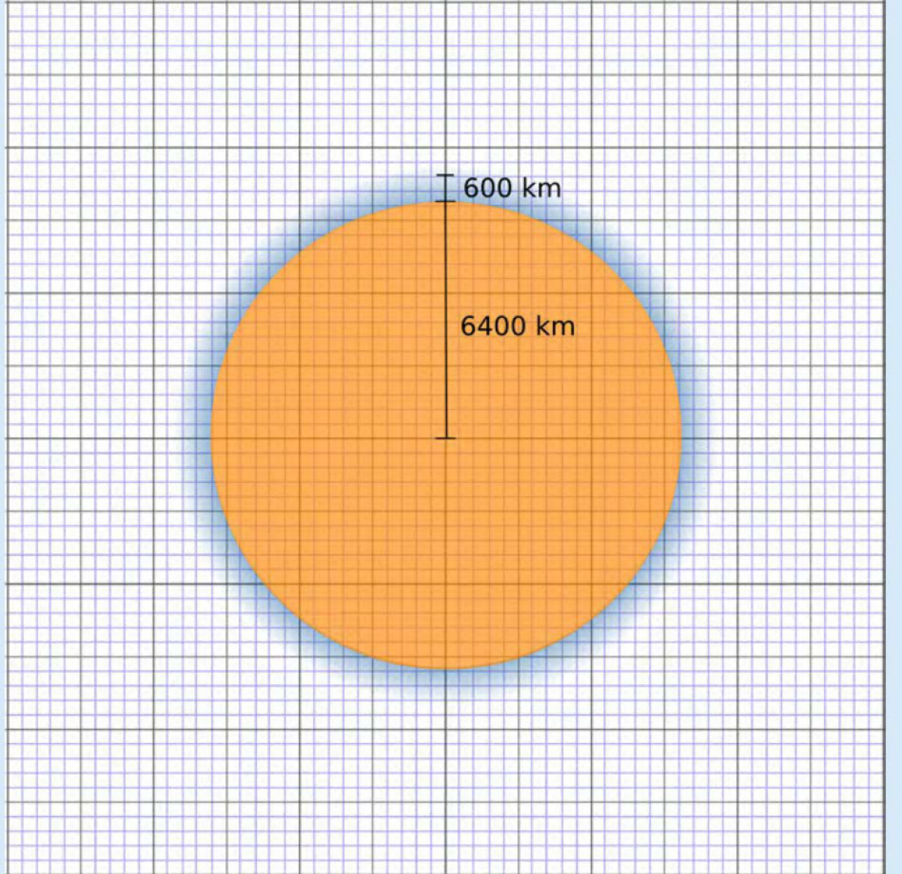
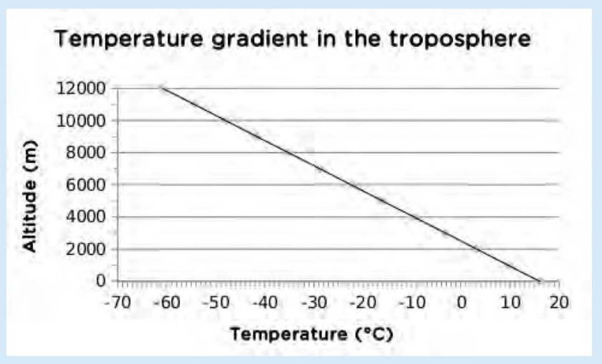
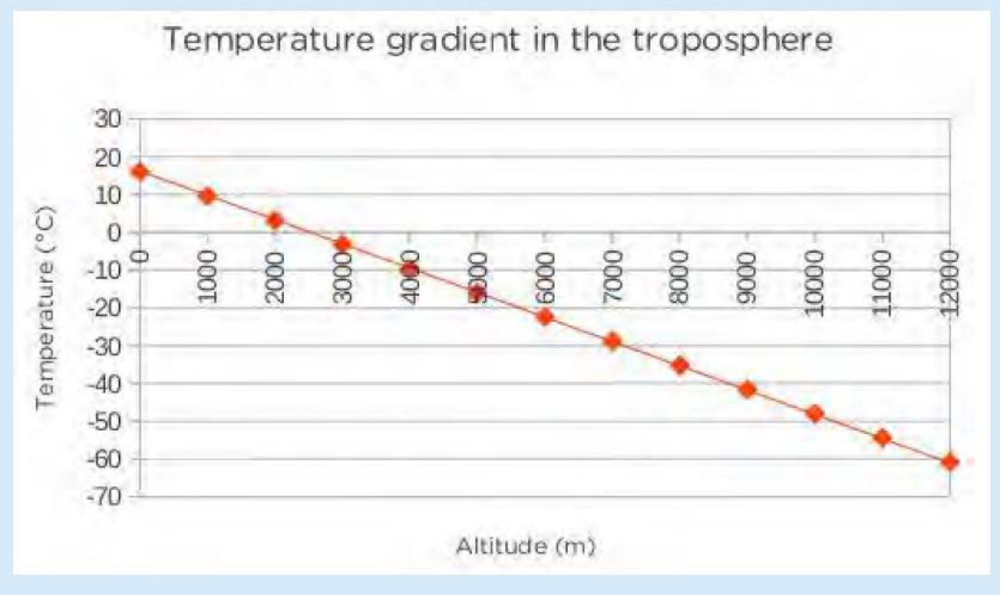
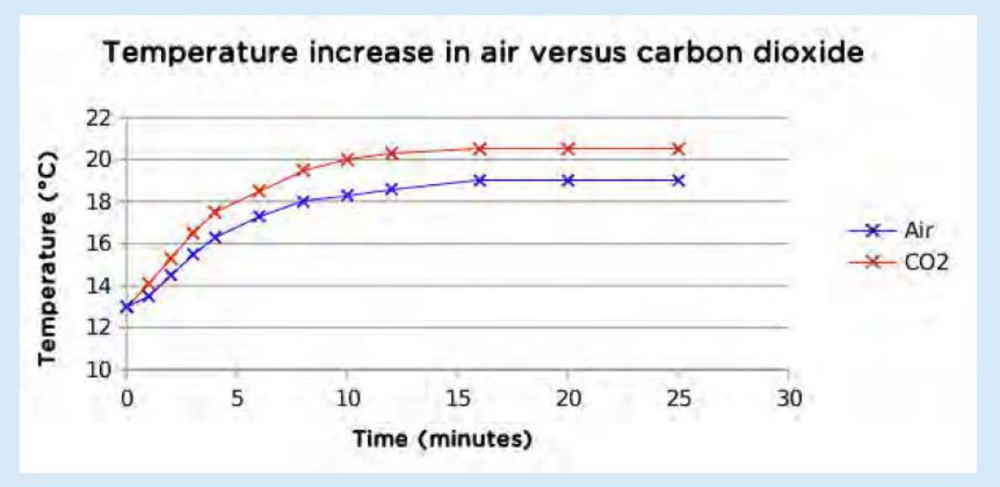
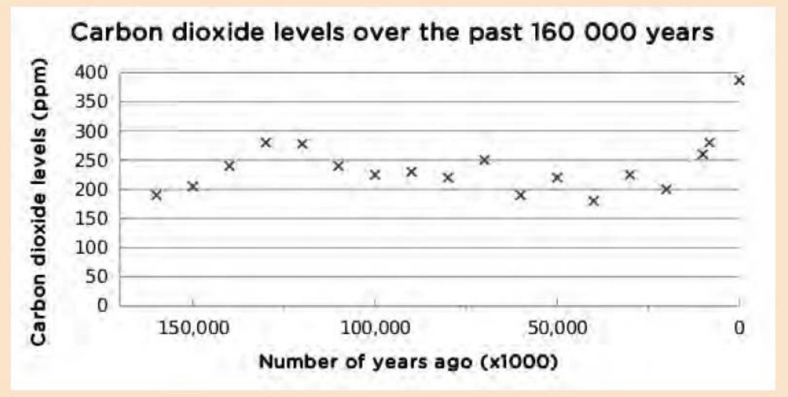

**The atmosphere** 


> **[Diagram Context - Textbook_NaturalScience_Gr9_The-atmosphere.pdf-0001-02.png]**
> 1. A diagram of a cell with blue and white lines.


> **[Diagram Context - Textbook_NaturalScience_Gr9_The-atmosphere.pdf-0001-03.png]**
> 1. A cartoon illustration of a key and a dinosaur.


## **KEY .** . **. QUESTIONS:** 

## . **.** . **.** 

- What is the atmosphere? 

- What makes up the atmosphere? 

- Does the atmosphere change as you go further from the Earth's surface? 

- Can the atmosphere be divided into different layers? 

- Where does the atmosphere end? 

- What important aspect of the atmosphere allows life to exist on earth? 

- What is the greenhouse effect? 

- How do humans contribute to the greenhouse effect? 

In the first chapter of Planet Earth and Beyond, you learnt about the different spheres of the Earth. The atmosphere was mentioned briefly in Chapter 1. In this chapter we will look at the atmosphere in more detail. 

- **<u>NEW WORDS</u>** • atmosphere • troposphere • stratosphere • mesosphere • thermosphere • exosphere • altitude • temperature gradient 


> **[Diagram Context - Textbook_NaturalScience_Gr9_The-atmosphere.pdf-0001-16.png]**
> 1. A diagram of the earth and the sun.


> **[Diagram Context - Textbook_NaturalScience_Gr9_The-atmosphere.pdf-0001-17.png]**
> 1. A purple and blue gas cylinder with a purple nozzle.


_Photograph of the Earth's atmosphere taken from the International Space Station. You can see the curved Earth below the bright atmosphere - a very thin layer of gases around the Earth. Above and beyond the atmosphere is where we find outer space. The bright spot is the Sun just going below the horizon._ 

#### **. 4.1 What is the atmosphere?** 

The atmosphere is the layer of gases which surrounds the Earth. It contains the following mixture: 

- nitrogen (78,08%) 

- oxygen (20,95%) 

- argon (0,93%) 

- carbon dioxide and other trace gases (0,04%) 


> **[Diagram Context - Textbook_NaturalScience_Gr9_The-atmosphere.pdf-0002-00.png]**
> 1. A pie chart showing the percentage of different gases in the atmosphere.


The gas molecules in the atmosphere are kept close to the Earth by gravity. The effect of gravity means that there will be more gas molecules closer to the Earth's surface than further away. As you move further and further away from the surface of the Earth, the gas molecules become fewer and the spaces between the molecules become larger, until there are no more gas molecules and only spaces left. The atmosphere therefore does not have a set boundary, but rather fades away into space. 

When we walk up a very high mountain, there is less oxygen present. We may feel out of breath. People sometimes say that the air is thinner higher up. When they say this they mean that there is a lower concentration of oxygen molecules. 


> **[Diagram Context - Textbook_NaturalScience_Gr9_The-atmosphere.pdf-0002-04.png]**
> 1. A diagram of a cell with arrows pointing to different parts of the cell.
 2. A diagram of a circuit with arrows pointing to different parts of the circuit.
 3. A diagram of a Lewis structure with arrows pointing to different parts of the Lewis structure.


> **[Diagram Context - Textbook_NaturalScience_Gr9_The-atmosphere.pdf-0003-00.png]**
> 1. A cartoon of a man holding a picture of a woman.


> **[Diagram Context - Textbook_NaturalScience_Gr9_The-atmosphere.pdf-0003-01.png]**
> A cartoon illustration of a boy on a pole with a sign that says " Visit" and a picture of the earth with arrows pointing to different parts of the earth.


> **[Diagram Context - Textbook_NaturalScience_Gr9_The-atmosphere.pdf-0003-02.png]**
> 1. A diagram of the solar system, including planets, stars, and comets.


The **density** of the atmosphere decreases with an increase in the height above sea level (altitude). Density is an indication of how many particles are present in a specific volume of gas. When the density is high, there are lots of gas molecules present. If the density is low, there are fewer gas molecules present. 

The atmosphere is a very important part of the Earth. It keeps the planet warm and protects us from the harmful radiation of the Sun. It also ensures a healthy balance between oxygen and carbon dioxide so that life can be sustained on the planet. 

The atmosphere has four main layers. We start measuring these from sea level and move towards space. The diagram alongside illustrates this. The surface of the Earth is at the bottom of the diagram, with Mount Everest drawn in. The first layer is the **troposphere** , then the **stratosphere** , the **mesosphere** and the **thermosphere** . Above the thermosphere, the atmosphere merges with outer space in the layer known as the **exosphere** . 

The atmosphere is actually a very thin layer compared to the size of the Earth. It is almost like the skin of an orange, relative to the size of the orange. 


> **[Diagram Context - Textbook_NaturalScience_Gr9_The-atmosphere.pdf-0003-07.png]**
> The image shows a satellite image of the Earth taken from space. The satellite is positioned in the top right corner of the frame, with the horizon line clearly visible. The sky is a beautiful shade of blue, and the sun is setting, casting a warm glow over the scene. The satellite appears to be in the process of taking off, as it is moving away from the viewer. The image


_Space Shuttle Endeavour in between the stratosphere (white layer) and mesosphere (blue layer). The orange layer is the troposphere._ 

_The layers of the atmosphere, and the exosphere._ 

**284** Planet Earth and Beyond 

#### **ACTIVITY:** How thick is the atmosphere compared to the size of the Earth? 

###### **INSTRUCTIONS:** 

1. You need to draw a scale diagram to show how thick (or thin) the atmosphere is in comparison to the size of the Earth. Use the graph paper given below. 

2. Answer the following questions to help you draw the diagram. 

   - a) What is the radius of the Earth? Choose an appropriate scale and draw a circle in your notebook to represent the Earth. 


> **[Diagram Context - Textbook_NaturalScience_Gr9_The-atmosphere.pdf-0004-05.png]**
> The image is a cartoon drawing of a spring toy with a green background and a brown staircase. The spring toy is shown in a crouched position, with its spring coiled up. The stairs are depicted as a series of green lines, and the spring toy is positioned on the bottom right corner of the image. The drawing includes a Lewis diagram, an anatomical/cellular structure, and a


- b) How thick is the atmosphere in km? Use the same scale as above and draw the atmosphere around the Earth. 

###### **<u>DID YOU KNOW?</u>** 

###### c) Indicate the atmosphere density gradient on your diagram. 


> **[Diagram Context - Textbook_NaturalScience_Gr9_The-atmosphere.pdf-0004-09.png]**
> The image shows a grid of squares, each containing a different color. The squares are arranged in a grid pattern, with the colors alternating between blue and purple. The grid is filled with squares of various sizes, creating a sense of depth and dimension. The image is a pedagogical diagram, likely used to teach students about the structure and function of cells or other biological structures. The diagram is


Some endurance athletes spend several weeks training at high altitudes, preferably 2400 m above sea level, so that their bodies adapt by producing more red blood cells. This gives them a competitive advantage when returning to a lower altitude to compete. 


> **[Diagram Context - Textbook_NaturalScience_Gr9_The-atmosphere.pdf-0004-11.png]**
> The image features a cartoon depiction of a man's head with a large, red apple on top of it. The man's face is drawn in a cartoon style, and the apple is positioned on his forehead. The man is wearing a tie, and there are several apples scattered around him, some of which are attached to the man's head. The image also includes a thought bubble above the man


> **[Diagram Context - Textbook_NaturalScience_Gr9_The-atmosphere.pdf-0004-12.png]**
> The image shows a line of green and white beads arranged in a zigzag pattern. The beads are positioned in a straight line, with the green beads being slightly larger than the white ones. The beads are arranged in a zigzag pattern, with the green beads on top and bottom and the white beads in the middle. The image does not contain any text or additional objects.


> **[Diagram Context - Textbook_NaturalScience_Gr9_The-atmosphere.pdf-0005-00.png]**
> The image shows a black and white diagram of a Lewis structure. The diagram is labeled with the text "Take Note" and "Altitude is a measure of height above sea level." The diagram is a visual representation of a molecule, with the Lewis structure showing the bonds between the atoms. The diagram is labeled with the names of the atoms and the bonds, providing a clear visual representation of the


Each layer of the atmosphere has a different **temperature gradient** , in other words, the temperature changes gradually as you move through each layer. The following graph shows how the temperature changes as you move through the atmosphere. The layers of the atmosphere are also indicated on the graph. Temperature is on the x-axis and altitude is on the y-axis. The red line shows the change in temperature. Note that as you move further to the left on the graph it is colder, dropping far below 0^{o} C, and further to the right is hotter, reaching over 1000^{o} C. 


> **[Diagram Context - Textbook_NaturalScience_Gr9_The-atmosphere.pdf-0005-02.png]**
> The image shows a cartoon depiction of a man and a woman standing in front of a large telescope. The man is holding a telescope, and the woman is holding a globe. The globe is green and blue, and it appears to be a planet. The image also includes a speech bubble that reads "Visit Our Atmosphere is Escaping. Bit/17t/3gr".


> **[Diagram Context - Textbook_NaturalScience_Gr9_The-atmosphere.pdf-0005-03.png]**
> The image is a diagram that shows the different layers of the atmosphere and the temperature of the atmosphere. The diagram is color-coded, with each layer represented by a different color. The diagram also includes labels for the different layers of the atmosphere, such as the troposphere, mesosphere, thermosphere, exosphere, and exoosphere. The diagram also includes arrows that indicate the direction


_The average temperature profile of the Earth's atmosphere and the exosphere._ 

Now let's look at each of the layers of the atmosphere. 

#### **. 4.2 The troposphere** 

The troposphere is the lowest layer in the atmosphere. It stretches from sea level up to about 9 km at the poles and 17 km at the equator. Due to the Earth's rotation, the atmosphere is thicker at the equator than at the poles. On average it is about 12 km thick. 

The density of air decreases as you move further away from the surface of the Earth. The first two layers of the atmosphere contain most of the mass of the 

Planet Earth and Beyond 

atmosphere. The bottom part of the troposphere has a high enough density for us to breathe and is the layer of the atmosphere in which we live. 


> **[Diagram Context - Textbook_NaturalScience_Gr9_The-atmosphere.pdf-0006-01.png]**
> The image shows a view of the moon from space. The moon is positioned in the top right corner of the frame, with the sky in the bottom left corner. The moon is partially obscured by the horizon line, which is a thin blue line that separates the sky from the earth. The sky is a deep blue color, with a few clouds scattered throughout. The moon is a crescent shape


_Shown here is the orange-coloured troposphere, the lowest and most dense portion of the Earth's atmosphere above the Earth's surface, with the Moon above._ 

**<u>TAKE NOTE</u> .** Troposphere comes from the Greek word _tropein,_ meaning to change, circulate or mix. 


> **[Diagram Context - Textbook_NaturalScience_Gr9_The-atmosphere.pdf-0006-04.png]**
> 1. A cartoon boat with five people on it.


The air in the troposphere is in constant motion. As it is warmed by the Earth, the warm air moves away and gets replaced by cooler air which travels in convection currents. This is the basis for cloud formation and weather patterns. All the Earth's weather systems take place close to the Earth in the troposphere. 


> **[Diagram Context - Textbook_NaturalScience_Gr9_The-atmosphere.pdf-0006-06.png]**
> The image shows a satellite view of the Earth, with a large, swirling mass of white clouds in the center. The satellite is positioned in the top left corner of the image, and the Earth is located in the bottom right corner. The satellite appears to be a Lewis diagram, which is a diagram used to represent the spatial distribution of atoms or particles. The diagram is composed of lines and arrows


_Cloud formations typical of a tropical cyclone. This one was photographed approaching the southeastern coast of Brazil._ 


> **[Diagram Context - Textbook_NaturalScience_Gr9_The-atmosphere.pdf-0006-08.png]**
> 1. A view of the sky from an airplane.


_Clouds forming in the troposphere._ 

The temperature in the troposphere decreases with altitude - the further you move away from the surface, the colder it becomes. The temperature decreases about 6,4^{o} C for every kilometre increase in altitude. In the following activity you will investigate the change in temperature as height above sea level increases. 


> **[Diagram Context - Textbook_NaturalScience_Gr9_The-atmosphere.pdf-0007-00.png]**
> 1. A green spring with a silver wire attached to it.


#### **ACTIVITY:** Drawing a graph of the temperature gradient in the troposphere 

###### **INSTRUCTIONS:** 

1. Using the information in the previous text, set up your own table displaying the temperature change in the troposphere from 0 - 12 km. 

2. Then draw a neat, accurate graph of this data. 

3. Assume that the average temperature on the surface of the Earth is 16^{o} C. 

4. Choose an appropriate scale for the x- and y-axes of your graph. 

5. Label the axes and give the graph a heading. 

Use the following space to draw a table for your data. 


> **[Diagram Context - Textbook_NaturalScience_Gr9_The-atmosphere.pdf-0007-09.png]**
> 1. A white square with a brown border.


**288** Planet Earth and Beyond 

Use the following space to draw your graph. 


> **[Diagram Context - Textbook_NaturalScience_Gr9_The-atmosphere.pdf-0008-02.png]**
> 1. A white square with a brown border.


> **[Diagram Context - Textbook_NaturalScience_Gr9_The-atmosphere.pdf-0008-03.png]**
> The image features a cartoon depiction of a man holding a globe. The man is wearing a green shirt and white pants, and he is pointing to the globe. The globe is green and white, and it is the focal point of the image. The text "Visit" is written in white at the top of the image, and it is accompanied by a speech bubble containing the text "Layers


> **[Diagram Context - Textbook_NaturalScience_Gr9_The-atmosphere.pdf-0008-04.png]**
> 1. A diagram of a snake with a green head and body.


The temperature in the troposphere decreases steadily until it reaches about -60^{o} C at about $10^{-12}$ km above sea level. The temperature here stabilises before it increases again. This is the transition zone between the troposphere and the stratosphere. This layer forms an invisible barrier which prevents the warmer moist air from escaping from the troposphere. Beyond this region air does not circulate much and weather patterns are not found any more. 

#### **. 4.3 The stratosphere** 

###### **<u>NEW WORDS</u>** 

• ozone 

The stratosphere is the layer above the troposphere. It stretches from 12 km to 50 km above the surface of the Earth. 90% of the mass of the atmosphere is found in the troposphere and the stratosphere. 


> **[Diagram Context - Textbook_NaturalScience_Gr9_The-atmosphere.pdf-0009-05.png]**
> The image features a cartoon depiction of a person wearing a spacesuit and holding a submarine, with a submarine filled with water and fish inside. The submarine is depicted in a blue and purple color scheme, and the person is wearing a purple spacesuit. The image also includes a cloud and a blue bubble, which are part of the cartoon illustration. The text "SAF/STA" is


Aeroplanes fly in the lower stratosphere because the air is much more stable than in the troposphere. The density of the air in the stratosphere is very low and decreases with altitude. 

Scientists use **weather balloons** to gather information on the temperature and pressure as they move up from the Earth's surface to the stratosphere. A weather balloons carries a small device, called a radiosonde, which sends back information on atmospheric pressure, temperature, humidity and wind speed. 


> **[Diagram Context - Textbook_NaturalScience_Gr9_The-atmosphere.pdf-0009-08.png]**
> 1. A woman holding a large ball in her hand.


> **[Diagram Context - Textbook_NaturalScience_Gr9_The-atmosphere.pdf-0009-09.png]**
> 1. A view of the earth from space.


###### **<u>DID YOU KNOW?</u>** 

Weather balloons were first used 70 years ago, and are still the key instrument for meteorologists to assess and predict the weather. This information is used in many ways, for example, to compile the weather report on TV or to warn of flooding or hurricanes. 

_A weather balloon being released from a US Navy ship._ 

_A photograph taken by a weather balloon 30 km above Earth in the stratosphere._ 


> **[Diagram Context - Textbook_NaturalScience_Gr9_The-atmosphere.pdf-0009-14.png]**
> The image features a cartoon depiction of an astronaut on a red planet. The astronaut is holding a stick and appears to be in a state of distress. The planet is covered in stars and has a large crater in the center. The background of the image is a pinkish-purple color, and there is a speech bubble above the astronaut that reads "hurricanes." The image also includes a


Weather balloons are filled with helium or hydrogen and rise higher and higher into the atmosphere. Do you think they continue rising up for ever? What do you think happens to the balloon as it increases in altitude? Hint: Think of what happens to the gas inside the balloon as the altitude increases. Discuss this with your class and take some notes below. 

**<u>VISIT</u>** Footage from a weather balloon. bit.ly/1dEz4yt 

Ozone gas (O3) is found in the stratosphere. Ozone gas is made up of ozone molecules. Each molecule consists of three oxygen atoms. Ozone plays an important role in absorbing harmful UV rays from the Sun by forming, breaking down and reforming ozone molecules over and over again. When UV light reaches the Earth, it can cause cancer, affect plant growth, and the life cycles of species. 


> **[Diagram Context - Textbook_NaturalScience_Gr9_The-atmosphere.pdf-0009-18.png]**
> The image features a cartoon illustration of a hot air balloon filled with a green substance, with a globe on top of the balloon. The globe is surrounded by a network of lines and arrows, which appear to be representing the circulatory system. The illustration also includes a small figure of a person holding a book, suggesting a connection to the circulatory system. The image is labeled as a Lewis diagram


###### **What happens to ozone in the atmosphere?** 

The formation and destruction of ozone is a natural process that takes place in the stratosphere. Oxygen forms ozone, and ozone breaks apart again to form oxygen. The following diagram shows the reactions that take place. 

Planet Earth and Beyond 


What holds the oxygen atoms together in a molecule? 

What is the term given to a molecule of oxygen which consists of two atoms of the same element bonded together? 

The ozone reactions lead to the heating of the stratosphere, increasing the temperature from -60^{o} C to about 0^{o} C. As a result, the air becomes warmer as you move further away from the Earth in the stratosphere. 

The problem comes in when there are molecules present which interfere with these natural processes. Chlorofluorocarbons, or CFCs, are molecules which release chlorine atoms into the stratosphere. Chlorine atoms react with ozone, destroying it before it can absorb harmful UV rays. The following diagram show how CFCs react with ozone. 

###### **<u>TAKE NOTE</u>** 

Although ozone is considered a pollutant in the troposphere, in higher altitudes in the stratosphere, ozone is considered vital as it protects Earth from too much ultraviolet radiation. 


###### **<u>DID YOU KNOW?</u>** 


> **[Diagram Context - Textbook_NaturalScience_Gr9_The-atmosphere.pdf-0011-00.png]**
> 1. A diagram of a molecule with oxygen atoms and carbon atoms.


> **[Diagram Context - Textbook_NaturalScience_Gr9_The-atmosphere.pdf-0011-01.png]**
> The image shows a diagram of a cell, with the title "Do You Know?" written in black text above it. The diagram is a Lewis diagram, which is a visual representation of a molecule's structure. The diagram is labeled with the chemical formula of the molecule, indicating that it is a Lewis diagram of a molecule. The diagram is a simple, straightforward representation of a molecule's structure,


> **[Diagram Context - Textbook_NaturalScience_Gr9_The-atmosphere.pdf-0011-02.png]**
> The image features a cartoon depiction of a red apple with a caterpillar on top, surrounded by a pink and white background. The caterpillar is holding a leaf, and the apple is described as a "fruit" and a "leaf". The image also includes a speech bubble containing text about NASA and the atmosphere of Mars.


###### **<u>DID YOU KNOW?</u>** 

On 14 October 2012 Felix Baumgartner set a world record by jumping from an altitude of about 39 km - from the stratosphere to the Earth. He is the first man to jump from the stratosphere. 

_CFC's react with ozone._ 

CFCs used to be found in aerosols and refrigerator gas, and were given off by industrial processes. Scientists noticed that these gases interfered with ozone. This could have had a serious impact on life on Earth and the use of CFCs was banned. 


> **[Diagram Context - Textbook_NaturalScience_Gr9_The-atmosphere.pdf-0011-07.png]**
> The image features a cartoon illustration of a man's head with a red apple on his forehead. The man's face is depicted in a cartoon style, and the apple is placed on his forehead. The man is wearing a top hat and a bow tie, and the image includes a thought bubble with a pink cloud and a line of pink apples. The image also includes a label that reads "Mr


> **[Diagram Context - Textbook_NaturalScience_Gr9_The-atmosphere.pdf-0011-08.png]**
> The image is a colorful, detailed diagram of the Earth, showing the continents and the polar ice caps. The continents are depicted in various shades of green, blue, and purple, while the polar ice caps are shown in a darker shade of blue. The diagram also includes labels for the continents and the polar ice caps, as well as a scale indicating the distance between the continents.

The


> **[Diagram Context - Textbook_NaturalScience_Gr9_The-atmosphere.pdf-0011-09.png]**
> 1. A diagram of a cell with the word "visit" written in black at the bottom.


Watch a video of Felix's jump here. bit.ly/1cmYvVB 


> **[Diagram Context - Textbook_NaturalScience_Gr9_The-atmosphere.pdf-0011-11.png]**
> The image is a cartoon drawing of a globe with a speech bubble above it, containing the text "I want to go to space". The globe is surrounded by a group of people, including a man in a lab coat and a man in a green shirt. The drawing also includes a diagram of a telescope and a diagram of a cell.


_In 1985, a British scientist working in Antarctica discovered a 40 percent loss in the ozone layer over the continent. In the 1990s, this prompted a worldwide ban on CFCs. In this image, the blue/purple areas show low ozone, while the red areas indicate higher ozone levels._ 

**292** Planet Earth and Beyond 

#### **. 4.4 The mesosphere** 

The mesosphere extends from around 50 km to 80 km above the Earth's surface. The atmosphere reaches its lowest temperature (-90^{o} C) in the mesosphere. The air density is extremely low, but there is still enough air to burn up rocks and dust entering from space. 


> **[Diagram Context - Textbook_NaturalScience_Gr9_The-atmosphere.pdf-0012-02.png]**
> The image shows a shooting star streaking across the night sky. The star is located in the upper right corner of the frame, and it is the main focus of the image. The sky is dark, with numerous stars visible in the background. The image is a close-up of the shooting star, providing a detailed view of its path across the sky. The star appears to be moving from


A **meteor** is a rock that enters the atmosphere from space. It travels at extremely high speed, up to 30 000 m/s. As a meteor enters the atmosphere, the air in front of it is compressed. The air heats up and the meteor burns up as a result of heat and friction. When we look up at the night sky, we might see a streak of light flashing for a brief moment. This is commonly called a shooting star, but is in fact a meteor burning up in the mesosphere. 

_A meteor is a rock burning up in our atmosphere._ 

Most meteors are fairly small and burn up completely while whizzing through the mesosphere. Some of the larger, denser meteors can reach the Earth and are then called **meteorites** . When the meteorite strikes the ground, it kicks up dust and soil and leaves an impact crater on the Earth's surface. The size of the crater depends on the size, density and speed of the meteorite. 


> **[Diagram Context - Textbook_NaturalScience_Gr9_The-atmosphere.pdf-0012-06.png]**
> 1. A purple and pink image of a cell.


> **[Diagram Context - Textbook_NaturalScience_Gr9_The-atmosphere.pdf-0012-07.png]**
> 1. A diagram of a cell with a diagram of a cell on the left side.


_The impact crater at Vredefort in South Africa has a diameter of 300 km, and nearly fills the complete aerial photograph shown here._ 

_The Tswaing Crater, just north of Pretoria, is 1.1 km wide and formed as the result of a meteorite impact about 200 000 years ago._ 


> **[Diagram Context - Textbook_NaturalScience_Gr9_The-atmosphere.pdf-0012-10.png]**
> The image features a cartoon depiction of a flask filled with purple liquid, which is the central focus of the illustration. The flask is surrounded by various objects, including a tree, a bird, and a flower, all of which are depicted in a cartoon style. The objects are arranged in a way that suggests a connection between the flask and the surrounding elements. The image also includes text that reads "


###### **<u>VISIT</u>** 

Watch the meteor shower over Johannesburg four years ago bit.ly/1hnulRR and short clips of the meteor show that hit Russia in early 2013 bit.ly/1cmYDUV 


> **[Diagram Context - Textbook_NaturalScience_Gr9_The-atmosphere.pdf-0012-13.png]**
> The image features a cartoon depiction of a man holding a globe in his arms. The man is wearing a watch on his left wrist and a backpack on his right shoulder. The globe is green and blue, and the man is pointing to a specific location on the globe. The image also includes a speech bubble with the text "bit.ly/ICM/DTV".


###### **<u>NEW WORDS</u>** 


> **[Diagram Context - Textbook_NaturalScience_Gr9_The-atmosphere.pdf-0013-01.png]**
> 1. A diagram of a cell with arrows pointing to different parts of the cell.


#### **. 4.5 The thermosphere** 

The thermosphere is the layer of the atmosphere from 80 km upwards. The density of the air is extremely low. The further away you move from the Earth, the less dense the concentration of molecules becomes until the atmosphere becomes space. 

Most satellites that we depend on every day are in Low Earth Orbit (LEO), orbiting the Earth at an altitude between 160 km and 2,000 km. The International Space Station (ISS) is situated at 370 km in the thermosphere. This is an international facility in space that is used for research purposes. 


> **[Diagram Context - Textbook_NaturalScience_Gr9_The-atmosphere.pdf-0013-05.png]**
> The image shows a satellite in the sky, with a focus on the structure of the satellite. The satellite is composed of multiple poles and beams, which are connected to the Earth by cables. The satellite is positioned in the center of the image, surrounded by the Earth's atmosphere. The sky is filled with clouds, and the satellite appears to be floating in space. The image does not contain any


###### **<u>DID YOU KNOW?</u>** 

In 2002, Mark Shuttleworth became first South African in space when he launched with a Russian space mission. He spent eight days on board the the International Space Station, participating in experiments related to AIDS and genome research. 

_The International Space Station orbits the Earth in the thermosphere_ 

The temperature in the thermosphere increases from - 90^{o} C to as high as 1500^{o} C. The thermosphere is very sensitive to an increase in energy and a small change in energy results in a high temperature increase. At times of increased solar activity, the temperature can easily increase up to 1500^{o} C. However, the thermosphere will feel cold as there are few particles present to collide with our skin and transfer enough energy for us to feel the heat. 


> **[Diagram Context - Textbook_NaturalScience_Gr9_The-atmosphere.pdf-0013-10.png]**
> The image is a black and white illustration of a cartoon depiction of an astronaut on a red planet. The astronaut is holding a walking stick and is wearing a spacesuit. The planet is covered in stars and has a large crater in the center. The illustration also includes a text box that reads "Research. The astronaut is on the moon. The moon is a rocky, barren, and desolate planet


High energy light (for example, UV light) can cause atoms or molecules to lose electrons, forming ions. The region where this takes place is called the **ionosphere** . The ionosphere is found mainly in the thermosphere. The Sun also gives off charged particles (the solar wind), which can enter the Earth's atmosphere (mostly near the poles) and react with the ions and electrons in the ionosphere, causing a phenomenon called the **aurora** . It is a colourful display of light in the sky at the poles. In the northern hemisphere, it is called the **northern lights** or **aurora borealis** , and the **southern lights** or **aurora australis** in the southern hemisphere. 

The ionosphere reflects longer wavelength radio waves, for example the radio waves we use for radio and surface-broadcast television (not satellite television), allowing the signal to be broadcast over a larger distance. The ions in the ionosphere also absorb ultraviolet radiation and X-rays. 

The region beyond the thermosphere is called the **exosphere** . This layer has very few molecules and extends into space. 

Planet Earth and Beyond 


> **[Diagram Context - Textbook_NaturalScience_Gr9_The-atmosphere.pdf-0014-00.png]**
> The image shows a view of the Earth from space, with a blue sky and a horizon line. The horizon line is curved, and the sky is a mix of blue and orange hues. The image is labeled as a pedagogical diagram, which suggests that it is designed to help students understand a particular concept or process. The diagram features a Lewis diagram, a diagram of a cell,


_Sunset from the International Space Station. The troposphere is the deep orange and yellow layer. Several dark clouds are visible within this layer. The pink white layer above is the stratosphere. Above the stratosphere, blue layers show the mesosphere, thermosphere (dark blue) and exosphere (very dark blue), until it gradually fades to the blackness of outer space._ 


> **[Diagram Context - Textbook_NaturalScience_Gr9_The-atmosphere.pdf-0014-02.png]**
> The image shows a cartoon-like representation of a cell, with a large bubble containing a smaller bubble inside. The bubble contains a line of text that reads "VISIT". The cell is depicted in black and white, with a gray background. The image is labeled as an educational graphic, suggesting it is designed to teach students about cellular structures and functions.


> **[Diagram Context - Textbook_NaturalScience_Gr9_The-atmosphere.pdf-0014-03.png]**
> A cartoon illustration of a hot air balloon with two people inside.


#### **ACTIVITY:** How thick are the layers of the atmosphere? 

In this activity you will build a model to represent the different layers of the atmosphere. In addition to the model, you need to draw an accurate diagram in your workbook to represent the thickness of each layer. Use a ruler to draw an accurate scale diagram. 

###### **MATERIALS:** 

- large measuring cylinder or tall drinking glass 

- corn kernels (popcorn) 


> **[Diagram Context - Textbook_NaturalScience_Gr9_The-atmosphere.pdf-0014-09.png]**
> The image is a cartoon drawing of a spring coiled up in the shape of a caterpillar. The caterpillar is made up of green leaves and has a face with a big smile. The drawing also includes a diagram of a Lewis structure and a graph of a chemical reaction. The diagram shows the Lewis structure of a molecule, and the graph shows a chemical reaction. The drawing is set against


- samp 

- dried peas 

- beans 


> **[Diagram Context - Textbook_NaturalScience_Gr9_The-atmosphere.pdf-0015-01.png]**
> 1. A diagram of a cell with a diagram of a cell and a diagram of a molecule.


###### **INSTRUCTIONS:** 

1. Add a 0,5 cm layer of dried split peas to represent the troposphere (1 layer of peas thick). 

2. Add a 1,5 cm layer of corn kernels on top of the peas to represent the stratosphere. 

3. Add a 1,5 cm layer of samp on top of the corn kernels to represent the mesosphere. 

4. Add a 24 cm layer of beans on top of the samp to represent the thermosphere. 


> **[Diagram Context - Textbook_NaturalScience_Gr9_The-atmosphere.pdf-0015-07.png]**
> The image shows a glass vase filled with beans and corn. The beans are brown and the corn is yellow. The vase is tall and clear, allowing a clear view of the beans and corn inside. The beans are scattered throughout the vase, with some appearing larger than others. The corn is mostly concentrated in the middle of the vase, with the beans on the sides. The


> **[Diagram Context - Textbook_NaturalScience_Gr9_The-atmosphere.pdf-0015-08.png]**
> The image shows a glass jar filled with a mixture of different colored beans and corn kernels. The jar is placed on a table, and the beans are visible at the bottom of the jar. The beans are of various colors, including brown, yellow, and green. The jar is filled to the brim, indicating a large quantity of the mixture. The beans and corn kernels are clearly visible, and


_Your column should look something like A close-up photograph of the layers. this._ 

**296** Planet Earth and Beyond 


You will notice that the area where the two layers meet is not always clear cut. The kernels might have mixed a little bit. The atmosphere is the same. There is a not a clear line separating two layers, but they mingle in the area of contact. 

Table showing the heights of the layers in Earth's atmosphere and in the model 

|**Layer**|**Represented by**|**Height of layer**<br>**(km)**|**Height of layer**<br>**(cm)**|
|---|---|---|---|
|Troposphere|Dried split peas|10|0,5|
|Stratosphere|Corn kernels|30|1,5|
|Mesosphere|Samp|30|1,5|
|Thermosphere|Beans|480|24|

###### **QUESTIONS:** 

1. Draw a labelled diagram of the model using the graph paper. Include a scale. The density of the atmosphere decreases with altitude. Show this on your diagram as well. 


> **[Diagram Context - Textbook_NaturalScience_Gr9_The-atmosphere.pdf-0016-06.png]**
> The image is a graph paper with a grid of squares in shades of purple and white. The squares are arranged in a grid pattern, with each square having a unique color. The graph paper is a standard size, with the x and y axes labeled in a clear and legible manner. The graph paper is used to draw diagrams and charts, and it is a common tool used in various subjects


2. What atmospheric layers are represented by the different grains in the model? 

3. In the model in the activity, how many kilometers does 1 cm represent? 4. How much thicker is the stratosphere compared to the troposphere? 5. How much thicker is the thermosphere compared to all the other layers combined? **~~.~~** 

6. Where in this model would you expect to find clouds? 

7. Where in this model would you expect to find the Drakensberg Mountains? 

8. Where in this model would you expect to find a satellite? 

9. Where in this model would you expect to find meteors burning up? 

10. In which layer is there life? What is different about this layer? 


> **[Diagram Context - Textbook_NaturalScience_Gr9_The-atmosphere.pdf-0017-06.png]**
> 1. A diagram of a cell with a green line representing the cell wall.


Planet Earth and Beyond 

#### **. 4.6 The greenhouse effect** 

###### **<u>NEW WORDS</u>** 

You have learned a lot about greenhouse gases in Natural Sciences. In this section we will be looking at how important greenhouse gases are to sustain life on Earth. 

Earth's atmosphere contains mostly (99%) nitrogen and oxygen, but a small percentage (1%) of the atmosphere contains gases like **water vapour** ($	ext{H}_2O$), **carbon dioxide** ($	ext{CO}_2$) and **methane** ($	ext{CH}_4$). Carbon dioxide is a product of respiration in all organisms and also a gas given off by industrial processes and the burning of fossil fuels and vegetation. Methane is a gas, also called natural gas, which occurs in reservoirs beneath the surface of the Earth. It is also given off by decomposing plant and animal material and animals give off methane as part of their digestion. Water vapour is formed when water evaporates on Earth. 

- greenhouse gases 

- greenhouse effect 

- global warming 

- climate change 

- • carbon dioxide • methane • water vapour • radiation 

Water vapour, methane and carbon dioxide are gases which let through incoming visible light from the Sun. The incoming radiation from the Sun is absorbed by the Earth's surface and warms it. The Earth's surface emits **infrared radiation** . Infrared radiation is absorbed by the greenhouse gases and re-emitted in all directions. This increases the temperature of the Earth's surface and lower atmosphere, above what it would be without the gases, called the **greenhouse effect** . These gases are very important to regulate the Earth's temperature. 


> **[Diagram Context - Textbook_NaturalScience_Gr9_The-atmosphere.pdf-0018-09.png]**
> The image is a diagram that illustrates the greenhouse effect. The diagram shows the Earth's atmosphere and the greenhouse effect. The diagram is color-coded, with the greenhouse effect represented by orange arrows and the Earth's atmosphere represented by green arrows. The diagram also includes labels for the Earth's surface and the greenhouse effect. The diagram is labeled with the title "The greenhouse effect" and the caption "


###### **<u>VISIT</u>** 


> **[Diagram Context - Textbook_NaturalScience_Gr9_The-atmosphere.pdf-0018-11.png]**
> The image is a cartoon depiction of a boy holding a pole and a globe. The boy is wearing a hat and is standing on a pole. The globe is tilted to the right, and there are arrows pointing to the globe. The boy is holding a sign that says "Learn more about the greenhouse effect with this simulation." The image is labeled with a watermark that reads "bit.ly


As you can see in the diagram, the radiation from the Sun is able to reach the Earth and warm it up. The energy that is given off by the Earth is trapped by the water vapour, carbon dioxide and methane. This ensures that the Earth stays warm. It is almost as if the gases form a blanket around the Earth keeping some of the heat inside. The gases are referred to as **greenhouse gases** . A greenhouse is a glass structure that is used to grow plants. The glass lets the heat of the Sun through, but then keeps the heat inside the structure so that the plants have a moderate climate in which to grow. Water vapour, carbon dioxide and methane act in the same way. 

The Earth is a very unique planet due to the make-up of its atmosphere. In this chapter you have learned about the composition of the Earth's atmosphere. Let us compare the atmosphere of Earth to its neighbouring planets, Mars and Venus. 


> **[Diagram Context - Textbook_NaturalScience_Gr9_The-atmosphere.pdf-0019-01.png]**
> 1. A cartoon depiction of a roller coaster with a spring coiled up on top.


**ACTIVITY:** Comparing Earth, Mars and Venus 


> **[Diagram Context - Textbook_NaturalScience_Gr9_The-atmosphere.pdf-0019-03.png]**
> 1. A diagram of the solar system with the sun at the top and the earth at the bottom.


_Venus, Earth and Mars._ 

###### **INSTRUCTIONS:** 

1. The table below gives information about the gases in the atmospheres of the three planets: Venus, Earth and Mars. 

2. Study the table and answer the questions that follow. 

Percentage of <u>gases making up the atmospheres of Venus, Earth and Mars.</u> 

||**Venus**|**Earth**|**Mars**|
|---|---|---|---|
|Carbon dioxide<br>($	ext{CO}_2$)|96,5%|**.**<br>0,03%|95%|
|Nitrogen ($	ext{N}_2$)|3,5%|78%|2.7%|
|Oxygen ($	ext{O}_2$)|Trace|21%|0,13%|
|Argon (Ar)|0,007%|0,9%|1,6%|
|Methane ($	ext{CH}_4$)|0|0,002%|0|

###### **QUESTIONS:** 

1. Compare the data for Venus and Earth. What similarities and difference do you notice? 

**300** Planet Earth and Beyond 


2. Compare the data for Venus and Mars. What similarities and difference do you notice? 

3. What is the biggest difference between Earth's atmosphere and the atmospheres of the other two planets? 

4. Why is the level of oxygen so much higher on Earth than on the other two planets? 


> **[Diagram Context - Textbook_NaturalScience_Gr9_The-atmosphere.pdf-0020-04.png]**
> The image features a cartoon depiction of a group of people standing around a large globe. The globe is filled with a blue substance, and the people are standing around it, possibly discussing the globe or its contents. The image also includes a speech bubble containing text about the greenhouse effect and the role of carbon dioxide in it.


5. Why do you think there is no methane gas on Venus and Mars? 

6. Predict whether you think the temperature on the surface of Venus will be low or high. Give reasons for your answer. 


> **[Diagram Context - Textbook_NaturalScience_Gr9_The-atmosphere.pdf-0020-07.png]**
> 1. A diagram of a cell with arrows pointing to different parts of the cell.


> **[Diagram Context - Textbook_NaturalScience_Gr9_The-atmosphere.pdf-0020-08.png]**
> The image features a cartoon illustration of a man and a woman riding in a carriage. The carriage is depicted in pink and white colors, and the man is wearing a black suit. The woman is wearing a white dress. The illustration is accompanied by a speech bubble containing text about Venus being the hottest planet in the solar system.


> **[Diagram Context - Textbook_NaturalScience_Gr9_The-atmosphere.pdf-0020-09.png]**
> The image shows a line of green and white beads arranged in a straight line. The beads are evenly spaced and appear to be made of a shiny material. The beads are positioned in a horizontal line, with the green beads being slightly larger than the white ones. The image does not contain any text or additional objects, and the arrangement of the beads is consistent and orderly.


The atmospheres of Venus and Mars are very similar. Both planets have mainly carbon dioxide in the atmosphere, and very little other gases. However, the two planets are quite different. 

Venus has a very dense atmosphere which results in a high concentration of carbon dioxide on its surface. This causes an extreme greenhouse effect and very high temperatures on the surface of Venus. Venus has an average surface temperature of 462^{o} C. This is too high to sustain life as we know it. 

Mars, on the other hand, has almost no atmosphere, so, although there is carbon dioxide present, the density is very low and almost no greenhouse effect takes place. Mars is also much further away from the Sun. It is a very cold planet, with an average temperature of -55^{o} C. This is too low to sustain life as we know it. 

Earth has the right composition of atmospheric gases to sustain life. It has the right balance between oxygen and nitrogen so that plants and animals can 

breathe, and just enough carbon dioxide and methane to keep the planet warm enough so that life can be sustained. Many scientists think that it is the life on Earth that keeps the atmosphere in this perfect balance. Plants produce oxygen and re-circulate carbon dioxide on Earth. They believe that if life were to disappear from Earth, the atmosphere would become like Mars or Venus. 


> **[Diagram Context - Textbook_NaturalScience_Gr9_The-atmosphere.pdf-0021-01.png]**
> 1. A magnifying glass is being used to look at a diagram of a cell.


**INVESTIGATION:** A model of the greenhouse effect 

In the greenhouse effect, carbon dioxide traps the heat of the Sun. In this investigation, you will use bottles with air and carbon dioxide, respectively, to model the greenhouse effect. You are going to investigate the following question: Does air or carbon dioxide absorb more heat? 

**AIM:** Write an aim for this investigation. 

**HYPOTHESIS:** Write a hypothesis for this investigation. 


> **[Diagram Context - Textbook_NaturalScience_Gr9_The-atmosphere.pdf-0021-06.png]**
> The image shows a rectangular sign with the word "Visit" written in black text. The sign is positioned on a gray background. The sign is rectangular in shape and has a white border. The text "Visit" is written in black, and the word "Visit" is capitalized. The sign is located in the upper right corner of the image.


A greenhouse gas demonstration. bit.ly/1f02zss 

###### **MATERIALS AND APPARATUS:** 


> **[Diagram Context - Textbook_NaturalScience_Gr9_The-atmosphere.pdf-0021-09.png]**
> The image features a cartoon illustration of a man holding a globe in his hands. The man is wearing a green shirt and white pants, and he is pointing to the globe with his right hand. The globe is green and blue, and it is the central focus of the image. The man's actions and the globe's coloration suggest that the image is intended to convey a lesson on the Earth


- two glass bottles or clear cold drink bottles with lids 

- 2 thermometers 

- Prestik 

- heat source (two study lamps) 

- vinegar 

- bicarbonate of soda 

- small cold drink bottle with lid 

###### **METHOD:** 

Set up the experiment as in the photograph. 


> **[Diagram Context - Textbook_NaturalScience_Gr9_The-atmosphere.pdf-0021-19.png]**
> The image shows two black lamps with clear plastic bottles attached to them. The bottles contain colored liquids, and the lamps are equipped with yellow straws. The lamps are placed on a white surface, and the bottles are positioned at the front and back of the lamps. The lamps are labeled "Air" and "CO2," and the bottles are labeled "Air" and "CO2." The


_Experimental set-up._ 

**302** Planet Earth and Beyond 


1. Mark one bottle as 'Air' and the other bottle as '$	ext{CO}_2$'. 

2. If the lids do not have the thermometers in them already, prepared by your teacher, make a hole in each of the lids. You can do this using a hammer and nail and hammering the nail through the lid into a wooden block. Secure the thermometer in each lid. You can use Prestik to do this. 

3. Fill the first bottle with air and secure the thermometer and close the lid tightly. 

4. Fill the second bottle with carbon dioxide: 

   - a) To collect a bottle of carbon dioxide, add one tablespoon of bicarbonate of soda to the small bottle. 

   - b) Add $10^{-20}$ ml of vinegar and place the lid back on. 

   - c) Hold the mouth of the small bottle over the large $	ext{CO}_2$ container and pour the $	ext{CO}_2$ collecting in the small container into the large container. Hold the small bottle horizontal so that the vinegar does not spill into the bigger bottle, only the heavier carbon dioxide gas pours into the large container. 

   - d) Add more vinegar when the effervescence stops. Repeat 2-3 times until the bottle is full. If a burning match at the mouth of the bottle goes out immediately, the bottle is full. 

   - e) Secure the thermometer and close the lid tightly. 


> **[Diagram Context - Textbook_NaturalScience_Gr9_The-atmosphere.pdf-0022-10.png]**
> 1. A person holding a bottle with the word "co2" on it.


_Pouring carbon dioxide from the small bottle into the large bottle. Your teacher will prepare the carbon dioxide for you._ 

5. Measure and record the starting temperature of both bottles. 6. Switch on the heat source and measure the temperature increase in both bottles. You need to decide for yourself what time increments are appropriate and record these in the table. 


> **[Diagram Context - Textbook_NaturalScience_Gr9_The-atmosphere.pdf-0022-13.png]**
> 1. A bottle of water with the word "co2" written on it.


_The $	ext{CO}_2$ container with the light positioned to shine on it._ 


###### **RESULTS:** 

Complete the following table. 

|**Time (minutes)**|**Temperature of air**<br>**bottle (**^{**o**}**C)**|**Temperature of $	ext{CO}_2$**<br>**bottle (**^{**o**}**C)**|
|---|---|---|

Represent your results by drawing a graph for each of the experiments to show how the temperature for each bottle changed over time. You need to decide what values to use for each axis. Label the axes clearly and provide a heading for each graph. 


> **[Diagram Context - Textbook_NaturalScience_Gr9_The-atmosphere.pdf-0023-05.png]**
> 1. A white square with a gray border.


What have you observed? 

**304** Planet Earth and Beyond 


###### **CONCLUSION:** 

What do you conclude for your experiment? 

**Extension investigation:** What factors make the temperature of the atmosphere increase faster? 

Design your own investigation to answer one or more of the following questions. Use the experiment above to guide your experimental set-up. 

1. Does dark soil make the temperature increase faster? 

2. Does water vapour make the temperature increase faster? 

3. Does the thickness of the layer of gases make the temperature increase faster? 

4. Does the presence of dust/aerosols make the temperature increase faster? 


> **[Diagram Context - Textbook_NaturalScience_Gr9_The-atmosphere.pdf-0024-09.png]**
> The image shows a cartoon depiction of a man and a woman riding a hot air balloon. The balloon is filled with a blue substance, and the man is holding a basket. The woman is holding a basket as well. The image also includes a caption that reads "Visit" and a link to a webpage.


5. Does the distance of the Sun make the temperature increase faster? 


> **[Diagram Context - Textbook_NaturalScience_Gr9_The-atmosphere.pdf-0024-11.png]**
> The image shows a gray line with a zipper running down the middle. The zipper is white with an orange line running down the middle. The line is drawn in a straight line, and there is a small orange line running down the middle of the line. The line is drawn in a horizontal line, and there is a small orange line running down the middle of the line.


###### **Global warming** 

What do you think will happen if the levels of carbon dioxide and other greenhouse gases increase? Think about what you discovered in the last investigation and look at the diagram of the greenhouse effect again. Write your answer below. 

If there are more greenhouse gases in the atmosphere, more ultraviolet radiation will be trapped and the Earth will heat up. This will result in more of the polar ice melting than usual. Even a one degree difference in the average temperature has an effect on the melting of polar ice. If more ice than usual melts, the water levels in the oceans will rise and low-lying areas could flood. 


> **[Diagram Context - Textbook_NaturalScience_Gr9_The-atmosphere.pdf-0024-15.png]**
> The image is a cartoon drawing of a cartoon character, a boy, standing on a pole and holding a sign that says "visit" and "climate change". The boy is wearing a hat and is surrounded by various arrows and arrows pointing to the earth. The boy is positioned in the center of the image, with the arrows surrounding him from all directions. The image also includes a text box


A change in the temperature will also result in a change in weather patterns. More rain will fall in some areas, and less in others. If this change is permanent, it is called **climate change** , and if it occurs on a worldwide scale it is called global climate change, which is what is being discussed here. 

Global warming affects weather patterns which in turn has a knock-on effect on agriculture and food production. This has an impact on food production and can lead to food shortage for humans and animals. Long term climate change can lead to the extinction of plants and animals, which are unable to adapt to changed conditions. 

The levels of greenhouse gases vary naturally over time. A question that scientists often ask is whether the concentration of greenhouse gases is rising more than it would naturally as a result of human activities? How do you think 

###### this can be investigated? 

Since the industrial revolution humans have burned more fossil fuels than ever before. Human activities have resulted in the increase of carbon dioxide emissions over time. Carbon dioxide is therefore the main greenhouse gas under discussion amongst scientists and environmentalist. The following investigation will look at the levels of carbon dioxide over thousands of years. 


> **[Diagram Context - Textbook_NaturalScience_Gr9_The-atmosphere.pdf-0025-02.png]**
> 1. A cartoon of a man lifting a ball that says "50 kg".


#### **INVESTIGATION:** Ice core analysis 

Carbon dioxide is trapped in the ice which forms at the poles. As the ice is compacted and becomes thicker over thousands of years, the carbon dioxide remains trapped. The levels of carbon dioxide in ice can be determined by analysing the ice cores. A research team in Antarctica drilled an ice core containing ice from 160 000 years ago. They analysed the ice for carbon dioxide and presented their data in the following table. 


> **[Diagram Context - Textbook_NaturalScience_Gr9_The-atmosphere.pdf-0025-05.png]**
> 1. A man in a red snowsuit is using a black and yellow drill in the snow.


> **[Diagram Context - Textbook_NaturalScience_Gr9_The-atmosphere.pdf-0025-06.png]**
> A diagram showing the relationship between increasing size and the number of layers in a tube. The diagram is labeled with the words "top layers are the most recently deposited" and "bottom layers are the oldest".


###### **<u>TAKE NOTE</u>** 

An **ice core** is a core sample from the accumulation of snow and ice over many years that have recrystallized and have trapped air bubbles from previous time periods. 


> **[Diagram Context - Textbook_NaturalScience_Gr9_The-atmosphere.pdf-0025-09.png]**
> 1. A cartoon drawing of a man holding a picture of a woman. 
 2. The woman in the picture is wearing a white dress. 
 3. The man holding the picture is wearing blue pants. 
 4. The picture is of a woman.


_Ice cores trap carbon dioxide over time Drilling through the ice to obtain ice cores. periods._ 


> **[Diagram Context - Textbook_NaturalScience_Gr9_The-atmosphere.pdf-0025-11.png]**
> 1. A man in a red coat and black hat is using a saw to cut a pipe.


_Sawing through the ice core to obtain samples for analysis._ 


**306** Planet Earth and Beyond 

Results from the ice core analysis. 


|**Number of years ago**|**.**<br>**TAKE NOTE**<br>**$	ext{CO}_2$ levels (ppm)**|
|---|---|
|160 000|ppm is short for for<br>190|
|150 000|'parts per million'.<br>205|
|140 000|240|
|130 000|280|
|120 000|278|
|110 000|240|
|100 000|225|
|90 000|230|
|80 000|220|
|70 000|250|
|60 000|190|
|50 000|220|
|40 000|**.**<br>180|
|30 000|225|
|20 000|200|
|10 000|260|
|8160|280|
|0|387|


> **[Diagram Context - Textbook_NaturalScience_Gr9_The-atmosphere.pdf-0026-03.png]**
> The image features a cartoon depiction of a group of people standing around a telescope. The telescope is positioned in the center of the image, with the Earth and other planets visible through the lens. The people are positioned around the telescope, with one person standing directly behind it and another person standing to the right of the telescope. The image also includes a caption that reads "Visit Climate Science: Antarctica's


**INVESTIGATIVE QUESTION:** Write down an investigative question for this study. 

###### **ANALYSIS:** 

1. Draw an accurate graph to represent your data. You need to choose your own set of axes, and label them appropriately. 


> **[Diagram Context - Textbook_NaturalScience_Gr9_The-atmosphere.pdf-0027-04.png]**
> 1. A white square with a brown border.


Planet Earth and Beyond 


2. What is the link between the levels of $	ext{CO}_2$, core ice and global warming? 

###### **CONCLUSION:** 

1. Write down a conclusion for this investigation. 

###### **<u>VISIT</u>** 

2. What is the impact of global warming on the planet? 


> **[Diagram Context - Textbook_NaturalScience_Gr9_The-atmosphere.pdf-0028-06.png]**
> The image features a cartoon depiction of a man holding a globe in his hands. The man is wearing a green suit and has a green hat on his head. The globe is green and white, and the man is pointing to the globe with his left hand. The image also includes a speech bubble containing text that reads, "Could global warming, a problem here on Earth, be the solution to


> **[Diagram Context - Textbook_NaturalScience_Gr9_The-atmosphere.pdf-0028-07.png]**
> The image shows a gray line with a zipper running down the middle. The zipper is white on the left side and orange on the right side. The line is drawn with a thin, straight line. The background is a solid gray color.


> **[Diagram Context - Textbook_NaturalScience_Gr9_The-atmosphere.pdf-0028-08.png]**
> 1. A diagram of a cell with blue and white lines.


#### **SUMMARY:** 

###### **.** **<u>Key Concepts</u>** 

- The layer of gases around the Earth is called the atmosphere. 

- The density of the gas molecules decreases as the distance from the Earth increases - the further away from the Earth you travel, the fewer gas molecules there are. 

- The atmosphere can be divided into different layers - the troposphere, stratosphere, mesosphere and thermosphere. 

- The exosphere is the uppermost layer directly above the thermosphere, where the gases thin out and the atmosphere merges with space. It is considered part of outer space. 


> **[Diagram Context - Textbook_NaturalScience_Gr9_The-atmosphere.pdf-0028-15.png]**
> 1. A cartoon drawing of a man digging with a key.


- The troposphere is the densest layer, has the highest air pressure and is closest to the surface of the Earth. It is on average about 12 km thick and temperature decreases with altitude. 

- The stratosphere stretches from 12 - 50 km and contains the ozone layer. Aeroplanes fly in this layer because the air is more stable. Temperature increases with altitude, from -60^{o} C to 0^{o} C. 

- The mesosphere stretches between 50 - 80 km. The air is very thin. Meteorites usually burn up in the mesosphere. Temperature decreases with altitude from 0^{o} C to -90^{o} C. 

- The thermosphere stretches up to 480 - 600 km. It absorbs ultraviolet light and X-rays. Temperature increases with altitude and can reach 1500^{o} C. 

- The ionosphere is the layer where molecules are ionised by the Sun's ultraviolet light. Radio waves can be transmitted and reflected due to the ionised layer. 

- The greenhouse effect is a natural phenomenon - it warms the atmosphere sufficiently to sustain life. 

- Greenhouse gases trap the re-radiation from Earth's surface and reflect it back to the Earth (like inside a greenhouse). 

- The most common greenhouse gases are carbon dioxide, water vapour and methane. 

- An increase in greenhouse gases leads to global warming. 

- Global warming is an increase in the average temperature of the atmosphere. 

- Global warming is a potentially life threatening situation on Earth. It can lead to climate change, rising sea levels, food shortages and the extinction of organisms on Earth. 

###### **.** **<u>Concept Map</u>** 

Through the past 2-3 years you have come across concept maps in Natural Sciences. Use what you know about concept maps and design a map for this chapter. You <u>must</u> add terms and examples to the list. Remember to use linking words between concepts, and arrows to indicate the direction in which information is read. Plan your concept map on rough paper first before drawing the final one into your workbook. Use the following terms to help you with your map: 

- atmosphere 

- layers 

- mesosphere 

- thermosphere 

- troposphere 

- stratosphere 

- weather 

- ozone 

- satellites 

- radio waves 

- global warming 

- greenhouse gases 

- greenhouse effect 

- oxygen 

- carbon dioxide 

- water vapour 

**310** Planet Earth and Beyond 

#### **REVISION:** 

1. The following graph shows the variation in temperature as you move further away from the Earth. Study it and answer the questions that follow. 


> **[Diagram Context - Textbook_NaturalScience_Gr9_The-atmosphere.pdf-0031-02.png]**
> The image is a graph that shows the relationship between the height of a person and the temperature of the air. The graph is a line graph with the x-axis labeled "height" and the y-axis labeled "temperature". The line graph shows that as the height of a person increases, the temperature of the air also increases. The graph is labeled with the variable "A" and


a) Give labels for A-D, the layers of the atmosphere. [4 marks] 

b) Describe the temperature change in each of the layers. [4 marks] 


**312** Planet Earth and Beyond 


- c) Explain why the temperature changes as you move further away from the Earth in Layer A? [2 marks] 

- d) In which layer is the density of gas the highest? Give a reason for your answer. [2 marks] 

- e) In which layer(s) can life survive? Give two reasons for your answer. [3 marks] 

- f) In which layer are satellites found? Write only A, B, C or D. [1 mark] 

- g) In which layer are meteors found? Write only A, B, C or D. [1 mark] 

- h) In which layer radio waves reflected? Write only A, B, C or D. [1 mark] 

- i) In which layer is weather observed? Write only A, B, C or D. [1 mark] 

- j) In which layer is the aurora found? Write only A, B, C or D. [1 mark] 

- k) In which layer do jet aeroplanes travel? Write only A, B, C or D. [1 mark] 

- l) In which layer are lightning and storms found? Write only A, B, C or D. [1 mark] 


m) In which layer is ozone found? Write only A, B, C or D. [1 mark] 

2. Venus and Mars contains equal amounts of carbon dioxide, yet the temperature on the surfaces of these two planets are very different. Explain why. [4 marks] 

3. Earth is the only planet that we know of that sustains life. What makes Earth's atmosphere suitable to sustain life? [2 marks] 

4. Scientific evidence seems to point to the fact that carbon dioxide levels have increased steadily over the past 200 years. 

   - a) Why would the levels of carbon dioxide have been increasing over the past 200 years? [2 marks] 

   - b) What is global warming? [1 mark] 

**314** Planet Earth and Beyond 


- c) What are the long term effects of an increase in carbon dioxide on life on Earth? [4 marks] 

Total [36 marks] 


> **[Diagram Context - Textbook_NaturalScience_Gr9_The-atmosphere.pdf-0034-03.png]**
> The image shows a close-up view of a diagram of a cell. The diagram is colored in shades of pink and gray, with a red ant positioned in the center. The diagram is labeled with the text "Lewis diagram" and "cellular structure". The diagram also includes a Lewis structure of a molecule, which is labeled with the chemical formula "C6H12O6". The


Curious? Unlock more possibilites with this key. 


> **[Diagram Context - Textbook_NaturalScience_Gr9_The-atmosphere.pdf-0034-05.png]**
> The image shows a single, silver key with a unique hole in the center. The key is positioned vertically, with the handle pointing downwards. The key is set against a plain white background, which allows the viewer to focus on the key and its features. The key appears to be a standard key, designed for use with standard locks.


# 23 **The atmosphere** 

##### **<mark>Unit overview</mark>** 

###### **2 weeks** 

The first Unit in the Planet Earth and Beyond strand looked at the spheres of the Earth. The atmosphere was briefly introduced in this Unit and is now covered in more detail. 

The atmosphere is the layer of gases around the Earth. The important concepts that need to be understood in this Unit are: 

- l the air we breathe does not contain 'nothing', but rather an important mix of gases which support and sustain life on Earth 

- l gravity causes the density gradient in the atmosphere, and makes the atmosphere 'stick' to Earth 

- l the temperature in the atmosphere varies with altitude as a result of radiation from the Earth, the specific gases present at different altitudes, chemical reactions taking place in the atmosphere, and the energy from the Sun. 

The concept of space and the 'nothingness' that we breathe might be difficult for learners to comprehend. We have included a number of models and pictures to help them visualise the vastness of space, and understand that the atmosphere, which surrounds us, is required for life on this planet. 

A common misconception is that land plants generate most of the oxygen in the atmosphere, whereas this actually occurs in the oceans where 70% of the planet's oxygen supply is produced. 

Direct sunlight does not heat the atmosphere. Only a small portion of the heating can be accounted for by direct sunlight, most of the heating is through conduction, convection and re-radiation of the Sun's energy. 

Another misconception is that greenhouse gases make up a major part of the atmosphere. Nitrogen and oxygen make up 99% of the atmosphere while other gases, including greenhouse gases, make up only about 1%. 

##### **23.1 What is the atmosphere? (1 hour)** 

|**Tasks**|**Skills**|**Recommendation**|
|---|---|---|
|Activity: How thick is the|Measurement, interpretation,|CAPS suggested|
|atmosphere compared to the size|representing information||
|of the Earth?|||

##### **23.2 The troposphere (0.5 hours)** 

|**Tasks**|**Skills**|**Recommendation**|
|---|---|---|
|Activity: Drawing a graph of the|Drawing graphs, doing|CAPS suggested|
|temperature gradient in the|calculations, measuring||
|troposphere|||

##### **23.3 The stratosphere (0.5 hours)** 

##### **23.4 The mesosphere (0.5 hours)** 

##### **23.5 The thermosphere (1 hour)** 

|**Tasks**|**Skills**|**Recommendation**|
|---|---|---|
|Activity (model building): How|Building a model, drawing|CAPS suggested|
|thick are the layers of the|diagrams, data handling||

atmosphere? 

##### **23.6 The greenhouse effect (2.5 hours)** 

|**Tasks**|**Skills**|**Recommendation**|
|---|---|---|
|Activity: Comparing the Earth,<br>Mars and Venus|Interpreting data, providing<br>explanations, application|CAPS suggested|
|Investigation: A model of the<br>greenhouse effect|Building a model, data collection,<br>data analysis, interpreting results,<br>drawing conclusions|CAPS suggested|
|Investigation: Ice core analysis|Interpreting data, formulating,<br>investigative questions, drawing<br>conclusions, representing data|CAPS suggested|

##### **Key questions** 

- l What is the atmosphere? 

- l What makes up the atmosphere? 

- l Does the atmosphere change as you go further from the Earth's surface? 

- l Can the atmosphere be divided into different layers? 

- l Where does the atmosphere end? 

- l What important aspect of the atmosphere allows life to exist on earth? 

- l What is the greenhouse effect? 

- l How do humans contribute to the greenhouse effect? 

### 23.1 What is the atmosphere? 

#### **ACTIVITY: How thick is the atmosphere compared to the size of the Earth?** (LB page 375) 

1. – 2. a) 6400 km. 

   - b) About 480-600 km (accept any answer within this range). 

   - c) Learner-dependent answer. 

The atmosphere is denser closer to the surface than further away. This can be indicated by using darker going to lighter colours, or using more dots and fewer dots, or any other way of indicating that the atmosphere is denser at the bottom. A scale needs to be included. A possible diagram could look like this: 

Scale drawing of the Earth and the surrounding atmosphere. 1 block = 400 km. 

Scale drawing showing the thickness of the atmosphere relative to the thickness of the Earth. 



> **[Diagram Context - Textbook_NaturalScience_Gr9_The-atmosphere.pdf-0037-00.png]**
> The image shows a diagram of a cell with a large orange circle in the center, labeled "6,000 km". The diagram also includes a smaller orange circle labeled "6,000 km" and a smaller orange circle labeled "6,800 km". The diagram is set against a grid of smaller orange circles, and the text "6,000 km" is written in black.


### 23.2 The troposphere 

The boundaries between the layers in the atmosphere are not as clear as the boundaries between liquids. The values are often given as a range and the transitions take place in zones called pauses, for example the tropopause is the zone in-between the troposphere and the stratosphere. 

#### **ACTIVITY: Drawing a graph of the temperature gradient in the troposphere** (LB page 378) 

If you would like to assess learners' tables and graphs you can use Assessment Rubric 3 and 4 to do so. As an extension you could get the learners to draw a similar graph for the change in pressure as you move through the troposphere. 

They will have to first find out what the pressure gradient is in the atmosphere. 

An example table is given below: 

###### **Change in temperature as altitude increases in the troposphere** 

|**Altitude (m)**|**Temperature °C)**|
|---|---|
|0|16|
|1000|9.6|
|2000|3.2|
|3000|–3.2|
|4000|–9.6|
|5000|–16|
|6000|–22.4|
|7000|–28.8|
|8000|–35.2|
|9000|–41.6|
|10 000|–48|
|11 000|–54.4|
|12 000|–60.8|

An example graph is given below: 



> **[Diagram Context - Textbook_NaturalScience_Gr9_The-atmosphere.pdf-0038-04.png]**
> 1. A diagram of a temperature gradient in the atmosphere.


An alternative graph with the altitude on the x-axis is shown below: 



> **[Diagram Context - Textbook_NaturalScience_Gr9_The-atmosphere.pdf-0039-01.png]**
> The image is a graph that shows the relationship between altitude and temperature. The graph is a line graph with altitude on the x-axis and temperature on the y-axis. The line graph shows a downward slope, which indicates a negative relationship between altitude and temperature. The graph is labeled with the title "Temperature gradient in the atmosphere" and the x-axis label "Altitude (m)"


### 23.3 The stratosphere 

Discuss this with your class as it provides a good opportunity to revise some of the concepts learned in Gr 8 on the particle model of matter, as well as extend this knowledge. As the weather balloon rises higher and higher in the atmosphere, the pressure decreases. The volume of gas inside the balloon therefore increases and the balloon expands. Eventually it gets to a point where the balloon material cannot stretch anymore and the balloon bursts. This usually happens between 25 and 30 km above the Earth's surface. You can also explain to learners that the radiosonde has a small parachute attached to it which opens up when it begins to fall back to Earth. This is to slow its fall so that it does not crash down and cause damage to someone or something. Also, these sensors are never retrieved. Scientists don't need to retrieve them to get the information back because data will have been sent by radio signals. 

#### What happens to ozone in the atmosphere? 

This is extension content on what happens to ozone in the atmosphere and is not prescribed by CAPS. However, it is within the learners' capacity to understand it, given what they have learned in Matter and Materials. For more information about ozone you can visit^{1} bit.ly/17oaroh 

A chemical bond holds the oxygen atoms together in a molecule. 

A diatomic molecule is the term given to a molecule of oxygen which consists of two atoms of the same element bonded together. 

### 23.4 The mesosphere 

The mesosphere extends from around 50 km to 80 km above the Earth's surface. 

23.5 The thermosphere 

#### **ACTIVITY: How thick are the layers of the atmosphere?** (LB page 383) 

This activity demonstrates the relative thickness of the layers of the atmosphere. Learners might not realise how thin the troposphere, the layer in which we live, is compared to the rest of the atmosphere. After this activity they should have a better comprehension of the thickness of the layers of the atmosphere relative to each other. 

Alternative materials are different types of dry breakfast cereals, or different shapes of pasta (shells, screws, macaroni, gnocchi, etc. Any tall, thin transparent container can be used.) 

###### **Questions** 

1. Learners draw a diagram on graph paper. They must indicate what scale they have used, for example, 1 block or cm represents 20 km, etc. To indicate density, learners can use darker and lighter colours or use lots of dots at the bottom and gradually fewer dots higher up. 

2. This answer depends on the model made. Peas – troposphere Corn – stratosphere Samp – mesosphere Beans – thermosphere 

3. This can be calculated, for example: 10 km / 0,5 cm = 20 km/cm. 

4. It is three times thicker. 

5. It is seven times thicker. 

6. Troposphere 

7. Troposphere 

8. Thermosphere 

9. Mesosphere 

10. Troposphere. It is the thinnest layer. 

### 23.6 The greenhouse effect 

#### **ACTIVITY: Comparing Earth, Mars and Venus** (LB page 385) 

1. Venus' atmosphere is made up of mainly carbon dioxide. Earth's atmosphere contains very little carbon dioxide. Earth's atmosphere is made up of mainly nitrogen and Venus has very little nitrogen. Earth's atmosphere contains a lot of oxygen, whereas Venus contains only trace amounts (very little). Argon is present at a low level for both planets. 

   - Venus has no methane. 

2. Venus and Mars have very similar atmospheres. Most of their atmospheres are made up of carbon dioxide, with very low levels of all the other gases. Neither of them contain methane. 

3. Earth's atmosphere contains almost no carbon dioxide, but has a lot of nitrogen and oxygen, whereas the atmospheres of Mars and Venus consist primarily of carbon dioxide and a few other gases. 

4. Oxygen is produced by the oceans and plants on Earth. Venus and Mars have no liquid water and there is no life on the planet, so oxygen cannot be produced in large quantities. 

5. Methane gas is produced by animals and by decomposing plant and animal matter. There is no life on Venus and Mars and nothing present on these planets which can produce methane. 

6. The temperatures will be very high. Venus has a lot of carbon dioxide which traps the heat of the Sun and makes the surface temperature high. 

Venus is closer to the Sun than the Earth is, and therefore receives more radiation. 

#### INVESTIGATION: A model of the greenhouse effect (LB page 387) 

CAPS prescribes plastic bags. We have used plastic cold drink bottles as it makes data collection easier. 

You can make the holes in the lids of the bottles beforehand using a knife or by hammering a nail in through the lid. Otherwise learners will need to do this and you will need a hammer, a nail about the width of the thermometer and a wooden block to hammer into. 

You can prepare and collect small bottles of carbon dioxide beforehand, otherwise learners will need to do this. To collect a bottle of carbon dioxide, add one tablespoon of bicarbonate of soda to the small bottle. Add $10^{-20}$ ml of vinegar and place the lid back on. Hold the mouth of the small bottle over the CO^{2} container and pour the carbon dioxide into the large bottle. Carbon dioxide is denser than air and can therefore be poured into the large bottle. Add more vinegar when the effervescence stops. Repeat 2-3 times until the large bottle is full. If a burning match at the mouth of the bottle goes out immediately, the bottle is full. 

###### **Aim** 

A possible answer is 'To determine whether carbon dioxide or air traps more heat. 

###### **Hypothesis** 

Learner-dependent answer. 

###### **Results** 

Learners should draw both graphs on the same set of axes, or if not, then both graphs should have the same scales so that the graphs can be compared, 

An example graph is shown here: 



> **[Diagram Context - Textbook_NaturalScience_Gr9_The-atmosphere.pdf-0041-13.png]**
> The image is a graph that shows the relationship between temperature and air versus carbon dioxide. The graph has a line graph with temperature on the x-axis and carbon dioxide on the y-axis. The line graph shows a decrease in temperature as the amount of carbon dioxide increases. The graph also has a scatter plot with temperature on the x-axis and air pressure on the y-axis. The


Both graphs follow a similar trend, but the carbon dioxide graph flattens out at a higher temperature. This means that carbon dioxide has trapped more heat than air. Although it is only a small difference (1,5^{o} C), it is significant. The temperature change takes place quite quickly (within 20 minutes) and can easily be 

demonstrated within one lesson. 

The temperature in the carbon dioxide bottle increased more than in the bottle with air. 

In both cases the temperature increased quickly, and then stabilised from about 15 minutes. 

###### **Conclusion** 

The carbon dioxide has trapped more heat than the air. 

###### **Extension investigation** 

This is an optional extension in which learners must design their own experiment to answer one of the following questions. They can then write up an experimental report. You can use Assessment Rubric 2 to assess learners' work. 

#### Global warming 

Learners should have seen from the last investigation that if the levels of carbon dioxide and other greenhouse gases increase in the atmosphere, then the temperature will increase as greenhouse gases trap more heat. 

#### INVESTIGATION: Ice core analysis **(LB page 390)** 

###### **Investigative question** 

How has the level of carbon dioxide in the atmosphere changed over the past 160 000 years? 

###### **Analysis** 

1. An example of the graph that learners produce is shown here: 



> **[Diagram Context - Textbook_NaturalScience_Gr9_The-atmosphere.pdf-0042-14.png]**
> The image presents a graph that shows the carbon dioxide levels over the past 160,000 years. The x-axis of the graph represents time, while the y-axis represents the carbon dioxide levels. The graph shows a downward trend, indicating a decrease in carbon dioxide levels over time. The graph is color-coded, with different shades of gray representing different carbon dioxide levels. The graph also includes


2. Pockets of CO2are trapped in the ice. These pockets provide a record of $	ext{CO}_2$ levels in the air atmosphere at that time. When we analyse ice from 160 000 ago, we can determine the level of CO2present in the atmosphere at that time. Higher levels of $	ext{CO}_2$ mean that the greenhouse effect is stronger and the Earth heats up more. 

###### **Conclusion** 

1. The levels of $	ext{CO}_2$ have risen/doubled over the past 160 000 years. 

2. Increase in ocean temperatures, ice caps melting, increase in sea level, change in weather patterns, 

change in crop production, possible food scarcity/hunger, some areas become wetter, others dryer, animal and plant 

#### Concept map 

It is important that learners complete this concept map to consolidate what they have learned. They can either do it as a homework exercise or if enough time is available, a whole period can be dedicated to this activity. Learners have been exposed to many concept maps up until now and have had to make their own from scratch for some of the smaller Units. Learners now have to put these skills into practice for a more complex concept map. This will be good preparation for learners' examinations. There are no right and wrong answers for the concept map. An example concept map is provided here. If learners are battling, you could use this following map as a guide and with the class, draw a concept map on the board. However, do not just draw it up for learners to copy down. Learners must be actively involved in the construction. You may also come up with alternative ways of presenting the concepts. 

# **Revision** 

1. a) A – troposphere 

      - B – stratosphere 

   - C – mesosphere D – thermosphere 

- b) A – The temperature decreases with altitude from about 16^{o} C to -60^{o} C. 

   - B – The temperature increases with altitude from -60^{o} C to 0^{o} C. 

   - C – The temperature decreases with altitude from 0^{o} C to -90^{o} C. 

   - D – The temperature increases with altitude from -90^{o} C to 1000^{o} C. 

- c) The troposphere is heated mainly through radiation of the Sun's energy by the Earth. The further you move away from the Earth, the less radiation energy there is to heat the atmosphere. Temperature will therefore decrease with altitude. 

- d) The troposphere because it is the closest to the Earth and the Earth's gravity pulls the gases in the atmosphere towards the surface. 

- e) The troposphere. It is warm enough and has enough oxygen for respiration. At this level, life is also protected from UV radiation. 

- f) D 

- g) C 

h) D 

- i) A 

- j) D 

k) B 

- l) A 

m) B 

2. Venus is closer to the Sun. Both have $	ext{CO}_2$, but Venus's atmosphere is much denser. The greenhouse effect is much more dominant, resulting in a much hotter surface temperature. Mars has lots of $	ext{CO}_2$, but it is not very dense and therefore the greenhouse effect is not observed. 

3. Earth has enough oxygen and not a lot of $	ext{CO}_2$^{.} There are just enough greenhouse gases to ensure that the Earth is kept warm enough. It has just the right balance between $	ext{CO}_2$ and oxygen/other gases. 

4. a) Industries, human activities, burning of fossil fuels, more cars/vehicles (any two). b) It is the gradual increase in the temperature of the Earth's atmosphere. 

   - c) Higher levels of $	ext{CO}_2$ means that the greenhouse effect will increase and temperatures on Earth will rise. If this continues over a long time, ice will melt, water levels will rise, coastlines will change, weather patterns will be influenced, crop production will be affected, and it could lead to the extinction of animal and plant species that are unable to adapt. 

## 5. Authentic Exam Question Archetypes & Mark Allocations
*(Extracted from official CAPS examination papers to guide marking, pacing, and rubric design)*

### Archetype 1: QUESTION 9: REACTION OF ACIDS WITH BASES
- **Source Paper:** `Gr9_NS_Exam1.pdf`
- **Total Mark Allocation:** **[11 Marks]** (Sub-questions: 1, 1, 2, 2, 1 marks)
- **Recommended Time:** **11 Minutes** (Pacing: ~1.0 min/mark | *Calibrated to Official CAPS Paper Pace (1.0 min/mark)*)
- **Assessment Mode Calibration:** Timed Exam Simulation: 11 min countdown (Pacing Checkpoint: 8 min)
- **Cognitive / Marking Strategy:** NSC Standard (Method Marks [M], Accuracy Marks [A], Carry-Over [CA])

#### Question Prompt & Working:
```text
QUESTION 9: REACTION OF ACIDS WITH BASES 
 
 
 
The burning of wood and fossil fuels releases carbon dioxide, nitrogen oxide and sulphur 
dioxide into the atmosphere. 
 
 
Study the diagram below to deduce the NAMES of the products which are formed in the 
clouds as result of this. 
 
 
Use the spaces below to complete the sentence shown in the diagram below. 
 
 
 
 
 
 
 
 
[Source: https://image.app.goo.gl/9RKSaQk9] 
 
 
 
 
 
9.1 
 
(1) 
 
 
 
 
 
 
Chemical reactions in the clouds that forms 
9.1 _____ acid and 9.2 _____ 
Sulphur dioxide 
Nitrogen oxide 
Hydrocarbons 
Toxic 
chemicals 
emitted  
Chemicals return to Earth 
in rain, mist, snow, hail etc. 
NATURAL SCIENCES  
GRADE 9 
14 
 
END 
 
9.2 
 
(1) 
 
 
 
9.3 
Write the chemical formulae of the two acids formed in QUESTIONS 9.1 ...
```

### Archetype 2: SECTION B
- **Source Paper:** `Gr9_NS_Exam10.pdf`
- **Total Mark Allocation:** **[12 Marks]** (Sub-questions: 1, 2, 1, 2, 1 marks)
- **Recommended Time:** **12 Minutes** (Pacing: ~1.0 min/mark | *Calibrated to Official CAPS Paper Pace (1.0 min/mark)*)
- **Assessment Mode Calibration:** Timed Exam Simulation: 12 min countdown (Pacing Checkpoint: 9 min)
- **Cognitive / Marking Strategy:** NSC Standard (Method Marks [M], Accuracy Marks [A], Carry-Over [CA])

#### Question Prompt & Working:
```text
SECTION B  
 
Answer all questions to the best of your ability. 
 
 
 
                     Sourced from: steemkr.com/steemstem 
 
1. 
Briefly compare the magnetic field of Figure A to that of Figure B. 
(1) 
 
 
 
The picture shows the demonstration of the effect of gravitational force on 
 falling objects using a paper and a stone in a classroom. Both objects fall from 
the same height and were released simultaneously.  
 
              Sourced adapted from: clarkscience8.weebly.com/friction--gravity.ht 
 
2. 
Which object will hit the ground first?  Give a reason for your answer. 
(2) 
 
 
 
Grade 9 NS: English                                                         26 
 
The effect of the thickness of a conductor on its resistance was  
investigated. The following materials were used: ...
```

### Archetype 3: QUESTION 8
- **Source Paper:** `Gr9_NS_Exam11.pdf`
- **Total Mark Allocation:** **[21 Marks]** (Sub-questions: 2, 2, 2, 4, 3 marks)
- **Recommended Time:** **21 Minutes** (Pacing: ~1.0 min/mark | *Calibrated to Official CAPS Paper Pace (1.0 min/mark)*)
- **Assessment Mode Calibration:** Timed Exam Simulation: 21 min countdown (Pacing Checkpoint: 16 min)
- **Cognitive / Marking Strategy:** NSC Standard (Method Marks [M], Accuracy Marks [A], Carry-Over [CA])

#### Question Prompt & Working:
```text
QUESTION 8 
 
SPHERES OF THE EARTH 
 
The picture below is of the dam wall that was built for the Gariep Dam on the border of the Free 
State and the Eastern Cape. The wall is used to generate hydroelectric power. 
 
Figure 1: Gariep Dam in the Orange River 
 
 
 
Downloaded from testpapers.co.za
NATURAL SCIENCES  
GRADE 9 
15 
 
P.T.O. 
 
8.1 Discuss the interaction between any three spheres of the earth as shown by each 
arrow linking the spheres on the diagram below. For example: there is an 
interaction between the lithosphere and the atmosphere in that the wind (moving 
air) will cause erosion/withering of the rocks surrounding the dam. 
(Figure 1 can be used in the discussion.) 
 
 
 
 
 
 
 
 
 
 
 
 
 
 
 
 
 
 
 
8.1.1 Interaction between Atmosphere and Hydrosphere. 
 
 
 
 
 
 
 ...
```
