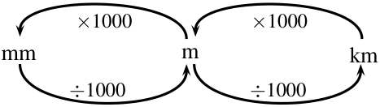
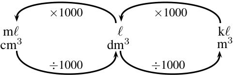
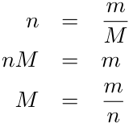
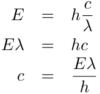
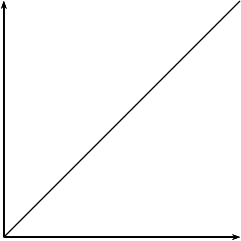
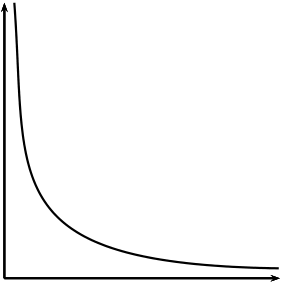
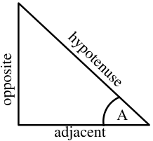
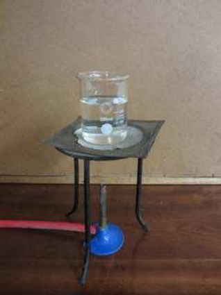

# Chapter 8: Transverse Waves

## Introduction
Waves occur frequently in nature. While water waves (in dams, oceans, or buckets) are the most common examples, waves occur in any kind of medium. 
*   **Earthquakes:** Release energy to create powerful waves that travel through the Earth's rock.
*   **Sound:** Produced when a friend speaks, creating waves that travel through the air to your ears.

A wave is a disturbance of a medium that moves energy from one place to another.

---

## What is a Transverse Wave?

### Understanding Waves
We have previously studied pulses. A **pulse** is a single disturbance that travels through a medium. A **wave** is a periodic, continuous disturbance that consists of a *train* or *succession* of pulses.

<!-- DIAGRAM_PLACEHOLDER: diagram -->

A real-life example of wave generation can be seen in a pool with a *Kreepy Krauly®*, which creates waves through regular vibrations.

### Definition: Wave
> A wave is a periodic, continuous disturbance that consists of a *train* of pulses.

---

# Chapter 8: Transverse Waves

## Definition: Transverse Wave
A **transverse wave** is a wave where the movement of the particles of the medium is perpendicular (at a right angle) to the direction of propagation of the wave.

---

## Activity: Transverse Waves

**Instructions:**
Take a rope or slinky spring. Have two people hold the rope or spring stretched out horizontally. Flick one end of the rope up and down continuously to create a train of pulses.

<!-- DIAGRAM_PLACEHOLDER: diagram -->

### Questions:
1. Describe what happens to the rope.
2. Draw a diagram of what the rope looks like while the pulses travel along it.
3. In which direction do the pulses travel?
4. Tie a ribbon to the middle of the rope. This indicates a particle in the rope.

<!-- DIAGRAM_PLACEHOLDER: diagram -->

5. Flick the rope continuously. Watch the ribbon carefully as the pulses travel through the rope. What happens to the ribbon?
6. Draw a picture to show the motion of the ribbon. Draw the ribbon as a dot and use arrows to indicate how it moves.

---

## Summary of Observations
In this activity, you created waves. The medium through which these waves propagated was the rope, which is made up of a large number of particles (atoms). 

**Key takeaway:** The wave travels from one side to the other, but the individual particles (represented by the ribbon) move only up and down.

---

# Chapter 8: Transverse Waves

## Transverse Waves
A **transverse wave** is a wave where the particles of the medium move at right angles (perpendicular) to the direction of propagation of the wave.

*   **Particle Motion:** There is no net displacement of the particles; they oscillate around their equilibrium position.
*   **Wave Motion:** There is a net displacement of the wave energy through the medium.

<!-- DIAGRAM_PLACEHOLDER: diagram -->
*Figure 8.2: A transverse wave, showing the direction of motion of the wave perpendicular to the direction in which the particles move.*

---

## Crests and Troughs

Waves are characterized by high points called **crests** (or peaks) and low points called **troughs**.

*   **Crest:** The highest point the medium rises to.
*   **Trough:** The lowest point the medium sinks to.
*   **Equilibrium:** The central resting position of the medium.

<!-- DIAGRAM_PLACEHOLDER: diagram -->
*Figure 8.3: Crests and troughs in a transverse wave.*

### Definition: Crests and Troughs
*   **Crest:** A point on the wave where the displacement of the medium is at a maximum.
*   **Trough:** A point on the wave where the displacement of the medium is at a minimum.

---

# Chapter 8: Transverse Waves

## Amplitude

### Activity: Measuring Amplitude

<!-- DIAGRAM_PLACEHOLDER: diagram -->

Fill in the table below by measuring the distance between the equilibrium position and each crest and trough in the wave shown above.

| Crest/Trough | Measurement (cm) |
| :--- | :--- |
| a | |
| b | |
| c | |
| d | |
| e | |
| f | |

#### Questions
1. What can you say about your results?
2. Are the distances between the equilibrium position and each crest equal?
3. Are the distances between the equilibrium position and each trough equal?
4. Is the distance between the equilibrium position and crest equal to the distance between equilibrium and trough?

---

### Definition: Amplitude

The **amplitude** of a wave is the maximum displacement of a particle from its equilibrium position. 

*   **Key Characteristics:**
    *   The distance from the equilibrium position to a crest is equal to the distance from the equilibrium position to a trough.
    *   It represents the characteristic height of the wave.
    *   **Symbol:** The symbol $A$ is used to represent amplitude.
    *   **SI Unit:** The SI unit for amplitude is the metre ($m$).

---

# Chapter 8: Transverse Waves

## Definition: Amplitude

The **amplitude** of a wave is defined as the maximum disturbance or displacement of the medium from its equilibrium (rest) position.

| Property | Details |
| :--- | :--- |
| **Quantity** | Amplitude ($A$) |
| **Unit Name** | Metre |
| **Unit Symbol** | $m$ |

*Note: The total vertical distance from a crest to a trough is equal to $2 \times \text{Amplitude}$.*

---

## Example 1: Amplitude of sea waves

### Question
If the crest of a wave measures $2\text{ m}$ above the still water mark in the harbour, what is the amplitude of the wave?

### Solution

**Step 1: Analyse the information provided**
The "still water mark" represents the equilibrium position of the water (the position where there are no disturbances).

**Step 2: Determine the amplitude**
By definition, the amplitude is the height of a crest above the equilibrium position. Since the crest is $2\text{ m}$ above the still water mark:
$$\text{Amplitude} = 2\text{ m}$$

---

## Fact: Tsunamis
Tsunamis are a series of sea waves caused by underwater earthquakes, landslides, or volcanic eruptions. 

*   **Deep Ocean:** Tsunamis may be less than $30\text{ cm}$ high on the surface but travel at speeds up to $700\text{ km}\cdot\text{hr}^{-1}$.
*   **Shallow Water:** As the wave approaches the coast, it slows down. The top of the wave moves faster than the bottom, causing the sea to rise dramatically, sometimes as much as $30\text{ m}$.
*   **Characteristics:** The wavelength can be as long as $100\text{ km}$ and the period can be as long as an hour.
*   **Historical Context:** The 2004 Indian Ocean tsunami was caused by an earthquake with energy equivalent to $23,000$ atomic bombs. It affected $11$ countries, resulting in a death toll of $283,000$ people.

---

# Chapter 8: Transverse Waves

## Activity: Wavelength

<!-- DIAGRAM_PLACEHOLDER: diagram -->

Fill in the table below by measuring the distance between crests and troughs in the wave shown in the diagram above.

| | Distance (cm) |
| :--- | :--- |
| **a** | |
| **b** | |
| **c** | |
| **d** | |

### Questions
1. What can you say about your results?
2. Are the distances between crests equal?
3. Are the distances between troughs equal?
4. Is the distance between crests equal to the distance between troughs?

---

## Key Concepts

### Definition of Wavelength
The distance between two adjacent crests is the same, regardless of which two adjacent crests are chosen. Similarly, there is a fixed distance between adjacent troughs. 

The distance between two adjacent crests is equal to the distance between two adjacent troughs. This specific distance is defined as the **wavelength** of the wave.

### Notation and Units
*   **Symbol:** The symbol for wavelength is $\lambda$ (the Greek letter *lambda*).
*   **SI Unit:** Wavelength is measured in metres ($m$).

---

# Chapter 8: Transverse Waves

<!-- DIAGRAM_PLACEHOLDER: diagram -->

---

## Example 2: Wavelength

### Question
The total distance between 4 consecutive crests of a transverse wave is $6\text{ m}$. What is the wavelength ($\lambda$) of the wave?

### Solution

**Step 1: Draw a rough sketch of the situation**

<!-- DIAGRAM_PLACEHOLDER: diagram -->

**Step 2: Determine how to approach the problem**
From the sketch, we can see that the distance between 4 consecutive crests is equivalent to 3 full wavelengths ($3\lambda$).

**Step 3: Solve the problem**
Therefore, the wavelength of the wave is:

$$3\lambda = 6\text{ m}$$

$$\lambda = \frac{6\text{ m}}{3}$$

$$\lambda = 2\text{ m}$$

---

### 8.5 Points in Phase

#### Activity: Points in Phase
Measure the distance between the indicated points on the wave diagram provided below.

<!-- DIAGRAM_PLACEHOLDER: diagram -->

| Points | Distance (cm) |
| :--- | :--- |
| A to F | |
| B to G | |
| C to H | |
| D to I | |
| E to J | |

**Question:** What do you find?

---

#### Concept: Points in Phase
When the distance between two points on a wave is equal, those points are said to be **in phase**.

*   **Definition:** Two points in phase are separated by a whole number ($1, 2, 3, \dots$) multiple of whole wave cycles or wavelengths ($\lambda$).
*   **Characteristics:** Points in phase do not have to be crests or troughs, but they must be separated by a complete number of wavelengths.
*   **Alternate Definition of Wavelength:** The wavelength is the distance between any two adjacent points which are in phase.

---

# Chapter 8: Transverse Waves

## Wavelength
### Definition: Wavelength of a wave
The wavelength of a wave is the distance between any two adjacent points that are in phase.

### Points in and out of phase
*   **In phase:** Points separated by a complete number of wavelengths.
*   **Out of phase:** Points that are not separated by a complete number of wavelengths.

---

## Period and Frequency

### The Period ($T$)
The period is the time taken for two successive crests (or troughs) to pass a fixed point. It is a characteristic of a wave.

**Definition: Period**
*   **Quantity:** Period ($T$)
*   **Unit name:** second
*   **Unit symbol:** $s$

### Frequency
Frequency is defined by counting the number of crests that pass a fixed point in a specific time interval (e.g., 1 second).

---

### 8.6 Frequency

The number of crests that pass a specific point in 1 second is defined as the **frequency** of the wave.

#### Definition: Frequency
The frequency is the number of successive crests (or troughs) passing a given point in 1 second.

*   **Quantity:** Frequency ($f$)
*   **Unit name:** hertz
*   **Unit symbol:** $\text{Hz}$

---

#### Relationship between Frequency and Period
The frequency ($f$) and the period ($T$) are inversely related. Since the period is the time taken for one crest to pass, the number of crests passing a point in 1 second is $\frac{1}{T}$.

The mathematical relationship is:
$$f = \frac{1}{T}$$

Alternatively, the period can be expressed as:
$$T = \frac{1}{f}$$

**Example Calculation:**
If the time between two consecutive crests passing a fixed point is $\frac{1}{2} \text{ s}$, then the period of the wave is $T = \frac{1}{2} \text{ s}$. The frequency is calculated as:

$$f = \frac{1}{T}$$
$$f = \frac{1}{\frac{1}{2} \text{ s}}$$
$$f = 2 \text{ s}^{-1}$$

*Note: The unit of frequency is the Hertz ($\text{Hz}$), which is equivalent to $\text{s}^{-1}$.*

---

#### Example 3: Period and frequency

**QUESTION**
What is the period of a wave of frequency $10 \text{ Hz}$?

**SOLUTION**

**Step 1: Determine what is given and what is required**
*   Given: Frequency ($f$) = $10 \text{ Hz}$
*   Required: Period ($T$)

**Step 2: Apply the formula**
$$T = \frac{1}{f}$$
$$T = \frac{1}{10 \text{ Hz}}$$
$$T = 0,1 \text{ s}$$

---

### Worked Example: Calculating Period

**Problem:** Determine the period of a $10\text{ Hz}$ wave.

**Step 2: Determine how to approach the problem**
We know that:
$$T = \frac{1}{f}$$

**Step 3: Solve the problem**
$$T = \frac{1}{f}$$
$$T = \frac{1}{10\text{ Hz}}$$
$$T = 0,1\text{ s}$$

**Step 4: Write the answer**
The period of a $10\text{ Hz}$ wave is $0,1\text{ s}$.

---

### Speed of a Transverse Wave

#### Definition: Wave speed
Wave speed is the distance a wave travels per unit time.

| Quantity | Unit name | Unit symbol |
| :--- | :--- | :--- |
| Wave speed ($v$) | metre per second | $\text{m} \cdot \text{s}^{-1}$ |

#### Derivation of the Wave Speed Formula
The distance between two successive crests is $1$ wavelength ($\lambda$). In a time of $1$ period ($T$), the wave will travel $1$ wavelength in distance. Thus, the speed of the wave, $v$, is:

$$v = \frac{\text{distance travelled}}{\text{time taken}} = \frac{\lambda}{T}$$

Since frequency is the inverse of the period ($f = \frac{1}{T}$), we can rewrite the formula:

$$v = \frac{\lambda}{T}$$
$$v = \lambda \cdot \frac{1}{T}$$
$$v = \lambda \cdot f$$

---

### 8.7 The Wave Equation

The wave equation relates the speed, frequency, and wavelength of a wave. It is expressed as:

$$v = f \cdot \lambda$$

Where:
*   $v$ = speed in $\text{m} \cdot \text{s}^{-1}$
*   $\lambda$ = wavelength in $\text{m}$
*   $f$ = frequency in $\text{Hz}$

#### Alternative Forms
Depending on the known variables, the wave equation can also be expressed using the period ($T$):

$$v = f \cdot \lambda \quad \text{or} \quad v = \frac{\lambda}{T}$$

---

### Example 4: Speed of a transverse wave I

**QUESTION**
When a particular string is vibrated at a frequency of $10\text{ Hz}$, a transverse wave of wavelength $0,25\text{ m}$ is produced. Determine the speed of the wave as it travels along the string.

**SOLUTION**

**Step 1: Determine what is given and what is required**
*   Frequency of wave: $f = 10\text{ Hz}$
*   Wavelength of wave: $\lambda = 0,25\text{ m}$
*   Required: Speed of the wave ($v$)

All quantities are in SI units.

**Step 2: Determine how to approach the problem**
We know that the speed of a wave is:
$$v = f \cdot \lambda$$

**Step 3: Substituting in the values**
*(Calculation continues...)*

> **[Diagram Context - Textbook_PhysicalSciences_Gr10_Skills-for-science.pdf-0011-03.png]**
> This educational graphic is a unit conversion diagram illustrating the relationships between various units of volume and capacity. It features the units $\text{ml}$, $\text{cm}^3$, $\ell$, $\text{dm}^3$, $\text{kl}$, and $\text{m}^3$, connected by directional arrows labeled with mathematical operations ($\times 1000$ and $\div 1000$). Conceptually, it helps students master metric conversions by demonstrating how to convert between millilitres/cubic centimetres, litres/cubic decimetres, and kilolitres/cubic metres using factors of $1000$.

---

### CHAPTER 8. TRANSVERSE WAVES

#### Worked Example: Speed Calculation
Given a frequency $f = 10\text{ Hz}$ and a wavelength $\lambda = 0,25\text{ m}$, the speed $v$ is calculated as follows:

$$v = f \cdot \lambda$$
$$v = (10\text{ Hz})(0,25\text{ m})$$
$$v = (10\text{ s}^{-1})(0,25\text{ m})$$
$$v = 2,5\text{ m}\cdot\text{s}^{-1}$$

**Final Answer:** The wave travels at $2,5\text{ m}\cdot\text{s}^{-1}$ along the string.

---

### Example 5: Speed of a transverse wave II

#### QUESTION
A cork on the surface of a swimming pool bobs up and down once every second on some ripples. The ripples have a wavelength of $20\text{ cm}$. If the cork is $2\text{ m}$ from the edge of the pool, how long does it take a ripple passing the cork to reach the edge?

#### SOLUTION

**Step 1: Determine what is given and what is required**
*   Frequency of wave: $f = 1\text{ Hz}$
*   Wavelength of wave: $\lambda = 20\text{ cm}$
*   Distance of cork from edge of pool: $D = 2\text{ m}$

We are required to determine the time ($t$) it takes for a ripple to travel between the cork and the edge of the pool. Note: The wavelength must be converted to SI units.

**Step 2: Determine how to approach the problem**
The time taken for the ripple to reach the edge of the pool is obtained from:
$$t = \frac{D}{v} \quad \left(\text{since } v = \frac{D}{t}\right)$$

We know that:
$$v = f \cdot \lambda$$

---

### 8.7 CHAPTER 8. TRANSVERSE WAVES

Therefore,
$$t = \frac{D}{f \cdot \lambda} \tag{8.1}$$

**Step 3: Convert wavelength to SI units**
$$20\text{ cm} = 0,2\text{ m}$$

**Step 4: Solve the problem**
$$t = \frac{d}{f \cdot \lambda}$$
$$t = \frac{2\text{ m}}{(1\text{ Hz})(0,2\text{ m})}$$
$$t = \frac{2\text{ m}}{(1\text{ s}^{-1})(0,2\text{ m})}$$
$$t = 10\text{ s}$$

**Step 5: Write the final answer**
A ripple passing the leaf will take 10 s to reach the edge of the pool.

---

### Exercise 8 - 1

1. When the particles of a medium move perpendicular to the direction of the wave motion, the wave is called a \_\_\_\_\_\_\_\_\_ wave.

2. A transverse wave is moving downwards. In what direction do the particles in the medium move?

3. Consider the diagram below and answer the questions that follow:

| Label | Description |
| :--- | :--- |
| **A** | Peak / Crest |
| **B** | Wavelength |
| **C** | Amplitude |
| **D** | Trough |

a. The wavelength of the wave is shown by letter \_\_\_\_\_\_\_\_\_.

---

# Chapter 8: Transverse Waves - Revision Exercises

## Core Concepts
*   **Amplitude ($A$):** The maximum displacement of a particle from its equilibrium position.
*   **Wavelength ($\lambda$):** The distance between two consecutive points that are in phase (e.g., crest to crest or trough to trough).
*   **Frequency ($f$):** The number of wave cycles per unit time, measured in Hertz (Hz).
*   **Period ($T$):** The time taken for one complete wave cycle. $T = \frac{1}{f}$.
*   **Wave Speed ($v$):** The distance a wave travels per unit time. $v = f \times \lambda$.

---

## Exercises

### 4. Drawing Waves
Draw 2 wavelengths of the following transverse waves on the same graph paper:
*   **a.** Wave 1: Amplitude = $1\text{ cm}$, wavelength = $3\text{ cm}$.
*   **b.** Wave 2: Peak to trough distance (vertical) = $3\text{ cm}$, crest to crest distance (horizontal) = $5\text{ cm}$. 
    *(Note: Amplitude is half the peak-to-trough distance, so $A = 1.5\text{ cm}$).*

### 5. Wave Properties Analysis
Given the reference wave in the diagram (Amplitude = $1$, Wavelength = $2$):
*   **a.** Draw a wave with twice the amplitude ($A=2$).
*   **b.** Draw a wave with half the amplitude ($A=0.5$).
*   **c.** Draw a wave with twice the frequency ($f_{new} = 2f$, therefore $\lambda_{new} = 0.5\lambda$).
*   **d.** Draw a wave with half the frequency ($f_{new} = 0.5f$, therefore $\lambda_{new} = 2\lambda$).
*   **e.** Draw a wave with twice the wavelength ($\lambda_{new} = 2\lambda$).
*   **f.** Draw a wave with half the wavelength ($\lambda_{new} = 0.5\lambda$).
*   **g.** Draw a wave with twice the period ($T_{new} = 2T$, which is the same as half the frequency).
*   **h.** Draw a wave with half the period ($T_{new} = 0.5T$, which is the same as twice the frequency).

### 6. Calculation Problem
A transverse wave has $f = 15\text{ Hz}$. The horizontal distance from a crest to the nearest trough is $2.5\text{ cm}$.
*   **a. Period ($T$):**
    $$T = \frac{1}{f} = \frac{1}{15} \approx 0.067\text{ s}$$
*   **b. Speed ($v$):**
    The distance from crest to trough is $\frac{\lambda}{2} = 2.5\text{ cm}$, so $\lambda = 5\text{ cm} = 0.05\text{ m}$.
    $$v = f \times \lambda = 15\text{ Hz} \times 0.05\text{ m} = 0.75\text{ m/s}$$

### 7. Fly Wing Flap
Frequency $f = 200\text{ Hz}$.
$$T = \frac{1}{f} = \frac{1}{200} = 0.005\text{ s}$$

### 8. Relationship
As the period of a wave increases, the frequency **decreases**.

### 9. Clock Rotation
The second hand completes one rotation in $60$ seconds.
$$f = \frac{1}{T} = \frac{1}{60}\text{ Hz} \approx 0.0167\text{ Hz}$$

### 10. Microwave Radiation
Given $f = 2\,450\text{ MHz} = 2\,450 \times 10^6\text{ Hz}$ and $\lambda = 0.122\text{ m}$.
$$v = f \times \lambda$$
$$v = (2\,450 \times 10^6) \times 0.122$$
$$v = 298\,900\,000\text{ m/s} = 2.989 \times 10^8\text{ m/s}$$

> **[Diagram Context - Textbook_PhysicalSciences_Gr10_Skills-for-science.pdf-0014-12.png]**
> This is a Cartesian graph featuring a single hyperbolic curve plotted on an unlabeled vertical y-axis and horizontal x-axis, both terminating in arrowheads. The graphic visually represents an inverse proportional relationship ($y \propto \frac{1}{x}$) where as one variable increases, the other decreases exponentially towards zero. In the CAPS curriculum, this helps learners interpret mathematical functions, physics relationships like Boyle's Law ($P \propto \frac{1}{V}$), or chemical reaction rates where time is inversely related to rate.

---

### Chapter 8: Transverse Waves - Exercises and Summary

#### Exercise 11: Wave Analysis

> **[Diagram Context - Textbook_PhysicalSciences_Gr10_Skills-for-science.pdf-0015-09.png]**
> This educational graphic is a geometry figure displaying a right-angled triangle. Visible labels include the angle "A", and the side lengths labelled "hypotenuse", "opposite", and "adjacent" relative to angle A. Conceptually, this diagram illustrates the fundamental side-length relationships used to define trigonometric ratios (sine, cosine, and tangent) in high school mathematics.

Study the provided wave diagram to answer the following:

*   **a.** Identify two sets of points that are in phase.
*   **b.** Identify two sets of points that are out of phase.
*   **c.** Identify any two points that would indicate a wavelength.

---

#### Exercise 12: Wave Speed Calculation
**Problem:** Tom is fishing from a pier and notices that four wave crests pass by in $8\text{ s}$. He estimates the distance between two successive crests is $4\text{ m}$. The timing starts with the first crest and ends with the fourth. Calculate the speed of the wave.

**Worked Solution:**
1. **Identify the number of wavelengths:** Since there are 4 crests, there are 3 full wavelengths between the first and the fourth crest.
   $$\text{Total distance} = 3 \times 4\text{ m} = 12\text{ m}$$
2. **Identify the time:** The time taken for these 3 wavelengths to pass is $8\text{ s}$.
3. **Calculate speed ($v$):**
   $$v = \frac{\text{distance}}{\text{time}}$$
   $$v = \frac{12\text{ m}}{8\text{ s}}$$
   $$v = 1,5\text{ m}\cdot\text{s}^{-1}$$

---

#### Chapter 8: Summary of Key Concepts

*   **Wave Formation:** A wave is formed when a continuous number of pulses are transmitted through a medium.
*   **Crest:** The highest point a particle in the medium rises to.
*   **Trough:** The lowest point a particle in the medium sinks to.
*   **Transverse Wave:** A wave where the particles move perpendicular to the direction of the motion of the wave.
*   **Amplitude ($A$):** The maximum distance from the equilibrium position to a crest (or trough), or the maximum displacement of a particle in a wave from its position of rest.

---

# Chapter 8: Transverse Waves

## Key Concepts and Definitions

*   **Wavelength ($\lambda$):** The distance between any two adjacent points on a wave that are in phase. It is measured in metres (m).
*   **Period ($T$):** The time it takes for one complete wavelength to pass a fixed point. It is measured in seconds (s).
*   **Frequency ($f$):** The number of waves that pass a point in one second. It is measured in hertz (Hz) or $s^{-1}$.

## Mathematical Formulas

The relationship between these quantities is defined by the following equations:

*   **Frequency:** $f = \frac{1}{T}$
*   **Period:** $T = \frac{1}{f}$
*   **Wave Speed:** $v = f \cdot \lambda$ or $v = \frac{\lambda}{T}$

## Summary of Physical Quantities

| Quantity | Unit name | Unit symbol |
| :--- | :--- | :--- |
| Amplitude ($A$) | metre | m |
| Wavelength ($\lambda$) | metre | m |
| Period ($T$) | second | s |
| Frequency ($f$) | hertz | Hz ($s^{-1}$) |
| Wave speed ($v$) | metre per second | $m \cdot s^{-1}$ |

*Table 8.1: Units used in transverse waves*

---

## End of Chapter Exercises

**1. A wave travels along a string at a speed of $1,5 \, m \cdot s^{-1}$. If the frequency of the source of the wave is $7,5 \, Hz$, calculate:**
*   **a.** The wavelength of the wave.
*   **b.** The period of the wave.

**2. Water waves crash against a seawall around the harbour. Eight waves hit the seawall in $5 \, s$. The distance between successive troughs is $9 \, m$. The height of the waveform trough to crest is $1,5 \, m$.**

*   **a.** How many complete waves are indicated in the sketch?

---

# Chapter 8: Transverse Waves

## Exercises

**b. Identify the following points on the wave diagram:**
<!-- DIAGRAM_PLACEHOLDER: diagram -->
i. Two points that are in phase.
ii. Two points that are out of phase.
iii. Two points that represent one wavelength ($\lambda$).

**c. Calculate the amplitude of the wave.**
The amplitude ($A$) is the maximum displacement of a particle from its equilibrium position.

**d. Show that the period of the wave is $0,625\text{ s}$.**
The period ($T$) is the time taken for one complete wave cycle.

**e. Calculate the frequency of the waves.**
The frequency ($f$) is the number of wave cycles per second, calculated using the formula:
$$f = \frac{1}{T}$$

**f. Calculate the velocity of the waves.**
The velocity ($v$) of the wave is calculated using the wave equation:
$$v = f \times \lambda$$
Where:
*   $f$ is the frequency in Hertz ($\text{Hz}$)
*   $\lambda$ is the wavelength in meters ($\text{m}$)

---
*For additional practice, video solutions, or further assistance, visit www.everythingscience.co.za*

---

# Chapter 8. Transverse waves

## Exercise 8-1

**1. Definition of a Transverse Wave**
When the particles of a medium move perpendicular to the direction of the wave motion, the wave is called a **transverse** wave.

**2. Direction of Particle Motion**
If a transverse wave is moving downwards, the particles in the medium move sideways, perpendicular to the direction of the wave.

**3. Wave Properties Diagram**
<!-- DIAGRAM_PLACEHOLDER: diagram -->

Based on the diagram provided:
*   **a)** The wavelength of the wave is shown by letter **D**.
*   **b)** The amplitude of the wave is shown by letter **B**.

**4. Drawing Transverse Waves**
Draw 2 wavelengths of the following transverse waves on the same graph paper. Label all important values.

*   **a) Wave 1:** 
    *   Amplitude ($A$) = $1\text{ cm}$
    *   Wavelength ($\lambda$) = $3\text{ cm}$
*   **b) Wave 2:** 
    *   Peak to trough distance (vertical) = $3\text{ cm}$ (Note: This implies the amplitude $A = \frac{3}{2} = 1.5\text{ cm}$)
    *   Crest to crest distance (horizontal) = $5\text{ cm}$ (This is the wavelength $\lambda = 5\text{ cm}$)

---

### Transverse Wave Properties and Transformations

#### Key Concepts
*   **Amplitude ($A$):** The maximum displacement of a particle from its equilibrium (rest) position.
*   **Wavelength ($\lambda$):** The distance between two consecutive points in phase (e.g., crest to crest or trough to trough).
*   **Frequency ($f$):** The number of wave cycles passing a point per unit time.
*   **Period ($T$):** The time taken for one complete wave cycle. $T = \frac{1}{f}$.
*   **Wave Speed ($v$):** The speed at which the wave propagates. It is defined by the wave equation:
    $$v = f \cdot \lambda$$

---

#### Worked Example: Wave Comparison
The provided graph shows two waves:
*   **Wave 1 (Solid line):** Amplitude = $1\text{ cm}$.
*   **Wave 2 (Dashed line):** Amplitude = $1.5\text{ cm}$.

<!-- DIAGRAM_PLACEHOLDER: diagram -->

---

#### Exercise: Wave Transformations
Given a reference transverse wave with an amplitude of $1\text{ cm}$, draw the following variations:

**a) Twice the amplitude:**
*   New Amplitude = $1\text{ cm} \times 2 = 2\text{ cm}$.

**b) Half the amplitude:**
*   New Amplitude = $1\text{ cm} \times 0.5 = 0.5\text{ cm}$.

**c) Twice the frequency ($2f$) at the same speed ($v$):**
*   Since $v = f \cdot \lambda$, if $f$ doubles, $\lambda$ must be halved ($\lambda_{new} = \frac{\lambda}{2}$).

**d) Half the frequency ($\frac{1}{2}f$) at the same speed ($v$):**
*   If $f$ is halved, $\lambda$ must be doubled ($\lambda_{new} = 2\lambda$).

**e) Twice the wavelength ($2\lambda$):**
*   The wave will appear stretched horizontally, with crests spaced twice as far apart.

**f) Half the wavelength ($\frac{1}{2}\lambda$):**
*   The wave will appear compressed horizontally, with twice as many crests in the same distance.

**g) Twice the period ($2T$) at the same speed ($v$):**
*   Since $T = \frac{1}{f}$, doubling the period is equivalent to halving the frequency.
*   Result: $\lambda$ must be doubled ($\lambda_{new} = 2\lambda$).

**h) Half the period ($\frac{1}{2}T$) at the same speed ($v$):**
*   Halving the period is equivalent to doubling the frequency.
*   Result: $\lambda$ must be halved ($\lambda_{new} = \frac{\lambda}{2}$).

<!-- DIAGRAM_PLACEHOLDER: diagram -->

---

### Wave Properties and Relationships

#### 1. Amplitude Variation
The amplitude of a wave represents the maximum displacement from the equilibrium position. Changing the amplitude affects the energy of the wave but does not change its frequency or wavelength.

> **[Diagram Context - Textbook_PhysicalSciences_Gr10_Skills-for-science.pdf-0020-03.png]**
> This experimental apparatus graphic displays a laboratory setup consisting of a glass beaker filled with a liquid resting on a wire gauze atop a tripod stand, with a Bunsen burner positioned underneath connected by a red gas tubing. The visible components include a graduated glass beaker, wire gauze, tripod stand, Bunsen burner, and gas supply tubing. For CAPS Physical Sciences learners, this diagram demonstrates the standard setup for heating substances during practical investigations, illustrating thermal energy transfer from a heat source to a system.

**b) Half the amplitude**
When the amplitude is reduced to $0,5\text{ cm}$ (as shown in the second graph), the wave height is halved compared to the original wave, while the wavelength remains constant.

<!-- DIAGRAM_PLACEHOLDER: diagram -->

#### 2. Relationship Between Frequency and Wavelength
The wave speed ($v$) is defined by the product of frequency ($f$) and wavelength ($\lambda$):
$$v = f \cdot \lambda$$

**c) Inverse Relationship**
If the wave speed ($v$) remains constant, frequency and wavelength are inversely proportional. 

Given the calculation:
$$v = f \cdot \lambda = 2$$
If we double the frequency ($2f$), the wavelength must be halved ($\frac{\lambda}{2}$) to maintain the same wave speed:
$$v = (2f) \cdot \left( \frac{\lambda}{2} \right)$$

**Conclusion:**
If the frequency is doubled, the wavelength is halved. In this specific example, the resulting wavelength is $1\text{ cm}$.

---

### Wave Properties: Frequency and Wavelength Relationship

The relationship between wave speed ($v$), frequency ($f$), and wavelength ($\lambda$) is defined by the wave equation:
$$v = f \lambda$$

#### Analysis of Wave Changes

When the frequency of a wave is altered, the wavelength changes inversely to maintain a constant wave speed (assuming the medium remains the same).

**1. High-Frequency Wave**
<!-- DIAGRAM_PLACEHOLDER: diagram -->
In the first diagram, the wave completes multiple cycles within the same distance. This represents a higher frequency and a shorter wavelength.

**2. Low-Frequency Wave**
<!-- DIAGRAM_PLACEHOLDER: diagram -->
In the second diagram, the frequency has been halved. According to the wave equation, if the frequency is halved, the wavelength must double to keep the velocity constant.

#### Worked Example: Calculating Wavelength Change

Given the relationship $v = f \lambda$, if we reduce the frequency to half its original value ($\frac{f}{2}$), we can determine the new wavelength ($\lambda_{new}$):

$$v = \left( \frac{f}{2} \right) (2 \lambda)$$

**Conclusion:**
If the frequency is halved, the wavelength is doubled. As shown in the example, if the original wavelength was $2\text{ cm}$, the new wavelength becomes:
$$\lambda_{new} = 2 \times 2\text{ cm} = 4\text{ cm}$$

*   **Original state:** Higher frequency, shorter wavelength ($2\text{ cm}$).
*   **Modified state (e):** Twice the wavelength ($4\text{ cm}$) resulting from half the frequency.

---

### Wave Properties and Calculations

#### 1. Analysis of Wave Graphs

**Graph 1: Single Wave Cycle**
<!-- DIAGRAM_PLACEHOLDER: diagram -->
*   **Observation:** The graph shows a single wave cycle spanning from $0$ to $2$ on the horizontal axis.
*   **f) Half Wavelength:** Based on the visual representation, the distance for half a wavelength is $1\text{ cm}$.

**Graph 2: Multiple Wave Cycles**
<!-- DIAGRAM_PLACEHOLDER: diagram -->
*   **Observation:** This graph displays multiple oscillations over the same horizontal distance, illustrating the relationship between frequency, period, and wavelength.

#### 2. Mathematical Relationship

The velocity ($v$) of a wave is defined by the relationship between wavelength ($\lambda$) and period ($T$):

$$v = \frac{\lambda}{T}$$

**g) Worked Example: Scaling the Period**
If the period is doubled ($2T$), the relationship becomes:

$$v = \frac{\lambda}{T} = \frac{2\lambda}{2T}$$

*   **Conclusion:** If you have twice the period, you have twice the wavelength. 
*   **Calculation:** Given the initial half-wavelength of $1\text{ cm}$ (total wavelength of $2\text{ cm}$), doubling the wavelength results in:
    $$\lambda_{new} = 2 \times 2\text{ cm} = 4\text{ cm}$$

---

### Wave Motion and Calculations

#### Relationship between Speed, Wavelength, and Period
The speed of a wave ($v$) is defined by the relationship between its wavelength ($\lambda$) and its period ($T$):
$$v = \frac{\lambda}{T}$$

If the period is doubled ($2T$), the wavelength also doubles ($2\lambda$) to maintain the same speed, provided the medium remains constant.

<!-- DIAGRAM_PLACEHOLDER: diagram -->

---

#### Worked Example: Transverse Wave Analysis

**Problem Statement:**
A transverse wave travelling at a constant speed has an amplitude of $5\text{ cm}$ and a frequency ($f$) of $15\text{ Hz}$. The horizontal distance from a crest to the nearest trough is measured to be $2,5\text{ cm}$.

**Find:**
a) The period of the wave ($T$).
b) The speed of the wave ($v$).

**Solution:**

**a) Calculating the Period ($T$):**
The period is the reciprocal of the frequency:
$$T = \frac{1}{f}$$
$$T = \frac{1}{15\text{ Hz}}$$
$$T \approx 0,067\text{ s}$$

**b) Calculating the Speed of the wave ($v$):**
1. **Determine the wavelength ($\lambda$):**
   The horizontal distance from a crest to the nearest trough represents half a wavelength ($\frac{1}{2}\lambda$).
   $$\frac{1}{2}\lambda = 2,5\text{ cm}$$
   $$\lambda = 5,0\text{ cm} = 0,05\text{ m}$$

2. **Calculate speed ($v$):**
   Using the formula $v = f \times \lambda$:
   $$v = 15\text{ Hz} \times 0,05\text{ m}$$
   $$v = 0,75\text{ m/s}$$

---

<!-- DIAGRAM_PLACEHOLDER: diagram -->

---

### Wave Properties and Calculations

#### Worked Example: Wave Period and Speed
**Problem:** Given a wave with a frequency of $15\text{ Hz}$ and a horizontal distance from peak to trough of $2,5\text{ cm}$.

**a) Calculate the period ($T$):**
$$T = \frac{1}{f}$$
$$T = \frac{1}{15}$$
$$T = 0,067\text{ s}$$
*The period of the wave is $0,067\text{ s}$.*

**b) Calculate the speed ($v$):**
The horizontal distance from peak to trough is half the wavelength ($\frac{\lambda}{2} = 2,5\text{ cm}$), therefore the wavelength $\lambda = 5\text{ cm}$.
$$v = \lambda \cdot f$$
$$v = (5\text{ cm})(15\text{ s}^{-1})$$
$$v = 75\text{ cm}\cdot\text{s}^{-1}$$
$$v = 0,75 \times 10^{-2}\text{ m}\cdot\text{s}^{-1}$$

---

#### Exercise 7: Period of a Fly's Wing Flap
**Problem:** A fly flaps its wings back and forth $200$ times each second. Calculate the period of a wing flap.

**Solution:**
The frequency ($f$) is $200\text{ Hz}$ (since it flaps $200$ times in one second).
$$T = \frac{1}{f} = \frac{1}{200} = 0,005\text{ s}$$

---

#### Exercise 8: Relationship between Period and Frequency
**Question:** As the period of a wave increases, what happens to the frequency?

**Solution:**
The frequency will **decrease**. Frequency is inversely related to the period ($f = \frac{1}{T}$), so when the period increases, the frequency must decrease.

---

#### Exercise 9: Frequency of a Clock's Second Hand
**Problem:** Calculate the frequency of rotation of the second hand on a clock.

**Solution:**
In one minute ($60$ seconds), the second hand completes one full revolution. Therefore, the period ($T$) is $60$ seconds.
$$f = \frac{1}{T} = \frac{1}{60} = 0,017\text{ Hz}$$

---

### 10. Wave Speed Calculation

**Problem:** Microwave ovens produce radiation with a frequency of $2\,450\text{ MHz}$ ($1\text{ MHz} = 10^6\text{ Hz}$) and a wavelength of $0,122\text{ m}$. What is the wave speed of the radiation?

**Solution:**
The wave speed formula is:
$$v = \lambda \cdot f$$

Given:
*   $\lambda = 0,122\text{ m}$
*   $f = 2\,450 \times 10^6\text{ Hz}$

Calculation:
$$v = (0,122)(2\,450 \times 10^6)$$
$$v = 2,99 \times 10^8\text{ m}\cdot\text{s}^{-1}$$

---

### 11. Wave Properties Analysis

<!-- DIAGRAM_PLACEHOLDER: diagram -->

**Questions:**
a) Identify two sets of points that are in phase.
b) Identify two sets of points that are out of phase.
c) Identify any two points that would indicate a wavelength.

**Solution:**
*   **a) Points in phase:** Points are in phase if they occur in the same position on a wave (e.g., two peaks or two troughs). Examples include: $(C, K)$, $(G, O)$, $(E, M)$, $(A, I)$, $(I, Q)$, $(B, J)$, $(D, L)$, $(F, N)$, and $(H, P)$.
*   **b) Points out of phase:** Any pair of points not in phase. Examples include: $(A, F)$, $(B, Q)$, etc.
*   **c) Wavelength:** A wavelength is the distance from one peak to the next or from one trough to the next. Examples include: $C$ and $K$, or $G$ and $O$.

---

### 12. Wave Speed Application

**Problem:** Tom is fishing from a pier and notices that four wave crests pass by in $8\text{ s}$ and estimates the distance between two successive crests is $4\text{ m}$. The timing starts with the first crest and ends with the fourth. Calculate the speed of the wave.

**Step 1: Determine Frequency ($f$)**
*   Number of waves = $4 - 1 = 3$ waves.
*   Time ($t$) = $8\text{ s}$.
*   Period ($T$) = $\frac{t}{\text{number of waves}} = \frac{8}{3}\text{ s}$.
*   Frequency ($f$) = $\frac{1}{T} = \frac{3}{8} = 0,375\text{ Hz}$.

**Step 2: Calculate Speed ($v$)**
*   Wavelength ($\lambda$) = $4\text{ m}$.
*   $v = \lambda \cdot f$
*   $v = 4 \times 0,375$
*   $v = 1,5\text{ m}\cdot\text{s}^{-1}$

---

### Worked Example Analysis

**Problem Statement:**
Calculate the speed of a wave given that the wavelength ($\lambda$) is $4\text{ m}$ and the period ($T$) is $2\text{ s}$ (derived from four waves passing in $8\text{ seconds}$).

**Solution:**
Using the wave speed formula:
$$v = \frac{\lambda}{T}$$

Substitute the known values:
$$v = \frac{4}{2}$$

**Result:**
$$v = 2\text{ m}\cdot\text{s}^{-1}$$

---

### End of Chapter Exercises

#### Question 1
A wave travels along a string at a speed of $v = 1,5\text{ m}\cdot\text{s}^{-1}$. If the frequency of the source is $f = 7,5\text{ Hz}$, calculate:
a) The wavelength of the wave ($\lambda$)
b) The period of the wave ($T$)

**Solution a):**
Using the wave equation $v = \lambda \cdot f$, rearrange to solve for $\lambda$:
$$\lambda = \frac{v}{f}$$
$$\lambda = \frac{1,5}{7,5}$$
$$\lambda = 0,2\text{ m}$$

**Solution b):**
Using the relationship between period and frequency:
$$T = \frac{1}{f}$$
$$T = \frac{1}{7,5}$$
$$T = 1,33\text{ s}$$

---

#### Question 2
Water waves crash against a seawall around the harbour. Eight waves hit the seawall in $5\text{ s}$. The distance between successive troughs is $9\text{ m}$. The height of the waveform trough to crest is $1,5\text{ m}$.

<!-- DIAGRAM_PLACEHOLDER: diagram -->

---

### Wave Motion Analysis

<!-- DIAGRAM_PLACEHOLDER: diagram -->

#### Key Concepts
*   **Wavelength ($\lambda$):** The distance between two consecutive points in phase (e.g., crest to crest or trough to trough).
*   **Amplitude ($A$):** The maximum displacement of a particle from its equilibrium position. It is half the total vertical height of the wave.
*   **Period ($T$):** The time taken for one complete wave to pass a point.
*   **Frequency ($f$):** The number of waves passing a point per second, measured in Hertz (Hz).
*   **Velocity ($v$):** The speed at which the wave travels.

---

#### Exercises and Solutions

**a) How many complete waves are indicated in the sketch?**
*   **Solution:** Three complete waves are shown.

**b) Write down the letters that indicate any TWO points that are:**
*   **i) In phase:** Points at the same position in their cycle and moving in the same direction.
    *   *Examples:* $BD, BF, DF, CE, CG, EG, AH$
*   **ii) Out of phase:** Points not at the same position in their cycle.
    *   *Examples:* $AB, AC, AD, AE, AF, AG, BC, BE, BG, BH, CD, CF, CH, DE, DG, DH, EF, EH, FG, FH, GH$
*   **iii) Represent ONE wavelength:** The distance between two consecutive points in phase.
    *   *Examples:* $BD, DF, CE, EG$

**c) Calculate the amplitude of the wave.**
*   **Solution:** Given the total vertical height is $1,5\text{ m}$, the amplitude is half the height:
    $$A = \frac{1,5\text{ m}}{2} = 0,75\text{ m}$$

**d) Show that the period of the wave is $0,625\text{ s}$.**
*   **Solution:** Given $8$ waves in $5\text{ s}$:
    $$T = \frac{\text{Total time}}{\text{Number of waves}} = \frac{5\text{ s}}{8} = 0,625\text{ s}$$

**e) Calculate the frequency of the waves.**
*   **Solution:** Using the relationship $f = \frac{1}{T}$:
    $$f = \frac{1}{0,625} = 1,60\text{ Hz}$$

**f) Calculate the velocity of the waves.**
*   **Solution:** Using the formula $v = \frac{s}{t}$ (where $s$ is distance and $t$ is time):
    $$v = \frac{9\text{ m}}{0,625\text{ s}} = 14,4\text{ m}\cdot\text{s}^{-1}$$